# 2008 12461V1

**Source Document:** `2008.12461v1.pdf`  
**Total Pages:** 20  

---

## --- Page 1 ---

### 📌 Section: I Introduction

IEEE AESS SYSTEMS MAGAZINE
1

Counter-Unmanned Aircraft System(s) (C-UAS):

State of the Art, Challenges and Future Trends

Jian Wang, Yongxin Liu, and Houbing Song, Senior Member, IEEE

Abstract—Unmanned aircraft systems (UAS), or unmanned
aerial vehicles (UAVs), often referred to as drones, have been
experiencing healthy growth in the United States and around the
world. The positive uses of UAS have the potential to save lives,
increase safety and efficiency, and enable more effective science
and engineering research. However, UAS are subject to threats
stemming from increasing reliance on computer and communica-
tion technologies, which place public safety, national security, and
individual privacy at risk. To promote safe, secure and privacy-
respecting UAS operations, there is an urgent need for innovative
technologies for detecting, tracking, identifying and mitigating
UAS. A Counter-UAS (C-UAS) system is defined as a system or
device capable of lawfully and safely disabling, disrupting, or
seizing control of an unmanned aircraft or unmanned aircraft
system. Over the past 5 years, significant research efforts have
been made to detect, and mitigate UAS: detection technologies
are based on acoustic, vision, passive radio frequency, radar, and
data fusion; and mitigation technologies include physical capture
or jamming. In this paper, we provide a comprehensive survey of
existing literature in the area of C-UAS, identify the challenges
in countering unauthorized or unsafe UAS, and evaluate the
trends of detection and mitigation for protecting against UAS-
based threats. The objective of this survey paper is to present
a systematic introduction of C-UAS technologies, thus fostering
a research community committed to the safe integration of UAS
into the airspace system.

Index Terms—Unmanned Aircraft Systems, Unmanned Aerial
Vehicles, Drones, Counter-Unmanned Aircraft System(s) (C-
UAS), Detection, Sensing, Mitigation, Safety, Security, Privacy,
Software Defined Radios.

I. INTRODUCTION
A

N unmanned aircraft system is an unmanned aircraft
(an aircraft that is operated without the possibility of
direct human intervention from within or on the aircraft)
and associated elements (including communication links and
the components that control the unmanned aircraft) that are
required for the operator to operate safely and efficiently in
the airspace system. Over the last 5 years, unmanned aircraft
systems (UAS), or unmanned aerial vehicles (UAVs), often
referred to as drones, have been experiencing healthy growth
in the United States and around the world [1]. According to
the Federal Aviation Administration (FAA) aerospace forecast
fiscal years 2019-2039, the model UAS fleet is set to grow
from the present 1.25 million units to around 1.39 million
units by 2023 and the non-model UAS fleet is set to grow

Jian Wang, Yongxin Liu, and Houbing Song are with the Security and Opti-
mization for Networked Globe Laboratory (SONG Lab, www.SONGLab.us),
Department of Electrical Engineering and Computer Science, Embry-
Riddle Aeronautical University, Daytona Beach, FL 32114 USA e-mail:
WANGJ14@my.erau.edu; LIUY11@my.erau.edu; Houbing.Song@erau.edu

Manuscript received November 15, 2019; revised March 19, 2020.

from the present 277,000 aircraft to over 835,000 aircraft by
2023 [2]. The positive uses of UAS have the potential to
save lives, increase safety and efficiency, and enable more
effective science and engineering research [3]. These uses may
include modelers experimenting with small UAS, performing
numerous functions including aerial photography and personal
recreational flying, commercial operators experimenting with
package and medical supply delivery and providing support
for search and rescue missions.

While the introduction of UAS in the airspace system has
opened up numerous possibilities, UAS can also be used
for malicious schemes by terrorists, criminal organizations
(including transnational organizations), and lone actors with
specific objectives. UAS-based threats stem from increasing
reliance on computer and communication technologies, plac-
ing public safety, national security, and individual privacy at
risk [4].

• Safety: Unsafe UAS operations involve operating UAS
near other aircraft, especially near airports; over groups
of people, public events, or stadiums full of people; near
emergencies such as fires or hurricane recovery efforts; or
under the influence of drugs or alcohol [5][6]. Reports of
UAS sightings from pilots, citizens and law enforcement
have increased dramatically over the past five years [7].
A recent notable UAS incident was Gatwick Airport UAS
incident: Between December 19 and 21, 2018, hundreds
of flights were cancelled at Gatwick Airport near London,
England, following reports of UAS sightings close to the
runway. The reports caused major disruption, affecting
approximately 140,000 passengers and 1,000 flights [8].

• Security: Unsecure UAS operations involve operating
UAS over designated national security sensitive facilities,
such as military bases, national landmarks (such as the
Statue of Liberty, Hoover Dam, Mt. Rushmore), and cer-
tain critical infrastructure (such as nuclear power plants),
among others [9][10].

• Privacy: Privacy-invading UAS operations involve oper-
ating UAS with their camera on when pointing inside a
private residence [4][11][12].

To promote safe, secure and privacy-respecting UAS oper-
ations, there is an urgent need for innovative technologies
for detecting, tracking, identifying and mitigating UAS. A
counter-UAS (C-UAS) system is defined as a system or device
capable of lawfully and safely disabling, disrupting, or seizing
control of an unmanned aircraft or unmanned aircraft system
[13]. Typically such a system is comprised of two subsystems:
one for detection and the other for mitigation [14][5]. The

arXiv:2008.12461v1  [eess.SP]  28 Aug 2020

## --- Page 2 ---

### 📌 Section: II Background

IEEE AESS SYSTEMS MAGAZINE
2

ideal UAS detection subsystem, will detect, track, identify
an unmanned aircraft or unmanned aircraft system, have a
small footprint, and support highly automated operations. The
ideal UAS mitigation subsystem [13] will lawfully and safely
disable, disrupt, or seize control of an unmanned aircraft or
unmanned aircraft system [13], while ensuring low collateral
damage and low cost per engagement.

Due to the fact that UAS are aircraft without a human pilot
onboard that are controlled by an operator remotely or pro-
grammed to fly autonomously, protecting against UAS-based
threats is very challenging. The challenges, which UAS can
present to critical infrastructure and several courses of action
that law enforcement and critical infrastructure owners and
operators may want to take, include: (1) the pilots of the UAS
are not able to receive commands from airspace authorities;
(2) the pilots of the UAS commonly take actions according
to video steams and GPS trajectories; (3) the communication
links between pilots and UAS are vulnerable to interference.

Over the past 5 years, a lot of research efforts have been
made to detect, track, identify and mitigate UAS: detection
technologies are based on acoustic [15], vision [16], passive
radio frequency (RF) [17], radar [18] and data fusion [19];
and mitigation technologies include physical capture (contain-
ment netting) [20], jamming (RF command and control (C2)
jamming and spoofing, or Global Positioning System (GPS)
jamming and spoofing) [21], and destruction (RF C2 intercept
and control) [22]. However, these efforts are not mature:
lack of scalability, modularity, or affordability. Innovative
technologies towards relatively mature scalable, modular, and
affordable approaches to detection and negation of UAS are
desired.

In this paper, we provide a comprehensive survey of existing
literature in the area of UAS detection and negation, identify
the challenges in countering adversary UAS, and evaluate the
trends of detection and negation for protecting against UAS-
based threats. The objective of this survey paper is to present a
systematic introduction of C-UAS technologies, thus fostering
a research community committed to the safe integration of
UAS into the airspace system.

The remainder of this paper is structured as follows. Sec-
tion II presents various UAS-based threats and introduces
restrictions that commonly affect UAS flights. Sections III
and IV presents the state of the art detection and mitigation,
respectively. Section V identifies the challenges in countering
unauthorized or unsafe UAS. Section VI evaluates the trends
of detection and mitigation for protecting against UAS-based
threats. Section VII concludes this paper.

#### II. BACKGROUND

In this section, we discuss why we need UAS detection
and mitigation, different types of UAS-based threats, and the
common airspace restrictions applicable to UAS flights.

A. Reported UAS Sightings

Over the past five years, reports of UAS sightings from pi-
lots, citizens and law enforcement have increased dramatically.
Each month the FAA receives more than 100 such reports. The

monthly UAS sightings between January 2014 and December
2019 are shown in Fig. 1, from which we could observe that
unsafe and unauthorized UAS operations have been increasing
dramatically. It is interesting that the most UAS sightings
occur in the summer months. The UAS sightings in each state
are shown in Fig. 2, from which we could observe that unsafe
and unauthorized UAS operations occur in most populated US
states.

0

50

100

150

200

250

300

350

Jan

Mar

May

Jul

Sep

Nov

Jan

Mar

May

Jul

Sep

Nov

Jan

Mar

May

Jul

Sep

Nov

Jan

Mar

May

Jul

Sep

Nov

Jan

Mar

May

Jul

Sep

Nov

Jan

Mar

May

Jul

Sep

Nov

Dec

Sightings

2014
2015
2016
2017
2018
2019

Fig. 1: Temporal distribution of UAS sightings

Fig. 2: Spatial Distribution of UAS sightings

B. UAS-based Threats

In this paper, we classify the UAS-based threats into three
categories: public safety, national security, and individual
privacy, as shown in Table I. UAS-based public safety threats
are due to operating UAS near other aircraft, especially near
airports; over groups of people, public events, or stadiums
full of people [6]; near emergencies such as fires or hurricane
recovery efforts; or under the influence of drugs or alcohol;
UAS-based national security threats are due to operating UAS
over designated national security sensitive facilities, such as
military bases, national landmarks, and certain critical infras-
tructure, among others [9], [10]; UAS-based privacy threats
are due to operating UAS with their camera on when pointing
inside a private residence [4], [11].

1) Safety Threats: The unmanned nature of UAS operations
raises two unique safety concerns that are not present in
manned-aircraft operations: the pilot of the small UAS, who
is physically separated from it during flight, may not have the
ability to see manned aircraft in the air in time to prevent
a mid-air collision, and the pilot of the small UAS could

![Due to the fact that UAS are aircraft without a human pilot onboard that are controlled by an operator remotely or pro- grammed to fly autonomously, protecting against UAS-based threats is very challenging. The challenges, which UAS can present to critical infrastructure and several courses of action that law enforcement and critical infrastructure owners and operators may want to take, include: (1) the pilots of the UAS are not able to receive commands from airspace authorities; (2) the pilots of the UAS commonly take actions according to video steams and GPS trajectories; (3) the communication links between pilots and UAS are vulnerable to interference. | The remainder of this paper is structured as follows. Sec- tion II presents various UAS-based threats and introduces restrictions that commonly affect UAS flights. Sections III and IV presents the state of the art detection and mitigation, respectively. Section V identifies the challenges in countering unauthorized or unsafe UAS. Section VI evaluates the trends of detection and mitigation for protecting against UAS-based threats. Section VII concludes this paper.](images/page_002_fig_01.png)
*Caption/Context: Due to the fact that UAS are aircraft without a human pilot onboard that are controlled by an operator remotely or pro- grammed to fly autonomously, protecting against UAS-based threats is very challenging. The challenges, which UAS can present to critical infrastructure and several courses of action that law enforcement and critical infrastructure owners and operators may want to take, include: (1) the pilots of the UAS are not able to receive commands from airspace authorities; (2) the pilots of the UAS commonly take actions according to video steams and GPS trajectories; (3) the communication links between pilots and UAS are vulnerable to interference. | The remainder of this paper is structured as follows. Sec- tion II presents various UAS-based threats and introduces restrictions that commonly affect UAS flights. Sections III and IV presents the state of the art detection and mitigation, respectively. Section V identifies the challenges in countering unauthorized or unsafe UAS. Section VI evaluates the trends of detection and mitigation for protecting against UAS-based threats. Section VII concludes this paper.*

## --- Page 3 ---

### 📌 Section: II-B2 Security Threats

IEEE AESS SYSTEMS MAGAZINE
3

#### TABLE I: Classification of UAS-based Threats

Threats
Threatened entities
Threat mode
Consequences

Safety
Human, facilities and high value targets
Collisions, indirect hazards
and controlled attacks
Injuries or damage of properties.

Security
High value targets
Aerial imaging and
posterior reconstruction

Disclosure of sensitive information
and national security issues

Privacy
Human
Aerial imaging or
real-time video stream
Privacy invasion

#### TABLE II: Some Recent UAS-based Threats

Event
Description
Time
Category
Location
Influence
Drone intrusion in
non-flight zone

There were 54 drone incursions in Super
Bowl [23]

April 10,
2019
Safety
Mercedes-Benz
Stadium, USA

Causing special attention of
law enforcement agencies
Drones threatening
aviation safety

Two drones crashed into landing zone
when a B787-9 was landing. [24]

April 21,
2019
Safety
Heathrow
Airport,
UK

RAF have spent £5 million to
prevent future attacks
Drones stealing in-
formation

Spy drones hacked wireless networks with
software defined radios. [25]

Jul
29,
2011
Security
Las Vegas, USA
Loss of information security.

Drones threatening
national security

Border patrol spotted drones trying to help
migrants illegally enter America [26]

April 19,
2019
Security
US-Mexico
border,
USA

Increasing
border
protection
difficulty
Drones threatening
personal privacy

Illegal activities obtained individual’s pri-
vacy using drones. [27]

Oct
28,
2018
Privacy
Orlando, USA
Police taking part in investiga-
tion
Drones threatening
personal privacy

Residents disturbed by peeping drone out-
side bedroom window [28]

Feb
23,
2018
Privacy
Upper
Hutt,
New
Zealand

Privacy invasion concerns

#### TABLE III: Airspace Restrictions Applicable to UAS by FAA (March 2020)

Stadiums
Operations are prohibited within a radius of three nautical miles. Operations are
prohibited starting one hour before and ending one hour after scheduled time of
important events.
Airports
1. One must have a Remote Pilot Certificate and get permission from Air traffic control
(ATC). 2. Model aeroclub organization must notify the airport operator and control
tower to fly within 5 miles. 3. Public entity (law enforcement or government agency)
may apply for special permission.
Security sensitive airspace
Operations are prohibited from the ground up to 400 feet above ground level.
Capital areas
Varying according to the policies of government, in Washington, DC., airspace is
governed by a Special Flight Rules Area (SFRA), UAS operations are restricted within
a 30-mile radius of Ronald Reagan Washington National Airport (15-mile inner ring:
prohibitted without specific permission from FAA; 15 to 30 miles outer ring: registered,
light and small UAV can fly lower than 400 feet and visual range in clear weather).
Restricted or Special Use
Airspace

Certain areas where drones and other aircraft are not permitted to fly without special
permission, or where limitations must be imposed for any number of reasons.
Temporary Flight Restric-
tion (TFR)

A TFR defines a restricted airspace due to a hazardous condition or specific events. List
of TFR can be found at https://tfr.faa.gov/tfr2/list.html
Emergency
and
Rescue
Operations

FAA prohibits drones over any emergency or rescue operations. Itâ ˘A´Zs a federal crime
to interfere with firefighting aircraft regardless of whether restrictions are established.

lose control of it due to a failure of the communications link
between the small UAS and the pilot’s handset for controlling
the UAS [29]. Safety risks related to the use of UAS include
the potential for unintentional collisions between a small UAS
and a manned aircraft or other objects, causing damage to
property, or injury or death to persons [29]. Operating UAS
around airplanes, helicopters and airports is dangerous and
illegal.

2) Security Threats: UAS-related national security threats
may include [30]:

• Weaponized or Smuggling Payloads: Depending on
power and payload size, UAS may be capable of
transporting
contraband,
chemical,
or
other
explo-
sive/weaponized payloads.

• Prohibited Surveillance and Reconnaissance: UAS are
capable of silently monitoring a large area from the sky
for nefarious purposes.

• Intellectual Property Theft: UAS can be used to perform
cyber crimes involving theft of trade secrets, technologies,
or sensitive information.
3) Privacy Threats: UAS-based privacy threats lie in inten-
tional disruption or harassment. UAS may be used to disrupt
or invade the privacy of other individuals [30].

Some recent UAS-based threats are given in Table II,
which shows the time and location of threat occurrence, threat
category, and corresponding consequences.

C. Airspace Restrictions Applicable to UAS Flights

In the United States, there are several types of airspace
restrictions that commonly affect UAS flights [31], as shown
in Table III. From the table, the most stringent restrictions
are security sensitive airspace restrictions which prohibit UAS
operations from the ground up to 400 feet above ground level,
and apply to all types and purposes of UAS flight operations;

## --- Page 4 ---

### 📌 Section: III State of the Art UAS Detection

IEEE AESS SYSTEMS MAGAZINE
4

for stadiums and sporting events, restrictions are valid during
gathering of the crowds; Washington DC has the largest spatial
restriction circle (30 miles).

The FAA established a series of rules and regulations
which apply to UAS operations, based on the type of UAS
flier: recreational fliers and modeler community-based or-
ganizations, certificated remote pilots including commercial
operators, public safety and government, and educational users
[1]. UAS that weigh more than 0.55 pounds must be registered
with the FAA. In addition, flying UAS that are less than 55
pounds for work or business requires remote pilot certificates
[1].

Although the FAA has established guidelines and regula-
tions, and reports of UAS sightings from pilots, citizens and
law enforcement have increased dramatically over the past five
years, as shown in Figures 1 and 2. Therefore, there is an
urgent need for promoting safe, secure and privacy-respecting
UAS operations. We envision that an integrated system capable
of detecting and negating UAS will be essential to the safe
integration of UAS into the airspace system. Such a system
needs novel technologies in the following two main areas:

• Detection: The ideal UAS detection will detect, track
and identify an unmanned aircraft or unmanned aircraft
system, have a small footprint, support highly automated
operations and location functions.

• Mitigation: The ideal UAS mitigation system will law-
fully and safely disable, disrupt, or seize control of an
unmanned aircraft or unmanned aircraft system, while
ensuring low collateral damage and low cost per engage-
ment.
A survey of UAS detection and mitigation is the first step in
leveraging communications and signal processing to develop
low footprint UAS detection solutions, in terms of size, weight,
power, and manning, as well as varied and low collateral
damage UAS mitigation techniques and effectors, towards safe
integration of UAS into the airspace system.

#### III. STATE OF THE ART UAS DETECTION

Since 2014, five technologies have been proposed for UAS
detection, including acoustic, vision, passive radio frequency,
radar, and data fusion. We summarized the evolution of UAS
detection technologies in Fig. 3, where different technologies
are ranked based on the popularity for each year. From the
figure, we know that data fusion approaches have been the
most popular technology for UAS detection while acoustic
based approaches have been the least popular. In this section,
we will introduce each UAS detection technology and discuss
its advantages and disadvantages.

A. Acoustic based UAS Detection

Acoustic based UAS detection leverages acoustic sensors
to capture the sound of UAS, identify and track the UAS
with audio. Acoustic sensor arrays, which are deployed around
the restricted areas, record the audio signal periodically and
deliver the audio signal to the ground stations. The ground
stations extract the features of the audio signal to determine
whether the UAS are approaching.

Conventionally, after receiving the audio signal of UAS,
the power spectrum or frequency spectrum will be analyzed
to identify the UAS. Vilímek, J. et al. adopted the linear
predictive coding to distinguish the sound of UAS engine from
the sound of car engine but the performance is subject to
weather conditions [32]. Kim, J. et al. designed a real-time
UAS sound detection and analysis system which could acquire
the real-time sound data from the sensor and recognize the
UAS [15]. Jang, B. et al applied the euclidean distance and
Scale-Invariant Feature Transform (SIFT) to distinguish the
UAV engine sound from the background sound and demon-
strated their effectiveness, even though the power spectrum of
the noise is larger than that of the UAS sound. However, in
practice, their processing efficiency is poor [33].

Due to light weight, low-cost and easy assembly, acoustic
sensors could be used to construct acoustic acquiring array and
deployed in the target area to locate and track the trajectories
of the UAS. An approach is proposed to deploy acoustic sensor
array which acquires the sound of engine in UAS. The acoustic
sensor array consists of 24 custom-built microphones which
locate and track the UAS collaboratively. They calibrated each
sensor with Time Delay Of Arrival (TDOA) and predicted
the UAS flight path with beamforming. They could track
the flight path well but this approach could not work well
in a large scale space, and the accuracy of the sensor is
dependent seriously on calibration [34]. Two arrays consists
of 4 microphone sensors to improve the capability of the
UAS localization. Due to the multipath effect, they provided
a Gauss prior probability density function to improve the
TDOA estimation. Their arrays could be deployed in specific
area efficiently and achieved good performance to track the
UAS. However, their system is not stable when it works for
a long time [35]. Advanced acoustic cameras are leveraged to
detect and track the UAS. To be specific, they used 2 to 4
acoustic cameras to capture the strength distribution of sound
and fused the strength distribution to compute the location of
the UAS indoors and outdoors [36]. An audio-assisted camera
array is deployed to detect the UAS, which captured the video
and audio signals at the same time and classified the object
with Histogram of Oriented Gradient (HOG) feature and Mel
Frequency Cepstral Coefficents (MFCC) feature [37].

Different from the above conventional methods, significant
research efforts have been made to leverage machine learning
to classify the UAS from audio data.Support Vector Machine
(SVM) is implemented to analyze the mid term signal of UAS
engine and constructed the signal fingerprint of UAS. Their
results showed that the classifier could precisely distinguish
the UAS in some scenarios [38]. An approach is proposed to
transform the detection of the presence of UAS to a binary
classification problem, and used Gaussian Mixture Model
(GMM), Convolutional Neural Network (CNN) and Recurrent
Neural Network (RNN) to detect UAS. Their results showed
that could work well with the short input signal within 240ms
[39].

The current acoustic based UAS detection technologies
can recognize and locate the UAS precisely to meet the
accuracy requirement of UAS detection. However, the nature
of acoustic approaches limits the deployment and detection

## --- Page 5 ---

### 📌 Section: III-B Passive RF based Detection

IEEE AESS SYSTEMS MAGAZINE
5

Fig. 3: Evolution of UAS Detection Technologies

of UAS in a large scale. Machine learning (ML) presents
a tremendous opportunity of integrating with the acoustic
sensing into acoustic based UAS detection for improved UAS
detection performance.

B. Passive RF based Detection

UAS usually maintain at least one Radio Frequency (RF)
communication data link to its remote controller to either
receive control commands or deliver aerial images. In this
case, the spectral patterns of such transmission are used as
an important evidence for the detection and localization of
UAS. Different passive RF technologies are shown in Fig. 4.
In most cases, Software Defined Radio (SDR) receivers are
employed to intercept the RF channels.

To utilize the spectrum patterns of UAS, in [40], an Artificial
Neural Networks (ANN) detection algorithm for a UAS RF
signal was proposed which employs three signal features:
improved slope, improved skewness, and improved kurtosis.
It was shown that the proposed algorithm based on ANN
outperforms other recognition technologies of the improved
slope, skewness, and kurtosis of signal spectrum.

RF spectral

patterns

Data stream

patterns

Motion-signal 
coupled pattern

RF transmitter

localization

Known 
protocols

Unknown

protocol

Passive RF

Fig. 4: Categorization of passive RF approaches

Data traffic patterns are also an important feature to specify
UAS. In [41], a UAS detection and identification system,
which utilized commercial off-the-shelf hardware to passively
listen to the wireless signal between UAS and their controllers
for packet transmission characteristics, was proposed. They
mainly extracted the packet length distribution of UAS and
evaluated the prototype system with three types of UAS. Their
experiment results demonstrated the feasibility of using the
data frame length to identify different UAS within 20 seconds.
The increasing amount of commercial UAS, using WiFi as
control and First Person View (FPV) video streaming protocol,

motivated the method in [17], a UAS detection approach based
on WiFi fingerprint. The method identified the presence of
unauthorized UAS in a nearby area by monitoring the data
traffic.

Data traffic based methods or pure spectrum pattern methods
depends highly on the telemetry protocol or RF front-ends
of UAS. These methods may not be able to identify UAS
operating with unknown telemetry protocols. Therefore, some
researches focus on the use of the coupled kinetics motion
patterns of flying UAS from their radio signal to specify
their presence. In [42] and [43], Matthan, a cost-effective
and passive RF-based UAS detection system was introduced.
Their system detected the presence of UAS by identifying
the unique signatures of its coupled vibration and shifting
patterns in the transmitted wireless signals. The joint detector
integrated evidence from both a frequency-based detector that
indicated UAS body vibration as well as a wavelet-based
detector that captured the sudden shifts of drone frame by
computing wavelets at different scales from the temporal RF
signal. A similar approach was also presented in [44].

Localization is also an important part of passive RF based
UAS detection. In [45], the authors divided the complete
detection procedure for UAS detection into RF spectrum
sensing and the Direction of Arrival (DoA) estimated. [46]
presented a useful experiment, which used commercial off
the shelf Field Programmable Gate Array (FPGA) based SDR
system for detecting and locating small UAS. Their results
demonstrated that it is possible to develop a UAS detection
system capable of detecting small UAS with error of 50-75m
using commercial FPGA-based SDR system. The SDR system
with optimized clock synchronization would radically reduce
the measurement error in distance. How to implement robust
localization algorithms with acceptable accuracy on ubiquitous
hardware is still an open problem in passive RF detection
of UAS. How to deploy such passive RF based systems on
the ground stations or other UAS platforms is another open
problem in the detection of UAS.

C. Vision based UAS Detection

Vision based UAS detection technologies mainly focus on
image processing. Videos and cameras are adopted to capture
the images of trespassing UAS. The ground stations figure
out the appearance of UAS from the videos and pictures with
computational methods. Conventional methods mainly rely on

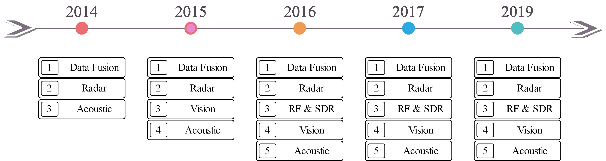
*Caption/Context: IEEE AESS SYSTEMS MAGAZINE 5 | Fig. 3: Evolution of UAS Detection Technologies*

![To utilize the spectrum patterns of UAS, in [40], an Artificial Neural Networks (ANN) detection algorithm for a UAS RF signal was proposed which employs three signal features: improved slope, improved skewness, and improved kurtosis. It was shown that the proposed algorithm based on ANN outperforms other recognition technologies of the improved slope, skewness, and kurtosis of signal spectrum. | RF spectral](images/page_005_fig_02.jpeg)
*Caption/Context: To utilize the spectrum patterns of UAS, in [40], an Artificial Neural Networks (ANN) detection algorithm for a UAS RF signal was proposed which employs three signal features: improved slope, improved skewness, and improved kurtosis. It was shown that the proposed algorithm based on ANN outperforms other recognition technologies of the improved slope, skewness, and kurtosis of signal spectrum. | RF spectral*

![To utilize the spectrum patterns of UAS, in [40], an Artificial Neural Networks (ANN) detection algorithm for a UAS RF signal was proposed which employs three signal features: improved slope, improved skewness, and improved kurtosis. It was shown that the proposed algorithm based on ANN outperforms other recognition technologies of the improved slope, skewness, and kurtosis of signal spectrum. | RF spectral](images/page_005_fig_03.jpeg)
*Caption/Context: To utilize the spectrum patterns of UAS, in [40], an Artificial Neural Networks (ANN) detection algorithm for a UAS RF signal was proposed which employs three signal features: improved slope, improved skewness, and improved kurtosis. It was shown that the proposed algorithm based on ANN outperforms other recognition technologies of the improved slope, skewness, and kurtosis of signal spectrum. | RF spectral*

![UAS usually maintain at least one Radio Frequency (RF) communication data link to its remote controller to either receive control commands or deliver aerial images. In this case, the spectral patterns of such transmission are used as an important evidence for the detection and localization of UAS. Different passive RF technologies are shown in Fig. 4. In most cases, Software Defined Radio (SDR) receivers are employed to intercept the RF channels. | To utilize the spectrum patterns of UAS, in [40], an Artificial Neural Networks (ANN) detection algorithm for a UAS RF signal was proposed which employs three signal features: improved slope, improved skewness, and improved kurtosis. It was shown that the proposed algorithm based on ANN outperforms other recognition technologies of the improved slope, skewness, and kurtosis of signal spectrum.](images/page_005_fig_04.jpeg)
*Caption/Context: UAS usually maintain at least one Radio Frequency (RF) communication data link to its remote controller to either receive control commands or deliver aerial images. In this case, the spectral patterns of such transmission are used as an important evidence for the detection and localization of UAS. Different passive RF technologies are shown in Fig. 4. In most cases, Software Defined Radio (SDR) receivers are employed to intercept the RF channels. | To utilize the spectrum patterns of UAS, in [40], an Artificial Neural Networks (ANN) detection algorithm for a UAS RF signal was proposed which employs three signal features: improved slope, improved skewness, and improved kurtosis. It was shown that the proposed algorithm based on ANN outperforms other recognition technologies of the improved slope, skewness, and kurtosis of signal spectrum.*

![To utilize the spectrum patterns of UAS, in [40], an Artificial Neural Networks (ANN) detection algorithm for a UAS RF signal was proposed which employs three signal features: improved slope, improved skewness, and improved kurtosis. It was shown that the proposed algorithm based on ANN outperforms other recognition technologies of the improved slope, skewness, and kurtosis of signal spectrum. | RF spectral](images/page_005_fig_05.jpeg)
*Caption/Context: To utilize the spectrum patterns of UAS, in [40], an Artificial Neural Networks (ANN) detection algorithm for a UAS RF signal was proposed which employs three signal features: improved slope, improved skewness, and improved kurtosis. It was shown that the proposed algorithm based on ANN outperforms other recognition technologies of the improved slope, skewness, and kurtosis of signal spectrum. | RF spectral*

## --- Page 6 ---

### 📌 Section: III-D Radar based UAS Detection

IEEE AESS SYSTEMS MAGAZINE
6

the methods of image segmentation. The differential of UAS
and environment in images is used to determine whether the
restricted areas have the UAS. A vision based UAS detection
approach is presented in [47], which could separate the UAS
from background efficiently. Similar work was reported in [48]
and [16]. The common challenges for their approaches are
how to separate UAS from background images and how to
distinguish UAS from flying birds. Typical vision-based UAS
detection technologies are summarized in Figure 5.

In contrast, state-of-art image segmentation methods make
use of neural networks to directly identify the appearance of
UAS. An approach leverages the thermal camera to detect
the UAS and neural network to identify the UAS [49]. An
outstanding research is presented in [50]. A lightweight and
fast algorithm which could operate on embedded system
(Nvidia Jetson TX1) and identify the UAS in movement.

A real-time vision based UAS detection system is designed
which is based on two vision processing platforms: FPGA-
based platform, which can operate below 10 Watt (i.e., power
saving), and Graphics Processing Unit (GPU)-based platform,
which is able to process more frames. However, for FPGA, it is
impossible to change algorithms in real time [51]. Muhammad,
S. et al. compared different convolutional neural networks’
performance in detecting UAS, and their results showed that
the Visual Geometry Group (VGG 16) network with Faster
R-CNN achieved outstanding performance [52]. An approach
is proposed to combine different pictures to generate synthetic
images to extend the image data set to train the convolutional
neural network to enhance the performance of the UAS
detection [53].

Moving object 
segmentation

Optical Vision

Object 
identification

Infared image

patterns

Video 
cameras

Infrared 
cameras

Fig. 5: Categorization of vision based approaches

Birds are a serious factor which downgrades the identifica-
tion of UAS from the images. Significant research efforts have
been made to use convolutional neural networks to enhance the
identification of UAS. Survey about the challenges of detection
of UAS and birds is presented in [54]. The survey concluded
that the neural network algorithms are promising in identifying
UAS and birds. It compared policy based approaches and neu-
ral network based algorithms for the recognition of birds and
UAS using datasets of videos and pictures. The results showed
that the neural network based approaches can outperform the
policy based approaches over 100 times in terms of accuracy
and efficiency. An UAS detection framework is presented in
[55], which is based on video streams and classified the objects
into different types with convolutional neural network. The

work mainly focused on distinguishing the birds and UAS in
different scenarios.

At the same time, some attempts were made to apply
infrared cameras to identify the UAS. Infrared sensors are
leveraged to detect small variations of UAS in heat to identify
the UAS. The drawback of this approach is that the heat
from batteries has significant effects on result detection [56].
Different from other research on classifying the frame of
images, dynamic vision sensors are applied to capture the
rotating frequency of the propeller to distinguish the UAS from
birds efficiently [57].

Currently, the vision based approaches can be implemented
in some specific scenarios to recognize the features of UAS
from the environment. The evolution of deep neural networks
stimulated the processing of image processing which could
have multiple positive effects on the UAS detection in vision
field. The real time attempts showed that the vision approaches
have the potentials of efficiency. However, how to implement
the recognized algorithms in multiple and variable environ-
ments is challenging. The novel approaches are supposed to
be robust, adjustable, and precise. The vision based approaches
need to be robust to the quick variation of the environment.
The image distortion caused by weather change could be
mitigated by the multiple level image processors which capture
the features of UAS in different spectrum. The mobility of
UAS poses a challenge to the vision based approaches, i.e.,
the images are supposed to be captured and recognized in
different levels of mobility of UAS. The bio-inspired robots
are limited in the detection accuracy, which poses the risk of
distinguishing of UAS and birds mistakenly. The enhanced
accuracy of the distinguishing can improve the efficiency of
UAS detection and mitigation greatly.

D. Radar based UAS Detection

Radars have several advantages in detecting airborne objects
compared with other sensors in terms of day and night oper-
ating capability, weather independency, and ability to measure
range and velocity simultaneously. However, regular radar
systems focus on fighting air targets of medium and large
size with Radar Cross-Section (RCS) larger than 1 m2, which
makes it infeasible to detect small-size and low-speed UAS
in [18] and [58]. It is difficult to detect UAS due to slow
speed, since Doppler processing is typically used. Therefore,
efforts are in needed to either develop new radar models
or increase the detective resolution of conventional systems.
In this section, we will discuss three categories of radar
based UAS detection technologies: Active detection, passive
detection and posterior signal processing.

1) Active Detection: Typically, there are two ways to in-
crease the resolution of conventional radar detection systems
for UAS surveillance: utilizing higher frequency carriers and
using Multiple Input Multiple Output (MIMO) beamforming
radio front-ends.

To utilize shorter wave length, in [59] and [60], X-band
and W-band Frequency Modulated Continuous Wave (FMCW)
radars are designed for UAS detection. Their solutions use bi-
static antenna and finally convert received signals into digital

![A real-time vision based UAS detection system is designed which is based on two vision processing platforms: FPGA- based platform, which can operate below 10 Watt (i.e., power saving), and Graphics Processing Unit (GPU)-based platform, which is able to process more frames. However, for FPGA, it is impossible to change algorithms in real time [51]. Muhammad, S. et al. compared different convolutional neural networks’ performance in detecting UAS, and their results showed that the Visual Geometry Group (VGG 16) network with Faster R-CNN achieved outstanding performance [52]. An approach is proposed to combine different pictures to generate synthetic images to extend the image data set to train the convolutional neural network to enhance the performance of the UAS detection [53]. | Optical Vision](images/page_006_fig_01.jpeg)
*Caption/Context: A real-time vision based UAS detection system is designed which is based on two vision processing platforms: FPGA- based platform, which can operate below 10 Watt (i.e., power saving), and Graphics Processing Unit (GPU)-based platform, which is able to process more frames. However, for FPGA, it is impossible to change algorithms in real time [51]. Muhammad, S. et al. compared different convolutional neural networks’ performance in detecting UAS, and their results showed that the Visual Geometry Group (VGG 16) network with Faster R-CNN achieved outstanding performance [52]. An approach is proposed to combine different pictures to generate synthetic images to extend the image data set to train the convolutional neural network to enhance the performance of the UAS detection [53]. | Optical Vision*

![A real-time vision based UAS detection system is designed which is based on two vision processing platforms: FPGA- based platform, which can operate below 10 Watt (i.e., power saving), and Graphics Processing Unit (GPU)-based platform, which is able to process more frames. However, for FPGA, it is impossible to change algorithms in real time [51]. Muhammad, S. et al. compared different convolutional neural networks’ performance in detecting UAS, and their results showed that the Visual Geometry Group (VGG 16) network with Faster R-CNN achieved outstanding performance [52]. An approach is proposed to combine different pictures to generate synthetic images to extend the image data set to train the convolutional neural network to enhance the performance of the UAS detection [53]. | Optical Vision](images/page_006_fig_04.jpeg)
*Caption/Context: A real-time vision based UAS detection system is designed which is based on two vision processing platforms: FPGA- based platform, which can operate below 10 Watt (i.e., power saving), and Graphics Processing Unit (GPU)-based platform, which is able to process more frames. However, for FPGA, it is impossible to change algorithms in real time [51]. Muhammad, S. et al. compared different convolutional neural networks’ performance in detecting UAS, and their results showed that the Visual Geometry Group (VGG 16) network with Faster R-CNN achieved outstanding performance [52]. An approach is proposed to combine different pictures to generate synthetic images to extend the image data set to train the convolutional neural network to enhance the performance of the UAS detection [53]. | Optical Vision*

![A real-time vision based UAS detection system is designed which is based on two vision processing platforms: FPGA- based platform, which can operate below 10 Watt (i.e., power saving), and Graphics Processing Unit (GPU)-based platform, which is able to process more frames. However, for FPGA, it is impossible to change algorithms in real time [51]. Muhammad, S. et al. compared different convolutional neural networks’ performance in detecting UAS, and their results showed that the Visual Geometry Group (VGG 16) network with Faster R-CNN achieved outstanding performance [52]. An approach is proposed to combine different pictures to generate synthetic images to extend the image data set to train the convolutional neural network to enhance the performance of the UAS detection [53]. | Moving object  segmentation](images/page_006_fig_05.jpeg)
*Caption/Context: A real-time vision based UAS detection system is designed which is based on two vision processing platforms: FPGA- based platform, which can operate below 10 Watt (i.e., power saving), and Graphics Processing Unit (GPU)-based platform, which is able to process more frames. However, for FPGA, it is impossible to change algorithms in real time [51]. Muhammad, S. et al. compared different convolutional neural networks’ performance in detecting UAS, and their results showed that the Visual Geometry Group (VGG 16) network with Faster R-CNN achieved outstanding performance [52]. An approach is proposed to combine different pictures to generate synthetic images to extend the image data set to train the convolutional neural network to enhance the performance of the UAS detection [53]. | Moving object  segmentation*

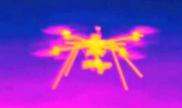
*Caption/Context: Moving object  segmentation | Optical Vision*

## --- Page 7 ---

### 📌 Section: III-D2 Passive Radar

IEEE AESS SYSTEMS MAGAZINE
7

Long wave

Millimeter wave

Micro-Doppler

effect
Active

radar

Body reflectant

pattern

Wave length
Technical 
background

Typical 
signals

Fig. 6: Categorization of active radar based approaches

quadrature stream for posterior processing. The feasibility of
using Ultra Wide Band (UWB) signals with 24GHz carrier
was demonstrated in [61]. The selection of carrier frequency
for UAS detection radar should be higher than 6GHz (K-band)
in [62] and [63].

Other approaches utilize multiple antennas to form MIMO
front-ends. The benefit of such approach lies in its applicability
to radar system with lower carrier frequencies. [64] demon-
strated the detection of a small hexacopter using 32 by 8
element L-Band receiver array, which achieved good detection
sensitivity against micro-UAS. Similar research was presented
in [65], a ubiquitous FMCW radar system working at 8.75
GHz (X-band) with PC-based signal processor is presented.
The results indicated that it has the capability to detect a
micro-UAS at a range of 2 km with an excellent range-speed
association. In [66] a Ka-band radar system which uses 16
transmit and 16 receive antennas to form 256 virtual antenna
elements is presented. Their experiment proves that even in a
non stationary clutter environment, the UAS could be clearly
detected at a range of about 150m. Similar work was presented
in [67]. Another important characteristic of MIMO systems is
that they generate large quantity of data for further processing
in [68]. The authors use the concept of data cube and classifier
to assure the presence and location on an incoming UAS. A
simplified approach, Multiple Input Single Output (MISO),
was utilized for UAS detection in [69].

Noise radar is considered to be an efficient way to detect
the slow moving UAS and its benefit is that UAS can be
detected by using simple antenna components and lower
carrier frequency. In [70] and [71], the feasibility of using
random sequence radar for UAS detection was demonstrated
in sub X-band, and their results indicate that such radar can
be the future of cost-efficient UAS detection solutions.

The advances in computation enable another radar, the SDR
based multi-mode radar [72]. Such radar is small-size and
highly configurable. However, the operational performance of
SDR relies highly on the back-end processor. In [73], two
different implementations of FMCW radar and an implemen-
tation of continuous wave noise radar are presented to test
their feasibility for UAS detection. And their findings indicate
that the analog implementation has higher updating rate and
Signal Noise Ratio (SNR).

The apparent drawback of active radars is that they need
specially designed transmitters which might not be easy to
deploy and are vulnerable to anti-radioactive attacks.

2) Passive Radar: Passive radars do not require specially
designed transmitter. Existing radioactive sources such as
cellular signals can be leveraged to illuminate the space. In

this subsection, we classify passive radars into two categories:
single station passive radar and distributed synthetic passive
radar, as shown in Figure 7.

Passive

Radar

Single station

Disributed 
Cellular signal

illuminated

WiFi signal

illuminated

Micro-Doppler

effect

DVB signal 
illuminated

Fig. 7: Categorization of passive radar based approaches

• Single station passive radar:
This type of passive radar exploits only one illumination
source. The variation of received signals can be analyzed
to specify the appearance of UAS. In [74], a WiFi based
passive radar was presented for the detection and 2D
localization of small aircraft. Obviously this is the most
direct adaptation of active radars.

• Distributed synthetic passive radar
Distributed station leverages the existing telecommunica-
tion infrastructures as illumination sources to enhance the
UAS detection. There are mainly two approaches: cellular
system based solutions and Digital Video Broadcasting
(DVB) system based solutions.

– Cellular system based passive radars: An approach

is proposed to enhance the detection system which
could locate and track the UAS by using reflected
Global System for Mobile communications (GSM)
signal [75]. An approach is proposed to receive the
3G cellular reflecting signal from UAS for track
UAS. He leveraged the Doppler features of 3G
cellular signal to monitor the target area and tracked
the trajectory of UAS. The results showed that UAS
could be tracked obviously in the waterfall data. The
drawback of this approach is that it needs a reference
receiver to calibrate the received signal. The accuracy
of detection is dependent on the calibration accuracy
seriously [76]. 5G mm-wave radar deployment in-
frastructure is constructed to detect amateur UAS.
The deployed radars capture the signal of amateur
UAS and upload it to cloud which could analyze
whether there exist hazards. This approach could be
an excellent approach in protecting safety of the city
if the challenges of resource management, Non-Line
Of Sight (NLOS) radar operation, noise mitigation
and big data management could be addressed [77].
Similar implementation was presented in [78], where
a passive radar array system is proposed to receive
and process the Orthogonal Frequency Division Mul-
tiplexing (OFDM) echoes of UAS, which is origi-
nally transmitted by the nearby base stations.
– Digital video broadcasting system based passive

radars: The pervasive digital television signals are
considered as an efficient illumination source for
passive drone detection radars. In [79], [80] and [81],
passive drone detection radars were designed and

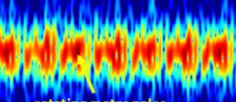
*Caption/Context: IEEE AESS SYSTEMS MAGAZINE 7 | Millimeter wave*

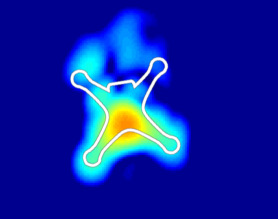
*Caption/Context: IEEE AESS SYSTEMS MAGAZINE 7 | Long wave*

*Caption/Context: IEEE AESS SYSTEMS MAGAZINE 7 | Long wave*

## --- Page 8 ---

### 📌 Section: III-D3 Posterior Signal Processing

IEEE AESS SYSTEMS MAGAZINE
8

tested.
Similar to active radar approaches, the micro-Doppler effect
could be employed. In [82], UAS classification tests were
conducted through propeller-driven micro Doppler signature
and machine learning. Their experiment reveals that the micro
Doppler signature of a plastic propeller is much less visible
than carbon fiber propeller.

An apparent drawback for passive radar is that large amount
of post processing efforts or multiple receivers are needed to
achieve acceptable detection accuracy.

3) Posterior Signal Processing: In UAS detection, efforts
are needed to derive weak and sparse reflection signals of
targets from noisy output of RF front-ends. Researches in
this domain can be classified into two categories: conven-
tional signal feature based detection and learning-based pattern
recognition. The general categorization of radar signal is given
in Figure 8.

Radar signal 
Micro-doppler feature

Pulse-distance data cube
Signal features

Range-velocity map

Decision classifier

Fig. 8: Categorization of radar signal processing.

1) Signal feature based detection
The micro-Doppler effect of propellers of UAS are
proved to be a useful feature of UAS detection. In [83]
and [84] methods for estimation of small-size UAS are
discussed, with focus on the micro-Doppler signatures of
rotating rotor blades. Their experiments proved that such
feature can be used to distinguish UAS from other flying
objects. In [85], a method based on hough transform
was proposed to improve the detection and tracking
performance. By making use of the linear distributed
micro Doppler features, the method is able to detect and
recognize UAS simultaneously. The micro-Doppler ef-
fect caused by flying UAS can also be used for detection
of multiple UAS in [86], where the time–frequency spec-
trogram is converted into the Cadence-Velocity Diagram
(CVD). And then the Cadence Frequency Spectrum
(CFS), as the basis of training data from each class,
is extracted from CVD. K-means classifier is used to
recognize the component of multiple micro–UAS based
on the CFS. Their experimental results on real radar data
demonstrated that their method is capable of handling
multiple UAS with satisfactory classification accuracy.
2) Learning based pattern recognition
Learning based pattern recognition methods is capable
of classifying various types of objects. An example
of conventional classification methods was presented
in [87]. This research demonstrated a classification
experiment of UAS versus non-UAS tracks, based on
a mixture of bird, aircraft and simulated UAS tracks,
which is mainly based on the statistical features of the
tracks and yields a high accuracy rate. Neural network
based methods employ deep learning techniques to au-

tomate the feature engineering process of conventional
machine learning. In [88], the UAS detection is carried
by a CNN which learns the characteristic features in
the 2D distribution of the Doppler spectrogram with
high classification accuracy. In [89], the Deep Belief
Networks (DBN) are applied to characterize the features
embodied by generated Spectral Correlation Functions
(SCF) patterns to detect and identify different types of
UAS automatically. The results of experiment illustrate
that the proposed system is able to detect and classify
micro UAS effectively. The validation of their approach
using cognitive radio is given in [90]. The benefit of
learning based pattern recognition approach is that such
systems are programmable and trainable to adapt to
various scenarios.
Radar based UAS detection can achieve better detection per-
formance than the current other sensors. The antennas and
signal processors were always considered as expensive options
for the implementations. Though radar based approaches can
achieve the better performance of the UAS detection (Long
distance and Short distance), their cost is high in terms of
deployment, calibration and maintenance. The manipulation
of the radar based approaches requires the technicians to
have the relative background of radar operations which poses
a significant challenge to ubiquity in a large scale. The
light, energy-saving, affordable and easy assembling radar
element is desired which is supposed to be capable of easy
deployment and maintenance. The posterior signal processing
algorithms fueled by machine learning show great potentials
to improve the efficiency and the accuracy of UAS detection.
The improved capacity of reduced overhead of portable signal
processing algorithms can expand the implementations of
radar based UAS detection.

E. Data-fusion-based UAS Detection

Data fusion, which is the process of integrating multiple
data sources to produce more consistent, accurate, and useful
information than that provided by any individual data source,
has the potential to generate fused data which is more infor-
mative and synthetic than the original inputs. The data fusion
approaches can leverage the advantages of each method to
acquire a combined result that is more robust, accurate and
efficient than the single approaches. For the UAS detection,
data fusion can be used to improve the performance of the
UAS detection system to overcome the disadvantages of the
single approach which exist in some specific scenarios.

Based on the above discussion, the disadvantages and the
advantages of each approach have been presented. The first
general problem of the single approach is that limitation of the
detection range and accuracy. The second general problem of
the single approach is the vulnerability to detection scenarios.
The third general problem of the single approach is the
efficiency of the computation. Based on the above general
problems, the research on the data fusion based UAS detection
(shown as Fig.9), can be classified into three categories: 1)
Multiple-Sensor Data Fusion; 2) Multiple-Type Sensor Data
Fusion; 3) Multiple Sensing Algorithm Fusion.

## --- Page 9 ---

IEEE AESS SYSTEMS MAGAZINE
9

Data Fusion Based UAS Detection

Multiple Sensors Fusion
Multiple Type Sensors Fusion
Multiple Sensing Algorithms Fusion

Performance

Scenarios
Algorithm 
#1

Algorithm 
#2

Algorithm 
#3
Fig. 9: Data fusion based UAS detection

1) Multiple-Sensor Data Fusion
Each type of sensors have their own advantages and
disadvantages in the UAS detection scenarios. The
general problem of the single approach is the limited
detection range. The more straight and efficient approach
to improve the performance of the single approach
is designing a specific type of sensors to avoid the
drawbacks of nature materials.
A classical example is acoustic sensor array. Distributed
acoustic sensors are deployed in the detection areas.
Each sensor can record the audio and deliver the record
to the ground stations to make a combination evaluation
of the environment in sound spectrum [91]. The re-
searchers extracted the phrase difference in the sound to
locate the UAS. In the signal processing, the researchers
need to adjust the weight of each sensor to obtain
the higher accuracy of the location. Apart from the
accuracy of detection, the data fusion can improve the
functions of UAS detection. The RF based detection can
acquire the RF signal with omni-directional antennas.
The researchers could adjust the detection phrase of
the signals in the receiving processing with multiple
omni-directional antennas. Thereafter, the system with
omni-directional antennas could acquire signals in the
specific direction [17], [92]. This function could enable
the ground stations to track trajectories of UAS and
determine whether the UAS has the malicious intentions.
The combined function also could enlarge the range of
UAS detection which can not be gained by the single an-
tenna. The multiple sensor approaches combine multiple
sensors with the same type to obtain the better accuracy
or additional functions to improve the performance of
the UAS detection. The combination of the multiple
sensors extends the capacity of the single sensor and
maximize the range of detection geographically.
2) Multiple-Type Sensor Data Fusion
In some scenarios, the improvement on the amount can
not mitigate the disadvantages of the single sensors.
Different UAS detection approaches are tested in [48].
The acoustic sensors are sensitive to the humidity, the
temperature and the vibration in the environment. The
cameras are invalid when the sunlight project on the
lens directly. And the RF antennas are hard to recog-
nize the target signal when it is buried in the white
Gaussian noise environment. More specifications can
be found in [48]. They concluded that the fusion of
acoustic and radar could give more precise detection

than other approaches. The conventional single sensors
can not achieve outstanding performance on a variable
environment, and meet multiple requirements of UAS
detection ranges.
Concurrently, the cost of developing high quality func-
tional sensors is prohibitively high. The researchers
resort to the combination of different types of sen-
sors. Based on the disadvantages and the advantages
of each type of sensors, the researchers could combine
different types of sensors to achieve the accuracy and
long distance detection. Long and short range detec-
tion technologies are combined, where the passive RF
receivers detect UAS’s telemetry signals while video
and acoustic sensors are used to increase the detection
accuracy in the near field. Different range sensor systems
including acoustic, optic and radars are integrated for
UAS detection in target area. They deployed a 120-
node acoustic array which use acoustic camera to locate
and track the UAS, and 16 high revolution optical
cameras to detect the UAS in the middle distance. In
the long distance, they adopted MIMO radar to operate
3 different band radars to achieve remote detection [93].
The resulting combination overcomes the drawbacks of
each type of sensors on the UAS detection and maximize
the advantages of each type of sensors. Simultaneously,
the combination reduced the cost of deploying sensors
in a large scale. In [93], the deployment of cameras
can meet the middle distance detection requirement and
reduce the cost on the deployment of acoustic sensors
and radars.
The combination of different types of sensors could
achieve an outstanding performance for the restricted
areas. However, the deployment and the configura-
tion of this approach require much more specific and
professional technologies and technicians with related
backgrounds to maintenance. The different type sensor
combination is a promising approach to maximize the
capacity of sensors in the physical levels. In the fu-
ture, investigation should be focused on exploring more
combinations and characteristics of different sensors for
more robust, affordable solutions.
3) Multiple Sensing Algorithm Fusion
The conventional approaches of data fusion fuse multi-
ple data acquired from the sensors. Many data fusion ap-
proaches had maximized the capacity of sensors greatly.
However, for UAS detection, the efficiency and the
accuracy still can not meet the requirement. The novel
approaches are needed to combine the multiple sensing
algorithms to achieve the efficiency and the accuracy
required by UAS detection. The sensing algorithms
could be triggered according to the status of detection.
The activated sensors deliver the information to the
ground stations. Thereafter, the ground stations set the
status of the detection, and the relevant algorithms will
be swapped into the processing to extract the features of
the target information. The UAS detection system will
generate the threat outcome according to the result of
sensing algorithms.

## --- Page 10 ---

### 📌 Section: IV State of the Art Mitigation

IEEE AESS SYSTEMS MAGAZINE
10

In this part, the sensing algorithms receive the data
delivered from the sensors and extract the target features
according to the types of sensors. The UAS detection
system can adjust the sensing algorithm accuracy to meet
the requirement of detection once the abnormal signals
are detected. In [91], the researchers leverage the unsu-
pervised approaches to extract the features of signal from
various acoustic sensors under different scenarios (bird,
airplanes, thunderstorm, rain, wind and UAS). Based on
the recognition of scenarios, the system, proposed in
this research, triggers support vector machine (SVM)
and K Nearest Neighbor (KNN), separately, to detect
the amateur drones in the restricted areas. To achieve
the tracking efficiency, the authors, in [94], [95], [96],
[97], implemented multiple sensing algorithms on the
passive mm-wave radar system to achieve the different
accuracy of tracking according to the requirement of the
recognition.
The combination of the multiple sensing algorithms
could achieve advantages of the efficiency, the accuracy,
less overhead of system and etc. according to the re-
quirement of the UAS detection. However, how to make
a reasonable arrangement for the sensing algorithms still
needs more efforts. And the reasonable schedules of
sensing algorithms can be a stimulation for the UAS
detection system in the future.
Other data fusion schemes can be based on different plat-
form integration. The researchers deploy multiple sensors into
different platforms to leverage the mobility of different plat-
forms, thus maximizing the sensors’ capacities. The authors
deployed the cameras on the surveillance UAS to make sure
the amateur drones entering the restricted areas after the
deployed acoustic sensors, in the sensing areas, send alarms to
the ground stations [98]. In this research, they could recognize
different targets such as birds.

The data fusion approaches combine the advantages of
each approach in the detection. The attempts show that the
data fusion approaches have obvious advantages compared
with single methods. According to the characteristics of each
type of approaches, the detection deployment could contain
multiple schemes in different areas which is apart from the
center restricted areas in distance differently. Thereafter, how
to implement the data fusion algorithms to achieve the con-
sistency of the detection system on the results will be next
challenge. Another challenge of the data fusion approaches
is how to balance the weight of each approach in the final
decision to achieve optimal detection results.

The distinction of “capture and retrieve”and “disable and
drop”is important. Most malicious UAS are captured by the
defenders with physical capture, Directional EMP, RF jam-
ming and Hacking. However, only the technologies of RF
jamming and hacking can realize the function of retrieve.
The retrieve function is supposed to be robust, accurate and
efficient. The defenders are supposed to be confident that their
systems have high probabilities of retrieving the malicious
UAS again with protection of the property and the public. For
the “disable and drop”, only the physical capture methods just
drop the UAS from the flight. The technologies of Directional

EMP, RF jamming and hacking have the both capacities of
disabling and dropping. The Directional EMP, RF jamming
and hacking can disable the UAS sensors, circuit, control
system and communication devices to disable the control from
remote attackers. However, these technologies can go deeper,
like damaging control circuit and control algorithms, that can
drop the UAS from the flight directly.

#### IV. STATE OF THE ART MITIGATION

The technologies of detection and mitigation are still im-
mature. The research on UAS mitigation is limited. David
etc. [99] developed an architecture of UAS defense system.
In this architecture, they specified the effective engagement
range, including initial target range, detection range and
neutralization range which is dominant for response. And
their report showed that when the range is over 4,000 feet,
the hardware based reaction and neutralization could operate
efficiently. Based on the architecture, the approaches could be
classified into three main categories, as shown in Fig. 10. The
first one is the physical capture which focuses on capturing
UAS with physical methods. The second is to leverage the
noise generator to jam the systems or sensors, thus rendering
the UAS inoperable by the UAS controller. The third is to
exploit vulnerabilities of system or sensors to acquire priority
of control.

Physical Capture
Jamming
Vulnerabilities

#### UAS Negation

Categories

Fig. 10: Categories of UAS Negation

A. Physical Capture

1) Nets capture
Net capture is a physical method to negate the UAS.
The defenders adopt guns or some specific weapons to
trigger the net to catch UAS. The net is stretched when
the net is shot, and closed to disable the mobility of
drone when the net touches the drone. Kilian etc. [100]
invented a deployable net capture system which could
be installed in the airplane or authenticated UAS. When
the unauthorized or unsafe UAS are located, the system
could capture the unauthorized or unsafe UAS. Practical
approaches to neutralize UAS are attracting attentions
of the military. In [20], a spin launched UAS projectile
is developed. This projectile aims to launch a net to
capture a flying UAS. The net is stored in the warhead
of projectile which allow soldiers to shoot it by regular
guns.
2) Directional Electromagnetic Pulse
Electromagnetic pulses have been mainly used to
counter illegal electronic facilities in the car which could

![The data fusion approaches combine the advantages of each approach in the detection. The attempts show that the data fusion approaches have obvious advantages compared with single methods. According to the characteristics of each type of approaches, the detection deployment could contain multiple schemes in different areas which is apart from the center restricted areas in distance differently. Thereafter, how to implement the data fusion algorithms to achieve the con- sistency of the detection system on the results will be next challenge. Another challenge of the data fusion approaches is how to balance the weight of each approach in the final decision to achieve optimal detection results. | The technologies of detection and mitigation are still im- mature. The research on UAS mitigation is limited. David etc. [99] developed an architecture of UAS defense system. In this architecture, they specified the effective engagement range, including initial target range, detection range and neutralization range which is dominant for response. And their report showed that when the range is over 4,000 feet, the hardware based reaction and neutralization could operate efficiently. Based on the architecture, the approaches could be classified into three main categories, as shown in Fig. 10. The first one is the physical capture which focuses on capturing UAS with physical methods. The second is to leverage the noise generator to jam the systems or sensors, thus rendering the UAS inoperable by the UAS controller. The third is to exploit vulnerabilities of system or sensors to acquire priority of control.](images/page_010_fig_01.png)
*Caption/Context: The data fusion approaches combine the advantages of each approach in the detection. The attempts show that the data fusion approaches have obvious advantages compared with single methods. According to the characteristics of each type of approaches, the detection deployment could contain multiple schemes in different areas which is apart from the center restricted areas in distance differently. Thereafter, how to implement the data fusion algorithms to achieve the con- sistency of the detection system on the results will be next challenge. Another challenge of the data fusion approaches is how to balance the weight of each approach in the final decision to achieve optimal detection results. | The technologies of detection and mitigation are still im- mature. The research on UAS mitigation is limited. David etc. [99] developed an architecture of UAS defense system. In this architecture, they specified the effective engagement range, including initial target range, detection range and neutralization range which is dominant for response. And their report showed that when the range is over 4,000 feet, the hardware based reaction and neutralization could operate efficiently. Based on the architecture, the approaches could be classified into three main categories, as shown in Fig. 10. The first one is the physical capture which focuses on capturing UAS with physical methods. The second is to leverage the noise generator to jam the systems or sensors, thus rendering the UAS inoperable by the UAS controller. The third is to exploit vulnerabilities of system or sensors to acquire priority of control.*

![The data fusion approaches combine the advantages of each approach in the detection. The attempts show that the data fusion approaches have obvious advantages compared with single methods. According to the characteristics of each type of approaches, the detection deployment could contain multiple schemes in different areas which is apart from the center restricted areas in distance differently. Thereafter, how to implement the data fusion algorithms to achieve the con- sistency of the detection system on the results will be next challenge. Another challenge of the data fusion approaches is how to balance the weight of each approach in the final decision to achieve optimal detection results. | The technologies of detection and mitigation are still im- mature. The research on UAS mitigation is limited. David etc. [99] developed an architecture of UAS defense system. In this architecture, they specified the effective engagement range, including initial target range, detection range and neutralization range which is dominant for response. And their report showed that when the range is over 4,000 feet, the hardware based reaction and neutralization could operate efficiently. Based on the architecture, the approaches could be classified into three main categories, as shown in Fig. 10. The first one is the physical capture which focuses on capturing UAS with physical methods. The second is to leverage the noise generator to jam the systems or sensors, thus rendering the UAS inoperable by the UAS controller. The third is to exploit vulnerabilities of system or sensors to acquire priority of control.](images/page_010_fig_02.png)
*Caption/Context: The data fusion approaches combine the advantages of each approach in the detection. The attempts show that the data fusion approaches have obvious advantages compared with single methods. According to the characteristics of each type of approaches, the detection deployment could contain multiple schemes in different areas which is apart from the center restricted areas in distance differently. Thereafter, how to implement the data fusion algorithms to achieve the con- sistency of the detection system on the results will be next challenge. Another challenge of the data fusion approaches is how to balance the weight of each approach in the final decision to achieve optimal detection results. | The technologies of detection and mitigation are still im- mature. The research on UAS mitigation is limited. David etc. [99] developed an architecture of UAS defense system. In this architecture, they specified the effective engagement range, including initial target range, detection range and neutralization range which is dominant for response. And their report showed that when the range is over 4,000 feet, the hardware based reaction and neutralization could operate efficiently. Based on the architecture, the approaches could be classified into three main categories, as shown in Fig. 10. The first one is the physical capture which focuses on capturing UAS with physical methods. The second is to leverage the noise generator to jam the systems or sensors, thus rendering the UAS inoperable by the UAS controller. The third is to exploit vulnerabilities of system or sensors to acquire priority of control.*

![The data fusion approaches combine the advantages of each approach in the detection. The attempts show that the data fusion approaches have obvious advantages compared with single methods. According to the characteristics of each type of approaches, the detection deployment could contain multiple schemes in different areas which is apart from the center restricted areas in distance differently. Thereafter, how to implement the data fusion algorithms to achieve the con- sistency of the detection system on the results will be next challenge. Another challenge of the data fusion approaches is how to balance the weight of each approach in the final decision to achieve optimal detection results. | The technologies of detection and mitigation are still im- mature. The research on UAS mitigation is limited. David etc. [99] developed an architecture of UAS defense system. In this architecture, they specified the effective engagement range, including initial target range, detection range and neutralization range which is dominant for response. And their report showed that when the range is over 4,000 feet, the hardware based reaction and neutralization could operate efficiently. Based on the architecture, the approaches could be classified into three main categories, as shown in Fig. 10. The first one is the physical capture which focuses on capturing UAS with physical methods. The second is to leverage the noise generator to jam the systems or sensors, thus rendering the UAS inoperable by the UAS controller. The third is to exploit vulnerabilities of system or sensors to acquire priority of control.](images/page_010_fig_03.jpeg)
*Caption/Context: The data fusion approaches combine the advantages of each approach in the detection. The attempts show that the data fusion approaches have obvious advantages compared with single methods. According to the characteristics of each type of approaches, the detection deployment could contain multiple schemes in different areas which is apart from the center restricted areas in distance differently. Thereafter, how to implement the data fusion algorithms to achieve the con- sistency of the detection system on the results will be next challenge. Another challenge of the data fusion approaches is how to balance the weight of each approach in the final decision to achieve optimal detection results. | The technologies of detection and mitigation are still im- mature. The research on UAS mitigation is limited. David etc. [99] developed an architecture of UAS defense system. In this architecture, they specified the effective engagement range, including initial target range, detection range and neutralization range which is dominant for response. And their report showed that when the range is over 4,000 feet, the hardware based reaction and neutralization could operate efficiently. Based on the architecture, the approaches could be classified into three main categories, as shown in Fig. 10. The first one is the physical capture which focuses on capturing UAS with physical methods. The second is to leverage the noise generator to jam the systems or sensors, thus rendering the UAS inoperable by the UAS controller. The third is to exploit vulnerabilities of system or sensors to acquire priority of control.*

## --- Page 11 ---

### 📌 Section: IV-B Jamming

IEEE AESS SYSTEMS MAGAZINE
11

Jamming Attack

#### GPS Deception

Radar Network

Jamming

#### UAV Control

System

#### UAV Sensor

Replay Attack

Black Hole

Attack

Fig. 11: Categorization of Jamming

restart or disable the operation of control system. Based
on the function of electromagnetic pulse, Gomozov
etc. [22] focus on the functional neutralization of on-
board radio electronic system on UAS, and they adopted
spatio-temporal pulse of the wavelength λ = 2.5cm to
neutralize the UAS and their results showed that their
approach could provide an aimed impact on UAS in
the range from 0.5 to 1 km and no harm to biological
protection.
The physical capture mainly focuses on disabling the mobility
of drone and control system. The physical capturing ap-
proaches have advantages of easy manipulation, light weight,
quick assembling, etc. Once the drone is captured by the
physical capturing approaches, the drone will experience dam-
ages at different levels. The physical capturing approaches are
efficient and low cost, but not friendly to pilots.

B. Jamming

Jamming is the most popular method used in neutralizing
UAS entering restricted areas. The defenders leverage noise
signal to interfere operation of UAS sensors or systems for
neutralization. In this subsection, we classify jamming into
three main categories, as shown in Fig. 11. Among these attack
methods, the main targets are UAS sensors and systems. Zhao
etc. [101] proposed an approach to leverage a team of UAS
to form an air defense radar network which could jam the
targets’ sensors. This approach could detect and negate the
unauthenticated UAS and their experimental results showed
that they could track and jam the phantom made by DJI to
leave the restrict areas, and proofed that the N UAS, in a team,
could negate at most N ×(N −1) targets. Li etc. used the direct
track deception and fusion to invade the control priority of
navigation system and trajectory control system. Based on the
GPS deception jamming theory, they leveraged the trajectory
cheating to lead the unauthenticated UAS to fly out from the
restricted areas. Their results showed that both the direct track
and the fusion track could make UAS drift off the restricted
areas. Pärlin etc. [21] proposed an approach to use the SDR
to realize a protocol-aware UAS jamming system. They used
an SDR to achieve remote controller’s signal and recognized
the communication protocol with analysis. The SDR generates
command to control the UAS to fly away restricted areas.
They compared three different approaches (Tone, Sweep and
Protocol-Aware) to evaluate the performance of their approach
which showed that the protocol-aware is more efficient than
tone and sweep jamming.

• Tone: a narrow band signal at the center of a single
channel.

• Sweep: a linear chirp swept across the entire 2.4 GHz
ISM band.

• Protocol-Aware: a signal imitating either Futaba Ad-
vanced
Spectrum
Spread
Technology
(FASST)
and
Advanced
Continuous
Channel
Shifting
Technology
(ACCST).
Li etc. [102] proposed an approach to leverage the UAS with
jammer to neutralize other UAS eavesdroppers. They used
the mobility of UAS to get close to malicious UAS and the
jammer installed on the UAs could impact the malicious UAS’
trajectories. Sliti etc. [103] presented different attacks which
focus on UAS network for neutralization.

• Jamming attack: Transmitting a jamming signal to disrupt
communications between a drone and the pilot, forcing
the drone to return to â ˘AIJhomeâ ˘A˙I location, i.e., where
it took off.

• Black hole attack: a type of denial-of-service attack which
discards the incoming or outgoing traffic of communica-
tion.

• Replay attack: a network attack that vises to maliciously
repeat a valid communication so that the communication
of the UAS could be analyzed and invaded.
Curpen etc. [104] focus on neutralizing the UAS which is
based on Long Term Evolution (LTE) network. The spectrum
analysis in two different cell networks showed that the efficient
jamming range for LTE UAS is approximated 60m. Mototolea
etc. [105] leveraged the SDR to analyze and hijack the small
UAS. In this work, the decoding protocol of DSM2 could get
the fingerprinting and pairing process. Willner [106] invented
a system which could neutralize remotely explosive UAS in a
combat zone. This system could be equipped on the ground
or installed on the authenticated UAS which transmit the
jamming signal once the target is locked. Bhattacharya etc.
[107] developed a game theoretic approach to optimize the
jamming method on the expelling the UAS attacker.

Jamming approaches can provide friendly and zero-damage
schemes to neutralize the drone entering the restricted areas.
The jamming approaches can provide the neutralizing effects
on the drones in different levels (from hardware to software).
The jamming can be deployed in a large scale and take effect
for a long time. However, the current jamming can not make
a directional effect which can be controlled by the defenders.
The effects of jamming is omni-directional which could affect
the devices in the restricted areas, and energy consuming. The
jamming needs a long time to take effects when the drone
receives enough jamming signals. In the coming future, the
jamming is supposed to be controlled, directional and quickly
reactions.

C. Vulnerabilities

There are three main methods to exploit the UAS vulnera-
bilities, as shown in Fig 12. Most vulnerabilities exploitation
work focus on GPS control using sensors and communication
protocol. The defenders leverage the spoofing methods to GPS
and control using sensors, and adopt modification and invading
to control using sensors and communication protocol. Rodday
etc. [108] demonstrated an approach to exploit the identified

## --- Page 12 ---

### 📌 Section: V Challenges in UAS Detection and Mitigation

IEEE AESS SYSTEMS MAGAZINE
12

Vulnerabilities

#### GPS

Communication

Protocol

Control Using

Sensors

Spoofing

Modification &

Invading

Fig. 12: Catergorization of Vulnerabilities

vulnerabilities of the UAS control systems and performed
Man-in-the-Middle attack to inject the control commands to
interact with the UAS. Dey etc. [109] presented cracking SDK,
reversing engineering and GPS spoofing to hijack the UAS.
They compared the DJI and Parrot drone performances under
the exploitation attack. The results showed that the DJI is more
secure than Parrot, which means that the DJI is hard to rush
into the restricted area. Chen etc. [110] analyzed the popular
altitude estimation algorithms utilized in navigation system of
UAS and proposed several effective attacks ( shown as IV-C
) to the vulnerabilities.

• KF-based Sensor Fusion
1) Maximum false data injection: modifying the cal-
culation functions of GPS and barometer measure-
ments.

• Altitude estimation based on accurate sensor noise models
1) Blocking GPS: Disable the GPS readings.
2) Modifying barometer readings: Manipulating the
barometer and inject bad data.

• First-order Low-pass filter: Inject the barometer readings
and influence the accuracy of estimation.
Esteves etc. [111] demonstrated a simulation on a locked
target to gain access to the internal sensors for neutralizing
the UAS from restricted areas. Melamed etc. filed a patent
on how to utilize the SDR with antenna array to detect the
UAS and create override signal to link of communication
to neutralize the UAS. Marty [112] presented an approach
to hijack the MAVLink protocol on the ArduPilot Mega 2.5
autopilot. Katewa etc. [113] proposed a probabilistic attack
model to neutralize the UAS which executed denial of service
attack against a subset of sensors based on Bernoulli process.
They also described the vulnerabilities on the sensors of the
UAS and strategies to negate the UAS via jamming sensors or
access control systems. Huang etc. [114] proposed a spoofing
attack based on the physical layer to utilize the angle of arrival,
distance-based path loss, and the Rician−κ factor to recognize
the UAS and source where the signal comes from.

Penetrating vulnerabilities of system has affected the pro-
cessing of security in computer field for a long time. The

evolution of the amateur drones enables the drones have their
own Operation System (OS) which gives the defenders a
great chance to exploit the system via the vulnerabilities of
OS. The integration of embedded system and sensors extends
the vulnerabilities of the OS of drones. The vulnerabilities
releasing of the OS for the drones could improve the success
of exploit the unauthorized drones with malicious intentions
in the future.

For the deployment of detection technologies, the deploy-
ment decides the capacity of each type of approach signifi-
cantly. According to the nature of sensors, the deployment on
ground based stations, UAS or manned aircraft are varying.
The acoustic sensors are sensitive to the sound which needs
the environment noise keeps stable and quiet. This means the
acoustic sensors are not suitable for the mobile platforms. The
passive RF based detection has specific requirement of the
antennas distance between each other which is important to
achieve accurate result for passive RF signal detection. The
passive RF based detection needs the platform have powerful
computation capacity which are just for the ground based
stations and manned aircraft. The current UAS can not provide
suitable computation and power supply. The vision based
detection can be deployed on the ground based stations, UAS
and manned aircraft. The key sensor of vision based detection
are mainly cameras. Meanwhile, a number of light weight, low
energy consumption cameras are suitable for the deployment
of vision based detection. The current radar based detection
has the disadvantages of heavy weights which is a challenge
for the mobile UAS platform. The payload and power supply
of the UAS are limited which can not satisfy the require-
ment of radar. The most cases of the deployment of radar
based UAS detection are ground based stations and manned
aircraft. The most fancy approaches are the data fusion based
detection which are just constrained by computation capacity.
Concurrently, the data fusion based detection approaches are
mainly implemented in the ground based stations and manned
aircraft. Apart from the above, the combination of different
platforms also has promising potentials to improve the capacity
of detection for big properties. The different deployment on
the ground based stations, UAS and manned aircraft could
achieve scalable detection to malicious UAS.

#### V. CHALLENGES IN UAS DETECTION AND MITIGATION

Tables IV and V compare various UAS detection and mitiga-
tion technologies, respectively. On one hand, millimeter wave
radar along with data fusion methods are considered as the
most promising trends for UAS detection in the future, on the
other hand, physical capture is regarded as the most practical
and reliable approach to neutralize unwelcome UAS. Hacking
and spoofing have emerged as a promising negation solution
with low footprint and low collateral damage. However, there
are a lot of challenges which must be addressed to develop
mature scalable, modular, and affordable approaches to UAS
detection and negation. In this section, we will identify the
challenges of each UAS detection or negation technology.

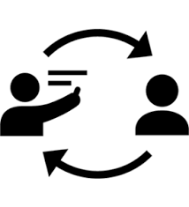
*Caption/Context: Vulnerabilities | Communication*

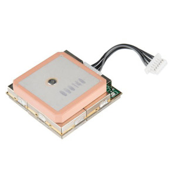
*Caption/Context: IEEE AESS SYSTEMS MAGAZINE 12 | Vulnerabilities*

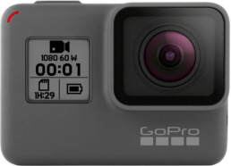
*Caption/Context: Vulnerabilities | Communication*

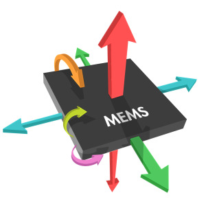
*Caption/Context: Communication | Protocol*

## --- Page 13 ---

### 📌 Section: V-A UAS Detection

IEEE AESS SYSTEMS MAGAZINE
13

#### TABLE IV: Comparison of UAS Detection technologies

Methods 
Principles 
Enabling technologies 
Advantages 
Disadvantages

Acoustic 
Unique acoustic pattern of

drones’ rotating motors.

Pattern recognition, Digital

signal processing, TDoA,

Realtime embedded system

Low-cost, light-weight 
Affected by weather condition, such as wind or

vibration.

Limited range of detection.

Lacks of identification capacity.

Vision 
The unique pattern of

drones’ appearance.

Digital image processing,

Pattern recognition,  Realtime

embedded system, Night

vision monocular.

Low-cost, light-weight, small-size.

Airborne

High computational capacity consumption.

Affected by environmental illumination

Limited range of detection.

Limited identification capacity

Passive RF 
Distinguishable pattern of

drones’ radio signals against

background spectrums.

Data traffic pattern recognition

(FPV and telemetry); SDR;

Digital signal processing;

TDoA

Low-cost. long-range.

Identification capacity.

Airborne

Not applicable to private or encrypted data

protocol.

Limited capacity to FHSS & DSSS scheme.

Confusion with other ISM band IoT devices.

Active Radar 
Micro doppler effects of

rotating propellers.

Unique pattern in reflected

millimeter wave signals.

Antenna technologies.

Pattern recognition.

Digital signal processing

Long-range.

High-precision

High-cost.

High power consumption.

Lacks of identification capacity.

Easy to be interfered.

Passive Radar 
Moving objects cause

changes to the spectrum

Pattern recognition

Digital signal processing

Long-range

Low-cost

Needs high computation capacity.

Lacks of identification ability

Easy to be interfered.

Data fusion 
Hybrid decision making. 
Data fusion and pattern

recognition

High reliability 
Needs high computation capacity.

High-cost

A. UAS Detection

1) Acoustic based UAS Detection: The piezoelectric sub-
strate materials are the core of the acoustic sensors. These ma-
terials could generate the electricity according to the strength
of vibration on the surface which is very smart characteristics.
But these materials also could be affected by the temperature,
humidity and light intensity. In practice, it is hard to keep a
stable performance of the detection when the scenario is full
of multiple variable physical parameters. At the same time,
the acoustic sensors are sensitive to the vibration of the air
caused by wind. The real UAS signal with the multiple fading
effect may be buried in the wind. The acoustic sensor array
can improve the accuracy of detection, and multiple sensors in
different places could locate the position of the UAS, but there
is limited research which takes into account Doppler effect
generated by the movement of the UAS, and the combination
effect of the movement of wind when the speed of wind is over
5 m/s, because the effect caused by wind is not negligible.
2) Passive RF based UAS Detection: The passive RF needs
multiple antennas to form an antenna array and recognize
the UAS according to the combination of each antenna’s
detection results. The passive RF detection methods are highly
dependent on the telemetry protocol and RF front-ends. A
novel approach which could recognize multiple protocols
simultaneously are needed. And such an approach is supposed
to be efficient, stable and easily deployed in mobile embedded
devices. To our knowledge, there are no SDR specifically
designed for UAS detection available on the market. Cur-
rently SDR devices suffer from heavy weight, high energy
consumption, and poor potability, which limits the use of SDR
in UAS detection. How to design a light-weight, small-size,
and low cost RF analysis device with comparable or better

performance could be a significant improvement for the UAS
detection. At last, the artificial intelligence (AI), like deep
learning, could be a good approach to improve accuracy and
robustness of the RF based detection methods. With the plenty
of signal data generated per second feeding, the deep learning
has the potential to improve the accuracy and efficiency. The
emergency of the RF signal in different small scales is very
important for efficient and accurate recognition for UAS.

3) Vision based UAS Detection: Although vision detection
has been investigated for a long time, research efforts are still
needed to improve their performance. Firstly, there is a urgent
need for a vision device designed for UAS detection to be
light-weight, small-size, and low cost. The most important
issue is that how to adjust the aperture of the camera to
avoid the fading effect caused by sunlight in different angles.
Secondly, the shape of birds is very similar to some fixed wing
UAS, and many bionic robots could fly like birds. It is urgent
to classify these two scenarios in the mobile devices, especially
these devices could be installed in the surveillance UAS. So
combining some additional biological signals in the detection
process is needed to recognize these two different situations.
Thirdly, the deep learning has been applied in vision detection
for many years, but low size, weight and power-consumption
(SWaP) deep learning algorithms are still needed. The portable
deep learning algorithms could be implemented into a new
scenario without too much time training. In the computation
field, this function of deep leaning is called transfer learning.
The mature and outstanding models of deep learning can
be implemented to multiple scenarios to achieve excellent
performances with few training episodes.

4) Radar based UAS Detection: There have been significant
research efforts made on the radar based UAS detection. The

*Caption/Context: Acoustic  Unique acoustic pattern of | drones’ rotating motors.*

*Caption/Context: Vision  The unique pattern of | drones’ appearance.*

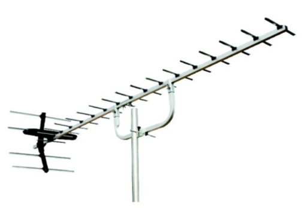
*Caption/Context: Passive RF  Distinguishable pattern of | drones’ radio signals against*

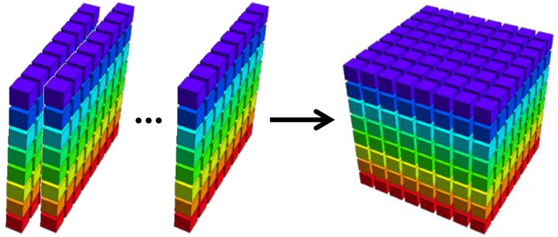
*Caption/Context: TDoA | Confusion with other ISM band IoT devices.*

## --- Page 14 ---

### 📌 Section: V-A5 Data Fusion based UAS Detection

IEEE AESS SYSTEMS MAGAZINE
14

grounded radar could well meet the requirement of UAS
detection in military. But for the civilian usage of the UAS
detection in the scenarios like stadiums and residential areas,
the current schemes are not easy and fast to be deployed in the
places with the crowds. Most radars are highly dependent on
the antennas which are very huge and lack of flexibility. The
light-weight, small-size and mobile based phrase array radars
for UAS usage have potentials to meet the requirement of
deploying in the civilian scenarios. This radar also needs to be
low-cost, because UAS does not allow the energy consuming
equipment to be on board. Another challenge for the radar
is how to solve the interference between the radar and other
communication equipment on the UAS. Based on advanced
radar detection equipment, there also needs an optimized de-
ployment approach to change the radar deployment according
to the change of scenarios in real time. Of course, the fast
and accurate radar analysis approaches also can make a great
improvement of the detection of the UAS.

5) Data Fusion based UAS Detection: Multiple signals
fuse from different detection devices which have different
data format. The traditional methods perform well on the
different data in the same acquisition accuracy, but can not
fuse well in different acquisitions. To detect unauthorized or
unsafe UAS, the surveillance needs to fuse multiple data from
different devices including video, radio, and audio, and so
on. A novel fusion approach could input the data in different
formats simultaneously and easily port in different embedded
systems.

B. UAS Mitigation

1) Physical Capture: The physical capture is the most
direct way to counter unauthorized or unsafe UAS, which is
easy to be deployed. So the requirement of the physical capture
methods is light-weight, variable scale, and easy to master.

• The physical capture needs to be light so that the human
being could carry it and get ready to take down the
UAS once they make sure that the UAS is unauthorized
or unsafe. Also, the surveillance UAS could install the
equipment and the surveillance UAS could counter the
intrusion UAS when they are patrolling.

• The physical capture needs to be variable scale so that it
could work when there are many different styles of UAS
in size. In the current, the most effect approach is net, but
the net also needs to be optimized which should be light,
firm and recyclable. The benefit of the net is that it could
capture all the things in the capacity of net. Apart from the
net, the bolas also works well when capture the UAS. The
bolas is made of weights on the ends of interconnected
cords which is efficient when the target has frames or
propellers. The power system of the most UAS is based
on the propeller. The bolas could be a powerful tool to
stop the UAS working if the rope is strong enough. The
net and bolas both need to be designed in variable scale
so that they could be used to capture UAS in different
sizes.

• The physical capture should be easy to master. The
physical capture tools like nets and bolas, could be

loaded into an easy trigger platform like bullets so that
a proper shooting gun could trigger the bullets to the
target and capture UAS. The surveillance UAS just carry
a light and simple trigger platform without much energy
consumption. To improve the successful capturing rate,
the physical capture methods needs assistance of the
navigation and tracking systems like missiles.

2) Directional EMP: The directional EMP is a very ef-
ficient weapon to counter the UAS which could navigate
itself by Inertial Measurement Unit (IMU) without any com-
munication with outer facilities. The main challenges of the
directional EMP are no harm to human being, low divergence
angle and long distance effect.

• Most EMP shooting contains too much electromagnetic
energy so that it also has damage effect on the other
nearby facilities or human beings. To make the EMP
shooting approaches more practical, the researchers need
to find a proper frequency that take efficient effect on
UAS and zero damage to organism. Because the organism
obtains the electromagnetic materials, if the EMP fre-
quency is similar to the respond frequency to the humans
or animals, the organism will take response to the specific
frequencies. We need to make sure that the EMP weapons
work in a different frequency from human and animal
response.

• The EMP is high power weapon which needs much
electricity to drive the EMP. However, the divergence
angle of the EMP wave will cause the much fading of
energy when it has effects on the target. So the research
needs to reconsider how to minimize the divergence angle
of the wave. The narrow divergence angle of the wave
could improve the success rate of countering UAS while
saving power.

• There is a disadvantage of the EMP. Different frequen-
cies have different transmission distances. The higher
frequency EMP will disappear more quickly in the air
while the higher frequency EMP obtains more energy
which improves the counter successful rate. So there is
an embarrassing problem: when the target is detected
but the counter distance is limited. How to balance the
frequency and distance to achieve a better performance
of the counter purpose is desired.

3) RF Jamming: The current RF Jamming approaches have
the following disadvantages. First, the RF jamming consumes
too much power which is not practical for surveillance UAS
to carry to execute the RF jamming precisely. Second, RF
jamming works for an area, however the RF jamming could
not jam a specific target in a desired point. The RF jamming
only takes effect when the UAS are communicating with outer
devices. The RF jamming does not work if the UAS navigates
itself with inner global navigation system (GPS).

• The current RF jamming devices are deployed on the
ground or mobile vehicles which have limited movement
space to generate the efficient jamming signals to interfere
the UAS communication system. Also these devices are
too heavy to be loaded on the surveillance UAS. So the
light-weight, high efficient and low cost RF jamming

## --- Page 15 ---

### 📌 Section: V-B4 Hacking

IEEE AESS SYSTEMS MAGAZINE
15

#### TABLE V: Comparison of UAS Mitigation Technologies

Methods 
Principles 
Enabling technologies 
Advantages 
Disadvantages

Physical capture 
Physically disable or block a

flying object.

Target tracking, motion

control.

High success rate for

non-protected targets.

Destructive, high-cost,

High-power EMP 
Disrupt the logic of circuits,

so as to disable a flying drone.

High power microwave,

directional antenna, target

tracking

Low-cost, light-weight,

small-size.

Leakage of electromagnetic

energy. Destructive

RF jamming 
Block the telemetry or GPS

signals of drones and trigger

their evacuation or landing

strategies.

RF power amplifier.

RF spectrum recognition

Low-cost, light-weight,

small-size. Non-

destructive.

Applicable to multiple

drones simultaneously.

Can only deal with drones

operating on ISM band.

Interfere other ISM band devices.

Hacking 
Seize the root privileges of

drones’ operation system and

issue appropriate operations.

System penetration.

System vulnerability

analysis.

Low-cost, Non-

destructive

Only deals with specific operation

system and network based

protocols.

Interfere other ISM band devices.

Spoofing 
Use fake positioning signals or

simulated control commands

to redirect drones.

Signal analysis, Data-

packet analysis and

decoding.

Guidance and eviction

capacity,  Non-

destructive.

Interfere other devices.

Limited capacity to deal with

encrypted channels

devices are required, especially the UAS oriented RF
jamming devices.

• RF jamming has similar characteristics to electromagnetic
wave. So once the target is determined, how to transmit
the jamming signal to a specific position is an issue.
The directional antenna could send the electromagnetic
wave into the specific area, but it still needs to realize
the specific points attack. The phase array radar maybe
a good direction for further investigation. A RF jam-
ming array may include the omni-directional antennas
and directional antennas. The control ends change the
RF jamming transmitting power and phase to realize a
combination of RF jamming in a specific position.

• The RF jamming is easy to realize but how to recognize
the target communication channels is also an open prob-
lem. The surveillance officials could eavesdrop the target
UAS communication and determine its communication
channels. With the recognition of communication, the
defenders just execute the RF jamming in the specific
channels and the energy on the invalid jamming channels
will be saved.

4) Hacking: Hacking UAS has been investigated for many
years. The hacking methods mainly focus on outer interfer-
ence, networking, and spoofing.

• The current outer interference requires that the interfer-
ence devices are very close to the UAS sensors (like IMU,
GPS) so that the UAS could get the correct data from the
sensors. The remote interference devices and approaches
are needed to lead the UAS to fly away from the sensitive
area in a long distance.

• The network using on UAS are mainly WiFi and cellular
networks. One way is to attack the WiFi and cellular
networks of the UAS to obtain the priority of the UAS,

and send command to autopilot to lead the UAS to
launch off in a safe place. Also, the defenders could
leverage network to access the link and play the man-
in-the-middle, decrypt the communication packet of the
command, and then modify the command to control the
target to launch or fly back where it comes. There are
also another approach to allow the cellular operators to
request authentication on the cellular link to check the
commands on the flight randomly.

• There are some other sensors that the researches have
not tried yet like optical flow, camera and laser. The
optical flow sensors are leveraged to locate the position
of the UAS, so that the UAS could navigate itself to the
destination. The image matching technology enable the
UAS to leverage the cameras to get the destinations. The
laser sensors are also a powerful tool to get location and
navigation for the UAS. Novel approaches are needed to
interfere and spoof these sensors or invalid these functions
to force the UAS to get back.

• The UAS controlled by radio communicate with each
end device with protocols. There is a need to recognize
the protocol used by the autopilot and communication
devices. Because this approach could enable the officials
to determine the parameters of the communication and
attack the command link used by the pilots on the ground.
At the same time, the recognition approach could be
executed in the SDR so that the surveillance UAS could
leverage the SDR to decrypt the communication packet
and modify the flight configuration to return.

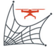
*Caption/Context: IEEE AESS SYSTEMS MAGAZINE 15 | TABLE V: Comparison of UAS Mitigation Technologies*

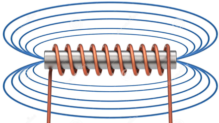
*Caption/Context: TABLE V: Comparison of UAS Mitigation Technologies | Methods  Principles  Enabling technologies  Advantages  Disadvantages*

*Caption/Context: High-power EMP  Disrupt the logic of circuits, | so as to disable a flying drone.*

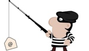
*Caption/Context: their evacuation or landing | strategies.*

## --- Page 16 ---

### 📌 Section: VI Future Trends

IEEE AESS SYSTEMS MAGAZINE
16

Shared data cube

Existing airspace

authorities

Regulation database
Local UAS 
coordinators

#### UAS manufactures

Managed UAS

operations

Trusted information

Provider

Fig. 13: Unified Framework for Drone Safety Management

VI. FUTURE TRENDS
A. Technical advancements

As discussed above, simple detection approaches cannot
get a reliable rate of detecting malicious UAS successfully.
On one hand, each simple approach has its disadvantages so
the simple detection sensor could not meet all the detection
requirements in a variable environment; on the other hand,
the UAS designed with different materials and configurations
also pose a big challenge for simple detection sensors to
capture. The future UAS detection approaches would be more
mature, practical and efficient. The detection schemes need to
be combined from multiple sensors and fused with ground
data and aerial data collaboratively. The diversity and the
amount of data in types of detection and acquisition space
could be a trend to improve. Similar to detection schemes,
simple negation approaches also could not satisfy negation
requirement, especially the countermeasures could not damage
the property of the pilots. Future negation schemes should
focus on navigating the intruding UAS to fly away the sensitive
areas and no harm to the property of pilots. Of course,
the different countermeasures are promising to achieve better
performance when they are implemented collaboratively. That
means how to construct a unified and systematic framework for
the UAS safety defense also is a challenge in the following
stages. What’s more, a UAS safety defense system includes
detection and negation, so how to balance the two parts in a
collaborative and unified framework is also a research focus.

B. Industrial Standards

Most security and safety problems are caused by the peo-
ple’s mistaking operation. The detailed operation and manage-
ment policy could be helpful to people to avoid the mistakes
and reduce the burden of the defenders. These policies not
only serve as guidance to the pilots, but also standards to the
industries. A guidance allows the pilots to make awareness of
flight of UAS in safety and security and avoid the mistaking
operations when the UAS is on the flight. The industrial
standards make it possible to stop the UAS when it is out
of control.

• The industrial standards need the market entrance stan-
dards which limit the UAS on the market to be control-
lable and identified in a physical level. Once the UAS
are instructing in restricted areas, the defenders could be
able to access the system in physical level to drive away
or stop the UAS remotely.

• The basic training for pilots needs to include the safety
operations and security knowledge. The specification of
UAS operation training and certification could help pilots
avoid basic mistakes.

C. Unified and Secured Coordination Strategies

The discussion above shows that it is hard to protect the
public from unsafe and unauthorized drone operations by using
one single approach. Therefore, we propose a unified frame-
work of collaborative UAS safety management, as shown in
Fig. 13. The collaborated entities for UAS safety management
are:

1) Local UAS coordinator: The local UAS authorities
[2] are responsible for making use of all interfaces
provided by UAS manufactures to secure the operation
of UAS and handing over UAS within coordinator when
necessary. Obviously this is a distributed management
paradigm [10].
2) Existing airspace authorities: Existing airspace man-
agement authorities are not required to deal with UAS
directly. It is desired for airspace management authori-
ties to interact with the regulation database and release
information to the shared data cube [7], [1], which is
supposed to shared with local UAS coordinators friendly.
The key information can be visualized to figure out
the status of UAS management quickly and effectively.
Apart from the data sharing, the authorities are supposed
to maintenance the security and the integrity of the
releasing data in case modified by attackers. Right before
the publication of this paper, we do notice that FAA
has released a mobile App to graphically display where
drone operation is allowed as well as specific rules to
follow [115].

*Caption/Context: IEEE AESS SYSTEMS MAGAZINE 16 | Existing airspace*

*Caption/Context: Shared data cube | UAS manufactures*

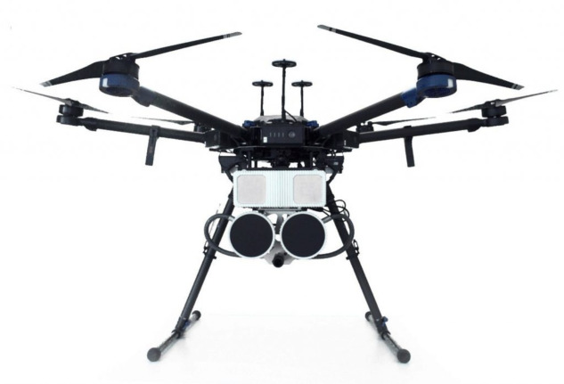
*Caption/Context: IEEE AESS SYSTEMS MAGAZINE 16 | authorities*

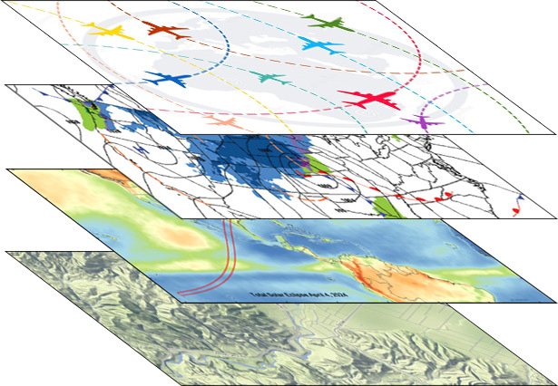
*Caption/Context: IEEE AESS SYSTEMS MAGAZINE 16 | Shared data cube*

## --- Page 17 ---

### 📌 Section: VII Concluding Remarks

IEEE AESS SYSTEMS MAGAZINE
17

3) UAS manufacturers: Manufacturers are responsible for
specifying the minimal environmental requirement for
proper manipulation [9] of UAS. Meanwhile, they are
required to provide privileged control interfaces for local
UAS coordinators [29] to interrupt and re-accommodate
UAS when necessary. Detect and avoid (DAA) technolo-
gies will play an important role in overcoming barriers to
UAS integration [116], [117], [118], [119], [120], [121].
4) Local UAS coordinators:
This entity interacts as an
agent between UAS users and airspace authorities, they
are responsible for providing proper guidelines for UAS
users and make use of privileged control interfaces to
assure that UAS operations comply with issued regula-
tions.
5) Trusted
information
provider:
The
information
providers are responsible for: a) providing the whole
framework with safety and security related information.
b) reviewing the report submitted from residents [6].
Within our proposed framework, UAS operations are within
the supervision of local UAS coordinators and UAS manufac-
tures. The residents could achieve a more secure and safe life
under a harmony management of the UAS traffic environment.

#### VII. CONCLUDING REMARKS

In addition to recreational use, unmanned aircraft systems
(UAS), also known as unmanned aerial vehicles (UAV) or
drones, are used across our world to support firefighting and
search and rescue operations, to monitor and assess critical
infrastructure, to provide disaster relief by transporting emer-
gency medical supplies to remote locations, and to aid efforts
to secure our borders. However, UAS can also be used for
malicious schemes by terrorists, criminal organizations, and
lone actors with specific objectives. To promote safe, secure
and privacy-respecting UAS operations, there is an urgent need
for innovative technologies for detecting and mitigating UAS.
Over the past 5 years, significant research efforts have been
made to counter UAS: detection technologies are based on
acoustic, vision, passive radio frequency, or data fusion; and
mitigation technologies include physical capture or jamming.
In this paper, we provided a comprehensive survey of exist-
ing literature in the area of UAS detection and mitigation,
identified the challenges in countering unauthorized or unsafe
UAS, and evaluated the trends of detection and mitigation
for protecting against UAS-based threats. We envision that an
integrated system capable of detecting and mitigating UAS
will be essential to the safe integration of UAS into the
airspace system.

#### ACKNOWLEDGMENT

This research was partially supported through Embry-Riddle
Aeronautical University’s Faculty Innovative Research in Sci-
ence and Technology (FIRST) Program and the National
Science Foundation under grant No. 1956193.

#### REFERENCES

[1] Federal Aviation Administration, “Unmanned aircraft Systems,” April

#### 2019. [Online]. Available: https://www.faa.gov/uas/

[2] Federal Aviation Administration, “FAA Aerospace Forecast 2019-

39,” April 2019. [Online]. Available: https://www.faa.gov/aerospace/
forecasts
[3] H. Song, R. Srinivasan, T. Sookoor, and S. Jeschke, Smart Cities:

Foundations, Principles and Applications. Hoboken, NJ: Wiley, 2017.
[4] H. Song, G. A. Fink, and S. Jeschke, Security and Privacy in Cyber-

Physical Systems: Foundations, Principles and Applications.
Chich-
ester, UK: Wiley-IEEE Press, 2017.
[5] H. Song, Y. Liu, and J. Wang, “UAS Detection and Negation,” U.S.

Patent 62 833 153, 4 12, 2019.
[6] X. Yue, Y. Liu, J. Wang, H. Song, and H. Cao, “Software defined radio

and wireless acoustic networking for amateur drone surveillance,” IEEE
Communications Magazine, vol. 56, no. 4, pp. 90–97, April 2018.
[7] Federal Aviation Administration, “UAS sightings report,” https://www.

faa.gov/uas/resources/uas-sightings-report/, 2019 (accessed April 29,
2019).
[8] L. Josephs, “’deliberate’ drone flights shut down london gatwick air-

port, stranding thousands of travelers,” https://www.cnbc.com/2018/12/
20/drone-sightings-shut-down-britains-gatwick-airport.html, 2019 (ac-
cessed April 29, 2019).
[9] Federal Aviation Administration, “Security sensitive airspace re-

strictions,” https://www.faa.gov/uas/recreational-fliers/where-can-i-fly/
airspace-restrictions/security-sensitive/,
2019
(accessed
April
29,
2019).
[10] U.S.
Department
of
Homeland
Security,
“Countering
unmanned
aircraft
systems,”
https://www.dhs.gov/publication/
countering-unmanned-aircraft-systems,
2019
(accessed
April
29,
2019).
[11] E. B. Carr, “Unmanned aerial vehicles: Examining the safety, security,

privacy and regulatory issues of integration into us airspace,” National
Centre for Policy Analysis (NCPA). Retrieved on September, vol. 23,
p. 2014, 2013.
[12] B. Jiang, J. Yang, and H. Song, “Protecting privacy from aerial

photography: State of the art, opportunities, and challenges,” in 2020
IEEE Conference on Computer Communications Workshops (INFO-
COM WKSHPS), July 2020, pp. 1–6.
[13] Department
of
Homeland
Security
&
Department
of
Defense
&
Federal
Aviation
Administration,
“Federal
Contract
Opportunity for Air Domain Awareness and Protection in the
NAS
2019-2020
Equipment
Demonstration
and
Evaluation,”
https://govtribe.com/opportunity/federal-contract-opportunity/
air-domain-awareness-and-protection-in-the-nas-70rsat20rfi000001#,
2019–2020.
[14] Defense Advanced Research Projects Agency, “RFI - Detection and

Negation Ideas for Protecting Against Small Unmanned Air sys-
tems,” https://fbo.gov.surf/FBO/Solicitation/DARPA-SN-17-77, 2017
(accessed March 19, 2020).
[15] J. Kim, C. Park, J. Ahn, Y. Ko, J. Park, and J. C. Gallagher, “Real-

time uav sound detection and analysis system,” in 2017 IEEE Sensors
Applications Symposium (SAS).
IEEE, March 2017, pp. 1–5.
[16] F. Christnacher, S. Hengy, M. Laurenzis, A. Matwyschuk, P. Naz,

S. Schertzer, and G. Schmitt, “Optical and acoustical uav detection,”
in Electro-Optical Remote Sensing X, vol. 9988.
International Society
for Optics and Photonics, 2016, p. 99880B.
[17] I. Bisio, C. Garibotto, F. Lavagetto, A. Sciarrone, and S. Zappatore,

“Unauthorized amateur uav detection based on wifistatistical finger-
print analysis,” IEEE Communications Magazine, vol. 56, no. 4, pp.
106–111, April 2018.
[18] M. E. Rovkin, V. A. Khlusov, N. D. Malyutin, A. V. Hristenko, A. S.

Novikov, D. M. Nosov, M. V. Osipov, M. O. Konovalenko, A. O.
Marchenko, and V. E. Ilchenkoy, “Radar detection of small-size uavs,”
in 2018 Ural Symposium on Biomedical Engineering, Radioelectronics
and Information Technology (USBEREIT), May 2018, pp. 371–374.
[19] J. Sander, A. Kuwertz, D. Mühlenberg, and W. Müller, “High-level

data fusion component for drone classification and decision support in
counter uav,” in Open Architecture/Open Business Model Net-Centric
Systems and Defense Transformation 2018, vol. 10651.
International
Society for Optics and Photonics, 2018, p. 106510F.
[20] B. Tomasz, F. Richard, and T. LaMar, “Scalable effect net warhead,”

Feb. 5 2019, US Patent 10,197,365.
[21] K. Pärlin, M. M. Alam, and Y. L. Moullec, “Jamming of uav remote

control systems using software defined radio,” in 2018 International
Conference on Military Communications and Information Systems
(ICMCIS), May 2018, pp. 1–6.
[22] A. V. Gomozov, D. V. Gretskih, V. A. Katrich, and M. V. Nesterenko,

“Functional neutralization of small-size uavs by focused electromag-
netic radiation,” in 2017 XXIInd International Seminar/Workshop on

## --- Page 18 ---

IEEE AESS SYSTEMS MAGAZINE
18

Direct and Inverse Problems of Electromagnetic and Acoustic Wave
Theory (DIPED), Sep. 2017, pp. 187–189.
[23] A. Giaritelli, “Super bowl saw 54 drone incursions: Homeland secu-

rity,” Apr 2019. [Online]. Available: https://www.washingtonexaminer.
com/news/super-bowl-saw-54-drone-incursions-homeland-security
[24] L. Mowat, “Virgin flight comes within ’seconds’ of crashing into drones

at heathrow,” Apr 2019. [Online]. Available: https://news.yahoo.com/
virgin-flight-comes-within-seconds-crashing-drones-heathrow-082129196.
html
[25] M.
Humphries,
“WASP:
The
Linux-powered
flying
spy
drone
that
cracks
Wi-Fi
&
GSM
networks,”
Jul
2011.
[Online].
Available:
https://www.geek.com/geek-pick/
wasp-the-linux-powered-flying-spy-drone-that-cracks-wi-fi-gsm-netwokrs-1407741/
[26] G.
Norman,
“Border
patrol
spots
drone
trying
to
help
migrants
illegally
enter
america,”
Apr
2019.
[Online].
Available:
https://www.foxnews.com/us/
border-patrol-foils-drone-trying-to-help-migrants-illegally-enter-america
[27] L.
Seabrook
and
M.
Valdes,
“Florida
peeping
tom
uses
drone
to
spy
on
women
in
high
rise,
police
say,”
Oct
2018.
[Online].
Available:
https://www.ajc.com/news/national/
florida-peeping-tom-uses-drone-spy-women-high-rise-police-say/
hDUjd4fP7QhwkQo6ReNlpO/
[28] M.
Margaritoff,
“Woman
confronted
by
peep-
ing
drone
outside
bedroom
window,”
Feb
2018.
[Online].
Available:
https://www.thedrive.com/aerial/18752/
woman-confronted-by-peeping-drone-outside-bedroom-window
[29] United States Government Accountability Office, “Small unmanned

aircraft systems: Faa should improve its management of safety risks,”
, , 2018.
[30] U.S.
Department
of
Homeland
Security,
“Unmanned
aircraft
systems
(uas)
-
critical
infrastructure,”
https://www.dhs.gov/cisa/
uas-critical-infrastructure, 2019 (accessed April 29, 2019).
[31] Federal Aviation Administration, “Airspace restrictions,” https://www.

faa.gov/uas/recreational-fliers/where-can-i-fly/airspace-restriction/,
2019 (accessed April 29, 2019).
[32] J. Vilímek and L. BuÅ´Zita, “Ways for copter drone acustic detection,”

in 2017 International Conference on Military Technologies (ICMT),
May 2017, pp. 349–353.
[33] B. Jang, Y. Seo, B. On, and S. Im, “Euclidean distance based algorithm

for uav acoustic detection,” in 2018 International Conference on
Electronics, Information, and Communication (ICEIC), Jan 2018, pp.
1–2.
[34] E. E. Case, A. M. Zelnio, and B. D. Rigling, “Low-cost acoustic array

for small uav detection and tracking,” in 2008 IEEE National Aerospace
and Electronics Conference, July 2008, pp. 110–113.
[35] X. Chang, C. Yang, J. Wu, X. Shi, and Z. Shi, “A surveillance system

for drone localization and tracking using acoustic arrays,” in 2018
IEEE 10th Sensor Array and Multichannel Signal Processing Workshop
(SAM).
IEEE, 2018, pp. 573–577.
[36] J. Busset, F. Perrodin, P. Wellig, B. Ott, K. Heutschi, T. Rühl, and

T. Nussbaumer, “Detection and tracking of drones using advanced
acoustic cameras,” in Unmanned/Unattended Sensors and Sensor Net-
works XI; and Advanced Free-Space Optical Communication Tech-
niques and Applications, vol. 9647.
International Society for Optics
and Photonics, 2015, p. 96470F.
[37] H. Liu, Z. Wei, Y. Chen, J. Pan, L. Lin, and Y. Ren, “Drone

detection based on an audio-assisted camera array,” in 2017 IEEE Third
International Conference on Multimedia Big Data (BigMM).
IEEE,
April 2017, pp. 402–406.
[38] A. Bernardini, F. Mangiatordi, E. Pallotti, and L. Capodiferro, “Drone

detection by acoustic signature identification,” Electronic Imaging, vol.
2017, no. 10, pp. 60–64, 2017.
[39] S. Jeon, J.-W. Shin, Y.-J. Lee, W.-H. Kim, Y. Kwon, and H.-Y. Yang,

“Empirical study of drone sound detection in real-life environment with
deep neural networks,” in Signal Processing Conference (EUSIPCO),
2017 25th European.
IEEE, 2017, pp. 1858–1862.
[40] H. Zhang, C. Cao, L. Xu, and T. A. Gulliver, “A uav detection algorithm

based on an artificial neural network,” IEEE Access, vol. 6, pp. 24 720–
24 728, 2018.
[41] P. Kosolyudhthasarn, V. Visoottiviseth, D. Fall, and S. Kashihara,

“Drone detection and identification by using packet length signature,”
in 2018 15th International Joint Conference on Computer Science and
Software Engineering (JCSSE).
IEEE, July 2018, pp. 1–6.
[42] T. Miquel, J. Condomines, R. Chemali, and N. Larrieu, “Design of

a robust controller/observer for tcp/aqm network: First application
to intrusion detection systems for drone fleet,” in 2017 IEEE/RSJ

International Conference on Intelligent Robots and Systems (IROS),
Sept 2017, pp. 1707–1712.
[43] P. Nguyen, H. Truong, M. Ravindranathan, A. Nguyen, R. Han, and

T. Vu, “Matthan: Drone presence detection by identifying physical sig-
natures in the drone’s rf communication,” in International Conference
on Mobile Systems, Applications, and Services, 2017, pp. 211–224.
[44] P. Nguyen, M. Ravindranatha, A. Nguyen, R. Han, and T. Vu, “In-

vestigating cost-effective rf-based detection of drones,” in Proceedings
of the 2nd Workshop on Micro Aerial Vehicle Networks, Systems, and
Applications for Civilian Use.
ACM, 2016, pp. 17–22.
[45] S. Basak and B. Scheers, “Passive radio system for real-time drone

detection and doa estimation,” in 2018 International Conference on
Military Communications and Information Systems (ICMCIS), May
2018, pp. 1–6.
[46] D. Mototolea and C. Stolk, “Detection and localization of small

drones using commercial off-the-shelf fpga based software defined
radio systems,” in 2018 International Conference on Communications
(COMM).
IEEE, June 2018, pp. 465–470.
[47] Q. Dong and Q. Zou, “Visual uav detection method with online feature

classification,” in Technology, Networking, Electronic and Automation
Control Conference (ITNEC), 2017 IEEE 2nd Information.
IEEE,
2017, pp. 429–432.
[48] S. Hengy, M. Laurenzis, S. Schertzer, A. Hommes, F. Kloeppel,

A. Shoykhetbrod, T. Geibig, W. Johannes, O. Rassy, and F. Christ-
nacher, “Multimodal uav detection: study of various intrusion scenar-
ios,” in Electro-Optical Remote Sensing XI, vol. 10434.
International
Society for Optics and Photonics, 2017, p. 104340P.
[49] V. M. Sineglazov, “Multi-functional integrated complex of detection

and identification of uavs,” in 2015 IEEE International Conference Ac-
tual Problems of Unmanned Aerial Vehicles Developments (APUAVD),
Oct 2015, pp. 320–323.
[50] C. Briese, A. Seel, and F. Andert, “Vision-based detection of non-

cooperative uavs using frame differencing and temporal filter,” in 2018
International Conference on Unmanned Aircraft Systems (ICUAS), June
2018, pp. 606–613.
[51] T. M. Thomas Perschke, Konrad Moren, “Real-time detection of

drones at large distances with 25 megapixel cameras,” in Proc.SPIE,
vol. 10799, 2018, pp. 10 799 – 10 799 – 15. [Online]. Available:
https://doi.org/10.1117/12.2324678
[52] M. Saqib, S. D. Khan, N. Sharma, and M. Blumenstein, “A study

on detecting drones using deep convolutional neural networks,” in
IEEE International Conference on Advanced Video and Signal Based
Surveillance, 2017, pp. 1–5.
[53] C. Aker and S. Kalkan, “Using deep networks for drone detection,”

arXiv preprint arXiv:1706.05726, 2017.
[54] A. Coluccia, M. Ghenescu, T. Piatrik, G. D. Cubber, A. Schumann,

L. Sommer, J. Klatte, T. Schuchert, J. Beyerer, M. Farhadi, R. Amandi,
C. Aker, S. Kalkan, M. Saqib, N. Sharma, S. Daud, K. Makkah, and
M. Blumenstein, “Drone-vs-bird detection challenge at ieee avss2017,”
in 2017 14th IEEE International Conference on Advanced Video and
Signal Based Surveillance (AVSS), Aug 2017, pp. 1–6.
[55] A. Schumann, L. Sommer, J. Klatte, T. Schuchert, and J. Beyerer,

“Deep cross-domain flying object classification for robust uav detec-
tion,” in 2017 14th IEEE International Conference on Advanced Video
and Signal Based Surveillance (AVSS), Aug 2017, pp. 1–6.
[56] P. Andraši, T. Radiši´c, M. Muštra, and J. Ivoševi´c, “Night-time detec-

tion of uavs using thermal infrared camera,” in INAIR 2017, 2017.
[57] S. Hoseini, G. Orchard, A. Yousefzadeh, B. Deverakonda, T. Serrano-

Gotarredona, and B. Linares-Barranco, “Passive localization and de-
tection of quadcopter uavs by using dynamic vision sensor,” 2017 5th
Iranian Joint Congress on Fuzzy and Intelligent Systems (CFIS), pp.
81–85, 2017.
[58] J. Ochodnick`y, Z. Matousek, M. Babjak, and J. Kurty, “Drone detection

by ku-band battlefield radar,” in 2017 Military Technologies (ICMT),
2017 International Conference.
IEEE, 2017, pp. 613–616.
[59] S. Park and S. Park, “Configuration of an x-band fmcw radar targeted

for drone detection,” in 2017 IEEE International Symposium on An-
tennas and Propagation (ISAP), Oct 2017, pp. 1–2.
[60] M. Caris, W. Johannes, S. Sieger, V. Port, and S. Stanko, “Detection

of small uas with w-band radar,” in 2017 18th International Radar
Symposium (IRS), June 2017, pp. 1–6.
[61] R. Nakamura and H. Hadama, “Characteristics of ultra-wideband radar

echoes from a drone,” 2017 IEICE Communications Express, vol. 6,
no. 9, pp. 530–534, 2017.
[62] M. Krà ˛atká and L. Fuxa, “Mini uavs detection by radar,” in 2015

International Conference on Military Technologies (ICMT) 2015, May
2015, pp. 1–5.

## --- Page 19 ---

IEEE AESS SYSTEMS MAGAZINE
19

[63] D. Shin, D. Jung, D. Kim, J. Ham, and S. Park, “A distributed fmcw

radar system based on fiber-optic links for small drone detection,” IEEE
Transactions on Instrumentation and Measurement, vol. 66, no. 2, pp.
340–347, Feb 2017.
[64] M. Jahangir and C. Baker, “Robust detection of micro-uas drones with

l-band 3-d holographic radar,” in 2016 Sensor Signal Processing for
Defence (SSPD), Sept 2016, pp. 1–5.
[65] A. D. de Quevedo, F. I. Urzaiz, J. G. Menoyo, and A. A. López, “Drone

Detection With X-Band Ubiquitous Radar,” in 2018 19th International
Radar Symposium (IRS), June 2018, pp. 1–10.
[66] J. Klare, O. Biallawons, and D. Cerutti-Maori, “Uav detection with

mimo radar,” in 2017 18th International Radar Symposium (IRS), June
2017, pp. 1–8.
[67] F. Hoffmann, M. Ritchie, F. Fioranelli, A. Charlish, and H. Griffiths,

“Micro-doppler based detection and tracking of uavs with multistatic
radar,” in 2016 IEEE Radar Conference (RadarConf), May 2016, pp.
1–6.
[68] M. Jian, Z. Lu, and V. C. Chen, “Drone detection and tracking based on

phase-interferometric doppler radar,” in 2018 IEEE Radar Conference
(RadarConf18).
IEEE, April 2018, pp. 1146–1149.
[69] G. Sacco, E. Pittella, S. Pisa, and E. Piuzzi, “A miso radar system

for drone localization,” in 2018 5th IEEE International Workshop on
Metrology for AeroSpace (MetroAeroSpace).
IEEE, 2018, pp. 549–
553.
[70] M. Zywek, G. Krawczyk, and M. Malanowski, “Experimental results

of drone detection using noise radar,” in 2018 19th International Radar
Symposium (IRS), June 2018, pp. 1–10.
[71] S. J. Lee, J. H. Jung, and B. Park, “Possibility verification of drone

detection radar based on pseudo random binary sequence,” in 2016
International SoC Design Conference (ISOCC), Oct 2016, pp. 291–
292.
[72] Y. Kwag, I. Woo, H. Kwak, and Y. Jung, “Multi-mode sdr radar plat-

form for small air-vehicle drone detection,” in 2016 CIE International
Conference on Radar (RADAR).
IEEE, Oct 2016, pp. 1–4.
[73] K. Stasiak, M. Ciesielski, A. Kurowska, and W. Przybysz, “A study

on using different kinds of continuous-wave radars operating in c-band
for drone detection,” in 2018 22nd International Microwave and Radar
Conference (MIKON).
IEEE, May 2018, pp. 521–526.
[74] T. Martelli, F. Murgia, F. Colone, C. Bongioanni, and P. Lombardo,

“Detection and 3d localization of ultralight aircrafts and drones with
a wifi-based passive radar,” in International Conference on Radar
Systems (Radar 2017), Oct 2017, pp. 1–6.
[75] B. Knoedler, R. Zemmari, and W. Koch, “On the detection of small uav

using a gsm passive coherent location system,” in Radar Symposium
(IRS), 2016 17th International.
IEEE, 2016, pp. 1–4.
[76] A. D. Chadwick, “Micro-drone detection using software-defined 3g

passive radar,” in International Conference on Radar Systems (Radar
2017), Oct 2017, pp. 1–6.
[77] D. Solomitckii, M. Gapeyenko, V. Semkin, S. Andreev, and Y. Kouch-

eryavy, “Technologies for efficient amateur drone detection in 5g
millimeter-wave cellular infrastructure,” IEEE Communications Maga-
zine, vol. 56, no. 1, pp. 43–50, Jan 2018.
[78] X. Yang, K. Huo, W. Jiang, J. Zhao, and Z. Qiu, “A passive radar

system for detecting uav based on the ofdm communication signal,” in
2016 Progress in Electromagnetic Research Symposium (PIERS), Aug
2016, pp. 2757–2762.
[79] Y. Liu, X. Wan, H. Tang, J. Yi, Y. Cheng, and X. Zhang, “Digital

television based passive bistatic radar system for drone detection,” in
2017 IEEE Radar Conference (RadarConf).
IEEE, May 2017, pp.
1493–1497.
[80] G. Fang, J. Yi, X. Wan, Y. Liu, and H. Ke, “Experimental research

of multistatic passive radar with a single antenna for drone detection,”
IEEE Access, vol. 6, pp. 33 542–33 551, 2018.
[81] C. SchÃijpbach, C. Patry, F. Maasdorp, U. BÃ˝uniger, and P. Wellig,

“Micro-uav detection using dab-based passive radar,” in 2017 IEEE
Radar Conference (RadarConf), May 2017, pp. 1037–1040.
[82] H. Fu, S. Abeywickrama, L. Zhang, and C. Yuen, “Low-complexity

portable passive drone surveillance via sdr-based signal processing,”
IEEE Communications Magazine, vol. 56, no. 4, pp. 112–118, 2018.
[83] Y. Zhao and Y. Su, “Cyclostationary phase analysis on micro-doppler

parameters for radar-based small uavs detection,” IEEE Transactions
on Instrumentation and Measurement, vol. 67, no. 9, pp. 2048–2057,
Sept 2018.
[84] M. Jian, Z. Lu, and V. C. Chen, “Experimental study on radar micro-

doppler signatures of unmanned aerial vehicles,” in Radar Conference
(RadarConf), 2017 IEEE.
IEEE, 2017, pp. 0854–0857.

[85] C. Zhou, Y. Liu, and Y. Song, “Detection and tracking of a uav via

hough transform,” in 2016 CIE International Conference on Radar
(RADAR), Oct 2016, pp. 1–4.
[86] W. Zhang and G. Li, “Detection of multiple micro-drones via cadence

velocity diagram analysis,” Electronics Letters, vol. 54, no. 7, pp. 441–
443, 2018.
[87] N. Mohajerin, J. Histon, R. Dizaji, and S. L. Waslander, “Feature

extraction and radar track classification for detecting uavs in civillian
airspace,” in 2014 IEEE Radar Conference, May 2014, pp. 0674–0679.
[88] J. Martinez, D. Kopyto, M. SchÃijtz, and M. Vossiek, “Convolutional

neural network assisted detection and localization of uavs with a
narrowband multi-site radar,” in 2018 IEEE MTT-S International Con-
ference on Microwaves for Intelligent Mobility (ICMIM), April 2018,
pp. 1–4.
[89] G. J. Mendis, T. Randeny, J. Wei, and A. Madanayake, “Deep learning

based doppler radar for micro uas detection and classification,” in
Military Communications Conference, MILCOM 2016-2016 IEEE.
IEEE, 2016, pp. 924–929.
[90] G. J. Mendis, J. Wei, and A. Madanayake, “Deep learning cognitive

radar for micro uas detection and classification,” in 2017 Cognitive
Communications for Aerospace Applications Workshop (CCAA), June
2017, pp. 1–5.
[91] Z. Uddin, M. Altaf, M. Bilal, L. Nkenyereye, and A. K. Bashir,

“Amateur drones detection: A machine learning approach utilizing
the acoustic signals in the presence of strong interference,” Computer
Communications, vol. 154, p. 236â ˘A¸S245, Mar 2020. [Online].
Available: http://dx.doi.org/10.1016/j.comcom.2020.02.065
[92] B. Nuss, L. Sit, M. Fennel, J. Mayer, T. Mahler, and T. Zwick, “Mimo

ofdm radar system for drone detection,” in 2017 18th International
Radar Symposium (IRS), June 2017, pp. 1–9.
[93] U. BÃ˝uniger, B. Ott, P. Wellig, U. Aulenbacher, J. Klare, T. Nuss-

baumer, and Y. Leblebici, “Detection of mini-uavs in the presence
of strong topographic relief: a multisensor perspective,” in SPIE, vol.
9997, 2016, pp. 999 702–999 702–8.
[94] V. K. Klochko, V. V. Strotov, and S. A. Smirnov, “Multiple objects

detection and tracking in passive scanning millimeter-wave imaging
systems,” in Millimetre Wave and Terahertz Sensors and Technology
XII, N. A. Salmon and F. Gumbmann, Eds., vol. 11164, International
Society for Optics and Photonics.
SPIE, 2019, pp. 117 – 124.
[Online]. Available: https://doi.org/10.1117/12.2532546
[95] M. Martinez, “Uas detection, classification, and tracking in urban

terrain,” in 2019 IEEE Radar Conference (RadarConf), April 2019,
pp. 1–6.
[96] B. M. SazdiÄ ˘G-JotiÄ ˘G, D. R. ObradoviÄ ˘G, D. M. BujakoviÄ ˘G,

and B. P. BondÅ¿uliÄ ˘G, “Feature extraction for drone classification,”
in 2019 14th International Conference on Advanced Technologies,
Systems and Services in Telecommunications (TELSIKS), Oct 2019,
pp. 376–379.
[97] T. B. Sarikaya, D. Yumus, M. Efe, G. Soysal, and T. Kirubarajan,

“Track based uav classification using surveillance radars,” in 2019 22th
International Conference on Information Fusion (FUSION), July 2019,
pp. 1–6.
[98] J. Wang, X. Yue, Y. Liu, H. Song, J. Yuan, T. Yang, and R. Seker,

“Integrating ground surveillance with aerial surveillance for enhanced
amateur drone detection,” in Disruptive Technologies in Information
Sciences, M. Blowers, R. D. Hall, and V. R. Dasari, Eds., vol. 10652,
International Society for Optics and Photonics.
SPIE, 2018, pp. 101
– 110. [Online]. Available: https://doi.org/10.1117/12.2304531
[99] D. Arteche, K. Chivers, B. Howard, T. Long, W. Merriman, A. Padilla,

A. Pinto, S. Smith, and V. Thoma, “Drone defense system architecture
for us navy strategic facilities,” Naval Postgraduate School Monterey
United States, Tech. Rep., 2017.
[100] J. C. Kilian, B. J. Wegener, E. Wharton, and D. R. Gavelek, “Counter-

unmanned aerial vehicle system and method,” Jul. 21 2015, US Patent
9,085,362.
[101] Z. C. Zhao, X. S. Wang, and S. P. Xiao, “Cooperative deception

jamming against radar network using a team of uavs,” in 2009 IET
International Radar Conference, April 2009, pp. 1–4.
[102] A. Li, Q. Wu, and R. Zhang, “Uav-enabled cooperative jamming

for improving secrecy of ground wiretap channel,” IEEE Wireless
Communications Letters, pp. 1–1, 2018.
[103] M. Sliti, W. Abdallah, and N. Boudriga, “Jamming attack detection

in optical uav networks,” in 2018 20th International Conference on
Transparent Optical Networks (ICTON), July 2018, pp. 1–5.
[104] R. Curpen, T. B˘alan, I. A. Miclo¸s, and I. Com˘anici, “Assessment

of signal jamming efficiency against lte uavs,” in 2018 International
Conference on Communications (COMM).
IEEE, 2018, pp. 367–370.

## --- Page 20 ---

### 📌 Section: Biographies

IEEE AESS SYSTEMS MAGAZINE
20

[105] D. Mototolea and C. Stolk, “Software defined radio for analyzing

drone communication protocols,” in 2018 International Conference on
Communications (COMM), June 2018, pp. 485–490.
[106] B. J. Willner, “Methods and apparatuses for detecting and neutral-

izing remotely activated explosives,” Nov. 26 2009, US Patent App.
12/126,570.
[107] S. Bhattacharya and T. Ba¸sar, “Game-theoretic analysis of an aerial

jamming attack on a uav communication network,” in Proceedings of
the 2010 American Control Conference, June 2010, pp. 818–823.
[108] N. M. Rodday, R. d. O. Schmidt, and A. Pras, “Exploring security

vulnerabilities of unmanned aerial vehicles,” in NOMS 2016 - 2016
IEEE/IFIP Network Operations and Management Symposium, April
2016, pp. 993–994.
[109] V. Dey, V. Pudi, A. Chattopadhyay, and Y. Elovici, “Security vul-

nerabilities of unmanned aerial vehicles and countermeasures: An
experimental study,” in 2018 31st International Conference on VLSI
Design and 2018 17th International Conference on Embedded Systems
(VLSID), Jan 2018, pp. 398–403.
[110] W. Chen, Y. Dong, and Z. Duan, “Attacking altitude estimation in

drone navigation,” in IEEE INFOCOM 2018 - IEEE Conference on
Computer Communications Workshops (INFOCOM WKSHPS), April
2018, pp. 888–893.
[111] J. L. Esteves, E. Cottais, and C. Kasmi, “Unlocking the access to

the effects induced by iemi on a civilian uav,” in 2018 International
Symposium on Electromagnetic Compatibility (EMC EUROPE), Aug
2018, pp. 48–52.
[112] J. A. Marty, “Vulnerability analysis of the mavlink protocol for

command and control of unmanned aircraft,” Air Force Institute of
Technology, Tech. Rep., 2013.
[113] V. Katewa, R. Anguluri, A. Ganlath, and F. Pasqualetti, “Secure

reference-tracking with resource-constrained uavs,” in 2017 IEEE Con-
ference on Control Technology and Applications (CCTA), Aug 2017,
pp. 1319–1325.
[114] K. Huang and H. Wang, “Combating the control signal spoofing attack

in uav systems,” IEEE Transactions on Vehicular Technology, vol. 67,
no. 8, pp. 7769–7773, Aug 2018.
[115] K. FAA, “B4ufly mobile app.” https://www.faa.gov/uas/recreational_

fliers/where_can_i_fly/b4ufly/, May 2019.
[116] G. Fasano, D. Accado, A. Moccia, and D. Moroney, “Sense and

avoid for unmanned aircraft systems,” IEEE Aerospace and Electronic
Systems Magazine, vol. 31, no. 11, pp. 82–110, November 2016.
[117] A. D. Zeitlin, “Sense avoid capability development challenges,” IEEE

Aerospace and Electronic Systems Magazine, vol. 25, no. 10, pp. 27–
32, Oct 2010.
[118] R. Opromolla, G. Fasano, and D. Accardo, “Perspectives and sensing

concepts for small uas sense and avoid,” in 2018 IEEE/AIAA 37th
Digital Avionics Systems Conference (DASC), Sep. 2018, pp. 1–10.
[119] X. Prats, L. Delgado, J. Ramirez, P. Royo, and E. Pastor, “Require-

ments, issues, and challenges for sense and avoid in unmanned aircraft
systems,” Journal of Aircraft, vol. 49, no. 3, pp. 677–687, 2012.
[120] B. Korn and C. Edinger, “Uas in civil airspace: Demonstrating

â ˘AIJsense and avoidâ ˘A˙I capabilities in flight trials,” in 2008 IEEE/AIAA
27th Digital Avionics Systems Conference, Oct 2008, pp. 4.D.1–1–
4.D.1–7.
[121] Yucong Lin and S. Saripalli, “Sense and avoid for unmanned aerial

vehicles using ads-b,” in 2015 IEEE International Conference on
Robotics and Automation (ICRA), May 2015, pp. 6402–6407.

Jian Wang (wangj14@my.erau.edu) is a Ph.D. stu-
dent in the Department of Electrical Engineering
and Computer Science, Embry-Riddle Aeronautical
University (ERAU), Daytona Beach, Florida, and a
graduate research assistant in the Security and Op-
timization for Networked Globe Laboratory (SONG
Lab, www.SONGLab.us). He received his M.S. from
South China Agricultural University (SCAU) in
2017 and B.S. from Nanyang Normal University in
2014. His major research interests include wireless
networks, unmanned aerial systems, and machine
learning. He was a recipient of the Best Paper Award from the 12th IEEE
International Conference on Cyber, Physical and Social Computing (CPSCom-
2019).

YongXin Liu (LIU11@my.erau.edu) received his
B.S. and M.S. from SCAU in 2011 and 2014, re-
spectively, and he received Ph.D. from the School of
Civil Engineering and Transportation, South China
University of Technology. His major research in-
terests include data mining, wireless networks, the
Internet of Things, and unmanned aerial vehicles.
He was a recipient of the Best Paper Award from
the 12th IEEE International Conference on Cyber,
Physical and Social Computing (CPSCom-2019).

Houbing Song (M’12-SM’14) received the Ph.D.
degree in electrical engineering from the University
of Virginia, Charlottesville, VA, in August 2012,
and the M.S. degree in civil engineering from the
University of Texas, El Paso, TX, in December
2006.
In August 2017, he joined the Department of
Electrical Engineering & Computer Science, Embry-
Riddle Aeronautical University, Daytona Beach, FL,
where he is currently an Assistant Professor and
the Director of the Security and Optimization for
Networked Globe Laboratory (SONG Lab, www.SONGLab.us). He served
on the faculty of West Virginia University from August 2012 to August
2017. In 2007 he was an Engineering Research Associate with the Texas
A&M Transportation Institute. In 2019 he served as an AI and Counter
Cyber for Autonomous Unmanned Collective Control Subject Matter Expert
selected by the United States Special Operations Command (USSOCOM).
He has served as an Associate Technical Editor for IEEE Communications
Magazine (2017-present), an Associate Editor for IEEE Internet of Things
Journal (2020-present) and a Guest Editor for IEEE Journal on Selected
Areas in Communications (J-SAC), IEEE Internet of Things Journal, IEEE
Transactions on Industrial Informatics, IEEE Sensors Journal, IEEE Trans-
actions on Intelligent Transportation Systems, and IEEE Network. He is
the editor of six books, including Big Data Analytics for Cyber-Physical
Systems: Machine Learning for the Internet of Things, Elsevier, 2019, Smart
Cities: Foundations, Principles and Applications, Hoboken, NJ: Wiley, 2017,
Security and Privacy in Cyber-Physical Systems: Foundations, Principles
and Applications, Chichester, UK: Wiley-IEEE Press, 2017, Cyber-Physical
Systems: Foundations, Principles and Applications, Boston, MA: Academic
Press, 2016, and Industrial Internet of Things: Cybermanufacturing Systems,
Cham, Switzerland: Springer, 2016. He is the author of more than 100
articles. His research interests include cyber-physical systems, cybersecurity
and privacy, internet of things, edge computing, AI/machine learning, big data
analytics, unmanned aircraft systems, connected vehicle, smart and connected
health, and wireless communications and networking. His research has been
featured by popular news media outlets, including IEEE GlobalSpec’s Engi-
neering360, USA Today, U.S. News & World Report, Fox News, Association
for Unmanned Vehicle Systems International (AUVSI), Forbes, WFTV, and
New Atlas.

Dr. Song is a senior member of ACM. Dr. Song was a recipient of the
Best Paper Award from the 12th IEEE International Conference on Cyber,
Physical and Social Computing (CPSCom-2019), the Best Paper Award from
the 2nd IEEE International Conference on Industrial Internet (ICII 2019),
the Best Paper Award from the 19th Integrated Communication, Navigation
and Surveillance technologies (ICNS 2019) Conference, and the prestigious
Air Force Research Laboratory’s Information Directorate (AFRL/RI) Visiting
Faculty Research Fellowship in 2018.

