# Survey On Anti Drone Systems Components Designs An

**Source Document:** `Survey_on_Anti-Drone_Systems_Components_Designs_an.pdf`  
**Total Pages:** 25  

---

## --- Page 1 ---

This work is licensed under a Creative Commons Attribution 4.0 License. For more information, see https://creativecommons.org/licenses/by/4.0/

This article has been accepted for publication in a future issue of this journal, but has not been fully edited. Content may change prior to final publication. Citation information: DOI

#### 10.1109/ACCESS.2021.3065926, IEEE Access

Date of publication December 4, 2020, date of current version xxxx 00, 0000.

Digital Object Identifier 10.1109/ACCESS.2020.DOI

Survey on Anti-Drone Systems:
Components, Designs, and Challenges

Seongjoon Park, (Graduate student member, IEEE), Hyeong Tae Kim, Sangmin Lee,
Hyeontae Joo, and Hwangnam Kim, (Member, IEEE)
Department of Electrical Engineering, Korea University, Seoul, Republic of Korea

Corresponding author: Hwangnam Kim (e-mail: hnkim@korea.ac.kr).

This work was supported by the National Research Foundation of Korea funded by the Korean Government (grant 2020R1A2C1012389).

ABSTRACT
This paper presents a comprehensive survey on anti-drone systems. After drones were
released for non-military usages, drone incidents in the unarmed population are gradually increasing.
However, it is unaffordable to construct a military grade anti-drone system for every private or public
facility due to installation and operation costs, and regulatory restrictions. We focus on analyzing anti-
drone system that does not use military weapons, investigating a wide range of anti-drone technologies,
and deriving proper system models for reliable drone defense. We categorized anti-drone technologies into
detection, identification, and neutralization, and reviewed numerous studies on each. Then, we propose
a hypothetical anti-drone system that presents the guidelines for adaptable and effective drone defense
operations. Further, we discuss drone-side safety and security schemes that could nullify current anti-drone
methods, and propose future solutions to resolve these challenges.

#### INDEX TERMS Anti-drone, Counter-drone, Drone detection, Drone identification, Drone neutralization

I. INTRODUCTION
A

DVANCES in micro air vehicles, also known as drones,
take advantage of opportunities in the several indus-
trial domains, from agricultural engineering to military mis-
sions [1]. Rapid expansion of the drone industry has sur-
passed regulations for safe and secure drone operation, which
makes them representative means of the illegal and de-
structive terrors and the crimes [2]. With the introduction
of drones into civilian technology, drones are now gaining
attention as a threat of safety and security, which leverages
the emergence of the anti-drone (or counter drone) technolo-
gies. Anti-drone systems are devised to defend against drone
accidents or terrorism, and needed to be advanced to cope
with the future drone flight systems.

Currently, most of anti-drone systems adopt military grade
components to achieve the confirmatory destruction of ma-
licious drones. However, several difficulties apply when lo-
cating military grade anti-drone system into civilian areas.
Military counter-drone measures typically use jamming sys-
tems [3] to disable the target drone control channel. The
jammer generates extremely high amplitude of RF signal
in the target frequency band to prevent communication. For
military scenarios, the site is controlled by the military, and
the operator pre-acquires proper field manual for jamming

conditions, hence the side effect of jamming can be ignored
or managed. However, for non-military applications, RF jam-
ming to neutralize high-speed drones risks temporal paralyze
of existing wireless network systems, such as mobile access
or wireless sensor networks. Thus, most national regulations
prevent non-military use of jamming systems [4], [5], and
hence civilian anti-drone systems need to investigate alter-
native approaches to stop illegal or unauthorized drones.
Similarly, anti-aircraft weapons such as missiles are hardly
allowed for civilian systems. Except for cases where the
national army covers the entire civilian area, such as Iron
Dome [6] in Israel, non-military operators need anti-drone
strategy without using military grade weapons.

Radar was regarded as a limited solution for drone de-
tection due to inflexible radar cross sections (RCS) [7],
but recent radar technology advances enable arbitrary drone
detection with acceptable identification rate [8]. Thus, radar
is becoming adopted for long range drone detection [9], but
its use also suffers from national regulations, such as RF
license policies [10]. The difficulty and relatively high cost
of installing drone detection radars makes civilian counter
drone systems look for other drone detection methods, such
as vision [11] and RF signal [12] systems.

Civilian drone stopping strategies tend to employ unarmed

VOLUME 4, 2016
1

## --- Page 2 ---

This work is licensed under a Creative Commons Attribution 4.0 License. For more information, see https://creativecommons.org/licenses/by/4.0/

This article has been accepted for publication in a future issue of this journal, but has not been fully edited. Content may change prior to final publication. Citation information: DOI

#### 10.1109/ACCESS.2021.3065926, IEEE Access

methods such as hijacking (Section V-A) or capturing (Sec-
tion V-F) solutions. These methods are technical counterpoint
of drone’s safety and stability systems, and both sides of
methodologies are equally on demand in drone research. As
a breakthrough in such a competitive situation, it is essential
to refine the anti-drone system in a structural manner in order
to cope with the drone’s defense mechanism by adaptively
responding to the drone’s avoidance strategy. To do so, state-
of-the-art drone security and safety studies should be evalu-
ated, not only attempt to take advantage of the conventional
drone mechanism.

This paper studies non-military anti-drone systems in
comprehensive way. Considering recent drone incidents, we
specially investigate the requirements for non-military anti-
drone systems. We do not only list suitable methodologies,
but propose guidelines for anti-drone system design that
efficiently merge the components. Finally, we provide mile-
stones to advance counter drone technology against drone
security evolution.

A. ROADMAP FOR THIS PAPER
Fig. 1 graphically represents the organization of this paper,
with the following details.

Section II discusses anti-drone system motivations and
objectives for drone attack cases over the last few decades.
Section II-A lists recent non-military drone incidents, high-
lighting safety and security awareness of malicious drones.
Section II-B identifies requirements and breakthrough for
applicable anti-drone systems, developing the major criteria
to evaluate present system components and design anti-drone
system guidelines.

Sections III–V introduce anti-drone components, divided
into detection, identification, and neutralization phases, re-
spectively.

Then, Section VI considers actual anti-drone system instal-
lations to survey current usage and further system extension
requirements. Section VII proposes guidelines anti-drone
system design, installation and operation. Sections VII-A–
VII-C address detection system deployment, methods to eval-
uate drone attack situations, and where to neutralize illegal
drones.

Section VIII considers future aspects and aims for anti-
drone systems. Section VIII-A introduces drone-side safety
and security methods against anti-drone technology, which
can nullify attempts to detect and neutralize illegal drones.
Section VIII-B consequently derives anti-drone development
directions to sustain robust defense against malicious drones.

To avoid semantic confusion, each section defines anti-
drone terminologies commonly used in the domain. Fre-
quently used in anti-drone terms sometimes have ambiguous
scope, e.g. hijacking, spoofing, and jamming. Hijacking and
spoofing are often used interchangeably, and jamming some-
times includes drone neutralization methodologies, or only
drone communication interruption solutions. Clearly defining
these terms helps to avoid contextual conflicts and fit with
anti-drone system operator requirements.

To the best of our knowledge, this study is the first one
investigating non-military grade anti-drone systems. This
paper provides a useful survey for non-military anti-drone
system and contributes to future technology developments.

II. ANTI-DRONE BACKGROUNDS
This section considers the motivations and requirements of
anti-drone system. Drone industry expansion has increased
injudicious, unauthorized, and illegal drone use, causing con-
siderable social and economic damage. We review some ma-
jor drone incidents worldwide, and derive essential features
for emerging anti-drone systems.

A. DRONE INCIDENTS
Drone illegal use and terrorism have recently occurred in
various ways. We list and analyze several key incidents to
derive appropriate anti-drone system objectives.

1) Illegal flights at airports
Gatwick Airport, the second largest airport in the UK, was
paralyzed for a day in December 2018, by an illegal drone
that breached the runway airspace [13]. Illegal drones have
appeared near the airport more than 50 times for almost 15
hours. This happening seemed to be intentional to confuse
the airport operations, since these are industrial drones and
considerably larger than commercial models. Illegal drones
also appeared near Frankfurt Airport, Germany, in May 2019,
closely at the aircraft landing area for approximately one
hour [14]. In both cases, the drones reached at important
locations such as runway or crucial airspace without being
detected by any of airport security systems. These incidents
occurred large ecnomic loss due to poor detection distance
and accuracy, and lack of response1 procedures against unau-
thorized or illegal drones.

2) Attacks on public institutions
An unmanned aircraft equipped with a C-4 bomb attempted
to attack the U.S. Department of Defense and Capitol Hill in
September 2011 [15]. Fortunately, the criminal was arrested
by the FBI before explosion. This was the first known terror-
ism using drones and an example of FBI terrorist prevention
through tracking and proactive blocking. The case highlights
that building an anti-drone system is important in practical
terms, but requires cooperation with national organizations
such as police and military.

The Russian military defended the first drone fleet attack
in January 2018 [16]. Thirteen armed fixed-wing unmanned
aircraft deployed to attack Khmeimim Air Force base and
Tartus naval installation, but repelled by Russian military
radio electronic warfare technology. Ten drones were shot
down by missiles, and the other three were blocked by Rus-
sian hijacking technology. Several military bases had high
level anti-drone systems, but anti-aircraft systems such as

1We use a term response to meaning combined detection, tracking and
neutralization.

2
VOLUME 4, 2016

## --- Page 3 ---

This work is licensed under a Creative Commons Attribution 4.0 License. For more information, see https://creativecommons.org/licenses/by/4.0/

This article has been accepted for publication in a future issue of this journal, but has not been fully edited. Content may change prior to final publication. Citation information: DOI

#### 10.1109/ACCESS.2021.3065926, IEEE Access

#### FIGURE 1: Roadmap for this paper

missiles cannot be used in non-military site. Thus, anti-drone
systems should prepare neutralization technologies without
weapons, such as hijacking and capturing.

At Aramco, Saudi Arabia’s national oil company, the
largest oil refining facilities were burned and shut down by
drone attack in September 2019 [17]. Ten drones attacked
the facility, carrying 3 kilogram of explosives per unit. The
incident caused huge damage to Saudi Arabia’s crude oil pro-
duction and peak price of international crude oil. This attack
succeeded due to lack of simultaneous detection and defense
systems for multiple drones. However, it is almost impossible
to install drone neutralization equipment to completely cover
such large number of facilities and enterprises. Therefore, it
is essential to prioritize and concentrate anti-drone systems
in key facilities.

3) Attacks on specific individuals
A small drone containing radioactive materials was dropped
on the roof of the Japanese Prime Minister’s residence in
April 2015 [18]. Not only was the drone able to fly to
the Prime Minister’s residence, it was left unattended for
approximately two weeks. Clearly, there was poor or no
drone detection system installed. However, it might have
been difficult to install intensive detection equipment due
to the circumstances of the location, particularly privacy.
Therefore, it is essential to secure various detection methods
to fit to the area’s requirements.

The Islamic militant group Islamic State (IS) has been
using small drones to drop grenades since 2016. IS killed

two Iranians in Syria in October 2016 with two ultra-small
drones purchased from Amazon [19]. This was considered to
be the first case of terrorism using commercial drones, and
the case is important in that IS used commercial off-the-shelf
drones, establishing that a wide range of drone terrorism was
possible because the drones could be easily obtained without
requiring expert-level skill to fly them.

Two drones equipped with bombs attempted to assas-
sinate Venezuelan President Nicolas Maduro at a national
outdoor event in August 2018, but failed [20]. This was
the first attempt to use a drone to assassinate the head of
the country. This case of incident highlights the need for
anti-drone systems in the cases of temporal events. To cope
with these portable scenarios, temporary anti-drone systems
require rapid installation and deployment of their equipment.

Various drone incidents using small drones are difficult to
detect, regardless of the type of sites, military or non-military.
Illegal drones are mainly to paralyze major facilities [13],
[14], [17], terrorist attacks [15], [16], or attacks on specific
people [18]–[20]. In addition to the listed cases, there are
numerous cases of minor accidents such as restricted area
invation by unauthorized or illegal drones. The demands on
the anti-drone system to prevent such incidents are exploding
worldwide.

#### B. ANTI-DRONE SYSTEM REQUIREMENTS

From the observations in Section II-A, we summarize core
requirements for anti-drone systems as follows.

VOLUME 4, 2016
3

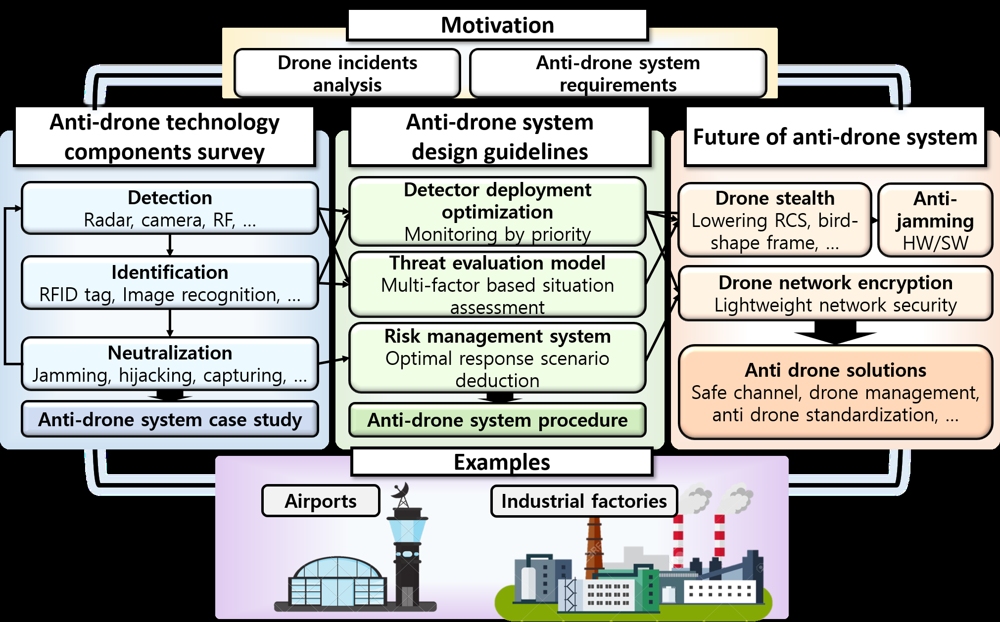
*Caption/Context: This article has been accepted for publication in a future issue of this journal, but has not been fully edited. Content may change prior to final publication. Citation information: DOI | 10.1109/ACCESS.2021.3065926, IEEE Access*

## --- Page 4 ---

This work is licensed under a Creative Commons Attribution 4.0 License. For more information, see https://creativecommons.org/licenses/by/4.0/

This article has been accepted for publication in a future issue of this journal, but has not been fully edited. Content may change prior to final publication. Citation information: DOI

#### 10.1109/ACCESS.2021.3065926, IEEE Access

• Drone-specialized detection. Conventional zone secu-
rity systems include drone-detection equipment such
as radars or cameras, but lack the performance and
awareness to allow current systems to recognize various
drone incidents. When designing anti-drone system with
current monitoring equipment, the overall architecture
should be revised to detect various drones at sufficient
distance to prepare the defense.

• Multi-drone defensibility. Some previous illegal drone
incidents [16], [17] highlight the potential for a drone
fleet attack. Sooner or later, various numbers of (le-
gitimate) flying objects including personal air vehicles
(PAVs) would be around the area, which leads to sit-
uations where multiple drone threats will need to be
simultaneously detected and handled.

• Cooperation with security organizations. Seizing and
intercepting drone threats such as [15] is the prime way
to safely defend an area against unauthorized or illegal
drones. In addition to the preemptive investigation, reg-
ulatory restrictions and cooperation opportunities with
national or public security systems (such as police or
military) should be discussed.

• System portability. As shown in II-A3, defending an
area against unauthorized or illegal drones can vary
depending on space and time. Immediate anti-drone
deployment can be accomplished with mobilized de-
tection, identification, and neutralization components,
which require lightweight equipment and competent
wireless networks.

• Non-military neutralization. There has only a single
successful defense against drone attack reported [17],
which was possible by deploying military grade
weapons. Although drone jamming has been largely
adopted and tested for commercial anti-drone systems,
jammers could not stop the physical threat of the uncon-
trolled drones. Thus, a definitive neutralization method-
ologies and procedures are required.
Fig. 1 shows a typical anti-drone system comprising mul-
tiple subsystems. Anti-drone research domain remains in
early-stage development, in contrast with drone stabilization
technologies [21]. Solid solutions such as jamming or anti-
aircraft weapons provide acceptable results for demands on
stopping the drones, but place a heavy burden on regulations
and financial budget. Therefore, we focused on approaches
that could be deployed for non-military grade facilities, such
as civil airports, sports stadia, outdoor/indoor convention
sites, etc. Sections III–V list anti-drone system component
surveys, and evaluate each considering the above require-
ments to build an effective anti-drone system. To have global
view of the domain from research to product, we comprehen-
sively surveyed vendor catalogues, articles, and white papers
as well as research papers.

III. ANTI-DRONE SYSTEM: DRONE DETECTION
Drone detection exploits various features of flying drone.
Drones commonly emit heat, sound, and RF signals to com-

municate with the remote operator. Detection system collects
sensor data to confirm the presence of drones in nearby
areas. Depending on the measure, it can speficy the drones’
expected locations.

Table 1 shows drone detection schemes categorized by
sensing technology. The following subsections consider each
detection strategy and explore the basic mechanism and
technical limitations.

A. THERMAL DETECTION
Physical components such as motors, batteries, and internal
hardware radiate significant amount of heat, which can be
recognized by thermal cameras [26]. Many studies have
proposed detecting target drones by their heat signatures.
Andraši et al. [22] proposed a drone detection scheme to
detect thermal energy emitted by the drone during flight.
Wang et al. [56] employed a convolutional neural network to
enhance the system performance and accurately detect target
drones from thermal images. The Spynel [23] product from
HGH Infrared Systems detects infrared from the object heat,
enabling 360◦surveillance.

Thermal detection has advantages in terms of weather
resilience, identification availability, and lower cost than
radar based systems. However, the practical detection range
(51 m [22]) is considerably shorter than most other ap-
proaches, hence enhancing granularity of detection scheme
or improving resolution of thermal imaging camera are major
challenges.

B. RF SCANNER
Drones controlled by an operator usually exchange specific
messages as RF signal containing sensor output, flight com-
mands, etc. RF scanner technologies capture wireless signals
and determine the existence of drones in the target area. Sig-
nal intelligence (SIGINT) and communication intelligence
(COMINT) are primitive models for RF based drone detec-
tion. Al-Sa’d et al. [28] designed a drone RF signal learning
and detection system using a deep neural network with
multiple hidden layers to categorize detected drone types
and flight modes. Although classification accuracy decreases
with increasing number of classes (drone types), detection
accuracy is acceptable. Da-Jing Innovations (DJI) released
Aeroscope [57], a detection system that collects DJI drone
control data at around.

As discussed above, the major disadvantage for RF based
detection is that it cannot detect drones that do not exchange
RF signal continuously, such as the ones in autonomous
navigation. In addition, since RF scanner detects the drones
by signal analysis, drones using unknown control protocols
or different frequency bands [12] are challenging to detect.
Nevertheless, most drone detection systems use RF scanner,
due to its long range and low cost, while combining with
other methodologies.

4
VOLUME 4, 2016

## --- Page 5 ---

This work is licensed under a Creative Commons Attribution 4.0 License. For more information, see https://creativecommons.org/licenses/by/4.0/

This article has been accepted for publication in a future issue of this journal, but has not been fully edited. Content may change prior to final publication. Citation information: DOI

#### 10.1109/ACCESS.2021.3065926, IEEE Access

#### TABLE 1: Drone detection technologies

Feature
Sensing devices
Advantages
Disadvantages
Detection range
References

Heat
Infrared camera
• Less affected by weather
• Long range
• Low accuracy
1–15 km
[22]–[27]

RF signal
RF receiver
• Obstacle-free
• Detect the drone operator
• Unable to detect
• Autonomous flight
3–50 km
[12],
[28]–[33]

Physical
object

Radar
• Less affected by weather
• Long range
• High expense
• Regulations on RF license
• Vulnerable to obstacles

1–20 km
[34]–[40]

Visibility
Optical camera
• Low expense
• Miniaturized
• Identification

• Highly
affected
by
the
weather
• Vulnerable to obstacles

0.5–3 km
[41]–[46]

Acoustic
signal

Acoustic receiver
• Compatible with RF based
sensors
• Miniaturized

• Extremely
low
detection
range
• Low accuracy
• High signal detection com-
plexity

< 0.2 km
[47]–[55]

FIGURE 2: Frequency modulated continuous wave (FMCW)
mechanism

#### FIGURE 3: Distance and velocity determination by FMCW

1) Radar based detection
Radar detects physical objects and determine its shape, dis-
tance, speed, and direction by sensing reflected Radio signals.
In contrast with RF scanner, radar measures time-of-flight for
the reflected signal, whereas RF scanner demodulates the sig-
nal itself. Continuous-wave radar characteristically measures
target velocity using range and Doppler information.

Fig. 2 shows a typical radar based detection system.
Frequency modulated continuous wave (FMCW) radar and
coherent pulsed Doppler radar retain and track transmitted
and received signal phases to estimate distance and velocity.
In Fig. 3, FMCW radar derives distance R from speed of light
c; and multiple measurements of δt; Doppler frequency shift
fD; and bandwidth BW. Then, the velocity of object can
be calculated from c, wavelength λ, and angular deviation
θ [58].

Radar surveillance and tracking uses several frequency
bands [59], [60], which we summarize below2.

• Ka, K, and Ku bands, above 18 GHz, very short wave-
length. Used for early airborne radar systems, but un-
common today except maritime navigation radar sys-
tems.

• X-band, 8–12 GHz. Used extensively for airborne sys-
tems for military reconnaissance and synthetic aperture
radar.

• C-band, 4–8 GHz. Common in many airborne re-
search systems (e.g. CCRS Convair-580 and NASA
AirSAR [61]) and spaceborne systems (e.g. ERS-1 and
2 and RADARSAT [62]).

• S-band, 2–4 GHz. Used for Russian ALMAZ satellites
and weather radar.

• L-band, 1–2 GHz. Used for US SEASAT and Japanese
JERS-1 satellites and NASA airborne systems.

• P-band, 300 kHz to 1 GHz. Longest radar wavelengths,
used for NASA experimental airborne research systems.

Radar is also classified into 2D and 3D by the type of
the phase array antenna [63]. 2D radars adopt passive elec-
tronically scanned array antennas (PESAs), which control
beam steering by electric field phase applied to each array
element, providing relatively large detection range while
wideband utilization is not possible. 3D radar commonly uses
active electronically scanned array antennas (AESAs), which
control beam steering and shape by the electric field gain
and phase of each element. Although AESAs have relatively
short detection range, they can self-correct errors and support
wideband detection. Several studies have implemented 3D
radars, e.g. [64]. The main difference between 2D and 3D
radar is that 3D radar can estimate the altitude of target
objects, whereas 2D radar acquires limited information of
z-axis through auxiliary systems [65], [66]. 3D radar is
desirable for anti-drone systems, but 2D radar with other

2This paper refers to nominal frequency range for each band, and specific
frequency ranges differ from international/national workgroups.

VOLUME 4, 2016
5

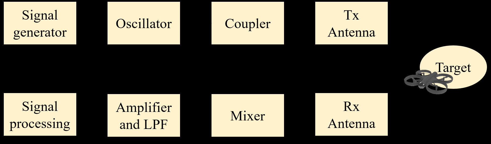
*Caption/Context: Visibility Optical camera • Low expense • Miniaturized • Identification | • Highly affected by the weather • Vulnerable to obstacles*

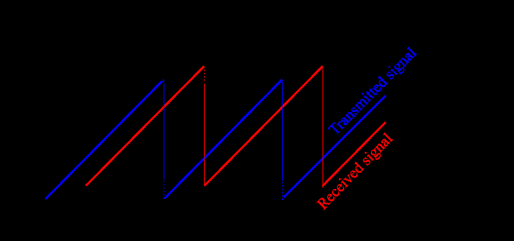
*Caption/Context: FIGURE 2: Frequency modulated continuous wave (FMCW) mechanism | FIGURE 3: Distance and velocity determination by FMCW*

## --- Page 6 ---

This work is licensed under a Creative Commons Attribution 4.0 License. For more information, see https://creativecommons.org/licenses/by/4.0/

This article has been accepted for publication in a future issue of this journal, but has not been fully edited. Content may change prior to final publication. Citation information: DOI

#### 10.1109/ACCESS.2021.3065926, IEEE Access

methods can be a better solution from the view of large-scale
monitoring and cost efficiency.

Although radar has been widely adopted for military and
civil surveillance systems [67], early drone detection systems
were skeptical about using radar, due to extremely low drone
RCS [68]. Liu et al. [34] proposed multi-channel passive
bistatic radar (PBR) to improve radar detection granularity,
correcting the drone’s location by extended Kalman filter
(EKF) and global nearest neighbor (GNN) approaches. Sev-
eral drone detection studies proposed high resolution FMCW
radar with various improvements, including phase interfer-
ometry, functional modes, and various bands [35], [69], [70].

Radar based drone detection offer longer detection range
and constant observability compared with RF scanner, but
there are some detection availability and regulatory limita-
tions. Radar cannot distinguish a drone from obstacles if the
drone hovers in one position or flies at low speed. Thus,
combining radar and other technologies (camera, RF scanner,
etc.) is strongly recommended. Radar systems also continu-
ously emit high power RF signals, so nation permission is
required for frequency bands and installation locations. In
particular, facilities that already operate radars, such as air-
ports [71] may have difficulty installing additional radars due
to RF interference issues. Partial spectral overlap between
radar and radio waves can cause bad signal interference and
poor performance of both radar and the network. Several
studies investigated mutual interference between radar from
military or other government/private organizations and radio
access networks such as 5G to ensure coexistence [72]–[75].
Administrator should consider these RF circumstances in
anti-drone system installation.

C. OPTICAL CAMERA DETECTION
Similar to thermal camera detection, optical cameras for
drone detection have been widely investigated for anti-drone
application. Sapkota et al. [42] exploited histogram of ori-
ented gradients features to detect drones from captured im-
ages, and Jung et al. [76] proposed a video based drone
surveillance system to monitor large 3D spaces in real time.
Drone detection equipment based on optical cameras provide
extremely low cost and less regulatory limitations than previ-
ously discussed ones, enabling fine-grained tracking system
via dense deployment. However, the shortcomings including
relatively short ranges, high weather dependency, and imper-
meability to obstacles force the fusion with different sens-
ing systems. Widely adopted military electro-optical/intra-
red (EO/IR) systems combine optical cameras and infrared
sensors for drone detection [77].

D. ACOUSTIC SIGNAL DETECTION
Drone detection sensing acoustic signal emitted from the
motors [78] directly exploits an inherent drone feature. Kim
et al. [47] proposed plotted image machine learning and k-
nearest neighbors, achieving 83% and 61% accuracy, respec-
tively. Aside from short detection range, direction measure-
ment and drone tracking are remaining challenges.

Fig. 4 compares drone detection components with respect
to their functionalities and detection ranges. As shown in the
figure, radar achieves high amount of minimum detection
range, due to its inherent mechanism [79]. Most vendors
propose hybrid drone detection systems for availability, accu-
racy, and installation flexibility. Some vendors provide auto-
matic systems combining both detection and neutralization,
commonly targeting and jamming, but the jammer use is
highly limited in most countries. Thus, non-military systems
need to fine-tune a wide range of requirements including
jamming limitations, relevant existing radar installations, and
drone neutralizing techniques considered in more detail in
Section VII.

Table 2 presents the availability of drone detection tech-
nologies for problems that may interfere. The table and
Fig. 4 explicitly show that each method cannot perfectly
satisfies current requirement of anti-drone system. To break
this limitation, drone detection system should be designed
in a cooperative way that combines the clues from multiple
equipment. To do this, not only each method should be
improved to enlarge the cover area in Fig. 4, multiple mech-
anism should be combined as a hybrid system, considering
the security requirement of defending area. For instance, RF
scanner has big advantages in both range and functionality,
except for the limitation that can only be used for commercial
drones. Thus, RF scanner is acceptable in large scale area
for detecting hobby drones flying in illegal. Meanwhile, the
drone-sensitive spots where precise tracking of any flying
objects is essential, such as airstrips or nuclear piles, must be
equipped with detection components including vision, radar,
and acoustic. To cope with non RF-detectable drones such
as terrorist drones, high security area should locate versatile
detection methods for preventing drone concealment tech-
nologies (Section VIII-A). In Section VII, we address some
guidelines to deploy drone detection system with examples.

E. HYBRID DETECTION SYSTEM
Sections III-A–III-D show that using a single detection
method inevitably results in drone detection blind spot, which
makes it difficult to successfully neutralize illegal drones.
Most vendors install hybrid drone detection systems that
employ sensor fusion technology and joint hardware control.
We discuss some cases of their hybrid schemes.

• Radar + vision. Radar and optical (or thermal) cameras
provide excellent complementarity for drone detection.
Vision based detection can easily track drones by con-
trolling image zoom, tilt, and focus, but struggles with
dynamic control over the target area; whereas radar
detection provides omnidirectional wide area scanning
with low drone identification and low scan frequency.
Thus, radar scans the target area, and vision system
controls external and internal camera parameters to ac-
curately investigate suspicious points. This combination
dynamically compensates for each other’s flaws, and
hence many vendors adopt this structure [80]–[83].

6
VOLUME 4, 2016

## --- Page 7 ---

This work is licensed under a Creative Commons Attribution 4.0 License. For more information, see https://creativecommons.org/licenses/by/4.0/

This article has been accepted for publication in a future issue of this journal, but has not been fully edited. Content may change prior to final publication. Citation information: DOI

#### 10.1109/ACCESS.2021.3065926, IEEE Access

#### FIGURE 4: Detection method classification with respect to functionality and range

#### TABLE 2: Detection technology availability

Method
Physical
obstacles

Unknown
communication

Unusual shape
Low speed

Thermal detection
Unavailable
Available
Unavailable
Available

Optic camera
Unavailable
Available
Unavailable
Available

Radar
Unavailable
Available
Detectable,
Not identifiable

Unavailable

RF scanner
Available
Unavailable
Available
Available

Acoustic
Available
Available
Partially
available

Partially
available

#### FIGURE 5: Drone position tracking by multiple RF scanners

• Multiple RF scanners. RF scanners can detect drones
and additional information (type, control commands,
and so on), but not always their location. If the drones
are controlled only by pulse position modulation (PPM)
or pulse width modulation (PWM) messages, they may
not emit location information on an RF channel. Fig. 5
shows multiple RF scanners receiving RF message and

calculating drone locations by traditional RF localiza-
tion schemes [49]. Since RF scanners are generally
cheaper than equivalent coverage of radar systems,
some vendors dominantly use multiple RF scanners
instead of radar [84].

• Vision + acoustic. Combining vision and acoustic sen-
sors is a traditional sensor fusion technique to improve
detection accuracy [49], [85]. Vision based detection
struggles to distinguish unfamiliar drone shapes, and
acoustic based detection achieves low performance in
noisy environments. The complementary design is ef-
fective in terms of weather resilience, environmental
resilience, and detection accuracy, hence [81], [83]
products commonly employ this design.
Table 3 lists several commercial anti-drone system compo-
nents. Various detection technology combinations are avail-
able to achieve similar 3–5 km detection range. Multiple sys-
tems can be installed, e.g. [82], with reliable and low-latency
networks. Thus, finding an efficient detection configuration
for the target area is an essential step for constructing a robust
anti-drone system.

IV. DRONE IDENTIFICATION
Before listing identification systems, we clarify detection and
identification terms used in this paper to avoid confusion.

VOLUME 4, 2016
7

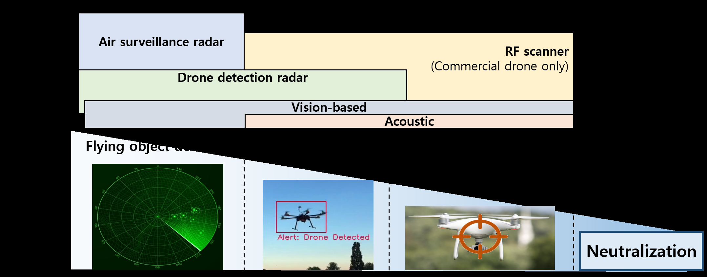
*Caption/Context: This article has been accepted for publication in a future issue of this journal, but has not been fully edited. Content may change prior to final publication. Citation information: DOI | 10.1109/ACCESS.2021.3065926, IEEE Access*

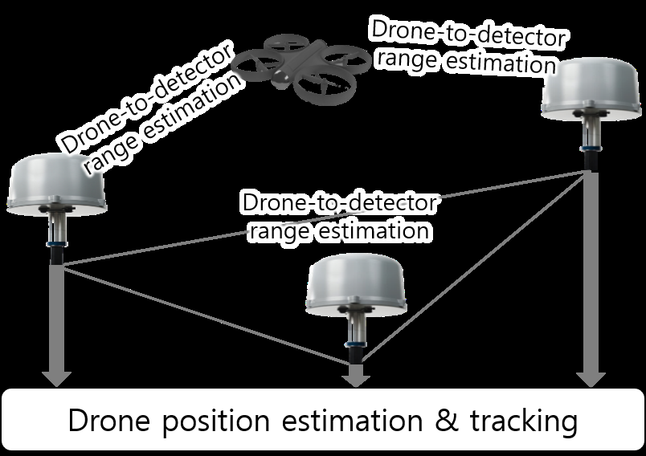
*Caption/Context: Thermal detection Unavailable Available Unavailable Available | Optic camera Unavailable Available Unavailable Available*

## --- Page 8 ---

This work is licensed under a Creative Commons Attribution 4.0 License. For more information, see https://creativecommons.org/licenses/by/4.0/

This article has been accepted for publication in a future issue of this journal, but has not been fully edited. Content may change prior to final publication. Citation information: DOI

#### 10.1109/ACCESS.2021.3065926, IEEE Access

#### TABLE 3: Hybrid detection systems

Vender
Model
Radar
RF scanner
Camera
(Infrared,
optic)

Acoustic
Detection range
(indicated)

References

ELTA
Drone guard
✓
✓
✓
4.5 km
[80]

Aaronia AG
AARTOS DDS
✓
✓
5 km
[82]

Advanced Protection Sys-
tems

Ctrl+Sky
✓
✓
✓
✓
3 km
[81]

CerbAir
CerbAir Fixed, Mobile
✓
✓
3 km
[86]

Rodhe and Schwarz
ARDRONIS
✓
3 km
[31]

Drone Shield
DroneSentinel
✓
✓
✓
✓
3.5 km
[31]

Drone detection refers to systems that observe a flying (or
stationary) object and determine if the object is a drone,
whereas drone identification refers to determining if the
detected drone is illegal and hence should be neutralized.
For example, a minimal radar system may barely accom-
plish drone detection, since it cannot distinguish between
drones and similar sized birds without an additional predic-
tion scheme or auxiliary equipment (e.g. vision cameras) as
discussed in Section III-E. Identification should be performed
accurately, robustly, and promptly; particularly where the tar-
get area utilizes drones or permits legal use of leisure drones.
The identification system should cooperate with the detection
system to defend the target area without false neutralization.

Ideally, drone identification should passively identify the
legality of drones through identification tags attached to
them that periodically broadcasts their information, such as
RFID tags. However, comprehensive attachment of tag can
be discussed nationally or internationally, and has currently
just begun. Furthermore, unintended or inexperienced control
of legal drones can also be a threat to nearby facilities. Thus,
any anti-drone system should include active identification
solutions to determinate hazard level for detected drones, by
tracking and estimating flight paths, and collecting specific
information such as drone model and detailed properties that
violate safety regulations. As described in Section 4, some
detection systems can also provide identification functional-
ities, such as DJI aeroscope [57], or fine-grained detection
network which can track the flight path. This section dis-
cusses active and passive drone tracking and path estimation
solutions, mainly based on vision techniques.

A. DRONE TRACKING AND FLIGHT ESTIMATION
To distinguish detection methods, we focus on theoretical
and systematic location estimation schemes for flying drones.
Most systems use vision information to improve drone track-
ing, using conventional image processing or machine learn-
ing (convolutional neural networks). Path estimation systems
also use neural networks or various filters over the tracking
results to determine the drone movements. Xie et al. [87]
improved the particle filter algorithm to more precisely es-
timate drone location from measured azimuth, elevation, and
distance between the drone and the detection equipment,
and modelled drone constant acceleration. Son et al. [88]

proposed an optical flow based tracking method to track fast
and small drones. The authors combined a recursive filter
to detect tracking failures caused by fast positional changes
and perform retracing. Xue et al. [89] proposed a multi-layer
neural network for drone path estimation which approximates
any continuous function in a specified space to estimate
dynamic non-linear drone movement, and determined the
network parameters. Drone tracking and position (or motion)
estimation may be insufficient to judge drone legality, but
it is essential to estimate how much drone motion could
threaten the defense area. We introduce path-based drone
threat assessment in Section VII-B2.

B. RFID BASED IDENTIFICATION
Radio frequency identification (RFID) has been widely
adopted for identification and real-time location systems
(RTLS) in recent decades [90]. Active RFID system is a
promising drone identification approach due to low cost and
lightweight system design. Buffiet al. [91] proposed an
RFID based drone identification system over large areas,
to distinguish between licensed and unlicensed drones. The
major challenge is range extension and security concerns.
High speed drones may not give a short range RFID sys-
tem sufficient time to identify them. Spoofing RFID signal
can also deceive the system and allow malicious drones to
trespass over the defended area. Thus, security schemes for
RFID drone identification systems [91] and long-range active
RFID communication [92] should be further studied.

In addition to identification, positioning RFID-tagged
drones has also been widely studied for drone tracking.
Choi et al. [93] proposed a differentiated method for indoor
localization by attaching Ultra High Frequency (UHF) RFID
tags to UAVs and installing a number of passive tags over the
target area, connected to the system. This solution exploits
interference between UAV and ground tags, which can be
detected by measuring the received signal strength indicator
(RSSI). The system first measures the tag’s RSSI variance,
and then dynamically estimates drone future location by find-
ing the spot with greatest signal interference comparing with
pre-measured variances. Locating wired passive tags over
large areas may be cost-intensive, but position estimation in a
coarse distribution of the ground tags can extend the available
area.

8
VOLUME 4, 2016

## --- Page 9 ---

This work is licensed under a Creative Commons Attribution 4.0 License. For more information, see https://creativecommons.org/licenses/by/4.0/

This article has been accepted for publication in a future issue of this journal, but has not been fully edited. Content may change prior to final publication. Citation information: DOI

#### 10.1109/ACCESS.2021.3065926, IEEE Access

C. AUTOMATIC DEPENDENT SURVEILLANCE -
BROADCAST FOR DRONES
Automatic dependent surveillance - broadcast (ADS-B) has
been adopted for aircraft Air Traffic Control (ATC) sys-
tems [94]. ADS-B in aircraft periodically broadcasts gen-
eral navigation information via long range RF signal, and
anonymous ground users and the other aircraft can utilize
it for situational awareness and self-separation. The major
difference with RFID system is the broadcasting message
content: ADS-B messages contain identification and naviga-
tion information for the aircraft, which is standardized, such
as altitude, GPS, identification number of aircrafts, etc. ADS-
B has been recently applied to drones [95], [96] for survey-
ing flight information within the target area. Conventional
ADS-B systems are too large for smaller drones, so smaller
ADS-B modules are required. The Ping2020 family [97] by
uAvionix is an off-the-shelf product for drone-level ADS-
B, which can be attached to the drone flight controller (e.g.
Pixhawk [98]) and broadcast flight information through the
RF channel. Currently, Ping2020 has somewhat higher price
than expected (US 2000 per Ping2020i [99]), which blocks
large-scale deployment. Low production cost and nation-
wide drone registration systems can construct wide area
drone identification infrastructure for continuous and robust
identification.

Drone identification phase can be flexibly configured from
drone-to-others authentication to threat analysis. However,
anti-drone system should clarify each logic that determines
whether or not to neutralize drones to cover any type of drone
intrusion. This determination should have firm criteria from
the detection results, national or international regulations,
and auxiliary identifiaction tools. Then, according to the
determination, the proper level of neutralization scheme must
be in accordance with the law. As an intermediate step,
identification system must be defined as a determination tools
that provide zone-safe and regulatory-safe solution in given
circumstances.

V. DRONE NEUTRALIZATION
We use the term Drone neutralization as a component of anti-
drone system which refers to operations that suppress the
threatening drones’ movements. We classify the neutraliza-
tion methods as destructive and non-destructive. This classi-
fication is valid since it not only presents technical difficulty,
but also availability within civil regulations. Destructing the
illegal drones are currently prohibited in many countries, so
non-destructive ways are preferred in several public consti-
tutions. We address in more detail non-destructive methods,
to achieve high utilization of anti-drone systems in the worst
cases.

Mostly, confirmatory methods such as jamming are pre-
ferred to prevent secondary crises (landing/crash and/or op-
erational failure). Jamming is confirmatory and also non-
destructive, but as discussed above, causes temporary com-
munication paralysis across the target area. Thus, recent
approaches attempt to individually disturb the target drones,

considering their operation features. Table 4 lists several
common drone neutralization solutions each of which is
discussed in the following subsection.

A. DRONE HIJACKING
The terms hijacking and spoofing are often used interchange-
ably in anti-drone domain. We clarify meaning of the terms
in this paper for readability. Drone hijacking means that a de-
fending operator stake control of the target drone regardless
of the methodology. Drone spoofing means that the operator
generates a fake signal to prevent the target drone from mov-
ing as intended by the original controller. The main difference
between hijacking and spoofing is post-attack behavior. The
original controller cannot control the drone after hijacking,
whereas spoofing signals can be used to hijack drones.

The reason for this definition is mainly the need for control
deprivation. Usurping the original operators’ control could
include jamming or hacking before the anti-drone system ob-
tains actual control. Thus, hijacking could be technically and
regulatorily challengeable, but it is more robust then spoofing
after successful deprivation. In any case, both should be
investigated and for confirm defense.

Most drones establish a tightly coupled or paired con-
nection with the operator, and hijacking focuses on break-
ing this pairing. Trujano et al. [115] proposed a system to
break the pairing using a jamming signal and instantly re-
attach to the attacker’s controller to take control. Donatti et
al. [100] proposed a drone hijacking system by increasing
RF signal amplitude. The authors considered drone control
packet decoding schemes and validated the proposed system
with a prototype. Drone hijacking is an ideal approach in
terms of safe capture or landing, and facilitates follow-up
investigation. However, extending coverage and measures,
e.g. autonomous flight, drone communication protocol, etc.,
are major challenges.

B. DRONE SPOOFING
Spoofing the drone signal can be used to hijack drones or
confuse their flight routes. Drones generally control their
location and altitude from the operator’s RF signal, but use
sensor outputs to determine current status. GPS signals are
key data to determine current drone position in manual or
autonomous flight. Noh et al. [101] proposed a system to
generate fake GPS signals to deceive the drone’s GPS re-
ceiver, and make the drone mistakenly calculate its position.
The authors aimed to secure hijacking related to the GPS
failsafe mode of the drone internal system and quietly send
the drone to a specific location. Simple spoofing techniques
that distract drones can take advantage of several types of
sensors, which may be cooperatively combined. Deceiving
drone sensors can be achieved following a wide range of
approaches regardless of the communication protocol, but in
the absence of separate safety measures for areas outside a
certain range, accidents such as crash landing may occur due
to unpredictable drone operator control.

VOLUME 4, 2016
9

## --- Page 10 ---

This work is licensed under a Creative Commons Attribution 4.0 License. For more information, see https://creativecommons.org/licenses/by/4.0/

This article has been accepted for publication in a future issue of this journal, but has not been fully edited. Content may change prior to final publication. Citation information: DOI

#### 10.1109/ACCESS.2021.3065926, IEEE Access

#### TABLE 4: Drone neutralization technologies

Destructive
Name
Advantages
Disadvantages
References

Non-
destructive

Hijacking
• Enable safe landing
• Only available for drones using known
protocols

[100]

Spoofing
• Wide availability
• Includes
autonomous
and
manual
flight

• Difficult to control
• Possibly nullified by manual control
[101]

Geofencing
• Simultaneous response
• Easily extended
• Only
available
for
communicable
drones
• Modified or disabled by drone opera-
tors

[102]–[104]

RF jamming
• Simple, instant procedure
• Effective for drones using unknown
protocols

• Can affect nearby facilities
• Not effective for autonomous drones
[105], [106]

Capture
• Available for follow-up investigation
• Ground and aerial solutions available
• Difficult to target and hit
• Possible damage during landing/crush
[107]–[111]

Destructive

Laser
• Long range
• Confirmatory destruction
• High maintenance and operation cost
• Generally unsuitable or unavailable
for non-military facilities

[112]

Killer drone
• Low maintenance and operation cost
• Possible simultaneous response to
multiple drones

• Hard to target and hit
• Deregulation for public drone flight
required

[43], [113]

Anti-aircraft
weapons

• Confirmatory destruction
• Long range neutralization
• High maintenance and operation cost
• Generally unsuitable or unavailable
for non-military facilities

[114]

#### C. GEOFENCING

Geofence based drone neutralization systems prevents target
drones from approaching a specific point. Various methods
have been studied to block the trespassing drones, including
the techniques discussed in Sections V-A and V-B. However,
the most generally adopted and implemented approach is that
the drone self-determines whether or not the drone lands
from its current location [116]–[118]. Geofence technol-
ogy for drones is classified into two types [118]. Dynamic
geofence propagates information regarding restricted flight
zones, and static geofence uses a flight permission informa-
tion repository that any drone can access. Most commercial
drones with common flight control stacks, e.g. PX4 [119]
and ArduPilot [120], have internal auto-landing modules for
safety. This method effectively prevents hobby drones from
invading unlicensed areas, but cannot defend a modified or
remodeled drone – disabling automatic landing systems built
into the drone controller. Since the system relies on the
drone’s internal navigation logic, malfunctioning drones may
allow trespassing into the secured area. Further preemptive
geofencing studies are required to address these limitations,
which may utilize spoofing and hijacking techniques.

As discussed in Section I, drone neutralization terminolo-
gies are somewhat confused due to the variety of mechanisms
and their consequences. Fig. 6 summarizes representative
non-destructive drone neutralization mechanisms, and Fig. 7
shows their technical relationships. The hijacking, spoofing,
and auto-landing sets (H, S, and G, respectively) refer to
top tier scheme classifications. Each intersection refers to
neutralization scheme collaborations, e.g. [100] for H ∩S,
and [101] for S −H −G. Thus, anti-drone system designers
can evaluate redundancy of neutralization deployments by
this approach. Anti-drone systems must prepare compositive

systems including S ∪H ∪G to cope with highly secure
drones, such as high-level anti-hijacking systems.

D. DRONE JAMMING
Drone jamming focuses on paralyzing radio communication
between the target drone and controller by strongly inter-
fering RF signals, which can be any kind of empty packet
signals within a targeted frequency range. The general pur-
pose is to make the target opponent fall into an uncontrolled
state where they cannot exchange external communication
signals [121]–[123]. Jamming technology can be classified
into various types by the different objectives and coverages.
We introduce some representative classification criteria.

1) The jamming system can be classified into direc-
tional [105] or omnidirectional [106] jamming by the
operating direction. The former focuses on a specific
direction, and the latter can jam all direction.
2) Stationary jamming is when the jamming system is
installed at a fixed location, such as a strategic location
or base station, whereas mobile jamming is when the
system is operated from portable devices such as hand-
held or vehicle mounted [124], [125].
3) Narrow or wide jamming is distinguished by the system
bandwidth [126]–[128].
4) GPS jamming aims to cause the drone GPS system
to malfunction [129], [130]), whereas communication
jamming aims to interrupt communication between the
drone and controller [131]–[133]).
Exceptionally, there are other jamming approaches tar-
geting specific network layers (e.g. L1 [134], L2 [135] or
L3 [136]). However, since drones generally do not follow
conventional communication protocols, we will not describe
these approaches in details. Jamming can also be imple-

10
VOLUME 4, 2016

## --- Page 11 ---

This work is licensed under a Creative Commons Attribution 4.0 License. For more information, see https://creativecommons.org/licenses/by/4.0/

This article has been accepted for publication in a future issue of this journal, but has not been fully edited. Content may change prior to final publication. Citation information: DOI

#### 10.1109/ACCESS.2021.3065926, IEEE Access

(a) Drone hijacking mechanism.

(b) Drone spoofing mechanism.

(c) Geofence mechanism for drone.

FIGURE 6: Typical non-destructive neutralization mecha-
nisms

FIGURE 7: Non-destructive drone neutralization scheme
relationships

mented by degrading the target communication quality [137].
However, anti-drone systems aim for complete drone neutral-
ization, hence jammers that only reduce drone performance

were not considered in this paper.

Jamming is a simple, robust, and wide-range solution
with low failure risk, hence most anti-drone systems adopt
jamming as their major neutralization scheme [84]. How-
ever, since jamming techniques mainly uses electromagnetic
signals, they can have significant unintended impacts, in-
cluding TV broadcasts, telecommunication, or even the air
traffic system. Thus, most countries strictly prohibit jamming
technology in public. The USA Federal Communications
Commission strictly forbids use of any radio jamming system
at consumer level [4], and the UK Office of Communication
also restricts jammers for any purpose interfering with radio
communication [5]. Many countries provide guides to use
jammers, but they have very strict legal constraints. There-
fore, there is almost no practical jamming technology pos-
sible for civilian users. Thus, non-military grade anti-drone
systems should generally be designed without jammers.

E. KILLER DRONES
We use the term killer drone to mean legal drones that
track target drones and attempt to damage them [43]. To
distinguish killer drone from drone capture, we limit the
killer drone scope to solutions that physically strike invading
drones. Killer drones require reactive and real-time decision
making regarding incoming drones, high accuracy drone
flying path estimation [87], [89], and outstanding physical
durability and mobility [113]. Using drones to damage il-
legal drones is very early stage technology, and requires
considerable patience for adoption into commercial anti-
drone systems. Swarming killer drones with distributed intel-
ligence [138] and precise tracking systems [87], [89] could
be a promising solution for drone fleet multi-faceted attacks.
Similar to jamming and radar, scrambling killer drones is
subject to regulatory restrictions [139], but can be mitigated
by policy changes and technical maturity in drone manage-
ment systems [140].

F. DRONE CAPTURE
Drone capture approaches physically bind the target drone
with various tools, generally some type of net or similar
rather than military ammunition. We divide drone capture
systems into two groups depending on the capture mecha-
nism.

• Terrestrial capture systems [109], [111] are human-held
or vehicle-mounted, and are available in wide range of
net sizes and numbers of rounds.

• Aerial capture systems [107], [108], [110] are installed
on defender drones, with restraint to the amount and
size of net bullets. Aerial capture provides much more
precision and response speed than terrestrial capture due
to drone mobility, but high requirements for tracking ac-
curacy and speed raises the possibility of neutralization
failure.

This classification comes from the entire difference in the
implementation phase of each. Terrestrial capture system

VOLUME 4, 2016
11

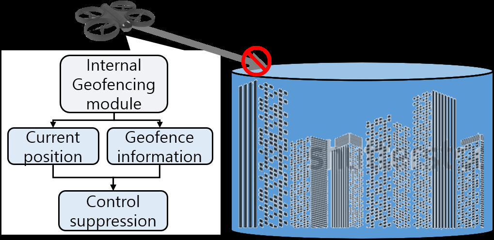
*Caption/Context: (b) Drone spoofing mechanism. | (c) Geofence mechanism for drone.*

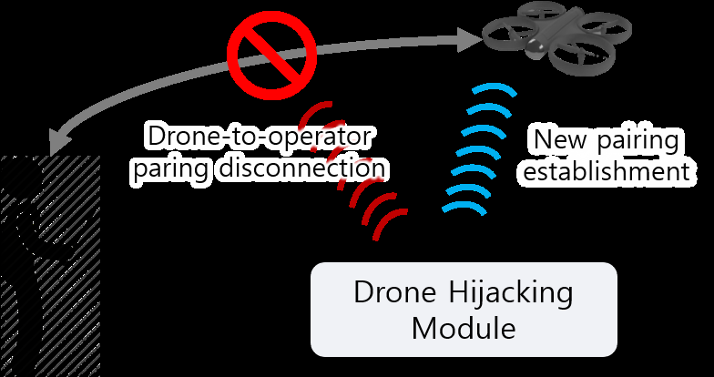
*Caption/Context: This article has been accepted for publication in a future issue of this journal, but has not been fully edited. Content may change prior to final publication. Citation information: DOI | 10.1109/ACCESS.2021.3065926, IEEE Access*

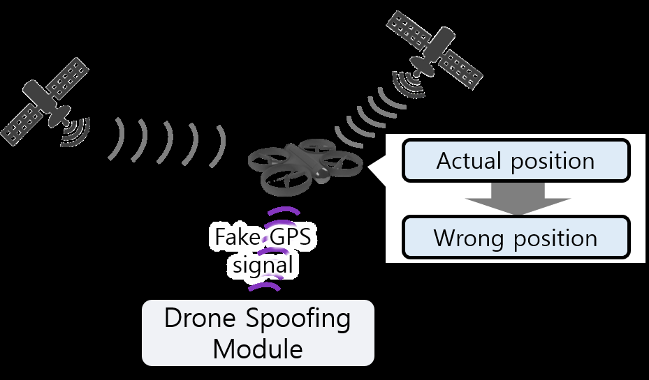
*Caption/Context: (a) Drone hijacking mechanism. | (b) Drone spoofing mechanism.*

## --- Page 12 ---

This work is licensed under a Creative Commons Attribution 4.0 License. For more information, see https://creativecommons.org/licenses/by/4.0/

This article has been accepted for publication in a future issue of this journal, but has not been fully edited. Content may change prior to final publication. Citation information: DOI

#### 10.1109/ACCESS.2021.3065926, IEEE Access

should consider the coverage of each device and the optimal
spots for safe capture. Furthermore, improvement strategy is
to increase the effective range of the devices, which has a
higher balance between the cost and the performance than
aerial case. On the other hand, aerial capturing devices have a
higher tradeoff at weight and the performance due to the lim-
ited load of the drones. In addition, aerial capturing system
mainly considers the traceability of the drone itself; the flight
performance and the formation strategy of the drones are key
issues of the system. It is not desirable to determine which
ways are correct, so both approaches should be investigated
in the future.

As drone detection mechanism utilizes the features of
drone operation, drone neutralization also exploits them and
invokes unintended operation. However, not all neutralization
methods always meet the anti-drone system administrators’
goal, and may vary from case to case. Thus, multiple neu-
tralization schemes should be prepared in one package and
increase the successful rate of each. It is also important to
continuously follow up the drone-safe technologies such as
anti-spoofing and anti-hijacking, each of which was origi-
nally suggested without malice. In addition, anti-drone sys-
tem should be able to plan its neutralization, considering the
effective range of the scheme and the estimated flight path,
detailed in Section VII-C.

VI. ANTI-DRONE SYSTEM USE CASES
Recently, most installation examples of officially released
anti-drone systems are in airports and prisons, or temporary
but important meetings. Current security systems tend to
install a drone detection sensor package but are not integrated
with identification and neutralization phases. Rather, they
rely on human guards carrying drone neutralization equip-
ment, hence are vulnerable to rapid and elaborate attacks
from high technology drones. This section introduces some
practical use cases for current anti-drone system installa-
tions and addresses remaining requirements for public safety
against illegal drones. Table 5 summarizes the use case
details3.

A. ANTI-DRONE SYSTEMS AT AIRPORTS
After drone incident [13], Gatwick International Airport in-
stalled a military grade anti-drone system [141] using the
British army’s laser based destructive system [112]. North-
west Florida Beaches International Airport is a coastal air-
port, and installed a detection system to detect both bird
and drone incursions [142]. Copenhagen International Air-
port is one of the most population intensive airports in
North Europe, and hence deployed the Mydefense anti-
drone system [143], developed by Denmark. Muscat Airport
in Oman installed the German AARTOS anti-drone sys-
tem [82], [151], characterized by scalability of the defense
area up to 50 km to meet large airport requirements.

3We only included confirmed information from authorized media.

Airports are densely populated facilities with high injury
risk in the event of an airplane accident, hence national secu-
rity agencies tend to deploy military grade defense systems.
Anti-drone systems are expected to increase gradually as in-
ternational airports in each country develop further from their
current pilot systems. However, radars are widely used for air
traffic management (ATM), so many airport cases are limited
to non-radar components. It is essential to deploy sufficient
alternative solutions to ensure safety against unauthorized
drones, including vision and sound based approaches.

B. ANTI-DRONE SYSTEMS IN OTHER FACILITIES
Various non-airport anti-drone systems have been imple-
mented against illegal drone intrusion. Suffolk Prison de-
ployed a drone detection system to prevent smuggling pro-
hibited items, such as drugs and mobile phones [144]. New
York’s Mets City Field installed a drone detection system to
protect against unlicensed broadcast of the matches [145].
Zhejiang University independently developed and deployed
anti-drone system named ADS-ZJU, with sensor fusion
and automatic jamming technology [84]. PyeongChang
Olympics Stadium deployed interceptor drones to capture
illegal drones [146], and temporary drone detection sys-
tems were deployed the at University of Nevada, Las Vegas
(UNLV) during US presidential debates [147], Davos during
the World Economic Forum [148], and Buenos Aires during
the G20 summit [149]. Israel has developed the Drone Dome
anti-drone system [150] covering the whole country.

C. REMARKS
The use cases considered here indicate that anti-drone sys-
tems are currently installed where real drone threats, such
as smuggling or terrorism, are expected. This implies that
anti-drone system design remains introductory and relatively
primitive compared with actual drone incident urgency. A
generalized and diverse strategy for anti-drone system de-
sign is urgently required. Considering the high mobility and
accessibility of drones, anti-drone systems must be installed
on large scales to prevent sporadic drone incidents. However,
existing anti-drone systems are generally military grade and
only installed in important facilities, hence other sites are vul-
nerable to drone attacks and may need appropriate anti-drone
systems according to national regulations. Furthermore, ma-
jority of anti-drone systems include only drone detection
and alert systems with identification and neutralization stages
are performed by people, mostly soldiers. Integrating detec-
tion, identification, neutralization schemes, and automating
the overall system would greatly improve anti-drone system
accessibility and reduce the labor costs. Section VII proposes
some guidelines for efficient anti-drone system design.

VII. ANTI-DRONE SYSTEM GUIDELINES
Comparing with military installations, non-military facilities
are significantly disadvantageous to defend against illegal
drones legally and technically. Rapid advances in imbedded
systems make drones continually get smaller and faster in

12
VOLUME 4, 2016

## --- Page 13 ---

This work is licensed under a Creative Commons Attribution 4.0 License. For more information, see https://creativecommons.org/licenses/by/4.0/

This article has been accepted for publication in a future issue of this journal, but has not been fully edited. Content may change prior to final publication. Citation information: DOI

#### 10.1109/ACCESS.2021.3065926, IEEE Access

#### TABLE 5: Anti-drone system use cases

Location
Model
Temporal
Detection
Neutralization
Purpose
Reference
Gatwick International Airport
AUDS
✓
✓
Safety against drones
[141]
Northwest Florida Beaches International
Airport

DroneWatcher
✓
✓
Safety against drones
[142]

Copenhagen International Airport
Mydefence
✓
✓
✓
Safety against drones
[143]
Suffolk Prison
✓
✓
Preventing smuggling
[144]
Mets City Field
✓
Protection of broadcasting
rights

[145]

Zhejiang University
✓
✓
Safety against drones
[84]
PyeongChang Olympic Stadium
✓
✓
✓
Safety against drones
[146]
University of Nevada, Las Vegas
DroneTracker
✓
✓
Drone terrorism defense
[147]
Davos
DroneTracker
✓
✓
✓
Drone terrorism defense
[148]
Buenos Aires
Drone Guard
✓
✓
✓
Drone terrorism defense
[149]
Israel
Drone Dome
✓
✓
Drone terrorism defense
[150]

obstacle-rich 3D space [69], [152], with enormously increas-
ing payload capability. Most countries regulate drone use for
industrial and market applications, and require urgent imple-
mentation of a systematic and rigorous drone defense system
at major facilities. Several drone attacks were reported in the
2010s, not only for military bases [13]–[16], [18], [20]. Non-
military drone intrusion can cause considerable economic
damage, but applying ideal anti-drone systems in overall area
is almost impossible not only due to budget constraints, but
also workforce. Furthermore, excessive response to hobby
drones can impose considerable capital redundancy, and still
may be vulnerable to subsequent serious attacks.

Utilizing the surveys in Section III–V, this section pro-
poses a guideline for designing non-military anti-drone sys-
tems, including where to deploy the equipment, what method
should be chosen at neutralization, and how to define inte-
grated response procedures.

Given the scope of this paper, we do not consider amend-
ments to legislative provisions regarding drone and defense
system permits, etc.

A. DETECTOR DEPLOYMENT
An ideal drone detection system could form a comprehensive
deployment of high-performance devices with high density,
but system management and installation must be considered
to operate a cost-efficient drone defense system. The system
must also be able to intensively monitor critical points where
catastrophic accidents such as massive explosions or top
secret leaks could occur. Furthermore, increased detection ac-
curacy is essential to obtain as much information as possible
by combining multiple detection methods (Section III-E). We
propose a superpositioning strategy for drone detectors con-
sidering relative importance of the areas. First, we categorize
detection methods by quantitative and qualitative features,
and show deployment examples for an airport and industrial
facility.

1) Detection equipment categorization
Table 6 shows the categorization scheme that we proposed.
We considered not only the technical mechanism of detec-

tion, but also detailed specifications related to detection per-
formance, such as operating angle and installation method.
The main objective is to improve the detectability of high
priority areas; hence we set the criteria that differentiates
existing detection systems. For example, radar based detec-
tion has technical specifications at product level, such as
directional/omnidirectional, stationary/non-stationary, detec-
tion range, and whether the drone is identified4. On the other
hand, if a detection system combines multiple sensors (e.g.
vision+acoustic, Section III-E), new type should be created
to reflect differentiated detection performances. Categoriz-
ing available equipment according to features rather than
methodology means the system can deploy detection systems
in terms of various metrics, which lays the foundation of
detection system abstraction.

2) Area priority classification
Understanding the features and characteristics of defense
area is essential for optimal drone detection deployment.
The proposed approach analyzes defense area spatial usage
and classifies area priority into several levels. Classification
criteria reflects the main purpose of defense against drones,
which generally effects civilian and major property safety.

Figs 8a and 8b describe a fictitious airport and industrial
plant, respectively, as classification examples.

We mainly considered safety risks for airport passengers
in the airport classification. The most threatening airport
situations would be the one that drones cause aircraft crash
at takeoff or landing, which could result in massive human
casualties [153]. A relatively small drone can harm a flying
airplane if it enters the jet engine or damages the wings,
particularly during take-off or landing. To prevent this, the
runway and surrounding surfaces must be closely monitored,
and any abnormal condition quickly propagated to control
aircraft takeoff and landing. We exploited International Civil
Aviation Organization (ICAO) regulations regarding obstacle
limitation surfaces [154] to prioritize areas within the airport.

4There are technical differences between the radars that can detect a
drone-size object (low RCS) and identify the drone [35], [69], [70].

VOLUME 4, 2016
13

## --- Page 14 ---

This work is licensed under a Creative Commons Attribution 4.0 License. For more information, see https://creativecommons.org/licenses/by/4.0/

This article has been accepted for publication in a future issue of this journal, but has not been fully edited. Content may change prior to final publication. Citation information: DOI

#### 10.1109/ACCESS.2021.3065926, IEEE Access

#### TABLE 6: Detection equipment categorization criteria

Types
Directionality
Identifiability
Detection range (unit: km)
Stationary
Examples
< 1
[1, 3]
> 3

Type 1
✓
✓
Omnidirectional radar

Type 2
✓
✓
✓
✓
EO/IR camera

Type 3
✓
✓
✓
RF scanner

Type 4
✓
✓
Portable (vehicular) radar

Type 6
✓
✓
✓
Human eye (baseline)

• Class I included airplane gliding and landing areas
with altitude range to drone-identifiable altitude, for the
highest priority of protection.

• Class II included navigation safety facilities and popu-
lation intensive areas that could result in massive human
injury.

• Class III included areas that could have short and long
term impact on airport operation and ATC in the event
of attack. This considers social and economic risks of
drone-aircraft collisions, which could temporarily para-
lyze ATC facilities, or cause airport shutdown.

• Class IV included areas protected by automatic drone
guidance systems such as Geofencing (Section V-C),
and boundaries where drones should turn back, such as
conical and horizontal airport surfaces.
There are no global regulations relevant to area designation
for the industrial factories. Therefore, we considered both
safety and security of the facility.

• Class I included areas with the highest potential for
large-scale incidents, such as explosion from drone
crash.

• Class II included population intensive areas, similar to
the case for the airport.

• Class III included security sensitive areas to prevent
drones from breaching confidentiality.

• Class IV included remaining and detectable outer
perimeter areas, to proactively detect and respond to
drone intrusions.
Fig. 8 shows priority assignments for the airport and fac-
tory examples. Various areas were scaled for visibility; Class
IV space was actually much larger than the sum of Class
I to III. The system can indicate where to focus detection
resources to minimizes potential damage caused by a drone
incident. Note that lower class areas do not mean that these
areas represent a weak point. The main goal of this classifica-
tion was not to reduce the likelihood of detection in low-risk
areas, but to effectively expand the detection network in cost
restraint.

3) Abstract formation
From detection categorization and priority classification, we
show example drone detection deployments using the ab-
stracted detection equipment. Fig. 9 shows deployments for
the airport and industrial facility cases. Figs. 9a and 9b

show two-dimensional views of the sample areas (left side),
indicating area classes, for visibility and better structural
understanding. The right side of the figures show results for
3 types of stationary equipment arranged in the defense area.
Type 3 equipment has wide surveillance range and hence
is installed at the center of the defense area to include as
many essential areas as possible; whereas type 2 equipment
is directional, hence devices were placed on entry surfaces
on both sides of the runway, and two others on the runway
and airport terminals considering the arrangement of Class
III facilities.

Real installations will have many more things to consider
when determining physical location of the equipment, such as
radio frequency bands, spatial margins with wireless equip-
ment in the target area, etc. Representative considerations are
as follows.

• Radio wave environment. In the case of drone radar, it
is necessary to investigate the risk of reducing detection
rate due to radio interference between the drone radar
equipment and nearby existing radars, and check fre-
quency bands employed. Most countries set regulations
on installing new radar sites [155], in terms of frequency
band and spatial distancing, hence prior consultation
with relevant institutions (e.g. US Federal Communica-
tions Commission (FCC)) is required.

• Legal operator boundaries. National regulations re-
lated to anti-drone solutions (particularly radar, camera,
RF jamming, and killer drones) should be considered
prior to deployment. The system designer should also
check legal right to arrest drone owners and public regu-
lations regarding destroying or damaging the drones, to
ensure system installation cost is more effective while
accomplishing the security requirements.

• Physical environments. Fig. 9 shows that existing fa-
cilities can block radar scanning, vision, etc. The anti-
drone system designer should carefully locate selected
detection devices considering building and surrounding
terrain profiles. Acoustic detection devices should not
be placed around noisy environments, and wired or
wireless networks should be optimally configured to
collect results from multiple detection systems.

• Radio interference. RF interference with existing radio
based systems (weather or aviation radar, ATC com-
ponents, etc.) must be concerned before installing the

14
VOLUME 4, 2016

## --- Page 15 ---

This work is licensed under a Creative Commons Attribution 4.0 License. For more information, see https://creativecommons.org/licenses/by/4.0/

This article has been accepted for publication in a future issue of this journal, but has not been fully edited. Content may change prior to final publication. Citation information: DOI

#### 10.1109/ACCESS.2021.3065926, IEEE Access

(a) Priority classification map of airport.
(b) Priority classification map of industrial factory.

#### FIGURE 8: Priority classification examples according to drone threat level

(a) Deployment scenario of airport.
(b) Deployment scenario of factory.

#### FIGURE 9: Detection system deployment scenario

drone detection radar, which could detrimentally impact
overall RF equipment performance. Discussions regard-
ing interference between 5G access networks and drone
radar [73] should also proceed nationwide.

The main objective for the proposed deployment was
sustainable design for drone detection devices’ configuration,
which could be semi-permanently employed by abstraction.
The deployment process could be applied when new de-
tection equipment was introduced or protection priorities
changed. Future work on this scheme should be an au-
tonomous algorithm for selecting and deploying the detection
devices considering installation cost and system features. Op-
timal placement of drone detection network can be obtained
with the proper objective function and efficient algorithm
design, which greatly improves security against illegal drone
incursion within a given budget.

4) Airspace priority classification
Civilian hobby drones can achieve over 3 km maximum
height [156], by the lack of the awareness of drone regulation.
Area priority classification effectively protects a specific
target area, but it is necessary to classify large areas by
priority to expand protection range to the national airspace

and prevent accidents of various aircraft types, such as PAVs.
Thus, we suggest an airspace priority classification, based on
ICAO regulations [157]. Wide-spread concerns about drones
in operating airspaces have raised the awareness for suitable
drone regulation [158]–[160]. Airspace is defined across a
wide area and it is difficult to cover with conventional local
anti-drone systems, hence large-scale airspace drone defense
system should be constructed with global (or national) drone
identification infrastructure (Section IV), containing long-
range identification and detection equipment.

Fig. 10 shows space priority classification according to
ICAO airspace classification criteria. Airspaces above air-
ports (B to D) are usually shaped as a stack of cylinders with
larger radius at higher altitude, reflecting airplane flight and
landing paths. However, drones draw landing and takeoff tra-
jectories relatively freely, so we allocated a large cylindrical
area near the airspaces. We designated Class I areas to large
and busy airports (B and C), and Class II areas to relatively
small airports (D). Airspace A includes airplane flightpaths,
and hence we allocated these to Class II since drone collision
at this airspace could cause forced landing or worse. We
set airspace E to Class III due to human accident risk, and
airspace G to Class IV for preemptive drone monitoring.

VOLUME 4, 2016
15

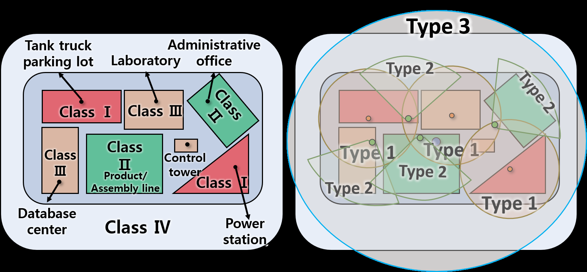
*Caption/Context: (a) Priority classification map of airport. (b) Priority classification map of industrial factory. | FIGURE 8: Priority classification examples according to drone threat level*

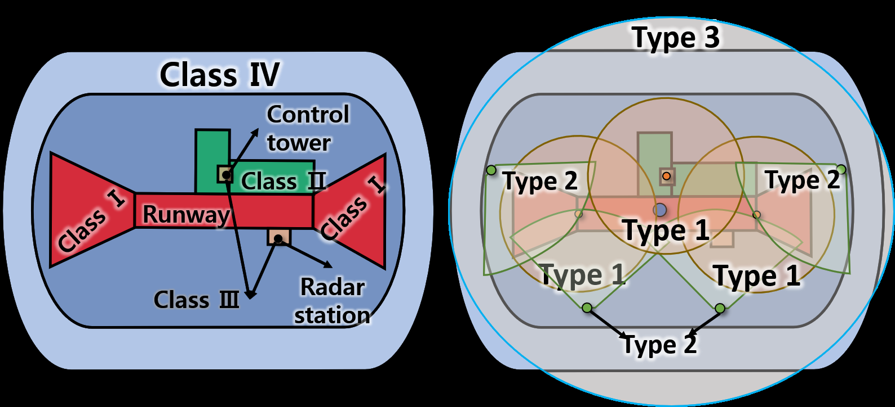
*Caption/Context: (a) Priority classification map of airport. (b) Priority classification map of industrial factory. | FIGURE 8: Priority classification examples according to drone threat level*

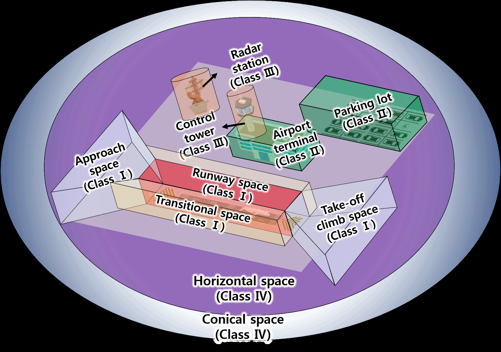
*Caption/Context: This article has been accepted for publication in a future issue of this journal, but has not been fully edited. Content may change prior to final publication. Citation information: DOI | 10.1109/ACCESS.2021.3065926, IEEE Access*

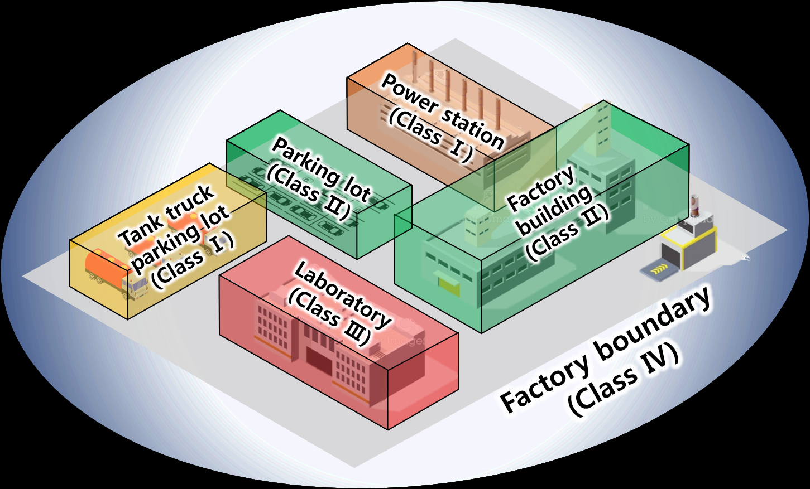
*Caption/Context: This article has been accepted for publication in a future issue of this journal, but has not been fully edited. Content may change prior to final publication. Citation information: DOI | 10.1109/ACCESS.2021.3065926, IEEE Access*

## --- Page 16 ---

This work is licensed under a Creative Commons Attribution 4.0 License. For more information, see https://creativecommons.org/licenses/by/4.0/

This article has been accepted for publication in a future issue of this journal, but has not been fully edited. Content may change prior to final publication. Citation information: DOI

#### 10.1109/ACCESS.2021.3065926, IEEE Access

#### FIGURE 10: Airspace priority classification

The hierarchical configuration with local anti-drone sys-
tems such as in airports and factories will provide a global
view of widespread provocation of drones, and enable coop-
erative tracking and neutralization. Every country has differ-
ent airspace regulations [161], and some countries do not use
some of their airspaces, so the system designer should reflect
nationwide potential threats and geographical features.

B. THREAT LEVEL ASSESSMENT
When a drone illegally approaches, it is mostly unavailable
to identify who or what the drone belongs to or it intends
to do. Thus, anti-drone system should be able to assess the
potential threat of unknown drones from the defender’s point
of view. We can obtain an exemplary threat model from drone
detection results as a numerical value R. We can determine
R with

R = (Robject + Rpath)Rtime,
(1)

where Robject, Rpath, and Rtime refer to threat levels in-
duced by the drone, drone flight path, and remaining response
time, respectively. We set maximum Robject and Rpath = α
and β (constants), respectively, and Rtime = 1.

In our model, R quantifies the likely damage that would
occurs if the observed drone actually attacked in a certain
area, considering the currently measured factors. Robject rep-
resents the physical impact from the drone crash, and Rpath
the estimated damage for a given crash point. Powering
factor Rtime indicates how much the damage realized, and R
becomes the realized damage of the observation when Rtime
is maximized to 1.

Eq. (1) can be made more flexible by parameterization. For
example, Robject could be set to a constant if the detection
network only provides the drone position. Since derivation of
Robject requires detailed drone information, constant Robject
can produce wide R range through the remaining parameters
Rpath and Rtime. The derivation of each parameter is as
follows.

1) Threat level by object

Ideally, the drone’s physical threat level is defined by its
physical properties such as kinetic energy, but the collected
information can be limited. Thus, we model the derivation of
Robject with complex conditions. Basically, kinetic energy
is determined by drone mass or weight (maximum takeoff
weight) and speed, where K = 1

2mv2. Detecting drones with
RF scanners can provide detailed information, such as model
name and weight, from a predefined database. This allows us
to infer the drone’s bare bone weight and potential payload,
providing an estimate for increased threat level if detection
device catch the payload of explosives.

Table 7 shows an example physical threat level classi-
fication scheme considering drone characteristics that can
be obtained through the detection systems. We referenced
criteria for classifying threat level from the kinetic energy
at [162] and noise at [163]. Most factors can be determined
once the drone’s commercial model is identified, including
the mass, and the threat level can be more accurately derived.
Otherwise, the system approximates drone weight from the
size and default density from the database. Low noise drones
are classified as higher threat since noise can help humans
track and evacuate drones easily, and reduce the damage.

Table 8 describes how to calculate the threat level ac-
cording to drone physical characteristics, where values were
obtained from Table 7, and Ndrone refers to the number of
swarming drones. This score is not an absolute range for
Robject, and the system administrator can change the weights
on demand. Partial threat factors from size, energy, scan-
ability, and loaded objects are calculated and then summed
to obtain the object-wise threat level. The overall threat
level of a drone swarm is derived by multiplying the object-
wise threat level to Ndrone. If the drone is not detected by
RF scanner or the system experiences difficulty in accurate
determination of some parameters, the safest option is to
conservatively set any uncertain parameter to its maximum
value to induce strong response.

16
VOLUME 4, 2016

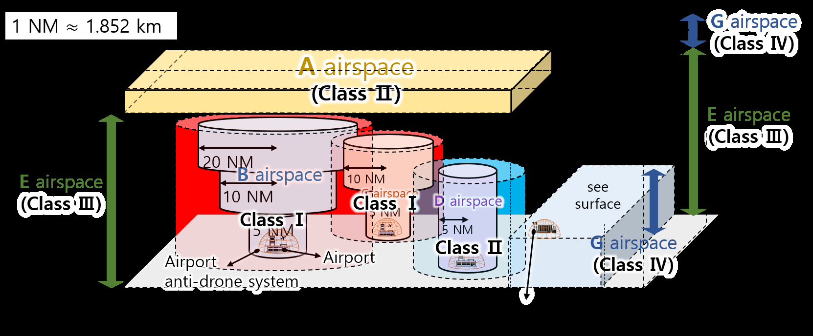
*Caption/Context: This article has been accepted for publication in a future issue of this journal, but has not been fully edited. Content may change prior to final publication. Citation information: DOI | 10.1109/ACCESS.2021.3065926, IEEE Access*

## --- Page 17 ---

This work is licensed under a Creative Commons Attribution 4.0 License. For more information, see https://creativecommons.org/licenses/by/4.0/

This article has been accepted for publication in a future issue of this journal, but has not been fully edited. Content may change prior to final publication. Citation information: DOI

#### 10.1109/ACCESS.2021.3065926, IEEE Access

#### TABLE 7: Drone classification by physical features

Level 1
Level 2
Level 3
Level 4
Kinetic energy (J)
< 1400
[1400, 7000]
[7000, 14000]
> 14000
Noise level (dB)
> 80
[60, 80]
[40, 60]
< 40
Loaded objects
None
Vision camera
Lightweight weapon
Identifiable object

Explosives
unidentified object
RF scannable
Scannable
Not scannable

#### TABLE 8: Robject derivation

Weight
Calculation
Kinetic energy
Wkinetic
Robject,kinetic = (observedkineticenergy) ÷ 14000J × Wkinetic
Noise level
Wnoise
Robject,noise = (1 −(observednoiselevel) ÷ 80dB) × Wsize
Loaded objects
Wloaded
Robject,loaded = (level)/4 × Wloaded

RF scannable
Wscannable
Robject,scannable =

(

0,
if scannable
1.0Wscannable,
if unscannable
Total
α
Robject
=
max(α, (Robject,kinetic
+
Robject,noise
+
Robject,loaded
+
Robject,scannable) × Ndrone)

Examples of Robject. Let

Wkinetic = Wnoise = Wloaded = Wscannable,

and two DJI Phantom 4 drones weighing 1.3 kilogram are ap-
proach at 72 km/h, 70 dB noise, without additional transport.
Then Robject ≈0.134α, which is relatively low. However,
if the drone approaches major facilities, such as runways or
civilian-intensive spots, the comprehensive threat level is set
higher. Robject then used to calculate the total threat level
α + β in addition to Rpath and Rtime.

Similarly, if an unknown drone with approximate size
800×700×400 mm approaches at 60 km/h, 80 dB noise, with
a lightweight weapon, then Robject ≈0.453α. This case is
considerably higher than for the two DJI Phantom 4 drones,
mainly due to loaded weapon and lack of scannability. This
case of threat level is valid since the drone may intend a
terrorist attack, and be unable to neutralize by geofence or
hijacking.

2) Threat level by flight path
We adopt the defense area analysis of Section VII-A to
determine drone threat level in various cases. In example
of airport, threat level is low if the drone is flying around
airport conical space, and the system can observe automatic
landing behavior or prepare delayed but safe neutralization
methods, e.g. capture. However, if the drone approaches
near the runway, where it could impose severe damage, the
system determines the increased threat level and can prepare
immediate, confirmatory, risky, or expensive neutralization
methods, e.g. jamming or firing, as appropriate. Multiple
neutralization methods are required to efficiently cope with
various drone attack situations. If risky options, e.g. jam-
ming, are not permitted, then the system should have an
emergency hotline to related agencies, such local police or
military bases.

Based on area priority classification, we determine po-
tential threat levels for each area. Table 9 shows an exam-
ple derivation for each class’s potential threat, Ti, where

FIGURE 11: Rpath determination for illegal drone flight
direction

i = 1 . . . 4. First, the system derives a numerical value for
each drone incident, and checks if the incident can happen
in the each area. Then it calculates the sum of incident
values of each area, and divides by the largest sum to obtain
coefficients for Ti, where T1 = 1, and finally multiply each
coefficient by β to derive Ti. Thus, we quantify the expected
damage from a successful drone attack for each area class.

Threat level for the drone’s flight path can be determined
from the potential threat levels for each area, applying higher
levels when the drone path includes high-priority areas. Let
−→
F be the aggregated drone flight direction (unit vector),
measured from tracking data over some period, and −−→
Fd,i be
the unit vector from its current location to the nearest Class
i point, as shown in Fig. 11. −→
F and −−→
Fd,i can be calculated
from drone tracking data and the drone threat level Rpath is

Rpath = Tc +

#### X

i∈S,i̸=c

(−−→
Fd,i · −→
F )wdTi,
(2)

where S is the set of area indices; c is the section containing
the drone; and

wd =
1
1 + exp (d −D
2 ),
(3)

VOLUME 4, 2016
17

*Caption/Context: Weight Calculation Kinetic energy Wkinetic Robject,kinetic = (observedkineticenergy) ÷ 14000J × Wkinetic Noise level Wnoise Robject,noise = (1 −(observednoiselevel) ÷ 80dB) × Wsize Loaded objects Wloaded Robject,loaded = (level)/4 × Wloaded | RF scannable Wscannable Robject,scannable =*

## --- Page 18 ---

This work is licensed under a Creative Commons Attribution 4.0 License. For more information, see https://creativecommons.org/licenses/by/4.0/

This article has been accepted for publication in a future issue of this journal, but has not been fully edited. Content may change prior to final publication. Citation information: DOI

#### 10.1109/ACCESS.2021.3065926, IEEE Access

#### TABLE 9: Potential threat derivation according to priority classification (airport)

area class

Damage types

Coefficient
Ti
Airplane
crash
(120)

Human casu-
alty
(100)

Airport
paralysis
(60)

Facility
explosion
(80)

Facility dam-
age, civilian
injuries
(20)

Other
damage
(10)

Class I
Y
Y
Y
N
Y
N
300/300
1.0β

Class II
N
Y
Y
Y
Y
N
260/300
0.867β

Class III
Y
N
Y
N
Y
Y
210/300
0.667β

Class IV
N
N
N
N
Y
Y
30/300
0.1β

where d is the distance between the drone and area of interest
and D is the system’s maximum detection range. wd indi-
cates a weight of threat with respect to a specific area, which
increases when the drone approaches to the area. In sum,
Rpath increases if the drone approaches high priority areas,
hence the proposed system can differentiate threat levels
between (for example) a drone circling the airport conical
space and one rushing toward a runway.

3) Threat level by available time
Response time affects anti-drone neutralization method se-
lection. We employ time-wise threat as a weight to enable
the system to respond to emergency situations. However,
estimating available response time is challenging due to
uncertainty regarding the illegal drone’s purpose. Therefore,
we modeled Rtime assuming the worst case of active drone
attack from factors collected by the drone detection and
tracking system. Rtime can be expressed as

Rtime = min


tavg
Dcritical ÷ |−−−→
vdrone|, 1



,
(4)

where tavg is the average response time for the available
neutralization methods; Dcritical is the minimum distance
to a critical point; and vdrone is the average drone velocity.
Rtime is generally larger than the expected time to prevent
tardy system response. Critical area can be assigned by using
the proposed area classification method (Section VII-A2) or
any other useful system. The denominator in (4) expresses the
remaining response time, hence the system should deploy fast
and effective neutralization methods as Rtime →1. Similar
to Rpath, Rtime should be updated periodically as drone
neutralization progresses to immediately react to changing
situations.

C. RISK MANAGEMENT
With few exceptions, neutralization carry the possibility for
further damage. For example, a promising neutralization
technology is the drone capturing gun [109], [111], which
fires a large net bullet to wrap the flying drone. However, suc-
cessful neutralization means the captured drone immediately
fall to the ground, potentially causing additional damages
such as explosion or human injuries. Thus, it is essential to
decide where and when to neutralize the incoming drone,

#### FIGURE 12: Risk model for drone neutralization

considering the risk from drone neutralization. We propose
an approach to search an optimal position to intercept the
drone after the threat assessment in Section VII-B.

To derive the risk model for drone neutralization, we
consider a simple scenario employing the drone capturing
gun, as shown in Fig. 12. Suppose a drone is flying across
the defense area, with current location −→
dt and estimated flight
path −−→
e(t). The selected neutralization device is located at −→
kt,
and moves toward the estimated drone route with speed v.
The system intends to intercept the drone at position −→p , and
estimated response time tresp is

tresp = |−→p −−→
kt|
v
.
(5)

The capture gun fires the net at −−−−→
e(tresp), hitting the drone if
it is within the device’s effective range Deff, and the drone
subsequently falls to the ground at some crash point c(−→
dt),
a probability distribution of coordinates. The expected total
risk r(−→p ) can be derived from the associated potential threat
level for crash or collision for each possible crash coordinate,
derived from the spatial threat assessment (Section VII-B2),

r(−→p ) =

#### I

#### C

S(−→c )pcrash(−→c ),
(6)

where C is the set of possible crash points; S(−→c ) is the
potential threat for location −→c ; and pcrash(−→c ) is the crash
probability for −→c .

Thus, c(−→
dt) and Deff must be already known to derive an
estimated response risk. Smaller crash point clusters imply

18
VOLUME 4, 2016

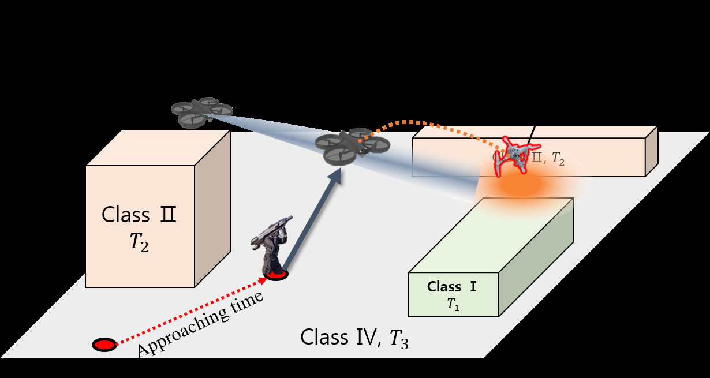
*Caption/Context: Coefficient Ti Airplane crash (120) | Human casu- alty (100)*

## --- Page 19 ---

This work is licensed under a Creative Commons Attribution 4.0 License. For more information, see https://creativecommons.org/licenses/by/4.0/

This article has been accepted for publication in a future issue of this journal, but has not been fully edited. Content may change prior to final publication. Citation information: DOI

#### 10.1109/ACCESS.2021.3065926, IEEE Access

FIGURE 13: Estimated risk from drone flight path and neu-
tralization point

larger area of low r(−→p ) values, and larger Deff implies
larger available response area. c(−→
dt) and Deff are strongly
related to the particular neutralization system selected, and
hence are essential parameters to evaluate neutralization per-
formance.

Fig. 13 shows a simple drone flight simulation coded in
MATLAB to verify the proposed risk model validity. We
formed a (100, 100, 100) simulation space, with estimated
flight path from (5, 5) to (100, 90) and 3 designated areas
with potential threats levels {50, 30, 20}. The drone response
team (device and carrier) were initially located at −→
kt
=
(80, 80) and r(−→p ) distribution was represented as a three-
dimensional mesh. As shown, r(−→p ) is a dynamic value
depending on selected neutralization points. In particular,
the neutralization method was unavailable for some of the
nominally available area due to range limitation. Then, the
optimal operation point can be approximately (60, 80) with
lowest risk. Designing risk model can determine where to
deploy the neutralization process with lowest risk in dynamic
situations.

VIII. ADVANCES IN DRONE TECHNOLOGY
Before the anti-drone system get spotlighted as the security
solution for drone incidents, drone researchers rather studied
the security solutions for the drones to defend against the
malicious attacks [164]. Drones are now widely acknowl-
edged as potential weapons, and anti-drone technologies
have been widely studied to defend against malicious drone
attacks. However, anti-drone and drone-safety domains are
complementary, similar to hacking and network security.
This section discusses drone-side defensive technologies and
propose future directions for anti-drone systems.

A. ANTI-DRONE NULLIFICATION TECHNOLOGIES
Drone defense solutions have evolved in part to avoid risks
from expanded industrial drone use. Increased drone automa-
tion and vastly improved stability have greatly improved

FIGURE 14: Advances and requirements for detection tech-
nologies

drone security, and hence many current anti-drone solutions
can fail to defend against modern drones. We consider several
drone safety systems that could potentially cause anti-drone
system failure in terms of detection and neutralization. We
replace the concerns about drone identification technology
with [165], which solves the existing problems of remote
drone registration systems.

1) Drone detection avoidance
Disturbing the detection sensor or minimizing drone frame
features are the main detection avoidance approaches, also
called drone stealth techniques [166]–[168]. Most stealth
techniques focus on lowering the frame RCS. Already, some
micro-UAVs (e.g. CrazyFlies [169]) are effectively unde-
tectable at sufficient range to allow eavesdropping or spy-
ing on confidential facilities, and if the drone is equipped
with encryption modules, RF scanners may not detect its
approach. A fleet of drones can construct a high security
network using advanced micro-computers and lightweighted
security schemes [170], [171] that would be impossible to
crack until the drones completed their invasion. Indeed, RF
scanners may become obsolete unless cracking technology
catches up with encryption schemes or adopt working quan-
tum computing devices. Meanwhile, Oh et al. [167] pro-
posed a noiseless drone design to avoid acoustic detection,
and particular drone shapes can significantly reduce camera
detection accuracy [172], [173] since vision systems identify
drones by shape.

Drone detection technology struggles with rapid drone
evolution in terms of size, speed, shape, and noise. Fig. 14
compares the advances in stealth technologies future require-
ments for detection technology, based on detection accuracy
and range from Section III, required performance from Sec-
tion II, and future objectives for drone technologies. Cur-
rent detection solutions grant limited safety against invading
drones. Rather, cooperation with dense and large-scale drone
identification networks may be better approach to determine

VOLUME 4, 2016
19

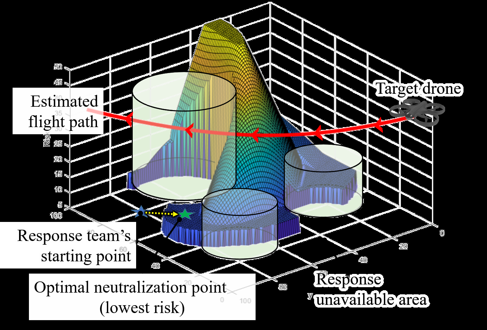
*Caption/Context: This article has been accepted for publication in a future issue of this journal, but has not been fully edited. Content may change prior to final publication. Citation information: DOI | 10.1109/ACCESS.2021.3065926, IEEE Access*

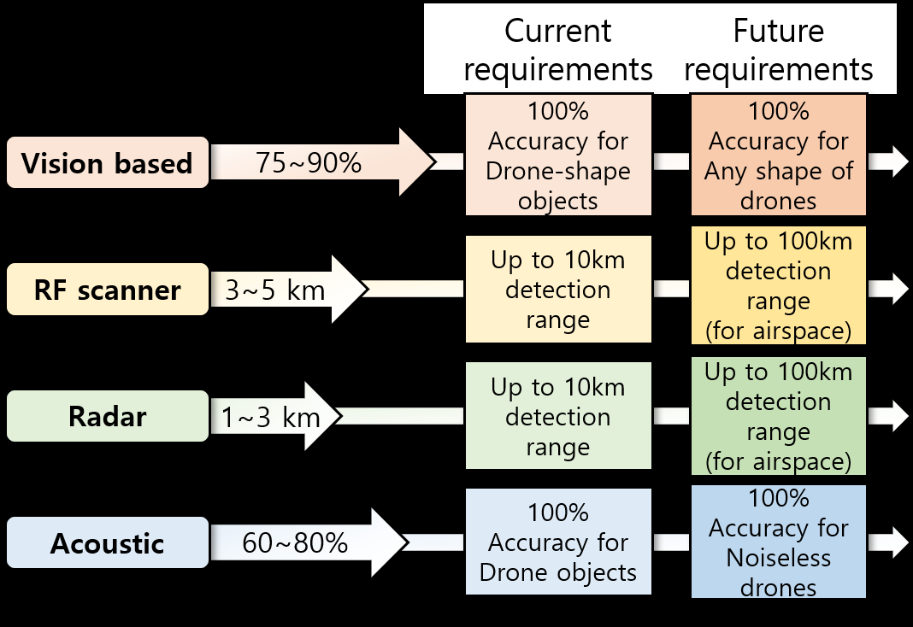
*Caption/Context: This article has been accepted for publication in a future issue of this journal, but has not been fully edited. Content may change prior to final publication. Citation information: DOI | 10.1109/ACCESS.2021.3065926, IEEE Access*

## --- Page 20 ---

This work is licensed under a Creative Commons Attribution 4.0 License. For more information, see https://creativecommons.org/licenses/by/4.0/

This article has been accepted for publication in a future issue of this journal, but has not been fully edited. Content may change prior to final publication. Citation information: DOI

#### 10.1109/ACCESS.2021.3065926, IEEE Access

if the flying object is harmful or not. It means, detection sys-
tem should observe wide types of flying suspicious objects,
regardless of feature, and let identification system decide
to neutralize each. If so, then drone detection can act as a
tracking system, another essential role in drone response.

2) Drone neutralization avoidance
There are many drone neutralization techniques (Section V),
and hence safety solutions also vary. Anti-jamming is the
complementary solution for jamming systems. Drone jam-
ming is currently a major neutralization choice despite of
the high risk and strict usage regulations due to simplicity,
immediateness, versatility, and wide range. Although most
drones can fly autonomously, breaking the connection be-
tween invading drone and its operator may prevent illegal
attempts such as confidential information acquirement. How-
ever, jamming the licensed drone bands may be ineffective
against modified drones using other bands [174] or multiple
bands [175]. Although wideband jamming appears a clear
and robust solution, operational cost and risk should be
carefully considered along with regulatory restrictions.

Non-destructive methods (Section V) tend to assume a
detected drone’s operation method, such as what protocols
employed and whether a drone is automated. Hijacking only
works for manually controlled drones and is ineffective
against self-navigating drones. Similarly, although spoofing
can misdirect or kidnap target drones, vision based naviga-
tion [176], [177] may avoid GPS-spoofing. Destructive meth-
ods, such as killer drones or drone capture, have wide poten-
tial to neutralize the drones but may struggle with high-speed
obstacle avoidance capabilities [178]–[180]. Thus, anti-drone
systems should derive universal, robust, and precise strategies
for drone response scenario, as discussed in Section VII-C.

B. ANTI-DRONE SYSTEM ADVANCES
Current anti-drone systems are under pressure to establish-
ment safety and security against drones, which remains chal-
lenging. Subsequent sections list constructive approaches for
anti-drone systems to achieve drone defense, from global
philosophy to specific methodologies. Since the proposed
statements require longer time than expected because of
the regulatory issues instead of technological difficulties,
national or world-wide discussions also be actively processed
to avoid the global threat of drone incidents.

1) System standardization
As discussed above, technical competition between drone
and anti-drone industries causes rapid new product devel-
opments while beating the opposite side of systems. Thus,
viable anti-drone systems must be capable of continuous
updates, which means components must be easily replaceable
and compatible with sustainable architecture. Anti-drone sys-
tem component standardization is essential, such as a form of
high-level architecture [181], to allow advanced component
designs to be quickly evaluated and adopted in the empirical
environment.

2) Safe channel in jamming
Because of the technical difficulties in other neutralization
methods, jamming is still the last bastion of the anti-drone
system. To reduce the risk of the use and maintain a net-
work of anti-drone systems and target facilities, the available
channel for the defenders, named Safe channel, should be
required. The safe channel can be designed by the ultra-low
band RF or the other mediums, such as visible light [182] or
acoustic signal [183].

3) Large-scale drone management
Most countries have drone regulations [139], but drone inci-
dents still occur. Thus, fine-grained and strong policies are
required for drone defense. Currently, anti-drone systems
have difficulties identifying and responding to illegal or in-
trusive drones, so strict drone management regulations, such
as installing hardware identification devices on drones, could
help reduce the burden on the system.

IX. SUMMARY AND CONCLUSION
This paper discussed non-military grade anti-drone systems.
Our findings can be summarized as follows.

• Drone detection. Modern detection solutions guaran-
tee a certain level of drone detection accuracy by in-
tegrating multiple detection systems. Each methodol-
ogy has performance limitations in terms of detection
range, functionality, weather dependency, etc., so the
anti-drone industry tends to construct hybrid detection
systems. However, administrators should analysis the
defense area to design optimal detection systems and
improve drone detection efficiency. From the survey,
we suggested a guideline for installing anti-drone de-
tection system considering efficiency and priority. The
proposed guidelines include abstract classifications for
detection equipment, priority classification for defended
areas, and actual system deployment examples for air-
ports, industrial facilities, and airspaces. Detection sys-
tem should be tightly coupled with fine grained drone
identification networks to provide viable drone tracking
and neutralization solution.
To sum up, considering current performance of de-
tection technology and capability of the drones, each
mechanism should be improved in terms of range and
accuracy to track the drones with advanced stealth func-
tions. In addition, sensor fusion technology must com-
pensate for the flaws in each method while increasing
cost efficiency. Meanwhile, anti-drone system designers
should make their own layout of the detection system
and map it to the actual equipment that matches their
requirements. This coexistence of designers and devel-
opers can lead to the technical advances in the drone
detection system.

• Drone identification. Empirical adoption of drone iden-
tification systems is earlier stage than detection and
neutralization systems due to requiring regulatory co-
operation, such as drone registration policies. Attaching

20
VOLUME 4, 2016

## --- Page 21 ---

This work is licensed under a Creative Commons Attribution 4.0 License. For more information, see https://creativecommons.org/licenses/by/4.0/

This article has been accepted for publication in a future issue of this journal, but has not been fully edited. Content may change prior to final publication. Citation information: DOI

#### 10.1109/ACCESS.2021.3065926, IEEE Access

active transponders to drones, similar to conventional
airplanes, is currently under consideration. Drone iden-
tification networks will become more important than de-
tection alone to overcome evolving drone technologies.
Airspace provisions can be further subdivided to prepare
for the emerging PAV industry, and anti-drone systems
must be phased in to defend against legitimate aircraft.
In short, drone identification technology will play an
important role in future anti-drone systems. Consider-
ing the rapid evolution in drone technology and the
high attention in anti-drone, drone identification system
should clearly determine whether or not to neutralize
the observed aircraft. False positive or false negative
of identification can result in the entire failure of the
defense. Proper amendments in drone regulation such as
identification tag are essential to construct reliable iden-
tification system. With authentication and regulations,
we claim that drone identification can be more specific
like detection/neutralization procedures.

• Drone neutralization. Drone neutralization schemes
exploit various drone features, including flight mech-
anisms and communication systems. Neutralization
methods can be mainly classified as destructive or non-
destructive. However, most non-destructive methods
may be quickly obsolete due to robust drone security
and navigation solutions. Although drone jamming re-
mains the most popular choice for current systems,
its inherent aggressiveness and anti-jamming develop-
ments strongly suggest the necessity for alternative
approaches. Geofencing for drones may prevent unin-
tended accidents from legitimately authorized drones,
but deliberate attacks may need to be defended physi-
cally, e.g. killer drones or drone capture.
In summary, anti-drone systems should include multiple
neutralization solutions and utilize them appropriately
to improve defense reliability. Specially, destructive and
non-destructive methods should be separately treated
in system design, and must be carefully selected. Our
guideline that assesses drone threat level from relevant
measured parameters and subsequently derives safe neu-
tralization scenarios could be an abstracted procedure
for future anti-drone systems.

Designing anti-drone systems without incorporating mil-
itary grade weapons and complying to national regulations
remains early stage and exposes vulnerability to drone in-
cidents. Current anti-drone systems have well-formed de-
tection, identification, and neutralization stages, but more
accurate and effective systems are required to cope with
high-speed, high-security, and three-dimensional attacks. We
proposed guidelines for designing versatile, available, and
sustainable anti-drone to defend against various drone attack
scenarios. Our proposals address the direction to resolve
technical and structural difficulties for anti-drone system
design, and cope with the advances in drones’ defense
mechanism. We expect this anti-drone system survey con-

tributes to expanding the drone-safety zones without requir-
ing weaponry.

#### REFERENCES

[1] D. Floreano and R. J. Wood, “Science, technology and the future of small

autonomous drones,” Nature, vol. 521, no. 7553, pp. 460–466, 2015.
[2] M. Ritchie, F. Fioranelli, and H. Borrion, “Micro uav crime prevention:

Can we help princess leia?” in Crime prevention in the 21st century.
Springer, 2017, pp. 359–376.
[3] B. R. Van Voorst, “Counter drone system,” Sep. 14 2017, uS Patent App.

15/443,143.
[4] F. C. C. (FCC), “Fcc enforcement advisory, cell jammers, gps jammers,

and other jamming devices,” 26 FCC Rcd 1329 (2), Feb 2011.
[5] U. Legislation, “Uk public general acts, wireless telegraphy act 2006,

section 68,” 2006 c.36.
[6] Y. Shapir, “Lessons from the iron dome,” Military and Strategic Affairs,

vol. 5, no. 1, pp. 81–94, 2013.
[7] P. Wellig, P. Speirs, C. Schuepbach, R. Oechslin, M. Renker, U. Boeniger,

and H. Pratisto, “Radar systems and challenges for c-uav,” in 2018 19th
International Radar Symposium (IRS).
IEEE, 2018, pp. 1–8.
[8] A. Chadwick, “Micro-drone detection using software-defined 3g passive

radar,” 2017.
[9] B. Nuss, L. Sit, M. Fennel, J. Mayer, T. Mahler, and T. Zwick, “Mimo

ofdm radar system for drone detection,” in 2017 18th International Radar
Symposium (IRS).
IEEE, 2017, pp. 1–9.
[10] H. Mazar, Radio spectrum Management: Policies, regulations and tech-

niques.
John Wiley & Sons, 2016.
[11] A. R. Wagoner, D. K. Schrader, and E. T. Matson, “Towards a vision-

based targeting system for counter unmanned aerial systems (cuas),”
in 2017 IEEE International Conference on Computational Intelligence
and Virtual Environments for Measurement Systems and Applications
(CIVEMSA).
IEEE, 2017, pp. 237–242.
[12] P. Nguyen, M. Ravindranatha, A. Nguyen, R. Han, and T. Vu, “Investigat-

ing cost-effective rf-based detection of drones,” in Proceedings of the 2nd
workshop on micro aerial vehicle networks, systems, and applications for
civilian use, 2016, pp. 17–22.
[13] BBC, Gatwick Airport drone attack: Police have no lines of inquiry, 2019

(accessed September 27, 2019), https://www.bbc.com/news/uk-england-
sussex-49846450.
[14] T. LOCAL, 143 flights cancelled at Frankfurt Airport due to drone sight-

ing, 2019 (accessed May 9, 2019), https://www.thelocal.de/20190509/
disruption-after-frankfurt-airport-halts-flights-due-to-drone-sighting.
[15] U. A. Office, Massachusetts Man Charged with Plotting Attack on

Pentagon and U.S. Capitol and Attempting to Provide Material Support
to a Foreign Terrorist Organization, 2011 (accessed September 28,
2011), https://archives.fbi.gov/archives/boston/press- releases/2011/
massachusetts- man- charged- with- plotting- attack- on- pentagon- and-
u.s.-capitol-and-attempting-to-provide-material-support-to-a-foreign-
terrorist-organization.
[16] BBC, Syria war: Russia thwarts drone attack on Hmeimim airbase, 2018

(accessed January 7, 2018), https://www.bbc.com/news/world-europe-
42595184.
[17] B. Hubbard, P. Karasz, and S. Reed, “Two major saudi oil installations hit

by drone strike, and us blames iran,” The New York Times, Sept, vol. 14,
2019.
[18] C. Will Ripley, Drone with radioactive material found on Japanese Prime

Minister’s roof, 2015 (accessed April 22, 2015), https://edition.cnn.com/
2015/04/22/asia/japan-prime-minister-rooftop-drone/index.html.
[19] T. Gibbons-Neff, ISIS used an armed drone to kill two Kurdish fighters

and wound French troops, report says, 2016 (accessed October 11, 2016),
https://www.washingtonpost.com/news/checkpoint/wp/2016/10/11/isis-
used-an-armed-drone-to-kill-two-kurdish-fighters-and-wound-french-
troops-report-says/.
[20] BBC, Venezuela President Maduro survives drone assassination attempt,

2018 (accessed August 5, 2018), https://www.bbc.com/news/world-latin-
america-45073385.
[21] G. Ding, Q. Wu, L. Zhang, Y. Lin, T. A. Tsiftsis, and Y.-D. Yao, “An

amateur drone surveillance system based on the cognitive internet of
things,” IEEE Communications Magazine, vol. 56, no. 1, pp. 29–35,
2018.
[22] P. Andraši, T. Radiši´c, M. Muštra, and J. Ivoševi´c, “Night-time detection

of uavs using thermal infrared camera,” Transportation research proce-
dia, vol. 28, pp. 183–190, 2017.

VOLUME 4, 2016
21

## --- Page 22 ---

This work is licensed under a Creative Commons Attribution 4.0 License. For more information, see https://creativecommons.org/licenses/by/4.0/

This article has been accepted for publication in a future issue of this journal, but has not been fully edited. Content may change prior to final publication. Citation information: DOI

#### 10.1109/ACCESS.2021.3065926, IEEE Access

[23] H. I. Systems, HGH Spynel, 2020 (accessed July 28, 2020), https://www.

messe-essen-digitalmedia.de/uploads/E302/pdf/company/hgh-infrared-
systems-f9d3f-info.pdf.
[24] C. Aker and S. Kalkan, “Using deep networks for drone detection,” in

2017 14th IEEE International Conference on Advanced Video and Signal
Based Surveillance (AVSS).
IEEE, 2017, pp. 1–6.
[25] M. Saqib, S. D. Khan, N. Sharma, and M. Blumenstein, “A study on

detecting drones using deep convolutional neural networks,” in 2017 14th
IEEE International Conference on Advanced Video and Signal Based
Surveillance (AVSS).
IEEE, 2017, pp. 1–5.
[26] I. Guvenc, F. Koohifar, S. Singh, M. L. Sichitiu, and D. Matolak,

“Detection, tracking, and interdiction for amateur drones,” IEEE Com-
munications Magazine, vol. 56, no. 4, pp. 75–81, 2018.
[27] S. S. Trundle and A. J. Slavin, “Drone detection systems,” Mar. 30 2017,

uS Patent App. 15/282,216.
[28] M. F. Al-Sa’d, A. Al-Ali, A. Mohamed, T. Khattab, and A. Erbad, “Rf-

based drone detection and identification using deep learning approaches:
An initiative towards a large open source drone database,” Future Gener-
ation Computer Systems, vol. 100, pp. 86–97, 2019.
[29] CRFS, DroneDefense, 2020 (accessed July 28, 2020), https://pages.crfs.

com/hubfs/CR-002800-GD-2-DroneDefense\%20Brochure.pdf.
[30] DeDrone, RF-300 Data Sheet, 2020 (accessed July 28, 2020),

https : / / assets . website - files . com / 58fa92311759990d60953cd2 /
5d1e14bc96a76a015d193225\_dedrone-rf-300-data-sheet-en.pdf.
[31] Rodhe and Schwarz, R&S Ardonis, 2020 (accessed July 28, 2020), https:

//scdn.rohde-schwarz.com/ur/pws/dl\_downloads/dl\_common\_library/
dl\_brochures\_and\_datasheets/pdf\_1/ARDRONIS\_bro\_en\_5214-
7035-12\_v0600.pdf.
[32] O. O. Medaiyese, A. Syed, and A. P. Lauf, “Machine learning framework

for rf-based drone detection and identification system,” arXiv preprint
arXiv:2003.02656, 2020.
[33] M. S. Allahham, T. Khattab, and A. Mohamed, “Deep learning for rf-

based drone detection and identification: A multi-channel 1-d convolu-
tional neural networks approach,” in 2020 IEEE International Conference
on Informatics, IoT, and Enabling Technologies (ICIoT).
IEEE, 2020,
pp. 112–117.
[34] Y. Liu, X. Wan, H. Tang, J. Yi, Y. Cheng, and X. Zhang, “Digital

television based passive bistatic radar system for drone detection,” in
2017 IEEE Radar Conference (RadarConf).
IEEE, 2017, pp. 1493–
1497.
[35] J. Drozdowicz, M. Wielgo, P. Samczynski, K. Kulpa, J. Krzonkalla,

M. Mordzonek, M. Bryl, and Z. Jakielaszek, “35 ghz fmcw drone
detection system,” in 2016 17th International Radar Symposium (IRS).
IEEE, 2016, pp. 1–4.
[36] R. radar systems, Elvira, 2020 (accessed July 28, 2020), https://www.

robinradar.com/elvira-anti-drone-system.
[37] D.-H. Shin, D.-H. Jung, D.-C. Kim, J.-W. Ham, and S.-O. Park, “A

distributed fmcw radar system based on fiber-optic links for small drone
detection,” IEEE Transactions on Instrumentation and Measurement,
vol. 66, no. 2, pp. 340–347, 2016.
[38] J. Colorado, M. Perez, I. Mondragon, D. Mendez, C. Parra, C. De-

via, J. Martinez-Moritz, and L. Neira, “An integrated aerial system
for landmine detection: Sdr-based ground penetrating radar onboard an
autonomous drone,” Advanced Robotics, vol. 31, no. 15, pp. 791–808,
2017.
[39] G. Fang, J. Yi, X. Wan, Y. Liu, and H. Ke, “Experimental research of

multistatic passive radar with a single antenna for drone detection,” IEEE
Access, vol. 6, pp. 33 542–33 551, 2018.
[40] M. P. Jarabo-Amores, D. Mata-Moya, P. J. Gómez-del Hoyo, J. Bárcena-

Humanes, J. Rosado-Sanz, N. Rey-Maestre, and M. Rosa-Zurera, “Drone
detection feasibility with passive radars,” in 2018 15th European Radar
Conference (EuRAD).
IEEE, 2018, pp. 313–316.
[41] A. Crivellaro, M. Rad, Y. Verdie, K. Moo Yi, P. Fua, and V. Lepetit,

“A novel representation of parts for accurate 3d object detection and
tracking in monocular images,” in Proceedings of the IEEE international
conference on computer vision, 2015, pp. 4391–4399.
[42] K. R. Sapkota, S. Roelofsen, A. Rozantsev, V. Lepetit, D. Gillet, P. Fua,

and A. Martinoli, “Vision-based unmanned aerial vehicle detection and
tracking for sense and avoid systems,” in 2016 IEEE/RSJ International
Conference on Intelligent Robots and Systems (IROS).
Ieee, 2016, pp.
1556–1561.
[43] iHLS, Revolutionary Counter-Drone Technology Developed by Israeli

Startup, 2020 (accessed July 28, 2020), https://i-hls.com/archives/84770.

[44] L. Wang, J. Ai, L. Zhang, and Z. Xing, “Design of airport obstacle-free

zone monitoring uav system based on computer vision,” Sensors, vol. 20,
no. 9, p. 2475, 2020.
[45] H. Liu, F. Qu, Y. Liu, W. Zhao, and Y. Chen, “A drone detection with

aircraft classification based on a camera array,” in IOP Conference Series:
Materials Science and Engineering, vol. 322, no. 5, 2018, p. 052005.
[46] P. Zhu, L. Wen, D. Du, X. Bian, H. Ling, Q. Hu, Q. Nie, H. Cheng, C. Liu,

X. Liu et al., “Visdrone-det2018: The vision meets drone object detection
in image challenge results,” in Proceedings of the European Conference
on Computer Vision (ECCV), 2018, pp. 0–0.
[47] J. Kim, C. Park, J. Ahn, Y. Ko, J. Park, and J. C. Gallagher, “Real-time uav

sound detection and analysis system,” in 2017 IEEE Sensors Applications
Symposium (SAS).
IEEE, 2017, pp. 1–5.
[48] J. Mezei, V. Fiaska, and A. Molnár, “Drone sound detection,” in 2015

16th IEEE International Symposium on Computational Intelligence and
Informatics (CINTI).
IEEE, 2015, pp. 333–338.
[49] X. Chang, C. Yang, J. Wu, X. Shi, and Z. Shi, “A surveillance system

for drone localization and tracking using acoustic arrays,” in 2018 IEEE
10th Sensor Array and Multichannel Signal Processing Workshop (SAM).
IEEE, 2018, pp. 573–577.
[50] J. Busset, F. Perrodin, P. Wellig, B. Ott, K. Heutschi, T. Rühl, and

T. Nussbaumer, “Detection and tracking of drones using advanced acous-
tic cameras,” in Unmanned/Unattended Sensors and Sensor Networks
XI; and Advanced Free-Space Optical Communication Techniques and
Applications, vol. 9647.
International Society for Optics and Photonics,
2015, p. 96470F.
[51] Y. Seo, B. Jang, and S. Im, “Drone detection using convolutional neural

networks with acoustic stft features,” in 2018 15th IEEE International
Conference on Advanced Video and Signal Based Surveillance (AVSS).
IEEE, 2018, pp. 1–6.
[52] A. Bernardini, F. Mangiatordi, E. Pallotti, and L. Capodiferro, “Drone

detection by acoustic signature identification,” Electronic Imaging, vol.
2017, no. 10, pp. 60–64, 2017.
[53] L. Hauzenberger and E. Holmberg Ohlsson, “Drone detection using audio

analysis,” 2015.
[54] S. Al-Emadi, A. Al-Ali, A. Mohammad, and A. Al-Ali, “Audio based

drone detection and identification using deep learning,” in 2019 15th In-
ternational Wireless Communications & Mobile Computing Conference
(IWCMC).
IEEE, 2019, pp. 459–464.
[55] F. Christnacher, S. Hengy, M. Laurenzis, A. Matwyschuk, P. Naz,

S. Schertzer, and G. Schmitt, “Optical and acoustical uav detection,” in
Electro-Optical Remote Sensing X, vol. 9988.
International Society for
Optics and Photonics, 2016, p. 99880B.
[56] Y. Wang, Y. Chen, J. Choi, and C.-C. J. Kuo, “Towards visible and

thermal drone monitoring with convolutional neural networks,” APSIPA
Transactions on Signal and Information Processing, vol. 8, 2019.
[57] DJI, DJI Aeroscope, 2020 (accessed July 28, 2020), https://www.dji.com/

kr/aeroscope.
[58] V. C. Chen, The micro-Doppler effect in radar.
Artech House, 2019.
[59] D. K. Barton, Radar system analysis and modeling. Artech House, 2004.
[60] G. Kouemou, Radar technology.
BoD–Books on Demand, 2010.
[61] J.-S. Lee and E. Pottier, Polarimetric radar imaging: from basics to

applications.
CRC press, 2017.
[62] R. K. Raney, A. P. Luscombe, E. Langham, and S. Ahmed, “Radarsat (sar

imaging),” Proceedings of the IEEE, vol. 79, no. 6, pp. 839–849, 1991.
[63] H. van Bezouwen, H.-P. Feldle, and W. Holpp, “Status and trends in aesa-

based radar,” in 2010 IEEE MTT-S International Microwave Symposium.
IEEE, 2010, pp. 526–529.
[64] J. Park, S. Park, D.-H. Kim, and S.-O. Park, “Leakage mitigation in

heterodyne fmcw radar for small drone detection with stationary point
concentration technique,” IEEE Transactions on Microwave Theory and
Techniques, vol. 67, no. 3, pp. 1221–1232, 2019.
[65] G. Ming-Jiu, Y. Xiao, H. You, and S. Bao, “An approach to tracking a

3d-target with 2d-radar,” in IEEE International Radar Conference, 2005.
IEEE, 2005, pp. 763–768.
[66] S. Schmerwitz, H.-U. Döhler, N. Peinecke, and B. Korn, “Stereo radar:

reconstructing 3d data from 2d radar,” in Enhanced and Synthetic Vision
2008, vol. 6957.
International Society for Optics and Photonics, 2008,
p. 695704.
[67] L. Cutrona, W. Vivian, E. Leith, and G. Hall, “A high-resolution radar

combat-surveillance system,” IRE Transactions on Military Electronics,
no. 2, pp. 127–131, 1961.
[68] J. Eaves and E. Reedy, Principles of modern radar.
Springer Science &
Business Media, 2012.

22
VOLUME 4, 2016

## --- Page 23 ---

This work is licensed under a Creative Commons Attribution 4.0 License. For more information, see https://creativecommons.org/licenses/by/4.0/

This article has been accepted for publication in a future issue of this journal, but has not been fully edited. Content may change prior to final publication. Citation information: DOI

#### 10.1109/ACCESS.2021.3065926, IEEE Access

[69] M. Jian, Z. Lu, and V. C. Chen, “Drone detection and tracking based on

phase-interferometric doppler radar,” in 2018 IEEE Radar Conference
(RadarConf18).
IEEE, 2018, pp. 1146–1149.
[70] J. Ochodnick`y, Z. Matousek, M. Babjak, and J. Kurty, “Drone detection

by ku-band battlefield radar,” in 2017 International Conference on Mili-
tary Technologies (ICMT).
IEEE, 2017, pp. 613–616.
[71] M. De Angelis, R. Fantacci, S. Menci, and C. Rinaldi, “Analysis of

air traffic control systems interference impact on galileo aeronautics
receivers,” in IEEE International Radar Conference, 2005.
IEEE, 2005,
pp. 585–595.
[72] L. Zheng, M. Lops, Y. C. Eldar, and X. Wang, “Radar and communication

coexistence: An overview: A review of recent methods,” IEEE Signal
Processing Magazine, vol. 36, no. 5, pp. 85–99, 2019.
[73] H. Son and Y. Chong, “Analysis of the interference effects of 5g system

on automotive collision avoidance radars,” in 2019 International Con-
ference on Information and Communication Technology Convergence
(ICTC).
IEEE, 2019, pp. 1463–1466.
[74] J. Berglund and A. Lesser, “Radio spectrum coexistence between military

radars and radio access networks,” Master’s thesis, 2018.
[75] F. Hessar and S. Roy, “Spectrum sharing between a surveillance radar

and secondary wi-finetworks,” IEEE Transactions on Aerospace and
Electronic Systems, vol. 52, no. 3, pp. 1434–1448, 2016.
[76] J. Jung, S. Yoo, W. G. La, D. R. Lee, M. Bae, and H. Kim, “Avss:

Airborne video surveillance system,” Sensors, vol. 18, no. 6, p. 1939,
2018.
[77] J. Park, J. Ahn, and W. Baek, “Development of servo actuator for eo/ir

photography system,” in Proceedings of the Korean Society of Precision
Engineering Conference.
Korean Society for Precision Engineering,
2012, pp. 225–226.
[78] H. Liu, Z. Wei, Y. Chen, J. Pan, L. Lin, and Y. Ren, “Drone detection

based on an audio-assisted camera array,” in 2017 IEEE Third Interna-
tional Conference on Multimedia Big Data (BigMM).
IEEE, 2017, pp.
402–406.
[79] K. D. Anderson, “Radar detection of low-altitude targets in a maritime

environment,” IEEE transactions on antennas and propagation, vol. 43,
no. 6, pp. 609–613, 1995.
[80] IAI, ELI-4030 Drone Guard, 2020 (accessed May 30, 2020), https:

//www.iai.co.il/p/eli-4030-drone-guard?gclid=EAIaIQobChMIkMCr0-
So6gIVBbaWCh1C4wh8EAAYASAAEgLbevD
\
_BwE
\
&utm
\
_Campaign = DroneGuard \ &utm \ _Medium = WW \ &utm \ _Source =
Search\&utm\_term=DG\_A3-Search\_Elta-EN-ELTA.
[81] A. P. S. (APS), CTRL+SKY STATIONARY, 2020 (accessed Jun 25,

2020), https://apsystems.tech/wp-content/uploads/2019/09/karty\_aps\
_stationary\_205x292mm\_en\_web.pdf.
[82] AARTOS, Aaronia - AARTOS Drone Detection System, 2020 (accessed

July 28, 2020), https://downloads.aaronia.com/datasheets/solutions/
drone\_detection/Aaronia\_AARTOS\_Drone\_Detection\_System.pdf.
[83] DroneShied, DroneSentry and DroneSentinel Launched, 2020 (accessed

Jun 25, 2020), https://wcsecure.weblink.com.au/pdf/DRO/01870675.pdf.
[84] X. Shi, C. Yang, W. Xie, C. Liang, Z. Shi, and J. Chen, “Anti-drone

system with multiple surveillance technologies: Architecture, implemen-
tation, and challenges,” IEEE Communications Magazine, vol. 56, no. 4,
pp. 68–74, 2018.
[85] A. Hommes, A. Shoykhetbrod, D. Noetel, S. Stanko, M. Laurenzis,

S. Hengy, and F. Christnacher, “Detection of acoustic, electro-optical
and radar signatures of small unmanned aerial vehicles,” in Target and
Background Signatures II, vol. 9997.
International Society for Optics
and Photonics, 2016, p. 999701.
[86] CERBAIR, Our Anti-Drone Solutions - Take Control Of Your Airspace

Security Once And For All, 2020 (accessed Jun 25, 2020), https://www.
cerbair.com/solutions/.
[87] W. Xie, L. Wang, B. Bai, B. Peng, and Z. Feng, “An improved algorithm

based on particle filter for 3d uav target tracking,” in ICC 2019-2019
IEEE International Conference on Communications (ICC). IEEE, 2019,
pp. 1–6.
[88] S. Son, J. Jeon, I. Lee, J. Cha, and H. Choi, “Tiny drone tracking with

a moving camera,” Journal of Broadcast Engineering, vol. 24, no. 5, pp.
802–812, 2019.
[89] M. Xue, “Uav trajectory modeling using neural networks,” in 17th AIAA

Aviation Technology, Integration, and Operations Conference, 2017, p.
3072.
[90] R. Y. Zhong, Q. Dai, T. Qu, G. Hu, and G. Q. Huang, “Rfid-enabled real-

time manufacturing execution system for mass-customization produc-

tion,” Robotics and Computer-Integrated Manufacturing, vol. 29, no. 2,
pp. 283–292, 2013.
[91] A. Buffi, P. Nepa, and R. Cioni, “Sarfid on drone: Drone-based uhf-

rfid tag localization,” in 2017 IEEE International Conference on RFID
Technology & Application (RFID-TA).
IEEE, 2017, pp. 40–44.
[92] R. Abdulla, “A conceptual study of long range active rfid system for

reliable data communication,” 2014.
[93] J. S. Choi, B. R. Son, H. K. Kang, and D. H. Lee, “Indoor localization of

unmanned aerial vehicle based on passive uhf rfid systems,” in 2012 9th
international conference on ubiquitous robots and ambient intelligence
(URAI).
IEEE, 2012, pp. 188–189.
[94] M. Strohmeier, M. Schäfer, V. Lenders, and I. Martinovic, “Realities and

challenges of nextgen air traffic management: the case of ads-b,” IEEE
Communications Magazine, vol. 52, no. 5, pp. 111–118, 2014.
[95] B. Stark, B. Stevenson, and Y. Chen, “Ads-b for small unmanned aerial

systems: Case study and regulatory practices,” in 2013 international
conference on unmanned aircraft systems (ICUAS).
IEEE, 2013, pp.
152–159.
[96] M. Strohmeier, V. Lenders, and I. Martinovic, “On the security of the

automatic dependent surveillance-broadcast protocol,” IEEE Communi-
cations Surveys & Tutorials, vol. 17, no. 2, pp. 1066–1087, 2014.
[97] uAvionix, ping2020, 2020 (accessed May 30, 2020), https://uavionix.

com/products/ping2020/.
[98] pixhawk organization, pixhawk, 2020 (accessed May 30, 2020), https:

//pixhawk.org/.
[99] uAvionix, ping2020i, 2020 (accessed May 30, 2020), https://uavionix.

com/products/ping2020i/.
[100] M. Donatti, F. Frazatto, L. Manera, T. Teramoto, and E. Neger, “Radio

frequency spoofing system to take over law-breaking drones,” in 2016
IEEE MTT-S Latin America Microwave Conference (LAMC).
IEEE,
2016, pp. 1–3.
[101] J. Noh, Y. Kwon, Y. Son, H. Shin, D. Kim, J. Choi, and Y. Kim, “Tractor

beam: Safe-hijacking of consumer drones with adaptive gps spoofing,”
ACM Transactions on Privacy and Security (TOPS), vol. 22, no. 2, pp.
1–26, 2019.
[102] B. D. Marcus, “System and method for controlling autonomous flying

vehicle flight paths,” Aug. 8 2017, uS Patent 9,728,089.
[103] M. L. Ward, P. M. Czarnecki, and R. J. Anderson, “Geo-fencing in a

wireless location system,” Nov. 27 2012, uS Patent 8,320,931.
[104] P. Pratyusha and V. Naidu, “Geo-fencing for unmanned aerial vehicle,”

International Journal of Computer Applications, vol. 975, p. 8887, 2013.
[105] T. Multerer, A. Ganis, U. Prechtel, E. Miralles, A. Meusling, J. Mietzner,

M. Vossiek, M. Loghi, and V. Ziegler, “Low-cost jamming system against
small drones using a 3d mimo radar based tracking,” in 2017 European
Radar Conference (EURAD).
IEEE, 2017, pp. 299–302.
[106] R. Curpen, T. B˘alan, I. A. Miclo¸s, and I. Com˘anici, “Assessment of signal

jamming efficiency against lte uavs,” in 2018 International Conference
on Communications (COMM).
IEEE, 2018, pp. 367–370.
[107] D. Dynamics, DroneCatcher A Delft Dynamics product, 2020 (accessed

July 28, 2020), https://https://dronecatcher.nl/.
[108] M. R. Aagaah, E. M. Ficanha, and N. Mahmoudian, “Drone having

drone-catching feature,” Jun. 26 2018, uS Patent 10,005,556.
[109] DroneDefence, Net Gun X1, 2020 (accessed July 28, 2020), https://www.

dronedefence.co.uk/app/uploads/2017/11/Drone-Defence-Net-Gun-X1-
Brochurev1.pdf.
[110] F. Technologies, The DroneHunter - the world’s Premier AI-enabled

Interceptor Drone, 2020 (accessed July 28, 2020), https : / / www.
dronedefence.co.uk/app/uploads/2017/11/Drone-Defence-Net-Gun-X1-
Brochurev1.pdf.
[111] O. Engineering, SKYWALL PATROL - OpenWorks Engineering, 2020

(accessed July 28, 2020), https://openworksengineering.com/skywall-
patrol/.
[112] S. A.-D. SYSTEMS, SKYLOCK - PROTECTING YOUR SKIES, 2020

(accessed July 28, 2020), http://www.itck.co.kr/bbs/download.php?bo\
_table=b23\&wr\_id=4\&no=1.
[113] M. A. Akhloufi, S. Arola, and A. Bonnet, “Drones chasing drones:

Reinforcement learning and deep search area proposal,” Drones, vol. 3,
no. 3, p. 58, 2019.
[114] P. M. Sprey, “Antiaircraft weapons system fire control apparatus,” Mar. 27

1979, uS Patent 4,146,780.
[115] F. Trujano, B. Chan, G. Beams, and R. Rivera, “Security analysis of dji

phantom 3 standard,” Massachusetts Institute of Technology, 2016.

VOLUME 4, 2016
23

## --- Page 24 ---

This work is licensed under a Creative Commons Attribution 4.0 License. For more information, see https://creativecommons.org/licenses/by/4.0/

This article has been accepted for publication in a future issue of this journal, but has not been fully edited. Content may change prior to final publication. Citation information: DOI

#### 10.1109/ACCESS.2021.3065926, IEEE Access

[116] H. Chae, J. Park, H. Song, Y. Kim, and H. Jeong, “The iot based

automate landing system of a drone for the round-the-clock surveillance
solution,” in 2015 IEEE international conference on advanced intelligent
mechatronics (AIM).
IEEE, 2015, pp. 1575–1580.
[117] W. K. McGuire, S. B. Porter, G. M. Matus et al., “Drone-relative

geofence,” Jun. 2 2020, uS Patent 10,671,072.
[118] Y. L. Chan, K. E. Gilbertson, D. F. Hogerty, and E. P. Tedesco, “Dynamic

geo-fence for drone,” Mar. 27 2018, uS Patent 9,928,748.
[119] L. Meier, D. Honegger, and M. Pollefeys, “Px4: A node-based mul-

tithreaded open source robotics framework for deeply embedded plat-
forms,” in 2015 IEEE international conference on robotics and automa-
tion (ICRA).
IEEE, 2015, pp. 6235–6240.
[120] A. D. Team, “Ardupilot,” URL: www. ardupilot. org, accessed, vol. 2,

p. 12, 2016.
[121] K. Grover, A. Lim, and Q. Yang, “Jamming and anti–jamming techniques

in wireless networks: a survey,” International Journal of Ad Hoc and
Ubiquitous Computing, vol. 17, no. 4, pp. 197–215, 2014.
[122] K. Dabcevic, “Intelligent jamming and anti-jamming techniques using

cognitive radios,” PhD Programme in Computational Intelligence Uni-
versity of Genoa, 2015.
[123] K. Pärlin, M. M. Alam, and Y. Le Moullec, “Jamming of uav remote

control systems using software defined radio,” in 2018 International Con-
ference on Military Communications and Information Systems (ICMCIS).
IEEE, 2018, pp. 1–6.
[124] A. Jagannath, J. Jagannath, B. Sheaffer, and A. Drozd, “Developing

a low cost, portable jammer detection and localization device for first
responders,” in 2019 16th IEEE Annual Consumer Communications &
Networking Conference (CCNC).
IEEE, 2019, pp. 1–4.
[125] L. Fang, X. H. Wang, H. L. Zhou, and K. Zhang, “Design of portable

jammer for uav based on sdr,” in 2018 International Conference on
Microwave and Millimeter Wave Technology (ICMMT).
IEEE, 2018,
pp. 1–3.
[126] A. B. Gershman, G. V. Serebryakov, and J. F. Bohme, “Constrained hung-

turner adaptive beam-forming algorithm with additional robustness to
wideband and moving jammers,” IEEE Transactions on Antennas and
Propagation, vol. 44, no. 3, pp. 361–367, 1996.
[127] M. Agrawal and S. Prasad, “Robust adaptive beamforming for wide-

band, moving, and coherent jammers via uniform linear arrays,” IEEE
Transactions on Antennas and Propagation, vol. 47, no. 8, pp. 1267–
1275, 1999.
[128] M. Han, T. Yu, J. Kim, K. Kwak, S. Lee, S. Han, and D. Hong,

“Ofdm channel estimation with jammed pilot detector under narrow-band
jamming,” IEEE Transactions on Vehicular Technology, vol. 57, no. 3, pp.
1934–1939, 2008.
[129] H. Hu and N. Wei, “A study of gps jamming and anti-jamming,” in

2009 2nd international conference on power electronics and intelligent
transportation system (PEITS), vol. 1.
IEEE, 2009, pp. 388–391.
[130] J. Coffed, “The threat of gps jamming: The risk to an information utility,”

Report of EXELIS, pp. 6–10, 2014.
[131] T. J. Moore, “Voice communication jamming research,” in Advisory

Group for Aerospace Research and Development Conference Proceed-
ings, no. 311, 1981.
[132] J. Farnsworth and R. B. Bateman, “Mobile telephone jamming system for

automobiles,” Dec. 11 2008, uS Patent App. 11/866,351.
[133] H. Melamed and D. Fitzsimmons, “Wireless communication jamming

using signal delay technology,” Sep. 24 2013, uS Patent 8,543,053.
[134] F. Jameel, S. Wyne, G. Kaddoum, and T. Q. Duong, “A comprehensive

survey on cooperative relaying and jamming strategies for physical layer
security,” IEEE Communications Surveys & Tutorials, vol. 21, no. 3, pp.
2734–2771, 2018.
[135] R. Negi and A. Perrig, “Jamming analysis of mac protocols,” Carnegie

Mellon Technical Memo, Tech. Rep., 2003.
[136] A. Proano and L. Lazos, “Selective jamming attacks in wireless net-

works,” in 2010 IEEE International Conference on Communications.
IEEE, 2010, pp. 1–6.
[137] L. Sang and A. Arora, “Capabilities of low-power wireless jammers,” in

IEEE INFOCOM 2009.
IEEE, 2009, pp. 2551–2555.
[138] S. Park, K. Kim, H. Kim, and H. Kim, “Formation control algorithm of

multi-uav-based network infrastructure,” Applied Sciences, vol. 8, no. 10,
p. 1740, 2018.
[139] R. Clarke and L. B. Moses, “The regulation of civilian drones’ impacts

on public safety,” Computer law & security review, vol. 30, no. 3, pp.
263–285, 2014.

[140] S. A. Vannoy and B. D. Medlin, “Security privacy and legislation issues

related to commercial drone deliveries,” J. Inf. Syst. Appl. Res., vol. 12,
no. 3, pp. 30–36, 2019.
[141] N. BREAK, REVEALED: Gatwick airport’s £1million military-grade

anti-drone system that tracks and downs devices - as chaos spreads to
Heathrow with flights delayed after POLICE see rogue craft above run-
way, 2020 (accessed July 28, 2020), https://www.newsbreak.com/news/
1231111761409/revealed- gatwick- airports- 1million- military- grade-
anti-drone-system-that-tracks-and-downs-devices-as-chaos-spreads-
to-heathrow-with-flights-delayed-after-police-see-rogue-craft-above-
runway.
[142] U. S. Technology, Florida Airport Installs Dual Bird-Drone Detec-

tion Radar System, 2020 (accessed July 28, 2020), https://www.
unmannedsystemstechnology.com/2017/11/florida-airport-installs-dual-
bird-drone-detection-radar-system/.
[143] G. T. Media, MyDefence introduces a modular anti-drone solution for

airports, prisons and military bases, 2020 (accessed July 28, 2020), https:
//www.eglobaltravelmedia.com.au/mydefence-introduces-a-modular-
anti-drone-solution-for-airports-prisons-and-military-bases/.
[144] C. One, How a New York prison is using UAS detection tech, 2020

(accessed July 28, 2020), https://www.correctionsone.com/products/
corrections/articles/how-a-new-york-prison-is-using-uas-detection-
tech-HxO4bEl4N4fdMbTW/.
[145] SportTechie, New York Mets Deploy Technology To Protect Citi Field

From Drones, 2020 (accessed July 28, 2020), https://www.sporttechie.
com/new-york-mets-technology-protect-citi-field-drones/.
[146] CNBC, Around 60,000 security forces, interceptor drones deployed to

protect Pyeongchang Olympics, 2020 (accessed July 28, 2020), https:
//www.cnbc.com/2018/02/05/pyeongchang-olympics-deploy-60000-
security-forces-anti-drone-tech.html.
[147] H. S. Today.US, Automated Drone Detection System Helps Secure Final

US Presidential Debate, 2020 (accessed July 28, 2020), https://www.
hstoday.us/channels/federal- state- local/automated- drone- detection-
system-helps-secure-final-us-presidential-debate/.
[148] . Security, Anti-Drone Tech secures World Economic Forum in Davos

from drone threats, 2020 (accessed July 28, 2020), https://www.
911security.com/news/anti-drone-tech-secures-world-economic-forum-
in-davos-from-drone-threats.
[149] T. national Interest, Israeli Anti-Drone Technology Could Soon Be Guard-

ing More International Airports, 2020 (accessed July 28, 2020), https:
//nationalinterest.org/blog/buzz/israeli-anti-drone-technology-could-
soon-be-guarding-more-international-airports-118031.
[150] DEFENSEWORLD.NET, Israeli RAFAEL’s Drone Dome intercepts UAV

Swarm with LASER Gun, 2020 (accessed July 28, 2020), https://www.
defenseworld.net/news/26341/Israeli\_RAFAEL\_s\_Drone\_Dome\
_intercepts\_UAV\_Swarm\_with\_LASER\_Gun\#.Xx5cLp4zaUk.
[151] SatelliteProMe, Muscat International Airport installs world’s first fully

working drone detection system, 2020 (accessed July 28, 2020), https:
//satelliteprome.com/news/muscat-international-airport-installs-worlds-
first-fully-working-drone-detection-system/.
[152] E. Yanmaz, S. Yahyanejad, B. Rinner, H. Hellwagner, and C. Bettstetter,

“Drone networks: Communications, coordination, and sensing,” Ad Hoc
Networks, vol. 68, pp. 1–15, 2018.
[153] S. Wilke, A. Majumdar, and W. Y. Ochieng, “The impact of airport

characteristics on airport surface accidents and incidents,” Journal of
safety research, vol. 53, pp. 63–75, 2015.
[154] D. ICAO, “8168,“procedures for air navigation services-aircraft opera-

tions (pansops)”,” 2006.
[155] N. J. Healy III, “Radar and the new collision regulations,” Tul. L. Rev.,

vol. 37, p. 621, 1962.
[156] K. D. Atherton, Hobbyist Flies Drone To 11,000 Feet, 2020 (accessed

July 28, 2020), https://www.popsci.com/hobbyist-flies-drone-to-11000-
feet/.
[157] I. Doc, “9689 (1998). manual on airspace planning methodology for the

determination of separation minima.”
[158] K. Dalamagkidis, K. P. Valavanis, and L. A. Piegl, “On unmanned

aircraft systems issues, challenges and operational restrictions preventing
integration into the national airspace system,” Progress in Aerospace
Sciences, vol. 44, no. 7-8, pp. 503–519, 2008.
[159] A. V. Gheorghe and E. Ancel, “Unmanned aerial systems integration

to national airspace system,” in 2008 First International Conference on
Infrastructure Systems and Services: Building Networks for a Brighter
Future (INFRA).
IEEE, 2008, pp. 1–5.

24
VOLUME 4, 2016

## --- Page 25 ---

This work is licensed under a Creative Commons Attribution 4.0 License. For more information, see https://creativecommons.org/licenses/by/4.0/

This article has been accepted for publication in a future issue of this journal, but has not been fully edited. Content may change prior to final publication. Citation information: DOI

#### 10.1109/ACCESS.2021.3065926, IEEE Access

[160] B. Rattanagraikanakorn, A. Sharpanskykh, M. J. Schuurman, D. Grans-

den, H. Blom, and C. D. Wagter, “Characterizing uas collision conse-
quences in future utm,” in 2018 Aviation Technology, Integration, and
Operations Conference, 2018, p. 3031.
[161] G. Burke, “Shaping the national airspace system for the 21st century,” in

16th DASC. AIAA/IEEE Digital Avionics Systems Conference. Reflections
to the Future. Proceedings, vol. 1.
IEEE, 1997, pp. 0–4.
[162] R. A. Clothier, J. L. Palmer, R. A. Walker, and N. L. Fulton, “Definition

of airworthiness categories for civil unmanned aircraft systems (uas),”
in Proceedings of The 27th International Congress of the Aeronautical
Sciences, 2010.
[163] V. Didkovskyi, O. Korzhyk, S. Kozeruk, A. Kozak, R. Kostiuk, and

S. Liakhevych, “Noise measurement of the multicopter uav,” in 2019
IEEE 5th International Conference Actual Problems of Unmanned Aerial
Vehicles Developments (APUAVD).
IEEE, 2019, pp. 67–70.
[164] S. Park, J. Jung, S. Oh, W. Lee, and H. Kim, “Integrated cyber-physical

attack detection and response system for resilient multi-uav control,” in
7th Asian/Australian Rotorcraft Forum, ARF 2018, 2019.
[165] A. Shelley, “Drone registration will not prevent another gatwick,” Avail-

able at SSRN 3378277, 2019.
[166] G. Miller, “Cia flew stealth drones into pakistan to monitor bin laden

house,” The Washington Post, vol. 17, 2011.
[167] J. Oh, D. Choe, C. Yun, J. Kim, and M. Hopmeier, “Towards the develop-

ment and realization of an undetectable stealth uav,” in 2019 Third IEEE
International Conference on Robotic Computing (IRC). IEEE, 2019, pp.
459–464.
[168] B. Gal-Or, “Editorial on future jet technologies: Part d: New stealth-

tailless drones reveal future jet technologies,” International Journal of
Turbo & Jet-Engines, vol. 31, no. 3, pp. 197–198, 2014.
[169] W. Giernacki, M. Skwierczy´nski, W. Witwicki, P. Wro´nski, and P. Kozier-

ski, “Crazyflie 2.0 quadrotor as a platform for research and education in
robotics and control engineering,” in 2017 22nd International Conference
on Methods and Models in Automation and Robotics (MMAR).
IEEE,
2017, pp. 37–42.
[170] S. Oh, S. Park, and H. Kim, “Patterned cipher block for low-latency

secure communication,” IEEE Access, vol. 8, pp. 44 632–44 642, 2020.
[171] M. Bae and H. Kim, “Authentication and delegation for operating a multi-

drone system,” Sensors, vol. 19, no. 9, p. 2066, 2019.
[172] K. Yoshida, R. Kurazume, and Y. Umetani, “Dual arm coordination in

space free-flying robot.” in ICRA, 1991, pp. 2516–2521.
[173] A. Briod, P. Kornatowski, J.-C. Zufferey, and D. Floreano, “A collision-

resilient flying robot,” Journal of Field Robotics, vol. 31, no. 4, pp. 496–
509, 2014.
[174] S. Park, J. Y. Lee, I. Um, C. Joe, H. T. Kim, and H. Kim, “Rc function

virtualization-you can remote control drone squadrons (poster),” in Pro-
ceedings of the 17th Annual International Conference on Mobile Systems,
Applications, and Services, 2019, pp. 598–599.
[175] W. Lee, J. Y. Lee, and H. Kim, “Improving reliability of real-time remote

vehicle control through duplicating control packets,” in 2018 14th Inter-
national Conference on Wireless and Mobile Computing, Networking and
Communications (WiMob).
IEEE, 2018, pp. 1–8.
[176] S. Zhang, X. Zhao, and B. Zhou, “Robust vision-based control of a

rotorcraft uav for uncooperative target tracking,” Sensors, vol. 20, no. 12,
p. 3474, 2020.
[177] J. Rademeyer, “Vision-based flight control for a quadrotor uav,” Ph.D.

dissertation, 2020.
[178] D. Falanga, K. Kleber, and D. Scaramuzza, “Dynamic obstacle avoidance

for quadrotors with event cameras,” Science Robotics, vol. 5, no. 40,
2020.
[179] A. Carrio, J. Tordesillas, S. Vemprala, S. Saripalli, P. Campoy, and J. P.

How, “Onboard detection and localization of drones using depth maps,”
IEEE Access, vol. 8, pp. 30 480–30 490, 2020.
[180] K. McGuire, G. De Croon, C. De Wagter, K. Tuyls, and H. Kappen,

“Efficient optical flow and stereo vision for velocity estimation and
obstacle avoidance on an autonomous pocket drone,” IEEE Robotics and
Automation Letters, vol. 2, no. 2, pp. 1070–1076, 2017.
[183] H. Brumm and H. Slabbekoorn, “Acoustic communication in noise,”

Advances in the Study of Behavior, vol. 35, pp. 151–209, 2005.

[181] J. S. Dahmann, R. M. Fujimoto, and R. M. Weatherly, “The department

of defense high level architecture,” in Proceedings of the 29th conference
on Winter simulation, 1997, pp. 142–149.
[182] T. Komine and M. Nakagawa, “Fundamental analysis for visible-light

communication system using led lights,” IEEE transactions on Consumer
Electronics, vol. 50, no. 1, pp. 100–107, 2004.

SEONGJOON PARK is currently a PhD student
in the School of Electrical Engineering at Korea
University, Seoul, Korea. He received his BSE de-
gree in 2015 from Korea University, Seoul, Korea.
His current research interests include community
wireless networks, network modeling and simula-
tions, and multiple UAVs applications.

HYEONG TAE KIM is currently an MSE. student
in the School of Electrical Engineering at Korea
University, Seoul, Korea. He received his BSE
degree in 2019 from Korea University, Korea. His
current research interests include swarm intelli-
gence; deep neural networks, particularly rein-
forcement learning and multi-agent reinforcement
learning.

SANGMIN LEE is currently an MSE student in
the School of Electrical Engineering at Korea Uni-
versity, Seoul, Korea. He received his BSE degree
in 2020 from KyungHee University, Korea. His
current research interests include UWB localiza-
tion, micro robotics, and swarm intelligence.

HYEONTAE JOO is currently a PhD student in
the School of Electrical Engineering at Korea Uni-
versity, Seoul, Korea. He received his BSE degree
in 2017 from the University of Seoul, Korea, in
2017. His current research interests include drone
networking, and network modeling and simula-
tion.

HWANGNAM KIM received his BSE degree in
1992 from the Pusan National University, Busan,
Korea; MSE degree in 1994 from Seoul National
University, Seoul, Korea; PhD degree in Computer
Science in 2004 from the University of Illinois at
Urbana-Champaign. He is currently a Professor
with the School of Electrical Engineering, Korea
University, Seoul, Korea and his current research
interests include wireless networks, unmanned
aerial systems (UAS), UAS traffic management,
counter UAS systems, Internet of Things, and cyber physical systems.

VOLUME 4, 2016
25

