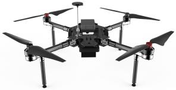
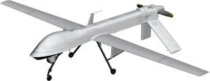
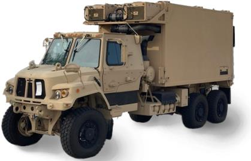
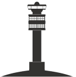
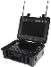
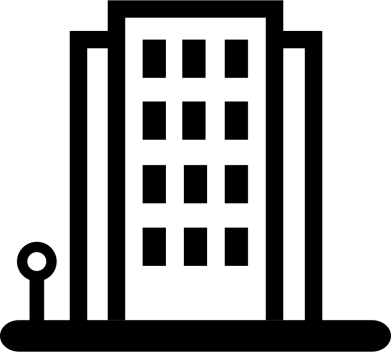
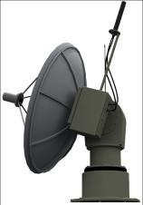

# 2504 07358V1

**Source Document:** `2504.07358v1.pdf`  
**Total Pages:** 20  

---

## --- Page 1 ---

Personal use of this material is permitted. Permission from the author(s) and/or copyright holder(s), must be obtained for all other uses. Please contact us and provide details if

you believe this document breaches copyrights.

Electronic Warfare Cyberattacks, Countermeasures
and Modern Defensive Strategies of UAV Avionics:

A Survey

Aaron Yu, Iuliia Kolotylo, Hashim A. Hashim, and A. E.E. Eltoukhy

Abstract—Unmanned Aerial Vehicles (UAVs) play a pivotal role
in modern autonomous air mobility, and the reliability of UAV
avionics systems is critical to ensuring mission success, sustain-
ability practices, and public safety. The success of UAV missions
depends on effectively mitigating various aspects of electronic
warfare, including non-destructive and destructive cyberattacks,
transponder vulnerabilities, and jamming threats, while rigor-
ously implementing countermeasures and defensive aids. This
paper provides a comprehensive review of UAV cyberattacks,
countermeasures, and defensive strategies. It explores UAV-to-
UAV coordination attacks and their associated features, such
as dispatch system attacks, Automatic Dependent Surveillance-
Broadcast (ADS-B) attacks, Traffic Alert and Collision Avoidance
System (TCAS)-induced collisions, and TCAS attacks. Addition-
ally, the paper examines UAV-to-command center coordination
attacks, as well as UAV functionality attacks. The review also
covers various countermeasures and defensive aids designed
for UAVs. Lastly, a comparison of common cyberattacks and
countermeasure approaches is conducted, along with a discussion
of future trends in the field.

Index Terms—Electronic warfare, UAVs, Avionics Systems,
cyberattacks, coordination attacks, functionality attacks, coun-
termeasure, defensive-aids.

#### I. INTRODUCTION

A. Motivation

Unmanned Aerial Vehicles (UAV) have become increasingly
important in both civilian and military applications over the
past several decades. Within the civil sector, UAVs have
seen significant growth, finding use in news broadcasting,
agriculture, construction, and other business ventures [1]–[4].
Military UAVs have also been used extensively in surveillance
and object targeting [1], [5]. These prospects are made possible
by the major trends in UAV development, with current research
targeting increasing levels of autonomy through advancements
in on-board avionics systems [6], [7]. The general UAV avion-
ics composition is similar to those found on manned aircrafts
and can be broken into several subsystems: propulsion, elec-
trical, sensors, communications, flight navigation, and control
[8]. The avionics system interacts with these subsystems for
different purposes, such as controlling and maintaining flight
altitude with the propulsion system, drawing power from the

This work was supported in part by the National Sciences and Engineering
Research Council of Canada (NSERC), under the grants RGPIN-2022-04937.

A. Yu, I. Kolotylo, and H. A. Hashim are with the Department of
Mechanical and Aerospace Engineering, Carleton University, Ottawa, ON,
K1S-5B6, Canada. A. E.E. Eltoukhy is with Management Science and Engi-
neering Department, Khalifa University, Abu Dhabi, United Arab Emirates.
Corresponding author contact (e-mail: hhashim@carleton.ca).

#### TABLE I: Nomenclature.

ADS-B
Automatic Dependent Surveillance - Broadcast
ATC
Air Traffic Control
COMINT
Communications Intelligence
DoS
Denial-of-Service
DSSS
Direct Sequence Spread Spectrum
EA
Electronic Attack
EASA
European Union Aviation Safety Agency
ELINT
Electronic Intelligence
EMS
Electromagnetic Spectrum
EP
Electronic Protection
ES
Electronic Warfare Support
FAA
Federal Aviation Administration
FH
Frequency Hopping
FHSS
Frequency Hopping Spread Spectrum
FL
Federated Learning
GNSS
Global Navigation Satellite Systems
GPS
Global Positioning System
IFF
Identify Friend or Foe
IMU
Inertial Measurement Unit
ICAO
International Civil Aviation Organization
LiDAR
Light Detection and Ranging
LTE
Long-Term Evolution
MAC
Media Access Control
NMAC
Near Midair Collision
QKD
Quantum Key Distribution
RID
Remote Identification
SATCOM
Satellite Communications
SDR
Software-defined Radio
SIGINT
Signal Intelligence
TCAS
Traffic Alert and Collision Avoidance System
TCP/UDP
Control Protocol/User Datagram Protocol
UWB
Ultra-wideband
UAVs
Unmanned Aerial vehicles

batteries of the electrical system, or collecting data from the
sensor system. The integration and control of these processes
is a complex task that often relies on one or more flight
computers [1], [7], [8]. Communications between UAVs (air-
to-air) and to ground stations (air-to-ground) is a critical
component of UAV networks, as it provides the proper means
of identification and communication for drones to accomplish
their individual tasks. Some of the commonly used notation
are listed in Table I.

A. Yu, J. Kolotylo, H. A. Hashim, and A. E.E. Eltoukhy, ”Electronic Warfare Cyberattacks, Countermeasures and Modern Defensive Strategies of
UAV Avionics: A Survey,” IEEE Access, pp. 1-20, 2025.

arXiv:2504.07358v1  [cs.CR]  10 Apr 2025

## --- Page 2 ---

2

Ground Control Station

(a) Communication links and vulnerability

Mobile Ground Unit

#### UAV1

#### UAV2

UAV-to-command 
Center Coordination

UAV-to-UAV 
Coordination

#### UAV Functionality

#### UAV Counter Measures and Defensive Aids

Prevention 
Detection 
Mitigation

- Access Control 
- Information Protection 
- Equipment Selection

- Anomaly Present 
- Attack agent Present

- Neutralize Attack 
- Avoid Attack 
- Add Redundancy 
- Fail-safe Protocols 
- Address Uncertainties

(c) UAV countermeasure and defensive aids

(b) Common UAV cyberattack classifications

Fig. 1: Conceptual illustration of UAV electronic warfare: (a) Communication links, (b) common UAV cyberattack classifica-
tions, and (c) countermeasures and defensive aids.

B. Electronic Warfare and UAVs

Electronic warfare encompasses the science and art of
maintaining control over the Electromagnetic Spectrum (EMS)
for friendly use while denying its use to adversaries. In
the context of UAVs, this primarily involves military tactics,
such as information gathering and disruption of operations
by exploiting communication links within UAV networks, as
illustrated in Figure 1.(a). This area of warfare is an expanding
field of research, with a growing focus on developing strategies
and techniques that can both protect friendly UAVs from
hostile actors and disrupt the operations of adversarial UAVs.
For civilian UAVs, this type of warfare is more commonly
referred to in broader scopes in relation to cybersecurity and
cyberattacks [9], [10]. Along with UAVs, electronic warfare
began development during World War II and picked up sig-
nificantly during following conflicts. Jamming techniques were
first explored in 1902 by the Royal Navy with the introduction
of the radio. They used for the first time in combat by a
Russian operator during the 1905 against Russo-Japanese war
by overlapping signals meant for the correction of Japanese
naval gunfire [11]. Once RADAR was established in England,
1935, further research into jamming began along with the
official introduction of electronic warfare. This led to the
development of RADAR reflectors used in 1943 to confuse
German RADAR operators and win British victories. They
were used again in 1945 to completely hide U.S. aircraft
from Japanese searchlight RADARs [12]. However, post-war
electronic warfare development halted for a half-decade as
engineers returned to civilian life and most military equip-
ment were sold off. No U.S. study on lessons-learned for
electronic warfare was produced, and thus most successes and
developments were never fully documented. The following
conflicts involving the U.S. were limited in their electronic
warfare capabilities due to this gap in knowledge [11]. The
extent of electronic warfare in the Korean War was the
U.S. B-12s jamming Chinese RADAR systems. Nevertheless,

advancements in UAV technology and electronic warfare have
continued into the twenty-first century, resulting in modernized
capabilities.

C. Cyberattacks Related to UAVs

Due to the increasing use of UAVs for commercial applica-
tions, cyberattacks are a concern for both military and civilian
class drones [13]. Various classifications of UAV related cyber-
attacks exist, with some examples being destructive and non-
destructive attacks [14], ground-based and air-based attacks
[15], and threat categorized attacks ranging from physical, sen-
sor, and communication, to supply chain threats [16]. The clas-
sifications can then further be characterized by their military
impact as opposed to civilian impacts. Because of the rapidly
growing development of UAVs in the public sector, most pa-
pers tend to focus on the civilian side of UAV cyberattacks and
their repercussions. Drone cyberattacks can be split into three
classes: UAV-to-UAV coordination attacks, UAV-to-command
center coordination attacks, and UAV functionality attacks.
In civil applications, drones are often deployed in groups to
carry out tasks. Even singular UAVs typically share the air
space with other aerial vehicles, which can include manned
aircraft alongside other drones on separate missions. As a
result, UAV-to-UAV coordination attacks involve interfering in
the messaging systems amongst UAVs. In serious cases, such
attacks can lead to midair collisions among other issues [17].
Commonly termed attacks that belong to this category include
dispatch system attacks, Automatic Dependent Surveillance -
Broadcast (ADS-B) attacks, and Traffic Alert and Collision
Avoidance System (TCAS) induced collisions. In a UAV
network, the command center is responsible for keeping track
of and maintaining each UAV’s operational status such as
payload control, mission planning, and air vehicle control [4].
This information is transmitted to the UAV through wireless
communication links that, because of historical development in
transponder technology, is not inherently secure. Cyberattacks

*Caption/Context: Ground Control Station | Mobile Ground Unit*

*Caption/Context: UAV2 | UAV Counter Measures and Defensive Aids*

*Caption/Context: Ground Control Station | (a) Communication links and vulnerability*

*Caption/Context: (a) Communication links and vulnerability | UAV2*

*Caption/Context: UAV1 | UAV2*

*Caption/Context: UAV1 | UAV2*

## --- Page 3 ---

3

of this nature passively or actively disrupt the communication
link between the UAV and command center. Passive attacks,
such as eavesdropping, focus on obtaining information from
the communication link for malicious purposes, while active
attacks such as jamming actively interfere with the UAV’s
ability to communicate to the command center. Unlike the
previous two categorizations, cyberattacks targeting the UAV’s
functionality precisely alter the way the UAV behaves as
opposed to interfering with its communication channels [17]–
[19], although the methods of access can be similar. This is
dependent on the particular UAV’s hardware configuration;
however common examples include exploitation of recorded
video attacks and Global Positioning System (GPS) spoofing.
In such attacks, fake signals are generated by malicious actors
which are then sent to the UAV. The UAV believes that the fake
information is genuine, altering the way it executes its mission
depending on the type of attack being performed. In many
cases, this attack tricks the UAV into believing its spoofed
location is legitimate, allowing attackers to hijack the UAV’s
flight path and steal it. Figure 1.(b) shows categorization of
various cyberattacks on UAVs exposed by UAV systems in
public as well as military drones.

D. Countermeasures and Defensive-Aids

Electronic countermeasure systems employ specific tac-
tics, techniques, and technologies to interfere with, deceive,
disrupt, degrade, or neutralize an adversary’s electronic and
radar systems of the enemy [20]–[22]. Electronic counter-
countermeasure systems, as part of defensive aid measures, are
designed to counteract electronic countermeasures by restoring
radar functionality and mitigating their effects [23]. Addi-
tionally, electronic counter-countermeasure systems systems
encompass strategies to protect friendly systems from elec-
tronic threats, such as encryption and signal shielding. Elec-
tronic countermeasure and electronic counter-countermeasure
are known as cat and mouse game. The most common
threats faced by aircraft are small arms fire, radar guided
anti-aircraft missiles, shoulder-launched surface-to-air missiles
(SAM), and SAM mounted to ground sites, vehicles or ships
[24]. On the other side, the defensive-aid subsystem related
to aircrafts would include radar warning receiver, missile
warning receiver, laser warning receiver, countermeasure dis-
penser (chaff or flares), and towed decoy [25]. With regard
to UAVs, countermeasures and defensive-aids are methods
applied to protect the data handled by UAVs, more specifically,
confidentiality, integrity, and authenticity [21], [22], [26]–
[31]. Also, countermeasures and defensive-aids for UAVs
are used to ensure the service availability for civilian and
military applications [32]. In view of UAV cyberattacks, a wide
spectrum of countermeasures are created to take advantage
of vulnerabilities found on hardware, software, and network
layers [1], [33]. The same countermeasure may work against
several types of attacks covered under three broad categories:
prevention, detection, and mitigation (as shown in Figure
1.(c)).

E. Other Impacts of Electronic Warfare

Electronic warfare often involves the use of high-powered
electronic signals, which can contribute to electromagnetic
pollution, potentially harming the environment and living
organisms, and negatively impacting sustainability efforts [32].
High levels of electromagnetic radiation may interfere with
the navigation systems of wildlife, leading to behavioral dis-
ruptions. In terms of energy consumption, electronic warfare
systems, such as jammers, radars, and signal intelligence
receivers, demand substantial energy to operate. These sys-
tems frequently rely on portable generators or ground/aerial
vehicles, resulting in increased fuel consumption, greenhouse
gas emissions, and subsequent environmental degradation.
Additionally, electronic warfare can disrupt civilian communi-
cation and navigation systems, including emergency services
and GPS-based systems [4]. This disruption can lead to an
increased risk of accidents in sensitive areas and a reduction
in the effectiveness of environmental monitoring and response
systems.

F. Focus and Structure

Scope: This survey article aims to provide a compre-
hensive overview of UAV electronic warfare, encompassing
cyberattacks, countermeasures, and defensive aids. It offers a
detailed characterization of various attack taxonomies and sys-
tematically reviews UAV-to-UAV coordination attacks, classi-
fying them into distinct categories such as dispatch system
attacks (including message elimination, message spoofing,
and message fabrication), ADS-B attacks, TCAS-induced col-
lisions, and TCAS attacks. Additionally, UAV-to-command
center coordination attacks are analyzed, covering threats such
as eavesdropping, man-in-the-middle attacks, jamming, and
Wi-Fi-based intrusions. UAV functionality attacks are also
explored, addressing risks such as recorded video exploitation,
Denial-of-Service (DoS) attacks, and GPS spoofing. Beyond
categorizing cyber threats, this article examines UAV elec-
tronic warfare in both civil and military contexts, discussing
countermeasures and defensive aids related to prevention tech-
niques, information security, communication traffic manage-
ment, mitigation strategies, and the avoidance of wireless com-
munication vulnerabilities. Furthermore, a comparative analy-
sis of common cyberattacks and countermeasure approaches is
presented, along with an exploration of emerging trends in the
field. Unlike prior works such as [20], [34], [35], which focus
on network attacks and the corresponding countermeasures for
communication signals, this study is dedicated specifically to
UAV electronic warfare, including cyberattacks, countermea-
sures, and modern defensive-aid techniques. The studies in
[36]–[38] primarily address identification threats but do not
extensively examine UAV-to-UAV coordination attacks, UAV-
to-command center coordination attacks, or functionality-
based attacks. Similarly, [39] investigates various types of
UAV communication attacks but lacks an in-depth discussion
of countermeasures and defensive-aid strategies. Furthermore,
the studies in [40], [41] emphasize communication network
security, software security analysis, and intelligent security,
with a primary focus on functionality attacks. However, they

## --- Page 4 ---

4

do not comprehensively explore the role of transponders in
security threats, the distinctions between security challenges
in manned aircraft and UAVs, or UAV-to-UAV coordination
attacks. The works in [42], [43] are primarily structured around
cryptographic methods for securing communications and de-
veloping security protocols. Therefore, this study provides a
more extensive and holistic discussion of UAV-to-UAV coor-
dination attacks including those involving transponders UAV-
to-command center coordination attacks, UAV functionality
attacks, and their associated countermeasures and defensive
aids. Additionally, it presents an analysis of current challenges
and outlines future research directions in the domain of UAV
electronic warfare.

Structure: The rest of the paper is composed of eight sec-
tions. Section II presents UAV-to-UAV coordination attacks.
Section III discusses UAV-to-command center coordination at-
tacks. Section IV summarizes UAV functionality attacks. Sec-
tion V discusses UAV electronic warfare for military purposes.
Section VI presents countermeasures and popular defensive-
aids. Section VII provides comparison of UAV cyberattacks
and countermeasures strategies. Section VIII presents future
trends. Finally, Section IX concludes the work.

#### II. UAV-TO-UAV COORDINATION ATTACKS

A. Transponders Overview

The purpose of Identify Friend or Foe (IFF) is to identify
friendly and nonfriendly aircraft as the number of aircraft
in airspace increases. Generally, this consists of an airborne
receiver that listened for primary radar transmissions and
would reply, at the same fSrequency, with a message specific
to that aircraft [44]. TCAS is an avionics system that relies
on transponders to perform air-to-air interrogation and warns
the pilot about dangerous encounters with nearby aircraft [45].
This is a cooperative system, meaning that for it to function
all aircraft should be equipped with a mode S transponder to
perform surveillance (Mode S surveillance). Mode C surveil-
lance can also be performed by TCAS to interrogate aircraft
with Mode A/C transponders [46]. TCAS sends out pulses
and receives responses from neighboring aircraft transponders
which contain range, altitude, and azimuth (bearing). When
the system detects other aircraft that are at safe range and
altitude away the pulses are sent once a minute to perform
passive surveillance. Passive surveillance continues when the
spacecraft is at either close range or altitude at higher rate
of once per 10 seconds. Once the aircraft enters potential
collision zone (i.e. it is close in both altitude and range) TCAS
engages in active surveillance at rate of 1 pulse per second
[46]. ADS-B is another transponder-based avionics system that
aids aircraft surveillance. Unlike IFF and TCAS it does not
rely on interrogations from either Air Traffic Control (ATC)
or other aircraft as it automatically broadcasts flight state
parameters to everyone involved in the network [47]. Similar
to TCAS, ADS-B is a cooperative sensing system, meaning
that in order to receive ADS-B broadcast all players must have
ADS-B system on board. ADS-B uses Mode S transponder and
broadcasts identification, position, and velocity at frequency
of 1 Hz. Position and velocity are determined from GNSS

signals in conjunction with data from sensor systems (Inertial
Measurement Unit (IMU), barometer, etc.).

Since transponders converse by broadcasting information
encoded in electromagnetic waves, it is not surprising to
believe that the electromagnetic environment surrounding
drones can become densely proliferated by noise leading to
communication issues. However, with over 400,000 expected
drones on daily basis for use in commercial and government
missions in European airspace by 2050 [48], the matter of
bandwidth limitations between similarly broadcasting UAVs
becomes an important topic of concern [49]. Evidently, the
cumulation of messages from increasing numbers of sources
results in an electromagnetic environment indiscernible from
noise. For instance, ADS-B congestion of the 1090 MHz
band caused the Federal Aviation Administration (FAA) to
prohibit the use of ADS-B on UAVs [49], which in turn has
prompted research into alternative ADS-B “like” technologies
to accommodate the requirements of larger drone networks
[49], [50]. European Union Aviation Safety Agency (EASA)
shares the same concern with EMS usage and safety [7].
When network congestion occurs, transponders become more
likely to fail their tasks since interference limits their ability to
decode interrogations from other UAVs (air-to-air) or ground
stations (air-to-ground).

#### UAV Traffic Management

Human Operator

#### RID Facility Provider

(a) Indirect network communication

#### UAV Traffic Management

Human Operator

(b) Direct network communication

Fig. 2: RID Communication Technologies.

While remote identification (RID) is a general term, in
the context of drones, it refers to the larger group of new
methods of identification for UAVs specifically that has not
been historically associated with aviation. While ADS-B,
TCAS and IFF have been tried on aircraft, alternative methods
may prove more beneficial for UAVs. There are two cat-
egories of remote identification [36]. First are technologies

![Structure: The rest of the paper is composed of eight sec- tions. Section II presents UAV-to-UAV coordination attacks. Section III discusses UAV-to-command center coordination at- tacks. Section IV summarizes UAV functionality attacks. Sec- tion V discusses UAV electronic warfare for military purposes. Section VI presents countermeasures and popular defensive- aids. Section VII provides comparison of UAV cyberattacks and countermeasures strategies. Section VIII presents future trends. Finally, Section IX concludes the work. | II. UAV-TO-UAV COORDINATION ATTACKS](images/page_004_fig_01.png)
*Caption/Context: Structure: The rest of the paper is composed of eight sec- tions. Section II presents UAV-to-UAV coordination attacks. Section III discusses UAV-to-command center coordination at- tacks. Section IV summarizes UAV functionality attacks. Sec- tion V discusses UAV electronic warfare for military purposes. Section VI presents countermeasures and popular defensive- aids. Section VII provides comparison of UAV cyberattacks and countermeasures strategies. Section VIII presents future trends. Finally, Section IX concludes the work. | II. UAV-TO-UAV COORDINATION ATTACKS*

![Structure: The rest of the paper is composed of eight sec- tions. Section II presents UAV-to-UAV coordination attacks. Section III discusses UAV-to-command center coordination at- tacks. Section IV summarizes UAV functionality attacks. Sec- tion V discusses UAV electronic warfare for military purposes. Section VI presents countermeasures and popular defensive- aids. Section VII provides comparison of UAV cyberattacks and countermeasures strategies. Section VIII presents future trends. Finally, Section IX concludes the work. | II. UAV-TO-UAV COORDINATION ATTACKS](images/page_004_fig_02.png)
*Caption/Context: Structure: The rest of the paper is composed of eight sec- tions. Section II presents UAV-to-UAV coordination attacks. Section III discusses UAV-to-command center coordination at- tacks. Section IV summarizes UAV functionality attacks. Sec- tion V discusses UAV electronic warfare for military purposes. Section VI presents countermeasures and popular defensive- aids. Section VII provides comparison of UAV cyberattacks and countermeasures strategies. Section VIII presents future trends. Finally, Section IX concludes the work. | II. UAV-TO-UAV COORDINATION ATTACKS*

*Caption/Context: A. Transponders Overview | Human Operator*

![Structure: The rest of the paper is composed of eight sec- tions. Section II presents UAV-to-UAV coordination attacks. Section III discusses UAV-to-command center coordination at- tacks. Section IV summarizes UAV functionality attacks. Sec- tion V discusses UAV electronic warfare for military purposes. Section VI presents countermeasures and popular defensive- aids. Section VII provides comparison of UAV cyberattacks and countermeasures strategies. Section VIII presents future trends. Finally, Section IX concludes the work. | II. UAV-TO-UAV COORDINATION ATTACKS](images/page_004_fig_13.png)
*Caption/Context: Structure: The rest of the paper is composed of eight sec- tions. Section II presents UAV-to-UAV coordination attacks. Section III discusses UAV-to-command center coordination at- tacks. Section IV summarizes UAV functionality attacks. Sec- tion V discusses UAV electronic warfare for military purposes. Section VI presents countermeasures and popular defensive- aids. Section VII provides comparison of UAV cyberattacks and countermeasures strategies. Section VIII presents future trends. Finally, Section IX concludes the work. | II. UAV-TO-UAV COORDINATION ATTACKS*

![Structure: The rest of the paper is composed of eight sec- tions. Section II presents UAV-to-UAV coordination attacks. Section III discusses UAV-to-command center coordination at- tacks. Section IV summarizes UAV functionality attacks. Sec- tion V discusses UAV electronic warfare for military purposes. Section VI presents countermeasures and popular defensive- aids. Section VII provides comparison of UAV cyberattacks and countermeasures strategies. Section VIII presents future trends. Finally, Section IX concludes the work. | II. UAV-TO-UAV COORDINATION ATTACKS](images/page_004_fig_15.png)
*Caption/Context: Structure: The rest of the paper is composed of eight sec- tions. Section II presents UAV-to-UAV coordination attacks. Section III discusses UAV-to-command center coordination at- tacks. Section IV summarizes UAV functionality attacks. Sec- tion V discusses UAV electronic warfare for military purposes. Section VI presents countermeasures and popular defensive- aids. Section VII provides comparison of UAV cyberattacks and countermeasures strategies. Section VIII presents future trends. Finally, Section IX concludes the work. | II. UAV-TO-UAV COORDINATION ATTACKS*

## --- Page 5 ---

5

that continuously broadcast the location of the drone to local
receivers. This is done by having a GPS receiver on the
drone, and a transmitter on the drone that sends out over Wi-
Fi, Bluetooth or LoRa frequencies. The second category is
network communication, which uses a cellular network that
the operator must subscribe the drone to as one would for a
cellular phone. The broadcasting method is mainly intended
for short range and typically only includes communication
from the drone to only the operator. The appeal of these
broadcasting methods is that the relevant technology does not
require a licence to purchase or operate. It would be up to the
operator’s receiving device to then transmit the information
to other parties, such as ATC or other aircraft/UAVs. Fig. 2
presents RID communication technologies. Using Wi-Fi as the
connection can work up to 2 km if using neighbor awareness
networking and consumes 100 mW from the drone power
system. However, this has yet to be implemented on a drone.
The DJI drone company has attempted to use lower range
Wi-Fi to track many drones in an area by transmitting and
receiving directly from the drone to mobile phones. This has
worked up to about 1 km. For ATC tracking of drones, UAV-
to-UAV, or UAV to aircraft identification, that information
would have to be recommunicated by the operator’s mobile
device. Another method, Bluetooth, has low bandwidth that
can reach up to 200 m if using Bluetooth 4.x or 1 km if using
Bluetooth 5.x, consuming a maximum of 10 mW. Unfily com-
pany’s Broadcast Location & Identification Platform (BLIP)
uses Bluetooth to broadcast drone details for up to 200 m
and transfer that data through operator device’s Long-Term
Evolution (LTE) network connection. LTE is associated to
fourth-generation (4G). LoRa can reach a longer distance with
a higher bit rate than Wi-Fi or Bluetooth [36], [51]. Table II
goes into detail about how each of the transponders compare
for implementation on drones [36], [44]–[47], [51].

B. Dispatch System Attacks

A dispatch system refers to the hardware and software
protocols and algorithms devoted to ensuring that a group of
drones with a common objective can autonomously perform
their tasks without impeding one another [52]. Consequently,
any attack on the dispatch system can possibly alter the
behaviour of all the drones on the network. The most common
way to perform this attack is by injecting malware into
the system [17]. The malware typically includes malicious
firmware at the software level, and trojans at the hardware level
[53], which are injected to produce vulnerabilities within the
UAV’s flight controller as well as the ground control station.
Software level malware can affect the UAV in countless ways
that are not limited to dispatch system attacks. An example that
falls under this category of attack is the Maldrone virus [54].
Maldrone was developed as the first ever backdoor malware
written for AR drone ARM Linux systems. It allows a remote
hijacker to remotely switch the drone’s software to obey their
backdoor controller, providing remote manipulation and access
to the drone [54]. Evidently, such viruses can be devastating
for a network of drones if even one such drone becomes
infected by a malicious actor. Hardware trojans, on the other

hand, include hardware level modifications to the circuit of
the flight controller. Due to the complex underlying systems
that comprise the flight controller, trojans are most commonly
introduced due to non-trusted, imitation hardware being used
at some point in the supply chain. These security breaches
compromise the functions of the circuit itself, leading to
premature failure of components and untimely destruction of
the drone [53]. In more severe cases, the trojan can introduce
backdoors that leak information to the attackers or allow total
takeover of the drone itself. An example of such a trojan was
a keylogging virus installed in a ground control unit of the
U.S. Air Force, leading to a backdoor access which malicious
actors used to track the keystrokes made in controlling the
U.S. drone fleet over Iraq and Afghanistan [37].

C. ADS-B Attack

ADS-B transponders are used in drones to provide au-
tonomous collision avoidance capabilities, which becomes
more important with increasing numbers of drones in the same
air space. Attacks on the ADS-B system involve exploiting
the fact that transmitted messages are sent in plain text format
[17], and do not inherently provide any authentication methods
to stop message tampering [55], [56]. These attacks can further
be characterized into the following three categories: Message
elimination, message infusion (spoofing), and message fabri-
cation.

Message Elimination: It involves using external trans-
mitters to project constructive or destructive interference into
the ADS-B signal. When constructive interference is used, the
attack induces bit errors into the ADS-B message, causing the
receiving drones to disregard the message once it detects the
manipulation and thus diminishing awareness of the transmit-
ter drone. When destructive interference is used, the attacking
signal is an inverse of the original ADS-B signal, leading to
complete or partial destruction of the message [53].

Message Infusion (Spoofing): The approach of mes-
sage infusion involves injecting malicious messages into the
airspace, causing ADS-B receivers to perceive the appearance
of an illegitimate aircraft. This is possible since ADS-B does
not use any authentication methods in its messages, and so
infusion can be performed by commercially available devices.
The broadcasted false messages can either target the UAVs
themselves (Aircraft Target Ghost Injection) or the ground
command center (Command Center Ghost Injection). In both
cases, the target ADS-B receiver sees a fake aircraft in the
air space as the attacker anonymously manipulates the air
traffic [52]. ADS-B spoofing is dangerous as it can allow
enemies to masquerade as potential allies in the view of the
ground station. Figure 3 shows how a spoofing situation might
look, where the presence of ground-based and aircraft-based
attackers infiltrate the airspace of authentic aircraft, causing
the ground station to perceive 3 different and friendly aircraft.

Message Fabrication: Message fabrication involves ma-
nipulation of ADS-B signals to provide false information
which ADS-B receivers than interpret. Unlike message infu-
sion, message fabrication manipulates the messages sent by
legitimate UAVs. The level of tampering can vary based on

## --- Page 6 ---

6

#### TABLE II: Transponder comparisons in the context of implementation on drones.

Transponder
Weight
Power
Access
Advantages
Disadvantages to ATC

IFF/SSR
Heavy
High
Low
Has been attempted
Requires radio license and yet to be
implemented

TCAS
Heavy
High
Medium
Has been attempted
Only implemented within research context

ADS-B
Heavy
High
Medium
Implemented in academic research
Only implemented within research context

RID: Wi-Fi
Light
Low
High
Easy to obtain and use, no license
Short range, 2km, cannot fly drone very far

RID: Bluetooth
Light
Low
High
Easy to obtain and use, no license
Very short range, 200m

RID: LoRa
Light
Low
Medium
Prioritizes operator control
Requires radio license and interference
probability

RID: Cellular
Network

Light
Low
Medium
More affordable and easier to
implement than ADS-B

Infrastructure not ready for global coverage

the intention. Overshadowing is a method where the attacker
broadcasts a very high-powered ADS-B signal to substitute
parts of the ADS-B message, or entire message in the worst
case. Similarly, bit flipping involves flipping certain bits to
partially manipulate the signal. In either case, information
is removed from the original message and malicious data
is inserted in its place [17]. These ADS-B attacks can be
accomplished using commercial off-the-shelf components as
well as freely licensed software [57]. The most popular ex-
ample of this is with Software-defined Radio (SDR) devices,
which can be programmed to transmit radio signals of different
frequencies, including those of ADS-B signals. By following
the general packet structure of an ADS-B message, Figure
3, any SDR can effectively mask themselves as an ADS-B
transmitter.

“Descend”

“Descend”

“Climb”  
Aircraft 1

Aircraft 2

Aircraft 3

#### RA

#### RA

Induced 
Collision

#### RA

ADS-B 
Receiver

SDR 
Spoofer

Ground-based Attacker

Relay Attack

Ghost Aircraft injection Attack

Authentic

Aircraft

Aircraft-based

Attack

ADS-B 
Receiver

Ground Control Station

Fig. 3: Illustration of TCAS induced collision example and
ADS-B spoofing attacks through a ground-based attack, which
replays a recorded ADS-B signal, and an aircraft-based attack,
which spoofs the aircraft’s ICAO address.

D. TCAS Induced Collision

Similar to ADS-B, TCAS is used to coordinate maneuvers
between UAVs in a local air space for the purpose of avoiding

collisions. However, the resolution advisories produced by
TCAS do not predict long term effects. This leads to the
problem of TCAS induced collision, wherein the resolution
advisories provided by TCAS result in a collision. Figure 3
shows an example of such a situation [17]. Aircraft pairs 1
and 2, as well as 3 and 4, are originally on collision paths
but are provided resolution advisories from TCAS. Since the
TCAS advisories were made independently, this can lead to a
situation where aircraft 4 climbs while aircraft 1 descends,
leading to an induced collision with less time to provide
corrections as a consequence of TCAS decisions. This can
be extended to the case of UAVs, wherein an attacker tampers
with air traffic data to cause a TCAS induced collision [52].

E. TCAS Attack

Despite TCAS strong reputation regarding safety, it was
not designed to withstand any type of attacks, i.e. jamming
[47]. One of the general ways is to jam 1090 MHz channel to
prevent the aircraft from tracking potential “intruders”. How-
ever, these types of attacks are easily detected and countered
[47], [58]. More effective jamming attacks include so called
“All-Call Flood” and “Squitter Flood”. During the “All-Call
Flood” the attacker takes advantage of All-call interrogation
and occupies 1030 MHz channel to trigger all nearby Mode S
transponders to reply with their 24-bit International Civil Avi-
ation Organization (ICAO) address and flood the 1090 MHz
reply channel. The “Squitter Flood” attack is performed by
an attacker spoofing the nearby transponders by transmitting
replies on 1090 MHz channel and forcing them to continuously
track the “false” aircraft. Both of these attacks increase the
chances of Near Midair Collision (NMAC) events however the
attacker does not have full control over the NMAC occurrence.
Different kind of attack that is not related to channel flooding
is called “Phantom Aircraft” attack. If the attacker can produce
an accurate Mode S reply and seem to move like an airplane,
the TCAS transponder assumes that these replies are coming
from an actual aircraft, which will force it into tracking. Such
false tracking can lead to generation of RAs that could lead
to an NMAC [47].

![the intention. Overshadowing is a method where the attacker broadcasts a very high-powered ADS-B signal to substitute parts of the ADS-B message, or entire message in the worst case. Similarly, bit flipping involves flipping certain bits to partially manipulate the signal. In either case, information is removed from the original message and malicious data is inserted in its place [17]. These ADS-B attacks can be accomplished using commercial off-the-shelf components as well as freely licensed software [57]. The most popular ex- ample of this is with Software-defined Radio (SDR) devices, which can be programmed to transmit radio signals of different frequencies, including those of ADS-B signals. By following the general packet structure of an ADS-B message, Figure 3, any SDR can effectively mask themselves as an ADS-B transmitter. | “Descend”](images/page_006_fig_06.png)
*Caption/Context: the intention. Overshadowing is a method where the attacker broadcasts a very high-powered ADS-B signal to substitute parts of the ADS-B message, or entire message in the worst case. Similarly, bit flipping involves flipping certain bits to partially manipulate the signal. In either case, information is removed from the original message and malicious data is inserted in its place [17]. These ADS-B attacks can be accomplished using commercial off-the-shelf components as well as freely licensed software [57]. The most popular ex- ample of this is with Software-defined Radio (SDR) devices, which can be programmed to transmit radio signals of different frequencies, including those of ADS-B signals. By following the general packet structure of an ADS-B message, Figure 3, any SDR can effectively mask themselves as an ADS-B transmitter. | “Descend”*

*Caption/Context: “Descend” | “Descend”*

![the intention. Overshadowing is a method where the attacker broadcasts a very high-powered ADS-B signal to substitute parts of the ADS-B message, or entire message in the worst case. Similarly, bit flipping involves flipping certain bits to partially manipulate the signal. In either case, information is removed from the original message and malicious data is inserted in its place [17]. These ADS-B attacks can be accomplished using commercial off-the-shelf components as well as freely licensed software [57]. The most popular ex- ample of this is with Software-defined Radio (SDR) devices, which can be programmed to transmit radio signals of different frequencies, including those of ADS-B signals. By following the general packet structure of an ADS-B message, Figure 3, any SDR can effectively mask themselves as an ADS-B transmitter. | ADS-B  Receiver](images/page_006_fig_15.jpeg)
*Caption/Context: the intention. Overshadowing is a method where the attacker broadcasts a very high-powered ADS-B signal to substitute parts of the ADS-B message, or entire message in the worst case. Similarly, bit flipping involves flipping certain bits to partially manipulate the signal. In either case, information is removed from the original message and malicious data is inserted in its place [17]. These ADS-B attacks can be accomplished using commercial off-the-shelf components as well as freely licensed software [57]. The most popular ex- ample of this is with Software-defined Radio (SDR) devices, which can be programmed to transmit radio signals of different frequencies, including those of ADS-B signals. By following the general packet structure of an ADS-B message, Figure 3, any SDR can effectively mask themselves as an ADS-B transmitter. | ADS-B  Receiver*

## --- Page 7 ---

7

F. UAV vs Manned Aircrafts

Traditional aircraft rely on secure and redundant avionics
systems, including protected ATC channels and hardened
cockpit systems, which reduce their susceptibility to cyberat-
tacks [6], [59], [60]. In contrast, UAVs depend on unmanned
control links, such as SATCOM, Wi-Fi, 4G/5G, or RF signals,
making them highly vulnerable to jamming, signal spoofing,
and interception. A compromised control link in UAVs can
result in hijacking (e.g., GPS spoofing) or complete mission
failure [18], [61]. Manned aircraft incorporate hardened avion-
ics systems, including shielded onboard computers, encrypted
flight control software, and physically secured cockpits, which
mitigate the impact of cyber intrusions. In contrast, UAVs
particularly commercial and consumer-grade drones often lack
secure hardware architectures and may rely on open-source
or commercially available flight controllers [62], [63]. This
lack of security makes them more susceptible to firmware ex-
ploitation, malware injection, and unauthorized software mod-
ifications. UAVs are inherently more vulnerable than manned
aircraft due to several factors, including the absence of human
intervention, heavy reliance on wireless communication, and
the presence of unhardened systems in commercial drones,
which often lack robust cybersecurity measures. Furthermore,
autonomous decision-making introduces additional risks, such
as adversarial AI attacks that could disrupt UAV navigation
and mission planning, as well as vulnerabilities in swarm
coordination that may compromise entire fleets. As UAV
adoption increases, enhancing their cyber resilience is essential
for ensuring mission security in both civilian and military ap-
plications. This can be achieved through the implementation of
secure AI, encrypted communication protocols, anti-jamming
mechanisms, and blockchain-based authentication systems.

#### III. UAV-TO-COMMAND CENTER COORDINATION

#### ATTACKS

Eavesdropping Attack: It is a passive yet highly insidious
form of cyber threat in UAV networks. In this type of attack,
malicious actors clandestinely listen to and record unencrypted
data transmissions between UAVs and their ground control
centers. While this attack does not directly disrupt the opera-
tion or functionality of the UAV network, its implications can
be severe. By intercepting sensitive information, such as navi-
gation commands, system telemetry, or operational parameters,
attackers can gain critical insights into the network’s architec-
ture and operations. This stolen information can then serve as
a foundation for more sophisticated and active attacks, such as
spoofing, jamming, or hijacking the UAV system. The passive
nature of eavesdropping makes it particularly challenging to
detect, emphasizing the importance of implementing robust
encryption protocols and secure communication channels to
safeguard against such vulnerabilities [54].

Man-in-the-Middle Attack:
The approach man-in-the-
middle attack provides an attacker with complete control
over the communication channel between a UAV and its
command center (illustrated in Figure 4.(a)). Passively, this
allows attackers to eavesdrop on information sent from the
UAV to the command center and vice versa [64]. Since the

attacker also has control over the communication link, they
can masquerade as an actual user and communicate with the
UAV or command center, potentially appearing as a threat
depending on the attacker’s intention [16].

Jamming Attacks: In jamming attacks they typically
target the ability of the communication channel between a
UAV and ground control station, effectively rendering the two
entities to appear disconnected. In most cases, the UAV’s
protocols for loss of link would become active, in which
the UAV emits messages searching for the ground control
station. As long as the jamming attack persists, the UAV is
unable to re-establish communication with the ground station.
This prevents the UAV from executing its intended mission,
allowing attackers to nefariously exploit the situation [17]. All
wireless networks are vulnerable to jamming attacks [65]. This
issue stems from the fact that commercial software-defined
radios can be easily programmed to function as a jammer,
whose effects must be dealt with at the physical network layer.
Jamming attacks can affect not only transponder signals, but
also any communication network that the UAV relies on such
as GPS, satellite communications (SATCOM), or even cellular
networks [65]. Jamming attacks are typically classified by how
the jamming is performed, while more specific classifications
also incorporate the network protocol being used. A generic
classification of jamming attacks is presented by [65]:

• Constant Jamming Attacks – An attacker broadcasts a
powerful jamming signal at all times. This continuously
occupies the channel between the transmitter and re-
ceiver, preventing any information exchange. The target
frequency can be adjusted depending on the attacking
process, occupying either the entire channel bandwidth
or only a fraction of it.

• Reactive Jamming Attacks – An attacker broadcasts a
jamming signal only when it detects legitimate packets
being transmitted in the channel. This is more energy
efficient than a constant jamming attack but requires
higher performance equipment to be able to react and
send a jamming signal in response to a packet.

• Deceptive Jamming Attacks – An attacker sends mean-
ingful signals to the receiver in order to waste the
receiver’s time and resources, preventing real users from
accessing the channel. This is most often performed for
Wi-Fi networks.

• Random and Periodic Jamming Attacks – An attacker
sends jamming signals for random periods of time and
then remains idle for the rest of the time. This is more
energy efficient than constant jamming but is less effec-
tive at disrupting real transmissions on the channel.

• Frequency Sweeping Jamming Attacks – An attacker
switches between jamming signals at different channel
frequencies. This is a workaround used by lower-cost
jammers that cannot attack many channels simultane-
ously, effectively allowing for lower quality hardware to
interfere with more channels.

These generic jamming techniques are applicable to all UAV
networks, but the most frequented cases are around GPS
jamming. Due to the weak signal strength that GPS signals are

## --- Page 8 ---

8

Direct Link 
Disconnection

Flight Control

Command

#### UAV Video

Feed

#### UAV

Remote Control

Station

Attacker 
(a) Man-in-the-Middle (MitM) attack diagram 
(b) Wi-Fi and de-authentication attack illustration

Human Operator

Malicious user

#### UAV

Control

Loss

De-authentication

Attack

And / Or

Connection

Loss

Malicious user sending 
multiple messages make 
busy & lose connection

(c) Entities involved and denial-of-service attack

Fig. 4: UAV-to-command center coordination attacks: (a) man-in-the-middle attack; (b) Wi-Fi attack and/or de-authentication
attack, wherein a malicious attacker closes the communication channel used by a legitimate user; and (c) Entities involved in
a DoS attack.

received, jamming these signals can be very easily performed
by broadcasting noise near the GPS frequency band. A short-
range experiment was conducted in [52], [65], in which an
$8 USD GPS jammer which was purchased from eBay was
used to demonstrate the ease and accessibility of GPS jamming
hardware.

Wi-Fi Attack: A more recent cyberattack against UAVs
which makes use of Wi-Fi signals to disrupt the communi-
cation channel between a UAV and its ground station, and
potentially commandeer the aircraft [66]. Only UAVs that
operate on a Wi-Fi signal are susceptible to this type of attack,
however given the rising popularity of Wi-Fi for use on drones,
this lends itself to becoming a more viable attack strategy
(demonstrated in Figure 4.(b)). The attacker first selects a
target Wi-Fi network and attempts to gain authorization by
launching a de-authentication attack [67]. Once the bypass is
successful, the attack is able to hijack the UAV over the Wi-Fi
network [16], [17].

Large-scale UAV networks attacks: Large-scale UAV
networks rely on interconnected communication protocols,
including ad hoc networks (UAV-MANETs), mesh networks,
and cloud-based control systems [68]. While these architec-
tures enhance operational efficiency, they also introduce attack
vectors that can compromise the entire network. A single
compromised node can escalate into a widespread security
breach, enabling various cyber threats. Malware or malicious
commands can propagate through wireless communication
links, potentially disrupting the entire UAV fleet and causing
a DoS attack [40]. Exploiting a single vulnerability in UAV
firmware can lead to swarm-wide control loss, facilitating
mass hijacking. Additionally, adversaries can intercept and
modify command signals, resulting in UAV deviations, mission
failures, or complete system takeovers. Furthermore, attacks
on the swarm coordination system’s consensus mechanism
may lead to swarm desynchronization, formation collapse, or
collision events, significantly impacting mission success and
operational safety.

False Positive and False Negative Rates: The false pos-
itive rate (FPR) and false negative rate (FNR) are critical
metrics in evaluating the effectiveness of intrusion detection
systems (IDS) for various cyberattacks. In Eavesdropping
Attacks, where an attacker intercepts confidential data trans-

missions, IDS may generate false positives due to legitimate
users engaging in high-volume data transfers, while false
negatives can occur if the eavesdropping is conducted using
passive techniques that do not alter network traffic patterns
[54]. Similarly, man-in-the-middle Attacks involve intercept-
ing and modifying communication between two parties. IDS
can mistakenly flag legitimate proxy-based communications as
attacks (false positives), while sophisticated man-in-the-middle
techniques using encryption tunneling may go undetected
(false negatives) [16]. For Jamming Attacks, which aim to
disrupt wireless communication by overwhelming channels
with noise, the false positive rate can rise due to environmental
interference (e.g., microwave signals or overlapping Wi-Fi
channels), whereas a high false negative rate may result from
adaptive jamming techniques that blend into normal traffic
patterns [65]. Wi-Fi Attacks, such as deauthentication or rogue
access points, can also suffer from high FPR if network
administrators frequently reconfigure access points, while FNR
can be high when attackers use Media Access Control (MAC)
address spoofing to disguise their presence. In Large-scale
UAV Network Attacks, including GPS spoofing and signal
hijacking, the false positive rate may increase if benign anoma-
lies (e.g., sudden wind changes affecting UAV stability) are
misclassified as attacks, while a high false negative rate may
arise due to attackers leveraging advanced machine learning-
based evasion techniques to bypass detection systems [40].

#### IV. UAV FUNCTIONALITY ATTACKS

UAV Cybersecurity Standards: To ensure the safe and se-
cure integration of UAVs into airspace and optimal UAV func-
tionality, regulatory bodies such as the FAA in the U.S. and
the EASA have established cybersecurity guidelines [7], [32].
The FAA’s Special Condition for small UAVs with Remote
Identification mandates that UAVs transmit unique identifiers
to enhance accountability and prevent unauthorized drone
activities. Additionally, the FAA’s UAV Traffic Management
framework incorporates cybersecurity requirements to protect
UAV communication channels from spoofing, jamming, and
unauthorized access [7], [32]. Similarly, EASA’s Regulation
outline cybersecurity and data protection measures for UAV
operations, requiring encryption, secure authentication, and

*Caption/Context: Direct Link  Disconnection | Flight Control*

## --- Page 9 ---

9

compliance with ISO/IEC 27001 cybersecurity standards to
safeguard drone networks from cyber threats [35], [43]. In
addition to regulatory frameworks, the Institute of Electrical
and Electronics Engineers (IEEE) has developed protocols to
standardize UAV cybersecurity practices. The IEEE 802.11s
protocol enhances secure UAV-to-UAV communication in
mesh networks, reducing vulnerabilities to eavesdropping
and interference. Meanwhile, IEEE 1609.2 defines security
mechanisms for vehicular and UAV-based communication,
ensuring encrypted and authenticated message exchanges in
safety-critical applications [39], [40]. Furthermore, the IEEE
P1920.2 Standard for UAV Swarm Communication and Secu-
rity provides guidelines for mitigating cyber risks in large-
scale UAV deployments, incorporating cryptographic tech-
niques and blockchain-based identity management [56], [69].
Aligning with these standards ensures that UAV cybersecurity
frameworks remain resilient, interoperable, and compliant with
industry best practices.

Exploitation of Recorded Video: The exploitation of
recorded video is a general category pertaining to an attack on
the subset of UAVs that use a camera to navigate and avoid
collisions. This type of attack firstly requires the attacker to
have backdoor access to the UAV’s flight controller, which
can be achieved through trojans, malware, or other means.
This allows the attacker to access the flight controller and
systematically replace the real-time camera footage of the
drone with a fake view, leading the drone to believe the false
video is in fact real. In many cases, the intention of this attack
is to trick the drone to land in a different location, allowing
attackers to steal the drone [16], [17].

Denial-of-Service: A DoS attack is a standard term used
to describe intentional communication attacks on a receiver,
often by overloading the receiver with information that then
forces the system to halt (depicted in Figure 4.(c)). However, in
general, denial of service can also include attacks that force the
hardware system to work overtime, leading to issues such as
memory and Central Processing Unit (CPU) congestion, buffer
overflows, and battery exhaustion [16], [70]. Malware, such
as hardware trojans or those previously discussed, can lead to
denial of service attacks that cause the UAV to malfunction.
Such problems, when done at the right time, can lead to the
UAV landing, crashing, and shutting down at unsafe times
[17]. In the context of UAV Wi-Fi networks, examples of DoS
attacks include Transmission Control Protocol/User Datagram
Protocol (TCP/UDP) flooding, as well as de-authentication
attacks [67]. A TCP/UDP flood involves sending a barrage
of TCP or UDP packets to the UAV’s corresponding network
port, effectively overloading the UAV’s processing capability
and rendering the UAV unable to respond or perform its
tasks. This manner of DoS attack is similar to that applied
in regular computer networks [39]. A de-authentication attack
involves an attacker impersonating a real user transmitting a
de-authentication request, which results in the UAV ceasing
communication with the real user and crashing due to loss
of controls. The de-authentication request is standardized in
the IEEE 802.11 protocol, which is used for Wi-Fi networks,
and is meant to allow access points such as the UAV to
save on computational resources when a user wishes to end

the communication link. However, when this is triggered by
an attacker, the user loses control over the UAV, potentially
leading to disastrous outcomes [67].

GPS Spoofing: Similar to the other cyberattacks related
to message injection, GPS spoofing involves creating a fake
GPS signal which is broadcasted at UAVs, causing them to ac-
knowledge a faked position (see Figure 5). The artificial GPS
signals can be created by either ground equipment, or actual
satellite that’s broadcast at a higher power than GPS satellites.
Once the drone is given its falsified position, it can then be
hijacked, leading to theft or crashes [17]. Various types of
spoofing techniques exist, although the general methodology
remains consistent [71]:

• Simple Spoofing – Generating fake Global Navigation
Satellite Systems (GNSS) signals for transmission. Can
be implemented using low-cost hardware to receive and
reproduce GNSS signals, or commercial hardware with
greater processing capability. Typically, GNSS is very
sensitive to spoofing attacks because of weakness of
satellite signals at the earth’s surface, in particular these
signals are used publicly and not protected.

• Spoofing with high gain antennas – The attacker uses
high gain antennas to separate the GNSS signals from
noise.

• Intermediate Spoofing – It is an attack through a receiver-
spoofer and the attacker generates false GNSS signals
while simultaneously attempting to attack the target re-
ceiver through code phase alignment between the fake
and real signals. The receiver will track the satellite
signals to synchronize as accurate as possible using the
satellite time and estimate the Doppler frequencies and
code phases of each satellite signal tracked by the victim
receiver.

• Spoofing with multiple transmitting antennas – An ad-
vanced technique used against receivers that have mul-
tiple antennas. The attacker uses multiple antennas to
attack each of the receiver’s antennas. Every transmitting
antenna of the attacker is directly related to corresponding
receiving antenna on the victim side.

• Sophisticated spoofing – Performed by groups of attack-
ers, who coordinate and synchronize their attacks on the
receiver GPS system. They are able to attack the victim’s
receiver in an efficient as well as organized manner. They
can have 3D position data of the victim’s antenna and in
turn can overcome complex countermeasures, for instance
angle of arrival estimation.

This is much more effective at overcoming complex anti-
spoofing countermeasures, such as techniques that employ
estimation of angle of arrival. The process of creating a
portable GPS spoofing system with low-cost SDR equipment
and publicly available code frameworks is presented in [71],
[72]. The investigation concluded that, due to the lack of
protection for GPS receivers against spoofing, it was possible
to spoof a receiver’s positions quite easily. Note however
that this is not legal, and should not be attempted without
authorization.

## --- Page 10 ---

10

Spoofing Satellite

#### UAV with GPS

#### UAV intended

path

#### UAV spoofed

path

Fig. 5: GPS spoofing attack.

#### V. UAV ELECTRONIC WARFARE FOR MILITARY AND

CIVILIAN PURPOSES
In the above sections the discussion has focused on the
civilian side of UAV cyberwarfare, however it should be noted
that those same tactics are applicable to military UAVs as
well. This section starts first by discussing support measures,
countermeasures, and counter-countermeasures. Next, some
notable UAV cyberattacks occurrences are presented.

A. Support, Countermeasures, and Counter-countermeasures

For military drones, UAV electronic warfare includes not
only the previously listed cyberattacks, but also intelligence
and counterintelligence operations employing the use of UAVs
to carry out a specific signaling mission. Intelligence related
missions typically involve setting up UAVs to spy on enemies
for indefinite periods of time, acquiring information regarding
enemy movements, routines, and patterns such that future
attack can be planned with a high degree of situational
awareness. Part of this intelligence acquisition relates to safe-
guarding the electromagnetic spectrum for friendly use, and
disallowing enemies from having control over the spectrum
[52]. Details of UAV usage in the military for electronic war-
fare are typically not published publicly for obvious reasons.
However, given that the advantages of using an unmanned
aerial vehicle for militaristic are plentiful, it should come as
no surprise that its applications in this realm have not been
fully explored. Classical electronic warfare was divided into
categories of EM Support Measures, EM Countermeasures,
and EM Counter-countermeasures [73]. The USA and NATO
have updated these categories to reflect modern advancements
in electronic warfare [74]:

• ES – Electronic Warfare Support (Formerly EM Sup-
port Measures): It deals with collecting enemy signals,
communications or otherwise, for immediate action (jam-
ming, location determination, etc). Its main objective is
to intercept, locate, identify and/or localize source of
unintentional radiated EMS for the sake of immediate
threat.

• EA – Electronic Attack (Formerly EM Countermeasures):
EA also includes other weaponry such as anti-radiation
weapons and directed-energy weapons. EA main goal
is to attack personnel, equipment, or facilities, with the
focus on degrading, neutralising, or destroying the enemy
capability.

• EP – Electronic Protection (Formerly EM Counter-
countermeasures): Alongside these categories is Signal
Intelligence (SIGINT) which involves the reception of
enemy EM transmissions. SIGINT is composed of Com-
munications Intelligence (COMINT – receiving enemy
communications signals to extract intelligence) and Elec-
tronic Intelligence (ELINT – using enemy’s communica-
tions patterns to develop countermeasures) [73].

B. Notable Occurrences of UAV Cyberattacks

Let us explore some of notable occurrences of UAV cyber-
attacks over the last three decades. These notable instances
of UAV cyberattacks were reported from civilian and military
sectors and they are listed below:

• 2013 – Hak5, a popular cyber and informational security
company, demonstrated numerous vulnerabilities in UAV
systems, ranging from using drones as Wi-Fi eavesdrop-
pers to a DoS attack that forced the drone to drop out of
the sky. Among these experiments was one which allowed
drones infected by malware to seek out and infect other
drones as well, providing total takeover of the control
system [52].

• 2012 – A GPS jamming attack caused an S-100 Cam-
copter UAV to crash into the ground control van, killing
a one engineer and injuring two remote pilots during
testing. This occurred in Incheon, South Korea, from an
unknown attacker [75].

• 2011 – the U.S. military’s RQ-170 Sentinel UAV was
hijacked in Iran, leading to the drone’s capture and
breach of informational security. Although the method
of hijacking was never confirmed, researchers afterwards
proved that it was possible to hijack drones through GPS
spoofing [76]. It is suspected that a combination of GPS
jamming and spoofing led to the UAV being captured.

• 2011 – A Nevada ground control station manning a UAV
network was infected by a keylogger. No known classified
information was lost or transmitted [77].

• 2009 – Iraqi forces intercept a video stream being
transmitted from a UAV to its ground control station.
The unsecured communication link was intercepted using
SkyGrabber, an off-the-shelf product for use with satellite
feeds [64].

• 1996 – An Israeli UAV’s video feed was allegedly in-
tercepted by Hezbollah militants, assisting the forces in
ambushing and killing Israeli commandos [78].
In a summary of detailing instances of UAV cyberattacks, it
was found that GPS spoofing attacks were the most common
method, with GPS jamming coming in second. Less common
attacks included de-authentication attacks, zero-day vulnera-
bilities, exploitation of recorded video, interception of data
feeds, and virus attacks.

## --- Page 11 ---

11

C. Electronic Warfare impact on Civilian UAVs

Civilian UAV applications, such as disaster response, en-
vironmental monitoring, and precision agriculture, have wit-
nessed significant growth in recent years due to advance-
ments in UAV technology and artificial intelligence. Ensuring
cybersecurity in these applications is crucial to maintaining
operational safety, protecting sensitive data, and ensuring
sustainable deployment. UAVs play a critical role in disas-
ter response by providing real-time surveillance, assessing
damage, and locating survivors. However, a lack of robust
cybersecurity measures can lead to system intrusions, resulting
in misinformation or loss of control. Cyberattacks on UAVs
used in disaster zones can compromise mission-critical data
and endanger lives. Implementing strong encryption protocols
and secure communication channels ensures data integrity and
reliable decision-making. Research emphasizes the role of
cybersecurity in UAV systems to safeguard data transmission
and maintain operational trustworthiness [7]. Environmental
Monitoring UAVs are increasingly used for environmental
monitoring tasks, such as tracking deforestation, wildlife, and
pollution levels. These systems collect sensitive data that,
if intercepted, could be misused. Cybersecurity frameworks
protect this data, ensuring confidentiality and preventing unau-
thorized access. Advances in cryptographic techniques and
secure data storage methods can mitigate the risk of data
breaches. Studies show that UAV data security is essential
for maintaining the credibility of environmental monitoring
programs [79]. In precision agriculture, UAVs collect data
on soil conditions, crop health, and resource usage, enabling
data-driven farming decisions. Cyberattacks on UAV networks
could lead to altered data or service disruptions, potentially
causing significant economic losses. Implementing cybersecu-
rity measures, such as multi-factor authentication and intru-
sion detection systems, enhances the reliability and safety of
agricultural UAV operations. Research highlights that secure
UAV systems improve overall sustainability by ensuring data
accuracy and protecting against malicious interference [80].
Cybersecurity Enhancing Sustainability and Safety Overall,
cybersecurity measures not only prevent unauthorized access
and data breaches but also ensure the long-term viability of
UAV operations by maintaining system integrity. This directly
contributes to operational safety, as secure UAVs are less prone
to hijacking or failure due to cyber attacks. Moreover, ensuring
data integrity and availability supports sustainable practices,
particularly in precision agriculture and environmental moni-
toring, where data accuracy is paramount for decision-making.

UAVs are widely deployed for air quality monitoring, es-
pecially in regions prone to industrial pollution or wildfires.
These drones collect real-time data on pollutants like CO2 and
particulate matter. However, their reliance on wireless commu-
nication makes them susceptible to electronic warfare attacks,
such as GPS jamming or spoofing. An attack compromising
their navigation systems could not only disrupt data accuracy
but also increase energy consumption through re-routing or
signal loss recovery processes. During the 2020 wildfires in
California, UAVs were instrumental in mapping air quality and
guiding firefighting strategies. An incident reported in 2017

demonstrated how GPS interference during a test flight in
Nevada affected UAV stability and fuel efficiency [81]. This
shows the dual need to secure these systems against electronic
threats to ensure reliable environmental data collection and
minimize unintended environmental impacts due to system
failures. Electronic warfare and cybersecurity operations often
involve extensive use of data centers, which have substantial
energy demands. Efficient cybersecurity practices, such as
optimized encryption protocols, can reduce the computational
burden and thereby lower energy consumption. For instance,
adopting lightweight cryptographic methods can cut power
usage by 20% compared to traditional encryption [82].

#### VI. COUNTERMEASURES AND DEFENSIVE-AIDS

The idea behind countermeasures and defensive-aids is to
protect the data handled by UAVs in terms of confidentiality,
integrity, and authenticity as well as to guarantee the avail-
ability of service [1], [21], [22], [26]–[29] in both civilian
and military applications. Considering the variety of UAV
cyberattacks discussed in Section II-V, naturally over time
a wide spectrum of countermeasures to these attacks were
created to cater to vulnerabilities found on hardware, software,
and network layers. Because the same countermeasure method
can work against multiple types of attacks, these methods are
discussed in broad categories: prevention, detection, commu-
nication traffic, flight behavior, mitigation, inertial navigation
(see Figure 1.(c)). Each category includes specific countermea-
sures which are discussed in more detail with respect to the
aforementioned attacks.

A. Prevention

Prevention methods focus on making it difficult to attack
the UAV in the first place. The three main subgroups of
preventative methods include “Access Control”, “Information
Protection” and “Component Selection”.

Access Control: The essence of access control is to
ensure that the UAV can be contacted only by authorized
personnel or software. This can be done with password-based
node authentication schemes. One example of realization of
this method, in case if Wi-Fi is used as a communication
protocol, is to establish MAC address of a device that is
trying to access the UAV as a password. MAC is a unique
hardware identifier that is attributed to each electronic device
on a network, therefore if specific MACs are predefined for
access prior to mission, any other authenticating messages will
be rejected by UAV [83]. This type of countermeasure can
prevent GPS spoofing and Wi-Fi attacks [21].

Information Protection: As discussed prior, the messages
involved in UAV links can be intercepted, eliminated or
infused. Several methods can be employed to protect the
confidentiality and integrity of the messages sent and received
by UAVs. One of the most widely discussed method is usage
of cryptography, particularly because most UAVs operate over
insecure data links such as GPS and Wi-Fi. There are two
main types of encryption schemes: asymmetric and symmet-
ric. Asymmetric schemes make use of a public key (used
for encrypting the message) and the private key (used for

## --- Page 12 ---

12

decrypting the message) whereas in symmetric schemes the
same key is used for encrypting and decrypting the message
[22]. The asymmetric encryption is more computationally
demanding and can be challenging to implement on UAVs
with limited resources [26], hence the symmetric schemes
might be preferred. Another way to interfere with message
integrity is jamming. In order to protect the link from jamming
spread spectrum techniques are utilized, such as Frequency
Hopping (FH), Frequency Hopping Spread Spectrum (FHSS),
and Direct Sequence Spread Spectrum (DSSS). Spread spec-
trum techniques involve using random sequences to spread
the message over a wide band of frequencies which makes
jamming ineffective since it blocks only one specific frequency
at a time. The sequence is shared between the sender and
receiver which then allows for “decoding” the message [84].

Component Selection: The component selection strategy
relies on designing or sourcing components that do not have
exploitable vulnerabilities. This can be achieved on software,
firmware/sensors levels, however it could be quite challenging
to achieve on all levels as it could potentially drive the cost
and complexity up. Instead, some anti-tampering technologies
can be employed on board of the UAVs to prevent entry points
for potential attacks [26].

B. Detection and Radio Signal Characteristics

Once the prevention methods fail, it is crucial for UAV to
be able to detect and identify the type of attack that it is
experiencing. The largest subgroup in detection methods is
related to “presence of anomalies”.

Presence of Anomaly: Cyberattacks often cause abnormal
patterns, a variety that can be observed in radio signals,
communication traffic, flight behaviour or the surrounding
environment. These anomalies can help detecting an attack
on a UAV of interest. Cyberattacks often target the commu-
nication link between UAVs and their control stations. This
can cause anomalies in the radio signals. Unusual changes in
signal strength might indicate jamming or spoofing attacks.
The appearance of unexpected frequencies or distortions in
the spectrum can suggest intentional interference. Prolonged
delays or missing packets in telemetry data transmission may
indicate eavesdropping or DoS attacks. The data exchanged
between a UAV and its ground station or other UAVs is a
prime target for attackers. A surge or drop in data transmission
could signify an attempted intrusion or data exfiltration. De-
viation from standard communication protocols may indicate
malicious attempts to compromise the system. Access from
unauthorized or suspicious IP addresses can suggest a potential
breach.

Radio Signal Characteristics: GPS spoofing causes sud-
den changes in received signal such as signal strength, noise
level, signal phase-delay, etc. One of the methods to detect
GPS spoofing attack is to set a threshold value for signal
strength that will determine if the incoming signal is too strong
and hence is a spoofing attempt [26]. This simple method is
also enhanced by [68] through dynamic changing of threshold
value using machine learning algorithm (e.g., Support Vector
Machine (SVM)) which counters attacker’s attempt to change
the transmitted signal strength and bypass the threshold.

C. Communication Traffic

Message elimination and infusion may cause anomalies in
the communication traffic. For example, the data packet deliv-
ery ratio can drop significantly because of message elimination
or, on the contrary, as a result of message injection attack
there can be a surge of incoming messages [26]. One of the
methods to detect attacks of this type is to have a mechanism
which allows the UAVs in the network to compare their traffic
parameters with neighboring UAVs. This method is also effec-
tive against spoofing attempts [27], [32]. Additionally, machine
learning techniques are used to detect general anomalies in
network traffic by taking in parameters such as packet size,
flow duration, number of packets. Study in [28] compares the
effectiveness of various machine learning algorithms and finds
that decision tree algorithm is the most accurate compared to
other algorithms.

D. Flight Behaviour and UAV Environment

GPS spoofing often causes changes in UAVs trajectory or
other flight parameters as its main goal is to lead the UAV
away from its intended course. If a UAV has a very predictable
and repeatable path, then an algorithm based on flight statistics
can be employed to detect any anomalies in flight profile,
attitude or thrust [85]. This method is quite limited as it
would not perform well for UAVs that do not operate over
repeated path. In addition to changes in flight parameters,
GPS spoofing can also cause errors in calculated position
coordinates. Such errors can be detected by using UAV model
estimator in conjunction with position sensors on board of
UAV [86]. Once the error reaches certain threshold the system
issues an alarm signal. To improve the performance a Kalman
filter can be added to the estimator as proposed by [87] in order
to better deal with uncertainties in UAV movements. Finally,
the last reference that the UAV can use to detect positional
anomalies is the surrounding environment. One of the easier
methods to detect spoofing attempts is to simply compare the
coordinates and imagery outputs from the UAV. If there is an
inconsistency between the two, it can be concluded that the
UAV might be either under spoofing or video replay attack
[83]. Another interesting method to deal with video replay
attacks is to employ models that determine the solar shadow
position of the UAV according to UAV’s location, the sun
position and the current time [29]. Inconsistency in expected
solar shadows indicate that the video output has been hijacked
by the attacker.

E. Mitigation

As the attacks are identified the UAV can move on to miti-
gation strategies to overcome the attack. The main subgroups
in the mitigation methods are Neutralize/Avoid, Redundancy
and Fail-Safe Protocols.

Neutralize/Avoid the Attacker: Neutralizing the attacker
can be particularly effective when the message spoofing
or eavesdropping attack has been identified. The UAV can
launch a counter-jamming attack which would overwhelm
the attacker’s receiver and discontinue the attack. The main

## --- Page 13 ---

13

limitation is potential consequential jamming of friendly UAVs
nearby [21], [61], [83]. The study in [63] proposed cooperative
jamming where one friendly UAV is deployed as a jammer as
close as possible to the eavesdropper. This method, however,
relies on the fact that the eavesdropper’s location is known
or easy to determine, which might not be the case. Avoiding
the attacker can be realized in different ways. It can be as
simple as escaping the adversary’s RF coverage range in case
of a jamming, eavesdropping or spoofing attacks. Another
avoiding strategy is to divert the attack. It can be done by
creating a device that emits signals that closely resemble the
signal qualities of UAV but transmitted at a higher power. The
concept is known as honeypot and was proposed in [88].

Provide Redundancy: Redundancy can be ensured on
various levels to mitigate attacks. For instance, in case of GPS
jamming the UAV can switch to a different GNSS constellation
such as Galileo or GLONASS if it is provided with antennas
suitable for different GNSS signals. This method is deemed
quite effective as it is not easy to jam all GNSS signals
simultaneously [89]. Redundancy can also be provided on
sensor level to prevent dispatch system attacks. For instance,
an UAV can have both an optical and a MEMS gyroscope
to ensure the attitude input in case one of the gyroscopes is
compromised.

Fail-safe Protocols: Fail-safe protocols are critical safety
mechanisms designed to protect UAVs and their payloads
when communication with the ground station is lost, or other
system anomalies occur. In case UAV has lost the connection
with the ground station and is not able to achieve recovery,
it can resort to predetermined protocols such as “Return to
Homebase” or “Self-destruct”, to prevent the enemy from
capturing the UAV [90]. These protocols act as the last
line of defense to prevent unauthorized access, capture, or
exploitation of the UAV and its systems.

F. STRIDE: A Cybersecurity Threat Modeling Framework

Spoofing, Tampering, Repudiation, Information Disclosure,
DoS, and Elevation of Privilege (STRIDE) is a threat modeling
framework developed by Microsoft to systematically iden-
tify and mitigate security threats in software, hardware, and
cyber-physical systems including drones [91]–[93]. STRIDE
is widely utilized in cybersecurity to analyze potential vul-
nerabilities and design appropriate countermeasures [93]. The
framework categorizes six primary security threats: spoofing,
tampering, repudiation, information disclosure, DoS, and ele-
vation of privilege. To mitigate these threats, various security
measures are implemented. Spoofing is addressed through
multi-factor authentication, digital signatures, and encryption.
Tampering is countered using integrity checks, digital sig-
natures, and cryptographic hashing. Repudiation is managed
through secure logging, audit trails, and digital signatures.
Information disclosure is mitigated by implementing data en-
cryption and access control policies. DoS attacks are prevented
through redundancy, network filtering, and anti-jamming mea-
sures. Elevation of privilege is mitigated by enforcing role-
based access control, adhering to the principle of least privi-
lege, and patching vulnerabilities. STRIDE provides a struc-
tured approach to identifying potential cybersecurity threats,

helps to design security countermeasures before a system
is deployed, and applicable to software security and drones
cyber-physical systems. Table III presents security aspect
of transponder-based cybersecurity and STRIDE framework
[91]–[93].

TABLE III: Transponder-Based Cybersecurity vs. STRIDE
Framework

Security
Aspect

Transponder-Based
Cybersecurity

#### STRIDE Framework

Focus
Authentication,
identification, and UAV
tracking.

Threat modeling identifies
six security threats.

Threat
Coverage

Addresses spoofing,
tampering, and repudiation
threats.

Covers spoofing,
tampering, repudiation,
DoS, and others.

Spoofing
Mitigation

Uses encrypted identifiers
and authentication to
prevent UAV spoofing.

Identifies spoofing and
suggests countermeasures,
e.g., multi-factor
authentication.

Tampering
Resistance

Implement data integrity
and cryptographic
measures to prevent
tampering.

Uses cryptographic
mechanisms.

Repudiation
Prevention

Provide verifiable identity
logs for auditing, reducing
the risk of denial by
malicious actors.

Suggests maintaining
secure logging and digital
signatures for
non-repudiation.

Information
Disclosure
Protection

Designed for identification
rather than secrecy.

Highlights the need for
encryption and prevent
data leaks.

DoS
Mitigation

Vulnerable to jamming
attacks and requires
redundancy or
anti-jamming measures.

DoS-resistant
architectures, e.g.,
rate-limiting, redundancy,
and anomaly detection.

Elevation of
Privilege
Protection

Do not directly prevent
privilege escalation attacks
but enforce access control
policies.

Suggests strict access
control and privilege
enforcement.

G. Full Autonomy and Inertial Navigation

Avoid Wireless Communication: UAVs are equipped with
exteroceptive and proprioceptive sensing units to facilitate
trajectory planning, navigation, and tracking control. UAVs
are typically attached with a variety of sensors, such as,
GPS, IMU, laser lightning and Light Detection and Ranging
(LiDAR), vision units (stereo, monocular, or RGB-D cam-
eras), Ultra-wideband (UWB) tags and anchors, and ultrasonic
sensors [4], [94], [95]. GPS sensor enables satellite-based
navigation providing a vehicle navigating in 3D space with its
position, heading/direction, speed, and time information given
the availability of at least four different satellites (for 3D nav-
igation) or at least three different satellites (for 2D navigation)
[4], [94]. However, GPS tends to be unreliable in certain sce-
narios, for instance, GPS is unavailable indoor and it is subject
to obstructions, multipath, fading, and signal-denial [4], [94].
GPS also has additional challenges such as receiver clock
error, satellite clock error, Tropospheric delay, Ionospheric
delay, receiver noise, satellite orbital (ephemeris) errors, and
errors due to satellite geometry. IMU is used for orientation

## --- Page 14 ---

14

determination of the vehicle. IMU solely can be used for
dead reckoning (determination of orientation, position, and
linear velocity) to avoid wireless communication, however it
is only reliable for short-path navigation, however unreliable
for long-path navigation due to error drift and accumulation
[96]. UWB sensors have similar concept to satellite-based
positioning. UWB tag(s) can provide the UAV with its position
in 3D space via predefined fixed or moving anchors using
wireless communication [4]. The main limitation of UWB
units is their susceptibility to measurement noise [4]. Onboard
UAV vision units offer position localization without wireless
communication. Vision units work by instantaneous feature
points tracking of two different frames (captured by stereo
camera) or via two consecutive frames (obtained by monocular
camera) to determine vehicle’s position with respect to a
known earth-frame [94], [96], [97]. Vision units could by
challenged in the event of low-texture environments or in
case of high altitude flights which may result in degradation
in positioning accuracy. LiDAR is a distance measurement
sensor which has a similar concept to radar such that instead
of employing radio waves. LiDAR utilizes light that hits the
target and reflects and helps in distance determination. LiDAR
can face challenges through the necessity of large amount of
data to provide high accuracy. Also, LiDAR faces difficulties
in unstructured areas (e.g., machinery zone and shelving). In
addition, LiDAR is an expensive unit when compared to other
navigation sensors which makes it unfit for low-cost UAVs.

Multi-sensor Fusion: The sensor fusion helps to fuse
different sensors to improve full autonomy and enhance nav-
igation accuracy, and in turn it helps to accomplish what a
single sensor cannot do. In navigation, multi-sensor fusion
is coupled with estimator or filter design to reject sensor
uncertainties and provide good estimation accuracy including
the hidden states such as the vehicle’s linear velocity [96].
Examples of multi-sensor fusion applied in UAV avionics
applications for navigation purposes include GPS-IMU [98],
vision-based navigation (vision unit + IMU) [1], [33], [94],
[96], UWB-IMU [4], LiDAR-based IMU [99], and others. As
mentioned previously combination of different types of multi-
sensor fusion are used to improve estimation accuracy and
reliability. Note that each sensor has its own frequency of data
measurement collection (typical low-cost IMU has a rate of
200 Hz and low-cost stereo camera can provide photographs at
a rate of 20 Hz) [94], [96]. Thus, multi-sensor fusion and filter
design should account for data collection variation frequency
of different sensors and signal processing.

H. Case Studies

Cyberattacks, such as GPS spoofing or jamming, could
misdirect UAVs or disrupt communication, delaying critical as-
sistance. A case study demonstrated that implementing encryp-
tion protocols and anti-jamming technologies significantly en-
hances UAV resilience during disaster management missions,
ensuring continuous operation and accurate data transmission
[35]. In terms of logistics and delivery services, several com-
panies are testing UAV-based delivery services, where secure
data transmission is crucial for package tracking and delivery

confirmation [100]. Man-in-the-middle (MITM) attacks could
intercept or manipulate this data, leading to package theft or
misdelivery. Robust encryption and authentication mechanisms
are vital to counter such threats. UAV communication frame-
works in a case study, showing how Transport Layer Security
(TLS) protocols prevent unauthorized access and data tamper-
ing in drone delivery networks, thereby safeguarding logistical
operations [101]. With regard to environmental monitoring,
UAVs monitor environmental parameters such as air quality,
wildlife movements, and deforestation. These missions depend
on the integrity and accuracy of collected data. Cyberattacks
targeting data integrity could manipulate environmental data,
leading to incorrect assessments or policy decisions. In a real-
world scenario, the use of blockchain technology to ensure
data integrity in environmental monitoring UAV networks
[102]. Blockchain’s decentralized nature helps prevent unau-
thorized data alterations, ensuring that collected environmental
information remains trustworthy and verifiable.

#### VII. COMPARISON OF UAV CYBERATTACKS AND

#### COUNTERMEASURES

In this section, the cyberattacks and their countermeasures
are compared in terms of their effectiveness and ease of
implementation on UAVs.

A. Comparison Between Different Cyberattacking Strategies

The various cyberattacking strategies presented in Section
II-V were detailed in a high-level overview of the cyberat-
tacking methodologies most applicable to UAVs. This section
elaborates more on those cyberattacks by providing a compar-
ison of their attacking strategies, threat focus, and difficulty of
execution. It should be noted that these cyberattacks are not
specific towards UAV or transponders, however the discussion
will still revolve around the usage of attacks on UAVs. Table
IV shows a brief comparison of the various cyberattacks that
were mentioned in previous sections [10], [34], [43], [103]–
[108]. These attacks comprise the main category of attacks,
meaning more granular subcategories would be able to identify
more attacks than those listed here.

In the context of UAVs, most cyberattacks focus on actively
violating the confidentiality of the UAV or impairing its
availability. In most cases, this is done through wireless means
such as through radio waves, such as for ADS-B attacks,
TCAS induced collisions, jamming, Wi-Fi attacks, and denial
of service. These wireless attacks are more prevalent since
modern SDR are capable of transmitting or receiving at a
wide range of frequencies and can be programmed to transmit
complex protocols by malicious users. For instance, some
SDRs [109] available online even contain pre-programmed
transmission and receive protocols for ADS-B, ACARS, etc.
Such devices are typically not barred from country imports
due to the very general use of SDRs, however malicious users
are capable of using these devices for nefarious purposes.

B. Comparison Between Countermeasure Strategies

This subsection provides a comparison summary of all
countermeasure strategies discussed in Section II in terms

## --- Page 15 ---

15

#### TABLE IV: Summary of cyberattack threat focus and difficulty.

Attack
Type
Threat Target
Level

Dispatch System
Attack

Active
Confidentiality, Integrity, Availability, Privacy
High – Requires installation of malware or trojans designed for
the UAV.

ADS-B Attack
Active
Confidentiality, Integrity, Privacy
Medium – Used commercially but requires knowledge of
ADS-B transmission protocols.

TCAS Induced
Collision

Active
Integrity, Availability
High – Requires another attack (malware or misguidance) to
enable collision to occur.

TCAS Attack
Active
Availability
High – Attacker must be familiar with the equipment ( transmit
TCAS messages) and protocols.

Eavesdropping
Passive
Confidentiality, Privacy
Low – Can be done using receiver such as SDR. Easier if
communication channels are not encrypted.

Man-in-the-Middle
Attack

Passive
Confidentiality, Integrity, Availability, Privacy
High – Attacker must insert a device between UAV and ground
stations.

Jamming
Active
Availability
Low-Med – Can be done by transmitting high powered signals at
set frequencies. More difficult if sophisticated methods are used.

Wi-Fi Attack
Active
Confidentiality, Availability, Privacy
Med – Requires knowledge of the Wi-Fi protocol and a
transmitter.

Exploitation of
Recorded Video

Active
Confidentiality, Integrity, Privacy
High – Requires the attacker to install malware on the UAV and
relay false videos to the kernel.

Denial of Service
Active
Availability
Med – Attacker can spam UAVs with useless packets. Requires
a transmitter and other hardware.

GPS Spoofing
Active
Integrity, Availability
Low-Med – Attacker must transmit GPS signals. Such devices
are available in commercial markets.

#### TABLE V: Prevention methods comparison.

Prevention
Attack Types
Limitation

Node
Authentication

Wi-Fi attacks, GPS
spoofing, Dispatch
system attack

Easy to implement solution,
however, effectiveness depends
on password complexity

FHSS and
DSSS

Jamming
Effectiveness diminishes as
number of UAVs increases

Cryptographic
Encryption

ADS-B Attack,
Eavesdropping,
Man-in-the-Middle

Computationally demanding
(limited on board
computational power)

Tamper-proof
components

Dispatch System
Attack

Additional cost, difficulty
sourcing completely
tamper-proof devices

of attacks that they are effective against as well as their
limitations. Table V provides summary of all preventive coun-
termeasures, where it can be seen that the most versatile pre-
ventative methods are node authentication and encryption. In
context of UAVs, the only concern is the limited computational
power which can be a significant limitation for employing
cryptographic methods on board of smaller UAVs. The upper
part of Table VI presents summary of detection methods,
which shows that machine learning algorithms proved to be
quite effective for detecting multiple types of attacks by using
RF signal and communication traffic data. Just as in case
with encryption the only limitation for implementation of
machine learning algorithms on UAV is their limited on-board
computational power. Finally, the lower part Table VI provides
with comparison of mitigation methods. All of these methods
are effective against multiple types of attacks; therefore, it is
not possible to provide a simple recommendation on which

mitigation method is best.

Node authentication and encryption are highly versatile,
as they address a wide range of cyber threats, including
eavesdropping, spoofing, and data tampering. Smaller UAVs
often lack the processing capacity to execute complex crypto-
graphic protocols in real-time. Implementing robust encryption
may introduce delays in time-sensitive applications such as
navigation or real-time surveillance. Machine learning-based
methods stand out for their ability to detect a wide array
of attack vectors, including jamming, spoofing, and unau-
thorized access. Training and deploying machine learning
models require significant computational resources, which are
often unavailable on smaller UAVs. Machine learning sys-
tems can misidentify benign anomalies as threats, potentially
disrupting operations unnecessarily. All mitigation methods
are effective against multiple attack types; however, their
suitability depends on specific mission requirements and threat
models. Advanced reactive systems may demand significant
computational and energy resources. Fail-safe protocols, while
effective, may disrupt mission objectives or result in UAV loss
under certain conditions. In general, despite providing sug-
gestions on more effective countermeasures, the final choice
of methods largely depends on the UAV mission and the
attacks that can pertain to that mission. For instance, in case
of stationary UAV swarms that are used for communication
networks, perhaps securing the traffic with machine learning
techniques makes a lot more sense than for a singular drone
that performs delivery and would benefit more from GNSS
connectivity redundancy to ensure reliable navigation.

## --- Page 16 ---

16

#### TABLE VI: Detection and mitigation methods comparison.

Prevention comparison

Prevention
method

Attacks
Limitation

Threshold
method

GPS spoofing
Easy to bypass by an adversary

Machine
learning

ADS-B attack,
Message deletion,
GPS spoofing,
DoS attack

Can be computationally
demanding

Flight
statistics

GPS spoofing
Relies on predictable UAV
trajectory

Reference
based

GPS spoofing
Can be computationally
demanding

Image
comparison

Message injection,
GPS spoofing

High dependence on
communication links (UAV-
to-Ground or UAV-to-UAV)

Mitigation comparison

Mitigation
method

Attacks
Limitation

Jamming
counterattack

Eavesdropping,
message
spoofing/injection

Jamming could potentially
interfere with the UAV itself

Escaping the
coverage
range of an
adversary

Jamming, spoofing,
message injection

Uses limited power resources

Adding
multiple
antennas for
redundancy

Jamming, sensor
(dispatch system)
attack

Physical limitations of UAV
(available space, power etc.)

Implementation
of fail-safe
protocol

Jamming, ADS-B
attack, Dispatch
system attack

Last resort means (provides no
link or data recovery)

#### VIII. FUTURE TRENDS

As drones become more prevalent in our daily lives so is
the risk and complexity of cyberattacks. The current trends
in the cybersecurity have been discussed in previous sections,
however as it was seen even the most novel methods run into
significant limitations associated with limited size or resources
available to UAVs. Hence this section briefly introduces the
potential future research trends that pertain to the UAV cyber-
security.

Computationally efficient machine learning algorithms:
As was shown in Table VI, the limited computational resources
available to UAVs are a significant limitation when it comes
to employing computationally heavy algorithms (i.e., machine
learning or artificial intelligence). This can be remedied by
outsourcing training phase to the ground which would dimin-
ish the algorithm to a simple mapping function [110]. Such
approach is limited since no new learning can be introduced
online, therefore developing computationally efficient machine
learning algorithms that can be implemented on board of a
drone is an important research vector for UAV cybersecurity.

Lack of datasets for federated learning models: While
traditional machine learning methods use a centralized data
source to train the model, Federated Learning (FL) method

uses multiple entities that train a model. FL methods are
actively researched in context of UAVs since they allow for
stronger data privacy protection as well as network scalabil-
ity (increase in UAV numbers) [32]. The biggest issue that
prevents FL models from being immediately implemented
on UAVs is the lack of drone datasets that can be used
for training these models, i.e., network traffic datasets, and
malware datasets [111]. Therefore, the future research will
very likely focus on generating more datasets that can be used
for effective model training [112].

AI and Adversarial Machine Learning in UAV Security:
AI-generated cyber threats are becoming a significant chal-
lenge in UAV security [30]–[32]. Attackers are leveraging
AI to automate and enhance cyberattacks, making them more
adaptive, stealthy, and difficult to detect. Adversarial Machine
Learning (AML) techniques are being integrated into UAV se-
curity models. AML-based security frameworks can detect and
neutralize adversarial AI threats by training UAV-based IDS on
adversarially generated attack scenarios. For instance, defen-
sive AI models can employ adversarial training to improve
robustness against evasion attacks, where attackers modify
malicious inputs to deceive detection algorithms. Furthermore,
FL and decentralized AI approaches enable UAVs to collabora-
tively update their security models without exposing raw data,
enhancing both privacy and adaptability. By incorporating
generative adversarial networks (GANs) and explainable ML
approaches for anomaly detection and reinforcement learning-
based defense mechanisms, UAV security systems can proac-
tively adapt to evolving AI-generated threats, ensuring resilient
and autonomous threat mitigation in dynamic environments.

Feasible cryptographic methods: Cryptographic methods,
although are quite effective for preventing cyberattacks, run in
the same limitation as machine learning techniques, which is
restricted by computational power limitations. As was seen
in Section VI-A out of two major encryption schemes the
symmetric schemes are more preferred to asymmetric ones
since they are less computationally demanding. However,
symmetric schemes rely on reliable key distribution method
which in itself can require a lot of computational resources.
The work in [62] suggest distributing keys to UAV when
they are on the ground and using that one distributed key
over the duration of flight. A distribution like that would
require a physically secure channel which can be realized via
Quantum Key Distribution (QKD). Study in [62] describes
implementation of BB84 QKD for UAV applications. Despite
QKD being very safe, it is still prone to man-in-the-middle
attacks which is something to be addressed in the future
research.

Securing data aggregation process: As the networks
of UAVs continue to expand, so does the volume of data
exchanged between UAVs and their respective ground stations.
To optimize both the energy consumption of UAVs and the
associated communication costs, data aggregation emerges as a
critical process. This involves collecting and consolidating data
from multiple sources to minimize redundant transmissions
and maximize efficiency. However, ensuring the security of
this aggregated data is paramount, given the risk of intercep-
tion or tampering during transmission. Secure data aggregation

## --- Page 17 ---

17

protocols not only reduce overheads but also safeguard the
integrity and confidentiality of the information exchanged.
Although advancements are being made in this field, it remains
a vibrant area for future research, as evolving technologies and
threats necessitate continuous improvement and innovation in
secure and efficient data aggregation methods [41].

Blockchain-based UAV authentication: Blockchain tech-
nology has emerged as a robust solution for securing UAV
networks by enabling decentralized authentication and secure
communication frameworks [102]. Traditional authentication
mechanisms rely on centralized authorities, which introduce
vulnerabilities such as single points of failure and suscep-
tibility to cyberattacks. By leveraging blockchain, UAV net-
works can achieve tamper-resistant, transparent, and trustless
authentication, where each UAV is registered as a node with
cryptographic credentials stored on an immutable ledger [56].
Smart contracts can be used to automate authentication pro-
cesses, ensuring only legitimate UAVs can access network
resources while preventing identity spoofing and unauthorized
control [69]. This approach significantly enhances security in
large-scale UAV swarms and heterogeneous drone networks.
In addition to authentication, blockchain facilitates secure and
resilient communication between UAVs and ground control
stations. By integrating consensus mechanisms such as proof-
of-work, proof-of-stake, or lightweight alternatives such as
delegated-proof-of-stake, UAV networks can verify message
integrity and prevent data tampering [69]. Furthermore, end-
to-end encryption and decentralized key management ensure
that communication remains confidential, mitigating risks from
eavesdropping, man-in-the-middle attacks, and jamming at-
tempts. The distributed nature of blockchain also enhances net-
work resilience against DoS attacks, ensuring continued UAV
operations even in adversarial environments. By combining
blockchain with edge computing and AI-driven anomaly de-
tection, UAV networks can achieve real-time, adaptive security
against emerging cyber threats.

Cryptographic protections and flight endurance: Cryp-
tographic protections in UAVs enhance security by encrypt-
ing communication, authenticating signals, and preventing
cyber threats such as spoofing and jamming. However, these
protections impose computational overhead, increasing the
power consumption of onboard processors. This additional
energy demand can strain the UAV’s limited battery capacity,
reducing overall flight endurance. The impact varies based on
encryption algorithms, hardware efficiency, and system opti-
mization. Lightweight cryptographic schemes and dedicated
security hardware can help mitigate energy drain, balancing
security with operational efficiency. Thus, while cryptographic
protections are essential for secure UAV operations, they must
be carefully designed to minimize their impact on battery
endurance.

#### IX. CONCLUSION

Cyberattacks applicable to Unmanned Aerial Vehicles
(UAVs) were comprehensively reviewed and discussed, with
their impacts and methodologies summarized at a high level.
The majority of cyberattacks targeting UAV networks attack

the system through wireless communications, with the more
prevalent attacks being those non-specific to any transponder.
Examples of these include jamming, spoofing, and eavesdrop-
ping. More sophisticated attacks consisted of UAV recorded
video attacks, man-in-the-middle attacks, and Traffic Alert
and Collision Avoidance System (TCAS) attacks. Counter-
measures focusing on the categories of prevention, detection,
and mitigation were discussed. Researched methods included
stricter access control to UAV systems, detection of anomalies
in the UAV sensor readings, and neutralization of attacks by
countering the attack (i.e. for jamming) or avoiding the attack
(i.e. for spoofing) by leaving the targeted area. As more UAVs
are launched into a common airspace, it becomes important
to devise smart countermeasures to counteract the actions
performed by bad actors. Although the countermeasures listed
in this paper are mainly applicable for communication and
transponder-based attacks, the idea remains for the entire
system. With newer technologies, these methods incorporate
advancements such as the use of efficient machine learning
algorithms and secure cryptography to create more robust
UAV communication networks. Overall, this paper provides
a comprehensive summary of the historical context of UAV-
related cyberattacks, countermeasures, and the evolving trends
and future advancements in these respective areas.

#### ACKNOWLEDGMENTS

This work was supported in part by the National Sciences
and Engineering Research Council of Canada (NSERC), under
the grants RGPIN-2022-04937.

#### REFERENCES

[1] H. A. Hashim, “Exponentially stable observer-based controller for

VTOL-UAVs without velocity measurements,” International Journal
of Control, vol. 96, no. 8, pp. 1946–1960, 2023.
[2] S. Bang, H. Kim, and H. Kim, “UAV-based automatic generation

of high-resolution panorama at a construction site with a focus on
preprocessing for image stitching,” Automation in construction, vol. 84,
pp. 70–80, 2017.
[3] A. Ramachandran and A. K. Sangaiah, “A review on object detection

in unmanned aerial vehicle surveillance,” International Journal of
Cognitive Computing in Engineering, vol. 2, pp. 215–228, 2021.
[4] H. A. Hashim, A. E. Eltoukhy, and K. G. Vamvoudakis, “UWB ranging

and IMU data fusion: Overview and nonlinear stochastic filter for
inertial navigation,” IEEE Transactions on Intelligent Transportation
Systems, vol. 25, no. 1, pp. 359–369, 2024.
[5] J. Gu and et al, “Multiple moving targets surveillance based on a

cooperative network for multi-UAV,” IEEE Communications Magazine,
vol. 56, no. 4, pp. 82–89, 2018.
[6] Y. Lim and et al., “Avionics human-machine interfaces and interactions

for manned and unmanned aircraft,” Progress in Aerospace Sciences,
vol. 102, pp. 1–46, 2018.
[7] D. Wanner, H. A. Hashim, S. Srivastava, and A. Steinhauer, “UAV

avionics safety, certification, accidents, redundancy, integrity, and reli-
ability: a comprehensive review and future trends,” Drone Systems and
Applications, vol. 12, pp. 1–23, 2024.
[8] T. Khamvilai, J. Dunham, E. Feron, and E. N. Johnson, “Avionics of

aerial robots,” Current Robotics Reports, vol. 2, pp. 113–124, 2021.
[9] K. Hartmann and C. Steup, “The vulnerability of UAVs to cyber

attacks-an approach to the risk assessment,” in 2013 5th international
conference on cyber conflict (CYCON 2013).
IEEE, 2013, pp. 1–23.
[10] R. Mitchell and R. Chen, “Adaptive intrusion detection of malicious

unmanned air vehicles using behavior rule specifications,” IEEE trans-
actions on systems, man, and cybernetics: systems, vol. 44, no. 5, pp.
593–604, 2013.
[11] D. T. Kuehl, The radar eye blinded: The USAF and electronic warfare,

1945–1955.
Duke University, 1992.

## --- Page 18 ---

18

[12] V. P. Riabukha, “Radar surveillance of unmanned aerial vehicles,”

Radioelectronics and Communications Systems, vol. 63, no. 11, pp.
561–573, 2020.
[13] C. Rani, H. Modares, R. Sriram, D. Mikulski, and F. L. Lewis,

“Security of unmanned aerial vehicle systems against cyber-physical
attacks,” The Journal of Defense Modeling and Simulation, vol. 13,
no. 3, pp. 331–342, 2016.
[14] Z. Lv, Y. Li, J. Wu, and H. Lv, “Securing the internet of drones against

cyber-physical attacks,” IEEE Internet of Things Magazine, vol. 4,
no. 4, pp. 74–78, 2021.
[15] M. Leonardi, M. Strohmeier, and V. Lenders, “On jamming attacks in

crowdsourced air traffic surveillance,” IEEE Aerospace and Electronic
Systems Magazine, vol. 36, no. 6, pp. 44–54, 2021.
[16] A. Rugo, C. A. Ardagna, and N. E. Ioini, “A security review in

the UAVnet era: threats, countermeasures, and gap analysis,” ACM
Computing Surveys (CSUR), vol. 55, no. 1, pp. 1–35, 2022.
[17] Q. Xiao, Y. Li, F. Luo, and H. Liu, “Analysis and assessment of risks

to public safety from unmanned aerial vehicles using fault tree analysis
and bayesian network,” Technology in Society, vol. 73, p. 102229, 2023.
[18] T. E. Humphreys, “Detection strategy for cryptographic gnss anti-

spoofing,” IEEE Transactions on Aerospace and Electronic Systems,
vol. 49, no. 2, pp. 1073–1090, 2013.
[19] A. Jafarnia-Jahromi, A. Broumandan, J. Nielsen, and G. Lachapelle,

“Gps vulnerability to spoofing threats and a review of antispoofing
techniques,” International Journal of Navigation and Observation, vol.
2012, no. 1, p. 127072, 2012.
[20] H. J. Jo and W. Choi, “A survey of attacks on controller area networks

and corresponding countermeasures,” IEEE Transactions on Intelligent
Transportation Systems, vol. 23, no. 7, pp. 6123–6141, 2021.
[21] T. Li and et al., “Secure UAV-to-vehicle communications,” IEEE

Transactions on Communications, vol. 69, no. 8, pp. 5381–5393, 2021.
[22] W. BinSaeedan, A. Aldawsari, L. Alhussain, L. Alrushud, and L. Al-

fawzan, “Security challenges for UAV systems communications: Po-
tential attacks and countermeasures,” in Unmanned Aerial Vehicles
Applications: Challenges and Trends.
Springer, 2023, pp. 269–288.
[23] B. Zohuri and B. Zohuri, “Electronic countermeasure and electronic

counter-countermeasure,” Radar Energy Warfare and the Challenges
of Stealth Technology, pp. 111–145, 2020.
[24] H. R. Sonawane and S. P. Mahulikar, “Tactical air warfare: Generic

model for aircraft susceptibility to infrared guided missiles,” Aerospace
science and technology, vol. 15, no. 4, pp. 249–260, 2011.
[25] F. Neri, Introduction to electronic defense systems. SciTech Publishing,

2006.
[26] L. Wang, Y. Chen, P. Wang, and Z. Yan, “Security threats and

countermeasures of unmanned aerial vehicle communications,” IEEE
Communications Standards Magazine, vol. 5, no. 4, pp. 41–47, 2021.
[27] H. Sedjelmaci, S. M. Senouci, and M.-A. Messous, “How to detect

cyber-attacks in unmanned aerial vehicles network?” in 2016 IEEE
Global Communications Conference (GLOBECOM).
IEEE, 2016, pp.
1–6.
[28] R. Shrestha, A. Omidkar, S. A. Roudi, R. Abbas, and S. Kim,

“Machine-learning-enabled intrusion detection system for cellular con-
nected UAV networks,” Electronics, vol. 10, no. 13, p. 1549, 2021.
[29] L. Wu and X. Cao, “Geo-location estimation from two shadow tra-

jectories,” in 2010 IEEE Computer Society Conference on Computer
Vision and Pattern Recognition.
IEEE, 2010, pp. 585–590.
[30] X. Li and et al., “Secure offloading with adversarial multi-agent

reinforcement learning against intelligent eavesdroppers in uav-enabled
mobile edge computing,” IEEE Transactions on Mobile Computing,
2024.
[31] H. Li, X. Li, F. Dunkin, Z. Zhang, and X. Lu, “Adaptive multi-

granularity trust management scheme for uav visual sensor security
under adversarial attacks,” Computers & Security, vol. 148, p. 104108,
2025.
[32] H. A. Hashim, “Advances in UAV Avionics Systems Architecture,

Classification and Integration: A Comprehensive Review and Future
Perspectives,” Results in Engineering, vol. 25, p. 103786, 2025.
[33] H. A. Hashim, A. E. Eltoukhy, and A. Odry, “Observer-based controller

for VTOL-UAVs tracking using direct vision-aided inertial navigation
measurements,” ISA transactions, vol. 137, pp. 133–143, 2023.
[34] A. Mpitziopoulos, D. Gavalas, C. Konstantopoulos, and G. Pantziou,

“A survey on jamming attacks and countermeasures in WSNs,” IEEE
communications surveys & tutorials, vol. 11, no. 4, pp. 42–56, 2009.
[35] H. Pirayesh and H. Zeng, “Jamming attacks and anti-jamming strategies

in wireless networks: A comprehensive survey,” IEEE communications
surveys & tutorials, vol. 24, no. 2, pp. 767–809, 2022.

[36] K. Belwafi, R. Alkadi, S. A. Alameri, H. Al Hamadi, and A. Shoufan,

“Unmanned aerial vehicles’ remote identification: A tutorial and sur-
vey,” IEEE Access, vol. 10, pp. 87 577–87 601, 2022.
[37] Y. Zhi, Z. Fu, X. Sun, and J. Yu, “Security and privacy issues of UAV:

A survey,” Mobile Networks and Applications, vol. 25, no. 1, pp. 95–
101, 2020.
[38] Z. Wu, T. Shang, and A. Guo, “Security issues in automatic dependent

surveillance-broadcast (ADS-B): A survey,” IEEE Access, vol. 8, pp.
122 147–122 167, 2020.
[39] V. Hassija, V. Chamola, A. Agrawal, A. Goyal, N. C. Luong, D. Niyato,

F. R. Yu, and M. Guizani, “Fast, reliable, and secure drone commu-
nication: A comprehensive survey,” IEEE Communications Surveys &
Tutorials, vol. 23, no. 4, pp. 2802–2832, 2021.
[40] Z. Wang and et al., “A survey on cybersecurity attacks and defenses for

unmanned aerial systems,” Journal of Systems Architecture, vol. 138,
p. 102870, 2023.
[41] A. E. Omolara, M. Alawida, and O. I. Abiodun, “Drone cybersecurity

issues, solutions, trend insights and future perspectives: a survey,”
Neural computing and applications, vol. 35, no. 31, pp. 23 063–23 101,
2023.
[42] R. Aissaoui, J.-C. Deneuville, C. Guerber, and A. Pirovano, “A survey

on cryptographic methods to secure communications for UAV traffic
management,” Vehicular Communications, p. 100661, 2023.
[43] A. Shafique, A. Mehmood, and M. Elhadef, “Survey of security pro-

tocols and vulnerabilities in unmanned aerial vehicles,” IEEE Access,
vol. 9, pp. 46 927–46 948, 2021.
[44] I. Svyd, I. Obod, and O. Maltsev, “Interference immunity assessment

identification friend or foe systems,” in Data-Centric Business and
Applications: ICT Systems—Theory, Radio-Electronics, Information
Technologies and Cybersecurity.
Springer, 2021, pp. 287–306.
[45] W. H. Harman, “Tcas-a system for preventing midair collisions,” The

Lincoln Laboratory Journal, vol. 2, no. 3, pp. 437–457, 1989.
[46] “Introduction to TCAS II,” U.S. Department of Transportation: Federal

Aviation Administration, vol. 1, no. 1, pp. 1–40, 2011.
[47] J. Sun, “The 1090 megahertz riddle: a guide to decoding mode s and

ADS-B signals,” TU Delft OPEN Publishing, vol. 2, pp. 1–20, 2021.
[48] S. J. Undertaking et al., “European drones outlook study: unlocking

the value for europe.” 2017.
[49] A. Schelle, F. Volk, R. T. Schwarz, A. Knopp, and P. Stutz, “Eval-

uation of a multi-mode-transceiver for enhanced UAV visibility and
connectivity in mixed atm/utm contexts,” Drones, vol. 6, no. 4, p. 80,
2022.
[50] T. Karachalios, C. Xouris, and T. Orphanoudakis, “Optimizing UAV

location awareness telemetry data for low power wide area network,”
in 2022 25th Euromicro Conference on Digital System Design (DSD).
IEEE, 2022, pp. 885–888.
[51] P. Tedeschi, S. Sciancalepore, and R. Di Pietro, “Arid: Anonymous

remote identification of unmanned aerial vehicles,” in Proceedings of
the 37th Annual Computer Security Applications Conference, 2021, pp.
207–218.
[52] B. Ly and R. Ly, “Cybersecurity in unmanned aerial vehicles (UAVs),”

Journal of cyber security technology, vol. 5, no. 2, pp. 120–137, 2021.
[53] I. A. Shah, “Privacy and security challenges in unmanned aerial

vehicles (UAVs),” Cybersecurity in the Transportation Industry, pp.
93–115, 2024.
[54] W. I. Alluhybi and O. H. Alhazmi, “Towards a threat model for

unmanned aerial vehicles,” in Intelligent Computing and Innovation
on Data Science: Proceedings of ICTIDS 2021.
Springer, 2021, pp.
319–328.
[55] S. Rudys and et al., “Physical layer protection for ADS-B against

spoofing and jamming,” International Journal of Critical Infrastructure
Protection, vol. 38, p. 100555, 2022.
[56] A. C. Pogaku, D.-T. Do, B. M. Lee, and N. D. Nguyen, “Uav-assisted

ris for future wireless communications: A survey on optimization and
performance analysis,” IEEE Access, vol. 10, pp. 16 320–16 336, 2022.
[57] T. Li, B. Wang, F. Shang, J. Tian, and K. Cao, “Threat model and

construction strategy on ADS-B attack data,” IET Information Security,
vol. 14, no. 5, pp. 542–552, 2020.
[58] B. S. Ali, W. Y. Ochieng, and R. Zainudin, “An analysis and model for

automatic dependent surveillance broadcast (ADS-B) continuity,” Gps
Solutions, vol. 21, pp. 1841–1854, 2017.
[59] X. Prats, L. Delgado, J. Ramirez, P. Royo, and E. Pastor, “Require-

ments, issues, and challenges for sense and avoid in unmanned aircraft
systems,” Journal of aircraft, vol. 49, no. 3, pp. 677–687, 2012.
[60] C. E. Lin and Y.-H. Lai, “Quasi-ADS-B based UAV conflict detection

and resolution to manned aircraft,” Journal of Electrical and Computer
Engineering, vol. 2015, no. 1, p. 297859, 2015.

## --- Page 19 ---

19

[61] O. a. a. Fonseca, “Identifying networks vulnerable to IP spoofing,”

IEEE Transactions on Network and Service Management, vol. 18, no. 3,
pp. 3170–3183, 2021.
[62] P.-Y. Kong, “UAV-assisted quantum key distribution for secure com-

munications with resource limited devices,” IEEE Transactions on
Vehicular Technology, 2024.
[63] H. Lee, S. Eom, J. Park, and I. Lee, “UAV-aided secure communi-

cations with cooperative jamming,” IEEE Transactions on Vehicular
Technology, vol. 67, no. 10, pp. 9385–9392, 2018.
[64] V. Chamola and et al., “A comprehensive review of unmanned aerial

vehicle attacks and neutralization techniques,” Ad hoc networks, vol.
111, p. 102324, 2021.
[65] H. Pirayesh and H. Zeng, “Jamming attacks and anti-jamming strategies

in wireless networks: A comprehensive survey,” IEEE communications
surveys & tutorials, vol. 24, no. 2, pp. 767–809, 2022.
[66] O. Westerlund and R. Asif, “Drone hacking with raspberry-pi 3 and

wifi pineapple: Security and privacy threats for the internet-of-things,”
in 2019 1st International Conference on Unmanned Vehicle Systems-
Oman (UVS).
IEEE, 2019, pp. 1–10.
[67] G. de Carvalho Bertoli, L. A. Pereira, and O. Saotome, “Classification

of denial of service attacks on wi-fi-based unmanned aerial vehicle,”
in 2021 10th Latin-American Symposium on Dependable Computing
(LADC).
IEEE, 2021, pp. 1–6.
[68] H. Sedjelmaci, S. M. Senouci, and N. Ansari, “A hierarchical detection

and response system to enhance security against lethal cyber-attacks in
UAV networks,” IEEE Transactions on Systems, Man, and Cybernetics:
Systems, vol. 48, no. 9, pp. 1594–1606, 2018.
[69] D. Hawashin and et al., “Blockchain applications in uav industry: Re-

view, opportunities, and challenges,” Journal of Network and Computer
Applications, vol. 230, p. 103932, 2024.
[70] M. Mynuddin and et al., “Trojan attack and defense for deep learning

based navigation systems of unmanned aerial vehicles,” IEEE Access,
2024.
[71] J. Gaspar, R. Ferreira, P. Sebastiao, and N. Souto, “Capture of UAVs

through GPS spoofing using low-cost sdr platforms,” Wireless Personal
Communications, vol. 115, pp. 2729–2754, 2020.
[72] S. Mohsan and et al., “Unmanned aerial vehicles (UAVs): Practical

aspects, applications, open challenges, security issues, and future
trends,” Intelligent Service Robotics, vol. 16, no. 1, pp. 109–137, 2023.
[73] F. Tlili, L. C. Fourati, S. Ayed, and B. Ouni, “Investigation on

vulnerabilities, threats and attacks prohibiting UAVs charging and
depleting UAVs batteries: Assessments and countermeasures,” Ad hoc
networks, vol. 129, p. 102805, 2022.
[74] M. Robinson, K. Jones, and H. Janicke, “Cyber warfare: Issues and

challenges,” Computers & security, vol. 49, pp. 70–94, 2015.
[75] D. P. Srirangam, K. Hemalatha, A. Vajravelu, and N. Ashok Kumar,

“Safety and security issues in employing drones,” in Wireless Networks:
Cyber Security Threats and Countermeasures.
Springer, 2023, pp.
103–131.
[76] N. Vanitha and S. Rakshun Selvaa, “Cyber security investigation

of GPS-spoofing attack in military UAV networks,” in International
Conference on Internet of Everything and Quantum Information Pro-
cessing.
Springer, 2023, pp. 116–124.
[77] S. Malaviya, “Digitising the virtual: movement and relations in drone

warfare,” Millennium, vol. 49, no. 1, pp. 80–104, 2020.
[78] N. Taneski, B. Caminski, and A. Petrovski, “Use of weaponized

unmanned aerial vehicles (UAVs) supported by gis as a growing
terrorist threat,” Science and society contribution of humanities and
social sciences, pp. 553–567, 2020.
[79] J. Zhao and et al., “Design of environmental backscatter tag antenna

for 5G internet of things,” in 2020 IEEE International Symposium on
Broadband Multimedia Systems and Broadcasting (BMSB).
IEEE,
2020, pp. 1–4.
[80] M. A. Alahe and et al., “Cyber security in smart agriculture: Threat

types, current status, and future trends,” Computers and Electronics in
Agriculture, vol. 226, p. 109401, 2024.
[81] Y. Guo, M. Wu, K. Tang, J. Tie, and X. Li, “Covert spoofing algorithm

of uav based on gps/ins-integrated navigation,” IEEE Transactions on
Vehicular Technology, vol. 68, no. 7, pp. 6557–6564, 2019.
[82] C. A. Roma, C.-E. A. Tai, and M. A. Hasan, “Energy efficiency analysis

of post-quantum cryptographic algorithms,” IEEE Access, vol. 9, pp.
71 295–71 317, 2021.
[83] D. He, S. Chan, and M. Guizani, “Communication security of un-

manned aerial vehicles,” IEEE Wireless Communications, vol. 24, no. 4,
pp. 134–139, 2016.

[84] C. Popper, M. Strasser, and S. Capkun, “Anti-jamming broadcast

communication using uncoordinated spread spectrum techniques,” ieee
journal on selected areas in communications, vol. 28, no. 5, pp. 703–
715, 2010.
[85] X. Zhang, H. Luo, K. Li, and O. Kaynak, “Time-domain frequency

estimation with application to fault diagnosis of the unmanned aerial
vehicles’ blade damage,” IEEE Transactions on Industrial Electronics,
vol. 69, no. 5, pp. 5257–5266, 2021.
[86] L. Meng and et al., “An approach of linear regression-based UAV GPS

spoofing detection,” Wireless Communications and Mobile Computing,
vol. 2021, no. 1, p. 5517500, 2021.
[87] C. Ma, J. Yang, J. Chen, and C. Zhou, “Path following identification of

unmanned aerial vehicles for navigation spoofing and its application,”
ISA transactions, vol. 108, pp. 393–405, 2021.
[88] Y. Wang and et al., “Collaborative honeypot defense in UAV networks:

A learning-based game approach,” IEEE Transactions on Information
Forensics and Security, 2023.
[89] A. S. Abdalla, K. Powell, V. Marojevic, and G. Geraci, “UAV-assisted

attack prevention, detection, and recovery of 5G networks,” IEEE
Wireless Communications, vol. 27, no. 4, pp. 40–47, 2021.
[90] K. H. Terkildsen, U. P. Schultz, and K. Jensen, “Safely flying bvlos

in the eu with an unreliable uas,” in 2021 International Conference on
Unmanned Aircraft Systems (ICUAS).
IEEE, 2021, pp. 591–601.
[91] N. d’Ambrosio, G. Perrone, S. P. Romano, and A. Urraro, “A cyber-

resilient open architecture for drone control,” Computers & Security,
vol. 150, p. 104205, 2025.
[92] R. C. J. Alexandre, L. E. G. Martins, and T. Gorschek, “Cybersecu-

rity risk assessment for medium-risk drones: A systematic literature
review,” IEEE Aerospace and Electronic Systems Magazine, vol. 38,
no. 6, pp. 28–43, 2023.
[93] B. Branco, J. S. Silva, and M. Correia, “Cyber attacks on commercial

drones: A review,” IEEE Access, 2025.
[94] H. A. Hashim, M. Abouheaf, and M. A. Abido, “Geometric stochastic

filter with guaranteed performance for autonomous navigation based
on IMU and feature sensor fusion,” Control Engineering Practice, vol.
116, p. 104926, 2021.
[95] N. El-Sheimy and A. Youssef, “Inertial sensors technologies for

navigation applications: State of the art and future trends,” Satellite
Navigation, vol. 1, no. 1, p. 2, 2020.
[96] H. A. Hashim, “GPS-denied navigation: Attitude, position, linear

velocity, and gravity estimation with nonlinear stochastic observer,”
in 2021 American Control Conference (ACC).
IEEE, 2021, pp. 1149–
1154.
[97] H. A. Hashim and A. E. Eltoukhy, “Landmark and IMU data fusion:

Systematic convergence geometric nonlinear observer for SLAM and
velocity bias,” IEEE Transactions on Intelligent Transportation Sys-
tems, vol. 23, no. 4, pp. 3292–3301, 2022.
[98] V. Girbes-Juan and et al., “Asynchronous sensor fusion of GPS, IMU

and can-based odometry for heavy-duty vehicles,” IEEE Transactions
on Vehicular Technology, vol. 70, no. 9, pp. 8617–8626, 2021.
[99] Y. Zhang, “Lilo: A novel lidar–IMU SLAM system with loop opti-

mization,” IEEE Transactions on Aerospace and Electronic Systems,
vol. 58, no. 4, pp. 2649–2659, 2022.
[100] F. Betti Sorbelli, “Uav-based delivery systems: a systematic review,

current trends, and research challenges,” Journal on Autonomous
Transportation Systems, vol. 1, no. 3, pp. 1–40, 2024.
[101] Y.-J. Tu and S. Piramuthu, “Security and privacy risks in drone-based

last mile delivery,” European Journal of Information Systems, vol. 33,
no. 5, pp. 617–630, 2024.
[102] R. L. Kumar, Q.-V. Pham, F. Khan, M. J. Piran, and K. Dev,

“Blockchain for securing aerial communications: Potentials, solutions,
and research directions,” Physical Communication, vol. 47, p. 101390,
2021.
[103] K. Kim and Y. Kang, “Drone security module for UAV data encryp-

tion,” in 2020 International Conference on Information and Communi-
cation Technology Convergence (ICTC).
IEEE, 2020, pp. 1672–1674.
[104] D. He, S. Chan, and M. Guizani, “Drone-assisted public safety net-

works: The security aspect,” IEEE Communications Magazine, vol. 55,
no. 8, pp. 218–223, 2017.
[105] B. Semal, K. Markantonakis, and R. N. Akram, “A certificateless group

authenticated key agreement protocol for secure communication in
untrusted UAV networks,” in 2018 IEEE/AIAA 37th digital avionics
systems conference (DASC).
IEEE, 2018, pp. 1–8.
[106] A. Y. Javaid, W. Sun, V. K. Devabhaktuni, and M. Alam, “Cyber

security threat analysis and modeling of an unmanned aerial vehicle
system,” in 2012 IEEE conference on technologies for homeland
security (HST).
IEEE, 2012, pp. 585–590.

## --- Page 20 ---

20

[107] A. Chauhan and M. R. Singla, “A detail review on unmanned aeronau-

tical ad-hoc networks,” Int. J. Sci. Eng. Technol. Res, vol. 5, no. 5, pp.
1351–1360, 2016.
[108] A. Ossamah, “Blockchain as a solution to drone cybersecurity,” in 2020

IEEE 6th World Forum on Internet of Things (WF-IoT).
IEEE, 2020,
pp. 1–9.
[109] V. Sokolov, P. Skladannyi, and N. Korshun, “Zigbee network resistance

to jamming attacks,” in 2023 IEEE International Conference on In-
formation and Telecommunication Technologies and Radio Electronics
(UkrMiCo).
IEEE, 2023, pp. 161–165.
[110] H. A. Hashim and K. G. Vamvoudakis, “Adaptive neural network

stochastic-filter-based controller for attitude tracking with disturbance
rejection,” IEEE Transactions on Neural Networks and Learning Sys-
tems, vol. 35, no. 1, pp. 1217–1227, 2024.
[111] H. J. Hadi and et al., “Real-time collaborative intrusion detection

system in UAV networks using deep learning,” IEEE Internet of Things
Journal, 2024.
[112] A. V. Jonnalagadda and H. A. Hashim, “SegNet: A segmented deep

learning based convolutional neural network approach for drones wild-
fire detection,” Remote Sensing Applications: Society and Environment,
vol. 34, p. 101181, 2024.
