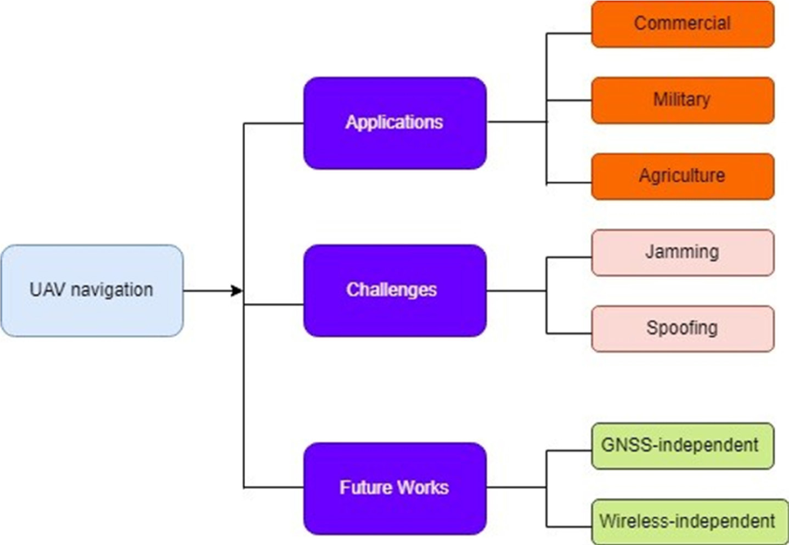

# Download

**Source Document:** `download.pdf`  
**Total Pages:** 21  

---

## --- Page 1 ---

J. Aerosp. Technol. Manag., v17, e3425, 2025

https://doi.org/10.1590/jatm.v17.1396

#### ABSTRACT

In the past decade, there has been a significant increase in the development and utilization of unmanned aerial vehicles (UAVs) 
across various industries. Factors such as remote control, payload capacity, versatility, precision, and confidentiality have fuelled 
interest in UAVs for multiple applications. However, UAVs’ navigation and communication systems are increasingly vulnerable 
to various security threats, with the most concerning being the risks associated with Global Navigation Satellite System (GNSS) 
technology, such as spoofing and jamming. This paper presents a comprehensive analysis of UAV navigation security, drawing on 
recent peer-reviewed journals to identify and address gaps in current research. Machine learning and blockchain show promise 
but face scalability challenges. This review identifies underexplored gaps in environmental resilience. It examines the root causes 
of GNSS-related challenges, potential solutions, and promising research directions in the field of UAV navigation security.

Keywords: UAV; GPS; Security; Spoofing; Jamming.

A Systematic Literature Review on Spoofing 
and Jamming Approaches in Unmanned 
Aerial Vehicles Navigation

Simegnew Eshetu Meheretu1 
, Ethiopia Nigussie2 
, Gebeyehu Belay Gebremeskel1,* 
, Serkalem 
Yikeber Hailesilassie1

1.Bahir Dar University 
 – Institute of Technology – Department of Computer Science – Bahir Dar – Ethiopia.

2.University of Turku 
 – Department of Computing – Turku – Finland.

*Correspondence author: gebeyehu2009@gmail.com

Received: Apr. 17, 2025 | Accepted: Jul. 09, 2025
Peer Review History: Single Blind Peer Review.
Section editor: Paulo Renato Silva

#### REVIEW ARTICLE

#### INTRODUCTION

Unmanned aerial vehicles (UAVs) were initially used in military applications to engage in air-to-ground combat, surveillance, 
and target tracking in hostile environments. Nowadays, UAVs are also employed in various civilian applications such as agriculture 
(Acuna et al. 2018), cargo transport (Yang et al. 2016), and military support (Rahardi et al. 2020), as well as exploring inaccessible 
zones and delivering data to and from areas with no network infrastructure (Sedjelmaci et al. 2018). With the rapid development 
of aerial vehicle technology, satellite navigation systems have become indispensable. UAVs, or drones, and overall unmanned aerial 
systems (UAS) utilize Global Navigation Satellite System (GNSS) signals for navigation. GNSS can provide all-weather services 
that include positioning, navigation, and timing globally, which have been widely adopted in daily life for various applications. 
The Global Positioning System (GPS), GLONASS, BeiDou Navigation Satellite System (BDS), and Galileo are the most well-
known global navigation systems.

This paper aims to analyze existing studies, collect findings, and summarize empirical evidence regarding GNSS security for 
UAVs, to secure their maneuvering in general and task accomplishment in particular. The comprehensive and in-depth analysis 
focuses on UAV applications, challenges related to both commercial and military UAVs, and future-generation work as outlined 
in Fig. 1. The research focus was addressed by formulating three research questions, as shown in Table 1.

## --- Page 2 ---

J. Aerosp. Technol. Manag., v17, e3425, 2025

Meheretu SE, Nigussie E, Gebremeskel GB, Hailesilassie SY
2

The research questions, their significance (drawn from various research papers and in-depth critical analysis), and the approach 
are discussed.

A study on GNSS navigation was conducted using a pool of 90 primary works identified and collected up to 2024 to support 
UAV security. Research in this field can begin by using this pool as a foundation for developing a related research project.

The pool of primary studies was further filtered based on quality assessment criteria, resulting in a selection of 60 primary 
studies. These can serve as a reliable basis for further benchmarking and security evaluation.

A meta-analysis was presented on the measures implemented to improve the security of UAV maneuvering against jamming 
and spoofing threats.

Several issues and challenges exist in implementing security measures for UAV navigation.
The UAV’s physical elements employ a flight controller with a network of sensors to communicate with the ground control 
system (GCS) (communication link). Accordingly, a UAV system is vulnerable to attacks that target the cyber and physical elements, 
the wireless link, or a combination of multiple components. Besides, the environment can block the wireless link between UAS; 
sensors are vulnerable to attacks differently, such as blocking, jamming, and spoofing (Altaweel et al. 2023; Wan et al. 2020). 
The following consequences of jamming are anticipated: drone loss, mission termination, or range restriction. If a UAV is unprotected 
and enters a jammed area, its mission will likely fail.

The aviation industry relies on GNSS for navigation and localization systems. The majority of recent studies use GNSS to locate 
drones accurately. However, there are some situations where GNSS precision may not be appropriate, leading to security threats in

Source: Elaborated by the authors.

Figure 1. General framework of the research.

Table 1. Questions and their significance.

Research questions
Significance

How do UAS that use GNSS protect themselves against different

security threats?

Describe how serious those threats are to the navigation of

UAVs.

How are security threats addressed?
Evaluate the effectiveness and strength of the method.

What are the limitations of existing works?
Shows what needs to be done to enhance UAV network security.

Source: Elaborated by the authors.

#### UAV navigation

Applications

Comercial

Military

Agriculture

Jamming

Spoofing

#### GNSS-independent

Wireless-independent

Challenges

Future works

*Caption/Context: Meheretu SE, Nigussie E, Gebremeskel GB, Hailesilassie SY 2 | Source: Elaborated by the authors.*

## --- Page 3 ---

### Section: _Hlk200354297

J. Aerosp. Technol. Manag., v17, e3425, 2025

A Systematic Literature Review on Spoofing and Jamming Approaches in Unmanned Aerial Vehicles Navigation
3

the industry (Motlagh et al. 2019). Many studies on GNSS spoofing attacks have been reviewed, revealing various approaches being

taken. Some studies are focused on responding to these attacks. In contrast, others propose using localization methods to detect,

escape, and reduce technological threats, specifically focusing on spoofing issues in UAS, as discussed in Arteaga et al. (2019).

This paper introduces a novel approach to understanding the security risks associated with UAV spoofing and jamming

attacks against drones. Specifically, it examines how vulnerable these drones are to companies that rely on GNSS. Additionally,

a summary of research on jamming and spoofing vulnerabilities is presented. The review includes an assessment of the scalability,

performance, and inherent barriers found in primary studies related to GNSS spoofing attacks and their interoperability in achieving

goals. Through critical analyses, the topics that have been addressed are evaluated, gaps are identified, and suggestions for further

research are proposed. Additionally, the research explores opportunities for collaboration among various research communities,

the UAV industry, and related fields to address GNSS-related challenges. Existing techniques for mitigating jamming and spoofing

are examined, providing a methodology that can assist practitioners in developing novel approaches to address problems beyond

current solutions. The contribution of this paper can be presented as follows:

• Create awareness about jamming and spoofing on UAVs.

• Show the vulnerabilities of GNSS-dependent drone industries.

• Show how researchers are addressing spoofing and jamming issues.

• Examine the performance, scalability, and natural obstacles to the interoperability of UAVs.

The remainder of the paper is organized as follows: the introduction is presented first, followed by related works and UAV

security threats. Security enhancement approaches are then discussed. A discussion section precedes the conclusion and future

work, and references are provided at the end.

Related work

In this systematic literature review (SLR) study, the focus is primarily on targeted UAV cyber threats and related vulnerabilities.

Different flaws in communication, sensors, and system configuration errors are identified (Rugo and Finanza, 2022). Ferrão et al.

(2024), Gupta et al. (2023), Mukkath et al. (2023),  and Radoš et al. (2024) highlighted sensor spoofing/jamming and malware

as the most cited threats. To show research related to UAV spoofing and jamming problems, this study analyzes previous work

based on the addressed problem research intention, applied methods, and the issues not covered.

Spoofing

Detection of UAV security threats

The standard Kalman filter (KF) is commonly employed for state estimation and spoofing detection in the presence of Gaussian

additive noise to detect process (Yoon et al. 2019). Most drones utilize GPS and an inertial measurement unit (IMU) to mitigate

issues stemming from GNSS problems. In normal operation, the state estimator operates in a default mode using GPS and the IMU

to estimate the drone’s status and detect potential attacks. If an attack occurs, the system transitions to an emergency mode, relying

exclusively on the IMU for situational assessment. Once the attack detector confirms that GPS signals are no longer compromised, the

ground system can revert to default mode for state estimation. However, these computational time and processes, along with the

switch back to a robust mode, are time-consuming, which reduces the system’s overall performance and efficiency.

Blockchain technology offers a novel approach to combating spoofing. Given that UAVs and other wearable communication

devices use GPS positioning to transmit location-based signals, an attacker might attempt to alter a targeted UAV’s GPS address,

thereby affecting its actual position. Blockchain addresses this by securely storing UAV location data, allowing authorized users

to access the data within a selected block. Despite its benefits, this method relies heavily on GPS signals and assumes that devices

maintain a single, consistent position, which is not always the case in real-world scenarios (Satheesh Kumar et al. 2021).

Mitigating techniques

Zhu et al. (2019) suggested that personal devices could serve as additional sensors to help autonomous systems detect UAV

hacking attacks using comparative human geo-location relative to the typical UAV-equipped gadgets. However, this process does

not consider natural factors that could impair human and camera vision.

## --- Page 4 ---

### Section: _Hlk162078339

J. Aerosp. Technol. Manag., v17, e3425, 2025

Meheretu SE, Nigussie E, Gebremeskel GB, Hailesilassie SY
4

To determine the presence of an assault, Manesh et al. (2019) presented a supervised machine-learning method based on 
artificial neural networks (ANN). In this method, incoming GPS signals, whether real or fake, are input into the algorithm. Factors 
such as satellite number, carrier phase, pseudo-range, Doppler shift, and signal-to-noise ratio (SNR) were thoroughly analyzed to 
enhance accuracy and detection likelihood and reduce false alarms. While this approach attacks, it does not address performance 
issues or GNSS signal unavailability.

To explore space environment data, Basan et al. (2022) utilized the Kullback–Leibler divergence (KLD) value for individual 
time intervals and stored a summary of the findings in a time series. Subsequently, entropy calculations were conducted for the 
collected cyber-physical parameter values, revealing that a higher entropy value indicates an attacker’s presence. The study relies 
on GNSS signals, which can be unavailable due to natural or malicious interference.

Research on GNSS spoofing attack detection strategies has been approached from various angles, with researchers noting 
limitations in existing methods. To address these challenges, two dynamic-based selection techniques were proposed to identify GPS 
spoofing assaults on UAVs (Talaei Khoei et al. 2022). Both techniques utilize supervised machine learning classifiers. They involve 
training and classification, feature selection, data pre-processing, and the construction of specific datasets. While these methods 
demonstrate better detection performance, they still depend on the GNSS system, which is beyond their control. Consequently, 
they do not resolve issues related to GNSS signal availability.

Machine learning for UAVs is an advanced approach to securing them from various spoofing attacks. UAVs are vulnerable 
to GPS spoofing attacks, where malicious actors transmit fake GPS signals to deceive the UAV’s navigation system. This can lead to 
the drone deviating from its intended path, crashing, or even being hijacked. Machine learning offers powerful tools to detect and 
classify these spoofing attempts, enhancing UAV security and supporting the design mitigation strategies.

A central trust monitoring method is used to monitor the behavior of multiple UAVs in real-time while in flight and to identify 
any potential anomalies (Satheeshet al. 2021). In this method, the trust score of each UAV is determined and compared with 
the trust scores of neighboring UAVs. If a UAV’s trust score falls outside the expected range due to environmental conditions 
affecting all nearby UAVs, it is considered under attack. This method is crucial for completing tasks once UAVs have been 
identified as spoofed, reporting, or being overlooked. Normal and abnormal case-based scenarios are also utilized to detect 
spoofing attacks (Ferrão et al. 2020). Security and safety metrics are also established with smartphone apps and the health, 
mobility, and security-based data communication architecture for unmanned aircraft systems (HAMSTER) architecture using 
Wi-Fi, smartphones, ground stations, and GPS. These measures are implemented unless they impact the system. Overall, these 
systems detect spoofing attacks within a specific area and environment, which helps address scalability and jamming issues. 
Voting techniques and a support vector machine-based (SVM) machine learning model are used to protect UAVs from GPS 
spoofing attacks.

Shafique et al. (2021) proposed a method for distinguishing between real and fake signals using several machine-learning 
methods. They employed deep learning techniques for gathering massive amounts of data and machine learning-based intrusion 
detection systems (IDS) to identify rapidly occurring attacks. Various machine-learning models are created using K-fold analysis 
to select the K-learning models used for voting. If the attacker remains present for an extended period, the proposed method will 
prevent the UAV from acting until it detects a valid GPS signal. However, performance issues beyond jamming are not considered.

Basan et al. (2021) offered a technique for spotting anomalies and spoofing attacks on UAVs using information collected and 
assessed from the drone’s sensors. They have suggested using UAV sensors to create an autonomous system for spoofing attacks 
and detecting them. However, the system faces challenges such as dependency on the GNSS system, susceptibility to performance 
issues, and signal unavailability.

To counter the UAV control signal spoofing assault (Wang et al. 2020), a physical layer method has been suggested. Their goal 
was to locate the UAV-side source of the received signal. They used the channel’s Rician factor, the distance-based path loss, and 
the angles of arrival. The signal is determined using the generalized log-likelihood radio test methodology. The suggested effort 
can locate the source and notify the GCS controllers; however, it does not address jamming or efficiency problems in its operation.

Detecting GPS-spoofing attacks on UAVs is an advanced and innovative method that involves predicting the flight 
path in advance at specific intervals using the long short-term memory (LSTM) algorithm. This is achieved by capturing

## --- Page 5 ---

J. Aerosp. Technol. Manag., v17, e3425, 2025

A Systematic Literature Review on Spoofing and Jamming Approaches in Unmanned Aerial Vehicles Navigation
5

speed, direction, and distance from the starting point (Huang and Wang 2018). When the UAV’s positioning signal 
deviates from the recorded route in the dataset, it is identified as a spoofing attack. However, the effects of this attack on 
performance, the time in case of repeated attempts, and the lack of consideration for jamming represent gaps that require 
more advanced methods.

A study by Shafique et al. (2021) employs a convolutional neural network (CNN), satellite images, and a camera for 
image recognition, classification, and segmentation. By comparing satellite imagery with real-time aerial photos, GPS 
spoofing attacks against UAVs can be detected. However, GNSS signal variations and lighting conditions may influence 
the intended outcomes.

Asif et al. (2023) proposed the IDS system, which utilizes generative adversarial network learning and adversarial

learning methods to address the vulnerabilities of adversarial attacks against jamming and spoofing. While these integrated

learning approaches show promise, natural obstacles, denial, and signal perturbations from the source have not yet been

fully detected and solved.

Table 2 summarizes various methods for detecting and mitigating spoofing attacks, detailing their goals, approaches,

and research gaps. It outlines that the reviewed studies do not address climate concerns, signal unavailability, or mission

accomplishment capabilities.

Table 2. Summarizes recent research on GPS spoofing detection and mitigating techniques.

Related work
Security problem
Aims
Methods
Concepts not covered

Wan et al. (2020)

#### GNSS spoofing

attack

Mitigating a spoofing

attack

Cumulative sum 
(CUSUM), unscented

KF (UKF), and KF

Efficiency issues

Jansen et al. (2018)
Air traffic monitoring
Efficiency issues

Yoon et al. (2019)
Gaussian and standard

KF
Efficiency issues

Satheesh Kumar et al. (2021)

The Ethereum network 
measures a time series

of signals

Jamming issues, mobility

issues

Zhu et al. (2019)

Spoofing attack 
detection through signal

behavior analysis

Humans as sensors
Climate

Basan et al. (2022)
Analyze the space

environment

Unavailability, 
performance

Keshavarz et al. (2020)
UAV behavior analysis

method
Performance issues

Huang and Wang (2018)
Physical layer signal

behavior

Performance issues,

jamming issues

Basan et al. (2021)
Sensors
Performance, jamming

Ferrão et al. (2020)

Case study with

HAMSTER and 
smartphone apps

Scalability, jamming

Manesh et al. (2019)

Spoofing attack 
detection through

machine learning

approaches

Supervised machine

learning with ANN
Jamming issues

Talaei Khoei et al. (2022)
Multiple machine 
learning classifiers

Performance,

unavailability

Shafique et al. (2021)
Machine learning
Performance, jamming

Wang et al. (2020)
Machine learning LSTM

algorithm
Performance, jamming

Xue et al. (2020)
Deep learning
Performance,

unavailability

Asif et al. (2023)

Generative adversarial 
network and adversarial

learning

Scalability, natural

obstacles

Source: Elaborated by the authors.

## --- Page 6 ---

### Section: _Hlk162078911

J. Aerosp. Technol. Manag., v17, e3425, 2025

Meheretu SE, Nigussie E, Gebremeskel GB, Hailesilassie SY
6

Jamming

Detection

Sedjelmaci et al. (2018) proposed an IDS to protect networks from internal and external threats. Upon detecting spoofing, 
the system logs and relays the attacker’s location and signal strength intensity (SSI) to the ground station. If jamming is detected, 
it sends an intrusion report, including the suspected transmitter’s identity (e.g., a UAV) and the jamming type (deceptive or 
random), to the ground station. This method necessitates continuous monitoring of both the environment and the UAVs. The 
ground station controllers determine whether to proceed with the mission. However, this approach does not account for natural 
obstacles to GNSS and its link system.

Because traditional jammer localization via trilateration applies only to a single jammer, and given the availability of commercial 
GPS jammers, the risk posed by multiple jammers increases. To address these challenges, Bhamidipati and Gao (2019) and Ni et al. 
(2024) proposed simultaneous localization of jammer and receiver (SLMR) algorithms using IMU, ultra-wideband (UWB), 
camera, LiDAR, a cellular connection, and Wi-Fi through networked UAVs. This can be implemented using resilient stationary 
UAVs and network resources. However, UAV payloads cannot control natural environmental factors like jamming. Additionally, 
the method is resource-intensive, and jamming can result from either intentional intrusion or unintentional natural obstacles. 
Scholars mainly focus on mitigating deliberate jamming, which remains challenging as adversaries enhance their jamming 
capabilities. Natural interferences are also addressed, though usually temporarily, and researchers aim to ensure the safe return 
of UAVs rather than mission completion.

Mitigating techniques

Acuna et al. (2018) proposed a method for situations where external localization systems, such as GPS, are not available or 
reliable. In this approach, an unmanned ground vehicle (UGV) is used as a guide during UAV landing. However, the method is 
limited in scalability since it does not apply to flying missions.

Rezgui et al. (2019) and  Wang et al. (2018) explored jamming mitigation techniques that leverage energy harvesting and 
game theory to address the effects of GNSS jamming. These approaches serve as countermeasures against intentional jamming 
attacks. The Nash equilibrium and frequency hopping strategies between the jammer and defender represent a viable method for 
mitigating jamming attacks involving a single adversary. However, a comprehensive solution remains elusive when faced with 
multiple jammers and natural interference.

Tedeschi et al. (2020) employed a technique used in multi-view learning and manifold alignment, particularly for analyzing 
datasets with multiple related but different representations. They called it the JAMming Methods (JAM-ME) algorithm, a jamming-
based navigation technique that utilizes the jamming signal to estimate the jammer’s location. This estimated location is then used 
as a radio beacon to determine the drone’s relative position to the target. Alternatively, the adversary could modify the drone’s 
firmware following the authors’ algorithm, thus implementing a jamming-based navigation system. Once the adversary’s position 
is determined, the system adjusts its position to achieve its objectives. While the jamming-based navigation method is an effective 
countermeasure that allows the UAV to complete its objectives despite existing ongoing jamming efforts, it becomes increasingly 
difficult as the number of jammers and sources of natural interference increases.

Li et al. (2019) implemented a strategy that utilizes multiple eavesdroppers with imprecise location data and a cooperative 
jammer UAV transmitting interference signals to confuse the eavesdroppers. This approach optimizes the flight paths and 
transmission power of both UAVs to maximize the system’s worst-case secrecy rate. A block coordinate descent and successive 
convex optimization technique was proposed to iteratively optimize the UAV’s power, the source UAV trajectory, and the jammer 
UAV trajectory. This method secures UAV communication using multiple devices to mislead the jammer UAV. However, natural 
interference remains a challenge in this secure communication approach, and it is resource-intensive.

Mah et al. (2019) developed a wireless relay network that uses a UAV relay to mitigate jamming. Their work optimizes the UAV’s 
flight path to maximize the signal-to-interference-plus-noise ratio (SINR) at the receiver, enhancing the network’s performance and 
robustness against jamming. A jamming-immune control channel employing strong error control coding facilitates the exchange 
of estimated jamming parameters from the UAV to the base station and flight path control information from the base station to 
the UAV. While some jamming parameter estimations occur onboard the UAV, most signal processing and optimization tasks are

## --- Page 7 ---

J. Aerosp. Technol. Manag., v17, e3425, 2025

A Systematic Literature Review on Spoofing and Jamming Approaches in Unmanned Aerial Vehicles Navigation
7

handled by the base station. Although the approach effectively evades jammers, it does not protect against natural interference 
and is resource-intensive.

Scholars are currently exploring a variety of options to develop jamming solutions. The most commonly used approach in 
GNSS-denied indoor activities is computer vision maneuvering. In a study by the authors, Valenti et al. (2018) utilized an extended 
KF (EKF) to estimate poses. This estimation relies on data from IMU, gyroscope, and computer vision algorithms incorporating 
four virtual cameras and landmark localization. These devices and algorithms are used for obstacle detection and appropriate 
responses. While effective in familiar, stable environments, this approach is limited in outdoor conditions.

Tang et al. (2019) demonstrated a highly developed flocking’s simultaneous localization and mapping system (SLAM) that 
effectively integrates several cutting-edge technologies, such as LiDAR-based SLAM and a visual system for nighttime and daytime 
sensing without constant wireless transmission or GPS signals. Although it reduces network overhead and can fly in any light 
condition, it is difficult to operate without wireless connectivity and a GNSS signal.

Even when the GNSS signal is unavailable for various reasons, the UAV does not rely solely on its onboard or external sensors 
for navigation. In addition to GNSS, several other types of navigation systems have been utilized. For example, Zhou et al. (2018) 
proposed vision-based localization using a low-cost IMU, creating a powerful vision-based inertial navigation system (VINS). This 
system also includes a minimal ultra-lightweight sensor suite enabling robust autonomous flight. However, this VINS is unsuitable 
for outdoor navigation due to challenges such as natural illumination variations and scalability problems.

In situations where GPS is available, approaching a target can often be achieved by simply sharing GPS data between the UAV 
and the target. For example, Nguyen et al. (2019) addressed the problem of autonomous UAV docking onto a moving UAV from 
a distance. They integrate UWB and vision sensors to provide accurate and reliable relative localization (RL). They integrated 
UGV, vision sensors, and UWB to provide accurate and reliable RL for landing. While applicable in a resilient environment, 
this method may not be suitable for unknown outdoor conditions.

An alternate localization technology for landing instances was proposed by Dobrev et al. (2018). This system utilizes a single 
ground-based radar station and a miniature radar unit on the aircraft, employing wireless local positioning to estimate the UAV’s 
3D position. This equipment is used for take-off and landing events when flights are hindered. However, the UAV cannot be 
localized if there is no GNSS signal during operation, nor can the system be used if the primary ground radar is damaged.

The current RL approach, based on persistent excitation, suffers from accuracy loss, error accumulation, and divergence 
(She et al. 2020). Sensor synchronization, UWB, and IMU sensors were utilized to address these challenges. This method requires 
a group of UAVs to fly together on a single mission, making it a viable solution when a GNSS signal is unavailable. However, a 
limitation of this approach is its inability to determine the UAV’s goal or objective, which can lead to scalability issues.

GNSS signals are weak and easily jammed or interfered with in various ways. When a disruption in the GNSS signal occurs, 
White et al. (2021) presented an alternative navigation approach using a synthetic aperture radar (SAR) system and a GNSS 
signal. While promising, this method requires a radar system to function. Therefore, if either GNSS or a radar system is unavailable, 
the system cannot operate. Additionally, these factors are not taken into consideration.  Li et al. (2020) introduced a single fixed-
base station localization wireless positioning method and validated it with UAV flight data. This method resolves any issues 
related to GNSS navigation. However, networks and base stations are limited in their ability to cover large areas due to natural 
obstructions, making them non-scalable and susceptible to environmental barriers.

The autonomy of UAVs has made it difficult for them to navigate uncharted territory. Qin et al. (2019) suggested utilizing GNSS-
denied maneuvering with the assistance of UAVs to address these issues. They integrated vision technology through a wireless link 
to navigate even without GNSS signals in a safe and well-lit environment. Therefore, flying autonomously becomes challenging 
under these circumstances. Habib et al. (2020) focused on enhancing UAV navigation technology to facilitate site inspections. 
They measure height, x-y position, and ground velocity using an optical flow sensor and sonar. Despite its improvements over 
current technologies, scalability issues and natural barriers persist.

Table 3 provides a summary of the ways to mitigate and detect jamming attacks and displays the objectives, strategies, and 
topics not covered in the research articles. The studies do not address climate issues, signal reliability, scalability, or mission 
accomplishment competencies.

## --- Page 8 ---

J. Aerosp. Technol. Manag., v17, e3425, 2025

Meheretu SE, Nigussie E, Gebremeskel GB, Hailesilassie SY
8

Threats of syncretization and methodology

With the expansion of UAV usage and available facilities, the UAV wireless network is vulnerable to several hostile threats, 
such as eavesdropping, jamming, and spoofing attacks (Liu et al. 2021; Majeed et al. 2021). Modern aviation technologies cannot 
be effective without securing the navigation system, as it aids navigation to destinations quickly and safely. Without successful 
mission accomplishment, various security threats such as jamming, spoofing, and eavesdropping can impact the navigation 
system. Devices relying on GNSS can be interfered with and interrupted by fake GNSS signals, causing flying objects to veer off 
course and miss their destinations. GNSS spoofing represents a significant threat to national industry security. Multiple jammers 
on a single device pose an immediate threat (Alrefaei et al. 2022; Bhamidipati and Gao 2019; Junzhi et al. 2019; Wang et al. 2019; 
2020; Xu et al. 2021; Zhi et al. 2020).

Review criteria

In line with established protocols for systematic literature reviews (SLRs), this study defines research questions, designs search 
strategies, and applies inclusion and exclusion criteria to guide the research process. Therefore, a wide variety of sources is available 
on the topic, contributing to the fact that this result is based on a broad range of sources.

Table 3. Summarizes recent research on GPS jamming detection and mitigating techniques.

Related work
Security problem
Intention
Approach
Method
Issues not covered

Sedjelmaci et al.

(2018)

Jamming

Detection
Using the GNSS

signal

IDS
Natural obstacles

Tedeschi et al. (2020)
JAM-ME algorithm,

change location

Performance,

environment

Li et al. (2019)
Employ many confusing

devices.

Natural obstacles and

costly

Rezgui et al. (2019)
Frequency hopping and

energy harvesting

Natural obstacles and

costly

Bhamidipati and Gao

(2018)

SLMR algorithm, 
sensors, and resilient

network

Performance,

environment

Acuna et al. (2018)

Mitigation 
technique

#### GNSS denied

using vision-
based navigation

Vision data with UGV
Scalability

Valenti et al. (2018)
Vision data with EKF
Scalability

Tang et al. (2019)
LiDAR-based SLAM and

a visual system
Scalability

Zhou et al. (2018)

Vision-aided inertial

navigation system

#### (VAINS)

Scalability

Nguyen et al. (2019)
Vision sensors UGV,

UWB
Scalability

Dobrev et al. (2018)

GNSS denied 
using alternative

localization

Radar-based wireless

localization
Scalability

She et al. (2020)
UWB and IMU sensor

synchronization
Scalability

White et al. (2021)
GNSS and SAR
Scalability

Li et al. (2020)
Wireless links and base

stations

Scalability, natural

obstacles

Qin et al. (2019)
Wireless links and UGV

alt

Scalability, natural

obstacles

Habib et al. (2020)
Wireless links, local 
positioning, and EKF

Scalability, natural

obstacles

Mah et al. (2019)
Wireless relay network
Performance and 
natural obstacles

Arslan et al. (2016)
Spoofing
detection
Using machine

learning
Modelling approaches
Performance and 
natural obstacles

Source: Elaborated by the authors.

## --- Page 9 ---

### Section: _Hlk162077382

J. Aerosp. Technol. Manag., v17, e3425, 2025

A Systematic Literature Review on Spoofing and Jamming Approaches in Unmanned Aerial Vehicles Navigation
9

Literature search method

The SLR was conducted following normative recommendations to answer specific research questions by collecting literature 
to provide a longitudinal and representative view of works (Kitchenham and Charters 2007). To obtain an unbiased and complete 
picture, many sources were explored, including major online databases: Institute of Electrical and Electronics Engineers Xplore 
Digital Library (IEEE Xplore), Association for Computing Machinery Digital Library (ACM), Multidisciplinary Digital Publishing 
Institute (MDP), Wiley Online Library, ResearchGate, and Science Direct/Elsevier.

The major databases were explored due to their extensive collections of journal articles and conference proceedings, which 
enabled the examination of various studies on security issues and solutions for GNSS-based UAV navigation systems.

Selection of primary studies

Primary studies were collected using keywords in the search facility of selected databases. Generic search terms were used 
to ensure broad results by placing the primary search terms between logical AND/OR operators. For example, searches were 
conducted using ‘‘UAV’’ AND ‘‘GPS’’, AND ‘‘Security’’ to include all relevant data, and also for AND ‘‘GPS navigation security’’ 
OR ‘‘GPS Security’’ AND ‘‘GPS jamming’’ AND ‘‘GPS spoofing’’ AND ‘‘UAV navigation security’’ AND “UAV security” to 
achieve the optimal filtering results. The searches were conducted in 2024, considering papers published from 2016 up to 
that date. Search results were subjected to a filtering process after applying inclusion and exclusion criteria, resulting in a set 
of primary studies. These studies were then fed into a snowballing process to obtain further research studies in the targeted 
domain (Wohlin 2014). Forward and backward snowballing were applied iteratively until no further papers meeting the 
inclusion criteria were detected.

Inclusion and exclusion criteria

To ensure the identified relevant works aligned with the SLR, specific inclusion and exclusion criteria were defined. For a work 
to be considered in this systematic review, it had to report substantial empirical findings and be available in one of the online 
databases mentioned in the related work synthesization. Studies also had to be peer-reviewed, written in English, and focus on 
security threats, challenges, and solutions for UAV GNSS navigation systems. As shown in Table 4, key criteria were used to 
determine the inclusion or exclusion of the studies.

Table 4. Key inclusion and exclusion criteria.

Inclusion criteria
Exclusion criteria

Must fall in the broader field of security UAV navigation, such as GPS spoofing and

jamming, and GPS-denied navigation

If it falls outside the broader field of UAV

navigation

Must present empirical data related to GPS spoofing and jamming attacks and

GPS-denied navigation to provide security in the aviation industry.
Paper not published in the English language

Must have gone through a peer-review procedure, usually presented in a

conference or journal paper form.
Grey literature

Presents GPS and link attacks, detection, and prevention
White papers

Source: Elaborated by the authors.

Distribution of papers

This paper aims to find suitable, reliable, and sufficient literature by exploring various online digital libraries based on the 
search keys described in the related work discussion. The digital libraries outlined in Table 5 were examined, given their widespread 
popularity and wealth of resources in the field, and the methodological framework is shown in Fig. 2.

After conducting a thorough review of relevant literature across various online databases, the material was scanned and 
skimmed to gather both a comprehensive overview and detailed information. The identified works focusing on security issues 
were then extracted and analyzed accordingly. These scholarly works are now prepared for in-depth examination as part of 
the SLR process.

## --- Page 10 ---

J. Aerosp. Technol. Manag., v17, e3425, 2025

Meheretu SE, Nigussie E, Gebremeskel GB, Hailesilassie SY
10

Security threats

Jamming and spoofing can significantly impact the three pillars of cybersecurity: confidentiality, integrity, and availability. 
Table 6 visually represents the severity of these issues by presenting studies on spoofing and jamming from the past 11 years.

Table 6 represents the frequencies of spoofing and jamming studies in different years. However, the representation is based on 
the authors’ findings and perspective and does not suggest that these are the only studies published in those years.

Table 5. The number of papers from different online academic databases.

No.
Databases
# of papers
Related papers
Summarized papers

1
IEEE
210
57
55

2
MDPI
93
12
7

3
ACM
30
8
4

4
Elsevier
25
7
4

5
Wiley Online Library
15
6
3

6
ResearchGate
15
6
6

Total
388
91
79

Source: Elaborated by the authors.

Source: Elaborated by the authors.

Figure 2. Methodological framework for the systematic literature survey.

Table 6. How much jamming and spoofing are studied?

2014
2015
2016
2017
2018
2019
2020
2021
2022
2023
2024

Jamming/spoofing
5
5
7
7
14
16
17
17
9
4
6

Source: Elaborated by the authors.

Spoofing is a technique that commonly includes jamming and more powerful signal attacks. In beaconing, beacons repeat and 
acquire signals after estimating the correct signal, resulting in the receiver receiving outdated signal data with inaccurate temporal 
information. Another type of spoofing involves overpowering authentic GNSS signals during the acquisition stage, leading to a 
loss of control over the UAV by the sources (Demir et al. 2020). This type of attack is more complex than jamming, as it involves 
passing off unauthorized signals as legitimate ones (Alrefaei et al. 2022; Cuntz et al. 2012).

Discussion issues

and final review

of papers

Discard

Final result

papers

Define

scope

Search online 
scholastic database

Skimming and 
scanning using 
key word, title and

abstract
No

Is related

to our 
scape

Full reading
No
Yes
Is related 
to security

issues?

## --- Page 11 ---

### Section: _Hlk162077489

J. Aerosp. Technol. Manag., v17, e3425, 2025

A Systematic Literature Review on Spoofing and Jamming Approaches in Unmanned Aerial Vehicles Navigation
11

A fake satellite signal is initially used in spoofing to deceive a GNSS receiver. This can be achieved with minimal power, a 
smart mode, and a small amount of false but highly misleading content to reach the desired interference goal. To target a specific 
victim, the spoofer alters the GNSS signal with subtle yet significant errors in position, velocity, and time (PVT), amplifies it, and 
rebroadcasts it (Ouyang et al. 2016).

Jamming is a harmful attack that disrupts communication between UAVs and other legitimate parties on the UAV network. It is 
essentially a denial-of-service (DoS) attack on a wireless platform, jeopardizing the system’s availability by disrupting communication. 
Hackers target the channel node with radio waves using the jamming attack technique. There are four subcategories of jamming attacks: 
continuous, reactive, random, and constant. Despite numerous attempts to mitigate UAV navigation spoofing and jamming, these 
tactics are likely to persist until new vulnerabilities are exploited. Research summarized in Tables 2 and 3 suggests approaches that rely 
on GNSS and alternative navigation methods with various security measures to counter resilient jamming and spoofing techniques.

Methodology of security enhancement approaches for UAV navigation systems

Intrusion detection and prevention-based (IDP) solutions

The open, nature-affected, and insecure environments of wireless communication and navigation for UAS increase the industry’s 
vulnerability to various communication, navigation, and weather-related issues. Scholars are working on securing communication 
in UAS through different approaches, including IDP methods. In a paper, a comprehensive review was conducted outlining 
approaches and research methods for detecting and preventing attacks in the UAS network to identify malicious abnormalities 
that harm the network. Researchers have implemented attack monitoring and response systems at the UAV and ground control 
station (GCS) levels by utilizing an IDS agent on each UAV. By identifying malicious abnormalities that could harm the network, 
researchers can categorize nodes as normal, aberrant, or suspect, focusing on preventing the spread of misleading information, 
GPS spoofing, jamming, and attacks involving black holes and grey holes.

Intrusion detection systems often use a collection of attack patterns to create the rules or a rules-based intrusion detection 
method for detecting abnormalities. A distributed intrusion monitoring and detection solution that is delay-tolerant is employed. 
This method allows each node to activate an IDS agent, listen to all packets within its radio range, and observe the UAV behavior 
as they move around the area (Sedjelmaci et al. 2018). Another strategy for ensuring UAV information security involves using 
mathematical techniques for outlier detection. Specifically, the KLD, in conjunction with the probability mass Function (PMF), 
can compare and quantify two probability distributions at various time points. This allows for characterizing normal behavior and 
then comparing the observed data’s PMF to normal behavior, utilizing the KLD to identify anomalies by comparing the observed 
data’s PMF to the established normal behavior, assuming the initial data samples are free of abnormalities (Basan et al. 2021).

According to Basan et al. (2022) UAV electromagnetic jamming security situation awareness is proposed using semantic 
analysis. The data source of semantic analysis is collected based on the subtle changes in the UAV state parameters during the 
electromagnetic interference process. Abnormal behavior detection is realized by a tracing comparison method. Subsequently, 
fuzzy logic reasoning is adopted to realize the semantic analysis of the link jamming and intrusion situation. Finally, the semantic 
evaluation of the link situation has been developed (Gao et al. 2020).

Drones need an IDS that uses deep learning to identify intruders and ensure a safe return. The proposed IDS combines self-
taught learning (STL) with a multiclass SVM. This achieves a high detection rate even against unknown threats. STL, a deep 
learning algorithm for supervised feature learning, enables UAVs to navigate home in various situations. If a GPS signal is lost, 
the system initiates self-analysis and detection methods. Should the communication link between the UAV and its control station 
be compromised, the UAVs will attempt to reconnect or locate nearby UAVs to facilitate a safe return (Arthur 2019). In all these 
scenarios, however, security remains a concern, as hackers can exploit vulnerabilities in both the communication link and GPS.

Alternative localization

Localization is a critical concern for UAVs, especially in diverse applications like security. As Li et al. (2024) highlighted, 
accurate localization is essential for UAV safety and communication with ground sensors. This fundamental technique underpins 
the security and reliability of UAV operations. GNSS lacks the reliability to provide accurate and secure positioning. Cellular 
signal ranging and localization methods that can supplement or replace the system to aid UAVs in navigating to their destinations.

## --- Page 12 ---

J. Aerosp. Technol. Manag., v17, e3425, 2025

Meheretu SE, Nigussie E, Gebremeskel GB, Hailesilassie SY
12

However, while the current mobile communication infrastructure and network can support sustainable ranging, localization, and 
logging of UAVs even in the absence of GNSS signals or signal manipulation, achieving sustained ranging and localization for 
UAVs remains a persistent challenge (Radoglou-Grammatikis et al. 2020).

Researchers have proposed an alternative localization method immune to GPS spoofing and jamming attacks, as GNSS 
localization and navigation are susceptible to various attacks. These alternative localization techniques are used in place of the 
well-known GPS signal. In a GPS-denied situation, a collaborative comparative positioning approach without infrastructure has 
been proposed using UWB technology (Guo et al. 2020). The increased use of GPS and reliance on UAS has raised concerns about 
the danger of jamming, making it a significant safety concern. As a result, a 24 GHz frequency radar system has been suggested 
as another localization approach (Dobrev et al. 2018).

UAVs equipped with vision navigation systems face challenges with lighting. Therefore, a weighted k-nearest neighbor algorithm 
positioning system has been developed (Hong et al. 2020). The authors have proposed improved persistent excitation based on RL 
to address UWB and RL. Each UAV is equipped with a UWB module and an IMU as onboard sensors to measure proportional 
distance and velocity (She et al. 2020). To improve positioning accuracy, four or more fixed base stations and mobile nodes are 
utilized using ranging information (Li et al. 2020).

Alternative localization is a popular method of GPS navigation that utilizes techniques other than GPS to protect users from 
threats associated with GNSS. However, these methods are vulnerable to environmental factors and a variety of threats.

Machine learning and deep learning

Recently, machine learning and deep learning technologies have been utilized for various applications, such as UAV networks 
for autonomous navigation and intrusion detection (Yin et al. 2024). A methodology has been proposed that incorporates a 
machine learning algorithm like the SVM to protect UAVs from GPS spoofing attacks. In their studies, the machine learning 
method and K-fold studies were performed to create additional learning models by selecting various K-fold values (Shafique et al. 
2021). Artificial intelligence and neural network-based solutions have been developed to handle spoofing and jamming problems 
(Challita et al. 2019). Furthermore, methods like metrics-optimized dynamic selection and weighted metrics-optimized dynamic 
selectors have been suggested to identify the most efficient classifier for detecting attacks on UAV networks.

According to the authors, multiple machine learning classifier systems are preferable for identifying GPS spoofing attempts rather 
than using a single classical machine learning model (Talaei Khoei et al. 2022). The authors have introduced deep learning satellite image 
matching (Deep SIM), an approach to detecting GPS spoofing attacks against UAVs by comparing historical satellite images with real-
time aerial images based on deep learning (Xue et al. 2020). Machine learning has also been proposed to detect and classify jamming 
attacks on UAVs. Signal-to-noise ratio (SNR), power threshold, and multiple orthogonal frequency division multiplexing (OFDM) 
parameters or features are passed to machine learning algorithms to detect and enable automatic jamming discovery (Pawlak et al. 2021).

These approaches are implemented to detect spoofing and jamming during UAV navigation. While they perform better than existing 
security approaches in reducing spoofing and jamming problems, they require all methods of navigation and linking for operation.

Vision-based navigation

To understand information from a distance, a visual device employing computer vision processing technologies is applied. 
Vision-based navigation has become increasingly important in various space applications, including hazard avoidance, landmark 
tracking during landing, and localization and mapping to increase autonomy and reliability (Xie et al. 2018). Vision-based navigation 
has emerged as an alternative to GPS in UAV networks due to GPS’s vulnerability to ongoing spoofing and jamming attacks. An 
omnidirectional stereovision system creates a 3D model of the surroundings. A downward-looking stereo pair is used to calculate the 
drone’s height above the ground and refine the pose estimate in a simultaneous localization and mapping method (Valenti et al. 2018).

An agile approach maneuver is proposed in which the target vehicle may move out of the vision sensor’s range of view. The UAV 
tracks the UGV’s motion, predicts it, and creates a smooth trajectory for approaching the projected point (Acuna et al. 2018). Researchers 
have used vision-based techniques to autonomously navigate UAVs, capturing real images during flight to predict and decide on a 
collision-free trajectory (Kanwal et al. 2021; Nguyen et al. 2019; Tang et al. 2019; Vanegas et al. 2018; Xie et al. 2018). These vision-
based approaches are increasingly popular as an alternative to GPS-denied navigation for UAVs. However, they are effective only in 
a conducive environment and cannot fly or plan trajectories in the low-night, foggy, or low optical flow conditions (Cao et al. 2022).

## --- Page 13 ---

### Section: _Hlk162080530

J. Aerosp. Technol. Manag., v17, e3425, 2025

A Systematic Literature Review on Spoofing and Jamming Approaches in Unmanned Aerial Vehicles Navigation
13

Blockchain-based security approaches

Blockchain technology, offering properties like traceability, transparency, and auditability as an immutable distributed ledger, 
has enhanced security applications and is used in various fields to address challenges. In the context of the UAV network, blockchain 
is described as reducing security and safety hazards and increasing device reliability in a blockchain network compared to the 
central system GCS (Khan et al. 2021).

To reduce cyberattacks during communication and storage, blockchain technology features built-in cryptographic hash and 
smart contract capabilities to prevent such attacks. To address authentication and data-sharing issues, a blockchain-enabled, efficient, 
and secure data-sharing model for 5G flying drones has been proposed (Feng et al. 2020; 2021; Xenya and Quist-Aphetsi 2019). 
A scalable, advanced Byzantine fault tolerance protocol with the concept of blockchain of drone (BCoD) has been proposed to 
address low throughput, high latency, and lack of identity management issues in permissionless blockchain, proof-of-work (PoW), 
and proof-of-stake (PoS) consensus protocols. Additionally, it aims to provide an additional authentication and authorization 
layer (Singh and Venkatesan 2021) (Wang et al. 2024).

The Ethereum blockchain network has been utilized to prevent spoofing attempts. Aviation components added to the 
blockchain ledger are important for secure data transfer. If an attacker gains access to data in a single block within the network, 
the data remains unaffected due to the data integrity in the cryptographically secured ledgers. The blockchain network periodically 
verifies geolocation data, allowing for the rapid identification and discarding of inaccurate information. The verified data is then 
accessible for monitoring spacecraft and its operations through a distributed network (Satheesh Kumar et al. 2021). Elliptic curve 
cryptography and secure hash algorithm (SHA) are employed to encrypt technical data about devices and vehicle data, which is 
then stored on a public blockchain powered by Ethereum to facilitate seamless blockchain technology transactions. These methods 
ensure data security against ciphertext, plaintext, and stalker attacks (Ch et al. 2020).

Blockchain technologies, as discussed above, use a consensus algorithm to secure communication and data storage (Cheng 
et al. 2024). The consensus method identifies outlier and inlier threats, improving the accuracy of GNSS by enabling more precise 
comparisons. They function effectively in a network to prevent spoofing and unauthorized access. They are suitable for designing 
trusted networks within the current Internet of Drones (or UAVs, in general) and other devices. However, blockchain technology 
is susceptible to interference from the environment and jamming.

#### DISCUSSION

Scholars have utilized various approaches to enhance the security of UAV navigation systems. These approaches include 
security threat detection, threat prevention, and GNSS-independent navigation. The goal is to address the security issues faced 
by UAV navigation systems. Various methods have been employed within these approaches, which include IDS, IDP, machine/
deep learning, log files, filtering algorithms, frequency hopping, IMU, inertial navigation system (INS), vision-based navigation, 
blockchain, and alternative localization. Despite these approaches and methods, they have not been evaluated for efficiency, cost, 
nature, and man-in-the-middle attack (MIMA) parameters as shown in Table 7.

Table 7. Security enhancement techniques.

Threats
Solution
Methodology
Critiques

#### GPS spoofing,

jamming, and 
link/sensor attacks

Detection
IDS, machine learning/deep learning, sensors,

log files
Missions will affect and cost another flight

Detection and

prevention

Filter algorithms, frequency hopping, machine 
learning with intelligence, IDP off-GPS with IMU

The number of attempts and attack 
methods makes the task difficult and is

influenced by nature.

Prevention
Blockchain, smart contract
MIMA, attacks within the system, and

nature affected

#### GPS denied

Vision-based with SLAM and INS, alternative 
localization, UWB, augmented reality sensors,

and deep learning.

The link could be compromised and

influenced by nature

Source: Elaborated by the authors.

## --- Page 14 ---

J. Aerosp. Technol. Manag., v17, e3425, 2025

Meheretu SE, Nigussie E, Gebremeskel GB, Hailesilassie SY
14

Various strategies are being utilized to ensure the safe navigation of UAVs, as discussed above. Due to these strategies, UAV 
navigation is becoming safer in conditions that reduce associated risks. While each method has its limitations, the technology 
requires periodic updates to security measures to stay ahead of any new threats posed by attackers who may surpass existing 
measures. Therefore, as long as attackers do not exert significant effort, the security measures implemented by various academics 
will remain effective.

As shown in Table 8, the current safeguards against spoofing and jamming attacks are highly effective in achieving their intended 
objectives. The methods and techniques used to address these problems have been proven successful when dealing with jamming 
and spoofing individually. Tables 2 and 3 above illustrate that researchers actively work to identify and counteract jamming and 
spoofing attacks. Some researchers focus on developing detection and mitigation strategies that work as long as a wireless link and 
GNSS localization or any other form of localization are available. However, jamming issues can prevent any localization over the 
wireless channel, especially if the service provider denies access to the source. In such cases, natural interferences, like spoofing, 
deliberate or accidental jamming, and denial of services, can impact the effectiveness of mitigation strategies. Scholars’ research 
on threat detection, root cause analysis, countermeasures, and performance challenges are summarized in Table 9.

Table 8. Summarized performance measure of the literature.

Issues
Methodology
Status
Drawback

Spoofing
Threat detection and prevention
Very good
Low-performance and resource-intensive

Jamming
GNSS-denied
Very good
Natural interferences

Source: Elaborated by the authors.

Table 9. An identified gap in the existing works.

Parameters

Wan

et al.

(2020)

Ferrão

et al.

(2020)

Bhamidipati

and Gao,

(2019)

Jansen

et al.

(2018)

Zhu

et al.

(2019)

Manesh

et al.

(2019)

Basan

et al.

(2022)

Talaei

Khoei

et al.

(2022)

Keshavarz

et al.

(2020)

Dobrev

et al.

(2018)

Shafique

et al.

(2021)

Satheesh

Kumar

et al.

(2021)

Yoon

et al.

(2019)

Threats detection 
√
√
√
√
√
√
√
√
√
√
√
√
√

Root cause
X
X
X
X
X
X
X
X
X
X
X
X
X

Countermeasure 
√
√
√
√
X
X
X
X
X
√
X
√
√

Performance 
X
X
X
X
X
X
X
X
X
X
X
X
X

Environment 
X
X
X
X
X
X
X
X
X
X
X
X
X

Source: Elaborated by the authors.

The biggest problem facing navigation systems is their reliance on wireless connections, whether through GNSS or other localization 
methods. These wireless communication vulnerabilities are precisely where jamming and spoofing attacks cause trouble. Since these 
technologies can be easily disrupted or compromised at their source, researchers have yet to find a comprehensive solution. While 
much research focuses on detecting and preventing these attacks, the effectiveness of these countermeasures is often not thoroughly 
evaluated. This lack of performance assessment means it is not yet clear how well they work. Environmental factors also significantly 
impact the reliability of current communication and localization methods. Conditions, clouds, or intentional jamming encountered 
during flight operations can lead to various issues: operational failures, mission failures, intermittent flights, and increased consumption 
of time and resources. When these problems occur, the objectives of the operation are not met, and resources are wasted.

The GNSS is crucial in the aviation industry, as aircraft are enabled to navigate to their destinations. However, GNSS is vulnerable 
to natural, weather-related, and intentional attacks. Spoofing and jamming are the most common problems encountered in the GNSS 
system, which can impact the aircraft’s flight, the system itself, and even lead to crashes and theft of flying objects. Researchers are 
actively developing mitigation techniques to address these spoofing and jamming challenges. The solutions proposed by scholars 
still rely on GNSS and wireless communication technology, which may reduce the likelihood of the problems but not eliminate 
them. Natural, weather-related, and intentional jamming and spoofing attacks persist in this technological landscape, as the GNSS

## --- Page 15 ---

J. Aerosp. Technol. Manag., v17, e3425, 2025

A Systematic Literature Review on Spoofing and Jamming Approaches in Unmanned Aerial Vehicles Navigation
15

system remains the backbone of wireless communication technology. The challenges encountered by UAVs due to jamming and

spoofing can compromise their performance and successful mission completion. If the rates of successful mission achievement

are diminished, costs will escalate, and the technology may become inadequate. Consequently, a navigation system is crucial to

developing a novel and safe system for UAVs resilient to natural, weather-related, and intentional jamming.

#### CONCLUSION

This study researched and delivered the critical security challenges facing UAV navigation systems, focusing on security

challenges presented by jamming and spoofing attacks. A range of mitigation techniques was explored, from various detection

and prevention strategies to alternative navigation methods, all aimed at countering these sophisticated threats and other sensor-

based attacks. Machine learning and blockchain techniques are promising in reducing or overcoming deliberate spoofing and

jamming. Additionally, improving UAV performance and efficiency faces challenges, including man-in-the-middle (MITM)

spoofing attacks and cost scaling. Machine learning and blockchain technology can help by clustering similar threats, spoofing,

and jamming, allowing prioritizing and mitigation of the most severe problems first. Despite numerous proposed countermeasures,

their effectiveness in truly addressing the root causes of vulnerabilities remains limited. The inherent reliance of UAVs on GNSS and

wireless communication technologies, susceptible to disruption or denial of service, clearly signals the need for a more robust

and resilient approach to navigation system security. In this comprehensive systematic review, the following contributions are proposed.

• Focus on root cause analysis: future research should prioritize identifying and addressing the fundamental causes of navigation

security vulnerabilities, such as the inherent limitations of GNSS and wireless communication technologies.

• Evaluate performance metrics: the efficacy of proposed countermeasures should be rigorously evaluated based on their impact

on mission performance, including factors such as mission success rate, flight time, and operational range.

• Explore alternative navigation technologies: investigating alternative navigation technologies, such as INS, vision-based navigation,

and advanced sensor fusion techniques, can provide redundancy and resilience against jamming and spoofing attacks.

• Develop advanced detection and mitigation techniques: continuous research and development efforts should focus on creating

sophisticated detection algorithms and adaptive mitigation strategies to counter evolving threats and improve the robustness of

navigation systems.

• Conduct real-world testing and validation: thorough testing and validation of proposed solutions in realistic operational

environments are essential to assess their effectiveness and identify potential limitations.

• Foster international collaboration: collaboration among researchers, industry experts, and regulatory bodies is crucial for sharing

knowledge and establishing standardized security protocols and guidelines.

By addressing these challenges and leveraging emerging technologies, the aviation industry can ensure safety and reliability in the

increasingly complex and adversarial operational environments of UAVs. UAVs are used for various purposes and missions, making

them increasingly popular. The nature of UAV communications and navigation makes them susceptible to jamming and spoofing

attacks, which can degrade mission performance and potentially lead to catastrophic social, economic, and political consequences.

Extended research is necessary to gain insights into the main threats, associated attacks, and available countermeasures. The

methodologies used to analyze trends in navigation systems will provide essential knowledge for next-generation UAVs. Additionally,

UAV systems must be tested without GNSS or any communication links, and the mission performance rate must be measured.

• As seen, natural interferences and GNSS systems are the primary causes of navigation security issues in aviation. Current research

often overlooks the potential for intentional denial of service by GNSS systems and wireless communication providers. Future

research should prioritize addressing these intentional threats.

• Alongside the security measures outlined in various research studies, it is essential to assess the extent to which these measures

mitigate the root causes of security issues within navigation systems.

• Even though research has been conducted on various navigation security problems, it is recommended that solutions focus on

addressing the root causes of navigation security system problems.

## --- Page 16 ---

J. Aerosp. Technol. Manag., v17, e3425, 2025

Meheretu SE, Nigussie E, Gebremeskel GB, Hailesilassie SY
16

#### CONFLICT OF INTEREST

Nothing to declare.

#### AUTHORS’ CONTRIBUTION

Conceptualization: Meheretu SE, Nigussie E, Gebremeskel GB, and Hailesilassie SY; Methodology: Meheretu SE and 
Gebremeskel GB; Validation: Nigussie E and Gebremeskel GB; Formal analysis: Meheretu SE; Investigation: Meheretu SE and 
Gebremeskel GB; Data Curation: Meheretu SE and Hailesilassie SY; Writing - Original Draft: Meheretu SE; Writing - Review 
& Editing: Meheretu SE and Gebremeskel GB; Visualization: Meheretu SE, Nigussie E, Gebremeskel GB, and Hailesilassie SY; 
Supervision: Nigussie E and Gebremeskel GB; Final approval: Gebremeslek GB.

#### DATA AVAILABILITY STATEMENT

The data used in this study are available from the corresponding author upon reasonable request.

#### FUNDING

Not applicable.

#### ACKNOWLEDGMENTS

Valuable comments and constructive suggestions provided by the anonymous reviewers are gratefully acknowledged.

#### REFERENCES

Acuna R, Zhang D, Willert V (2018) Vision-based UAV landing on a moving platform in GPS denied environments using 
motion prediction. Paper presented 2018 15th Latin American Robotics Symposium, 6th Brazilian Robotics Symposium. 
IEEE; João Pessoa, Brazil. https://doi.org/10.1109/LARS/SBR/WRE.2018.00096

Alrefaei F, Alzahrani A, Song H, Alrefaei S (2022) A survey on the jamming and spoofing attacks on the unmanned aerial 
vehicle networks. Paper presented 2022 IEEE International IOT, Electronics, and Mechatronics Conference. IEEE; Toronto, 
Canada. https://doi.org/10.1109/IEMTRONICS55184.2022.9795809

Altaweel A, Mukkath H, Kamel I (2023). GPS spoofing attacks in FANETs: a systematic literature review. IEEE Access 
11:55233-55280. https://doi.org/10.1109/ACCESS.2023.3281731

Arteaga SP, Hernandez LAM, Perez GS, Orozco ALS, Villalba LJG (2019). Analysis of the GPS spoofing vulnerability in the 
drone 3DR Solo. IEEE Access 7:51782-51789. https://doi.org/10.1109/ACCESS.2019.2911526

Arthur MP (2019). Detecting signal spoofing and jamming attacks in UAV networks using a lightweight IDS. Paper presented 
2019 International Conference on Computer, Information, and Telecommunication Systems. IEEE, Beijing, China. https://
doi.org/10.1109/CITS.2019.8862148

## --- Page 17 ---

J. Aerosp. Technol. Manag., v17, e3425, 2025

A Systematic Literature Review on Spoofing and Jamming Approaches in Unmanned Aerial Vehicles Navigation
17

Asif M, Rahman MA, Akkaya K, Shahriar H, Cuzzocrea A (2023) Adversarial data-augmented resilient intrusion detection 
system for unmanned aerial vehicles. Paper presented at the 2023 IEEE International Conference on Big Data. IEEE; Sorrento, 
Italy. https://doi.org/10.1109/BigData59044.2023.10386140

Basan E, Basan A, Nekrasov A, Fidge C, Sushkin N, Peskova O (2022). GPS-spoofing attack detection technology for UAVs 
based on Kullback-Leibler divergence. Drones 6(1):1-18. https://doi.org/10.3390/drones6010008

Basan E, Basan A, Nekrasov A, Fidge C, Gamec J, Gamcová M (2021) A self-diagnosis method for detecting UAV cyber 
attacks based on analysis of parameter changes. Sensors 21(2):1-17. https://doi.org/10.3390/s21020509

Bhamidipati S, Gao GX (2019). Locating multiple GPS jammers using networked UAVs. IEEE Internet Things J 6(2): 
1816-1828. https://doi.org/10.1109/JIOT.2019.2896262

Cao L, Wang L, Liu Y, Yan S (2022) 3D trajectory planning based on the rapidly-exploring random tree – Connect 
and artificial potential fields method for unmanned aerial vehicles. Int J Adv Robot Syst 19(5):1-17. https://doi.
org/10.1177/17298806221118867

Challita U, Ferdowsi A, Chen M, Saad W (2019) Machine learning for wireless connectivity and security of cellular-connected 
UAVs. IEEE Wirel Commun 26(1):28-35. https://doi.org/10.1109/MWC.2018.1800155

Ch R, Srivastava G, Reddy Gadekallu T, Maddikunta PKR, Bhattacharya S (2020) Security and privacy of UAV data using 
blockchain technology. J Inf Secur Appl 55:102670. https://doi.org/10.1016/j.jisa.2020.102670

Cheng Q, Chen W, Sun R, Wang J, Weng D (2024) RANSAC-based instantaneous real-time kinematic positioning with GNSS 
triple-frequency signals in urban areas. J Geod 98(4):1-19. https://doi.org/10.1007/s00190-024-01833-6

Cuntz M, Konovaltsev A, Dreher A, Meurer M (2012) Jamming and spoofing in GPS/GNSS-based applications and services – 
Threats and countermeasures. Commun Comput Inf Sci 318:196-199. https://doi.org/10.1007/978-3-642-33161-9_29

Demir MO, Kurt GK, Pusane AE (2020). On the limitations of GPS time-spoofing attacks. Paper presented 2020 43rd 
International Conference on Telecommunications and Signal Processing. IEEE, Munich, Germany. https://doi.org/10.1109/
TSP49548.2020.9163444

Dobrev Y, Yavor D, Peter G, Melanie L, Tatiana P, Dieter Mn, Martin V (2018) Radar-based high-accuracy 3D localization of 
UAVs for landing in GNSS-denied environments. Paper presented at the 2018 IEEE International Conference on Microwaves 
for Intelligent Mobility. IEEE; Munich, Germany. https://doi.org/10.1109/ICMIM.2018.8443483

Feng C, Yu K, Bashir AK, Al-Otaibi YD, Lu Y, Chen S, Zhang D (2021) Efficient and secure data sharing for 5G flying drones: 
a blockchain-enabled approach. IEEE Netw 35(1):130-137. https://doi.org/10.1109/MNET.011.2000223

Feng C, Keping Yu, LS Chen, Di Z (2020). Verifiable decentralized access control for distributed databases. Paper presented 
2020 International Conference on Cyber-Enabled Distributed Computing and Knowledge Discovery. IEEE; Chengdu, China. 
https://doi.org/10.1109/CyberC49757.2020.00046

Ferrão IG, Da Silva SA, Pigatto DF, Branco KRLJC (2020). GPS spoofing: detecting GPS fraud in unmanned aerial vehicles. 
Paper presented 2020 Latin American Robotics Symposium. IEEE; San Francisco, USA. https://doi.org/10.1109/LARS/SBR/
WRE51543.2020.9307036

Ferrão IG, De Oliveira AL, Espes D, Dezan C, Branco KC (2024) Smart self-diagnosis method for GPS attacks and safety 
faults in UAVs. Paper presented at the 2024 International Conference on Unmanned Aircraft Systems. IEEE; Natal, Brazil. 
https://doi.org/10.1109/ICUAS60882.2024.10556910

Gao X, Jia H, Chen Z, Yuan G, Yang S (2020). UAV security situation awareness method based on semantic analysis. Paper 
presented at the 2020 IEEE International Conference on Power, Intelligent Computing and Systems. IEEE; Sheng Yang, 
China. https://doi.org/10.1109/ICPICS50287.2020.9201954

## --- Page 18 ---

J. Aerosp. Technol. Manag., v17, e3425, 2025

Meheretu SE, Nigussie E, Gebremeskel GB, Hailesilassie SY
18

Guo K, Li X, Xie L (2020) Ultra-wideband and odometry-based cooperative relative localization with application to multi-
UAV formation control. IEEE Trans Cybern 50(6):2590-2603. https://doi.org/10.1109/TCYB.2019.2905570

Gupta S, Satya KP, Warish W, Neha A, Nikhil T, PavanKumar BN, Balaji R (2023) GPS spoof and detection in ArduPilot 
simulating UAVs. Paper presented at the 2023 21st International Conference on Information Technology. IEEE; Raipur, 
India. https://doi.org/10.1109/OCIT59427.2023.10430778

Habib N, Flores-Abad A, Martínez-Martínez J, Aponte-Roa DA, Espinoza AA (2020) Unmanned autonomous aerial navigation 
in GPS-denied environments. Paper presented 2020 LACCEI International Multi-Conference for Engineering, Education, 
and Technology. LACCEI: virtual congress. https://doi.org/10.18687/LACCEI2020.1.1.349

Hong PY, Li CY, Chang HR, Hsueh YH, Wang K (2020) WBF-PS: WiGig beam fingerprinting for UAV positioning system in 
GPS-denied environments. Paper presented 2020 IEEE Conference on Computer Communications. IEEE; Toronto, Canada. 
https://doi.org/10.1109/INFOCOM41043.2020.9155468

Huang KW, Wang HM (2018). Combating the control signal spoofing attack in UAV Systems. IEEE Trans Veh Technol 
67(8):7769-7773. https://doi.org/10.1109/TVT.2018.2830345

Jansen K, Schafer M, Moser D, Lenders V, Popper C, Schmitt J (2018) Crowd-GPS-Sec: leveraging crowdsourcing to detect 
and localize GPS spoofing attacks. Paper presented 2018 EEE Symposium on Security and Privacy. IEEE; Chania, Greece. 
https://doi.org/10.1109/SP.2018.00012

Junzhi L, Wanqing L, Qixiang F, Beidian L (2019) Research progress of GNSS spoofing and spoofing detection technology. 
Paper presented at the 2019 International Conference on Communication Technologies. IEEE; Xi’an, China. https://doi.
org/10.1109/ICCT46805.2019.8947107

Kanwal A, Anjum Z, Muhammad W (2021). Visual simultaneous localization and mapping (vSLAM) of a driverless car in 
GPS-denied areas. Eng Proc 12(1): 49. https://doi.org/10.3390/engproc2021012049

Keshavarz M, Shamsoshoara A, Afghah F, Ashdown J (2020) A real-time framework for trust monitoring in a network of 
unmanned aerial vehicles. Paper presented 2020 IEEE Conference on Computer Communications. IEEE; New York, USA. 
https://doi.org/10.1109/INFOCOMWKSHPS50562.2020.9162761

Khan AA, Khan MM, Khan KM, Arshad J, Ahmad F (2021) A blockchain-based decentralized machine learning framework for 
collaborative intrusion detection within UAVs. Comput Networks 196:108217. https://doi.org/10.1016/j.comnet.2021.108217

Kitchenham B, Charters SM (2021) Guidelines for performing systematic literature reviews in software engineering. Technical 
Report EBSE-2007-01. Staffordshire: School of Computer Science and Mathematics. https://docs.opendeved.net/lib/7UU7DENA

Liu J, Yang W, Tao L, Liu J, Zhang Q (2021) Secure UAV communication under cooperative adaptive eavesdroppers with 
incomplete information. Paper presented 2021 International Conference on Signal Processing and Machine Learning. 
Springer Nature; New York, USA. https://doi.org/10.1145/3483207.3483221

Li M, Weng S, Song G, Wang N, Zhang Y (2020) A relative navigation method based on wireless ranging for UAV in GPS 
denied environment. Paper presented 2020 2nd International Conference on Electrical, Communication, and Computer 
Engineering. IEEE; Istanbul, Turkey. https://doi.org/10.1109/ICECCE49384.2020.9179243

Li M, Weng S, Song G, Wang N, Zhang Y (2019) Autonomous exploration and mapping system using heterogeneous UAVs and 
UGVs in GPS-denied environments. IEEE Trans Veh Technol 68(2):1339-1350. https://doi.org/10.1109/TVT.2018.2890416

Li Y, Luo Y, Wu X, Shi Z, Ma S, Yang G (2024) Variational Bayesian learning based localization and channel reconstruction in 
RIS-aided systems. IEEE Trans Wireless Commun 23(9):1-15. https://doi.org/10.1109/TWC.2024.3380903

## --- Page 19 ---

J. Aerosp. Technol. Manag., v17, e3425, 2025

A Systematic Literature Review on Spoofing and Jamming Approaches in Unmanned Aerial Vehicles Navigation
19

Li Y, Zhang R, Zhang J, Gao S, Yang L (2019) Cooperative jamming for secure UAV communications with partial eavesdropper 
information. IEEE Access 7:94593-94603. https://doi.org/10.1109/ACCESS.2019.2926741

Mah MC, Lim HS, Tan AWC (2019). UAV relay flight path planning in the presence of a jamming signal. IEEE Access 
7:40913-40924. https://doi.org/10.1109/ACCESS.2019.2907962

Majeed R, Abdullah NA, Mushtaq MF, Kazmi R (2021) Drone security: issues and challenges. Int J Adv Comput Sci Appl 
12(5):720-729. https://doi.org/10.14569/IJACSA.2021.0120584

Manesh MR, Kenney J, Hu WC, Devabhaktuni VK, Kaabouch N (2019) Detection of GPS spoofing attacks on unmanned 
aerial systems. Paper presented 2019 16th IEEE Annual Consumer Communications & Networking Conference. IEEE; Las 
Vegas, USA. https://doi.org/10.1109/CCNC.2019.8651804

Motlagh HDK, Lotfi F, Taghirad HD, Germi SB (2019) Position estimation for drones based on visual SLAM and IMU in 
GPS-denied environment. Paper presented 2019 7th International Conference on Robot Mechatronics. IEEE; Tehran, Iran. 
https://doi.org/10.1109/ICRoM48714.2019.9071826

Mukkath H, Altaweel A, Kamel I, Al Aghbari Z (2023) On detecting GPS spoofing attack in flying ad-hoc networks: a 
comparative study. Paper presented 2023 Advances in Science, Engineering and Technology International Conference. IEEE; 
Dubai, United Arab. https://doi.org/10.1109/ASET56582.2023.10180508

Nguyen TM, Nguyen TH, Cao M, Qiu Z, Xie L (2019) Integrated UWB-vision approach for autonomous docking of UAVS in 
GPS-denied environments. Paper presented at the 2019 IEEE International Conference on Robotics and Automation. IEEE; 
Montreal, Canada. https://doi.org/10.1109/ICRA.2019.8793851

Ni H, Qiuming Z, Boyu H, Kai M, Yinglan P, Farman A, Weizhi Z, Xiaomin C (2024). Path loss and shadowing for UAV-to-
ground UWB channels incorporating the effects of built-up areas and airframe. IEEE Trans Intell Transp Syst 25(11):1-12. 
https://doi.org/10.1109/tits.2024.3418952

Ouyang X, Zeng F, Hou P, Guo R (2015). Analysis and evaluation of the spoofing effect on the GNSS receiver. Paper presented 
2015 12th IEEE International Conference on Ubiquitous Intelligence and Computing. IEEE; Beijing, China. https://doi.
org/10.1109/UIC-ATC-ScalCom-CBDCom-IoP.2015.250

Pawlak J, Yuchen L, Joshua P, Matthew W, Khair AS, Quamar N, Vijay D (2021) A machine learning approach for detecting and 
classifying jamming attacks against OFDM-based UAVs. Paper presented 2021 3rd ACM Workshop on Wireless Security and 
Machine. Learning. ACM; Abu Dhabi, United Arab Emirates. https://doi.org/10.1145/3468218.3469049

Radoglou-Grammatikis P, Sarigiannidis P, Lagkas T, Moscholios I (2020) A compilation of UAV applications for precision 
agriculture. Comput Networks 172:107148. https://doi.org/10.1016/j.comnet.2020.107148

Radoš K, Brkić M, Begušić D (2024). Recent advances in jamming and spoofing detection in GNSS. Sensors 24(13):1-28. 
https://doi.org/10.3390/s24134210

RahardiR, Rizqi M, Lukito WD, Wibowo R, Oktafiani F, Munir A (2020) Reduced size meander line-based 433MHz printed 
dipole antenna for UAV telemetry application. Paper presented 2020 International Conference on Radar, Antenna, Microwave, 
Electronics, and Telecommunications. IEEE; Tangerang, Indonesia. https://doi.org/10.1109/ICRAMET51080.2020.9298675

Rezgui G, Belmega EV, Chorti A (2019) Mitigating jamming attacks using energy harvesting. IEEE Wirel Commun 8(1): 
297-300. https://doi.org/10.1109/LWC.2018.2871152

Rugo A, Finanza G (2022) A security review of the UAV. Net era : threats, countermeasures, and gap analysis. ACM Comput 
Surv 55(1). https://doi.org/10.1145/3485272

## --- Page 20 ---

J. Aerosp. Technol. Manag., v17, e3425, 2025

Meheretu SE, Nigussie E, Gebremeskel GB, Hailesilassie SY
20

Satheesh Kumar M, Vimal S, Jhanjhi NZ, Dhanabalan SS, Alhumyani HA (2021) Blockchain-based peer-to-peer 
communication in autonomous drone operation. Energy Rep 7:7925-7939. https://doi.org/10.1016/j.egyr.2021.08.073

Sedjelmaci H, Senouci SM, Ansari NA (2018) Hierarchical detection and response system to enhance security against 
lethal cyber-attacks in UAV networks. IEEE Trans Syst Man Cyber Syst 48(9):1594-1606. https://doi.org/10.1109/
TSMC.2017.2681698

Shafique A, Mehmood A, Elhadef M (2021). Detecting signal spoofing attacks in UAVs using machine learning models. IEEE 
Access 9:93803-93815. https://doi.org/10.1109/ACCESS.2021.3089847

Shafique A, Mehmood A, Elhadef M (2016). Detecting signal spoofing attacks in UAVs using machine learning models. IEEE 
Access 9:1-16. https://doi.org/10.1109/ACCESS.2021.3089847

She F, Zhang Y, Shi D, Zhou H, Ren X, Xu T (2020). Enhanced relative localization based on persistent excitation for multi-
UAVs in GPS-denied environments. IEEE Access 8:148136-148148. https://doi.org/10.1109/ACCESS.2020.3015593

Singh J, Venkatesan S (2021) Blockchain mechanism with Byzantine fault tolerance consensus for Internet of Drones Services. 
Trans Emerg Telecommun Technol 32(4):1-17. https://doi.org/10.1002/ett.4235

Talaei Khoei T, Ismail S, Kaabouch N (2022). Dynamic selection techniques for detecting GPS spoofing attacks on UAVs. 
Sensors 22(2). https://doi.org/10.3390/s22020662

Tang Y, Yuchao H, Jinqiang C, Fang L, Mingjie L, Feng L, Rodney SHT (2019) Vision-aided multi-UAV autonomous flocking 
in GPS-denied environment. IEEE Trans Ind Electron 66 (1):616-626. https://doi.org/10.1109/TIE.2018.2824766

Tedeschi P, Oligeri G, Di Pietro R (2020) Leveraging jamming to help drones complete their mission. IEEE Access 8: 
5049-5064. https://doi.org/10.1109/ACCESS.2019.2963105

Valenti F, Giaquinto D, Musto L, Zinelli A, Bertozzi M, Broggi A (2018) Enabling computer vision-based autonomous 
navigation for unmanned aerial vehicles in cluttered GPS-denied environments. Paper presented at the 2018 EEE International 
Conference on Intelligent Transportation Systems. IEEE; Maui, USA. https://doi.org/10.1109/ITSC.2018.8569695

Vanegas F, Roberts J, Gonzalez F (2018) UAV tracking of mobile target in occluded, cluttered, and GPS-denied environments. 
Paper presented 2018 IEEE Aerospace Conference. IEEE; Big Sky, USA. https://doi.org/10.1109/AERO.2018.8396449

Wan W, Kim H, Hovakimyan N, Sha L, Voulgaris PG (2020) Safety-constrained control framework for UAVs in GPS-
denied environments. Paper presented 2020 IEEE Conference on Decision and Control. IEEE; New York, USA. 
https://doi.org/10.1109/CDC42340.2020.9304304

Wang J, Bai L, Fang Z, Han R, Wang J, Choi J (2024) Age of information-based URLLC transmission for UAVs on pylon turn. 
IEEE Trans Veh Technol 73(6):8797-8809. https://doi.org/10.1109/TVT.2024.3358844

Wang Q, Nguyen T, Pham K, Kwon H (2018). Mitigating jamming attack: a game-theoretic perspective. IEEE Trans Veh 
Technol 67(7):6063-6074. https://doi.org/10.1109/TVT.2018.2810865

Wang S, Wang J, Su C, Ma X (2020). Intelligent detection algorithm against UAVs’ GPS spoofing attack. Paper presented 
2020 International Conference on Parallel and Distributed Systems. IEEE; Hong Kong, China. https://doi.org/10.1109/
ICPADS51040.2020.00058

Wang X, Feng W, Chen Y, Ge N (2019) UAV swarm-enabled aerial CoMP: a physical layer security perspective. IEEE Access 
7:120901-120916. https://doi.org/10.1109/ACCESS.2019.2936680

White T, Jesse W, Colton L, Randall C, Kevin RM (2021). GPS-denied navigation using SAR images and neural networks. 
Paper presented at 2021 IEEE International Conference on Acoustics, Speech, and Signal Processing. IEEE; Toronto, Canada. 
https://doi.org/10.1109/ICASSP39728.2021.9414421

## --- Page 21 ---

J. Aerosp. Technol. Manag., v17, e3425, 2025

A Systematic Literature Review on Spoofing and Jamming Approaches in Unmanned Aerial Vehicles Navigation
21

Wohlin C (2014) Guidelines for snowballing in systematic literature studies and a replication in software engineering. Paper 
presented at the 2014 ACM International Conference. ACM; Karlskrona, Sweden. https://doi.org/10.1145/2601248.2601268

Xenya MC, Quist-Aphetsi K (2019) Decentralized distributed blockchain ledger for financial transaction backup data. Paper 
presented at the 2019 International Conference on Cyber Security and Internet of Things. IEEE; Accra, Ghana. https://doi.
org/10.1109/ICSIoT47925.2019.00013

Xie N, Li X, Yu Y (2018) A position estimation and control system for the quadrotor in GPS-denied situations based on FAST 
detection and optical flow. Paper presented 2018 33rd Youth Academic Annual Conference of the Chinese Association of 
Automation. IEEE; Nanjing, China. https://doi.org/10.1109/YAC.2018.8406523

Xu W, Yuan C, Xu S, Ngo HQ, Xiang W (2021) On pilot spoofing attack in massive MIMO systems: detection and 
countermeasure. Paper presented 2021 IEEE Transactions on Information Forensics and Security. IEEE; Belfast, Australia. 
https://doi.org/10.1109/TIFS.2020.3036805

Xue N, Niu L, Hong X, Li Z, Hoffaeller L, Pöpper C (2020) DeepSIM: GPS spoofing detection on UAVs using satellite imagery 
matching. Paper presented at the 2020 ACM International Conference. New York University; Virtual congress. https://doi.
org/10.1145/3427228.3427254

Yang L, Xiao B, Zhou Y, He Y, Zhang H, Han J (2016) A robust real-time vision-based GPS-denied navigation system of UAV. 
Paper presented at the 2016 6th Annual IEEE International Conference on Cyber Technology in Automation, Control, and 
Intelligent Systems. IEEE; Chengdu, China. https://doi.org/10.1109/CYBER.2016.7574843

Yin Y, Wang Z, Zheng L, Su Q, Guo Y (2024). Autonomous UAV navigation with adaptive control based on deep reinforcement 
learning. Electron 13(13). https://doi.org/10.3390/electronics13132432

Yoon HJ, Wan W, Kim H, Hovakimyan N, Sha L, Voulgaris PG (2019) Towards resilient UAV: escape time in GPS denied 
environment with sensor drift. IFAC-Pap 52(12):423-428. https://doi.org/10.1016/j.ifacol.2019.11.280

Zhi Y, Fu Z, Sun X, Yu J (2020) Security and privacy issues of UAV: a survey. Mob Networks Appl 25 (1):95-101. https://doi.
org/10.1007/s11036-018-1193-x

Zhou Y, Qin G, Lin F (2018). Development of a nano UAV platform for navigation in a GPS-denied environment using 
Snapdragon. Paper presented 2018 44th Annual Conference of the IEEE Industrial Electronics Society. IEEE; Xian, China 
https://doi.org/10.1109/IECON.2018.8592913

Zhu H, Cummings ML, Elfar M, Wang Z, Pajic M (2019) Operator strategy model development in UAV hacking detection. 
IEEE Trans Human-Machine Syst 49(6):540-549. https://doi.org/10.1109/THMS.2018.2888578
