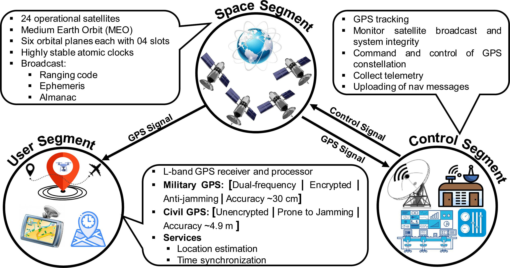
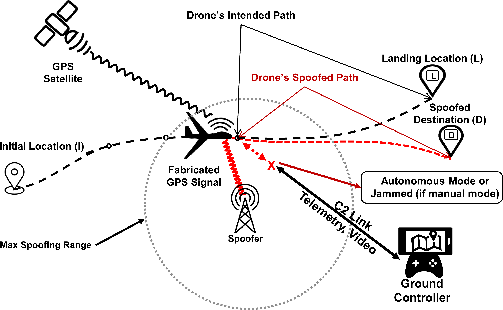
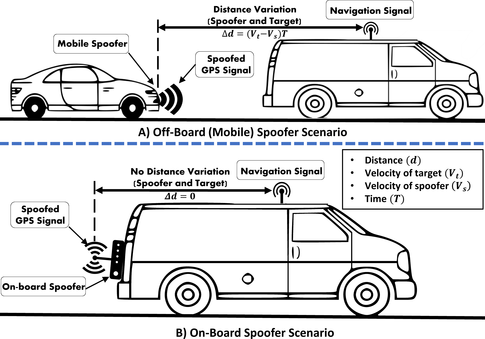

# Peerj Cs 07 507

**Source Document:** `peerj-cs-07-507.pdf`  
**Total Pages:** 35  

---

## --- Page 1 ---

Submitted 16 November 2020
Accepted 5 April 2021
Published 6 May 2021

Corresponding author
Mujahid Mohsin,
mujahid.mohsin@cae.nust.edu.pk

Academic editor
Gang Mei

Additional Information and
Declarations can be found on
page 28

#### DOI 10.7717/peerj-cs.507

Copyright
2021 Khan et al.

Distributed under
Creative Commons CC-BY 4.0

#### OPEN ACCESS

On GPS spoofing of aerial platforms: a
review of threats, challenges,
methodologies, and future research
directions

Shah Zahid Khan1, Mujahid Mohsin1 and Waseem Iqbal2

1 College of Aeronautical Engineering (CAE), National University of Sciences and Technology (NUST),
Islamabad, Pakistan
2 Department of Information Security, National University of Science and Technology, Islamabad, Pakistan

#### ABSTRACT

Unmanned Aerial Systems (UAVs, Drones), initially known only for their military
applications, are getting increasingly popular in the civil sector as well. Over the military
canvas, drones have already proven themselves as a potent force multiplier through
unmanned, round-the-clock, long-range and high-endurance missions for surveillance,
reconnaissance, search and rescue, and even armed combat applications. With the
emergence of the Internet of Things (IoT), commercial deployments of drones are also
growing exponentially, ranging from cargo and taxi services to agriculture, disaster
relief, risk assessment and monitoring of critical infrastructures. Irrespective of the
deployment sector, drones are often entrusted to conduct safety, time and liability
critical tasks, thus requiring secure, robust and trustworthy operations. In contrast,
the rise in UAVs’ demand, coupled with market pressure to reduce size, weight, power
and cost (SwaP-C) parameters, has caused vendors to often ignore security aspects,
thus inducing serious safety and security threats. As UAVs rely on Global Positioning
System (GPS) for positioning and navigation, they can fall prey to GPS jamming and
spoofing attacks. The vulnerability of GPS to spoofing has serious implications for
UAVs, as victim drones using civil GPS can be misdirected or even completely hijacked
for malicious intents, as already demonstrated in several academic research efforts using
commercially available GPS spoofing hardware. Beside UAVs, GPS spoofing attacks
are equally applicable to other GPS-dependent platforms, including manned aircraft,
ground vehicles, and cellular systems. This paper conducts a comprehensive review
of GPS spoofing threats, with a special focus on their applicability over UAVs and
other GPS-dependent mobile platforms. It presents a novel taxonomy of GPS spoofing
attacks and critically analyzes different spoofing techniques based upon placement of
spoofing device, attack stealthiness, attack methodologies, and objectives of the attacker.
We also discuss some of the recent experiments from open literature which utilized
commercially available hardware for successfully conducting spoofing attacks.

Subjects Algorithms and Analysis of Algorithms, Autonomous Systems, Cryptography, Security
and Privacy, Spatial and Geographic Information Systems
Keywords GPS spoofing, Security threats, Survey, Taxonomy, UAVs, Drones

How to cite this article Khan SZ, Mohsin M, Iqbal W. 2021. On GPS spoofing of aerial platforms: a review of threats, challenges,
methodologies, and future research directions. PeerJ Comput. Sci. 7:e507 http://doi.org/10.7717/peerj-cs.507

## --- Page 2 ---

#### INTRODUCTION

Drones are becoming increasingly popular having multifaceted roles for both commercial
and military applications. Some estimates suggest that, at present, more than 10,000 drones
are serving world-wide as high bandwidth mobile data backbones, security surveillance,
rescue services, autonomous air taxis, and relief operations (Guvenc et al., 2018; Wesson
& Humphreys, 2013). Moreover, the drone market value has been estimated to reach 1.85
billion USD by the year 2024 (Nassi et al., 2019). In the military sector, they are used for
surveillance, tracking and delivery of armed payload. Nowadays unmanned air vehicles
(UAVs) are also being employed in combat and can carry various missiles, like the ‘‘MQ-8B
Fire Scout’’ used by USA (Wesson & Humphreys, 2013). Even new fighter jets have been
converted and used as fully autonomous UAVs (Nacouzi et al., 2018).

Modern-day UAVs rely heavily on Global Navigation Satellite System (GNSS) for
Guidance, Navigation and Control (GNC). Among the available GNSS options, Global
Positioning System (GPS) is the most common and widely used satellite navigation system.
The autonomous UAVs are even more dependent on the flight aids such as the autopilot and
navigational and dynamic-positioning. In addition to its celebrated accurate positioning
service, GPS also offers time synchronization with the precision of about 10 billionth of
a second using the on-board atomic clocks (Wei & Sikdar, 2019). Time-sensitive systems
such as synchrophasors in power grid systems use GPS time for a synchronous state
estimation and offline engineering analyses (Shepard et al., 2012). All these systems are
designed assuming the trustworthiness of the GPS services (Bhatti & Humphreys, 2017).

GPS-dependent UAVs require accurate, trustworthy and uninterrupted position
information for their safe operations. However, different research efforts have shown
that GPS signals can be jammed or spoofed owing to its inherent vulnerabilities. Because
of the low signal power (around −130 dBm), the GPS services can easily be disrupted
through the transmission of high power jamming signals directed towards the victim
platform (Arteaga et al., 2019). Besides, the civil GPS services have no encryption or
authentication mechanisms and therefore, the satellite signals can easily be replicated or
fabricated, which can subsequently be utilized for launching sophisticated GPS spoofing
attacks.

GPS spoofing is the act of replicating or falsified production of the GPS signals to
deceive a targeted GPS unit or receiver in particular, manipulating its Position, Velocity
and Timing (PVT) parameters (Psiaki & Humphreys, 2016). With the emergence of low-
cost user tunable Software Defined Radios (SDRs) and online open source projects and
tutorials for hobbyist and newbies, launching of GPS spoofing attacks against UAVs have
become practical, calling for stronger built-in spoof-resilient measures, in particular for
safety of mission-critical airborne applications (Jafarnia-Jahromi et al., 2012; Huang &
Yang, 2015; Wang, Chen & Pan, 2015).

A successful GPS spoofing attack may have dangerous consequences as it can divert the
course of the flight or can cause a drone to crash (Dulo, 2015). Various research efforts (Seo
et al., 2015; Noh et al., 2019) conclude that a GPS guided drone can be forced to deviate
from its course, or even hijacked, if its current position and intended travel path is known

Khan et al. (2021), PeerJ Comput. Sci., DOI 10.7717/peerj-cs.507
2/35

## --- Page 3 ---

to the attacker. Through spoofing, the safety feature of ‘‘Geo-fencing’’ can also be bypassed
and thus the targeted drone can be made to violate no-flying zones (Schmidt, 2015). This
vulnerability can be exploited by drug smugglers and others to trespass controlled borders
across prisons for drug trafficking and illegal surveillance (US National PNT Advisory
Board, 2018). A military-grade armed UAV could cause a catastrophe if the machine
somehow gets hijacked and ultimately used by a terrorist organization.

The vulnerability of civil GPS to spoofing attacks was first demonstrated in an unclassified
test exercise ‘‘GYPSY’’ by Department of Homeland Security (DHS) on 19 June 2012
at White Sands Missile Range (WSMR) (Shepard et al., 2012). During that exercise, a
GPS spoofing attack against ‘‘Hornet’’, a mini-drone, was carried out at a height of
40 feet, resulting in manipulating its perceived position and time. Another major GPS
spoofing claim against military grade UAV was made by Iranian Army (Hartmann &
Steup, 2013), when a US RQ-170 Sentinel drone was successfully captured. However, the
authenticity of the claim and exact circumstances of the UAV capture are unverified and
controversial. In 2016, another incident of UAV deception through GPS spoofing attack,
was reported in which a US custom bureau’s UAV was targeted by Mexican drug dealers
and traffickers (Khan, Brohi & Jhanjhi, 2020). Moreover, similar GPS based spoofing
attacks have also been demonstrated in several other works (Dey et al., 2018; Horton &
Ranganathan, 2018; Arteaga et al., 2019; He & Qiao et al., 2019; He & Liu et al., 2019; Ma
et al., 2020; Zheng & Sun, 2020) against Hornet Mini, DJI’s Matrice 100, Phantom 3 and 4
Pro, 3DR Solo, Parrot’s AR Drone 2.0 and Bebop 2 drones.

The applicability of GPS spoofing attacks against GPS-dependent non-aerial platforms
such as delivery trucks, maritime craft, smartphones, road navigation systems, and
commercial GPS receivers have also been extensively evaluated (Warner & Johnston, 2002;
Huang & Yang, 2015; Wang, Chen & Pan, 2015; Bhatti & Humphreys, 2017; Zeng et al.,
2017; Horton & Ranganathan, 2018; Zeng et al., 2018; Cao, Luo & Liu, 2019; Goavec-Merou,
Friedt & Meyer, 2019; Gaspar et al., 2020; Rustamov et al., 2020). Similarly, attacks against
GPS-time dependent systems such as smartwatches, smart-grid time reference receivers,
CDMA phone towers and Network Time Protocol (NTP) servers have also been studied in
literature (Shepard et al., 2012; Wang, Chen & Pan, 2015; Humphreys, 2015; Karit, 2017).

Survey’s rationale and methodology
Considering the growing research interests and practical contributions towards GPS
spoofing of cyber-physical systems, a requirement exists to comprehensively analyze the
emerging threat landscape and logically group these threats based on diverse spoofing
techniques, multifaceted attack variables, evolving attack objectives, and corresponding
countermeasures. Existing surveys on GPS spoofing (Jafarnia-Jahromi et al., 2012; Günther,
2014; Sathyamoorthy, 2015; Krishna & Murphy, 2017) are outdated and do not fully cover
the state-of-the-art. Moreover, these efforts focus only on a confined subset of the holistic
threat landscape posed by GPS spoofing. In particular, existing surveys on threats to aerial
platforms, such as presented by Nassi et al. (2019), are generic in nature and do not cover
the details of GPS spoofing threats. Moreover, the available literature also lack a proposal
to comprehensively classify existing techniques in the form of a taxonomy with an aim

Khan et al. (2021), PeerJ Comput. Sci., DOI 10.7717/peerj-cs.507
3/35

## --- Page 4 ---

#### GPS Threats

Attack
Attributes
GPS Spoofing

Threats

UAVs’ Dependency

over GPS

Taxonomy

for GPS 
Spoofing

Threats

Open Research

Problems

Attack 
Techniques

#### GPS

Non-aerial

Platforms

Attack Goals

Attack 
Consequences

Existing Literature

Phase-I: 
Breadth Search

Phase-II:
Depth Search

Phase-III:
Formal Structuring

Phase-IV: 
Conclusion

Future 
Directions

UAVs’ Security

Figure 1
Survey’s methodology.

Full-size
DOI: 10.7717/peerjcs.507/fig-1

to facilitate and steer further research in focused domains. This effort seeks to conduct a
detailed review of UAVs’ dependency over GPS and present a cohesive and novel taxonomy
of GPS threat variables, goals, and trade-offs, while focusing on aerial platforms.

The overall survey approach followed by this work is summarized in Fig. 1. Our survey
follows a semi-systematic methodology (Snyder, 2019), which explores and narrows-down
the relevant literature in multiple phases. The first phase of the literature review focuses
on a breadth search within the broad domains of GPS security threats, in general and
spoofing threats, in particular. In parallel, this phase categorizes drones with reference
to their dependencies over GPS as this factor further assists in evaluating threat levels,
applicable techniques, and impact of GPS spoofing attacks over drones. While the prime
focus of our survey revolves around drone-specific spoofing attacks, we have also covered
the breadth of similar efforts against non-aerial platforms to serve as a ready reference and
perform comparative analysis of variation in attack parameters in both of these scenarios.
Therefore, segregation of existing GPS spoofing attempts against non-aerial platforms is
also performed during Phase-I. Phase-II conducts a depth search to shortlist and group
existing literature within the domain of GPS spoofing. During this phase, we conduct
a comprehensive analysis of existing research contributions based on the techniques
deployed for GPS spoofing, including attack attributes, goals, and consequences. The
analyses performed in Phase-II is formalized as a taxonomy in Phase-III, which structures
the inherent relationships among complex spoofing parameters and logically aligns them
for better understanding. The inferences drawn after evaluating the existing literature
in line with the proposed taxonomy are summarized in Phase-IV with pointers to open
research problems and future directions.

Targeted audience
The analyses presented by this paper can benefit a wider research and development
community, working in the domain of GPS-driven GNC applications, both for offensive

Khan et al. (2021), PeerJ Comput. Sci., DOI 10.7717/peerj-cs.507
4/35

## --- Page 5 ---

and defensive purposes. A better understanding of existing GPS spoofing threats, as
classified by our work, can help in neutralizing rogue UAVs as well as defending friendly
UAVs against spoofing attacks.

Paper organization
The rest of the article is organized as follows. In ‘Background’, we present an overview
of the GNSS in general and GPS, in particular. ‘Drones GNC Dependency and Allied
Threats’ provides a discussion on the dependency of drones over GPS. We analyze the
GPS based threats to the dependent systems, specifically UAVs, in ‘GPS Threat Landscape’.
‘Taxonomy of GPS Spoofing Attacks’ presents a novel taxonomy of GPS spoofing attacks
based on spoofer placement, stealthiness, attack technique, and objective of the attacker.
Challenges and limitations of GPS spoofing of static targets as compared to moving and
aerial platforms are featured in ‘Spoofing Challanges’. ‘Open Problems and Future Research
Directions’ discusses some of the open problems identified by this work to steer future
research directions. Finally, ‘Conclusion’ concludes the paper.

#### BACKGROUND

For readers not familiar with relevant terminologies, this section provides the fundamental
background knowledge of Global Navigation Satellite System (GNSS) and location
measurement process using GPS.

Global Navigation Satellite System (GNSS)
GNSS is an umbrella term used for satellite Positioning, Navigation and Time (PNT),
provided by satellite signals transmitted from space. To avoid dependency, several countries
operate their independent GNSS systems with varying degrees of coverage and operational
capabilities, including GPS by the USA, GLONASS by Russia, Galileo by the European Space
Agency, and BeiDou Navigation Satellite System (BDS) by China. The four major systems
have distinct carrier frequencies and they also employ different modulation schemes
(Maksutov et al., 2019). As an example, some of the GLONASS signals use Frequency
Division Multiple Access (FDMA) modulation scheme, while the GPS uses Code Division
Multiple Access (CDMA). However, the newer versions of the GLONASS are also using
CDMA as a modulation scheme. Despite having individual characteristics, all these systems
deploy a similar principle of operation and are designed to serve a common goal, which
is broadcasting a radio frequency signal with a precise time-stamp, enabling the users to
receive and decode these signals to determine their position (Ioannides, Pany & Gibbons,
2016). A GNSS receiver calculates its position and time by the principle of ‘‘trilateration.
To have a 3-dimensional location-fix and time synchronization, navigational data from at
least four satellites in the constellation is needed (Larcom & Liu, 2013). All the currently
operational GNSS systems including GPS offer no encryption or source authentication
for services available for public use (Ioannides, Pany & Gibbons, 2016), making them
equally susceptible to attacks discussed later in ‘GPS Threat Landscape’. Recently, some
GNSS service providers have introduced spoof resistant services, like Galileo’s Open
Source Navigation Message Authentication (OSNMA), which enables authentication of

Khan et al. (2021), PeerJ Comput. Sci., DOI 10.7717/peerj-cs.507
5/35

## --- Page 6 ---

Figure 2
GPS Segments.

Full-size
DOI: 10.7717/peerjcs.507/fig-2

navigational data on Galileo. NMA validates the received GNSS signal, making it robust
against GNSS spoofing attacks. However, wide scale implementation of this authentication
service would require updatingthefirmwareof existingGalileoreceivers. Anotherlimitation
is that NMA does not currently offer authentication service for the ranging measurements
(Gutierrez, 2020).

Global positioning system (GPS)
Originally known as the NAVSTAR, GPS was launched in 1978 only for the US military.
However, later in 1994, GPS services were made fully available to the rest of the world. GPS
has emerged as the de-facto GNSS standard due to its global coverage, wide adoption and
acceptability.

GPS segments
The system’s architecture of GPS, as of any other GNSS, can be segregated into three main
domains, known as Space segment, Control segment, and User segment as shown in Fig. 2.

• Space segment: This segment contains a constellation of satellites that broadcast Radio
Frequency (RF) signals containing coded information and navigational data for PVT
estimation at the user end. GPS has 24 operational satellites in Medium Earth Orbit
(MEO), 22,200 km above the surface of the Earth (NCO Space-Based PNT, USA, 2021b).
These satellites revolve around the earth in six equally-spaced orbital planes (four slots
in each orbit), managed at an inclination of 55 degrees with reference to the earth’s
equator.
• Control segment: The control segment is tasked with monitoring and ensuring the
integrity of the GPS by exercising command and control over the GPS constellation. It
consists of a global network of ground facilities that collects telemetry to monitor and

Khan et al. (2021), PeerJ Comput. Sci., DOI 10.7717/peerj-cs.507
6/35

*Caption/Context: Figure 2 GPS Segments. | Full-size DOI: 10.7717/peerjcs.507/fig-2*

## --- Page 7 ---

#### X

#### X

+

L1 Signal

L2 Signal

+

+
Mixer

X
Modulo 2 Sum

L2 Carrier (1227.60 MHz)

P- Code (23.23 MHz)

#### NAV Message (50 Hz)

C/A Code (1.023 MHz)

L1 Carrier (1575.42 MHz)

#### QPSK Modulator

#### QPSK Modulators

#### X

2.046 MHz
20.46 MHz

P(Y)-Code

#### 1575.42 MHz

C/A-Code

#### 20.46 MHz

P(Y)-Code

#### 1227.6 MHz

Central L-Band 
Frequency (𝑭𝟎) (10.23 MHz)

× 𝟏𝟐𝟎

× 𝟏𝟓𝟒

Figure 3
GPS signal generation and composition.

Full-size
DOI: 10.7717/peerjcs.507/fig-3

analyze the broadcast signal and sends commands and uploads navigation messages
when required.
• User segment: The user segment refers to a diverse range of user GPS receivers
and associated services, both military and civil, which can receive and decode the
information broadcasted by satellites for position and time estimation. The GPS receiver
is equipped with an L-band receiver and processor which performs positioning and time
computations for supporting overlaying user applications.

GPS transmission
The signal generation and modulation process followed by the GPS Space segment is
illustrated in Fig. 3. The GPS satellites generate a central L-band frequency (F0) of 10.23
MHz, using its on-board atomic clock. This base frequency is multiplied by 154 and
120 to generate the two carrier frequencies, L1 at 1575.42 MHz and L2 at 1227.60 MHz,
which are subsequently modulated by Coarse Acquisition Code (C/A) and Precise (P)
ranging codes: a combination of the data message and a unique code, to produce a spread
spectrum signal of 2.046 MHz and 20.046 MHz bandwidth respectively (Tamazin, Karaim
& Noureldin, 2018). Each satellite has a unique Pseudo-Random Noise (PRN) code that
is nearly orthogonal to each other, which helps the receiver to differentiate between each
satellite in the GPS constellation, improve Signal to Noise Ratio (SNR), ensure accurate
ranging, and enhance robustness against signal interference (Jan Van Sickle, 2021).
The P(Y) is an encrypted signal for the military, with a claimed accuracy of few centimetres.
The C/A signal has an accuracy of 4.9 meters and is freely available for public use without any
embedded encryption or authentication (NCO Space-Based PNT, USA, 2021a). However,
its accuracy and availability is affected by various factors, such as the urban canyon, trees,
building and other obstacles. GPS transmits the following types of data (Schmidt et al.,
2016):

Khan et al. (2021), PeerJ Comput. Sci., DOI 10.7717/peerj-cs.507
7/35

## --- Page 8 ---

• A ranging code, enabling the receiver for computing PVT solution.
• Ephemeris data containing location information of individual satellites.
• Almanac data having the orbits, locations and status information for all the satellites in
the constellation.

The navigation message, which is a key component of the transmitted signal contains
information regarding the ephemeris, almanac and clock bias parameter (Karaim et al.,
2013).

GPS reception
At the User segment end, the GPS signal is received by an antenna attached to the RF front-
end of the GPS receiver. At the front-end, the weak GPS signal is filtered, amplified, digitized
and converted to the baseband signal (Tamazin, 2015). The output of the front-end is then
processed by a signal processing unit for calculating navigational information. At this stage,
the receiver extracts the pseudo-range and its rate of change information independently for
all the satellites in view, for subsequent estimation of the PVT solution. This process involves
the stages of Acquisition, Tracking, Monitoring, Extraction, Measurement Generation and
PVT solution for navigational requirements (Tamazin, Karaim & Noureldin, 2018).

GPS working: an overview
A GPS receiver uses satellite’s location information and signal’s delay for calculating
its position and time synchronization. The signal received by the GPS receiver contains
information regarding the satellite’s position and time as a GPS time-stamp. A local copy of
the received signal code is generated by the receiver for comparing it with the received signal
to calculate the clock error and pseudo-range (R). To have a 3-dimensional location-fix
and time synchronization, navigational data from at least four satellites in the constellation
is needed to satisfy the trilateration equation. Mathematically:

R = d +1
∃1 = c.δ
(1)

Where d is the range, c represents the speed of light and 1 is the offset in range due
to local clock error (δ) of the GPS receiver. The 3D location of the GPS receiver can be
computed using the following set of four equations.

∀1≤i≤4
(X −xi)2 +(Y −yi)2 +(Z −zi)2 = (Ri −1)2
(2)

Where (X,Y ,Z) and (xi,yi,zi) indicate the position of GPS receiver and the ith satellite,
respectively. Equation (2) has four unknowns: 3-dimensional location coordinates of the
GPS receiver and time offset. A 3D-position (X,Y ,Z) and local clock error (δ = 1/c) can
be derived by the receiver after solving these four equations, one for each satellite (Larcom
& Liu, 2013).

#### DRONES GNC DEPENDENCY AND ALLIED THREATS

An Unmanned Aerial Vehicle (UAV) or a drone is a small aerial platform that can be
controlled remotely and is recognized as an aircraft by the International Civil Aviation
Organization (ICAO) (Arteaga et al., 2019). All UAVs require a sensory system for

Khan et al. (2021), PeerJ Comput. Sci., DOI 10.7717/peerj-cs.507
8/35

## --- Page 9 ---

Table 1
Drone’s operational modes.

Operational Mode
Range
Example Flight Modes
GNC Dependency
GPS Threats

Manual
VLOS
Manual
C2 Link
No

Semi-Autonomous Assisted
EVLOS
Stabilize, Alt Hold
Circle, Drift, Follow, Loiter, Zig Zag, RTL

C2 Link
GPS

Yes

Automatic
BVLOS
Auto, Guided, Smart RTL
GPS
Yes

guidance and control systems that enables them to navigate their mission. In simple
terms, instructions are generated by the guidance system for UAVs’ trajectory and
mission execution (Elkaim, Lie & Gebre-Egziabher, 2014). Traditionally, the radio control,
and autopilot executes the Guidance, Navigation, and Control (GNC) of the drone
(Hassanalian, Radmanesh, and Ziaei-Rad, 2012). Generally, control of drones over short
distance results in a negligible lag and high bandwidth with minimal losses, while control
over thousands of miles results in significant lag in control, low bandwidth, and considerable
losses (Hassanalian & Abdelkefi, 2017). Therefore, UAVs capable of long distance and
endurance flight are typically augmented with autopilot features, capable of stabilizing
flight and performing various autonomous functions in case of loss of the Command and
Control (C2) link. The autonomy level of the drone is proportional to its GNC capabilities.

Drone’s operational modes
Modern-day UAVs leverage a wide range of sensors, including GNSS, for their positioning,
orientation, path profiling, guidance, and navigation. Apart from GNSS, some of the other
sensors which are typically leveraged by drones/missiles include Inertial Measurement
Unit (IMU), TERrain COntour Matching (TERCOM), accelerometer, magnetometer,
gyroscope, and barometer. However, these non-GNSS based GNC systems are considered
beyond the scope of our work. Among different GNSS, GPS is the most widely deployed
system due to its wide acceptability and free global coverage. Drone’s dependency over GPS
is subjected to the level of autonomy, targeted application, and flight mode. The various
‘‘Flight Modes’’ of modern drones, such as ArduPilot Dev Team (2020), can be grouped
under three broader operational categories: Manual, Semi-Autonomous Assisted, and
Autonomous. Table 1 maps key flight modes of drones with corresponding operational
mode, each having a varying dependency over GPS-guidance and therefore, presents
different level of threat exposure. A brief introduction of these operational modes is given
below (Mulas, 2016; Hassanalian & Abdelkefi, 2017).

Manual mode
In manual mode, drones are regulated all the time through a Remote Control (RC) usually
known as telemetry, within Visual Line Of Sight (VLOS) and do not require GPS for
guidance, though this mode requires technical skills on part of the operator to control
the aircraft. Since GPS is never used in the manual mode, drones in this mode are not
vulnerable to GPS-based threats. However, manually operated drones can still be subjected
to those threats which target air to ground or air to air (e.g., slave drone in a swarm) C2
links.

Khan et al. (2021), PeerJ Comput. Sci., DOI 10.7717/peerj-cs.507
9/35

## --- Page 10 ---

Semi-autonomous assisted
Drones in semi-autonomous assisted mode are also governed by a ground operator, with
assistance from the autopilot, constituting various sensors including GPS. As an example,
various automated flight modes of ArduPilot (https://ardupilot.org/plane/docs/flight-
modes.html), a widely used open source auto pilot system, such as circle, drift, follow,
loiter, zig zag and return to launch (RTL), use GPS for executing commands and fall
under semi-autonomous category. Other similar functions like stabilize, alt hold and land
make use of additional connected Micro Electro-Mechanical Systems (MEMS) sensors like
altimeter, accelerometer and other vision-based sensors. These commands can be manually
relayed to the drone while operating in semi-autonomous mode. In such a case, drones are
dependent on both the C2 link and the GPS for GNC services and can operate in Extended
Visual Line Of Sight (EVLOS).

Autonomous
In autonomous mode, the on-board Autopilot is provided with a flight plan e.g., guided, auto
and smart RTL modes of the Ardupilot. After this mode is activated the ground controller
cannot (or is not required to) intervene for the control. The aircraft requires no user input
and is solely dependent on the integrated guidance system including obstacle avoidance
and course rerouting, in case of smart RTL mode. In a GPS guided drone, PVT solution
is calculated for navigating course and execution of mission Beyond Visual Line Of Sight
(BVLOS). Since the C2 link is never/rarely used in the autonomous operational mode, the
threat vectors are restricted to GPS-based threats only.

Mode-specific UAV threat landscape
UAVs in manual mode, being unsusceptible to GPS-based threats, are vulnerable to RF link
attacks (Pleban, Band & Creutzburg, 2014; Costello, 2017; Dey et al., 2018; Arteaga et al.,
2019; Nunez, Tran & Katangur, 2019; Yihunie, Singh & Bhatia, 2020). Such cyber-attacks
primarily utilize drone’s C2 links and implementation-specific software, hardware, and
networking vulnerabilities. Manesh & Kaabouch (2019) surveyed the cyber-attacks on
drones and proposed three broad categories of these attacks as: (1) Data Interception, (2)
Data Manipulation, and (3) Denial of Service. These attacks attribute to C2 link, Automatic
Dependent Surveillance–Broadcast (ADS-B) and Navigation data received by the drone.
Some of the network/C2 link based attacks are briefly discussed below:-

• Compromised Network Ports: The vulnerable network ports like FTP (Port 21) and
Telnet (Port 23) can be used for gaining access to the software root directories of
various consumer drones such as DJI Phantom 4, Parrot Bebop 2 and AR Drone 2.0,
allowing the attacker to cause physical damage to the drone (Pleban, Band & Creutzburg,
2014; Arteaga et al., 2019). Here, the network ports may be regarded as software level
vulnerable entry points to inject attack vectors and compromise the system.
• Denial of Service (DoS): Arteaga et al. (2019) discussed that flooding of WiFi based C2
links with certain specific packages may result in DoS, thus causing disruption of manual
control over drones.

Khan et al. (2021), PeerJ Comput. Sci., DOI 10.7717/peerj-cs.507
10/35

## --- Page 11 ---

• De-authenticating Controller: A de-authentication attack aims to disconnect
the established link between the controller and the drone by snooping into the
communication link and then sending multiple de-authentication packets. Several
research efforts (Dey et al., 2018; Nunez, Tran & Katangur, 2019; Yihunie, Singh &
Bhatia, 2020) presented the effectiveness of de-authentication attacks against Parrot’s
Bebop 2, Mambo FPV and AR Parrot 2.0 drones using aircrack-ng (https://www.aircrack-
ng.org/): an open source penetration testing tool, resulting in hijacking of the drone.
Furthermore, Maldrone, an airborne malicious drone that uses another such open
source software package SkyJack (https://samy.pl/skyjack/), utilizes similar technique
for independently launching network de-authentication attacks for taking control over
the target.
• Spoofing IP and MAC Addresses: This network cyber-attack is also applicable to C2
links of drones. Costello (2017) demonstrated this attack against Parrot AR Drone 2.0
by creating the network IP alias and spoofing MAC address of the primary controller,
gaining complete control of the target.

In semi-autonomous assisted mode, drones have added dependency over the GPS and are
prone to both C2 link and GPS-based attacks. Compromise of any of these technologies
by an attacker may lead to complete control of the targeted drone. GPS-dependent flight
modes, such as follow, loiter, and RTL are mostly independent of the user input through C2
link and take reference primarily from the GPS. Finally, the autonomous mode operations of
drone are susceptible to GPS-driven attacks only since the mission profiling and execution
in this mode rely only upon GPS-based guidance and control.

#### GPS THREAT LANDSCAPE

In addition to the logical attack vectors through the C2 link as discussed in the previous
section, the on-board GPS can also serve as an unguarded attack entry point due to the
inherent vulnerabilities of civil GPS. Interrupting the GPS signal can lead to DoS, errors in
PVT measurements or reporting of falsified location and time information by the receiver.
Irrespective of the intention of the emitter, any GPS interference signal can be considered
as a variant of either jamming or spoofing, as also categorized by Fernandez-Hernandez et
al. (2019). Jamming leads to DoS that may affect continuum and availability of guidance
signals; whereas, spoofing may result in violations in data integrity if the malicious signal
is considered as valid by the receiver.

This section introduces the two main categories of GPS-based threats (i.e., Jamming
and Spoofing) and broadly defines the sub-categories of GPS spoofing attacks, to build
a foundation for our survey. Followed by this broader classification, the next section
presents a comprehensive taxonomy of GPS spoofing, while integrating the discussions
on relevant research efforts from existing literature falling within the categories defined
by the taxonomy. The overall summary and critical analysis of relevant literature covered
by our survey is given in Table 2. Our work extensively reviews open literature on GPS
spoofing and initially groups these works based on targeted (victim) systems as (a) Drones,
(b) Non-aerial Platforms, and (c) Time Spoofing attacks. After this broader classification,

Khan et al. (2021), PeerJ Comput. Sci., DOI 10.7717/peerj-cs.507
11/35

## --- Page 12 ---

each of the covered efforts is analyzed based upon the type of spoofing equipment used,
spoofer’s portability, attack’s sophistication, stealthiness, and range. Additionally, the key
limitations of these attacks, as perceived by our analysis and supporting literature, is also
summarized in the mentioned table.

Jamming
Jamming is the generation and transmission of enough power signal in the direction of a
target that may cause the GPS receiver of the victim unable to track the original GPS signal
(Gerdan, Coombe & Takac, 1995). It is a very common and highly undesirable real threat.
Westbrook (2019) discussed about new geographies of conflict due to the prevailing use of
military-grade GPS jamming equipment by both state and non-state actors as an offensive
tool of electronic warfare. Owing to the GPS signal being very weak and well below the
background RF noise level measured by the receiver (Silva, 2017; Van den Bergh & Pollin,
2019), it can be affected by the ionospheric attenuation and other factors such as the path
followed by the satellite’s transmissions to the receiver and unlicensed use of the GPS band.
The jamming of a GPS signal depends upon various parameters such as the power of the
original signal and distance of the jamming signal generator from the GPS receiver etc.
There are two main characteristics of the jamming signal, the ‘‘central frequency’’ and
‘‘Jamming to Signal ratio (J/S)’’ measured in dB. Jamming signal overpowers the signal
strength of the authentic signal, described by ‘‘Carrier to Noise Density Ratio (C/No)’’,
which is a fundamental signal quality parameter for a GPS receiver (Hofmann-Wellenhof,
Lichtenegger & Wasle, 2008). When the jamming equipment is brought closer to the GPS
receiver, the power of the jamming signal increases, thus reducing the effective signal
strength of the original signal (Silva, 2017).

Regarding UAVs, with a firmware-coded safety mode, an attacker can force a drone
to land when both the GPS signal and C2 link are jammed (Tedeschi, Oligeri & Di Pietro,
2020). In 2012, a small UAV resulted in a crash due to GPS jamming, costing a human life
(Krishna & Murphy, 2017). In the literature, several works explored the effects of jamming
on UAVs. Sathyamoorthy et al. (2020) evaluated the effect of GPS jamming signal on two
different UAVs using different jamming signal power levels. The authors concluded that
the military GPS signal shows robustness against the jamming signal, while the civil GPS
signal is more susceptible to jamming. Further detailed discussion of jamming and related
RF interference affecting the GPS signal have been explored by Fernandez-Hernandez
et al. (2019) and Gerdan, Coombe & Takac (1995). In particular, Fernandez-Hernandez et
al. (2019) categorized the GPS jamming threats into four types based on objectivity of
exposure and sophistication of attack; whereas, Gerdan, Coombe & Takac (1995) presented
three different case studies of the adverse effects of jamming on GPS signal’s acquisition.
Furthermore, Medina et al. (2019) explored the effects of GNSS jamming, including GPS,
from a maritime navigation’s perspective.

GPS jamming can be performed using a diverse range of hardware (Karit, 2017), while
employing a variety of jamming methods and techniques. Elezi et al. (2019) investigated
multiple jamming methods through software simulations and concluded that Spot Noise

Khan et al. (2021), PeerJ Comput. Sci., DOI 10.7717/peerj-cs.507
12/35

## --- Page 13 ---

Table 2 Summary and analysis of existing efforts towards GPS spoofing.

Reference
Target
Spoofing system
Device

placement
Sophistication
Stealthiness
Limitations

Location spoofing - drones

Shepard et al. (2012)
Hornet

[Mini Drone]
SDR

[With custom made DSP core]

(Humphreys et al., 2008)

Off-board
Sophisticated
Covert
(1) Victim’s

position required.

(2) Fixed distance

between attack device

and victim.

Dey et al. (2018)
DJI

[Phantom 4 Pro]
GPS Simulator

[LabSat3]
Off-board
Simplistic
Covert
GPS denied environ-

ment.

He et al. (2019)
Parrot

[AR Drone 2.0]
SDR

[HackRF One]
Off-board
Intermediate
Overt
(1) Attack requires

precise location infor-

mation of the target.

(2) Target was in Loiter

mode/ hovering at 10

m.

Horton & Ranganathan (2018)
DJI

[Matrice 100]
SDR

[BladeRFx40]
Off-board
Simplistic
Overt
GPS denied environ-

ment.

Arteaga et al. (2019)
3DR
[Solo]
SDR

[BladeRFx40]
Off-board
Simplistic
Overt
Limited attack range.

He et al. (2019)
Drone
SDR

[HackRF One]
Off-board
Simplistic
Overt
Attack could have been

detected by analyzing

drone camera feed.

Ma et al. (2020)
DJI

[Phantom 3 SE]
Custom Designed
Off-board
Intermediate
No

Information
(1) Required real-

time location infor-

mation of the target.

(2) Autonomous Mode

only, attack.

Location spoofing - non-aerial platforms

Warner & Johnston (2002)
Truck

[Navigation System]
GPS Simulator

[WelNavigate GS720]
Off-board
Simplistic
Overt
Limited attack range.

Bhatti & Humphreys (2017)
Yacht
Custom Designed

Kerns et al. (2014)
On-board
Intermediate
Partially

Covert
Required physical ac-

cess to the target.

Huang & Yang (2015)
Smartphone

[Nexus 5]
SDR

[BladeRFx40]
Off-board
Simplistic
Overt
Limited attack range.

Wang, Chen & Pan (2015)
Smartphone

[iPhone 6]
SDR

[BladeRFx40]
Off-board
Simplistic
Overt
Limited attack range.

Silva (2017)
Smartphone

[Android]
SDR

[HackRF One]
Off-board
Simplistic
Overt
Limited attack range.

Zeng et al. (2018)
Car

[Navigation System]
SDR

[HackRF One]
On-board

[Limpet]
Simplistic
Overt
(1) Perceived victim’s

route information.

(2) Required physical

access to the target.

(continued on next page)

Khan et al. (2021), PeerJ Comput. Sci., DOI 10.7717/peerj-cs.507
13/35

## --- Page 14 ---

Table 2 (continued)

Reference
Target
Spoofing system
Device

placement
Sophistication
Stealthiness
Limitations

Horton & Ranganathan (2018)
Smartphone

[HTC Desire 626]
SDR

[BladeRFx40]
Off-board
Simplistic
Overt
Device was discon-

nected from the Inter-

net.

Goavec-Merou, Friedt & Meyer (2019)
(1) Smartphone

[Android]

(2) Ublox-NeoM8T

#### SDR

[Pluto]
Off-board
Simplistic
Overt
System’s configuration

was valid for only a few

hours.

Gaspar et al. (2020)
(1)Android Phone

(2) U-blox GPS

receivers

SDR-Custom Designed

[BladeRF Based]
Off-board
Simplistic
Overt
Limited attack range.

Rustamov et al. (2020)
(1) Smartphone

[Android]

(2) U-blox receiver

#### SDR

[HackRF One]

based GPS spoofer

Off-board
Simplistic
Overt
Limited attack range.

#### GPS based time spoofing

Shepard et al. (2012)
Smart-grid

[Time-reference GPS receiver]
SDR-Custom Designed

[With DSP core]
Off-board
Sophisticated
Covert
Perceived victim’s po-

sition information.

Wang, Chen & Pan (2015)
Smartwatch

[Apple]
SDR

[BladeRFx40]
Off-board
Simplistic
Overt
Limited attack range.

Karit (2017)
NTP server
SDR

[BladeRF]
Off-board
Simplistic
Overt
Moving time > 5 min

results in NTP demon

shut down.

Khan et al. (2021), PeerJ Comput. Sci., DOI 10.7717/peerj-cs.507
14/35

## --- Page 15 ---

Jammers, being highly effective against the GPS L1 band, caused the highest Bit Error Rate
(BER).

For mitigating the effects of jamming on UAV, Tedeschi, Oligeri & Di Pietro (2020)
presented an anti-jamming navigational algorithm by leveraging the jamming signal
for localization of the source through Received Signal Strength (RSS). The proposed
approach requires considerable software and hardware upgradations for implementing
anti-jamming features, including an on-board SDR for jammer’s localization and a custom-
built firmware. Moreover, the offered solution is not effective against mobile or adaptive
jammer. Seferoglu & Turk (2019) investigated specific waveforms of some commercially
available GPS jammers and presented discussion into anti-jamming solutions.

Spoofing
Compared to GPS jamming, the spoofing threat is often pronounced as more dangerous
as a spoofer can lead the target to produce erroneous PVT solution or even gain complete
control over GPS-driven drone’s trajectory by re-radiating or fabricating counterfeited
GPS signals (Horton & Ranganathan, 2018).

GPS spoofing is a more challenging and technology-intensive operation as compared
to brute-force jamming since a failed spoofing attempt can still yield the desired or
unintentional jamming effects as its byproduct. In a basic spoofing attack type termed
as ‘‘Meaconing’’, the attacker simply captures the authentic GPS signals and re-transmit
them towards the target. Also, an attacker could orchestrate a more advanced attack by
constructing a fake GPS signal containing malicious information. Such attacks are termed
as ‘‘Fabrication’’.

Humphreys et al. (2008) groups the GPS spoofing attacks into three categories as (a)
Simplistic, (b) Intermediate and (c) Sophisticated, based upon the complexity of the attack
and the used hardware. Simplistic GPS spoofing is broadcasting arbitrary spoofed GPS
signal without catering for the state of the targeted receiver. An intermediate GPS spoofing
attack is centred on pre-surveyed information about the target such as publicly available
parameters of authentic GPS signal being received by the victim receiver at the time of the
attack. Lastly, a sophisticated attack uses multiple coordinated phase-locked intermediate
spoofers to evade spoofing detection protocols of the target receiver.

The lack of any authentication mechanism makes the GPS receiver unable to distinguish
between the authentic and malicious signal. Also, because of its open accessibility and
publicly available technical parameters such as C/A code modulation, the Civil GPS can
easily be mimicked using a signal simulator or low-cost open source equipment. On the
contrary, replication of authentic P(Y) code used by the US Department of Defense (DoD)
is technically infeasible due to its classified signal structure and limited information about
the employed encryption technique.

A GPS spoofing attack can target to manipulate the PVT calculations at receiver end,
either causing disturbances/deviations in time measurements or inducing errors in location
measurements, as discussed in ensuing paragraphs.

Khan et al. (2021), PeerJ Comput. Sci., DOI 10.7717/peerj-cs.507
15/35

## --- Page 16 ---

Time spoofing
Spoofed GPS signal transmitted by an attacker can cause time-bias and abrupt changes
in the victim’s receiver clock (Humphreys et al., 2008). In the case of a swarm of drones
being controlled by a master drone, this type of attack will have catastrophic consequences
as an alteration in the time of reference clock may induce errors in PVT calculations by
the victim. Due to this clock offset, the master drone would be required to recalculate its
position, which may lead it to a collision course with the slave drones within the swarm.

Apart from drones, time manipulation due to GPS spoofing also poses a serious
threat to other time-dependent systems such as those used in the finance/banking sector,
cellular communications, and energy distribution systems. The base stations (towers) of
CDMA based communication systems also use GPS-reference time for the tower to tower
communications. In a demonstration at the University of Texas, a 10us drift was introduced
in CDMA-based cellular communications within 30 minutes of GPS spoofing attack, which
resulted in disruption of CDMA communications (Humphreys, 2012). Similarly, Shepard
et al. (2012) demonstrated the effectiveness of GPS based time spoofing attack against GPS
time-reference receiver used by Power Measurement Units (PMU) in smart grid systems.
The well-crafted spoofing attack induced a 400us of time drift that resulted in breaking
the standard accuracy threshold of the measured phased angle recorded by the PMU.
Furthermore, Wang, Chen & Pan (2015) demonstrated that a simplistic spoofing attack
using an SDR can lead to time spoofing in a high-end smart-watch. Also, researchers in
DEFCON 25 successfully demonstrated time manipulation by targeting Network Time
Protocol (NTP) servers with a GPS spoofing attack (Karit, 2017).

To summarize, GPS spoofing based time manipulation attacks can affect the perceived
time of GPS devices resulting in erroneous path planning and collision of aerial platforms,
impairing cellular communications and having the potential to cause blackouts due to
failure of the power distribution systems because of their dependency over GPS-time.

Location spoofing
Fundamentally, a GPS spoofing attack results in manipulating the target’s GPS based
location calculations by inducing an inaccurate position fix, as depicted pictorially in
Fig. 4. As covered in section ‘Drones GNC Dependency and Allied Threats, drones rely
on GPS for navigation and positioning in different modes. This dependency makes them
vulnerable to location spoofing attacks. With the ever-increasing acceptability and adoption
of autonomous GPS-driven traffic management systems, such as NEXT GENeration air-
traffic system (NEXTGEN) by the USA, GPS location spoofing threats are becoming even
more realistic, having a detrimental impact on the safety of such systems (Schmidt et
al., 2016). In the recent past, several research efforts have successfully demonstrated the
applicability of GPS location spoofing against commercially available drones. In an indoor
environment Arteaga et al. (2019), successfully spoofed the location of 3DR Solo drone
using an SDR device running an open source script. Similarly, Dey et al. (2018) and Horton
& Ranganathan (2018) demonstrated that even the sophisticated consumer drones from
DJI are susceptible to simplistic spoofing attacks and can be easily tricked by fabricated GPS
signal in absence of the authentic GPS signal. Also, spoofing the location of a drone can

Khan et al. (2021), PeerJ Comput. Sci., DOI 10.7717/peerj-cs.507
16/35

## --- Page 17 ---

Figure 4
GPS spoofing of UAV: an illustration.

Full-size
DOI: 10.7717/peerjcs.507/fig-4

result in diversion from the actual course, crashing, hijacking, or even gaining full control
of the target, forcing it to land at a place of attacker’s choice. Ma et al. (2020) demonstrated
that drone in autonomous mode can be lured to a pre-defined destination by executing
a GPS course deviation attack. Using GPS spoofing as a defensive tool against intruding
GPS dependent drones, He & Liu et al. (2019); He & Qiao et al. (2019) demonstrated path
deviation attacks by inducing velocity drifts in loiter mode of the drone.

Apart from aerial platforms, GPS is also used extensively in other areas for tracking and
location information e.g., shipping, trains, cargo trucks, and taxis. Commercial truck drivers
can use GPS based location spoofing to follow unauthorized routes or assist in fraudulent
theft of truck consignments or the truck itself (Schmidt et al., 2016). A similar off-board
attack setting was demonstrated by Warner & Johnston (2002), simulating falsified location
information reported by cargo trucks. Zeng et al. (2017) demonstrated a location spoofing
attack in a road navigation scenario using an SDR based spoofing device. Zeng et al. (2018)
generated hundreds of ghost road routes in Boston and Manhattan, USA, that could be
used to divert, endanger, or even hijack the victim vehicle.

Generation of spoofing parameters using SDRs
Beside specialized hardware available for simulation and testing of GPS signal such as
Labsat GNSS Simulator (https://www.labsat.co.uk/), SDRs are now being extensively
used for the generation of spoofed GPS signals due to their easy operation, low-cost
and open source availability of supporting codes. Many of the GPS spoofing projects
available in literature leverage an open source GitHub project by Ebinuma et al.
(https://github.com/osqzss/gps-sdr-sim) for launching simplistic GPS spoofing attacks

Khan et al. (2021), PeerJ Comput. Sci., DOI 10.7717/peerj-cs.507
17/35

*Caption/Context: Figure 4 GPS spoofing of UAV: an illustration. | Full-size DOI: 10.7717/peerjcs.507/fig-4*

## --- Page 18 ---

#### GPS Spoofing Attacks

Device 
Placement

On-board

Off-board

Static

Mobile

{1}{3}

{2}

{2}

Stealthiness

Overt

Covert
{4}{5}

{3}

End-Goal

Apprehension

Hijacking

Distraction

Destruction
{3}

{3}

{5}

{4}{5}

Attack 
Technique

Meaconing
{3}

Time 
Alteration

GPS 
Time-stamp

#### GPS Time-stamp

and 
Signal Propagation

Propagation

Delay
Matching

Delay

Non-matching

Delay

Time - Phase 
Compensated
{5}

{2} Portable
{1} Non-portable 
{3} Simplistic
{4} Intermediate
{5} Sophisticated
Attributes:

Fabrication
{4}{5}

Figure 5
Taxonomy of GPS spoofing attacks.

Full-size
DOI: 10.7717/peerjcs.507/fig-5

(Hermans & Gommans, 2018). Gaspar et al. (2020) utilised BladeRF, a low-cost SDR device,
to generate spoofed GPS parameters for deviating the path of a targeted drone.

The source code in many of the successful projects benefits from the openly accessible
ephemeris files by NASA’s data archive. These published ephemeris files by Crustal
Dynamics Data Information System (CDDIS) (https://cddis.nasa.gov/archive/gnss/data/
daily/) contains anticipated or extrapolated future information of GPS satellites’ orbits
that are only valid for a few hours. A fresh set of ephemeris data can also be obtained by
decoding navigational message received directly from satellite (Huang & Yang, 2015). Using
the information obtained through these ephemeris files, a malicious locus GPS signal is
crafted for spoofing of the target to the desired point. Based on the given conditions, spoofed
GPS signals are generated as a solution for the trilateration equation listed in ‘Background’.
Subsequently, In-phase/Quadrature (I/Q) data is generated for the modulated pseudo GPS
signal and transmitted at given L1 (C/A) frequency of GPS with a sample rate of 2.6 MHz
(Hermans & Gommans, 2018).

#### TAXONOMY OF GPS SPOOFING ATTACKS

We present a novel taxonomy of GPS spoofing attacks after categorizing them based on
different parameters, including location of the spoofing hardware, attack stealthiness,
attack methodology/technique, and the end-goal of the spoofer. The overall taxonomy is
depicted in Fig. 5, while the details of its design parameters are discussed in subsequent
paragraphs.

Device placement
The spoofing hardware, coupled with the algorithm used for GPS spoofing, jointly
determine the attack’s effectiveness. Researchers have demonstrated spoofing using a
diverse range of devices, ranging from Commercial Of The Shelf (COTS) based low-cost
equipment to custom-built sophisticated spoofing systems. The selection of an appropriate
spoofing hardware depends on a variety of factors, including the relative location and

Khan et al. (2021), PeerJ Comput. Sci., DOI 10.7717/peerj-cs.507
18/35

## --- Page 19 ---

velocity of victim receiver, affordable cost, link-budget analysis (requirement of dedicated
signal amplifiers), terrain (requirement of a clear line of sight), attack directivity (to
minimize collateral damage), and embedded anti-spoofing capabilities of the target. Based
upon these key parameters, spoofer’s placement can be classified into Off-board and
On-board spoofers, as discussed below.

Off-board
Spoofing devices that are kept at a distance from the target. Off-board spoofers can be both
‘‘Static’’ or ‘‘Mobile’’.

Static spoofer. Static spoofer refers to the spoofing equipment that is non-portable and
usually ground fixed. Generally, static GPS spoofers include GPS transmitters that are
bulky, immobile, non-tunable and hardware-based. However, because of their static
nature, these spoofers can afford high power amplifiers, which can help them generate
strong spoofing signals to compromise distant receivers as well. A diverse range of
static GPS emulators/spoofers are available in the market which can be graded based
on their capabilities, such as the number of satellite signals which can be generated
simultaneously, level of programming and control offered over signal generation, and
multipath modeling/compensation features. As an example, the static spoofing hardware
(WelNavigate GS72) used by Warner & Johnston (2002) was able to simulate only 10
satellites signals at a time as compared to the currently available high-end simulators that
can simulate up to 64 simultaneous signals and multiple GNSS systems e.g., the Orolia GSG-
5/6 series GPS simulators (https://www.orolia.com/products/gnss-simulation/gpsgnss-
simulators).

Mobile spoofer. Technological advancements in recent years have facilitated the hardware-
specific equipment capabilities to be achieved by flexible and user-friendly software
modules, thus significantly reducing the SWaP-C parameters, resulting in low cost and
user-friendliness. The SDRs, such as HackRF One, BladeRF and USRP mini are portable
palm-size frequency tunable devices that are capable of generating GPS spoofing signals.
Due to their mobility and ease of use, SDRs are now widely being deployed for GPS
emulations and offensive transmissions. A number of recent research efforts (Shepard et al.
(2012); Dey et al. (2018); Horton & Ranganathan (2018); Arteaga et al. (2019); He & Qiao
et al. (2019); He & Liu et al. (2019); Ma et al. (2020)) have demonstrated GPS spoofing
attacks against several drones using low-cost SDR equipment and open source scripts.
Moreover, practical demonstrations of GPS location spoofing attacks against non-aerial
platforms using commonly available SDR devices have been put forward (Huang & Yang
(2015), Wang, Chen & Pan (2015); Silva (2017), Zeng et al. (2017), Horton & Ranganathan
(2018), Zeng et al. (2018), Goavec-Merou, Friedt & Meyer (2019) and Gaspar et al. (2020);
Rustamov et al. (2020)). Similarly, GPS based time spoofing attacks using SDRs have been
demonstrated by Shepard et al. (2012); Wang, Chen & Pan (2015); Karit (2017).

Using an off-board spoofer against a moving target have its own challenges. The key
challenge is to consistently and accurately maintain the desired signal strengths and phase
angle required to spoof a fast moving/flying receiver. As depicted in Fig. 6A, the variation

Khan et al. (2021), PeerJ Comput. Sci., DOI 10.7717/peerj-cs.507
19/35

## --- Page 20 ---

Figure 6
Off-board/On-board GPS-location dependent vehicle spoofing scenarios.

Full-size
DOI: 10.7717/peerjcs.507/fig-6

in distance (1d) between the target receiver and the off-board spoofer is a function of
difference in their individual velocities and time. These distance variations induce abrupt
fluctuations in RSS at the victim GPS receiver, which can be used to filter out the spoofed
GPS signals.

On-board
GPS spoofing systems that are covertly attached to the target are known as on-board spoofers.
A miniature size one-board spoofer, also known as a Limpet spoofer, is a portable device
with an independent power source and is normally concealed at a suitable location over the
target platform to safeguard its operations (Lo & Enge, 2010). On-board or limpet spoofer
normally requires a wireless communication link with its base controlling station to receive
spoofing commands and send feedback. Additionally, it can also be pre-programmed and
configured for autonomous operations. However, autonomous spoofers lack the desired
flexibility and are, therefore, deemed unsuitable for spoofing mobile platforms, especially
when prior knowledge of mission trajectory/path is not available.

Not much work can be found on the use of limpet spoofer against aerial platforms.
Zeng et al. (2018), used a HackRF One based limpet spoofer, which was installed over the
victim’s vehicle as depicted in Fig. 6B.

On-board location of the spoofing equipment can simplify many challenges in spoofing
attacks such as inducing the required delay and phase angle for a moving target. For
an off-board apparatus, the attack’s complexity increases manifold, as such a spoofer is

Khan et al. (2021), PeerJ Comput. Sci., DOI 10.7717/peerj-cs.507
20/35

*Caption/Context: Figure 6 Off-board/On-board GPS-location dependent vehicle spoofing scenarios. | Full-size DOI: 10.7717/peerjcs.507/fig-6*

## --- Page 21 ---

required to cater for the variations in the distance and angle from the mobile target. As an
example, Shepard et al. (2012) used an off-board spoofer to spoof a Hornet mini drone and
compensated for the signal variations by relying on the perceived position of the target.
However, Zeng et al. (2017) successfully spoofed the actual position of GPS-enabled vehicles
using an on-board spoofing device, as shown in Fig. 6B. Likewise, in Bhatti & Humphreys
(2017), a 65 m yacht was set 3-Degrees off-course using an on-board custom-made GPS
spoofing set-up.

On the other hand, mounting of spoofing device on the victim’s GPS receiver requires
physical access to the victim’s platform, which might not be possible in most of the hostile
situations. Moreover, since the access and movement of the victim’s platform are not under
spoofer’s control, physical security, remote programmability, and reliable connectivity to
the spoofer are other key challenges, hindering the safe and effective operations of an
on-board spoofer.

Stealthiness
Based on the stealthiness and strategy of the attack, GPS spoofing attacks can be divided
into two broad classes:-

• Overt: The spoofer does not attempt to obscure the attack.
• Covert: The spoofer seeks to evade detection by transmitting smartly-crafted spoofing
signals, which closely match the actual satellite signals in terms of output power and
other parameters. By doing so, the spoofer prevents triggering of spoofing detection
alarm by the victim.

In an overt spoofing attack, the victim GPS receiver loses lock on the authentic GPS
signal before switching to the over-powered spoof signal. The strategy of jam-then-spoof
is adopted in such overt scenarios, which leads into abnormally high SNR followed by
an abrupt jump in PVT solution calculated by the victim (Chapman, 2017). The overt
spoofing also termed as Hard spoofing (Noh et al., 2019) can be easily detected due to
signal interruptions in the initial phase and abnormally high SNR (Gao et al., 2013).
Some rudimentary anti-spoofing checks can be implemented to detect such types of GPS
spoofing attacks by analyzing the position solution and GPS signal’s strength; however,
most civil drones still lack these basic defenses due to simplistic and security unaware
designs (Humphreys et al., 2008). Compared to the overt attack, a covert spoofing attack
is an advanced level and sophisticated operation. In a covert attack, drifts in velocity and
positioning values are induced in a concealed manner to enforce the target to follow a
spoofed path that may result in capturing the target. Su et al. (2016) proposed a greedy
strategy of covertly spoofing UAVs, causing them to deviate from the intended flight
paths. The proposed approach assumed a capability to generate code and phase-aligned
spoofed signal with reference to the authentic GPS signal. It subsequently applied the
minimum malicious deviation of the target as an expanding location range circle over
time without triggering the detection alarm. The experimental results by Tippenhauer et
al. (2011) presented a set of threshold parameters to successfully execute covert spoofing
against advanced GPS receivers. The authors concluded that for seamless lock take over by

Khan et al. (2021), PeerJ Comput. Sci., DOI 10.7717/peerj-cs.507
21/35

## --- Page 22 ---

a spoofer, a minimum of 2 dB power advantage is desired, while a maximum of 80 nsec
of time offset relative to the authentic signal and 500 m location offset is to be ensured to
remain undetected. Peng et al. (2019) concluded that for a covert attack, the spoofing signal
must have a maximum power advantage of 3 dB, while a maximum carrier frequency offset
of 50 Hz can be afforded. Another approach towards stealthy spoofing was proposed by
Gao et al. (2013), which presented two different two-step trajectory spoofing strategies. In
the first step, the attacker maintained very low power for the spoofing signal and carefully
aligned the code phase of the transmitted signal similar to the authentic signal. In the
second step, the spoofer attempted to isolate the tracking point induced by the spoofing
signal from that of the genuine signal. Psiaki & Humphreys (2016) argued that attacker may
adopt advanced spoofing forms such as nulling and multi-antenna spoofers, for covert
spoofing and defeating various defences deployed by the victim GPS receiver. In nulling,
two simultaneous signals including a true spoofed signal and a negative authentic signal are
transmitted so that the negative signal cancels the authentic signal due to carrier phase shift.
Similarly, a multi-antenna spoofer, with single or multiple transmitters, can deceive some
advanced anti-spoofing countermeasures by implementing independent delay variations,
multiple steerable gains, and scattered/controlled direction of arrival of spoofed signal.

Attack Technique
The technique deployed for GPS spoofing depends upon several factors such as spoofer’s
hardware capabilities, algorithm’s sophistication, and the information available with
the spoofer about victim’s parameters, such as its real-time location, velocity, antenna
placement, and anti-spoofing features. Based on the attack technique used, GPS spoofing
attacks can be classified as:-

Meaconing
Meaconing is defined as the re-radiation or replaying of the original GPS signal by
intercepting and then rebroadcasting it for the malicious purpose of confusing the GPS
receiver by causing time-drift (Panice et al., 2017). Meaconing, also termed as ‘‘replay
attack’’ is a fundamental type of spoofing. For an attacker, meaconing attack is easy and
equally applicable to the civil and military GPS signals since the attacker is not required to
decrypt the encrypted P(Y ) code. However, the meaconing spoofer is limited to controlling
the signal’s delay only and cannot apply modifications to the signal’s parameters (Günther,
2014).

Propagation Delay. In this attack type, the attacker generates the spoofed GPS signal with
customized signal propagation delay by transmitting earlier or after the original GPS signal,
while keeping the authentic GPS time-stamp unchanged. The spoofer is capable of adding
fixed or varying signal propagation delays for an individual satellite in the spoofed signal.

• Matching Delay: The attacker fixes a constant delay value for all satellites that constitute
the spoofed signal.
• Non-matching Delay: The signal propagation time of each satellite signal is manipulated
independently by introducing non-matching/unequal delays in the spoofed signal.

Khan et al. (2021), PeerJ Comput. Sci., DOI 10.7717/peerj-cs.507
22/35

## --- Page 23 ---

Fabrication
A more advanced type of GPS spoofing is the generation and transmission of fabricated
GPS signals to deceive a GPS receiver, forcing it to execute desired malicious commands
that may result in gaining complete control of the system. As compared to GPS jamming
and meaconing, full reconstruction of the GPS signal is an advanced level attack. For such
an attack, a false GPS signal having spoofed information of the almanac and ephemeris
parameters is transmitted in the direction of the GPS receiver with a power advantage,
forcing it to synchronize with the spoofed signal. If the targeted UAV’s GPS receiver switches
form the original GPS signal to the fabricated GPS signal, then the spoofer can potentially
deceive the victim. For an enhanced GPS spoofing attack, various other requirements such
as calculation of the spoofed location by the attacker and directivity of the spoofing signal
for a targeted attack, are explained in Tippenhauer et al. (2011) and Hermans & Gommans
(2018), respectively. Similarly, Renyu et al. (2018) presented provisions of spoofing attacks
using an array of GPS-guided drones.

Time alteration
An attacker can manipulate the time of the spoof GPS signal by changing the GPS time-
stamp or varying the propagation time of the signal and the GPS time-stamp simultaneously
(Wei & Sikdar, 2019).

GPS Time-stamp. The attacker generates the spoof GPS signal with GPS time-stamp that
is different from the authentic GPS signal while keeping the signal propagation time
unchanged as of the authentic signal. Altering the GPS time-stamp results in affecting time
and location perceived by the target receiver.

GPS time-stamp and signal propagation. In this type of attack, the spoofer generates the
spoofed GPS signal by manipulating both the GPS time-stamp and signal propagation time
simultaneously.

Time and phase compensated attack
This is a sophisticated attack category in which the attacker has complete knowledge of the
target’s location and its antenna placement. Considering the position and location of the
target’s antenna, the spoofer generates a spoofing signal with a systematic delay and phase
angle.

Analysis of attack techniques
Regarding the attack technique used by the spoofer, compared to fabrication the meaconing
or replay attacks are simplistic in nature and often work well in scenarios where the target
is stationary or slow moving, e.g., cell phone, as demonstrated by different research efforts
(Warner & Johnston, 2002; Huang & Yang, 2015; Wang, Chen & Pan, 2015; Silva, 2017;
Horton & Ranganathan, 2018; Goavec-Merou, Friedt & Meyer, 2019; Gaspar et al., 2020;
Rustamov et al., 2020). For a covert attack against a moving target, either the spoofing
equipment is to be on-board i.e., attached to the target or real-time location of the target
should be known to the spoofer so that an appropriate phase angle and time delay can
be induced in the spoofed signal (Humphreys, 2012). The spoofing techniques presented

Khan et al. (2021), PeerJ Comput. Sci., DOI 10.7717/peerj-cs.507
23/35

## --- Page 24 ---

by Zeng et al. (2018) and Horton & Ranganathan (2018) required prior knowledge about
the intended route of travel and home location of victim’s receiver, respectively, for the
successful execution of their spoofing algorithms. In case of UAVs, the ADS-B broadcast
of the aircraft can also be tapped to determine its location (Kerns et al., 2014; Naeem et
al., 2021). Against other moving platforms such as GPS guided vehicles, different novel
approaches have been introduced (Warner & Johnston, 2002; Tippenhauer et al., 2011;
Humphreys, 2012, Wesson & Humphreys, 2013) for mitigating such spoofing challenges.

As for the effectiveness of attack techniques, Wei & Sikdar (2019) demonstrated that
if only the pseudo-range error is considered by the victim, the matching delay attack is
difficult to perceive due to its negligible error. On the contrary, non-matching delay attack
due to its large pseudo-range errors can be easily detected by the victim. Similarly, GPS
time-stamp and signal propagation attack can also be easily detected as it results in large
pseudo-range errors calculated by the victim. However, attacks by altering the GPS-Time
stamp only are difficult to be detected and distinguished from normal interference due to
negligible deviations in time as recorded by the victim.

End-goal
The GPS based spoofing attacks against moving targets, specifically UAVs, can also be
categorized based on the attacker’s objective. An attacker may seek diverse end-goals from
spoofing attempts, such as distraction, destruction, endangering, and apprehension of the
victim’s platform (Giray, 2013; Zeng et al., 2018). Achievement of the attacker’s end-goal
largely depends upon the spoofer’s capabilities vis-a-vis victim’s anti-spoofing features. A
spoofer can attack a GPS-guided aerial platform to achieve the following end-goals:-

• Distraction: Randomly location spoof the target with an aim to prevent or delay it from
reaching its destination.
• Destruction: Endangering the target by setting it on a collision course, either towards
an aerial obstacle or hitting the ground through manipulation of its height parameters.
• Hijacking: Gaining a temporary control of its target to usurp the victim.
• Apprehension: Directing the victim to a pre-defined destination and then forcing it to
safely land inside a friendly zone for capturing the drone or its payload.

Various types of similar spoofing attacks against drones can be found in He et al. (2019);
Shepard et al. (2012); Ma et al. (2020); Horton & Ranganathan (2018). In He et al. (2019)
a low-cost capturing attack technique against a drone in RTL mode was presented. A
simplistic location spoofing attack can be deployed in RTL mode, causing the victim to
retrieve, distract, or even suffer damage/destruction. Also, a GPS-time spoofing attack may
also lead to distraction and destruction in case of UAVs and smart-grid systems. A hijacking
attack against a GPS dependent mini-drone was demonstrated in Shepard et al. (2012) by
gaining an interim control over the victim. Ma et al. (2020), managed to lure a DJI Phantom
3 SE drone to a pre-designated spoofed location at a distance of about 50 m from its actual
destination. Similarly, Noh et al. (2019) classified various consumer drones based on their
GPS fail-safe mechanisms and presented three different GPS spoofing-based hijacking
strategies: (a) inducing drift in a specific direction, (b) manipulation of the trajectory

Khan et al. (2021), PeerJ Comput. Sci., DOI 10.7717/peerj-cs.507
24/35

## --- Page 25 ---

using a path-following algorithm, and (c) combination of (a) and (b) through covert
spoofing. Furthermore, all the above-stated attack objectives can also be achieved against
ground-based targets such as GPS-driven autonomous vehicles. As an example, Zeng et al.
(2018) demonstrated spoofing attacks against a road navigation system to achieve different
objectives such as Diversion, Distraction, and Apprehension.

SPOOFING CHALLENGES
Relative position of the spoofer
The effectiveness of a GPS spoofing attack, besides other factors, relies heavily on the
relative position of the spoofer with reference to the victim receiver. This factor alone
induces the peculiar challenges of spoofing a ground-based target in comparison to an
airborne platform. Spoofing of a ground-based receiver requires establishing a consistent
and clear line of sight with the victim, which becomes difficult to manage, particularly
against a moving vehicle. Ground spoofing also requires sophisticated algorithms to
compute alternate routes (in case of complex and congested road networks) to effectively
achieve the Diversion or Distraction goals, without getting detected. As an example, Zeng
et al. (2018) proposed novel diversion algorithms for ground-based spoofing scenarios,
which also catered for practical road turnings/branches at the city level to make them
effective/covert. This challenge is not particularly relevant for spoofing of aerial platforms
as they can be flexibly Diverted/Distracted in the open 3D flying environment. Moreover,
the desired line of sight required for the spoofing attack is also easier to establish for aerial
platforms due to lesser obstructions in free space. Another worth-mentioning challenge
for a ground spoofing scenario under a dense user environment is maintaining the desired
directivity towards the intended receiver(s) to avoid collateral damage to other receivers
operating nearby. This limitation may also be relevant for airborne scenarios when only a
given drone is to be spoofed within a swarm or when friendly airborne assets are operating
in close vicinity to the targeted hostile drone.

Spoofer’s distance variations
UAVs typically fly at considerably high altitudes and operate over a wide range of speeds,
reaching as high as the speed of sound. These flight profiles significantly add to the
complexity of ground-based spoofing attempts. The rapidly changing distances between
the airborne target and ground-based spoofer can cause an abrupt fluctuation in the
strength of the spoofer’s signal as received by the victim, as per the free space square law:

Pr = Pt/4πd2

Where Pr is the received power, Pt is the power transmitted by the system and d is the
distance between the two antennae. As the above formula suggests, the received power varies
inversely with the square of the distance between the two transceivers. For the spoofing
attempt to go undetected against modern-day sophisticated receivers, the transmitter and
receiver must maintain a fix distance or power ratio. For a drone, the distance between
the on-board GPS receiver and GPS satellites is insignificantly varying as the satellites are
hundreds of kilometers above, so the power remains relatively constant. Therefore, for a

Khan et al. (2021), PeerJ Comput. Sci., DOI 10.7717/peerj-cs.507
25/35

## --- Page 26 ---

successful spoofing attack against an airborne platform, particularly if operating beyond a
controlled territory, maintaining a constant signal strength is one of the core challenges.
Many research efforts (Jafarnia-Jahromi et al., 2012; Schmidt et al., 2016; Mathew, 2019)
endorse that spoofing a mobile GPS receiver with sustained/constant power suffers this
practical limitation due to abrupt distance variations between the spoofer and victim GPS
receiver.

Spoof resistant receivers
Besides the relative position of spoofer, the anti-spoofing capabilities of the victim receiver
also impact the effectiveness of the attack. These spoofing countermeasures have been
extensively discussed in literature (Key, 1995; Humphreys et al., 2008; Wesson, Shepard &
Humphreys, 2012; Habib, Maqbool & Mohsin, 2019) and warrants careful analysis of the
targeted receiver to customize the corresponding spoofing parameters. Ranganathan,
Ólafsdóttir & Capkun (2016) presented a spoof resistant GPS Receiver capable of receiving
both strong and weak GPS signals and tracking any auxiliary peaks to detect sophisticated
spoofing attempts capable of seamless lock takeover of GPS receiver. Arthur (2019)
proposed an Artificial Intelligence (AI) based Intrusion Detection System (IDS) against GPS
jamming and spoofing attacks on UAVs. Similarly, another AI-based supervised machine
learning method was proposed by Manesh et al. (2019) for the detection of counterfeited
GPS signals. This approach leveraged different GPS signal parameters as input features
for the neural network, including satellite number, SNR, pseudo-range, doppler shift,
and carrier phase shift and tried different combinations of these features to analyze the
accuracy and false alarm rate of achieved results. Furthermore, Eldosouky, Ferdowsi & Saad
(2019) proposed a framework for modeling the optimal flight route of a UAV as a defence
mechanism to mitigate the effects of a GPS spoofing attack on UAVs in autonomous
mode. Naeem et al. (2021) presented a novel obfuscation-based approach to safeguard
location parameters against GNSS spoofing by concealing actual location coordinates or
intentionally deceiving a known adversary by sharing wrong coordinates, thus averting
eavesdropping of UAV’s actual trajectory which is an important information needed
for covert spoofing attacks. Furthermore, Oligeri et al. (2019) presented a GPS spoofing
detection and mitigation mechanism by leveraging broadcast signals of reference cellular
network for validation of location measured through GPS infrastructure. The proposed
solution is feasible for GPS devices with cellular connectivity such as smartphones and
road navigation systems and is not applicable over UAVs.

Multi-GNSS receivers
Multi-GNSS receivers are capable of providing accurate positioning and navigation
solution by simultaneously utilizing two or more GNSS systems i.e., GPS, GLONASS, and
BDS etc. For example, GN-87 is a Multi-GNSS receiver, capable of concurrently receiving
signals from GPS, Galileo, and GLONASS (FURUNO Electric CO., 2019). It can switch its
operations to another GNSS system in case of attempted jamming and spoofing attack
or unavailability of the GPS signal, making it challenging for the spoofer to deprive or
manipulate the UAV’s GNSS-dependent services. Currently, a number of high-end UAVs
in the market are equipped with multi-GNSS receivers (DJI, 2020).

Khan et al. (2021), PeerJ Comput. Sci., DOI 10.7717/peerj-cs.507
26/35

## --- Page 27 ---

Angle of Arrival (AoA) of signal
GPS antenna is typically mounted on top of a UAV to have a clear line of sight with GPS
satellites. A ground-based spoofer will find it hard to direct its transmissions towards the
victim’s antenna. Another potent anti-spoofing measure for UAVs is to filter out fake
GPS signals or ground reflections by equipping the on-board GPS receiver with Direction
Finding (DF) capabilities. Since many spoofers generate multi-satellite signals from a
same source, such signals received from a single location can be filtered out or rejected
by the direction finding system. A successful spoofing attack under such a scenario would
require an exact location of on-board GPS antennae and corresponding direction finding
algorithm used by the victim to generate precise delays and phase shifts.

Montgomery (2011) demonstrated the effectiveness of AoA technique as a GPS spoofing
countermeasure and claimed its effectiveness against sophisticated spoofing attacks. In the
case of a group of drones, considering the required phase angle for multiple victims, the
spoofer is restricted to fewer spoof location choices with the increase in the number of
subjects (Tippenhauer et al., 2011).

#### OPEN PROBLEMS AND FUTURE RESEARCH DIRECTIONS

GPS has been a tempting target for security researchers due to its widespread applications
and inherent vulnerabilities. This section highlights some of the open problems within
the domain of GPS spoofing and points to future research directions to motivate further
contributions.
UAV Spoofing Using Follower Spoofers: Study of spoofing constraints using airborne
follower/limpet spoofers is an interesting research direction as not much work could be
found in this domain. Limpet spoofers have tight SWaP-C constraints and if realized,
they can be deployed as hostile follower drones or ‘‘unfaithful wingmen’’ to maintain
a constant distance and angle from the victim drone. While this approach can simplify
spoofing algorithms by eliminating range and angle variation parameters, it induces new
research challenges, such as remote control of follower UAV spoofer and reliably achieving
the follower trajectory without any sensory/trajectory assistance from the victim UAV.
Spoofing Multi-GNSS Receivers: Another open research problem is to explore the
possibility of spoofing those UAVs which are equipped with multi-GNSS receivers. This
can be achieved by the simultaneous use of multiple synchronized spoofers, each targeting
a specific GNSS receiver, either through predefined (fixed) or adaptive (dynamic) spoofing
parameters, tailor-made for that receiver. Some of the worth-mentioning challenges for
such an arrangement include inter-spoofer synchronization, interference, power, and
directivity management.
SWaP-efficient DF for UAV Deployment: As already discussed in ‘Spoofing Challenges’,
equipping UAV’s GPS navigation system with DF capability can help in detecting and
rejecting spoofing attacks. Development and testing of SWaP-efficient DF systems, which
could be integrated with GPS systems on-board lightweight aerial platforms is another
open research problem.
Obfuscation-resilient spoofing algorithms: Location obfuscation techniques, such as
proposed by Naeem et al. (2021), can be deployed to defeat spoofing algorithms. Another

Khan et al. (2021), PeerJ Comput. Sci., DOI 10.7717/peerj-cs.507
27/35

## --- Page 28 ---

interesting research direction is to develop obfuscation-resilient spoofing algorithms, which
are capable of decoding obfuscation parameters and counter them through appropriate
spoofing techniques. This domain requires investigating into spoofing strategies which can
effectively spoof UAVs with inaccurate/incorrect location information.

#### CONCLUSION

With the dawn of smart robotics, intelligent sensor fusion, and the IoT, the modern world
is witnessing exponential growth and wide acceptability towards autonomous systems.
GPS-driven GNC applications serve as a valuable enabler to realize such systems. However,
the inherent vulnerabilities of GPS-based services pose serious security threats, including
location and time spoofing of safety-critical dependent applications.

In this paper, we presented a comprehensive review and critical analysis of existing efforts
towards GPS spoofing. In particular, location spoofing of UAVs was covered in detail by
correlating GPS dependency with UAVs’ operational modes and analyzing attack variations
for static, limpet, and mobile (follower) spoofers. An attacker can deviate, jeopardize,
destroy, or even hijack a spoofed UAV with the help of well-crafted fabricated GPS signals.
We also presented a novel taxonomy to classify attack capabilities, location, stealthiness,
and objectives of multifaceted spoofing techniques, while grouping and discussing the
available literature as per the definitions of our taxonomy. The paper also covered some
of the open problems to motivate further research in focused directions. A review of
existing literature reveals diverse GPS spoofing attacks against aerial-platforms, surface
vehicles, and other statics services, calling for design of security-aware and spoof-resilient
GPS services. On the other hand, GPS spoofing has also shown promising potential for
parametric defence to neutralize hostile drones.

#### ADDITIONAL INFORMATION AND DECLARATIONS

Funding
The authors received no funding for this work.

Competing Interests
The authors declare there are no competing interests.

Author Contributions
• Shah Zahid Khan performed the experiments, prepared figures and/or tables, and
approved the final draft.
• Mujahid Mohsin conceived and designed the experiments, analyzed the data, prepared
figures and/or tables, authored or reviewed drafts of the paper, and approved the final
draft.
• Waseem Iqbal analyzed the data, prepared figures and/or tables, authored or reviewed
drafts of the paper, and approved the final draft.

Khan et al. (2021), PeerJ Comput. Sci., DOI 10.7717/peerj-cs.507
28/35

## --- Page 29 ---

Data Availability
The following information was supplied regarding data availability:

The research is a survey with no raw data or code.

#### REFERENCES

ArduPilot Dev Team. 2020. ArduPilot-flight modes. Available at https://ardupilot.org/

plane/docs/flight-modes.html (accessed on 14 March 2021).
Arteaga SP, Hernández LAM, Pérez GS, Orozco ALS, Villalba LJG. 2019. Analysis of

the GPS spoofing vulnerability in the drone 3DR solo. IEEE Access 7:51782–51789
DOI 10.1109/ACCESS.2019.2911526.
Arthur MP. 2019. Detecting signal spoofing and jamming attacks in uav networks using

a lightweight IDS. In: 2019 international conference on computer, information and
telecommunication systems (CITS). Piscataway: IEEE, 1–5.
Bhatti J, Humphreys TE. 2017. Hostile control of ships via false GPS signals: demonstra-

tion and detection. Navigation 64(1):51–66 DOI 10.1002/navi.183.
Cao Y, Luo Q, Liu J. 2019. Road navigation system attacks: a case on gps navigation

map. In: ICC 2019-2019 IEEE International Conference on Communications (ICC).
Piscataway: IEEE, 1–5.
Chapman A. 2017. GPS spoofing. Available at https://sites.tufts.edu/eeseniordesignhandbook/

files/2017/05/Red_Chapman.pdf .
Costello PJ. 2017. Identifying and exploiting vulnerabilities in civilian unmanned aerial

vehicle systems and evaluating and countering potential threats against the United
States Airspace. In: Proceedings of the 2017 ACM SIGCSE technical symposium on
computer science education. New York: ACM, 761–762.
Dey V, Pudi V, Chattopadhyay A, Elovici Y. 2018. Security vulnerabilities of unmanned

aerial vehicles and countermeasures: an experimental study. In: VLSI design and 2018
17th international conference on embedded systems (VLSID), 2018 31st international
conference on. Piscataway: IEEE, 398–403.
DJI. 2020. DJI Mavic 2 Pro: Multi-GNSS Drone. Available at https://www.dji.com/mavic-

2/info#specs/ (accessed on 14 March 2021).
Dulo DA. 2015. Unmanned aircraft: the rising risk of hostile takeover [leading edge].

IEEE Technology and Society Magazine 34(3):17–19.
Eldosouky A, Ferdowsi A, Saad W. 2019. Drones in distress: a game-theoretic counter-

measure for protecting UAVs against GPS spoofing. IEEE Internet of Things Journal
7(4):2840–2854.
Elezi E, ankaya G, Boyac A, Yarkan S. 2019. The effect of electronic jammers on GPS

signals. In: 2019 16th international multi-conference on systems, signals devices (SSD).
652–656.
Elkaim GH, Lie FAP, Gebre-Egziabher D. 2014. Principles of guidance, navigation, and

control of UAVs. In: Handbook of unmanned aerial vehicles. Netherlands: Springer,
347–380 DOI 10.1007/978-90-481-9707-1_56.

Khan et al. (2021), PeerJ Comput. Sci., DOI 10.7717/peerj-cs.507
29/35

## --- Page 30 ---

Fernandez-Hernandez I, Walter T, Alexander K, clark b, Chatre E, Hegarty C, Appel

M, Meurer M. 2019. Increasing international civil aviation resilience: a proposal
for nomenclature, categorization and treatment of new interference threats. In:
Proceedings of the 2019 international technical meeting of the institute of navigation.
389–407 DOI 10.33012/2019.16699.
FURUNO Electric CO. L. 2019. Multi-GNSS Receiver Module Model GN-87. Available

at https://www.furuno.com/en/products/gnss-module/GN-87 (accessed on 14 March
2021).
Gao Y, Li H, Lu M, Feng Z. 2013. Intermediate spoofing strategies and countermeasures.

Tsinghua Science and Technology 18(6):599–605 DOI 10.1109/TST.2013.6678905.
Gaspar J, Ferreira R, Sebastião P, Souto N. 2020. Capture of UAVs through gps spoofing

using low-cost SDR platforms. Wireless Personal Communications 115:2729–2754
DOI 10.1007/s11277-020-07211-7.
Gerdan GP, Coombe LJ, Takac F. 1995. The effects of RF interference, multipath and

signal obstruction on the GPS observables. Technical Report. Citeseer.
Giray SM. 2013. Anatomy of unmanned aerial vehicle hijacking with signal spoofing. In:

Recent Advances in Space Technologies (RAST), 2013 6th International Conference on.
Piscataway: IEEE, 795–800.
Goavec-Merou G, Friedt J, Meyer F. 2019. GPS spoofing using software defined radio.

l’OSU THETA Franche-Comté-Bourgogne.
Günther C. 2014. A survey of spoofing and counter-measures. Navigation: Journal of The

Institute of Navigation 61(3):159–177 DOI 10.1002/navi.65.
Gutierrez P. 2020. Galileo to transmit open service authentication. Available at https:

//insidegnss.com/brussels-view-galileo-to-transmit-open-service-authentication/.
Guvenc I, Koohifar F, Singh S, Sichitiu ML, Matolak D. 2018. Detection, tracking, and

interdiction for amateur drones. IEEE Communications Magazine 56(4):75–81
DOI 10.1109/MCOM.2018.1700455.
Habib B, Maqbool U, Mohsin M. 2019. Safeguarding against gnss spoofing threats-a

survey of viable techniques and their tradeoffs. In: Sixth international conference on
aerospace science and engineering (ICASE).
Hassanalian M, Abdelkefi A. 2017. Classifications, applications, and design challenges of

drones: a review. Progress in Aerospace Sciences 91:99–131
DOI 10.1016/j.paerosci.2017.04.003.
Hassanalian M, Radmanesh M, Ziaei-Rad S. 2012. Sending instructions and receiving

the data from MAVs using telecommunication networks. In: Proceeding of interna-
tional micro air vehicle 2012 conference (IMAV2012).
He D, Liu H, Chan S, Guizani M. 2019. How to govern the non-cooperative amateur

drones?. IEEE Network 33(3):184–189 DOI 10.1109/MNET.2019.1800156.
He D, Qiao Y, Chen S, Du X, Chen W, Zhu S, Guizani M. 2019. A friendly and low-cost

technique for capturing non-cooperative civilian unmanned aerial vehicles. IEEE
Network 33(2):146–151 DOI 10.1109/MNET.2018.1800065.
Hermans B, Gommans L. 2018. Targeted GPS spoofing. Master’s thesis, University of

Amsterdam.

Khan et al. (2021), PeerJ Comput. Sci., DOI 10.7717/peerj-cs.507
30/35

## --- Page 31 ---

Hofmann-Wellenhof B, Lichtenegger H, Wasle E. 2008. GNSS–global navigation

satellite systems: GPS, GLONASS, Galileo, and more. New York: Springer Wien
DOI 10.1007/978-3-211-73017-1_4.
Horton E, Ranganathan P. 2018. Development of a GPS spoofing apparatus to attack

a DJI Matrice 100 Quadcopter. The Journal of Global Positioning Systems 16(1):9
DOI 10.1186/s41445-018-0018-3.
Huang L, Yang Q. 2015. Low-Cost GPS Simulator GPS Spoofing by SDR. DEFCON’15.
Humphreys T. 2012. Statement on the vulnerability of civil unmanned aerial vehicles

and other systems to civil GPS spoofing. University of Texas at Austin (July 18,
2012). Available at https://radionavlab.ae.utexas.edu/images/stories/files/papers/
Testimony-Humphreys.pdf.
Humphreys T. 2015. Statement on the security threat posed by unmanned aerial systems

and possible countermeasures. Washington, D.C.: Oversight and Management
Efficiency Subcommittee, Homeland Security Committee, US House.
Humphreys TE, Ledvina BM, Psiaki ML, O’Hanlon BW, Kintner Jr PM. 2008. Assessing

the spoofing threat: development of a portable GPS civilian spoofer. In: Proceedings
of the 21st international technical meeting of the satellite division of the institute of
navigation (ION GNSS 2008), Savannah, GA, September 2008, 2314–2325.
Ioannides RT, Pany T, Gibbons G. 2016. Known vulnerabilities of global navigation

satellite systems, status, and potential mitigation techniques. Proceedings of the IEEE
104(6):1174–1194 DOI 10.1109/JPROC.2016.2535898.
Jafarnia-Jahromi A, Broumandan A, Nielsen J, Lachapelle G. 2012. GPS vulnerability

to spoofing threats and a review of antispoofing techniques. International Journal of
Navigation and Observation 2012:1–16.
Jan Van Sickle JAD. 2021. Spread Spectrum and Code Modulation of L1 GPS. College

of Earth and Mineral Sciences, The Pennsylvania State University. Available at
https://www.e-894education.psu.edu/geog862/node/1753. Last accessed 14 March
2021.
Hartmann K, Steup C. 2013. The vulnerability of UAVs to cyber attacks - An approach to

the risk assessment. In: 2013 5th International Conference on Cyber Conflict (CYCON
2013). 1–23.
Karaim M, Karamat T, Noureldin A, Tamazin M, Atia MM. 2013. Real-time cycle-

slip detection and correction for land vehicle navigation using inertial aiding. In:
Proceedings of the 26th international technical meeting of the satellite division of the
institute of navigation (ION GNSS+ 2013). 1290 – 1298.
Karit D. 2017. Using GPS spoofing to control time. In: DEF CON 25-Hacking conference.
Kerns AJ, Shepard DP, Bhatti JA, Humphreys TE. 2014. Unmanned aircraft cap-

ture and control via GPS spoofing. Journal of Field Robotics 31(4):617–636
DOI 10.1002/rob.21513.
Key E. 1995. Techniques to counter GPS spoofing. Bedord: MITRE Corporation.
Khan NA, Brohi SN, Jhanjhi N. 2020. UAV’s applications, architecture, security issues

and attack scenarios: a survey. In: Intelligent computing and innovation on data
science. Springer, 753–760.

Khan et al. (2021), PeerJ Comput. Sci., DOI 10.7717/peerj-cs.507
31/35

## --- Page 32 ---

Krishna CL, Murphy RR. 2017. A review on cybersecurity vulnerabilities for unmanned

aerial vehicles. In: Safety, security and rescue robotics (SSRR), 2017 IEEE international
symposium on. Piscataway: IEEE, 194–199.
Larcom JA, Liu H. 2013. Modeling and characterization of GPS spoofing. In: 2013 IEEE

international conference on technologies for Homeland Security (HST). Piscataway:
IEEE, 729–734.
Lo SC, Enge PK. 2010. Authenticating aviation augmentation system broadcasts. In:

IEEE/ION position, location and navigation symposium. Piscataway: IEEE, 708–717.
Ma C, Yang J, Chen J, Qu Z, Zhou C. 2020. Effects of a navigation spoofing signal on

a917receiver loop and a UAV spoofing approach. GPS Solutions 24(3):1–13.
Maksutov AA, Valter DA, Borisenko GV, Ovchinnikov KA. 2019. Real-time simulation

of the GLONASS system signals using SDR. In: 2019 IEEE conference of russian young
researchers in electrical and electronic engineering (EIConRus). Piscataway: IEEE,
26–28 DOI 10.1109/eiconrus.2019.8657287.
Manesh MR, Kaabouch N. 2019. Cyber attacks on unmanned aerial system networks:

detection, countermeasure, and future research directions. Computers & Security
85:386–401 DOI 10.1016/j.cose.2019.05.003.
Manesh MR, Kenney J, Hu WC, Devabhaktuni VK, Kaabouch N. 2019. Detection

of GPS spoofing attacks on unmanned aerial systems. In: 2019 16th IEEE annual
consumer communications networking conference (CCNC). Piscataway: IEEE, 1–6
DOI 10.1109/CCNC.2019.8651804.
Mathew R. 2019. Contemporary GPS Security Mechanisms. International Journal of

Innovative Technology and Exploring Engineering 9(2S):570–576
DOI 10.35940/ijitee.b1064.1292s19.
Medina D, Lass C, Pérez-Marcos E, Ziebold R, Closas P, García J. 2019. On GNSS

Jamming Threat from the Maritime Navigation Perspective. In: Proceedings of the
22st International Conference on Information Fusion (FUSION), Ottawa, ON, Canada.
2–5.
Montgomery PY. 2011. Receiver-autonomous spoofing detection: Experimental

results of a multi-antenna receiver defense against a portable civil GPS spoofer. In:
Radionavigation laboratory conference proceedings.
Mulas MO. 2016. APLICACIÓN DE LOS DRONES EN LA mHEALTH. Master’s thesis,

CEU Cardinal Herrera University, Valencia, Spain.
Nacouzi G, Williams JD, Dolan B, Stickells A, Luckey D, Ludwig C, Xu J, Shokh

Y, Gerstein DM, Decker MH. 2018. Assessment of the proliferation of certain
remotely piloted aircraft systems: response to section 1276 of the national defense
authorization act for fiscal year 2017. Technical Report. Santa Monica: Rand.
Naeem F, Mohsin M, Rauf U, Khan LA. 2021. Formal approach to thwart against

drone discovery attacks: A taxonomy of novel 3D obfuscation mechanisms. Future
Generation Computer Systems 115:374–386 DOI 10.1016/j.future.2020.09.001.
Nassi B, Shabtai A, Masuoka R, Elovici Y. 2019. SoK-security and privacy in the age of

drones: threats, challenges, solution mechanisms, and scientific gaps. ArXiv preprint.
arXiv:1903.05155.

Khan et al. (2021), PeerJ Comput. Sci., DOI 10.7717/peerj-cs.507
32/35

## --- Page 33 ---

#### NCO Space-Based PNT, USA. 2021a. GPS Accuracy. Available at https://www.gps.gov/

systems/gps/performance/accuracy/ (accessed on 14 March 2021).
NCO Space-Based PNT, USA. 2021b. GPS Space Segment. Available at https://www.gps.

gov/systems/gps/space/ (accessed on 14 March 2021).
Noh J, Kwon Y, Son Y, Hocheol S, Kim D, Choi J, Kim Y. 2019. Tractor Beam: Safe-

Hijacking of Consumer Drones with Adaptive GPS Spoofing. ACM Transactions on
Privacy and Security 22(2):1–26 DOI 10.1145/3309735.
Nunez J, Tran V, Katangur A. 2019. Protecting the Unmanned Aerial Vehicle from

Cyberattacks. In: Proceedings of the International Conference on Security and Man-
agement (SAM). 154–157.
Oligeri G, Sciancalepore S, Ibrahim OA, Di Pietro R. 2019. Drive Me Not: GPS Spoofing

Detection via Cellular Network: (Architectures, Models, and Experiments). In:
Proceedings of the 12th Conference on Security and Privacy in Wireless and Mobile
Networks. New York: Association for Computing Machinery, 12–22.
Panice G, Luongo S, Gigante G, Pascarella D, Di Benedetto C, Vozella A, Pescapè

A. 2017. A SVM-based detection approach for GPS spoofing attacks to UAV.
In: Automation and Computing (ICAC), 2017 23rd international conference on.
Piscataway: IEEE, 1–11.
Peng C, Li H, Wen J, Lu M. 2019. Research of Intermediate Spoofing Without Precise

Target Information. In: China Satellite Navigation Conference. Springer, 615–624.
Pleban J-S, Band R, Creutzburg R. 2014. Hacking and securing the AR.Drone 2.0

quadcopter: Investigations for improving the security of a toy. In: Mobile Devices
and Multimedia: Enabling Technologies, Algorithms, and Applications 2014. SPIE,
168–179 DOI 10.1117/12.2044868.
Psiaki ML, Humphreys TE. 2016. GNSS spoofing and detection. Proceedings of the IEEE

104(6):1258–1270 DOI 10.1109/JPROC.2016.2526658.
Ranganathan A, Ólafsdóttir H, Capkun S. 2016. SPREE: A Spoofing Resistant GPS

Receiver. In: Proceedings of the 22nd Annual International Conference on Mobile
Computing and Networking. New York: Association for Computing Machinery,
348–360.
Renyu Z, Kiat SC, Kai W, Heng Z. 2018. Spoofing Attack of Drone. In: 2018 IEEE 4th

International Conference on Computer and Communications (ICCC). 1239–1246
DOI 10.1109/CompComm.2018.8780865.
Rustamov A, Gogoi N, Minetto A, Dovis F. 2020. Assessment of the Vulnerability to

Spoofing Attacks of GNSS Receivers Integrated in Consumer Devices. In: 2020
International Conference on Localization and GNSS (ICL-GNSS). IEEE, 1–6.
Sathyamoorthy D. 2015. A review of security threats of unmanned aerial vehicles and

mitigation steps. The Journal of Defence and Security 6(2):81–97.
Sathyamoorthy D, Fitry Z, Selamat E, Hassan S, Firdaus A, Zaimy Z. 2020. Evaluation

of the vulnerabilities of unmanned aerial vehicles (uavs) to global positioning system
(GPS) jamming and spoofing. Defence S and T Technical Bulletin 13:333–343.
Schmidt D, Radke K, Camtepe S, Foo E, Ren M. 2016. A survey and analysis of the gnss

spoofing threat and countermeasures. ACM Computing Surveys (CSUR) 48(4):64.

Khan et al. (2021), PeerJ Comput. Sci., DOI 10.7717/peerj-cs.507
33/35

## --- Page 34 ---

Schmidt MS. 2015. Secret service arrests man after drone flies near white house. In: The

New York Times. Available at https://www.nytimes.com/2015/05/15/us/white-house-
drone-secret-service.html.
Seferoglu KT, Turk AS. 2019. Review of spoofing and jamming attack on the global

navigation systems band and countermeasure. In: 2019 9th international conference
on recent advances in space technologies (RAST). Piscataway: IEEE, 513–520.
Seo S-H, Lee B-H, Im S-H, Jee G-I. 2015. Effect of spoofing on unmanned aerial vehicle

using counterfeited gps signal. Journal of Positioning, Navigation, and Timing
4(2):57–65 DOI 10.11003/JPNT.2015.4.2.057.
Shepard DP, Bhatti JA, Humphreys TE, Fansler AA. 2012. Evaluation of smart grid and

civilian UAV vulnerability to GPS spoofing attacks. Proceedings of the ION GNSS
Meeting 3:3591–3605.
Silva DAMd. 2017. GPS jamming and spoofing using software defined radio. Master’s

thesis, ISCTE - University Institute of Lisbon, Lisbon, Portugal.
Snyder H. 2019. Literature review as a research methodology: an overview and guide-

lines. Journal of Business Research 104:333–339 DOI 10.1016/j.jbusres.2019.07.039.
Su J, He J, Cheng P, Chen J. 2016. A stealthy gps spoofing strategy for manipulating the

trajectory of an unmanned aerial vehicle. IFAC-PapersOnLine 49(22):291–296.
Tamazin M. 2015. High resolution signal processing techniques for enhancing gps

receiver performance. PhD thesis, Queen’s University at Kingston, Canada.
Tamazin M, Karaim M, Noureldin A. 2018. GNSSs, signals, and receivers. In: Rustamov

RB, Hashimov AM, eds. Multifunctional operation and application of GPS. Rijeka:
IntechOpen chapter 6 DOI 10.5772/intechopen.74677.
Tedeschi P, Oligeri G, Di Pietro R. 2020. Leveraging jamming to help drones complete

their mission. IEEE Access 8:5049–5064 DOI 10.1109/ACCESS.2019.2963105.
Tippenhauer NO, Pöpper C, Rasmussen KB, Capkun S. 2011. On the requirements

for successful GPS spoofing attacks. In: Proceedings of the 18th ACM conference on
Computer and communications security. New York: ACM, 75–86.
US National PNT Advisory Board. 2018. GNSS spoofing – a technology re/evolution.

Available at https://www.gps.gov/governance/advisory/meetings/2018-12/goward.pdf
(accessed on 14 March 2021).
Van den Bergh B, Pollin S. 2019. Keeping UAVs under control during GPS jamming.

IEEE Systems Journal 13(2):2010–2021 DOI 10.1109/JSYST.2018.2882769.
Wang K, Chen S, Pan A. 2015. Time and position spoofing with open source projects.

Black Hat Europe 148.
Warner JS, Johnston RG. 2002. A simple demonstration that the global positioning sys-

tem (GPS) is vulnerable to spoofing. Journal of Security Administration 25(2):19–27.
Wei X, Sikdar B. 2019. Impact of GPS time spoofing attacks on cyber physical systems.

In: 2019 IEEE international conference on industrial technology (ICIT). 1155–1160.
Wesson K, Humphreys T. 2013. Hacking drones. Scientific American 309(5):54–59

DOI 10.1038/scientificamerican1113-54.
Wesson K, Shepard D, Humphreys T. 2012. Straight talk on anti-spoofing. GPS World

23(1):32–39.

Khan et al. (2021), PeerJ Comput. Sci., DOI 10.7717/peerj-cs.507
34/35

## --- Page 35 ---

Westbrook T. 2019. The global positioning system and military jamming. Journal of

Strategic Security 12(2):1–16.
Yihunie FL, Singh AK, Bhatia S. 2020. Assessing and exploiting security vulnerabilities

of unmanned aerial vehicles. In: Smart systems and IoT: innovations in computing.
Singapore: Springer, 701–710 DOI 10.1007/978-981-15-3284-9_86.
Zeng KC, Liu S, Shu Y, Wang D, Li H, Dou Y, Wang G, Yang Y. 2018. All your {GPS}

are belong to us: towards stealthy manipulation of road navigation systems. In: 27th
{USENIX} security symposium ({USENIX} security 18). 1527–1544.
Zeng KC, Shu Y, Liu S, Dou Y, Yang Y. 2017. A practical GPS location spoofing attack in

road navigation scenario. In: Proceedings of the 18th international workshop on mobile
computing systems and applications. New York: ACM, 85–90.
Zheng X-C, Sun H-M. 2020. Hijacking unmanned aerial vehicle by exploiting civil GPS

vulnerabilities using software-defined radio. Sensors and Materials 32(8):2729–2743
DOI 10.18494/SAM.2020.2783.

Khan et al. (2021), PeerJ Comput. Sci., DOI 10.7717/peerj-cs.507
35/35
