# Knowledge Guide Dpai Book

**Source Document:** `Knowledge_Guide_DPAI_Book.pdf`  
**Total Pages:** 57  

---

## --- Page 1 ---

Drone Pilot
Knowledge

Guide

ver 1

#### DRONE PILOTS ASSOCIATION OF INDIA

A simple overview guide for drone pilots

## --- Page 2 ---

Preface

Welcome to the Knowledge Guide for Drone Operations in
India, a comprehensive and practical resource for aspiring and
certified drone pilots, entrepreneurs, and enthusiasts. This
guide is thoughtfully crafted to provide essential knowledge,
skills, and insights for navigating the dynamic world of drone
operations in India. From understanding regulations and
compliance to mastering safety protocols and exploring
business opportunities, this book serves as a go-to manual for
both beginners and professionals.

The drone industry in India is rapidly evolving, with drones
becoming integral to industries such as agriculture, surveying,
construction, and logistics. As the adoption of drones
accelerates, the need for well-trained and informed drone
pilots has never been greater. This guide is designed to bridge
the knowledge gap and empower pilots with the tools they
need to excel in this transformative field.

The Drone Pilots Association of India (DPAI) is dedicated to the
professional growth of drone pilots and the development of the
Indian drone ecosystem. Through continuous improvements,
we strive to provide updated knowledge, facilitate skill-building
programs, and advocate for the integration of best practices
across the industry.

This guide is one of many steps toward our commitment to
fostering a robust and thriving drone community in India.

We hope this book inspires you to explore the endless
possibilities of drone technology while adhering to safety,
compliance, and ethical standards. Together, let’s shape the
future of the drone ecosystem in India.

Happy flying!

Drone Pilots Association of India

Authors & Contributors: Vijay Teja Reddy Nalimela, (Soon to add)

2

## --- Page 3 ---

Table of Contents

#### CHAPTERS

1
Introduction to Drones and Their Role in India
4

2
Understanding Drone Categories and Types
9

3
Indian Drone Regulations & Compliance
15

4
Drone Pilot Training and Certification
20

5
Type Certification of Drones in India
23

6
Drone Safety Protocols and Emergency Procedures
25

7
Specific Operations and Risk Assessment (SORA) for Drone
Operations
31

8
Drone Maintenance and Troubleshooting
35

i
Drone Flight Operation Checklist
41

ii
Drone Pilot Pre-Flight Self-Check
43

iii
Flight Permission Request Letter Format
44

iv
Estimated Lifecycle Table for Drone Parts
47

v
Battery Care Guide for Drones
48

vi
Drone Operation Checklist Sample
49

vii
Remote Pilot Logbook Filling Guidelines
51

viii
Conclusion 
54

ix
Glossary of Drone Terminology
55

3

## --- Page 4 ---

Chapter 1: Introduction to Drones and
Their Role in India
Drones, or more accurately referred to as Unmanned Aerial

Systems (UAS) and Remotely Piloted Aircraft Systems (RPAS) in

India, have transformed from niche technology to an essential

tool across multiple industries. These aerial machines, once

restricted to military applications, are now widely used for

surveying, agriculture, disaster response, security, and even

commercial 
delivery 
services. 
With 
advancements 
in

automation, artificial intelligence, and regulatory support, India

is witnessing a drone revolution that is reshaping the way

businesses and government agencies operate.

4

The Growth of Drone Technology in India

India’s RPAS industry is growing at an unprecedented rate. The
liberalization of drone regulations in 2021 opened doors for
commercial applications, making it easier for businesses and
individuals to operate legally. This shift has led to a boom in
drone-based startups, with companies offering services such as
precision farming, industrial inspections, and 3D mapping. The
affordability of consumer drones has also allowed hobbyists
and 
professionals 
to 
explore 
aerial 
photography 
and
videography, further integrating UAS into mainstream use.

The Indian government has recognized the potential of drones
in modernizing sectors like agriculture, urban planning, and
disaster response. Policies now encourage the adoption of
drones for tasks such as crop health monitoring, pesticide
spraying, land mapping, surveillance & also search-and-rescue
operations, significantly improving emergency response times.

## --- Page 5 ---

5

The Indian government has implemented several strategic
initiatives to enhance the adoption, use, and manufacturing of
drones and drone technology in the country. Here are some key
steps taken:

Policy Initiatives
Drone Rules, 2021: This regulatory framework simplifies the
approval process for drone operations, significantly reducing
bureaucratic hurdles. It also opens up nearly 90% of Indian
airspace for drone flights up to 400 feet without special
permissions, promoting commercial usage.
State-Level Drone Policies: Several states, including Andhra
Pradesh, Himachal Pradesh, Madhya Pradesh, and more have
introduced their own drone policies aimed at attracting
investments and establishing local manufacturing hubs.
Financial 
Incentives: 
Production-Linked 
Incentive 
(PLI)
Scheme: Launched in 2021 with an initial allocation of ₹120
crores, this scheme incentivizes domestic drone manufacturing.
The government plans to significantly increase funding for the
sector in future budgets.
(Unfortunately at the time of compiling this book, it is not
working as most f the Indian TC Drones are just imported parts
assembled here, but things are improving)
Drone Shakti Scheme: This initiative encourages startups to
leverage drone technology across various sectors such as
agriculture and logistics. It promotes skill development related
to drones at Industrial Training Institutes (ITIs) and aims to
establish a "Drone-as-a-Service" model.
Import Regulations: The Indian government has imposed a
ban on the import of commercial drones (with exceptions for
defense and R&D), which is intended to foster local
manufacturing and reduce dependency on foreign products.

## --- Page 6 ---

6

Sector-Specific Programs

Agricultural Drones: The government has launched specific
programs like the Kisan Drone scheme, which promotes the use
of drones for agricultural purposes, including pesticide
spraying. This initiative is part of a broader effort to integrate
drones into various agricultural practices.
The Namo Drone Didi Scheme: This scheme empowers
women-led Self-Help Groups (SHGs) by providing drones for
agricultural use, offering an 80% subsidy and training. With a
budget of ₹1,261 crores, it aims to enhance income through
rental services, potentially generating ₹1 lakh annually for each
SHG involved.
Events and Awareness Campaigns: The Bharat Drone
Mahotsav is a significant event organized by the government to
showcase drone technology and educate stakeholders about
licensing and employment opportunities in the sector.
Research and Development Support: The government
encourages R&D in drone technology through various schemes
that support innovation and development within the industry,
aiming to position India as a global leader in drone technology
by 2030.

These initiatives collectively aim to create a robust ecosystem
for drone technology in India, enhancing its adoption across
multiple 
sectors 
while 
bolstering 
local 
manufacturing
capabilities.

## --- Page 7 ---

Drones are also becoming indispensable in infrastructure and
urban development. Engineers and planners use them for land
surveys, 3D mapping, and monitoring construction sites,
reducing the time and manpower needed for large-scale
projects. In real estate, aerial views captured by drones are
helping potential buyers explore properties remotely, adding a
new dimension to the industry.

Another crucial area where RPAS have proven invaluable is
disaster 
management 
and 
emergency 
response. 
From
assessing flood-affected regions to identifying trapped victims
in earthquakes, drones have drastically improved response
times in crisis situations. Their ability to access remote and
dangerous 
locations 
makes 
them 
essential 
tools 
for
humanitarian aid delivery and surveillance in hazardous
conditions.

Security and law enforcement agencies have also embraced
drone technology for traffic management, crowd monitoring,
and anti-terrorism surveillance. Whether it’s overseeing large
public gatherings or patrolling sensitive areas, drones provide a
cost-effective and efficient way to enhance public safety.

The Future of Drones in India

The future of UAS in India looks incredibly promising, with
advancements in 5G connectivity, artificial intelligence, and
autonomous navigation set to make drones even more
powerful. Companies are already experimenting with drone
taxis for urban transport, while e-commerce giants are
investing in autonomous delivery drones for last-mile logistics.
As the industry matures, opportunities for certified drone
pilots, engineers, and entrepreneurs are expected to skyrocket.

7

## --- Page 8 ---

8

Agri-Spraying
Solar Inspection
Swarm Technology

Wind Turbine Inspection
Food Delivery
Medicine Delivery

Land Survey
Powerline Inspection
Disaster Management

Construction Monitoring
Multispectral Imaging
Road Surveillance

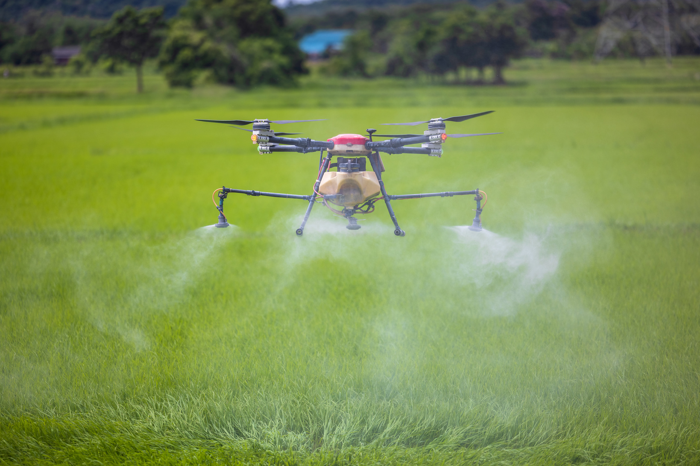
*Caption/Context: Agri-Spraying Solar Inspection Swarm Technology*

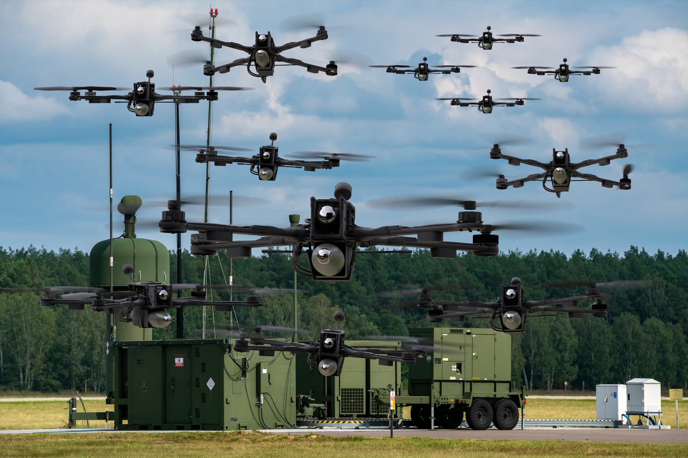
*Caption/Context: Agri-Spraying Solar Inspection Swarm Technology*

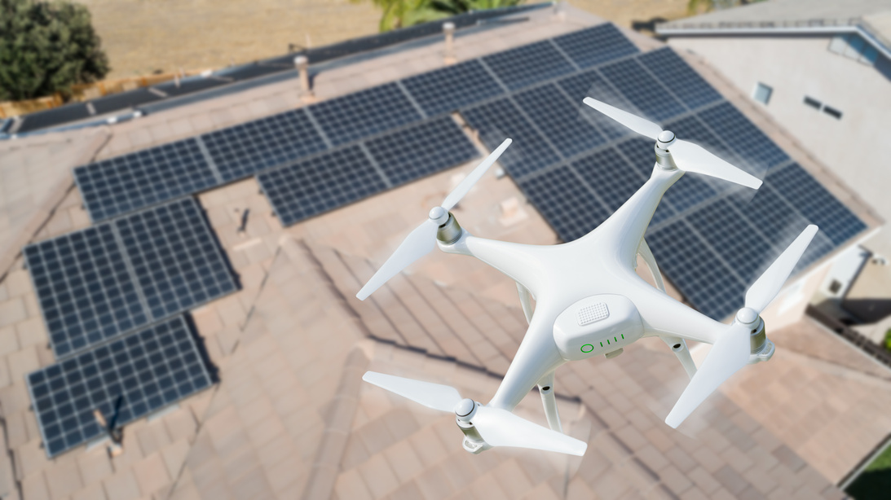
*Caption/Context: Agri-Spraying Solar Inspection Swarm Technology*

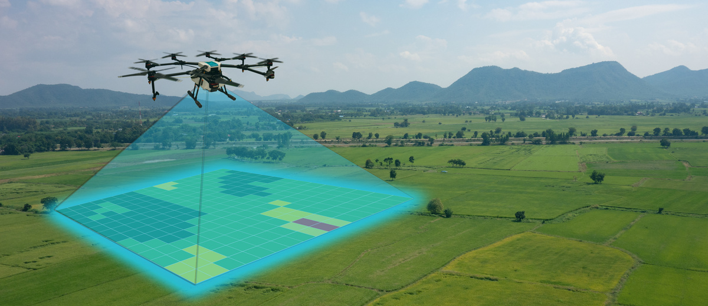
*Caption/Context: Land Survey Powerline Inspection Disaster Management | Construction Monitoring Multispectral Imaging Road Surveillance*

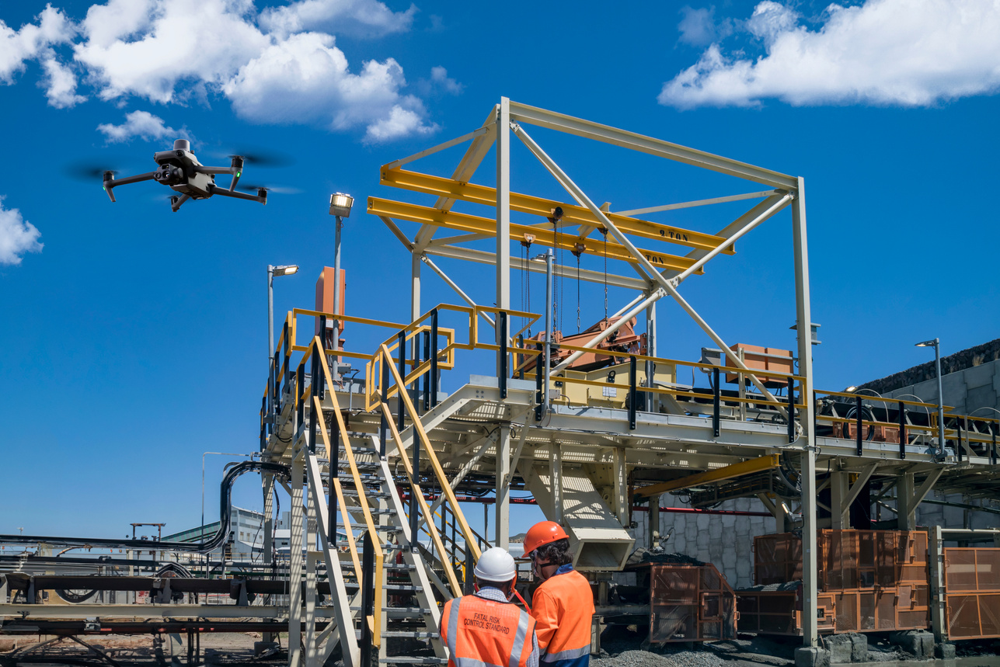
*Caption/Context: Land Survey Powerline Inspection Disaster Management | Construction Monitoring Multispectral Imaging Road Surveillance*

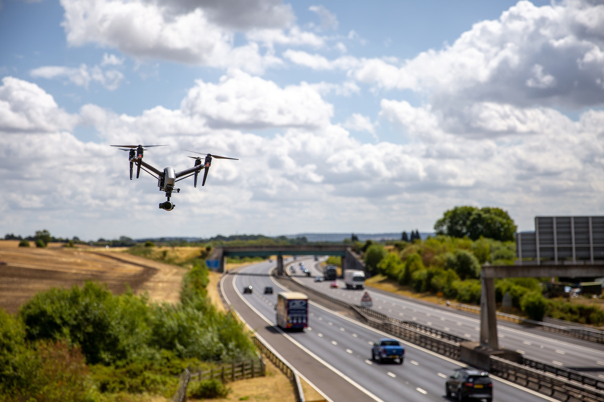
*Caption/Context: Land Survey Powerline Inspection Disaster Management | Construction Monitoring Multispectral Imaging Road Surveillance*

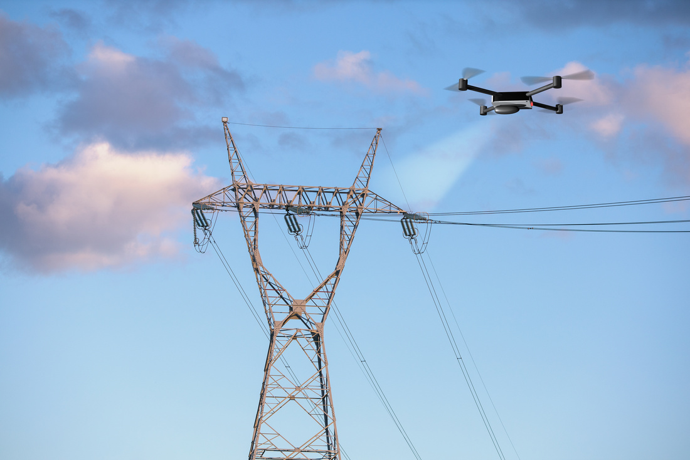
*Caption/Context: Wind Turbine Inspection Food Delivery Medicine Delivery | Land Survey Powerline Inspection Disaster Management*

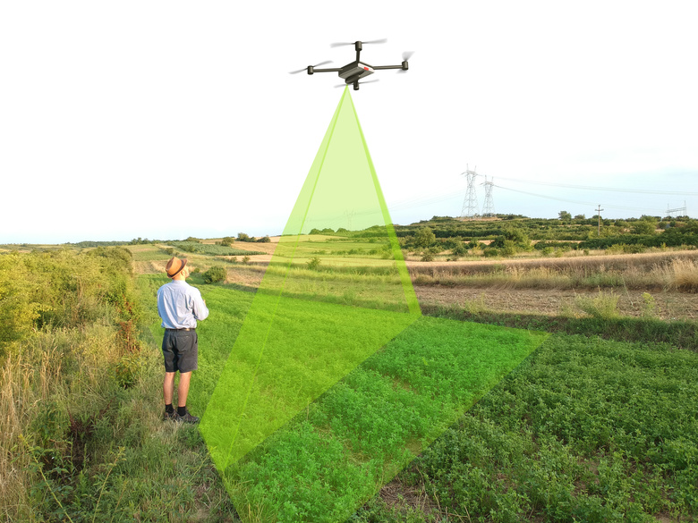
*Caption/Context: Wind Turbine Inspection Food Delivery Medicine Delivery | Land Survey Powerline Inspection Disaster Management*

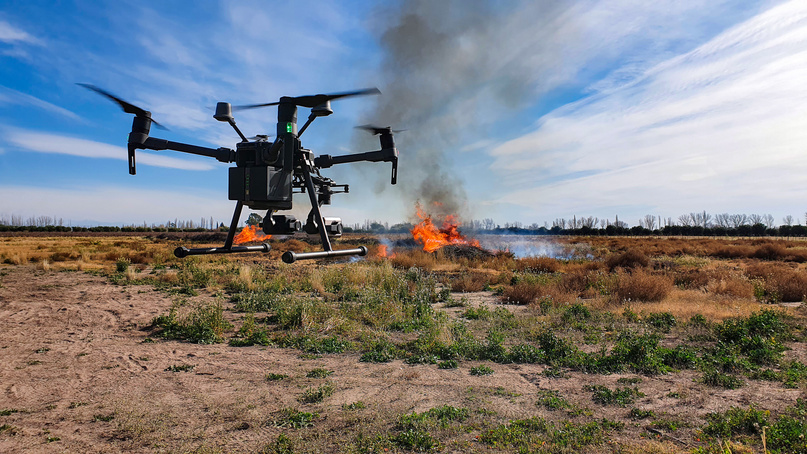
*Caption/Context: Wind Turbine Inspection Food Delivery Medicine Delivery | Land Survey Powerline Inspection Disaster Management*

*Caption/Context: Agri-Spraying Solar Inspection Swarm Technology | Wind Turbine Inspection Food Delivery Medicine Delivery*

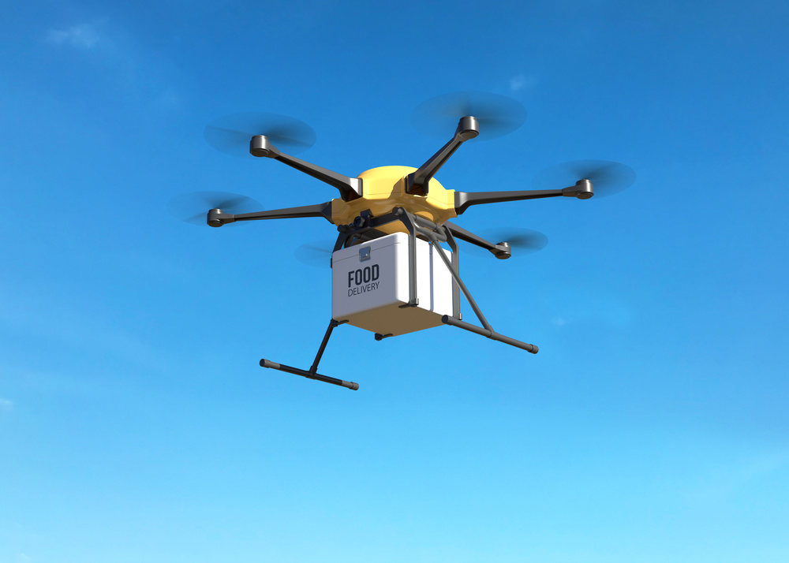
*Caption/Context: Agri-Spraying Solar Inspection Swarm Technology | Wind Turbine Inspection Food Delivery Medicine Delivery*

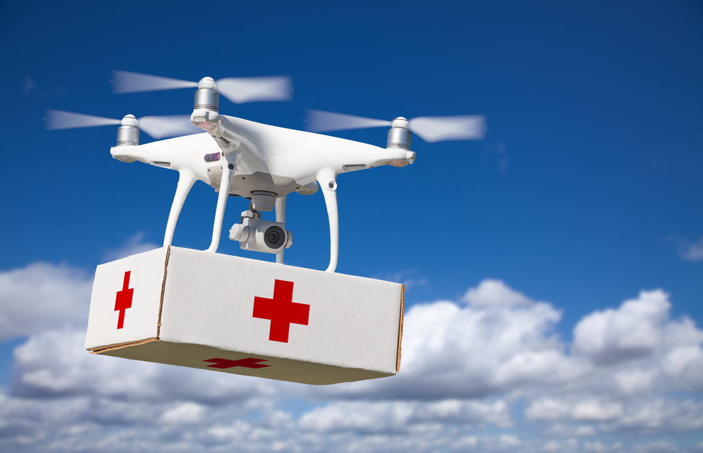
*Caption/Context: Agri-Spraying Solar Inspection Swarm Technology | Wind Turbine Inspection Food Delivery Medicine Delivery*

## --- Page 9 ---

Chapter 2: Understanding Drone Categories
and Types
Drones come in various shapes, sizes, and functionalities, each

designed for specific purposes. Whether for recreational flying,

commercial applications, or industrial operations, understanding

how drones are categorized helps users make informed decisions.

The Drone Rules 2021, issued by the Directorate General of Civil

Aviation (DGCA), gives the better classification of drones based on

design, operational control, and weight.

Categories of Drones

Drones are primarily classified into three categories based on

their design and flight characteristics.

Aeroplanes – Fixed-wing drones that resemble traditional

aircraft, requiring forward motion to generate lift. They are ideal

for long-range missions, mapping, and surveying due to their high

endurance and efficiency.

Rotorcrafts – Drones equipped with rotors or propellers,

enabling vertical takeoff and landing (VTOL). These include the

widely used multirotor drones, such as quadcopters, hexacopters,

and octocopters, known for their stability and maneuverability.

Hybrid Drones – Combining the features of fixed-wing and

rotorcraft drones, hybrid drones take off and land vertically like a

multirotor but transition to fixed-wing flight for better range and

efficiency.

Each of these categories has its own advantages. While aeroplane

drones cover vast distances efficiently, rotorcrafts provide

superior control in confined spaces, and hybrid drones offer

versatility in diverse operational environments.

9

## --- Page 10 ---

Sub-Categories of Drones

Beyond design, drones are further classified based on their

operational capabilities and the level of human control

involved.

Remotely Piloted Aircraft System (RPAS) – The most common

type of drone, actively controlled by a human pilot through a

remote controller or ground station. This category includes

consumer drones, commercial drones, and industrial RPAS

used for applications like aerial photography, surveillance, and

mapping.

Model RPAS – Specifically designed for research, education,

and hobbyist use, these drones do not require commercial

approvals but must adhere to safety and operational

guidelines.

Autonomous Drones – Operate without direct human

intervention, relying on pre-programmed flight paths and AI-

driven navigation. These drones require special permissions

from DGCA due to their potential impact on airspace

management and safety.

10

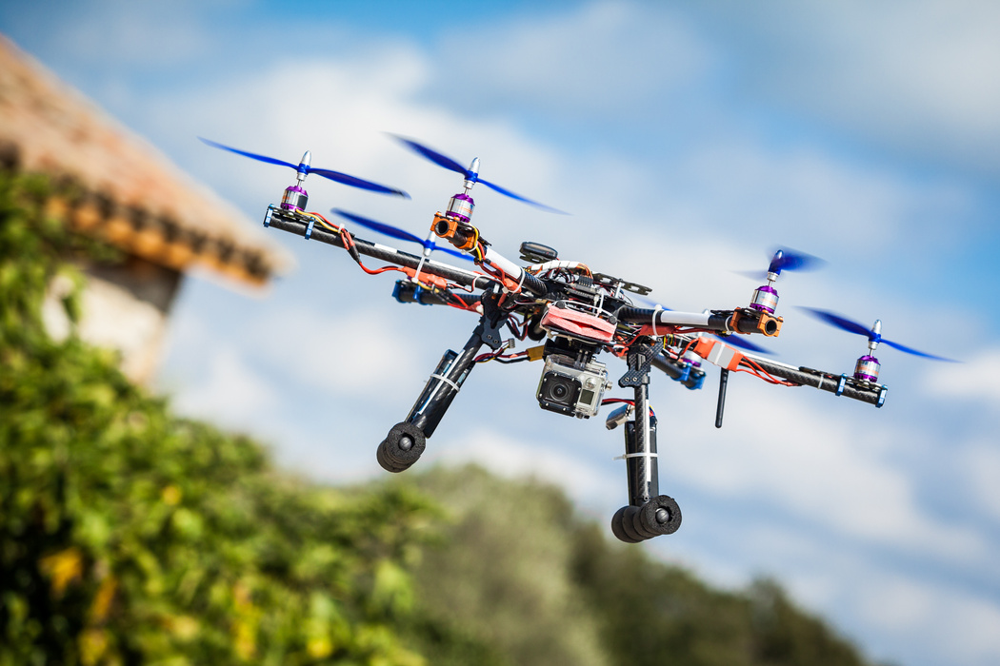
*Caption/Context: intervention, relying on pre-programmed flight paths and AI- | driven navigation. These drones require special permissions*

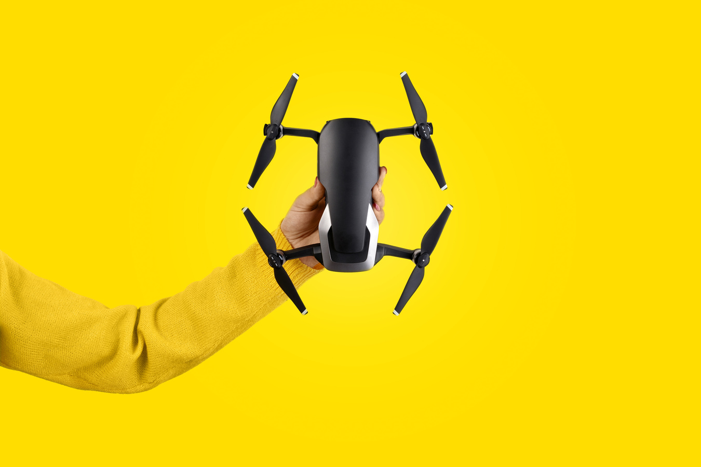
*Caption/Context: Autonomous Drones – Operate without direct human | intervention, relying on pre-programmed flight paths and AI-*

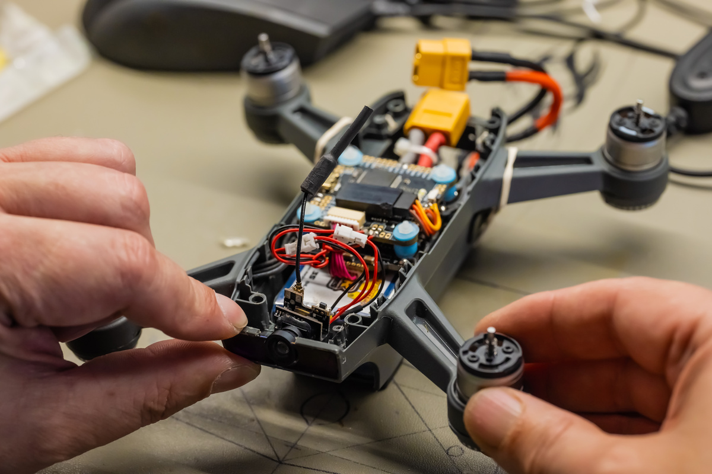
*Caption/Context: Image page_010_fig_03.jpeg*

## --- Page 11 ---

Classification Based on Weight

Weight classification plays a crucial role in determining licensing

requirements, operational limits, and regulatory compliance.

The Drone Rules 2021 categorize drones into five weight

classes:

Nano Drones (≤250g) – The lightest category, commonly used

for recreational flying and toy drones. Nano drones are exempt

from registration and licensing but must not exceed 50 feet (15

meters) altitude.

Micro Drones (250g – 2kg) – These drones are popular for

photography, hobby flying, and light commercial use. Operators

must register them and follow basic operational restrictions,

including a maximum altitude of 200 feet (60 meters).

Small Drones (2kg – 25kg) – Heavier drones used for

commercial applications, such as agriculture, infrastructure

inspections, and industrial security. Pilots operating small

drones require a Remote Pilot Certificate (RPC).

Medium Drones (25kg – 150kg) – Designed for cargo

transport, disaster response, and defense applications, medium

drones require DGCA approvals and strict compliance with

aviation guidelines.

Currently the permit provided by DGCA for medium class

drones is upto 50kg, above this requires type rating to operate.

Large Drones (>150kg) – The heaviest class, used primarily for

military, 
heavy-duty 
logistics, 
and 
advanced 
industrial

operations. These drones are subject to extensive regulatory

oversight and safety measures.

The weight classification helps ensure that each category of

drone is operated safely and within its designated limitations.

11

## --- Page 12 ---

12

Rotorcraft

Fixed Wing 
Hybrid

< 250 gm

NANO
MICRO

> 250gm & < 2kg

#### SMALL

> 2kg & < 25kg

#### MEDIUM

> 25kg & < 150kg

#### LARGE

> 150 kg

Drone with maximum takeoff weight greater than 500 kg will be

operated with Aircraft Rules 1937

Categories

Classifications

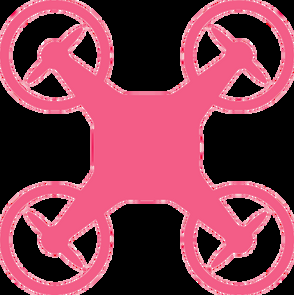
*Caption/Context: Rotorcraft | Classifications*

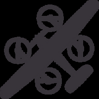
*Caption/Context: Fixed Wing  Hybrid | Categories*

## --- Page 13 ---

Choosing the Right Drone for Your Needs
Selecting the right drone depends on your intended use,
operational requirements, and regulatory compliance. Here’s
a quick guide:

For Beginners & Hobbyists – Nano and Micro drones are
ideal, offering easy handling with minimal regulatory
restrictions.
For Photography & Videography – Rotorcrafts, especially
quadcopters, provide stable flight and high-quality imaging
capabilities.
For Mapping & Land Surveys – Fixed-wing or hybrid VTOL
drones are best, covering large areas efficiently.
For Agriculture & Industrial Use – Small and medium
drones with payload capabilities support precision agriculture,
spraying, and industrial monitoring.
For Logistics & Delivery – Hybrid drones are leading the way
in cargo transport and last-mile delivery solutions.

Understanding these classifications allows drone operators to
align their choices with legal requirements and operational
efficiency.

13

## --- Page 14 ---

Future Trends in Drone Technologies
As drone technology advances, new trends are shaping their
design and capabilities:
AI-Powered Drones – Autonomous drones with AI-driven
decision-making for smart navigation and real-time data
analysis.
5G-Enabled Smart Drones – Leveraging high-speed data
connectivity for live streaming, real-time surveillance, and
remote operations.
Swarm Technology – Coordinated fleets of drones working
together for disaster management, search and rescue, and
security patrols.
Solar-Powered Drones – Fixed-wing drones with solar panels
for extended flight endurance, useful in environmental
monitoring and long-range missions.

14

![Future Trends in Drone Technologies As drone technology advances, new trends are shaping their design and capabilities: AI-Powered Drones – Autonomous drones with AI-driven decision-making for smart navigation and real-time data analysis. 5G-Enabled Smart Drones – Leveraging high-speed data connectivity for live streaming, real-time surveillance, and remote operations. Swarm Technology – Coordinated fleets of drones working together for disaster management, search and rescue, and security patrols. Solar-Powered Drones – Fixed-wing drones with solar panels for extended flight endurance, useful in environmental monitoring and long-range missions.](images/page_014_fig_01.png)
*Caption/Context: Future Trends in Drone Technologies As drone technology advances, new trends are shaping their design and capabilities: AI-Powered Drones – Autonomous drones with AI-driven decision-making for smart navigation and real-time data analysis. 5G-Enabled Smart Drones – Leveraging high-speed data connectivity for live streaming, real-time surveillance, and remote operations. Swarm Technology – Coordinated fleets of drones working together for disaster management, search and rescue, and security patrols. Solar-Powered Drones – Fixed-wing drones with solar panels for extended flight endurance, useful in environmental monitoring and long-range missions.*

![Future Trends in Drone Technologies As drone technology advances, new trends are shaping their design and capabilities: AI-Powered Drones – Autonomous drones with AI-driven decision-making for smart navigation and real-time data analysis. 5G-Enabled Smart Drones – Leveraging high-speed data connectivity for live streaming, real-time surveillance, and remote operations. Swarm Technology – Coordinated fleets of drones working together for disaster management, search and rescue, and security patrols. Solar-Powered Drones – Fixed-wing drones with solar panels for extended flight endurance, useful in environmental monitoring and long-range missions.](images/page_014_fig_02.png)
*Caption/Context: Future Trends in Drone Technologies As drone technology advances, new trends are shaping their design and capabilities: AI-Powered Drones – Autonomous drones with AI-driven decision-making for smart navigation and real-time data analysis. 5G-Enabled Smart Drones – Leveraging high-speed data connectivity for live streaming, real-time surveillance, and remote operations. Swarm Technology – Coordinated fleets of drones working together for disaster management, search and rescue, and security patrols. Solar-Powered Drones – Fixed-wing drones with solar panels for extended flight endurance, useful in environmental monitoring and long-range missions.*

## --- Page 15 ---

Chapter 3: Indian Drone Regulations &
Compliance

Drones have rapidly become an integral part of various
industries in India, from aerial surveying to logistics and
cinematography. However, operating a drone isn’t just about
flying—it requires strict adherence to legal frameworks that
ensure safety, privacy, and national security. The Drone Rules
2021, established by the Directorate General of Civil Aviation
(DGCA), provide clear guidelines for all drone operators.
Whether you are a hobbyist, student, entrepreneur, or certified
pilot, understanding these regulations is essential for safe and
compliant drone operations.

Legal Requirements for Flying Drones in India
Before launching a drone, every operator must comply with
essential legal requirements outlined under Drone Rules 2021.
These 
include 
registration, 
certification, 
operational
permissions like airspace restrictions.
Drone Registration – All drones, except nano drones, must be
registered on the Digital Sky Platform (DSP) which is a unified
platform for all drone things and issued a Unique Identification
Number (UIN). This is similar to a vehicle registration number
and helps authorities track drone ownership.
Remote Pilot Certificate (RPC) – Mandatory for operating
small, medium, and large drones for commercial purposes.
Micro drones used for non-commercial activities are exempt.
Airspace Awareness – Operators must respect designated
airspace classifications, avoiding restricted zones such as
military areas, airports, and sensitive government sites.
The DGCA continuously updates regulations to ensure drones
operate safely without interfering with manned aircraft or
national security.

15

## --- Page 16 ---

DGCA Remote Pilot Certification
To fly drones commercially, obtaining a Remote Pilot Certificate
(RPC) through DGCA-authorized RPTOs is essential.

Enroll in a DGCA-Approved RPTO
Select a training organization listed on the Digital Sky Platform.

Complete the Training Program
Learn about air laws, flight operations, weather conditions, and
emergency handling. Gain hands-on experience in flight controls and

operational safety.

Pass the DGCA Approved RPTO Assessment
A written and practical test is conducted to evaluate your

knowledge and flying skills.

Receive Your Remote Pilot Certificate (RPC)
Once you pass, your certification is recorded on the 
Digital Sky Platform, authorizing you to operate drones legally.

For nano and micro drones used for personal or recreational purposes,
an RPC is not required, but operators must follow basic safety guidelines.

Airspace Restrictions, Penalties, and Offenses
To ensure safe drone operations, Indian airspace is divided into
three zones, this can be accessed via Drone AirSpace Map, Link
🟢 Green Zone – Open for drone operations up to 400 feet (120
meters) with no prior permissions.
🟡 Yellow Zone – Controlled airspace where permission is
required from Air Traffic Control (ATC) or the Digital Sky
Platform.
🔴 Red Zone – Strictly no-fly areas, including military bases,
government buildings, international borders, and airports.
🔴 Temporary Red Zone - can be declared for up to 96 hours
by a Superintendent of Police or equivalent, restricting drone
flights in a specified area.

16

## --- Page 17 ---

17

Airspace Map Illustration

Credits: MavDrones

Credits: Xenox

Note: While the airspace map provides a clear definition of zones, remote pilots must account for
unforeseen restrictions, such as Temporary Red Zones, that may arise in their operational
airspace. Given the dynamic nature of airspace regulations, the Remote Pilot in Command (RPIC)
bears full responsibility for ensuring compliance when operating a drone in such areas. It is
essential to reconfirm the classification of your airspace zone at the time of operation.
The DigitalSky Platform offers the functionality to upload flight plans and seek necessary
permissions for drone operations. Obtaining your Flight Authorization Number after uploading
your flight plan is strongly recommended. Additionally, it is advisable to inform local law
enforcement about your drone operation, especially if it is for commercial purposes. Even for
recreational flights, notifying law enforcement is a good practice when operating within regulated
zones or near sensitive areas.

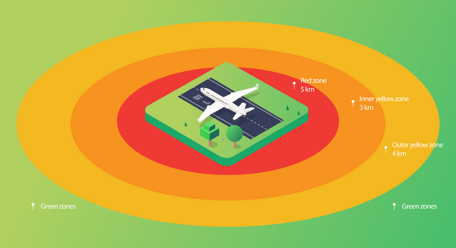
*Caption/Context: Airspace Map Illustration*

![Credits: MavDrones | Note: While the airspace map provides a clear definition of zones, remote pilots must account for unforeseen restrictions, such as Temporary Red Zones, that may arise in their operational airspace. Given the dynamic nature of airspace regulations, the Remote Pilot in Command (RPIC) bears full responsibility for ensuring compliance when operating a drone in such areas. It is essential to reconfirm the classification of your airspace zone at the time of operation. The DigitalSky Platform offers the functionality to upload flight plans and seek necessary permissions for drone operations. Obtaining your Flight Authorization Number after uploading your flight plan is strongly recommended. Additionally, it is advisable to inform local law enforcement about your drone operation, especially if it is for commercial purposes. Even for recreational flights, notifying law enforcement is a good practice when operating within regulated zones or near sensitive areas.](images/page_017_fig_02.jpeg)
*Caption/Context: Credits: MavDrones | Note: While the airspace map provides a clear definition of zones, remote pilots must account for unforeseen restrictions, such as Temporary Red Zones, that may arise in their operational airspace. Given the dynamic nature of airspace regulations, the Remote Pilot in Command (RPIC) bears full responsibility for ensuring compliance when operating a drone in such areas. It is essential to reconfirm the classification of your airspace zone at the time of operation. The DigitalSky Platform offers the functionality to upload flight plans and seek necessary permissions for drone operations. Obtaining your Flight Authorization Number after uploading your flight plan is strongly recommended. Additionally, it is advisable to inform local law enforcement about your drone operation, especially if it is for commercial purposes. Even for recreational flights, notifying law enforcement is a good practice when operating within regulated zones or near sensitive areas.*

## --- Page 18 ---

Common Offenses & Penalties
🚨 Flying Without Registration – ₹1,00,000 fine for operating
an unregistered drone.
🚨 Operating in Restricted Airspace – Unauthorized flying in
Yellow or Red Zones can result in legal action and seizure of
equipment.
🚨 Breach of Privacy Laws – Capturing images or videos of
individuals or private property without consent can lead to
penalties under Indian privacy laws.
🚨 Lack of Permit Clearance – Operating without mandatory
Digital Sky clearance results in ₹1,00,000 fine and possible flight
bans.
Non-compliance 
with 
these 
rules 
can 
lead 
to 
legal
consequences, confiscation of drones, and bans on future
drone operations.

Data Privacy and Security Concerns
As drones become more widely used, concerns over privacy,
data protection, and cybersecurity have increased. To prevent
misuse, Indian drone regulations emphasize responsible data
collection and storage.
    Privacy Protection – Filming or capturing data on private
individuals or properties without consent can lead to legal
action.
   Cybersecurity Risks – Drones relying on Wi-Fi or GPS
connectivity are vulnerable to hacking and cyberattacks.
Operators should use encrypted communication and secure
drone software.
     Government Approval for Data Collection – Drones used
for mapping, surveillance, or large-scale data gathering must
obtain approvals from relevant government bodies.
By following ethical practices and data protection laws, drone
operators can contribute to a safe and privacy-conscious drone
ecosystem.

18

## --- Page 19 ---

Future of Drone Regulations in India
The Drone Rules 2021 have made drone operations more
streamlined while ensuring national security. However, as
drone technology advances, future regulations may focus on:
    Beyond Visual Line of Sight (BVLOS) Operations –
Currently in testing, BVLOS flights could revolutionize drone
deliveries and long-range industrial applications.
      Stronger Cybersecurity Frameworks – With increasing
drone activity, stricter security compliance may be introduced
for commercial drone operations.
   Unmanned Traffic Management (UTM) System –
Integration with India’s air traffic control systems to ensure
seamless drone operations.
As 
India 
embraces 
the 
drone 
revolution, 
regulatory
advancements will ensure safe, efficient, and responsible drone
usage.

19

## --- Page 20 ---

Chapter 4: Drone Pilot Training and
Certification

As drones continue to reshape industries in India, the demand
for certified drone pilots has surged. However, operating a
drone—especially for commercial purposes—requires more
than just technical skills. It demands proper training, regulatory
knowledge, and certification from the Directorate General of
Civil Aviation (DGCA).

Eligibility Criteria for Drone Pilot Training
Not everyone can operate a drone commercially in India. To
obtain a Remote Pilot Certificate (RPC), an individual must meet
the following criteria:
Minimum Age Requirement: The applicant must be at least 18
years old and not older than 65 years at the time of application.
Educational Qualification: A minimum qualification of Class
10 (Matriculation) or equivalent from a recognized board.
Medical Fitness: The applicant should be physically and
mentally fit to operate a drone safely. Medical Fitness
Certificate should be duly signed by a Medical Practitioner 
Enrollment in a DGCA-Approved Remote Pilot Training
Organization (RPTO): Only RPTOs authorized by the DGCA can
provide drone pilot training and issue RPCs. Link for RPTOS

For hobbyist and recreational pilots, these criteria may not be
necessary unless they wish to upgrade to commercial drone
operations.

20

![As drones continue to reshape industries in India, the demand for certified drone pilots has surged. However, operating a drone—especially for commercial purposes—requires more than just technical skills. It demands proper training, regulatory knowledge, and certification from the Directorate General of Civil Aviation (DGCA). | Eligibility Criteria for Drone Pilot Training Not everyone can operate a drone commercially in India. To obtain a Remote Pilot Certificate (RPC), an individual must meet the following criteria: Minimum Age Requirement: The applicant must be at least 18 years old and not older than 65 years at the time of application. Educational Qualification: A minimum qualification of Class 10 (Matriculation) or equivalent from a recognized board. Medical Fitness: The applicant should be physically and mentally fit to operate a drone safely. Medical Fitness Certificate should be duly signed by a Medical Practitioner  Enrollment in a DGCA-Approved Remote Pilot Training Organization (RPTO): Only RPTOs authorized by the DGCA can provide drone pilot training and issue RPCs. Link for RPTOS](images/page_020_fig_01.png)
*Caption/Context: As drones continue to reshape industries in India, the demand for certified drone pilots has surged. However, operating a drone—especially for commercial purposes—requires more than just technical skills. It demands proper training, regulatory knowledge, and certification from the Directorate General of Civil Aviation (DGCA). | Eligibility Criteria for Drone Pilot Training Not everyone can operate a drone commercially in India. To obtain a Remote Pilot Certificate (RPC), an individual must meet the following criteria: Minimum Age Requirement: The applicant must be at least 18 years old and not older than 65 years at the time of application. Educational Qualification: A minimum qualification of Class 10 (Matriculation) or equivalent from a recognized board. Medical Fitness: The applicant should be physically and mentally fit to operate a drone safely. Medical Fitness Certificate should be duly signed by a Medical Practitioner  Enrollment in a DGCA-Approved Remote Pilot Training Organization (RPTO): Only RPTOs authorized by the DGCA can provide drone pilot training and issue RPCs. Link for RPTOS*

## --- Page 21 ---

Training Structure Under DGCA-Approved RPTOs
Drone pilot training in India follows a standardized curriculum
designed to equip pilots with both theoretical knowledge and
practical flight skills. The training program typically lasts 5–7
days, covering:

1️⃣ Theoretical Training (Classroom & Online Sessions)
Pilots learn about:

Drone Rules 2021 – Legal aspects of drone operations.
Airspace Classification & Flight Planning – Understanding
Green, Yellow, and Red zones.
Aerodynamics & Flight Physics – How drones achieve and
maintain stable flight.
Battery Management & Drone Maintenance – Ensuring
longevity and safety of drone components.
Weather & Environmental Considerations – How wind, rain,
and temperature affect drone performance.
Emergency Handling & Fail-Safe Procedures – Responding to
critical failures mid-flight.
2️⃣ Simulator Training
Before flying an actual drone, trainees practice using drone
flight simulators to understand:
Takeoff and landing procedures
Flight maneuvers in different weather conditions
3️⃣ Practical Flight Training
This is the most crucial phase, where pilots fly real drones
under instructor supervision. They practice:

Manual & Autonomous Flight Operations
Navigating different terrains and airspaces
Pre-flight and Post-flight Inspections
Handling Payloads (Cameras, Spraying, etc.) if any
At the end of the training, pilots undergo an assessment to
qualify for their Remote Pilot Certificate (RPC).

21

## --- Page 22 ---

Examination & Certification Process
To earn an RPC, candidates must pass a DGCA-mandated
assessment, which includes:

Written Examination – Tests knowledge of air laws,
operational safety, and drone technology.
Simulation Flight Test - Evaluates the simulated drone
handling in various scenarios
Practical 
Flight 
Test 
– 
Evaluates 
takeoff, 
landing,
maneuvering, and emergency response skills.

Upon successful completion, RPTO will endorse you to the
DGCA by filling out form D4 for your eligibility as a drone pilot
and then the Remote Pilot Certificate (RPC) is issued, recorded
on the Digital Sky Platform, and remains valid for 10 years.
Link to View Certified Remote Pilots (Other Certified Pilots will
be found under Training Organization Page of Digital Sky)

Key Skills & Competencies for Drone Pilots
Becoming a professional drone pilot requires more than just
flying skills. Some essential competencies include:
✔️ Regulatory Awareness – Keeping up with DGCA policies and
airspace restrictions.
✔️ Situational Awareness – Ability to assess weather conditions,
obstacles, and environmental hazards.
✔️ Technical Proficiency – Understanding drone hardware,
software, and troubleshooting issues.
✔️ Communication Skills – Especially for coordinating with
authorities in controlled airspace.
✔️ Decision-Making Under Pressure – Handling technical
failures or mid-air emergencies calmly.

A well-trained pilot is not only proficient in flying drones but
also capable of making informed decisions in dynamic
environments.
22

## --- Page 23 ---

23

Chapter 5: Type Certification of Drones in 
India

Type Certification (TC) is an essential regulatory process under
the Drone Rules 2021, ensuring that drones meet the technical,
safety, and operational standards prescribed by the Directorate
General of Civil Aviation (DGCA).

A Type-Certified drone undergoes rigorous evaluation for its
design, build quality, safety features, and compliance with
Indian regulations. The certification guarantees that a drone is
fit for use in various industries, making TC drones a mandatory
requirement 
for 
most 
government 
and 
enterprise-level
operations in India.

Remote Pilot Certificate (RPC) holders must be aware of Type
Certification, as it directly impacts their employability and
operations. The Government of India mandates the use of TC
drones for its projects, ensuring compliance and safety
standards. Additionally, private companies increasingly prefer
TC drones for commercial projects, making it crucial for pilots to
understand their significance.

Operating TC drones offers several benefits. These drones are
more likely to secure insurance and third-party liability
coverage, a legal necessity in India. Moreover, financial
institutions are more willing to provide loans for purchasing TC
drones, reducing the financial burden on pilots and operators.
This makes TC drones a valuable investment for commercial
drone pilots.

## --- Page 24 ---

24

However, pilots should exercise caution when operating TC
drones in India. Many TC drones are assembled locally with
imported components rather than being fully manufactured in
India. This often leads to quality issues in hardware and
software, causing reliability concerns. Additionally, serviceability
and repairability remain significant challenges, with limited
support infrastructure for TC drones. Pilots must critically
evaluate the drones they operate to ensure safety, efficiency,
and compliance.

Exemptions in Obtaining Type Certificate for Drones in India
As per the Drone Rules, 2021, the following categories of drones
are exempted from requiring a Type Certificate (TC) in India:

Drones for Research and Development (R&D) purposes do
not require a Type Certificate. However, such operations
must comply with DGCA safety guidelines.
Drones Imported for demonstration or testing purposes, or
already have TC in other countries are exempt from TC
requirements.
Model Drones for educational purposes or recreational
purposes, and not intended for commercial or operational
use, are exempt from requiring a Type Certificate.
Nano Drones  (weighing less than or equal to 250 grams)

While these exemptions exist, operators must still ensure
compliance with applicable safety guidelines, registration (if
required), and operational limits as per the Drone Rules, 2021.

In conclusion, while TC drones offer significant advantages for
professional pilots, it is imperative to remain vigilant about their
quality and service standards to ensure successful and safe
operations. Link for TC Drones

## --- Page 25 ---

Chapter 6: Drone Safety Protocols and
Emergency Procedures

Drones have revolutionized industries across India, but their
growing use also raises safety concerns. A minor mistake in
drone operations can lead to property damage, personal injury,
regulatory violations, or even national security risks. To ensure
safe and responsible drone flights, pilots must follow strict
safety protocols before, during, and after operations.
Additionally, unforeseen emergencies—such as GPS loss, signal
failure, or battery depletion—can occur mid-flight. Knowing
how to respond effectively can prevent accidents and protect
assets. This chapter will provide a comprehensive guide on
drone safety best practices, emergency handling procedures,
and DGCA-mandated safety regulations.

Pre-Flight Safety Checks and Best Practices
A successful drone flight starts before takeoff with a series of
safety inspections. Pre-flight checks ensure the drone is in
optimal condition and that the flight environment is safe.
1️⃣ Equipment Inspection
Before every flight, conduct a thorough check of the drone and
its components:
Battery 
Health: 
Ensure 
batteries 
are 
fully 
charged,
undamaged, and securely attached. Avoid swollen or damaged
batteries.
Propellers, Frame & Motors: Inspect for cracks, loose screws,
or wear and tear. Replace damaged propellers immediately.
GPS & Compass Calibration: Verify GPS signal strength and
calibrate the compass if needed.
Camera & Payloads: Ensure any attached cameras or sensors
are properly mounted and functional.
Firmware & Software Updates: Keep drone firmware, remote
controller, and flight apps updated for optimal performance.
25

## --- Page 26 ---

2️⃣ Environmental & Airspace Assessment
Understanding the external conditions is critical for safe
operations. Before taking off, check:
Weather Conditions: Avoid flying in high winds, heavy rain,
fog, or extreme temperatures.
Airspace Restrictions: Use the Digital Sky Platform or a DGCA-
approved airspace map to check for no-fly zones.
Obstacles & Interference: Identify potential hazards like trees,
power lines, buildings, and electromagnetic interference from
telecom towers.
Crowd Safety: Ensure you are not flying over people or
congested areas, unless permitted by authorities.

3️⃣ Pre-Flight Checklist & Flight Plan
Perform a test hover to check drone stability before
proceeding with the flight.
Set a Return-to-Home (RTH) point in case of signal loss.
Ensure your emergency protocols are in place.

Following these steps minimizes risks of technical malfunctions
and unforeseen flight hazards.

In-Flight Safety Measures and Risk Mitigation
Once airborne, situational awareness is crucial. Even with
automated flight features, pilots must maintain manual control
proficiency for unexpected situations.

Key In-Flight Safety Guidelines:
✔ Maintain Visual Line of Sight (VLOS): Always keep the
drone within your direct view unless permitted for BVLOS
operations.
✔ Monitor Battery Levels: Land the drone before reaching
critical battery levels (usually below 20%).

26

## --- Page 27 ---

27

✔ Avoid Flying Near Airports or Restricted Zones: Violating
airspace restrictions can result in fines of ₹1 lakh and legal
action.
✔ Observe Other Air Traffic: Be aware of low-flying aircraft,
helicopters, or other drones in the area.
✔ React Quickly to Alerts: If you receive a low battery, high
wind, or GPS signal loss warning, take immediate action to land
safely.

Golden Rule: If anything seems wrong, land immediately!

Post-Flight Inspections and Maintenance Routines
A safe drone operation doesn’t end after landing. Post-flight
checks ensure the drone is ready for future flights and can
prevent long-term wear and tear issues.

Check for Damage: Inspect the drone body, propellers, and
gimbal for any signs of impact or stress.
Battery Cooling & Storage: Let batteries cool before
recharging and store them in fireproof battery cases.
Data Backup: Save and review flight logs, images, and
sensor data for future reference.
Clean the Drone: Wipe off dust, dirt, or moisture that may
have accumulated during flight.
Update Flight Records: Maintain a log of flight details,
including location, duration, and incidents (if any).

Following a consistent maintenance routine increases drone
longevity and minimizes risks in future flights.

## --- Page 28 ---

28

Emergency Handling Procedures
Even 
with 
strict 
precautions, 
emergencies 
can 
occur
unexpectedly. A well-prepared drone pilot must know how to
respond quickly to different failure scenarios.

1️⃣ GPS Signal Loss
If your drone loses GPS connection, it may drift uncontrollably
or fail to return home.
✅ Switch to ATTI (Attitude) mode (if available) to manually
control the drone.
✅ Try relocating to an area with better GPS reception.
✅ If GPS does not recover, gradually lower altitude and land
manually.

2️⃣ Loss of Remote Control Signal
A weak or lost signal can cause the drone to hover in place,
return home, or initiate an emergency landing.
✅ Remain calm—most drones will automatically return to
home (RTH) when the signal is lost.
✅ If RTH is disabled, try moving closer to regain the connection.
✅ If no response, wait for the battery to deplete so the drone
lands safely.

3️⃣ Battery Failure or Low Battery Mid-Flight
If your drone suddenly displays critical battery warnings, act
fast.
✅ Reduce altitude immediately and look for a safe landing spot.
✅ If the battery drains faster than expected, initiate an
emergency landing in an open space.
✅ Avoid deep water, highways, or crowded areas while making
a forced landing.

## --- Page 29 ---

29

4️⃣ Drone Caught in Strong Winds
High winds can destabilize flight, making it difficult to return
home safely.
✅ Fly lower—wind speeds tend to decrease closer to the ground.
✅ Switch to Sport Mode (if available) for greater control.
✅ If the drone struggles to return, land in a nearby open area
and retrieve it manually.

5️⃣ Mid-Air Collision or Crash Landing
Accidents happen—if your drone collides with an object or
crashes:
✅ Check for damage before attempting another flight.
✅ If the drone is stuck on a tree, building, or power line, never
attempt retrieval alone—contact local authorities if needed.
✅ If the crash caused property damage or injuries, report it
immediately to the DGCA.

Proper emergency handling can prevent irreversible damage to
the drone and ensure regulatory compliance.

DGCA-Mandated Safety Guidelines & Compliance
The DGCA Drone Rules 2021 emphasize strict safety and
operational compliance for all drone pilots. Key regulations
include:

🚨 No-fly zones must be strictly followed. Violating restricted
airspace can result in penalties of ₹1 lakh.
🚨 Drones must be registered on the Digital Sky Platform.
Unregistered drone operations are illegal.
🚨 Flying over people, airports, or military zones is prohibited.
Exceptions require special DGCA permissions.

## --- Page 30 ---

Check Airspace Restrictions:
Always verify the DigitalSky
airspace map and obtain
necessary permissions for flying.

Don’t Fly in Restricted Zones: Avoid
flying in Red Zones or sensitive
areas without proper
authorization.

Maintain Line of Sight (VLOS):
Keep the drone within your direct
visual line of sight at all times
during the operation.

Don’t Exceed Altitude Limits: Never
fly above the permissible limit of
400 feet in uncontrolled airspace.

Perform Pre-Flight Checks: Inspect
the drone’s hardware, software,
and battery before each flight for
safe operations.

Don’t Operate Without
Registration: Ensure the drone is
registered and carries its UIN if
required.

Comply with Safety Protocols:
Follow DGCA guidelines, including
notifying local law enforcement for
commercial operations.

Don’t Fly Over Crowds: Avoid flying
over populated areas, events, or
sensitive locations like government
buildings.

Log Flight Details: Record every
flight in the Remote Pilot Logbook,
converting time to UTC as
required.

Don’t Ignore Weather Conditions:
Avoid flying in adverse weather
such as high winds, rain, or low
visibility.

30

🚨 Drone insurance is mandatory for commercial operations.
Pilots must ensure liability coverage.
🚨 All commercial pilots must hold a valid Remote Pilot
Certificate (RPC). Unauthorized flights risk severe fines and legal
action.

Understanding and following these mandatory guidelines is
essential for safe and lawful drone operations in India.

## --- Page 31 ---

31

Chapter 7: Specific Operation Risk Assessment
(SORA)

The Specific Operation Risk Assessment (SORA) is a structured
methodology 
developed 
by 
JARUS 
(Joint 
Authorities 
for
Rulemaking on Unmanned Systems) to assess and mitigate risks
in drone operations. It is essential for ensuring the safety of
operations, particularly in Visual Line of Sight (VLOS) and Beyond
Visual Line of Sight (BVLOS) scenarios. SORA identifies potential
risks to people, property, and other airspace users, requiring
operators to implement mitigation strategies. In VLOS operations,
risks are lower but still demand compliance with local regulations.
For BVLOS operations, SORA becomes crucial to address higher
risks, such as communication failures or mid-air collisions.

Scenario 1: Mapping in a Semi-Urban Area
Operation: A drone service provider is tasked with mapping a
semi-urban area for a local municipality.
Risk Assessment:
Ground Risk: Presence of residential areas increases risk to
people on the ground.
Air Risk: Nearby helipads or manned aviation corridors could
pose a collision risk.
Mitigation Measures:
Perform operations during low-activity hours.
Use Geo-fencing and Return-to-Home features.
Issue public notifications and barricade the operational area.

![The Specific Operation Risk Assessment (SORA) is a structured methodology  developed  by  JARUS  (Joint  Authorities  for Rulemaking on Unmanned Systems) to assess and mitigate risks in drone operations. It is essential for ensuring the safety of operations, particularly in Visual Line of Sight (VLOS) and Beyond Visual Line of Sight (BVLOS) scenarios. SORA identifies potential risks to people, property, and other airspace users, requiring operators to implement mitigation strategies. In VLOS operations, risks are lower but still demand compliance with local regulations. For BVLOS operations, SORA becomes crucial to address higher risks, such as communication failures or mid-air collisions. | Scenario 1: Mapping in a Semi-Urban Area Operation: A drone service provider is tasked with mapping a semi-urban area for a local municipality. Risk Assessment: Ground Risk: Presence of residential areas increases risk to people on the ground. Air Risk: Nearby helipads or manned aviation corridors could pose a collision risk. Mitigation Measures: Perform operations during low-activity hours. Use Geo-fencing and Return-to-Home features. Issue public notifications and barricade the operational area.](images/page_031_fig_01.png)
*Caption/Context: The Specific Operation Risk Assessment (SORA) is a structured methodology  developed  by  JARUS  (Joint  Authorities  for Rulemaking on Unmanned Systems) to assess and mitigate risks in drone operations. It is essential for ensuring the safety of operations, particularly in Visual Line of Sight (VLOS) and Beyond Visual Line of Sight (BVLOS) scenarios. SORA identifies potential risks to people, property, and other airspace users, requiring operators to implement mitigation strategies. In VLOS operations, risks are lower but still demand compliance with local regulations. For BVLOS operations, SORA becomes crucial to address higher risks, such as communication failures or mid-air collisions. | Scenario 1: Mapping in a Semi-Urban Area Operation: A drone service provider is tasked with mapping a semi-urban area for a local municipality. Risk Assessment: Ground Risk: Presence of residential areas increases risk to people on the ground. Air Risk: Nearby helipads or manned aviation corridors could pose a collision risk. Mitigation Measures: Perform operations during low-activity hours. Use Geo-fencing and Return-to-Home features. Issue public notifications and barricade the operational area.*

![The Specific Operation Risk Assessment (SORA) is a structured methodology  developed  by  JARUS  (Joint  Authorities  for Rulemaking on Unmanned Systems) to assess and mitigate risks in drone operations. It is essential for ensuring the safety of operations, particularly in Visual Line of Sight (VLOS) and Beyond Visual Line of Sight (BVLOS) scenarios. SORA identifies potential risks to people, property, and other airspace users, requiring operators to implement mitigation strategies. In VLOS operations, risks are lower but still demand compliance with local regulations. For BVLOS operations, SORA becomes crucial to address higher risks, such as communication failures or mid-air collisions. | Scenario 1: Mapping in a Semi-Urban Area Operation: A drone service provider is tasked with mapping a semi-urban area for a local municipality. Risk Assessment: Ground Risk: Presence of residential areas increases risk to people on the ground. Air Risk: Nearby helipads or manned aviation corridors could pose a collision risk. Mitigation Measures: Perform operations during low-activity hours. Use Geo-fencing and Return-to-Home features. Issue public notifications and barricade the operational area.](images/page_031_fig_16.png)
*Caption/Context: The Specific Operation Risk Assessment (SORA) is a structured methodology  developed  by  JARUS  (Joint  Authorities  for Rulemaking on Unmanned Systems) to assess and mitigate risks in drone operations. It is essential for ensuring the safety of operations, particularly in Visual Line of Sight (VLOS) and Beyond Visual Line of Sight (BVLOS) scenarios. SORA identifies potential risks to people, property, and other airspace users, requiring operators to implement mitigation strategies. In VLOS operations, risks are lower but still demand compliance with local regulations. For BVLOS operations, SORA becomes crucial to address higher risks, such as communication failures or mid-air collisions. | Scenario 1: Mapping in a Semi-Urban Area Operation: A drone service provider is tasked with mapping a semi-urban area for a local municipality. Risk Assessment: Ground Risk: Presence of residential areas increases risk to people on the ground. Air Risk: Nearby helipads or manned aviation corridors could pose a collision risk. Mitigation Measures: Perform operations during low-activity hours. Use Geo-fencing and Return-to-Home features. Issue public notifications and barricade the operational area.*

## --- Page 32 ---

32

Scenario 2: Aerial Inspection of Power Lines in a Red Zone
Operation: A drone operator is hired to inspect power lines in
a Red Zone, requiring ATC, AAI, and DGCA approval.
Risk Assessment:
Ground Risk: Proximity to critical infrastructure heightens risk.
Air Risk: Red Zone classification indicates restricted airspace.
Mitigation Measures:
Submit a detailed flight plan to DigitalSky.
Use a TC-certified drone with failsafe features.
Deploy a trained observer team to monitor hazards.

Scenario 3: Delivering Medical Supplies in Remote Villages
Operation: A BVLOS drone is used to deliver vaccines to
remote villages.
Risk Assessment:
Ground Risk: Sparse population reduces ground risk but still
requires caution.
Air Risk: BVLOS increases risk of losing communication with the
drone.
Mitigation Measures:
Use real-time tracking and redundant communication systems.
Create alternate landing zones and emergency protocols.

Scenario 4: Filming a Cultural Event in a Dense Urban Area
Operation: A Micro RPAS is used to film a live cultural event in
a densely populated area.
Risk Assessment:
Ground Risk: High population density increases risk of injuries
in case of failure.
Air Risk: Proximity to high-rise buildings and interference risks.
Mitigation Measures:
Limit altitude to 50 meters and operate within VLOS.
Obtain local authority permissions.
Use propeller guards and collision-avoidance technology.

## --- Page 33 ---

33

Specific 
Operations 
Risk 
Assessment 
(SORA)
Template and Explanation
A SORA is a detailed and methodical approach to assessing and
mitigating risks in drone operations. Below is a template along
with a simple explanation for each section to help drone pilots
create their own SORA.
Operation Overview
Operation Details:

Objective of the operation (e.g., mapping, inspection, delivery).
Location of operation (urban, rural, restricted zone, etc.).
Duration of operation and flight time.
Drone Details:

Drone classification and category (e.g., Micro, Small etc).
Type Certification & Insurance (if applicable).
Risk Assessment
Ground Risk Assessment (GRA):

Evaluate risks to people and property on the ground.
Consider population density, proximity to critical infrastructure, and
potential crash impact.
Air Risk Assessment (ARA):

Assess risks to other airspace users.
Identify nearby airports, air corridors, and restricted zones.
Mitigation Measures
List measures to reduce identified risks:
Geo-fencing, collision-avoidance technology, safety observers, and
notifications to stakeholders.
Include procedural mitigations like safety protocols and emergency
response plans.
Permissions and Compliance
Authorities to Notify: DGCA, ATC, AAI, or local law enforcement.
Flight Plan Submission: Confirm submission to DigitalSky (if applicable).
Emergency Preparedness
Emergency Protocols: Outline the plan for equipment failure or
environmental changes (e.g., landing zones, return-to-home function).
Observer Roles: Designate roles for monitoring and response.
Sign-Off and Approval
Confirm readiness and compliance by all stakeholders.

## --- Page 34 ---

34

Explanation of Each Section
Operation Overview
Objective: Clearly state what the operation is about and why
it’s being conducted. For example, delivering vaccines,
capturing footage, or inspecting power lines.
Location: Mention whether the operation is in urban or rural
areas, as this affects risk levels.
Drone Details: Knowing your drone’s classification (Nano,
Micro, etc.) and its capabilities is crucial for SORA.
Risk Assessment
Ground Risk: Focus on people and property below the flight
path. Is the area crowded? Are there schools, hospitals, or
critical infrastructure nearby?
Air Risk: Consider airspace complexity. Are you near airports or
other aircraft routes? BVLOS operations typically involve higher
air risks.
Mitigation Measures
These are actions you take to lower risks. For instance, setting a
geo-fenced area ensures the drone doesn’t fly into restricted
zones. Having safety observers can help spot any unforeseen
hazards.
Permissions and Compliance
Compliance ensures legal operations. For flights in Yellow or
Red Zones, permissions from DGCA, ATC, and AAI are
mandatory. Ensure your flight plan is submitted via DigitalSky.
Emergency Preparedness
Be ready for emergencies. Identify alternate landing areas,
ensure Return-to-Home functionality, and create a backup
communication plan in case of drone malfunctions.
Sign-Off and Approval
Every stakeholder should agree on the plan. This includes
operators, observers, and, if necessary, local authorities.

## --- Page 35 ---

35

Chapter 
8: 
Drone 
Maintenance 
and
Troubleshooting

Drones are precision-engineered machines that require regular
maintenance to ensure optimal performance, safety, and
longevity. Whether you are an aspiring drone pilot, business
owner, or drone enthusiast, understanding how to maintain
and troubleshoot your drone is essential.

Neglecting maintenance can lead to mechanical failures,
sudden crashes, and costly repairs. Moreover, technical issues
such as unstable flight, poor battery performance, and
connectivity failures can hinder smooth operations. This
chapter will guide you through routine maintenance practices,
common troubleshooting techniques, and preventive measures
to keep your drone in top condition.

Routine Maintenance Practices for Drones
Just like any other sophisticated machine, drones require
regular checks and upkeep. Following a consistent maintenance
routine minimizes unexpected failures and ensures longer
operational life.

1️⃣ Pre-Flight Maintenance
Before every flight, it is crucial to inspect key components for
wear and tear.
✔ Check Propellers & Motors: Ensure propellers are not bent,
cracked, or loose. Spin the motors to check for smooth rotation.
✔ Inspect Battery Health: Look for bulging, leakage, or
overheating. Use only fully charged, undamaged batteries.
✔ Verify GPS & Sensors: Confirm GPS stability, obstacle
avoidance sensors, and compass calibration.

## --- Page 36 ---

2️⃣ Post-Flight Maintenance
After landing, perform a quick post-flight check to prevent long-
term damage.
✔ Clean the Drone: Wipe off dust, dirt, and moisture from the
drone body, camera lens, and sensors.
✔ Inspect for Damage: Look for scratches, cracks, or loose
components that might have been affected during flight.
✔ Let Batteries Cool: Avoid immediate recharging; let the
batteries cool for at least 15 minutes after use.
✔ Store Properly: Keep the drone in a dry, dust-free
environment, away from extreme temperatures.

3️⃣ Periodic Deep Maintenance
Apart from daily pre- and post-flight checks, deep
maintenance should be conducted every 10–20 flight hours.
Calibrate the Compass & IMU (Inertial Measurement Unit):
Regular calibration prevents drifting and unstable flight.
Check 
Remote 
Controller 
Joysticks: 
Ensure 
joystick
movements are smooth without any lag or stiffness.
Test Failsafe Functions: Verify that the Return-to-Home
(RTH) feature works correctly in case of emergencies.

By following routine maintenance practices, drone pilots can
avoid costly repairs and ensure consistent, smooth flights.

36

✔ Check Firmware Updates: Ensure that drone firmware,
remote controller, and flight app are updated for optimal
performance.

## --- Page 37 ---

37

Common Technical Issues and How to Fix Them
Even with proper maintenance, drones may still encounter
technical issues. Knowing how to troubleshoot common
problems 
can 
save 
time, 
money, 
and 
potential 
flight
disruptions.

1️⃣ Drone Not Taking Off or Losing Stability
Possible Causes:
🔹 Low battery or faulty battery connection
🔹 Propellers installed incorrectly
🔹 Improper IMU or compass calibration
Solution:
✔ Check battery charge & secure connections
✔ Ensure propellers are attached correctly (clockwise and
counterclockwise as per manufacturer guidelines)
✔ Recalibrate IMU & compass via the drone’s app

2️⃣ Poor GPS Signal or Drift in Flight
Possible Causes:
🔹 Flying in an area with strong electromagnetic interference
(near power lines, buildings, or telecom towers)
🔹 Outdated firmware affecting GPS stability
Solution:
✔ Move to an open area with minimal interference
✔ Update firmware & recalibrate GPS
✔ Wait for a strong GPS signal (minimum of 8–10 satellites)
before takeoff

3️⃣ Sudden Loss of Signal or Disconnecting from the
Controller
Possible Causes:
🔹 Flying beyond the drone’s range
🔹 Controller battery low
🔹 Signal interference from Wi-Fi networks or metallic objects

## --- Page 38 ---

38

Solution:
✔ Fly within the recommended range and maintain VLOS
(Visual Line of Sight)
✔ Charge the controller battery fully before flight
✔ Avoid flying near high-interference zones (urban areas with
heavy wireless signals)

4️⃣ Battery Draining Too Fast
Possible Causes:
🔹 Old or damaged battery
🔹 Cold temperatures affecting battery performance
🔹 Excessive aggressive flying
Solution:
✔ Replace old batteries if they show swelling or poor charge
retention
✔ Keep batteries warm in colder environments using battery
warmers
✔ Fly at moderate speeds to conserve power

5️⃣ Gimbal or Camera Not Working Properly
Possible Causes:
🔹 Gimbal not calibrated
🔹 Firmware issue affecting camera functionality
🔹 Physical damage from a previous crash
Solution:
✔ Perform a gimbal calibration through the drone’s app
✔ Update firmware to fix software-related camera issues
✔ Check for physical damage and seek professional repair if
needed

## --- Page 39 ---

39

Battery Care and Storage Best Practices
Batteries are one of the most expensive and sensitive parts of a
drone. Poor battery management can lead to reduced lifespan,
overheating, or even fire hazards.
Best Practices for Drone Battery Care:
✔ Always use manufacturer-approved batteries and chargers.
✔ Avoid fully discharging batteries—land before the battery
reaches 20% charge.
✔ Store batteries at 40-60% charge if not in use for long
periods.
✔ Keep batteries in a fireproof case and avoid direct sunlight or
moisture.
✔ Never charge a hot battery—allow it to cool down after flight.
Following these guidelines will prolong battery life and reduce
the risk of battery-related failures.

Firmware Updates and Calibration Procedures
Drones rely heavily on firmware and software updates to
improve performance, fix bugs, and enhance flight stability.
How to Properly Update Firmware:
✔ Check for updates in the manufacturer’s app before every
flight.
✔ Ensure a stable internet connection while downloading
firmware.
✔ Charge the drone & controller to at least 50% before
updating.
✔ Perform a test flight after updating to check stability.
Calibration Checklist:
✔ Compass Calibration: Essential when flying in a new location
to avoid navigation issues.
✔ IMU Calibration: Helps stabilize flight movements and correct
altitude inconsistencies.
✔ Gimbal Calibration: Ensures smooth camera movement and
horizon leveling.

## --- Page 40 ---

40

Preventive Measures to Extend Drone Lifespan
By following preventive care tips, drone pilots can extend the
lifespan of their drones and avoid expensive repairs.

Avoid Extreme Weather Conditions: Rain, snow, and high
winds can damage internal components.
Use a Landing Pad: Reduces dust and debris from affecting
motors and sensors.
Transport with a Protective Case: Prevents accidental
bumps and drops.
Regularly Replace Propellers & Motors: Worn-out parts can
lead to crashes.
Monitor 
Flight 
Logs: 
Helps 
identify 
early 
signs 
of
malfunctions.
A well-maintained drone performs better, lasts longer, and
remains safe to operate.

#### NOTES

## --- Page 41 ---

41

Drone Flight Operation Checks

This Drone Flight Operation Checks ensures safe and compliant
drone operations in India. Pilots should complete this checklist
before, during, and after every flight.

Pre-Flight Checklist

✅ Drone Registration & Certification

Ensure the drone is registered on the Digital Sky Platform.
Verify that the Remote Pilot Certificate (RPC) is valid.
Check that your flight falls within permitted zones
(Green/Yellow/Red) and obtain necessary permissions.
✅ Equipment Inspection

Check the battery charge level and ensure it is secure.
Inspect propellers and motors for damage or debris.
Ensure the drone body, frame, and arms are intact.
Confirm that the GPS module and compass are functional.
Verify that firmware and software are updated.
✅ Flight Conditions & Environment

Check the weather forecast (wind speed, rain, visibility).
Ensure the flight area is clear of obstacles, people, and
animals.
Check for interference sources (power lines, radio towers,
etc.).
Verify the airspace classification using the Digital Sky app.
✅ Controller & Communication Check

Ensure the remote controller is fully charged and
connected.
Check radio frequency and avoid interference-prone zones.
Verify 
failsafe 
settings 
(Return-to-Home, 
emergency
landing).

## --- Page 42 ---

Operation Checks

✅ Before Takeoff

Calibrate the IMU (Inertial Measurement Unit) and compass.
Ensure the GPS lock is strong (minimum 7 satellites).
Test basic controls (throttle, yaw, pitch, roll) before liftoff.
Announce takeoff and check surroundings for safety
hazards.
✅ During Flight

Monitor battery levels and signal strength.
Keep the drone within the visual line of sight (VLOS).
Follow all DGCA altitude and distance restrictions.
Maintain situational awareness and be ready to abort if
needed.
✅ Landing & Post-Flight Checklist

Land in a safe, designated area.
Power down the drone and disconnect the battery.
Inspect for any damage or unusual heating.
Log flight details in your operation record book.

42

*Caption/Context: Image page_042_fig_01.png*

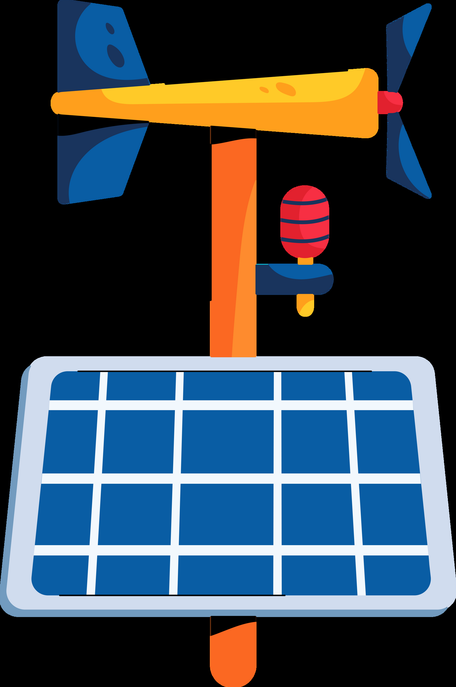
*Caption/Context: Image page_042_fig_02.png*

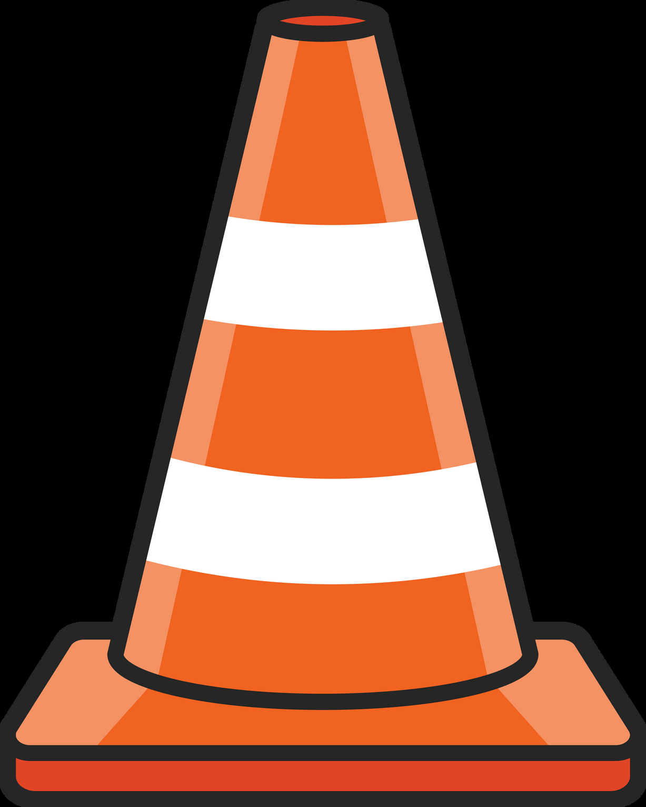
*Caption/Context: Image page_042_fig_03.png*

## --- Page 43 ---

Situational Awareness Check
✅ Do you fully understand the flight plan and airspace rules?
✅ Have you checked the weather conditions and visibility?
✅ Are you aware of nearby obstacles, people, and potential
hazards?
✅ Do you have an emergency plan in case of signal loss or
failure?
Regulatory Compliance Check
✅ Do you have a valid Remote Pilot Certificate (RPC)?
✅ Has the flight been approved by the Digital Sky Platform (if
required)?
✅ Are you complying with DGCA-mandated safety guidelines?

🚨 If you answer "NO" to any of the above, do NOT proceed
with the flight.

43

Drone Pilot Pre-Flight Self-Check

Before operating a drone, pilots must assess their physical,
mental, and environmental conditions to ensure safety.

Personal Health & Readiness Check
✅ Are you physically fit and free from fatigue?
✅ Have you had adequate rest before the flight?
✅ Have you avoided alcohol or drugs in the last 24 hours?
✅ Are you mentally focused and free from distractions or
stress?
✅ Do you have clear vision and no dizziness or headaches?

*Caption/Context: 🚨 If you answer "NO" to any of the above, do NOT proceed with the flight.*

![Situational Awareness Check ✅ Do you fully understand the flight plan and airspace rules? ✅ Have you checked the weather conditions and visibility? ✅ Are you aware of nearby obstacles, people, and potential hazards? ✅ Do you have an emergency plan in case of signal loss or failure? Regulatory Compliance Check ✅ Do you have a valid Remote Pilot Certificate (RPC)? ✅ Has the flight been approved by the Digital Sky Platform (if required)? ✅ Are you complying with DGCA-mandated safety guidelines? | 🚨 If you answer "NO" to any of the above, do NOT proceed with the flight.](images/page_043_fig_02.png)
*Caption/Context: Situational Awareness Check ✅ Do you fully understand the flight plan and airspace rules? ✅ Have you checked the weather conditions and visibility? ✅ Are you aware of nearby obstacles, people, and potential hazards? ✅ Do you have an emergency plan in case of signal loss or failure? Regulatory Compliance Check ✅ Do you have a valid Remote Pilot Certificate (RPC)? ✅ Has the flight been approved by the Digital Sky Platform (if required)? ✅ Are you complying with DGCA-mandated safety guidelines? | 🚨 If you answer "NO" to any of the above, do NOT proceed with the flight.*

![Situational Awareness Check ✅ Do you fully understand the flight plan and airspace rules? ✅ Have you checked the weather conditions and visibility? ✅ Are you aware of nearby obstacles, people, and potential hazards? ✅ Do you have an emergency plan in case of signal loss or failure? Regulatory Compliance Check ✅ Do you have a valid Remote Pilot Certificate (RPC)? ✅ Has the flight been approved by the Digital Sky Platform (if required)? ✅ Are you complying with DGCA-mandated safety guidelines? | 🚨 If you answer "NO" to any of the above, do NOT proceed with the flight.](images/page_043_fig_03.png)
*Caption/Context: Situational Awareness Check ✅ Do you fully understand the flight plan and airspace rules? ✅ Have you checked the weather conditions and visibility? ✅ Are you aware of nearby obstacles, people, and potential hazards? ✅ Do you have an emergency plan in case of signal loss or failure? Regulatory Compliance Check ✅ Do you have a valid Remote Pilot Certificate (RPC)? ✅ Has the flight been approved by the Digital Sky Platform (if required)? ✅ Are you complying with DGCA-mandated safety guidelines? | 🚨 If you answer "NO" to any of the above, do NOT proceed with the flight.*

## --- Page 44 ---

44

Email Format to ATC, AAI, and DGCA for
Permission to Operate in Yellow & Red Zones

Subject: Request for Permission to Operate Drone in [Yellow/Red Zone] –
[Operation Details]

Dear Sir/Madam,
I am writing to formally request permission to operate a drone in the
[Yellow/Red Zone] as marked in the Digital Sky platform. The details of the
operation are as follows:

Operator Name: [Your Full Name/Organization Name]
Remote Pilot Certificate Number: [Your Certificate Number]
Drone UIN: [Drone's Unique Identification Number]
Category and Classification of Drone: [e.g., Rotorcraft – Small]
Purpose of Operation: [Surveying, Mapping, Inspection, etc.]
Date(s) of Operation: [Start Date to End Date]
Time of Operation: [Start Time to End Time in IST (e.g., 09:00 IST – 17:00 IST)]
Place of Operation: [Specific Location Details, e.g., Hyderabad]
Flight Area Radius: [e.g., 500 meters from take-off point]
Altitude of Operation: [Maximum Altitude in Feet/Metres]
Flight Plan Number: [Flight Plan Reference Number]
Flight Plan Details: [Provide a brief description or attach relevant
documentation uploaded on DigitalSky]

I have ensured that the operation complies with DGCA guidelines, mandatory
compliance requirements, and the necessary permissions have been uploaded
into the DigitalSky platform. The operation will adhere to all safety protocols,
and care will be taken to avoid any interference with restricted or prohibited
areas.

I kindly request your approval to proceed with this operation. Please let me
know if you require any additional information or documents to process this
request.

Thank you for your assistance.
Best regards,
[Your Full Name]
[Your Contact Number]
[Your Email Address]

## --- Page 45 ---

45

Email Format to Commissioner of Police or Circle
Inspector Intimating About Drone Operations

Subject: Intimation of Drone Operations in [Location]

Dear [Recipient's Name/Title],
I am writing to inform you about an upcoming drone operation that will be
conducted in your jurisdiction. Below are the details of the operation:

Date of Operation: [Insert Date]
Time of Operation: [Insert Time in IST/UTC]
Location/Place of Operation: [Insert Location]
RPIC Name: [Insert Your Name]
Drone UIN: [Insert UIN]
Classification and Category of Drone: [Insert Drone Details]
Purpose of Operation: [Insert Brief Description]

The operation will be conducted in full compliance with DGCA regulations, and
all safety and privacy protocols will be adhered to. As a DGCA-certified Remote
Pilot, I am committed to ensuring a safe and secure operation with minimal
disturbance to the local environment.

This email serves as an official intimation for your records. Should you require
any further details or clarification, please do not hesitate to contact me.
Thank you for your attention and understanding.

Warm regards,
[Your Full Name]
[Your Contact Information]
[Your Email Address]

Attachments (if required):

Remote Pilot Certificate (RPC)
1.
UIN of the drone
2.

## --- Page 46 ---

46

Email Format to the Representative of the Red
Zone Owner (Other than ATC, AAI, and DGCA)

Subject: Request for Permission to Operate Drone in [Red Zone
Name/Location]

Dear [Representative's Name/Title],
I am seeking your permission to conduct a drone operation within the [Red
Zone Name/Location] under your authority. This operation is essential for
[state purpose of operation], and all necessary safety protocols and regulatory
compliances have been ensured. Below are the operation details:

Operator Name: [Your Full Name/Organization Name]
Remote Pilot Certificate Number: [Your Certificate Number]
Drone UIN: [Drone's Unique Identification Number]
Category and Classification of Drone: [e.g., Rotorcraft – Small]
Purpose of Operation: [Surveying, Mapping, Inspection, etc.]
Date(s) and Time of Operation: [Date and Time in IST]
Place of Operation: [Specific Location Details, e.g., Hyderabad]
Flight Area Radius: [e.g., 500 meters from take-off point]

I assure you that the operation will comply with all DGCA guidelines and local
regulations. I will ensure minimal disruption and prioritize safety throughout
the operation.

I kindly request your approval for this operation and look forward to your
response. Please feel free to contact me if you require any additional details or
documentation.

Thank you for your cooperation.
Best regards,
[Your Full Name]
[Your Contact Number]
[Your Email Address]

Attachments (if required):

Remote Pilot Certificate (RPC)
UIN of the drone
Filed Flight Operation Plan

## --- Page 47 ---

DRONE
COMPONENT

#### ESTIMATED

LIFESPAN
MAINTENANCE TIPS

Propellers
50-100 flights
Check for cracks & replace
when damaged.

Batteries
300-500 charge
cycles

Avoid overcharging & deep
discharge.

Motors
500-1000 hours
Keep dust-free & lubricate
bearings.

ESC (Electronic
Speed Controller)
500+ flights
Avoid overheating & check
connections.

GPS Module
3-5 years
Ensure firmware is
updated.

Camera & Gimbal
3-5 years
Avoid exposure to dust &
moisture.

Airframe & Arms
3-7 years
Inspect for cracks & stress
fractures.

Landing Gear
500+ landings
Check for loose screws &
wear.

47

Estimated Lifespan Table for Drone Parts

Disclaimer
The estimated lifecycle table for drone parts is indicative and may vary
based on the manufacturer's specifications, usage, and maintenance.
Drone pilots must refer to the manufacturer’s guidelines for accurate
information and ensure regular checks and maintenance for safety and
performance.

## --- Page 48 ---

Battery Care Guide for Drones

Proper battery maintenance extends the life of LiPo (Lithium
Polymer) batteries, ensuring optimal drone performance.

Battery Storage & Handling
✅ Store batteries at 40-60% charge when not in use.
✅ Keep batteries in a cool, dry place away from sunlight.
✅ Use fireproof LiPo bags for extra safety.

Charging Best Practices
✅ Use only manufacturer-approved chargers.
✅ Avoid overcharging (never exceed 4.2V per cell).
✅ Do not leave batteries unattended while charging.

Battery Usage & Maintenance
✅ Check for swelling, leaks, or damage before each use.
✅ Avoid flying until battery depletion (land at 20-30% capacity).
✅ Keep battery connectors clean and free of corrosion.

Battery Disposal
✅ Do NOT dispose of batteries in regular trash.
✅ Fully discharge before recycling at authorized centers.
✅ Follow local e-waste disposal regulations.

🚨 Warning: Damaged or swollen batteries can cause fire
hazards. Always handle with care!

48

## --- Page 49 ---

Pre-Flight Checks
Op 1 ✅Op 2 ✅Op 3 ✅Op 4 ✅

Regulatory Compliance

Drone is registered on Digital Sky Platform

Remote Pilot Certificate (RPC) is valid

Flight area is in Green Zone or has
necessary permissions

Equipment Inspection

Battery is fully charged and securely
attached

Propellers, motors, and arms are damage-
free

#### GPS module and compass are functional

Firmware and software are up to date

Environmental & Safety Conditions

Weather conditions are favorable (wind
speed, rain, visibility)

No obstacles, people, or interference
sources in the flight area

Airspace classification checked via Digital
Sky Platform

Controller & Communication Check

Remote controller is fully charged and
connected

Failsafe settings and Return-to-Home (RTH)
altitude set

Before Takeoff

#### IMU and compass calibration completed

#### GPS lock is strong (minimum 7 satellites)

Basic control test performed (throttle, yaw,
pitch, roll)

Takeoff area is clear and safety check is
completed

49

Drone Flight Operation Checklist

## --- Page 50 ---

During Flight Checks
Op 1 ✅
Op 2 ✅
Op 3 ✅
Op 4 ✅

Maintaining Visual Line of Sight
(VLOS) at all times

Battery levels and signal strength
monitored

Drone remains within DGCA-
approved altitude and range

Awareness of surrounding
obstacles and moving hazards

Ready to execute Return-to-Home
(RTH) in case of emergency

Post-Flight Checks
Op 1 ✅Op 2 ✅Op 3 ✅Op 4 ✅

Landing & Shutdown

Drone landed in a safe, designated
area

Battery disconnected after landing

Drone inspected for damage, heating
issues, or wear

Data Logging & Maintenance

Flight logs and maintenance records
updated

Battery charge cycle recorded

Any technical issues noted and
resolved before next flight

50

How to Use This Checklist:

Print this table and use it as a logbook for four consecutive flights.
Checkmark (✅) each box after completing each task.
If any box remains unchecked, resolve the issue before proceeding.
Use this as an essential document for safe and DGCA-compliant
drone operations.

## --- Page 51 ---

51

Step-by-Step Guide for Filling the Remote Pilot
Logbook
Each logbook entry must include the following fields:

Date of Operation (in UTC)
UIN of the Drone
Classification of Drone
Category of the Drone
Who is RPIC (Remote Pilot in Command)
Place of Operation
Time (Flight Duration)
Remarks (Purpose of Operation)
Self Attestation / Signature

Detailed Instructions for Each Field
1. Date of Operation
Record the date of the drone flight.
Time Conversion Requirement:
2. UIN of the Drone
Enter the Unique Identification Number (UIN) assigned to the
drone as per the Digital Sky Platform.
3. Classification of Drone
Choose from one of the official weight-based classifications:
Nano, Micro, Small, Medium, or Large
4. Category of the Drone
Select the operational category of the drone:
Aeroplane, Rotorcraft, or Hybrid
5. Who is RPIC
The Remote Pilot in Command (RPIC) is the individual
responsible for the flight operation.
If you are the RPIC, write “Self.”
If another pilot is in command, mention their full name.

## --- Page 52 ---

6. Place of Operation
Mention the exact location of the drone flight.
You may add GPS coordinates for accurate logging.
Example: Hyderabad, Telangana (17.3850° N, 78.4867° E)

7. Time (Flight Duration) – Step-by-Step Instructions
a. Record Start & End Time in IST:
Write the exact takeoff and landing time in IST (Indian Standard
Time).
b. Convert IST to UTC:
Subtract 5 hours 30 minutes from the recorded IST time.
Example: If the flight starts at 14:00 IST, the converted UTC time
is 08:30 UTC.
c. Calculate Flight Duration:
Subtract the start time (UTC) from the end time (UTC) to get the
raw flight duration.
d. Apply Rounding Rules for Standardized Logging:

Seconds Rounding:
Below 30 seconds → Round down to zero.
30 seconds and above → Round up by adding 1 minute.
Minutes Rounding:
Below 5 minutes → Round up to 5 minutes.
Above 5 minutes → Round up to the nearest 10-minute mark.
📌 Example:

e. Enter the Final Flight Duration in the Logbook.

Raw Duration
Rounded Entry

2 minutes 45 seconds
5 minutes

7 minutes 10 seconds
10 minutes

29 minutes 50 seconds
30 minutes

52

## --- Page 53 ---

53

8. Remarks (Purpose of Operation)
Mention the objective of the flight.
Examples:
“Aerial surveying for urban development”
“Precision agriculture monitoring”
“Cinematic drone shots for event coverage”

9. Self Attestation / Signature
The pilot must sign each entry to confirm that all details are
accurate.

If any errors occur:

Use a Single Strike (Do not erase).
Rewrite the corrected entry next to it.

You can get your Remote Pilot Logbook from Drone Pilots Association of India.

## --- Page 54 ---

54

#### CONCLUSION

We hope this Drone Pilot Knowledge Guide is a vital resource
for empowering drone pilots in India to navigate the rapidly
expanding 
drone 
ecosystem. 
Equipped 
with 
enhanced
awareness, improved standards, and continuous learning,
pilots are set to play a crucial role in shaping the future of
unmanned aviation in the country.

The Drone Pilots Association of India (DPAI) remains committed
to fostering a strong and collaborative drone pilot community.
By 
promoting 
professional 
development, 
encouraging
compliance, and addressing industry challenges, DPAI is
dedicated to elevating the standards of drone operations
across India.

This guide emphasizes the importance of knowledge, safety,
and networking in building a successful career in the drone
industry. As India’s drone landscape grows, skilled and
informed pilots will drive innovation and contribute significantly
to the nation’s leadership in unmanned aviation. Let this guide
inspire your journey toward excellence in this transformative
field.

This guide will continue to evolve, improving its quality to better
guide drone pilots, enhance awareness, and ensure safer and
more accessible understanding of drone operation guidelines in
India. Any grievances, corrections, or suggestions for enhancing
the guide are welcomed and greatly appreciated. Please feel
free to contact us.

## --- Page 55 ---

55

Glossary of Drone Terminologies and Abbreviations

ATC (Air Traffic Control): A service that manages and controls air
traffic to ensure safety and efficiency in the airspace.
AAI (Airports Authority of India): The organization responsible for
managing civil aviation infrastructure and airspace in India.
Autonomous Drone: A drone capable of flying and performing tasks
without direct human intervention.
BVLOS (Beyond Visual Line of Sight): Drone operations conducted
beyond the pilot's direct visual range.
Classification of Drones: Categorization based on weight – Nano
(<250g), Micro (250g–2kg), Small (2kg–25kg), Medium (25kg–150kg),
Large (>150kg).
DGCA (Directorate General of Civil Aviation): The regulatory authority
for civil aviation in India, including drone regulations.
DigitalSky: India’s online platform for drone registration, flight
permissions, and compliance.
Drone Categories: Aeroplanes, Rotorcrafts, and Hybrid drones as
defined under Drone Rules 2021.
FPV (First Person View): A method of drone control where the pilot
uses live video feed from the drone’s camera for navigation.
Payload: The additional weight a drone carries, such as cameras,
sensors, or other equipment.
Remote Pilot Certificate (RPC): A certification required for operating
drones in India, issued after training by DGCA-approved RPTOs.
RPAS (Remotely Piloted Aircraft System): Drones controlled by a
human pilot remotely.
RPTO (Remote Pilot Training Organization): DGCA-authorized
organizations that provide training and certification for drone pilots.
RTH (Return to Home): A safety feature that allows drones to return
to a pre-set location automatically.
TCA (Temporary Controlled Airspace): A restricted airspace created
temporarily for specific purposes.
Type Certification (TC): A certification required for drones to be
legally operated in India, ensuring compliance with quality and safety
standards.

## --- Page 56 ---

56

UIN (Unique Identification Number): A unique registration number
assigned to drones by DGCA.
UTC (Coordinated Universal Time): A time standard used in aviation,
requiring pilots to convert local time (IST) for consistency.
VLOS (Visual Line of Sight): Operations conducted within the pilot's
direct visual range.
Yellow Zone: An airspace requiring special permissions for drone
operations, as marked on DigitalSky.
ADS-B (Automatic Dependent Surveillance-Broadcast): A technology
used for tracking aircraft and drones in real-time by transmitting
location data.
Airworthiness: The ability of a drone to be safely operated in the air,
meeting regulatory and technical standards.
Anti-Collision Lights: Lights installed on drones to enhance visibility
during low-light or night operations.
CPS (Command and Control Link): The communication link between
the drone and its ground control station for sending commands and
receiving telemetry.
CORS (Continuously Operating Reference Stations): Ground stations
used for enhancing GPS accuracy, often useful in drone surveying.
Fail-Safe Mode: A safety mechanism that activates when the drone
loses signal or encounters a system failure, triggering actions like RTH.
Firmware: Software embedded in the hardware of a drone, controlling
its functions and requiring regular updates for optimal performance.
Geo-Fencing: A virtual boundary programmed into a drone's software
to restrict or limit its flight to specific areas.
Gimbal: A device that stabilizes a drone’s camera to produce smooth,
vibration-free footage during flight.
IMU (Inertial Measurement Unit): A drone component that measures
and reports the orientation, acceleration, and rotation of the drone.
LiDAR (Light Detection and Ranging): A sensor technology used in
drones for creating detailed 3D maps and surveying.
LOS (Line of Sight): The direct visual path between the pilot and the
drone during operation.
MTOW (Maximum Take-Off Weight): The heaviest weight a drone can
safely take off with, including its payload and fuel/battery.

## --- Page 57 ---

57

No-Fly Zone (NFZ): Restricted areas where drones are not permitted
to fly, such as near airports, military zones, or sensitive government
locations.
Payload Capacity: The maximum weight a drone can carry as
additional equipment, like sensors, cameras, or cargo.
Propeller Guards: Protective barriers around propellers to reduce
damage and improve safety during flight operations.
Rotorcraft: A category of drones that achieve lift and propulsion
using rotating blades (e.g., quadcopters).
Telemetry: Real-time data transmitted from the drone to the pilot,
including altitude, speed, battery status, and GPS coordinates.
Wind Resistance: A drone's ability to withstand and operate
effectively in windy conditions, measured in wind speed limits.

#### LINKS: DGCA , DigitalSky, Drone Rules 2021 PDF

"The success of a drone mission is
measured not by the height it reaches
but by the safety it maintains for
people and property below."

Please share feedback, improvements, inclusions and
doubts. As this guide is continuous mode of bettering itself.
Any deemed major contributions will be honored with
mentions along with their content reference.

*Caption/Context: Please share feedback, improvements, inclusions and doubts. As this guide is continuous mode of bettering itself. Any deemed major contributions will be honored with mentions along with their content reference.*
