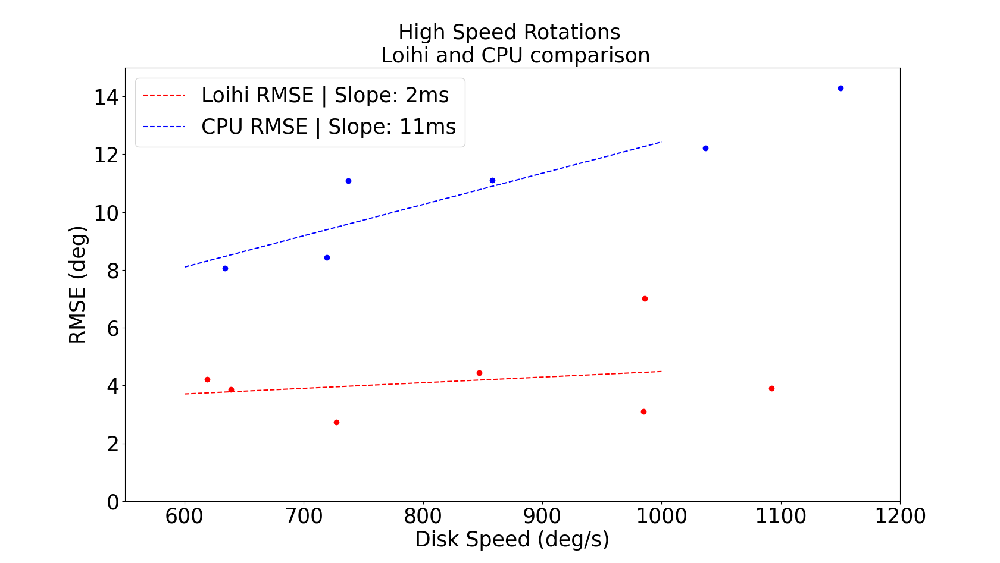

# 2108 03694V2

**Source Document:** `2108.03694v2.pdf`  
**Total Pages:** 7  

---

## --- Page 1 ---

### Section: I INTRODUCTION

This paper has been accepted for publication at the
IEEE International Conference on Robotics and Automation (ICRA), Xi’an, 2021, ©IEEE

Event-driven Vision and Control for UAVs on a Neuromorphic Chip

Antonio Vitale1, Alpha Renner2, Celine Nauer2, Davide Scaramuzza3, and Yulia Sandamirskaya1

Abstract— Event-based vision sensors achieve up to three
orders of magnitude better speed vs. power consumption trade
off in high-speed control of UAVs compared to conventional
image sensors. Event-based cameras produce a sparse stream
of events that can be processed more efficiently and with a
lower latency than images, enabling ultra-fast vision-driven
control. Here, we explore how an event-based vision algorithm
can be implemented as a spiking neuronal network on a
neuromorphic chip and used in a drone controller. We show how
seamless integration of event-based perception on chip leads
to even faster control rates and lower latency. In addition, we
demonstrate how online adaptation of the SNN controller can be
realised using on-chip learning. Our spiking neuronal network
on chip is the first example of a neuromorphic vision-based
controller solving a high-speed UAV control task. The excellent
scalability of processing in neuromorphic hardware opens the
possibility to solve more challenging visual tasks in the future
and integrate visual perception in fast control loops.

#### I. INTRODUCTION

Autonomous unmanned aerial vehicles (UAVs) can po-
tentially solve many tasks, e.g., autonomous infrastructure
monitoring for predictive maintenance, supporting search
and rescue operations, or delivering goods to remote areas.
To be deployed in dynamic and unpredictable real-world
environments, UAVs require fast and efficient perception
and control [1]–[4]. It has been shown that event-based
cameras—visual sensors with asynchronous pixels reporting
local luminance change, inspired by biological retinas [5],
[6]—lead to up to three orders of magnitude faster visual
processing than conventional image-based vision sensors,
while also consuming a few mW of power [4], [7]. Recently,
it has been demonstrated how an event-based camera can
enable tracking of a simple visual pattern with a constrained
UAV at an angular velocity of >1000 degrees per second—
unreachable performance with image-based sensors with on-
board computing [8].

Event-based cameras, such as the Dynamic Vision Sen-
sor (DVS) [9], [10], generate a stream of events from
their pixels instead of conventional image-matrices. Neither
conventional computer vision algorithms nor convolutional
neural networks (CNNs), typically used for advanced visual
perception today, are directly applicable to this type of

1Antonio
Vitale
and
Yulia
Sandamirskaya
are
with
Neuromorphic
Computing
Lab
of
Intel,
Intel
Labs,
Mu-
nich,
Germany
antonio.vitale@outlook.de,
yulia.samdamirskaya@intel.com

2Alpha
Renner
and
Celine
Nauer
are
with
Institute
of
Neu-
roinformatics,
University
of
Zurich
and
ETH
Zurich,
Switzerland
alpren@ini.uzh.ch

2Davide Scaramuzza is with the Robotic Perception Group, at both Insti-
tutes of Informatics, University of Zurich, and Neuroinformatics, University
of Zurich and ETH Zurich, Switzerland sdavide@ifi.uzh.ch

signals [7]. Thus, special event-based vision algorithms have
been developed to extract task-relevant information from the
stream of events [11]–[14]. For neural-network processing,
event-images are usually created by accumulating events in
conventional matrix structures based on fixed time intervals
or a fixed number of events [15]–[18]. Special purpose
accelerators have been proposed to make the processing of
such DNNs efficient for UAV applications [19].

Neuromorphic hardware originates from the same line of
research as the DVS and realizes brain-inspired computing
principles on-chip, such as: neuronal-network based comput-
ing, asynchronous event-based communication of neuronal
activation with “spikes”, temporal dynamics of the state
of neurons, and efficient on-chip learning in form of local
synaptic plasticity. Neuromorphic computing devices—such
as Intel’s neuromorphic research chip Loihi [20] used in
this work and other systems [21], [22]—support event-based
computation directly and enable low-power spiking neural
network architectures with on-chip learning.

Spiking Neural Networks (SNNs) have been previously
explored for vision tasks required for UAV control [23], using
end-to-end learning and CNN to SNN conversion. Here, we
show how an SNN for solving a visual line-tracking task
can be implemented directly on neuromorphic hardware. We
compare the performance of the neuromorphic controller
with the state of the art event-based vision-based controller,
described in [8].

In our previous work, we have introduced both SNN-
based proportional (P) controllers as well as proportional,
integral, derivative (PID) controllers, all implemented in neu-
romorphic hardware [24]–[26]. This work inspired a number
of recent neuromorphic motor control architectures [27]
and continued the long-standing research line of neuronally
inspired motor control methods [28], [29].

In this paper, we bring this work two steps further towards
low-power event-based vision-driven UAV control in real-
world tasks: (1) using the same network architecture as
in
[25], we demonstrate how adaptation of the controller
can be realised in closed loop using on-chip learning rules;
(2) we implement a SNN on Loihi which generates state
estimates directly from the incoming DVS event stream. We
demonstrate improved latency and processing rate compared
to the CPU implementation of the same algorithm.

In contrast to previous work on ultra-fast event-driven
motor control [8], [30], [31], here the DVS events are
input to the neuronal cores of a neuromorphic chip using
an address event representation (AER) interface [32], and
processed directly by the SNN. This enables future research
into more complex SNNs for efficient on-chip perception

arXiv:2108.03694v2  [eess.SY]  19 Aug 2021

## --- Page 2 ---

### Section: II METHODS

to solve different tasks required for autonomous navigation
and mission control: target tracking and obstacle avoidance,
visual odometry, and map formation.

We benchmark different parts of the SNN architecture
and of the overall prototype system and conclude that the
fully neuromorphic perception combined with conventional
PD control can bring out another order of magnitude im-
provement in speed compared to conventional control driven
by event-based vision, while relying on the low and scalable
power-consumption of neuromorphic hardware.

II. METHODS
A. Hardware

1) Neuromorphic hardware (Loihi): In this work, Intel’s
neuromorphic research chip Loihi [20] in the form of a
Kapoho Bay device was integrated on a rotating dual-
copter. Kapoho Bay features two Loihi chips with a total
of 256 neuro-cores in which a total of 262,144 neurons
and up to 260 million synapses can be implemented. Three
embedded x86 processors are used for monitoring and I/O
spike management.

2) Constrained UAV: The same robotic platform was used
as in [8] - a constrained to 1 DoF dual-copter that can rotate
360 degrees in front of an actuated visual pattern. A 3D-
printed holder was designed to mount the Kapoho Bay on
top of the rotating dual-copter. Fig. 1 shows both the mounted
Kapoho Bay as well as a side view of the setup.

Fig. 1: Left: Intel’s Kapoho Bay mounted on top of the dual-
copter. Right: Side view of the entire physical setup.

3) Event Camera: The dual-copter is equipped with a
DAVIS 240C event camera with a spatial resolution of
240x180 pixels and a temporal resolution of the asyn-
chronous event stream of 1µs [9].

As in the previous work, the DAVIS sends the event stream
to the UP board via USB 2.0. According to [33], the duration
of the vision processing, i.e., the elapsed time between an
intensity change to the detection of the event by the on-board
computer, is <5ms.

In addition to this, we explore the possibilities of on-chip
state estimation and control by connecting the DAVIS camera
to the Kapoho Bay via a direct AER [32] interface; the entire
visual processing is done on the Loihi chip in this case.

4) ESCs and Motors:
As in the original setup, the
UP board sends motor commands to a Lumenier F4
AIO flight controller using the universal asynchronous re-
ceiver/transmitter (UART) communication protocol with a

maximum transmission rate of 4.1kHz. The custom firmware
for the flight controller was used that enables communication
with the motors’ electronic speed control (ESC) via the
DShot150 protocol at a maximum rate of 9.4kHz. The ESC
sends pulse-width modulation (PWM) signals to the motors,
where the input voltage to the motors is given by the applied
voltage (12.1V) times the duty cycle of the PWM signal.

The PD controller returns the required rotor thrusts to
achieve the desired roll angle and these thrust values are
converted to input voltages for the motors using a pre-
calibrated thrust-to-duty-cycle mapping. The updated control
commands are sent every 1ms to the flight controller.

5) Rotary Encoders: The dual-copter and disk are both
equipped with CUI AMT22 Modular Absolute Encoders
that measure the ground truth roll angle and velocity. The
encoders have an accuracy of 0.2◦and a precision of 0.1◦.
The encoder transfers angle measurements to the UP board
via Serial Peripheral Interface (SPI) with a maximum data
transmission rate of almost 20kHz.

6) Interfaces, system overview: The neuromorphic device,
Kapoho Bay, was embedded on an UP board featuring an
Intel® ATOM™x5-Z8350 Processor with 64 bits up to
1.92GHz and 4GB of RAM. The UP board was running
Ubuntu 18.04, and the communication between the hardware
was achieved with ROS Kinetic. Python 3.6.9 and version
0.9.9 of the Intel NxSDK were used to set up the SNN on
the Loihi chip. All CPU results reported here were obtained
on this UP board.1

The state variable used for the control loop is the dif-
ference in orientation between the drone and the line on
the disk. We use two ways to obtain this measure: 1) As
in the previous work, an event-based algorithm running on
the UP board processes the event stream to obtain the state
estimation; 2) In order to exploit the advantages brought
by the integration of the neuromorphic sensor with the
neuromorphic processor, we directly connect the DAVIS
camera to the Kapoho Bay and run the visual processing
on-chip.

B. Spiking Neural Network (SNN) for Visual Processing

The Hough transform is a geometry-based computer vision
algorithm for line detection in images [34], [35]. Points
laying on the same line in the Cartesian space are mapped to
intersecting sine curves in the Hough space (the θ-r space).
Therefore, for many points on the same line, the (θ, r) pair
with the highest intersection density represents the correct
line in Cartesian space.

In [8], an efficient version of the Hough transform for
event-based input was used that updated an estimate of
the Hough parameters of the line based on accumulated
events every 1ms using a sliding 3ms window. The state
estimation coming from the vision algorithm was updated at
a rate of 1kHz to match the control command update rate,
and a Kalman filter was used in order to smooth the state
estimation.

1All performance measurements are based on testing as of October 2020
- March 2021 and may not reflect all publicly available security updates.

![1) Neuromorphic hardware (Loihi): In this work, Intel’s neuromorphic research chip Loihi [20] in the form of a Kapoho Bay device was integrated on a rotating dual- copter. Kapoho Bay features two Loihi chips with a total of 256 neuro-cores in which a total of 262,144 neurons and up to 260 million synapses can be implemented. Three embedded x86 processors are used for monitoring and I/O spike management. | 2) Constrained UAV: The same robotic platform was used as in [8] - a constrained to 1 DoF dual-copter that can rotate 360 degrees in front of an actuated visual pattern. A 3D- printed holder was designed to mount the Kapoho Bay on top of the rotating dual-copter. Fig. 1 shows both the mounted Kapoho Bay as well as a side view of the setup.](images/page_002_fig_01.jpeg)
*Caption/Context: 1) Neuromorphic hardware (Loihi): In this work, Intel’s neuromorphic research chip Loihi [20] in the form of a Kapoho Bay device was integrated on a rotating dual- copter. Kapoho Bay features two Loihi chips with a total of 256 neuro-cores in which a total of 262,144 neurons and up to 260 million synapses can be implemented. Three embedded x86 processors are used for monitoring and I/O spike management. | 2) Constrained UAV: The same robotic platform was used as in [8] - a constrained to 1 DoF dual-copter that can rotate 360 degrees in front of an actuated visual pattern. A 3D- printed holder was designed to mount the Kapoho Bay on top of the rotating dual-copter. Fig. 1 shows both the mounted Kapoho Bay as well as a side view of the setup.*

![1) Neuromorphic hardware (Loihi): In this work, Intel’s neuromorphic research chip Loihi [20] in the form of a Kapoho Bay device was integrated on a rotating dual- copter. Kapoho Bay features two Loihi chips with a total of 256 neuro-cores in which a total of 262,144 neurons and up to 260 million synapses can be implemented. Three embedded x86 processors are used for monitoring and I/O spike management. | 2) Constrained UAV: The same robotic platform was used as in [8] - a constrained to 1 DoF dual-copter that can rotate 360 degrees in front of an actuated visual pattern. A 3D- printed holder was designed to mount the Kapoho Bay on top of the rotating dual-copter. Fig. 1 shows both the mounted Kapoho Bay as well as a side view of the setup.](images/page_002_fig_02.jpeg)
*Caption/Context: 1) Neuromorphic hardware (Loihi): In this work, Intel’s neuromorphic research chip Loihi [20] in the form of a Kapoho Bay device was integrated on a rotating dual- copter. Kapoho Bay features two Loihi chips with a total of 256 neuro-cores in which a total of 262,144 neurons and up to 260 million synapses can be implemented. Three embedded x86 processors are used for monitoring and I/O spike management. | 2) Constrained UAV: The same robotic platform was used as in [8] - a constrained to 1 DoF dual-copter that can rotate 360 degrees in front of an actuated visual pattern. A 3D- printed holder was designed to mount the Kapoho Bay on top of the rotating dual-copter. Fig. 1 shows both the mounted Kapoho Bay as well as a side view of the setup.*

## --- Page 3 ---

### Section: II-C The Adaptive SNN PD Controller

Here, we propose a neuromorphic version of the Hough
transform, similar to the previous computational work [36].
The incoming DVS events are integrated in a 2D array of
neurons representing (θ, r). The incoming pixels at location
(x, y) are mapped to all pairs of (θ, r) that parametrize a pos-
sible line intersecting the coordinate (x, y). This effectively
corresponds to doing the Hough transform by application of
a single binary weight matrix to the incoming spikes. Due
to the leaky integration of the neurons in the Hough layer,
binning of spikes into event-frames is not necessary.

DVS events are injected into neuronal cores in small
batches at a fixed timestep duration. The state estimate is
obtained at the same rate that correspond to the timestep
duration. In our implementation, the computational timestep
on the Loihi was 50µs, thus allowing the state update rate
of 20kHz, i.e. 20 times faster the required by the CPU
controller. Instead of using a Kalman filter to smooth the
estimate and to match the control command rate of 1kHz, a
sliding average window with the size of 200 elements was
applied to the raw signal at 20kHz and thus down-sampled
to 1kHz.

The binary connection matrix for the Hough transform is
computed according equation r = x · cos θ + y · sin θ. An
excitatory synapse connects each pair of (θ, r) and (x, y),
for which the equation holds. The continuous values for r
are mapped on equally spaced bins of 10 pixels for r ∈
(−200, 200), and the angles θ were mapped in the range
θ ∈(−90◦, 90◦). Using a population of 90 neurons resulted
in a resolution of 2◦/neuron .

The full SNN for the angular error estimation is illustrated
in Fig. 2: the event-stream generated by the DVS camera (a)
mounted on the drone pointing at a black-and-white pattern is
down-sampled by a factor of 4 using an efficient 2-bit shift
operation on the x86 co-processor on Loihi and then sent
to the first layer of neurons (b) on the Loihi’s neuro-cores.
Neurons in layer (b) represent events in Cartesian Space of
the camera frame; they are connected to neurons in layer (c)
that represent events in the Hough Space – according to the
generated connectivity pattern. In order to accumulate events
to generate an estimate for the current line orientation in the
Hough space, the neurons in the 2D population (c) have a
decay time of 3 timesteps and a threshold of Vthreshold =
20 · Wgt, where Wgt is the strength of the incoming weight,
i.e. the update magnitude for each spike. This means that at
least 20 events must lie on the same line within 3 timesteps,
or 3 · 50µs = 150µs, to generate an angle estimate.

In the layer (d) in Fig. 2, the 2D (θ, r) space is read
out in θ direction by connecting all neurons that correspond
to the same θ to a respective readout (“angle”) neuron, as
seen in layer (d). These neurons are then connected to a
second population (e) of angle neurons that has the purpose
of cleaning up activity in case several neurons are firing at
the same time.

The last of the three angle layers (f) acts as a memory
due to self-excitatory connections storing the activity from
the previous time step. This is needed in case the disk does
not move and the event camera does not produce enough

coherent spikes to bring the neurons in the Hough space
above threshold. A new input, however, overwrites the stored
angle by all-to-all inhibitory connectivity.

y
r

Ө
x

b)
a)
c)

d)
e)
f)

Fig. 2: On-Chip visual processing: a spiking neuronal net-
work implementing the Hough transform on Loihi. The
visual processing, from incoming events to estimated angle,
on Loihi takes 250µs. This corresponds to the time needed
for events to be processed by the 5-layer network shown
above with a computational timestep of 50µs.

C. The Adaptive SNN PD Controller

1) Controller implementation: The SNN used to control
the drone’s position is based on our previous work [25] and
[26], however, the on-chip SNN controller was simplified
here: the two inputs to the controller are directly provided
by the visual module (in CPU) as the angular error and its
derivative. Also, in order to compare the CPU PD controller
and the Loihi controller, only a PD controller was used, thus
allowing to omit the whole integration pathway introduced
in [25]. Instead, we introduce an adaptive term in the
controller that modifies the controller output in case the PD
controller fails to remove the error (e.g., due to added load).

Since in our previous work we used a dual-copter moving
at slower velocities and constrained to angles ∈(−25◦, 25◦),
in addition to the faster computation time resulting from a
better hardware integration, two major improvements were
vital to obtain good performance on this faster platform:
1) More efficient allocation of neuron compartments on the
neuro-cores allowed us to increase the population resolution
and thus achieve more precise control and a larger range of
commands. The neuron populations size was increased from
N = 63 to N = 361 for the error and motor command
populations.
2) The SNN output was obtained at a higher rate via a faster
output communication channel between the neuromorphic
processor and the host computer (UP board) using direct
memory access instead of channel communication over the
embedded CPU: the readout time decreased from ≈1.5ms
to ≈0.05ms.

The spikes in the output population of the controller u
encode the motor commands following the position encod-
ing. Thus, the index of the firing neuron, idx ∈[0, 360], is
decoded into the thrust difference according to Eq. 1. Here,

![Here, we propose a neuromorphic version of the Hough transform, similar to the previous computational work [36]. The incoming DVS events are integrated in a 2D array of neurons representing (θ, r). The incoming pixels at location (x, y) are mapped to all pairs of (θ, r) that parametrize a pos- sible line intersecting the coordinate (x, y). This effectively corresponds to doing the Hough transform by application of a single binary weight matrix to the incoming spikes. Due to the leaky integration of the neurons in the Hough layer, binning of spikes into event-frames is not necessary. | The binary connection matrix for the Hough transform is computed according equation r = x · cos θ + y · sin θ. An excitatory synapse connects each pair of (θ, r) and (x, y), for which the equation holds. The continuous values for r are mapped on equally spaced bins of 10 pixels for r ∈ (−200, 200), and the angles θ were mapped in the range θ ∈(−90◦, 90◦). Using a population of 90 neurons resulted in a resolution of 2◦/neuron .](images/page_003_fig_01.png)
*Caption/Context: Here, we propose a neuromorphic version of the Hough transform, similar to the previous computational work [36]. The incoming DVS events are integrated in a 2D array of neurons representing (θ, r). The incoming pixels at location (x, y) are mapped to all pairs of (θ, r) that parametrize a pos- sible line intersecting the coordinate (x, y). This effectively corresponds to doing the Hough transform by application of a single binary weight matrix to the incoming spikes. Due to the leaky integration of the neurons in the Hough layer, binning of spikes into event-frames is not necessary. | The binary connection matrix for the Hough transform is computed according equation r = x · cos θ + y · sin θ. An excitatory synapse connects each pair of (θ, r) and (x, y), for which the equation holds. The continuous values for r are mapped on equally spaced bins of 10 pixels for r ∈ (−200, 200), and the angles θ were mapped in the range θ ∈(−90◦, 90◦). Using a population of 90 neurons resulted in a resolution of 2◦/neuron .*

## --- Page 4 ---

### Section: II-C.2 Adaptation Pathway

Tmin, Tmax = ±1850, and N is the number of neurons in
the output population:

u = idx

N · (Tmax −Tmin) + Tmin.
(1)

The controller output is further converted in software to a
thrust difference according to the equations:

u = KP · θ + KD · ˙θ,

T = cT ± (u

2 + bT ),
(2)

where T is the thrust; the constant cT = 0.4 · Tbaseline =
2880 ensures that the motors are always returning a baseline
thrust. The thrust bias bT = 170 is an empirically chosen
value; u ∈[−3700, 3700] is the controller output.

2) Adaptation Pathway: On-chip learning on Loihi en-
ables adaption of the neuromorphic controller by using
synaptic plasticity rules. Adaptive CPU controllers rely on
monitoring the plant behavior and modifying the controller
parameters accordingly. On the Loihi chip, adaptation is real-
ized by exploiting the plastic connections between compart-
ments (neurons) directly on the processor, only minimally
increasing the processing overhead.

To test this capability, we introduced a constant, static
disturbance to the plant, i.e. added a weight to one side of the
drone. To compensate for this a-priori unknown disturbance,
we use an additive feed-forward layer that connects the
input population θ to the output u. A similar approach was
previously proposed for neuromorphic adaptive control of a
robotic arm [28].

The adaptive path should compensate for extended periods
of large steady-state errors. Thus, it needs to monitor the
error signal over time. If the accumulated error exceeds a
threshold, then the feed-forward term should increase or
decrease appropriately. The adaptive mechanism is regulated
by the integral in Eq. (3). The monitoring period, ∆T, and
the cumulative error threshold, ϵ, are parameters which are
empirically selected:

1
∆T

Z t+∆T

t

err2(t)dt < ϵ.
(3)

In the network, we need to compute the integral in
Eq. 3 using positional coding in the SNN. Fig. 3 illustrates
an equivalent SNN-pipeline: the neuronal population that
represents the error signal, err(t) = ∆θ, is connected to
two neurons: one accumulating positive errors, R+, and one
– negative errors, R−. These neurons have the activation
thresholds and decay constants such that they only fire if the
accumulated error reaches a threshold value. Each neuron
in the ∆θ (error) population is connected to the R+/R−
neurons with a weight proportional to the error magnitude
that the respective neuron represents: neurons closer to the
center of the population, representing small errors, have a
small weight and neurons on the periphery of the population
(top and bottom in Fig. 3) are connected with larger weights.

The R-neurons are connected to two intermediate neu-
rons, FF+, FF−, which are respectively connected with
positive and negative weights to the population B and are
thus responsible for increasing and decreasing the feed-
forward term. The population B uses a special form of

position encoding: depending on the represented value (of
the integrated error), more or less neurons are active in this
population. To achieve this, neurons in B have different
activation thresholds (ordered from bottom to top in Fig. 3).

Learning on Loihi is realised by local synaptic plasticity
rules that can be programmed by the user. The learning rule
can be composed by a combination of pre- and post-synaptic
spikes, auxiliary variables representing recent activity, and a
third factor, called the reinforcement channel. The R-neurons
are connected to the reinforcement channel of the synapses
between the FF+/FF−neurons and the B population in
such a way that when the R neurons fire, the synaptic weight
changes according to the learning rule ∆W = W ± δR(t)
where δR(t) = 1 if the corresponding R neuron is firing,
δR(t) = 0 otherwise.

Fig. 3 shows the schematic of the adaptation pathway
which runs in parallel to the full SNN PD controller.

Fig. 3: Schematic of SNN Adaptation Pathway: Purple lines
show currently active plastic synapses.

D. SNN Input/Output Encoding/Decoding

In order to send spikes to the Loihi chip, the host CPU
(UP Board) communicates with one of the embedded pro-
cessors of the Kapoho Bay using communication channels
programmed with Intel’s neuromorphic API NxSDK. To
obtain the network output, the output spikes are sent to a
FIFO file and read from the host computer.

When running the visual processing on Loihi, the output
layer represents the angular offset between the drone and the
disk. In order to keep the computation latency as small as
possible, this angular offset was read out from the FIFO
file on the host computer and then used as input to a
PD controller running on the CPU. The current spiking
index ∈(0, 90) is linearly mapped to the angle range
θ ∈(−90◦, +90◦). For comparison: the control-loop running
fully on CPU returns angle estimates θ ∈(−180◦, +180◦)
and uses KP = 3000 and KD = 900, while the control-loop
running the visual processing on Loihi uses KP = 2000 and
KD = 600 for angle estimates θ ∈(−90◦, +90◦).

For the experiments done with the adaptive SNN Con-
troller, where the vision-part of the controller was not the
primary objective, the input to the SNN in Fig. 3 is the
encoder on the drone’s joint. In this case, the correspond-

![where T is the thrust; the constant cT = 0.4 · Tbaseline = 2880 ensures that the motors are always returning a baseline thrust. The thrust bias bT = 170 is an empirically chosen value; u ∈[−3700, 3700] is the controller output. | 1 ∆T](images/page_004_fig_01.png)
*Caption/Context: where T is the thrust; the constant cT = 0.4 · Tbaseline = 2880 ensures that the motors are always returning a baseline thrust. The thrust bias bT = 170 is an empirically chosen value; u ∈[−3700, 3700] is the controller output. | 1 ∆T*

## --- Page 5 ---

### Section: II-E Experiments

ing neurons receive an input spike from the on-chip spike
generator according to the current roll angle of the drone.

E. Experiments

First, we demonstrate that the neuromorphic controller is
able to perform with similar speed and accuracy as the state
of the art event-driven CPU controller in an extreme control
scenario, such as controlling a drone moving at high speeds.
In order to maintain the disk at different constant speeds, a
motorized wheel was attached to the axis of the disk and
the rotational speed was kept constant for 10s. To ignore
initial transient effects, the analysis of the data was done
only for the second half (5s) of the experiment. To quantify
the performance, the RMSE between the reading on the disk
and drone encoders was calculated after correction for the
delay, induced by the overall motor plant (on order of 100-
150ms).
To quantify the ability of the on-chip plasticity to adapt
control parameters online, a reference trajectory was imposed
on the drone to bring it to different target angles with an
additional weight of 125g attached to one side of the drone’s
arm. The experiments were done once using the CPU PD
controller and once using the adaptive SNN PD controller.
In order to quantify the performance, we calculate the RMSE
over a set of runs when using the adaptive SNN and the non-
adaptive CPU controller.

#### III. RESULTS

Fig. 4: The processing pipeline and vision-driven controller
latency and update rate.

A. Controller performance: High Speed Control

Here we test the ability of the drone to track the horizon
rotating at different speeds. As expected, the controller which
obtains the state estimation from Loihi can track higher
speeds (of up to 1200 deg/sec) with a lower error than
the controller with visual feedback computed in software
running on the CPU. This increased performance relies on
the visual processing running 20-times faster on Loihi than
on the CPU (20kHz vs. 1kHz update rate). This allows for
a more accurate estimate at high rotation speeds, ultimately
leading to a slower error increase at raising speed, as can be
seen from the plot in Fig. 5. At lower speeds, we observed
worse performance of the SNN-based angle estimation: the
network’s parameters were tuned for high speeds in our

setup, hinting at the need for several controllers for different
operation regimes.2

Fig. 6 shows the closed-loop response when using the
Loihi or the CPU to obtain an angle estimate from the visual
feedback. In this experiment, the disk with the visual pattern
was turned manually and the controller moved the drone to
align it with the horizon line. One can observe that both
controllers can solve the task. The delay of the motor plant
of the drone is on the order of 100-150ms, thus the speed of
our SNN controller is under-exploited on this relatively slow
system.

Fig. 5: RMSE when tracking the horizon using the CPU and
Loihi visual processing at different angular velocities.

Fig. 6: Top: Line tracking using the Loihi visual processing
as controller input. Bottom: Line tracking using the CPU
visual processing as controller input.

B. Controller performance: Adaptive Control

In this series of experiments, we demonstrate the value
of implementing the SNN controller in neuromorphic hard-
ware, namely the possibility to explore on-chip learning
to autonomously adjust the controller in teh closed loop.
Fig. 7 shows the performance of the CPU PD and SNN
PD controller with adaptation when holding a set angular
position using encoder feedback. Both controllers can solve
this task: the obtained RMSE (Table I) for the two controllers
are similar, whereby a slightly increased error is noticeable

2The result at low rotation speed could not be obtained in the same
motorized setup due to an experimental limitation in disk actuation.

![First, we demonstrate that the neuromorphic controller is able to perform with similar speed and accuracy as the state of the art event-driven CPU controller in an extreme control scenario, such as controlling a drone moving at high speeds. In order to maintain the disk at different constant speeds, a motorized wheel was attached to the axis of the disk and the rotational speed was kept constant for 10s. To ignore initial transient effects, the analysis of the data was done only for the second half (5s) of the experiment. To quantify the performance, the RMSE between the reading on the disk and drone encoders was calculated after correction for the delay, induced by the overall motor plant (on order of 100- 150ms). To quantify the ability of the on-chip plasticity to adapt control parameters online, a reference trajectory was imposed on the drone to bring it to different target angles with an additional weight of 125g attached to one side of the drone’s arm. The experiments were done once using the CPU PD controller and once using the adaptive SNN PD controller. In order to quantify the performance, we calculate the RMSE over a set of runs when using the adaptive SNN and the non- adaptive CPU controller. | III. RESULTS](images/page_005_fig_01.png)
*Caption/Context: First, we demonstrate that the neuromorphic controller is able to perform with similar speed and accuracy as the state of the art event-driven CPU controller in an extreme control scenario, such as controlling a drone moving at high speeds. In order to maintain the disk at different constant speeds, a motorized wheel was attached to the axis of the disk and the rotational speed was kept constant for 10s. To ignore initial transient effects, the analysis of the data was done only for the second half (5s) of the experiment. To quantify the performance, the RMSE between the reading on the disk and drone encoders was calculated after correction for the delay, induced by the overall motor plant (on order of 100- 150ms). To quantify the ability of the on-chip plasticity to adapt control parameters online, a reference trajectory was imposed on the drone to bring it to different target angles with an additional weight of 125g attached to one side of the drone’s arm. The experiments were done once using the CPU PD controller and once using the adaptive SNN PD controller. In order to quantify the performance, we calculate the RMSE over a set of runs when using the adaptive SNN and the non- adaptive CPU controller. | III. RESULTS*

*Caption/Context: E. Experiments | III. RESULTS*

![First, we demonstrate that the neuromorphic controller is able to perform with similar speed and accuracy as the state of the art event-driven CPU controller in an extreme control scenario, such as controlling a drone moving at high speeds. In order to maintain the disk at different constant speeds, a motorized wheel was attached to the axis of the disk and the rotational speed was kept constant for 10s. To ignore initial transient effects, the analysis of the data was done only for the second half (5s) of the experiment. To quantify the performance, the RMSE between the reading on the disk and drone encoders was calculated after correction for the delay, induced by the overall motor plant (on order of 100- 150ms). To quantify the ability of the on-chip plasticity to adapt control parameters online, a reference trajectory was imposed on the drone to bring it to different target angles with an additional weight of 125g attached to one side of the drone’s arm. The experiments were done once using the CPU PD controller and once using the adaptive SNN PD controller. In order to quantify the performance, we calculate the RMSE over a set of runs when using the adaptive SNN and the non- adaptive CPU controller. | A. Controller performance: High Speed Control](images/page_005_fig_03.png)
*Caption/Context: First, we demonstrate that the neuromorphic controller is able to perform with similar speed and accuracy as the state of the art event-driven CPU controller in an extreme control scenario, such as controlling a drone moving at high speeds. In order to maintain the disk at different constant speeds, a motorized wheel was attached to the axis of the disk and the rotational speed was kept constant for 10s. To ignore initial transient effects, the analysis of the data was done only for the second half (5s) of the experiment. To quantify the performance, the RMSE between the reading on the disk and drone encoders was calculated after correction for the delay, induced by the overall motor plant (on order of 100- 150ms). To quantify the ability of the on-chip plasticity to adapt control parameters online, a reference trajectory was imposed on the drone to bring it to different target angles with an additional weight of 125g attached to one side of the drone’s arm. The experiments were done once using the CPU PD controller and once using the adaptive SNN PD controller. In order to quantify the performance, we calculate the RMSE over a set of runs when using the adaptive SNN and the non- adaptive CPU controller. | A. Controller performance: High Speed Control*

## --- Page 6 ---

### Section: IV CONCLUSIONS

for the experiments done with the SNN controller. This is due
to the limited output resolution of the SNN controller (360
values) causing small oscillations around the set-points. The
RMSEs were obtained by averaging over runs of 10 seconds
each.

The bottom plots in Fig. 7 demonstrate how the adaptation,
implemented using synaptic plasticity on the neuromorphic
chip, helps to remove the offset induced by an additional
weight of 125g mounted on one of the UAV’s arms. The
plots show the roll of the drone at different target roll
angles. From the blue traces in Fig. 7, as well as from the
obtained errors for the CPU controller reported in Table I,
it is clear that this additional weight of 125g represents a
strong disturbance. Without adaptation, a persistent steady-
state error of roughly 20◦is observed, while the adaptation
in the SNN controller removes this offset. With the added
weight, the CPU controller’s average error increases roughly
by a factor of 2-3, while the adaptive controller manages to
maintain the same error as without the disturbance. Note,
the behavior of the adaptive controller here depends on the
direction of the perturbation relative to the set point, showing
the limitation of a simple single-value adaptive term. State-
dependent adaptation can be explored in the SNN in future
work.

Fig. 7: Adaptive control experiments (without vision). Top:
A trial run to illustrate the similar accuracy of both con-
trollers. Bottom: Left Two trial runs using the software
controller with the additional weight mounted to the drone,
without adaptation. Right Same two trial runs using the
adaptive SNN controller.

#### IV. CONCLUSIONS

In this paper, we have shown how neuromorphic vision-
driven high-speed control can be implemented in prac-
tice. We presented the first neuromorphic controller with
event-based visual feedback computed on a neuromorphic

#### TABLE I: Accuracy of PD Controllers

Controller
RMSE (deg)

Step
+20◦
-20◦
+30◦
-30◦
+40◦
-40◦

No Added Weight

Adaptive SNN PD
6.9
12.3
8.2
13.2
11.4
13.9
Non-adaptive CPU PD
6.9
7.7
8.5
9.2
9.4
11.5
With Weight
Adaptive SNN PD
6.9
9.9
8.6
10.8
8.5
16.0
Non-adaptive CPU PD
22.3
21.9
19.6
20.3
20.6
19.7

chip. The controller outperforms a state-of-the-art high-speed
event-driven controller.

By integrating the event-based vision sensor more tightly
with neuromorphic processors, we removed one of the bot-
tlenecks in unleashing the full functionality of neuromorphic
vision-driven control. The complexity of the visual task
can be increased now by using large SNNs on chip, while
maintaining lower latencies and lower power consumption,
supported by good scaling properties of parallel and asyn-
chronous neuromorphic hardware [20].

We also explored the possibilities of on-chip learning,
enabled on Intel’s Loihi chip, when dealing with external
disturbances.

In the next iteration of our work, we aim to scale up the
visual processing on the neuromorphic chip to solve more
advanced vision tasks, such as place recognition or obstacle
detection. We will further develop on-chip learning capability
of the network to realize non-linear adaptive control.

#### ACKNOWLEDGMENT

We thank Adrian Paeckel, Rebh¨usli Team for helping with
the 3D printed parts; Thomas L¨angle and RPG team of
UZH for support with the drone, and Intel’s Neuromorphic
Research Community for fruitful discussions and support.

#### REFERENCES

[1] G. Loianno, D. Scaramuzza, and V. Kumar, “Special issue on high-

speed vision-based autonomous navigation of uavs,” Journal of Field
Robotics, vol. 1, no. 1, pp. 1–3, 2018.
[2] J. Delmerico, S. Mintchev, A. Giusti, B. Gromov, K. Melo, T. Horvat,

C. Cadena, M. Hutter, A. Ijspeert, D. Floreano et al., “The current
state and future outlook of rescue robotics,” Journal of Field Robotics,
vol. 36, no. 7, pp. 1171–1191, 2019.
[3] D. Falanga, S. Kim, and D. Scaramuzza, “How fast is too fast? the role

of perception latency in high-speed sense and avoid,” IEEE Robotics
and Automation Letters, vol. 4, no. 2, pp. 1884–1891, 2019.
[4] D. Falanga, K. Kleber, and D. Scaramuzza, “Dynamic obstacle avoid-

ance for quadrotors with event cameras,” Science Robotics, vol. 5,
no. 40, 2020.
[5] M. Mahowald, “The silicon retina,” in An Analog VLSI System for

Stereoscopic Vision.
Springer, 1994, pp. 4–65.
[6] P. Lichtsteiner, C. Posch, and T. Delbruck, “A 128 X 128 120db

30mw asynchronous vision sensor that responds to relative intensity
change,” 2006 IEEE International Solid State Circuits Conference
- Digest of Technical Papers, pp. 2004–2006, 2006. [Online].
Available: http://siliconretina.ini.uzh.ch/wiki/lib/exe/fetch.php?media=
lichtsteiner{ }isscc2006{ }d27{ }09.pdf
[7] G. Gallego, T. Delbruck, G. Orchard, C. Bartolozzi, B. Taba, A. Censi,

S. Leutenegger, A. Davison, J. Conradt, K. Daniilidis et al., “Event-
based vision: A survey,” IEEE Transactions on Pattern Analysis and
Machine Intelligence (T-PAMI), 2020.
[8] R. S. Dimitrova, M. Gehrig, D. Brescianini, and D. Scaramuzza,

“Towards low-latency high-bandwidth control of quadrotors using
event cameras,” in 2020 IEEE International Conference on Robotics
and Automation (ICRA).
IEEE, 2020, pp. 4294–4300.

![The bottom plots in Fig. 7 demonstrate how the adaptation, implemented using synaptic plasticity on the neuromorphic chip, helps to remove the offset induced by an additional weight of 125g mounted on one of the UAV’s arms. The plots show the roll of the drone at different target roll angles. From the blue traces in Fig. 7, as well as from the obtained errors for the CPU controller reported in Table I, it is clear that this additional weight of 125g represents a strong disturbance. Without adaptation, a persistent steady- state error of roughly 20◦is observed, while the adaptation in the SNN controller removes this offset. With the added weight, the CPU controller’s average error increases roughly by a factor of 2-3, while the adaptive controller manages to maintain the same error as without the disturbance. Note, the behavior of the adaptive controller here depends on the direction of the perturbation relative to the set point, showing the limitation of a simple single-value adaptive term. State- dependent adaptation can be explored in the SNN in future work. | By integrating the event-based vision sensor more tightly with neuromorphic processors, we removed one of the bot- tlenecks in unleashing the full functionality of neuromorphic vision-driven control. The complexity of the visual task can be increased now by using large SNNs on chip, while maintaining lower latencies and lower power consumption, supported by good scaling properties of parallel and asyn- chronous neuromorphic hardware [20].](images/page_006_fig_01.png)
*Caption/Context: The bottom plots in Fig. 7 demonstrate how the adaptation, implemented using synaptic plasticity on the neuromorphic chip, helps to remove the offset induced by an additional weight of 125g mounted on one of the UAV’s arms. The plots show the roll of the drone at different target roll angles. From the blue traces in Fig. 7, as well as from the obtained errors for the CPU controller reported in Table I, it is clear that this additional weight of 125g represents a strong disturbance. Without adaptation, a persistent steady- state error of roughly 20◦is observed, while the adaptation in the SNN controller removes this offset. With the added weight, the CPU controller’s average error increases roughly by a factor of 2-3, while the adaptive controller manages to maintain the same error as without the disturbance. Note, the behavior of the adaptive controller here depends on the direction of the perturbation relative to the set point, showing the limitation of a simple single-value adaptive term. State- dependent adaptation can be explored in the SNN in future work. | By integrating the event-based vision sensor more tightly with neuromorphic processors, we removed one of the bot- tlenecks in unleashing the full functionality of neuromorphic vision-driven control. The complexity of the visual task can be increased now by using large SNNs on chip, while maintaining lower latencies and lower power consumption, supported by good scaling properties of parallel and asyn- chronous neuromorphic hardware [20].*

*Caption/Context: Fig. 7: Adaptive control experiments (without vision). Top: A trial run to illustrate the similar accuracy of both con- trollers. Bottom: Left Two trial runs using the software controller with the additional weight mounted to the drone, without adaptation. Right Same two trial runs using the adaptive SNN controller. | IV. CONCLUSIONS*

## --- Page 7 ---

[9] C. Brandli, R. Berner, M. Yang, S.-C. Liu, and T. Delbruck, “A

240x180 130db 3µs latency global shutter spatiotemporal vision
sensor,” IEEE J. Solid-State Circuits, vol. 49, no. 10, p. 23332341,
2014.
[10] T. Finateu, A. Niwa, D. Matolin, K. Tsuchimoto, A. Mascheroni,

E. Reynaud, P. Mostafalu, F. Brady, L. Chotard, F. LeGoff et al., “5.10
a 1280× 720 back-illuminated stacked temporal contrast event-based
vision sensor with 4.86 µm pixels, 1.066 geps readout, programmable
event-rate controller and compressive data-formatting pipeline,” in
2020 IEEE International Solid-State Circuits Conference-(ISSCC).
IEEE, 2020, pp. 112–114.
[11] G. D’Angelo, E. Janotte, T. Schoepe, J. O’Keeffe, M. B. Milde,

E. Chicca, and C. Bartolozzi, “Event-Based Eccentric Motion Detec-
tion Exploiting Time Difference Encoding,” Frontiers in Neuroscience,
vol. 14, no. May, pp. 1–14, 2020.
[12] S. Afshar, T. Julia Hamilton, J. Tapson, A. Van Schaik, and G. Co-

hen, “Investigation of event-based surfaces for high-speed detection,
unsupervised feature extraction, and object recognition,” Frontiers in
Neuroscience, vol. 13, no. JAN, pp. 1–19, 2019.
[13] S.-C. Liu, B. Rueckauer, E. Ceolini, A. Huber, and T. Delbruck,

“Event-driven sensing for efficient perception: Vision and audition
algorithms,” IEEE Signal Processing Magazine, vol. 36, no. 6, pp.
29–37, 2019.
[14] H. Akolkar, S. H. Ieng, and R. Benosman, “Real-time high speed

motion prediction using fast aperture-robust event-driven visual flow,”
IEEE Transactions on Pattern Analysis and Machine Intelligence,
2020.
[15] N. De Rita, A. Aimar, and T. Delbruck, “Cnn-based object detection

on low precision hardware: Racing car case study,” in 2019 IEEE
Intelligent Vehicles Symposium (IV).
IEEE, 2019, pp. 647–652.
[16] D. Gehrig, A. Loquercio, K. G. Derpanis, and D. Scaramuzza, “End-

to-end learning of representations for asynchronous event-based data,”
in Proceedings of the IEEE International Conference on Computer
Vision, 2019, pp. 5633–5643.
[17] H. Rebecq, R. Ranftl, V. Koltun, and D. Scaramuzza, “High speed and

high dynamic range video with an event camera,” IEEE Transactions
on Pattern Analysis and Machine Intelligence, 2019.
[18] A. I. Maqueda, A. Loquercio, G. Gallego, N. Garc´ıa, and D. Scara-

muzza, “Event-based vision meets deep learning on steering prediction
for self-driving cars,” in Proceedings of the IEEE Conference on
Computer Vision and Pattern Recognition, 2018, pp. 5419–5427.
[19] D. Palossi, A. Loquercio, F. Conti, E. Flamand, D. Scaramuzza,

and L. Benini, “A 64-mw dnn-based visual navigation engine for
autonomous nano-drones,” IEEE Internet of Things Journal, vol. 6,
no. 5, pp. 8357–8371, 2019.
[20] M. Davies, N. Srinivasa, T.-H. Lin, G. Chinya, Y. Cao, S. H. Choday,

G. Dimou, P. Joshi, N. Imam, S. Jain et al., “Loihi: A neuromorphic
manycore processor with on-chip learning,” IEEE Micro, vol. 38, no. 1,
pp. 82–99, 2018.
[21] S. B. Furber, D. R. Lester, L. A. Plana, J. D. Garside, E. Painkras,

S. Temple, and A. D. Brown, “Overview of the SpiNNaker System
Architecture,” IEEE Transactions on Computers, vol. 62, no. 12, pp.
2454–2467, 2012.
[22] N. Qiao, H. Mostafa, F. Corradi, M. Osswald, F. Stefanini, D. Sum-

islawska, and G. Indiveri, “A reconfigurable on-line learning spiking
neuromorphic processor comprising 256 neurons and 128k synapses,”
Frontiers in neuroscience, vol. 9, p. 141, 2015.
[23] M. Gehrig, S. B. Shrestha, D. Mouritzen, and D. Scaramuzza, “Event-

based angular velocity regression with spiking networks,” arXiv
preprint arXiv:2003.02790, 2020.
[24] S. Glatz, J. Martel, R. Kreiser, N. Qiao, and Y. Sandamirskaya, “Adap-

tive motor control and learning in a spiking neural network realised
on a mixed-signal neuromorphic processor,” in 2019 International
Conference on Robotics and Automation (ICRA).
IEEE, 2019, pp.
9631–9637.
[25] R. K. Stagsted, A. Vitale, A. Renner, L. B. Larsen, A. L. Christensen,

and Y. Sandamirskaya, “Event-based pid controller fully realized in
neuromorphic hardware: A one dof study.” in IEEE/RSJ International
Conference on Intelligent Robots and Systems (IROS), 2020.
[26] R. K. Stagsted, A. Vitale, J. Binz, A. Renner, L. B. Larsen, and

Y. Sandamirskaya, “Towards neuromorphic control: A spiking neural
network based pid controller for uav.” in Robotics: Science and
Systems, 2020.
[27] J. Zhao, N. Risi, M. Monforte, C. Bartolozzi, G. Indiveri, and

E. Donati, “Closed-loop spiking control on a neuromorphic processor
implemented on the icub,” arXiv preprint arXiv:2009.09081, 2020.
[28] T. DeWolf, P. Jaworski, and C. Eliasmith, “Nengo and low-power

ai hardware for robust, embedded neurorobotics,” arXiv preprint
arXiv:2007.10227, 2020.
[29] F. Perez-Pe˜na, A. Morgado-Estevez, A. Linares-Barranco, A. Jimenez-

Fernandez, F. Gomez-Rodriguez, G. Jimenez-Moreno, and J. Lopez-
Coronado, “Neuro-inspired spike-based motion: from dynamic vision
sensor to robot motor open-loop control through spike-vite,” Sensors,
vol. 13, no. 11, pp. 15 805–15 832, 2013.
[30] J. Conradt, M. Cook, R. Berner, P. Lichtsteiner, R. J. Douglas, and

T. Delbruck, “A pencil balancing robot using a pair of aer dynamic
vision sensors,” in 2009 IEEE International Symposium on Circuits
and Systems.
IEEE, 2009, pp. 781–784.
[31] T. Delbruck and M. Lang, “Robotic goalie with 3 ms reaction time at

4% cpu load using event-based dynamic vision sensor,” Frontiers in
neuroscience, vol. 7, p. 223, 2013.
[32] K. Boahen, “A throughput-on-demand address-event transmitter for

neuromorphic chips,” in Proceedings 20th Anniversary Conference on
Advanced Research in VLSI.
IEEE, 1999, pp. 72–86.
[33] E. Mueggler, N. Baumli, F. Fontana, and D. Scaramuzza, “Towards

evasive maneuvers with quadrotors using dynamic vision sensors,” Eur.
Conf. Mobile Robots (ECMR), p. 18, 2015.
[34] Z. Jiang, Z. Bing, K. Huang, and A. Knoll, “Retina-based pipe-like

object tracking implemented through spiking neural network on a
snake robot.” vol. 13, p. 29, May 2019.
[35] R. O. Duda and P. E. Hart, “Use of the hough transformation to detect

lines and curves in pictures,” Communications of the ACM, vol. 15,
no. 1, p. 11–15, Jan 1972.
[36] S. Seifozzakerini, W.-Y. Yau, K. Mao, and H. Nejati, “Hough trans-

form implementation for event-based systems: Concepts and chal-
lenges.” Frontiers in Computational Neuroscience, vol. 12, p. 103,
Dec 2018.
