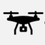
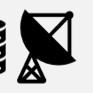
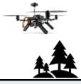
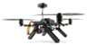
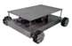
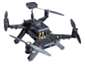

# 2301 03359V1

**Source Document:** `2301.03359v1.pdf`  
**Total Pages:** 17  

---

## --- Page 1 ---

### Section: I Introduction

Digital Twin-Enabled Domain Adaptation for
Zero-Touch UAV Networks: Survey and Challenges

Maxwell McManus1, Yuqing Cui1, Josh (Zhaoxi) Zhang1, Jiangqi Hu1, Sabarish Krishna Moorthy1,

Zhangyu Guan1, Nicholas Mastronarde1, Elizabeth Serena Bentley2, Michael Medley2

1Deptartment of Electrical Engineering, University at Buffalo, Buffalo, NY 14260, USA
2Air Force Research Laboratory (AFRL), Rome, NY 13440, USA
Email: {memcmanu, yuqingcu, zhaoxizh, sk382, jiangqih, guan, nmastron}@buffalo.edu,

{elizabeth.bentley.3, michael.medley}@us.af.mil

Abstract—In existing wireless networks, the control programs
have been designed manually and for certain predefined sce-
narios. This process is complicated and error-prone, and the
resulting control programs are not resilient to disruptive changes.
Data-driven control based on Artificial Intelligence and Machine
Learning (AI/ML) has been envisioned as a key technique to
automate the modeling, optimization and control of complex
wireless systems. However, existing AI/ML techniques rely on
sufficient well-labeled data and may suffer from slow convergence
and poor generalizability. In this article, focusing on digital twin-
assisted wireless unmanned aerial vehicle (UAV) systems, we
provide a survey of emerging techniques that can enable fast-
converging data-driven control of wireless systems with enhanced
generalization capability to new environments. These include
SLAM-based sensing and network softwarization for digital
twin construction, robust reinforcement learning and system
identification for domain adaptation, and testing facility sharing
and federation. The corresponding research opportunities are
also discussed.

Index Terms—UAV, Digital Twin, Domain Adaptation, Network
Softwarization, AI/ML.

#### I. INTRODUCTION

Unmanned aerial vehicles (UAVs) have been envisioned as
a key enabling technology for a wide set of new applications
because of their unique characteristics such as fast deployment,
high mobility, on-board processing capabilities, and reduced
size. This has allowed significant progress in foundational
research towards UAV-assisted communication networks, e.g.,
swarm UAV networks. Specifically, the high mobility of UAVs
can be leveraged to enable dynamic network area coverage
and maximize service capacity at mobile ground nodes [1].
Furthermore, UAV swarms can serve as MIMO-enabled self-
organizing flying hotspots for terrestrial ad-hoc networks to
improve spectral efficiency [2]. In IoT networks, UAVs can
be leveraged as distributed relay nodes to expand coverage
area and improve quality of service (QoS) [3]. To enable 5G

ACKNOWLEDGMENT OF SUPPORT AND DISCLAIMER: (a) Contrac-
tor acknowledges Government’s support in the publication of this paper. This
material is based upon work funded in part by AFRL under AFRL Contract
No. #FA8750-20-C-1021 and #FA8750-21-F-1012 and in part by the NSF
under Grant SWIFT-2229563. (b) Any opinions, findings and conclusions or
recommendations expressed in this material are those of the author(s) and do
not necessarily reflect the views of AFRL.

Distribution A. Approved for public release: Distribution unlimited AFRL-
2022-5944 on 16 Dec 2022.

and Beyond network capabilities, UAVs can provide additional
computational resources for offloading and support in mobile
edge computing (MEC) networks [4]. UAV swarms are also
expected to enable 5G massive MIMO (MMIMO), serving as
dynamic relays to enable high-throughput communications be-
tween MMIMO base stations and ground users and minimize
inter-cell interference [5], [6]. Additionally, future network
architectures, i.e., 6G, are projected to support hybrid aerial-
ground communications, in which terrestrial networks, aerial
UAV networks, and satellite communications are linked hier-
archically to further enhance QoS and network flexibility [7].

However, while UAVs can certainly enable a new range
of applications, the challenges are multi-fold. First, the man-
agement of UAV-assisted networks needs to consider the high
mobility of all connected nodes, and this requires new resource
orchestration and algorithm designs to anticipate the dynamics
and requirements of each flying node and hybrid link in
addition to those dynamics inherent to the networking envi-
ronment [8]. The situation will get even worse when jointly
considering the newly emerging sophisticated communication
techniques, such as heterogeneous multi-band communications
[9], device-to-device communication links [10], integrated
access and backhaul (IAB) 5G networks [11], non-orthogonal
multiple access (NOMA) [12], [13] and spectrum coexistence
[14], [15]. Moreover, in the current practice of wireless engi-
neering, the networking environments are usually assumed to
be known at design time, and the resulting control programs
may fail when encountering unforeseen conditions. Traditional
manual network management has hindered the adoption of new
techniques and the evolution of wireless networks, motivating
a new paradigm that can enable zero-touch management of
UAV-enabled networks, including planning, design and de-
ployment, service delivery, resource management, and end-
to-end optimization [16].

Data-driven
Approaches.
Data-driven
modeling
and
decision-making based on Artificial Intelligence and Machine
Learning (AI/ML) are envisioned to be key enablers of zero-
touch wireless network management. In recent years, data-
driven approaches based on AI/ML have shown great potential
for automating the modeling and control of complicated wire-
less systems. Examples of recent efforts include deep learning-
based edge computing for Internet of Things (IoT) [17], multi-
label classification for user association in mm-wave networks

arXiv:2301.03359v1  [cs.NI]  31 Dec 2022

## --- Page 2 ---

Twin Domain

Contains accurate model of physical entity 
Can be centralized or deployed on edge servers 
Accelerates AI using both real and synthetic data

Physical Domain

Data generation and collection
Environmental interaction
Parameterized control

Wireless Network

E.g.: Aerial-Ground

Mobile Network

Base Station

End Devices

Centralized 
Network Control

Aerial Backhaul

Network

Location information 
Network performance
RF interference
Ground truth data

Data Acquisition

Domain Adaptation

Reality gap measurement 
Training data generation
Domain-agnostic feature extraction
System identification

Optimization and Learning

AI integration 
Parametric analysis 
Autonomous control
Processing/

Analytics
Machine 
Learning

Modeling and Softwarization

Hybrid simulation
System virtualization
Data fusion 
Synthetic sensing
Dataset construction

Virtual Networking Scenario

Fig. 1: Top-level overview of a DT-enabled system.

[18], trajectory and passive beamforming design in UAV-RIS
wireless networks based on a decaying deep Q-network [19],
and network slicing for industrial IoT based on deep federated
Q-learning [20], among others. Readers are referred to [21]–
[24] and the references therein for a good survey of the main
results in this field.

However, the primary challenges with data-driven ap-
proaches are their slow convergence rates and the limited
generalization capabilities of the learned policies when faced
with new environments. Specifically, the performance of ML
(especially deep learning) algorithms highly relies on the
availability of a sufficient amount of well-labeled contextual
data for model training, leading to slow convergence rates in
online applications [21], [25]. Additionally, collecting training
data can be too time costly and in some cases pose safety risks
for hardware or network operators. Alternatively, the models
can be trained in an offline manner using data previously
collected or generated by simulators [26]. However, the trained
models may suffer from poor robustness, i.e., it is hard for
the models to generalize to new environments with different
transition kernels.

Digital Twin-enabled Data-driven Control. Digital twins
(DT) are envisioned as key enablers of fast-convergent and
robust learning for next-generation intelligent cyber-physical
systems, such as smart factories and manufacturing [27]–[29],
construction, bio-engineering and automotive [30], [31], as
well as wireless communication networks [32], [33]. With
high-fidelity models in the virtual DT environment, the cor-
responding physical entity can be reconfigured, simulated and
tested at a fraction of the cost and in a fraction of the
time of deployment-based configuration testing. By simulating
the behaviors of the physical entity in real-time, possible
trajectories of a physical entity’s life-cycle can be generated
using physics-based simulation in order to predict events and
conduct root-cause diagnosis. Further, the resulting data can be

used to train AI/ML models to determine the optimal solutions
for complex control problems, while the trained models can
be fine-tuned through real-time feedback from the physical
entity. However, while the great potential of DTs has been
demonstrated in smart factory, manufacturing and military
applications [27]–[29], its adoption in wireless communication
networks is still in its early phase.

In this article, we aim to provide a survey of the main results
of DT-enabled machine learning in UAV-assisted wireless
networks, and discuss the research challenges and possible
solutions. In existing literature, there are already a number of
surveys and tutorials focusing on DT-enabled wireless systems
[31], [34]–[37]. For example, in [31] Minerva et al. discuss the
foundational properties, essential characteristics and business
values of DTs focusing on IoT application domains such as
digital patient, digital city and cultural heritage. The authors of
[34] discuss DT-enabled 6G from an architectural perspective,
including the key design requirements in decoupling, scalabil-
ity, security and reliability as well as deployment. The enabling
technologies for DTs are discussed in [36] for cognizing
and controlling the physical world, DT modeling, DT data
management, DT services as well as connections in DTs. In
[37], Nguyen et al. identify the potential benefits of DT for
rolling out 5G networks, including interactive 5G emulation,
5G radio and channel emulation, and continuous validation
and optimization. The application of AI/ML techniques in
wireless network modeling and control has also attracted
significant research attention. Readers are referred to [38]–
[41] and references therein for a good survey and tutorial for
the main results in this field. Different from the above surveys
and tutorials, in this article we discuss the challenges and
enabling techniques for fast-convergent and robust learning
in DT-assisted wireless UAV systems.

2

*Caption/Context: E.g.: Aerial-Ground | Mobile Network*

*Caption/Context: Twin Domain | Contains accurate model of physical entity  Can be centralized or deployed on edge servers  Accelerates AI using both real and synthetic data*

*Caption/Context: Twin Domain | Contains accurate model of physical entity  Can be centralized or deployed on edge servers  Accelerates AI using both real and synthetic data*

*Caption/Context: Twin Domain | Contains accurate model of physical entity  Can be centralized or deployed on edge servers  Accelerates AI using both real and synthetic data*

*Caption/Context: Twin Domain | Contains accurate model of physical entity  Can be centralized or deployed on edge servers  Accelerates AI using both real and synthetic data*

*Caption/Context: Twin Domain | Contains accurate model of physical entity  Can be centralized or deployed on edge servers  Accelerates AI using both real and synthetic data*

*Caption/Context: Base Station | End Devices*

*Caption/Context: Twin Domain | Contains accurate model of physical entity  Can be centralized or deployed on edge servers  Accelerates AI using both real and synthetic data*

## --- Page 3 ---

### Section: II Digital Twins for Wireless Systems: A Primer 

#### II. DIGITAL TWINS FOR WIRELESS SYSTEMS: A PRIMER

Digital twins were first introduced in the NASA Apollo pro-
gram as a “multi-physics, multi-scale probabilistic simulation”
of an object, system, or process in the physical world, which
uses physical parameters, historical data, and sensor updates to
provide an accurate virtual “mirror” of the target system [42].
As depicted in Fig. 1, a DT system generally consists of
three major components: a physical entity with observable
behaviors, a logical (or virtual) object that represents the
physical entity in a simulated environment, and a bidirectional
feedback system between the two entities [27], [29], [43], [44].
Considering modern applications, DT systems can monitor and
virtualize dynamically the behaviors of the physical systems at
run-time and further aid in a zero-touch manner the decision-
making in unforeseen situations based on data-driven modeling
and optimization [45].

In order to provide accurate modeling and control decisions
in spite of mathematical generalization, a DT system requires
a bidirectional feedback loop capable of translating observed
physical behaviors into a virtual model and vice versa. This
behavioral translation process is termed domain adaptation. To
broaden the scope of this investigation, we consider a general
theoretical definition of a DT with three critical elements: the
physical domain, the twin domain, and domain adaptation. We
discuss each element in the context of wireless networks with
flying base stations as an example to motivate the application
of DTs for next-generation wireless network optimization. A
survey of more general DT use cases envisioned to support
6G network capabilities such as high-density deployment con-
figuration and reflective intelligent surface-enabled terahertz
communications can be found in [46].

Physical Domain. The physical domain is also called the
target domain. This domain encompasses all scenario- and
application-specific aspects of the system, such as basic net-
work functionalities, mobility controls, physical entities, and
other features of the deployment environment. In general, data
acquisition is handled in the physical domain and uploaded to
the twin domain in real-time or stored as a dataset for later
use, which we will discuss further in Section III. Considering
the example of UAV-assisted networking, the physical domain
would include UAV hardware, software, and communication
systems used to realize the aerial base station capabilities,
all comparable elements of network end-devices, as well as
environmental and geographical features, such as wind speed,
RF interference, and blockages, that constrain the UAVs’ flight
patterns and impact network coverage and performance.

Twin Domain. The twin domain, aka source domain,
encompasses all exogenous elements of the DT system that
are designed to accelerate optimization of physical domain
applications, facilitate machine learning applications without
impact on real-time system operation, or otherwise improve
system performance over what is achievable in a deployment
that is solely in the physical domain. In general, this will
include virtualization of the target environment, synthetic data
generation for policy convergence, and feedback with a do-
main adaptation process for effective policy transfer across the
sim-to-real gap. The sim-to-real gap refers to the discrepancy

in observable performance and behaviors between physical
domain entities and their virtual counterparts. This discrep-
ancy is typically caused by generalizations of unpredictable
real-world phenomena present in the simulation. Experience
collected by agents, especially in dynamic or time-varying
environments, may only be valid temporarily, requiring con-
tinuous computation and re-optimization. Virtualization is a
key technique for improving the flexibility and efficiency of
zero-touch control for wireless networking systems [16]. This
requires dedicated computational resources and infrastructure
to support synthetic data generation and processing as well
as bidirectional communication between twin and physical
domain systems. We will discuss several methods of target
system virtualization and softwarization for wireless networks
Section IV.

A detailed example of source domain design for a coordi-
nated UAV swarm network is outlined in [47]. This example
includes a centralized intelligence center collecting periodic
updates of environment state data, and returning control di-
rectives to the deployed hardware for optimal MAC-layer
configuration. The intelligence center contains a simulation
of the deployed hardware capable of generating synthetic data
analogous to physical domain experience, which is in turn
used to train a deep neural network to optimize protocol
parameters based on a physical domain scenario. With reliable
communication between the twin (i.e., source) and physical
(i.e., the target) domains, offloaded computation can facilitate
accelerated convergence and practical applications, removing
prohibitive resource constraints on physical domain systems.

Domain Adaptation. This is the process by which ex-
perience collected or generated in one domain is translated
for use in the complementary domain. While the addition of
resources from the source domain can be incredibly useful,
communication between twin and physical domains may not
always be reliable. In the case of unreliable communication
between domains, the sim-to-real gap may be increased due to
the lack of synchronization between physical systems and their
virtual counterparts. In such scenarios, learning conducted in
the twin domain must be robust to the difference between
dynamics in the physical domain and generalizations made
in the source domain to enable effective sim-to-real policy
transfer. The core focus of domain adaptation is to modify
learning algorithms and source domain parameters to over-
come these challenges, and is envisioned as the key to solv-
ing open research challenges associated with robustness and
performance losses in transfer learning applications inherent
to DT-enabled systems [48]. In existing literature, domain
adaptation for RL applications can be achieved by modifying
observations of the source domain [48], simulation parameters
[49], or the reward function [50] of a well-defined Markov
decision process (MDP). In each of these approaches, a twin
domain is constructed for rapid and efficient training, with
the goal of minimizing interaction with the physical domain
hence maximizing communications efficiency while maintain-
ing effective transfer learning performance between domains.
We will discuss DT testbed development to experimentally
evaluate domain adaptation techniques for sim-to-real policy
transfer in wireless networks in Section VI.

3

## --- Page 4 ---

### Section: III Data Acquisition

#### III. DATA ACQUISITION

In a DT system, the role of data acquisition is to generate
and maintain a virtual environment using ground truth data
from the physical domain. In addition to data required to build
the virtual model, timely updates from the physical domain are
necessary to maintain the accuracy of event prediction, trajec-
tory modeling, and control capabilities in the twin domain.
For a DT-enabled wireless network as outlined in Fig. 1, this
time-sensitive information can include mobile base station and
user locations, performance metrics, and changes to protocol
specification such as modulation or bandwidth.

In existing work, especially for physics-based or high-
fidelity models, construction of the virtual environment is
done manually and prior to simulation events based on expert
understanding of the target environment. The majority of
works discussed in Sections I and II demonstrate the use of a
virtual environment designed and deployed prior to execution
time, and otherwise do not consider an explicit interactive
construction of an environment model. However, especially for
dynamic physical environments such as UAV networks [47],
the deployment environment may not be known ahead of time
and the DT system must be able to generate blockage and
boundary rules at execution time.

The authors of [44] describe the virtual environment of
a DT system as a repository of environmental and system
signatures. Behavioral or physics-based modeling is of key
importance to ensure accurate decision-making based on the
virtual environment [37], which requires efficient, reliable
collection of high-fidelity environmental data. New methods
of collecting these signatures automatically are currently being
investigated to accelerate the development and deployment of
DT systems, especially with the help of robots, UAVs, or other
technology to enable autonomous mapping and unassisted
control.

In the following section, we discuss the enabling technolo-
gies for DT construction and deployment and discuss different
methods of environmental data acquisition in this context.

A. Enabling Technologies and Techniques

We identify online environment virtualization using various
data acquisition techniques as a key enabling technology for
real-time and mission-critical applications of DT in unknown
physical environments. These techniques include LiDAR [51],
[52], millimeter-wave radar [53], and SLAM [54], [55], to
quickly and efficiently scan an environment and build an
interactive virtual model. Once an environment is generated,
contextual datasets can be generated using ray tracing or other
simulation methodologies to accelerate optimization tasks as
shown in Fig. 1 [25], [47]. However, the automation of data
acquisition to enable online, on-the-fly DT construction is of
critical importance to enabling DT for zero-touch networking.
Online DT construction in general, to the best of our knowl-
edge, is a challenge that remains unaddressed in existing DT
literature.

LiDAR. In recent literature, LiDAR has demonstrated excel-
lent promise for generating high-fidelity environmental mod-
els. LiDAR systems detect surface points in an environment

by emitting light in the form of pulsed laser and calculating
the time-of-flight based on reflections [51]. These points are
aggregated in the form of a point cloud highlighting key
features in an environment, which is then converted into
a representative mesh by a central controller (typically via
numerous filtering and reconstruction steps).

Currently, some visual sensor based autonomous vehicles
use simplified LiDAR sensors to accurately measure the
distance between the vehicle and obstacles, then fuse the
LiDAR’s data with other sensors’ data to make a more robust
map. Some LiDAR-based autonomous vehicles will use high-
accuracy LiDAR as a primary sensor to generate the ambient
environment’s map. In addition, most vacuum robots use a
simplified LiDAR system to build the map of the user’s
house for path planning, collision avoidance, and localization.
LiDAR is leveraged in [51] to construct an interactive virtual
model of an environment in the Unity gaming engine. The
Unity engine was selected to maintain the 3D environment
model due to its high-quality visualization and integrated
physics capabilities. While gaming engines such as Unity
are typically optimized for rendering and visualization with
user interactivity, they are not generally capable of rendering
dynamic meshes from data acquired in real-time.

In general, LiDAR sensors, especially high-fidelity long-
range sensors, can be very expensive, ranging from hundreds
to tens of thousands of dollars [52]. The sensing range of high-
accuracy LiDAR systems can reach more than 100 meters,
with an accuracy of 1 mm. However, a high-accuracy LiDAR
system is heavy (5 kg+) and expensive ($10000+), while low-
cost, simplified LiDAR systems’ scanning frequencies are too
low. Therefore, LiDAR may not be the best choice for large-
scale aerial mapping, where the weight of sensors must be
minimized. The authors of [56] demonstrate the capability of
a lightweight (< 1 kg) LiDAR sensor for aerial mapping at
an altitude of 10-20 meters.

Mm-Wave Radar. In addition to optical measurement
methods, the use of millimeter-wave (mm-wave) radar has
attracted attention in recent literature as a method of mapping
a physical environment based on measured backscattering and
time-of-flight of emitted high-frequency RF signals. Specifi-
cally, the use of Y-band (215 GHz) radar for indoor navigation
and mapping is demonstrated in [53]. In this work, a portable
mm-wave radar system is assembled using commercial-off-
the-shelf RF components interfaced with a vector network ana-
lyzer to collect range information. The system was mounted on
a turntable to enable full rotational scanning, and a LabView
interface was developed to control the radar position and data
collection. Data was collected by emitting RF signals at 215
GHz with 1 GHz bandwidth at four different types of polar-
ization - HH, HV, VH, and VV - for performance comparison.
The reflected signal response was measured at 220 GHz over 5
GHz bandwidth and processed using Hough transform, ghost
image elimination, and false blockage elimination techniques
to extract a 2D model of the local environment, providing up
to 15 cm resolution when scanning in HH polarization. Since
this method supports real-time map generation, it is considered
a viable method for simultaneous localization and mapping of
DT environments.

4

## --- Page 5 ---

### Section: III-B Research Opportunities and Challenges

The authors of [57] introduce the M-Cube, an experimental
software-defined millimeter-wave radio system which is con-
structed using a low-cost 802.11ad radio and a programmable
baseband module. This system can provide full control over
MIMO beamforming, providing up to 256 antenna elements
across 8 reconfigurable arrays, and has been experimentally
validated for both mm-wave (60 GHz) communication at
up to 325 Mbps as well as mm-wave radar based on AoA
estimation for object detection at a range of 1 m with 8 cm
resolution. This system represents a very interesting enabling
technology that improves accessibility of experimental mm-
wave approaches, reducing the overall cost and complexity
of applications and providing support for new sensing-based
virtualization techniques.

SLAM. SLAM is the method of creating a feature map of
an unknown physical environment while tracking the location
of an agent traversing through the environment at the same
time, using monocular, stereo, RGB-D, or other visual sensing
methods. SLAM requires sensors to detect the environment’s
features, track specific features then calculate the shape of
the physical environment, the carrier’s movements, and its
relative location. While SLAM systems can leverage a variety
of sensor input types, including LiDAR and mm-wave sensors,
visual SLAM (V-SLAM) is very popular among different
SLAM techniques because it only requires an ordinary camera
as the input sensor.

SLAM is critical to the process of autonomous virtual
environment construction. The authors of [58] propose ORB-
SLAM3, an open-source, extensible visual SLAM framework
library that supports monocular, stereo and RGB-D cameras
for data collection. In general, most SLAM algorithms are
executed following three steps: tracking, local mapping, and
loop closure. In the tracking phase, points in the environment
are used to generate representative images of the environment
called keyframes. During local mapping, keyframes are in-
serted into a local model of the environment. Finally, the
loop closure process detects and manages redundant points
based on existing keyframes, integrates new information with
the global model, and performs bundle adjustment (BA) to
estimate camera trajectory. A more detailed overview of the
processes involved in each step of this method is shown in
Fig. 2. In ORB-SLAM3, the camera’s image input will be
fused with acceleration data from an inertial measurement unit
(IMU) as shown in Fig. 2. This can significantly improve the
mapping accuracy and make the tracking continuous even if
visual tracking is lost. The IMU fusion of V-SLAM, deployed
in the Tracking and Local Mapping modules in Fig. 2, has
been shown to surpass other state-of-the-art SLAM methods
on existing datasets collected using stereo and monocular
cameras. Additionally, this framework library supports data
collection and processing in real time, which is critical for
online DT creation and can be leveraged for simultaneous
virtualization and interaction.

The authors of [52] compare V-SLAM with LiDAR map-
ping using low-cost sensors for environmental mapping and
mesh generation. The explored sensors include the Intel Re-
alSense ZR300, which leverages stereo IR vision and visual-
inertial odometry to perform 3D scanning and localization;

Recent
MapPoints

Culling

KeyFrame

Insertion

New Points

Creation

Local

#### BA

IMU
Initialization

IMU Scale
Refinement

Local KeyFrames Culling

Local Mapping

Place Recognition

Optimize
Essential

Graph

Loop
Fusion

Loop Coorection

Compute
Sim3/SE3

Database

Query

Map Merging

Optimize Essential Graph

Welding BA

Merge Maps

Loop & Map Merging

#### ORB Extraction

#### IMU Integration

Initial Pose Estimation

Relocalization

Map creation

Track
Local Map

New KeyFrame

Decision

Tracking

KeyFrames

Full BA

Full BA

Map Update

Local Map

Fig. 2: General diagram of ORB-SLAM3 mapping process.

the Microsoft Kinect V2, which leverages time of flight of
emitted light for 3D sensing, similar to LiDAR; and the Asus
ZenFone AR, which leverages a camera, a motion tracking
camera, and an IR depth sensor to collect environmental
signatures. These three approaches were compared to the ZEB-
REVO handheld LiDAR system. Each sensor was mounted
on an Intel Aero UAV, which navigated around a facility
controlled by the native autopilot to collect environmental
data. The environmental datasets collected by each sensor were
loaded into the Unity game engine for offline visualization,
observed in virtual reality using the Oculus Rift headset, and
evaluated in terms of accuracy to the modeled environment and
resolution of the selected hardware. It was shown that while
the ZEB-REVO LiDAR sensor outperformed the other selected
options, competent modeling performance can still be achieved
for DT environment virtualization using cheaper visual sensor-
based methods. Additionally, most modern passenger cars use
visual SLAM for Lane Centering Control (LCC) and Adaptive
Cruise Control (ACC).

B. Research Opportunities and Challenges

The adoption of these methods for DT construction provides
the following key research opportunities towards enabling DT
in the wireless domain.

Online DT Construction: The construction of a DT is
broadly defined as the process by which spatial and temporal
data is collected from the physical domain and used to generate
a virtual environment in the twin or source domain. Online DT
construction implies that data collection and virtual environ-
ment construction are parallel complementary processes: as the
environmental data is collected, the virtual model is updated
without delay. While [53] and [55] discuss the potential
for online environment construction and virtualization, the
efficiency of simultaneous exploration and virtualization of
an environment for use in a DT-enabled wireless simulation
remains an open problem.

Continuous SLAM is a special case of online DT con-
struction in which 3-D environmental data is collected con-
tinuously via SLAM to update the virtual model in the twin
domain. In general, this process will run in parallel with
behavioral or analytical simulations in order to maximize
spatial virtualization accuracy. An accurate DT simulation

5

## --- Page 6 ---

### Section: IV Network Softwarization and Virtualization

LiDAR
mm-Wave
Monocular Camera
Stereo Camera
RGBD Camera
Monocular Camera-IMU
Range
160m
300m
Relative
35m
5m
Need Further Research
Accuracy
1.5mm
20mm
Relative
20mm
3.7mm
Need Further Research
Cost
$10000
$600
$40
$75
$200
$40

#### TABLE I: Mapping metrics for SLAM systems.

relies on the maintenance of the virtual model, and requires
constant updates to track or model environmental dynamics
in real-time. This is required for intelligence in the source
domain to provide timely, adaptive support to agents in the
physical domain. Continuous SLAM poses a unique challenge
within the scope of online DT construction due to the amount
of end-device resources, especially computational capacity
and link bandwidth, required to simultaneously virtualize an
environment and begin behavioral modeling. Furthermore,
behavioral modeling, based on mobility models or historical
data, may generalize too much or provide only temporarily
valid solutions. Online, continuous generation of an interactive
model presents a research opportunity which can significantly
improve the state-of-the-art for next-generation wireless net-
works in dynamic, non-stationary environments.

Large Scale Sensing: Current approaches to environment
virtualization pose several limitations when considering sensor
accuracy range, especially above 100 m. The price, range, and
accuracy of several sensor types are compared in Table I.
The authors of [52], [59] explore the use of UAVs in ex-
panding sensing range for environment data collection, which
provides clear advantages in terms of observable area and
flexibility compared to manual measurement or static sensing
approaches. However, this approach poses several tradeoffs of
its own: UAVs are limited in battery life, which inherently lim-
its functional range and on-board hardware; LiDAR systems
capable of collecting data at long ranges without loss of fidelity
can be prohibitively expensive; and cheaper optical/RGB-D
cameras suffer at long ranges (typically < 100 m).

For LiDAR-based SLAM systems, LiDAR tracking is based
on time-of-flight measurements, and LiDAR can only measure
the distance between the carrier vehicle and landmarks. If
there is a moving obstacle between the carrier vehicle and
the landmark, LiDAR tracking may be lost. For optical-
camera-based SLAM systems, camera tracking is based on
angle changes. If the ambient light or viewing angle changes
rapidly, then camera tracking may be lost. In either case,
the relocalization process is time consuming and significantly
increases computational complexity of SLAM systems.

In order to prevent tracking loss, multi-sensor fusion can
be leveraged to significantly increases the robustness and
mapping accuracy of the SLAM system. During continuous
tracking, the SLAM system could use movement data of the
carrier vehicle to correct the motion-caused deviation and
improve tracking accuracy. If the tracking is lost, the SLAM
system will still be able to keep updating the map with
movement data acquired from the carrier vehicle GPS data
or IMU unit.

We envision one possible solution for large-scale DT con-
struction is monocular-IMU data fusion. Traditional monocular
camera mapping is a low-cost, low-complexity method for

large-scale, low-resolution sensing. However, a monocular
camera can only measure the relative distance between objects
instead of the absolute distance. Additionally, the point cloud
generated by a monocular system is far less dense than other
visual methods. To address these challenges in a UAV-based
monocular-SLAM system, the camera frame can be fused with
the UAV’s IMU data to improve monocular mapping accuracy
without additional hardware. Furthermore, if the UAVs use
accurate GPS service, such as RTK differential GPS, the
camera frame can also be integrated with absolute coordinates
to further improve mapping accuracy by integrating collected
data with geographical information system (GIS) mapping in
the DT. However, the application of this approach to enable
large-scale environment sensing and virtualization remains an
open research challenge in this area.

#### IV. NETWORK SOFTWARIZATION AND VIRTUALIZATION

In the context of wireless networking research, the benefits
of DT have attracted research attention as a key technology
towards enabling highly anticipated intelligent networking
tasks. The use of high-fidelity simulation in DT leveraging
full environmental modeling for system monitoring and control
is the most widely-discussed implementation observed across
several industries [29], [61].

Applications of machine learning, especially reinforcement
learning and deep learning applications, require significant
amounts of time and data to generate and employ optimal
control parameters for a given scenario. A source domain
containing both simulation and optimization in a centralized
intelligence center or edge server allows the synthesis of
training data in place of experience which may be otherwise
challenging or costly to obtain in the physical domain [48].
This generation of contextual data by a virtual entity, termed
“synthetic sensing” [44], is considered a key feature of high-
fidelity DT. Specifically, synthetic sensing has been shown to
reduce the time cost of dataset generation associated with ML
applications to enable intelligent wireless network function-
ality, such as data collection and reliability, computational
capability requirements of end-devices, among others [21].
The fidelity/accuracy of synthetic data available in a DT is
directly correlated to the quality and quantity of available
data for a physical context [62], as well as the capabilities
of the DT platform to process this data. Due to the growing
prevalence of software-defined networking (SDN) and virtual
network control, virtualization fidelity can vary widely based
on the requirements of the application and the tools leveraged
to create a virtual environment [36]. We have identified sev-
eral state-of-the-art network virtualization and softwarization
platforms that have demonstrated promising synthetic sensing
capabilities to address this challenge, which we will introduce
later in this section. In addition to accurate network simulation,

6

## --- Page 7 ---

### Section: IV-A State of the Art

Platform
Fidelity
Accessibility
Type
Physics
Interface
NS-3
High
Free, Open-source
Simulation
Single (RF)
C++, Python
EMANE
Low
Free, Open-source
Emulation
Multi (RF, mobility)
C++, Python, XML
InSite
High
Paid, proprietary
Simulation
Single (RF)
Software GUI
Colosseum
High
Free, proprietary
Emulation
Multi (RF, mobility)
Linux VM
EXata
High
Paid, proprietary
Emulation
Single (RF)
Software GUI
UBSim
Low
Free, Open-source
Simulation
Multi (RF, mobility)
Python

#### TABLE II: Wireless network virtualization platforms.

… 
… 
… 
…

Colosseum

Quadrant

Traffic Generator (TGEN)

Traffic Network Fabric

Management 
Infrastructure

•
Website 
•
Resource 
Management
•
Network Services 
•
Storage

Massive Channel Emulator (MCHEM)

FPGA Fabric
RF Scenario Server

Management Network

SRN
SRN
SRN

SRN x32
SRN x32

SRN
SRN
SRN

#### SRN x32

SRN
SRN
SRN

#### SRN x32

SRN
SRN
SRN

… 
… 
… 
…

Software Radio

Node (SRN)

Software Container 
(Guest OS, kernel, etc.)

#### USRP X310 SDR

#### PHY Layer

#### MAC Layer

#### NET Layer

Fig. 3: Architecture of Colosseum [60]

we identify several frameworks that have been developed for
establishing accurate virtual models of physical scenarios.
While supporting experimental literature using these tools for
DT development in the wireless domain remains a key open
challenge in this area, these tools offer support for the future
value of DT for enabling ML applications in the wireless
domain.

A. State of the Art

We have identified several network simulators that have im-
mediate potential for advancing research into DT for the wire-
less domain, including NS-3 [63], Colosseum [64], EMANE
[65], and Remcom Wireless InSite [66], among others. Refer
to Table II for a comparison of several key aspects of these
platforms in the context of DT system design.

NS-3: NS-3 [63] is a popular open-access, open-source net-
work modeling tool in both industry and academia, providing
high-fidelity wireless network simulation. NS-3 simulation is
built around three major elements: nodes, which serve as basic
computing device abstractions on which to run applications
and install network devices; packets, which provide data flow
between applications; and channels, which are used to connect
nodes via installed network devices [63]. All elements in a
simulation are constructed from behavioral models written
in C++ based on explicit protocol definition at each layer
of the network stack [67], with simulation control provided
via C++ and Python APIs. Simulated network traffic can be
monitored and analyzed using standard network observation
software, such as Wireshark [68]. This tool can be directly
interfaced with radio hardware such as USRP to perform

network emulation as well, improving accuracy of modeled
networks.

While NS-3 can provide high-accuracy network simulation,
this tool does not support explicit modeling of a physical
networking environment. Additionally, NS-3 provides very
limited native infrastructure for simulation visualization and
data processing and analysis, which necessitates the use of
3rd-party software for these tasks. While its accuracy is still
limited by generalizations inherent to model-based simulation
[69], this tool is expected to play a significant role in the
development of DT-enabled systems in the future due to its
high fidelity, accessibility, and large community support.

Colosseum: Colosseum [64] is the world’s largest network
emulator, comprised of 256 software-defined radios (SDR) to
provide a wide variety of emulated RF propagation scenarios.
The architecture of Colosseum is shown in Fig. 3 [60]. Each of
the 256 SDR nodes (SRN) is made up of a software container
that specifies physical, link, and network layer protocol, as
well as a USRP X310 SDR which transmits data generated in
the traffic generator (TGEN) based on this protocol stack. The
generated signals are transmitted through an FPGA fabric in
the massive channel emulator (MCHEM), which is configured
to apply channel effects by emulating predefined scenarios
stored on the RF scenario server. The platform is accessed,
managed, and maintained using a management network con-
nected to all constituent elements.

Similar to NS-3, it is considered an open-access tool, and
provides support for a variety of different protocols including
4G/5G and IoT-type protocols with spectrum sharing. While
there are many different predefined physical networking sce-

7

![Platform Fidelity Accessibility Type Physics Interface NS-3 High Free, Open-source Simulation Single (RF) C++, Python EMANE Low Free, Open-source Emulation Multi (RF, mobility) C++, Python, XML InSite High Paid, proprietary Simulation Single (RF) Software GUI Colosseum High Free, proprietary Emulation Multi (RF, mobility) Linux VM EXata High Paid, proprietary Emulation Single (RF) Software GUI UBSim Low Free, Open-source Simulation Multi (RF, mobility) Python | TABLE II: Wireless network virtualization platforms.](images/page_007_fig_01.jpeg)
*Caption/Context: Platform Fidelity Accessibility Type Physics Interface NS-3 High Free, Open-source Simulation Single (RF) C++, Python EMANE Low Free, Open-source Emulation Multi (RF, mobility) C++, Python, XML InSite High Paid, proprietary Simulation Single (RF) Software GUI Colosseum High Free, proprietary Emulation Multi (RF, mobility) Linux VM EXata High Paid, proprietary Emulation Single (RF) Software GUI UBSim Low Free, Open-source Simulation Multi (RF, mobility) Python | TABLE II: Wireless network virtualization platforms.*

## --- Page 8 ---

narios available, current support for custom scenarios is very
limited, reducing its flexibility in the context of DT-enabled
network deployments. We identify the need for an expansion
of this framework to include user-definable networking sce-
narios with complete control over both network topology and
communications protocol and agent mobility and behavioral
modeling.

EMANE: The Extendable Mobile Ad-Hoc Network Emu-
lator [65], or EMANE, is an open-source real-time frame-
work for highly flexible simulation of mobile network sys-
tems. Modular network development allows for independent
physical-layer modeling of each network element, providing
accurate virtualization of system performance by considering
signal propagation, antenna profile effects and interference
sources between each emulated wireless link. In general, each
emulator instance is comprised of a physical layer model
instance paired with one or more radio waveform models,
which are designed in C++ and configured using XML.
Similar to the Colosseum MCHEM, emulation instances are
linked to a shared multicast channel which generates over-
the-air network behaviors such as signal propagation, antenna
effects, and interference. Additionally, EMANE provides radio
waveform model plugins compatible with SDR hardware to
enable shared-code emulation, which is comparable to NS-3
emulation capabilities. While EMANE is limited to emulation
of PHY and MAC layers, emulation of NET layer and above
protocols is typically handled in practice through integration
with the Common Open Research Emulator (CORE) [70].

Wireless InSite: Remcom Wireless Insite [66] is a propri-
etary electromagnetic (EM) propagation modeling tool for
wireless networking, which can be leveraged for MIMO
dataset generation [25] via ray tracing as discussed in Sec-
tion I. The propagation behaviors are designed around several
modeling theories such as Shooting Bouncing Ray (SBR),
Adjacent Path Generation (APG), and Finite Difference Time
Domain (FDTD), considering environmental reflection be-
haviors based on the Uniform Theory of Diffraction (UTD)
[71]. From these models, this tool can recover significant
receiver-side information such as received power, path loss,
direction of arrival, delay spread, and interference estimates.
Due to its high-fidelity modeling capabilities, this tool provides
significant potential for accurate physics-based network event
simulation based on signal behaviors within the propagation
environment. However, this level of fidelity comes at a sig-
nificant time cost. While APG with GPU can accelerate some
scenarios, in general this tool will require several minutes to
calculate network performance for a given deployment, pre-
venting faster-than-real-time applications [71]. Additionally,
each scenario will need to be fully re-calculated in the case
of mobile transmitter, and partially re-calculated in the case
of mobile receiver, further increasing this time cost in mobile
networking scenarios.

ANSYS Twin Builder: The ANSYS Twin Builder [72]
presents an open platform for DT development, with a set
of built-in tools for physical and behavioral modeling of
physical objects. This platform supports multiple modeling
domains and languages, enabling multi-physics simulation and
heterogeneous data fusion for operation [37]. Specifically,

the core capabilities of Twin Builder rely on two key ele-
ments: a multi-domain systems modeler, which can simulate
interactions between synchronous modeled systems based on
model libraries such as mechanical, hydraulic, and electronic
components, logic blocks, and characterized manufacturer’s
components; and a multi-domain systems solver, which uses
existing physics libraries for hydraulics, electronics, pneumatic
systems, and thermodynamics to simulate model behaviors.
While the platform itself is not immediately optimized for the
wireless domain, its use for simulation of hardware within
an IoT network, without explicit wireless network dynamics,
is discussed in [36]. Twin Builder supports integration of
third-party platforms as well, which implies compatibility with
other tools capable of explicitly modeling wireless network
behaviors.

Spirent 5G DT: The Spirent 5G Digital Twin [73] presents
a very robust platform for emulating a full end-to-end 5G
network. Various 5G network elements, including independent
channel emulation, virtual EPC and gNB, and full-stack end-
device emulation, are virtualized with very high fidelity in
order to generate cost-effective accurate behavioral analysis,
enable evaluation of new security protocols, as well as other
“testing on demand” services. The authors of [37] outline
several key functionalities of this platform, including wire-
less network automation and optimization, network slicing
via SDR and network functions virtualization (NFV), and
accelerated 5G network planning and validation, among others.

Pavatar: In the context of the Internet-of-Things (IoT),
intelligent online monitoring systems envisioned for smart
cities, Industrial IoT (IIoT), and other next-generation IoT
systems are anticipated to play a key role in supporting
virtual environments constructed to support a high degree
of virtualization [74]. A key example of the capability of
high-fidelity DT supported by distributed heterogeneous sensor
networks is the Pavatar system [75]. Pavatar collects data at
multiple system layers simultaneously in order to conduct
comprehensive sensing of all system components and human
activities in the operation environment. This heterogeneous
data, which is in excess of 1 TB per day, is used to construct
a VR representation of every system element for human inter-
facing, as well as conduct error prediction, anomaly detection,
and root-cause diagnosis [75]. The use of different types of
data sources (e.g. RF, optical, temporal) to construct a robust
system virtualization, termed “data fusion”, is necessary to
provide accurate simulation of physical system behaviors [31].
In [76], emphasis is placed on detailed modeling of end-
device behavior and dynamic agent-based interactions in the
virtual space as an integral component of DT for distributed
or decentralized networks.

Keysight EXata: EXata [77] is a network digital twin
development and analysis tool which uses network emulation
and simulation for network virtualization. The platform is
based on a software virtual network (SVN) to generate each
protocol layer, antenna, and device in the twin domain. This
SVN is stated to be interoperable with real radio hardware and
capable of interacting with real applications. Additionally, the
simulation kernel leverages parallel discrete-event drivers dur-
ing runtime, which can enable faster-than real-time processing

8

## --- Page 9 ---

### Section: IV-B Research Opportunities

necessary for improved real-time ML algorithm training and
deployment.

UBSim: UBSim is a custom hybrid network simulator
designed for use in DT research. It is capable of simulating
microwave, millimeter-wave, and terahertz-band communica-
tions in terrestrial, aerial, or hybrid aerial-ground networking
scenarios deployed in a fully configurable physical networking
area. It is fully open-source and open-access, written in
Python for flexibility, and ease-of-use. It is comprised of three
core elements: the network element module, which provides
behavioral definitions of all available simulation elements;
the network control module, which provides control over all
deployed network elements; and the discrete event module,
which schedules simulation events. To facilitate ease of use,
three sets of APIs have been designed: the environment
definition API, which coordinates all environmental features
and blockages; the network configuration API, which specifies
network topology and communications parameters; and the
custom algorithm API, which provides templates for data-
driven algorithm deployment. Each UBSim instance also pro-
vides a feedback tunnel, as indicated in Fig. 4, to enable
socket communications with external software. In order to
enable research into key technologies for comprehensive DT as
outlined in Section II, UBSim supports parallel learning across
multiple simulation instances, configurable sim-to-sim policy
transfer1 for rapid evaluation of domain adaptation algorithms
such as robust learning and system identification, and is
currently being modified to enable online DT construction
using SLAM. UBSim has been leveraged for experiments
in domain adaptation [78], UAV network virtualization and

1Sim-to-sim policy transfer is similar to sim-to-real policy transfer, but the
policy is transferred to another simulation environment instead of the real
environment.

optimization [79], and acceleration of machine learning for
wireless [80], among others. While the simulation fidelity of
UBSim is low, its flexibility is intended to enable integration
with high-fidelity platforms such as NS-3 or RF-SITL [81]
to enable rapid design and evaluation of DT systems through
multi-fidelity, multi-physics experimentation.

B. Research Opportunities

The tools discussed in this section provide an interesting
scope of customizable, potentially interoperable network sim-
ulation at varying levels of fidelity for network virtualization
as introduced in Section I. However, very few tools have
been accepted to be individually suitable for full DT imple-
mentation following the interdisciplinary feature set shown
in Figure 1. Additionally, due to the lack of open-source
and community support, they may not provide the level of
accessibility required for rapid experimental development in
this area. The contribution of a readily available, community-
oriented DT platform for the purpose of ML-based wireless
network experimentation remains a significant open challenge.
It is expected that a combination of these tools, combined
with data fusion [16] and platform integration [82], can be
leveraged for a widely available, high-fidelity DT toolchain
optimized for use in the wireless domain.

Multi-fidelity Simulation: While data-driven methods can
provide significant improvements to network performance and
services, they can be very time-consuming and data-expensive,
and may require re-training if the target environment changes
over time. To balance the tradeoff between optimization time
and algorithm accuracy, we identify multi-fidelity simulation
as an important element of future DT-enabled wireless net-
working systems. Low-fidelity simulation can be used for
time-sensitive tasks, such as rapid control decisions, by lever-
aging an approximation of wireless network behaviors based

Target Domain: OSWireless

Mathematical

Specification

Algorithm 
Specification

Forwarding 
Specification

Distribution Abstraction Software

Data Plane Virtualization Software

PPS Subplane
(Programmable Protocol Stack)

Forwarding

Algorithm

Forwarding

Decisions

Source Domain: UBSim
Feedback Tunnel
- sysID training loop
- Socket thread

Behavior record 
(from QoSPara module) 
VBEPs 
(from NetTopo module)

WiNAS 
Subplane

#### NCM

NEM
Net. Config.

#### API

Env. Def.

#### API

#### DEM

Cust. Alg.

#### API

Control policy

weights

Control algorithms
(from AlgoGen Engine)

Agent and

state 
trajectories

OaaS 
Subplane

Intent Specification

Objective 1
Objective 2
Objective N

Fig. 4: Expansion of UBSim to include OSWireless as a physical domain framework, considering accelerated control algorithm
convergence and practical system identification.

9

*Caption/Context: Mathematical | Specification*

*Caption/Context: Distribution Abstraction Software | Data Plane Virtualization Software*

*Caption/Context: Distribution Abstraction Software | Data Plane Virtualization Software*

*Caption/Context: Target Domain: OSWireless | Mathematical*

*Caption/Context: Specification | Algorithm  Specification*

## --- Page 10 ---

### Section: V Domain Adaptation Techniques

on observable performance statistics, while high-fidelity mod-
els can be used to maximize network performance in stable
environments, or leverage offline optimization algorithms for
event prediction.

Standardization: Generating a standardized framework to
facilitate high degrees of virtualization in the wireless domain
presents many challenges, including simulation for highly
complex and volatile networking environments [62], support
for dynamic, heterogeneous, and distributed network architec-
tures [37], and ready integration with machine learning and
model-based network control [22]. Specifically, we identify the
need for an open, accessible DT framework that supports con-
figurable network virtualization at multiple levels of fidelity.
The authors of [79] demonstrate preliminary work in this area,
by designing middleware between a high-fidelity UAV network
virtualization platform for environmental definition with a low-
fidelity network simulator for accelerated convergence of con-
trol algorithms. The continued development and distribution
of such a framework would enable many contributions in this
area, providing a stronger definition of the capabilities of DT
technology for use in next-generation wireless networks [46].

Faster-than-real-time Optimization: As part of the envi-
sioned model for 6G network architecture, DT is expected
to play a large role in the real-time or faster-than-real-time
optimization of network deployments. In order to provide
high-fidelity simulation – hence accurate control directives
– protocols designed for UAV-assisted communications will
require support in virtual environments. Generalizable support
for custom wireless protocols is possible on SDR hardware,
and can be enabled based on integration of UBSim with
OSWireless [83]. OSWireless is a wireless network operating
system capable of decomposing operator intent to explicit
network control algorithms in a zero-touch manner. Towards
practical sim-to-real experimentation, we envision an expan-
sion of UBSim to support integration with OSWireless, as
detailed in Fig. 4. Specifically, OSWireless can serve as a
physical domain control system to decompose operator intent
into custom control algorithms. These control algorithms can
be uploaded to UBSim, along with network state data from
the Wireless Network Abstraction Specification (WiNAS) Sub-
plane, for faster-than-real-time policy training based on low-
fidelity simulation. UBSim will return the optimized control
policy to OSWireless for deployment on hardware nodes. To
address the sim-to-real gap, UBSim will leverage the WiNAS
Subplane data to perform system identification, improving
fidelity by tuning parameters to match simulation performance
to physical domain observations.

#### V. DOMAIN ADAPTATION TECHNIQUES

As discussed Section IV, synthetic sensing is a useful
method to accelerate ML algorithm convergence for practical
real-world applications [31], [84]. However, synthetic data is
unable to fully represent all system behaviors in the physical
domain, and thus introduces some inaccuracy during algorithm
training. Many works seek to leverage high-fidelity models to
improve accuracy of synthetic data [85], [86], but processing
high-fidelity behavioral models can be quite time-consuming,

taking possibly several minutes to render a single environment
[71]. This trade-off between simulation fidelity and processing
time may be problematic for time-critical applications. Domain
adaptation seeks to minimize the need for this trade-off by
improving the capability of simulation-accelerated learning
frameworks to generalize from simulation in the source do-
main to real-world deployment in the physical domain.

A. State of the Art

Instead of seeking a tradeoff between simulation fidelity
and operation time, domain adaptation seeks to improve the
generalization capability of low fidelity simulation. The ideal
domain adaptation system seeks to minimize the importance
of simulation fidelity on the accuracy of the resulting control
policy in the physical domain, instead focusing on solving
the contextual mismatch between domains and overcoming
inherent simulation generalization to make sure the result-
ing control policy works. We introduce three representative
examples of this line of research as system identification
[87], [88], domain-agnostic feature extraction [89], [90], and
robust learning [78], [91], [92]. In system identification, source
domain simulation parameters are adapted based on feedback
from the physical domain to improve behavioral accuracy.
In domain-agnostic feature extraction, contextual features are
identified from low-level data to generate a shared observation
space across domains. In robust learning, the gap between
source and physical domains is estimated through feedback
and considered during training in the source domain. Readers
are referred to [93] and references therein for a survey of
robust reinforcement learning specifically and [94], [95] for
other general domain adaptation techniques.

System Identification. System identification is the most es-
tablished approach to domain adaptation in existing literature
[50]. In practice, system identification seeks to iteratively
improve behavioral parameters in a source domain simulation
based on feedback from the physical domain. An outline of
the general premise of system identification is depicted in
Fig. 5. While there are many application-specific variants of
system identification, this approach faces some challenges in
general. Primarily, a significant amount of feedback is required
from the target system to validate source domain performance.
Additionally, some virtualization platforms such as Colosseum
and InSite introduced in Section IV may not be fully open-
source or parameterized to support system identification. Such
simulation platforms that are configurable and offer full control
of behavioral parameters are termed hybrid simulators, due to
their analytical and behavioral modeling capabilities.

The authors of [87] explore sim-to-real transfer learning
using robot navigation tasks, in which it was noticed that
learners in the source domain are capable of exploiting a given
simulation to perform tasks beyond capabilities in the real
world. By modifying the simulator based on this feedback,
the source-to-target gap was reduced and the similarity be-
tween simulated and real robot performance was improved.
Similar to system identification, the use of domain-agnostic
features can be used to enable domain adaptation. Instead of
converging simulation parameters to maximize behavioral sim-
ilarity, source domain observations can be adapted to extract

10

## --- Page 11 ---

### Section: V-B Research Opportunities

Physical System

Ground truth

generation

Environmental

sensing

Algorithm 
deployment

Task execution

Source Domain

Simulation

Event prediction

Behavioral

modeling

Control algorithm

Parameter-
generating function

Control 
directives

User-defined

performance

metrics

Fig. 5: General outline of system identification.

high-level features common to both the source and physical
domains, minimizing the impact of domain-specific dynamics
on transfer learning performance. The authors of [96] and
[89] demonstrate this practice using pixel-level observation
adaptation for policy transfer in tasks related to computer
vision.

Domain-Agnostic Feature Extraction. This method seeks
to reduce the effect of the source-to-target gap by finding
commonality between each domain. Specifically, this ap-
proach seeks to align behavioral inferences made in each
domain through extraction of high- or low-level features that
can minimize domain-specific phenomena. For example, the
approach to semantic image segmentation outlined in [89]
leverages pixel-level segment representation and classification
to improve unsupervised adversarial domain adaptation for
computer vision. The authors of [90] propose transfer com-
ponent analysis, which seeks a set of features, termed transfer
components, to minimize the difference in data distributions
between domains. By projecting transfer components onto a
shared latent space and applying standard machine learning
models for classification or regression tasks.

Robustness Mechanisms. Robust learning aims to mitigate
the effect of environmental perturbances, such as modeling
errors, time-varying dynamics, or unreliable data, on the
resulting control policy. This can be typically accomplished
by applying a random or adversarial noise process to a
system during policy training. Defined in the scope of the DT
framework outlined in Fig. 1, this noise is generated by the
source domain during policy training to mitigate the effect of
the source-to-target gap during policy transfer [78], [91], [92],
[97]. In many cases, the noise is added in the form of training
samples manually selected from worst-case scenarios or an
average of potential environmental anomalies. This is intended
to generate a policy that will provide better generalization than
non-robust policies when faced with unexpected, unknown, or
adversarial physical domain dynamics, at the cost of reduced
maximum achievable performance.

An effective approach to applying this policy noise to
generate a robust policy is the R-contamination model [91].
Leveraged in [91] and [78] to implement model-free robust
reinforcement learning, the R-contamination model is used to
probabilistically alter, or “contaminate,” observations made by
the agent with random or worst-case dynamics to encourage
conservative policy learning. Instead of an agent following
a deterministic transition kernel pa

s for a given state s and
action a, this contamination probabilistically cause an arbitrary

state transition q, selected from an uncertainty set P, which
is comprised of all possible transitions in an environment.
In order to model contaminated agent trajectories, the R-
contamination model generates a subset Pa

s of P for each
s and a pair according to Pa

s = (1 −R)pa

s + Rqa

s, qa

s ∈∆|S|,
where ∆|S| is the simplex of state space S, and R represents
the probability of state transition according to q.

It is shown in [78] that the selection of random parameters
from the environment can improve policy transfer performance
when the source and physical domains have different transition
kernels due to differences in the environment dynamics. Both
[91] and [78] demonstrate the requirement for careful parame-
ter selection prior to training, highlighting a key limitation of
robust learning in the context of domain adaptation. While
robust learning can provide very conservative policies, the
authors of [97] propose soft-robust learning, which takes an
average over the uncertainty set instead of selecting worst-case
scenarios to reduce the conservative nature of the resulting
policy. This yields a model capable of generalization while
limiting performance degradation.

B. Research Opportunities

Expertise Incorporated Learning: In order to advance the
use of domain adaptation for wireless networks, we consider
constraint sampling reinforcement learning (CSRL) [98] as a
promising method to quantify the reality gap using domain
expertise. In this way, expert knowledge of the networking
environment can be integrated during the training process
via sensing [51], [55] to enable effective policy transfer
in unknown environments with minimal human interaction.
Sophisticated applications of this approach, especially in the
wireless domain, remain an open challenge in this area.

Reality Gap: The mathematical generalizations present in all
simulations make sim-to-real transfer a persistent challenge
due to the inherent non-linearities of natural phenomena.
Sim-to-sim experiments can be used to estimate the domain
transfer performance of new algorithms for domain adaptation,
but even high-fidelity models of physical domain hardware
are incapable of predicting performance exactly. Additionally,
while synthetic sensing can help accelerate convergence of
data-driven models, synthetic data will introduce inaccuracies
to the learning model based on generalization [88].

To overcome the reality gap between simulation results and
physical system behaviors, the authors of [93] discuss different
applications of robust learning to provide performance guaran-
tees in the presence of environment uncertainties. While some
contributions address challenges associated with the reality
gap [48], [87], sim-to-real adaptation in the wireless domain
remains an open research area.

Real-time Training: In ML applications, especially meth-
ods that leverage neural networks, the training process is
generally time-consuming. Even considering faster-than-real-
time training capabilities provided by a DT system, significant
system or environmental changes may require re-training some
or all of a learned policy. In time-critical applications, this
may require interim behavioral models to be leveraged during
policy re-training. The authors of [22] explore the integration

11

## --- Page 12 ---

### Section: VI Physical Scenarios Development

of low-complexity inference models with ML algorithms to
reduce the impact of long training times on system perfor-
mance in such scenarios. Additionally, when simultaneously
optimizing multiple agents, as in multi-agent reinforcement
learning (MARL), the computation complexity and communi-
cation overhead increase exponentially due to the additional
problem dimensionality. This may further exaggerate the sim-
to-real gap based on the aggregate generalizations made across
multiple agent representations in the twin domain. In the
example of a self-coordinating swarm UAV network, each
agent may be required to relay significant state information
including location, speed, height, and network status of itself
and other agents to the twin domain in each training step to
avoid collisions, reduce interference, and take actions without
loss of information. Additionally, as the number of agents
increase, the amount of information required by the twin
domain to maintain an accurate model of the physical domain
system increases as well, which further increases network
resource consumption. The complexity of algorithm design
and deployment can be further increased when considering
a decentralized scenario, in which a twin domain model needs
to be maintained at each agent instead of a central controller.

The Advantage Actor-Critic (A2C) algorithm [99] has been
demonstrated as an effective tool to minimize policy training
times considering high-dimensional state and action spaces.
A2C uses the estimated optimal state-action value to update
the policy, of which the gradient can be calculated as follows:

∇θJ(θ) = Eπθ[∇θ log πθ(s, a)Aπ(s, a)]
(1)

where Aπ(s, a) = Qπθ(s, a)−Vπθ(s) is termed the Advantage
function, in which Qπθ(s, a) is the action-value function
and Vπθ(s) is the state-value function. With this advantage
function, variance of the gradient can be reduced which
improves model training stability. It is very time consuming
to find hyperparameters that stabilize the learning process,
since A2C relies on the initial estimation of values, therefore
A2C algorithms can be challenging to design or further time-
consuming for real-time training scenarios.

To further accelerate policy convergence, an Asynchronous

Advantage Actor-Critic (A3C) [100] can be used. Similar to
A2C, A3C uses an advantage function to reduce variance and
improve training stability. The only difference is that A3C
allows agents to interact with the environment in parallel. In
A3C, virtual agents work individually in multiple instances
of the same environment to update a global policy asyn-
chronously. This parallelism can significantly reduce policy
convergence times.

To reduce the communication overhead of both centralized
and decentralized MARL scenarios, the Lazily Aggregated
Policy Gradient (LAPG) method [101] can be used to reduce
the frequency of communication. Most information related to
collision avoidance and task completion does not need to be
exchanged in every time period, e.g., sensor malfunctions, low
battery states, and obstacle detection. LAPG sets a trigger
condition for this kind of information to reduce the exchange
frequency, which can reduce the overall network communica-
tion overhead and computational complexity. The lower bound
of the trigger condition for LAPG can be written as:

||δ ˆ∇k

m||2 ≥
ξ
α2M 2

D
X

d=1

||θk+1−d −θk−d||2 + 6σ2

m,N,δ/K, (2)

where δ ˆ∇k

m represents the importance of updating the infor-
mation, which is calculated by the difference between previous
and current policy parameters.

Another strategy that can be used to reduce the per-update
communications overhead of a distributed network is by using
a Partially Observable Markov Decision Process (POMDP)
[102]. Instead of requiring the agents to fully observe the
environment in each time step, action selection for each agent
is based on a probability distribution given by the model
instead of directly observing the underlying state. In this
case, each agent has less information to maintain in the local
twin domain model and the required information to be shared
between agents per network update can be reduced.

VI. PHYSICAL SCENARIOS DEVELOPMENT
While several works have proposed DT framework concepts
to support adoption of DT-enabled technologies at scale [34],

Upper

Middle

Lower

Ground

robots

𝑥

𝑦

𝑧

Static USRP

#### N210

Static USRP

#### N210

Server rack
Dynamic nodes:

Server

Rack

Upper Middle Lower
Upper
Middle Lower

𝐵ଷ
𝐵ସ
𝐵ହ
𝐵ଶ
𝐵ଵ
𝐵଴
𝑀଴
𝑀ଵ

USRP B210 – srsRAN network 
Millimeter-wave routers –

srsRAN network

𝑈ଵ଴
𝑈ଽ

𝑈଼
𝑈଻

𝑈଺
𝑈ହ

𝑈ଷ
𝑈ଶ

𝑈ଵ
𝑈଴

#### 𝑈ଵ଻

#### 𝑈ଵ଼

𝑈ଵ଺
𝑈ଵହ

𝑈ଵସ
𝑈ଵଷ

𝑈ଵଶ
𝑈ଵଵ
Ground robots with

#### USRP N210

Static USRP

#### N210

Static USRP

#### N210

#### 𝑈ଵଽ

#### 𝑈ଶ଴

#### 𝑈ଶଵ

𝑦

𝑥

(a)
(b)

Fig. 6: (a) Snapshot of the UB NeXT testbed; (b) UB NeXT testbed topology.

12

![where Aπ(s, a) = Qπθ(s, a)−Vπθ(s) is termed the Advantage function, in which Qπθ(s, a) is the action-value function and Vπθ(s) is the state-value function. With this advantage function, variance of the gradient can be reduced which improves model training stability. It is very time consuming to find hyperparameters that stabilize the learning process, since A2C relies on the initial estimation of values, therefore A2C algorithms can be challenging to design or further time- consuming for real-time training scenarios. | To further accelerate policy convergence, an Asynchronous](images/page_012_fig_01.jpeg)
*Caption/Context: where Aπ(s, a) = Qπθ(s, a)−Vπθ(s) is termed the Advantage function, in which Qπθ(s, a) is the action-value function and Vπθ(s) is the state-value function. With this advantage function, variance of the gradient can be reduced which improves model training stability. It is very time consuming to find hyperparameters that stabilize the learning process, since A2C relies on the initial estimation of values, therefore A2C algorithms can be challenging to design or further time- consuming for real-time training scenarios. | To further accelerate policy convergence, an Asynchronous*

## --- Page 13 ---

### Section: VI-A State of the Art

[37], [74], the state of the art in this area generally relies on
performance inference based on sim-to-sim experimentation,
inflexible virtualization of pre-defined physical scenarios, or
small-scale sim-to-real experiments with numerous experimen-
tal constraints.

A. State of the Art

Scenario development is a key consideration for high-
quality wireless experimentation platforms, which must sup-
port user-defined network topologies, protocols, and control
problems in order to provide accurate validation for use in a
practical DT system. The NSF PAWR platforms, including
POWDER, COSMOS, AERPAW and ARA, represent the
state-of-the-art for wireless network scenario development and
experimentation, considering scale, accessibility, and capa-
bility. For UAV-enabled wireless networking research, AER-
PAW [103] provides a large-scale experimentation platform
comprised of static nodes, mobile ground nodes, and UAV
systems equipped with SDR hardware. The goal of AERPAW
is to provide a general platform to develop and evaluate
new capabilities for UAV-enabled wireless networks, and is
envisioned to enable research into scalable zero-touch control
systems for hybrid aerial-ground networks. POWDER [104]
is a city-scale wireless networking research testbed in Salt
Lake City, Utah, specializing in topics such as 5G O-RAN,
massive MIMO, and spectrum sharing in the sub-6 Ghz band.
COSMOS [105] is a testbed deployed in an ultra-dense area
of New York City, specializing in research for ultra-high-
bandwidth, low-latency wireless communications, millimeter-
wave MIMO and beamforming, and advanced edge computing
scenarios. Finally, ARA [106] is a wireless living laboratory
focused on enabling research into rural broadband wireless
connectivity by connecting an open-access software-defined
virtual infrastructure with a heterogeneous mesh of terrestrial
radio hardware and LEO satellite communication terminals,
capable of providing 600 square miles of contiguous wireless
coverage.

In addition to AERPAW, the UB NeXT testbed [80] pro-
vides a comprehensive framework for network virtualization
and domain adaptation research in integrated aerial-ground
wireless networking. We have included a picture and topology
diagram of the UB NeXT testbed in Fig. 6. The NeXT testbed
platform is part of the UB indoor autonomy research facility,
and is comprised of 21 USRP N210 SDRs, 6 USRP B210
SDRs, and two millimeter-wave routers, with mobility support
provided by three ground robots with 22 kg payload capacities
and a netted UAV enclosure for safe aerial network testing. The
testbed networking environment has been fully virtualized in
UBSim, which has been demonstrated in [78]. This testbed can
enable rapid, small-scale experimentation to address existing
challenges in DT research such as evaluation of the sim-to-
real gap, integrated optimization-learning algorithm design for
efficient ML, and virtual network self-configuration via system
identification.

B. Research Opportunities

Scenario development is at the core of validating DT-
enabled experimental frameworks for the wireless domain. We

identify several key research opportunities for expanding the
scope and depth of continued research in this direction.

Sim-to-real gap Estimation: In general, domain adaptation
methods seek to bridge the gap between physical and DT
domains. However, especially in the case of robust learning,
estimation of the sim-to-real gap may not guarantee optimal
performance if the gap between physical and DT domain
behaviors is large or unknown. Furthermore, since there is no
unifying framework for sim-to-real gap measurement, methods
that seek to reduce the sim-to-real gap may require manual
tuning in the case of multi-physics optimization. System
identification has shown promise in reducing the performance
gap between physical and DT domains for physical scenarios
regarding mechanical or robotic systems [88], but there is
insufficient investigation into how to quantify the sim-to-real
gap between different physical scenarios for other methods of
domain adaptation. Further research into the measurement or
estimation of the sim-to-real gap induced by various physical
networking scenarios is anticipated to accelerate design of
domain adaptation schemes and hence advance the state-of-
the-art of practical DT-enabled wireless networking.

Portable environments for UBSim: We demonstrate in [78],
[107] the need for multiple environmental models to enable
experimentation in domain adaptation, with specific attention
to both sim-to-sim and sim-to-real gaps. Specifically, more
virtual models will be made available for future work to
build on the contributions in [78], enabling rapid and repeat-
able experimentation for domain adaptation in the wireless
domain through sim-to-sim experimentation. By virtualizing
real testbeds, as done in [78], this will provide preliminary
benchmark results required to motivate continued research for
sim-to-real transfer.

Building on the sim-to-sim framework outlined in [78], we
identify the need for a flexible sim-to-real domain adapta-
tion framework that can accommodate different environmental
models based on the physical domain specification. This will
enable the design of new domain adaptation algorithms for the
wireless domain as well as adaptation of existing algorithms.
Using the same simulation platform as [78] and [107], as well
as the indoor autonomy research facility and UB SOAR facility
at University at Buffalo, many network configurations can be
observed, including heterogeneous aerial-ground networks and
UAV-to-UAV networks. To achieve the short-term goal of sim-
to-real experimentation, we plan direct integration with the
UB NeXT testbed platform [80]. In preliminary sim-to-sim
experiments, we have virtualized the NeXT testbed [78] and
will use this DT environment to better understand the sim-
to-real gap through rigorous sim-to-real experimentation and
domain adaptation algorithm design.

Testbed Sharing and Remote Access: Considering the need
for open, accessible DT experimentation platforms, we believe
it is of critical importance to facilitate remote access and
control for a fully realized DT-enabled wireless networking
testbed. There remains a lack of testbeds and networking
environments to enable validation of AI integration and further
research into virtualization for network autonomy [16], espe-
cially to support advancement towards zero-touch networking.
To address this challenge, we emphasize the contributions

13

## --- Page 14 ---

### Section: VII Conclusions

User Plane

Federation Plane

Testbed Plane

Internet

Testbed Owner
•
Create new testbed
•
Testbed management
•
User and resource management

UnionLabs Administrator
•
Registration management
•
Naming space definition
•
Troubleshooting

Testbed User
•
Testbed subscription 
•
Resource requests
•
Start, monitor experiments
•
Data/code sharing

Testbed Directory
(AWS DynamoDB)

Code Repository
•
Code-testbed association
•
Code deployment 
•
Consistency check

Dataset Repository
•
Dataset-testbed association 
•
Dataset deployment 
•
Consistency check

Data/Control Channel
•
AWS Lambda
•
API Gateway
•
WebSocket

Internet

User Portal 
(AWS Cognito)

Testbed 1

VM1
VM2
Testbed 2

Testbed 1

Institutional Gateway

Edge Cloud

Comms Agent
Event Agent

Monitoring Tool

Local Storage

Customized Tool

VM Instance

Software-defined Front-end

Testbed 1

Institutional Gateway

Edge Cloud

Comms Agent
Event Agent

Monitoring Tool

Local Storage

Customized Tool

VM Instance

Software-defined Front-end

Arena
(USRP sub-6 GHz)

…

Sub-6GHz SDRs
Robot Vehicle
UAV
Sub-6GHz SDRs
LoRa IoT
Underwater IoT

TeraNova
(Teraherz)

M-Cube
(mmWave)

WISCA Net
(USRP, UAV)

SOAR
(UAV)

NWSL
(optical, mmWave,

#### UAV)

…
…
Dataset 1

Dataset 2

Data

Code 1

Code 2

Code

Device 1

Device 2

Hardware
VM Image

VM Pool

…

#### VM2

Code

Dataset

#### VM1

Code

Dataset

Fig. 7: Overview of UnionLabs testbed federation.

made in [82] as discussed in Sec. IV, and propose an expansion
of the supported framework to include simulation/emulation
capabilities. We envision a new framework referred to as
UnionLabs for testbed sharing and federation. As illustrated in
Fig. 7, the architecture of UnionLabs consists of three planes,
connected by the internet: the User Plane, which handles
user/operator interactivity, registration, and management; the
Federation Plane, which coordinates testbed access and stores
experimental code, datasets, and virtual machines; and the
Testbed Plane, which is comprised of all federated testbeds
connected through institutional gateways. This initiative will
provide a platform to share code, data, and software/hardware
resources across a federation of cloud-enabled heterogeneous
testbeds distributed throughout the country, with an emphasis
on the advancement of research topics related to NextG
wireless networks, zero-touch and network automation, and
the wireless Internet of Things.

#### VII. CONCLUSIONS

In this work, we reviewed existing literature regarding
the use of DTs for ML-enabled wireless networks with an
emphasis on UAV-enabled networking, and discussed the open
research challenges in the area. DT for the wireless domain
is a particularly important open research area, and can serve
as an enabling technology for practical applications of data-
driven network self-optimization such as UAV network self-
coordination and autonomous network control. Domain adap-
tation, a key element to bridge the gap between simulations
and real network deployments, requires further investigation
in the wireless domain. Several methods of domain adapta-
tion, including system identification, domain-agnostic feature
extraction, and robust learning have been evaluated for use
in a DT system, focusing on limiting interactions between
domains to improve data efficiency. However, a comprehensive
exploration of the reality gap present in DTs remains an open

14

*Caption/Context: Testbed Plane | Testbed 1*

*Caption/Context: Testbed Plane | Testbed 1*

*Caption/Context: Testbed Plane | Testbed 1*

*Caption/Context: Testbed Plane | Testbed 1*

*Caption/Context: Testbed Plane | Testbed 1*

*Caption/Context: Testbed Plane | Testbed 1*

## --- Page 15 ---

### Section: References

challenge in this area, as well as accelerating real-time training
using domain adaptation in multi-agent systems such as UAV
swarm networks. In order to further identify the reality gap
across domains, the topic of physical scenario development
also needs to be further explored especially for wireless UAV
networks.

#### REFERENCES

[1] Q. Wang, W. Zhang, Y. Liu, and Y. Liu, “Multi-UAV dynamic wireless

networking with deep reinforcement learning,” IEEE Communications
Letters, vol. 23, no. 12, pp. 2243–2246, December 2019.
[2] Z. Guan, N. Cen, T. Melodia, and S. Pudlewski, “Self-Organizing

Flying Drones with Massive MIMO Networking,” in Proc. of Mediter-
ranean Ad Hoc Networking Workshop (Med-Hoc-Net), Capri, Italy,
June 2018.
[3] Q. Zhang, M. Jiang, Z. Feng, W. Li, W. Zhang, and M. pan, “IoT-

enabled UAV: Network architecture and routing algorithm,” IEEE
Internet of Things Journal, vol. 6, no. 2, pp. 3727–3742, April 2019.
[4] X. Chen, T. Chen, Z. Zhao, H. Zhang, M. Bennis, and Y. JI, “Re-

source Awareness in Unmanned Aerial Vehicle-Assisted Mobile-Edge
Computing Systems,” in Proc. of IEEE 91st Vehicular Technology
Conference (VTC2020-Spring), Antwerp, Belgium, May 2020.
[5] A. Garcia-Rodriguez, G. Geraci, D. L´opez-P´erez, L. G. Giordano,

M. Ding, and E. Bj¨ornson, “The Essential Guide to Realizing 5G-
Connected UAVs with Massive MIMO,” IEEE Communications Mag-
azine, vol. 57, no. 12, pp. 84–90, December 2019.
[6] P. Chandhar, D. Danev, and E. G. Larsson, “Massive MIMO for

Communications With Drone Swarms,” IEEE Trans. on Wireless Com-
munications, vol. 17, no. 3, pp. 1604–1629, March 2018.
[7] W. Sun, N. Xu, L. Wang, H. Zhang, and Y. Zhang, “Dynamic

Digital Twin and Federated Learning with Incentives for Air-Ground
Networks,” IEEE Transactions on Network Science and Engineering,
vol. 9, no. 1, pp. 321–333, January 2020.
[8] N. C. Luong, D. T. Hoang, S. Gong, D. Niyato, P. Wang, Y.-C.

Liang, and D. I. Kim, “Applications of deep reinforcement learning
in communications and networking: A survey,” IEEE Commun. Surv.
Tutor., vol. 21, no. 4, pp. 3133–3174, Fourth Quarter 2019.
[9] S. K. Moorthy and Z. Guan, “Beam Learning in MmWave/THz-

band Drone Networks Under In-Flight Mobility Uncertainties,” IEEE
Transactions on Mobile Computing, vol. 21, no. 6, pp. 1945–1957,
June 2022.
[10] Z. Su, W. Feng, J. Tang, Z. Chen, Y. Fu, N. Zhao, and K.-K.

Wong, “Energy Efficiency Optimization for D2D Communications
Underlaying UAV-assisted Industrial IoT Networks with SWIPT,” IEEE
Internet of Things Journal (early access), January 2022.
[11] H. Alghafari and M. SayadHaghighi, “Decentralized Joint Resource

Allocation and Path Selection in Multi-hop Integrated Access Backhaul
5G Networks,” Computer Networks, vol. 207, April 2022.
[12] J. Du, W. Liu, G. Lu, J. Jiang, D. Zhai, F. R. Yu, and Z. Ding, “When

Mobile-Edge Computing (MEC) Meets Nonorthogonal Multiple Ac-
cess (NOMA) for the Internet of Things (IoT): System Design and
Optimization,” IEEE Internet of Things Journal, vol. 8, no. 10, pp.
7849–7862, May 2021.
[13] Y. Cheng, K. H. Li, Y. Liu, K. C. Teh, and G. K. Karagiannidis,

“Non-Orthogonal Multiple Access (NOMA) with Multiple Intelligent
Reflecting Surfaces,” IEEE Transactions on Wireless Communications,
vol. 20, no. 11, pp. 7184–7195, Nobember 2021.
[14] Z. Guan and T. Melodia, “CU-LTE: Spectrally-Efficient and Fair

Coexistence Between LTE and Wi-Fi in Unlicensed Bands,” in Proc.
of IEEE Intl. Conference on Computer Communications (INFOCOM),
San Francisco, CA, USA, Apr. 2016.
[15] J. Hu, S. K. Moorthy, A. Harindranath, Z. Guan, N. Mastronarde, E. S.

Bentley, and S. Pudlewski, “SwarmShare: Mobility-Resilient Spectrum
Sharing for Swarm UAV Networking in the 6 GHz Band,”,” in Proc.
of IEEE International Conference on Sensing, Communication and
Networking (SECON), Virtual Conference, July 2021.
[16] E. Coronado, R. Behravesh, T. Subramanya, A. Fern´andez-Fern´andez,

S. Siddiqui, X. Costa-P´erez, and R. Riggio, “Zero Touch Management:
A Survey of Network Automation Solutions for 5G and 6G Networks,”
IEEE Surveys & Tutorials (Early Access), October 2022.
[17] H. Li, K. Ota, and M. Dong, “Learning IoT in Edge: Deep Learning for

the Internet of Things with Edge Computing,” IEEE Network, vol. 32,
no. 1, pp. 96–101, Jan.-Feb. 2018.

[18] R. Liu, M. Lee, G. Yu, and G. Y. Li, “User Association for Millimeter-

Wave Networks: A Machine Learning Approach,” IEEE Transactions
on Communications, vol. 68, no. 7, pp. 4162–4174, July 2020.
[19] X. Liu, Y. Liu, and Y. Chen, “Machine Learning Empowered Trajectory

and Passive Beamforming Design in UAV-RIS Wireless Networks,”
IEEE Journal on Selected Areas in Communications, vol. 39, no. 7,
pp. 2042–2055, July 2021.
[20] S. Messaoud, A. Bradai, O. B. Ahmed, P. T. A. Quang, M. Atri, and

M. S. Hossain, “Deep Federated Q-Learning-Based Network Slicing for
Industrial IoT,” IEEE Transactions on Industrial Informatics, vol. 17,
no. 8, pp. 5572–5582, August 2021.
[21] C. She, R. Dong, Z. Gu, Z. Hou, Y. Li, W. Hardjawana, C. Yang,

L. Song, and B. Vucetic, “Deep Learning for Ultra-Reliable and Low-
Latency Communications in 6G Networks,” IEEE Network, vol. 34,
no. 5, pp. 219–225, September/October 2020.
[22] C. She, C. Sun, Z. Gu, Y. Li, C. Yang, H. V. Poor, and B. Vucetic,

“A Tutorial on Ultra-Reliable and Low-Latency Communications in
6G: Integrating Domain Knowledge into Deep Learning,” arxiv.org,
Jan. 2020. [Online]. Available: https://arxiv.org/abs/2009.06010
[23] S. AbdulRahman, H. Tout, H. Ould-Slimane, A. Mourad, C. Talhi,

and M. Guizani, “A Survey on Federated Learning: The Journey
From Centralized to Distributed On-Site Learning and Beyond,” IEEE
Internet of Things Journal, vol. 8, no. 7, pp. 5476–5497, April 2021.
[24] A. Feriani and E. Hossain, “Single and Multi-Agent Deep Reinforce-

ment Learning for AI-Enabled Wireless Networks: A Tutorial,” IEEE
Communications Surveys & Tutorials, vol. 23, no. 2, pp. 1226–1252,
Second quarter 2021.
[25] A. Alkhateeb, “Deepmimo: A generic deep learning dataset for

millimeter wave and massive mimo applications,” arXiv preprint
arXiv:1902.06435, February 2019.
[26] S. Levine, A. Kumar, G. Tucker, and J. Fu, “Offline Reinforcement

Learning: Tutorial, Review, and Perspectives on Open Problems,”
arXiv.org, Nov. 2020. [Online]. Available: https://arxiv.org/abs/2005.
01643
[27] D. Jones, C. Snider, A. Nassehi, J. Yon, and B. Hicks, “Characterising

the Digital Twin: A Systematic Literature Review,” CIRP Journal of
Manufacturing Science and Technology (Elsevier), vol. 29, pp. 36–52,
May 2020.
[28] K. Xia, C. Sacco, M. Kirkpatrick, C. Saidy, L. Nguyen, A. Kircaliali,

and R. Harik, “A digital twin to train deep reinforcement learning
agent for smart manufacturing plants: Environment, interfaces and
intelligence,” Journal of Manufacturing Systems, vol. 58, no. B, pp.
210–230, January 2021.
[29] Q. Qi and F. Tao, “Digital Twin and Big Data Towards Smart Man-

ufacturing and Industry 4.0: 360 Degree Comparison,” IEEE Access,
vol. 6, pp. 3585–3593, Jan. 2018.
[30] S. Ivanov, K. Nikolskaya, G. Radchenko, L. Sokolinsky, and M. Zym-

bler, “Digital Twin of City: Concept Overview,” in Proc. of Global
Smart Industry Conference (GloSIC), Chelyabinsk, Russia, November
2020.
[31] R. Minerva, G. M. Lee, and N. Crespi, “Digital Twin in the IoT

Context: A Survey on Technical Features, Scenarios, and Architectural
Models,” Proceedings of the IEEE, vol. 108, no. 10, pp. 1785–1824,
Oct. 2020.
[32] R. Dong, C. She, W. Hardjawana, Y. Li, and B. Vucetic, “Deep

Learning for Hybrid 5G Services in Mobile Edge Computing Systems:
Learn From a Digital Twin,” IEEE Trans. on Wireless Communications,
vol. 18, no. 10, pp. 4692–4707, Oct. 2019.
[33] W. Sun, H. Zhang, R. Wang, and Y. Zhang, “Reducing Offloading

Latency for Digital Twin Edge Networks in 6G,” IEEE Transactions
on Vehicular Technology, vol. 69, no. 10, pp. 12 240–12 251, Oct. 2020.
[34] L. U. Khan, W. Saad, D. Niyato, Z. Han, and C. S. Hong,

“Digital-Twin-Enabled 6G: Vision, Architectural Trends, and Future
Directions,” arXiv.org, February 2021. [Online]. Available: https:
//arxiv.org/abs/2102.12169
[35] A. Rasheed, O. San, and T. Kvamsdal, “Digital Twin: Values, Chal-

lenges and Enablers From a Modeling Perspective,” IEEE Access,
vol. 8, pp. 21 980–22 012, Jan. 2020.
[36] Q. Qi, F. Tao, T. Ho, N. Anwer, A. Liu, Y. Wei, L. Wang, and

A. Nee, “Enabling Technologies and Tools for Digital Twin,” Journal
of Manufacturing Systems, vol. 58, pp. 3–21, Jan. 2021.
[37] H. X. Nguyen, R. Trestian, D. To, and M. Tatipamula, “Digital Twin

for 5G and Beyond,” IEEE Communications Magazine, vol. 59, no. 2,
pp. 10–15, February 2021.
[38] L. Lei, Y. Tan, K. Zheng, S. Liu, K. Zhang, and X. Shen, “Deep

reinforcement learning for autonomous Internet of Things: model, ap-

15

## --- Page 16 ---

plications and challenges,” IEEE Communications Surveys & Tutorials,
vol. 22, no. 3, pp. 1722–1760, 2020.
[39] N. Luong, D. Hoang, S. Gong, D. Niyato, P. Wang, Y. Liang, and

D. Kim, “Applications of Deep Reinforcement Learning in Communi-
cations and Networking: A Survey,” IEEE Communications Surveys &
Tutorials, vol. 21, no. 4, pp. 3133–3174, 2019.
[40] A. Feriani and E. Hossain, “Single and multi-agent deep reinforcement

learning for AI-enabled wireless networks: a tutorial,” IEEE Commu-
nications Surveys & Tutorials, vol. 23, no. 2, pp. 1226–1252, March
2021.
[41] Y. Qian, J. Wu, R. Wang, W. Zhu, and W. Zhang, “Survey on

Reinforcement Learning Applications in Communication Networks,”
Journal of Communication and Information Networks, vol. 4, no. 2,
pp. 30–39, June 2019.
[42] A. E. Campos-Ferreira, J. de J. Lozoya-Santos, A. Vargas-Mart´ınez,

R. R. Mendoza, and R. Morales-Men´endez, “Digital Twin Applications:
A review,” Memorias del Congreso Nacional de Control Autom´atico,
pp. 606–611, Oct. 2019.
[43] R. Saracco, “Digital Twins: Bridging Physical Space and Cyberspace,”

IEEE Computer, vol. 52, no. 12, pp. 58–64, Dec. 2019.
[44] R. Minerva, F. M. Awan, and N. Crespi, “Exploiting Digital Twin as

Enablers for Synthetic Sensing,” IEEE Internet Computing, vol. 26,
no. 5, pp. 61–67, January 2021.
[45] J. M. Rozanec and L. Jinzhi, “Towards Actionable Cognitive Digital

Twins for Manufacturing,” in Proc. of the International Workshop on
Semantic Digital Twins, Heraklion, Greece, July 2020.
[46] N. Kuruvatti, M. Habibi, S. Partani, B. Han, A. Fellan, and H. Schotten,

“Empowering 6G Communication Systems With Digital Twin Technol-
ogy: A Comprehensive Survey,” IEEE Access, vol. 10, pp. 112 158–
112 186, October 2022.
[47] L. Lei, G. Shen, L. Zhang, and Z. Li, “Toward Intelligent Cooperation

of UAV Swarms: When Machine Learning Meets Digital Twin,” IEEE
Network, vol. 35, no. 1, pp. 386–392, January/February 2021.
[48] K. Bousmalis, A. Irpan, P. Wohlhart, Y. Bai, M. Kelcey, M. Kalakr-

ishnan, L. Downs, J. Ibarz, P. Pastor, K. Konolige, S. Levine, and
V. Vanhoucke, “Using Simulation and Domain Adaptation to Improve
Efficiency of Deep Robotic Grasping,” in Proc. of IEEE International
Conference on Robotics and Automation, Brisbane, Australia, Septem-
ber 2018.
[49] Y. Chebotar, V. Makoviychuk, M. Macklin, J. Isaac, N. Ratliff, and

D. Fox, “Closing the sim-to-real loop: Adapting simulation random-
ization with real world experience,” in Proc. of IEEE International
Conference on Robotics and Automation, Montreal, Canada, May 2019.
[50] B. Eysenbach, S. Chaudhari, S. Asawa, and S. Levine, “Off-Dynamics

Reinforcement Learning: Training for Transfer with Domain Classi-
fiers,” in Proc. of International Conference on Learning Representa-
tions, Vienna, Austria, May 2021.
[51] E. Brock, C. Huang, D. Wu, and Y. Liang, “LiDAR-Based Real-

Time Mapping for Digital Twin Development,” in Proc. of IEEE
International Conference on Multimedia and Expo, Shenzhen, China,
July 2021.
[52] M. Minos-Stensrud, O. H. Haakstad, O. Sakseid, B. Westby, , and

A. Alcocer, “Towards Automated 3D Reconstruction in SME Factories
and Digital Twin Model Generation,” in Proc. of International Confer-
ence on Control, Automation and Systems, PyeongChang, GangWon,
Korea, October 2018.
[53] M. Moallem and K. Sarabandi, “Polarimetric Study of MMW Imaging

Radars for Indoor Navigation and Mapping,” IEEE Transactions on
Antennas and Propagation, vol. 62, no. 1, pp. 500–504, January 2014.
[54] R. Mur-Artal and J. D. Tardos, “ORB-SLAM2: An Open-Source

SLAM System for Monocular, Stereo, and RGB-D Cameras,” IEEE
Transactions on Robotics, vol. 33, no. 5, pp. 1255–1262, October 2017.
[55] A. Ali, Z. S. Hashemifar, and K. Dantu, “Edge-SLAM: Edge-Assisted

Visual Simultaneous Localization and Mapping,” in Proc. of Inter-
national Conference on Mobile Systems, Applications, and Services,
Toronto, Ontario, Canada, June 2020.
[56] Y. Lin, Y. Cheng, T. Zhou, R. Ravi, S. M. Hasheminasab, J. E. Flatt,

C. Troy, and A. Habib, “Evaluation of UAV LiDAR for Mapping
Coastal Environments,” Remote Sensing, vol. 11, no. 24, pp. 2893–
2925, December 2019.
[57] R. Zhao, T. Woodford, T. Wei, K. Qian, and X. Zhang, “M-Cube: A

Millimeter-Wave Massive MIMO Software Radio,” in Proc. of Inter-
national Conference on Mobile Computing and Networking, London,
United Kingdom, September 2020.
[58] C. Campos, R. Elvira, J. J. Gomez, J. M. M. Montiel, and J. D.

Tardos, “ORB-SLAM3: An accurate open-source library for visual,

visual-inertial and multi-map SLAM,” IEEE Transactions on Robotics,
vol. 37, no. 6, pp. 1874–1890, 2021.
[59] K. Chiang, G. Tsai, Y. Li, and N. El-Sheimy, “Development of LIDAR-

based UAV system for environment reconstruction,” IEEE Geoscience
and Remote Sensing Letters, vol. 14, no. 10, pp. 1790–1794, October
2017.
[60] L. Bonati et al., “Colosseum: large-scale wireless experimentation

through hardware-in-the-loop network emulation,” in Proc. of IEEE
International Symposium on Dynamic Spectrum Access Networks,
Virtual Conference, December 2021.
[61] E. H. Glaessgen and D. S. Stargel, “The Digital Twin Paradigm for

Future NASA and U.S. Air Force Vehicles,” in Proc. of Structures,
Structural Dynamics and Materials Conference - Special Session on
the Digital Twin, Honolulu, HI, April 2012.
[62] T. Yang, J. Chen, and N. Zhang, “AI-Empowered Maritime Internet of

Things: A Parallel-Network-Driven Approach,” IEEE Network, vol. 34,
no. 5, pp. 54–59, September/October 2020.
[63] NSNAM. NS-3 Network Simulator. (2011-2021). [Online]. Available:

https://www.nsnam.org/
[64] Colosseum. NSF Colosseum: The World′s Most Powerful Wireless

Network Emulator. [Online]. Available: https://www.northeastern.edu/
colosseum/
[65] AdjacentLink. EMANE: Extendable Mobile Ad-Hoc Networking

Emulator. [Online]. Available: https://adjacentlink.com/documentation/
emane/v1.2.1/
[66] Remcom.
Wireless
InSite
3D
Wireless
Prediction
Soft-
ware.
(2021).
[Online].
Available:
https://www.remcom.com/
wireless-insite-em-propagation-software
[67] R. Chaudhary, S. Sethi, R. Kechari, and S. Goel, “A study of compari-

son of Network Simulator -3 and Network Simulator -2,” International
Journal of COmputer Science and Information Technologies, vol. 3,
no. 1, pp. 3085–3092, 2012.
[68] G. C. et al. Wireshark. [Online]. Available: https://www.wireshark.org/
[69] P.
Fuxjaeger,
“Validation
of
the
NS-3
interference
model
for
IEEE802.11 networks,” in Proc. of IFIP Wireless and Mobile Network-
ing Conference (WMNC), Munich, Germany, October 2015.
[70] J. Ahrenholz, T. Goff, and B. Adamson, “Integration of the CORE

and EMANE network emulators,” in Proc. of Military Communications
Conference (MILCOM), Baltimore, MD, USA, November 2011.
[71] M. Schmiedekamp, A. Kuhlman, R. Ohs, and S. Buscemi, “High

fidelity modeling of spatio-temporally dense multi-radio scenarios,” in
Proc. of Annual conference of the Applied Computational Electromag-
netics Society (ACES), Denver, CO, USA, October 2013.
[72] ANSYS.
5G
Network
Digital
Twin
Whitepa-
per.
[Online].
Available:
https://www.spirent.com/assets/wp
simplifying-5g-with-the-network-digital-twin
[73] Spirent. ANSYS Twin Builder. [Online]. Available: https://www.ansys.

com/products/digital-twin/ansys-twin-builder
[74] K. M. Alam and A. E. Saddik, “C2PS: A Digital Twin Architecture

Reference Model for the Cloud-Based Cyber-Physical Systems,” IEEE
Access, vol. 5, pp. 2050–2062, Jan. 2017.
[75] Y. He, J. Guo, and X. Zheng, “From Surveillance to Digital Twin:

Challenges and Recent Advances of Signal Processing for the Industrial
Internet of Things,” IEEE Signal Processing Magazine, vol. 35, no. 5,
pp. 120–129, Sept. 2018.
[76] T. Jung, N. Jazdi, and M. Weyrich, “A Survey on Dynamic Simulation

of Automation Systems and Components in the Internet of Things,”
in Proc. of IEEE International Conference on Emerging Technologies
and Factory Automation (ETFA), Limassol, Cyprus, Sept. 2017.
[77] Keysight.
EXata
Network
Modeling.
[Online].
Available:
https://www.keysight.com/us/en/product/SN100EXBA/
exata-network-modeling.html
[78] M. McManus, Z. Guan, N. Mastronarde, and S. Zou, “On the Source-

to-Target Gap of Robust Double Deep Q Learning in Digital Twin
Enabled Wireless Networks,” in Proc. of SPIE Big Data IV: Learning,
Analytics, and Applications, Orlando, Florida, United States, April
2022.
[79] S. K. Moorhty, A. Harindranath, M. McManus, Z. Guan, N. Mas-

tronarde, E. S. Bentley, and M. Medley, “A Middleware for Digital
Twin-Enabled Flying Network Simulations Using UBSim and UB-
ANC,” in Proc. of International Conference on Distributed Computing
in Sensor Systems (DCOSS), Los Angeles, CA, USA, September 2022.
[80] J. Hu, M. McManus, S. K. Moorthy, Y. Cui, Z. Guan, N. Mastronarde,

E. S. Bentley, and M. Medley, “NeXT: A Software-Defined Testbed
with Integrated Optimization, Simulation and Experiment,” in Proc. of
2022 IEEE Future Networks World Forum (FNWF), Montreal, Canada,
October 2022.

16

## --- Page 17 ---

[81] N. Mastronarde, D. Russell, Z. Guan, G. Sklivanitis, D. Pados, E. S.

Bentley, and M. Medley, “RF-SITL: a software-in-the-loop channel em-
ulator for UAV swarm networks,” in Proc. of International Symposium
on a World of Wireless, Mobile and Multimedia Networks (WoWMoM),
Belfast, United Kingdom, June 2022.
[82] S. K. Moorthy, C. Lu, Z. Guan, N. Mastronarde, G. Sklivanitis,

D. Pados, E. S. Bentley, and M. Medley, “CloudRAFT: A Cloud-based
Framework for Remote Experimentation for Mobile Networks,” in
Proc. of CCNC 2022 WKSHPS: 2nd International Workshop on Com-
munication and Networking for Swarms Robotics (RoboCom 2022),
Virtual Conference, January 2022.
[83] S. K. Moorthy, Z. Guan, N. M. E. S. Bentley, and M. Medley,

“OSWireless: Enhancing Automation for Optimizing Intent-Driven
Software-Defined Wireless Networks,” in Proc. of IEEE International
Conference on Mobile Ad-Hoc and Smart Systems (MASS), Denver,
CO, USA, October 2022.
[84] H. Viswanathan and P. E. Mogensen, “Communications in the 6G Era,”

IEEE Access, vol. 8, 2020.
[85] M. Tehrani-Moayyed, L. Bonati, P. Johari, T. Melodia, and S. Basagni,

“Creating RF Scenarios for Large-scale, Real-time Wireless Channel
Emulators,” in Proc. of Mediterranean Communication and Computer
Networking Conference (MedComNet), Ibiza, Spain, June 2021.
[86] B.
Sheen,
J.
Yang,
X.
Feng,
,
and
M.
M.
U.
Chowdhury,
“A Digital Twin for Reconfigurable Intelligent Surface Assisted
Wireless Communication,” arxiv.org, Sept. 2020. [Online]. Available:
https://arxiv.org/abs/2009.00454
[87] A. Kadian, J. Truong, A. Gokaslan, A. Clegg, E. Wijmans, S. Lee,

M. Savva, S. Chernova, and D. Batra, “Sim2Real predictivity:
does evaluation in simulation predict real-world performance?” IEEE
Robotics and Automation Letters, vol. 5, no. 4, pp. 6670–6677, October
2020.
[88] Y. Jiang, T. Zhang, D. Ho, Y. Bai, C. K. Liu, S. Levine, and J. Tan,

“SimGAN: Hybrid simulator identification for domain adaptation via
adversarial reinforcement learning,” in Proc. of IEEE International
Conference on Robotics and Automation, Xi’an, China, May 2021.
[89] R. Romijnders, P. Meletis, and G. Dubbelman, “A domain agnostic

normalization layer for unsupervised adversarial domain adaptation,” in
Proc. of IEEE Winter Conference on Applications of Computer Vision,
Hawaii, HI, United States, January 2019.
[90] S. J. Pan, I. W. Tsang, J. T. Kwok, and Q. Yang, “Domain adaptation via

transfer component analysis,” IEEE Transactions on Neural Networks,
vol. 22, no. 2, pp. 199–210, February 2011.
[91] Y. Wang and S. Zou, “Online robust reinforcement learning with model

uncertainty,” in Proc. of Advances in Neural Information Processing
Systems, Virtual Conference, December 2021.
[92] M. Khodabandeh, A. Vahdat, M. Ranjbar, and W. Macready, “A robust

learning approach to domain adaptive object detection,” in Proc. of
International Conference on Computer Vision, Seoul, Korea, October-
November 2019.
[93] S. Chen and Y. Li, “An overview of robust reinforcement learning,” in

Proc. of IEEE International Conference on Networking, Sensing, and
Control, Nanjing, China, Oct-Nov 2020.
[94] W. M. Kouw and M. Loog, “A review of domain adaptation without

target labels,” IEEE Transactions on Pattern Analysis and Machine
Intelligence, vol. 43, no. 3, pp. 766–785, October 2021.
[95] G. Wilson and D. J. Cook, “A survey of unsupervised deep do-

main adaptation,” ACM Transactions on Intelligent System Technology,
vol. 11, no. 5, pp. 51:1–46, July 2020.
[96] K. Bousmalis, A. Irpan, P. Wohlhart, Y. Bai, M. Kelcey, M. Kalakr-

ishnan, L. Downs, J. Ibarz, P. Pastor, K. Konolige, S. Levine, and
V. Vanhoucke, “Using simulation and domain adaptation to improve
efficiency of deep robotic grasping,” in Proc. of IEEE International
Conference on Robotics and Automation, Brisbane, Australia, May
2018.
[97] E.
Derman,
D.
J.
Mankowitz,
T.
A.
Mann,
and
S.
Mannor,
“Soft-robust actor-critic policy-gradient,” arxiv.org, 2018. [Online].
Available: https://arxiv.org/pdf/1803.04848.pdf
[98] T. Mu, G. Theocharous, D. Arbour, and E. Brunskill, “Constraint

Sampling Reinforcement Learning: Incorporating Expertise for Faster
Learning,” in Proc. of AAAI Conference on Artificial Intelligence,
Virtual Conference, February 2022.
[99] X. Han, J. Wang, Q. Zhang, X. Qin, and M. Sun, “Multi-uav automatic

dynamic obstacle avoidance with experience-shared a2c,” in Proc. of
2019 International Conference on Wireless and Mobile Computing,
Networking and Communications (WiMob), 2019, pp. 330–335.
[100] L. Liu, J. Feng, Q. Pei, C. Chen, Y. Ming, B. Shang, and M. Dong,

“Blockchain-enabled secure data sharing scheme in mobile-edge com-

puting: An asynchronous advantage actorcritic learning approach,”
IEEE Internet of Things Journal, vol. 8, no. 4, pp. 2342–2353,
December 2021.
[101] T. Chen, K. Zhang, G. B. Giannakis, and T. Bas¸ar, “Communication-

efficient policy gradient methods for distributed reinforcement learn-
ing,” IEEE Transactions on Control of Network Systems, vol. 9, no. 2,
pp. 917–929, May 2022.
[102] M. Lauri, D. Hsu, and J. Pajarinen, “Partially observable markov

decision processes in robotics: A survey,” IEEE Transactions on
Robotics (early access), pp. 1–20, September 2022.
[103] V. Marojevic, I. Guvenc, R. Dutta, M. L. Sichitiu, and B. Floyd, “Ad-

vanced Wireless for Unmanned Aerial Systems: 5G Standardization,
Research Challenges, and AERPAW Architecture,” IEEE Vehicular
Technology Magazine, vol. 15, no. 2, pp. 22–30, June 2020.
[104] J. Breen et al., “Powder: Platform for Open Wireless Data-driven

Experimental Research,” in Proc. of International Workshop on Wire-
less Network Testbeds, Experimental evaluation and Characterization
(WiNTECH, London, United Kingdom, September 2020.
[105] D. Raychaudhari et al., “Challenge: COSMOS: A city-scale pro-

grammable testbed for experimentation with advanced wireless,” in
Proc. of International Conference on Mobile Computing and Network-
ing (MobiCom), London, United Kingdom, April 2020.
[106] H. Zhang et al., “ARA: A wireless living lab vision for smart and

connected rural communities,” in Proc. of 15th ACM Workshop on
Wireless Network Testbeds, Experimental Evaluation and CHaracteri-
zation (WiNTECH), New Orleans, Louisiana, USA, January 2022.
[107] S. K. Moorthy, M. McManus, and Z. Guan, “ESN Reinforcement

Learning for Spectrum and Flight Control in THz-Enabled Drone
Networks,” IEEE/ACM Transactions on Networking, vol. 30, no. 2,
pp. 782–795, April 2022.

17
