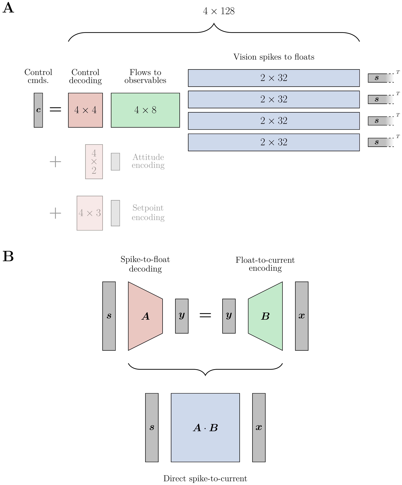

# 2303 08778V1

**Source Document:** `2303.08778v1.pdf`  
**Total Pages:** 18  

---

## --- Page 1 ---

### Section: 1 Introduction

Research Article
1

Fully neuromorphic vision and control
for autonomous drone flight

F. PAREDES-VALLÉS† , J. J. HAGENAARS† ∗, J. D. DUPEYROUX† , S. STROOBANTS , Y. XU , AND
G. C. H. E. DE CROON

Micro Air Vehicle Laboratory, Faculty of Aerospace Engineering, Delft University of Technology, Delft, Netherlands
*To whom correspondence should be addressed: j.j.hagenaars@tudelft.nl.
†Equal contribution.

Biological sensing and processing is asynchronous and sparse, leading to low-latency and energy-efficient
perception and action. In robotics, neuromorphic hardware for event-based vision and spiking neural net-
works promises to exhibit similar characteristics. However, robotic implementations have been limited
to basic tasks with low-dimensional sensory inputs and motor actions due to the restricted network size
in current embedded neuromorphic processors and the difficulties of training spiking neural networks.
Here, we present the first fully neuromorphic vision-to-control pipeline for controlling a freely flying
drone. Specifically, we train a spiking neural network that accepts high-dimensional raw event-based
camera data and outputs low-level control actions for performing autonomous vision-based flight. The
vision part of the network, consisting of five layers and 28.8k neurons, maps incoming raw events to ego-
motion estimates and is trained with self-supervised learning on real event data. The control part consists
of a single decoding layer and is learned with an evolutionary algorithm in a drone simulator. Robotic
experiments show a successful sim-to-real transfer of the fully learned neuromorphic pipeline. The drone
can accurately follow different ego-motion setpoints, allowing for hovering, landing, and maneuvering
sideways - even while yawing at the same time. The neuromorphic pipeline runs on board on Intel’s
Loihi neuromorphic processor with an execution frequency of 200 Hz, spending only 27 µJ per inference.
These results illustrate the potential of neuromorphic sensing and processing for enabling smaller, more
intelligent robots.

#### 1. INTRODUCTION

Over the past decade, deep artificial neural networks (ANNs)
have revolutionized the field of artificial intelligence. Among
the successes has been the significant improvement of visual
processing, to an extent that computer vision can now outper-
form humans on specific tasks [1]. Also the field of robotics
has benefited from this development, with deep ANNs achiev-
ing state-of-the-art performance in tasks such as stereo vision
[2, 3], optical flow estimation [4–6], segmentation [7, 8], object
detection [9–11], and monocular depth estimation [12–14]. How-
ever, this high performance typically relies on substantial neural
network sizes that require quite heavy and power-hungry pro-
cessing hardware. This limits the number of tasks that can be
performed by large robots, such as self-driving cars, and even
prevents deployment on smaller robots with highly stringent
resource constraints, like small flying drones.

Neuromorphic hardware may provide a solution to this prob-
lem, since it mimics the sparse and asynchronous nature of
sensing and processing in biological brains [15]. For example,
the pixels in neuromorphic, event-based cameras only transmit

information on brightness changes [16]. Since typically only
a fraction of the pixels change in brightness significantly, this
leads to sparse vision inputs with subsequent events that are in
the order of a microsecond apart. The asynchronous and sparse
nature of visual inputs from event-based cameras represents a
paradigm shift compared to traditional, frame-based computer
vision. Ideally, processing would exploit these properties for
quicker, more energy-efficient processing. However, currently,
the main approach to event-based vision processing is to accu-
mulate events over a substantial amount of time, creating an
“event window” that represents extended temporal information.

This window is then processed similarly to a traditional image
frame with an ANN [17–20]. One important avenue to achieve
the full potential of neuromorphic vision is to process events
asynchronously as they come in by means of neuromorphic
processors designed for implementing spiking neural networks
(SNNs) [21, 22]. These networks have temporal dynamics more
similar to biological neurons. In particular, the neurons have a
membrane voltage that integrates incoming inputs and causes a
spike when it exceeds a threshold. The binary nature of spikes al-
lows for much more energy-efficient processing than the floating

arXiv:2303.08778v1  [cs.RO]  15 Mar 2023

## --- Page 2 ---

Research Article
2

point arithmetic in traditional ANNs. The energy gain is further
improved by reducing the spiking activity as much as possible,
as is also a main property of biological brains [23]. Coupling
neuromorphic vision to neuromorphic processing promises low-
energy and low-latency visual sensing and acting, as exhibited
by agile animals such as flying insects [24].

In this article, we present the first fully neuromorphic vision-
to-control pipeline for controlling a freely flying drone, demon-
strating the potential of neuromorphic hardware. To achieve
this, we overcome several challenges related to present-day neu-
romorphic sensing and processing. For example, training is
currently still much more difficult for SNNs than for ANNs
[25, 26], mostly due to their sparse, binary, and asynchronous
nature. Whereas continuous values can directly serve as input or
output in ANNs, they have to be encoded or decoded in SNNs.
Although various coding options are available [27–29], it is still
far from clear what the best choices are given a problem’s prop-
erties—as it is also still unknown how biological brains encode
information [30–33]. The most well-known difficulty of SNN
learning is the non-differentiability of the spiking activation
function, which prevents naive application of backpropagation.
Currently, this is tackled rather successfully with the help of
surrogate gradients [34, 35]. Moreover, while the richer neu-
ral dynamics can potentially represent more complex temporal
functions, they are also harder to shape; and neural activity may
saturate or dwindle during training, preventing further learn-
ing. The causes for this are hard to analyze, as there are many
parameters that can play a role. Depending on the model, the
relevant parameters may range from neural leaks and thresholds
to recurrent weights and time constants for synaptic traces. A
solution may lie in learning these parameters [36, 37], but this
further increases the dimensionality of the learning problem.
Finally, when targeting a robotics application, SNN training and
deployment is further complicated by the restrictions of exist-
ing embedded neuromorphic processing platforms, which are
typically still rather limited in terms of numbers of neurons and
synapses. As an illustration, the ROLLS chip [38] accommodates
256 spiking neurons, the Intel Kapoho Bay (featuring two Loihi
chips [39] in a USB stick form factor) 262.1k neurons [40], and the
SpiNNaker version in [41] 768k neurons. Although these chips
differ in many more aspects than only the number of neurons,
this small sample already shows that current state-of-the-art
SNNs cannot be easily embedded on robots. SNNs that have
recently been trained on visually complex tasks such as optical
flow determination [42, 43], still feature far too large network
sizes for implementation on current neuromorphic processing
hardware for embedded systems. The smallest size SNN in
these studies is LIF-FireFlowNet for optical flow estimation [43],
which still has 3.7M neurons (at an input resolution of 128x128).

As a consequence, pioneering work in this area has been lim-
ited in complexity. Very early work involved the evolution of
spiking neural network connectivity to map the 16 visual bright-
ness inputs of a wheeled Kephera robot to its two motor outputs
[44]. The evolved SNN, simulated in software, allowed the robot
to avoid the walls in a black-and-white-striped environment.
Most work exploring SNNs for robotics focuses on simulation.
For example, in [45], the events from a simulated event-based
camera with 128x128 pixels are accumulated into frames, com-
pressing them over time into 8x4 Poisson input neurons. These
inputs, which capture the clear white lines of the road border,
are then directly mapped to two output neurons for staying in
the center of the road with the help of reward-modulated spike-
time-dependent plasticity (R-STDP) learning. Robotic examples

of in-hardware neuromorphic processing are more rare. An early
example is the one in [41], in which an event-based camera with
128x128 pixels is connected to a SpiNNaker neuromorphic pro-
cessor to allow a driving robot to differentiate between two lights
flashing at different frequencies with a 128-neuron winner-takes-
all network. In [46] a spiking neural network is designed for
following a light target in the top half of the field of view, while
avoiding regions with many events in the bottom half of the field
of view. This network is successfully implemented in the ROLLS
neuromorphic chip [38] and tested in an office environment. Re-
cent years have seen an increasing focus on flying robots, i.e.,
drones, because they need to react quickly while being extremely
restricted in terms of size, weight, and power (SWaP). In [40],
an SNN is implemented on a bench-fixed dual-rotor to align
the roll angle with a black-and-white disk located in front of
the camera. The SNN involved both a visual Hough transform
[47] for finding the line, and a proportional-derivative (PD) con-
troller for generating the propeller commands. Finally, in [48],
an SNN was first evolved in simulation and then implemented
in Loihi for vision-based landing of a freely flying drone. This
control network only consisted of 35 neurons since the visual
processing was still performed with conventional, frame-based
computer vision methods. Additionally, it is worth noting that
only the vertical motion of the drone was controlled with the
SNN; its lateral position was controlled using traditional control
algorithms and an external motion capture system.

A fully neuromorphic solution to vision-based navigation
The presented vision-to-control pipeline consists of a spiking
neural network that is trained to accept high-dimensional raw
event-camera data and output low-level control actions for per-
forming autonomous vision-based ego-motion estimation and
control at approximately 200 Hz. Moreover, we propose a learn-
ing setup that evades the issue of the slow and inaccurate simu-
lation of event-based vision inputs for control policy learning.
In particular, it splits vision and control, so that the vision part
of the network can be trained with self-supervised learning, and
the control policy can be learned in a drone simulator that does
not need to simulate events. The resulting pipeline, illustrated
in Fig. 1C, was implemented on the Loihi neuromorphic proces-
sor [39] and used on board a small flying robot (see Fig. 1B) for
vision-based navigation. A schematic of the hardware setup em-
ployed is shown in Fig. 1A. The system successfully follows ego-
motion setpoints in a fully autonomous fashion, i.e., without any
external aids such as a positioning system. Fig. 1D shows an ex-
ample of a landing experiment with our neuromorphic pipeline
in the control loop of the drone. The figure shows the smoothly
decreasing height (blue line), and the optical flow divergence,
which is the vertical component of the scaled velocity vector
νB = vB/pWB
z
, where pWB
z
is the height of the drone above the
ground. The divergence curve is typical of an optical flow diver-
gence landing, first approaching the setpoint νBz,sp = −0.5 1/s
and then becoming more oscillatory when getting very close to
the ground [49].

As mentioned, the main challenge of deploying such a
pipeline on embedded neuromorphic hardware is that, due to
the preliminary state of this technology, one has to work within
very tight limits regarding the available computational resources.
In this project, several design decisions were made to adapt to
these limitations. Firstly, the vision processing pipeline assumes
that the event-based camera on the drone, the DAVIS240C [50],
looks down at a static flat surface. Knowing the structure of
the visual scene in advance simplifies the estimation of the ego-

## --- Page 3 ---

Research Article
3

Fig. 1. Overview of the proposed system. (A) Quadrotor used in this work (total weight 1.0 kg, tip-to-tip diameter 35 cm). (B)
Hardware overview showing the communication between event-camera, neuromorphic processor, single-board computer and
flight controller (C) Pipeline overview showing events as input, processing by the vision network and decoding into a control
command. (D) Demonstration of the system for an optical flow divergence landing.

motion of the camera (and hence of the drone) with the help
of optical flow information, as in [48, 49, 51–53]. Optical flow,
i.e., the apparent motion of scene points in the image space, can
be estimated from the output of an event-based camera with a
wide variety of methods, ranging from sparse feature-tracking
algorithms [54] to dense (i.e., per-pixel) machine learning mod-
els [17, 19, 43]. In the search for an efficient and high-bandwidth
vision pipeline, the second design decision was to reduce the
spatial resolution of the event-based vision data by only process-
ing information from the image corners rather than the entire
image space. More specifically, as depicted in Figs. 1C and 2A,
we propose the use of a small spiking neural network that is
applied independently at each image corner, with each corner
being 16x16 pixels in size after a nearest-neighbor downsam-
pling operation. Each network consists of 7.2k neurons and
506.4k synapses distributed over five spiking layers, i.e., one
input layer, three self-recurrent encoders, and a pooling layer. Its
parameters (i.e., weights, thresholds, and leaks) are identical for
the four corners, and it estimates the optical flow, in pixels per
millisecond, of the corresponding corner. Because of the static
and planar scene assumption, the apparent motion of the scene
points at the four image corners encodes non-metric information
about the velocity of the camera (i.e., scaled by the distance to

the surface along the optical axis) and its rotational rates in a
linear manner [55]. We use this relation, combined with a linear
control layer trained in simulation, to convert the spikes that
encode the optical flow directly into thrust and attitude control
commands (given a setpoint). This allows us to tackle the vision-
based control of a freely flying drone in a fully neuromorphic
fashion.

We split the training of our vision-to-control pipeline into two
separate frameworks. On the one hand, the vision part of the
pipeline, in charge of mapping input events to optical flow, is
trained in a self-supervised fashion using the contrast maximiza-
tion framework [56, 57]. The idea behind this approach is that,
by compensating for the spatiotemporal misalignments among
the events triggered by a moving edge (i.e., event deblurring),
one can retrieve accurate optical flow information. In this work,
we use the formulation proposed in [43] and shown in Fig. 2.
Corner events within non-overlapping temporal windows of
5 milliseconds are processed sequentially by our spiking net-
works, which provide optical flow estimates at every timestep.
Only during training, we use the motion information of the four
corners to parameterize a homography transformation that, un-
der the assumption of static planar surface, allows us to retrieve
dense optical flow, as in [55, 58–60]. Following [43], we accu-

*Caption/Context: Research Article 3 | Fig. 1. Overview of the proposed system. (A) Quadrotor used in this work (total weight 1.0 kg, tip-to-tip diameter 35 cm). (B) Hardware overview showing the communication between event-camera, neuromorphic processor, single-board computer and flight controller (C) Pipeline overview showing events as input, processing by the vision network and decoding into a control command. (D) Demonstration of the system for an optical flow divergence landing.*

## --- Page 4 ---

Research Article
4

Fig. 2. Overview of the spiking vision network. Running at approx. 200 Hz, events are accumulated (max 90 events per corner)
and then fed through the vision network consisting of three encoders (kernel size 3x3, stride 2) and a spiking pooling layer. Spikes
are decoded into two floats representing flow for that corner. This network is replicated to the three other corners, in order to end
up with four corner optical flows vectors. During training, these are used in a homography transformation to derive dense flow,
which is then used for the self-supervised loss. The full network is running on the neuromorphic processor during the real-world
flight tests.

mulate event and optical flow tuples over multiple timesteps
for contrast maximization to be a robust self-supervisory signal,
and only compute the deblurring loss function and perform a
backward pass through the networks (using backpropagation
through time) once 25 milliseconds of event data have been pro-
cessed. To cope with the non-differentiable spiking function of
our neurons, we use surrogate gradients [34].

On the other hand, the control part of the network, consist-
ing of a linear mapping from the motion of the four corners
to thrust and attitude control commands, is trained in a drone
simulator using a genetic algorithm. Fig. 3 gives an overview
of this. To get around the need to incorporate an event-based
vision pipeline in simulation, we use the ground-truth state of
the simulated drone to generate the expected corner flows using
the continuous homography transform [61], and use these to
construct the scaled velocity and yaw rate estimates that make
up the visual observables of the camera’s ego-motion [51, 62].
The inputs to the linear control mapping are then these visual
observables, absolute roll and pitch (from the drone’s inertial
measurement unit) and a desired setpoint for the visual observ-
ables. The outputs of the controller (i.e., desired collective thrust,
pitch and roll angles and yaw rate) are subsequently applied to
the drone model in order to control it. During evolution, the
fitness of a controller is determined based on the accumulated
visual observable error in an evaluation. We evaluate each of the
agents in the population on a set of (repeated) setpoints repre-
senting horizontal and vertical flight, create offspring through
random mutations, and select the best individuals for the next
generation. The trained controller is transferred directly to the
real robot, without any retraining.

#### RESULTS

Because of the split between the vision and control parts of the
pipeline, we can evaluate their performance separately. The
estimated corner flows of the vision part are compared against
ground truth data obtained from a motion capture system, while
the control part is evaluated in simulation. Connecting vision
and control together, we then demonstrate the performance
of our fully neuromorphic vision-to-control pipeline through
real-world flight tests. To further illustrate the robustness of
our vision-based state estimation, we perform real-world tests
with changing setpoints, and tests in various lighting conditions.
Lastly, we compare energy consumption against possible on-
board GPU solutions.

Robust vision-based state estimation
To prevent reality-gap issues when simulating an event-based
camera, we train and evaluate the vision part of our pipeline us-
ing real-world event sequences recorded with the same platform
(i.e., drone and downward-facing event-based camera) and in
the same indoor environment (i.e., static and planar, constant
illumination). This dataset consists of approximately 40 min-
utes of event data, which we split into 25 minutes for training
and 15 for evaluation, and its motion statistics are shown in
Fig. 4A. In addition to the visual data, the ground truth pose
(i.e., position and attitude) of the drone over time is provided at
a rate of 180 Hz, and is used solely for evaluation. Examples of
this ground truth, which can be converted to dense optical flow
using the camera calibration, are shown in Fig. 4A alongside the
floor texture of the indoor environment. Note that this dataset is
available with the supplementary material of this work.

![Research Article 4 | Fig. 2. Overview of the spiking vision network. Running at approx. 200 Hz, events are accumulated (max 90 events per corner) and then fed through the vision network consisting of three encoders (kernel size 3x3, stride 2) and a spiking pooling layer. Spikes are decoded into two floats representing flow for that corner. This network is replicated to the three other corners, in order to end up with four corner optical flows vectors. During training, these are used in a homography transformation to derive dense flow, which is then used for the self-supervised loss. The full network is running on the neuromorphic processor during the real-world flight tests.](images/page_004_fig_01.png)
*Caption/Context: Research Article 4 | Fig. 2. Overview of the spiking vision network. Running at approx. 200 Hz, events are accumulated (max 90 events per corner) and then fed through the vision network consisting of three encoders (kernel size 3x3, stride 2) and a spiking pooling layer. Spikes are decoded into two floats representing flow for that corner. This network is replicated to the three other corners, in order to end up with four corner optical flows vectors. During training, these are used in a homography transformation to derive dense flow, which is then used for the self-supervised loss. The full network is running on the neuromorphic processor during the real-world flight tests.*

## --- Page 5 ---

Research Article
5

Fig. 3. Overview of the control pipeline for simulation and real-world tests. During training in simulation, we construct visual
observable observations from ground-truth using the continuous homography transform. The control decoding takes these observ-
ables together with roll and pitch and a setpoint to output commands, which control the drone dynamics. We train the controller
using evolution based on a fitness signal that quantifies how well the controller can follow setpoints for horizontal and vertical
flight. In the real world, we receive corner flows from the vision network, transform these to visual observables and control com-
mands in a single matrix multiplication in order to send low-level control commands thrust and attitude to the autopilot.

We train our vision SNN with the self-supervised contrast
maximization framework from [43] and a quantization-aware
training routine that simulates the neuron and synapse models
in the target neuromorphic hardware. Once this is done, we
evaluate the performance of our spiking network on the task of
planar event-based optical flow estimation using sequences with
varying amounts of motion. Qualitative results are presented
in Fig. 4B, where the estimated visual observables (constructed
from the estimated optical flow vectors at the image corners)
are compared to their ground-truth counterparts. These results
confirm the validity of our approach. Despite the architectural
limitations of the proposed solution (e.g., spike-based process-
ing, limited field of view, only self-recurrency, weight and state
quantization) and the fact that it does not have access to ground-
truth information during training, it is able to produce optical
flow estimates that accurately capture the motion encoded in the
input event stream, i.e., the ego-motion of the camera. This is es-
pecially remarkable for the shown fast sequence, where towards
the end the camera is spinning with approximately 200 deg/s.

In Fig. 4C, we show the internal spiking activity of our vision
SNN as it processes the top-left corner of the image space from
the fast sequence shown in Fig. 4B, along with the decoded opti-
cal flow vectors. These qualitative results provide insight into
the type of processing carried out by the proposed architecture,
which is spike-based and therefore sparse and asynchronous.
Notably, despite the rapid motion in the input sequence, all
layers of the SNN maintain activation levels below 50% of the
available neurons. Note that the network was not explicitly
trained to promote sparse activations. Furthermore, we can
distinguish layers with activity levels that are highly correlated

with the input activity (i.e., encoder 1 and pooling), while others
rely on their explicit recurrent connections to maintain activity
levels that are relatively independent of the input statistics (i.e.,
encoder 2 and encoder 3).

In Table 1, we provide a quantitative comparison of our so-
lution with other similar recurrent architectures, based on the
average endpoint error (EPE) (i.e., Euclidean distance between
predicted and ground-truth optical flow vectors). This evalu-
ation not only demonstrates the performance of our spiking
network, but also assesses the impact of each mechanism that
was incorporated into the pipeline to achieve a solution that
could be deployed on Loihi at the target frequency of 200 Hz.
Several conclusions can be drawn from these results. Firstly, the
ANN outperforms its spiking variants by a large margin, and
self-recurrency is the weakest form of explicit recurrency among
those tested. Secondly, deploying one architecture to each image
corner instead of processing the entire image space at once is
beneficial for our architecture, while only having a slight detri-
mental effect on the baselines. Limiting the number of events
that can be processed at once to 90 per corner is also helpful
for the evaluated SNNs, as it helps reduce the internal activity
levels. Lastly, the incorporation of the Loihi-specific weight and
state quantization leads to an error increase for our architecture.

Control through visual observables: from sim to real

Separately from the vision part, we train and evaluate the control
part of our pipeline. This is a linear mapping from visual observ-
ables (i.e., scaled velocities estimate ˆνB and yaw rate estimate

ˆωBz ), absolute roll and pitch and a visual observable setpoint
to thrust and attitude commands. A population of these map-

![Research Article 5 | Fig. 3. Overview of the control pipeline for simulation and real-world tests. During training in simulation, we construct visual observable observations from ground-truth using the continuous homography transform. The control decoding takes these observ- ables together with roll and pitch and a setpoint to output commands, which control the drone dynamics. We train the controller using evolution based on a fitness signal that quantifies how well the controller can follow setpoints for horizontal and vertical flight. In the real world, we receive corner flows from the vision network, transform these to visual observables and control com- mands in a single matrix multiplication in order to send low-level control commands thrust and attitude to the autopilot.](images/page_005_fig_01.png)
*Caption/Context: Research Article 5 | Fig. 3. Overview of the control pipeline for simulation and real-world tests. During training in simulation, we construct visual observable observations from ground-truth using the continuous homography transform. The control decoding takes these observ- ables together with roll and pitch and a setpoint to output commands, which control the drone dynamics. We train the controller using evolution based on a fitness signal that quantifies how well the controller can follow setpoints for horizontal and vertical flight. In the real world, we receive corner flows from the vision network, transform these to visual observables and control com- mands in a single matrix multiplication in order to send low-level control commands thrust and attitude to the autopilot.*

## --- Page 6 ---

Research Article
6

Fig. 4. Overview of results for the vision-based state estimation. (A) Qualitative analysis of the training dataset for planar optical
flow. Accumulated and blurry events can be deblurred using the ground-truth flow. Events result from a repeating texture on the
ground. Flow magnitude is well-distributed across both training and test datasets. (B) Comparison of estimated and ground-truth
visual observables for sequences with different motion speeds (slow, medium, fast). (C) Network activity resulting from the top-left-
corner events in the fast motion sequence.

pings is evolved in simulation for a set of 16 visual observable
setpoints. Each scaled velocity setpoint νBsp has at most one
nonzero element ∈{±0.2, ±0.5, ±1.0} 1/s. In other words: they
represent hover, vertical flight in the form of landing at three
speeds (no ascending flight), and horizontal flight in four direc-
tions at three speeds. Unless mentioned otherwise, the setpoint
for yaw rate ωBz,sp = 0. The first column of Fig. 5 shows the
performance of the evolved linear network controller in simu-

lation in terms of the estimated scaled velocities ˆνB (Fig. 5A)
and the world position pWB over time (Fig. 5B) for all setpoints.
The controller reaches the setpoint in all cases, and is capable of
keeping the scaled velocities for the non-flight direction close to
zero. Especially for νB∗,sp = ±1.0 1/s, there is overshoot, but this
can be expected given that this is a linear mapping without any
kind of derivative control.

We get the second column of Fig. 5 by deploying this con-
troller in the real world, and replacing the ground-truth visual

![Research Article 6 | Fig. 4. Overview of results for the vision-based state estimation. (A) Qualitative analysis of the training dataset for planar optical flow. Accumulated and blurry events can be deblurred using the ground-truth flow. Events result from a repeating texture on the ground. Flow magnitude is well-distributed across both training and test datasets. (B) Comparison of estimated and ground-truth visual observables for sequences with different motion speeds (slow, medium, fast). (C) Network activity resulting from the top-left- corner events in the fast motion sequence.](images/page_006_fig_01.png)
*Caption/Context: Research Article 6 | Fig. 4. Overview of results for the vision-based state estimation. (A) Qualitative analysis of the training dataset for planar optical flow. Accumulated and blurry events can be deblurred using the ground-truth flow. Events result from a repeating texture on the ground. Flow magnitude is well-distributed across both training and test datasets. (B) Comparison of estimated and ground-truth visual observables for sequences with different motion speeds (slow, medium, fast). (C) Network activity resulting from the top-left- corner events in the fast motion sequence.*

## --- Page 7 ---

Research Article
7

Table 1. Quantitative comparison between different architectures. Bottom right corner, in bold, indicates the eventual architecture.
Row-wise architecture choices and column-wise design decisions impact test performance in average endpoint error (EPE).

Full image
+2x Down.
+Corner crop
+Limit events
+Loihi quant.

Conv-GRU ANN
+2.45%
Best, 0.056 EPE
+0.94%
+2.94%
-

Conv-RNN SNN
+42.48%
+41.96%
+42.25%
+25.48%
+25.32%

Self-RNN SNN (ours)
+94.16%
+76.45%
+48.00%
+38.74%
+50.04%

observables with those estimated by the vision network. Look-
ing at the scaled velocity plots for the different setpoints, we see
that these become less noisy for higher setpoints and faster flight,
as can also be seen from the 3D position plots. This is due to the
fact that the signal-to-noise ratio of the vision-based state estima-
tion increases with motion magnitude (little motion means most
events are due to noise, as can be seen in Fig. 4). Also, the inertia
of the drone provides some stability at higher speeds. Overall,
the results demonstrate successful deployment of the fully neu-
romorphic vision-to-control pipeline. Nevertheless, apart from
several setpoints (e.g., landings, νB

{x,y},sp = ±0.2 1/s), the con-
troller is not able to reach the desired setpoint: the steady-state
error looks to be proportional to the setpoint magnitude. This
can be attributed to the fact that while the controller is a linear
mapping, the relationship between attitude angle and resulting
forward/sideways velocity is nonlinear as a result of drag. Pro-
viding absolute attitude input to the network, and simulating
the drag (as in [63]) during training turned out not to be enough
to compensate. Furthermore, there can be mismatches between
the dynamics of the simulated drone (body characteristics, mo-
tor dynamics) with which the controller was trained and the real
drone on which the flight tests were performed, even though we
abstracted the control outputs to attitude commands. Lastly, in-
accuracies of the drag model can also be a source of error (in this
case, it seems that drag was higher in reality than in simulation).

The third column of Fig. 5 shows the results obtained by
connecting a hand-tuned proportional-integral (PI) controller to
the vision-based state estimation. We compare this to the linear
network controller. Looking at all directions and setpoints, we
see that the PI controller reaches the setpoint faster than the
network controller. For horizontal flight, the network controller
is not at all able to reach the setpoint νB

{x,y},sp = ±1.0 1/s and
only just in the case of ±0.5 1/s, supposedly due to the limi-
tations of linear control. The PI controller does not have this
problem, as it can increment its control command to eliminate
the steady-state error. For vertical flight, both the network and
the PI controller have quite some overshoot for νBz,sp = −1.0 1/s.
That this is so obvious, however, has to do with the fact that
at such speeds from such heights (i.e., 2.5 m), the drone barely
reaches the setpoint before reaching the ground, and therefore
has little time to compensate for any overshoot (look at the PI
controller for νBz,sp = −0.5 1/s; there overshoot is similar but is
corrected shortly after). A slightly lower gain or a derivative
term could help here.

Disco, darkness, squares and frisbees: examples of versatility
and robustness

We can combine the vision-based state estimation with the PI
controller to show the versatility and robustness of the former
through various other tests, with the benefit of not having to

include these in training for the linear network controller. Fig. 6A
shows these tests. The top row displays the user alternating
through different scaled velocity setpoints in X and Y (while
keeping yaw constant) in order to let the drone fly a square.
While the controller is able to reach the desired setpoint quite
quickly, allowing for rather sharp corners, there is significant
drift in yaw, leading to a slightly rotated second square with
respect to the first.

The bottom row of Fig. 6A shows an experiment in which
the drone has to fly in a straight line while spinning around
its Z axis like a frisbee. The drone receives a nonzero yaw rate
setpoint ωBz,sp = 0.2 rad/s. In combination with a setpoint of
νBy,sp = 0.5 1/s this would lead to the drone flying in a circle.
To prevent this and achieve the frisbee-like spinning effect, we
rotate νBy,sp by the yaw angle. The first and last plot show that
this works: despite some drift in X and Z, the setpoints are
followed well and the 3D position trajectory is quite straight.
The second plot shows that the desired yaw rate is tracked well
and that the yaw angle is constantly increasing.

Fig. 6B shows landing with divergence νBz,sp = −0.5 1/s for
various lighting conditions (quantified with lux measurements).
The events for the top left corner are shown in the bottom row.
The light and darkish settings look alike, but flickering lights
lead to a large increase in events, while the darkest setting gives
almost no events. As the middle row of plots shows, despite the
challenging light conditions, the controller is able to track the
setpoint (black dashed line) quite well, and the estimated scaled
velocities approximate their ground thruths. Only the darkest
setting poses a real problem for the state estimation: in that
case, the estimated scaled velocities ˆνB diverge too much from
the ground truth scaled velocities νB to perform a successful
landing.

Improved inference speed and energy consumption on neuro-
morphic hardware

Table 2 shows a comparison in terms of power/energy and run-
time between the Loihi neuromorphic processor and an NVIDIA
Jetson Nano for running the vision network on sequences with
varying amounts of motion and hence varying input event den-
sity. The SNN runs in hardware on Loihi and in software (Py-
Torch) on Jetson Nano. The tests for Loihi were performed on
a Nahuku board, which contains 32 Loihi chips. We confirmed,
insofar possible, that using two chips on Nahuku is representa-
tive of a Kapoho Bay (at least in terms of execution time), which
is the two-chip form factor used on the drone. Still, neither
of these benchmarks is completely representative of the tests
performed in the real world: the benchmarks use data already
loaded in memory, and therefore only quantify the processing
by the network without any bottlenecks or impacts due to I/O
and preprocessing, whereas the flight tests involve streaming

## --- Page 8 ---

Research Article
8

Fig. 5. Comparison of results obtained in simulation and during real-world flight tests. (A) Estimated scaled velocities for 16
different setpoints in three axes, across three scenarios: linear network controller in simulation and the real world, and a hand-
tuned proportional-integral (PI) controller in the real world. (B) 3D world position trajectories for the same flight tests, offset to
accomodate more plots in a single figure. Each cube in (B) matches the plot in the corresponding location in (A).

event data that is coming in and is being processed in an online
fashion. This shows in Loihi’s execution frequencies in Table 2,
which are well above the 200 Inf/s achieved during flight tests.

Because Jetson Nano does not provide static and dynamic
power components, we compare the difference between idle and
running power, and use that to compute energy per inference.

![Research Article 8 | Fig. 5. Comparison of results obtained in simulation and during real-world flight tests. (A) Estimated scaled velocities for 16 different setpoints in three axes, across three scenarios: linear network controller in simulation and the real world, and a hand- tuned proportional-integral (PI) controller in the real world. (B) 3D world position trajectories for the same flight tests, offset to accomodate more plots in a single figure. Each cube in (B) matches the plot in the corresponding location in (A).](images/page_008_fig_01.png)
*Caption/Context: Research Article 8 | Fig. 5. Comparison of results obtained in simulation and during real-world flight tests. (A) Estimated scaled velocities for 16 different setpoints in three axes, across three scenarios: linear network controller in simulation and the real world, and a hand- tuned proportional-integral (PI) controller in the real world. (B) 3D world position trajectories for the same flight tests, offset to accomodate more plots in a single figure. Each cube in (B) matches the plot in the corresponding location in (A).*

## --- Page 9 ---

Research Article
9

Fig. 6. Results with vision network and proportional-integral (PI) controller. (A) Top row: alternating setpoints in X and Y in
order to fly a square. Bottom row: rotating the scaled velocity setpoint by the yaw angle leads the drone spinning around its Z-axis
while flying in a straight line. (B) Landing experiments with different lighting conditions. While flickering lights lead to many more
events, visual observable estimates (and hence control) only diverge when it is so dark that there are almost no events.

Loihi, depending on the sequence, outperforms Jetson Nano by
three to four orders of magnitude, providing a one to two orders
of magnitude improvement in execution frequency. Further-
more, the benefits of neuromorphic processing show in Loihi’s
increasing execution frequency as event sparsity increases (from
fast to slow motion sequences). Note that a GPU like Jetson
Nano is not optimized to simulate SNNs, and a more efficient
implementation could be obtained by running a feedforward
ANN with multiple temporal windows of events as input.

#### DISCUSSION AND CONCLUSION

We presented the first fully neuromorphic vision-to-control
pipeline for controlling a freely flying drone. Specifically, we
trained a spiking neural network that takes in high-dimensional
raw event-based camera data and produces low-level control
commands. Real-world experiments demonstrated a successful
sim-to-real transfer: the drone can accurately follow various
ego-motion setpoints, performing hovering, landing, and lateral
maneuvers—even under constant yaw rate.

Our study confirms the potential of a fully neuromorphic

![Research Article 9 | Fig. 6. Results with vision network and proportional-integral (PI) controller. (A) Top row: alternating setpoints in X and Y in order to fly a square. Bottom row: rotating the scaled velocity setpoint by the yaw angle leads the drone spinning around its Z-axis while flying in a straight line. (B) Landing experiments with different lighting conditions. While flickering lights lead to many more events, visual observable estimates (and hence control) only diverge when it is so dark that there are almost no events.](images/page_009_fig_01.png)
*Caption/Context: Research Article 9 | Fig. 6. Results with vision network and proportional-integral (PI) controller. (A) Top row: alternating setpoints in X and Y in order to fly a square. Bottom row: rotating the scaled velocity setpoint by the yaw angle leads the drone spinning around its Z-axis while flying in a straight line. (B) Landing experiments with different lighting conditions. While flickering lights lead to many more events, visual observable estimates (and hence control) only diverge when it is so dark that there are almost no events.*

## --- Page 10 ---

Research Article
10

Table 2. Approximate energy and power characteristics for various devices on three sequences: slow, medium and fast. On aver-
age, slow has 28.6 events/inf, medium has 106.9 events/inf, and fast has 186.6 events/inf. Delta power is the difference between
idle and running (total) power, and is used to compute energy per inference. Dynamic power is the power needed for switching
and short-circuiting, while static power is due to leakage; together they sum to running (total) power as well. Nahuku is a board
with 32 Loihi chips (Kapoho Bay has 2). A Nahuku configuration where no spikes are sent and only chips and cores are allocated
(no synapses) is included as ‘empty’. Jetson Nano has a low-power (5W) and high-power (10W) mode.

Device
Seq.
Static [W]
Dynamic [W]
Idle [W]
Running [W]
Delta [W]
Inf/s
µJ/Inf

Nahuku 32 (empty)
any
0.861
0.040
0.897
0.901
0.004
60496
0.071

Nahuku 32

slow
0.899
0.048
0.935
0.947
0.012
1637
7.165

medium
0.900
0.044
0.936
0.945
0.008
411
20.602

fast
0.902
0.043
0.938
0.946
0.007
274
27.207

Jetson Nano (5W)

slow
-
-
1.053
2.229
1.177
14
86111.152

medium
-
-
1.027
2.245
1.218
14
85576.977

fast
-
-
1.030
2.238
1.208
14
86187.999

Jetson Nano (10W)

slow
-
-
1.043
2.974
1.931
26
75246.618

medium
-
-
1.058
2.981
1.923
26
75347.505

fast
-
-
1.044
2.991
1.947
25
76522.389

vision-to-control pipeline by running on board with an execution
frequency of 200 Hz, spending only 27 µJ per network inference.
However, there are still important hurdles on the way to reaping
the full system benefits of such a pipeline, embedding it on
extremely lightweight (e.g., <30 g) drones.

For reaching the full potential, the entire drone sensing, pro-
cessing, and actuation hardware should be neuromorphic, from
its accelerometer sensors to the processor and motors. Such hard-
ware is currently not available, so we have limited ourselves
to the vision-to-control pipeline, ending at thrust and attitude
commands. Concerning the neuromorphic processor, the biggest
advancement could come from improved I/O bandwidth and
interfacing options. The current processor could not be con-
nected to the event-based camera directly via AER, and with
our advanced use case, we reached the limits of the number of
spikes that can be sent to and received from the neuromorphic
processor at the desired high execution frequency. This is also
the reason that we have limited ourselves to a linear network
controller: the increase in input spikes needed to encode the
setpoint and attitude inputs would substantially reduce the ex-
ecution frequency of the pipeline. Ultimately, further gains in
terms of efficiency could be obtained when moving from digital
neuromorphic processors to analog hardware, but this will pose
even larger development and deployment challenges.

Despite the above-mentioned limitations, the current work
presents a substantial step towards neuromorphic sensing and
processing for drones. The results are encouraging, because they
show that neuromorphic sensing and processing may bring deep
neural networks within reach of small autonomous robots. In
time this may allow them to approach the agility, versatility and
robustness of animals such as flying insects.

#### MATERIALS AND METHODS

Here, we explain the main components of the proposed fully-
neuromorphic vision-to-control pipeline, starting with the neu-
ron model of our SNN and how this is trained in a self-

supervised fashion using real event camera data. Next, we
describe how the vision-based state estimate can be used for
navigation, and how we train a controller on top of it. Finally,
we discuss the real-world tests and hardware and the performed
energy benchmarks.

Neuromorphic state estimation: spiking, sequential process-
ing
In this study, we utilize a spiking neuron model based on
the current-based leaky-integrate-and-fire (CUBA-LIF) neuron,
whose membrane potential U and synaptic input current I at
timestep t can be written as:

Ut

i = τU(1 −St−1

i
)Ut−1

i
+ It

i
(1)

It

i = τI It−1

i
+ ∑

j

wff

ijSt

j + wrec

ii St−1

i
(2)

where j and i denote presynaptic (input) and postsynaptic (out-
put) neurons within a layer, S ∈{0, 1} a neuron spike, and wff

and wrec feedforward and self-recurrent connections (if any),
respectively. The decays (or leaks) of the two internal state vari-
ables of this neuron model are learned, and are denoted by τU
and τI. A neuron fires an output spike if the membrane potential
exceeds a threshold θ, which is also learned. The firing of a spike
triggers a hard reset of the membrane potential. Note that, in
this work, all neurons within a layer share the same decays and
firing threshold.

Neurons on the Loihi neuromorphic processor also follow the
CUBA-LIF model [39], however, several considerations must be
taken into account to accurately simulate these on-chip neurons.
Firstly, the two states variables are quantized in the integer
domain. Hence, the parameters associated with these variables
are also quantized in the same way: w ∈[−256 .. 256 −∆w] with
∆w being the quantization step for the synaptic weights, τ{U,I} ∈
[0 .. 4096] for the decays, and θ ∈[0 .. 131071] for the threshold.
We follow this quantization scheme with ∆w = 8 (6-bit weights)

## --- Page 11 ---

Research Article
11

in the simulation and training of our neural networks. Secondly,
to emulate the arithmetic left (bit) shift operations carried out
by the processor when updating the neuron states, we perform
a rounding towards zero operation after the application of the
decays. Taking these aspects into consideration, we obtain a
matching score of 100% between the simulated and the on-chip
spiking neurons. We use quantization-aware training (quantized
forward pass, floating-point backward pass) to minimize the
performance loss of our SNN when deployed on Loihi.

As
surrogate
gradient
for
the
spiking
function
σ,
we
opt
for
the
derivative
of
the
inverse
tangent
σ′(x) = aTan′ = 1/(1 + γx2) [37], with γ
=
10 being the
surrogate width and x = u −θ.

Neuromorphic state estimation: planar homography

Assuming that x = [x, y, 1]T and x′ = [x′, y′, 1]T are two undis-
torted corresponding points from a planar scene expressed in
homogeneous coordinates and captured by a pinhole camera at
different time instances, a planar homography transformation is
a linear projective transformation that maps x ↔x′ such that:

λ





x′

y′

1



#### = H





x

y

1



;
with H =





h11
h12
h13

h21
h22
h23

h31
h32
1




(3)

where H is a 3x3 non-singular matrix, further referred to as the
homography matrix, which is characterized by eight degrees of
freedom and is defined up to a scale factor λ.

From Eq. 3, we can formulate Akh = bk, an underdetermined
system of linear equations for the k-th point correspondence,
where:

Ak =



x
y
1
0
0
0
−x′x
−x′y

0
0
0
x
y
1
−y′x
−y′y




(4)

h =

h

h11
h12
h13
h21
h22
h23
h31
h32

iT

(5)

bk =

h

x′
y′

iT

(6)

As shown in Fig. 2A, our vision network predicts the displace-
ment of the corner pixels in a certain time window. Using this
information, we can solve for the components of the homogra-
phy matrix through h = A−1b, with A and b being the result
of the concatenation of the individual Ak and bk of each point
correspondence ∀k ∈{TL, TR, BR, BL}. This approach is re-
ferred to as the four-point parametrization of the homography
transformation [55], and it has proved to be successful in the
event-camera literature for robotics applications [60, 64]. How-
ever, to the best of our knowledge, it has never been formulated
for SNNs trained with self-supervised learning.

Once the homography matrix is estimated, we can estimate a
dense (i.e., per-pixel) optical flow map as follows:

u(x, H) =



u(x, H)

v(x, H)



#### = H



x

y



−



x

y




(7)

which encodes the displacement of pixel x in the time window
of H.

Neuromorphic state estimation: self-supervised learning
To train our spiking architecture to estimate the displacement
of the four corner pixels in a self-supervised fashion, we use
the contrast maximization framework for motion compensation
[56, 57]. Assuming constant illumination, accurate optical flow
information is encoded in the spatiotemporal misalignments
among the events triggered by a moving edge (i.e., blur). To
retrieve it, one has to learn to compensate for this motion (i.e.,
deblur the event partition) by transporting the events through
space and time. Once we get a per-pixel optical flow estimate
u(x, H) from Eq. 7, we can propagate the events to a reference
time tref through the following linear motion model:

x′

i = xi + (tref −ti)u(xi, H)
(8)

and the result of aggregating the propagated events is referred
to as the image of warped events (IWE) at tref.

As loss function, we use the reformulation from [43] of the
focus objective function based on the per-pixel and per-polarity
average timestamp of the IWE [18, 65]. The lower this metric,
the better the event deblurring and hence the more accurate the
estimated optical flow. We generate an image of the per-pixel
average timestamp for each polarity p′ via bilinear interpolation:

Tp′(x;u|tref) =

∑j κ(x −x′

j)κ(y −y′

j)tj

∑j κ(x −x′

j)κ(y −y′

j) + ϵ

κ(a) = max(0, 1 −|a|)

j = {i | pi = p′},
p′ ∈{+, −},
ϵ ≈0

(9)

Following [43], we first scale the sum of the squared temporal
images resulting from the warping process with the number of
pixels with at least one warped event:

Lcontrast(tref) = ∑x T+(x;u|tref)2 + T−(x;u|tref)2

∑x [n(x′) > 0] + ϵ
(10)

where n(x′) denotes a per-pixel event count of the IWE.

As in [18, 20, 43], we perform the warping process both in a
forward (tfw

ref) and in a backward fashion (tbw

ref ) to prevent tempo-
ral scaling issues during backpropagation. The total loss used to
train our event-based optical flow networks is then given by:

Lcontrast = Lcontrast(tfw

ref) + Lcontrast(tbw

ref )
(11)
Lflow = Lcontrast + λLLsmooth
(12)

where Lsmooth is a Charbonnier smoothness prior [66] applied
in the temporal domain to subsequent per-corner optical flow
estimates, while λL is a scalar balancing the effect of the two
losses. We empirically set this weight to λL = 0.1.

As discussed in [43], there has to be enough linear blur
in the input event partition for this loss function to be a ro-
bust supervisory signal [57, 67]. Since we process the event
stream sequentially, with only a few events being considered
at each forward pass, we define the so-called training partition
εtrain

k→k+K

.= {(εinp

i
, ˆui)}K

i=k, which is a buffer that gets populated
every forward pass with the input events and their correspond-
ing optical flow estimates. This is illustrated in Fig. 2A. At
training time, we perform a backward pass with the content of
the buffer using backpropagation through time once it contains 5
successive event-flow tuples (i.e., 25 milliseconds of event data),
after which we update the model parameters, detach its states
from the computational graph, and clear the buffer. We use
a batch size of 16 and train until convergence with the Adam
optimizer [68] and a learning rate of 1e-4.

## --- Page 12 ---

Research Article
12

From a vision-based state estimate to control

The corner flows [uTL, uTR, uBR, uBL]T ∈R8×1 resulting from the
vision-based state estimation can be used to control the drone.
More specifically, we can transform the corner flows to visual
observable estimates [51], consisting of scaled velocities ˆνC ∈
R3×1 and yaw rate ˆωCz in the camera frame C, as follows [62]:

uk = −



νCx

νCy



+ νC

z xk +



ωCz

−ωCz



◦xk
(13)

where ◦denotes the Hadamard (element-wise) product and

xk = [x, y]T is the projection of the world points in the corners of
the field of view onto the pixel array. Furthermore, it is assumed
that 1) the scene is static and planar, 2) angles in pitch and roll are
small and 3) optical flow is derotated in pitch and roll. Inverting
this relation for all four corners allows us to do a least-squares
estimation of the scaled velocities ˆνC and the yaw rate ˆωCz , which
can then be transformed to the body frame B. To perform control,
we can let a user select setpoints νBsp and ωBz,sp, and use a trained
or manually tuned controller to minimize the difference between
the estimated visual observables and their setpoints.

Because Eq. 13 is a linear transformation, it can be ‘merged’
with other transformations if these are also linear. This holds
for the decoding from spikes to corner flows in the vision SNN,
meaning that we can use a single linear transformation from
spikes to control commands if we use a linear controller. In
a similar fashion, we can use this idea to connect separately
trained SNNs, merging their linear decodings and encodings. If
both are implemented on neuromorphic hardware, this would
mean that no off-chip transfer is necessary. Fig. 7 illustrates these
concepts.

Training control in simulation

We perform control by linearly transforming the visual observ-
able estimates ˆνB ∈R3×1 and ˆωBz , the drone’s absolute roll |φ|
and pitch |θ| and the scaled velocity setpoint νBsp ∈R3×1 to a
control command c ∈R4×1, which consists of an upward, mass-
normalized collective thrust offset from hover ¯f0,c in the body
frame B, a roll angle φc and pitch angle θc, and a yaw rate ωBz,c,
in order to reach a certain setpoint of scaled velocities νBsp and
yaw rate ωBz,sp (always 0).

The control part is trained separately from the vision part be-
cause of the cost of accurately simulating event-based camera in-
puts (this needs subpixel displacements between frames, hence
high frame rate for fast motion). Simulation is done with a mod-
ified version of the drone simulator Flightmare [69]. To mimic
the output of the vision-based state estimation network, we first
compute the ground-truth continuous homography [61, 70] from
the state of the drone:

#### ˙H = K



[ωC]× +
1
pWC
z

vC(eW

−z)T



K−1
(14)

where ˙H is the continuous homography, K is the camera intrinsic
matrix, [ωC]× ∈R3×3 is a skew-symmetric matrix representing
infinitesimal rotations, pWC
z
is the Z-component of the position
vector from the world frame W to the camera frame C (repre-
senting perpendicular distance from the ground plane to the
camera), vC is the velocity of the camera, and eW
−z is the unit
vector in the negative Z-direction of the world frame. To obtain
angular rates and velocities in the camera frame, we use the

Fig. 7. Merging linear transformations. (A) We go directly
from output spikes s of the vision network to control com-
mands c in a single linear decoding by multiplying the in-
volved linear transformation matrices. (B) The same principle
can be applied to connect two separately trained spiking net-
works in a spiking manner, from spikes s to currents c, suit-
able for neuromorphic hardware.

camera extrinsics, consisting of a rotation RCB and a translation
TCB:

ωC = RCBωB
(15)

vC = RCB 

vB + [ωB]×TCB

(16)

Next, we use the continuous homography to get the flow of
the four corners [61, 70]:

uk = −



1 −xk(eW
−z)T

˙Hxk
(17)

where 1 is the identity matrix, and xk = [x, y, 1]T is the projection
of the world points in the corners of the field of view onto the
pixel array in homogeneous coordinates (so, xBL = [0, 180, 1]T

and xTR = [180, 0, 1]T, note the difference with respect to Eq. 13).
We add N (0, 0.025) noise to the flows uk (based on a characteri-
zation of the vision SNN). Eq. 13 is subsequently used to go from
corner flows to visual observables in the camera frame, which is
then transformed back to the body frame for control.

We use a mutation-only genetic algorithm with a population
size of 100 to evolve the weights of the linear controller matrix
∈R4×9, initialized as U(−0.1, 0.1). More specifically, we gener-
ate offspring by adding mutations drawn from N (0, 0.001) to
all parameters of each parent and then evaluate the fitness of
both parents and offspring. The next generation is comprised
of the best 100 individuals, and we repeat this process until

*Caption/Context: Research Article 12 | Training control in simulation*

## --- Page 13 ---

Research Article
13

convergence (approx. 25k generations). We use Flightmare to
assess fitness at flying various visual observable setpoints: every
individual is evaluated across a set of 16 setpoints, with each
scaled velocity setpoint νBsp having at most one nonzero element
∈{±0.2, ±0.5, ±1.0} 1/s, skipping the positive setpoints for the
Z-direction, and including hover. The yaw rate setpoint is set to
ωBz,sp = 0 for all. Each setpoint is repeated ten times, meaning a
total of 160 evaluations per individual. Fitness F is computed as:

F =
1
Neval ∑

i∈Neval ∑

j∈Nsteps

w ·









νB

sp,i −





ˆνBx

ˆνBy

νW
z





j









2

+



ˆωB

z

2

(18)

Here, Neval = 160 is the number of evaluations, Nsteps = 1000 is
the number of steps per episode, and w = [1, 1, wz]T is a vector
weighing the fitness for different axes, where we set wz = 10 for
setpoints where νBz,sp = 0. Note that, for the Z-direction, we use
the ground-truth scaled velocity in the world frame νW
z
instead
of the one in the body frame, as the latter is zero in the case of the
drone ascending or descending at a slope equal to its attitude,
and would hence go unpunished, leading to extra vertical drift.
Furthermore, if the agent goes out of bounds or crashes before
the end of the episode, it will be reset without any additional
fitness penalty.

We use domain randomization [71] to obtain a more robust
controller and reduce the reality gap: for each of the ten repeats,
a random constant bias U(−0.001, 0.001) rad is added to the
absolute pitch and roll received by the control layer. This bias is
shared among the population to keep things fair. Furthermore,
for each of the 160 evaluations per individual, we randomly vary
the initial position pWB = [0, 0, 2]T + U(−1, 1) m (except for
horizontal setpoints, where we fix pWB
z
to 1.5 m, due to the linear
nature of the controller we have here, as explained later), initial
velocity vWB ∈U(−0.02, 0.02) m/s, initial attitude quaternion
qWB ∈U(−0.02, 0.02) (normalized), and initial angular rates
ωB ∈U(−0.02, 0.02) rad/s.

We modify Flightmare to include drag fdrag occurring as a
result of translational motion, and we take it to be acting in the
so-called ‘flat-body‘ frame B′, which is the body frame rotated
by the roll and pitch of the drone, such that the Z-axis is aligned
with the world Z-axis. Following [63], we use a drag model that
is linear with respect to velocity in X and Y, but using a drag
coefficient kv,x = kv,y = 0.5. This results in the following:

f B

drag = −RBB′












kv,x

kv,y

0



◦RB′BvB







(19)

The outputs of the linear controller c ∈R4×1 are clamped
to [−1, 1] and fed to different parts of the cascaded low-level
(thrust, attitude and rate) controllers. To accommodate some of
the shortcomings of the linear controller, we compensate thrust
for the attitude of the drone.

All dynamics equations are integrated with 4th-order Runge-
Kutta with a timestep of 2.5 ms. The frequency of the simulation
is 50 Hz. All remaining details can be found in the supplemen-
tary materials.

From simulation to the real world
We achieve successful sim-to-real transfer through several strate-
gies. One is domain randomization [71], which we do by adding

noise to the observed flows, through a random bias on the at-
titude estimate, and by varying the initial conditions of the
simulated quadrotor. Another is abstraction [72], which we do
by making use of low-level controllers to go from thrust and
attitude to rotor speeds and by calibrating the attitude and hover
thrust biases before each flight to make sure they are small/zero
(as in the simulator). Finally, we smooth (low-pass filter) and
scale the computed visual observables and tune the gains scaling
the control layer outputs in the real world.

Eq. 13 is used to transform the corner flows coming from the
vision network into visual observables (scaled velocities ˆνB and
yaw rate ˆωBz ), absolute roll |φ| and pitch |θ| are taken from the
drone’s accelerometers, and the scaled velocity setpoint νBsp is
provided by the user. The yaw rate setpoint ωBz,sp = 0 is fixed.

Extra experiments were performed by connecting the vision
network to a hand-tuned proportional-integral (PI) controller.
All remaining details can be found in the supplementary materi-
als.

Hardware setup
Real-world experiments were performed with a custom-built
quadrotor carrying the event-based camera (DAVIS240C), a
single-board computer (UP Squared) and a neuromorphic pro-
cessor (Intel Kapoho Bay with two Loihi neuromorphic research
chips). A high-level overview can be found in Fig. 1, while
all components are listed in Table 3. We use PX41 as autopi-
lot firmware, and ROS2 for communication. More specifically,
events coming from the event-based camera are passed to the
UP Squared over USB using ROS1. These events are processed
(downsampling, cropping) on the UP Squared, and sent as spikes
to the vision network running on the Kapoho Bay over USB. Af-
ter processing, the output spikes are sent back over USB to the
UP Squared, where they are decoded into the corner flows. The
corner flows are then published by a ROS1 node, and sent to
ROS2 over a ROS1-ROS2 bridge. The linear controller (or PI
controller, for that matter) and the processing around it, run-
ning as a ROS2 node, takes the corner flows together with the
attitude estimate coming from PX4 and the setpoint provided
by the user, and outputs the control command. This command
is then sent over ROS2 to PX4, and processed by the low-level
controllers there. ROS2 makes use of RTPS for communication,
which allows for high-frequency and high-bandwidth messag-
ing between the UP and PX4, meaning our entire pipeline can
run at 200 Hz. For position control between test runs, and as
failsafe, we use an OptiTrack motion capture system.

Energy benchmark
Energy benchmarks for Loihi were performed on a Nahuku
board3, which contains 32 Loihi chips, as Kapoho Bay does not
support energy probing. These (software) probes report a variety
of power measurements, as well as execution times. Following
the documentation, static power is due to transistor leakage,
dynamic power is due to switching, idle power is measured
while the embedded CPU cores on Loihi are still clocked but
the neuromorphic are inactive, and total/running power is due
to all components together. Kapoho Bay does support prob-
ing execution times, which we used to confirm that these are
almost identical between Nahuku and Kapoho Bay. Further-
more, documentation states that Nahuku shuts down unused

1https://px4.io/
2https://ros.org/
3Host machine: Intel Xeon Platinum 8280 CPU at 2.7 GHz, 126 GB RAM,
Ubuntu 20.04, NxSDK 1.0.0

## --- Page 14 ---

Research Article
14

Table 3. List of hardware components used for the real-world
test flights.

Component
Product

Frame
GEPRC Mark 4 225 mm

Motor
Emax 2306 Eco II Series

Propellor
Ethix S5 5 inch

Battery
Tattu FunFly 1800mAh 4S

Flight Controller
Pixhawk 4 Mini

ESC
SpeedyBee 45A BL32 4in1

Single-board computer
UP Squared ATOM Quad Core 08/64

Event-based camera
DAVIS240C

Neuromorphic processor
Intel Loihi, Kapoho Bay form factor

chips, meaning it can emulate energy consumption of a Kapoho
Bay (which has two chips) with minimal overhead. Still, these
benchmarks are not very representative of actual use on a drone,
because that involves receiving and processing streaming data in
an online fashion, whereas here all data is loaded to memory be-
forehand, and then processed as quickly as possible. Therefore,
what these benchmarks represent is not the energy consumption
and execution speed of the whole pipeline, but rather that of
the network alone, without any bottlenecks and influences due
to I/O and preprocessing. This also explains the much higher
execution frequencies of Loihi with respect to real world tests,
where this was always around 200 Inf/s.

On Jetson Nano, we simulate the SNN in PyTorch4. Jetson
Nano has two power modes: a low-power (5W) mode, and a
max-power (10W) mode, the difference being the number of
active CPU cores (two versus four). Power consumption was
measured using the tegrastats utility, while execution time was
measured in Python code. Note that the split between static and
dynamic power cannot be made here as these are not available
as measurements. Idle power is measured for a period of time
after running the benchmarks.

#### ACKNOWLEDGMENTS

This work was supported with funding from NWO (grants
NWA.1292.19.298 and TOP grant 612.001.701), the Air Force
Office of Scientific Research (award number FA8655-20-1-7044)
and the Office of Naval Research Global (award number
N629092112014).
Furthermore, we are grateful to the Intel
Neuromorphic Computing Lab and the Intel Neuromorphic
Research Community for their support with Loihi.

#### REFERENCES

1.
D. Cire¸san, U. Meier, J. Masci, and J. Schmidhuber, “A committee of
neural networks for traffic sign classification,” in The 2011 International
Joint Conference on Neural Networks, (2011), pp. 1918–1921.
2.
X. Cheng, Y. Zhong, M. Harandi, Y. Dai, X. Chang, H. Li, T. Drummond,
and Z. Ge, “Hierarchical Neural Architecture Search for Deep Stereo

#### 4ARM Cortex-A57 CPU at 1.43 GHz, 4 GB RAM, Ubuntu 20.04, PyTorch 1.12.0

Matching,” in Advances in Neural Information Processing Systems,
vol. 33 (Curran Associates, Inc., 2020), pp. 22158–22169.
3.
X. Gu, Z. Fan, S. Zhu, Z. Dai, F. Tan, and P. Tan, “Cascade Cost
Volume for High-Resolution Multi-View Stereo and Stereo Matching,”
in Proceedings of the IEEE/CVF Conference on Computer Vision and
Pattern Recognition, (2020), pp. 2495–2504.
4.
E. Ilg, N. Mayer, T. Saikia, M. Keuper, A. Dosovitskiy, and T. Brox,
“FlowNet 2.0: Evolution of Optical Flow Estimation With Deep Net-
works,” in Proceedings of the IEEE Conference on Computer Vision
and Pattern Recognition, (2017), pp. 2462–2470.
5.
D. Sun, X. Yang, M.-Y. Liu, and J. Kautz, “PWC-Net: CNNs for Optical
Flow Using Pyramid, Warping, and Cost Volume,” in Proceedings of
the IEEE Conference on Computer Vision and Pattern Recognition,
(2018), pp. 8934–8943.
6.
Z. Teed and J. Deng, “RAFT: Recurrent All-Pairs Field Transforms for
Optical Flow,” in Computer Vision – ECCV 2020, (Springer International
Publishing, Cham, 2020), Lecture Notes in Computer Science, pp. 402–
419.
7.
Y. Yuan, X. Chen, X. Chen, and J. Wang, “Segmentation Trans-
former: Object-Contextual Representations for Semantic Segmen-
tation,” (2021).
8.
Z. Liu, H. Hu, Y. Lin, Z. Yao, Z. Xie, Y. Wei, J. Ning, Y. Cao, Z. Zhang,
L. Dong, F. Wei, and B. Guo, “Swin Transformer V2: Scaling Up Capac-
ity and Resolution,” in Proceedings of the IEEE/CVF Conference on
Computer Vision and Pattern Recognition, (2022), pp. 12009–12019.
9.
R. Girshick, “Fast R-CNN,” in Proceedings of the IEEE International
Conference on Computer Vision, (2015), pp. 1440–1448.
10.
J. Redmon and A. Farhadi, “YOLOv3: An Incremental Improvement,”
(2018).
11.
M. Xu, Z. Zhang, H. Hu, J. Wang, L. Wang, F. Wei, X. Bai, and Z. Liu,
“End-to-End Semi-Supervised Object Detection With Soft Teacher,” in

Proceedings of the IEEE/CVF International Conference on Computer
Vision, (2021), pp. 3060–3069.
12.
R. Garg, V. K. B.G., G. Carneiro, and I. Reid, “Unsupervised CNN for
Single View Depth Estimation: Geometry to the Rescue,” in Computer
Vision – ECCV 2016, (Springer International Publishing, Cham, 2016),
Lecture Notes in Computer Science, pp. 740–756.
13.
C. Godard, O. Mac Aodha, and G. J. Brostow, “Unsupervised Monocu-
lar Depth Estimation With Left-Right Consistency,” in Proceedings of
the IEEE Conference on Computer Vision and Pattern Recognition,
(2017), pp. 270–279.
14.
W. Yuan, X. Gu, Z. Dai, S. Zhu, and P. Tan, “NeW CRFs: Neural Window
Fully-connected CRFs for Monocular Depth Estimation,” (2022).
15.
G. Indiveri and R. Douglas, “Neuromorphic Vision Sensors,” Science
288, 1189–1190 (2000).
16.
G. Gallego, T. Delbruck, G. Orchard, C. Bartolozzi, B. Taba, A. Censi,
S. Leutenegger, A. Davison, J. Conradt, K. Daniilidis, and D. Scara-
muzza, “Event-based Vision: A Survey,” IEEE Transactions on Pattern
Analysis Mach. Intell. pp. 1–1 (2020).
17.
A. Z. Zhu, L. Yuan, K. Chaney, and K. Daniilidis, “EV-FlowNet:
Self-Supervised Optical Flow Estimation for Event-based Cameras,”
Robotics: Sci. Syst. XIV (2018).
18.
A. Z. Zhu, L. Yuan, K. Chaney, and K. Daniilidis, “Unsupervised Event-
Based Learning of Optical Flow, Depth, and Egomotion,” in Proceed-
ings of the IEEE/CVF Conference on Computer Vision and Pattern
Recognition, (2019), pp. 989–997.
19.
M. Gehrig, M. Millhäusler, D. Gehrig, and D. Scaramuzza, “E-RAFT:
Dense Optical Flow from Event Cameras,” in 2021 International Con-
ference on 3D Vision (3DV), (2021), pp. 197–206.
20.
F. Paredes-Valles and G. C. H. E. de Croon, “Back to Event Basics: Self-
Supervised Learning of Image Reconstruction for Event Cameras via
Photometric Constancy,” in Proceedings of the IEEE/CVF Conference
on Computer Vision and Pattern Recognition, (2021), pp. 3446–3455.
21.
W. Maass, “Networks of spiking neurons: The third generation of neural
network models,” Neural Networks 10, 1659–1671 (1997).
22.
A. Grüning and S. M. Bohte, “Spiking Neural Networks: Principles and
Challenges,” in European Symposium on Artificial Neural Networks,
(Bruges, Belgium, 2014).

## --- Page 15 ---

Research Article
15

23.
P. Sterling and S. Laughlin, Principles of Neural Design (MIT Press,
2015).
24.
F. T. Muijres, M. J. Elzinga, J. M. Melis, and M. H. Dickinson, “Flies
Evade Looming Targets by Executing Rapid Visually Directed Banked
Turns,” Science 344, 172–177 (2014).
25.
M. Pfeiffer and T. Pfeil, “Deep Learning With Spiking Neurons: Oppor-
tunities and Challenges,” Front. Neurosci. 12 (2018).
26.
A. Tavanaei, M. Ghodrati, S. R. Kheradpisheh, T. Masquelier, and
A. Maida, “Deep learning in spiking neural networks,” Neural Networks
111, 47–63 (2019).
27.
W. Bialek, F. Rieke, R. van Steveninck, and D. Warland, “Reading a
Neural Code,” in Advances in Neural Information Processing Systems,
vol. 2 (Morgan-Kaufmann, 1989).
28.
J. Dupeyroux, S. Stroobants, and G. C. De Croon, “A toolbox for
neuromorphic perception in robotics,” in 2022 8th International Confer-
ence on Event-Based Control, Communication, and Signal Processing
(EBCCSP), (2022), pp. 1–7.
29.
C. Schuman, C. Rizzo, J. McDonald-Carmack, N. Skuda, and J. Plank,
“Evaluating Encoding and Decoding Approaches for Spiking Neuro-

morphic Systems,” in Proceedings of the International Conference on
Neuromorphic Systems 2022, (Association for Computing Machinery,
New York, NY, USA, 2022), ICONS ’22, pp. 1–9.
30.
K. J. Friston, “Another Neural Code?” NeuroImage 5, 213–220 (1997).
31.
J. J. Eggermont, “Is There a Neural Code?” Neurosci. & Biobehav.
Rev. 22, 355–370 (1998).
32.
M. Jazayeri and A. Afraz, “Navigating the Neural Space in Search of
the Neural Code,” Neuron. 93, 1003–1014 (2017).
33.
O. Guest and B. C. Love, “What the success of brain imaging implies
about the neural code,” eLife. 6, e21397 (2017).
34.
E. O. Neftci, H. Mostafa, and F. Zenke, “Surrogate Gradient Learning
in Spiking Neural Networks: Bringing the Power of Gradient-Based
Optimization to Spiking Neural Networks,” IEEE Signal Process. Mag.
36, 51–63 (2019).
35.
F. Zenke and T. P. Vogels, “The Remarkable Robustness of Surrogate
Gradient Learning for Instilling Complex Function in Spiking Neural
Networks,” Neural Comput. pp. 1–27 (2021).
36.
S. S. Chowdhury, C. Lee, and K. Roy, “Towards understanding the
effect of leak in Spiking Neural Networks,” Neurocomputing. 464, 83–
94 (2021).
37.
W. Fang, Z. Yu, Y. Chen, T. Masquelier, T. Huang, and Y. Tian, “Incor-
porating Learnable Membrane Time Constant To Enhance Learning
of Spiking Neural Networks,” in Proceedings of the IEEE/CVF Interna-
tional Conference on Computer Vision, (2021), pp. 2661–2671.
38.
N. Qiao, H. Mostafa, F. Corradi, M. Osswald, F. Stefanini, D. Sum-
islawska, and G. Indiveri, “A reconfigurable on-line learning spiking
neuromorphic processor comprising 256 neurons and 128K synapses,”
Front. Neurosci. 9 (2015).
39.
M. Davies, N. Srinivasa, T.-H. Lin, G. Chinya, Y. Cao, S. H. Choday,
G. Dimou, P. Joshi, N. Imam, S. Jain, Y. Liao, C.-K. Lin, A. Lines,
R. Liu, D. Mathaikutty, S. McCoy, A. Paul, J. Tse, G. Venkataramanan,
Y.-H. Weng, A. Wild, Y. Yang, and H. Wang, “Loihi: A Neuromorphic
Manycore Processor with On-Chip Learning,” IEEE Micro 38, 82–99
(2018).
40.
A. Vitale, A. Renner, C. Nauer, D. Scaramuzza, and Y. Sandamirskaya,
“Event-driven Vision and Control for UAVs on a Neuromorphic Chip,”

in 2021 IEEE International Conference on Robotics and Automation
(ICRA), (2021), pp. 103–109.
41.
F. Galluppi, C. Denk, M. C. Meiner, T. C. Stewart, L. A. Plana, C. Elia-
smith, S. Furber, and J. Conradt, “Event-based neural computing on an
autonomous mobile platform,” in 2014 IEEE International Conference
on Robotics and Automation (ICRA), (2014), pp. 2862–2867.
42.
F. Paredes-Vallés, K. Y. W. Scheper, and G. C. H. E. de Croon, “Unsu-
pervised Learning of a Hierarchical Spiking Neural Network for Optical
Flow Estimation: From Events to Global Motion Perception,” IEEE
Transactions on Pattern Analysis Mach. Intell. 42, 2051–2064 (2020).
43.
J. Hagenaars, F. P. Valles, and G. D. Croon, “Self-Supervised Learn-
ing of Event-Based Optical Flow with Spiking Neural Networks,” in
Advances in Neural Information Processing Systems, (2021).

44.
D. Floreano and C. Mattiussi, “Evolution of Spiking Neural Controllers
for Autonomous Vision-Based Robots,” in Evolutionary Robotics. From
Intelligent Robotics to Artificial Life, (Springer, Berlin, Heidelberg,
2001), Lecture Notes in Computer Science, pp. 38–61.
45.
Z. Bing, C. Meschede, K. Huang, G. Chen, F. Rohrbein, M. Akl, and
A. Knoll, “End to End Learning of Spiking Neural Network Based
on R-STDP for a Lane Keeping Vehicle,” in 2018 IEEE International
Conference on Robotics and Automation (ICRA), (2018), pp. 4725–
4732.
46.
M. B. Milde, H. Blum, A. Dietmüller, D. Sumislawska, J. Conradt, G. In-
diveri, and Y. Sandamirskaya, “Obstacle Avoidance and Target Ac-
quisition for Robot Navigation Using a Mixed Signal Analog/Digital
Neuromorphic Processing System,” Front. Neurorobotics 11 (2017).
47.
D. H. Ballard, “Generalizing the Hough transform to detect arbitrary
shapes,” Pattern Recognit. 13, 111–122 (1981).
48.
J. Dupeyroux, J. J. Hagenaars, F. Paredes-Vallés, and G. C. H. E. de
Croon, “Neuromorphic control for optic-flow-based landing of MAVs
using the Loihi processor,” in 2021 IEEE International Conference on
Robotics and Automation (ICRA), (2021), pp. 96–102.
49.
G. C. H. E. de Croon, “Monocular distance estimation with optical flow
maneuvers and efference copies: A stability-based strategy,” Bioinspi-
ration & Biomimetics 11, 016004 (2016).
50.
C. Brandli, R. Berner, M. Yang, S.-C. Liu, and T. Delbruck, “A 240 × 180
130 dB 3 Ms Latency Global Shutter Spatiotemporal Vision Sensor,”
IEEE J. Solid-State Circuits 49, 2333–2341 (2014).
51.
G. de Croon, H. Ho, C. De Wagter, E. van Kampen, B. Remes, and
Q. Chu, “Optic-Flow Based Slope Estimation for Autonomous Landing,”
Int. J. Micro Air Veh. 5, 287–297 (2013).
52.
B. J. Pijnacker Hordijk, K. Y. W. Scheper, and G. C. H. E. de Croon,
“Vertical landing for micro air vehicles using event-based optical flow,” J.

Field Robotics 35, 69–90 (2018).
53.
J. J. Hagenaars, F. Paredes-Vallés, S. M. Bohté, and G. C. H. E. de
Croon, “Evolved Neuromorphic Control for High Speed Divergence-
Based Landings of MAVs,” IEEE Robotics Autom. Lett. 5, 6239–6246
(2020).
54.
R. Benosman, S.-H. Ieng, C. Clercq, C. Bartolozzi, and M. Srinivasan,
“Asynchronous frameless event-based optical flow,” Neural Networks

27, 32–37 (2012).
55.
S. Baker, A. Datta, and T. Kanade, “Parameterizing homographies,”
Tech. Rep. CMU-RI-TR-06-11, Robotics Institute, Pittsburgh, PA
(2006).
56.
G. Gallego, H. Rebecq, and D. Scaramuzza, “A Unifying Contrast
Maximization Framework for Event Cameras, With Applications to
Motion, Depth, and Optical Flow Estimation,” in Proceedings of the
IEEE Conference on Computer Vision and Pattern Recognition, (2018),
pp. 3867–3876.
57.
G. Gallego, M. Gehrig, and D. Scaramuzza, “Focus Is All You
Need: Loss Functions for Event-Based Vision,” in Proceedings of the
IEEE/CVF Conference on Computer Vision and Pattern Recognition,
(2019), pp. 12280–12289.
58.
D. DeTone, T. Malisiewicz, and A. Rabinovich, “Deep Image Homogra-
phy Estimation,” (2016).
59.
T. Nguyen, S. W. Chen, S. S. Shivakumar, C. J. Taylor, and V. Kumar,
“Unsupervised Deep Homography: A Fast and Robust Homography

Estimation Model,” IEEE Robotics Autom. Lett. 3, 2346–2353 (2018).
60.
N. J. Sanket, C. M. Parameshwara, C. D. Singh, A. V. Kuruttukulam,
C. Fermüller, D. Scaramuzza, and Y. Aloimonos, “EVDodgeNet: Deep
Dynamic Obstacle Dodging with Event Cameras,” in 2020 IEEE Inter-
national Conference on Robotics and Automation (ICRA), (2020), pp.
10651–10657.
61.
Y. Ma, S. Soatto, J. Košecká, and S. S. Sastry, An Invitation to 3-D
Vision: From Images to Geometric Models (Springer, New York, 2004).
62.
H. C. Longuet-Higgins and K. Prazdny, “The interpretation of a moving
retinal image,” Proc. Royal Soc. Lond. Ser. B. Biol. Sci. (1980).
63.
C. De Wagter, F. Paredes-Vallé, N. Sheth, and G. de Croon, “The
sensing, state-estimation, and control behind the winning entry to the
2019 Artificial Intelligence Robotic Racing Competition,” Field Robotics
2, 1263–1290 (2022).

## --- Page 16 ---

Research Article
16

64.
T. Ozawa, Y. Sekikawa, and H. Saito, “Accuracy and Speed Improve-
ment of Event Camera Motion Estimation Using a Bird’s-Eye View
Transformation,” Sensors 22, 773 (2022).
65.
A. Mitrokhin, C. Fermüller, C. Parameshwara, and Y. Aloimonos, “Event-
Based Moving Object Detection and Tracking,” in 2018 IEEE/RSJ
International Conference on Intelligent Robots and Systems (IROS),
(2018), pp. 1–9.
66.
P. Charbonnier, L. Blanc-Feraud, G. Aubert, and M. Barlaud, “Two
deterministic half-quadratic regularization algorithms for computed
imaging,” in Proceedings of 1st International Conference on Image
Processing, vol. 2 (1994), pp. 168–172 vol.2.
67.
T. Stoffregen and L. Kleeman, “Event Cameras, Contrast Maximization
and Reward Functions: An Analysis,” in Proceedings of the IEEE/CVF
Conference on Computer Vision and Pattern Recognition, (2019), pp.
12300–12308.
68.
D. P. Kingma and J. Ba, “Adam: A Method for Stochastic Optimization,”
(2017).
69.
Y. Song, S. Naji, E. Kaufmann, A. Loquercio, and D. Scaramuzza,
“Flightmare: A Flexible Quadrotor Simulator,” in Conference on Robot

Learning, (2020).
70.
S. Zhong and P. Chirarattananon, “Direct Visual-Inertial Ego-Motion
Estimation Via Iterated Extended Kalman Filter,” IEEE Robotics Autom.
Lett. 5, 1476–1483 (2020).
71.
J. Tobin, R. Fong, A. Ray, J. Schneider, W. Zaremba, and P. Abbeel,
“Domain randomization for transferring deep neural networks from sim-

ulation to the real world,” in 2017 IEEE/RSJ International Conference
on Intelligent Robots and Systems (IROS), (2017), pp. 23–30.
72.
K. Y. W. Scheper and G. C. H. E. de Croon, “Abstraction, Sensory-
Motor Coordination, and the Reality Gap in Evolutionary Robotics,”
Artif. Life 23, 124–141 (2017).
73.
E. Kaufmann, L. Bauersfeld, and D. Scaramuzza, “A Benchmark Com-
parison of Learned Control Policies for Agile Quadrotor Flight,” (2022).

## --- Page 17 ---

Research Article
17

#### SUPPLEMENTARY MATERIALS

(More) Materials and methods

Simulation
Flightmare’s quadrotor dynamics model [69] is as follows (nota-
tion from [73]):

˙pWB = vWB
(20)

˙qWB = 1

2



0

ωB





×

qWB
(21)

˙vWB = 1

m



qWB ⊙



fprop + fdrag



+ gW
(22)

˙ωB = J−1 

τprop −ωB × JωB

(23)

#### ˙Ω= 1

τΩ

(Ωc −Ω)
(24)

Here, pWB is the position of the body frame with respect to the
world frame, vWB is the velocity of the body frame with respect
to the world frame, qWB = (qw, qx, qy, qz) is a unit quaternion
representing the orientation of the body frame with respect to
the world frame, [0, ωB]T× ∈R4×4 is a skew-symmetric matrix
representing infinitesimal rotations, m is the drone’s mass, ⊙is
the quaternion-vector product, fprop is the collective thrust of all
rotors along the body Z-axis, fdrag is a drag force, gW is gravity
in the world frame, ωB is the angular rate of the body frame,

J = diag(Jx, Jy, Jz) is the drone’s moment of inertia, τprop are
the torques produced by the rotors, Ω(c) are the (commanded)
motor speeds, and τΩis the time constant of the first order model
of the motors.

The thrust and torque of each individual rotor contribute to
the collective thrust and torque through:

fprop = ∑

i

fi = m[0, 0, ¯f ]T
(25)

τprop = ∑

i

τi + ri × fi
(26)

where ¯f is the mass-normalized thrust.

The thrust produced by a single rotor is modeled using a
second-order thrust map, fi = [0, 0, aΩ2 + bΩ+ c]T. Rotor drag
is not modeled. Together with the motor dynamics in Eq. 24,
this gives actual motor speeds, which give per-rotor thrusts and
torques.

The outputs of the linear controller c ∈R4×1 are then
clamped to [−1, 1] and fed to different parts of the cascaded
low-level controllers. First, ¯f0,c is scaled by a proportional gain
6g and set around hover: ¯fc = ¯f0,c · 6g + g. Then, φc and θc are
used by a proportional controller (gain of π

2 ) that sets the respec-
tive rates ωBx,c and ωBy,c. Next, the three body rates are clamped
and used by another proportional controller (respective gains
of 16.6, 16.6, 5.0) to determine the desired body torques τi. The
commanded clamped and mass-normalized thrust ¯fc is com-
pensated for the attitude of the drone, partially dealing with
the shortcomings of using a linear controller (explained in more
detail in the next section).

All unmentioned constants and coefficients used in simula-
tion can be found in Table 4.

Real world
The vision network outputs corner flows in pixels per millisec-
ond, while the user provides scaled velocity setpoints in 1/s. We

Table 4. Coefficients used during simulation and training.

Description
Symbol
Value

Drone mass
m [kg]
1.535

Drone arm
r [m]
0.255

Min. motor speed
ωmin [rpm]
150

Max. motor speed
ωmax [rpm]
1500

Motor time constant
τω [s]
0.025

Motor thrust map
a, b, c

1.329825e-6,
0.003836,
-1.768999

Max. body rate
ωBmax [rad/s]
[6.0, 6.0, 6.0]T

Camera intrinsic matrix
K





#### 188.84, 0, 90.0

0, 188.99, 90.0

0, 0, 1





Camera rotation w.r.t. body
RCB





1, 0, 0

0, −1, 0

0, 0, −1





Camera translation w.r.t. body
TCB [m]
[−0.005, 0.077, −0.033]T

Lower altitude bound
pWB

z,min [m]
0.2

connect these through manual scaling of ˆνB and of the control
outputs. Furthermore, we smooth the computed visual observ-

ables, such that

h

ˆνB, ˆωBz

iT

=

h

ˆνB, ˆωBz

iT

◦αν,ω + (1 −αν,ω) ◦

βν,ω ◦

h

ˆνB, ˆωBz

iT

.
During hover, we estimate hover thrust, and use this to offset
¯f0,c. Because the drone’s autopilot software uses a dimensionless
number for thrust, we furthermore scale it by a proportional
gain 0.3, and provide attitude compensation (discussed below)
to limit the impact of using a linear controller. The other control
commands are also scaled by a proportional gain of 0.3. During
hover, we also calibrate attitude biases in roll and pitch, and use
this to compensate both the inputs to the controller |φ| and |θ|,
as well as the control commands φc and θc. While the control
command in yaw is a rate, the autopilot software in attitude
mode only accepts a yaw angle. To convert ωBz,c to ψc, we use
the yaw angle provided by an external motion capture system to
initialize ψc, and then integrate using ψc = ψc + 0.005ωBz,c, with
0.005 s the approximate timestep of the loop.
Extra experiments were performed by connecting the vision
network to a proportional-integral (PI) controller. Again, we
smooth and scale (using the same constants) ˆνB and ˆωBz , which
are then compared against the setpoints νBsp and ωBz,sp. The
proportional and integral gains of the controller are hand-tuned
and given in Table 5, together with all constants used during the
real-world tests.

As already hinted at before, a linear controller has several
shortcomings that we have to be aware for a successful sim-to-
real transfer. In short, these are:

• A certain attitude angle is necessary to achieve a certain
scaled velocity setpoint. As attitude changes, so does the
fraction of the thrust vector that is pointing upward; this
effect is nonlinear (small angle assumption not valid) and
can therefore not be accounted for by the controller. Feeding
absolute attitude angles allows the controller to do some
compensation, but ad-hoc attitude compensation in the

## --- Page 18 ---

Research Article
18

Fig. 8. Comparing flight tests with and without tether. Real-world flight tests were performed with a tether. We perform ten runs
with νBsp = [0, 0.5, 0]T 1/s with and without this tether, and use bootstrapping to quantify its impact. More specifically, we combine
all data points after the initial transient into a single set, sample two sets of 454 data points and compute the difference of their
medians. We repeat this 10,000 times and compare it to the true difference of medians of the tests with and without tether. While
the impact of the tether on ˆνBz is significant, it is also very small in terms of magnitude.

thrust is still necessary.

• The same scaled velocity value at different heights leads
to different speeds, which needs different attitude angles
to be achieved. This effect is also nonlinear, and hence we
decided to carry out all horizontal flights from the same
starting altitude. Note that this does not account for accu-
mulated virtual drift during flight, and hence this effect will
still be visible to some extent.

• When the drone is ascending or descending at a slope equal
to its attitude, νBz = 0 and hence additional information is
necessary to counter this drift. Attitude of the drone can
provide this information, but again this effect is nonlinear,
and hence some drift will always remain.

These implications show different effects for different set-
points and between simulation and the real world because of
their nonlinearity and because of the differences in characteris-
tics between the simulated and real drone.

Table 5. Coefficients used during real-world tests.

Description
Symbol
Value

Visual observable smoothing
αν,ω
[0.90, 0.90, 0.95, 0.90]T

Visual observable scaling
βν,ω
[0.9, 0.9, 1.0, 1.0]T

Proportional gains (thrust, roll, pitch, yaw)
P
[0.10, 0.06, 0.06, 4.0]T

Integral gains (thrust, roll, pitch, yaw)
I
[0.0001, 0.0003, 0.0003, 0]T

Quantification of tether impact
For safety reasons, real-world flight tests were performed with
the drone attached to a lightweight tether. In Fig. 8 we quantify
the impact of this tether through bootstrapping. We perform ten
runs with νBsp = [0, 0.5, 0]T 1/s with and without tether, and look
at whether the true difference of medians lies close to the center
of the distribution made up of the bootstrapped differences of
medians. While this is the case for ˆνBx and ˆνBy , this is not the
case for ˆνBz . However, even though the impact of the tether in
Z is significant, it is also very small. Furthermore, the Z-axis
is most heavily influenced by external factors, such as proper
hover thrust estimation, battery degradation, etc.

![Research Article 18 | Fig. 8. Comparing flight tests with and without tether. Real-world flight tests were performed with a tether. We perform ten runs with νBsp = [0, 0.5, 0]T 1/s with and without this tether, and use bootstrapping to quantify its impact. More specifically, we combine all data points after the initial transient into a single set, sample two sets of 454 data points and compute the difference of their medians. We repeat this 10,000 times and compare it to the true difference of medians of the tests with and without tether. While the impact of the tether on ˆνBz is significant, it is also very small in terms of magnitude.](images/page_018_fig_01.png)
*Caption/Context: Research Article 18 | Fig. 8. Comparing flight tests with and without tether. Real-world flight tests were performed with a tether. We perform ten runs with νBsp = [0, 0.5, 0]T 1/s with and without this tether, and use bootstrapping to quantify its impact. More specifically, we combine all data points after the initial transient into a single set, sample two sets of 454 data points and compute the difference of their medians. We repeat this 10,000 times and compare it to the true difference of medians of the tests with and without tether. While the impact of the tether on ˆνBz is significant, it is also very small in terms of magnitude.*
