# Cellular Connected Uavs

**Source Document:** `Cellular-Connected UAVs.pdf`  
**Total Pages:** 25  

---

## --- Page 1 ---

### Section: A survey on cellular-connected UAVs: Design challenges, enabling 5G/B5G innovations, and experimental advancements

Computer Networks 182 (2020) 107451

Available online 7 August 2020
1389-1286/© 2020 Elsevier B.V. All rights reserved.

Contents lists available at ScienceDirect

Computer Networks

journal homepage: www.elsevier.com/locate/comnet

Survey paper

A survey on cellular-connected UAVs: Design challenges, enabling 5G/B5G
innovations, and experimental advancements

Debashisha Mishra a,∗, Enrico Natalizio b

a Université de Lorraine, CNRS, LORIA, France
b Technology Innovation Institute, United Arab Emirates

A R T I C L E
I N F O

Keywords:
Cellular-connected UAV
5G/B5G
UAV communications
UAV integration

#### A B S T R A C T

As an emerging field of aerial robotics, Unmanned Aerial Vehicles (UAVs) have gained significant research
interest within the wireless networking research community. As soon as national legislations allow UAVs
to fly autonomously, we will see swarms of UAV populating the sky of our smart cities to accomplish
different missions: parcel delivery, infrastructure monitoring, event filming, surveillance, tracking, etc. The
UAV ecosystem can benefit from 5G/B5G cellular networks, which can be exploited in different ways to
enhance UAV communications. Because of the inherent characteristics of UAV pertaining to flexible mobility in
3D space, autonomous operation and intelligent placement, these smart devices cater to wide range of wireless
applications and use cases. This work aims at presenting an in-depth exploration of integration synergies
between 5G/B5G cellular systems and UAV technology, where the UAV is integrated as a new aerial User
Equipment (UE) to already deployed cellular networks. In this integration, the UAVs perform the role of
flying users within cellular coverage, thus they are termed as cellular-connected UAVs. The main focus of
this work is to present an extensive study of integration challenges along with key 5G/B5G technological
innovations and ongoing efforts in design prototyping and field trials corroborating cellular-connected UAVs.
This study highlights recent progress updates with respect to 3GPP standardization and emphasizes socio-
economic concerns that must be accounted before successful adoption of this promising technology. Various
open problems paving the path to future research opportunities are also discussed.

#### 1. Introduction

Unmanned Aerial Vehicles, abbreviated as UAVs, are aircrafts with-
out any human pilot onboard, mainly controlled and managed remotely
or via embedded autonomous computer programs. UAVs are also pop-
ularly known as drones. It is a new paradigm emerged from aerial
robotics with enormous potential for enabling new applications in
diverse areas and business opportunities [1–3]. The global UAV market
was valued at US$ 20.68 billion in 2017 and is expected to reach US$
59.82 billion by 2026, at a compound annual growth rate (CAGR) of
14.20% during a forecast period [4].
Unique features of UAVs pertaining to high mobility in three-
dimensional space, autonomous operation, flexible deployment tend to
find appealing solutions for wide range of applications including civil,
public safety, Industrial IoT platforms (IIoT), security and defence sec-
tors, cyber–physical systems, atmospheric and environmental observa-
tion etc [5–7]. By leveraging other emerging technologies like Artificial
Intelligence(AI), Internet of Things (IoT), Augmented Reality/Virtual
Reality(AR/VR), UAVs have been able to showcase substantial value

∗Corresponding author.

E-mail addresses: debashisha.mishra@univ-lorraine.fr (D. Mishra), Enrico.Natalizio@tii.ae (E. Natalizio).

proposition to a wide range of civil and industrial applications across
diverse areas. The UAVs are flying platforms with adaptive altitude
support and hence, the emerging use cases for each of the mentioned
applications demand a secure, reliable wireless communication infras-
tructure for command and control, as well as an efficient information
dissemination towards the ground control station [8,9].

On this advent, there are two main research directions to be in-
vestigated. First, how to integrate a suitable wireless communication
platform into UAVs for ubiquitous connectivity and seamless service
for the identified use cases. Second, what are the scientific and techno-
logical challenges that arise from such integration. We aim to focus on
both the directions in this paper and highlight several distinctive char-
acteristics, challenges with state-of-the-art solutions from the viewpoint
of aerial networking.

UAVs are inherently mobile in nature and hence, require wireless
support for communication needs [10,11]. The wireless communication
infrastructure can be provided over licenced or unlicensed spectrum.
Unlicensed spectrum is shared by multiple parties and are more prone

https://doi.org/10.1016/j.comnet.2020.107451
Received 27 April 2020; Received in revised form 11 July 2020; Accepted 27 July 2020

*Caption/Context: Computer Networks 182 (2020) 107451 | Survey paper*

*Caption/Context: Computer Networks 182 (2020) 107451 | Survey paper*

## --- Page 2 ---

### Section: UAV communication requirement

Computer Networks 182 (2020) 107451

2

D. Mishra and E. Natalizio

List of abbreviations

3GPP
Third Generation Partnership Project
5G/B5G
Fifth Generation/Beyond Fifth Generation
AI
Artificial Intelligence
ANN
Artificial Neural Network
AR/VR
Augmented Reality/Virtual Reality
ATC
Air Traffic Control
BDMA
Beam Division Multiple Access
BVLoS
Beyond Visual Line of Sight
CAGR
Compound Annual Growth Rate
CNPC
Control and Non-Payload Communication
COTS
Commercial off-the-shelf
CPS
Cyber–Physical System
DPDK
Data Plane Development Kit
EARFCN
Absolute Radio Frequency Channel Num-
ber
eMBB
Extreme Mobile Broadband
ETSI
European Telecommunications Standards
Institute
G2U
Ground-to-UAV
GCS
Ground Control Station
GPRS
General Packet Radio Service
GSM
Global System for Mobile Communications
HAP
High Altitude Platform
HD
High Definition
ICIC
Inter-Cell Interference Coordination
IIoT
Industrial Internet of Things
IoT
Internet of Things
KPI
Key Performance Indicators
LAP
Low Altitude Platform
LoS
Line of Sight
LTE
Long Term Evolution
MANO
Management and Orchestration
MEC
Mobile Edge Computing
MIMO
Multiple Input Multiple Output
ML
Machine Learning
mMTC
Massive Machine Type Communication
mmWave
Millimetre Wave
NF
Network Function
NFV
Network Function Virtualization
NLoS
Non-Line of Sight
NOMA
Non-Orthogonal Multiple Access
NR
New Radio
OMA
Orthogonal Multiple Access
PCI
Physical Cell Identity
PER
Packet Error Rate
PRB
Physical Resource Block
QAM
Quadrature Amplitude Modulation
QoE
Quality of Experience
QoS
Quality of Service
RACH
Random Access Channel
RAT
Radio Access Technology
RLF
Radio Link Failure
RSRP
Referenced Signal Referenced Power
RSRQ
Reference Signal Reference Quality

to interference/contention scenarios. On the other hand, licenced spec-
trum provides reliable channel allocation for UAV communications and
also requires regulatory decisions. The licenced spectrum operations

RSSI
Received Signal Strength Indicator
SAR
Search and Rescue
SC-OFDMA
Single Carrier OFDMA
SCADA
Supervisory Control and Data Acquisition
SFC
Service Function Chaining
SINR
Signal-to-Interference and Noise Ratio
SOA
Service Oriented Architecture
U2G
UAV-to-Ground
U2U
UAV-to-UAV
UAS
Unmanned Aerial System
UAV
Unmanned Aerial Vehicle
UE
User Equipment
ULA
Uniform Linear Antenna Array
URLLC
Ultra-Reliable Low Latency Communication
UTM
UAV Traffic Management
VNF
Virtual Network Function

Fig. 1. Integration opportunities of UAV with Cellular Network.

for UAV can be realized via several ways, such as satellite technology,
separate licenced spectrum allocated for UAV, or by existing cellular
bands. Satellite spectrum is well suited for wide area coverage, but
often limited by higher costs, higher latency and lower throughput.
Laying out a dedicated spectrum for UAV operations is costly and
requires substantial effort to build a system supporting drone opera-
tions [12]. To this end, the UAV ecosystem can benefit from cellular
networks [13,14] for communication and networking purpose.

Recently, the ambitious requirements of Fifth Generation and Be-
yond Fifth Generation (5G/B5G) wireless networks envision to cater to
a wider variety of goals in terms of higher coverage and connectivity,
ultra-reliable low latency communication (URLLC), support for massive
number of devices via machine type communication (mMTC), greater
bandwidth and throughput (extreme mobile broadband or eMBB) [15,
16]. The new specifications in Third Generation Partnership Project
(3GPP) Rel-15 and improvements for 5G radio interface (termed as
5G New Radio or NR) is designed to offer the above mentioned fea-
tures [17]. The UAVs are envisioned to be an essential part of 5G/B5G
networks with potentials of supporting high data transmission (∼10
Gbits/s), stringent latency (1 ms round trip delay) and enhancements to
radio access technologies (RATs). Moreover, the licenced mobile spec-
trum provides wide accessibility beyond visual line of sight (BVLoS),
secure and reliable connectivity enabling cost-effective UAV operation
for a multitude of use cases [18–20].

#### 1.1. UAV communication requirement

From the communication viewpoint, the requirements of UAV can
be classified into two broad categories [21]:

![RSSI Received Signal Strength Indicator SAR Search and Rescue SC-OFDMA Single Carrier OFDMA SCADA Supervisory Control and Data Acquisition SFC Service Function Chaining SINR Signal-to-Interference and Noise Ratio SOA Service Oriented Architecture U2G UAV-to-Ground U2U UAV-to-UAV UAS Unmanned Aerial System UAV Unmanned Aerial Vehicle UE User Equipment ULA Uniform Linear Antenna Array URLLC Ultra-Reliable Low Latency Communication UTM UAV Traffic Management VNF Virtual Network Function | Fig. 1. Integration opportunities of UAV with Cellular Network.](images/page_002_fig_01.jpeg)
*Caption/Context: RSSI Received Signal Strength Indicator SAR Search and Rescue SC-OFDMA Single Carrier OFDMA SCADA Supervisory Control and Data Acquisition SFC Service Function Chaining SINR Signal-to-Interference and Noise Ratio SOA Service Oriented Architecture U2G UAV-to-Ground U2U UAV-to-UAV UAS Unmanned Aerial System UAV Unmanned Aerial Vehicle UE User Equipment ULA Uniform Linear Antenna Array URLLC Ultra-Reliable Low Latency Communication UTM UAV Traffic Management VNF Virtual Network Function | Fig. 1. Integration opportunities of UAV with Cellular Network.*

## --- Page 3 ---

### Section: Integration opportunities with cellular network

Computer Networks 182 (2020) 107451

3

D. Mishra and E. Natalizio

Fig. 2. Integration Opportunities of UAV to Cellular Network.

Table 1
UAV Cellular Communication Requirement [22].

Type
CNPC Uplink
CNPC Downlink
Payload

Rate
∼100 Kbps
∼100 Kbps
∼50 Mbps
Latency
–
∼50 ms
Same as Ground UE

• Control and Non-Payload Communication (CNPC) - It refers
to the time critical control and safety commands to maintain
the flight operations. CNPC includes the navigation, waypoint
updates, telemetry report and air traffic control (ATC) updates to
ensure secure and reliable UAV operation. CNPC usually demands
highly secure and reliable communication with low data rate
(few hundred Kb/s) requirements. The reliability requirement for
CNPC is less than 10−3 packet error rate (PER).
• Payload Communication - It refers to all the information dissem-
ination activities between UAV and ground station pertaining to a
UAV mission. For instance, in a surveillance operation, UAV needs
to transmit real time video to the ground station/remote pilot via
payload communication. Payload communication demands the
underlying transmission medium to be capable of supporting high
data rates (often higher in full HD video transmission or wireless
backhauling).

Table 1 summarizes the rate and latency requirements for UAV
cellular communication.

#### 1.2. Integration opportunities with cellular network

The integration of UAVs to cellular network falls under three broad
paradigms [23,24], as shown in Fig. 1:

• UAV-Assisted Cellular Communication - In this paradigm,
UAVs are realized as flying base stations, relays or localization
anchors, that can intelligently reposition themselves to assist the
existing terrestrial wireless communication system to improve
the user perceivable Quality of Experience (QoE), spectral effi-
ciency and coverage gains [25,26]. This architecture is shown
in Fig. 2(a). Due to dynamic mobility and repositioning, the
integration of UAV brings many advantages to existing terrestrial
communication system [10,27]. The base station mounted on
the UAV (flying base station or relays) could be provisioned on
demand, which is an absolute appealing solution for disaster man-
agement, search and rescue or emergency response. The coverage
and data rate of existing cellular networks can be improved by
optimal 3D placement and coordination of flying base stations to
cater the users need in hotspot areas. These benefits definitely
cope well with diverse, dynamic and increasing data demands in
5G/B5G cellular systems.

• Cellular-Assisted UAV Communication - This is also known as
Cellular-connected UAVs.1 As shown in Fig. 2(b), flying UAVs
are realized as new aerial User Equipments (UEs) coexisting with
terrestrial UEs that access the cellular network infrastructure from
the sky. This paradigm has gained significant interest in recent
times, because of the effective solution for establishing reliable
wireless connectivity with ground cellular stations [28].
• UAV–UAV Communication - In this paradigm, a group of UAVs
reliably communicate directly with each other sharing the cellular
spectrum with ground users in order to facilitate autonomous
flight behaviours, cooperation in a UAV fleets, and collision
avoidance. This architecture is shown in Fig. 2(c). In [29,30],
the authors investigated reliable and direct UAV-to-UAV commu-
nications that leverage same frequency spectrum with uplink of
cellular ground users.

In this work, we prioritize the focus on the promising features of
cellular-connected UAVs. In the next section, we survey the existing
classification works, in order to highlight the key contributions of this
work.

#### 2. Related surveys and tutorials

There are growing research efforts to investigate the interplay of
UAVs with cellular networks. During the last few years, novel solutions
have been proposed to solve scientific, technical, socio-economical
and security challenges. Several surveys, demonstrations and tutori-
als are also presented in the literature to provide the unified view
of this research domain. These works not only helps the research
community to track ongoing research efforts, but also consolidate the
necessary knowledge for the interested practitioners and researchers in
the community.

A majority of the surveys and tutorials mostly focus on the (i)
integration opportunity of UAV with 5G/B5G cellular networks from
the perspective of UAV-assisted cellular communication [10,31–33] or
(ii) highlight recent advances, future trends, challenges for UAV cellular
communication [8,13,23,24,34], or (iii) present detailed analysis and
performance study with respect to a specific communication chal-
lenge, such as channel modelling, physical layer techniques, security
etc [18,35–38]. However, our work aims at focussing on the paradigm
of cellular-assisted UAV communications. In order to emphasize the
relevance and uniqueness of our current survey work compared to
existing surveys, first, we plan to summarize the existing surveys and
tutorials along with works pertaining to cellular-connected UAVs in
Table 2.

As summarized in Table 2, majority of existing surveys are based
on UAV-assisted cellular communication and discusses them in-depth.

1
In literature, it is also referred as UAV-UE, drone-UE, 5G-connected
drone, or aerial user.

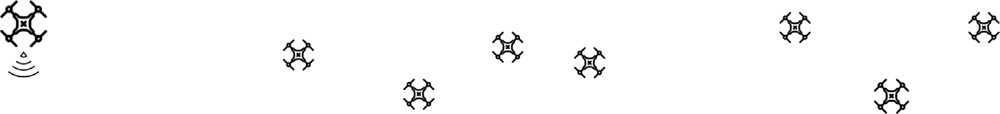
*Caption/Context: Computer Networks 182 (2020) 107451 | D. Mishra and E. Natalizio*

## --- Page 4 ---

### Section: Key contributions

Computer Networks 182 (2020) 107451

4

D. Mishra and E. Natalizio

Table 2
Existing surveys and tutorials for UAV cellular communication.

Broad
References →
[8] [13] [23] [39] [35] [40] [36] [10] [33] [37] [24] [18] [41] [5] [42] [43] [38] [44] [28] This

work
Category
Contributions ↓

Nature of Integration
UAV-Assisted Cellular Comm
✓
✓
✓
✓
✓
✓
✓
✓
✓
✓
✓
✓
✓
✓
Cellular-Assisted UAV Comm
✓
✓
✓
✓
✓
✓
✓
✓
✓
✓
✓
✓
✓
✓

Applications & Use cases Applications & Use cases
✓
✓
✓
✓
✓

Design & Challenges

Technical Challenges
✓
✓
✓
✓
✓
✓
✓
✓
✓
✓
✓
✓
✓
✓
✓
✓
✓
✓
✓
Propagation Channel Models
✓
✓
✓
✓
✓
✓
✓
✓
✓
✓
✓
✓
✓
✓
✓
✓
Mobility & Handovers
✓
✓
Trajectory Optimization
✓
✓
✓

Technology &
Experiment

Network Architecture
✓
✓
✓
✓
✓
✓
5G/B5G Innovations
✓
✓
✓
✓
✓
✓
✓
✓
✓
✓
✓
Experimental Prototyping
✓
✓
Ideal Features of Prototype
✓

Harmonization
& Compliance

Standardization
✓
✓
✓
Regulations
✓
✓
✓
Communication Requirement
✓
✓
✓
✓
✓
✓

Socio-economic
Concerns

Security Aspects
✓
✓
✓
Social Concerns
✓
✓
Market Concerns
✓

There
are
few
surveys
that
focuses
on
cellular-connected
UAV
paradigm, but these existing works are largely fragmented and do not
provide a holistic view of this paradigm. In other words, only few
selected aspects of cellular-connected UAV like UAV-ground channel
modelling or trajectory optimization or MIMO are studied in depth so
far. These works do not present an extensive study including all kinds
of research highlights dedicated to cellular-connected UAVs, rather
present a singular topic in depth. Thus, a unified work providing the
broad picture of all kinds of research developments is still missing.

With this survey, we aim at addressing this gap and focus solely on
cellular-connected UAVs. The research highlights pertaining to state-
of-the-art advancements, synergistic integration challenges of UAVs as
aerial users in 5G/B5G cellular networks, underlying network archi-
tectures, physical layer enhancements of 5G, field trials, simulations
and testbed developments are some of unique contributions made in
this survey. The cloudification and softwarization of network resources
portrayed as the interplay of Network Function Virtualization (NFV)
and cloud computing technologies for the cellular-connected UAVs
is also presented from the architectural context of enabling 5G/B5G
innovations supporting them.

#### 2.1. Key contributions

The key contributions of this work are the following. The final
column of Table 2, bearing the heading ‘‘This Work", also summarizes
the contributions made in this work:

• To present an overview of emerging applications and taxonomy
of use cases for cellular-connected UAVs;
• To highlight the state-of-the-art trends of communication require-
ments of UAVs and detailed discussion of design challenges,
which must be accounted for successful integration of this tech-
nology within 5G/B5G cellular systems;
• To showcase the emerging 5G technology innovations in network
architectures such as virtualization & softwarization of network
resources, slicing & physical layer improvements in the interest
of cellular-connected UAVs;
• To present the detailed efforts for design and development of ex-
perimental
testbeds,
trials
and
prototyping
carried
out
by
academia, industries and standardization bodies to understand
the gap of theoretical analysis and realistic deployments;
• To identify a fairly exhaustive outline of features for realization
of an ideal experimental prototype for cellular-connected UAV &
existing works to achieve them;

Fig. 3. High level organization of this work.

• To discuss about the ongoing standardization activities, regula-
tory frameworks, market and socio-economic issues that must be
thoroughly investigated before successful and widespread adop-
tion of cellular-connected UAVs;
• To present insights to future research opportunities.

The high level organization of this work is summarized in Fig. 3.
First, we begin with the detailed taxonomy of application domains
and corresponding use cases for cellular-connected UAVs, and then
highlight the key integration challenges of UAVs being supported from
cellular 5G/B5G systems. For seamless integration, the recent technical
innovations of 5G/B5G mobile network architectures and physical layer

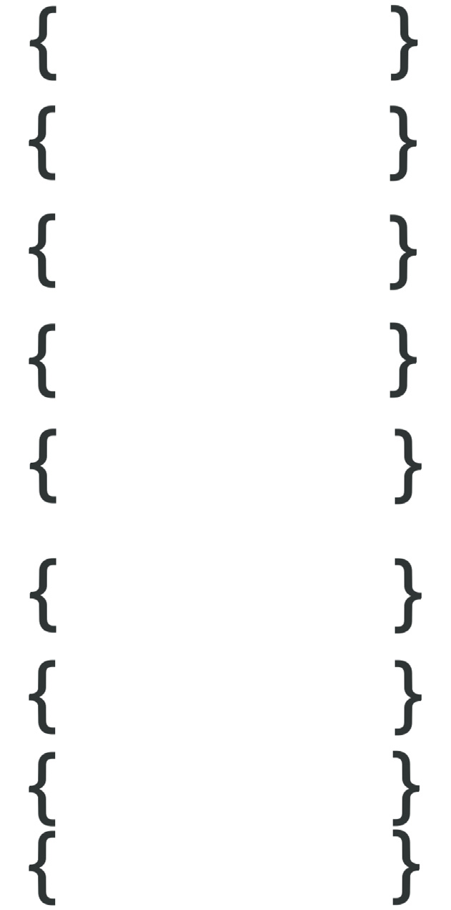
*Caption/Context: Technology & Experiment | Network Architecture ✓ ✓ ✓ ✓ ✓ ✓ 5G/B5G Innovations ✓ ✓ ✓ ✓ ✓ ✓ ✓ ✓ ✓ ✓ ✓ Experimental Prototyping ✓ ✓ Ideal Features of Prototype ✓*

## --- Page 5 ---

### Section: Taxonomy of UAV applications and use cases

Computer Networks 182 (2020) 107451

5

D. Mishra and E. Natalizio

improvements are also presented. Then, we highlight the testbeds, field
trials and measurement campaigns that showcase some early efforts to
develop working prototypes of cellular-connected UAV. Furthermore,
the ongoing standardization works, regulatory and socio-economic con-
cerns are also discussed that must be accounted before successful
adoption of this new technology.

#### 3. Taxonomy of UAV applications and use cases

Cellular-connected UAVs find their applicability in a wide range of
emerging applications with varying demands and goals. In this work,
we showcase some of the attractive researched domains as a starting
basis for the following discussion. A bird’s-eye view of this section is
presented in Fig. 4.

#### 3.1. Earth and atmospheric observations

As an innovative and efficient platform for gathering data, UAVs
have become a preferred choice over traditional geomatics mecha-
nisms of data acquisition. UAVs could autonomously fly in a defined
trajectory and could precisely capture real-time measurements of the
ongoing geophysical processes for abnormal hazards, such as volcanoes,
landslides, sea dynamics, earthquakes, etc. Furthermore, the UAVs are
equipped with various sensors to capture atmospheric temperature,
pollutant levels in the air, carbon emissions, terrestrial biomass char-
acterization, precipitation distribution in industrial zones, etc. As an
efficient mechanism, the deployment of a fleet of UAVs, equipped with
onboard sensors can perform the sensing for the presence of pollutant
levels or any hazardous chemicals in the target areas [45,46].

In a disaster situation, first 48 to 72 h are very crucial to perform
any kind of mitigation to the damage or outage and to restore the
normal state of the environment. The response time is the key in saving
lives in the affected regions. The major problems in these initial hours
are: lack of proper communication infrastructure, massive or often
unpredictable losses of lives and property. Thus, the situation forces
the first responder teams to implement and improvise the search and
rescue (SAR) mission to be conducted quickly and efficiently. Latest
advancements of UAVs and sensor networks are capable to meet this
need in terms of disaster prediction, assessment and fast recovery. UAVs
can gather the information (e.g., situational awareness, early warn-
ings, persons movement) during disaster phase and these information
are helpful for first responder teams to react efficiently [47]. UAVs
can re-establish the communication infrastructure (i.e., UAV-assisted
paradigm) destroyed at the time of disaster.

#### 3.2. Civil and commercial services

Government constructions and public infrastructures such as high-
ways and railways are greatly benefited by these flying platforms for
efficient surveillance, land surveying, tracking workers and employees,
on-site construction and demolition [39,48–50]. Furthermore, UAV-
based delivery systems are gaining wide popularity in logistics domain
to achieve faster and cost effective good delivery service [51]. Such
a system handles consumer orders, manages autonomous flight and
status tracking using real time control. Google’s Wing project [52]
and Amazon Prime Air [53] are the some of the efforts to realize
such a use case of UAVs. In precision agriculture, UAVs are capable
of observing the agricultural fields for health monitoring, spraying
pesticides and perform hyper spectral imagery [54]. Such activities
by humans are time consuming and prone to risks. Unmanned air-
crafts are well suited for such use cases enhancing productivity and
cost efficacy. The cellular operators have started envisioning UAVs as
backup wireless infrastructure (flying base stations or relays) in the
absence of terrestrial communication infrastructure to boost network
capacity [55,56]. Google’s Loon project [57] aims to provide ubiquitous
Internet services & wireless connectivity to both remote and rural areas
by employing high altitude platform (HAP) UAVs as balloons.

#### 3.3. Disaster management & security

UAVs are an effective means of surveillance and monitoring of
areas stricken by a natural disaster [58]. For instance, autonomous
UAVs are sent to landslide, fire, earthquake and flooding areas to
help with assessing the risks, the damages and support first responders
teams as well as providing connectivity to isolated people [59–61].
Similarly, low cost UAVs revolutionize the conservation and manage-
ment of forest and wildlife ecosystem by assisting in counting animal
populations, tracking illegal activities, etc. UAVs are also an effective
means of surveillance and control for the homeland security and public
safety [62–64]. In case of anti-terroristic operations, UAVs are used to
develop and prepare for situational awareness of threat, carrying out
pre-emptive strikes or reconnaissance mission. UAVs assist in speeding
up the rescue and recovery (search and rescue) missions in certain
disastrous and crime control situations in a target area.

#### 3.4. Industrial IoT platforms (IIoT)

Industry 4.0 is an emerging paradigm embracing next generation
industrial developments with the ideas of using Internet of Things (IoT)
to industrial automation, cyber–physical systems, smart production
and service systems. This industrial revolution is a gateway to boost
economy and operational excellence under the umbrella term of ‘‘Smart
Factory’’.

UAVs have already begun to become a vital component of Industrial
IoT platforms [65,66]. Practical usage of UAVs in industrial settings
include monitoring terrains of manufacturing sites or regions that are
impenetrable for humans due to hazardous exposures. The manual on-
site inspection carried out by humans are time-consuming and often
include very challenging terrains with inaccessible/unsafe zones. Such
human-driven inspections pose threats to human lives. On the bright
side, not only industrial UAVs can penetrate complex and inacces-
sible areas, but also are equipped with a multitude of sensors with
cognitive computing to facilitate on-demand real-time bidirectional
communication with industrial control stations. UAVs used in industrial
settings can measure many parameters for the region under study via
onboard sensors, such as electric and magnetic field strength, humidity,
temperature, pressure in the atmosphere, methane or toxic pollutants.
The communication could occur the same way as an IoT sensor send-
ing signals to the Supervisory Control and Data Acquisition (SCADA)
system.

#### 3.5. Emerging technologies

Some emerging technologies such as augmented reality (AR) and
virtual reality (VR) combined with capabilities of UAV open up novel
possibilities [67,68]. Real life videos from high altitude or high quality
aerial photographs bring a great look and feel experience for users [69,
70]. Also, in the enterprise markets, the VR technology clients can
accelerate buyer’s decisions by presenting them best scenery and view-
ing of the real estate. AR- and VR-enabled UAVs are also used for
virtual tour of the real environments, 3D models of buildings, graphical
overlays of maps, streets, gaming, etc.

#### 3.6. Consolidated summary of lesson learnt and rationale of this work

The important lessons learnt in the previous Sections can be sum-
marized in the following two main items:

• The popularity of UAV is growing day-by-day and it is considered
as a preferred technology to cater to a wide variety of emerging
real-world use cases. UAVs can be autonomous, intelligent, adap-
tive and highly mobile. From communication and networking
perspective, UAVs play an important role in cellular domain. The
cellular ecosystem can benefit from UAV technology. UAVs can

## --- Page 6 ---

### Section: Integration challenges of UAVs over 5G

Computer Networks 182 (2020) 107451

6

D. Mishra and E. Natalizio

Fig. 4. Taxonomy of UAV Cellular applications & use cases.

be efficiently integrated to existing cellular networks as a flying
base station or a relay or an aerial UE. These different types
of integration showcase several promising applications and use
cases.
• Owing to the implicit benefits of cellular networks in terms of
ubiquitous accessibility, large coverage, scheduled and safe in-
formation exchange protocols, cellular-connected UAVs are well
suited and find their applicability in many real-world applications
such as earth and environmental observation, civil infrastructure
and surveillance, defence and security, industrial IoT platforms,
etc. Integrating UAVs to 5G/B5G cellular systems proves to be a
win–win situation for both the parties.

This work aims at presenting an extensive study of cellular-
connected UAVs, where the UAVs are integrated into the existing
cellular networks as new aerial UEs. In order to carry out a mission
specific task, UAVs require support from ground infrastructure (base
station/control station), with which they exchange CNPC commands
in downlink direction, and both CNPC & payload data in uplink.
Cellular-connected UAVs bring several open challenges and operational
complications that need to be thoroughly investigated and motivate our
work to offer researchers and practitioners a handful guide to approach
this field.

#### 4. Integration challenges of UAVs over 5G

The aerial communications and networking of cellular-connected
UAVs pose several challenges to thoroughly investigate. For instance, a
reliable and low latency communication for efficient control of the UAV
is of utmost importance. Existing cellular infrastructures are primarily
designed and developed to offer enhanced communication services for
the terrestrial users. Also, the geographical terrains with limited cov-
erage from terrestrial Base Station (BS) may not provide the required
connectivity services to the cellular-connected UAVs, thereby demand
promising solutions for successful adoption of this technology.

Various studies and research efforts have shown tremendous poten-
tial for the support and operation of low altitude UAVs using cellular
networks [71]. The benefits of cost-effective cellular spectrum in terms
of low latency and high throughput connectivity services, make it a

Fig. 5. Power gain and elevation pattern of ground BS [72]: (a) Power gain pattern
at 𝜃𝑡𝑖𝑙𝑡= −10◦, (b) Elevation pattern at 𝜃𝑡𝑖𝑙𝑡= −10◦, (c) Elevation pattern at 𝜃𝑡𝑖𝑙𝑡= −20◦.

suitable candidate for integration of UAVs. Moreover, this technology
is scheduled, robust, secure and offers reliable services. In terms of
the security aspects of data communication, existing mobile networks
already encompass the needful security and authentication features
in their protocol layers. A work item to study and evaluate LTE as
a potential candidate for UAV operation is carried out in 3GPP Rel-
15, and the results are summarized in TR 36.777 [17]. In addition to
existing cellular spectrum bands (600 MHz - 6 GHz), 5G ecosystem is
also considering the use of spectrum in millimetre wave (mmWave)
bands (24–86 GHz). As a foundation of cellular operations, the licenced
spectrum provide scheduled, reliable and wide area connectivity that
can potentially be leveraged for UAV operations in BVLoS range.

There are a lot of challenges to be tackled in order to make the
cellular-connected UAVs as an attractive solution for a plethora of
emerging use cases. In the following subsections, we highlight the pri-
mary design challenges and perspectives to be considered for cellular-
connected UAVs, as well as the studies and solutions already available.

#### 4.1. Three dimensional (3D) coverage model

4.1.1. Preliminary
The existing radio access technologies are not primarily suited for
supporting flying radio devices as their deployments are mainly focused

![Fig. 4. Taxonomy of UAV Cellular applications & use cases. | This work aims at presenting an extensive study of cellular- connected UAVs, where the UAVs are integrated into the existing cellular networks as new aerial UEs. In order to carry out a mission specific task, UAVs require support from ground infrastructure (base station/control station), with which they exchange CNPC commands in downlink direction, and both CNPC & payload data in uplink. Cellular-connected UAVs bring several open challenges and operational complications that need to be thoroughly investigated and motivate our work to offer researchers and practitioners a handful guide to approach this field.](images/page_006_fig_01.jpeg)
*Caption/Context: Fig. 4. Taxonomy of UAV Cellular applications & use cases. | This work aims at presenting an extensive study of cellular- connected UAVs, where the UAVs are integrated into the existing cellular networks as new aerial UEs. In order to carry out a mission specific task, UAVs require support from ground infrastructure (base station/control station), with which they exchange CNPC commands in downlink direction, and both CNPC & payload data in uplink. Cellular-connected UAVs bring several open challenges and operational complications that need to be thoroughly investigated and motivate our work to offer researchers and practitioners a handful guide to approach this field.*

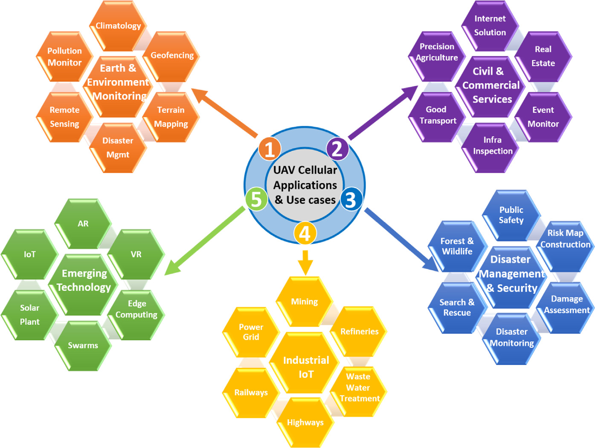
*Caption/Context: Computer Networks 182 (2020) 107451 | D. Mishra and E. Natalizio*

## --- Page 7 ---

### Section: Associated works and illustrative results

Computer Networks 182 (2020) 107451

7

D. Mishra and E. Natalizio

to optimally serve the ground UEs (or terrestrial UEs). The base stations
(eNodeBs) are typically designed and developed to provide optimal
performance to the ground users. The current eNodeBs are downtilted
to serve above purpose. Down-tilting the antennas produces radiation
patterns that are not useful to serve aerial UEs, which are expected to
be positioned at different altitudes with respect to the ground surface.
The inherent assumptions made for the ground UEs are quite different
from aerial UEs. The aerial users typically fly higher than the BS
antenna height and therefore, need 3D coverage suitable for varying
UAV altitude [73,74]. The BS antennas of LTE networks may provide
weak channel gain by using their antenna side lobes. In the 3D space,
the coverage criterion of UAVs are functions of BS antenna height, UAV
altitude, antenna pattern, and association rules. Hence, the network
model for aerial users coexisting with ground users necessitates a 3D
coverage model [75].

4.1.2. Associated works and illustrative results
In [72], the authors present 3D coverage and channel modelling
of cellular-connected UAVs in the downlink and uplink directions.
The BS antenna pattern tremendously impacts the coverage distribu-
tion that affects the UAV operation and mobility. As the down-tilt
angle increases, the ground BS offers smaller gains to UAV above
the BS height, thereby impacting the uplink and downlink coverage
probabilities. In Fig. 5(a), the power gain pattern is illustrated for a
synchronized uniform linear antenna array (ULA) with 10 co-polarized
dipole antenna elements and BS down-tilt angle 𝜃𝑡𝑖𝑙𝑡= −10◦. (b) and (c)
are the 2D elevation pattern for BS with down-tilt angle for 𝜃𝑡𝑖𝑙𝑡= −10◦

and 𝜃𝑡𝑖𝑙𝑡= −20◦, respectively.

The authors in [76] studied the impact of BS antenna down-tilt
angle on the achievable performance of cellular-connected UAVs co-
existing with several ground UEs. In order to enhance the cellular
spectral efficiency (SE)for UAVs, a MIMO-based conjugate beamform-
ing (CB) spatial multiplexing scheme is proposed with analytic char-
acterization of the successful content delivery probability. The results
conclude that, the BS down-tilt angle pose a performance trade-off
when UAVs co-exist with ground UEs. In [74] , the authors investigated
the performance of cellular-connected UAVs under practical antenna
configuration considering key system parameters such as BS density,
UAV altitude and association criteria, antenna properties etc. The ob-
servations conclude that larger number of antenna elements improve
the coverage of UAVs and practical antenna patterns tend to perform
poor in contrast to the simple antenna model.

#### 4.2. UAV-ground channel

4.2.1. Preliminary
One of the primary design challenges in realizing the cellular-
connected UAVs is to ensure harmonious coexistence mechanisms be-
tween ground users and aerial users [77]. Proper UAV-ground inter-
ference management is central to realize this coexistence. Also, the
interference patterns in ground BS to UAVs communication link ex-
periences remarkable difference than that of link between ground BS
to ground UE [35]. The higher altitude of UAVs than base stations
results in LoS links, which are more reliable than the link with ground
users. Additionally, they exploit large macro diversity gains being
served from several BSs. On the other hand, the dominant LoS links
create more uplink/downlink interference as compared to ground users,
thereby making the interference management (ICIC) highly difficult.
Other relevant effects to take into account are fading, shadowing and
path-loss. Existing ICIC mechanisms may be well suited for current cel-
lular designs, but fail to handle UAV interference management, which
involves many BSs and impose limitations due to high complexity.

Therefore, there is a need for efficient interference management
techniques for harmonious coexistence of ground users and UAVs.
There are several works in literature [75,78,79] that investigate this
problem considering downlink and uplink interference.

The communication channel mainly involves two types of links,
namely Ground-to-UAV (G2U) link and UAV-to-Ground (U2G) link. In
cellular-connected UAV, the G2U link serves the downlink purpose of
control and command for proper UAV operations, whereas U2G link
serves the uplink purpose of payload communication. Rayleigh fading
is the commonly used small-scale fading model for terrestrial channel
model, whereas due to the presence of LoS propagation characteristics,
Nakagami-m and Rician small-scale fading are usually preferred for
U2G channels. The large-scale fading is affected because of the 3D cov-
erage region and varying altitude of UAV. The large-scale fading models
used can be based on a free-space channel model or altitude/angle
dependent channel model or probabilistic LoS models:

• Free-space model — In free-space channel model, there is no
effect of fading and shadowing with very limited obstruction.
This model is typically suited for rural regions where the LoS
assumption holds valid between high altitude UAVs and ground
station. However, in urban environment, the low altitude UAVs
may encounter non-LoS links, therefore need other approaches to
properly map with the propagation environment.
• Altitude/Angle dependent model — In this case, the channel
parameters such as shadowing and path loss exponents are func-
tions of UAV altitude or elevation angle. These models find their
applicability in urban or sub-urban regions depending upon the
deployment. However, if the altitude does not change or UAVs
fly horizontally, altitude dependent models may not be found
suitable. The elevation angle based models are mostly used for
theoretical study purpose and existing literatures are also limited
in this regard.
• Probabilistic LoS model — The models based on this approach are
typically suited for urban environment where the LoS and NLoS
link between UAV and ground are considered, due to buildings,
obstacles or blockages. Moreover, the LoS and NLoS components
are separately modelled based on their occurrence probability
in urban environment. The nature of urban environment with
respect to building heights and density are key factors that statis-
tically determine the LoS and NLoS propagation characteristics.

4.2.2. Associated works and illustrative results
The study item of 3GPP TSG on the enhanced LTE support for
aerial vehicles [22] highlights the channel modelling between ground
base station and UAV flying at different altitudes. The study includes
the modelling of small scale fading, path loss, shadowing and LOS
probability (𝑃𝑙𝑜𝑠) for three 3GPP deployment scenarios, namely Urban-
Micro (UMi), Urban-Macro (UMa) and Rural-Macro (RMa). The LoS
probability is specified by:

• 2D distance between UAV and ground station (𝑑)
• Altitude of UAV (ℎ𝑢)

The existing terrestrial communication channel model can be di-
rectly used for low UAV altitude (height below certain threshold 𝐻𝑙𝑜𝑤)
to model the LoS probability. For altitude greater than a certain thresh-
old 𝐻ℎ𝑖𝑔ℎ, 3GPP suggests to use 100% LoS probability. For height in
between 𝐻𝑙𝑜𝑤and 𝐻ℎ𝑖𝑔ℎ, the LoS probability is a function of 𝑑and ℎ𝑢.
Hence, for the three deployment scenarios, 𝑃𝑙𝑜𝑠is given by,

𝑃𝑙𝑜𝑠=

⎧
⎪
⎨
⎪⎩

𝑈𝐸_𝑃𝑙𝑜𝑠,
if 1.5m ≤ℎ𝑢≤𝐻𝑙𝑜𝑤
𝑓(ℎ𝑢, 𝑑),
if 𝐻𝑙𝑜𝑤≤ℎ𝑢≤𝐻ℎ𝑖𝑔ℎ
1,
if ℎ𝑢≥𝐻ℎ𝑖𝑔ℎand ℎ𝑢≤300 m

𝑈𝐸_𝑃𝑙𝑜𝑠is the LoS probability for ground mobile terminal in con-
ventional terrestrial communication in Table 7.4.2 of [80]. 𝑓(ℎ𝑢, 𝑑) is
given by,

𝑓(ℎ𝑢, 𝑑) =

{

1,
if ℎ𝑢≤𝑙1
𝑙1
ℎ𝑢+ 𝑒𝑥𝑝( −ℎ𝑢

𝑝1 )(1 −𝑙1

ℎ𝑢),
if ℎ𝑢> 𝑙1

## --- Page 8 ---

### Section: System operations & mobility

Computer Networks 182 (2020) 107451

8

D. Mishra and E. Natalizio

The variables 𝑙1 and 𝑝1 are given as the logarithmic increasing
function of UAV height ℎ𝑢as specified in [22]. The values of 𝐻𝑙𝑜𝑤,
𝐻ℎ𝑖𝑔ℎ, 𝑝1 and 𝑙1 are also defined with respect to different 3GPP deploy-
ment scenarios. Table B-2 and B-3 in [22] provides detailed path-loss
and shadowing standard deviation, respectively. The authors in [81]
demonstrated a BS selection scheme based on a supervised learning
approach in order to maximize the signal strength of wireless link
between UAV and BS. The UAV intelligently associate with the most ap-
propriate BS depending on a trained neural network model to minimize
the interference and maximize the received signal from BSs.

#### 4.3. System operations & mobility

4.3.1. Preliminary
UAVs are inherently mobile in nature and Section 3 highlights
many use cases of cellular-connected UAVs that implicitly demand
BVLoS [82]. The mobility and handover characteristics of terrestrial
cellular users are quite different from the 3D aerial mobility of cellular-
connected UAVs. With increase in height, the radio environment
changes and mobile UAVs face connectivity challenges. In this case, the
performance of the system depends on the handover rates, including
failed and successful handovers and radio link failures. Radio link fail-
ures occurs when the UAV is unable to maintain a successful connection
with the serving cell. This could be because of the problematic RACH or
expiry of timers or after a certain maximum number of retransmissions
is reached [83].

In cellular-connected UAV, the protocol operations and regulatory
needs of UAVs as aerial users are quite different from the ground user.
Hence, the network must first detect if the user device is aerial or
not [84]. This detection can be driven by the ground BS by estimating:

• the elevation angle of the reference signal;
• vertical location (altitude) or velocity of user device;
• path loss/delay spread measurement of user devices.

4.3.2. Associated works and illustrative results
The handover characteristics vary significantly between ground UEs
and aerial UE due to the nature of cell selection, as shown in Fig. 6.
In [85], the authors demonstrated the impact of UAV flight path on
handovers. The results show that UAVs are prone to frequent han-
dovers, and ping-pong handovers, due to varying altitude and speed.
Even smaller flight distances can have a large impact on handover rate.
Also, the handover frequency increases when flight altitude increases.
Table 3 summarizes the number of handovers occurring per minute
for UAV, as compared to terrestrial users. Scenario1 is equivalent to
a ground user having one handover per minute. However, in sce-
nario4, UAVs, at an altitude of 150 m, experiences 5 handovers per
minute. Many of the handovers are unnecessary and generate high
signalling overhead. Handover decisions are mainly made depending
upon received RSRP (Referenced Signal Referenced Power) values from
different BS antennas. Ground users are benefited by this approach,
because the radio transmission power are directed to ground from the
main lobes of the antenna, thereby improved radio power and every
received RSRP is well separated from others. However, the aerial users
are served primarily by the antenna side lobes, whose RSRP tends to
be very similar to the radio power from other surrounding BS. Hence,
the UAV connects with more cells (distant cells), as there is a small
difference in the RSRP values resulted from BS antenna side lobes.

Hence, integration of cellular-connected UAVs with future 5G/B5G
networks necessitates enhanced solutions for cell selection and han-
dovers that seamlessly cover changing altitudes of UAVs and support
their 3D mobility patterns. The authors in [86] studied the 3D coverage
probability of cellular-connected UAVs using analytical modelling to
quantify the handover rate and impact on mobility performance. They
proposed a coordinated multi-point (CoMP) transmission scheme to
improve the system performance coping with dynamic mobility of

Table 3
Rate of handovers with varying UAV altitude [85].

Scenario
Height (Metres)
#Handovers/Minute

1
10
1.0
2
50
1.9
3
100
4
4
150
5

Fig. 6.
UAVs being served from side lobes [85].

Fig. 7. UAV trajectory with cellular discontinuity.

UAVs where BSs coordinate their transmissions in order to improve
the coverage for UAVs. The proposal improves the achievable coverage
performance for cellular-connected UAVs from 28% to 60% using CoMP
technique. Another work [87] also presented the improvement in UAV
coverage via CoMP technique dealing with dynamic mobility and high
altitude of UAVs. In [88] , the authors highlight and propose solutions
to ensure robust wireless connectivity and mobility support for cellular-
connected UAVs by leveraging tools from reinforcement learning. The
goal is to provide efficient UAV mobility support in sky with enhanced
handover decisions optimized by Q-learning algorithm. This algorithm
is shown to reduce the number of handovers by 80% as compared to
existing handover scheme.

#### 4.4. Trajectory optimization

4.4.1. Preliminary
UAV trajectory or flight path refers to the path through which
UAV completes its mission for a specified use case. It involves a
pair of locations that need to be covered, considering communication
requirements of payload and CNPC links. The flying direction of UAV is
usually optimized to meet the application requirements, based on some
cost function involving BS locations, association sequence, energy limits
and mission type [89–92]. A UAV trajectory is optimized to minimize
the UAV flight time by ensuring that the UAV is always connected to
at least one BS, often with some discontinuity tolerance limit [93].

![4.3.1. Preliminary UAVs are inherently mobile in nature and Section 3 highlights many use cases of cellular-connected UAVs that implicitly demand BVLoS [82]. The mobility and handover characteristics of terrestrial cellular users are quite different from the 3D aerial mobility of cellular- connected UAVs. With increase in height, the radio environment changes and mobile UAVs face connectivity challenges. In this case, the performance of the system depends on the handover rates, including failed and successful handovers and radio link failures. Radio link fail- ures occurs when the UAV is unable to maintain a successful connection with the serving cell. This could be because of the problematic RACH or expiry of timers or after a certain maximum number of retransmissions is reached [83]. | In cellular-connected UAV, the protocol operations and regulatory needs of UAVs as aerial users are quite different from the ground user. Hence, the network must first detect if the user device is aerial or not [84]. This detection can be driven by the ground BS by estimating:](images/page_008_fig_01.png)
*Caption/Context: 4.3.1. Preliminary UAVs are inherently mobile in nature and Section 3 highlights many use cases of cellular-connected UAVs that implicitly demand BVLoS [82]. The mobility and handover characteristics of terrestrial cellular users are quite different from the 3D aerial mobility of cellular- connected UAVs. With increase in height, the radio environment changes and mobile UAVs face connectivity challenges. In this case, the performance of the system depends on the handover rates, including failed and successful handovers and radio link failures. Radio link fail- ures occurs when the UAV is unable to maintain a successful connection with the serving cell. This could be because of the problematic RACH or expiry of timers or after a certain maximum number of retransmissions is reached [83]. | In cellular-connected UAV, the protocol operations and regulatory needs of UAVs as aerial users are quite different from the ground user. Hence, the network must first detect if the user device is aerial or not [84]. This detection can be driven by the ground BS by estimating:*

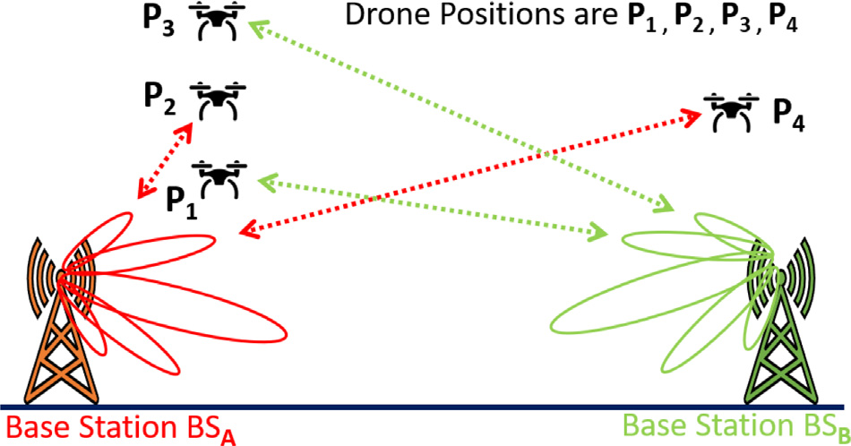
*Caption/Context: Computer Networks 182 (2020) 107451 | D. Mishra and E. Natalizio*

## --- Page 9 ---

### Section: Associated works and illustrative results

Computer Networks 182 (2020) 107451

9

D. Mishra and E. Natalizio

Fig. 8.
UAV trajectory for two different cellular layouts with respect to a discontinuity threshold [93].

Table 4
Reference works on trajectory optimization for cellular-connected UAVs.

Key Considerations
Approach Taken
Goals of Optimization

Disconnectivity constraints [93]
Dynamic Programming based approximate solution
with low complexity

Minimize the UAV trajectory distance without staying out of coverage for certain
threshold

Connectivity constraints [90]
Graph connectivity-based approach
Minimize the UAV’s mission completion time by optimizing the trajectory

Interference-aware [89]
Deep reinforcement learning algorithm based on
echo state network (ESN) cells

Maximize the energy efficiency, minimize the wireless transmission latency and
interference on ground network, minimize the time needed to reach destination

An optimization of flight path with above assumption is known as
communication-aware trajectory design.

The rural and unpopulated areas with poor or no cellular connectiv-
ity impact UAV trajectory, as the persistent connection controlling the
UAV might be interrupted. Additionally, UAVs operations in mmWave
bands of 5G suffer from greater path loss and blockages leading to
interrupted connections during mission path. Fig. 7 demonstrates the
need for communication-aware trajectory design in cellular-connected
UAVs consisting of many ground BSs and a single UAV. Assume that
the UAV has to cover a path from start position S to final position
F. As shown in the figure, the coverage from all the ground stations
does not fully meet the connection requirement and may suffer from
discontinuity. Following are two main observations that complicate
this mission path and must be accounted in the communication-aware
trajectory design:

• The flight path may not be a linear or straight path from S to F,
although it is distance-optimal. The UAV must exhibit persistent
connection with cellular networks during flight path, thereby
making it non-linear or curved.
• The optimal path may pass beyond cellular coverage and hence,
proper tolerance limits have to be applied before the UAV connec-
tion is interrupted. The cases, where the discontinuity duration
exceeds beyond the acceptable tolerance limit, the UAV fails
to accomplish the given mission being unable to maintain a
successful connection to cellular network.

4.4.2. Associated works and illustrative results
Table 4 highlights the existing literature for UAV trajectory op-
timization. The authors in [93] formulate an approximate optimum
trajectory finding problem for cellular-connected UAVs without exceed-
ing a given discontinuity tolerance limit between a pair of locations.
The problem is solved by a dynamic programming approach having
low computational complexity and is shown to achieve close to optimal
results. Fig. 8 demonstrates the UAV trajectory for two different cellular
layouts with respect to a discontinuity threshold. It is clear that, the
UAV respects this threshold limit to generate the flying coordinates
for trajectory. Threshold value of zero (i.e., continuous connection)

generates a trajectory that must pass through the cellular coverage, as
shown by a dark black line in Fig. 8(a). When the threshold value is 15
time units (shown by a red line in Fig. 8(a)), then the trajectory tries
to minimize the distance covered and nearly follows a straight path for
distance optimization. Similar justifications are also valid for second
cellular layout shown in Fig. 8(b).

#### 4.5. Security challenges

4.5.1. Preliminary
Cellular-connected UAVs are usually equipped with a multitude
of sensors that collect and disseminate data. This provides numerous
opportunities to expose them to vulnerabilities. These flying platforms
are prone to cyber–physical attacks, with an intention to steal, control
and misuse the UAV payload information by reprogramming it for
undesired behaviour. For instance, in business use case such as goods
delivery, the attacker can gain physical access to the customer package
as well as to the UAV device [94]. Existing information security mea-
sures are not well suited for cellular-connected UAVs, because these
measures do not take into account possible threats imposed on numer-
ous on-board sensors and actuator measurements of UAVs [95,96]. An
attacker can manipulate the UAV’s communication and control system,
thereby making it very difficult to bring it back online. Thus, it is cru-
cial to develop new protection methodologies to avoid aforementioned
intrusions and hacking procedures [97].

4.5.2. Associated works and illustrative results
Inspired by the efficacy of the AI and ML-empowered approaches,
in [97], the authors presented various security challenges focusing from
the viewpoint of three different cellular-connected UAV applications.
They are - (i) UAV-based delivery systems (UAV-DS), (ii) UAV-based
real-time multimedia streaming (UAV-RMS) and (iii) UAV-enabled in-
telligent transportation systems (UAV-ITS). In order to solve this chal-
lenge, the authors proposed an artificial neural network (ANN) based
solution approach which adaptively optimizes the network changes to
safeguard the resource and UAV operation.

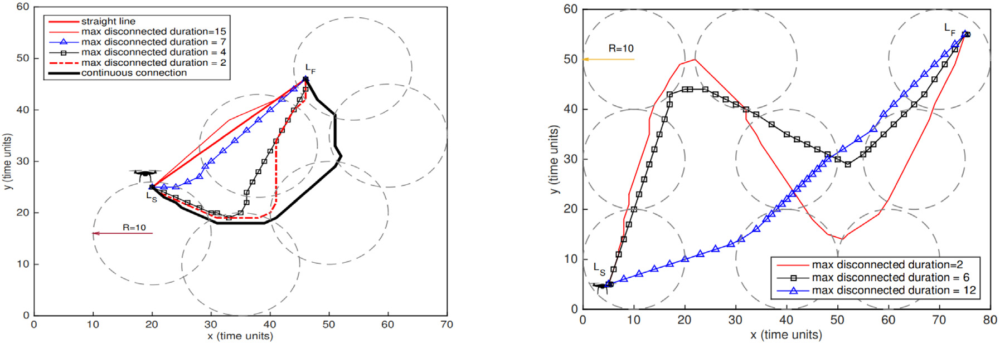
*Caption/Context: Computer Networks 182 (2020) 107451 | D. Mishra and E. Natalizio*

## --- Page 10 ---

### Section: Summary of lessons learnt

Computer Networks 182 (2020) 107451

10

D. Mishra and E. Natalizio

• UAV-DS: These systems are vulnerable to cyber–physical attacks
where the delivery of goods is compromised. The malicious in-
truder takes control of the UAV with an intention to destroy,
steal or delay the transported goods. Even the UAVs can be
physically attacked to acquire the goods being transported along
with physical UAV assets.
• UAV-RMS: UAV-enabled VR, online video transmission and online
tracking are some of the use cases in this type of application.
An attacker can manipulate the identity of the UAV and transmit
disrupted information to the control station using their identities.
In a large-scale deployment of UAVs, the control station must pro-
cess the multi-media files incurring a large delay and burdening
high utilization of computational resources.
• UAV-ITS: This application ensures road safety, traffic analysis to
monitor accidents, track compromised vehicles, etc. Such benefits
are achieved by a swarm of cellular-connected UAVs cooperating
to capture needful data during mission. An attacker can choose
to send an unidentified UAV to join the swarm of UAVs to steal
the information or initial self-collision to disrupt the UAV–UAV
communication. Such attacks can bring serious consequences to
the entire mission.

In [96], the authors have presented a brief survey of state-of-the-art
intrusion detection system (IDS) mechanisms for networked UAVs. It
highlights existing UAV-IDS approaches and areas that need attention
for building a secure UAV-IDS system.

#### 4.6. Summary of lessons learnt

In this Section, we have seen that, despite of the benefits and wide
popularity of cellular-connected UAVs, there are several challenges and
operational complications that needs to be investigated to realize their
true potential. The important lessons learnt from this Section are listed
as follows:

• The varying altitude of UAV necessitates a 3D wireless coverage
model for base stations, because the current design of terrestrial
base station is highly optimized for ground users. Typically, the
UAVs fly higher than base station creating LoS links that are prone
to be interfered from other neighbouring base stations. Proper
interference management becomes challenging and critical in
terms of harmonious coexistence between aerial UEs and ground
UEs simultaneously.
• UAVs are highly mobile and mainly served by the side lobes of
existing base stations. This produces a peculiar cell association
and increased handover rates, completely different than that of
ground users. The mobility of UAV in 3D space necessitates en-
hanced cell selection and seamless handover patterns to optimize
its operation.
• The battery life of a UAV is limited. During the mission, UAV
must intelligently plans its trajectory from initial to destination
location considering application and use case. The key perfor-
mance metrics, such as maximum allowed time to complete the
mission, persistent cellular connectivity, QoS guarantees, energy
consumption, etc. are some of the factors the UAV must respect
during its mission. Hence, trajectory optimization is an essential
aspect of UAV mission.
• While carrying out sensitive and real-time critical tasks, UAVs
are prone to security threats and cyber–physical attacks. Any
malicious attempt to steal, misuse or control the UAV, can trig-
ger undesirable situations and cause loss of confidential and
private assets. Such security threats require stringent protection
measures, guidelines and regulations by the operator.
• Before 5G/B5G cellular systems can really benefit from the UAV
technology, above mentioned technical integration challenges de-
mand a thorough investigation and practical solutions.

Fig. 9. NFV based architecture for UAVs [107].

#### 5. Synergies of 5G/B5G innovations for cellular-connected UAVs

By design, cellular-connected UAVs are expected to be controlled
and managed remotely by a Ground Control Station (GCS). Depending
upon the UAV application and use case, the UAVs carry out different
missions, which require unique networking characteristics. In general,
these networking requirements are very tightly coupled with the use
case and hardware infrastructure support. Especially, multi-UAV sys-
tems comprising many functional and coordinated UAVs, establishing
the reliable and secure communication path as well as the design
and development of efficient reconfigurable network architectures is
a challenging issue [98–100].

The key innovations of 5G/B5G systems are the cloudification and
virtualization of network resources through NFV technology, Service
Function Chaining (SFC), network slicing, Software Defined Network-
ing (SDN), Cloud Radio Access Network (CRAN), LTE-Wi-Fi integra-
tion [101] and physical layer improvements. SDN segregates the con-
trol functions and forwarding functions of a device. It allows soft-
warization of the control functions, thereby making the network pro-
grammable. NFV transforms the traditional network services into soft-
ware based solutions (Virtual Network Functions i.e., VNFs) that can
be dynamically deployed on a general purpose hardware platforms.
SFC is a chain of simple and smaller network functions that must
follow an execution sequence to realize a complex and large network
function. CRAN focuses on softwarizing the baseband functions from
site resident radio units [102] to cope with the tidal traffic pattern of
ground users [103] and to keep the total cost of network deployment
under limit [104,105]. Future 5G-centric networking applications and
services are driven by programmable network architectures, where
softwarization and cloudification of network functions are the key
enablers [106]. Therefore, the above-mentioned 5G innovations are
envisioned as a part of the cellular-connected UAV applications and
will be detailed in this Section. Specifically, Section 5.1 focuses on
the envisioned network architectures for cellular-connected UAVs. The
hardware and physical layer improvements are discussed in Section 5.2.

#### 5.1. Network architectures

Based on the key enablers of future 5G-centric networking applica-
tions, the cellular-connected UAV network architectures can be sum-
marized in the following groups. They are (i) NFV Oriented, (ii) MEC
Oriented, (iii) IoT Oriented, (iv) Service Oriented (SOA). In next sub-
section, we highlight the respective architectures and existing works.
Table 5 shows the glossary of related works for each of these network
architectures.

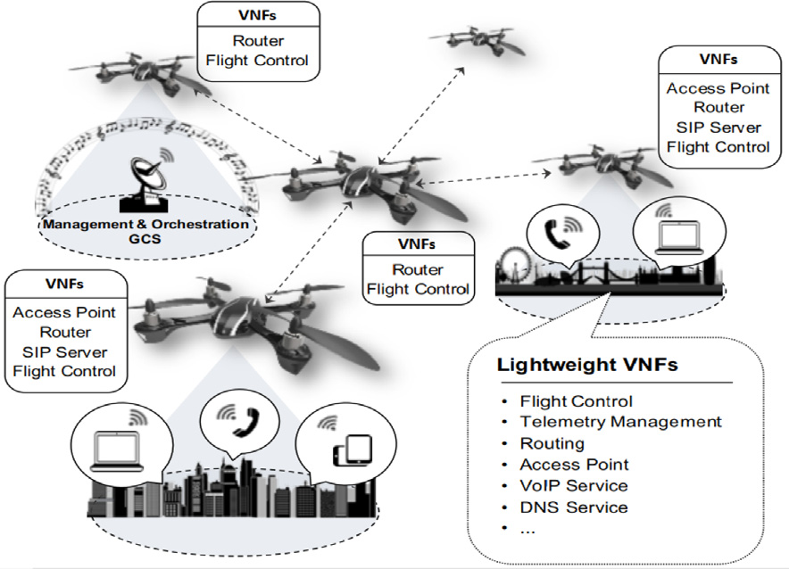
*Caption/Context: Computer Networks 182 (2020) 107451 | D. Mishra and E. Natalizio*

## --- Page 11 ---

### Section: NFV oriented architectures

Computer Networks 182 (2020) 107451

11

D. Mishra and E. Natalizio

Table 5
Envisioned Network architectures of Cellular-connected UAV.

Technology
Principle
Benefits

NFV-Oriented [107], [108], [109]
Decouples the hardware and software that exists in
traditional vendor network setting

• Greater flexibility for NF deployment
• Dynamic service provisioning
• Easily deployable and well scalable
• Efficient allocation to general purpose hardware

MEC-Oriented [110], [111], [112], [113]
The cloud computing capabilities are placed close
to edge of mobile network

•
Significant reduction in data exchange cost
•
Computational offloading to local servers
•
Improvement of QoE for end users

IoT-Oriented [41], [62], [66], [58], [114]
Connecting massive number of diverse, smart
devices to 5G/B5G cellular network

• Assists efficient decision making on huge data
• Extracting meaningful information for end users
• Control automation without human intervention
• Information sharing and communication

Service-Oriented [115], [116], [117]

Network services are provided over a
communication protocol that is independent of
vendors or product

• Improves the modularity of application
• Transforms monolithic networking application
into a set of microservices
• Each microservice is a basic unit of functionality

Fig. 10. UAVs with diverse network functions.

5.1.1. NFV oriented architectures
In [107], the authors present the feasibility of an agile, automated
and cost-effective UAV deployment architecture carrying out heteroge-
neous missions with the help of NFV technology. This work proposes an
adaptable way to achieve a reconfigurable UAV management system,
which is capable of carrying out missions with varying objectives. For
example, some UAVs could incorporate a VNF that provides access
point connectivity services, another VNF for network layer routing
functionalities, a third VNF for flight control system that can be easily
upgraded as per the changing needs of the mission. The work is

validated by a prototype built upon open-source technologies. The
high-level architecture of such a system is shown in Fig. 9. As shown in
the figure, the communication infrastructure formed by a set of UAVs,
where the mission planner used a MANO NFV framework (defined
by ETSI), installed at ground station to flexibly deploy a set of VNFs
over the set of UAVs. Overall design of such a system consists of the
following components:

• Management and Orchestration (MANO):- It is located with the
GCS and realized by Open Source MANO (OSM) Release TWO. It
contains all the necessary functionalities of service orchestration
and VNF manager as per ETSI NFV reference architecture [118].
OpenStack Ocata is used for VIM. Both OSM and VIM were
deployed in mini-ITX computer having 4 Gb Ethernet ports, 8 GB
RAM, Intel Core i7 2.3 GHz, 128 GB SSD with DPDK support.
• UAV hardware and software:- It provides the infrastructure sup-
port for execution and deployment on light-weight VNFs. It is
realized by Parrot AR.Drone 2.0 carrying single board Raspberry
Pi 3 Model B.
• Mission Planner:- It is located at the GCS and defines the nature
and characteristics of different network services or network func-
tions (NFs) to be deployed along with their placement policies. It
also interfaces with MANO component to call for the light-weight
VNF deployment on set of UAVs.

In order to carry out routing of VNFs to different target UAVs, LXC
Linux containers on Ubuntu OS are used. Each routing VNF requires
resources of 1 vCPU, 128 MB RAM and 4 GB storage.

The authors in [108] have presented a practical NFV based ap-
proach to support UAV multi-purpose deployment, which can be rapidly

Fig. 11. Deployment on multi-domain UAV services [109].

![5.1.1. NFV oriented architectures In [107], the authors present the feasibility of an agile, automated and cost-effective UAV deployment architecture carrying out heteroge- neous missions with the help of NFV technology. This work proposes an adaptable way to achieve a reconfigurable UAV management system, which is capable of carrying out missions with varying objectives. For example, some UAVs could incorporate a VNF that provides access point connectivity services, another VNF for network layer routing functionalities, a third VNF for flight control system that can be easily upgraded as per the changing needs of the mission. The work is | • Management and Orchestration (MANO):- It is located with the GCS and realized by Open Source MANO (OSM) Release TWO. It contains all the necessary functionalities of service orchestration and VNF manager as per ETSI NFV reference architecture [118]. OpenStack Ocata is used for VIM. Both OSM and VIM were deployed in mini-ITX computer having 4 Gb Ethernet ports, 8 GB RAM, Intel Core i7 2.3 GHz, 128 GB SSD with DPDK support. • UAV hardware and software:- It provides the infrastructure sup- port for execution and deployment on light-weight VNFs. It is realized by Parrot AR.Drone 2.0 carrying single board Raspberry Pi 3 Model B. • Mission Planner:- It is located at the GCS and defines the nature and characteristics of different network services or network func- tions (NFs) to be deployed along with their placement policies. It also interfaces with MANO component to call for the light-weight VNF deployment on set of UAVs.](images/page_011_fig_01.jpeg)
*Caption/Context: 5.1.1. NFV oriented architectures In [107], the authors present the feasibility of an agile, automated and cost-effective UAV deployment architecture carrying out heteroge- neous missions with the help of NFV technology. This work proposes an adaptable way to achieve a reconfigurable UAV management system, which is capable of carrying out missions with varying objectives. For example, some UAVs could incorporate a VNF that provides access point connectivity services, another VNF for network layer routing functionalities, a third VNF for flight control system that can be easily upgraded as per the changing needs of the mission. The work is | • Management and Orchestration (MANO):- It is located with the GCS and realized by Open Source MANO (OSM) Release TWO. It contains all the necessary functionalities of service orchestration and VNF manager as per ETSI NFV reference architecture [118]. OpenStack Ocata is used for VIM. Both OSM and VIM were deployed in mini-ITX computer having 4 Gb Ethernet ports, 8 GB RAM, Intel Core i7 2.3 GHz, 128 GB SSD with DPDK support. • UAV hardware and software:- It provides the infrastructure sup- port for execution and deployment on light-weight VNFs. It is realized by Parrot AR.Drone 2.0 carrying single board Raspberry Pi 3 Model B. • Mission Planner:- It is located at the GCS and defines the nature and characteristics of different network services or network func- tions (NFs) to be deployed along with their placement policies. It also interfaces with MANO component to call for the light-weight VNF deployment on set of UAVs.*

![MEC-Oriented [110], [111], [112], [113] The cloud computing capabilities are placed close to edge of mobile network | • Significant reduction in data exchange cost • Computational offloading to local servers • Improvement of QoE for end users](images/page_011_fig_02.jpeg)
*Caption/Context: MEC-Oriented [110], [111], [112], [113] The cloud computing capabilities are placed close to edge of mobile network | • Significant reduction in data exchange cost • Computational offloading to local servers • Improvement of QoE for end users*

## --- Page 12 ---

### Section: MEC oriented architectures

Computer Networks 182 (2020) 107451

12

D. Mishra and E. Natalizio

configured according to the need of the civilian mission. They have
considered the UAVs to provide infrastructure and hardware that
enable agile integration of network functions at deployment time by
a network operator. As shown in Fig. 10, a set of UAVs could be
used for providing communication infrastructure (virtual access points)
in case of disaster or can be used in SAR operation in a remote
area. The mission specific UAV behaviours are softwarized as network
functions and installed to UAV infrastructure (hardware) at the time of
deployment. Some network functions pertaining to mandatory features
of any UAV such as flight control and telemetry are installed on all
UAV hardware, irrespective of the mission. The implementation of the
system prototype and the light-weight VNF is done using open-source
software technologies. The orchestration and life-cycle management
of light-weight VNF is done by OSM Release FOUR. OpenStack Ocata
version is used for realizing the virtual infrastructure layer (VIM). The
virtual machine environment runs mini-ITX computer which consists
of Intel Core i7 2.3 GHz processor, 4Gb Ethernet ports, 16 GB RAM,
128 GB SSD. The UAV hardware platform consists of DJI Phantom 3
carrying a Raspberry Pi 3 Model B computing board and serves the
platform for execution of light-weight VNFs needed for specific mission.

A software based service architecture running on a distributed
cloud environment is demonstrated in [109]. In this demonstration,
an Industry 4.0 application controlling the indoor drones is considered
for study. The application is implemented using SFC orchestrated by a
multi-domain orchestrator known as ESCAPE. The orchestrator is able
to setup and configure VNFs onto the physical UAV boards according
to mission’s policies and requirements. The proposed implementation
is shown in Fig. 11. The deployment occurs when the service requests
are triggered to ESCAPE as per requirement. OpenStack is used for
running the cloud environment and few laptop hosts are used as edge
execution machines by Docker platform. High level commands such
as take-off, land, fly are used for controlling the UAV behaviour from
factory controller.

5.1.2. MEC oriented architectures
In general, UAVs possess physical constraints in terms of computa-
tional capability, storage and battery capacity. MEC has been identified
as one of the promising techniques to deal with the limitations of low
computational capability and restricted battery capacity of flying UAV.
Some examples of resource-intensive tasks are trajectory optimization,
object recognition, AI processing in crowd-sensing. Due to the limited
onboard resources of the UAVs, computation of above resource inten-
sive tasks are not very efficient. Hence, in such case, edge-cloud based
network architectures provide substantial improvements for operations
of cellular-connected UAVs.

In [110], the authors presented a UAV-enabled MEC architecture
applicable for cellular-connected UAVs. Fig. 12(a) illustrates this archi-
tecture, where the UAV has some computational task to be executed.
This task can be offloaded to the MEC server located with the ground
station and, after the computation, obtained results can be sent back to
UAV for their exploitation. Depending upon the volume of the offload,
there can be two modes of operation: (i) partial mode, and (ii) binary
mode. In partial offload mode, the whole task is split into two parts.
One part is executed locally and the other part is executed by the MEC
server (e.g., face recognition use case). In binary offload mode, each
task is executed as one unit, irrespective of whether it is done locally
or at the MEC server (e.g., channel state information (CSI) estimation).
Both of these offload modes have advantages and drawbacks. The
selection of the suitable mode depends on the nature of computational
task being performed, UAV structure and characteristics.

Considering the use case of trajectory optimization and computa-
tional offloading in cellular-connected UAV, the work in [111] presents
a novel MEC setup, where the UAV needs to offload some of its process-
ing task to the ground station. The UAV flies from an initial location
to a destination location and offload the task to selected ground base
stations during the trajectory. The goal of the MEC setup is to minimize

the total time for UAV mission considering the maximum speed and
ground station capacity constraints. This setup is shown in Fig. 12(b).

In reference work [112], the authors proposed a 5G network slicing
concept extend to video monitoring with UAVs having MEC facilities.
The surveillance area is divided into multiple zones and a set of UAVs
are assigned the task to monitor a specific zone. The MEC enabled UAVs
could offload the captured data and video streams with acceptable
quality and performance.

#### 5.1.3. IoT oriented architectures

In [41], the authors envision a heterogeneous UAV network archi-
tecture, where UAVs are used to deliver value-added IoT services from
the sky. The UAVs are considered as key enabler of IoT framework that
are deployed by following a specific vision. Each UAV is equipped with
various IoT sensors or camera to gather data. The deployment spans
across a large area, where UAVs are grouped to form UAV clusters
(because of close geographical proximity or mission type or altitude). A
fixed UAV is designated as cluster head (CH), and is mainly responsible
for disseminating collected data to the other UAVs or orchestrator via
core network. The core network performs the intelligent decisions and
employs algorithms for efficient processing the data gathered from UAV
sensors. The high level architecture schematic of this proposal is shown
in Fig. 12(c).

In [58], the authors presented the network architecture of a UAV-
enabled IoT framework developed for disaster mitigation. In this case,
the UAV not only acts as a flying base station in emergency situa-
tion, but also behaves as a cellular-connected UAV for information
dissemination in scenarios such as wildfire or environmental losses.
The framework consists of three main components, (i) ground-IoT
network, (ii) connectivity of UAV and ground-IoT network and (iii) data
analytics.

The authors in [62] demonstrated a UAV-based IoT framework
for crowd surveillance application which collects the data and per-
forms facial recognition to track and identify suspicious activities in
a crowd. The fleet of UAVs are managed by a centralized orchestrator
component.

#### 5.1.4. Service oriented architectures (SOA)

The work in [115] demonstrates the design and development of
a UAS Service Abstraction Layer (USAL) for UAV which implements
different types of missions with minimal re-configuration time. USAL
contains a set of predefined useful services that can be configured
quickly according to the requirements of civil mission. The architecture
is service oriented, and the service abstraction layer provides the re-
usability of the system. The mission functionalities are split into smaller
parts and are implemented as independent services. USAL replies on a
middleware that manages the services and their communication needs.
USAL may contain a large number of services, however, all of them
need not be present. Depending upon the mission, suitable services can
be loaded and activated to meet the objective of mission.

In [116], the authors presented Dronemap Planner, a service-
oriented cloud based UAV management system, which performs overall
management of UAVs over Internet and control their communication
and mission. It virtualizes the access mechanism of UAVs via REST
API or SOAP. It uses two communication protocols: (i) MAVLink and
(ii) ROSLink. The objective of designing such a system is to provide
seamless control to monitor UAVs, offload compute intensive tasks to
cloud platform, and dynamically schedule the mission on demand. The
cloud computing model creates an elastic model that scales well with
the numbers of UAVs as well as with the offered services. Fig. 13 shows
the schematic of system architecture developed in this study.

## --- Page 13 ---

### Section: Hardware and physical layer consideration

Computer Networks 182 (2020) 107451

13

D. Mishra and E. Natalizio

Fig. 12. Network Architectures of Cellular-connected UAV.

Fig. 13. Service Oriented System Architecture of UAV [116].

#### 5.2. Hardware and physical layer consideration

The performance of cellular-connected UAVs in 5G networks sig-
nificantly depends on the underlying physical layer signal processing.
In this section, we highlight the candidate physical layer techniques
that influence the UAV communication. The key techniques are massive
MIMO (Multiple Input Multiple Output) antenna, mmWave communi-
cation (3–300 GHz), beamforming and beam division multiple access
(BDMA), as well as some new modulation schemes. In 4G LTE, Orthogo-
nal frequency division multiplexing (OFDM) and Orthogonal frequency
division multiple access (OFDMA) are predominantly used for multi-
plexing and multiple access method. 5G/B5G networks is considering
new waveforms to support efficient air interface [119]. These new
waveforms are superior than OFDM and no longer require strict orthog-
onality and synchronization. Table 6 provides a brief categorization of
different waveforms for 5G from implementation perspective.

5.2.1. 5G NR
5G new radio (NR) is a new radio interface and radio access network
which is designed and developed for advanced cellular connectivity. It
utilizes novel modulation schemes and access technologies that help the
underlying system to cater to high data rate services and low latency
requirements. The first version of 5G NR started in 3GPP Rel-15. 5G
NR supports the frequency ranges in sub 6 GHz or in mmWave range
(24.25 to 52.6 GHz). It has greater coverage and enhanced efficiency
because of beamformed controls, MIMO and access mechanisms. 5G
NR is expected to cater to three broad categories of services i.e., (i)
extreme mobile broadband (eMBB), (ii) ultra-reliable low latency com-
munication (URLLC) and (iii) massive machine type communication
(mMTC) [120]. Specifically, the expectations for each of the mentioned
scenarios are as follows [121,122]:

Table 6
Candidate waveforms for 5G.

Scheme
Short Description

Generalized
Frequency Division
Multiplexing
(GFDM)

It is a block-based modulation approach where the
available bandwidth is either divided into several narrow
bandwidth subcarrier or few subcarriers with high
bandwidth for each.

Universal Filter
Bank Multi-carrier
(UFMC)

Multicarrier signal format to handle loss of orthogonality
at receiver end. It uses sub-band short duration filters.

Filter Bank
Multicarrier (FBMC)

It uses a preamble burst based approach to ensure
flexible resource allocation.

Biorthogonal
Frequency Division
Multiplexing
(BFDM)

It uses a relaxed form of orthogonality where transmitter
and receiver are bi-orthogonal. In other words, the
transmitted and received pulses have to be pairwise
orthogonal. BFDM is more robust than OFDM.

• For eMBB use case scenario, the data rate is promised as 100 Mbps
and three time more spectral efficiency than 4G systems. It will
be able to support a device that moved with a maximum speed of
500 km/h.
• For URLLC use case scenario, the goal is to achieve 1 ms latency
with reliability 99.999%. It means, the reliability of the wireless
link will not be met, if more than one data unit out of 105 data
units does not get delivered within 1 ms.
• For mMTC use case scenario, the density of devices that 5G will
be able to handle will reach nearly 1000000 per square kilometre.

URLLC ensures strict latency and reliability requirements for the
application. 5G NR focuses on framing, packetization, channel coding
and diversity enhancements for achieving URLLC. One of the most vital
scenarios of URLLC is the remote piloting of cellular-connected UAVs
in BVLoS range. Package delivery, remote surveillance and border
patrolling are some of the use cases that demand UAV operations
in BVLoS range. Due to the changing altitude, velocity and distance
between remote UAV and ground station, the URLLC requirements
may vary. URLLC is the key use case scenario to enable BVLoS UAV
operations, which assist in safe UAV piloting to avoid crashes, obstacles
etc. Cellular-connected UAVs can benefit from 5G NR design as it offers
dominant uplink data transmissions from UAV to ground BS, especially
for many demanding use cases pertaining to streaming, surveillance,
imaging etc. The downlink data transmission requirement is much
smaller in contrast to uplink. Moreover, the sub 6 GHz and millimetre
wave spectrum could potentially be used for the downlink and uplink
respectively, considering the asymmetric traffic requirements.

5.2.2. Massive MIMO
Massive MIMO is a promising technology that consists of a large
number of controllable antenna arrays. It is supported by 3GPP in

![Fig. 12. Network Architectures of Cellular-connected UAV. | Fig. 13. Service Oriented System Architecture of UAV [116].](images/page_013_fig_01.jpeg)
*Caption/Context: Fig. 12. Network Architectures of Cellular-connected UAV. | Fig. 13. Service Oriented System Architecture of UAV [116].*

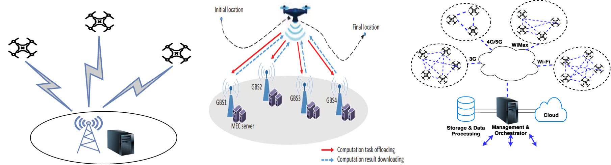
*Caption/Context: Computer Networks 182 (2020) 107451 | D. Mishra and E. Natalizio*

## --- Page 14 ---

### Section: Millimetre-wave communications

Computer Networks 182 (2020) 107451

14

D. Mishra and E. Natalizio

Rel-15 for 5G NR. 5G will exploit full benefits of MIMO by lever-
aging the uncorrelated and distributed spatial location of cellular-
connected UAVs, as well as ground users. Massive MIMO enhances
the signal strength, where multiple data streams can include unique
phase and weights to the waveforms to be constructively generated
at the UAV receiver [123,124]. It minimizes the interference to other
cellular-connected UAV receivers.

The work [123] presents an evaluation of a massive MIMO system
for cellular-connected UAVs. It demonstrates that, massive MIMO as-
sists in harmonious coexistence of cellular-connected UAVs with ground
users, supports large uplink data rates and results in consistent CNPC
link behaviour. The test uses 20 MHz bandwidth in sub-6 GHz licenced
spectrum operating in TDD mode. Massive MIMO-enabled systems are
useful to restrict the impact of interference to the existing terrestrial
users. Such system requires frequent and accurate CSI updates.

5.2.3. Millimetre-wave communications
Millimetre-wave (mmWave) spectrum has been extensively inves-
tigated in UAV cellular communication that offers high bandwidth
services using frequency spectrum above 28 GHz. The channel be-
tween cellular-connected UAVs and ground BS is typical LoS dominant
and mmWave having high bandwidth are favourable for communi-
cations. However, the mmWave signals are affected by any kind of
blockage, which poses several implementation challenges. Therefore,
efficient beamforming and tracking are needed for cellular-connected
UAV operation.

The work [125] presents a simulated study to showcase the feasibil-
ity of using 28 GHz 5G link for public safety use case. The results claim
that, it is feasible to achieve 1 Gbps throughput with sub ms latency
using mmWave links when the grounds base station is situated close to
the mission area. In [126], the authors conducted an analysis on the
air-to-ground channel propagation for two different mmWave bands at
28 GHz and 60 GHz using ray tracing simulations. During experiment,
the UAV speed was kept at 15 m/s and limited to a flight distance of
2 km. A total of four scenarios are validated such as urban, sub-urban,
rural and over-sea. It is observed that, received signal strength (RSS)
follows the two ray propagation model as per UAV flight path at higher
altitudes. This two-ray propagation model is impacted in urban scenario
due to high rise scattering obstacles.

5.2.4. Beamforming and BDMA
Beamforming is a technique by which a beam (signal element
directed to the users) is transmitted from the ground base station and
directed to a specific user to minimize interference to other neigh-
bouring users and maximizes the useful signal for the given user. In
5G NR, the antennas can create and exploit beam patterns for the
specific cellular-connected UAV [127,128]. This is of great importance,
because of aerial mobility of UAVs and high LoS channel conditions
from ground BSs. Beam division multiple access (BDMA) is capable
to handle large number of users and to enhance the communication
system capacity. In this case, a separate beam is allocated to each user.
This access technology is dependent on the user positioning, location
and speed of user movement.

Beam forming requires the base station to have more than one
transceiver RF chain and the user (both aerial and ground) to have
single RF transceiver. In order to support a greater number of users,
the beam should be split. The key challenge is to find a way to group
users that are served by a single beam without causing interference to
other users at the same time. Strategies like angle of departure (AoD)
or angle of arrival (AoA) help to measure the steering angle from BS to
mitigate interference to some extent [129,130].

In [131], the authors presented a study on using steerable direc-
tional transmitters on UAVs to evaluate the co-existence of cellular-
connected UAVs with ground user. This work jointly optimized the
flight path and antenna steering angle to improvise uplink throughput
while minimizing interference to other neighbour base stations. The

Fig. 14. Coexistence performance of aerial UE and ground UE, 700 MHz in rural
setting [131].

proposal is validated by a testbed setup involving 2 × 2 MIMO where
wide beam transmitters are employed half-power beams at 60◦on
azimuth and elevation planes and 6 dBi forward gain. Fig. 14 shows
the performance variation with respect to the throughput in presence
of both ground users and aerial users. The results show that such
techniques are of utmost importance when the ground and aerial users
coexist at such scale.

#### 5.2.5. NOMA

Non-orthogonal multiple access (NOMA) is a promising candidate
technology for 5G wireless communication, as it leads to higher spec-
trum utilization than orthogonal multiple access methods (OMA).
NOMA has been widely explored in UAV-assisted wireless communi-
cations, where UAV is deployed as a flying BS to serve the ground
users [132]. Few studies [133,134] also investigated the applicability
of NOMA in cellular-connected UAV network.

OFDMA and single-carrier (SC)-FDMA are conventional orthogonal
multiple access methods (OMA) adopted as a natural choice of 4G
LTE/LTE-Advanced wireless systems. The basic principles of OFDMA is
to transmit the different user signals over different frequency resources,
not to produce mutual interference among users. Cellular-connected
UAVs coexisting with ground users benefit from such orthogonal mul-
tiple access methods, because the UAVs within a given coverage can
avoid any interference to ground users by transmitting in those resource
blocks that are not assigned to any ground users. Thus, the resource
blocks can be allocated within the coverage area in a non overlapping
manner. However, increased user density and the frequency reuse
result in poor spectrum performance from such OMA methods, due
to resource block scarcity. On this advent, NOMA methods allows the
cellular-connected UAVs to reuse the resource blocks. In other words,
NOMA is capable to serve many users at the same time/frequency
resources. NOMA employs two techniques for multiple access:

• Power domain: Multiple access is based on different power levels.
• Code domain: Multiple access is based on different codes.

NOMA with interference cancellation (IC) is an appealing solution
to the cellular-connected UAVs because the UAVs can reuse the re-
source blocks that are allocated to ground users. Moreover, at high
altitude, UAVs experience stronger LoS channel condition than ground
users, so that BS can use IC to decode strong signal from UAVs, then
subtract it to decode ground user signal [91].

#### 5.3. B5G innovations for cellular-connected UAVs

B5G cellular systems (6G in general) bring additional benefits and
opportunities for cellular-connected UAVs. In following subsection,
we briefly introduce some of the novel concepts pertaining to B5G
innovations benefiting UAV technology.

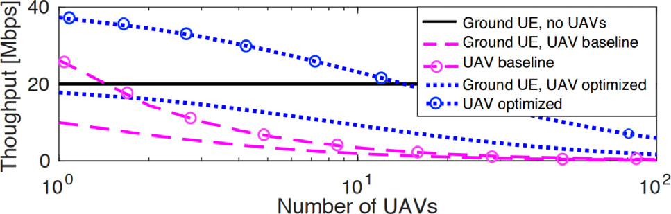
*Caption/Context: Computer Networks 182 (2020) 107451 | D. Mishra and E. Natalizio*

## --- Page 15 ---

### Section:  Terahertz communication 

Computer Networks 182 (2020) 107451

15

D. Mishra and E. Natalizio

5.3.1.
Terahertz communication
Terahertz (THz) communication is envisioned as a strong candidate
technology to meet reliable and robust communication need of different
cellular-connected UAV applications [135] . THz frequency band (0.1–
10 THz) provides very wide bandwidth beyond mmWave bands. The
doppler spread is minimized in THz bands as the frequency range
is very high allowing high speed communication link between two
dynamic locations. It also offers high capacity UAV-to-UAV communi-
cation backhaul and cope well with highly mobile UAVs [136] . Due
to the high link directionality and lower potential of eavesdropping,
THz assists in safety-critical information exchange between GCS and
UAV as well as establishing secure communication within a swarm of
cellular-connected UAVs. High speed UAV-to-UAV communication can
be achieved using THz band in a swarm of cellular-connected UAVs.
Additionally, the localization and positioning accuracies are improved
significantly within millimetre level for UAV operation in THz band as
compared to centimetre range in the mmWave band (30 GHz).

5.3.2.
Cellular internet of UAVs
In B5G systems, cellular Internet of UAVs is an emerging field that
supports various sensing application. As part of the airborne communi-
cation network in B5G, different types of transmissions are envisioned
in the name of UAV-to-Everything (U2X) communication [137] . It
consists of UAV-to-Infrastructure (U2I), UAV-to-UAV (U2U), UAV-to-
Device (U2D) type of communications depending on the nature of
wireless link. U2I denotes the information exchange between GCS and
UAV. U2U denotes the inter-UAV communication in a multi-UAV de-
ployment forming swarm of UAVs. U2D denotes the UAV to UE wireless
link for transmission of sensory data. Achieving robust coordination
and cooperation among UAVs in Cellular Internet of UAVs in real-time
is a challenging issue that has gained a lot of attention by researchers.

5.3.3.
Mobility and handover intelligence
The dynamic behaviour and high mobility of UAVs result in frequent
handovers impacting the radio link quality. Moreover, dealing such
frequent handovers in uncertain locations while performing various
missions with high data rate, reliability and low latency increases the
complexity of handover processing efforts. An AI-based novel B5G
technique known as DRL offers great advantage in solving the com-
plex decision making, optimizing handover strategies and guaranteeing
reliable connectivity [138] . DRL is a combination of downlink (DL)
and reinforcement learning (RL) that intelligently learns to enhance
the handover decisions in an online manner coping with dynamic
mobility behaviours of cellular-connected UAVs. In this setup, each
UAV is treated as a learning agent that learns environment states (radio
link quality, position information, speed) and outputs desirable action
pertaining to efficient handover decision, communication latency and
capacity.

#### 5.4. Summary of lessons learnt

The important lessons learnt from this section are listed as follows:

• Classical cellular network infrastructures are not well scalable for
the diverse and growing use cases of cellular-connected UAVs.
The improvements of 5G/B5G cellular networks present many
candidate innovative technologies and PHY layer improvements
that complements to efficient UAV operation in 5G spectrum.
• Based on the principles of softwarization and cloudification of
networking
resources,
the
network
architectures
involving
cellular-connected UAV solve several practical limitations with
respect to performance and scalability issue.
• The notable 5G advancements and trends in deploying NFV, MEC,
SOA, IoT driven network architectures helps UAV technology
to establish a reliable and safe communication link between
ground-UAV or UAV–UAV during mission.

Table 7
List of avionics components used in [139].

Component
Model

Flight Controller
Omnibus F4 Pro
GPS
BN-220
Radio Rx
TBS Nano
Camera & Video Tx
TX05
Computer
Raspberry Pi Zero W
4G Modem
Verizon USB730L
4G Antenna
TS9

• 5G-and-beyond hardware (NR) and software upgrades by cellular
network operators along with the technical advancements by
UAV manufacturers suitably caters to application specific latency,
rate and reliability demands arising from the use cases, thereby
improving overall performance of applications using cellular-
connected UAVs.
• The physical layer enhancements further supplement to the effec-
tiveness of applications encompassing cellular-connected UAVs.
• B5G (6G, in general) innovations will further continue to en-
hance the performance as well as the applicability for seamless
integration of UAVs to cellular networks.

#### 6. Design trials and prototyping

Experimental assessment and prototyping are time consuming and
relatively complex, because they must take into consideration the
deep technical aspects of any realistic deployment. There are several
ongoing efforts from industry and academia that focus on experimental
frameworks for cellular-connected UAVs. These efforts provide more
practical insights about the underlying behaviour and complexities
involved in integration of UAVs into cellular networks. Field trials and
measurement campaigns are a cost-effective and powerful step towards
the prototyping, as they help investigating the solutions to potential
research problems. In the following subsections, we shed some light
on these efforts and classify them into two broad groups such as (i)
experimental testbeds and (ii) field trials.

#### 6.1. Experimental testbeds

There is hardly any complete real-world testbed that fully char-
acterizes the challenges and benefits of cellular-connected UAVs. The
literature in this regard is scarce. However, several ongoing efforts are
being actively pursued by researchers from both industry and academia
to advance the working prototypes. It is worth mentioning that, real-
ization of working prototypes of cellular-connected UAV mainly differ
with respect to (i) the main objective for which they are built, and
(ii) the features being implemented, which are also dependent on the
main objective. For example, one prototype may completely focus its
prototype development on investigating 5G/B5G network support to
efficient UAV operations. Another prototype may prioritize its devel-
opment on achieving a fail-safe, reliable communication with desired
QoS guarantees. Furthermore, each prototype may utilize different
hardware and software flight stacks to realize the goal. The chosen
hardware and software platforms may be open-source or proprietary in
nature. Hence, the existing efforts tend to be very specific to the goal
being pursued, thereby providing unique characteristics or behaviours
to the prototype being developed. There are no formal development
guidelines available so far in order to harmonize available features for
these prototyping efforts.

An ideal view of cellular-connected UAV prototype is still missing.
This ideal prototype can be thought of possessing a non-trivial list of
mandatory features and should be adaptable to varying needs of the
mission. Our current work attempts to foresight such an ideal prototype
and enumerates the list of encompassing features. Table 8 illustrates a
feature-oriented comparison of existing testbed works in literature with

## --- Page 16 ---

Computer Networks 182 (2020) 107451

16

D. Mishra and E. Natalizio

Table 8
A feature-oriented comparison of prototypes of cellular-connected UAVs from viewpoint of idealistic baseline.

References →
Short Description
[139]
[140]
[141]
[142]
Features ↓

Cellular Network
Cellular network generation type to which the prototype is
connected and tested

4G LTE
4G LTE
GSM/ GPRS
3G/4G LTE

Open-source
Constituent hardware and software components of the prototype
being developed

✓
✓
✓
✓

Autonomous
Whether the UAV can fly autonomously without human
intervention (self-flying nature)

✓
✗
✗
✗

Fail-safe
Ability to be resistant against lost link and returning to home
location after UAV control is interrupted

✓
✗
✗
✗

Encrypted Communication
Use of encryption mechanism to secure the message exchanges from
potential attackers

✓
✗
✗
✗

BVLoS Capable
Being able to command and control the UAV, even not in the direct
view of the remote pilot

✓
✓
✗
✗

QoS-Aware
UAV successfully fulfils the application demands with respect to
quality metric such as packet loss, latency, rate and jitter

✗
✓
✗
✗

Internet Connectivity
Being able to control and steer UAV from persistent Internet
connection

✓
✗
✓
✓

Ground Control
UAV being remotely controlled by ground control station for
command and control, or payload communication

✓
✓
✓
✓

Light-weight
Light-weight of UAV to enhance the prototype performance
✓
✗
✗
✗

Terrain Following
UAV maintains a fixed altitude and follows the terrain that is useful
in unknown terrains like mountains

✓
✗
✗
✗

Flight Longevity (∼1 h)
Higher flight time of UAV indicating energy efficiency and
negligible interruption during missions

✓
✗
✗
✗

Endurance
Robustness and integrity of UAV in extreme environment
✓
✗
✗
✗

Energy Efficient
Consumption of very less power to maintain persistent flight
operation to accomplish the mission

✓
✗
✗
✗

Network Virtualization
Ability of the prototype to be hardware platform independent and
softwarization of UAV network functions

✗
✗
✗
✗

Adaptable
Being responsive to current situation and the ability to reconfigure
the UAV as per changing requirement and mission in minimum time

✗
✗
✗
✗

AI/ML-Powered
Ability to leverage efficient AI or ML based approaches to self-learn
and apply the learnt knowledge to improvise the mission
performance over time

✗
✗
✗
✗

Swarm Cooperation
Ability to properly coordinate information with other
cellular-connected UAVs in a multi-UAV deployment scenario

✗
✗
✗
✗

the desirable set of features from an ideal prototype point of view. Note
that, this list of features is not exhaustive, rather provides a use-case
driven analogy to consolidate the basic set of mandatory features. New
features may arise in future with evolution of emerging use cases for
cellular-connected UAVs.

In this subsection, we aim at investigating the existing efforts to de-
sign and develop working prototypes for realizing some UAV operations
over LTE/4G/5G/B5G cellular network infrastructure along with their
implemented features. They are presented as follows.

An open-source 4G connected and controlled self-flying UAV is
demonstrated in [139], defining a new, light-weight, secure and open-
source class of cellular-connected UAV. This work utilizes open-source
hardware and software stack to design and develop fully autonomous
and fail-safe flight behaviour. This work provides a comprehensive
and detailed discussion on the possible hardware and software options
for flight controllers, radio receivers, sensors, microcontrollers and
4G cellular modems. Fig. 15 summarizes the hardware and software
components used in the prototype development. The detailed hardware
avionics schematics and equipment models are highlighted in Fig. 16
and Table 7, respectively. The performance of the prototype is tested
for endurance, terrain alignment, autonomous flying behaviour, wind
speed and real-time video quality. The important accomplishments of
this work are summarized as follows.

• The entire prototype setup is done by open-source hardware
and software components with Commercial off-the-shelf (COTS)
components.

Fig. 15. Prototype design and configurations in [139].

• The UAV shows longest demonstrated flight time i.e., over one
hour.
• This work provides clear, concise and step-to-step guidelines for
entire prototype design and development along with the program-
ming of individual pieces. This also includes an online manual
(wiki) and supplementary information.
• The prototype shows self-healing internet architecture and uti-
lizes the fail-safe protocols for the lost links in communication.

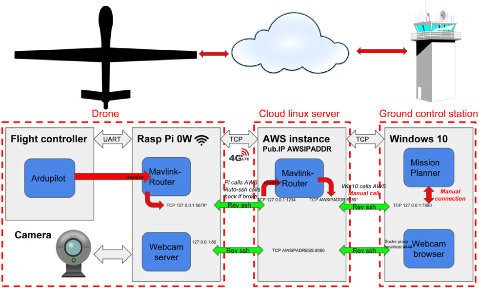
*Caption/Context: Network Virtualization Ability of the prototype to be hardware platform independent and softwarization of UAV network functions | ✗ ✗ ✗ ✗*

## --- Page 17 ---

### Section: Field trials

Computer Networks 182 (2020) 107451

17

D. Mishra and E. Natalizio

Fig. 16.
Schematic of the avionics components in [139].

• The UAV cellular to ground control is secure by encryption and
can pass through several firewalls.
• As compared to other UAV industry verticals, the significant
advantages are light weight (UAV weighs nearly 300 grams) and
longer flight time (> 1 h).

A working prototype of LTE controlled drone was demonstrated
in [140] proving the control of UAV via LTE connection and then tested
as a 3D measurement platform. The goal of this prototype development
was to investigate and evaluate LTE as a potential candidate of commu-
nication infrastructure for controlling a UAV. The experimental goals
are to provide answer to below mentioned questions.

• whether existing LTE network infrastructure is an efficient means
of controlling UAVs?
• whether the LTE connection is good enough in terms of providing
low latency, jitter and bit error rate?
• whether the bit rate is sufficient to perform the use case of live
video streaming in BVLoS range?

The prototype is tested with respect to above mentioned goals and
found that LTE is an efficient technology for UAV operations in BVLoS
range satisfying the required the bit rate, latency and jitter. However,
this prototype has several shortcomings and may not be considered
as a full-fledged cellular-connected UAV testbed. Many features are
either missing or not considered to keep the prototype simple in this
development, thereby leaving enough scope for further enhancements.
Some of the important features worth highlighting which are lacking
in the prototype are listed below.

• The design did not consider cellular network coverage holes
and discontinuity problem which may lead to failure of UAV
operation. Flight fail safe mechanism is lacking.
• The UAV mission specific investigation with respect to trajectory,
interference from neighbouring base stations, handover criteria
are missing from the design.
• The QoS delivered by the UAV application must take into account
diverse real-world use cases in presence of obstacles and variation
of signal strength. Such study is missing.
• It did not consider the factors and performance penalties when
UAV coexist with other ground UEs.

The work presented in [141] proposes an arduino-based low-cost,
flexible control subsystem for controlling UAVs and ubiquitous UAV
mission management by GSM/GPRS cellular networks. The ground
control station transmits control signals to UAV present in LoS or
beyond LoS over GSM or GPRS cellular network, through which, it
is shown that is possible to connect to Internet, send/receive text
messages or voice calls utilizing a GSM antenna and a SIM card. The
experimental setup includes the following components: (i) UAV is an
IRIS+ quadcoptor by 3DRobotics, (ii) Pixhawk autopilot, (iii) Arduino
Mega ADK Rev. 3 microcontroller board, (iv) GSM/GPRS module by
Arduino GSM shield with Quectel M10 modem, (v) Mission Planner, an

Fig. 17. High level schematics of the prototype setup in [141].

open source software for ground control station software. The field tests
are conducted by sending basic control commands from smartphone
or laptop to UAV and they are successfully executed by the UAV. The
subsystem initialization time is high, but occurs only once when the
subsystem is powered ON. Fig. 17 shows the high level system schemat-
ics of the working prototype. Following are the key observations drawn
from above experiment.

• Communication via GPRS using a Mission Planner software has
faster response time.
• The Internet connectivity of GRPS is very fragile which make the
GSM text message mode to be an efficient way for command and
control message exchange.

A flexible open-source long-range communication solution for UAV
telemetry based on cellular data transfer service is presented in [142]
which is implemented on Raspberry Pi 3 model B (also known as rpi3)
and Gentoo Linux control. The UAV is equipped with a Huawei 3372h
dongle to get the cellular data services.

#### 6.2. Field trials

In this subsection, various efforts on field trials and measurement
campaigns of cellular-connected UAVs are discussed. Based on the mea-
surement environment where the trial is conducted, we have segregated
the descriptions of this section into four broad categories. They are (i)
Urban, (ii) Suburban, (iii) Rural and (iv) Mixed Environment.

6.2.1.
Urban environment
Authors in [143] focuses on aerial communication field trial, where
a radio scanner is attached to construction lift and radio signal was
measured with heights up to 40 m in urban scenario. The measurement
was carried out in three LTE carriers such as 800, 1800 and 2600
MHz in northern Denmark. The experimental study aims at providing
propagation models of UAVs connected to cellular networks. The key
findings from the trials are as follows:

• Increase in the received power from neighbour sources even in
height of 40 m that contributes to heavy interference for the aerial
user.
• The observed path loss approximated to free space path loss after
a UAV height of 25 m.

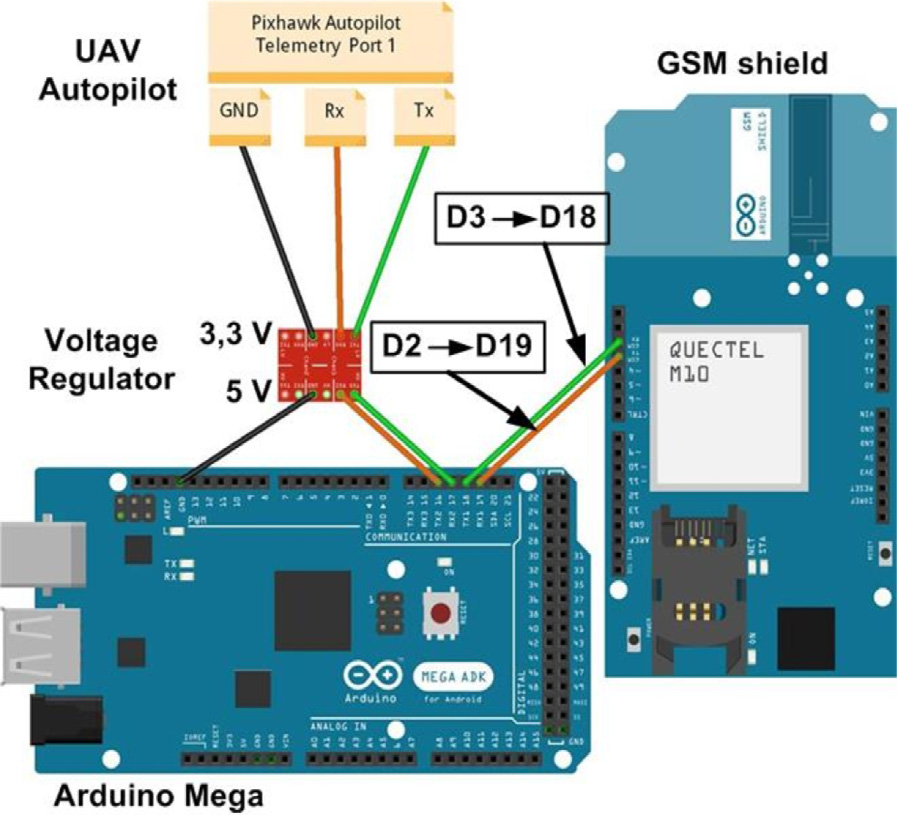
*Caption/Context: Computer Networks 182 (2020) 107451 | D. Mishra and E. Natalizio*

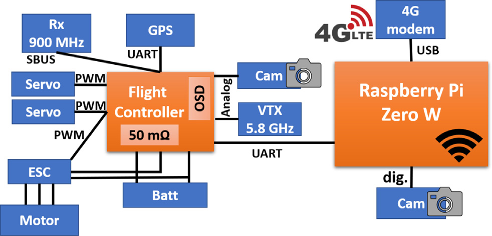
*Caption/Context: Computer Networks 182 (2020) 107451 | D. Mishra and E. Natalizio*

## --- Page 18 ---

### Section:  Suburban environment 

Computer Networks 182 (2020) 107451

18

D. Mishra and E. Natalizio

6.2.2.
Suburban environment
Authors in [144] conducted a field measurement in a commercial
LTE network for cellular-connected UAV operation. An LTE smartphone
mounted on a consumer grade DJI Phantom 4Pro radio controlled
quadcopter is used to gather the UAV flight results. The smartphone has
TEMS Pocket 16.3 installed for wireless measurement and analysis. The
field trial results include distribution and measurement of signal quality
metric such as Reference Signal Received Power (RSRP), Reference
Signal Received Quality (RSRQ), Signal to Interference and Noise Ratio
(SINR) in the serving cell and neighbouring cells with respect to UAV
movement. The results show the feasibility of UAV operations in com-
mercial LTE network and also highlight the implementation challenges
for dynamic radio environment. The simulations are also conducted
to supplement the field trial results in terms of network performance
involving a higher number of cellular-connected UAVs.

Following observations are drawn from the experiments.

• The aerial propagation conditions are close to free space propa-
gation and hence, the aerial UEs experience stronger RSRP than
the ground UEs.
• The RSRQ and SINR at higher altitude is lower than the corre-
sponding ground UE because of the strong downlink interference
from neighbour non-serving cells to the aerial UE.
• The uplink throughput for aerial UE is observed to be better than
ground UE due to free space propagation condition. Note that,
this uplink performance also depends upon many other factors
like scheduling mechanism and network load.
• In the downlink command and control traffic, higher altitude
results in lower spectral efficiency due to increased interference
and higher physical resource block (PRB) utilization.
• Considering the mobility of aerial UEs at higher altitudes and LoS
propagation conditions, a greater number of radio link failures
(RLF) occur due to poor SINR and large interference. Also, they
may connect to far-away cells instead of the closest cell.

6.2.3.
Rural environment
In [145], the authors demonstrated an experimental platform where
UAVs are connected to a commercial 5G NR base station for radio link
measurements. The 5G BS is developed by Magenta Telekom in Austria
and operates between 3.7 and 3.8 GHz frequency, using 100 MHz
band. It has 64 × 64 massive MIMO setup with beam forming capa-
bilities. An Asctec Pelican quadcopter is flown near this BS and the test
measurements are performed by a Cellular Drone Measurement Tool
(CDMT). This UAV carries a non-standalone Wistron NeWeb mobile test
platform based on Qualcomm Snapdragon X50 5G modem. It supports
sub-6 GHz 5G NR using 4 × 4 MIMO and 256-QAM. The goal of the
study is to investigate the communication behaviour and performance
characterization of flying UAV when connected to a commercially
operated 5G base station. The communication aspects for 5G-connected
UAV measured in this test are 5G connectivity, RSRP, SNR, throughput
and number of handovers. The UAV flight includes both vertical lift-
off and horizontal trajectory. Following observations are drawn from
above testbed driven study of 5G connected UAV.

• The UAV connectivity to 5G cannot be always guaranteed and
fall back to 4G network. This situation is even worse at higher
altitudes with more handovers towards 4G network.
• The UAV is able to receive enough data rate (several hundred
Mbps) from 5G NR based deployment, which is adequate for many
applications and use cases.
• The handovers to 4G network could be reduced by deploying a
larger number of 5G NR base stations, and downlink rate would
be improved. However, the experiment did not yield much benefit
in the uplink as compared to 4G. The authors assume that uplink
rate analysis needs further investigation.

The work in [146] presents the field trial done at a small airport
in vicinity of Odense, Denmark and results were collected in an LTE
network operating in 800 MHz and the UAV altitude is maintained
between 20 to 100 m. The cellular network data was collected by a
Samsung Galaxy S5 smartphone which was placed inside the flying
UAV cavity. It was equipped with Qualipoc software for reporting the
radio measurements. The UE was programmed to use a 20MHz carrier
with centre frequency at 810 MHz. The measurement field had no
obstruction between UAV and BS and was an open area to prevent
significant signal attenuation and reflected paths. For every second
interval, the software radio reports include RSRP and RSRQ. The goal of
the experiment was to understand the effects of altitude on the radio
performance of an aerial user. It is observed that the SINR degrades
when the UAV flies high. The steepest degradation is seen in height
variation between 20–40 m indicating that the increase in interference
is more prominent at lower altitudes, and smaller variations at higher
altitudes due to improved gain. The study reveals that, expanded radio
horizon at higher altitudes, high LoS probability and clearance of first
Fresnel zones are key radio factors in modelling the path loss between
aerial users and ground stations.

In [147], the authors used machine learning algorithms in order to
identify the cellular-connected UAVs in the network based on LTE radio
measurements. The measurement was conducted in a rural location of
Northern Denmark where the airborne aerial UAV users are realized by
mounting a QualiPoc android smartphone on commercial UAV attached
to an 800 MHz LTE carrier. The height is maintained at 4 different
levels and UAV is flown in 4 rectangular routes. This work claims the
use of supervised learning algorithms for efficient detection of aerial
users in the network solely based on LTE radio measurements with
small number of training samples.

The authors in [148] have demonstrated the feasibility of UAV
operation via commercial cellular network for high data connectivity
in low altitude and BVLoS operations throughout different times of the
day.

6.2.4.
Mixed environment
Qualcomm also tested the UAV operation in commercial LTE net-
works in September 2016 and produced a trial report in May 2017
on LTE unmanned aircraft system [149]. The focus of this test was
to understand the operation of low altitude UAV platforms being sup-
ported by terrestrial cellular networks. The overall test encompasses
both field trials and simulations. The field trials aim to capture datasets
by performing hundreds of flights and then complemented by exten-
sive system level simulations to understand the performance of UAV
operation. The flights and measurements were performed by custom
designed 390QC quadrotor drone. Note that, these results are collected
in a suburban/residential zone which was having good cellular cover-
age, hence, cannot be generalized for other zones like urban or rural
areas. Moreover, the performance results are approximate in nature
rather than accurate. The key results obtained from the trail report are
summarized as follows.

• The aerial UEs experience higher received signal strength than
ground UEs despite of the down-tilted BS antennas. This is be-
cause of the better free space propagation condition at higher
altitude.
• The SINR in the downlink for aerial UEs is lower as compared
to ground UEs due to the interference experience from neighbour
cell.
• The UE transmit power is more for ground UEs than aerial UEs
in the uplink, because good free space propagation condition at
higher altitude enhances the interference energy from neighbour
cell. The field results depicted that aerial UEs experience nearly
three times more interference than ground UEs in 700 MHz band.
• Handover performance in terms of lower handover frequency and
success rate of handovers is superior for aerial UE than ground UE
due to signal stability at high altitude.

## --- Page 19 ---

### Section: Summary of lessons learnt

Computer Networks 182 (2020) 107451

19

D. Mishra and E. Natalizio

• The optimization in the power control scheme are applied by
simulation and was shown to eliminate the excess uplink inter-
ference.

In [131], the authors experimentally evaluated the terrestrial users’
performance in the presence of UAV as aerial users on LTE testbed. The
performance measurements are conducted to measure the throughput
degradation. The LTE network is considered to operate over 2300 MHz
carrier frequency with 20 MHz operational bandwidth spanning an
area of 160000 square feet. The setup includes 2 eNodeBs, 4 LTE
cells each having 2 × 2 MIMO capability. The downlink and uplink
bitrates are kept as 150 Mbps and 50 Mbps, respectively. The UAV
hovers at a height of 50 m. To analyse the performance, both ground
UE and aerial UE generate uplink traffic at full buffer capacity for
one minute in each experiment run. It is observed that the ground
UE suffers a throughput degradation up to 21.75 Mbps because of the
inter-cell uplink interference by aerial users. The average reduction in
throughput is nearly 52% i.e., equivalent to 11 Mbps.

Unknown Environment - The work in [150] presents the experimental
evaluation of cellular-connected UAVs communication performance
connected to an LTE-Advanced network running 3GPP Release 13. An
Asctec Pelican quadrocopter carrying a smartphone (Sony Xperia XZ2
H8216) flies in the coverage of an LTE-A network within the premises
of University of Klagenfurt campus. The experiment is performed in
open-field and obstacle-free areas ensuring LoS link with at least one
BS. The UE supports LTE carrier aggregation and a 2 × 2 MIMO antenna
setup is used. The base station has a transmit power of 20 Watt and
256 QAM and 64 QAM in downlink and uplink, respectively. The UE
was able to report various LTE parameters such as RSRP, RSRQ, SINR,
serving PCI, TCP uplink and downlink throughput, EARFCN etc. The
UAV followed a straight path spanning 300 m with a speed of 3 m/s.
The broad goal of this experimental study was to understand the impact
of varying UAV altitude on achievable throughput and performance
measurement of handovers by aerial user without any specific change
in the network. The keys findings are as follows:

• The achievable throughput of UAV is sufficient enough to cater
to many applications and use cases. At an altitude of 150 m,
the UAV’s average throughput is 20 Mbps and 40 Mbps in the
downlink and uplink, respectively.
• The number of handovers increase with increasing height of UAV.
The reason for high handover frequency is the high RSRP and
high interference values from neighbour base stations.

Table 9 presents a comparative analysis of different existing works
in literature with respect to field trials and measurement campaigns.
Existing field trials vary greatly in several aspects, such as type of envi-
ronment, deployment scenario, modelling platform, goal of experiment,
performance metric, etc.

Note that, large-scale benchmarks and real-world datasets pertain-
ing to the UAV mission are highly influential to study and evaluate
the characteristics of various applications. Such datasets can be readily
utilized for visualization and deriving predictive decisions using AI and
learning algorithms. In [151] , the authors provide a review of datasets
and benchmarks for object detection and tracking enabling extensive
evaluation and investigation of visual analysis algorithms on the UAV
platform. A detailed collection of datasets and benchmark are available
at ‘‘http://aiskyeye.com/’’ and ‘‘https://github.com/VisDrone’’.

#### 6.3. Summary of lessons learnt

The important lessons learnt from this section are listed as follows:

• The solutions proposed to the technical synergistic challenges
of 5G/B5G systems with UAV technology must be validated
and tested for correctness. Hence, the key design considera-
tions of cellular-connected UAV necessitate sound measurement

campaigns, field trials, simulations and working prototypes to
study the behaviour with real-world scenarios. The experimental
testbeds and field measurements have significant practical rele-
vance, because these are very conducive for realistic evaluation
of the system under study.
• Most of the existing literature relies on software simulations to
evaluate the technical aspects of proposed solutions. Few works
have shown to conduct field measurement campaigns to ob-
serve and study the behaviour of cellular-connected UAV such
as handovers, cell association, signal strength reduction, radio
link status, interference mitigation etc. Very few works focus
on design and development of real-world working prototypes of
cellular-connected UAV, because such efforts are time-taking and
highly complex. Prototyping works are still in its infancy stage
and hence, call for more contributions in this regard.

#### 7. Standardization & socio-economic concerns

Cellular-connected UAVs can pose serious risks in terms of socio-
economic operational capabilities. Therefore, utmost care must be
taken by the policy makers and legislation in order to integrate UAVs
into national and international aviation systems. To this end, in this
section, we outline the perspectives of standardization, regulatory ac-
tivities, market and social challenges, which the UAV service providers
and cellular operators must take into consideration before successful
roll-out of use cases pertaining to cellular-connected UAV applications.

#### 7.1. Standardization

Third Generation Partnership Project (3GPP) is a standardization
body that governs the specifications for the technical platforms used
by the cellular networks. The global partnership 3GPP develops stan-
dards to which almost all commercial cellular network providers and
operators adhere to. In order to cater to the present and future needs of
UAV communication, 3GPP aims to layout a unified platform for design
and development of wireless innovations by gaining wider consensus
from various contributors from industry and academia. The evolutions
in the standards are published in the name of ‘‘3GPP release". From the
perspective of UAV operations over cellular networks, we are interested
in 3GPP Release-15, Release-16 and Release-17. In Release-15, the
study mainly concerns with the radio level aspects for supporting UAVs.
In Release-16 and 17, the study is in the perspective of System and
Application layer aspects.

7.1.1. Release-15
3GPP led a study item (SI) in Release-15 to investigate various
prospects of utilizing an LTE network for UAV communication. The
key outcomes of this study are summarized in the technical report TR
36.777, which was approved in January, 2018. This study focuses on
two broad goals: First, how the aerial users (cellular-connected UAVs)
impact overall LTE performance in the presence of terrestrial (ground)
users. Second, to investigate on whether an LTE network is able to
provide good support low altitude UAVs? The comprehensive list of
items studied in this release are: channel modelling between aerial
UEs and ground BSs, uplink and downlink interference problems due
to LoS channel propagation characteristics, identification of aerial UE
for legitimate cellular usage and subscription information, mobility
performance, and flight path signalling. The result of the SI shows that
existing LTE networks are able to support UAV communication and
there is no notable impact in coexistence of small number of aerial
and ground users (low density or rural regions). However, increase
in the number of aerial and ground users have adverse impact on
uplink/downlink performance due to interference. To some extent,
existing LTE standards are found useful to mitigate the interference
situation. After the completion of aforementioned study, a work item
(WI) is pursued and got approved for enhancement of LTE standards.
They are as follows:

## --- Page 20 ---

### Section: Release-16

Computer Networks 182 (2020) 107451

20

D. Mishra and E. Natalizio

Table 9
Comparison of existing works on field trials and measurement campaigns.

Reference Work
Cellular Network
Trial Environment
Performance Metric

[131]
4G LTE
Rural, Suburban, and Urban
Throughput degradation, Interference, Uplink signal power
[143]
4G LTE
Urban
Channel propagation models
[144]
4G LTE
Suburban
RSRP, RSRQ, SINR, downlink latency, resource utilization
[145]
5G New Radio
Rural
RSRP, SNR, Throughput, 5G connectivity
[146]
4G LTE
Rural
RSRP, RSRQ, SINR, Effect of altitude on UAV
[147]
4G LTE
Rural
Cellular-connected UAV identification
[148]
4G LTE
Rural
RSSI, RSRP, RSRQ, uplink/downlink throughput
[149]
4G LTE
Mixed Suburban
Cellular connectivity for low altitude UAVs
[150]
4G LTE-A
Unknown
RSRP, RSRQ, SINR, PCI, UL/DL throughput, EARFCN

Fig. 18. High level architecture of 3GPP Release 16 work on remote identification of
UAS.

• Introduction of new radio events and enhanced height dependent
reporting for aerial UEs;
• Support of signalling in subscription based aerial user identifica-
tion;
• Improvement of mobility and interference detection, uplink
power control, airborne status and flight path plan.

7.1.2. Release-16
This release plan started in September, 2016 and the approval for
stage-3 development was conducted on December, 2019. This release
work is mainly on System and Application layer aspects. A study item
on ‘‘Remote Identification of Unmanned Aerial Systems’’ is pursued on
this release and it led to the approved report 22.829. This study aims
at the identification of UAV over the command and control data via
a 3GPP network exchanged between UAS and centralized UAV Traffic
Management (UTM) component. A UAS comprises of UAV and UAV
controller. Fig. 18 depicts above model. 3GPP standards must make
provisions for UAS to send the application data traffic to UTM along
with various radio network information, identification and tracking
details for UAS. After this study, a WI was agreed by 3GPP to advance
the work on service requirement for identification of UAV.

7.1.3. Release-17
In this release, 3GPP proposes a number of study items. The idea is
to come up with diverse scenarios and metrics to cater to wide variety
of UAV applications and use cases. The study items are as follows:

• 5G Enhancement for UAVs :- It includes several Key Performance
Indicators (KPIs) relevant to UAV services. The KPIs are provided
for command and control, and payload communication.
• Study on application layer support for Unmanned Aerial System :-
This includes the UAS service requirements that may have impact
on the UAS application layer. These requirements are in terms
of general requirements, UE capability identification, location,
security etc.
• Study on supporting Unmanned Aerial Systems Connectivity,
Identification, and Tracking :- This study item deals with a mech-
anism that enables the UAS tracking and identification within
3GPP systems and UTM.

#### 7.2. Regulatory concerns

Ubiquitous accessibility and rapid emergence of UAV technology
mandate development of regulatory frameworks for harmonious op-
eration of cellular-connected UAVs in the national and international
airspace. Although, each country has a specific set of internal rules for
UAV operation, few global bodies tend to harmonize their operation
across international airspace. The regulatory framework mainly target
around three key aspects [152]:

• To regulate and control the use of unmanned aircraft in the
airspace to prevent danger to manned aircraft;
• To ensure proper operational limitations to the flight;
• To manage and control the administrative privileges such as pilot
licences, flight authorizations and data handling techniques.

#### 7.3. Market concerns

The UAV ecosystem leveraging the emerging technologies such as
IoT, AI, AR/VR are not much explored by the manufacturers and their
usages are also researched by a handful of organizations. Real-time
surveillance is one of the major use case that has been widely explored
by the UAV industry for relaying live information to target audience.
The ecosystem is still in its infancy to showcase diverse capabilities
of cellular-connected UAVs. Additionally, the skills necessary for UAV
industry to roll out interesting use case demand sufficient domain
training to the equipment providers and technical users. It is key to
eradicate the bottleneck in setting up the ecosystem. Extracting the
right set of specifications and requirements from the users is needed
to maximize the benefit of the use case and to generate large scale
development of cellular-connected UAV applications.

#### 7.4. Social concerns

The UAV operation must be properly regulated to protect the pri-
vacy of business organizations as well as individuals. Advancement of
drone technology with aerial surveillance and photography with high
definition images and streaming can easily violate the privacy, even
when it is unintentional. The existing regulations to protect privacy
may not be sufficient due to rapid evolution of UAV technology and
its increasing capability, thereby further legislation is needed to be
formulated to protect privacy.

Most of the UAV use cases deal with gathering a lot of vital data
depending upon the application and processing them to extract useful
information for taking decisions. During a mission, the onboard sensors
collect personal or business data can be transmitted to a remote location
or made live from the present location. The data collection capabilities
may infringe data protection rules and abuse personal information
without the knowledge of data subject. Additionally, if someone obtains
the control of the UAV, the sensors or data processing circuitry could
be tempered for data misuse. Hence, strict guidelines must be governed
to protect the personal and business data.

In the due course of flight or mission control, any sort of discontinu-
ity in proper command and control poses serious safety risks. This may

## --- Page 21 ---

### Section: Summary of lessons learnt

Computer Networks 182 (2020) 107451

21

D. Mishra and E. Natalizio

lead to collisions and causes harm to civilians and other UAVs in the
vicinity. Collisions with manned aircraft can pose serious risks in terms
of catastrophic consequence and loss of assets. In case of high density
urban regions, collisions of UAVs with the ground terrain pose threats
to human lives and assets. Hence, the challenges with respect to public
safety must be taken into account and researched thoroughly.

#### 7.5. Summary of lessons learnt

The important lessons learnt from this section are listed as follows:

• Cellular-connected UAVs not only impose technical challenges,
but also require solutions pertaining to privacy, security, licences,
public safety, administrative procedures governing them. Stan-
dardization bodies such as 3GPP have put together study items
and working groups in order to harmonize the development ef-
forts from industry, academia and independent research bodies.
• Operation of UAVs over cellular spectrum requires strict regula-
tions to operate in national and international airspace without
causing trouble to other manned or unmanned aerial vehicles.
There are rules applied to control UAV operation that varies
with countries. However, a unified set of rules governing UAV
operation in cellular spectrum is still far away.
• The commercial production of cellular-connected UAVs must con-
sider the true requirements and specifications to maximize the
benefit of a use case.
• Care must be taken to safeguard the data collected by the sensors
of UAV and ensuring that it does not infringe the privacy of un-
wanted individuals and organizations. It must be guarded against
hackers and malicious intruders, whose intent is to control the
UAVs for unauthorized activity, e.g., during aerial surveillance
and photography.

#### 8. Future outlooks

In earlier sections, we have outlined integration challenges and
highlighted candidate 5G/B5G innovations to address some of those
challenges for cellular-connected UAV. Despite of several studies, there
is still considerable areas of open problems that needs to be investi-
gated. The current section aims to bring out such future opportunities
for researchers and shed light on interesting open research topics.

#### 8.1. Accurate channel models

UAVs are expected to be deployed in a wide variety of indoor
and outdoor environments such as stadiums, urban, rural, sub-urban,
industrial, over water, highways etc. All these environments require
unique air–ground propagation conditions, measurement campaigns
and channel models for cellular-connected UAVs. However, accurate
modelling and characterizing each of these unique channels is a non-
trivial task that remains largely unexplored. In addition, introduction of
5G-oriented technologies such as mmWave and massive MIMO systems
bring additional factors and scope for improvements in design and
development of effective channel models for cellular-connected UAVs.

#### 8.2. Energy/battery power limitations

Onboard energy is a bottleneck in UAV. Recent developments to
rechargeable battery cells and use of solar cells are some of the ways
to extend the flying time of UAV. The UAVs require continuous power
source to operate as they use a huge percentage of battery power in
flying. Different actions such as transmission, reception, execution of
software function, path planning optimizations consume the battery
power. Most of the existing works on cellular-connected UAV do not
factor this energy limitation during the study. There exists a lot of scope
to investigate the performance of cellular-connected UAVs considering
the limited energy constraints especially in areas of VNF deployment on
UAVs for automated operation, trajectory optimization, learning-based
methods, and longevity calculation of the mission in a use case.

#### 8.3. Security and privacy

Due to open communication links, the cellular-connected UAVs are
vulnerable to cyber–physical or malicious attacks to spoof the control
signals. Such attempts pose tremendous threat to the UAV system in
terms of loss/stealing of confidential information or failure of mission.
The signal spoofing of control signal might have adverse effect on the
UAV mission and making it difficult to bring it back online. Hence, in
order to avoid such malicious modifications, a relevant open issue is to
improvise the security and privacy aspect of UAV cellular communica-
tion that demands in-depth study of security issues spanning all layers
of the protocol stack.

#### 8.4. Cell selection and network planning

The UAVs are typically served by the side lobes of current base
stations in 4G and 5G cellular networks and therefore may easily es-
tablish cell selection with far away base stations. Furthermore, the high
mobility of UAVs increases the failure rates of radio link due to more
frequent handovers. The design of antennas to supports flying UAV in
high altitude and enhanced solutions for radio network planning are
required by network operators and equipment vendors.

#### 8.5. 3D Mobility and handovers

Typically, ground UEs are mobile in 2D space and base station
antennas are optimally designed for ground users. UAVs are typically
served by the side lobes of current base station and their aerial patterns
are different resulting in unique handover characteristics, different
from ground UEs. The frequent handover pattern is largely depen-
dent on blockage, mobility, altitude variations. There is a need for
improved handover mechanisms that suit the characteristics of high
mobility UAVs. Additionally, the cell selection schemes based on near-
est or strongest RSRP may no longer be an appropriate method for
cellular-connected UAVs.

#### 8.6. Testing platforms

Simulations and measurement campaigns are not sufficient to fully
characterize the performance and working principles of cellular-
connected UAVs. The proposed solution approaches to the integra-
tion challenges must be complemented by extensive field trials and
real-world testbed-based evaluation. However, there are not enough
working prototypes to study and evaluate the behaviour of cellular-
connected UAVs from practical standpoint. Additionally, there are no
experimental or open-source simulator platform available till date to
assist in a wide range of functionality testing of UAVs. Such works need
to be pursued in future to fill in the gap between theoretical proposal
and practical evaluation.

#### 8.7. AI And ML-based methods

AI and ML-based approaches have been considered as powerful tools
to solve many real-world wireless networking problems revolutionizing
5G/B5G networks. On this advent, the UAV cellular communication has
opened up new possibility for autonomous UAV operation considering
the security, performance and dynamic complex deployment scenarios.
Numerous research issues exist in studying and evaluating AI/ML-
empowered techniques to solve challenges of UAV-ground interference
management, power control, multi-UAV cooperation etc. Moreover, Q-
learning approaches are helpful for UAVs to tackle security issues by
adaptively controls the UAV transmission as per the malicious type of
attacks.

## --- Page 22 ---

### Section: Computational offloading

Computer Networks 182 (2020) 107451

22

D. Mishra and E. Natalizio

#### 8.8. Computational offloading

Due to moderate computational capabilities and limited onboard
energy of UAVs, MEC can be helpful for offloading computationally
heavy tasks from cellular-connected UAV to edge nodes to improve
endurance and life time of UAV. Some examples of such intense tasks
are real-time face recognition in a crowd surveillance use case. For such
use case, leveraging MEC capabilities along with UAV, the recognition
task can be offloaded to complete the job in a timely manner. Addi-
tionally, to save the information from eavesdropper, proper security
mechanisms needs to be integrated to the MEC-UAV platform for
optimum performance. These research areas are largely unexplored so
far and numerous scopes exists for design and development of UAV-
MEC frameworks for cellular-connected UAVs considering its diverse
use case.

#### 9. Conclusions

In this work, we provided a comprehensive study on the Cellular-
assisted UAV communication paradigm (Cellular-connected UAV)
where UAV is integrated to 5G/B5G cellular systems as a new aerial UE.
The detailed taxonomy of various application domains with emerging
use cases as well as the technical synergistic challenges of UAV inte-
gration with cellular network are discussed first. Then, we focus on
the promising network architectures and physical layer improvements
in 5G/B5G systems considering the hardware and software design chal-
lenges of Cellular-connected UAVs. The key innovative 5G technologies
are elaborated enabling the seamless integration and support of UAV
communication over cellular spectrum. In order to characterize the
design performance benefits and study the realistic deployment issues,
we also highlighted the efforts to develop working prototypes as well
as the field trials and simulations. The progress on standardization
activities by 3GPP, national and international regulations and concerns
pertaining to socio-economic barriers are also discussed which must be
accounted before successful adoption this new technology. We believe
this work will be a very useful and motivating resource for researchers
working on cellular-connected UAVs in order to unlock a holistic view
and to exploit its full potential.

CRediT authorship contribution statement

Debashisha Mishra: Writing - original draft, Writing - review &
editing, Conceptualization, Methodology. Enrico Natalizio: Writing -
original draft, Writing - review & editing, Visualization, Supervision.

Declaration of competing interest

The authors declare that they have no known competing finan-
cial interests or personal relationships that could have appeared to
influence the work reported in this paper.

References

[1] K.P. Valavanis, G.J. Vachtsevanos, Handbook of Unmanned Aerial Vehicles,

Springer, 2015.
[2] R.W. Beard, T.W. McLain, Small Unmanned Aircraft: Theory and Practice,

Princeton university press, 2012.
[3] M. Asadpour, B. Van den Bergh, D. Giustiniano, K.A. Hummel, S. Pollin, B.

Plattner, Micro aerial vehicle networks: an experimental analysis of challenges
and opportunities, IEEE Commun. Mag. 52 (7) (2014) 141–149.
[4] L. Godage, Global unmanned aerial vehicle market (UAV) industry analysis and

forecast (2018-2026), Montana Ledger (2019).
[5] S. Hayat, E. Yanmaz, R. Muzaffar, Survey on unmanned aerial vehicle networks

for civil applications: A communications viewpoint, IEEE Commun. Surv. Tutor.
18 (4) (2016) 2624–2661.
[6] R. Shakeri, M.A. Al-Garadi, A. Badawy, A. Mohamed, T. Khattab, A.K. Al-Ali,

K.A. Harras, M. Guizani, Design challenges of multi-UAV systems in cyber-
physical applications: a comprehensive survey and future directions, IEEE
Commun. Surv. Tutor. 21 (4) (2019) 3340–3385.

[7] H. Wang, H. Zhao, J. Zhang, D. Ma, J. Li, J. Wei, Survey on unmanned aerial

vehicle networks: A cyber physical system perspective, IEEE Commun. Surv.
Tutor. (2019).
[8] M. Mozaffari, W. Saad, M. Bennis, Y.-H. Nam, M. Debbah, A tutorial on

UAVs for wireless networks: Applications, challenges, and open problems, IEEE
Commun. Surv. Tutor. 21 (3) (2019) 2334–2360.
[9] H. Nawaz, H.M. Ali, A.A. Laghari, UAV Communication networks issues: A

review, Arch. Comput. Methods Eng. (2020) 1–21.
[10] Y. Zeng, R. Zhang, T.J. Lim, Wireless communications with unmanned aerial

vehicles: opportunities and challenges, IEEE Commun. Mag. 54 (5) (2016)
36–42.
[11] M. Zolanvari, R. Jain, T. Salman, Potential data link candidates for civilian

unmanned aircraft systems: A survey, IEEE Commun. Surv. Tutor. 22 (1) (2019)
292–319.
[12] N. Hosseini, H. Jamal, J. Haque, T. Magesacher, D.W. Matolak, UAV Command

and control, navigation and surveillance: A review of potential 5G and satellite
systems, IEEE Aerosp. Conf. (2019) 1–10.
[13] A. Fotouhi, H. Qiang, M. Ding, M. Hassan, L.G. Giordano, A. Garcia-Rodriguez,

J. Yuan, Survey on UAV cellular communications: Practical aspects, standard-
ization advancements, regulation, and security challenges, IEEE Commun. Surv.
Tutor. 21 (4) (2019) 3417–3442.
[14] Z. Ullah, F. Al-Turjman, L. Mostarda, Cognition in UAV-aided 5G and beyond

communications: A survey, IEEE Trans. Cogn. Commun. Netw. (2020).
[15] P. Marsch, I. Da Silva, O. Bulakci, M. Tesanovic, S.E. El Ayoubi, T. Rosowski,

A. Kaloxylos, M. Boldi, 5G radio access network architecture: Design guidelines
and key considerations, IEEE Commun. Mag. 54 (11) (2016) 24–32.
[16] P. Marsch, I. Da Silva, Ö. Bulakci, M. Tesanovic, S.E. El Ayoubi, M. Säily,

Emerging network architecture and functional design considerations for 5G
radio access, Trans. Emerg. Telecommun. Technol. 27 (9) (2016) 1168–1177.
[17] S.D. Muruganathan, X. Lin, H.-L. Maattanen, Z. Zou, W.A. Hapsari, S. Yasukawa,

An overview of 3GPP release-15 study on enhanced LTE support for connected
drones, 2018, arXiv preprint arXiv:1805.00826.
[18] B. Li, Z. Fei, Y. Zhang, UAV Communications for 5G and beyond: Recent

advances and future trends, IEEE Internet Things J. 6 (2) (2018) 2241–2263.
[19] I. Bor-Yaliniz, M. Salem, G. Senerath, H. Yanikomeroglu, Is 5G ready for

drones: A look into contemporary and prospective wireless networks from a
standardization perspective, IEEE Wirel. Commun. 26 (1) (2019) 18–27.
[20] S.A.R. Naqvi, S.A. Hassan, H. Pervaiz, Q. Ni, Drone-aided communication as a

key enabler for 5G and resilient public safety networks, IEEE Commun. Mag.
56 (1) (2018) 36–42.
[21] R.J. Kerczewski, J.D. Wilson, W.D. Bishop, Frequency spectrum for integration

of unmanned aircraft, in: 2013 IEEE/AIAA 32nd Digital Avionics Systems
Conference (DASC), 2013, pp. 6D5–1.
[22] 3GPP TR 36.777. Technical specification group radio access network:study on

enhanced LTE support for aerial vehicles.
[23] Y. Zeng, Q. Wu, R. Zhang, Accessing from the sky: A tutorial on UAV

communications for 5G and beyond, Proc. IEEE 107 (12) (2019) 2327–2375.
[24] E. Vinogradov, H. Sallouha, S. De Bast, M.M. Azari, S. Pollin, Tutorial on

UAV: A blue sky view on wireless communication, 2019, arXiv preprint arXiv:
1901.02306.
[25] A. Chakraborty, E. Chai, K. Sundaresan, A. Khojastepour, S. Rangarajan,

SkyRAN: a self-organizing LTE RAN in the sky, in: Proceedings of the 14th In-
ternational Conference on emerging Networking EXperiments and Technologies,
ACM, 2018, pp. 280–292.
[26] K. Sundaresan, E. Chai, A. Chakraborty, S. Rangarajan, SkyLiTE: End-to-end

design of low-altitude UAV networks for providing LTE connectivity, 2018,
arXiv preprint arXiv:1802.06042.
[27] F. Al-Turjman, M. Abujubbeh, A. Malekloo, L. Mostarda, UAVS assessment in

software-defined iot networks: An overview, Comput. Commun. 150 (2020)
519–536.
[28] Y. Zeng, J. Lyu, R. Zhang, Cellular-connected UAV: Potential, challenges, and

promising technologies, IEEE Wirel. Commun. 26 (1) (2018) 120–127.
[29] M.M. Azari, G. Geraci, A. Garcia-Rodriguez, S. Pollin, Cellular UAV-to-UAV

communications, in: IEEE 30th Annual International Symposium on Personal,
Indoor and Mobile Radio Communications (PIMRC), 2019, pp. 1–7.
[30] S. Zhang, H. Zhang, B. Di, L. Song, Cellular UAV-to-X communications: Design

and optimization for multi-UAV networks, IEEE Trans. Wireless Commun. 18
(2) (2019) 1346–1359.
[31] W. Shi, J. Li, N. Cheng, F. Lyu, S. Zhang, H. Zhou, X. Shen, Multi-drone 3-D

trajectory planning and scheduling in drone-assisted radio access networks, IEEE
Trans. Veh. Technol. 68 (8) (2019) 8145–8158.
[32] L. Zhang, H. Zhao, S. Hou, Z. Zhao, H. Xu, X. Wu, Q. Wu, R. Zhang, A survey

on 5G millimeter wave communications for UAV-assisted wireless networks,
IEEE Access 7 (2019) 117460–117504.
[33] M.E. Mkiramweni, C. Yang, J. Li, W. Zhang, A survey of game theory in

unmanned aerial vehicles communications, IEEE Commun. Surv. Tutor. 21 (4)
(2019) 3386–3416.
[34] A.I. Hentati, L.C. Fourati, Comprehensive survey of UAVs communication

networks, Comput. Stand. Interfaces (2020) 103451.

## --- Page 23 ---

Computer Networks 182 (2020) 107451

23

D. Mishra and E. Natalizio

[35] A.A. Khuwaja, Y. Chen, N. Zhao, M.-S. Alouini, P. Dobbins, A survey of channel

modeling for UAV communications, IEEE Commun. Surv. Tutor. 20 (4) (2018)
2804–2821.
[36] L.
Gupta,
R.
Jain,
G.
Vaszkun,
Survey
of
important
issues
in
UAV
communication
networks,
IEEE
Commun.
Surv.
Tutor.
18
(2)
(2015)
1123–1152.
[37] C.
Yan,
L.
Fu,
J.
Zhang,
J.
Wang,
A
comprehensive
survey
on
UAV
communication channel modeling, IEEE Access 7 (2019) 107769–107792.
[38] M.M. Azari, F. Rosas, S. Pollin, Cellular connectivity for UAVs: Network

modeling, performance analysis, and design guidelines, IEEE Trans. Wireless
Commun. 18 (7) (2019) 3366–3381.
[39] H. Shakhatreh, A.H. Sawalmeh, A. Al-Fuqaha, Z. Dou, E. Almaita, I. Khalil,

N.S. Othman, A. Khreishah, M. Guizani, Unmanned aerial vehicles (UAVs): A
survey on civil applications and key research challenges, IEEE Access 7 (2019)
48572–48634.
[40] W. Khawaja, I. Guvenc, D.W. Matolak, U.-C. Fiebig, N. Schneckenberger, A

survey of air-to-ground propagation channel modeling for unmanned aerial
vehicles, IEEE Commun. Surv. Tutor. (2019).
[41] N.H. Motlagh, T. Taleb, O. Arouk, Low-altitude unmanned aerial vehicles-based

Internet of Things services: Comprehensive survey and future perspectives, IEEE
Internet Things J. 3 (6) (2016) 899–922.
[42] M.M. Azari, F. Rosas, S. Pollin, Reshaping cellular networks for the sky: Major

factors and feasibility, in: IEEE International Conference on Communications
(ICC), 2018, pp. 1–7.
[43] G.
Geraci,
A.
Garcia-Rodriguez,
M.
Hassan,
M.
Ding,
UAV
Cellular
communications: Practical insights and future vision, 2018.
[44] H. Wang, J. Wang, J. Chen, Y. Gong, G. Ding, Network-connected UAV

communications: Potentials and challenges, China Commun. 15 (12) (2018)
111–121.
[45] O. Alvear, N.R. Zema, E. Natalizio, C.T. Calafate, Using UAV-based systems to

monitor air pollution in areas with poor accessibility, J. Adv. Transp. 2017
(2017).
[46] O. Alvear, C. Calafate, N. Zema, et al., A discretized approach to air pollution

monitoring using UAV-based sensing, Mob. Netw. Appl. 23 (2018) 1693–1702.
[47] H. Hildmann, E. Kovacs, Using unmanned aerial vehicles (UAVs) as mobile

sensing platforms (MSPs) for disaster response, civil security and public safety,
Drones 3 (3) (2019) 59.
[48] M. Erdelj, O. Saif, E. Natalizio, I. Fantoni, UAVS that fly forever: Uninterrupted

structural inspection through automatic UAV replacement, Ad Hoc Netw. 94
(2019) 101612.
[49] A. Trotta, F.D. Andreagiovanni, M. Di Felice, E. Natalizio, K.R. Chowdhury,

When UAVs ride A bus: Towards energy-efficient city-scale video surveillance,
in: IEEE Conference on Computer Communications (INFOCOM), 2018, pp.
1043–1051.
[50] A. Otto, N. Agatz, J. Campbell, B. Golden, E. Pesch, Optimization approaches

for civil applications of unmanned aerial vehicles (UAVs) or aerial drones: A
survey, Networks 72 (4) (2018) 411–458.
[51] P. Grippa, D.A. Behrens, F. Wall, C. Bettstetter, Drone delivery systems: job

assignment and dimensioning, Auton. Robots 43 (2) (2019) 261–274.
[52] J. Stewart, Google tests drone deliveries in project wing trials, BBC World Serv.

Radio (2014).
[53] B. Popper, Drones could make Amazon’s dream of free delivery profitable, The

Verge, 2016.
[54] A.D. Boursianis, M.S. Papadopoulou, P. Diamantoulakis, A. Liopa-Tsakalidi, P.

Barouchas, G. Salahas, G. Karagiannidis, S. Wan, S.K. Goudos, Internet of Things
(IoT) And agricultural unmanned aerial vehicles (UAVs) in smart farming: A
comprehensive review, Internet of Things (2020) 100187.
[55] S. Sekander, H. Tabassum, E. Hossain, Multi-tier drone architecture for 5G/B5G

cellular networks: Challenges, trends, and prospects, IEEE Commun. Mag. 56
(3) (2018) 96–103.
[56] X. Lin, V. Yajnanarayana, S.D. Muruganathan, S. Gao, H. Asplund, H.-L.

Maattanen, M. Bergstrom, S. Euler, Y.-P.E. Wang, The sky is not the limit: LTE
for unmanned aerial vehicles, IEEE Commun. Mag. 56 (4) (2018) 204–210.
[57] A.J. Ponseelan, et al., A study on google project loon-opportunities and

challenges, 2020.
[58] W. Ejaz, M.A. Azam, S. Saadat, F. Iqbal, A. Hanan, Unmanned aerial vehicles

enabled IoT platform for disaster management, Energies 12 (14) (2019) 2706.
[59] M. Erdelj, M. Król, E. Natalizio, Wireless sensor networks and multi-UAV

systems for natural disaster management, Comput. Netw. 124 (2017) 72–86.
[60] M. Erdelj, E. Natalizio, K.R. Chowdhury, I.F. Akyildiz, Help from the sky:

Leveraging UAVs for disaster management, IEEE Pervasive Comput. 16 (1)
(2017) 24–32.
[61] M. Erdelj, B. Uk, D. Konam, E. Natalizio, From the eye of the storm: An IoT

ecosystem made of sensors, smartphones and UAVs, Sensors 18 (11) (2018)
3814.
[62] N.H. Motlagh, M. Bagaa, T. Taleb, UAV-Based iot platform: A crowd surveillance

use case, IEEE Commun. Mag. 55 (2) (2017) 128–134.
[63] P. Boccardo, F. Chiabrando, F. Dutto, F. Tonolo, A. Lingua, UAV Deployment

exercise for mapping purposes: Evaluation of emergency response applications,
Sensors 15 (7) (2015) 15717–15737.

[64] D. He, S. Chan, M. Guizani, Drone-assisted public safety networks: The security

aspect, IEEE Commun. Mag. 55 (8) (2017) 218–223.
[65] M. Salhaoui, A. Guerrero-González, M. Arioua, F.J. Ortiz, A. El Oualkadi, C.L.

Torregrosa, Smart industrial iot monitoring and control system based on UAV
and cloud computing applied to a concrete plant, Sensors 19 (15) (2019) 3316.
[66] T. Lagkas, V. Argyriou, S. Bibi, P. Sarigiannidis, UAV IoT Framework views

and challenges: Towards protecting drones as ‘‘things’’, Sensors 18 (11) (2018)
4015.
[67] J. Chakareski, Aerial UAV-IoT sensing for ubiquitous immersive communi-

cation and virtual human teleportation, in: IEEE Conference on Computer
Communications Workshops (INFOCOM WKSHPS), 2017, pp. 718–723.
[68] Z. Tan, H. Qu, J. Zhao, S. Zhou, W. Wang, UAV-Aided edge/fog computing

in smart IoT community for social augmented reality, IEEE Internet Things J.
(2020).
[69] E. Natalizio, N. Zema, E. Yanmaz, L.D.P. Pugliese, F. Guerriero, Take the field

from your smartphone: Leveraging UAVs for event filming, IEEE Trans. Mob.
Comput. (2019).
[70] E. Natalizio, N.R. Zema, L. Di Puglia Pugliese, F. Guerriero, Download and

fly: An online solution for the UAV 3D trajectory planning problem in smart
cities, in: Proceedings of the 9th ACM Symposium on Design and Analysis of
Intelligent Vehicular Networks and Applications, 2019, pp. 49–56.
[71] H. Ullah, N.G. Nair, A. Moore, C. Nugent, P. Muschamp, M. Cuevas, 5G

communication: An overview of vehicle-to-everything, drones, and healthcare
use-cases, IEEE Access 7 (2019) 37251–37268.
[72] R.
Lyu,
Network-connected
UAV:
3-D
system
modeling
and
coverage
performance analysis, IEEE Internet Things J. 6 (2019).
[73] M. Mozaffari, A.T.Z. Kasgari, W. Saad, M. Bennis, M. Debbah, 3D cellular net-

work architecture with drones for beyond 5G, in: IEEE Global Communications
Conference (GLOBECOM), 2018, pp. 1–6.
[74] R. Amer, W. Saad, B. Galkin, N. Marchetti, Performance analysis of mobile

cellular-connected drones under practical antenna configurations, 2020, arXiv
preprint arXiv:2002.00294.
[75] X. Xu, Y. Zeng, Cellular-connected UAV: Performance analysis with 3D antenna

modelling, in: IEEE International Conference on Communications Workshops
(ICC Workshops), 2019, pp. 1–6.
[76] R. Amer, W. Saad, N. Marchetti, Toward a connected sky: Performance of

beamforming with down-tilted antennas for ground and UAV user co-existence,
IEEE Commun. Lett. 23 (10) (2019) 1840–1844.
[77] M.M. Azari, F. Rosas, A. Chiumento, S. Pollin, Coexistence of terrestrial and

aerial users in cellular networks, in: IEEE Globecom Workshops (GC Wkshps),
2017, pp. 1–6.
[78] W. Mei, Q. Wu, R. Zhang, Cellular-connected UAV: Uplink association, power

control and interference coordination, IEEE Trans. Wireless Commun. 18 (11)
(2019) 5380–5393.
[79] L. Zhou, Z. Yang, S. Zhou, W. Zhang, Coverage probability analysis of UAV

cellular networks in urban environments, in: IEEE International Conference on
Communications Workshops (ICC Workshops), 2018, pp. 1–6.
[80] 3GPP TR 38.901, Study on channel model for frequencies from 0.5 to 100 GHz.
[81] B. Galkin, R. Amer, E. Fonseca, L.A. DaSilva, Intelligent UAV base station

selection in urban environments: A supervised learning approach, 2020, arXiv
preprintarXiv:2003.01287.
[82] J. Stanczak, I.Z. Kovacs, D. Koziol, J. Wigard, R. Amorim, H. Nguyen, Mobility

challenges for unmanned aerial vehicles connected to cellular LTE networks,
in: IEEE 87th Vehicular Technology Conference (VTC Spring), 2018, pp. 1–5.
[83] R. Arshad, H. ElSawy, S. Sorour, T.Y. Al-Naffouri, M.-S. Alouini, Handover

management in 5G and beyond: A topology aware skipping approach, IEEE
Access 4 (2016) 9073–9081.
[84] C. Zhang, W. Zhang, W. Wang, L. Yang, W. Zhang, Research challenges and

opportunities of UAV millimeter-wave communications, IEEE Wirel. Commun.
26 (1) (2019) 58–62.
[85] A. Fakhreddine, C. Bettstetter, S. Hayat, R. Muzaffar, D. Emini, Handover

challenges for cellular-connected drones, Proceedings of the 5th Workshop on
Micro Aerial Vehicle Networks, Systems, and Applications (2019) 9–14.
[86] R. Amer, W. Saad, N. Marchetti, Mobility in the sky: Performance and mobility

analysis for cellular-connected UAVs,
IEEE Trans. Commun. 68 (5) (2020)
3229–3246.
[87] R. Amer, W. Saad, H. ElSawy, M.M. Butt, N. Marchetti, Caching to the sky:

Performance analysis of cache-assisted CoMP for cellular-connected UAVs, in:
IEEE Wireless Communications and Networking Conference (WCNC), IEEE,
2019, pp. 1–6.
[88] Y. Chen, X. Lin, T. Khan, M. Mozaffari, Efficient drone mobility support using

reinforcement learning, in: IEEE Wireless Communications and Networking
Conference (WCNC), IEEE, 2020, pp. 1–6.
[89] U.
Challita,
W.
Saad,
C.
Bettstetter,
Deep
reinforcement
learning
for
interference-aware
path
planning
of
cellular-connected
UAVs,
in:
IEEE
International Conference on Communications (ICC), 2018, pp. 1–7.
[90] S.
Zhang,
Y.
Zeng,
R.
Zhang,
Cellular-enabled
UAV
communication:
A
connectivity-constrained
trajectory
optimization
perspective,
IEEE
Trans.
Commun. 67 (3) (2018) 2580–2604.

## --- Page 24 ---

Computer Networks 182 (2020) 107451

24

D. Mishra and E. Natalizio

[91] N. Senadhira, S. Durrani, X. Zhou, N. Yang, M. Ding, Uplink NOMA for cellular-

connected UAV: Impact of UAV trajectories and altitude, 2019, arXiv preprint
arXiv:1910.13595.
[92] S. Shakoor, Z. Kaleem, M.I. Baig, O. Chughtai, T.Q. Duong, L.D. Nguyen, Role

of UAVs in public safety communications: Energy efficiency perspective, IEEE
Access 7 (2019) 140665–140679.
[93] E. Bulut, I. Guevenc, Trajectory optimization for cellular-connected UAVs

with
disconnectivity
constraint,
in:
IEEE
International
Conference
on
Communications Workshops (ICC Workshops), 2018, pp. 1–6.
[94] R. Altawy, A.M. Youssef, Security, privacy, and safety aspects of civilian drones:

A survey, ACM Trans. Cyber-Phys. Syst. 1 (2) (2016) 1–25.
[95] C. Rani, H. Modares, R. Sriram, D. Mikulski, F.L. Lewis, Security of unmanned

aerial vehicle systems against cyber-physical attacks, J. Defense Model. Simul.
13 (3) (2016) 331–342.
[96] G. Choudhary, V. Sharma, I. You, K. Yim, R. Chen, J.-H. Cho, Intrusion

detection systems for networked unmanned aerial vehicles: A survey, in:
14th International Wireless Communications & Mobile Computing Conference
(IWCMC), IEEE, 2018, pp. 560–565.
[97] U. Challita, A. Ferdowsi, M. Chen, W. Saad, Machine learning for wireless

connectivity and security of cellular-connected UAVs, IEEE Wirel. Commun.
26 (1) (2019) 28–35.
[98] L. Bertizzolo, S. D’oro, L. Ferranti, L. Bonati, E. Demirors, Z. Guan, T. Melodia,

S. Pudlewski, SwarmControl: An automated distributed control framework for
self-optimizing drone networks, in: IEEE International Conference on Computer
Communications (INFOCOM), 2020.
[99] P. Chandhar, D. Danev, E.G. Larsson, Massive MIMO for communications with

drone swarms, IEEE Trans. Wireless Commun. 17 (3) (2017) 1604–1629.
[100] J. Hu, H. Zhang, L. Song, Z. Han, H.V. Poor, Reinforcement learning for a

cellular internet of UAVs: Protocol design, trajectory control, and resource
management, IEEE Wirel. Commun. 27 (1) (2020) 116–123.
[101] S.T.V. Pasca, P. Amogh, D. Mishra, N. Dheeravath, A.K. Rangisetti, B.R. Tamma,

A.A. Franklin, Architectural challenges and solutions for collocated LWIP —
A network layer perspective, in: Twenty-third IEEE National Conference on
Communications (NCC), IEEE, 2017, pp. 1–6.
[102] S.S. Kumar, R. Knopp, N. Nikaein, D. Mishra, B.R. Tamma, A.A. Franklin,

K. Kuchi, R. Gupta, FLEXCRAN: Cloud radio access network prototype using
openairinterface, in: 9th International Conference on Communication Systems
and Networks (COMSNETS), IEEE, 2017, pp. 421–422.
[103] D. Mishra, P. Amogh, A. Ramamurthy, A.A. Franklin, B.R. Tamma, Load-aware

dynamic RRH assignment in cloud radio access networks, in: IEEE Wireless
Communications and Networking Conference, IEEE, 2016, pp. 1–6.
[104] D. Mishra, H. Gupta, B.R. Tamma, A.A. Franklin, KORA: A framework for

dynamic consolidation & relocation of control units in virtualized 5G RAN,
in: IEEE International Conference on Communications (ICC), IEEE, 2018, pp.
1–7.
[105] D. Mishra, H. Gupta, M. Sharma, B.R. Tamma, et al., A matching-theoretic

framework for consolidation of flexible cloud-native central units in 5g-RAN, in:
IEEE International Conference on Advanced Networks and Telecommunications
Systems (ANTS), IEEE, 2019, pp. 1–6.
[106] O.S. Oubbati, M. Atiquzzaman, T.A. Ahanger, A. Ibrahim, Softwarization of UAV

networks: A survey of applications and future trends, IEEE Access (2020).
[107] B. Nogales, V. Sanchez-Aguero, I. Vidal, F. Valera, J. Garcia-Reinoso, A NFV

system to support configurable and automated multi-UAV service deployments,
in: Proceedings of the 4th ACM Workshop on Micro Aerial Vehicle Networks,
Systems, and Applications, 2018, pp. 39–44.
[108] B. Nogales, V. Sanchez-Aguero, I. Vidal, F. Valera, Adaptable and automated

small UAV deployments via virtualization, Sensors 18 (12) (2018) 4116.
[109] J. Czentye, J. Dóka, Á. Nagy, L. Toka, B. Sonkoly, R. Szabó, Controlling Drones

from 5G networks, in: Proceedings of the ACM SIGCOMM Conference on Posters
and Demos, 2018, pp. 120–122.
[110] F. Zhou, R.Q. Hu, Z. Li, Y. Wang, Mobile edge computing in unmanned aerial

vehicle networks, IEEE Wirel. Commun. (2020).
[111] X. Cao, J. Xu, R. Zhang, Mobile edge computing for cellular-connected UAV:

Computation offloading and trajectory optimization, in: IEEE 19th Interna-
tional Workshop on Signal Processing Advances in Wireless Communications
(SPAWC), 2018, pp. 1–5.
[112] C. Grasso, G. Schembra, A fleet of MEC UAVs to extend a 5G network slice for

video monitoring with low-latency constraints, J. Sensor Actuator Netw. 8 (1)
(2019) 3.
[113] G. Faraci, C. Grasso, G. Schembra, Design of a 5G network slice extension with

MEC UAVs managed with reinforcement learning, IEEE J. Sel. Areas Commun.
(2020).
[114] Y. Liu, H.-N. Dai, Q. Wang, M.K. Shukla, M. Imran, Unmanned aerial vehicle for

internet of everything: Opportunities and challenges, Comput. Commun. (2020).
[115] P. Royo, J. López, C. Barrado, E. Pastor, Service abstraction layer for UAV

flexible application development, in: 46th AIAA Aerospace Sciences Meeting
and Exhibit, 2008, pp. 484.
[116] A. Koubâa, B. Qureshi, M.-F. Sriti, A. Allouch, Y. Javed, M. Alajlan, O.

Cheikhrouhou, M. Khalgui, E. Tovar, Dronemap planner: A service-oriented
cloud-based management system for the internet-of-drones, Ad Hoc Netw. 86
(2019) 46–62.

[117] J.A. Besada, A.M. Bernardos, L. Bergesio, D. Vaquero, I. Campaña, J.R. Casar,

Drones-as-a-service: A management architecture to provide mission planning,
resource brokerage and operation support for fleets of drones, in: IEEE Inter-
national Conference on Pervasive Computing and Communications Workshops
(PerCom Workshops), 2019, pp. 931–936.
[118] G. ETSI, 002: Network functions virtualisation (NFV); architectural framework,

Group Specification (2014).
[119] R.N. Mitra, D.P. Agrawal, 5g mobile technology: A survey, ICT Express 1 (3)

(2015) 132–137.
[120] D. Jiang, G. Liu, An overview of 5G requirements, 5G Mob. Commun. (2017)

3–26.
[121] M. Aldababsa, M. Toka, S. Gökçeli, G.K. Kurt, O. Kucur, A tutorial on

nonorthogonal multiple access for 5G and beyond, Wirel. Commun. Mob.
Comput. (2018).
[122] S. Parkvall, E. Dahlman, A. Furuskar, M. Frenne, NR: The new 5G radio access

technology, IEEE Commun. Stand. Mag. 1 (4) (2017) 24–30.
[123] A. Garcia-Rodriguez, G. Geraci, D. López-Pérez, L.G. Giordano, M. Ding, E.

Bjornson, The essential guide to realizing 5G-connected UAVs with massive
MIMO, IEEE Commun. Mag. (2019).
[124] G. Geraci, A. Garcia-Rodriguez, L.G. Giordano, D. López-Pérez, E. Björnson,

Understanding UAV cellular communications: from existing networks to massive
MIMO, IEEE Access 6 (2018) 67853–67865.
[125] W. Xia, M. Polese, M. Mezzavilla, G. Loianno, S. Rangan, M. Zorzi, Millimeter

wave remote UAV control and communications for public safety scenarios, in:
16th Annual IEEE International Conference on Sensing, Communication, and
Networking (SECON), 2019, pp. 1–7.
[126] W. Khawaja, O. Ozdemir, I. Guvenc, UAV air-to-ground channel characteri-

zation for mmwave systems, in: IEEE 86th Vehicular Technology Conference
(VTC-Fall), 2017, pp. 1–5.
[127] J. Zhao, H. Kang, J. Joung, Beamforming for UAV communications under

battery life constraint, in: 34th International Technical Conference on Cir-
cuits/Systems, Computers and Communications (ITC-CSCC), IEEE, 2019, pp.
1–2.
[128] T. Izydorczyk, M.M. Ginard, S. Svendsen, G. Berardinelli, P. Mogensen, Exper-

imental evaluation of beamforming on UAVs in cellular systems, 2020, arXiv
preprint arXiv:2003.12010.
[129] Y. Huang, Q. Wu, T. Wang, G. Zhou, R. Zhang, 3D Beam tracking for

cellular-connected UAV, IEEE Wirel. Commun. Lett. 9 (5) (2020) 736–740.
[130] T. Izydorczyk, et al., Achieving high UAV uplink throughput by using

beamforming on board, IEEE Access 8 (2020) 82528–82538.
[131] L. Bertizzolo, T.X. Tran, B. Amento, B. Balasubramanian, R. Jana, H. Purdy, Y.

Zhou, T. Melodia, Live and let live: Flying UAVs without affecting terrestrial
UEs, in: Proceedings of the 21st International Workshop on Mobile Computing
Systems and Applications, 2020, pp. 21–26.
[132] M.F. Sohail, C.Y. Leow, S. Won, Non-orthogonal multiple access for unmanned

aerial vehicle assisted communication, IEEE Access 6 (2018) 22716–22727.
[133] W. Mei, R. Zhang, Uplink cooperative NOMA for cellular-connected UAV, IEEE

J. Sel. Top. Sign. Proces. 13 (3) (2019) 644–656.
[134] A. Rahmati, Y. Yapıcı, N. Rupasinghe, I. Guvenc, H. Dai, A. Bhuyany, Energy

efficiency of RSMA and NOMA in cellular-connected mmwave UAV networks,
2019, arXiv preprint arXiv:1902.04721.
[135] H. Elayan, O. Amin, R.M. Shubair, M.-S. Alouini, Terahertz communication: The

opportunities of wireless technology beyond 5G, in: 2018 International Confer-
ence on Advanced Communication Technologies and Networking (CommNet),
IEEE, 2018, pp. 1–5.
[136] H. Sarieddeen, N. Saeed, T.Y. Al-Naffouri, M.-S. Alouini, Next generation

terahertz communications: A rendezvous of sensing, imaging, and localization,
IEEE Commun. Mag. 58 (5) (2020) 69–75.
[137] S. Zhang, H. Zhang, L. Song, Beyond D2D: Full dimension UAV-to-everything

communications in 6g, IEEE Trans. Veh. Technol. (2020).
[138] H. Yang, A. Alphones, Z. Xiong, D. Niyato, J. Zhao, K. Wu, Artificial

intelligence-enabled intelligent 6G networks, 2019, arXiv preprint arXiv:1912.
05744.
[139] P.J. Burke, A safe, open source, 4G connected self-flying plane with 1 hour

flight time and all up weight (AUW)< 300 g: Towards a new class of internet
enabled UAVs, IEEE Access 7 (2019) 67833–67855.
[140] L. Sundqvist, et al., Cellular controlled drone experiment: Evaluation of network

requirements, 2015.
[141] G.N. Solidakis, F.M. Tsokas, M.C. Batistatos, N.C. Sagias, G.V. Tsoulos, D.A.

Zarbouti, G.E. Athanasiadou, An Arduino-based subsystem for controlling UAVs
through GSM, in: IEEE 6th International Conference on Modern Circuits and
Systems Technologies (MOCAST), 2017, pp. 1–4.
[142] D. Brodn¸ evs, Development of a flexible software solution for controlling

unmanned air vehicles via the internet, Transp. Aerosp. Eng. 6 (1) (2018)
37–43.
[143] R. Amorim, H. Nguyen, J. Wigard, I.Z. Kovács, T.B. Sorensen, P. Mogensen,

LTE radio measurements above urban rooftops for aerial communications, in:
IEEE Wireless Communications and Networking Conference (WCNC), 2018, pp.
1–6.

## --- Page 25 ---

Computer Networks 182 (2020) 107451

25

D. Mishra and E. Natalizio

[144] X. Lin, R. Wiren, S. Euler, A. Sadam, H.-L. Maattanen, S. Muruganathan, S.

Gao, Y.-P.E. Wang, J. Kauppi, Z. Zou, et al., Mobile network-connected drones:
Field trials, simulations, and design insights, IEEE Veh. Technol. Mag. 14 (3)
(2019) 115–125.
[145] R. Muzaffar, C. Raffelsberger, A. Fakhreddine, J.L. Luque, D. Emini, C.

Bettstetter, First experiments with a 5G-connected drone, 2020, arXiv preprint
arXiv:2004.03298.
[146] R. Amorim, P. Mogensen, T. Sorensen, I.Z. Kovács, J. Wigard, Pathloss mea-

surements and modeling for UAVs connected to cellular networks, in: IEEE 85th
Vehicular Technology Conference (VTC Spring), 2017, pp. 1–6.
[147] R. Amorim, J. Wigard, H. Nguyen, I.Z. Kovacs, P. Mogensen, Machine-learning

identification of airborne UAV-UEs based on LTE radio measurements, in: IEEE
Globecom Workshops (GC Wkshps), 2017, pp. 1–6.
[148] H. Marques, P. Marques, J. Ribeiro, T. Alves, L. Pereira, Experimental evaluation

of cellular networks for UAV operation and services, in: IEEE 24th International
Workshop on Computer Aided Modeling and Design of Communication Links
and Networks (CAMAD), 2019, pp. 1–6.
[149] L. Qualcomm, Unmanned Aircraft Systems—Trial Report, Qualcomm Technolo-

gies, Inc, 2017.
[150] S. Hayat, C. Bettstetter, A. Fakhreddine, R. Muzaffar, D. Emini, An experimental

evaluation of LTE-A throughput for drones, in: Proceedings of the 5th Workshop
on Micro Aerial Vehicle Networks, Systems, and Applications, 2019, pp. 3–8.
[151] P. Zhu, L. Wen, D. Du, X. Bian, Q. Hu, H. Ling, Vision meets drones: Past,

present and future, 2020, arXiv preprint arXiv:2001.06303.
[152] C. Stöcker, R. Bennett, F. Nex, M. Gerke, J. Zevenbergen, Review of the current

state of UAV regulations, Remote Sensing 9 (5) (2017) 459.

Debashisha Mishra received his master degree from Dept.
of Computer Science and Engineering, Indian Institute of
Technology, Hyderabad, India. He is currently a doctoral
student in Université de Lorraine, Nancy, France. His main
research interests are in the area of unmanned aerial ve-
hicle communication and networking with 5G/B5G cellular
systems, autonomous systems and cloud-assisted approaches
for next generation wireless networks.

Enrico Natalizio is a Full Professor at Université de Lor-
raine within the LORIA Lab. Until 2018, he was an Associate
Professor at the Université de Technologie de Compiégne
(UTC), France, in the Network and Optimization Group
within the Heudiasyc Lab. He obtained his Ph.D. from the
Universita della Calabria, Italy and he was a visiting re-
searcher at the Broadband Wireless Networking Laboratory
at Georgia Tech in Atlanta, USA. Between 2005 and 2010,
he worked as a research fellow and a contract professor
at the Universita della Calabria, Italy. From 2010 to 2012
he worked at INRIA Lille as a postdoctoral researcher. His
current research interests include group communication in
wireless robot and sensor networks and coordination and
cooperation among swarm networked devices.

