# Quantum Drones Quantum Navigation

**Source Document:** `Quantum Drones & Quantum Navigation.pdf`  
**Total Pages:** 36  

---

## --- Page 1 ---

### Section: Futuristic view of the Internet of Quantum Drones: Review, challenges and research agenda

Vehicular Communications 36 (2022) 100487

Contents lists available at ScienceDirect

Vehicular Communications

www.elsevier.com/locate/vehcom

Futuristic view of the Internet of Quantum Drones: Review, challenges 
and research agenda

Adarsh Kumar a,∗, Diego Augusto de Jesus Pacheco b,∗, Keshav Kaushik a, 
Joel J.P.C. Rodrigues c,d

a Department of Systemics, School of Computer Science, University of Petroleum and Energy Studies, Dehradun, Uttrakhand, India
b Department of Business and Technology, Engineering and Technology Division, Aarhus University, Denmark
c College of Computer Science and Technology, China University of Petroleum (East China), Qingdao 266555, China
d Instituto de Telecomunicac¸ ões, 6201-001 Covilhã, Portugal

a r t i c l e 
i n f o
a b s t r a c t

Article history:
Received 9 February 2022
Received in revised form 21 April 2022
Accepted 10 May 2022
Available online 16 May 2022

Keywords:
Unmanned aerial vehicle
Drones
Satellites
Quantum drones
Quantum satellites
Quantum computing

The disruptive technology of unmanned aerial vehicles (UAVs), or drones, is a trend with increasing 
applications and practical relevance in the current and future society. Despite the common interest 
in drones for commercial deliveries, the use of this disruptive technology can be examined in the 
contexts of other world strategic demands such as climate change issues and traffic management. 
As of very recently, some drone-related futuristic disruptive technologies, including quantum drones 
(QD), the Internet of Quantum Drones (IoQDs), and a constellation of quantum satellites (CQS), are 
expected to be a breakthrough technology in strategic areas of society. However, prior research has not 
adequately examined and explored the potential applications of these drone-related futuristic disruptive 
technologies for social concern. Therefore, this study investigates how QD, IoQDs, and CQS can be 
applied in new contexts in real-time applications in strategic areas of societal interest, especially during 
the quantum age. Overall, our results unveil new potential and advanced applications to drone-related 
disruptive technologies in recognized and new contexts. Two relevant implications are highlighted. First, 
this research inaugurates new contexts regarding the use of drone-related technologies enabled by the 
Internet in themes of economic and social concerns. Second, from a futuristic point of view, the study 
examines the main challenges, risks, and advantages of the practical use of these technologies. We 
conclude this research with a summary of the main gaps and scientific challenges to the field and propose 
opportunities for future research.

© 2022 The Author(s). Published by Elsevier Inc. This is an open access article under the CC BY license

(http://creativecommons.org/licenses/by/4.0/).

#### 1. Introduction

While Paul Benioff introduced the principles of quantum in-
formation in 1980, it is possible to say that quantum computing 
developments started with Richard Feynman’s works [96], fostering 
non-classical physical investigations [96,97]. Furthermore, Shor’s 
integer factorization algorithm contributed to quantum computing 
showing the impacts of quantum mechanics applied to classical 
problems [97]. Qubits or quantum bits form a two-state quantum-
mechanical system used by quantum computers. Qubits can be of 
various types, including charge, flux, phase, transmon, and others.

* Corresponding authors.
E-mail addresses: adarsh.kumar@ddn.upes.ac.in (A. Kumar), diego@btech.au.dk
(D. Augusto de Jesus Pacheco), keshav.kaushik@ddn.upes.ac.in (K. Kaushik), 
joeljr@ieee.org (J.J.P.C. Rodrigues).

Qubits can be simultaneously zero and one, and a probability fac-
tor is always associated with the outcomes [98].

Admittedly, a number of computational works may be per-
formed exponentially faster on a quantum processor than on a 
traditional processor [99]. Utilizing a processor configured with 
superconductors qubits, researchers [100] were successful in estab-
lishing quantum states on 53 qubits in a recent study (equivalent 
to a computational state-space of dimension (253)). According to 
the results, the processor takes 200 seconds to sample one instance 
of a quantum circuit a million times, while a state-of-the-art su-
percomputer could spend 10,000 years to complete the same mis-
sion. Quantum computing has also enabled disruptive atomic-scale 
technologies [101] as well as natural and artificial atoms, as qubits 
accelerate the progress of quantum computation [102].

In recent times [98], experiments have been performed to 
transfer quantum encrypted messages for confidential information 
sharing. This experimentation is performed using multi-state en-

https://doi.org/10.1016/j.vehcom.2022.100487
2214-2096/© 2022 The Author(s). Published by Elsevier Inc. This is an open access article under the CC BY license (http://creativecommons.org/licenses/by/4.0/).

*Caption/Context: Vehicular Communications 36 (2022) 100487 | Futuristic view of the Internet of Quantum Drones: Review, challenges  and research agenda*

*Caption/Context: Vehicular Communications 36 (2022) 100487 | Futuristic view of the Internet of Quantum Drones: Review, challenges  and research agenda*

## --- Page 2 ---

### Section: 1.1 Internet of Quantum Drones

A. Kumar, D. Augusto de Jesus Pacheco, K. Kaushik et al.
Vehicular Communications 36 (2022) 100487

Acronym
Description

CQS
Constellation of Quantum Satellites
DTN
Delay Tolerant Network
DtS-IoT
Direct-to-Satellite Internet of Things
ECC
Elliptic Curve Cryptography
HAQDN
High-Altitude Quantum Drone Network
IoD
Internet of Drones
IoP
Internet of Planets
IoPT
Internet of Planetary Things
IoQDs
Internet of Quantum Drones
IoQSs
Internet of Quantum Satellites
IoT
Internet of Things
LAQDN
Low Altitude Quantum Drone Network
LEO
Low Earth Orbit
LoRa
Long-Range
LPWAN
Low Power Wide Area Network
MiM
Man-in-the-Middle
NISQ
Noisy Intermediate-Scale Quantum
NB-IoT
Narrow Band-Internet of Things
NOMA
Nonorthogonal Multiple Access
QC
Quantum Computing
QC-MDPC
Quasi-Cyclic Moderate Density Parity Check
QCS
Quantum Computing Software
QD
Quantum Drones
QEC
Quantum Error Correction
QKD
Quantum Key Distribution
QPS
Quantum Positioning System
QW
Quantum Warfare
RFI-QKS
Reference-Frame-Independent Quantum Key Distribution
SA-MC
Simulated Annealing and Monte Carlo
TCP
Transmission Control Protocol
UAVs
Unmanned Aerial Vehicles
UDP
User Datagram Protocol

tangled qubits to ensure higher security standards compared to 
classical encryption approaches. In quantum networks, fibre op-
tics and satellite communications are viable options for exchanging 
qubits. However, the present qubit exchange has various perfor-
mance constraints expected to be improved in the future. Using 
drones, qubit exchange can be helpful in various applications like 
space surveillance and coastal water monitoring [103]. In these ap-
plications, deployment of multiple drones and constructing drone 
groups or swarms are necessary. In drone groups or swarms, trust-

based collaborative efforts are more useful. Here, trust is developed 
using the drone’s functional behaviour analysis. For example, ap-
plying machine learning to analyze the drone’s behaviour is stud-
ied in-depth [103]. In these applications, deployment of multiple 
drones and constructing drone groups or swarms are necessary. 
In drone groups or swarms, trust-based collaborative efforts are 
more useful. Here, trust is developed using the drone’s functional 
behaviour analysis. For example, applying machine learning to an-
alyze the drone’s behaviour is studied in-depth [103]. Presently, 
drones are used as a medium for establishing quantum-based com-
munication. Hence, any discussion over drones-supported by quan-
tum technology means drones as a medium for communication. 
With the possibilities of this type of communication, it is expected 
that quantum device-integrated over drones for any storage, com-
munication or computation will be developed in future.

Quantum computers or processors rely on three quantum me-
chanics in quantum information processing: discretion, superpo-
sition, and entanglement [99]. However, ethical issues emerge and 
should be considered despite the potential and advantages of these 
technologies in isolation or integrated with other disruptive tech-
nologies. In this regard, the scientific community has proposed 
that the term “quantum advantage” replace the term “quantum 
supremacy” [100] to prevent both false promises and misinter-
pretation of this technology [99]. The IoQDs is an example of a 
quantum drone-related futuristic disruptive technology that will be 
a breakthrough in strategic areas of society. This work has devel-
oped the IoQDs concept in multiple dimensions. Table 1 shows the 
comparative analysis of classical and quantum drones.

#### 1.1. Internet of Quantum Drones

The application of drone-enabled IoT involves many security 
and authentication issues. In recent experiments [98,104,105], pro-
totypes of drone-based quantum network communication have 
been discussed. In these prototypes and small-scale implementa-
tions, quantum signals are used over a small distance to exchange 
the qubits. With this feasibility, hovering the drones for quantum 
information exchange can easily be observed for any set of appli-

Table 1
Comparative analysis of classical vs. quantum drones.

Feature
Classical drones
Quantum drones

State
A bit in classical drone communication can either be 0 or 1.
A qubit can have multiple states, and it can be represented by 0 
and t at the same time.
Power Consumption
It is directly proportional to the number of transistors in use. 
Thus, it gives a linear relation.

It increases exponentially with an increase in the number of 
qubit usage.
Error Rates
Classical drone-based communication has fewer error rate 
probabilities.

Quantum drones have higher error rate probabilities.

Operating Conditions
Classical drones can operate in normal conditions.
Quantum drones are required to have an ultracold environment.
Type of Computing
Logical operations are used in classical drones.
Unitary operations are used in quantum drones.
Gates Configuration
Gates in classical drones run in forwarding directions.
Gates in quantum drones are reversible in nature.
Bit Operations
It uses a truth table for bits-based operations.
A unitary matrix is used in qubits for bits-based operations.
Speed
Classical drone processors have comparatively lesser speed. For 
example, an n-bit processor can do one operation at a time.

Drone processors used for quantum communication require 
higher speeds. For example, an n-qubit processor can do 2n 
operations at a time.
Error Correction Possibilities
Classical computations are very advanced, and various approaches 
are available to correct the errors, if any.

Quantum computations are not advanced in handling error 
corrections. Thus, it is very difficult to correct the errors.
Security Primitives and Protocols
These are based on mathematical algorithms.
These are based on quantum properties.
Bits-Based Copy Operation
In the classical approach, copying bits is easy, and there are no 
restrictions.

Copying qubits can change the qubit states. Thus, this operation 
is not recommended.
Ultracold environment
The ultracold environment is dependent on the number of 
transistors present. With an increase in transistors, size, weight 
and power, consumption also increases.

Power consumption of quantum drones may increase 
exponentially for some real-time applications; thus, low size, 
weight and power drones are the need of the future. An 
alternative approach is to add an additional ultracold 
environment system to operate high computational or 
communicational quantum drones. For example, ultra-cold 
cesium atoms [169], ultra-cold atomic and molecular quantum 
gases [24], ultra-cold trapped ions [24], and ultracold atoms 
produced by evaporative cooling [200] are some of the sources 
that could provide ultra-cold environment to QDs.

2

## --- Page 3 ---

### Section: 1.2 Research motivation

A. Kumar, D. Augusto de Jesus Pacheco, K. Kaushik et al.
Vehicular Communications 36 (2022) 100487

cations. Since drones can be positioned or re-positioned anywhere, 
at any time, the IoD is very helpful for the city and rural areas. 
IoQDs provide the following primary features:

With a secure message exchange, the encrypted message can 
be safely transmitted via quantum communication between any 
two entities (devices or users). This message can preferably be 
exchanged through either satellite-based communication or fibre
optics. With fibre optics, the loss of data is much higher com-
pared to open environment communication using satellites. How-
ever, satellites are expensive. Further, satellites are less adaptable 
to on-ground dynamic situations.

With regard to the fast communication process enabled by IoDs, 
Lucamarini [106] identified that the optical-fibre-based quantum 
cryptography technique could work over 421 km. Additionally, the 
data transmission rate is much faster than existing long-distance 
demonstrations. Concerning the deployment to the city and rural 
areas, an intercontinental successful data exchange experiment was 
discussed using quantum mechanics [107]. This data exchange ex-
perimentation is performed for image exchange, and it was later 
extended for videoconferencing. Likewise, the experimentation can 
be repeated for short and long-distance communications to ensure 
city and rural network services. In a city network, fast and secure 
data exchange can help smart application development for traffic 
management, autonomous vehicle movements, transport network, 
healthcare services, etc.

Concerning the feasibility of developing and deploying private 
IoQDs, quantum drones provide full flexibility to constitute pri-
vate IoQDs. These private IoQDs networks can be utilized in many 
useful real-time applications, such as military surveillance, traf-
fic monitoring, Internet services, and secure long-distance message 
exchange.

#### 1.2. Research motivation

This article is driven by the ability of quantum drones to do 
computations at a far higher level than conventional drones. The 
creation of scalable QDs-based computing technology will likely 
occur in a near future due to a variety of experimental initiatives 
and applications. Therefore, this study looks to be seeing an in-
crease in the applications of secure and flexible drone movements 
and the constellation of drones with quantum communication sup-
port. It is conceivable to achieve scalable QDs and satellites-based 
computing if the QDs-based networks are capable of doing massive 
quantities of computations rapidly and effectively while keeping a 
low level of inaccuracy in the output for various applications like 
climate change, mobile networks, military purposes, internet ser-
vices and many more. Accordingly, analyzing the scalability and 
security of QDs to integrate with IoQDs by wireless connections in 
the context of other needs is one way to approach the problem 
when analysing a demand to provide secure and faster communi-
cation to real-time applications. Threfore, the primary objective of 
this study is to provide a detailed discussion, comparative analysis, 
architectures and future directions on the subject of QDs, Quan-
tum satellites and IOQDs for quantum computing and its futuristic 
needs.

#### 1.3. Research contributions

The proposed survey covers: (i) the need for QDs, IoQDs and 
constellation of QDs from a futuristic point of view, (ii) the Design 
and feasibility of deploying LAQDN and HAQDN architectures for 
space communication. This type of communication is secure, faster, 
and covers very long distances compared to existing approaches, 
(iii) software life cycles, characteristics, applications and program-
ming languages for quantum drones, (iv) The IoQDsand proposed

architectures and comparative literature analysis over these archi-
tectures are explored in-depth, (v) Challenges, issues, knowledge 
gaps and futuristic aspects of the IoQDs and related architectures 
are discussed in detail, (vi) Software characteristics, applications 
and Quantum programming languages are essential concepts that 
make the proposed survey different from existing work (for ex-
ample, Kumar et al. [91]), (vii) IoQDs have applications in many 
important areas, including climate change, military, secure commu-
nications, aerospace and many more. This article discusses these 
applications in detail and (viii) IoQDs challenges and possible so-
lutions for the future.

#### 1.4. Organization of study

The rest of the paper is organized as follows. Section 2
presents the research methods applied. Section 3 conceptualizes 
and presents the importance of IoQDs and compares quantum 
drones with classical drones. Further, the importance of integrat-
ing quantum drones and satellites is explored. Section 4 shows 
the importance of software characteristics and aspects for satellite-
based IoT environments or IoQDs, quantum software life cycle for 
quantum drones, and quantum automata. Section 5 presents the 
discussion section with futuristic scientific challenges in IoQDs. 
Section 6 presents the futuristic research directions and discus-
sions. Finally, Section 7 concludes with the main findings of the 
study.

#### 2. Materials and methods

#### 2.1. Research method

This research examines how QD, IoQDs, and CQS can be applied 
in new contexts. This is examined for real-time applications in 
strategic areas of societal interest, particularly in the nascent quan-
tum age. To address the research objective, a multi-stage research 
approach was proposed and theoretically examined. In the first 
stage of the research design, a systematic literature review was 
applied to identify, assess, and synthesize knowledge from the lit-
erature concerning the use of QD, IoQDs, and CQS. In this stage, the 
inclusion criteria for selecting the studies were based on keyword-
based search and content analysis of the publications. In this case, 
the content analysis searched for studies on the application, us-
age and futuristic possibilities associated with “quantum drones”, 
“internet of quantum drones”, and “constellation of quantum satel-
lites”. In the second stage, we selected essential information from 
the recent publications examined in these areas. This step allowed 
us to identify the primary challenges and opportunities for im-
plementing these disruptive technologies. In this research stage, 
those articles were picked that addressed the needs of drones 
with computing abilities for real-time applications. Here, quantum 
computing-based abilities are given higher importance compared 
to other approaches. We employed an integrative approach review 
to synthesize the relevant literature in the field during the third 
search stage. The integrative approach mainly includes the possibil-
ities of integrating two or more technologies with quantum com-
puting, communication or storage power enhancement in future. 
Here, claims are proved with existing well-established theories. 
In the above three research stages, those articles are not consid-
ered in subsequent stages, which are not found to be presenting 
the futuristic directions of quantum technology-based approaches 
or applications. Next, the advantages and drawbacks involving the 
implementation of QD, IoQDs, and CQS were discussed, and we 
proposed a set of exciting research avenues for future research to 
address the most relevant challenges of scientific knowledge avail-
able. Strategies to overcome the main limitation associated with 
QD, IoQDs, and CQS were proposed.

3

## --- Page 4 ---

### Section: 2.2 Data collection and analysis

A. Kumar, D. Augusto de Jesus Pacheco, K. Kaushik et al.
Vehicular Communications 36 (2022) 100487

#### 2.2. Data collection and analysis

The primary data source was obtained through a systematic 
literature review [132]. Concerning the research objectives, we per-
formed an integrative review to synthesize the accumulated state 
of knowledge on QD, IoQDs, and CQS. Integrative reviews estab-
lish discussions and summarize a determined theme from various 
publications in an integrated manner, leading to new perspectives. 
This approach is indicated for exploring novel topics in scientific 
literature. The search for relevant publications included databases, 
keywords, and eligibility/coding criteria. Complementarily, we also 
adopted the snowball process [133] to identify other relevant 
works and cross-references. To define the keywords and Boolean 
operators, a search process dedicated to finding the main terms 
associated with “quantum drones,” “Internet of Quantum Drones,” 
“quantum satellites,” and “constellation of quantum satellites.”

In the following step, the search process was carried out with 
the keywords on the databases Scopus and Web of Science. Next, 
the exclusion and inclusion criteria were applied to searching rel-
evant publications. The eligibility criteria considered included rel-
evant peer-reviewed papers published in journals and conferences 
testing or developing artifacts related to QD, IoQDs, and CQS; pa-
pers demonstrating experiments and results from the implemen-
tation of QD, IoQDs, and CQS; and literature reviews on the top-
ics. Exclusion criteria removed purely theoretical studies, lacked 
methodological rigour or failed to provide contributions about the 
use of QD, IoQDs, and CQS in areas of economic and social con-
cerns. The data obtained were examined in the following main 
phases. First, the relevant information from each article was se-
lected. Next, a cross-analysis of the articles was conducted to find 
patterns of findings and information about the areas of economic 
and social concerns related to QD, IoQDs, and CQS. Third, a causal 
analysis among the set of information was conducted to look for a 
relationship between the findings. We then consolidated the find-
ings and critically synthesized the main challenges and opportuni-
ties to QD, IoQDs, and CQS. The outcomes obtained are discussed 
in the following sections.

#### 3. Internet of Quantum Drones and satellites

This section explores the application, opportunities, challenges, 
and future directions of IoQDs. Further, quantum satellites and 
their integration with IQDs are explored.

3.1. Internet of Quantum Drones: areas of applications and 
opportunities

In several studies [98,104,105], IoQDs were used to exchange 
confidential messages across the continents. These experimenta-
tions were conducted to transmit data over long-distance and with 
low-power technologies. These low-power technologies were based 
on the IoT with high precision in determining the drone’s position. 
Some experiments with long-range, low-power technologies, based 
on the IoTs informing the position of drones with high precision, 
proved positive. The results indicated timely reporting of the po-
sition of drones in regions that WiFi and other technologies may 
not cover. These IoT technologies can be used, for example, in re-
connaissance drones to locate other damaged drones in remote or 
unsafe regions [112]. Likewise, various real-time applications are 
feasible with the development of IoQDs networks. Fig. 1 shows dif-
ferent applications of IoQDs. Some of the applications where IoQDs 
will be highly useful are briefly discussed as follows.

3.1.1. IoQDs for radar and traffic management
Using quantum computers in quantum radar technologies aims 
to extend the precision in detecting and identifying the sensing

Fig. 1. Applications of IoQDs.

system (e.g., to pass/break through fog or clouds). Recent research 
looked at the benefits and drawbacks of quantum radar technolo-
gies [97]. The study discovered that quantum radars allow low-
power operation consumption while maintaining optimum sensi-
tivity and monitoring. However, future work must address ineffi-
ciencies related to obstruction, cancellation calculations, and fac-
tual examination of unused space. Typical areas of use of quantum 
radar technologies include military and civil questions. The results 
were also successful in an experiment on the universal represen-
tation of quantum radar cross-sections for 3D geometry complex 
targets (e.g., B2 aircraft). However, the quantum effect of sidelobes 
of bistatic quantum radar cross-sections in scattering is a common 
type of quantum interference and remains a challenge to the field 
[114]. Future research would be needed to advance practical appli-
cations by increasing the resolution beyond two-dimensional goals 
[113].

Fig. 2 shows the application of IoQDs networks in traffic en-
gineering applications. Swarms of IoQDs will help exchange the 
on-ground vehicle data to long-distance traffic management-based 
data processing units. Traffic data can be analyzed in these units, 
and vehicle routes can be diverted to avoid congestion. The drone-
to-drone and drone-to-ground station data exchange experimen-
tation are found to be successful [98]. This experimentation can 
be extended to traffic engineering as well. Thus, it helps in effi-
ciently handling the traffic, especially in congested cities, which, 
in turn, protects the environment as well. Fig. 2 is relevant for 
real-time handling of traffic or on-road vehicle movement scenar-
ios in a secure and more efficient way. For example, faster qubit 
exchange between drones, drones and ground stations, or ground 
stations will add more accuracy in route establishment and se-
cure data transfer. Furthermore, vehicle to vehicle communication 
through quantum drones will help in developing private vehic-
ular networks, which will be helpful in various applications to 
handle privately owned vehicles. For example, ambulance services 
owned by a private hospital can be monitored through quantum 
communication-based private vehicular networks. In this network, 
message exchange will be more securely and improve QoS.

3.1.2. IoQDs for quantum Internet services
In one study [107], a satellite link was established for exchang-
ing quantum encrypted data. This data includes images and video 
streams and is considered the first step toward “Quantum Internet 
(QI).” In this experimentation, an encrypted digital signals-based 
quantum mechanical process was applied. This process is applied 
to ensure the security of a large volume of data generated dur-
ing Internet services. Digital signal-based encrypted quantum me-
chanical process makes the data exchange secure compared to the

4

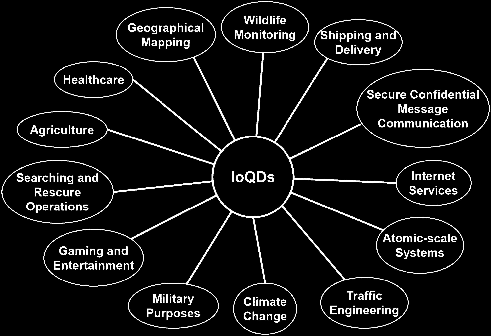
*Caption/Context: A. Kumar, D. Augusto de Jesus Pacheco, K. Kaushik et al. Vehicular Communications 36 (2022) 100487 | Fig. 1. Applications of IoQDs.*

## --- Page 5 ---

### Section: 3.1.3 IoQDs for climate change

A. Kumar, D. Augusto de Jesus Pacheco, K. Kaushik et al.
Vehicular Communications 36 (2022) 100487

Fig. 2. IoQDs for traffic management.

classical signals-based approach. Quantum mechanics is a robust 
security process that makes the transmitted qubits difficult to in-
tercept and read without being noticed at source or destination 
ends. Thus, it avoids attacks, especially MiM attacks or their vari-
ants. In intercontinental message exchange, China and Austria used 
satellite and fibre-optic networks for connection establishment, key 
exchange, and sending 5 kilobytes of image data. Later, this ex-
perimentation was extended to a video conferencing session (75 
minutes in duration). The results of the observations were satisfac-
tory for the very early stage of QI. Likewise, any private organiza-
tion interested in establishing private and secure quantum-based 
internet services within their sister organizations placed in differ-
ent continents or geographical regions can take the help of quan-
tum drones to develop a network. Drone-based quantum internet 
services will be faster and more secure than traditional internet 
services. Further, the location of drones can be adjusted to get de-
sired network connectivity. This will help to incorporate customers 
and stakeholders to give a provision in establishing business or 
interest-specific internet service groups with higher secrecy and 
better QoS availability.

3.1.3. IoQDs for climate change
Quantum computers and quantum computing are found to help 
handle climate-related data. In addition, data processing and fast 
computation make quantum computing an important candidate

for realizing climate change and associated incidents like hurri-
canes, tsunamis, earthquakes, and heat waves. If the information 
on these natural disasters can be processed in advance, many lives 
and much infrastructure can be protected. A constellation of Io-
QDs will help sense more reliable data and exchange it in multiple 
directions over a long distance. The feasibility of low- and high-
altitude drone flying makes the availability of IoQDs-based climate 
data an essential aspect of disaster management. Fig. 3 explains 
the importance of drones in QC-supported areas. The essential sys-
tems and sub-systems were shown in Fig. 3, and their importance 
to IoQDs and climate change are briefly explained as follows.

IoT-based Network and Infrastructure: It is the consequence 
of both natural and human-induced processes that carbon diox-
ide emissions are produced. Decomposition, seawater release, and 
respiration are all examples of natural sources. Emissions created 
by humans include activities such as cement manufacturing, de-
forestation, power production, transportation, industrial sources, 
chemical manufacture, petroleum manufacturing, agricultural ac-
tivities and the combustion of fossil fuels such as coal, petroleum, 
and natural gas. Gas that is harmful to the human body has a 
negative impact on health and adds to pollution. Public health 
specialists are concerned about the effects of pollution on human 
health. The production of coal-based commodities and feedstocks 
from carbon dioxide may be accomplished using renewable en-
ergy, which reduces greenhouse gas emissions while also meeting

5

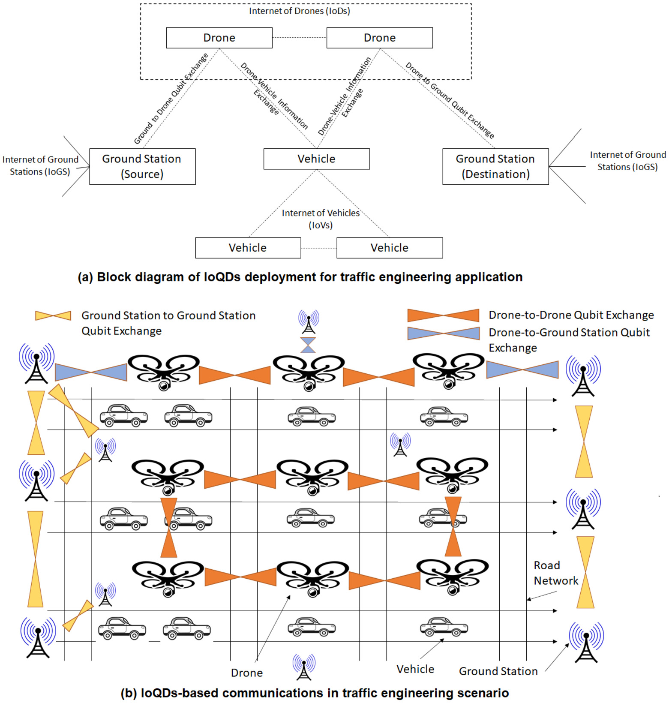
*Caption/Context: A. Kumar, D. Augusto de Jesus Pacheco, K. Kaushik et al. Vehicular Communications 36 (2022) 100487 | Fig. 2. IoQDs for traffic management.*

## --- Page 6 ---

A. Kumar, D. Augusto de Jesus Pacheco, K. Kaushik et al.
Vehicular Communications 36 (2022) 100487

Fig. 3. Drones, QDs, IoQDs and Quantum Technologies for Climate Change and other Environmental Concerns.

the storage requirements of intermittent renewable energy sources. 
Here, Quantum-Dot-Derived Catalysts will be very useful for CO2
Reduction Reaction [173]. For example, in the healthcare industry, 
quantum dots have been used in combination with other technolo-
gies such as the IoT and artificial intelligence to achieve astounding 
outcomes. With the aid of the information gathered and analysed, 
patient-centred solutions will be discovered, which will benefit the 
whole healthcare community. A Quantum-Dot system based on 
the Internet of Things will be referred to as a smart healthcare

provider, even if there are various restrictions, such as limitations 
on electronic waste and concerns about hacking [174]. Likewise, 
Quantum-Dot-Derived Catalysts will be useful in carbon dioxide 
and other harmful gases reduction in both human-based social ap-
plications and industry infrastructure. With the addition of drones, 
QDs and IoQDs, these catalysts will get additional support and mo-
bility to cover a larger area in carbon dioxide reduction.

Environmental Concerns with Existing Networks and Infrastruc-
ture: Over the last several years, researchers have concentrated

6

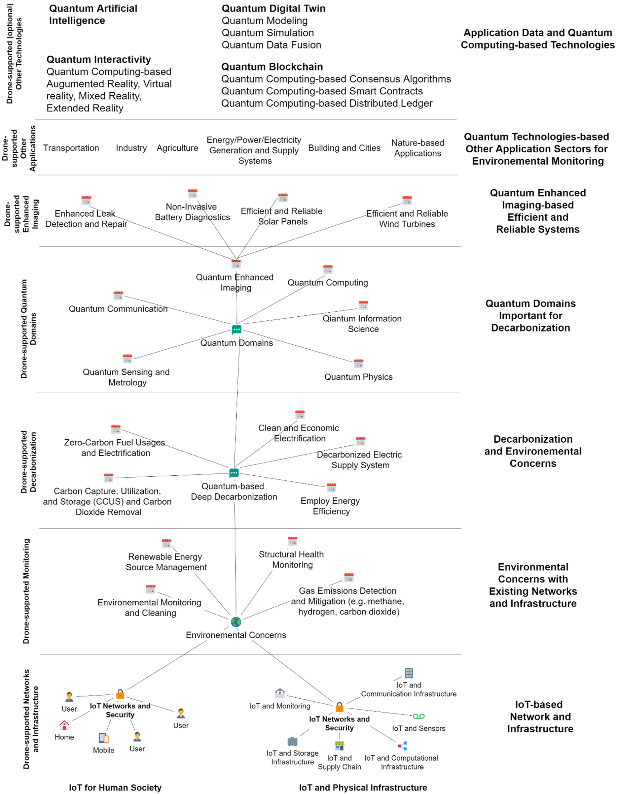
*Caption/Context: A. Kumar, D. Augusto de Jesus Pacheco, K. Kaushik et al. Vehicular Communications 36 (2022) 100487 | Fig. 3. Drones, QDs, IoQDs and Quantum Technologies for Climate Change and other Environmental Concerns.*

## --- Page 7 ---

A. Kumar, D. Augusto de Jesus Pacheco, K. Kaushik et al.
Vehicular Communications 36 (2022) 100487

their efforts on the unique thickness-dependent uses of two-
dimensional materials, which include photocatalytic applications 
and materials that exhibit peculiar chemical and physical prop-
erties. A significant lot of interest has lately been generated in 
heterogeneous photo-catalysis, which has been piqued owing to 
the fact that it has the potential to address a wide range of en-
ergy and environmental challenges [175]. Likewise, heterogeneous 
photo-catalysts can be useful in other environmental concerns as 
well. For example, environments (water and air) that are free of 
pollution and clean energy are becoming more vital across the 
world, particularly in developing countries. Since semiconductor-
based photocatalysis is both cost-effective and ecologically benefi-
cial, a growing number of researchers are turning to this method 
of water pollution control in order to address the problem. Chemi-
cals such as semiconductors-based photocatalysis are used to re-
move non-biodegradable inorganic pollutants such as pesticides 
and herbicides from water, but TiO2 and ZnO have emerged as 
promising environmental remediation solutions due to their ca-
pacity to remove biodegradable organic contaminants from wa-
ter [176–178]. QDs and IoQDs can be useful in collecting water 
and air quality indexes from remote places, and QDs can be used 
with semiconductors-based photocatalysis for purification. There is 
a need to develop similar practices and experimentation in future.

Decarbonization and other Environmental Concerns: The trans-
portation sector’s rapid electrification and futuristic industrializa-
tion need quicker decarbonization. Improved energy efficiency is 
becoming more important to meet emission reduction objectives 
while simultaneously improving air quality and global tempera-
tures. In the futuristic roadmap of various countries [179,180], 
Quantum technology is a viable option for decarbonization. With 
the support of QDs, IoQDs, and quantum computing-supported 
technologies, environmental information can be exchanged se-
curely and at a much faster rate. Further, decarbonization can also 
be performed at a much faster rate.

Quantum Domains for Decarbonization: The only option to sig-
nificantly reduce greenhouse gas emissions is for us to change our 
energy consumption patterns and decarbonization. This action will 
have a significant positive impact on society and species. Thanks to 
quantum sensors, researchers may be able to get a deeper under-
standing of materials and quantum coherence processes. Nuclear 
reactors, for example, might be better monitored with the use of 
these processes and devices [181–185], which could also be used 
to search for new sources of renewable energy, such as geothermal 
energy. The use of quantum sensing to enhance maintenance and 
leak detection in fossil fuel infrastructure may assist in mitigating 
present system impacts as we transition away from fossil fuels in 
the future. However, the specific mechanism by which this would 
occur is unclear at this time. It is expected that various quantum 
domains will be associated with decarbonization in the future. For 
example, Berger et al. [181] associated quantum computation with 
climate change and decarbonization using chemical processes and 
materials. It has been discussed that gas-phase electronic structure, 
molecular dynamics, solution chemistry and vibrational and vi-
bronic structure are important materials and chemistry simulations 
for carbon dioxide capture. Lah [186] discussed that the decar-
bonization of transportation in North America would be examined 
in great depth in future. The next stage will be for this group to 
examine the legal and institutional issues of the long-term sustain-
ability of various climate change mitigation programmes. Following 
that, a proposal will be presented to the United Nations. It will be 
necessary to review previous studies to make sense of the findings 
and make judgments about which discoveries are significant for 
future studies. In these discoveries, quantum information science, 
quantum physics, quantum computation, quantum communication 
and many other quantum-related domains can play a significant 
role.

Quantum Enhanced Imaging and Associated Efficient and Reli-
able Systems: Quantum states of light imaging have the potential 
to outperform existing imaging technologies in terms of resolution, 
signal-to-noise ratio, and sensitivity, among other criteria. When it 
comes to quantum imaging, photon correlations are exploited to 
get beyond the fundamental limits of classical imaging [187,188]. 
These features give an advantage to quantum-enhanced imaging in 
the various systems to identify any leakages and protect turbines, 
solar and other systems [189,190].

Quantum Technologies-based other Application Sectors and En-
vironmental Monitoring Concerns: Transportation, industry, agri-
culture, energy generation and transportation, infrastructure build-
ing, smart cities, and other nature-based applications are expected 
to use drones in the future at a large scale to improve all stake-
holder experiences. Lau et al. [191] discussed that the transporta-
tion and power generation sectors are major sectors that are pro-
ducing carbon dioxide at a large scale compared to other sectors. 
Further, it is expected that the percentage of carbon dioxide pro-
duction will increase at a higher rate in future [192]. Thus, there is 
a need to identify the sources and decarbonize the environment. 
Here, a drone-based approach can help identify sources quickly 
from any remote location, and instruction or necessary steps can 
be taken to stop the leakage or production at the right time. From 
these research findings, Fig. 4 shows a possible scenario of how 
IoQDs and the constellation of satellites can be formulated and in-
tegrated with ground networks for various applications.

Application Data and QC-supported Technologies: In advanced 
technologies, quantum blockchain [193–195], quantum artificial in-
telligence [196], quantum digital twin [197], quantum interactivity 
[198,199] and many more can play important role. For example, 
quantum blockchain for climate change observation would be use-
ful in record keeping with transparency, immutability, security and 
distributed data processing and availability. This step will help in 
better record keeping and much faster and more secure data com-
munication compared to traditional blockchain-based processes.

IoQDs for military. IoQDs enable a new field of application, 
namely QW. QW is a subfield in quantum technologies that em-
ploy Internet and quantum technologies for military purposes that 
affect intelligence, protection, and military and defence capabilities 
across all warfare contexts; the creation of new military strategies, 
doctrines, scenarios and attack capabilities; and peace or ethics is-
sues. IoQDs will improve the existing military intelligence, surveil-
lance, target acquisition, and reconnaissance capabilities by pro-
viding more accurate navigation, ultra-secure communication, and 
computing capabilities [122]. IoQDs also generate possibilities to 
constitute a private network for monitoring territories. This is an 
important application for any military network. In the present sce-
nario, a large set of activities is executed with swarms of drones in 
military operations. With IoQDs, faster and more secure data pro-
cessing and transmission will be possible, which helps complete 
any important operation.

IoQDs for mobile networks. Multi-state qubit feasibility and 
quantum computing features can enable fast data networks for 
mobiles. The existing cellular infrastructure can be used with 
quantum drones and quantum satellites. Additionally, security will 
be integrated to make a futuristic data network plan reliable at 
a much faster rate. An interesting work tested an optical quan-
tum channel using wireless communication that can exchange 
quantum-secured random keys up to 10 kilometres by utilizing 
a network of several drones [115]. The system has shown that 
it can easily retrieve a signal that has been lost due to drone 
misalignment. Further developments include replicating the sys-
tem in drone-to-drone signal locking and in-flight drone-based 
QKD. The feasibility of IoQDs for mobile networks makes it pos-
sible to integrate the quantum-based internet service system with 
many real-time applications. For example, ad-hoc networks can

7

## --- Page 8 ---

### Section: 3.2 Quantum satellites and optical fibres

A. Kumar, D. Augusto de Jesus Pacheco, K. Kaushik et al.
Vehicular Communications 36 (2022) 100487

Fig. 4. QDs and IoQDs applications.

be constituted for vehicles to manage traffic and find routes us-
ing drones. Here, drones will be helpful in tracing any vehicles 
and ensuring emergency services with better location specifica-
tions. Furthermore, drones on-road can be helpful to identify law-
breakers and follow the vehicles till the end. Isaac et al. [115]
experimentation can be extended to offer private mobile networks 
using drones. These private mobile networks will facilitate busi-
ness secrets, faster responses, independent control and flexibility 
to customize the network and its services as per dynamic require-
ments. Likewise, IoQDs or drone-based networks can be useful for 
other mobile network-based real-time applications.

IoQDs for atomic-scale systems. A new paradigm was recently 
tested for massive-scale atom handling by applying “molecular 
drones” [101]. The molecular drones create an individual atomic 
gap in a specific surface position, exploiting surface atom complex-
ation as a fabrication tool. A breakthrough paradigm for big-scale 
surface atom manipulation using molecular drones was recently 
tested. Molecular drones use surface atom complexation as a fab-
rication technique to generate single atomic vacancies in specific 
locations on a surface. The experiments were conducted in an 
iodine-silver [110] altered coating as a substrate model. Accord-
ing to the authors, this disruptive technology could be used in 
other systems, e.g., non-metal surfaces. This new concept advances 
the limits of traditional scanning probe microscopies and serves 
as a foundation for developing potentially disrupting and entirely 
chemical, atomic-scale technologies [101]. As a result, quantum 
computers may be enhanced in the future by using hybrid techni-
cal devices that combine natural and artificial atoms and photons 
[102]. This new paradigm opens several breakthrough possibilities 
of applications of IoQDs in molecular drones in chemical processes 
and other atomic-scale systems.

Other applications. Among other applications, quantum drones 
can be used to ensure confidential message communication, ship-
ping and delivery, wildlife monitoring, geographical mapping, 
healthcare, agriculture, search and rescue operations, and gam-
ing and entertainment. Although traditional drones can be used 
in these applications as well, quantum drones will provide fast 
and secure operations (Fig. 4). Rahman et al. [166] discussed the 
blockchain integrated drone-based service system. Drones are be-
coming more popular for a wide range of commercial applications, 
including short-distance deliveries, and are becoming more af-
fordable. In order to provide high-quality services to consumers 
and businesses, it is required to integrate a significant number 
of drone-based delivery service providers into the existing deliv-
ery service infrastructure, which is now under construction. This 
multi-drone movement needed authenticated drones to communi-

cate among themselves and ensure services. The use of blockchain 
technology has enabled the development of a drone flight enforce-
ment tool, which guarantees that authenticated drone flights are 
conducted according to current norms and regulations [166]. Oub-
bati et al. [167] explored that drones are already being used in 
many mission-critical applications. They may prove to be a more 
cost-efficient alternative to conventional aeroplanes in the future. 
For an example, being able to recognise an accident on the road, 
providing rescuers with their specific positions, and planning the 
shortest path to aid while keeping in mind the restrictions of 
the roadway itself are all important roadside assistance abilities 
to have. According to various professionals who have dealt with 
catastrophes in metropolitan areas, responding swiftly may signifi-
cantly minimise damage and even save lives. Natural disasters such 
as earthquakes serve as the most convincing instances of this no-
tion due to the dramatic nature of their events. These drones are 
capable of offering “bird’s eye view” viewpoints as well as adapt-
ability, which allows them to be employed in a variety of different 
situations. In order to obtain information on interstate traffic flow, 
the researchers can use drones [168]. During their flight, drones 
will interact with vehicles already on the road to determine traf-
fic flow on the routes they are travelling on. As a consequence of 
these modifications, the emergency response team will be able to 
react more quickly and efficiently. In addition, quantum drones can 
ensure that only authenticated drones follow pre-defined routes 
with more security and reliability. Quantum drones use a quan-
tum key distribution mechanism for secure message exchange and 
authentication. Quantum cryptography or post-quantum cryptog-
raphy mechanisms integrated with drone-based quantum com-
munication are helpful in authenticated quantum drone network 
construction and secure message exchange.

#### 3.2. Quantum satellites and optical fibres

Quantum satellites are a key component of a realistic free-space 
quantum network since they eliminate photon loss over long dis-
tances [108]. Quantum satellites and optical fibres are two promi-
nent candidates for quantum signal transmission. In August 2016, 
China launched the world’s first quantum satellite (named Quan-
tum Experiments at Space Scale (QUESS), nicknamed Micius) to 
create a secure communication system [109]. This satellite con-
sisted of five major systems, including (i) communicator with 
quantum keys, (ii) emitter of quantum entanglement, (iii) entan-
glement source, (iv) processing unit, and (v) laser communicators, 
as shown in Fig. 5.

8

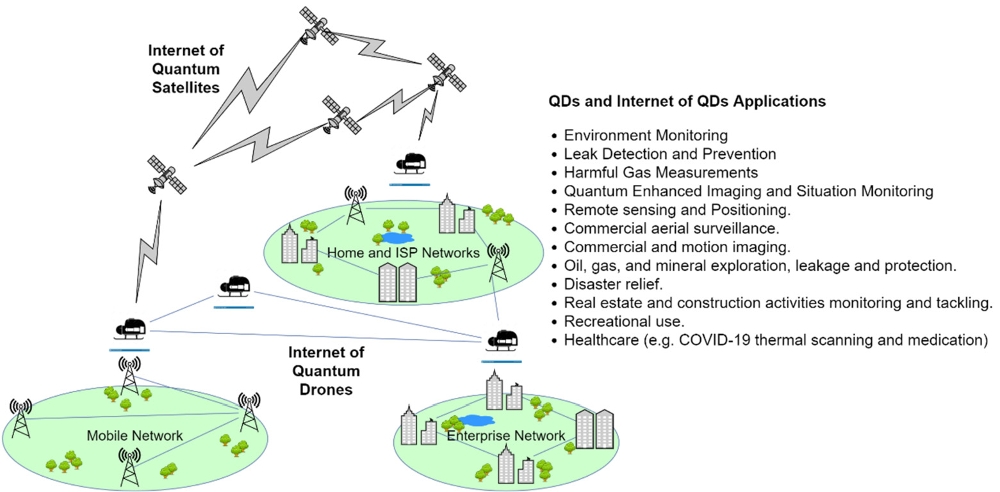
*Caption/Context: A. Kumar, D. Augusto de Jesus Pacheco, K. Kaushik et al. Vehicular Communications 36 (2022) 100487 | Fig. 4. QDs and IoQDs applications.*

## --- Page 9 ---

### Section: 3.3 Bridging knowledge gaps on Internet of Quantum Drones

A. Kumar, D. Augusto de Jesus Pacheco, K. Kaushik et al.
Vehicular Communications 36 (2022) 100487

Fig. 5. Quantum satellite system [109].

Quantum key is theoretically considered secure because it is 
not possible to break it even with quantum computing approaches. 
The success of this experimentation and the feasibility of launch-
ing more such satellites will help create an IoQDs network. This 
network will be helpful to establish secure communication for 
various applications in different domains like military networks, 
banks and finance, power grids, healthcare, Internet, telecommu-
nication, and supply chain. A recent study [110] tested a method 
for a relay configuration of two quantum drones’ signal repeaters 
located at different locations over the ground and one quantum 
CubeSat to solve the critical obstacles to the quantum connection 
between the Earth and a satellite (e.g., unfavourable weather and 
environmental conditions). The drones used in this experiment of 
quantum teleportation reached an altitude of 12 to 15 km and a 
maximum velocity of 482 km/h. The study suggests that the devel-
oped protocol allows spreading IoQDs to all continents and nearby 
planets without being hampered by geographic features, environ-
mental factors, or weather.

In another study [111], optical fibres were combined and linked 
to a satellite for achieving QKD over a long distance. Compared to 
satellite communication, optical fibres are less costly, provide high 
stability, and cover much longer distances for QKD. This experi-
mentation has achieved a key generation rate 40 times higher than 
average. The fibre optical network and satellite integrated experi-
mentation demonstrates that quantum interaction can be extended 
to large-scale real-time applications. The first drone-based entan-
glement delivery was recently demonstrated over 200 meters in all 
weather conditions with a 35 kg take-off weight [108]. The quan-
tum network tested may be connected with image-drone dimen-
sions for plug-and-play local-area coverage or installed in high-
altitude drones for broad coverage, improving flexibility to the 
extant ground fibre-based quantum networks and satellites. The 
tests enable the development of a drone-based local-area quantum 
network with on-demand coverage of 40 minutes [108].

In Fig. 6, we demonstrated an example of an architecture for 
a long-distance connectivity system using drones, a constellation 
of quantum satellites, and an optical fibre network. With the suc-
cess of the first quantum satellite and quantum drone [98,111], the 
feasibilities of installing multiple quantum satellites and the con-
struction of a constellation of satellites increase to provide fast and 
long-distance services to many applications.

As shown in Fig. 6, a quantum satellite constellation can be 
constructed in space. Here, each satellite can communicate either 
directly with the ground station or through high- and low-orbit 
drones. Satellite communication can be used for key distribution, 
whereas fibre networks on-ground can be used for entangled pho-
tons.

#### 3.3. Bridging knowledge gaps on Internet of Quantum Drones

Considering the importance of quantum drones and quantum 
satellites, this section considers the knowledge available about the 
architectures that can be used in the future for short and long-
distance communications. IoQDs-based short distance communica-
tion and its architecture will be useful for applications like traf-
fic engineering, atomic-scale systems, internet services to single

Fig. 6. Long-distance connectivity using quantum drones, optical fibre and satellites.

9

![A. Kumar, D. Augusto de Jesus Pacheco, K. Kaushik et al. Vehicular Communications 36 (2022) 100487 | Fig. 5. Quantum satellite system [109].](images/page_009_fig_01.png)
*Caption/Context: A. Kumar, D. Augusto de Jesus Pacheco, K. Kaushik et al. Vehicular Communications 36 (2022) 100487 | Fig. 5. Quantum satellite system [109].*

![Quantum key is theoretically considered secure because it is  not possible to break it even with quantum computing approaches.  The success of this experimentation and the feasibility of launch- ing more such satellites will help create an IoQDs network. This  network will be helpful to establish secure communication for  various applications in different domains like military networks,  banks and finance, power grids, healthcare, Internet, telecommu- nication, and supply chain. A recent study [110] tested a method  for a relay configuration of two quantum drones’ signal repeaters  located at different locations over the ground and one quantum  CubeSat to solve the critical obstacles to the quantum connection  between the Earth and a satellite (e.g., unfavourable weather and  environmental conditions). The drones used in this experiment of  quantum teleportation reached an altitude of 12 to 15 km and a  maximum velocity of 482 km/h. The study suggests that the devel- oped protocol allows spreading IoQDs to all continents and nearby  planets without being hampered by geographic features, environ- mental factors, or weather. | 3.3. Bridging knowledge gaps on Internet of Quantum Drones](images/page_009_fig_02.jpeg)
*Caption/Context: Quantum key is theoretically considered secure because it is  not possible to break it even with quantum computing approaches.  The success of this experimentation and the feasibility of launch- ing more such satellites will help create an IoQDs network. This  network will be helpful to establish secure communication for  various applications in different domains like military networks,  banks and finance, power grids, healthcare, Internet, telecommu- nication, and supply chain. A recent study [110] tested a method  for a relay configuration of two quantum drones’ signal repeaters  located at different locations over the ground and one quantum  CubeSat to solve the critical obstacles to the quantum connection  between the Earth and a satellite (e.g., unfavourable weather and  environmental conditions). The drones used in this experiment of  quantum teleportation reached an altitude of 12 to 15 km and a  maximum velocity of 482 km/h. The study suggests that the devel- oped protocol allows spreading IoQDs to all continents and nearby  planets without being hampered by geographic features, environ- mental factors, or weather. | 3.3. Bridging knowledge gaps on Internet of Quantum Drones*

## --- Page 10 ---

### Section: 3.3.1 LAQDN architecture

A. Kumar, D. Augusto de Jesus Pacheco, K. Kaushik et al.
Vehicular Communications 36 (2022) 100487

Fig. 7. Proposed LAQDN for short-distances communication.

Fig. 8. Proposed HAQDN and LAQDN for medium-distance communication.

or group of buildings, private networks (e.g. shipping and deliv-
ery), healthcare, agriculture, searching and rescue operations, etc. 
Likewise, IoQDs-based long-distance communication and its archi-
tecture will be useful for applications like secure key or message 
exchange between continents, shipping and delivery across dif-
ferent geographical regions, geographical mapping, secure military 
purposes, and many more. Different architectures are explained as 
follows.

3.3.1. LAQDN architecture
Recently, quantum drones have been used to enable short-
distance ground-to-ground link establishment. Here, the quantum 
drone is considered an airborne node. Presently, this node is capa-
ble of maintaining two air-to-ground links for a very short distance 
(100 meters) [108]. Further, the quantum drone can operate in all 
weather situations. Fig. 7 shows the proposed LAQDN for short-
distance communication within the local area, i.e. a few meters to 
kilometres.

Presently, experiments with two airborne nodes (quantum 
drones) within a few meters of distance have been successful. In 
the future, this can be extended to interconnect multiple airborne

nodes and formalize IoQDs. IoQDs will help in elongating secure 
data communication. To make this possible, however, there are 
many challenges. For example, airborne quantum signal storage 
devices must be designed and developed. Moreover, each air-
borne node should be equipped with temporary quantum signal 
storage capability. This is possible through quantum memories. 
Thus, quantum memories will be an indispensable component of 
airborne nodes to formalize long-distance IoQDs networks. With 
quantum memories, quantum signals can be stored and retrieved 
as and when required. To ensure quantum memory over quantum 
drones, the major challenge is how to avoid the “entanglement-
breaking channel” problem [130]. With the ability to operate a 
long time in the air and quantum memories, quantum drones 
will easily formalize IoQDs. These IoQDs will be able to serve on-
ground real-time applications with less cost, more flexibility, high 
security, and fast communication.

3.3.2. HAQDN architecture
Fig. 8 shows the communication of LAQDN and HAQDN for 
short- to medium-distance (within a few tens of kilometres). In

10

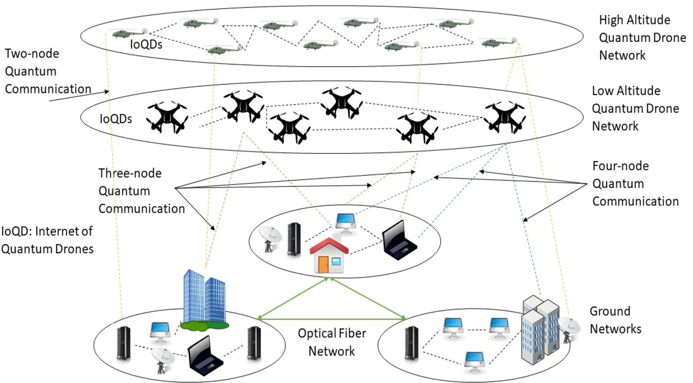
*Caption/Context: Fig. 7. Proposed LAQDN for short-distances communication. | Fig. 8. Proposed HAQDN and LAQDN for medium-distance communication.*

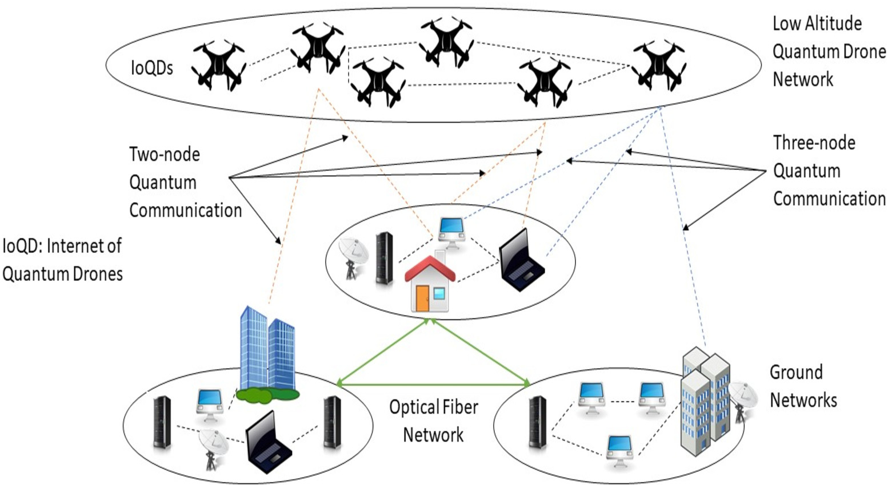
*Caption/Context: A. Kumar, D. Augusto de Jesus Pacheco, K. Kaushik et al. Vehicular Communications 36 (2022) 100487 | Fig. 7. Proposed LAQDN for short-distances communication.*

## --- Page 11 ---

### Section: 3.3.3 Satellite-based architecture

A. Kumar, D. Augusto de Jesus Pacheco, K. Kaushik et al.
Vehicular Communications 36 (2022) 100487

Fig. 9. Proposed satellite-based architecture for long-distance (within the country or between two continents) communication.

Fig. 10. Proposed planet-to-planet connectivity using HA.

both LAQDN and HAQDN, multi-node quantum communication is 
required.

Presently, a three-node quantum network has been found to be 
successful [131]. However, there is a need to extend this network 
for multi-node quantum networks. This is the base requirement 
to make the IoQDs network feasible at low and high altitudes. 
Additionally, drone at high altitude to drone at low altitude com-
munication is required to be designed that make multi-hop com-
munication feasible.

3.3.3. Satellite-based architecture
In satellite-based architecture, quantum satellites are also in-
volved, as shown in Fig. 9. With quantum satellites, long-distance 
communication (inter-continental or inter-planetary) is feasible. 
This architecture is useful for collecting climate change informa-
tion, conducting meteorological data analysis, predicting natural 
disasters, etc.

In this architecture, IoQDs and IoQSs will be required to make 
the proposed valuable architecture for real-time applications. In 
addition, this architecture can be extended to an IoPT, as shown in 
Fig. 10. In IoPTs, airborne nodes will help collect data from other 
planets or from space at large. Thus, a long-term space data col-
lection procedure will be available without risking human lives. 
Planets may be able to speak with one another over the Internet in 
the future. The IoP is the term used to describe this phenomenon. 
It has moved to the top of the list of technologies for the IoT in re-
cent years, and it is expected to remain there for some time [163]. 
The DTN is the most efficient technique when it comes to connect-
ing things. There has been a significant amount of study conducted 
on IoP. Radio communication is the transmission of information 
using radio waves, and it is the fastest and most reliable kind of 
communication presently available. Because of the enormous dis-
tance between the two locations in interplanetary things becomes

11

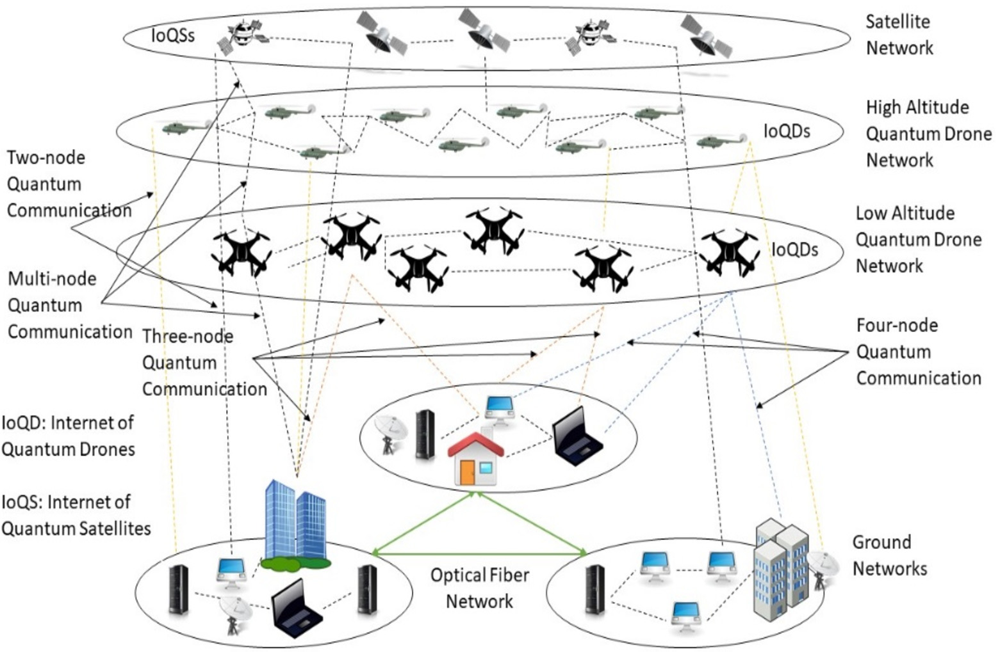
*Caption/Context: A. Kumar, D. Augusto de Jesus Pacheco, K. Kaushik et al. Vehicular Communications 36 (2022) 100487 | Fig. 9. Proposed satellite-based architecture for long-distance (within the country or between two continents) communication.*

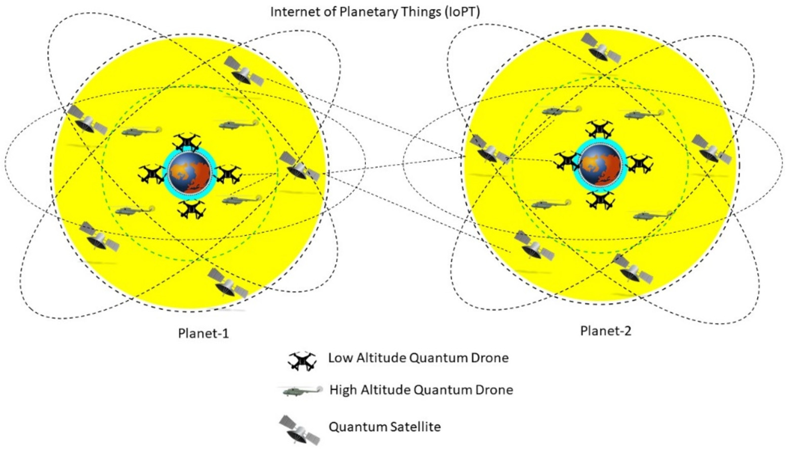
*Caption/Context: Fig. 9. Proposed satellite-based architecture for long-distance (within the country or between two continents) communication. | Fig. 10. Proposed planet-to-planet connectivity using HA.*

## --- Page 12 ---

### Section: 3.4 Cryptographic primitives and protocols for IoQD

A. Kumar, D. Augusto de Jesus Pacheco, K. Kaushik et al.
Vehicular Communications 36 (2022) 100487

one of the major drawbacks of radio-based arrangement, and it 
overshadows the other benefits. The current situation is that many 
research organisations and institutions are putting up significant 
effort to establish a feasible method of communication in space, 
which is currently considered impossible. The DTN communication 
protocol is especially well adapted for interplanetary communica-
tions, and it has been used successfully [163]. Other challenges to 
making IoPT possible are briefly discussed as follows [164,165].

In the past, astronauts from Goddard traded a file with the 
shuttle earth that travelled more than 600 kilometres above the 
earth’s surface at the time. It was the first time a file from outer 
space made its way back to Earth without having its route set 
ahead of time [164]. To receive that transmission, technicians had 
to orchestrate things so that the link with the orbiting space-
craft was handed off like a cellphone transmission. Thus, covering 
the longer interplanetary distance is a major challenge. Alterna-
tively, it is possible to expect severe transmission delays and other 
challenges involved with space communications, which have been 
previously reported. It is possible to deal with bad connections in 
space using two different approaches: UDP and TCP, and both of 
these methods are relatively straightforward to implement. How-
ever, there is a need to develop more such protocols that more 
efficiently deal with IoPT QoS parameters.

Another issue is the restricted supply of power, which is neces-
sary for IoPT mission but also a contention source. When a space-
craft is running low on fuel, how can TCP or another protocol be 
made less communicative than it already is? This issue lies with 
other protocols as well. Thus, it needs to be addressed. Likewise, 
low power hardware resources for long-distance communication 
must be developed. An alternative to direct long-distance com-
munication between source and destination is multi-hop topology, 
which uses low-power resources efficiently and for a longer dura-
tion. The lack of IoPT standards and semantics made this techni-
cally impossible. When it comes to space technology, the IoT may 
be able to seamlessly integrate with existing systems, thus open-
ing the door to new possibilities for future space exploration and 
travel. The likelihood of a cyberattack is increasing directly to the 
availability and accessibility of IoT technology and applications in 
terrestrial locations. As a consequence, exploring the IoPT applica-
tions and protection from a cyberattack represent other significant 
challenges.

#### 3.4. Cryptographic primitives and protocols for IoQD

A recent review study [116] examining the status of research 
on quantum-secure microgrids (i.e., microgrids that can withstand 
attacks from quantum computers) found several issues with the 
current quantum cryptography methods used in microgrids. While 
QKD can be considered the most mature technique in quantum 
cryptography, challenges to overcoming quantum-secure micro-
grids applying QKD are related to improving the resilience against 
side-channel, denial-of-service attacks, and more real-time experi-
ments.

Another interesting piece of research [117] tested an earlier un-
conditionally safe ground vehicular to IoD communication frame-
work. The study used IEEE 802.16d for long-range (up to 75 km) 
wireless drone-to-drone communication and security keys with 
digital signatures exchanges (based on the Kirchhoff-Law-Johnson-
Noise (KLJN) scheme) between certification authorities for air-
ground communications control. The two main advantages ob-
served by KLJN were security and cost. The authors stated that 
hackers could not crack the key using an infinite computation re-
source such as quantum computers. Also, KLJN possesses a lower 
cost in comparison to QKD.

Lightweight cryptography approaches are preferred in drones 
to ensure energy-efficient, resource-optimized, cost-effective, and

comprehensive cryptographic primitives and protocols. In light-
weight cryptography approaches, the major challenge is how to 
achieve performance with compact resource-constrained devices. 
Additionally, security is required for wireless communications be-
tween drones in flight. For example, several experiments are per-
formed for secure QKD.

#### 3.5. IoQDs assistance paradigm and quantum Internet

As discussed earlier, IoQDs are a new technology that can be 
used in a wide range of enterprises, human endeavours, space 
communication and inter planet information gathering. UAVs and 
drones are now being employed in a wide variety of sectors 
and human endeavours, including agriculture, healthcare, vehicu-
lar communication, disaster management and medicine delivery. 
Drones have been more popular as a fundamental concept in re-
cent years, resulting in the development of novel links between 
terrestrial networks and floating UAVs in the sky. The feasibil-
ity of IoQDs makes communication more secure, faster and over 
long distances. Using such an approach has been more straight-
forward since wireless interfaces incorporated into communication 
devices have made it easier and more comfortable. Due to their 
variable heights and controlled movement, IoQDs may also be the 
most effective means of improving performance and overcoming 
the limitations of terrestrial networks in certain situations. The 
significant recent contributions to discussing the UAVs or IoQDs 
assistance paradigms are briefly discussed.

Alzahrani et al. [135] present the level of UAV-assisted research 
in fields such as routing and data collecting, mobile communica-
tions, IoT networks, and disaster management are sought to be 
analysed and characterised. This effort identifies and characterises 
the many ways present enabling technologies and especially UAVs 
to support these areas. This study represents a significant step for-
ward because it is the first to conduct a comprehensive analysis 
of the many UAV-assisted networks currently in use. This work 
has explored the multi-layered approach for potential application 
cases. This work has explored information gathering, intelligence 
collection, network construction, routing feasibilities, data gather-
ing, important technical and research finding for various on-ground 
applications. Gyongyosi [136] explored that entangled quantum 
networks are required for the operation of any quantum Internet 
on a global scale for it to be functional. In this work, a mathemati-
cal model is developed that can be used to analyse the dynamics of 
entangled network topologies and entanglement flow in the quan-
tum Internet. To support quantum internet, QDs and IoQDs can 
play an important role. Networks using QDs and IoQDs can provide 
closer, private and secure quantum internet connectivity. As well as 
identifying and characterising the dynamics of entangled quantum 
networks, the model’s analytical solutions can also identify and 
characterise the stability, fluctuation characteristics, and dynamics 
of entangled entanglement flow in entangled network topologies. 
A variety of entangled structures may be used to demonstrate the 
model’s results and quantify the system’s behaviour under consid-
eration.

Gyongyosi and Imre [137] discussed that entangled quantum 
networks, which are the fundamental building blocks of the quan-
tum Internet, are constructed using quantum entanglement as a 
fundamental building block. When it comes to quantum networks, 
the distribution of entanglements is a key and rapidly changing 
subject that is growing more important as time goes on. The 
study’s approach for high-fidelity entanglement distribution is a 
basic solution that is easy to implement and manufacture. There-
fore, an opportunistic-based approach was proposed for enhanc-
ing quantum internet services. In another research, Gyongyosi and 
Imre [138] discussed the quantum Internet’s entangled network ar-
chitecture, defined by a high degree of complexity, making getting

12

## --- Page 13 ---

A. Kumar, D. Augusto de Jesus Pacheco, K. Kaushik et al.
Vehicular Communications 36 (2022) 100487

around it difficult. This is due to the quantum Internet’s entangled 
network design and complexity. When it comes to the quantum 
internet, scalable routing is a routing approach that can identify 
the most optimal subnetwork routing in order to conduct a high-
performance and low-complexity routing in the entangled struc-
ture of the quantum internet. As one of the routing algorithms 
suitable for usage in the quantum Internet, scalable routing may 
be used to identify the optimal path for a particular subnetwork. 
Additionally, it was proposed that, while working with a quan-
tum network, an exploration approach for routing space be used 
in conjunction with a scaling mechanism for routing in the quan-
tum network. Examples presented by Gyongyosi and Imre [138]
include the fact that scalable routing may be used to provide com-
pact and efficient routing while maintaining excellent performance 
in quantum networks.

Gyongyosi and Imre [139] discussed that quantum repeater 
networks would be critical infrastructure for long-distance com-
munications and the future quantum Internet, and they will be 
required to be in place to function properly. The study indicated 
that depending on the degree of entanglement that occurs be-
tween the quantum nodes, a variety of network topologies, in-
cluding multi-level networks, may be produced in the presence 
of entangled quantum nodes. They analysed a methodology that 
uses efficient routing algorithms to determine the shortest path-
ways in entangled quantum networks has been shown to be prac-
tical. Authors explored that base-graphs may incorporate entan-
gled network topologies, which retain the probability distribution 
of connections while providing efficient decentralised routing and 
other types of networks. The study suggested that they might be 
used immediately for practical quantum communications, experi-
mental long-distance quantum key distribution and repeater net-
works, as well as quantum repeater networks in the future, among 
other applications. Gyongyosi et al. [143] discussed that it might 
be possible to leverage the quantum nature of the information 
to increase data processing efficiency. Using quantum information 
processing, substantial improvements in computer science may be 
possible shortly. Quantum channels may transfer both conventional 
and quantum information, depending on how they are constructed. 
To better understand how quantum channels function, this work 
goes into great depth about how they operate and how different 
capacity measurements are carried out to understand better how 
they work. Quantum entanglement, also known as “superposition 
of states”, means transmitting quantum information that cannot be 
traditionally expressed by merging two or more states. In contrast 
to computer networks, optical fibre networks or wireless optical 
channels may be used in the real world to build quantum chan-
nels instead of computer networks.

Wehner et al. [144] discussed that the internet’s global net-
work of immediate communication has radically changed our way 
of life. Even if two places are thousands of miles apart, quan-
tum internet technology can help them all. Many tasks now out 
of reach with current technology may be possible in the future 
with a quantum internet. In this work, an outline of the pro-
cedures needed to implement a fully working quantum internet 
is discussed. Achievements in theory and practice are also ex-
plored. According to this work, quantum hardware suggested for 
quantum communication can be mapped to drone-based quan-
tum communication. Fig. 11 shows Quantum drone and Quantum 
satellite-based scenarios and hardware requirements. As shown in 
Fig. 11, quantum satellite and quantum drone-based switch, re-
peater, channel and end node applications are required to con-
struct quantum internet. This integration is possible with IoQDs 
or IoQSs. Also, a quantum satellite-based switch helps in mul-
tiple interconnecting satellites or quantum drones. The quantum 
satellite and quantum drone-based network required a quantum 
drone-based switch and repeater to expand the network and pro-

vide services to end systems. Pirandola et al. [145] found that 
the proposed investigations can correctly define quantum repeaters 
and set the limits of point-to-point quantum communications for 
repeaters. Already Pirandola et al. [146] explored that the adap-
tive protocols (teleportation stretching) may be decreased by us-
ing quantum channels, and inverse limitations can be imposed 
for quantum and private communications using quantum channels. 
Bosonic lossy channels are also subjected to extensive testing to 
verify that they have strong converse properties.

Other important quantum area advancements are discussed in 
the extant literature [100,147–151]. For example, Arute et al. [100]
discussed the importance of quantum supremacy in programmable 
superconducting processors. Here, device design and architectures 
are explored in detail. Further, the importance of quantum cir-
cuits and single/multi-qubit implementation and error handling 
approaches are discussed in detail. Preskill [147] mentioned that 
NISQ technology would be accessible to the general public shortly. 
Here, it should recognise that NISQ devices represent a significant 
step forward in developing more powerful quantum technologies, 
regardless of whether or not they are ultimately usable. Harrow et 
al. [148] discussed that the goal of quantum supremacy is not to 
resolve a particular problem; it is instead to illustrate what con-
ventional computers are incapable of performing under specified 
circumstances. According to the computational complexity concept, 
specific jobs are more challenging to do than others, and this may 
be shown rationally. The employment of complexity-theoretic as-
sumptions that may be justified heuristically to achieve success 
in maintaining quantum supremacy will be required to succeed. 
In [149], quantum supremacy is explored in detail. Based on the 
most recent proposal from Google’s Quantum Artificial Intelligence 
group, Aaronson and Chen [149] studied the issues associated with 
sampling the output distribution of a random quantum circuit. 
Here, it was observed that even though it has nothing to do with 
sampling, the natural average-case hardness assumption states that 
no classical algorithm can pass the same statistical test that the 
outputs of a quantum sampling approach pass. Neither the sam-
pling method nor this premise is supported by the data available.

Additionally, Aaronson and Chen [149] proposed a new algo-
rithm that simulates general quantum circuits with improved com-
plexity. In order to advance quantum computing research, Alexeev 
et al. [150] conducted a thorough examination of scientific and 
community requirements, prospects, and obstacles during the next 
two to ten years. Gyongyosi and Imre [151] proposed a model of 
scalable distributed gate-model computation. It has been proved 
that the proposed architecture has an objective function that can 
be efficient for a computational problem if it lies in a distributed 
connected manner. Besides, the impact of decoherence was eval-
uated on this distributed objective function. Likewise, many ad-
vancements are made in quantum computer, circuit and commu-
nication areas. Among other approaches, Pirandola and Braunstein 
[140] discussed the possibilities of quantum internet and the im-
portance of quantum teleportation in it. Lastly, the futuristic prin-
ciples and options of quantum teleportation also are explored. 
Loyd et al. [141] discussed the need for quantum infrastructure 
for a quantum internet. Here, it is concerned that a team of aca-
demics from MIT and Northwestern University is investigating the 
possibility of teleporting quantum bits across long distances with 
high accuracy. It will be necessary for quantum computers to use a 
system like this to create their quantum communication internet. 
In this work, the most recent results and suggestions from the re-
searcher’s team are discussed in the teleportation architecture and 
its loss-limited performance analysis. Gyongyosi and Imre [142]
surveyed the most recent advancements in quantum computing 
technology, and this study also assesses the remaining challenges 
in the area of quantum computing. The cutting-edge development 
in computer networking is quantum information processing. Over-

13

## --- Page 14 ---

### Section: 4 Software characteristics for satellite-based IoT and futuristic quantum-integrated benefits

A. Kumar, D. Augusto de Jesus Pacheco, K. Kaushik et al.
Vehicular Communications 36 (2022) 100487

Fig. 11. Essential drone and satellite-based quantum hardware elements and proposed connectivity for ground-based applications.

all, the landscape of literature shows that there are several dis-
cussions about the future of quantum computing. Evidence from 
the literature suggests that computers may be reprogrammed via 
quantum computing.

In quantum entanglement, physical phenomena occur when a 
large number of particles come together in a way that each parti-
cle’s quantum state cannot be described in isolation from the rest 
of the group. Fig. 12 shows a proposal of a multi-layered quantum 
entanglement-based approach for secure and faster communica-
tion. In this drone-based single or multi-quantum entanglement 
approach, quantum internet can be constructed, and services can 
be ensured for various on-ground applications. In this architec-
ture, a quantum drone-based distribution point at the middle layer 
can integrate multiple-drone subnets and provide secure and fast 
quantum communication. In addition, the quantum internet layer 
may help identify the software and its life cycles necessary for in-
ternet services.

In quantum entanglement, physical phenomena occur when 
a large number of particles come together in a way that each 
particle’s quantum state cannot be described in isolation from 
the rest of the group. Fig. 12 shows a multi-layered quantum 
entanglement-based approach for secure and faster communica-
tion. In this drone-based single or multi-quantum entanglement 
approach, quantum internet can be constructed, and services can 
be ensured for various on-ground applications. In this architec-
ture, a quantum drone-based distribution point at the middle layer 
can integrate multiple-drone subnets and provide secure and fast 
quantum communication. The Quantum internet layer may help

identify the software and its life cycles necessary for internet ser-
vices.

Likewise, in Fig. 13, we propose a multi-layered quantum 
entanglement-based approach using quantum satellites and quan-
tum drones. In this approach, quantum satellite-based single and 
multi-hop quantum entanglement approaches can be applied to 
construct satellite distribution points. This makes quantum internet 
services possible through quantum drones and quantum satellites.

In this approach, multi-hop quantum entanglement satellites 
or drones are connected with other satellites or drones to ensure 
connectivity and communication. This connectivity and communi-
cation is a contact-based approach. For example, multi-hop satel-
lite to multi or single-hop drone contact-based communication can 
constitute satellite to drone-based distribution point contact. Like-
wise, multi-hop drone to multi or single-hop drone contact-based 
communication can constitute drone to drone-based distribution 
point contact. Quantum satellites or quantum drones interconnect-
ing two distribution points act as quantum repeaters. Contact-
based temporal communication is an opportunistic quantum en-
tanglement approach to constitute a more considerable quantum 
internet.

4. Software characteristics for satellite-based IoT and futuristic 
quantum-integrated benefits

This section presents a detailed analysis of recent studies on 
satellite-based IoT environments. In future, quantum satellites 
and/or quantum drone-integrated communications are expected to

14

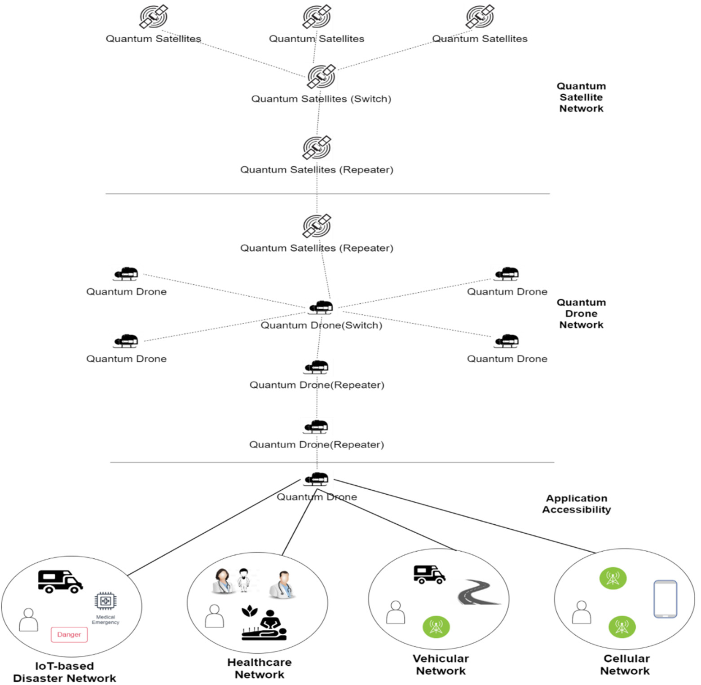
*Caption/Context: A. Kumar, D. Augusto de Jesus Pacheco, K. Kaushik et al. Vehicular Communications 36 (2022) 100487 | Fig. 11. Essential drone and satellite-based quantum hardware elements and proposed connectivity for ground-based applications.*

## --- Page 15 ---

A. Kumar, D. Augusto de Jesus Pacheco, K. Kaushik et al.
Vehicular Communications 36 (2022) 100487

Fig. 12. Single and Multi-hop drone-based quantum entanglement for quantum internet services in different applications.

be explored in detail. However, a few initiatives are only taken 
to use quantum satellites to make it feasible [152–155]. Thus this 
section explores the existing satellite-based IoT network designs 
which can be transformed into quantum satellite integrated so-
lutions in future. Here, a comparative analysis of those studies 
which perform quantum or software services to satellite-based IoT 
or constellation of satellites is performed.

Acín et al. [24] surveyed important quantum domains, including 
quantum communication, quantum computation, quantum simula-
tion, quantum metrology, sensing and imaging, quantum control, 
and quantum software and theory. For example, superconducting 
circuits, electronic semiconductor qubits, impurity spins, and linear 
optics are considered essential fields in the quantum computa-
tion domain from a futuristic point of view. It has been concluded 
that functional quantum interfaces for short-, medium- and long-
distance communication must be explored in detail. Moreover, al-
gorithmic problems associated with the quantum computational 
domain are important for improving software and theoretical ex-
perience improvements. Likewise, other domains are explored as 
well. This work needs to be extended with a comparative analysis 
of different quantum domain’ features. In this case, characteris-
tics and complexity-based analysis can be performed to analyze 
those technical aspects that need special attention for futuristic 
applications. For example, complexity and performance aspects in 
satellite-based IoT or networking aspects are found to be impor-
tant to improve service experiences. Further, it has been revealed 
that certain satellite electronics have been rendered unworkable 
as a result of the radiation radiated from orbit [152]. When em-

ployed in the same manner as conventional electronic systems, 
nanoelectronic systems have the potential to improve the perfor-
mance of electronic satellite systems. Here, QCAs (Quantum Cel-
lular Automata) in nanotechnology can improve the performance. 
Thus, this research area could be more explored.

Chu et al. [1] discussed how fifth-generation (or beyond) multi-
beam LEO IoT satellite communications systems are susceptible to 
a significant problem of channel phase uncertainty for beamform-
ing, which is a recommended system for use with a LEO satellite. 
This work describes a multibeam LEO satellite network-based IoT 
network with a specific purpose. The article proposed two resilient 
beamforming methods to lower the overall power consumption 
of the LEO satellite when the operational channel phase is not 
favourable. The first option can be better utilized out of the two 
proposed approaches. Second-best options are always the best for 
crucial IoTs applications because of their functionality. Further, the 
design of robust beamforming for multibeam LEO satellite IoT net-
work is formally designed and verified. The proposed study is 
simulated and experimented by analyzing the power consumption 
aspects. This particular study can be extended to include quantum 
computing and technology aspects. The literature also shows that 
the IoT network performance parameters can be considered to an-
alyze the network’s performance as a constellation of satellites. In 
[153], LEO satellites are explored with quantum communication. A 
significant role will be played by LEO satellites in the development 
of the global quantum Internet, which will be deployed in the 
not too distant future [153]. Because of the improved downlink, 
it is possible that methods that take advantage of this improve-

15

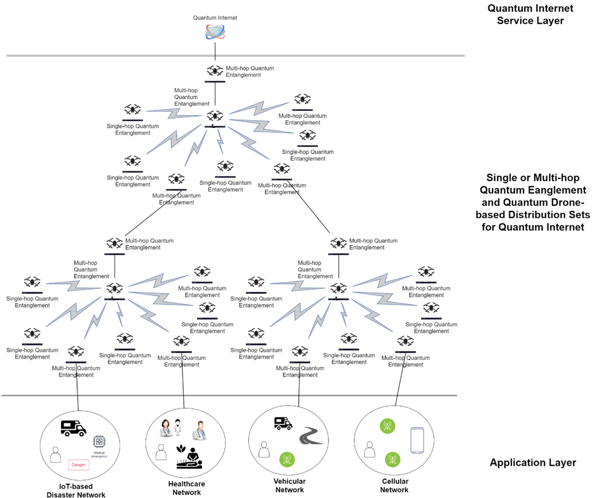
*Caption/Context: A. Kumar, D. Augusto de Jesus Pacheco, K. Kaushik et al. Vehicular Communications 36 (2022) 100487 | Fig. 12. Single and Multi-hop drone-based quantum entanglement for quantum internet services in different applications.*

## --- Page 16 ---

A. Kumar, D. Augusto de Jesus Pacheco, K. Kaushik et al.
Vehicular Communications 36 (2022) 100487

Fig. 13. Single and multi-hop satellite and drone-based quantum entanglement for quantum internet services in different applications.

ment will be able to enhance uplink quantum communication as 
a consequence. Designing future quantum Internet satellites should 
take into account uplink communication through quantum telepor-
tation, which is currently being investigated.

Yang et al. [2] examined the architecture of the 5G mobile 
communication satellite infrastructure, including the Iridium, Orb-
comm, NB-IoT, and Long Range Radio satellites. It is observed that 
NB-IoT system characteristics include optimized network transmis-
sion and low-power terminal design. These elements are used 
to construct a new dynamic routing protocol. The algorithm em-
ployed in the sensor network in this work is used in a wireless 
sensor network. In addition, this work has studied and investi-
gated the effects of energy consumption and the number of node 
variations that remain in the wireless sensor network. Crypto-
graphic techniques, such as ECC, are used to ensure the security 
of communication on the IoT and 5G mobile communication satel-
lite infrastructure [155–157]. Despite the fact that public-key tech-
niques like ECC are challenging to break, policymakers, scientists, 
and governments must begin preparing the Internet of Things for 
the quantum future as soon as possible. The specific objectives of 
this study are to investigate the impact of quantum computers on 
the security of cryptographic algorithms that are already in use 
and to present an overview of ideas for processes that are secure 
in both traditional and quantum computing contexts, among other 
aspects.

Graydon et al. [3] discussed the large population living in im-
poverished countries who do not have access to the Internet. Un-
til recently, satellite Internet was the sole option for connecting 
homes and companies to the Internet, and it was only available

in specific locations. A number of organizations have claimed to 
be capable of providing low-cost, high-speed Internet connections 
to everyone. This work has conducted a thorough examination of 
the history of satellite Internet services and the current announce-
ments of new satellite Internet service providers. According to the 
findings of this research, underprivileged regions would lose out on 
the advantages of satellite Internet technology if the government 
and corporate sectors do not follow through on their commit-
ments. In discussions, it has been observed that the likelihood of 
satellite ISPs offering competitive services has increased in the last 
decade. However, there is debate about whether or not these new 
constellations are both technically feasible and cost-effective. To 
cope with the newly crowded orbital plane that will be inundated 
with thousands of additional satellites as a consequence of the in-
crease in satellite fleet size, what procedures will be put in place? 
There is still plenty to discover and learn about this area. Satellite 
companies have promised to link people who are presently un-
connected, but the beneficiaries of this connection will be who, 
exactly? This work has discussed the important quantum technolo-
gies, including quantum communication, quantum computation, 
quantum simulation, quantum metrology, sensing and imaging, 
quantum control and quantum software and theory aspects. This 
work can be extended to include important research directions in 
discussed areas. Furthermore, the comparative analysis of quantum 
technologies and recent developments can be explored in detail. 
The proposed work can be extended with satellite and drone-based 
internet connectivity. Quantum computations can ensure fast and 
secure communication [157–159]. While quantum computing has 
the potential to enable new forms of processing, it has also been

16

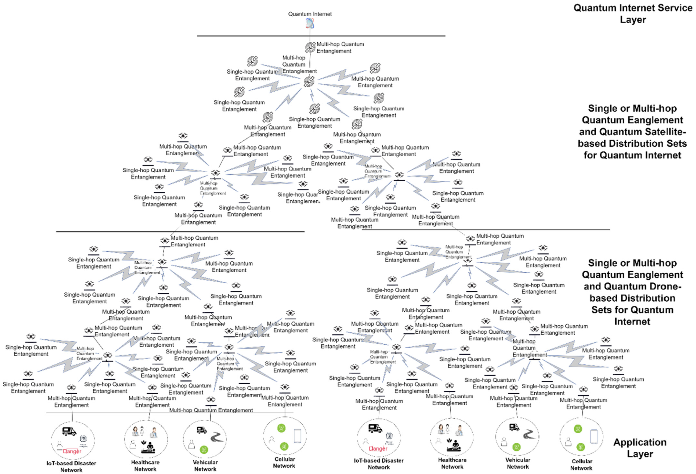
*Caption/Context: A. Kumar, D. Augusto de Jesus Pacheco, K. Kaushik et al. Vehicular Communications 36 (2022) 100487 | Fig. 13. Single and multi-hop satellite and drone-based quantum entanglement for quantum internet services in different applications.*

## --- Page 17 ---

A. Kumar, D. Augusto de Jesus Pacheco, K. Kaushik et al.
Vehicular Communications 36 (2022) 100487

proved to pose a threat to the security of the overwhelming major-
ity of cyber-operations in the past. This is another paradigm that is 
becoming more prevalent in traditional IoT systems. Thus, quantum 
satellite and quantum drone-integrated internet connectivity will 
be more relevant for futuristic IoT-based applications like quantum 
internet for homes. If current security procedures are undermined 
due to quantum computing, new means of protecting against these 
risks will be required in the future. Thus, quantum internet using 
quantum satellites and quantum drones will be more appropriate.

Fraire et al. [4] discussed the possibility that satellite constel-
lations may serve as circular gateways for the Internet of Objects, 
allowing for creating a global network of DtS-IoT. When construct-
ing the sparse satellite constellation, DtS-IoT takes advantage of 
the capabilities of LoRa devices to withstand the maximum degree 
of clockdrift. While the in-orbit infrastructure has been much re-
duced, latency continues to be a problem in the IoTs networks with 
limited resources, although the infrastructure has been signifi-
cantly reduced. This study showed that it is possible to offer global 
LoRa-based DtS-IoT with just nine satellites in the proper topology 
if the satellite constellation is configured correctly. With the stan-
dard LoRaWAN protocol modes, it would be compatible with a cor-
rectly constructed sparse constellation, demonstrating that space-
terrestrial IoT integration may be accomplished with fewer re-
sources than was previously analyzed to be possible. In this work, 
the algorithms are utilized to increase or decrease the size of the 
satellite fleet until it can fill a maximum coverage gap of 120 min-
utes in a given time period. This work has conducted performance 
analysis using coverage function and complexity analysis using the 
complexity-progressive gradient descent algorithm. This work can 
be extended to include other algorithms and parameters for anal-
ysis. Also, IoT network-related parameters can be considered for 
performance measurements. These parameters include data trans-
fer rate, delays, goodput and error probabilities. In resourceful or 
resource-constraint IoT networks, security is always a major con-
cern. Using quantum computers as a test subject revealed that 
the authentication mechanisms can be immune to the impacts 
of quantum computers after rigorous testing [158]. When this 
strategy is combined with a long-term evolution architecture (e.g. 
quantum satellites or quantum drones), the ability to apply secure 
and fast communication becomes successful without modifying the 
underlying base system. Several simulations and performance stud-
ies have shown that current systems have much-enhanced security 
and key management capabilities than older systems. However, 
quantum computations-based security challenges are always a con-
cern [158,159]. Therefore, post-quantum approaches or efficient 
quantum computation-based satellites or drones would be more 
relevant.

Wang et al. [5] discussed that IoT applications benefit from 
the broad coverage and ease of deployment provided by satel-
lite communication systems, making them an attractive option. In 
real-time, a dynamic optimum scheduling system for LEO satel-
lites may be created by combining SA-MC algorithms with a new 
transmission scheduling algorithmic approach. In addition, simula-
tion findings indicate that the SA-MC method suggested reducing 
the cost value while achieving rapid convergence at the same time. 
This work has analyzed the performance of a constellation of satel-
lites using cost, throughout, and algorithm convergence parame-
ters. This work can be extended to optimize the algorithm’s perfor-
mance by applying multi-constraint optimization approaches. Fur-
ther, the concept of the constellation of satellites can be mapped 
over quantum satellites, quantum drones or hybrid network-based 
constellations. Dolgopyatova et al. [6] investigated the use of In-
ternet broadcasting for the distribution of media and mass com-
munication information. This work discussed how Internet mass 
communication security techniques will evolve in the future and 
how they will stay essentially in the future. This work has ad-

dressed the importance of these security techniques in real-time 
applications, like how artificial intelligence and neural networks 
may be used to fight the spread of fake news in the media environ-
ment. This survey work can be extended to include a comparative 
analysis of security techniques and usage of satellites in real-time 
applications. The security techniques for internet mass communi-
cation can be enhanced in the future by using quantum technology 
like as discussed by Rahman et al. in [160]. A hybrid IoT security 
architecture is presented, with an additional layer that assures a 
quantum state. By preserving its status, this condition avoids any 
malicious acts from unauthorized parties in the communications 
platform and on the cyber side. Quantum satellites and quantum 
drones have the power to enable quantum-based communication, 
which is more secure, faster and covers long distances. Thus, in-
tegrating quantum drones and satellites with IoT is the futuristic 
need for work.

Wang et al. [7] discussed the importance of satellites for the 
development of smart cities. Here, the primary focus is an infras-
tructure for allowing large machine-type communications among 
widely distributed sensors servicing huge metropolitan areas. It is 
expected that similar infrastructure with the help of satellites will 
be developed from the Smart City IoTs during the next few years. 
While the terrestrial IoTs are key components of the smart cities 
ecosystem, this article looks at non-terrestrial Internet technologies 
for Smart Cities in addition to the terrestrial IoTs. Following that, 
the main satellite IoTs technologies and unmanned aerial vehicle 
IoTs technologies are assessed in independent assessments. The 
satellite IoTs study is primarily focused on route planning for un-
manned aerial vehicles, with both physical and non-physical layer 
technologies being investigated as part of the effort. This work has 
not discussed the quantum computing aspects. A distributed com-
puting environment using quantum computers can provide high 
performance and security. Thus, the design and implementation 
aspects of quantum computing with intelligent cities can be ex-
plored to analyze the possibilities of futuristic smart networks. The 
distributed computing environment supported by quantum com-
puters can be used in smart cities development in the near future. 
This work is discussed by Caleffi et al. [161], in which the authors 
explored how quantum computers may be connected through a 
quantum internet to achieve exponentially computing speedups. 
They also outline important future research difficulties and un-
resolved concerns in the design and implementation of quantum 
internets. Quantum satellites and quantum drones are other alter-
natives for providing fast and secure quantum internet.

Among other approaches [8–20], various satellite-based solu-
tions have been proposed for real-time applications. For exam-
ple, Giuliari et al. [8] discussed the Internet infrastructure using 
a low-earth-orbit constellation of satellites. In this work, a cost-
performance trade-off is performed for Internet routing. This work 
has examined the properties required for inter-domain routing. 
In optimal solution-based path aware network architecture de-
sign, routing optimization and proposal findings, during theoretical 
analysis and comparative study, cost of deployment, architecture 
stability, and latency have been identified as important properties 
to consider while deploying the Internet infrastructure using satel-
lites. There are various challenges in the content delivery network-
based approach, including the highly dynamic nature of satellites 
placed across the region, fluctuating connectivity due to unstable 
connections, bandwidth-latency trade-off in data forwarding and 
high cost and lower bandwidth availability make data traffic diffi-
cult to manage. Huang et al. [9] discussed the recent developments 
in commercial satellite systems. Here, a few commercial satellite 
communication systems and their properties are discussed. Fur-
ther, this work also considers the performance parameters into its 
centre for futuristic usage in real-time applications. This work is 
a short description of satellite communication systems and can

17

## --- Page 18 ---

A. Kumar, D. Augusto de Jesus Pacheco, K. Kaushik et al.
Vehicular Communications 36 (2022) 100487

be extended to analyze and compare satellite features in detail. 
Zhen et al. [10] discussed the Internet of Remote Things concept 
with low earth–orbit satellite-assisted 6G. This work has concen-
trated on ensuring massive random access requests of IoT devices. 
Initiatives are taken to reduce the overheads and detection mecha-
nisms. Statistical analysis of results provides robust mechanisms 
and improved systems with better accuracy, success probability, 
and energy consumption.

Pfandzelter et al. [11] use 6G for satellite and UAV-based wide-
area IoT creation. The proposed approach is a multi-domain re-
source allocation algorithmic approach for improving network ef-
ficiency. The simulation of the proposed algorithm confirms its 
validity and promises its efficiency for wide-area IoT. In [12–15], 
satellite or constellation of satellites for IoT network development 
and performance measurements are discussed. These approaches 
use various statistical methods to improve system efficiency. Fur-
ther, the interconnectivity of satellites and IoT devices is proposed 
using fast network connectivity. In [16,17], NOMA and satellite-
based IoT concept are introduced. These studies have conducted 
simulation-based performance analysis. Further, statistical analysis 
is performed in system design and validation. The analysis shows 
that the satellite-based IoT approach outperforms compared to tra-
ditional IoT approaches in terms of throughput, jitter, delay, and

other QoS parameters for both resourceful and resource-constraint 
environments. The significant shortcomings in existing approaches 
[8–17] include (i) no discussions over the usage of quantum com-
puting aspects. Quantum computing can protect futuristic commu-
nications from various attacks. In [8–17], no analysis is conducted 
on the usage of quantum computing aspects to improve the perfor-
mance or security in the network, (ii) quantum satellites or quan-
tum drones-integrated networks are recently developed to improve 
the Internet services. These services ensure secure data transmis-
sion without interference. Thus, quantum satellites and drones as-
pects need to be explored. Table 2 shows the comparative analysis 
of recent studies over quantum and software services to satellite-
based IoT or constellation of satellites. The multiple satellite-based 
solutions supported by quantum technology may increase the ef-
ficiency of various real-time applications. Out of which, resources 
allocation for satellite-based quantum communication is a signif-
icant challenge, and the same has been discussed by Bacsardi 
[162]. Numerous free-space investigations and various out-of-lab 
tests have been conducted to illustrate the viability of wired-based 
quantum communications infrastructure. The author outlined the 
criteria for such a network and detailed our findings on a unique, 
entanglement-based satellite quantum communications system in 
this research.

Table 2
Comparative analysis of quantum and software services to satellite-based IoT or constellation of satellites.

Author
Year
A
B
C
D
E
F
G
H
I
Major observations
Shortcoming and future 
directions

Futuristic quantum-
based possible 
extensions for the 
proposed approach

Acín et al.

[24]

2018
✓
✓
✓
✓
✓
✓
✓
✓
×
This work covers 
quantum 
communication, 
quantum computation, 
quantum simulation, 
quantum metrology, 
sensing and imaging, 
quantum control, and 
quantum software and 
theory domains.

This work can be 
extended to include a 
comparative analysis of 
quantum domains, their 
challenges and future 
cope. Further, the 
performance and 
security aspects in these 
domains can be taken 
up for in-depth study.

Some quantum satellite 
electronics are 
inoperable due to 
radiation [152].
Satellite electronics 
may benefit from 
nanoelectronics. QCAs 
may improve 
performance here.

Chu et al. [1]
2020
×
×
×
×
×
✓
✓
×
✓
This work has proposed 
two resilient 
beamforming methods 
to lower the overall 
power consumption of 
the LEO satellite when 
the operational channel 
phase is not favourable.
This work describes a 
multibeam LEO satellite 
network–based IoTs 
network with a specific 
purpose.

This work does not 
discuss quantum 
communication or 
computing aspects for 
IoT networks. Thus, this 
work and its power 
consumption–based 
analysis can be 
extended for quantum 
technology-based 
solutions.
Variation in simulation 
parameters to analyze 
the drift in results or 
error probabilities can 
be computed.

There is a need for 
support from LEO 
satellites in getting the 
global quantum 
internet up and 
running. People who 
build future quantum 
Internet satellites 
should think about 
how to communicate 
with each other uplink. 
It can also be used to 
think of the network as 
a group of satellites.

Yang et al.

[2]

2021
×
×
×
×
×
×
×
✓
✓
This work has 
investigated the effects 
of energy consumption 
and the number of node 
variations that remain 
in the wireless sensor 
network.
Examined the 
architecture of the 5G 
mobile communication 
satellite infrastructure, 
including the Iridium, 
Orbcomm, NB-IoT, and 
Long Range Radio 
satellites.

This work can be 
extended to test for 
real-time applications or 
environments rather 
than performing and 
validating through 
simulation or 
theoretical analysis.
This study can be 
extended to include the 
security or attack 
analysis of the proposed 
approach.

Secure IoT and 5G 
satellite 
communications 
employ ECC 
cryptography. It’s time 
to prepare the Internet 
of Things for the 
quantum-based 
security in future.

18

## --- Page 19 ---

### Section: 4.1 Software characteristics and applications for IoQDs

A. Kumar, D. Augusto de Jesus Pacheco, K. Kaushik et al.
Vehicular Communications 36 (2022) 100487

Table 2 (continued)

Author
Year
A
B
C
D
E
F
G
H
I
Major observations
Shortcoming and future 
directions

Futuristic quantum-
based possible 
extensions for the 
proposed approach

Graydon et

al. [3]

2020
✓
✓
✓
✓
✓
✓
✓
×
×
This work has 
conducted a thorough 
examination of the 
history of satellite 
Internet services as well 
as the current 
announcements of new 
satellite Internet service 
providers.

This work can be 
extended to include 
research directions and 
challenging Internet 
services using satellites 
and quantum satellites. 
Further, a comparative 
analysis of existing 
studies to identify the 
pros and cons can be 
performed.

Quantum 
communication 
through satellites or 
constitution/ 
constellation of 
quantum internet can 
be formulated for 
real-time applications. 
Further, the 
possibilities of 
multipoint 
entanglement in 
quantum internet can 
be explored in detail.

Fraire et al.

[4]

2020
×
×
×
×
×
×
×
✓
✓
This work state that it is 
possible to offer global 
LoRa-based DtS-IoT with 
just nine satellites in 
the proper topology if 
the satellite 
constellation is 
configured correctly.

More techniques and 
criteria for research may 
be included in this 
study if it is extended. 
When evaluating 
performance, it’s 
possible to consider 
aspects related to the 
IoT network.

Lightweight security 
aspects or 
quantum-based 
security approaches for 
LoRa-based Sts-IoT can 
be explored in detail. 
Configuration of 
quantum-integrated 
solutions is important 
to explore.

Wang et al.

[5]

2020
×
×
×
×
×
×
×
✓
✓
In real-time, a dynamic 
optimum scheduling 
system for LEO satellites 
may be created by 
combining SA-MC 
algorithms with a new 
transmission scheduling 
algorithmic approach. 
This work has analyzed 
the performance of a 
constellation of 
satellites using cost, 
throughput, and 
algorithm convergence 
parameters.

This work can be 
extended to optimize 
the algorithm’s 
performance by 
applying 
multi-constraint 
optimization 
approaches.

Satellite-based 
solutions supported by 
the quantum satellites 
will help the advanced 
applications in 
providing the data in 
real-time.

Dolgopyatova

et al. [6]

2020
×
×
×
×
×
×
×
✓
×
This work has discussed 
how satellite-based 
Internet mass 
communication security 
techniques will evolve 
in the future. Further, 
the importance of 
artificial intelligence, 
neural network and 
satellites is explored.

This survey work can be 
extended to include a 
comparative analysis of 
security approaches. 
Further, the usage and 
applications of artificial 
intelligence and neural 
network with satellites 
can be explored in 
detail.

The internet mass 
communication 
assisted by quantum 
technology will shortly 
enhance security 
(especially with 
quantum satellites and 
quantum drones).

Wang et al.

[7]

2020
×
×
×
×
×
×
×
✓
✓
While the terrestrial IoT 
is a key component of 
the Smart Cities 
ecosystem, this article 
looks at non-terrestrial 
Internet technologies for 
Smart Cities in addition 
to the terrestrial IoTs.

This work has not 
focused on quantum 
computing aspects for 
improving the 
performance and 
security of smart city 
networks. Thus, 
quantum computing 
aspects for 
satellite-based 
terrestrial IoT networks 
can be explored in the 
future.

Quantum technology 
can implement smart 
city development 
supported by the use 
of distributed 
computing 
environment. For 
example, the hybrid 
architecture proposed 
(Fig. 11, Fig. 12 and 
Fig. 13).

A: Quantum Communication, B: Quantum Computation, C: Quantum Simulation, D: Quantum Sensing/Meteorology, E: Quantum Software for Computing, F: Quantum Infor-
mation Theory, G: Quantum Software for Networks, H: Other satellite and IoT technical aspects, I: Satellites and IoT performance aspects with quantum-related discussions.

#### 4.1. Software characteristics and applications for IoQDs

To understand the interoperability and cross system function-
ality in IoQDs, it is important to identify the important char-

acteristics of quantum computing platforms, services, or concept 
designs for IoQDs. Fig. 14 shows the overview of various soft-
ware applications and assets studies for IoQDs in recent studies. 
These software applications and assets for IoQDs include quan-

19

## --- Page 20 ---

### Section: 4.1.1 Quantum programming languages for IoQDs

A. Kumar, D. Augusto de Jesus Pacheco, K. Kaushik et al.
Vehicular Communications 36 (2022) 100487

Fig. 14. Important software applications and assets for IoQDs.

tum programming languages for IoQDs, and quantum computing-
based error-correction firmware for IoQDs. Quantum computing-
based device control firmware, quantum computing-based logical 
level schedulers and optimizers, quantum computing-based com-
pilers for IoQDs, and quantum computing-based physical level 
schedulers and optimizers for IoQDs. Other assets include soft-
ware for IoQDs for high-security applications, quantum informa-
tion software simulations, cryptography software, software valida-
tion in quantum computing-based telecommunication infrastruc-
ture, space-qualified software components etc. In this case, each 
application or asset requires specialized software services to oper-
ate. For example, quantum programming languages could include 
design, semantic generation, compilation, adjoining, commuting, 
controlled operations etc. Likewise, quantum computing-based de-
vice control firmware requires high-performance hardware, quan-
tum control techniques, physical scheduler, function integration 
etc. Fig. 14 presents the other classification and sub-classification 
of quantum related software applications and assets. Some of these 
applications, assets, and characteristics are briefly explained [44]. 
For example, wariness for IoQDs in quantum computing-based 
physical level schedulers and optimizers includes quantum radi-
ation effects in the environment, the feasibility of physical level 
schedulers and optimizers supporting multi-point entanglement 
for long-distance and multi-object communication, massive secu-
rity flaws, the inefficiency of quantum computers or devices to 
handle combinatorial optimization problems which are NP-hard.

4.1.1. Quantum programming languages for IoQDs
Quantum programming languages are important to the pro-
gram, configuration, and operation of the hardware systems and 
sub-systems in space computing infrastructure, including IoQDs. 
Various quantum programming languages, tools, simulators, and 
SDKs have been developed during the last few decades. A few 
quantum programming languages include Quantum Pseudocode, 
Q|SI>, Q language, qGCL, Scaffold, QCL, QMASM, and Silq. Fig. 15
summarizes the important classifications of quantum programming 
languages and how it is important for IoQDs. Quantum program-
ming languages can be classified into quantum imperative pro-
gramming languages (e.g. LanQ, QCL, Q etc.), functional quantum 
programming languages (e.g. Quipper, QuaFL, QPL, QFC etc.), (quan-
tum domain-specific programming languages (e.g. controlled oper-
ations and transformations, clean and borrowed Qubits etc.), mul-
tiparadigm quantum programming languages (e.g. Q#, straberry 
etc.), quantum circuit support languages (e.g. QWIRE and QuECT), 
quantum object-oriented languages (e.g. FJQuantum), structural 
quantum programming languages (e.g. low-level flowchart lan-
guage) and dynamic execution-based quantum programming lan-
guages (e.g. quantum rotations).

With these programming languages, various other quantum 
computing aspects are directly associated. For example, quantum 
verification simulators (e.g. ProjectIQ, QX, Liquid etc.) can take the 
help of these languages to design problems and their solutions. 
IoQDs can use these languages to program circuits and operate 
as per requirements. For quantum drones applications, the usages 
of programming languages are: (i) hardware-based programming

20

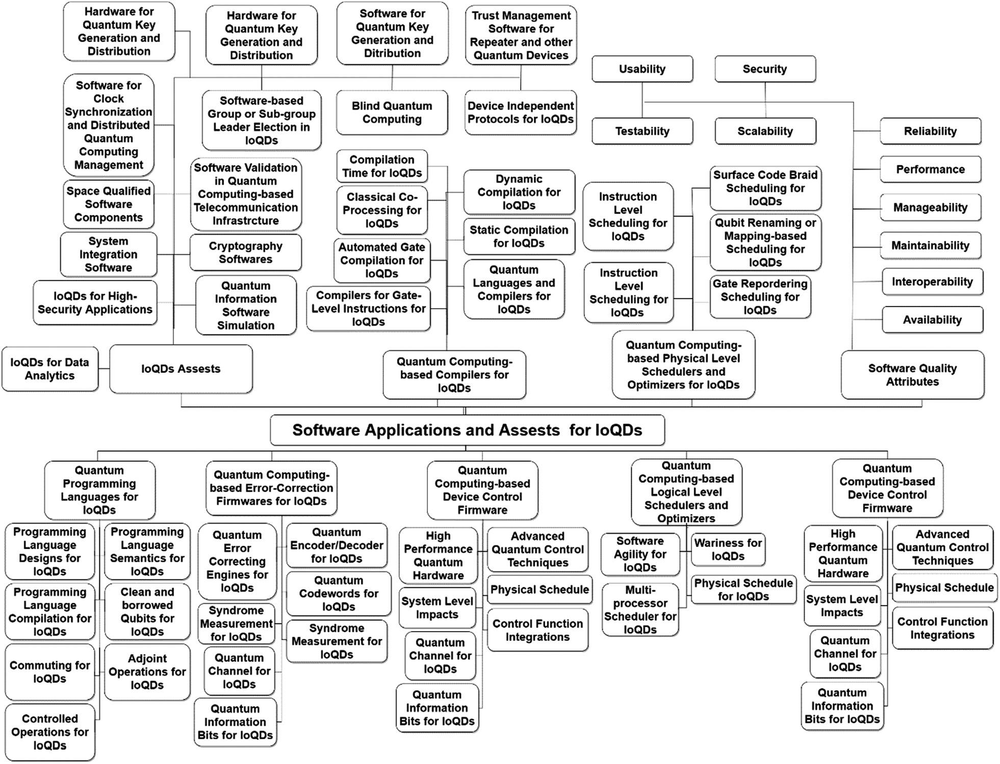
*Caption/Context: A. Kumar, D. Augusto de Jesus Pacheco, K. Kaushik et al. Vehicular Communications 36 (2022) 100487 | Fig. 14. Important software applications and assets for IoQDs.*

## --- Page 21 ---

A. Kumar, D. Augusto de Jesus Pacheco, K. Kaushik et al.
Vehicular Communications 36 (2022) 100487

Fig. 15. Quantum programming languages and IoQDs.

languages will be useful for programming quantum circuits, imple-
menting quantum algorithms and writing assembly instructions. 
(ii) functional quantum programming languages will be useful to 
operate the drones, (iii) domain-specific languages will be use-
ful for computational, communications and transformation tasks, 
(iv) object-oriented languages could be helpful in error detection, 
correction, module-wise function implementation and integrating 
gates and circuits with different functionalities and (v) impera-
tive languages could be helpful in hardware circuit management 
and providing necessary classes to drone operations. The impor-
tant studies conducted over quantum programming languages and 
their comparative analysis are shown in Table 3.

Pérez-Castillo et al. [45] discussed that quantum computing 
continues to advance from academic and industry perspectives. 
This work discussed software modernization in quantum comput-
ing and found that there has not been a systematic strategy in 
tackling this area up until now. According to the study, a method 
for software modernization is being proposed that aims to reor-
ganize classical systems to operate with quantum systems. This 
has significant technical and economic ramifications since current 
system expertise can be reused while new quantum-based initia-
tives can be implemented faster. This reduces the work required 
to create new quantum information systems while allowing the 
knowledge in older systems to be used. Due to this, it is compli-
ant with global regulations. Thus it may be used regardless of the 
quantum programming language or computer environment being 
used. This work does not discuss, however, how software mod-
ernization would be useful for hardware-based implementation. 
Programming languages are associated with hardware platforms in

this work. However, devices like drones or quantum drones are 
missing in scenarios.

As a consequence, software-based approaches for hardware de-
vices need to be focused on in the future. Rojas et al. [46] discuss 
that the development of many quantum programming languages 
(QPLs) at the present moment makes it difficult to choose one 
that has the finest design format for quantum computer devel-
opers and users. As quantum computing becomes more widely 
accessible, researchers will be able to get a deeper grasp of the ef-
ficiency of different programming languages. This includes features 
like developer-friendliness, quantum algorithm optimization, fault-
tolerant execution of quantum programs via protocol, and quan-
tum error-correction techniques. This work has surveyed quantum 
programming languages and their features. Here, a comparative 
analysis of various studies is performed to identify the assem-
bly language, high-level language, declarative language, and im-
perative language. Further, quantum programming language design 
features are identified that include completeness, expressivity, effi-
ciency, and hardware independence. This work can be extended to 
include quantum language features supporting hardware devices 
(like drones). Further, software usage and modernization can be 
explored for the latest advancements in quantum programming 
languages.

Garhwal et al. [48] discussed the status, a high-level and suc-
cinct overview of the current state of quantum programming lan-
guages. This study focuses on high-level programming languages 
having quantum characteristics for quantum computers. This work 
has listed examples of different quantum programming languages 
briefly. It has been observed that the majority of quantum pro-
gramming languages are an extension of high-level programming

21

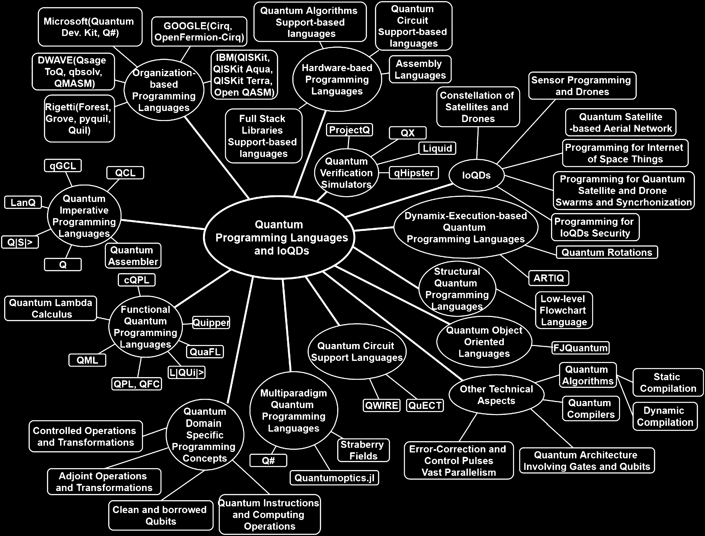
*Caption/Context: A. Kumar, D. Augusto de Jesus Pacheco, K. Kaushik et al. Vehicular Communications 36 (2022) 100487 | Fig. 15. Quantum programming languages and IoQDs.*

## --- Page 22 ---

A. Kumar, D. Augusto de Jesus Pacheco, K. Kaushik et al.
Vehicular Communications 36 (2022) 100487

Table 3
Comparative analysis of recent studies over quantum programming languages.

Author
Year
A*
B*
C*
D*
E*
F*
G*
H*
I*
Major observations
Future directions

Pérez-Castillo

et al. [45]

2021
✓
✓
✓
✓
×
×
×
✓
×
A method for software 
modernization is being 
proposed to reorganize 
classical systems such that 
they can operate with 
quantum systems.

In the future, software 
modernization aspects for 
hardware-based 
implementation can be 
focused on in detail.

Rojas et al.

[46]

2019
✓
×
✓
✓
×
×
×
×
×
This work has surveyed 
quantum programming 
languages and their 
features. Further, quantum 
programming language 
design features include 
completeness, expressivity, 
efficiency and hardware 
independence.

This work can be extended 
to include quantum 
language features 
supporting hardware 
devices (like drones).

Garhwal et al.

[48]

2019
✓
✓
✓
✓
✓
✓
×
×
×
This article focuses on 
high-level programming 
languages having quantum 
characteristics for quantum 
computers and comparisons 
between them and 
conventional programming 
languages.

This work can be extended 
to cover challenges, 
research directions, 
frameworks, and the 
complexity calculation for 
programming hardware 
devices.

Heim et al.

[51]

2020
✓
×
✓
✓
×
×
✓
×
×
This work has discussed the 
characteristics, importance, 
and examples of quantum 
programming languages. 
Here, quantum computing 
aspects are put into the 
centre to examine the 
significance of quantum 
programming languages.

Programming languages and 
their associations with 
quantum drones, satellites, 
and space computing 
aspects are not yet 
explored. Thus, 
programming languages, 
features, and importance 
can be analyzed for space 
computing aspects in the 
future.

Unruh et al.

[52]

2006
×
×
✓
✓
×
×
✓
✓
×
This work has explored the 
important characteristics, 
expected features, and 
examples of quantum 
programming languages. 
Here, the focus is drawn 
toward practical and formal 
language features and 
futuristic requirements.

This work can be extended 
to include the hardware 
aspects and software 
solutions for quantum 
programming languages. 
Here, parser, assembler, 
optimizer, and compilers 
required for quantum 
programming languages to 
cover drones, satellites, and 
other space computing 
infrastructure can be taken 
up in the future.

Ying et al.

[55]

2010
×
×
✓
✓
×
×
×
✓
×
This work has presented a 
detailed syntax and 
semantics for a flowchart 
programming language, 
which can be used with 
high-level quantum 
programming languages and 
compiler design.

This work can be extended 
to include examples of how 
the proposed flowchart 
programming language can 
be used for hardware-based 
implementations. This may 
include implementation for 
space computing-based 
infrastructure as well.

*Caption: A: Hardware-based Programming Languages, B: Organization-based Programming Languages, C: Quantum Imperative Programming Languages, D: Functional 
Quantum Programming Languages, E: Multiparadigm Quantum Programming Languages, F: Quantum Object-Oriented Programming Languages, G: Quantum Programming 
Simulators, H: Full-Stack Libraries Support-based Languages, I: IoQDs-related technical aspects.

languages and share similar characteristics. This work can be ex-
tended to cover the complexity calculation for programming the 
hardware devices. The analysis of recent trends can be extended to 
include futuristic research directions, challenges, limitations, and 
possible solutions. Heim et al. [51] explored that quantum pro-
gramming languages are critical tools for turning ideas into quan-
tum computer instructions. These languages are popular because 
of quantum computers, quantum computing, and their usage in 
various futuristic real-time applications. Quantum programming

languages are utilized for many different tasks in the quantum 
computing domain. For example, they are used for controlling cur-
rent physical devices to calculate the costs of quantum algorithm 
execution on future devices and even teaching quantum comput-
ing ideas to students. This survey discusses an overview of several 
cutting-edge quantum programming languages, emphasizes their 
most distinctive characteristics, and provides code examples for 
each of them in detail. Here, important features of quantum pro-
gramming language are explored, including commuting operations,

22

## --- Page 23 ---

### Section: 4.1.2 Quantum computing--based error-correction firmwares for IoQDs

A. Kumar, D. Augusto de Jesus Pacheco, K. Kaushik et al.
Vehicular Communications 36 (2022) 100487

clean and borrowed qubits, adjoint operations, and controlled op-
erations. In the future, IoQDs and space computing requirements 
can be analyzed, and their integration with quantum programming 
languages can be explored.

Unruh [52] classified programming languages into functional 
and formal programming languages. Important quantum com-
puting aspects, including requirements of simple and powerful, 
technology- and platform-independent ability to optimize algo-
rithms and error correction techniques, and emulation (simula-
tion and execution) are discussed. In addition, the challenges and 
features of quantum programming languages, including quantum 
branching, continuous classical output measurements, concurrent 
process execution, infinite datatypes, high-order data types, pow-
erful reasoning, and logic—are discussed. Finally, various quantum 
programming languages are explored to identify their features, 
characteristics, and futuristic importance. Ying et al. [55] proposed 
a low-level flowchart language for quantum programming, particu-
larly for implementing high-level quantum languages. In addition, 
quantum compilers can be designed using the proposed semantics 
and syntaxes. Here, examples are taken to discuss the quantum 
program errors, program and language weaknesses and limitations, 
and logic errors. This work has presented detailed semantics for 
flow-chart quantum programming language. This work can be ex-
tended to include examples of how the proposed language can be 
used for compiler design, implementation of other quantum pro-
gramming languages, implementation pros and cons, and quantum 
security aspects.

Among other approaches [47,49,50,53,54,56,57], a new quan-
tum programming language - the Qumin language - is proposed 
[47]. This language’s theoretical foundations, lambda calculus, and 
other practical aspects are covered in detail. Further, algorithms, 
programming tools, matrices, and quantum fragments of programs 
are discussed to show their importance. Short surveys over quan-
tum programming languages [49,50], frameworks [53,54], high-
level structures [56], compiler design [57], etc., are also discussed 
to show the importance of quantum programming languages. The 
quantum programming language area has been widely explored 
for many real-time applications. However, there is a need to focus 
on various challenges like (i) designing compilers and assemblers 
suitable for hardware-based implementations supporting quantum 
computing, (ii) programming space computing aspects with log-
ical programming, and (iii) securing the hardware infrastructure 
using logical quantum programming aspects. This may include a 
constellation of drones and satellites, satellites with ground Inter-
net service networks, long-distance satellite to satellite or drone to 
drone interconnections, and software modernization for program-
ming aspects and logic.

4.1.2. Quantum computing–based error-correction firmwares for IoQDs
Quantum computing–based bit-error correction or QEC mecha-
nisms are widely discussed for QKD, mainly in recent times [38]. 
For example, Banegas et al. [38] discussed the quantum-resistant 
security aspects for software updates and proposed post-quantum 
signature schemes (LMS, Falcon, Dilithium). Here, the focus is 
drawn toward the implementation of post-quantum cryptographic 
primitives and protocols for resource-constraint environments. In 
post-quantum cryptography, a code-based cryptosystem is consid-
ered a viable option for resource-constrained settings. However, 
performance issues in this approach have been identified as an 
area to address to make it suitable for resource-constraint IoT en-
vironments. Svore and Troyer [58] discussed that the QEC mecha-
nism is necessary to extend the lifetime of quantum information. 
In resource-constraint hardware devices, quantum-based mecha-
nisms are required to have a quantum error bit rate below a cer-
tain threshold [58]. Here, quantum computing infrastructure can 
reduce the error rate quadratically faster. Thus, there is a need to

explore algorithms, approaches, mechanisms, and frameworks that 
control the error rate for embedded devices. These embedded de-
vices can be integrated into an IoT environment and used in space 
infrastructure for long-distance communication.

Isaac et al. [59] discussed the use of drones and free-space op-
tical quantum channel for securely exchanging keys over long dis-
tances. They examined mobile free-space Quantum secured com-
munication on developing advanced and expansive quantum com-
munication networks. Chen et al. [60] also discussed the impor-
tance of free space quantum computing and the need for QKD 
and QEC. The authors conclude that quantum infrastructure can be 
reduced with satellites, drones, and vehicles. In this work, can ex-
perimentation is performed to implement QKD in free-space com-
munication. Takenakaet et al. [61] discussed the case of satellite-
to-ground communication using a 50-kilogram microsatellite. In 
this work, hack-proof quantum communication for QKD is explored 
using satellites. In experimentation, placing the microsatellite in a 
low-orbit position to reduce the quantum bit error rate is the goal 
of this work. Thus, this real-time experimentation demonstrated 
the feasibility of fast and error-free quantum communication for 
key distribution. Sun [62] discussed the RFI-QKS approach. Here, 
the advantages and disadvantages of the proposed system are dis-
cussed. In a major observation, it has been observed that source 
flaws in quantum communications are targeted to be removed. 
Further, the quantum bit-error rate is reduced. The major challenge 
of the proposed approach is practical security, which is identified 
as a significant bottleneck for RFI-QKD.

4.1.3. Quantum computing-based device control firmware
In quantum computing infrastructure, various electronic and 
device controls are required to operate the embedded machines 
smoothly. For example, Sebastiano et al. [63] discussed Cryo-CMOS 
electronic control system for scalable quantum computing. Cryo-
CMOS is designed to integrate CMOS fabrication infrastructure. 
Further, performance aspects are taken into consideration while 
designing the Cryo-CMOS system. In the study, Cryo-CMOS circuits 
and systems are considered for complex calculations and facilitat-
ing the manufacturing of practical quantum computers. Gebauer 
et al. [64] discussed the heterogeneous architecture for quantum 
computing. In this architecture, many embedded devices are in-
terconnected to perform user tasks and data communication. Ex-
amples are taken to analyze and explain the working of this ar-
chitecture. This work has discussed the architecture with timing 
benchmarks and usage of this architecture from futuristic quantum 
computing aspects. To operate the architecture, complex control 
schemes are suggested. Thus, this system integration and opera-
tions can be controlled without knowledge of FPGA designs and 
testing.

Kandala et al. [65] discussed the importance of control soft-
ware, algorithm, and parameters for experimental optimization of 
Hamiltonian problems with a hundred Pauli terms in determining 
the ground state energy for molecules of increasing size. This work 
has demonstrated the high-performance computing aspects and 
how different control theories and software aspects help in im-
plementing it over quantum hardware. Von Maurich et al. [66] fo-
cused on lightweight code-based cryptography that uses McEliece 
encryption with QC-MDPC codes for its implementation and er-
ror correction. This lightweight approach can perform encryption 
and decryption in a short time and reduces the key sizes and 
hardware requirements. This work uses error corrections and a 
control vector to measure the performance for key sizes and en-
cryption/decryption processes. Among other approaches [67–70], 
the control function is used differently. For example, it can be 
used to control parameters for improving learning abilities [67]. 
Here, learning parameters are controlled to enhance the learning 
and training abilities and performance in a complex deep learn-

23

## --- Page 24 ---

### Section: 4.1.4 Quantum computing-based logical level schedulers and optimizers

A. Kumar, D. Augusto de Jesus Pacheco, K. Kaushik et al.
Vehicular Communications 36 (2022) 100487

ing network using quantum computers. Further, high-performance 
quantum hardware, advanced quantum control techniques, system-
level impacts, physical schedule, control function integrations, a 
quantum channel for IoQDs, and quantum information bits for Io-
QDs are important aspects discussed in recent studies [68–70].

4.1.4. Quantum computing-based logical level schedulers and 
optimizers

In the quantum world, quantum computing-based logical level 
schedulers and optimization processes focus on improving the per-
formance and response time of real-time applications. In literature 
[71–76,134], various studies are conducted to propose quantum 
solution-based optimization approaches for IoT environment, per-
formance analysis, energy management, network communications, 
generating energy statistics and optimizing performance. Table 4
shows the comparative analysis of recent studies over quantum 
computing-based logical level schedulers and optimizers.

#### 4.2. Software engineering for IoQDs

Quantum computing is rapidly evolving, with several practical 
applications in supply chain management, chemicals, finance and 
banking sectors, power and agribusiness, healthcare and wellness, 
and other fields. Organizations will increasingly need to include 
quantum software in the upcoming decades, and both the aca-
demic and practitioner sectors will need to respond to this chal-
lenging context. Numerous programming languages and quantum 
algorithms emerged with the advent of the first quantum com-
puters, yielding impressive outcomes. On the other hand, quantum 
software has yet to be developed in a systematic and commercial 
manner. Quantum computing requires the application of software 
engineering and programming techniques.

The IoD [77] is a network architecture that allows drones and 
people to communicate and command each other through the In-
ternet. In actuality, drones are fast approaching commodity prod-
ucts, permitting any user to fly numerous drones in regulated 
airspace for various tasks. While technology aids in the mass pro-
duction of onboard elements such as processors, sensors, memory, 
and battery capacity for UAVs, the operational limits of these el-
ements hinder and lower expectations. Drones with vehicle and 
cloud mobility features are available from IoD, allowing for remote 
drone ownership and management.

Researchers [78] are hoping to construct a worldwide quantum 
Internet based on the transmission of quantum particles to permit 
ultrasecure communications by encrypting data using secret codes 
created by the particles. A quantum Internet might potentially en-
able remote quantum computers to collaborate or conduct experi-
ments that push quantum physics to its boundaries. To transfer the 
photons, the researchers employed two drones. One drone gener-
ated entangled particle couples, delivering one to a ground sta-
tion while transmitting the other to the other drone. The particle 
was then sent to a secondary ground station located a kilometre
apart from the former. Software-defined communication, which al-
lows for the rapid prototyping of ideas, makes it easy to do this. 
A more in-depth discussion of the hardware, software, and mid-
dleware components of the QC terminal is provided in this work. 
In software, superdense coding and numerical simulations will be 
necessary to accurately depict the transmitter and receiver.

The expansion [79] of the QCS industry is being fueled by more 
significant usage of QCS in the banking and finance infrastructure 
sector, officials facilitating the growth and availability of innova-
tive solutions, and a large count of cooperative arrangements for 
technology and development. The software development industry 
has been good at responding to the need to modify and embrace 
well-known procedures and technologies for software design and

build new ones that are specifically adapted to this novel program-
ming model. Nevertheless, the creation of an adequate theoretical 
model for the creation and implementation of quantum program-
ming is essential to the performance. As the first move toward a 
good quantum software development, this paper [80] outlines the 
notion of component, which is critical in the software engineering 
profession and sets essential criteria for assessing the cohesiveness 
and coupling degrees of a component in the development of quan-
tum programming.

#### 4.3. Quantum software life cycle for IoQDs

Considering recent advancements in the creation of increasingly 
powerful quantum computers, the field of quantum software en-
gineering is gaining traction to provide concepts, principles, and 
standards for the growth of advanced quantum solutions. Life cy-
cles are used to describe the process of developing, deploying, 
managing, analyzing, and adjusting software in traditional software 
engineering. The multidisciplinary nature of quantum computing 
and similar life cycles give a shared knowledge of creating and 
managing a program which is crucial. Even though today’s modern 
quantum solutions are almost always hybrid, combining quantum 
and conventional programming, the quantum application life cy-
cle must include both types of programming. On the other hand, 
present life cycles are solely concerned with the development of 
quantum or traditional programs in isolation. Moreover, the dif-
ferent programs must be coordinated, for example, through work-
flows. As a result, the process life cycle is included in the creation 
of quantum applications. The authors [81] examined the software 
artefacts that typically make up a quantum application and de-
scribed their life cycles in this article.

Since quantum computing is multidisciplinary, an intersection 
of knowledge of how to build and operate a quantum software 
program is required. Unfortunately, no current strategy or life cy-
cle encompasses all essential stages that might persist during the 
growth and implementation process. As a result, in this work [82], 
the authors provide the ten-phase quantum software life cycle that 
a gate-based QCS application must go through. In addition, the 
authors looked at the goals of each step, the methods and instru-
ments that may be used, and any unique challenges or research 
topics. As a result, the lifespan may be utilized as a starting point 
for future debates and studies.

The Quantum Software Life Cycle for IoQDs is shown in Fig. 16
[171,172]. Step 1 consists of requirement gathering, in which 
the hardware-related requirements related to IoQDs are gathered. 
Based on the needs captured, splitting of Quantum-Classical is 
done. Thereafter, the design and architecture of the software are 
performed. A combination of quantum and conventional compo-
nents is the outcome of the preceding step. Using these pieces and 
describing matching subprograms with their capabilities and con-
nections, a structure is conceptualized during the architecture & 
design process. The design is then fine-tuned using the internals 
of the various software elements, such as the data structures em-
ployed. The resultant specification should give enough information 
for the individual components to be implemented in the follow-
ing phase. In designing and architecture, data flow diagrams are 
created to choose the final design and architecture. The quantum 
circuitry and classical software artefacts that execute the quan-
tum and conventional problem components that were generated 
in the previous step are constructed. As a result, a high-level and 
hardware-independent quantum programming language should in-
deed be utilized to build the quantum circuits, allowing for subse-
quent seller hardware procurement. Following the implementation 
of the quantum hardware independent phase, the quantum appli-
cation is tested to ensure that it behaves as expected as per the 
specifications before being delivered to consumers. It involves test-

24

## --- Page 25 ---

A. Kumar, D. Augusto de Jesus Pacheco, K. Kaushik et al.
Vehicular Communications 36 (2022) 100487

Table 4
Comparative analysis of studies over quantum computing-based logical level schedulers and optimizers.

Author
Year
A
B
C
D
E
F
G
H
I
J
Major observations
Future directions

Metodi [75]
2005
✓
✘
✘
✘
✘
✘
✘
✘
✓
E
This work has proposed an 
optimized microarchitecture 
for scalable computing. The 
hierarchical and array-based 
design is used to design a 
scalable, reliable, and 
resource-distributed 
method for large-scale 
quantum computing.

The proposed design in this 
work can be extended to 
incorporate in-depth 
system-level analysis. 
Challenges in quantum 
architecture can be taken 
up to improve quantum 
computers’ efficiency, 
reliability, and scalability.

Ajageka [71]
2020
✓
✓
✘
✓
✘
✓
✘
✘
✓
E
This work has developed a 
model and method to 
strengthen the quantum 
computing and overcome 
the combinatorial 
complexity issue in solving 
large-scale 
discrete-continuous 
optimization problems..

This work can be extended 
to include fault diagnosis in 
optimization problems; e.g., 
how complex chemical 
processes can be handled 
using quantum 
computing-based 
techniques.

Kumar [76]
2020
✘
✓
✘
✘
✘
✘
✘
✘
✓
E
This article has prepared a 
quantum-inspired green 
communication framework 
for energy balancing in 
sensor-enabled IoT systems. 
Here, the focus is drawn 
toward evaluating 
state-of-the-art technologies 
using quantum solutions.

This work can be extended 
to experiment with 
quantum-inspired 
metaheuristic optimization 
problems for green 
communication in 
sensor-based IoT networks.

Ajagekar et

al. [73]

2020
✘
✓
✓
✘
✘
✓
✘
✓
✓
E
This work has proposed a 
hybrid quantum 
computing-based 
partitioning algorithm to 
find the optimal solution 
for large-scale job-shop 
scheduling problems. Here, 
four classes of optimization 
problems are considered for 
analysis.

The classes of optimization 
problems can be taken up 
for comparative 
performance analysis to 
identify the parameters that 
improve fuzzy 
multi-objective optimization 
problem of oil development.

Ajagekar [74]
2021
✘
✘
✓
✘
✘
✓
✘
✘
✓
E
This work has proposed a 
quantum computing-based 
deep learning framework. 
This framework is tested to 
identify fault diagnosis for a 
simulated electrical power 
system with 30 buses. Here, 
the applicability, efficiency, 
and capabilities of the 
proposed framework are 
put in focus.

The proposed framework 
can be utilized for fault 
diagnosis and performance 
analysis for other systems 
as well. In this work, one 
case study is considered. 
However, variation in the 
number of buses could be 
taken up to analyze the 
fault diagnosis process 
variations.

Liu et al. [72]
2021
✘
✘
✘
✘
✓
✓
✘
✘
✓
E
This work has proposed a 
numerical method of 
mixed-integer optimal 
control problems. These 
problems are taken up to 
solve the key issues for 
alkali-surfactant-polymer 
flooding in oil exploitation.

Optimization algorithms 
based on quantum 
computing, including 
quantum annealing and 
quantum ant colony 
algorithm can be extended 
with the proposed 
numerical method

Denkena et

al. [134]

2021
✘
✓
✓
✓
✓
✓
✓
✓
✘
E
This work has surveyed 
methods for 
quantum-computing-based 
job scheduling. Further, a 
new flexible job shop 
scheduling-based algorithm 
is proposed and evaluated 
experimentally.

This work can be extended 
to include practical 
applications to proposed 
optimization formulation, 
objection function with an 
optimization algorithm, and 
quantum bit optimization 
build time.

A: Quantum operation (Quantum Circuit)-based scheduling, B: Job-shop problem, C: Graph-theory for Quantum-based scheduling approaches, D: Flexible Job shop scheduling 
problem, E: Ant colony-based job scheduling, F: Quantum Simulated annealing-based job scheduling, G: Partial swarm optimization-based job scheduling, H: Tabu search-
based job scheduling, I: Other scheduling algorithms, J: Survey (S)/Experimentation(E).

25

## --- Page 26 ---

### Section: 4.4 Quantum finite automata for IoQDs

A. Kumar, D. Augusto de Jesus Pacheco, K. Kaushik et al.
Vehicular Communications 36 (2022) 100487

Fig. 16. Quantum software life cycle for IoQDs.

ing all constituent software artefacts, such as quantum programs, 
classical programs, and workflows, comparable to the execution 
phase.

During the deployment phase, everything is in place to allow 
the quantum application to work. Therefore, the performance con-
text for traditional programs is built up. For example, a virtual 
machine may be established and the appropriate Python runtime 
deployed on it for a Python code. Quantum applications and pro-
cedures must be deployed in the same way. Several of the needed 
capabilities, on the other hand, may be offered as a service or 
API, requiring no deployment. The quantum program and its pro-
gramming environment are then monitored in the following phase. 
Data is gathered for two motives: monitoring the current state 
of a functioning quantum program and preserving the data for 
long-term study, such as to enhance the quantum implementation 
or to provide provenance, understanding ability, and repeatability. 
This step necessitates gathering information on the mixed quan-
tum application’s software artefacts. The acquired data from the 
monitoring phase is evaluated in the last phase of the life cy-
cle. The objectives of this stage are to identify any problems that 
need to be repaired as well as prospective quantum application 
enhancements. For instance, if quantum algorithms regularly re-
turn incorrect outputs, this might be due to a sub-optimal division 
for today’s restricted quantum computers.

#### 4.4. Quantum finite automata for IoQDs

Quantum finite automata provide a solid educational founda-
tion for presenting quantum computation ideas to software engi-
neers due to their relative accessibility. However, early quantum 
finite automata systems were troublesome in that they did not 
fully encapsulate the potential of quantum physics, resulting in 
perplexing outcomes in which a “quantum” computer could not 
replicate its classical equivalent. Several basic quantum finite au-
tomata techniques are presented in this work [83], demonstrating 
the advantages of quantum computation over conventional pro-
cessing. Finding quantum frameworks that surpass their conven-
tional equivalents is a key problem in quantum information tech-
nology. Automata is a basic computer paradigm with numerous 
applications in a wide range of areas. It has been demonstrated 
that when compared to the conventional automata, the quantum 
variant of the automaton can handle specific problems with a

significantly smaller state vector. A deterministic finite automa-
ton is a bounded machine that accepts or rejects letters as input 
sequences. The word “deterministic” refers to the fact that a de-
terministic finite automata executes just one calculation per input 
string. The authors [84] looked at deterministic finite automata 
(DFA) and showed that DFA has the same processing capacity as 
non-deterministic finite automata.

In recent years, simulation activity has risen dramatically from 
atomic to the macro level and quantum dimensions. Computational 
chemistry is used to make systems for the functioning and model-
ing of devices, ranging from atoms and molecules to manufactur-
ing applications. It is affected by the massive growth of computer 
power and algorithm effectiveness. The modeling of chemical reac-
tions in thermodynamic parameters using conventional automata 
theory significantly impacted computer engineering. A logical ob-
jective [85] is to investigate the chemical processing of information 
using quantum computing frameworks. The authors [86] offered 
an improved photonic realization of 1qfa to identify the unary 
language in the study, which considerably enhances the effective-
ness of previous work. The technique uses the polarization level of 
flexibility of single photons and takes advantage of the ability to 
identify both lateral and vertical polarization. For lesser amounts 
of the mean number of transmitted photons, the resultant sys-
tem surpasses the initial automaton. Furthermore, we have added 
to the previously discovered results by comprehensively examin-
ing the parameters under which such 1qfa can function with great 
dependability.

#### 4.5. Security and cryptography aspects for IoQDs

The capacity of new technologies like the IoTs to protect data 
and communications for an extended period is critical to their 
long-term success. As one of the fastest developing IoT areas [87], 
IoQDs may provide significant economic and strategic potential for 
entrepreneurs, carriers, and associated equipment manufacturers. 
The fast developments in quantum computing, on the other hand, 
represent a danger to cybersecurity and existing cryptosystems uti-
lized in IoT and IoQDs. Nevertheless, quantum cryptography, one of 
the most advanced quantum computing applications, is an encryp-
tion technology that can offer uncompromising protection even if 
an adversary has infinite rights and access to a quantum computer.

Massive quantum computers and the increased processing ca-
pability they will provide might have devastating cyber security

26

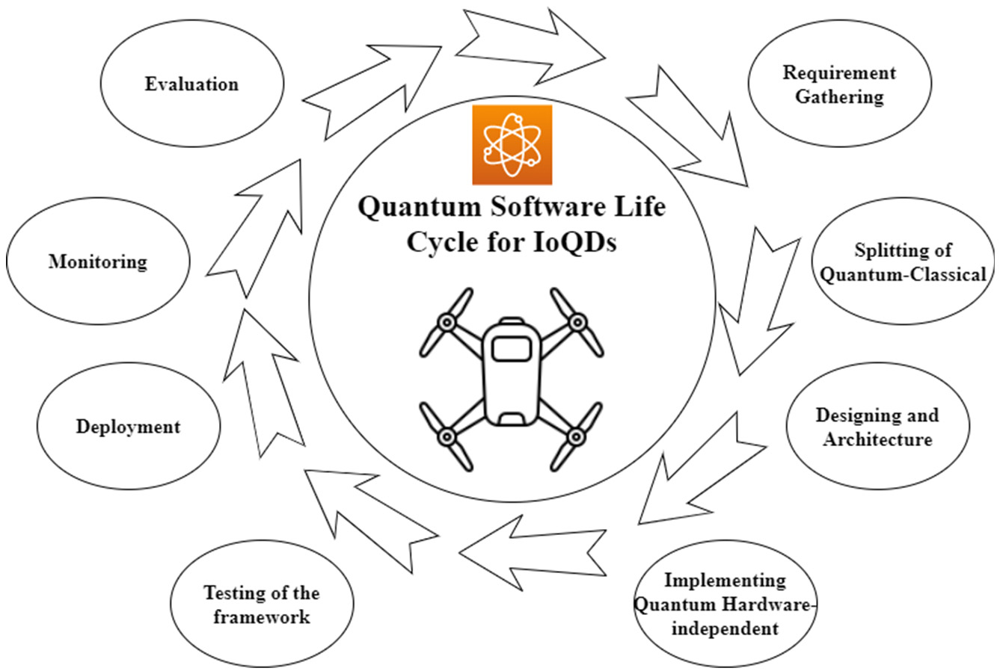
*Caption/Context: A. Kumar, D. Augusto de Jesus Pacheco, K. Kaushik et al. Vehicular Communications 36 (2022) 100487 | Fig. 16. Quantum software life cycle for IoQDs.*

## --- Page 27 ---

### Section: 5 Discussion: futuristic scientific challenges for IoQD

A. Kumar, D. Augusto de Jesus Pacheco, K. Kaushik et al.
Vehicular Communications 36 (2022) 100487

Table 5
Comparative analysis of technological aspects for quantum satellites and IoQDs.

Author
Year
A
B
C
D
E
F
Major findings

Mario et al. [89]
2021
✓
✓
✓
✓
✘
✘
This paper describes guidelines for a relay arrangement involving 
one quantum CubeSat and two quantum drones placed at 
different locations across the earth.
CubeSat produces and disseminates an interlocked couple to both 
drones situated over the public cloud, each drone devolves 
through the clouds with its corresponding interlocked photon, 
and each drone creates a new interlocked photon couple 
conserving the interlocked pair produced by the CubeSat.

Hua-Ying Liu et al.

[90]

2020
✘
✓
✓
✓
✓
✘
The very first mobile quantum telecommunication via coherence 
dispersion is addressed in this work.
The S-parameter surpasses 2.49 0.06 for all-day multi-weather 
entanglement dispersion during the day, clear nights, and rainy 
nights.
The system has proven to be resilient against the sunlight for 
all-day multi-weather entanglement dispersion during the day, 
clear nights, and rainy nights.

Adarsh Kumar et

al. [91]

2021
✓
✘
✓
✓
✓
✘
This study also included the creation of a classification of 
quantum-related domains based on the rationale of their 
understanding and a study of each of these domains.
These fields’ problems and suggestions for further studies are also 
examined.
Finally, this paper provides an overview of a current 
understanding of a variety of potential innovations that have 
recently been discovered to be crucial for quantum drones and 
systems.

Lei He et al. [92]
2019
✘
✘
✓
✘
✓
✘
The authors presented a UAV network design based on mobile 
edge computing in this study, which helps ensure minimal 
congestion in the UAV network.
Presented a specified verifier proxy blind signature method for 
UAV networks and demonstrated that it is inherently immutable 
in the random oracle model under an evolutionary selected 
message assault.

Abhishek Sharma

et al. [93]

2020
✘
✘
✓
✘
✓
✘
One of the main focuses of this study is the complex interaction 
between UAV enhanced cellular transmission and the IoT. Lessons 
learned, observations, problems, unresolved issues, and possible 
trends in UAV communications are all included in the study.

Balwinder Sodhi

and Ritu Kapur 
[94]

2021
✓
✘
✘
✘
✘
✓
The goal of this study was to provide a generic framework for 
quantum computing systems. Introducing a programming 
interface for quantum software development.
Identifying architecturally important features of quantum 
computing systems and the influence these features have on 
different performance criteria and the software development 
process.

Nivedita Dey et al.

[95]

2020
✓
✘
✘
✘
✘
✓
This paper outlines a quantum development framework that 
specifies the distinct features and capabilities of the quantum 
development plan, quantum acceptance criteria, quantum systems 
engineering, quantum software coding and deployment, quantum 
testing, and quantum software quality strategic planning.

Caption: A: Quantum Computing B: Quantum Communication C: Quantum Drones D: Quantum Satellites E: Unmanned Aerial Vehicle F: Software Engineering in IoQDs.

implications. Critical issues such as multiplication and the discrete 
log, the ostensibly complex nature of which ensures the protec-
tion of many widely used frameworks, are well understood. Quan-
tum cyber security is a discipline that investigates all elements of 
quantum technology’s impact on the privacy and security of trans-
missions and operations. When regarded as a resource for enemies, 
quantum technology can have a detrimental impact on cyber secu-
rity, but it can also have a beneficial effect when genuine actors 
employ these techniques to their benefit. The study [88] may be 
split into three groups based on who has accessibility to quantum 
technologies and how far these techniques have progressed. Re-
searchers assure that presently achievable jobs are safe in the first 
class, while researchers study the novel opportunities that quan-
tum technologies provide in the other two categories. Researchers 
offer genuine parties access to QT to obtain increased characteris-
tics in the latter category, but we confine this accessibility to cur-
rently existing quantum technology. The third scenario considers

the privacy and security of mechanisms made feasible by quantum 
systems in the long term.

Table 5 shows the comparative analysis of recent studies over 
other software and hardware technological aspects for quantum 
satellites and IoQDs.

#### 5. Discussion: futuristic scientific challenges for IoQD

The computational capacity will keep expanding at a double-
exponential rate, according to recent forecasts [100]. This implies 
that the conventional charge of simulating a quantum circuit will 
grow exponentially with computational hardware advances, and 
data volume will probably meet Moore’s law, where computational 
volume duplicates every two years [100]. Consequently, various 
research challenges and directions for IoQDs from a futuristic per-
spective are discussed in the following subsections.

27

## --- Page 28 ---

### Section: 5.1 Challenges to QKD

A. Kumar, D. Augusto de Jesus Pacheco, K. Kaushik et al.
Vehicular Communications 36 (2022) 100487

#### 5.1. Challenges to QKD

This sub-section explains the challenges to QKD, which is the 
backbone of any quantum cryptosystem. Thus, the focus is on mak-
ing QKD cheaper and more practical compared to existing imple-
mentations [117]. Additionally, increasing its range of communi-
cation and data transmission rate are independent variables to be 
considered in this design. In [106], implementation for a new dis-
tance of 421 km using fibre-optics is observed compared to the 
previous record of 404 km. Improvement in data transmission rate 
will be an important enhancement to real-time applications. Al-
though the new record provides longer-distance communication, 
the previous record also ensures a higher degree of practical secu-
rity. Therefore, efforts are required to improve the security levels. 
In this context, message integrity primitives and protocols can play 
an important role. Message integrity to avoid signal interference 
can be useful for a secure communication system. Further, the in-
tegration of lightweight cryptographic primitives and protocols will 
be useful to enhance the security without impacting the perfor-
mance much. A comparative analysis of lightweight cryptographic 
primitives and protocols will give more realistic solutions for real-
time applications.

According to the literature, other research challenges to be 
overcome in QKD-enabled microgrids include (i) improving the re-
silience against side-channel and denial-of-service attacks, (ii) re-
alistic experiments with QKD systems in real-time; (iii) realistic 
experiments using semi-QKD or semiquantum microgrids (where 
only one communication element possesses the ability to prepare, 
send, receive, and measure qubits); (iv) the development of strate-
gies to point-to-multipoint QKD for microgrids; (v) the develop-
ment of quantum networks to sharing QKD for any couple of nodes 
in microgrids; and (vi) the development of new QKD cryptography 
methods and protocols for microgrids [116].

5.2. Challenges to futuristic quantum communication-based 
architectures

This section explains the main challenges to quantum satel-
lites and the necessary quantum communication-based futuristic 
architectures. In [107], the authors discuss extending the inter-
continental data exchange experimentation with a plan to launch 
the satellites in lower and higher orbits. Lower-orbit satellites will 
preferably be used for key exchange, and higher orbits will be used 
for secure and fast data exchange. In the plan to launch satellites 
in a higher orbit, there will be a need to construct a constellation 
of such satellites. This way, a large volume of data can be ex-
changed securely. However, cost and performance are major issues 
in building a constellation of such satellites in a higher orbit. Thus, 
there is a need to explore these directions in the future. Using 
ultra-cold cesium atoms, it is feasible to do gravity measurements 
with very high precision. Other real-time applications may benefit 
from the same kind of trials that were carried out in existing stud-
ies [169]. Here, ultra-cold cesium atoms integrated tiny gyroscope 
may be useful for providing a cold environment to QDs, which will 
elongate the operational functionalities of QDs and improve their 
performances.

Despite their advantages over traditional radio-based global po-
sitioning systems, quantum positioning systems based on quantum 
optics also face the following challenges: (i) the creation of a full 
device architecture that goes beyond desktop simulation; (ii) the 
development of technologies for maintaining the quantum signal’s 
entanglement state; and (iii) new technologies integrating classical 
and quantum positioning technologies [118]. With the use of ultra-
cold cesium atomic interference, which is only accessible at very 
low temperatures, gravity measurements may be performed with 
high precision. When it comes to boosting the accuracy of QDs,

this attribute is advantageous. This technique was employed in the 
research of a QPS underwater navigation system [169], which in-
cluded the utilisation of ultra-cold atoms. It is possible that other 
real-time applications may benefit from the same kind of trials 
that were carried out here. Further, ultra-cold cesium atoms in-
tegrated with full device architecture for QDs will be interesting to 
evaluate in future.

Quantum satellites, used in quantum drone networks, have a 
limitation of communicating with fixed locations only. Further, 
these satellites are susceptible to many space disturbances. For 
example, satellites use nanoelectronic devices that produce faults 
when space particles like electrons and protons strike. Thus, there 
is a need to investigate the possible solutions for better placement 
with variable location-based communications. Other open areas to 
be explored in the future generation of Internet of Quantum Satel-
lite Communications include the following: (i) Digital twins for 
satellite systems can be used to access and incorporate histori-
cal data (e.g., sensor or maintenance historical data, etc.) to im-
prove reliability and safety; to forecast performance (e.g., reaction 
to critical events, the likelihood of mission success, life span, trig-
ger self-repair); and to automate self-repair, (ii) Intersatellite links 
enable cooperative satellite swarms and clusters, (iii) Hierarchical 
aerial networks: the issue is to increase coverage and improve the 
security of communications, (iv) IoTs in space and planetary com-
munications: challenges include developing a new network layer 
protocol for the space Internet, (vi) Onboard regeneration and fly-
ing base stations: using mobile infrastructure to deliver critical ser-
vices via drones increases the versatility and interoperability of fly-
ing base stations embedded in wireless networks, (vii) Increase fre-
quency reuse and dynamic spectrum control for geostationary and 
non-geostationary satellites, (viii) Automating satellite networks: 
developing network-slicing algorithms, overcoming graph dynam-
ics in the context of online network-slicing, and expanding the ba-
sic protocol between the data and control planes are all obstacles 
to overcome, (ix) Novel approaches to satellite asset articulation: 
advanced procedures for optimizing satellite resource utilization 
while maintaining QoS, (x) QKD for optical satellite communica-
tions: QKD is used to generate space-based waveforms and estab-
lish stable optical links, (xi) Utilize machine learning to address 
issues such as adaptive power allocation in satellite-terrestrial hy-
brid environments, multi-beam satellite output of non-uniform re-
quests, and multi-beam satellite precoding/scheduling to minimize 
interference [121].

#### 5.3. Challenges related to quantum drones

This section acknowledges and analyzes the critical challenges 
to quantum drones or drone-based communications.

The first critical challenge is that QDs require an ultracold en-
vironment to operate correctly. With an increase in qubits, power 
consumption increases which in turn increases the temperature. 
Consequently, there is a need for an ultracold environment to cool 
down the device and operate. Feng [169] discussed the importance 
of an integrated small gyroscope that uses a four-pulse Raman 
laser to monitor a wide range of inertial characteristics, including 
acceleration and deceleration. This experimentation can be use-
ful for operating ultra-cold cesium atom, which can be used with 
QDs to improve their performances. For example, Gravity mea-
surements may be made with extreme precision using ultra-cold 
cesium atomic interference. This property is helpful in improv-
ing the accuracy of QDs. Ultra-cold atoms were used to study a 
QPS underwater navigation system [169]. Similar experimentation 
can be useful for other real-time applications as well. Ultra-cold 
atomic and molecular quantum gases in systems of cold atoms or 
atom chips are an alternative option to ensure an ultracold envi-
ronment for QDs in future [24]. Ultra-cold trapped ions could also

28

## --- Page 29 ---

### Section: 5.4 Challenges to security aspects in quantum communications and networks

A. Kumar, D. Augusto de Jesus Pacheco, K. Kaushik et al.
Vehicular Communications 36 (2022) 100487

be explored to ensure the ultracold operating environment for QDs 
and quantum satellites [24]. In [200], ultracold atoms produced by 
evaporative cooling are used for experimentation. It has been ob-
served that these atoms reduce the cyclic rate and improve the 
accuracy of interferometers. Further, these atoms can be used with 
atomic sensors based on light beamsplitters.

Second, the development of new quantum algorithms for quan-
tum drones is necessary, especially for those applications where 
it will be useful. The feasibility of quantum drones in various ap-
plications in different domains creates a requirement to explore 
new quantum algorithms and understand the challenges. These al-
gorithms should be domain-specific. For example, quantum drones 
used to transmit healthcare, natural disaster mitigation, or mili-
tary data require higher priority than financial or chat applications. 
For example, Perumal and Nadar [170] discussed the possibility 
for systems in the healthcare business to be compatible with a 
wide range of operating systems and platform configurations us-
ing quantum communication. Both the length of time it takes to 
communicate and the danger it poses to security are changed as a 
result of this quantum-based architectural variation. Quantum keys 
will be managed in a low-overhead manner, resulting in medical 
records that are more secure and less hazardous, which will ben-
efit both patients and physicians. In real-time applications, when 
compared to traditional approaches, the use of a specialised quan-
tum channel to broadcast the produced key reduces the likelihood 
of leakage and eavesdropping by order of magnitude of more than 
ten thousand [170].

Third, the present drone-based experimentation is limited to 
fixed ground-location communication. Further, the communica-
tion involves multiple sub-systems (quantum entanglement emit-
ter and key communicators, processing unit, entanglement source, 
and laser communicators). This sub-system requires more inter-
faces between quantum drones and ground-based communication 
systems to accommodate a large set of applications. Consequently, 
there is a need to explore the requirements and build the inter-
faces. These findings deepen our understanding of the challenges 
to quantum drones or drone-based communications.

5.4. Challenges to security aspects in quantum communications and 
networks

Potential problems regarding security aspects in quantum com-
munications and networks remain open. In this section, we sum-
marize the main challenges to this topic. First, we observed that 
quantum-proof cryptography or quantum-save-cryptosystems must 
be developed to handle quantum computers or communication-
based attacks. These attacks can break or decrypt the encrypted 
data. Likewise, post-quantum cryptography aspects can be ex-
plored [119,120]. Many post-quantum cryptosystems are light-
weight and can be integrated with resource-constrained drone de-
vices that are easy to protect from quantum attacks, especially 
lattice and code-based schemes. In the current state of research, 
attention is being paid to the development of public-key cryp-
tosystems, which will aid in the resolution of the problems out-
lined in the current and previous sections of this article. Despite 
their widespread usage and complexity, these systems are some-
times too costly to implement across a broad range of Internet 
of Things-related applications and services. As predicted, the shift 
from secure quantum systems to post-quantum secure systems has 
already started in preparation for the introduction of quantum 
computers, which is expected to occur in the not-too-distant fu-
ture, according to current projections [119]. Designing lightweight 
post-quantum cryptographic solutions may be more useful and 
cost-effective for futuristic quantum-based applications. A signifi-
cant step forward in the construction of a future quantum Internet 
and the realisation of the potential of such an Internet, according

to researchers, has been made by linking three quantum devices 
together in a network [120]. In such networks, the security of 
multi-point connectivity is a major challenge. This needs to be ad-
dressed with security primitives and protocols in the future.

Another key challenge is regarding the rates of errors in quan-
tum communications. In qubits transmission, the chances of errors 
are significantly high. Therefore, there is a need to identify self-
correcting codes that can minimize the error and improve the 
performance of drone-based quantum computations. The perfor-
mance of error-correcting codes can be improved by increasing the 
error threshold value and decreasing the overheads of the num-
ber of qubit requirements. New types of gravity wave sensors and 
high-resolution telescopes, for example, might be made feasible by 
a quantum internet, which would also provide ultrasecure commu-
nication with less overhead [120].

Third, there are a number of problems when applying IoT in 
drones. These challenges are rooted in security issues and authen-
tication of drones and IoD [123–127]. For example, “Sharing infor-
mation through drones is a newer avenue of research and could 
be revolutionary for the future of smart city technology” [123, p. 
6414]. While recent studies have examined drone-enabled IoT ap-
plications, the primary limitations to be solved in realistic IoD are 
related to (i) covering and geographic area range [123]; (ii) drone-
based architecture for smart cities applying IoT [123]; (iii) drone 
speed reducing the performance of drone-based architecture [123]; 
(iv) provenance-aware distributed trust protocol [125]; (v) security 
issues related to untraceability and anonymity [126]; (vi) safety in 
user authentication protocols [124,127]; (vii) Fog computing model 
and fixed fog nodes to dynamically adapt in different contexts are 
a challenge to IoD [128]. Furthermore, drone-enabled IoT led to the 
revolutionary potential in monitoring tasks [129], and more exper-
iments on this theme are needed.

#### 5.5. Challenges for quantum knowledge base

Quantum technology arose as a result of the second quan-
tum revolution. It entails manipulating and controlling specific 
quantum systems (for example, atoms, ions, electrons, photons, 
molecules, or multiple quasiparticles) in order to achieve the nor-
mal quantum or the limit on measurement precision at quantum 
levels. The field’s cross-disciplinary nature results in a high level of 
complexity in knowledge and capabilities to be developed in the 
workforce acting in the field [122]. Hence, a recognized constraint 
to be addressed refers to the training and capabilities in quantum 
technology. We explain the challenges of developing knowledge 
and training in QW for various application domains.

The significant issues applying IoQDs in the QW context to be 
solved in the future include, firstly, the preparation of a quantum 
workforce. Training and education are required to prepare engi-
neers with expertise in quantum technology and quantum infor-
mation science. The second issue is related to the massive quantity 
of data generated by the Internet of Quantum Technology and Io-
QDs and the challenges in distribution, storage, processing, and ap-
praisal (e.g., unification interface, communication protocols, post-
quantum cryptography standardization process, etc.) [122]. Third, 
there are several military, ethical, and peace challenges involved, 
such as the creation of international and national QW policies and 
strategies, QW monitoring for countries, trade (importation/expor-
tation) rules, cyber capabilities (e.g., nuclear submarines), DNA 
manipulation, disruptive materials for war, and intrusive artificial 
intelligence. Table 6 shows the comparative feature analysis of the 
proposed system with existing latest works. Most of the existing 
approaches are based on classical drones, whereas the proposed 
approach uses quantum drones.

To the best of our knowledge, the present research is the first 
survey study to examine the nascent research in telecommunica-

29

## --- Page 30 ---

A. Kumar, D. Augusto de Jesus Pacheco, K. Kaushik et al.
Vehicular Communications 36 (2022) 100487

Table 6
Comparative feature analysis.

Author
Year
Topic
Type of 
drone

Features
Weaknesses

Schirber [98]
2021
Small-scale quantum drone network 
for text and video message transfer

Quantum 
Drone

Discussed the quantum drone-based 
experimentation performed for data 
transfer. Further, possibilities to extend 
the implemented network for 
intercontinental communication with 
quantum drones and quantum satellites 
are discussed.

Lack of discussion about IoQDs, the 
constellation of satellites, and their 
integrated architecture.

Baldoni et al.

[101]

2021
Molecular drone for atomic-scale 
fabrication is discussed, and a new 
paradigm is proposed.

Molecular 
Drone

Atomic-scale fabrication is discussed, and 
the need to replace scanning probe 
microscopy with a coordination 
compound is explored. The coordination 
compound shows a similar feature to the 
molecular drone.

The focus is more on molecular 
drone aspects than on long-distance 
connectivity or message transfer.

Barbeau [103]
2019
Drone swarm activities and 
applications are explored.

Classical 
Drone

This article has discussed the importance 
of swarms of drones and their data 
analysis using classical or quantum 
machine learning approaches.

Quantum drones, quantum satellites, 
and their integrated architectures are 
not explored.

Liu et al.

[104]

2021
Drone-based free space 
communication is discussed, and 
entanglement distribution through 
classical drones as the mobile node is 
experimented

Classical 
Drone

This work proposed the free-space link 
between mobile nodes with optical relay 
among them. The work is aimed to 
provide low diffraction in free-space 
transmission. Thus, mobile quantum 
network feasibility and link establishment 
with better performance are observed.

Drones for large-scale connectivity 
and applications to the real scenario 
are not discussed.

Liu et al.

[108]

2019
Drone-based communication in 
multi-location and multi-weather 
compatibility is tested.

Classical 
Drone

This work focuses on key technologies for 
local and wide-area coverage using 
quantum networks and classical drones 
with high-altitude communication.

Proposals to integrate quantum 
satellites and quantum drones in a 
hybrid architecture are missing.

Catherwood

et al. [112]

2020
Introduced the concept of IoT for the 
recovery of commercial and retail 
delivery drones.

Classical 
Drone

In this study, LPWAN is used for creating 
an IoT network that should be able to 
locate and recover delivery drones.

IoQDs could be explored to 
self-detect the location of crashed 
drones.

Isaac et al.

[115]

2020
A critical system with drone-based 
QKD on a fibre-coupled polarization 
modulator is discussed.

Classical 
Drone

A system with drone-based quantum 
communication, including entanglement 
distribution. Distributed quantum sensing 
and verification processes are proposed in 
this work.

Drones with satellite and low to high 
altitude drone-to-drone connectivity 
must be addressed.

Yazdinejad et

al. [123]

2021
Focused on a system having 
increased security and reduced 
latency on the IoDs.

Classical 
Drones

Blockchain technological aspects are 
integrated with the IoDs to ensure high 
security, system transparency, and 
improved performance.

High and low altitude drone 
movements can be considered for 
performance analysis and 
long-distance connectivity.

Bera et al.

[126]

2021
Proposed security scheme for a drone 
in battlefield surveillance and 
protection from various attacks

Classical 
Drones

An access control-based security protocol 
is proposed for ensuring the security of 
data communications during drone-based 
battlefield surveillance.

Consideration of the IoDs and 
security protocol integration for 
long-distance connectivity is missing.

Wazid et al.

[127]

2018
A coordination system among drones 
for a wide range of military usage 
and user authentication and key 
agreement scheme is proposed.

Classical 
Drones

An IoT network with drone-to-drone 
communication having security through 
user authentication and key agreement 
approaches is proposed.

Long-distance drone-to-drone 
connectivity and security concerns 
are missing.

Zhang and X.

Li [129]

2020
Drone-based IoT environment for 
environment monitoring with remote 
area accessibility is proposed.

Classical 
Drones

A system of environmental monitoring 
with drone-to-ground connectivity and 
data transfer is proposed. This system has 
the flexibility to efficiently utilize the 
ground intelligent terminal system for 
environmental data analysis.

Security concerns and long-distance 
communicational aspects are missing.

Current

research

2021
Discuss the importance of quantum 
drones, quantum satellites, quantum 
networks, and advanced architectures

Quantum 
Drones

Multiple quantum drones-based 
communication, IoQDs formulation, and 
the constellation of satellites construction 
are discussed from a futuristic point of 
view. IN the current study, novel 
architectures are proposed integrating 
quantum networks for futuristic 
applications.

Implementation of these aspects 
could be explored in more depth.

30

## --- Page 31 ---

### Section: 6 Future research directions

A. Kumar, D. Augusto de Jesus Pacheco, K. Kaushik et al.
Vehicular Communications 36 (2022) 100487

tions technology on IoQDs, proposing novel architectures that inte-
grate and create quantum networks enabling futuristic implemen-
tations. In this research, the focus is drawn on secure long-distance 
communication using quantum communication and QKD. At the 
same time, the existing drone-based studies are more focused 
on developing security systems using cryptography primitives and 
protocols for various applications. For example, Schirber’s [98] ap-
proach of constructing a small-scale drone network with enhanced 
security can be extended with IoQDs for real-time applications that 
need faster and more secure communication. Small-scale networks 
give provision to private and public organizations to create a pri-
vate network and add a layer of security. Baldoni et al. [101] idea 
of the molecular drone may be useful for IoQDs network construc-
tion with the least overhead and higher security in future. For ex-
ample, drone-based applications discussed by Barbeau [103] can be 
tested with molecular drone-based IoQDs. This might reduce the 
overheads, increases security and elongate the network connectiv-
ity. The idea of free space communication [104] and multi-point 
communication [108] can be useful for real-time multi-location

weather information collection [129], battlefield and other mili-
tary purposes [12,127], and supply chain management [112] with 
enhanced security [123]. Likewise, multi-point free space commu-
nication using IoQDs can be helpful for many space-related data 
collection and applications.

#### 6. Future research directions

The evidence presented in this study suggests a number of key 
future research directions to pave the research in the area [21–23,
25–43]. Table 7 presents the important future research areas and 
the related research challenges.

#### 7. Conclusions

Given the emergent quantum age, this study examined the cur-
rent status of a nascent field of research on drone-related futuristic 
technologies, namely QD, the IoQDs, and CQS. We observed that 
the IoQDs and CQSare recognized for real-time applications. It is

Table 7
Future research agenda.

Topic
Subtopic
Future research directions

Challenges to QKD
Resilience against side-channel and 
denial-of-service attacks

With Quantum computing-based drones and satellites, can futuristic QKD be 
protected from interference, side-channel, and denial-of-service attacks? Faster and 
more secure communication properties of QKD and quantum computations can do 
this. Thus, this direction can be explored in future.

Realistic experiments with QKD systems in 
real-time
Realistic experiments using semi-QKD or 
semiquantum microgrids (where only one 
communication element possesses the ability 
to prepare, send, receive, and measure qubits)

Can real-time QKD and Quantum communication experimentation be established in 
the multi-country scenario? Presently, communications have experimented between 
two countries. However, experimentation with 3-party communication is performed 
in short-range communication. Thus, these experimentations can be extended for 
secure long-range communication as well.

Point-to-multipoint QKD strategies for 
microgrids

As discussed earlier, the most secure long-range communication experimentation is 
between two continents and two parties. However, this experimentation can be 
extended for multipoint communication as well. With QD and satellite-based 
technology and the feasibility of communicating Qubits in multipoint 
communication, can secure multipoint communication be achieved in the future? 
How to achieve secure multipoint communication?

Quantum network’s design and development 
to share QKD for any couple of nodes in 
microgrids

In the past, it has been proposed that quantum information can be transmitted 
without transferring or destroying the quantum mechanics principle that underlies 
the transmission of the information. This is a significant development to make the 
Quantum internet feasible. Can a similar network’s design and development be 
explored in more detail in future?

The development of new QKD cryptography 
methods and protocols for microgrids

Can building out the QKD links (based on entangled photon pairs) and their highly 
specialized switches be ensured in future? This development can lead to secure 
Quantum cryptography protocol development.

Challenges to Futuristic 
Quantum 
Communication-based 
Architectures

Design and development of a full device 
quantum architecture that goes beyond 
desktop simulation;

Can quantum architecture components, including quantum complexity theory, 
quantum algorithms, quantum algorithm implementation, interconnection 
technologies and floor planning, Qubit storage and gate technology, be extended in 
nearby future such that the quantum architecture outperforms desktop simulation? 
How do we develop these simulations?

Design and development of technologies for 
storing and maintaining the quantum signal’s 
entanglement state.

Storing and maintaining the quantum signal’s entanglement state requires a strongly 
correlated electron state in the phase state of a state variable, molecular, spintronics, 
ferromagnetic and quantum process technologies development in designing a device, 
new formats to formalize quantum state in data representation, and reconfigurable 
quantum state in quantum computer architecture. Is it possible to develop such 
process terminologies for quantum computers and computing?

Design and development of hybrid technology 
integrating classical and quantum positioning.

There must be some form of interaction between the user and a real-world 
quantum computer to reap its benefits. In order to use quantum mechanical systems 
in a real-world context, they must be carefully managed. The four “layers” make up 
a functional quantum/classic hybrid computer architecture are briefly explained as 
follows: (i) The quantum layer is responsible for the implementation of qubits and 
quantum computing, (ii) The control processor layer, which operates at cryogenic 
temperatures, is in charge of controlling and measuring the quantum bits, (iii) The 
qubits in the system are controlled and measured by an insulating layer operating at 
or near cryogenic temperatures, (iv) The host processor layer of a computer system 
is generally responsible for handling user interfaces as well as access to large 
storage arrays and networks. Is it possible to design similar layered architecture in 
nearby future?

(continued on next page)

31

## --- Page 32 ---

A. Kumar, D. Augusto de Jesus Pacheco, K. Kaushik et al.
Vehicular Communications 36 (2022) 100487

Table 7 (continued)

Topic
Subtopic
Future research directions

Challenges to Quantum 
Drones

Tenacity of Quantum Drones
Drone batteries, which are the thickness of bricks, are hefty and rapidly depleted. 
Furthermore, gasoline engines are loud and generate pollution. Are there any 
alternative solutions that can power the quantum drones batteries to make it more 
efficient and less bulky?

Navigation problems in the absence of GPS 
signals

When GPS signals are unavailable, the Quantum drones face problems in navigation. 
Therefore, there must be a different method to determine the location. Is there any 
technology that can assist the Quantum Drones in the loss of GPS signals?

Obstacle detection and analysis of traffic
Without any assistance from human eyes, a drone must fend on its own. The most 
significant sensor on the drone is the radar. It navigates the drone past other aircraft 
and obstructions, maps the landscape, locates safe landing pads, determines its 
height, and even recognizes poor weather. However, radar is not that sufficient for 
the detection of objects. Is there any other technology that can assist radar for 
traffic analysis?

Clustering of Drones
In executing complex tasks, cooperative unmanned robots provide efficiency and 
reliability. But the clustering of drones raises many challenges in their synchronous 
functioning. Therefore, there is a need to work on the latest technologies that help 
in the swarming of drones.

Challenges to Security 
Aspects in Quantum 
Communications and 
Networks

QKD networks lack point-to-multipoint 
methods

The present QKD network’s key distribution function only supports point-to-point 
key exchange protocol and lacks a P2M method. Therefore, this may lead to a 
security flaw in Quantum communication. Is it possible to design a secure protocol 
for the point-to-multipoint methods?

Numerous techniques consume many quantum 
node capabilities.

To distribute the security session key for limiting the distance for qubit 
communication, the QKD network uses the hop-by-hop technique. Is it possible to 
implement a secure technique for session key distribution apart from the 
hop-by-hop technique?

There is no appropriate security connection 
between conventional end-users and quantum 
processors.

Considering quantum node building costs are still extremely expensive, it is not 
possible to provide each end user with a specialized quantum node for utilizing the 
QKD network’s services. As a result, one quantum node must be shared by several 
end consumers. Is it feasible to provide secure, and customized quantum nodes?

Challenges to Quantum 
Knowledge base

Small scale quantum drone network for text 
and video message transfer

Small scale quantum drones are required to share internet connectivity with local 
organizations or users. These drones will be able to ensure faster and more secure 
multimedia information. Is it possible to design such compact quantum drones 
capable of carrying quantum devices for secure communication establishment? This 
needs to be addressed in future.

New paradigm related to the molecular drones 
for atomic-scale fabrication

With the feasibility of quantum drones and their usage in secure communication, 
designing new computing and communication paradigms, and short and long 
communication. Can a molecular drone be integrated with a quantum drone to 
perform rapid atomic manipulation and fabrication? This development can bring 
vast applications, including proof-of-concept devices, verifying logic patterns, storing 
atom information, etc.

Drone swarm activities and applications
Multiple quantum drone flying and their connectivity can provide faster 
communication in local areas, including cities, towns, or regions. Thus, drone 
swarm-based activities and their application should be investigated in the future.

Increased security and reduced latency with 
the IoDs.

Quantum drones were designed to ensure secure and faster communications. IoQDs 
will be able to provide similar features and collect and share environmental 
information. Can this advantage be explored for real-time applications in nearby 
future?

Drone-based IoT environment for environment 
monitoring

Quantum computing is widely explored in environment monitoring and cleaning. For 
example, quantum drones with the capability to clear air would be helpful in highly 
polluted cities. Can the solution be proposed to implement this scenario and analyze 
the performance in future? This research avenue requires more investigation.

possible to affirm that the scientific research examining the oppor-
tunities and risks involving QD, IoQDs, and CQS has just started, 
although it has become an increasingly relevant debate.

Thus, while recognized contexts of applications include agricul-
ture, shipping, delivery, military, search and rescue operations, and 
the Internet of “molecular drones,” among others, new potential 
and unconventional possibilities of use include, for example, IoQDs 
for traffic engineering management, climate change demands, and 
confidential and encrypted communication. Our findings demon-
strate that there are a number of critical and open questions of 
societal and scientific interest that need to be addressed. As a re-
sult, future research projects may be conducted from a range of 
specific perspectives (see Section 5). Findings contribute to the lit-
erature and future practice in the field, providing distinct insights

and new potential applications of drone-related futuristic technolo-
gies enabled by the Internet.

Concerning the disruption caused by quantum drones, an im-
portant aspect is establishing trust among drones for collaborative 
efforts. In swarms of quantum drones, the probability is always as-
sociated with qubits used to exchange information. Using qubits, it 
is possible to represent the required confidential information with 
lesser bits, but the probability of successful message exchange in 
dynamic situations is a significant concern. This work has com-
pared the classical drone features with the quantum drone.

This study proposed and discussed quantum satellite-based ar-
chitectures that use low and high-orbit drones for long-distance 
communication, as well as various applications of quantum drones. 
In the future, quantum satellite and quantum drones-based archi-
tecture for other applications should be explored. Further, the inte-

32

## --- Page 33 ---

### Section: Declaration of competing interest

A. Kumar, D. Augusto de Jesus Pacheco, K. Kaushik et al.
Vehicular Communications 36 (2022) 100487

gration of security aspects like blockchain and quantum-safe cryp-
tosystem could be explored in detail. In sum, this study encourages 
scientists, governments, and organizations toward further practical 
understanding and theoretical development regarding how futur-
istic disruptive technologies can be applied to solve societal and 
strategic problems.

Other implications and contributions derived from this study 
are briefly explained. First, specific tasks will likely be done much 
faster on quantum computers than they would be on standard 
CPUs if quantum computers are used instead of traditional CPUs. 
In order to achieve success in this endeavour, the creation of a 
high-fidelity processor capable of conducting quantum algorithms 
in an ever-expanding computing environment is essential. Small 
scale quantum computers can be used in space computing de-
vices as well. Second, according to the NASA research, quantum 
technology in the form of quantum sensors should be used bet-
ter to understand the interior structure and dynamics of the Earth. 
According to this notion, quantum interferometry is the mecha-
nism that would be accountable for the fabrication of these sensor 
devices. When there is interference in the background noise, in-
terferometry is used to extract information from the interference 
by combining it with other information from the interference. In 
this case, IoQDs would be helpful in giving more accurate results 
with secure and faster communications. Likewise, other applica-
tions can take advantage of quantum computing. Finally, scientists 
have now used drones to communicate entanglement, a kind of 
quantum coupling. Photons were transmitted to two locations a 
kilometre apart by researchers from Nanjing University in China. 
The proposed single or multi-bit qubit entanglement can be useful 
in creating networks (like quantum internet). These networks can 
be private or public to secure communications. The findings of this 
study may help better understand how potential and advanced ap-
plications of QD, IoQDs, and CQS can be applied in new contexts in 
real-time applications in strategic areas of societal interest in the 
quantum age.

Declaration of competing interest

The authors declare that they have no known competing finan-
cial interests or personal relationships that could have appeared to 
influence the work reported in this paper.

Acknowledgements

Joel J.P.C. Rodrigues was funded by FCT/MCTES through national 
funds and when applicable co-funded EU funds under the Project 
UIDB/50008/2020 and by Brazilian National Council for Scientific 
and Technological Development-CNPq, via Grant No. 313036/2020-
9.

References

[1] J. Chu, X. Chen, C. Zhong, Z. Zhang, Robust design for NOMA-based multibeam

LEO satellite Internet of Things, IEEE Int. Things J. 8 (3) (2020) 1959–1970.
[2] D. Yang, Y. Zhou, W. Huang, X. Zhou, 5G mobile communication convergence

protocol architecture and key technologies in satellite Internet of things sys-
tem, Alex. Eng. J. 60 (1) (2021) 465–476.
[3] M. Graydon, L. Parks, ‘Connecting the unconnected’: a critical assessment of

US satellite Internet services, Media Cult. Soc. 42 (2) (2020) 260–276.
[4] J.A. Fraire, S. Henn, F. Dovis, R. Garello, G. Taricco, Sparse satellite constellation

design for LoRa-based direct-to-satellite Internet of Things, in: GLOBECOM 
2020-2020 IEEE Global Communications Conference, IEEE, 2020, December, 
pp. 1–6.
[5] L. Wang, S. Liu, W. Wang, Z. Fan, Dynamic uplink transmission scheduling

for satellite Internet of Things applications, China Commun. 17 (10) (2020) 
241–248.
[6] A.V. Dolgopyatova, A.Y. Kudryashova, Modern satellite solutions for Internet

broadcasting, in: 2020 Systems of Signals Generating and Processing in the 
Field of on Board Communications, IEEE, 2020, March, pp. 1–5.

[7] A. Wang, P. Wang, X. Miao, X. Li, N. Ye, Y. Liu, A review on non-terrestrial

wireless technologies for Smart City Internet of Things, Int. J. Distrib. Sens. 
Netw. 16 (6) (2020) 1550147720936824.
[8] G. Giuliari, T. Klenze, M. Legner, D. Basin, A. Perrig, A. Singla, Internet back-

bones in space, Comput. Commun. Rev. 50 (1) (2020) 25–37.
[9] J. Huang, J. Cao, Recent development of commercial satellite communications

systems, in: Artificial Intelligence in China, 2020, pp. 531–536.
[10] L. Zhen, A.K. Bashir, K. Yu, Y.D. Al-Otaibi, C.H. Foh, P. Xiao, Energy-efficient

random access for LEO satellite-assisted 6G Internet of remote things, IEEE 
Int. Things J. 8 (7) (2020) 5114–5128.
[11] C. Liu, W. Feng, Y. Chen, C.X. Wang, N. Ge, Cell-free satellite-UAV networks

for 6G wide-area Internet of Things, IEEE J. Sel. Areas Commun. 39 (4) (2020) 
1116–1131.
[12] T. Pfandzelter, D. Bermbach, Edge (of the Earth) replication: optimizing

content delivery in large LEO satellite communication networks, in: 2021 
IEEE/ACM 21st International Symposium on Cluster, Cloud and Internet Com-
puting (CCGrid), IEEE, 2021, May, pp. 565–575.
[13] Y. Cai, S. Zhang, J. Hou, H. Jiao, Internet of Things over GEO satellite: a novel

space information network solution, in: 2021 International Wireless Commu-
nications and Mobile Computing (IWCMC), IEEE, 2021, June, pp. 177–181.
[14] C. Daehnick, I. Klinghoffer, B. Maritz, B. Wiseman, Large LEO Satellite Constel-

lations: Will It Be Different This Time?, McKinsey & Company, 2020, https://
www.mckinsey.com, 4.
[15] Z. Zhang, Y. Li, C. Huang, Q. Guo, L. Liu, C. Yuen, Y.L. Guan, User activity de-

tection and channel estimation for grant-free random access in LEO satellite-
enabled Internet of things, IEEE Int. Things J. 7 (9) (2020) 8811–8825.
[16] J. Jiao, J. Zhou, S. Wu, Q. Zhang, Superimposed pilot code-domain NOMA

scheme for satellite-based Internet of Things, IEEE Syst. J. 15 (2) (2020) 
2732–2743.
[17] J. Jiao, Y. Sun, S. Wu, Y. Wang, Q. Zhang, Network utility maximization re-

source allocation for NOMA in satellite-based Internet of Things, IEEE Int. 
Things J. 7 (4) (2020) 3230–3242.
[18] H. Wei, W. Feng, C. Zhang, Y. Chen, Y. Fang, N. Ge, Creating efficient

blockchains for the Internet of Things by coordinated satellite-terrestrial net-
works, IEEE Wirel. Commun. 27 (3) (2020) 104–110.
[19] S. Pirandola, Satellite quantum communications: fundamental bounds and

practical security, Phys. Rev. Res. 3 (2) (2021) 023130.
[20] J.S. Sidhu, T. Brougham, D. McArthur, R.G. Pousa, D.K. Oi, Finite key effects in

satellite quantum key distribution, arXiv preprint, arXiv:2012 .07829, 2020.
[21] X. Han, H.L. Yong, P. Xu, K.X. Yang, S.L. Li, W.Y. Wang, H.J. Xue, F.Z. Li, J.G.

Ren, C.Z. Peng, J.W. Pan, Polarization design for ground-to-satellite quantum 
entanglement distribution, Opt. Express 28 (1) (2020) 369–378.
[22] J.S. Sidhu, T. Brougham, D. McArthur, R.G. Pousa, D.K. Oi, Satellite quantum

modelling & analysis software version 1.0: documentation, arXiv preprint, 
arXiv:2109 .01686, 2021.
[23] C. Zhang, A. Tello, U. Zanforlin, G.S. Buller, R.J. Donaldson, Link loss analy-

sis for a satellite quantum communication down-link, in: Emerging Imaging 
and Sensing Technologies for Security and Defence V; and Advanced Manufac-
turing Technologies for Micro- and Nanosystems in Security and Defence III, 
Vol. 11540, International Society for Optics and Photonics, 2020, September, 
p. 1154007.
[24] A. Acín, I. Bloch, H. Buhrman, T. Calarco, C. Eichler, J. Eisert, D. Esteve, N. Gisin,

S.J. Glaser, F. Jelezko, S. Kuhr, The quantum technologies roadmap: a European 
community view, New J. Phys. 20 (8) (2018) 080201.
[25] R. Picchi, F. Chiti, R. Fantacci, L. Pierucci, Towards quantum satellite inter-

networking: a software-defined networking perspective, IEEE Access 8 (2020) 
210370–210381.
[26] D. Huang, Y. Zhao, T. Yang, S. Rahman, X. Yu, X. He, J. Zhang, Quantum key dis-

tribution over double-layer quantum satellite networks, IEEE Access 8 (2020) 
16087–16098.
[27] D. Zhu, H. Zhu, Z. Wang, Y. Zhang, Three-level quantum satellite communica-

tion framework and its applications, Int. J. Satell. Commun. Netw. (2021).
[28] G. Wang, D. Shen, G. Chen, K. Pham, E. Blasch, Polarization tracking for quan-

tum satellite communications, in: Sensors and Systems for Space Applications 
VII, Vol. 9085, International Society for Optics and Photonics, 2014, June, 
p. 90850T.
[29] L. Bacsardi, On the way to quantum-based satellite communication, IEEE Com-

mun. Mag. 51 (8) (2013) 50–55.
[30] Q. Zhang, F. Xu, L. Li, N.L. Liu, J.W. Pan, Quantum information research in

China, Quantum Sci. Technol. 4 (4) (2019) 040503.
[31] D. Castelvecchi, China’s quantum satellite clears major hurdle on way to ul-

trasecure communications, Nature 15 (2017).
[32] M. Raska, China’s Quantum Satellite Experiments: Strategic and Military Im-

plications, Nanyang Technological University. RSIS, 2016, p. 223.
[33] D.K. Oi, A. Ling, J.A. Grieve, T. Jennewein, A.N. Dinkelaker, M. Krutzik,

Nanosatellites for quantum science and technology, Contemp. Phys. 58 (1) 
(2017) 25–52.
[34] C. Agnesi, F. Vedovato, M. Schiavon, D. Dequal, L. Calderaro, M. Tomasin, D.G.

Marangon, A. Stanco, V. Luceri, G. Bianco, G. Vallone, Exploring the bound-
aries of quantum mechanics: advances in satellite quantum communications, 
Philos. Trans. R. Soc. A, Math. Phys. Eng. Sci. 376 (2123) (2018) 20170461.

33

## --- Page 34 ---

A. Kumar, D. Augusto de Jesus Pacheco, K. Kaushik et al.
Vehicular Communications 36 (2022) 100487

[35] S. Ghosh, R. Misoczki, M.R. Sastry, Lightweight Post-Quantum-Secure Digital

Signature Approach for IoT Motes, IACR Cryptol. ePrint Arch., 2019, p. 122.
[36] A.A. Abd El-Latif, B. Abd-El-Atty, I. Mehmood, K. Muhammad, S.E. Venegas-

Andraca, J. Peng, Quantum-inspired blockchain-based cybersecurity: securing 
smart edge utilities in IoT-based smart cities, Inf. Process. Manag. 58 (4) 
(2021) 102549.
[37] J. Lee, D. Kim, H. Lee, Y. Lee, J.H. Cheon, RLizard: post-quantum key encapsu-

lation mechanism for IoT devices, IEEE Access 7 (2018) 2080–2091.
[38] G. Banegas, K. Zandberg, A. Herrmann, E. Baccelli, B. Smith, Quantum-resistant

security for software updates on low-power networked embedded devices, 
arXiv preprint, arXiv:2106 .05577, 2021.
[39] C. Easttom, NTRU and LASH for a Quantum Resistant Blockchain, in: 2022

IEEE 12th Annual Computing and Communication Workshop and Conference 
(CCWC), IEEE, 2022, January, pp. 0654–0658.
[40] S. Paul, F. Schick, J. Seedorf, August. TPM-based post-quantum cryptography:

a case study on quantum-resistant and mutually authenticated TLS for IoT 
environments, in: The 16th International Conference on Availability, Reliability 
and Security, 2021, pp. 1–10.
[41] K. Shahbazi, S.B. Ko, Area and power-efficient post-quantum cryptosystem for

IoT resource-constrained devices, Microprocess. Microsyst. (2021) 104280.
[42] R. Asif, Post-quantum cryptosystems for Internet-of-Things: a survey on

lattice-based algorithms, IoT 2 (1) (2021) 71–91.
[43] Q. Zhang, H. Li, Y. Liu, S. Ouyang, C. Fang, W. Mu, H. Gao, A new quantum

particle swarm optimization algorithm for controller placement problem in 
software-defined networking, Comput. Electr. Eng. 95 (2021) 107456.
[44] X. Fu, L. Riesebos, M.A. Rol, J. Van Straten, J. Van Someren, N. Khammassi,

I. Ashraf, R.F.L. Vermeulen, V. Newsum, K.K.L. Loh, J.C. De Sterke, eQASM: an 
executable quantum instruction set architecture, in: 2019 IEEE International 
Symposium on High Performance Computer Architecture (HPCA), 2019, Febru-
ary, pp. 224–237.
[45] R. Pérez-Castillo, M.A. Serrano, M. Piattini, Software modernization to em-

brace quantum technology, Adv. Eng. Softw. 151 (2021) 102933.
[46] D. Rojas, The Modern State of Quantum Programming Language, 2019.
[47] A. Singh, K. Giannakis, T. Andronikos, Qumin, a minimalist quantum program-

ming language, arXiv preprint, arXiv:1704 .04460, 2017.
[48] S. Garhwal, M. Ghorani, A. Ahmad, Quantum programming language: a sys-

tematic review of research topic and top cited languages, Arch. Comput. 
Methods Eng. 28 (2) (2021) 289–310.
[49] D.A. Sofge, A survey of quantum programming languages: history, methods,

and tools, in: Second International Conference on Quantum, Nano and Micro 
Technologies, ICQNM 2008, IEEE, 2008, February, pp. 66–71.
[50] P. Selinger, A brief survey of quantum programming languages, in: Interna-

tional Symposium on Functional and Logic Programming, Springer, Berlin, 
Heidelberg, 2004, April, pp. 1–6.
[51] B. Heim, M. Soeken, S. Marshall, C. Granade, M. Roetteler, A. Geller, M. Troyer,

K. Svore, Quantum programming languages, Nat. Rev. Phys. 2 (12) (2020) 
709–722.
[52] D. Unruh, Quantum programming languages, Inform. Forsch. Entwickl.

21 (1–2) (2006) 55–63.
[53] M.Y. Mahmoud, A.P. Felty, Formal meta-level analysis framework for quan-

tum programming languages, Electron. Notes Theor. Comput. Sci. 338 (2018) 
185–201.
[54] M. Mosca, M. Roetteler, P. Selinger, Quantum Programming Languages

(Dagstuhl Seminar 18381), Dagstuhl Reports (Vol. 8, No. 9), Schloss Dagstuhl-
Leibniz-Zentrum fuer Informatik, 2019.
[55] M. Ying, Y. Feng, A flowchart language for quantum programming, IEEE Trans.

Softw. Eng. 37 (4) (2010) 466–485.
[56] J.A. Miszczak, High-level structures for quantum computing, Synth. Lect.

Quantum Comput. 4 (1) (2012) 1–129.
[57] F.T. Chong, D. Franklin, M. Martonosi, Programming languages and compiler

design for realistic quantum hardware, Nature 549 (7671) (2017) 180–187.
[58] K.M. Svore, M. Troyer, The quantum future of computation, Computer 49 (9)

(2016) 21–30.
[59] S. Isaac, A. Conrad, R. Cochran, D. Sanchez-Rosales, A. Gutha, T. Rezaei, A.J.

Schroeder, H. Jones, B. Wilens, D. Gauthier, P. Kwiat, Drone-based quantum 
key distribution (QKD), Bull. Am. Phys. Soc. (2021).
[60] H. Chen, J. Wang, B. Tang, Z. Li, B. Liu, S. Sun, Field demonstration of time-bin

reference-frame-independent quantum key distribution via an intracity free-
space link, Opt. Lett. 45 (11) (2020) 3022–3025.
[61] H. Takenaka, A. Carrasco-Casado, M. Fujiwara, M. Kitamura, M. Sasaki, M.

Toyoshima, Satellite-to-ground quantum-limited communication using a 50-
kg-class microsatellite, Nat. Photonics 11 (8) (2017) 502–508.
[62] S. Sun, Security of reference-frame-independent quantum key distribution

with source flaws, Phys. Rev. A 104 (2) (2021) 022423.
[63] F. Sebastiano, H. Homulle, B. Patra, R. Incandela, J. van Dijk, L. Song, M. Babaie,

A. Vladimirescu, E. Charbon, Cryo-CMOS electronic control for scalable quan-
tum computing, in: Proceedings of the 54th Annual Design Automation Con-
ference 2017, 2017, June, pp. 1–6.
[64] R. Gebauer, N. Karcher, J. Hurst, M. Weber, O. Sander, Accelerating complex

control schemes on a heterogeneous MPSoC platform for quantum computing, 
arXiv preprint, arXiv:2004 .07755, 2020.

[65] A. Kandala, A. Mezzacapo, K. Temme, M. Takita, M. Brink, J.M. Chow,

J.M. Gambetta, Hardware-efficient variational quantum eigensolver for small 
molecules and quantum magnets, Nature 549 (7671) (2017) 242–246.
[66] I. Von Maurich, T. Güneysu, Lightweight code-based cryptography: QC-MDPC

McEliece encryption on reconfigurable devices, in: 2014 Design, Automation 
& Test in Europe Conference & Exhibition (DATE), IEEE, 2014, March, pp. 1–6.
[67] T.E. Potok, C. Schuman, S. Young, R. Patton, F. Spedalieri, J. Liu, K.T. Yao,

G. Rose, G. Chakma, A study of complex deep learning networks on high-
performance, neuromorphic, and quantum computers, ACM J. Emerg. Technol. 
Comput. Syst. 14 (2) (2018) 1–21.
[68] N. Khammassi, I. Ashraf, X. Fu, C.G. Almudever, K. Bertels, QX: a high-

performance quantum computer simulation platform, in: Design, Automa-
tion & Test in Europe Conference & Exhibition (DATE), IEEE, 2017, March, 
pp. 464–469.
[69] A.D. Bochevarov, E. Harder, T.F. Hughes, J.R. Greenwood, D.A. Braden, D.M.

Philipp, D. Rinaldo, M.D. Halls, J. Zhang, R.A. Friesner, Jaguar: a high-
performance quantum chemistry software program with strengths in life and 
materials sciences, Int. J. Quant. Chem. 113 (18) (2013) 2110–2142.
[70] M. Chen, Hardware-efficient quantum error correction with nitrogen-vacancy

centers, Doctoral dissertation, Massachusetts Institute of Technology, 2020.
[71] A. Ajagekar, Quantum Computing for Process Systems Optimization and Data

Analytics, 2020.
[72] Z. Liu, S. Li, Y. Ge, A quantum computing-based numerical method

of mixed-integer optimal control problems under uncertainty for alkali–
surfactant–polymer flooding, Eng. Optim. 53 (3) (2021) 531–550.
[73] A. Ajagekar, T. Humble, F. You, Quantum computing based hybrid solution

strategies for large-scale discrete-continuous optimization problems, Comput. 
Chem. Eng. 132 (2020) 106630.
[74] A. Ajagekar, F. You, Quantum computing based hybrid deep learning for fault

diagnosis in electrical power systems, Appl. Energy 303 (2021) 117628.
[75] T.S. Metodi, D.D. Thaker, A.W. Cross, F.T. Chong, I.L. Chuang, A quantum logic

array microarchitecture: scalable quantum data movement and computation, 
in: 38th Annual IEEE/ACM International Symposium on Microarchitecture 
(MICRO’05), IEEE, 2005, November, 12-pp.
[76] S. Kumar, O. Kaiwartya, M. Rathee, N. Kumar, J. Lloret, Toward energy-oriented

optimization for green communication in sensor enabled IoT environments, 
IEEE Syst. J. 14 (4) (2020) 4663–4673.
[77] A. Abdelmaboud, The Internet of drones: requirements, taxonomy, recent ad-

vances, and challenges of research trends, Sensors 21 (17) (2021) 5718.
[78] E. Conover, Drones could help create a quantum Internet | Science

News, https://www.sciencenews .org /article /physics -drones -could -help -create -
quantum -internet, Jan. 14, 2021. (Accessed 3 October 2021).
[79] Quantum computing software market size, share and global market forecast

to 2026 | MarketsandMarkets, https://www.marketsandmarkets .com /Market -
Reports /quantum -computing -software -market -179309719 .html. (Accessed
3 
October 2021).
[80] P. Sánchez, D. Alonso, On the definition of quantum programming modules,

Appl. Sci. 11 (13) (Jun. 2021) 5843, https://doi .org /10 .3390 /APP11135843.
[81] B. Weder, J. Barzen, F. Leymann, D. Vietz, Quantum Software Development

Lifecycle, Jun. 2021, pp. 1–20, [Online]. Available: https://arxiv.org /abs /2106 .
09323v1. (Accessed 3 October 2021).
[82] B. Weder, J. Barzen, F. Leymann, M. Salm, D. Vietz, The quantum software

lifecycle, in: APEQS 2020 - Proc. 1st ACM SIGSOFT Int. Work. Archit. Paradig. 
Eng. Quantum Software, Co-Located with ESEC/FSE 2020, Nov. 2020, pp. 2–9.
[83] A.C.C. Say, A. Yakaryilmaz, Quantum Finite Automata: A Modern Introduction,

Lect. Notes Comput. Sci. (Including Subser. Lect. Notes Artif. Intell. Lect. Notes 
Bioinformatics), vol. 8808, Jun. 2014, pp. 208–222 [Online]. Available: https://
arxiv.org /abs /1406 .4048v1. (Accessed 4 October 2021).
[84] Y. Tian, T. Feng, M. Luo, S. Zheng, X. Zhou, Experimental demonstration of

quantum finite automaton, npj Quantum Inf. 5 (Jun. 2019) 56, https://doi .org /
10 .1038 /s41534 -019 -0163 -x.
[85] A.S. Bhatia, S. Zheng, A quantum finite automata approach to modeling the

chemical reactions, Front. Phys. 0 (Nov. 2020) 427, https://doi .org /10 .3389 /
FPHY.2020 .547370.
[86] A. Candeloro, C. Mereghetti, B. Palano, S. Cialdi, M.G.A. Paris, S. Olivares, An

enhanced photonic quantum finite automaton, Appl. Sci. 11 (18) (Sep. 2021) 
8768, https://doi .org /10 .3390 /APP11188768.
[87] Fyscillia, Quantum Cryptography for Securing the Internet-of-Drones –

Konnect, Feb. 11, 2021, https://konnect .serene -risc .ca /2021 /02 /11 /quantum -
cryptography-for-securing -the -internet -of -drones/. (Accessed 4 October 2021).
[88] P. Wallden, E. Kashefi, Cyber security in the quantum era, Commun. ACM

62 (4) (Apr. 01, 2019) 120–129, https://doi .org /10 .1145 /3241037, Association 
for Computing Machinery.
[89] M. Mastriani, S.S. Iyengar, L. Kumar, Satellite quantum communication pro-

tocol regardless of the weather, Opt. Quantum Electron. 53 (Mar. 2021) 181, 
https://doi .org /10 .1007 /S11082 -021 -02829 -8.
[90] H.-Y. Liu, et al., Drone-based entanglement distribution towards mobile quan-

tum networks, Nat. Sci. Rev. 7 (5) (May 2020) 921–928, https://doi .org /10 .
1093 /NSR /NWZ227.

34

## --- Page 35 ---

A. Kumar, D. Augusto de Jesus Pacheco, K. Kaushik et al.
Vehicular Communications 36 (2022) 100487

[91] A. Kumar, et al., Survey of promising technologies for quantum drones

and networks, IEEE Access 9 (2021) 125868–125911, https://doi .org /10 .1109 /
ACCESS .2021.3109816.
[92] L. He, J. Ma, R. Mo, D. Wei, Designated verifier proxy blind signature scheme

for unmanned aerial vehicle network based on mobile edge computing, Secur. 
Commun. Netw. 2019 (2019), https://doi .org /10 .1155 /2019 /8583130.
[93] A. Sharma, et al., Communication and networking technologies for UAVs: a

survey, J. Netw. Comput. Appl. 168 (Oct. 2020) 102739, https://doi .org /10 .
1016 /J .JNCA.2020 .102739.
[94] B. Sodhi, R. Kapur, Quantum computing platforms: assessing the impact on

quality attributes and SDLC activities, in: Proc. - IEEE 18th Int. Conf. Softw. 
Archit. ICSA 2021, Mar. 2021, pp. 80–91.
[95] N. Dey, M. Ghosh, S.S. kundu, A. Chakrabarti, QDLC - the quantum devel-

opment life cycle, vol. 43, no. 18, Oct. 2020 [Online]. Available: https://
arxiv.org /abs /2010 .08053v1. (Accessed 5 October 2021).
[96] R.P. Feynman, Simulating physics with computers, Int. J. Theor. Phys. 21

(1982) 467–488, https://doi .org /10 .1007 /BF02650179.
[97] H.A. Al-Moahmmed, Quantum radar: a brief analytical study, in: Proceed-

ings 16th International Computer Engineering Conference (ICENCO), 2020, 
pp. 174–180.
[98] M. Schirber, Quantum drones take flight, Physics 14 (2021) 7.
[99] J. Marin, Should you already be studying quantum computing?, Available in:

https://towardsdatascience .com /should -i -already-learn -quantum -computing -
953813797d71. (Accessed 20 April 2021).
[100] F. Arute, K. Arya, R. Babbush, et al., Quantum supremacy using a pro-

grammable superconducting processor, Nature 574 (2019) 505–510, https://
doi .org /10 .1038 /s41586 -019 -1666 -5.
[101] M. Baldoni, F. Mercuri, M. Cavallini, A molecular drone for atomic-scale

fabrication working under ambient conditions, Adv. Mater. 2007150 (2021), 
https://doi .org /10 .1002 /adma .202007150.
[102] I. Buluta, S. Ashhab, F. Nori, Rep. Prog. Phys. 74 (2011) 104401.
[103] M. Barbeau, Recognizing drone swarm activities: classical versus quantum

machine learning, Digit. Welt 3 (4) (2019) 45–50.
[104] H.Y. Liu, X.H. Tian, C. Gu, P. Fan, X. Ni, R. Yang, J.N. Zhang, M. Hu, J. Guo, X.

Cao, X. Hu, Optical-relayed entanglement distribution using drones as mobile 
nodes, Phys. Rev. Lett. 126 (2) (2021) 020503.
[105] L.D.F. de Parny, O. Alibart, J. Debaud, S. Gressani, A. Lagarrigue, A. Martin, A.

Metrat, M. Schiavon, T. Troisi, E. Diamanti, P. Gélard, Satellite-based quantum 
information networks: use cases, architecture, and roadmap, arXiv preprint, 
arXiv:2202 .01817, 2022.
[106] M. Lucamarini, Record distance for quantum cryptography, Physics 11 (2018)

111.
[107] P. Ball, Intercontinental, quantum-encrypted messaging and video, Physics 11

(2018) 7.
[108] H.-Y. Liu, et al., Drone-based all-weather entanglement distribution, arXiv

preprint, arXiv:1905 .09527, 2019.
[109] J. Lin, P.W. Singer, China launches quantum satellite in search of unhackable

communications, https://www.popsci .com /china -launches -quantum -satellite -
in -search -for-unhackable -communications/, 17 August 2016. (Accessed 20 
April 2021).
[110] M. Xu, D. Niyato, Z. Xiong, J. Kang, X. Cao, X.S. Shen, C. Miao, Quantum-

secured space-air-ground integrated networks: concept, framework, and case 
study, arXiv preprint, arXiv:2204 .08673, 2022.
[111] The world’s first integrated quantum communication network, https://phys .

org /news /2021 -01 -world -quantum -network.html# :~ :text =In %202016 %2C %
20China %20launched %20the ,QKD %20between %20Beijing %20and %20Shanghai, 
06 January, 2021. (Accessed 20 April 2021).
[112] P.A. Catherwood, M. Little, D. Finlay, J. McLaughlin, Recovery of incapacitated

commercial delivery drones using LPWAN technology, IEEE Intell. Transp. Syst. 
Mag. 12 (2) (2020) 6–19, https://doi .org /10 .1109 /MITS .2019 .2898972.
[113] T. Zhang, H. Zeng, R. Chen, Simulation of quantum radar cross section for elec-

trically large targets with GPU, IEEE Access 7 (2019) 154260–154267, https://
doi .org /10 .1109 /ACCESS .2019 .2947738.
[114] C. Fang, The closed-form expressions for the bistatic quantum radar cross

section of the typical simple plates, IEEE Sens. J. 20 (5) (2020) 2348–2355, 
https://doi .org /10 .1109 /JSEN.2019 .2951718.
[115] S. Isaac, et al., Drone-based quantum key distribution, in: Proceedings of 2020

Conference on Lasers and Electro-Optics (CLEO), 2020, pp. 1–2.
[116] Z. Tang, P. Zhang, W.O. Krawec, A quantum leap in microgrids security: the

prospects of quantum-secure microgrids, IEEE Electrif. Mag. 9 (1) (2021) 
66–73, https://doi .org /10 .1109 /MELE .2020 .3047167.
[117] C. Kwan, L. Kish, Y. Saez, X. Cao, Low cost and unconditionally secure

communications for complex UAS networks, in: Proceedings IECON 2018 
- 44th Annual Conference of the IEEE Industrial Electronics Society, 2018, 
pp. 5895–5900.
[118] S. Duan, S. Cong, Y. Song, A survey on quantum positioning system, Int. J.

Model. Simul. 41 (4) (2020) 265–283, https://doi .org /10 .1080 /02286203 .2020 .
1738035.
[119] R. Behnia, Efficient Post-Quantum and Compact Cryptographic Constructions

for the Internet of Things, PhD dissertation, University of South Florida, 2021.

[120] D. Castelvecchi, Quantum network is step towards ultrasecure Internet, Nature

590 (7847) (2021) 540–541.
[121] O. Kodheli, et al., Satellite communications in the new space era: a survey and

future challenges, IEEE Commun. Surv. Tutor. 23 (1) (2021) 70–109, https://
doi .org /10 .1109 /COMST.2020 .3028247.
[122] M. Krelina, Quantum warfare: definitions, overview and challenges, arXiv:

2103 .12548v1, 2021.
[123] A. Yazdinejad, R.M. Parizi, A. Dehghantanha, H. Karimipour, G. Srivastava,

M. Aledhari, Enabling drones in the Internet of things with decentralized 
blockchain-based security, IEEE Int. Things J. 8 (8) (2021) 6406–6415, https://
doi .org /10 .1109 /JIOT.2020 .3015382.
[124] C. Lyu, X. Zhang, Z. Liu, C.-H. Chi, Selective authentication based geographic

opportunistic routing in wireless sensor networks for Internet of Things 
against DoS attacks, IEEE Access 7 (2019) 31068–31082.
[125] C. Ge, L. Zhou, G.P. Hancke, C. Su, A provenance-aware distributed trust model

for resilient unmanned aerial vehicle networks, IEEE Int. Things J. (2021), 
https://doi .org /10 .1109 /JIOT.2020 .3014947.
[126] B. Bera, A.K. Das, S. Garg, M.J. Piran, M.S. Hossain, Access control protocol for

battlefield surveillance in drone-assisted IoT environment, IEEE Int. Things J. 
9 (4) (2022) 2708–2721, https://doi .org /10 .1109 /JIOT.2020 .3049003.
[127] M. Wazid, A.K. Das, N. Kumar, A.V. Vasilakos, J.J.P.C. Rodrigues, Design and

analysis of secure lightweight remote user authentication and key agreement 
scheme in Internet of drones deployment, IEEE Int. Things J. 6 (2) (2019) 
3572–3584, https://doi .org /10 .1109 /JIOT.2018 .2888821.
[128] N. Fernando, S.W. Loke, I. Avazpour, F.-F. Chen, A.B. Abkenar, A. Ibrahim, Op-

portunistic fog for IoT: challenges and opportunities, IEEE Int. Things J. 6 (5) 
(2019) 8897–8910, https://doi .org /10 .1109 /JIOT.2019 .2924182.
[129] M. Zhang, X. Li, Drone-enabled Internet-of-Things relay for environmental

monitoring in remote areas without public networks, IEEE Int. Things J. 7 (8) 
(2020) 7648–7662, https://doi .org /10 .1109 /JIOT.2020 .2988249.
[130] Zyga Lisa, How can you tell if a quantum memory is really quan-

tum, 
https://phys .org /news /2018 -05 -quantum -memory.html# :~ :text =
Quantum %20memories %20are %20devices %20that ,photons %20with %20certain %
20quantum %20states, May 2018. (Accessed 9 May 2021).
[131] Three-node quantum network makes its debut, https://physicsworld .com /a /

three -node -quantum -network-makes -its -debut/. (Accessed 9 May 2021).
[132] D. Denyer, D. Tranfield, Producing a systematic review, in: D. Buchanan (Ed.),

The Sage Handbook of Organizational Research Methods, Sage, London, 2009, 
pp. 671–689.
[133] S. Jalali, C. Wohlin, Systematic literature studies: database searches vs.

backward snowballing, in: Proceedings of the 2012 ACM-IEEE International 
Symposium on Empirical Software Engineering and Measurement, 2012, 
pp. 29–38.
[134] B. Denkena, F. Schinkel, J. Pirnay, S. Wilmsmeier, Quantum algorithms for

process parallel flexible job shop scheduling, CIRP J. Manuf. Sci. Technol. 33 
(2021) 100–114.
[135] B. Alzahrani, O.S. Oubbati, A. Barnawi, M. Atiquzzaman, D. Alghazzawi, UAV

assistance paradigm: state-of-the-art in applications and challenges, J. Netw. 
Comput. Appl. 166 (2020) 102706.
[136] L. Gyongyosi, Dynamics of entangled networks of the quantum Internet, Sci.

Rep. 10 (1) (2020) 1–30.
[137] L. Gyongyosi, S. Imre, Opportunistic entanglement distribution for the quan-

tum Internet, Sci. Rep. 9 (1) (2019) 1–9.
[138] L. Gyongyosi, S. Imre, Routing space exploration for scalable routing in the

quantum Internet, Sci. Rep. 10 (1) (2020) 1–15.
[139] L. Gyongyosi, S. Imre, Decentralized base-graph routing for the quantum In-

ternet, Phys. Rev. A 98 (2) (2018) 022310.
[140] S. Pirandola, S.L. Braunstein, Physics: unite to build a quantum Internet, Na-

ture 532 (7598) (2016) 169–171.
[141] S. Lloyd, J.H. Shapiro, F.N. Wong, P. Kumar, S.M. Shahriar, H.P. Yuen, Infrastruc-

ture for the quantum Internet, Comput. Commun. Rev. 34 (5) (2004) 9–20.
[142] L. Gyongyosi, S. Imre, A survey on quantum computing technology, Comput.

Sci. Rev. 31 (2019) 51–71.
[143] L. Gyongyosi, S. Imre, H.V. Nguyen, A survey on quantum channel capacities,

IEEE Commun. Surv. Tutor. 20 (2) (2018) 1149–1205.
[144] S. Wehner, D. Elkouss, R. Hanson, Quantum Internet: a vision for the road

ahead, Science 362 (2018) eaam9288.
[145] S. Pirandola, R. Laurenza, C. Ottaviani, L. Banchi, Fundamental limits of re-

peaterless quantum communications, Nat. Commun. 8 (1) (2017) 1–15.
[146] S. Pirandola, S.L. Braunstein, R. Laurenza, C. Ottaviani, T.P. Cope, G. Spedalieri,

L. Banchi, Theory of channel simulation and bounds for private communica-
tion, Quantum Sci. Technol. 3 (3) (2018) 035009.
[147] J. Preskill, Quantum computing in the NISQ era and beyond, Quantum 2

(2018) 79.
[148] A.W. Harrow, A. Montanaro, Quantum computational supremacy, Nature

549 (7671) (2017) 203–209.
[149] S. Aaronson, L. Chen, Complexity-theoretic foundations of quantum

supremacy experiments, arXiv preprint, arXiv:1612 .05903, 2016.
[150] Y. Alexeev, D. Bacon, K.R. Brown, R. Calderbank, L.D. Carr, F.T. Chong, B. De-

Marco, D. Englund, E. Farhi, B. Fefferman, A.V. Gorshkov, Quantum computer 
systems for scientific discovery, PRX Quantum 2 (1) (2021) 017001.

35

## --- Page 36 ---

A. Kumar, D. Augusto de Jesus Pacheco, K. Kaushik et al.
Vehicular Communications 36 (2022) 100487

[151] L. Gyongyosi, S. Imre, Scalable distributed gate-model quantum computers,

Sci. Rep. 11 (1) (2021) 1–28.
[152] M. Mahdavi, M.A. Amiri, Space radiation effects on future quantum satellites,

Aerosp. Sci. Technol. 26 (1) (2013) 72–75.
[153] E. Villaseñor, M. He, Z. Wang, R. Malaney, M.Z. Win, Enhanced uplink quantum

communication with satellites via downlink channels, IEEE Trans. Quantum 
Eng. 2 (2021) 1–18.
[154] M. Toyoshima, Recent trends in space laser communications for small satel-

lites and constellations, J. Lightwave Technol. 39 (3) (2020) 693–699.
[155] W. Tong, A perspective of wireless innovations in the next decade, in: Proc.

IEEE Globecom, 2018, December.
[156] C. Cheng, R. Lu, A. Petzoldt, T. Takagi, Securing the Internet of Things in a

quantum world, IEEE Commun. Mag. 55 (2) (2017) 116–120.
[157] O.S. Althobaiti, M. Dohler, Cybersecurity challenges associated with the Inter-

net of Things in a post-quantum world, IEEE Access 8 (2020) 157356–157381.
[158] R. Arul, G. Raja, A.O. Almagrabi, M.S. Alkatheiri, S.H. Chauhdary, A.K. Bashir, A

quantum-safe key hierarchy and dynamic security association for LTE/SAE in 
5G scenario, IEEE Trans. Ind. Inform. 16 (1) (2019) 681–690.
[159] W. Burleson, K. Fu, D. Anthony, J. Guajardo, C. Gunter, K. Ingols, J.B. Jeannin, F.

Koushanafar, C. Landwehr, S. Squires, Grand challenges for embedded security 
research in a connected world, arXiv preprint, arXiv:2005 .06585, 2020.
[160] M.S. Rahman, M. Hossam-E-Haider, Quantum IoT: a quantum approach in

IoT security maintenance, in: 2019 International Conference on Robotics, 
Electrical and Signal Processing Techniques (ICREST), IEEE, 2019, January, 
pp. 269–272.
[161] M. Caleffi, A.S. Cacciapuoti, G. Bianchi, Quantum Internet: from communica-

tion to distributed computing!, in: Proceedings of the 5th ACM International 
Conference on Nanoscale Computing and Communication, 2018, September, 
pp. 1–4.
[162] L. Bacsardi, Resources for satellite-based quantum communication networks,

in: 2018 IEEE 22nd International Conference on Intelligent Engineering Sys-
tems (INES), IEEE, 2018, June, pp. 000097–000102.
[163] B. Kang, F. Malute, O. Bagdasar, C. Hong, Internet of planets (IoP): a new era

of the Internet, IT Prof. 23 (3) (2021) 76–81.
[164] J. Jackson, The interplanetary Internet [networked space communications],

IEEE Spectr. 42 (8) (2005) 30–35.
[165] J. Kua, S.W. Loke, C. Arora, N. Fernando, C. Ranaweera, Internet of things in

space: a review of opportunities and challenges from satellite-aided comput-
ing to digitally-enhanced space living, Sensors 21 (23) (2021) 8117.
[166] M.S. Rahman, I. Khalil, M. Atiquzzaman, Blockchain-powered policy enforce-

ment for ensuring flight compliance in drone-based service systems, IEEE 
Netw. 35 (1) (2021) 116–123.
[167] O.S. Oubbati, A. Lakas, P. Lorenz, M. Atiquzzaman, A. Jamalipour, Leveraging

communicating UAVs for emergency vehicle guidance in urban areas, IEEE 
Trans. Emerg. Topics Comput. (2019).
[168] S. Zaidi, M. Atiquzzaman, C.T. Calafate, Internet of flying things (IoFT): a sur-

vey, Comput. Commun. 165 (2021) 53–74.
[169] D. Feng, Review of quantum navigation, IOP Conf. Ser. Earth Environ. Sci.

237 (3) (2019, February) 032027.
[170] A.M. Perumal, E.R.S. Nadar, Architectural framework and simulation of quan-

tum key optimization techniques in healthcare networks for data security, J. 
Ambient Intell. Humaniz. Comput. 12 (7) (2021) 7173–7180.
[171] S.S. Gill, A. Kumar, H. Singh, M. Singh, K. Kaur, M. Usman, R. Buyya, Quantum

computing: a taxonomy, systematic review and future directions, Softw. Pract. 
Exp. 52 (1) (2022) 66–114.
[172] A. Kumar, S.S. Gill, A. Abraham, Quantum and Blockchain for Modern Com-

puting Systems: Vision and Advancements, Springer, Cham, 2022.
[173] M. Liu, M. Liu, X. Wang, S.M. Kozlov, Z. Cao, P. De Luna, H. Li, X. Qiu, K. Liu,

J. Hu, C. Jia, Quantum-dot-derived catalysts for CO2 reduction reaction, Joule 
3 (7) (2019) 1703–1718.
[174] D. Desai, P. Shende, Integration of Internet of things with quantum dots: a

state-of-the-art of medicine, Curr. Pharm. Des. 27 (17) (2021) 2068–2075.
[175] K. Khan, A.K. Tareen, M. Aslam, R.U.R. Sagar, B. Zhang, W. Huang, A. Mah-

mood, N. Mahmood, K. Khan, H. Zhang, Z. Guo, Recent progress, challenges, 
and prospects in two-dimensional photo-catalyst materials and environmen-
tal remediation, Nano-Micro Lett. 12 (1) (2020) 1–77.
[176] S. Kumar, A. Dhiman, P. Sudhagar, V. Krishnan, ZnO-graphene quantum dots

heterojunctions for natural sunlight-driven photocatalytic environmental re-
mediation, Appl. Surf. Sci. 447 (2018) 802–815.

[177] D. Chen, M. Sivakumar, A.K. Ray, Heterogeneous photocatalysis in environ-

mental remediation, Dev. Chem. Eng. Miner. Process. 8 (5–6) (2000) 505–550.
[178] G. Basak, C. Hazra, R. Sen, Biofunctionalized nanomaterials for in situ clean-

up of hydrocarbon contamination: a quantum jump in global bioremediation 
research, J. Environ. Manag. 256 (2020) 109913.
[179] S. Moradi, D. Trad, K.A. Innanen, Quantum computing in geophysics: algo-

rithms, computational costs, and future applications, in: 2018 SEG Interna-
tional Exposition and Annual Meeting, OnePetro, 2018, October.
[180] H.C. Lau, S.A. Ramakrishna, Roadmap for Decarbonization of Singapore and Its

Implications for ASEAN—Opportunities for 4IR Technologies and Sustainable 
Development, Asia Pacific Tech Monitor; April–June, Asian and Pacific Centre 
for Transfer of Technology, New Delhi, India, 2021.
[181] C. Berger, A. Di Paolo, T. Forrest, S. Hadfield, N. Sawaya, M. St˛echły, K.

Thibault, Quantum technologies for climate change: preliminary assessment, 
arXiv preprint, arXiv:2107.05362, 2021.
[182] A. Jenet, Standards4Quantum: making quantum technology ready for industry.

Putting science into standards, in: JRC Conference and Workshop Report, May 
1, 2020.
[183] R. Avtar, N. Sahu, A.K. Aggarwal, S. Chakraborty, A. Kharrazi, A.P. Yunus, J. Dou,

T.A. Kurniawan, Exploring renewable energy resources using remote sensing 
and GIS—a review, Resources 8 (3) (2019) 149.
[184] J. Coble, P. Ramuhalli, R. Meyer, H. Hashemian, B. Shumaker, D. Cummins,

Calibration monitoring for sensor calibration interval extension: identifying 
technical gaps, in: 2012 Future of Instrumentation International Workshop 
(FIIW) Proceedings, IEEE, 2012, October, pp. 1–4.
[185] P. Crolla, P. Niewczas, J.R. McDonald, An alternative method for the moni-

toring of strain and temperature in a nuclear fusion reactor, in: 2009 44th 
International Universities Power Engineering Conference (UPEC), IEEE, 2009, 
September, pp. 1–4.
[186] O. Lah, Decarbonizing the transportation sector: policy options, synergies, and

institutions to deliver on a low-carbon stabilization pathway, Wiley Interdis-
ciplinary Reviews: Energy and Environment 6 (6) (2017) e257.
[187] J. Lewis, S. Schneegans, T. Straza, UNESCO Science Report: The Race Against

Time for Smarter Development (Vol. 2021), UNESCO Publishing, 2021.
[188] H. Defienne, M. Reichert, J.W. Fleischer, D. Faccio, Quantum image distillation,

Sci. Adv. 5 (10) (2019), eaax0307.
[189] S.H. Park, A. Roy, S. Beaupre, S. Cho, N. Coates, J.S. Moon, D. Moses, M. Leclerc,

K. Lee, A.J. Heeger, Bulk heterojunction solar cells with internal quantum effi-
ciency approaching 100%, Nat. Photonics 3 (5) (2009) 297–302.
[190] E. Romero, R. Augulis, V.I. Novoderezhkin, M. Ferretti, J. Thieme, D. Zigmantas,

R. Van Grondelle, Quantum coherence in photosynthesis for efficient solar-
energy conversion, Nat. Phys. 10 (9) (2014) 676–682.
[191] H.C. Lau, S. Ramakrishna, K. Zhang, M.Z.S. Hameed, A decarbonization

roadmap for Singapore and its energy policy implications, Energies 14 (20) 
(2021) 6455.
[192] P. Ahmadi, Environmental impacts and behavioral drivers of deep decar-

bonization for transportation through electric vehicles, J. Clean. Prod. 225 
(2019) 1209–1219.
[193] B. Lopez, D. García, A. Alcaide, Blockchain Technology Facing Socioeconomic

Challenges. Promise Versus Probability, 2019.
[194] D. Effah, B. Chunguang, F. Appiah, B.L.Y. Agbley, M. Quayson, Carbon emis-

sion monitoring and credit trading: the blockchain and IOT approach, in: 2021 
18th International Computer Conference on Wavelet Active Media Technology 
and Information Processing (ICCWAMTIP), IEEE, 2021, December, pp. 106–109.
[195] M. Singh, C. Dhara, A. Kumar, S.S. Gill, S. Uhlig, Quantum artificial intelligence

for the science of climate change, arXiv preprint, arXiv:2108 .10855, 2021.
[196] J. Cowls, A. Tsamados, M. Taddeo, L. Floridi, The AI Gambit: Leveraging Arti-

ficial Intelligence to Combat Climate Change—Opportunities, Challenges, and 
Recommendations, Ai & Society, 2021, pp. 1–25.
[197] M. Amir, C. Bauckhage, A. Chircu, C. Czarnecki, N. Piatkowski, E. Sultanow,

What Can We Expect from Quantum (Digital) Twins?, 2022.
[198] G. Fürnkranz, The quantum digital future, in: The Quantum Internet, Springer,

Cham, 2020, pp. 1–81.
[199] G.M. D’Ariano, A quantum-digital universe, Adv. Sci. Lett. 17 (1) (2012)

130–135.
[200] R. Karcher, A. Imanaliev, S. Merlet, F.P. Dos Santos, Improving the accuracy

of atom interferometers with ultracold sources, New J. Phys. 20 (11) (2018) 
113041.

36
