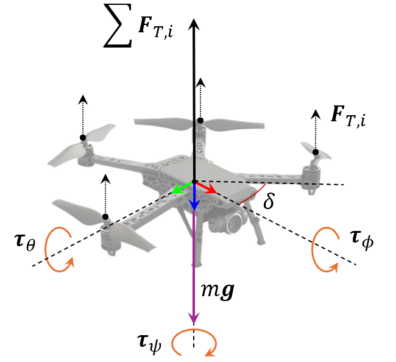
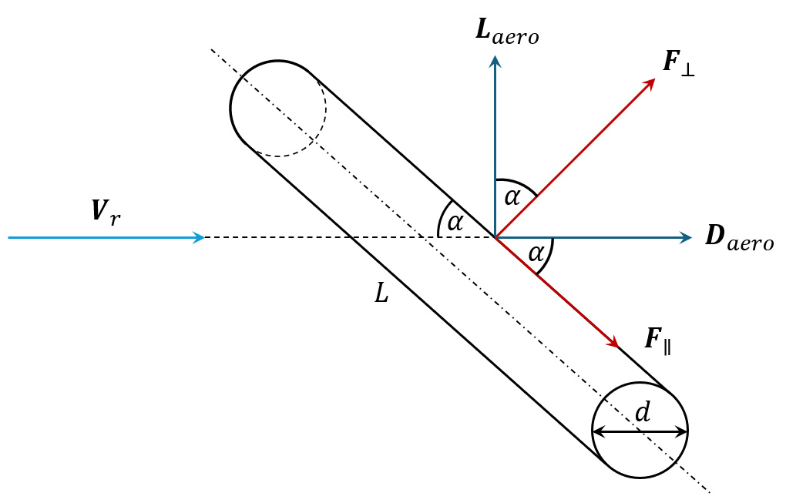

# Tethered Uav System

**Source Document:** `Tethered UAV System.pdf`  
**Total Pages:** 48  

---

## --- Page 1 ---

### Section: Introduction 

Academic Editor: Diego

González-Aguilera

Received: 25 April 2025

Revised: 1 June 2025

Accepted: 9 June 2025

Published: 11 June 2025

Citation: Fattori, F.; Cocuzza, S.

Tethered Drones: A Comprehensive

Review of Technologies, Challenges,

and Applications. Drones 2025, 9, 425.

https://doi.org/10.3390/

drones9060425

Copyright: © 2025 by the authors.

Licensee MDPI, Basel, Switzerland.

This article is an open access article

distributed under the terms and

conditions of the Creative Commons

Attribution (CC BY) license

(https://creativecommons.org/

licenses/by/4.0/).

Review
Tethered Drones: A Comprehensive Review of Technologies,

Challenges, and Applications

Francesco Fattori
and Silvio Cocuzza *

Department of Industrial Engineering, University of Padova, 35131 Padova, Italy; francesco.fattori.1@phd.unipd.it
* Correspondence: silvio.cocuzza@unipd.it

Abstract: Tethered drones—defined in this work as multirotor aerial platforms physically
connected to a ground station via a cable—have emerged as a transformative subclass
of Tethered Unmanned Aerial Vehicles (TUAVs), offering enhanced power autonomy,
communication robustness, and safety through a physical ground connection. This re-
view provides a comprehensive analysis of the current state of tethered drone systems
technology, focusing on critical system components such as power delivery, data transmis-
sion, tether management, and modeling frameworks. Emphasis is placed on the tether
multifunctional role—not only as a physical link but also as a sensor, actuator, and commu-
nication channel—impacting both hardware design and control strategies. By consolidating
fragmented research across disciplines, this work offers a unified reference for the de-
sign, implementation, and advancement of TUAV systems, with tethered drones as their
principal application.

Keywords: tethered drones; UAVs; tether management systems; aerial robotics

#### 1. Introduction

Unmanned Aerial Vehicles (UAVs) have already established themselves as a revolu-
tionary tool in several application fields for some time now. As a natural consequence,
UAV’s advantages and limitations have been pointed out by the scientific community,
leading researchers to study progressively more efficient solutions. Among these, Tethered
Unmanned Aerial Vehicles (TUAVs) have emerged as a compelling alternative to conven-
tional untethered systems. Early investigations into tethered aerial systems date back to
the 1960s and were conducted leveraging the technologies available at the time, such as
helicopters [1] or rotor platforms of varying designs [2,3]. In general, the term UAV encom-
passes a broad variety of aerial configurations. However, for the purposes of this review,
the discussion is explicitly limited to standard multirotor platforms, which will be referred
to as UAVs or drones throughout the manuscript. This choice reflects the predominance of
multirotor systems in current research, commercial, and industrial applications, where their
mechanical simplicity, precise controllability, and ease of deployment have made them the
preferred choice for tethered operations. It is nonetheless important to acknowledge other
UAV configurations that have been investigated in the context of tethered flight, including
balloon-based systems [4], airfoil-type UAVs [5], fixed-wing aircraft [6,7], and hybrid con-
figurations such as tail-sitter fixed-wing VTOL systems [8,9]. Despite the growing interest
and deployment of tethered drone systems across both commercial and governmental
sectors, a comprehensive synthesis of current technologies, operational frameworks, and
research challenges remain limited. The objective of this review is to systematically exam-
ine State-of-the-Art tethered drone technology, with a focus on key enabling components

Drones 2025, 9, 425
https://doi.org/10.3390/drones9060425

## --- Page 2 ---

### Section: New Features 

Drones 2025, 9, 425
2 of 48

such as power delivery mechanisms, Tether Management Systems (TMS), communication
architecture, and system modeling and integration. This work aims to bridge the gap
between fragmented research efforts and practical applications, offering a consolidated
resource for researchers and engineers. In particular, the unique contribution of this review
lies in its holistic synthesis of TUAV system components, control strategies, and applica-
tion scenarios, with special emphasis on the coupled dynamics of drone–tether–winch
subsystems. By integrating engineering perspectives from modeling, control, sensing, and
operation, this review establishes a unified framework for understanding and advancing
TUAV technologies, addressing a critical gap not previously covered in the literature.

#### 1.1. New Features

Unlike free-flying/untethered UAVs, tethered drones are physically connected to a
ground station via a cable capable of transmitting power, data, or both. This configuration
enables significantly extended flight durations and enhances operational stability by lever-
aging the tether as a physical constraint that attenuates disturbances [10,11]. Furthermore,
TUAVs exhibit a tightly coupled dynamic behavior resulting from the interaction between
the aerial platform and the tether cable. This coupling introduces unique challenges in
modeling, control, and stability, setting TUAVs apart from their untethered counterparts.
An overview of these newly introduced features is illustrated in Figure 1.

Figure 1. TUAV newly introduced features: (a) Wired connection to ground power source; (b) Wired
data transmission link (optical fiber); (c) Physically constrained safe flight zone.

#### 1.1.1. Power Supply

One of the primary concerns associated with multirotor UAVs is their limited flight
autonomy, which typically reaches up to 40 min before requiring battery recharging or
replacement. Several approaches have been proposed to overcome this limitation [12]. By
drawing power from a ground-based source via a tether cable, tethered drones can operate
for extended durations, potentially indefinitely, thus ensuring uninterrupted operation,
consistent performance, and improved energy efficiency. Moreover, the removal of onboard
batteries increases the drone’s payload capacity and eliminates issues related to battery
lifespan and maintenance [13].

#### 1.1.2. Wired Data Communication

The employment of a tether cable in UAV systems is not limited to power transmission
alone; it also plays a pivotal role in enabling robust and efficient data communication

![Unlike free-flying/untethered UAVs, tethered drones are physically connected to a ground station via a cable capable of transmitting power, data, or both. This configuration enables significantly extended flight durations and enhances operational stability by lever- aging the tether as a physical constraint that attenuates disturbances [10,11]. Furthermore, TUAVs exhibit a tightly coupled dynamic behavior resulting from the interaction between the aerial platform and the tether cable. This coupling introduces unique challenges in modeling, control, and stability, setting TUAVs apart from their untethered counterparts. An overview of these newly introduced features is illustrated in Figure 1. | Figure 1. TUAV newly introduced features: (a) Wired connection to ground power source; (b) Wired data transmission link (optical fiber); (c) Physically constrained safe flight zone.](images/page_002_fig_01.png)
*Caption/Context: Unlike free-flying/untethered UAVs, tethered drones are physically connected to a ground station via a cable capable of transmitting power, data, or both. This configuration enables significantly extended flight durations and enhances operational stability by lever- aging the tether as a physical constraint that attenuates disturbances [10,11]. Furthermore, TUAVs exhibit a tightly coupled dynamic behavior resulting from the interaction between the aerial platform and the tether cable. This coupling introduces unique challenges in modeling, control, and stability, setting TUAVs apart from their untethered counterparts. An overview of these newly introduced features is illustrated in Figure 1. | Figure 1. TUAV newly introduced features: (a) Wired connection to ground power source; (b) Wired data transmission link (optical fiber); (c) Physically constrained safe flight zone.*

## --- Page 3 ---

### Section: Flight Safety Measure 

Drones 2025, 9, 425
3 of 48

between the aerial platform and the ground station. Optical fibers integrated into the tether
establish a wired backhaul connection, enabling high-bandwidth data transfer, which is
essential for bandwidth-intensive applications such as high-definition video streaming, real-
time sensor data processing, and emerging 6G communication frameworks [14]. Compared
to untethered UAVs relying on wireless links, TUAVs benefit from significantly higher data
throughput and reduced transmission latency, due to the inherently greater capacity and
stability of the wired connection [15]. Additionally, the physical tether minimizes path
loss, ensuring stronger and more consistent signal quality [16]. As a result, the tether not
only sustains the drone’s power but also establishes a secure, interference-resistant, and
low-latency data communication channel.

#### 1.1.3. Flight Safety Measure

The integration of a tether cable into UAV systems significantly enhances flight safety
by introducing mechanical constraints that physically limit the aerial platform’s move-
ment. This constraint acts as a passive safety mechanism, mitigating risks associated with
power failures, operator errors, and extreme environmental conditions such as strong gusts.
Additionally, the tether contributes to system safety by preventing fly-away incidents,
minimizing collision risks, and aiding compliance with regulatory safety requirements.
Studies analyzing the interaction between sudden UAV movements and tether dynamics
help define potential danger zones, primarily influenced by tether strength and impact
parameters such as velocity and angle [17]. This constraint not only defines a safe flight
boundary but also facilitates regulatory compliance in restricted airspaces, where physically
constrained systems are often subjected to less stringent certification requirements. These
advantages make TUAVs particularly appealing for sensitive, high-risk, or long-duration
missions. However, the introduction of a tether also creates new safety challenges, particu-
larly in terms of obstacle avoidance and collision management. The cable itself becomes an
additional element in the flight environment that is susceptible to entanglement or collision,
especially in cluttered or confined spaces. A critical concern is the potential interference
between the tether and the drone’s propellers, which must be proactively addressed. This
is especially relevant in slack tether conditions or when operating in suspended TUAV
configurations [18,19]. Mitigation strategies include the use of propeller guards or ducted
propeller designs, possibly combined with swiveling arms that extend beyond the main
airframe to keep the tether safely clear of the propulsion system [20]. In complex environ-
ments such as urban canyons or vegetated areas, the risk of tether or platform collision
increases. Ensuring a collision-free flight path becomes a key safety priority and can be
addressed through advanced navigation strategies. Research has emphasized safe landing
phase planning [21], as well as collaborative navigation approaches, both with ground
robots for mapping and obstacle detection [22,23], and with cooperative TUAV swarms for
coordinated movement [24,25]. In some cases, it may be beneficial for the tether to inten-
tionally interact with the environment: for example, by planning tether contact points on
static structures, a TUAV can effectively reshape its reachable configuration space, thereby
expanding its operability to levels comparable with non-tethered systems [26].

#### 1.2. Application Fields

UAVs have been implemented in many different fields throughout recent years, paving
the way for the development of tethered technologies. These enhanced systems leverage
the advantages discussed above to surpass the limitations of conventional UAVs. As a
result, tethered drones have become increasingly valuable in a variety of mission-critical
and time-sensitive applications, which are outlined in the following sections.

## --- Page 4 ---

### Section: Agriculture 

Drones 2025, 9, 425
4 of 48

#### 1.2.1. Agriculture

In agriculture, UAVs are already used for tasks such as crop spraying, pollination,
pruning, and monitoring plant health. Tethered drones further enhance these capabilities
by enabling continuous operation. In greenhouse settings, a tethered drone mounted on a
mobile ground station can function as a flying end-effector for precision tasks within crop
rows [27]. In open fields, multiple ground-tethered UAVs operating in grid formations can
serve as an effective bird deterrence system, leveraging centralized control and extended
flight time to manage multiple threats simultaneously [28].

#### 1.2.2. Marine Emergency

Thanks to their maneuverability and elevated vantage point, in marine applications,
TUAVs support tasks such as oil slick thickness monitoring during spill events [29] and
search and rescue operations in mass casualty incidents [30,31]. They can also act as
aerial communication relays, maintaining stable links and coordination during emergency
maritime missions [32].

#### 1.2.3. Load Transportation

A notable application of tethered drone systems involves aerial load transportation
via cable-suspended mechanisms. While these cables may not carry power, they share
similar dynamic modeling with power-transmitting tethers. A growing interest in drone-
based delivery of goods and medical supplies has driven development in this area. To
overcome payload capacity and counteract load swing while improving flight stability,
recent approaches have introduced cooperative multi-drone systems, offering improved
scalability and fault tolerance through load-sharing redundancy [33–36]. Advancements in
this field have also focused on suspended load characterization, including the deployment
of mobile grippers for object grasping in dynamic outdoor environments [37].

#### 1.2.4. Inspection and Monitoring

The enhanced endurance and stability of TUAVs can be leveraged for long-duration
infrastructure inspection tasks, such as bridge inspections performed by a suspended TUAV
that emulates traditional bucket truck-based inspections [19,38]. Additionally, creeping
TUAVs clinging to the underside of bridges at controlled distances have demonstrated
precise crack detection using high-resolution image stitching algorithms [39]. Tethered
drones have also been deployed in challenging underground environments, such as coal
mine sites, where GNSS signals are unavailable, radio communication is limited, and
visual cues are scarce. In such scenarios, TUAVs have successfully mapped stone mine
pillars and assessed structural integrity in confined and debris-filled spaces [20,40]. Beyond
civil infrastructure, TUAVs are also gaining traction in high-demand inspection scenarios
such as nuclear power plants, where continuous monitoring and extended endurance are
critical [41]. Similarly, in aviation environments, tethered systems can support airfield
inspections, weather and traffic surveillance, wildlife deterrence, and emergency response
coordination [42,43].

#### 1.2.5. Airborne Wind Energy (AWE)

Over the past decade, tethered aircraft have been explored for Airborne Wind Energy
(AWE) systems, which aim to harvest high-altitude wind more efficiently and with less
material than conventional turbines. Among these, tethered drones have been used to
follow predefined flight paths while carrying energy-harvesting elements, such as rigid
wings [44] or Magnus-based devices [45,46], exploiting the tether tension and the ground-
based winch as a power generator.

## --- Page 5 ---

### Section: Meteorology 

Drones 2025, 9, 425
5 of 48

#### 1.2.6. Meteorology

The extended flight endurance of TUAVs is well-suited for environmental monitor-
ing, particularly in atmospheric sensing applications. For instance, arrays of tempera-
ture sensors integrated along the tether can capture vertical temperature profiles with
accuracy comparable to meteorological towers, supporting dynamic climate and weather
studies [47,48].

#### 1.2.7. Painting

The uninterrupted power supply provided by tethered configurations also enables
unconventional applications, such as in the arts. Equipped with a stippling mechanism and
benefiting from extended flight time, a drone can autonomously apply tens of thousands of
ink dots to a canvas without human intervention [49].

#### 1.2.8. Cellular Networks

UAV-assisted heterogeneous networks have gained significant attention for enhancing
cellular coverage and capacity. In this context, TUAVs can serve as aerial base stations
(ABSs) or relay nodes, particularly useful when terrestrial base stations (TBSs) are over-
loaded or unavailable [50]. Leveraging their stable positioning and continuous power
supply, TUAVs have been shown to support user association, resource allocation, and 3D
placement optimization to improve overall network performance [51]. By minimizing path
loss and maximizing end-to-end signal-to-noise ratios, TUAV-ABSs can effectively offload
traffic and support multiple ground users during peak demand [52,53]. Depending on
the network topology, TUAVs can also act both as high-altitude relays [54] and as TBSs
replacements [55], linking untethered UAV relays and ground users. In next-generation
networks, TUAV-based drone cells can serve as mobile fronthaul links, offering robust,
high-bandwidth connectivity for 6G communications [14]. To balance the trade-off between
power availability and deployment flexibility, intermittently tethered UAVs (iTUAVs) have
been proposed, enabling temporary anchoring at ground stations before relocating to
optimize mobile user coverage [56].

#### 1.2.9. Firefighting

While the tether cable has primarily been discussed as a means for power and data
transmission, its physical presence can also enable alternative functions in critical operations
such as firefighting. In these scenarios, the tether may be replaced or supplemented
by a water hose, enabling the TUAV to deliver high-pressure water jets from an aerial
position over hazardous fire zones, thus minimizing risk to human responders [57]. Recent
implementations feature recoil-compensated designs that account for the reactive forces
of both the water jet and hose dynamics, enhancing flight stability during prolonged
firefighting operations [58].

#### 1.2.10. Field of Defense

TUAVs have become increasingly valuable in defense operations, enabling extended
surveillance and reconnaissance missions where continuous situational awareness is critical
and risk to human life is high [59]. TUAV swarms enhance intelligence, surveillance, and
reconnaissance (ISR) and defense operations by enabling rapid deployment, persistent
multi-angle surveillance, and safe operation in confined or complex environments. In
law enforcement or military scenarios, swarms can be used to secure perimeters, monitor
vehicle checkpoints, or provide overwatch in urban terrain [25].

## --- Page 6 ---

### Section: System Description 

Drones 2025, 9, 425
6 of 48

#### 2. System Description

The following section aims to outline the components and spatial configurations of
a TUAV multirotor system. For clarity, the system is divided into three levels: aerial,
connection, and ground, each encompassing one or more components depending on their
spatial arrangement, as illustrated in Figure 2. Although onboard hardware and sensors
are integral to the system, they have been intentionally excluded here, as their complexity
and relevance warrant dedicated discussion in a separate chapter.

Figure 2. TUAV system topology: (a) Aerial level comprises drone airframe and its onboard equip-
ment; (b) Connection level comprises the tether cable and its coupling to other TUAV system’s
components; (c) Ground level comprises control station together with the TMS.

#### 2.1. Aerial Platform

In a broader sense, the term “Unmanned Aerial Vehicle” encompasses various aerial
platforms, provided they are uncrewed. Consequently, the aerial component of a TUAV
system is not necessarily a drone by default. Early research on tethered systems primarily
focused on helicopters, leveraging existing technologies [1]. Subsequent studies explored
alternative rotor-based platforms, such as rotorcraft with a free-flapping, single-rotor
configuration lacking a tail rotor [2], and the gyromill, a rotorcraft comprising two counter-
rotating single-blade rotors and a transverse fuselage with movable fin and tailplane [3].
Helicopters remained the predominant tethered aerial platform due to their VTOL capa-
bilities [60,61], with significant advancements in tethered helicopter systems attributed to
the work of Sandino and the research group led by A. Ollero [62–65], which laid founda-
tional groundwork for the development of tethered drone literature. This review, however,
focuses specifically on the current State of the Art in tethered multirotor drone systems,
which offer greater flexibility in spatial and geometric configurations.

Airframe Configurations

TUAV airframes can be classified according to key physical design parameters that
affect flight dynamics and operational roles. Two primary classification criteria are com-
monly adopted: the number of propellers and the orientation of the propulsion system.
These classification schemes are illustrated in Figure 3. The first classification of TUAVs
relates to the number of propellers, which inherently influences the drone’s size and lifting
capability. The quadrotor is the most common configuration due to its geometric symmetry
and balanced trade-off between maneuverability, payload capacity, and weight efficiency.
Tethered hexarotors have been developed for extended endurance [66] and heavy-duty
operations supporting payloads up to 30 kg [67]. Similarly, tethered octocopter configu-
rations have been investigated for comparable purposes [68,69]. An alternative solution
is the tilt-trirotor, an asymmetric three-rotor system capable of hybrid flight modes, func-

![2. System Description | The following section aims to outline the components and spatial configurations of a TUAV multirotor system. For clarity, the system is divided into three levels: aerial, connection, and ground, each encompassing one or more components depending on their spatial arrangement, as illustrated in Figure 2. Although onboard hardware and sensors are integral to the system, they have been intentionally excluded here, as their complexity and relevance warrant dedicated discussion in a separate chapter.](images/page_006_fig_01.jpeg)
*Caption/Context: 2. System Description | The following section aims to outline the components and spatial configurations of a TUAV multirotor system. For clarity, the system is divided into three levels: aerial, connection, and ground, each encompassing one or more components depending on their spatial arrangement, as illustrated in Figure 2. Although onboard hardware and sensors are integral to the system, they have been intentionally excluded here, as their complexity and relevance warrant dedicated discussion in a separate chapter.*

![The following section aims to outline the components and spatial configurations of a TUAV multirotor system. For clarity, the system is divided into three levels: aerial, connection, and ground, each encompassing one or more components depending on their spatial arrangement, as illustrated in Figure 2. Although onboard hardware and sensors are integral to the system, they have been intentionally excluded here, as their complexity and relevance warrant dedicated discussion in a separate chapter. | Figure 2. TUAV system topology: (a) Aerial level comprises drone airframe and its onboard equip- ment; (b) Connection level comprises the tether cable and its coupling to other TUAV system’s components; (c) Ground level comprises control station together with the TMS.](images/page_006_fig_02.png)
*Caption/Context: The following section aims to outline the components and spatial configurations of a TUAV multirotor system. For clarity, the system is divided into three levels: aerial, connection, and ground, each encompassing one or more components depending on their spatial arrangement, as illustrated in Figure 2. Although onboard hardware and sensors are integral to the system, they have been intentionally excluded here, as their complexity and relevance warrant dedicated discussion in a separate chapter. | Figure 2. TUAV system topology: (a) Aerial level comprises drone airframe and its onboard equip- ment; (b) Connection level comprises the tether cable and its coupling to other TUAV system’s components; (c) Ground level comprises control station together with the TMS.*

## --- Page 7 ---

### Section: Tethered Connection 

Drones 2025, 9, 425
7 of 48

tioning both as a fixed-wing aircraft and a rotorcraft [70]. A second classification criterion
is given by the propeller orientation, a critical factor in the UAV’s design. The suspended
TUAV configuration, with rotors facing downward, is commonly adopted in scenarios
where the aerial platform operates below the control station level, such as in bridge in-
spections, minimizing the risk of tether entanglement [18,19,38]. Tilt-rotor multicopters
offer improved wind disturbance rejection and fault tolerance, enabled by servos adjusting
rotor tilt angles [71]. A distinctive layout involves a quadcopter frame augmented with
two laterally placed horizontal rotors, designed to counteract aerodynamic drag [58]. For
operations in confined or collision-prone environments, ducted propellers offer improved
propulsion efficiency and increase–d protection, albeit with reduced flight performance [20].
An innovative design further integrates ducted propulsion with tiltable rotors, featuring
two vertical ducted propellers mounted on rotating shafts [72].

Figure 3. TUAV Airframe Classification: (a) By number of propellers; (b) By propellers orientation.

#### 2.2. Tethered Connection

The connection level represents the physical and functional link between the aerial
platform and the ground station. It includes both the tether cable, which serves as a me-
chanical, electrical, and data conduit, and the aerial power conversion module, responsible
for adapting the ground-supplied power to the UAV’s onboard requirements. This section
addresses the structural and functional characterization of both those two elements.

#### 2.2.1. Aerial Power Module

The aerial power module is responsible for converting the high-voltage power trans-
mitted through the tether into a regulated low-voltage supply suitable for the UAV’s
propulsion and onboard electronics. This unit is a critical interface between the tethered
ground supply and the UAV’s power architecture, and its design is primarily constrained by
efficiency, thermal management, and weight. A high-frequency AC multi-phase transmis-
sion system can be adopted to minimize cable and onboard converter size, hence enabling
larger payloads and extended mission durations [41,73]. The onboard conversion module
employs resonant energy transfer to improve efficiency [41,73,74] and incorporates modular
converter designs—such as parallel DC-DC converters and isolated compartments—to fur-
ther reduce the system’s bulk [73–75]. To address thermal challenges, forced-air ventilation
mitigates overheating under peak loads [75], while aluminum heat sinks and dual cooling
fans support effective thermal dissipation [66]. To ensure safe emergency landings during
power failures, a backup battery system is typically connected in parallel to the UAV’s
DC bus, automatically activating when a voltage drop is detected [66]. These systems
often include pre-charged batteries, solid-state relays (SSRs), and fast-switching diodes to
enable rapid activation. Integration with the low-voltage power bus and logic-controlled
triggering circuits ensures reliable operation and minimal interference with the main power
supply chain [76].

![tioning both as a fixed-wing aircraft and a rotorcraft [70]. A second classification criterion is given by the propeller orientation, a critical factor in the UAV’s design. The suspended TUAV configuration, with rotors facing downward, is commonly adopted in scenarios where the aerial platform operates below the control station level, such as in bridge in- spections, minimizing the risk of tether entanglement [18,19,38]. Tilt-rotor multicopters offer improved wind disturbance rejection and fault tolerance, enabled by servos adjusting rotor tilt angles [71]. A distinctive layout involves a quadcopter frame augmented with two laterally placed horizontal rotors, designed to counteract aerodynamic drag [58]. For operations in confined or collision-prone environments, ducted propellers offer improved propulsion efficiency and increase–d protection, albeit with reduced flight performance [20]. An innovative design further integrates ducted propulsion with tiltable rotors, featuring two vertical ducted propellers mounted on rotating shafts [72]. | Figure 3. TUAV Airframe Classification: (a) By number of propellers; (b) By propellers orientation.](images/page_007_fig_01.jpeg)
*Caption/Context: tioning both as a fixed-wing aircraft and a rotorcraft [70]. A second classification criterion is given by the propeller orientation, a critical factor in the UAV’s design. The suspended TUAV configuration, with rotors facing downward, is commonly adopted in scenarios where the aerial platform operates below the control station level, such as in bridge in- spections, minimizing the risk of tether entanglement [18,19,38]. Tilt-rotor multicopters offer improved wind disturbance rejection and fault tolerance, enabled by servos adjusting rotor tilt angles [71]. A distinctive layout involves a quadcopter frame augmented with two laterally placed horizontal rotors, designed to counteract aerodynamic drag [58]. For operations in confined or collision-prone environments, ducted propellers offer improved propulsion efficiency and increase–d protection, albeit with reduced flight performance [20]. An innovative design further integrates ducted propulsion with tiltable rotors, featuring two vertical ducted propellers mounted on rotating shafts [72]. | Figure 3. TUAV Airframe Classification: (a) By number of propellers; (b) By propellers orientation.*

## --- Page 8 ---

### Section: Tether Cable 

Drones 2025, 9, 425
8 of 48

#### 2.2.2. Tether Cable

Cable selection is a key design phase in TUAV system integration, requiring careful
consideration of multiple performance parameters. This typically involves a trade-off
between minimizing transmission power losses and reducing overall cable weight to
preserve aerial payload capacity [77,78]. A standard tether cable, illustrated in Figure 4, is
composed of several concentric layers, each serving a distinct function [79,80]:

•
An outer fluoroplastic insulation sheath for environmental protection;
•
High-voltage copper conductors, each with individual insulation jackets for safe power
transmission;
•
An integrated optical fiber module containing one or multiple fiber-optic lines for
high-speed data communication;
•
An inner Kevlar harness, providing tensile strength and durability under mechanical
stress.

Figure 4. Standard drone tether cable section and structural composition [79].

While fiber-optic communication is widely regarded as the optimal solution for data
transmission in TUAV systems, several alternative technologies allow wired data trans-
mission via electrical conductors embedded in the tether [81]. Among these, Power Line
Communication (PLC) has gained interest in its ability to transmit both power and data over
the same wire pair, thereby reducing cable complexity. Another common alternative is the
use of twisted-pair Ethernet cables, which can offer a compatible solution with typical UAV
onboard hardware. Despite the feasibility of these electrical methods, optical fiber remains
the preferred choice for high-performance TUAV applications due to its complete immunity
to electromagnetic interference (EMI), low latency, and exceptionally high data throughput,
which support real-time video streaming, sensor feedback, and control commands.

#### 2.3. Ground Control Station

The Ground Control Station (GCS) in a tethered UAV system serves as the central hub
for power delivery, flight monitoring, and UAV control, enabling safe and stable operation
throughout extended missions. Unlike conventional UAVs, tethered platforms require
specialized ground infrastructure to manage continuous power transmission, communi-
cation links, and tether handling mechanisms. The primary components of a typical GCS
include [82]:

•
Power Supply Unit: Converts and regulates AC or DC inputs (typically from grid,
generator, or battery pack) to DC outputs suitable for transmission through the tether.
•
TMS: Includes an automated winch for tether deployment/retrieval and a slip ring for
uninterrupted electrical connection during rotation.

![• An outer fluoroplastic insulation sheath for environmental protection; • High-voltage copper conductors, each with individual insulation jackets for safe power transmission; • An integrated optical fiber module containing one or multiple fiber-optic lines for high-speed data communication; • An inner Kevlar harness, providing tensile strength and durability under mechanical stress. | Figure 4. Standard drone tether cable section and structural composition [79].](images/page_008_fig_01.jpeg)
*Caption/Context: • An outer fluoroplastic insulation sheath for environmental protection; • High-voltage copper conductors, each with individual insulation jackets for safe power transmission; • An integrated optical fiber module containing one or multiple fiber-optic lines for high-speed data communication; • An inner Kevlar harness, providing tensile strength and durability under mechanical stress. | Figure 4. Standard drone tether cable section and structural composition [79].*

## --- Page 9 ---

### Section: Tether Management System 

Drones 2025, 9, 425
9 of 48

•
Communication Interfaces: Facilitates real-time control and telemetry via ground-to-
air communication modules.
•
Monitoring and Control Interface: A user-accessible interface (e.g., a laptop or control
console) running mission planning and UAV management software (e.g., QGround-
Control), providing operators with live data and system status.

The GCS is designed to ensure reliable power and data links, precise tether tension
control, and robust mission coordination, which are essential for safe TUAV operations.

#### 2.3.1. Tether Management System

The TMS is a compact, ruggedized ground unit that integrates key components of a
TUAV’s ground level. Its primary roles include storing excess tether, sensing and controlling
tether parameters, and in some cases, housing the power supply, such as a battery pack.
Typical TMS components include

•
Tether cable and spool/reel;
•
DC motor actuator;
•
Tether sensors (length, tension, elevation, and azimuth angles);
•
Control unit;
•
Landing platform;
•
Power source.

This section presents an overview of experimental TMS configurations, while detailed
sensing and control strategies are addressed in later chapters. A critical requirement of
any TMS is rapid spool response, ensuring the system reacts promptly to UAV movement.
Uniform cable distribution and accurate tension sensing are achieved through various
winding mechanisms, including pulley systems [67,83], plane-fixed tether outlets [61,84],
passive sensorized followers [83,85,86], and rotary rods [41]. To prevent cable twisting
during spool rotation, slip rings are commonly employed [18,86]. Tether angles can be
sensed via a universal joint, while tension can be measured using spring-loaded lever
arms [40,87] or indirectly estimated using a powder clutch applying a constant torque,
assuming a known spool diameter [83]. Notably, one configuration uses a vertically
rotating spool to optimize spatial layout [41]. Some advanced TMS setups also integrate
the landing platform into the system structure, which can be fixed [84,87], elevated [61], or
self-leveling [40], increasing system stability and adaptability.

#### 2.3.2. Commercial Off-the-Shelf Systems

Several commercial TMS solutions are available on the market, typically emphasiz-
ing mechanical robustness and power transmission efficiency, aspects often peripheral to
current academic research. These systems are generally compact, rugged, and box-shaped,
designed to operate with external power units. Tether tension control varies by manu-
facturer, ranging from constant-tension mechanisms [88,89], to set-velocity winding [90],
and multi-mode tension settings with retract functions [91,92]. Only a few commercial
models support battery operation [93], and just one is reported to provide real-time cable
departure angles [94]. Some all-in-one COTS solutions integrate the drone, tether cable,
and aerial power module into a single package. For example, Fotokite offers a tethered
hexacopter with a rectangular frame and rooftop deployment cases tailored for firefighting
and first-response applications [95]. Hoverfly provides modular, network-capable systems
designed for ISR missions and variable-height communications, supporting a range of
payloads in an open architecture design [96].

## --- Page 10 ---

### Section: Multi-Robot Systems 

Drones 2025, 9, 425
10 of 48

#### 2.4. Multi-Robot Systems

An overview of tethered multi-robot systems is presented in this section to complete
the analysis of TUAV configurations. Previous examples have already highlighted the
versatility and potential of tethered platforms. As illustrated in Figure 5, the specific
characteristics of the operational environment dictate the overall system architecture,
particularly when coordinating heterogeneous robotic units, such as aerial and ground-
based elements.

Figure 5. Multi-Robot Teams: (a) UAV/drone; (b) UGV/drone; (c) USV/drone; (d) Drone swarm.

#### 2.4.1. TUAV/UGV Team

In inspection and exploration tasks, integrating a TUAV with an Unmanned Ground
Vehicle (UGV) unlocks new operational capabilities. One key advantage is the creation
of a mobile tether anchor point, with the UGV serving as a moving power and tether
management unit. This enhances the UAV’s maneuverability in cluttered or confined
environments while reducing the risk of tether entanglement [40]. In such configurations,
the UGV may carry the battery pack, winch, and tether sensors, acting as a full ground
segment for the airborne platform, even when using a tracked or wheeled base [97]. This
setup supports collaborative navigation, with TUAV and UGV sharing data for joint
environment mapping and enhanced situational awareness [26,70]. A marsupial robot
configuration, where the TUAV assists the UGV’s motion planning, has been shown to
enable safe traversal through unknown terrain using tether-based path planning derived
from tether dynamics [23]. Beyond sensing, the TUAV has also been employed for tether
attachment to elevated structures, facilitating UGV ascent by enabling it to lift its own
weight via an integrated winch system [98]. Additionally, a multi-UGV setup can enhance
TUAV pose stabilization by applying distributed tether forces to counteract environmental
disturbances such as wind [88].

#### 2.4.2. TUAV/USV Team

A distinct operational scenario is presented by the marine environment, where the
multi-physics complexity demands additional modeling, particularly concerning surface
water dynamics, often addressed through the floating buoy model [99]. Several studies
have demonstrated that the forward-surge velocity of a buoy can be controlled by adjusting
the thrust of a tethered UAV connected via a taut cable [100–102]. This work was later
extended by the same research group to consider slack cable configurations, allowing
greater freedom of movement for the UAV around the buoy [103]. In such systems, the
tethered UAV operates in coordination with a floating platform, typically an Unmanned
Surface Vehicle (USV) serving as the buoy component. Similar to TUAV–UGV cooperative

*Caption/Context: 2.4. Multi-Robot Systems | An overview of tethered multi-robot systems is presented in this section to complete the analysis of TUAV configurations. Previous examples have already highlighted the versatility and potential of tethered platforms. As illustrated in Figure 5, the specific characteristics of the operational environment dictate the overall system architecture, particularly when coordinating heterogeneous robotic units, such as aerial and ground- based elements.*

## --- Page 11 ---

### Section: TUAV Swarm 

Drones 2025, 9, 425
11 of 48

teams, the aerial agent enhances the visual navigation capabilities of the marine vehicle,
particularly in search and rescue missions, by providing an elevated field of view [30].

#### 2.4.3. TUAV Swarm

Among multi-robot TUAV configurations, one notable concept is the UAV swarm,
wherein multiple drones operate in a coordinated manner, often connected via tethers.
This layout, referred to as a System of Tethered Multicopters (STeM) [104], features serially
connected UAVs cooperating to transport payloads [34,35] or to support precision spraying
tasks using a suspended tube with an integrated nozzle and tethered power line [105]. Cable
management across swarm units remains a primary challenge, especially in complex envi-
ronments with obstacle-dense zones [24]. Cable anchoring and reeling at each intermediate
drone is typically managed via a gimbaled winch [104] or a pulley-based double-gimbal
mechanism [106]. Depending on operational needs, the tether’s ground anchoring may
be either fixed or mobile [106]. Additionally, multi-UAV cooperation can be leveraged for
tethered docking and deployment scenarios, for example involving a helicopter-like UAV
platform deploying a tethered quadrotor for frequent delivery missions [107].

#### 2.4.4. TUAV + Manipulator

An emerging application of TUAVs involves their integration into multi-robot systems
where the aerial vehicle is physically coupled with a robotic arm. In a particularly inno-
vative configuration, the system is composed of two cooperative robotic entities: a UAV
providing mobility and positioning, and a tether-driven continuum robot acting as a flexible
manipulator. The ground station, functioning as a third key subsystem, houses actuators
and control units, transmitting mechanical power through the tether to the robotic arm
mounted on the UAV. This approach highlights the potential of TUAV-based multi-robot
systems for enabling physical interaction with the surrounding environment [108,109].

Although each of the multi-robot TUAV configurations discussed in this section
demonstrates unique operational advantages, they also pose substantial engineering chal-
lenges that limit real-world deployment. A comparative overview of these configurations
is provided in Table 1, highlighting their typical applications, key strengths, operational
limitations, and ongoing research gaps. TUAV–UGV teams benefit from increased maneu-
verability and terrain adaptability but are highly sensitive to tether routing complexity,
especially in GPS-denied environments. TUAV–USV cooperation introduces new modeling
complexities due to surface wave dynamics, requiring robust adaptive control to handle
oscillatory tether tension. TUAV swarms offer increased task parallelism and fault tolerance
yet suffer from entanglement risks and demand sophisticated cable-aware coordination
algorithms. Finally, the integration of robotic arms, such as the tendon-driven continuum
robot, significantly expands manipulation capabilities but complicates control due to struc-
tural flexibility and added inertial dynamics. These trade-offs emphasize the need for
integrated modeling, real-time coordination algorithms, and cross-domain simulations that
include tether mechanics, multi-agent behavior, and dynamic environments.

Table 1. Comparative analysis of multi-robot TUAV configurations.

Configuration
Typical Applications
Key Advantages
Operational

Challenges
Unresolved Issues

#### TUAV + UGV

Subsurface
inspection
Mapping

Mobile tether anchor
Improved access in
cluttered spaces

Tether entanglement
Coordination in
uneven terrain

Robust path
planning with
moving tether base

## --- Page 12 ---

### Section: Mathematical Modeling 

Drones 2025, 9, 425
12 of 48

Table 1. Cont.

Configuration
Typical Applications
Key Advantages
Operational

Challenges
Unresolved Issues

TUAV + USV
Search and rescue
Oil spill monitoring

Aerial perspective
for maritime
operations

Tether dynamics due
to waves
Buoy motion
affecting TUAV
stability

Multi-physics
modeling of
cable-surface
interactions

#### TUAV Swarm

Load transport
Formation flight
Coverage

Redundancy
Scalable payload
handling

Cable collision
Synchronization
Spacing
management

Real-time
cable-aware
formation and
decentralized control

TUAV + Manipulator
Bridge inspection
Fine manipulation

Aerial manipulation
Contact tasks

Actuation delay
Vibration
Payload-induced
instability

Integrated modeling
and control of aerial
base and deformable
arm dynamics

#### 3. Mathematical Modeling

Mathematical modeling of tethered aerial systems first appeared in the literature in
the early 1960s, initially focused on helicopters [1], rotorcraft platforms [2,3], and general
tethered flight vehicles [110]. While early studies did not consider tethered multirotor UAVs,
they provided foundational concepts for later developments. Although tethered helicopters
with tail rotors fall outside the scope of this review, key contributions, such as those from
Sandino’s group [62–65], remain valuable for understanding rotor-tether dynamics. This
chapter provides an overview of modeling approaches for the core components of a tethered
multirotor UAV system:

•
The multirotor UAV platform;
•
The tether cable;
•
The automated winch mechanism.

#### 3.1. Multirotor UAV Model

While various rotor configurations exist, this section focuses on the quadrotor UAV,
as it is the most widely modeled platform in the literature. The mathematical formulation
adopts several common assumptions to simplify the dynamics [111]:

•
Rigid UAV frame;
•
Symmetric configuration;
•
Center of Gravity (CoG) aligned with the body-fixed frame;
•
Rigid propellers;
•
Thrust and drag forces proportional to the square of rotor speed.

For clarity, the shorthand notation below will be used for trigonometric functions
further in the dissertation.

sin(■) = s■
cos(■) = c■
tan(■) = t■

(1)

#### 3.1.1. Cartesian Reference Frame

The UAV’s motion is usually described using two Cartesian reference frames, as illus-

trated in Figure 6a: an inertial frame {I}, fixed to the ground with unit vectors



^ı 1,

^ı 2,

^ı 3



,

and a body-fixed frame {B}, located at the UAV’s CoG and typically defined with unit

## --- Page 13 ---

### Section: Spherical Reference Frame 

Drones 2025, 9, 425
13 of 48

vectors

^

b1,

^
b2,

^
b3



, using the right-hand rule [112] or the North-East-Down (NED) con-

vention, where

^
b3 points downwards [113]. The attitude orientation of the UAV with
respect to the inertial frame is defined using Euler angles, typically in the ZYX sequence,
and represented by the rotation matrix RI

B ∈SO3. The relation between the two Cartesian
frames is expressed as [114]





^ı 1
^ı 2
^ı 3



=





cθcψ
sϕsθcψ −cϕsψ
cϕsθcψ + sϕsψ
cθsψ
sϕsθsψ + cϕcψ
cϕsθsψ −sϕsψ
−sθ
sϕcθ
cϕcθ









^
b1
^
b2
^
b3



#### = RI

#### B





^
b1
^
b2
^
b3




(2)

Figure 6. Reference Frames: (a) Cartesian inertial frame illustration depicting Euler angles (ϕ, θ, ψ),
NED body-fixed frame and angular rates (p, q, r) in the body-fixed frame; (b) Spherical inertial frame
illustration depicting spherical coordinates (r, β, γ) representation.

Angular rates are defined starting from the angular velocity in the body-fixed frame

ωB = p

^
b1 + q

^
b2 + r

^
b3, which is related to the inertial frame through the following relation.

ωB =





p
q
r



=





1
0
−sθ
0
cϕ
sϕcθ
0
−sϕ
cϕcθ









.
ϕ

.
θ

.
ψ



= Rω





.
ϕ

.
θ

.
ψ




(3)

The time rate of change in Euler angles is calculated by inverting the previous expression.





.
ϕ

.
θ

.
ψ



#### = R−1

ω





p
q
r



= Tω





p
q
r



=





1
sϕtθ
cϕtθ
0
cϕ
−sϕ
0
sϕ/cθ
cϕ/cθ









p
q
r




(4)

#### 3.1.2. Spherical Reference Frame

An alternative and effective representation is the spherical reference frame [103],
particularly useful when modeling tether dynamics, as later discussed in the unified model
section. The UAV’s Cartesian position rC = {xC, yC, zC} ∈R3 is expressed in the spherical

frame {S} with the coordinates {r, β, γ} and corresponding unit vectors



^er,

^eβ,

^eγ



. Here,

r is the radial distance from the origin, β ∈(−π/2, π/2] is the elevation angle from the
horizontal plane, and γ ∈(−π, π] is the azimuth angle between the positive xC axis and

![^ b3 points downwards [113]. The attitude orientation of the UAV with respect to the inertial frame is defined using Euler angles, typically in the ZYX sequence, and represented by the rotation matrix RI | B ∈SO3. The relation between the two Cartesian frames is expressed as [114]](images/page_013_fig_01.jpeg)
*Caption/Context: ^ b3 points downwards [113]. The attitude orientation of the UAV with respect to the inertial frame is defined using Euler angles, typically in the ZYX sequence, and represented by the rotation matrix RI | B ∈SO3. The relation between the two Cartesian frames is expressed as [114]*

## --- Page 14 ---

### Section: Equations of Motion 

Drones 2025, 9, 425
14 of 48

the projection of r on the {xC, yC} plane, as illustrated in Figure 6b. The transformation
from spherical to Cartesian coordinates is achieved through two sequential rotations:

#### RC

S = RγRβ =





cβcγ
−sβcγ
−sγ
cβsγ
−sβsγ
cγ
sβ
cβ
0




(5)

Afterwards, relations between Cartesian and spherical frames are established.

rC = RC

S · rS =⇒rS = RS

C · rC,
(6)

where RS

#### C =



#### RC

#### S

#### T.

#### 3.1.3. Equations of Motion

The Equations of Motion (EoM) for a TUAV system can be derived using either the
Euler–Newton or Euler–Lagrange formalisms [111]. In the body-fixed frame, the UAV’s
translational and rotational dynamics are governed by Newton’s second law, which relates

external forces and moments

h

FB
τB

iT

to the time derivatives of the linear and angular
momenta P and L [114].

#### FB =



dP

dt



B + ωB × PB

τB =



dL

dt



B + ωB × LB

⇒

"

FB
τB

#

=

"

mI
0
0
IB

#" .

VB
.ωB

#

+

"

ωB × mVB
ωB × IBωB

#

,
(7)

where I is the 3 × 3 identity matrix, m is the UAV mass, IB is the constant inertia tensor,

and VB =

h

u
v
w

iT

is the vector of linear velocities in the body frame. Due to symmetry
assumptions previously made, the inertia tensor has the form of a diagonal matrix.

#### IB =





Ixx
0
0
0
Iyy
0
0
0
Izz




(8)

Using the Euler-Lagrange approach [115], the UAV’s dynamics are expressed in terms

of a set of generalized coordinates qL =

h

x
y
z
ϕ
θ
ψ

iT

, representing its transla-
tional and rotational degrees of freedom. The Lagrangian L is defined as the difference
between kinetic and potential energy:

#### L = K



qL,

.qL

 −U(qL)
(9)

The EoM are derived from

d
dt

####  ∂L

∂

.qL



#### −∂L

∂qL

= QB,
(10)

where QB is the vector of external forces and moments, expressed in the body-fixed frame.
The matrix-condensed form of EoM becomes

"

mI
0
0
RI

#### B · IB

#

..qL +

"

0
0
0
Tω(ωB × IBωB)

#

.qL +

"

mg

0

#

#### = RI

B · QB
(11)

## --- Page 15 ---

Drones 2025, 9, 425
15 of 48

The final form of the UAV’s EoM depends on the external forces and moments consid-
ered, as illustrated in Figure 7. The main active force is the collective thrust FT generated
by the rotors, each one spinning at angular velocity ωi:

#### FT = ∑

4
i=1 CTω2

i ,
(12)

where CT > 0 is the thrust coefficient, typically obtained from static tests. Rotor drag,
resulting from blade aerodynamics, induces a net yaw torque based on the rotational
direction of each rotor:

τψ = ∑

4
i=1 (−1)nCQω2

i ,
(13)

with CQ > 0 as the drag coefficient. Assuming an X-configuration quadrotor, the angle

δ between each arm and the body axis must be considered when computing rolling and
pitching moments:

τϕ = l · sδ



ω2

2 + ω2
3 −ω2
1 −ω2
4


τθ = l · cδ



ω2

3 + ω2
4 −ω2
1 −ω2
2

(14)

Figure 7. Forces and moments acting on a free-flying drone: thrust vector is depicted as the sum of
each propeller contribution FT,i; gravity force has opposite direction with respect to thrust in hovering
condition; τi are the pitching, rolling, and yawing torques; δ is the airframe configuration angle.

To improve physical realism, more advanced models may also incorporate effects such
as hub forces, gyroscopic moments, and ground effects [113]. The extended EoM for the
quadrotor are





















m

..x
=



cϕsθcψ + sϕsψ



FT
m

..y
=



cϕsθsψ −sϕcψ



FT
m

..z
=



cϕcψ



FT −mg

Ixx

..
ϕ
=

.
θ

.
ψ



Iyy −Izz

 + τϕ
Iyy

..
θ
=

.
ϕ

.
ψ(Izz −Ixx) + τθ
Izz

..
ϕ
=

.
ϕ

.
θ



Ixx −Iyy

 + τψ

(15)

EoM are commonly formulated using the traditional Euler angle parametrization.
However, it is well known that Euler angle parametrizations suffer from singularities,
particularly when the pitch angle θ approaches ±90◦, leading to a phenomenon known as
gimbal lock. In such configurations, two of the three rotation axes become aligned, resulting

*Caption/Context: τψ = ∑ | 4 i=1 (−1)nCQω2*

## --- Page 16 ---

### Section: Tether Cable Model 

Drones 2025, 9, 425
16 of 48

in a loss of one degree of freedom and introducing numerical instability and ambiguity
in the attitude representation. This issue poses significant challenges for UAV control
and estimation algorithms, especially during aggressive maneuvers or when operating
in near-singular configurations. To overcome these limitations, quaternion-based repre-
sentations are often adopted. Quaternions provide a globally non-singular, compact, and
computationally efficient means of representing orientation, making them well-suited for
real-time UAV attitude dynamics and control. The UAV’s attitude dynamics can therefore
also be described using quaternion notation [68,69,116]:

.q =





.q0
.q1
.q2
.q3



= 1

2





0
−p
−q
−r
p
0
r
−q
q
−r
0
p
r
q
−p
0









q0
q1
q2
q3



,
(16)

where q =

h

q0
q1
q2
q3

iT

is the unit quaternion representing the UAV orientation. The
quaternion formulation ensures a smooth and continuous description of the UAV’s attitude
over the entire 3D rotation space, avoiding the singularities inherent to Euler angles and
thereby improving robustness in both estimation and control applications.

#### 3.2. Tether Cable Model

The tether cable plays a critical role in the dynamic behavior of a TUAV system, mainly
because of physical constraints. Its mechanical response depends heavily on configuration
and tension conditions. When connected between a ground anchor and a flying drone, the
cable can primarily exhibit two geometric configurations: a taut cable, modeled as a straight
line under high tension, and a slack cable, where gravitational effects dominate, causing
the cable to deflect into the characteristic catenary curve [117]. This section introduces
the fundamental modeling approaches for both regimes, outlining their assumptions,
applicability, and relevance to tethered flight dynamics.

#### 3.2.1. Tether Statics

In static conditions, the tether can assume two primary configurations: taut and slack.
In the taut cable case, the tether acts as a position and force constraint, enhancing UAV
stability and defining a safe operating boundary via the winch control system [10]. When
the tether is short, lightweight, and inextensible, it can be approximated as a massless,
rigid link, exerting a single tensile force aligned with the cable [118]. In contrast, a slack
tether is influenced by gravity and aerodynamic forces. This configuration, together with a
fast-responding TMS, allows the system to absorb wind disturbances, heave disturbances,
and cable stiffness, assuming quasi-static behavior, valid when aerodynamic forces are
negligible relative to cable tension [114,119]. The tether shape is modeled using the catenary
equations, derived from the static equilibrium of an infinitesimal cable segment [120,121]:

(

z(r) = λcosh

 r

λ + c1

 + c2
λ = T0

ρlg

,
(17)

where z is the vertical coordinate, r = x2 + y2 is the radial coordinate, and λ is the catenary
scale factor, further defined by the horizontal tension at the anchor point T0, the linear
mass density of the cable ρl, and the gravity acceleration g; c1, c2 are integration constants
defined by boundary conditions. In symmetric setups, as the one illustrated in Figure 8,

## --- Page 17 ---

### Section: Tether Dynamics 

Drones 2025, 9, 425
17 of 48

simplified forms are used to calculate tether parameters such as elevation angle β and
curved cable length L [122]:








z = λ



cosh

 r

λ

 −1



dz
dr = tβ = sinh

 r

λ



L = λsinh

 r

λ


(18)

Figure 8. Catenary representation of the tether cable in the symmetric configuration: (a) Top view
illustration representing both inertial and body-fixed reference frames, the azimuthal coordinate γ,
and the relation between Cartesian coordinates xy and radial position r; (b) Side view representation
of the tether curved length L, tension horizontal component T0 at ground endpoint, and the angle of
tension application β at drone endpoint.

While most models assume a fixed anchor point, adaptations exist for mobile bases
such as UGVs [97] or USVs [119]. Similar principles have also been applied to hose-based
tether systems [58]. Overall, static models are most appropriate for low-speed or hovering
applications, where inertial effects are minimal.

#### 3.2.2. Tether Dynamics

Tether dynamics modeling captures time-dependent behaviors such as inertia, tension
propagation, and vibrational effects, which become critical during high-speed maneuvers,
wind disturbances, or any condition where oscillations may destabilize the UAV. These
dynamics can be addressed using two main approaches:

1.
A discrete model, where the tether is divided into lumped segments;
2.
A continuous model, where the tether is treated as a deformable elastic body.

In discrete formulations, the tether is modeled as a series of rigid or viscoelastic
elements, as illustrated in Figure 9. Common choices include the Kelvin–Voigt and Standard
Linear Solid (SLS) models [123]. For slack cables, segment masses are typically placed at
the upper joints, with forces transmitted via springs [124] or spring-damper pairs [2]. The
same principle can be adapted to taut cables using a single linear-elastic [125] or viscoelastic
element [63,68,69].

When cables are long, thin, and under constant tension, they can be modeled as 2D
elastic strings using wave-based partial differential equations (PDEs) of an elastic string,
under some basic assumptions [126]:

•
Bending, shear and torsional deformations are negligible;
•
Cable density ρ, section A, Young’s modulus E are constant;
•
Cable tension is dominant along the longitudinal direction;
•
Small angles approximation.

![simplified forms are used to calculate tether parameters such as elevation angle β and curved cable length L [122]: |   ](images/page_017_fig_01.jpeg)
*Caption/Context: simplified forms are used to calculate tether parameters such as elevation angle β and curved cable length L [122]: |   *

## --- Page 18 ---

Drones 2025, 9, 425
18 of 48

(a) 
(b) 
(c)

Figure 9. Tether cable discrete models: (a) Linear spring or rigid link model, with equivalent stiffness
k; (b) Kelvin-Voigt model, with linear spring stiffness k and viscous damping coefficient c, connected
in parallel; (c) SLS model, with damper c in series with linear spring k1, connected in parallel with
other linear spring k2.

Longitudinal and transverse dynamics are governed, respectively, by

∂2u1

∂t2 = E

ρ

∂2u1

∂x2
∂2u2

∂t2 = T0

ρA

∂2u2

∂x2

,
(19)

with wave speeds (cl, ct) and natural frequencies ( fn,l, fn,t) given by [17,127]:

cl =

q

E
ρ
fn,l =
n
2L0 cl

ct =

q

T0
ρA
fn,t =
n
2L0 ct
(20)

Here, u1 and u2 are the longitudinal and transverse displacements, L0 is the unde-
formed string length, and n is the vibration mode. Lagrangian dynamic strain and the
related strain energy in the cable are calculated using [29,127]:

ε(s, t) = ∂u1

∂s −κu2 + 1

2

"∂u1

∂s −κu2

2

+

∂u2

∂s + κu1

2#

,
(21)

e(s, t) = EA

2

#### Z L0

0
ε2ds,
(22)

where s is the arc length and κ is the equilibrium curvature. For stiff or short tethers,
bending effects are non-negligible and the Euler–Bernoulli beam model is used [128].
Continuous models support modal analysis [129], impact stress analysis [17], finite element
implementations [29], and vibration response prediction [127]. UAV motion or wind
can excite tether vibrations. When those external disturbance frequencies align with the
cable natural frequencies, resonance may occur, generating large-amplitude oscillations.
Aerodynamic forces (Laero, Daero) acting on cable segments of length l and diameter d are
modeled using the cross-flow principle [116,130]:

(

Laero = 1

2ρad
VB

r

2Cl
Daero = 1

2ρad
VB

r

2Cd

,
(23)

where ρa is the air density at a given altitude, VB

r is the relative velocity between the wind
flow and the cable segment, and (Cl, Cd) are the lift and drag coefficients. Considering

*Caption/Context: Drones 2025, 9, 425 18 of 48 | Figure 9. Tether cable discrete models: (a) Linear spring or rigid link model, with equivalent stiffness k; (b) Kelvin-Voigt model, with linear spring stiffness k and viscous damping coefficient c, connected in parallel; (c) SLS model, with damper c in series with linear spring k1, connected in parallel with other linear spring k2.*

## --- Page 19 ---

### Section: Tether Electrical Model 

Drones 2025, 9, 425
19 of 48

the incidence angle α of the wind flow, the projected aerodynamic forces, as illustrated in
Figure 10, are
(

F∥= −Laerosα + Daerocα
F⊥= Laerocα + Daerosα

(24)

Figure 10. Aerodynamic forces acting on a cylindrical cable segment.

#### 3.2.3. Tether Electrical Model

As the primary role of the tether is power transmission, basic electrical modeling is
essential. The internal resistance of the cable R, which causes voltage and power losses, is
defined by

R = ρ L

A ,
(25)

where ρ is the conductor’s resistivity, L is the cable length, and A the cross-sectional area.
The corresponding voltage drop and power loss are [84]:

Vdrop = R · i ,
(26)

Ploss = Vdrop · i = R · i2,
(27)

where i is the operating current. Minimizing Ploss while keeping the cable lightweight
introduces a design trade-off between cable diameter and length, key factors in TUAV
endurance and lift capacity. For AC power transmission, cable inductance also becomes
relevant, contributing to additional losses at higher frequencies [41].

#### 3.3. Automated Winch Model

The ground-controlled winch consists of a hollow spool mounted to a permanent
magnet DC motor, used to control tether length and tension [125]. This section addresses
the mechanical and electrical modeling of the winch; sensor-related aspects are discussed
in a later chapter.

#### 3.3.1. Mechanical Model

To model the system, the total mass Maw and moment of inertia Iaw of the winch
assembly are given by [104]

Maw = Mm + Ms + Mc = Mm + Ms + [L0 −rcϑ]ρl,
(28)

*Caption/Context: Drones 2025, 9, 425 19 of 48 | the incidence angle α of the wind flow, the projected aerodynamic forces, as illustrated in Figure 10, are (*

## --- Page 20 ---

### Section: Electrical Model 

Drones 2025, 9, 425
20 of 48

Iaw = Im + Is + Ic = Im + 1

2 Ms


r2

e + r2

i



+ Mc

rc

2

2

,
(29)

where the subscripts m, s and c indicate, respectively, the DC motor, the spool and a cable of
diameter dc; furthermore, re and ri are the external and internal radii of the spool, ϑ = ϑ(t)
is the motor angular progress, and rc is the effective winding radius, calculated as

rc = re + L0 −reϑ

2πre

dc

2
(30)

Both geometric and dynamic parameters of the winch model are illustrated in Figure 11.

Figure 11. Automated winch frame and parameters: (a) TMS rugged box; (b) Controlled spool,

defined by geometric (ri, re, rc, dc) and dynamic



Maw, Iaw, ωm, T, i, Bf



variables.

Cable length L can be estimated from a motor angle encoder using a second-order
polynomial fit [85]:

L ∼= Lpoly = aLϑ2 + bLϑ + cL ,
(31)

where aL, bL, and cL are polynomial coefficients to be experimentally determined. Assuming
a single cable layer, the unwinding rate

.
L is calculated as [63]

.
L = rcωm,
(32)

where ωm is the motor shaft speed. If the cable is treated as a linear spring, tension T is
expressed as [106,125]

T
=
Kc(L −rcϑ)

Kc

(

= 0
f or
rcϑ ≤0
> 0
f or
rcϑ > 0

,
(33)

where Kc is the cable elasticity coefficient and (L −rcϑ) represent its longitudinal deformation.

#### 3.3.2. Electrical Model

The motor’s electrical dynamics are modeled by [106,125]:

Vm = Lm

di
dt + Rmi + keωm,
(34)

where Vm and i are motor’s voltage and current, and (Lm, Rm, ke) are the motor’s in-
ductance, resistance, and back-emf constant, respectively. The electromechanical model
becomes [106,125,131]:

*Caption/Context: where the subscripts m, s and c indicate, respectively, the DC motor, the spool and a cable of diameter dc; furthermore, re and ri are the external and internal radii of the spool, ϑ = ϑ(t) is the motor angular progress, and rc is the effective winding radius, calculated as | rc = re + L0 −reϑ*

## --- Page 21 ---

### Section: TUAV Unified Model 

Drones 2025, 9, 425
21 of 48

Iaw

dωm

dt
= kti −Bf ωm −rcT,
(35)

where kt is the torque constant and Bf is the viscous friction coefficient of the motor.

#### 3.4. TUAV Unified Model

The complete dynamics of a TUAV system are fully characterized only when the tether
cable and automated winch dynamics are integrated into the drone’s core EoM motion.
Depending on the level of fidelity and assumptions made different unified models can be
formulated. This section outlines the main modeling strategies used in the literature to
describe the coupled drone–tether–winch dynamics.

#### 3.4.1. Tethered Drone Dynamic Model

In a taut tether configuration, the UAV and winch dynamics are coupled through the
tension force acting along the cable. Unified models often neglect cable mass and elasticity,
assuming a massless, inextensible link to simplify the analysis. A basic 2D Cartesian model
introduces the effect of cable tension T on UAV translational dynamics [132]:

(

m

..x = mgsθ −Tsθ+β
m

..z = FT −mgcθ −FTcθ+β

,
(36)

where θ is the drone pitch angle and β the elevation angle. The taut cable condition is
enforced by the constraint T(t) > 0 at each time instant. The tension is derived from force
equilibrium along the cable direction as

T = FTcθ+β −mgcβ + mL

.
β

2
(37)

By representing the tension vector in spherical coordinates as TS =

h

−T
0
0
iT

, and

considering an off-center tether attachment defined by a lever arm a =

h

ax
ay
az

iT

, the
set of EoM (14) is updated to reflect the influence of these external forces and moments,
expressed in the inertial frame as follows [103,133]:

#### F =





FTx
FTy
FTz



#### = RI

#### B · FB

#### T + RI

#### BRB

#### S · T

S ,
(38)

τ =





τϕ
τθ
τψ



+ a ×



#### RI

#### BRB

#### S · T

#### S

,
(39)

where RB

S and RI

B are the rotation matrices mapping from spherical to body-fixed, and from
body-fixed to inertial frames, respectively. For full coupling with the winch dynamics, an
initial passive model assumes a constant torque τaw, with cable length governed by drone
thrust alone. The resulting system is [134–136]

(

m

..r = −RI

#### BRB

#### S · T

#### S + RI

#### B · FB

T −mge3
Iaw

..
L
rc = τaw + rcT

,
(40)

where the term

..
L represents the cable length variation acceleration. Using a spherical-
coordinate-based inertial frame, UAV dynamics can be expressed in terms of radial posi-
tion, elevation, and azimuth angles. Since tension acts solely along the radial direction,

## --- Page 22 ---

Drones 2025, 9, 425
22 of 48

the 3D model can be reasonably reduced to a 2D planar case by neglecting azimuthal
effects [125], as illustrated in Figure 12. Defining the drone’s CoG in polar coordinates
qp = {r ∈R > 0, β ∈[0, π]}, the EoM are given as [99–101,125]










m

..r
=
mr

.
β

2 −mgsβ + FTsβ+θ −T

mr2 ..

β
=
−2mr

.r

.
β −mgrcβ + FTrcβ+θ
I

..
θ
=
τθ

(41)

Figure 12. Unified Model Representation: (a) TMS containing the automated winch model, defined
by DC motor angular velocity ωm, overall winch torque τaw, and electric current i; (b) Tethered
connection model, defined by mechanical tension T and elevation angle β; (c) Tethered drone model,
defined by thrust force FT and pitching torque τθ.

Adding a controllable winch, where cable length is regulated via the motor torque τaw
and angular speed ωm, leads to a fully coupled model [10,11]:








Iaw

.ωm
rc
=
τaw −Bf ωm −rcT

mr2 ..

β
=
−2mr

.r

.
β −mgrcβ + FTrcβ+θ
I

..
θ
=
τθ

,
(42)

subject to the taut cable constraint

T(t) = T(r(t), β(t), θ(t)) = mr

.
β

2 −mgsβ + FTsβ+θ −m
..r > 0
∀t ≥0
(43)

The term Bf ωm accounts for losses due to viscous friction [45,46], while tether length

and UAV motion are related via

..
L =

..r =

.ωm/rc. This model captures the key mechanical
interactions in TUAV systems involving a taut cable and active winch.

![the 3D model can be reasonably reduced to a 2D planar case by neglecting azimuthal effects [125], as illustrated in Figure 12. Defining the drone’s CoG in polar coordinates qp = {r ∈R > 0, β ∈[0, π]}, the EoM are given as [99–101,125] |    ](images/page_022_fig_01.jpeg)
*Caption/Context: the 3D model can be reasonably reduced to a 2D planar case by neglecting azimuthal effects [125], as illustrated in Figure 12. Defining the drone’s CoG in polar coordinates qp = {r ∈R > 0, β ∈[0, π]}, the EoM are given as [99–101,125] |    *

## --- Page 23 ---

### Section: Tethered Drone Power Draw Model 

Drones 2025, 9, 425
23 of 48

#### 3.4.2. Tethered Drone Power Draw Model

The nominal power required from the ground power supply is defined as

Pnom = PT

ηel

,
(44)

where PT is the total power drawn by the drone due to thrust generation and ηel accounts
for losses in the tether voltage conversion system. Following the helicopter theory approach,
drone power consumption can be analyzed in three stages: ideal, mechanical, and electrical
power. The ideal thrust power is estimated as [25]

PT,id = (Wd + Wt)

3
2
p

2ρaAr
,
(45)

where Wd and Wt are the weights of the drone and deployed tether, ρa is the air density, and

Ar is the rotor disk area. The mechanical power accounts for aerodynamic inefficiencies via
the figure of merit (FOM):

PT,m = PT,id

#### SFOM

(46)

Finally, incorporating motor efficiency ηm, the total electrical power required by the
drone becomes

PT =
(Wd + Wt)

3
2

ηmSFOM

p

2ρaAr
(47)

Substituting into Equation (42) yields the drone’s effective power demand. To obtain
the overall TUAV power model, tether transmission losses (25) are added:

Ptot = Pnom + Ploss
(48)

#### 3.5. Comparative Analysis and Modeling Trade-Offs

The mathematical modeling of TUAV systems spans multiple interconnected domains,
namely, the aerial platform, the tether cable, and the winch mechanism. However, synthe-
sizing these distinct models into a unified and computationally efficient framework remains
an open challenge, particularly when seeking a balance between physical accuracy and
real-time implementability. Each modeling domain is introduced below, and a comparative
overview of their advantages, limitations, and best-use scenarios is summarized in Table 2.

Table 2. Comparative analysis of TUAV subsystem modeling approaches.

Subsystem
Model Type
Advantages
Limitations
Best Use Cases

#### UAV

Euler-Lagrange

Systematic
Good for symbolic
manipulation

Complex to apply for
multi-body extensions or
contact dynamics

General modeling
Analytical studies

Newton-Euler
Intuitive formulation
Efficient numerically

Less modular for symbolic
derivation or constraint
analysis

Real-time control
Simulation

Geometric/
Quaternion-based

Avoids singularities
Full 3D attitude

Requires specialized tools
Harder to interpret
physically

Aggressive flight
Full 3D attitude
tracking

## --- Page 24 ---

### Section: UAV Platform Dynamics Modeling 

Drones 2025, 9, 425
24 of 48

Table 2. Cont.

Subsystem
Model Type
Advantages
Limitations
Best Use Cases

Tether

Lumped-mass
(Discrete)

Low computation
Supports real-time
control

Limited spatial resolution
Not ideal for slack
conditions

Taut tethers
Fast embedded
Simulation

PDE-based
(Continuous)

High fidelity
Captures vibrations and
curvature

Computationally expensive
Sensitive to parameter
tuning

Offline simulation
Shape dynamics
Modal analysis

Taut Cable
Assumption

Simplifies coupling
with UAV
Constraint-based

Ignores bending, sag,
and wave
effects

Hovering
Low-speed flight

Slack Cable/
Catenary Model

Realistic in low-tension
or long tether conditions

Requires nonlinear solvers
Hard to integrate
into control
loops

TUAV–UGV/USV
Variable tension or
suspended setups

Winch

Passive
(Predefined Torque)

Easy to implement in
decoupled models

Ignores UAV-winch
coupling
Limited accuracy

Preliminary control
design
Constant-tension
scenarios

Active
(Controlled
Actuation)

Real-time tether
length/tension control
High precision

Requires detailed
modeling and
sensor feedback
Numerical stiffness

Coordinated control
Landing protocols
Dynamic reeling

#### 3.5.1. UAV Platform Dynamics Modeling

The UAV platform is commonly modeled as a rigid body using either the Euler–
Lagrange or Newton–Euler approach. The former provides a structured, energy-based
formulation well-suited for generalized coordinates and symbolic derivation, while the
latter offers a more intuitive force–moment representation in Cartesian space, making
it popular in control applications due to its simplicity and numerical efficiency. These
models typically assume a symmetric, rigid multirotor and neglect effects such as propeller
gyroscopic forces, frame flexibility, or aerodynamic drag unless higher-fidelity models are
employed. While adequate for trajectory tracking and basic control, such simplifications
limit accuracy during aggressive maneuvers, physical interaction, or in the presence of
external loads. Quaternion-based or geometric methods are sometimes used to avoid
singularities in full 3D attitude representation.

#### 3.5.2. Tether Cable Dynamics

The tether, being a slender, flexible element, introduces complex dynamics that are
highly sensitive to its tension state, mass distribution, and environmental interactions. Dis-
crete models segment the tether into a series of viscoelastic links or rigid rods connected by
joints with spring-damper properties. These models are computationally lightweight and
can be efficiently integrated into real-time simulation or control loops. They are particularly
suitable for taut tether conditions, where the tether behaves nearly as a straight constraint
with minimal curvature, such as in hovering or slow, controlled maneuvers. However,
these models often fail to capture the rich vibrational behavior and shape deformations
present in slack or partially tensioned regimes, where gravitational and aerodynamic effects
dominate. Continuous models, on the other hand, treat the tether as a deformable elastic
body governed by wave-based PDEs. These allow for the simulation of longitudinal and
transverse vibrations, mode shapes, and strain energy distributions, making them ideal

## --- Page 25 ---

### Section: Integrated UAV-Tether-Winch Dynamics 

Drones 2025, 9, 425
25 of 48

for high-fidelity offline simulations and modal analysis. Incorporating catenary geometry,
aerodynamic forces, and nonlinear tension propagation, these models offer a much closer
approximation to physical behavior, especially in long or low-tension cables. However, their
computational cost, sensitivity to parameter uncertainties, and complexity in boundary
conditions make them impractical for embedded control applications. The choice between
taut vs. slack tether modeling further influences both the form of equations and their solv-
ability. Taut cable models often treat the tether as a massless inextensible link, simplifying
integration with the UAV dynamics but neglecting internal cable dynamics. Slack models,
by contrast, necessitate catenary equations and more elaborate curvature analysis, making
them better suited for applications like TUAV/UGV or TUAV/USV systems operating with
varying cable geometries or contact points.

#### 3.5.3. Integrated UAV-Tether-Winch Dynamics

More advanced models fully couple the UAV, tether, and winch dynamics. The winch
subsystem, typically represented by electromechanical models with motor inertia, spool
radius, and tension feedback, introduces actuation dynamics that affect both cable length
and force regulation. These integrated models are essential when using active TMS for
coordinated drone-winch control. At a basic level, the winch can be modeled as a passive
element applying a constant or predefined torque. This simplification eases integration
with UAV dynamics and suffices when tether length is not actively regulated. However, it
neglects the dynamic interaction between spool inertia and UAV motion, which can degrade
performance during fast reeling or slack transitions. More sophisticated models treat the
winch as an active actuator with closed-loop torque or speed control. These require detailed
representations of motor dynamics, gear systems, and real-time tension feedback. The core
trade-off lies in model coupling: loosely coupled models support modular development
and faster computation, while fully coupled models offer higher fidelity at the cost of
calibration effort and sensor integration (e.g., tension, length, and angle sensors). Real-time
estimation remains challenging due to noise measurement, encoder quantization, and
tension variability.

In conclusion, selecting an appropriate modeling strategy for TUAV systems depends
strongly on the application domain High-fidelity models are indispensable for simulation,
planning, and offline optimization, while reduced-order or simplified models are better
suited for embedded control and real-time operation. Bridging these regimes remains a key
open challenge, particularly in the context of multi-agent coordination, aerial manipulation,
and tether-aware autonomous navigation.

#### 4. Control

Controlling TUAVs presents unique challenges compared to conventional free-flying
multicopters, primarily due to the dynamic coupling between the aerial platform and the
TMS. In addition to the standard objectives of attitude stabilization, trajectory tracking,
and disturbance rejection, TUAV control must also handle tether-specific issues such as
tension regulation, cable length management, and interactions with environmental forces
transmitted through the tether (e.g., wind disturbances and tether-induced constraints).
The effective design of TUAV controllers relies heavily on a comprehensive understanding
of the system’s dynamics. As outlined in Section 3, the TUAV, tether cable, and automated
winch form an interconnected mechanical and electromechanical system whose behavior is
governed by coupled nonlinear dynamics. These models establish the physical constraints
and interaction mechanisms that any control strategy must respect, such as tether tension
transmission, actuator limitations, and dynamic coupling. Therefore, the modeling frame-

## --- Page 26 ---

### Section: State-Space Model 

Drones 2025, 9, 425
26 of 48

works presented in the previous chapter provide the foundation upon which the control
architectures in this chapter are developed.

#### 4.1. State-Space Model

Modeling the dynamics of a tethered drone system requires an effective state-space
formulation that accounts for interactions between the system’s components, along with
actuator dynamics and external disturbances. This model provides the foundation for de-
veloping control strategies that ensure the stable, responsive, and energy-efficient operation
of the TUAV system.

#### 4.1.1. Linearized Dynamics

To design effective control strategies for a TUAV system, a suitable representation is
provided by a Linear Time-Invariant (LTI) state-space model that captures the key dynamics
of the coupled UAV-tether-winch system while ensuring tractability for control design.
Given the nonlinear nature of both UAV and tether dynamics (described in Sections 3.1–3.3)
a linearization process is necessary around a nominal operating point, typically correspond-
ing to a steady hover. This linearization is derived from the full dynamic models presented
in Equations (40)–(42) and is based on several standard assumptions, namely:

•
Small-angle approximation, simplifying rotational dynamics and decoupling vertical
and lateral motion ⇒sθ ≈θ, cθ ≈1;
•
Tether mass, deformation, and damping effects are negligible;
•
Negligible aerodynamic effects.

A proper LTI system-space model is formulated as

.x = Ax + Bu
y = Cx
,
(49)

where [125,132]:

•
x ∈Rn is the state vector, accounting for both mechanical and electrical variables of
the TUAV system;
•
u ∈Rm is the control inputs vector;
•
y ∈Rp is the objective output vector to be controlled, such as the UAV position,
orientation, and tether length;
•
A, B, and C are the system matrices derived from the linearized EoM.

In early formulations, the control input vector u for a tethered UAV system often
mirrors that of a conventional multicopter in a 3D Cartesian space, defined as [137]

u =





u1
u2
u3
u4



=





FT
τϕ
τθ
τψ




(50)

A more complete representation, however, incorporates the actuated winch dynamics,
particularly in the 2D planar case defined by the polar coordinates {r, β} for a fixed
azimuth γ, as previously described in Equation (42). In this context, the control input vector
simplifies to

u =





u1
u2
u3



=





#### FT

τθ
u3




(51)

## --- Page 27 ---

### Section: Nonlinear Dynamics 

Drones 2025, 9, 425
27 of 48

Here, the third input u3 refers either to the winch’s control torque τaw [11] or the
angular acceleration of the winch motor

.ωm [10]. In the polar frame, the thrust input u1 can

be further decomposed into its radial and elevation components,

h

uT
uβ

iT

, and combined
with u3 for coordinated control of UAV positioning and tether length [10].

#### 4.1.2. Nonlinear Dynamics

To capture the full dynamics of a tethered drone system, a nonlinear state-space model
must be employed. Unlike linear time-invariant (LTI) models, this formulation retains
the system’s inherent nonlinearities, making it suitable for advanced nonlinear control
strategies. The nonlinear state-space formulation corresponds directly to the full-state
UAV–tether–winch model of Equation (42) and can be written as [45,46,103]

.x1 = x2
.x2 = A(x) + B(x)u + d(x) ,
(52)

where:

•
x =

h

x1
x2

iT

is the system state vector, with x1 representing position-related states
and x2 velocity-related states, structured as a first-order system well-suited for hierar-
chical (outer/inner loop) control;
•
A(x) captures nonlinear effects from rigid-body dynamics, including Euler forces,
Coriolis, centrifugal, and gravitational terms;
•
B(x) is the input matrix, derived from the nonlinear EoM;
•
d(x) models external disturbances such as wind or friction, and includes residual
modeling uncertainties.

#### 4.2. Control Techniques

Standard UAV control methods, such as Proportional-Integral-Derivative (PID) sta-
bilization, Model Predictive Control (MPC), and adaptive schemes, are well-established
in the literature. However, they need a proper reformulation to correctly address the
TUAV control problem. The following subsections review control strategies tailored to
tethered drone systems, focusing on tether tension and length regulation, coordinated
drone-winch control, and hybrid methods that integrate flight dynamics with tether con-
straints. These approaches are analyzed to highlight their modeling assumptions and
control implementation requirements.

#### 4.2.1. Proportional-Integral-Derivative Control

PID control remains one of the most prevalent strategies adopted for linearized TUAV
models due to its simplicity and ease of implementation. Within aerial platforms, PID
or simpler Proportional-Derivative (PD) controllers are typically employed to stabilize
attitude and regulate position by applying proportional, integral, and derivative gains to
the tracking errors [138], which are retrieved from the linearized UAV dynamics expressed
in Equation (15). This linear control law can also incorporate tether dynamics through
tension feedback and lever arm considerations. More advanced implementations adopt a
hierarchical cascade structure of nested control loops [114]. In spherical coordinates, the
position tracking error is expressed in terms of the tether variables, which are subsequently
used in the control computation [139]. On the ground side, PID control is commonly
employed to regulate the winch dynamics, as described in Equations (32) and (35). The
winch controller can be designed to regulate either the motor torque or the tether length,
typically based on feedback from the tether length error [18,86], and in some cases for
adjustable landing platform orientation control [40]. Gain tuning methods include the

## --- Page 28 ---

### Section: Pole Placement 

Drones 2025, 9, 425
28 of 48

Ziegler–Nichols heuristic and gain scheduling across different operational ranges. Even
in nonlinear control frameworks, PID-like strategies are adapted. Referring to the unified
model in Equation (42), PD control laws are employed alongside nested saturation func-
tions to constrain winch actuation input u3. Similarly, tangential and attitude dynamics,
represented by uβ and u2, can be regulated using PD controllers following appropriate
trigonometric reformulations [10,11].

#### 4.2.2. Pole Placement

A fundamental control strategy for linearized TUAV systems is pole placement, which
enables precise shaping of the system’s closed-loop dynamics. This technique is especially
effective when a desired trajectory [134,136]. This method has been effectively used in
TUAV systems to compute both the winch torque required for tension or cable length
regulation and to control the UAV’s position, velocity, and attitude tracking [104].

#### 4.2.3. Linear Quadratic Regulator

The Linear Quadratic Regulator (LQR) is an optimal control technique well-suited
for LTI or linear time-varying (LTV) approximations of TUAV systems. Unlike classic
PID controllers that rely on heuristic tuning, LQR minimizes a quadratic cost function to
achieve a trade-off between state tracking performance and control effort, later computing
the control gains by solving the derived algebraic Riccati’s equation. By expressing the
unified dynamic model of Equation (42) in a linear time-invariant (LTI) state-space form, as
shown in Equation (49), the LQR method is effectively applied to both position control [118]
and attitude stabilization [125] in TUAV systems. For the automated winch, LQR can be
extended with integral action, yielding a Linear Quadratic Integral (LQI) controller, to
regulate tether length and tension while minimizing steady-state errors [106]. Additionally,
LQR performance can be further enhanced through gain scheduling techniques [118].

#### 4.2.4. Model Predictive Control

MPC has proven to be an effective technique for controlling tethered drone systems.
MPC addresses an optimal control problem at each time step by computing control actions
that optimize a predefined performance criterion while satisfying system constraints. This is
achieved through tailored cost functions that incorporate constraints such as tether tension,
as formulated in Equations (37) and (43). Additional constraints include the actuation limits
of the UAV and the winch actuator of the TMS, the latter being modeled electrically as
described in Equation (34). In a linear MPC framework, the system dynamics are modeled
in discrete time and linearized around a nominal operating point. An MPC formulation
enables the coordinated control of both the UAV and the winch through a unified state-
space representation. This approach maintains tether tautness while ensuring smooth and
feasible trajectory tracking by minimizing a standard quadratic cost function, subject to
state and input constraints. Linear MPC has demonstrated its effectiveness in stabilizing
the UAV’s position and preserving tether tension under varying operational conditions. Its
implementation within a Quadratic Programming (QP) framework highlights its suitability
for real-time control applications [125]. In the context of formation control for tethered
drones, a supervisory linear MPC strategy can be employed, wherein a finite horizon
optimal control problem (FHOCP) is solved at each control step to generate reference
positions and yaw angles for all UAVs within the system. The tailored cost function
incorporates penalties on these reference variables, as well as on their rate of change, to
promote smooth trajectory tracking. Furthermore, state and input constraints are explicitly
formulated to account for limitations on tether length, UAV altitude, and the spatial
configuration imposed by the formation and tether geometry [104]. A Nonlinear Model
Predictive Control (NMPC) approach is well-suited for managing the complex dynamics of

## --- Page 29 ---

### Section: Feedback Linearization 

Drones 2025, 9, 425
29 of 48

a tethered UAV, particularly during landing on inclined surfaces. This method effectively
captures nonlinear UAV-tether interactions. The cost function is designed to penalize
deviations from the target landing position and orientation, as well as slack variables
related to soft landing constraints, thereby promoting a smooth and controlled descent.
System constraints are embedded within the nonlinear optimization problem, which is
solved in real time using a Sequential Quadratic Programming scheme (RTI-SQP) [140].

#### 4.2.5. Feedback Linearization

Given the highly nonlinear nature of tethered UAV (TUAV) systems, particularly when
incorporating automated winch dynamics, feedback linearization presents a valuable con-
trol design strategy. This technique employs static and dynamic feedback transformations
to convert the original nonlinear system into an equivalent, fully linear, and decoupled
system across all state configurations [134–136]. The tracking of any given desired trajec-
tories can be achieved by applying any linear control technique to the equivalent linear
system, such as pole placement [134,136], a PID control law [44,45], or a LQR-linear MPC
combined problem [125].

#### 4.2.6. Active Disturbance Rejection Control

Active Disturbance Rejection Control (ADRC) can be employed within the attitude
control loop of a TUAV operating in coordination with a ground-based unmanned vehi-
cle [141], or for the outer position control loop [107]. The principal control objective is to
counteract the destabilizing influence of cable-induced disturbances on the UAV, enhancing
overall flight stability. The ADRC framework comprises three fundamental components:

•
Tracking Differentiator (TD): Used for smoothing reference signals and extracting
tracking errors, providing clean input for the control loop;
•
State Observer: Extended State Observer (ESO) for estimating internal system states
and external disturbances [141] or Switching Extended State Observer (SESO), improv-
ing robustness under varying dynamic conditions [107];
•
Nonlinear State Error Feedback (NLSEF): Generates control actions based on observed
states and errors, actively compensating for estimated disturbances.

Due to the inherent complexity and parameter sensitivity of the ADRC scheme, a Par-
ticle Swarm Optimization (PSO) algorithm is utilized to optimize key observer parameters.
This optimization is performed by minimizing the Integral of the Time-weighted Absolute
Error (ITAE) criterion, thereby ensuring a fast and accurate system response [141].

#### 4.2.7. Backstepping Control

Backstepping control techniques have proven to be highly effective in addressing the
typical TUAV systems’ challenges such as external disturbances and tether dynamics. Clas-
sic backstepping control can stabilize both position and attitude by first addressing position
regulation through a Lyapunov-based virtual control law, followed by a PID-like law for
attitude stabilization. This approach has been effectively implemented by integrating the
fully coupled system dynamics described in Equation (42) into the nonlinear state-space
formulation presented in Equation (52). It enables the maintenance of relative positioning
between the UAV and an oscillating tethered base, such as a buoy, under the influence
of environmental disturbances including wind gusts, water currents, and buoy-induced
motion [101]. Backstepping is also applied in both loops to ensure stability and compensate
for varying external forces, such as the recoil from a water jet in firefighting operations [58].
Integral backstepping employs an iterative backstepping process to stabilize the roll, pitch,
and yaw angles, ensuring finite-time convergence to the desired reference values. By
introducing integral terms, the method eliminates steady-state tracking errors and achieves

## --- Page 30 ---

### Section: Geometric Control 

Drones 2025, 9, 425
30 of 48

rapid attitude stabilization [107]. Lastly, adaptive control can be integrated with back-
stepping to manage wind disturbances in tethered drone systems. An adaptive estimator
predicts wind forces, modeled according to Equations (23) and (24), while the backstepping
control law ensures coordination between the UAV and a mobile ground base, such as a
UGV, using feedback mechanisms to minimize tracking errors over time [142].

#### 4.2.8. Geometric Control

The geometric control method for tethered quadrotor systems effectively addresses the
between the drone’s motion and the tether’s tension, avoiding singularities and simplifying
the control design process by using a global coordinate system. The formulation aligns
with the dynamics captured in the unified model under the taut tether assumption, as
described in Equations (40)–(42). The control law is divided into two components: the
perpendicular component ensures the tether follows the desired trajectory by controlling
the link dynamics, while the parallel component manages the tether’s tension, maintaining
it taut and stable. The method aims for asymptotic stabilization of both the tether’s direction
and tension independently, driving them both to their desired values. Additionally, the
method accounts for flexible tether dynamics, adjusting the tension as needed to prevent
undesirable vibrations [143]. Building on this foundation, advanced geometric control also
applies to multiple UAVs (swarms). The control law stabilizes both the tether’s orientation
and the quadrotor’s attitude, ensuring that the thrust produced by each drone’s propeller
matches the required thrust vector [106].

#### 4.2.9. Sliding Mode Control

In the control strategy for tethered drones, a Sliding Mode Control (SMC) approach
is adopted to maintain the drone’s trajectory within a safe flight region, despite external
disturbances and modeling inaccuracies. The dynamic formulation underlying this control
technique is derived from the unified model described by Equation (42), which is later
incorporated into the nonlinear state-space representation given in Equation (52). SMC
design involves defining a sliding surface incorporating proportional, derivative, and
integral error terms to guide the system toward desired reference trajectories. The control
law is structured in two parts: a feedback term derived from feedback linearization and
SMC, and a feedforward term compensating for estimated disturbances such as aerody-
namic forces, described by Equations (23) and (24). Stability is analytically proven through
Lyapunov theory, ensuring convergence of tracking errors. To mitigate the well-known
chattering issue in SMC, a smooth hyperbolic tangent function replaces the discontinuous
sign function. Control parameters are tuned using pole placement to balance speed and
damping across control loops, prioritizing fast tether reeling dynamics [46].

#### 4.2.10. Impedance Control

The impedance control technique is designed to enable tethered drones to interact
compliantly and stably with external environments, such as physical surfaces or dynamic
contact forces transmitted through the tether. The impedance controller is built around a
compliant model defined by inertia, damping, and stiffness matrices, essentially replicating
the behavior of a mass-spring-damper system. The control law incorporates the desired
trajectory and compensates for external forces, including the interaction force from the
environment and an observer-based estimated disturbance, and inertial, rotational, and
gravitational dynamics, including a feedforward term. The method ensures that the drone
can maintain stability and adapt its motion naturally in response to external forces, while
still adhering to a desired motion profile [144]. Impedance control can also be used for
the ground winch control problem. As an outer loop controller, it computes the desired
position offset based on measured or estimated tether tension, while the inner loop, based

## --- Page 31 ---

### Section: Admittance Control 

Drones 2025, 9, 425
31 of 48

on position control (PID), adjusts the motor voltage to achieve the necessary tether length
to maintain the desired tension. This architecture supports stable real-time adaptation to
disturbances while ensuring accurate tether tracking [107].

#### 4.2.11. Admittance Control

The admittance control technique for tethered drone systems offers a dynamic frame-
work that interprets external forces and torques to modulate the drone’s motion in a
compliant and responsive manner. The control strategy hinges on estimating external
interactions, such as those from a human operator or the tether, at the drone’s CoG and
torque about the yaw axis, using pose measurements and rotor speeds. By shaping the
drone’s behavior as a mass-damper system and setting virtual parameters for inertia and
damping, the drone can be tuned to respond smoothly to estimated external inputs. These
inputs, once estimated, are used to generate reference trajectories for the drone’s position
and yaw angle. The reference motion, treated as a system output under virtual mechanical
properties, reacts proportionally to the force and torque signals, enabling intuitive and
stable interaction dynamics. Finally, using the principle of differential flatness, the full set
of required inputs, including thrust and torques, can be derived to drive the drone along
the desired trajectory [145].

#### 4.2.12. Fuzzy Logic Control

The fuzzy logic control method for a tethered drone system offers a robust and
interpretable approach to managing the drone’s pitch and yaw in coordination with a
mobile ground base, e.g., a UGV/rover. The core of this method lies in a force feedback
control strategy, where the drone adjusts its orientation based on the tether forces and their
rates, caused by the rover’s motion. The fuzzy controller interprets two main variables: the
difference between measured and equilibrium tether force, and the rate of change of that
force. These inputs influence the drone’s pitch and yaw through linguistic rules defined
over Gaussian membership functions, which ensure smooth control transitions. The rule
base, constructed through intuitive reasoning, ensures that conflicting inputs can result
in neutral outputs, minimizing unnecessary drone adjustments. The outputs from the
fuzzy logic controllers are interpreted as desired pitch and yaw angles, which are then fed
into a lower-level PD-based attitude controller. This controller computes the necessary
adjustments in rotor speeds to achieve the desired drone orientation [142].

#### 4.3. Comparative Evaluation of TUAV Control Techniques

The previous section presented a range of control strategies adapted for TUAVs,
spanning classical, nonlinear, robust, and emerging data-driven methods. While these
techniques are often developed in response to the unique dynamics introduced by the
tether (e.g., underactuation, cable tension feedback, and coupled ground–aerial dynamics),
their practical deployment is influenced by trade-offs between computational complexity,
control accuracy, real-time feasibility, and sensitivity to modeling errors. These trade-offs
are comparatively summarized in Table 3, which outlines the strengths, limitations, and
typical application domains of each control strategy.

Linear controllers such as PID, LQR, and pole placement remain foundational for
TUAV control due to their simplicity and high real-time reliability. However, their effec-
tiveness is limited to linearized regimes and they often underperform under nonlinearity,
actuator constraints, or modeling uncertainty. Backstepping and geometric control, includ-
ing feedback linearization, address these limitations by explicitly handling underactuated
dynamics and full pose control, but they require precise system models and careful gain
design. Robust strategies like SMC and Adaptive Control improve disturbance rejection
and adaptivity in the presence of model uncertainties. Yet, they often suffer from chattering

## --- Page 32 ---

### Section: Hardware and Sensors 

Drones 2025, 9, 425
32 of 48

or slow adaptation, respectively. MPC provides constraint-aware trajectory generation but
incurs high computational costs, limiting its real-time usability on embedded platforms.
More recent methods such as ADRC aim to blend disturbance rejection with observer-based
design but remain underexplored in aerial applications. Meanwhile, Event-triggered con-
trol offers significant energy savings and reduced computation in sparse-update settings,
though tuning the triggering logic is nontrivial. These observations highlight that no single
control strategy universally dominates. The choice must be driven by mission constraints
(e.g., maneuver aggressiveness, hardware limits, operating environment) and platform re-
sources (e.g., onboard computation, sensor suite, communication delays). Future work may
focus on hybrid architectures, combining learning with physics-based control to balance
robustness, efficiency, and generalizability.

Table 3. Comparative summary of TUAV control techniques across application scenarios.

Control
Technique
Complexity
Real-Time
Feasibility
Robustness
Application

Domains
Limitations

Linear
Control

Low–
Medium
High
Low–
Medium

Hovering
Station-keeping
Trajectory tracking
(linearized)

Linear regimes
Sensitive to modeling
errors

Backstepping
Medium
Medium
Medium–

High

Underactuated TUAVs
Cable force incorporation

Complex to design
Requires accurate
system
structure

Geometric

Control

Medium–

High
High
Medium–

High

Full pose control on SE(3)
Agile maneuvers

Complex tuning
Assumes known
dynamics

SMC
Medium
Medium-

High
High
Disturbance rejection
Tension control

Chattering
Noisy in
measurement-driven
implementation

Adaptive

Control
High
Medium
High

Systems with
uncertain parameters
(mass, stiffness)

Slower convergence
Stability proofs
required

MPC
Very High
Low-
Medium
High

Obstacle avoidance
Constrained multi-robot
planning

Optimization overhead
Less suited for
onboard execution

Tether
Force-Based

Control

Medium
Medium-

High
Medium
Tension regulation
Tether-aware-reeling

Relies on accurate force
sensing
Underperforms in
delay

Event-
Triggered

Control

Medium
High
Medium
Energy-efficient control
Sparse updates

Trigger logic tuning
Can miss rapid
disturbances

ADRC
Medium–

High
Medium
High

Environments with
high uncertainty or
external forces

Observer design and
tuning complexity

#### 5. Hardware and Sensors

The operation of TUAVs requires a well-integrated combination of onboard avionics,
ground-based systems, and an array of sensors to ensure full controllability of all system pa-
rameters. The tether cable introduces new hardware requirements, demanding specialized

## --- Page 33 ---

### Section: Hardware 

Drones 2025, 9, 425
33 of 48

onboard and ground-based components. Additionally, sensor integration plays a crucial
role in state estimation, environmental awareness, and monitoring under varying flight
conditions. This chapter delves into the essential components of tethered drone systems,
distinguishing between aerial and ground-based hardware and sensors.

5.1. Hardware
5.1.1. Avionics/Onboard Hardware

The avionics suite is the central nervous system of a TUAV, encompassing all onboard
electronic systems that manage flight dynamics, navigation, and communication. The
key hardware components typically found in TUAV systems are listed below, and a more
detailed overview of their functions, roles, and representative variants is provided in
Table 4.

•
GPS/RTK Module;
•
UWB Modules/Tags;
•
Flight Controller;
•
Companion Computer;
•
Microcontroller;
•
Wireless Communication Module;
•
RC Receiver.

Table 4. Overview of onboard hardware components in tethered drone systems.

Hardware Component
Description
Variants/Brands

#### GPS/RTK

Module providing up to centimeter-level positioning
accuracy, essential for precise navigation and
hovering capabilities in tethered UAV operations.

RTK u-blox ZED-F9P [34,48]
RTK Here2 [57]
Other RTKs [85,97]
Double GPS [146]

#### UWB

Transceiver modules/tags providing precise
positioning data of the UAV/payload within a smaller
range, crucial for operations in GPS-denied
environments.

DWM1001C UWB [40]
LinkTrack UWB [34]
UWB tag [147]

Flight Controller

Autopilot device, like the Pixhawk series, serves as
primary control unit, processing redundant integrated
sensor inputs to stabilize and control the UAV’s flight.

ArduPilot [48,97]
PX4 [40,44,57,118,146,148]

Companion Computer

Small computer unit working alongside flight
controllers to handle complex computations, enabling
advanced functionalities like image processing and
autonomous navigation, via serial MAVLink protocol
communication with the flight controller.

NVIDIA Jetson [34,148]
UDOO X86 II ULTRA [40,87]
Intel NUC 11 [40]
Raspberry Pi 3+ [97]
Odroid Xu [85,147]

Microcontroller

Small low-power control unit used to manage
onboard auxiliary devices such as servos, payload
mechanisms, or sensors, offloading flight controllers,
or companion computer computational effort.

Arduino [87,105,146]
GR-SAKURA [137]

Communication Module
Onboard wireless communication module to establish
connection with ground station computer.
ROHM BP3591 [137]

#### 5.1.2. Ground-Level Hardware

The ground station serves as the command center for TUAV operations, housing
equipment necessary for control, communication, and data processing. In indoor experi-
mental setups, it is often surrounded by a testbed infrastructure to evaluate and validate
simulation results. The typical components found at the ground level are listed below,

## --- Page 34 ---

### Section: Sensors 

Drones 2025, 9, 425
34 of 48

while Table 5 provides a detailed overview of their functions and commonly used variants
in TUAV systems.

•
Ground Station Computer;
•
Ground Single board Computer (SBC);
•
Microcontroller;
•
Wireless Communication Module;
•
RTK Base Antennas/UWB Anchors;
•
Motion Capture System;
•
Meteorological Stations;
•
RC Transmitters.

Table 5. Overview of ground control station hardware components in tethered drone systems.

Hardware Component
Description
Variants/Brands

Main Computer

Main system coordinates all other
microcomputers/controllers’ activities and provides
interfaces to the human operators, integrating the
Robot Operating System (ROS) framework to
communicate with other TUAV devices.

Linux Operative System
ROS framework
integration [40,44,87,147,148]

#### SBC

Compact, energy-efficient Single Board Computers for
the handling of autonomous operations with the
possibility to be even placed on mobile
unmanned robots.

Advantech MIO5393 [148]

Microcontroller
Ground-level small low-power control unit role in
managing subsystems, such as the TMS.

Arduino UNO R3 [40]
ESP32 [44]
DF-Robot Mega2560 [85]

Communication Module

Module enabling data transmission between the
drone and ground station via Wi-Fi network or IEEE
802.15.4 protocol, ensuring seamless data
communication.

ESP32 Wi-Fi [44]
Digi XBee 3 Zigbee 3 [48,105]

#### RTK Antennas/

#### UWB Anchors

Stationary systems enable precise localization
accuracy (RTK antennas) or allow it where GPS
signals are weak or obstructed (UWB anchors),
working together with their aerial counterparts;

#### UWB anchors [147,149]

Motion Capture System

Multi-camera system for tracking the UAV’s position
and movement, determining the aerial platform
“ground truth” and aiding in precise navigation

and control;

Vicon [44,83,86,87]
OptiTrack [30,120]
Kinect [105]

Meteorological Station
Instruments to monitor environmental conditions,
offering critical data for flight planning and safety.

Anemometer [44]
DAVIS Vantage Vue [57]

#### 5.2. Sensors

While the hardware components of a TUAV system define its computational back-
bone, sensors serve as its perceptual core, enabling real-time awareness, stability, and
control. With the integration of a tether cable, however, additional sensing elements be-
come necessary to monitor cable dynamics and ground-based interactions. This section
explores the diverse range of sensors used in tethered drone systems, again distinguish-
ing between aerial and ground levels. Together, these sensing systems provide the data
needed for navigation, state estimation, disturbance rejection, and safe interaction with
the environment.

## --- Page 35 ---

### Section: Tethered Drone Sensors 

Drones 2025, 9, 425
35 of 48

#### 5.2.1. Tethered Drone Sensors

A range of onboard sensors are integrated into TUAV systems to support perception,
navigation, and tether-aware control. The key sensor types commonly used are listed below,
and their functions along with representative variants are further detailed in Table 6.

•
Onboard Camera;
•
Range Sensor;
•
Mapping Sensor;
•
Additional IMU;
•
Tension Sensor;
•
Angle Sensor;
•
Contact Force Sensor.

Table 6. Overview of onboard drone sensors in tethered drone systems.

Sensor
Description
Variants/Brands

Onboard Camera

Camera device used for visual-inertial odometry
(VIO) and SLAM, localization relative to ArUco
boards, aerial photogrammetry, and proximity
viewing.

Intel RealSense T265 [40]
RGB global shutter + 2D gimbal [97]
CMOS + global shutter [146]
Sony HDR-AZ1 + 3D gimbal [137,150]

Range Sensor

Device measuring distances for obstacle
avoidance, indoor ceiling detection, and drone
altitude awareness.

Garmin Lidar Lite [40]
Ouster OS1 [20,23]

Mapping Sensor
Usually a LiDAR depth camera for SLAM
applications.

Intel RealSense L515 [40]
Kinect [85]

Additional IMU

External IMUs can be used to detect tether angles
and to improve flight controller internal IMU
accuracy.

Xsens MTi [144]

Tension Sensor
Load cell-based sensors that detect tension force
in the cable.

Fulcrum + load cell [86,119]
Tensile load cell [105]

Angle Sensor
Detects tether departure angles from UAV body
or gimbal joints.

Potentiometers [86,119]
Cardan joint + potentiometers [137,151]
TOF-based [38]
2d-axis joystick [87,105]
Custom gimbal [97]

Contact Force Sensor
Detects physical forces and torques at the drone
interface with external environment.
On End-effector [144]

#### 5.2.2. TMS Sensors

The TMS incorporates a dedicated set of sensors designed to monitor cable-related
states and environmental conditions. The main sensor types used in such setups are listed
below, while Table 7 provides a detailed overview of their measurement functions and
representative hardware implementations.

•
Tension Sensor;
•
Angle Sensor;
•
Length Sensor;
•
Temperature Sensor.

## --- Page 36 ---

### Section: Localization and Navigation 

Drones 2025, 9, 425
36 of 48

Table 7. Overview of TMS sensor suite in tethered drone systems.

Sensor
Description
Variants/Brands

Tension Sensor

Device designed to measure tether tension
through various mechanisms, including
spring-loaded lever arms, powder clutches,
torque sensors, or roller-based tension meters.

Spring + potentiometer [40,85,87]
Kistler 4502a torque sensor [44]
Powder clutch setup [83]
Tension meter [152]

Angle Sensor

Measures tether departure angles at the TMS
using a geometry similar to the aerial
counterpart, with slight structural variations.

Cardan joint + potentiometers [40,87]
Turntable + vertical moving arm [83,85,97]

Length Sensor
Deployed tether length is measured via DC
motor encoder by counting shaft rotations.

Digital rotary encoder [19,38,40,83,87,152]
Hall-effect sensor [85]

Temperature Sensor

Array of digital thermometers spaced along the
tether, calibrated against a bead thermistor for
accurate temperature sensing.

#### DS18B20 [47,48]

#### 6. Localization and Navigation

The ability to accurately localize and autonomously navigate is fundamental to the
effective operation of TUAVs, particularly in environments that are GPS-denied, visually
degraded, or highly constrained. As with all other aspects discussed in this review, the
tether introduces both challenges and unique opportunities for enhancing perception and
control. Consequently, localization and navigation strategies for tethered drone systems
can adopt tailored approaches that go beyond conventional aerial robotics paradigms.
This chapter provides a comprehensive overview of state estimation techniques, local-
ization methods, and navigation strategies that can be applied to tethered drones. Col-
lectively, these approaches illustrate the evolving role of the tether as a valuable sensing
and actuation element, fostering intelligent and autonomous operation in complex and
constrained environments.

#### 6.1. State and Disturbance Observers

In tethered drone systems, accurate state and disturbance estimation are crucial for
localization, autonomous navigation, and control, particularly in GPS-denied environments
where external sensors may be limited or uncertain. To mitigate these challenges, vari-
ous observer-based techniques are employed to estimate the system’s internal states and
external disturbances, ensuring precise control and improved system performance. Sev-
eral observer-based estimation techniques are commonly used in tethered drone systems,
leveraging sensor fusion strategies, disturbance compensation, and state reconstruction
approaches to enhance localization accuracy and enable autonomous flight:

•
Extended Kalman Filter (EKF) is a widely used state observer in TUAV systems, inte-
grating IMU data, tether-derived variables, and sometimes motor inputs to estimate
position, velocity, and attitude [122,153,154]. It enables 3D drone state and cable ten-
sion estimation, particularly in GPS-denied or vibration-prone environments where it
helps mitigate sensor noise [151];
•
Unscented Kalman Filter (UKF) offers improved estimation in nonlinear systems
by avoiding explicit linearization and has been applied to estimate angular states
like pitch and roll from accelerometer and gyroscope data [132,155]. Its variant, the
Square Root UKF (SR-UKF), enhances computational efficiency and supports real-
time estimation of external disturbances, such as forces and torques acting on the
UAV [145];

## --- Page 37 ---

### Section: Localization Methods 

Drones 2025, 9, 425
37 of 48

•
High-Gain Observers (HGO) operates on a nonlinear dynamic system after it has been
transformed into a triangular canonical form. The observer applies a dynamic update
including a gain-scaled correction term to ensure fast convergence of the estimate
to the true state. To recover the full original system state, the observer leverages
additional information from the accelerometer to reconstruct the full state. HGO,
therefore, not only can estimate the transformed state accurately but also to serve as
a foundation for reconstructing the full physical state of the, even in the presence of
model uncertainties or measurement noise [134,135];
•
Hybrid Disturbance Observer (HDO) combines momentum- and acceleration-based
approaches to estimate disturbances like tether tension, improving control perfor-
mance and system stability [144];
•
Fixed-time Extended State Observer (ESO) provides robust state and disturbance
estimation with guaranteed convergence in a fixed time, enabling precise trajectory
tracking and fast response under dynamic conditions [34];
•
Neuro-estimator is constructed as a feedforward multilayer perceptron (MLP) neural
network. It has been used to estimate the equivalent mass of a quadrotor system in
real time, adapting to disturbances such as suspended loads. When the accompanying
analytic mass model fails, due to singularities, the neural network maintains estimation
accuracy, effectively enhancing system robustness [156]. In a TUAV context, where
tether forces vary with slack or tension states, such an adaptive estimator could serve
to approximate and compensate for these dynamic effects.

#### 6.2. Localization Methods

Accurate localization remains a fundamental requirement for the safe and effective op-
eration of tethered drones, particularly in environments where GPS signals are unavailable
or unreliable, as well as in confined or constrained operational spaces. Various methods
have been developed to address this challenge, ranging from conventional techniques
originally designed for free-flying UAVs to more specialized approaches that exploit the
presence of the tether.

#### 6.2.1. Traditional Methods

Localization of TUAVs can still rely on traditional methods that have been extensively
adopted for free-flying UAVs:

•
Inertial feedback: Classic inertial localization methods use sensors like accelerome-
ters, gyroscopes, and barometers to estimate UAV position based on its motion and
orientation. However, these systems typically drift over time and are particularly chal-
lenged by conditions such as slack or wind-induced displacement, requiring external
correction methods;
•
Radio-based: In GPS-denied environments, tethered UAVs often use radio-based
techniques such as triangulation, trilateration, and RSSI-based systems. These methods
estimate position through geometric relationships between the UAV and ground
anchors equipped with radio modules. While effective, these approaches require
clear lines of sight and are susceptible to environmental factors like signal reflection,
interference, and spoofing [157];
•
External positioning systems: Localization systems relying on GNSS, UWB, or LI-
DAR offer external positioning solutions. UWB and LiDAR systems use distance
measurements to determine relative positions between the UAV and ground stations
or environment features, while GNSS can provide absolute positioning data. Although
these systems improve accuracy, they remain highly dependent on environmental
conditions and can suffer from signal loss or obstruction [147].

## --- Page 38 ---

### Section: Tether-Enhanced Methods 

Drones 2025, 9, 425
38 of 48

#### 6.2.2. Tether-Enhanced Methods

These classic approaches are effective in many scenarios but face challenges when
GPS is unavailable or when the UAV operates in environments where precise control is
crucial. The introduction of tether cables, along with their unique parameters, provides
a novel enhancement to localization techniques, expanding the capabilities of tethered
drone systems by integrating their dynamic behavior into the position estimation process.
Tether-based localization methods are

•
Sensor fusion with tether parameters: The combination of tether mechanical parame-
ters (length, angles, tension) and inertial sensor data enables advanced techniques like
the EKF to estimate the UAV’s position and velocity, allowing for indoor operations
in constrained spaces. In situations where the tether is slack, more sophisticated
models, such as catenary curves, are employed to account for the flexible nature of the
cable [87,120,122];
•
Neural network-based: Such localization methods offer a data-driven approach to
estimating UAV position through supervised regression techniques. A multilayer
perceptron (MLP) can be used to predict the drone’s position based on tether variables,
including four angular measurements, tether length, and horizontal tension producing
output estimates for the drone’s spatial coordinates and relative yaw angle [87]. Data
acquisition is conducted in controlled indoor environments by placing the drone at
known 3D coordinates and recording tether parameters. The training process involved
Bayesian regularization to enhance generalization, and subsets are tested to evaluate
performance through regression accuracy and error metrics [19];
•
Vision-based: In a complementary approach, a downward-facing camera on the drone
captures images of a ground robot and an EfficientPose deep neural network (DNN)
estimates the drone’s relative 6D pose with respect to the robot. This relative pose
was then fused with SLAM data from the ground robot to localize the UAV within the
global reference frame [148].

Incorporating tether mechanical feedback lets tethered drone systems gain a new layer
of precision, allowing for real-time position adjustments, robust tracking even in dynamic
or adverse conditions, and more accurate localization when traditional systems usually
fall short. These enhancements overcome the limitations of GPS-denied environments and
scarce visibility, opening up new possibilities for tethered UAV operations in both outdoor
and indoor scenarios.

#### 6.3. Navigation Strategies

Tethered drone systems require navigation strategies that accommodate deployments
in environments where GPS is unavailable, visual references are unreliable, or precise
coordination with ground assets is essential. As a result, these strategies must address
not only spatial planning and localization but also the dynamics of the tether and its
potential contact with surrounding obstacles. Navigation methods in literature span a
broad spectrum of algorithmic categories, with several approaches specifically tailored
to distinct multi-robot system configurations. In this section, navigation strategies are
grouped by the primary algorithmic paradigm, followed by a brief discussion of system
setup, tether role, and key navigation features.

#### 6.3.1. Sampling-Based Global Planning

Sampling-based algorithms efficiently explore high-dimensional configuration spaces
and are well-suited for tether-aware path planning due to their flexibility and scalability.

## --- Page 39 ---

### Section: Optimization-Based Planning 

Drones 2025, 9, 425
39 of 48

•
Rapidly exploring Random Trees (RRT and RRT*): RRT has been extended for tether-
aware planning in UAV-UGV collaborative systems. The tether is modeled as a
catenary curve and integrated into the path evaluation via a “checkCatenary” function.
A subsequent nonlinear optimization stage smooths the path while accounting for
tether-induced constraints. This enables beyond-line-of-sight operations, with tether
dynamics incorporated as real-time navigation constraints [23]. The UAV, powered
via a tether to a mobile UGV, benefits from a dual-layer map-incremental planner that
supports real-time replanning in unknown environments [70];
•
Lazy Theta*: Operating over a 3D voxel grid, Lazy Theta* generates an initial path
which is refined using catenary-based tether modeling. A sparse factor graph en-
sures path smoothness, energy efficiency, and tether safety, demonstrating a seamless
integration from sampling-based planning to optimization-based refinement [22];
•
PRM, RRT-Connect, and BIT*: These planners facilitate multi-UAV coordination under
a shared tether, leveraging global planning with a complementary force-aware local
planner. This hybrid setup ensures tether feasibility, minimizes drag, and mitigates
inter-UAV collision risks while navigating high-dimensional constraint spaces [25].

#### 6.3.2. Optimization-Based Planning

These approaches formulate navigation as a continuous optimization problem,
enabling smooth trajectories with real-time constraints such as tether dynamics and
sensor feedback.

•
Convex Quadratic Programming (QP) with LiDAR Constraints: A real-time convex
QP formulation guides the formation flight of tethered UAVs in unknown environ-
ments without relying on prior maps. A supervisory controller synthesizes feasible
trajectories using LiDAR and tether data, offering adaptive, reactive control albeit
without global foresight [24];
•
Receding Horizon Control with CVT Optimization: This grid-based planning approach
uses a receding horizon strategy and Lloyd’s algorithm to dynamically optimize UAV
formations. Cost functions evaluate each grid cell based on energy expenditure,
proximity to targets, tether constraints, and inter-agent spacing [28].

#### 6.3.3. Reactive and Vector Field-Based Navigation

Reactive methods directly translate sensor input or geometric models into control
signals, bypassing full map-based planning.

•
Velocity Vector Field: A tether-parameterized vector field guides UAVs without GPS,
leveraging geometric tether models. The horizontal component aligns the drone with
a vertical descent axis, while vertical descent only initiates near the landing site. A
feedforward term enables alignment with moving platforms [21];
•
Reactive Wall-Following via LiDAR: LiDAR-based wall-following replaces visual
odometry, employing edge detection and a switched vector field to guide landings.
Tether feedback allows return navigation without external localization [40].

#### 6.3.4. Visual Servoing and Visual-Inertial Guidance

Vision-based methods enable relative navigation and cooperative operation in GPS-
denied environments.

•
AprilTag-Based Visual Servoing: A tethered UAV uses AprilTags and PID control to
maintain relative position to a UGV, enabling GPS-free operation [158];
•
Visual Servoing for Surface Vessels: Blob tracking allows the UAV to guide USVs via
line-of-sight. Switching between heading-based turning and PID control supports
agile, cooperative missions [30];

## --- Page 40 ---

### Section: Contact-Aware and Constraint-Driven Planning 

Drones 2025, 9, 425
40 of 48

•
Visual-Inertial Odometry (VIO): VIO fused with range and inertial sensors via an
Extended Kalman Filter enables robust localization in GPS-denied, sloped terrains.
The drone plans motion primitives while implicitly accounting for tether geometry,
assisting UGV path correction [98];
•
ArUco Marker Guidance: Downward-facing cameras enable the UAV to track ArUco
markers on a UGV, forming a visual-inertial feedback loop for GPS-independent
navigation in tethered systems [159].

#### 6.3.5. Contact-Aware and Constraint-Driven Planning

These strategies explicitly consider tether contact with the environment and cable dynamics.

•
Ray-Casting vs. Contact-Based Planning: Two alternative strategies address tether-
obstacle interactions, ray-casting enforces unobstructed tether lines, while contact-
based planning allows for tether wrapping around obstacles. Both utilize occupancy
maps and tether localization to generate feasible 3D paths [26];
•
Cooperative Tension Optimization: In multi-UAV transport missions, dynamic forma-
tion optimization minimizes asymmetric tension while avoiding collisions. Although
path planning occurs in 2D, 3D tension vectors and tether geometry are incorporated
into the optimization framework [35].

#### 6.3.6. Terrain-Aware and Nature-Inspired Planning

These planners are designed to handle rough terrain and unstructured environments
through bio-inspired heuristics.

•
Ant Colony Optimization for 3D Terrain: An enhanced ACO algorithm evaluates
terrain complexity, obstacle risks, and tether feasibility to optimize 3D paths for
UAV/UGV teams. This method promotes adaptive routing and efficient navigation
across uneven landscapes [149].

#### 6.3.7. Differential GNSS-Based Navigation

Highly accurate landing systems leverage GNSS-based methods for constrained envi-
ronments such as maritime platforms.

•
Double-Difference GNSS for Precision Landing: This approach reduces vertical errors
and baseline noise, enabling high-precision UAV landings on moving ship decks.
Tethered UAVs benefit from improved alignment and safety in complex maritime
scenarios [160].

The range of navigation strategies developed for tethered drone systems underscores
the importance of selecting approaches that align with specific platform configurations,
operational environments, and task requirements. The tether itself emerges not only as
a limiting factor but as a multifunctional asset, serving roles in sensing, localization, and
even actuation. Advancing the field may involve hybrid frameworks that integrate global
planning with local adaptability, leverage tether properties for energy-efficient routing, and
incorporate onboard perception for resilient, autonomous operation.

#### 7. Conclusions

This review has provided a comprehensive synthesis of the current landscape of TUAV
systems, with a focus on tethered multirotor platforms, constituting the most prevalent
and versatile subclass of these aerial platforms. From their foundational architecture
and dynamic modeling to their diverse and expanding range of applications, tethered
drones have emerged as a robust solution for scenarios requiring extended endurance and
continuous communication.

## --- Page 41 ---

Drones 2025, 9, 425
41 of 48

Through a detailed analysis of system components, this survey underscores the mul-
tifaceted role of the tether. No longer a mere constraint, the tether has evolved into a
multifunctional asset serving as a structural, sensory, and computational element. Its
integration into navigation, localization, and control systems introduces a paradigm shift,
enabling novel functionalities in both structured and unstructured environments.

To quantify the scope and impact of this review, 160 peer-reviewed publications,
primarily from the past two decades, were analyzed. These works span control theory,
mechatronic design, modeling, and real-world deployment. The original contribution of
this survey lies in its systematic integration of dynamic modeling and control strategies,
linking physical tether dynamics, winch actuation, and control design in a unified and
structured way. This level of synthesis, absent in prior works, offers a bridge between
theoretical research and practical application.

Despite the presented advancements, several open challenges remain. Accurate
modeling of tether dynamics in turbulent or cluttered environments, real-time estimation
and control of tether tension, and seamless coordination across multi-agent systems with
shared tethers represent critical areas for future research.

To support practical deployment and strengthen collaboration between academia and
industry, we propose the following actionable steps:

1.
Standardize modular TMS hardware and software interfaces to promote interoper-
ability and rapid integration;
2.
Publicly release simulation environments and datasets for benchmarking control
strategies and validating dynamic models;
3.
Establish joint validation protocols to reconcile simulation models with field perfor-
mance across varying operational conditions;
4.
Foster co-design partnerships between researchers and industry stakeholders to align
technical development with application-specific requirements in fields such as infras-
tructure monitoring, public safety, and maritime operations.

Future directions should explore the synergy between AI-based planning, adaptive
control, and onboard sensor fusion, ultimately pushing toward fully autonomous, resilient,
and energy-aware tethered aerial systems. As TUAV technology continues to mature,
it is poised to play a pivotal role in persistent aerial operations across domains ranging
from infrastructure monitoring and environmental sensing to emergency response and
collaborative robotics.

Author Contributions: Conceptualization, S.C.; methodology, S.C. and F.F.; formal analysis S.C. and
F.F.; investigation, S.C. and F.F.; resources, S.C. and F.F.; data curation, S.C. and F.F.; writing—original
draft preparation, F.F.; writing—review, and editing, S.C. and F.F.; visualization, F.F.; supervision
and project administration, S.C. All authors have read and agreed to the published version of
the manuscript.

Funding: This research was partially supported by a Ph.D. scholarship at University of Padova
funded by INPS (Italian Istituto Nazionale della Previdenza Sociale) under the INPS 2022/2023 PhD
program, within the thematic area “Autonomous Robotics 4.0 for Civil Infrastructure Inspection and
Archaeological Site Preservation”.

Data Availability Statement: No new data were created or analyzed in this study. Data sharing is
not applicable to this article.

Acknowledgments: During the preparation of this manuscript/study, the author(s) used ChatGPT-4
for the purposes of text refinement. The authors have reviewed and edited the output and take full
responsibility for the content of this publication.

Conflicts of Interest: The authors declare no conflicts of interest.

## --- Page 42 ---

### Section: References

Drones 2025, 9, 425
42 of 48

References

1.
Kaufman, L.; Schulz, E.R. The Stability and Control of Tethered Helicopters. J. Am. Helicopter Soc. 1962, 7, 41–54. [CrossRef]
2.
Schmidt, G.; Swik, R. Automatic hover control of an unmanned tethered rotorplatform. Automatica 1974, 10, 393–403. [CrossRef]
3.
Rye, D.C. Longitudinal Stability of a Hovering, Tethered Rotorcraft. J. Guid. Control Dyn. 1985, 8, 743–752. [CrossRef]
4.
Li, X.; Wang, D.; Lu, Q.; Peng, Z.; Fu, Q.; Hu, X.; Huo, J.; Xiu, G.; Li, B.; Li, C.; et al. Three-dimensional analysis of ozone and
PM2.5 distributions obtained by observations of tethered balloon and unmanned aerial vehicle in Shanghai, China. Stoch. Environ.
Res. Risk Assess. 2018, 32, 1189–1203. [CrossRef]
5.
Jiang, Y. Modeling and Simulation of a New Tethered Wind Power System. In Proceedings of the 2018 2nd International
Conference on Green Energy and Applications (ICGEA), Singapore, 24–26 March 2018.
6.
Yan, C.; Zhang, S.; Zhang, D.; Chen, Z.; Zhang, T. Simulation Framework of Tethered Fixed-Wing Unmanned Aerial Vehicle. In
Proceedings of the 2024 IEEE International Conference on Electrical Systems for Aircraft, Railway, Ship Propulsion and Road
Vehicles & International Transportation Electrification Conference (ESARS-ITEC), Naples, Italy, 26–29 November 2024.
7.
Yan, C.; Yang, J.; Zhang, D.; Zhang, S.; Zhang, T. Comprehensive Design and Experimental Validation of Tethered Fixed-Wing
Unmanned Aerial Vehicles. Aerospace 2025, 12, 150. [CrossRef]
8.
Safaee, A.; Aguiar, A.P.; Santos, F.N.; Moreira, A.P. Design and Development of a Fixed-Wing Tail-Sitter Tethered VTOL Drone
with Custom Autopilot and Robust Control Techniques. In Proceedings of the 16th APCA International Conference on Automatic
Control and Soft Computing (CONTROLO 2024), Porto, Portugal, 17–19 July 2024.
9.
Safaee, A.; Moreira, A.P.; Aguiar, A.P. Designing and Developing a Fixed-Wing Tail-sitter Tethered VTOL UAV with Custom
Autopilot: A MIMO H∞Robust Control Approach. In Proceedings of the 2025 IEEE International Conference on Autonomous
Robot Systems and Competitions (ICARSC), Funchal, Portugal, 2–3 April 2025.
10.
Nicotra, M.M.; Naldi, R.; Garone, E. Taut Cable Control of a Tethered UAV. IFAC Proc. Vol. 2014, 47, 3190–3195. [CrossRef]
11.
Nicotra, M.M.; Naldi, R.; Garone, E. Nonlinear control of a tethered UAV: The taut cable case. Automatica 2017, 78, 174–184.
[CrossRef]
12.
Moukoberine, M.N.; Zhou, Z.; Benbouzid, M. Power Supply Architectures for Drones—A Review. In Proceedings of the IECON
2019—45th Annual Conference of the IEEE Industrial Electronics Society, Lisbon, Portugal, 14–17 October 2019.
13.
Folorunsho, S.O.; Norris, W.R. Redefining Aerial Innovation: Autonomous Tethered Drones as a Solution to Battery Life and Data
Latency Challenges. arXiv 2024, arXiv:2403.07922v1.
14.
Kondo, S.; Ota, K.; Takeshita, E.; Yoshimoto, N.; Nakayama, Y. Autonomous Tethered Drone Cell for IoT Connectivity in 6G
Communications. In Proceedings of the 2022 IEEE 95th Vehicular Technology Conference: (VTC2022-Spring), Helsinki, Finland,
19–22 June 2022.
15.
Kishk, M.; Bader, A.; Alouini, M. Aerial Base Station Deployment in 6G Cellular Networks Using Tethered Drones: The Mobility
and Endurance Tradeoff. IEEE Veh. Technol. Mag. 2020, 15, 103–111. [CrossRef]
16.
Saif, A.; Dimyati, K.; Noordin, K.A.; Mohd Shah, N.S.; Alsamhi, S.H.; Abdullah, Q. Energy-Efficient Tethered UAV Deployment
in B5G for Smart Environments and Disaster Recovery. In Proceedings of the 2021 1st International Conference on Emerging
Smart Technologies and Applications (eSmarTA), Sana’a, Yemen, 10–12 August 2021.
17.
Ye, T.; XiangYu, X.; Jiaxi, D. Dangerous Area of Tethered UAV Due to Impact. IEEE Access 2022, 10, 121152–121158. [CrossRef]
18.
Abantas, A.H.C.; Sabellona, W.A.; Salaan, C.J.O. Design of a Rule-Based Tuned PID Controller for Tether Management of
a Suspended Tethered UAV. In Proceedings of the 2022 IEEE 14th International Conference on Humanoid, Nanotechnology,
Information Technology, Communication and Control, Environment, and Management (HNICEM), Boracay Island, Philippines,
1–4 December 2022.
19.
Omandam, R.S.; Paradela, I.P.; Banglos, C.A.G.; Librado, L.G.; Canlas, R.M.; Salaan, C.G.O. 3D Localization of Suspended and
Tethered Drone for High-rise Bridge Inspection. In Proceedings of the 2022 IEEE 14th International Conference on Humanoid,
Nanotechnology, Information Technology, Communication and Control, Environment, and Management (HNICEM), Boracay
Island, Philippines, 1–4 December 2022.
20.
Leclerc, M.; Bass, J.; Labbé, M.; Dozois, D.; Delisle, J.; Rancourt, D.; Desbiens, A.L. NetherDrone: A tethered and ducted propulsion
multirotor drone for complex underground mining stope inspections. Drone Syst. Appl. 2023, 11, 1–17. [CrossRef]
21.
Lima, R.R.; Martinez Rocamora Jr, B.; Pereira, G.A.S. Continuous Vector Fields for Precise Cable-Guided Landing of Tethered
UAVs. IEEE Robot. Autom. Lett. 2023, 8, 4370–4377. [CrossRef]
22.
Martínez-Rozas, S.; Alejo, D.; Caballero, F.; Merino, L. Optimization-based Trajectory Planning for Tethered Aerial Robots. In
Proceedings of the 2021 IEEE International Conference on Robotics and Automation (ICRA), Xi’an, China, 30 May–5 June 2021.
23.
Martínez-Rozas, S.; Alejo, D.; Caballero, F.; Merino, L. Path and Trajectory Planning of a Tethered UAV-UGV Marsupial Robotic
System. IEEE Robot. Autom. Lett. 2023, 8, 6475–6482. [CrossRef]
24.
Bolognini, M.; Fagiano, L. LiDAR-Based Navigation of Tethered Drone Formations in an Unknown Environment. IFAC-
PapersOnLine 2020, 53, 9426–9431. [CrossRef]

## --- Page 43 ---

Drones 2025, 9, 425
43 of 48

25.
Humann, J.; Equi, M.; Link, N.; Latorre-Suarez, P. Multiple UAVs on a shared tether: Use cases, modeling, and probabilistic path
planning. J. Def. Model. Simul. 2023, 22, 227–242. [CrossRef]
26.
Xiao, X.; Dufek, J.; Suhail, M.; Murphy, R. Motion Planning for a UAV with a Straight or Kinked Tether. In Proceedings of the 2018
IEEE/RSJ International Conference on Intelligent Robots and Systems (IROS), Madrid, Spain, 1–5 October 2018.
27.
Glick, T.; Arogeti, S. Tethered Drones for Precision Agriculture. In Proceedings of the 2016 International Conference on
Agricultural Engineering (CIGR-AgEng), Aarhus, Denmark, 26–29 June 2016.
28.
Trethowan, J.; Wang, Z.; Wong, K.C. The Viability of a Grid of Autonomous Ground-Tethered UAV Platforms in Agricultural Pest
Bird Control. Machines 2023, 11, 377. [CrossRef]
29.
Muttin, F. Umbilical deployment modeling for tethered UAV detecting oil pollution from ship. Appl. Ocean Res. 2011, 33, 332–343.
[CrossRef]
30.
Xiao, X.; Dufek, J.; Woodbury, T.; Murphy, R. UAV Assisted USV Visual Navigation for Marine Mass Casualty Incident Response.
In Proceedings of the 2017 IEEE/RSJ International Conference on Intelligent Robots and Systems (IROS), Vancouver, BC, Canada,
24–28 September 2017.
31.
Dufek, J.; Xiao, X.; Murphy, R. Visual Pose Stabilization of Tethered Small Unmanned Aerial System to Assist Drowning Victim
Recovery. In Proceedings of the 2017 IEEE International Symposium on Safety, Security and Rescue Robotics (SSRR), Shanghai,
China, 11–13 October 2017.
32.
Xu, Z. Application Research of Tethered UAV Platform in Marine Emergency Communication Network. J. Web Eng. 2021, 20,
491–512. [CrossRef]
33.
Mohammadi, K.; Jafarinasab, M.; Sirouspour, S.; Dyer, E. Decentralized Motion Control in a Cable-based Multi-drone Load
Transport System. In Proceedings of the 2018 IEEE/RSJ International Conference on Intelligent Robots and Systems (IROS),
Madrid, Spain, 1–5 October 2018.
34.
Liu, Y.; Zhang, F.; Huang, P.; Zhang, X. Analysis, planning and control for cooperative transportation of tethered multi-rotor
UAVs. Aerosp. Sci. Technol. 2021, 113, 106673. [CrossRef]
35.
Zhang, X.; Zhang, F.; Huang, P. Formation Planning for Tethered Multirotor UAV Cooperative Transportation with Unknown
Payload and Cable Length. IEEE Trans. Autom. Sci. Eng. 2024, 21, 3449–3460. [CrossRef]
36.
Liu, Y.; Ma, Z.; Zhang, F.; Huang, P.; Lu, Y.; Chang, H. Coordinated transportation of tethered multi-rotor UAVs based on
differential graphical games. Aerosp. Sci. Technol. 2024, 148, 109078. [CrossRef]
37.
Kang, G.; Güne¸s, O.; Lee, S.; Azhari, M.B.; Shim, D.H. SPIBOT: A Drone-Tethered Mobile Gripper for Robust Aerial Object
Retrieval in Dynamic Environments. arXiv 2025, arXiv:2409.16181.
38.
Vicoy, L.; Aldueso, K.M.; Salaan, C.J.O. Proposal and Experimental Validation of Suspended and Power-Tethered Drone (SPTD)
for Inspection of High Bridges. Eng. Lett. 2022, 30, 1025–1033.
39.
Wang, H.; Zhai, L.; Huang, H.; Guan, L.; Mu, K.; Wang, G. Measurement for cracks at the bottom of bridges based on tethered
creeping unmanned aerial vehicle. Autom. Constr. 2020, 119, 103330. [CrossRef]
40.
Martinez Rocamora Jr, B.; Lima, R.R.; Samarakoon, K.; Rathjen, J.; Gross, J.N.; Pereira, G.A.S. Oxpecker: A Tethered UAV for
Inspection of Stone-Mine Pillars. Drones 2023, 7, 73. [CrossRef]
41.
Gu, B.W.; Choi, S.Y.; Choi, Y.S.; Cai, G.; Seneviratne, L.; Rim, C.T. Novel Roaming and Stationary Tethered Aerial Robots for
Continuous Mobile Missions in Nuclear Power Plants. Nucl. Eng. Technol. 2016, 48, 982–996. [CrossRef]
42.
Pickering, J.E.; Ghanami, N.; D’Souza, J.; Kattyayam, S.; Kavakli-Thorne, M.; Burnham, K.J. System Requirements and Review for
the Operation of a Tethered Drone with an Autonomous Vehicle. In Proceedings of the 2024 10th International Conference on
Control, Decision and Information Technologies (CoDIT), Vallette, Malta, 10–4 July 2024.
43.
D’Souza, J.; Burnham, K.; Kavakli-Thorne, M.; Pickering, J.E. Modelling and Simulation of an Autonomous Pod-Tethered
Quadcopter Drone System for Aviation Applications. In Proceedings of the 21st International Conference on Informatics in
Control, Automation and Robotics (ICINCO 2024), Porto, Portugal, 18–20 November 2024.
44.
Schanen, A.; Dumon, J.; Meslem, N.; Hably, A.; Nègre, A.; Sarazin, A. Tethered Drone-Based Airborne Wind Energy System
Launching and Retrieving. J. Guid. Control Dyn. 2021, 44, 2284–2293. [CrossRef]
45.
Azaki, Z.; Dumon, J.; Meslem, N.; Hably, A.; Susbielle, P. Modelling and control of a tethered drone for an AWE applica-
tion. In Proceedings of the 2022 International Conference on Control, Automation and Diagnosis (ICCAD), Lisbon, Portugal,
13–15 July 2022.
46.
Azaki, Z.; Dumon, J.; Meslem, N.; Hably, H. Sliding Mode Control of Tethered Drone: Take-off and Landing under Turbulent
Wind conditions. In Proceedings of the 2023 International Conference on Unmanned Aircraft Systems (ICUAS), Warsaw, Poland,
6–9 June 2023.
47.
Rico, D.A.; Detweiler, C.; Muñoz-Arriola, F. Power-over-Tether UAS Leveraged for Nearly-Indefinite Meteorological Data
Acquisition. In Proceedings of the 2020 ASABE Annual International Meeting, Virtual, Online, 13–15 July 2020.

## --- Page 44 ---

Drones 2025, 9, 425
44 of 48

48.
Rico, D.A.; Muñoz-Arriola, F.; Detweiler, C. Trajectory Selection for Power-over-Tether Atmospheric Sensing UAS. In Proceedings
of the 2021 IEEE/RSJ International Conference on Intelligent Robots and Systems (IROS), Prague, Czech Republic, 27 September–1
October 2021.
49.
Galea, B.; Kry, P.G. Tethered flight control of a small quadrotor robot for stippling. In Proceedings of the 2017 IEEE/RSJ
International Conference on Intelligent Robots and Systems (IROS), Vancouver, BC, Canada, 24–28 September 2017.
50.
Zhang, S.; Liu, W.; Ansari, N. On Tethered UAV-Assisted Heterogeneous Network. IEEE Trans. Veh. Technol. 2022, 71, 975–983.
[CrossRef]
51.
Kishk, M.A.; Bader, A.; Alouini, M. On the 3-D Placement of Airborne Base Stations Using Tethered UAVs. IEEE Trans. Commun.
2020, 68, 5202–5215. [CrossRef]
52.
Bushnaq, O.M.; Kishk, M.A.; Celik, A.; Alouini, M.; Al-Naffouri, T.Y. Optimal Deployment of Tethered Drones for Maximum
Cellular Coverage in User Clusters. IEEE Trans. Wirel. Commun. 2021, 20, 2092–2108. [CrossRef]
53.
Khemiri, S.; Kishk, M.A.; Alouini, M. Tethered UAV Deployment Strategies: The Coverage and Energy Efficiency Trade-Off. IEEE
Open J. Commun. Soc. 2023, 4, 2561–2577. [CrossRef]
54.
Yingst, A.Y.; Marojevic, V. Tethered UAV with High Gain Antenna for BVLOS CNPC: A Practical Design for Widespread Use.
In Proceedings of the 2021 IEEE 22nd International Symposium on a World of Wireless, Mobile and Multimedia Networks
(WoWMoM), Pisa, Italy, 7–11 June 2021.
55.
Safwat, N.E.; Hafez, I.M.; Newagy, F. 3D Placement of a New Tethered UAV to UAV Relay System for Coverage Maximization.
Electronics 2022, 11, 385. [CrossRef]
56.
Cherif, N.; Jaafar, W.; Vinogradov, E.; Yanikomeroglu, H.; Pollin, S.; Yongacoglu, A. iTUAVs: Intermittently Tethered UAVs for
Future Wireless Networks. IEEE Wirel. Commun. 2023, 30, 124–130. [CrossRef]
57.
Viegas, C.; Chehreh, B.; Andrade, J.; Lourenço, J. Tethered UAV with Combined Multi-rotor and Water Jet Propulsion for Forest
Fire Fighting. J. Intell. Robot. Syst. 2022, 104, 21. [CrossRef]
58.
Chaikalis, D.; Evangeliou, N.; Tzes, A.; Khorrami, F. Design, Modelling, Localization, and Control for Fire-Fighting Aerial
Vehicles. In Proceedings of the 2022 30th Mediterranean Conference on Control and Automation (MED), Vouliagmeni, Greece,
28 June–1 July 2022.
59.
Durmus, A.; Duymaz, E.; Baran, M. The Use of Tethered Unmanned Aerial Vehicles in the Field of Defense and Current
Developments. In Proceedings of the International Symposium on Unmanned Systems and The Defense Industry, Madrid, Spain,
30 May–1 June 2022.
60.
Oh, S.; Pathak, K.; Agrawal, S.K.; Pota, H.R.; Garratt, M. Approaches for a Tether-Guided Landing of an Autonomous Helicopter.
IEEE Trans. Robot. 2006, 22, 536–544.
61.
Alarcón, F.; García, M.; Maza, I.; Viguria, I.; Ollero, A. A Precise and GNSS-Free Landing System on Moving Platforms for
Rotary-Wing UAVs. Sensors 2019, 19, 886. [CrossRef]
62.
Sandino, L.A.; Bejar, M.; Kondak, K.; Ollero, A. Improving hovering performance of tethered unmanned helicopters with
nonlinear control strategies. In Proceedings of the 2013 International Conference on Unmanned Aircraft Systems (ICUAS),
Atlanta, GA, USA, 28–31 May 2013.
63.
Sandino, L.A.; Bejar, M.; Kondak, K.; Ollero, A. Advances in Modeling and Control of Tethered Unmanned Helicopters to Enhance
Hovering Performance. J. Intell. Robot. Syst. 2013, 73, 3–18. [CrossRef]
64.
Sandino, L.A.; Santamaria, D.; Bejar, M.; Viguria, A.; Kondak, K.; Ollero, A. Tether-guided landing of unmanned helicopters
without GPS sensors. In Proceedings of the 2014 IEEE International Conference on Robotics & Automation (ICRA), Hong Kong,
China, 31 May–7 June 2014.
65.
Sandino, L.A.; Santamaria, D.; Bejar, M.; Kondak, K.; Viguria, A.; Ollero, A. First experimental results on enhancing hovering
performance of unmanned helicopters by using a tethered setup. Robot. Auton. Syst. 2016, 79, 147–155. [CrossRef]
66.
Chang, K.; Hung, S. Design and Implementation of a Tether-Powered Hexacopter for Long Endurance Missions. Appl. Sci. 2021,
11, 11887. [CrossRef]
67.
Samarathunga, W.; Wang, G.; Wang, S. Vehicle Design of Tethered Hexaroters for Heavy Payload Applications. In Proceedings of
the 2015 IEEE International Conference on Computational Intelligence & Communication Technology, Ghaziabad, India, 13–14
February 2015.
68.
Ferreira de Castro, D.; Santos, J.S.; Batista, M.; Dos Santos, D.A.; Góes, L.C. Modeling and Control of Tethered Unmanned
Multicopters in Hovering Flight. In Proceedings of the AIAA Modeling and Simulation Technologies Conference, Dallas, TX,
USA, 22–26 June 2015.
69.
Ferreira de Castro, D.; Santos, J.S.; De Oliveira, M.; Dos Santos, D.A.; Góes, L.C. Modeling and position control of tethered
octocopters. In Proceedings of the CSNDD 2016—International Conference on Structural Nonlinear Dynamics and Diagnosis,
Marrakech, Morocco, 23–25 May 2016.

## --- Page 45 ---

Drones 2025, 9, 425
45 of 48

70.
Papachristos, C.; Tzes, A. The Power–Tethered UAV–UGV Team: A Collaborative Strategy for Navigation in Partially-Mapped
Environments. In Proceedings of the 2014 22nd Mediterranean Conference on Control and Automation (MED), Palermo, Italy,
16–19 June 2014.
71.
Kumar, R.; Agarwal, S.R.; Kumar, M. Modeling and Control of a Tethered Tilt-Rotor Quadcopter with Atmospheric Wind Model.
IFAC-PapersOnLine 2021, 54, 463–468. [CrossRef]
72.
Zheng, H.; Yu, H.; Zhang, Y.; Lu, Y.; Shao, T.; Tang, M.; Zhu, J. The Design of A Tethered Unmanned Aerial Vehicle (UAV).
In Proceedings of the CMAAE 2021: 2021 International Conference on Mechanical, Aerospace and Automotive Engineering,
Changsha, China, 3–5 December 2021.
73.
Vishnevsky, V.; Meshcheryakov, R. Experience of Developing a Multifunctional Tethered High-Altitude Unmanned Platform of
Long-Term Operation. In Proceedings of the Interactive Collaborative Robotics: 4th International Conference, ICR 2019, Istanbul,
Turkey, 20–25 August 2019.
74.
Mercatali, E. Tethered UAV—Feasibility Study for the Propulsion System of a Tethered UAV. Master’s Thesis, Politecnico di
Torino, Turin, Italy, 2018.
75.
Samarathunga, W.; Wang, G.; Wang, S. Heavy Payload Tethered Hexaroters for Agricultural Applications: Power Supply Design.
Int. Res. J. Eng. Technol. (IRJET) 2015, 2, 641–645.
76.
Wang, G.; Samarathunga, W.; Wang, S. Uninterruptible Power Supply Design for Heavy Payload Tethered Hexarotors. Int. J.
Emerg. Eng. Res. Technol. 2016, 4, 16–21.
77.
Kiribayashi, S.; Ashizawa, J.; Nagatani, K. Modeling and Design of Tether Powered Multicopter. In Proceedings of the 2015 IEEE
International Symposium on Safety, Security, and Rescue Robotics (SSRR), West Lafayette, IN, USA, 18–20 October 2015.
78.
Wang, K.; Lee, P.; Hung, S. Optimum Electric Cable Selection for Kite-like Unmanned Aerial Vehicle. In Proceedings of the 2015
IEEE International Conference on Advanced Intelligent Mechatronics (AIM), Busan, Republic of Korea, 7–11 July 2015.
79.
W. L. Gore & Associates. Available online: https://www.gore.com/system/files/2024-01/GORE-AD-TDrone-Data-Sheet-US-
Jan24.pdf (accessed on 28 May 2025).
80.
KUKA CABLE. Available online: https://kukacable.com/products/825.html (accessed on 28 May 2025).
81.
Abrahamsen, F.E.; Ai, Y.; Cheffena, M. Communication Technologies for Smart Grid: A Comprehensive Survey. Sensors 2021, 21,
8087. [CrossRef] [PubMed]
82.
Liang, X.; Zhao, S.; Chen, G.; Tong, G.; Jiang, L.; Zhang, W. Design and Development of Ground Control System for Tethered UAV.
In Proceedings of the 2019 IEEE International Conference on Unmanned Systems (ICUS), Beijing, China, 17–19 October 2019.
83.
Kiribayashi, S.; Yakushigawa, K.; Nagatani, K. Position Estimation of Tethered Micro Unmanned Aerial Vehicle by Observing the
Slack Tether. In Proceedings of the 2017 IEEE International Symposium on Safety, Security and Rescue Robotics (SSRR), Shangai,
China, 11–13 October 2017.
84.
Savnik, P.J. Tether Control for Unmanned Aerial—Creating a Platform for Tether Control of UAV. Bachelor Thesis, DTU
Automation and Control—Department of Electrical Engineering, Kongens Lyngby, Denmark, 2015.
85.
Zikou, L.; Papachristos, C.; Tzes, A. The Power-over-Tether system for powering small UAVs: Tethering-line tension control
synthesis. In Proceedings of the 2015 23rd Mediterranean Conference on Control and Automation (MED), Torremolinos, Spain,
16–19 June 2015.
86.
Talke, K.A.; Birchmore, F.; Bewley, T. Autonomous hanging tether management and experimentation for an unmanned air-surface
vehicle team. J. Field Robot. 2022, 39, 869–887. [CrossRef]
87.
Lima, R.R.; Pereira, G.A.S. A Multi-model Framework for Tether-based Drone Localization. J. Intell. Robot. Syst. 2023, 108, 20.
[CrossRef]
88.
Blue Vigil. Available online: https://www.bluevigil.com/wp-content/uploads/2022/07/OEM-Kit-Fact-Sheet-V5-.pdf (accessed
on 28 May 2025).
89.
Zenith Aerotech.
Available online:
https://zenithaerotech.com/tethered-drone-ground-power-station/ (accessed on
28 May 2025).
90.
Volarious. Available online: https://www.volarious.com/vlinepro-tethered-drone (accessed on 28 May 2025).
91.
Elistair. Available online: https://elistair.com/solutions/tethering-station-safe-t/ (accessed on 28 May 2025).
92.
ValoFly GmbH. Available online: https://valofly.com/products/tgs-avior (accessed on 28 May 2025).
93.
Skyshot Private Limited. Available online: https://www.lifeline-drone.com/ (accessed on 28 May 2025).
94.
NACT Engineering Pte. Ltd. Available online: https://www.nactengineering.com/news-2/smart-tether-com/ (accessed on
28 May 2025).
95.
Fotokite. Available online: https://fotokite.com/ (accessed on 28 May 2025).
96.
Hoverfly Technologies. Available online: https://hoverflytech.com/tethered-drones-uas/livesky-hl-spectre/ (accessed on
28 May 2025).
97.
Borgese, A.; Guastella, D.C.; Sutera, G.; Muscato, G. Tether-Based Localization for Cooperative Ground and Aerial Vehicles. IEEE
Robot. Autom. Lett. 2022, 7, 8162–8169. [CrossRef]

## --- Page 46 ---

Drones 2025, 9, 425
46 of 48

98.
Miki, T.; Khrapchenkov, P.; Hori, K. UAV/UGV Autonomous Cooperation: UAV assists UGV to climb a cliff by attaching a tether.
In Proceedings of the 2019 International Conference on Robotics and Automation (ICRA), Montreal, QC, Canada, 20–24 May 2019.
99.
Kourani, A.; Daher, N. Bidirectional Manipulation of a Buoy with a Tethered Quadrotor UAV. In Proceedings of the 2021 IEEE 3rd
International Multidisciplinary Conference on Engineering Technology (IMCET), Beirut, Lebanon, 8–10 December 2021.
100. Kourani, A.; Daher, N. A Tethered Quadrotor UAV—Buoy System for Marine Locomotion. In Proceedings of the 2021 IEEE
International Conference on Robotics and Automation (ICRA 2021), Xi’an, China, 30 May–5 June 2021.
101. Kourani, A.; Daher, N. Marine locomotion: A tethered UAV-Buoy system with surge velocity control. Robot. Auton. Syst. 2021,
145, 103858. [CrossRef]
102. Saliba, A.L.; Daher, N. Mixed-Sensitivity Controller Design for a Tethered UAV-buoy System. In Proceedings of the 2023 IEEE 4th
International Multidisciplinary Conference on Engineering Technology (IMCET), Beirut, Lebanon, 12–14 December 2023.
103. Kourani, A.; Daher, N. Three-dimensional modeling of a tethered UAV-buoy system with relative-positioning and directional
surge velocity control. Nonlinear Dyn. 2023, 111, 1245–1268. [CrossRef]
104. Fagiano, L. Systems of Tethered Multicopters: Modeling and Control Design. IFAC-PapersOnLine 2017, 50, 4610–4615. [CrossRef]
105. Suzuki, M.; Yokota, S.; Matsumoto, A.; Hashimoto, H.; Chugo, D. Position Estimation of the Drone Based on the Tensile Force
of Cooperatively Towed Tube. In Proceedings of the IECON 2018—44th Annual Conference of the IEEE Industrial Electronics
Society, Washington, DC, USA, 21–23 October 2018.
106. Kosarnovsky, B.; Arogeti, S. A String of Tethered Drones—System Dynamics and Control. In Proceedings of the 2019 European
Conference on Mobile Robots (ECMR), Prague, Czech Republic, 4–6 September 2019.
107. Zhao, W.; Zhang, F.; Huang, P.; Wen, H.; Chen, T. Coordinated Control of a Tethered Autonomous Docking UAV. J. Aerosp. Eng.
2024, 38, 04024109. [CrossRef]
108. Chien, J.L.; Clarissa, L.T.L.; Liu, J.; Low, J.; Foong, S. Kinematic Model Predictive Control for a Novel Tethered Aerial Cable-Driven
Continuum Robot. In Proceedings of the 2021 IEEE/ASME International Conference on Advanced Intelligent Mechatronics
(AIM), Delft, The Netherlands, 12–16 July 2021.
109. Chien, J.L.; Clarissa, L.T.L.; Liu, J.; Foong, S. Design and control of an aerial-ground tethered tendon-driven continuum robot
with hybrid routing. Robot. Auton. Syst. 2023, 161, 104344. [CrossRef]
110. No, T.S.; Cochran Jr, J.E. Dynamics and Control of a Tethered Flight Vehicle. J. Guid. Control Dyn. 1995, 18, 66–72. [CrossRef]
111. Bouabdallah, S. Design and Control of Quadrotors with Application to Autonomous Flying. Ph.D. Thesis, École Polytechnique
Fédérale de Lausanne—EPFL, Lausanne, Switzerland, 2007.
112. Mahony, R.; Kumar, V.; Corke, P. Multirotor Aerial Vehicles: Modeling, Estimation, and Control of Quadrotor. IEEE Robot. Autom.
Mag. 2012, 19, 20–32. [CrossRef]
113. Bouabdallah, S.; Siegwart, R. Full Control of a Quadrotor. In Proceedings of the 2007 IEEE/RSJ International Conference on
Intelligent Robots and Systems, San Diego, CA, USA, 29 October–2 November 2007.
114. Ioppo, P.G. The Design, Modelling and Control of an Autonomous Tethered Multirotor UAV. Master’s Thesis, Stellenbosch
University, Stellenbosch, South Africa, 2017.
115. Dicembrini, E.; Scanavino, M.; Dabbene, F.; Guglieri, G. Modeling and Simulation of a Tethered UAS. In Proceedings of the 2020
International Conference on Unmanned Aircraft Systems (ICUAS), Athens, Greece, 1–4 September 2020.
116. Brescianini, D.; Hehn, M.; D’Andrea, R. Nonlinear Quadrocopter Attitude Control—Technical Report; ETH Zurich Research Collection:
Zurich, Switzerland, 2013.
117. Megson, T. Chapter 5—Cables. In Structural and Stress Analysis; Butterworth Heinemann: Oxford, UK, 2019; pp. 123–145.
118. Schulz, M.; Augugliaro, F.; Ritz, R.; D’Andrea, R. High-speed, Steady Flight with a Quadrocopter. In Proceedings of the 2015
IEEE/RSJ International Conference on Intelligent Robots and Systems (IROS), Hamburg, Germany, 28 September–2 October 2015.
119. Talke, K.A.; De Oliveira, M.; Bewley, T. Catenary Tether Shape Analysis for a UAV—USV Team. In Proceedings of the International
Conference on Intelligent Robots and Systems (IROS), Madrid, Spain, 1–5 October 2018.
120. Xiao, X.; Fan, Y.; Dufek, J.; Murphy, R. Indoor UAV Localization Using a Tether. In Proceedings of the International Symposium
on Safety, Security, and Rescue Robotics (SSRR), Philadelphia, PA, USA, 6–8 August 2018.
121. Liang, D.; Ding, L.; Lu, M.; Ma, R.; Cao, J. Quantitative Stability Analysis of an Unmanned Tethered Quadrotor. Int. J. Aeronaut.
Space Sci. 2023, 24, 905–918. [CrossRef]
122. Lima, R.R.; Pereira, G.A.S. On the Development of a Tether-based Drone Localization System. In Proceedings of the International
Conference on Unmanned Aircraft Systems (ICUAS), Athens, Greece, 15–18 June 2021.
123. Hembree, B.; Slegers, N. Comparison of experimental and simulated motion for discrete tether models. Multibody Syst. Dyn. 2016,
41, 233–258. [CrossRef]
124. Yuan, F.; Xin, D. Research and design of tethered multi-rotor unmanned airborne system. In Proceedings of the 2020 IEEE 5th
Information Technology and Mechatronics Engineering Conference (ITOEC), Chongqing, China, 12–14 June 2020.
125. Glick, T.; Arogeti, S. Control of Tethered Drones with state and input Constraints—a Unified Model Approach. In Proceedings of
the 2018 International Conference on Unmanned Aircraft Systems (ICUAS), Dallas, TX, USA, 12–15 June 2018.

## --- Page 47 ---

Drones 2025, 9, 425
47 of 48

126. He, W.; Zhang, S. Vibration Response Analysis of a Tethered Unmanned Aerial Vehicle System under Transient Wind Field. Int. J.
Aerosp. Eng. 2024, 2024, 4982665. [CrossRef]
127. Ye, T.; Zhang, S. Research on the Vibration and Wave Propagation in Ship-Borne Tethered UAV Using Stress Wave Method. Drones
2022, 6, 349. [CrossRef]
128. Buli´c, D.; Toli´c, D.; Palunko, I. Beam-Based Tether Dynamics and Simulations using Finite Element Model. IFAC-PapersOnLine
2022, 55, 154–159. [CrossRef]
129. Longtao, X.; Zhizhuang, F.; Chen, L. Modal analysis of tethered UAV system under tension. In Proceedings of the 2022 4th
International Conference on Artificial Intelligence and Advanced Manufacturing (AIAM), Hamburg, Germany, 7–9 October 2022.
130. He, W.; Zhang, S. Stability Parameter Range of a Tethered Unmanned Aerial Vehicle. Shock Vib. 2022, 2022, 4893721. [CrossRef]
131. Yang, L.; Du, G.; Gao, Y.; Quan, Q. Position Control of Tethered UAV with Onboard Inertial Sensors. In Proceedings of the 2022
41st Chinese Control Conference (CCC), Hefei, China, 25–27 July 2022.
132. Lupashin, S.; D’Andrea, R. Stabilization of a flying vehicle on a taut tether using inertial sensing. In Proceedings of the 2013
IEEE/RSJ International Conference on Intelligent Robots and Systems, Tokyo, Japan, 3–7 November 2013.
133. Liu, C.; Ding, L.; Gu, J. Dynamic Modeling and Motion Stability Analysis of Tethered UAV. In Proceedings of the 2021 5th
International Conference on Robotics and Automation Sciences (ICRAS), Wuhan, China, 11–13 June 2021.
134. Tognon, M.; Dash, S.S.; Franchi, A. Observer-Based Control of Position and Tension for an Aerial Robot Tethered to a Moving
Platform. IEEE Robot. Autom. Lett. 2016, 1, 732–737. [CrossRef]
135. Tognon, M.; Franchi, A. Dynamics, Control, and Estimation for Aerial Robots Tethered by Cables or Bars. IEEE Trans. Robot. 2017,
33, 834–845. [CrossRef]
136. Tognon, M.; Franchi, A. Position Tracking Control for an Aerial Robot Passively Tethered to an Independently Moving Platform.
IFAC-PapersOnLine 2017, 50, 1069–1074. [CrossRef]
137. Watanabe, K.; Kinoshita, K.; Nagai, I.; Habib, M.K. Development of a Camera-mounted Tethered Quadrotor for Inspecting
Infrastructures. In Proceedings of the IECON 2016—42nd Annual Conference of the IEEE Industrial Electronics Society, Florence,
Italy, 23–26 October 2016.
138. Yibo, L.; Qiling, X.; Jianda, H. Modeling and PID Control of Tethered Unmanned Quadrotor Helicopter. In Proceedings of the
2013 International Conference on Mechatronic Sciences, Electric Engineering and Computer (MEC), Shenyang, China, 20–22
December 2013.
139. Xiao, X.; Dufek, J.; Murphy, R. Benchmarking Tether-based UAV Motion Primitives. In Proceedings of the 2019 IEEE International
Symposium on Safety, Security, and Rescue Robotics (SSRR), Würzburg, Germany, 2–4 September 2019.
140. Rossi, E.; Bruschetta, M.; Carli, R.; Chen, Y.; Farina, M. Online Nonlinear Model Predictive Control for tethered UAVs to
perform a safe and constrained maneuver. In Proceedings of the 2019 18th European Control Conference (ECC), Naples, Italy,
25–28 June 2019.
141. Zhou, Z.; Li, X.; Chen, Z.; Su, H. Design of Active Disturbance Rejection Attitude Controller for Tethered UAV with Parameter
Tuning. In Proceedings of the 2023 2nd International Conference on Robotics, Artificial Intelligence and Intelligent Control
(RAIIC), Mianyang, China, 11–13 August 2023.
142. Barawkar, S.; Kumar, M. Active manipulation of a tethered drone using explainable AI. Complex Eng. Syst. 2024, 4. [CrossRef]
143. Lee, T. Geometric Controls for a Tethered Quadrotor UAV. In Proceedings of the 2015 IEEE 54th Annual Conference on Decision
and Control (CDC), Osaka, Japan, 15–18 December 2015.
144. Jiao, R.; Rong, Y.; Dong, M.; Li, J. Hybrid-disturbance-observer-based interaction control for a fully actuated UAV with tether-based
positioning system. Ind. Robot Int. J. Robot. Res. Appl. 2023, 50, 740–752. [CrossRef]
145. Banks, C.; Bono, A.; Coogan, S. Physical Human-UAV Interaction with Commercial Drones using Admittance Control. IFAC-
PapersOnLine 2021, 54, 258–264. [CrossRef]
146. Hormeño, A.J.; Gómez, D.M.; Hueso, A.; Moreno, J.M.A. A Precise Positioning Methodology for Autonomous Navigation of
a Tethered UAV for Photogrammetry. In Proceedings of the 2024 11th International Workshop on Metrology for AeroSpace
(MetroAeroSpace), Lublin, Poland, 3–5 June 2024.
147. Kownacki, C.; Ambroziak, L.; Ci˛e˙zkowski, M.; Wolniakowski, A.; Romaniuk, S.; Bo˙zko, A.; Ołdziej, D. Precision Landing Tests of
Tethered Multicopter and VTOL UAV on Moving Landing Pad on a Lake. Sensors 2023, 23, 2016. [CrossRef]
148. Asif, M.; Lim, H.W.; Thadimari, Y.; Imanberdiyev, N.; Camci, E. Localization of a Tethered Drone & Ground Robot Team by Deep
Neural Networks. In Proceedings of the 2024 IEEE 27th International Conference on Intelligent Transportation Systems (ITSC),
Edmonton, AB, Canada, 24–27 September 2024.
149. Liang, X.; Zhao, S.; Chen, G.; Meng, G.; Wang, Y. Design and development of ground station for UAV/UGV heterogeneous
collaborative system. Ain Shams Eng. J. 2021, 12, 3879–3889. [CrossRef]
150. Watanabe, K.; Moritoki, N.; Nagai, I. Attitude Control of a Camera Mounted-type Tethered Quadrotor for Infrastructure
Inspection. In Proceedings of the IECON 2017—43rd Annual Conference of the IEEE Industrial Electronics Society, Beijing, China,
29 October–1 November 2017.

## --- Page 48 ---

Drones 2025, 9, 425
48 of 48

151. Ouchi, Y.; Kinoshita, K.; Watanabe, K.; Nagai, I. Control of Position and Attitude of the Tethered X4-Flyer. In Proceedings of the
2014 IEEE/SICE International Symposium on System Integration, Tokyo, Japan, 13–15 December 2014.
152. Moritoki, N.; Watanabe, K.; Nagai, I. A Method for Measuring the Position of Quadrotors Using a Tether Winder. In Proceed-
ings of the 2016 16th International Conference on Control, Automation and Systems (ICCAS), Gyeongju, Republic of Korea,
16–19 October 2016.
153. Al-Radaideh, A.; Sun, L. Observability Analysis and Bayesian Filtering for Self-Localization of a Tethered Multicopter in GPS-
Denied Environments. In Proceedings of the 2019 International Conference on Unmanned Aircraft Systems (ICUAS), Atlanta,
GA, USA, 11–14 June 2019.
154. Al-Radaideh, A.; Sun, L. Self-Localization of Tethered Drones without a Cable Force Sensor in GPS-Denied Environments. Drones
2021, 5, 135. [CrossRef]
155. Ohira, Y.; Suzuki, S. State Estimation of a Tethered Drone Using Only Internal Sensors. In Proceedings of the 2024 24th
International Conference on Control, Automation and Systems (ICCAS), Jeju, Republic of Korea, 29 October–1 November 2024.
156. Sierra-García, J.E.; Santos, M. Intelligent control of an UAV with a cable-suspended load using a neural network estimator. Expert
Syst. Appl. 2021, 183, 115380. [CrossRef]
157. Grishin, I.; Vishnevsky, V.; Dinh, T.D.; Vybornova, A.; Kirichek, R. Methods for correcting positions of tethered UAVs in adverse
weather conditions. In Proceedings of the 2020 12th International Congress on Ultra Modern Telecommunications and Control
Systems and Workshops (ICUMT), Brno, Czech Republic, 5–7 October 2020.
158. Xiao, X.; Dufek, J.; Murphy, R. Visual Servoing for Teleoperation Using a Tethered UAV. In Proceedings of the 2017 IEEE
International Symposium on Safety, Security and Rescue Robotics (SSRR), Shanghai, China, 11–13 October 2017.
159. Sutera, G.; Borgese, A.; Guastella, D.C.; Muscato, G. A Vision-based Coordination Control for a UAV-UGV Tethered System.
I-RIM 2020. [CrossRef]
160. Schuchardt, B.I.; Dautermann, T.; Donkels, A.; Krause, S.; Peinecke, N.; Schwoch, G. Maritime operation of an unmanned
rotorcraft with tethered ship deck landing system. CEAS Aeronaut. J. 2021, 12, 3–11. [CrossRef]

Disclaimer/Publisher’s Note: The statements, opinions and data contained in all publications are solely those of the individual
author(s) and contributor(s) and not of MDPI and/or the editor(s). MDPI and/or the editor(s) disclaim responsibility for any injury to
people or property resulting from any ideas, methods, instructions or products referred to in the content.
