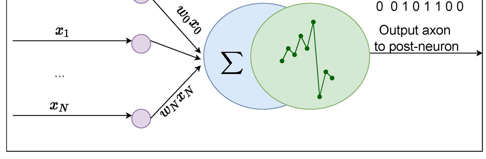
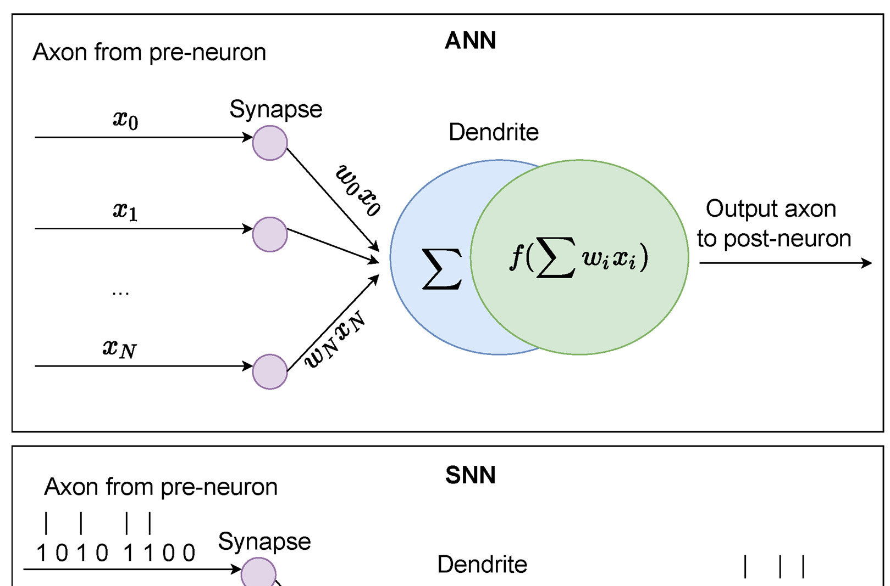

# Biomimetics 09 00444 V2

**Source Document:** `biomimetics-09-00444-v2.pdf`  
**Total Pages:** 41  

---

## --- Page 1 ---

### Section: Introduction 

Citation: Tenzin, S.; Rassau, A.; Chai,

D. Application of Event Cameras and

Neuromorphic Computing to VSLAM:

A Survey. Biomimetics 2024, 9, 444.

https://doi.org/10.3390/

biomimetics9070444

Academic Editor: Shaobing Gao

Received: 15 May 2024

Revised: 15 July 2024

Accepted: 18 July 2024

Published: 20 July 2024

Copyright: © 2024 by the authors.

Licensee MDPI, Basel, Switzerland.

This article is an open access article

distributed
under
the
terms
and

conditions of the Creative Commons

Attribution (CC BY) license (https://

creativecommons.org/licenses/by/

#### 4.0/).

biomimetics

Review
Application of Event Cameras and Neuromorphic Computing to
VSLAM: A Survey

Sangay Tenzin
, Alexander Rassau *
and Douglas Chai

School of Engineering, Edith Cowan University, Perth, WA 6027, Australia; s.tenzin@ecu.edu.au (S.T.);
d.chai@ecu.edu.au (D.C.)
* Correspondence: a.rassau@ecu.edu.au

Abstract: Simultaneous Localization and Mapping (SLAM) is a crucial function for most autonomous
systems, allowing them to both navigate through and create maps of unfamiliar surroundings.
Traditional Visual SLAM, also commonly known as VSLAM, relies on frame-based cameras and
structured processing pipelines, which face challenges in dynamic or low-light environments. How-
ever, recent advancements in event camera technology and neuromorphic processing offer promising
opportunities to overcome these limitations. Event cameras inspired by biological vision systems
capture the scenes asynchronously, consuming minimal power but with higher temporal resolution.
Neuromorphic processors, which are designed to mimic the parallel processing capabilities of the
human brain, offer efficient computation for real-time data processing of event-based data streams.
This paper provides a comprehensive overview of recent research efforts in integrating event cam-
eras and neuromorphic processors into VSLAM systems. It discusses the principles behind event
cameras and neuromorphic processors, highlighting their advantages over traditional sensing and
processing methods. Furthermore, an in-depth survey was conducted on state-of-the-art approaches
in event-based SLAM, including feature extraction, motion estimation, and map reconstruction
techniques. Additionally, the integration of event cameras with neuromorphic processors, focusing
on their synergistic benefits in terms of energy efficiency, robustness, and real-time performance,
was explored. The paper also discusses the challenges and open research questions in this emerging
field, such as sensor calibration, data fusion, and algorithmic development. Finally, the potential
applications and future directions for event-based SLAM systems are outlined, ranging from robotics
and autonomous vehicles to augmented reality.

Keywords: Simultaneous Localization and Mapping (SLAM); event camera; neuromorphic process-
ing; robotics; autonomous systems; sensor fusion; real-time processing; machine vision

#### 1. Introduction

A wide and growing variety of robots is increasingly being employed in different
indoor and outdoor applications. To support this, autonomous navigation systems have
become essential for carrying out many of the required duties [1]. However, such systems
must be capable of completing assigned tasks successfully and accurately with minimal
human intervention. To increase the effectiveness and efficiency of such systems, they
should be capable of navigating to a given destination while simultaneously updating their
real-time location and developing a map of the surroundings. Towards this, Simultaneous
Localization and Mapping (SLAM) is currently one of the most employed methods for
localization and navigation of mobile robots [2]. The concept of SLAM originated from the
robotics and computer vision field. SLAM is a joint problem of simultaneously locating the
position of the robots while developing a map of their surroundings [3]. It has become a
critical technology for tackling the difficulties of allowing machines (autonomous systems)
to independently navigate and map unfamiliar surroundings [3,4]. With SLAM, the location
and map information of the autonomous systems will be continuously updated in real time.

Biomimetics 2024, 9, 444. https://doi.org/10.3390/biomimetics9070444
https://www.mdpi.com/journal/biomimetics

## --- Page 2 ---

Biomimetics 2024, 9, 444
2 of 41

This process can help users in getting the status of the system, as well as serve as a reference
in making autonomous navigation-related decisions [3,5]. It helps robots gain autonomy
and reduce the requirement for human operation or intervention [3,4]. Moreover, with effec-
tive SLAM methods, mobile robots such as vacuum cleaners, autonomous vehicles, aerial
drones, and others [2,4] can effectively navigate a dynamic environment autonomously.

The sensor choice affects the performance and efficacy of the SLAM solution [3] and
should be decided based on the sensor’s information-gathering capability, power cost,
and precision. The primary sensor types commonly utilized in SLAM applications are
laser sensors (such as Light Detection and Ranging (LiDAR) sensors) and vision sensors.
Laser-based SLAM typically offers higher precision; however, these systems tend to be
more expensive and power-hungry [6]. Moreover, they lack semantic information and
face challenges in loop closure detection. In environments with a lack of scene diversity,
such as uniform corridors or consistently structured tunnels, degradation issues may arise,
particularly affecting laser SLAM performance compared to Visual SLAM (VSLAM) [6].
Conversely, VSLAM boasts advantages in terms of cost-effectiveness, compact size, minimal
power consumption, and the ability to perceive rich information, rendering it more suitable
for indoor settings [6].

In recent decades, VSLAM has gained significant development attention as research
has demonstrated that detailed scene information can be gathered from visual data [3,7], as
well as due to the increased availability of low-cost cameras [7,8]. In VSLAM, cameras such
as monocular, stereo, or RGB-D are used to gather visual information that can be used to
solve the localization and map-building problems. These cameras record a continuous video
stream by capturing frames of the surrounding environment at a specific rate. The different
types of VSLAM systems that have been developed based on these different camera types
are detailed in Section Limitations of Frame-Based Cameras in VSLAM, but generally,
the classical VSLAM framework follows the steps as shown in Figure 1: sensor data
acquisition, visual odometry (VO; also known as front-end), backend filtering/optimization,
loop closure, and reconstruction [9]. Sensor data acquisition involves the acquisition
and pre-processing of data captured by the sensors (a camera in the case of VSLAM).
VO is used to measure the movement of the camera between the adjacent frames (ego-
motion) and generate a rough map of the surroundings. The backend optimizes the camera
pose received from VO and the result of loop closure in order to generate an efficient
trajectory and map for the system. Loop closure determines if the system has previously
visited the location to minimize the accumulated drift and update the backend for further
optimization. With reconstruction, a map of the system can be developed based on the
camera trajectory estimation.

Figure 1. Classic visual SLAM framework.

![In recent decades, VSLAM has gained significant development attention as research has demonstrated that detailed scene information can be gathered from visual data [3,7], as well as due to the increased availability of low-cost cameras [7,8]. In VSLAM, cameras such as monocular, stereo, or RGB-D are used to gather visual information that can be used to solve the localization and map-building problems. These cameras record a continuous video stream by capturing frames of the surrounding environment at a specific rate. The different types of VSLAM systems that have been developed based on these different camera types are detailed in Section Limitations of Frame-Based Cameras in VSLAM, but generally, the classical VSLAM framework follows the steps as shown in Figure 1: sensor data acquisition, visual odometry (VO; also known as front-end), backend filtering/optimization, loop closure, and reconstruction [9]. Sensor data acquisition involves the acquisition and pre-processing of data captured by the sensors (a camera in the case of VSLAM). VO is used to measure the movement of the camera between the adjacent frames (ego- motion) and generate a rough map of the surroundings. The backend optimizes the camera pose received from VO and the result of loop closure in order to generate an efficient trajectory and map for the system. Loop closure determines if the system has previously visited the location to minimize the accumulated drift and update the backend for further optimization. With reconstruction, a map of the system can be developed based on the camera trajectory estimation. | Figure 1. Classic visual SLAM framework.](images/page_002_fig_01.png)
*Caption/Context: In recent decades, VSLAM has gained significant development attention as research has demonstrated that detailed scene information can be gathered from visual data [3,7], as well as due to the increased availability of low-cost cameras [7,8]. In VSLAM, cameras such as monocular, stereo, or RGB-D are used to gather visual information that can be used to solve the localization and map-building problems. These cameras record a continuous video stream by capturing frames of the surrounding environment at a specific rate. The different types of VSLAM systems that have been developed based on these different camera types are detailed in Section Limitations of Frame-Based Cameras in VSLAM, but generally, the classical VSLAM framework follows the steps as shown in Figure 1: sensor data acquisition, visual odometry (VO; also known as front-end), backend filtering/optimization, loop closure, and reconstruction [9]. Sensor data acquisition involves the acquisition and pre-processing of data captured by the sensors (a camera in the case of VSLAM). VO is used to measure the movement of the camera between the adjacent frames (ego- motion) and generate a rough map of the surroundings. The backend optimizes the camera pose received from VO and the result of loop closure in order to generate an efficient trajectory and map for the system. Loop closure determines if the system has previously visited the location to minimize the accumulated drift and update the backend for further optimization. With reconstruction, a map of the system can be developed based on the camera trajectory estimation. | Figure 1. Classic visual SLAM framework.*

## --- Page 3 ---

Biomimetics 2024, 9, 444
3 of 41

Conventional VSLAM systems gather image data at fixed frame rates, which results in
repetitive and often redundant information leading to high computational requirements
and other drawbacks [10,11]. Further, they often fail to achieve the expected performance
in challenging environments, such as those with high dynamic ranges or light-changing
conditions [10,12–17], due to constraints such as susceptibility to motion blur, high power
consumption, and low dynamic range. These limitations of frame-based cameras will
be discussed in more detail in Section Limitations of Frame-Based Cameras in VSLAM,
below, but given these issues, research in emerging technologies of event cameras has
evolved to attempt to address them. The advent of novel concepts and the production of
bio-inspired visual sensors and processors through developments in neuroscience and neu-
romorphic technologies have brought a radical change in the processes of artificial visual
systems [18–20]. An event camera (also known as a Dynamic Vision Sensor (DVS) or neuro-
morphic camera) operates very differently from conventional frame-based cameras; it only
generates an output (in the form of timestamped events or spikes) when there are changes
in the brightness of a scene [13,18,19]. Figure 2 depicts the three-layer model of a human
retina and corresponding event camera pixel circuitry. Compared to regular cameras, event
cameras have greater dynamic range, reduced latency, higher temporal resolution, and
significantly lower power consumption and bandwidth usage [3,13,14,20–25]. However,
sensors based on these principles are relatively new to the market and their integration
poses some challenges as new algorithms are needed because existing approaches are not
directly applicable.

Figure 2. Three-layer model of a human retina and corresponding event camera pixel circuitry
(adapted from [26]).

Similarly, in an attempt to further reduce the power cost, the research trends of mimick-
ing the biological intelligence of the human brain and its behavior, known as neuromorphic
computing [12,27], are gaining more research focus for application in autonomous systems
and robots as an extension to the use of event-based cameras for SLAM [27]. In neuro-
morphic computing, computational systems are designed by mimicking the composition
and operation of the human brain. The objective is to create algorithms and hardware
replicating the brain’s energy efficiency and parallel processing capabilities [28]. Unlike
von Neumann computers, neuromorphic computers (also known as non-von Neumann
computers) consist of neurons and synapses rather than a separate central processing unit
(CPU) and memory units [29]. Moreover, as they are fully event-driven and highly parallel,
in contrast to traditional computing systems, they can natively deal with spike-based out-
puts rather than binary data [29]. Furthermore, the advent of neuromorphic processors with

![Conventional VSLAM systems gather image data at fixed frame rates, which results in repetitive and often redundant information leading to high computational requirements and other drawbacks [10,11]. Further, they often fail to achieve the expected performance in challenging environments, such as those with high dynamic ranges or light-changing conditions [10,12–17], due to constraints such as susceptibility to motion blur, high power consumption, and low dynamic range. These limitations of frame-based cameras will be discussed in more detail in Section Limitations of Frame-Based Cameras in VSLAM, below, but given these issues, research in emerging technologies of event cameras has evolved to attempt to address them. The advent of novel concepts and the production of bio-inspired visual sensors and processors through developments in neuroscience and neu- romorphic technologies have brought a radical change in the processes of artificial visual systems [18–20]. An event camera (also known as a Dynamic Vision Sensor (DVS) or neuro- morphic camera) operates very differently from conventional frame-based cameras; it only generates an output (in the form of timestamped events or spikes) when there are changes in the brightness of a scene [13,18,19]. Figure 2 depicts the three-layer model of a human retina and corresponding event camera pixel circuitry. Compared to regular cameras, event cameras have greater dynamic range, reduced latency, higher temporal resolution, and significantly lower power consumption and bandwidth usage [3,13,14,20–25]. However, sensors based on these principles are relatively new to the market and their integration poses some challenges as new algorithms are needed because existing approaches are not directly applicable. | Figure 2. Three-layer model of a human retina and corresponding event camera pixel circuitry (adapted from [26]).](images/page_003_fig_01.png)
*Caption/Context: Conventional VSLAM systems gather image data at fixed frame rates, which results in repetitive and often redundant information leading to high computational requirements and other drawbacks [10,11]. Further, they often fail to achieve the expected performance in challenging environments, such as those with high dynamic ranges or light-changing conditions [10,12–17], due to constraints such as susceptibility to motion blur, high power consumption, and low dynamic range. These limitations of frame-based cameras will be discussed in more detail in Section Limitations of Frame-Based Cameras in VSLAM, below, but given these issues, research in emerging technologies of event cameras has evolved to attempt to address them. The advent of novel concepts and the production of bio-inspired visual sensors and processors through developments in neuroscience and neu- romorphic technologies have brought a radical change in the processes of artificial visual systems [18–20]. An event camera (also known as a Dynamic Vision Sensor (DVS) or neuro- morphic camera) operates very differently from conventional frame-based cameras; it only generates an output (in the form of timestamped events or spikes) when there are changes in the brightness of a scene [13,18,19]. Figure 2 depicts the three-layer model of a human retina and corresponding event camera pixel circuitry. Compared to regular cameras, event cameras have greater dynamic range, reduced latency, higher temporal resolution, and significantly lower power consumption and bandwidth usage [3,13,14,20–25]. However, sensors based on these principles are relatively new to the market and their integration poses some challenges as new algorithms are needed because existing approaches are not directly applicable. | Figure 2. Three-layer model of a human retina and corresponding event camera pixel circuitry (adapted from [26]).*

## --- Page 4 ---

Biomimetics 2024, 9, 444
4 of 41

various sets of signals to mimic the behavior of biological neurons and synapses [12,30,31]
has paved a new direction in the neuroscience field. This enables the hardware to asyn-
chronously communicate between its components and the memory in an efficient manner,
which results in less consumption of power in addition to other advantages [12,29,31]. As
the computation is based on neural networks, it has become a primarily relevant platform
for use in artificial intelligence and machine learning applications to enhance robustness
and performance [29,32].

The combination of event cameras and neuromorphic processing, which takes inspi-
ration from the efficiency of the human brain, has the potential to offer a revolutionary
approach to improve VSLAM capabilities [18]. The use of event cameras in SLAM systems
enables them to handle dynamic situations and fast motion without being affected by mo-
tion blur or illumination variations. Event cameras provide high dynamic range imagery
and low latency through asynchronous pixel-level brightness change capture [13,18,19,22].
Additionally, neuromorphic processors emulate the brain’s structure and functionality [28],
enabling efficient and highly parallel processing, which is particularly advantageous for
real-time SLAM operations on embedded devices. This integration would facilitate im-
proved perception, adaptability, and efficiency in SLAM applications, overcoming the
limitations of conventional approaches and paving the way for more robust and versa-
tile robotic systems [3]. The successful implementation of these trending technologies is
expected to make smart and creative systems capable of making logical analyses at the
edge, further enhancing the productivity of the processes, improving precision and mini-
mizing the exposure of humans to hazards [12,27,33]. However, to the best of the authors’
knowledge, there are no existing reviews on the integration of these emerging technologies
and there remains a lack of comprehensive reviews encompassing both event cameras and
neuromorphic computing in SLAM research. The reviews by [15,18] primarily discussed
event cameras and gave only a brief introduction to both SLAM and the application of
neuromorphic computing. Similarly, refs. [12,31,34,35] covered neuromorphic computing
technology and its challenges; however, no clear direction towards its integration into
event-based SLAM was provided. Other review papers [24,36–40] have mentioned the
methods and models to be employed in SLAM but did not discuss the combined approach.

The focus and intent of this review article, therefore, is to present a comprehensive
exploration of VSLAM techniques, focusing particularly on the limitations of standard
frame-based cameras within this application area, the emergence of event cameras as an
alternative, and the integration of neuromorphic computing within an event-driven system
for enhanced performance. For this review, relevant articles from research databases (such
as Web of Science, IEEE Explorer, and Google Scholar) and patents were identified using the
keywords SLAM, VSLAM, event camera, and neuromorphic computing, and combinations
of those keywords (event-based SLAM, neuromorphic SLAM, and others), to select a set
of relevant papers. Additionally, to streamline the search queries, criteria on year range
(for example, from 2019) were used to select the most recent and up-to-date articles for
the review. Through the thorough analysis and review of articles gathered using these
methods, this paper aims to provide the following contributions to the knowledge base in
the field of VSLAM technology:

1.
A critical analysis and discussion on the methods and technologies employed by
traditional VSLAM systems.
2.
An in-depth discussion on the challenges and further directions to improve or resolve
the identified problems or limitations of traditional VSLAMs.
3.
A rationale for and analysis of the use of event cameras in VSLAM to overcome the
issues faced by conventional VSLAM approaches.
4.
A detailed exploration of the feasibility of integrating neuromorphic processing into
event-based VSLAM systems to further enhance performance and power efficiency.

## --- Page 5 ---

### Section: Camera-Based SLAM (VSLAM) 

Biomimetics 2024, 9, 444
5 of 41

The overall structure of the paper is organized as follows:
•
Introduction: Provides an overview of the problem domain and highlights the need
for advancements in VSLAM technology.
•
Frame-based cameras in VSLAM (Section 2): Discusses the traditional approach to
VSLAM using frame-based cameras, outlining their limitations and challenges.
•
Event cameras (Section 3): Introduces event cameras and their operational principles,
along with discussing their potential benefits and applications across various domains.
•
Neuromorphic computing in VSLAM (Section 4): Explores the application of neuro-
morphic computing to the VSLAM problem, emphasizing its capability to address
performance and power consumption issues commonly encountered within the au-
tonomous systems context.
•
Summary and future directions (Section 5): Provides a synthesis of the key findings
from the previous sections and outlines potential future directions for VSLAM research,
particularly focusing on the integration of event cameras and neuromorphic processors.

It is hoped that this structure will guide readers through a logical progression from
understanding the limitations of traditional camera-based VSLAM approaches to envision-
ing the potential of cutting-edge technologies such as event cameras and neuromorphic
computing in advancing VSLAM capabilities.

#### 2. Camera-Based SLAM (VSLAM)

For SLAM implementations, VSLAM is more popular than LiDAR-based SLAM
for smaller-scale autonomous systems, particularly unmanned aerial vehicles (UAVs), as
it is compact, cost-effective, and less power-intensive [3,7,9,24,37,41]. Unlike the laser-
based systems, VSLAM employs various cameras such as monocular, stereo, and RGB-D
cameras for capturing the surrounding scene and is being explored by researchers for
implementation in autonomous systems and other applications [3,9,24,37,41]. It has gained
popularity in the last decade as it has succeeded in retrieving detailed information (color,
texture, and appearance) using low-cost cameras, and some progress towards practical
implementation in real environments has been made [3,7,18,24]. One prevalent issue
encountered in VSLAM systems is the issue of cumulative drift [6]. Minor inaccuracies
are produced with every calculation and optimization made by the front end of the SLAM
system. These small errors accumulate over the extended durations of uninterrupted
camera movement, which eventually causes the estimated trajectory to deviate from the
real motion trajectory.

These traditional camera-based VSLAM systems have generally failed to achieve
the expected performance in challenging environments such as those with high dynamic
ranges or changing lighting conditions [10,12–16,18] due to constraints such as susceptibil-
ity to motion blur, noise susceptibility, and low dynamic range, among others. Moreover,
the information gathered with traditional VSLAM is inadequate to fulfil the tasks of au-
tonomous navigation and obstacle avoidance, as well as the interaction needs of intelligent
autonomous systems in dealing with the human environment [10].

In line with the growing popularity of VSLAM in the last decade, researchers have
worked on designing improved algorithms towards making practical and robust solutions
for SLAM a reality. However, most of the successfully developed algorithms such as
MonoSLAM [42], PTAM [43], DTAM [44], and SLAM++ [45] have been developed for
stationary environments, where it is assumed that the camera is the sole moving item in a
static environment. This means they are not suitable for applications where both the scene
and the object are dynamic [46], like autonomous vehicles and UAVs.

Table 1 provides a summary of the range of VSLAM algorithms that have been
developed for testing and implementation in SLAM systems and the different sensor
modalities used by each.

## --- Page 6 ---

Biomimetics 2024, 9, 444
6 of 41

Table 1. Classification of VSLAM algorithms/methods.

Year
Name
Sensors
Descriptions (Key Points)
Strength (Achievements)

2024
TextSLAM
[47]
RGB-D
Text objects in the environment are
used to extract semantic features

More accurate and robust even
under challenging conditions

2023
HFNet-SLAM
[8]
Monocular
Extension of ORB-SLAM3
(incorporates CNNs)

Performs better than
ORB-SLAM3 (higher accuracy)

2022
SO-SLAM
[48]
Monocular
Introduced object spatial constraints
(object level map)

Proposed two new methods for
object SLAM

2022
SDF-SLAM
[49]
Monocular
Semantic deep fusion model with
deep learning

Less absolute error than the
state-of-the-art SLAM
framework

2022
UV-SLAM
[50]
Monocular
Vanishing points (line features) are
used for structural mapping

Localization accuracy and
mapping quality have improved

2021
RS-SLAM
[51]
RGB-D
Employed semantic segmentation
model

Both static and dynamic objects
are detected

2021
RDMO-SLAM
[52]
RGB-D
Semantic label prediction using dense
optical flow

Reduce the influence of dynamic
objects in tracking

2021
RDS-SLAM
[53]
RGB-D

Extends ORB-SLAM3; Added
semantic thread and a semantic-based
optimization thread

Tracking thread is not required
to wait for semantic information
as novel threads run in parallel

2021
ORB-SLAM3
[54]

Monocular, Stereo
and RGB-D

Perform visual, visual-inertial and
multimap SLAM

Effectively exploits the data
associations and boosts the
system accuracy level

2020
Structure-SLAM
[55]
Monocular
Decoupled rotation and translation
estimation

Outperforms the state of the art
on common SLAM benchmarks

2020
VPS-SLAM
[56]
RGB-D
Combined low-level VO/VIO with
planar surfaces

Provides better results than the
state-of-the-art VO/VIO
algorithms

2020
DDL-SLAM
[46]
RGB-D

Dynamic object segmentation and
background painting added to
ORB-SLAM2

Dynamic objects detected
utilizing semantic segmentation
and multi-view geometry

2019
PL-SLAM
[57]
Stereo
Combines point and line segments

The first open-source SLAM
system with points and line
segment features

2017
ORB-SLAM2
[58]

Monocular, Stereo
and RGB-D

Complete SLAM system including
map reuse, loop closing, and
re-localization capabilities

Achieved state-of-the-art
accuracy while evaluating
29 popular public sequences

2015
ORB-SLAM
[59]
Monocular
Feature-based monocular SLAM
system

Robust to motion clutter, allows
wide baseline loop closing and
re-localization

2014
LSD-SLAM
[60]
Monocular
Direct monocular SLAM system

Achieved post-estimation
accuracy and 3D environment
reconstructions

2011
DTAM
[44]
Monocular
Camera tracking and reconstruction
based on a dense feature

Achieved real-time performance
using the commodity GPU
hardware

2007
PTAM
[43]
Monocular
Estimate camera pose in an unknown
scene

Accuracy and robustness have
surpassed the state-of-the-art
system

2007
MonoSLAM
[42]
Monocular
Real-Time Single Camera SLAM
Recovered the 3D trajectory of a
monocular camera

## --- Page 7 ---

### Section: Event Camera-Based SLAM 

Biomimetics 2024, 9, 444
7 of 41

Limitations of Frame-Based Cameras in VSLAM

While there have been some significant successes in the development of VSLAM algo-
rithms for traditional frame-based cameras, some limitations still exist, as described below.

•
Ambiguity in feature matching: In feature-based SLAM, feature matching is considered
a critical step. However, frame-based cameras face difficulty in capturing scenes with
ambiguous features (e.g., plain walls). Moreover, data without depth information
(as obtained from standard monocular cameras) makes it even harder for the feature-
matching process to distinguish between similar features, which can lead to potential
errors in data association.
•
Sensitivity to lighting conditions: The sensitivity of traditional cameras to changes
in lighting conditions affects the features and makes it more challenging to match
features across frames consistently [7]. This can result in errors during the localization
and mapping process.
•
Limited field of view: The use of frame-based cameras can be limited due to their in-
herently limited field of view. This limitation becomes more apparent in environments
with complex structures or large open spaces. In such cases, having multiple cameras
or additional sensor modalities may become necessary to achieve comprehensive
scene coverage, but this can lead to greatly increased computational costs as well as
other complexities.
•
Challenge in handling dynamic environments: Frame-based cameras face difficul-
ties when it comes to capturing dynamic environments, especially where there is
movement of objects or people. It can be challenging to track features consistently
in the presence of moving entities, and other sensor types such as depth sensors or
inertial measurement units (IMUs) must be integrated, or additional strategies must
be implemented to mitigate those challenges. Additionally, in situations where objects
in a scene are moving rapidly, particularly if the camera itself is on a fast-moving
platform (e.g., a drone), then motion blur can significantly degrade the quality of
captured frames unless highly specialized cameras are used.
•
High computational requirements: Although frame-based cameras are typically less
computationally demanding than depth sensors such as LiDAR, feature extraction
and matching processes can still necessitate considerable computational resources,
particularly for real-time applications.

#### 3. Event Camera-Based SLAM

Due to the limitations of traditional cameras highlighted in the previous section, event
cameras have begun to be explored by researchers in the field of SLAM. Event cameras
have gained attention due to their unique properties, such as high temporal resolution,
low latency, and high dynamic range. However, tackling the SLAM issue using event
cameras has proven challenging due to the inapplicability of traditional frame-based camera
methods and concepts such as feature detection, matching, and iterative image alignment.
Events are fundamentally distinct from images as illustrated in Figure 3, which shows
the differing output of frame-based cameras relative to event cameras. This necessitates
the development of novel techniques for solution of the SLAM problem. The primary
task has been to devise approaches that harness the unique advantages of event cameras,
demonstrating their efficacy in addressing challenging scenarios that are problematic for
current frame-based cameras. A primary aim when designing the methods has been to
preserve the low latency nature of event data, thereby estimating a state for every new
event. However, individual events lack sufficient data to create a complete state estimate,
such as determining the precise position of a calibrated camera with six degrees of freedom
(DoF). Consequently, the objective has shifted to enabling each event to independently
update the system’s state asynchronously [18].

## --- Page 8 ---

### Section: Event Camera Operating Principles 

Biomimetics 2024, 9, 444
8 of 41

(a) 
(b)

Figure 3. The output of a traditional frame-based camera (upper) vs. an event camera (lower):
(a) with a rotating object; (b) with a steady object (constant brightness); in this case, no events are
generated as depicted by the empty final graph [18].

Utilizing event cameras’ asynchrony and high temporal resolution, SLAM algorithms
can benefit from reduced motion blur and improved visual perception in dynamic en-
vironments, ultimately leading to more robust and accurate mapping and localization
results [61]. It can enhance the reconstruction of 3D scenes and enable tracking of fast
motion with high precision. Furthermore, a low data rate and reduced power consumption
compared to traditional cameras make them ideal for resource-constrained devices in ap-
plications such as autonomous vehicles, robotics, and augmented reality [61]. Moreover, it
can be used to significantly increase the frame rate of low-framerate video while occupying
significantly less memory space than conventional camera frames, enabling efficient and
superior-quality video frame interpolation [22].

The integration of event cameras in SLAM systems opens new possibilities for effi-
cient and accurate mapping, localization, and perception in dynamic environments, while
also reducing power consumption and memory usage. These enhanced capabilities also
enable new opportunities and applications, some of which are discussed in more detail in
Section 3.4.

#### 3.1. Event Camera Operating Principles

Standard cameras and event cameras have significant differences when it comes to
their working principle and operation [18,21]. Conventional cameras record a sequence of
images at a predetermined frames per second (fps) rate, capturing intensity values for every
pixel in every frame. On the other hand, event cameras record continuous-time event data,
timestamped with microsecond resolution, with an event representing a detected change in
pixel brightness [18,20,61,62]. Each pixel continuously updates the log intensity, and this is
monitored for any notable changes in its value. If the value changes (either high or low)
more than a certain threshold, an event will be generated [18]. The process of generating
events by the event camera with the change in illumination is shown in Figure 4.

An event is represented as a tuple, ek = (xk, yk, tk, pk), where (xk, yk) denotes the
pixel coordinates that caused the event, tk is the timestamp, and pk = ±1 denotes the
polarity or direction of the change in brightness [61]. Events are transferred from the pixel
array to the peripheral and back again over a shared digital output bus, typically using the
address-event representation (AER) readout technique [63]. Saturation of this bus, however,
can occur and cause hiccups in the event transmission schedule. Event cameras’ readout
rates range from 2 MHz to 1200 MHz, depending on the chip and hardware interface type
being used [18].

![Biomimetics 2024, 9, 444 8 of 41 | Figure 3. The output of a traditional frame-based camera (upper) vs. an event camera (lower): (a) with a rotating object; (b) with a steady object (constant brightness); in this case, no events are generated as depicted by the empty final graph [18].](images/page_008_fig_01.jpeg)
*Caption/Context: Biomimetics 2024, 9, 444 8 of 41 | Figure 3. The output of a traditional frame-based camera (upper) vs. an event camera (lower): (a) with a rotating object; (b) with a steady object (constant brightness); in this case, no events are generated as depicted by the empty final graph [18].*

![Biomimetics 2024, 9, 444 8 of 41 | Figure 3. The output of a traditional frame-based camera (upper) vs. an event camera (lower): (a) with a rotating object; (b) with a steady object (constant brightness); in this case, no events are generated as depicted by the empty final graph [18].](images/page_008_fig_02.jpeg)
*Caption/Context: Biomimetics 2024, 9, 444 8 of 41 | Figure 3. The output of a traditional frame-based camera (upper) vs. an event camera (lower): (a) with a rotating object; (b) with a steady object (constant brightness); in this case, no events are generated as depicted by the empty final graph [18].*

## --- Page 9 ---

### Section: Event Generation Model 

Biomimetics 2024, 9, 444
9 of 41

Figure 4. The process of generating events by the event camera (adapted from [26]); the ON (upward)
arrow represents an increase and the OFF (downward) arrow depicts a decrease in log intensity value
than the threshold.

Event cameras are essentially sensors that react to motion and brightness variations in
a scene. They produce more events per second when there is greater motion. The reason
is that every pixel modifies the rate at which it samples data using a delta modulator in
response to variations in the log intensity signal it tracks. These sensors can respond to
visual stimuli rapidly because of the sub-millisecond latency and microsecond precision
timestamped events. Surface reflectance and scene lighting both affect how much light a
pixel receives. A change in log intensity denotes a proportional change in reflectance in
situations where illumination is largely constant. The primary cause of these reflectance
changes is the motion of objects in the field of view. Consequently, the brightness change
events captured inherently possess an invariance to changes in scene illumination.

#### 3.1.1. Event Generation Model

At each pixel position uk the event camera sensor first records and stores the logarith-
mic intensity of brightness, or L(uk ) = log(I(uk)) and then continuously monitors this
intensity value. The camera sensor at the pixel position uk = (xk, yk) generates an event,
denoted by ek, at time tk when the difference in intensity, ∆L(uk, tk) exceeds a threshold, C,
which is referred to as contrast sensitivity.

∆L(uk, tk) = L(uk, tk) −L(uk, tk −∆tk) = pkC
(1)

The last timestamp that was recorded in this context is tk −∆tk, which occurs when an
event is triggered at the pixel uk. The camera sensor then creates new events by iterating
through the procedure to detect any changes in brightness at this pixel, updating the stored
intensity value L(uk, tk). The adjustable parameter C, or temporal contrast sensitivity,
is essential to the camera’s functioning; it is usually set in the range of 10% to 15%. A
high contrast sensitivity can result in fewer events produced by the camera and potential
information loss, whereas a low contrast sensitivity may cause an excessive number of
noisy events.

#### 3.1.2. Event Representation

The event camera records brightness variations at every pixel, producing a constant
stream of event data. The low information content in each record and the sparse temporal
nature of the data make the processing difficult. Filter-based methods directly process raw
event data by combining it with sequential data, but they come with a high computational
cost because they must update the camera motion for every new event. To mitigate this
problem, alternative methods employ representations that combine event sequences and

![Biomimetics 2024, 9, 444 9 of 41 | Figure 4. The process of generating events by the event camera (adapted from [26]); the ON (upward) arrow represents an increase and the OFF (downward) arrow depicts a decrease in log intensity value than the threshold.](images/page_009_fig_01.png)
*Caption/Context: Biomimetics 2024, 9, 444 9 of 41 | Figure 4. The process of generating events by the event camera (adapted from [26]); the ON (upward) arrow represents an increase and the OFF (downward) arrow depicts a decrease in log intensity value than the threshold.*

## --- Page 10 ---

Biomimetics 2024, 9, 444
10 of 41

approximate camera motion for a collection of occurrences, achieving an equilibrium
between computing cost and latency.

Common event representations for event-based VSLAM algorithms are described
below:

Individual event: On an event-by-event basis, each event ek = (xk, yk, tk, pk) may
be directly utilized in filter-based models, such as probabilistic filters [64] and spiking
neural networks (SNNs) [65]. With every incoming event, these models asynchronously
change their internal states, either by recycling states from earlier events or by obtaining
new information from outside sources, such as inertial data [18]. Although filter-based
techniques can produce very little delay, they generally require a significant amount of
processing power.

Packet: The event packet, also known as the point set, is an alternate representation
used in event cameras. It stores an event data sequence directly in a temporal window of
size N and is stated as follows:

ε = {ek}N

k = 1
(2)

Event packets maintain specific details like polarity and timestamps, just like individ-
ual events do. Event packets facilitate batch operations in filter-based approaches [66] and
streamline the search for the best answers in optimization methods [67,68] because they
aggregate event data inside temporal frames. There are several variations of event packets,
including event queues [67] and local point sets [68].

Event frame: A condensed 2D representation of an event that gathers data at a single
pixel point is called an event frame. Assuming consistent pixel coordinates, this representa-
tion is achieved by transforming a series of events into an image-like format that is used as
input for conventional frame-based SLAM algorithms [18].

Time surface: The time surface (TS), also called the surface of active events (SAE), is a
2D representation in which every pixel contains a single time value, often the most recent
timestamp of the event that occurred at that pixel [18]. A spatially structured visualization
of the temporal data related to occurrences throughout the camera’s sensor array is offered
by the time surface. Due to its ability to trace the time of events at different points on the
image sensor, this representation can be helpful in a variety of applications, such as visual
perception and motion analysis [18].

Motion-compensated event frame: A motion-compensated event frame refers to a
representation in event cameras where the captured events are aggregated or accumulated
while compensating for the motion of the camera or objects in the scene [18]. Unlike tradi-
tional event frames that accumulate events at fixed pixel positions, motion-compensated
event frames consider the dynamic changes in the scene over time. The events contributing
to the frame are not simply accumulated at fixed pixel positions, but rather the accumu-
lation is adjusted based on the perceived motion in the scene. This compensation can
be performed using various techniques, such as incorporating information from inertial
sensors, estimating camera motion, or using other motion models [18].

Voxel grid: A voxel grid can be used as a representation of 3D spatial information
extracted from the events captured by the camera. Instead of traditional 2D pixel-based
representations, a voxel grid provides a volumetric representation of the environment [18],
allowing for 3D scene reconstruction, mapping, and navigation.

3D point set: Events within a spatiotemporal neighborhood are regarded as points in
3D space, denoted as (xk, yk, tk)ϵR. Consequently, the temporal dimension is transformed
into a geometric one. Plane fitting [69] or Point Net [70] are two point-based geometric
processing methods that use this sparsely populated form.

Point sets on the image plane: On the picture plane, events are viewed as a dynamic
collection of 2D points. This representation is frequently used in early shape-tracking
methods that use methods like mean-shift or iterative closest point (ICP) [71–75], in which
the only information needed to follow edge patterns is events.

## --- Page 11 ---

### Section: Method 

Biomimetics 2024, 9, 444
11 of 41

#### 3.2. Method

To process the events, a relevant and valid method is required depending on the event
representation and specifics of the hardware platform. Moreover, the relevant information
from event data that needs to be extracted to fulfil the required task depends on the
application and algorithm being utilized [18]. However, the efficacy of such efforts varies
significantly based on the nature of the application and the unique demands it places on
the data being extracted [18]. Figure 5 presents an overview of common methods used for
event-based SLAM.

Figure 5. Common methods used in event-based SLAM.

#### 3.2.1. Feature-Based Methods

The feature-based VSLAM algorithms comprise two main elements: (1) the extraction
and tracking of features, and (2) the tracking and mapping of the camera. During the
feature extraction phase, resilient features, immune to diverse factors such as motion, noise,
and changes in illumination, are identified. The ensuing feature tracking phase is employed
to link features that correspond to identical points in the scene. Leveraging these associated
features, algorithms for camera tracking and mapping concurrently estimate the relative
poses of the camera and the 3D landmarks of the features.

Feature Extraction

Methods for feature extraction identify shape primitives within the event stream,
encompassing features based on points and lines. Point-based features denote points of
significance, such as the intersection of event edges. Various methods for point-based
feature extraction, particularly corners, in the context of event cameras, have been used in
the last decade or so. Traditional techniques involve employing algorithms like local plane
fitting [76,77], frame-based corner detectors (e.g., eHarris [78], CHEC [79], eFAST [80]),
and extensions of the Harris and FAST detectors to different event representations [81–83].
These methods, however, suffer from computational complexity, sensitivity to motion
changes, and susceptibility to noise in event cameras [61]. To address these challenges,
learning-based approaches [84,85] have been proposed, including the use of speed-invariant
time surfaces and recurrent neural networks (RNNs) to enhance corner detection stability
by implicitly modeling motion-variant patterns and event noise.

On the other hand, line-based features consist of clusters of events situated along
straight lines. Several algorithms including classical methods like the Hough transforma-
tion and Line Segment Detector (LSD) [86] have been employed. Some approaches leverage
spatiotemporal relationships [87] in event data, while others use external IMU [88] data to
group events. Examples include a spiking Hough transformation algorithm using spiking

![3.2. Method | To process the events, a relevant and valid method is required depending on the event representation and specifics of the hardware platform. Moreover, the relevant information from event data that needs to be extracted to fulfil the required task depends on the application and algorithm being utilized [18]. However, the efficacy of such efforts varies significantly based on the nature of the application and the unique demands it places on the data being extracted [18]. Figure 5 presents an overview of common methods used for event-based SLAM.](images/page_011_fig_01.jpeg)
*Caption/Context: 3.2. Method | To process the events, a relevant and valid method is required depending on the event representation and specifics of the hardware platform. Moreover, the relevant information from event data that needs to be extracted to fulfil the required task depends on the application and algorithm being utilized [18]. However, the efficacy of such efforts varies significantly based on the nature of the application and the unique demands it places on the data being extracted [18]. Figure 5 presents an overview of common methods used for event-based SLAM.*

## --- Page 12 ---

Biomimetics 2024, 9, 444
12 of 41

neurons [89] and extending the Hough transformation to a 3D point-based map [90] for
improved performance. Event-based VO with point and line features (PL-EVIO) leverages
line-based event features to add more structure and constraint while efficiently handling
the point-based event and picture characteristics; ref. [91] directly applies the LSD algo-
rithm to motion-compensated event streams, while the Event-based Line Segment Detector
(ELiSeD) [92] computes event orientation using the Sobel filter. Other methods use optical
flow [93] or plane-fitting algorithms [87] to cluster events and extract lines, demonstrating
different techniques for line-based feature extraction from event data.

Feature Tracking

When working with event-based data, feature-tracking algorithms are utilized to link
events to the relevant features. Motion trajectories, locations, and 2D rigid body trans-
formations are examples of parametric models of feature templates that these algorithms
update [61]. Methods include parametric transformations like the Euclidean transformation
and descriptor matching for feature correspondences. Deep learning approaches use neural
networks to predict feature displacements. Euclidean transformations model positions
and orientations of event-based features, and tracking involves ICP algorithms [94] with
enhancements like Euclidean distance weighting and 2D local histograms to improve accu-
racy and reduce drift. Some trackers, such as the Feature Tracking using Events and Frames
(EKLT) tracker [95], align local patches of the brightness incremental image from event data
with feature patterns and estimate brightness changes using the linearized Edge Gradient
Method (EGM). Feature tracking often involves modeling feature motions on the image
plane, with methods using expectation-maximization (EM) optimization steps [81,82] and
the Lucas–Kanade (LK) optical flow tracker [83,91]. Continuous curve representations, like
Bezier curves [96] and B-splines [97], are explored to address linear model assumptions.
Multi-hypothesis methods [67,98] are proposed to handle event noise by discretizing spatial
neighborhoods into hypotheses based on distance and orientation. Various techniques
include using feature descriptors for direct correspondence establishment and building
graphs with nodes representing event characteristics for tracking based on their discrete
positions on the image plane [99,100]. Traditional linear noise models are contrasted with
deep learning methods that implicitly model event noise [101].

Camera Tracking and Mapping

VSLAM algorithms, particularly those adapted for event-based tracking and mapping,
introduce two main paradigms: one where 3D maps are initialized, and tracking and
mapping are performed in parallel threads, and another where tracking and mapping are
carried out simultaneously through joint optimization. The former offers computational
efficiency, while the latter helps prevent drift errors. Event-based VSLAM approaches
in camera tracking and mapping are categorized into four types: conventional frame-
based methods, filter-based methods, continuous-time camera trajectory methods, and
spatiotemporal consistency methods.

Conventional frame-based methods adapt existing VSLAM algorithms for event-based
tracking and mapping using 2D image-like event representation. Various techniques, such
as reprojection error and depth estimation, are employed for camera pose estimation.
Event-based Visual Inertial Odometry (EVIO) [82] methods utilize IMU pre-integration and
sliding-window optimization. Filter-based methods handle asynchronous event data using
a state defined as the current camera pose and a random diffusion model as the motion
model. These methods correct the state using error measurements, with examples incor-
porating planar features and event occurrence probabilities. Line-based SLAM methods
update filter states during camera tracking and use the Hough transformation to extract
3D lines. Continuous-time camera trajectory methods represent the camera trajectory
as a continuous curve, addressing the parameterization challenge faced by filter-based
methods. Joint optimization methods based on incremental Structure from Motion (SfM)
are proposed to update control states and 3D landmarks simultaneously. Spatiotemporal

## --- Page 13 ---

### Section: Direct Method 

Biomimetics 2024, 9, 444
13 of 41

consistency methods introduce a constraint for events under rotational camera motion,
optimizing motion parameters through iterative searches and enforcing spatial consistency
using the trimmed ICP algorithm.

#### 3.2.2. Direct Method

Direct methods do not require explicit data association, as opposed to feature-based
approaches, and instead directly align event data in camera tracking and mapping algo-
rithms. Although frame-based direct approaches use pixel intensities between selected
pixels in source and target images to estimate relative camera poses and 3D positions,
they are not applicable to event streams because of their asynchronous nature and the
absence of brightness change information in the event data. Two kinds of event-based direct
techniques—event-image alignment and event representation-based alignment—have been
developed to overcome this difficulty. The Edge Gradient Method (EGM) is used by event-
image alignment techniques, such as those demonstrated by [64,102], to take advantage of
the photometric link between brightness variations from events and absolute brightness
in images. Event representation-based alignment techniques [16,103] use spatiotemporal
information to align events by transforming event data into 2D image-like representations.

Photometric consistency between supplementary visual images and event data is
guaranteed by event-image alignment techniques. To estimate camera positions and depths,
these approaches [64,104,105] correlate event data with corresponding pixel brightness
levels. Filter-based techniques are employed in direct methods to process incoming event
data. For example, one approach [105] uses two filters for camera pose estimation and
image gradient calculation under rotational camera motion. The first filter utilizes the
current camera pose and Gaussian noise for motion modeling, projecting events to a
reconstructed reference image and updating state values based on logarithmic brightness
differences. The second filter estimates logarithmic gradients using the linearized Edge
Gradient Method (EGM) and employs interleaved Poisson reconstruction for absolute
brightness intensity recovery. An alternate method to improve robustness is to estimate
additional states for contrast threshold and camera posture history, then filter outliers in
event data using a robust sensor model with a normal-uniform mixed distribution [104].

Several techniques [66,106] are proposed for estimating camera posture and velocity
from event data. One method [66] considers the fact that events are more frequent in
areas with large brightness gradients and maximizes a probability distribution function
proportional to the magnitude of camera velocity and image gradients. An alternative
method [106] makes use of the linearized EGM to determine the camera motion parameters,
calculating both linear and angular velocity by taking the camera’s velocity direction into
account. Non-linear optimization is used in some techniques [102,107] to process groupings
of events concurrently to reduce the computational cost associated with updating camera
positions on an event-by-event basis. These methods estimate camera posture and velocity
simultaneously by converting an event stream to a brightness incremental image and
aligning it with a reference image. While one approach [107] uses the mapping module’s
provided photometric 3D map as an assumption, another [102] uses Photometric Bundle
Adjustment (PBA) to fine-tune camera positions and a 3D structure by transferring depth
values between keyframes.

To guarantee photometric consistency, event-image alignment techniques rely on extra
information such as brightness pictures and a photometric 3D map with intensities and
depths. On the other hand, event representation-based alignment techniques map onto the
structure of the frame-based direct method, transforming event data into representations
that resemble 2D images. A geometric strategy based on edge patterns is presented by the
event-based VO (EVO) [103] method for aligning event data. It aligns a series of events
with the reference frame created by the 3D map’s reprojection in its camera tracking module
by converting them into an edge map. The mapping module rebuilds a local semi-dense 3D
map without explicit data associations using Event-Based Multi-View Stereo (EMVS) [108].

## --- Page 14 ---

### Section: Motion Compensation Methods 

Biomimetics 2024, 9, 444
14 of 41

To take advantage of the temporal information contained in event data, Event-Based
Stereo Visual Odometry (ESVO) [16] presents an event-event alignment technique on a
time surface (TS). A TS is interpreted by ESVO as an anisotropic distance field in its camera
tracking module, which aligns the support of the semi-dense map with the latest events in
the TS. The task of estimating the camera position is expressed as a minimization problem
by lining up the support with the negative TS minima. To maximize stereo temporal
consistency, ESVO uses a forward-projection technique to reproject reference frame pixels
to stereo TS during mapping. By combining the depth distribution in neighborhoods and
spreading earlier depth estimates, a depth filter and fusion approach are created to improve
the depth estimation. A different approach [22] suggests a selection procedure to help the
semi-dense map get rid of unnecessary depth points and cut down on processing overhead.
Furthermore, it prevents the degradation of ESVO in scenarios with few generated events
by fusing IMU data with the time surface using the IMU pre-integration algorithm [22].
In contrast, Depth-Event Camera Visual Odometry (DEVO) [109] uses a depth sensor to
enhance the creation of a precise 3D local map that is less affected by erratic events in the
mapping module.

#### 3.2.3. Motion Compensation Methods

Using the event frame as the fundamental event representation, motion-compensation
techniques are based on event alignment. To provide clear images and lessen motion
blur over a longer temporal window, these algorithms optimize event alignment in the
motion-compensated event frame to predict camera motion parameters. On the other hand,
there is a chance of unfavorable results, including event collapse, in which a series of events
builds up into a line or a point inside the event frame. Contrast Maximization (CMax),
Dispersion Minimization (DMin), and Probabilistic Alignment techniques are the three
categories into which the approaches are divided.

Using the maximum edge strengths in the Image Warping Error (IWE), the CMax
framework [110] aims to align event data caused by the same scene edges. Optimizing
the contrast (variance) of the IWE is the next step in the process, which entails warping a
series of events into a reference frame using candidate motion parameters. In addition to
improving edge strengths, this makes event camera motion estimation easier.

The DMin methods utilize entropy loss on the warped events to minimize the average
event dispersion, strengthening edge structures. They do so by warping events into a
feature space using the camera motion model. The potential energy and the Sharma–
Mittal entropy are used to calculate the entropy loss. The feature vector undergoes a
truncated kernel function-based convolution, which leads to a computational complexity
that increases linearly with the number of events. Furthermore, an incremental variation
of the DMin technique maximizes the measurement function within its spatiotemporal
vicinity for every incoming event.

The possibility that event data would correspond to the same scene point is assessed
using a probabilistic model that was recently established in [111]. The pixel coordinates
of an event stream are rounded to the nearest neighbor using a camera motion model to
create a reference timestamp. The Poisson random variable is used to represent the count of
warped events at each pixel, while the spatiotemporal Poisson point process (ST-PPP) model
is used to represent the probability of all the warped events together. Next, by maximizing
the ST-PPP model’s probability, the camera motion parameters are approximated.

#### 3.2.4. Deep Learning Methods

Deep learning techniques have been widely used in computer vision applications in
recent years, and they have shown a great deal of promise in VSLAM algorithms [112–116].
However, typical deep neural networks (DNNs) including multilayer perceptron networks
(MLPs), convolutional neural networks (CNNs), and recurrent neural networks (RNNs)
have difficulties due to the sparse and asynchronous nature of event data collected by
event cameras. Currently, available DNNs often require conversion to voxel grids [117]

## --- Page 15 ---

### Section: Performance Evaluation of VSLAM Systems 

Biomimetics 2024, 9, 444
15 of 41

or event-frame-based representations [69] to process event data. Conversely, individual
event data can be processed directly and without pre-processing via SNNs. Supervised and
unsupervised learning techniques are additional categories of event-based deep learning.

The goal of supervised deep learning techniques is to minimize the discrepancies
between the ground truth and the predicted poses and depths. Using a CNN to extract
features from the event frame and a stacked spatial Long Short-Term Memory network
(LSTM) to merge it with motion history is one method of regressing camera poses from
sequences of event data [71]. Nevertheless, this approach has difficulties when it comes
to processing collected events and estimating a camera attitude for a subset of event data
inside each accumulation of events. Another method for addressing this is a convolutional
SNN for preprocessing-free continuous-time camera posture regression [65].

In unsupervised deep learning methods, depth values and ground truth camera pos-
tures are not required for training. Rather, they employ supervisory signals, including
photometric consistency, which are acquired through the process of back-warping ad-
jacent frames utilizing the depth and pose predictions of DNNs inside the multi-view
geometric constraint.

#### 3.3. Performance Evaluation of VSLAM Systems

To assess the relative effectiveness of alternative SLAM solutions, reliable evalua-
tion metrics are needed. This section discusses some of the existing metrics and their
applicability to event camera-based SLAM implementations.

#### 3.3.1. Event Camera Datasets

The availability of suitable datasets plays a crucial role in testing and validating the
performance of novel systems. In this regard, for the evaluation of event camera-based
systems, relevant datasets must be prepared from the images or videos captured using an
event camera. Neuromorphic vision datasets follow an event-driven processing paradigm
represented by binary spikes and have rich spatiotemporal components compared to tradi-
tional frame-based datasets [118]. In general, there are two kinds of neuromorphic datasets,
DVS-converted (converted from frame-based static image datasets) and DVS-captured
datasets [118]. Although DVS-converted (frameless) datasets can contain more temporal
information as compared to the original dataset, they come with certain drawbacks (full
temporal information cannot be obtained) and are generally considered not to be a good
option for benchmarking SNNs [119,120]. Moreover, it has been observed that spike activity
decreases in deeper layers of spiking neurons when they are trained on such data, which
results in performance degradation during the training [121]. Conversely, DVS-captured
datasets generate spike events naturally, which makes it a more suitable sensor input for
SNNs [118,121,122].

Several datasets have been developed to facilitate the evaluation of event-based cam-
eras and SLAM systems, as mentioned in [61]. The early datasets, such as the one introduced
in [123], offer sequences captured by handheld event cameras in indoor environments,
alongside ground truth camera poses obtained from motion capture systems, albeit limited
to low-speed camera motions in small-scale indoor settings. Similarly, the RPG dataset [124]
also focuses on indoor environments, utilizing handheld stereo event cameras, but is con-
strained by similar limitations. In contrast, the MVSEC dataset [74] represents a significant
advancement, featuring large-scale scenarios captured by a hexacopter and a driving car,
encompassing both indoor and outdoor environments with varied lighting conditions. An-
other notable dataset, the Vicon dataset reported in [91], incorporates event cameras with
different resolutions to capture high-dynamic-range scenarios under challenging lighting
conditions. Moreover, recent advancements have led to the release of advanced event-based
SLAM datasets [102,125–128] like the UZH-FPV dataset [125], which employs a wide-angle
event camera attached to a drone to capture high-speed camera motions in diverse indoor
and outdoor environments, and the TUM-VIE dataset [126], which utilizes advanced event

## --- Page 16 ---

### Section: Event-Based SLAM Metrics 

Biomimetics 2024, 9, 444
16 of 41

cameras to construct stereo visual-inertial datasets spanning various scenarios from small-
to large-scale scenes with low-light conditions and high dynamic range.

#### 3.3.2. Event-Based SLAM Metrics

In assessing the performance of SLAM algorithms, particularly in terms of camera
pose estimation, two primary metrics are commonly utilized: the absolute trajectory error
(ATE) and the relative pose error (RPE) [129]. ATE quantifies the accuracy of camera
poses relative to a world reference, measuring translational and rotational errors between
estimated and ground truth poses. Conversely, RPE evaluates the consistency of relative
camera poses between consecutive frames. ATE offers a comprehensive assessment of
long-term performance, while RPE provides insights into local consistency. Notably, some
studies adjust positional error measurements concerning mean scene depth or total tra-
versed distance for scale invariance [91,104]. Additionally, alternative metrics [117] like
average relative pose error (ARPE), average relative rotation error (ARRE), and average
endpoint error (AEE) are suggested for evaluating translational and rotational differences.
ARPE measures the geodesic distance between two rotational matrices, whereas AEE and
ARPE quantify the position and orientation differences between two translational vectors,
respectively. Average linear and angular velocity errors can also serve as alternative metrics
for pose estimation. For depth estimation, the average depth error at various cut-offs up to
fixed depth values is commonly employed, allowing for comparisons across diverse scales
of 3D maps.

#### 3.3.3. Performance Comparison of SLAM Methods

To evaluate the state-of-the-art methods of SLAM, depth and camera pose estimation
quality are additional metrics that can be used to make a performance comparison. In the
following section, qualitative analyses based on the existing literature were presented.

Depth Estimation

In the study reported in [61], three DNN-based monocular depth estimation techniques
have been assessed and compared to the most advanced conventional approaches, which
are MegaDepth [75,117], E2Depth [72], and RAM [73]. These techniques were trained using
the MVSEC dataset’s outdoor_day 2 sequence [74], and the average depth errors at various
maximum cutoff depths (such as 10 m, 20 m, and 30 m) were compared.

According to the results of [61], event-based approaches perform better than frame-
based methods when handling fast motion and poor light. MegaDepth’s accuracy decreased
in nighttime outdoor_night sequences taken from moving vehicles because of motion blur
and a constrained dynamic range. However, it was discovered that using the reconstructed
images made from event streams improved the performance. On average, depth mistakes
are regularly 1–2 m lower with an unsupervised approach [117] than with MegaDepth.
Ref. [61] mentioned that the addition of ground truth labels and more training on artificial
datasets were found to increase E2Depth’s efficacy. Further improvements over these
event-based techniques are shown by RAM, which combines synchronous intensity images
with asynchronous event data. This implies that using static features that are taken from
intensity images can improve the efficiency of event-based methods.

Camera Pose Estimation

Rotating sequences [123] can be used to evaluate motion compensation algorithms by
measuring the root mean square (RMS) of the angular velocity errors. With the least amount
of temporal complexity among the assessed techniques, CMax [110] was discovered to ex-
hibit good performance for the 3-DoF rotational motion of event cameras. With the addition
of entropy minimization on projected events, DMin [130] improves CMax’s performance
in high-dimensional feature spaces by about 20%. However, DMin comes at a significant
computational expense. This problem was addressed by Approximate DMin [130], which
uses a shortened kernel for increased efficiency. With a 39% improvement in the shape

## --- Page 17 ---

### Section: Applications of Event Camera-Based SLAM Systems 

Biomimetics 2024, 9, 444
17 of 41

sequence, an alternate method using a probabilistic model, ST-PPP [111], achieved the best
performance of all the methods studied.

To assess the performance of both motion-compensation and deep learning techniques
on the outdoor day 1 sequence in [117], metrics such as ARPE, ARRE, and AEE were
used. It was discovered that DMin [131] performs best when the dispersion of back-
projected events in 3D space is kept to a minimum. Additionally, Approximate DMin
has reduced the time complexity and outperformed the standard DMin by about 20%.
However, the online version of DMin has produced inferior results because of its event-by-
event processing. It was discovered that deep learning techniques outperformed motion-
compensation techniques [69].

Research has employed boxes [123] and pipe [104] sequences to measure positional
mistakes with mean scene depth and orientation errors, to compare the two event-image
alignment techniques. Utilizing a filter-based approach that takes advantage of the photo-
metric link between brightness change and absolute brightness, ref. [104] demonstrated
very good results. On the other hand, ref. [107] aligned two brightness incremental photos
using least-squares optimization to produce even better results.

The RPG dataset [16] has been used to evaluate several EVO algorithms with respect
to positional and orientation errors. EVO [103] performed well in a variety of sequences,
but it had trouble keeping up with abrupt changes in edge patterns. Outperforming EVO,
Ultimate SLAM (USLAM) [83] improved feature-based VO by fusing pictures and inertial
data with event data. When it comes to camera pose estimation, ESVO [16] outperformed
USLAM and provided more accurate depth estimation from stereo event cameras; however,
it still lagged behind frame-based algorithms like Direct Sparse Odometry (DSO) [132] and
ORB-SLAM2 [58]. By using photometric bundle correction, Event-aided DSO (EDSO) [102]
attained performance that is equivalent to DSO. Additionally, when the reconstructed
images from E2VID [133] are taken as an input, DSO achieved better performance in the
rpg_desk sequence. Nevertheless, DSO has trouble with high-texture sequences because of
E2VID reconstruction problems.

Additionally, the assessment of many EVIO techniques was conducted using the
VICON dataset [91], emphasizing positional inaccuracies in relation to the ground truth
trajectory’s overall trajectory length. When it comes to combining event data with IMU
data and intensity images, USLAM underperformed the frame-based VIO algorithms
(SOTA) [85]. With event-corner feature extraction, tracking methods, and sliding-windows
graph-based optimization, EIO [134] improved performance. Additionally, PL-EVIO [91]
outperformed both event-based and frame-based VIO techniques by extending line-based
features in event data and point-based features in intensity images.

#### 3.4. Applications of Event Camera-Based SLAM Systems

Due to their unique advantages, event cameras are gaining increasing attention in
various fields, including robotics and computer vision. The utilization of event cameras
in the SLAM field has the potential to enable several valuable applications in a variety of
fields, as discussed below.

#### 3.4.1. Robotics

Event-based SLAM systems have the transformative potential to empower robots
with autonomous navigation capabilities even in the most challenging and cluttered envi-
ronments. By leveraging the asynchronous and high-temporal-resolution data provided
by event-based cameras, these systems can offer robots a nuanced understanding of their
surroundings, enabling them to navigate with significantly improved precision and ef-
ficiency [3,18,61]. Unlike traditional SLAM methods [3,39], event-based SLAMs excel in
capturing rapid changes in the environment, allowing robots to adapt swiftly to dynamic
obstacles and unpredictable scenarios. This heightened awareness not only enhances the
safety and reliability of robotic navigation [18,135], but also opens doors to previously
inaccessible environments where real-time responsiveness is paramount.

## --- Page 18 ---

### Section: Autonomous Vehicles 

Biomimetics 2024, 9, 444
18 of 41

Obstacle avoidance represents a critical capability in the realm of robotic naviga-
tion [7,135] and event-based cameras offer potential advantages for the real-time perception
of dynamic obstacles [18]. Event-based sensors will enable robots to swiftly detect and
respond to changes in their environment, facilitating safe traversal through complex and
challenging landscapes. By continuously monitoring their surroundings with a high tempo-
ral resolution [3,22], event-based cameras can enable robots to navigate complex dynamic
environments, avoiding collisions and hazards in real time. This capability would not only
enhance the safety of robotic operations in dynamic environments, but also unlock new
possibilities for autonomous systems to be integrated into human-centric spaces, such as
high-traffic streets or crowded indoor environments.

Event-based SLAM systems also provide advantages for tracking moving objects in
various critical applications [3,22]. The ability to monitor and follow dynamic entities is
important in many applications including navigation in dynamic environments or object
manipulation tasks. Event-based cameras, due to their rapid response times and precise
detection capabilities, can theoretically be used to capture the motion of objects accurately
and efficiently [18]. This real-time tracking functionality will not only enhance situational
awareness capability, but also facilitate timely autonomous decision-making processes in
dynamic and time-sensitive scenarios.

#### 3.4.2. Autonomous Vehicles

The integration of event-based SLAM systems can provide benefits in the realm of
self-driving cars [136]. The unique characteristics of event-based cameras with regards to
high temporal resolution and adaptability to dynamic lighting conditions, in conjunction
with other sensors, could provide autonomous vehicles [136,137] with improved capa-
bility to navigate through challenging scenarios such as in low light or during adverse
weather conditions.

Effective collision avoidance systems are vital for the safe operation of autonomous
vehicle technology [138], and the integration of event-based cameras has the potential to
enhance these systems. By leveraging the unique capabilities of event-based cameras, au-
tonomous vehicles can achieve real-time detection and tracking of moving objects with high
levels of precision and responsiveness. By providing high-temporal-resolution data, event-
based cameras offer a granular understanding of dynamic traffic scenarios, potentially
improving the ability of vehicles to avoid hazardous situations.

#### 3.4.3. Virtual Reality (VR) and Augmented Reality (AR)

With their high temporal resolution and low latency, event camera-based SLAM
systems could provide advantages for the accurate inside-out real-time tracking of head
movements or hand gestures [18,139], which are important capabilities for immersive
VR systems. Their low power requirements would also provide significant benefits for
wireless headsets.

Event-based SLAM systems could also provide advantages in the realm of spatial
mapping, particularly for augmented reality (AR) applications [7]. Their ability to capture
changes in the environment with high temporal resolution, and with robustness to varia-
tions in lighting, should enable event-based cameras to create accurate spatial maps in a
variety of conditions.

#### 4. Application of Neuromorphic Computing to SLAM

The previous section identified the feasibility and potential benefits that can be realized
through the application of event cameras to the VSLAM problem. The true potential of event
cameras is not readily realized with traditional computing systems, however, because the
processing of the event data is computationally expensive and usually requires additional
hardware such as GPUs. A more promising pathway exists through the application of
neuromorphic computing approaches. The input and output of event cameras are natively

## --- Page 19 ---

Biomimetics 2024, 9, 444
19 of 41

compatible with neuromorphic systems, and this integration has the potential to bring
about radical change.

Machine learning algorithms have become increasingly powerful and have shown
great success in various scientific and industrial applications due to the development of
increasingly powerful computers and smart systems. Influenced by the hierarchical nature
of the human visual system, deep learning techniques have undergone remarkable advance-
ment [140]. Even with these developments, however, the mainstream machine learning
(ML) models in robotics can still not perform tasks with human-like ability, especially in
tasks requiring fine motor control, quick reflexes, and flexibility in response to changing
environments. There are also significant scalability and deployment issues with these
standard machine learning models due to their computational complexity. It is becoming
clear that a different paradigm is needed.

The difference in power consumption between the human brain and current AI tech-
nology is striking when one realizes that a clock-based computer operating a “human-scale”
brain simulation in theory would need about 12 gigawatts, but the human brain only uses
20 Watts [141]. The artificial discretization of time imposed by mainstream processing and
sensor architectures [142], which depend on arbitrary internal clocks, is a major barrier
to the upscaling of intelligent interactive agents. To process the constant inputs from
the outside world, clock frequencies must be raised. However, with present hardware,
obtaining such high frequencies is not efficient and practicable for large-scale applications.
Biological entities use spikes for information processing to digest information at a high rate
of efficiency, which improves their perception and interaction with the outside world. In
the quest for computer intelligence that is comparable to that of humans, one difficulty is to
replicate the effective neuro-synaptic architecture of the physical brain. Several technologies
and techniques aimed at more accurately mimicking the biological behavior of the human
brain have been developed because of the considerable exploration of this area in recent
years. This conduct is marked by quick response times and low energy use. Neuromorphic
computing, sometimes referred to as brain-inspired computing, is one notable strategy in
this quest.

A multidisciplinary research paradigm called “neuromorphic computing” investi-
gates large-scale processing devices that use spike-driven communication to mimic natural
neural computations. When compared to traditional methods, it has several advantages,
such as energy efficiency, quick execution, and robustness to local failures [143]. Moreover,
the neuromorphic architecture employs asynchronous event-driven computing to mitigate
the difficulties associated with the artificial discretization of time. This methodology is
consistent with the external world’s temporal progression. Inspired by this event-driven
information processing, advances in neuroscience and electronics, in both hardware and
software, have made it possible to design systems that are biologically inspired. Spiking
neural networks (SNNs) are often used in these systems to simulate interactive and cog-
nitive functions [144] (a detailed overview of SNNs is provided in Section 4.3). Figure 6
provides an illustration of the differences between neuromorphic computing and traditional
computing architectures.

In the discipline of neurorobotics, which includes both robotics and neuromorphic
computing, bio-inspired sensors are essential for efficiently encoding sensory inputs. Fur-
thermore, these sensors combine inputs from many sources and use event-based compu-
tation to accomplish tasks to adjust to different environmental conditions [145]. To date,
however, limited study has been focused on the application of neuromorphic computing to
SLAM, despite the growing availability of experimental neuromorphic processors from
various companies in the last ten or so years [146]. This is primarily because practical
implementations are only now beginning to become accessible.

## --- Page 20 ---

### Section: Neuromorphic Computing Principles 

Biomimetics 2024, 9, 444
20 of 41

Figure 6. Neuromorphic computing vs. von Neuman computing architecture (adapted from [35]).

#### 4.1. Neuromorphic Computing Principles

The development of neuromorphic hardware strives to provide scalable, highly paral-
lel, and energy-efficient computing systems [146,147]. These designs are ideal for robotic
applications where rapid decision-making and low power consumption are critical since
they are made to process data in real time with low latency and high accuracy [148]. Because
they require vast volumes of real-time data processing, certain robotics tasks, such as visual
perception and sensor fusion, are difficult for ordinary CPUs/GPUs to handle. For these
kinds of activities, traditional computing architectures, such as GPUs, can be computation-
ally and energy-intensive [28,146]. By utilizing the distributed and parallel characteristics of
neural processing, neuromorphic electronics offer a solution and enable effective real-time
processing of sensory data. Furthermore, conventional computing architectures do poorly
on tasks requiring cognitive capacities like those of humans, such as learning, adapting,
and making decisions, especially when the input space is poorly defined. In contrast, they
perform exceptionally well on highly structured tasks like arithmetic computations [28].

Neuromorphic computers consist of neurons and synapses rather than a separate
central processing unit (CPU) and memory units [29,149]. As their structure has gained
inspiration from the working of the biological brain, the structure and function are similar
to the brain where neurons and synapses are responsible for processing and memory,
respectively [29]. Moreover, neuromorphic systems natively take inputs as spikes (rather
than binary values) and these spikes generate the required output. The challenge to
realizing the true potential of neuromorphic hardware lies with the development of a
reliable computing framework that enables the programming of the complete capabilities
of neurons and synapses in hardware as well as methods to communicate effectively
between neurons to address the specified problems [30,31].

The advent of neuromorphic processors that employ various sets of signals to mimic
the behavior of biological neurons and synapses [12,30,31] has paved a new direction in the
neuroscience field. This enables the hardware to asynchronously communicate between
its components and the memory in an efficient manner, which results in lower power
consumption in addition to other advantages [12,29,31]. These neuromorphic systems are
fully event-driven and highly parallel in contrast to traditional computing systems [29].
Today’s von Neumann CPU architectures and GPU variations adequately support artificial
neural networks (ANNs), particularly when supplemented by coprocessors optimized
for streaming matrix arithmetic. These conventional architectures are, however, notably
inefficient in catering to the needs of SNN models [150].

![Biomimetics 2024, 9, 444 20 of 41 | Figure 6. Neuromorphic computing vs. von Neuman computing architecture (adapted from [35]).](images/page_020_fig_01.jpeg)
*Caption/Context: Biomimetics 2024, 9, 444 20 of 41 | Figure 6. Neuromorphic computing vs. von Neuman computing architecture (adapted from [35]).*

## --- Page 21 ---

### Section: Neuromorphic Hardware 

Biomimetics 2024, 9, 444
21 of 41

#### 4.2. Neuromorphic Hardware

The computation in neuromorphic systems is fundamentally based on neural net-
works. Neuromorphic computers are thus becoming a highly relevant platform for use in
artificial intelligence and machine learning applications to enhance robustness and perfor-
mance [29,32]. This has encouraged and attracted researchers [31,34,142,151–153] to further
explore applications and development. The development of SpiNNaker (Spiking Neural
Network Architecture) [143,154] and BrainScaleS [155,156] was sponsored by the European
Union’s Human Brain Project to be used in the neuroscience field. Similarly, developments
such as IBM’s TrueNorth [157], Intel’s Loihi [31,150], and Brainchip’s Akida [158] are some
of the indications of success in neuromorphic hardware development [159].

In the following sections, recent neuromorphic developments are identified and de-
scribed. Table 2 gives a summary of the currently available neuromorphic processing systems.

Table 2. Comparison of existing neuromorphic processor architectures.

Year
Processor/

Chips
I/O
On-Device

Training

Feature
Size (nm)
Remarks

2011
SpiNNaker
Real Numbers,

Spikes
STDP
22

Minimal power consumption (20 nj/operation).
First successful mimicking of biological brain-like
structure.
AER packets are required to be used for spike
representations.

2014
TrueNorth
Spikes
No
28
First industrial neuromorphic device.
Functionality is fixed at the hardware level; only
addition and subtraction can be performed.

2018
Loihi
Spikes
STDP
14

First neuromorphic processor with on-chip learning
capabilities.
Spike signals are not programmable and lack context
or range of values.

2020
BrainScaleS
Real Numbers,

Spikes

STDP,
Surrogate

Gradient

65
Simulates spiking neurons using analog circuitry.
Perform faster than biological neurons but lack
flexibility.

2021
Loihi2
Real Numbers,

Spikes

STDP,
Surrogate,
Backpropaga-

tion

7

Integrates 3D multi-chip scaling that enables it to
combine with numerous chips.
Lava software framework was launched to streamline
Loihi2 implementations.
Limits the size and complexity of neural networks due
to resource constraints.

2021
DYNAP SE2,

SEL, CNN
Spikes
STDP (SEL)
22

DYNAP-SE2 is suitable for feed-forward, recurrent
and reservoir networks.
DYNAP-SEL facilitates on-chip learning.
DYNAP-CNN supports conversion of CNN to SNN.

2021
Akida
Spikes
STDP
(Last Layer)
28

First commercially available neuromorphic chip.
Facilitates conversion of CNN to SNN.
Notable features are on-chip, one-shot and continuous
learning.
Only the last layer of the fully connected layer
supports on-chip continual learning.

#### 4.2.1. SpiNNaker

The University of Manchester’s SpiNNaker project launched the first hardware plat-
form designed specifically for SNN research in 2011 [154]. A highly parallel computer was
created, SpiNNaker 2 [160], in 2018 as a part of the European Human Brain Project. Its
main component is a specially made micro-circuit with 144 ARM M4 microprocessors and
18 Mbyte of SRAM. It has a limited instruction set but performs well and uses little power.

## --- Page 22 ---

### Section: TrueNorth 

Biomimetics 2024, 9, 444
22 of 41

Support for rate-based DNNs, specialized accelerators for numerical operations, and dy-
namic power management are just a few of the new features that SpiNNaker 2 offers [146].

The SpiNNaker chips are mounted on boards, with 56 chips on each board. These
boards are then assembled into racks and cabinets to create the SpiNNaker neurocomputer,
which has 106 processors [161]. The system functions asynchronously, providing flexibility
and scalability; however, it requires the use of AER packets for spike representation through
the implementation of multiple communication mechanisms.

Researchers can more successfully mimic biological brain structures with the help of
SpiNNaker. It was noteworthy that it outperformed GPU-based simulations in real-time
simulation for a 1 mm2 cortical column (containing 285,000,000 synapses and 77,000 neurons
at a 0.1 ms time-step) [162]. SpiNNaker’s intrinsic asynchrony makes it easier to represent
a 100 mm2 column by increasing the number of computing modules, a task that GPUs find
challenging because of synchronization constraints.

#### 4.2.2. TrueNorth

In 2014, IBM launched the TrueNorth project, the first industrial neuromorphic device,
as part of DARPA’s SyNAPSE program [163]. With 4096 neural cores that can individually
simulate 256 spiking neurons in real time, this digital device has about 100 Kbits of SRAM
memory for storing synaptic states. Using a digital data highway for communication,
neurons encode spikes as AER packets. TrueNorth neural cores can only perform addition
and subtraction; they cannot perform multiplication or division, and their functionality is
fixed at the hardware level [146].

There are 256 common inputs in each neural core, which enables arbitrary connections
to the 256 neurons inside the core. Because synapse weights are only encoded with two
bits, learning methods cannot be implemented entirely on the chip. For running recurrent
(RNN) and convolutional neural networks (CNNs) in inference mode, TrueNorth is a good
choice [163]. However, to transfer learnt weights into TrueNorth configurations for learning,
an extra hardware platform typically requires a GPU.

An example application from 2017 [25] uses a TrueNorth chip and DVS camera to create
an event-based gesture detection system. It took 0.18 W and 0.1 s to recognize 10 gestures
with 96.5% accuracy. The same researchers demonstrated an event-based stereo-vision
system in 2018 [164] that boasted 200 times more energy economy than competing solutions.
It used two DVS cameras and eight TrueNorth CPUs, and it could determine scene depth at
2000 disparity maps per second. Furthermore, in 2019, a scene-understanding application
showed how to detect and classify several objects at a throughput of more than 100 frames
per second from high-definition aerial video footage [157].

#### 4.2.3. Loihi

The first neuromorphic microprocessor with on-chip learning capabilities was intro-
duced in 2018 with the release of Intel’s Loihi project [150]. Three Pentium processors,
four communication modules, and 128 neural cores are all integrated into a single Loihi
device to enable the exchange of AER packets. With 128 Kbytes of SRAM for synapse state
storage, each of these cores may individually simulate up to 1024 spiking neurons. The
chip can simulate up to 128,000,000 synapses and about 128,000 neurons in this setup. The
mechanism smoothly maintains spike transmission from neuron to neuron and modifies its
speed if the spike flow gets too strong.

Loihi allows for on-chip learning by dynamically adjusting its synaptic weights, which
range from 1 to 9 bits [146]. A variable that occupies up to 8 bits and acts as an auxiliary
variable in the plasticity law is included in each synapse’s state, along with a synaptic delay
of up to 6 bits. Only addition and multiplication operations are required for local learning,
which is achieved by weight recalculation during core configuration.

Various neurocomputers have been developed using Loihi, with Pohoiki Springs
being the most potent, combining 768 Loihi chips into 24 modules to simulate
100,000,000 neurons [146]. Loihi is globally employed by numerous scientific groups for

## --- Page 23 ---

### Section: BrainScaleS 

Biomimetics 2024, 9, 444
23 of 41

tasks like image and smell recognition, data sequence processing, PID controller realiza-
tion, and graph pathfinding [31]. It is also utilized in projects focusing on robotic arm
control [165] and quadcopter balancing [166].

With 128 neural cores that can simulate 120,000,000 synapses and 1,000,000 pro-
grammable neurons, Intel unveiled Loihi 2, a second version, in 2021 [31]. It integrates 3D
multi-chip scaling, which enables the combining of numerous chips in a 3D environment
and makes use of Intel’s 7 nm technology for a 2.3 billion transistor chip. With local broad-
casts and graded spikes where spike values are coded by up to 32 bits, Loihi 2 presents
a generalized event-based communication model. An innovative approach to process-
based computing was presented by Intel with the launch of the Lava framework [167],
an open-source platform that supports Loihi 2 implementations on CPU, GPU, and other
platforms [31].

#### 4.2.4. BrainScaleS

As part of the European Human Brain Project, Heidelberg University initiated the
BrainScaleS project in 2020 [168]. Its goal is to create an Application-Specific Integrated
Circuit (ASIC) that can simulate spiking neurons by using analog computations. Analog
computations are performed using electronic circuits, which are characterized by differen-
tial equations that mimic the activity of organic neurons. Every electronic circuit consists of
a resistor and a capacitor, symbolizing a biological neuron. The second version of the 2011
release had digital processors to facilitate local learning (STDP) in addition to the analog
neurons, whereas the first version did not include on-chip learning capabilities [146]. Spikes
in the form of AER packets are used as a digital data highway to promote communication
between neurons. A total of 130,000 synapses and 512 neurons can be simulated on a
single chip.

While the analog neuron model has advantages over biological neurons (up to
10,000 times faster in analog implementation) and adaptability (compatible with classical
ANNs) [169], it also has drawbacks due to its relative bulk and lack of flexibility [146].
BrainScaleS has been used to tackle tasks in a variety of fields, such as challenges in-
volving ANNs, speech recognition utilizing SNNs, and handwritten digit recognition
(MNIST) [34,170–172]. For example, BrainScaleS obtained a 97.2% classification accu-
racy with low latency, energy consumption, and total chip connections using the spiking
MNIST dataset [146]. To implement on-chip learning, surrogate gradient techniques were
used [173].

The use of BrainScaleS for reinforcement learning tasks using the R-STDP algorithm
demonstrated the platform’s potential for local learning [174]. An Atari Ping Pong-like
computer game was used to teach the system how to manipulate a slider bar [146].

#### 4.2.5. Dynamic Neuromorphic Asynchronous Processors

A group of neuromorphic systems called Dynamic Neuromorphic Asynchronous
Processors (DYNAPs) were created by SynSence, a University of Zurich affiliate, using
patented event-routing technology for core communication [18,146]. A significant barrier to
the scalability [175] of neuromorphic systems is addressed by SynSence’s unique two-level
communication model, which optimizes the ratio of broadcast messages to point-to-point
communication inside neuron clusters. The research chips DYNAP-SE2 and DYNAP-SEL
are part of the DYNAP family and are intended for use by neuroscientists investigating SNN
topologies and communication models. Furthermore, there is DYNAP-CNN, a commercial
chip designed specifically to efficiently perform SNNs that have been converted from
CNNs [147]. Analog processing and digital communication are used by DYNAP-SE2 and
DYNAP-SEL, whilst DYNAP-CNN is entirely digital, enabling event-based sensors (DVS)
and handling image classification tasks.

DYNAP-SE2 has four cores with 65 k synapses and 1 k Leaky Integrate-and-Fire with
Adaptive Threshold (LIFAT) analog spiking neurons, making it suitable for feed-forward,
recurrent, and reservoir networks [146]. This chip, which offers many synapse configura-

## --- Page 24 ---

### Section: Akida 

Biomimetics 2024, 9, 444
24 of 41

tions (N-methyl-D-aspartate (NMDA), α-amino-3-hydroxy-5-methyl-4-isoxazolepropionic
acid (AMPA), Gamma-aminobutyric acid type A (GABAa), and Gamma-aminobutyric
acid type B (GABAb)), makes research into SNN topologies and communication models
easier. With five cores, including one with plastic synapses, DYNAP-SEL has a huge fan
in/out network connectivity and facilitates on-chip learning. Researchers can mimic brain
networks with the chip’s 1000 analog spiking neurons and up to 80,000 reconfigurable
synaptic connections, of which 8000 include spike-based learning rules (STDP).

The DYNAP-CNN chip has been available with a Development Kit since 2021. It is a
12 mm2 chip with four million configurable parameters and over a million spiking neurons,
built using 22 nm technology. It only runs in the inference mode and performs effective
SNN conversion from CNNs. It achieves notable performance on applications including
wake phrase identification, attentiveness detection, gesture recognition, and CIFAR-10
picture classification. There is no support for on-chip learning; the initial CNN needs to be
trained on a GPU using traditional techniques like PyTorch and then converted using the
Sinabs.ai framework so that it can run on DYNAP-CNN.

#### 4.2.6. Akida

Akida, created by Australian company BrainChip, stands out as the first commercially
available neuromorphic processor released in August 2021 [176], with NASA and other
companies participating in the early access program. Positioned as a power-efficient event-
based processor for edge computing, Akida functions independently of an external CPU
and consumes 100 µW to 300 mW for diverse tasks. Boasting a processing capability of
1000 frames/Watt, Akida currently supports convolutional and fully connected networks,
with potential future backing for various neural network types. The chip facilitates the
conversion of ANN networks into SNNs for execution.

A solitary Akida chip within a mesh network incorporates 80 Neural Processing
Units, simulating 1,200,000 neurons and 10,000,000,000 synapses. Fabricated using TSMC
technology, a second-generation 16 nm chip was unveiled in 2022. The Akida ecosys-
tem encompasses a free chip emulator, the MetaTF framework for network transforma-
tion, and pre-trained models. Designing for Akida necessitates consideration of layer
parameter limitations.

A notable feature of Akida is its on-chip support for incremental, one-shot, and
continuous learning. BrainChip showcased applications at the AI Hardware Summit
2021, highlighting human identification after a single encounter and a smart speaker us-
ing local training for voice recognition. The proprietary homeostatic STDP algorithm
supports learning, with synaptic plasticity limited to the last fully connected layer. An-
other demonstrated application involved the classification of fast-moving objects using an
event-based approach, effectively detecting objects even when positioned off-center and
appearing blurred.

#### 4.3. Spiking Neural Networks

Typically, neural networks are divided into three generations, each of which mimics
the multilayered structure of the human brain while displaying unique behaviors [177].
The first generation has binary (0,1) neuron output, which is derived from simple weighted
synaptic input thresholding. Previous research [178] showed that networks made of artifi-
cial neurons could perform logical and mathematical operations. With the advancement of
multilayer perceptron networks and the backpropagation technique, a new idea became
apparent over time. In modern deep learning, this method is commonly used to overcome
the shortcomings of earlier neural perceptron techniques. Artificial neural network (ANN)
is the name given to this second generation. Its primary distinction from the first generation
lies in neuron output, which can be a real number resulting from the weighted sum of
inputs processed through a transfer function, typically sigmoidal. Weights are determined
through various machine learning algorithms, ranging from basic linear regression to
advanced classification.

## --- Page 25 ---

Biomimetics 2024, 9, 444
25 of 41

Compared to their biological counterparts, neural networks in their first and second
generations have limited modeling capabilities. Interestingly, there is no temporal reference
to electrical impulses found in biological neural networks in these models. Additionally,
research on biological processes remains limited. The human brain excels in processing
real-time data, efficiently encoding information through various features related to spikes,
including specific event times [179]. The concept of simulating neural events prompted the
creation of SNNs, which currently stand as the most biologically plausible models.

An SNN architecture controls the information transfer from a presynaptic (source)
neuron to a postsynaptic (target) neuron through a network of interconnected neurons
connected by synapses. SNNs use spikes to encode and transport information, in contrast
to traditional ANNs. Unlike a single forward propagation, each input is displayed for
a predefined duration (T), resulting in several forward passes, T

δt. Like the biological
counterpart, a presynaptic neuron transmits a signal proportionate to the synapse weight
or conductance to its postsynaptic counterpart in the form of a synaptic current. Generally,
when the synaptic current enters the target neuron, it causes a certain amount, δv, to
change in the membrane potential (vmem). The postsynaptic neuron fires a spike and resets
its membrane voltage to the resting potential (vrest) if the vmem crosses a predetermined
threshold (vthresh). On the other hand, different network topologies and applications
may require different combinations of learning rules, vmem dynamics, and neuron models.
Various methodologies can be used to describe neurons and synapse dynamics.

Compared to standard ANNs, SNNs include topologies and learning principles that
closely mimic biological processes. SNNs, the third generation of ANNs, are excellent at
reliable computation with little computational load. SNN neurons are not differentiable;
once their states cross the firing threshold, they produce event-based spikes, but they also
hold onto past states that gradually deteriorate over time. Because SNNs are dynamic, direct
training with the conventional backpropagation (BP) method is difficult and considered
biologically unrealistic [180]. To substitute ReLU activation functions in the ANN with the
Leaky Integrate and Fire (LIF) neurons, SNNs are thus created from trained ANNs [181].
However, converted SNNs generally fail to achieve the required performance and impact
the latency and power consumption. This has led to directly training SNNs using both
unsupervised STDP and supervised learning rules (such as SpikeProp and gradient-based
learning), which have also resulted in producing inefficient results, but the surrogate
gradient learning rule was found to be effective in training complex and powerful SNNs
Model [181]. Figure 7 compares the generic neuron of an artificial neural network and a
spiking neural network.

Figure 7. Cont.

![Compared to standard ANNs, SNNs include topologies and learning principles that closely mimic biological processes. SNNs, the third generation of ANNs, are excellent at reliable computation with little computational load. SNN neurons are not differentiable; once their states cross the firing threshold, they produce event-based spikes, but they also hold onto past states that gradually deteriorate over time. Because SNNs are dynamic, direct training with the conventional backpropagation (BP) method is difficult and considered biologically unrealistic [180]. To substitute ReLU activation functions in the ANN with the Leaky Integrate and Fire (LIF) neurons, SNNs are thus created from trained ANNs [181]. However, converted SNNs generally fail to achieve the required performance and impact the latency and power consumption. This has led to directly training SNNs using both unsupervised STDP and supervised learning rules (such as SpikeProp and gradient-based learning), which have also resulted in producing inefficient results, but the surrogate gradient learning rule was found to be effective in training complex and powerful SNNs Model [181]. Figure 7 compares the generic neuron of an artificial neural network and a spiking neural network.](images/page_025_fig_01.jpeg)
*Caption/Context: Compared to standard ANNs, SNNs include topologies and learning principles that closely mimic biological processes. SNNs, the third generation of ANNs, are excellent at reliable computation with little computational load. SNN neurons are not differentiable; once their states cross the firing threshold, they produce event-based spikes, but they also hold onto past states that gradually deteriorate over time. Because SNNs are dynamic, direct training with the conventional backpropagation (BP) method is difficult and considered biologically unrealistic [180]. To substitute ReLU activation functions in the ANN with the Leaky Integrate and Fire (LIF) neurons, SNNs are thus created from trained ANNs [181]. However, converted SNNs generally fail to achieve the required performance and impact the latency and power consumption. This has led to directly training SNNs using both unsupervised STDP and supervised learning rules (such as SpikeProp and gradient-based learning), which have also resulted in producing inefficient results, but the surrogate gradient learning rule was found to be effective in training complex and powerful SNNs Model [181]. Figure 7 compares the generic neuron of an artificial neural network and a spiking neural network.*

*Caption/Context: Figure 7. Cont.*

## --- Page 26 ---

### Section: Neuromorphic Computing in SLAM 

Biomimetics 2024, 9, 444
26 of 41

Figure 7. A comparison between neurons of ANNs and SNNs (adapted from [182]).

Among the various neuron models proposed by the researchers, the LIF and its
variants are among the most popular neuron models due to their low implementation
costs [32,183]. The LIF model can be represented mathematically as follows:

CdV

dt = −gL(V(t) −EL) + I(t)
(3)

In Equation (3), output voltage V(t) relies on the conductance gL of the resistor, the
capacitance C of the capacitor, the resting voltage EL, and a current source I(t). When
multiplying Equation (3) by R = 1

C, the dvmem

dt
in relation to the membrane time constant,
τm is:

τm

dvmem

dt

= −[vmem(t) −vrest] + RI
(4)

Consequently, the activation function A(t) for LIF neurons is represented as shown in
5; vmem constantly decays to the rest value and undergoes a refractory period.

A(t) =

0, i f vmem < vthresh

1, i f vmem ≥vthresh
(5)

#### 4.4. Neuromorphic Computing in SLAM

Integrating neuromorphic computing into SLAM systems involves merging the dis-
tinctive characteristics of neuromorphic hardware and algorithms to enhance SLAM’s
functionality. The integration needs to leverage the unique capabilities of neuromorphic
computing to improve the performance and efficiency of SLAM operations [147,184,185].
This requires adapting and utilizing neuromorphic technology to address various aspects
of SLAM, from sensor data processing to navigation and planning. To date, the application
of neuromorphic computing in SLAM technology has had limited exploration, but its
use in other related areas such as medicine, robotics and other fields has been widely
studied [185–188].

In medical treatment and monitoring, neuromorphic systems are worn or implanted
as components of other medical treatment tools or interface directly with biological sys-
tems [189]. This is mainly to improve diagnostic accuracy while also ensuring patient
compliance. Moreover, the system can be operated to address the existing medical technol-
ogy issues by offering reliable solutions that consume minimal energy, lower latency, and
higher bandwidth.

The concept of brain–computer interfaces (BCIs) [190–192] has become popular since
their initial implementations in complementary metal-oxide semiconductors (CMOSs).
However, they have failed to achieve the expected efficiency. The brain–neuromorphic
interface (BNI) [193] has been explored to improve and enhance BCI technology, which

*Caption/Context: Image page_026_fig_01.jpeg*

![Biomimetics 2024, 9, 444 26 of 41 | Figure 7. A comparison between neurons of ANNs and SNNs (adapted from [182]).](images/page_026_fig_02.png)
*Caption/Context: Biomimetics 2024, 9, 444 26 of 41 | Figure 7. A comparison between neurons of ANNs and SNNs (adapted from [182]).*

## --- Page 27 ---

Biomimetics 2024, 9, 444
27 of 41

has contributed positively towards energy efficiency with other advantages. Similarly, in
robotics, where on-board processing needs to be very compact and power-efficient, the most
common existing applications of neuromorphic systems include behavior learning, locomo-
tion control, social learning, and target learning. However, autonomous navigation tasks
are the most common among neuromorphic implementations in robotics [34]. Work has
also been carried out to apply biologically inspired approaches to computer vision in areas
such as underwater image enhancement and visible-infrared image fusion [194,195]. Neu-
romorphic systems have also been used in a wide range of control applications [196–199]
because these usually have strict real-time performance requirements. They are often used
in real systems that have low power and small volume requirements and frequently involve
temporal processing, which makes models that use recurrent connections or delays on
synapses beneficial [34].

Neural network and neuromorphic implementations have been widely applied to
a variety of image-based applications, such as feature extraction [200–202], edge detec-
tion [203,204], segmentation [205,206], compression [207,208], and filtering [209,210]. Appli-
cations such as image classification, detection, or identification are also very common [34].
Furthermore, applications of neuromorphic systems have also included the recognition
of other patterns, such as pixel patterns or simple shapes [211,212]. Additionally, general
character identification tasks [213–215] and other digit recognition tasks [216–218] have be-
come highly popular. To assess the numerous neuromorphic implementations, the MNIST
dataset and its variations have been employed [34,170–172].

Additional image classification tasks have been demonstrated on neuromorphic sys-
tems, which include the classifying of real-world images such as traffic signs [219–222], face
recognition or detection [223–228], car recognition or detection [228–232], identifying air
pollution in images [228,233,234], identifying manufacturing defects or defaults [235,236],
hand gesture recognition [228,237,238], object texture analysis [239,240], and other real-
world image recognition tasks [228,241]. The employment of neuromorphic systems in
video-based applications has also been common [34]; video frames are analyzed as images
and object recognition is performed without necessarily taking into consideration the time
component [242–245]. Nevertheless, a temporal component is necessary for several addi-
tional video applications, and further works have investigated this for applications such as
activity recognition [246–248], motion tracking [249,250], motion estimation [251–253], and
motion detection [250].

In general, the application of neuromorphic systems has been commonly explored
in the aforementioned fields as it is found to bring improvements in energy efficiency
and performance as compared to traditional computing platforms [147,184,185,254]. This
has led researchers to explore the incorporation of neuromorphic systems in some of
the SLAM implementations, such as in [5,27,148,254–256], resulting in enhanced energy
efficiency and performance, in addition to other benefits. In [27], when the system (which
represented the robot’s 4DoF pose in a 3D environment) was integrated with a lightweight
vision system (in a similar manner to the vision system of mammals), the system could
generate comprehensive 3D experience maps with consistency both for simulated and
real 3D environments. Using the self-learning hardware architecture (gated-memristive
device) in conjunction with the spiking neurons, the SLAM system was successful in
making navigation-related operations in a simple environment consuming minimal power
(36 µW) [148]. Similarly, the research by [254,256] has shown that power consumption is
minimal when the system employs the pose-cell array and digital head direction cell, which
mimics place and head direction cells of the rodent brain, respectively. Additionally, the
paper on Multi-Agent NueroSLAM (MAN-SLAM) [255], when coupled with time-domain
SNN-based pose cells, was found to address the issue of [27] and also improve the accuracy
of SLAM results. In a similar way, the methods reported in [5] based on ORB features
combined with head direction cells and 3D grid cells was found to enhance the robustness,
mapping accuracy, and efficiency of storage and operation.

## --- Page 28 ---

### Section: Conclusions 

Biomimetics 2024, 9, 444
28 of 41

Overall, the findings and results from the literature considered for this review led
to two main conclusions; incorporation of neuromorphic systems or technologies in any
system enhances the performance and minimizes power consumption, making it feasible
for autonomous systems. However, given the resources and algorithms to fully implement
the technology are still in the research stage, the full potential of the technology is yet
to be realized and some researchers could only develop early system prototypes. It was
determined that these technologies would require novel training and learning algorithms
to be designed specifically to support them, and further work is required to develop
these [34,147,188].

These previous examples demonstrate the feasibility and advantages of applying
neuromorphic approaches to a range of dynamic modeling and image analysis problems,
which provides strong support for the idea that integration of neuromorphic computing
into SLAM systems holds significant promise for developing more capable, adaptive, and
energy-efficient robotic platforms [147,184,185,254]. By leveraging the power of neuro-
morphic hardware and algorithms, SLAM systems should achieve enhanced performance,
robustness, and scalability, paving the way for a new generation of intelligent robotic sys-
tems capable of navigating and mapping complex environments with increased efficiency
and accuracy [31,185–188].

Based on this review, it is apparent that successful integration of neuromorphic pro-
cessing with an event camera-based SLAM system has the potential to provide a number
of benefits, including the following:
•
Efficiency: Neuromorphic hardware is designed to mimic the brain’s parallel pro-
cessing capabilities, resulting in efficient computation with low power consumption.
This efficiency is particularly beneficial in real-time SLAM applications where rapid
low-power processing of sensor data is crucial.
•
Adaptability: Neuromorphic systems can adapt to and learn from their environment,
making them well-suited for SLAM tasks in dynamic or changing environments. They
can continuously update their internal models based on new sensory information,
leading to improved accuracy and robustness over time.
•
Event-Based Processing: Event cameras capture data asynchronously in response to
changes in the environment. This event-based processing enables SLAM systems to
focus computational resources on relevant information, leading to faster and more
efficient processing compared to traditional frame-based approaches.
•
Sparse Representation: Neuromorphic algorithms can generate sparse representations
of the environment, reducing memory and computational requirements. This is
advantageous in resource-constrained SLAM applications, such as those deployed on
embedded or mobile devices.

While neuromorphic computing holds promise for enhancing SLAM capabi-
lities [147,184,185], several challenges will need to be overcome to fully exploit its potential
in real-world applications [34,147,188]. Collaboration between researchers in neuromorphic
computing, robotics, and computer vision will be crucial in addressing these challenges and
realizing the benefits of neuromorphic SLAM systems. One challenge is that neuromorphic
hardware is still in the early stages of development, and integration of neuromorphic
computing into SLAM systems may require custom hardware development or signifi-
cant software adaptations. More significantly, adapting existing SLAM algorithms for
implementation on neuromorphic hardware is a complex task that requires high levels of
expertise in robotics and neuromorphic systems [34,147,188]. Significant research effort will
be required to develop and refine these neuromorphic algorithms before outcomes having
a comparable level to those of current state-of-the-art SLAM systems can be achieved.

#### 5. Conclusions

SLAM based on event cameras and neuromorphic computing represents an innovative
approach to spatial perception and mapping in dynamic environments. Event cameras
capture visual information asynchronously, responding immediately to changes in the

## --- Page 29 ---

### Section: Summary of Key Findings 

Biomimetics 2024, 9, 444
29 of 41

scene with high temporal resolution. Neuromorphic computing, inspired by the brain’s
processing principles, has the capacity to efficiently handle these event-based data, enabling
real-time, low-power computation. By combining event cameras and neuromorphic pro-
cessing, SLAM systems could achieve several advantages, including low latency, low power
consumption, robustness to changing lighting conditions, and adaptability to dynamic
environments. This integrated approach offers efficient, scalable, and robust solutions
for applications such as robotics, augmented reality, and autonomous vehicles, with the
potential to transform spatial perception and navigation capabilities in various domains.

#### 5.1. Summary of Key Findings

VSLAM systems based on traditional image sensors such as monocular, stereo, or RGB-
D cameras have gained significant development attention in recent decades. These sensors
can gather detailed data about the scene and are available at affordable prices. They also
have relatively low power requirements, making them feasible for autonomous systems
such as self-driving cars, unmanned aerial vehicles, and other mobile robots. VSLAM
systems employing these sensors have achieved reasonable performance and accuracy but
have often struggled in real-world contexts due to high computational demands, limited
adaptability to dynamic environments, and susceptibility to motion blur and lighting
changes. Moreover, they face difficulties in real-time processing, especially in resource-
constrained settings like autonomous drones or mobile robots.

To overcome the drawbacks of these conventional sensors, event cameras have begun
to be explored. They have been inspired by the working of biological retinas and attempt to
mimic the characteristics of human eyes. This biological design influence for event cameras
means they consume minimal power and operate with lower bandwidth, in addition
to other notable features such as very low latency, high temporal resolution, and wide
dynamic range. These attractive features make event cameras highly suitable for robotics,
autonomous vehicles, drone navigation, and high-speed tracking applications. However,
they operate on a fundamentally different principle compared to traditional cameras; event
cameras respond to the brightness changes of the scene and generate events rather than
capturing the full frame at a time. This poses challenges as algorithms and approaches
employed in conventional image processing and SLAM systems cannot be directly applied
and novel methods are required to realize their potential.

For SLAM systems based on event cameras, relevant methods can be selected based
on the event representations and the hardware platform being used. Commonly employed
methods for event-based SLAM are featured-based, direct, motion-compensated, and deep
learning approaches. Feature-based methods can be computationally efficient as they only
deal with the small numbers of events produced by the fast-moving cameras for processing.
However, their efficacy diminishes while dealing with a texture-less environment. On the
other hand, the direct method can achieve robustness in a texture-less environment, but it
can only be employed for moderate camera motions. Motion-compensated methods can
offer robustness in high-speed motion as well as in large-scale settings, but they can only be
employed for rotational camera motions. Deep learning methods can be effectively used to
acquire the required attributes of the event data and generate the map while being robust to
noise and outliers. However, this requires large amounts of training data, and performance
cannot be guaranteed for different environment settings. SNNs have emerged in recent
years as alternatives to CNNs and are considered well-suited for data generated by event
cameras. The development of practical SNN-based systems is, however, still in the early
stages and relevant methods and techniques need considerable further development before
they can be implemented in an event camera-based SLAM system.

For conventional SLAM systems, traditional computing platforms usually require
additional hardware such as GPU co-processors to perform the heavy computational loads,
particularly when deep learning methods are employed. This high computational require-
ment means power requirements are also high, making them impractical for deployment
in mobile autonomous systems. However, neuromorphic event-driven processors utilizing

## --- Page 30 ---

### Section: Limitations of the Study 

Biomimetics 2024, 9, 444
30 of 41

SNNs to model cognitive and interaction capabilities show promise in providing a solution.
The research on implementing and integrating these emerging technologies is still in the
early stages; however, an additional research effort will be required to realize this potential.

This review has identified that a system based on event cameras and neuromorphic
processing presents a promising pathway for enhancing state-of-the-art solutions in SLAM.
The unique features of event cameras, such as adaptability to changing lighting conditions,
support for high dynamic range, and lower power consumption due to the asynchronous
nature of event data generation, are the driving factors that can help to enhance the perfor-
mance of the SLAM system. In addition, neuromorphic processors, which are designed to
efficiently process and support parallel incoming event streams, can help to minimize the
computational cost and increase the efficiency of the system. Such a neuromorphic SLAM
system has the possibility of overcoming significant obstacles in autonomous navigation,
such as the need for quick and precise perception, while simultaneously reducing problems
relating to real-time processing requirements and energy usage. Moreover, if appropriate
algorithms and methods can be developed, this technology has the potential to transform
the realm of mobile autonomous systems by enhancing their agility, energy efficiency, and
ability to function in a variety of complex and unpredictable situations.

#### 5.2. Limitations of the Study

This study concluded that the integration of event cameras and neuromorphic com-
puting approaches in SLAM technology has the potential to enhance performance and
robustness. However, it should be acknowledged that this study has been conducted based
on the existing literature, which is mostly theoretical and simulation-based because of
the limited availability of required resources (e.g., neuromorphic hardware). Moreover,
stable and suitable algorithms (e.g., SNN models) for these emerging technologies are yet
to be fully developed and the results from the existing models could be biased. Addi-
tionally, the study is solely based on qualitative analysis of the related work and practical
demonstrations have yet to be performed, although efforts are underway to remedy this in
the future.

#### 5.3. Current State-of-the-Art and Future Scope

During the last few decades, much research has focused on implementing SLAM
systems based on frame-based cameras and laser scanners. Nonetheless, a fully reliable
and adaptable solution has yet to be discovered due to the computational complexities
and sensor limitations, leading to systems requiring high power consumption and having
difficulty adapting to changes in the environment, rendering them impractical for many
use cases, particularly for mobile autonomous systems. For this reason, researchers have
begun to shift focus to finding alternative or new solutions to address these problems. One
promising direction for further exploration was found to be the combination of an event
camera and neuromorphic computing technology due to the unique benefits that these
complementary approaches can bring to the SLAM problem.

The research to incorporate event cameras and neuromorphic computing technology
into a functional SLAM system is, however, currently in the early stages. Given that the
algorithms and techniques employed in conventional SLAM approaches are not directly
applicable to these emerging technologies, the necessity of finding new algorithms and
methods within the neuromorphic computing paradigm is the main challenge faced by
researchers. Some promising approaches to applying event cameras to the SLAM problem
have been identified in this paper, but future research focus needs to be applied to the
problem of utilizing emerging neuromorphic processing capabilities to implement these
methods practically and efficiently.

#### 5.4. Neuromorphic SLAM Challenges

Developing SLAM algorithms that effectively utilize event-based data from event
cameras and harness the computational capabilities of neuromorphic processors presents a

## --- Page 31 ---

### Section: References

Biomimetics 2024, 9, 444
31 of 41

significant challenge. These algorithms must be either heavily modified or newly conceived
to fully exploit the strengths of both technologies. Furthermore, integrating data from
event cameras with neuromorphic processors and other sensor modalities, such as IMUs
or traditional cameras, necessitates the development of new fusion techniques. Managing
the diverse data formats, temporal characteristics, and noise profiles from these sensors,
while maintaining consistency and accuracy throughout the SLAM process, will be a
complex task.

In terms of scalability, expanding event cameras and neuromorphic processor-based
SLAM systems to accommodate large-scale environments with intricate dynamics will pose
challenges in computational resource allocation. It is essential to ensure scalability while
preserving real-time performance for practical deployment. Additionally, event cameras
and neuromorphic processors must adapt to dynamic environments where scene changes
occur rapidly. Developing algorithms capable of swiftly updating SLAM estimates based
on incoming event data while maintaining robustness and accuracy is critical.

Leveraging the learning capabilities of neuromorphic processors for SLAM tasks,
such as map building and localization, necessitates the design of training algorithms and
methodologies proficient in learning from event data streams. The development of adaptive
learning algorithms capable of enhancing SLAM performance over time in real-world
environments presents a significant challenge. Moreover, ensuring the correctness and
reliability of event camera and neuromorphic processor-based SLAM systems poses hurdles
in verification and validation. Rigorous testing methodologies must also be developed
to validate the performance and robustness of these systems. If these challenges can be
overcome, the potential rewards are significant, however.

Author Contributions: Conceptualization, S.T., A.R. and D.C.; methodology, S.T.; validation, S.T.,
A.R. and D.C.; formal analysis, S.T.; investigation, S.T.; writing—original draft preparation, S.T.;
writing—review and editing, S.T., A.R. and D.C.; supervision, A.R. and D.C. All authors have read
and agreed to the published version of the manuscript.

Funding: This publication is partially supported by an ECU, School of Engineering Scholarship.

Conflicts of Interest: The authors declare no conflicts of interest.

References

1.
Wang, X.; Zheng, S.; Lin, X.; Zhu, F. Improving RGB-D SLAM accuracy in dynamic environments based on semantic and
geometric constraints. Meas. J. Int. Meas. Confed. 2023, 217, 113084. [CrossRef]
2.
Khan, M.S.A.; Hussain, D.; Naveed, K.; Khan, U.S.; Mundial, I.Q.; Aqeel, A.B. Investigation of Widely Used SLAM Sensors Using
Analytical Hierarchy Process. J. Sens. 2022, 2022, 5428097. [CrossRef]
3.
Gelen, A.G.; Atasoy, A. An Artificial Neural SLAM Framework for Event-Based Vision. IEEE Access 2023, 11, 58436–58450.
[CrossRef]
4.
Taheri, H.; Xia, Z.C. SLAM definition and evolution. Eng. Appl. Artif. Intell. 2021, 97, 104032. [CrossRef]
5.
Shen, D.; Liu, G.; Li, T.; Yu, F.; Gu, F.; Xiao, K.; Zhu, X. ORB-NeuroSLAM: A Brain-Inspired 3-D SLAM System Based on ORB
Features. IEEE Internet Things J. 2024, 11, 12408–12418. [CrossRef]
6.
Xia, Y.; Cheng, J.; Cai, X.; Zhang, S.; Zhu, J.; Zhu, L. SLAM Back-End Optimization Algorithm Based on Vision Fusion IPS. Sensors
2022, 22, 9362. [CrossRef] [PubMed]
7.
Theodorou, C.; Velisavljevic, V.; Dyo, V.; Nonyelu, F. Visual SLAM algorithms and their application for AR, mapping, localization
and wayfinding. Array 2022, 15, 100222. [CrossRef]
8.
Liu, L.; Aitken, J.M. HFNet-SLAM: An Accurate and Real-Time Monocular SLAM System with Deep Features. Sensors 2023,
23, 2113. [CrossRef] [PubMed]
9.
Gao, X.; Zhang, T. Introduction to Visual SLAM from Theory to Practice Introduction to Visual SLAM Introduction to Visual SLAM;
Springer Nature: Singapore, 2021.
10.
Chen, W.; Shang, G.; Ji, A.; Zhou, C.; Wang, X.; Xu, C.; Li, Z.; Hu, K. An Overview on Visual SLAM: From Tradition to Semantic.
Remote Sens. 2022, 14, 3010. [CrossRef]
11.
Huang, T.; Zheng, Y.; Yu, Z.; Chen, R.; Li, Y.; Xiong, R.; Ma, L.; Zhao, J.; Dong, S.; Zhu, L.; et al. 1000× Faster Camera and Machine
Vision with Ordinary Devices. Engineering 2023, 25, 110–119. [CrossRef]
12.
Aitsam, M.; Davies, S.; Di Nuovo, A. Neuromorphic Computing for Interactive Robotics: A Systematic Review. IEEE Access 2022,
10, 122261–122279. [CrossRef]

## --- Page 32 ---

Biomimetics 2024, 9, 444
32 of 41

13.
Cuadrado, J.; Rançon, U.; Cottereau, B.R.; Barranco, F.; Masquelier, T. Optical flow estimation from event-based cameras and
spiking neural networks. Front. Neurosci. 2023, 17, 1160034. [CrossRef] [PubMed]
14.
Fischer, T.; Milford, M. Event-based visual place recognition with ensembles of temporal windows. IEEE Robot. Autom. Lett. 2020,
5, 6924–6931. [CrossRef]
15.
Furmonas, J.; Liobe, J.; Barzdenas, V. Analytical Review of Event-Based Camera Depth Estimation Methods and Systems. Sensors
2022, 22, 1201. [CrossRef] [PubMed]
16.
Zhou, Y.; Gallego, G.; Shen, S. Event-Based Stereo Visual Odometry. IEEE Trans. Robot. 2021, 37, 1433–1450. [CrossRef]
17.
Wang, Y.; Shao, B.; Zhang, C.; Zhao, J.; Cai, Z. REVIO: Range- and Event-Based Visual-Inertial Odometry for Bio-Inspired Sensors.
Biomimetics 2022, 7, 169. [CrossRef] [PubMed]
18.
Gallego, G.; Delbrück, T.; Orchard, G.; Bartolozzi, C.; Taba, B.; Censi, A.; Leutenegger, S.; Davison, A.J.; Conradt, J.; Daniilidis, K.;
et al. Event-Based Vision: A Survey. IEEE Trans. Pattern Anal. Mach. Intell. 2022, 44, 154–180. [CrossRef] [PubMed]
19.
Ghosh, S.; Gallego, G. Multi-Event-Camera Depth Estimation and Outlier Rejection by Refocused Events Fusion. Adv. Intell. Syst.
2022, 4, 2200221. [CrossRef]
20.
Liu, Z.; Shi, D.; Li, R.; Zhang, Y.; Yang, S. T-ESVO: Improved Event-Based Stereo Visual Odometry via Adaptive Time-Surface and
Truncated Signed Distance Function. Adv. Intell. Syst. 2023, 5, 2300027. [CrossRef]
21.
Chen, G.; Cao, H.; Conradt, J.; Tang, H.; Rohrbein, F.; Knoll, A. Event-Based Neuromorphic Vision for Autonomous Driving: A
Paradigm Shift for Bio-Inspired Visual Sensing and Perception. IEEE Signal Process. Mag. 2020, 37, 34–49. [CrossRef]
22.
Chen, P.; Guan, W.; Lu, P. ESVIO: Event-Based Stereo Visual Inertial Odometry. IEEE Robot. Autom. Lett. 2023, 8, 3661–3668.
[CrossRef]
23.
Fischer, T.; Milford, M. How Many Events Do You Need? Event-Based Visual Place Recognition Using Sparse But Varying Pixels.
IEEE Robot. Autom. Lett. 2022, 7, 12275–12282.
24.
Favorskaya, M.N. Deep Learning for Visual SLAM: The State-of-the-Art and Future Trends. Electronics 2023, 12, 2006. [CrossRef]
25.
Amir, A.; Taba, B.; Berg, D.; Melano, T.; McKinstry, J.; Di Nolfo, C.; Nayak, T.; Andreopoulos, A.; Garreau, G.; Mendoza, M.; et al.
A Low Power, Fully Event-Based Gesture Recognition System. In Proceedings of the 2017 IEEE Conference on Computer Vision
and Pattern Recognition (CVPR), Honolulu, HI, USA, 21–26 July 2017.
26.
Guo, G.; Feng, Y.; Lv, H.; Zhao, Y.; Liu, H.; Bi, G. Event-Guided Image Super-Resolution Reconstruction. Sensors 2023, 23, 2155.
[CrossRef] [PubMed]
27.
Yu, F.; Shang, J.; Hu, Y.; Milford, M. NeuroSLAM: A brain-inspired SLAM system for 3D environments. Biol. Cybern. 2019, 113,
515–545. [CrossRef] [PubMed]
28.
Yang, Y.; Bartolozzi, C.; Zhang, H.H.; Nawrocki, R.A. Neuromorphic electronics for robotic perception, navigation and control: A
survey. Eng. Appl. Artif. Intell. 2023, 126, 106838. [CrossRef]
29.
Schuman, C.D.; Kulkarni, S.R.; Parsa, M.; Mitchell, J.P.; Date, P.; Kay, B. Opportunities for neuromorphic computing algorithms
and applications. Nat. Comput. Sci. 2022, 2, 10–19. [CrossRef]
30.
Renner, A.; Supic, L.; Danielescu, A.; Indiveri, G.; Frady, E.P.; Sommer, F.T.; Sandamirskaya, Y. Neuromorphic Visual Odometry
with Resonator Networks. arXiv 2022, arXiv:2209.02000. [CrossRef]
31.
Davies, M.; Wild, A.; Orchard, G.; Sandamirskaya, Y.; Guerra, G.A.F.; Joshi, P.; Plank, P.; Risbud, S.R. Advancing Neuromorphic
Computing With Loihi: A Survey of Results and Outlook. Proc. IEEE 2021, 109, 911–934. [CrossRef]
32.
Nunes, J.D.; Carvalho, M.; Carneiro, D.; Cardoso, J.S. Spiking Neural Networks: A Survey. IEEE Access 2022, 10, 60738–60764.
[CrossRef]
33.
Hewawasam, H.S.; Ibrahim, M.Y.; Appuhamillage, G.K. Past, Present and Future of Path-Planning Algorithms for Mobile Robot
Navigation in Dynamic Environments. IEEE Open J. Ind. Electron. Soc. 2022, 3, 353–365. [CrossRef]
34.
Schuman, C.D.; Potok, T.E.; Patton, R.M.; Birdwell, J.D.; Dean, M.E.; Rose, G.S.; Plank, J.S. A Survey of Neuromorphic Computing
and Neural Networks in Hardware. arXiv 2017, arXiv:1705.06963.
35.
Pham, M.D.; D’Angiulli, A.; Dehnavi, M.M.; Chhabra, R. From Brain Models to Robotic Embodied Cognition: How Does
Biological Plausibility Inform Neuromorphic Systems? Brain Sci. 2023, 13, 1316. [CrossRef] [PubMed]
36.
Saleem, H.; Malekian, R.; Munir, H. Neural Network-Based Recent Research Developments in SLAM for Autonomous Ground
Vehicles: A Review. IEEE Sens. J. 2023, 23, 13829–13858. [CrossRef]
37.
Barros, A.M.; Michel, M.; Moline, Y.; Corre, G.; Carrel, F. A Comprehensive Survey of Visual SLAM Algorithms. Robotics 2022,
11, 24. [CrossRef]
38.
Zhang, Y.; Wu, Y.; Tong, K.; Chen, H.; Yuan, Y. Review of Visual Simultaneous Localization and Mapping Based on Deep Learning.
Remote Sens. 2023, 15, 2740. [CrossRef]
39.
Tourani, A.; Bavle, H.; Sanchez-Lopez, J.L.; Voos, H. Visual SLAM: What Are the Current Trends and What to Expect? Sensors
2022, 22, 9297. [CrossRef] [PubMed]
40.
Bavle, H.; Sanchez-Lopez, J.L.; Cimarelli, C.; Tourani, A.; Voos, H. From SLAM to Situational Awareness: Challenges and Survey.
Sensors 2023, 23, 4849. [CrossRef] [PubMed]
41.
Dumont, N.S.-Y.; Furlong, P.M.; Orchard, J.; Eliasmith, C. Exploiting semantic information in a spiking neural SLAM system.
Front. Neurosci. 2023, 17, 1190515. [CrossRef]
42.
Davison, A.J.; Reid, I.D.; Molton, N.D.; Stasse, O. MonoSLAM: Real-Time Single Camera SLAM. IEEE Trans. Pattern Anal. Mach.
Intell. 2007, 29, 1052–1067. [CrossRef]

## --- Page 33 ---

Biomimetics 2024, 9, 444
33 of 41

43.
Klein, G.; Murray, D. Parallel Tracking and Mapping for Small AR Workspaces. In Proceedings of the 2007 6th IEEE and ACM
International Symposium on Mixed and Augmented Reality, Nara, Japan, 13–16 November 2007.
44.
Newcombe, R.A.; Lovegrove, S.J.; Davison, A.J. DTAM: Dense tracking and mapping in real-time. In Proceedings of the 2011
International Conference on Computer Vision, Barcelona, Spain, 6–13 November 2011.
45.
Salas-Moreno, R.F.; Newcombe, R.A.; Strasdat, H.; Kelly, P.H.; Davison, A.J. SLAM++: Simultaneous Localisation and Mapping at
the Level of Objects. In Proceedings of the 2013 IEEE Conference on Computer Vision and Pattern Recognition, Portland, OR,
USA, 23–28 June 2013.
46.
Ai, Y.; Rui, T.; Lu, M.; Fu, L.; Liu, S.; Wang, S. DDL-SLAM: A Robust RGB-D SLAM in Dynamic Environments Combined With
Deep Learning. IEEE Access 2020, 8, 162335–162342. [CrossRef]
47.
Li, B.; Zou, D.; Huang, Y.; Niu, X.; Pei, L.; Yu, W. TextSLAM: Visual SLAM With Semantic Planar Text Features. IEEE Trans. Pattern
Anal. Mach. Intell. 2024, 46, 593–610. [CrossRef] [PubMed]
48.
Liao, Z.; Hu, Y.; Zhang, J.; Qi, X.; Zhang, X.; Wang, W. SO-SLAM: Semantic Object SLAM With Scale Proportional and Symmetrical
Texture Constraints. IEEE Robot. Autom. Lett. 2022, 7, 4008–4015. [CrossRef]
49.
Yang, C.; Chen, Q.; Yang, Y.; Zhang, J.; Wu, M.; Mei, K. SDF-SLAM: A Deep Learning Based Highly Accurate SLAM Using
Monocular Camera Aiming at Indoor Map Reconstruction With Semantic and Depth Fusion. IEEE Access 2022, 10, 10259–10272.
[CrossRef]
50.
Lim, H.; Jeon, J.; Myung, H. UV-SLAM: Unconstrained Line-Based SLAM Using Vanishing Points for Structural Mapping. IEEE
Robot. Autom. Lett. 2022, 7, 1518–1525. [CrossRef]
51.
Ran, T.; Yuan, L.; Zhang, J.; Tang, D.; He, L. RS-SLAM: A Robust Semantic SLAM in Dynamic Environments Based on RGB-D
Sensor. IEEE Sens. J. 2021, 21, 20657–20664. [CrossRef]
52.
Liu, Y.; Miura, J. RDMO-SLAM: Real-Time Visual SLAM for Dynamic Environments Using Semantic Label Prediction with
Optical Flow. IEEE Access 2021, 9, 106981–106997. [CrossRef]
53.
Liu, Y.; Miura, J. RDS-SLAM: Real-Time Dynamic SLAM Using Semantic Segmentation Methods. IEEE Access 2021, 9, 23772–23785.
[CrossRef]
54.
Campos, C.; Elvira, R.; Rodriguez, J.J.G.; Montiel, J.M.M.; Tardos, J.D. ORB-SLAM3: An Accurate Open-Source Library for Visual,
Visual-Inertial, and Multimap SLAM. IEEE Trans. Robot. 2021, 37, 1874–1890. [CrossRef]
55.
Li, Y.; Brasch, N.; Wang, Y.; Navab, N.; Tombari, F. Structure-SLAM: Low-Drift Monocular SLAM in Indoor Environments. IEEE
Robot. Autom. Lett. 2020, 5, 6583–6590. [CrossRef]
56.
Bavle, H.; De La Puente, P.; How, J.P.; Campoy, P. VPS-SLAM: Visual Planar Semantic SLAM for Aerial Robotic Systems. IEEE
Access 2020, 8, 60704–60718. [CrossRef]
57.
Gomez-Ojeda, R.; Moreno, F.; Scaramuzza, D.; Gonzalez-Jimenez, J. PL-SLAM: A Stereo SLAM System Through the Combination
of Points and Line Segments. IEEE Trans. Robot. 2019, 35, 734–746. [CrossRef]
58.
Mur-Artal, R.; Tardós, J.D. ORB-SLAM2: An Open-Source SLAM System for Monocular, Stereo, and RGB-D Cameras. IEEE Trans.
Robot. 2017, 33, 1255–1262. [CrossRef]
59.
Mur-Artal, R.; Montiel, J.M.M.; Tardos, J.D. ORB-SLAM: A Versatile and Accurate Monocular SLAM System. IEEE Trans. Robot.
2015, 31, 1147–1163. [CrossRef]
60.
Engel, J.; Schöps, T.; Cremers, D. LSD-SLAM: Large-Scale Direct Monocular SLAM. In Proceedings of the Computer Vision–ECCV
2014, Zurich, Switzerland, 6–12 September 2014; Springer International Publishing: Cham, Switzerland, 2014.
61.
Huang, K.; Zhang, S.; Zhang, J.; Tao, D. Event-based Simultaneous Localization and Mapping: A Comprehensive Survey. arXiv
2023, arXiv:2304.09793.
62.
Derhy, S.; Zamir, L.; Nathan, H.L. Simultaneous Location and Mapping (SLAM) Using Dual Event Cameras. U.S. Patent 10,948,297,
16 March 2021.
63.
Boahen, K.A. A burst-mode word-serial address-event link-I: Transmitter design. IEEE Trans. Circuits Syst. I Regul. Pap. 2004, 51,
1269–1280. [CrossRef]
64.
Kim, H.; Leutenegger, S.; Davison, A.J. Real-Time 3D Reconstruction and 6-DoF Tracking with an Event Camera. In Proceedings
of the Computer Vision–ECCV 2016, Amsterdam, The Netherlands, 11–14 October 2016; Springer International Publishing: Cham,
Switzerland, 2016.
65.
Gehrig, M.; Shrestha, S.B.; Mouritzen, D.; Scaramuzza, D. Event-Based Angular Velocity Regression with Spiking Networks.
In Proceedings of the 2020 IEEE International Conference on Robotics and Automation (ICRA), Paris, France, 31 May–31
August 2020.
66.
Censi, A.; Scaramuzza, D. Low-latency event-based visual odometry. In Proceedings of the 2014 IEEE International Conference
on Robotics and Automation (ICRA), Hong Kong, China, 31 May–7 June 2014.
67.
Alzugaray, I.; Chli, M. Asynchronous Multi-Hypothesis Tracking of Features with Event Cameras. In Proceedings of the 2019
International Conference on 3D Vision (3DV), Quebec City, QC, Canada, 16–19 September 2019.
68.
Kueng, B.; Mueggler, E.; Gallego, G.; Scaramuzza, D. Low-latency visual odometry using event-based feature tracks. In
Proceedings of the 2016 IEEE/RSJ International Conference on Intelligent Robots and Systems (IROS), Daejeon, Republic of
Korea, 9–14 October 2016.

## --- Page 34 ---

Biomimetics 2024, 9, 444
34 of 41

69.
Ye, C.; Mitrokhin, A.; Fermüller, C.; Yorke, J.A.; Aloimonos, Y. Unsupervised Learning of Dense Optical Flow, Depth and
Egomotion with Event-Based Sensors. In Proceedings of the 2020 IEEE/RSJ International Conference on Intelligent Robots and
Systems (IROS), Las Vegas, NV, USA, 25–29 October 2020.
70.
Chaney, K.; Zhu, A.Z.; Daniilidis, K. Learning Event-Based Height From Plane and Parallax. In Proceedings of the 2019 IEEE/CVF
Conference on Computer Vision and Pattern Recognition Workshops (CVPRW), Long Beach, CA, USA, 15–20 June 2019.
71.
Nguyen, A.; Do, T.T.; Caldwell, D.G.; Tsagarakis, N.G. Real-Time 6DOF Pose Relocalization for Event Cameras With Stacked
Spatial LSTM Networks. In Proceedings of the 2019 IEEE/CVF Conference on Computer Vision and Pattern Recognition
Workshops (CVPRW), Long Beach, CA, USA, 15–20 June 2019.
72.
Hidalgo-Carrió, J.; Gehrig, D.; Scaramuzza, D. Learning Monocular Dense Depth from Events. In Proceedings of the 2020
International Conference on 3D Vision (3DV), Fukuoka, Japan, 25–28 November 2020.
73.
Gehrig, D.; Ruegg, M.; Gehrig, M.; Hidalgo-Carrio, J.; Scaramuzza, D. Combining Events and Frames Using Recurrent Asyn-
chronous Multimodal Networks for Monocular Depth Prediction. IEEE Robot. Autom. Lett. 2021, 6, 2822–2829. [CrossRef]
74.
Zhu, A.Z.; Thakur, D.; Ozaslan, T.; Pfrommer, B.; Kumar, V.; Daniilidis, K. The Multivehicle Stereo Event Camera Dataset: An
Event Camera Dataset for 3D Perception. IEEE Robot. Autom. Lett. 2018, 3, 2032–2039. [CrossRef]
75.
Li, Z.; Snavely, N. MegaDepth: Learning Single-View Depth Prediction from Internet Photos. In Proceedings of the 2018
IEEE/CVF Conference on Computer Vision and Pattern Recognition, Salt Lake City, UT, USA, 18–22 June 2018.
76.
Clady, X.; Ieng, S.-H.; Benosman, R. Asynchronous event-based corner detection and matching. Neural Netw. 2015, 66, 91–106.
[CrossRef]
77.
Clady, X.; Maro, J.-M.; Barré, S.; Benosman, R.B. A motion-based feature for event-based pattern recognition. Front. Neurosci.
2017, 10, 594. [CrossRef]
78.
Vasco, V.; Glover, A.; Bartolozzi, C. Fast event-based Harris corner detection exploiting the advantages of event-driven cameras.
In Proceedings of the 2016 IEEE/RSJ International Conference on Intelligent Robots and Systems (IROS), Daejeon, Republic of
Korea, 9–14 October 2016.
79.
Scheerlinck, C.; Barnes, N.; Mahony, R. Asynchronous Spatial Image Convolutions for Event Cameras. IEEE Robot. Autom. Lett.
2019, 4, 816–822. [CrossRef]
80.
Mueggler, E.; Bartolozzi, C.; Scaramuzza, D. Fast Event-based Corner Detection. In Proceedings of the British Machine Vision
Conference, London, UK, 4–7 September 2017.
81.
Zhu, A.Z.; Atanasov, N.; Daniilidis, K. Event-based feature tracking with probabilistic data association. In Proceedings of the
2017 IEEE International Conference on Robotics and Automation (ICRA), Singapore, 29 May–3 June 2017.
82.
Zhu, A.Z.; Atanasov, N.; Daniilidis, K. Event-Based Visual Inertial Odometry. In Proceedings of the 2017 IEEE Conference on
Computer Vision and Pattern Recognition (CVPR), Honolulu, HI, USA, 21–26 July 2017.
83.
Vidal, A.R.; Rebecq, H.; Horstschaefer, T.; Scaramuzza, D. Ultimate SLAM? Combining Events, Images, and IMU for Robust
Visual SLAM in HDR and High-Speed Scenarios. IEEE Robot. Autom. Lett. 2018, 3, 994–1001.
84.
Manderscheid, J.; Sironi, A.; Bourdis, N.; Migliore, D.; Lepetit, V. Speed Invariant Time Surface for Learning to Detect Corner
Points With Event-Based Cameras. In Proceedings of the 2019 IEEE/CVF Conference on Computer Vision and Pattern Recognition
(CVPR), Long Beach, CA, USA, 15–20 June 2019.
85.
Chiberre, P.; Perot, E.; Sironi, A.; Lepetit, V. Detecting Stable Keypoints from Events through Image Gradient Prediction. In
Proceedings of the 2021 IEEE/CVF Conference on Computer Vision and Pattern Recognition Workshops (CVPRW), Nashville,
TN, USA, 19–25 June 2021.
86.
Von Gioi, R.G.; Jakubowicz, J.; Morel, J.M.; Randall, G. LSD: A Fast Line Segment Detector with a False Detection Control. IEEE
Trans. Pattern Anal. Mach. Intell. 2010, 32, 722–732. [CrossRef] [PubMed]
87.
Everding, L.; Conradt, J. Low-latency line tracking using event-based dynamic vision sensors. Front. Neurorobot. 2018, 12, 4.
[CrossRef] [PubMed]
88.
Wenzhen, Y.; Ramalingam, S. Fast localization and tracking using event sensors. In Proceedings of the 2016 IEEE International
Conference on Robotics and Automation (ICRA), Stockholm, Sweden, 16–21 May 2016.
89.
Bertrand, J.; Yi˘git, A.; Durand, S. Embedded Event-based Visual Odometry. In Proceedings of the 2020 6th International
Conference on Event-Based Control, Communication, and Signal Processing (EBCCSP), Krakow, Poland, 23–25 September 2020.
90.
Chamorro, W.; Solà, J.; Andrade-Cetto, J. Event-Based Line SLAM in Real-Time. IEEE Robot. Autom. Lett. 2022, 7, 8146–8153.
[CrossRef]
91.
Guan, W.; Chen, P.; Xie, Y.; Lu, P. PL-EVIO: Robust Monocular Event-Based Visual Inertial Odometry With Point and Line
Features. IEEE Trans. Autom. Sci. Eng. 2023, 1–17. [CrossRef]
92.
Brändli, C.; Strubel, J.; Keller, S.; Scaramuzza, D.; Delbruck, T. EliSeD—An event-based line segment detector. In Proceedings of
the 2016 Second International Conference on Event-Based Control, Communication, and Signal Processing (EBCCSP), Krakow,
Poland, 13–15 June 2016.
93.
Valeiras, D.R.; Clady, X.; Ieng, S.-H.O.; Benosman, R. Event-Based Line Fitting and Segment Detection Using a Neuromorphic
Visual Sensor. IEEE Trans. Neural Netw. Learn. Syst. 2019, 30, 1218–1230. [CrossRef] [PubMed]
94.
Besl, P.J.; McKay, N.D. A method for registration of 3-D shapes. IEEE Trans. Pattern Anal. Mach. Intell. 1992, 14, 239–256. [CrossRef]
95.
Gehrig, D.; Rebecq, H.; Gallego, G.; Scaramuzza, D. EKLT: Asynchronous Photometric Feature Tracking Using Events and Frames.
Int. J. Comput. Vis. 2020, 128, 601–618. [CrossRef]

## --- Page 35 ---

Biomimetics 2024, 9, 444
35 of 41

96.
Seok, H.; Lim, J. Robust Feature Tracking in DVS Event Stream using Bézier Mapping. In Proceedings of the 2020 IEEE Winter
Conference on Applications of Computer Vision (WACV), Snowmass Village, CO, USA, 1–5 March 2020.
97.
Chui, J.; Klenk, S.; Cremers, D. Event-Based Feature Tracking in Continuous Time with Sliding Window Optimization. arXiv 2021,
arXiv:2107.04536.
98.
Alzugaray, I.; Chli, M. HASTE: Multi-Hypothesis Asynchronous Speeded-up Tracking of Events. In Proceedings of the 31st
British Machine Vision Virtual Conference (BMVC 2020), Virtual, 7–10 September 2020; ETH Zurich, Institute of Robotics and
Intelligent Systems: Zurich, Switzerland, 2020.
99.
Hadviger, A.; Cviši´c, I.; Markovi´c, I.; Vraži´c, S.; Petrovi´c, I. Feature-based Event Stereo Visual Odometry. In Proceedings of the
2021 European Conference on Mobile Robots (ECMR), Bonn, Germany, 31 August–3 September 2021.
100. Hu, S.; Kim, Y.; Lim, H.; Lee, A.J.; Myung, H. eCDT: Event Clustering for Simultaneous Feature Detection and Tracking. In
Proceedings of the 2022 IEEE/RSJ International Conference on Intelligent Robots and Systems (IROS), Kyoto, Japan, 23–27
October 2022.
101. Messikommer, N.; Fang, C.; Gehrig, M.; Scaramuzza, D. Data-Driven Feature Tracking for Event Cameras. In Proceedings of the
2023 IEEE/CVF Conference on Computer Vision and Pattern Recognition (CVPR), Vancouver, BC, Canada, 18–22 June 2023.
102. Hidalgo-Carrió, J.; Gallego, G.; Scaramuzza, D. Event-aided Direct Sparse Odometry. In Proceedings of the 2022 IEEE/CVF
Conference on Computer Vision and Pattern Recognition (CVPR), New Orleans, LA, USA, 18–24 June 2022.
103. Rebecq, H.; Horstschaefer, T.; Gallego, G.; Scaramuzza, D. EVO: A Geometric Approach to Event-Based 6-DOF Parallel Tracking
and Mapping in Real Time. IEEE Robot. Autom. Lett. 2017, 2, 593–600. [CrossRef]
104. Gallego, G.; Lund, J.E.; Mueggler, E.; Rebecq, H.; Delbruck, T.; Scaramuzza, D. Event-Based, 6-DOF Camera Tracking from
Photometric Depth Maps. IEEE Trans. Pattern Anal. Mach. Intell. 2018, 40, 2402–2412. [CrossRef]
105. Kim, H.; Handa, A.; Benosman, R.; Ieng, S.-H.; Davison, A. Simultaneous Mosaicing and Tracking with an Event Camera. In
Proceedings of the British Machine Vision Conference, Nottingham, UK, 1–5 September 2014.
106. Gallego, G.; Forster, C.; Mueggler, E.; Scaramuzza, D. Event-based Camera Pose Tracking using a Generative Event Model. arXiv
2015, arXiv:1510.01972.
107. Bryner, S.; Gallego, G.; Rebecq, H.; Scaramuzza, D. Event-based, Direct Camera Tracking from a Photometric 3D Map using
Nonlinear Optimization. In Proceedings of the 2019 International Conference on Robotics and Automation (ICRA), Montreal, QC,
Canada, 20–24 May 2019.
108. Rebecq, H.; Gallego, G.; Mueggler, E.; Scaramuzza, D. EMVS: Event-Based Multi-View Stereo—3D Reconstruction with an Event
Camera in Real-Time. Int. J. Comput. Vis. 2018, 126, 1394–1414. [CrossRef]
109. Zuo, Y.-F.; Yang, J.; Chen, J.; Wang, X.; Wang, Y.; Kneip, L. DEVO: Depth-Event Camera Visual Odometry in Challenging
Conditions. In Proceedings of the 2022 International Conference on Robotics and Automation (ICRA), Philadelphia, PA, USA,
23–27 May 2022; IEEE Press: Philadelphia, PA, USA, 2022; pp. 2179–2185.
110. Gallego, G.; Rebecq, H.; Scaramuzza, D. A Unifying Contrast Maximization Framework for Event Cameras, with Applications to
Motion, Depth, and Optical Flow Estimation. In Proceedings of the 2018 IEEE/CVF Conference on Computer Vision and Pattern
Recognition, Salt Lake City, UT, USA, 18–22 June 2018.
111. Gu, C.; Learned-Miller, E.; Sheldon, D.; Gallego, G.; Bideau, P. The Spatio-Temporal Poisson Point Process: A Simple Model
for the Alignment of Event Camera Data. In Proceedings of the 2021 IEEE/CVF International Conference on Computer Vision
(ICCV), Montreal, BC, Canada, 11–17 October 2021.
112. Zhou, T.; Brown, M.; Snavely, N.; Lowe, D.G. Unsupervised Learning of Depth and Ego-Motion from Video. In Proceedings of
the 2017 IEEE Conference on Computer Vision and Pattern Recognition (CVPR), Honolulu, HI, USA, 21–26 July 2017.
113. Wang, S.; Clark, R.; Wen, H.; Trigoni, N. DeepVO: Towards end-to-end visual odometry with deep Recurrent Convolutional
Neural Networks. In Proceedings of the 2017 IEEE International Conference on Robotics and Automation (ICRA), Singapore, 29
May–3 June 2017.
114. Yang, N.; Stumberg, L.V.; Wang, R.; Cremers, D. D3VO: Deep Depth, Deep Pose and Deep Uncertainty for Monocular Visual
Odometry. In Proceedings of the 2020 IEEE/CVF Conference on Computer Vision and Pattern Recognition (CVPR), Seattle, WA,
USA, 13–19 June 2020.
115. Zhang, S.; Zhang, J.; Tao, D. Towards Scale Consistent Monocular Visual Odometry by Learning from the Virtual World. In
Proceedings of the 2022 International Conference on Robotics and Automation (ICRA), Philadelphia, PA, USA, 23–27 May 2022.
116. Zhao, H.; Zhang, J.; Zhang, S.; Tao, D. JPerceiver: Joint Perception Network for Depth, Pose and Layout Estimation in Driving
Scenes. In Proceedings of the Computer Vision–ECCV 2022, Tel Aviv, Israel, 23–27 October 2022; Springer Nature Switzerland:
Cham, Switzerland, 2022.
117. Zhu, A.Z.; Yuan, L.; Chaney, K.; Daniilidis, K. Unsupervised Event-Based Learning of Optical Flow, Depth, and Egomotion. In
Proceedings of the 2019 IEEE/CVF Conference on Computer Vision and Pattern Recognition (CVPR), Long Beach, CA, USA,
15–20 June 2019.
118. He, W.; Wu, Y.; Deng, L.; Li, G.; Wang, H.; Tian, Y.; Ding, W.; Wang, W.; Xie, Y. Comparing SNNs and RNNs on neuromorphic
vision datasets: Similarities and differences. Neural Netw. 2020, 132, 108–120. [CrossRef] [PubMed]
119. Deng, L.; Wu, Y.; Hu, X.; Liang, L.; Ding, Y.; Li, G.; Zhao, G.; Li, P.; Xie, Y. Rethinking the performance comparison between SNNS
and ANNS. Neural Netw. 2020, 121, 294–307. [CrossRef] [PubMed]

## --- Page 36 ---

Biomimetics 2024, 9, 444
36 of 41

120. Iyer, L.R.; Chua, Y.; Li, H. Is Neuromorphic MNIST neuromorphic? Analyzing the discriminative power of neuromorphic datasets
in the time domain. Front. Neurosci. 2021, 15, 608567. [CrossRef]
121. Kim, Y.; Panda, P. Optimizing Deeper Spiking Neural Networks for Dynamic Vision Sensing. Neural Netw. 2021, 144, 686–698.
[CrossRef] [PubMed]
122. Yao, M.; Zhang, H.; Zhao, G.; Zhang, X.; Wang, D.; Cao, G.; Li, G. Sparser spiking activity can be better: Feature Refine-and-Mask
spiking neural network for event-based visual recognition. Neural Netw. 2023, 166, 410–423. [CrossRef]
123. Mueggler, E.; Rebecq, H.; Gallego, G.; Delbruck, T.; Scaramuzza, D. The event-camera dataset and simulator: Event-based data
for pose estimation, visual odometry, and SLAM. Int. J. Robot. Res. 2017, 36, 142–149. [CrossRef]
124. Zhou, Y.; Gallego, G.; Rebecq, H.; Kneip, L.; Li, H.; Scaramuzza, D. Semi-dense 3D Reconstruction with a Stereo Event Camera. In
Proceedings of the Computer Vision–ECCV 2018, Munich, Germany, 8–14 September 2018; Springer International Publishing:
Cham, Switzerland, 2018.
125. Delmerico, J.; Cieslewski, T.; Rebecq, H.; Faessler, M.; Scaramuzza, D. Are We Ready for Autonomous Drone Racing? The
UZH-FPV Drone Racing Dataset. In Proceedings of the 2019 International Conference on Robotics and Automation (ICRA),
Montreal, QC, Canada, 20–24 May 2019.
126. Klenk, S.; Chui, J.; Demmel, N.; Cremers, D. TUM-VIE: The TUM Stereo Visual-Inertial Event Dataset. In Proceedings of the
2021 IEEE/RSJ International Conference on Intelligent Robots and Systems (IROS), Prague, Czech Republic, 27 September–1
October 2021.
127. Gao, L.; Liang, Y.; Yang, J.; Wu, S.; Wang, C.; Chen, J.; Kneip, L. VECtor: A Versatile Event-Centric Benchmark for Multi-Sensor
SLAM. IEEE Robot. Autom. Lett. 2022, 7, 8217–8224. [CrossRef]
128. Yin, J.; Li, A.; Li, T.; Yu, W.; Zou, D. M2DGR: A Multi-Sensor and Multi-Scenario SLAM Dataset for Ground Robots. IEEE Robot.
Autom. Lett. 2022, 7, 2266–2273. [CrossRef]
129. Sturm, J.; Engelhard, N.; Endres, F.; Burgard, W.; Cremers, D. A benchmark for the evaluation of RGB-D SLAM systems. In
Proceedings of the 2012 IEEE/RSJ International Conference on Intelligent Robots and Systems, Vilamoura-Algarve, Portugal,
7–12 October 2012.
130. Nunes, U.M.; Demiris, Y. Entropy Minimisation Framework for Event-Based Vision Model Estimation. In Proceedings of the
Computer Vision–ECCV 2020, Glasgow, UK, 23–28 August 2020; Springer International Publishing: Cham, Switzerland, 2020.
131. Nunes, U.M.; Demiris, Y. Robust Event-Based Vision Model Estimation by Dispersion Minimisation. IEEE Trans. Pattern Anal.
Mach. Intell. 2022, 44, 9561–9573. [CrossRef]
132. Engel, J.; Koltun, V.; Cremers, D. Direct Sparse Odometry. IEEE Trans. Pattern Anal. Mach. Intell. 2018, 40, 611–625. [CrossRef]
133. Rebecq, H.; Ranftl, R.; Koltun, V.; Scaramuzza, D. High Speed and High Dynamic Range Video with an Event Camera. IEEE
Trans. Pattern Anal. Mach. Intell. 2021, 43, 1964–1980. [CrossRef]
134. Guan, W.; Lu, P. Monocular Event Visual Inertial Odometry based on Event-corner using Sliding Windows Graph-based
Optimization. In Proceedings of the 2022 IEEE/RSJ International Conference on Intelligent Robots and Systems (IROS), Kyoto,
Japan, 23–27 October 2022.
135. Bai, Y.; Zhang, B.; Xu, N.; Zhou, J.; Shi, J.; Diao, Z. Vision-based navigation and guidance for agricultural autonomous vehicles
and robots: A review. Comput. Electron. Agric. 2023, 205, 107584. [CrossRef]
136. Zheng, S.; Wang, J.; Rizos, C.; Ding, W.; El-Mowafy, A. Simultaneous Localization and Mapping (SLAM) for Autonomous Driving:
Concept and Analysis. Remote Sens. 2023, 15, 1156. [CrossRef]
137. Aloui, K.; Guizani, A.; Hammadi, M.; Haddar, M.; Soriano, T. Systematic literature review of collaborative SLAM applied to
autonomous mobile robots. In Proceedings of the 2022 IEEE Information Technologies and Smart Industrial Systems, ITSIS 2022,
Paris, France, 15–17 July 2022; Institute of Electrical and Electronics Engineers Inc.: Piscataway, NJ, USA, 2022.
138. Wang, J.; Huang, G.; Yuan, X.; Liu, Z.; Wu, X. An adaptive collision avoidance strategy for autonomous vehicle under various
road friction and speed. ISA Trans. 2023, 143, 131–143. [CrossRef] [PubMed]
139. Ryan, C.; O’sullivan, B.; Elrasad, A.; Cahill, A.; Lemley, J.; Kielty, P.; Posch, C.; Perot, E. Real-time face & eye tracking and blink
detection using event cameras. Neural Netw. 2021, 141, 87–97.
140. LeCun, Y.; Bengio, Y.; Hinton, G. Deep learning. Nature 2015, 521, 436–444. [CrossRef]
141. Falotico, E.; Vannucci, L.; Ambrosano, A.; Albanese, U.; Ulbrich, S.; Tieck, J.C.V.; Hinkel, G.; Kaiser, J.; Peric, I.; Denninger, O.;
et al. Connecting Artificial Brains to Robots in a Comprehensive Simulation Framework: The Neurorobotics Platform. Front.
Neurorobotics 2017, 11, 2. [CrossRef] [PubMed]
142. Roy, K.; Jaiswal, A.; Panda, P. Towards spike-based machine intelligence with neuromorphic computing. Nature 2019, 575, 607–617.
[CrossRef] [PubMed]
143. Furber, S. Large-scale neuromorphic computing systems. J. Neural Eng. 2016, 13, 051001. [CrossRef] [PubMed]
144. Nandakumar, S.; Kulkarni, S.R.; Babu, A.V.; Rajendran, B. Building Brain-Inspired Computing Systems: Examining the Role of
Nanoscale Devices. IEEE Nanotechnol. Mag. 2018, 12, 19–35. [CrossRef]
145. Bartolozzi, C.; Indiveri, G.; Donati, E. Embodied neuromorphic intelligence. Nat. Commun. 2022, 13, 1024. [CrossRef] [PubMed]
146. Ivanov, D.; Chezhegov, A.; Kiselev, M.; Grunin, A.; Larionov, D. Neuromorphic artificial intelligence systems. Front. Neurosci.
2022, 16, 959626. [CrossRef] [PubMed]
147. Shrestha, A.; Fang, H.; Mei, Z.; Rider, D.P.; Wu, Q.; Qiu, Q. A Survey on Neuromorphic Computing: Models and Hardware. IEEE
Circuits Syst. Mag. 2022, 22, 6–35. [CrossRef]

## --- Page 37 ---

Biomimetics 2024, 9, 444
37 of 41

148. Jones, A.; Rush, A.; Merkel, C.; Herrmann, E.; Jacob, A.P.; Thiem, C.; Jha, R. A neuromorphic SLAM architecture using
gated-memristive synapses. Neurocomputing 2020, 381, 89–104. [CrossRef]
149. Chen, S. Neuromorphic Computing Device; Macronix Int Co., Ltd.: Hsinchu, Taiwan, 2020. Available online: https://www.lens.org/
lens/patent/128-760-638-914-092/frontpage (accessed on 14 July 2024).
150. Davies, M.; Srinivasa, N.; Lin, T.-H.; Chinya, G.; Cao, Y.; Choday, S.H.; Dimou, G.; Joshi, P.; Imam, N.; Jain, S.; et al. Loihi: A
Neuromorphic Manycore Processor with On-Chip Learning. IEEE Micro 2018, 38, 82–99. [CrossRef]
151. James, C.D.; Aimone, J.B.; Miner, N.E.; Vineyard, C.M.; Rothganger, F.H.; Carlson, K.D.; Mulder, S.A.; Draelos, T.J.; Faust, A.;
Marinella, M.J.; et al. A historical survey of algorithms and hardware architectures for neural-inspired and neuromorphic
computing applications. Biol. Inspired Cogn. Archit. 2017, 19, 49–64. [CrossRef]
152. Strukov, D.; Indiveri, G.; Grollier, J.; Fusi, S. Building brain-inspired computing. Nat. Commun. 2019, 10, 4838.
153. Thakur, C.S.; Molin, J.L.; Cauwenberghs, G.; Indiveri, G.; Kumar, K.; Qiao, N.; Schemmel, J.; Wang, R.; Chicca, E.; Olson Hasler, J.;
et al. Large-Scale Neuromorphic Spiking Array Processors: A Quest to Mimic the Brain. Front. Neurosci. 2018, 12, 891. [CrossRef]
[PubMed]
154. Furber, S.B.; Galluppi, F.; Temple, S.; Plana, L.A. The SpiNNaker project. Proc. IEEE 2014, 102, 652–665. [CrossRef]
155. Schemmel, J.; Briiderle, D.; Griibl, A.; Hock, M.; Meier, K.; Millner, S. A wafer-scale neuromorphic hardware system for large-scale
neural modeling. In Proceedings of the 2010 IEEE International Symposium on Circuits and Systems (ISCAS), Paris, France, 30
May–2 June 2010.
156. Schmitt, S.; Klahn, J.; Bellec, G.; Grubl, A.; Guttler, M.; Hartel, A.; Hartmann, S.; Husmann, D.; Husmann, K.; Jeltsch, S.; et al.
Neuromorphic hardware in the loop: Training a deep spiking network on the BrainScaleS wafer-scale system. In Proceedings of
the 2017 International Joint Conference on Neural Networks (IJCNN), Anchorage, AK, USA, 14–19 May 2017.
157. DeBole, M.V.; Taba, B.; Amir, A.; Akopyan, F.; Andreopoulos, A.; Risk, W.P.; Kusnitz, J.; Otero, C.O.; Nayak, T.K.; Appuswamy, R.;
et al. TrueNorth: Accelerating From Zero to 64 Million Neurons in 10 Years. Computer 2019, 52, 20–29. [CrossRef]
158. Brainchip. 2023. Available online: https://brainchip.com/akida-generations/ (accessed on 4 October 2023).
159. Vanarse, A.; Osseiran, A.; Rassau, A. Neuromorphic engineering—A paradigm shift for future IM technologies. IEEE Instrum.
Meas. Mag. 2019, 22, 4–9. [CrossRef]
160. Höppner, S.; Yan, Y.; Dixius, A.; Scholze, S.; Partzsch, J.; Stolba, M.; Kelber, F.; Vogginger, B.; Neumärker, F.; Ellguth, G.; et al. The
SpiNNaker 2 Processing Element Architecture for Hybrid Digital Neuromorphic Computing. arXiv 2021, arXiv:2103.08392.
161. Mayr, C.; Hoeppner, S.; Furber, S.B. SpiNNaker 2: A 10 Million Core Processor System for Brain Simulation and Machine Learning.
In Communicating Process Architectures 2017 & 2018; IOS Press: Amsterdam, The Netherlands, 2019.
162. Van Albada, S.J.; Rowley, A.G.; Senk, J.; Hopkins, M.; Schmidt, M.; Stokes, A.B.; Lester, D.R.; Diesmann, M.; Furber, S.B.
Performance Comparison of the Digital Neuromorphic Hardware SpiNNaker and the Neural Network Simulation Software
NEST for a Full-Scale Cortical Microcircuit Model. Front. Neurosci. 2018, 12, 291. [CrossRef] [PubMed]
163. Merolla, P.A.; Arthur, J.V.; Alvarez-Icaza, R.; Cassidy, A.S.; Sawada, J.; Akopyan, F.; Jackson, B.L.; Imam, N.; Guo, C.; Nakamura,
Y.; et al. Artificial brains. A million spiking-neuron integrated circuit with a scalable communication network and interface.
Science 2014, 345, 668–673. [CrossRef] [PubMed]
164. Andreopoulos, A.; Kashyap, H.J.; Nayak, T.K.; Amir, A.; Flickner, M.D. A Low Power, High Throughput, Fully Event-Based
Stereo System. In Proceedings of the 2018 IEEE/CVF Conference on Computer Vision and Pattern Recognition, Salt Lake City,
UT, USA, 18–23 June 2018.
165. DeWolf, T.; Jaworski, P.; Eliasmith, C. Nengo and Low-Power AI Hardware for Robust, Embedded Neurorobotics. Front.
Neurorobotics 2020, 14, 568359. [CrossRef]
166. Stagsted, R.K.; Vitale, A.; Renner, A.; Larsen, L.B.; Christensen, A.L.; Sandamirskaya, Y. Event-based PID controller fully realized
in neuromorphic hardware: A one DoF study. In Proceedings of the IEEE International Conference on Intelligent Robots and
Systems, Las Vegas, NV, USA, 25–29 October 2020; Institute of Electrical and Electronics Engineers Inc.: Piscataway, NJ, USA, 2020.
167. Lava Software Framework. Available online: https://lava-nc.org/ (accessed on 30 April 2024).
168. Grübl, A.; Billaudelle, S.; Cramer, B.; Karasenko, V.; Schemmel, J. Verification and Design Methods for the BrainScaleS Neuromor-
phic Hardware System. J. Signal Process. Syst. 2020, 92, 1277–1292. [CrossRef]
169. Wunderlich, T.; Kungl, A.F.; Müller, E.; Hartel, A.; Stradmann, Y.; Aamir, S.A.; Grübl, A.; Heimbrecht, A.; Schreiber, K.; Stöckel,
D.; et al. Demonstrating Advantages of Neuromorphic Computation: A Pilot Study. Front. Neurosci. 2019, 13, 260. [CrossRef]
[PubMed]
170. Merolla, P.; Arthur, J.; Akopyan, F.; Imam, N.; Manohar, R.; Modha, D.S. A digital neurosynaptic core using embedded crossbar
memory with 45 pJ per spike in 45 nm. In Proceedings of the 2011 IEEE Custom Integrated Circuits Conference (CICC), San Jose,
CA, USA, 19–21 September 2011.
171. Stromatias, E.; Neil, D.; Galluppi, F.; Pfeiffer, M.; Liu, S.-C.; Furber, S. Scalable energy-efficient, low-latency implementations
of trained spiking Deep Belief Networks on SpiNNaker. In Proceedings of the 2015 International Joint Conference on Neural
Networks (IJCNN), Killarney, Ireland, 12–17 July 2015.
172. Querlioz, D.; Bichler, O.; Gamrat, C. Simulation of a memristor-based spiking neural network immune to device variations. In
Proceedings of the 2011 International Joint Conference on Neural Networks, San Jose, CA, USA, 31 July–5 August 2011.
173. Cramer, B.; Billaudelle, S.; Kanya, S.; Leibfried, A.; Grübl, A.; Karasenko, V.; Pehle, C.; Schreiber, K.; Stradmann, Y.; Weis, J.; et al.
Surrogate gradients for analog neuromorphic computing. Proc. Natl. Acad. Sci. USA 2022, 119, e2109194119. [CrossRef] [PubMed]

## --- Page 38 ---

Biomimetics 2024, 9, 444
38 of 41

174. Schreiber, K.; Wunderlich, T.C.; Pehle, C.; Petrovici, M.A.; Schemmel, J.; Meier, K. Closed-loop experiments on the BrainScaleS-2
architecture. In Proceedings of the 2020 Annual Neuro-Inspired Computational Elements Workshop, Heidelberg Germany, 17–20
March 2020; Association for Computing Machinery: Heidelberg, Germany, 2022; p. 17.
175. Moradi, S.; Qiao, N.; Stefanini, F.; Indiveri, G. A Scalable Multicore Architecture With Heterogeneous Memory Structures for
Dynamic Neuromorphic Asynchronous Processors (DYNAPs). IEEE Trans. Biomed. Circuits Syst. 2017, 12, 106–122. [CrossRef]
[PubMed]
176. Vanarse, A.; Osseiran, A.; Rassau, A.; van der Made, P. A Hardware-Deployable Neuromorphic Solution for Encoding and
Classification of Electronic Nose Data. Sensors 2019, 19, 4831. [CrossRef]
177. Wang, X.; Lin, X.; Dang, X. Supervised learning in spiking neural networks: A review of algorithms and evaluations. Neural Netw.
2020, 125, 258–280. [CrossRef] [PubMed]
178. McCulloch, W.S.; Pitts, W. A logical calculus of the ideas immanent in nervous activity. Bull. Math. Biophys. 1943, 5, 115–133.
[CrossRef]
179. Guo, W.; Fouda, M.E.; Eltawil, A.M.; Salama, K.N. Neural Coding in Spiking Neural Networks: A Comparative Study for Robust
Neuromorphic Systems. Front. Neurosci. 2021, 15, 638474. [CrossRef] [PubMed]
180. Zhang, T.; Jia, S.; Cheng, X.; Xu, B. Tuning Convolutional Spiking Neural Network With Biologically Plausible Reward Propagation.
IEEE Trans. Neural Netw. Learn. Syst. 2022, 33, 7621–7631. [CrossRef] [PubMed]
181. Cordone, L. Performance of Spiking Neural Networks on Event Data for Embedded Automotive Applications. Doctoral
Dissertation, Université Côte d’Azur, Nice, France, 2022. Available online: https://theses.hal.science/tel-04026653v1/file/2022
COAZ4097.pdf (accessed on 14 July 2024).
182. Yamazaki, K.; Vo-Ho, V.-K.; Bulsara, D.; Le, N. Spiking Neural Networks and Their Applications: A Review. Brain Sci. 2022, 12,
863. [CrossRef]
183. Izhikevich, E.M. Which model to use for cortical spiking neurons? IEEE Trans. Neural Netw. 2004, 15, 1063–1070. [CrossRef]
184. Yang, L.; Zhang, H.; Luo, T.; Qu, C.; Aung, M.T.L.; Cui, Y.; Zhou, J.; Wong, M.M.; Pu, J.; Do, A.T.; et al. Coreset: Hierarchical
neuromorphic computing supporting large-scale neural networks with improved resource efficiency. Neurocomputing 2022, 474,
128–140. [CrossRef]
185. Tang, G.; Shah, A.; Michmizos, K.P. Spiking Neural Network on Neuromorphic Hardware for Energy-Efficient Unidimensional
SLAM. In Proceedings of the 2019 IEEE/RSJ International Conference on Intelligent Robots and Systems (IROS), Macau, China,
3–8 November 2019.
186. Kreiser, R.; Cartiglia, M.; Martel, J.N.; Conradt, J.; Sandamirskaya, Y. A Neuromorphic Approach to Path Integration: A Head-
Direction Spiking Neural Network with Vision-driven Reset. In Proceedings of the 2018 IEEE International Symposium on
Circuits and Systems (ISCAS), Florence, Italy, 27–30 May 2018.
187. Kreiser, R.; Renner, A.; Sandamirskaya, Y.; Pienroj, P. Pose Estimation and Map Formation with Spiking Neural Networks:
Towards Neuromorphic SLAM. In Proceedings of the 2018 IEEE/RSJ International Conference on Intelligent Robots and Systems
(IROS), Madrid, Spain, 1–5 October 2018.
188. Kreiser, R.; Waibel, G.; Armengol, N.; Renner, A.; Sandamirskaya, Y. Error estimation and correction in a spiking neural network
for map formation in neuromorphic hardware. In Proceedings of the 2020 IEEE International Conference on Robotics and
Automation (ICRA), Paris, France, 31 May–31 August 2020.
189. Aboumerhi, K.; Güemes, A.; Liu, H.; Tenore, F.; Etienne-Cummings, R. Neuromorphic applications in medicine. J. Neural Eng.
2023, 20, 041004. [CrossRef] [PubMed]
190. Boi, F.; Moraitis, T.; De Feo, V.; Diotalevi, F.; Bartolozzi, C.; Indiveri, G.; Vato, A. A Bidirectional Brain-Machine Interface Featuring
a Neuromorphic Hardware Decoder. Front. Neurosci. 2016, 10, 563. [CrossRef] [PubMed]
191. Nurse, E.; Mashford, B.S.; Yepes, A.J.; Kiral-Kornek, I.; Harrer, S.; Freestone, D.R. Decoding EEG and LFP signals using deep
learning: Heading TrueNorth. In Proceedings of the ACM International Conference on Computing Frontiers, Como, Italy, 16–19
May 2016; Association for Computing Machinery: Como, Italy, 2016; pp. 259–266.
192. Corradi, F.; Indiveri, G. A Neuromorphic Event-Based Neural Recording System for Smart Brain-Machine-Interfaces. IEEE Trans.
Biomed. Circuits Syst. 2015, 9, 699–709. [CrossRef] [PubMed]
193. Feng, L.; Shan, H.; Fan, Z.; Zhang, Y.; Yang, L.; Zhu, Z. Towards neuromorphic brain-computer interfaces: Model and circuit
Co-design of the spiking EEGNet. Microelectron. J. 2023, 137, 105808. [CrossRef]
194. Gao, S.-B.; Zhang, M.; Zhao, Q.; Zhanga, X.-S.; Li, Y.-J. Underwater Image Enhancement Using Adaptive Retinal Mechanisms.
IEEE Trans. Image Process. 2019, 28, 5580–5595. [CrossRef] [PubMed]
195. Tan, M.-J.; Gao, S.-B.; Xu, W.-Z.; Han, S.-C. Visible-Infrared Image Fusion Based on Early Visual Information Processing
Mechanisms. IEEE Trans. Circuits Syst. Video Technol. 2021, 31, 4357–4369. [CrossRef]
196. Sinha, S.; Suh, J.; Bakkaloglu, B.; Cao, Y. A workload-aware neuromorphic controller for dynamic power and thermal management.
In Proceedings of the 2011 NASA/ESA Conference on Adaptive Hardware and Systems (AHS), San Diego, CA, USA, 6–9
June 2011.
197. Jin, L.; Brooke, M. A fully parallel learning neural network chip for real-time control. In Proceedings of the IJCNN’99. International
Joint Conference on Neural Networks. Proceedings (Cat. No.99CH36339), Washington, DC, USA, 10–16 July 1999.
198. Liu, J.; Brooke, M. Fully parallel on-chip learning hardware neural network for real-time control. In Proceedings of the 1999 IEEE
International Symposium on Circuits and Systems (ISCAS), Orlando, FL, USA, 30 May–2 June 1999.

## --- Page 39 ---

Biomimetics 2024, 9, 444
39 of 41

199. Dong, Z.; Duan, S.; Hu, X.; Wang, L.; Li, H. A novel memristive multilayer feedforward small-world neural network with its
applications in PID control. Sci. World J. 2014, 2014, 394828. [CrossRef]
200. Ahmed, K.; Shrestha, A.; Wang, Y.; Qiu, Q. System Design for In-Hardware STDP Learning and Spiking Based Probablistic
Inference. In Proceedings of the 2016 IEEE Computer Society Annual Symposium on VLSI (ISVLSI), Pittsburgh, PA, USA, 11–13
July 2016.
201. Georgiou, J.; Andreou, A.G.; Pouliquen, P.O. A mixed analog/digital asynchronous processor for cortical computations in 3D
SOI-CMOS. In Proceedings of the 2006 IEEE International Symposium on Circuits and Systems, Kos, Greece, 21–24 May 2006.
202. Shih-Chii, L.; Oster, M. Feature competition in a spike-based winner-take-all VLSI network. In Proceedings of the 2006 IEEE
International Symposium on Circuits and Systems (ISCAS), Kos, Greece, 21–24 May 2006.
203. Glackin, B.; Harkin, J.; McGinnity, T.M.; Maguire, L.P.; Wu, Q. Emulating Spiking Neural Networks for edge detection on FPGA
hardware. In Proceedings of the 2009 International Conference on Field Programmable Logic and Applications, Prague, Czech
Republic, 31 August–2 September 2009.
204. Goldberg, D.H.; Cauwenberghs, G.; Andreou, A.G. Probabilistic synaptic weighting in a reconfigurable network of VLSI
integrate-and-fire neurons. Neural Netw. 2001, 14, 781–793. [CrossRef]
205. Xiong, Y.; Han, W.H.; Zhao, K.; Zhang, Y.B.; Yang, F.H. An analog CMOS pulse coupled neural network for image segmentation.
In Proceedings of the 2010 10th IEEE International Conference on Solid-State and Integrated Circuit Technology, Shanghai, China,
1–4 November 2010.
206. Secco, J.; Farina, M.; Demarchi, D.; Corinto, F. Memristor cellular automata through belief propagation inspired algorithm. In
Proceedings of the 2015 International SoC Design Conference (ISOCC), Gyeongju, Republic of Korea, 2–5 November 2015.
207. Bohrn, M.; Fujcik, L.; Vrba, R. Field Programmable Neural Array for feed-forward neural networks. In Proceedings of the 2013
36th International Conference on Telecommunications and Signal Processing (TSP), Rome, Italy, 2–4 July 2013.
208. Fang, W.-C.; Sheu, B.; Chen, O.-C.; Choi, J. A VLSI neural processor for image data compression using self-organization networks.
IEEE Trans. Neural Netw. 1992, 3, 506–518. [CrossRef]
209. Martínez, J.J.; Toledo, F.J.; Ferrández, J.M. New emulated discrete model of CNN architecture for FPGA and DSP applications. In
Artificial Neural Nets Problem Solving Methods; Springer: Berlin/Heidelberg, Germany, 2003.
210. Shi, B.E.; Tsang, E.K.S.; Lam, S.Y.; Meng, Y. Expandable hardware for computing cortical feature maps. In Proceedings of the 2006
IEEE International Symposium on Circuits and Systems (ISCAS), Kos, Greece, 21–24 May 2006.
211. Ielmini, D.; Ambrogio, S.; Milo, V.; Balatti, S.; Wang, Z.-Q. Neuromorphic computing with hybrid memristive/CMOS synapses
for real-time learning. In Proceedings of the 2016 IEEE International Symposium on Circuits and Systems (ISCAS), Montreal, QC,
Canada, 22–25 May 2016.
212. Ranjan, R.; Ponce, P.M.; Hellweg, W.L.; Kyrmanidis, A.; Abu Saleh, L.; Schroeder, D.; Krautschneider, W.H. Integrated circuit with
memristor emulator array and neuron circuits for neuromorphic pattern recognition. In Proceedings of the 2016 39th International
Conference on Telecommunications and Signal Processing (TSP), Vienna, Austria, 27–29 June 2016.
213. Hu, M.; Li, H.; Wu, Q.; Rose, G.S. Hardware realization of BSB recall function using memristor crossbar arrays. In Proceedings of
the DAC Design Automation Conference 2012, San Francisco, CA, USA, 3–7 June 2012.
214. Tarkov, M.S. Hopfield Network with Interneuronal Connections Based on Memristor Bridges. In Proceedings of the Advances in
Neural Networks–ISNN 2016, St. Petersburg, Russia, 6–8 July 2016; Springer International Publishing: Cham, Switzerland, 2016.
215. Soltiz, M.; Kudithipudi, D.; Merkel, C.; Rose, G.S.; Pino, R.E. Memristor-Based Neural Logic Blocks for Nonlinearly Separable
Functions. IEEE Trans. Comput. 2013, 62, 1597–1606. [CrossRef]
216. Zhang, P.; Li, C.; Huang, T.; Chen, L.; Chen, Y. Forgetting memristor based neuromorphic system for pattern training and
recognition. Neurocomputing 2017, 222, 47–53. [CrossRef]
217. Darwish, M.; Calayir, V.; Pileggi, L.; Weldon, J.A. Ultracompact Graphene Multigate Variable Resistor for Neuromorphic
Computing. IEEE Trans. Nanotechnol. 2016, 15, 318–327. [CrossRef]
218. Yang, C.; Liu, B.; Li, H.; Chen, Y.; Barnell, M.; Wu, Q.; Wen, W.; Rajendran, J. Security of neuromorphic computing: Thwarting
learning attacks using memristor’s obsolescence effect. In Proceedings of the 2016 IEEE/ACM International Conference on
Computer-Aided Design (ICCAD), Austin, TX, USA, 7–10 November 2016; IEEE Press: Austin, TX, USA, 2016; pp. 1–6.
219. Vitabile, S.; Conti, V.; Gennaro, F.; Sorbello, F. Efficient MLP digital implementation on FPGA. In Proceedings of the 8th Euromicro
Conference on Digital System Design (DSD’05), Porto, Portugal, 30 August–3 September 2005.
220. Garbin, D.; Vianello, E.; Bichler, O.; Azzaz, M.; Rafhay, Q.; Candelier, P.; Gamrat, C.; Ghibaudo, G.; DeSalvo, B.; Perniola, L. On
the impact of OxRAM-based synapses variability on convolutional neural networks performance. In Proceedings of the 2015
IEEE/ACM International Symposium on Nanoscale Architectures (NANOARCH’15), Boston, MA, USA, 8–10 July 2015.
221. Fieres, J.; Schemmel, J.; Meier, K. Training convolutional networks of threshold neurons suited for low-power hardware
implementation. In Proceedings of the 2006 IEEE International Joint Conference on Neural Network Proceedings, Vancouver, BC,
Canada, 16–21 July 2006.
222. Dhawan, K.; Perumal, R.S.; Nadesh, R.K. Identification of traffic signs for advanced driving assistance systems in smart cities
using deep learning. Multimed. Tools Appl. 2023, 82, 26465–26480. [CrossRef] [PubMed]
223. Ibrayev, T.; James, A.P.; Merkel, C.; Kudithipudi, D. A design of HTM spatial pooler for face recognition using memristor-CMOS
hybrid circuits. In Proceedings of the 2016 IEEE International Symposium on Circuits and Systems (ISCAS), Montreal, QC,
Canada, 22–25 May 2016.

## --- Page 40 ---

Biomimetics 2024, 9, 444
40 of 41

224. Knag, P.; Chester, L.; Zhengya, Z. A 1.40 mm2 141 mW 898GOPS sparse neuromorphic processor in 40 nm CMOS. In Proceedings
of the 2016 IEEE Symposium on VLSI Circuits (VLSI-Circuits), Honolulu, HI, USA, 15–17 June 2016.
225. Farabet, C.; Poulet, C.; Han, J.Y.; LeCun, Y. CNP: An FPGA-based processor for Convolutional Networks. In Proceedings
of the 2009 International Conference on Field Programmable Logic and Applications, Prague, Czech Republic, 31 August–2
September 2009.
226. Le, T.H. Applying Artificial Neural Networks for Face Recognition. Adv. Artif. Neural Syst. 2011, 2011, 673016. [CrossRef]
227. Teodoro, Á.-S.; Jesús, A.Á.-C.; Roberto, H.-C. Detection of facial emotions using neuromorphic computation. In Applications of
Digital Image Processing XLV; SPIE: San Diego, CA, USA, 2022.
228. Manakitsa, N.; Maraslidis, G.S.; Moysis, L.; Fragulis, G.F. A Review of Machine Learning and Deep Learning for Object Detection,
Semantic Segmentation, and Human Action Recognition in Machine and Robotic Vision. Technologies 2024, 12, 15. [CrossRef]
229. Adhikari, S.P.; Yang, C.; Kim, H.; Chua, L.O. Memristor Bridge Synapse-Based Neural Network and Its Learning. IEEE Trans.
Neural Netw. Learn. Syst. 2012, 23, 1426–1435. [CrossRef] [PubMed]
230. Yang, Z.; Yang, L.; Bao, W.; Tao, L.; Zeng, Y.; Hu, D.; Xiong, J.; Shang, D. High-Speed Object Recognition Based on a Neuromorphic
System. Electronics 2022, 11, 4179. [CrossRef]
231. Yang, B. Research on Vehicle Detection and Recognition Technology Based on Artificial Intelligence. Microprocess. Microsyst.
2023, 104937. [CrossRef]
232. Wan, H.; Gao, L.; Su, M.; You, Q.; Qu, H.; Sun, Q. A Novel Neural Network Model for Traffic Sign Detection and Recognition
under Extreme Conditions. J. Sens. 2021, 2021, 9984787. [CrossRef]
233. Mukundan, A.; Huang, C.-C.; Men, T.-C.; Lin, F.-C.; Wang, H.-C. Air Pollution Detection Using a Novel Snap-Shot Hyperspectral
Imaging Technique. Sensors 2022, 22, 6231. [CrossRef] [PubMed]
234. Kow, P.-Y.; Hsia, I.-W.; Chang, L.-C.; Chang, F.-J. Real-time image-based air quality estimation by deep learning neural networks.
J. Environ. Manag. 2022, 307, 114560. [CrossRef] [PubMed]
235. Onorato, M.; Valle, M.; Caviglia, D.D.; Bisio, G.M. Non-linear circuit effects on analog VLSI neural network implementations. In
Proceedings of the Fourth International Conference on Microelectronics for Neural Networks and Fuzzy Systems, Turin, Italy,
26–28 September 1994.
236. Yang, J.; Li, S.; Wang, Z.; Dong, H.; Wang, J.; Tang, S. Using Deep Learning to Detect Defects in Manufacturing: A Comprehensive
Survey and Current Challenges. Materials 2020, 13, 5755. [CrossRef]
237. Aibe, N.; Mizuno, R.; Nakamura, M.; Yasunaga, M.; Yoshihara, I. Performance evaluation system for probabilistic neural network
hardware. Artif. Life Robot. 2004, 8, 208–213. [CrossRef]
238. Ceolini, E.; Frenkel, C.; Shrestha, S.B.; Taverni, G.; Khacef, L.; Payvand, M.; Donati, E. Hand-Gesture Recognition Based on EMG
and Event-Based Camera Sensor Fusion: A Benchmark in Neuromorphic Computing. Front. Neurosci. 2020, 14, 637. [CrossRef]
239. Liu, X.; Aldrich, C. Deep Learning Approaches to Image Texture Analysis in Material Processing. Metals 2022, 12, 355. [CrossRef]
240. Dixit, U.; Mishra, A.; Shukla, A.; Tiwari, R. Texture classification using convolutional neural network optimized with whale
optimization algorithm. SN Appl. Sci. 2019, 1, 655. [CrossRef]
241. Roska, T.; Horvath, A.; Stubendek, A.; Corinto, F.; Csaba, G.; Porod, W.; Shibata, T.; Bourianoff, G. An Associative Memory with
oscillatory CNN arrays using spin torque oscillator cells and spin-wave interactions architecture and End-to-end Simulator. In
Proceedings of the 2012 13th International Workshop on Cellular Nanoscale Networks and their Applications, Turin, Italy, 29–31
August 2012.
242. Khosla, D.; Chen, Y.; Kim, K. A neuromorphic system for video object recognition. Front. Comput. Neurosci. 2014, 8, 147. [CrossRef]
243. Al-Salih, A.A.M.; Ahson, S.I. Object detection and features extraction in video frames using direct thresholding. In Proceedings of
the 2009 International Multimedia, Signal Processing and Communication Technologies, Aligarh, India, 14–16 March 2009.
244. Wang, X.; Huang, Z.; Liao, B.; Huang, L.; Gong, Y.; Huang, C. Real-time and accurate object detection in compressed video by
long short-term feature aggregation. Comput. Vis. Image Underst. 2021, 206, 103188. [CrossRef]
245. Zhu, H.; Wei, H.; Li, B.; Yuan, X.; Kehtarnavaz, N. A Review of Video Object Detection: Datasets, Metrics and Methods. Appl. Sci.
2020, 10, 7834. [CrossRef]
246. Koh, T.C.; Yeo, C.K.; Jing, X.; Sivadas, S. Towards efficient video-based action recognition: Context-aware memory attention
network. SN Appl. Sci. 2023, 5, 330. [CrossRef]
247. Sánchez-Caballero, A.; Fuentes-Jiménez, D.; Losada-Gutiérrez, C. Real-time human action recognition using raw depth video-
based recurrent neural networks. Multimed. Tools Appl. 2023, 82, 16213–16235. [CrossRef]
248. Tsai, J.-K.; Hsu, C.-C.; Wang, W.-Y.; Huang, S.-K. Deep Learning-Based Real-Time Multiple-Person Action Recognition System.
Sensors 2020, 20, 4758. [CrossRef] [PubMed]
249. Kim, H.; Lee, H.-W.; Lee, J.; Bae, O.; Hong, C.-P. An Effective Motion-Tracking Scheme for Machine-Learning Applications in
Noisy Videos. Appl. Sci. 2023, 13, 3338. [CrossRef]
250. Liu, L.; Lin, B.; Yang, Y. Moving scene object tracking method based on deep convolutional neural network. Alexandria Eng. J.
2024, 86, 592–602. [CrossRef]
251. Skrzypkowiak, S.S.; Jain, V.K. Video motion estimation using a neural network. In Proceedings of the IEEE International
Symposium on Circuits and Systems-ISCAS’94, England, UK, 30 May–2 June 1994.
252. Botella, G.; García, C. Real-time motion estimation for image and video processing applications. J. Real-Time Image Process. 2016,
11, 625–631. [CrossRef]

## --- Page 41 ---

Biomimetics 2024, 9, 444
41 of 41

253. Lee, J.; Kong, K.; Bae, G.; Song, W.-J. BlockNet: A Deep Neural Network for Block-Based Motion Estimation Using Representative
Matching. Symmetry 2020, 12, 840. [CrossRef]
254. Yoon, J.H.; Raychowdhury, A. NeuroSLAM: A 65-nm 7.25-to-8.79-TOPS/W Mixed-Signal Oscillator-Based SLAM Accelerator for
Edge Robotics. IEEE J. Solid-State Circuits 2021, 56, 66–78. [CrossRef]
255. Lee, J.; Yoon, J.H. A Neuromorphic SLAM Accelerator Supporting Multi-Agent Error Correction in Swarm Robotics. In
Proceedings of the International SoC Design Conference 2022, ISOCC 2022, Gangneung-si, Republic of Korea, 19–22 October 2022;
Institute of Electrical and Electronics Engineers Inc.: Piscataway, NJ, USA, 2022.
256. Yoon, J.H.; Raychowdhury, A. 31.1 A 65 nm 8.79TOPS/W 23.82 mW Mixed-Signal Oscillator-Based NeuroSLAM Accelerator
for Applications in Edge Robotics. In Proceedings of the 2020 IEEE International Solid-State Circuits Conference-(ISSCC), San
Francisco, CA, USA, 16–20 February 2020.

Disclaimer/Publisher’s Note: The statements, opinions and data contained in all publications are solely those of the individual
author(s) and contributor(s) and not of MDPI and/or the editor(s). MDPI and/or the editor(s) disclaim responsibility for any injury to
people or property resulting from any ideas, methods, instructions or products referred to in the content.
