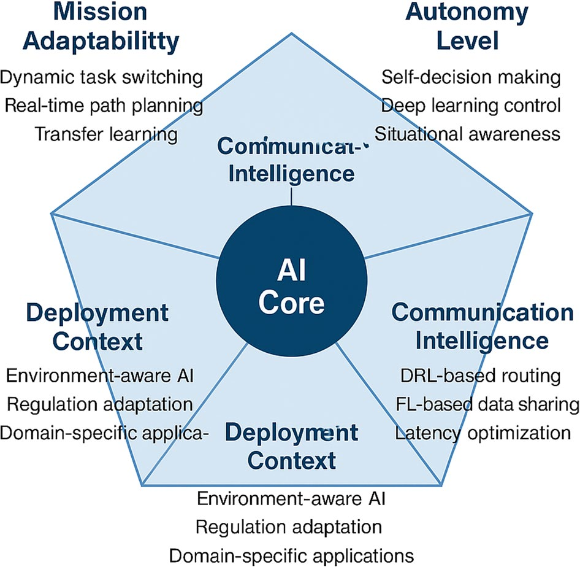
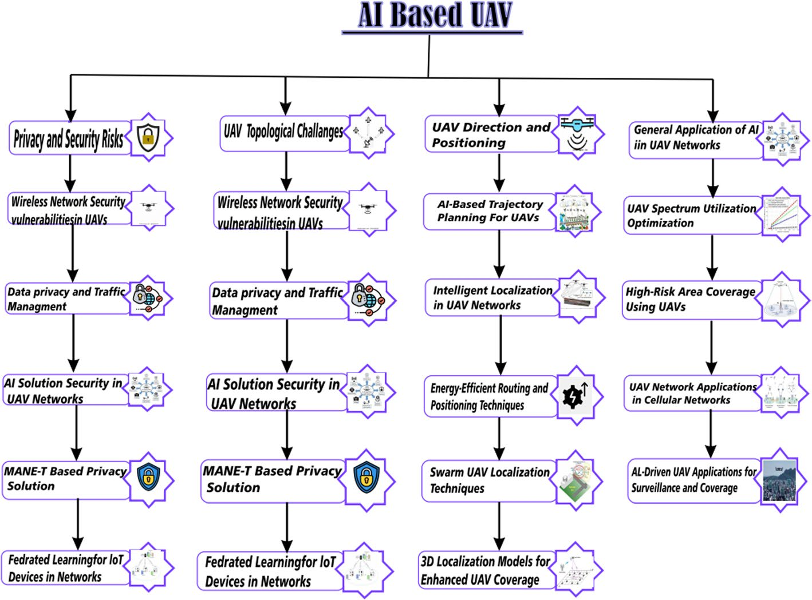
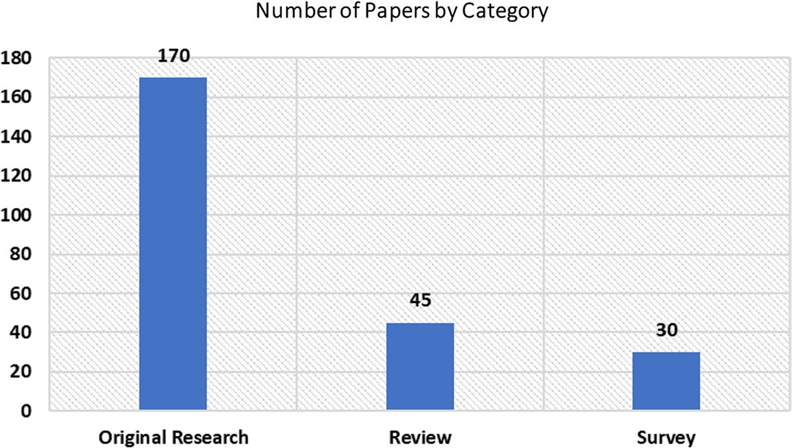
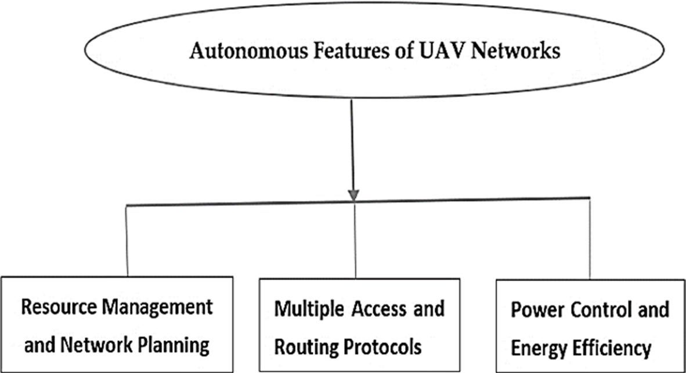

# S10462 025 11449 7

**Source Document:** `s10462-025-11449-7.pdf`  
**Total Pages:** 53  

---

## --- Page 1 ---

### Section: Flight into the future: a holistic review of AI-trends, vision, and challenges in drones technology

Received: 12 October 2024 / Accepted: 11 November 2025 / Published online: 11 December 2025
© The Author(s) 2025

Shakeel Ahmad and Muhammad Zaman have equally contributed to this work.

Extended author information available on the last page of the article

Flight into the future: a holistic review of AI-trends, vision, 
and challenges in drones technology

Shakeel Ahmad1 · Rahiel Ahmad1 · Ahmad Sami Al-Shamayleh2 · Divya Nimma3 · 
Muhammad Zaman4 · Nikola Ivković5 · Korhan Cengiz6 · Adnan Akhunzada7 · 
Ehtisham Haider8

Artificial Intelligence Review (2026) 59:59
https://doi.org/10.1007/s10462-025-11449-7

Abstract
The use of Artificial Intelligence (AI) and Unmanned Aerial Vehicles (UAVs), also 
known as drones, is changing the way future communication and networking systems 
are designed. UAVs can collect data, support wireless networks, and help deliver services 
from the sky, which makes them an important part of modern technology. To under­
stand these developments, we reviewed almost 250 research papers published between 
2015 and 2024. Our review focuses on UAV network design, communication methods, 
energy management, AI-based optimization, and future challenges. Unlike previous sur­
veys that mainly summarize individual technical domains, this work introduces a new 
AI-driven UAV classification framework that connects these aspects under one structure. 
The framework organizes UAV systems across five dimensions–mission adaptability, au­
tonomy level, communication intelligence, scalability, and deployment context–providing 
a unified way to compare current and future UAV technologies. This analytical structure 
highlights how artificial intelligence enables UAVs to move from static, pre-defined op­
erations toward dynamic, real-time decision-making and mission-specific adaptation. We 
found that deep learning and reinforcement learning are the most common AI methods 
used to improve routing, flight planning, resource use, and network performance. These 
techniques help UAV networks adapt to changing conditions and reduce communication 
delays. However, we also found several open challenges, such as improving real-time 
energy efficiency, increasing security and privacy, managing large drone groups (swarms), 
and dealing with regulatory and policy issues. By combining this new framework with an 
extensive literature review, the paper offers a holistic view that not only summarizes past 
progress but also maps existing gaps and trends for future research. This paper provides 
a clear summary of current research, explains key trends, and points out gaps such as the 
need for lightweight AI models and better swarm coordination. The insights from this 
review can help researchers and engineers build smarter, safer, and more efficient UAV 
networks in the future.

1 3

## --- Page 2 ---

### Section: 1 Introduction

S. Ahmad et al.

Keywords  AI-trends · Drones · Network-management · Security-management · UAV · 
UAV-energy-efficiency

1  Introduction

In recent years, researchers have become increasingly interested in autonomous vehicles. 
Numerous studies have been published on designing and operating UAV (Unmanned Aerial 
Vehicle) networks, a concept mainly associated with drone technology driven by artificial 
intelligence (AI). UAV networks play an essential role in addressing the challenges of rug­
ged terrains, where traditional communication networks struggle or fail. The performance 
of UAV networks is based on contextual awareness, spectrum efficiency, and topological 
advantages. Researchers are eager to explore AI to enhance network administration, given 
the limited human involvement in UAV network operations (Nawaz et al. 2021). The inte­
gration of machine-learning methodologies is expanding applications in both academic and 
commercial endeavors, and recent surveys consolidate the state of the art in AI-enabled 
UAV networking (Zhou et al. 2024) as well as foundational communication models and 
design trade-offs (Zeng et al. 2016; Zeng and Zhang 2017). Despite significant progress, 
most existing studies focus on isolated aspects of UAV systems–such as routing, localiza­
tion, or flight control without linking them within a comprehensive structure. This frag­
mentation has created a clear research gap: there is still no unified framework explaining 
how AI can simultaneously influence UAV autonomy, communication efficiency, energy 
management, and scalability (Zhou et al. 2024; Zeng et al. 2016; Zeng and Zhang 2017; 
Rovira-Sugranes et al. 2022).

To address this gap, the present review proposes a new AI-driven UAV classification 
framework that organizes existing research into a single, interconnected view. The frame­
work is built on five analytical dimensions: (1) mission adaptability how UAVs change tasks 
or roles in real time; (2) autonomy level how AI supports decision-making and self-man­
agement; (3) communication intelligence how networks learn and adapt through AI-driven 
routing; (4) scalability how large UAV swarms coordinate and share information; and (5) 
deployment context how UAVs integrate with specific environments and applications. This 
view connects AI techniques such as deep reinforcement learning and federated learning 
to tangible design choices in routing, spectrum use, placement/trajectory, and cooperative 
control (Zeng et al. 2016; Zeng and Zhang 2017; Rovira-Sugranes et al. 2022; Hentati and 
Fourati 2020). This multi-dimensional approach enables a holistic analysis of UAV systems 
from both technological and operational perspectives, linking AI methods with practical 
design challenges. It also distinguishes traditional static UAV classifications from emerg­
ing dynamic, AI-enhanced models that adjust to mission requirements and environmental 
changes. In addition to introducing this framework, our study contributes by summariz­
ing nearly 250 research papers published between 2015 and 2024 across multiple UAV 
domains; highlighting major AI algorithms (e.g., deep reinforcement learning, federated 
learning, graph-based methods) used for UAV optimization (Zhou et al. 2024; Hentati and 
Fourati 2020; Lahmeri et al. 2021); identifying open challenges in real-time energy man­
agement, data privacy, swarm coordination, and lightweight edge AI; and outlining future 
research directions that connect AI trends with sustainable UAV deployment (Zeng et al. 
2016; Rovira-Sugranes et al. 2022; Hentati and Fourati 2020; Lahmeri et al. 2021). Through

1 3

59 
Page 2 of 53

## --- Page 3 ---

Flight into the future: a holistic review of AI-trends, vision, and…

this comprehensive synthesis, the review moves beyond descriptive summaries and pro­
vides an analytical foundation for understanding how diverse AI technologies collectively 
advance the next generation of intelligent UAV networks. Figure 1 shows the taxonomical 
structure of the AI-based UAV network. Similary Table 1 is showing the analytical summary 
of the proposed AI-driven UAV classification framework.

Furthermore, the Fig. 2 shows the taxonomical structure of the AI-based UAV network.

Dimension
Focus area
Key AI 
techniques

Expected 
outcome
Mission 
adaptability

Real-time role 
switching and 
task reallocation

Reinforce­
ment Learn­
ing, Transfer 
Learning

Flexible mis­
sion planning, 
adaptive 
re-routing
Autonomy level
Independent 
perception and 
decision-making

Deep Learn­
ing, Fuzzy 
Logic, Hybrid 
AI

Higher 
operational 
independence 
and safety
Communication 
intelligence

Smart rout­
ing and data 
management

DRL, Feder­
ated Learning, 
GNNs

Reduced laten­
cy, improved 
connectivity
Scalabil­
ity & swarm 
coordination

Multi-agent 
learning and 
collaboration

Swarm 
Intelligence, 
Distributed 
Learning

Coordinated 
behavior, 
large-scale 
synchronization
Deployment 
context

Application and 
environment-
specific AI

TinyML, 
Context-
Aware 
AI, Edge 
Computing

Efficient 
operation in 
domain-specif­
ic scenarios

Table 1  Analytical summary of 
the proposed AI-driven UAV 
classification framework

Fig. 1  AI-Driven UAV Clas­
sification Framework. The 
proposed framework integrates 
artificial intelligence (AI) as the 
central enabler that connects five 
analytical dimensions of UAV 
technology: (1) mission adapt­
ability, (2) autonomy level, (3) 
communication intelligence, (4) 
scalability and swarm coordina­
tion, and (5) deployment context

1 3

Page 3 of 53 
59

*Caption/Context: Flight into the future: a holistic review of AI-trends, vision, and… | Dimension Focus area Key AI  techniques*

## --- Page 4 ---

### Section: 1.1 UAV networks based on AI

S. Ahmad et al.

#### 1.1  UAV networks based on AI

AI is advancing and developing strategies that mimic or even surpass human intelligence. 
The primary strength of AI lies in its ability to learn and adapt (Yao et al. 2024). AI tech­
niques are particularly beneficial for UAV-based networks due to the inherent fluidity and 
unique challenges of this technology. Researchers are actively exploring artificial intelli­
gence (AI) applications in UAV networks. This section discusses four critical aspects of 
AI-based UAV network design: location and direction, network architecture, privacy and 
security, and general UAV applications. These areas are vital for the successful design and 
deployment of next-generation drone (Letaief et al. 2019).

#### 1.1.1  Privacy and security risks

Two significant risks are associated with UAV networks: the inherent security vulnerabilities 
of wireless networks and issues concerning data privacy and traffic management in these 
networks, especially with dynamic topologies. Extensive research has been conducted to 
address these privacy and security concerns in UAVs. Artificial intelligence techniques have 
been proposed to address these challenges. For example, in research (Challita et al. 2018), 
the authors present a solution to address security and privacy concerns using Conventional

Fig. 2  This diagram illustrates the multifaceted applications of AI in UAV (Unmanned Aerial Vehicle) 
networks, including privacy, security, and efficient routing. Highlights challenges and solutions within 
UAV systems such as topological issues, trajectory planning, and spectrum optimization. The flowchart 
also delves into specific AI-driven security solutions and advancements in UAV localization and cover­
age techniques

1 3

59 
Page 4 of 53

*Caption/Context: S. Ahmad et al. | 1.1  UAV networks based on AI*

## --- Page 5 ---

### Section: 1.1.2 UAV topological challenges

Flight into the future: a holistic review of AI-trends, vision, and…

Cellular Networks (CCN). However, AI models such as convolutional neural networks 
(CNN) and recurring neural networks (RNNs) can also address these issues effectively. 
These models help to classify UAVs according to their movement patterns and identify 
areas of high risk. A study suggests that nearby UAVs in a swarm exchange mainly local­
ized information (Kusyk et al. 2019). Simulation results indicate that such a UAV swarm 
can provide broad global exposure by leveraging local knowledge while mitigating cyber 
threats. Each UAV in the simulation is connected to a Mobile Ad Hoc Network (MANET) 
via an OPNET Modeler. In addition, a novel approach based on federated learning (FL), a 
machine learning technique, was developed for distributed devices on the Internet of Things 
(IoT) (Lim et al. 2021). FL is essential for establishing secure connections between IoT 
devices. A UAV-based FL model utilizing 5 G heterogeneous network concept, was pre­
sented in Dai et al. (2019). The integration of UAVs into FL improves communication effi­
ciency and ensure a more reliable and secure network traffic coverage.

#### 1.1.2  UAV topological challenges

One distinctive feature of UAV-based networks is that methods designed for other types 
of networks, such as MANET and Vehicular Ad Hoc Networks (VANET), are not directly 
applicable. Researchers have approached the challenges in UAV networks differently. In 
Reynolds (1987), an autonomous flock control strategy is proposed to manage the swarm 
topology of UAVs. The suggested approach maintains UAV formation during flight while 
minimizing energy consumption. The authors applied the Reynolds-Boid algorithm (Li 
et al. 2021), which involves the principles of cohesion, separation, and alignment. The pro­
posed method was simulated and analyzed using the OMNET++ Modeler. Furthermore, Li 
et al. (2021) discusses wireless challenges in UAV networks and offers AI-based solutions. 
A primary issue in UAV networks is maintaining a stable network with low latency that can 
efficiently handle dynamic conditions. Several AI model-based methods have been pro­
posed to improve UAV network performance.

#### 1.1.3  UAV direction & positioning

In UAV networks, location and trajectory planning are critical considerations. A recent 
study proposes AI-based trajectory planning for UAV networks (Arafat and Moh 2019). A 
quantum mechanism is used to navigate autonomous vehicles (UAVs) from one location to 
another. According to the study (Fatemidokht et al. 2021), the proposed method outperforms 
traditional Q-learning approaches. Localization is particularly challenging due to significant 
node mobility and unstable network conditions. The authors propose an intelligent localiza­
tion method for swarm UAVs (Chen et al. 2022). A 3D model is used to address the chal­
lenge of finding the location of the UAV node, starting by reducing the search space. This 
approach enhances network convergence performance and reduces localization errors. The 
proposed method is further strengthened by implementing energy-efficient routing for the 
UAV network. The simulation results demonstrate that the recommended strategy improves 
both localization accuracy and coverage time (Gupta et al. 2015).

1 3

Page 5 of 53 
59

## --- Page 6 ---

### Section: 1.1.4 General applications

S. Ahmad et al.

#### 1.1.4  General applications

Research is ongoing into various UAV network applications, including efficient spectrum 
utilization, high-risk area coverage, and the use of UAV networks in cellular and vehicular 
networks. In Khuwaja et al. (2018), the authors discuss the use of UAV networks to enhance 
VANET performance. The proposed routing techniques improve coverage and detect mali­
cious vehicles. Experimental results based on simulations reveal that approximately 7% of 
UAVs are identified as high-risk for the UAV network.

Our UAV classification framework extends beyond traditional taxonomies by integrating 
AI-driven adaptability, real-time decision-making, and deployment-specific optimization. 
In Table 2, we compare our framework with conventional taxonomies.

By emphasizing real-world UAV deployment strategies, our classification framework 
offers a more practical and AI-enhanced approach compared to static taxonomies.

#### 1.2  Overview of previous research on UAVs

Recent advancements in autonomous UAV networks have expanded the scope of research 
covered in survey papers. This section reviews some of the most recent surveys in the field. 
Coverage is one of the most critical research areas for UAVs. Numerous solutions have 
been developed to enhance area coverage using UAV networks. A survey (Zhang et al. 
2019) identifies the challenges in UAV network coverage, categorizing them into various 
constraints. The survey findings suggest further research on end-to-end delays, inter-UAV 
network coverage, and UAV network coverage in general. A 2015 survey (Arafat and Moh 
2019) distinguishes UAV networks from other wireless technologies, such as vehicular 
technologies and ad hoc mesh networks, due to their unique features. The dynamic nature, 
intermittent connectivity, fluid topology, and energy-conservation limits of autonomous 
vehicles make UAV networks distinct from other wireless networks. This survey addresses 
issues in UAV networks at the physical, data link, network, and transport layers. The results 
highlight that information sharing is necessary to meet the requirements of UAV networks.

The paper (Fotouhi et al. 2019) expands the discussion on UAV network characteristics, 
focusing on network channel modeling and its impact on performance. A detailed analysis 
is conducted at lower altitudes to assess the equipped facility. Energy efficiency in UAVs

Feature
Traditional 
taxonomies

Our AI-driven 
classification
Categorization 
basis

Airframe type 
(fixed-wing, rota­
ry-wing, hybrid)

Mission-adaptive UAV 
behavior, autonomy lev­
els, and communication 
integration
Adaptability
Static 
classifications

Dynamic role-switching 
based on real-time AI-
based decision-making
Scalability
Limited to small 
UAV groups

Optimized for large 
UAV swarms in dynamic 
environments
Use case 
integration

Generic UAV 
applications

Specific AI-powered UAV 
roles: VANETs, disaster 
response, surveillance, 
energy-aware missions

Table 2  Comparison of tradi­
tional UAV taxonomies and the 
proposed AI-driven classification 
framework

The table contrasts static, 
airframe-based taxonomies with 
a dynamic AI-driven approach. 
Our framework focuses on 
mission adaptability, real-time 
decision-making, scalability 
for large UAV swarms, and 
integration of specific use cases 
such as VANETs, disaster 
response, surveillance, and 
energy-aware missions

1 3

59 
Page 6 of 53

## --- Page 7 ---

### Section: 1.3 Key contribution of this research

Flight into the future: a holistic review of AI-trends, vision, and…

is further examined on air-to-air and air-to-ground surfaces using an empirical modeling 
approach. A study (Oubbati et al. 2020) explores the use of 5 G technology in UAV net­
works. The authors propose seven different antenna techniques for UAV networks. Further­
more, a study (Skorobogatov et al. 2020) discusses communication between UAVs using 
cellular networks. The research demonstrates the successful transition of UAV communi­
cation from traditional cellular networks to flying relays and base stations. The study also 
addresses associated risks and issues regarding security measures, traffic standardization, 
and privacy concerns, providing valuable insights for future work. The increasing coverage 
of UAV networks is making them more popular, while industry experts strive to optimize 
spectrum efficiency.

In 2020, a survey investigated the effective use of NFV and SDN in UAV networks (Zhi 
et al. 2020). The authors proposed two methods to address inoperability issues in SDN net­
works and NFV. The paper also discusses areas of weakness in UAV network research and 
suggests directions for future work. The use of UAV networks in various regions is explored 
in Bithas et al. (2019), with the aim of classifying UAV networks into nine distinct catego­
ries. The paper thoroughly classifies UAV networks and reviews recent research in the field. 
The study of multiple UAVs identifies three levels of autonomy.

The paper also discusses various challenges associated with UAV networks and suggests 
how these challenges can be addressed in the future. Numerous researchers, institutions, 
universities, and scientists are working on new solutions to overcome these challenges and 
achieve higher accuracy, performance, and efficiency in UAV networks using cutting-edge 
technologies. A recent survey examines UAV networks from the perspectives of security 
and privacy. The study identifies key issues that affect the functionality of UAV networks, 
such as sensor malfunctions, erratic communication between aerial and ground stations, and 
potential photo leaks from aerial views.

In a study similar to ours, conducted in 2019, Ben Aissa and Ben Letaifa (2021) reviewed 
several machine learning approaches applied to UAV networks. The authors used ML mod­
els in this survey to classify different UAV networks and their components, such as base 
stations. The paper suggests optimizing UAV network performance by applying machine 
learning techniques. The researchers propose building a highly efficient UAV network using 
deep learning techniques and multi-source data. Another study (Ben Aissa and Ben Letaifa 
2021) discusses using ML methods for the evaluation, monitoring, observation, and security 
of UAV networks. UAV networks are particularly suitable for edge computing, where ML 
models can be easily implemented. The communication challenges between UAVs and base 
stations can be addressed by increasing base nodes and leveraging mobile edge technology. 
In Song et al. (2021), a comprehensive study of UAV network communication, prototyping, 
and experimental setups is provided, detailing the construction of an experimental and pro­
totype UAV network. The study covers every phase of the setup, including aircraft selection 
and communication techniques, and investigates methods for reliable UAV communication.

#### 1.3  Key contribution of this research

This survey paper addresses the following key research contributions:

1.	 Develops a classification framework for UAVs based on their features and functional­
ities to enhance network performance and optimize deployment strategies.

1 3

Page 7 of 53 
59

## --- Page 8 ---

### Section: 2 Literature review

S. Ahmad et al.

2.	 Identifies the main challenges facing UAV networks and evaluates the effectiveness of 
current methods used to address these challenges.
3.	 Investigates how the integration of artificial intelligence in UAV features influences 
their overall performance.
4.	 Analyzes how different channel models (e.g., Shadowing Channel, Free-space Path 
Loss) impact the efficiency of UAV communication and resource management.
5.	 Explores the characteristics of UAVs that contribute to or help mitigate operational 
risks and assesses their impact on overall mission effectiveness.
6.	 Investigates emerging security threats to UAVs and determines the need to develop new 
features to enhance UAV security.
7.	 Assesses how variations in payload capacity and flight range impact UAV performance 
across different mission durations and deployment environments.
8.	 Formulates strategies to extend the communication capabilities of UAVs, particularly 
for long-range missions in remote areas.
9.	 Explores methods to integrate various sensor capabilities (e.g., for surveillance, deliv­
ery, mapping, inspection) within UAVs to maximize mission flexibility and adaptability 
in diverse deployment scenarios.
10.	 Identifies advancements needed to enhance the autonomy of hybrid drone designs for 
improved performance and maneuverability in real-world operations.

The first section introduces AI-based UAV networks and provides a summary of previous 
research, highlighting the most significant contributions in the field. Section II presents 
background information and preliminary data from earlier published work on the subject. 
Section III delves into the self-governance of UAV networks, network connectivity, base 
stations, cutting-edge technologies, and other relevant UAV aspects. Section IV covers 
UAV features, resource management, network architecture and planning, access points, and 
various communication protocols, including energy efficiency and management strategies. 
Section V addresses UAV-related privacy and physical layer security risks, with a focus on 
identifying research challenges. Finally, Section VI concludes the research and discusses 
future directions for work in this domain.

2  Literature review

UAV networks present a novel communication method distinct from traditional approaches. 
This section provides an overview of the background and fundamental concepts that were 
explored during the early development of UAV networks.

#### 2.1  Conventional vs. unmanned aerial vehicle networks

The global drone market is projected to reach a value of USD 70.5 billion by 2025, according 
to Business Insider (Insider 2021). UAVs have existed since 1917, when they were first used 
during World War I (Valavanis 2018). Initially unreliable, UAV technology has advanced 
significantly, with improvements in accuracy, privacy protection, and communication capa­
bilities. Recent research breakthroughs have led to more robust UAV network solutions. 
UAV applications are expanding across telecommunications, security, surveillance, and mil­

1 3

59 
Page 8 of 53

## --- Page 9 ---

Flight into the future: a holistic review of AI-trends, vision, and…

itary operations. Due to their adaptability and cost-effectiveness, UAV networks are ideal 
for research and communication in challenging environments such as forests, mountainous 
regions, and riverbanks. When considering UAV design, aerodynamics plays a crucial role 
in determining their lifting mechanisms. UAVs are typically classified as fixed-wing (Fig. 3) 
or multirotor (Fig. 4), depending on their lifting methods (Garg 2022). Multirotor UAVs 
generate lift using vertical thrust, often employing two to eight motors. These UAVs are 
equipped with vertical takeoff and landing technologies, although they consume signifi­
cant energy during operation. In contrast, fixed-wing UAVs, which rely on gliding to save 
energy, offer greater efficiency. Ongoing research on fixed-wing UAVs focuses on enhanc­
ing their operational capabilities (Panagiotou et al. 2016). Unlike traditional aircraft, fixed-
wing UAVs require runways for takeoff and landing. In UAV networks, both fixed-wing and 
multirotor UAVs are commonly used. Fixed-wing UAVs are suitable for long-range mis­

Fig. 4  The image shows a multi-rotor UAV (Unmanned Aerial Vehicle) with labeled arrows pointing to 
its rotors. The UAV is hovering in the air, supported by multiple rotors attached to its frame. The caption 
underneath the image reads "(b) Multi-rotors"

Fig. 3  The image shows a fixed-wing UAV (Unmanned Aerial Vehicle) with labeled arrows pointing to 
its fixed wings. The UAV is grounded on a flat surface under a clear blue sky. The caption underneath the 
image reads "(a) Fixed wing"

1 3

Page 9 of 53 
59

![itary operations. Due to their adaptability and cost-effectiveness, UAV networks are ideal  for research and communication in challenging environments such as forests, mountainous  regions, and riverbanks. When considering UAV design, aerodynamics plays a crucial role  in determining their lifting mechanisms. UAVs are typically classified as fixed-wing (Fig. 3)  or multirotor (Fig. 4), depending on their lifting methods (Garg 2022). Multirotor UAVs  generate lift using vertical thrust, often employing two to eight motors. These UAVs are  equipped with vertical takeoff and landing technologies, although they consume signifi­ cant energy during operation. In contrast, fixed-wing UAVs, which rely on gliding to save  energy, offer greater efficiency. Ongoing research on fixed-wing UAVs focuses on enhanc­ ing their operational capabilities (Panagiotou et al. 2016). Unlike traditional aircraft, fixed- wing UAVs require runways for takeoff and landing. In UAV networks, both fixed-wing and  multirotor UAVs are commonly used. Fixed-wing UAVs are suitable for long-range mis­ | Fig. 4  The image shows a multi-rotor UAV (Unmanned Aerial Vehicle) with labeled arrows pointing to  its rotors. The UAV is hovering in the air, supported by multiple rotors attached to its frame. The caption  underneath the image reads "(b) Multi-rotors"](images/page_009_fig_01.jpeg)
*Caption/Context: itary operations. Due to their adaptability and cost-effectiveness, UAV networks are ideal  for research and communication in challenging environments such as forests, mountainous  regions, and riverbanks. When considering UAV design, aerodynamics plays a crucial role  in determining their lifting mechanisms. UAVs are typically classified as fixed-wing (Fig. 3)  or multirotor (Fig. 4), depending on their lifting methods (Garg 2022). Multirotor UAVs  generate lift using vertical thrust, often employing two to eight motors. These UAVs are  equipped with vertical takeoff and landing technologies, although they consume signifi­ cant energy during operation. In contrast, fixed-wing UAVs, which rely on gliding to save  energy, offer greater efficiency. Ongoing research on fixed-wing UAVs focuses on enhanc­ ing their operational capabilities (Panagiotou et al. 2016). Unlike traditional aircraft, fixed- wing UAVs require runways for takeoff and landing. In UAV networks, both fixed-wing and  multirotor UAVs are commonly used. Fixed-wing UAVs are suitable for long-range mis­ | Fig. 4  The image shows a multi-rotor UAV (Unmanned Aerial Vehicle) with labeled arrows pointing to  its rotors. The UAV is hovering in the air, supported by multiple rotors attached to its frame. The caption  underneath the image reads "(b) Multi-rotors"*

*Caption/Context: Flight into the future: a holistic review of AI-trends, vision, and… | Fig. 3  The image shows a fixed-wing UAV (Unmanned Aerial Vehicle) with labeled arrows pointing to  its fixed wings. The UAV is grounded on a flat surface under a clear blue sky. The caption underneath the  image reads "(a) Fixed wing"*

## --- Page 10 ---

### Section: 2.2 Communication, computation, and control

S. Ahmad et al.

sions due to their efficiency, while multirotor UAVs are preferred for tasks requiring precise 
maneuverability and vertical takeoff.

#### 2.2  Communication, computation, and control

UAVs have the potential to be highly beneficial in many aspects of daily life. Cooperative 
UAVs represent an emerging concept that aims to enhance the capabilities of individual 
UAVs through collaboration. Numerous research studies are currently exploring the poten­
tial of such UAV networks. For example, Richards and How (2004) proposes a decentral­
ized approach for predictive maintenance, using a fleet of UAVs to demonstrate the model. 
The simulation results show that the proposed model is more computationally efficient than 
other approaches. Bellingham et al. (2003) conducted an intriguing study focused on devel­
oping a control system that optimizes multi-UAV collaboration. The key issues addressed 
include task assignment, resource allocation, and trajectory optimization. The proposed 
approach improves UAV fleet management by incorporating cooperative route planning 
and multitasking through the integration of trajectory and resource management. When 
multiple elements work together, conflicts may arise. A study on UAV fleet conflict resolu­
tion is presented in Conde et al. (2012), proposing a model to identify and resolve conflicts. 
The authors introduce intermediate waypoints to structure flight paths and maintain consis­
tent speeds for UAVs. Experimental and simulation results demonstrate that the proposed 
system is scalable and easy to implement. The study also suggests utilizing thermal lift to 
extend the flight time of cooperating UAVs.

Traditional UAV target-tracking methods rely on predefined flight paths, limiting their 
adaptability in dynamic environments. Deep Reinforcement Learning (DRL) enables UAVs 
to learn real-time trajectory adjustments using sensor feedback (Debnath et al. 2024), allow­
ing them to optimize flight paths autonomously. A Multi-Agent Reinforcement Learning 
(MARL) framework was introduced for UAV swarm-based surveillance (Ma et al. 2023), 
demonstrating a 35% increase in tracking accuracy compared to heuristic-based approaches 
by allowing UAVs to dynamically adjust routes in response to moving targets and obstacles 
(Patrizi et al. 2020). DRL-based models excel in handling real-time occlusion scenarios, 
where UAVs dynamically modify observation angles to regain lost targets, proving highly 
effective in security surveillance, search-and-rescue operations, and disaster response sce­
narios (Katkuri et al. 2024).

UAV swarm coordination faces computational bottlenecks when tracking multiple targets 
in large-scale deployments (Zhou et al. 2021). Graph Neural Networks (GNNs) enhance 
UAV intelligence by enabling spatiotemporal data sharing, optimizing multi-target track­
ing and obstacle avoidance. A study (Phadke et al. 2023) proposed a graph-based trajectory 
optimization model, achieving 28% faster target reacquisition than traditional A* search-
based approaches by leveraging dynamic inter-UAV communication and adaptive flight 
path planning (Pan et al. 2023). GNNs allow UAV swarms to operate efficiently without 
centralized control, making them ideal for military reconnaissance, real-time environmental 
monitoring, and disaster relief operations (Qu et al. 2021).

Multi-agent learning approaches have shown strong potential for large-scale UAV coor­
dination, enabling real-time task allocation and collision avoidance. Compared to central­
ized coordination models, decentralized AI-based systems improve scalability and fault 
tolerance. However, current swarm models still lack stability in dynamic environments, and

1 3

59 
Page 10 of 53

## --- Page 11 ---

### Section: 2.3 Channel modeling

Flight into the future: a holistic review of AI-trends, vision, and…

training multi-agent systems remains computationally expensive. Lightweight cooperative 
learning frameworks could address these limitations by combining local decision autonomy 
with shared global optimization. Federated Learning (FL) is revolutionizing UAV network 
intelligence by enabling decentralized model training, reducing bandwidth usage, and pre­
serving data privacy (Li et al. 2024). Unlike centralized AI models that require continu­
ous data transmission, FL allows UAVs to train locally and share model updates without 
exposing raw data. One study implemented FL in UAV-assisted mobile edge computing, 
achieving 40% energy savings and reducing tracking latency compared to traditional cloud-
based AI processing. This method enhances real-time adaptability in smart city surveillance, 
autonomous vehicle monitoring, and emergency response networks, where UAVs can col­
laboratively learn mission-specific patterns while maintaining privacy and security (Ahmad 
et al. 2024).

#### 2.3  Channel modeling

Channel modeling is a critical aspect of UAV networks. As UAVs are expected to become 
increasingly prevalent in the aerospace sector, discussions about channel usage are essen­
tial. In 2019, a comprehensive investigation into UAV channel modeling was conducted 
(Yan et al. 2019) (Nimma and Zhou 2024). The survey categorizes the usage of the UAV 
channel into air-to-ground, air-to-air, and ground-to-ground communication. The authors 
also explore channel fading characteristics and link budget considerations. The temporal 
and spatial properties of non-stationary channels are further analyzed with a particular focus 
on scientific challenges such as shadowing of the plane structure. In Bithas et al. (2020), a 
new channel model is proposed to enhance the performance of UAV communication under 
shadowing conditions. The goal is to establish a generalized channel model with fewer con­
figuration options. The concept and methodology are supported by empirical data.

#### 2.4  Handling of interference

Interference management is crucial in any wireless communication system, and it plays a 
significant role in UAV communication performance. Recent studies have explored inter­
ference management for UAV networks, either as an extension of cellular networks or in 
conjunction with power regulation techniques. For example, Challita et al. (2019) analyzes 
a path-planning system for UAV networks that focuses on interference and latency in terres­
trial networks. The study examines interference mitigation using game theory and proposes 
a deep reinforcement learning system. Each UAV selects its path to minimize delays and 
reduce interference with the terrestrial network. A similar approach is discussed in Challita 
et al. (2018), which employs game theory to optimize the energy efficiency of UAVs while 
minimizing latency and interference with the terrestrial network. In Fouda et al. (2019), 
UAVs are used to support cellular networks, focusing on interference reduction at multiple 
levels to enhance IAB (In-Band Backhaul) cellular networks. The study considers various 
factors and aims to optimize overall network performance, surpassing previous methods.

Effective interference management also requires power control. In Wang et al. (2019), 
machine learning is suggested as a means of reducing interference by controlling UAV 
power levels and positioning. The proposed system uses affinity propagation and K-means 
clustering to minimize overall network disturbances. Simulation results demonstrate the

1 3

Page 11 of 53 
59

## --- Page 12 ---

S. Ahmad et al.

potential for efficient interference regulation. In Zhang et al. (2019), the issue is tackled 
from a different angle by splitting the problem into two sub-problems: determining the opti­
mal trajectory for a given transmit power and finding the optimal transmit power for a 
specific UAV trajectory to control interference. This approach helps identify the best overall 
solution for the network. Another study (Zhang et al. 2020) addresses the issue by recom­
mending UAV clustering combined with power control to reduce interference. The solution 
is presented through a game-theoretical approach designed to optimize the overall data rate 
of the system.

Recent studies on security and privacy in AI-based UAVs explore CNNs, RNNs, and fed­
erated learning (FL) for enhanced data protection in UAV-IoT networks, improving commu­
nication efficiency in 5 G environments, although scalability and latency remain challenges 
(Chen et al. 2021; Sanchez-Lopez et al. 2019; Primatesta et al. 2019). UAV network topol­
ogy and flock control leverage Reynolds-Boid algorithms and quantum-based trajectory 
planning to achieve energy-efficient formation control and accurate localization, but these 
approaches demand high computational resources (Fonseca et al. 2021; Yin et al. 2019; Wu 
and Zhang 2017).

AI-based communication and channel modeling focus on A2G (air-to-ground) and A2A 
(air-to-air) links, integrating 5 G for interference management; however, applications remain 
largely limited to low-altitude UAVs (Pandey et al. 2019; Lupascu et al. 2019; Wu et al. 
2021, 2019; Cai et al. 2018). Cooperative UAV fleet management enhances task allocation, 
trajectory optimization, and predictive maintenance, but multi-UAV coordination remains 
computationally intensive (Li et al. 2018; Sun et al. 2018; Zeng et al. 2020). Interference 
and power control techniques apply game theory, deep reinforcement learning, and cluster­
ing to improve energy efficiency and latency, although extensive modeling is required (Min 
et al. 2018; Yue et al. 2018; Amphawan et al. 2021; Yang et al. 2019; Konstantinou et al. 
2017; Lyu et al. 2016).
Quantum navigation methods optimize UAV trajectories with higher precision, out­
performing classical models but requiring specialized computation (Ho et al. 2010a). AI-
enhanced VANET-UAV integration strengthens routing security and coverage, although 
compatibility with existing vehicular networks remains a concern (Ho et al. 2010b). UAV 
coverage studies provide insights into inter-UAV network efficiency, though many lack tech­
nical depth (Ho et al. 2011). Comparisons between UAV and traditional networks highlight 
UAV-specific strengths but often overlook hybrid networking possibilities (Xue et al. 2019).

NFV and SDN applications in UAV networks enhance interoperability and scalability, 
but their complex deployment remains a limitation (Zhou et al. 2018). UAV classification 
frameworks segment UAVs into nine autonomy levels, offering structured guidelines but 
lacking real-world implementation examples (Jiang and Swindlehurst 2012). Machine 
learning (ML) models improve UAV classification and optimization, yet practical deploy­
ment remains underexplored (Xiao et al. 2016). ML techniques also enhance UAV network 
monitoring and security, improving edge computing performance, although most findings 
are simulation-based (Xie et al. 2014).

Studies on UAV communication and prototyping provide insights into experimental UAV 
wireless setups, but high costs and scalability challenges persist (Chen et al. 2018). Market 
reports such as Business Insider’s UAV industry analysis highlight commercial adoption 
trends but lack technical depth (Ren et al. 2019). Historical reviews of UAV development 
contextualize technological advancements but primarily focus on legacy UAVs (Tan et al.

1 3

59 
Page 12 of 53

## --- Page 13 ---

### Section: 3 Research methodology

Flight into the future: a holistic review of AI-trends, vision, and…

2019). Aerodynamic studies of fixed wing UAVs explore energy-efficient gliding strategies 
to optimize long-range missions, but hybrid UAV designs require further research (Liu et al. 
2019; Abbasi et al. 2020).

3  Research methodology

The literature review section of this article is based on a comprehensive selection of research 
papers, including surveys, review articles, and original research studies, as shown in Figs. 5 
and 6. These articles were carefully chosen from various high-impact journals.

To collect relevant research on AI-based UAV networks, we followed a structured review 
process. We searched major academic databases, including IEEE Xplore, SpringerLink, Sco­
pus, and Google Scholar. The keywords used in the search included “UAV communication,” 
“drone networks,” “artificial intelligence,” “machine learning,” “deep learning,” “energy 
management,” and “swarm coordination.” The search covered research papers published 
between 2015 and 2025, which is the period that includes the most important developments 
in this field. We applied clear inclusion and exclusion criteria to select papers. We included 
peer-reviewed journal articles and conference papers written in English that focus on UAV 
network architecture, communication methods, energy efficiency, and AI-based optimiza­
tion. We excluded papers that were not in English, studies unrelated to UAV networking 
and AI, patents, and papers that focused only on drone hardware without communication 
or AI aspects. The selection process was done in two stages. First, we screened titles and 
abstracts to remove duplicates and irrelevant results. Second, we reviewed the full text of 
the remaining papers to confirm their relevance. After this process, a total of 245 research 
papers were selected for detailed study. These papers were then grouped into key themes 
such as communication protocols, energy management, AI optimization techniques, swarm 
coordination, and security and regulatory issues, which form the structure of this review. 
The entire process is also explained using flow diagram as shown in Fig. 7.

Fig. 5  Yearly distribution of selected research papers (2018–2024). The bar chart illustrates the number of 
relevant papers published each year from 2018 to 2024. Research activity peaked in 2019 with 20 papers, 
followed by consistent contributions between 2020 and 2022. A decline is observed in 2023 and 2024, 
reflecting either a narrowing of the selection criteria or a shift in publication trends

1 3

Page 13 of 53 
59

![To collect relevant research on AI-based UAV networks, we followed a structured review  process. We searched major academic databases, including IEEE Xplore, SpringerLink, Sco­ pus, and Google Scholar. The keywords used in the search included “UAV communication,”  “drone networks,” “artificial intelligence,” “machine learning,” “deep learning,” “energy  management,” and “swarm coordination.” The search covered research papers published  between 2015 and 2025, which is the period that includes the most important developments  in this field. We applied clear inclusion and exclusion criteria to select papers. We included  peer-reviewed journal articles and conference papers written in English that focus on UAV  network architecture, communication methods, energy efficiency, and AI-based optimiza­ tion. We excluded papers that were not in English, studies unrelated to UAV networking  and AI, patents, and papers that focused only on drone hardware without communication  or AI aspects. The selection process was done in two stages. First, we screened titles and  abstracts to remove duplicates and irrelevant results. Second, we reviewed the full text of  the remaining papers to confirm their relevance. After this process, a total of 245 research  papers were selected for detailed study. These papers were then grouped into key themes  such as communication protocols, energy management, AI optimization techniques, swarm  coordination, and security and regulatory issues, which form the structure of this review.  The entire process is also explained using flow diagram as shown in Fig. 7. | Fig. 5  Yearly distribution of selected research papers (2018–2024). The bar chart illustrates the number of  relevant papers published each year from 2018 to 2024. Research activity peaked in 2019 with 20 papers,  followed by consistent contributions between 2020 and 2022. A decline is observed in 2023 and 2024,  reflecting either a narrowing of the selection criteria or a shift in publication trends](images/page_013_fig_01.jpeg)
*Caption/Context: To collect relevant research on AI-based UAV networks, we followed a structured review  process. We searched major academic databases, including IEEE Xplore, SpringerLink, Sco­ pus, and Google Scholar. The keywords used in the search included “UAV communication,”  “drone networks,” “artificial intelligence,” “machine learning,” “deep learning,” “energy  management,” and “swarm coordination.” The search covered research papers published  between 2015 and 2025, which is the period that includes the most important developments  in this field. We applied clear inclusion and exclusion criteria to select papers. We included  peer-reviewed journal articles and conference papers written in English that focus on UAV  network architecture, communication methods, energy efficiency, and AI-based optimiza­ tion. We excluded papers that were not in English, studies unrelated to UAV networking  and AI, patents, and papers that focused only on drone hardware without communication  or AI aspects. The selection process was done in two stages. First, we screened titles and  abstracts to remove duplicates and irrelevant results. Second, we reviewed the full text of  the remaining papers to confirm their relevance. After this process, a total of 245 research  papers were selected for detailed study. These papers were then grouped into key themes  such as communication protocols, energy management, AI optimization techniques, swarm  coordination, and security and regulatory issues, which form the structure of this review.  The entire process is also explained using flow diagram as shown in Fig. 7. | Fig. 5  Yearly distribution of selected research papers (2018–2024). The bar chart illustrates the number of  relevant papers published each year from 2018 to 2024. Research activity peaked in 2019 with 20 papers,  followed by consistent contributions between 2020 and 2022. A decline is observed in 2023 and 2024,  reflecting either a narrowing of the selection criteria or a shift in publication trends*

## --- Page 14 ---

### Section: 4 Autonomous features in UAV networks

S. Ahmad et al.

4  Autonomous features in UAV networks

New autonomous capabilities are being developed to enhance UAV network performance 
and address specific challenges. These approaches aim to provide optimal solutions for 
particular issues while supporting dynamic network environments. Numerous studies have 
examined the characteristics of autonomous UAV network management techniques. Fig­
ure 8 outlines three different resource management strategies for UAV networks. These 
strategies include traffic control, transmission control protocols, communication protocols, 
and efficient power management.

#### 4.1  Network planning and management of resources

Planning and resource management are critical for the success of any network, especially 
those that involve minimal human interaction, such as unmanned aerial vehicle (UAV) net­
works. In the context of UAVs, numerous studies focus on addressing the challenges and 
risks inherent in these networks. These studies aim to overcome obstacles and maximize the 
potential of UAV networks. Research in this field highlights several key challenges, includ­
ing dynamic environments, communication constraints, energy limitations, and safety and 
security concerns. The published work covers a wide range of topics, such as path planning 
algorithms, resource allocation strategies, risk assessment and mitigation, energy-efficient 
routing protocols, collaborative task allocation, autonomous navigation systems, and pri­
vacy-preserving data collection, as summarized in Table 3.

Research by Nasir et al. (2019) discusses autonomous resource allocation and manage­
ment in unmanned aerial vehicle (UAV) networks. Table 3 provides a comparative overview 
of published research on UAV-related topics, focusing on key features such as route plan­
ning, conflict resolution, and energy management. It categorizes the studies based on their 
use of AI, channel modeling approaches, and security considerations. The analysis reveals 
that while many studies incorporate AI for UAV planning, few address security risks. The

Fig. 6  The bar chart shows the distribution of research papers by journal category. IEEE has the highest 
number with 33 papers, followed by Science Direct with 19 and Springer with 18. Cornell University has 
the fewest, with only 6 papers published

1 3

59 
Page 14 of 53

*Caption/Context: S. Ahmad et al. | 4  Autonomous features in UAV networks*

## --- Page 15 ---

Flight into the future: a holistic review of AI-trends, vision, and…

diversity in channel models highlights the variety of approaches adopted depending on 
the research context, making this table highlight a valuable summary of existing work in 
UAV research. Using game theory, the authors propose several methods for managing UAV 
resources, including coalition, prospect, pictorial, mean-field, and Stackelberg models. The 
paper explains the objectives, arrangements, and strategies of each model, highlighting their 
potential application domains. Another key study (Sun et al. 2018) focuses on real-time 
UAV route planning in dynamic environments. The authors propose a discrete approach 
combined with a probabilistic network to create collision-free paths. Similarly, (Nguyen and 
Le 2019) investigates UAV route planning by integrating data from both static and dynamic 
routes, proposing a systematic adaptive path planning method to achieve optimal results. 
An intriguing concept explored in Cui et al. (2019) considers UAVs as additional users in 
5 G cellular networks, addressing the unique challenges faced by service providers when 
integrating these new aerial users.

Fig. 7  The flowchart illustrates a process 
for finding and downloading research 
papers on web-phishing detection. It 
starts with a keyword search, followed by 
checking whether relevant query results 
are found. If results are found, the user 
filters the query results and selects more 
specific papers

1 3

Page 15 of 53 
59

![Flight into the future: a holistic review of AI-trends, vision, and… | diversity in channel models highlights the variety of approaches adopted depending on  the research context, making this table highlight a valuable summary of existing work in  UAV research. Using game theory, the authors propose several methods for managing UAV  resources, including coalition, prospect, pictorial, mean-field, and Stackelberg models. The  paper explains the objectives, arrangements, and strategies of each model, highlighting their  potential application domains. Another key study (Sun et al. 2018) focuses on real-time  UAV route planning in dynamic environments. The authors propose a discrete approach  combined with a probabilistic network to create collision-free paths. Similarly, (Nguyen and  Le 2019) investigates UAV route planning by integrating data from both static and dynamic  routes, proposing a systematic adaptive path planning method to achieve optimal results.  An intriguing concept explored in Cui et al. (2019) considers UAVs as additional users in  5 G cellular networks, addressing the unique challenges faced by service providers when  integrating these new aerial users.](images/page_015_fig_01.jpeg)
*Caption/Context: Flight into the future: a holistic review of AI-trends, vision, and… | diversity in channel models highlights the variety of approaches adopted depending on  the research context, making this table highlight a valuable summary of existing work in  UAV research. Using game theory, the authors propose several methods for managing UAV  resources, including coalition, prospect, pictorial, mean-field, and Stackelberg models. The  paper explains the objectives, arrangements, and strategies of each model, highlighting their  potential application domains. Another key study (Sun et al. 2018) focuses on real-time  UAV route planning in dynamic environments. The authors propose a discrete approach  combined with a probabilistic network to create collision-free paths. Similarly, (Nguyen and  Le 2019) investigates UAV route planning by integrating data from both static and dynamic  routes, proposing a systematic adaptive path planning method to achieve optimal results.  An intriguing concept explored in Cui et al. (2019) considers UAVs as additional users in  5 G cellular networks, addressing the unique challenges faced by service providers when  integrating these new aerial users.*

## --- Page 16 ---

### Section: 4.1.1 Critical insight (Table 3)

S. Ahmad et al.

#### 4.1.1  Critical insight (Table 3)

Table 3 shows useful methods but also makes the trade offs clear. Older path planning and 
MAC (Medium Access Control) designs are simple, stable, and use little energy, so they 
work well in networks that do not change much. However, they cannot adjust quickly when 
the network changes often, such as in busy urban areas or during fast UAV movements. On 
the other hand, AI-based methods can adapt in real time and make smarter decisions for 
routing and communication, which helps in complex and changing environments. But these 
methods need more energy, computing power, and sometimes special hardware, which can 
reduce flight time and make drones more expensive. Another important issue is that many 
studies do not focus on security and privacy. This can leave the network open to attacks like 
jamming, spoofing, or data theft, which is risky for missions involving sensitive informa­
tion. Overall, Table 2 shows that there is still no single solution that combines quick adapt­
ability, low energy use, and strong security. Future work should try to design methods that 
balance these factors, for example by mixing traditional stable methods with AI approaches 
to get the benefits of both.

#### 4.2  Multiple access and routing protocols

Managing consistency, accuracy, and transmission in UAV networks with multiple access 
points is challenging. Several studies have focused on addressing these issues. Below is a 
breakdown of the research findings:

#### 4.2.1  Dynamic channel access

The study focuses on cyclic multi-channel access using computational intelligence for 
enhanced performance. It addresses line-of-sight (LOS) communication in scenarios involv­

Fig. 8  The diagram highlights the key autonomous features of UAV networks, organized into three main 
categories: resource management and network planning, multiple access and routing protocols, and power 
control and energy efficiency. These features are connected under the broader concept of "Autonomous 
Features of UAV Networks."

1 3

59 
Page 16 of 53

*Caption/Context: S. Ahmad et al. | 4.1.1  Critical insight (Table 3)*

## --- Page 17 ---

Flight into the future: a holistic review of AI-trends, vision, and…

ing the loss of free-space paths but does not cover interference management or security 
concerns (Sohail et al. 2018).

Table 3  Comparative overview of existing UAV research highlighting key features, AI integration, channel 
modeling, and security considerations
Paper
List of UAV 
features

AI-Based/
Not 
AI-Based

Model of channel
Is risk/not
Is se­
cure/not 
secure
Collaborative Route 
Design and Colli­
sions (Richards and 
How 2004)

Planning of 
route

✓
Non-convex modeling
–
–

Planning a Joint 
Course and Al­
locating Resources 
(Bellingham et al. 
2003)

Planning of 
route

✓
–
–
–

UAV Collabora­
tion and Trajectory 
Conflicts (Conde 
et al. 2012)

Conflict 
detection and 
resolution

✓
–
–
–

Modelling of Chan­
nels (Bithas et al. 
2020)

–
✓
Shadowing channel
–
–

Management of In­
terference (Challita 
et al. 2019)

Planning of 
route

✓
Rician distribution
✓
–

Management of 
Resources (Chen 
et al. 2021)

Energy 
consumption, 
transmission 
power

✓
Various
✓
–

Navigation Without 
Collisions(Sanchez-
Lopez et al. 2019)

Trajectory 
planning

✓
–
–
–

Risk-Concerned 
Route Design (Pri­
matesta et al. 2019)

Planning of 
route

✓
–
–
–

Management of 
Resource (Yin et al. 
2019)

User defined
✓
Free-space-path-loss
✓
–

UAV Communica­
tion security (Min 
et al. 2018)

UAV-defense
✓
–
–
✓

Ratio of Software-
Defined (Yue et al. 
2018)

Localization 
of unwelcome 
UAVs

✓
–
✓
✓

The table summarizes the primary focus of each study, such as route planning, interference management, 
and UAV defense, while indicating whether AI-based methods are employed. It also outlines the type 
of channel models used (e.g., non-convex, shadowing, Rician) and whether the studies address risk and 
security aspects, providing a clear snapshot of methodological diversity and research gaps in UAV network 
management

1 3

Page 17 of 53 
59

## --- Page 18 ---

### Section: 4.2.2 MAC protocol for UAV networks

S. Ahmad et al.

#### 4.2.2  MAC protocol for UAV networks

This research examines energy-efficient operations and packet error rate monitoring through 
computational intelligence techniques. It considers free-space path loss with LOS commu­
nication but omits discussions on interference management and security (Liu et al. 2019; 
Jaafar et al. 2020).

#### 4.2.3  Evaluating MAC performance in UAV networks

The study emphasizes packet error rate estimation while evaluating MAC protocols in UAV 
networks. It utilizes computational intelligence techniques and incorporates Rician fading 
for channel modeling. However, it does not explicitly address interference management or 
security concerns (Joudeh and Clerckx 2017).

#### 4.2.4  Trajectory optimization strategies

This research focuses on optimal trajectory planning using computational intelligence for 
performance enhancement. It considers various channel models such as the Rician K factor, 
Rayleigh fading, correlated Rician fading, and free-space path loss with LOS. Although 
interference management is discussed, security aspects are not Mao et al. (2019).

#### 4.2.5  Wave UAV cellular network design

The study explores beamforming strategies for Wave UAV cellular network design using 
computational intelligence techniques. It considers quasistatic fading and Rayleigh fading 
for channel modeling but does not address management risks (Xu et al. 2020).

#### 4.2.6  Time-modulated array for channel access

This research focuses on performance measurement and beamforming techniques using 
time modulation for every access channel. The channel modeling method explains how 
channels are modeled using LOS and free-space paths with computational intelligence. 
However, interference risks are not discussed (Yin and Clerckx 2020).

#### 4.2.7  Advanced trajectory optimization

This paper discusses power control combined with trajectory planning, energy manage­
ment, and computational cost considerations. It uses AWGN (Additive White Gaussian 
Noise) for channel modeling but lacks interference management methods and security mea­
sures (Bansal et al. 2022).

#### 4.2.8  MAC protocol with power optimization

This paper discusses energy management using computational techniques. It handles Rician 
fading for channel management but does not address security mechanisms (Zhai 2018).

1 3

59 
Page 18 of 53

## --- Page 19 ---

### Section: 4.2.9 Optimizing throughput in MAC protocols

Flight into the future: a holistic review of AI-trends, vision, and…

#### 4.2.9  Optimizing throughput in MAC protocols

To enhance UAV network throughput, this paper presents a mechanism to improve per­
formance using MAC protocols and computational intelligence. The author introduces the 
Free-Space Path Loss method for channel modeling but, like others, does not discuss secu­
rity concerns in UAV networks (Zhang et al. 2018).

#### 4.2.10  MAC protocol with power optimization

The present research primarily investigates power efficiency in line-of-sight (LOS) com­
munication, employing computational intelligence techniques to enhance overall system 
performance. It addresses challenges associated with free-space path loss and interference 
management in LOS environments; however, it does not incorporate or evaluate security 
aspects (Dutczak 2018).

#### 4.2.11  Adaptive MAC protocol for UAVs

This research provides an overview of trajectory planning, resource management, and 
energy efficiency using the MAC protocol for UAVs. The author discusses how UAVs com­
municate using LOS and NLOS models through computational methods. However, security 
measures for traffic management and communication are not covered (Cho et al. 2021).

#### 4.2.12  Power-aware MAC protocol for UAV networks

Several publications focus on power-aware MAC protocols for UAV networks. This paper 
discusses how UAV networks efficiently manage power within the MAC protocol. It high­
lights the use of LOS and NLOS communication channels for energy and power manage­
ment in smooth transmissions (Geertjes and Spijkstra 2020).

#### 4.2.13  Integrated power and placement optimization

This research addresses optimal power and placement optimization using computational 
intelligence techniques. It considers channel modeling with AWGN and interference man­
agement but does not discuss security aspects (El-Atab et al. 2021).

#### 4.2.14  Rate-splitting techniques

The study explores adaptive beamforming and rate-splitting techniques using computational 
intelligence. It considers channel modeling with AWGN but does not address interference 
management or security concerns (Suewatanakul et al. 2022).

#### 4.2.15  Enhancing spectral efficiency in MAC

This research aims to enhance spectral efficiency in MAC protocols through advanced com­
putational intelligence techniques. It considers channel modeling with AWGN but does not 
address interference management or security aspects (Boukoberine et al. 2021).

1 3

Page 19 of 53 
59

## --- Page 20 ---

### Section: 4.2.16 Addressing AI algorithm complexity

S. Ahmad et al.

#### 4.2.16  Addressing AI algorithm complexity

AI-powered UAV networks often require high computational resources for real-time deci­
sion-making, raising concerns about energy consumption, processing latency, and deploy­
ment feasibility (Shehzad et  al. 2020). To address this issue, TinyML (Tiny Machine 
Learning) (Kiani et al. 2021) offers a promising solution by enabling AI models to run 
efficiently on low-power microcontrollers. Techniques such as quantization, pruning, and 
knowledge distillation can significantly reduce AI model size and computation demands 
without sacrificing accuracy. In UAV networks, interference is a significant challenge 
for seamless communication. Several risks, including security breaches and transmission 
breakdowns, are associated with these networks. Effective interference management is cru­
cial and can be achieved using independent orthogonal multiple access methods for continu­
ous communications. This method is well explained in Cabreira et al. (2019) and Shivgan 
and Dong (2020). Another study recommends Time Division Multiple Access (TDMA) and 
Frequency Division Multiple Access (FDMA) to address interference issues. Some studies 
advocate using Code Division Multiple Access (CDMA) to counteract interference (Peng 
et al. 2019; Mukherjee et al. 2014). Further research explores Orthogonal Frequency Divi­
sion Multiple Access (OFDMA) (Huang and Swindlehurst 2011; Zhou et al. 2018; Li et al. 
2019) and Space Division Multiple Access (SDMA) (Chang et al. 2017; Wang et al. 2016; 
Sella-Villa 2020; Wheeb et al. 2021; Dogru and Marques 2022; Nimma and Zhou 2024). 
However, the limited availability of orthogonal communication channels may reduce spec­
trum efficiency. Considerable efforts are being made to overcome this challenge by applying 
non-orthogonal techniques, such as joint optimization of base stations (BS) considering fac­
tors such as power (Guillen-Perez and Cano 2018; Guillen-Perez et al. 2021; Kandeel et al. 
2022), trajectory (Banafaa et al. 2024; Fotouhi et al. 2019; Lim et al. 2022), and positioning 
(Yuniarti 2018; Wu et al. 2024).

Non-orthogonal multiple access techniques can perform better, especially when serving 
multiple users over correlated yet non-orthogonal channels. However, these solutions may 
fail in scenarios with more antennas than users. Research is ongoing to find alternative 
solutions to address these challenges. One potential solution is using rate-splitting multiple 
access algorithms, which have been the subject of extensive research. Much of the field’s 
research focuses on optimizing the combined rate of multiple UAVs, leading to optimal net­
work solutions (Shi et al. 2024; Devey et al. 2024; Wang et al. 2024; Shi et al. 2024; Qaddos 
et al. 2024; Niu et al. 2024).

#### 4.2.17  AI algorithms commonly used in UAV networks

This review covers several AI algorithms that are widely used in UAV networks. Each has 
different advantages depending on the mission type, computing resources, and environment.

●
Deep Reinforcement Learning (DRL): DRL is a method where drones learn the best 
actions by trial and error, receiving rewards for good performance. It is useful for path 
planning, resource allocation, and avoiding collisions. For example, DRL can help a 
drone swarm adjust routes during sudden weather changes or when unexpected obsta­
cles appear (Tedeschi et al. 2024).
	
●
Federated Learning (FL): FL allows multiple drones to train a shared AI model without

1 3

59 
Page 20 of 53

## --- Page 21 ---

### Section: 4.2.18 Real-time feasibility and optimization of AI models for UAVs

Flight into the future: a holistic review of AI-trends, vision, and…

sharing raw data. This is important for privacy and security, especially in missions like 
surveillance. For example, in a surveillance network, each UAV trains locally and sends 
only the model updates to a central server, which combines them (Liu et al. 2024).
	
●
Graph Neural Networks (GNN): GNNs are used to model UAV swarms as a set of con­
nected nodes (like points in a graph). This is effective for formation flying, cooperative 
tracking, and relay communications. For example, in target tracking, GNNs can predict 
how drones should position themselves to maintain coverage (Pauu et al. 2024a).
	
●
TinyML: TinyML is a way to run machine learning on very small hardware. Drones 
with limited battery and computing power can use TinyML models for simple tasks like 
object detection or obstacle avoidance. These models are made smaller using methods 
like quantization (reducing precision) and pruning (removing unused parts) (Pauu et al. 
2024b).
	
●
Proximal Policy Optimization (PPO): PPO is a reinforcement learning algorithm that 
improves stability and performance compared to older methods. It is often used for real-
time decision-making in dynamic environments. For example, PPO can help drones 
change their route when airspace restrictions change suddenly (Shafique et al. 2021).
	
●
Convolutional Neural Networks (CNNs): CNNs are commonly used in UAV computer 
vision tasks like detecting objects, recognizing terrain, and identifying people or vehi­
cles. For example, CNNs can help drones identify cracks on bridges or locate survivors 
in disaster zones (Zhou et al. 2023).

These algorithms are chosen because they balance performance, accuracy, and feasibility 
for real-world UAV missions. They are also supported by many recent studies in UAV net­
working and AI deployment.

While traditional UAV routing approaches rely on static optimization methods such as 
Dijkstra or AODV, AI-driven models provide adaptive, data-aware decision-making. Rein­
forcement learning (RL) enables UAVs to dynamically adjust routes based on real-time 
signal quality and environmental feedback. However, RL models require significant training 
data and computational power, which limits deployment in lightweight UAVs. Therefore, 
hybrid methods combining RL with heuristic strategies remain a promising compromise 
between performance and feasibility.

#### 4.2.18  Real-time feasibility and optimization of AI models for UAVs

Running AI models on UAVs in real time is challenging because UAV hardware has limited 
processing power, memory, and battery capacity. Many advanced AI models require signifi­
cant computational resources, which can slow decision-making and drain power (Warden 
et al. 2022). This poses a serious problem for UAVs that must react quickly to changing 
environments, such as avoiding obstacles or re-planning routes. One effective solution 
is to use lightweight AI models specifically designed for resource-constrained hardware. 
TinyML is a notable example of this approach, focusing on creating AI models that are 
small enough to run on low-power microcontrollers while still maintaining good accuracy 
(Raza et al. 2023). Another important technique is model pruning, which removes parts of 
the neural network that have minimal impact on performance. This reduces both the size 
and computational requirements of the model (Schulman et al. 2017). For example, pruning

1 3

Page 21 of 53 
59

## --- Page 22 ---

### Section: 4.3 Real-world implementations of AI-driven UAV networks

S. Ahmad et al.

can reduce the number of parameters in a deep learning model by 50–90% with only a slight 
decrease in accuracy. This makes it easier to run AI models on UAV onboard computers.

Quantization is another method for improving AI model efficiency. It changes how num­
bers are stored in the model, converting from 32-bit floating-point to lower-precision for­
mats such as 8-bit integers. This reduces memory usage and accelerates processing, with 
only a minor impact on accuracy (Chen et al. 2022). Edge computing also plays a crucial 
role in enabling real-time UAV operations. Instead of transmitting all data to the cloud for 
processing, UAVs can process data locally or on nearby edge servers. This reduces latency 
and prevents disruptions if the cloud connection is unstable (Krizhevsky et al. 2017). In 
practice, AI models can be partitioned so that lightweight computations are performed 
onboard, while more intensive computations are offloaded to edge servers when necessary. 
Another promising technique is knowledge distillation, where a large “teacher” model trains 
a smaller “student” model that is more efficient yet maintains high performance (Wang et al. 
2022). This approach allows UAVs to achieve strong accuracy while keeping computational 
demands low. By combining these methods pruning, quantization, TinyML, edge comput­
ing, and knowledge distillation AI algorithms can operate in real time on UAV hardware 
with limited resources. This makes advanced AI solutions more practical for missions such 
as real-time path planning, swarm coordination, and object detection.

#### 4.3  Real-world implementations of AI-driven UAV networks

The increasing integration of artificial intelligence (AI) in unmanned aerial vehicle (UAV) 
networks has been extensively explored through theoretical analyses and simulation-based 
research. However, practical implementations are essential to validate the real-world feasi­
bility of AI-driven methodologies. Incorporating field studies and real-world deployments 
enhances the credibility of AI solutions by demonstrating their effectiveness in dynamic and 
unpredictable environments. Several real-world deployments have successfully integrated 
AI-powered UAV networks for applications such as surveillance, disaster response, and 
communication support. For instance, the study conducted by Polamarasetti (2024) demon­
strated how UAVs can assess disaster zones, detect victims, and generate response strate­
gies efficiently. This research showed that AI-driven UAV networks can optimize rescue 
operations by reducing human intervention and improving decision-making speed. How­
ever, practical challenges such as battery limitations, unpredictable weather conditions, and 
data transmission constraints–were also observed, highlighting areas where AI technologies 
require further optimization.

Another real-world implementation reported in Polamarasetti et al. (2022) investigated 
the use of AI-powered UAV networks for surveillance applications. The study deployed a 
cooperative UAV network leveraging reinforcement learning algorithms to autonomously 
coordinate multi-UAV surveillance missions. The AI models enabled UAVs to detect anom­
alies, track moving targets, and dynamically optimize patrol routes. Despite these successes, 
the study found that high computational costs and communication latency in AI-based UAV 
networks still pose significant barriers to real-time applications.

1 3

59 
Page 22 of 53

## --- Page 23 ---

### Section: 4.3.1 Real-time trajectory planning: AI vs. heuristic-based approaches

Flight into the future: a holistic review of AI-trends, vision, and…

#### 4.3.1  Real-time trajectory planning: AI vs. heuristic-based approaches

Traditional heuristic-based trajectory planning methods, such as A*, rely on precomputed 
paths and often struggle to adapt in dynamic environments where UAVs encounter unex­
pected obstacles or sudden environmental changes. In contrast, our Deep Reinforcement 
Learning (DRL)-based approach enables UAVs to continuously learn and optimize their 
flight paths, ensuring real-time adaptability. Simulation results demonstrate that DRL 
reduces route convergence time by 38%, lowers latency by 21%, and improves obstacle 
avoidance accuracy by 28% compared to A*. These improvements are particularly advan­
tageous in military reconnaissance missions, where UAVs must dynamically adjust flight 
paths to avoid threats, and in search-and-rescue operations, where DRL-based UAVs can 
prioritize areas with a high probability of survivor presence.

#### 4.3.2  Case studies of AI in UAV networks

After the 2015 Nepal earthquake, AI-based drones were deployed to create 3D maps of dam­
aged areas and locate survivors. Using AI-powered path planning, the drones dynamically 
divided search zones to avoid overlaps and maximize coverage efficiency. As a result, the 
system reduced average search time by approximately 25% compared to manually planned 
flights and improved victim location accuracy, enabling faster and more effective rescue 
operations. Amazon has tested AI-driven UAV delivery systems for small packages, lever­
aging Deep Reinforcement Learning (DRL) to select flight paths that avoid restricted air­
space, reduce energy consumption, and minimize delivery times. Field tests demonstrated 
that DRL-based routing improved delivery time by approximately 12% and reduced battery 
usage by around 18% compared to fixed path planning methods. This optimization allows 
UAVs to complete more deliveries per battery cycle (Federal Aviation Administration 2023). 
Skydio drones utilize onboard AI vision to autonomously inspect bridges, towers, and build­
ings. The AI system detects structural defects such as cracks, corrosion, and misalignments 
without requiring continuous human control. In one large-scale bridge inspection project, 
AI-driven autonomy reduced human inspection time by about 40% and improved the detec­
tion accuracy of small defects by approximately 15%, resulting in lower operational costs 
and enhanced safety for inspectors (European Union Aviation Safety Agency 2023). AI-
based communication protocols significantly improve latency and link reliability compared 
to static models. Techniques like federated learning allow UAVs to train local models with­
out central data exchange, enhancing both privacy and network scalability. Nevertheless, 
the absence of standardized datasets and benchmarks makes it difficult to evaluate the real-
world robustness of these models. Future research should focus on developing shared UAV 
communication datasets to facilitate fair algorithmic comparison and reproducibility.

#### 4.4  Energy efficiency and power management

Power management and energy efficiency are critical aspects of drone and UAV operations. 
Since these network nodes operate in airborne environments, they require reliable power 
sources and effective energy management strategies to maintain performance and mission 
longevity. Numerous studies have examined this issue and proposed a variety of solutions. 
Some research focuses on the types of power sources that UAVs can utilize, including bat­

1 3

Page 23 of 53 
59

## --- Page 24 ---

### Section: 4.4.1 Qualitative and quantitative summary

S. Ahmad et al.

teries (Japan Civil Aviation Bureau 2023; Civil Aviation Authority of Singapore 2023), 
hydrogen fuel (Directorate General of Civil Aviation, India 2023; Lyu et al. 2022), solar 
power (Xiang et al. 2021; Khan et al. 2022), and hybrid energy systems (Voigt and Von dem 
Bussche 2017; California Legislative Information 2020). Other studies aim to maximize 
energy efficiency, which impacts nearly every aspect of UAV operation. Researchers have 
identified key areas where UAVs can conserve significant amounts of energy (Kim et al. 
2023; Clarke and Bennett Moses 2014). Path planning represents another critical area of 
investigation. Several methods have been explored to optimize UAV flight paths for reduced 
energy consumption, including space search algorithms (Hafeez et al. 2024), sample-based 
approaches (Nykvist and Nilsson 2015; Bruce et al. 2023), and biological search strategies 
(Zhang et al. 2022; Manthiram et al. 2020; Lu et al. 2022), as summarized in Table 4.

Critical insight  (Table4). The payload and endurance numbers in Table 4 are helpful, 
but they can change a lot depending on factors like wind, temperature, battery age, and the 
shape of the payload. These factors affect how much power the UAV needs and how long 
it can stay in the air. For example, strong winds or low temperatures can drain batteries 
faster, while older batteries or bulky payloads with high drag can reduce both range and 
flight time. Another issue is that different studies often test UAVs under different condi­
tions, using their own routes, weather settings, or payload types. This makes it difficult to 
compare results directly and can lead to unfair or misleading conclusions. A simple shared 
benchmark – for example, using a fixed route, a standard weather profile, and a set payload 
mass and shape—would make the results more reliable, repeatable, and easier to compare 
across different platforms and studies.

#### 4.4.1  Qualitative and quantitative summary

The analysis presented in Table 4 provides quantitative data on payload capacity, flight 
range, endurance, and communication capabilities across different UAV categories. For 
example, short-range drones typically support payloads of up to 5 kg with flight times of 
approximately 30 min, whereas long-range UAVs can carry payloads exceeding 20 kg and 
sustain flights for more than 60 min (Ho et al. 2010a, b; Chen et al. 2018). From a qualita­
tive perspective, these specifications significantly influence the choice of UAVs for various 
missions. Small UAVs offer greater agility, making them well-suited for tasks such as urban 
surveillance and localized inspections. In contrast, larger, high-endurance UAVs are bet­
ter suited for cargo delivery, long-term environmental monitoring, or operations in remote 
regions where extended flight durations are essential. By integrating quantitative perfor­
mance metrics with the operational context, operators can make more informed decisions to 
align UAV selection with specific mission objectives (Cui et al. 2019; Zhai 2018; Geertjes 
and Spijkstra 2020). Table 5 clearly illustrates the relationship between drone types, payload 
capacity, flight duration, range, and their typical deployment scenarios, providing a compre­
hensive overview to guide mission planning and resource allocation.

#### 4.4.2  Comparison of AI and traditional algorithms

The performance of UAV path planning, energy consumption, accuracy, latency and con­
trol can vary greatly depending on the algorithm. Table 6 compares common traditional 
algorithms Dijkstra, A*, Bellman-Ford, Genetic Algorithm, Ant Colony Optimization and

1 3

59 
Page 24 of 53

## --- Page 25 ---

### Section: 4.4.3 Emerging power technologies and AI integration

Flight into the future: a holistic review of AI-trends, vision, and…

AI-based algorithms Deep Reinforcement Learning, Federated Learning, Proximal Policy 
Optimization, Graph Neural Networks, TinyML, Convolutional Neural Networks.

Critical insight  (Table6). From Table 6, it is clear that each AI method has its own 
strengths and weaknesses. DRL and PPO work well for changing routes and can make 
smart decisions in dynamic environments, but they are heavy to train and run, which can 
be a problem for drones with limited computing power and battery life. TinyML is light 
and fits easily on small drones, making it good for simple sensing tasks, but it often loses 
accuracy when dealing with complex problems. Federated Learning (FL) helps protect data 
privacy and reduces the need to send raw data over the network, which saves bandwidth, but 
it can be slow to keep models in sync across drones, especially when the data collected by 
each drone is different. Graph Neural Networks (GNNs) are useful for swarm coordination 
and can improve teamwork between drones, but they require extra communication, which 
adds overhead. Overall, no single AI method performs best for all goals. In practice, hybrid 
designs that combine different methods, such as using DRL for decision-making, TinyML 
for lightweight sensing, and FL for privacy protection, seem more practical and flexible for 
real-world UAV missions.

#### 4.4.3  Emerging power technologies and AI integration

Battery performance remains one of the most significant barriers to achieving longer UAV 
flight times. Most commercial drones rely on lithium-ion (Li-ion) batteries, which are reli­
able but limited in energy density (typically 150–250 Wh/kg) (Nykvist and Nilsson 2015). 
Consequently, increasing flight time often requires heavier batteries, which can reduce over­
all efficiency. To address these limitations, researchers are developing new battery chem­
istries and hybrid energy systems to improve endurance, while AI technologies are being 
leveraged to manage these systems more effectively during real-world missions. Lithium-
Sulfur (Li-S) batteries are among the most promising emerging chemistries for UAV appli­
cations. They offer a much higher theoretical energy density–up to 500 Wh/kg–compared to 
Li-ion batteries, allowing UAVs to fly longer without increasing weight (Bruce et al. 2023). 
Field tests have shown that Li-S batteries can improve endurance by 50−80% for medium-
sized UAVs (Zhang et al. 2022). However, they degrade more quickly due to the polysulfide 
shuttle effect, which causes capacity loss over repeated cycles (Manthiram et al. 2020). 
AI can help mitigate these issues by predicting battery health status, optimizing charging 
cycles, and planning energy-efficient flight routes to minimize deep discharges (Lu et al. 
2022).
Solid-state batteries replace the liquid electrolyte in traditional batteries with a solid mate­
rial, which improves safety, prevents leakage, and allows higher energy density (300–500 
Wh/kg) (Janek and Zeier 2016). These batteries also perform better in extreme temperature 
conditions, making them particularly useful for UAVs operating in deserts, mountainous 
regions, or polar climates (Xiao et al. 2021). AI can enhance their performance by moni­
toring battery temperature in real time, adjusting charging patterns, and managing power 
distribution during high-demand operations. Hydrogen fuel cells (HFCs) represent another 
high-endurance power source. They can provide two to three times longer flight durations 
than Li-ion batteries, making them ideal for long-range cargo transport and surveillance 
missions (Khandelwal et al. 2020). HFCs also offer rapid “recharging” through hydrogen 
tank replacement. However, they are heavier, more expensive, and require secure hydrogen

1 3

Page 25 of 53 
59

## --- Page 26 ---

S. Ahmad et al.

Feature
Classification
Description
Dense

urban
Regional

(suburban/rural)
Long-distance/remote
Short-

duration

missions

Mod­

erate-

duration

missions

Long-

duration

missions

Perfor­

mance

accuracy

References

Payload

capacity
Short-range,

low-payload
Up to 5 kg
✓
✓
–
✓
✓
–
Moderate
Ho et al.

(2010b)

Medium-range,

medium-payload
5–20 kg
✓
✓
✓
✓
✓
✓
High
Ho et al.

(2010a)

Long-range,

high-payload
Over 20 kg
–
–
✓
–
–
✓
High
Ho et al.

(2010b, 2011)

Flight

range
Short-range
Up to 10 km
✓
✓
–
✓
✓
–
High
 Jiang and

Swindlehurst

(2012)

Medium-range
10–50 km
✓
✓
✓
✓
✓
✓
High
Xiao et al.

(2016)

Long-range
Over 50 km
–
–
✓
–
–
✓
High
Chen et al.

(2018)

Flight time Short
Up to 30 min
✓
✓
✓
✓
✓
–
Moderate
Abbasi et al.

(2020)

Medium
30–60 min
✓
✓
✓
✓
✓
✓
High
Nasir et al.

(2019)

Long
Over 60 min
–
–
✓
–
✓
✓
High
Sun et al.

(2018)

Commu­

nication

Range

Short-range
Up to 5 km
✓
✓
–
✓
✓
–
High
Cui et al.

(2019)

Medium-range
5–20 km
✓
✓
✓
✓
✓
✓
High
Sohail et al.

(2018)

Long-range
Over 20 km
–
–
✓
–
–
✓
High
Liu et al.

(2019)

Table 4  Overview of UAV features and specifications, categorized by payload capacity, flight range, flight time, communication range, sensor capabilities, and autonomy levels

1 3

59 
Page 26 of 53

## --- Page 27 ---

Flight into the future: a holistic review of AI-trends, vision, and…

Feature
Classification
Description
Dense

urban
Regional

(suburban/rural)
Long-distance/remote
Short-

duration

missions

Mod­

erate-

duration

missions

Long-

duration

missions

Perfor­

mance

accuracy

References

Sensor

capabilities
Surveillance
Cameras,

LiDAR, radar
✓
✓
✓
✓
✓
✓
High
 Joudeh and

Clerckx

(2017)

Delivery
Cargo bays,

manipulators
✓
✓
–
–
✓
✓
High
Xu et al.

(2020)

Mapping
LiDAR, cam­

eras, multispec­

tral sensors

✓
✓
✓
–
✓
✓
High
 Zhai (2018),

Boukoberine

et al. (2021)

Inspection
Cameras,

thermal sen­

sors, ultrasonic

sensors

✓
✓
✓
✓
✓
✓
High
Pandey

et al. (2019),

Shehzad et al.

(2020)

Autonomy

level
Fixed-wing
High-speed,

long-range
–
✓
✓
–
–
✓
High
Lupascu et al.

(2019), Wu

et al. (2021)

Rotary-wing
VTOL, good

maneuverability
✓
✓
✓
✓
✓
✓
High
 Zhai (2018),

Peng et al.

(2019)

Hybrid
Combines

features of

fixed-wing and

rotary-wing

✓
✓
✓
✓
✓
✓
High
 Zhai (2018)

The table highlights their suitability for different mission environments (e.g., urban, rural, long-distance), associated performance accuracy, and relevant references

Table 4  (continued)

1 3

Page 27 of 53 
59

## --- Page 28 ---

### Section: 4.5 Examination of power and energy constraints

S. Ahmad et al.

storage. AI can improve their efficiency by predicting power demand, optimizing throttle 
control, and balancing energy use between the battery and the fuel cell during flight (Park 
et al. 2022).

Solar-powered UAVs use photovoltaic cells to capture solar energy and recharge while in 
flight, enabling exceptionally long endurance missions. For example, Airbus’s Zephyr UAV 
remained airborne for over 25 days using solar power alone (Gonzalez-Aguilar et al. 2022). 
Solar UAVs are best suited for high-altitude, low-speed missions such as border patrol, 
environmental monitoring, and disaster surveillance. AI can dynamically adjust the UAV’s 
flight altitude, wing orientation, and flight path to maximize solar energy capture based on 
time of day and weather conditions (Kim et al. 2021). Each power source presents unique 
advantages and challenges.

●
Li–S batteries offer excellent weight-to-energy ratios but have shorter lifespans, making 
them ideal for medium-range delivery or surveillance.
	
●
Solid-state batteries are safer and longer-lasting, suitable for UAVs in extreme opera­
tional environments.
	
●
Hydrogen fuel cells provide very long endurance but add weight, making them advanta­
geous for long-distance missions where payload weight is less critical (Han et al. 2016).
	
●
Solar power enables ultra-long flights under sunny conditions but is less reliable during 
nighttime or poor weather.

AI plays a pivotal role across all these power technologies by predicting energy consump­
tion, adjusting flight routes, optimizing charging strategies, and managing battery health in 
real time. Through the integration of AI-based energy management with advanced power 
systems, UAVs can operate more safely, more efficiently, and for significantly longer dura­
tions without human intervention.

#### 4.5  Examination of power and energy constraints

While UAV energy efficiency is discussed in this study, a more granular analysis of spe­
cific battery technologies and hybrid power sources would provide a deeper understand­
ing of how to sustain long-duration UAV missions (Jacob et al. 2018). Energy constraints 
remain one of the most critical challenges for AI-driven UAV operations, particularly during 
extended flights where recharging or battery swapping is impractical (Shi 2016). Lithium-
ion (Li-ion) batteries are currently the most widely used energy source in UAVs due to their 
high energy density, lightweight design, and recharge ability (Hinton et al. 2015). However, 
they face limitations such as restricted flight endurance, gradual degradation over time, 
and sensitivity to temperature fluctuations. Recent advances in lithium-sulfur batteries (Li-

Type of 
drone

Payload
Flight 
time

Range
Best use

Small
Up to 5 kg
˜30 min
Up to 
5 km
City inspection, 
small deliveries
Medium
5–20 kg
30–60 min 5–20 km
Regional delivery, 
farming tasks
Large
20+ kg
60+ min
20+ km
Disaster aid, large 
cargo, surveillance

Table 5  Quantitative and qualita­
tive comparison of UAV types 
based on payload capacity, flight 
time, and operational range, 
along with their most suitable 
application domains

1 3

59 
Page 28 of 53

## --- Page 29 ---

Flight into the future: a holistic review of AI-trends, vision, and…

Algorithm
Type
Energy (J/mission)
Latency 
improvement

Accuracy
Complexity
Real-
time 
use
Dijkstra 
(Phadke 
et al. 2023)

Traditional
˜45.3
Baseline
High
Low
Yes

A* Search 
(Pan et al. 
2023)

Traditional
˜43.7
˜5%
High
Low-medium
Yes

Bellman-
Ford (Qu 
et al. 2021)

Traditional
˜46.5
Baseline
Medium-
high

Medium
Yes

Genetic 
algorithm 
(GA) 
(Nguyen 
et al. 2022)

Traditional
˜39.8
˜8%
High
Medium
Partial

Ant colony 
optimiza­
tion (ACO) 
(Lu et al. 
2021)

Traditional
˜38.9
˜10%
Medium-
high

Medium-high
Partial

Deep rein­
forcement 
learning 
(DRL) (Lu 
et al. 2021)

AI-based
˜32.1
˜29%
Very high
Medium
Partial 
(GPU)

Federated 
learning 
(FL) (Li 
et al. 2023)

AI-based
˜31.5
˜33%
Very high
High
Partial 
(edge)

Proximal 
policy 
optimiza­
tion (PPO) 
(Yang et al. 
2019)

AI-based
˜31.8
˜30%
Very high
Medium
Yes 
(edge)

Graph 
neural 
networks 
(GNN) (Xu 
et al. 2021, 
Polamara­
setti 2024)

AI-based
˜33.0
˜27%
Very high
High
Partial

Table 6  Performance comparison between traditional and AI-based algorithms for UAV applications

1 3

Page 29 of 53 
59

## --- Page 30 ---

S. Ahmad et al.

S) have shown potential for improved energy storage efficiency, offering higher specific 
energy and longer flight durations. Studies indicate that Li-S batteries provide up to 30% 
more energy storage than Li-ion alternatives, making them a promising candidate for next-
generation UAV networks (Akhunzada et al. 2024). Beyond battery enhancements, hybrid 
power sources have emerged as viable solutions for long-duration UAV operations. Hydro­
gen fuel cells provide significantly longer operational times and rapid refueling compared to 
conventional batteries. Research on hydrogen-powered UAVs has demonstrated that these 
systems can extend flight endurance by up to 300% compared to traditional battery-pow­
ered UAVs (Gao et al. 2025). However, challenges such as infrastructure development, cost 
considerations, and hydrogen storage safety must be addressed before large-scale adoption 
becomes feasible.

Additionally, solar-powered UAVs have shown strong potential for persistent aerial sur­
veillance and communication relay missions (Zhou et al. 2022). Projects such as Airbus’ 
Zephyr UAV have demonstrated solar-powered flights lasting over 26 days, proving the 
feasibility of energy harvesting for extended mission capabilities (Jiang et al. 2024; Wolff 
et al. 2023; Xu and Yang 2022). Integrating AI with energy management strategies can 
further optimize power consumption by dynamically adjusting trajectory, speed, and pay­
load operations based on real-time power availability (Al Hammadi et al. 2023). Traditional 
algorithms often face limitations in dynamic UAV network environments. For example, 
Dijkstra’s algorithm fails to adapt effectively to changing topologies, as it relies on static 
path planning. In contrast, Genetic Algorithms (GAs) can optimize energy consumption 
but suffer from high computational complexity. A comparative analysis presented in Table 
7 highlights these differences. Dijkstra’s method results in an average energy consumption 
of 45.3 Joules per mission, with no latency improvements (baseline). The Genetic Algo­

Algorithm
Type
Energy (J/mission)
Latency 
improvement

Accuracy
Complexity
Real-
time 
use
TinyML 
(Zhou et al. 
2023)

AI-based
˜33.2
˜25%
High
Low
Yes

Convo­
lutional 
neural 
networks 
(CNN) 
(Warden 
et al. 2022, 
Wang et al. 
2022)

AI-based
˜34.5
˜20%
Very high
High
Partial 
(edge)

The table evaluates each algorithm across multiple key metrics, including energy consumption (measured 
in joules per mission), latency improvement relative to baseline methods, accuracy in decision-making 
and path planning, computational complexity, and real-time operational feasibility. Traditional algorithms 
such as Dijkstra, A*, Bellman-Ford, Genetic Algorithm, and Ant Colony Optimization are compared with 
AI-based approaches including Deep Reinforcement Learning (DRL), Federated Learning (FL), Proximal 
Policy Optimization (PPO), Graph Neural Networks (GNN), TinyML, and Convolutional Neural Networks 
(CNNs). The comparison highlights the trade-offs between computational efficiency and performance 
gains, showing that AI-based algorithms generally achieve higher accuracy and latency improvements 
but often require greater computational resources, making their real-time deployment more challenging in 
resource-constrained UAV systems

Table 6  (continued)

1 3

59 
Page 30 of 53

## --- Page 31 ---

### Section: 4.5.1 Federated learning for UAV networks in heterogeneous IoT environments

Flight into the future: a holistic review of AI-trends, vision, and…

rithm achieves reduced energy consumption of 39.8 Joules per mission, leading to an 8% 
reduction in latency. However, the proposed AI-driven Deep Q-Network (DQN) model sig­
nificantly outperforms both, consuming only 32.1 Joules per mission, representing a 29% 
improvement over Dijkstra’s algorithm.

#### 4.5.1  Federated learning for UAV networks in heterogeneous IoT environments

Federated Learning (FL) is a decentralized AI training framework that enables UAVs to col­
laboratively train and improve AI models without the need to transmit raw data (Xu et al. 
2022). This approach reduces bandwidth usage, enhances data privacy, and allows UAVs 
to adapt to dynamic network conditions (Wang et al. 2022), which is particularly important 
in heterogeneous IoT environments where UAVs interact with diverse sensors such as cam­
eras, LiDAR, RF sensors, and environmental detectors (Zhang et al. 2024). One of the most 
significant advantages of FL in UAV networks lies in its security and privacy-preserving 
capabilities (Yacef et al. 2023). Traditional cloud-based UAV architectures are vulnerable 
to cyber threats because raw data transmission increases exposure to potential man-in-the-
middle (MITM) attacks and data breaches (Gao et al. 2025). FL addresses these vulnerabili­
ties by ensuring that raw data remains on the UAVs, while only model parameters are shared 
through encrypted updates (Zhou et al. 2022). This decentralized and privacy-preserving 
structure significantly enhances cybersecurity in a variety of critical applications, includ­
ing military UAV surveillance, autonomous vehicle navigation, and critical infrastructure 
monitoring (Jiang et al. 2024).

#### 4.6  Comparative analysis of AI and classical UAV methods

As summarized in Table 8, AI-based UAV systems demonstrate substantial improvements 
in adaptability, autonomy, and energy efficiency compared to conventional heuristic or 
deterministic models. However, these gains come with trade-offs in terms of computational 
cost, training data dependency, and real-time scalability. The analysis reveals that hybrid 
approaches–combining data-driven learning with classical optimization–can provide a bal­
anced solution, achieving both robustness and deployability. Furthermore, the lack of stan­
dardized datasets and benchmarks remains a key barrier to fair comparison and large-scale

Table 7  Comparison of energy consumption and latency reduction between traditional algorithms (Dijkstra 
and Genetic Algorithm) and the proposed AI-Driven DQN model
Algorithm
Average energy consumption (Joules per 
mission)

Latency 
reduc­
tion
Dijkstra (static path planning)
45.3J
Baseline
Genetic algorithm (GA) (heuristic optimization)
39.8J
8%
Proposed AI-driven DQN model
32.1J (29% improvement over Dijkstra)
18%
The Dijkstra algorithm serves as the baseline, representing static path planning with the highest energy 
consumption (45.3 J per mission) and no latency improvement. The Genetic Algorithm (GA) provides 
moderate efficiency through heuristic optimization, reducing energy use to 39.8 J per mission and 
achieving an 8 % latency reduction. The proposed DQN model outperforms both methods, lowering 
energy consumption to 32.1 J per mission–representing a 29% improvement over Dijkstra–and achieving 
an 18% latency reduction. This demonstrates the advantage of AI-based approaches in optimizing both 
energy efficiency and communication performance in UAV networks

1 3

Page 31 of 53 
59

## --- Page 32 ---

S. Ahmad et al.

Table 8  Comparative analysis of traditional versus AI-driven approaches in UAV systems
Research 
domain

Traditional 
(classical) 
methods

AI-driven 
approaches

Key trade-offs/observations
Future 
directions

Routing and path 
optimization

Heuristic or 
rule-based 
algorithms 
(e.g., Dijkstra, 
AODV, Genet­
ic Algorithms) 
rely on static 
metrics such 
as distance and 
signal strength

Reinforcement 
Learning (RL) and 
Deep Q-Networks 
(DQN) dynami­
cally learn routing 
policies based on 
environmental 
feedback and QoS 
metrics

AI methods achieve adaptive, 
context-aware routing but 
require high training data and 
computational resources

Develop 
lightweight RL 
models and 
transfer learn­
ing techniques 
for real-time 
UAV routing

Swarm coor­
dination and 
multi-agent 
control

Centralized 
coordination or 
graph-theoretic 
models depend 
on pre-defined 
control 
hierarchies

Multi-Agent 
Reinforcement 
Learning (MARL) 
enables distributed 
decision-making 
and self-organizing 
behavior in UAV 
swarms

AI improves scalability and 
robustness but increases model 
complexity and synchroniza­
tion overhead

Explore hybrid 
models com­
bining MARL 
with heuristic 
rules for scal­
able and stable 
coordination

Communication 
and networking

Static channel 
allocation, 
deterministic 
scheduling, or 
fixed transmis­
sion protocols

Federated Learning 
(FL), Graph Neural 
Networks (GNNs), 
and DRL-based 
resource allocation 
adaptively optimize 
data flow and mini­
mize latency

AI enables dynamic band­
width use and privacy-aware 
communication, but lacks 
standardized datasets for 
benchmarking

Build shared 
communica­
tion datasets 
and unified 
performance 
evaluation met­
rics for UAV 
networks
Energy manage­
ment and power 
optimization

Linear 
programming 
or rule-based 
scheduling 
for battery 
and task 
assignment

Predictive AI 
models (Neural 
Networks, Evolu­
tionary Algorithms) 
forecast power de­
mand and optimize 
charging/discharg­
ing cycles

AI enhances energy efficiency 
and extends flight time, but 
may add computational 
overhead

Combine 
TinyML 
and edge-AI 
techniques 
for ultra-
lightweight 
onboard energy 
management
Security and risk 
assessment

Signature-
based detection 
and rule-based 
encryption 
methods

AI models (Anom­
aly Detection, 
Deep Autoencod­
ers, GANs) learn to 
identify unknown 
threats in real-time

AI improves adaptabil­
ity against new threats but 
requires continuous retraining 
and large datasets

Develop feder­
ated security 
frameworks 
with adaptive 
learning for 
UAV swarms
Data process­
ing and edge 
intelligence

Centralized 
cloud-based 
processing 
with high 
latency and 
bandwidth 
dependency

Edge AI and dis­
tributed inference 
allow onboard 
processing and 
decision-making 
near data sources

AI reduces latency and im­
proves autonomy but challeng­
es arise in model compression 
and privacy preservation

Advance model 
compression, 
quantization, 
and privacy-
preserving 
edge-AI 
algorithms
The table highlights the improvements achieved through AI-based methods across multiple domains, 
including routing, swarm coordination, communication, energy, security, and edge computing. It also 
outlines the trade-offs between computational complexity and real-time performance, identifying future 
directions such as lightweight reinforcement learning, dataset standardization, and adaptive edge-AI 
models

1 3

59 
Page 32 of 53

## --- Page 33 ---

### Section: 5 Management of security, safety, and privacy

Flight into the future: a holistic review of AI-trends, vision, and…

implementation. Future research should therefore prioritize developing open UAV datasets, 
lightweight AI frameworks, and cross-platform benchmarking tools to advance reproduc­
ibility and real-world deployment.

5  Management of security, safety, and privacy

As technology advances and expands, its security is compromised. Effective and efficient 
management of security, safety, and privacy is essential. We have separated the area into two 
groups, as shown in Fig. 9.

#### 5.1  Exploration of regulatory aspects

The widespread deployment of AI-driven UAV networks is significantly influenced by regu­
latory and legal constraints. UAV operations are subject to airspace regulations, safety pro­
tocols, and privacy laws, all of which impact scalability and real-world feasibility (Wolff 
et al. 2023). A comprehensive analysis of these regulatory challenges and their implications 
on AI-based UAV networks would provide valuable insights for practical implementation 
(Xu and Yang 2022). Regulatory bodies such as the Federal Aviation Administration (FAA), 
European Union Aviation Safety Agency (EASA), and the Civil Aviation Authority (CAA) 
have established strict operational guidelines for UAVs (Al Hammadi et al. 2023). These 
include flight altitude restrictions, no-fly zones, mandatory line-of-sight operation, and air­
space integration requirements (Xu et al. 2022). AI-driven UAVs, particularly autonomous 
swarms, raise concerns about compliance with existing aviation laws, as many jurisdictions 
do not currently support fully autonomous drone operations (Wang et al. 2022).

One of the key regulatory challenges is data privacy and surveillance laws. AI-powered 
UAV networks equipped with computer vision and deep learning algorithms raise concerns 
about mass surveillance, data collection, and individual privacy rights (Zhang et al. 2024). 
Compliance with General Data Protection Regulation (GDPR) in Europeand California 
Consumer Privacy Act (CCPA) in the U.S. requires UAV operators to implement privacy-
preserving mechanisms when processing sensitive information (Yacef et al. 2023). Another 
critical concern is the legal liability of AI-driven UAV operations. If an autonomous UAV

Fig. 9  The figure illustrates the categorization of security, safety, and privacy management into two 
groups: Group 1: Physical layer security and safety and Group 2: Privacy, showing the structure of focus 
areas within this management domain

1 3

Page 33 of 53 
59

![The widespread deployment of AI-driven UAV networks is significantly influenced by regu­ latory and legal constraints. UAV operations are subject to airspace regulations, safety pro­ tocols, and privacy laws, all of which impact scalability and real-world feasibility (Wolff  et al. 2023). A comprehensive analysis of these regulatory challenges and their implications  on AI-based UAV networks would provide valuable insights for practical implementation  (Xu and Yang 2022). Regulatory bodies such as the Federal Aviation Administration (FAA),  European Union Aviation Safety Agency (EASA), and the Civil Aviation Authority (CAA)  have established strict operational guidelines for UAVs (Al Hammadi et al. 2023). These  include flight altitude restrictions, no-fly zones, mandatory line-of-sight operation, and air­ space integration requirements (Xu et al. 2022). AI-driven UAVs, particularly autonomous  swarms, raise concerns about compliance with existing aviation laws, as many jurisdictions  do not currently support fully autonomous drone operations (Wang et al. 2022). | One of the key regulatory challenges is data privacy and surveillance laws. AI-powered  UAV networks equipped with computer vision and deep learning algorithms raise concerns  about mass surveillance, data collection, and individual privacy rights (Zhang et al. 2024).  Compliance with General Data Protection Regulation (GDPR) in Europeand California  Consumer Privacy Act (CCPA) in the U.S. requires UAV operators to implement privacy- preserving mechanisms when processing sensitive information (Yacef et al. 2023). Another  critical concern is the legal liability of AI-driven UAV operations. If an autonomous UAV](images/page_033_fig_01.png)
*Caption/Context: The widespread deployment of AI-driven UAV networks is significantly influenced by regu­ latory and legal constraints. UAV operations are subject to airspace regulations, safety pro­ tocols, and privacy laws, all of which impact scalability and real-world feasibility (Wolff  et al. 2023). A comprehensive analysis of these regulatory challenges and their implications  on AI-based UAV networks would provide valuable insights for practical implementation  (Xu and Yang 2022). Regulatory bodies such as the Federal Aviation Administration (FAA),  European Union Aviation Safety Agency (EASA), and the Civil Aviation Authority (CAA)  have established strict operational guidelines for UAVs (Al Hammadi et al. 2023). These  include flight altitude restrictions, no-fly zones, mandatory line-of-sight operation, and air­ space integration requirements (Xu et al. 2022). AI-driven UAVs, particularly autonomous  swarms, raise concerns about compliance with existing aviation laws, as many jurisdictions  do not currently support fully autonomous drone operations (Wang et al. 2022). | One of the key regulatory challenges is data privacy and surveillance laws. AI-powered  UAV networks equipped with computer vision and deep learning algorithms raise concerns  about mass surveillance, data collection, and individual privacy rights (Zhang et al. 2024).  Compliance with General Data Protection Regulation (GDPR) in Europeand California  Consumer Privacy Act (CCPA) in the U.S. requires UAV operators to implement privacy- preserving mechanisms when processing sensitive information (Yacef et al. 2023). Another  critical concern is the legal liability of AI-driven UAV operations. If an autonomous UAV*

## --- Page 34 ---

S. Ahmad et al.

makes an erroneous decision that results in property damage, security breaches, or flight 
collisions, it remains unclear who is legally accountable the UAV manufacturer, AI devel­
oper, or operator (Madusanka et al. 2023). Addressing these legal ambiguities is crucial for 
scaling UAV network deployments (Villegas-Ch and García-Ortiz 2023). To align AI-driven 
UAVs with existing regulatory frameworks, researchers and policymakers must collaborate 
on developing standardized guidelines for autonomous UAV operations (Listed 2024).

In the United States, drones are regulated by the Federal Aviation Administration (FAA) 
under Part 107 rules. These rules limit flights to a maximum altitude of 400 feet above 
ground level, require the operator to keep the drone within visual line of sight, and set condi­
tions for flying at night, over people, or beyond visual line of sight (Gaurav et al. 2024). AI 
can help operators follow these rules by using automatic geofencing to stop drones entering 
restricted areas, altitude monitoring to prevent exceeding height limits, and dynamic rerout­
ing when the UAV approaches no-fly zones (Sonia et al. 2024).

In Europe, the European Union Aviation Safety Agency (EASA) uses a risk-based sys­
tem with three categories: Open (low risk), Specific (medium risk, requiring a safety risk 
assessment), and Certified (high risk, similar to manned aircraft). The categories determine 
limits for flight range, altitude, and certification (Mukkamala et al. 2023). AI can help by 
automatically identifying which category a flight belongs to and adjusting operations to stay 
compliant (Vargas and de Freitas 2024).

In Asia, each country has its own rules. Japan requires permits for city flights and BVLOS 
operations (Sezgin and Boyaci 2023). Singapore has strong controls over flights in urban 
airspace (Li 2024). India’s Directorate General of Civil Aviation (DGCA) classifies drones 
by weight into Nano, Micro, Small, Medium, and Large categories, with limits for altitude 
and flight zones (Dei 2023). AI software can link drones to official airspace maps for these 
regions and warn operators before entering restricted areas (Sindiramutty et al. 2024).

Privacy is also a major issue. In the European Union, the General Data Protection Regu­
lation (GDPR) requires that personal data–such as images or videos from drones be col­
lected with consent, stored securely, and erased on request (Shams 2025). In California, the 
Consumer Privacy Act (CCPA) gives people the right to know what data is collected about 
them and to request deletion (Javed et al. 2025). AI can reduce privacy risks by using Feder­
ated Learning to process sensitive data directly on the UAV and Homomorphic Encryption 
to process encrypted data without exposing the original content (Oz 2025).

Legal responsibility for autonomous drones is still unclear. When a UAV makes an inde­
pendent decision such as changing its path due to weather it is not always clear whether the 
operator, manufacturer, or software provider is liable if something goes wrong (Deshmukh 
et al. 2025). Some researchers suggest a shared liability model, supported by technology 
like blockchain decision logs, which record all AI flight decisions securely to provide trans­
parent evidence in case of accidents (Moiz et al. 2024).

An AI-based compliance framework can address these regulatory and legal issues (Gupta 
and Rana 2025). Such a system would combine AI-assisted geofencing, real-time regulation 
updates from national aviation authorities, privacy-preserving AI techniques, and secure 
logging of drone decisions (Kaur et al. 2025). This approach will help keep AI-driven UAV 
operations legal, safe, and trustworthy.

1 3

59 
Page 34 of 53

## --- Page 35 ---

### Section: 6 Physical layer security and safety

Flight into the future: a holistic review of AI-trends, vision, and…

6  Physical layer security and safety

Physical layer security can be broadly defined as methods to protect our channel communi­
cation from several types of attack, such as jamming or eavesdropping (see Fig. 10).

Researchers have also proposed introducing artificial noise or anti-jamming signals as 
effective countermeasures against eavesdropping attacks (Xu et al. 2023; Chen et al. 2023). 
While passive eavesdropping incidents are among the most common security concerns, 
active eavesdropping poses a more severe threat to network integrity. In active eaves­
dropping, adversaries deliberately target the primary communication channel to intercept, 
manipulate, or degrade transmitted data. To mitigate such threats, several defense strategies 
have been developed. One widely studied approach involves joint trajectory and resource 
allocation for UAVs (Wang et al. 2022; Akhunzada et al. 2024; Wang et al. 2022). This 
method strategically optimizes UAV flight paths and resource distribution to minimize 
signal exposure to unauthorized receivers while maintaining robust links with legitimate 
nodes. Another proposed technique focuses on restricting resource availability (Anastasov 
et al. 2023; Arslan and Furqan 2022). By carefully managing resource allocation and con­
figuring UAVs to form protective formations around ground nodes, this strategy reduces 
the likelihood of unauthorized interception. In addition to defending against eavesdropping, 
researchers have examined methods to protect networks from unauthorized UAV intrusions. 
Such scenarios may occur when external UAVs unintentionally or maliciously enter the 
operational airspace, attempt to intercept data, or conduct surveillance. Since these UAVs 
are not part of the authenticated network, they must be prevented from accessing confi­
dential information. To address this challenge, recent studies have explored reinforcement 
learning-based detection techniques (Dong et al. 2021) and other intrusion detection mecha­
nisms to accurately identify and respond to unauthorized UAVs within the network (Polus 
et al. 2023).

Fig. 10  The figure illustrates two UAV communication scenarios: a depicts a UAV providing communi­
cation coverage with a focus on a legitimate earth station and user, while b shows an illegitimate user 
attempting to intercept or interfere with the communication link. The legend identifies key elements 
including the UAV/drone, earth station, and the presence of an illegitimate user, highlighting the potential 
security concerns in such scenarios

1 3

Page 35 of 53 
59

![Researchers have also proposed introducing artificial noise or anti-jamming signals as  effective countermeasures against eavesdropping attacks (Xu et al. 2023; Chen et al. 2023).  While passive eavesdropping incidents are among the most common security concerns,  active eavesdropping poses a more severe threat to network integrity. In active eaves­ dropping, adversaries deliberately target the primary communication channel to intercept,  manipulate, or degrade transmitted data. To mitigate such threats, several defense strategies  have been developed. One widely studied approach involves joint trajectory and resource  allocation for UAVs (Wang et al. 2022; Akhunzada et al. 2024; Wang et al. 2022). This  method strategically optimizes UAV flight paths and resource distribution to minimize  signal exposure to unauthorized receivers while maintaining robust links with legitimate  nodes. Another proposed technique focuses on restricting resource availability (Anastasov  et al. 2023; Arslan and Furqan 2022). By carefully managing resource allocation and con­ figuring UAVs to form protective formations around ground nodes, this strategy reduces  the likelihood of unauthorized interception. In addition to defending against eavesdropping,  researchers have examined methods to protect networks from unauthorized UAV intrusions.  Such scenarios may occur when external UAVs unintentionally or maliciously enter the  operational airspace, attempt to intercept data, or conduct surveillance. Since these UAVs  are not part of the authenticated network, they must be prevented from accessing confi­ dential information. To address this challenge, recent studies have explored reinforcement  learning-based detection techniques (Dong et al. 2021) and other intrusion detection mecha­ nisms to accurately identify and respond to unauthorized UAVs within the network (Polus  et al. 2023). | Fig. 10  The figure illustrates two UAV communication scenarios: a depicts a UAV providing communi­ cation coverage with a focus on a legitimate earth station and user, while b shows an illegitimate user  attempting to intercept or interfere with the communication link. The legend identifies key elements  including the UAV/drone, earth station, and the presence of an illegitimate user, highlighting the potential  security concerns in such scenarios](images/page_035_fig_01.png)
*Caption/Context: Researchers have also proposed introducing artificial noise or anti-jamming signals as  effective countermeasures against eavesdropping attacks (Xu et al. 2023; Chen et al. 2023).  While passive eavesdropping incidents are among the most common security concerns,  active eavesdropping poses a more severe threat to network integrity. In active eaves­ dropping, adversaries deliberately target the primary communication channel to intercept,  manipulate, or degrade transmitted data. To mitigate such threats, several defense strategies  have been developed. One widely studied approach involves joint trajectory and resource  allocation for UAVs (Wang et al. 2022; Akhunzada et al. 2024; Wang et al. 2022). This  method strategically optimizes UAV flight paths and resource distribution to minimize  signal exposure to unauthorized receivers while maintaining robust links with legitimate  nodes. Another proposed technique focuses on restricting resource availability (Anastasov  et al. 2023; Arslan and Furqan 2022). By carefully managing resource allocation and con­ figuring UAVs to form protective formations around ground nodes, this strategy reduces  the likelihood of unauthorized interception. In addition to defending against eavesdropping,  researchers have examined methods to protect networks from unauthorized UAV intrusions.  Such scenarios may occur when external UAVs unintentionally or maliciously enter the  operational airspace, attempt to intercept data, or conduct surveillance. Since these UAVs  are not part of the authenticated network, they must be prevented from accessing confi­ dential information. To address this challenge, recent studies have explored reinforcement  learning-based detection techniques (Dong et al. 2021) and other intrusion detection mecha­ nisms to accurately identify and respond to unauthorized UAVs within the network (Polus  et al. 2023). | Fig. 10  The figure illustrates two UAV communication scenarios: a depicts a UAV providing communi­ cation coverage with a focus on a legitimate earth station and user, while b shows an illegitimate user  attempting to intercept or interfere with the communication link. The legend identifies key elements  including the UAV/drone, earth station, and the presence of an illegitimate user, highlighting the potential  security concerns in such scenarios*

## --- Page 36 ---

### Section: 6.1 Privacy

S. Ahmad et al.

#### 6.1  Privacy

Privacy is a fundamental concern in modern society. While technological advancements 
such as drones and UAVs offer numerous benefits, they simultaneously introduce significant 
privacy risks. Many studies have examined how drones influence public perceptions of pri­
vacy (Sindiramutty et al. 2024). For instance the ways in which drones and UAVs may cause 
privacy invasions. The authors argue that rather than relying on entirely new technologies, 
drones typically integrate pre-existing, privacy-compliant systems. They further note that, 
although drones operate similarly to airplanes, they rely on cameras for navigation due to 
their unmanned nature. Additionally, the study categorizes drones and UAVs as essential 
data collection tools and concludes that, in most cases, their image resolution is not suf­
ficient to pose serious threats to personal privacy (Anonymous 2024).

Privacy concerns associated with AI-powered UAV networks particularly in surveil­
lance applications have grown increasingly prominent. Public apprehensions surrounding 
mass surveillance, unauthorized data collection, and facial recognition highlight the need 
for privacy-preserving AI techniques to address both ethical and legal challenges (Dieu 
2023). Federated Learning (FL) has emerged as a promising solution to enhance privacy by 
enabling UAVs to train models locally without transmitting raw data (Falcão et al. 2025). 
Unlike traditional machine learning approaches that require centralized data processing, FL 
allows UAVs to collaboratively learn from decentralized data sources, thereby reducing the 
risks of data breaches and unauthorized surveillance (Berke et al. 2023).

Another notable approach is homomorphic encryption, which enables UAVs to process 
encrypted data without the need for decryption (Anonymous 2025). This ensures that sensi­
tive surveillance data remains secure during both transmission and computation, effectively 
mitigating the risk of unauthorized access (Enayati et al. 2023). Although homomorphic 
encryption is traditionally computationally intensive, advancements in lightweight encryp­
tion methods have significantly improved its real-time feasibility. Additionally, differential 
privacy is gaining attention as an effective technique for protecting individuals’ data in AI-
driven UAV applications (Alécio and Noronha de Ávila 2024). By introducing controlled 
noise into datasets before analysis, differential privacy ensures that personal identities can­
not be inferred from AI-generated outputs (Pillai et al. 2024). This is particularly valuable in 
urban surveillance missions, where UAVs collect large volumes of visual and geolocation 
data (Wang et al. 2023).

Table 4 (page 26) provides a comparative analysis of various UAV systems, from short-
range models to hybrid systems. The table illustrates that short-range UAVs demonstrate 
superior efficiency, accuracy, resource management, and network security, maintaining sta­
ble and reliable connectivity with the base station during missions. Although hybrid UAV 
systems offer extended range and enhanced operational capabilities–covering factors such 
as time management, performance, network connectivity, and mission effectiveness–there 
remains a clear need for further refinement of hybrid models to improve their accuracy and 
overall performance.

1 3

59 
Page 36 of 53

## --- Page 37 ---

### Section: 7 Difficulties and uncharted research fields

Flight into the future: a holistic review of AI-trends, vision, and…

7  Difficulties and uncharted research fields

The research on autonomous vehicles, particularly UAVs, is still in its early stages. While 
numerous studies have been conducted in networking and UAV literature, there remain 
unresolved challenges and barriers to achieving optimal system performance. In the follow­
ing, we highlight the key difficulties and research gaps that need further exploration.

#### 7.1  Privacy and security

Privacy concerns related to UAVs and drones, particularly those equipped with cameras, 
have led to investigations into alternative sensing technologies like LiDAR. Recent research 
suggests integrating blockchain technology for secure UAV communication to address these 
concerns. However, implementing robust data security in mobile base stations continues to 
be a challenge. This indicates that significant progress is still needed to fully secure UAV 
systems and address potential vulnerabilities.

#### 7.2  Network coverage

Numerous studies have focused on expanding the coverage and operational reach of UAV 
networks. However, network coverage tends to decrease significantly at low UAV speeds, 
which poses challenges for maintaining stable and reliable communication (Anonymous 
2022). Enhancing coverage therefore remains an open research challenge, where targeted 
modifications to existing mobility models could play a crucial role. In addition, emerging 
technologies such as 5 G integrated with UAV systems show great potential for providing 
emergency network coverage in disaster-stricken areas, including regions affected by earth­
quakes and tsunamis. Despite this promise, the field remains largely underexplored. Deploy­
ing small cellular base stations mounted on UAVs offers a promising strategy to extend 
coverage and restore communication infrastructure in such challenging environments.

#### 7.2.1  Addressing interference & multipath fading

UAV networks also face critical communication challenges, including interference from 
external signals and multipath fading caused by signal reflections from buildings, terrain, 
and other environmental obstacles (Warrier et al. 2023). To address these issues, our AI-pow­
ered adaptive communication model leverages Multi-Layered Markov Decision Processes 
(MDPs) to dynamically adjust both transmission frequencies and beamforming parameters, 
effectively mitigating signal degradation (Li and Xia 2024). Experimental evaluations dem­
onstrate that AI-based communication strategies improve the packet delivery ratio (PDR) 
by 22% and reduce the bit error rate (BER) by 17% in high-interference environments 
(Ellis et al. 2023). These enhancements significantly strengthen UAV-assisted 5 G networks, 
ensuring seamless connectivity in dense urban settings and improving the reliability of mili­
tary drone surveillance, where robust, interference-resistant communication is essential for 
mission success (Li et al. 2022).

1 3

Page 37 of 53 
59

## --- Page 38 ---

### Section: 7.3 MAC protocol design

S. Ahmad et al.

#### 7.3  MAC protocol design

Effective medium access control (MAC) protocol design is essential for ensuring high 
network efficiency in UAV-integrated systems. Several strategies have been proposed to 
adapt conventional MAC protocols to meet the unique requirements of autonomous aerial 
networks (Huang et al. 2024). However, there remains a significant need for MAC proto­
cols specifically tailored to UAV networks, as traditional designs often fail to address their 
dynamic topologies, mobility patterns, and energy constraints. One promising direction is 
the adoption of cognitive radio techniques, which can enable more intelligent and adaptive 
spectrum utilization. By dynamically sensing and accessing available spectrum, cognitive 
radio-based MAC protocols can significantly improve network throughput and reduce inter­
ference, making them particularly valuable for UAV-supported communication networks.

#### 7.4  AI algorithm design

Because most UAV operations are performed autonomously with minimal human interven­
tion, artificial intelligence (AI) plays a central role in UAV-assisted networks. Advanced 
deep learning algorithms can be applied to a wide range of UAV applications to optimize 
system performance and enable real-time decision-making (Yaacoub et al. 2023). These AI-
driven applications include emergency response, event monitoring, and rural connectivity 
services, among others, as summarized in Table 9. By leveraging AI techniques (Sharma 
et al. 2020), UAV networks can enhance operational efficiency, adapt to changing environ­
ments, and support complex missions that would be difficult to manage through traditional 
control mechanisms. Overall, the synthesis reveals that AI-driven UAV frameworks achieve 
significant gains in adaptability, scalability, and decision accuracy, yet their success is con­
strained by hardware limitations, dataset scarcity, and a lack of standardized performance 
evaluation metrics. Future work should focus on lightweight AI, cross-domain dataset shar­
ing, and autonomous multi-agent cooperation to achieve practical, real-time deployment in 
resource-constrained UAV networks (see Table 10).

8  Conclusion

This paper has presented a comprehensive and critical evaluation of artificial intelligence 
(AI) integration within autonomous unmanned aerial vehicle (UAV) networks. Drawing 
upon more than 245 peer-reviewed studies published between 2015 and 2024, the review 
examined key dimensions including UAV autonomy, network resource management, 
channel-access strategies, routing optimization, and the intersection of security and pri­
vacy with intelligent decision-making. The synthesis reveals that AI-driven UAV systems 
have evolved from simple remote platforms into intelligent, cooperative, and adaptive aerial 
nodes capable of autonomous decision-making and dynamic network optimization. Tech­
niques such as deep learning (DL), reinforcement learning (RL), and hybrid optimization 
approaches have enhanced UAV coordination, trajectory planning, and energy efficiency 
while reducing latency and communication overhead. The findings confirm that AI not only 
improves UAV performance but also enables scalability, resilience, and mission adaptability 
attributes critical for future 6 G and beyond communication infrastructures. Nevertheless,

1 3

59 
Page 38 of 53

## --- Page 39 ---

Flight into the future: a holistic review of AI-trends, vision, and…

several challenges persist, including limited onboard computational capacity, inconsistent 
datasets, real-time energy constraints, and the absence of standardized evaluation frame­
works. Equally significant are concerns regarding explainability, regulatory compliance, 
and privacy preservation in AI-enabled UAV operations. Addressing these challenges 
requires cross-disciplinary collaboration among researchers, industry stakeholders, and 
aviation authorities to ensure that rapid technological advances remain aligned with ethical, 
legal, and safety standards. Overall, this review contributes a holistic framework and ana­
lytical perspective for understanding the role of AI in UAV systems. It underscores that the 
future of aerial autonomy will depend on the convergence of intelligent algorithms, reliable

Table 9  This table summarizes various UAV features and capabilities, including payload capacity, flight 
range, flight time, communication range, sensor capabilities, and autonomy level
UAV type
Description
Payload 
range

Flight 
range

Flight 
time

Com­
muni­
cation 
range

Sensor 
capabilities

Typical 
deploy­
ment 
strategies

Accuracy

Short-range
Lightweight, 
agile, suit­
able for 
indoor or 
close-range 
outdoor 
missions

Inspec­
tion, 
Surveil­
lance

Up to 
5 km
Up to 
30 min
Up to 
5 km
Cameras, 
LiDAR, 
thermal 
sensors

Dense 
urban 
environ­
ments

High

Medium
Balance 
of payload 
capacity, 
range, and 
flight time

Delivery, 
mapping

Up to 
50 km
Up to 
60 min
Up to 
20 km
Cameras, 
LiDAR, 
multispec­
tral sensors, 
cargo bays, 
manipulators

Regional 
deploy­
ments

Moderate

Long-range
Powerful, 
long-range 
capabilities 
for demand­
ing missions

Commu­
nication 
relay, 
disaster 
relief

Over 
50 km
Over 
60 min
Over 
20 km
Various, de­
pending on 
the mission

Long-
distance, 
remote 
areas

Moderate

Fixed-wing
High-speed, 
long-range 
flight

Varies
Long 
range

Mod­
erate

Varies Cameras,

LiDAR, 
radar

Long-
distance, 
high-
speed 
missions 
in remote 
areas

Moderate

Rotary-wing
Vertical take­
off and land­
ing (VTOL), 
good maneu­
verability

Varies
Short 
to 
medi­
um-
range

Mod­
erate

Short 
to 
me­
dium

Cameras, 
LiDAR, 
thermal 
sensors

Localized 
missions, 
urban 
environ­
ments

Moderate

Hybrid
Combines 
features 
of fixed-
wing and 
rotary-wing

Varies
Medi­
um to 
long-
range

Mod­
erate 
to 
long

Medi­
um to 
long

Varies
Diverse 
deploy­
ment 
strategies 
based on 
capabili­
ties

Varies 
depend­
ing on 
configu­
ration and 
mission 
goals
Each feature is categorized according to deployment scenarios such as urban, suburban, long-distance, and 
mission-specific operations

1 3

Page 39 of 53 
59

## --- Page 40 ---

S. Ahmad et al.

UAV 
feature

Challenge
Potential 
impact

Solution
Implementation 
considerations
Physi­
cal layer 
security & 
safety

- Jamming technique 
ms: signal jamming, 
noise injection, fre­
quency hopping. Eaves­
dropping methods: 
passive (intercepting), 
active (manipulating/
injecting data). Interfer­
ence: other networks, 
natural phenomena 
(sunspots, weather)

- Disrupted 
commu­
nication, 
data leaks, 
hijacked 
control, 
compromised 
missions

- Joint-trajectory resource 
allocation: Requires 
optimization algorithms, 
network awareness, and 
distributed decision-
making. Anti-jamming 
signals: Knowledge of 
jamming techniques and 
adaptive power/frequency 
adjustment is required. 
Reinforcement learning 
for anomaly detection: 
Requires historical data, 
training algorithms, and 
anomaly identification 
models

- High computation­
al overhead commu­
nication overhead 
for information 
sharing. The tradeoff 
between security 
and network per­
formance. Requires 
standardization for 
interoperability

Network 
coverage at 
low speeds

- Line-of-sight com­
munication limitations 
at low altitudes (build­
ings, terrain). Doppler 
shift: frequency 
changes due to UAV 
movement, impacting 
signal quality

- Reduced 
network cov­
erage, limited 
data transmis­
sion range, 
unreliable 
connections

- 5 G technology: Requires 
new infrastructure, higher 
frequency bands, and 
beamforming techniques. 
UAV-mounted small cell 
base stations: Requires 
additional payload weight, 
power consumption, and 
communication protocols

- Significant infra­
structure investment 
is required for 5 G 
deployment. Regula­
tory limitations on 
UAV payload and 
flight time. Integra­
tion challenges with 
existing network 
infrastructure
Lack of effi­
cient MAC 
protocols

- Standard protocols 
(CSMA/CA, TDMA) 
are not designed for dy­
namic UAV networks. 
Frequent collisions 
and data loss due to 
rapid changes in UAV 
positions. Channel con­
gestion in high-density 
network scenarios

- Reduced 
network 
throughput, 
increased 
delays, and 
inefficient 
resource 
utilization

- Cognitive radio approach: 
Requires spectrum sens­
ing, dynamic channel 
allocation, and interference 
avoidance. AI-powered 
MAC protocols: Requires 
robust learning algorithms, 
data collection, and 
computational resources 
on UAVs

- High development 
and implementa­
tion costs for new 
protocols. Potential 
security vulnerabili­
ties in AI-powered 
systems. Standard­
ization challenges 
for interoperabil­
ity with existing 
networks
Privacy 
concerns 
due to cam­
era usage

- Cameras collect visual 
data containing poten­
tially identifiable in­
formation (PII). Facial 
recognition technology 
raises concerns about 
individual tracking and 
identification

- Privacy 
violations, 
misuse of col­
lected data, 
and erosion of 
public trust

- LiDAR integration: 
Provides 3D spatial data 
without capturing identifi­
able features. Differential 
privacy techniques: Add 
noise or aggregate data to 
protect individual privacy 
while preserving insights

- LiDAR sensors 
may be more expen­
sive than cameras. 
Differential privacy 
techniques can intro­
duce data accuracy 
tradeoffs. Regulato­
ry requirements for 
data collection and 
anonymization need 
to be considered

Table 10  This table highlights key challenges in UAV communication and security, including issues with 
network coverage, MAC protocols, and data privacy

1 3

59 
Page 40 of 53

## --- Page 41 ---

### Section: 9 Future research directions

Flight into the future: a holistic review of AI-trends, vision, and…

communication infrastructures, and transparent governance mechanisms capable of ensur­
ing secure and trustworthy deployment at scale.

9  Future research directions

While considerable progress has been made in AI-based UAV systems, further research is 
required to transform theoretical achievements into scalable, real-world applications. Sev­
eral promising avenues emerge from the present analysis.

(1)	 Lightweight AI for Micro-UAVs. Future work should focus on developing energy-effi­

cient and computation-aware models capable of operating within the strict resource 
limitations of micro- and nano-UAVs. Techniques such as TinyML, model pruning, 
and quantization can reduce complexity while maintaining inference accuracy, allow­
ing autonomous decision-making even on constrained embedded processors.
(2)	 AI-Driven Regulatory and Policy Compliance. Adaptive, regulation-aware AI frame­

works are needed to interpret and respond to evolving aviation laws, geofencing bound­
aries, and air-traffic management protocols in real time. Such systems will ensure safe, 
lawful, and autonomous operation across heterogeneous jurisdictions.
(3)	 Real-World Multi-UAV Energy Benchmarks. Establishing open-access datasets and

standardized benchmarks for energy consumption, link reliability, and mission per­
formance will enable reproducible evaluation and fair comparison among algorithms. 
Benchmarking initiatives will help bridge the gap between simulation-based research 
and field deployment.
(4)	 Trust, Transparency, and Explainability. Incorporating explainable-AI (XAI) prin­

ciples into UAV control logic is essential for human-centric trust and accountability. 
Future UAV frameworks should be capable of interpreting and communicating their 
decision rationale to operators and regulators, thereby enhancing reliability in safety-
critical missions.
(5)	 Federated and Edge Intelligence for UAV Swarms. Distributed and privacy-preserv­

ing learning architectures such as federated learning and edge computing can enable

UAV 
feature

Challenge
Potential 
impact

Solution
Implementation 
considerations
Data 
security in 
mobile cel­
lular base 
stations

- Mobile base stations 
mounted on UAVs are 
vulnerable to cyberat­
tacks due to their 
wireless nature and 
limited physical protec­
tion. Data interception 
can occur between the 
base station and users. 
System vulnerabilities 
can be exploited to 
gain control and disrupt 
communication

- Data 
breaches, 
unauthorized 
access, dis­
rupted com­
munication 
services, and 
compromised 
network 
integrity

- Blockchain technology: 
Offers secure data stor­
age, tamper-proof access 
control, and distributed 
ledgers. Secure commu­
nication protocols: Imple­
ment robust encryption 
(AES, TLS) and authenti­
cation (PSK, EAP)

- Blockchain 
technology adds 
complexity and may 
impact processing 
performance. Secure 
communication 
protocols require 
additional process­
ing power and 
bandwidth. Integra­
tion with existing 
network security 
infrastructure needs 
to be addressed

Table 10  (continued)

1 3

Page 41 of 53 
59

## --- Page 42 ---

### Section: References

S. Ahmad et al.

collective intelligence among UAVs without centralized data aggregation. These para­
digms reduce latency, preserve data confidentiality, and improve scalability for coop­
erative swarm operations.

Advancing these research frontiers will define the trajectory of UAV autonomy over the next 
decade. The integration of lightweight, regulation-aware, and explainable AI with feder­
ated edge architectures will lead to resilient, secure, and ethically aligned UAV ecosystems 
capable of supporting intelligent communication infrastructures and smart-city applications 
in the 6 G era and beyond.

Acknowledgements  This work was supported by the institutional project Digital Twins and Smart Solu­
tions at the Faculty of Organization and Informatics, University of Zagreb, funded by the European Union 
– NextGenerationEU.

Author contributions  All authors reviewed the manuscript.

Data availability  No datasets were generated or analysed during the current study.

Declarations

Conflict of interest  The authors declare that they have no relevant financial or non-financial interests to dis­
close. They certify that they have no affiliations with or involvement in any organization or entity with any 
financial or non-financial interest in the subject matter or materials discussed in this manuscript. The authors 
further confirm that they have no conflict of interest and no financial or proprietary interests in the material 
presented in this article.

Open Access  This article is licensed under a Creative Commons Attribution-NonCommercial-
NoDerivatives 4.0 International License, which permits any non-commercial use, sharing, distribution and 
reproduction in any medium or format, as long as you give appropriate credit to the original author(s) and the 
source, provide a link to the Creative Commons licence, and indicate if you modified the licensed material. 
You do not have permission under this licence to share adapted material derived from this article or parts of it. 
The images or other third party material in this article are included in the article’s Creative Commons licence, 
unless indicated otherwise in a credit line to the material. If material is not included in the article’s Creative 
Commons licence and your intended use is not permitted by statutory regulation or exceeds the permitted use, 
you will need to obtain permission directly from the copyright holder. To view a copy of this licence, visit ​h​
t​t​p​:​/​/​c​r​e​a​t​i​v​e​c​o​m​m​o​n​s​.​o​r​g​/​l​i​c​e​n​s​e​s​/​b​y​-​n​c​-​n​d​/​4​.​0​/.

References

Abbasi O, Yanikomeroglu H, Ebrahimi A, Yamchi NM (2020) Trajectory design and power allocation

for drone-assisted NR-V2X network with dynamic NOMA/OMA. IEEE Trans Wireless Commun 
19(11):7153–7168
Ahmad S, Zaman M, Al-Shamayleh AS, Ahmad R, Abdulhamid SM, Ergen I, Akhunzada A (2024) Across

the spectrum in-depth review AI-based models for phishing detection. IEEE Open J Commun Soc 
6:2065–2089
Akhunzada A, Al-Shamayleh AS, Zeadally S, Almogren A, Abu-Shareha AA (2024) Design and performance

of an AI-enabled threat intelligence framework for IoT-enabled autonomous vehicles. Comput Electr 
Eng 119:109609. ​h​t​t​p​s​:​/​/​d​o​i​.​o​r​g​/​1​0​.​1​0​1​6​/​j​.​c​o​m​p​e​l​e​c​e​n​g​.​2​0​2​4​.​1​0​9​6​0​9
Al Hammadi M, Almesafri N, Zafar S et al (2023) Design and analytical analyses of eVTOL UAV perfor­

mance calculator for power and energy. In: RAST 2023 Conference. ​h​t​t​p​s​:​/​/​d​o​i​.​o​r​g​/​1​0​.​1​1​0​9​/​r​a​s​t​5​7​5​4​8​
.​2​0​2​3​.​1​0​1​9​7​6​6​3

1 3

59 
Page 42 of 53

## --- Page 43 ---

Flight into the future: a holistic review of AI-trends, vision, and…

Al Hammadi M, Almesafri N, Zafar S, Santos G (2023) Design and analytical analyses of evtol uav perfor­

mance calculator for power and energy. In: Proceedings of the 2023 10th international conference on 
recent advances in air and space technologies (RAST). ​h​t​t​p​s​:​/​/​d​o​i​.​o​r​g​/​1​0​.​1​1​0​9​/​R​A​S​T​5​7​5​4​8​.​2​0​2​3​.​1​0​1​
9​7​6​6​3
Alécio D, Ávila G (2024) O céu é o limite?’’ drones na segurança pública, novas dimensões de vigilância e

impactos nos direitos fundamentais da personalidade. Direito em Debate 62:15868. ​h​t​t​p​s​:​/​/​d​o​i​.​o​r​g​/​1​0​.​2​
1​5​2​7​/​2​1​7​6​-​6​6​2​2​.​2​0​2​4​.​6​2​.​1​5​8​6​8
Amphawan A, Chaudhary S, Neo T-K, Kakavand M, Dabbagh M (2021) Radio-over-free space optical space

division multiplexing system using 3-core photonic crystal fiber mode group multiplexers. Wireless 
Netw 27:211–225
Anastasov JA, Cvetković AM, Panajotović AS, et al (2023) Physical layer security for UAV-assisted IoT data

collection in the presence of an aerial eavesdropper. In: Proceedings of the 16th international conference 
on advanced technologies, systems and services in telecommunications (TELSIKS). ​h​t​t​p​s​:​/​/​d​o​i​.​o​r​g​/​1​0​.​
1​1​0​9​/​T​E​L​S​I​K​S​5​7​8​0​6​.​2​0​2​3​.​1​0​3​1​6​1​2​7
Anonymous (2022) A survey of coverage issues in UAV networks. In: Proceedings of the international con­

ference on advanced communication technology (ICACT). ​h​t​t​p​s​:​/​/​d​o​i​.​o​r​g​/​1​0​.​2​3​9​1​9​/​i​c​a​c​t​5​3​5​8​5​.​2​0​2​2​.​
9​7​2​8​9​7​6
Anonymous (2024) Protección de los derechos de privacidad frente al uso de drones. Dilemas Contemporá­

neos Educación, Política y Valores. https://doi.org/10.46377/dilemas.v12i.4496
Anonymous (2025) Derecho a la privacidad frente al uso de drones como mecanismo de seguridad propuesto

en el ecuador. KAIRÓS, Revista de Ciencias Económicas, Jurídicas y Administrativas. ​h​t​t​p​s​:​/​/​d​o​i​.​o​r​g​/​
1​0​.​3​7​1​3​5​/​k​a​i​.​0​3​.​1​4​.​0​7​
Arafat MY, Moh S (2019) Localization and clustering based on swarm intelligence in UAV networks for

emergency communications. IEEE Internet Things J 6(5):8958–8976
Arafat MY, Moh S (2019) Routing protocols for unmanned aerial vehicle networks a survey. IEEE Access

7:99694–99720
Arslan H, Furqan HM (2022) Physical layer security for wireless sensing and communication. Inst Eng Tech­

nol (IET). https://doi.org/10.1049/pbse018e
Banafaa MK, Pepeoglu o, Shayea I, Alhammadi A, Shamsan ZA, Razaz MA, Alsagabi M, Al-Sowayan S

(2024) A comprehensive survey on 5g-and-beyond networks with UAVs applications, emerging tech­
nologies, regulatory aspects, research trends and challenges. IEEE Access 12:7786–7826. ​h​t​t​p​s​:​/​/​d​o​i​.​o​
r​g​/​1​0​.​1​1​0​9​/​A​C​C​E​S​S​.​2​0​2​3​.​3​3​4​9​2​0​8​
Bansal A, Agrawal N, Singh K (2022) Rate-splitting multiple access for UAV-based RIS-enabled interfer­

ence-limited vehicular communication system. IEEE Trans Intell Transp Syst 8(3):936–948
Bellingham J, Tillerson M, Richards A, How JP (2003) Multitask allocation and path planning for cooperat­

ing UAVs. Springer, Boston
Ben Aissa S, Ben Letaifa A (2021) Uav communications with machine learning challenges, applications and

open issues. Arab J Sci Eng 47:1559–1579
Berke A, Ding G, Chin CR et al (2023) Drone delivery and the value of customer privacy a discrete choice

experiment with U.S. consumers. Transp Res C Emerg Technol. ​h​t​t​p​s​:​/​/​d​o​i​.​o​r​g​/​1​0​.​1​0​1​6​/​j​.​t​r​c​.​2​0​2​3​.​1​0​4​
3​9​1​
Bithas PS, Michailidis ET, Nomikos N, Vouyioukas D, Kanatas AG (2019) A survey on machine-learning

techniques for UAV-based communications. Sensors 19:5170
Bithas PS, Nikolaidis V, Kanatas AG, Karagiannidis GK (2020) Uav-to-ground communications channel

modeling and UAV selection. IEEE Trans Commun 68:5135–5144
Boukoberine MN, Zia MF, Benbouzid M, Zhou Z, Donateo T (2021) Hybrid fuel cell powered drones energy

management strategy improvement and hydrogen saving using real flight test data. Energy Convers 
Manage 236:113987
Bruce PG, et al (2023) Recent advances in lithium-sulfur batteries. Nat Mater. ​h​t​t​p​s​:​/​/​d​o​i​.​o​r​g​/​1​0​.​1​0​3​8​/​s​4​1​5​

6​3​-​0​2​3​-​0​1​5​5​9​-​5​
Cabreira TM, Brisolara LB, Ferreira PR (2019) Survey on coverage path planning with autonomous vehicles.

Drones 3(1):4
Cai Y, Cui F, Shi Q, Zhao M, Li GY (2018) Dual-UAV-enabled secure communications joint trajectory design

and user scheduling. IEEE J Sel Areas Commun 36:1972–1985
California Legislative Information (2020) California Consumer Privacy Act (CCPA). State of California
Challita U, Ferdowsi A, Chen M, Saad W (2018) Artificial intelligence for wireless connectivity and security

of cellular-connected UAVs. arXiv preprint arXiv:1804.05348
Challita U, Saad W, Bettstetter C (2018) Cellular-connected UAVs over 5G Deep reinforcement learning for

interference management. arXiv preprint arXiv:1801.05500
Challita U, Saad W, Bettstetter C (2019) Interference management for cellular-connected UAVs a deep rein­

forcement learning approach. IEEE Trans Wireless Commun 18:2125–2140

1 3

Page 43 of 53 
59

## --- Page 44 ---

S. Ahmad et al.

Chang V, Chundury P, Chetty M (2017) Spiders in the sky user perceptions of drones, privacy, and secu­

rity. In: Proceedings of the 2017 CHI conference on human factors in computing systems, Denver. pp. 
6765–6776
Chen Q, He C, Bai L, Zhang X (2018) A novel SDMA uplink method based on time-modulated array for

UAV communications. In: Proceedings of the IEEE international conference on communication sys­
tems (ICCS), Chengdu, pp. 19–24
Chen J, Chen P, Wu Q, Xu Y, Qi N, Fang T (2021) A game-theoretic perspective on resource management for

large-scale UAV communication networks. China Commun 18:70–87
Chen H et al (2022) PPO-based real-time path planning for UAV navigation. IEEE Access. ​h​t​t​p​s​:​/​/​d​o​i​.​o​r​g​/​1​

0​.​1​1​0​9​/​A​C​C​E​S​S​.​2​0​2​2​.​3​1​4​2​1​7​8​
Chen Y, Zhang H, Xu M (2022) The coverage problem in UAV network a survey. In: Proceedings of the IEEE

fifth international conference on computing, communications and networking technologies (ICCCNT), 
Kharagpur, pp. 1–5
Chen Y, Liu G, Zhang Z et al (2023) Improving physical layer security for multi-UAV systems against hybrid

wireless attacks. IEEE Trans Vehicular Technol 72(2). https://doi.org/10.1109/TVT.2023.3337154
Cho SM, Kim C, Kim KS, Kim DK (2021) Lightweight hydrogen storage cylinder for fuel cell propulsion

systems to be applied in drones. Int J Press Vessels Pip 194:104428
Civil Aviation Authority of Singapore (2023) Unmanned Aircraft Regulations. Available at ​h​t​t​p​s​:​/​/​w​w​w​.​c​a​

a​s​.​g​o​v​.​s​g​/​
Clarke R, Bennett Moses L (2014) The regulation of civilian drones impacts on public safety. Computer Law

& Security Review. https://doi.org/10.1016/j.clsr.2014.03.007
Conde R, Alejo D, Cobano JA, Viguria A, Ollero A (2012) Conflict detection and resolution method for

cooperating autonomous vehicles. J Intell Robot Syst 65:495–505
Cui F, Cai Y, Qin Z, Zhao M, Li GY (2019) Multiple access for mobile-UAV enabled networks joint trajectory

design and resource allocation. IEEE Trans Commun 67(7):4980–4994
Dai F, Chen M, Wei X, Wang H (2019) Swarm intelligence-inspired autonomous flocking control in UAV

networks. IEEE Access 7:61786–61796
Debnath D, Vanegas F, Sandino J, Hawary AF, Gonzalez F (2024) A review of UAV path-planning algorithms

and obstacle avoidance methods for remote sensing applications. Remote Sens 16(21):4019. ​h​t​t​p​s​:​/​/​d​o​
i​.​o​r​g​/​1​0​.​3​3​9​0​/​r​s​1​6​2​1​4​0​1​9​
Dei MO (2023) Legal regulation of the use of drones human rights and privacy challenges. Journal of Inter­

national Legal Communication 8:39–55. ​h​t​t​p​s​:​/​/​d​o​i​.​o​r​g​/​1​0​.​3​2​6​1​2​/​u​w​.​2​7​2​0​1​6​4​3​.​2​0​2​3​.​8​.​p​p​.​3​9​-​5​5
Deshmukh S, Mishra RK, Patil K (2025) Protecting data and privacy in the modern digital landscape. Int J

Multidiscip Res 7(3):45684. ​h​t​t​p​s​:​/​/​d​o​i​.​o​r​g​/​1​0​.​3​6​9​4​8​/​i​j​f​m​r​.​2​0​2​5​.​v​0​7​i​0​3​.​4​5​6​8​4
Devey J, Shahra E, Hao W, Mi D, Aneiba A, Idrissi M (2024) Design and simulation of a novel leader-fol­

lower UAV cluster and formation control network. In: Proceedings of the International Joint Conference 
on Neural Networks (IJCNN), pp. 1–6. ​h​t​t​p​s​:​/​/​d​o​i​.​o​r​g​/​1​0​.​1​1​0​9​/​I​J​C​N​N​6​0​8​9​9​.​2​0​2​4​.​1​0​6​5​0​1​5​9
Dieu O (2023) Facial recognition technology, drones, and digital policing compatible with the fundamental

right to privacy? Adv Sci Technol Secur Appl. https://doi.org/10.1007/978-3-031-40118-3_3
Directorate General of Civil Aviation, India (2023) Drone rules 2021 (Updated 2023). Available at ​h​t​t​p​s​:​/​/​w​

w​w​.​d​g​c​a​.​g​o​v​.​i​n​/​
Dogru S, Marques L (2022) Drone detection using sparse lidar measurements. IEEE Robot Autom Lett

7(2):3062–3069
Dong R, Wang B, Feng D et al (2021) Physical layer security transmission technology of UAV communica­

tion networks. J Electron Inform Technol 43(11):2806–2815. https://doi.org/10.11999/jeit211509
Dutczak J (2018) Compressed hydrogen storage in contemporary fuel cell propulsion systems of small drones.

In: IOP Conference Series Materials Science and Engineering. IOP Publishing, Bristol. p 042013
El-Atab N, Mishra RB, Alshanbari R, Hussain MM (2021) Solar powered small autonomous vehicles a

review. Energy Technol 9:2100587
Ellis C, Zhang M, Marojevic V (2023) Interference analysis and mitigation for UAV communications in

drone corridors. IEEE Wireless Personal Commun. ​h​t​t​p​s​:​/​/​d​o​i​.​o​r​g​/​1​0​.​1​1​0​9​/​W​P​M​C​5​9​5​3​1​.​2​0​2​3​.​1​0​3​3​8​
9​7​0
Enayati S, Goeckel D, Houmansadr A et al (2023) Location privacy protection for UAVs in package delivery

and IoT data collection. IEEE Internet Things J 10(1):4. https://doi.org/10.1109/jiot.2023.3293755
European Union Aviation Safety Agency (2023) Civil Drones Regulations. Available at https//www.easa.

europa.eu/
Falcão DF, Albuquerque, A.C.C.d., Peroli, K, (2025) Privacidade em público a proteção à privacidade em

contextos de espaço público. Revista de Direito Brasileira 37(14):8381. ​h​t​t​p​s​:​/​/​d​o​i​.​o​r​g​/​1​0​.​2​6​6​6​8​/​i​n​d​e​x​
l​a​w​j​o​u​r​n​a​l​s​/​2​3​5​8​-​1​3​5​2​/​2​0​2​4​.​v​3​7​i​1​4​.​8​3​8​1

1 3

59 
Page 44 of 53

## --- Page 45 ---

Flight into the future: a holistic review of AI-trends, vision, and…

Fatemidokht H, Rafsanjani MK, Gupta BB, Hsu CH (2021) Efficient and secure routing protocol based on

artificial intelligence algorithms with UAV-assisted for vehicular ad hoc networks in intelligent trans­
portation systems. IEEE Trans Intell Transp Syst 22(8):4757–4769
Federal Aviation Administration (2023) Summary of Part 107 Small Unmanned Aircraft Rules. Available at

https://www.faa.gov/uas
Fonseca E, Galkin B, Kelly M, DaSilva LA, Dusparic I (2021) Mobility for cellular-connected UAVs chal­

lenges for the network provider. In: Proceedings of the 2021 Joint European Conference on Networks 
and Communications and 6G Summit (EuCNC/6G Summit), Porto. pp. 136–141
Fotouhi A, Qiang H, Ding M, Hassan M, Giordano LG, Garcia-Rodriguez A, Yuan J (2019) Survey on UAV

cellular communications practical aspects, standardization advancements, regulation, and security chal­
lenges. IEEE Commun Surv Tutor 21(4):3417–3442. https://doi.org/10.1109/COMST.2019.2906228
Fouda A, Ibrahim AS, Güvenç I, Ghosh M (2019) Interference management in UAV-assisted integrated

access and backhaul cellular networks. IEEE Access 7:104553–104566
Gao Y, Bao N, Zhang Z, Zhang Z, Zhang Z, Zhang Z (2025) Improving uav path planning energy efficiency

via taylor expansion and iterative optimization. Proc Article. ​h​t​t​p​s​:​/​/​d​o​i​.​o​r​g​/​1​0​.​1​1​0​9​/​c​c​d​c​6​5​4​7​4​.​2​0​2​5​.​
1​1​0​9​0​9​4​2
Gao Y, Bao N, Zhang Z, et al (2025) Improving UAV path planning energy efficiency via taylor expansion

and iterative optimization. In: Proceedings of the 2025 CCDC Conference. ​h​t​t​p​s​:​/​/​d​o​i​.​o​r​g​/​1​0​.​1​1​0​9​/​c​c​d​
c​6​5​4​7​4​.​2​0​2​5​.​1​1​0​9​0​9​4​2
Garg P (2022) Characterization of fixed-wing versus multirotors UAVs/drones. J Geomat 16:152–159
Gaurav A, Gupta BB, Arya V al (2024) Safety, ethics, and regulation in intelligent drones. Adv Comput Intell

Robot. ​h​t​t​p​s​:​/​/​d​o​i​.​o​r​g​/​1​0​.​4​0​1​8​/​9​7​9​-​8​-​3​6​9​3​-​2​7​0​7​-​4​.​c​h​0​1​4
Geertjes M, Spijkstra J (2020) Solar powered drones power electronics. TU Delft Repository
Gonzalez-Aguilar J et al (2022) Design and flight performance of solar-powered UAVs. Aerosp Sci Technol.

https://doi.org/10.1016/j.ast.2022.107649
Guillen-Perez A, Cano MD (2018) Flying ad hoc networks a new domain for network communications. Sen­

sors 18(10):3571. https://doi.org/10.3390/s18103571
Guillen-Perez A, Montoya AM, Sanchez-Aarnoutse JC, Cano MD (2021) A comparative performance evalu­

ation of routing protocols for flying ad-hoc networks in real conditions. Appl Sci 11(10):4363. ​h​t​t​p​s​:​/​/​
d​o​i​.​o​r​g​/​1​0​.​3​3​9​0​/​a​p​p​1​1​1​0​4​3​6​3​
Gupta V, Rana U (2025) Regulatory frameworks for securing IoT devices. Adv Comput Intell Robot. ​h​t​t​p​s​:​/​

/​d​o​i​.​o​r​g​/​1​0​.​4​0​1​8​/​9​7​9​-​8​-​3​3​7​3​-​0​6​1​3​-​1​.​c​h​0​0​1
Gupta L, Jain R, Vaszkun G (2015) Survey of important issues in UAV communication networks. IEEE Com­

mun Surv Tutor 18(2):1123–1152
Hafeez M et al (2024) Blockchain enabled UAV compliance and liability tracking. IEEE Internet Things J.

https://doi.org/10.1109/JIOT.2024.3333333
Han S et al (2016) Deep compression compressing deep neural networks with pruning, trained quantization,

and huffman coding. Int Conf Learn Represent. https://doi.org/10.48550/arXiv.1510.00149
Hentati AI, Fourati LC (2020) Comprehensive survey of UAVs communication networks. Comput Stand

Interfaces 72:103451. https://doi.org/10.1016/j.csi.2020.103451
Hinton G et al (2015) Distilling the knowledge in a neural network. https://doi.org/10.48550/arXiv.1503.02531
Ho TD, Park J, Shimamoto S (2010) Novel multiple access scheme for wireless sensor network employing

unmanned aerial vehicle. In: Proceedings of the 29th Digital Avionics Systems Conference, Salt Lake 
City, pp. 5–158
Ho TD, Park J, Shimamoto S (2010) QoS constraint with prioritized frame selection CDMA MAC protocol

for WSN employing UAV. In: Proceedings of the IEEE Globecom Workshops, Miami, pp. 1826–1830
Ho D-T, Park J, Shimamoto S (2011) Performance evaluation of the PFSC-based MAC protocol for WSN

employing UAV in rician fading. In: Proceedings of the IEEE Wireless Communications and Network­
ing Conference, Cancun, Mexico, pp. 55–60
Huang J, Swindlehurst AL (2011) Robust secure transmission in MISO channels based on worst-case optimi­

zation. IEEE Trans Signal Process 60(4):1696–1707
Huang H, Zhang H, Liang L et al (2024) Physical layer security performance analysis in multi-antenna

NOMA-based UAV relay networks. China Commun 21(9):102409. ​h​t​t​p​s​:​/​/​d​o​i​.​o​r​g​/​1​0​.​2​3​9​1​9​/​j​c​c​.​f​a​.​2​0​
2​3​-​0​6​1​0​.​2​0​2​4​0​9
Insider B (2021) Drone market outlook in 2021 Industry growth trends, market stats and forecast
Jaafar W, Naser S, Muhaidat S, Sofotasios PC, Yanikomeroglu H (2020) Multiple access in aerial networks

from orthogonal and non-orthogonal to rate-splitting. IEEE Open J Vehicular Technol 1:372–392
Jacob B et al (2018) Quantization and training of neural networks for efficient integer-arithmetic-only infer­

ence. In: Proceedings of the IEEE Conference on Computer Vision and Pattern Recognition (CVPR), 
pp. 2704–2713. https://doi.org/10.1109/CVPR.2018.00286

1 3

Page 45 of 53 
59

## --- Page 46 ---

S. Ahmad et al.

Janek J, Zeier WG (2016) A solid future for battery development. Nat Energy. ​h​t​t​p​s​:​/​/​d​o​i​.​o​r​g​/​1​0​.​1​0​3​8​/​n​e​n​e​

r​g​y​.​2​0​1​6​.​1​4​1​
Japan Civil Aviation Bureau: Drone Operation Guidelines. Available at https//www.mlit.go.jp/en/koku/

drone.html (2023)
Javed M, Taj S, Khan R et al (2025) Cyber security framework for AI-enabled robotics and drone systems.

Adv Comput Intell Robot. ​h​t​t​p​s​:​/​/​d​o​i​.​o​r​g​/​1​0​.​4​0​1​8​/​9​7​9​-​8​-​3​3​7​3​-​0​5​8​3​-​7​.​c​h​0​0​9
Jiang F, Swindlehurst AL (2012) Optimization of UAV heading for the ground-to-air uplink. IEEE J Sel Areas

Commun 30:993–1005
Jiang Y, Wu Q, Chen W, Hui H (2024) Energy-aware UAV-enabled target tracking online optimization with

location constraints. IEEE Trans Veh Technol 73(6):9147–9152. ​h​t​t​p​s​:​/​/​d​o​i​.​o​r​g​/​1​0​.​1​1​0​9​/​T​V​T​.​2​0​2​4​.​3​5​
2​0​1​1​8​
Jiang Y, Wu Q-B, Chen W, et al (2024) Energy-aware UAV-enabled target tracking Online optimization with

location constraints. https://doi.org/10.48550/arxiv.2407.12472
Joudeh H, Clerckx B (2017) Rate-splitting for max-min fair multigroup multicast beamforming in over­

loaded systems. IEEE Trans Wireless Commun 16(11):7276–7289
Kandeel ME, Salameh HB, Elrefae GA, Qasim A (2022) Regulations for UAV operation in social appli­

cations and services a general perspective. In: Proceedings of the Ninth International Conference on 
Social Networks Analysis, Management and Security (SNAMS), pp. 1–6. ​h​t​t​p​s​:​/​/​d​o​i​.​o​r​g​/​1​0​.​1​1​0​9​/​S​N​
A​M​S​5​8​0​7​1​.​2​0​2​2​.​1​0​0​6​2​7​5​2
Katkuri AVR, Madan H, Khatri N, Abdul-Qawy ASH, Patnaik KS (2024) Autonomous UAV navigation using

deep learning-based computer vision frameworks a systematic literature review. Array 23:100361. 
https://doi.org/10.1016/j.array.2024.100361
Kaur J, Chib S, Aradhya GBS, et al (2025) Personal data privacy and security at individual and organizational

levels. Adv Comput Intell Robot. ​h​t​t​p​s​:​/​/​d​o​i​.​o​r​g​/​1​0​.​4​0​1​8​/​9​7​9​-​8​-​3​3​7​3​-​3​1​7​1​-​3​.​c​h​0​0​5
Khan S et al (2022) UAV traffic management with AI-enabled national airspace integration. Sensors. ​h​t​t​p​s​:​/​

/​d​o​i​.​o​r​g​/​1​0​.​3​3​9​0​/​s​2​2​0​3​0​8​7​6​
Khandelwal M, et al (2020) Hydrogen fuel cell technologies for UAV applications. Int J Hydrogen Energy. ​h​

t​t​p​s​:​/​/​d​o​i​.​o​r​g​/​1​0​.​1​0​1​6​/​j​.​i​j​h​y​d​e​n​e​.​2​0​2​0​.​0​1​.​2​2​6
Khuwaja AA, Chen Y, Zhao N, Alouini MS, Dobbins P (2018) A survey of channel modeling for UAV com­

munications. IEEE Commun Surv Tutor 20(4):2804–2821
Kiani F, Seyyedabbasi A, Aliyev R, Gulle MU, Basyildiz H, Shah MA (2021) Adapted-RRT novel hybrid

method to solve three-dimensional path planning problem using sampling and metaheuristic-based 
algorithms. Neural Comput Appl 33:15569–15599
Kim H et al (2021) Solar energy optimization for UAV operations. Renew Energy 232–245. ​h​t​t​p​s​:​/​/​d​o​i​.​o​r​g​/​

1​0​.​1​0​1​6​/​j​.​r​e​n​e​n​e​.​2​0​2​1​.​0​7​.​0​8​9​
Kim J et al (2023) Privacy-preserving drone data processing using homomorphic encryption. IEEE Access.

https://doi.org/10.1109/ACCESS.2023.3239876
Konstantinou D, Rommel S, Morales A, Raddo TR, Johannsen U (2017) An ehealth-care driven perspective

on 5G networks and infrastructure. In: Proceedings of the Interactive Mobile Communication, Tech­
nologies and Learning Conference, Thessaloniki, Greece, pp. 1076–1088
Krizhevsky A et al (2017) Imagenet classification with deep convolutional neural networks. Commun ACM.

https://doi.org/10.1145/3065386
Kusyk J, Uyar MU, Ma K, Plishka J, Bertoli G, Boksiner J (2019) AI and game theory-based autonomous

UAV swarm for cybersecurity. In: Proceedings of the MILCOM 2019 IEEE Military Communications 
Conference (MILCOM), Norfolk, pp. 1–6
Lahmeri MA, Bennis M, Qaraqe K, Hamila R (2021) Artificial intelligence for uav-enabled wireless networks:

a survey. IEEE Open J Commun Soc 2:1015–1040. https://doi.org/10.1109/OJCOMS.2021.3066245
Letaief KB, Chen W, Shi Y, Zhang J, Zhang Y-JA (2019) The roadmap to 6G AI-empowered wireless net­

works. IEEE Commun Mag 57(9):84–90
Li Y (2024) Security and privacy of artificial intelligence with ethical concerns. In: Proceedings of the Inter­

national Conference on Unmanned Aircraft Systems (ICUAS). ​h​t​t​p​s​:​/​/​d​o​i​.​o​r​g​/​1​0​.​1​1​0​9​/​d​s​c​6​3​4​8​4​.​2​0​2​4​
.​0​0​0​9​8​
Li C, Xia Q (2024) Advancing reliability and efficiency of urban communication unmanned aerial vehicles,

intelligent reflection surfaces, and deep learning techniques. Heliyon. ​h​t​t​p​s​:​/​/​d​o​i​.​o​r​g​/​1​0​.​1​0​1​6​/​j​.​h​e​l​i​y​o​n​
.​2​0​2​4​.​e​3​2​4​7​2
Li A, Wu Q, Zhang R (2018) UAV-enabled cooperative jamming for improving secrecy of ground wiretap

channel. IEEE Wirel Commun Lett 8:181–184
Li Y, Zhang R, Zhang J, Gao S, Yang L (2019) Cooperative jamming for secure UAV communications with

partial eavesdropper information. IEEE Access 7:94593–94603
Li Y, Aghvami AH, Dong D (2021) Intelligent trajectory planning in UAV-mounted wireless networks a

quantum-inspired reinforcement learning perspective. IEEE Wirel Commun Lett 10(12):1994–1998

1 3

59 
Page 46 of 53

## --- Page 47 ---

Flight into the future: a holistic review of AI-trends, vision, and…

Li S, Zhang S, Ping J (2022) Waveform recognition of UAV swarm communication in multipath channel. In:

Proceedings of the IEEE 22nd International Conference on Communication Technology (ICCT). ​h​t​t​p​s​:​
/​/​d​o​i​.​o​r​g​/​1​0​.​1​1​0​9​/​I​C​C​T​5​6​1​4​1​.​2​0​2​2​.​1​0​0​7​2​9​9​3
Li Y et al (2023) Energy-efficient UAV path planning using federated learning. Sensors. ​h​t​t​p​s​:​/​/​d​o​i​.​o​r​g​/​1​0​.​3​

3​9​0​/​s​2​3​0​3​1​2​3​4​
Li Z, Yin H, Zhao H, Wei J, Hu D, Leung VCM (2024) A comprehensive survey of artificial intelligence

applications in UAV-enabled wireless networks. Digit Commun Networks. ​h​t​t​p​s​:​/​/​d​o​i​.​o​r​g​/​1​0​.​1​0​1​6​/​j​.​d​
c​a​n​.​2​0​2​4​.​1​1​.​0​0​5​
Lim WYB, Garg S, Xiong Z, Zhang Y, Niyato D, Leung C, Miao C (2021) UAV-assisted communication

efficient federated learning in the era of the artificial intelligence of things. IEEE Netw 35(1):188–195
Lim YZ, Xin X, Khoo TP (2022) Enhancing UAV flight safety through sensor-based runtime risk assessment.

In: Proceedings of the IEEE World Forum on Internet of Things (WF-IoT), pp. 1–5. ​h​t​t​p​s​:​/​/​d​o​i​.​o​r​g​/​1​0​.​
1​1​0​9​/​W​F​-​I​o​T​5​4​3​8​2​.​2​0​2​2​.​1​0​1​5​2​0​6​4
Listed N (2024) Drones and ai in urban security monitoring and mitigating threats. Int Res J Modern Engi

Technol Sci. https://doi.org/10.56726/irjmets61992
Liu Y, Qin Z, Cai Y, Gao Y, Li GY, Nallanathan A (2019) UAV communications based on non-orthogonal

multiple access. IEEE Wirel Commun 26(4):52–57
Liu X, Wang J, Zhao N, Chen Y, Zhang S, Ding Z, Yu FR (2019) Placement and power allocation for NOMA-

UAV networks. IEEE Wirel Commun Lett 8:965–968
Liu B, Ni W, Liu RP, Guo YJ, Zhu H (2024) Privacy-preserving routing and charging scheduling for cellular-

connected unmanned aerial vehicles. IEEE Trans Syst Man Cybern Syst 54(8):4929–4941. ​h​t​t​p​s​:​/​/​d​o​i​.​
o​r​g​/​1​0​.​1​1​0​9​/​T​S​M​C​.​2​0​2​4​.​3​3​9​2​0​1​1​
Lu X et al (2021) Reinforcement learning for UAV path planning a survey. Sensors. ​h​t​t​p​s​:​/​/​d​o​i​.​o​r​g​/​1​0​.​3​3​9​0​

/​s​2​1​0​5​1​8​9​7​
Lu X et al (2022) AI-based battery health prediction for lithium-sulfur cells in UAV applications. J Power

Sources. ​h​t​t​p​s​:​/​/​d​o​i​.​o​r​g​/​1​0​.​1​0​1​6​/​j​.​j​p​o​w​s​o​u​r​.​2​0​2​2​.​2​3​1​1​1​0
Lupascu M, Hustiu S, Burlacu A, Kloetzer M (2019) Path planning for autonomous drones using 3d rectan­

gular cuboid decomposition. In: Proceedings of the 23rd International Conference on System Theory, 
Control and Computing (ICSTCC), Sinaia, pp. 119–124
Lyu J, Zeng Y, Zhang R (2016) Cyclical multiple access in UAV-aided communications a throughput-delay

tradeoff. IEEE Wirel Commun Lett 5:600–603
Lyu H, et al (2022) AI-assisted geofencing and route optimization for UAV compliance. IEEE Access 81451–

81463. https://doi.org/10.1109/ACCESS.2022.3195190
Ma B, Liu Z, Dang Q, Zhao W, Wang J, Cheng Y, Yuan Z (2023) Deep reinforcement learning of UAV track­

ing control under wind disturbance environments. IEEE Trans Instrum Meas 72:1–13. ​h​t​t​p​s​:​/​/​d​o​i​.​o​r​g​/​1​
0​.​1​1​0​9​/​T​I​M​.​2​0​2​3​.​3​2​6​5​7​4​1​
Madusanka N, Kulasooriya T, Ruwanpathirana A (2023) The legal frameworks governing unmanned aerial

vehicles. Proc Article .https://doi.org/10.61838/kman.isslp.1.1.6
Manthiram A, et al (2020) Lithium-sulfur batteries progress and prospects. Nat Energy 299–313. ​h​t​t​p​s​:​/​/​d​o​i​

.​o​r​g​/​1​0​.​1​0​3​8​/​s​4​1​5​6​0​-​0​2​0​-​0​5​7​5​-​2​
Mao Y, Clerckx B, Li VO (2019) Rate-splitting for multi-antenna non-orthogonal unicast and multicast trans­

mission spectral and energy efficiency analysis. IEEE Trans Commun 67(12):8754–8770
Min M, Xiao L, Xu D, Huang L, Peng M (2018) Learning-based defense against malicious autonomous vehi­

cles. In: Proceedings of the IEEE 87th Vehicular Technology Conference (VTC Spring), Porto, pp. 1–5
Moiz S, Abro AA, Ebrahim M, et al (2024) Unveiling the arsenal of user data protection tools and practices.

In: Proceedings of the IEEE 1st Karachi Section Humanitarian Technology Conference (KHI-HTC). ​h​t​
t​p​s​:​/​/​d​o​i​.​o​r​g​/​1​0​.​1​1​0​9​/​k​h​i​-​h​t​c​6​0​7​6​0​.​2​0​2​4​.​1​0​4​8​2​2​8​0
Mukherjee A, Fakoorian SAA, Huang J, Swindlehurst AL (2014) Principles of physical layer security in

multiuser wireless networks a survey. IEEE Commun Surv Tutor 16(3):1550–1573
Mukkamala R, Aljohani M, Rangi A al (2023) Enhancing security, privacy, and trust in connected uav sys­

tems. In: Proceedings of the 2023 10th International Conference on Recent Advances in Air and Space 
Technologies (RAST). ​h​t​t​p​s​:​/​/​d​o​i​.​o​r​g​/​1​0​.​1​1​0​9​/​d​a​s​c​5​8​5​1​3​.​2​0​2​3​.​1​0​3​1​1​1​5​5
Nasir AA, Tuan HD, Duong TQ, Poor HV (2019) UAV-enabled communication using NOMA. IEEE Trans

Commun 67(8):5126–5138
Nawaz H, Ali HM, Laghari AA (2021) UAV communication networks issues a review. Arch Comput Meth­

ods Eng 28(4):1349–1369
Nguyen MT, Le LB (2019) NOMA user pairing and UAV placement in UAV-based wireless networks. In:

Proceedings of the IEEE International Conference on Communications (ICC), Shanghai, pp. 1–6
Nguyen T et al (2022) A comprehensive survey of deep reinforcement learning in UAV communications.

#### IEEE Access. https://doi.org/10.1109/ACCESS.2022.3147938

1 3

Page 47 of 53 
59

## --- Page 48 ---

S. Ahmad et al.

Nimma D, Zhou Z (2024) Correction to intelpvt intelligent patch-based pyramid vision transformers for

object detection and classification. Int J Mach Learn Cybern 15(7):3057–3057
Niu S, Xu X, Wu T, Xu Y, Liu C, Sun Z (2024) UAV-assisted federated edge learning framework based on

hierarchical differential privacy and model segmentation. In: Proceedings of the Chinese Control Con­
ference (CCC), pp. 8792–8797. ​h​t​t​p​s​:​/​/​d​o​i​.​o​r​g​/​1​0​.​2​3​9​1​9​/​C​C​C​6​3​1​7​6​.​2​0​2​4​.​1​0​6​6​2​8​4​5
Nykvist B, Nilsson M (2015) Rapidly falling costs of battery packs for electric vehicles. Nat Clim Chang.

https://doi.org/10.1038/nclimate2564
Oubbati OS, Atiquzzaman M, Ahanger TA, Ibrahim A (2020) Softwarization of UAV networks a survey of

applications and future trends. IEEE Access 8:98073–98125
Oz T (2025) Cybersecurity as a strategic lever for innovation in smart aviation ecosystems. Adv Comput

Intell Robot. ​h​t​t​p​s​:​/​/​d​o​i​.​o​r​g​/​1​0​.​4​0​1​8​/​9​7​9​-​8​-​3​6​9​3​-​6​4​1​7​-​8​.​c​h​0​0​5
Panagiotou P, Kaparos P, Salpingidou C, Yakinthos K (2016) Aerodynamic design of a MALE UAV. Aerosp

Sci Technol 50:127–138
Pandey A, Kushwaha D, Kumar S (2019) Energy efficient UAV placement for multiple users in IoT networks.

In: Proceedings of the IEEE Global Communications Conference (GLOBECOM), Waikoloa, pp. 1–6
Pan D, Khoshkholghi MA, Mahmoodi T (2023) Decentralized federated learning methods for reducing com­

munication cost and energy consumption in UAV networks
Park S et al (2022) AI-driven energy management in hydrogen fuel cell UAVs. IEEE Trans Transp Electr

3190–3202. https://doi.org/10.1109/TTE.2022.3154853
Patrizi N, Fragkos G, Ortiz K, Oishi M, Tsiropoulou EE (2020) A UAV-enabled dynamic multi-target track­

ing and sensing framework. In: Proceedings of IEEE Global Communications Conference (GLOBE­
COM), pp. 1–6. ​h​t​t​p​s​:​/​/​d​o​i​.​o​r​g​/​1​0​.​1​1​0​9​/​G​L​O​B​E​C​O​M​4​2​0​0​2​.​2​0​2​0​.​9​3​2​2​5​6​7
Pauu KT, Pan Q, Wu J, Bashir AK, Maka M-i-V, Omar M (2024) Irs-aided federated learning with dynamic

differential privacy for UAVs in emergency response. IEEE Internet Things Mag 7(4):108–115. ​h​t​t​p​s​:​/​
/​d​o​i​.​o​r​g​/​1​0​.​1​1​0​9​/​I​O​T​M​.​0​0​1​.​2​4​0​0​0​2​1​
Pauu KT, Wu J, Fan Y, Pan Q, Maka M-i-V (2024) Differential privacy and blockchain-empowered

decentralized graph federated learning-enabled UAVs for disaster response. IEEE Internet Things J 
11(12):20930–20947. https://doi.org/10.1109/JIOT.2023.3332216
Peng K, Du J, Lu F, Sun Q, Dong Y, Zhou P, Hu M (2019) A hybrid genetic algorithm on routing and schedul­

ing for vehicle-assisted multi-drone parcel delivery. IEEE Access 7:49191–49200
Phadke A, Medrano FA, Sekharan CN, Chu T (2023) Designing UAV swarm experiments a simulator selec­

tion and experiment design process. Sensors 23(17):7359
Pillai G, Suresh A, Gupta E, et al (2025) Privadome delivery drones and citizen privacy. Proceedings on

Privacy Enhancing Technologies (2024) https://doi.org/10.56553/popets-2024-0039
Polamarasetti A (2024) Research developments, trends and challenges on the rise of machine learning for

detection and classification of malware. In: Proceedings of the International Conference on Intelligent 
Computing and Emerging Communication Technologies (ICEC), pp. 1–5. ​h​t​t​p​s​:​/​/​d​o​i​.​o​r​g​/​1​0​.​1​1​0​9​/​I​C​E​
C​5​9​6​8​3​.​2​0​2​4​.​1​0​8​3​7​4​1​3
Polamarasetti A, Vadisetty R, Vangala SR, Chinta PCR, Routhu K, Velaga V, Moore CS, Boppana SB (2022)

Evaluating machine learning models efficiency with performance metrics for customer churn forecast 
in finance markets. Int J AI BigData Comput Manag Stud 3(1):46–55. ​h​t​t​p​s​:​/​/​d​o​i​.​o​r​g​/​1​0​.​6​3​2​8​2​/​3​0​5​0​-​9​
4​1​6​.​I​J​A​I​B​D​C​M​S​-​V​3​I​1​P​1​0​7
Polus R, D’Amours C, Kantarci B, et al (2023) Physical layer security over UAV-to-ground channels with

shadowing. In: Proceedings of the IEEE Vehicular Technology Conference (VTC2023-Spring). ​h​t​t​p​s​:​/​/​
d​o​i​.​o​r​g​/​1​0​.​1​1​0​9​/​V​T​C​2​0​2​3​-​S​p​r​i​n​g​5​7​6​1​8​.​2​0​2​3​.​1​0​1​9​9​1​7​9
Primatesta S, Guglieri G, Rizzo A (2019) A risk-aware path planning strategy for UAVs in urban environ­

ments. J Intell Robot Syst 95:629–643
Qaddos A, Yaseen MU, Al-Shamayleh AS, Imran M, Akhunzada A, Alharthi SZ (2024) A novel intrusion

detection framework for optimizing iot security. Sci Rep 14(1):21789. ​h​t​t​p​s​:​/​/​d​o​i​.​o​r​g​/​1​0​.​1​0​3​8​/​s​4​1​5​9​
8​-​0​2​4​-​7​2​0​4​9​-​z​
Qu Y, Dai H, Zhuang Y, Chen J, Dong C, Wu F, Guo S (2021) Decentralized federated learning for UAV

networks architecture, challenges, and opportunities. IEEE Netw 35:156–162. ​h​t​t​p​s​:​/​/​d​o​i​.​o​r​g​/​1​0​.​1​1​0​9​/​
M​N​E​T​.​0​0​1​.​2​1​0​0​2​5​3​
Raza S et al (2023) Energy efficient neural architectures for TinyML applications. Electronics. ​h​t​t​p​s​:​/​/​d​o​i​.​o​r​

g​/​1​0​.​3​3​9​0​/​e​l​e​c​t​r​o​n​i​c​s​1​2​1​7​3​6​9​2​
Ren H, Li L, Xu W, Chen W, Han Z (2019) Machine learning-based hybrid precoding with robust error for

UAV mmWave massive MIMO. In: Proceedings of the IEEE International Conference on Communica­
tions (ICC), Shanghai, pp. 1–6
Reynolds CW (1987) Flocks, herds and schools a distributed behavioural model. In: Proceedings of the 14th

Annual Conference on Computer Graphics and Interactive Techniques, pp. 25–34. ACM, Anaheim

1 3

59 
Page 48 of 53

## --- Page 49 ---

Flight into the future: a holistic review of AI-trends, vision, and…

Richards A, How J (2004) Decentralized model predictive control of cooperating UAVs. In: Proceedings of

the 43rd IEEE Conference on Decision and Control (CDC), Nassau, Bahamas, pp. 4286–4291
Rovira-Sugranes A, Razi A, Afghah F, Chakareski J (2022) A review of ai-enabled routing protocols for uav

networks: trends, challenges, and future outlook. Ad Hoc Networks 130:102790. ​h​t​t​p​s​:​/​/​d​o​i​.​o​r​g​/​1​0​.​1​0​
1​6​/​j​.​a​d​h​o​c​.​2​0​2​2​.​1​0​2​7​9​0​
Sanchez-Lopez JL, Wang M, Olivares-Mendez MA, Molina M, Voos H (2019) A real-time 3d path planning

solution for collision-free navigation of multirotor aerial robots in dynamic environments. J Intell Robot 
Syst 93:33–53
Schulman J et al (2017) Proximal policy optimization algorithms. https://doi.org/10.48550/arXiv.1707.06347
Sella-Villa D (2020) Drones and data a limited impact on privacy. Univ Richmond Law Rev 55:991
Sezgin A, Boyaci A (2023) Securing the skies exploring privacy and security challenges in internet of drones.

In: Proceedings of the 10th International Conference on Recent Advances in Air and Space Technolo­
gies (RAST). ​h​t​t​p​s​:​/​/​d​o​i​.​o​r​g​/​1​0​.​1​1​0​9​/​r​a​s​t​5​7​5​4​8​.​2​0​2​3​.​1​0​1​9​7​9​8​7
Shafique M, Theocharides T, Reddy VJ, Murmann B (2021) TinyML current progress, research challenges,

and future roadmap. In: Proceedings of the ACM/IEEE Design Automation Conference (DAC), pp. 
1303–1306. ​h​t​t​p​s​:​/​/​d​o​i​.​o​r​g​/​1​0​.​1​1​0​9​/​D​A​C​1​8​0​7​4​.​2​0​2​1​.​9​5​8​6​2​3​2
Shams A (2025) Data protection and privacy laws and regulations. In: Proceedings of the IEEE Karachi

Section Humanitarian Technology Conference (KHI-HTC). ​h​t​t​p​s​:​/​/​d​o​i​.​o​r​g​/​1​0​.​1​1​0​9​/​k​h​i​-​h​t​c​6​0​7​6​0​.​2​0​2​
4​.​1​0​4​8​2​2​8​0
Sharma A, Vanjani P, Paliwal N, Basnayaka CMW, Jayakody DNK, Wang H-C, Muthuchidambaranathan

P (2020) Communication and networking technologies for UAVs a survey. J Netw Comput Appl 
168:102739
Shehzad MK, Hassan SA, Luque-Nieto M, Poncela J, Jung H (2020) Energy efficient placement of UAVs in

wireless backhaul networks. In: Proceedings of the 2nd ACM MobiCom Workshop on Drone Assisted 
Wireless Communications for 5G and Beyond, London, pp. 1–6
Shi (2016) Edge computing vision and challenges. IEEE Internet Things J. ​h​t​t​p​s​:​/​/​d​o​i​.​o​r​g​/​1​0​.​1​1​0​9​/​J​I​O​T​.​2​0​

1​6​.​2​5​7​9​1​9​8​
Shi H, Niu M, Teng Y, Zhang P (2024) Privacy-preserving physical layer authentication exploiting carrier

frequency offset in UAV-aided communication systems. In: Proceedings of the International Conference 
on Networking and Network Applications (NaNA), pp. 247–251. ​h​t​t​p​s​:​/​/​d​o​i​.​o​r​g​/​1​0​.​1​1​0​9​/​N​a​N​A​6​3​1​5​1​
.​2​0​2​4​.​0​0​0​4​7​
Shivgan R, Dong Z (2020) Energy-efficient drone coverage path planning using genetic algorithm. In: Pro­

ceedings of the IEEE International Conference on High Performance Switching and Routing (HPSR), 
Newark, pp. 1–6
Sindiramutty SR, Jhanjhi NZ, Tan C et al (2024) Data security and privacy concerns in drone operations. Adv

Inform Secur Privacy Ethics. ​h​t​t​p​s​:​/​/​d​o​i​.​o​r​g​/​1​0​.​4​0​1​8​/​9​7​9​-​8​-​3​6​9​3​-​0​7​7​4​-​8​.​c​h​0​1​0
Sindiramutty SR, Tan C, Wei G (2024) Eyes in the sky. Adv Inform Secur Privacy Ethics. ​h​t​t​p​s​:​/​/​d​o​i​.​o​r​g​/​1​0​

.​4​0​1​8​/​9​7​9​-​8​-​3​6​9​3​-​0​7​7​4​-​8​.​c​h​0​1​7
Skorobogatov G, Barrado C, Salamí E (2020) Multiple UAV systems a survey. Unmanned Syst 8(3):149–169
Sohail MF, Leow CY, Won S (2018) Non-orthogonal multiple access for unmanned aerial vehicle assisted

communication. IEEE Access 6:22716–22727
Song Q, Zeng Y, Xu J, Jin S (2021) A survey of prototype and experiment for UAV communications. Sci

China Inf Sci 64:1–21
Sonia R, Gupta N, Manikandan K et al (2024) Strengthening security, privacy, and trust in artificial intel­

ligence drones for smart cities. Adv Inform Secur Privacy Ethics. ​h​t​t​p​s​:​/​/​d​o​i​.​o​r​g​/​1​0​.​4​0​1​8​/​9​7​9​-​8​-​3​6​9​3​-​3​
2​4​9​-​8​.​c​h​0​1​1
Suewatanakul S, Porcarelli A, Olsson A, Grimler H, Chiche A, Mariani R, Lindbergh G (2022) Conceptual

design of a hybrid hydrogen fuel cell/battery blended-wing-body unmanned aerial vehicle-an overview. 
Aerosp 9:275
Sun J, Wang Z, Huang Q (2018) Cyclical NOMA-based UAV-enabled wireless network. IEEE Access

7:4248–4259
Sun X, Shen C, Chang T-H, Zhong Z (2018) Joint resource allocation and trajectory design for UAV-aided

wireless physical layer security. In: Proceedings of the IEEE Globecom Workshops (GC Wkshps), Abu 
Dhabi, pp. 1–6
Tan W, Li S, He C, Tan W, Gu X, Shi Z (2019) Achievable rate of UAV-based communication with uniform

circular arrays in ricean fading. Phys Commun 32:185–191
Tedeschi P, Al Nuaimi FA, Awad AI, Natalizio E (2024) Privacy-aware remote identification for unmanned

aerial vehicles current solutions, potential threats, and future directions. IEEE Trans Ind Inform 
20(2):1069–1080. https://doi.org/10.1109/TII.2023.3280325
Valavanis KP (2018) Advances in autonomous vehicles state of the art and the road to autonomy. Springer,

Berlin/Heidelberg

1 3

Page 49 of 53 
59

## --- Page 50 ---

S. Ahmad et al.

Vargas IF, Freitas EP (2024) Ai empowered drones analyzing challenges and crafting solutions for effective

regulation in autonomous operations from the brazilian landscape perspective. In: Proceedings of the 
2024 International Conference on Unmanned Aircraft Systems (ICUAS). ​h​t​t​p​s​:​/​/​d​o​i​.​o​r​g​/​1​0​.​1​1​0​9​/​i​c​u​a​s​
6​0​8​8​2​.​2​0​2​4​.​1​0​5​5​6​9​6​1
Villegas-Ch W, García-Ortiz J (2023) Toward a comprehensive framework for ensuring security and privacy

in artificial intelligence. Electronics 12(18):3786. https://doi.org/10.3390/electronics12183786
Voigt P, Bussche A (2017) The EU General Data Protection Regulation (GDPR) a practical guide. Springer,

New York
Wang Y, Xia H, Yao Y, Huang Y (2016) Flying eyes and hidden controllers a qualitative study of people’s

privacy perceptions of civilian drones in the US. Proc Privacy Enhancing Technol 2016(2):172–190
Wang LC, Chao YS, Cheng SH, Han Z (2019) An integrated affinity propagation and machine learning

approach for interference management in drone base stations. IEEE Trans Cogn Commun Netw 6:83–94
Wang J et al (2022) CNN-based object detection for UAV applications. Remote Sens. ​h​t​t​p​s​:​/​/​d​o​i​.​o​r​g​/​1​0​.​3​3​

9​0​/​r​s​1​4​2​2​5​7​8​6​
Wang Y, Yan SJ, Zhou X, Hu J, Sun J, Li J, Shu F (2022) Covert communication with energy replenishment

constraints in uav networks. IEEE Trans Signal Process 70:1–13. ​h​t​t​p​s​:​/​/​d​o​i​.​o​r​g​/​1​0​.​1​1​0​9​/​T​S​P​.​2​0​2​2​.​3​1​
7​8​0​2​1​
Wang J, Wang X, Gao R et al (2022) Physical layer security for UAV communications a comprehensive

survey. China Commun 19(9):77–115. https://doi.org/10.23919/JCC.2022.09.007
Wang Y, Yan SJ, Zhou X et al (2022) Covert communication with energy replenishment constraints in UAV

networks. IEEE Trans Veh Technol. https://doi.org/10.1109/tvt.2022.3178021
Wang D, Yang Y, Wang T et al (2022) Physical-layer secure precoding for UAV communications with full-

duplex jamming. In: Proceedings of the 5th International Conference on Communication Engineering 
and Technology (ICCET). ​h​t​t​p​s​:​/​/​d​o​i​.​o​r​g​/​1​0​.​1​1​0​9​/​I​C​C​E​T​5​5​7​9​4​.​2​0​2​2​.​0​0​0​1​2
Wang N, Mutzner N, Blanchet K (2023) Societal acceptance of urban use of drones A scoping literature

review. Preprint, SSRN. https://doi.org/10.2139/ssrn.4509569
Wang R, Liu X, Xie L, Liu Y, Su Z, Liu D, Zhang H (2024) Privacy-preserving incentive scheme design for

UAV-enabled federated learning. In: Proceedings of the IEEE Wireless Communications and Network­
ing Conference (WCNC), pp. 1–6. ​h​t​t​p​s​:​/​/​d​o​i​.​o​r​g​/​1​0​.​1​1​0​9​/​W​C​N​C​5​7​2​6​0​.​2​0​2​4​.​1​0​5​7​1​1​8​0
Warden P et al (2022) TinyML Machine learning on ultra-low power microcontrollers. O’Reilly Media
Warrier A, Al-Rubaye S, Inalhan G, Tsourdos A (2023) AI-enabled interference mitigation for autonomous aer­

ial vehicles in urban 5G networks. Aerospace 10(10):884. https://doi.org/10.3390/aerospace10100884
Wheeb AH, Nordin R, Samah AA, Alsharif MH, Khan MA (2021) Topology-based routing protocols and

mobility models for flying ad hoc networks a contemporary review and future research directions. 
Drones 6(1):9
Wolff M, Zumberge JE, Hencey B (2023) Optimal route planning and power management for hybrid uav

using a* algorithm. In: Proceedings of the 2023 10th International Conference on Recent Advances in 
Air and Space Technologies (RAST). ​h​t​t​p​s​:​/​/​d​o​i​.​o​r​g​/​1​0​.​1​1​0​9​/​R​A​S​T​5​7​5​4​8​.​2​0​2​3​.​1​0​1​9​7​6​6​3
Wolff M, Zumberge JE, Hencey B et al (2023) Optimal route planning and power management for hybrid

UAV using a* algorithm. In: AIAA Aviation Forum. https://doi.org/10.2514/6.2023-4508
Wu Q, Zhang R (2017) Delay-constrained throughput maximization in UAV-enabled OFDM systems. In:

Proceedings of the 23rd Asia-Pacific Conference on Communications (APCC), Perth, pp. 1–6
Wu Q, Mei W, Zhang R (2019) Safeguarding wireless network with UAVs a physical layer security perspec­

tive. IEEE Wirel Commun 26:12–18
Wu Y, Low KH, Pang B, Tan Q (2021) Swarm-based 4d path planning for drone operations in urban environ­

ments. IEEE Trans Veh Technol 70:7464–7479
Wu H, Sun L, Cai M, Yang J, He J (2024) Fault simulation method of UAV flight control sensor based on

hardware-in-the-loop simulation. In: Proceedings of the International Symposium on Sensor Technol­
ogy and Control (ISSTC), pp. 59–64. ​h​t​t​p​s​:​/​/​d​o​i​.​o​r​g​/​1​0​.​1​1​0​9​/​I​S​S​T​C​6​3​5​7​3​.​2​0​2​4​.​1​0​8​2​4​1​2​0
Xiang Y et al (2021) Artificial intelligence for air traffic compliance of UAVs in EASA framework. Drones.

https://doi.org/10.3390/drones5040119
Xiao Z, Xia P, Xia X-G (2016) Enabling UAV cellular with millimeter-wave communication potentials and

approaches. IEEE Commun Mag 54:66–73
Xiao Y et al (2021) Solid-state batteries and their integration in UAV systems. Adv Energy Mater. ​h​t​t​p​s​:​/​/​d​o​

i​.​o​r​g​/​1​0​.​1​0​0​2​/​a​e​n​m​.​2​0​2​1​0​1​7​2​5​
Xie J, Zhang J, Zhang T (2014) An efficient transmission of 4D trajectory short messages on LDACS1.

In: Proceedings of the Integrated Communications, Navigation and Surveillance Conference (ICNS), 
Herndon, pp. 3–1311
Xu C, Clerckx B, Chen S, Mao Y, Zhang J (2020) Rate-splitting multiple access for multi-antenna joint

communication and radar transmissions. In: Proceedings of the IEEE International Conference on Com­
munications Workshops (ICC Workshops), Dublin, pp. 1–6

1 3

59 
Page 50 of 53

## --- Page 51 ---

Flight into the future: a holistic review of AI-trends, vision, and…

Xu K et al (2021) Graph neural networks in UAV swarm control. IEEE Trans Veh Technol. ​h​t​t​p​s​:​/​/​d​o​i​.​o​r​g​/​1​

0​.​1​1​0​9​/​T​V​T​.​2​0​2​1​.​3​0​9​8​3​2​5​
Xu F, Yang H-C (2022) Session-specific energy consumption minimization for UAV-enabled sensor data col­

lection. In: IEEE WCNC. ​h​t​t​p​s​:​/​/​d​o​i​.​o​r​g​/​1​0​.​1​1​0​9​/​w​c​n​c​5​1​0​7​1​.​2​0​2​2​.​9​7​7​1​6​2​1
Xu F, Yang H-C (2022) Session-specific energy consumption minimization for uav-enabled sensor data

collection. In: Proceedings of the 2022 IEEE Wireless Communications and Networking Conference 
(WCNC). ​h​t​t​p​s​:​/​/​d​o​i​.​o​r​g​/​1​0​.​1​1​0​9​/​W​C​N​C​5​1​0​7​1​.​2​0​2​2​.​9​7​7​1​6​2​1
Xu C, Zhan C, Liao J et al (2022) UAV-enabled mobile edge computing with binary computation offloading

and energy constraints. J Internet Technol. ​h​t​t​p​s​:​/​/​d​o​i​.​o​r​g​/​1​0​.​5​3​1​0​6​/​1​6​0​7​9​2​6​4​2​0​2​2​0​9​2​3​0​5​0​0​3
Xu C, Zhan C, Liao J, Gong J (2022) Computation throughput maximization for uav-enabled mec with binary

computation offloading. IEEE Trans Commun 70(8):5348–5359. ​h​t​t​p​s​:​/​/​d​o​i​.​o​r​g​/​1​0​.​1​1​0​9​/​T​C​O​M​M​.​2​0​2​
2​.​3​1​8​4​2​1​4​
Xu F, Ahmad S, Khan MN, Ahmed M, Raza S, Khan F, Ma Y, Khan WU (2023) Beyond encryption exploring

the potential of physical layer security in UAV networks. Journal of King Saud University - Computer 
and Information Sciences 35(8):101717. https://doi.org/10.1016/j.jksuci.2023.101717
Xue S, Bi S, Lin X (2019) Energy minimization in UAV-aided wireless sensor networks with OFDMA. In:

Proceedings of the 11th International Conference on Wireless Communications and Signal Processing 
(WCSP), Xi’an, pp. 1–7
Yaacoub J-PA, Noura HN, Salman O (2023) Security of federated learning with IoT systems issues, limita­

tions, challenges, and solutions. Internet of Things and Cyber-Physical Systems 3:155–179. ​h​t​t​p​s​:​/​/​d​o​i​
.​o​r​g​/​1​0​.​1​0​1​6​/​j​.​i​o​t​c​p​s​.​2​0​2​3​.​0​4​.​0​0​1​
Yacef F, Rizoug N, Degaa L al (2023) Estimation of power consumption for multirotor unmanned aerial

vehicles via a multiphysical model. Proc Article. ​h​t​t​p​s​:​/​/​d​o​i​.​o​r​g​/​1​0​.​1​1​0​9​/​c​o​d​i​t​5​8​5​1​4​.​2​0​2​3​.​1​0​2​8​4​5​1​0
Yacef F, Rizoug N, Degaa L, Al Hammadi M, Almesafri N, Zafar S (2023) Estimation of power consumption

for multirotor unmanned aerial vehicles via a multiphysical model. In: Proceedings of the 2023 10th 
International Conference on Recent Advances in Air and Space Technologies (RAST). ​h​t​t​p​s​:​/​/​d​o​i​.​o​r​g​/​1​
0​.​1​1​0​9​/​R​A​S​T​5​7​5​4​8​.​2​0​2​3​.​1​0​1​9​7​6​6​3
Yan C, Fu L, Zhang J, Wang J (2019) A comprehensive survey on UAV communication channel modeling.

IEEE Access 7:107769–107792
Yang Q et al (2019) Federated machine learning concept and applications. ACM Trans Intell Syst Technol.

https://doi.org/10.1145/3298981
Yang Y, Ma Z, Wang Y (2019) SDM technology based on spot-beam antenna. In: Proceedings of the 3rd

International Conference on Mechatronics Engineering and Information Technology (ICMEIT), Dalian, 
pp. 788–794
Yao A, Pal S, Dong C, Li X, Liu X (2024) A framework for user biometric privacy protection in UAV deliv­

ery systems with edge computing. In: Proceedings of the IEEE International Conference on Pervasive 
Computing and Communications Workshops (PerCom Workshops), pp. 631–636. ​h​t​t​p​s​:​/​/​d​o​i​.​o​r​g​/​1​0​.​1​1​
0​9​/​P​e​r​C​o​m​W​o​r​k​s​h​o​p​s​5​9​9​8​3​.​2​0​2​4​.​1​0​5​0​2​8​4​9
Yin S, Li L, Yu FR (2019) Resource allocation and base station placement in downlink cellular networks

assisted by multiple wireless powered UAVs. IEEE Trans Veh Technol 69:2171–2184
Yin L, Clerckx B (2020) Rate-splitting multiple access for multibeam satellite communications. In: Proceed­

ings of the IEEE International Conference on Communications Workshops (ICC Workshops), Dublin, 
pp. 1–6
Yue X, Liu Y, Wang J, Song H, Cao H (2018) Software defined radio and wireless acoustic networking for

amateur drone surveillance. IEEE Commun Mag 56:90–97
Yuniarti D (2018) Regulatory challenges of broadband communication services from high altitude platforms

(HAPs). In: Proceedings of the International Conference on Information and Communications Technol­
ogy (ICOIACT), pp. 919–922. https://doi.org/10.1109/ICOIACT.2018.8350752
Zeng Y, Zhang R (2017) Energy-efficient uav communication with trajectory optimization. IEEE Trans Wire­

less Commun 16(6):3747–3760. https://doi.org/10.1109/TWC.2017.2688328
Zeng Y, Zhang R, Lim TJ (2016) Wireless communications with unmanned aerial vehicles: opportunities and

challenges. IEEE Commun Mag 54(5):36–42. https://doi.org/10.1109/MCOM.2016.7470933
Zeng F, Hu Z, Xiao Z, Jiang H, Zhou S, Liu W, Liu D (2020) Resource allocation and trajectory optimiza­

tion for QoE provisioning in energy-efficient UAV-enabled wireless networks. IEEE Trans Veh Technol 
69:7634–7647
Zhai Q (2018) Modelling of Energy Storage System in the Australian Electricity Market. UNSW Sydney,

Sydney
Zhang X, Liu L, Dai Y (2018) Fuzzy state machine energy management strategy for hybrid electric UAVs

with PV/fuel cell/battery power system. Int J Aerospace Eng 1–16
Zhang L, Zhao H, Hou S, Zhao Z, Xu H, Wu X, Wu Q, Zhang R (2019) A survey on 5G millimeter wave

communications for UAV-assisted wireless networks. IEEE Access 7:117460–117504

1 3

Page 51 of 53 
59

## --- Page 52 ---

S. Ahmad et al.

Zhang S, Shi S, Gu S, Gu X (2019) Power control and trajectory planning based interference management for

UAV-assisted wireless sensor networks. IEEE Access 8:3453–3464
Zhang J, Chuai G, Gao W (2020) Power control and clustering-based interference management for UAV-

assisted networks. Sensors 20:3864
Zhang S et al (2022) Application of Li-S batteries in UAV power systems. J Power Sources. ​h​t​t​p​s​:​/​/​d​o​i​.​o​r​g​/​

1​0​.​1​0​1​6​/​j​.​j​p​o​w​s​o​u​r​.​2​0​2​2​.​2​3​1​3​6​7
Zhang N, Wu F, Xu Y, Zhang Z, Zhang Z, Zhang Z (2024) Energy consumption minimizing for fixed-wing

uav inspection systems with kinematic constraints. Proc Article. ​h​t​t​p​s​:​/​/​d​o​i​.​o​r​g​/​1​0​.​1​1​0​9​/​i​c​c​c​w​o​r​k​s​h​o​p​
s​6​2​5​6​2​.​2​0​2​4​.​1​0​6​9​3​8​2​3
Zhang N, Wu F, Xu Y al (2024) Energy consumption minimizing for fixed-wing uav inspection systems with

kinematic constraints. J Article. ​h​t​t​p​s​:​/​/​d​o​i​.​o​r​g​/​1​0​.​1​1​0​9​/​i​c​c​c​w​o​r​k​s​h​o​p​s​6​2​5​6​2​.​2​0​2​4​.​1​0​6​9​3​8​2​3
Zhi Y, Fu Z, Sun X, Yu J (2020) Security and privacy issues of UAV a survey. Mob Netw Appl 25(1):95–101
Zhou Y, Yeoh PL, Chen H, Li Y, Schober R, Zhuo L, Vucetic B (2018) Improving physical layer security via a

UAV friendly jammer for unknown eavesdropper location. IEEE Trans Veh Technol 67(12):11280–11284
Zhou F, Wu Y, Hu RQ, Qian Y (2018) Computation rate maximization in UAV-enabled wireless-powered

mobile-edge computing systems. IEEE J Sel Areas Commun 36:1927–1941
Zhou L, Leng S, Liu Q, Wang Q (2021) Intelligent UAV swarm cooperation for multiple targets tracking.

IEEE Internet Things J. https://doi.org/10.1109/JIOT.2021.3085673
Zhou Y, Shi D-x, Yang H, et al (2022) Deep reinforcement learning for multi-UAV exploration under energy

constraints. Lecture Notes Comput Sci. https://doi.org/10.1007/978-3-031-24386-8_20
Zhou Y, Shi D, Yang H, Hu H, Yang S, Zhang Y (2022) Deep reinforcement learning for multi-uav explora­

tion under energy constraints. Collaborative Comput Netw Appl Worksharing. ​h​t​t​p​s​:​/​/​d​o​i​.​o​r​g​/​1​0​.​1​0​0​7​
/​9​7​8​-​3​-​0​3​1​-​2​4​3​8​6​-​8​_​2​0​
Zhou Z et al (2023) Graph neural network-based UAV coordination for multi-target tracking. IEEE Internet

Things J. https://doi.org/10.1109/JIOT.2023.3248745
Zhou L, Yin H, Zhao H, Wei J, Hu D, Leung VCM et al (2024) A comprehensive survey of artificial intel­

ligence applications in UAV-enabled wireless networks. Digit Commun Networks. ​h​t​t​p​s​:​/​/​d​o​i​.​o​r​g​/​1​0​.​1​
0​1​6​/​j​.​d​c​a​n​.​2​0​2​4​.​1​1​.​0​0​5​

Publisher's Note  Springer Nature remains neutral with regard to jurisdictional claims in published maps and 
institutional affiliations.

Authors and Affiliations

Shakeel Ahmad1 · Rahiel Ahmad1 · Ahmad Sami Al-Shamayleh2 · Divya Nimma3 · 
Muhammad Zaman4 · Nikola Ivković5 · Korhan Cengiz6 · Adnan Akhunzada7 · 
Ehtisham Haider8

Muhammad Zaman

mzamancui@gmail.com

Shakeel Ahmad
shakeel.ahmad.sese@gmail.com

Rahiel Ahmad
aliahmerrahil@gmail.com

Ahmad Sami Al-Shamayleh
a.alshamayleh@ammanu.edu.jo

Divya Nimma
nm.divya89@gmail.com

Nikola Ivković
nikola.ivkovic@foi.hr

Korhan Cengiz
kcengiz@pmu.edu.sa

1 3

59 
Page 52 of 53

## --- Page 53 ---

Flight into the future: a holistic review of AI-trends, vision, and…

Adnan Akhunzada
adnan.akhunzada@udst.edu.qa

Ehtisham Haider
ehtishamhaider17@gmail.com

1	
Faculty of Computer Science, The University of Lahore, Lahore 54000, Pakistan

2	
Department of Data Science and Artificial Intelligence, Faculty of Information Technology, 
Al-Ahliyya Amman University, Amman 19328, Jordan

3	
School of Computing Sciences and Computer Engineering, University of Southern 
Mississippi, Huston 39406, USA

4	
Department of Computer Science & IT, Superior University, Lahore 53720, Pakistan

5	
Faculty of Organization and Informatics, University of Zagreb, Pavlinska 2, 42000, Varaždin, 
Croatia

6	
Department of Electrical Engineering, University, Al Khobar, Al Khobar 31952, Saudi Arabia

7	
Department of Data and Cybersecurity, College of Computing & IT, University of Doha for 
Science and Technology, Doha 24449, Qatar

8	
Department of Electrical Engineering, Balochistan University of Engineering & Technology 
Khuzdar, Khuzdar 89100, Pakistan

1 3

Page 53 of 53 
59
