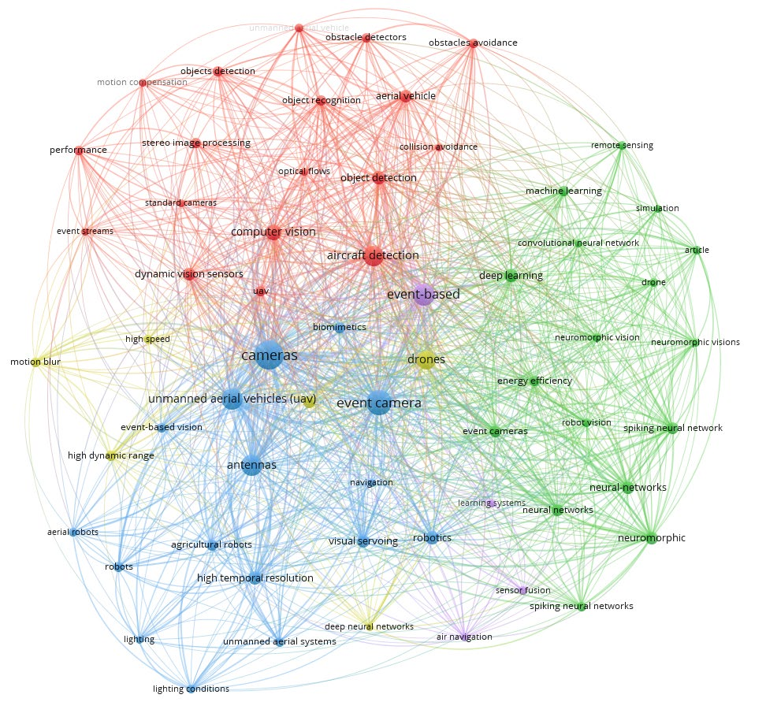

# Sensors 26 00081 V2

**Source Document:** `sensors-26-00081-v2.pdf`  
**Total Pages:** 32  

---

## --- Page 1 ---

### Section: Introduction 

Academic Editor: Mario

Luca Fravolini

Received: 13 November 2025

Revised: 5 December 2025

Accepted: 16 December 2025

Published: 22 December 2025

Copyright: © 2025 by the authors.

Licensee MDPI, Basel, Switzerland.

This article is an open access article

distributed under the terms and

conditions of the Creative Commons

Attribution (CC BY) license.

Systematic Review
Event-Based Vision Application on Autonomous Unmanned
Aerial Vehicle: A Systematic Review of Prospects and Challenges

Ibrahim Akanbi *
and Michael Ayomoh *

Department of Industrial and Systems Engineering, University of Pretoria, Pretoria 0002, South Africa
* Correspondence: u21846911@tuks.co.za (I.A.); michael.ayomoh@up.ac.za (M.A.)

Abstract

Event camera vision systems have recently been gaining traction as swift and agile sensing
devices in the field of unmanned aerial vehicles (UAVs). Despite their inherent superior
capabilities covering high dynamic range, microsecond-level temporary resolution, and
robustness to motion distortion which allow them to capture fast and subtle scene changes
that conventional frame-based cameras often miss, their utilization has yet to be widespread.
This is due to challenges like insufficient real-world validation, unstandardized simulation
platforms, limited hardware integration and a lack of ground truth datasets. This systematic
review paper presents an investigation that seeks to explore the dynamic vision sensor
christened event camera and its integration to (UAVs). The review synthesized peer-
reviewed articles between 2015 and 2025 across five thematic domains, datasets, simulation
tools, algorithmic paradigms, application areas and future directions, using the Scopus
and Web of Science databases. This review reveals that event cameras outperformed
traditional frame-based systems in terms of latency and robustness to motion blur and
lighting conditions, enabling reactive and precise UAV control. However, challenges remain
in standardizing evaluation metrics, improving hardware integration, and expanding
annotated datasets, which are vital for adopting event cameras as reliable components in
autonomous UAV systems.

Keywords: event camera; dynamic vision sensor; unmanned aerial vehicles (UAVs); neuro-
morphic sensor; obstacle avoidance; navigation; path planning

#### 1. Introduction

This section and the following sub-sections ranging from 1.1 to 1.3 present introductory
technical information covering the study’s background, introducing and articulating the
concept of event camera vision system, their operating principles and the advantages of
event cameras over conventional frame-based cameras for fast autonomous UAV operation.
The discussion covers how event cameras asynchronously capture brightness changes at
individual pixels, enabling high temporal resolution and low latency. Additionally, the
sections highlight key features such as high dynamic range and reduced data redundancy,
which make event cameras well-suited for fast and challenging visual environments. The
background also touches on the challenges of processing event-based data and the need for
specialized algorithms to fully leverage their unique output characteristics.

#### 1.1. Background of the Study

Event cameras, sometimes referred to as dynamic vision sensors (DVSs), are a
paradigm shift in visual sensing since they do not focus on taking full-frame pictures

Sensors 2026, 26, 81
https://doi.org/10.3390/s26010081

## --- Page 2 ---

Sensors 2026, 26, 81
2 of 32

but rather on catching scene changes [1]. They represent a paradigm shift in the collec-
tion of visual data since they are asynchronous sensors. This is because, as opposed to
using a clock that is unrelated to the image being watched, they sample light based on
the dynamics of the scene [1]. In contrast to conventional cameras, whose pixels have a
common exposure time, event-based cameras function asynchronously at the pixel level
with microsecond-scale resolution [2]. This is especially helpful in situations with fast
action, as typical cameras might blur motion or need unreasonably high frame rates to
capture details [3]. This speed is essential for real-time UAV operations such as visual
SLAM, obstacle avoidance, odometry, and collision prevention under low-light conditions.

UAVs, commonly known as drones or unmanned aircraft systems (UASs), have
experienced popular adoption in various sectors which include but are not limited to
entertainment, military, precision agriculture, smart city systems, wildlife conservation
and monitoring, logistics, and delivery services, amongst others, highlighting the critical
need for a sophisticated and advanced aerobotics navigation system with swift dynamic
capabilities, covering fast-moving object state space coordinate tracking, space collision
prevention, and obstacle avoidance. Originally, UAVs were mostly used for military
purposes, where they were very important for reconnaissance, surveillance, and targeted
operations [4], but these intelligent agents have proven significant in the advancement of
smart city transit systems [5], precision agriculture [6], the support of search and rescue
operations [7], shipping and delivery such as with Amazon Air [8], aerial photography [9],
wildlife monitoring and conservation [10], and entertainment [11], among several others,
and they are also expected to be a big part of making cities more connected and automated
as part of Industry 4.0 and the push for smart cities. Despite the widespread adoption of
these UAVs, there have been several reports of crashes due to collisions with static and
dynamic obstacles as highlighted by [12] and as shown in Figure 1, which shows analysis
of 60 UAV accident reports, identifying that design flaws and pilot response issues were
the key causative factors. These urban environments, characterized by high-rise buildings,
utility poles, and other obstacles, underscore the necessity of sophisticated avoidance
techniques to mitigate potential collision risks. Likewise, ref. [13] highlights how adverse
weather, like heavy rain, compromises UAV detection accuracy by obscuring camera vision
and degrading sensor performance. UAVs can perform repetitive tasks more efficiently,
but only if they can navigate accurately. This requires them to process information and
make decisions quickly, as well as to perceive their environment with high speed and
precision. Achieving this level of autonomous navigation is crucial for UAVs to operate
effectively, especially in dynamic environments where rapid responses and adaptability
are essential [14].

In the last few years, there has been tremendous work by various researchers in
using event camera vision systems for fast autonomous navigation of UAVs in a dynamic
environment. This vision system offers a paradigm shift by capturing changes in brightness
asynchronously, providing high temporal resolution, low latency, low power consumption,
and high dynamic range, and has been widely adopted not just for autonomous navigation
in UAVs but in the entire field of computer vision ([15–18], etc.) Leveraging event camera
vision systems for dynamic obstacle avoidance in UAVs opens up numerous practical
applications, including aerial imaging, last-mile delivery, and urban air mobility markets
which are experiencing rapid growth and are worth billions of dollars, and they are
forecasted to grow to USD 132.36 billion by 2035 [19]. This capability is especially significant
due to the safety concerns associated with operating aerial vehicles above crowds, as recent
incidents have highlighted the risks posed by drones colliding with birds or objects thrown
at quadrotors during public events. By reducing the temporal latency between perception
and action, this technology helps prevent collisions and non-negligible risk factors in

https://doi.org/10.3390/s26010081

## --- Page 3 ---

Sensors 2026, 26, 81
3 of 32

urban environments as well as severe hardware failure which could lead to losses [20].
These characteristics make them perfect for robotics and computer vision applications
where conventional cameras are ineffective, like situations requiring high dynamic range
or speed [21].

Figure 1. Reported drone or UAV accidents by year of occurrence [12].

Autonomous drones without event cameras react within tens of milliseconds, which
falls short for swift navigation in complex, dynamic environments. To safely avoid collision
with fast moving objects, drones need sensors and algorithms with minimal latency [22].
Similarly, Ref. [23] highlights the necessity of low latency for navigating unmanned aerial
vehicles around dynamic obstacles. Event cameras stand out in these contexts due to their
high dynamic range. For instance, Ref. [24] proposed an entirely asynchronous method for
monitoring intruders using unmanned aircraft systems (UASs), leveraging event cameras’
unique properties. Compared to conventional cameras, event cameras offer significant
advantages such as high temporal resolution (in milliseconds), an exceptionally high
dynamic range (140 dB versus the typical 60 dB), low power consumption, and high pixel
bandwidth (in kHz), which minimizes motion blur. Consequently, event cameras show
strong potential for robotics and computer vision in scenarios where traditional cameras
may fall short. They also produce a sparser and lighter data output, making processing
more efficient [21,22].

The integration of event-based vision in UAV systems represents a critical juncture
in the evolution of aerial autonomy. While numerous individual studies have explored
aspects of this integration, the existing body of knowledge in UAVs remains fragmented.
Researchers face a lack of consolidated information regarding the current state of event
camera usage in UAVs, especially in areas such as publicly available datasets with ground
truth, simulation environments, algorithmic developments, and real-world applications.
Despite several notable similar reviews like [21,25], none of them have been able to focus
on UAVs, which are a technology that is receiving global attention and requires a critical
approach for automation. This fragmentation poses a barrier for newcomers in the field of
UAVs who should leverage the features of this camera over standard cameras.

This systematic literature review (SLR) seeks to bridge this gap by synthesizing recent
advancements, identifying core limitations, and uncovering future possibilities for event
cameras in UAV applications. It highlights the critical need for event cameras for fast
autonomous sensing in UAVs to enable rapid responses to dynamic and complex envi-
ronments. As shown in Figure 2, this review is divided into five sections. In Section 1,

https://doi.org/10.3390/s26010081

![Sensors 2026, 26, 81 3 of 32 | urban environments as well as severe hardware failure which could lead to losses [20]. These characteristics make them perfect for robotics and computer vision applications where conventional cameras are ineffective, like situations requiring high dynamic range or speed [21].](images/page_003_fig_01.png)
*Caption/Context: Sensors 2026, 26, 81 3 of 32 | urban environments as well as severe hardware failure which could lead to losses [20]. These characteristics make them perfect for robotics and computer vision applications where conventional cameras are ineffective, like situations requiring high dynamic range or speed [21].*

## --- Page 4 ---

Sensors 2026, 26, 81
4 of 32

we discuss the background of UAVs and the need to leverage event cameras for fast au-
tonomous navigation. Section 2 discusses how we used the common PRISMA approach
to organize articles for the systematic literature review. Then in Section 3 we discuss the
results of our findings, which included various models and algorithms researchers have
used in several UAV applications using this camera. Here we categorize the methods into
geometric approach, learning-based, neuromorphic, and hybrid approaches. It also details
event camera applications in UAVs, also covering the available datasets and simulators.
Section 4 provides a descriptive analysis of the review results. It emphasizes the advan-
tages and relevance of event cameras for UAV applications, elaborating their edge over
frame-based cameras in autonomous aerial systems. And finally, in Section 5, the conclu-
sion reiterates the potential of event camera sensor to revolutionize UAV performance in
dynamic environments despite current obstacles such as lack of standardize evaluation,
inadequate real-word validation and immature simulation platform.

Event-Based Applications in UAVS: Review And

Challenges

Section  1: Introduction

Section 2: Materials and

Methods

Section 3: Results

Models and Algorithm

Geometric approach

Learning-Based

Neuromorphics

Hybrid/Fusion Sensor

Applications

VIsual SLAM and Odometry

Obstacle Avoidance And

Collison Detection

Infrastucture Inspection

and Anomaly Detection

Object and Human Tracking

High-Speed and Aggressive

Manuervering

Dataset and Simulators

Available Datasets

Open Source Simulator

Section 4: Discussions

Section 5: Conclusions

Figure 2. A summary of organization of research.

The review is guided by five interrelated objectives:

(i)
To examine existing algorithms and techniques spanning geometric approaches,
learning-based approaches, neuromorphic computing, and hybrid strategies for pro-
cessing event data in UAV settings. Understanding how these algorithms outperform
or fall short compared to traditional vision pipelines is central to validating the
potential of event cameras.

https://doi.org/10.3390/s26010081

## --- Page 5 ---

### Section: Basic Principles of an Event Camera 

Sensors 2026, 26, 81
5 of 32

(ii)
To explore the diverse real-world applications of event cameras in UAVs, such as
obstacle avoidance, SLAM, object tracking, infrastructure inspection, and GPS-denied
navigation. This review highlights both the demonstrated benefits and operational
challenges faced in field deployment.
(iii)
To catalog and critically assess publicly available event camera datasets relevant to
UAVs, including their quality, scope, and existing limitations. A well-curated dataset
is foundational for algorithm development and benchmarking.
(iv)
Identify and evaluate open-source simulation tools that support event camera mod-
eling and their integration into UAV environments. Simulators play a vital role in
reducing experimental costs and enabling reproducible research.
(v)
To project the future potential of event cameras in UAV systems, including the fea-
sibility of replacing standard cameras entirely, emerging research trends, hardware
innovations, and prospective areas for interdisciplinary collaboration.

By organizing the literature according to these five thematic pillars, this review offers
a structured resource for scholars, engineers, and practitioners in robotics, computer vision,
and autonomous systems working on UAV navigation and perception. Furthermore, it
identifies unresolved challenges, benchmarks current progress, and proposes directions for
future work, aiming to accelerate innovation and practical adoption of event-based vision
in autonomous aerial systems.

#### 1.2. Basic Principles of an Event Camera

Event cameras are bio-inspired sensors that differ from conventional cameras due to
their asynchronous way of measuring per-pixel brightness changes compared to the former,
which captures images at a fixed rate [21]. Every pixel in an event camera continually
and independently tracks changes in intensity. A pixel that notices a notable shift in light
intensity, either increasing or decreasing, creates an “event” that contains its location, the
polarity of the change which is brightening or darkening, and an exact timestamp [21,26].
The fundamental idea underlying event cameras is the asynchronous recognition of scene
changes, enabling them to function with great temporal resolution, frequently in the
microsecond range.

The capacity of event cameras to function in difficult lighting settings is another impor-
tant benefit. Conventional cameras would find it difficult to simultaneously capture bright
and dark areas in scenes with great dynamic ranges, whereas event cameras are simply sen-
sitive to changes in intensity. Because only pixels that undergo a change are captured, the
data produced by event cameras is also sparse and compact, requiring less data bandwidth
and processing that is more effective [27]. Because of these characteristics, event cameras
are perfect for robotics, autonomous driving, and surveillance applications where quick
and low-latency vision is essential. Nevertheless, the asynchronous character of the data
presents difficulties for conventional computer vision algorithms, requiring the creation of
fresh processing methods customized for the data format of event cameras [23,27].

Conventional image sensors and event-based cameras function very differently. Event-
based cameras offer great temporal resolution and little motion blur, while traditional
cameras collect images at fixed frame rates. Event-based cameras detect changes in pixel
intensity asynchronously. This makes event cameras perfect for situations where standard
sensors frequently falter, such as high-speed or low-light conditions. Furthermore, event
cameras interpret sparse data and use less power, which improves efficiency in real-time
applications like UAV navigation [23]. Traditional cameras, on the other hand, work better
in static contexts (such as object recognition jobs) when full-frame information is essential.
Though integrating event cameras with traditional computer vision processing algorithms

https://doi.org/10.3390/s26010081

## --- Page 6 ---

### Section: Types of Event Cameras 

Sensors 2026, 26, 81
6 of 32

is still a problem, they perform best in dynamic environments where only little changes
are noticeable [27].

#### 1.3. Types of Event Cameras

This subsection presents the different categories of event cameras. The itemization
herein spans across five different types, as highlighted in Table 1. Their detailed mode of
operation and identified gaps were also presented.

Table 1. Types of event cameras.

Type
Operation
Gaps

Dynamic Vision Sensors
(DVSs) [28]

Detecting variations in brightness is the sole
method used by DVS, the most popular kind of
event camera. When the amount of light in the
scene varies enough, each pixel in a DVS
independently scans the area and initiates an
event. With their high temporal resolution and
lack of motion blur, DVSs work especially well
in situations involving rapid movement. The
DVS has a number of benefits over
conventional high-speed cameras, one of which
being their incredibly low data rate, which
qualifies them for real-time applications.

Despite these capabilities,
integrating DVSs with UAVs
remains a challenge, especially
on the issues of real-time
processing and data
synchronization [21]. A lack of
standardized datasets is also
making it difficult to evaluate
the performance of DVS
camera-based UAV
applications [29]

Asynchronous Time-based
Image Sensors (ATIS) [30]

ATIS combines the capability of capturing
absolute intensity levels with event detection.
Not only can ATIS record events that are
prompted by brightness variations, but it can
also record the scene’s actual brightness at
times. Rebuilding intensity images alongside
event data is made possible by this hybrid
technique, which enables greater information
acquisition and is especially helpful for
applications that need both temporal precision
and intensity information.

Data from an event-based ATIS
camera can be noisy, especially
in low-light conditions. So,
there is a need for an efficient
noise filtering model to address
this [31]

Dynamic and Active Pixel
Vision Sensor (DAVIS) [2]

DAVISs combine traditional active pixel
sensors (APS) and DVS capability. Because of
its dual-mode functionality, DAVISs may be
used as an event-based sensor to identify
changes in brightness or as a conventional
camera to record full intensity frames. The
DAVIS’s dual-mode capacity makes it
adaptable to a variety of scenarios, including
those in which high-speed motion must be
monitored while retaining the ability to capture
periodic full-frame photos.

This capability of combining
both APS and DVS capability
poses challenges in complex
data integration and sensor
fusion [32]

Color Event Cameras [33]
Color event cameras are one of the more recent
innovations that increase the functionality of
traditional DVSs by capturing color
information. These sensors enable the camera
to record color events asynchronously by
detecting changes in intensity across various
color channels using a modified pixel
architecture. This breakthrough enables event
cameras to be utilized in more complicated
visual settings where color separation is critical.

There is a scarcity of
comprehensive dataset
repositories specifically for
training and evaluating models
that use this camera [34]

https://doi.org/10.3390/s26010081

## --- Page 7 ---

### Section: Materials and Methods 

Sensors 2026, 26, 81
7 of 32

#### 2. Materials and Methods

This review followed the Preferred Reporting Items for Systematic Reviews and Meta-
Analyses (PRISMA) approach [35] as shown in Figure 1. Five main research questions are
addressed in this study: which open-source simulation tools facilitate the integration of
event cameras into UAV systems; which publicly available event camera datasets are there
for UAV applications and their limitations; which major models or algorithms have been
developed for event-based UAV perception and how well do they perform in comparison
to standard vision systems; which UAV applications have successfully deployed event
cameras and what challenges have arisen; and which emerging future directions and
innovations for event cameras in UAV applications are being explored. Consistent with
common practices in the engineering literature, the protocol was developed, reviewed, and
archived internally without registration.

#### 2.1. Search Terms

We used extensive database coverage across two major academic repositories, Scopus
and Web of Science. These interdisciplinary engineering databases were chosen for their
comprehensive coverage of peer-reviewed publications. Boolean operators and wildcards
were used strategically with phrases like “Event camera?” OR “Event-based camera?”
OR “dynamic vision sensor?” OR “DVS” AND (“UAV” OR “drone?” OR “unmanned
aerial vehicle?”)

#### 2.2. Search Strategy and Criteria

Inclusion and Exclusion Criteria:

•
Inclusion Criteria: Peer-reviewed journal articles and conference proceedings that
directly applied event cameras in UAV contexts, with empirical evaluation of systems,
algorithms, or datasets related to UAV navigation, perception, tracking, SLAM, or
object recognition.
•
Exclusion Criteria: Publications prior to 2015, non-English studies, duplicate publi-
cations, secondary summaries, and research focusing solely on hardware design or
biological vision systems without any application to UAV robotics.

Screening and Selection Process:

1.
Identification: An initial total of 245 records were identified from Scopus (n = 195)
and Web of Science (n = 50)
2.
Removal of Redundancies: Duplicate records (n = 38) and non-English records (n = 8)
were removed.
3.
Screening: The remaining 199 records were screened based on titles and abstracts.
This screening phase excluded 18 records.
4.
Retrieval and Eligibility Assessment: Reports sought for retrieval totaled 181, with
30 not retrieved. The remaining 151 reports were assessed for eligibility. During this
assessment, 22 reports were excluded because their focus was solely on hardware
design or biological vision systems without applications in UAV robotics.
5.
Final Selection: A total of 129 relevant papers were ultimately included in the review.
These selection processes are indicated in Table 2.

https://doi.org/10.3390/s26010081

## --- Page 8 ---

### Section: Data Extraction 

Sensors 2026, 26, 81
8 of 32

Table 2. Research paper selection process.

keywords
event based camera, event-based camera, dynamic vision sensor,
dvs, unmanned aerial vehicle, uavs, drone

Databases
Scopus and Web of Science

Boolean operator
OR, AND

Language
English

Year of publication
2015 to 2025

Inclusion criteria

English, peer review journal articles and conferences proceeding,
addressed the use of event cameras on DVSs in the context
of UAVs

Exclusion criteria
Prior to 2015, not English, duplicate, focus was solely on
hardware design or biological system without application in UAV

Document type
Published scientific papers in academic journals,
conference papers

#### 2.3. Data Extraction

Data extraction was performed using a custom structured matrix designed to capture
the bibliographic information, methodological characteristics, and technical categories of
each paper. Initially, all identified records downloaded from Scopus and Web of Science
were exported in RIS format and imported into Mendelay Reference Manager (version
2.138.0) where duplicates were removed automatically. The cleaned reference list was
then exported into a csv file for systematic extraction. This structure matrix recorded key
bibliographic data (authors, title, publication year, document type, and source), study
specifications (selected, dataset, algorithm or model method, and fusion), and technical
details which included the event camera model used.

The supported tools included Python (version 3.12.0) with Pandas (version 2.2.3) for
quantitative summaries and exploratory data visualization, Vosviewer (version 1.6.20) for
clustering, Microsoft Excel for data analysis and cross-tabulation, and Mendeley for source
organization and citation management. Five standardized criteria were used to evaluate
each study for quality assessment: reproducibility through the availability of source code,
datasets, or clear implementation details; methodological rigor through valid experimental
design and evaluation procedures; innovation and contribution through novel techniques
or applications for event-based UAV perception; empirical validation with quantitative
results and benchmark comparisons; and clarity of objectives regarding event camera-based
UAV research goals. A binary system was used to score the studies; papers that satisfied
at least four of the five requirements were given priority as high-quality contributions.
The lead reviewer carried out the quality assessment independently, using secondary
verification to ensure consistency and reduce bias.

The flowchart as indicated in Figure 3 illustrates the systematic selection process of
relevant event-based camera studies in UAVs, highlighting the filtering of the initial search
results to the 129 studies that confirmed the review’s conclusions.

Using Vosviewer software [36], Figure 4 demonstrates the interdisciplinary nature of
event-based UAV research, highlighting strong connections between neuromorphic sensing,
autonomous navigation, and real-time visual processing, which form the foundation of
current event-driven aerial navigation development.

https://doi.org/10.3390/s26010081

## --- Page 9 ---

Sensors 2026, 26, 81
9 of 32

Figure 3. PRISMA flowchart.

Figure 4. Bibliometric mapping of event camera applications in UAVs.

https://doi.org/10.3390/s26010081

*Caption/Context: Figure 3. PRISMA flowchart. | Figure 4. Bibliometric mapping of event camera applications in UAVs.*

## --- Page 10 ---

### Section: Results 

Sensors 2026, 26, 81
10 of 32

#### 3. Results

#### 3.1. Review of Past Survey of Event Cameras in UAV Applications

The field of event-based vision and its application in autonomous unmanned aerial
vehicles has been rapidly evolving, with various reviews and surveys addressing different
aspects of this technology. Early work by [21] covers the event camera’s principles, algo-
rithms, hardware, and applications across various tasks, but it is limited to a general robotics
and computer vision context, and it lacks an in-depth review of event camera-specific SLAM
and real-time state estimation methods tailored specifically to UAVs. Similarly, Ref. [37]
reviewed vision-based navigation system, covering different sensors such as stereo and
RGB devices, LIDAR camera hybrids, event cameras, and infrared systems, highlighting
SLAM algorithms and control strategies across robotic domains. However, it lacked focused
analysis of event-based SLAM and real-time UAV applications. Additionally, Ref. [15]
detailed several publicly available event camera datasets relative to automotive in-cabin
and out-of-cabin scenarios, sensor fusion, optical flow, and depth estimation, but it does not
address or provide detailed discussion on the application of event cameras in autonomous
UAVs. Thus, this survey underlines the need for targeted research and comprehensive
systematic reviews that address event-based perception, SLAM, and control methods
specific to UAV platforms to close these gaps and fully exploit this sensor’s potential in
aerial autonomy.

#### 3.2. Models and Algorithms

Event processing data for events in UAVs is an important aspect because the use of
algorithms is considered in the development of interpreting applications associated with
event data in UAV. As a result of this, the asynchronous and inimitable landscape of event
streams, algorithmic approaches differ to a large extent from those which are adopted in
frame-based visualizations. Owing to this, grouping these algorithms into four distinct
categories can be considered, such as the following: model-based approach, learning-based
methods, neuro-morphic approach of computing, and hybrid sensor integration methods.

#### 3.2.1. Geometric Approach

The geometric approach of processing is the foundational category of methods used
in ego-motion compensation, dense estimation, and optical flow for UAVs equipped with
event cameras. This is based on the principles of projective geometry and rigid body
transformations [38]. Studies have identified a method for a real-time optical flow using a
DVS on a miniature embedded system that is suitable for autonomous flying robots. The
local motion at each pixel is modeled as a linear combination of the three global motion
components, pan, tilt, and yaw rotations, which are represented by vectors vx and vy, where
the local flow v(x, y) at each pixel is expressed as follows:

v(x, y) = ∝vx + βvy + γvz
(1)

where α, β, γ are the coefficients representing pan, tilt, and yaw, respectively.

Event-based visual odometry is identified as part of the major dominant and first
recognized technique which was earlier introduced by [29], and it was found that the
performance features of this approach can be used to track and estimate camera motions
that do not have frames and also to attain a rotation error of about 0.8◦and a translation
error close to 2%, with computational efficiency which is appropriate for onboard UAV
processing. Conversely, Ref. [39] argued against this assertion in comparison to a visual
odometry technique with low latency which eventually ensures that delays are minimized.

https://doi.org/10.3390/s26010081

## --- Page 11 ---

Sensors 2026, 26, 81
11 of 32

Contrast maximization, on the other hand, was introduced by [40] and is known to
take an entirely different route by optimizing alignment through motion-compensated
contrast development in the event stream. Meanwhile, it is known to be powerful in
scenes that are static, and its assumption of inflexibility exposes it to vulnerabilities from
unique interference.

The dynamic vision sensors are bio-inspired with sensors that record intensity changes
rather than intensity of images from pixel-wise captures.

Given an event ek

.= (xk, tk, pk) that was triggered by a logarithm intensity L(xk, tk)
at a given pixel that is more than the contrast intensity C > 0, the logarithm intensity can
be modeled by [28] as follows:

L(xk, tk) −L(xk, tk, ∆tk) = pkC,
(2)

where xk = (xk, yk)T is the spatio-temporal coordinates in tk (with µS resolution), polarity

pk ∈{+1, −1} is the sign of the change in intensity, and tk −∆tk is the time difference
between the pixels.

Gallego et al. (2018) [40] modeled the contrast maximalization with a mathematical
framework from a dynamic vision sensor. Given a set of events ζ = {ek}Ne

k=1,

ek

.= (xk, tk, pk) →ek

.=



xk, tre f , pk



(3)

According to their work, the motion model W results in a set of warped events
ζ′ = {ek′}Ne

k=1. This results in a warp given as follows:

x′

k = W(xk, tk, θ)
(4)

The warp transport events along the motion point trajectory θ until a time tre f has been
reached. An objective function called the image of warped events is modeled to measure
the alignment of the warped events as follows:

I(x; θ) =

Ne
∑
k=1

bkδ



x −x′

k(θ)



(5)

where x is the pixel and sums the values for the warped events that fall within its range of

bk = [ pk 1], with the former given the value if polarity was used and 1 if it was not used.

Continuous-time trajectory estimation was proposed by [41], which is an identified
motion model connected with a continuous function instead of discrete poses, which aligns
better with the asynchronous nature of event data. Furthermore, Ref. [42] introduced the
EVO, which is an identified 6-DOF system of mapping and parallel tracking used to process
events in a timely manner; meanwhile, it was found that the performance of the EVO lacks
low-texture settings. Ref [29], in their work, explored how standard cameras use fixed
frame rates to send full frames and how event cameras use their independent pixels to
continuously fire intensity changes in the image plane. For the given intensity I, the sensor
generates an event at the point u(x, y)T with a logarithm function given as follows:

∆log(I)| ≈

−

∇log(I),

.u∆t

> C
(6)

where ∇calculates the special gradient in the motion field

.u over a time frame ∆t. These
events are recorded with a timestamp and asynchronously transmitted due to advanced
digital technology that works behind the scenes. The events of the cameras usually form
tuples of ek = (xk, tk, pk), where (xk, tk) forms the coordinates of the event, polarity is pk,
and the timestamp is tk.

https://doi.org/10.3390/s26010081

## --- Page 12 ---

Sensors 2026, 26, 81
12 of 32

In practice the Delta function in the IWE is replaced with a smooth approximation like
the Gaussian, such that

δ ≈N



x; µ, ϵ2

, with ϵ = 1 pixel
(7)

The objective function of the IWE model is

G(θ) = Var I(x; θ)
.=
1
|Ω|

#### Z

#### Ω

.=(I(x; θ) −µI)2 dx,
(8)

where uI is the mean and Ωis the image domain.

µI

.=
1
|Ω|

#### Z

#### Ω

.=(I(x; θ)) dx,
(9)

Hence, the optimization algorithm that optimizes the contrast framework is given
as follows:

θ∗= argmax

θ
G(θ)
(10)

Therefore, the model-based approach is found to maintain an attractive computational
suitability and simplicity for UAVs which are resource-constrained; meanwhile, their
limitations are based on the sparsity of scene, sensitivity to noise, and element dynamism.
Table 3 provides a comprehensive list of annotations used in this geometric approach. And
contributions using the geometric approach are summarized in Table 4.

Table 3. Geometric approach equation annotation.

Symbol
Description
Units/Notes

I
Pixel intensity
Arbitrary units
(x, y)
Pixel coordinates in 2D image plane
Pixels
∆log(I)
Change in logarithmic intensity
Unitless
∇log(I)
Spatial gradient of the logarithmic intensity
Unitless
.u (dot u)
Motion field (spatial velocity of pixels)
Pixels per unit time
∆t
Time interval
Seconds
C
Contrast threshold for triggering events
Threshold value

ek = (xk, tk, pk)
Event tuple: spatial coordinate,
timestamp, polarity

xk in pixels; tk in seconds; pk ∈{+1,−1}
polarity indicator
δ (delta function)
Approximation of Dirac delta by Gaussian
Unitless, probability density function
Ω(Omega)
Image domain
Region within pixels
µI
Mean intensity over the image domain
Intensity units
θ (theta)
Parameters of motion or warp function
Typically includes angles and translations

Table 4. Summary of relevant contributions using Geometric approaches.

Author Year
DVS Type
Evaluation
Application/Domain
Model
Future Direction

[43]
2015
DVS 128

Real indoor test flight
with a miniature
quadcopter

Navigation

Flexible algorithm infers
motion from adjacent pixel
time differences

The study targeted an indoor
environment. Dynamic scenes
with more complex environments
are required.

[38]
2019
DVS 128
Dataset from [29]
Vision aid landing
Adaptive block matching
optical flow

Further work should focus on the
robustness and the accuracy of
landmark detection especially in
a complex scene.

https://doi.org/10.3390/s26010081

## --- Page 13 ---

### Section: Learning-Based Methods 

Sensors 2026, 26, 81
13 of 32

Table 4. Cont.

Author Year
DVS Type
Evaluation
Application/Domain
Model
Future Direction

[22]
2020
SEES1

Real-world
experiment with
quadrotor

Dynamic obstacle
avoidance

(IMU)’s angular velocity
average for ego-motion,
DBSCAN for clustering
and APF for obstacle
avoidance

This approach model obstacles as
ellipsoids and relies on sparse
representation. Extending this
approach to more complex
environments with
non-ellipsoidal obstacles and
cluttered urban environments
remains a challenge.

[44]
2023

Simulated
DVS with
resolution
of
1024 × 768

Simulator based on
OSG-Earth

Navigation and
control

Mutual information for
image alignment

The algorithm is limited to 3-DoF
displacement (translation) and
does not incorporate changes in
orientation, limiting its capability
to fully determine the 6-DoF
pose.

[45]
2023
DAVIC
240C
MVSCEC Dataset
Navigation

The author recommended a
complete SLAM framework for
high-speed UAV based on even
camera

[46]
2024
CeleX-5

Real world with UAV
and simulation with
Unreal Engine and
AirSim

Powerline inspection
and tracking

The EAPTON (Event-based
Antinoise Powerlines
Tracking with ON/OFF
Enhancement)

Lack of dataset in that domain
and inability of the model to
accurately distinguish between
power lines and nonlinear object
in a complex scene.

[47]
2024
DAVIS 326

Real-world with
octorotor UAV
indoors and outdoors

Load transport; cable
swing minimization

Point cloud representation
and a Bézier curve
combined with Nonlinear
Model Predictive
Controller

Future work could focus on
enhancing event detection
robustness during larger cable
swings, developing more
sophisticated fusion techniques,
and extending the method’s
applicability to dynamic, highly
noisy environments.

#### 3.2.2. Learning-Based Methods

Deep learning techniques have been developed to overcome many of the drawbacks
of model approaches, especially when it comes to managing dynamic, complicated scenes.

E2VID was one of the earliest models to translate event streams into standard frames
for CNN processing [48], and the main temporal benefits of event data were jeopardized,
even if this allowed for high-quality image reconstruction. When applied to autonomous
driving, ref. [49] demonstrated that this technique worked well for simple navigation.

EV-FlowNet used self-supervised optical flow estimation; Ref. [50] preserved the event
structure, attaining exceptional accuracy (0.32 average endpoint error) and resilience in
demanding settings.

Dynamic tracking based on events has also advanced and strong object detection
techniques for harsh illumination situations were created by Mitrokhin et al. [1,51], and they
were extended using the EV-IMO dataset [51]. Traditional Transformer-based approaches,
such as the Vision Transformer (ViT), face the challenge of high computational complexity
due to excessively long tokens [52]; however, Cross-Deformable-Attention (CDA) modules
have been designed to significantly reduce computational complexity. Table 5 is the
summary of the relevant contribution using leaning-based approaches.

https://doi.org/10.3390/s26010081

## --- Page 14 ---

### Section: Neuromorphic Computing Approach 

Sensors 2026, 26, 81
14 of 32

Table 5. Summary of relevant contributions using learning-based approaches.

Author Year
Event
Camera Type

Method of
Evaluation
Application/Domain
Model
Future Direction

[53]
2022
DVS

The system was
evaluated via
simulation trials in
Microsoft AirSim.

Event-based object
detection, obstacle
avoidance

Deep reinforcement
learning

The study highlights the need to
optimize network size for better
perception range, design new reward
functions for dynamic obstacles, and
incorporate LSTM for improved
dynamic obstacle sensing and
avoidance in UAVs

[54]
2022
Prophese 640
by 480

Real-world on small
UAV

Localization and
Tracking

YOLOv5 and
k-dimensional tree

The research primarily focused on 2D
tracking and future work should be
extended to 3D tracking/control

[55]
2023
DAVIS346

Real-world testing
with a hexarotor
UAV installed with
both event- and
frame-based cameras
and simulation in
Matlab Simulink

Visual servoing
robustness

Deep reinforcement
learning

The proposed DNN with noise
protected MRFT lacks robust
high-speed target tracking under
noisy visual sensor data and slow
update-rate sensors; future directions
include developing adaptive system
identification for high-velocity targets
and optimizing neural network-based
tuning to improve real-time accuracy
under varying sensor delays and
noise conditions

[56]
2024
Prophesee
camera
EVK4–HD

To bridge the data
gap, the first
large-scale
high-resolution
event-based tracking
dataset called
EventVot was
produced through
UAVs and used for
real-world
evaluation

Obstacle localization;
navigation

Transformer-based
neural networks

The high-resolution capability of the
Prophesee EVK4–HD camera (1280 ×
720) opens new avenues for
improving event-based tracking, but
it also introduces additional
challenges, such as increased
computational complexity and data
processing requirements

[57]
2024
DAVIS 346c

Real-world testing in
a controlled
environment with
hexacopter

Obstacle avoidance

Graph Transformer
Neural Network
(GTNN)

Real-world experiment in a complex
environment is limited in the
literature

[58]
2024
n.a

Real-world
experiment with
s500 quadrotor

Crack detec-
tion/inspection

Unet and
YOLOv8n-seg
network

Explore the use of actual event
camera sensor to directly capture real
temporal information

[59]
2025
DVS 128

Evaluation was done
using N-MNIST,
N-CARS,
CIFAR10-DVS
dataset

Object detection

A motion-aware
branch (MAB)
enhances 2D CNNs

future research could focus on
optimizing the input patches by
filtering out meaningless or noisy
patches before they are fed into MAB

#### 3.2.3. Neuromorphic Computing Approach

Neuro-morphic approaches seek to maintain the biological analogies of event data
because of their spike-like characteristics. These techniques are particularly applicable
to UAVs with limited power. Ref. [60], a study on using drones for civil-infrastructure
inspection, demonstrates that pairing event cameras with SNNs can drastically cut energy
while preserving accuracy. It shows that SNNs on Loihi are 65–135× more energy-efficient
than ANNs on a modern accelerator, with only a 6–10% drop in defect-classification metrics
and better robustness under extreme lighting, but it remains a classification-only pipeline
that assumes a conventional flight controller and does not address full perception–action
loops or dense scene understanding. Ref. [61] then fills that gap on the perception side by
moving from image-level labels to pixelwise semantic maps. It proposes a fully spiking,
U-shaped encoder–decoder architecture for event data that uses PLIF neurons, avoids batch
normalization, cuts parameters by about 1.6× relative to the closest spiking baseline, and
still improves MIoU by around 5.6 percentage points, yet its focus is on the offline driving

https://doi.org/10.3390/s26010081

## --- Page 15 ---

Sensors 2026, 26, 81
15 of 32

DDD17 dataset and its authors consider full deployment on neuromorphic chips like Loihi
or SpiNNaker as future work rather than demonstrating an embedded, closed-loop system.

Ref. [62] moves explicitly into closed-loop control, but only for the mid-level behavior
of obstacle avoidance in a software simulation experiment with XTDrone. The DNN detec-
tion method replaces heavy SNN detectors with Spiking-YOLO, which uses 7.9M neurons
with a 3072-neuron component, and couples this to Kalman and Bayesian predictors plus
confidence-interval logic to produce safe velocity commands that can avoid obstacles with
up to 8 m/s relative speed within 0.2 s, even under missed detections. However, it still
assumes a conventional flight controller beneath it and leaves actual deployment on neu-
romorphic processors, integration with richer semantic perception, and truly end-to-end
neuromorphic control as explicit future directions.

Ref. [63] presented a fully neuromorphic vision by running an entire perception-
to-actuation pipeline on spiking networks fed by an event camera and driving a flying
drone directly. It accepts raw ego-motion and scene events, learns low-level control via
supervised learning in a simulator, and then flies a real quadrotor at 200 Hz update rate on
neuromorphic hardware, using only about 0.94 W for inference plus roughly 7–12 mW for
on-board learning, while robustly performing hovering, landing, sideways maneuvers, and
turning. A promising avenue for this drone is making sensing, processing and actuation
fully neuromorphic, but this is currently limited by available neuromorphic hardware and
I/O, so full onboard neuromorphic pipelines remain a hardware-driven future goal. In
Table 6, we summarized all the relevant contributions using the neuromorphic approach.

Table 6. Summary of relevant contributions of neuromorphic computing approaches.

Author Year
Event
Camera Type

Method of
Evaluation
Application/Domain
Model
Future Direction

[64]
2017
DVS

Real-world recorded
data from a DVS
mounted on a QUAV

Obstacle avoidance
Spiking neural network
model of LGMD

Integrate motion direction
detection (EMD) and enhance
sensitivity to diverse stimuli

[65]
2019
DVS240

Real-world testing in
indoor environment
using the actual data
from a DVS and
simulation testing
using data that was
processed through an
event simulator
(PIX2NVS)

Drone detection

SNNs trained using
spike-timing-
dependent plasticity
(STDP).

The model was tested in an
indoor environment. Exploring
the system in a
resource-constrained
environment is critical

[66]
2020
DAVIS240C

Real-world
experiment on
two-motor 1-DOF
UAV

SLAM
PID+SNN

The authors suggested the
potential for integrating
adaptation mechanism and
online learning into the
SNN-based controllers by
utilizing the chip’s on-chip
plasticity

[67]
2021
DAVIS 240C

Real-world
experiment on
dualcopter

Autonomous UAV
control

Hough transform with
PD controller

Full on-chip neuromorphic
integration for direct
communication with flight
controllers to reduce latencies
and delays

[68]
2023
n.a

Simulated DVS
implemented through
the v2e tool within an
AirSim environment

Obstacle avoidance

Deep Double
Q-Network (D2QN)
integrated with SNN
and CNN

Improve network architecture
for better performance in real
world

https://doi.org/10.3390/s26010081

## --- Page 16 ---

### Section: Hybrid Sensor Integration Methods 

Sensors 2026, 26, 81
16 of 32

Table 6. Cont.

Author Year
Event
Camera Type

Method of
Evaluation
Application/Domain
Model
Future Direction

[60]
2023
DAVIS 346

Validated with
simulated and
collected datasets

Civil infrastructure
inspection
DNN and SNN

Creating a real
event-camera-based dataset for
extreme illumination effects and
testing SNNs on a real
embedded neuromorphic device

[63]
2024
DVS 240
Real drone
Autonomous UAV
control
SNN and ANN

The author suggested the best
approach to have an
energy-efficient system is to
make the entire drone system
neuromorphic

[69]
2024
n.a
Simulation with
Gazebo and ROS
Autonomous Control
SNN and ANN
A real-world simulation is
suggested

[70]
2024
DVS

Real-world
experiment with
drone

People Detection
SNN STDP

The author suggested
multi-person detection and
implementation of
neuromorphic chip for low
power, low latency

[71]
2024
Prophese
EVK4 HD

Neuromorphic
MNIST (N-MNIST)
dataset

Motion Estimation
Fuzzy SNN
Collecting actual event data in a
mock Mars environment

[61]
2024
n.a
DDD17 dataset
Navigation
SNN with Surrogate
Gradient Learning

Implementing the model on
low-power neuromorphic
hardware

[72]
2024
DVXplorer
Mini camera

Simulation on
neurorobotics
platform

Asset Monitoring
SNN and Kalman
filtering

Further research includes the
port of optical flow computation
to neuromorphic hardware and
the full port of the system onto a
real drone, for real-world
assessment

[62]
2024
DVS

Simulation was
performed in
XTDrone-based

Obstacle avoidance
Dynamic neural field
with Kalman filter

Deploy the lightweight SNN
onto neuromorphic hardware
for obstacle detection

[73]
2024
ESIM to
generate the
event

Synthetic data from
ESIM
Obstacle avoidance
LGMD with FSN
Deploying the model in a
complex scene

[74]
2025
n.a
Real-world
experiment on drone
Obstacle avoidance
CEF and LEM

Extending the design principle
beyond obstacle avoidance to
navigation

#### 3.2.4. Hybrid Sensor Integration Methods

The drawbacks of single-sensor systems are addressed by hybrid techniques, which
combine event data with various sensor modalities. Ultimate SLAM by [39] integrates IMU,
frame, and event data to provide reliable SLAM under high-speed, HDR circumstances.
Stereo event processing and sensor fusion are supported by the MVSEC dataset [29].
Ref. [75] improved on this model when they enhanced it with a range sensor and called
the model REVIO. This model outperforms existing methods on the event camera dataset,
reducing position error by up to 80% in high-speed scenes and achieving better accuracy
and efficiency compared to [39] and VINS-Mono in dynamic environments. All the hybrid-
based approaches are summarized in Table 7.

https://doi.org/10.3390/s26010081

## --- Page 17 ---

### Section: Application Benefits of Event Camera Vision Systems in UAVs 

Sensors 2026, 26, 81
17 of 32

Table 7. Summary of relevant contributions of hybrid approaches.

Author Year
Event
Camera Type

Method of
Evaluation
Application/Domain
Model
Future Direction

[39]
2018
DVS

The result was
evaluated with [29]
dataset

#### SLAM

Hybrid state estimation
combining data from
event and standard
cameras and IMU.

Future work should expand this
multimodal sensor to more
complex real-world applications

[76]
2021
DVX Explorer
640 by 480
Real-world quadrotor
Object detection and
avoidance
Fuses IMU/depth.

Integrating avoidance
algorithms based on motion
planning, which would consider
static and dynamic scenes

[75]
2022
DAVIS 346

6DOF quadrotor,
using dataset from
[40]

#### VIO

VIO model combining
event camera, IMU, and
depth camera for range
observations.

According to the author, the
effect of noise and illumination
on the algorithm is worth
studying in the next step

[77]
2023
DAVIS346

Real-world in a static
and dynamic
environment using
AMOV-P450 drone

Motion tracking and
obstacle detection

It fuses asynchronous
event streams and
standard image
utilizing nonlinear
optimization through
Photometric Bundle
Adjustment with sliding
windows of keyframes,
refining pose estimates.

Future work aims to incorporate
edge computing to accelerate
processing

[78]
2024
Prophesee
EVK4-HD
sensor

Two insulator defect
datasets, CPLID and
SFID

Power line inspection
YOLOv8.

While the experiment used
reproduced event data derived
from RGB images, the authors
note that real-time captured
event data could better exploit
the advantages of neuromorphic
vision sensors

[79]
2024
n.a

Simulated data and
real-world nighttime
traffic scenes captured
by a paired RGB and
event camera setup
on drones

Object Tracking
Dual-input 3D CNN
with self-attention.

Integration of complementary
sensors such as LIDAR and
IMUs for depth-aware 3D
representations and more robust
object tracking

[80]
2024
Real-world testing on
quadrotor both
indoors and outdoors

#### VIO

PL-EVIO which tightly
coupled
optimization-based
monocular event and
inertial fusion.

Extending the work to
event-based multi-sensor fusion
beyond visual-inertial, such as
integrating LiDAR for local
perception and visible light
positioning or GPS for global
perception, to further exploit
complementary sensor
advantages

#### 3.3. Application Benefits of Event Camera Vision Systems in UAVs

The use of event camera vision systems in unmanned aerial vehicles (UAVs) has made
it possible to use them in a variety of fields where traditional frame-based vision systems
are often ineffective. The high temporal resolution, low latency, and durability of event-
based cameras in dynamic and low-light-environment conditions frequently encountered
in airborne operations motivate their use in UAV systems. Consequently, a number of
creative use cases have surfaced in both experimental and research deployments, and
this section summarizes important application areas found in the literature, demonstrates
how event-based vision improves performance in each situation, and considers lingering
restrictions and integration difficulties.

#### 3.3.1. Visual SLAM and Odometry

Visual odometry and event-based SLAM are two of the most studied topics for UAV
navigation with event camera vision systems. The use of event camera vision systems

https://doi.org/10.3390/s26010081

## --- Page 18 ---

### Section: Obstacle Avoidance and Collison Detection 

Sensors 2026, 26, 81
18 of 32

in UAVs for visual odometry (VO) and simultaneous localization and mapping (SLAM)
is among the oldest and most actively researched uses of these cameras. EVO [42] and
Ultimate SLAM [39] are two examples of systems that show how event streams may be
used for precise 6-DOF pose tracking in high-speed motion and in settings where motion
blur or changing lighting would cause classic frame-based SLAM to fail. In fast-moving
aerial situations, motion blur and latency are the limitations of traditional frame-based
SLAM systems. On the other hand, by accurate temporal sampling, event cameras allow
for continuous time pose estimation.

Ref. [29] showed that event-based visual odometry could accurately estimate UAV
motion latency-free [39] expanded on this work with the Ultimate SLAM framework, which
achieves robust SLAM in high-dynamic-range (HDR) situations by combining event data,
frames, and inertial measurements.

These systems performance can degrade in low-texture settings or during aggressive
maneuvers, despite their potential in organized environments. This suggests that more
algorithmic robustness and sensor fusion techniques are required.

#### 3.3.2. Obstacle Avoidance and Collison Detection

Event cameras’ low latency and resistance to motion blur have allowed them to
perform exceptionally well in reactive obstacle avoidance and high-speed navigation.
For high-speed obstacle avoidance in UAVs, event cameras are perfect because of their
lightning-fast response and lack of motion blur. While event cameras may detect changes
in the visual field in microseconds, traditional vision-based systems may not be able to
detect fast-moving impediments in dynamic situations. Ref. [53] have tested and proposed
reactive systems that can identify and avoid moving objects in milliseconds. Quadrotors
can avoid fast dynamic obstacles using event cameras with 3.5ms latency, as demonstrated
by [22] and event-based moving object detection frameworks were created by [1] and
they showed dependable segmentation in challenging motion and lighting scenarios. For
ornithopter UAVs, Ref. [24] implemented a biologically inspired sense-and-avoid system
that uses asynchronous event data to enable evasive maneuvers with response times of less
than a millisecond. These investigations highlight the effectiveness of event-based systems
in situations that call for prompt decision-making, like autonomous defense applications,
drone racing, and spying.

However, there are still unresolved issues with filtering noisy activations and adjusting
thresholds for event triggering, especially in cluttered, multi-object environments.

#### 3.3.3. GPS-Denied Navigation and Terrain Relative Flight

In environments where GPS is not available, including tunnels, urban canyons, wood-
lands, or indoor spaces, UAVs must rely on vision-based navigation. An appealing sub-
stitute for conventional visual-inertial systems, event cameras allow for terrain-relative
navigation that swiftly adjusts to changing conditions. For localization and map-less
landing, some solutions have integrated downward-facing sensors with event cameras.

To accomplish low-power, precise localization in restricted regions, Ref. [81] intro-
duced NeuroSLAM, a mixed-signal neuro-morphic SLAM system that takes advantage of
event camera data.

Although promising, these techniques still need a lot of sensor fusion with depth
sensors and inertial data to guarantee stability over extended missions.

#### 3.3.4. Infrastructure Inspection and Anomaly Detection

Event cameras have been mounted to unmanned aerial vehicles (UAVs) in the fields of
civil engineering and smart infrastructure to perform fine-grained inspection jobs including
detecting building flaws or bridge cracks. Visual systems that can function in challenging

https://doi.org/10.3390/s26010081

## --- Page 19 ---

### Section: Object and Human Tracking in Dynamic Scenes 

Sensors 2026, 26, 81
19 of 32

or fluctuating lighting circumstances are necessary for UAV-based inspection of vital infras-
tructure, such as buildings, bridges, and power lines. Event cameras are ideal for capturing
fine details in areas that are overexposed or shaded because of their HDR capabilities.

The ev-CIVIL dataset was created by [82] especially for infrastructure assessment
with event cameras installed on unmanned aerial vehicles. Their work showed how
to successfully identify civil structural flaws in highly contrasted illumination. These
applications are especially pertinent to automated maintenance workflows and smart
city monitoring.

Notwithstanding these benefits, the area does not yet have large-scale annotated
datasets or established criteria for comparing event-based flaw detection.

#### 3.3.5. Object and Human Tracking in Dynamic Scenes

In situations where there are numerous moving agents, such as in search and rescue
operations or disaster response areas, event cameras have demonstrated the ability to detect
and track humans or vehicles [79]. UAVs have employed event camera vision systems to
perform aggressive flight maneuvers, such as making sharp turns, avoiding swift objects,
and trajectory prediction. Refs. [76,83], in their event camera vision system, demonstrate
dynamic tracking.

In order to enhance tracking performance in extremely dynamic or dimly lit conditions,
ref. [84] suggested a hybrid human identification framework for UAVs that combines tradi-
tional vision with event streams. They demonstrated enhanced resilience to background
motion and occlusion with their multimodal curriculum learning strategy.

#### 3.3.6. High-Speed and Aggressive Maneurvering

High-speed and aggressive flight, where quick reaction times are essential, may be
the most notable use of event cameras in UAVs. To perform aggressive flight maneuvers,
such as making sharp turns, avoiding swift objects, and navigating through crowded
areas, UAVs have been equipped with event cameras. A bio-mimetic fused vision system
for microsecond-level target localization was created by [85], allowing UAVs to chase
nimble targets and execute evasive maneuvers. Their edge-optimized solution supported
high-speed control with low power consumption by combining event data and spiking
neural models.

These systems could be used for drone racing, military evasion, or agile urban delivery,
but their transfer from lab to field still requires generalizability.

Table 8 summarizes the review of event camera vision system applications in UAVs.

Table 8. Summary of review of the applications of event camera vision systems in UAVs.

Cited Works
Application Area
Challenges/Future Directions

[29,39,41,43,55,75,80,83,86–90]
Visual SLAM and Odometry

Performance degrades in low-texture
or highly dynamic scenes; need for
stronger sensor fusion (e.g., with
IMU, depth); robustness under
aggressive maneuvers.

[22,23,53,57,62,64,68,73,74,77,91–96]
Obstacle Avoidance and Collision
Detection

Filtering noisy activations; setting
adaptive thresholds in cluttered,
multi-object environments; scaling to
dense urban or swarming scenarios.

https://doi.org/10.3390/s26010081

## --- Page 20 ---

### Section: Datasets and Open-Source Tools 

Sensors 2026, 26, 81
20 of 32

Table 8. Cont.

Cited Works
Application Area
Challenges/Future Directions

[80,81]
GPS-Denied Navigation and Terrain
Relative Flight

Requires fusion with depth and
inertial data for stability; limited
long-term robustness; neuromorphic
SLAM hardware still in early stages.

[32,58,60,78,82]
Infrastructure Inspection and
Anomaly Detection

Lack of large, annotated datasets;
absence of benchmarking standards;
need for generalization across varied
materials and lighting.

[1,27,45,46,52,54,56,70,76,79,84,97]
Object and Human Tracking in
Dynamic Scenes

Sparse, non-textured data limits
fine-grained classification;
re-identification with event-only
streams remains difficult; improved
multimodal fusion needed.

[79,85,98,99]
High-Speed and Aggressive
Maneuvering

Algorithms need to generalize from
lab to real world; neuromorphic
hardware maturity; power-efficiency
vs. control accuracy trade-offs.

#### 3.4. Datasets and Open-Source Tools

In this section, we delve into the different datasets that are available for UAV applica-
tions using event cameras. The objective is to expose researchers to a wide array of event
datasets and their challenges that are available specifically for UAV applications. Further-
more, we discussed various open-source tools and simulators, including their variation
and challenges.

#### 3.4.1. Available Datasets for Event Cameras in UAVs Applications

Event camera vision systems are being used more often in UAVs for jobs requiring high
temporal resolution, low latency, and effective data processing. These cameras function by
detecting changes in the visual scene instead of taking entire image frames. Specialized
datasets are required to maximize the usage of event cameras in UAV applications due to
their distinct capabilities.

A.
Event Camera Dataset for High-Speed Robotic Tasks
This dataset includes high-speed dynamic scenes that are relevant to UAV maneuvers,
like fast-paced tracking and navigation tasks. It provides ground truth measurements
from motion capture systems along with event data, which makes it useful for bench-
marking high-speed perception algorithms in UAVs [29]. They indicated that there are
two recent datasets that also utilize DAVISs: [100,101]. The first study is designed for
comparing algorithms that estimate optical flow based on events [100]. This dataset
includes both synthetic and real examples featuring pure rotational motion (three
degrees of freedom) within simple scenes that have strong visual contrasts, and the
ground truth information was obtained using an inertial measurement unit. However,
the duration of the recording of this dataset is not sufficient for a reliable assessment
of SLAM algorithm performance [102].
B.
Davis Drone Racing Dataset
This is the first drone racing dataset, and it contains synchronized inertia measuring
units, standard camera images, event camera data, and precise ground truth poses
recorded in indoor and outdoor environments [103]. The event camera used for this
dataset is miniDAVIS346 with a special resolution of 346 × 260 pixels, which proved to

https://doi.org/10.3390/s26010081

## --- Page 21 ---

Sensors 2026, 26, 81
21 of 32

be of better quality than the one used by [29], which is DAVIS240C, with a resolution
of 240 by 180 pixels.
C.
Extreme Event Dataset (EED)
This dataset was collected using the DAVIS246B bio-inspired sensor across two sce-
narios. It was mounted on a quadrotor and on handheld devices for non-rigid camera
movement [1]. This is the first event camera dataset that is specifically designed
for moving object detection and was used as a benchmark dataset by [104] in their
segmentation method to split a scene into independent moving objects.
D.
Multi-Vehicle Stereo Event Camera Dataset (MVSEC)
MVSEC provides event data captured in a diverse set of environments, including
indoor and outdoor scenes. It includes stereo event cameras mounted on a UAV, syn-
chronized with other sensors like IMUs and standard cameras. The dataset is crucial
for stereo depth estimation, visual odometry, and SLAM (Simultaneous Localization
and Mapping) in UAVs [105]. This dataset was combined with the accuracy of the
frame-based camera for high-speed optical flow estimation for UAV navigation with
a validation of 19% error degradation sped up by 4x [98].
E.
RPG Group Zurich Event Camera Dataset
The research team at the University of Zurich is the leading force in advancing re-
search on event-based cameras. These datasets were generated from their iniLabs
using the DAVIS240C sensor. They were generated for different motions and scenes
and contain events, images, IMU measurements, and camera calibrations. The output
is available in text files and ROSbag binary files, which are compatible with Robot Op-
erating System (ROS). This dataset is a standard for the development and assessment
of algorithms in pose estimation, visual odometry [89], and SLAM [39], especially
within UAV applications, but its dataset scenarios may not cover real-world UAV
environments, potentially constraining generalizability [29].
F.
EVDodgeNet Dataset
This dataset called the Moving Object Dataset (MOD) was created using synthetic
scenes for generating “unlimited” amount of training data with one or more dynamic
objects in the scene [23]. This is the first dataset to focus on event-based obstacle
avoidance and was specifically generated for neural network training.
G.
Event-Based Vision Dataset (EV-IMO)
The most well-known dataset created especially for event cameras integrated into
UAV systems is the Event-Based Vision Dataset (EV-IMO). It has dynamic scenes with
a variety of moving objects that mimic UAV flight situations. According to [51], this
dataset is especially helpful for problems involving object tracking, motion prediction,
and feature extraction from event-based data.
H.
DSEC
This dataset is similar to MVSEC since it was obtained from a monochrome camera
and LIDAR sensor for ground truth. However, the data from these two Proph-
ese Gen 3.1 sensor event cameras has a resolution that is three times higher than
from MVSEC [106].
I.
EVIMO2
This dataset expanded on EV-IMO with improved temporal synchronization between
sensors and enhanced depth ground truth accuracy. Using Prophesee Gen3 cameras
(640 × 480 pixels), it supported more complex perception tasks including optical flow
and structure from motion [107].

https://doi.org/10.3390/s26010081

## --- Page 22 ---

### Section: Simulators and Emulators 

Sensors 2026, 26, 81
22 of 32

#### 3.4.2. Simulators and Emulators

The development and testing of UAVs with event cameras prior to their deployment
in real-world situations requires the use of simulators and emulators. Developers can test
algorithms in a controlled setting by using tools such as the event camera simulator (ESIM),
which offers an online environment. According to [108] these technologies utilize simulated
scenarios to mimic the output of event cameras, which enables software developers to
improve their product without requiring on-site testing. Additionally, AirSim has also been
used by [46,53,68]. However, using Microsoft AirSim and Unreal Engine introduced signifi-
cant computational overhead, severely limiting the number of training iterations [109]. A
state-of-the-art simulator for converting video frames to realistic DVS event camera was
used by [60] to generate synthetic event dataset for infrastructure defects.

Furthermore, XTDrone served as a simulation environment for testing dynamic obsta-
cle avoidance [62].

A
Robotic Operating System (ROS)
When creating UAVs equipped with event cameras, the Robotic Operating System
(ROS) is frequently utilized. ROS offers an adaptable structure for combining sensors,
handling information, and managing unmanned aerial vehicles. Event cameras
require an event-driven architecture, which is supported with packages that make real-
time processing and data fusion easier. Because ROS provides a wide range of libraries
and tools for managing sensor data, path planning, and control algorithms, it is very
beneficial. Rapid prototyping and testing are made possible by the collaborative
development environment that ROS’s open-source nature supports [110].
B
Gazebo and Rviz
The popular simulation and visualization tools Gazebo and Rviz are utilized with ROS
for UAV development. With Gazebo, UAVs may be tested in virtual environments
with dynamic objects and changing lighting, an essential feature for event cameras.
Gazebo is a 3D simulation environment. Rviz, on the other hand, makes it simpler to
debug and improve algorithms by providing real-time visualization of sensor data
and the UAV’s condition as it was used by [88]. In Table 9 is the list of open-source
event camera simulators and source codes.

Table 9. Open-source event camera simulator and source codes.

S/N
Name
Inventor
Year
Source

1
ESIM (Event Camera Simulator)
[108]
2018
https://github.com/uzh-rpg/rpg_esim (accessed on 5
October 2025)

2
ESVO (Event-Based Stereo Visual
Odometry)
[90]
2022
https://github.com/HKUST-Aerial-Robotics/ESVO
(accessed on 5 October 2025)

3
UltimateSLAM
[40]
2018
https://github.com/uzh-rpg/rpg_ultimate_slam_open
(accessed on 5 October 2025)

4
DVS ROS (Dynamic Vision Sensor ROS
Package)
[99]
2015
https://github.com/uzh-rpg/rpg_dvs_ros (accessed on
5 October 2025)

5
rpg_evo (Event-Based Visual Odometry)
[111]
2020
https://github.com/uzh-rpg/rpg_dvs_evo_open
(accessed on 5 October 2025)

Figure 5 highlights the top 10 institutions in the research dataset. ETH Zürich leads the
group, closely followed by Universität Zürich and Universidad de Sevilla. The Institute of
Neuroinformatics also makes a significant contribution, alongside CNRS Centre National
de la Recherche and the National University of Defense Technology. Additional key con-
tributors include Beihang University, Tsinghua University, Delft University of Technology,
and the Air Force Research Laboratory. The distribution shows a strong concentration of

https://doi.org/10.3390/s26010081

## --- Page 23 ---

Sensors 2026, 26, 81
23 of 32

research activity among prominent European and Asian technical universities, with Swiss
institutions notably prominent. The involvement of defense-related organizations indicates
that the research area likely has military or security applications.

0
2
4
6
8
10
12
14

Air Force Research Laboratory

Delft University of Technology

Tsinghua University

Beihang University

National University of Defense Technology China

National Centre for Scientific Research

Institute of Neuroinformatics

University of Sevila

University of Zurich

Swiss Federal Institute of Technology Zurich

Documents

Institution

Figure 5. Top global research institutions publishing on event-based vision and UAV technologies.

In Table 10, we summarized the most common event camera used by the year. From
2015 to 2017, UAV obstacle avoidance relied mainly on low resolution DVS128/DVS
for indoor navigation. By 2019–2020, more diverse sensors like SEES1 and DAVIS240C
were introduced for real-world tests. In 2022–2023, the DAVIS family and Celex4 gained
popularity due to their higher resolution supporting hybrid frame-event sensing. From
2024 until the present date, higher-resolution, domain-specific sensors such as CeleX-5 and
Prophesee EVK4-HD emerged for specialized tasks.

Table 10. Summary of the types of event cameras used over the years.

Year
Event Camera Type(s)

2015
DVS 128
2017
DVS
2018
DVS
2019
DVS 128, DVS 240
2020
SEES1, DAVIS 240C
2022
Celex4 Dynamic Vision Sensor, DAVIS 346
2023
DAVIS, DAVIS 240C, DAVIS 346, DAVIS 346c
2024
CeleX-5, Prophesee EVK4-HD, DAVIS 326
2025
DVS346

Figure 6 illustrates the evolution of research methods in UAV event camera studies
from 2015 to 2025. Model-based methods have been the dominant approach throughout
the period, showing consistent growth demonstrating their continued relevance as a foun-
dational technique. Hybrid or fusion sensor approaches first appeared in 2018 and have
experienced significant growth, particularly from 2020 onwards, indicating increasing in-
terest in combining multiple methodologies and sensor fusion techniques. Learning-based
methods emerged in 2019 and have shown substantial expansion, with notable acceleration

https://doi.org/10.3390/s26010081

## --- Page 24 ---

### Section: Discussion 

Sensors 2026, 26, 81
24 of 32

from 2021 through 2024, reflecting the rising adoption of deep learning, reinforcement
learning, and Transformer-based architectures. Neuromorphic techniques have been em-
ployed intermittently since 2019, with relatively modest but consistent representation across
recent years, demonstrating ongoing interest in bio-inspired computing and spiking neural
networks for UAV applications. This trend reveals a shift from exclusively model-based
approaches in early years toward a diverse methodological ecosystem, with all four method
categories actively employed by 2024–2025, suggesting that the field has matured into a
multi-faceted research domain that integrates traditional geometric principles with modern
machine learning and bio-inspired techniques.

Figure 6. Summary of the method used over the year.

#### 4. Discussion

#### 4.1. Replacing Frame-Based Camera with Event Camera in UAV Applications

Ref. [112] demonstrated on an ornithopter robot how frame-based cameras performed
very well with corner detection, but event camera excelled in dynamic range and robustness
to motion blur. Despite similar performance in some tasks, event cameras consumed less
power, though they faced processing bottlenecks with high event rates (~0.97 million
events/s). And under harsh illumination conditions, event-based cameras outperformed
framed-based cameras in UAV object tracking with improved image enhancement and up
to 39.3% higher tracking accuracy [79]. This was also proved by [113] with fault tolerance
in autonomous quadrotor flight despite rotor failure. Event-based cameras are replacing
frame-based cameras in high-speed operation, high dynamic range, and low light or harsh
illumination in UAV applications due to the robustness of the cameras; however, frame-
based cameras still perform better especially in a static environment.

4.2. Challenges in Software Development and Deployment for Event Camera Vision Systems
in UAVs

The asynchronous and sparse nature of the data creates special issues for developing
software for event cameras in UAVs. To handle event-based data, traditional vision algo-
rithms which are frequently frame-based need to be modified or completely redesigned.
Development may also be hampered by the lack of uniformity in event camera data formats
and processing technologies [22]. Creating software that works is made more difficult by
the requirement for specific understanding in both robotics and computer vision. Compu-

https://doi.org/10.3390/s26010081

![from 2021 through 2024, reflecting the rising adoption of deep learning, reinforcement learning, and Transformer-based architectures. Neuromorphic techniques have been em- ployed intermittently since 2019, with relatively modest but consistent representation across recent years, demonstrating ongoing interest in bio-inspired computing and spiking neural networks for UAV applications. This trend reveals a shift from exclusively model-based approaches in early years toward a diverse methodological ecosystem, with all four method categories actively employed by 2024–2025, suggesting that the field has matured into a multi-faceted research domain that integrates traditional geometric principles with modern machine learning and bio-inspired techniques. | Figure 6. Summary of the method used over the year.](images/page_024_fig_01.png)
*Caption/Context: from 2021 through 2024, reflecting the rising adoption of deep learning, reinforcement learning, and Transformer-based architectures. Neuromorphic techniques have been em- ployed intermittently since 2019, with relatively modest but consistent representation across recent years, demonstrating ongoing interest in bio-inspired computing and spiking neural networks for UAV applications. This trend reveals a shift from exclusively model-based approaches in early years toward a diverse methodological ecosystem, with all four method categories actively employed by 2024–2025, suggesting that the field has matured into a multi-faceted research domain that integrates traditional geometric principles with modern machine learning and bio-inspired techniques. | Figure 6. Summary of the method used over the year.*

## --- Page 25 ---

### Section: Evolution of Event Camera Dataset for UAV Applications 

Sensors 2026, 26, 81
25 of 32

tational load is another issue that needs to be addressed by developers because real-time
processing of high-frequency event streams demands a lot of processing power and effec-
tive code optimization [21]. To fully utilize event cameras in UAVs and enable improved
capabilities in dynamic and unpredictable environments, certain hardware and software
components are necessary [21].

Event noise during fast UAV maneuvers: Event cameras are sensitive to intensity
changes. This sensitivity can lead to noisy activations that necessitate sophisticated filtering,
especially in cluttered, multi-object scenes [114].

Sensor–IMU synchronization challenges: Robust navigation and perception often
require fusing event cameras with other sensors like Inertial Measurement Units (IMUs).
Systems such as [39,88] combine event data with inertial measurements. However, these
techniques still require significant sensor fusion to ensure stability over extended missions,
implicitly highlighting the need for precise synchronization.

#### 4.3. Evolution of Event Camera Dataset for UAV Applications

The evolution of event camera datasets for UAV applications has progressed through
three distinct generations since 2017, showing remarkable technical advancement. Starting
with foundational collections using low-resolution DAVIS (240 × 180 pixels), these datasets
have evolved to incorporate high-resolution Prophesee cameras (up to 1280 × 720 pixels),
sophisticated ground truth methodologies, and diverse environmental settings.
The
MVSEC dataset [105] has emerged as the most widely adopted benchmark due to its com-
prehensive multi-vehicle scenarios and stereo vision capabilities, with over 500 citations in
the literature. For researchers focusing on high-speed drone applications, the UZH-FPV
Drone Racing dataset [103] offers superior sub-millisecond precision essential for racing ap-
plications, while those requiring detailed motion segmentation should utilize EV-IMO [51]
with its pixel-wise ground truth. The DSEC dataset [106] provides the best option for
high-resolution perception tasks, whereas EVIMO2 [107] represents the current state of the
art for researchers requiring advanced sensor fusion and depth estimation capabilities.

Despite significant progress, current event camera datasets for UAVs face substantial
limitations that impede broader adoption and real-world application. These challenges
include restricted operational scenarios predominantly in controlled environments rather
than authentic UAV missions; application bias toward racing and obstacle avoidance
with insufficient representation of inspection, mapping, or multi-UAV operations; and
persistent technical issues including inconsistent calibration approaches, non-standardized
data formats, and varying annotation quality. For specific applications, researchers should
select datasets strategically: obstacle avoidance systems should build upon EVDodgeNet;
autonomous racing should leverage UZH-FPV; SLAM applications are best served by
MVSEC’s diverse environments, while low-light operations benefit most from the EED’s
unique strobe light scenarios. Future datasets must address the critical gap in long-duration
autonomous flights, adverse weather conditions, and multi-UAV interaction scenarios to
facilitate the transition from laboratory research to commercial applications in inspection,
delivery, and surveillance domains.

#### 4.4. Comparing the Algorithm

Table 11 presents a comparative summary of the major algorithmic paradigms used in
this review. It highlights key trade-offs in all the approaches across latency, accuracy, robust-
ness, and energy consumption, illustrating how geometry-based, learning-based, neuromor-
phic, and hybrid approaches address fast and dynamic autonomous aerial flights scenarios
with varying performance, computational demands, and practical deployment constraints.

https://doi.org/10.3390/s26010081

## --- Page 26 ---

### Section: Conclusions 

Sensors 2026, 26, 81
26 of 32

Table 11. Comparing the robustness, latency, accuracy, and energy consumption of different algo-
rithms.

Algorithmic
Category
Latency
Accuracy
Robustness
Energy Consumption
Notes/Limitations

Geometry
approach

Very low
(microsecond-
level)

Moderate to high in
controlled/simple
environments

Sensitive to noise,
scene sparsity, and
dynamic elements

Moderate, suitable for
embedded systems

Mathematical rigor
with optical flow, but
limited in complex
scenes and textureless
environments

Learning-
Based

Moderate,
varies with
model
complexity

Generally high, can
outperform
model-based in
complex tasks

Improved
adaptability to
complex and dynamic
environments

High, due to training
and inference
overhead on
DNN/GTNN models

Needs large labeled
datasets with ground
truth real-world
validation limited

Neuromorphic

Ultra-low
latency due
to
spike-based
processing

Competitive,
especially in reactive
tasks

High robustness to
motion blur and high
dynamic range scenes

Very low power,
hardware-accelerated
(e.g., Intel Loihi)

Hardware scarcity
and immature
platforms restrict
broad adoption

Hybrid/Fusion

Variable,
depends on
sensor fusion
algorithms

Potentially highest
due to multi-source
data fusion

Enhanced robustness
combining strengths
of multiple sensors

Moderate to high,
depending on system
complexity

Integration
challenges; immature
simulation platforms
and datasets

#### 5. Conclusions

This paper has presented a comprehensive review of research on the integration of
event camera vision systems on unmanned aerial vehicles (UAVs) from 2015 to 2025. The
review emphasizes how event-based vision can revolutionize the performance of UAVs,
especially in areas such as dynamic obstacle avoidance, high-speed navigation, HDR
environments, and GPS-denied localization where traditional frame-based cameras have
significant limitations. The review highlights the increasing depth and breadth of work
in this interdisciplinary subject by thematically organizing the literature into datasets,
simulation tools, algorithmic approaches (neuromorphic, learning-based, geometric, and
hybrid fusion), and application domains. Even though there has been much research on
this camera in robotics, event camera vision systems are still not widely used in real-life
UAV applications. The absence of established evaluation methodologies, inadequate real-
world validation, immature simulation platforms, hardware integration limitations, and
inadequate datasets with ground truth are some of the main obstacles. These restrictions
show a gap between practical needs for reliable, real-time UAV operation and exciting
academic research.

Despite many challenges, this review has shown that event camera vision systems
hold immense potential in advancing UAV autonomy, particularly in real-life complex and
dynamic environments where conventional frame-based cameras fall short.

Funding: This research was funded by the University of Pretoria, South Africa PhD Commonwealth
Scholarship and the APC was funded by Professor Michael Ayomoh and the department of Industrial
and Systems Engineering, University of Pretoria, South Africa.

Data Availability Statement: No new data were created or analyzed in this study.

Conflicts of Interest: The authors declare no conflict of interest.

https://doi.org/10.3390/s26010081

## --- Page 27 ---

### Section: References

Sensors 2026, 26, 81
27 of 32

Abbreviations

The following abbreviations as used in this paper are as depicted below:

APS
Active Pixel Sensor
ATIS
Asynchronous Time-Based Image Sensor
AirSIM
Aerial Information and Robotics Simulation
CEF
Chiasm-Inspired Event Filtering
CNN
Convolution Neural Network
D2QN
Deep Double Q-Network
DAVIS
Dynamic and Active-Pixel Vision Sensor
DNN
Deep Neural Network
DOF
Degree Of Freedom
DVS
Dynamic Vision Sensor
EED
Extreme Event Dataset
ESIM
Event Camera Simulator
EVO
Event-Based Visual Inertia Odometry
GPS
Global Position System
GTNN
Graph Transformer Neural Network
HDR
High Dynamic Range
IMU
Inertia Measuring Unit
LGMD
Locus Lobular Giant Movement Detector
LIDAR
Light Detection and Ranging
MEMS
Micromechanical System
MOD
Moving Object Detection
MVSEC
Multi-Vehicle Stereo Event Camera
PID
Proportional Integral Derivative
PRISMA
Preferred Reporting Items for Systematic Reviews and Meta-Analyses
RGB
Red, Green, Blue
ROS
Robotics Operating System
SLR
Systematic Literature Review
SLAM
Simultaneous Localization and Mapping
SNN
Spiking Neural Network
UAV
Unmanned Aerial Vehicle
UAS
Unmanned Aircraft System
VIO
Visual Inertia Odometry
YOLO
You Only Look Once

References

1.
Mitrokhin, A.; Fermüller, C.; Parameshwara, C.; Aloimonos, Y. Event-based moving object detection and tracking. In Proceedings
of the 2018 IEEE/RSJ International Conference on Intelligent Robots and Systems (IROS), Madrid, Spain, 1–5 October 2018;
pp. 1–9.
2.
Brandli, C.; Berner, R.; Yang, M.; Liu, S.-C.; Delbruck, T. A 240 × 180 130 db 3 µs latency global shutter spatiotemporal vision
sensor. IEEE J. Solid State Circuits 2014, 49, 2333–2341. [CrossRef]
3.
Gehrig, D.; Loquercio, A.; Derpanis, K.G.; Scaramuzza, D. End-to-end learning of representations for asynchronous event-based
data. In Proceedings of the IEEE/CVF International Conference on Computer Vision, Seoul, Republic of Korea, 27 October–2
November 2019; pp. 5633–5643.
4.
Singh, R.; Kumar, S. A comprehensive insight into unmanned aerial vehicles: History, classification, architecture, navigation,
applications, challenges, and future trends. Aerospace 2025, 12, 45–78.
5.
Outay, F.; Mengash, H.A.; Adnan, M. Applications of unmanned aerial vehicle (UAV) in road safety, traffic and highway
infrastructure management: Recent advances and challenges. Transp. Res. Part A Policy Pract. 2020, 141, 116–129. [CrossRef]
6.
Ahirwar, S.; Swarnkar, R.; Bhukya, S.; Namwade, G. Application of drone in agriculture. Int. J. Curr. Microbiol. Appl. Sci. 2019,
8, 2500–2505. [CrossRef]
7.
Waharte, S.; Trigoni, N. Supporting search and rescue operations with UAVs. In Proceedings of the 2010 International Conference
on Emerging Security Technologies, Canterbury, UK, 6–7 September 2010; pp. 142–147.

https://doi.org/10.3390/s26010081

## --- Page 28 ---

Sensors 2026, 26, 81
28 of 32

8.
Jung, S.; Kim, H. Analysis of amazon prime air uav delivery service. J. Knowl. Inf. Technol. Syst. 2017, 12, 253–266. [CrossRef]
9.
Guo, J.; Liu, X.; Bi, L.; Liu, H.; Lou, H. Un-yolov5s: A uav-based aerial photography detection algorithm. Sensors 2023, 23, 5907.
[CrossRef]
10.
Gonzalez, L.F.; Montes, G.A.; Puig, E.; Johnson, S.; Mengersen, K.; Gaston, K.J. Unmanned aerial vehicles (UAVs) and artificial
intelligence revolutionizing wildlife monitoring and conservation. Sensors 2016, 16, 97. [CrossRef]
11.
Kim, S.J.; Jeong, Y.; Park, S.; Ryu, K.; Oh, G. A survey of drone use for entertainment and AVR (augmented and virtual reality).
In Augmented Reality and Virtual Reality: Empowering Human, Place and Business; Springer: Berlin/Heidelberg, Germany, 2017;
pp. 339–352.
12.
El Safany, R.; Bromfield, M.A. A human factors accident analysis framework for UAV loss of control in flight. Aeronaut. J. 2025,
129, 1723–1749. [CrossRef]
13.
Nuzhat, T.; Machida, F.; Andrade, E. Weather Impact Analysis for UAV-based Deforestation Monitoring Systems. In Proceedings
of the 2025 55th Annual IEEE/IFIP International Conference on Dependable Systems and Networks Workshops (DSN-W),
Knoxville, TN, USA, 23–26 June 2025; pp. 224–230.
14.
De Mey, A. Event Cameras—An Evolution in Visual Data Capture. Available online: https://robohub.org/event-cameras-an-
evolution-in-visual-data-capture (accessed on 8 July 2025).
15.
Shariff, W.; Dilmaghani, M.S.; Kielty, P.; Moustafa, M.; Lemley, J.; Corcoran, P. Event cameras in automotive sensing: A review.
IEEE Access 2024, 12, 51275–51306. [CrossRef]
16.
Chakravarthi, B.; Verma, A.A.; Daniilidis, K.; Fermuller, C.; Yang, Y. Recent event camera innovations: A survey. In European
Conference on Computer Vision; Springer: Berlin/Heidelberg, Germany, 2024; pp. 342–376.
17.
Iddrisu, K.; Shariff, W.; Corcoran, P.; O’Connor, N.E.; Lemley, J.; Little, S. Event camera-based eye motion analysis: A survey.
IEEE Access 2024, 12, 136783–136804. [CrossRef]
18.
Gehrig, D.; Scaramuzza, D. Low-latency automotive vision with event cameras. Nature 2024, 629, 1034–1040. [CrossRef]
19.
Fortune Business Insights. Unmanned Aerial Vehicle [UAV] Market Size, Share, Trends & Industry Analysis, By Type (Fixed
Wing, Rotary Wing, Hybrid), By End-use Industry, By System, By Range, By Class, By Mode of Operation, and Regional Forecast,
2024–2032. Available online: https://www.fortunebusinessinsights.com/industry-reports/unmanned-aerial-vehicle-uav-market-
101603 (accessed on 8 July 2025).
20.
Li, T.; Liu, J.; Zhang, W.; Ni, Y.; Wang, W.; Li, Z. Uav-human: A large benchmark for human behavior understanding with
unmanned aerial vehicles. In Proceedings of the IEEE/CVF Conference on Computer Vision and Pattern Recognition, Nashville,
TN, USA, 20–25 June 2021; pp. 16266–16275.
21.
Gallego, G.; Delbrück, T.; Orchard, G.; Bartolozzi, C.; Taba, B.; Censi, A.; Leutenegger, S.; Davison, A.J.; Conradt, J.; Daniilidis, K.;
et al. Event-based vision: A survey. IEEE Trans. Pattern Anal. Mach. Intell. 2020, 44, 154–180. [CrossRef]
22.
Falanga, D.; Kleber, K.; Scaramuzza, D. Dynamic obstacle avoidance for quadrotors with event cameras.
Sci.
Robot.
2020, 5, eaaz9712. [CrossRef]
23.
Sanket, N.J.; Parameshwara, C.M.; Singh, C.D.; Kuruttukulam, A.V.; Fermuller, C.; Scaramuzza, D.; Aloimonos, Y. Evdodgenet:
Deep dynamic obstacle dodging with event cameras. In Proceedings of the 2020 IEEE International Conference on Robotics and
Automation (ICRA), Paris, France, 31 May–31 August 2020; pp. 10651–10657.
24.
Rodríguez-Gómez, J.P.; Tapia, R.; Garcia, M.D.M.G.; Dios, J.R.M.-D.; Ollero, A. Free as a bird: Event-based dynamic sense-and-
avoid for ornithopter robot flight. IEEE Robot. Autom. Lett. 2022, 7, 5413–5420. [CrossRef]
25.
Cazzato, D.; Bono, F. An application-driven survey on event-based neuromorphic computer vision. Information 2024, 15, 472.
[CrossRef]
26.
Tenzin, S.; Rassau, A.; Chai, D. Application of event cameras and neuromorphic computing to VSLAM: A survey. Biomimetics
2024, 9, 444. [CrossRef]
27.
Wan, J.; Xia, M.; Huang, Z.; Tian, L.; Zheng, X.; Chang, V.; Zhu, Y.; Wang, H. Event-Based Pedestrian Detection Using Dynamic
Vision Sensors. Electronics 2021, 10, 888. [CrossRef]
28.
Lichtsteiner, P.; Posch, C.; Delbruck, T. A 128 × 128 120 dB 15 µs latency asynchronous temporal contrast vision sensor. IEEE J.
Solid State Circuits 2008, 43, 566–576. [CrossRef]
29.
Mueggler, E.; Rebecq, H.; Gallego, G.; Delbruck, T.; Scaramuzza, D. The event-camera dataset and simulator: Event-based data
for pose estimation, visual odometry, and SLAM. Int. J. Robot. Res. 2017, 36, 142–149. [CrossRef]
30.
Posch, C.; Matolin, D.; Wohlgenannt, R. An asynchronous time-based image sensor. In Proceedings of the 2008 IEEE International
Symposium on Circuits and Systems (ISCAS), Seattle, WA, USA, 18–21 May 2008; pp. 2130–2133.
31.
Joubert, D.; Marcireau, A.; Ralph, N.; Jolley, A.; Van Schaik, A.; Cohen, G. Event camera simulator improvements via characterized
parameters. Front. Neurosci. 2021, 15, 702765. [CrossRef]
32.
Beck, M.; Maier, G.; Flitter, M.; Gruna, R.; Längle, T.; Heizmann, M.; Beyerer, J. An extended modular processing pipeline for
event-based vision in automatic visual inspection. Sensors 2021, 21, 6143. [CrossRef]

https://doi.org/10.3390/s26010081

## --- Page 29 ---

Sensors 2026, 26, 81
29 of 32

33.
Moeys, D.P.; Li, C.; Martel, J.N.; Bamford, S.; Longinotti, L.; Motsnyi, V.; Bello, D.S.S.; Delbruck, T. Color temporal contrast
sensitivity in dynamic vision sensors. In Proceedings of the 2017 IEEE International Symposium on Circuits and Systems (ISCAS),
Baltimore, MD, USA, 28–31 May 2017; pp. 1–4.
34.
Scheerlinck, C.; Rebecq, H.; Stoffregen, T.; Barnes, N.; Mahony, R.; Scaramuzza, D. CED: Color event camera dataset. In
Proceedings of the IEEE/CVF Conference on Computer Vision and Pattern Recognition Workshops, Seattle, WA, USA, 16–20
June 2019.
35.
Moher, D.; Liberati, A.; Tetzlaff, J.; Altman, D.G.; Group, P. Preferred reporting items for systematic reviews and meta-analyses:
The PRISMA statement. Int. J. Surg. 2010, 8, 336–341. [CrossRef] [PubMed]
36.
Van Eck, N.; Waltman, L. Software survey: VOSviewer, a computer program for bibliometric mapping. Scientometrics 2010,
84, 523–538. [CrossRef] [PubMed]
37.
Rodríguez-Martínez, E.A.; Flores-Fuentes, W.; Achakir, F.; Sergienko, O.; Murrieta-Rico, F.N. Vision-Based Navigation and
Perception for Autonomous Robots: Sensors, SLAM, Control Strategies, and Cross-Domain Applications—A Review. Eng 2025,
6, 153. [CrossRef]
38.
Liu, M.; Delbruck, T. Adaptive time-slice block-matching optical flow algorithm for dynamic vision sensors. In Proceedings of
the British Machine Vision Conference (BMVC), Newcastle, UK, 3–6 September 2018.
39.
Vidal, A.R.; Rebecq, H.; Horstschaefer, T.; Scaramuzza, D. Ultimate SLAM? Combining events, images, and IMU for robust visual
SLAM in HDR and high-speed scenarios. IEEE Robot. Autom. Lett. 2018, 3, 994–1001. [CrossRef]
40.
Gallego, G.; Rebecq, H.; Scaramuzza, D. A unifying contrast maximization framework for event cameras, with applications to
motion, depth, and optical flow estimation. In Proceedings of the IEEE Conference on Computer Vision and Pattern Recognition,
Salt Lake City, UT, USA, 18–22 June 2018; pp. 3867–3876.
41.
Mueggler, E.; Gallego, G.; Rebecq, H.; Scaramuzza, D. Continuous-time visual-inertial odometry for event cameras. IEEE Trans.
Robot. 2018, 34, 1425–1440. [CrossRef]
42.
Rebecq, H.; Horstschäfer, T.; Gallego, G.; Scaramuzza, D. Evo: A geometric approach to event-based 6-dof parallel tracking and
mapping in real time. IEEE Robot. Autom. Lett. 2016, 2, 593–600. [CrossRef]
43.
Conradt, J. On-Board Real-Time Optic-Flow for Miniature Event-Based Vision Sensors. In Proceedings of the 2015 IEEE
International Conference on Robotics and Biomimetics (ROBIO), Zhuhai, China, 6–9 December 2015; pp. 1858–1863. [CrossRef]
44.
Escudero, N.; Hardt, M.W.; Inalhan, G. Enabling UAVs night-time navigation through Mutual Information-based match-
ing of event-generated images. In Proceedings of the AIAA/IEEE Digital Avionics Systems Conference, Barcelona, Spain,
1–5 October 2023. [CrossRef]
45.
Wu, T.; Li, Z.; Song, F. An Improved Asynchronous Corner Detection and Corner Event Tracker for Event Cameras. In Advances
in Guidance, Navigation and Control; Lecture Notes in Electrical Engineering, Volume 845; Springer: Singapore, 2023. [CrossRef]
46.
Zhao, J.; Zhang, W.; Wang, Y.; Chen, S.; Zhou, X.; Shuang, F. EAPTON: Event-based Antinoise Powerlines Tracking with ON/OFF
Enhancement. J. Phys. Conf. Ser. 2024, 2774, 012013. [CrossRef]
47.
Panetsos, F.; Karras, G.C.; Kyriakopoulos, K.J. Aerial Transportation of Cable-Suspended Loads with an Event Camera. IEEE
Robot. Autom. Lett. 2024, 9, 231–238. [CrossRef]
48.
Rebecq, H.; Ranftl, R.; Koltun, V.; Scaramuzza, D. Events-to-video: Bringing modern computer vision to event cameras. In
Proceedings of the Proceedings of the IEEE/CVF Conference on Computer Vision and Pattern Recognition, Long Beach, CA,
USA, 16–20 June 2019; pp. 3857–3866.
49.
Maqueda, A.I.; Loquercio, A.; Gallego, G.; García, N.; Scaramuzza, D. Event-based vision meets deep learning on steering
prediction for self-driving cars. In Proceedings of the IEEE Conference on Computer Vision and Pattern Recognition, Salt Lake
City, UT, USA, 18–22 June 2018; pp. 5419–5427.
50.
Zhu, A.Z.; Yuan, L.; Chaney, K.; Daniilidis, K. EV-FlowNet: Self-supervised optical flow estimation for event-based cameras.
arXiv 2018, arXiv:1802.06898.
51.
Mitrokhin, A.; Ye, C.; Fermüller, C.; Aloimonos, Y.; Delbruck, T. EV-IMO: Motion segmentation dataset and learning pipeline for
event cameras. In Proceedings of the 2019 IEEE/RSJ International Conference on Intelligent Robots and Systems (IROS), Macau,
China, 3–8 November 2019; pp. 6105–6112.
52.
Jing, S.; Lv, H.; Zhao, Y.; Liu, H.; Sun, M. MVT: Multi-Vision Transformer for Event-Based Small Target Detection. Remote Sens.
2024, 16, 1641. [CrossRef]
53.
Hu, X.; Liu, Z.; Wang, X.; Yang, L.; Wang, G. Event-Based Obstacle Sensing and Avoidance for an UAV Through Deep
Reinforcement Learning. In Artificial Intelligence; Lecture Notes in Computer Science, Volume 13606; Springer Nature: Cham,
Switzerland, 2022. [CrossRef]
54.
Iaboni, C.; Lobo, D.; Choi, J.-W.; Abichandani, P. Event-based motion capture system for online multi-quadrotor localization and
tracking. Sensors 2022, 22, 3240. [CrossRef] [PubMed]

https://doi.org/10.3390/s26010081

## --- Page 30 ---

Sensors 2026, 26, 81
30 of 32

55.
Hay, O.A.; Chehadeh, M.; Ayyad, A.; Wahbah, M.; Humais, M.A.; Boiko, I.; Seneviratne, L.; Zweiri, Y. Noise-Tolerant Identification
and Tuning Approach Using Deep Neural Networks for Visual Servoing Applications. IEEE Trans. Robot. 2023, 39, 2276–2288.
[CrossRef]
56.
Wang, X.; Wang, S.; Tang, C.; Zhu, L.; Jiang, B.; Tian, Y.; Tang, J. Event Stream-Based Visual Object Tracking: A High-Resolution
Benchmark Dataset and A Novel Baseline. In Proceedings of the IEEE Computer Society Conference on Computer Vision and
Pattern Recognition, Seattle, WA, USA, 16–22 June 2024; pp. 19248–19257. [CrossRef]
57.
Alkendi, Y.; Hay, O.A.; Humais, M.A.; Azzam, R.; Seneviratne, L.D.; Zweiri, Y.H. Dynamic-Obstacle Relative Localization Using
Motion Segmentation with Event Cameras. In Proceedings of the 2024 International Conference on Unmanned Aircraft Systems
(ICUAS), Chania, Greece, 4–7 June 2024; pp. 1056–1063. [CrossRef]
58.
Duan, R.; Wu, B.; Zhou, H.; Zuo, H.; He, Z.; Xiao, C.; Fu, C. E3-Net: Event-Guided Edge-Enhancement Network for UAV-Based
Crack Detection. In Proceedings of the 2024 International Conference on Advanced Robotics and Mechatronics (ICARM), Tokyo,
Japan, 8–10 July 2024; pp. 272–277. [CrossRef]
59.
Liu, Y.H.; Deng, Y.J.; Xie, B.C.; Liu, H.; Yang, Z.; Li, Y.F. Neuromorphic event-based recognition boosted by motion-aware learning.
Neurocomputing 2025, 630, 129678. [CrossRef]
60.
Gamage, U.K.; Zanatta, L.; Fumagalli, M.; Cadena, C.; Tolu, S. Event-based classification of defects in civil infrastructures with
artificial and spiking neural networks. In International Work-Conference on Artificial Neural Networks; Springer: Berlin/Heidelberg,
Germany, 2023; pp. 629–640.
61.
Hareb, D.; Martinet, J. EvSegSNN: Neuromorphic Semantic Segmentation for Event Data. In Proceedings of the International
Joint Conference on Neural Networks, Yokohama, Japan, 30 June–5 July 2024. [CrossRef]
62.
Wan, Z.; Zhang, X.; Xiao, X.; Zhao, J.; Tie, J.; Chen, R.; Xu, S.; Zhang, G.; Wang, L.; Dai, H. A Fast and Safe Neuromorphic
Approach for Obstacle Avoidance of Unmanned Aerial Vehicle. In Proceedings of the 2024 IEEE International Conference on
Systems, Man, and Cybernetics (SMC), Kuching, Malaysia, 6–10 October 2024; pp. 1963–1968.
63.
Paredes-Valles, F.; Hagenaars, J.J.; Dupeyroux, J.; Stroobants, S.; Xu, Y.; de Croon, G. Fully neuromorphic vision and control for
autonomous drone flight. Sci. Robot. 2024, 9, eadi0591. [CrossRef] [PubMed]
64.
Salt, L.; Indiveri, G.; Sandamirskaya, Y. Obstacle avoidance with LGMD neuron: Towards a neuromorphic UAV implementation.
In Proceedings of the IEEE International Symposium on Circuits and Systems, Baltimore, MD, USA, 28–31 May 2017. [CrossRef]
65.
Kirkland, P.; Di Caterina, G.; Soraghan, J.; Andreopoulos, Y.; Matich, G. UAV Detection: A STDP Trained Deep Convolutional
Spiking Neural Network Retina-Neuromorphic Approach. In Artificial Neural Networks and Machine Learning—ICANN 2019:
Theoretical Neural Computation; Tetko, I.V., Karpov, P., Theis, F., Kurková, V., Eds.; Lecture Notes in Computer Science; Springer:

Berlin/Heidelberg, Germany, 2019; pp. 724–736. [CrossRef]
66.
Stagsted, R.K.; Vitale, A.; Binz, J.; Renner, A.; Larsen, L.B.; Sandamirskaya, Y. Towards neuromorphic control: A spiking neural
network based PID controller for UAV. In Robotics: Science and Systems; Toussaint, M., Bicchi, A., Hermans, T., Eds.; MIT Press
Journals: Cambridge, MA, USA, 2020. [CrossRef]
67.
Vitale, A.; Renner, A.; Nauer, C.; Scaramuzza, D.; Sandamirskaya, Y. Event-driven Vision and Control for UAVs on a Neuromorphic
Chip. In Proceedings of the IEEE International Conference on Robotics and Automation, Xi’an, China, 30 May–5 June 2021;
pp. 103–109. [CrossRef]
68.
Zanatta, L.; Di Mauro, A.; Barchi, F.; Bartolini, A.; Benini, L.; Acquaviva, A. Directly-trained spiking neural networks for deep
reinforcement learning: Energy efficient implementation of event-based obstacle avoidance on a neuromorphic accelerator.
Neurocomputing 2023, 562, 126885. [CrossRef]
69.
Sanyal, S.; Manna, R.K.; Roy, K. EV-Planner: Energy-Efficient Robot Navigation via Event-Based Physics-Guided Neuromorphic
Planner. IEEE Robot. Autom. Lett. 2024, 9, 2080–2087. [CrossRef]
70.
Safa, A.; Ocket, I.; Bourdoux, A.; Sahli, H.; Catthoor, F.; Gielen, G.G.E. STDP-Driven Development of Attention-Based People
Detection in Spiking Neural Networks. IEEE Trans. Cogn. Dev. Syst. 2024, 16, 380–387. [CrossRef]
71.
Harbour, D.A.R.; Cohen, K.; Harbour, S.D.; Ratliff, B.; Henderson, A.; Pennel, H.; Schlager, S.; Taha, T.M.; Yakopcic, C.; Asari,
V.K.; et al. Martian Flight: Enabling Motion Estimation of NASA’s Next-Generation Mars Flying Drone by Implementing
a Neuromorphic Event-Camera and Explainable Fuzzy Spiking Neural Network Model. In Proceedings of the 2024 AIAA
DATC/IEEE 43rd Digital Avionics Systems Conference (DASC), San Diego, CA, USA, 20–24 October 2024; pp. 1–10.
72.
von Arnim, A.; Lecomte, J.; Borras, N.E.; Wozniak, S.; Pantazi, A. Dynamic event-based optical identification and communication.
Front. Neurorobotics 2024, 18, 1290965. [CrossRef]
73.
Deng, Y.; Ruan, H.; He, S.; Yang, T.; Guo, D. A biomimetic visual detection model: Event-driven LGMDs implemented with
fractional spiking neuron circuits. IEEE Trans. Biomed. Eng. 2024, 71, 2978–2990. [CrossRef]
74.
Li, D.; Xu, J.; Yang, Z.; Zhao, Y.; Cao, H.; Liu, Y.; Shangguan, L. Taming Event Cameras With Bio-Inspired Architecture and
Algorithm: A Case for Drone Obstacle Avoidance. IEEE Trans. Mob. Comput. 2025, 24, 4202–4216. [CrossRef]
75.
Wang, Y.; Shao, B.; Zhang, C.; Zhao, J.; Cai, Z. REVIO: Range- and Event-Based Visual-Inertial Odometry for Bio-Inspired Sensors.
Biomimetics 2022, 7, 169. [CrossRef]

https://doi.org/10.3390/s26010081

## --- Page 31 ---

Sensors 2026, 26, 81
31 of 32

76.
He, B.; Li, H.; Wu, S.; Wang, D.; Zhang, Z.; Dong, Q.; Xu, C.; Gao, F. FAST-Dynamic-Vision: Detection and Tracking Dynamic
Objects with Event and Depth Sensing. In Proceedings of the IEEE International Conference on Intelligent Robots and Systems,
Prague, Czech Republic, 27 September–1 October 2021; pp. 3071–3078. [CrossRef]
77.
Wu, Y.; Xu, J.; Li, D.; Xie, Y.; Cao, H.; Li, F.; Yang, Z. FlyTracker: Motion Tracking and Obstacle Detection for Drones Using Event
Cameras. In Proceedings of the IEEE INFOCOM, New York, NY, USA, 17–20 May 2023. [CrossRef]
78.
Sun, L.; Li, Y.; Zhao, X.; Wang, K.; Guo, H. Event-RGB Fusion for Insulator Defect Detection Based on Improved YOLOv8. In
Proceedings of the 2024 8th Asian Conference on Artificial Intelligence Technology (ACAIT), Fuzhou, China, 8–10 November
2024; pp. 794–802. [CrossRef]
79.
Han, Y.Q.; Yu, X.H.; Luan, H.; Suo, J.L. Event-Assisted Object Tracking on High-Speed Drones in Harsh Illumination Environment.
Drones 2024, 8, 22. [CrossRef]
80.
Guan, W.; Chen, P.; Xie, Y.; Lu, P. PL-EVIO: Robust Monocular Event-Based Visual Inertial Odometry with Point and Line Features.
IEEE Trans. Autom. Sci. Eng. 2024, 21, 6277–6293. [CrossRef]
81.
Yoon, J.-H.; Raychowdhury, A. NeuroSLAM: A 65-nm 7.25-to-8.79-TOPS/W Mixed-Signal Oscillator-Based SLAM Accelerator for
Edge Robotics. IEEE J. Solid State Circuits 2021, 56, 66–78. [CrossRef]
82.
Gamage, U.G.; Huo, X.; Zanatta, L.; Delbruck, T.; Cadena, C.; Fumagalli, M.; Tolu, S. Event-based Civil Infrastructure Visual
Defect Detection: Ev-CIVIL Dataset and Benchmark. arXiv 2025, arXiv:2504.05679.
83.
Zhang, S.; Wang, W.; Li, H.; Zhang, S. Evtracker: An event-driven spatiotemporal method for dynamic object tracking. Sensors
2022, 22, 6090. [CrossRef]
84.
Safa, A.; Verbelen, T.; Ocket, I.; Bourdoux, A.; Catthoor, F.; Gielen, G.G.E. Fail-Safe Human Detection for Drones Using a
Multi-Modal Curriculum Learning Approach. IEEE Robot. Autom. Lett. 2021, 7, 303–310. [CrossRef]
85.
Lele, A.S.; Fang, Y.; Anwar, A.; Raychowdhury, A. Bio-mimetic high-speed target localization with fused frame and event vision
for edge application. Front. Neurosci. 2022, 16, 1010302. [CrossRef]
86.
Jones, A.; Rush, A.; Merkel, C.; Herrmann, E.; Jacob, A.P.; Thiem, C.; Jha, R. A neuromorphic SLAM architecture using
gated-memristive synapses. Neurocomputing 2020, 381, 89–104. [CrossRef]
87.
Cai, X.J.; Xu, J.; Deng, K.; Lan, H.; Wu, Y.; Zhuge, X.; Yang, Z. TrinitySLAM: On-board Real-time Event-image Fusion SLAM
System for Drones. ACM Trans. Sens. Netw. 2024, 20, 1–22. [CrossRef]
88.
Elamin, A.; El-Rabbany, A.; Jacob, S. Event-based visual/inertial odometry for UAV indoor navigation. Sensors 2024, 25, 61.
[CrossRef] [PubMed]
89.
Kueng, B.; Mueggler, E.; Gallego, G.; Scaramuzza, D. Low-latency visual odometry using event-based feature tracks. In
Proceedings of the 2016 IEEE/RSJ International Conference on Intelligent Robots and Systems (IROS), Daejeon, Republic of
Korea, 9–14 October 2016; pp. 16–23.
90.
Zhou, Y.; Gallego, G.; Shen, S. Event-based stereo visual odometry. IEEE Trans. Robot. 2021, 37, 1433–1450. [CrossRef]
91.
Zhang, X.; Tie, J.; Li, J.; Hu, Y.; Liu, S.; Li, X.; Li, Z.; Yu, X.; Zhao, J.; Wan, Z.; et al. Dynamic Obstacle Avoidance for
Unmanned Aerial Vehicle Using Dynamic Vision Sensor. In Artificial Neural Networks and Machine Learning—ICANN 2023; Iliadis,
L., Papaleonidas, A., Angelov, P., Jayne, C., Eds.; Lecture Notes in Computer Science; Springer Science and Business Media
Deutschland GmbH: Berlin/Heidelberg, Germany, 2023; pp. 161–173. [CrossRef]
92.
Salt, L.; Howard, D.; Indiveri, G.; Sandamirskaya, Y. Parameter Optimization and Learning in a Spiking Neural Network for UAV
Obstacle Avoidance Targeting Neuromorphic Processors. IEEE Trans. Neural Networks Learn. Syst. 2020, 31, 3305–3318. [CrossRef]
93.
Mueggler, E.; Baumli, N.; Fontana, F.; Scaramuzza, D. Towards evasive maneuvers with quadrotors using dynamic vision sensors.
In Proceedings of the 2015 European Conference on Mobile Robots (ECMR), Lincoln, UK, 2–4 September 2015; pp. 1–8.
94.
Lu, W.H.; Li, Z.H.; Li, J.Y.; Lu, Y.C.; Kim, T.T.H. Event-frame object detection under dynamic background condition. J. Electron.
Imaging 2024, 33, 043028. [CrossRef]
95.
Hannan, D.; Arnab, R.; Parpart, G.; Kenyon, G.T.; Kim, E.; Watkins, Y. Event-To-Video Conversion for Overhead Object Detection.
In Proceedings of the IEEE Southwest Symposium on Image Analysis and Interpretation, Albuquerque, NM, USA, 24–26 March
2024; pp. 89–92. [CrossRef]
96.
Wang, Y.-K.; Wang, S.-E.; Wu, P.-H. Spike-event object detection for neuromorphic vision. IEEE Access 2023, 11, 5215–5230.
[CrossRef]
97.
Zhang, H.; Chen, N.; Li, M.; An, W. Spiking Swin Transformer for UAV Object Detection Based on Event Cameras. In Proceedings
of the 2024 12th International Conference on Information Systems and Computing Technology (ISCTech), Xi’an, China, 8–11
November 2024. [CrossRef]
98.
Lele, A.S.; Raychowdhury, A. Fusing frame and event vision for high-speed optical flow for edge application. In Proceedings of
the 2022 IEEE International Symposium on Circuits and Systems (ISCAS), Austin, TX, USA, 28 May–1 June 2022; pp. 804–808.
99.
Mueggler, E.; Huber, B.; Scaramuzza, D. Event-based, 6-DOF pose tracking for high-speed maneuvers. In Proceedings of the 2014
IEEE/RSJ International Conference on Intelligent Robots and Systems, Chicago, IL, USA, 14–18 September 2014; pp. 2761–2768.

https://doi.org/10.3390/s26010081

## --- Page 32 ---

Sensors 2026, 26, 81
32 of 32

100. Rueckauer, B.; Delbruck, T. Evaluation of event-based algorithms for optical flow with ground-truth from inertial measurement
sensor. Front. Neurosci. 2016, 10, 176. [CrossRef]
101. Barranco, F.; Fermuller, C.; Aloimonos, Y.; Delbruck, T. A dataset for visual navigation with neuromorphic methods. Front.
Neurosci. 2016, 10, 49. [CrossRef]
102. Yin, J.; Li, A.; Li, T.; Yu, W.; Zou, D. M2dgr: A multi-sensor and multi-scenario slam dataset for ground robots. IEEE Robot. Autom.
Lett. 2021, 7, 2266–2273. [CrossRef]
103. Delmerico, J.; Cieslewski, T.; Rebecq, H.; Faessler, M.; Scaramuzza, D. Are we ready for autonomous drone racing? The UZH-FPV
drone racing dataset. In Proceedings of the 2019 International Conference on Robotics and Automation (ICRA), Montreal, QC,
Canada, 20–24 May 2019; pp. 6713–6719.
104. Stoffregen, T.; Gallego, G.; Drummond, T.; Kleeman, L.; Scaramuzza, D. Event-based motion segmentation by motion compensa-
tion. In Proceedings of the IEEE/CVF International Conference on Computer Vision, Seoul, Republic of Korea, 27 October–2
November 2019; pp. 7244–7253.
105. Zhu, A.Z.; Thakur, D.; Özaslan, T.; Pfrommer, B.; Kumar, V.; Daniilidis, K. The multivehicle stereo event camera dataset: An event
camera dataset for 3D perception. IEEE Robot. Autom. Lett. 2018, 3, 2032–2039. [CrossRef]
106. Gehrig, M.; Aarents, W.; Gehrig, D.; Scaramuzza, D. Dsec: A stereo event camera dataset for driving scenarios. IEEE Robot. Autom.
Lett. 2021, 6, 4947–4954. [CrossRef]
107. Burner, L.; Mitrokhin, A.; Fermüller, C.; Aloimonos, Y. Evimo2: An event camera dataset for motion segmentation, optical
flow, structure from motion, and visual inertial odometry in indoor scenes with monocular or stereo algorithms. arXiv 2022,
arXiv:2205.03467. [CrossRef]
108. Rebecq, H.; Gehrig, D.; Scaramuzza, D. Esim: An open event camera simulator. In Proceedings of the Conference on robot
learning, PMLR, Zurich, Switzerland, 29–31 October 2018; pp. 969–982.
109. Salvatore, N.; Mian, S.; Abidi, C.; George, A.D. A neuro-inspired approach to intelligent collision avoidance and navigation. In
Proceedings of the AIAA/IEEE Digital Avionics Systems Conference, San Antonio, TX, USA, 11–16 October 2020. [CrossRef]
110. Koubâa, A. Robot Operating System (ROS); Springer: Berlin/Heidelberg, Germany, 2017; Volume 1.
111. Gehrig, D.; Gehrig, M.; Hidalgo-Carrió, J.; Scaramuzza, D. Video to events: Recycling video datasets for event cameras. In
Proceedings of the IEEE/CVF Conference on Computer Vision and Pattern Recognition, Seattle, WA, USA, 13–19 June 2020;
pp. 3586–3595.
112. Tapia, R.; Rodríguez-Gómez, J.; Sanchez-Diaz, J.; Gañán, F.; Rodríguez, I.; Luna-Santamaria, J.; Dios, J.M.-D.; Ollero, A. A
comparison between framed-based and event-based cameras for flapping-wing robot perception. In Proceedings of the 2023
IEEE/RSJ International Conference on Intelligent Robots and Systems (IROS), Detroit, MI, USA, 1–5 October 2023; pp. 3025–3032.
113. Sun, S.; Cioffi, G.; De Visser, C.; Scaramuzza, D. Autonomous quadrotor flight despite rotor failure with onboard vision sensors:
Frames vs. events. IEEE Robot. Autom. Lett. 2021, 6, 580–587. [CrossRef]
114. Rodriguez-Gomez, J.P.; Eguiluz, A.G.; Martínez-De-Dios, J.R.; Ollero, A. Auto-Tuned Event-Based Perception Scheme for Intrusion
Monitoring with UAS. IEEE Access 2021, 9, 44840–44854. [CrossRef]

Disclaimer/Publisher’s Note: The statements, opinions and data contained in all publications are solely those of the individual
author(s) and contributor(s) and not of MDPI and/or the editor(s). MDPI and/or the editor(s) disclaim responsibility for any injury to
people or property resulting from any ideas, methods, instructions or products referred to in the content.

https://doi.org/10.3390/s26010081
