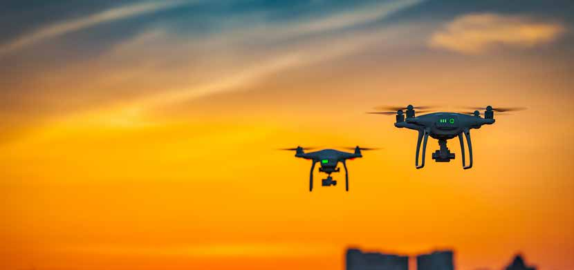

# Brief 2024 17 Drones 1

**Source Document:** `Brief_2024-17_Drones (1).pdf`  
**Total Pages:** 4  

---

## --- Page 1 ---

© European Union Institute for Security Studies, 2024.
The views expressed in this publication are solely those of the author(s)  
and do not necessarily reflect the views of the European Union.

BRIEF / 17
Oct 2024
MINDING THE 
DRONE GAP

Drone warfare and the EU

by
Jan Joel Andersson
Senior Analyst, EUISS
Sascha Simon
Security and Defence Analyst

Artillery dominates the war in Ukraine, but is 
the drone fast replacing it as the ‘King of Battle’? 
Ukraine’s military leadership suggested as much in 
May 2024, stating that ‘drones kill more soldiers on 
both sides than anything else’ (1). Drones have become 
ubiquitous in conflicts all around the world, from the 
wars in Ukraine and Gaza/Israel/Lebanon to the civil 
wars in Sudan, Syria and Myanmar. They are also in-
creasingly deployed by non-state actors across the 
Middle East and Africa. While some argue that this 
represents a revolutionary shift in warfare, others see 
it as more of an evolutionary development. However, 
the broader implications and conclusions to be drawn 
remain a subject of debate (2). So, what is the impact 
of drones on modern warfare? And how should the 
EU respond?

#### DEFINING DRONES

In the military, ‘drone’ used to be a term for remote-
ly controlled aircraft utilised for gunnery practice. 
Today, the term ‘drone’ encompasses a wide range 
of devices, from inexpensive weaponised recreational 
multicopters to uncrewed jet-sized aircraft used for 
intelligence, surveillance and reconnaissance (ISR)

Summary

›
As the EU Member States ramp up arms 
production in support of Ukraine and for 
their own defence, the proliferation of 
armed drones and countermeasures is a 
growing concern. This poses important 
questions for the future of warfare and the 
European defence industry.

›
The impact of drones varies significantly 
however depending on their type, high-
lighting the need for a clear definition of 
the term. Furthermore, the effectiveness of 
countermeasures significantly influences 
the extent to which drones can impact mil-
itary operations and civilian infrastructure.

›
The EU can support Ukraine's drone war-
fare efforts and build its own drone and 
counter-drone capabilities by leveraging 
the Union’s strengths: a strong and in-
novative industrial base, close cooperation 
with Ukraine, and a burgeoning EU defence 
industry policy.

*Caption/Context: Drone warfare and the EU | by Jan Joel Andersson Senior Analyst, EUISS Sascha Simon Security and Defence Analyst*

## --- Page 2 ---

2

Jan Joel Andersson AND SASCHA SIMON

that can cost millions. In Ukraine, both sides daily 
deploy thousands of drones of all sizes and types. 
Aerial drones (uncrewed aerial vehicles – UAVs) re-
main most prevalent, but maritime drones also have 
a significant impact in the Black Sea and land drones 
(uncrewed ground vehicles–UGVs) are emerging on 
the battlefield (3).

While the variety of drones is rapidly expanding, so 
is the scale of their use and attrition. Reliable fig-
ures are hard to find, but production data indicates 
that drone consumption by both Russia and Ukraine 
is massive. Ukraine claims to have built more than a 
million drones in the first half of 2024 (4). Russia in 
turn is reported to procure 100 000 low-tier drones 
monthly from domestic and foreign sources (5).

The impact of these drones varies significantly 
however depending on their type, making it neces-
sary to define the term more closely. Drones can be 
armed or unarmed; used for ISR or effect; they can 
be recoverable or one-way-attack (OWA) drones that 
self-destruct on impact; or they can be remotely pi-
loted with first-person view (FPV) goggles or pro-
grammed as loitering munitions to search for a pre-
defined target. Moreover, many OWA drones are now 
treated as consumables, not unlike artillery shells, 
while others are more akin to cruise missiles (6). 
Growing niche applications include everything from 
dropping mines to breathing fire to UAVs ramming 
one another out of the sky.

#### DARWINIAN DRONES

The use of drones in warfare is not new. Since the 
early 2000s, the United States has carried out thou-
sands of long-range drone strikes on high-value tar-
gets around the world as part of its Global War on 
Terror. In contrast, the war in Ukraine features a vast 
number and variety of drones constantly hovering 
over the frontlines, making troop and vehicle move-
ments difficult. It is also characterised by long-range 
drone strikes far behind the frontlines targeting air-
bases and naval shipyards, as well as civilian infra-
structure like energy facilities and residential areas.

It is evident that the use of drones has changed the 
tactical level of warfare, but their strategic impact is 
less clear (7). Decades of targeted drone strikes by the 
United States have not ended the threat from mili-
tants in the Middle East or Afghanistan and the mas-
sive use of drones in Ukraine by both sides has not 
shifted the frontlines in major ways.

The impact of drones, of course, also depends on the 
defences in place against them. Large aerial drones 
are easy prey for patrolling aircraft or surface-to-air

missiles at higher altitudes, while radar-guided 
anti-aircraft artillery or even simple shotguns can 
target quadcopters at lower altitudes. Drones are also 
vulnerable to electronic warfare (EW) disrupting their 
communications and navigation, while physical pro-
tection like nets and metal cages can also limit the 
impact of drone attacks.

The near-perfect success rate of Israel, the United 
States, United Kingdom, France and Jordan in inter-
cepting the more than 170 OWA drones (alongside 
150 ballistic and cruise missiles) launched by Iran 
on Israel during a single night in April 2024 demon-
strates what coordinated comprehensive modern air 
defences can do, even if at a high monetary cost (8).

Drones may not be a magic bullet that will 
single-handedly turn the tide of war, but they are 
here to stay. Their ability to provide surveillance and 
strike capabilities at relatively cheap cost has become 
essential. The establishment of a new armed forces 
branch in Ukraine, the ‘Unmanned Systems Forces’, 
reflects their importance. For Ukraine, however, the 
challenge is no longer the quantity of drones, but 
rather training pilots, acquiring enough high(er)-end 
systems, and staying ahead in the adaptation race be-
tween drones and countermeasures. Other countries 
in Europe and elsewhere are learning lessons identi-
fied in and by Ukraine, as is the EU.

#### THE EU AND DRONES

The EU is not starting from scratch, and Europe is 
well-positioned to play a key role in the future of 
drone warfare. Industry reports indicate that in 2022 
more than 40 % of all drone companies in the world 
were headquartered in Europe. However, a significant 
portion of the global commercial drone market, esti-
mated at 70-80 %, is controlled by one Chinese com-
pany, DJI (9). The EU has also supported R&D of military 
uncrewed systems since 2015 through the European 
Defence Fund (EDF) and its precursor programmes. 
This includes some €100 million awarded in 2021 in 
support of the development of a long-endurance re-
motely piloted aircraft system – the Eurodrone. The 
EDF’s 2023 work programme also included €68 mil-
lion for counter-drone systems, while more than 
€200 million was earmarked for 2024 to cover drones 
of all sizes and domains (10).

As part of the European Defence Industrial Strategy 
(EDIS) released in March 2024, the EU further pro-
posed ‘to support the production of drones within 
the EU or possibly jointly with Ukraine’ (11). The whole 
spectrum of uncrewed systems across domains, in-
cluding weaponisation of existing platforms, are fea-
tured prominently in the EU Capability Development

## --- Page 3 ---

3

Priorities (CDP) approved by EU Defence Ministers in 
2023. Notably, the CDP also calls for the development 
of a European, NATO-interoperable standard for air 
defence systems, including kinetic and directed en-
ergy systems capable of countering ‘slow, small and 
low altitude threats and swarms of drones’ (12).

As for counter-drone technologies, some of the most 
advanced manufacturers are also European. In par-
ticular, the cost-effectiveness of anti-aircraft guns 
in downing drones has revived the European spe-
cialty of anti-aircraft artillery. Rheinmetall is mar-
keting the Skyranger anti-aircraft artillery system. 
Meanwhile BAE Systems just unveiled the Tridon 
Mk2, the latest version of the legendary 40mm Bofors 
anti-aircraft gun. Both systems are paired with ad-
vanced radar and programmable proximity fuse 
shells. In the sensor and electronic warfare segment, 
there are well-known European defence companies 
like Indra, Leonardo, Saab and Thales but also many 
cutting-edge small and medium-sized companies.

#### BRIDGING THE DRONE DIVIDE

However, European militaries lack the arsenals of 
armed drones and electronic countermeasures pos-
sessed by Russia and Ukraine. A few EU Member

States hold small numbers of large, expensive, 
Medium Altitude Long Endurance (MALE) drones, 
similar to those used in the ‘War on Terror’, but their 
usefulness in a ‘contested environment’ is limited (13). 
None have anywhere near enough disposable drones 
and loitering munitions to engage in high-intensity 
combat on the scale seen in Ukraine.

The drone gap between Ukraine and Russia on the one 
hand and everyone else is growing. This is not only 
a question of the number and quality of drones but 
also of the battle for dominance between drones and 
countermeasures. A technical advantage lasts only a 
few weeks before electronic warfare has adapted, re-
quiring constant innovation and shifts in tactical use. 
Drone manufacturers thus rely on constant feedback 
from frontline operators to update components, soft-
ware and tactics to ensure combat effectiveness (14).

Ukraine is already the leading drone manufacturer 
in Europe, together with Türkiye. But it needs suffi-
cient funding to scale up production and better access 
to components like advanced radio transmitters and 
sensors (15). To this end, Latvia and the United Kingdom 
co-lead an international ‘Drone Capability Coalition’ 
launched in 2024, which now includes 14 members to 
secure Ukraine’s ‘UAV supremacy’. By April 2024, the 
coalition had raised €550 million to arm Ukraine with 
drones and opened tenders in summer 2024 for indus-
tries from Ukraine Defence Contact Group members

Meeting their masters
Meeting their masters
Examples of drones and countermeasures

Anit-aircraft gun

Electronic weapon
Missiles

Patriot
Stinger
MANPAD
Coyote
Iris-T
Krasukha
Bukovel
AA artillery
AA machine

guns
Small portable

#### EW

Countermeasures

RQ-4 Global Hawk

Drones

MQ-9 Reaper

Bayraktar TB2

Harop

Shahed-136

Orlan-10

Lancet

Switchblade

Multicopter

#### FPV

#### 10 000

#### 1 000 000

Price per unit
 $

#### 150 000 000

Maximum range

km

More
expensive

Less
expensive

More
expensive

Less
expensive

#### 23 000 km

#### 2 000

300

#### 1 000

#### 2 500

150

40

40

25

25

23 000 km
23 000 km
23 000 km

2 000
2 000
2 000

300
300
300

1 000
1 000
1 000

2 500
2 500
2 500

150
150
150

40
40
40

40
40
40

25
25
25

25
25
25

Potenti

al uses

Data: EUISS research, 2024
Data: EUISS research, 2024

## --- Page 4 ---

4

Jan Joel Andersson AND SASCHA SIMON

Published by the European Union Institute 
for Security Studies. 
Printed in Luxembourg by the Publications Office 
of the European Union.

ISBN 978-92-9462-267-9   
CATALOGUE NUMBER QN-AK-24-017-EN-C   
ISSN 2599-8943   
DOI 10.2815/432457

ISBN 978-92-9462-266-2   
CATALOGUE NUMBER QN-AK-24-017-EN-N   
ISSN 2315-1110   
DOI 10.2815/578177

#### PRINT

PDF
Cover image credit: Envato Elements

to develop FPV drones (16). Moreover, in October 2024 
the Netherlands announced that it will invest €400 
million for joint drone development with Ukraine, of 
which half will be spent in the Netherlands and the 
rest will be split between industry in Ukraine and in 
other countries (17).

For European drone companies, close cooperation 
with Ukraine is key. The rapid innovation cycles in 
drone warfare are driving European producers to-
wards more agile and modular production. Ukraine’s 
evaluation of drone performance should guide pro-
duction decisions, allowing for the ramping up of 
selected systems and continuous adjustments, and 
facilitating intensive and ongoing competition. To 
assist in this process, the EU established a Defence 
Innovation Office (EUDIO) in Kyiv in September 2024. 
The office promotes European defence innovation ac-
tivities in and with Ukraine, facilitates joint initia-
tives and connects EU start-ups and innovators with 
the Ukrainian defence industry and armed forces (18).

#### CONCLUSION

Drone warfare is here to stay. Even if they have not 
replaced artillery, drones will continue to evolve and 
proliferate. Once primarily a counter-insurgency tool, 
drones are now key weapon systems of war. The EU 
and its Member States need to quickly learn how to 
play the drone game both defensively and offensively.

Masses of low-tech disposable FPVs are already be-
ing built, while large, high-end drone systems re-
main challenging to operate in contested airspace. 
However, the middle ground of attritable systems 
presents an opportunity where Ukraine’s exper-
tise and experience and European defence needs and 
funding capacity overlap for mutual benefit. In this 
context, Europe is also well-positioned to become a 
leading provider of counter-drone systems.

Ukraine’s ingenuity is the driving force of modern 
drone warfare. To benefit from that and to be ready for 
future conflicts, it is time for Europe to fully embrace 
the drone evolution. Access to Ukraine’s accumulated 
expertise in fighting with and against drones how-
ever depends on its survival. The EU should therefore 
step up its support for Ukraine’s drone warfare ef-
forts and in the process build its own drone-specific 
defence production capacity. This can be achieved by 
fostering an innovative drone industry, including a 
stable supply chain for drone components, enhanc-
ing defence cooperation with Ukraine, and providing 
sufficient funding.

References

(1)	
Loyd, A., ‘Ukraine suffers while too many countries “sit on their 
hands”’, The Times, May 2024 (https://www.thetimes.com/world/russia-
ukraine-war/article/ukraine-russia-interview-ground-forces-chief-
putin-fbtpbc9d5).

(2)	
Kunertova, D., ‘Drones have boots: Learning from Russia’s war in 
Ukraine’, Contemporary Security Policy, October 2023 (https://doi.org/1
0.1080/13523260.2023.2262792); Calcara, A. et al., ‘Why drones have 
not revolutionized war’, International Security, Vol. 46, No 4, April 2022 
(https://direct.mit.edu/isec/article/46/4/130/111172/Why-Drones-Have-
Not-Revolutionized-War-The).

(3)	
Zafra, M., ‘Combat in Ukraine is changing warfare’, Reuters, 26 March 
2024 (https://www.reuters.com/graphics/UKRAINE-CRISIS/DRONES/
dwpkeyjwkpm/).

(4)	
‘Ukraine officially presents Unmanned Systems Forces’, Kyiv Independent, 
June 2024 (https://kyivindependent.com/we-set-a-precedent-ukraine-
officially-presents-unmanned-systems-forces/).

(5)	
Schmidt, E., ‘Ukraine Is losing the drone war’, Foreign Affairs, January 
2024 (https://www.foreignaffairs.com/ukraine/ukraine-losing-drone-
war-eric-schmidt).

(6)	
Gressel, G., ‘Beyond the counter-offensive: Attrition, stalemate, and the 
future of the war in Ukraine’, Policy Brief, ECFR, January 2024, (https://
ecfr.eu/publication/beyond-the-counter-offensive-attrition-stalemate-
and-the-future-of-the-war-in-ukraine/).

(7)	
Lushenko, P., ‘Cult of the drone’, The Conversation, April 2024 
(https://theconversation.com/cult-of-the-drone-at-the-two-year-
mark-uavs-have-changed-the-face-of-war-in-ukraine-but-not-
outcomes-221397).

(8)	
Macaskill, A., ‘In any air war, Israel’s defences would trump Iran’s, but 
at a high cost’, Reuters, April 2024 (https://www.reuters.com/world/
middle-east/any-air-war-israels-defences-would-trump-irans-high-
cost-2024-04-18/).

(9)	
Drone Industry Insights, ‘Drone Market Environment Map’, October 2022 
(https://droneii.com/project/drone-market-environment-map).

(10)	 European Commission, ‘EDF – Developing tomorrow’s defence

capabilities’ (https://defence-industry-space.ec.europa.eu/eu-defence-
industry/european-defence-fund-edf-official-webpage-european-
commission_en).

(11)	 European Commission, Joint Communication–‘A New European Defence

Industrial Strategy’, 5 March 2024 (https://defence-industry-space.
ec.europa.eu/document/download/643c4a00-0da9-4768-83cd-
a5628f5c3063_en?filename=EDIS%20Joint%20Communication.pdf).

(12)	 European Defence Agency, The 2023 EU Capability Development Priorities,

2023 (https://eda.europa.eu/docs/default-source/brochures/qu-03-23-
421-en-n-web.pdf).

(13)	 ‘Predator drones “useless” in most wars, top Air Force General says’,

Foreign Policy, September 2013 (https://foreignpolicy.com/2013/09/19/
predator-drones-useless-in-most-wars-top-air-force-general-says/).

(14)	 Bron, J. and Watling, J., ‘Mass Precision Strike Designing UAV Complexes

for Land Forces’, RUSI, April 2024 (https://www.rusi.org/explore-
our-research/publications/occasional-papers/mass-precision-strike-
designing-uav-complexes-land-forces).

(15)	 Andersson, J.J., and Ditrych, O., ‘Made in Ukraine: How the EU can

support Ukrainian defence production’, Brief no 5, EUISS, April 2024, 
(https://www.iss.europa.eu/content/made-ukraine-how-eu-can-
support-ukrainian-defence-production).

(16)	 ‘Drone Coalition raised €549 million for Ukraine’, Militarnyi, April 2024

(https://mil.in.ua/en/news/drone-coalition-raised-e549-million-
for-ukraine/); UK Ministry of Defence, ‘UK and Latvia launch industry 
competition to provide thousands of drones for Ukraine’, Press release, 
3 June 2024 (https://www.gov.uk/government/news/uk-and-latvia-
launch-industry-competition-to-provide-thousands-of-drones-for-
ukraine).

(17)	 ‘Dutch defence minister pledges 400 million for Ukraine drone plan’,

Reuters, 6 October 2024 (https://www.reuters.com/world/europe/dutch-
defence-minister-pledges-400-mln-euros-drone-action-plan-with-
ukraine-2024-10-06/).

(18)	 EU Delegation to Ukraine,, ‘EU opens a Defence Innovation Office in

Kyiv’, 10 September 2024 (https://www.eeas.europa.eu/delegations/
ukraine/ukraine-eu-opens-defence-innovation-office-kyiv_en?s=232).
