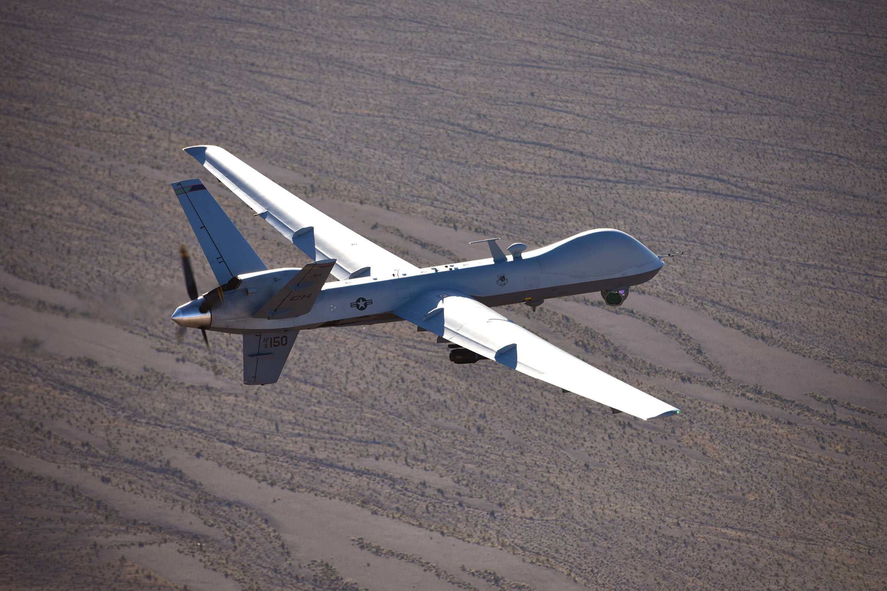
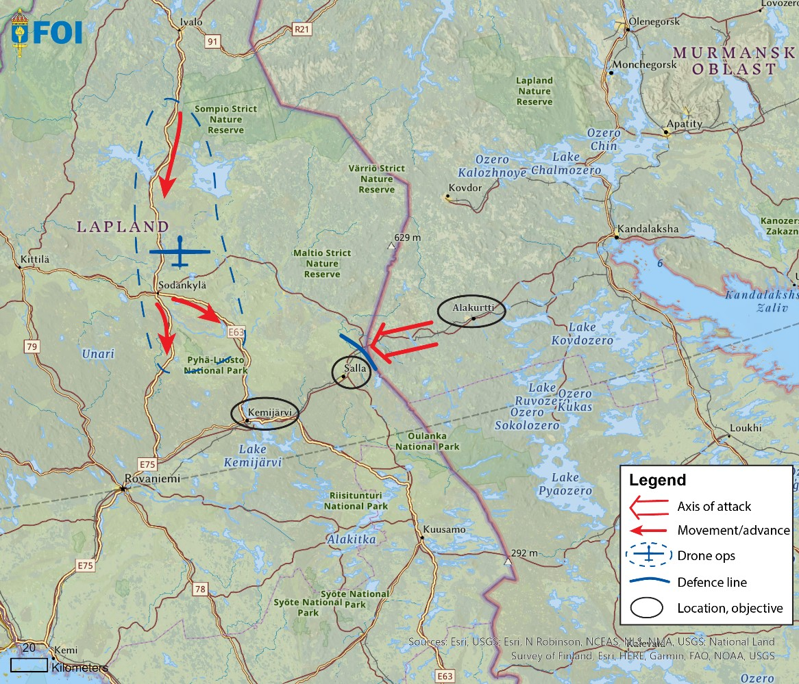
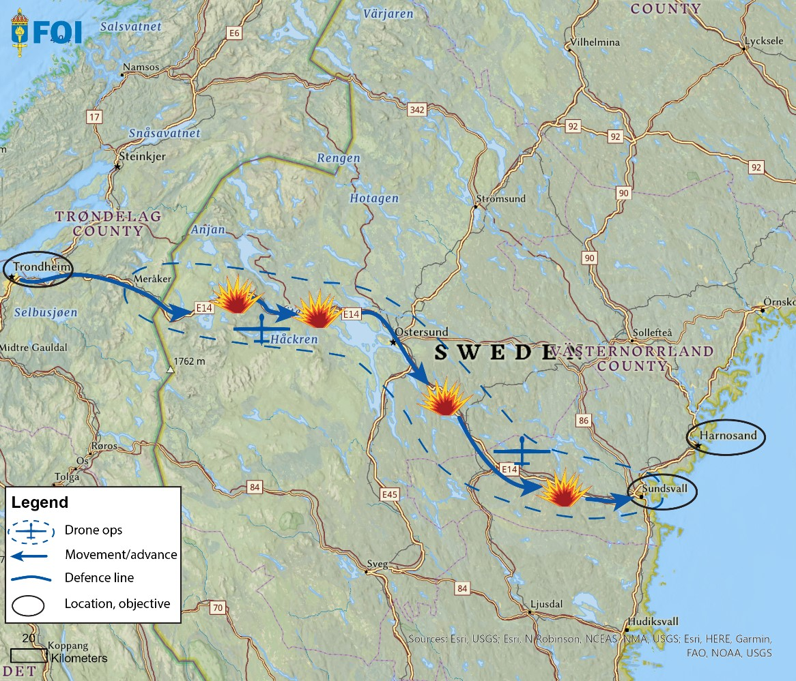
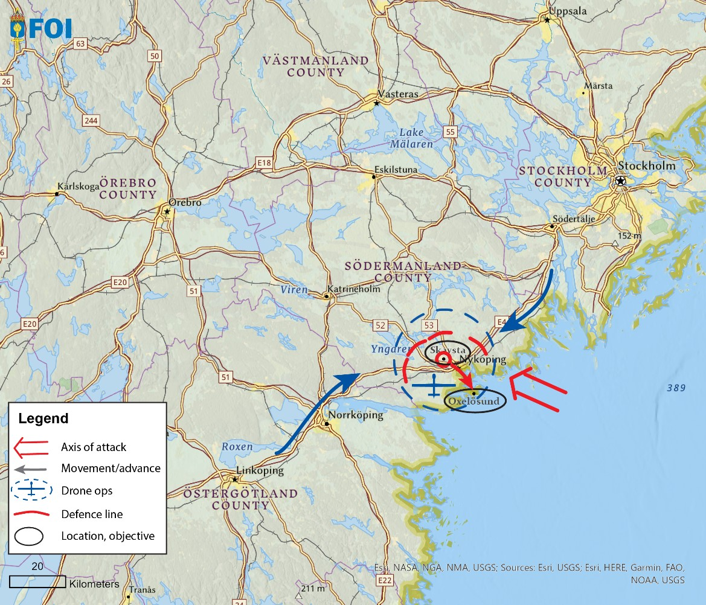
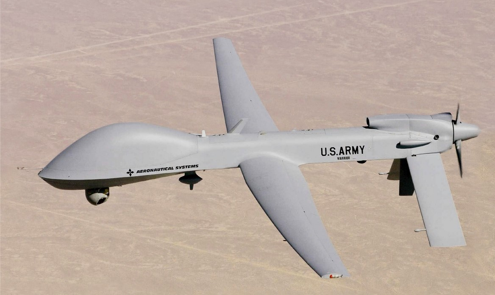
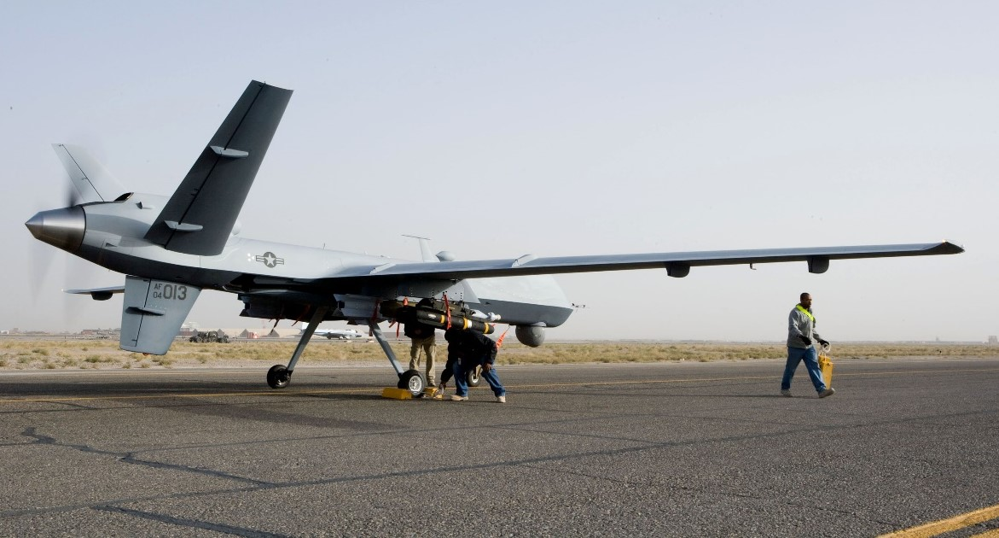

# Foi R 5573 Se

**Source Document:** `FOI-R--5573--SE.pdf`  
**Total Pages:** 51  

---

## --- Page 1 ---

Rare Birds

A Look at the Low-density Battlefield and Armed Drones

#### ANDREAS HÖRNEDAL

FOI-R--5573--SE   
 
ISSN 1650-1942 
        February 2024

*Caption/Context: ANDREAS HÖRNEDAL*

## --- Page 2 ---

Andreas Hörnedal

Rare Birds

A Look at the Low-density Battlefield and Armed Drones

## --- Page 3 ---

#### FOI-R--5573--SE

2 (49)

Titel 
Rare Birds – A Look at the Low-density Battlefield and Armed 
Drones

Title 
Rare Birds – A Look at the Low-density Battlefield and Armed 
Drones

Rapportnr/Report no 
FOI-R--5573--SE

Månad/Month 
februari/February

Utgivningsår/Year 
2024

Antal sidor/Pages 
49

ISSN 
1650-1942

Uppdragsgivare/Client 
Försvarsdepartementet

Forskningsområde 
Säkerhetspolitik

FoT-område 
Inget FoT-område

Projektnr/Project no 
A12216

Godkänd av/Approved by 
Malek Finn Khan

Ansvarig avdelning 
Försvarsanalys

Bild/Cover: U.S. Air Force, Airman 1st Class William Rosado (public domain)

Detta verk är skyddat enligt lagen (1960:729) om upphovsrätt till litterära och konstnärliga 
verk, vilket bl.a. innebär att citering är tillåten i enlighet med vad som anges i 22 § i nämnd lag. 
För att använda verket på ett sätt som inte medges direkt av svensk lag krävs särskild 
överenskommelse.

This work is protected by the Swedish Act on Copyright in Literary and Artistic Works 
(1960:729). Citation is permitted in accordance with article 22 in said act. Any form of use that 
goes beyond what is permitted by Swedish copyright law, requires the written permission of 
FOI.

## --- Page 4 ---

#### FOI-R--5573--SE

3 (49)

Sammanfattning

Denna rapport undersöker “det glesa slagfältet” och användningen av beväpnade drönare 
i denna miljö. Ett glest slagfält uppkommer när markförband av begränsad storlek 
opererar över stora geografiska områden, utan någon kontinuerlig front och med sårbara 
kommunikationslinjer, och kan välja när och under vilka förhållanden man inlåter sig i 
strid.

Rapporten definierar och diskuterar en generisk klass av beväpnade drönare, baserad på 
de existerande drönartyperna Bayraktar TB2, Grey Eagle och Reaper. Fyra vinjetter för 
det glesa slagfältet utvecklas i ett nordiskt-baltiskt sammanhang, användning av 
beväpnade drönare utvärderas i dessa och uppgifter och uppdragstyper identifieras. Krav, 
koncept, förmågor, styrkor och svagheter för beväpnade drönare skisseras och diskuteras 
och avslutningsvis ges några förslag för framtida utveckling.

Beväpnade drönare, som de definieras här, har stor potential till att bidra med en effektiv 
förmåga givet ett flertal uppgifter och uppdrag som kan identifieras i samband med det 
glesa slagfältet, i synnerhet för lägre konfliktnivåer och för att hantera oklara situationer. 
Deras främsta styrka är enkelhet, låg kostnad och uthållighet. Deras främsta svagheter är 
eldkraft och överlevnad. Detta relativt omogna koncept behöver integreras i befintliga 
förbandsstrukturer och det finns stor förbättringspotential, men lockelsen av att tillföra 
inkrementella men kostsamma förbättringar innebär samtidigt en risk för en uppblåst 
funktionstillväxt och exploderande kostnader.

Nyckelord: beväpnad drönare, glesa slagfältet, glesa stridsfältet, UAS, UAV, vinjett, 
förmåga, luftkrig, luftmakt, konceptutveckling.

## --- Page 5 ---

#### FOI-R--5573--SE

4 (49)

Summary

This report investigates the “low-density battlefield,” and the use of armed drones in this 
environment. A low-density battlefield occurs when modestly-sized ground forces 
operate over vast geographical areas, without continuous fronts and with vulnerable lines 
of communication, and can choose when and under what circumstances to engage in 
battle.

The report defines and discusses a generic armed-drone class, based on the real-world 
Bayraktar TB2, Grey Eagle and Reaper drone types. It constructs four low-density 
battlefield vignettes in a Nordic-Baltic setting, evaluates the use of armed drones therein, 
and defines armed drone missions. It outlines and discusses requirements, concepts, 
capabilities, strengths and weaknesses of armed drones, while providing some final 
suggestions on future development.

The armed drone, as defined herein, has great potential as an effective capability for a 
number of tasks and missions identified in the low-density battlefield settings, especially 
in lower conflict levels and in the face of ambiguity. Its main strengths are simplicity, 
low cost and endurance. Its main weaknesses are firepower and survivability. This 
immature concept needs to be integrated into current force structures, and there is room 
for other improvement, but the allure of adding incremental but expensive improvements 
brings the peril of feature bloat and exploding cost.

Keywords: armed drone, low density battlefield, UAS, UAV, vignette, capability, air 
warfare, air power, concept development.

## --- Page 6 ---

#### FOI-R--5573--SE

5 (49)

Abbreviations

AI 
Air interdiction

AI 
Artificial Intelligence

BAI 
Battlefield air interdiction

BDA 
Battle damage assessment

C-UAS 
Counter-uninhabited air system

C2 
Command and control

C4ISR 
Command, control, communications, computers, intelligence, 
surveillance and reconnaissance

CAS 
Close air support

CC BY-SA 
Creative Commons License Attribution Share-alike

CCDO 
Camouflage, concealment, deception and obscuration

CDAG  
Concept Development Assessment Game

CDL 
Common data link

CGCS 
Certifiable ground control station

COMINT 
Communications intelligence

COTS 
Commercial off-the-shelf

DEAD 
Destruction of enemy air defences

DOTMLPFI  Doctrine, organisation, training, materiel, leadership and education, 
  
personnel, facilities and interoperability

DTAG  
Disruptive Technology Assessment Game

EA  
Electronic attack

ELINT 
Electronic signals intelligence

EO 
Electro-optical

EOB 
Electronic order of battle

ES 
Electronic support

EW 
Electronic warfare

FAC 
Forward air controller

FLOT 
Forward line of own troops

FSCL 
Fire support control line

GBAD 
Ground-based air defences

GNSS 
Global navigation satellite system

GPS 
Global Positioning System

ID  
Identity/identification

IED 
Improvised explosive device

IFF 
Identify friend or foe

IMINT 
Imagery intelligence

IR 
Infrared

IR/EO  
Infrared and electro-optical

## --- Page 7 ---

#### FOI-R--5573--SE

6 (49)

ISR 
Intelligence, surveillance and reconnaissance

ISTAR 
Intelligence, surveillance, target acquisition and reconnaissance

JTAC  
Joint terminal attack controller

MALE 
Medium altitude, long endurance

MANPADS 
Man-portable air defence system

MTOW 
Maximum take-off weight

MUSD 
Millions United States dollars

PSYOPS 
Psychological operations

RAP 
Recognised air picture

RCS 
Radar cross-section

Recon 
Reconnaissance

RMP 
Recognised maritime picture

RoE 
Rules of engagement

SAR-MTI 
Synthetic aperture radar – Moving-target indication

SCAR 
Strike coordination and reconnaissance

SEAD 
Suppression of enemy air defences

#### STRATCOM Strategic communications

TCDL  
Tactical common data link

TTP 
Tactics, techniques and procedures

UAS 
Uninhabited air system

UAV 
Uninhabited air vehicle

U.S. 
United States (of America)

USAF 
United States Air Force

VFR 
Visual flight rules

## --- Page 8 ---

#### FOI-R--5573--SE

7 (49)

Contents

Preface .............................................................................................................. 10

1 
Introduction .............................................................................................. 11

#### 1.1 The Problem of the Low-density Battlefield ........................................ 11

#### 1.2 A First Look at the Armed Drone ........................................................ 13

1.2.1 
How to define an armed drone? .......................................... 13

1.3 Scope and limitations .......................................................................... 14

1.4 Report Disposition .............................................................................. 14

2 
Operational considerations, vignettes .................................................. 15

#### 2.1 Propositions for the Low-density Battlefield ....................................... 15

2.2 Four Vignettes..................................................................................... 16

2.2.1 
General Parameters ............................................................. 17

2.2.2 
Defending Finnish Lapland .................................................. 17

#### 2.2.2.1 Initial Setting and Dispositions ...................................... 18

#### 2.2.2.2 Red Force’s Actions and Intents ................................... 18

#### 2.2.2.3 BLUE Force’s Problem and Mission ............................. 18

#### 2.2.2.4 Uses of Armed Drones .................................................. 18

#### 2.2.2.5 Discussion ..................................................................... 18

2.2.3 
Escorting a Road Transport across Sweden ....................... 20

#### 2.2.3.1 Initial Setting and Dispositions ...................................... 20

#### 2.2.3.2 Red Force’s Actions and Intents ................................... 20

#### 2.2.3.3 BLUE Force’s Problem and Mission ............................. 21

#### 2.2.3.4 Uses of Armed Drones .................................................. 21

#### 2.2.3.5 Discussion ..................................................................... 21

2.2.4 
Containing a Surprise Air Landing ....................................... 22

#### 2.2.4.1 Initial Setting and Dispositions ...................................... 22

#### 2.2.4.2 Red Force’s Actions and Intentions .............................. 22

#### 2.2.4.3 BLUE Force’s Problem and Mission ............................. 23

#### 2.2.4.4 Uses of Armed Drones .................................................. 23

#### 2.2.4.5 Discussion ..................................................................... 24

2.2.5 
Reinforcing and Defending Lithuania .................................. 24

#### 2.2.5.1 Initial Setting and Dispositions ...................................... 24

#### 2.2.5.2 Red Force’s Actions and Intentions .............................. 25

#### 2.2.5.3 BLUE Force’s Problem and Mission ............................. 25

#### 2.2.5.4 Uses of Armed Drones .................................................. 25

#### 2.2.5.5 Discussion ..................................................................... 26

#### 2.3 Vignettes vs Operational Considerations ........................................... 26

2.3.1 
Requirements from Vignettes .............................................. 26

2.3.2 
Usability in a Low-density Battlefield Setting ....................... 27

3 
Another Look at the Armed Drone ......................................................... 29

## --- Page 9 ---

#### FOI-R--5573--SE

8 (49)

3.1 Commonalities ................................................................................... 30

3.2 Differences ......................................................................................... 31

#### 3.3 Capabilities and Payloads .................................................................. 32

#### 3.4 Mission-critical Supporting Systems and Resources ........................ 33

4 
Capabilities and Concepts ..................................................................... 34

4.1 ISTAR with BDA ................................................................................. 34

4.2 Kinetic Effects .................................................................................... 34

4.2.1 
Quick-reaction Kill-chain ..................................................... 34

4.2.2 
Interdicting Mobile Targets .................................................. 34

4.2.3 
Close Air Support ................................................................ 35

4.2.4 
SEAD – Suppression of Enemy Air Defences .................... 35

4.2.5 
Heavy Effects ...................................................................... 35

#### 4.3 Mission-wide Requirements ............................................................... 36

4.3.1 
National and International Interoperability .......................... 36

4.3.2 
Versatility and Tactical Agility .............................................. 37

4.3.3 
Survivability against Relevant Threats ................................ 37

4.3.4 
Robustness.......................................................................... 40

#### 4.4 Current Concepts, Strengths and Weaknesses ................................ 41

4.4.1 
Current Concept, Organisation and Interoperability ........... 41

4.4.2 
Current Strengths and Weaknesses ................................... 42

4.5 Future Development........................................................................... 42

4.5.1 
New or Improved Capabilities? ........................................... 42

4.5.2 
Cooperative Concepts ......................................................... 43

4.5.3 
Autonomy versus Infrastructure Dependencies .................. 43

4.5.4 
To Arm or Not To Arm? ....................................................... 44

4.5.5 
Airframe and Performance .................................................. 44

4.5.6 
Mass or Survivability? ......................................................... 45

5 
Conclusions and Future Work ............................................................... 46

#### 5.1 Future Work, Further Analysis ........................................................... 46

6 
References ............................................................................................... 48

## --- Page 10 ---

#### FOI-R--5573--SE

9 (49)

## --- Page 11 ---

#### FOI-R--5573--SE

10 (49)

Preface

FOI’s Defence Policy Studies Project analyses selected issues of relevance for Swedish 
defence policy, in support of Sweden’s Ministry of Defence. These issues include specific 
operational capabilities, military intelligence, civil defence, deterrence and threat analysis, 
and NATO.

For the present study, the project has been commissioned by the Ministry of Defence to 
analyse the idea of the “low density battlefield” and its possible impact on future military 
operations in the Nordic-Baltic region, together with the possible use of a class of medium 
altitude, long endurance armed drones which has been used in several recent conflicts. We 
have sought to make this report readable and relevant to a wide variety of non-specialist 
security professionals, even those not familiar with the particularities of the Nordic and 
Baltic operational environments. An essential part of this is to provide some initial 
definitions and examples of the “low density battlefield” and to analyse a narrower 
selection among the myriad of modern drones in military use. Both the operational 
vignettes and the generic “armed drone” defined in this report should be seen just as 
examples or an experimental setup, which helps us gain a better understanding of the 
operational problems this environment brings, and what requirements to are important for 
armed drones in this context. In order to bring together these two disparate but 
interconnected subjects, the combination of technical and military analysis expertise 
contained within FOI has been indispensable.

The author would like to express his gratitude to everyone who has provided invaluable 
feedback, reviews and helpful input, colleagues as well as members of the Finnish, 
Swedish and United States armed forces. A few individuals who deserve extra gratitude 
are Richard Langlais for some well-needed language editing, Aron Lund for some very 
accurate editorial remarks, Marianna Serveta and Per Wikström for the good looking 
maps, and of course our colleague Robert Dalsjö, for his seemingly endless energy, 
patience and most of all masterful knowledge and experience, with which he has blessed 
this endeavour.

Stockholm, January 2024

Michael Jonsson

Head of Project, FOI Defence Policy Studies

## --- Page 12 ---

#### FOI-R--5573--SE

11 (49)

1 
Introduction

In the Western world, the size of most nations’ armies have experienced heavy downturns. 
Similar trends are visible in Russia and China as well, and may be caused by a combination 
of technological, socio-economic, or demographic reasons. Gone are the days of the 
twentieth-century mass armies, when millions of young men were mobilised to crowd the 
battlefield and form a contiguous front over vast stretches of land. Because of this, the 
classic military problem of a low-density battlefield is re-emerging into military thought, 
especially in Northern Europe, with its many sparsely populated areas. Neretnieks [1] 
defines the low-density battlefield as a situation in which formations of ground forces 
operate over vast geographical areas, unable to form contiguous fronts and with vulnerable 
lines of communication, while the aggressor can choose when and under what circumstances 
to engage in battle.

At the same time, technological advancements and the looming lack of manpower make the 
promise of uninhabited and autonomous systems look all the more appealing. Particularly 
in recent years, armed drones have caught the public eye and established themselves as 
credible instruments of military power. The spectacular successes of Azerbaijan in its 2020 
war with Armenia, followed by the more sobering baptism by fire by Ukrainian armed 
drones against a better-prepared adversary in 2022, are two well-known and recent 
examples. The image of the armed drone seems to have its ups and downs, in the all too 
normal hype cycle of new technology and products. To use the language of the Gartner 
Group [2], the armed drone may already have passed the elated Peak of Inflated 
Expectations and fallen into the hangover-like Trough of Disillusionment. Soon the more 
sober Slope of Enlightenment may emerge from the ashes, leading to a more mature under-
standing of whether the armed drone will remain a meaningful capability on the future 
battlefield. Alternatively, armed drones of the class discussed here may prove to have been 
just a temporary fad.

There is currently a lack of widespread understanding of what can be reasonably expected 
from an armed drone capability, and the open literature about such concepts and systems is 
surprisingly scarce, considering the recurring hype and general interest among not only the 
military sector but also the public. Likewise, there is not much written about the low-density 
battlefield, but some ideas in this area are nevertheless worth exploring. These two concepts 
can in fact be better understood if explored together, particularly by defining a number of 
concrete problems and suitable solutions associated with them. This may also be extra 
relevant to discuss in a Northern-Baltic context, which is the intent of this study.

The overall idea of this report is to conduct some initial exploration, to understand the 
general problem of the low-density battlefield, and the possible use of armed drones to solve 
the problems or missions as proposed by Neretnieks [1]. The focus of this study is to better 
define what roles and under what conditions armed drones would be a useful and effective 
capability on the low-density battlefield, and to suggest some key challenges for the future. 
This will take place through the lens of four war-gamed vignettes, located in the Nordic-
Baltic area.

1.1 
The Problem of the Low-density Battlefield

After the end of the Cold War, thinking about major wars in Europe was seen as irrelevant 
and, due to economic realities, most states, both European and others, anticipated a “peace 
dividend.” This was sought by radical force reduction, a general restructuring into small, 
high availability forces suitable for overseas crisis management operations.

The overall result was that the military manpower available after mobilisation was perhaps 
10–20% of what had been available at the height of the Cold War. Still, the geography 
remained the same, or similar. With the enlargement of NATO and the return of Russia as 
the pacing threat, the potential front had moved 500-700 km eastward and about doubled in 
length. Taken together, this means that in any military confrontation between NATO and

## --- Page 13 ---

#### FOI-R--5573--SE

12 (49)

Russia the force-to-space ratio would be drastically lower. For a hypothetical ground war, 
units of battalion strength might be called on to take responsibility for a stretch of the border 
where previously a larger entity, such as a division, had been available.1 However, as both 
sides in any potential conflict in Europe will have undergone similar transformations, the 
mass assaults of the world wars, which also dominated Cold War planning and scenarios, 
may very well be a thing of the past [3].

This dramatic reduction of potential in-theatre force density would very often result in the 
location of fairly small units in remote sites, surrounded by large areas of terrain devoid of 
military forces and with highly vulnerable lines of communication: in other words, a low-
density battlefield. This might open up for deep penetrations by even fairly small attacking 
forces into the defender’s rear areas, and for highly fluid types of manoeuvre warfare 
dynamics where speed, logistics and psychological factors could play a major role.2 On the 
other hand, a quick advance must often be followed by a quick retreat and any territorial 
gains may be highly volatile. In Ukraine, we actually saw some examples of this during the 
ongoing war, first a Ukrainian battalion-sized raid behind enemy lines, in July 2014, [5] and 
then in Russia’s push for Kyiv, in February/March 2022.

In this context, the defender would often be unable to face the enemy with a continuous 
defensive front and would risk being bypassed. He would also need to choose between being 
thinly spread to cover more avenues of attack, or to concentrate to fight effectively with 
support from a number of higher level organic resources, e.g., heavy artillery. In any case, 
the defender will need to handle penetrations, leading to another hard choice: should the 
defender give chase to the penetrating force even if this means leaving his prepared positions 
and thus opening up a new avenue of attack? Or should he sit tight and simply interdict the 
penetrating force’s logistic tail and then wait for it to run out of fuel, food and ammunition? 
The third choice, perhaps not as unpalatable, involves whether to act reactively or 
proactively, i.e., to either deal with the penetration, or counterattack into weakly defended 
enemy terrain.

The attacker would suffer a few dilemmas of its own. The first dilemma would be the 
optimum size of their force, as a smaller and more mobile force may manoeuvre more easily 
and slip through gaps to bypass defences, whereas a larger force may be needed to project 
enough power and have enough endurance to fulfil the mission.

Secondly, the attacker will have to sustain its mobile force. Bringing along more supplies 
would make a force less nimble, and resupply by land or by air have their specific risks and 
problems, as seen recently in Ukraine. Living off the land, as in the old days, might work to 
some extent for food and fuel, but may not be particularly sustainable. Thirdly, and finally, 
this kind of expedition may not achieve any long-lasting or decisive results, similar to how 
Hannibal fought an impressive campaign in Italy for a decade without actually defeating the 
Roman Empire.

The low-density battlefield could to some extent be seen as a reversal, back to the armies of 
yore, where marches, raids and skirmishes were the daily business, with full battles between 
main forces less frequent. On the other hand, modern technology has transformed the 
operational environment to such a degree that analogies to historical tactics and operational 
art may be gravely misleading.3

1 A division is an army unit with roughly 12.000 soldiers; and a brigade is roughly one-third of a division, i.e., it has 
approximately 3-4000 soldiers; while a battalion is one-third of a brigade, with about 800 soldiers.

2 Intangible or psychological factors such as leadership, motivation, morale and the question of which side is perceived 
as having the upper hand – who has cut off who – could very well be decisive here, perhaps  particularly on the 
defender’s side.

3 An example of transformational technology is how the combination of real-time communication, networking, sensors 
and longer range artillery has enabled the highly lethal indirect fire of today, compared to what artillery could 
achieve during the Napoleonic Wars.

## --- Page 14 ---

#### FOI-R--5573--SE

13 (49)

The concept of the low-density battlefield can be associated to the similarly named “empty 
battlefield”, as for example described by Schneider [4]. However, where the empty 
battlefield concerns the effect of ever more dispersal within formations due to more lethal 
and long-ranged weapon systems, the low-density battlefield instead describes a battlefield 
with large gaps between formations, due to the scarcity of formations compared to the size 
of the battlefield. The empty battlefield effect, of more widely dispersed formations, would 
somewhat counteract the emergence of the low-density battlefield, since it makes it possible 
to control a wider area, even with a reduced force count.

1.2 
A First Look at the Armed Drone

The armed drone, typically a remotely piloted aerial vehicle about the size of a light aircraft, 
with a propeller engine, carrying a gimbaled optical sensor and several light missiles or 
bombs, has been a recurring theme from recent battles in Ukraine, Syria and Nagorno-
Karabakh. It has at times seen spectacular success, but at other times seems too vulnerable 
for a modern battlefield, particularly against a capable adversary. However, in light of its 
ability to cover large areas and deliver both a sustainable presence and quick-reaction kinetic 
effects, with moderate costs, risks and organisational requirements, it is easy to understand 
its appeal as a remedy for many problems faced by so many Western European armed forces.

Armed drones began to gain initial prominence when the United States4 (first the CIA, then 
the U.S. Air Force) used the Predator system for counterinsurgency and targeted killings of 
key Al-Qaeda operatives in the so-called War on Terror in remote theatres such as 
Afghanistan [8]. The Predator drones have been able to penetrate deep into enemy or 
contested territory, albeit in permissive airspace, more or less discreetly seeking out and 
eliminating specific targets. This was initially an exclusively American capability, but soon 
caught the interest of several other states that saw the usefulness of this class of systems. In 
this vein, China and Turkey endeavoured to produce indigenous systems for domestic and 
foreign consumption; this involved not only the drone itself, but also operator stations, as 
well as sensor and weapon payloads. Compared to the United States, both China and Turkey 
have been keen to export their systems to customers all over the world.

The Turkish Bayraktar TB2 and Chinese Wing Loong systems have featured prominently 
in conflict areas such as Libya, Syria, Nagorno-Karabakh (in 2020) and Ukraine, in 2022. 
The war in Nagorno-Karabakh can be seen as something of a turning point, as it was a 
reasonably symmetric state-on-state conflict, where the Bayraktar TB2 drones, among other 
unmanned systems, played a pivotal role in shaping the eventual outcome on the battlefield. 
The armed drone as a system and operational concept proved to be effective in inflicting 
heavy attrition on a wide variety of different Armenian ground platforms. The 
Bayraktar TB2 has also featured prominently, but somewhat less successfully, in the 
defence of Ukraine.

1.2.1 
How to define an armed drone? 
To focus the following discussion and analysis on a reasonably concrete class of armed 
drones, in this report we use a somewhat arbitrary and temporary example definition of an 
“armed drone” to mean a class of drones that includes the Turkish Bayraktar TB2 and two 
types of American drones, the MQ-1C Gray Eagle and the MQ-9 Reaper. The similarities 
and differences between these systems are discussed at greater length in Chapter 3. All three 
systems can be classified as medium-altitude, long-endurance, remotely piloted aerial 
systems (MALE RPAS), but using this term (mis-)leads the mind to a contemplation of an 
unwieldy variety of systems, which would be impractical for the limited analytical purposes 
of this study.

4 The Israeli Defence Force and Israeli industry deserves an honourable mention in regard to its pioneering remotely 
piloted aircraft for tactical use, although their interest in the weapon-carrying part of what makes up an armed drone 
has been more limited than that of other nations.

## --- Page 15 ---

#### FOI-R--5573--SE

14 (49)

1.3 
Scope and limitations

Both the low-density battlefield and armed drones can be seen as logical outcomes of a 
tactical and technical evolution over several decades, which may give the impression of 
sudden, game-changing tipping points at the battlefield. The question addressed in this 
report is whether the armed drone offers any useful capability on the low-density battlefield 
and, more specifically, how it can be used. To this end, four vignettes covering a spread of 
tactical situations in a low-density battlefield in Northern Europe are used to evaluate the 
utility of armed drones deployed in them, and to determine which features of the drones 
might be particularly relevant. These vignettes have been explored in short and simple 
wargames, resulting in some preliminary findings that could inform further analysis and 
discussions.

The intent of this report is to describe and assess the utility of armed drones in different 
conditions, especially those of the low-density battlefield, and to propose a number of 
missions where they would be useful or even advantageous. This leads to several different 
choices and decisions that a prospective armed drone user can consider, mainly regarding 
technology and operational concepts. The aim is to point out pertinent questions rather than 
answer them, and describe possibilities, along with their pros and cons. In contrast, the goal 
is not to fully assess whether the use of drones causes any legacy systems to be obsolete or 
inferior, even though this could be a highly relevant question moving forward.

As the term “armed drones” implies, this work is more specifically aimed at the use of 
uninhabited systems as part of a kinetic effects kill-chain and is far from a complete 
overview of all the possible different current or future uses of such systems, autonomous or 
otherwise. One other important limitation to note is that the primary focus of this specific 
study is the land war and those capabilities that are currently offered on the market.

1.4 
Report Disposition

After the introduction above, the challenge of the low density battlefield is laid out in chapter 
2, together with a number of applicable tactical guiding principles. The already mentioned 
four vignettes are then used to progress into a more concrete discussion of how armed drones 
can be used in this context. A number of high level requirements on an armed drone 
capability are suggested and discussed. Having held off a more elaborate technical 
discussion until now, Chapter 3 defines armed drones in terms of technology and 
capabilities. An overview of several required mission-critical supporting systems is also 
given, in order to better understand the armed drone as a system.

Having defined both operational requirements and mapped out the realities of technology 
and physics, in chapter 4 it is finally time to discuss what capabilities to expect on armed 
drones and what missions they may execute. A number of mission wide challenges and 
requirements are considered, the pros and cons of different technological and organizational 
concepts are discussed, and some suggestions for future development are made. This 
provides a better understanding on what to expect from armed drones and their utility in a 
low density battlefield setting, now and in the near future. Chapter 5 finalises the report with 
some conclusions and suggestions for further analysis.

## --- Page 16 ---

#### FOI-R--5573--SE

15 (49)

2 
Operational considerations, vignettes

To achieve the aim of this paper, the tactical problems, challenges and solutions that have 
been proposed to the “low-density battlefield problem” will be considered, in order to 
discover and define valid requirements on an armed drone capability. In a discussion of the 
low-density battlefield, Neretnieks [1] identifies a number of challenges, especially for the 
defender, and also proposes a number of corresponding solutions in the form of proposed 
capabilities and missions. The question then becomes whether armed drones can play a 
significant part in this setting. As a point of departure in evaluating the utility of armed 
drones deployed in low-density battlefields, our analysis is framed in a number of 
propositions, which are illustrated and analysed with the help of four example tactical 
vignettes. These vignettes cover a spread of tactical situations in a low-density battlefield in 
Northern Europe and allow us to determine which features of the drones might be 
particularly relevant in those roles.

2.1 
Propositions for the Low-density Battlefield

According to Neretnieks, the following tactical guiding principles are proposed5 as solutions 
to the low density battlefield problem:

- 
Hit the aggressor and cause attrition early on. 
- 
Locate and track enemy ground formations. 
- 
Reduce enemy movement speed to facilitate targeting by long-range fires. 
- 
Engage enemy formations with enough force, piecemeal, in sequence, rather than 
in parallel, to ensure local superiority and enemy defeat in each engagement. This 
will, however, allow enemy formations that have not yet been engaged to roam 
freely until they are engaged. 
- 
Deny enemy formations mutual support. 
- 
Deny enemy formations the support of long-range fires. 
- 
Limit the aggressor’s freedom of movement in areas that will be decisive for our 
own ability to receive foreign support.

A number of factors must be taken into account:

- 
To be able to catch up with and engage the enemy and also keep enemy formations 
separated, we need systems with a mobility advantage. 
- 
If the enemy is forced to engage, their logistics chain will be almost immediately 
strained. This is a weakness to exploit. 
- 
The enemy will be dependent on long-range support in any engagement, as they 
will quickly outrun any non-organic support.

In order to operationalise the above-mentioned principles, there are several capabilities or 
missions that would become especially useful and which may be implemented by armed 
drones:

- 
Hitting the aggressor early, in otherwise scarcely defended or undefended areas. 
- 
Active hunting over wide areas to cause losses to the adversary force and compel it 
to undertake precautions, in order to slow it down and generally degrade its 
effectiveness. 
- 
Destroying or denying the access that enemy formations in the operational area may 
have to helicopter and fixed-wing transports.

The propositions above could be summarised as follows:

The solution is to ensure the ability to find and harass adversary formations as early as 
possible, and then keep applying continuous pressure, especially in key geographically

5 Adaptation and translation from the original Swedish text.

## --- Page 17 ---

#### FOI-R--5573--SE

16 (49)

strategic areas. It is important to gain superiority in mobility and long range-fires. This 
probably requires a form of active hunting over wide areas.6

2.2 
Four Vignettes

In order to illustrate and discuss the possible utility of armed drones in the setting described 
above, four fully hypothetical but plausible vignettes have been constructed from non-
classified knowledge. Furthermore, these vignettes have been tried and validated in simple 
discussion-based war games, and also presented and discussed in part in several air-power 
seminars.7 The resulting comments and conclusions have then been integrated into the 
descriptions below. The geographical setting and problem set have been selected so as to 
illustrate the breadth of possible missions that are relevant for armed drones in a Nordic-
Baltic context and to explore the performance envelope of the armed drones. Consequently, 
the following vignettes were created:

1. Defending Finnish Lapland 
2. Escorting a Road Transport Across Sweden  
3. Containing a Surprise Air Landing 
4. Reinforcing and Defending Lithuania

Figure 1 Nordic geography and the position of the four vignettes of interest.

6 Neretnieks also mentions air (transport) denial and electronic attack. A discussion of such topics will be withheld in 
our current context in order to focus and simplify the discussion.

7 The overall framing of the subject was presented more formally and discussed on the following occasions: Mainly 
Air Power Conference, Helsinki, October 2022; CANESE tri-national conference, Kista, September 2022; FOI 
internal air power seminar, Kista, September 2022. Scenario based discussions at FOI, Kista, January 2023.

![In order to illustrate and discuss the possible utility of armed drones in the setting described  above, four fully hypothetical but plausible vignettes have been constructed from non- classified knowledge. Furthermore, these vignettes have been tried and validated in simple  discussion-based war games, and also presented and discussed in part in several air-power  seminars.7 The resulting comments and conclusions have then been integrated into the  descriptions below. The geographical setting and problem set have been selected so as to  illustrate the breadth of possible missions that are relevant for armed drones in a Nordic- Baltic context and to explore the performance envelope of the armed drones. Consequently,  the following vignettes were created: | 1. Defending Finnish Lapland  2. Escorting a Road Transport Across Sweden   3. Containing a Surprise Air Landing  4. Reinforcing and Defending Lithuania](images/page_017_fig_01.jpeg)
*Caption/Context: In order to illustrate and discuss the possible utility of armed drones in the setting described  above, four fully hypothetical but plausible vignettes have been constructed from non- classified knowledge. Furthermore, these vignettes have been tried and validated in simple  discussion-based war games, and also presented and discussed in part in several air-power  seminars.7 The resulting comments and conclusions have then been integrated into the  descriptions below. The geographical setting and problem set have been selected so as to  illustrate the breadth of possible missions that are relevant for armed drones in a Nordic- Baltic context and to explore the performance envelope of the armed drones. Consequently,  the following vignettes were created: | 1. Defending Finnish Lapland  2. Escorting a Road Transport Across Sweden   3. Containing a Surprise Air Landing  4. Reinforcing and Defending Lithuania*

## --- Page 18 ---

#### FOI-R--5573--SE

17 (49)

2.2.1 
General Parameters 
The vignettes are populated with two opposing sides: the BLUE (own) and the RED 
(adversary). It is assumed that neither side has manned tactical aircraft nor helicopters 
available to influence the tactical situation of interest, for different reasons depending on the 
exact situation. This assumption is made in order to hold off two central discussions or 
caveats until later in this report: firstly, the discussion on the relative merits of unmanned 
versus manned systems, and secondly, the rather intricate discussion on the vulnerability of 
armed drones. Manned aircraft may be held back to conserve resources in a drawn-out phase 
of escalated tension, or due to a wish to avoid escalating further. At the onset of open 
hostilities, the air-situation picture may be degraded or ambiguous, leading to a general 
threat level that probably is moderate but too ambiguous to risk deploying manned aircraft 
in certain areas. The high-end platforms may also simply be temporarily tied up elsewhere, 
and will arrive later.

Due to the fluid character of the battle, the RED ground-based air defences are not currently 
effective enough to deny airspace, but can only cause limited losses, to BLUE armed drones 
or similar targets.

During the course of the vignettes, weather is not impeding drone operations, e.g., 
difficulties with low clouds or icing. This is in fact a major factor in Northern Europe, and 
is discussed in Section 4.3.4 below.

Both sides are assumed to perform their operations reasonably competently.

2.2.2 
Defending Finnish Lapland

Figure 2 The road from Alakurtti to Salla and Kemijärvi, on the east-west axis, with highways E75 
and E63 on the north-south axis.

*Caption/Context: 17 (49) | Due to the fluid character of the battle, the RED ground-based air defences are not currently  effective enough to deny airspace, but can only cause limited losses, to BLUE armed drones  or similar targets.*

## --- Page 19 ---

#### FOI-R--5573--SE

18 (49)

2.2.2.1 
Initial Setting and Dispositions 
In Finnish Lapland, the RED main force (one brigade) advances from Alakurtti towards 
Salla and Kemijärvi with heavy mechanised elements. BLUE force is operationally 
outnumbered, but has managed to block the onslaught with prepared defences at natural 
choke points in the terrain, inflicting heavy attrition on RED force.

The area is sparsely populated, with an equally sparse road network. Dense forests, 
interspersed by marshlands and lakes impede movement by anything except light tracked 
vehicles. The attack takes place in early summer, in order to avoid both the floods of spring 
and the deep snow and low temperatures of winter. Roadblocks and minefields can be 
defended by a numerically inferior defender, due to the channelling terrain.

2.2.2.2 
Red Force’s Actions and Intents 
RED mission is to clear the way for a continued assault to the west and secure a line of 
communication, in order to provide mutual support and, eventually, reinforcements. This is 
to be achieved by tying up the present BLUE forces to their defensive position, and at the 
same time outflanking and cutting off their positions. A direct breakthrough or local flanking 
manoeuvres of BLUE defence lines, have so far been repelled, but a surprise flanking move 
by one motorised reconnaissance company from the north along roads E75 and possibly 
E63, where BLUE force lacks presence, should cut them off and force them out in the open, 
so they can be destroyed or alternatively forced to a hasty retreat. This can then be exploited 
for a resumed and swift RED advance.

2.2.2.3 
BLUE Force’s Problem and Mission 
BLUE force risks being outflanked, and runs the risk of having to abandon its defences 
while they are still holding, due to an unclear and quickly developing ground situation. 
BLUE force strives to give up as little ground as possible and at the same time grind and pin 
down RED forces to the maximum extent possible. Any RED movement or additional 
formations that are approaching must be detected and slowed down as soon as possible. This 
will enable BLUE long-range fires and ranger units to wear down and fix RED forces, gain 
time to send reinforcements, and set the stage for counterattacks.

The northern RED force is relatively weak (a reinforced company) and should be isolated 
and defeated as soon as possible, while still tying up the main RED eastern force. In order 
to defeat the eastern main force, substantial additional shaping will need to be performed, 
to weaken and isolate the opposing force.

2.2.2.4 
Uses of Armed Drones 
The BLUE drone force is assigned a number of tasks. Initially, discover, delay, or disrupt 
RED movement on BLUE force’s flank. Selected RED key capabilities, e.g., ground-based 
air defences, bridge-laying equipment, shall then be harassed or destroyed, with a 
combination of fire from the armed drones and by assistance with intelligence, surveillance, 
target acquisition and reconnaissance (ISTAR), for BLUE special forces and long-range 
fires. A secondary mission is to boost BLUE morale by providing “kill-cam”8 imagery of 
RED losses.

2.2.2.5 
Discussion 
This is a classic ground-invasion scenario, with BLUE side performing fighting retreats into 
channelling terrain in order to set up favourable conditions for counterassaults. One well-
known variant of this is the motti tactics used in the Finnish Winter War, where an enemy 
attack column was first stopped and contained, then destroyed piecemeal, at the defender’s

88 Short film clips of the enemies’ violent demise, suitable for news and social media. The term is lent from the gaming 
world.

## --- Page 20 ---

#### FOI-R--5573--SE

19 (49)

discretion.9 A modern variant of this could be for armed drones to stop or slow down the 
column, in order for it to be destroyed eventually by long-range fires.

This also demonstrates several key points about the low-density battlefield. The armed drone 
can be very useful to control the battlefield through information superiority and judicious 
use of its limited but precise firepower against suitable prioritised targets, given that it can 
reach the target area and still avoid RED air defences.

It is imperative to deny the adversary the option to perform quick thrusts with road-mobile 
units deep into undefended territory, a.k.a. “thunder runs.” Such thrusts can be very 
rewarding in terms of quick gains, but are highly risky, since they are extremely vulnerable 
even to light defences, if detected in time [6].

It may be challenging for BLUE rangers and drones to operate simultaneously in the same 
area, as deconfliction and coordination are complicated by the fact that any ranger units in 
the area must rely on stealth and mostly need to maintain radio silence. This problem needs 
to be addressed in advance, possibly through physical separation, or by adapted rules of 
engagement.

In most of the circumstances described above, even relatively light weapons will bring 
enough effect to bear against mobile units. In addition to this, heavier effects would be 
desirable in order to destroy infrastructure, such as bridges, storage buildings and workshops 
in the rear areas of RED-controlled territory. This has typically been left to attack aircraft or 
cruise missiles to deal with, as range and warhead weight limits may preclude artillery from 
performing this mission.

9 The word motti originates from Finnish; it means a “measure,” a cubic metre of logs that are cut up and left at the 
wayside to be taken care of later.

## --- Page 21 ---

#### FOI-R--5573--SE

20 (49)

2.2.3 
Escorting a Road Transport across Sweden

Figure 3 E14 highway, Trondheim – Sundsvall, connects the North Atlantic to the North Baltic Sea.

2.2.3.1 
Initial Setting and Dispositions 
Due to a (hypothetical and future) rapidly escalating situation around the Baltic Sea, U.S. 
Marine Corps personnel are rushed in by air. After equipping with prepositioned equipment 
in the Trondheim area, they will transit by road (highway E14) to the Baltic Sea port of 
Sundsvall, Sweden. From there, they will embark on sea transports to reinforce defences on 
the eastern flank. Sweden, in line with NATO’s Host Nation Support treaties, will protect 
this force during land transit. The terrain is varied, hilly and rolling. The main road mostly 
passes through dense forests and often passes lakes, bogs and precipices, with multiple 
chokepoints where detours are impossible in case of a blockage. As most of the highway is 
deep within friendly territory, the air threat is negligible; the main threat would come from 
RED “Spetsnaz” special forces that have successfully infiltrated the transit area on Swedish 
territory, armed mainly with infantry weapons, explosives, and loitering munitions.

2.2.3.2 
Red Force’s Actions and Intents 
RED force has been able to infiltrate into the area of interest and intermingles with the 
movement of the local civilians. Their intent is to delay the transport as long as possible, 
through ambushes and demolition, quickly regrouping between previously scouted positions 
and hiding in the forests, when necessary. They depend on civilian vehicles for mobility and 
the transport of whatever weapons and equipment they can carry. Mortars and lighter 
loitering munitions will fire or launch from concealed positions several kilometres from the 
highway, with observers and small quadcopter drones taking forward positions for targeting 
duty. Communications will be performed mainly via encrypted chat on the civilian mobile 
network.

*Caption/Context: FOI-R--5573--SE | 2.2.3  Escorting a Road Transport across Sweden*

## --- Page 22 ---

#### FOI-R--5573--SE

21 (49)

In addition to overt violence, RED influence agents have also been able to stir anti-military 
sentiment among civilians in the peace movement, who plan peaceful protests against the 
current military build-up, and will even try to block the road. RED force will use this as a 
diversion and to achieve predictable traffic jams that are highly vulnerable to ambushes or 
even mines or improvised explosive devices.

2.2.3.3 
BLUE Force’s Problem and Mission 
BLUE force can provide force protection with road-bound escorts and occasional posts 
along the way. However, they will have great difficulty deploying enough ground forces to 
the area in time, since the entire distance between Trondheim and Sundsvall (approximately 
450 km by road) needs to be covered more or less simultaneously. Any tactical movement 
of local defence units will conflict with the U.S. Marine Corps using the roads. The whole 
transport operation can be preplanned, although it may commence with just a few days’ 
notice. It is expected to last for about three days.

RED force may establish firing positions in a large area around the highway, where civilian 
traffic can be expected at the same time. Escorting ground units are unable to provide the 
necessary overview of the situation. RED operators must be engaged with positive 
identification and high precision to minimise the risk of collateral damage. Tight RoE will 
be in place, which may force BLUE force to assume a mainly reactive posture.

Drone operations are not entirely risk-free, as RED operators may bring man-portable air 
defence systems (MANPADS), to hold any airborne assets at risk.

2.2.3.4 
Uses of Armed Drones 
Drones can be used to discover and prosecute possible threats along the road. RED special 
forces groups that are identified can be tracked and, if need be, destroyed. The long-
endurance and persistent intelligence, surveillance and reconnaissance (ISR) capability will 
be very useful, as well as the quick reaction firepower, which can easily cover the necessary 
zone around the highway, if a drone is present in the general area.

In case any civilians become caught in any violent engagements, it can be highly helpful to 
provide imagery for forensic needs as well as psyops, in order to counter any false RED 
narratives, for example “U.S. troops panicked and started mowing down Swedish civilian 
bystanders,” or “American military vehicles are dangerous and can blow up unexpectedly 
for no reason.”

It can be helpful to track suspects, moving on foot or in cars, for hours at a time, in order to 
catch operators who are preparing to employ multiple ambushes, or visiting weapons caches 
and meeting up with other units.

2.2.3.5 
Discussion 
This vignette highlights the use of a highly mobile but still persistent capability that can 
patrol large areas and provide a quick and accurate kill-chain against RED light units. The 
drones can also arrive at the operations area quickly enough and move between critical areas 
as the situation evolves.

## --- Page 23 ---

#### FOI-R--5573--SE

22 (49)

2.2.4 
Containing a Surprise Air Landing

Figure 4 Skavsta Airport is strategically situated near several Swedish population and industrial 
centres, as well as the port of Oxelösund and the E4 highway.

2.2.4.1 
Initial Setting and Dispositions 
Skavsta Airport is an international airport with two runways, one 9442 ft (2878 m) and the 
other 6690 ft (2039 m), which enables heavy aircraft to take off and land at a high tempo. It 
is also a strategic transport hub, close to national highway E4, as well as several regional 
highways and major railroads. This enables quick and easy access to several strategic 
objectives: industrial and population centres, the port of Oxelösund, and the Swedish capital, 
Stockholm. Up to a third of Sweden’s population resides within a radius of 120 km, and 
most of the major north-south railway and road connections lie within 50 km. Taken 
together, this makes it an ideal bridgehead to mount a surprise assault against the heartland 
of Sweden, and to seize key ports and transportation infrastructure. A more moderate 
objective would be to block the major roads and railroads passing through the adjacent 
towns of Nyköping and Katrineholm, just 50 km away, in order to cripple land 
communications southwards from Stockholm.

2.2.4.2 
Red Force’s Actions and Intentions 
The VDV 76th Guards Air Assault Division (departing from their home base in Pskov) 
executes an air assault on the airport, with two battalions. A small Spetsnaz (special forces) 
group is inserted by a civilian aircraft about half an hour before landings commence, to take 
control of the air traffic control tower and some other key points. A perimeter is established, 
air defences are deployed, and after enough troops and equipment are offloaded and 
regrouped, the primary objective will be the port of Oxelösund, 15 km away. 
Reconnaissance parties will be sent in both directions of the E4 highway, as well as regional 
highways 52 and 53, where they will be able to screen the operation from BLUE force

*Caption/Context: FOI-R--5573--SE | 2.2.4  Containing a Surprise Air Landing*

## --- Page 24 ---

#### FOI-R--5573--SE

23 (49)

interference. This is a high-risk/high-reward mission, which depends on the element of 
surprise, as well as keeping BLUE air force and long-range air defences out of the way for 
a while, fully securing the port of Oxelösund10 and the deployment of long-range air 
defences within the next 24 hours to pave the way for further reinforcements. It will take 
time to land two battalions, so RED force takes a calculated risk by initially sending out 
weak units from the airport and reinforcing them gradually, in order to seize and keep the 
initiative.

2.2.4.3 
BLUE Force’s Problem and Mission 
BLUE force will be alerted to the impending air assault too late and will not understand 
where the actual landing zone is until a few minutes before lead elements begin to land. 
BLUE air defences are suppressed and fighting to fend off other attacks from Russian 
fighters and cruise missiles that appear shortly after the first indication. Some territorial 
defence or home guard units are present and are able to act as forward observers in several 
key prepared and well-concealed locations. They will be able to call in observations, unless 
their emissions are jammed or pinpointed too soon. BLUE heavy artillery will be able to get 
within range of the area during the same or next day. At the same time, air and road mobile 
forces may be able to stop and contain the RED force, unless RED air interdicts them while 
they are on the move.

There is a high risk that civilians will be present at the airport, due to both the element of 
surprise and the likelihood that airlines are still operating at the airfield while the initial 
Spetsnaz attacks are being executed. Therefore, correct identification of hostile elements 
and precision engagement, with minimised collateral damage, are of paramount importance.

It is critical to deliver effect against the landing party as early as possible, ideally to destroy 
transport aircraft before they can unload.11 If RED air defence vehicles can be destroyed 
before they have deployed, BLUE drone operations over the airfield will be possible for a 
longer time. In this way, some substantial friction is applied to the landing party when they 
are most vulnerable, and the RED force breakout from the landing zone can be delayed or 
contained.

2.2.4.4 
Uses of Armed Drones 
Even very limited, but timely and precise, firepower could ruin the air assault. There will be 
no shortage of relatively soft and high-value targets. Secondly, an overhead sensor can not 
only help with the overall ground picture and track down any vehicles within or exiting the 
landing zone, but also complement the understanding of RED intentions and assist in 
directing the available BLUE ground forces into the fight. Ground-based forward observers 
are not an absolute requirement, but would be helpful to sort and prioritise targets around 
the runway, taxiways and apron, and maximise early effect. Ground-based laser designation 
would also be helpful to speed up precise targeting. Drone sensors can also help to declare 
areas free from civilians, and enable the use of long-range artillery. Actual live video12 can 
provide actionable real-time image intelligence, and help decision-makers at all levels with 
the necessary mental transition from a peacetime to a wartime mindset. If tactical aircraft 
with guided munitions become available, drones will be very useful for targeting and target 
designation. At a later stage, when BLUE ground forces enter the area, drones can be highly

10 Since this is a hypothetical scenario in a distant future, any assumptions needed can be made regarding what actual 
use RED side would have of this port.

11 Also, rendering the airport unusable by cratering or blocking the runway would be highly usable, although this may 
require bigger bombs than the drone can carry.

12 Live video, often referred to as “Predator TV,” is known to be helpful in allowing a commander to assess and 
understand the situation on the ground more quickly and with greater confidence, without actually needing to be on 
the front line.

## --- Page 25 ---

#### FOI-R--5573--SE

24 (49)

effective in force protection and reconnaissance, enabling ground forces to move with 
greater speed in closing with and engaging RED units.

2.2.4.5 
Discussion 
In a low-density battlefield environment, there is a high risk that the attacker would be able 
to establish a bridgehead, potentially deep into the defender’s territory, either by means of 
a quick thrust over land, or by an air or sea landing. As the attacker must rely on operational 
tempo at the expense of force protection, these types of bridgeheads are known to be 
extremely fragile and vulnerable, initially, as demonstrated in February 2022, at Hostomel 
Airfield, in Ukraine. It can be expected that the invader will experience initial difficulties in 
organising an effective air defence and this should be exploited. Confusion will reign on 
both sides, so a major advantage will go to whichever side can quickly gain a better 
situational awareness, introduce major frictions and operational dilemmas for the other side, 
and gain the initiative. In this case, armed drones may bring both better situational awareness 
to BLUE force, as well as frictions in the form of precision kinetic effects to RED force.

2.2.5 
Reinforcing and Defending Lithuania

Figure 5 Lithuania, situated right between the Kaliningrad enclave and Belarus.

2.2.5.1 
Initial Setting and Dispositions 
There has been a long standoff between RED and BLUE forces on the borders between 
NATO countries and Russia-Belarus. RED builds up its forces there and harasses and 
intrudes across the border, in order to wear down BLUE force’s readiness, test defences and 
obscure its own intentions. A usable pretext for this is the claim that BLUE force is 
threatening the city of Minsk, and that RED side is just taking defensive precautions.

![2.2.4.5  Discussion  In a low-density battlefield environment, there is a high risk that the attacker would be able  to establish a bridgehead, potentially deep into the defender’s territory, either by means of  a quick thrust over land, or by an air or sea landing. As the attacker must rely on operational  tempo at the expense of force protection, these types of bridgeheads are known to be  extremely fragile and vulnerable, initially, as demonstrated in February 2022, at Hostomel  Airfield, in Ukraine. It can be expected that the invader will experience initial difficulties in  organising an effective air defence and this should be exploited. Confusion will reign on  both sides, so a major advantage will go to whichever side can quickly gain a better  situational awareness, introduce major frictions and operational dilemmas for the other side,  and gain the initiative. In this case, armed drones may bring both better situational awareness  to BLUE force, as well as frictions in the form of precision kinetic effects to RED force. | 2.2.5  Reinforcing and Defending Lithuania](images/page_025_fig_01.jpeg)
*Caption/Context: 2.2.4.5  Discussion  In a low-density battlefield environment, there is a high risk that the attacker would be able  to establish a bridgehead, potentially deep into the defender’s territory, either by means of  a quick thrust over land, or by an air or sea landing. As the attacker must rely on operational  tempo at the expense of force protection, these types of bridgeheads are known to be  extremely fragile and vulnerable, initially, as demonstrated in February 2022, at Hostomel  Airfield, in Ukraine. It can be expected that the invader will experience initial difficulties in  organising an effective air defence and this should be exploited. Confusion will reign on  both sides, so a major advantage will go to whichever side can quickly gain a better  situational awareness, introduce major frictions and operational dilemmas for the other side,  and gain the initiative. In this case, armed drones may bring both better situational awareness  to BLUE force, as well as frictions in the form of precision kinetic effects to RED force. | 2.2.5  Reinforcing and Defending Lithuania*

## --- Page 26 ---

#### FOI-R--5573--SE

25 (49)

Lithuania connects the three Baltic states with the rest of NATO through its land connection 
to Poland, known as the “Suwałki corridor,” which at the same time separates Russia-allied 
Belarus from Russia’s Kaliningrad enclave. The terrain in southern Lithuania is 
comparatively flat and covered by a net of criss-crossing roads suitable for mobile 
operations. This enables a numerically superior attacker to confuse and overwhelm defences 
with multiple thrusts and diversions along multiple simultaneous axes. An added problem 
for the BLUE side is that the capital of Vilnius is situated close to the Belarus border.

2.2.5.2 
Red Force’s Actions and Intentions 
During the standoff, RED force aims to escalate slowly over time, making its own buildup 
look like a justifiable answer to BLUE force’s escalation steps, thereby providing ambiguity 
and challenging BLUE force’s resolve.

When it judges the time is right, RED land-reconnaissance (recon) units start crossing the 
border and begin probing along several highways north of Vilnius. The intent is to maximise 
confusion, split up and bypass existing BLUE forces, cut off Vilnius and open up a land 
corridor, at the same time denying the BLUE side the land connection between Poland and 
Lithuania.

2.2.5.3 
BLUE Force’s Problem and Mission 
In the initial build-up phase, BLUE needs to quickly build up its own capabilities and forces 
in-theatre. In addition, it should already strive to “take custody” of RED units and assets, 
that is, to track RED units before the outbreak of hostilities, in order to establish a recognised 
ground picture and conduct targeting in advance. The purpose of this is both to deter RED 
force from escalating into war, but also as a preparation to react immediately to open 
hostilities and strike against key RED units.

BLUE force possesses neither large in-theatre formations, nor any substantial operational 
depth, while the risk of being outflanked and overrun is real. Combat operations can be 
expected, from the outset, to be chaotic, fragmented, and along multiple axes. Even light 
RED recon units can wreak havoc on BLUE force if unchecked, and the RED main force 
needs to be slowed down as much as possible if it is to be targeted with artillery and air 
strikes, preferably from standoff distances in the event that the air threat is high.

The sooner BLUE force can discover any RED force main axes or centre of gravity, the 
easier it will be to meet and repel the attack. Also, a good indication of when the initial push 
will take place would be useful.

2.2.5.4 
Uses of Armed Drones 
During the initial standoff, unmanned systems can arrive in theatre at short notice, possibly 
by being remotely operated from their respective home bases and into the theatre and also 
while being forward-based near the operations area. They will loiter over the border area for 
extended periods of time, with minimal manning, providing both quick reaction and 
persistence.

In addition to optical or radar imagery intelligence (IMINT) across the border, the drones 
can be useful for electronic signals intelligence (ELINT) and communications intelligence 
(COMINT). It should be possible to patrol close to the border and round the clock using the 
drones, compared to manned aircraft, without seeming too confrontational.

At the outset of hostilities, drones can be used to pin down land recon units, stop or delay 
attacking road columns, and aid in understanding which directions and inroads are most 
threatened and need attention first. Delayed attack columns tend to bunch up and present 
excellent targets for artillery or air strikes. If BLUE drones can maintain a high threat level 
against road transports near the border and, in the event that RED force tries to shift forces 
or reserves from one attack axis to another, this will force RED force to perform the required 
regrouping by road, farther away from the front, thus slowing down its operational tempo.

## --- Page 27 ---

#### FOI-R--5573--SE

26 (49)

2.2.5.5 
Discussion 
The early-phase reinforcement with forward-deployed unmanned systems should be 
somewhat less escalatory and an easier decision compared with committing high-end 
manned fighters, such as the potentially nuclear-armed F-35. If lost early due to surprise, 
these drones would also represent a much more moderate loss of materiel, life and prestige.

The attacker will most likely prioritise taking down drones in order to disrupt BLUE force’s 
situational awareness, but this would also act as a tripwire and signal that active hostilities 
have commenced. Even though BLUE side may take high losses to its armed drones at the 
outset of open hostilities, the initial effects and frictions they incur on RED force may still 
be worth the risk.

This vignette has similarities with the scenario discussed in [7], with the possible difference 
that this scenario probably assumes considerably weaker forces on each side, or more 
probing initial attacks.

2.3 
Vignettes vs Operational Considerations

Drawing from the vignettes above, a number of possible armed drone capabilities provided 
to BLUE force are discernible, and can be compared to the capability needs proposed by 
Neretnieks [1]. These capabilities can be summarised in a few categories or common 
themes.

2.3.1 
Requirements from Vignettes 
To sum up the requirements or needs suggested by the vignettes, they can be abbreviated as 
short slogans and grouped into three main groups, as seen below.

Each group of requirements is described below, with each requirement mapped to which 
vignettes (1 to 4) it applies to. Relevant requirements for a particular vignette are marked in 
green. Requirements are ordered according to commonality between scenarios, loosely 
indicating priority and common themes between vignettes.

ISTAR with battle damage assessment (BDA), getting sensors to bear and to feedback 
data in real time to drone operators and supported forces. This can support operations in 
general or be part of a distributed kill-chain. Sensors need to be able to both survey the 
situation over vast areas, zoom in and examine individual targets, and determine target 
position with high accuracy. Imagery is needed not only for real-time needs, but also to 
record events for later visualisation in forensics and information operations.

Table 1 Requirements for ISTAR with BDA

ISTAR with BDA 
Vignette 
 
1 2 3 4 
Wide area ISR 
 
 
 
 
Identify and track mobile targets 
 
 
 
 
Instant overview of key tactical situations – “Predator-TV” 
 
 
 
 
Information operations – “kill cams” (see Section 4.1, below), BDA 
 
 
 
 
Video forensics 
 
 
 
 
Find key targets

Kinetic effects can be delivered quickly and selectively to hit targets of opportunity, 
especially mobile soft or semi-hard point targets. The intended effect is often not immediate, 
but comes with follow-on effects, e.g., delaying or degrading whole formations in order to 
make them easier targets for the heavier weapons. In addition, some close air support (CAS) 
or capability to escort and protect road mobile units against ambushes would be desired, 
especially when quick reaction CAS is required. Heavy effects against infrastructure targets

## --- Page 28 ---

#### FOI-R--5573--SE

27 (49)

and widespread area targets, or suppression of enemy air targets (SEAD), could also be 
useful, but not of primary concern in this case.13

Table 2 Requirements for Kinetic Effects

Kinetic Effects 
Vignette 
 
1 2 3 4 
Quick-reaction kill-chain against targets of opportunity 
 
 
 
 
Constrain, inhibit manoeuvre 
 
 
 
 
Temporary halt movement 
 
 
 
 
Cause attrition 
 
 
 
 
Hunt down key mobile targets 
 
 
 
 
CAS close to civilians and BLUE troops, graded effects 
 
 
 
 
Heavy effects on infrastructure (bridges), area targets (command posts) 
 
 
 
 
Stop permanently 
 
 
 
 
Mobile escort and light CAS 
 
 
 
 
Reduce RED endurance 
 
 
 
 
SEAD

Other mission-wide requirements that quickly surface when the vignettes are discussed, 
regarding outside sensors and kinetic effects, include interoperability, flexibility and a 
certain level of compatibility and interaction with the civilian domain. National 
interoperability, as opposed to performing tactical operations as a separate unit, seems to 
offer increased systemic effectiveness in all vignettes. Also, the flexibility and tactical 
agility offered by the armed-drone system is highly useful. Obviously, the drone should be 
survivable against relevant enemy air defences, and sufficiently robust to be able to 
persevere under adverse climate and similar natural disturbances, in order to be effective.

Table 3 Mission-wide Requirements

Mission-wide Requirements 
Vignette 
 
1 2 3 4 
National interoperability 
 
 
 
 
Flexibility and tactical agility 
 
 
 
 
Survivability  
 
 
 
 
Robustness 
 
 
 
 
Cope with civilians and interact with local law enforcement or militia 
 
 
 
 
International interoperability

2.3.2 
Usability in a Low-density Battlefield Setting 
When the above is compared to the proposals of Neretnieks [1], there are indeed some 
common themes in terms of needs, as well as a number of tasks or missions that armed 
drones could execute or support. The armed drones could be instrumental in finding and 
harassing adversary formations. If the air threat is manageable, the drones could also persist 
in applying continuous pressure in order to slow down and suppress the adversary, as a 
supporting means to achieve superiority in mobility and long-range fires. As discussed 
above, the mobility, endurance, dynamic targeting, identification and integral kill-chain of 
armed drones are key capabilities to fulfil these missions.

13 As will be discussed later, the requirements “heavy effects, “stop permanently”, and “SEAD” would probably not be 
best satisfied by the armed drone concept envisioned in this report.

## --- Page 29 ---

#### FOI-R--5573--SE

28 (49)

These capabilities would complement, or possibly replace, those of manned fixed wing or 
helicopter aircraft in the ISR, CAS and interdiction roles. The advantage of the armed drone 
would in this case be better affordability14 and endurance.

However, it still remains to examine and evaluate what actual existing armed-drone systems 
actually are capable of, and to explore realistic expectations of their near-term capabilities, 
based on the characteristics of actual systems. In addition to technical considerations, there 
may be some operational or conceptual considerations to consider, as well.

14 One important purpose of affordability is to make the platform attritable, meaning that substantial losses would be 
expected and tolerable, while the system is not intended as only for “one-time use,” or “expendable.”

## --- Page 30 ---

#### FOI-R--5573--SE

29 (49)

3 
Another Look at the Armed Drone

Unmanned aerial vehicles come in a bewildering array of different variants and flavours. 
Existing taxonomies struggle to classify drones into meaningful and succinct classes to 
describe the different sizes, capabilities and properties of different systems. The state of the 
art is more or less in constant flux, with new concepts being constantly conceived and 
introduced. Unmanned air vehicles (UAVs) still refuse to converge into a few discernible 
and proven mainstream concepts and design patterns, compared to the more mature product 
segment of manned fixed-wing aircraft.

In order to focus the following discussion and analysis on a reasonably concrete class of 
armed drones, we discuss the properties and performance of three well-known drones, 
below.15

Figure 6 Bayraktar TB2. Baykar, Turkey. (Photo: Bayhaluk, CC BY-SA 4.0, via Wikipedia)

Figure 7 MQ-1C Gray Eagle. General Atomics, USA. (Photo Courtesy of U.S. Army; public domain)

15 There are many other drones with similar properties, e.g., the Chinese Wing Loong 2, or the Turkish Akıncı.

![Unmanned aerial vehicles come in a bewildering array of different variants and flavours.  Existing taxonomies struggle to classify drones into meaningful and succinct classes to  describe the different sizes, capabilities and properties of different systems. The state of the  art is more or less in constant flux, with new concepts being constantly conceived and  introduced. Unmanned air vehicles (UAVs) still refuse to converge into a few discernible  and proven mainstream concepts and design patterns, compared to the more mature product  segment of manned fixed-wing aircraft. | In order to focus the following discussion and analysis on a reasonably concrete class of  armed drones, we discuss the properties and performance of three well-known drones,  below.15](images/page_030_fig_01.jpeg)
*Caption/Context: Unmanned aerial vehicles come in a bewildering array of different variants and flavours.  Existing taxonomies struggle to classify drones into meaningful and succinct classes to  describe the different sizes, capabilities and properties of different systems. The state of the  art is more or less in constant flux, with new concepts being constantly conceived and  introduced. Unmanned air vehicles (UAVs) still refuse to converge into a few discernible  and proven mainstream concepts and design patterns, compared to the more mature product  segment of manned fixed-wing aircraft. | In order to focus the following discussion and analysis on a reasonably concrete class of  armed drones, we discuss the properties and performance of three well-known drones,  below.15*

*Caption/Context: 29 (49) | Figure 6 Bayraktar TB2. Baykar, Turkey. (Photo: Bayhaluk, CC BY-SA 4.0, via Wikipedia)*

## --- Page 31 ---

#### FOI-R--5573--SE

30 (49)

Figure 8 MQ-9 Reaper. General Atomics, USA. (Photo Courtesy of U.S. Air Force; public domain)

The TB2, MQ-1C and MQ-9 systems are all proven but nevertheless modern designs, 
showing both great commonality in general structure and concept, but at the same time 
demonstrating a range of size, capabilities and cost.

3.1 
Commonalities

The three example systems above share a number of common traits, indicative of the current 
state of the art and the possibilities and limitations they bring. For the purposes of this report, 
this discussion defines what is here considered as a typical armed drone.

The size of the type is about the same as a light-sport or a light-civilian aircraft, with a 
combustion engine and a propeller in a pusher configuration, leaving the nose and frontal 
field of view free, for sensors. It has tricycle-wheeled landing gear, intended for 
conventional takeoff and landing on paved runways. Its long and thin wings provide good 
endurance and service ceiling, along with low start and landing speeds, rather than high top 
speed or extreme manoeuvrability. This type of UAV is often referred to as a medium-
altitude long-endurance (MALE) UAV, although it signifies a broader class of systems, 
compared to the armed drone class defined herein.

The drone is remotely operated, typically by one or two pilots, with some automatic modes 
for takeoff, landing, waypoint navigation and loitering. This also requires a ground station 
with monitors and controls for the pilots. Communication is performed over a radio link, 
which is either line of sight directly to the drone, or via satellite.

The drone uses an infrared and electro-optical (IR/EO) sensor, slung under the nose in a 
gimballed ball turret, providing the pilot with an outside view for navigation, situational 
awareness, targeting, target identification and battle damage assessment. This is combined 
with a laser designator for target marking and weapons designation. Synthetic aperture radar 
with moving target indication (SAR-MTI) is a more sophisticated, power-consuming and 
expensive type of sensor. This is becoming more or less a standard option, due to its 
effectiveness in bad weather and its capability to find and pinpoint moving targets over large 
areas [9].

The armed drone carries weapons – guided missiles or bombs – on several hard-points under 
the wings. The weapons are mostly laser-guided and designated either directly by the UAV’s 
laser or by a forward observer on the ground. On some systems, hard-points can also take 
external fuel tanks.

The platform itself can hardly be called high-tech, but high-tech methods in the construction 
and manufacture of the aircraft are required in order for it to be competitive on the

*Caption/Context: FOI-R--5573--SE | Figure 8 MQ-9 Reaper. General Atomics, USA. (Photo Courtesy of U.S. Air Force; public domain)*

## --- Page 32 ---

#### FOI-R--5573--SE

31 (49)

commercial market. Similarly, most internal systems are integrated from mature commercial 
off-the-shelf (COTS) products, often directly from the civilian market [10]. The real 
technological challenges lie in system integration of systems and functions, such as remote 
operation, sensors, navigation and weapons.

Due to its aircraft-like configuration and use, it requires a ground-based infrastructure 
similar to that required to operate light aircraft, in the form of proper runways and aprons, 
fuelling, and hangars for storage and maintenance.

3.2 
Differences

Within the span of the example systems considered here, some important characteristics 
differ considerably. This has a clear impact on both capabilities and cost. The numbers stated 
below should be taken as indicative figures, rather than exact statements [11] [12] [13] [14].

Table 4 Comparison of Three Typical Armed Drones, compiled from vendors and official sources.

Bayraktar TB2 MQ-1C Gray Eagle 
MQ-9 Reaper

Maximum takeoff weight 
650 kg 
1633 kg 
4763 kg

Hardpoints; total payload 
4; 150 kg 
4; 450 kg 
7; 1750 kg

Action radius 
150 km 
400 km  
1900 km

Endurance 
27 hours 
25 hours 
27 hours

Ceiling 
7600 m 
8800 m 
15,200 m

Cruise speed 
130 km/h 
250 km/h 
370 km/h

Max speed 
220 km/h 
310 km/h 
440 km/h

Unit cost, USD 
6 million 
13 million 
35 million

Maximum takeoff weight varies considerably, with the Bayraktar TB2 being the lightest, 
weighing about the same as a Piper Cherokee light sport aircraft. The MQ-9 Reaper is about 
seven times as heavy, approximately like a late second world war frontline fighter.16

The total external load capacity and number of hard-points also differ considerably, with the 
MQ-9 able to carry almost twelve times as heavy loads as the TB2. This means that, while 
the TB2 can only carry light bespoke missiles and bombs of the MAM17 family, the MQ-1C 
carries the much more potent Hellfire missile, while the MQ-9 can carry even 500 lb (227 
kg) laser-guided bombs, providing a completely different level of firepower.

The action radius as listed may be somewhat misleading, as this basic variant of the TB2 
depends on line of sight communication, whereas the others do not. In addition, the Missile 
Technology Control Regime (MTCR) seeks to limit the proliferation of rockets and UAVs 
capable of delivering a payload of at least 500 kg to a range of 300 km (162 nm), 
incentivizing partner and adherent nations to understate payload and range if close to the 
limit. Endurance as listed can also be misleading, since it can vary depending on flight 
profile and load-out. Both the MQ-1 and MQ-9 can be configured for an endurance in excess 
of 40 hours [15]. In any case, endurance is on a whole other level compared to manned 
tactical aircraft, enabling round-the-clock coverage of an area, even with a limited fleet of 
drones.

16 Similar to versions of the Focke-Wulf Fw 190 or Hawker Tempest.

17 From the Turkish Mini Akıllı Mühimmat, meaning smart micro munition.

## --- Page 33 ---

#### FOI-R--5573--SE

32 (49)

A high service ceiling is useful to get better sensor coverage due to a longer distance to the 
horizon, and to stay above the altitude coverage of air defences, e.g., small arms, cannons 
and even MANPADS. The long, thin wings give the armed drones an excellent service 
ceiling, even though the listed numbers may not represent the performance of a fully laden 
drone. The stated service ceilings would indicate the maximum attainable altitude for an 
unladen aircraft in favourable conditions. As an example, Baykar (the manufacturer) 
indicates that the TB2 has a typical operational altitude of 5500 m [11].

Cruise and maximum speed are more than twice as fast for the larger and more powerful 
systems. This can be important in order to decrease the transit times between areas of interest 
or the time to reach a target.

Only a few armed-drone systems are certified to fly in civilian-controlled airspace, mixed 
with commercial air traffic. This is still not possible in most Western European countries. 
The MQ-9B, together with the certifiable ground control station (CGCS), is an example of 
such a system [16] which is geared towards such certification.

Bigger and better comes with a cost. Whilst the Bayraktar has a unit cost similar to some 
high-end tactical missiles, the Reaper costs at least five times as much, making it a much 
less affordable or expendable resource. A major caveat to the procurement costs mentioned 
is that they are uncertain estimates; can include support equipment, weapons, etc; and that 
there are different prices for domestic and export customers. Still, the flyaway cost of the 
Reaper would be about a third or fourth of a modern manned fighter aircraft, such as the 
F-35. Similarly to procurement cost, flying and maintaining armed drones can be expected 
to be cheaper compared to manned aircraft [17] [18].

3.3 
Capabilities and Payloads

Our typical armed drone carries a gimbaled high-resolution IR/EO sensor, which is also 
capable of laser spot-tracking and laser designation. It offers the option of carrying a SAR-
MTI radar to find, track and in some cases classify moving ground targets. Finding and 
fixing targets is normally done organically, but can also be helped via external designation.

Guided weapons, missiles and glide bombs are carried for air-to-ground or anti-shipping 
missions. They are custom-made to suit drones, for example the MAM-L guided bomb for 
Bayraktar TB2, or standard products originally developed for manned platforms, such as the 
Hellfire missile or the GBU-12 laser-guided bomb. These weapons generally allow for an 
amount of stand-off from the target in terms of range and altitude, enough to stay out of 
range of small arms, anti-aircraft artillery and most MANPADS. Some armed drones can be 
armed with anti-air missiles, MANPADS adapted for airborne use.

The armed drone can also carry payloads for electronic warfare or for relaying radio 
communications.

Communication is by radio, either direct line of sight or via satellite. The downlink (drone 
to operator) needs high bandwidth in order to transmit live video streams. An example of a 
standardised communication protocol is the Tactical Common Data Link (TCDL), an 
offshoot of the Common Data Link (CDL)18 standard.

Navigation relies on the Global Positioning System (GPS; or, more generally, global 
navigation satellite systems, GNSS). Navigation under visual flight rules may be possible 
with the built-in IR/EO sensor, in some cases, but is severely limited by the narrow field of 
view and the need to use this sensor to acquire and track targets.

18 Not to be confused with the Common Data Language or the Cisco Common Data Layer.

## --- Page 34 ---

#### FOI-R--5573--SE

33 (49)

3.4 
Mission-critical 
Supporting 
Systems 
and 
Resources

The basic capability of the armed drone is dependent on a number of supporting systems 
and capabilities. The generic term for the entire system is unmanned aerial system, UAS.

The remote operation of the drone requires a control station, normally ground-based, from 
which to monitor and control the drone. This will also be the natural node, which ties in the 
armed drone to a common command and control network. The responsibility for remote 
operations will often be divided between different operators and centres, for example base 
facilities for taxi, takeoff and landing, and tactical operations for navigating between airports 
and into the operations area, as well as sensor management and weapons employment.

Communications between the drone and the ground segment can be performed as a point-
to-point line of sight radio link, but in the case of a satellite link, the UAS is also dependent 
on a space segment that is shared with other users.

The drone operators also need to fit into the chain of command through the existing 
command and control (C2) infrastructure, where orders will be received, operations and 
tactics co-ordinated, and a common tactical picture provided, whether it be ground, air 
(recognised air picture) or sea (recognised maritime picture). If the operators need to 
perform CAS, they will be required to connect to forward observers on the ground. In 
addition to tactical control, the C2 also needs to perform air control functions, such as air 
deconfliction, for the drone and its operators.

There is great dependency on the GPS system, since navigation is performed by using it. 
GPS, in turn, is highly dependent on its space-borne systems. This in effect introduces 
vulnerabilities to electronic warfare against GPS, and the added risk of the GPS satellite 
system as such failing when it is needed the most.

The drone, essentially being a small aircraft, needs the normal air-base facilities, including 
a paved runway, fuel, armament and basic maintenance. Depending on drone type, the actual 
requirements may be considerably lower compared to aircraft such as jet fighters.

As for other aircraft systems, the ground segment needs its fair share of manpower and 
facilities. For example, the use of two to twelve MQ-1C Gray Eagle drones by the U.S. 
Army typically requires 128–165 soldiers to operate and maintain, and this is with only a 
fraction of the total drone count actually airborne at any given moment [18]. Even with this 
headcount, such a unit would be dependent on common basing facilities, such as logistics 
and security.

In contrast, the Iranian Mohajer-6 UAS is said to require a crew of only 5–7 men, including 
two operators [20]. However, this will probably not be as sustainable, or self-sufficient, as 
the U.S. alternative above.

Any expeditionary capability requirements, operating the drone from foreign but friendly 
territory, will require more of all the above-mentioned systems, mainly in terms of 
standardisation, ranging from interconnectivity and doctrine to fuel quality.

## --- Page 35 ---

#### FOI-R--5573--SE

34 (49)

4 
Capabilities and Concepts

With the analyses of the properties and capabilities of our armed drone examples in 
Chapter 3 above, and the mission requirements, in Chapter 2.3 above, a synthesis and 
analysis can be performed, of relevant capabilities and concepts. This is followed by a 
discussion about likely missions, as well as a more speculative discussion pointing out 
possible or probable future development of concepts and technology.

4.1 
ISTAR with BDA

As shown for each vignette in “Table 1 Requirements for ISTAR with BDA,” above, the 
armed drone is attractive as an ISTAR asset, due to its sensors, endurance, flexibility and 
attritability. It can provide a high-quality ground picture to commanders, including target 
ID, helping them to “see for themselves” without being directly at the frontline (“Predator 
TV”). The drone is also capable of performing BDA tasks and adding to the psychological 
effect by taking high-resolution video of strikes and the aftermath of strikes, also referred to 
as war streaming.

The ISTAR mission itself, in support of both ground-based and airborne effects, is a major 
part of the armed-drone capability, which is to provide sensor data from an elevated vantage 
point, with endurance and at acceptable risk. When drone-borne weapons are not sufficient, 
as in the case of area targets, they can also be used to serve artillery units with target 
identification and coordinates. If heavier effects against point targets are needed, the armed 
drone can partner up with attack helicopters or other aircraft to find, identify and locate 
targets, but also to perform laser designation for precision weapons. In this way, the manned 
platform can avoid being exposed to excessive threats and risks. In some cases, it can be 
useful for the partner to temporarily take direct control and steer the sensors of the drone or 
even the drone itself, in order to achieve a quicker kill-chain or to perform deconfliction 
over the target area. This is discussed further below.

4.2 
Kinetic Effects

In the summary provided by “Table 2 Requirements for Kinetic Effects,” above, kinetic 
effects can be delivered within several different mission profiles, each having their own 
characteristics and requirements. The needs illustrated in the vignettes are quick-reaction 
kill-chain, hunting mobile targets, CAS, SEAD and heavy effects.

4.2.1 
Quick-reaction Kill-chain 
A quick-reaction kill-chain against targets of opportunity was found to be useful in all four 
vignettes. This requirement showcases the strength of the armed drone – its flexibility to 
shift between the attack and ISTAR roles, and to achieve an extremely quick targeting and 
kill-chain, especially when decisions can be delegated to the vantage point of the drone 
operator. Quick reactions are especially useful for fleeting opportunities and rapidly 
developing situations on the ground, where even very limited RED force losses, or the threat 
of losing some key unit, can mean loss of initiative and major frictions in their plans.

This capability is certainly possible to achieve with a combination of resources, e.g., 
separate ISTAR and weapon-delivery platforms. However, this puts a requirement for 
flawless integration and/or coordination between different platforms and organisational 
units, whereas this integration is already inherent in the armed drone.

4.2.2 
Interdicting Mobile Targets 
The capabilities constrain and inhibit manoeuvre, temporary halt, cause attrition, hunt 
down key mobile targets and reduce endurance are different goals that in essence are

## --- Page 36 ---

#### FOI-R--5573--SE

35 (49)

supported by the same set of capabilities, that is, to find and destroy a select set of mobile 
targets. They also use the capabilities of quick-reaction kill-chain, as described above.

Interdicting mobile targets would fall under the U.S. Air Force doctrine [31] Air Interdiction 
(AI), described as “air operations conducted to divert, disrupt, delay, or destroy the enemy’s 
military surface capabilities before they can be brought to bear effectively against friendly 
forces, or to otherwise achieve objectives that are conducted at such distances from friendly 
forces that detailed integration of each air mission with the fire and movement of friendly 
forces is not required.” A much simplified version of this could be “effects against enemy 
ground forces that are far enough from one’s own forces so that they can be easily 
separated.”

Targeting can be deliberate and pre-planned, or by dynamic targeting in a “free-roaming,” 
“hunter-killer” fashion, where the armed drone is assigned a “kill box” and a prioritised 
target set. The corresponding name for this in U.S. doctrine would be armed reconnaissance, 
and strike coordination and reconnaissance (SCAR) [31].

4.2.3 
Close Air Support 
Parallel to the above, the capabilities close air support, or CAS, danger-close to own troops 
and civilians, graded effects and mobile escort and light CAS would, unsurprisingly, be 
covered under the CAS mission in U.S. Air Force doctrine. The main difference between 
air interdiction (AI) and CAS is that CAS is performed in close proximity to friendly forces, 
thus requiring detailed integration with the fire and movement of those forces. This normally 
depends on guidance from an in situ forward observer.19

For manned systems, this is considered a high-risk mission, due to the low and slow flying 
normally needed for target identification and precision-weapons delivery, combined with 
the risk of unexpected pop-up threats. There is also the inherent risk of collateral damage to 
one’s own troops or civilians, or outright “BLUE on BLUE,” meaning that one’s own troops 
are misidentified as the adversary and attacked by their own CAS.

Due to the armed drone’s long endurance and its slow speed, the trade-off between ground 
and airborne alert, especially for CAS missions, would often favour airborne alert, loitering 
in the air, ready for quick interventions on call. In US Air Force parlance, this would loosely 
correspond to the “push CAS” mission [31].

4.2.4 
SEAD – Suppression of Enemy Air Defences 
SEAD is a high risk mission, since it involves going after the very units whose mission it is 
to destroy airborne threats. Armed drones can be effective in destroying inactive launchers 
and supporting units if these are not protected by active air defences, or if they can somehow 
achieve surprise. Alternatively, they can be used to provoke radar sensors to emit in order 
to locate and destroy such targets with other assets.

There are some cases where armed drones can be very effective against even an active and 
prepared ground-based air defence, either if it is short-ranged, and detected by the armed 
drone outside its effective range, or if its sensors are unable to detect slow moving air targets 
with a limited infrared signature.

4.2.5 
Heavy Effects 
The capabilities heavy effects to infrastructure (bridges); area targets (command posts); and 
stop permanently are not suitable for the armed drone, since it lacks sufficient firepower, 
whether in the form of heavy enough weapons to destroy infrastructure or a big enough total 
weapon load to take on area targets or to stop an entire formation permanently.

#### 19 A.k.a. JTAC/FAC (Joint Terminal Air Controller/Forward Air Controller)

## --- Page 37 ---

#### FOI-R--5573--SE

36 (49)

A more “combined arms” approach suitable for the heavy effects missions would be that the 
drone is sent out in advance, in cooperation with other airborne elements, such as attack 
helicopters, to scout an area and strike some key targets. It could also stop the lead elements 
of a road column in order to produce a traffic jam, which is more readily destroyed by 
artillery or attack aircraft. It could also provide laser designation to heavy weapons launched 
by other platforms. This combined approach, however, requires a higher degree of 
interoperability and force integration.

4.3 
Mission-wide Requirements

As summarised in “Table 3 Mission-wide Requirements”, there are a number of important 
enabling capabilities and requirements that were identified in the analysis of the vignettes, 
but which are cross-cutting through all mission types. These requirements would be critical 
enabling factors for the capabilities outlined above.

4.3.1 
National and International Interoperability 
As mentioned above, initial integration into a nation’s armed forces can be simple and quick. 
In the case of Azerbaijan and its use of the Bayraktar TB2 in the Nagorno-Karabakh war in 
2020, merely three months transpired between the formal acquisition decision and the 
drone’s use in war [30].

Since the armed-drone system comprises a complete kill-chain in itself, it can initially be 
adopted as a drop-in capability, with minimal integration and interaction with other 
functions, in a nation’s armed forces. However, it would still need the supporting functions 
that a military airbase offers, including airport facilities, air control and force protection.

Additional integration will be needed to fully utilise the drones in combined operations. This 
can be illustrated by a simplified and hypothetical example of incremental levels of 
integration, achieved in three steps:

1. Improved national interoperability and connectivity with C2 enables combined 
operations with other units and capabilities, e.g., artillery. The system is further 
integrated into the logistics chain, improving the ability to forward deploy to more 
bases on one’s own territory. 
2. International interoperability is improved regarding C2; logistics; tactics, 
techniques and procedures (TTPs); and so on, in order to enable expeditionary 
capability, resource-pooling and combined operations at coalition level. This would 
be a critical factor in vignette 4, Reinforcing and Defending Lithuania, above. 
3. Multi-domain interoperability and seamless operations are enhanced, in order to 
increase flexibility, allowing coordinated sensors, tactics, man-unmanned teaming 
with manned aerial platforms, etc. This would be highly desirable to support the 
heavy effects capability above, but would add to the potential of most other 
capabilities, as well.

Integration with civilian airspace in peacetime, as mentioned earlier, would also be a critical 
factor for interoperability and expeditionary capability. For at least vignettes 2, 3 and 4, this 
would be required in order to operate the armed drones as envisioned.

Of course, each increment provides added benefits in capability and flexibility, but comes 
at an upfront cost. An additional recurring cost of the increasingly more complex system 
would also be expected, to manage, maintain and to train for more complex operations.

A secondary effect of increased international interoperability and resource-pooling would 
be to enable a number of different ways to use drones in a coalition, both to provide help to 
partners, but also to receive reinforcements or replacements for lost drones, at least for the 
longer duration vignettes, such as vignette 1, Defending Finnish Lapland, and vignette 4, 
Reinforcing and Defending Lithuania. It remains to be seen to what extent different partners

## --- Page 38 ---

#### FOI-R--5573--SE

37 (49)

must be aligned, in terms of operations and even organisational standardisation, to achieve 
this form of interoperability.

4.3.2 
Versatility and Tactical Agility 
The armed-drone system is required to provide versatility and tactical agility over a wide 
array of missions in order to be a useful addition to a force mix. Some examples are given 
below.

One example of where the armed drone could prove to be versatile and agile is in responding 
to surprise attacks, where the adversary wants to cover as much ground as possible in an 
offensive, before the defender can decide on the use of deadly violence against an incursion 
and in the face of ambiguity. This is exemplified by vignettes 3, Containing a Surprise Air 
Landing, and 4, Reinforcing and Defending Lithuania. Of course, this can be achieved by 
manned platforms, but this would often be at a considerable risk if the threat is not yet clearly 
understood, due to escalation or a degraded air picture. During such phases, the forward 
presence of armed drones can also allow the heavy hitters, in the form of attack aircraft and 
helicopters, to be effective earlier and at lower risk, by providing forward targeting and 
BDA, while the heavy platforms can stay further back or advance when the tactical picture 
is clearer. At the same time, the drones could need SEAD support from other units.

Moving up the ladder of escalation and further into a crisis, the usefulness of loiter time and 
the general endurance of the system is of utmost value, as exemplified in vignettes 2, 
Escorting a Road Transport Across Sweden, and 4, Reinforcing and Defending Lithuania. 
Here a “grey zone” prelude to open hostilities could be extremely drawn-out and localized 
to a few nations in a coalition. Also, due to the moderate technology level and the absence 
of crew in the aircraft, operational losses and enemy capture of the unmanned systems are 
not as dramatic, at least not as far as the impact on morale and political resolve is concerned.

At lower conflict levels, the tightly integrated stand-alone kill-chain against fleeting and 
mobile point targets and the high ability for positive target identification are also beneficial. 
The drone can detect, track and identify targets with its own sensors and proceed 
immediately and seamlessly to effect and assessment. This allows for truly “surgical 
strikes,” in finely tuned responses to an aggressor, early in an escalating conflict. A case in 
point may be the historical use of drones for highly selective targeting of key assets in 
foreign territory, e.g. U.S. targeted killings of al-Qaeda leadership figures in parts of 
Pakistan, Yemen, or Syria.

Unmanned systems are often described as either “expendable,” meaning that they are not 
meant to survive a mission, or “attritable,” meaning that they have the means to survive a 
mission, but are neither expensive nor exclusive enough to necessarily be required to survive 
for a longer time [37]. The expendable or attritable airborne component of the armed-drone 
system can be more easily replaced, and thus used more aggressively and with less concern 
for unknown threats. This could be usable in phases of a conflict when both confusion is 
abundant and a measure of audacity may be needed to take advantage of the situation. Higher 
survivability would of course mean higher effectiveness per platform.

One less agile trait of the armed drone is its low speed, compared to other air platforms. This 
has an impact on mobility and the ability to transit between different areas of interest or into 
the battle itself in short time, especially in severe weather.

4.3.3 
Survivability against Relevant Threats 
The effectiveness of armed drones over the battlefield is not only decided by their capability 
to detect and attack targets, but also their survivability in the relevant threat environment. 
This is something of an “elephant in the room,” or major caveat, against the current 
generation of armed drones, at least in a high-intensity conflict with established air defences 
on both sides, and deserves a somewhat more detailed assessment.

## --- Page 39 ---

#### FOI-R--5573--SE

38 (49)

The initial experience from the war in Nagorno-Karabakh in 2020 indicated that armed 
drones against unprepared opposition are highly effective [22], whereas they (after some 
initial success) eventually fared rather worse against the better equipped and prepared 
adversary in Ukraine in 2022 [23]. According to one Ukrainian source, the lifespan of 
Ukrainian UAVs is roughly seven days, of course varying between systems [35], but on the 
other hand, most losses occur without loss of skilled operators or ground-based 
infrastructure and equipment. A sobering comparison is with the average life expectancy of 
American B-17 bombers in 1943, which was eleven missions [36], with the exception that 
a lost drone normally does not mean human loss, whereas a lost B-17 all too often also 
meant the deaths of ten crewmembers.

The CAS and air interdiction missions outlined above are historically associated with mostly 
robust and survivable platforms, such as the Hawker Typhoon, Il-2 Shturmovik, Su-25 
Frogfoot, A-10 Thunderbolt II, or attack helicopters. These platforms have had one or more 
of the following characteristics: extreme low level flight, integrated armour and hardening 
and, to some degree, speed and agility. Since all of these properties are missing in the armed 
drone, something else must compensate for their absence.

The most effective way to survive, generally, is to stay out of range of all threats, or to 
remain undetected. Most ground-based or naval anti-air weapons and even small-arms fire 
can easily take down an armed drone if detected and in range, since the drone, much like a 
giant, lumbering mosquito, can neither outrun nor outmanoeuvre the relevant threats, nor 
sustain any real damage.

Regarding range, short-range air defences are not only limited in range but in altitude 
coverage and may struggle against a drone that is keeping a distance and altitude in the order 
of 5–10 km. Small-arms fire delivered in big volleys might be capable of hitting an airborne 
target out to a range and altitude coverage of several hundred metres.

Autocannons, as found on infantry fighting vehicles or modern air-defence systems such as 
the Russian Pantsir, have practical ranges and ceilings against air targets in the order of 
several kilometres.20 As an example, the German Flugabwehrkanonenpanzer Gepard, with 
its two 35 mm autocannons, can hit targets out to 3.5–4.5 km, and the ubiquitous 40 mm 
Bofors L/70 gun can normally hit air targets at a range of up to 4 km and an altitude of 4000 
m [24].

Surface-to-air missiles are more of a mixed bag of sizes and capabilities. The small man 
portable missiles (MANPADS) are limited; for example, the Russian Strela 3 can hit targets 
at a range of 4.5 km and an altitude of 3000 m, whereas the FIM-92C Stinger has a maximum 
range of 8 km and can reach targets up to an altitude of 3800 m [24].

The rule of thumb to derive from these examples is that an aircraft flying 5000 m above a 
ground-based threat, and preferably also at a similar horizontal distance, is mostly immune 
to small arms, anti-aircraft guns, and current MANPADS. This lies well within the 
performance envelope of the armed drones and within the effective range of its own sensors 
and weapons against ground targets, so a realistic survival strategy is often to stay above 
and beyond ground threats. On the other hand, larger, vehicle-mounted missiles with better 
range and altitude coverage, such as the Russian army’s Buk21 or Tor22 systems, could still 
reach and hit the drone [24]. Such missile systems, however, are considerably larger and 
more expensive and therefore a scarce resource for the defender.

Fighter aircraft and even armed helicopters can in most cases easily take down an armed 
drone by firing their guns or air-to-air missiles once it has been detected, since the much

20 Autocannons on infantry fighting vehicles are often quite limited in an air defence mission for other reasons.

#### 21 NATO reporting names SA-11 Gadfly, SA-17 Grizzly and SA-27 Gollum, depending on version.

22 NATO reporting name SA-15 Gauntlet, or at least the more recent versions, possess adequate performance.

## --- Page 40 ---

#### FOI-R--5573--SE

39 (49)

slower drone is easily intercepted and its attackers can manoeuvre with leisure to a suitable 
firing position.

Another family of threats to armed drones is electronic attack.23 For example, an attack can 
consist of transmitting false radio signals to make the communication link between the 
ground station and the drone inoperable. The false signals succeed either by rendering the 
true signals undetectable, a form of jamming, or by tricking the recipients into receiving a 
false, but credible, signal, a technique called spoofing. Although spoofing is considerably 
harder to achieve than jamming, an example of its successful use was when Iran allegedly 
applied it to capture a US RQ-170 reconnaissance UAV [25]. GNSS navigation, as another 
example, is susceptible to both jamming and spoofing. Electronic warfare does not 
necessarily cause the destruction of the drone, but it can, at a minimum, prevent the drone 
from accomplishing its mission.24

The drone must be detected, tracked and identified before weapons or even the more 
directional forms of electronic attack can be used to target it. Even larger drones can be 
difficult to detect with the naked eye at a distance of several kilometres, so other sensors 
must be employed for reliable detection.

Radar detection of the drone can be a challenge, not because of a particularly low radar 
cross-section (RCS), but mostly because of its slow speed, which makes it hard for the radar 
to separate it from, for example, ground vehicles and flocks of birds. Low-speed aerial 
targets are often a problem for legacy radar systems, much because they were neither 
initially required nor designed to take such targets into account. It seems fully possible to 
solve this problem, however, in modern radar systems.

Even though the self-emitting infrared (IR) signature is small, compared to jet fighters, the 
visual and IR signatures often suffice to allow detection, tracking and identification by IR 
or electro-optical (EO) sensors, especially in daylight and against a clear sky. These sensors, 
however, are generally not suitable for the kind of wide-area scanning and adverse-weather 
capability required by air-surveillance systems and mostly offered by radar sensors.

Since an armed drone’s communication, and in relevant cases, its own radar and laser all 
produce emissions, it can also be detected by radio-direction-finding equipment, or even 
radar or laser-warning detectors, which are becoming increasingly common on modern 
armoured vehicles.

Against a competent and advanced adversary, the emissions and data exchange between the 
drone and the ground command segment is a major vulnerability, both in terms of the 
jamming of the transmissions themselves, and of the detectable and locatable transmissions 
that may allow the adversary to locate and strike a ground station, potentially taking out the 
drone operators and other high-value personnel. As is common for other airborne assets, the 
armed drone is vulnerable when it has landed and is also dependent on an extensive ground 
segment, which can be targeted with different effects to degrade or stop operations. This 
may not have been shown to be a major vulnerability in any real operations yet, but would 
be a natural next counter against armed drones for at least an advanced adversary.

Instead of staying out of range, the drone could try to remain undetected. Most sensors need 
a line of sight to their targets, which the drone can deny by flying below the horizon as seen 
by the sensor. In some circumstances, it can also hide in ground clutter.25

Air-search and tracking radars must filter out ground clutter and other spurious low-speed 
returns, but in the process this also filters out all objects with a very low closing velocity26,

23 Often called soft kill in contrast to a kinetic hard kill.

24 Also called a mission kill.

25 Natural interference and false detections from ground (or sea) and terrestrial features, including birds, trees and other 
living organisms.

26 How quickly the target gets closer to the sensor, or negative range rate.

## --- Page 41 ---

#### FOI-R--5573--SE

40 (49)

which in turn makes them fail to detect valid targets. The drone can often take advantage of 
this by keeping its speed vector perpendicular to the direction of the threat.

To avoid threats, the drone operator needs to have comprehensive and updated situational 
awareness, with all relevant threat objects located and tracked well enough to be able to 
develop a good understanding of the threat situation relative to the drone. The drone can 
either depend on an externally acquired situation picture through the C2 network, or receive 
it organically from its own sensors. Both alternatives have their drawbacks, since “off-
board” sensors may not always cover the area of interest, and a comprehensive suite of 
organic sensors would drive up unit cost and weight and complicate maintenance.

Avoidance tactics are complicated by the conflicting need to adhere to mission parameters. 
For example, operating at high altitude is good against small arms and MANPADS, but may 
render the drone highly visible to other air defences. Flying low prohibits a line of sight to 
communications and targets and, simultaneously, flying perpendicular to all radars in a 
dense network is often impractical or impossible.

To make the drone harder to detect, the radar and IR signature could be reduced somewhat, 
but this generally comes at a considerable cost and a weight penalty. However, even 
moderate signature reductions can be meaningful in order to lower the power requirements 
of electronic warfare countermeasures27.

The threat from other aircraft can be somewhat alleviated if the drone can shoot back, 
thereby introducing a risk and dilemma for attacking aircraft; it may not be worth the risk 
for an expensive fighter to go after a cheap drone. Predator and Reaper drones, for example, 
can already carry simple air defence missiles such as the Stinger [26] and the even more 
potent AIM-9X Sidewinder [27]. Even if the armed drone loses almost every duel, it can 
suffice to have demonstrated this capability by downing the occasional blundering fighter 
in order to make enemy fighters more cautious.28

The best way to achieve air superiority against manned aircraft is often to take them out on 
the ground, together with the infrastructure they depend upon. Similar to this, the ground 
segment of the drone system becomes an attractive target priority for the adversary, making 
it necessary to defend the ground segment against ground and air threats. Dispersed and 
mobile operations, especially by communication emitters, may be required in order to ensure 
long-run survival. This may at times also require the ability to operate from more austere 
airfields and reliance on smaller ground crews.

4.3.4 
Robustness 
Robustness, related to survival, is the ability to function and accomplish a mission, in spite 
of disturbances and countermeasures, in a hostile environment.

Depending on the theatre of operations, the drone may need to operate in adverse weather, 
including strong winds, rain, snow, low clouds and fog. Inclement weather sometimes 
makes flying impossible and strong headwinds will prolong a slow aircraft’s transit times. 
The general airframe and propulsion design determines the range of acceptable flight 
conditions in this case.

Under certain conditions, ice may build up on the outer surfaces. Icing on wings and other 
aerodynamic surfaces may cause the drone to crash. This can be prevented with a “hot wing” 
and other methods, but drives up weight and cost and is not included in all drones. Ice can

27 To explain why is beyond the scope of this report, but an idealised and simplified illustration of the importance of a 
low radar signature can be that a reduction of radar cross section by 90 % results in a reduction of nominal detection 
range by 43 %, whereas the power requirement of a self protection jammer would be reduced by 90 %.

28 A similar effect could possibly be achieved by the occasional SAM trap, i.e. a seemingly defenceless drone loitering 
over a friendly silent SAM unit lures an enemy fighter into firing range of the SAM.

## --- Page 42 ---

#### FOI-R--5573--SE

41 (49)

also accumulate on sensor apertures and render the drone ineffective in finding targets, or 
prohibit flying altogether [28].

Severe and cold weather capability may not be good enough in the envisioned vignettes, at 
least not for some currently available systems. Fog or low cloud cover may render the sensor 
suite ineffective and a lack of a “hot wing” or similar intrinsic de-icing measures may ground 
the aircraft all too often. As always, improved capabilities in this department come with a 
weight, complexity and cost penalty.

The drone can be equipped with electronic protections measures to be less susceptible to 
electronic attack in different forms, as discussed above, but at an additional cost, as COTS 
products are normally lacking in this respect, requiring expensive and restricted military 
grade products, instead. Redundant functions, e.g., multiple sensors, can complement each 
other to increase robustness, and the drone can use fallbacks to exit jammed areas and restore 
communication and precision navigation, possibly saving the drone, but failing the mission. 
For GNSS-denied conditions, navigation based on inertial sensors and terrain-feature 
recognition may be possible. This can be too demanding for a remote operator to conduct 
manually, and relying on only a limited field of view sensor that is mainly intended for 
finding and tracking targets, but alternate automated methods for terrain-feature fixes are 
known to have been developed and are probably already available, if not operational, for 
some systems [11] [29].

The system is very dependent on its communication link, which may be susceptible to 
electronic warfare, or even cyberattack. A dependence on space-based infrastructure, such 
as GNSS, or communication links, is an additional vulnerability.

4.4 
Current Concepts, Strengths and Weaknesses

As is evident in the description above, the current armed drone concept has its particular 
strengths and weaknesses. This is summed up in a few simple paragraphs in order to prepare 
for a concluding discussion on future development.

4.4.1 
Current Concept, Organisation and Interoperability 
The current modus operandi of armed drones is to operate as a singleton over the battlefield, 
as a self-contained, stand-alone unit that can be used flexibly to support ground operations 
with a minimum of technical integration and interoperability requirements [22]. As laid out 
in 2.3.2, above, this general concept appears to be a fairly good fit for the low-density 
battlefield needs elicited from the vignette analyses above.

There is currently no clear-cut nor universally applied model of the organisation of armed-
drone capabilities in different nations. Different cultures, along with technical and 
operational realities, can be expected to shape the organisation of this capability from case 
to case. For instance, an organisation which is used to attack helicopters may prefer its new 
armed drones to be used similarly to its old helicopters, whereas an air force user most 
probably would prefer something more akin to its existing inventory of fixed wing aircraft. 
This may also have an impact on the configuration of the armed drone itself. The clear 
differences between the U.S. Army MQ-1 Grey Eagle and the U.S. Air Force MQ-9 Reaper, 
in terms of capability, size and cost, might indicate this.

An interesting question is whether one service branch should operate all armed drones, or 
several service branches, e.g., the army and air force, should operate their own forces. There 
is also the question of how a service branch integrates and distributes the armed drones. As 
an example, an army may need to choose between having the armed drones as components 
within brigades, or divisions, and centralising the capability in something more similar to 
how an army aviation corps organises attack helicopters.

## --- Page 43 ---

#### FOI-R--5573--SE

42 (49)

4.4.2 
Current Strengths and Weaknesses 
The analysis above has identified the armed drone’s four main strengths, especially in a low-
density battlefield setting:

- 
It is a self-contained system, which makes it simple and straightforward for most 
armed forces, especially those with some prior experience of UAS and general air 
operations, to introduce and operate with some basic capability. 
- 
Its systems and supporting organisation are affordable compared to manned 
aircraft, and attrition will mainly affect affordable parts, with low risk to one’s own 
personnel. This also means lower political risk, especially at lower conflict levels. 
- 
The system can be highly mobile and is deployable with a moderate logistic 
footprint. Compared to manned aircraft, or heavy ground units, deploying drones 
near adversary territory can be less escalatory and risky. 
- 
Its persistence and endurance, combined with the ability to cover large areas, are 
excellent. It serves as an elevated platform with long loiter time and a modest 
burden on logistics and operators.

Its three main weaknesses are as follows:

- 
Its survivability in a high threat environment and robustness in adverse conditions, 
including susceptibility to electronic warfare and a dependency on infrastructure, 
is questionable.  
- 
Its weapon effects against area targets and hard targets are too limited to bring 
reliable effects on such targets. 
- 
Its integration with and interoperability for national, international and multi-domain 
operations is still mostly rudimentary. This has multiple consequences, such as 
causing problems with de-conflicting to avoid mid-air collisions and the risk of 
firing on its own forces, “blue-on-blue.”

4.5 
Future Development

Our above evaluation of armed drones in the given setting of a low-density battlefield leads 
to some ideas and suggestions for future development that can be described and discussed 
on a conceptual level.

The armed drone, and even more so its operation, is an immature and only partly proven 
concept, which has not yet moved beyond the initial steep slope of the learning and 
development curve. There is still room for major innovation regarding its design and best 
practices in terms of both technology and operation. In order to develop new and improved 
concepts, different wishes and properties need to be weighed against each other. Ideally, 
current weaknesses can be addressed without throwing away current strengths.

4.5.1 
New or Improved Capabilities?  
Is it best to adopt armed drones as a separate, brand-new, drop-in capability, or is it better 
to integrate them with existing capabilities and current concepts from the outset? Different 
users will likely arrive at different answers and adaption patterns, depending on present 
capabilities. For a force lacking in dynamic targeting and weapons with enough range for 
the interdiction mission, a new stand-alone capability would provide major benefits and 
improve overall capability in the short term. This would hold especially true for forces 
without systems such as attack helicopters, CAS aircraft and long-range artillery.

For more advanced forces, which already possess a strong legacy of long-range engagement 
capabilities, operational concepts and a functioning C2 integration, armed drones would in 
the worst case be seen as merely a redundant function, competing with the others for 
resources. In this case, efforts to achieve a more comprehensive integration across systems, 
formations and concepts would be needed to reap the full benefits of drone capability, as a

## --- Page 44 ---

#### FOI-R--5573--SE

43 (49)

part of multi-domain “joint fires,”29 or multinational/expeditionary concepts. Of course, this 
more ambitious scope increases complexity and can incur high costs, for example in 
carrying out upfront standardisation and recurrent exercises, but will be the key to unlocking 
new and improved capabilities. Some examples of standardisation needs are: operator and 
ground-crew user interfaces, communications, mission data, logistics and payloads.

4.5.2 
Cooperative Concepts 
The main weaknesses of the armed drone can be partly addressed through conceptual 
development, which will depend on technical as well as conceptual interoperability 
improvements.

In order to deliver heavy-weapon effects, armed drones could in principle be massed in 
synchronised formations. This would require a high degree of coordination before and 
during the strike, however, more like the combined air operations performed by manned 
aircraft. A major challenge with this would be to provide de-confliction during ingress, 
egress and over the target area, something historically solved by formation flying.30 This 
may be too much to handle with the limited fields of view that the drone sensors provide; 
the pilot would need better situational awareness for this mode of flying, as well as better 
precision and low latency in aircraft controls, which could prove to be costly and 
complicated.

To deliver heavy effects, it is probably better to integrate armed drones more tightly with 
manned platforms, as outlined in 4.3.1, above. The de-confliction problem over the target 
area would still be present, especially if data links are degraded by electronic warfare, but 
less so compared to in the case of drone formations, as discussed above.

The low-density battlefield may often lack clear front lines and be fragmented into a sort of 
“distributed melee” of small encounter battles the norm, rather than deliberate assaults into 
established enemy positions. Operational areas and demarcation lines, for example a 
“forward line of own troops” (FLOT), or a “fire support control line” (FSCL) thus become 
undefined. This puts a burden on coordination between one’s own forces and target 
identification, and can be especially demanding in areas where special forces and similar 
small units operate independently and covertly in the operations area. This may necessitate 
developed concepts and doctrines for targeting and deconfliction in such areas.

The survivability problem could be partly alleviated by cooperation between platforms to 
find and supress the enemy air-defence and electronic warfare resources. A better overall 
tactical situational awareness and coordination would help keep the drone out of harm’s 
way, while more active suppression measures would hold threats at an acceptable level. 
Both of these solutions come at a cost, of course.

4.5.3 
Autonomy versus Infrastructure Dependencies 
On the drone side, autonomy could be increased considerably but with only a mild impact 
on production costs, albeit at a large upfront cost in development. The dilemma between 
network-enabling and controlling the drones, on one hand, and improving robustness 
through autonomous features and operation, on the other, will not go away.

Armed drones will most likely move away from point-to-point communication with the 
drone control station to using a combination of satellite and terrestrial networks, relying on 
both civilian and military infrastructure, e.g., cellular networks and satellite-communication 
constellations. The benefits to the drone system would include over-the-horizon 
communications, and increased robustness to jamming. In addition, the ground control 
station should be much harder to geolocate when it no longer needs to communicate with

29 Somewhat similar to the Russian notion of the “reconnaissance-strike-complex.”

30 This is somewhat akin to the similar concept of “swarming,” a popular catch-all word in drone discussions.

## --- Page 45 ---

#### FOI-R--5573--SE

44 (49)

the drone through a dedicated line of sight datalink, with its rather specific and conspicuous 
emissions. Blending in with other signal traffic is much easier when using general-purpose 
communications. Satellite constellations would also be superior in many expeditionary-use 
cases, but similarly to GNSS, infrastructure dependencies introduce vulnerabilities.

Autonomy and automation can also be developed to handle de-conflicting in the air, to allow 
more intensive operations with moderate requirements on manpower and other resources. 
They can also provide better robustness and graceful degradation of navigation and com-
munications in the face of electronic warfare and cyber threats, thus increasing survivability 
and mission-success rates in an adverse environment. The dependence on GNSS can be 
reduced by a combination of high-quality inertial navigation and automatic terrain-feature 
recognition.

4.5.4 
To Arm or Not To Arm?  
The straightforward concept of the armed drone, an “all in one, batteries included” solution, 
is compelling. But what if it is better to divide the sensor and the shooter into two distinct 
packages? This is even more relevant if there are already a plethora of shooters available, 
together with the availability of a decent command and control system to integrate with.

Another argument in favour of this division is the weak performance of current platforms in 
terms of their endurance as a shooter, compared to being a sensor carrier. If non-kinetic 
effects were to gain in prominence over kinetic effects, it may be even more relevant to 
prioritise other effects than the kinetic, such as electronic support (ES), in the form of signals 
and communication intelligence (SIGINT/COMINT), or electronic attack (EA), i.e., 
jamming of sensors, communications, or GNSS.31 All these missions require sufficient 
built-in electric-power-generation capacity, which adds somewhat to the cost of the 
airframe.

Perhaps the most likely future outcome would be armed drones with a wide array of podded 
equipment to include the capabilities mentioned here. The combination of both kinetic and 
non-kinetic capabilities could also open up for a new SEAD-like class of missions, to hunt 
for ground-based enemy jammers and other emitters, in order to geolocate and disrupt or 
destroy them with non-kinetic or kinetic effects.

4.5.5 
Airframe and Performance 
As seen in the comparison in Table 4, above, different drone airframes come with different 
performance, for example cruise speed. As also discussed above, a higher operational 
altitude can help the drone survive and higher speed is beneficial to mobility. Even if 
airframes, including their propulsion systems, can be built differently to increase some 
performance figure, such as cruise speed, this would heavily impact lifecycle cost, 
endurance, and so on. Unless requirements and mission profiles change significantly, any 
marked changes in overall airframe layout are not to be expected.

An actual but incremental change in airframes and propulsion that can be seen in some 
contemporary systems is the improvement of short runway performance, allowing more 
dispersed operations from austere airfields. This can increase survivability on the ground 
and eliminate the competition for limited regional airfield capacity with other tactical air or 
airlift assets in an expeditionary or surge scenario. For example, the General Atomics 
Mojave, sized between the MQ-1 and MQ-9, can manage with a take-off and landing roll of 
1500 ft (450 m), or less, from a “semi-improved” runway.32 [32]

31 A somewhat similar role would be communications relay, although this has less to do with targeting and bringing 
effects on an adversary.

32 This would probably mean hard-packed gravel, or similar.

## --- Page 46 ---

#### FOI-R--5573--SE

45 (49)

4.5.6 
Mass or Survivability? 
Contemporary armed drones are generally seen as low-end, attritable platforms. As is often 
the case with low-end systems, they have their fair share of weaknesses and deficiencies, 
something any customer or supplier in their right mind will seek to amend. A common theme 
in military systems, especially aircraft, is that systems steadily become over-engineered and 
bloated with ever more sophisticated features, in a spiral of mutually motivating needs for 
performance and survivability: higher performance drives unit cost, which motivates higher 
survivability, which again drives cost, which in turn puts pressure on improved capability 
and performance per platform, and so on. For the armed drone, this could ruin several of its 
most appealing traits, such as simplicity and moderate cost, in making it a high-end, 
exquisite resource similar to an unmanned fighter aircraft.

As already discussed, the major weakness of the armed drone in high-intensity conflicts 
seems to be its robustness and survivability. It could need improvements to be effective and 
relevant for the battlefield, instead of being easily brushed aside by even moderately 
competent air defences and electronic warfare. Recent experience of inexpensive quadcopter 
drones in Ukraine indicates that it may be better to accept high losses, and instead produce 
and procure replacements at high volume [33]. A low-end, high-volume approach is to 
depend on producible COTS products or components, avoiding the addition of cost-driving 
hardening against jamming and other survivability features [34]. Still, the experience from 
using small quadcopters may or may not be valid enough evidence to influence the 
development of its larger cousins.

However, in the longer term, robustness and survivability could greatly improve by 
implementing improvements with moderate impact on drone unit cost. Improved tactics, 
command and control, and ground segment, or the addition of powerful autonomy functions, 
may suffice for a successful comeback for the deployment of armed drones over the modern 
battlefield. Lifecycle costs in peacetime can be managed through standardisation and 
improved training, logistics, and maintainability.

As a historical parallel to armed drones, tactical aircraft began as attritable platforms33 of 
moderate complexity, with moderate firepower and capability per platform, but which at the 
same time could be fielded in large numbers to perform CAS, interdiction and other 
missions. As modern tactical aircraft have become exquisite platforms, where losses must 
be avoided, their ability to perform enough of these missions in wartime has become 
somewhat eroded.34

The armed drone could possibly be used to fill this void, given its budget version of CAS 
and AI, possibly duelling in its own tier of threats and defences, their usefulness more than 
that of small and cheap drones, but less than high-end fixed-wing aircraft and advanced air 
defences. As long as they mainly consist of COTS35 hardware and, otherwise, commodity 
technology, it should be much more possible to produce drones in large numbers, while 
performing a wide-enough mission-set in a well-enough fashion. A less complicated system 
should also make the training of new crews easier and quicker, should the need emerge to 
dramatically expand production and force generation in a prolonged crisis or war.

33 This is the amount of human attrition in the manned platform was considered to be acceptable at that time.

#### 34 A similar case can be argued for attack helicopters.

35 COTS hardware rated for civilian flight operations may still be expensive, but at least available in quantities.

## --- Page 47 ---

#### FOI-R--5573--SE

46 (49)

5 
Conclusions and Future Work

In this analysis, two distinct and somewhat disparate concepts, or notions, the low-density 
battlefield and an emerging class of MALE UAS, herein referred to as “armed drones,” are 
defined, exemplified and analysed. The overarching question is whether armed drones, as 
defined here, could be useful on the low-density battlefield. A side-effect of this is that these 
two somewhat unexplored, but highly relevant, subjects each receive their own basic 
descriptions, or initial analysis frameworks, to build upon, or tear down.

A synthesis of these two subjects produces a set of requirements and a suite of tasks and 
missions that the armed drone should satisfy and perform in the given operational 
environment. The validity of several different relevant operational concepts is discussed, 
while several suggestions for possible future development are formulated. The main theme 
or crux of the matter that emerges appears to be the dilemma in choosing survivability and 
firepower versus simplicity and endurance; the armed drone of today must evolve and 
improve to establish its relevance, or else its relevance could shift directly from being a 
“future” to a “passé” capability. One major evolutionary path suggested in this report is to 
improve its integration and interoperability.

The low-density battlefield can be seen as yet another example of the mix of problems and 
opportunities in military operations, such as the risk of fragmented operations and brittle 
logistics. Perhaps this is nothing new, but merely a return to the old ways, before the 
dominance of the great mass armies of the industrial age. At the same time, drones can be 
seen as an exponent or artefact of the current information age, with its readily available 
technology, which saturates the operations environment with sensors, networks and 
computing power. This can be seen as transforming the battlefield, due to the omnipresent 
threat of precision weapons and the “you can run, but you can’t hide” situation that ground 
units may find themselves in.

The creation of variation in the vignettes representing different conflict levels has been an 
important goal, in order not to fall into the trap of one high conflict level “worst-case 
scenario” providing the “pacing threat” to rule over all requirements. The “specification 
against pacing threat” method normally favours general-purpose, high-end solutions, neither 
of which the armed drone will be. The utility of the armed drone may be more pronounced 
at low-intensity phases or low-density areas of a conflict, where an affordable mid-tier 
capability for air operations is desired as a complement, or even alternative, to more 
exquisite top-tier, manned capabilities that have to be reserved for some decisive battle in 
the more intense phases of a conflict. It may even be that such mid-tier systems eventually 
find their moment of glory after the culmination of a high-intensity conflict, when exquisite 
top-tier systems on both sides have been expended.

A major caveat to the validity of any of the present conclusions is of course that the 
discussion is being held in the limited frame of a Nordic-Baltic theatre and a low-density 
battlefield, while the armed drone concept is modelled upon the limited, publicly available 
information on three contemporary MALE UAS types. The results are useful in their own 
right, even though an expanded analysis could be necessary for other purposes, for example 
to assess global MALE UAS market trends, or to develop concepts for air warfare that is 
conducted above the low-density battlefield.

5.1 
Future Work, Further Analysis

The low-density battlefield and armed drones are, each by themselves, two concepts which 
need to be better understood in terms of their implications on a future battlefield. The utility 
of armed drones at a low-density battlefield seems to have enough potential to warrant 
further investigations. This report can be seen as an initial foray into both areas, but a stable 
foundation for that understanding requires an even more rigid and developed analysis, with 
hard data, in a number of other areas. To move forward, three main directions of further 
study are suggested.

## --- Page 48 ---

#### FOI-R--5573--SE

47 (49)

First, the analysis of the low-density battlefield, as such, as well as its specific characteristics 
in the Nordic-Baltic theatre, can be expanded and further analysed. In order to validate 
various ideas and claims, more elaborate war games based on the vignettes outlined in this 
study should be set up and performed with experts in the subject matter of military 
operations, and possibly enhanced with alternative or additional vignettes. The purpose of 
that analysis would be to develop optional operational and tactical concepts, which in their 
turn would also provide a refined and solid basis for system requirements.

Second, the general analysis of armed drones presented herein should be elaborated, 
preferably with proven methods and a systems-engineering approach, such as a 
comprehensive kill-chain analysis; a trade space analysis to balance cost against quality; a 
comprehensive analysis of alternative concepts from a more holistic perspective that 
includes doctrine, organisation, training, materiel, leadership and education, personnel, 
facilities and interoperability (DOTMPLFI); and possibly the use of concept development 
assessment game (CDAG), or disruptive technology assessment game (DTAG) 
methodology to explore and prognosticate future development options and roadmaps [38]. 
This analysis needs to be anchored in hard data and, preferably, in modelling and simulation-
based assessments of key measures of effect, such as survivability and effectiveness against 
different types of adversaries.

Third, the general analysis framework and synthesis of the above two questions should be 
further validated and improved, tying together and learning from the above proposed 
analysis and discussions with a broader audience of experts in subject matter and 
methodology. The general scope of the proposed approach should be re-evaluated, possibly 
broadening or narrowing the overall scope as needed. It would also be wise to expand the 
analysis to a wider scope of manned and unmanned airborne systems, with the purpose of 
identifying one or several usable mixed concepts of different platforms, systems and 
capabilities. One interesting outcome of this could even be that some missions currently 
performed by manned platforms should be transferred altogether to unmanned systems.

All of the above analysis is most probably already taking place in the classified domain, 
both as national and international initiatives. However, the main benefit of performing an 
analysis and developing generic data sets in the open would be the development of a 
common understanding to facilitate and accelerate cooperation and interoperability between 
friendly, or allied, nations. Armed drones as they are presented here will most probably 
evolve, taking account of the issues presented herein, and military thought in the subject of 
the low-density battlefield should also evolve. These two concepts taken together may 
represent an important change in certain possible key military theatres. They may even be 
the beginning of the end of some contemporary concepts, and usher a new era of warfare.

## --- Page 49 ---

#### FOI-R--5573--SE

48 (49)

6 
References

[1] Karlis Neretnieks. Det glesa slagfältet – ett bidrag till debatten. Retrieved 2023-06-

08. https://kkrva.se/det-glesa-slagfaltet-ett-bidrag-till-debatten/ The Royal Swedish 
Academy of War Sciences, January 2020. 
[2] The Gartner Hype Cycle. Retrieved 2023-06-08.

https://www.gartner.com/en/research/methodologies/gartner-hype-cycle 
[3] Robert Dalsjö. Det glesa slagfältet och försvaret av Sverige. Proceedings and Journal

NR 3/2019. The Royal Swedish Academy of War Sciences, October 2019. 
[4] James J Schneider. The Theory of the Empty Battlefield. The RUSI Journal, 132:3, 37-

44, 1987. 
[5] Karber, Philip: Coming Soon to a Theatre Near You?: Lessons learned from the

Russo-Ukraine war. Potomac Foundation, Washington DC, 2016. 
[6] Robert Dalsjö, Michael Jonsson & Johan Norberg. A Brutal Examination: Russian

Military Capability in Light of the Ukraine War. Survival, May 2022. 
[7] Robert Dalsjö, Johan Engvall & Krister Pallin. Western Military Capability in

Northern Europe 2020 Part I: Collective Defence, Chapter 5: Fighting for a draw in 
the Baltic. FOI-R--5012--SE. FOI, February 2021. 
[8] Jouni Rantakokko. Tekniköversikt autonoma och obemannade system - Del 1:

Historik. FOI-R--4680--SE. FOI, December 2018.  
[9] Lynx Multi-Mode Radar. Retrieved 2023-06-08. https://www.ga-asi.com/radars/lynx-

multi-mode-radar. 
[10] Levon Sevunts. Bombardier Recreational Products suspends delivery of aircraft

engines used on military drones. Retrieved 2023-06-08. 
https://www.cbc.ca/news/politics/turkey-armenia-azerbaijan-drones-bombardier-
1.5775350. Radio Canada International, October 2020. 
[11] Bayraktar TB2. Retrieved https://www.baykartech.com/en/uav/bayraktar-tb2/. 
[12] Gray Eagle. Retrieved 2023-02-14. https://www.ga-asi.com/remotely-piloted-

aircraft/gray-eagle.  
[13] MQ-9A "Reaper". Retrieved 2023-02-14. https://www.ga-asi.com/remotely-piloted-

aircraft/mq-9a. 
[14] Program Acquisition Cost By Weapon System, United States Department Of Defense

Fiscal Year 2023 Budget Request. Office Of The Under Secretary Of Defense 
(Comptroller)/Chief Financial Officer, April 2022.  
[15] Jouni Rantakokko, Fredrik Näsström, Rogier Woltjer, Tomas Mårtensson, Martin

Hagström, Anders Foyer. Tekniköversikt autonoma och obemannade system Del 4: 
Luftstriden. FOI-R--5167--SE. FOI, January 2022. 
[16] Certifiable Ground Control Station (CGCS). Retrieved 2023-05-25. https://www.ga-

asi.com/ground-control-stations/certifiable-ground-control-station . 
[17] Usage Patterns and Costs of Unmanned Aerial Systems. Congressional Budget

Office, June 2021. Retrieved 2023-05-25. https://www.cbo.gov/system/files/2021-
06/57090-UAS.pdf   
[18] MO- 9 Reaper Unmanned Aircraft System (MQ-9 Reaper) – As of FY 2021

President’s Budget. United States Department of Defense, December 2021. 
https://www.esd.whs.mil/Portals/54/Documents/FOID/Reading%20Room/Selected_A
cquisition_Reports/FY_2019_SARS/20-F-0568_DOC_61_MQ-
9_Reaper_SAR_Dec_2019.pdf.   
[19] MQ-1C Gray Eagle American Medium-Altitude, Long-Endurance (MALE)

Unmanned Aircraft System (UAS). Retrieved 2023-02-14 
https://odin.tradoc.army.mil/WEG/Asset/MQ-1C_Gray_Eagle_American_Medium-
Altitude,_Long-Endurance_(MALE)_Unmanned_Aircraft_System_(UAS) . 
[20] Mohajer-6 Iranian ISTAR Unmanned Aerial Vehicle (UAV). Retrieved 2023-02-14.

https://odin.tradoc.army.mil/WEG/Asset/Mohajer-
6_Iranian_ISTAR_Unmanned_Aerial_Vehicle_(UAV).

## --- Page 50 ---

#### FOI-R--5573--SE

49 (49)

[21] Heiko Borchert, Torben Schütz, Joseph Verbovszky. Beware the Hype. What Military

Conflicts in Ukraine, Syria, Libya and Nagorno-Karabakh (Don’t) Tell Us About the 
Future of War. Defense AI Observatory, Hamburg, 2021. 
[22] John Antal. 7 Seconds to Die: A Military Analysis of the Second Nagorno-Karabakh

War and the Future of Warfighting. Casemate, February 2022. 
[23] Justin Bronk, Nick Reynolds, Jack Watling. The Russian Air War and Ukrainian

Requirements for Air Defence. RUSI, November 2022. 
[24] Christopher F Foss & James C O’Halloran. IHS Jane’s Land Warfare Platforms

Artillery & Air Defence 2015-2016. IHS, 2015. 
[25] Dave Majumdar. Iranian Copy of U.S. Unmanned Stealth Aircraft is a Fake.

Retreived 2023-11-07. https://news.usni.org/2014/05/12/iranian-copy-u-s-unamnned-
stealth-aircraft-fake . USNI News, May 2014.  
[26] David Axe. Predator Drones Once Shot Back at Jets... But Sucked At It. Retrieved

2023-06-09. https://www.wired.com/2012/11/predator-defenseless/ . Wired Magazine, 
November 2012. 
[27] US Air Force fires AIM-9X missile from MQ-9 Reaper drone. Retrieved 2023-06-09.

https://www.globaldefensecorp.com/2020/09/24/us-air-force-fires-aim-9x-from-mq-9-
reaper-drone/ . Global Defence Corp, September 2020.  
[28] Vadim Kramar. UAS (drone) Arctic Challenges - Next Steps. Proceeding Of The 25th

Conference Of Fruct Association, pp 507-514. Helsinki, Finland, November 2019. 
[29] Joakim Rydell, Kristoffer Hultgren, Peter Strömbäck. Bildbaserade

navigeringstekniker – en omvärldsbevakning. FOI-R--4445--SE. FOI, June 2017. 
[30] Burak Ege Bekdil. Azerbaijan to buy armed drones from Turkey. Retrieved 2023-02-

14. https://www.defensenews.com/unmanned/2020/06/25/azerbaijan-to-buy-armed-
drones-from-turkey/. DefenceNews, June 2020-06-25. 
[31] Air force Doctrine Publication (AFDP) 3-03 Counterland Operations. US Air Force,

October 2020. 
[32] Mojave Data Sheet 120721b. Retrieved 2023-02-14. https://www.ga-

asi.com/remotely-piloted-aircraft/mojave. General Atomics, 2021. 
[33] Aaron Stein. The TB2: The value of a cheap and “good enough” drone. Retreived

2023-06-30. https://www.atlanticcouncil.org/content-series/airpower-after-
ukraine/the-tb2-the-value-of-a-cheap-and-good-enough-drone/. Atlantic Council, 
August 2022.  
[34] Sydney J. Freedberg Jr. Dumb and cheap: When facing electronic warfare in

Ukraine, small drones’ quantity is quality. Retreived 2023-06-30.  
https://breakingdefense.com/2023/06/dumb-and-cheap-when-facing-electronic-
warfare-in-ukraine-small-drones-quantity-is-quality/. Breaking Defense. June 2023.  
[35] Jack Watling, Nick Reynolds. Ukraine at War. Paving the Road from Survival to

Victory. RUSI, July 2022. 
[36] John L. Frisbee. Valor: The Right Touch. Air and Space Forces Magazine, Sept. 1,

1998. 
[37] H.R. 2670 An Act. United States Congress, July 2023. 
[38] Johan Kindvall. Assessment Games – en översikt. FOI-R--4473--SE, Swedish

Defence Research Agency, FOI, November 2017.

## --- Page 51 ---

FOI 
Defence Research Agency	
Phone: +46 8 555 030 00	
www.foi.se	
SE-164 90 Stockholm	
Fax: +46 8 555 031 00
