# Protect Your Sky A Survey Of Counter Unmanned Aeri

**Source Document:** `Protect_Your_Sky_A_Survey_of_Counter_Unmanned_Aeri.pdf`  
**Total Pages:** 40  

---

## --- Page 1 ---

Received September 4, 2020, accepted September 8, 2020, date of publication September 11, 2020,
date of current version September 24, 2020.

Digital Object Identifier 10.1109/ACCESS.2020.3023473

Protect Your Sky: A Survey of Counter Unmanned
Aerial Vehicle Systems

HONGGU KANG
1, (Student Member, IEEE), JINGON JOUNG
2, (Senior Member, IEEE),
JINYOUNG KIM3, (Member, IEEE), JOONHYUK KANG
1, (Member, IEEE),
AND YONG SOO CHO
2, (Senior Member, IEEE)
1Department of Electrical Engineering, KAIST, Daejeon 34141, South Korea
2School of Electrical and Electronics Engineering, Chung-Ang University, Seoul 06974, South Korea
3Korea University Business School, Korea University, Seoul 02841, South Korea

Corresponding author: Jingon Joung (jgjoung@cau.ac.kr)

This work was supported in part by the National Research Foundation of Korea (NRF) Grant funded by the Korea Government (MSIT)
under Grant 2018R1A4A1023826, and in part by the Ministry of Science and ICT (MSIT), South Korea, through the Information
Technology Research Center (ITRC) Support Program supervised by the Institute of Information and Communications Technology
Planning and Evaluation (IITP) under Grant IITP-2020-0-01787.

ABSTRACT Recognizing the various and broad range of applications of unmanned aerial vehicles (UAVs)
and unmanned aircraft systems (UAS) for personal, public and military applications, recent un-intentional
malfunctions of uncontrollable UAVs or intentional attacks on them divert our attention and motivate us to
devise a protection system, referred to as a counter UAV system (CUS). The CUS, also known as a counter-
drone system, protects personal, commercial, public, and military facilities and areas from uncontrollable
and belligerent UAVs by neutralizing or destroying them. This paper provides a comprehensive survey
of the CUS to describe the key technologies of the CUS and provide sufficient information with wich to
comprehend this system. The first part starts with an introduction of general UAVs and the concept of
the CUS. In the second part, we provide an extensive survey of the CUS through a top-down approach:
i) the platform of CUS including ground and sky platforms and related networks; ii) the architecture of
the CUS consisting of sensing systems, command-and-control (C2) systems, and mitigation systems; and
iii) the devices and functions with the sensors for detection-and-identification and localization-and-tracking
actions and mitigators for neutralization. The last part is devoted to a survey of the CUS market with relevant
challenges and future visions. From the CUS market survey, potential readers can identify the major players
in a CUS industry and obtain information with which to develop the CUS industry. A broad understanding
gained from the survey overall will assist with the design of a holistic CUS and inspire cross-domain research
across physical layer designs in wireless communications, CUS network designs, control theory, mechanics,
and computer science, to enhance counter UAV techniques further.

INDEX TERMS Unmanned aerial vehicle (UAV), unmanned aircraft system (UAS), counter UAV system
(CUS), counter drone systems, public safety, defense.

I. INTRODUCTION
Given the various practical and potential applications and pur-
poses behind the use of unmanned aerial vehicles (UAVs) and
unmanned aircraft systems (UAS) from non-public hobbies
to military purposes, UAVs and UASs have been rigorously
studied and developed over the last 30 years. Currently, in real
life, we can readily observe various public and non-public use

The associate editor coordinating the review of this manuscript and

approving it for publication was Chunsheng Zhu
.

cases of UAVs, also widely known as drones. In this paper,
UAV is used as a general term for unmanned aircraft, includ-
ing remotely piloted aircraft controlled by an operator on the
ground and drones that can fly autonomously [1]. Though
the word ‘drone’ can be used to describe a wide variety of
vehicles, including even seafaring submarines and land-based
autonomously vehicles, UAVs (or UASs) and drones are used
interchangeably throughout the paper. Moreover, the UAS,
which consists of a UAV and the controllers, is also used
interchangeably with UAV.

VOLUME 8, 2020
This work is licensed under a Creative Commons Attribution 4.0 License. For more information, see https://creativecommons.org/licenses/by/4.0/
168671

## --- Page 2 ---

H. Kang et al.: Protect Your Sky: A Survey of Counter UAV Systems

A. MOTIVATIONS
1) RAPID GROWTH OF UAVs AND THEIR APPLICATIONS
Applications of UAVs range from recreation to commercial
and military applications, including enjoyment, hobbies, and
games with drones, the filming of movies for recreation [2]–
[4], and the operation of UAVs for military purposes [5]–[11].
As reported by the federal aviation administration (FAA) in
the United States (US), there are 1, 692, 700 registered drones
(approximately, 29% for commercial and 71% for recreation)
in the US as of September 2020 [12]. The commercial UAV
industry, whose dynamics has been dubbed a modern-day
gold rush by multiple industry players [13], has grown rapidly
in tandem with expanding market needs, such as disaster
management, emergency services, agricultural applications,
cargo inspection, or recreational purposes, to name a few.
Clearly, UAVs are considered as an essential enabler to
enlarge commercial markets and are used in various indus-
tries, such as in i) the agricultural industry for seeding, cross-
pollination, and crop-dusting [14], [15]; ii) the distribution
industry for the delivery and/or collection of packages [16]–
[19]; iii) the construction industry for building and measuring
[20], [21]; and, iv) the information technology (IT) industry
for enlarging service coverage areas and establishing emer-
gency networks [22]–[27]. Furthermore, UAVs are used to
provide effective public services, such as environmental (e.g.,
traffic and air pollution) monitoring [28]–[30] and firefight-
ing and rescue operations [31].

FIGURE 1. Number of incidents caused by UAVs in the United States from
January of 2015 to December of 2019, as reported to the FAA in the US
[12].

2) RAPID GROWTH OF ACCIDENTS AND CRIMES INVOLVED
IN UAVs
With the various and vigorous promising applications of
UAVs, now is a suitable time to consider UAVs from a differ-
ent angle considering the possibility that they may threaten
our safety. At a 2013 campaign rally in Dresden, Germany,
a quadcopter drone hovered within a few feet of Angela
Merkel, the Chancellor of Germany, and Thomas Maiziere,
the German Defense Minister, eventually crashing in front
of Merkel [32]. This harmless stunt was found to have been
orchestrated by the Pirate Party in the form of a protest against
drone observation and government surveillance in Germany.

The White House has not remained exempt from threats
of rogue drones either; a DJI quadcopter for recreational
purposes accidentally crash-landed on the south lawn of the
White House in 2015 [33]. The benign nature in these cases,
however, was not replicated in subsequent incidents. About
a year and a half later, a Japanese protester against the use
of nuclear power managed to land a drone, marked with an
odious radioactive sign, on the roof of the Japanese prime
minister’s office [34]. The drone was carrying a container
filled with radioactive sand from Fukushima. Multiple major
news outlets have started to voice serious concerns over hos-
tile drones (e.g., [35], [36]). Recently, hostility by malignant
drones became apparent to the general public when Nicolas
Maduro, the President of Venezuela, was attacked by two
commercial drones, each of which contained one kilogram
of C-4 explosive, in Caracas, Venezuela, in August of 2018
[37]. This series of drone attacks on a head of state captured
only a fraction of the negative externalities of the booming
UAV industry. Rogue drones hovering over airports or private
compounds pose diverse ranges of threats from security to
privacy. Stealth drones deliver contraband by dropping pack-
ages onto prison grounds. Concerns over potential threats by
UAVs have materialized quickly.

Furthermore, according to a survey of online news articles,
there were more than 200 incidents (100 in North Amer-
ica, 77 in Europe, 38 in Asia/Pacific, 17 in the Middle
East, and 6 in Latin America) in 2019 [38]. As also shown
in Fig. 1, the number of incidents that are caused by UAVs,
as reported to the FAA in the US [12], generally increases
every year. Compared to the total number of incidents in
2015, i.e., 1, 213, this number increased by 76% to 2, 142 in
2019.

FIGURE 2. Industries affected by UAV incidents across the globe,
as reported in online news articles between December of 2018 to
March of 2020 and collected in earlier work [39].

On the other hand, because UAVs have multidirectional
purposes, their negative effects are also extensive. For exam-
ple, UAVs disturb current aviation operations, invade per-
sonal privacy, and threaten public and national safety. Based
on data, collected from online news articles between Decem-
ber of 2018 and March of 2020 [39], the industries affected
by the UAV-related incidents were determined These are
categorized in Fig. 2. As verified in the analysis, UAVs

168672
VOLUME 8, 2020

## --- Page 3 ---

H. Kang et al.: Protect Your Sky: A Survey of Counter UAV Systems

affect various industries; in particular, the majority of inci-
dents occur at airports, at a rate of approximately 35%.
An accident at an airport can cause serious disasters and even
fatalities, posing therefore a threat to both human life and
property.

3) LACK OF STUDIES AND SURVEYS ON COUNTER UAV
SYSTEMS
To mitigate such alarming effects caused by UAVs, govern-
ments regulate UAV operations via civil aeronautics laws
irrespective of the operators and operation [40]–[44]. For
the operators, a legal license, insurance, and registration are
required. For example, 171, 744 licenses have been issued
as of March of 2020 in the US [12]. With regard to oper-
ational regulations, an authorized private/public office con-
trols and restricts UAV operations by setting limits on the
maximum operation speed and height, locations, behaviors,
and communication frequency bands. However, because the
current regulation passively controls UAV operations, it does
not guarantee privacy and safety from uncontrollable UAVs,
e.g., those with unintentional malfunctions owing to a con-
nection loss by the operator and the UAVs of the illegal
intruders who attempt to attack public and military facili-
ties. In keeping with the rapid development of UAV tech-
nologies, the resultant threat from uncontrollable UAVs is
inevitable. Therefore, to secure personal privacy, commercial,
public, and military facilities and areas from uncontrollable
and belligerent UAVs, i.e., malicious UAVs (mUAVs),1 a
protection system, referred to here as a counter UAV system
(CUS), also known as (a.k.a.) a counter-drone system [38],
is desired.

Compared to the regular aircrafts, the UAVs, in gen-
eral, have unique characteristics. For example, UAVs are
unmanned, inexpensive/affordable, fly at low altitudes with
slow speed, and have limited payload. Therefore, the UAVs
can reasonably (re)modeled to mUAVs, and the mitigators
against mUAVs are required to be studied separately from
the existing studies for the defense of the regular airplanes.
The in-depth and large-scale surveys of CUS, however, are
lack and the current surveys have been performed covering
only a part of CUS as summarized in Table 1 [45]–[52].
On the other hand, in this survey, we provide a comprehen-
sive survey for designing holistic CUS that includes plat-
form, architecture, devices, and their functions for CUS. The
CUS platforms will be categorized according to the mobility
and operating area. The CUS architecture including various
sensing, command and control (C2), and mitigation systems
will be surveyed with the specific functions and devices.
Furthermore, the challenges and vision of the related market
will be provided. To the best of our knowledge, this study is
the first work that comprehensively surveys on the CUS as
summarized in the following subsection.

1Throughout the paper, uncontrollable and belligerent UAVs, including
intrusion UAVs and hostile UAVs, are referred to as mUAVs.

#### TABLE 1. Relevant Surveys and Studies on CUS.

B. ORGANIZATION AND CONTRIBUTIONS OF THIS
SURVEY
The acronyms frequently used in the paper and the taxonomy
of our survey on the CUS are shown in Tables 2 and 3,
respectively. Table 3 contains five columns for the survey
topics, subtopics, category, examples/descriptions with pros
and cons, and references. The main survey consists of three
parts from Section II to Section VI with the following five
topics: i) UAV applications and regulations; ii) platforms and
networks of the CUS; iii) the CUS architecture; iv) devices
and functions of the CUS; and v) markets, challenges, and
the future vision of the CUS.

• The first part, i.e., Section II, is an introductory part
that briefly introduces the various UAV applications
and regulations for operators and operations. Moreover,
the necessity of the CUS is justified by introducing the
concept of the CUS.

• In the second part, the CUS is rigorously surveyed
throughout Sections III, IV, and V through a top-down
approach from the platform to the architecture of the
CUS followed by the devices and functions of the
CUS. In Section III, the CUS platform is introduced
and categorized into three parts based on the opera-
tion methodologies as follows: i) the ground platform,
i.e., the main platform accounting for approximately
90% of CUS platforms and operated on the ground in
static, mobile, and handheld manners; ii) the sky plat-
form, approximately 10% of all platforms and operated
at low or high altitudes; and iii) the CUS networks that
link multiple platforms. In Section IV, the CUS architec-
ture is surveyed with related topics, specifically, sensing
systems, command-and-control (C2) systems, and mit-
igation systems. The sensing systems gather data from
the environments. The C2 systems perform computing
tasks, such as detection, identification, tracking, and
localization, and determine false alarms, establishing
whitelists/blacklists, and setting neutralizing methods
according to the threat level. The mitigation systems
neutralize mUAVs. Section V introduces the sensors

VOLUME 8, 2020
168673

## --- Page 4 ---

H. Kang et al.: Protect Your Sky: A Survey of Counter UAV Systems

#### TABLE 2. Acronyms / Abbreviations Used in This Paper (Alphabetic order).

#### TABLE 3. Overview of the Survey.

and mitigators with their functions performed by the
architecture topics of CUSs at the device level. Here,
various sensors, such as radar, radio frequency (RF)

sensors, light detection and ranging (LiDAR), electro-
optical (EO)/infrared (IR) sensors, sound navigation
ranging (sonar), and acoustic/ultrasonic sensors, and

168674
VOLUME 8, 2020

## --- Page 5 ---

H. Kang et al.: Protect Your Sky: A Survey of Counter UAV Systems

mitigation devices (including lasers, projectiles, colli-
sion UAVs, jammers, electromagnetic pulses (EMPs),
spoofing/hacking devices, and nets) are briefly surveyed
and their limitations and requirements for the CUS are
discussed.

• In the last section, the current trends and distinctive
characteristics of the CUS market are identified to help
readers understand the industrial and geographical dis-
tributions of the current CUS market, both the drivers
and inhibitors of the CUS market growth, and the major
players and their competitive yet cooperative dynamics
in the CUS market. Also, highly distinctive characteris-
tics of the CUS market are identified as the asymmetric
interdependence between the UAV and CUS industries,
the temporal precedence of the UAV industry, and the
complete dependence of the CUS market demise on
both regulatory changes and the growth rate of the UAV
industry.
The broad understanding gained from this survey will
help design a holistic CUS to neutralize/destroy mUAVs
and mitigate this threat by aspiring cross-domain research
across physical layer designs in wireless communications,
UAV network designs, control theory, mechanics, and com-
puter science.

II. UAV APPLICATIONS AND REGULATIONS
Recently, the commercial UAV market has grown gradually
and applications of UAVs have broadened from their typical
military purpose to various purposes as the cost of UAV sys-
tems decreases. With the explosive growth of UAVs, injuries
and manual physical labor in the military and in industry
have been reduced, and various leisure activities have newly
appeared given the mobility and flexible operations of UAVs.
On the other hand, the increased number of UAV applications
has also caused concern about potential accidents and crimes.
To prevent the misuse of UAV systems and illegal operations,
regulations pertaining to UAVs have been established in many
countries. However, such regulations have a fundamental
limit in that they cannot actively control accidents and ille-
gal operations, and the potential threat of mUAVs remains.
Therefore, an active defense system, i.e., the aforementioned
CUS, is desired. In this section, applications of UAVs and
pertinent regulations are briefly introduced to clarify the
motivation of this CUS survey, followed by the concept of the
CUS. A comprehensive survey of the CUS will be provided
after this section.

A. UAV APPLICATIONS
The main applications are categorized into military appli-
cations, civilian-noncommercial (i.e., public) applications,
and civilian-commercial applications, including industry and
personal applications, as summarized in Table 4. Various
applications in each category are introduced below.

1) MILITARY APPLICATIONS
UAVs
have
been
deployed
in
various
military
mis-
sions/operations, such as intelligence, surveillance, target

acquisition, reconnaissance (ISTAR), combat, and commu-
nications [5]–[11], [53]–[56]. UAVs equipped with multi-
ple sensors, e.g., EO/IR and acoustic sensors, can com-
plete important reconnaissance and surveillance missions.
Exploiting multiple sensors on UAVs, useful information
can be collected during surveillance, target acquisition, and
reconnaissance, and can then be processed to make the better
battle plans, with one example being ISTAR. Using advanced
communication technology, multiple drones can cooperate to
complete a military mission, such as video reconnaissance
[56]. Exploiting the relatively small form factor of mini UAVs
compared to a human-scale aircraft enables concealable
countermeasures such as radar and communication jammers
[10]. In addition, a mid-size unmanned combat aerial vehicle
(UCAV) or a combat drone can carry aircraft ordnance,
such as missiles and/or bombs, and can be used for drone
strikes [53]. For an effective attack, the sufficient accuracy of
detection and identification of the target location, i.e., target
acquisition, are required. The small UAV can also be used
to detect and eliminate land mines. Additionally, a UAV
that operates as a base station (BS) or relay station can
enlarge the communication coverage area on a battlefield,
where a BS is unavailable, such that emergent and short-time
communications become possible [5], [54]–[56].

2) CIVILIAN-NONCOMMERCIAL APPLICATIONS
The civilian-noncommercial applications of a UAV cover a
wide area, from public services to scientific research [28]–
[31], [57]–[60], [81]–[83].

• Monitoring: A UAV can fly and hover around hard-to-
access (H2A) or dangerous places, where monitoring is
necessary for safety, comfort, and scientific purposes.
For example, government facilities and public infras-
tructure elements covering a wide area are challeng-
ing for a person to monitor completely using a fixed
camera or a simple patrol strategy. UAVs, however, can
monitor a complete area at a glance from the sky or a
specific spot while flying at that spot, meaning that they
can cover a target area without blind and/or occluded
spots. UAVs can patrol to monitor and detect instances
of spontaneous combustion at a relatively low cost. They
can also be applied to the real-time monitoring of vehicle
density levels to collect traffic information [29], [81].
Note that conventional fixed surveillance cameras can
monitor only a part of the road. Though helicopters
with cameras can obtain footage of roadways much
more freely, the operation cost is extremely high. UAVs
can resolve such mobility and operation cost issues and
collect useful information, such as detour routes, so that
drivers can avoid traffic jams or accidents. In addition,
UAV monitoring can also be used for scientific purposes,
e.g., for air pollution measuring [30] and for monitoring
the status of active volcanos [28].

• Relief activities: Other important public applications of
UAVs are relief activities. Bulky pieces of equipment,

VOLUME 8, 2020
168675

## --- Page 6 ---

H. Kang et al.: Protect Your Sky: A Survey of Counter UAV Systems

#### TABLE 4. Applications and Functions of UAVs.

such as helicopters and fire trucks, cannot easily reach a
building/house fire in urban areas due to various obsta-
cles and traffic. Moreover, firefighters may not even be
allowed to enter the building/house due to the possibility
of a fatal collapse. Under such an emergent situation,
a UAV can be serve as a lifesaver owing to its small
size and mobility, which enables it to readily enter such
buildings, quickly investigate the situation, and report
the circumstances inside. A UAV equipped with the
ability to spray water can also extinguish fires at critical
spots, such as at gas tanks and ignition points, imme-
diately without direct human control [31]. A UAV can
also conduct rescue missions by probing H2A places,
reporting the locations of accidents, and comforting vic-
tims after spotting them [59]. A fumigator UAV to fight
pandemics and epidemics is another important relief
activity of a UAV. For instance, fumigator drones were
deployed to prevent the spread of diseases, i.e., such as
the coronavirus (COVID-19) in South Korea early 2020
[60]. Fumigator drones spray disinfectants over a vast
area in a short time, requiring the least amount of man-
power. Moreover, disinfectants sprayed via a UAV can
easily fumigate blind spots that are normally difficult to
reach by human hands. Note that using fumigator drones
for the prevention of epidemics is controversial because
the effectiveness of this strategy depends on the type of
virus and whether the contagion can spread aerially, yet
fumigator drones will be further developed and widely
used owing to their potential benefits in this area.

3) CIVILIAN-COMMERCIAL APPLICATIONS
Various industries from large companies to small start-up
companies exploit the benefits of UAV to increase their profit.
Although the commercial/industrial use of UAVs is relatively
new compared to military uses, there are a wide variety of
civilian-commercial applications [82], [83].

• Agriculture: To increase crop yields, UAVs can assist in
farming industries or can help farmers complete various
tasks, such as soil and field analyses, seeding, planting,
monitoring crop growth, cross-pollination, irrigation,
health assessments, and crop-dusting [14], [15], [61],
[62]. Here, an essential technology enabling many of
the agricultural tasks of UAVs is the sensing capabil-
ity of UAVs. By detecting and tracking topographical
and geographical variations using EO/IR sensors and
LiDAR, UAVs can avoid collisions and create effi-
cient schedules of flight routes. Moreover, various sen-
sors, such as hyperspectral, multispectral, or thermal
sensors, are required to monitor humidity levels and
temperatures.

• Construction: UAVs have already begun to be used in
the construction industry, reducing much human effort
as well as errors associated with traditional constructing
tasks [20], [21]. For example, UAVs can survey land
from the perspective of drones, monitor the safety of
the laborers, protect construction sites from theft or van-
dalism, inspect numerous dangers and safety hazards
through three-dimensional (3D) mapping, and provide
video footage to facilitate communications and surveil-
lance. In such cases, along with the sensing capability,
which is the essential technology of agricultural UAVs,
the communication capability should be emphasized as
an essential technology as well, enabling the advantages
of UAVs at construction sites. Very low-latency commu-
nication is essential for construction UAVs to prevent
accidents at construction sites. To this end, 5G/beyond
5G (B5G) technology can be applied to these UAVs. The
3GPP Working Groups ensure that the 5G system will
meet the connectivity needs of UASs [84]. Considering
the UAVs as an invaluable tool in construction, UAVs
will take on even more integral and complex tasks asso-
ciated with large projects in the future.

168676
VOLUME 8, 2020

## --- Page 7 ---

H. Kang et al.: Protect Your Sky: A Survey of Counter UAV Systems

• Delivery service: UAVs can be used to transport
lightweight medicines and vaccines, packages, food, and
other small goods into or out of remote or otherwise
inaccessible regions (i.e., an H2A region). For exam-
ple, UAVs can transport medicines and vaccines into
H2A regions [63], [64]. They can also retrieve med-
ical samples from an H2A region. Many postal com-
panies from the US, Australia, Switzerland, Germany,
Singapore, and Ukraine have tested the feasibility and
profitability of courier services using UAVs [65]. Food
delivery UAVs, specifically rotary-wing types, have also
been demonstrated by many companies involved in the
foodservice industry. Because UAVs are a power-limited
system, to complete their delivery services given their
limited battery power or fuel (e.g., Amazon ‘Prime Air’
carrying a package up to approximately 2 kg with a 13-
min flight time to the destination [85]), delivery path
optimization and UAV status monitoring methods have
been studied [16]–[19]. Before the expected widespread
usage of UAVs as courierr in the future, appropriate
regulations should be established to overcome safety
and legal hurdles and prevent their potential illegal use,
as reported in Section I.

• Recreation: Diverse UAVs ranging from low-cost toys
to expensive high-end products for civilian applications
such as filmmaking, photography, racing, and com-
mercial advertisements, are easy to find in society at
present. Depending on the application type, many key
technologies are involved. Controlling the 1,218 UAVs
performing the light show at opening ceremony of the
Olympic Winter Games PyeongChang, South Korea,
in 2018 required seamless control technology and com-
munications technology to provide the massive number
of connections between the UAVs and a control center
to keep them all airborne simultaneously [86]. Taking
video and photos using UAVs requires stabilizer tech-
nology to obtain a clear shot from the UAVs [2]. In addi-
tion, customizing the software and hardware of UAVs,
as is done with what are termed do-it-yourself (DIY)
UAVs, and flying and controlling UAVs during races
have become a type of e-sport recently. For example,
in the global drone racing league MultiGP, which started
in 2015 [66], a pilot controls the UAV by observing
footage from a camera mounted on the UAV with the sig-
nal sent to goggles or a monitor worn by the pilot, i.e., a
first-person view (FPV) or ‘video flying’. Here, efficient
image processing and communication technologies are
required for seamless and high-quality video streaming
(typically a frequency of 2.4 GHz or 5.8 GHz). Like
a traditional robot maze competition, a UAV race can
serve to evaluate and validate a learning algorithm to
determine optimal paths in the sky [3], [4]. For personal
recreation purposes, the pilots of UAVs should recognize
and follow the regulations and practice basic courtesy to
ensure public safety and privacy.

• IT services: As one of the most promising applications
of commercial UAVs is to provide IT services, where
the UAV operates as, for example, a BS, relay, and/or
data corrector from sensors, to enhance the quality of
IT services. Especially in relation to wireless communi-
cations, there have been many comprehensive surveys
of how wireless communications can be enhanced by
UAVs (e.g., [25], [43], [67]–[71], [73]–[77], [80] for
communication applications aided by UAVs and the
references therein.). Examples include broadband com-
munications [67], internet-of-things (IoT) applications
[70], [72], communication platforms depending on the
altitude of UAVs [74], wireless channel models involved
in UAV communications [75], [76], cellular systems
supported by UAVs [43], [77], and data links [80].
To enhance the many wireless communication appli-
cations, rigorous and various, technical and theoretical
studies have been conducted to find the optimal designs
of the parameters involved in UAV communications,
such as the trajectory and placement of UAVs [22]–[24],
[26], [27], [78], [79], resource usage (e.g., power and
time) [27], [87]–[89], and proper topologies [90], [91].

B. REGULATION PERTAINING TO UAV OPERATIONS
As introduced in the previous subsection, numerous appli-
cations of UAVs have been introduced or will eventually
be introduced, with enormous benefits. Various incidents,
however, accompanied by the increase in UAV-aided services
and technologies will also increase, as stated in Section I.
To prevent unwanted incidents caused by UAVs, regula-
tions on commercial UAVs have been established in many
countries [40]–[43], [80], [92]. The details of these regu-
lations vary from country to country. For example, a pilot
license is mandatory for operation in some countries, e.g.,
the US, China, and the United Kingdom (UK), though not
all. In South Korea and Australia, a pilot license is required
only if the weight of the drone exceeds a specified standard.
The aviation authorities of 132 countries all across the globe
have also created regulations [44]. Although regulations vary
widely among countries, their common purpose is to prevent
unwanted incidents stemming from UAV operations, and they
can be categorized into regulations pertaining to operators
and those affecting operations, as shown in Table 5.

1) REGULATIONS ON OPERATORS
UAV operators in many countries are regulated by laws in
their countries. Specifically, a pilot license and insurance are
required under specific environments or in all cases in some
countries, such as Australia, where a pilot license is required
if the weight of the UAV exceeds two kilograms. Likewise,
in the US, the pilot license is required (mandatory for com-
mercial purposes) and a re-evaluation of pilot competency
should be conducted every two years. Moreover, pilot training
is required for beyond–visual–line–of–sight (BVLoS) opera-
tions in some countries.

VOLUME 8, 2020
168677

## --- Page 8 ---

H. Kang et al.: Protect Your Sky: A Survey of Counter UAV Systems

#### TABLE 5. Regulations on Commercial UAVs in 20 countries and Violation Consequences [40]–[44].

2) REGULATIONS ON OPERATION
UAV regulations specify certain operational constraints, such
as maximum speeds, maximum heights, minimum distances
regarding certain areas or objects, approved flight areas and
behaviors, and set operating frequency bands. Most coun-
tries regulate the maximum height and speed of UAVs. The
minimum distances to people, vehicles, or certain areas such
as military bases is also specified. In some countries, only
a visual–line–of–sight (VLoS) between the UAV and the
operator is allowed during UAV operation; i.e., the UAV
operation under the BVLoS is not allowed, as unclear sight
may cause an incident with high probability while operating
UAVs. However, some countries allow BVLoS operation if a
collision-avoidance function is employed by the UAV. UAV
registration is required in some countries. During UAV com-
munications, a data link should be established within a pre-
determined frequency band according to certain regulations.

Regulations also define basic ethical courtesies carrying
no legal binding force to protect privacy and safety, e.g.,
no flying over private property, no carrying of hazardous
materials, and no dropping of any item.

3) REGULATION VIOLATIONS
Though regulations of UAV systems have been established to
prevent incidents, they passively control the potential misuse
of UAVs and can be violated intentionally or unintentionally.
Thus, violating a regulation and the consequent effects should
be clearly understood and examined to develop appropriate
countermeasures so that the remaining threats to private pri-
vacy and public safety can be reduced further. To this end,
violations of regulations and the accompanying results are
categorized into three different cases, with possible counter-
measures and technologies.

• Accidents: The regulations on maximum heights or
speeds can be violated unintentionally owing to a lack
of caution or unexpected disturbances such as wind. If a

UAV flies too far away under a BVLoS environment,
the strength of the communication signals becomes
insufficient and the pilot may lose control. In these
cases, the UAV can intrude upon private property or any
restricted area and can result in casualties and/or prop-
erty damage. There is a high probability that such acci-
dents occur when the pilot is unqualified. Unless the
pilot has a license or the UAV is registered with appro-
priate insurance, tracking a suspect is also difficult, and
this causes a delay of the recovery process. Note that
approximately 70% of the incidents shown in Fig. 2 were
caused by such an intrusion.

• Non-violent crimes: Violating regulations, a UAV could
be misapplied and used for non-violent crimes, such as
privacy intrusions, data robberies, and illegal deliveries.
Specifically, an offender could attempt to gather pri-
vate or secret information from civilians, officers or ser-
vicepersons by taking photographs and eavesdropping
on them. Conveying illegal objects such as unauthorized
firearms, explosives, and drugs could also be conducted
using an unauthorized UAV. For example, as shown
in Fig. 2, there were several crimes accounting for more
than 10% among incidents to smuggle contraband into
prisons.

• Violent crimes: violent crimes, i.e., attacks, directly
threaten our safety with possibly fatal outcomes. Vio-
lent crimes are closely related to political and military
issues, such as terrorism, and are relatively rare com-
pared to accidental and non-violent crimes. However,
as UAVs become more easily accessible to the pub-
lic, there is growing apprehension that violent crimes
involving them will increase.

To prevent possible damage from accidents, non-violent
crimes, and violent crimes with mUAVs, further clear and
concrete regulations are required. Hence, both regional and
international regulations pertaining to UAVs continue to be

168678
VOLUME 8, 2020

## --- Page 9 ---

H. Kang et al.: Protect Your Sky: A Survey of Counter UAV Systems

established. Furthermore, for safety and to protect our prop-
erty from mUAV misapplications and to enjoy the enormous
benefits from various UAV applications, further active coun-
termeasures that effectively detect and mitigate mUAVs are
necessary. Henceforth, a comprehensive survey of defense
systems is provided.

III. PLATFORMS AND NETWORKS OF CUS’s
As stated in the previous section, a defense system is required
for the active protection our safety, property, and prosper-
ous future life. Defense systems to prevent unwanted inci-
dents, crime, and attacks from the misapplication of UAVs,
i.e., mUAVs, are referred to as CUSs. A CUS detects, rec-
ognizes, tracks, and mitigates mUAVs. Moreover, a CUS can
localize the pilot of an mUAV. In this section, the details of
CUSs will be surveyed based on their platforms and networks.

We categorize the platforms of CUSs into the two classes
of ground and sky platforms, as illustrated in Fig. 3. Ground
and sky platforms consist of CUSs that operate on the ground
and in the sky, respectively. Ground platforms can further
be classified into static ground, mobile ground, and human-
packable (i.e., handheld and wearable) platforms according to
their mobility and portability levels. Based on the operating
altitude, sky platforms can also be further classified into two
platforms: low-altitude platforms (LAPs) and high-altitude
platforms (HAPs). Integrated platforms consisting of ground
and sky platforms that operate both on the ground and sky are
called hybrid platforms.

Each platform can be appropriately employed in a CUS
considering their advantages and disadvantages and depend-
ing on the specific requirements of each application. Further-
more, multiple platforms can be deployed simultaneously and
can cooperate through a network, i.e., a CUS network. The
network should be inter-operable and compatible so that it can
coordinate multiple platforms. For example, a static ground
platform equipped with radar, two LAPs equipped with an EO
sensor, and a mobile ground platform providing RF jamming
can be cooperatively operated as a unified CUS network.2

The CUS network can maximize the effectiveness of defense
by complementing the limitations of each platform. In addi-
tion, the CUS network can incorporate any types of platforms,
e.g., a hybrid platform that is a specific implementation of the
CUS network.

In this section, data-driven insights are discussed for each
platform obtained from the current CUSs, consisting of
approximately five hundred products, a partial dataset of
which is available in the literature [38]. Note that there can be
a dedicated ground platform for C2 systems (i.e., a C2 station
with a human), while this would be difficult for sky platforms.
Instead, sky platforms, especially HAPs, can equip C2 sys-
tems without humans or systems to support C2 systems. The
products of CUSs do not include a dedicated system, and

2Throughout the survey in this paper, EO sensors and RF jamming are
considered as different devices from IR sensors and global navigation satel-
lite system (GNSS) jamming, respectively.

C2 systems are partially distributed to each platform. The
details of C2 systems are discussed in Section IV.

A. GROUND PLATFORM
Ground platforms are classified as the static ground, mobile
ground, and human-packable platforms according to the oper-
ation method. Static ground platforms are typically heavy
and thus are deployed and operated at a fixed location.
On the other hand, mobile ground platforms are typically
vehicle-mounted that can be operated on the move or at a
fixed location. Human-packable (handheld/wearable) plat-
forms are compact and portable so as to be carried and oper-
ated by a human. The details of each platform are surveyed
below.

It is worth noting that, following characteristics of the
CUS platforms, a game-theoretic problem can be formulated
between mUAVs and CUS. The CUS tries to restrict and deter
mUAVs, whereas the mUAVs attempt to complete their mis-
sions (e.g., reaching destination to perform harmful behav-
ior). The mUAVs may try to find a path that is not the shortest,
but most appropriate to complete the malicious missions,
predicting the response of CUS. On the other hand, the CUS
can also anticipate the malicious behaviors of mUAVs and
establish the effective strategies to defend. In [93], interactive
time-critical situations were studied based on the cumula-
tive prospect and game theories. Here, an mUAV tries to
minimize the malicious mission completion time, whereas
a CUS platform confronts mUAV to try to maximize the
malicious mission completion time of the mUAV. In this
game, the defense strategies should be carefully designed
considering the mobility constraint.

1) STATIC GROUND PLATFORM
The static ground platforms of CUSs constitute the majority
of all platforms (approximately, 54% [38]) and are designed
to be deployed on stationary ground facilities, e.g., airports,
airfields, nuclear power stations, oil refineries, government
facilities, and households. These platforms are associated
with fewer constraints on their size, weight, and power
(SWAP). Therefore, static ground platforms are elaborate and
efficient and can be optimized for specific tasks to defend
against mUAVs. However, static ground platforms are less
flexibly able to cope with unpredictable threats from mUAVs.

A static ground platform can be equipped with only a
sensing system (approximately, 43%) or a mitigation system
(approx. 25%), or both (approx. 31%), as depicted at the
top of Fig. 4(a), where the area represents the percentage.
Approximately 60% of sensing systems have a single sen-
sor, and 40% of them are equipped with multiple types of
sensors, e.g., radar, RF sensors, EO, and IR sensors [94]–
[99], as shown in Fig. 4(a)-(i+ii). On the other hand, approx-
imately 34% of mitigation systems have a single mitigator,
and 66% of them are equipped with multiple mitigators,
such as RF and GNSS jammers [94]–[98], [100], as shown
in Fig. 4(a)-(ii+iii).

VOLUME 8, 2020
168679

## --- Page 10 ---

H. Kang et al.: Protect Your Sky: A Survey of Counter UAV Systems

FIGURE 3. Platforms of CUS. These platforms are classified into two classes: ground platforms and sky platforms.
Ground platforms are categorized into static, mobile and, human-packable platforms, while the sky platforms are
categorized into low-altitude platforms and high-altitude platforms.

FIGURE 4. Portfolios of the types of ground platforms of CUSs. A partial data set is available in the literature [38]: a) static ground platform, accounting
for approximately 58% of CUSs, b) mobile ground platform, at approximately 16% of CUSs, and c) human-packable platform, accounting for
approximately 26% of CUSs. SS, SM, MS, and MM denote single-sensor and single-mitigator, single-sensor and single-mitigator, multiple-sensor and
single-mitigator, and multiple-sensor and multiple-mitigator, respectively.

It is important to note that integrated platforms equipped
with both sensing and mitigation systems require reliable
connectivity and high-level orchestration among the sys-
tems. Thus, static ground platforms are relevant to inte-
grated platforms as SWAP constraints are in general absent
compared to mobile and human-packable platforms. Hence,
as shown in Fig. 4(a)-(ii), the platform with multiple-sensors
and multiple-mitigators (MM) accounts for approximately
60% of static ground platforms that have both sensing and
mitigation systems. Here, single-sensor and single-mitigator

(SS) platforms, single-sensor and single-mitigator (SM)
platforms, and multiple-sensor and single-mitigator (MS)
platforms account for approximately 12%, 21%, and 7%,
respectively. The details of these sensors and mitigators are
surveyed in Section V.

2) MOBILE GROUND PLATFORM
The mobile ground platforms of CUSs, representing approx-
imately 14% of CUSs [38], are mounted on ground vehicles,
and they can be agilely deployed to the target location using

168680
VOLUME 8, 2020

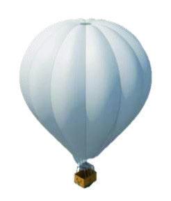
*Caption/Context: H. Kang et al.: Protect Your Sky: A Survey of Counter UAV Systems*

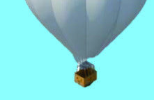
*Caption/Context: H. Kang et al.: Protect Your Sky: A Survey of Counter UAV Systems*

*Caption/Context: FIGURE 3. Platforms of CUS. These platforms are classified into two classes: ground platforms and sky platforms. Ground platforms are categorized into static, mobile and, human-packable platforms, while the sky platforms are categorized into low-altitude platforms and high-altitude platforms.*

*Caption/Context: FIGURE 3. Platforms of CUS. These platforms are classified into two classes: ground platforms and sky platforms. Ground platforms are categorized into static, mobile and, human-packable platforms, while the sky platforms are categorized into low-altitude platforms and high-altitude platforms.*

*Caption/Context: FIGURE 3. Platforms of CUS. These platforms are classified into two classes: ground platforms and sky platforms. Ground platforms are categorized into static, mobile and, human-packable platforms, while the sky platforms are categorized into low-altitude platforms and high-altitude platforms.*

*Caption/Context: FIGURE 3. Platforms of CUS. These platforms are classified into two classes: ground platforms and sky platforms. Ground platforms are categorized into static, mobile and, human-packable platforms, while the sky platforms are categorized into low-altitude platforms and high-altitude platforms.*

*Caption/Context: FIGURE 3. Platforms of CUS. These platforms are classified into two classes: ground platforms and sky platforms. Ground platforms are categorized into static, mobile and, human-packable platforms, while the sky platforms are categorized into low-altitude platforms and high-altitude platforms.*

*Caption/Context: FIGURE 3. Platforms of CUS. These platforms are classified into two classes: ground platforms and sky platforms. Ground platforms are categorized into static, mobile and, human-packable platforms, while the sky platforms are categorized into low-altitude platforms and high-altitude platforms.*

*Caption/Context: FIGURE 3. Platforms of CUS. These platforms are classified into two classes: ground platforms and sky platforms. Ground platforms are categorized into static, mobile and, human-packable platforms, while the sky platforms are categorized into low-altitude platforms and high-altitude platforms.*

*Caption/Context: FIGURE 3. Platforms of CUS. These platforms are classified into two classes: ground platforms and sky platforms. Ground platforms are categorized into static, mobile and, human-packable platforms, while the sky platforms are categorized into low-altitude platforms and high-altitude platforms.*

*Caption/Context: FIGURE 3. Platforms of CUS. These platforms are classified into two classes: ground platforms and sky platforms. Ground platforms are categorized into static, mobile and, human-packable platforms, while the sky platforms are categorized into low-altitude platforms and high-altitude platforms.*

*Caption/Context: FIGURE 3. Platforms of CUS. These platforms are classified into two classes: ground platforms and sky platforms. Ground platforms are categorized into static, mobile and, human-packable platforms, while the sky platforms are categorized into low-altitude platforms and high-altitude platforms.*

*Caption/Context: FIGURE 3. Platforms of CUS. These platforms are classified into two classes: ground platforms and sky platforms. Ground platforms are categorized into static, mobile and, human-packable platforms, while the sky platforms are categorized into low-altitude platforms and high-altitude platforms.*

*Caption/Context: FIGURE 3. Platforms of CUS. These platforms are classified into two classes: ground platforms and sky platforms. Ground platforms are categorized into static, mobile and, human-packable platforms, while the sky platforms are categorized into low-altitude platforms and high-altitude platforms.*

*Caption/Context: FIGURE 3. Platforms of CUS. These platforms are classified into two classes: ground platforms and sky platforms. Ground platforms are categorized into static, mobile and, human-packable platforms, while the sky platforms are categorized into low-altitude platforms and high-altitude platforms.*

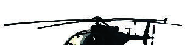
*Caption/Context: Image page_010_fig_26.jpeg*

*Caption/Context: FIGURE 3. Platforms of CUS. These platforms are classified into two classes: ground platforms and sky platforms. Ground platforms are categorized into static, mobile and, human-packable platforms, while the sky platforms are categorized into low-altitude platforms and high-altitude platforms.*

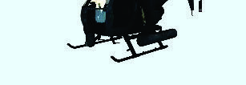
*Caption/Context: Image page_010_fig_37.jpeg*

*Caption/Context: FIGURE 3. Platforms of CUS. These platforms are classified into two classes: ground platforms and sky platforms. Ground platforms are categorized into static, mobile and, human-packable platforms, while the sky platforms are categorized into low-altitude platforms and high-altitude platforms.*

*Caption/Context: FIGURE 3. Platforms of CUS. These platforms are classified into two classes: ground platforms and sky platforms. Ground platforms are categorized into static, mobile and, human-packable platforms, while the sky platforms are categorized into low-altitude platforms and high-altitude platforms.*

*Caption/Context: FIGURE 3. Platforms of CUS. These platforms are classified into two classes: ground platforms and sky platforms. Ground platforms are categorized into static, mobile and, human-packable platforms, while the sky platforms are categorized into low-altitude platforms and high-altitude platforms.*

*Caption/Context: FIGURE 3. Platforms of CUS. These platforms are classified into two classes: ground platforms and sky platforms. Ground platforms are categorized into static, mobile and, human-packable platforms, while the sky platforms are categorized into low-altitude platforms and high-altitude platforms.*

*Caption/Context: FIGURE 3. Platforms of CUS. These platforms are classified into two classes: ground platforms and sky platforms. Ground platforms are categorized into static, mobile and, human-packable platforms, while the sky platforms are categorized into low-altitude platforms and high-altitude platforms.*

*Caption/Context: FIGURE 3. Platforms of CUS. These platforms are classified into two classes: ground platforms and sky platforms. Ground platforms are categorized into static, mobile and, human-packable platforms, while the sky platforms are categorized into low-altitude platforms and high-altitude platforms.*

*Caption/Context: FIGURE 3. Platforms of CUS. These platforms are classified into two classes: ground platforms and sky platforms. Ground platforms are categorized into static, mobile and, human-packable platforms, while the sky platforms are categorized into low-altitude platforms and high-altitude platforms.*

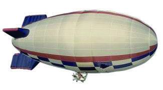
*Caption/Context: H. Kang et al.: Protect Your Sky: A Survey of Counter UAV Systems*

*Caption/Context: FIGURE 3. Platforms of CUS. These platforms are classified into two classes: ground platforms and sky platforms. Ground platforms are categorized into static, mobile and, human-packable platforms, while the sky platforms are categorized into low-altitude platforms and high-altitude platforms.*

*Caption/Context: FIGURE 3. Platforms of CUS. These platforms are classified into two classes: ground platforms and sky platforms. Ground platforms are categorized into static, mobile and, human-packable platforms, while the sky platforms are categorized into low-altitude platforms and high-altitude platforms.*

*Caption/Context: FIGURE 3. Platforms of CUS. These platforms are classified into two classes: ground platforms and sky platforms. Ground platforms are categorized into static, mobile and, human-packable platforms, while the sky platforms are categorized into low-altitude platforms and high-altitude platforms.*

*Caption/Context: FIGURE 3. Platforms of CUS. These platforms are classified into two classes: ground platforms and sky platforms. Ground platforms are categorized into static, mobile and, human-packable platforms, while the sky platforms are categorized into low-altitude platforms and high-altitude platforms.*

*Caption/Context: FIGURE 3. Platforms of CUS. These platforms are classified into two classes: ground platforms and sky platforms. Ground platforms are categorized into static, mobile and, human-packable platforms, while the sky platforms are categorized into low-altitude platforms and high-altitude platforms.*

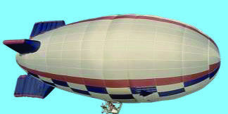
*Caption/Context: H. Kang et al.: Protect Your Sky: A Survey of Counter UAV Systems*

*Caption/Context: FIGURE 3. Platforms of CUS. These platforms are classified into two classes: ground platforms and sky platforms. Ground platforms are categorized into static, mobile and, human-packable platforms, while the sky platforms are categorized into low-altitude platforms and high-altitude platforms.*

*Caption/Context: FIGURE 3. Platforms of CUS. These platforms are classified into two classes: ground platforms and sky platforms. Ground platforms are categorized into static, mobile and, human-packable platforms, while the sky platforms are categorized into low-altitude platforms and high-altitude platforms.*

*Caption/Context: FIGURE 3. Platforms of CUS. These platforms are classified into two classes: ground platforms and sky platforms. Ground platforms are categorized into static, mobile and, human-packable platforms, while the sky platforms are categorized into low-altitude platforms and high-altitude platforms.*

*Caption/Context: FIGURE 3. Platforms of CUS. These platforms are classified into two classes: ground platforms and sky platforms. Ground platforms are categorized into static, mobile and, human-packable platforms, while the sky platforms are categorized into low-altitude platforms and high-altitude platforms.*

*Caption/Context: FIGURE 3. Platforms of CUS. These platforms are classified into two classes: ground platforms and sky platforms. Ground platforms are categorized into static, mobile and, human-packable platforms, while the sky platforms are categorized into low-altitude platforms and high-altitude platforms.*

*Caption/Context: FIGURE 3. Platforms of CUS. These platforms are classified into two classes: ground platforms and sky platforms. Ground platforms are categorized into static, mobile and, human-packable platforms, while the sky platforms are categorized into low-altitude platforms and high-altitude platforms.*

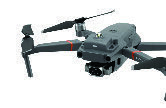
*Caption/Context: Image page_010_fig_70.jpeg*

*Caption/Context: FIGURE 3. Platforms of CUS. These platforms are classified into two classes: ground platforms and sky platforms. Ground platforms are categorized into static, mobile and, human-packable platforms, while the sky platforms are categorized into low-altitude platforms and high-altitude platforms.*

*Caption/Context: FIGURE 3. Platforms of CUS. These platforms are classified into two classes: ground platforms and sky platforms. Ground platforms are categorized into static, mobile and, human-packable platforms, while the sky platforms are categorized into low-altitude platforms and high-altitude platforms.*

*Caption/Context: FIGURE 3. Platforms of CUS. These platforms are classified into two classes: ground platforms and sky platforms. Ground platforms are categorized into static, mobile and, human-packable platforms, while the sky platforms are categorized into low-altitude platforms and high-altitude platforms.*

*Caption/Context: FIGURE 3. Platforms of CUS. These platforms are classified into two classes: ground platforms and sky platforms. Ground platforms are categorized into static, mobile and, human-packable platforms, while the sky platforms are categorized into low-altitude platforms and high-altitude platforms.*

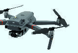
*Caption/Context: Image page_010_fig_81.jpeg*

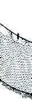
*Caption/Context: Image page_010_fig_90.jpeg*

*Caption/Context: FIGURE 3. Platforms of CUS. These platforms are classified into two classes: ground platforms and sky platforms. Ground platforms are categorized into static, mobile and, human-packable platforms, while the sky platforms are categorized into low-altitude platforms and high-altitude platforms.*

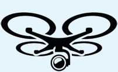
*Caption/Context: Image page_010_fig_95.png*

*Caption/Context: Image page_010_fig_96.jpeg*

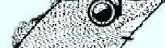
*Caption/Context: Image page_010_fig_97.jpeg*

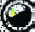
*Caption/Context: Image page_010_fig_99.jpeg*

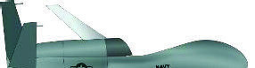
*Caption/Context: H. Kang et al.: Protect Your Sky: A Survey of Counter UAV Systems*

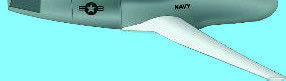
*Caption/Context: H. Kang et al.: Protect Your Sky: A Survey of Counter UAV Systems*

*Caption/Context: FIGURE 3. Platforms of CUS. These platforms are classified into two classes: ground platforms and sky platforms. Ground platforms are categorized into static, mobile and, human-packable platforms, while the sky platforms are categorized into low-altitude platforms and high-altitude platforms.*

*Caption/Context: Image page_010_fig_104.jpeg*

*Caption/Context: FIGURE 3. Platforms of CUS. These platforms are classified into two classes: ground platforms and sky platforms. Ground platforms are categorized into static, mobile and, human-packable platforms, while the sky platforms are categorized into low-altitude platforms and high-altitude platforms.*

*Caption/Context: FIGURE 3. Platforms of CUS. These platforms are classified into two classes: ground platforms and sky platforms. Ground platforms are categorized into static, mobile and, human-packable platforms, while the sky platforms are categorized into low-altitude platforms and high-altitude platforms.*

*Caption/Context: FIGURE 3. Platforms of CUS. These platforms are classified into two classes: ground platforms and sky platforms. Ground platforms are categorized into static, mobile and, human-packable platforms, while the sky platforms are categorized into low-altitude platforms and high-altitude platforms.*

*Caption/Context: FIGURE 3. Platforms of CUS. These platforms are classified into two classes: ground platforms and sky platforms. Ground platforms are categorized into static, mobile and, human-packable platforms, while the sky platforms are categorized into low-altitude platforms and high-altitude platforms.*

*Caption/Context: FIGURE 3. Platforms of CUS. These platforms are classified into two classes: ground platforms and sky platforms. Ground platforms are categorized into static, mobile and, human-packable platforms, while the sky platforms are categorized into low-altitude platforms and high-altitude platforms.*

*Caption/Context: FIGURE 3. Platforms of CUS. These platforms are classified into two classes: ground platforms and sky platforms. Ground platforms are categorized into static, mobile and, human-packable platforms, while the sky platforms are categorized into low-altitude platforms and high-altitude platforms.*

*Caption/Context: FIGURE 3. Platforms of CUS. These platforms are classified into two classes: ground platforms and sky platforms. Ground platforms are categorized into static, mobile and, human-packable platforms, while the sky platforms are categorized into low-altitude platforms and high-altitude platforms.*

*Caption/Context: FIGURE 3. Platforms of CUS. These platforms are classified into two classes: ground platforms and sky platforms. Ground platforms are categorized into static, mobile and, human-packable platforms, while the sky platforms are categorized into low-altitude platforms and high-altitude platforms.*

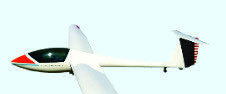
*Caption/Context: Image page_010_fig_115.jpeg*

*Caption/Context: FIGURE 3. Platforms of CUS. These platforms are classified into two classes: ground platforms and sky platforms. Ground platforms are categorized into static, mobile and, human-packable platforms, while the sky platforms are categorized into low-altitude platforms and high-altitude platforms.*

*Caption/Context: FIGURE 3. Platforms of CUS. These platforms are classified into two classes: ground platforms and sky platforms. Ground platforms are categorized into static, mobile and, human-packable platforms, while the sky platforms are categorized into low-altitude platforms and high-altitude platforms.*

*Caption/Context: FIGURE 3. Platforms of CUS. These platforms are classified into two classes: ground platforms and sky platforms. Ground platforms are categorized into static, mobile and, human-packable platforms, while the sky platforms are categorized into low-altitude platforms and high-altitude platforms.*

*Caption/Context: FIGURE 3. Platforms of CUS. These platforms are classified into two classes: ground platforms and sky platforms. Ground platforms are categorized into static, mobile and, human-packable platforms, while the sky platforms are categorized into low-altitude platforms and high-altitude platforms.*

*Caption/Context: FIGURE 3. Platforms of CUS. These platforms are classified into two classes: ground platforms and sky platforms. Ground platforms are categorized into static, mobile and, human-packable platforms, while the sky platforms are categorized into low-altitude platforms and high-altitude platforms.*

*Caption/Context: FIGURE 3. Platforms of CUS. These platforms are classified into two classes: ground platforms and sky platforms. Ground platforms are categorized into static, mobile and, human-packable platforms, while the sky platforms are categorized into low-altitude platforms and high-altitude platforms.*

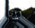
*Caption/Context: Image page_010_fig_133.jpeg*

*Caption/Context: Image page_010_fig_134.jpeg*

*Caption/Context: FIGURE 3. Platforms of CUS. These platforms are classified into two classes: ground platforms and sky platforms. Ground platforms are categorized into static, mobile and, human-packable platforms, while the sky platforms are categorized into low-altitude platforms and high-altitude platforms.*

*Caption/Context: FIGURE 3. Platforms of CUS. These platforms are classified into two classes: ground platforms and sky platforms. Ground platforms are categorized into static, mobile and, human-packable platforms, while the sky platforms are categorized into low-altitude platforms and high-altitude platforms.*

*Caption/Context: FIGURE 3. Platforms of CUS. These platforms are classified into two classes: ground platforms and sky platforms. Ground platforms are categorized into static, mobile and, human-packable platforms, while the sky platforms are categorized into low-altitude platforms and high-altitude platforms.*

*Caption/Context: FIGURE 3. Platforms of CUS. These platforms are classified into two classes: ground platforms and sky platforms. Ground platforms are categorized into static, mobile and, human-packable platforms, while the sky platforms are categorized into low-altitude platforms and high-altitude platforms.*

*Caption/Context: FIGURE 3. Platforms of CUS. These platforms are classified into two classes: ground platforms and sky platforms. Ground platforms are categorized into static, mobile and, human-packable platforms, while the sky platforms are categorized into low-altitude platforms and high-altitude platforms.*

*Caption/Context: FIGURE 3. Platforms of CUS. These platforms are classified into two classes: ground platforms and sky platforms. Ground platforms are categorized into static, mobile and, human-packable platforms, while the sky platforms are categorized into low-altitude platforms and high-altitude platforms.*

*Caption/Context: FIGURE 3. Platforms of CUS. These platforms are classified into two classes: ground platforms and sky platforms. Ground platforms are categorized into static, mobile and, human-packable platforms, while the sky platforms are categorized into low-altitude platforms and high-altitude platforms.*

*Caption/Context: FIGURE 3. Platforms of CUS. These platforms are classified into two classes: ground platforms and sky platforms. Ground platforms are categorized into static, mobile and, human-packable platforms, while the sky platforms are categorized into low-altitude platforms and high-altitude platforms.*

*Caption/Context: FIGURE 3. Platforms of CUS. These platforms are classified into two classes: ground platforms and sky platforms. Ground platforms are categorized into static, mobile and, human-packable platforms, while the sky platforms are categorized into low-altitude platforms and high-altitude platforms.*

*Caption/Context: FIGURE 3. Platforms of CUS. These platforms are classified into two classes: ground platforms and sky platforms. Ground platforms are categorized into static, mobile and, human-packable platforms, while the sky platforms are categorized into low-altitude platforms and high-altitude platforms.*

*Caption/Context: FIGURE 3. Platforms of CUS. These platforms are classified into two classes: ground platforms and sky platforms. Ground platforms are categorized into static, mobile and, human-packable platforms, while the sky platforms are categorized into low-altitude platforms and high-altitude platforms.*

*Caption/Context: FIGURE 3. Platforms of CUS. These platforms are classified into two classes: ground platforms and sky platforms. Ground platforms are categorized into static, mobile and, human-packable platforms, while the sky platforms are categorized into low-altitude platforms and high-altitude platforms.*

*Caption/Context: FIGURE 3. Platforms of CUS. These platforms are classified into two classes: ground platforms and sky platforms. Ground platforms are categorized into static, mobile and, human-packable platforms, while the sky platforms are categorized into low-altitude platforms and high-altitude platforms.*

*Caption/Context: FIGURE 3. Platforms of CUS. These platforms are classified into two classes: ground platforms and sky platforms. Ground platforms are categorized into static, mobile and, human-packable platforms, while the sky platforms are categorized into low-altitude platforms and high-altitude platforms.*

## --- Page 11 ---

H. Kang et al.: Protect Your Sky: A Survey of Counter UAV Systems

the mobility of the vehicles on the ground [101]. Mobile
ground platforms are suitable for battlefields and dynamically
and rapidly changing environments. However, compared to
static ground platforms, mobile ground platforms have SWAP
constraints; thus, the available levels and types of sensing and
mitigation systems can be limited on this platform. Moreover,
the utilization of the mobile ground platform is affected by the
capability of the vehicles.

As shown at the top of Fig. 4(b), among all mobile ground
platforms, approximately 49% of them have both sensing and
mitigation systems [102]–[104], approximately 25% employ
only a sensing system [105], and remaining 25% have only a
mitigation system [106]. Compared to static ground platforms
for which 31% have both sensing and mitigation systems,
we can infer that an individual mobile ground platform per-
forms as a total solution of an integrated CUS for successful
countermeasures, whereas there is a room for a static ground
platform to be interoperated with other static ground plat-
forms without significant SWAP constraints.

For the platform with a sensing system, as shown
in Fig. 4(b)-(i+ii), approximately 56% of sensing systems
have a single sensor, while 44% of them are equipped with
multiple types of sensors, comparable to the static ground
platform. However, as shown in Fig. 4(b)-(ii+iii), nearly half
of the mitigation systems have a single mitigator, while for
the remaining half, the mitigation systems are equipped with
multiple types of mitigators [102], [104]–[106]. The ratio of
the mobile ground platform with multiple types of the mitiga-
tors is less than that of the static ground platforms, standing
at approximately 66%, as the deployment of multiple devices
may not be allowed for mobile ground platforms owing to the
limited area of the associated vehicles. Furthermore, for the
same reason, compared to the portion of MM on the static
ground platform, i.e., 60%, the MM portion of the mobile
ground platform accounts for approximately 32%, as shown
in Fig. 4(b)-(ii).

3) HUMAN-PACKABLE PLATFORM
The human-packable platforms for CUSs, accounting for
approximately 22% of CUSs [38], are designed to be operated
by an individual by hand. Most human-packable platforms
with the sensing systems resemble a backpack or brief-
case, whereas those with mitigation systems resemble rifles.
Human-packable platforms are lightweight and can be car-
ried by a person, meaning that they are portable. However,
the performance of the human-packable platforms is limited
considering SWAP constraints; e.g., they are associated with
inaccurate detection, tracking, and targeting capabilities, and
also depends on the skill of the operator. Furthermore, due to
the stringent SWAP constraints, most human-packable plat-
forms only employ mitigation systems (approximately 81%)
without a sensing system, as shown at the top of Fig. 4(c).
In these cases, mitigation systems are equipped with multi-
ple mitigators (approximately 70%, as shown in Fig. 4(c)-
(ii+iii)), and the typical mitigators used are RF and GNSS
jammers [107]–[109], while the sensing systems are replaced

by the eyes of the operators. If a sensing system is employed
(approximately 19%), it mainly consists of RF sensors [110],
[111]. Only approximately 7% of thuman-packable platforms
employ both sensing and mitigation systems [112], [113].

The human-packable platforms equipping multiple sensors
[114] take approximately 5% as shown in Fig. 4(c)-(i+ii), and
no MS and MM are employed for the human-packable plat-
forms that have both sensing and mitigation systems as shown
in Fig. 4(c)-(ii). Therefore, the human-packable platforms are
relevant as a supplement with other platforms or for a limited
personal purpose.

B. SKY PLATFORM
Sky platforms are systems mounted on certain UAVs, e.g.,
airships, balloons, fixed-wing aircrafts, and rotary-wing air
copters. Due to their maneuverability in air, flexible on-
demand placement is possible. Sky platforms are even more
flexible and more expeditious than mobile ground platforms.

It is important to note that benefiting from its flexibility,
the sky platform can be employed as a multiple-pursuer UAV
(pUAV) that tracks and chases mUAVs. In differential game
theory, there have been studies on frameworks to examine
pursuit-evasion (PE) problems [115]. By solving the PE prob-
lem, a control scheme can be designed for pursuers to pursue
evaders under position and velocity constraints. To address
PE problems, a linear-quadratic differential game was intro-
duced in classic work [116], [117]. Multiple players have
also been studied [118], where a high-speed pursuer attempts
to capture a couple of slow-moving evaders. In other work
[119]–[121], reach and avoid differential games were pro-
posed for applications of aircraft control, motion planning,
and collision avoidance. Environments in the presence of
obstacles were also studied [122], while other authors [123]
considered a multiple-pursuer and single-evader problem in
which the multiple cooperative pursuers (i.e., pUAVs) capture
a single evader (i.e., mUAV). A single-pursuer and multiple-
evader problem was also studied [124], [125]. In further
[126], [127], a scenario in the presence of a defender that
protects an evader against a pursuer was considered. A dis-
tributed algorithm for managing multiple cooperative pUAVs
was proposed to mitigate multiple mUAVs [128]. However,
the PE problem is not completely applicable to the design of
a CUS. Instead, PE problems can be applied in the case of
pursuers who protect a protective area from evaders [129].

Sky platforms are not restricted to traditional missions,
e.g., reconnaissance and attacks, and they recently have been
rigorously studied for various objectives, such as tracking and
jamming [130]–[133]. Moreover, recent studies have investi-
gated diverse roles of UAVs, for example, as a UAV relay that
supports communications between two nodes [25], a UAV
BS that supports users considering secrecy [78], and a UAV-
based edge node that performs computing tasks offloaded by
nearby users [134].

On the other hand, sky platforms have critical limitations
compared to ground platforms. Sky platforms have limited
payloads and battery power such that they can carry only

VOLUME 8, 2020
168681

![the mobility of the vehicles on the ground [101]. Mobile ground platforms are suitable for battlefields and dynamically and rapidly changing environments. However, compared to static ground platforms, mobile ground platforms have SWAP constraints; thus, the available levels and types of sensing and mitigation systems can be limited on this platform. Moreover, the utilization of the mobile ground platform is affected by the capability of the vehicles. | by the eyes of the operators. If a sensing system is employed (approximately 19%), it mainly consists of RF sensors [110], [111]. Only approximately 7% of thuman-packable platforms employ both sensing and mitigation systems [112], [113].](images/page_011_fig_01.png)
*Caption/Context: the mobility of the vehicles on the ground [101]. Mobile ground platforms are suitable for battlefields and dynamically and rapidly changing environments. However, compared to static ground platforms, mobile ground platforms have SWAP constraints; thus, the available levels and types of sensing and mitigation systems can be limited on this platform. Moreover, the utilization of the mobile ground platform is affected by the capability of the vehicles. | by the eyes of the operators. If a sensing system is employed (approximately 19%), it mainly consists of RF sensors [110], [111]. Only approximately 7% of thuman-packable platforms employ both sensing and mitigation systems [112], [113].*

## --- Page 12 ---

H. Kang et al.: Protect Your Sky: A Survey of Counter UAV Systems

lightweight and low-powered sensing systems and/or miti-
gation systems. Furthermore, sky platforms may generally
require wireless air-to-ground communication links and sys-
tems, where the communication architecture can be either
an ad-hoc network without infrastructure or a centralized
network with a central network node. These requirements
and the load-and-battery limitations make sky platforms more
challenging compared to ground platforms.

1) LOW-ALTITUDE PLATFORM
LAPs can fly and hover to cope effectively with mUAVs
at low altitudes up to a few kilometers [92], [135]. LAPs
are more affordable, and their deployments are quicker and
more flexible than HAPs. Due to the extremely high maneu-
verability and cost-effective mission achievement capability
of LAPs, they can play an important role as a part of an
integrated CUS. LAPs are typically lightweight compared to
HAPs, and their payloads and fuel/battery power are thus lim-
ited. To overcome these limitation, energy-efficient designs
of UAVs has been vigorously studied [131], [133], [136],
[137]. Moreover, the limited energy/power issue has been
tackled through various methods, e.g., the rotation of multiple
UAVs, rapid replacement of the batteries, wireless power
transmission [138], and a tethered UAV whose power can be
supplied through a cable [139]. This type of tethered UAV can
also have a wired communication link for further reliable and
secure communications [140].

Most LAPs that engage mUAVs are equipped with only a
mitigation system only. The typical mitigation method of a
LAP is to use either a net or a collision UAV [141], [142]. On
the other hand, a small percentage of LAPs have a sensing
system with most likely a single sensor, i.e., an EO and/or
IR sensor [140], [143], [144]. Despite the fact that LAPs
can be equipped with both sensing and mitigation systems,
their performance is still restricted unless they cooperate with
other types of platforms owing to their limited sensing and
mitigation capabilities [142], [145].

2) HIGH-ALTITUDE PLATFORM
HAPs fly and hover at high altitudes of up to tens of kilo-
meters [67], [92]. Because HAPs have less stringent SWAP
conditions, they can be equipped with more systems, such as
the communication systems and battery/fuel systems. Com-
pared to LAPs, HAPs can fly longer and higher and have a
wider communication range and the field of vision owing to
their high-altitude operability and the high probability of line-
of-sight (LoS) environments in communications. Therefore,
HAPs can effectively counteract mUAVs intruding from high
altitudes and can also support other platforms.

However, HAPs are costly and much more difficult to
operate compared to LAPs. Moreover, the deployment of
HAPs requires more time compared to the time needed to
deploy LAPs. Note that traditional aircraft or unmanned
combat air vehicles developed for reconnaissance and
defense/mitigation during military operations can be inter-
preted as high-end HAPs for CUSs [146]–[150].

Typical HAPs are equipped with both sensing systems and
mitigation systems, where the sensing systems have multi-
ple types of sensors, such as EO, IO, and radar types, and
the widely used mitigator types are projectiles. Surveillance
HAPs are equipped with only sensing systems. HAPs have
been vigorously studied and developed to support other plat-
forms [151]. In such cases, satellite communications can be
considered to link multiple platforms beyond HAPs [67].

C. CUS NETWORKS
As surveyed above, each platform has unique benefits; e.g.,
ground platforms are less constrained by SWAP constraints
and sky platforms can provide highly flexible on-demand
deployment and wide operation coverage. On the other hand,
each platform also has certain limitations; e.g., ground plat-
forms can support only limited coverage and sky platforms
have stringent SWAP constraints. Therefore, a hybrid plat-
form that consists of ground and sky systems can be con-
sidered to offset the shortcomings and enjoy the benefits of
each system. Furthermore, by leveraging the advantages of
ground and sky systems and providing a spatial diversity gain,
hybrid platforms can significantly enhance the performance
of CUSs. Hybrid platforms usually have both sensing and
mitigation systems and consist of various types of sensors as
well as mitigators [144], [152]–[154].

An integrated CUS which encompasses hybrid platforms
can consist of multiple platforms, such as multiple ground
platforms, sky platforms, hybrid platforms, and combinations
of these in a network [154], [155]. The capability of an
integrated CUS is determined by not only the performance of
an individual platform but also the properties of the entire sys-
tem of networks. The network can enhance the cooperation
among the platforms and thus maximize the effectiveness of
the CUS. Integrated networks are categorized into centralized
and decentralized networks, as shown in Fig. 5. Decentralized
networks can be further classified according to the homo-
geneity of the platform [156]. We henceforth introduce two
classified network models and then discuss the appropriate
amalgamation of these models.

1) CENTRALIZED NETWORK
As shown in Fig. 5(a), a centralized network consists of a sin-
gle high-performance central platform and a cluster of low-
performance surrounding platforms. Any type of platform,
i.e., ground and sky platforms, can be operated as either the
central platform or the surrounding platforms. To perform as
a centralized C2 system which is a specific implementation
of a centralized network, the high-performance central plat-
form makes decisions and directs the surrounding platforms
to neutralize UAVs effectively. Here, the fully centralized
network operates effectively when it can obtain access to
all required information, operate the necessary facilities for
making decisions, and disseminate the instructions to the
surrounding platforms.

The centralized network, however, is vulnerable. A break-
down or failure of the central platform would affect all

168682
VOLUME 8, 2020

![lightweight and low-powered sensing systems and/or miti- gation systems. Furthermore, sky platforms may generally require wireless air-to-ground communication links and sys- tems, where the communication architecture can be either an ad-hoc network without infrastructure or a centralized network with a central network node. These requirements and the load-and-battery limitations make sky platforms more challenging compared to ground platforms. | Typical HAPs are equipped with both sensing systems and mitigation systems, where the sensing systems have multi- ple types of sensors, such as EO, IO, and radar types, and the widely used mitigator types are projectiles. Surveillance HAPs are equipped with only sensing systems. HAPs have been vigorously studied and developed to support other plat- forms [151]. In such cases, satellite communications can be considered to link multiple platforms beyond HAPs [67].](images/page_012_fig_01.png)
*Caption/Context: lightweight and low-powered sensing systems and/or miti- gation systems. Furthermore, sky platforms may generally require wireless air-to-ground communication links and sys- tems, where the communication architecture can be either an ad-hoc network without infrastructure or a centralized network with a central network node. These requirements and the load-and-battery limitations make sky platforms more challenging compared to ground platforms. | Typical HAPs are equipped with both sensing systems and mitigation systems, where the sensing systems have multi- ple types of sensors, such as EO, IO, and radar types, and the widely used mitigator types are projectiles. Surveillance HAPs are equipped with only sensing systems. HAPs have been vigorously studied and developed to support other plat- forms [151]. In such cases, satellite communications can be considered to link multiple platforms beyond HAPs [67].*

## --- Page 13 ---

H. Kang et al.: Protect Your Sky: A Survey of Counter UAV Systems

FIGURE 5. Examples of CUS networks: (a) centralized network, (b) decentralized homogeneous network, and (c) decentralized heterogeneous
network.

surrounding platforms, resulting in inefficient CUS opera-
tion. Furthermore, exchanging information among the plat-
forms can cause a long latency because the information must
pass through the central platform. Therefore, robust and inde-
pendently dedicated networks are desired to circumvent this
general concern of centralized network. If there are multiple
high-performance platforms, the centralized process can be
partially distributed.

2) DECENTRALIZED NETWORK
In a decentralized network, C2 systems are distributed to
multiple platforms, as shown in Figs. 5(b) and (c), such that
each platform in the network cooperatively computes and
makes decisions. A decentralized network can be categorized
into two models, i.e., a decentralized homogeneous network
model and a decentralized heterogeneous network model.

• Decentralized homogeneous network: The decentral-
ized homogeneous network consists of multiple plat-
forms that have identical performance and functions,
i.e., homogeneous platforms, as shown in Fig. 5(b).
Thus, unlike the platforms in a decentralized hetero-
geneous network, each platform in the decentralized
homogeneous network has its own sensing and mitiga-
tion systems. When any of the platforms do not oper-

ate, the CUS can still operate with slight performance
degradation. The merit of the decentralized homoge-
neous network is robustness against malfunctions of the
platforms. However, each function of the homogenous
platform provides relatively low-quality performance
compared to that of heterogeneous platforms. There-
fore, the platforms may partially cooperate for sensing,
computing, decision making, and neutralizing mUAVs
to maximize the effectiveness of the CUS.

• Decentralized heterogeneous network: The heteroge-
neous decentralized network consists of multiple types
of platforms, i.e., heterogeneous platforms, as shown
in Fig. 5(c), where each platform performs only a
few specific tasks, e.g., sensing, computing, decision
making, and neutralization. In this case, each platform
should have the capability to execute sufficient perfor-
mance for its assigned mission such that any platform
can request that another platform perform a task that it
cannot perform. If any platform that undertakes a unique
function fails to complete its role, this partial malfunc-
tion may cause a bottleneck and failure of the entire CUS
operation, as the central platform breakdown in a cen-
tralized network. However, the well-designed networks
as shown in Fig. 5(c) can resolve this issue. As shown
in Fig. 5(c), if any platform does not operate, the other

VOLUME 8, 2020
168683

*Caption/Context: Image page_013_fig_01.png*

## --- Page 14 ---

H. Kang et al.: Protect Your Sky: A Survey of Counter UAV Systems

two platforms can cooperate to complete the mission.
The decentralized heterogeneous network would be a
good solution to achieve a tradeoff between robustness
and performance.

IV. ARCHITECTURE
In this section, the architecture of the integrated CUS is
introduced. Integrated CUS architectures can be categorized
into three types based on their roles, as follows (refer to
Fig. 6): Sensing systems that gather data from the environment
and transmit the observed data to C2 systems; C2 systems that
perform computing tasks (e.g., detection/identification and
tracking/localization algorithms) and make decisions based
on the received data, such as the detection/identification
declaration, localization/tracking declaration, and time and
method of the neutralization of mUAVs; and mitigation sys-
tems that perform mUAV neutralization based on the deci-
sions of the C2 systems.

Each sensing system, the C2 system, and the mitigation
system can be equipped in either single or multiple platforms.
On the other hand, each platform can employ multiple sys-
tems, i.e., an integrated architecture. However, only a few
platform products utilize the integrated type of architecture
because it requires a considerable level of the autonomy to
operate the CUS effectively, which could be a burden and
has remained underdeveloped with regard to maximizing
the performance of CUSs. Hence, most platforms have only
either a sensing or mitigation system and their limitations are
compensated by the network among the platforms, as stated
in Section III. At this point, the details of each part of the CUS
architecture are introduced.

A. SENSING SYSTEMS
The survey on sensing systems is focused on the information
collected by sensing systems i.e., the gathering of data, and
how the sensing systems operate.

1) GATHERING DATA
The sensing systems can collect data such as sound wave
data, radio wave data, and light wave data. Wave data
can be obtained through various devices, such as sonars,
acoustic/ultrasonic sensors, radar, RF sensors, LiDAR and,
EO/IR sensors. As the details of each sensor are presented in
Section V, wave data is discussed here.

• Sound wave data: Sound waves are the mechanical
waves that include infrasound (up to 20 Hz), acoustic
(between 20 Hz and 20 kHz), and ultrasound (above
20 kHz, up to several gigahertz) waves. Sound waves
have lower velocities than electromagnetic waves such
as radio waves and light, and are longitudinal and not
polarizable. Sound waves require a medium (e.g., air
and water) through which to propagate. Sound wave
data can make sensing systems more reliable by pro-
viding additional data with electromagnetic (EM) wave
data. To capture sound data, sonar operates actively,

i.e., active sensors, whereas acoustic/ultrasonic sensors
operate passively, i.e., passive sensors. However, sonar
typically is used for underwater applications to navigate
and communicate and is rarely used for UAV detection
owing to the poor propagation characteristics of sonar
waves in air. From this survey, it is revealed that sonar
has limited applications, UAV mapping and collision-
avoidance functions [157]–[160]. On the other hand,
acoustic/ultrasonic sensors are widely used for UAV
detection; this is discussed further in Section V-A(1).

• Radio wave data: Radio waves consist of waves in
the electromagnetic spectrum, typically in the frequency
range from 3 MHz to 300 GHz, and radio wave infor-
mation has been widely used as UAV detection data.
In this case, the wireless channel state information is
critical to capture radio wave information. For example,
the path loss is a key metric to determine the presence
of mUAVs. For detecting UAVs in the sky, it is impor-
tant to understand air-to-ground (A2G) and air-to-air
(A2A) radio channels. A2G and A2A channel models
are different from those of traditional terrestrial channels
[75], [76]. Analytic A2G channels can be character-
ized by their LoS and non-LoS (NLoS) components.
A2G channels are then analyzed according to the LoS
probability depending on the environment model [78],
[161]. A2A channels tend to have a lower path loss
exponent than A2G and terrestrial channels [75]. There-
fore, exploiting the LoS in A2A channels, sky platforms
equipped with synthetic aperture radar or RF sensors can
reliably collect radio wave information. To capture radio
wave information, radar transmits signals and gathers
the radio data from reflected echo signals, i.e., active
sensors. On the other hand, an RF sensor collects the
ambient RF signals emitted from mUAVs, i.e., passive
sensors, as discussed further in Section V-A(2).

• Light wave data: Compared to radio waves, the light
waves have higher frequencies and shorter wavelengths
with different characteristics. In more detail, light waves
include the infrared light (300 GHz–430 THz) and
visual light (430
THz–750
THz) spectrums. Light
waves have a shorter range than radio waves yet a bet-
ter resolution owing to the shorter wavelength with a
higher frequency compared to radio waves. However,
light waves are affected by weather phenomena, such as
clouds, fog, rain, falling snow, sleet, and direct sunlight,
due to their short wavelength and have high degree of
straightness. Hence, the LoS requirements of light waves
are more stringent than those of radio waves. Light wave
information in the visual spectrum is intuitive and can
be analyzed by humans, yet the information collected at
dark times, e.g., at night and on cloudy days, is insuffi-
cient to provide high-quality visual images. Meanwhile,
infrared radiation is emitted by objects according to the
black body radiation law. This makes infrared sensors
capable of collecting data such as temperatures irre-
spective of the degree of visible illumination. However,

168684
VOLUME 8, 2020

![two platforms can cooperate to complete the mission. The decentralized heterogeneous network would be a good solution to achieve a tradeoff between robustness and performance. | IV. ARCHITECTURE In this section, the architecture of the integrated CUS is introduced. Integrated CUS architectures can be categorized into three types based on their roles, as follows (refer to Fig. 6): Sensing systems that gather data from the environment and transmit the observed data to C2 systems; C2 systems that perform computing tasks (e.g., detection/identification and tracking/localization algorithms) and make decisions based on the received data, such as the detection/identification declaration, localization/tracking declaration, and time and method of the neutralization of mUAVs; and mitigation sys- tems that perform mUAV neutralization based on the deci- sions of the C2 systems.](images/page_014_fig_01.png)
*Caption/Context: two platforms can cooperate to complete the mission. The decentralized heterogeneous network would be a good solution to achieve a tradeoff between robustness and performance. | IV. ARCHITECTURE In this section, the architecture of the integrated CUS is introduced. Integrated CUS architectures can be categorized into three types based on their roles, as follows (refer to Fig. 6): Sensing systems that gather data from the environment and transmit the observed data to C2 systems; C2 systems that perform computing tasks (e.g., detection/identification and tracking/localization algorithms) and make decisions based on the received data, such as the detection/identification declaration, localization/tracking declaration, and time and method of the neutralization of mUAVs; and mitigation sys- tems that perform mUAV neutralization based on the deci- sions of the C2 systems.*

## --- Page 15 ---

H. Kang et al.: Protect Your Sky: A Survey of Counter UAV Systems

FIGURE 6. Diagram of CUS architecture that consists of sensing systems, C2 systems, and mitigation systems.

because infrared images are detected based on heat
energy, these images are influenced by the emissivity
and reflection of sunlight. As active and passive sensors,
LiDAR and EO/IR sensors are widely used to collect
light information, as discussed further in Section V-
A(3).

2) DATA FUSION
The majority of sensing systems have a single type of sensor.
The data collected by a single sensor or identical types of sen-
sors, however, could be insufficient for accurate and precise
detection/identification and localization/tracking. To offset
the limitations of single types of sensors, multiple types can
be employed by high-end systems considering the require-
ments and usage environments. Furthermore, instead of sim-
ply obtaining results from each sensor type, comprehensive
data fusion (i.e., the fusion of sensing information) can be
implemented [47]. Note that data fusion considers not only
multiple sensor types but also multiple identical sensors and
can be implemented in sensing systems and C2 systems.

Data fusion is multidisciplinary in that a clear classifi-
cation is not established. We introduce four classification
criteria to provide a clear understanding of data fusion. Data
fusion can be categorized according to the source informa-
tion [162], the data type, the abstraction level [163], joint
directors of laboratories (JDL), or data fusion information
group (DFIG) models,3 and by the locations at which fusion
is performed [166]. The source information can be classified
as (i) redundant information pertaining to the same target for

3The process of data fusion, including the data, sensor, and information
fusion steps, is categorized into levels 1 to 4 based on JDL or levels 0 to
5 based on DFIG, where the levels are as follows. Level 0: source prepro-
cessing or subject assessment; Level 1: object assessment; Level 2: situation
assessment; Level 3: impact assessment (or threat refinement); Level 4:
process refinement; and Level 5: user refinement (or cognitive refinement)
[164], [165]

greater reliability, (ii) complementary information provided
by sources about different parts of the target, and (iii) coop-
erative information that is combined into new information
(e.g., multimodal data fusion). The types of data for the
input and/or output of fusion can be raw data (analog/digital
signals), features, or decisions. Here, the data type (i.e., data
amount or compression level) which affects the performance
should be carefully designed by considering the tradeoff
between performance and cost, such as the communication
bandwidth and power consumption of the sensors. Further-
more, the processes of data fusion are classified based on
the JDL and DFIG models into five levels: (i) source prepro-
cessing, (ii) object refinements: mUAV classification, identi-
fication, and tracking; (iii) high-level inference; (iv) impact
assessments: evaluations of threats and predictions; and (v)
process refinement: resource and sensor management. Fusion
can be performed in a fully centralized architecture, a decen-
tralized architecture, or a distributed architecture according to
the process and fusion capabilities. Note that the majority of
the computation for fusion is performed at a C2 system, which
can also be centralized, decentralized, and/or distributed.
Details will be introduced in the next subsection.

Some researchers [167] employed a support vector
machine (SVM) with multiple features of sensing data to
detect UAVs. The fusion of radar and audio sensors was
studied to identify clearly whether a detected object is an
mUAV or possibly a harmless entity, such as a bird [168].
Other authors [169] studied mUAV detection with radar,
IR, and EO, as well as acoustic sensors. Multimodal deep
learning was recently studied [170], where data fusion was
implemented by extracting multiple features.

B. C2 SYSTEMS
As mentioned in Section III, the majority of platforms have
only either a sensing or a mitigation system. A central

VOLUME 8, 2020
168685

*Caption/Context: Image page_015_fig_01.png*

## --- Page 16 ---

H. Kang et al.: Protect Your Sky: A Survey of Counter UAV Systems

platform can perform many roles of a C2 system yet is
technically discriminated from a C2 system. Some of the
hardware and software of a C2 system can be included in
multiple platforms. In other words, C2 system architecture
types can be distributed over multiple platforms, and each
platform can compute and make partial decisions separately.
However, a dedicated C2 system is a core processing unit that
can orchestrate multiple platforms for high-end performance
of the CUS and can have high computing power. C2 systems
make decisions about which tasks are required, i.e., orches-
tration, and the threat levels of mUAVs, and perform com-
putation for orchestration and decisions. According to i) the
distance between the mUAV and the protection area, ii) the
speed and direction of the mUAV, iii) the payload carried by
the mUAV (e.g., explosives), iv) the size and type of UAV, and
v) the attributes of the protective area, the threat level can be
determined, as follows:

• Level.1 (Low): a threat is unlikely.

• Level.2 (Moderate): a threat is possible, but not likely.

• Level.3 (Substantial): a threat is a strong possibility.

• Level.4 (Severe): a threat is highly likely.

• Level.5 (Critical): a threat is expected imminently.

C2 systems make decisions autonomously or by well-timed
human intervention. Here, human intervention can be a bot-
tleneck to cope with fast-moving UAVs. Therefore, fully
autonomous with the least human intervention possible will
enhance the performance of CUSs.

1) ORCHESTRATION
The orchestration procedure of C2 systems in an integrated
CUS can be divided into five steps, as follows [49], [50]. Note
that the threat level can be updated during every step, and step
(v) can be directly executed while omitting the other steps
depending on the threat level.

(i) Detection/identification: To detect any suspicious

object, C2 systems initially gather data from the sensing
systems. C2 systems may then perform data fusion by
dividing the tasks of extracting features and making
decisions (i.e., identification) with sensors as to whether
the detected object is a UAV or another small object, e.g.,
a bird, kite, or balloon. The decision can be made from
raw data, feature data, or local decision data. Further-
more, C2 systems can classify the payload carried by
the UAV to determine the threat level [171], [172].
(ii) Authorization: When C2 systems conclude that a

detected object is a UAV, they can then verify whether
the detected UAV is authorized or unauthorized. Accord-
ing to the decision with regard to verification of autho-
rization, C2 systems update the level of the UAV threat.
(iii) Localization: If the threat level exceeds a predefined

level (e.g., level 2), C2 systems identify where the
detected UAV is located and/or whether it is heading
toward a sensitive protecting area, i.e., mUAV local-
ization. Localization for the operators of mUAVs can
be performed to investigate and prevent future threats,

i.e., operator localization. Generally, operator localiza-
tion can be performed only when veiled operators com-
municate with UAVs by RF signals, whereas mUAV
localization can be achieved not only by RF signals
but also by other data sources. Here, the threat level is
updated according to the localization results.
Localization for mUAVs should be implemented with-
out GNSS because the GNSS information of mUAVs
is unavailable for CUSs. Localization without GNSS
(i.e., indoor localization) has been widely studied [173]–
[175]. Indoor localization techniques can be classified
into geometric positioning (e.g., triangulation), finger-
printing, proximity analysis, and vision analysis. The
applicable localization techniques for CUSs are geomet-
ric positioning and vision analysis. Geometric position-
ing requires angle and distance information. The angle-
of-arrival (AoA), received signal strength index, time
of flight/arrival (ToF/ToA), time difference of arrival
(TDoA) [176]–[178], and round-trip ToF (RToF) [179]
can be estimated from sound, radio, and light data, and
the estimated information provides source information
for geometric positioning. Estimation by ToF/ToA and
TDoA-based methods may be infeasible for the localiza-
tion of uncooperative UAVs, as they require a common
clock and synchronization. In one study [180], radio-
based UAV detection and AoA estimation algorithms
were investigated. In another study [181], AoA estima-
tion techniques using a directional antenna array were
proposed to localize UAVs. A visual analysis can also
be employed for localization. The visual analysis is
implemented based on light information (i.e., captured
images). The obtained information is discriminated with
irrelevant background (e.g., buildings and static objects)
to estimate the positions of mUAVs [173], [182]–[184].
However, a depth camera is needed to estimate the dis-
tance between an mUAV and a sensor. The distance can
also be estimated with prior knowledge of the mUAV
without a depth camera [185].
(iv) Tracking: According to the updated threat level,

the C2 systems determine whether to track the detected
mUAV. A sky platform is an effective tool capable of
physically tracking an mUAV, i.e., chasing it. On the
other hand, tracking can be interpreted as the algorith-
mic tracking of the target UAV by C2 systems and
sensing systems. Tracking can also be implemented
by data fusions such as localization. For algorithmic
tracking, an extended Kalman filter, a particle filter,
and template matching are widely employed for gen-
eral tracking from ground sensors [130], [183], [186].
Note that authorized UAVs can actually be camou-
flaged or stolen/spoofed/hacked by malicious operators,
and UAVs can veil their intentions and pretend to be
authorized until the moment they present the harmful
threat. Authorized UAVs can operate in a malicious
manner abruptly. Thus, C2 systems must continue to
observe/track even authorized UAVs. While tracking an

168686
VOLUME 8, 2020

![platform can perform many roles of a C2 system yet is technically discriminated from a C2 system. Some of the hardware and software of a C2 system can be included in multiple platforms. In other words, C2 system architecture types can be distributed over multiple platforms, and each platform can compute and make partial decisions separately. However, a dedicated C2 system is a core processing unit that can orchestrate multiple platforms for high-end performance of the CUS and can have high computing power. C2 systems make decisions about which tasks are required, i.e., orches- tration, and the threat levels of mUAVs, and perform com- putation for orchestration and decisions. According to i) the distance between the mUAV and the protection area, ii) the speed and direction of the mUAV, iii) the payload carried by the mUAV (e.g., explosives), iv) the size and type of UAV, and v) the attributes of the protective area, the threat level can be determined, as follows: | i.e., operator localization. Generally, operator localiza- tion can be performed only when veiled operators com- municate with UAVs by RF signals, whereas mUAV localization can be achieved not only by RF signals but also by other data sources. Here, the threat level is updated according to the localization results. Localization for mUAVs should be implemented with- out GNSS because the GNSS information of mUAVs is unavailable for CUSs. Localization without GNSS (i.e., indoor localization) has been widely studied [173]– [175]. Indoor localization techniques can be classified into geometric positioning (e.g., triangulation), finger- printing, proximity analysis, and vision analysis. The applicable localization techniques for CUSs are geomet- ric positioning and vision analysis. Geometric position- ing requires angle and distance information. The angle- of-arrival (AoA), received signal strength index, time of flight/arrival (ToF/ToA), time difference of arrival (TDoA) [176]–[178], and round-trip ToF (RToF) [179] can be estimated from sound, radio, and light data, and the estimated information provides source information for geometric positioning. Estimation by ToF/ToA and TDoA-based methods may be infeasible for the localiza- tion of uncooperative UAVs, as they require a common clock and synchronization. In one study [180], radio- based UAV detection and AoA estimation algorithms were investigated. In another study [181], AoA estima- tion techniques using a directional antenna array were proposed to localize UAVs. A visual analysis can also be employed for localization. The visual analysis is implemented based on light information (i.e., captured images). The obtained information is discriminated with irrelevant background (e.g., buildings and static objects) to estimate the positions of mUAVs [173], [182]–[184]. However, a depth camera is needed to estimate the dis- tance between an mUAV and a sensor. The distance can also be estimated with prior knowledge of the mUAV without a depth camera [185]. (iv) Tracking: According to the updated threat level,](images/page_016_fig_01.png)
*Caption/Context: platform can perform many roles of a C2 system yet is technically discriminated from a C2 system. Some of the hardware and software of a C2 system can be included in multiple platforms. In other words, C2 system architecture types can be distributed over multiple platforms, and each platform can compute and make partial decisions separately. However, a dedicated C2 system is a core processing unit that can orchestrate multiple platforms for high-end performance of the CUS and can have high computing power. C2 systems make decisions about which tasks are required, i.e., orches- tration, and the threat levels of mUAVs, and perform com- putation for orchestration and decisions. According to i) the distance between the mUAV and the protection area, ii) the speed and direction of the mUAV, iii) the payload carried by the mUAV (e.g., explosives), iv) the size and type of UAV, and v) the attributes of the protective area, the threat level can be determined, as follows: | i.e., operator localization. Generally, operator localiza- tion can be performed only when veiled operators com- municate with UAVs by RF signals, whereas mUAV localization can be achieved not only by RF signals but also by other data sources. Here, the threat level is updated according to the localization results. Localization for mUAVs should be implemented with- out GNSS because the GNSS information of mUAVs is unavailable for CUSs. Localization without GNSS (i.e., indoor localization) has been widely studied [173]– [175]. Indoor localization techniques can be classified into geometric positioning (e.g., triangulation), finger- printing, proximity analysis, and vision analysis. The applicable localization techniques for CUSs are geomet- ric positioning and vision analysis. Geometric position- ing requires angle and distance information. The angle- of-arrival (AoA), received signal strength index, time of flight/arrival (ToF/ToA), time difference of arrival (TDoA) [176]–[178], and round-trip ToF (RToF) [179] can be estimated from sound, radio, and light data, and the estimated information provides source information for geometric positioning. Estimation by ToF/ToA and TDoA-based methods may be infeasible for the localiza- tion of uncooperative UAVs, as they require a common clock and synchronization. In one study [180], radio- based UAV detection and AoA estimation algorithms were investigated. In another study [181], AoA estima- tion techniques using a directional antenna array were proposed to localize UAVs. A visual analysis can also be employed for localization. The visual analysis is implemented based on light information (i.e., captured images). The obtained information is discriminated with irrelevant background (e.g., buildings and static objects) to estimate the positions of mUAVs [173], [182]–[184]. However, a depth camera is needed to estimate the dis- tance between an mUAV and a sensor. The distance can also be estimated with prior knowledge of the mUAV without a depth camera [185]. (iv) Tracking: According to the updated threat level,*

## --- Page 17 ---

H. Kang et al.: Protect Your Sky: A Survey of Counter UAV Systems

mUAV, the threat level must be updated according to the
tracking result.
(v) Decision on Neutralization: C2 systems can make

decisions to neutralize UAVs from the updated threat
level.
Neutralization
methods
include
controlling,
warning, disrupting, disabling, and destroying [187].
Following the regulations of the authorities and accord-
ing to the neutralization strategy, the neutralization
method is determined by the C2 system. To increase
the effectiveness, multiple mitigation systems with
various
neutralization
methods
can
be
operated
simultaneously.

2) COMPUTATION
Throughout the integrated CUS procedures, high computing
power is required to improve the accuracy and effectiveness
of detection/identification, localization, tracking, and neu-
tralization. Outstanding computing performance is required
to implement state-of-the-art data fusion schemes, detection-
localization-tracking algorithms, and for orchestral multi mit-
igation system operation. The computing complexity can
increase exponentially for integrated CUSs that require the
capability to cope with multiple UAVs and state-of-the-art
algorithms. To this end, C2 systems must provide high com-
puting power.

Meanwhile, centralized computing can be a bottleneck in
CUSs. A breakdown or/and failure of centralized computing
can limit the system’s ability to protect the skies. Decentral-
ized or distributed computing can provide a robust network
without system bottlenecks, while a single C2 system on a
global platform can lead to a vulnerable network. Decentral-
ized/distributed computing can be implemented on platforms
with computing capabilities cooperatively sharing computing
tasks.

Recently, cloud computing, where a cloud with powerful
computing capabilities performs highly complex tasks, has
emerged. The cloud can provide high computing power and
network management given its benefits of vast resources.
However, cloud computing is centralized and has the draw-
back of latency. Fog computing or edge computing has
also emerged to deal with this problem. Fog computing
can cope with latency-sensitive applications using network
edge nodes. Network edge servers (or cloudlets) with a
distance closer than the cloud compute tasks and there-
fore decrease the propagation delay. On the other hand,
the cloud can be reached by passing several networks on
which network managing operations (e.g., routing, medium
access control) are needed. However, the computing latency
of fog computing is greater than that in cloud comput-
ing. Therefore, task offloading must be rigorously designed
based on this tradeoff. Note that employing the sky plat-
form (not only the ground platform) as a cloudlet has also
been vigorously studied [134], [188]. Readers can refer to
one earlier study [189] and the references therein for more
details.

C. MITIGATION SYSTEMS
According to the threat level as determined by the C2 system
and following the regulations of relevant authorities, several
mitigation systems can be simultaneously activated and coop-
erate to mitigate mUAVs effectively. Based on the strength
of the threat level and countermeasures against mUAVs,
mitigation systems can warn, control, disrupt, disable, and
destroy by utilizing various mitigators, such as RF/GNSS
jamming, spoofing, high-power microwaves (HPMs), lasers,
nets, eagles, projectiles, and collision UAVs [187].

(i) Warning: With knowledge of the utilized communica-

tion system of the mUAV, mitigation systems can warn
and neutralize the mUAV by communicating with the
operator of the mUAV on restrained terms when the
threat level is Level 2(Moderate). Because the pilot of
the mUAV can sabotage the UAV, which could be a
danger for civilians if the mUAV is flying or hovering
over habitations, the warning would be the first neu-
tralization4 strategy before other mitigation methods are
used. To the end, mitigation systems should include a
communication system and the capability to provide the
direction of the flight such that the mUAV can deviate
from the unauthorized route to avoid an intrusion.
(ii) Control: Instead of warning the mUAV operator, direct

control of the mUAV can be implemented via spoofing.
This requires more sophisticated and high-end tech-
niques and devices when the threat level is higher
than or equal to Level 3(Substantial). By taking control
of the mUAV, mitigation systems can land the mUAVs
safely and immediately on the ground. If there is a return
to home (RTH) mode in the mUAV, the RTH mode
can be activated [190]. However, owing to the lack of
standards, protocols, and regulations, it is difficult to
implement control methods practically.
(iii) Disruption: Disruption refers to interrupting the opera-

tion of an mUAV. Mitigation systems can disrupt poten-
tial mUAVs that can threaten a protected area when the
threat level is higher than or equal to Level 4(Severe).
Typical disruption methods are cyber attacks, such as
jamming and spoofing. By using jamming and spoofing
methods, mitigation systems disrupt the mUAV so that it
cannot be operated with full maneuverability. Once the
mUAV is disconnected from the operator by disruption,
the RTH mode can be activated [190].
(iv) Disabling: Compared to disruption, which causes UAVs

to malfunction, disabling UAVs is harsher when the
threat level is higher than or equal to Level 4(Severe).
Strongger RF/GNSS jamming, spoofing, and HPMs
can disable mUAV operation in a non-physical manner.
In addition, a net catcher or eagles, which are the kinetic
mitigation systems, can disable UAVs physically.
(v) Destruction: Destroying mUAV is the harshest means

of physically neutralizing an mUAV by using weapons

4Neutralization and mitigation are interchangeably used throughout the
paper.

VOLUME 8, 2020
168687

![mUAV, the threat level must be updated according to the tracking result. (v) Decision on Neutralization: C2 systems can make | decisions to neutralize UAVs from the updated threat level. Neutralization methods include controlling, warning, disrupting, disabling, and destroying [187]. Following the regulations of the authorities and accord- ing to the neutralization strategy, the neutralization method is determined by the C2 system. To increase the effectiveness, multiple mitigation systems with various neutralization methods can be operated simultaneously.](images/page_017_fig_01.png)
*Caption/Context: mUAV, the threat level must be updated according to the tracking result. (v) Decision on Neutralization: C2 systems can make | decisions to neutralize UAVs from the updated threat level. Neutralization methods include controlling, warning, disrupting, disabling, and destroying [187]. Following the regulations of the authorities and accord- ing to the neutralization strategy, the neutralization method is determined by the C2 system. To increase the effectiveness, multiple mitigation systems with various neutralization methods can be operated simultaneously.*

## --- Page 18 ---

H. Kang et al.: Protect Your Sky: A Survey of Counter UAV Systems

such as lasers, projectiles, and collision UAVs [191].
These system can be activated when the detected mUAV
is too close to a secure-sensitive area, such as an air-
port, airfield, nuclear power station, oil refinery, public
infrastructure, government facility, or military facility
and related areas, and/or then they are too fast to ver-
ify the threat or to use other more moderate neutral-
ization methods. In urgent situations, i.e., threat Level
5(Critical), the multiple destroying systems can be acti-
vated and cooperate to improve the protection capability.
The destruction of an mUAV may have a knock-on
effect from the debris of the mUAV and the explosion.
Thus, in urban environments where many people can
be injured, mitigation systems need to determine the
destruction time. The destruction can also be deferred
to locate and capture the operators of mUAVs. Note that
the physical destruction can be a last resort for mitigating
mUAVs.

To overcome the limitation of single mitigator/UAV of
CUSs, the operation of the multiple UAVs is desired. To this
end, the newest wireless communication technologies capa-
ble of supporting/controlling numerous devices and with
ultra-reliable and low-latency communications, e.g., 5G and
B5G, are recommended for CUSs.

V. CUS DEVICES AND FUNCTIONS
Sensors and mitigators are essential components that com-
pose the sensing and mitigation systems, respectively,
as introduced in Section III and as shown in Fig. 6. Each
sensor and mitigator has unique characteristics, limitations,
and shapes, as shown in Fig. 7. Additionally, multiple sensors
and mitigators can be deployed on a single platform, as shown
in Fig. 7. In this section, we introduce the details of sensors
and mitigators and their functions.

A. SENSORS
A sensor is generally a device, module, machine, or subsys-
tem that detects and reports events or changes of a monitored
surrounding environment. Herein, the sensors of sensing sys-
tems for CUSs are inteded to detect and report UAVs and
can be classified as active or passive sensors. Active sen-
sors, such as radar and LiDAR, transmit waves and receive
reflected waves to collect data. On the other hand, passive
sensors such as the acoustic/ultrasonic sensors, RF sensors,
and EO/IR sensors, receive ambient waves which are emitted
from UAVs. Sensors can be also categorized according to the
frequency of the transmitting and/or receiving waves. Herein,
sensors are surveyed based on the wave frequencies, from
low to high, as shown in Fig. 6. They are also categorized
in Table 6.

1) ACOUSTIC/ULTRASONIC SENSORS
Microphones are pressure transducers that convert sound
waves into electrical signals and are thus widely used as
the acoustic/ultrasonic sensors that detect the spectral range

of audible (between 20 Hz and 20 kHz) and ultrasound
(above 20 kHz, up to several gigahertz) waves. Most UAVs
generate sound from the engines/motors and/or rotors. Mini-
UAVs generate buzzing and hissing sounds in the frequency
range of 400 Hz to 8 kHz [192], which can be detected by
the acoustic sensors. The gathered sound data can be com-
pared to libraries of acoustic signatures to discriminate UAVs
from other, similar objects [192]. For example, DroneShield
built a database of the acoustic signatures of various UAV
models to prevent false alarms due to ambient noise [193].
Alsok’s detection system employs acoustic sensors to detect
the rotating propellers of UAVs and compare the detected data
with the acoustic signatures in a database [194]. However,
the libraries of acoustic signatures do not cover all types of
proliferating UAVs over various fields. Furthermore, acoustic
sensors cover a limited range, and acoustic/ultrasonic data is
vulnerable to wind and surrounding ambient noise sources.
Though the LoS environment can enhance the detection per-
formance, it is not required for acoustic/ultrasonic sensing.
To overcome the limitations of acoustic/ultrasonic sensing
and to bolster the performance capabilities of other types of
sensors, various techniques and algorithms have been studied
using acoustic/ultrasonic data.

A microphone can be used to detect a UAV [195].
To increase the detection range, the arrays of microphones
can be used [196]. Localization and tracking of UAVs were
studied with an acoustic array using calibration and beam-
forming [197]. In another study [198], a classifier with two
layers was proposed, where the first layer determined the
existence of a UAV and the second layer determined the
UAV type, e.g., fixed-wing or rotary-wing. Machine learning-
based algorithms such as the SVM and k-nearest neighbor
(k-NN) algorithms, as well as neural networks were studied
to classify the time- or frequency-domain acoustic/ultrasonic
signals generated from UAVs [199], [200].

2) RF SENSORS
RF sensors capture ambient EM signals emitted from
mUAVs or remote operators to detect mUAVs. The major-
ity of commercial UAVs are remotely controlled by their
operators. For example, UAVs and operators communicate
telecommand and telemetry information, such as altitude,
position, battery life, and video data. Hence, RF sensors
can detect mUAVs unless the mUAV is preprogrammed and
autonomous. Because RF sensors are easy to implement and
have low computational complexity, they have been studied
for various systems. In one such study [201], the average sig-
nal strength measured by several RF sensor nodes was used
to detect UAVs. Using Wi-Fi receivers and software-defined
radio boards, RF sensors eavesdrop on the link between the
mUAV and the controller and capture the vibrating patterns of
the UAV body for UAV detection [202], [203]. The detection
and classification of micro UAVs from the RF signals were
also studied based on machine learning approaches [204].

RF sensors are widely applied to various systems owing to
their simplicity, yet they have several limitations. RF sensors

168688
VOLUME 8, 2020

![such as lasers, projectiles, and collision UAVs [191]. These system can be activated when the detected mUAV is too close to a secure-sensitive area, such as an air- port, airfield, nuclear power station, oil refinery, public infrastructure, government facility, or military facility and related areas, and/or then they are too fast to ver- ify the threat or to use other more moderate neutral- ization methods. In urgent situations, i.e., threat Level 5(Critical), the multiple destroying systems can be acti- vated and cooperate to improve the protection capability. The destruction of an mUAV may have a knock-on effect from the debris of the mUAV and the explosion. Thus, in urban environments where many people can be injured, mitigation systems need to determine the destruction time. The destruction can also be deferred to locate and capture the operators of mUAVs. Note that the physical destruction can be a last resort for mitigating mUAVs. | of audible (between 20 Hz and 20 kHz) and ultrasound (above 20 kHz, up to several gigahertz) waves. Most UAVs generate sound from the engines/motors and/or rotors. Mini- UAVs generate buzzing and hissing sounds in the frequency range of 400 Hz to 8 kHz [192], which can be detected by the acoustic sensors. The gathered sound data can be com- pared to libraries of acoustic signatures to discriminate UAVs from other, similar objects [192]. For example, DroneShield built a database of the acoustic signatures of various UAV models to prevent false alarms due to ambient noise [193]. Alsok’s detection system employs acoustic sensors to detect the rotating propellers of UAVs and compare the detected data with the acoustic signatures in a database [194]. However, the libraries of acoustic signatures do not cover all types of proliferating UAVs over various fields. Furthermore, acoustic sensors cover a limited range, and acoustic/ultrasonic data is vulnerable to wind and surrounding ambient noise sources. Though the LoS environment can enhance the detection per- formance, it is not required for acoustic/ultrasonic sensing. To overcome the limitations of acoustic/ultrasonic sensing and to bolster the performance capabilities of other types of sensors, various techniques and algorithms have been studied using acoustic/ultrasonic data.](images/page_018_fig_01.png)
*Caption/Context: such as lasers, projectiles, and collision UAVs [191]. These system can be activated when the detected mUAV is too close to a secure-sensitive area, such as an air- port, airfield, nuclear power station, oil refinery, public infrastructure, government facility, or military facility and related areas, and/or then they are too fast to ver- ify the threat or to use other more moderate neutral- ization methods. In urgent situations, i.e., threat Level 5(Critical), the multiple destroying systems can be acti- vated and cooperate to improve the protection capability. The destruction of an mUAV may have a knock-on effect from the debris of the mUAV and the explosion. Thus, in urban environments where many people can be injured, mitigation systems need to determine the destruction time. The destruction can also be deferred to locate and capture the operators of mUAVs. Note that the physical destruction can be a last resort for mitigating mUAVs. | of audible (between 20 Hz and 20 kHz) and ultrasound (above 20 kHz, up to several gigahertz) waves. Most UAVs generate sound from the engines/motors and/or rotors. Mini- UAVs generate buzzing and hissing sounds in the frequency range of 400 Hz to 8 kHz [192], which can be detected by the acoustic sensors. The gathered sound data can be com- pared to libraries of acoustic signatures to discriminate UAVs from other, similar objects [192]. For example, DroneShield built a database of the acoustic signatures of various UAV models to prevent false alarms due to ambient noise [193]. Alsok’s detection system employs acoustic sensors to detect the rotating propellers of UAVs and compare the detected data with the acoustic signatures in a database [194]. However, the libraries of acoustic signatures do not cover all types of proliferating UAVs over various fields. Furthermore, acoustic sensors cover a limited range, and acoustic/ultrasonic data is vulnerable to wind and surrounding ambient noise sources. Though the LoS environment can enhance the detection per- formance, it is not required for acoustic/ultrasonic sensing. To overcome the limitations of acoustic/ultrasonic sensing and to bolster the performance capabilities of other types of sensors, various techniques and algorithms have been studied using acoustic/ultrasonic data.*

## --- Page 19 ---

H. Kang et al.: Protect Your Sky: A Survey of Counter UAV Systems

FIGURE 7. Sensors and mitigators. Note that radar, RF sensor, jamming, spoofing, and high-power EM employ antennas and their functions
can be implemented with the same hardware; therefore, their appearances are similar to one another. The platforms show sensing and
mitigation systems equipped in ground static platforms, ground mobile platforms, human-packable platforms, LAP, and HAP.

#### TABLE 6. Characteristics and Limitations of Sensors.

have poor target detection reliability and high false alarm
probability rates. Because the RF sensor is passive, it does
not provide the range information of the mUAV. Knowledge
of the spectrum band in use is required for detection. Further-
more, knowledge of modulation protocols, e.g., the frequency
hopping spread spectrum, the direct sequence spread spec-
trum, and orthogonal frequency division multiplexing, and/or
the identification of media access control (MAC) addresses is
required to improve the fidelity of the detection performance
[48]. Here, spectrum sensing can be employed to acquire

information [205]. Signals sharing the same frequency band
as UAVs, i.e., electromagnetic interference, make RF-based
UAV detection more challenging. Furthermore, identifying
MAC addresses is only possible for disclosed-to-the-public
MAC addresses.

3) RADAR
To determine the range, angle, or velocity of an mUAV, radar
is widely used as an active sensor in sensing systems in a
CUS. A radar system consists of a transmitter, a receiver, and

VOLUME 8, 2020
168689

*Caption/Context: Image page_019_fig_01.png*

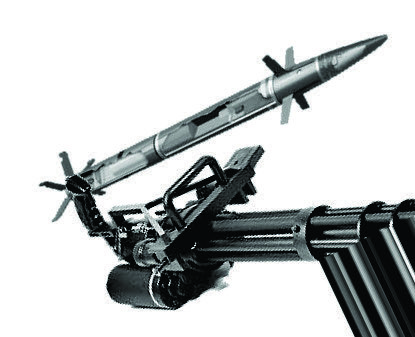
*Caption/Context: H. Kang et al.: Protect Your Sky: A Survey of Counter UAV Systems*

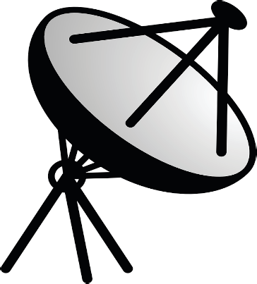
*Caption/Context: Image page_019_fig_05.png*

*Caption/Context: FIGURE 7. Sensors and mitigators. Note that radar, RF sensor, jamming, spoofing, and high-power EM employ antennas and their functions can be implemented with the same hardware; therefore, their appearances are similar to one another. The platforms show sensing and mitigation systems equipped in ground static platforms, ground mobile platforms, human-packable platforms, LAP, and HAP. | TABLE 6. Characteristics and Limitations of Sensors.*

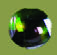
*Caption/Context: Image page_019_fig_12.jpeg*

*Caption/Context: Image page_019_fig_13.jpeg*

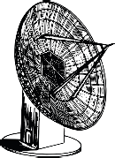
*Caption/Context: H. Kang et al.: Protect Your Sky: A Survey of Counter UAV Systems*

*Caption/Context: H. Kang et al.: Protect Your Sky: A Survey of Counter UAV Systems*

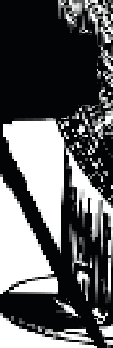
*Caption/Context: H. Kang et al.: Protect Your Sky: A Survey of Counter UAV Systems*

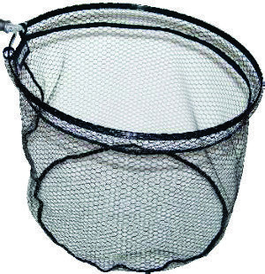
*Caption/Context: Image page_019_fig_17.jpeg*

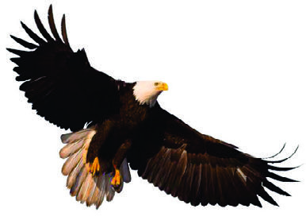
*Caption/Context: Image page_019_fig_18.jpeg*

*Caption/Context: H. Kang et al.: Protect Your Sky: A Survey of Counter UAV Systems*

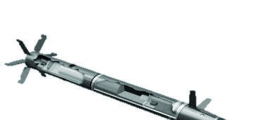
*Caption/Context: H. Kang et al.: Protect Your Sky: A Survey of Counter UAV Systems*

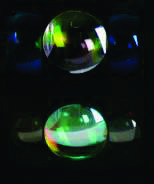
*Caption/Context: H. Kang et al.: Protect Your Sky: A Survey of Counter UAV Systems*

*Caption/Context: Image page_019_fig_25.png*

*Caption/Context: Image page_019_fig_26.png*

*Caption/Context: FIGURE 7. Sensors and mitigators. Note that radar, RF sensor, jamming, spoofing, and high-power EM employ antennas and their functions can be implemented with the same hardware; therefore, their appearances are similar to one another. The platforms show sensing and mitigation systems equipped in ground static platforms, ground mobile platforms, human-packable platforms, LAP, and HAP. | TABLE 6. Characteristics and Limitations of Sensors.*

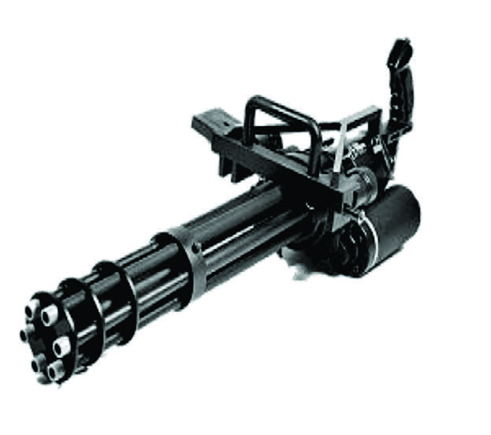
*Caption/Context: H. Kang et al.: Protect Your Sky: A Survey of Counter UAV Systems*

*Caption/Context: H. Kang et al.: Protect Your Sky: A Survey of Counter UAV Systems*

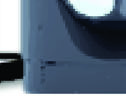
*Caption/Context: H. Kang et al.: Protect Your Sky: A Survey of Counter UAV Systems*

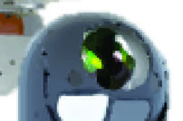
*Caption/Context: H. Kang et al.: Protect Your Sky: A Survey of Counter UAV Systems*

*Caption/Context: H. Kang et al.: Protect Your Sky: A Survey of Counter UAV Systems*

*Caption/Context: H. Kang et al.: Protect Your Sky: A Survey of Counter UAV Systems*

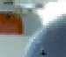
*Caption/Context: H. Kang et al.: Protect Your Sky: A Survey of Counter UAV Systems*

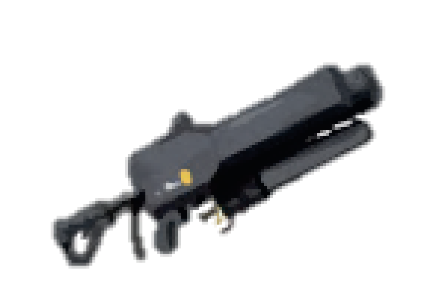
*Caption/Context: Image page_019_fig_46.png*

*Caption/Context: H. Kang et al.: Protect Your Sky: A Survey of Counter UAV Systems*

*Caption/Context: FIGURE 7. Sensors and mitigators. Note that radar, RF sensor, jamming, spoofing, and high-power EM employ antennas and their functions can be implemented with the same hardware; therefore, their appearances are similar to one another. The platforms show sensing and mitigation systems equipped in ground static platforms, ground mobile platforms, human-packable platforms, LAP, and HAP. | TABLE 6. Characteristics and Limitations of Sensors.*

*Caption/Context: H. Kang et al.: Protect Your Sky: A Survey of Counter UAV Systems*

*Caption/Context: H. Kang et al.: Protect Your Sky: A Survey of Counter UAV Systems*

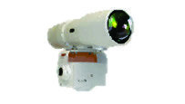
*Caption/Context: H. Kang et al.: Protect Your Sky: A Survey of Counter UAV Systems*

*Caption/Context: H. Kang et al.: Protect Your Sky: A Survey of Counter UAV Systems*

*Caption/Context: H. Kang et al.: Protect Your Sky: A Survey of Counter UAV Systems*

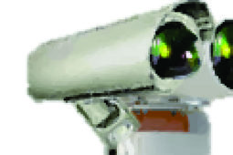
*Caption/Context: H. Kang et al.: Protect Your Sky: A Survey of Counter UAV Systems*

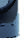
*Caption/Context: H. Kang et al.: Protect Your Sky: A Survey of Counter UAV Systems*

*Caption/Context: FIGURE 7. Sensors and mitigators. Note that radar, RF sensor, jamming, spoofing, and high-power EM employ antennas and their functions can be implemented with the same hardware; therefore, their appearances are similar to one another. The platforms show sensing and mitigation systems equipped in ground static platforms, ground mobile platforms, human-packable platforms, LAP, and HAP.*

*Caption/Context: FIGURE 7. Sensors and mitigators. Note that radar, RF sensor, jamming, spoofing, and high-power EM employ antennas and their functions can be implemented with the same hardware; therefore, their appearances are similar to one another. The platforms show sensing and mitigation systems equipped in ground static platforms, ground mobile platforms, human-packable platforms, LAP, and HAP.*

*Caption/Context: FIGURE 7. Sensors and mitigators. Note that radar, RF sensor, jamming, spoofing, and high-power EM employ antennas and their functions can be implemented with the same hardware; therefore, their appearances are similar to one another. The platforms show sensing and mitigation systems equipped in ground static platforms, ground mobile platforms, human-packable platforms, LAP, and HAP. | TABLE 6. Characteristics and Limitations of Sensors.*

*Caption/Context: FIGURE 7. Sensors and mitigators. Note that radar, RF sensor, jamming, spoofing, and high-power EM employ antennas and their functions can be implemented with the same hardware; therefore, their appearances are similar to one another. The platforms show sensing and mitigation systems equipped in ground static platforms, ground mobile platforms, human-packable platforms, LAP, and HAP.*

*Caption/Context: FIGURE 7. Sensors and mitigators. Note that radar, RF sensor, jamming, spoofing, and high-power EM employ antennas and their functions can be implemented with the same hardware; therefore, their appearances are similar to one another. The platforms show sensing and mitigation systems equipped in ground static platforms, ground mobile platforms, human-packable platforms, LAP, and HAP.*

*Caption/Context: FIGURE 7. Sensors and mitigators. Note that radar, RF sensor, jamming, spoofing, and high-power EM employ antennas and their functions can be implemented with the same hardware; therefore, their appearances are similar to one another. The platforms show sensing and mitigation systems equipped in ground static platforms, ground mobile platforms, human-packable platforms, LAP, and HAP.*

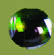
*Caption/Context: Image page_019_fig_72.jpeg*

*Caption/Context: FIGURE 7. Sensors and mitigators. Note that radar, RF sensor, jamming, spoofing, and high-power EM employ antennas and their functions can be implemented with the same hardware; therefore, their appearances are similar to one another. The platforms show sensing and mitigation systems equipped in ground static platforms, ground mobile platforms, human-packable platforms, LAP, and HAP. | TABLE 6. Characteristics and Limitations of Sensors.*

*Caption/Context: FIGURE 7. Sensors and mitigators. Note that radar, RF sensor, jamming, spoofing, and high-power EM employ antennas and their functions can be implemented with the same hardware; therefore, their appearances are similar to one another. The platforms show sensing and mitigation systems equipped in ground static platforms, ground mobile platforms, human-packable platforms, LAP, and HAP.*

*Caption/Context: FIGURE 7. Sensors and mitigators. Note that radar, RF sensor, jamming, spoofing, and high-power EM employ antennas and their functions can be implemented with the same hardware; therefore, their appearances are similar to one another. The platforms show sensing and mitigation systems equipped in ground static platforms, ground mobile platforms, human-packable platforms, LAP, and HAP.*

*Caption/Context: FIGURE 7. Sensors and mitigators. Note that radar, RF sensor, jamming, spoofing, and high-power EM employ antennas and their functions can be implemented with the same hardware; therefore, their appearances are similar to one another. The platforms show sensing and mitigation systems equipped in ground static platforms, ground mobile platforms, human-packable platforms, LAP, and HAP.*

*Caption/Context: FIGURE 7. Sensors and mitigators. Note that radar, RF sensor, jamming, spoofing, and high-power EM employ antennas and their functions can be implemented with the same hardware; therefore, their appearances are similar to one another. The platforms show sensing and mitigation systems equipped in ground static platforms, ground mobile platforms, human-packable platforms, LAP, and HAP.*

## --- Page 20 ---

H. Kang et al.: Protect Your Sky: A Survey of Counter UAV Systems

a processor [211]. The transmitter radiates EM signals whose
frequency ranges typically between 3 MHz and 300 GHz
depending on the application. The EM signals are reflected
by the mUAV and return to the radar. The returning EM
signals reflected from the mUAV provide essential informa-
tion with which to obtain the mUAVs’ location and speed.
Thus, the amount of the received signal power is critical to
determine the detection performance of the radar. However,
because the reflected radar signals captured by the receiving
antenna are very weak, they need to be amplified at the pro-
cessor. The reflected radar signals captured by the receiving
antenna are inversely proportional to the frequency, whereas
they are proportional to the radar cross-section (RCS), a mea-
sure of how detectable an object is that depends on the
material, size, and location (i.e., the distance and incident
and reflected angles) of the mUAV. From the reflected radar
signals, the processor can calculate the round-trip time (i.e.,
ToA) and the frequency shift due to the Doppler effect to
estimate the distance and velocity information of the mUAV.

However, traditional radar systems are designed to detect
legacy (manned) aircraft with high velocities and a large RCS,
and they are inappropriate to detect slow-moving and low-
flying mUAVs with a small RCS [206], [224], [226], [227].
To circumvent this issue, the micro-motions of vibrating
(by engines or motors) and rotating (by propellers) struc-
tures of UAVs [218]–[220], which cause a unique micro-
Doppler signature (MDS), have recently been used for radar
detection. Research has shown that quadcopters, hexacopters,
and octocopters have different MDS characteristics [222],
[223]. Radar can detect mUAVs by analyzing the MDSs of
mUAVs [206], [215]–[217]. The joint time-frequency anal-
ysis method, e.g., short-time Fourier transform, can also be
utilized to analyze the radar MDSs of UAVs [221].

Various types of radar to detect objects with small RCSs
have been studied. An unmodulated continuous wave (CW)
Doppler radar system with a long dwell time can capture
rich information to deal with small UAVs with a small RCS
[207]–[210], though it cannot obtain the target range [211].
A frequency-modulated CW radar system can estimate the
ranges as well as velocities of multiple targets simultaneously
[46], [212]–[214]. On the other hand, ultra-wideband (UWB)
radar generates an extremely narrow pulse, resulting in wide-
band utilization. UWB radar can be employed for high-
resolution ranging resulting in an accurate ToA. Experimental
results show that MDSs induced by mini-UAVs and birds are
significantly different, and it was found that mini-UAVs and
birds can be distinguished based on features caused by the
flapping wings of the birds and the unique MDS [206], [228]–
[230], [243]. It was also found that millimeter-wave radar
can provide high-fidelity micro-Doppler echoes from a mini-
UAV from the very rapidly rotating propellers [224], [243].

4) EO/IR SENSORS
EO sensors detect EM waves that range from the infrared
(300
GHz–30
THz) up to the ultraviolet (larger than
790 THz) frequencies. Typically, EO sensors capture visible

wavelengths (300 GHz–430 THz) reflected from mUAVs to
detect them under daylight conditions. On the other hand, IR
sensors, i.e., thermal cameras, detect the infrared spectrum
to capture the heat signature (resolutions as low as 0.01◦C )
radiated from mUAVs and thus can detect targets even with-
out sufficient light, e.g., during the night and cloudy and/or
dark days. The spectrum should be determined based on the
expected temperature of the target object. An IR sensor can
detect heat emitted from the motors and engines of mUAVs
[45], [231], [232], where IR cameras with shorter wavelength
provide better performance to capture fast-moving bright and
small targets than long-wavelength IR cameras [45].

Passive EO/IR sensors provide only two-dimensional
(2D) images. Accordingly, to enhance the detection perfor-
mance, various machine learning- and deep learning-based
approaches have recently been employed. Machine learning-
based approaches, e.g., SVM and k-NN, classify objects
based on predetermined features, whereas deep learning-
based approaches are typically convolutional neural networks
(CNN) without specified features. For example, the use
of neural networks has been rigorously investigated and
developed for EO/IR sensors [130], [233]–[239]. In [233],
a regression-based approach was studied for its ability to
classify and detect UAVs. In that case, the training dataset
was also provided. The training data set can be artificially
generated for the CNN [240]. Various neural networks, such
as that by Zeiler and Fergus of the Visual Geometry Group
and another entitled ‘You Only Look Once’, have also been
assessed for UAV detection [234], [240]. Robust algorithms
for static/moving cameras were designed to propose candi-
date regions and classify UAVs with birds [238], and the
onboard UAV system was devised to detect and chase other
UAVs using a lightweight camera and a low-power algo-
rithm without a GNSS service [237]. A pUAV detecting a
target mUAV based on template-matching algorithms with
a morphological filter was also considered [130]. In another
study [239], an onboard UAV-Net detector was proposed to
detect small objects. Algorithms based on CNNs and spatio-
temporal filtering have also been proposed to detect and track
mUAVs and discriminate mUAVs from birds [235]. In other
work [236], a super-resolution object-detection method for
detecting UAVs was designed.

Though EO/IR sensors have been widely studied and
utilized for object detection, they have several limitations.
The detection performance capabilities of EO/IR sensors are
highly degraded under NLoS environments. Further, good
focusing capability and multiple cameras are required for
EO/IR sensors to perform multi-direction detection. EO/IR
sensors are susceptible to adverse weather conditions and
may fail to detect objects near the horizon. A mUAV with
temperature comparable to background objects may be chal-
lenging for IR sensors to detect [45].

5) LiDAR
Similar to radar, LiDAR detects mUAVs from signals return-
ing after reflecting off of the mUAVs. Contrary to radar,

168690
VOLUME 8, 2020

## --- Page 21 ---

H. Kang et al.: Protect Your Sky: A Survey of Counter UAV Systems

#### TABLE 7. Characteristics and Limitations of Mitigators.

LiDAR emits laser light (typically, 300 THz–500 THz) to
measure the range information from the mUAV. LiDAR can
provide 3D representations using differences in return times.
Therefore, LiDAR can differentiate a target object from a
complex background [242].

In one study [241], the authors proposed an algorithm
for detecting small UAVs and generating 3D coordinates by
employing LiDAR. In another [101], detecting small UAVs
was assessed using a LiDAR system mounted on a vehicle.

However, LiDAR has a short range to detect objects and
requires a LoS environment owing to the high frequency
of the laser light and its low energy. To extend the range
of detection, a data augmentation method and a detection
algorithm were studied for detecting UAVs using LiDAR
[242]. Moreover, as mentioned in Section IV-A1(1), LiDAR
is affected by weather phenomena, such as clouds, fog, rain,
falling snow, sleet, and direct sunlight.

B. MITIGATORS
Mitigation methods have been categorized into nonphysical
and physical methods based on whether there is physical
damage to the mUAV, as summarized in Table 7 and shown
in Fig. 7. In this section, nonphysical and physical mitigators
are surveyed.

1) NONPHYSICAL MITIGATORS
Nonphysical mitigators employ EM waves to disrupt, dis-
able, and/or destroy mUAVs. Nonphysical mitigators per-
form the invisible, silent, and mild mitigation, as there is
no physical contact between the mitigator and the mUAV.

Because nonphysical mitigators use EM waves, instanta-
neous maneuvers are possible and are not affected by certain
aspects of the physical environments, such as gravity and
wind. Thus, nonphysical mitigators can readily aim at target
mUAVs. Nonphysical mitigators can be realized by vari-
ous methods, such as high-power electromagnetics, lasers,
and cyber-attacks (e.g., RF/GNSS jamming and spoofing,
deauthentication attacks, zero-day vulnerabilities, cross layer
attack, multi-protocol attack, denial-of-service on UAV/GCS,
address resolution protocol cache poisoning [286]). In our
survey, among the cyber-attacks, we focus on RF/GNSS
jamming and spoofing which are the majority of the cyber-
attacks to mUAVs. See [51], [249], [286], [287] and refer-
ences therein for the comprehensive survey of cyber-attacks.

• RF/GNSS jamming: The RF jammers can dis-
rupt or disable mUAVs by interfering with their commu-
nication links. By interfering with the communication
between mUAVs and the malicious operators, jamming
decreases the signal-to-noise ratio (SNR) of the mUAV
and disrupts the mUAV [133]. To recover the disrupted
communications, the communication signal between the
mUAV and the malicious operators must increase, which
exposes them clearly to the mitigators. Once the commu-
nication link is jammed and degraded, the mUAVs may
lose the remote control link and may descend or initiate
a RTH mode.
There are several jamming schemes. A jammer can
transmit all of its power on a single frequency (spot
jamming), shift the power rapidly from one fre-
quency to another (sweep jamming), or transmit power

VOLUME 8, 2020
168691

## --- Page 22 ---

H. Kang et al.: Protect Your Sky: A Survey of Counter UAV Systems

simultaneously over a range of frequencies (barrage
jamming). In addition, jammers can be classified as
active jammers and reactive jammers. The active jam-
mer transmits RF signals continually, or does so ran-
domly to save energy. The deceptive jammer, a type
of active jammer, causes the UAV to receive pack-
ets continuously without a gap such that the mUAV
remains in a receive mode. The reactive jammer trans-
mits signals only when it detects that the monitored
spectrums/channels are occupied by unknown signals,
i.e., mUAVs, [244], [245]. However, RF jamming can be
ineffective for autonomous mUAVs that do not require
any remote control or for mUAVs that follow a pre-
programmed route via global positioning system (GPS)
checkpoints [288]. Thus, GNSS jamming is required to
compensate for the limits of RF jamming.
GNSS jammers interfere with navigation systems.
Because the GPS signal comes from a satellite, its power
is weak and vulnerable to jamming signals. Once the
mUAV loses the GNSS signal, it will hover or land
without completing its mission [247]. However, GNSS
jamming can be ineffective for mUAVs equipped with
inertial measurement unit (IMU) sensors and encrypted
signals for the navigation. Therefore, the compensation
between RF and GNSS is required.
It is important to note that sky platforms can be
employed for effective jamming mitigators, as the jam-
ming performance can be dramatically improved as
the distance between the mitigators and the mUAVs
becomes shorter [49], [132], [246].

• Spoofing: Given the overwhelming technology and/or
knowledge of mUAVs, taking control of mUAVs or com-
manding mUAVs to detour away from a protected area
is possible, a technique also known as spoofing. Spoof-
ing mitigators can disrupt, disable, or take control of
mUAVs. Spoofing mitigators for mUAVs counterfeit
RF or GNSS signals to neutralize mUAVs. Advanced
technologies which determine fully the communication
protocol stacks, GNSS services, and vulnerabilities of
the mUAVs are required to implement spoofing.
GNSS spoofing is a common method when the pro-
tocols (e.g., code and modulation types) are known.
GPS spoofing can cause mUAVs to hover, engage the
autopilot, land, and misdirect to the spoofed route [247],
[248]. Appropriate spoofing strategies are needed for
different types of mUAVs to manage them when they
lose their lock on the authorized GNSS signals [247].
The spoofing of remote control signals can also be
implemented by analyzing the communication proto-
cols in use [249], [250]. Taking full control of mUAVs
is possible [250], [251] if the protocols are known
and available at the mitigators. Vulnerabilities of Wi-
Fi-based UAVs have been studied [249]. Cellular-
connected UAVs [252] can also be spoofed by analyzing
the vulnerabilities of cellular networks. Furthermore,
because mUAVs consist of various embedded systems

including a navigation system and a communication
system [249], various vulnerabilities of mUAVs can
be considered to increase the capabilities of spoofing.
With rigorous analysis and overwhelming technologies,
spoofing by attacking the vulnerabilities of operating
systems, GNSS systems, and wireless communication
links can be implemented.

• High-power electromanetics: A high-power EM wave
can disable an mUAV by impairing its electronic sys-
tems, and these methods can be categorized into two
classes: those that use narrowband waves and those that
use wideband waves. Narrowband EM waves include
high power on a nearly single-tone frequency. A high
power narrowband EM wave is referred to as HPM.
HPM can couple with the UAV and cause damage such
that it becomes disabled. HPM requires very high power,
i.e., on the order of thousands of volts on a single fre-
quency [253]. The directed energy of HPM can be used
to crash a UAV [254]. Finding an effective frequency to
cause malfunctions in mUAVs is the key issue.
On the other hand, the wideband EM wave has short
pulses in the time domain. The energy is distributed
over a wide band, and the wideband wave EM has a
low energy density over the bandwidth. Note that a non-
nuclear EMP can hardly be implemented with a large
low-inductance capacitor that is discharged into a single
loop antenna.
However, high-power EM waves should be precisely
directed toward the target mUAV to effectively mitigate
it; otherwise, the lethality is significantly decreased,
i.e., some devices, e.g., radar and RF sensors, can still
operate partially after this type of mitigation [255]. Here,
the issue is that it is difficult to evaluate the kill assess-
ment after mitigation.

• Lasers: While lasers can be employed as laser range
finders and designators, laser as mitigators can dis-
able or destroy mUAVs with directed energy [256]–
[263]. An electrolaser ionizes the path to the UAV and
emits an electric current down the conducting track of
ionized plasma. Lasers can be categorized into low-
power lasers and high-power lasers [255]. Low-power
lasers can neutralize (dazzle) the sensitive EO/IR sen-
sors of mUAVs. High-power lasers that operate at the
mega-watt level can burn a hole in the mUAV and
destroy it. Laser mitigators are affordable compared
to physical projectiles [289]. However, laser mitigators
require challenging research and development and are
sensitive to adverse weather conditions. Furthermore,
high-power lasers require accurate directions and suffi-
cient time to track the mUAVs.

2) PHYSICAL MITIGATORS
Contrary to nonphysical mitigators, physical mitigators dis-
able and destroy mUAVs physically. Physical mitigators are
effective, and the results of whether the neutralization was
successful are obvious. Physical mitigators require accu-

168692
VOLUME 8, 2020

## --- Page 23 ---

H. Kang et al.: Protect Your Sky: A Survey of Counter UAV Systems

rate aiming and/or tracking of the mUAVs to remain phys-
ically close to the mUAV to effectively neutralize. Physi-
cal mitigators can employ projectiles, collision UAVs, nets,
and eagles.

• Projectiles: Mitigators that employ projectiles can
destroy mUAVs. Projectiles include machine guns,
munitions, guided missiles, artillery, mortars, and rock-
ets. Guided projectiles require a guidance system to
track and hit the mUAVs. In July of 2014, Israel used
a Patriot missile to shoot down an incoming reconnais-
sance UAV from Gaza [264]. In 2019, SmartRounds
Inc. announced a 40 mm missile system for anti-UAV
munitions, which can be deployed on ground and sky
platforms and that operate at high velocity [265]. The
projectile is equipped with a vision sensor for object
detection and tracking. However, precise aiming consid-
ering gravity and wind is required, and the cost of the
projectiles per shot is high. Furthermore, the mUAVs go
out of control and crash to the ground, possibly causing
collateral damage.

• Collision UAVs: Collision UAVs with detection and
tracking capabilities can follow the mUAVs to crash
into and destroy them. A collision UAV requires high
speed to pursue the mUAV, e.g., 350 km/h [266], and
is effective for contiguous small mUAVs in protected
areas. Collision UAVs can employ a computer-vision-
aided object-detection method and carry explosives to
maximize the collision impact [268]. More examples
of collision UAVs can be found in the literature [191],
[269]–[271]. Collision UAVs can be interpreted as a
hybrid consisting of a missile and a small UAV. Colli-
sion UAVs are disposable and cause collateral damage,
similar to projectiles. However, collision UAVs require
a relatively large neutralization delay compared to pro-
jectiles.

• Nets: Net catchers ensnare and demobilize mUAVs. The
net can be projected by a net cannon [272]–[276] or can
be carried by sky platforms [49], [277]–[283]. Nets
can be a solution to mitigate small mUAVs which
are difficult to neutralize by guns or guided missiles
[282], [283]. In one study [284], a portable mitigator
was demonstrated to be able to capture UAVs. Nets
can be equipped with parachutes to ensure that the
UAV descends safely for forensic analysis and to pre-
vent collateral damage to other facilities [49]. However,
the effective range of net mitigation is short.

• Eagles: For centuries, people of the Altai region have
trained themselves in the art of eagle hunting. They have
trained eagles to catch small animals. Motivated by the
people of Altai, Dutch and Scottish police trained eagles
as a mitigator of CUSs to neutralize and catch mini-
UAVs [49], [285]. Eagle training does not require high
technology. To train and breed a mitigator eagle may
require fewer human resources than other mitigation
devices that are developed by researchers and engineers

in various areas. However, eagle mitigators can easily
be injured by the blades and propellers of mUAVs, and
their use is limited to slower and smaller mUAVs relative
to the speed and size of the eagles. Furthermore, eagle
mitigators may not be appropriate to mitigate multiple
mUAVs simultaneously.

VI. CUS MARKET
Skyrocketing growth in the UAV industry has created both
positive and negative externalities. Well-meaning users of
UAVs have successfully benefitted from diverse UAV appli-
cations that range from recreation to emergency rescue appli-
cations, as introduced in Section II-A. Malevolent users of
UAVs also have quickly caught up with the possible malicious
applications of UAVs, such as terror, security breaches, and
invasions of privacy, to name a few. As a result, market needs
for counteracting the negative externalities of UAVs have
skyrocketed, in tandem with the recent growth of the civil-
ian UAV industry. However, these market needs are bound
to be multi-faceted due to the distinctive characteristics of
the CUS market, such as its complete dependence on the
UAV industry or the possibility of cannibalizing existing
markets. In this section, the landscape of the CUS market is
scanned to identify market patterns and anomalies. The CUS
market is analyzed in terms of rivalries and major acquisi-
tions/partnerships among incumbents, suppliers or partners
of incumbents, as well as those complementary to incumbents
and emerging organizations entering the CUS market. Based
on the market analysis, the distinct characteristics of the
CUS market are identified and elaborated. Lastly, practical
implications for industry practitioners, especially those which
consider entering the CUS market, such as telecom service
providers, are also identified.

A. DANCING LANDSCAPE OF THE GLOBAL CUS MARKET:
WHAT DOES IT LOOK LIKE AND HOW IS IT CHANGING?
The size of the commercial UAV industry is anticipated to
make an upsurge, reaching USD 6.3 billion in 2026 with
a compound annual growth rate (CAGR) of 23.37% from
the market size of USD 1.2 billion in 2018 [290]. The
prospects of the commercial UAV industry started to become
especially hopeful when Jeff Bezos, the CEO of Amazon,
made a surprising appearance on ‘‘60 Minutes’’ in Decem-
ber of 2013, and announced Amazon’s future plan to launch
a drone delivery service called Amazon Prime Air. Around
the same time, however, the portents of commercial UAVs
going rogue had been progressively noticeable. A rogue
drone was spotted at Gatineau jail in Quebec in Novem-
ber of 2013, which obviously was an attempted contraband
drop-off. A few days later, guards at Georgia State Prison
spotted a six-rotor drone carrying packs of tobacco hovering
over the prison compound. Six and a half years later, while
we are still waiting for Amazon drones to drop off packages
onto our door steps, the potential threats of mUAVs have
surged, subsequently intensifying the market need for CUS
solutions.

VOLUME 8, 2020
168693

## --- Page 24 ---

H. Kang et al.: Protect Your Sky: A Survey of Counter UAV Systems

1) MARKET SIZE AND GROWTH
The CUS market remained in its embryonic stage throughout
the 2010s only to witness ‘hockey stick’ growth recently.
The current CUS market is estimated to have reached the
size of USD 1 billion [291] and is expected to grow to USD
4.5 billion by 2026 [292]. The five-year forecast for the CUS
market growth ranges, depending on market research firm,
from a CAGR of 16.8% [293], 37.2% [294], to 41.1% [291].
Fig. 8 shows the current size of the CUS market and its
anticipated growth over the next five years as estimated by
Drone Industry Insights, the German market research and
analysis company [295].

2) GEOGRAPHIC COMPOSITION
The geographic distribution of the CUS market highlights the
dominance of North America, whose market share accounts
for more than half of the global CUS market [293], [296].
North America’s CUS market dominance is mostly due to
the prolonged and extensive R&D investment by the US
Department of Defense (DoD), especially up to 2016, and the
subsequent procurement of CUS solutions. Starting in 2016,
the DoD shifted its investment focus from R&D to integrating
existing technologies and solutions into more comprehensive
programs [297]. In order to drive this shift further, the DoD
requested USD 500 million for CUS development for the
2020 fiscal year. In sum, although the underlying mechanism
has evolved from system development to system integra-
tions, North America’s CUS market dominance is expected
to remain strong for the foreseeable future. Europe is the
next most active geographic region for the CUS market,
where the growth rate is estimated to remain steady [298].
The strongest driver of the European CUS market’s medium
yet steady growth is the presence of globally renowned tra-
ditional defense corporations such as the Thales Group in
France, Saab AB in Sweden, and BSS Holland BV in the
Netherlands. Multiple market research and analysis organi-
zations collectively identify the Asia Pacific CUS market as
possessing the most substantial growth potential in the near
future [292], [298], [299]. Rapidly increasing government
expenditures on defense infrastructure, particularly that of
the aerospace industry, in the Asia Pacific region are con-
sidered to be the major source of the growth potential. Latin
American and African CUS markets are still in their embry-
onic stages and do not show the potential for robust growth.
However, the recently escalating numbers of drone attacks,
especially in Latin America, are likely to spark governmental
investments in developing CUS technologies, which would
subsequently drive market growth in that region.

3) MARKET GROWTH DRIVER
Aside from the obvious market needs to counteract the poten-
tial threats posed by mUAVs, the growth drivers of the CUS
market are multi-faceted, including both direct and indirect
antecedents (as summarized in Table 8).

#### FIGURE 8. CUS (counter-drone) market size and forecast 2019–2024 [295].

The most critical and direct driver is the proliferation of
low-price UAVs that already have created a mass market.
While regulations have been keeping pace with the growing
UAV industry, as stated in Section II-B, market demands and
regulatory changes do not move in sync, forcing regulatory
bodies to make continuous updates. Conflicting perspectives
on fundamental regulatory issues, such as categorizing UAVs
as either ‘flying objects’ or airplanes, prohibits regulatory
bodies from reaching a consensus with regard to safety
levels. For instance, the National Aeronautics and Space
Administration (NASA) considers a relatively narrow indus-
try of UAVs when categorizing them as something between
road and air devices, whereas the European Aviation Safety
Agency (EASA) maintains a broader view of UAVs, catego-
rizing them at the level of an airline [300]. The expanding
UAV mass market poses both malicious and benign threats
by providing malevolent actors with an asymmetric capability
to launch attacks and enabling recreational users to cause
unintended security breaches. The other direct driver is the
emerging market requirements specifically for portable CUS
solutions, i.e., human-packable and mobile platforms.

Indirect drivers are in action as well. Coincident with
public exposure to drone swarm technology spiked through
international events such as the Winter Olympics [301], major
news outlets, e.g., the Financial Times, have recently started
to warn the general public about the potential threat of
drone swarms [302]. Public perceptions that drone swarms
could make coordinated attacks also have kickstarted further
R&D investment in drone neutralization technologies. The
ever increasing accessibility to raw explosives for building
bomblets is another indirect driver of CUS market growth,
enabling malevolent culprits to build and detonate DIY
bomblets. These market growth drivers are currently adding
fuel to the explosion of the CUS market, yet not without
mitigating factors.

4) MARKET GROWTH INHIBITOR
In tandem with multiple market growth drivers, multi-
dimensional factors can exist that restrain CUS market
growth (summarized in Table 8).

• Technology obsolescence: First, new UAV technologies
are being developed at a rapid pace. Smaller UAVs that
fly longer and are equipped with better aerial imaging

168694
VOLUME 8, 2020

## --- Page 25 ---

H. Kang et al.: Protect Your Sky: A Survey of Counter UAV Systems

#### TABLE 8. Derivers and Inhibitors of CUS Market Growth.

units make it progressively difficult for CUS providers
to detect and neutralize mUAVs. Knowledge in the area
of mUAVs quickly becomes obsolete, which signifi-
cantly shortens the shelf life of CUS providers’ organi-
zational capabilities. Consequently, CUS providers are
required to keep up with UAV innovations to launch
newly updated countermeasures.

• Security concerns: Second, regulatory bodies pro-
hibiting defense-related manufacturers from exporting
restrict the global expansion of CUS providers. For
instance, the US International Traffic in Arms Regu-
lation prohibits certain American CUS manufacturers
from selling overseas. Recently, however, the US gov-
ernment started to clear CUS manufacturers on a case
by case basis to export CUS systems strictly to allied
nations. For instance, Raytheon was approved by the
government to sell the Coyote Block 2 counter-drone
weapon to approved allied nations in March of 2020.

• Incomplete regulation: Third, the rules of engagement
to counteract mUAVs have not yet been fully developed.
The US Department of Justice released a guideline to
counteract killer drones in August of 2016 based on the
2013 Presidential Policy Guideline to establish standard
operating procedures to counteract terror attacks [303].
Although specific rules of drone engagement seem to be
in detail, there still exists some wiggle room that could
generate multiple interpretations.

• Lack of assessment criteria: Fourth, from the perspec-
tive of CUS clients, universal assessment criteria to
evaluate CUS performance capabilities are non-existent.
This seemingly insignificant factor makes it difficult
for potential clients to decide whether they need a
CUS solution and should choose from among the many
CUS companies providing vastly different technologies
and solutions. Without standardized assessment criteria,
clients are left to compare apples and oranges.

• Insufficient cases for analysis: Lastly yet ironically,
the general understanding of concrete threat profiles of
mUAVs is hardly sufficient at the moment to develop

bullet-proof countermeasures due to the limited number
of UAV attacks. Akin to the proverbial firefighter in a
town where there are no fires, CUS providers in a market
where UAV attacks rarely exist would have a difficult
time identifying potential threats and designing a series
of counteractions.

5) MARKET FRAGMENTATION
The civilian CUS market is currently highly fragmented;
there is no single dominant player which could exert suf-
ficient influence to drive the entire industry towards its
intended direction. Instead, multiple established corporations
and diverse small- and medium-sized enterprises (SMEs)
together constitute a dynamically evolving ecosystem. The
marketplace of solution providers, particularly value-added
resellers, is an example of an intrinsically highly fragmented
market. Because solution providers are required to customize
each solution for individual clients, economies of scale that
are usually attained through providing standardized and uni-
versally deployable services are unachievable in most cases.
The requirements of individual customization and subsequent
customer support for an extended period therefore naturally
turn away large corporations from entering the market. Local
SMEs typically fill this void by leveraging their relatively
low-cost structures compared to those of large corporations.
The hospitality television market is a typical example of
this intrinsically highly fragmented marketplace for solution
providers: although many consumer electronics corporations,
such as Phillips and Samsung, briefly considered entering the
television solution market for hotels, retail outlets, doctors’
offices, and cruise ships, none of them found the target market
profitable enough. The less than satisfying profitability level
can be attributed to the intrinsic nature of this fragmented
market, which requires individual customization and contin-
uous customer support. The civilian CUS market followed
the footsteps of this intrinsically highly fragmented market
until recently: while traditional defense corporations, such
as Lockheed Martin and the Thales Group were handling

VOLUME 8, 2020
168695

## --- Page 26 ---

H. Kang et al.: Protect Your Sky: A Survey of Counter UAV Systems

the military needs for CUS hardware and software, regional
SMEs such as DroneShield, DeDrone, and Aveillant as new
entrants in the CUS market during the 2010s started to pro-
vide civilian applications. However, the civilian CUS market
growth has shown a significant upsurge recently, becoming
substantial enough to attract traditional defense corporations.
In this highly fragmented yet organically intertwined market,
both established multi-national corporations and regionally
based SMEs do not necessarily compete with each other but,
rather create symbiotic relationships with one another. Each
entity brings the complementary assets to the marketplace,
consequently creating overall both competing and cooper-
ating relationships. The next section introduces the current
players in the civilian CUS market and the notable acquisi-
tions among them.

B. GAME OF DRONES: WHO ARE THE CURRENT MAJOR
PLAYERS IN THE CIVILIAN CUS MARKET?
The civilian CUS market has been a dynamically evolv-
ing ecosystem which consists of ‘‘big fish’’ in the ocean,
i.e., established multinational corporations positioned in
the traditional defense industry, such as Lockheed Martin,
Thales, Raytheon, Saab, and BSS Holland, and ‘‘small fish’’
in the pond, i.e., emerging startups and SMEs positioned in
local civilian CUS markets, such as Aveillant, DroneShield,
Dedrone, Citadel Defense, and Liteye, as well as a special
batch of ‘‘small fish’’ in the pond, i.e., spinoff companies
from SMEs such as Fortem Technologies as a spinoff of
ImSAR LLC. Table 9 showcases a selective group of estab-
lished corporations and small enterprises in the global CUS
market. In this section, big fish and small fish are analyzed
to understand the current ecosystem of the global civilian
CUS market. Recent acquisitions between big fish and small
fish which have blurred the boundaries between oceans and
regional ponds are also analyzed in this section.

1) BIG FISH IN THE OCEAN
North American and European defense industries have been
ruled by a group of dominant players.

• North America: The North American defense triumvi-
rate, i.e., i) Lockheed Martin, ii) Northrop Grumman,
and iii) Raytheon, boasts expansive product and service
portfolios catering to the aerospace and defense indus-
tries. All three corporations have a strong foothold in
the military UAV industry: i) Lockheed Martin’s Indago,
Condor, and Stalker [317], ii) Northrop Grumman’s
Global Hawk [318], and iii) Raytheon’s Coyote and Sil-
ver Fox UAVs are all-time major players in military UAV
systems [270], [319]. Among the triumvirate, Lockheed
Martin entered the civilian CUS market by introducing
ICARUS, a Q-53 radar system that detects mUAVs and
triggers a kill chain to defeat targets using its Advanced
Test High Energy Asset System (ATHENA), a trans-
portable ground-based system equipped with a 30 kilo-
watt laser beam [320]. In comparison, both Northrop

Grumman’s Drone Restricted Access Using Known EW
(DRAKE) CUS system [321], which is a radio fre-
quency negation system delivering a non-kinetic elec-
tronic attack, and Raytheon’s Coyote CUS system [270],
which consists of Ku-band multi-spectral detecting and
high-energy laser neutralization functions, strictly target
military applications.

• European: European triumvirate corporations in the
CUS market consist of the Thales Group in France,
Saab AB in Sweden, and Blighter Surveillance Sys-
tems Ltd. in the UK. In contrast to the military-centric
product and service portfolio of the North American
triumvirate, European triumvirate serves both the mili-
tary and civilian markets. Compared to the heavy weight
champions of Thales and Saab, whose legacy products
and service portfolios heavily rely on military appli-
cations, the UK’s Blighter Surveillance System plays
a relatively light-weight game specifically focused on
the CUS market. Blighter’s Anti-UAV Defense System
(AUDS) solution combines Blighter’s A400 Series air
security radar with its HawkEye video tracker armed
with a directional radio frequency inhibitor for signal
jamming in order to serve areas of demand in the civilian
market, such as airports, nuclear power plants, and high-
end commercial compounds, in addition to defense,
national border security, law enforcement, and coastline
security. Blighter’s AUDS is the most ambidextrous,
full-stack CUS solution among those of the European
triumvirate, consisting of Blighter’s hardware capability
in radar technology and its proprietary software. Saab
and Thales, on the other hand, have a stronger presence
in terms of hardware capability. Moreover both corpo-
rations also offer a wide range of UAV products and
solutions, such as Saab’s Skeldar Series and Thales’s
WatchkeeperX, Spyranger, and Fulmar models. As a
result, the prospect of the emerging and booming CUS
market poses a Catch-22 for both Saab and Thales by
placing both companies in the position of a locksmith
who is tasked with inventing both an unlockable lock
and passe-partout. An all-out war in the CUS market
by Saab and Thales would cannibalize their own UAV
markets. As a result, both Saab and Thales shy away
from entering the CUS market in full force, rather adopt-
ing an alternative route of focusing on the detecting
and tracking functions of the CUS system by lever-
aging their existing radar technologies. Saab’s Giraffe
Enhanced Low, Slow and Small (ELSS) CUS system is
built on its Giraffe surveillance radar, whereas Thales’s
Horus Captor is built on its short-range, low-altitude
surveillance radar. Thales, however, has recently went
one step further: Thales acquired Aveillant, a UK com-
pany developing drone detection solution using holo-
graphic radar technology, in November of 2017, later
acquiring Drone Shield, an Australian CUS solution
company, in May of 2019. Mostly owing to these back-
to-back major acquisitions, Thales recently made the

168696
VOLUME 8, 2020

## --- Page 27 ---

H. Kang et al.: Protect Your Sky: A Survey of Counter UAV Systems

#### TABLE 9. Exemplary Companies in The Global CUS Market (Alphabetic order).

biggest splash in the civilian CUS market by launching
EagleSHIELD, a turn-key CUS solution to detect, track,
and neutralize mUAVs, in November of 2019. Thales’s
Horus Captor is integrated with Drone Shield’s neu-
tralization systems, whose defeat functions range from
hijacking, jamming, interception, to both electronic and
physical destruction. Thales’s acquisitions reflect the
inherent nature of highly fragmented markets: numerous
small fish in local ponds.

2) SMALL FISH IN THE POND
The 2010s witnessed the simultaneous sprouting of new
entrants in the CUS market; rather dormant market of CUS
products and services suddenly became crowded with US
firms, such as Aveillant, Dedrone, DroneShield, Airpsace
Systems, SkySafe, Citadel Defense, WhiteFox Defense Tech-
nologies and Liteye Systems. Table 9 summarizes the CUS
product and service portfolios of these incumbents. Concur-
rent with the active market dynamism in the civilian CUS
market, the entire CUS ecosystem became more vibrant with
large-scale defense contracts, such as the US Army awarding

Leonard DRS, one of the top US defense contractors, with a
$42m contract to develop CUS capability in October of 2017
[322]. In 2019, the US DoD spent $900m on developing CUS
solutions [297]. This series of large-scale cash injections by
the military sector subsequently fertilized the civilian CUS
market through defense contractors teaming up with CUS
firms as suppliers. For instance, Liteye Systems partnered
with Northrop Grumman to combine Liteye’s counter UAS
defense system with Northrop Grumman’s Stryker Infantry
Carrier Vehicle to create a combat-level, powerful CUS solu-
tion. The majority of small enterprises in the CUS mar-
ket possess hardware technologies that offer a competitive
advantage, such as DroneShield’s proprietary acoustic detec-
tion technology, Aveillant’s holographic radar technology,
and Drone Defense’s solar-powered off-grid radio frequency
scanning and detection technology [323], to name a few.

A subgroup of firms armed with strong hardware capabil-
ities specifically focus on neutralization technology, such as
the DroneHunter interceptor drone by Fortem Technologies
equipped with its interdependent subsystem known as Drone-
Hangar, a charging deck, and a netting gun.

VOLUME 8, 2020
168697

## --- Page 28 ---

H. Kang et al.: Protect Your Sky: A Survey of Counter UAV Systems

#### FIGURE 9. Map of CUS market dynamics showing acquisitions (−−→) and partnerships (←−−→).

On the other hand, a group of small enterprises in the CUS
market proudly has a strong competitive advantage in terms of
software capabilities. For instance, Dedrone’s DroneTracker
software is built based on a machine learning-based algorithm
to recognize and classify mUAVs. Dedrone also developed a
proprietary database of all UAVs currently available in both
military and civilian markets. SkySafe’s Airspace Galaxy is
also built on top of machine learning-based algorithms to
detect and identify mUAVs. Citadel Defense’s Titan is built
on top of its artificial-intelligence-based proprietary algo-
rithms.

These asymmetric competitive advantages among small
enterprises in the CUS market are mostly due to the lim-
ited level of slack resources, including both tangible and
intangible assets. This asymmetry in competitive advantages
motivates small enterprises to search for potential partner-
ships with existing or potential competitors whose resources
and capabilities would complement their own. Partnerships
between small enterprises with complementary capabilities
are most common. For instance, Citadel Defense recently
complemented its weakness in hardware capability by pitch-
ing its strength in CUS software and striking a partnership
with Liteye, whose strength is in hardware technologies,
in March of 2020 [324]. Pathway 1 in Fig. 9 represents the
prototypical pathway that SMEs with different competitive
advantages take by partnering with competitors whose com-
petitive advantages complement their own. In addition to
these types of partnerships among small incumbents in the
CUS market, there also exists a particular group of potential
competitors which could help small enterprises to expand to
the global scale: the big fish in the ocean.

3) SMALL FISH MOVING FORWARD TO THE OCEAN
THROUGH BIG FISH
Those small enterprises that strike partnerships with estab-
lished corporations are likely to gain a foothold quickly
to expand themselves into larger markets. Pathway 2 of

Fig. 9 visualizes the prototypical pathway that SMEs take to
reach global markets by partnering with established corpora-
tions or even acquiring certain divisions of established corpo-
rations. For instance, Dedrone, whose competitive advantage
is significantly lopsided given its strong software capability,
purchased all assets and intellectual properties associated
with Batelle’s DroneDefender, a 15-lb man-portable CUS
shoulder rifle, in October of 2019 [325]. Dedrone’s product
and service portfolio initially leaned heavily towards detect-
ing and tracking mUAVs using Dedrone’s machine learning-
based DroneTracker software integrated with radio frequency
sensors and pan-tilt-zoom cameras. SMEs strike partnerships
with established corporations for a certain project or prod-
uct/service portfolio to extend their global reach, as repre-
sented by Pathway 3 in Fig. 9. Liteye’s series of partnerships
with established aerospace and defense corporations, such as
Raytheon and Northrop Grumman, are other examples which
represent partnerships between small enterprises armed with
customizable solutions and established corporations possess-
ing advanced technology-based products. Liteye partnered
with Northrop Grumman to integrate Liteye’s AUDS into
Northrop Grumman’s armored vehicle, the Stryker Infantry
Carrier Vehicle, and introduced the integrated system at
the US Army’s Maneuver and Fires Integration Exercise in
November of 2018 [326]. Most recently, Liteye teamed up
with Raytheon Missile & Defense to integrate Liteye’s AUDS
with Raytheon’s PhaserTM high-powered microwave sys-
tem in April of 2020 [327]. Dedrone’s acquisition of Bet-
telle’s neutralization system or Liteye’s partnerships with
Raytheon and Northrop Grumman showcase partnerships
between regional enterprises with a specific yet short range
of capabilities and established or even multinational cor-
porations with a diverse portfolio of products and services
where regional enterprises seize lucrative opportunities to
move forward to larger market while established corporations
relatively inexpensively acquire necessary and highly specific
assets. Occasionally partnerships between small enterprises

168698
VOLUME 8, 2020

## --- Page 29 ---

H. Kang et al.: Protect Your Sky: A Survey of Counter UAV Systems

and established corporations are leveraged in the opposite
direction, where a big fish attempts to reach regional yet
highly lucrative ponds by swallowing smaller fish.

4) BIG FISH REACHING THE POND THROUGH SMALL FISH
Established corporations generally expand into solution mar-
kets by acquiring regional SMEs with a proven track record.
Pathway 4 in Fig. 9 presents the prototypical route used by
established corporations in the aerospace and defense indus-
try target to move into to the CUS market, i.e., by acqui-
sition. Thales acquired Aveillant, the British CUS company
with proprietary holographic radar technology, in Novem-
ber of 2017 and subsequently established Aveillant Limited
Thales Company Operational Solutions Ltd. [328]. Shortly
before the acquisition, Aveillant had proved its competency
in the civilian CUS market by installing its Gamekeeper
CUS system in Monaco on April of 2016 [329]. Aveillant’s
grand entrance into the global CUS market immediately
sparked clients’ interest in CUS solutions. In April of 2017,
Singapore’s ST Electronics installed Aveillant’s Gamekeeper
near the Singapore Flyer attraction [330]. Paris Charles de
Galle Airport in Paris was the third international VIP client
of Aveillant, installing Gamekeeper in July of 2017 [331].
Three major international installations provided Thales with
sufficient validation to its decision to acquire Aveillant.
Shortly after the Aveillant acquisition, Thales then acquired
DroneShield, an Australian CUS company specialized in
acoustic UAV detection technology, in May of 2019 [332].

VII. CHALLENGES AND FUTURE DIRECTION
In this section, we present the challenges and future direction
for the CUS research and the vision of the CUS market.

A. LIMIT AND CHALLENGES OF CUS NETWORKS
A single platform can hardly cope with unpredictable threats
from emerging mUAVs, and multiple platforms in CUS net-
works providing diversity and reliability will be a promis-
ing solution. Intercommunication between the platforms is
a critical factor that allows the system effectively to operate
integrated CUS and CUS networks. Proper network and com-
munication performance satisfying mission requirements is
the key issue to maximize the performance of an integrated
CUS network.

Integrated CUS networks can consist of static/mobile
ground platforms, human-packable platforms, and high/low
altitude sky platforms. These networks among (quasi-)static
ground platforms are represented as a mobile ad hoc net-
work (MANET); networks among mobile ground platforms
are represented as a vehicle ad hoc network (VANET); and
networks among sky platforms are represented as a flying
ad hoc network (FANET). These respective ad hoc networks
have unique characteristics in terms of mobility, topology,
topology changes, energy constraints, and uses [69]. Further-
more, networks having different objectives, e.g., detection,
computation, and neutralization, have different communica-
tion requirements, e.g., rates, latencies, and mobility levels.

Therefore, incorporating the unique characteristics of the
network type (i.e., MANET, VANET, and FANET) and the
network role, integrated CUS networks must be flexible
and manageable. These networks must balance/optimize the
requirements, e.g., platform mobility, robust transmission
links, delay, scalability, multiple access schemes, and limited
resource allocation. To deal with CUS network optimization,
software-defined networking (SDN) and network function
virtualization (NFV) technologies can effectively manage the
resources for an inter-operable CUS with various platforms
[333], [334]. It is worth noting that the UAVs in a CUS
network not only be benefitted by SDN/NFV, but also support
other platforms as programmable network nodes [56], [335]–
[337] (see [333] and references therein for the survey of
UAV related SDN/NFV). For example, SDN and NFV can
handle flexible power allocation, coordination of the band-
width/channel allocation, and routing algorithms. Unified
management and optimization of the dynamic configuration
of the networks can be realized through SDN and NFV. SDN
decouples the control plane from the data plane and simplifies
network management and control [338], [339]. NFV decou-
ples the hardware and software and enhances the flexibility
of the networks by using virtualization techniques [340]. It is
noteworthy that network slicing can also achieve flexible and
manageable networks that can be realized with SDN and
NFV. Network slicing refers to a logical network that can
provide mission-specific capabilities [341]. Satellite commu-
nications beyond HAPs can also be considered to imple-
ment SDN-based high-performance communications. Het-
erogeneous satellite communication networks can be interop-
erable with ground/sky platforms and can provide flexibility
according to the service requirements based on SDN and
NFV [342], [343].

CUS networks need to be designed carefully to satisfy mul-
tiple objectives with the capabilities of flexibility and man-
ageability. These networks can be centralized/decentralized
and homogeneous/heterogeneous to balance the tradeoff
between robustness and performance; however, their archi-
tecture is fixed which limits their performance. Emerg-
ing technologies such as SDN, NFV, network slicing, and
resource optimization will enable these networks to be flex-
ible and manageable in terms of communications and net-
working performances.

B. DEARTH OF ASSESSMENT CRITERIA FOR CUSs
To tackle with dearth of assessment criteria which was
explained in Section VI-A, several objectives as well as ana-
lytical and experimental studies can be investigated. We pro-
pose a few performance objectives including mUAV neutral-
ization probability (mUNP), expected loss of profit (ELP),
covering space per cost (CSC), mitigation completion time
(MCT), mitigation completion power (MCP), capacity of
mitigation (COM), mitigation cycle of CUS (MCC), and
operating duration of CUS (ODC), as follows:

VOLUME 8, 2020
168699

## --- Page 30 ---

H. Kang et al.: Protect Your Sky: A Survey of Counter UAV Systems

• mUNP: It is defined as PdPm where Pd and Pm are
detection and mitigation probabilities, respectively. The
mUNP then represents the success probability of CUS
mission. An instantaneous mUNP can be maximized by
allocating resources, e.g., power, spectrum, and sensing
time, to the devices and functions for the given CUS
platforms and architectures, and an average mUNP can
be employed by designing and deploying the CUS plat-
forms and architectures. When an mUAV approaches
from a blind spot, we can consider the worst-case mUNP
and maximize it so that lower bound of neutralization
performance is increased, resulting in a robust CUS.

• ELP: It is defined as (1 −PdPm)E


Cp



+ Pf E [Cc],
where E



Cp



denotes the expected damage cost in a
protective area, Pf denotes a false alarm probability, and
E [Cc] denotes expected collateral damage caused by the
false alarm. The ELP represents the expected net cost by
operating the CUS, which should be minimized in the
design of CUS.

• CSC: It is space that can be covered by a single CUS
with the normalized cost of resources. In other words,
CSC represents how broad space can be effectively cov-
ered by a CUS by using normalized resources, such
as power, spectrum, and sensing time. In open space,
the CSC is equivalent to the maximum range (distance)
of the effective mitigation of CUS per unit resource use.

• MCT/MCP: It is a required time/power to successively
mitigate a single mUAV. Based on MCT/MCP, we can
predict the required time/power consumption to mitigate
multiple mUAVs and to complete a mission in various
attack scenarios of mUAV.

• COM: It is the largest number of mUAVs that CUS can
simultaneously mitigate. COM can be used to determine
how many CUSs are required to cover the target area and
how to schedule them to effectively protect the target
area.

• MCC: It is a number of mUAVs that CUS can mitigate
per unit time. MCC can be used with COM to design the
defense systems.

• ODC: It is an operating duration that CUS can con-
tinuously operate without recharging or returning to a
base. These performance criteria should be studied and
employed according to several specific scenarios (e.g.,
24/7-operation requirement and ultra-sensitive areas).

C. TECHNOLOGICAL CHALLENGES AND STRATEGIES
To enhance the performance of CUSs and achieve the objec-
tives introduced in the previous subsection, there are still
numerous technological challenges remaining. The techno-
logical challenges/issues and strategies to achieve/resolve
them are summarized as follows:

• Fundamental framework and prototype for CUS:
Fundamental framework for CUS has not been fully
characterized and analyzed in both academia and indus-
tries. Since CUS is an integration of various technolo-

gies, such as wireless communications, networks, con-
trol theory, mechanics, and computer science, more
comprehensive frameworks are required to effectively
integrate them.

• Dynamic and flexible CUS networks: Since each plat-
form has unique benefits and limitations in terms of the
mobility, topology, energy cases, and usages, a dynamic
and flexible CUS network is desired to significantly
improve the CUS performance. For example, network-
ing the sensing, C2, and mitigation systems to flatten
the hierarchy, reduce the operational pause, enhance
precision, and increase the response speed of command
[156]. Here, SDN/NFV could be a relevant solution to
establish the dynamic and flexible networks.

• Fusion or confusion?: The CUS consists of various sen-
sors, each of which collects and provides heterogeneous
information. Direct merge of various data with the lack
of caution may confuse rather than clarify the decision
of CUS. The heterogeneous data should be intelligently
fused to establish robust and effective sensing systems
that can correctly detect/identify, authorize, localize, and
track the mUAVs. For the intelligent fusion of sensing
data, recently and dramatically developed artificial intel-
ligent (AI) technologies could enhance performance of
data fusion.

• Automation and fast computation: MCT is a critical
factor to protect skies. Inefficient computing strategies
of C2 systems as well as human interventions cause
significant latency and large MCT. To reduce the com-
puting time, edge computing can be employed in which
nearby edge nodes provide computation to CUS. Edge
computing can also provide stronger security and better
interoperability. On the other hand, AI can minimize
human interventions to enhance CUS performance.

• Catch me if you can: The rapid and innovative devel-
opment of UAVs make the existing CUS obsolete.
To prepare for every eventualities including attacks from
mUAVs performing cyberattacks (e.g., GNSS/RF jam-
ming and spoofing), the knowledge of the state-of-the-
art mUAV is required. It is however challenging to iden-
tify all types of mUAVs and obtain the information of the
mUAVs. Therefore, the physical mitigation which uses
less or none of knowledge about mUAVs is required (see
Section V.B.2). For the physical mitigation, the mUAV
tracking and chasing algorithms should be developed
as stated in Section III.B. Also, the fast and accurate
mobility of mobile platforms (e.g., ground mobile and
sky platforms) should be studied.

• Price reduction: The price of UAVs is decreasing
and more affordable, whereas the price of CUSs is
much more expensive than UAVs. The asymmetric cost
between UAV and CUS would hinder the defenders
from protecting wide exposed area. Therefore, improv-
ing the energy efficiency of CUSs is important to make
CUS sustainable and reusable to cover wide area. Fur-
thermore, developing the low-cost sensors/mitigators is

168700
VOLUME 8, 2020

## --- Page 31 ---

H. Kang et al.: Protect Your Sky: A Survey of Counter UAV Systems

TABLE 10. Yin and Yang of the UAV and CUS Industries: What are the Lessons for Adjacent Market Players?.

critical to reduce the price of CUS, so that wide area can
be protected with low cost.

D. YIN AND YANG OF THE CUS INDUSTRY: WHAT ARE
THE LESSONS FOR ADJACENT MARKET PLAYERS?
The rise of the UAV industry has become the backdrop of
a modern-day gold rush: multiple stakeholders ranging from
manufacturers to service providers have quickly filled the
emerging ecosystem of UAVs. One group of the stakeholders
has arrived at the scene with malevolent intentions and has
abused the newly developing UAV innovations. The global
CUS market blossomed as a direct response to this unmet
market need that had been created by negative externalities
of the UAV industry. As a result, the CUS market shows a
few characteristics that are distinctively different from the
majority of newly created technology markets (as summa-
rized in Table 10).

• First, the current market needs in the CUS market
entirely depend on the activities, especially those with
negative impacts, in the UAV industry. On the other
hand, the UAV industry also partially depends on the
activities in the CUS market to a certain degree, although
the level of dependence is much lower than that of the
CUS market. This mutual dependence creates a type
of yin and yang dynamics between the UAV industry
and the CUS market: one system’s activities have direct
impacts on the other system, and vice versa, and one
system can hardly exist independently without the other
system’s prosperity. However, it is quite a stretch to label
the UAV and CUS market as yin and yang dynamics
owing to the mutual yet asymmetric interdependence
that exists.

• This creates the second characteristic of the CUS mar-
ket: temporal precedence of the UAV industry, which
is necessary for the CUS market to emerge. Without
negative externalities in the UAV industry, the market
need for the CUS market would never have existed.

• Third, the market size and growth rate of the CUS market
entirely depend on the size and growth rate of negative
externalities in the UAV industry as well. Without the
perceived threats of mUAVs, the anticipated growth of
the CUS market is highly unlikely.

• Fourth, market saturation and the demise of the CUS
market in future depend not only on that of the UAV
industry but also on potential changes in UAV regu-
lations. If UAV regulatory changes are geared towards
more a laissez-faireism approach, negative externalities

of the UAV industry are also expected to be substanti-
ated, which consequently would facilitate the growth of
the CUS market. On the other hand, if UAV regulations
move towards more conservative and strict domains,
the negative externalities of the UAV industry would
automatically be contained, thus inhibiting the growth
of the CUS market.

• Lastly, tapping into both the UAV and CUS markets
will create the ultimate Catch-22 of cannibalizing one’s
own product and service portfolio. These distinct char-
acteristics of the global CUS market pose unique oppor-
tunities for industry players in adjacent markets, such
as telecommunication service providers, consumer elec-
tronics companies, and software companies. Although
still highly uncertain, potential entrants to the CUS
market, especially established corporations, may have
to draw an analogy from large corporations in the
aerospace and defense industry, such as Lockheed Mar-
tin, Northrop Grumman, and Thales. Due to the lim-
ited nature of market opportunities in the CUS market,
as explained in this section, corporate entrants should
heed Thales’s strategy of acquiring regional small enter-
prises with strong capabilities in integrated CUS solu-
tions.
We also investigate the new industry emergence and market
dynamics of CUS in this study. Our findings in this section
highlight the emergence process of the CUS industry and
the distinctive characteristics of the current CUS market.
Due to the limited number of market incumbents which is
the innate limitation of the newly emerging industry and
market, however, qualitative analysis approach was the only
viable option for this study. As the CUS industry evolves
and more incumbents enter the CUS market, future research
would be able to leverage diverse methodologies including
quantitative or mixed method. For instance, as the CUS
industry matures, markets are likely to be further multi-
layered, i.e., incumbents becoming more specialized in nar-
rowly focused product and service portfolios. Based on the
findings of this study, further investigation on prototypical
incumbents and their alliance networks would reveal further
market dynamism of the CUS industry.

VIII. CONCLUSION
In this paper, we have provided a comprehensive survey of
CUSs based on a top-down approach. Starting with UAV
applications, the survey has explored the platforms, archi-
tectures, and devices and functions of CUSs. Various types

VOLUME 8, 2020
168701

## --- Page 32 ---

H. Kang et al.: Protect Your Sky: A Survey of Counter UAV Systems

of platforms, systems, and devices have been introduced and
their pros and cons and associated challenging issues have
been examined. CUS platforms have been categorized as
ground and sky platforms with the networks connecting them
based on the operating region. A lower-level taxonomy of
CUSs, i.e., an architecture, was then introduced, including
three systems, sensing, C2, and mitigation systems. In the
lowest level of the CUS taxonomy, two essential devices for
CUSs, sensors and mitigators, were reviewed. Finally, we sur-
veyed the CUS market and revealed its dynamics and unique
characteristics. From this survey, we have identified rapidly
and dynamically growing studies and businesses related to
CUSs. We believe that this in-depth survey of CUSs provides
a timely and unique guideline for CUS development, regula-
tion implementation, and industry collaboration.

ACKNOWLEDGMENT
The authors wish to express their deep appreciation for the
support rendered by the members of the Next-Generation
Unmanned Vehicle Wireless Communication Laboratory
(including the Mobile Communication Laboratory and the
Intelligent Wireless Systems Laboratory) at Chung-Ang Uni-
versity. In particular, the authors would also like to thank
Saquib Khan, Jimin Lee, and Hangyeol Lee for their help
with the collection and summarizing of some data parts in
Sections II, V, and VI.

#### REFERENCES

[1] S. Herrick. (Nov. 2017). What’s the Difference Between a Drone,

UAV, and UAS? [Online]. Available: https://botlink.com/blog/whats-the-
difference-between-a-drone-uav-and-uas
[2] M. Germen, ‘‘Alternative cityscape visualisation: Drone shooting as a

new dimension in urban photography,’’ in Proc. Electron. Vis. Arts,
Jul. 2016, pp. 150–157.
[3] E. Kaufmann, M. Gehrig, P. Foehn, R. Ranftl, A. Dosovitskiy, V. Koltun,

and D. Scaramuzza, ‘‘Beauty and the beast: Optimal methods meet
learning for drone racing,’’ in Proc. Int. Conf. Robot. Automat. (ICRA),
May 2019, pp. 690–696.
[4] E. Kaufmann, A. Loquercio, R. Ranftl, A. Dosovitskiy, V. Koltun,

and D. Scaramuzza, ‘‘Deep drone racing: Learning agile flight in
dynamic environments,’’ in Proc. Conf. Robot. Learn. (CoRL), Oct. 2018,
pp. 133–145.
[5] T. Tozer, D. Grace, J. Thompson, and P. Baynham, ‘‘UAVs and HAPs-

potential convergence for military communications,’’ in Proc. IEE Colloq.
Mil. Satell. Commun., Jun. 2000, pp. 10-1–10-6.
[6] M. Quigley, M. A. Goodrich, S. Griffiths, A. Eldredge, and R. W. Beard,

‘‘Target acquisition, localization, and surveillance using a fixed-wing
mini-UAV and gimbaled camera,’’ in Proc. IEEE Int. Conf. Robot.
Automat., Apr. 2005, pp. 2600–2605.
[7] R. Schneiderman, ‘‘Unmanned drones are flying high in the mili-

tary/aerospace sector [special reports],’’ IEEE Signal Process. Mag.,
vol. 29, no. 1, pp. 8–11, Jan. 2012.
[8] P. Iscold, G. A. S. Pereira, and L. A. B. Torres, ‘‘Development of a hand-

launched small UAV for ground reconnaissance,’’ IEEE Trans. Aerosp.
Electron. Syst., vol. 46, no. 1, pp. 335–348, Jan. 2010.
[9] J. Y. C. Chen, ‘‘UAV-guided navigation for ground robot tele-operation

in a military reconnaissance environment,’’ Ergonomics, vol. 53, no. 8,
pp. 940–950, Jul. 2010.
[10] T. Coffey and J. A. Montgomery, ‘‘The emergence of mini UAVs for

military applications,’’ Defense Horizons, vol. 22, p. 1, Dec. 2002.
[11] A. Butt, S. I. A. Shah, and Q. Zaheer, ‘‘Weapon launch system design

of anti-terrorist UAV,’’ in Proc. Int. Conf. Eng. Emerg. Technol. (ICEET),
Feb. 2019, pp. 1–8.
[12] Federal Aviation Administration. (Sep. 2020). [Online]. Available:

https://www.faa.gov/uas/resources/by_the_numbers

[13] EY India. (Nov. 2019). What’s the Right Strategy to Counter Rogue

Drones?
[Online].
Available:
https://www.ey.com/en_in/emerging-
technologies/whats-the-right-strategy-to-counter-rogue-drones
[14] P. Tokekar, J. V. Hook, D. Mulla, and V. Isler, ‘‘Sensor planning for a

symbiotic UAV and UGV system for precision agriculture,’’ IEEE Trans.
Robot., vol. 32, no. 6, pp. 1498–1511, Dec. 2016.
[15] H. Xiang and L. Tian, ‘‘Development of a low-cost agricultural remote

sensing system based on an autonomous unmanned aerial vehicle
(UAV),’’ Biosyst. Eng., vol. 108, no. 2, pp. 174–190, Feb. 2011.
[16] P. Grippa, ‘‘Decision making in a UAV-based delivery system with impa-

tient customers,’’ in Proc. IEEE/RSJ Int. Conf. Intell. Robots Syst. (IROS),
Oct. 2016, pp. 5034–5039.
[17] K. T. San, S. J. Mun, Y. H. Choe, and Y. S. Chang, ‘‘UAV delivery

monitoring system,’’ in Proc. Asia Conf. Mech. Aerosp. Eng. (ACMAE),
vol. 151, Feb. 2018, p. 04011.
[18] N. K. Yang, K. T. San, and Y. S. Chang, ‘‘A novel approach for real time

monitoring system to manage UAV delivery,’’ in Proc. 5th IIAI Int. Congr.
Adv. Appl. Informat. (IIAI-AAI), Jul. 2016, pp. 1054–1057.
[19] B. D. Song, K. Park, and J. Kim, ‘‘Persistent UAV delivery logistics:

MILP formulation and efficient heuristic,’’ Comput. Ind. Eng., vol. 120,
pp. 418–428, Jun. 2018.
[20] S. Bang, H. Kim, and H. Kim, ‘‘UAV-based automatic generation of high-

resolution panorama at a construction site with a focus on preprocessing
for image stitching,’’ Autom. Construct., vol. 84, pp. 70–80, Dec. 2017.
[21] Z. Shang and Z. Shen, ‘‘Real-time 3D reconstruction on construction site

using visual SLAM and UAV,’’ Dec. 2017, arXiv:1712.07122. [Online].
Available: http://arxiv.org/abs/1712.07122
[22] M. Alzenad, A. El-Keyi, F. Lagum, and H. Yanikomeroglu, ‘‘3-D place-

ment of an unmanned aerial vehicle base station (UAV-BS) for energy-
efficient maximal coverage,’’ IEEE Wireless Commun. Lett., vol. 6, no. 4,
pp. 434–437, Aug. 2017.
[23] J. Lyu, Y. Zeng, R. Zhang, and T. J. Lim, ‘‘Placement optimization of

UAV-mounted mobile base stations,’’ IEEE Commun. Lett., vol. 21, no. 3,
pp. 604–607, Mar. 2017.
[24] C. T. Cicek, H. Gultekin, B. Tavli, and H. Yanikomeroglu, ‘‘UAV

base station location optimization for next generation wireless net-
works: Overview and future research directions,’’ in Proc. 1st Int. Conf.
Unmanned Vehicle Syst.-Oman (UVS), Feb. 2019, pp. 1–6.
[25] Y. Zeng, R. Zhang, and T. J. Lim, ‘‘Wireless communications with

unmanned aerial vehicles: Opportunities and challenges,’’ IEEE Com-
mun. Mag., vol. 54, no. 5, pp. 36–42, May 2016.
[26] S. Zhang, H. Zhang, Q. He, K. Bian, and L. Song, ‘‘Joint trajectory

and power optimization for UAV relay networks,’’ IEEE Commun. Lett.,
vol. 22, no. 1, pp. 161–164, Jan. 2018.
[27] Y. Chen, W. Feng, and G. Zheng, ‘‘Optimum placement of UAV as

relays,’’ IEEE Commun. Lett., vol. 22, no. 2, pp. 248–251, Feb. 2018.
[28] P. D. Bravo-Mosquera, L. Botero-Bolivar, D. Acevedo-Giraldo, and

H. D. Cerón-Muñoz, ‘‘Aerodynamic design analysis of a UAV for super-
ficial research of volcanic environments,’’ Aerosp. Sci. Technol., vol. 70,
pp. 600–614, Nov. 2017.
[29] K. Kanistras, G. Martins, M. J. Rutherford, and K. P. Valavanis, ‘‘A survey

of unmanned aerial vehicles (UAVs) for traffic monitoring,’’ in Proc. Int.
Conf. Unmanned Aircr. Syst. (ICUAS), May 2013, pp. 221–234.
[30] T. Villa, F. Salimi, K. Morton, L. Morawska, and F. Gonzalez, ‘‘Devel-

opment and validation of a UAV based system for air pollution measure-
ments,’’ Sensors, vol. 16, no. 12, p. 2202, Dec. 2016.
[31] J. Moore, ‘‘UAV fire-fighting system,’’ U.S. Patent 2013 0 134 254 A1,

May 30, 2013.
[32] S. Gallagher. (Sep. 2013). German Chancellor’s Drone, ‘Attack,’

Shows
the
Threat
of
Weaponized
UAVs.
[Online].
Available:
https://arstechnica.com/information-technology/2013/09/german-
chancellors-drone-attack-shows-the-threat-of-weaponized-uavs/
[33] M. S. Schmidt and M. D. Shear. (Jan. 2015). A Drone, too Small

for Radar to Detect, Rattles the White House. [Online]. Available:
https://www.nytimes.com/2015/01/27/us/white-house-drone.html
[34] S. White. (Apr. 2015). Japanese Man Arrested for Landing Drone on

PM’s Office in Nuclear Protest. [Online]. Available: https://www.
reuters.com/article/us-japan-nuclear-drone/japanese-man-
arrested-for-landing-drone-on-pms-office-in-nuclear-protest-
idUSKBN0NG04520150425
[35] R. Whittle. (Jul. 2015). Military Exercise Black Dart to Tackle

Nightmare Drone Scenario. [Online]. Available: https://nypost.com/
2015/07/25/military-operation-black-dart-to-tackle-nightmare-drone-
scenario/

168702
VOLUME 8, 2020

## --- Page 33 ---

H. Kang et al.: Protect Your Sky: A Survey of Counter UAV Systems

[36] E. Zorn. (Feb. 2015). We Must Ban Drones Before it’s too Late. [Online].

Available:
https://www.chicagotribune.com/columns/eric-zorn/ct-
drones-ban-chuy-garcia-rahm-emanuel-perspec-0302-jm-20150227-
column.html
[37] D. Cenciotti. (Aug. 2018). Video Shows What Appears to be the

First Known Drone Attack on a Head of State. [Online]. Available:
https://www.businessinsider.com/drone-attack-on-venezuela-nicolas-
maduro-may-be-first-against-leader-2018-8
[38] A. H. Michel, ‘‘Counter-drone systems,’’ Center Study Drone Bard

College, Bard College, NY, USA, Tech. Rep., Dec. 2019. [Online].
Available:
https://dronecenter.bard.edu/files/2019/12/CSD-CUAS-2nd-
Edition-Web.pdf
[39] Dedrone. (2020). [Online]. Available: https://www.dedrone.com
[40] H. Nakamura and Y. Kajikawa, ‘‘Regulation and innovation: How should

small unmanned aerial vehicles be regulated?’’ Technol. Forecasting
Social Change, vol. 128, pp. 262–274, Mar. 2018.
[41] C. Stöcker, R. Bennett, F. Nex, M. Gerke, and J. Zevenbergen, ‘‘Review of

the current state of UAV regulations,’’ Remote Sens., vol. 9, no. 5, p. 459,
May 2017.
[42] T. Jones, ‘‘International commercial drone regulation and drone delivery

services,’’ RAND, Santa Monica, CA, USA, Tech. Rep. RR 1718/3 RC,
2017.
[43] A. Fotouhi, H. Qiang, M. Ding, M. Hassan, L. G. Giordano,

A. Garcia-Rodriguez, and J. Yuan, ‘‘Survey on UAV cellular commu-
nications: Practical aspects, standardization advancements, regulation,
and security challenges,’’ IEEE Commun. Surveys Tuts., vol. 21, no. 4,
pp. 3417–3442, 4th Quart., 2019.
[44] (2020). UAV Coach. [Online]. Available: https://uavcoach.com/drone-

laws/
[45] G. C. Birch and B. L. Woo, ‘‘Counter unmanned aerial systems testing:

Evaluation of VIS SWIR MWIR and LWIR passive imagers,’’ SNL-NM,
Albuquerque, NM, USA, Tech. Rep. SAND2017-0921 650791, 2017.
[46] B. Nassi, A. Shabtai, R. Masuoka, and Y. Elovici, ‘‘SoK-security and

privacy in the age of drones: Threats, challenges, solution mecha-
nisms, and scientific gaps,’’ 2019, arXiv:1903.05155. [Online]. Available:
http://arxiv.org/abs/1903.05155
[47] S. Samaras, E. Diamantidou, D. Ataloglou, N. Sakellariou, A. Vafeiadis,

V. Magoulianitis, A. Lalas, A. Dimou, D. Zarpalas, K. Votis, P. Daras,
D. Tzovaras, ‘‘Deep learning on multi sensor data for counter
UAV applications—A systematic review,’’ Sensors, vol. 19, no. 22,
pp. 4837–4872, Nov. 2019.
[48] X. Shi, C. Yang, W. Xie, C. Liang, Z. Shi, and J. Chen, ‘‘Anti-drone

system with multiple surveillance technologies: Architecture, implemen-
tation, and challenges,’’ IEEE Commun. Mag., vol. 56, no. 4, pp. 68–74,
Apr. 2018.
[49] I. Guvenc, F. Koohifar, S. Singh, M. L. Sichitiu, and D. Matolak, ‘‘Detec-

tion, tracking, and interdiction for amateur drones,’’ IEEE Commun.
Mag., vol. 56, no. 4, pp. 75–81, Apr. 2018.
[50] G. Ding, Q. Wu, L. Zhang, Y. Lin, T. A. Tsiftsis, and Y.-D. Yao, ‘‘An ama-

teur drone surveillance system based on the cognitive Internet of Things,’’
IEEE Commun. Mag., vol. 56, no. 1, pp. 29–35, Jan. 2018.
[51] R. Altawy and A. M. Youssef, ‘‘Security, privacy, and safety aspects of

civilian drones: A survey,’’ ACM Trans. Cyber Phys. Syst., vol. 1, no. 2,
p. 1–25, Nov. 2016.
[52] R. L. Sturdivant and E. K. P. Chong, ‘‘Systems engineering baseline

concept of a multispectral drone detection solution for airports,’’ IEEE
Access, vol. 5, pp. 7123–7138, 2017.
[53] C. Kennedy and J. I. Rogers, ‘‘The emergence of mini UAVs for military

applications,’’ Int. J. Hum. Rights, vol. 19, pp. 212–227, Feb. 2015.
[54] D. Orfanus, E. P. de Freitas, and F. Eliassen, ‘‘Self-organization as a

supporting paradigm for military UAV relay networks,’’ IEEE Commun.
Lett., vol. 20, no. 4, pp. 804–807, Apr. 2016.
[55] G. S. L. K. Chand, M. Lee, and S. Y. Shin, ‘‘Drone based wireless mesh

network for disaster/military environment,’’ J. Comput. Commun., vol. 6,
no. 4, p. 44, 2018.
[56] F. Xiong, A. Li, H. Wang, and L. Tang, ‘‘An SDN-MQTT based com-

munication system for battlefield UAV swarms,’’ IEEE Commun. Mag.,
vol. 57, no. 8, pp. 41–47, Aug. 2019.
[57] K. Daniel, S. Rohde, and C. Wietfeld, ‘‘Leveraging public wireless com-

munication infrastructures for UAV based sensor networks,’’ in Proc.
IEEE Int. Conf. Tech. Homeland Secur. (HST), Waltham, MA, USA,
Nov. 2010, pp. 179–184.
[58] H. Menouar, I. Guvenc, K. Akkaya, A. S. Uluagac, A. Kadri, and

A. Tuncer, ‘‘UAV-enabled intelligent transportation systems for the smart
city: Applications and challenges,’’ IEEE Commun. Mag., vol. 55, no. 3,
pp. 22–28, Mar. 2017.

[59] W. DeBusk, ‘‘Unmanned aerial vehicle systems for disaster relief:

Tornado alley,’’ in Proc. AIAA Infotech@Aerospace Conf., Apr. 2009,
p. 3506.
[60] A.
Kim.
(Feb.
2020).
The
Korea
Herald.
[Online].
Available:
http://www.koreaherald.com/view.php?ud=20200227000901
[61] F. G. Costa, J. Ueyama, T. Braun, G. Pessin, F. S. Osorio, and P. A. Vargas,

‘‘The use of unmanned aerial vehicles and wireless sensor network in
agricultural applications,’’ in Proc. IEEE Int. Geosci. Remote Sens. Symp.,
Jul. 2012, pp. 5045–5048.
[62] C. Ju and H. Son, ‘‘Multiple UAV systems for agricultural applications:

Control, implementation, and evaluation,’’ Electronics, vol. 7, no. 9,
p. 162, Aug. 2018.
[63] J. W. Rosenarchive. (Jun. 2017). Zipline’s ambitious medical drone

delivery in Africa. MIT Technology Review. [Online]. Available:
https://www.technologyreview.com/2017/06/08/151339/blood-from-the-
sky-ziplines-ambitious-medical-drone-delivery-in-africa/
[64] R.
L.
Hotz,
‘‘In
Rwanda,
drones
deliver
medical
supplies
to
remote
areas,’’
Wall
Street
J.,
Dec.
2017.
[Online].
Available:
https://www.wsj.com/articles/in-rwanda-drones-deliver-medical-
supplies-to-remote-areas-1512124200
[65] RIC. (Jun. 2016). Drones Going Postal—A Summary of Postal Ser-

vice Delivery Drone Trials. [Online]. Available: http://unmannedcargo.
org/drones-going-postal-summary-postal-service-delivery-drone-trials
[66] MultiGP.
Accessed:
Sep.
12,
2020.
[Online].
Available:
https://www.multigp.com
[67] S. Karapantazis and F. Pavlidou, ‘‘Broadband communications via high-

altitude platforms: A survey,’’ IEEE Commun. Surveys Tuts., vol. 7, no. 1,
pp. 2–31, 1st Quart., 2005.
[68] Y. Chen, H. Zhang, and M. Xu, ‘‘The coverage problem in UAV network:

A survey,’’ in Proc. 5th Int. Conf. Comput., Commun. Netw. Technol.
(ICCCNT), Jul. 2014, pp. 1–5.
[69] L. Gupta, R. Jain, and G. Vaszkun, ‘‘Survey of important issues in UAV

communication networks,’’ IEEE Commun. Surveys Tuts., vol. 18, no. 2,
pp. 1123–1152, 2nd Quart., 2016.
[70] N. H. Motlagh, T. Taleb, and O. Arouk, ‘‘Low-altitude unmanned aerial

vehicles-based Internet of Things services: Comprehensive survey and
future perspectives,’’ IEEE Internet Things J., vol. 3, no. 6, pp. 899–922,
Dec. 2016.
[71] S. Hayat, E. Yanmaz, and R. Muzaffar, ‘‘Survey on unmanned aerial

vehicle networks for civil applications: A communications viewpoint,’’
IEEE Commun. Surveys Tuts., vol. 18, no. 4, pp. 2624–2661, 4th Quart.,
2016.
[72] N. H. Motlagh, M. Bagaa, and T. Taleb, ‘‘UAV-based IoT platform:

A crowd surveillance use case,’’ IEEE Commun. Mag., vol. 55, no. 2,
pp. 128–134, Feb. 2017.
[73] O. S. Oubbati, A. Lakas, F. Zhou, M. Güneş, and M. B. Yagoubi,

‘‘A
survey
on
position-based
routing
protocols
for
flying
ad
hoc
networks
(FANETs),’’
Veh.
Commun.,
vol.
10,
pp. 29–56,
Oct. 2017.
[74] X. Cao, P. Yang, M. Alzenad, X. Xi, D. Wu, and H. Yanikomeroglu, ‘‘Air-

borne communication networks: A survey,’’ IEEE J. Sel. Areas Commun.,
vol. 36, no. 9, pp. 1907–1926, Sep. 2018.
[75] A. A. Khuwaja, Y. Chen, N. Zhao, M.-S. Alouini, and P. Dobbins, ‘‘A sur-

vey of channel modeling for UAV communications,’’ IEEE Commun.
Surveys Tuts., vol. 20, no. 4, pp. 2804–2821, 4th Quart., 2018.
[76] W.
Khawaja,
I.
Guvenc,
D.
W.
Matolak,
U.-C.
Fiebig,
and
N. Schneckenburger, ‘‘A survey of air-to-ground propagation channel
modeling for unmanned aerial vehicles,’’ IEEE Commun. Surveys Tuts.,
vol. 21, no. 3, pp. 2361–2391, 3rd Quart., 2019.
[77] Y. Zeng, Q. Wu, and R. Zhang, ‘‘Accessing from the sky: A tutorial on

UAV communications for 5G and beyond,’’ Proc. IEEE, vol. 107, no. 12,
pp. 2327–2375, Dec. 2019.
[78] H. Kang, J. Joung, J. Ahn, and J. Kang, ‘‘Secrecy-aware altitude opti-

mization for quasi-static UAV base station without eavesdropper loca-
tion information,’’ IEEE Commun. Lett., vol. 23, no. 5, pp. 851–854,
May 2019.
[79] J.-B. Seo, S. Pack, and H. Jin, ‘‘Uplink NOMA random access for UAV-

assisted communications,’’ IEEE Trans. Veh. Technol., vol. 68, no. 8,
pp. 8289–8293, Aug. 2019.
[80] M. Zolanvari, R. Jain, and T. Salman, ‘‘Potential data link candidates for

civilian unmanned aircraft systems: A survey,’’ IEEE Commun. Surveys
Tuts., vol. 22, no. 1, pp. 292–319, 1st Quart., 2020.
[81] O. S. Oubbati, A. Lakas, P. Lorenz, M. Atiquzzaman, and A. Jamalipour,

‘‘Leveraging communicating UAVs for emergency vehicle guidance
in urban areas,’’ IEEE Trans. Emerg. Topics Comput., early access,
Jul. 25, 2019, doi: 10.1109/TETC.2019.2930124.

VOLUME 8, 2020
168703

## --- Page 34 ---

H. Kang et al.: Protect Your Sky: A Survey of Counter UAV Systems

[82] H. Shakhatreh, A. H. Sawalmeh, A. Al-Fuqaha, Z. Dou, E. Almaita,

I. Khalil, N. S. Othman, A. Khreishah, and M. Guizani, ‘‘Unmanned
aerial vehicles (UAVs): A survey on civil applications and key research
challenges,’’ IEEE Access, vol. 7, pp. 48572–48634, 2019.
[83] B. Alzahrani, O. S. Oubbati, A. Barnawi, M. Atiquzzaman, and

D. Alghazzawi, ‘‘UAV assistance paradigm: State-of-the-art in applica-
tions and challenges,’’ J. Netw. Comput. Appl., vol. 166, Sep. 2020,
Art. no. 102706.
[84] 5G Enhancement for UAVs, document TS 22.125, 3GPP, Nov. 2019.
[85] Amazon. (Aug. 2020). First Prime Air Delivery. [Online]. Available:

https://www.amazon.com/b?node=8037720011
[86] J. Joung, ‘‘Random space-time line code with proportional fairness

scheduling,’’ IEEE Access, vol. 8, pp. 35253–35262, 2020.
[87] H.-T. Ye, X. Kang, J. Joung, and Y.-C. Liang, ‘‘Joint uplink and downlink

3D optimization of an UAV swarm for wireless-powered NB-IoT,’’ in
Proc. IEEE Global Commun. Conf. (GLOBECOM), Waikoloa, HI, USA,
Dec. 2019, pp. 1–6.
[88] H.-T. Ye, X. Kang, J. Joung, and Y.-C. Liang, ‘‘Optimal time allocation

for full-duplex wireless-powered IoT networks with unmanned aerial
vehicle,’’ in Proc. IEEE Int. Conf. Commun. (ICC), Shanghai, China,
May 2019, pp. 1–6.
[89] H.-T. Ye, X. Kang, J. Joung, and Y.-C. Liang, ‘‘Optimization for

full-duplex rotary-wing UAV-enabled wireless-powered IoT networks,’’
IEEE Trans. Wireless Commun., vol. 19, no. 7, pp. 5057–5072,
Jul. 2020.
[90] C. Secchi, A. Franchi, H. H. Bülthoff, and P. R. Giordano, ‘‘Bilateral tele-

operation of a group of UAVs with communication delays and switching
topology,’’ in Proc. IEEE Int. Conf. Robot. Automat., Saint Paul, MN,
USA, May 2012, pp. 4307–4314.
[91] D.-T. Ho, E. I. Grøtli, P. B. Sujit, T. A. Johansen, and J. B. Sousa,

‘‘Cluster-based communication topology selection and UAV path plan-
ning in wireless sensor networks,’’ in Proc. Int. Conf. Unmanned Aircr.
Syst. (ICUAS), Atlanta, GA, USA, May 2013, pp. 59–68.
[92] M. Mozaffari, W. Saad, M. Bennis, Y.-H. Nam, and M. Debbah, ‘‘A tuto-

rial on UAVs for wireless networks: Applications, challenges, and open
problems,’’ IEEE Commun. Surveys Tuts., vol. 21, no. 3, pp. 2334–2360,
3rd Quart., 2019.
[93] A. Sanjab, W. Saad, and T. Başar, ‘‘A game of drones: Cyber-physical

security of time-critical UAV applications with cumulative prospect
theory perceptions and valuations,’’ 2019, arXiv:1902.03506. [Online].
Available: http://arxiv.org/abs/1902.03506
[94] (2020). Blighter Surveillance Systems/Chess Dynamics/Enterprise Con-

trol Systems: Anti-UAV Defence System (AUDS). [Online]. Avail-
able: https://www.homelandsecurity-technology.com/projects/anti-uav-
defence-system-auds/
[95] (2020).
Communication
&
Systemes/HGH/Spectracom:
Boreades.
[Online]. Available: https://c-s-inc.us/products/boreades/
[96] (2020).
MyDefence
Communication:
KNOX.
[Online].
Available:
https://mydefence.dk/anti-drone-solutions/knox-anti-drone-solution/
[97] (2015).
Airbus
Defence
and
Space:
Counter
UAV
System.
[Online].
Available:
https://www.airbus.com/newsroom/press-
releases/en/2015/09/counter-uav-system-from-airbus-defence-and-
space-protects-large-installations-and-events-from-illicit-intrusion.html
[98] (2019).
Raytheon:
Windshear.
[Online].
Available:
https://www.
raytheon.com/news/feature/bad-drone
[99] (2020). Prime Consulting & Technologies: Mini/Small-Range Counter-

UAV System. [Online]. Available: https://dronemajor.net/brands/prime-
consulting-technologies/products/counter-uav-system
[100] (2020). Aselsan: IHTAR. [Online]. Available: https://www.aselsan.

com.tr/en/capabilities/air-and-missile-defense-systems/air-and-missile-
defense-systems/ihtar-antidrone-system
[101] M. Laurenzis, S. Hengy, M. Hammer, A. Hommes, W. Johannes,

F. Giovanneschi, O. Rassy, E. Bacher, S. Schertzer, and J.-M. Poyet,
‘‘An adaptive sensing approach for the detection of small UAV: First
investigation of static sensor network and moving sensor platform,’’ Proc.
SPIE, vol. 10646, pp. 197–205, Apr. 2018.
[102] (2020). Applied Technology Associates: Low-Cost Counter-Unmanned

Aerial
System
for
Targeting
(LOCUST).
[Online].
Available:
http://www.atacorp.com/locust.html
[103] (2020). Boeing: GBAD DE OTM Ground-Based Air Defense Directed

Energy on-the-Move. [Online]. Available: https://www.globalsecurity.
org/military/systems/ground/gbad-de-otm.htm

[104] (2020). Rohde & Schwarz/ESG/Diehl: Guardion. [Online]. Available:

https://guardion.eu/
[105] (2020).
Thales:
Gecko-M.
[Online].
Available:
https://www.
thalesgroup.com/en/gecko-m
[106] (2020).
Aselsan:
GERGEDAN.
[Online].
Available:
https://www.aselsan.com.tr/en/capabilities/electronic-warfare-
systems/electronik-support-and-electronic-attack-systems/gergedan-
portable-rcied-jammer-system-vehicle-type
[107] (2020). Orion Anti-Drone System. [Online]. Available: http://www.

trd.sg/product.php
[108] (2020).
INT-AU002
Anti
UAV
System.
[Online].
Available:
https://4intelligence.com/product/int-au002-anti-uav-system/
[109] (2020). Take Down Your Threats Tactical and Automatic Disruptors.

[Online]. Available: https://www.blacksagetech.com/disruptors
[110] (2020). Wingman 100 Personal Drone Alarm for Police and Security Offi-

cers. [Online]. Available: https://mydefence.dk/civil-customers/mobile-
stationary-installations/wingman-100/
[111] (2020). Drone Detection & Defense Systems Dronewatcherrf. [Online].

Available: https://detect-inc.com/drone-detection-defense-systems/
[112] K. Osborn. (Oct. 2017). Army Fast-Tracks New Man-Packable Counter-

Drone
EW
Weapons.
[Online].
Available:
https://defensesystems.
com/articles/2017/10/cw/caci-ew-army-beam.aspx
[113] (2020). Scorpion 2 Handheld Counter-Drone Technology. [Online].

Available: https://www.whitefoxdefense.com/scorpion
[114] (2020). Telescope Portable Drone Detection Device. [Online]. Available:

https://dronetrackingtechnologies.com/products.html
[115] R. Isaacs, Differential Games. New York, NY, USA: Wiley, 1965.
[116] Y. Ho, A. Bryson, and S. Baron, ‘‘Differential games and optimal pursuit-

evasion strategies,’’ IEEE Trans. Autom. Control, vol. AC-10, no. 4,
pp. 385–389, Oct. 1965.
[117] J. Z. Ben-Asher, S. Levinson, J. Shinar, and H. Weiss, ‘‘Trajectory shap-

ing in linear-quadratic pursuit-evasion games,’’ J. Guid., Control, Dyn.,
vol. 27, no. 6, pp. 1102–1105, Nov. 2004.
[118] S.-Y. Liu, Z. Zhou, C. Tomlin, and K. Hedrick, ‘‘Evasion as a team against

a faster pursuer,’’ in Proc. Amer. Control Conf., Washington, DC, USA,
Jun. 2013, pp. 5368–5373.
[119] K. Margellos and J. Lygeros, ‘‘Hamilton–Jacobi formulation for reach–

avoid differential games,’’ IEEE Trans. Autom. Control, vol. 56, no. 8,
pp. 1849–1861, Aug. 2011.
[120] J. F. Fisac, M. Chen, C. J. Tomlin, and S. S. Sastry, ‘‘Reach-avoid

problems with time-varying dynamics, targets and constraints,’’ in Proc.
18th Int. Conf. Hybrid Syst. Comput. Control (HSCC), Seattle, WA, USA,
Apr. 2015, pp. 11–20.
[121] J. Lorenzetti, M. Chen, B. Landry, and M. Pavone, ‘‘Reach-avoid

games via mixed-integer second-order cone programming,’’ in Proc.
IEEE Conf. Decis. Control (CDC), Miami Beach, FL, USA, Dec. 2018,
pp. 4409–4416.
[122] D. W. Oyler, P. T. Kabamba, and A. R. Girard, ‘‘Pursuit–evasion games

in the presence of obstacles,’’ Automatica, vol. 65, pp. 1–11, Mar. 2016.
[123] X. Fang, C. Wang, L. Xie, and J. Chen, ‘‘Cooperative pursuit

with multi-pursuer and one faster free-moving evader,’’ Jan. 2020,
arXiv:2001.04731. [Online]. Available: http://arxiv.org/abs/2001.04731
[124] Z. E. Fuchs, P. P. Khargonekar, and J. Evers, ‘‘Cooperative defense within

a single-pursuer, two-evader pursuit evasion differential game,’’ in Proc.
49th IEEE Conf. Decis. Control (CDC), Atlanta, GA, USA, Dec. 2010,
pp. 3091–3097.
[125] W. Scott and N. E. Leonard, ‘‘Pursuit, herding and evasion: A three-agent

model of caribou predation,’’ in Proc. Amer. Control Conf., Washington,
DC, USA, Jun. 2013, pp. 2978–2983.
[126] E. Garcia, D. W. Casbeer, and M. Pachter, ‘‘Design and analysis of state-

feedback optimal strategies for the differential game of active defense,’’
IEEE Trans. Autom. Control, vol. 64, no. 2, pp. 553–568, Feb. 2019.
[127] L. Liang, F. Deng, Z. Peng, X. Li, and W. Zha, ‘‘A differential game for

cooperative target defense,’’ Automatica, vol. 102, pp. 58–71, Apr. 2019.
[128] A. Pierson, Z. Wang, and M. Schwager, ‘‘Intercepting rogue robots:

An algorithm for capturing multiple evaders with multiple pursuers,’’
IEEE Robot. Autom. Lett., vol. 2, no. 2, pp. 530–537, Apr. 2017.
[129] D. Li and J. B. Cruz, ‘‘Defending an asset: A linear quadratic

game approach,’’ IEEE Trans. Aerosp. Electron. Syst., vol. 47, no. 2,
pp. 1026–1044, Apr. 2011.
[130] R. Opromolla, G. Fasano, and D. Accardo, ‘‘A vision-based approach

to UAV detection and tracking in cooperative applications,’’ Sensors,
vol. 18, no. 10, p. 3391, Oct. 2018.

168704
VOLUME 8, 2020

## --- Page 35 ---

H. Kang et al.: Protect Your Sky: A Survey of Counter UAV Systems

[131] M. Hua, Y. Wang, Q. Wu, H. Dai, Y. Huang, and L. Yang, ‘‘Energy-

efficient cooperative secure transmission in multi-UAV-enabled wireless
networks,’’ IEEE Trans. Veh. Technol., vol. 68, no. 8, pp. 7761–7775,
Aug. 2019.
[132] Y. Roh, S. Jung, and J. Kang, ‘‘Cooperative UAV jammer for enhancing

physical layer security: Robust design for jamming power and trajectory,’’
in Proc. IEEE Mil. Commun. Conf. (MILCOM), Norfolk, VA, USA,
Nov. 2019, pp. 464–469.
[133] K. Li, R. C. Voicu, S. S. Kanhere, W. Ni, and E. Tovar, ‘‘Energy efficient

legitimate wireless surveillance of UAV communications,’’ IEEE Trans.
Veh. Technol., vol. 68, no. 3, pp. 2283–2293, Mar. 2019.
[134] S. Jeong, O. Simeone, and J. Kang, ‘‘Mobile edge computing via a

UAV-mounted cloudlet: Optimization of bit allocation and path plan-
ning,’’ IEEE Trans. Veh. Technol., vol. 67, no. 3, pp. 2049–2063,
Mar. 2018.
[135] H. Ahmadi, K. Katzis, and M. Z. Shakir, ‘‘A novel airborne self-

organising architecture for 5G+ networks,’’ in Proc. IEEE 86th
Veh. Technol. Conf. (VTC-Fall), Toronto, ON, Canada, Sep. 2017,
pp. 1–5.
[136] Y. Zeng, J. Xu, and R. Zhang, ‘‘Energy minimization for wireless com-

munication with rotary-wing UAV,’’ IEEE Trans. Wireless Commun.,
vol. 18, no. 4, pp. 2329–2345, Apr. 2019.
[137] Y. Zeng and R. Zhang, ‘‘Energy-efficient UAV communication with

trajectory optimization,’’ IEEE Trans. Wireless Commun., vol. 16, no. 6,
pp. 3747–3760, Jun. 2017.
[138] B. Galkin, J. Kibilda, and L. A. DaSilva, ‘‘UAVs as mobile infrastruc-

ture: Addressing battery lifetime,’’ IEEE Commun. Mag., vol. 57, no. 6,
pp. 132–137, Jun. 2019.
[139] O. M. Bushnaq, M. A. Kishk, A. Çelik, M.-S. Alouini, and

T. Y. Al-Naffouri, ‘‘Optimal deployment of tethered drones for maximum
cellular coverage in user clusters,’’ 2020, arXiv:2003.00713. [Online].
Available: http://arxiv.org/abs/2003.00713
[140] (2019).
Kratos
Defense
&
Rocket
Support
Services:
Aethon.
[Online].
Available:
https://www.kratosdefense.com/systems-and-
platforms/unmanned-systems/aerial/aethon
[141] AerialX.
(Apr.
2020).
Dronebullet.
[Online].
Available:
https://www.aerialx.com/
[142] J.
Mannes.
(Nov.
2016).
Airspace
Systems:
Interceptor
Can
Catch
High-Speed
Drones
All
by
Itself.
[Online].
Available:
https://techcrunch.com/2016/11/18/airspace-systems-interceptor-can-
catch-high-speed-drones-all-by-itself/
[143] Z. Alkhalisi. (Nov. 2016). Exponent: Drone Hunter. [Online]. Available:

https://money.cnn.com/2016/11/04/technology/dubai-airport-drone-
hunter/
[144] J. Plaza. (Jun. 2017). ALX Systems Announces New Operating

System
at
Commercial
UAV
Expo
Europe.
[Online].
Available:
https://www.commercialuavnews.com/infrastructure/alx-systems-
new-operating-system-uav-europe
[145] K.
D.
Atherton.
(Dec.
2018).
Russia’s
Carnivora
is
Designed
for a Drone-Eat-Drone World. [Online]. Available: https://www.
c4isrnet.com/unmanned/2018/12/14/russias-carnivora-is-designed-for-a-
drone-eat-drone-world/
[146] (1990).
Lockheed
Martin:
Blackbird.
[Online].
Avail-
able:
https://www.lockheedmartin.com/en-us/news/features/
history/blackbird.html
[147] (2015).
General
Atomics:
MQ-9
Reaper.
[Online].
Available:
https://www.af.mil/About-Us/Fact-Sheets/Display/Article/104470/mq-
9-reaper/
[148] (2015). General Atomics: MQ-1B Predator. [Online]. Available:

https://www.af.mil/About-Us/Fact-Sheets/Display/Article/104469/mq-
1b-predator/
[149] (2014). Northrop Grumman: RQ-4 Global Hawk. [Online]. Available:

https://www.af.mil/About-Us/Fact-Sheets/Display/Article/104516/rq-4-
global-hawk/
[150] (2020). General Atomics: Gray Eagle UAS. [Online]. Available:

http://www.ga-asi.com/gray-eagle
[151] Google X: Project Loon. Accessed: Sep. 12, 2020. [Online]. Available:

https://x.company/projects/loon/
[152] (2015). ECA Group/Group Gorge: IT180 Drone. [Online]. Available:

https://www.ecagroup.com/en/event/neutralization-malicious-drones-
eca-group-innovating-and-validates-unique-technology-locate
[153] M. Tewksbury. (Jun. 2019). Raytheon: Howler. [Online]. Available:

http://raytheon.mediaroom.com/2019-06-18-US-Army-deploys-Howler-
counter-UAS-capability-into-the-battlefield

[154] (2018).
Sierra
Nevada
Corporation:
Advanced
Electronic
Warfare
System—Modular
(AEWS-M).
[Online].
Available:
https://www.sncorp.com/media/2403/snc_aews-m-product-
sheet_2018.pdf
[155] (2020). TRD Consultancy: Fixed Site Area Protection. [Online]. Avail-

able: http://www.trd.sg/images/fixed_site_solution_brochure.pdf
[156] A. Dekker, ‘‘A taxonomy of network centric warfare architectures,’’ in

Proc. Syst. Eng./Test Eval. (SETE), Brisbane, QLD, Australia, 2008,
pp. 1–15.
[157] N. Gageik, P. Benz, and S. Montenegro, ‘‘Obstacle detection and colli-

sion avoidance for a UAV with complementary low-cost sensors,’’ IEEE
Access, vol. 3, pp. 599–609, 2015.
[158] J. S. G. Guerrero, A. F. C. González, J. I. H. Vega, and L. A. N. Tovar,

‘‘Instrumentation of an array of ultrasonic sensors and data processing
for unmanned aerial vehicle (UAV) for teaching the application of the
Kalman filter,’’ Procedia Comput. Sci., vol. 75, pp. 375–380, Jan. 2015.
[159] D. G. Davies, R. C. Bolam, Y. Vagapov, and P. Excell, ‘‘Ultrasonic sensor

for UAV flight navigation,’’ in Proc. 25th Int. Workshop Electr. Drives,
Optim. Control Electr. Drives (IWED), Moscow, Russia, Jan. 2018,
pp. 1–7.
[160] M. F. B. Misnan, N. M. Arshad, and N. A. Razak, ‘‘Construction sonar

sensor model of low altitude field mapping sensors for application on
a UAV,’’ in Proc. IEEE 8th Int. Colloq. Signal Process. Appl., Melaka,
Malaysia, Mar. 2012, pp. 446–450.
[161] A. Al-Hourani, S. Kandeepan, and A. Jamalipour, ‘‘Modeling air-to-

ground path loss for low altitude platforms in urban environments,’’
in Proc. IEEE Global Commun. Conf., Austin, TX, USA, Dec. 2014,
pp. 2898–2904.
[162] H. F. Durrant-Whyte, ‘‘Sensor models and multisensor integration,’’

in Autonomous Robot Vehicles. New York, NY, USA: Springer, 1990,
pp. 73–89.
[163] B. V. Dasarathy, ‘‘Sensor fusion potential exploitation-innovative archi-

tectures and illustrative applications,’’ Proc. IEEE, vol. 85, no. 1,
pp. 24–38, Jan. 1997.
[164] E. Blasch and D. A. Lambert, High-Level Information Fusion Manage-

ment and Systems Design, 1st ed. Norwood, MA, USA: Artech House,
2012.
[165] M. Liggins, II, D. Hall, and J. Llinas, Handbook of Multisensor Data

Fusion: Theory and Practice, 2nd ed. Boca Raton, FL, USA: CRC press,
2008.
[166] F. Castanedo, ‘‘A review of data fusion techniques,’’ Sci. World J.,

vol. 2013, pp. 1–19, Oct. 2013.
[167] X. Shi, C. Yang, W. Xie, C. Liang, Z. Shi, and J. Chen, ‘‘Anti-drone

system with multiple surveillance technologies: Architecture, implemen-
tation, and challenges,’’ IEEE Commun. Mag., vol. 56, no. 4, pp. 68–74,
Apr. 2018.
[168] S. Park, S. Shin, Y. Kim, E. T. Matson, K. Lee, J. C. Slater, M. Scherreik,

M. Sam, J. C. Gallagher, P. J. Kolodzy, B. R. Fox, and M. Hopmeier,
‘‘Combination of radar and audio sensors for identification of rotor-
type unmanned aerial vehicles (UAVs),’’ in Proc. IEEE Sensors, Busan,
South Korea, Nov. 2015, pp. 1–4.
[169] G. L. Charvat, A. J. Fenn, and B. T. Perry, ‘‘The MIT IAP radar course:

Build a small radar system capable of sensing range, Doppler, and syn-
thetic aperture (SAR) imaging,’’ in Proc. IEEE Radar Conf., Atlanta, GA,
USA, May 2012, pp. 138–144.
[170] E. Diamantidou, A. Lalas, K. Votis, and D. Tzovaras, ‘‘Multimodal deep

learning framework for enhanced accuracy of UAV detection,’’ in Proc.
Int. Conf. Comput. Vis. Syst. Thessaloniki, Greece: Springer, Sep. 2019,
pp. 768–777.
[171] F. Fioranelli, M. Ritchie, H. Borrion, and H. Griffiths, ‘‘Classification of

loaded/unloaded micro-drones using multistatic radar,’’ Electron. Lett.,
vol. 51, no. 22, pp. 1813–1815, Oct. 2015.
[172] M. Ritchie, F. Fioranelli, H. Borrion, and H. Griffiths, ‘‘Multistatic micro-

Doppler radar feature extraction for classification of unloaded/loaded
micro-drones,’’ IET Radar, Sonar Navigat., vol. 11, no. 1, pp. 116–124,
Jan. 2017.
[173] Y. Gu, A. Lo, and I. Niemegeers, ‘‘A survey of indoor positioning systems

for wireless personal networks,’’ IEEE Commun. Surveys Tuts., vol. 11,
no. 1, pp. 13–32, 1st Quart., 2009.
[174] F. Zafari, A. Gkelias, and K. K. Leung, ‘‘A survey of indoor localization

systems and technologies,’’ IEEE Commun. Surveys Tuts., vol. 21, no. 3,
pp. 2568–2599, 3rd Quart., 2019.
[175] J. Joung, S. Jung, S. Chung, and E.-R. Jeong, ‘‘CNN-based Tx–Rx dis-

tance estimation for UWB system localisation,’’ Electron. Lett., vol. 55,
no. 17, pp. 938–940, Aug. 2019.

VOLUME 8, 2020
168705

## --- Page 36 ---

H. Kang et al.: Protect Your Sky: A Survey of Counter UAV Systems

[176] E. Mazidi, ‘‘Introducing new localization and positioning system for

aerial vehicles,’’ IEEE Embedded Syst. Lett., vol. 5, no. 4, pp. 57–60,
Dec. 2013.
[177] I.
A.
Mantilla-Gaviria,
G.
Galati,
M.
Leonardi,
and
J. V. Balbastre-Tejedor, ‘‘Time-difference-of-arrival regularised location
estimator for multilateration systems,’’ IET Radar, Sonar Navigat., vol. 8,
no. 5, pp. 479–489, Jun. 2014.
[178] Y. Wang and K. C. Ho, ‘‘TDOA positioning irrespective of source range,’’

IEEE Trans. Signal Process., vol. 65, no. 6, pp. 1447–1460, Mar. 2017.
[179] W. Dargie and C. Poellabauer, Fundamentals of Wireless Sensor Net-

works: Theory and Practice. Hoboken, NJ, USA: Wiley, 2010.
[180] S. Basak and B. Scheers, ‘‘Passive radio system for real-time drone

detection and DoA estimation,’’ in Proc. Int. Conf. Mil. Commun. Inf.
Syst. (ICMCIS), Warsaw, Poland, May 2018, pp. 1–6.
[181] R. K. Miranda, D. A. Ando, J. P. C. L. da Costa, and M. T. de Oliveira,

‘‘Enhanced direction of arrival estimation via received signal strength
of directional antennas,’’ in Proc. IEEE Int. Symp. Signal Process. Inf.
Technol. (ISSPIT), Louisville, KY, USA, Dec. 2018, pp. 162–167.
[182] I.-F. Kenmogne, V. Drevelle, and E. Marchand, ‘‘Image-based UAV

localization using interval methods,’’ in Proc. IEEE/RSJ Int. Conf. Intell.
Robots Syst. (IROS), Vancouver, BC, Canada, Sep. 2017, pp. 5285–5291.
[183] M. Vrba, D. Heřt, and M. Saska, ‘‘Onboard marker-less detection and

localization of non-cooperating drones for their safe interception by an
autonomous aerial system,’’ IEEE Robot. Autom. Lett., vol. 4, no. 4,
pp. 3402–3409, Oct. 2019.
[184] M. Vrba and M. Saska, ‘‘Marker-less micro aerial vehicle detection and

localization using convolutional neural networks,’’ IEEE Robot. Autom.
Lett., vol. 5, no. 2, pp. 2459–2466, Apr. 2020.
[185] F. Gökçe, G. Üçoluk, E. Şahin, and S. Kalkan, ‘‘Vision-based detection

and distance estimation of micro unmanned aerial vehicles,’’ Sensors,
vol. 15, no. 9, pp. 23805–23846, Sep. 2015.
[186] F. Hoffmann, M. Ritchie, F. Fioranelli, A. Charlish, and H. Griffiths,

‘‘Micro-Doppler based detection and tracking of UAVs with multistatic
radar,’’ in Proc. IEEE Radar Conf. (RadarConf), Philadelphia, PA, USA,
May 2016, pp. 1–6.
[187] U.S. Federal Aviation Administration. (2019). Unmanned Aircraft

System
Detection—Technical
Considerations.
[Online].
Available:
https://www.faa.gov/airports/airport_safety/media/Attachment-3-UAS-
Detection-Technical-Considerations.pdf
[188] D. He, Y. Qiao, S. Chan, and N. Guizani, ‘‘Flight security and safety

of drones in airborne fog computing systems,’’ IEEE Commun. Mag.,
vol. 56, no. 5, pp. 66–71, May 2018.
[189] Y. Mao, C. You, J. Zhang, K. Huang, and K. B. Letaief, ‘‘A survey on

mobile edge computing: The communication perspective,’’ IEEE Com-
mun. Surveys Tuts., vol. 19, no. 4, pp. 2322–2358, 4th Quat., 2017.
[190] DJI Support. (Aug. 2017). How to Use DJI’s Return to Home (RTH)

Safely. [Online]. Available: https://store.dji.com/guides/how-to-use-the-
djis-return-to-home/
[191] RoboTiCan.
(Apr.
2020).
Goshawk.
[Online].
Available:
https://robotican.net/goshawk/
[192] L. Hauzenberger and E. H. Ohlsson, ‘‘Drone detection using audio anal-

ysis,’’ M.S. thesis, Lund Univ., Lund, Sweden, Jun. 2015.
[193] Droneshield.
(Apr.
2020).
Dronesentry.
[Online].
Available:
https://www.droneshield.com/sentry
[194] Alsok. (Apr. 2020). [Online]. Available: https://www.alsok.co.jp/en/
[195] B. Harvey and S. O’Young, ‘‘Acoustic detection of a fixed-wing UAV,’’

Drones, vol. 2, no. 1, pp. 4–22, Jan. 2018.
[196] G. Ottoy and L. De Strycker, ‘‘An improved 2D triangulation algo-

rithm for use with linear arrays,’’ IEEE Sensors J., vol. 16, no. 23,
pp. 8238–8243, Dec. 2016.
[197] E. E. Case, A. M. Zelnio, and B. D. Rigling, ‘‘Low-cost acoustic array for

small UAV detection and tracking,’’ in Proc. IEEE Nat. Aerosp. Electron.
Conf., Dayton, OH, USA, Jul. 2008, pp. 110–113.
[198] A. Yakubovskiy, H. Salloum, A. Sutin, A. Sedunov, N. Sedunov, and

D. Masters, ‘‘Feature extraction for acoustic classification of small air-
craft,’’ in Proc. IEEE Workshop Appl. Signal Process. Audio Acoust.
(WASPAA), New Paltz, NY, USA, Oct. 2015, pp. 1–5.
[199] A. Bernardini, F. Mangiatordi, E. Pallotti, and L. Capodiferro,

‘‘Drone detection by acoustic signature identification,’’ Electron. Imag.,
vol. 2017, no. 10, pp. 60–64, Jan. 2017.
[200] J. Kim and D. Kim, ‘‘Neural network based real-time UAV detection and

analysis by sound,’’ J. Adv. Inf. Technol. Converg., vol. 8, no. 1, pp. 43–52,
Jul. 2018.

[201] V. Phipatanasuphorn and P. Ramanathan, ‘‘Vulnerability of sensor net-

works to unauthorized traversal and monitoring,’’ IEEE Trans. Comput.,
vol. 53, no. 3, pp. 364–369, Mar. 2004.
[202] P. Nguyen, M. Ravindranatha, A. Nguyen, R. Han, and T. Vu, ‘‘Investigat-

ing cost-effective RF-based detection of drones,’’ in Proc. 2nd Workshop
Micro Aerial Vehicle Netw., Syst., Appl. Civilian Use (DroNet), Singapore,
Jun. 2016, pp. 17–22.
[203] P. Nguyen, H. Truong, M. Ravindranathan, A. Nguyen, R. Han, and

T. Vu, ‘‘Matthan: Drone presence detection by identifying physical sig-
natures in the drone’s RF communication,’’ in Proc. 15th Annu. Int.
Conf. Mobile Syst., Appl., Services, Niagara Falls, NY, USA, Jun. 2017,
pp. 211–224.
[204] M. Ezuma, F. Erden, C. K. Anjinappa, O. Ozdemir, and I. Guvenc,

‘‘Micro-UAV detection and classification from RF fingerprints using
machine learning techniques,’’ in Proc. IEEE Aerosp. Conf., Big Sky, MT,
USA, Mar. 2019, pp. 1–13.
[205] T. Yucek and H. Arslan, ‘‘A survey of spectrum sensing algorithms for

cognitive radio applications,’’ IEEE Commun. Surveys Tuts., vol. 11,
no. 1, pp. 116–130, 1st Quart., 2009.
[206] P. Molchanov, K. Egiazarian, J. Astola, R. I. A. Harmanny, and

J. J. M. de Wit, ‘‘Classification of small UAVs and birds by micro-Doppler
signatures,’’ in Proc. Eur. Radar Conf., Nuremberg, Germany, Oct. 2013,
pp. 172–175.
[207] P. Molchanov, K. Egiazarian, J. Astola, A. Totsky, S. Leshchenko, and

M. P. Jarabo-Amores, ‘‘Classification of aircraft using micro-Doppler
bicoherence-based features,’’ IEEE Trans. Aerosp. Electron. Syst., vol. 50,
no. 2, pp. 1455–1467, Apr. 2014.
[208] B. Torvik, K. E. Olsen, and H. Griffiths, ‘‘Classification of birds and

UAVs based on radar polarimetry,’’ IEEE Geosci. Remote Sens. Lett.,
vol. 13, no. 9, pp. 1305–1309, Sep. 2016.
[209] J. Ren and X. Jiang, ‘‘Regularized 2-D complex-log spectral analysis

and subspace reliability analysis of micro-Doppler signature for UAV
detection,’’ Pattern Recognit., vol. 69, pp. 225–237, Sep. 2017.
[210] B. K. Kim, H.-S. Kang, and S.-O. Park, ‘‘Drone classification using con-

volutional neural networks with merged Doppler images,’’ IEEE Geosci.
Remote Sens. Lett., vol. 14, no. 1, pp. 38–42, Jan. 2017.
[211] B. R. Mahafza, Radar Systems Analysis and Design Using MATLAB.

Boca Raton, FL, USA: CRC Press, 2013.
[212] A. Stateczny and J. Lubczonek, ‘‘FMCW radar implementation in river

information services in poland,’’ in Proc. 16th Int. Radar Symp. (IRS),
Dresden, Germany, Jun. 2015, pp. 852–857.
[213] J. Farlik, M. Kratky, J. Casar, and V. Stary, ‘‘Multispectral detection of

commercial unmanned aerial vehicles,’’ Sensors, vol. 19, no. 7, p. 1517,
Mar. 2019.
[214] N. Eriksson, ‘‘Conceptual study of a future drone detection system—

Countering a threat posed by a disruptive technology,’’ M.S. thesis,
Chalmers Univ. Technol., Gothenburg, Sweden, 2018.
[215] V. C. Chen, The Micro-Doppler Effect in Radar. Boston, MA, USA:

Artech House, 2019.
[216] B. K. Kim, H.-S. Kang, and S.-O. Park, ‘‘Experimental analysis of small

drone polarimetry based on micro-Doppler signature,’’ IEEE Geosci.
Remote Sens. Lett., vol. 14, no. 10, pp. 1670–1674, Oct. 2017.
[217] R. Guay, G. Drolet, and J. R. Bray, ‘‘Measurement and modelling of the

dynamic radar cross-section of an unmanned aerial vehicle,’’ IET Radar,
Sonar Navigat., vol. 11, no. 7, pp. 1155–1160, Jul. 2017.
[218] V. C. Chen, F. Li, S. S. Ho, and H. Wechsler, ‘‘Analysis of micro-Doppler

signatures,’’ IEE Proc.-Radar, Sonar Navigat., vol. 150, no. 4, p. 271,
Nov. 2003.
[219] V. C. Chen, F. Li, S.-S. Ho, and H. Wechsler, ‘‘Micro-Doppler effect in

radar: Phenomenon, model, and simulation study,’’ IEEE Trans. Aerosp.
Electron. Syst., vol. 42, no. 1, pp. 2–21, Jan. 2006.
[220] V. C. Chen and S. Qian, ‘‘Joint time-frequency transform for radar range-

Doppler imaging,’’ IEEE Trans. Aerosp. Electron. Syst., vol. 34, no. 2,
pp. 486–499, Apr. 1998.
[221] V. C. Chen, D. Tahmoush, and W. J. Miceli, Radar Micro-Doppler

Signature: Processing and Applications. London, U.K.: The Institution
of Engineering and Technology, 2014.
[222] J. J. M. de Wit, R. I. A. Harmanny, and G. Prémel-Cabic, ‘‘Micro-Doppler

analysis of small UAVs,’’ in Proc. Int. Eur. Radar Conf., Amsterdam,
The Netherlands, Feb. 2012, pp. 210–213.
[223] J. J. M. de Wit, R. I. A. Harmanny, and P. Molchanov, ‘‘Radar micro-

Doppler feature extraction using the singular value decomposition,’’ in
Proc. Int. Radar Conf., Lille, France, Oct. 2014, pp. 1–6.

168706
VOLUME 8, 2020

## --- Page 37 ---

H. Kang et al.: Protect Your Sky: A Survey of Counter UAV Systems

[224] S. Rahman and D. A. Robertson, ‘‘Millimeter-wave micro-Doppler mea-

surements of small UAVs,’’ in Proc. SPIE, vol. 10188, May 2017,
Art. no. 101880T.
[225] R. J. Fontana, E. A. Richley, A. J. Marzullo, L. C. Beard, R. W. T. Mulloy,

and E. J. Knight, ‘‘An ultra wideband radar for micro air vehicle appli-
cations,’’ in Proc. IEEE Conf. Ultra Wideband Syst. Technol., Baltimore,
MD, USA, May 2002, pp. 187–191.
[226] T. Mizushima, R. Nakamura, and H. Hadama, ‘‘Reflection character-

istics of ultra-wideband radar echoes from various drones in flight,’’
in Proc. IEEE Topical Conf. Wireless Sensors Sensor Netw. (WiSNeT),
San Antonio, TX, USA, Jan. 2020.
[227] C. J. Li and H. Ling, ‘‘An investigation on the radar signatures of

small consumer drones,’’ IEEE Antennas Wireless Propag. Lett., vol. 16,
pp. 649–652, Jul. 2017.
[228] B.
Torvik,
A.
Knapskog,
O.
Lie-Svendsen,
K.
E.
Olsen,
and
H. D. Griffiths, ‘‘Amplitude modulation on echoes from large birds,’’ in
Proc. 11th Eur. Radar Conf., Rome, Italy, Oct. 2014, pp. 177–180.
[229] I. Güvenç, O. Ozdemir, Y. Yapici, H. Mehrpouyan, and D. Matolak,

‘‘Detection, localization, and tracking of unauthorized UAS and jam-
mers,’’ in Proc. IEEE/AIAA 36th Digit. Avionics Syst. Conf. (DASC),
St. Petersburg, FL, USA, Sep. 2017, pp. 1–10.
[230] M. Ritchie, F. Fioranelli, H. Griffiths, and B. Torvik, ‘‘Monostatic

and bistatic radar measurements of birds and micro-drone,’’ in Proc.
IEEE Radar Conf. (RadarConf), Philadelphia, PA, USA, May 2016,
pp. 1–5.
[231] T. Müller, ‘‘Robust drone detection for day/night counter-UAV with

static VIS and SWIR cameras,’’ Proc. SPIE, vol. 10190, pp. 302–313,
May 2017.
[232] P. Andraši, T. Radišić, M. Muštra, and J. Ivošević, ‘‘Night-time detection

of UAVs using thermal infrared camera,’’ Transp. Res. Procedia, vol. 28,
pp. 183–190, Jan. 2017.
[233] A. Rozantsev, V. Lepetit, and P. Fua, ‘‘Detecting flying objects using a

single moving camera,’’ IEEE Trans. Pattern Anal. Mach. Intell., vol. 39,
no. 5, pp. 879–892, May 2017.
[234] M. Saqib, S. D. Khan, N. Sharma, and M. Blumenstein, ‘‘A study on

detecting drones using deep convolutional neural networks,’’ in Proc. 14th
IEEE Int. Conf. Adv. Video Signal Based Surveill. (AVSS), Lecce, Italy,
Aug. 2017, pp. 1–5.
[235] C. Craye and S. Ardjoune, ‘‘Spatio-temporal semantic segmentation for

drone detection,’’ in Proc. 16th IEEE Int. Conf. Adv. Video Signal Based
Surveill. (AVSS), Taipei, Taiwan, Sep. 2019, pp. 1–5.
[236] V. Magoulianitis, D. Ataloglou, A. Dimou, D. Zarpalas, and P. Daras,

‘‘Does deep super-resolution enhance UAV detection?’’ in Proc. 16th
IEEE Int. Conf. Adv. Video Signal Based Surveill. (AVSS), Taipei, Taiwan,
Sep. 2019, pp. 1–6.
[237] C. Cigla, R. Thakker, and L. Matthies, ‘‘Onboard stereo vision for drone

pursuit or sense and avoid,’’ in Proc. IEEE/CVF Conf. Comput. Vis. Pat-
tern Recognit. Workshops (CVPRW), Salt Lake City, UT, USA, Jun. 2018,
pp. 738–746.
[238] A. Schumann, L. Sommer, J. Klatte, T. Schuchert, and J. Beyerer, ‘‘Deep

cross-domain flying object classification for robust UAV detection,’’ in
Proc. 14th IEEE Int. Conf. Adv. Video Signal Based Surveill. (AVSS),
Lecce, Italy, Aug. 2017, pp. 1–6.
[239] T. Ringwald, L. Sommer, A. Schumann, J. Beyerer, and R. Stiefelhagen,

‘‘UAV-Net: A fast aerial vehicle detector for mobile platforms,’’ in Proc.
IEEE/CVF Conf. Comput. Vis. Pattern Recognit. Workshops (CVPRW),
Long Beach, CA, USA, Jun. 2019, pp. 1–9.
[240] C. Aker and S. Kalkan, ‘‘Using deep networks for drone detection,’’ in

Proc. 14th IEEE Int. Conf. Adv. Video Signal Based Surveill. (AVSS),
Lecce, Italy, Aug. 2017, pp. 1–6.
[241] M. Hammer, M. Hebel, B. Borgmann, M. Laurenzis, and M. Arens,

‘‘Potential of LiDAR sensors for the detection of UAVs,’’ Proc. SPIE,
vol. 10636, pp. 39–45, May 2018.
[242] B. Kim, D. Khan, C. Bohak, W. Choi, H. Lee, and M. Kim, ‘‘V-RBNN

based small drone detection in augmented datasets for 3D LADAR sys-
tem,’’ Sensors, vol. 18, no. 11, p. 3825, Nov. 2018.
[243] S. Rahman and D. A. Robertson, ‘‘Radar micro-Doppler signatures of

drones and birds at K-band and W-band,’’ Sci. Rep., vol. 8, no. 1, pp. 1–11,
Nov. 2018.
[244] W. Xu, K. Ma, W. Trappe, and Y. Zhang, ‘‘Jamming sensor networks:

Attack and defense strategies,’’ IEEE Netw., vol. 20, no. 3, pp. 41–47,
May/Jun. 2006.
[245] A. Mpitziopoulos, D. Gavalas, C. Konstantopoulos, and G. Pantziou,

‘‘A survey on jamming attacks and countermeasures in WSNs,’’ IEEE
Commun. Surveys Tuts., vol. 11, no. 4, pp. 42–56, 4th Quat. 2009.

[246] A. Li, Q. Wu, and R. Zhang, ‘‘UAV-enabled cooperative jamming for

improving secrecy of ground wiretap channel,’’ IEEE Wireless Commun.
Lett., vol. 8, no. 1, pp. 181–184, Feb. 2019.
[247] J. Noh, Y. Kwon, Y. Son, H. Shin, D. Kim, J. Choi, and Y. Kim,

‘‘Tractor beam: Safe-hijacking of consumer drones with adaptive GPS
spoofing,’’ ACM Trans. Privacy Secur., vol. 22, no. 2, pp. 12:1–12:26,
Apr. 2019.
[248] A. J. Kerns, D. P. Shepard, J. A. Bhatti, and T. E. Humphreys, ‘‘Unmanned

aircraft capture and control via GPS spoofing,’’ J. Field Robot., vol. 31,
no. 4, pp. 617–636, Apr. 2014.
[249] M. Hooper, Y. Tian, R. Zhou, B. Cao, A. P. Lauf, L. Watkins,

W. H. Robinson, and W. Alexis, ‘‘Securing commercial WiFi-based
UAVs from common security attacks,’’ in Proc. IEEE Mil. Commun. Conf.
(MILCOM), Baltimore, MD, USA, Nov. 2016, pp. 1213–1218.
[250] N. Summers. (Oct. 2016). Icarus Machine Can Commandeer a Drone

Mid-Flight. [Online]. Available: https://www.engadget.com/2016-10-28-
icarus-hijack-dmsx-drones.html
[251] K. Moskvitch. (Feb. 2014). Are Drones the Next Target for Hackers?

[Online]. Available: https://www.bbc.com/future/article/20140206-can-
drones-be-hacked
[252] Y. Zeng, J. Lyu, and R. Zhang, ‘‘Cellular-connected UAV: Potential, chal-

lenges, and promising technologies,’’ IEEE Wireless Commun., vol. 26,
no. 1, pp. 120–127, Feb. 2019.
[253] W. A. Radasky, C. E. Baum, and M. W. Wik, ‘‘Introduction to the

special issue on high-power electromagnetics (HPEM) and intentional
electromagnetic interference (IEMI),’’ IEEE Trans. Electromagn. Com-
pat., vol. 46, no. 3, pp. 314–321, Aug. 2004.
[254] Raytheon. (Apr. 2020). Phaser High-Power Microwave System. [Online].

Available: https://www.raytheon.com/capabilities/products/phaser-high-
power-microwave-system
[255] B. Zohuri, ‘‘High-power microwave energy as weapon,’’ in Directed-

Energy Beam Weapons. Cham, Switzerland: Springer, 2019, pp. 269–308,
doi: 10.1007/978-3-030-20794-6_4.
[256] J. Lin and P. Singer. (Feb. 2017). Drones, Lasers, and Tanks: China Shows

Off Its Latest Weapons. [Online]. Available: https://www.popsci.com/
china-new-weapons-lasers-drones-tanks/
[257] India Today. (Sep. 2015). KALI: India’s Weapon to Destroy Any Uninvited

Missiles and Aircrafts. [Online]. Available: https://www.indiatoday.
in/education-today/gk-current-affairs/story/indias-top-secret-weapon-
264111-2015-09-21
[258] D. Sudakov. (Aug. 2016). Russia’s Combat Laser Weapons Declassi-

fied. [Online]. Available: https://www.pravdareport.com/russia/135198-
russia_laser_weapons/
[259] MBDA
Missile
Systems.
(Sep.
2017).
Dragonfire
Laser
Turret
Unveiled
at
DSEI
2017.
[Online].
Available:
https://www.mbda-
systems.com/press-releases/dragonfire-laser-turret-unveiled-dsei-2017/
[260] Daily Sabah. (Sep. 2019). Turkey’s Laser Weapon ARMOL Passes

Acceptance
Tests.
[Online].
Available:
https://www.dailysabah.
com/defense/2019/09/30/turkeys-laser-weapon-armol-passes-
acceptance-tests
[261] K. D. Atherton. (Aug. 2015). Boeing Unveils Its Anti-Drone Laser

Weapon. [Online]. Available: https://www.popsci.com/boeing-unveils-
compact-anti-drone-laser/
[262] Agence
France-Presse
in
Beijing.
(Nov.
2014).
China
Unveils
Laser
Drone
Defence
System.
[Online].
Available:
https://www.theguardian.com/world/2014/nov/03/china-unveils-laser-
drone-defence-system
[263] Raytheon.
(Apr.
2020).
Forty-Five
Down.
[Online].
Available:
https://www.raytheon.com/news/feature/forty-five-down
[264] D. Gettinger and A. H. Michel. (Jul. 2014). A Brief History

of
Hamas
and
Hezbollah’s
Drones.
[Online].
Available:
https://dronecenter.bard.edu/hezbollah-hamas-drones/
[265] Smart Rounds, Inc. (Oct. 2019). SAVAGE—Smart Anti-Drone Weapon.

[Online]. Available: https://www.prnewswire.com/news-releases/savage-
smart-anti-drone-weapon-300941541.html
[266] (2020).
AerialX:
DroneBullet.
[Online].
Available:
https://www.
aerialx.com/defeat.shtml
[267] G. Olivares, L. Gomez, J. E. de los Monteros, R. J. Baldridge,

C. Zinzuwadia, and T. Aldag, ‘‘Volume II—UAS airborne collision sever-
ity evaluation—Quadcopter,’’ Nat. Inst. Aviation Res., Wichita, KS, USA,
Tech. Rep. DOT/FAA/AR xx/xx, Jul. 2017.
[268] Ban
Lethal.
(Apr.
2020).
Slaugtherbots.
[Online].
Available:
https://autonomousweapons.org/
[269] Anduril
Industries.
(Apr.
2020).
Anvil.
[Online].
Available:
https://www.anduril.com/

VOLUME 8, 2020
168707

## --- Page 38 ---

H. Kang et al.: Protect Your Sky: A Survey of Counter UAV Systems

[270] Raytheon. (Apr. 2020). Coyote. [Online]. Available: https://www.

raytheon.com/capabilities/products/coyote
[271] CDET. (Apr. 2020). RAM UAV. [Online]. Available: https://ramuav.com/
[272] Chenega. (Apr. 2020). Counter-UAV Solutions. [Online]. Available:

https://www.chenegaeurope.com/media/1221/counteruav.pdf
[273] Drone
Defence.
(Apr.
2020).
NetGun
X1.
[Online].
Available:
https://www.dronedefence.co.uk/products/netgun-x1/
[274] Droptec.
(Apr.
2020).
Dropster
Net
Gun.
[Online].
Available:
https://www.droptec.ch/product
[275] UAVOS. (Apr. 2020). Interception System for Small Sized Unmanned

Vehicles.
[Online].
Available:
https://www.uavos.com/products/uas-
payloads/interception-system-for-uav
[276] ALS Defense. (Apr. 2020). SKYNET Mi-5. [Online]. Available:

https://www.lesslethal.com/products/12-gauge/als12skymi-5-detail
[277] Delft Dynamics. (Apr. 2020). Dronecatcher. [Online]. Available:

https://dronecatcher.nl/
[278] Fortem Technologies. (Apr. 2020). Drone Hunter. [Online]. Available:

https://fortemtech.com/products/dronehunter/
[279] Science Technology. (Apr. 2020). Aeroguard. [Online]. Available:

https://www.sci.com/aeroguard/
[280] Search Systems. (Apr. 2020). Sparrowhawk. [Online]. Available:

http://www.searchsystems.eu/sparrowhawk.html
[281] SKYLOCK. (Apr. 2020). Counter Drone Net Catcher. [Online]. Avail-

able: https://www.skylock1.com/counter-drone-systems/
[282] D. Sathyamoorthy, ‘‘A review of security threats of unmanned aerial

vehicles and mitigation steps,’’ J. Defence Secur., vol. 6, no. 1, pp. 81–97,
Oct. 2015.
[283] E.
Ackerman.
(Apr.
2015).
South
Korea
Prepares
for
Drone
vs.
Drone
Combat.
[Online].
Available:
https://spectrum.ieee.
org/automaton/robotics/drones/south-korea-drone-vs-drone
[284] OpenWorks Engineering. (Apr. 2020). Skywall. [Online]. Available:

https://openworksengineering.com/skywall-patrol/
[285] K. D. Atherton. (Feb. 2016). Trained Police Eagles Attack Drones on

Command. [Online]. Available: https://www.popsci.com/eagles-attack-
drones-at-police-command/
[286] A. Y. Javaid, W. Sun, V. K. Devabhaktuni, and M. Alam, ‘‘Cyber security

threat analysis and modeling of an unmanned aerial vehicle system,’’ in
Proc. IEEE Conf. Technol. Homeland Secur. (HST), Waltham, MA, USA,
Nov. 2012, pp. 585–590.
[287] C. G. L. Krishna and R. R. Murphy, ‘‘A review on cybersecurity vulner-

abilities for unmanned aerial vehicles,’’ in Proc. IEEE Int. Symp. Saf.,
Secur. Rescue Robot. (SSRR), Shanghai, China, Oct. 2017, pp. 194–199.
[288] (Apr. 2020). Pixhawk. [Online]. Available: https://pixhawk.org/
[289] Our
Bureau.
(Dec.
2014).
Us
Navy
Laser
Weapon
Fires
at
$1
Per
Shot.
[Online].
Available:
https://www.defenseworld.
net/news/11684/US_Navy_Laser_Weapon_Fires_at__1_Per_Shot#.
XrdHc2gzaUl
[290] Fortune Business Insights. (Feb. 2020). Commercial Drones Mar-

ket Size, Share & Industry Analysis, by Product, by Technology, by
System, by Industry, and Regional Forecast, 2019–2026. [Online].
Available: https://www.fortunebusinessinsights.com/commercial-drone-
market-102171
[291] K. Wackwitz. (Dec. 2019). The Counter-Drone Market Report 2020.

[Online].
Available:
https://www.droneii.com/project/counter-drone-
market-report-2020
[292] Grand View Research. (May 2019). Anti-Drone Market Size Worth $4.5

Billion by 2026. [Online]. Available: https://www.grandviewresearch.
com/press-release/global-anti-drone-market
[293] Research
and
Markets.
(Sep.
2019).
Global
Counter-UAS
Market: Focus on Technology, Application, End Users—Analysis
and
Forecast,
2019–2024.
[Online].
Available:
https://www.
researchandmarkets.com/reports/4845575/global-counter-uas-anti-
drone-market-focus-on
[294] Homeland
Security
Market
Research.
(Feb.
2019).
Anti-Drone
Market
&
Technologies—2019-2023.
[Online].
Available:
https://
homelandsecurityresearch.com/reports/counter-drone-market/
[295] (2020).
Droneii:
Drone
Industry
Insight.
[Online].
Available:
https://www.droneii.com/
[296] Markets and Markets. (Nov. 2019). Anti-Drone Market by Tech-

nology, Application, Vertical, and Geography—Global Forecast to
2024. [Online]. Available: https://www.marketsandmarkets.com/Market-
Reports/anti-drone-market-177013645.html
[297] S. Kanowitz. (Dec. 2019). DOD Invests in Counter-Drone Technolo-

gies. [Online]. Available: https://gcn.com/articles/2019/12/11/counter-
uas.aspx

[298] Zion Market Research. (Feb. 2019). Anti-Drone Market by System,

by
Technology,
and
by
End-User:
Global
Industry
Perspective,
Comprehensive Analysis, and Forecast, 2016–2025. [Online]. Available:
https://www.zionmarketresearch.com/market-analysis/anti-drone-
market
[299] Modor Intelligence. (2019). Anti-Drone Market—Growth, Trends,

and
Forecast
(2020–2025).
[Online].
Available:
https://www.
mordorintelligence.com/industry-reports/anti-drone-market
[300] A. Charlton. (Dec. 2019). Forbes: Drone (Regulation) Wars: U.S.

and E.U. Face Off. [Online]. Available: https://www.forbes.com/
sites/andrewcharlton5/2019/12/09/drone-regulation-warsus-and-eu-face-
off/#5dd37c343412
[301] T. McMullan. (Mar. 2019). How Swarming Drones Will Change

Warfare. [Online]. Available: https://www.bbc.com/news/technology-
47555588
[302] J. Spero. (Jun. 2019). Concerns Rise Over Use of Drones in a Swarm

Attack. [Online]. Available: https://www.ft.com/content/c51fa3f8-8d10-
11e9-a1c1-51bf8f989972
[303] C.
Scotti.
(Aug.
2016).
Who
Can
be
Killed
by
a
Drone?
US
Reveals
the
Rules
of
Engagement.
[Online].
Available:
http://www.thefiscaltimes.com/2016/08/09/Who-Can-Be-Killed-Drone-
US-Reveals-Rules-Engagement
[304] Aveillant.
Accessed:
Sep.
12,
2020.
[Online].
Available:
https://www.aveillant.com/
[305] Blighter.
Accessed:
Sep.
12,
2020.
[Online].
Available:
https://www.blighter.com/
[306] Drone
Citadel.
Accessed:
Sep.
12,
2020.
[Online].
Available:
https://dronecitadel.com/
[307] (2020). Dronedefence. [Online]. Available: https://www.dronedefence.

co.uk/
[308] DroneShield.
Accessed:
Sep.
12,
2020.
[Online].
Available:
https://www.droneshield.com/
[309] Liteye. Accessed: Sep. 12, 2020. [Online]. Available: https://liteye.com
[310] Lockheed Martin. Accessed: Sep. 12, 2020. [Online]. Available:

https://www.lockheedmartin.com/en-us/index.html
[311] Northrop Grumman. Accessed: Sep. 12, 2020. [Online]. Available:

https://www.
northropgrumman.com/
[312] Raytheon.
Accessed:
Sep.
12,
2020.
[Online].
Available:
https://www.raytheon.com
[313] Saab
AB.
Accessed:
Sep.
12,
2020.
[Online].
Available:
https://saabgroup.com/
[314] SkySafe.
Accessed:
Sep.
12,
2020.
[Online].
Available:
https://www.skysafe.io/
[315] Thales.
Accessed:
Sep.
12,
2020.
[Online].
Available:
https://www.thalesgroup.com/en
[316] WhiteFox Defense Technologies. Accessed: Sep. 12, 2020. [Online].

Available: https://www.whitefoxdefense.com/
[317] Lockheed Martin. Accessed: Sep. 12, 2020. [Online]. Available:

https://www.lockheedmartin.com/en-us/products/indago-vtol-
uav.html
[318] Northrop: Globalhawk. Accessed: Sep. 12, 2020. [Online]. Available:

https://www.northropgrumman.com/air/globalhawk/
[319] Raytheon: Silverfox. Accessed: Sep. 12, 2020. [Online]. Available:

https://www.raytheon.com/capabilities/products/silverfox
[320] Lockheed
Martin:
Drone
Swarms.
Accessed:
Sep.
12,
2020.
[Online].
Available:
https://www.lockheedmartin.com/en-
us/news/features/2016/webt-laser-swarms-drones.html
[321] (2020). Northrop Grumman: Mobile Application for UAS Identification

(MAUI).
[Online].
Available:
https://news.northropgrumman.
com/news/releases/northrop-grumman-demonstrates-counter-uas-
technologies-at-black-dart-exercise
[322] Leonardo
DRS
Press
Release.
(Oct.
2017).
U.S.
Army
Awards
Leonardo
DRS
Contract
for
Production
of
Counter-
Drone
Capability.
[Online].
Available:
https://www.
verticalmag.com/press-releases/u-s-army-awards-leonardo-drs-contract-
production-counter-drone-capability/
[323] S. Lewis. (Feb. 2020). Drone Defence Releases Solar Sentinel

Drone
Detection
System.
[Online].
Available:
https://www.
commercialdroneprofessional.com/drone-defence-releases-solar-
sentinel-drone-detection-system/

168708
VOLUME 8, 2020

## --- Page 39 ---

H. Kang et al.: Protect Your Sky: A Survey of Counter UAV Systems

[324] Liteye Press Release. (Mar. 2020). Liteye & Citadel Push the Enve-

lope for State-of-the-Art in Countering UAS Threats. [Online]. Avail-
able: https://liteye.com/liteye-citadel-push-the-envelope-for-state-of-the-
art-in-countering-uas-threats/
[325] C.
Lee.
(Dec.
2019).
Web
Exclusive:
Counter-UAS
Company
Purchases
Anti-Drone
Shoulder
Rifle.
[Online].
Available:
https://www.nationaldefensemagazine.org/articles/2019/12/19/counter-
uas-company-purchases-anti-drone-shoulder-rifle
[326] MFIX Press Release. (Nov. 2018). Liteye and Northrop Grumman

Demonstrate Mobile, Networked, Electronic and Kinetic Capabilities
to Counter Unmanned Threat Systems During Army’s Maneuver
and
Fires Integration
Exercise (MFIX 18). [Online].
Available:
https://liteye.com/liteye-and-northrop-grumman-demonstrate-mobile-
networked-electronic-and-kinetic-capabilities-to-counter-unmanned-
threat-systems-during-armys-maneuver-and-fires-integration-exercise-
mfix-18/
[327] Liteye Press Release. (Apr. 2020). Liteye Expands their Counter

UAS Layered Approach With Raytheon Missiles & Defense’s Phaser.
[Online]. Available: https://liteye.com/liteye-expands-their-counter-uas-
layered-approach-with-raytheon-missiles-defenses-phaser/
[328] Paris La Défense. (Nov. 2017). Thales Completes the Acquisition of

Aveillant, World Pioneer in Holographic Radar Technology. [Online].
Available: https://www.aveillant.com/thales-completes-the-acquisition-
of-aveillant-world-pioneer-in-holographic-radar-technology/
[329] B. Stevenson. (Apr. 2016). Monaco to Operate Counter-UAV System.

[Online]. Available: https://www.flightglobal.com/civil-uavs/monaco-to-
operate-counter-uav-system/120293.article
[330] A. Chua. (Aug. 2017). Singapore Acquires Radar System Able

to
Spot
Small
Drones
up
to
5km
Away.
[Online].
Available:
https://www.todayonline.com/singapore/spore-acquires-radar-system-
able-spot-small-drones-5km-away
[331] Airport Technology. (Jul. 2017). Aveillant Installs Drone Detection

Radar at Paris Charles de Gaulle Airport. [Online]. Available:
https://www.airport-technology.com/news/newsaveillant-installs-first-
airport-drone-detection-radar-at-charles-de-gaulle-5863816/
[332] DroneShield. (May 2019). Thales Purchases Droneshield Limited

Solutions,
Aims
for
Integration
With
Existing
Technologies.
[Online].
Available:
https://www.droneshield.com/all-press-
coverage/2019/5/1/thales-purchases-droneshield-limited-solutions-
aims-for-integration-with-existing-technologies
[333] O. Sami Oubbati, M. Atiquzzaman, T. Ahamed Ahanger, and A. Ibrahim,

‘‘Softwarization of UAV networks: A survey of applications and future
trends,’’ IEEE Access, vol. 8, pp. 98073–98125, 2020.
[334] J. McCoy and D. B. Rawat, ‘‘Software-defined networking for unmanned

aerial vehicular networking and security: A survey,’’ Electronics, vol. 8,
no. 12, p. 1468, Dec. 2019.
[335] G. Secinti, P. B. Darian, B. Canberk, and K. R. Chowdhury, ‘‘SDNs in

the sky: Robust end-to-end connectivity for aerial vehicular networks,’’
IEEE Commun. Mag., vol. 56, no. 1, pp. 16–21, Jan. 2018.
[336] K. Chen, S. Zhao, N. Lv, W. Gao, X. Wang, and X. Zou, ‘‘Segment rout-

ing based traffic scheduling for the software-defined airborne backbone
network,’’ IEEE Access, vol. 7, pp. 106162–106178, 2019.
[337] B. Nogales, V. Sanchez-Aguero, I. Vidal, and F. Valera, ‘‘Adaptable and

automated small UAV deployments via virtualization,’’ Sensors, vol. 18,
no. 12, p. 4116, Nov. 2018.
[338] S. Sezer, S. Scott-Hayward, P. Chouhan, B. Fraser, D. Lake, J. Finnegan,

N. Viljoen, M. Miller, and N. Rao, ‘‘Are we ready for SDN? Implemen-
tation challenges for software-defined networks,’’ IEEE Commun. Mag.,
vol. 51, no. 7, pp. 36–43, Jul. 2013.
[339] R. Amin, M. Reisslein, and N. Shah, ‘‘Hybrid SDN networks: A survey

of existing approaches,’’ IEEE Commun. Surveys Tuts., vol. 20, no. 4,
pp. 3259–3306, 4th Quart., 2018.
[340] B. Han, V. Gopalakrishnan, L. Ji, and S. Lee, ‘‘Network function virtu-

alization: Challenges and opportunities for innovations,’’ IEEE Commun.
Mag., vol. 53, no. 2, pp. 90–97, Feb. 2015.
[341] X. Foukas, G. Patounas, A. Elmokashfi, and M. K. Marina, ‘‘Network

slicing in 5G: Survey and challenges,’’ IEEE Commun. Mag., vol. 55,
no. 5, pp. 94–100, May 2017.
[342] B. Deng, C. Jiang, H. Yao, S. Guo, and S. Zhao, ‘‘The next generation

heterogeneous satellite communication networks: Integration of resource
management and deep reinforcement learning,’’ IEEE Wireless Commun.,
vol. 27, no. 2, pp. 105–111, Apr. 2020.
[343] T. Hong, W. Zhao, R. Liu, and M. Kadoch, ‘‘Space-air-ground IoT

network and related key technologies,’’ IEEE Wireless Commun., vol. 27,
no. 2, pp. 96–104, Apr. 2020.

HONGGU
KANG
(Student Member, IEEE)
received the B.Sc. degree (summa cum laude) in
electronic engineering from Hanyang University,
Seoul, South Korea, in 2017, and the M.Sc. degree
from the School of Electrical Engineering, Korea
Advanced Institute of Science and Technology
(KAIST), Daejeon, South Korea, in 2019, where
he is currently pursuing the Ph.D. degree. His
research interests include signal processing for
wireless communications, unmanned aerial vehi-
cle communications, and machine learning. He was a recipient of the Korean
Institute of Communications and Information Sciences (KICS) Fall Sympo-
sium Best Paper Award, in 2019.

JINGON
JOUNG
(Senior
Member,
IEEE)
received the B.S. degree in radio communication
engineering from Yonsei University, Seoul, South
Korea, in 2001, and the M.S. and Ph.D. degrees in
electrical engineering and computer science from
KAIST, Daejeon, South Korea, in 2003 and 2007,
respectively.

He was a Postdoctoral Fellow with KAIST
and the University of California at Los Angeles
(UCLA), CA, USA, in 2007 and 2008, respec-
tively. He was a Scientist with the Institute for Infocomm Research (I2R),
Agency for Science, Technology and Research (A*STAR), Singapore, from
2009 to 2015. He joined Chung-Ang University (CAU), Seoul, in 2016,
as a Faculty Member. He is currently an Associate Professor with the
School of Electrical and Electronics Engineering, CAU, where he is also
the Principal Investigator of the Intelligent Wireless Systems Laboratory.
His research interests include communication signal processing, numerical
analysis, algorithms, and machine learning.

Dr. Joung was a recipient of the First Prize of the Intel-ITRC Student Paper
Contest, in 2006. He was recognized as an Exemplary Reviewer of the IEEE
COMMUNICATIONS LETTERS, in 2012, and the IEEE WIRELESS COMMUNICATIONS
LETTERS, in 2012, 2013, 2014, and 2019. He served as a Guest Editor for IEEE
ACCESS, in 2016, and Electronics (MDPI), in 2019. He served on the Editorial
Board for the APSIPA Transactions on Signal and Information Processing,
from 2014 to 2019. He is also serving as an Associate Editor for the IEEE
TRANSACTIONS ON VEHICULAR TECHNOLOGY and Sensors (MDPI).

JINYOUNG KIM (Member, IEEE) received the
B.S. degree in electrical engineering from KAIST,
Daejeon, South Korea, in 2001, and the Ph.D.
degree in business management from the Nanyang
Business School, Nanyang Technological Univer-
sity, Singapore, in 2017.

She attended the Technology and Policy Pro-
gram of the Engineering Systems Division, Mas-
sachusetts Institute of Technology (MIT), USA,
from 2002 to 2005. She was an Assistant Manager
at Samsung Electronics, Suwon, South Korea, from 2005 to 2008. She was
also an In-House Startup Mentor with the Seoul Global Startup Center, from
2016 to 2017. She was a Lecturer with Dongguk University, from 2017 to
2019, and Chung-Ang University, in 2018. She has been a Research Professor
with the Korea University Business School, Seoul, South Korea, since 2017.
Her research interests include entrepreneurship, technology innovation, and
decision-making process under uncertainty. She is a member of the Decision
Science Institute and Academy of Management.

VOLUME 8, 2020
168709

## --- Page 40 ---

H. Kang et al.: Protect Your Sky: A Survey of Counter UAV Systems

JOONHYUK KANG (Member, IEEE) received the
B.S.E. and M.S.E. degrees from Seoul National
University, Seoul, South Korea, in 1991 and 1993,
respectively, and the Ph.D. degree in electrical
and computer engineering from The University of
Texas at Austin, Austin, in 2002. From 1993 to
1998, he was a Research Staff Member at Sam-
sung Electronics, Suwon, South Korea, where he
was involved in the development of DSP-based
real-time control systems. In 2000, he was with
Cwill Telecommunications, Austin, TX, USA, where he participated in
the project for multicarrier CDMA systems with antenna array. He was
a Visiting Scholar with the School of Engineering and Applied Sciences,
Harvard University, Cambridge, MA, USA, from 2008 to 2009. He is cur-
rently a Faculty Member with the Department of Electrical Engineering
(EE), KAIST, Daejeon, South Korea. His research interests include signal
processing for cognitive radio, cooperative communication, physical-layer
security, and wireless localization. He is a member of the Korea Information
and Communications Society and the Tau Beta Pi (the Engineering Honor
Society). He was a recipient of the Texas Telecommunication Consortium
Graduate Fellowship, from 2000 to 2002.

YONG SOO CHO (Senior Member, IEEE) was
born in South Korea. He received the B.S. degree
in electronics engineering from Chung-Ang Uni-
versity, Seoul, South Korea, in 1984, the M.S.
degree in electronics engineering from Yonsei
University, Seoul, in 1987, and the Ph.D. degree
in electrical and computer engineering from The
University of Texas at Austin, Austin, TX, USA,
in 1991.

During 1984, he was a Research Engineer at
Goldstar Electrical Company, Osan, South Korea. In 2001, he was a
Visiting Research Fellow with the Electronics and Telecommunications
Research Institute. Since 1992, he has been a Professor with the School
of Electrical and Electronics Engineering, Chung-Ang University. He is the
author of 12 books, more than 400 conference and articles, and more than
120 patents. His research interests include the area of mobile communication
and digital signal processing, especially for MIMO OFDM and 5G.

Dr. Cho was a recipient of the Dr. Irwin Jacobs Award, in 2013. He served
as the President for the Korean Institute of Communications and Information
Sciences, in 2016.

168710
VOLUME 8, 2020

