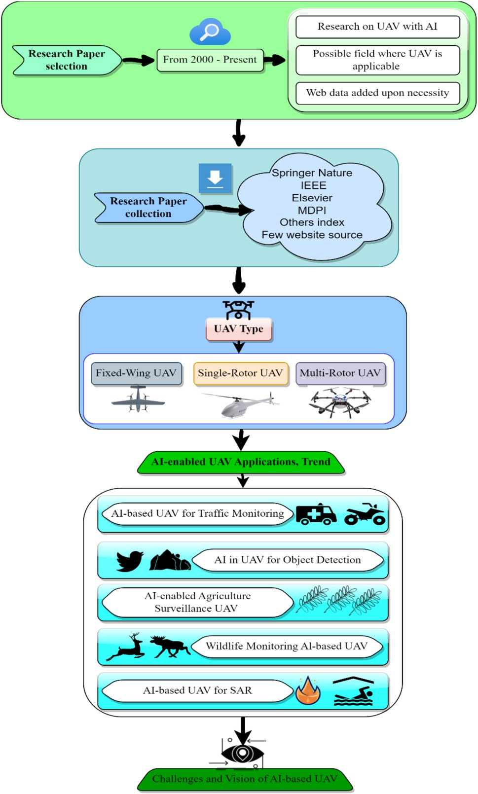
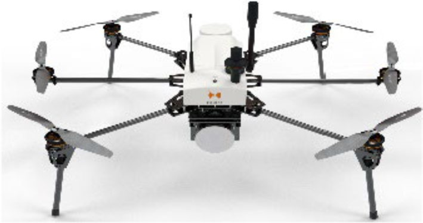
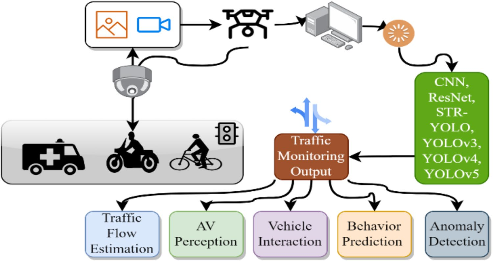
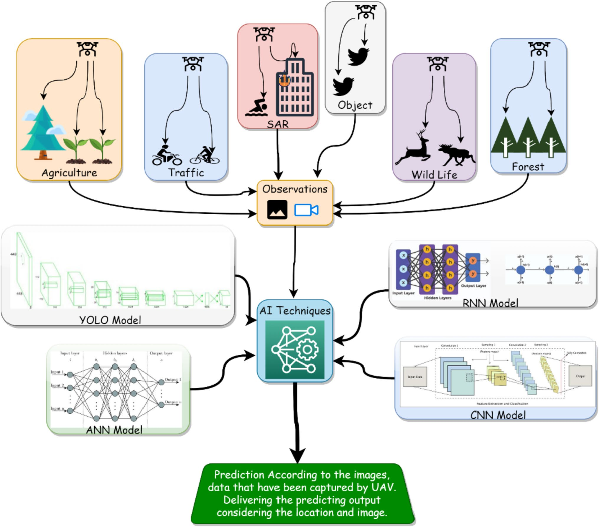
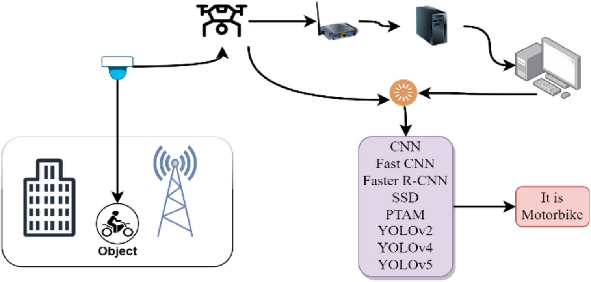
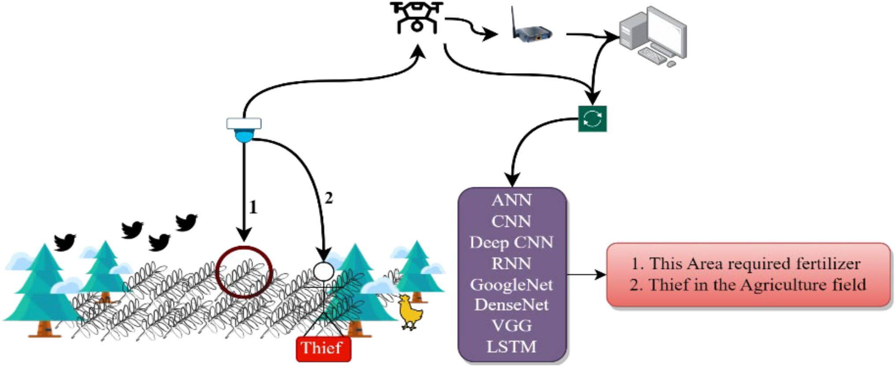
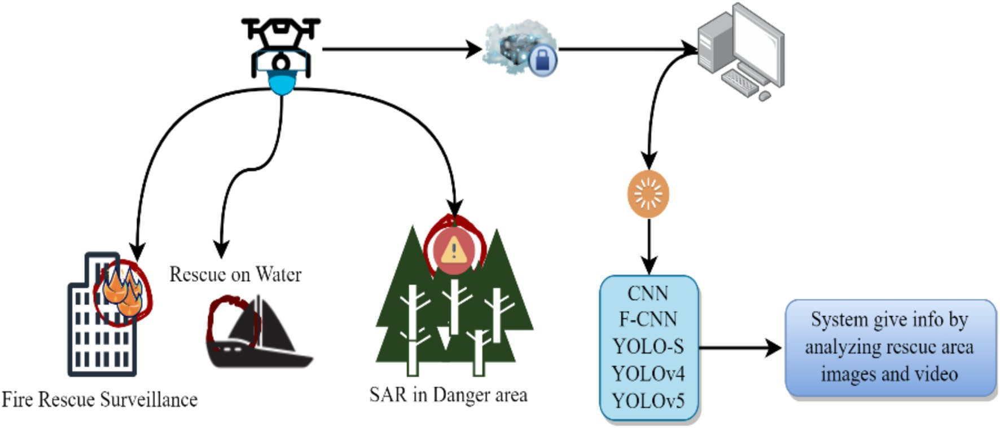

# S44163 024 00209 1

**Source Document:** `s44163-024-00209-1.pdf`  
**Total Pages:** 24  

---

## --- Page 1 ---

### Section: In-depth review of AI-enabled unmanned aerial vehicles: trends, vision, and challenges

Vol.:(0123456789)

Discover Artificial Intelligence            (2024) 4:97  
| https://doi.org/10.1007/s44163-024-00209-1

Discover Artificial Intelligence

Review

In‑depth review of AI‑enabled unmanned aerial vehicles: trends, 
vision, and challenges

Osim Kumar Pal1   · MD Sakib Hossain Shovon2   · M. F. Mridha2   · Jungpil Shin3

Received: 3 October 2024 / Accepted: 25 November 2024

© The Author(s) 2024 
 
OPEN

Abstract
In recent times, AI and UAV have progressed significantly in several applications. This article analyzes applications of 
UAV with modern green computing in various sectors. It addresses cutting-edge technologies such as green comput-
ing, generative AI, future scope, and related concerns in UAV. The research investigates the role of green computing and 
generative AI in combination with UAVs for navigation, object recognition and tracking, wildlife monitoring, precision 
agriculture, rescue operations, surveillance, and UAV communication. This study examines how modern computing 
technologies and UAVs are being applied in agriculture, surveillance, disaster management, and other areas. The ethics of 
UAV and AI applications, including safety, legal frameworks, and other issues, are thoroughly investigated. This research 
examines AI-based UAV applications across different disciplines, using open-source data and current advancements for 
future growth in this domain. This investigation will aid future researchers in their exploration of UAVs using cutting-
edge computing technologies.

Keywords  Aerial vehicles · Generative AI · Green computing · Traffic monitoring · Agriculture surveillance · CNN · YOLO

1  Introduction

The remote sensing technology for monitoring and photographing using unmanned aerial vehicles (UAVs) received 
significant acclaim for its surveillance and mapping capabilities [1]. UAVs are favored because to their affordability, user-
friendliness, safety for individuals, and low training costs for operators [2]. Their advantages have resulted in a greater 
prevalence across diverse situations, with their superior resolution and dependable tracking features facilitating their 
extensive adoption. UAVs are progressively used for environmental monitoring, including the assessment of thermal 
sources, plant vitality, land utilization, agriculture, and air contamination [2, 3].

Mapping and surveillance operations are using drones. Their cost-effectiveness, user-friendliness, and capacity to guar-
antee human safety have facilitated their increasing use [4]. Their features, together with high-resolution and dependable 
tracking capabilities, have resulted in their growing use across several domains. UAV first used for geometric applica-
tions, have now evolved into indispensable instruments for professionals engaged in construction and data collection 
activities [5].

Osim Kumar Pal, MD Sakib Hossain Shovon and Jungpil Shin have authors contributed equally to this work.

*  Jungpil Shin, jpshin@u-aizu.ac.jp; Osim Kumar Pal, osimkpal@gmail.com; MD Sakib Hossain Shovon, sakib.aiub.cs@gmail.com; 
M. F. Mridha, firoz.mridha@aiub.edu | 1Department of Electrical & Computer Engineering, University of Patras, Rion‑Patras, 26504 Patras, 
Greece. 2Department of Computer Science, American International University-Bangladesh, Dhaka, Bangladesh. 3Department of Computer 
Science and Engineering, The University of Aizu, Aizuwakamatsu, Aizu 965‑8580, Japan.

## --- Page 2 ---

Vol:.(1234567890)

Review	
Discover Artificial Intelligence            (2024) 4:97  
| https://doi.org/10.1007/s44163-024-00209-1

UAVs have gained popularity for surveillance, mapping, and remote sensing [1]. UAVs are becoming more popular for 
many reasons, such as how cheap they are to buy, how easy they are to use, how safe they are for people, and how easy 
it is to train people to operate them [2]. These benefits, together with their high resolution and robust tracking features, 
have prompted their growing use in a variety of settings. UAVs have been used for environmental monitoring, including 
air pollution, land surface temperature, flood danger, forest fire, road surface distress, land terrain monitoring, pedestrian 
traffic monitoring, and disaster evacuation [2, 3]. For example, many individuals have an improved standard of life owing 
to sophisticated goods that can be controlled by mobile devices. Automobile technologies assist drivers by providing 
more up-to-date and precise information about traffic. A recent uptick is the use of UAVs in highway engineering for 
traffic monitoring and management [6].

Recent developments in computer hardware and software have made AI a crucial component in almost every engi-
neering-related research field [7]. AI is a powerful tool for tackling difficult issues for which either no clear answers exist or 
traditional methods require extensive human intervention [8]. A significant difference between AI and standard cognitive 
algorithms is that AI can automatically extract features. This replaces expensive hand-crafted feature engineering [9].

In general, an AI job may identify anomalies, anticipate future outcomes, adapt to changing circumstances, develop 
an understanding of complex problems requiring enormous amounts of data, and discover patterns that a person might 
overlook [10]. It can use and learn from the surrounding huge data to improve UAV maneuvering. Compared with con-
ventional optimization techniques, AI can also handle onboard resources wisely [11]. Drones that use AI typically have 
fully or partially automated functions. With the help of AI, drone makers can use data from devices connected to the 
drone to collect and use data about the surroundings and how they look [12]. AI can be used to automatically handle 
drones, including how they move and navigate. Several methods, including Global Positioning System (GPS) monitor-
ing, computer vision, and machine learning algorithms, can be used to accomplish this [13]. Voice recognition, scene 
identification, object detection, and picture categorization are just some of the many fields where AI is making inroads, 
particularly when it comes to deep-learning approaches to AI [13]. Through this procedure, deep learning attempts to 
unearth the characteristics of unprocessed data at various levels [14]. These characteristics were then employed to rep-
resent the actual world. According to projections, the UAV market would increase from United States Dollar (USD) 26.2 
billion in 2022 to USD 38.3 billion by 2027, with a 7.9% Compound annual growth rate (CAGR) over those two years. Rising 
acquisition of tiny drones for military applications such as Intelligence, Surveillance, and Reconnaissance (ISR) will boost 
small drone market development throughout the projected period [15]. Despite the growing interest in UAVs, there are 
still several restrictions. Many of the problems with UAVs, like high power/energy consumption and real-time needs, are 
also good things about edge computers and edge AI, such as low energy consumption and low delay [16]. Deep learning 
and unmanned aerial vehicles (UAVs) have the potential to revolutionize traffic monitoring in the transportation sector 
[17]. The optimal usage of AI and deep machine-learning in UAVs that are already in use and the potential future will 
be explored and diagnosed in this in-depth investigation, as will the large region of AI-embedded drone applications.

AI-enabled UAVs need robust computers and sensors that use a lot of energy. Energy-efficient components and 
algorithms are essential to green computing. A deep learning algorithm and lightweight construction can improve 
the performance of an AI based UAV [18]. For the purpose of energy-efficient UAV planning, it is essential to have 
rapid and effective control algorithms that employ data-driven strategies in real time [19]. Scientists can refine AI 
algorithms to lower processing demands and UAV power needs [18]. Renewable energy sources like solar panels 
or wind turbines may charge UAV batteries more sustainably [20]. AI is essential for UAV autonomy and naviga-
tion. The application of AI permits UAVs to navigate independently. Machine learning algorithms enable UAVs to 
autonomously evaluate sensor data and dynamic conditions [21]. It also aids in detecting objects filmed by UAV 
cameras for monitoring and rescue. AI facilitates the analysis of UAV images in a more efficient and rapid manner 
with regard to mapping, surveying, and inspection [22]. In multi-operational drone operations, AI keeps track 
of which tasks are assigned to each individual and how they can be combined [23]. In military and surveillance 
applications, AI is playing a critical role in detecting possible threats, identifying anomalies, and providing early 
warning systems [24]. Thus, these are the benefits and shortcomings of AI powered UAVs. However, conventional 
signal estimation is time-consuming and yields sub-optimal results. Traditional systems are adaptable and flexible 
to a restricted degree. Traditional signal processing methods are characterized by increased noise and restricted 
usability [25]. As a result, AI-enabled UAVs are required to make UAV operations more precise, rapid, and effec-
tive. AI algorithms may improve UAV flight patterns, reducing fuel consumption and emissions [23]. Researchers, 
industry professionals, and government organizations may collaborate to develop green computing solutions for 
AI-enabled UAVs. Researchers are currently working to develop eco-friendly green technology and techniques for 
better green UAVs [26].

## --- Page 3 ---

### Section: 2 Review methodology

Vol.:(0123456789)

Discover Artificial Intelligence            (2024) 4:97  
| https://doi.org/10.1007/s44163-024-00209-1	
Review

A study was undertaken of Deep Learning methods based on UAV uses. They have shown the limits of the present 
state of UAV development. Not sufficient attention was devoted to discussing algorithms and the potential uses of 
UAVs in specialized industries [14]. An assessment of the ML-based UAV communication system was conducted using 
various algorithms. In that particular research, just few of the many potential applications of UAVs were investigated 
[27]. Vision-based UAV navigation system using a variety of AI technologies were examined. Several applications 
of computational intelligence, including search and rescue, as well as surveillance, were addressed [28]. Rescue 
sharing, distribution, and trajectory design uses for smart UAV base station were surveyed. Researchers analyzed 
potential AI-based rescue strategies [29]. Computerized vision methods based on machine learning algorithms and 
UAV platforms are being studied by researchers for their potential to detect and cure agricultural illnesses at an early 
stage. Multiple elements, including plants weeds, pests, and conditions, were taken into account in the research 
[30]. Researchers investigated the potential for AI-based unmanned aerial vehicle (UAV) systems applications to be 
used for traffic management [31], as well as monitoring [32], control [33], and detection of traffic [34]. Integrating 
generative AI in UAVs brings about a transformative shift in how drones’ function, enhancing their intelligence and 
autonomy [25]. Using generative models, these UAVs can anticipate and forecast impediments, adapt their flight 
trajectories instantaneously, and optimize the process of making informed choices [35]. Generative Adversarial 
Networks (GANs), Variational Autoencoders (VAEs), Conditional GANs (cGANs), and CycleGANs are recently devel-
oped methods in the area of generative artificial intelligence. These techniques are used for picture re-generation, 
construction, detection, and other applications. This technology enables sophisticated applications such as accurate 
simulation for design testing, intricate 3D mapping for surveillance, and environmental monitoring for conservation 
initiatives [36]. Generative AI greatly enhances UAVs’ efficiency, safety, and usefulness in many industries, leading 
to the development of new drone applications and more intelligent and responsive aerial systems [37]. Most recent 
survey studies concentrated their attention on one application of AI-based UAVs. The research only provided limited 
examples and did not cover a significant portion of the AI and ML algorithmic landscape.

This review effort will evaluate the various uses of UAVs where AI is appropriate and examine all of the differ-
ent learning algorithms that researchers are presently using. The investigation of AI-enabled UAVs is a captivating 
exploration of state-of-the-art technology. This detailed overview examines current trends, predicts a future in 
which UAVs will reshape several sectors, and discusses the issues that will be addressed. This discourse explores the 
trans-formative effects of AI, along with green computing and UAVs, on our society and their potential for fostering 
innovation and generating beneficial outcomes. This systematic review also includes a discussion of the possible 
data-sets with each application of UAV model with AI and the generative AI models for modern UAVs. Those are the 
experimental datasets and currently researchers are working on it. These datasets are applied along with Artificial 
Intelligence algorithms as we mentioned in every section such as CNN, YOLO and more effective algorithms. In the 
dataset references, image refers to a simple depiction of an item or data with visual content. Conversely, a high-
quality image possesses the same attributes as a standard image, including a greater dynamic range, chroma depth, 
and resolution. For better accuracy, precision, recognition, and general study of a picture, a high-quality image may 
be the preferred choice [38]. The review process is illustrated schematically in Fig. 1, with a more comprehensive 
explanation of its execution provided in the Sect. 2.

The systematic literature review is set up in the manner described below: The research methodologies utilized 
for this investigation are discussed in Sect. 2. Types of UAV are mentioned in Sect. 3. Section 4 offers a thorough 
analysis and applications, while Sect. 5 lists constraints and potential future research fields. Finally, Sect. 6 discusses 
the summery of this study.

2  Review methodology

This section serves as an illustration of the organized and methodical approach to doing research. It includes the 
methods, processes, and tactics used by scholars to collect, process, and evaluate data in order to respond to certain 
investigations or assumptions. Figure 2 depicts the approach employed in this study. The validity, trustworthiness, 
and credibility of the study conclusions depend on a well-established research process.

## --- Page 4 ---

Vol:.(1234567890)

Review	
Discover Artificial Intelligence            (2024) 4:97  
| https://doi.org/10.1007/s44163-024-00209-1

Fig. 1   Outline of the Struc-
tured Review

Fig. 2   AI-based UAV Review 
Methodology with Applica-
tions, Challenges and Limita-
tions them ideal for aerial 
photography and surveillance 
[43]

*Caption/Context: Vol:.(1234567890)*

![Review	 Discover Artificial Intelligence            (2024) 4:97   | https://doi.org/10.1007/s44163-024-00209-1 | Fig. 2   AI-based UAV Review  Methodology with Applica- tions, Challenges and Limita- tions them ideal for aerial  photography and surveillance  [43]](images/page_004_fig_02.jpeg)
*Caption/Context: Review	 Discover Artificial Intelligence            (2024) 4:97   | https://doi.org/10.1007/s44163-024-00209-1 | Fig. 2   AI-based UAV Review  Methodology with Applica- tions, Challenges and Limita- tions them ideal for aerial  photography and surveillance  [43]*

## --- Page 5 ---

### Section: 2.1 Paper selection criteria

Vol.:(0123456789)

Discover Artificial Intelligence            (2024) 4:97  
| https://doi.org/10.1007/s44163-024-00209-1	
Review

#### 2.1  Paper selection criteria

As with any review, we selected and included research work or paper based on a handful of criteria. These were the 
standards to which we adhered-

•	 The article should be directly related to UAV research or surveys.
•	 Artificial intelligence, deep learning, and UAV-related studies were also included in the selection.
•	 UAV-related research papers from several sub fields were also included in our evaluation owing to extensive knowl-
edge collection.
•	 We picked relatively little website data when it was statistical or genuine data that were exclusively accessible on that 
site.

#### 2.2  Source of literatures

A successful and instructive scientific review will comprise material gathered from publications that are reliable, 
well-respected, and well-organized. Consequently, the articles or information for this review study were collected 
from scientifically appreciated Scopus Journal indexes such as Springer Nature, IEEE, Elsevier, MDPI journals, Wiley, 
and many more. We acknowledge only a few articles from conferences with rigorous structural criteria. A few reliable 
online sources have compiled a minimal amount of statistical and up-to-date information.

#### 2.3  Area of coverage

This study covers the period from 2000 to the present day. Several industries began implementing new applications 
for advanced UAVs at the beginning of 2000. After the revolution and the growth of technology, AI allows UAV to 
become necessary kits for practically every industry to improve surveillance, safety, security, and decision making.

3  UAV platform type

Unmanned aerial vehicles come in a wide variety, so the name” drone” is encompassing. Hexa-Copters, Quad-copters, 
multi-copters, and aircraft with wings all fall within this category [39]. The primary types of flying drone are as follows:

#### 3.1  Fixed‑wing UAV

A fixed-wing drone features one rigid wing that is meant to appear and function like an aircraft and provides lift 
instead of vertical lift rotors. Therefore, this form of drone simply requires energy to go ahead and not to maintain 
its airborne position [40].

Fixed-wing drones can travel farther, map much bigger areas, and stay still for a long time while keeping an eye 
on their target [41]. These drones have a higher ceiling and a greater payload capacity. Drones with fixed wings may 
be pricey. Flying fixed-wing drones typically requires training. It can be used for Aerial Mapping, Agriculture Inspec-
tion, Construction Monitoring, and numerous other applications [42].

Fig. 3   This is Fixed-Wing UAV 
model

![Vol.:(0123456789) | A fixed-wing drone features one rigid wing that is meant to appear and function like an aircraft and provides lift  instead of vertical lift rotors. Therefore, this form of drone simply requires energy to go ahead and not to maintain  its airborne position [40].](images/page_005_fig_01.jpeg)
*Caption/Context: Vol.:(0123456789) | A fixed-wing drone features one rigid wing that is meant to appear and function like an aircraft and provides lift  instead of vertical lift rotors. Therefore, this form of drone simply requires energy to go ahead and not to maintain  its airborne position [40].*

## --- Page 6 ---

### Section: 3.2 Multi-rotor UAV

Vol:.(1234567890)

Review	
Discover Artificial Intelligence            (2024) 4:97  
| https://doi.org/10.1007/s44163-024-00209-1

#### 3.2  Multi‑rotor UAV

The simplest and least expensive method for keeping an” eye in the sky” is to use a multi-rotor drone. They also allow for 
more precise positioning and framing, making (Figs. 3, 4).

Common types of multi-rotor aircraft include tri-copters (with three rotors), quadcopters (with four), hexa-copters 
(with six), and octo-copters (with eight). Quad-rotors are the most prevalent multi-rotor drones. It offers superior aircraft 
control while in flight. Thanks to its improved maneuverability, it can go backward, forwards, sideways, and around on 
its axis [44]. Because of their low endurance and speed, multi-rotor drones aren’t suited for extensive aerial mapping, 
long-term monitoring, or long-distance infrastructure inspection like highways, pipelines, and electricity lines. They are 
inherently inefficient and need a lot of energy to defy gravity and maintain their airborne position [1].

#### 3.3  Single rotor UAV

UAV with a single rotor are robust and long-lasting. They resemble helicopters in terms of construction and design. A 
single-rotor helicopter consists of a single rotor—similar to a large rotating wing—and a tail rotor for directional and 
stability control. Single-rotor helicopters are more efficient than multi-rotors, especially if they’re gas-powered. Long 
blades spin like wings rather than propellers, making a single-rotor helicopter efficient [45]. Single-rotor drones are costly 
and complicated. They tremble and are less stable or tolerant of a poor landing. Because of their technical intricacy, they 
need frequent maintenance [46].

4  Artificial intelligence embedded UAV

UAVs and AI are two topics that have recently attracted the interest of researchers in academia and industry [47]. Aerial 
drones have increased the flexibility with which operations can be carried out and activities are monitored from distant 
areas [48]. In addition to expanding UAV capabilities and throwing up the market to a broader variety of businesses, 
deploying AI and machine learning has also helped reduce the number of obstacles that must be overcome [49].

The combination of UAV with machine learning has resulted both speedy and dependable outputs [50]. Figure 5 
demonstrates the present use of AI across various industries, including UAV applications. The use of UAVs in conjunction 
with artificial intelligence has been shown to be advantageous for real-time monitoring, the collection and processing 
of data, and prediction in a variety of contexts, including cities with smarts, defense, farming, and mining [51].

#### 4.1  Applications of AI in UAV for traffic monitoring

The location, speed, and direction of vehicles, as well as the number of times they traverse a particular point (like a gate, 
a junction, or a crossing), are just a few features that UAVs can observe and determine [52, 53]. These parameters are 
typically determined by the UAV placed over the coverage area. Changes in the values of the parameters discussed below 
can be used to identify certain occurrences [54, 55].

For instance, speeding can be determined when a vehicle’s speed is measured and exceeds a specified limit. However, 
traffic bottlenecks may be identified when the average speed of many cars drops below a specific limit [56]. The camera 
mounted on the UAV used in a surveillance system based on UAVs gathers photos of the current traffic condition using 
technology associated with route planning [32, 57]. The identification system, which the UAV carries, is then automatically

Fig. 4   This is Multi-Rotor UAV 
model

*Caption/Context: Review	 Discover Artificial Intelligence            (2024) 4:97   | https://doi.org/10.1007/s44163-024-00209-1 | 3.2  Multi‑rotor UAV*

## --- Page 7 ---

Vol.:(0123456789)

Discover Artificial Intelligence            (2024) 4:97  
| https://doi.org/10.1007/s44163-024-00209-1	
Review

Fig. 5   AI Embedded UAV Model for real time applications with model structure

Fig. 6   Traffic Monitoring UAV 
model for Modern Traffic 
control with AI

*Caption/Context: Vol.:(0123456789) | Fig. 5   AI Embedded UAV Model for real time applications with model structure*

*Caption/Context: Discover Artificial Intelligence            (2024) 4:97   | https://doi.org/10.1007/s44163-024-00209-1	 Review | Fig. 5   AI Embedded UAV Model for real time applications with model structure*

## --- Page 8 ---

Vol:.(1234567890)

Review	
Discover Artificial Intelligence            (2024) 4:97  
| https://doi.org/10.1007/s44163-024-00209-1

fed these photographs. This identification system’s primary skill is its capacity to assess traffic congestion [58]. The results 
of the recognition are sent to a traffic-management facility. The traffic managers may readily provide further analysis 
using those data [59, 60].

Figure 6 depicts the current AI applications for traffic monitoring and how UAVs function with it as an embedded 
system. The classification system that UAVs carry can be broken into two parts: one for extracting features and the other 
for recognizing characteristics [61, 62]. The recorded pictures are sent to the part of the system that pulls out the high-
level details. The outcomes of the final recognition are then determined by the system component responsible for the 
recognition, and these findings are based on the extracted characteristics [63]. A reconstructed network that has convo-
lutional layers are used as the fundamental architecture for the feature-extraction component of the system [64]. In most 
cases, the additional residual block cuts down on the time required for training and the level of intricacy involved [65]. 
Currently, several ResNet networks (e.g. ResNet-50, ResNet-101, and ResNet-110) work as a learned layer for the neural 
network [66]. Recently, training a 110-layer ResNet with random depth has given better results than training a 110-layer 
ResNet with a fixed depth, and it takes a lot less time to prepare [67]. Figure 7 shows how UAVs are used in real life to 
track and keep an eye on vehicles using AI methods to monitor traffic for vehicle detection, classification, and anomaly 
detection tasks. YOLO is a technique that offers real-time object identification via neural networks [68]. This method is 
used a lot because it works quickly and correctly. It has been used to monitor traffic, people, and parking meters, among 
other things [69, 70]. YOLO V3 switched from using Darknet-19 as the backbone network to using Darknet-53 instead [71].

Additionally, it used multi-scale estimates. Only a few academics now employ Spatial Pyramid Pooling (SPP) with YOLO 
V3 to identify traffic signs [72, 73]. In the system that monitors traffic, the YOLO algorithm is used for vehicle counting, 
detecting, and classifying, as well as monitoring traffic signs. To determine the location of a vehicle, a YOLOv4-tiny model 
is used [74].

Recently, an enhanced learning algorithm called TSR-YOLO has been designed to recognize the traffic sign in accord-
ance to monitor the traffic [80]. A system capable of performing global feature extraction with a multi-branch lightweight 
detection head has been developed to improve the accuracy of identifying more minor traffic signs. This method is well 
suited to challenging weather forecasts and environments [81]. YOLOv5 (STC-YOLO) is an upgraded version of YOLO that 
performs better in environments with fog, snow, noise, occlusion, and blur. It is designed to monitor tiny traffic signs and 
vehicles [82]. The area of artificial intelligence-based UAV traffic monitoring is actively implementing green computing 
approaches [83]. When compared to other machine learning methods for traffic monitoring, YOLO performs better since 
it scans the whole scene in a single run, drastically improving speed without sacrificing accuracy [84]. When compared to 
traditional machine learning methods, YOLO’s real-time integration of detection and classification is a major advantage. 
Its effectiveness and ability to generalize well across different pictures enable the completion of quick object identifica-
tion tasks [85].

Fig. 7   Traffic Monitoring using UAV

![Vol:.(1234567890) | Recently, an enhanced learning algorithm called TSR-YOLO has been designed to recognize the traffic sign in accord- ance to monitor the traffic [80]. A system capable of performing global feature extraction with a multi-branch lightweight  detection head has been developed to improve the accuracy of identifying more minor traffic signs. This method is well  suited to challenging weather forecasts and environments [81]. YOLOv5 (STC-YOLO) is an upgraded version of YOLO that  performs better in environments with fog, snow, noise, occlusion, and blur. It is designed to monitor tiny traffic signs and  vehicles [82]. The area of artificial intelligence-based UAV traffic monitoring is actively implementing green computing  approaches [83]. When compared to other machine learning methods for traffic monitoring, YOLO performs better since  it scans the whole scene in a single run, drastically improving speed without sacrificing accuracy [84]. When compared to  traditional machine learning methods, YOLO’s real-time integration of detection and classification is a major advantage.  Its effectiveness and ability to generalize well across different pictures enable the completion of quick object identifica- tion tasks [85].](images/page_008_fig_01.jpeg)
*Caption/Context: Vol:.(1234567890) | Recently, an enhanced learning algorithm called TSR-YOLO has been designed to recognize the traffic sign in accord- ance to monitor the traffic [80]. A system capable of performing global feature extraction with a multi-branch lightweight  detection head has been developed to improve the accuracy of identifying more minor traffic signs. This method is well  suited to challenging weather forecasts and environments [81]. YOLOv5 (STC-YOLO) is an upgraded version of YOLO that  performs better in environments with fog, snow, noise, occlusion, and blur. It is designed to monitor tiny traffic signs and  vehicles [82]. The area of artificial intelligence-based UAV traffic monitoring is actively implementing green computing  approaches [83]. When compared to other machine learning methods for traffic monitoring, YOLO performs better since  it scans the whole scene in a single run, drastically improving speed without sacrificing accuracy [84]. When compared to  traditional machine learning methods, YOLO’s real-time integration of detection and classification is a major advantage.  Its effectiveness and ability to generalize well across different pictures enable the completion of quick object identifica- tion tasks [85].*

## --- Page 9 ---

### Section: 4.2 AI in UAV for object detection

Vol.:(0123456789)

Discover Artificial Intelligence            (2024) 4:97  
| https://doi.org/10.1007/s44163-024-00209-1	
Review

Strategies that help reach this goal include the use of efficient hardware, the integration of renewable energy sources 
into ground stations, the optimization of AI algorithms to reduce the amount of computation needed, the simplification 
of data processing on the device itself, and the use of dynamic resource allocation. These methods aim to reduce energy 
consumption, decrease carbon emissions, and support environmentally sustainable aerial traffic monitoring, connecting 
technological advancements with environmental preservation [86]. Balancing energy usage for long-term operation is a 
difficulty for AI-enabled UAV. Determining the most efficient and consumptive applications of AI and ML is a formidable 
task. A data center located in a rural location presents a significant challenge in terms of ensuring proper ventilation. 
People are unaware of the secure and wholesome applications of UAVs in all industries. Combining improved natural 
energy with quantum computing will make green computers work better. Edge computing and decentralization can 
work well when there isn’t a data center nearby. Ensuring the optimal utilization of green computing on UAVs requires 
public collaboration, awareness, and accountability.

Researchers are now employing many datasets for traffic monitoring models, and Table 1 displays the most trending 
datasets with plausible descriptions. All systems have certain flaws and scope for development. Despite its potential 
benefits, traffic monitoring using machine learning has limitations presently being studied [87]. These algorithms may 
provide a few wrong results when counting vehicles since they are only partially accurate [88]. The intricacy of the 
environment increases the likelihood that the monitoring may give faulty results under extreme weather conditions 
[89]. To improve the precision and accuracy of traffic monitoring, researchers are focusing on developing these [90]. 
Researchers are directing their attention to generative AI in UAVs for traffic monitoring. This technology revolutionizes 
aerial surveillance by accurately forecasting traffic patterns and congestion. It allows drones to enhance routes in real-
time, enhancing traffic management and emergency response, thereby increasing the safety and efficiency of urban 
transportation using sophisticated, predictive analytics obtained from aerial data [35]. Several rising startups, including 
Shield AI, Skydio, Quantum Systems, Airobotics, and many others, are developing UAVs powered by artificial intelligence 
91]. Traffic surveillance may be complicated by the presence of a great deal of video input and real-time images. The data 
collection method may be hampered due to urban centers. The primary obstacle is integrating the entire traffic system 
into a single channel. Advanced learning algorithms could be a way to handle a lot of data. Swarm Intelligence in UAVs 
could improve traffic monitoring efficiency. Additionally, combining Edge-Computing with a predictive traffic control 
system will improve the monitoring.

#### 4.2  AI in UAV for object detection

The UAV captures the camera with its lens, and machine learning and computer vision then extract the features [92]. 
These algorithms are capable of detecting an item’s size, form, color, and ability to recognize patterns that could locate 
the object specifically [93]. Researchers employ sensors such as synthetic aperture radar (SAR) and light detection and 
ranging (LIDAR) to collect visuals, and then artificial intelligence is used to extract information from those visuals to 
locate the item of interest. The SAR method allows researchers to improve the visual capabilities of unmanned aerial 
vehicles (UAVs) [94]. Figure 8 illustrates the existing AI applications used in the domain of object detection, specifically 
highlighting the integration of UAVs as an intelligent system.

Since these techniques are simple to employ in cloudy, dark, and wet settings, they are not reliant on the climate 
[95]. Among the portable tools for object identification is the RGB-D camera mounted to a UAV. The Parallel tracking and 
mapping (PTAM) method is a new development that is used with UAVs for localization and navigation [96]. This strategy 
is appropriate for environments and locations that are unknown [97]. One of the precise vision techniques used by UAVs 
to aid in object recognition is optical flow technology. It can capture images over a wide region using its long-range 
shooting capabilities [98]. Researchers are using numerous datasets for object detection models, and Table 2 shows the 
most popular with credible descriptions.

Researchers relied on template-matching techniques in the early days of UAV objective identification. The system can 
identify recorded objects by comparing them to a template collection containing several thousand examples [99]. For 
any saved or set view, the template method works very well. However, this strategy needs to catch up in terms of large 
amounts of data with thousands of data categories [99, 100]. At the beginning of the 2010s [101], Convolutional neural 
networks (CNNs) have taken over as the go-to technique for extracting the characteristics of pictures in computer vision 
applications [102], including picture categorization, object recognition, and semantic segmentation of photos [103, 104].

Green computing is used in AI-based UAV object identification by selecting efficient hardware, allocating resources 
intelligently, and processing data locally on the device to maximize the system’s potential for reducing its overall energy 
consumption.

## --- Page 10 ---

Vol:.(1234567890)

Review	
Discover Artificial Intelligence            (2024) 4:97  
| https://doi.org/10.1007/s44163-024-00209-1

Table 1   UAV Traffic Monitoring Dataset

Dataset
Data type
Short description

AU-AIR [75]
Raw Video
This dataset contains video of traffic monitoring with 8 categories. GPS, time, and length are also included

Custom & Massachusetts roads dataset

[76]
Images
This dataset contains images of roads, traffic, road conditions, and vehicles

Traffic Drone Data (BD) [77]
Images
This dataset contains various road conditions data such as buses, cars, and other vehicles, with annotations

Aerial Detection Dataset [78]
High-Quality Images
This dataset holds very high-quality images of buses, trucks, cars, and more. Data is split into training, test,

and validation

HIT-UAV [79]
High-Quality Images
A thermal dataset containing over 40,000 frames of vehicle images

## --- Page 11 ---

### Section: 4.3 AI-enabled agriculture surveillance UAV system

Vol.:(0123456789)

Discover Artificial Intelligence            (2024) 4:97  
| https://doi.org/10.1007/s44163-024-00209-1	
Review

This strategy lessens object detection missions’ influence on the surrounding environment while preserving the 
capability to conduct effective surveillance. This helps to promote sustainability in aerial monitoring activities [110]. The 
YOLO technique was then added to UAVs for object identification and visualizing. YOLO is a one-stage technique that can 
quickly identify a UAV-captured picture as green computing concept. Researchers have built a YOLOv2-based ROS that 
can communicate with UAVs for tasks including object identification and system navigation. The method uses a simple 
color picture for detection [111]. To advance the object detection process to the next level, researchers have identified 
a few potential areas for future development. An item may be located from various vantage points and angles using a 
UAV. Nowadays, generative AI improves UAV object recognition by developing intricate models that accurately recognize 
and categorize items from aerial photos. Generative AI generates diversified training data, recreates rare situations, and 
optimizes detection models to enhance UAV object recognition. It creates synthetic images of animals across habitats 
to follow wildlife, and it models debris patterns to improve UAV-based rescue and surveillance [35]. This technology 
enables drones to efficiently and independently traverse intricate surroundings, observe changes, and carry out activi-
ties of objects [112]. This may affect the identification [113]. Another significant obstacle that must be overcome in the 
detecting process is the deformation of the moving item. Some items have intra-class variance, requiring additional 
training in ML [114]. The detection process can be positively effective if this variation is considered during training [115]. 
Scientists are striving to improve the UAV identification process using AI by addressing the problems mentioned earlier.

#### 4.3  AI‑enabled agriculture surveillance UAV system

Agriculture has far-reaching consequences for society since it is essential in maintaining human life by providing food, 
shelter, and employment opportunities and supplying crucial raw materials for producing a wide variety of goods [116]. 
UAVs have a wide variety of uses in the field of intelligent agriculture. The use of UAVs in smart agriculture allows for the

Fig. 8   Machine Learning 
based Object Detection UAV 
model for Modern Use

Table 2   UAV Object Detection Dataset

Dataset name
Data type
Short description

UAVAT [105]
Raw Video
This dataset contains 10 h of raw video for object detection, multiple object tracking, and single

object tracking. The video is annotated
UAVOD [106]
Images
This dataset contains 10 object classes, including buildings, ships, towers, ponds, rivers, and more
Manipal [107]
Images
This dataset contains data for detecting small objects and people
Urban Zone

Object Detec-
tion Dataset 
[108]

High-Quality Images
A combination of 3 different datasets, all well-annotated

Aerial Maritime

Drone Object 
[109]

High-Quality Images
This dataset contains high-quality images with classes such as boats, ships, and more

*Caption/Context: Discover Artificial Intelligence            (2024) 4:97   | https://doi.org/10.1007/s44163-024-00209-1	 Review | Table 2   UAV Object Detection Dataset*

## --- Page 12 ---

Vol:.(1234567890)

Review	
Discover Artificial Intelligence            (2024) 4:97  
| https://doi.org/10.1007/s44163-024-00209-1

evaluation of agricultural field spots, the monitoring of sunlight following the growth of crops, the diagnosis of diseases, 
and the administration of preventive medication for plants [117, 118]. Farmers presently rely on AI-based items and appli-
cations already available for improved decision-making and earlier detection of crop conditions [119, 120]. AI enables 
farmers to make better decisions and more accurately assess the state of their crops [120]. The first step in intelligent 
farming using AI-based UAVs is harvest management, also known as yield management [121]. The authorities may also 
benefit from an accurate estimate of the yield since it can be used to create various strategies, including transportation 
needs, procurement techniques, storage facilities, and more [121, 122]. The picture data is collected from the field by UAV, 
then artificial intelligence technology is used to analyze it [123]. This approach helps with more accurately anticipating 
the yield, as well as with more intelligent watering. These AI systems provide essential data on the predicted output at 
an early stage [123, 124]. In the process of field analysis, ANN [125], CNN [126], and RNN [127] are often used to research 
the field picture to arrive at decisions and achieve precise positioning.

Figure 9 shows how AI is already being used in farming tracking and monitoring, with a focus on how UAVs are being 
used as part of an intelligent system. For crop surveillance models, researchers use a lot of different datasets. Table 3 
shows the most common datasets and gives reliable explanations for each. One use of UAV technology in modern farming 
is the diagnosis of crop diseases. Deep learning algorithms, such as CNN, Deep CNN [128], GoogleNet [102], VGG [129], 
DenseNet [130], and many others, are currently utilized in AI-based UAV intelligent agriculture systems for detecting 
disease and applying organic pesticides on the spot [131].

When mapping land, UAVs are often utilized in place of survey drones. Survey drones powered by AI can produce 
high-resolution orthomosaics and comprehensive 3D models of regions that only have access to data of poor quality, 
that are outdated, or that do not have any data. They make it possible to construct high-accuracy cadastral maps rapidly 
and straightforwardly, even in locations that are difficult to access due to their complexity [132]. Combining GIS with 
AI-enhanced drone mapping opens up whole new avenues for robots to observe and comprehend the environment 
[133]. Superior capacities in geographical data collection, processing, and forecasting. In the process of GIS mapping,

Fig. 9   Agriculture Surveillance UAV based AI model for Modern farming

Table 3   UAV agriculture surveillance dataset

Dataset name
Data type
Short description

Avo-DB [136]
Images
This dataset contains RGB images and annotated images of an avocado field
CoFly [137]
Images
This dataset consists of high-quality images of weed fields with three different classes
Paddy Field Dataset [138]
Images
This dataset contains data on various paddy conditions for low-height UAV image analysis
PlantDet [139]
Images
This dataset holds images of two different types of crops, including several leaf conditions

for close UAV inspection
Crop Dataset [140]
High-Quality Images
High-resolution images of three types of crops from Kazakhstan

*Caption/Context: Review	 Discover Artificial Intelligence            (2024) 4:97   | https://doi.org/10.1007/s44163-024-00209-1 | Fig. 9   Agriculture Surveillance UAV based AI model for Modern farming*

## --- Page 13 ---

### Section: 4.4 Wildlife monitoring with UAV

Vol.:(0123456789)

Discover Artificial Intelligence            (2024) 4:97  
| https://doi.org/10.1007/s44163-024-00209-1	
Review

CNN, ANN, LSTM, and Naive Bias are used extensively for image segmentation [134]. This transforms 2D photos into 3D 
models with high resolution for usage in GIS applications [135]. The advancement of generative AI in conjunction with 
UAVs transforms agriculture by enabling precision farming techniques.

It improves the monitoring of crops, forecasts agricultural yields, optimizes the use of resources, and promotes land 
management [37]. Producing authentic data educates models for precise disease identification and weed management, 
resulting in effective, environmentally friendly agricultural methods and enhanced crop yield with minimum ecological 
consequences [141]. Green computing is establishing a name for itself in AI-based UAV agricultural surveillance by reduc-
ing environmental effects and maximizing efficiency in resource use. Utilizing UAV hardware that is more sustainable, 
onboard data processing, and using renewable energy sources for ground stations makes this possible. The algorithms 
used in machine learning are developed to reduce the amount of required computing, which helps save energy during 
picture analysis and data transfer [142]. The optimal use of resources may be ensured by dynamic resource allocation 
and intelligent scheduling, which also reduce idle periods and overall power usage. Agricultural surveillance UAVs may 
improve crop management while saving power and helping sustainable farming if these green computing principles 
are integrated into the system [143].

#### 4.4  Wildlife monitoring with UAV

Surveying vulnerable and invasive species to get reliable population estimates is a problematic undertaking to establish 
the ecological balance and sustainable growth of wildlife species [144]. Intelligent UAV systems are now used to servile 
forests and keep track of the animals that live there [145]. UAVs that collect geo-referenced sensor data have seen rapid 
adoption in the last several years, particularly for ecological surveillance and animal surveying [146, 147]. Figure 10 
represents how AI is currently used in wildlife monitoring and tracking, with a focus on how UAVs are integrated into 
automated systems. Integrating green computing algorithms is pivotal in developing and implementing AI-based UAV 
wildlife monitoring systems.

The algorithms have been specifically designed to optimize eco-friendly and mitigate environmental consequences. 
On-board data processing and analysis capabilities are used, reducing the need for resource-intensive data transfer to 
ground stations [148]. By optimizing calculations and using low-power hardware components, these algorithms contrib-
ute to the conservation of energy resources in UAVs. This, in turn, leads to an extension of flight duration and a reduction 
in the carbon footprint associated with monitoring activities. Successful research and protection of wildlife habitats and 
the promotion of sustainability in aerial surveillance activities may be achieved by integrating green computing concepts 
into AI-based UAV wildlife monitoring [1].

Monitoring sea turtles [149], black bears [150], big land mammals (such as elephants) [151], marine mammals (such 
as dugongs [152]), and birds (such as flocks of snow geese [153]), as well as providing assistance for anti-poaching activi-
ties for rhinos, are all examples of ways in which UAVs may be used for governing wildlife [154, 155]. The use of several 
datasets is being employed by researchers for the purpose of wildlife monitoring, counting, and surveillance models.

Table 4 provides a comprehensive overview of the most often utilized datasets, accompanied by reliable and accurate 
descriptions. UAVs are presently used extensively for wildlife surveillance, using machine learning methods. First and

Fig. 10   Wild life Monitoring 
model with AI based UAV

![Vol.:(0123456789) | Monitoring sea turtles [149], black bears [150], big land mammals (such as elephants) [151], marine mammals (such  as dugongs [152]), and birds (such as flocks of snow geese [153]), as well as providing assistance for anti-poaching activi- ties for rhinos, are all examples of ways in which UAVs may be used for governing wildlife [154, 155]. The use of several  datasets is being employed by researchers for the purpose of wildlife monitoring, counting, and surveillance models.](images/page_013_fig_01.jpeg)
*Caption/Context: Vol.:(0123456789) | Monitoring sea turtles [149], black bears [150], big land mammals (such as elephants) [151], marine mammals (such  as dugongs [152]), and birds (such as flocks of snow geese [153]), as well as providing assistance for anti-poaching activi- ties for rhinos, are all examples of ways in which UAVs may be used for governing wildlife [154, 155]. The use of several  datasets is being employed by researchers for the purpose of wildlife monitoring, counting, and surveillance models.*

## --- Page 14 ---

Vol:.(1234567890)

Review	
Discover Artificial Intelligence            (2024) 4:97  
| https://doi.org/10.1007/s44163-024-00209-1

Table 4   UAV Wildlife Monitoring Dataset

Dataset Name
Data Type
Short Description

Wildlife [156]
Images
This dataset contains wild images of animals in various angles and conditions

Fast Animal Detection Dataset [157]
Images
This dataset consists of different wildlife stock and animal tracks from a wildlife reserve park

WildData [158]
Images
High-quality UAV-annotated images for wildlife detection

Drone Count Data [159]
Images
This dataset contains images of various animals for counting and analysis purposes

UAV Aided Data [160]
High-Quality Images
A wildlife surveillance dataset containing images of various animals, trees, and other species

## --- Page 15 ---

### Section: 4.5 Rescue operation surveillance with UAV embedded AI

Vol.:(0123456789)

Discover Artificial Intelligence            (2024) 4:97  
| https://doi.org/10.1007/s44163-024-00209-1	
Review

foremost, UAV cameras gathered photos and video data from the forest. The picture would be in black and white, color, 
or RGB style for better detection and identification [161].

Regarding the data obtained from the video, the footage might be collected in its raw, night vision mode form [162]. 
SPOT is a program that can identify poachers in longer wavelength infrared heat UAV footage instantly [163]. SPOT 
searches for poachers in the simulated infrared heat picture, and identifications of poachers are represented by blue 
rectangles [164]. The system learns from examples to pinpoint the most important elements of photos taken in natural 
settings like forests and animals [165]. Currently, state-of-the-art methods, such as generative AI and UAVs, are trans-
forming wildlife monitoring. These approaches create models that accurately identify and track animals over large areas. 
This technology facilitates conservation efforts by forecasting animal migrations, evaluating the condition of habitats, 
and identifying instances of illegal hunting, guaranteeing accurate and immediate monitoring for safeguarding and 
researching wildlife populations [112].

#### 4.5  Rescue operation surveillance with UAV embedded AI

Embedded systems with machine learning architecture are now being taught to seek and detect persons, threats, or 
dangers inside a designated broad region utilizing UAVs [166]. CNNs of several types, including the T(Temporal)-CNN 
strategy [167–169],3D-CNN [170–172], were used to identify and divide up the rescue zone. Figure 11 depicts how AI is 
already being employed in human and animal search and rescue, with an emphasis on the employment of UAVs as part 
of a smart system.

This technique is applicable for individuals in large rivers, ponds, or perilous environments. Scientists are now using 
a GPU-accelerated system [173], high-altitude UAV photos [174], and feature extraction based on super-pixels [175] to 
locate the rescue spot. The challenge of target object recognition of various sizes is addressed by the researcher’s sug-
gested model, which uses a feature pyramid network with only one stage and a densely linked set of features [176–178]. 
The use of several datasets is being employed by researchers in the development of models for humans, small animals,

Fig. 11   SAR area monitoring using AI-enabled UAV

Table 5   Search and rescue dataset

Dataset name
Data type
Short description

SARD [179]
Images
This dataset contains annotated images of people and animals for

rescue purposes
Rescue Dataset [180]
Images
Over 200 real images of search and rescue areas and locations
Dataset [181]
Images
High-quality wide UAV images for rescue operations
SAR Human Data [182]
Images
A dataset with 2,000 images of human actions for rescue operations
SAR Data [183]
High-Quality Images
High-quality thermal images for rescue operations and surveillance

*Caption/Context: Discover Artificial Intelligence            (2024) 4:97   | https://doi.org/10.1007/s44163-024-00209-1	 Review | Fig. 11   SAR area monitoring using AI-enabled UAV*

## --- Page 16 ---

### Section: 5 Challenges and future aspect on AI enabled UAV

Vol:.(1234567890)

Review	
Discover Artificial Intelligence            (2024) 4:97  
| https://doi.org/10.1007/s44163-024-00209-1

item search, and rescue. Table 5 provides an overview of the most frequently utilized datasets in this domain, accompa-
nied by reliable descriptions. First, UAV captures still images or moving video over a broad region, then analyzes using 
machine learning and deep learning algorithms [184, 185].

After the picture has been segmented, the algorithm will detect prospective locations where rescue may occur. This 
might occur in various environments, including a forest [186], a building, a flood [187, 188], a fire [189], and many more. 
Green computing methods are crucial for optimizing energy consumption and reducing environmental effects in AI 
based UAV rescue missions. These algorithms emphasize economy by processing data locally on the UAV, negating the 
need for transmission, which may be taxing on system resources [190].

In this way, the UAV may save power for crucial tasks like search and rescue, even if they are meant to run on low-power 
technology. UAVs with artificial intelligence are more trustworthy and environmentally friendly tools for rescue missions 
when they adhere to green computing principles that increase their durability. This strategy is in keeping with the larger 
objective of ensuring the appropriate and sustainable use of technology during times of crisis [191]. This lightweight 
version of the YOLO method may be found in UAVs as green computing concept, where it can handle various data classes 
at a high accuracy rate [192, 193]. YOLO is cutting-edge real-time software for analyzing images and videos [194], mak-
ing it useful for SAR operations. A strategy that YOLO uses is analogous to the F(Fully)-CNN algorithm, which the SAR 
system utilizes. Researchers use YOLO-S [195], YOLOv4 [196], and YOLOv5 [197] on UAVs to carry out rescue operations. 
These techniques are readily available.

5  Challenges and future aspect on AI enabled UAV

Utilizing AI for UAV systems has resulted in the introduction of a multitude of innovative and resourceful solutions to 
an interminable array of issues [198]. Drones are utilized to gather sensitive information from hazardous environments 
including high winds, terrible weather, heavy rain, and multi-shaded objects [199]. A vision-based UAV navigation system 
using a variety of AI technologies were examined. Several applications of computational intelligence, including search 
and rescue, as well as surveillance, were addressed.

In addition, as these systems become increasingly autonomous and interconnected, they become potential targets 
for criminals looking to exploit vulnerabilities. To avoid interruptions and illegal access, it is crucial to develop solid 
security measures and protections. Future research in AI-based UAVs will need multidisciplinary cooperation between 
specialists in AI, aeronautics, ethics, law, and other fields. This cooperation is required to develop thorough regulatory 
frameworks that direct the use of AI-enabled UAVs while protecting against possible hazards. Research should continue 
to concentrate on improving AI algorithms for better navigation, judgment, and adaptability, opening the door for more 
advanced and trustworthy autonomous systems. Several AI algorithms are now being implemented in UAVs in order to 
facilitate the operation of a variety of applications. Table 6 provides an overview of the various AI algorithms currently 
being used in UAVs.

The use of AI with UAVs raises legal and ethical concern, mainly in human privacy, safety, and data abuse. The main 
concerns regarding privacy arise from the possibility of extensive monitoring, while concerns regarding security arise 
from the possibility of hacks and data leaks. Future regulations will need to focus on these risks and put an end to all 
forms of abusive, harmful, or illegal tracking so as to ensure safe and effective use of social welfare.

Table 7 lists the potential difficulties and tasks that might accelerate the development of AI-based UAVs. Also, find-
ing new ways to use UAVs with AI, like in urban planning, environmental tracking, and crisis reaction, has the potential 
to change businesses and make society as a whole better. AI and UAVs working together is a growing area with much 
potential. Ongoing study and development will help unlock this potential and solve problems that come up along the 
way. As AI technology changes and new models develop, cooperation between science and technology will be critical 
in determining where AI-based UAVs go and how they influence our world.

6  Summary

“In-Depth Review of AI-enabled Unmanned Aerial Vehicles: Trends, Vision, and Challenges” delves into the develop-
ing scenario of AI-based UAV systems. Table 6 presents an overview of the applications of AI in several areas, with a 
specific focus on the current applications of UAVs. This analysis takes a look at recent developments, potential future 
outcomes, and the current difficulties associated with this dynamic partnership. It illustrates how AI is vital in allowing

## --- Page 17 ---

Vol.:(0123456789)

Discover Artificial Intelligence            (2024) 4:97  
| https://doi.org/10.1007/s44163-024-00209-1	
Review

Table 6   Review Summary of AI on UAV

Application
Algorithms (2000–2010)
Uses of AI Algorithms (2000–2010)
Algorithms (2011–2024)
Uses of AI Algorithms (2011–2024)

AI-based UAV for Traffic Monitoring
CNN, RNN [64]
Feature extraction; Real-time track-

ing; Traffic counting & surveil-

lance

ResNet-50 [65], ResNet-101 [66],

ResNet-110 [67], TSR-YOLO

[80], YOLOv3 [71], YOLOv4 [74],

YOLOv5 [82], DarkNet-19 [72],

DarkNet-53 [73]

Identification of traffic, people, and

locations; Measure parking space;

Vehicle counting, monitoring,

detection; Traffic sign detection in

tough weather

AI in UAV for Object Detection
CNN [102], Fast CNN [102], Fast

R-CNN [103], ANN [104]
Object detection; Color, shape, size

detection; Small object detection

in difficult weather

SSD [98], PTAM [96], YOLOv2 [111],

YOLOv4 [113], YOLOv5 [114]
Detect small objects; Identify mov-

ing and shape-changing objects;

Detection of small, multi-color,

movable objects in hazy weather

Agriculture Surveillance UAV with

AI
ANN, CNN [126], Deep CNN [128],

RNN [131]
Crop monitoring; Crop growth

measurement; Farming tracking
GoogleNet [102], DenseNet [130],

VGG, LSTM [129]
Crop disease detection; Early-stage

leaf disorder prediction; Thief and

animal monitoring for crops

Wildlife Monitoring AI-based UAV
CNN [146], Deep CNN [147], ANN

[161], RNN [162]
Animal tracking; Wild growth moni-

toring; Animal count & survey
SPOT [164], YOLO [163]
Animal life monitoring; Moving ani-

mal counting; Small animal species

count and measurement; Hunter

detection

Rescue Operation Surveillance AI-

based UAV
CNN [167], F-CNN [168], T-CNN

[169], 3D-CNN [170]
Detection of person, animal; Iden-

tifying danger, threat; Measure

rescue condition

YOLOvS [195], YOLOv4 [196],

YOLOv5 [197]
Identify small animals and people

accurately; SAR area monitoring;

Assist firefighters with UAV robots;

Applicable in forest, building, and

field SAR operations

## --- Page 18 ---

### Section: 7 Conclusion

Vol:.(1234567890)

Review	
Discover Artificial Intelligence            (2024) 4:97  
| https://doi.org/10.1007/s44163-024-00209-1

autonomous UAV capabilities, from navigation to object identification, and addresses applications such as wildlife 
monitoring, precision agriculture, rescue operations, and more.

In addition, the study discusses efficient computing strategies with energy, legal issues, ethical problems, and 
safety precautions. This in-depth assessment may be a helpful resource for grasping the complicated nature and 
transformational possibilities of AI-enabled UAV technology.

7  Conclusion

The exhaustive analysis of AI-enabled UAVs reveals the dynamic nature of this technology’s landscape. The future 
of UAV-based applications may lie in green computing and generative AI. The study examines emerging trends that 
highlight the incorporation of AI, propelling UAVs to new heights of autonomy, efficiency, and applicability across 
multiple industries. The review shows a picture of a future where AI-powered UAVs change businesses like tracking, 
detecting, espionage, transportation, and emergency management. However, the path towards this vision is fraught 
with obstacles, such as regulatory obstacles, ethical considerations, and technical complexities. As AI and UAV tech-
nologies continue to advance in tandem, resolving these obstacles will be essential to realizing the full potential of 
AI-enabled UAVs for the benefit of society. AI-enabled UAVs face privacy, safety, and data usage vulnerabilities that 
need guidelines to avoid intrusive monitoring, hacking, and threatening tracking for social good.

Acknowledgements  The authors would like to thank the Advanced Machine Intelligence Research Lab (AMIRL) for their Supervision and 
Resources.

Author contributions  Conceptualization, Data curation, Formal analysis, Osim Kumar Pal and MD Sakib Hossain Shovon; Investigation, M.F. 
Mridha; Methodol-ogy, Software, Osim Kumar Pal and MD Sakib Hossain Shovon; Supervision, M. F. Mridha; Writing—original draft, Osim 
Kumar Pal and MD Sakib Hossain Shovon;; Writing—Review & Editing, M.F. Mridha and J. Shin.

Funding  This work received no external funding.

Data availability  No datasets were generated or analysed during the current study.

Table 7   Challenges and Vision on AI-enabled UAV

Domain
Challenges
Future Scope

Traffic Monitoring
- Large video feeds and real-time image processing
- Data collection in urban environments
- Detecting anomalies
- Integrating full traffic systems

- Advanced AI for processing large data
- Autonomous UAV fleets
- Swarm Intelligence in UAVs
- Edge-Computing integration
- Predictive traffic management systems
Object Detection
- Detecting small and moving objects
- Non-annotated data complexities
- Diverse environment adaptation

- Developing Edge AI and Onboard Processing
- Transfer Learning specific to domain
- Privacy-aware object detection
- Generalization and transfer ability
Agriculture Surveillance
- Data management and storage
- Crop and pest identification complexities
- Interoperability with farming systems
- Battery life and endurance for wide areas

- Multi-spectral and hyperspectral imaging
- Automated AI-based agriculture data analysis
- IoT integration
- Autonomous navigation and dynamic planning
Wildlife Monitoring
- Avoiding disturbance to wildlife
- Difficult natural environment adaptation
- Animal movement in complex weather
- High-resolution data collection and storage

- Swarm intelligence
- Remote sensing technology advancements
- Improved conservation decision support
- AI for species identification
Rescue Operation Surveillance
- Real-time situation awareness
- Navigating challenging environments
- Payload and endurance
- Medical support via AI

- AI for disaster prediction
- Robust design and redundancy
- AI-assisted emergency and medical response

## --- Page 19 ---

### Section: References

Vol.:(0123456789)

Discover Artificial Intelligence            (2024) 4:97  
| https://doi.org/10.1007/s44163-024-00209-1	
Review

Declarations

Competing interests  The authors declare no competing interests.

Open Access  This article is licensed under a Creative Commons Attribution-NonCommercial-NoDerivatives 4.0 International License, which 
permits any non-commercial use, sharing, distribution and reproduction in any medium or format, as long as you give appropriate credit to 
the original author(s) and the source, provide a link to the Creative Commons licence, and indicate if you modified the licensed material. You 
do not have permission under this licence to share adapted material derived from this article or parts of it. The images or other third party 
material in this article are included in the article’s Creative Commons licence, unless indicated otherwise in a credit line to the material. If 
material is not included in the article’s Creative Commons licence and your intended use is not permitted by statutory regulation or exceeds 
the permitted use, you will need to obtain permission directly from the copyright holder. To view a copy of this licence, visit http://​creat​iveco​
mmons.​org/​licen​ses/​by-​nc-​nd/4.​0/.

References

1.	 Mohsan SAH, Othman NQH, Li Y, Alsharif MH, Khan MA. Unmanned aerial vehicles (uavs): practical aspects, applications, open challenges,

security issues, and future trends. Intell Serv Robotics. 2023;3:1–29.
	 2.	 Manfreda S, McCabe MF, Miller PE, Lucas R, Pajuelo Madrigal V, Mallinis G, Ben Dor E, Helman D, Estes L, Ciraolo G, et al. On the use of

unmanned aerial systems for environmental monitoring. Remote sensing. 2018;10(4):641.
	 3.	 Barbedo JGA. A review on the use of unmanned aerial vehicles and imaging sensors for monitoring and assessing plant stresses. Drones.

2019;3(2):40.
	 4.	 Yang Z, Yu X, Dedman S, Rosso M, Zhu J, Yang J, Xia Y, Tian Y, Zhang G, Wang J. Uav remote sensing applications in marine monitoring:

knowledge visualization and review. Sci Total Environ. 2022;838:155939.
	 5.	 Nex F, Armenakis C, Cramer M, Cucci DA, Gerke M, Honkavaara E, Kukko A, Persello C, Skaloud J. Uav in the advent of the twenties: where

we stand and what is next. ISPRS J Photogramm Remote Sens. 2022;184:215–42.
	 6.	 Alamouri A, Lampert A, Gerke M. An exploratory investigation of uas regulations in europe and the impact on effective use and economic

potential. Drones. 2021;5(3):63.
	 7.	 Cao L. Ai science and engineering: a new field. IEEE Intell Syst. 2022;37(1):3–13.
	 8.	 Xu Y, Liu X, Cao X, Huang C, Liu E, Qian S, Liu X, Wu Y, Dong F, Qiu C-W, et al. Artificial intelligence: a powerful paradigm for scientific

research. Innovation. 2021;2(4): 100179.
	 9.	 Janiesch C, Zschech P, Heinrich K. Machine learning and deep learning. Electron Mark. 2021;31(3):685–95.
	 10.	 Morocho-Cayamcela ME, Lee H, Lim W. Machine learning for 5g/b5g mobile and wireless communications: potential, limitations, and

future directions. IEEE access. 2019;7:137184–206.
	 11.	 Razzaq S, Xydeas C, Mahmood A, Ahmed S, Ratyal NI, Iqbal J. Efficient optimization techniques for resource allocation in uavs mission

framework. PLoS ONE. 2023;18(4):0283923.
	 12.	 Alladi T, Chamola V, Sahu N, Guizani M. Applications of blockchain in unmanned aerial vehicles: a review. Vehi Commun. 2020;23: 100249.
	 13.	 Budiharto W, Gunawan AA, Suroso JS, Chowanda A, Patrik A, Utama G. Fast object detection for quadcopter drone using deep learning.

In: 2018 3rd International Conference on Computer and Communication Systems (ICCCS), pp. 192–195 (2018). IEEE.
	 14.	 Carrio A, Sampedro C, Rodriguez-Ramos A, Campoy P. A review of deep learning methods and applications for unmanned aerial vehicles.

J Sensors. 2017;2017:1.
	 15.	 Butterworth-Hayes P, Beechener J. UAV market projected to grow from usd26.2b in 2022 to USD38.3B by 2027, at 7.9% CAGR (2023).

https://​www.​unman​nedai​rspace.​info/​latest-​news-​and-​infor​mation/ uav-market-projected-to-grow-from-usd26–2b-in-2022-to-usd38–
3b-by-2027-at-7–9-cagr/
	 16.	 Yazid Y, Ez-Zazi I, Guerrero-Gonz´alez A, El Oualkadi A, Arioua M. Uavenabled mobile edge-computing for iot based on ai: a comprehen-

sive review. Drones. 2021;5(4):148.
	 17.	 Chen C, Zheng Z, Xu T, Guo S, Feng S, Yao W, Lan Y. Yolo-based uav technology: a review of the research and its applications. Drones.

2023;7(3):190.
	 18.	 Kelechi AH, Alsharif MH, Bameyi OJ, Ezra PJ, Joseph IK, Atayero A-A, Geem ZW, Hong J. Artificial intelligence: an energy efficiency tool

for enhanced high performance computing. Symmetry. 2020;12(6):1029.
	 19.	 Diamanti M, Tsampazi M, Tsiropoulou EE, Papavassiliou S. Energy efficient multi-user communications aided by reconfigurable intelligent

surfaces and uavs. In: 2021 IEEE International Conference on Smart Computing (SMARTCOMP), pp. 371–376 (2021). IEEE
	 20.	 Boukoberine MN, Zhou Z, Benbouzid M. A critical review on unmanned aerial vehicles power supply and energy management: solutions,

strategies, and prospects. Appl Energy. 2019;255: 113823.
	 21.	 Macaulay MO, Shafiee M. Machine learning techniques for robotic and autonomous inspection of mechanical systems and civil infra-

structure. Auton Intell Syst. 2022;2(1):8.
	 22.	 Billi D, Croce V, Bevilacqua MG, Caroti G, Pasqualetti A, Piemonte A, Russo M. Machine learning and deep learning for the built heritage

analysis: laser scanning and uav-based surveying applications on a complex spatial grid structure. Remote Sensing. 2023;15(8):1961.
	 23.	 Wu G, Miao Y, Zhang Y, Barnawi A. Energy efficient for uav-enabled mobile edge computing networks: intelligent task prediction and

offloading. Comput Commun. 2020;150:556–62.
	 24.	 Rashid AB, Kausik AK, Al Hassan Sunny A, Bappy MH. Artificial intelligence in the military: An overview of the capabilities, applications,

and challenges. Int J Intell Syst. 2023;2023(1):8676366.
	 25.	 Telli K, Kraa O, Himeur Y, Ouamane A, Boumehraz M, Atalla S, Mansoor W. A comprehensive review of recent research trends on unmanned

aerial vehicles (uavs). Systems. 2023. https://​doi.​org/​10.​3390/​syste​ms110​80400.

## --- Page 20 ---

Vol:.(1234567890)

Review	
Discover Artificial Intelligence            (2024) 4:97  
| https://doi.org/10.1007/s44163-024-00209-1

26.	 Danish MSS, Senjyu T. Shaping the future of sustainable energy through ai-enabled circular economy policies. Circ Econ. 2023;2(2):

100040.
	 27.	 Bithas PS, Michailidis ET, Nomikos N, Vouyioukas D, Kanatas AG. A survey on machine-learning techniques for uav-based communica-

tions. Sensors. 2019;19(23):5170.
	 28.	 Lu Y, Xue Z, Xia G-S, Zhang L. A survey on vision-based uav navigation. Geo-spatial Inf Sci. 2018;21(1):21–32.
	 29.	 Liu X, Chen M, Liu Y, Chen Y, Cui S, Hanzo L. Artificial intelligence-aided next-generation networks relying on uavs. IEEE Wirel Commun.

2020;28(1):120–7.
	 30.	 Bouguettaya A, Zarzour H, Kechida A, Taberkit AM. A survey on deep learning-based identification of plant and crop diseases from uav-

based aerial images. Clust Comput. 2023;26(2):1297–317.
	 31.	 Li A, Hansen M, Zou B. Traffic management and resource allocation for uav-based parcel delivery in low-altitude urban space. Trans Res

Part C. 2022;143: 103808.
	 32.	 Butil˘a EV, Boboc RG. Urban traffic monitoring and analysis using unmanned aerial vehicles (uavs): a systematic literature review. Remote

Sensing 14(3), 620 (2022)
	 33.	 Yilmaz BY, Denizer SN. Multi uav based traffic control in smart cities. In: 2020 11th International Conference on Computing, Communica-

tion and Networking Technologies (ICCCNT), pp. 1–7 (2020). IEEE
	 34.	 Srivastava S, Narayan S, Mittal S. A survey of deep learning techniques for vehicle detection from uav images. J Syst Architect. 2021;117:

102152.
	 35.	 Liu G, Van Huynh N, Du H, Hoang DT, Niyato D, Zhu K, Kang J, Xiong Z, Jamalipour A, Kim DI: Generative ai for unmanned vehicle swarms:

Challenges, applications and opportunities. arXiv preprint arXiv:​2402.​18062 (2024)
	 36.	 Jang M, Hyun J, Kwag T, Gwak C, Nguyen TA, Lee J-W. Generative ai-based flight dynamic model for uav digital twin. 635–636. 2023.
	 37.	 Zhang Q, Ferdowsi A, Saad W, Bennis M. Distributed conditional generative adversarial networks (gans) for data-driven millimeter wave

communications in uav networks. IEEE Trans Wireless Commun. 2021;21(3):1438–52.
	 38.	 Myszkowski K, Mantiuk R, Krawczyk G. High dynamic range video. Cham: Springer; 2022.
	 39.	 Chamola V, Kotesh P, Agarwal A, Gupta N, Guizani M, et al. A comprehensive review of unmanned aerial vehicle attacks and neutraliza-

tion techniques. Ad Hoc Netw. 2021;111: 102324.
	 40.	 Elijah T, Jamisola RS, Tjiparuro Z, Namoshe M. A review on control and maneuvering of cooperative fixed-wing drones. Int J Dyn Control.

2021;9:1332–49.
	 41.	 Gupta A, Afrin T, Scully E, Yodo N. Advances of uavs toward future transportation: the state-of-the-art, challenges, and opportunities.

Future Trans. 2021;1(2):326–50.
	 42.	 Ubina NA, Cheng S-C. A review of unmanned system technologies with its application to aquaculture farm monitoring and manage-

ment. Drones. 2022;6(1):12.
	 43.	 Ramachandran A, Sangaiah AK. A review on object detection in unmanned aerial vehicle surveillance. Int J Cogn Comput Eng.

2021;2:215–28.
	 44.	 Menkhoff T, Kan SN, Tan EK, Foong S. Future-proofing students in higher education with unmanned aerial vehicles technology: a knowl-

edge management case study. Knowl Manage E-Learning. 2022;14(2):223.
	 45.	 Carholt O, Fresk E, Andrikopoulos G, Nikolakopoulos G. Design, modelling and control of a single rotor uav. In: 2016 24th Mediterranean

Conference on Control and Automation (MED), pp. 840–845 2016. IEEE.
	 46.	 Shafiee M, Zhou Z, Mei L, Dinmohammadi F, Karama J, Flynn D. Unmanned aerial drones for inspection of offshore wind turbines: a

mission-critical failure analysis. Robotics. 2021;10(1):26.
	 47.	 Khan AI, Al-Mulla Y. Unmanned aerial vehicle in the machine learning environment. Proc Comput Sci. 2019;160:46–53.
	 48.	 Mohsan SAH, Khan MA, Noor F, Ullah I, Alsharif MH. Towards the unmanned aerial vehicles (uavs): a comprehensive review. Drones.

2022;6(6):147.
	 49.	 Marr B. Artificial intelligence in practice: how 50 successful companies used AI and machine learning to solve problems. Hoboken: John

Wiley & Sons; 2019.
	 50.	 Fallati L, Polidori A, Salvatore C, Saponari L, Savini A, Galli P. Anthropogenic marine debris assessment with unmanned aerial vehicle

imagery and deep learning: a case study along the beaches of the republic of maldives. Sci Total Environ. 2019;693: 133581.
	 51.	 Bathla G, Bhadane K, Singh RK, Kumar R, Aluvalu R, Krishnamurthi R, Kumar A, Thakur R, Basheer S. Autonomous vehicles and intelligent

automation: applications, challenges, and opportunities. Mobile Information Systems 2022. 2022.
	 52.	 Elloumi M, Dhaou R, Escrig B, Idoudi H, Saidane LA. Monitoring road traffic with a uav-based system. In 2018 IEEE Wireless Communica-

tions and Networking Conference (WCNC), pp. 1–6 2018. IEEE.
	 53.	 Gao K, Huang S, Xie J, Xiong NN, Du R. A review of research on intersection control based on connected vehicles and data-driven intel-

ligent approaches. Electronics. 2020;9(6):885.
	 54.	 Gonçalves J, Henriques R. UAV photogrammetry for topographic monitoring of coastal areas. ISPRS J Photogramm Remote Sens.

2015;104:101–11.
	 55.	 Ćwiakała P. Testing procedure of unmanned aerial vehicles (UAVs) trajectory in automatic missions. Appl Sci. 2019;9(17):3488.
	 56.	 Li J, Chen S, Zhang F, Li E, Yang T, Lu Z. An adaptive framework for multi-vehicle ground speed estimation in airborne videos. Remote

Sensing. 2019;11(10):1241.
	 57.	 Jumani AK, Laghari RA, Nawaz H, et al. Unmanned aerial vehicles: a review. Cognitive Robotics. 2022.
	 58.	 Outay F, Mengash HA, Adnan M. Applications of unmanned aerial vehicle (UAV) in road safety, traffic and highway infrastructure man-

agement: recent advances and challenges. Trans Res Part A Pol Pract. 2020;141:116–29.
	 59.	 Ouallane AA, Bakali A, Bahnasse A, Broumi S, Talea M. Fusion of engineering insights and emerging trends: intelligent urban traffic

management system. Inf Fusion. 2022;88:218–48.
	 60.	 Jian L, Li Z, Yang X, Wu W, Ahmad A, Jeon G. Combining unmanned aerial vehicles with artificial-intelligence technology for traffic-

congestion recognition: electronic eyes in the skies to spot clogged roads. IEEE Consum Electron Mag. 2019;8(3):81–6.
	 61.	 Sazdić-Jotić BM, Obradović DR, Bujaković DM, Bondžulić BP. Feature extraction for drone classification. In 2019 14th International Con-

ference on Advanced Technologies, Systems and Services in Telecommunications (TELSIKS), pp. 376–379 (2019). IEEE.

## --- Page 21 ---

Vol.:(0123456789)

Discover Artificial Intelligence            (2024) 4:97  
| https://doi.org/10.1007/s44163-024-00209-1	
Review

62.	 Mo Y, Huang J, Qian G. Deep learning approach to UAV detection and classification by using compressively sensed RF signal. Sensors.

2022;22(8):3072.
	 63.	 Ali W, Tian W, Din SU, Iradukunda D, Khan AA. Classical and modern face recognition approaches: a complete review. Multimedia Tools

Appl. 2021;80:4825–80.
	 64.	 Namatevs I. Deep convolutional neural networks: structure, feature extraction and training. Inf Technol Manage Sci. 2017;20(1):40–7.
	 65.	 Iqbal SN, Qureshi A, Li J, Mahmood T. On the analyses of medical images using traditional machine learning techniques and convolutional

neural networks. Archiv Comput Methods Eng. 2023;30(5):3173–233.
	 66.	 Yang L, Song Q, Wu Y, Hu M. Attention inspiring receptive-fields network for learning invariant representations. IEEE Trans Neural Netw

Learning Syst. 2018;30(6):1744–55.
	 67.	 Huang G, Sun Y, Liu Z, Sedra D, Weinberger KQ. Deep networks with stochastic depth. In Computer Vision–ECCV 2016: 14th European

Conference, Amsterdam, The Netherlands, October 11–14, 2016, Proceedings, Part IV 14, pp. 646–661 (2016). Springer.
	 68.	 Chandana R, Ramachandra A. Real-time object detection system with YOLO and CNN models: a review. arXiv preprint arXiv:​2208.​00773

2022.
	 69.	 Mittal S. A survey on optimized implementation of deep learning models on the NVIDIA Jetson platform. J Syst Architect. 2019;97:428–42.
	 70.	 Xu Q, Lin R, Yue H, Huang H, Yang Y, Yao Z. Research on small target detection in driving scenarios based on improved YOLO network.

IEEE Access. 2020;8:27574–83.
	 71.	 Redmon J, Farhadi A. YOLO9000: better, faster, stronger. In Proceedings of the IEEE Conference on Computer Vision and Pattern Recogni-

tion, pp. 7263–7271 (2017).
	 72.	 Dewi C, Chen R-C, Tai S-K. Evaluation of robust spatial pyramid pooling based on convolutional neural network for traffic sign recogni-

tion system. Electronics. 2020;9(6):889.
	 73.	 Tai S-K, Dewi C, Chen R-C, Liu Y-T, Jiang X, Yu H. Deep learning for traffic sign recognition based on spatial pyramid pooling with scale

analysis. Appl Sci. 2020;10(19):6997.
	 74.	 Lin C-J, Jhang J-Y. Intelligent traffic-monitoring system based on YOLO and convolutional fuzzy neural networks. IEEE Access.

2022;10:14120–33.
	 75.	 Bozcan I, Kayacan E. AU-air: a multi-modal unmanned aerial vehicle dataset for low-altitude traffic surveillance. In 2020 IEEE International

Conference on Robotics and Automation (ICRA), pp. 8504–8510 (2020). IEEE.
	 76.	 Mnih V. Machine learning for aerial image labeling. PhD thesis, University of Toronto. 2013.
	 77.	 Public RA. Traffic drone data—Bangladesh dataset. Roboflow. Visited on 2023–08–12 2023. https://​unive​rse.​robof​low.​com/​raiya​an-​abdul​

lah-​public/​traff​ic-​drone-​data---​bangl​adesh.
	 78.	 Ioannou S, Anastasiou A, Petrides P, Makrigiorgis R, Kolios P, Kyrkou C. Aerial multi-vehicle detection dataset (2022). https://​zenodo.​org/​

record/​70534​42.
	 79.	 Suo J, Wang T, Zhang X, Chen H, Zhou W, Shi W. HIT-UAV: a high-altitude infrared thermal dataset for unmanned aerial vehicle-based

object detection. Sci Data. 2023;10(1):227.
	 80.	 Song W, Suandi SA. TSR-YOLO: a Chinese traffic sign recognition algorithm for intelligent vehicles in complex scenes. Sensors.

2023;23(2):749.
	 81.	 Chu J, Zhang C, Yan M, Zhang H, Ge T. TRD-YOLO: A real-time, high-performance small traffic sign detection algorithm. Sensors.

2023;23(8):3871.
	 82.	 Lai H, Chen L, Liu W, Yan Z, Ye S. STC-YOLO: Small object detection network for traffic signs in complex environments. Sensors.

2023;23(11):5307.
	 83.	 Sarkar NI, Gul S. Artificial intelligence-based autonomous UAV networks: a survey. Drones. 2023;7(5):322.
	 84.	 Zhao R, Tang SH, Shen J, Supeni EEB, Rahim SA. Enhancing autonomous driving safety: a robust traffic sign detection and recognition

model TSD-YOLO. Signal Process. 2024;225: 109619.
	 85.	 Vijayakumar A, Vairavasundaram S. YOLO-based object detection models: a review and its applications. Multimedia Tools Appl.

2024;35:1–40.
	 86.	 Ahmad T, Zhu H, Zhang D, Tariq R, Bassam A, Ullah F, AlGhamdi AS, Alshamrani SS. Energetics systems and artificial intelligence: applica-

tions of Industry 4.0. Energy Rep. 2022;8:334–61.
	 87.	 Amarasinghe K, Rodolfa KT, Lamba H, Ghani R. Explainable machine learning for public policy: Use cases, gaps, and research directions.

Data & Policy. 2023;5:5.
	 88.	 Majumder M, Wilmot C. Automated vehicle counting from pre-recorded video using You Only Look Once (YOLO) object detection model.

J Imaging. 2023;9(7):131.
	 89.	 Abbasi M, Shahraki A, Taherkordi A. Deep learning for network traffic monitoring and analysis (NTMA): a survey. Comput Commun.

2021;170:19–41.
	 90.	 De Souza AM, Brennand CA, Yokoyama RS, Donato EA, Madeira ER, Villas LA. Traffic management systems: a classification, review, chal-

lenges, and future perspectives. Int J Distrib Sens Netw. 2017;13(4):1550147716683612.
	 91.	 Venkatesh Babu B. Drone startup ecosystem and its state of the art technology from 2017–2022 (2022).
	 92.	 Zhang T, Hu X, Xiao J, Zhang G. A machine learning method for vision-based unmanned aerial vehicle systems to understand unknown

environments. Sensors. 2020;20(11):3245.
	 93.	 Dewangan V, Saxena A, Thakur R, Tripathi S. Application of image processing techniques for UAV detection using deep learning and

distance-wise analysis. Drones. 2023;7(3):174.
	 94.	 Markiewicz J, Abratkiewicz K, Gromek A, Ostrowski W, Samczyński P, Gromek D. Geometrical matching of SAR and optical images utiliz-

ing ASIFT features for SAR-based navigation aided systems. Sensors. 2019;19(24):5500.
	 95.	 Wei H-E, Grafton M, Bretherton M, Irwin M, Sandoval E. Evaluation of the use of UAV-derived vegetation indices and environmental varia-

bles for grapevine water status monitoring based on machine learning algorithms and SHAP analysis. Remote Sensing. 2022;14(23):5918.
	 96.	 Blösch M, Weiss S, Scaramuzza D, Siegwart R. Vision-based MAV navigation in unknown and unstructured environments. In 2010 IEEE

International Conference on Robotics and Automation, pp. 21–28 (2010). IEEE.

## --- Page 22 ---

Vol:.(1234567890)

Review	
Discover Artificial Intelligence            (2024) 4:97  
| https://doi.org/10.1007/s44163-024-00209-1

97.	 Arafat MY, Alam MM, Moh S. Vision-based navigation techniques for unmanned aerial vehicles: review and challenges. Drones.

2023;7(2):89.
	 98.	 Floreano D, Wood RJ. Science, technology and the future of small autonomous drones. Nature. 2015;521(7553):460–6.
	 99.	 Opromolla R, Fasano G, Accardo D. A vision-based approach to UAV detection and tracking in cooperative applications. Sensors.

2018;18(10):3391.
	100.	 Li M, Zhao L, Tan D, Tong X. BLE fingerprint indoor localization algorithm based on eight-neighborhood template matching. Sensors.

2019;19(22):4859.
	101.	 Szegedy, C., Liu, W., Jia, Y., Sermanet, P., Reed, S., Anguelov, D., Erhan, D., Vanhoucke, V., Rabinovich, A. Going deeper with convolutions.

In Proceedings of the IEEE Conference on Computer Vision and Pattern Recognition, pp. 1–9 (2015).
	102.	 He K, Zhang X, Ren S, Sun J. Deep residual learning for image recognition. In *Proceedings of the IEEE Conference on Computer Vision

and Pattern Recognition*, pp. 770–778 (2016).
	103.	 Hinton GE, Srivastava N, Krizhevsky A, Sutskever I, Salakhutdinov RR. Improving neural networks by preventing co-adaptation of feature

detectors. *arXiv preprint* arXiv:​1207.​0580. 2012.
	104.	 Wang Q, Zhang L, Bertinetto L, Hu W, Torr PH. Fast online object tracking and segmentation: a unifying approach. In Proceedings of the

IEEE/CVF conference on computer vision and pattern recognition, pp. 1328–1338. 2019.
	105.	 Yu H, Li G, Zhang W, Huang Q, Du D, Tian Q, Sebe N. The unmanned aerial vehicle benchmark: object detection, tracking and baseline.

Int J Comput Vision. 2020;128:1141–59.
	106.	 Han W, Li J, Wang S, Wang Y, Yan J, Fan R, Zhang X, Wang L. A context-scale-aware detector and a new benchmark for remote sensing

small weak object detection in unmanned aerial vehicle images. Int J Appl Earth Obs Geoinformation. 2022;112: 102966. https://​doi.​
org/​10.​1016/j.​jag.​2022.​102966.
	107.	 Akshatha K, Karunakar A, Shenoy S, Dhareshwar CV, Johnson DG, et al. Manipal-UAV person detection dataset: a step towards bench-

marking dataset and algorithms for small object detection. ISPRS J Photogramm Remote Sens. 2023;195:77–89.
	108.	 Du D, Qi Y, Yu H, Yang Y, Duan K, Li G, Zhang W, Huang Q, Tian Q. The unmanned aerial vehicle benchmark: object detection and tracking.

In Proceedings of the European Conference on Computer Vision (ECCV), pp. 370–386. 2018.
	109.	 Solawetz J. Aerial maritime drone object detection dataset—tiled (2022). https://​public.​robof​low.​com/​object-​detec​tion/​aerial-​marit​

ime/9.
	110.	 Gupta A, Gupta SK. A survey on green unmanned aerial vehicles-based fog computing: challenges and future perspective. Trans Emerg

Telecommun Technol. 2022;33(11):4603.
	111.	 Zhou J, Tian Y, Yuan C, Yin K, Yang G, Wen M. Improved UAV opium poppy detection using an updated YOLOv3 model. Sensors.

2019;19(22):4851.
	112.	 Hammadi M. A comprehensive analysis of autonomous drone technology across multiple sectors. 2024.
	113.	 Naranjo M, Fuentes D, Muelas E, Díez E, Ciruelo L, Alonso C, Abenza E, Gómez-Espinosa R, Luengo I. Object detection-based system for

traffic signs on drone-captured images. Drones. 2023;7(2):112.
	114.	 Shen Z, Liu Z, Li J, Jiang Y-G, Chen Y, Xue X. DSOD: learning deeply supervised object detectors from scratch. In Proceedings of the IEEE

International Conference on Computer Vision, pp. 1919–1927. 2017.
	115.	 Shen Z, Liu Z, Li J, Jiang Y-G, Chen Y, Xue X. Object detection from scratch with deep supervision. IEEE Trans Pattern Anal Mach Intell.

2019;42(2):398–412.
	116.	 Pallathadka H, Mustafa M, Sanchez DT, Sajja GS, Gour S, Naved M. Impact of machine learning on management, healthcare and agricul-

ture. Mater Today Proc. 2023;80:2803–6.
	117.	 Priyankara P, Perera T, Jayasinghe G, Morinmoto T, et al. Unmanned aerial vehicles (UAV) in precision agriculture: applications, challenges,

and future perspectives. 2022.
	118.	 Wang L, Huang X, Li W, Yan K, Han Y, Zhang Y, Pawlowski L, Lan Y. Progress in agricultural unmanned aerial vehicles (UAVs) applied in

China and prospects for Poland. Agriculture. 2022;12(3):397.
	119.	 Javaid M, Haleem A, Khan IH, Suman R. Understanding the potential applications of artificial intelligence in the agriculture sector. Adv

Agrochem. 2023;2(1):15–30.
	120.	 Sharma S, Verma K, Hardaha P. Implementation of artificial intelligence in agriculture. J Comput Cogn Eng. 2023;2(2):155–62.
	121.	 Haque A, Islam N, Samrat NH, Dey S, Ray B. Smart farming through responsible leadership in Bangladesh: Possibilities, opportunities,

and beyond. Sustainability. 2021;13(8):4511.
	122.	 El Mehdi Raouhi ML, Kartit HHA. Unmanned aerial vehicle-based applications in smart farming: a systematic review.
	123.	 Sinwar D, Dhaka VS, Sharma MK, Rani G. AI-based yield prediction and smart irrigation. Int Things Anal Agric. 2020;2:155–80.
	124.	 Sharma A, Georgi M, Tregubenko M, Tselykh A, Tselykh A. Enabling smart agriculture by implementing artificial intelligence and embed-

ded sensing. Comput Ind Eng. 2022;165: 107936.
	125.	 Deivakani M, Singh C, Bhadane JR, Ramachandran G, Kumar NS. ANN algorithm-based smart agriculture cultivation for helping the

farmers. In 2021 2nd International Conference on Smart Electronics and Communication (ICOSEC), pp. 1–6 (2021). IEEE.
	126.	 Kamilaris A, Prenafeta-Boldú FX. A review of the use of convolutional neural networks in agriculture. J Agric Sci. 2018;156(3):312–22.
	127.	 Khaki S, Wang L, Archontoulis SV. A CNN-RNN framework for crop yield prediction. Front Plant Sci. 2020;10:1750.
	128.	 LeCun Y, Bengio Y, Hinton G. Deep learning. Nature. 2015;521(7553):436–44.
	129.	 Simonyan, K., Zisserman, A. Very deep convolutional networks for large-scale image recognition. arXiv preprint arXiv:​1409.1556. 2014.
	130.	 Huang G, Liu Z, Van Der Maaten L, Weinberger KQ. Densely connected convolutional networks. In Proceedings of the IEEE Conference

on Computer Vision and Pattern Recognition, pp. 4700–4708. 2017.
	131.	 Shahi TB, Xu C-Y, Neupane A, Guo W. Recent advances in crop disease detection using UAV and deep learning techniques. Remote Sens-

ing. 2023;15(9):2450.
	132.	 Cabreira TM, Brisolara LB, Paulo R. Survey on coverage path planning with unmanned aerial vehicles. Drones. 2019;3(1):4.
	133.	 Dikshit A, Pradhan B, Alamri AM. Pathways and challenges of the application of artificial intelligence to geohazards modelling. Gondwana

Res. 2021;100:290–301.

## --- Page 23 ---

Vol.:(0123456789)

Discover Artificial Intelligence            (2024) 4:97  
| https://doi.org/10.1007/s44163-024-00209-1	
Review

134.	 Nefeslioglu HA, Gokceoglu C, Sonmez H. An assessment on the use of logistic regression and artificial neural networks with different

sampling strategies for the preparation of landslide susceptibility maps. Eng Geol. 2008;97(3–4):171–91.
	135.	 Khayyal HK, Zeidan ZM, Beshr AA. Creation and spatial analysis of 3D city modeling based on GIS data. Civil Eng J. 2022;8(1):105.
	136.	 Amraoui KE, Lghoul M, Ezzaki A, Masmoudi L, Hadri M, Elbelrhiti H, Simo AA. AVO-AirDB: an avocado UAV database for agricultural

image segmentation and classification. Data Brief. 2022;45: 108738.
	137.	 Krestenitis M, Raptis EK, Kapoutsis AC, Ioannidis K, Kosmatopoulos EB, Vrochidis S, Kompatsiaris I. Cofly-weeddb: a UAV image dataset

for weed detection and species identification. Data Brief. 2022;45: 108575.
	138.	 Pal OK. Identification of paddy leaf diseases using a supervised neural network. In 2021 16th International Conference on Emerging

Technologies (ICET), pp. 1–4 (2021). IEEE.
	139.	 Shovon MSH, Mozumder SJ, Pal OK, Mridha M, Asai N, Shin J. Plantdet: a robust multi-model ensemble method based on deep

learning for plant disease detection. IEEE Access. 2023. https://​doi.​org/​10.​1109/​ACCESS.​2023.​32648​35.
	140.	 Maulit A, Nugumanova A, Apayev K, Baiburin Y, Sutula M. A multispectral UAV imagery dataset of wheat, soybean and barley crops

in East Kazakhstan. Data. 2023;8(5):88.
	141.	 https://​www.​aii.​et/a-​farme​rs-​persp​ective-​on-​drones-​with-​ai-​bridg​ing-​the-​gap-​betwe​en-​agric​ulture-​and-​techn​ology/.
	142.	 Fraga-Lamas P, Lopes SI, Fernández-Caramés TM. Green IoT and edge AI as key technological enablers for a sustainable digital transi-

tion towards a smart circular economy: an industry 5.0 use case. Sensors. 2021;21(17):5745.
	143.	 Radoglou-Grammatikis P, Sarigiannidis P, Lagkas T, Moscholios I. A compilation of UAV applications for precision agriculture. Comput

Netw. 2020;172: 107148.
	144.	 Pyšek P, Richardson DM. Invasive species, environmental change and management, and health. Annu Rev Environ Resour.

2010;35:25–55.
	145.	 Mechan F, Bartonicek Z, Malone D, Lees RS. Unmanned aerial vehicles for surveillance and control of vectors of malaria and other vector-

borne diseases. Malar J. 2023;22(1):1–11.
	146.	 Soriano P, Caballero F, Ollero A, Tecnologías Aeroespaciales CA. RF-based particle filter localization for wildlife tracking by using a UAV.

In International Symposium of Robotics. 2009.
	147.	 Gemert JC, Verschoor CR, Mettes P, Epema K, Koh LP, Wich S. Nature conservation drones for automatic localization and counting of

animals. In computer vision-ECCV 2014 workshops: Zurich, Switzerland, September 6–7 and 12, 2014, Proceedings, Part I, pp. 255–270 
(2015). Springer.
	148.	 Ditria EM, Buelow CA, Gonzalez-Rivero M, Connolly RM. Artificial intelligence and automated monitoring for assisting conservation of

marine ecosystems: a perspective. Front Mar Sci. 2022;9: 918104.
	149.	 Bevan E, Wibbels T, Najera BM, Martinez MA, Martinez LA, Martinez FI, Cuevas JM, Anderson T, Bonka A, Hernandez MH, et al. Unmanned

aerial vehicles (UAVs) for monitoring sea turtles in near-shore waters. Mar Turt Newsl. 2015;145(1):19–22.
	150.	 Ditmer MA, Vincent JB, Werden LK, Tanner JC, Laske TG, Iaizzo PA, Garshelis DL, Fieberg JR. Bears show a physiological but limited behav-

ioral response to unmanned aerial vehicles. Curr Biol. 2015;25(17):2278–83.
	151.	 Vermeulen C, Lejeune P, Lisein J, Sawadogo P, Bouche P. Unmanned aerial survey of elephants. PLoS ONE. 2013;8(2):54700.
	152.	 Hodgson A, Kelly N, Peel D. Unmanned aerial vehicles (UAVs) for surveying marine fauna: a dugong case study. PLoS ONE.

2013;8(11):79556.
	153.	 Chabot D, Bird DM. Evaluation of an off-the-shelf unmanned aircraft system for surveying flocks of geese. Waterbirds. 2012;35(1):170–4.
	154.	 Dos Santos GAM, Barnes Z, Lo E, Ritoper B, Nishizaki L, Tejeda X, Ke A, Lin H, Schurgers C, Lin A, et al. Small unmanned aerial vehicle

system for wildlife radio collar tracking. In: 2014 IEEE 11th International Conference on Mobile Ad Hoc and Sensor Systems, pp. 761–766 
(2014). IEEE.
	155.	 Mulero-Pazmany M, Stolper R, Van Essen L, Negro JJ, Sassen T. Remotely piloted aircraft systems as a rhinoceros anti-poaching tool in

Africa. PLoS ONE. 2014;9(1):83873.
	156.	 Hodgson JC, Baylis SM, Mott R, Herrod A, Clarke RH. Precision wildlife monitoring using unmanned aerial vehicles. Sci Rep. 2016;6(1):22574.
	157.	 Kellenberger B, Volpi M, Tuia D. Fast animal detection in UAV images using convolutional neural networks. In: 2017 IEEE International

Geoscience and Remote Sensing Symposium (IGARSS), pp. 866–869 (2017). IEEE
	158.	 Drone AB. Animal detection dataset. Roboflow. Visited on 2023–08–10 (2023). https://​unive​rse.​robof​low.​com/​animal-​based-​drone/​

animal-​detec​tion-​hvycw
	159.	 Hodgson JC, Mott R, Baylis SM, Pham TT, Wotherspoon S, Kilpatrick AD, Raja Segaran R, Reid I, Terauds A, Koh LP. Drones count wildlife

more accurately and precisely than humans. Methods Ecol Evol. 2018;9(5):1160–7.
	160.	 Chaudhry UB, Phillips CI. UAV aided data collection for wildlife monitoring using cache-enabled mobile ad-hoc wireless sensor nodes.

Int J Adv Comput Sci Appl. 2021. https://​doi.​org/​10.​14569/​IJACSA.​2021.​01210​02.
	161.	 Namburu A, Selvaraj P, Mohan S, Ragavanantham S, Eldin ET. Forest fire identification in UAV imagery using X-MobileNet. Electronics.

2023;12(3):733.
	162.	 Yuan C, Liu Z, Zhang Y. UAV-based forest fire detection and tracking using image processing techniques. In: 2015 International Confer-

ence on Unmanned Aircraft Systems (ICUAS), pp. 639–643 (2015). IEEE.
	163.	 Bondi E, Fang F, Hamilton M, Kar D, Dmello D, Noronha V, Choi J, Hannaford R, Iyer A, Joppa L, et al. Automatic detection of poachers and

wildlife with UAVs. Artificial intelligence and conservation 77 2019.
	164.	 Wang B, Zhang Y, Zhou Z-H, Zhong S. On repeated Stackelberg security game with the cooperative human behavior model for wildlife

protection. Appl Intell. 2019;49:1002–15.
	165.	 Cetin E, Barrado C, Pastor E. Improving real-time drone detection for counter-drone systems. Aeronautical J. 2021;125(1292):1871–96.
	166.	 Huang F, Chen S, Wang Q, Chen Y, Zhang D. Using deep learning in an embedded system for real-time target detection based on images

from an unmanned aerial vehicle: vehicle detection as a case study. Int J Dig Earth. 2023;16(1):910–36.
	167.	 Lea C, Flynn MD, Vidal R, Reiter A, Hager GD. Temporal convolutional networks for action segmentation and detection. In: Proceedings

of the IEEE Conference on Computer Vision and Pattern Recognition, pp. 156–165 (2017)
	168.	 Sabu E, Suresh K. Object detection from video using temporal convolutional network. In: 2018 IEEE Recent Advances in Intelligent

Computational Systems (RAICS), pp. 11–15 (2018). IEEE

## --- Page 24 ---

Vol:.(1234567890)

Review	
Discover Artificial Intelligence            (2024) 4:97  
| https://doi.org/10.1007/s44163-024-00209-1

169.	 Nair N, Thomas C, Jayagopi DB. Human activity recognition using temporal convolutional network. In: Proceedings of the 5th Interna-

tional workshop on sensor-based activity recognition and interaction, pp. 1–8 (2018)
	170.	 Cai Z, Yu C, Pham Q-C. 3D convolution on RGB-D point clouds for accurate model-free object pose estimation. arXiv preprint arXiv:​1812.​

11284 (2018)
	171.	 Hou R, Chen C, Shah M. An end-to-end 3D convolutional neural network for action detection and segmentation in videos. arXiv preprint

arXiv:​1712.​01111 (2017)
	172.	 Ji S, Xu W, Yang M, Yu K. 3D convolutional neural networks for human action recognition. IEEE Trans Pattern Anal Mach Intell.

2012;35(1):221–31.
	173.	 Li H, Shi Y, Zhang B, Wang Y. Superpixel-based feature for aerial image scene recognition. Sensors. 2018;18(1):156.
	174.	 Gasteratos A. Can speedup assist accuracy? An on-board GPU-accelerated image georeference method for uavs. In: Computer Vision

Systems: 10th International Conference, ICVS 2015, Copenhagen, Denmark, July 6–9, 2015, Proceedings, vol. 9163, p. 104 (2015). Springer
	175.	 Giitsidis T, Karakasis EG, Gasteratos A, Sirakoulis GC. Human and fire detection from high altitude UAV images. In: 2015 23rd Euromicro

International Conference on Parallel, Distributed, and Network-based Processing, pp. 309–315 (2015). IEEE
	176.	 Din A, Bona B, Morrissette J, Hussain M, Violante M, Naseem MF. Embedded low power controller for autonomous landing of UAV using

artificial neural network. In: 2012 10th International Conference on Frontiers of Information Technology, pp. 196–203 (2012). IEEE
	177.	 Falanga D, Zanchettin A, Simovic A, Delmerico J, Scaramuzza D. Vision-based autonomous quadrotor landing on a moving platform. In:

2017 IEEE International Symposium on Safety, Security and Rescue Robotics (SSRR), pp. 200–207 (2017). IEEE
	178.	 Almeshal AM, Alenezi MR. A vision-based neural network controller for the autonomous landing of a quadrotor on moving targets.

Robotics. 2018;7(4):71.
	179.	 SARD Dataset. https://​ieee-​datap​ort.​org/​docum​ents/​search-​and-​rescue-​image-​datas​et-​person-​detec​tion-​sard. Accessed: 2023–08–10
	180.	 Yun K, Nguyen L, Nguyen T, Kim D, Eldin S, Huyen A, Lu T, Chow E. Small target detection for search and rescue operations using distrib-

uted deep learning and synthetic data generation. In: Pattern Recognition and Tracking XXX, vol. 10995, pp. 38–43 (2019). SPIE
	181.	 Search and rescue image dataset. https://​www.​leadi​ngind​ia.​ai/​data-​set. Accessed: 2023–08–10
	182.	 Mishra B, Garg D, Narang P, Mishra V. Drone-surveillance for search and rescue in natural disaster. Comput Commun. 2020;156:1–10.
	183.	 Byukusenge P, Zhang Y. Life detection based on UAVs-thermal images in search and rescue operation. In: 2022 IEEE 22nd International

Conference on Communication Technology (ICCT), pp. 1728–1731 2022. IEEE.
	184.	 De Oliveira DC, Wehrmeister MA. Using deep learning and low-cost RGB and thermal cameras to detect pedestrians in aerial images

captured by multirotor UAV. Sensors. 2018;18(7):2244.
	185.	 Aker C, Kalkan S. Using deep networks for drone detection. In: 2017 14th IEEE International Conference on Advanced Video and Signal

Based Surveillance (AVSS), pp. 1–6 (2017). IEEE
	186.	 Mohd Daud SMS, Mohd Yusof MYP, Heo CC, Khoo LS, Chainchel Singh MK, Mahmood MS, Nawawi H. Applications of drone in disaster

management: a scoping review. Sci Justice. 2022;62(1):30–42. https://​doi.​org/​10.​1016/j.​scijus.​2021.​11.​002.
	187.	 Nemni E, Bullock J, Belabbes S, Bromley L. Fully convolutional neural network for rapid flood segmentation in synthetic aperture radar

imagery. Remote Sensing. 2020;12(16):2532.
	188.	 Alsumayt A, El-Haggar N, Amouri L, Alfawaer ZM, Aljameel SS. Smart flood detection with AI and blockchain integration in Saudi Arabia

using drones. Sensors. 2023. https://​doi.​org/​10.​3390/​s2311​5148.
	189.	 Wu Z, Wang B, Li M, Tian Y, Quan Y, Liu J. Simulation of forest fire spread based on artificial intelligence. Ecol Ind. 2022;136: 108653.
	190.	 Yigitcanlar T, Mehmood R, Corchado JM. Green artificial intelligence: Towards an efficient, sustainable and equitable technology for

smart cities and futures. Sustainability. 2021;13(16):8952.
	191.	 Tuśnio N, Wróblewski W. The efficiency of drones usage for safety and rescue operations in an open area: a case from Poland. Sustain-

ability. 2021;14(1):327.
	192.	 Boudjit K, Ramzan N. Human detection based on deep learning YOLO-V2 for real-time UAV applications. J Exp Theor Artif Intell.

2022;34(3):527–44.
	193.	 Prabhu BB, Lakshmi R, Ankitha R, Prateeksha M, Priya N. Rescuenet: YOLO-based object detection model for detection and counting of

flood survivors. Modeling Earth Syst Environ. 2022;8(4):4509–16.
	194.	 Caputo S, Castellano G, Greco F, Mencar C, Petti N, Vessio G. Human detection in drone images using YOLO for search-and-rescue opera-

tions. In: Bandini S, Gasparini F, Mascardi V, Palmonari M, Vizzari G, editors. AIxIA 2021—advances in artificial intelligence. Cham: Springer; 
2022. p. 326–37.
	195.	 Betti A, Tucci M. YOLO-S: a lightweight and accurate YOLO-like network for small target detection in aerial imagery. Sensors.

2023;23(4):1865.
	196.	 Jiang J, Fu X, Qin R, Wang X, Ma Z. High-speed lightweight ship detection algorithm based on YOLO-v4 for three-channels RGB SAR

image. Remote Sensing. 2021;13(10):1909.
	197.	 Gao P, Lee K, Kuswidiyanto LW, Yu S-H, Hu K, Liang G, Chen Y, Wang W, Liao F, Jeong YS, et al. Dynamic beehive detection and tracking

system based on YOLO V5 and unmanned aerial vehicle. J Biosyst Eng. 2022;47(4):510–20.
	198.	 Lo Piano S. Ethical principles in machine learning and artificial intelligence: cases from the field and possible ways forward. Hum Soc Sci

Commun. 2020;7(1):1–7.
	199.	 Partheepan S, Sanati F, Hassan J. Autonomous unmanned aerial vehicles in bushfire management: challenges and opportunities. Drones.

#### 2023;7(1):47.

Publisher’s Note  Springer Nature remains neutral with regard to jurisdictional claims in published maps and institutional affiliations.
