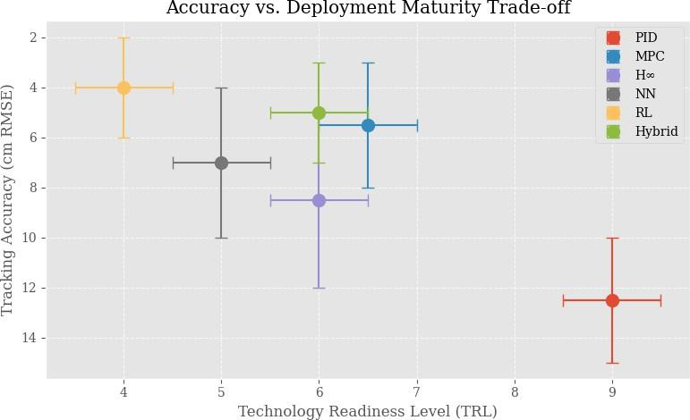
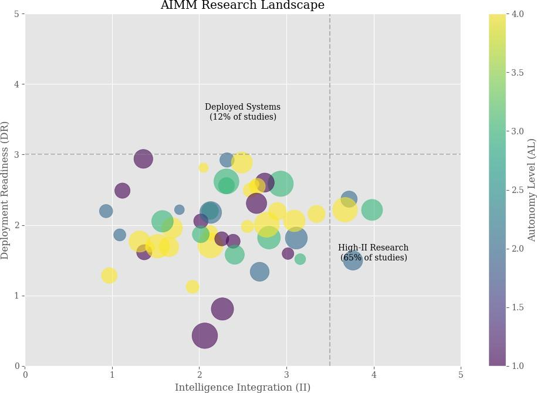
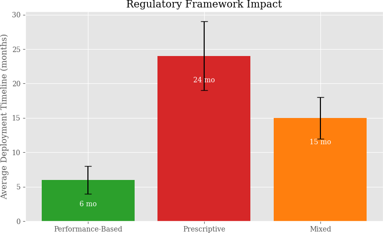

# Ssrn 6810618

**Source Document:** `ssrn-6810618.pdf`  
**Total Pages:** 26  

---

## --- Page 1 ---

Page 1 of 26 
Y. ALQUDSI et al. :

Autonomous Control and Artificial Intelligence in Drones: A 
Comprehensive Review

Yunes ALQUDSIa,b,∗, Ahmed ALWARDc, Zeynep KOYUNCUOĞLUc, Husam SULAIMANd 
and Fadi ALYOUSSEFb

aAerospace Engineering Department, Faculty of Aeronautics and Astronautics, Kocaeli University, Kocaeli, Turkiye 
bInterdisciplinary Research Center for Aviation and Space Exploration (IRC-ASE), KFUPM, Dhahran, Saudi Arabia 
cElectronics and Communication Engineering Department,Faculty of Engineering, Kocaeli University, Kocaeli, Turkiye 
dAviation Electrical Electronics Department, Faculty of Aeronautics and Astronautics, Kocaeli University, Kocaeli, Turkiye

#### A R T I C L E I N F O

Keywords: 
Artificial Intelligence 
Autonomous Drones 
Review Article 
Autonomous Control 
Deployment Readiness

#### A B S T R A C T

Artificial intelligence (AI) and autonomous control systems (ACS) are reshaping drone 
capabilities, yet the literature remains fragmented across control theory, perception, mission 
planning, and application-specific deployment studies. This review synthesizes that fragmented 
body of work through a structured evidence-based perspective centred on the research-to-
deployment gap in AI-enabled drone systems. The manuscript examines peer-reviewed studies 
published primarily between 2015 and 2025 and organizes the literature using the proposed 
AI-ACS Integration Maturity Model (AIMM), which is used here as a synthesis framework 
rather than as a validated scoring instrument. The review focuses on four analytical dimensions: 
autonomy level, intelligence integration, application complexity, and deployment readiness. 
Across the surveyed literature, a consistent pattern emerges: systems demonstrating high 
algorithmic sophistication frequently remain weakly validated under field conditions, whereas 
deployable systems often rely on narrower autonomy scopes and carefully bounded operational 
assumptions. The analysis further shows that hybrid control architectures, multi-modal sensing, 
and application-specific system design are recurrent enablers of practical performance, while 
safety assurance, energy constraints, robustness under environmental variability, and limited 
reporting comparability remain persistent barriers to large-scale deployment. By combining 
methodological transparency, cross-domain comparison, and a structured synthesis of technical 
and translational evidence, this review clarifies the present state of the field, identifies the 
most credible near-term pathways toward operational autonomy, and outlines the principal 
research priorities required to strengthen the academic and practical maturity of AI-enabled 
drone systems.

#### 1. Introduction

Unmanned Aerial Vehicles (UAVs) have evolved from remotely piloted platforms into increasingly autonomous 
cyber-physical systems capable of perception, planning, and mission execution in complex environments. This 
transition has been driven by concurrent progress in autonomous control systems (ACS), embedded sensing, machine 
learning, computer vision, and onboard computing, which together have expanded the operational envelope of drones 
across logistics, precision agriculture, infrastructure inspection, surveillance, and emergency response [1, 2, 3]. At the 
same time, the rapid expansion of the field has produced a literature that is rich in technical innovation but uneven in 
methodological consistency, deployment validation, and cross-study comparability.

The current evidence base contains at least three recurring tensions. First, many studies report strong performance 
within narrowly defined subsystems, such as tracking control, perception, or path planning, yet do not explain how 
these components scale into integrated autonomous systems that remain reliable under real operating conditions 
[4, 5]. Second, the literature frequently mixes laboratory demonstrations, simulation-heavy studies, and field-deployed 
applications without sufficiently distinguishing their evidentiary weight, which complicates meaningful comparison of 
maturity and readiness [6, 7]. Third, application-oriented review papers often emphasize sectoral promise but devote 
limited attention to the technical trade-offs, validation depth, and operational constraints that determine whether a 
system is genuinely deployable [8]. These gaps motivate the need for a more structured review that is analytical rather

∗Corresponding author

yunes.alqadasi@kocaeli.edu.tr (Y. ALQUDSI)

#### ORCID(s): 0000-0002-4246-9654 (Y. ALQUDSI)

## --- Page 2 ---

Autonomous Control and Artificial Intelligence in Drones

Y. ALQUDSI et al. : 
Page 2 of 26

than celebratory, evidence-based rather than purely descriptive, and explicit about the distinction between technical 
capability and deployment readiness.

This review therefore aims to answer four guiding questions: (i) which control, perception, navigation, and decision-
making approaches currently define the state of the art in AI-enabled drones; (ii) what recurrent trade-offs shape 
their real-world suitability; (iii) how do application context and validation setting influence the maturity of reported 
contributions; and (iv) where does the literature reveal the most important gaps between research performance and 
operational deployment? To address these questions, the paper introduces and applies the AI-ACS Integration Maturity 
Model (AIMM) as a literature-synthesis framework. AIMM organizes evidence across four dimensions: Autonomy 
Level (AL), Intelligence Integration (II), Application Complexity (AC), and Deployment Readiness (DR). For the 
purposes of this structured review, we code each included study against these dimensions to enable comparative 
analysis. This coding is an author-led synthesis device and is not presented as an externally validated or universal 
scoring standard.

The contribution of this article is threefold. First, it consolidates the fragmented literature on ACS and AI in 
drones into a coherent cross-layer review spanning control, perception, planning, and decision-making. Second, it 
adds analytical structure by comparing studies in terms of technical assumptions, validation realism, and translational 
readiness rather than reporting isolated headline outcomes. Third, it develops a clearer account of the research-to-
deployment gap by showing where progress is strongest, where evidence remains weak, and which research directions 
are most credible for near-term impact. The review is designed as a structured evidence synthesis rather than a meta-
analysis because the included studies vary substantially in objectives, datasets, metrics, and operational settings.

The remainder of this article is organized as follows. Section 2 describes the review protocol, including search 
strategy, screening logic, evidence extraction, and synthesis approach. The following sections then examine conceptual 
foundations, autonomous control approaches, AI-powered methodologies, and application domains. The later sections 
integrate these strands into a comparative synthesis, identify persistent research gaps, and discuss the technical, 
regulatory, and ethical conditions that must be addressed to improve deployment readiness and scholarly rigor in future 
work.

#### 2. Survey Methodology

This review follows a structured and reproducible literature-synthesis protocol designed to improve transparency, 
reduce selection bias, and strengthen the analytical value of the final corpus. The protocol was tailored to the aims 
of the present article, which focuses on peer-reviewed evidence at the intersection of autonomous control, artificial 
intelligence, and drone deployment. Because the field combines heterogeneous study designs, the methodology 
emphasizes explicit screening logic, standardized extraction of study attributes, and evidence-weighted synthesis rather 
than simple narrative aggregation.

2.1. Review Design and Scope 
The review was designed as a structured review of the literature spanning technical methods, application evidence, 
and translational readiness. The primary unit of analysis was the individual study. Priority was given to publications 
that presented a substantive contribution in one or more of the following categories: autonomous flight control, 
perception and sensing, navigation and path planning, decision-making, multi-agent coordination, or application-
specific deployment of AI-enabled drones. The principal review horizon covered publications from 2015 to 2025 
in order to capture the modern phase of learning-enabled autonomy, lightweight embedded vision, and integrated 
mission-level intelligence. Seminal earlier works were retained selectively when they remained foundational for later 
developments or were required to clarify the evolution of the field.

2.2. Literature Search Strategy 
The literature search drew from IEEE Xplore, ACM Digital Library, ScienceDirect, and Scopus, complemented by 
backward and forward citation tracking for highly relevant papers. Search strings were constructed around three concept 
families: platform terms (for example, UAV, drone, quadrotor), autonomy and control terms (for example, autonomous 
control, flight control, navigation, path planning, trajectory tracking), and AI-related terms (for example, machine 
learning, deep learning, reinforcement learning, computer vision, multi-agent). A representative canonical search 
string was: (UAV OR drone OR quadrotor) AND (autonom* OR control OR planning OR navigation) 
AND (AI OR machine learning OR deep learning OR reinforcement learning OR computer vision).

## --- Page 3 ---

Autonomous Control and Artificial Intelligence in Drones

Y. ALQUDSI et al. : 
Page 3 of 26

Search syntax was adjusted to match database-specific indexing conventions. The final search window and screening 
decisions were anchored to the manuscript scope rather than to a single application domain so that the resulting corpus 
could support cross-sectional comparison across methods and deployment contexts.

2.3. Eligibility Criteria and Screening Process 
The initial search returned 583 potentially relevant records. After duplicate removal, title-and-abstract screening, 
and full-text eligibility assessment, approximately one hundred primary studies were retained for detailed synthesis. 
Studies were included when they were peer-reviewed journal articles or conference papers, addressed AI or autonomous 
control in drone systems as a central contribution, reported a sufficiently clear methodology and results, and were 
relevant to at least one AIMM dimension. Studies were excluded when they focused only on peripheral enabling 
technologies without a clear connection to drone autonomy, provided mainly conceptual discussion without evaluable 
technical substance, or lacked sufficient methodological detail for meaningful comparison. Screening was conducted in 
two sequential stages: first, title and abstract review to remove clearly irrelevant records; second, full-text assessment 
to confirm fit with the review questions and evidence requirements.

2.4. Data Extraction, Coding, and Synthesis 
For each included study, information was extracted on application domain, core technical contribution, control 
or AI method, sensing modality, evaluation setting, performance metrics, and evidence type (simulation, benchmark, 
controlled experiment, or field deployment). These attributes were then coded against the four AIMM dimensions 
to enable structured comparison across otherwise heterogeneous studies. The synthesis approach was thematic and 
comparative. Rather than pooling effect sizes across incompatible experimental settings, the review identifies recurring 
design patterns, maturity distributions, translational bottlenecks, and cross-domain trade-offs. Particular emphasis 
was placed on differentiating between systems that demonstrate algorithmic novelty and those that provide stronger 
evidence of robustness, reproducibility, and deployment relevance.

2.5. Quality Appraisal and Methodological Boundaries 
The included literature was appraised qualitatively using four evidence-oriented criteria: methodological clarity, 
realism of evaluation, comparability of reported metrics, and degree of deployment relevance. Studies were not 
excluded solely because they lacked open code or full deployment, but these factors influenced how strongly their 
findings were weighted in the synthesis. This approach is important in a field where simulation-based and field-
based evidence often coexist under the same topical labels. The methodology therefore improves interpretive rigor 
while acknowledging two practical limitations of the present review: first, the evidence base remains heterogeneous in 
design and reporting detail; second, the AIMM coding is an author-led synthesis device and should be interpreted as 
a structured comparative aid rather than a universal maturity benchmark.

#### 3. Background and Key Concepts

This section examines the fundamental interplay between ACS and AI in drone technology, highlighting their 
synergistic relationship that enables unprecedented autonomy in complex environments as demonstrated in Figure 1. 
The integration of these technologies represents a paradigm shift in drone capabilities, driven by advances in both 
theoretical foundations and practical implementations.

3.1. Evolution of Autonomous Control Systems 
The progression of drone control paradigms has evolved through distinct phases, from direct human operation to 
adaptive autonomy, as summarized in Table 1. Modern ACS integrates three core components: navigation, guidance, 
and control [9, 10]. Navigation systems now fuse GNSS, IMUs, and environmental sensors to reduce estimation errors 
in GPS-denied environments [11]. Guidance systems have advanced from simple waypoint tracking to sophisticated 
sampling-based planners like RRT, which explore the environment more effectively than graph-based methods 
[12, 13, 14]. Control systems have matured from basic PID stabilization to advanced strategies like Sliding Mode 
Control (SMC) and Model Predictive Control (MPC), which outperform traditional methods in ensuring stability and 
robustness [15]. This evolution necessitates hierarchical architectures that balance performance with computational 
demands, a challenge effectively addressed in recent studies [16].

## --- Page 4 ---

Autonomous Control and Artificial Intelligence in Drones

Y. ALQUDSI et al. : 
Page 4 of 26

Fig. 1: Integration of AI in Autonomous Drone Systems. The figure presents a hierarchical architecture of AI-driven modules 
for drone autonomy, including (1) SLAM, (2) neural network-based, (3) computer vision, (4) edge AI processors, and (5) 
AI-enhanced flight controllers for adaptive navigation.

Table 1 
Evolution of Drone Control System Paradigms

Time Period 
Control Paradigm 
Key Characteristics and Technological Enablers 
Pre-2000s 
Manual Control 
Direct human operation of all flight parameters; minimal 
automated stabilization. 
2000–2010 
Stability Augmentation 
Introduction of PID controllers for attitude stabilization 
and basic systems to assist human pilots. 
2010–2015 
Semi-Autonomous Operation 
Waypoint navigation, geofencing, and basic obstacle 
avoidance, enabling partial autonomy in structured en- 
vironments. 
2015–2020 
Conditional Autonomy 
Integration of advanced sensors (e.g., LiDAR, RGB-D 
cameras) and decision-making algorithms for autonomy 
under specific, known conditions. 
2020–Present 
Adaptive Autonomy 
Systems capable of learning and adapting to dynamic, 
uncertain environments using hybrid and learning-based 
control strategies.

3.2. Foundations of Artificial Intelligence 
AI has revolutionized drone capabilities by enabling complex tasks like real-time perception, navigation, and 
decision-making. The relationship between core AI disciplines such as Machine Learning (ML), Deep Learning 
(DL), Computer Vision (CV), and Reinforcement Learning (RL), and their applications in drones is illustrated in 
Figure 2. Different ML paradigms offer complementary strengths, as quantitatively compared in Figure 3. Supervised 
learning excels in perception tasks with labeled data, unsupervised learning is advantageous for anomaly detection, 
and reinforcement learning shows promise for adaptive control, despite challenges with sample efficiency [17, 18].

*Caption/Context: Autonomous Control and Artificial Intelligence in Drones | Fig. 1: Integration of AI in Autonomous Drone Systems. The figure presents a hierarchical architecture of AI-driven modules  for drone autonomy, including (1) SLAM, (2) neural network-based, (3) computer vision, (4) edge AI processors, and (5)  AI-enhanced flight controllers for adaptive navigation.*

## --- Page 5 ---

Autonomous Control and Artificial Intelligence in Drones

Y. ALQUDSI et al. : 
Page 5 of 26

Fig. 2: AI, Machine Learning, and Deep Learning. This diagram demonstrates the relationship and differences between AI, 
ML, and DL, with a focus on their application in drone systems.

Lightweight architectures such as YOLOv4-tiny have demonstrated high detection performance under controlled 
benchmark conditions, with reported accuracies exceeding 90% in specific datasets; however, these results vary 
significantly depending on environmental conditions, dataset characteristics, and task complexity [19]. Frameworks 
like TerraFusion further demonstrate the power of semi-supervised vision-fusion for robust terrain classification across 
varying environmental conditions [20]. A typical computer vision pipeline for drone obstacle detection, encompassing 
image acquisition, processing, feature extraction, and decision-making, is shown in Figure 4.

3.3. The AI-ACS Integration Maturity Model (AIMM) 
To support consistent comparison across technically diverse studies, this review introduces the AI-ACS Integration 
Maturity Model (AIMM) as a structured synthesis framework. AIMM does not seek to replace established technology-
readiness or autonomy taxonomies. Instead, it offers a review-specific lens that helps relate algorithmic sophistication 
to operational context and reported evidence. The framework is especially useful in the present domain because many 
published studies excel along one dimension, such as intelligence integration, while remaining weak along others, such 
as deployment readiness or application realism.

AIMM organizes the literature across four interrelated dimensions. Autonomy Level (AL) captures the degree to 
which a system can perform mission functions with limited human intervention, ranging from tightly supervised 
operation to high levels of autonomous perception–decision–action closure. Intelligence Integration (II) reflects 
the extent to which adaptive or learning-based methods are embedded in the operational stack, distinguishing 
basic algorithmic automation from systems that use richer forms of inference, learning, or multi-modal reasoning. 
Application Complexity (AC) describes the environmental and mission burden placed on the system, including task 
variability, environmental uncertainty, and the consequences of operational failure. Deployment Readiness (DR) 
captures the strength of translational evidence, ranging from proof-of-concept laboratory demonstrations to field-
validated and operationally deployed systems.

The main value of AIMM lies in its ability to expose imbalance. A study may report high intelligence integration and 
ambitious mission complexity while still relying entirely on simulation, thereby indicating a low degree of deployment

![Autonomous Control and Artificial Intelligence in Drones | Lightweight architectures such as YOLOv4-tiny have demonstrated high detection performance under controlled  benchmark conditions, with reported accuracies exceeding 90% in specific datasets; however, these results vary  significantly depending on environmental conditions, dataset characteristics, and task complexity [19]. Frameworks  like TerraFusion further demonstrate the power of semi-supervised vision-fusion for robust terrain classification across  varying environmental conditions [20]. A typical computer vision pipeline for drone obstacle detection, encompassing  image acquisition, processing, feature extraction, and decision-making, is shown in Figure 4.](images/page_005_fig_01.jpeg)
*Caption/Context: Autonomous Control and Artificial Intelligence in Drones | Lightweight architectures such as YOLOv4-tiny have demonstrated high detection performance under controlled  benchmark conditions, with reported accuracies exceeding 90% in specific datasets; however, these results vary  significantly depending on environmental conditions, dataset characteristics, and task complexity [19]. Frameworks  like TerraFusion further demonstrate the power of semi-supervised vision-fusion for robust terrain classification across  varying environmental conditions [20]. A typical computer vision pipeline for drone obstacle detection, encompassing  image acquisition, processing, feature extraction, and decision-making, is shown in Figure 4.*

## --- Page 6 ---

Autonomous Control and Artificial Intelligence in Drones

Y. ALQUDSI et al. : 
Page 6 of 26

Fig. 3: Comparative performance metrics across machine learning paradigms in drone applications, showing relative 
strengths and limitations of supervised, unsupervised, and reinforcement learning approaches.

Table 2 
Initial Technology Categorization Using the AIMM Framework

Technology 
AL 
II 
AC 
DR 
Visual-Inertial Odometry 
3 
2 
3 
4 
Model Predictive Control (MPC) 
3 
2 
3 
3 
Deep RL for Agile Flight 
4 
4 
2 
1 
CNN-based Object Detection 
2 
3 
3 
4 
 Uncertainty-Aware Planning 
3 
3 
4 
2

readiness. Conversely, a commercially deployed system may show high readiness while relying on tightly constrained 
autonomy and limited adaptive intelligence. Used in this way, AIMM helps prevent misleading comparisons between 
papers that appear similar at the topical level but differ markedly in evidence quality, task difficulty, and translational 
maturity.

The framework is applied throughout the remainder of the manuscript as a comparative coding device rather than a 
scoring formula. The goal is to identify patterns across the literature, not to assign definitive maturity labels to all drone 
systems. For this reason, AIMM categories should be interpreted as analytically useful abstractions derived from the 
reported characteristics of the included studies. Boundary cases remain possible, especially when papers incompletely 
describe field conditions, operational assumptions, or the degree of human supervision embedded in the evaluation 
protocol.

Table 2 illustrates the intended use of the framework. The table is not presented as a definitive ranking exercise; 
rather, it demonstrates how representative technologies can occupy different positions across the four dimensions. 
This multi-dimensional interpretation is important because high autonomy or strong AI performance alone does not 
necessarily imply deployment maturity. A central argument of this review is that academic progress in AI-enabled 
drones should be assessed not only by technical novelty, but also by the realism, transparency, and translational strength 
of the supporting evidence.

*Caption/Context: Autonomous Control and Artificial Intelligence in Drones | Fig. 3: Comparative performance metrics across machine learning paradigms in drone applications, showing relative  strengths and limitations of supervised, unsupervised, and reinforcement learning approaches.*

## --- Page 7 ---

Autonomous Control and Artificial Intelligence in Drones

Y. ALQUDSI et al. : 
Page 7 of 26

Fig. 4: Bidirectional computer vision workflow showing the complete image processing pipeline from acquisition to obstacle 
avoidance decision-making. The top path processes raw sensor data while the bottom path extracts features and generates 
navigation outputs.

#### 4. Autonomous Control Approaches

Drone control systems must ensure stable, reliable, and efficient flight across diverse operational scenarios. 
This section provides a critical analysis of control approaches from traditional methods to advanced AI-integrated 
techniques, examining their theoretical foundations, implementation challenges, performance characteristics, and real-
world applications. We evaluate their relative strengths and limitations, supported by quantitative performance metrics 
from recent literature and industry deployments, rather than merely describing these approaches.

4.1. Traditional and Advanced Model-Based Control 
Traditional control methods remain widely deployed in commercial drone systems due to their reliability, 
interpretability, and computational efficiency. However, their limitations in handling complex dynamics and uncertain 
environments have driven significant research into enhanced implementations and hybrid approaches.

Despite their simplicity and widespread use, PID controllers exhibit significant limitations in dynamic environ-
ments, with tracking error increasing by 30-50% under wind disturbances [21]. Recent research focuses on auto-tuning 
using optimization algorithms like Particle Swarm Optimization (PSO), which improves disturbance rejection and path 
tracking [22, 23, 24].

To overcome the limitations associated with traditional approaches, MPC uses a system model to predict and 
optimize future behavior. It has been shown to outperform PID and LQR in stability and robustness [25]. However, 
its computational cost and sensitivity to model inaccuracy are key challenges [26]. Hybrid approaches, such as 
Neural-MPC, integrate learned dynamics models to reduce tracking errors by up to 82% while maintaining real-time 
performance [26, 27].

To improve system performance under the effect of uncertainty, robust and adaptive control methods like H∞ 
control are designed. A frequency-dependent H∞ controller reduced station-keeping errors by 50% in variable wind 
conditions, albeit with increased actuator usage [28, 29]. Adaptive-fuzzy control, which combines fuzzy logic with 
adaptive strategies, has demonstrated a 30% reduction in trajectory tracking error by effectively handling nonlinearities 
without an exact system model [30].

4.2. Learning-Based and Hybrid Control Paradigms 
While traditional and model-based control approaches provide reliable foundations for drone autonomy, learning-
based paradigms have emerged to address their limitations in handling complex and unstructured environments. These

*Caption/Context: Autonomous Control and Artificial Intelligence in Drones | Fig. 4: Bidirectional computer vision workflow showing the complete image processing pipeline from acquisition to obstacle  avoidance decision-making. The top path processes raw sensor data while the bottom path extracts features and generates  navigation outputs.*

## --- Page 8 ---

Autonomous Control and Artificial Intelligence in Drones

Y. ALQUDSI et al. : 
Page 8 of 26

Table 3 
Comparative Analysis of Drone Control Methodologies

Methodology 
Speed (fps) 
Power (W) 
Accuracy (%) 
Robustness 
Validation Maturity 
AIMM Profile 
PID Control 
100+ 
2-4 
70-85 
High 
Extensive 
AL2-II1-AC2-DR4 
Model Predictive 
20-40 
6-10 
80-90 
Very High 
Moderate 
AL3-II2-AC3-DR3 
Reinforcement Learning 
10-25 
12-18 
85-95 (sim) 
Moderate 
Limited 
AL4-II4-AC3-DR1 
Hybrid Approaches 
30-50 
5-8 
85-92 
High 
Moderate 
AL4-II3-AC4-DR2 
Fuzzy Logic 
60-80 
3-6 
75-85 
High 
Moderate 
AL3-II3-AC3-DR3

data-driven methods offer the potential for higher performance and adaptability, though they introduce new challenges 
in verification and safety assurance.

Neural network control represents a significant departure from traditional model-based approaches, as it uses deep 
learning to approximate complex control policies directly from data. These systems have demonstrated smaller tracking 
errors, with some implementations achieving remarkably low root mean square error in trajectory following tasks 
[31]. The potential of these approaches is further evidenced by imitation learning systems that have matched or even 
exceeded human pilot performance in specific operational scenarios [32]. However, the black-box nature of these 
neural controllers raises concerns regarding safety verification and interpretability, presenting significant barriers for 
deployment in safety-critical applications [33].

Building upon neural network approaches, RL enables drones to learn control policies through direct interaction 
with their environment, which optimizes behavior based on cumulative reward signals. RL has yielded accurate agile 
flight while achieving championship-level performance in competitive drone racing and demonstrating extreme flight 
capabilities at very high speeds and accelerations [34, 35]. The RL practical application faces two main constraints: 
the large size of data required for policy training and the challenging sim-to-real transfer gap that often causes 
performance degradation when moving from simulation to physical platforms. Research in model-based RL and 
domain randomization techniques has shown promising progress in addressing these limitations by reducing sample 
complexity and improving transfer robustness [36, 37].

The most promising developments emerge from hybrid architectures that strategically combine the strengths of 
model-based and learning-based approaches. These systems typically employ hierarchical frameworks that decompose 
the control problem into distinct planning, guidance, and control layers, enabling safe navigation through complex en-
vironments at operationally relevant speeds [38]. A particularly effective hybrid strategy involves learning-augmented 
model-based control, where neural networks enhance traditional MPC by improving dynamics modeling accuracy. This 
approach has demonstrated performance improvements, including important reductions in trajectory tracking errors 
while maintaining the safety and interpretability benefits of model-based frameworks [26]. The continued evolution of 
these hybrid architectures represents a balanced pathway forward in which the adaptability of learning-based methods 
is leveraged while preserving the verifiability and robustness of established control theory.

4.3. Comparative Analysis and Computational Efficiency 
Table 3 provides a synthesized comparison of control methodologies, integrating performance metrics with their 
AIMM categorization. A key insight is the inherent trade-off between performance and computational cost. For 
instance, while RL controllers can achieve very high tracking accuracy, they typically operate at lower frame rates 
(10-25 fps) and higher power consumption (12-18 W) compared to traditional PID controllers (100+ fps, 2-4 W). This 
illustrates why hybrid approaches, which balance high accuracy with manageable computational demands, are better 
for practical deployment.

#### 5. AI-Powered Methodologies in Drones

The integration of AI has fundamentally transformed drone capabilities. This integration enables high levels of 
autonomy, adaptability, and operational intelligence [39]. This section provides a comprehensive analysis of AI-driven 
methodologies that enhance drone operations across perception, navigation, and decision-making domains. It also 
examines both theoretical foundations and practical implementations supported by empirical evidence from recent 
research and industry applications. The underlying architecture for these AI-enabled systems typically employs a 
hierarchical control structure that systematically integrates sensor data fusion, distributed control systems, and decision

## --- Page 9 ---

Autonomous Control and Artificial Intelligence in Drones

Y. ALQUDSI et al. : 
Page 9 of 26

Fig. 5: Hierarchical architecture for AI-driven drone control systems, showing the integration of perception, planning, and 
execution layers with machine learning components for autonomous operation.

optimization layers, as illustrated in Figure 5. This multi-layered approach enables robust autonomous operation by 
coordinating environmental perception with mission-level objective optimization.

5.1. Perception and Sensing Systems 
Perception systems serve as the foundational element for autonomous drone operations, providing essential environ-
mental awareness for obstacle avoidance, target recognition, and situational understanding. Recent advancements have 
focused on addressing computational constraints and environmental variability through the development of lightweight 
architectures and sophisticated multi-modal fusion strategies. Deep learning-based computer vision has particularly 
revolutionized this domain, though comprehensive benchmarking reveals inherent trade-offs between accuracy and 
computational efficiency. While optimized models like YOLOv4-Tiny achieve rapid inference times with respectable 
accuracy, more complex architectures deliver higher precision at the cost of increased computational demands and 
power consumption [40]. Field evaluations consistently demonstrate that these systems experience performance 
degradation under challenging operational conditions, with further accuracy reductions occurring in adverse weather 
and high-motion scenarios [41]. Figures 6 and 7 quantitatively illustrate these fundamental limitations. It also highlights 
the critical balance between performance and robustness that must be addressed for reliable deployment.

Semantic segmentation represents another crucial advancement. It enables pixel-level environmental understand-
ing, which is essential for precision applications in agriculture, infrastructure inspection, and urban navigation. 
Lightweight network architectures have made good progress in achieving this capability on resource-constrained 
platforms, though computational requirements remain high for real-time operation [42, 43]. The limitations of individ-
ual sensing modalities have driven the development of multi-modal fusion approaches that leverage complementary 
sensing strategies to overcome environmental challenges. LiDAR-camera fusion demonstrates particular effectiveness 
in adverse weather conditions. It specifically improves detection accuracy at various ranges compared to vision-only 
systems [44]. Similarly, radar-vision fusion maintains reliable performance in poor visibility conditions. At the same 
time, event-based vision offers a large dynamic range and temporal resolution with minimal power consumption. This 
further enables operation in high-speed scenarios where conventional cameras typically fail due to motion blur [45, 46]. 
These fusion strategies are quantitatively compared in Table 4. The table provides a systematic evaluation of their 
respective advantages and limitations.

The robustness of perception systems remains a critical concern, with demonstrated vulnerabilities to both 
adversarial attacks and environmental domain shifts. Physical adversarial patches can significantly degrade detection

*Caption/Context: Autonomous Control and Artificial Intelligence in Drones | Fig. 5: Hierarchical architecture for AI-driven drone control systems, showing the integration of perception, planning, and  execution layers with machine learning components for autonomous operation.*

## --- Page 10 ---

Autonomous Control and Artificial Intelligence in Drones

Y. ALQUDSI et al. : 
Page 10 of 26

Fig. 6: Performance trade-offs in perception systems showing accuracy versus computational efficiency for different 
computer vision approaches. The Pareto frontier highlights optimal choices for drone deployment (YOLOv4-tiny offers 
best balance at 40.2% mAP with 6.9ms latency ).

Table 4 
Performance Comparison of Multi-Modal Sensing Approaches

Sensing Modality 
Accuracy (mAP) 
Robustness 
Power Consumption 
Key Applications 
Camera-only 
85-92% 
Low 
100-500 mW 
Ideal conditions, object detection 
LiDAR-Camera Fusion 
+15-25% improvement 
Medium 
1.5-3 W 
Precision agriculture, 3D mapping 
Radar-Vision Fusion 
+10-20% improvement 
High 
1-2 W 
All-weather navigation, automotive 
Event-based Vision 
75-85% 
Very High 
5-10 mW 
High-speed maneuvering, low power 
Thermal Imaging 
80-88% 
Medium (temp-dependent) 
5-10 W 
Search and rescue, night operations

accuracy, while domain adaptation challenges cause substantial performance reductions when systems encounter un-
familiar environments [47]. Mitigation strategies have emerged through self-supervised domain adaptation techniques 
that reduce performance gaps across different operational contexts [48], adversarial training methods that improve 
resilience against perturbations, and probabilistic approaches that effectively identify out-of-distribution inputs. These 
approaches collectively address the reliability challenges that currently limit the deployment of perception systems in 
safety-critical applications [47, 49].

5.2. Navigation and Path Planning 
AI-powered navigation enables autonomous operation through complex environments while optimizing trajectories 
according to mission objectives and operational constraints. End-to-end approaches that learn direct sensor-to-
command mappings have demonstrated high capabilities in specific domains, such as mapless navigation through visu-
ally complex environments [50]. However, these methods face significant generalization challenges when encountering 
different operational conditions, with issues related to covariate shift and domain adaptation limiting their broader ap-
plicability. Hybrid approaches that combine learning-based components with traditional planning methodologies have

*Caption/Context: Autonomous Control and Artificial Intelligence in Drones | Fig. 6: Performance trade-offs in perception systems showing accuracy versus computational efficiency for different  computer vision approaches. The Pareto frontier highlights optimal choices for drone deployment (YOLOv4-tiny offers  best balance at 40.2% mAP with 6.9ms latency ).*

## --- Page 11 ---

Autonomous Control and Artificial Intelligence in Drones

Y. ALQUDSI et al. : 
Page 11 of 26

Fig. 7: Performance degradation of vision systems under challenging conditions, showing relative accuracy loss compared 
to ideal conditions. Note the 30-45% drop in low light and 40-60% reduction with occlusion.

Fig. 8: Computational efficiency versus path optimality for different planning approaches. Hierarchical methods achieve 
90-95% optimality with 60-80% reduced computation.

demonstrated superior performance and reliability. These approaches leverage neural representations with attention 
mechanisms and hierarchical planning architectures that reduce computational requirements while maintaining high 
performance on challenging benchmarks [51, 52].

Multi-objective optimization addresses the competing requirements inherent in real-world missions, where factors 
such as energy consumption, flight duration, and coverage efficiency must be balanced against operational objectives. 
Energy-aware planning strategies demonstrate the importance of trade-offs between these competing factors, while 
hierarchical methods achieve near-optimal path quality with reduced computational demands [53]. Figure 8 illustrates 
this fundamental relationship between computational efficiency and path optimality. The figure further explains why 
hybrid approaches are increasingly favored for practical deployment scenarios where both performance and resource 
constraints must be considered.

*Caption/Context: Fig. 7: Performance degradation of vision systems under challenging conditions, showing relative accuracy loss compared  to ideal conditions. Note the 30-45% drop in low light and 40-60% reduction with occlusion. | Fig. 8: Computational efficiency versus path optimality for different planning approaches. Hierarchical methods achieve  90-95% optimality with 60-80% reduced computation.*

*Caption/Context: Autonomous Control and Artificial Intelligence in Drones | Fig. 7: Performance degradation of vision systems under challenging conditions, showing relative accuracy loss compared  to ideal conditions. Note the 30-45% drop in low light and 40-60% reduction with occlusion.*

## --- Page 12 ---

Autonomous Control and Artificial Intelligence in Drones

Y. ALQUDSI et al. : 
Page 12 of 26

Table 5 
AI Methodology Maturity Assessment Using AIMM Framework

AI Methodology 
AL 
II 
AC 
DR 
CNN-based Object Detection 
2 
3 
3 
4 
Event-based Vision 
3 
3 
4 
2 
LiDAR-Camera Fusion 
3 
3 
4 
3 
End-to-End Navigation 
4 
4 
3 
2 
Risk-Aware Planning 
3 
3 
4 
3 
Hierarchical RL for Decision-Making 
4 
4 
4 
1 
 Explainable Neural Controllers 
3 
4 
3 
2

5.3. Decision-Making and Explainable AI 
Autonomous decision-making represents the highest level of AI integration in drone systems. It enables effective 
operation in complex, dynamic environments with minimal human oversight. Hierarchical RL architectures that 
decompose decision-making across multiple abstraction levels have demonstrated good improvements in complex 
multi-agent scenarios. This further assists it in achieving competitive performance even in numerically disadvantaged 
conditions [54]. Uncertainty-aware planning methodologies have proven equally important for reliable operation in 
dynamic environments, with belief space planning frameworks utilizing sophisticated probabilistic models achieving 
high success rates in both simulation and real-world experiments while maintaining good safety records [55].

The increasing complexity of these AI systems has elevated the importance of explainable AI (XAI) for ensuring 
transparency, trust, and safety in autonomous operations. Recent empirical studies demonstrate that explainable systems 
provide important benefits across multiple dimensions, including improved airspace management capacity, enhanced 
navigation success rates in unknown environments, and more efficient failure mode identification during system 
development [56, 57, 58]. However, challenges remain in balancing performance with explainability requirements. 
Also, there are concerns regarding the reliability of post-hoc explanation methods, particularly their sensitivity to 
model parameters and training data variations [59].

5.4. AI Methodology Maturity Assessment 
Applying the AIMM framework to the discussed methodologies reveals critical patterns in technological maturity 
and deployment readiness, as shown in Table 5. Perception technologies generally demonstrate higher deployment 
readiness (DR-3/DR-4) compared to decision-making approaches (DR-1/DR-2). This reflects their longer development 
history and more established validation methodologies. The highest autonomy levels (AL-4) primarily emerge 
from end-to-end learning systems, though these correspond with lower deployment readiness, highlighting the 
significant integration challenges that remain. Technologies addressing high application complexity environments 
(AC-4) generally show reduced deployment readiness. This further underscores the difficulties in achieving reliable 
operation in dynamic and unstructured settings. Figure 9 visually summarizes this maturity analysis. It reveals the 
clustering of perception methods with higher deployment readiness versus decision-making approaches with higher 
autonomy and intelligence integration but lower operational readiness.

#### 6. Applications of AI-Enabled Drones

The integration of AI with ACS has fundamentally transformed drone capabilities across diverse sectors. It 
particularly enables applications that were previously impractical or impossible. This section provides a critical analysis 
of these applications. It examines documented performance metrics, real-world implementation barriers, and quantified 
impacts to evaluate the current state of deployment and identify the technical and operational gaps that must be 
addressed for broader adoption.

6.1. Logistics and Delivery Systems 
Drone-based delivery has progressed from conceptual demonstrations to limited commercial operations. This 
further demonstrates quantifiable benefits alongside persistent challenges. Leading commercial operators have achieved 
good delivery reliability with average delivery times much faster than traditional methods in specific operational 
contexts. Comparative analyses consistently show large delivery time reductions for time-critical supplies, particularly 
in rural and remote areas where traditional infrastructure is limited. The energy efficiency of drone delivery presents

## --- Page 13 ---

Autonomous Control and Artificial Intelligence in Drones

Y. ALQUDSI et al. : 
Page 13 of 26

Fig. 9: Heatmap of AI methodologies across AIMM dimensions, showing clustering of perception methods (higher DR) 
versus decision-making (higher AL/II). Color intensity represents number of studies.

another important advantage, with small-package transport consuming much less energy per package-kilometer com-
pared to conventional delivery vehicles in comparable operating environments [60]. Recent commercial deployments 
by industry pioneers have validated operational feasibility at a large scale, in which medical logistics applications are 
demonstrating particularly compelling economics through substantial cost savings per delivery in remote healthcare 
scenarios.

Despite these advances, current systems face fundamental trade-offs between payload capacity, operational range, 
and energy consumption that limit broader deployment. Commercially viable operations remain constrained to specific 
package weight and distance parameters due to current battery energy density limitations. Weather resilience presents 
another important operational constraint, with wind speeds and precipitation levels serving as primary limiting factors 
that affect overall system availability. Economic viability analysis reveals that drone delivery becomes most competitive 
in specific demographic and geographic contexts, with realistic technological scenarios suggesting economically 
viable service for substantial population segments in developed markets [61]. The architectural framework for 
these autonomous delivery systems, illustrated in Figure 10, demonstrates the integration of AI components for 
comprehensive fleet management, predictive maintenance, dynamic routing, and resource optimization.

6.2. Precision Agriculture and Environmental Monitoring 
Precision agriculture applications demonstrate transformative potential across multiple domains, with multispectral 
imaging enabling early disease detection before visible symptoms appear through sophisticated vegetation index 
analysis. This capability supports early intervention strategies that substantially reduce crop losses while optimizing 
resource allocation[62]. Drone-based precision nutrient management achieves large predictive accuracy for nutrient use 
efficiency. This further allows having high reductions in fertilizer usage while maintaining or improving crop yields 
and generating extra economic returns per cultivated area [63, 64]. Irrigation management similarly benefits from 
thermal imaging combined with multispectral data. This enables precise water stress detection that supports irrigation 
strategies, achieving major water use reductions while simultaneously improving yield quality.

*Caption/Context: Autonomous Control and Artificial Intelligence in Drones | Fig. 9: Heatmap of AI methodologies across AIMM dimensions, showing clustering of perception methods (higher DR)  versus decision-making (higher AL/II). Color intensity represents number of studies.*

## --- Page 14 ---

Autonomous Control and Artificial Intelligence in Drones

Y. ALQUDSI et al. : 
Page 14 of 26

Fig. 10: AI-Driven Logistics Framework for Autonomous Drone Delivery Systems. The diagram illustrates an end-to-end 
workflow integrating AI for drone fleet management, encompassing (1) predictive maintenance and health monitoring, (2) 
computer vision-based emergency reporting, (3) swarm coordination and dynamic route optimization, and (4) resource 
allocation with task prioritization.

Environmental monitoring applications demonstrate equally significant advantages in data collection efficiency 
and accuracy. Wildlife conservation efforts benefit from drone-based surveys that achieve higher accuracy than 
traditional ground counts with considerable cost savings, while maintaining high identification accuracy in challenging 
environments such as marine ecosystems. Forest management applications leverage drone LiDAR capabilities that 
achieve minimal error compared to traditional airborne systems while reducing operational costs significantly. Pollution 
monitoring demonstrates a high correlation with ground-based sensor networks while providing superior spatial 
resolution for detailed environmental assessment. Despite these demonstrated benefits, implementation challenges still 
exist. They include technical expertise requirements, interoperability issues with existing farm management software, 
and economic viability concerns, particularly for smaller agricultural operations where shared infrastructure models 
become essential for positive return on investment.

6.3. Surveillance, Security and Emergency Response 
AI-enabled drones enhance public safety and infrastructure protection capabilities. In this regard, it reduces 
situational assessment time considerably compared to ground-based methods. The integration of AI-based object

*Caption/Context: Autonomous Control and Artificial Intelligence in Drones | Fig. 10: AI-Driven Logistics Framework for Autonomous Drone Delivery Systems. The diagram illustrates an end-to-end  workflow integrating AI for drone fleet management, encompassing (1) predictive maintenance and health monitoring, (2)  computer vision-based emergency reporting, (3) swarm coordination and dynamic route optimization, and (4) resource  allocation with task prioritization.*

## --- Page 15 ---

Autonomous Control and Artificial Intelligence in Drones

Y. ALQUDSI et al. : 
Page 15 of 26

Fig. 11: Integrated framework for autonomous disaster response systems, showing multi-modal workflow combining sensor 
modules, software stacks, and operational functionalities for victim detection, emergency delivery, and communication 
relay.

detection enables the location of persons of interest multiple times faster than traditional search methods, while 
automated traffic monitoring achieves high accuracy in incident detection with minimal response latency [65]. 
Infrastructure protection similarly benefits from drone-based perimeter monitoring that detects intrusion attempts at 
substantially higher rates than fixed systems, with potential for significant cost reductions for large facilities [66]. 
Industrial inspections demonstrate remarkable time savings compared to manual methods, with AI-powered defect 
detection achieving exceptional accuracy for common fault types.

Emergency response applications demonstrate particularly compelling life-saving potential. Specifically, thermal-
equipped drones have utilized AI-based human detection to achieve high accuracy in wilderness environments. The 
thermal imaging capability enables effective detection through challenging conditions, including dense vegetation and 
nighttime operations. This enhances search and rescue effectiveness [67]. Disaster assessment applications provide 
higher spatial resolution compared to satellite imagery with reduced acquisition times. Here, AI-powered damage 
assessment classifies structural damage with high accuracy for both binary and multi-class severity evaluation [68]. 
Early warning systems leverage drone-based photogrammetry with AI-powered change detection to identify precursor 
movements in natural hazards with exceptional precision. In this aspect, specialized gas-sensing drones successfully 
measure critical emission parameters for improved volcanic eruption forecasting [69]. The integrated framework 
for these autonomous disaster response systems, illustrated in Figure 11, demonstrates the coordination of multiple 
hardware and software components for comprehensive emergency management.

6.4. Application Maturity Analysis 
Applying the AIMM framework to drone applications reveals strategic patterns in technological development 
and deployment readiness, as systematically categorized in Table 6. The analysis demonstrates that applications with 
high deployment readiness (DR-4) typically operate in structured or semi-structured environments (AC-2/AC-3) with 
moderate autonomy levels. It reflects the current technological sweet spot for commercial viability (AL-2/AL-3). 
Applications requiring high intelligence integration (II-4), such as search and rescue and urban surveillance, show lower 
deployment readiness despite significant research investment. This specifically illustrates the challenges in transitioning 
advanced AI capabilities to operational systems. Medical delivery represents a successful case study in balancing 
capability and reliability. They have specifically achieved high deployment readiness through the implementation

*Caption/Context: Autonomous Control and Artificial Intelligence in Drones | Fig. 11: Integrated framework for autonomous disaster response systems, showing multi-modal workflow combining sensor  modules, software stacks, and operational functionalities for victim detection, emergency delivery, and communication  relay.*

## --- Page 16 ---

Autonomous Control and Artificial Intelligence in Drones

Table 6

Y. ALQUDSI et al. : 
Page 16 of 26

Application Maturity Assessment Using AIMM Framework

Application 
AL 
II 
AC 
DR 
Medical Delivery (Zipline) 
3 
2 
3 
4 
Last-Mile Package Delivery 
3 
3 
4 
2 
Precision Agriculture (Mapping) 
3 
3 
2 
4 
Precision Agriculture (Spraying) 
2 
2 
3 
3 
Wildlife Monitoring 
3 
3 
2 
4 
Infrastructure Inspection 
2 
3 
3 
4 
Search and Rescue 
2 
4 
4 
3 
Disaster Assessment 
3 
3 
3 
3 
 Urban Security Surveillance 
2 
4 
4 
2

of reliable autonomy with relatively straightforward intelligence requirements. This maturity assessment provides 
valuable insights for prioritizing development efforts and resource allocation across different application domains. 
This further emphasize the importance of carefully matching technological ambition with practical implementation 
constraints.

#### 7. Comparative Analysis and Research Gaps

This section provides a critical synthesis and comparative analysis of research on AI and ACS in drones. It 
especially examines methodological approaches, performance metrics, and implementation challenges across diverse 
application domains. Here, we analyze primary research directly to identify patterns, contradictions, and critical gaps 
that inform both current understanding and future research directions while moving beyond mere summarization of 
existing literature. Our analysis reveals fundamental trade-offs between accuracy, robustness, and deployment readiness 
that characterize the current state of drone autonomy technologies.

7.1. Trends and Emerging Methodological Shifts (2015–2025) 
Across the surveyed literature, three intertwined trends are reshaping autonomous drone research: (i) the migration 
from hand-crafted perception and linearized control toward end-to-end or tightly coupled perception–planning–control 
learning stacks, especially for vision-based autonomy; (ii) the shift from single-agent autonomy to cooperative, multi-
agent decision making (e.g., MARL) for coverage, formation, and task allocation; and (iii) the move from cloud-centric 
pipelines toward onboard/edge AI, driven by latency, bandwidth, and resilience constraints. Recent surveys underscore 
that vision-based learning has become a core pathway to agility and autonomy, but remains bottlenecked by dataset 
realism, simulator fidelity, inference speed, and sim-to-real transfer [70]. In parallel, MARL-driven UAV control is 
rapidly expanding, yet evaluation practices remain fragmented and often incomparable across domains [71]. For multi-
UAV swarms, decentralized coordination and robustness to communication limits are increasingly emphasized, with 
a growing need for scalable verification and safety-aware coordination [72].

7.2. Pitfalls, Failure Modes, and Reproducibility Bottlenecks 
A cross-cutting finding is that reported performance gains frequently do not translate to operational robustness. 
Common pitfalls include: (a) benchmark leakage where models are implicitly tuned to narrow simulators or datasets; 
(b) metric mismatch where success is reported via task-specific scores that obscure safety-relevant failure modes (near-
collisions, loss of control authority, latency spikes); (c) sim-to-real brittleness due to unmodeled aerodynamics, sensor 
artifacts, or domain shift; and (d) incomplete ablations that prevent attribution of improvements to specific modules. 
These pitfalls motivate a methodological shift toward standardized evaluation suites, explicit uncertainty reporting, 
and safety-constrained learning/control that remains stable under disturbances and degraded sensing. s

7.3. Performance Benchmarking Across Domains 
A systematic comparison of control approaches based on primary research reveals fundamental trade-offs between 
accuracy, robustness, and deployment maturity, as comprehensively detailed in Table 7. This analysis demonstrates 
a clear accuracy-maturity trade-off where learning-based approaches achieve centimeter-scale tracking performance 
but exhibit low technology readiness levels (TRL 3-5). On the other hand, mature PID implementations offer proven

## --- Page 17 ---

Autonomous Control and Artificial Intelligence in Drones

Table 7

Y. ALQUDSI et al. : 
Page 17 of 26

Quantitative Benchmarking of Drone Control Approaches

Control Approach 
Tracking Accuracy (RMSE) 
Disturbance Rejection 
Computational Efficiency 
Deployment Maturity (TRL) 
PID Control 
10-15 cm 
30-50% error increase 
0.1-0.5 ms/iteration 
High (9) 
Model Predictive Control 
3-8 cm 
15-25% error increase 
10-100 ms/iteration 
Medium (6-7) 
H∞ Control 
5-12 cm 
10-20% error increase 
2-5 ms/iteration 
Medium (6) 
Neural Network Control 
4-10 cm 
20-40% error increase 
3-8 ms/iteration 
Low-Medium (4-6) 
Reinforcement Learning 
2-6 cm 
15-30% error increase 
2-5 ms/iteration 
Low (3-5) 
Hybrid Hierarchical Control 
3-7 cm 
10-20% error increase 
5-15 ms/iteration 
Medium (5-7)

Fig. 12: Technology Readiness Level (TRL) versus tracking accuracy for control approaches. The inverse relationship 
highlights the implementation gap for advanced methods. Error bars show ranges from primary studies.

reliability at the cost of reduced precision (TRL 9). The inverse relationship between technological sophistication 
and deployment readiness, visually represented in Figure 12. This figure shows that there is an implementation gap 
that currently separates advanced control methodologies from field-deployable systems. This pattern displays the 
challenges in transitioning from laboratory demonstrations to operational deployments, particularly for methods that 
require extensive training data or exhibit sensitivity to environmental variations.

Perception systems exhibit similarly complex performance characteristics that vary significantly across operational 
contexts, with no single approach dominating all conditions, as detailed in Table 8. The context-dependent nature of 
perception performance necessitates careful application-specific selection. Thermal imaging specifically demonstrates 
particular effectiveness for search and rescue operations in darkness. On the other hand, LiDAR-camera fusion excels in 
infrastructure inspection applications, while event-based vision provides advantages for agile flight scenarios with high 
dynamics. Radar-vision fusion also enables reliable all-weather operations despite higher computational requirements. 
This specialization shows the importance of matching perception technologies to specific operational requirements 
rather than seeking universally optimal solutions.

7.4. AIMM Framework Synthesis and Research Gaps 
Applying the AIMM framework across the considered studies reveals critical patterns in the research landscape that 
illuminate both current concentrations and significant opportunities. Quantitative analysis demonstrates imbalance in 
research focus, with the majority of published studies concentrating on systems exhibiting high intelligence integration 
(II-3/II-4) but low deployment readiness (DR-1/DR-2). On the other hand, only a small fraction addresses the moderate 
intelligence integration with high deployment readiness that characterizes most commercially successful applications.

*Caption/Context: Table 7 | Quantitative Benchmarking of Drone Control Approaches*

## --- Page 18 ---

Autonomous Control and Artificial Intelligence in Drones

Y. ALQUDSI et al. : 
Page 18 of 26

Table 8 
Cross-Domain Performance Analysis of Perception Systems

Perception Approach 
Object Detection 
Accuracy

Performance in Challenging Condi-
tions

Computational 
Requirements

Environmental 
Robustness

CNN-based Detection 
85-92% mAP 
40-60% accuracy in low light 
8-20 GFLOPS 
Moderate 
Event-based Vision 
75-85% mAP 
70-80% accuracy in high dynamics 
2-5 GFLOPS 
High 
LiDAR-Camera 
Fusion

88-94% mAP 
75-85% accuracy in adverse weather 
15-30 
GFLOPS

High

Thermal Imaging 
80-88% mAP 
85-90% accuracy in darkness 
5-10 GFLOPS 
Temperature- 
dependent 
Radar-Vision Fusion 
82-90% mAP 
80-90% accuracy in adverse weather 
12-25 
GFLOPS

Very High

Fig. 13: AIMM framework visualization showing research concentration (bubble size) and performance gaps. The x-axis 
shows II, y-axis DR, and bubble color represents Autonomy Level.

This distribution reveals a significant gap between academic research priorities and commercial implementation 
realities. Systems designed for high application complexity environments consistently show lower deployment 
readiness compared to those targeting moderate complexity scenarios. This further reveals important challenges in 
achieving reliable operation in unstructured, dynamic settings. The visualization of this clustering in Figure 13 clearly 
illustrates the concentration of research activity in high-intelligence, low-readiness regions compared to the operational 
systems that cluster in moderate-intelligence, high-readiness areas.

The dimensional analysis identifies several underexplored but strategically promising combinations that represent 
viable pathways for advancing the field. Systems combining high autonomy with moderate complexity (AL-4, AC-
2/AC-3) present opportunities for near-term deployment of advanced capabilities without confronting the challenges of 
fully unstructured environments. Similarly, the moderate intelligence with high deployment readiness combination (II-
2/II-3, DR-4), despite representing the profile of most commercial successes, receives disproportionately little research 
attention. Thus, this represents an important research gap that requires more investments. Perhaps most critically, 
there exists a pressing need for bridging technologies that can transition high-intelligence systems from low to high 
deployment readiness through focused attention on reliability, verification, and operational simplicity. This structured 
gap analysis provides valuable strategic guidance for prioritizing research investments to maximize practical impact

*Caption/Context: CNN-based Detection  85-92% mAP  40-60% accuracy in low light  8-20 GFLOPS  Moderate  Event-based Vision  75-85% mAP  70-80% accuracy in high dynamics  2-5 GFLOPS  High  LiDAR-Camera  Fusion | 88-94% mAP  75-85% accuracy in adverse weather  15-30  GFLOPS*

## --- Page 19 ---

Autonomous Control and Artificial Intelligence in Drones

Y. ALQUDSI et al. : 
Page 19 of 26

Fig. 14: Comparative analysis of energy efficiency solutions showing potential flight duration improvements versus 
technological readiness. Error bars indicate performance ranges from experimental studies.

and systematically accelerate the transition from laboratory demonstrations to field-deployable systems that can deliver 
tangible societal benefits.

#### 8. Challenges and Future Directions

The integration of AI and ACS in drones, while promising, faces significant technical, regulatory, and ethical 
challenges that must be addressed to enable widespread deployment. This section categorizes these challenges and 
identifies promising research directions to overcome them.

8.1. Technical Challenges 
Energy limitations represent a fundamental constraint for drone operations, with current battery technologies 
restricting flight durations and payload capacities across most commercial platforms [73, 74]. Research into energy-
aware trajectory planning has demonstrated good improvements in energy consumption through optimized path 
and velocity selection [75, 76, 77]. Hybrid propulsion systems combining batteries with alternative power sources 
show particular promise for extending operational endurance, while morphing airframe designs offer more modest 
but meaningful gains in aerodynamic efficiency [78, 79]. The comparative potential of these energy solutions is 
illustrated in Figure 14, which compares the potential flight duration improvements and technological readiness of 
these approaches.

Operational robustness in adverse weather conditions remains another critical challenge, as drones are particularly 
sensitive to environmental factors such as precipitation, high winds, and temperature extremes [80]. Multi-modal 
sensing approaches have emerged as essential for maintaining reliable performance under challenging conditions, with 
sensor fusion strategies demonstrating better resilience compared to single-modality systems. For instance, LiDAR-
camera fusion maintains high detection capability in poor visibility conditions where vision-only systems experience 
considerable degradation. The relative performance of different approaches under adverse conditions is quantitatively 
compared in Table 9.

Safety assurance for learning-based systems presents unique verification challenges due to the inherent complexity 
and black-box nature of many AI algorithms [81]. The formal verification of neural network controllers remains 
particularly difficult. Therefore, research into alternative approaches should be initiated. This might include structurally

*Caption/Context: Autonomous Control and Artificial Intelligence in Drones | Fig. 14: Comparative analysis of energy efficiency solutions showing potential flight duration improvements versus  technological readiness. Error bars indicate performance ranges from experimental studies.*

## --- Page 20 ---

Autonomous Control and Artificial Intelligence in Drones

Y. ALQUDSI et al. : 
Page 20 of 26

Table 9 
Adverse Condition Performance Comparison

Approach 
Wind 
Precipitation Temperature 
Standard Systems 
65% 
50% 
60% 
All-Weather Perception 
85% 
85% 
75% 
Adaptive Control 
90% 
70% 
80% 
Resilient Hardware 
75% 
90% 
95%

Fig. 15: Impact of regulatory frameworks on deployment timelines across regions. Performance-based approaches enable 
3-5x faster deployment. Error bars show variation across application domains.

constrained network architectures that facilitate verification while maintaining performance, runtime monitoring 
frameworks for detecting unsafe states during operation, and hybrid system designs that combine learning-based 
components with verifiable safety layers [82, 83].

Computational efficiency represents another barrier, as the extra processing demands of advanced AI algorithms of-
ten exceed the capabilities of resource-constrained drone platforms. Model compression techniques have demonstrated 
high effectiveness in reducing computational requirements while preserving accuracy. Also, specialized hardware 
approaches, including neuromorphic computing and application-specific integrated circuits, offer promising pathways 
for achieving substantial improvements in energy efficiency for specific computational workloads [84, 85, 86].

Reliable navigation in GPS-denied environments remains an active research area, with visual-inertial odometry 
(VIO) and simultaneous localization and mapping (SLAM) serving as foundational approaches. However, these 
methods face limitations in textureless environments and suffer from accumulated drift over extended operations. 
Recent research integrating deep learning with traditional state estimation has shown promising directions for 
improving robustness and accuracy in challenging navigation scenarios [87, 88].

8.2. Regulatory and Ethical Considerations 
The regulatory landscape for drone operations continues to evolve, with a discernible trend toward performance-
based frameworks that enable advanced operations under appropriate safety cases. Regulatory models such as 
EASA’s risk-based categorization have demonstrated effectiveness in streamlining operations while maintaining safety 
standards. Nevertheless, there are regulatory challenges, particularly for beyond visual line of sight operations and 
the certification of learning-based systems, where traditional deterministic verification approaches prove inadequate

*Caption/Context: Table 9  Adverse Condition Performance Comparison | Approach  Wind  Precipitation Temperature  Standard Systems  65%  50%  60%  All-Weather Perception  85%  85%  75%  Adaptive Control  90%  70%  80%  Resilient Hardware  75%  90%  95%*

## --- Page 21 ---

Autonomous Control and Artificial Intelligence in Drones

Y. ALQUDSI et al. : 
Page 21 of 26

[89, 90]. The impact of different regulatory frameworks on deployment timelines is illustrated in Figure 15. The figure 
shows the advantages of performance-based approaches.

Ethical considerations and privacy concerns substantially influence public acceptance of drone technologies. 
Surveys consistently indicate significant public apprehension regarding privacy implications, particularly concerning 
facial recognition capabilities and persistent monitoring applications. Algorithmic bias represents another critical 
ethical challenge, with documented disparities in performance across different demographic groups. Addressing 
these concerns requires comprehensive approaches. These approaches include privacy-by-design methodologies that 
incorporate protections into system architectures, algorithmic impact assessments to identify potential biases before 
deployment, and enhanced transparency and explainability to help users understand system decisions [91, 92].

8.3. Promising Research Directions 
Algorithmic advances continue to drive progress across multiple domains of drone autonomy. Neuro-symbolic 
AI approaches that combine neural networks with symbolic reasoning show considerable promise for improving 
interpretability and data efficiency. User studies have specifically demonstrated better operator understanding compared 
to black-box systems [93, 94]. Meta-learning techniques enable rapid adaptation to new tasks with minimal training 
examples. They have demonstrated good performance in few-shot learning scenarios. Uncertainty-aware decision 
making represents another promising direction, with research showing further improvements in safety through explicit 
reasoning about perceptual and predictive uncertainties [95].

Hardware-software co-design approaches offer high potential for overcoming computational and energy limitations. 
Specialized processors designed specifically for drone navigation tasks demonstrate notable improvements in energy 
efficiency compared to general-purpose computing platforms. Sensor-algorithm co-design enables novel capabilities 
such as high-speed navigation using event-based vision systems that would be challenging with conventional 
approaches. This algorithm involves the joint optimization of sensing hardware and processing algorithms [85, 96].

Research in human-AI teaming focuses on developing effective collaboration frameworks between human operators 
and autonomous systems. Well-designed human-AI teams demonstrate measurable performance improvements, while 
shared mental models significantly reduce operator errors in complex scenarios [97, 98]. Bio-inspired approaches 
offer additional promising directions, with insect-inspired control mechanisms enabling exceptionally low-latency 
flight stabilization and flocking behaviors derived from bird colonies providing robust coordination strategies for drone 
swarms [99, 100, 101].

8.4. Roadmap for Bridging the Research-Deployment Gap 
A systematic development and testing approach is essential for translating research advances into operational 
systems. High-fidelity simulation environments have demonstrated the capability to closely approximate real-world 
performance while accelerating development cycles [102]. Structured testing frameworks are more efficient than 
unstructured approaches. This enables comprehensive failure mode identification in considerably less time. Incremental 
deployment strategies have shown improvements in achieving operational readiness while reducing critical incidents 
during implementation [103].

Strategic partnerships between industry and academia serve as a critical catalyst for technology advancement. 
Collaborative initiatives built around open benchmarking platforms have demonstrated accelerated development 
timelines. Also, shared testbed facilities substantially compress the transition from laboratory development to field 
testing. Formal collaborative research programs have consistently yielded higher rates of technology commercialization 
and market adoption [104, 105].

The establishment of comprehensive standardization frameworks represents another essential component for 
bridging the deployment gap. Significant variations in performance evaluation methodologies across different research 
groups highlight the necessity for standardized metrics and testing protocols [106]. The development of standardized 
safety cases has proven effective in streamlining regulatory approval processes, while interoperability standards reduce 
integration complexity and accelerate deployment timelines [107].

By addressing technical challenges, ethical considerations, and implementation barriers through these structured 
approaches, the field can systematically accelerate the transition from laboratory demonstrations to widespread 
deployment of AI-enabled drone systems. This coordinated effort will enable the realization of significant societal 
benefits while ensuring appropriate risk management throughout the technology adoption lifecycle.

## --- Page 22 ---

Autonomous Control and Artificial Intelligence in Drones

Y. ALQUDSI et al. : 
Page 22 of 26

#### 9. Conclusion

This review re-examined the literature on AI-enabled drones through a structured synthesis of autonomous 
control, perception, navigation, decision-making, and application evidence. Rather than treating the field as a uniform 
progression toward full autonomy, the analysis shows a more uneven landscape in which algorithmic progress is 
substantial but translational maturity varies widely across domains and methodological families. The most robust near-
term advances are found in systems that combine bounded autonomy, multi-modal sensing, and carefully engineered 
hybrid architectures, whereas claims of broad autonomous capability often remain supported mainly by simulation or 
tightly controlled experiments.

A central contribution of the manuscript is the use of the AIMM framework to distinguish technical sophistication 
from deployment readiness. Across the reviewed studies, this distinction clarifies why high-performing methods do 
not automatically translate into deployable systems. The literature repeatedly points to the same bottlenecks: limited 
field validation, weak comparability of reported metrics, incomplete treatment of failure modes, energy and compute 
constraints, and unresolved safety and assurance issues for learning-enabled autonomy. These are not peripheral 
limitations; they are the principal reasons why the research-to-deployment gap remains a defining characteristic of 
the field.

The review also indicates that future progress is most likely to come from research programs that integrate 
methodological rigor with deployment realism. This includes stronger evaluation protocols, clearer reporting of 
operational context, more explicit treatment of uncertainty and failure, and closer alignment between AI innovation 
and the constraints of real airborne systems. From an academic standpoint, the field will benefit from moving beyond 
isolated performance claims toward more comparable, reproducible, and system-level evidence. From an applied 
standpoint, the most credible pathway forward lies in application-specific autonomy, staged deployment, and hybrid 
architectures that balance adaptability with verifiability.

Accordingly, the main takeaway is not that AI-enabled drones are nearing universal autonomous deployment, but 
that the field now has a sufficiently mature evidence base to define where progress is genuine, where claims should 
be narrowed, and where future work can produce the greatest scientific and operational value. Framed in this way, the 
manuscript contributes a more disciplined and academically grounded account of the present state of AI-enabled drone 
systems and the priorities required to strengthen their next phase of development.

Declaration of competing interest

The authors declare that they have no known competing financial interests or personal relationships that could have 
appeared to influence the work reported in this paper.

Compliance with Ethics Requirements

No dataset was generated by the present review. The manuscript synthesizes published literature and does not 
report new experimental data. Any quantitative statements discussed in the text are drawn from the cited sources and 
should be interpreted within the scope and conditions reported by those original studies. AI assistance was used only 
for grammar correction and language polishing.

Research Context

This work was conducted within the AEROBOTEK research initiative at Kocaeli University, a multidisciplinary 
𝑅&𝐷 team focused on autonomous aerial systems. Our hands-on experience with aerial robotics platforms and 
collaborations with industry partners informed the selection and analysis of trends, with emphasis on practical 
feasibility and implementation challenges.

References

[1] F. Ahmed, J. Mohanta, A. Keshari, P. S. Yadav, Recent advances in unmanned aerial vehicles: a review, Arabian Journal for Science and

Engineering 47 (2022) 7963–7984. 
[2] L. Kapustina, N. Izakova, E. Makovkina, M. Khmelkov, The global drone market: main development trends, in: SHS web of conferences,

volume 129, EDP Sciences, 2021, p. 11004.

## --- Page 23 ---

Autonomous Control and Artificial Intelligence in Drones

Y. ALQUDSI et al. : 
Page 23 of 26

[3] A. Aboelezz, Y. Elqudsi, M. Hassanalian, A. Desoki, Wind tunnel calibration, corrections and experimental validation for fixed-wing micro

air vehicles measurements, Aviation 23 (2019) 104–113. 
[4] M. A. Tahir, I. Mir, T. U. Islam, Control algorithms, kalman estimation and near actual simulation for uavs: state of art perspective, Drones

7 (2023) 339. 
[5] A. V. R. Katkuri, H. Madan, N. Khatri, A. S. H. Abdul-Qawy, K. S. Patnaik, Autonomous uav navigation using deep learning-based computer

vision frameworks: A systematic literature review, Array 23 (2024) 100361. 
[6] S. Gu, L. Yang, Y. Du, G. Chen, F. Walter, J. Wang, A. Knoll, A review of safe reinforcement learning: Methods, theories and applications,

IEEE Transactions on Pattern Analysis and Machine Intelligence (2024). 
[7] A. Ayala, L. Portela, F. Buarque, B. J. Fernandes, F. Cruz, Uav control in autonomous object-goal navigation: a systematic literature review,

Artificial Intelligence Review 57 (2024) 125. 
[8] C. A. M. Bastos, D. G. Passos, W. M. Barbosa, Y. S. D. S. Felipe, T. B. Loureiro, G. D. S. Dias, F. G. Passos, Drones for civil defense: A

case study in the city of niterói., in: KDIR, 2022, pp. 72–82. 
[9] F. Kendoul, Survey of advances in guidance, navigation, and control of unmanned rotorcraft systems, Journal of Field Robotics 29 (2012)

315–378. 
[10] Y. Alqudsi, Integrated optimization of simultaneous target assignment and path planning for aerial robot swarm, The Journal of

Supercomputing 81 (2025) 95. 
[11] E. Gallo, A. Barrientos, Long-distance gnss-denied visual inertial navigation for autonomous fixed-wing unmanned air vehicles: So (3)

manifold filter based on virtual vision sensor, Aerospace 10 (2023) 708. 
[12] Y. Alqudsi, Analysis and implementation of motion planning algorithms for real-time navigation of aerial robots in dynamic environments,

in: 2024 4th International Conference on Emerging Smart Technologies and Applications (eSmarTA), IEEE, 2024, pp. 1–10. 
[13] C. Zammit, E.-J. Van Kampen, Comparison between a* and rrt algorithms for 3d uav path planning, Unmanned Systems 10 (2022) 129–146. 
[14] Y. Alqudsi, M. Makaraci, Towards optimal guidance of autonomous swarm drones in dynamic constrained environments, Expert Systems

42 (2025) e70067. 
[15] M. Okasha, J. Kralev, M. Islam, Design and experimental comparison of pid, lqr and mpc stabilizing controllers for parrot mambo mini-drone,

Aerospace 9 (2022) 298. 
[16] M. Kögel, M. Ibrahim, C. Kallies, R. Findeisen, Safe hierarchical model predictive control and planning for autonomous systems, International

Journal of Robust and Nonlinear Control 35 (2025) 2658–2676. 
[17] A. M. Annaswamy, A. Guha, Y. Cui, S. Tang, P. A. Fisher, J. E. Gaudio, Integration of adaptive control and reinforcement learning for

real-time control and learning, IEEE Transactions on Automatic Control 68 (2023) 7740–7755. 
[18] M. Mrabet, M. Sliti, L. B. Ammar, Machine learning algorithms applied for drone detection and classification: benefits and challenges,

Frontiers in Communications and Networks 5 (2024) 1440727. 
[19] C. Guo, X.-l. Lv, Y. Zhang, M.-l. Zhang, Improved yolov4-tiny network for real-time electronic component detection, Scientific reports 11

(2021) 22744. 
[20] H. Li, R. Xie, H. Zhou, J. Xu, J. Zhou, W. Zhou, H. Zhao, H. Zha, Terrafusion: Semi-supervised vision-proprioception fusion for robust

terrain classification, IEEE Robotics and Automation Letters (2025). 
[21] H. Moradi, G. Vossoughi, Robust control of the variable speed wind turbines in the presence of uncertainties: A comparison between h-infinity

and pid controllers, Energy 90 (2015) 1508–1521. 
[22] M. C. Rais, F. Z. Dekhandji, A. Recioui, M. S. Rechid, L. Djedi, Comparative study of optimization techniques based pid tuning for automatic

voltage regulator system, Engineering Proceedings 14 (2022) 21. 
[23] Y. Alqudsi, M. Makaraci, Swarm robotics for autonomous aerial robots: Features, algorithms, control techniques, and challenges, in: 2024

4th International Conference on Emerging Smart Technologies and Applications (eSmarTA), IEEE, 2024, pp. 1–9. 
[24] N. El Gmili, M. Mjahed, A. El Kari, H. Ayad, Particle swarm optimization and cuckoo search-based approaches for quadrotor control and

trajectory tracking, Applied Sciences 9 (2019) 1719. 
[25] Y. S. Alqudsi, H. T. Dorrah, A. H. Kassem, G. M. El-Bayoumi, Robust compound control for wheeled inverted pendulum in an uncertain

and disturbed environment, Engineering Science and Technology, an International Journal 28 (2022) 101024. 
[26] T. Salzmann, E. Kaufmann, J. Arrizabalaga, M. Pavone, D. Scaramuzza, M. Ryll, Real-time neural mpc: Deep learning model predictive

control for quadrotors and agile robotic platforms, IEEE Robotics and Automation Letters 8 (2023) 2397–2404. 
[27] G. Torrente, E. Kaufmann, P. Föhn, D. Scaramuzza, Data-driven mpc for quadrotors, IEEE Robotics and Automation Letters 6 (2021)

3769–3776. 
[28] J. X. Bannwarth, S. Kazemi, K. Stol, Frequency-dependent control for wind disturbance rejection of a fully actuated uav, Robotica 42 (2024)

1781–1795. 
[29] Y. Alqudsi, Advanced control techniques for high maneuverability trajectory tracking in autonomous aerial robots, in: 2024 1st International

Conference on Emerging Technologies for Dependable Internet of Things (ICETI), IEEE, 2024, pp. 1–8. 
[30] O. Rodríguez-Abreo, J. Rodríguez-Reséndiz, A. García-Cerezo, J. R. García-Martínez, Fuzzy logic controller for uav with gains optimized

via genetic algorithm, Heliyon 10 (2024). 
[31] C. Kownacki, S. Romaniuk, M. Derlatka, Applying neural networks as direct controllers in position and trajectory tracking algorithms for

holonomic uavs, Scientific Reports 15 (2025) 12605. 
[32] M. Muller, V. Casser, N. Smith, D. L. Michels, B. Ghanem, Teaching uavs to race: End-to-end regression of agile controls in simulation, in:

Proceedings of the European Conference on Computer Vision (ECCV) Workshops, 2018, pp. 0–0. 
[33] H. Forsberg, J. Lindén, J. Hjorth, T. Månefjord, M. Daneshtalab, Challenges in using neural networks in safety-critical applications, in: 2020

AIAA/IEEE 39th Digital Avionics Systems Conference (DASC), IEEE, 2020, pp. 1–7. 
[34] E. Kaufmann, L. Bauersfeld, A. Loquercio, M. Müller, V. Koltun, D. Scaramuzza, Champion-level drone racing using deep reinforcement

learning, Nature 620 (2023) 982–987.

## --- Page 24 ---

Autonomous Control and Artificial Intelligence in Drones

Y. ALQUDSI et al. : 
Page 24 of 26

[35] Y. Song, A. Romero, M. Müller, V. Koltun, D. Scaramuzza, Reaching the limit in autonomous racing: Optimal control versus reinforcement

learning, Science Robotics 8 (2023) eadg1462. 
[36] C. Gao, D. Wang, Comparative study of model-based and model-free reinforcement learning control performance in hvac systems, Journal

of Building Engineering 74 (2023) 106852. 
[37] J. Tobin, R. Fong, A. Ray, J. Schneider, W. Zaremba, P. Abbeel, Domain randomization for transferring deep neural networks from simulation

to the real world, in: 2017 IEEE/RSJ international conference on intelligent robots and systems (IROS), IEEE, 2017, pp. 23–30. 
[38] J. Tordesillas, B. T. Lopez, M. Everett, J. P. How, Faster: Fast and safe trajectory planner for navigation in unknown environments, IEEE

Transactions on Robotics 38 (2021) 922–938. 
[39] A. Alharbi, Y. Alqudsi, A. A. Alharbi, Ai-driven aerial corrosion detection: Capabilities, limitations, and future directions, in: 2025 5th

International Conference on Emerging Smart Technologies and Applications (eSmarTA), IEEE, 2025, pp. 1–10. 
[40] D.-J. Shin, J.-J. Kim, A deep learning framework performance evaluation to use yolo in nvidia jetson platform, Applied Sciences 12 (2022)

3734. 
[41] A. Munir, A. J. Siddiqui, S. Anwar, A. El-Maleh, A. H. Khan, A. Rehman, Impact of adverse weather and image distortions on vision-based

uav detection: A performance evaluation of deep learning models, Drones 8 (2024) 638. 
[42] E. Romera, J. M. Alvarez, L. M. Bergasa, R. Arroyo, Erfnet: Efficient residual factorized convnet for real-time semantic segmentation, IEEE

Transactions on Intelligent Transportation Systems 19 (2017) 263–272. 
[43] A. Howard, M. Sandler, G. Chu, L.-C. Chen, B. Chen, M. Tan, W. Wang, Y. Zhu, R. Pang, V. Vasudevan, et al., Searching for mobilenetv3,

in: Proceedings of the IEEE/CVF international conference on computer vision, 2019, pp. 1314–1324. 
[44] E. Palladin, R. Dietze, P. Narayanan, M. Bijelic, F. Heide, Samfusion: Sensor-adaptive multimodal fusion for 3d object detection in adverse

weather, in: European Conference on Computer Vision, Springer, 2024, pp. 484–503. 
[45] S. Chang, Y. Zhang, F. Zhang, X. Zhao, S. Huang, Z. Feng, Z. Wei, Spatial attention fusion for obstacle detection using mmwave radar and

vision sensor, Sensors 20 (2020) 956. 
[46] J. Furmonas, J. Liobe, V. Barzdenas, Analytical review of event-based camera depth estimation methods and systems, Sensors 22 (2022)

1201. 
[47] A. D. M. Ibrahum, M. Hussain, J.-E. Hong, Deep learning adversarial attacks and defenses in autonomous vehicles: A systematic literature

review from a safety perspective, Artificial Intelligence Review 58 (2024) 28. 
[48] Z. Zheng, Y. Chen, B.-S. Hua, Y. Wu, S.-K. Yeung, Cross-domain autonomous driving perception using contrastive appearance adaptation,

in: 2023 IEEE/RSJ International Conference on Intelligent Robots and Systems (IROS), IEEE, 2023, pp. 3240–3247. 
[49] J. Nitsch, M. Itkina, R. Senanayake, J. Nieto, M. Schmidt, R. Siegwart, M. J. Kochenderfer, C. Cadena, Out-of-distribution detection for

automotive perception, in: 2021 IEEE International Intelligent Transportation Systems Conference (ITSC), IEEE, 2021, pp. 2938–2943. 
[50] A. Giusti, J. Guzzi, D. C. Cireşan, F.-L. He, J. P. Rodríguez, F. Fontana, M. Faessler, C. Forster, J. Schmidhuber, G. Di Caro, et al., A machine

learning approach to visual perception of forest trails for mobile robots, IEEE Robotics and Automation Letters 1 (2015) 661–667. 
[51] L. A. Rosero, I. P. Gomes, J. A. R. Da Silva, C. A. Przewodowski, D. F. Wolf, F. S. Osório, Integrating modular pipelines with end-to-end

learning: A hybrid approach for robust and reliable autonomous driving systems, Sensors 24 (2024) 2097. 
[52] L. Chen, P. Wu, K. Chitta, B. Jaeger, A. Geiger, H. Li, End-to-end autonomous driving: Challenges and frontiers, IEEE Transactions on

Pattern Analysis and Machine Intelligence (2024). 
[53] W. Meng, X. Zhang, L. Zhou, H. Guo, X. Hu, Advances in uav path planning: A comprehensive review of methods, challenges, and future

directions., Drones (2504-446X) 9 (2025). 
[54] H. Wang, J. Wang, Enhancing multi-uav air combat decision making via hierarchical reinforcement learning, Scientific Reports 14 (2024)

4458. 
[55] F. Vanegas, F. Gonzalez, Enabling uav navigation with sensor and environmental uncertainty in cluttered and gps-denied environments,

Sensors 16 (2016) 666. 
[56] A. Alharbi, I. Petrunin, D. Panagiotakopoulos, Assuring safe and efficient operation of uav using explainable machine learning, Drones 7

(2023) 327. 
[57] D. Dissanayaka, T. R. Wanasinghe, R. G. Gosine, Explainable artificial intelligence for autonomous uav navigation, in: 2024 IEEE/RSJ

International Conference on Intelligent Robots and Systems (IROS), IEEE, 2024, pp. 10439–10446. 
[58] M. Friedrich, J. Küls, M. Findeisen, N. Peinecke, Hmi design for explainable machine learning enhanced risk detection in low-altitude uav

operations, in: 2023 IEEE/AIAA 42nd Digital Avionics Systems Conference (DASC), IEEE, 2023, pp. 1–8. 
[59] S. Sutthithatip, S. Perinpanayagam, S. Aslam, (explainable) artificial intelligence in aerospace safety-critical systems, in: 2022 IEEE

Aerospace Conference (AERO), IEEE, 2022, pp. 1–12. 
[60] Y. Choi, P. M. Schonfeld, Drone deliveries optimization with battery energy constraints, in: Proceedings of the Transportation Research

Board 97th Annual Meeting, Washington, DC, USA, 2018, pp. 7–11. 
[61] J.-P. Aurambout, K. Gkoumas, B. Ciuffo, Last mile delivery by drones: An estimation of viable market potential and access to citizens across

european cities, European Transport Research Review 11 (2019) 1–21. 
[62] T. B. Shahi, C.-Y. Xu, A. Neupane, W. Guo, Recent advances in crop disease detection using uav and deep learning techniques, Remote

Sensing 15 (2023) 2450. 
[63] M. Yang, M. A. Hassan, K. Xu, C. Zheng, A. Rasheed, Y. Zhang, X. Jin, X. Xia, Y. Xiao, Z. He, Assessment of water and nitrogen use

efficiencies through uav-based multispectral phenotyping in winter wheat, Frontiers in plant science 11 (2020) 927. 
[64] J. Zhang, Y. Hu, F. Li, K. G. Fue, K. Yu, Meta-analysis assessing potential of drone remote sensing in estimating plant traits related to

nitrogen use efficiency, Remote Sensing 16 (2024) 838. 
[65] M. H. Rahman, M. A. S. Sejan, M. A. Aziz, R. Tabassum, J.-I. Baik, H.-K. Song, A comprehensive survey of unmanned aerial vehicles

detection and classification using machine learning approach: Challenges, solutions, and future directions, Remote Sensing 16 (2024) 879.

## --- Page 25 ---

Autonomous Control and Artificial Intelligence in Drones

Y. ALQUDSI et al. : 
Page 25 of 26

[66] L. Bretschneider, S. Bollmann, D. Houssin-Agbomson, J. Shaw, N. Howes, L. Nguyen, R. Robinson, J. Helmore, M. Lichtenstern, J. Nwaboh,

et al., Concepts for drone based pipeline leak detection, Frontiers in Robotics and AI 11 (2024) 1426206. 
[67] S. Yeom, Thermal image tracking for search and rescue missions with a drone, Drones 8 (2024) 53. 
[68] C.-S. Cheng, A. H. Behzadan, A. Noshadravan, Deep learning for post-hurricane aerial damage assessment of buildings, Computer-Aided

Civil and Infrastructure Engineering 36 (2021) 695–710. 
[69] N. Karbach, N. Bobrowski, T. Hoffmann, Observing volcanoes with drones: studies of volcanic plume chemistry with ultralight sensor

systems, Scientific reports 12 (2022) 17890. 
[70] J. Xiao, R. Zhang, Y. Zhang, M. Feroskhan, Vision-based learning for drones: A survey, IEEE Transactions on Neural Networks and Learning

Systems (2025). 
[71] C. C. Ekechi, T. Elfouly, A. Alouani, T. Khattab, A survey on uav control with multi-agent reinforcement learning, Drones 9 (2025) 484. 
[72] Y. Alqudsi, M. Makaraci, Exploring advancements and emerging trends in robotic swarm coordination and control of swarm flying robots:

A review, Proceedings of the Institution of Mechanical Engineers, Part C: Journal of Mechanical Engineering Science 239 (2025) 180–204. 
[73] M. N. Boukoberine, Z. Zhou, M. Benbouzid, A critical review on unmanned aerial vehicles power supply and energy management: Solutions,

strategies, and prospects, Applied Energy 255 (2019) 113823. 
[74] Y. Alqudsi, H. Sulaiman, Advancements and challenges in vtol uavs configurations and emerging trends, in: 2025 5th International Conference

on Emerging Smart Technologies and Applications (eSmarTA), IEEE, 2025, pp. 1–8. 
[75] Y. Zeng, R. Zhang, Energy-efficient uav communication with trajectory optimization, IEEE Transactions on wireless communications 16

(2017) 3747–3760. 
[76] B. Li, Q. Li, Y. Zeng, Y. Rong, R. Zhang, 3d trajectory optimization for energy-efficient uav communication: A control design perspective,

IEEE Transactions on Wireless Communications 21 (2021) 4579–4593. 
[77] Y. S. Alqudsi, A. H. Kassem, G. M. El-Bayoumi, Trajectory generation and optimization algorithm for autonomous aerial robots, in: 2021

1st International Conference on Emerging Smart Technologies and Applications (eSmarTA), IEEE, 2021, pp. 1–8. 
[78] Z. Pan, L. An, C. Wen, Recent advances in fuel cells based propulsion systems for unmanned aerial vehicles, Applied Energy 240 (2019)

473–485. 
[79] S. L. Jeger, V. Wüest, C. Toumieh, D. Floreano, Adaptive morphing of wing and tail for stable, resilient, and energy-efficient flight of

avian-inspired drones, npj Robotics 2 (2024) 8. 
[80] M. Gao, C. H. Hugenholtz, T. A. Fox, M. Kucharczyk, T. E. Barchyn, P. R. Nesbit, Weather constraints on global drone flyability, Scientific

reports 11 (2021) 12092. 
[81] G. Katz, C. Barrett, D. L. Dill, K. Julian, M. J. Kochenderfer, Reluplex: An efficient smt solver for verifying deep neural networks, in:

International conference on computer aided verification, Springer, 2017, pp. 97–117. 
[82] C. Tan, C. Liu, Z. Jia, T. Wei, Building verified neural networks for computer systems with ouroboros, Proceedings of Machine Learning

and Systems 5 (2023) 728–742. 
[83] X. Zhao, K. Salako, L. Strigini, V. Robu, D. Flynn, Assessing safety-critical systems from operational testing: A study on autonomous

vehicles, Information and Software Technology 128 (2020) 106393. 
[84] L. Deng, G. Li, S. Han, L. Shi, Y. Xie, Model compression and hardware acceleration for neural networks: A comprehensive survey,

Proceedings of the IEEE 108 (2020) 485–532. 
[85] M. Qasaimeh, K. Denolf, A. Khodamoradi, M. Blott, J. Lo, L. Halder, K. Vissers, J. Zambreno, P. H. Jones, Benchmarking vision kernels

and neural network inference accelerators on embedded platforms, Journal of Systems Architecture 113 (2021) 101896. 
[86] A. Suleiman, Y.-H. Chen, J. Emer, V. Sze, Towards closing the energy gap between hog and cnn features for embedded vision, in: 2017

IEEE International Symposium on Circuits and Systems (ISCAS), IEEE, 2017, pp. 1–4. 
[87] Y. Liu, Y. Yang, L. Chen, H. Pan, Y. Ran, Analysis of phase bias between gnss signal components caused by nonideal group delay,

NAVIGATION: Journal of the Institute of Navigation 67 (2020) 291–305. 
[88] H.-f. Dai, H.-w. Bian, R.-y. Wang, H. Ma, An ins/gnss integrated navigation in gnss denied environment using recurrent neural network,

Defence technology 16 (2020) 334–340. 
[89] E. A. R. EAR, Easy access rules for unmanned aircraft systems, EASA eRules (1998). 
[90] A. V. S. Neto, J. B. Camargo, J. R. Almeida, P. S. Cugnasca, Safety assurance of artificial intelligence-based systems: A systematic literature

review on the state of the art and guidelines for future work, IEEE Access 10 (2022) 130733–130770. 
[91] J. R. Nelson, T. H. Grubesic, D. Wallace, A. W. Chamberlain, The view from above: A survey of the public’s perception of unmanned aerial

vehicles and privacy, Journal of urban technology 26 (2019) 83–105. 
[92] B. C. Stahl, J. Antoniou, N. Bhalla, L. Brooks, P. Jansen, B. Lindqvist, A. Kirichenko, S. Marchal, R. Rodrigues, N. Santiago, et al., A

systematic review of artificial intelligence impact assessments, Artificial Intelligence Review 56 (2023) 12799–12831. 
[93] P. Hitzler, A. Eberhart, M. Ebrahimi, M. K. Sarker, L. Zhou, Neuro-symbolic approaches in artificial intelligence, National Science Review

9 (2022) nwac035. 
[94] Z. Lu, I. Afridi, H. J. Kang, I. Ruchkin, X. Zheng, Surveying neuro-symbolic approaches for reliable artificial intelligence of things, Journal

of Reliable Intelligent Environments 10 (2024) 257–279. 
[95] Q. Sun, Y. Liu, T.-S. Chua, B. Schiele, Meta-transfer learning for few-shot learning, in: Proceedings of the IEEE/CVF conference on computer

vision and pattern recognition, 2019, pp. 403–412. 
[96] G. Gallego, T. Delbrück, G. Orchard, C. Bartolozzi, B. Taba, A. Censi, S. Leutenegger, A. J. Davison, J. Conradt, K. Daniilidis, et al.,

Event-based vision: A survey, IEEE transactions on pattern analysis and machine intelligence 44 (2020) 154–180. 
[97] M. Johnson, J. M. Bradshaw, P. J. Feltovich, C. M. Jonker, M. B. Van Riemsdijk, M. Sierhuis, Coactive design: Designing support for

interdependence in joint activity, Journal of Human-Robot Interaction 3 (2014) 43–69. 
[98] J. B. Schmutz, N. Outland, S. Kerstan, E. Georganta, A.-S. Ulfert, Ai-teaming: Redefining collaboration in the digital era, Current Opinion

in Psychology 58 (2024) 101837.

## --- Page 26 ---

Autonomous Control and Artificial Intelligence in Drones

Y. ALQUDSI et al. : 
Page 26 of 26

[99] M. F. Zia, M. Nasir, E. Elbouchikhi, M. Benbouzid, J. C. Vasquez, J. M. Guerrero, Energy management system for a hybrid pv-wind-

tidal-battery-based islanded dc microgrid: Modeling and experimental validation, Renewable and Sustainable Energy Reviews 159 (2022) 
112093. 
[100] Y. Alqudsi, An injected multi-objective metaheuristic approach for optimizing aerial-robot swarm guidance in cluttered environments,

Applied Soft Computing 181 (2025) 113379. 
[101] K. Hughes, R. Vignjevic, J. Campbell, Experimental observations of an 8 m/s drop test of a metallic helicopter underfloor structure onto a

hard surface: part 1, Proceedings of the Institution of Mechanical Engineers, Part G: Journal of Aerospace Engineering 221 (2007) 661–678. 
[102] Y. Song, M. Steinweg, E. Kaufmann, D. Scaramuzza, Autonomous drone racing with deep reinforcement learning, in: 2021 IEEE/RSJ

International Conference on Intelligent Robots and Systems (IROS), IEEE, 2021, pp. 1205–1212. 
[103] R. Merkert, J. Bushell, Managing the drone revolution: A systematic literature review into the current use of airborne drones and future

strategic directions for their effective control, Journal of air transport management 89 (2020) 101929. 
[104] D. Floreano, S. Mintchev, J. Shintake, Foldable drones: from biology to technology, in: Bioinspiration, Biomimetics, and Bioreplication

2017, volume 10162, SPIE, 2017, p. 1016203. 
[105] E. Kaufmann, A. Loquercio, R. Ranftl, M. Müller, V. Koltun, D. Scaramuzza, Deep drone acrobatics. rss: Robotics, Science, and Systems

(2020). 
[106] J. Tordesillas, J. P. How, Panther: Perception-aware trajectory planner in dynamic environments, IEEE Access 10 (2022) 22662–22677. 
[107] R. Merkert, J. Bushell, M. J. Beck, Collaboration as a service (caas) to fully integrate public transportation–lessons from long distance travel

to reimagine mobility as a service, Transportation Research Part A: Policy and Practice 131 (2020) 267–282.
