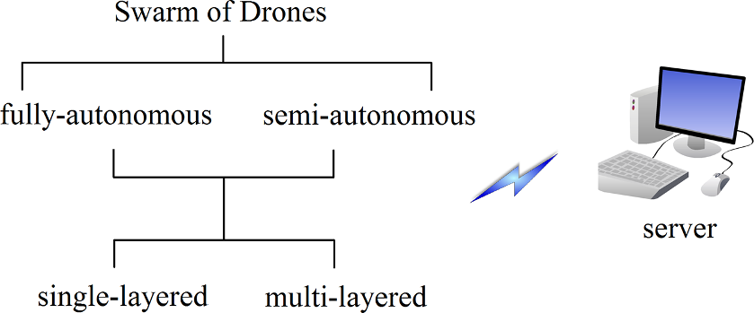

# 1 S2 0 S2452414X18300086 Main

**Source Document:** `1-s2.0-S2452414X18300086-main.pdf`  
**Total Pages:** 7  

---

## --- Page 1 ---

### Section: Swarms of Unmanned Aerial Vehicles — A Survey

Contents lists available at ScienceDirect

Journal of Industrial Information Integration

journal homepage: www.elsevier.com/locate/jii

Swarms of Unmanned Aerial Vehicles — A Survey

Anam Tahira,⁎, Jari Bölingb, Mohammad-Hashem Haghbayana, Hannu T. Toivonenb,
Juha Plosilaa

a University of Turku, Finland
b Åbo Akademi University, Finland

#### A R T I C L E I N F O

Keywords:
Swarm of drones
Swarm of Unmanned Aerial Vehicles

#### A B S T R A C T

The unmanned aerial vehicles or drones come in a great diversity depending upon the basic frameworks with
their particular specifications. The purpose of this study is to analyse the core characteristics of the swarming
drones and measure the public awareness levels with respect to these swarms. To achieve these goals, the
functionality, problems, and importance of drones are highlighted. The results of an experimental survey from a
bunch of academic population are also presented, which demonstrate that the swarms of drones are fundamental
future agenda and will be adopted with the passage of time.

#### 1. Introduction

A swarm or fleet of Unmanned Aerial Vehicles (UAVs) is a set of
aerial robots i.e., drones that work together to achieve a specific goal.
Each drone in a swarm is propelled by a specific number of rotors and
has the ability to vertically hover, take-off, and land (VTOL). The
flight of the drones is controlled either manually, i.e. by remote con-
trol operations, or autonomously by using processors deployed on the
drones [1]. A common purpose for drones is a military one, but their
civilian applications are attracting increased attention in the recent
time. Indeed, low-cost drones and their swarms provide a promising
platform for innovative research projects and future commercial ap-
plications that will help people in their work and everyday lives.
Swarms of drones can be classified in different ways. For example,
Fig. 1 illustrates fully and partly (semi) autonomous swarms. From
another point of view, the classification can be envisioned in single-
layered swarms with every drone being its own leader and multi-
layered swarms with dedicated leader drones at every layer, which
report to their leader drones at a higher layer; a ground-based server
station is the highest layer in this hierarchy. In each swarm, every
drone can have dedicated data collection and processing tasks with
sufficient computing capability to execute these tasks in real-time. Its
central processing takes place on the more performant server/base
station or even in the cloud.

The paper is aimed to (1) study the characteristics of the drones and
the swarm of drones, (2) discuss the existing technologies of linear and
model-based nonlinear controllers, and (3) assess the public awareness

levels regarding drones using an experimental query-based survey. To
realize these contributions to the field of knowledge, this paper is
structured as follows. Section 2 follows this introduction in which drone
application fields are discussed. In Section 3, the classification of UAVs
is presented. Section 4 lays out the description of the dynamics and
flying mechanisms of drones. Section 5 studies key characteristics of
autonomous drone swarms. An analysis of public awareness of drones is
presented in Section 6. Lastly, conclusions are drawn in Section 7.

#### 2. Application Areas

The advances in the capabilities of sensors deployed on UAVs enable
the use of drones for different new purposes, facilitating the creation of
a new breed of applications and services in the sector of unmanned
operations. The prominent application areas of drones are briefly dis-
cussed in this section.

#### 2.1. Security, Survey, Monitoring, and Surveillance

UAVs have traditionally been employed in military surveillance
missions. Versatile and low-cost drones have been utilized in aerial
surveys, for monitoring and surveillance, in numerous fields such as
geophysics and agriculture [1,2]. For example, surveillance of a facility
or environment might require updates of every movement detected
after office hours. A large facility or environment would require a lot of
manpower for thorough manual surveillance. Contrary to this, a swarm
of drones can cover/monitor the region much more efficiently with a

https://doi.org/10.1016/j.jii.2019.100106
Received 1 March 2018; Received in revised form 6 August 2019; Accepted 4 October 2019

⁎ Corresponding author.

E-mail addresses: anam.tahir@utu.fi (A. Tahir), jboling@abo.fi (J. Böling), mohammadhashem.haghbayan@utu.fi (M.-H. Haghbayan),
hannu.toivonen@abo.fi (H.T. Toivonen), juha.plosila@utu.fi (J. Plosila).

Journal of Industrial Information Integration 16 (2019) 100106

Available online 05 October 2019
2452-414X/ © 2019 The Authors. Published by Elsevier Inc. This is an open access article under the CC BY license 
(http://creativecommons.org/licenses/BY/4.0/).

#### T

*Caption/Context: Swarms of Unmanned Aerial Vehicles — A Survey | Anam Tahira,⁎, Jari Bölingb, Mohammad-Hashem Haghbayana, Hannu T. Toivonenb, Juha Plosilaa*

*Caption/Context: Swarms of Unmanned Aerial Vehicles — A Survey | Anam Tahira,⁎, Jari Bölingb, Mohammad-Hashem Haghbayana, Hannu T. Toivonenb, Juha Plosilaa*

## --- Page 2 ---

### Section: Leisure Pursuit

minimal manual effort, by automatically and quickly sending an alert to
the base station upon detection of movement.

#### 2.2. Leisure Pursuit

In our modern world, there is an increasing interest in using light-
weight UAVs (weighing less than 55 pounds) as a hobby and/or for a
recreational purpose [1].

#### 2.3. Disaster Management

In the case of a natural disaster, UAVs can easily reach the disaster-
struck locations that are dangerous and difficult to access otherwise.
They can, therefore, provide disaster estimations and facilitate in put-
ting effective countermeasures in place. For example, in the case of a
wildfire, a swarm of drones, equipped with fire extinguishers or similar,
can quickly examine and handle a large area without endangering
human lives.

#### 2.4. Environmental Mapping

Mapping different environments via UAVs has been becoming an
active research topic such as in the fields of cartography [3] and ar-
chaeology [1].

#### 2.5. Search and Rescue (S&R)

UAVs can save a lot of time and manpower by providing real-time
aerial images of targeted locations. As a result, S&R teams can easily
determine where exactly the help is most urgently needed. For example,
different UAVs in a swarm can be equipped with different basic first aid
kits that can be redirected and delivered to a person in need of medical
assistance even before the medical team reaches him/her, resulting in a
much better chance to save someone's life.

#### 3. Classification of UAVs

UAVs, in the market, come with diversity in the number of pro-
pellers/rotors as illustrated in Table 1 [4]. Drones can also be grouped
based on their size, range, and equipment. The sizes can be either nano,
mini, regular, or large while the range can be either very close, close,
short, mid, or endurance. Drones can be equipped with cameras, sta-
bilizers, sensors, Global Positioning System (GPS), and/or First Person
View (FPV) accompanied by FPV goggles.

Drones are classified into four major types; fixed-wing, fixed-wing
hybrid, single rotor, and multirotor as shown in Table 2 [5]. Fixed-wing
drones are mainly used for aerial mapping and inspection of pipelines/
power lines. They are expensive and require skill training to operate.
Though they require relatively more space for their launch and re-
covery, they are equipped to cover larger areas. This type of drones is
not suitable for VTOL/hover and hence this makes them unfit for
general aerial photography. However, they can stay in the air for up to
16 h by using gas engines as their power source.

In contrast, fixed-wing hybrid drones are a combination of manual
gliding and automation. They are still in the development phase and not
good at either hover or forward flight. They are commercially being
used by Amazon for delivery purposes.

On the other hand, single rotor drones have more mechanical
complexity and operational risks such as vibration and large rotating
blades. Therefore, they also require skill training of the operator. They
are costly and have the competency of the heavier payload such as
LiDAR sensor to be steered. For even longer endurance, they can be
powered by a gas motor.

Among the four types, the multirotor UAVs are the cheapest option
available and easier to build. Such drones are commonly used for basic
purposes such as photography and video surveillance. They can be
tricopters, quadcopters, hexacopters, or octocopters (see Table 1).
However, these types of drones are not appropriate for larger-scale
aerial mapping and longer distance monitoring due to their limited
speed, flight time and energy efficiency. Currently available multirotor
drones can fly up to 30 min with a normal lightweight payload such as a
camera. The most commonly used UAV type (considering the number of
propellers) is a quadcopter, and therefore our discussion in the fol-
lowing sections will focus specifically on this type.

#### 4. Dynamics and Flying Mechanisms

Consider an autonomous and adaptive quadcopter that is an under-
actuated system having four input engines and propellers enabling roll,
pitch, yaw, and thrust control as well as six degrees of freedom for
movement and manoeuvre [2]. The propellers, also called the rotors,
have fixed pitch mechanically moveable blades as shown in Fig. 2(a).

Fig. 1. Classification of swarms.

Table 1
Categorization of UAVs based on the number of pro-
pellers.

Drones
No. of propellers

Tricopter
3
Quadcopter
4
Hexacopter
6
Octocopter
8

Table 2
Types of UAVs determined by their basic structure.

Drones
Main features

Fixed-Wing
long endurance and fast flight speed
Fixed-Wing Hybrid
VTOL and long endurance flight
Single Rotor
VTOL, hover, and long endurance flight
Multirotor
VTOL, hover, and short endurance flight

Fig. 2. (a) Movement about axes, (b) Configuration of a quadcopter.

A. Tahir, et al.
Journal of Industrial Information Integration 16 (2019) 100106

2

*Caption/Context: minimal manual effort, by automatically and quickly sending an alert to the base station upon detection of movement. | 2.2. Leisure Pursuit*

*Caption/Context: UAVs can save a lot of time and manpower by providing real-time aerial images of targeted locations. As a result, S&R teams can easily determine where exactly the help is most urgently needed. For example, different UAVs in a swarm can be equipped with different basic first aid kits that can be redirected and delivered to a person in need of medical assistance even before the medical team reaches him/her, resulting in a much better chance to save someone's life. | 3. Classification of UAVs*

## --- Page 3 ---

### Section: Mechanical Design

This means that when the blades rotate, their rotor pitch does not vary.
In addition to a drone's direction of movement, its roll, pitch, and yaw
movement depend on the difference between the throttle provided by
the four motors operating the propellers. Stable flight requires high-
precision control of the motors. The control algorithms continuously
take feedback and adjust the throttle of the motors, thereby controlling
roll, pitch, yaw, and thrust of the drone. Yaw movement is controlled to
ensure the stability of rotation on the vertical or Z-axis. Pitch movement
is controlled to ensure the stability of rotation on the Y-axis (also called
lateral or transverse axis) that determines the degree of side-to-side
tilting. Similarly, the roll is the measure of how high the nose or front of
the drone is lifted. Its movement is controlled to ensure the stability on
the X-axis (or longitudinal axis).

Fig. 2(b) illustrates the two basic flying mechanisms and rotor or-
ganizations known as the ‘+’ and ‘x’ patterns. In each configuration of
rotors, the two rotors on the opposite ends always rotate in the same
direction while the other two rotate in the opposite directions. The ‘x’
design is a more stable structure, and it can produce more rotation ac-
celeration than the ‘+’ organization [6]. Generally, the ‘+’ configuration
provides easy manoeuvring and is well-suited for the purpose of sports
flying. In contrast, aerial photography is much easier with the ‘x’ con-
figuration that inherently keeps the propellers out of the screen.

Fig. 3 shows a hierarchical swarm of quadcopters in a leader-sub-
ordinate flying/operation model. It allows a single user to control the
movement and formation of the whole swarm through the leader drone,
using an intuitive remote control interface. This swarm is a self-organizing
structure having the behaviour of a multi-agent control system. Its for-
mation flying principle is associated with a remote user/operator and a
wireless communication system between the operator and the swarm.

Refer to a simple example in Fig. 3, there is only a single leader
drone leading a cluster of subordinate worker drones. Generally, the
hierarchy can be much more complex such as consisting of multiple
clusters each having its own leader(s) and multiple layers of leaders
forming “superclusters” of different sizes. Each drone in the swarm can
directly communicate with its peers at the same level of the hierarchy
and with its immediate leader drone(s). Leader drones at the highest
level of hierarchy communicate with the ground-based server, sharing
the data collected and pre-processed by the swarm and distributing
downwards mission objectives provided by the server.

#### 4.1. Mechanical Design

For the controlled movement of the quadcopter in the presence of
disturbance and uncertainties, the initial step is to construct a balanced
drone with an adaptive computing platform. The targeted control
system is designed by building a dynamic model of the drone, con-
sisting of a set of mathematical equations dealing with all the acting
forces on the system at a given time interval.

Fig. 4 shows a basic battery-powered quadcopter consisting of a
mainframe that serves as its base, Electronic Speed Control (ESC), In-
ertial
Measurement
Unit
(IMU),
programmable
microcontrollers
mounted at the centre, electric motors, radio transmitters and receivers,
batteries, a set of sensors, and four rotors at the ends of the four arms of

the drone [7].

#### 4.2. Description of Sensors

In order to maintain a stable and controllable flight, the two crucial
types of sensor and control units essential for any quadcopter are ESC
[8–11] and IMU [3,8,10–21].

The velocity control can be set up using ESCs with most of the
commercially available brushless DC motors. An ESC consists of a three-
phase inverter accompanied by rotor position feedback. By providing a
suitable level of electric power, an ESC runs the brushless motor while
converting the Pulse Width Modulation (PWM) signal from radio re-
ceivers or flight controllers. In the x-y plane, a position drift of the
quadcopter is present because of a slight variation in the speeds of the
four motors when concurrently applying a constant input signal to the
four separate ESCs. This drift is normally overcome by implementing
versatile feedback control systems [22].

An IMU is an electromechanical device that consists of an accel-
erometer and a gyroscope. It helps in determining the angular position
and altitude of the quadcopter. The accelerometer is in charge of
measuring the acceleration forces such as gravity (being applied to each
axis) with respect to the Earth while the gyroscope is capable of mea-
suring the rate of angular rotation for every axis.

To further facilitate high-precision control of a drone, additional
modules such as barometer [10,23], magnetometer [3,10,18,20,23],
and altitude [13,17] sensors can be used to get highly accurate real-
time measurements on altitude and direction of movement.

For low altitude operation, ultrasonic sensors (or sonar/radar) are
commonly
used
in
quadcopters
to
detect
and
avoid
obstacles
[9,11,19,24–26]. This type of sensor system assesses the characteristics
of a target by identifying how the target impacts the transmitted sound
or radio waves. For the detection of flat objects, the distance of an
obstacle is determined by evaluating the time interval between the
signal sent and the echo received. Other sensors such as infrared ran-
gefinders [19,20,24] and LiDAR (or laser scanner/rangefinders – for
map building) [13,21,27] are also used for the same purpose.

Moreover, a camera is often mounted on a quadcopter for sensing
purposes [9,13,25,27]. It can provide visual feedback, image recogni-
tion and processing, 3D obstacle identification, and avoidance of in-
door/outdoor facilities.

The Global Positioning System (GPS) is also commonly found on
quadcopters [3,9,10,13,15,17–20,23,27]. The fundamental purpose of
such a navigation module is to provide means for path planning,
tracking, and drone localization. This technology is utilized in outdoor
operations such as in surveillance missions.

A detailed literature review on multi-sensor integration and fusion
is presented in [72]. Furthermore, multi-sensor fusion approaches for
object detection are discussed in [73,74].

#### 4.3. Existing Control Approaches

There are many proficient techniques to control UAVs, e.g.,
Proportional
Integral
Derivative
(PID)
control,
adaptive
control,
Boltzmann-Hamel equations of motion, localization and mapping
methods [21,28–30], marker recognition algorithms [31,32], vision-
based schemes [33,34], wireless communication methods [35–38],

Fig. 3. Example of a hierarchical swarm of drones.

Fig. 4. Basic quadcopter.

A. Tahir, et al.
Journal of Industrial Information Integration 16 (2019) 100106

3

![Fig. 2(b) illustrates the two basic flying mechanisms and rotor or- ganizations known as the ‘+’ and ‘x’ patterns. In each configuration of rotors, the two rotors on the opposite ends always rotate in the same direction while the other two rotate in the opposite directions. The ‘x’ design is a more stable structure, and it can produce more rotation ac- celeration than the ‘+’ organization [6]. Generally, the ‘+’ configuration provides easy manoeuvring and is well-suited for the purpose of sports flying. In contrast, aerial photography is much easier with the ‘x’ con- figuration that inherently keeps the propellers out of the screen. | Fig. 3 shows a hierarchical swarm of quadcopters in a leader-sub- ordinate flying/operation model. It allows a single user to control the movement and formation of the whole swarm through the leader drone, using an intuitive remote control interface. This swarm is a self-organizing structure having the behaviour of a multi-agent control system. Its for- mation flying principle is associated with a remote user/operator and a wireless communication system between the operator and the swarm.](images/page_003_fig_01.png)
*Caption/Context: Fig. 2(b) illustrates the two basic flying mechanisms and rotor or- ganizations known as the ‘+’ and ‘x’ patterns. In each configuration of rotors, the two rotors on the opposite ends always rotate in the same direction while the other two rotate in the opposite directions. The ‘x’ design is a more stable structure, and it can produce more rotation ac- celeration than the ‘+’ organization [6]. Generally, the ‘+’ configuration provides easy manoeuvring and is well-suited for the purpose of sports flying. In contrast, aerial photography is much easier with the ‘x’ con- figuration that inherently keeps the propellers out of the screen. | Fig. 3 shows a hierarchical swarm of quadcopters in a leader-sub- ordinate flying/operation model. It allows a single user to control the movement and formation of the whole swarm through the leader drone, using an intuitive remote control interface. This swarm is a self-organizing structure having the behaviour of a multi-agent control system. Its for- mation flying principle is associated with a remote user/operator and a wireless communication system between the operator and the swarm.*

![Fig. 2(b) illustrates the two basic flying mechanisms and rotor or- ganizations known as the ‘+’ and ‘x’ patterns. In each configuration of rotors, the two rotors on the opposite ends always rotate in the same direction while the other two rotate in the opposite directions. The ‘x’ design is a more stable structure, and it can produce more rotation ac- celeration than the ‘+’ organization [6]. Generally, the ‘+’ configuration provides easy manoeuvring and is well-suited for the purpose of sports flying. In contrast, aerial photography is much easier with the ‘x’ con- figuration that inherently keeps the propellers out of the screen. | the drone [7].](images/page_003_fig_02.png)
*Caption/Context: Fig. 2(b) illustrates the two basic flying mechanisms and rotor or- ganizations known as the ‘+’ and ‘x’ patterns. In each configuration of rotors, the two rotors on the opposite ends always rotate in the same direction while the other two rotate in the opposite directions. The ‘x’ design is a more stable structure, and it can produce more rotation ac- celeration than the ‘+’ organization [6]. Generally, the ‘+’ configuration provides easy manoeuvring and is well-suited for the purpose of sports flying. In contrast, aerial photography is much easier with the ‘x’ con- figuration that inherently keeps the propellers out of the screen. | the drone [7].*

## --- Page 4 ---

### Section: Autonomous Swarms

memory-based controllers [43], brain emotional learning-based in-
telligent controllers [44], and learning-based control methods such as
fuzzy logic [39], artificial neural networks [40], iterative and re-
inforcement learning [41,42]. Here, the focus is to discuss the existing
technologies of linear and model-based nonlinear controllers from the
control engineering perspective.

Authors in [8] simulated classical control techniques of P, PI, PD, and
PID on a quadcopter and concluded that the P and PI controllers did not
provide a sufficiently good response. On the other hand, the PD and PID
controllers were found to perform adequately well in the case of steady-
state stabilization. Additionally, authors in [45] demonstrated indoor
and outdoor flight tests using gravity compensated PID approach for
altitude control and attitude stabilization of a tilt-wing UAV. In both tests
of the proposed vertical flight control, good performance was obtained
with small altitude and attitude errors. Furthermore, authors in [46]
designed and simulated a PID cascade control architecture in a 3D en-
vironment to resolve the problem of trajectory tracking for a quadcopter
while the author in [2] demonstrated a PD control design for stabilizing
the attitude of a quadcopter. In the case of disturbances, to get a better
flight performance and to control the trajectory, an approach integrating
the PD controller with a heuristic method was developed.

For a quadrotor micro aerial vehicle, authors in [12] implemented a
nonlinear control approach of backstepping to control its position and
attitude. In an attempt to generate a specified trajectory, Model Pre-
dictive Control (MPC) method was used. In their experiments, the
quadrotor was kept hovering for 25 s, and the robustness of the pro-
posed controllers was compared with the results of a geometric tracking
algorithm. The method proposed by the authors in [12] proved itself to
be more efficient in comparison to the geometric tracking algorithm.

In addition to the above mentioned, authors in [47] have presented
two different nonlinear control techniques, i.e. Backstepping and
Sliding Mode Control (SMC), for an indoor micro quadrotor. They va-
lidated the control approaches and concluded that the SMC controller
provided average results due to its switching nature whereas in the
presence of high perturbations, the backstepping controller was capable
of controlling the orientation angles.

On a stationary platform, authors in [13] used a nonlinear Back-
stepping control approach for autonomous take-off and landing of a
quadcopter. The focus of the paper was to improve the altitude mea-
surement with a LiDAR, an inertial unit, and a Kalman filter. The pro-
posed method was demonstrated in real conditions of outside tests.
Moreover, authors in [19], in order to control the altitude of a quad-
rotor, implemented an enhanced Kalman filter to fuse the data of dif-
ferent sensors such as signals of the sonar and accelerometer. Further-
more, authors in [25], using a pole placement technique with a Kalman
filter, simulated a dynamic feedback linear controller of a quadrotor.

To stabilize the position of a quadrotor by using visual feedback,
authors in [48] implemented and compared three control strategies;
namely nested saturations, backstepping, and SMC. Through real-time
experiments, they concluded that the technique of nested saturations
control provided better and smooth vehicle performance and energy
consumption than the other two control designs.

Authors in [3] used control algorithms based on PI, Linear Quad-
ratic Gaussian (LQG), and State-Dependent Riccati Equation (SDRE) in
development of a “Remotely operated Aerial Model Autopilot”. They
simulated the stabilization of angular rates, attitude, and velocity in
their work.

Authors, in [16], used a Lyapunov function that defines the stability
of the equilibrium, to control the angular rotation of an indoor micro
quadcopter. Additionally, Lasalle invariance theorem and pole place-
ment methods were used to ensure the asymptotic stability and to
stabilize the altitude respectively. Authors performed an experiment in
a real system to analyze the control of a vehicle's orientation (roll,
pitch, and yaw) with a fixed altitude.

In [49], the author investigated the longitudinal flight dynamics of a
UAV using the Linear Quadratic Regulator (LQR) technique for the

short period mode (pitch control) only. In addition, the longitudinal
dynamics included the UAV's response along the pitch axis and velocity
to thrust. Furthermore, authors in [50] simulated a model of a quad-
copter using an Integral Time-weighted Absolute Error (ITAE) tuned
PID approach, a classic LQR method, and a PID approach tuned with
LQR loop controlling techniques. Satisfactory results were achieved for
the vertical attitude only. A small radio-controlled UAV was used in
[51], where authors studied its longitudinal motion (short period and
phugoid/long period) with and without disturbances (Gaussian white
noise characteristics) by means of LQR and Kalman Filter.

Authors in [52] presented a comparative study analysis among PID,
LQR, LQG, and SMC techniques for pitch control of a UAV. They con-
cluded that the system behaviour with SMC design has no overshoot
and steady-state error with respect to other simulated control methods.

In order to acquire robustness against the signal noise as well as to
attain a consistent behaviour for the altitude control of a self-designed
miniature quadcopter, authors in [53] proposed a model reference
adaptive control scheme. The weight of the quadcopter was 2.25 kg
without a payload, and based on the experimentations, the maximum
take-off weight was up to 4.7 kg. The results of the implemented control
approach were compared with a benchmark PID control. The analysis
showed that the proposed method provided consistent performance
before and after the payload added or dropped.

Authors in [54] presented the modelling of flight dynamics of a UAV
in terms of numerical simulation of Boltzmann-Hamel equations with
non-holonomic constraints. Additionally, authors in [55] designed a
state feedback controller using the H∞continuous-time control method
to control the translational position and yaw angle of the quadrotor. In
[56], the authors examined the same technique on the UAV model in
the presence of atmospheric turbulence whereas in [57], authors ap-
plied a mixed robust feedback linearization with linear GH∞control
technique to a nonlinear quadrotor in the presence of external dis-
turbances, uncertainties, and measurement noise.

Authors in [58] implemented a robust controller in a two-stage
structure including an attitude and a position controller to attain a
motion control of a quadcopter. These designs were based on the
nominal controller to get its desired tracking performance and robust
compensator to control its influence of uncertainties.

#### 5. Autonomous Swarms

A swarm of UAVs with smart monitoring system can rapidly and
reliably cover a given target area by utilizing several parallel operating
drones. In this section, some important characteristics of autonomous
swarms of drones are discussed.

#### 5.1. Battery Swapping/Recharging

An automatic battery exchanging system for a single drone or a
cluster of drones is very crucial in missions that require long flight
durations. In order to prevent data loss during the swapping process,
authors in [59] proposed an autonomous refilling system that used hot
battery swapping by providing external power to a drone on the base
charging station. This external power source was used for processing
onboard data and communication between the drone and the base
station while the drone stayed at the charging station. This design was
based on a portable rocker arm and a revolving carousel that supplied
four charging batteries. The whole duration of battery swapping was
about 60 s from landing to takeoff. The proposed prototype only served
a single quadcopter that has 15 min of flying time, and it could fully
charge an exhausted battery in about 45 min. Considering a swarm of
drones, the approach proposed in [59] can be improved by enabling the
charging station to deal with several drones (e.g., a full cluster with a
leader drone and its worker/slave drones) in parallel.

Smart energy management and automated maintenance have be-
come increasingly important with the emergence of UAV swarms and

A. Tahir, et al.
Journal of Industrial Information Integration 16 (2019) 100106

4

## --- Page 5 ---

### Section: Robustness against Collisions

their applications. In [60], the authors developed an efficient autono-
mous Ground Recharge Station (GRS) by reducing the charging phase of
single UAV using better and safer electrical contacts. They used a bal-
ancer to improve charging efficiency, ensuring proper contact between
the circuits on the drone and the recharging station. Furthermore, in the
case of a swarm of UAVs, the proposed system can employ a prior-
itization algorithm which guarantees that a drone with a higher priority
is recharged before a drone with a lower priority.

#### 5.2. Robustness against Collisions

Authors in [61] designed an 11 cm pico quadcopter with 25 g mass,
12 g maximum payload sufficient for carrying a small RF camera, and a
2 g carbon fibre cage that protected the device in the event of a colli-
sion, enabling its recovery. A custom-designed autopilot board provided
smart control for the device. To test the copter's capabilities in tight/
dense formations, delta leader-follower and square formation flight
experiments were conducted with promising results. The drones were
also demonstrated to be robust to collisions at velocities of 4 m/s.

In [27], authors developed a collision avoidance algorithm based on
MPC to obtain reliable trajectory prediction for autonomous control of
emergency evasive manoeuvring. This approach was simulated in var-
ious collision conditions such as one-on-one and one-to-many patterns.
Using two helicopters, a flight test was executed demonstrating the
algorithm's efficiency in the case of a face-to-face collision course.

Authors in [62] used inexpensive ultrasound localization method to
develop a collision-avoidance system (avoiding impact with obstacles and
other copters) for commodity hardware quadcopters in Global Navigation
Satellite Systems (GNSS) denied regions. Experimentation was done in two
dimensions with three quadcopters and at least two stationary anchors.
The testing platform had a size limitation because the maximum allowable
distance between the anchors and the copters was 12 m.

#### 5.3. Surveillance Systems

Quadcopter-based surveillance systems are gaining more attention
among researchers due to recent advances in manoeuvrability and
payload capacity of this type of drones. Authors in [63] experimented
and demonstrated a set of algorithms on a quadcopter swarm-based
surveillance system for tracking the detected targets. The swarm was
modelled as a multi-agent system, and the goal was to facilitate optimal
cooperation of the agents and to ensure their safety during the execu-
tion of a mission. The developed path tracking approach was found to
enable smooth and safe navigation in a dense environment.

Authors in [64] developed, based on the concept of a scalable dy-
namic grid of cooperative quadcopters, an autonomous path planning
approach for covering a given environment in an efficient and reliable
manner. The method kept track of the space that had been surveyed and
directed drones to areas that had not recently been monitored. A non-
linear optimization approach determined the flying altitude for each
drone, Furthermore, in [65,66], authors demonstrated the capabilities
of quadcopter swarms in object localization and tracking tasks.

#### 5.4. Swarm Design, Management, and Optimization

In [67], authors used the principles of Organic Computing (OC) to
develop a comprehensive framework for designing and controlling
swarms of autonomous collaborative robots, with a special focus on
quadcopters that collaborate with each other in order to complete spatial
tasks. The proposed approach facilitated self-optimization of individual
drones, optimization of joint efforts between drones, and efficient control
of the swarm by the human user at multiple abstraction levels.

Authors in [68] developed a distributed relative localization frame-
work for 3D quadcopter swarms, allowing each drone to autonomously
localize itself with respect to the other drones in the swarm and enabling
fast propagation or dissemination of this localization information

everywhere in the swarm. The framework consisted of an Internet of
Things (IoT) enabled hardware platform mounted on each drone, its
operating system, and middleware software running on this platform.
The goal of the proposed work was to support the design of performant
3D swarming applications and eventually facilitate the efficient inter-
action between the human operator at the base station and the swarm.

#### 5.5. Hovering Performance

The hovering stability and synchronization of flight mechanisms
cannot be ignored when considering the mission execution of a swarm
of quadcopters. Authors in [69] used a two-stage controller for gen-
erating appropriate control feedback to successfully maintain the sta-
bility of individual drones and flight formation synchronization within
the fleet, even in the case of a single quadcopter failure.

#### 5.6. Communication Reliability

Authors in [15] designed and implemented a motion-driven packet
forwarding algorithm for multi-hop micro aerial vehicle networks to set
up connectivity in larger regions. However, the communication linkage
among agents of a quadcopter swarm must be reliable to enable suc-
cessful completion of missions. The Takahashi Self Deployment (TSD)
movement algorithm, a network expansion algorithm, was used by
authors in [70] to form quadcopter swarm agents for connecting two
wireless nodes by creating an ad-hoc network. A bandwidth-efficient
multi-robot coordination algorithm utilizing 3G/4G wireless networks
was used by authors in [71] to overcome the challenges of real-time
coordination of UAV based swarms in a wide area setting.

#### 6. Public Awareness

To get an idea about public awareness of the swarm technology, six
very basic questions were asked targeting the academic audience. The
questions are as follows:

1) What is the area of your expertise/which sector do you work in?
2) Are you familiar with the drone technology and do you understand the
term swarm of drones?
3) Have you used drones yourself?
4) If a swarm of drones is used to monitor the area (e.g., cities, forests,
farming fields, public events) and for gathering aerial images, would you
be in the favour of it or would you have any concerns?
5) Do you think any kind of surveillance done by drones is faster, safer, and
more cost-effective than relatively traditional surveillance activities based
on manual effort/helicopters/satellites?
6) How do you think you would utilize drone technology in your activities/
business? Please also specify the target field.

To summarize, altogether 187 people participated (mainly from
Finland and Pakistan) in this online survey that was conducted using
Google Forms. Table 3 illustrates the no. of participants with respect to
their disciplines. (Please note that each participant is either working in

Table 3
No. of participants w.r.t. their disciplines.

Disciplines
No. of participants

Engineering
47
IT related
36
Health and allied
31
Social science
24
Business (development/administration/marketing)
21
Management related
17
Natural science
5
Art and design
4
Military
2

A. Tahir, et al.
Journal of Industrial Information Integration 16 (2019) 100106

5

## --- Page 6 ---

### Section: Conclusion

his/her respective field, studying, or has completed studies). The survey
produced the following results as shown in Fig. 5.

• 78 participants had knowledge about a drone and swarm of drones
whereas 100 of them understood what a drone is but did not know
about the swarm of drones. However, 9 of the participants had never
even heard about drone technology.
• Only 43 participants had used drones as a hobby, work, building
inspection, counting of cows, research, First-person view (FPV),
photography, filming, and/or leisure activities.
• 115 participants mentioned having security concerns whereas 6 of
them had privacy concerns, and 8 had security as well as privacy
concerns. Only 1 participant added that any type of concerns was
dependent on the functional capabilities of drones. On the other
hand, 57 participants had no concerns at all in case of the use of a
swarm of drones for surveillance.
• 113 participants were of the view that the use of drones was better
for surveillance, 37 did not see any difference in either way, and 33
of the participants preferred to use traditional surveillance ways. 4
answers were discarded due to lack of information given.
• Table 4 shows the participants categorized as per the field in which
they used or intended to use the drone technology.

#### 7. Conclusion

This paper presented a survey-type study on UAVs (drones) and
swarms of UAVs, with a special focus on quadcopters. The mechanics,
functionality, organization, modelling, applications, and autonomy as-
pects of such drones and drone swarms were discussed. Additionally,
the paper included the result of an online survey in order to get a
picture of public awareness regarding the use of drone technology. The
participants of this survey were from different countries and associated
with several professional fields. The results showed that though a large
proportion of the sample was concerned about a swarm of drones and
its usage, it was still considered as a crucial future figure of merit.

Declaration of Competing Interest

The authors declare that there is no conflict of interests regarding
the publication of this paper.

Acknowledgement

This work has been partly supported by the Academy of Finland,
funded project # 314048, and Turun Yliopistosäätiö, Finland.

References

[1] “Unmanned aerial vehicle", En.wikipedia.org. [Online]. Available: https://en.

wikipedia.org/wiki/Unmanned_aerial_vehicle. [Accessed: 25- Jul- 2017].
[2] T. Luukkonen, Modelling and Control of Quadcopter, Aalto University, Espoo,

Finland, 2011.
[3] O. Špinka, S. Kroupa, Z. Hanzálek, Control system for unmanned aerial vehicles, 5th

IEEE International Conference on Industrial Informatics (INDIN), Vienna, Austria,
2007, pp. 455–460.
[4] “Different Types of Drones”, Dronepedia, 2017. [Online]. Available: https://

dronepedia.xyz/5-different-types-of-drones/. [Accessed: 20-Sep-2017].
[5] “Types of Drones - Explore the Different Types of UAV’s”, Electronic circuits and

diagram-electronics projects and design, 2017. [Online]. Available: http://www.
circuitstoday.com/types-of-drones. [Accessed: 20- Sep- 2017].
[6] K. Thu, A. Gavrilov, Designing and modeling of quadcopter control system using L1

adaptive control, Procedia Comput. Sci. 103 (2017) 528–535.
[7] M. Vanin, Quadrocopter Manual, KTH Royal Institute of Technology, 2014

[Online]. Available: https://www.kth.se/polopoly_fs/1.451019!/Menu/general/
column-content/attachment/quad_manual.pdf [Accessed: 04-Oct-2017].
[8] G. Tuta Navajas, S. Roa Prada, Building your own quadrotor: a mechatronics system

design case study, III International Congress of Engineering Mechatronics and
Automation (CIIMA), Cartagena, Colombia, 2014, pp. 1–5.
[9] S. Choi, E. Kim, Design and implementation of vision-based structural safety in-

spection system using small unmanned aircraft, 17th International Conference on
Advanced Communication Technology (ICACT), PyeongChang, Republic of Korea,
2015, pp. 562–567.
[10] D. Nascimento, C. Rufino, S. Oliveira, M. Feitosa, Modeling and design of an au-

tonomous unmanned aerial vehicle quadrotor prototype for applications in swarm
of robots, 2012 Brazilian Robotics Symposium and Latin American Robotics
Symposium (SBR-LARS), Fortaleza, Ceará, Brazil, 2012, pp. 325–328.
[11] M. Mohan Das, S. Swami, J. Conrad, An algorithm for landing a quadrotor un-

manned aerial vehicle on an oscillating surface, 2012 Proceedings of IEEE
Southeastcon, Orlando, FL, USA, 2012, pp. 1–4.
[12] Y. Liu, J. Maximilian Montenbruck, P. Stegagno, F. Allg¨ower, A. Zell, A robust

nonlinear controller for nontrivial quadrotor maneuvers: approach and verification,
IEEE/RSJ International Conference on Intelligent Robots and Systems (IROS),
Hamburg, Germany, 2015, pp. 5410–5416.
[13] H. Beck, J. Lesueur, G. Charland-Arcand, O. Akhrif, S. Gagné, F. Gagnon,

D. Couillard, Autonomous takeoff and landing of a quadcopter, International
Conference on Unmanned Aircraft Systems (ICUAS), Arlington, VA USA, 2016, pp.
475–484.
[14] C. Lee, J. Yoon, K. Yoon, Robust calibration of an ultralow-cost inertial measure-

ment unit and a camera: handling of severe system uncertainty, IEEE International
Conference on Robotics & Automation (ICRA), Hong Kong, China, 2014, pp.
3020–3026.
[15] M. Asadpour, K. Hummel, D. Giustiniano, S. Draskovic, Route or carry: motion-

driven packet forwarding in micro aerial vehicle networks, IEEE Trans. Mobile
Comput. (2016) 1–1.
[16] S. Bouabdallah, P. Murrieri, R. Siegwart, Design and control of an indoor micro

quadrotor, IEEE International Conference on Robotics and Automation (ICRA), 5
2004, pp. 4393–4398.
[17] G. Hoffmann, D. Rajnarayan, S. Waslander, D. Dostal, J. Jang, C. Tomlin, The

stanford testbed of autonomous rotorcraft for multi agent control (Starmac), The
23rd Digital Avionics Systems Conference (DASC), 2 2004, p. 12 E.4-1-12.E.4-10.
[18] A.D. Wu, E.N. Johnson, A.A. Proctor, Vision-Aided inertial navigation for flight

control, J. Aerosp. Comput. Inf. Commun. 2 (9) (2005) 348–360.
[19] D. Hetényi, M. Gótzy, L. Blázovics, Sensor fusion with enhanced Kalman filter for

altitude control of quadrotors, 11th IEEE International Symposium on Applied
Computational Intelligence and Informatics, Timişoara, Romania, 2016, pp.
413–418.
[20] L. Di, H. Chao, Y. Chen, A two-stage calibration method for low-cost UAV attitude

estimation using infrared sensor, IEEE/ASME International Conference on
Mechatronic and Embedded Systems and Applications (MESA10), Qingdao,
Shandong, China, 2010, pp. 137–142.
[21] S. Grzonka, G. Grisetti, W. Burgard, Towards a navigation system for autonomous

indoor flying, 2009 IEEE International Conference on Robotics and Automation,
Kobe, Japan, 2009, pp. 2878–2883.
[22] L. García Carrillo, R. Lozano, A. Dzul López, C. Pégard, Quad Rotorcraft Control,

Springer, London, 2013.
[23] D. Garcia, H. Moncayo, A. Perez, C. Jain, Low cost implementation of a biomimetic

approach for UAV health management, 2016 American Control Conference (ACC,
Boston, MA, USA, 2016, pp. 2265–2270.

Table 4
Interested no. of participants in specific activities.

Applications
No. of participants

Mobile defibrillation for emergencies, monitoring patients

and other health-related activities

9

Surveillance
12
Marketing
3
Mapping
5
Business and Management
5
Security
2
Hobby
1
Military
1
Research
1
Delivery (distribution/transportation) of supplies/goods/

mails

7

Aerial images/footage
17

Fig. 5. Survey results.

A. Tahir, et al.
Journal of Industrial Information Integration 16 (2019) 100106

6

![his/her respective field, studying, or has completed studies). The survey produced the following results as shown in Fig. 5. | • 78 participants had knowledge about a drone and swarm of drones whereas 100 of them understood what a drone is but did not know about the swarm of drones. However, 9 of the participants had never even heard about drone technology. • Only 43 participants had used drones as a hobby, work, building inspection, counting of cows, research, First-person view (FPV), photography, filming, and/or leisure activities. • 115 participants mentioned having security concerns whereas 6 of them had privacy concerns, and 8 had security as well as privacy concerns. Only 1 participant added that any type of concerns was dependent on the functional capabilities of drones. On the other hand, 57 participants had no concerns at all in case of the use of a swarm of drones for surveillance. • 113 participants were of the view that the use of drones was better for surveillance, 37 did not see any difference in either way, and 33 of the participants preferred to use traditional surveillance ways. 4 answers were discarded due to lack of information given. • Table 4 shows the participants categorized as per the field in which they used or intended to use the drone technology.](images/page_006_fig_01.png)
*Caption/Context: his/her respective field, studying, or has completed studies). The survey produced the following results as shown in Fig. 5. | • 78 participants had knowledge about a drone and swarm of drones whereas 100 of them understood what a drone is but did not know about the swarm of drones. However, 9 of the participants had never even heard about drone technology. • Only 43 participants had used drones as a hobby, work, building inspection, counting of cows, research, First-person view (FPV), photography, filming, and/or leisure activities. • 115 participants mentioned having security concerns whereas 6 of them had privacy concerns, and 8 had security as well as privacy concerns. Only 1 participant added that any type of concerns was dependent on the functional capabilities of drones. On the other hand, 57 participants had no concerns at all in case of the use of a swarm of drones for surveillance. • 113 participants were of the view that the use of drones was better for surveillance, 37 did not see any difference in either way, and 33 of the participants preferred to use traditional surveillance ways. 4 answers were discarded due to lack of information given. • Table 4 shows the participants categorized as per the field in which they used or intended to use the drone technology.*

## --- Page 7 ---

[24] N. Gageik, P. Benz, S. Montenegro, Obstacle detection and collision avoidance for a

uav with complementary low-cost sensors, IEEE Access 3 (2015) 599–609.
[25] E. Pfeifer, F. Kassab Jr, Dynamic feedback controller of an unmanned aerial vehicle,

2012 Brazilian Robotics Symposium and Latin American Robotics Symposium (SBR-
LARS), Fortaleza, Ceará, Brazil, 2012, pp. 261–266.
[26] U. Papa, G. Core, Design of sonar sensor model for safe landing of an UAV, 2nd IEEE

International Workshop on Metrology for Aerospace (MetroAeroSpace), Benevento,
Italy, 2015, pp. 346–350.
[27] D. Shim, S. Sastry, An evasive maneuvering algorithm for UAVs in see-and-avoid

situations, 2007 American Control Conference, New York City, USA, 2007, pp.
3886–3891.
[28] J. Sundqvist, J. Ekskog, B. Dil, F. Gustafsson, J. Tordenlid, M. Petterstedt,

Feasibility study on smartphone localization using mobile anchors in search and
rescue operations, 19th International Conference on Information Fusion,
Heidelberg, Germany, 2016, pp. 1448–1453.
[29] C. Pearce, M. Guckenberg, B. Holden, A. Leach, R. Hughes, C. Xie, M. Hassett,

A. Adderley, L. Barnes, M. Sherriff, G. Lewin, Designing a spatially aware, auto-
mated quadcopter using an android control system, 2014 IEEE Systems and
Information Engineering Design Symposium (SIEDS), Charlottesville, Virginia,
2014, pp. 23–28.
[30] G. Lee, F. Fraundorfer, M. Pollefeys, RS-SLAM: RANSAC sampling for visual

FastSLAM, 2011 IEEE/RSJ International Conference on Intelligent Robots and
Systems, San Francisco, CA, USA, 2011, pp. 1655–1660.
[31] J. Baek, S. Park, B. Cho, M. Lee, Position tracking system using single RGB-D camera

for evaluation of multi-rotor UAV control and self-localization, 2015 IEEE
International Conference on Advanced Intelligent Mechatronics (AIM), Busan,
Korea, 2015, pp. 1283–1288.
[32] M. Achtelik, T. Zhang, K. Kühnlenz, M. Buss, Visual tracking and control of a

quadcopter using a stereo camera system and inertial sensors, Proceedings of the
2009 IEEE International Conference on Mechatronics and Automation, Changchun,
China, 2009, pp. 2863–2869.
[33] M. Blösch, S. Weiss, D. Scaramuzza, R. Siegwart, Vision based MAV navigation in

unknown and unstructured environments, 2010 IEEE International Conference on
Robotics and Automation, Anchorage, Alaska, USA, 2010, pp. 21–28.
[34] R. Yang, X. Wang, Vision control system for quadcopter, Third International

Conference on Information Science and Technology, Yangzhou, Jiangsu, China,
2013, pp. 261–264.
[35] S. Berrahal, J. Kim, S. Rekhis, N. Boudriga, D. Wilkins, J. Acevedo, Unmanned

aircraft vehicle assisted WSN-based border surveillance, 2015 23rd International
Conference on Software, Telecommunications and Computer Networks (SoftCOM),
Split - Bol (Island of Brac), Croatia, 2015, pp. 132–137.
[36] K. Shetti, A. Vijayakumar, Evaluation of compressive sensing encoding on AR

Drone, 2015 Asia-Pacific Signal and Information Processing Association Annual
Summit and Conference (APSIPA ASC 2015), Hung Hom, Kowloon, Hong Kong,
2015, pp. 204–207.
[37] V. Andaluz, F. Chicaiza, A. Meythaler, D. Rivas, C. Chuchico, Construction of a

quadcopter for autonomous and teleoperated navigation, 2015 Conference on
Design of Circuits and Integrated Systems (DCIS), Estoril, Portugal, 2015, pp. 1–6.
[38] R. Dasgupta, R. Mukherjee, A. Gupta, A novel approach of sensor data retrieving

using a quadcopter in wireless sensor network forming concentric circular topology,
Proceedings of the 2015 6th International Conference on Automation, Robotics and
Applications (ICARA), Queenstown, New Zealand, 2015, pp. 238–245.
[39] E. Filatova, A. Devyatkin, A. Fridrix, UAV fuzzy logic stabilization system, XX IEEE

International Conference on Soft Computing and Measurements (SCM, St.
Petersburg, Russia, 2017, pp. 132–134.
[40] J. Dunfied, M. Tarbouchi, G. Labonte, Neural network based control of a four rotor

helicopter, 2004 IEEE International Conference on Industrial Technology (ICIT),
Hammamet, Tunisia, 3 2004, pp. 1543–1548.
[41] A. Schoellig, F. Mueller, R. D'Andrea, Optimization-based iterative learning for

precise quadrocopter trajectory tracking, Auton Robots 33 (1–2) (2012) 103–127.
[42] I. Palunko, A. Faust, P. Cruz, L. Tapia, R. Fierro, A reinforcement learning approach

towards autonomous suspended load manipulation using aerial robots, IEEE
International Conference on Robotics and Automation (ICRA), Karlsruhe, Germany,
2013, pp. 4896–4901.
[43] W. Wang, H. Ma, C. Sun, Control system design for multi-rotor mav, J. Theor. Appl.

Mech. 51 (4) (2013) 1027–1038.
[44] M. Jafari, A. Shahri, S. Shouraki, Attitude control of a quadrotor using brain

emotional learning based intelligent controller, 13th Iranian Conference on Fuzzy
Systems (IFSC), Qazvin, Iran, 2013.
[45] K. Öner, E. Çetinsoy, E. Sirimoğlu, C. Hançer, M. Ünel, M. Faruk Akşit, K. Gülez,

İ. Kandemir, Mathematical modeling and vertical flight control of a tilt-wing uav,
Turkish J. Electr. Eng. Comput. Sci. 20 (1) (2012) 149–157.
[46] E. Paiva, J. Soto, J. Salinas, W. Ipanaqué, Modeling and PID cascade control of a

quadcopter for trajectory tracking, IEEE Chilean Conference on Electrical,
Electronics Engineering, Information and Communications Technologies ( ),
Santiago, Chile, 2015, pp. 809–815.
[47] S. Bouabdallah, R. Siegwart, Backstepping and sliding-mode techniques applied to

an indoor micro quadrotor, Proceedings of the 2005 IEEE International Conference
on Robotics and Automation, Barcelona, Spain, 2005, pp. 2247–2252.
[48] L. Carrillo, A. Dzul, R. Lozano, Hovering quad-rotor control: a comparison of

nonlinear controllers using visual feedback, IEEE Trans. Aerosp. Electron. Syst. 48
(4) (2012) 3159–3170.
[49] M. Abozaid, LQR based a UAV pitch controller system design, The Libyan Arab

International Conference on Electrical and Electronic Engineering (LAICEEE), 2010.
[50] L. Argentim, W. Rezende, P. Santos, R. Aguiar, PID, LQR and LQR-PID on a quad-

copter platform, 2013 International Conference on Informatics, Electronics & Vision
(ICIEV), Dhaka, Bangladesh, 2013, pp. 1–6.
[51] C. Hajiyev, S. Vural, LQR controller with Kalman estimator applied to UAV long-

itudinal dynamics, POS 04 (01) (2013) 36–41.
[52] M. Meera P Nair, R.R. Harikumar, Longitudinal dynamics control of UAV,

International Conference on Control, Communication & Computing India (ICCC),
Trivandrum, India, 2015, pp. 30–35.
[53] B. Emran, J. Dias, L. Seneviratne, G. Cai, Robust adaptive control design for

quadcopter payload add and drop applications, 2015 34th Chinese Control
Conference (CCC), Hangzhou, China, 2015, pp. 3252–3257.
[54] E. Ładyżyńska-Kozdraś, Modeling and numerical simulation of unmanned aircraft

vehicle restricted by non-holonomic constraints, J. Theor. Appl. Mech. 50 (1)
(2012) 251–268.
[55] T. Wong, R. Khan, D. Lee, Model linearization and H ∞, controller design for a

quadrotor unmanned air vehicle: simulation study, 13th International Conference
on Control Automation Robotics & Vision (ICARCV), Marina Bay Sands, Singapore,
2014, pp. 1490–1495.
[56] A. Jafar, S. Fasih-ur-Rehman, S. Fazal-ur-Rehman, N. Ahmed, M. Shehzad, A robust

H ∞control for unmanned aerial vehicle against atmospheric turbulence, 2nd
International Conference on Robotics and Artificial Intelligence (ICRAI),
Rawalpindi, Pakistan, 2016, pp. 87–92.
[57] A. Mokhtari, A. Benallegue, B. Daachi, Robust feedback linearization and GH ∞

controller for a quadrotor unmanned aerial vehicle, IEEE/RSJ International
Conference on Intelligent Robots and Systems, Edmonton, Alta., Canada, 2005, pp.
1009–1014.
[58] H. Liu, J. Xi, Y. Zhong, Robust motion control of quadrotors, J Franklin Inst 351

(12) (2014) 5494–5510.
[59] D. Lee, J. Zhou, W. lin, Autonomous battery swapping system for quadcopter, 2015

International Conference on Unmanned Aircraft Systems (ICUAS), Denver,
Colorado, USA, 2015, pp. 118–124.
[60] J. Leonard, A. Savvaris, A. Tsourdos, Energy management in swarm of unmanned

aerial vehicles, 2013 International Conference on Unmanned Aircraft Systems
(ICUAS), Atlanta, Georgia, USA, 2013, pp. 124–133.
[61] Y. Mulgaonkar, G. Cross, V. Kumar, Design of small, safe and robust quadrotor

swarms, 2015 IEEE International Conference on Robotics and Automation (ICRA),
Seattle, Washington, 2015, pp. 2208–2215.
[62] B. Vedder, H. Eriksson, D. Skarin, J. Vinter, M. Jonsson, Towards collision avoid-

ance for commodity hardware quadcopters with ultrasound localization, 2015
International Conference on Unmanned Aircraft Systems (ICUAS), Denver,
Colorado, USA, 2015, pp. 193–203.
[63] J. Leonard, A. Savvaris, A. Tsourdos, Towards a fully autonomous swarm of un-

manned aerial vehicles, UKACC International Conference on Control, Cardiff, UK,
2012, pp. 286–291.
[64] A. Wallar, E. Plaku, D. Sofge, A planner for autonomous risk-sensitive coverage

(PARCOV) by a team of unmanned aerial vehicles, 2014 IEEE Symposium on Swarm
Intelligence (SIS), Orlando, Florida, U.S.A., 2014, pp. 1–7.
[65] J. Pestana, J. Sanchez-Lopez, P. Puente, A. Carrio, P. Campoy, A vision-based

quadrotor swarm for the participation in the 2013 international micro air vehicle
competition, 2014 International Conference on Unmanned Aircraft Systems
(ICUAS), Orlando, FL, USA, 2014, pp. 617–622.
[66] M. Ma’sum, G. Jati, M. Arrofi, A. Wibowo, P. Mursanto, W. Jatmiko, Autonomous

quadcopter swarm robots for object localization and tracking, 24th International
Symposium on Micro-NanoMechatronics and Human Science (MHS), Nagoya,
Japan, 2013, pp. 1–6.
[67] S. Mammen, S. Tomforde, J. Höhner, P. Lehner, L. Förschner, A. Hiemer, M. Nicola,

P. Blickling, OCbotics: an organic computing approach to collaborative robotic
swarms, 2014 IEEE Symposium on Swarm Intelligence (SIS), Orlando, Florida,
U.S.A., 2014, pp. 1–8.
[68] G. Sadrollah, J. Barca, A. Khan, J. Eliasson, I. Senthooran, A distributed framework

for supporting 3D swarming applications, 2014 International Conference on
Computer and Information Sciences (ICCOINS), Kuala Lumpur, 2014, pp. 1–5.
[69] B. Niemoczynski, S. Biswas, J. Kollmer, F. Ferrese, Hovering synchronization of a

fleet of quadcopters, 7th International Symposium on Resilient Control Systems
(ISRCS), Denver, Colorado, 2014, pp. 1–5.
[70] M. Alvissalim, B. Zaman, Z. Hafizh, M. Ma’sum, G. Jati, W. Jatmiko, P. Mursanto,

Swarm quadrotor robots for telecommunication network coverage area expansion
in disaster area, SICE Annual Conference, Akita, Japan, 2012, pp. 2256–2261.
[71] B.J. Olivieri de Souza, M. Endler, Coordinating movement within swarms of UAVs

through mobile networks, 2015 IEEE International Conference on Pervasive
Computing and Communication Workshops (PerCom Workshops), St. Louis, MO,
USA, 2015, pp. 154–159.
[72] Y. Chen, Industrial information integration–A literature review 2006-2015, J. Ind.

Inf. Integr. 2 (2016) 30–64.
[73] F. Farahnakian, M. Haghbayan, J. Poikonen, M. Laurinen, P. Nevalainen,

J. Heikkonen, Object detection based on multi-sensor proposal fusion in maritime
environment, 2018 17th IEEE International Conference on Machine Learning and
Applications (ICMLA), Orlando, FL, 2018, pp. 971–976.
[74] M. Haghbayan < /b > , F. Farahnakian, J. Poikonen, M. Laurinen, P. Nevalainen,

J. Plosila, J. Heikkonen, An efficient multi-sensor fusion approach for object de-
tection in maritime environments, 2018 21st International Conference on
Intelligent Transportation Systems (ITSC), Maui, HI, 2018, pp. 2163–2170.

A. Tahir, et al.
Journal of Industrial Information Integration 16 (2019) 100106

7
