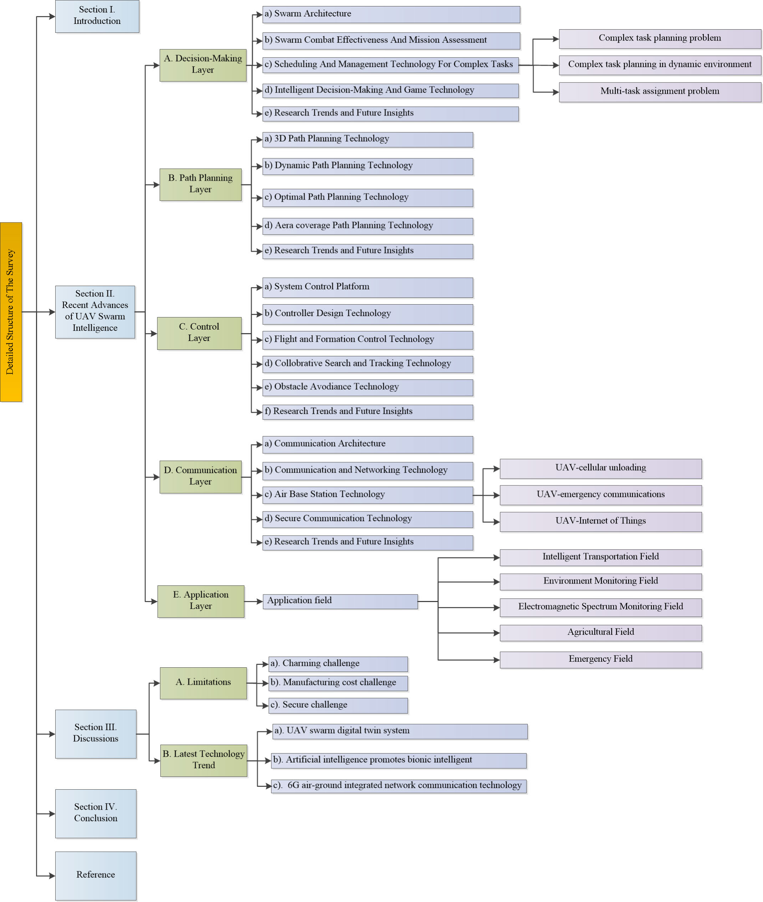

# Uav Swarm Intelligence Recent Advances And Future

**Source Document:** `UAV_Swarm_Intelligence_Recent_Advances_and_Future_.pdf`  
**Total Pages:** 23  

---

## --- Page 1 ---

Received September 7, 2020, accepted September 25, 2020, date of publication October 6, 2020, date of current version October 20, 2020.

Digital Object Identifier 10.1109/ACCESS.2020.3028865

UAV Swarm Intelligence: Recent
Advances and Future Trends

YONGKUN ZHOU
, BIN RAO, AND WEI WANG
School of Electronics and Communication Engineering, Sun Yat-sen University, Guangzhou 510006, China

Corresponding author: Wei Wang (wangw278@mail.sysu.edu.cn)

ABSTRACT The dynamic uncertain environment and complex tasks determine that the unmanned aerial
vehicle (UAV) system is bound to develop towards clustering, autonomy, and intelligence. In this article,
we present a comprehensive survey of UAV swarm intelligence from the hierarchical framework perspective.
Firstly, we review the basics and advances of UAV swarm intelligent technology. Then we look inside to
investigate the research work by classifying UAV swarm intelligence research into five layers, i.e., decision-
making layer, path planning layer, control layer, communication layer, and application layer. Furthermore,
the relationship between each level is explicitly illustrated, and the research trends of each layer are given.
Finally, limitations and possible technology trends of swarm intelligence are also covered to enable further
research interests. Through this in-depth literature review, we intend to provide novel insights into the latest
technologies in UAV swarm intelligence.

#### INDEX TERMS UAV, swarm intelligence, hierarchical control framework, trend.

I. INTRODUCTION
In nature, to make up for the deficiencies of a single indi-
vidual, many biological populations form coordinated and
shocking cluster sports scenes through mutual communica-
tion and cooperation between individuals, such as predation
of wolves, aggregation and migration of birds, and the gather-
ing of bees, honey, ant colony movement [1], etc. By studying
potential individual behaviors, the working mechanism of the
biological colony system can be obtained through the method
of mathematical modeling, that is, through the exchange of
internal information in the system, to achieve the working
mechanism of external rules and orderly cooperative behav-
ior [2], [3]. The classic algorithms include particle swarm
optimization algorithm [4], [5], ant colony algorithm [6],
which are often used in cluster collaborative control scenarios
such as path planning and task allocation. For some emerging
algorithms, the wolf swarm algorithm [7], bee colony algo-
rithm [8], [9], and firefly algorithm [10] are widely applied
in distributed UAV swarm cooperative control.

Aiming at the application of the algorithm in actual sce-
narios, three robots inspired by termites can build pyramids
and other shapes based on simple rule and local percep-
tion [11]. Reference [12] developed an e-puck robot for teach-
ing, and realized the cooperative behavior of 20 robots such

The associate editor coordinating the review of this manuscript and

approving it for publication was Xujie Li
.

as gathering and foraging. Reference [13] designed the low-
cost Kilobot robot, and designed the collaborative functions
such as foraging and formation, and carried out thousands
of cluster demonstrations, achieving the scale of the robot
swarm breaking through a thousand orders. Reference [14]
combined with swarm cooperative observe orient decide to
act (OODA) loop, the formation flight of more than 10 UAVs
was realized for the first time [15]. Through the swarm intel-
ligence behavior mechanism, the autonomous cluster flight
of 10 quadrotors in an outdoor environment was realized.
Introduced how swarm intelligence is applied to the strategic
deployment of a group of autonomous drones [15], [16].
By adopting an elf-organizing map method, a large number of
autonomous drone arrays can be automatically and adaptively
coordinated to adapt to different terrain and complex envi-
ronment [17]. Introduced various swarm intelligence-related
technologies comprehensively and gave corresponding math-
ematical proofs [18].

However, as the scale of UAV clusters increases, whether
in theory or system implementation, the difficulty index of
clusters increases, and the architecture design becomes more
challenging. Research shows that hierarchical control can
reduce the complexity of task assignment in UAV clusters and
improve the efficiency of cluster tasks. Coo W J and others
believe that the UAV swarm task planning problem belongs
to the combination optimization of complex problems, and
it is planned to use a layered control method to solve such

183856
This work is licensed under a Creative Commons Attribution 4.0 License. For more information, see https://creativecommons.org/licenses/by/4.0/
VOLUME 8, 2020

## --- Page 2 ---

Y. Zhou et al.: UAV Swarm Intelligence: Recent Advances and Future Trends

#### TABLE 1. The comparison of related work on swarm intelligence framework.

problems from the perspective of operations research [19].
Reference [20] proposed a six-layer hierarchical structure off
drones swarms, CoMPACT, which effectively combines task
planning, dynamic registration, reactive motion planning, and
sudden biologically inspired group behaviors.

Sanchez-Lopez et al. proposed a hybrid reaction/deliberative
open-source architecture AeroStack for multi-UAV systems,
including five layers of reaction, execution, deliberate, reflec-
tion, and society [21], [22]. Grabe et al. put forward an end-
to-end control framework for heterogenous drone clusters,
and its high-level tasks are concentrated on the ground [23].
Tsourdos A divides the task allocation of multi-UAV sys-
tems into three aspects: task planning layer, collaborative
path planning layer, and control layer from the direction of
multi-UAV coordination [24]. Table 1 gives the comparison
of related work on swarm intelligence framework.

This article will draw on the idea of Boskovic JD [25]
to decompose the research problem of UAV swarm intel-
ligence into five layers. The relationship between the lay-
ers as shown in FIGURE 1. The decision-making layer is
responsible for the evaluation, planning and assignment of
tasks [21], [22], [26]–[55], and generate decision data to
the path planning layer. The path planning layer manages
the sub-tasks and generates corresponding sub-task planning
paths based on the decision data [56]–[73]. The control Layer
performs task coordination between clusters according to
path information, and realizes automatic obstacle avoidance
and formation control [74]–[95]. The communication layer
conducts network communication according to the interac-
tive information generated by the control layer to realize
the sharing of information between individuals [97]–[123].
The application layer will feedback the corresponding envi-
ronment information to the decision-making layer according
to different application scenarios [124]–[142]. Through the
hierarchical optimization, the unmanned platform can tar-
get complex task scenarios and different application fields,
to achieve hierarchical coordination, and quickly complete
tasks.

#### FIGURE 1. The relationship between the layers.

On the basis of the framework, the research trends and
future insights of each layer are analyzed. The limitations
of swarm intelligence are discussed, and look forward to the
future development of UAV swarm intelligence.

The rest of this article is organized as follows. Part II,
basen on hierarchical, describes the research status and trend
analysis of UAV swarm intelligence. Part III discusses the
limitations and the latest technology trends. Part IV gives
the conclusion. FIGURE 2 provides a detailed structure of
the survey.

VOLUME 8, 2020
183857

## --- Page 3 ---

Y. Zhou et al.: UAV Swarm Intelligence: Recent Advances and Future Trends

#### FIGURE 2. A detailed structure of the survey.

183858
VOLUME 8, 2020

*Caption/Context: Y. Zhou et al.: UAV Swarm Intelligence: Recent Advances and Future Trends | FIGURE 2. A detailed structure of the survey.*

## --- Page 4 ---

Y. Zhou et al.: UAV Swarm Intelligence: Recent Advances and Future Trends

II. RESEARCH STATUS AND TREND ANALYSIS OF
UAV SWARM INTELLIGENCE

A. DECISION-MAKING LAYER
The decision-making layer is responsible for the task plan-
ning in the UAV cluster task and is the core part of the
swarm intelligent system. The current research directions are
mainly swarm architecture [21], [22], [26]–[30], swarm com-
bat effectiveness and mission assessment [31]–[35], schedul-
ing and management technology for complex tasks [36]–[51]
and intelligent decision-making and game technology [42],
[52]–[55].

1) SWARM ARCHITECTURE
What kind of structure is used to combine multiple unmanned
platforms to exert greater efficiency is the first problem
to be solved in cluster implementation. In the past few
years, more architecture-related research has been conducted
in the field of UAV clusters. As shown in FIGURE 3,
Sanchez-Lopez et al. proposed an aerospace architecture
for an autonomous multi-UAV system, which integrates
advanced concepts such as intelligence, cognition, and social
robots, including five aspects of the reaction, execution,
thinking, reflection and socialization [21], [22]. Execution
control is a key task in the robot architecture and has a
profound impact on the quality of the final system.

#### FIGURE 3. A multipurpose system architecture.

Molina M et al. describe a general method of execu-
tive control, combining distributed behavior control methods
(such as status checking and performance monitoring) and
centralized coordination. This method ensures a consistent
original design for concurrent execution and can effectively
work on different types of aerial missions [26]. To effec-
tively reduce the scale of the formation problem, as seen
in FIGURE 4, the manned aerial vehicle (MAV) /UAV mis-
sion alliance is formed in three phases: task clustering phase,
UAV allocation phase and MAV allocation phase, and the
method can give a reasonable mission planning scheme
according to the battlefield situation [27].

Affected by the rescue scene, the communication between
drones is greatly restricted. Aiming at the rescue mis-
sion planning problem of UAV group under limited condi-
tions, [28] built a mission planning model based on task

#### FIGURE 4. Three phases of MAV UAV task coalition formation.

sequence. This model takes mission priority execution order
as input to generate mission planning strategy. For the
real-time requirements of task allocation algorithm and the
limitation of individual resources in the dynamic environment
of the UAV groups, a dynamic task and resource allocation
algorithm for UAV groups based on task sequences is
proposed. Each request sequence strictly distinguishes the
necessary task time and synchronization waiting time [29].
Considering the types of drones, resources are essential in the
coordinated control of multiple drones. Under the resource
constraints, a multi-type UAV collaborative task assignment
method based on cross-entropy is introduced, and the method
can efficiently and accurately assign tasks to different types
of collective drones [30].

2) SWARM COMBAT EFFECTIVENESS AND MISSION
ASSESSMENT
The evaluation of UAV combat effectiveness and the role
is of great significance to its future development. However,
most of the current research is still at the stage of qualitative
analysis. Reference [31] established a combat effectiveness
evaluation model of UAV cluster combat system based on
system dynamics (SD). Corresponding nine tree models were
established for the weapon system in the combat process,
taking into account the characteristics of the UAV cluster,
and using the survival rate of the UAV and mission comple-
tion as evaluation indicators, an SD model was established.
Immediately after the earthquake disaster, a rapid assessment
of the earthquake-stricken is crucial for subsequent rescue
work. Because drones can quickly reach disaster areas and
acquire images, they are widely used in post-earthquake
rapid assessment. However, sensor noise and other inevitable
errors will affect the quality of images acquired by UAV
sensors, which in turn reduces the quality of evaluation. Using
the Rapid Assessment Task Allocation Problem (RATAP),
the rapid assessment task allocation scheme for multiple
drones can be established in consideration of target weights,
drone endurance and sensor errors [32]. The flying ad hoc

VOLUME 8, 2020
183859

## --- Page 5 ---

Y. Zhou et al.: UAV Swarm Intelligence: Recent Advances and Future Trends

network (FANET) of a mobile UAV has a dynamic topology.
Due to the limitation of drone battery resources and maneu-
verability, the routing in FANET is unstable. FIGURE 5
shows a biologically-inspired FANETs clustering algorithm,
through the use of gray wolf optimization and clustering
algorithm based on ant colony optimization, the performance
of the system is evaluated in a terms of cluster construction
time, energy consumption, cluster life cycle and delivery
success probability [33].

#### FIGURE 5. Working framework of proposed BICSF.

Advanced multi-UAV control technology requires a gen-
eral task assignment algorithm under resource constraints.
Through the use of a cross-entropy-based multi-type UAV
synergic task assignment method, under limited resource con-
ditions, efficient and accurate task assignment for different
types of cooperative UAVs is achieved [34]. To be able to
fully synchronize all the drones in the group during the entire
flight, the mission-based UAV swarm coordination proto-
col (MUSCOP) can effectively maintain the group cohesion
of different UAV formations, and under different experimen-
tal conditions, it has high flexibility for channel loss. It can
be seamlessly extended to a large number of drones without
significant performance loss [35].

3) SCHEDULING AND MANAGEMENT TECHNOLOGY FOR
COMPLEX TASKS

a: COMPLEX TASK PLANNING PROBLEM
UAV formation mission planning is the process of formulat-
ing a flight plan for a specific target, which usually needs
to be completed within a period of time. For the complex
task assignment problem with known target location, it can
be seen as a combination of the backpack problem [36]
and the traveling problem [37], the goal of the system is
to maximize some scores to complete tasks constrained by
time and other resources [38]. For solving such problems,

Ramirez-Atencia C uses an improved multi-objective genetic
algorithm to deal with the mission planning problem [39].
Amila Thibbotuwawa studied a declarative approach to cope
with the weather uncertainty during task execution [40].
Based on combined optimization mode, the method based
on the direction graph and a new meta-heuristic optimization
algorithm, namely the modified two-part wolf pack search
algorithm (MTWPS), can be used to solve the problem,
which can reduce the large number of UAV targets Sim-
ulation time [41]. For multi-UAV search attack task plan-
ning based on an intelligent self-organized algorithm (ISOA),
Ziyang Z et al. adopted the distributed ant colony optimiza-
tion algorithm to maximize surveillance coverage and attack
benefit [42].

b: COMPLEX TASK PLANNING IN DYNAMIC ENVIRONMENT
For the real-time complex mission planning problem of
the multi-heterogeneous system in a dynamic environ-
ment. Yaozhong Zhang et al. effectively adjusted the
consensus-based beam algorithm under the limitation of task
timing, controlled UAV resources, dynamic task addition, and
instant requirements (CBBA), developed a new method [43].
Yimeng Lu has built a safety planning framework for multi-
farious tasks in an unstable environment. With the traceability
problem of computing, [44] designed a new concept based
on the safety transition probability, and decoupled the com-
putation of the dynamic evolution of the environment from
the trajectory of the robot to solve the planning problem.
Zhen Z et al. used a combination of hybrid artificial potential
field and ant colony optimization (HAPF-ACO) to propose a
UAV swarm intelligent collaborative task planning scheme
for searching and attacking time-sensitive moving targets
in uncertain dynamic environments [45]. Wilhelm et al put
forward the use of fixed wing and quadrotor drones, using
genetic algorithm (GA) method to demonstrate adaptive mis-
sion planning, including simulation to evaluate the total flight
time [46]. Ziyang ZHEN et al. presented a distributed intelli-
gent self-organizing mission planning (DISOMP) algorithm
and ACO algorithm and parallel method (PA) for searching
and attacking, using the Dubin curve design threat avoidance
module has good flexibility, scalability and adaptability in
dynamic target search and attack problem [47]. From a known
environment, employing a hybrid component approach to
multi-rotor UAV immediate mission programming, speci-
fying assignments using metric temporal logic (MTL) and
utilizing a hybrid model to capture various modes of drones
operation can be greatly reduces the computational complex-
ity of the problem, making it possible to realize the problem
in real time, while ensuring the safety and timeliness of
the UAV [48].

c: MULTI-TASK ASSIGNMENT PROBLEM
Considering the needs of distributed computing, [49] advance
a new distributed task allocation theory for multi-task assign-
ment in search and rescue scenarios, the concept of local
cost is used to measure each sub-task and ultimately achieve

183860
VOLUME 8, 2020

![network (FANET) of a mobile UAV has a dynamic topology. Due to the limitation of drone battery resources and maneu- verability, the routing in FANET is unstable. FIGURE 5 shows a biologically-inspired FANETs clustering algorithm, through the use of gray wolf optimization and clustering algorithm based on ant colony optimization, the performance of the system is evaluated in a terms of cluster construction time, energy consumption, cluster life cycle and delivery success probability [33]. | FIGURE 5. Working framework of proposed BICSF.](images/page_005_fig_02.png)
*Caption/Context: network (FANET) of a mobile UAV has a dynamic topology. Due to the limitation of drone battery resources and maneu- verability, the routing in FANET is unstable. FIGURE 5 shows a biologically-inspired FANETs clustering algorithm, through the use of gray wolf optimization and clustering algorithm based on ant colony optimization, the performance of the system is evaluated in a terms of cluster construction time, energy consumption, cluster life cycle and delivery success probability [33]. | FIGURE 5. Working framework of proposed BICSF.*

## --- Page 6 ---

Y. Zhou et al.: UAV Swarm Intelligence: Recent Advances and Future Trends

#### TABLE 2. Scheduling and management technology for complex tasks.

the overall goal optimization. The battlefield changes rapidly,
and a two-level task planning model based on the simu-
lated annealing algorithm and tabu search algorithm is built
to solve the question of multi-objective and multi-machine
mission assignment. At the same time, combined with the
five-state Markov chain model, the optimal mission planning
scheme is determined by judging the survival probability of
the flight platform [50]. In military applications, it is essen-
tial to minimize the exposure of the UAV group to enemy
threats or avoid implementation of the plan. Reference [51]
studied the mission plan of the integrated drones system at

the tactical level, employing specified sensors to identify the
target. TABLE 2 summarizes the scheduling and management
technology for complex tasks.

4) INTELLIGENT DECISION-MAKING AND GAME
TECHNOLOGY
When multiple UAVs perform tasks, the information obtained
by the commander conceals some variability. How to choose
strategies based on uncertainty information will directly
affect the success or failure of the UAV task. Reference [52]
introduced a situation matrix to simulate the indeterminacy

VOLUME 8, 2020
183861

## --- Page 7 ---

Y. Zhou et al.: UAV Swarm Intelligence: Recent Advances and Future Trends

of the war information, and established a multi-UAV con-
frontation model based on uncertain information. An intelli-
gent self-organizing algorithm (ISOA) based on a distributed
control structure decomposes the global optimization prob-
lem into multiple local optimization problems. Each UAV
can solve its local optimization problem, and then through
the UAV Information exchange, optimal decision-making
for multiple UAV systems [42]. An interpretable intelligent
model is deduced for the decision-making logic of the UAV
when performing scheduled tasks and choosing to deviate
from the specified path. The intelligent model is an if-then
rule derived from a Sugeno-type fuzzy inference model on
a visual platform [53]. For the autonomous routing problem
of formation drones flying in areas where communication is
refused, this area does not allow the exchange of information
between drones. Modeling the problem under the framework
of game theory, the drone can choose multiple strategies to
take the next step [54]. Reference [55] proposes a muti-UAV
Bio-Inspired Optmizaed Leader Election (BOLE) method,
the selected leader acts as a decision maker and assigns taks
to other drones.

5) RESEARCH TRENDS AND FUTURE INSIGHTS
From the above research, we can see that there are still
some challenges in the current accumulated architecture
research.

• Firstly, gradual work has only been verified in
small-scale scenarios. As the scale of the transfer
increases, the compactness factor of the system will also
increase. Besides, the current UAV architecture design
is mainly aimed at the downgrade of rotor drones for
execution. There is relatively little research on the task
of overloading the large fixed-wing helicopter.

• Secondly, in the scheduling and management scenarios
for complex tasks, heuristic algorithms are usually used
to solve the problem of the UAV task assignment. How-
ever, due to the high computational complexity, it may
take a long time to find the optimal solution, so it is nec-
essary to study the task planning algorithm with fast con-
vergence ability. In addition, due to the complexity and
variability of mission scenarios, research on real-time
mission planning for heterogeneous UAV systems will
also become a direction in the future.

• Finally, due to the uncertainty of cluster tasks, it brings
great challenges to planning decisions. At the same time,
the cluster system is usually composed of a large number
of individuals, and the intelligent decision algorithm
is exponentially dependent on the problem dimension,
resulting in a sharp increase in computational complex-
ity. Then compared with ground robots, drones have a
faster speed, and the designed intelligent decision algo-
rithm needs to meet the strong real-time requirements.
In general, to adapt to the ever-changing and complex
dynamic environment, and at the same time realize the
intelligent decision-making technology that takes into

account system optimization and rapidity, is still a chal-
lenge in the future.

B. PATH PLANNING LAYER
The path planning layer is responsible for transforming the
decision data into waypoints and using the UAV attitude
information and environment perception information to gen-
erate the UAV flight path through the waypoint. UAV path
planning is to study how to determine the most feasible
path between the start point and the endpoint. This problem
is an NP-hard problem, so it can be modeled as an opti-
mization problem. To better solve the path planning prob-
lem, many scholars have proposed various deterministic and
meta-heuristic algorithms. FIGURE 6 shows the mainstream
path planning algorithms, it can be divided into two cate-
gories. One is classic algorithms that need to load environ-
mental information in advance, such as artificial potential
field (APF) method, A∗algorithm, and road map algorithm
(RMA). The other is Meta-heuristic algorithms for planning
paths based on real-time measured environmental element
information and own position information, such as particle
swarm optimization (PSO), gray wolf optimization algo-
rithm (GWO), fruit fly optimization algorithm (FOA), pigeon
inspired optimization algorithm (PIO).

#### FIGURE 6. Mainstream path planning algorithms.

According to the different research directions, this article
divides the research work of UAV cluster path planning tech-
nology into four aspects: three-dimensional (3D) path plan-
ning [56]–[60], dynamic path planning [61]–[64], optimal
road strength planning [65]–[67] and area coverage path plan-
ning technology [68]–[73]. TABLE 3 lists the classification
of the path planning layer.

1) 3D PATH PLANNING TECHNOLOGY
3D multi-UAV path planning is very difficult, because the
UAV needs to find a feasible and least complicated path
between the start point and the endpoint. Dewangan R K et al.
used the improved GWO method to deal with the 3D path
planning problem, and realized the feasible flight trajectory
while avoiding obstacles [56].

A multi-trajectory planning scheme for the UAV cluster
based on a 3D probabilistic road map (PRM) is mentioned.
The UAV swarm can reach different places (marked and
unmarked) in different situations and support emergency
conditions in the city environment [57]. For the UAV path
planning in the threat and confrontation area is a non-linear

183862
VOLUME 8, 2020

![of the war information, and established a multi-UAV con- frontation model based on uncertain information. An intelli- gent self-organizing algorithm (ISOA) based on a distributed control structure decomposes the global optimization prob- lem into multiple local optimization problems. Each UAV can solve its local optimization problem, and then through the UAV Information exchange, optimal decision-making for multiple UAV systems [42]. An interpretable intelligent model is deduced for the decision-making logic of the UAV when performing scheduled tasks and choosing to deviate from the specified path. The intelligent model is an if-then rule derived from a Sugeno-type fuzzy inference model on a visual platform [53]. For the autonomous routing problem of formation drones flying in areas where communication is refused, this area does not allow the exchange of information between drones. Modeling the problem under the framework of game theory, the drone can choose multiple strategies to take the next step [54]. Reference [55] proposes a muti-UAV Bio-Inspired Optmizaed Leader Election (BOLE) method, the selected leader acts as a decision maker and assigns taks to other drones. | • Secondly, in the scheduling and management scenarios for complex tasks, heuristic algorithms are usually used to solve the problem of the UAV task assignment. How- ever, due to the high computational complexity, it may take a long time to find the optimal solution, so it is nec- essary to study the task planning algorithm with fast con- vergence ability. In addition, due to the complexity and variability of mission scenarios, research on real-time mission planning for heterogeneous UAV systems will also become a direction in the future.](images/page_007_fig_02.png)
*Caption/Context: of the war information, and established a multi-UAV con- frontation model based on uncertain information. An intelli- gent self-organizing algorithm (ISOA) based on a distributed control structure decomposes the global optimization prob- lem into multiple local optimization problems. Each UAV can solve its local optimization problem, and then through the UAV Information exchange, optimal decision-making for multiple UAV systems [42]. An interpretable intelligent model is deduced for the decision-making logic of the UAV when performing scheduled tasks and choosing to deviate from the specified path. The intelligent model is an if-then rule derived from a Sugeno-type fuzzy inference model on a visual platform [53]. For the autonomous routing problem of formation drones flying in areas where communication is refused, this area does not allow the exchange of information between drones. Modeling the problem under the framework of game theory, the drone can choose multiple strategies to take the next step [54]. Reference [55] proposes a muti-UAV Bio-Inspired Optmizaed Leader Election (BOLE) method, the selected leader acts as a decision maker and assigns taks to other drones. | • Secondly, in the scheduling and management scenarios for complex tasks, heuristic algorithms are usually used to solve the problem of the UAV task assignment. How- ever, due to the high computational complexity, it may take a long time to find the optimal solution, so it is nec- essary to study the task planning algorithm with fast con- vergence ability. In addition, due to the complexity and variability of mission scenarios, research on real-time mission planning for heterogeneous UAV systems will also become a direction in the future.*

## --- Page 8 ---

Y. Zhou et al.: UAV Swarm Intelligence: Recent Advances and Future Trends

#### TABLE 3. The classification of path planning layer.

optimization problem with multiple static and dynamic con-
straints, through a multi-drones collaborative path planning

method
on
3D
rugged
terrain
multi-swarm
fruit
fly
optimization
algorithm
(MSFOA),
which
solves
the

VOLUME 8, 2020
183863

## --- Page 9 ---

Y. Zhou et al.: UAV Swarm Intelligence: Recent Advances and Future Trends

shortcomings of the original algorithm that the global conver-
gence speed is too slow and the local optimization [58]. In the
scenario where the UAV is used for 3D oilfield detection,
the pigeon inspired optimization (PIO) algorithm is used to
optimize the initial path, and the fruit fly optimization algo-
rithm (FOA) is used to perform local optimization to avoid
obstacles while finding the best path [59]. In the static rough
terrain environment, the path length, height, and adjustment
angle need to be considered. The path planning problem is
described as a three-objective optimization problem, and an
improved particle swarm optimization (PSO) algorithm is
used to solve it [60].

2) DYNAMIC PLANNING TECHNOLOGY
When the UAV is performing tasks in a complex environ-
ment, it needs to continuously avoid static and moving obsta-
cles, at the same time, it must respond to sudden threats
in the surroundings. Therefore, it is necessary to design a
corresponding dynamic path planning algorithm. To solve
the above problems, under the condition of static sudden
threats, a series of candidate paths are generated using the
cubic spline second-order continuity principle, finally, a total
cost function is established to select the optimal obstacle
avoidance path. This method has the characteristics of short
time consumption and strong real-time performance [61].
When face with a changing unknown condition, an adaptive
route planning with complementary sensors is necessary.
The wall-follow method (WFM) and the artificial potential
field (APF) method provide an alternative solution to the
acyclic problem of WFM and the local minimum problem of
APF [62]. Track detection and automatic scene understanding
based on abstract vision is the key to the work of drones
in complex outdoor environments (such as isolated disaster
scenes). By building a support vector machine-based tracking
detection and tracker combination framework, it is possible to
achieve tracking direction estimation and stalking with lower
computation and input [63]. Aiming at the inconsistency in
the communication status information of multiple drones in a
dynamic environment, by calculating the collision probability
of the UAVs, and then using the Kalman filter for state
prediction, the path conflicts of the UAV formation during
flight can be avoided [64].

3) OPTIMAL PATH PLANNING TECHNOLOGY
With the popularity of the internet of things (IoT), UAVs have
been widely used due to their rapid deployment and control-
lable mobility. However, the battery capacity of drones has
limited their endurance and performance, so it is necessary
to plan the optimal path for the UAV to execute the mission.
In the field of broadened mobile crowd perception (MCS),
the fixed-wing UAV-assisted MCS system is taken as the
research object, and the corresponding joint path planning
and task allocation problems are studied from the perspective
of energy efficiency, and the original NP-hard joint opti-
mization problem is transformed for the bilateral two-stage
matching problem, this method has achieved good results

in energy consumption, overall profit and matching perfor-
mance [65]. To achieve maximize the power consumption of
drones and sensors and terminal compliance to ensure that all
data is collected efficiently with minimum energy consump-
tion [66]. When a group of heterogeneous fixed-wing UAVs
are traversing multiple targets and performing continuous
tasks, to determine the optimal flight trajectory, a coupled
distributed planning method combining task assignment and
trajectory generation is proposed. Under the condition and
relaxed Dubins path, the cooperative task planning problem is
reconstructed. This method significantly improves the oper-
ating rate of the system and has the potential to be applied to
practical tasks [67].

4) AERA COVERAGE PATH PLANNING TECHNOLOGY
The task of coverage path planning (CPP) is to design a
trajectory so that the UAV can move at every point in the
area of interest. Control the UAV carrying a camera to take
off at a random location in the target area and land in the
terminal area. Spatial information is fed back to the drone
through the convolutional network layer by using the class
diagram input channel, and then a dual-depth Q-network
(DDQN) is trained to make control decisions for the drone
to balance the limited power budget and coverage goals [68].
In the coverage search of the target region, the problem is
usually modeled as a potential game, and an improved binary
logarithmic linear learning (BLLL) algorithm and potential
game theory are researched to coordinate the coverage of
multiple drones and collaborative control issues [69]. Aiming
to reduce the oscillation of the UAV’s trajectory, the recipro-
cal method between adjacent UAVs is considered. The inter-
active decision-making method is self-organizing, distributed
and autonomous. Under the premise of ensuring optimal
mission planning, it can effectively improve the survivability
of drones. Simultaneously loading equipment such as net-
work cameras can realize the positioning and orientation of
moving targets in the area [70]. The UAV airborne camera
has the problems of coverage, positioning and orientation.
By proposing the method of clustering targets, it can solve
the low complexity problem of flying robots tracking moving
targets. At the same time, it uses part of the knowledge
of target mobility to improve the efficiency of the algo-
rithm [71]. To improve the detection capability of the UAV in
the designated area, [72] combines the simplified gray wolf
optimizer (SGWO) and improved symbiotic organism search,
and proposes a new hybrid algorithm. The algorithm effec-
tively combines the exploration and development capabilities,
simplifies the stage of the GWO algorithm, accelerates the
convergence of the algorithm, and retains the detection capa-
bilities of the population. When a drone tracks a ground target
in an obstacle environment, the target will be lost due to the
sight and other factors.

By using an improved depth deterministic strategy gradient
algorithm (GA), and then constructing a reward function
based on line of sight and artificial potential field (APF)
to guide the UAV to achieve target tracking, and finally

183864
VOLUME 8, 2020

## --- Page 10 ---

Y. Zhou et al.: UAV Swarm Intelligence: Recent Advances and Future Trends

#### FIGURE 7. High-level operations for the first scenario in the centralized platform [74].

use the penalty to smooth the trajectory. At the same time,
to improve the detection capabilities, multiple drones are used
at each level to perform tasks, and long and short memory
networks are used to approximate the environmental state,
which improves the accuracy of approximation and data uti-
lization efficiency [73].

5) RESEARCH TRENDS AND FUTURE INSIGHTS
UAV cluster path planning should not only ensure the optimal
global path and the shortest time to complete the task, but also
ensure that the UAV cluster can avoid obstacles and avoid
collisions between the single machines during the comple-
tion of the task. In the path planning process, most studies
utilize the drone as a mass point without considering the size
and load of the drone, which makes the modeling process
more sampling and ideal. In the future modeling process,
the corresponding constraints need to be considered, Making
simulation closer to reality and enhancing the robustness of
actual control. In addition, most of the existing task planning
methods are aimed at single or specific conflict scenarios
and lack a holistic system solution for an integrated task
environment.

C. CONTROL LAYER
The
control
layer
controls
the
UAV
to
fly
accord-
ing to the planned path, which is the basis of UAV
cluster research. By establishing control system frame-
works [74]–[77] and designing corresponding controllers
[78]–[80], it is possible to solve the reconstruction of different
types of drones in cluster formations [81]–[86], cluster search
And tracking [90]–[92] and cluster anti-collision and other
aspects [93]–[95]. An overall summary of the classification
of the control layer is given in TABLE 4.

1) SYSTEM CONTROL PLATFORM
Automation equipment clusters are increasing in popularity
and scale. Usually, there are two main ideas for their control:
centralized and distributed control. Centralized platforms
can achieve higher output quality, but will result in better
network traffic and limited scalability, while decentralized
systems are more scalable, but less complex. Justin Hu pro-
posed the concept of the HiveMind platform, a scalable and

high-performance centralized coordinated control platform
for UAV clusters [74]. The UAV cluster network ensures the
connectivity between high-speed UAV nodes and simplifies
the design of various cluster applications. By establishing a
new distributed cluster model for the UAV group network,
the connectivity between all nodes in the cluster network
is ensured. Compared with the traditional fly ad hoc net-
work, the network throughput is increased by 1.4 times [75].
In response to the problem of group control, based on the
concept of the appearance of group agents, [76] established
a multi-layer group control scheme inspired by group intel-
ligence, and then researched a comprehensive sensing and
communication method to adjust how the UAV Calculate
the distance and the deflection angle from the neighbor, and
finally carried out a series of experiments on the simulator
and cluster prototype based on OMNeT++ to evaluate the
effectiveness of the scheme. The traditional UAV dynamic
model usually relies on sensor input and a priori knowledge of
the environment and targets. To overcome these limitations,
a two-layer quasi-distributed control framework based on the
simulation of urban blocks is shown in FIGURE 8, which
was used to achieve continuous control of the UAV group in
two designated monitoring stages [77].

#### FIGURE 8. Two-layer quasi-distributed control framework [77].

2) CONTROLLER DESIGN TECHNOLOGY
In the design process of drones, the design of the controller
is crucial. Selma B et al. proposed a robust intelligent con-
troller based on an adaptive network fuzzy inference sys-
tem (ANFIS) and improved ant colony optimization (IACO)

VOLUME 8, 2020
183865

![Y. Zhou et al.: UAV Swarm Intelligence: Recent Advances and Future Trends | FIGURE 7. High-level operations for the first scenario in the centralized platform [74].](images/page_010_fig_02.jpeg)
*Caption/Context: Y. Zhou et al.: UAV Swarm Intelligence: Recent Advances and Future Trends | FIGURE 7. High-level operations for the first scenario in the centralized platform [74].*

## --- Page 11 ---

Y. Zhou et al.: UAV Swarm Intelligence: Recent Advances and Future Trends

#### TABLE 4. The classification of swarm control technology.

183866
VOLUME 8, 2020

## --- Page 12 ---

Y. Zhou et al.: UAV Swarm Intelligence: Recent Advances and Future Trends

to control the behavior of three-degree-of-freedom four-rotor
aircraft. Using the ANFIS controller to reproduce the desired
trajectory of the quadrotor in the two-dimensional vertical
plane, this method reduces the learning error and improves
the quality of the controller [78]. For the full-attitude maneu-
vering control of the suspension load of multiple UAVs under
uncertain conditions, a controller that can handle the uncer-
tain parameters of the crane system is used, and the limit of
evaluation using the planned trajectory is given [79]. When
the UAV moves along a specific path, the effective control of
the airborne gimbal system directly affects the performance
of tracking ground moving targets. Reference [80] modeled
the gimbal system based on the non-linear Hammerstein
block structure to effectively use the model predictive con-
troller (MPC) for control, and also improved the real-time
target tracking performance under external interference.

3) FLIGHT AND FORMATION CONTROL TECHNOLOGY
Common methods of multi-UAV formation control include
consensus theory, leader-follower strategy, behavior method,
virtual structure method, differential game, finite-time con-
trol theory, and so on. For the UAV formation maintenance
control problem of multi-agent system consistency, based on
the Routh-Hurwit stability criterion, the stability criterion of
the system equilibrium point and Hopf bifurcation condi-
tions are obtained. At the same time, the model prediction
controller of the follower can predict the leader’s movement
state, so that the UAV formation remains stable [81]. Faced
the problem of time-varying formation control of singular
multi-agent systems with switched topologies, [82] designed
a distributed formation controller based on output factors,
through the impulse-free and equivalent exchange of singular
multi-agent systems, An algorithm for solving distributed
controller is designed, and the effectiveness of the method is
verified by numerical simulation. Zhang J proposed a coop-
erative guidance control method based on the backstepping
method to quickly form the desired formation and achieve a
multi-UAV steady state. Compared with the model prediction
method and the Laplacian method, the proposed method not
only enables the UAV formation to quickly form the desired
formation, but also provides a fast dynamic response and a
small tracking error when tracking the virtual leader [83].
Close-formed rotary flight will expand the flying range of
the UAV group, but due to some complex conditions, such
as uneven fuel configuration and irregular formation, it will
pose a huge challenge to the conventional rotary method [84].
On the basis of building a leader-follower reciprocating
model, a distributed formation rotation algorithm is proposed,
which coordinates the UAV group to fly in a compact and
straight-line formation, increasing the formation range under
the above complex conditions. Reference [85] proposed a
distributed formation control algorithm for multi-rotor UAVs,
which allows the UAV to achieve a balanced configuration on
a predetermined shape in 2D or 3D shape at the same time.
Based on the online MPC method and disturbance observer,
we combined the formal algorithm with the flight control

structure, and implemented a complete framework on the
low-power computing unit. Based on the traditional MPC
method, [86] presents an event-triggered model predictive
control (MPC) scheme, which takes into account the predic-
tion state error and the convergence of the cost function, and
at the same time for each local level optimal control problem,
developed a no-fly zone strategy based on safety distance
and integrated it into the local cost function to make it more
computationally efficient.

4) COLLABORATIVE SEARCH AND TRACKING TECHNOLOGY
In terms of the theory of unmanned aerial vehicle cluster
cooperative control, due to the autonomous characteristics
of unmanned aerial vehicles, unmanned swarm collaborative
methods are gradually mapped to multi-agent systems for
research. Board researches the collaborative problem of UAV
clusters, compared with the centralized control, distributed
control can give full play to the autonomous capabilities of
UAVs [87]. Jakob Foerster et al. broke through the issues
of central planning and distributed decision-making, and
effectively improved the limitations of single-agent obser-
vation [88]. Is based on the reconfiguration method of
rule-driven agent-driven real-time distributed control system,
and discusses the task coordination problem of the distributed
intelligent system [89].

Target search for UAVs in unknown environments, it needs
to consider its limitations and characteristics of effective
strategies and control methods. Inspired by the population
evolution model, [90] studied a collaborative UAV collabo-
rative target search method based on an improved bean opti-
mization algorithm (BOA), which presents effective search
capabilities, distributed collaborative interaction, and emerg-
ing group intelligence. When the target has the searcher’s
position awareness and mobility, it will increase the difficulty
of searching. Using detection information and target motion
prediction, a multi-UAV search path planning optimization
model is established, and by using an efficient HPSO algo-
rithm to solve the model, the target discovery probability is
maximized [91]. For the tracking of multiple targets, [92]
constructed a decentralized multi-target tracking system for
a cooperative unmanned aerial vehicle (UAV) with limited
sensing capabilities. This system combines clustering algo-
rithms, optimal the sensor manager and the optimal path
planner to achieve the expected tracking effect.

5) OBSTACLE AVOIDANCE TECHNOLOGY
Under the high altitude density and increasingly complex
flight conditions, it is very important to avoid collisions
between drones and drones. However, this problem has
not been fully resolved, especially in self-organized flight
clusters. Reference [93] introduced a new type of self-
organizing UAV group flight collision method, based on
the Reynolds rule, the self-organizing flight rule model
of the UAV group was established, and the new collision
avoidance rules between UAV groups were derived. This
method improves the collision avoidance efficiency between

VOLUME 8, 2020
183867

## --- Page 13 ---

Y. Zhou et al.: UAV Swarm Intelligence: Recent Advances and Future Trends

UAV clusters, and obtains a smooth collision avoidance
trajectory, and its collision avoidance behavior is more in
line with actual flight requirements. When a minority group
encounters an obstacle, it is easy to fall into a local min-
imum state, making the group state worse. The use of a
cluster obstacle avoidance algorithm with local interaction
of obstacle information can improve the disadvantage poor
consensus of the local obstacle avoidance algorithm, and
promote the consensus of the UAV group while overcoming
the obstacles [94]. However, the existing collision avoidance
methods still have some theoretical and practical problems.
The traditional artificial potential field method is limited to
single UAV trajectory planning and cannot guarantee colli-
sion. Reference [95] studied an optimized artificial potential
field algorithm for multi-UAV work in 3D dynamic space,
introducing distance factor and jumping strategy methods to
achieve trajectory planning and collision avoidance for UAV
systems.

6) RESEARCH TRENDS AND FUTURE INSIGHTS
Drone control systems provide drones with the ability to fly
accurately and adapt to complex environments, but there are
still some deficiencies in current research.

• First of all, in terms of controller design, due to the
aerodynamic complexity and control coupling charac-
teristics of fixed-wing UAVs, and lack of controllabil-
ity, it is difficult to establish accurate dynamic models.
At the same time, the UAV will be affected by wind
factors during flight, affecting flight speed. Therefore,
it is necessary to establish an accurate dynamic model
with the help of some external experimental conditions,
and at the same time consider the influence of wind
factors.

• However, in the field of UAV cluster formation fly-
ing and formation reconstruction technology, there are
few research results on cooperative control such as for-
mation maintenance and formation transformation of
large-scale clusters (more than 100 aircraft). At the same
time, how to be based on the performance constraints of
the cluster platform, such as flight problems in uncertain
communication environments, will become a challenge
in the future.

• Then for the problem of collaborative search and track-
ing of drones, due to the low cost requirements of the
cluster system, usually using low-cost sensor equipment
will cause noise and inaccuracy in obtaining informa-
tion. Future work will explore how to develop low cost
and accuracy High sensor. Moreover, the previous algo-
rithms tend to study the path tracking of straight lines
and circles. For the curve path tracking problem, there is
no similar comparative comparison.

• Finally, regarding the obstacle avoidance problem of
the UAV cluster, it is necessary to further increase the
response speed to the close-range threat scenario and
reduce the avoidance time. To ensure that the UAV
can successfully complete the hovering task, it is also

necessary to develop an autonomous collision-free hov-
ering control algorithm for the UAV. At the same time,
airborne processing requires drone operations, such as
dynamic sensing and avoidance algorithms and image
processing. Designing a low-power, powerful airborne
processor is a research focus in the future.

D. COMMUNICATION LAYER
The key to whether the UAV cluster can achieve the pre-
determined combat effectiveness lies in the acquisition and
transmission of information. The efficient operation of UAV
communications is the key to obtaining ownership of the
battlefield. From the perspective of UAV communication
and network, the relevant mission parameters, data require-
ments of the network, and the applicability o the existing
technology that can support aerial networks are summa-
rized [96]. The main problems of current communication
layer research include communication architecture [97]–[99],
communication, networking technology [100]–[107], airbase
station technology [108]–[114] and security communication
technology [115]–[123].

1) COMMUNICATION ARCHITECTURE
The communication architecture is one of the cores of UAV
networking design. A suitable network structure can improve
the efficiency and reliability of communication data and the
execution of upper-level tasks. Through collaborative com-
munication and relay technology, UAV clusters can expand
the effective coverage of IoT services through multiple relay
nodes. FIGURE 9 shows a hierarchical network structure of
unmanned aerial vehicles is mentioned in [97].

The minimum number of upper-layer unmanned aerial
vehicles is theoretically proved by a closed-form coverage
boundary, and the average delay and average link delay are
verified by numerical simulation. It has better performance
in terms of packet distribution rate. In the future intelligent
transportation system, a diagram of the ICT-centric mobile
simulation framework is illustrated in FIGURE 10. Mobility
and communication simulation is integrated into a system
process, which can make good use of the unique mobility
potential of its drones to improve the performance of the
service [98].

Besides, due to the different tasks of drones in the net-
work, the communication needs of each UAVs need to be
considered. As shown in FIGURE 11, from the perspective
of game theory, the joint channel slot selection problem in a
multi-drone network is described as a weighted interference
mitigation game, and then a distributed logarithmic linear
algorithm is applied to achieve the desired optimization,
which Overcome the constraints of the dynamic communi-
cation requirements of each UAV [99].

2) COMMUNICATION AND NETWORKING TECHNOLOGY
The key to whether the UAV can achieve its intended com-
bat effectiveness lies in the acquisition and transmission of
information. The performance of the UAVs communication

183868
VOLUME 8, 2020

## --- Page 14 ---

Y. Zhou et al.: UAV Swarm Intelligence: Recent Advances and Future Trends

FIGURE 9. Typical layered UAV network scenario for forest fire prevention
and inspection [97].

#### FIGURE 10. The ict-centric mobile simulation framework [98].

FIGURE 11. Illustration of the multi-UAV network, showing the selection
of each UAV [99].

network is the key to gaining the right to information
on the battlefield. At the same time, due to the high
probability of line-of-sight (LOS) link and on-demand
deployment, the UAV can improve the overall performance
of the ground communication system. Chen Q et al. studied
a relay system in which multiple UAVs established a UAV
relay network through orthogonal frequency division multi-
ple access (OFDMA) to help some transmitters communicate
with corresponding receivers [100]. In a cellular network

composed of drones, each drone can sense and transmit data
from multiple tasks to the base station. By introducing the
Information Age to quantify the ‘‘freshness’’ of base station
data, and using a task scheduling algorithm to optimize the
sensing time, transmission time, the trajectory of the UAV
to complete a specific task [101]. However, UAV nodes
usually face design problems and power limitations, which
in turn affect the routing mechanism. Lasari H N et al.
proposed the concept of cross-layer design and efficient
power algorithms to improve the performance of UAV net-
works [102]. The modular dynamic clustering method based
on the improved Louvain method can be used for efficient
UAV-assisted mobile communication, which is promising in
solving the energy consumption of UAVs and reducing the
transmission power of mobile devices [103].

The networked multi-agent system (NMDS) uses local
control rates based on the spatial information of the nearby
environment and neighboring agents to exhibit a sudden
swarming behavior, but there is currently no method of inter-
action between the operator and a large number of agents.
Reference [104] researched a robust and estimated method for
operators to indirectly configure the propagation and obser-
vation of the system state to help the operator provide the
best input to the NMDS at the appropriate time. The deploy-
ment of large-scale UAV clusters based on the advantages of
clusters will lead to high competition and excessive conges-
tion of spectrum resources, resulting in mutual interference.
Multi-cluster flying ad hoc networks (FANET) under differ-
ent network topologies have interference-aware online spec-
trum access problems. The online distributed algorithm based
on the optimal response (IOCPCBR) algorithm can effec-
tively reduce the interference of the UAV cluster and reduce
the cost of channel switching per time slot [105]. Albu-Salih
AT and others proposed a new framework to improve the data
collection efficiency of wireless sensor networks and multiple
drones, and minimize the total travel distance, travel time
and network energy consumption of drones. The framework
can effectively collect sensor data while meeting the con-
straints of UAV energy and duration [106]. To solve the joint
optimization problem of drone location, time slot allocation
and computing task allocation, [107] proposed a mobile edge
computing (MEC) server enabled by UAV (UAV). Users
provide MEC services.

3) AIRBASE STATION TECHNOLOGY
Drones have the flexibility and ability to establish line-of-
sight wireless connections. In scenarios that require rapid
deployment (for example, in the case of natural disas-
ters, emergencies, and sports events), drones are used as
aerial base stations to supplement and support existing
ground communication infrastructure. At present, UAV-
wireless network (UAWN) has been successfully applied to
UAV-cellular unloading (UAV-CO), UAV-emergency com-
munications (UAV-EC), UAV-Internet of Things (UAV-IoT),
etc. TABLE 5 summarize the application of the UAV-wireless
network.

VOLUME 8, 2020
183869

![Y. Zhou et al.: UAV Swarm Intelligence: Recent Advances and Future Trends | FIGURE 9. Typical layered UAV network scenario for forest fire prevention and inspection [97].](images/page_014_fig_02.jpeg)
*Caption/Context: Y. Zhou et al.: UAV Swarm Intelligence: Recent Advances and Future Trends | FIGURE 9. Typical layered UAV network scenario for forest fire prevention and inspection [97].*

![FIGURE 9. Typical layered UAV network scenario for forest fire prevention and inspection [97]. | FIGURE 10. The ict-centric mobile simulation framework [98].](images/page_014_fig_03.jpeg)
*Caption/Context: FIGURE 9. Typical layered UAV network scenario for forest fire prevention and inspection [97]. | FIGURE 10. The ict-centric mobile simulation framework [98].*

![FIGURE 10. The ict-centric mobile simulation framework [98]. | FIGURE 11. Illustration of the multi-UAV network, showing the selection of each UAV [99].](images/page_014_fig_04.jpeg)
*Caption/Context: FIGURE 10. The ict-centric mobile simulation framework [98]. | FIGURE 11. Illustration of the multi-UAV network, showing the selection of each UAV [99].*

## --- Page 15 ---

Y. Zhou et al.: UAV Swarm Intelligence: Recent Advances and Future Trends

#### TABLE 5. The application of UAV-wireless network.

a: UAV-CELLULAR UNLOADING
In the field of UAV-CO, [108] has established an analy-
sis framework for analyzing the signal-to-interference-noise
ratio coverage probability of drone-assisted cellular networks
of cluster user equipment (UE). The location modeling with
the ground base station is a poison point process, which
verifies the impact of the UAV height and path loss func-
tion on system performance. Reference [109] analyzes the
coverage performance of UAV-assisted terrestrial honeycomb
and introduces a user-centric collaborative drone clustering
scheme. Under the condition of a suitable collaborative cylin-
der, by optimizing the cache size and drone the density maxi-
mizes the coverage of the system. Meanwhile, due to the fast
mobility and highly dynamic topology of the UAV network,
it is necessary to design a clustered layered routing protocol
to provide scalability [110].

b: UAV-EMERGENCY COMMUNICATIONS
In the field of UAV-EC, drones can be used as assisted
emergency communications in emergency scenarios such as
firefighting and disaster rescue. The information is transmit-
ted to the control center. Zhang Q et al. proposed a joint

communication and calculation optimization solution for the
UAV group scenario supported by mobile edge computing
technology (MEC). Under the communication and calcula-
tion constraints, the transmission efficiency is improved and
the response delay is reduced [111].

c: UAV-INTERNET OF THINGS
In the field of UAV-IoT, the deployment of drones can facili-
tate the data transmission of IoT devices. During the transmis-
sion of uplink data between the Internet of Things equipment
and the base station, the use of drones as a communication
relay can enhance the signal reception strength of the base
station. Using a distributed UC algorithm, IoT devices are
integrated into multiple UCs. By solving the system opti-
mization model, the optimal deployment and transmission
power of each UC relay UAV is obtained [112]. When the
throughput optimization problem involves the constraints
of the drone’s flight speed and the IoT device’s upstream
transmission power, the use of multi-agent deep learning
(DQL) strategy and a anoverl algorithm can solve the 3D path
planning and Joint optimization of channel resources [113].
Current communication systems are based on traditional

183870
VOLUME 8, 2020

## --- Page 16 ---

Y. Zhou et al.: UAV Swarm Intelligence: Recent Advances and Future Trends

information theory principles to transmit long messages, and
achieving ultra-high reliability of short messages is the core
challenge of future infinite communication systems. Ranhja
and others rely on multi-hop drone relay links to provide
ultra-reliable and low-latency (URLLC) command packets
between ground-level Internet of Things (IoT) devices to
reduce the overall decoding error rate and enhance the reli-
ability of receiving short data packets [114].

4) SECURE COMMUNICATION TECHNOLOGY
In the actual UAV communication network, although the
nature of the powerful LoS link allows UAV communi-
cation to provide ubiquitous high data rate wireless ser-
vices, it also makes the communication between the UAV
and the ground user more easily intercepted [115]. There-
fore, various serious challenges have been proposed for
the security of UAV communications [116]. In [117], vari-
ous communication protocols between UAVs are discussed
and a new UAVs secure communication protocol is pro-
posed. To improve the efficiency of safe communication,
the [118]–[121] system uses multi-UAV cooperative commu-
nication. A jamming drone can fly close to a potential eaves-
dropper, and then transmit artificial noise signals to interfere
with the eavesdropper [118]. At the same time, to improve
the safety performance of the system, [119] and [120] pro-
posed a cooperative interference method, which uses artificial
interference transmission to protect the communication of
the drone, from the existence of a single eavesdropper other
neighboring drones [119]. Fair consideration in the safe com-
munication of two drones, investigation of the joint power
distribution and trajectory design to maximize the minimum
secrecy rate for each user, one drone dispatches confidential
information to the ground, and the other cooperative drone
transmits interference signals [121]. Since in [118]–[121],
the role of the UAV is fixed, it can only provide com-
munication/interference functions in the entire time range.
In response to the above shortcomings, [122] proposed a
multi-purpose drone, which can be dynamically used as a
communication drone or jamming drone, providing a high
flexibility for safe drone communication. Reference [123]
studied the confidentiality interruption performance of the
low-altitude UAV group secure communication system using
opportunistic relays, and verified the influence of backhaul
reliability, drone cooperation and eavesdropping probability
on the confidentiality interruption probability.

5) RESEARCH TRENDS AND FUTURE INSIGHTS
The communication between cluster drones is mainly used
for the exchange of status and load information between
drones. When the number of drone clusters is huge, there
are many types of tasks, fast flight speed, frequent changes
in relative space-time relationships, and the effectiveness of
information transmission, making the communication net-
working between clusters very challenging.

• The main research directions of current communication
networking can be divided into four aspects.

DELAY-TOLERANT NETWORKING (DTN): Solve
networking problems in a dynamic environment;
NETWORK FUNCTION VIRTUALIZATION (NFV):
Enable network infrastructure virtualization;
SOFTWARE-DEFINED NETWORKING (SDN): Pro-
vides separation between the control plane and data
plane;
LOW POWER AND LOSSY NETWORKS (LLT):
Effective networking under limited resources.

• In the research of aerial base stations, since FANET uses
the same wireless communication frequency bands

• as satellite communications and GSM networks, it will
cause frequency congestion. Therefore, it is necessary
to standardize the FANET communication frequency
bands and design corresponding congestion control
algorithms.

• In the field of unmanned aerial vehicle communication,
in addition to measures to interfere with unmanned aerial
vehicles to ensure safe communication, future research
work can also be done from the perspective of signal
distortion monitoring and multi-unmanned cooperative
countermeasures.

E. APPLICATION LAYER
At present, drones have been widely used in leisure enter-
tainment and express delivery services, and may even be
expanded to military reconnaissance, agriculture, environ-
mental monitoring, emergency rescue and other application
fields in the future. Smart drones are the next major revo-
lution in drone technology and are expected to provide new
opportunities in various fields under the premise of reducing
costs and risks. TABLE 6 lists the application of UAV swarm
intelligence.

1) INTELLIGENT TRANSPORTATION FIELD
[124] introduced the civilian applications of drones and
their challenges, and discussed the current research trends,
and proposed the challenges faced by civilian applications
of drones: battery life, collision avoidance, network resource
congestion, and security. In the field of intelligent trans-
portation, multi-rotor drones have recently been recognized
as one of the advanced technologies used in smart cities.
It can monitor the transportation network, channel traffic
and monitor events in real-time [125]. Reference [126] intro-
duced a UAV intelligent traffic monitoring system based on
five generation (5G) technology, which overcomes the static
characteristics and other limitations of traditional systems
and greatly reduces the incidence of traffic accidents. Ref-
erence [127] proposed a UAV-based vehicle detection and
tracking system, which can generate vehicle dynamic infor-
mation in real-time. Reference [128] uses a convolutional
neural network method to improve the accuracy and perfor-
mance of moving vehicle detection. Reference [129] integrate
video data collected by drones with traffic simulation models
to enhance the real-time traffic monitoring. To optimize
the problem of the limited battery capacity of UAVs, [130]

VOLUME 8, 2020
183871

## --- Page 17 ---

Y. Zhou et al.: UAV Swarm Intelligence: Recent Advances and Future Trends

#### TABLE 6. The application of swarm intelligence.

developed a universal management framework for UAVs for
intelligent transportation systems (ITS), which effectively

utilized the UAV fleet. In addition, in the intelligent trans-
portation delivery system, the deployment of drones is still in

183872
VOLUME 8, 2020

## --- Page 18 ---

Y. Zhou et al.: UAV Swarm Intelligence: Recent Advances and Future Trends

its infancy. Reference [131] proposed an optimization from
the four aspects of communication routing methods, optimal
path planning of drones, dynamic task allocation, and hybrid
delivery solutions Good candidate for delivery efficiency and
reduced air traffic.

2) ENVIRONMENT MONITORING FIELD
In the field of environmental monitoring, use drones to col-
lect sensors data to monitor water and air quality in real-
time [132]. Reference [133] introduces the concept of the
internet of drone things and gives its application in some
special scenarios. Besides, the location of pollution sources
in chemical plants has become a hot research topic. An air
pollution source tracking algorithm based on artificial poten-
tial field method and particle swarm optimization algorithm
can accurately find the pollution source in a short time [134].
To monitor the degradation of tropical rain forests, [135]
studied a new method for real-time automatic detection of
non-forest and eroded areas in tropical rain forests. Contin-
uous segmentation through multiple thresholds will produce
a binary map that can clearly distinguish the forest and eroded
areas.

3) ELECTROMAGNETIC SPECTRUM MONITORING FIELD
In the field of electromagnetic spectrum monitoring, to mon-
itor private black broadcasts, a group of unmanned aerial
vehicles carrying sensors that receive strong signals are used
to locate intermittently launched RF transmitters [136].

4) AGRICULTURAL FIELD
Reference [137] emphasize the importance of UAVs in agri-
culture, by using UAVs in agricultural monitoring and obser-
vation to increase crop yields. In terms of agricultural plant
protection, spraying pesticides by drones has the advantages
of safety, good prevention and control effects, low cost,
and no geographical restrictions. By establishing the over-
all framework of the plant protection drone control system
and using Pixhawk open-source flight control, the optimal
spray control requirements of the plant protection drone are
achieved [138].

5) EMERGENCY FIELD
Reference [139] introduced a multipurpose UAV for moun-
tain rescue, which can adapt to mountain environments such
as low temperature, low altitude, and strong wind to perform
rescue missions. A drone search and rescue scheme based
on human body monitoring and geographic positioning is
proposed in [140], when the UAV scans the wounded in
the target area, it will deliver medical supplies to it through
geolocation. By using a UAV modular architecture for search
tasks, it is possible to realize the collaborative control of
multiple UAVs and transmit the video information stream in
real time [141]. Besides, in fire or chemical accident sce-
narios, taking into account the spatial correlation inherent in
the investigation phenomenon, Katharina Glock introduced a
concept of mission planning, routing drones through a set of

sampling points, using interpolation methods to collect sam-
ples to predict hazards Distribution of substances throughout
the affected area [142].

III. DISCUSSIONS
A. LIMITATIONS
1) CHARMING CHALLENGE
The battery capacity of the drone is a key factor in achieving
continuous missions. But as the battery capacity increases, its
weight will increase, which will cause the UAV to consume
more energy for specific tasks. Researchers are developing
optimized hybrid battery solutions [143]–[145].

Reference [146] introduced an autonomous battery main-
tenance mechatronics system, which can quickly replace the
depleted battery and a supplementary battery of the drone,
while charging several other batteries. This allows the battery
maintenance system to have a low drone downtime, arbi-
trarily expandable operating time, and a compact footprint.
Reference [147] proposed a new type of battery charging
exchange station that converts used batteries into recharge-
able batteries while keeping the micro aircraft in an active
state to ensure continuous operation of mission parameters
and data.

2) MANUFACTURING COST CHALLENGE
Cluster systems often achieve quality advantages with scale
advantages, and the damage of a single individual will not
affect the system. Therefore, large-scale cluster systems often
strictly limit the cost of single-machine systems, including
platforms, loads, airborne processors, and communication
equipment. Small drones also have certain requirements for
load weight. To pursue high performance, existing loads are
often expensive and bulky, and are not suitable for use on
drones. Therefore, the development of low-cost, lightweight
platforms and loads that meet the needs of clusters is of great
significance to the formation of cluster task capabilities.

3) SECURE CHALLENGE
The widely used drones may also be used maliciously and
even threaten national security. Reference [148] has designed
a traceable privacy protection protocol. This solution pro-
vides a feasible and safe management platform for the appli-
cation of drones in sensitive areas. At the same time, to ensure
the safe operation of drones, it is necessary to establish a
common term for experts in the avionics and telecommuni-
cations industries to better understand the needs of the two
fields [149]. In the future, the safety regulations of the drone
industry need to be further improved and supplemented to
better serve human beings.

B. LATEST TECHNOLOGY TREND
In addition to the technological development trends pro-
posed at each level of the drone cluster architecture, we also
combined some of the latest development technologies today,

VOLUME 8, 2020
183873

## --- Page 19 ---

Y. Zhou et al.: UAV Swarm Intelligence: Recent Advances and Future Trends

and proposed some possible future directions of drone cluster
intelligence.

1) UAV SWARM DIGITAL TWIN SYSTEM
The concept of digital twins was first defined by Michael
Grieves of the University of Michigan in the United States.
In 2003, he proposed ‘‘virtual digital expression equivalent to
physical products’’ [150]. Digital twins create virtual models
of physical objects in digital form to simulate their behavior.
The virtual model can understand the state of the entity
through perceptual data, thereby predicting, estimating, and
analyzing dynamic changes. Through the establishment of the
UAV cluster digital twin system, it is possible to understand
the complex commands of the commander, perform fuzzy
reasoning based on the perception of itself, partners and
the transmitted external information to obtain the optimal
strategy and actions in the current situation, and carry out task
execution autonomously.

2) ARTIFICIAL INTELLIGENCE PROMOTES BIONIC
INTELLIGENT UAV SWARM
With the development of artificial intelligence, UAV cluster
control will become more intelligent in the future. Design
a distributed control framework for UAV clusters based on
artificial intelligence, so that the UAVs in the system can only
form a self-organized intelligent interaction network with
other UAVs through cluster data link technology under the
local perception ability, and trigger in the external environ-
ment Under the hood, implement complex behavior patterns,
have learning capabilities, and emerge intelligence at the
group level. In the artificial intelligence assisted drone net-
work, [151] proposed an artificial intelligence assisted drone
for the dynamic environment to assist the next generation
network. Multiple drones are used as aerial base stations
to collect information about users and remote traffic needs.
Learn from the environment, and take action based on user
feedback, and then quickly adapt to the dynamic environment
to improve the network performance, reliability, and agility of
the system.

3) 6G AIR-GROUND INTEGRATED NETWORK
COMMUNICATION TECHNOLOGY
The air-ground integrated network is a key component of
the future 6G network, which can support seamless and
almost even hyperlinks. A novel architecture called UaaS
(UAV even service) is proposed for the air-ground integrated
network [152]. This architecture will use machine learn-
ing (ML) technology to enhance the key driving force of
edge intelligence. In the future, the UAV network can be used
to intelligently Provide wireless communication services,
edge computing services and edge caching services, to take
full advantage of the flexible deployment of drones and
various machine learning technologies. The 6G networked
drone cluster is bound to make the advantages of drone
formation and formation reconstruction, task coordination,

heterogeneous drone coordination and human-machine col-
laboration, etc., to the extreme.

IV. CONCLUSION
From the perspective of a layered control framework, this
article divides the key technologies currently studied in UAV
cluster intelligence into five levels: decision-making, path
planning, control, communication, and application. Mean-
while, the research trend and future insights is described at
various layers. Finally, this article discusses the limitation of
swarm technology and looks forward to the future from three
possible aspects. The development trend of human-machine
cluster intelligent technology is expected to play a certain role
in the development of future UAV cluster systems.

#### REFERENCES

[1] H. Duan and X. Zhang, ‘‘Phase transition of vortexlike self-propelled

particles induced by a hostile particle,’’ Phys. Rev. E, Stat. Phys. Plasmas
Fluids Relat. Interdiscip. Top., vol. 92, no. 1, Jul. 2015, Art. no. 012701.
[2] A. Nayyar and N. G. Nguyen, ‘‘Introduction to swarm intelligence,’’ in

Advances in Swarm Intelligence for Optimizing Problems in Computer
Science, 2018, pp. 53–78.
[3] A. Nayyar, D. N. Le, and N. G. Nguyen, Eds., Advances in Swarm

Intelligence for Optimizing Problems in Computer Science. Boca Raton,
FL, USA: CRC Press, 2018
[4] J. Kennedy, ‘‘Particle swarm optimization,’’ in Proc. IEEE Int. Conf.

Neural Netw., Perth, WA, Australia, vol. 4, no. 8, Nov./Dec. 2011,
pp. 1942–1948.
[5] S. Butenko, R. Murphey, and P. Pardalos, Cooperative Control: Models,

Application and Alogorithms. Noida, India: Kuwer Press, 2006.
[6] M. Brand, M. Masuda, N. Wehner, and X.-H. Yu, ‘‘Ant colony opti-

mization algorithm for robot path planning,’’ in Proc. Int. Conf. Comput.
Design Appl., Jun. 2010, pp. V3-436–V3-440, doi: 10.1109/ICCDA.
2010.5541300.
[7] H. Wu, F. Zhang, and L. Wu, ‘‘New swarm intelligence algorithm-wolf

pack algorithm,’’ J. Syst. Eng. Electron., vol. 35, no. 11, pp. 2430–2438,
2013.
[8] P. Bhattacharjee, P. Rakshit, I. Goswami, A. Konar, and A. K. Nagar,

‘‘Multi-robot path-planning using artificial bee colony optimization algo-
rithm,’’ in Proc. 3rd World Congr. Nature Biologically Inspired Comput.,
Oct. 2011, pp. 219–224.
[9] D. Karaboga and B. Basturk, ‘‘On the performance of artificial bee

colony (ABC) algorithm,’’ Appl. Soft Comput., vol. 8, no. 1, pp. 687–697,
Jan. 2008.
[10] S. Lukasik and S. Żak, ‘‘Firefly algorithm for continuous constrained

optimization tasks,’’ in Proc. Int. Conf. Comput. Collective Intell. Seman-
tic Web, Oct. 2009, pp. 97–103.
[11] J. Werfel, K. Petersen, and R. Nagpal, ‘‘Designing collective behavior in

a termite-inspired robot construction team,’’ Science, vol. 343, no. 6172,
pp. 754–758, Feb. 2014.
[12] J. Capitan, M. T. J. Spaan, L. Merino, and A. Ollero, ‘‘Decentralized

multi-robot cooperation with auctioned POMDPs,’’ in Proc. IEEE Int.
Conf. Robot. Autom., May 2012, pp. 3323–3328, doi: 10.1109/ICRA.
2012.6224917.
[13] G. Francesca, M. Brambilla, A. Brutschy, V. Trianni, and M. Birattari,

‘‘AutoMoDe: A novel approach to the automatic design of control
software for robot swarms,’’ Swarm Intell., vol. 8, no. 2, pp. 89–112,
Jun. 2014.
[14] A. Kushleyev, D. Mellinger, C. Powers, and V. Kumar, ‘‘Towards a swarm

of agile micro quadrotors,’’ Auto. Robots, vol. 35, no. 4, pp. 287–300,
Nov. 2013.
[15] G. Vasarhelyi, C. Viragh, G. Somorjai, N. Tarcai, T. Szorenyi, T. Nepusz,

and T. Vicsek, ‘‘Outdoor flocking and formation flight with autonomous
aerial robots,’’ in Proc. IEEE/RSJ Int. Conf. Intell. Robots Syst.,
Sep. 2014, pp. 3866–3873, doi: 10.1109/IROS.2014.6943105.
[16] C. Virágh, G. Vásárhelyi, N. Tarcai, T. Szörényi, G. Somorjai, T. Nepusz,

and T. Vicsek, ‘‘Flocking algorithm for autonomous flying robots,’’ Bioin-
spiration Biomimetics, vol. 9, no. 2, May 2014, Art. no. 025012.

183874
VOLUME 8, 2020

## --- Page 20 ---

Y. Zhou et al.: UAV Swarm Intelligence: Recent Advances and Future Trends

[17] B. Chen and S. Rho, ‘‘Autonomous tactical deployment of the

UAV array using self-organizing swarm intelligence,’’ IEEE Con-
sum. Electron. Mag., vol. 9, no. 2, pp. 52–56, Mar. 2020, doi:
10.1109/MCE.2019.2954051.
[18] A. Nayyar, D. N. Le, and N. G. Nguyen Eds., Advances in Swarm

Intelligence for Optimizing Problems in Computer Science. Boca Raton,
FL, USA: CRC Press, 2018.
[19] W. J. Cook, W. H. Cunningham, and W. R. Pulleyblank, Combinatorial

Optimization. New York, NY, USA: Wiley, 1997.
[20] J. Boskovic, N. Knoebel, N. Moshtagh, J. Amin, and G. Larson, ‘‘Collab-

orative mission planning & autonomous control technology (CoMPACT)
system employing swarms of UAVs,’’ in Proc. Aiaa Guid., Navigat.,
Control Conf., 2009, p. 5653.
[21] J. L. Sanchez-Lopez, J. Pestana, and D. L. P. Paloma, ‘‘A reliable

open-source system architecture for the fast designing and prototyping
of autonomous multi-UAV systems: Simulation and experimentation,’’
J. Intell. Robotic Syst., vol. 84, nos. 1–4, pp. 1–19, 2016.
[22] J. L. Sanchez-Lopez, R. A. S. Fernandez, H. Bavle, C. Sampedro,

M. Molina, J. Pestana, and P. Campoy, ‘‘AEROSTACK: An architecture
and open-source software framework for aerial robotics,’’ in Proc. Int.
Conf. Unmanned Aircr. Syst. (ICUAS), Jun. 2016, pp. 332–341, doi: 10.
1109/ICUAS.2016.7502591.
[23] V. Grabe, M. Riedel, H. H. Bulthoff, P. R. Giordano, and A. Franchi, ‘‘The

TeleKyb framework for a modular and extendible ROS-based quadrotor
control,’’ in Proc. Eur. Conf. Mobile Robots, Sep. 2013, pp. 19–25, doi:
10.1109/ECMR.2013.6698814.
[24] A. Tsourdos, B. White, and M. Shanmugavel, Cooperative Path

Planning of Unmanned Aerial Vehicles. Hoboken, NJ, USA: Wiley,
2010.
[25] J. D. Boskovic, R. Prasanth, and R. K. Mehra, ‘‘A multi-layer autonomous

intelligent control architecture for unmanned aerial vehicles,’’ J. Aerosp.
Comput., Inf., Commun., vol. 1, no. 12, pp. 605–628, Dec. 2004.
[26] M. Molina, A. Camporredondo, H. Bavle, A. Rodriguez-Ramos, and

P. Campoy, ‘‘An execution control method for the aerostack aerial
robotics framework,’’ Frontiers Inf. Technol. Electron. Eng., vol. 20, no. 1,
pp. 64–79, 2019.
[27] J. Zhiqiang, Y. Peiyang, Z. Jieyong, Z. Yun, and W. Xun, ‘‘MAV/UAV

task coalition phased-formation method,’’ J. Syst. Eng. Electron., vol. 30,
no. 2, pp. 402–414, Apr. 2019.
[28] J. Liu, W. Wang, T. Wang, Z. Shu, and X. Li, ‘‘A motif-based rescue

mission planning method for UAV swarms Usingan improved PICEA,’’
IEEE Access, vol. 6, pp. 40778–40791, 2018.
[29] X. Fu, P. Feng, and X. Gao, ‘‘Swarm UAVs task and resource dynamic

assignment algorithm based on task sequence mechanism,’’ IEEE Access,
vol. 7, pp. 41090–41100, 2019.
[30] L. Huang, H. Qu, and L. Zuo, ‘‘Multi-type UAVs cooperative task alloca-

tion under resource constraints,’’ IEEE Access, vol. 6, pp. 17841–17850,
2018.
[31] N. Jia, Z. Yang, and K. Yang, ‘‘Operational effectiveness evaluation of

the swarming UAVs combat system based on a system dynamics model,’’
IEEE Access, vol. 7, pp. 25209–25224, 2019.
[32] M. Zhu, X. Du, X. Zhang, H. Luo, and G. Wang, ‘‘Multi-UAV rapid-

assessment task-assignment problem in a post-earthquake scenario,’’
IEEE Access, vol. 7, pp. 74542–74557, 2019.
[33] A. Khan, F. Aftab, and Z. Zhang, ‘‘BICSF: Bio-inspired cluster-

ing scheme for FANETs,’’ IEEE Access, vol. 7, pp. 31446–31456,
2019.
[34] Z. Fu, Y. Mao, D. He, J. Yu, and G. Xie, ‘‘Secure multi-UAV collaborative

task allocation,’’ IEEE Access, vol. 7, pp. 35579–35587, 2019.
[35] F. Fabra, W. Zamora, P. Reyes, J. A. Sanguesa, C. T. Calafate, J.-C. Cano,

and P. Manzoni, ‘‘MUSCOP: Mission-based UAV swarm coordination
protocol,’’ IEEE Access, vol. 8, pp. 72498–72511, 2020.
[36] V. Roostapour, A. Neumann, and F. Neumann, ‘‘Evolutionary multi-

objective optimization for the dynamic knapsack problem,’’ 2020,
arXiv:2004.12574. [Online]. Available: https://arxiv.org/abs/2004.12574
[37] E. L. Lawler, J. K. Lenstra, A. R. Kan, and D. B. Shmoys, ‘‘Erratum: The

traveling salesman problem: A guided tour of combinatorial optimiza-
tion,’’ J. Oper. Res. Soc., vol. 37, no. 6, p. 655, 1986.
[38] A. Gunawan, H. C. Lau, and P. Vansteenwegen, ‘‘Orienteering problem:

A survey of recent variants, solution approaches and applications,’’ Eur.
J. Oper. Res., vol. 255, no. 2, pp. 315–332, Dec. 2016.
[39] C. Ramirez-Atencia, M. D. R-Moreno, and D. Camacho, ‘‘Handling

swarm of UAVs based on evolutionary multi-objective optimization,’’
Prog. Artif. Intell., vol. 6, no. 3, pp. 263–274, Sep. 2017.

[40] A. Thibbotuwawa, G. Bocewicz, G. Radzki, P. Nielsen, and Z. Banaszak,

‘‘UAV mission planning resistant to weather uncertainty,’’ Sensors,
vol. 20, no. 2, p. 515, Jan. 2020.
[41] Y. Chen, D. Yang, and J. Yu, ‘‘Multi-UAV task assignment with param-

eter and time-sensitive uncertainties using modified two-part wolf pack
search algorithm,’’ IEEE Trans. Aerosp. Electron. Syst., vol. 54, no. 6,
pp. 2853–2872, Dec. 2018.
[42] Z. Zhen, D. Xing, and C. Gao, ‘‘Cooperative search-attack mission

planning for multi-UAV based on intelligent self-organized algorithm,’’
Aerosp. Sci. Technol., vol. 76, pp. 402–411, May 2018.
[43] Y. Zhang, W. Feng, G. Shi, F. Jiang, M. Chowdhury, and S. H. Ling, ‘‘UAV

swarm mission planning in dynamic environment using consensus-based
bundle algorithm,’’ Sensors, vol. 20, no. 8, p. 2307, Apr. 2020.
[44] Y. Lu and M. Kamgarpour, ‘‘Safe mission planning under dynamical

uncertainties,’’ in Proc. IEEE Int. Conf. Robot. Autom. (ICRA), May 2020,
pp. 2209–2215.
[45] Z. Zhen, Y. Chen, L. Wen, and B. Han, ‘‘An intelligent cooperative mis-

sion planning scheme of UAV swarm in uncertain dynamic environment,’’
Aerosp. Sci. Technol., vol. 100, May 2020, Art. no. 105826.
[46] J. Wilhelm, J. Rojas, G. Eberhart, and M. Perhinschi, ‘‘Heterogeneous

aerial platform adaptive mission planning using genetic algorithms,’’
Unmanned Syst., vol. 05, no. 1, pp. 19–30, Jan. 2017.
[47] Z. Zhen, P. Zhu, Y. Xue, and Y. Ji, ‘‘Distributed intelligent self-organized

mission planning of multi-UAV for dynamic targets cooperative search-
attack,’’ Chin. J. Aeronaut., vol. 32, no. 12, pp. 2706–2716, 2019.
[48] U. A. Fiaz and J. S. Baras, ‘‘Fast, composable rescue mission planning for

UAVs using metric temporal logic,’’ 2019, arXiv:1912.07848. [Online].
Available: https://arxiv.org/abs/1912.07848
[49] W. Zhao, Q. Meng, and P. W. H. Chung, ‘‘A heuristic distributed task

allocation method for multivehicle multitask problems and its application
to search and rescue scenario,’’ IEEE Trans. Cybern., vol. 46, no. 4,
pp. 902–915, Apr. 2016.
[50] E. T. Alotaibi, S. S. Alqefari, and A. Koubaa, ‘‘LSAR: Multi-UAV

collaboration for search and rescue missions,’’ IEEE Access, vol. 7,
pp. 55817–55832, 2019, doi: 10.1109/ACCESS.2019.2912306.
[51] W. Stecz and K. Gromada, ‘‘UAV mission planning with SAR applica-

tion,’’ Sensors, vol. 20, no. 4, p. 1080, 2020.
[52] J. Xu, Z. Deng, Q. Song, Q. Chi, T. Wu, Y. Huang, D. Liu, and M. Gao,

‘‘Multi-UAV counter-game model based on uncertain information,’’ Appl.
Math. Comput., vol. 366, Feb. 2020, Art. no. 124684.
[53] B. M. Keneni, D. Kaur, A. Al Bataineh, V. K. Devabhaktuni, A. Y. Javaid,

J. D. Zaientz, and R. P. Marinier, ‘‘Evolving rule-based explainable
artificial intelligence for unmanned aerial vehicles,’’ IEEE Access, vol. 7,
pp. 17001–17016, 2019.
[54] O. Thakoor, J. Garg, and R. Nagi, ‘‘Multiagent UAV routing: A game the-

ory analysis with tight price of anarchy bounds,’’ IEEE Trans. Automat.
Sci. Eng., vol. 17, no. 1, pp. 100–116, Jan. 2020.
[55] R. Ganesan, X. M. Raajini, A. Nayyar, P. Sanjeevikumar, E. Hossain, and

A. H. Ertas, ‘‘BOLD: Bio-inspired optimized leader election for multiple
drones,’’ Sensors, vol. 20, no. 11, p. 3134, Jun. 2020.
[56] R. K. Dewangan, A. Shukla, and W. W. Godfrey, ‘‘Three dimensional path

planning using grey wolf optimizer for UAVs,’’ Int. J. Speech Technol.,
vol. 49, no. 6, pp. 2201–2217, Jun. 2019.
[57] Á. Madridano, A. Al-Kaff, D. Martín, and A. A. D. L. de la Escalera,

‘‘3D trajectory planning method for UAVs swarm in building emergen-
cies,’’ Sensors, vol. 20, no. 3, p. 642, Jan. 2020.
[58] K. Shi, X. Zhang, and S. Xia, ‘‘Multiple swarm fruit fly optimization algo-

rithm based path planning method for multi-UAVs,’’ Appl. Sci., vol. 10,
no. 8, p. 2822, 2020.
[59] F. Ge, K. Li, Y. Han, and W. Xu, ‘‘Path planning of UAV for oilfield

inspections in a three-dimensional dynamic environment with moving
obstacles based on an improved pigeon-inspired optimization algorithm,’’
Appl. Intell., to be published.
[60] X. Zhen, Z. Enze, and C. Qingwei, ‘‘Rotary unmanned aerial vehicles

path planning in rough terrain based on multi-objective particle swarm
optimization,’’ J. Syst. Eng. Electron., vol. 31, pp. 130–141, Jan. 2020.
[61] X. Chen, M. Zhao, and L. Yin, ‘‘Dynamic path planning of the UAV

avoiding static and moving obstacles,’’ J. Intell. Robotic Syst., vol. 99,
nos. 3–4, pp. 909–931, Sep. 2020.
[62] H. Wang, M. Cao, H. Jiang, and L. Xie, ‘‘Feasible computationally

efficient path planning for UAV collision avoidance,’’ in Proc. IEEE 14th
Int. Conf. Control Autom. (ICCA), Jun. 2018, pp. 576–581.

VOLUME 8, 2020
183875

## --- Page 21 ---

Y. Zhou et al.: UAV Swarm Intelligence: Recent Advances and Future Trends

[63] Y. Liu, Q. Wang, Y. Zhuang, and H. Hu, ‘‘A novel trail detection and scene

understanding framework for a quadrotor UAV with monocular vision,’’
IEEE Sensors J., vol. 17, no. 20, pp. 6778–6787, Oct. 2017.
[64] Z. Wu, J. Li, J. Zuo, and S. Li, ‘‘Path planning of UAVs based on collision

probability and Kalman filter,’’ IEEE Access, vol. 6, pp. 34237–34245,
2018.
[65] Z. Zhou, J. Feng, B. Gu, B. Ai, S. Mumtaz, J. Rodriguez, and M. Guizani,

‘‘When mobile crowd sensing meets UAV: Energy-efficient task assign-
ment and route planning,’’ IEEE Trans. Commun., vol. 66, no. 11,
pp. 5526–5538, Nov. 2018.
[66] M. B. Ghorbel, D. Rodriguez-Duarte, H. Ghazzai, M. J. Hossain, and

H. Menouar, ‘‘Joint position and travel path optimization for energy
efficient wireless data gathering using unmanned aerial vehicles,’’ IEEE
Trans. Veh. Technol., vol. 68, no. 3, pp. 2165–2175, Mar. 2019.
[67] W. Wu, X. Wang, and N. Cui, ‘‘Fast and coupled solution for cooperative

mission planning of multiple heterogeneous unmanned aerial vehicles,’’
Aerosp. Sci. Technol., vol. 79, pp. 131–144, Aug. 2018.
[68] M. Theile et al., ‘‘UAV coverage path planning under varying power

constraints using deep reinforcement learning,’’ 2020, arXiv:2003.02609.
[Online]. Available: https://arxiv.org/abs/2003.02609
[69] J. Ni, G. Tang, Z. Mo, W. Cao, and S. X. Yang, ‘‘An improved potential

game theory based method for multi-UAV cooperative search,’’ IEEE
Access, vol. 8, pp. 47787–47796, 2020.
[70] Q. Ning, G. Tao, B. Chen, Y. Lei, H. Yan, and C. Zhao, ‘‘Multi-UAVs

trajectory and mission cooperative planning based on the Markov model,’’
Phys. Commun., vol. 35, Aug. 2019, Art. no. 100717.
[71] M. Khan, K. Heurtefeux, A. Mohamed, K. A. Harras, and M. M. Hassan,

‘‘Mobile target coverage and tracking on drone-be-gone UAV cyber-
physical testbed,’’ IEEE Syst. J., vol. 12, no. 4, pp. 3485–3496, Dec. 2018.
[72] C. Qu, W. Gai, J. Zhang, ‘‘A novel hybrid grey wolf optimizer algorithm

for unmanned aerial vehicle (UAV) path planning,’’ Knowl.-Based Syst.,
vol. 194, Apr. 2020, Art. no. 105530.
[73] B. Li and Y. Wu, ‘‘Path planning for UAV ground target tracking via deep

reinforcement learning,’’ IEEE Access, vol. 8, pp. 29064–29074, 2020.
[74] J. Hu et al., ‘‘HiveMind: A scalable and serverless coordination control

platform for UAV swarms,’’ 2020, arXiv:2002.01419. [Online]. Avail-
able: https://arxiv.org/abs/2002.01419
[75] M. Chen, F. Dai, H. Wang, and L. Lei, ‘‘DFM: A distributed flocking

model for UAV swarm networks,’’ IEEE Access, vol. 6, pp. 69141–69150,
2018.
[76] F. Dai, M. Chen, X. Wei, and H. Wang, ‘‘Swarm intelligence-inspired

autonomous flocking control in UAV networks,’’ IEEE Access, vol. 7,
pp. 61786–61796, 2019.
[77] Y. Liu, H. Liu, Y. Tian, and C. Sun, ‘‘Reinforcement learning based

two-level control framework of UAV swarm for cooperative persistent
surveillance in an unknown urban area,’’ Aerosp. Sci. Technol., vol. 98,
Mar. 2020, Art. no. 105671.
[78] B. Selma, S. Chouraqui, and H. Abouaïssa, ‘‘Optimization of ANFIS con-

trollers using improved ant colony to control an UAV trajectory tracking
task,’’ SN Appl. Sci., vol. 2, pp. 1–18, May 2020.
[79] D. Sanalitro, H. J. Savino, M. Tognon, J. Cortés, and A. Franchi,

‘‘Full-pose manipulation control of a cable-suspended load with multiple
UAVs under uncertainties,’’ IEEE Robot. Automat. Lett., vol. 5, no. 2,
pp. 2185–2191, Apr. 2020.
[80] A. Altan and R. Hacıoˇglu, ‘‘Model predictive control of three-axis gim-

bal system mounted on UAV for real-time target tracking under exter-
nal disturbances,’’ Mech. Syst. Signal Process., vol. 138, Apr. 2020,
Art. no. 106548.
[81] Y. Wang, Z. Cheng, and M. Xiao, ‘‘UAVs’ formation keeping con-

trol based on Multi–Agent system consensus,’’ IEEE Access, vol. 8,
pp. 49000–49012, 2020.
[82] X. Liu, Y. Xie, F. Li, P. Shi, W. Gui, and W. Li, ‘‘Formation control of

singular multiagent systems with switching topologies,’’ Int. J. Robust
Nonlinear Control, vol. 30, no. 2, pp. 652–664, Jan. 2020.
[83] J. Zhang, J. Yan, and P. Zhang, ‘‘Multi-UAV formation control based on a

novel back-stepping approach,’’ IEEE Trans. Veh. Technol., vol. 69, no. 3,
pp. 2437–2448, Mar. 2020.
[84] H. Duan and H. Qiu, ‘‘Unmanned aerial vehicle distributed formation

rotation control inspired by leader-follower reciprocation of migrant
birds,’’ IEEE Access, vol. 6, pp. 23431–23443, 2018.
[85] Y. Liu, J. M. Montenbruck, D. Zelazo, M. Odelga, S. Rajappa,

H. H. Bulthoff, F. Allgower, and A. Zell, ‘‘A distributed control approach
to formation balancing and maneuvering of multiple multirotor UAVs,’’
IEEE Trans. Robot., vol. 34, no. 4, pp. 870–882, Aug. 2018.

[86] Z. Cai, H. Zhou, J. Zhao, K. Wu, and Y. Wang, ‘‘Formation control of

multiple unmanned aerial vehicles by event-triggered distributed model
predictive control,’’ IEEE Access, vol. 6, pp. 55614–55627, 2018, doi:
10.1109/ACCESS.2018.2872529.
[87] R. W. Beard, T. W. McLain, M. A. Goodrich, and E. P. Anderson, ‘‘Coor-

dinated target assignment and intercept for unmanned air vehicles,’’ IEEE
Trans. Robot. Autom., vol. 18, no. 6, pp. 911–922, Dec. 2002.
[88] J. N. Foerster, I. A. Assael, N. De Freitas, and S. Whiteson, ‘‘Learning

to communicate with deep multi-agent reinforcement learning,’’ in Proc.
Adv. Neural Inf. Process. Syst., 2016, pp. 2137–2145.
[89] M. B. Blake, ‘‘Rule-driven coordination agents: A self-configurable agent

architecture for distributed control,’’ in Proc. 5th Int. Symp. Auto. Decen-
tralized Syst., Mar. 2001, pp. 271–277.
[90] X. Zhang and M. Ali, ‘‘A bean optimization-based cooperation method

for target searching by swarm UAVs in unknown environments,’’ IEEE
Access, vol. 8, pp. 43850–43862, 2020.
[91] X. Hu, Y. Liu, and G. Wang, ‘‘Optimal search for moving targets with

sensing capabilities using multiple UAVs,’’ J. Syst. Eng. Electron., vol. 28,
no. 3, pp. 526–535, Jun. 2017.
[92] N. Farmani, L. Sun, and D. J. Pack, ‘‘A scalable multitarget tracking

system for cooperative unmanned aerial vehicles,’’ IEEE Trans. Aerosp.
Electron. Syst., vol. 53, no. 4, pp. 1947–1961, Aug. 2017, doi: 10.1109/
TAES.2017.2677746.
[93] Y. Huang, J. Tang, and S. Lao, ‘‘Collision avoidance method for

self-organizing unmanned aerial vehicle flights,’’ IEEE Access, vol. 7,
pp. 85536–85547, 2019, doi: 10.1109/ACCESS.2019.2925633.
[94] W. Zhao, H. Chu, M. Zhang, T. Sun, and L. Guo, ‘‘Flocking control of

fixed-wing UAVs with cooperative obstacle avoidance capability,’’ IEEE
Access, vol. 7, pp. 17798–17808, 2019.
[95] J. Sun, J. Tang, and S. Lao, ‘‘Collision avoidance for cooperative UAVs

with optimized artificial potential field algorithm,’’ IEEE Access, vol. 5,
pp. 18382–18390, 2017.
[96] S. Hayat, E. Yanmaz, and R. Muzaffar, ‘‘Survey on unmanned aerial vehi-

cle networks for civil applications: A communications viewpoint,’’ IEEE
Commun. Surveys Tuts., vol. 18, no. 4, pp. 2624–2661, 4th Quart., 2016.
[97] Q. Zhang, M. Jiang, Z. Feng, W. Li, W. Zhang, and M. Pan, ‘‘IoT enabled

UAV: Network architecture and routing algorithm,’’ IEEE Internet Things
J., vol. 6, no. 2, pp. 3727–3742, Apr. 2019.
[98] B. Sliwa, M. Patchou, K. Heimann, and C. Wietfeld, ‘‘Simulating hybrid

Aerial- and ground-based vehicular networks with ns-3 and LIMoSim,’’
in Proc. Workshop NS, Jun. 2020, pp. 1–8.
[99] J. Chen, Q. Wu, Y. Xu, Y. Zhang, and Y. Yang, ‘‘Distributed demand-

aware channel-slot selection for multi-UAV networks: A game-theoretic
learning approach,’’ IEEE Access, vol. 6, pp. 14799–14811, 2018, doi: 10.
1109/ACCESS.2018.2811372.
[100] Q. Chen, ‘‘Joint position and resource optimization for multi-UAV-aided

relaying systems,’’ IEEE Access, vol. 8, pp. 10403–10415, 2020.
[101] S. Zhang, H. Zhang, L. Song, Z. Han, and H. V. Poor, ‘‘Sensing and

communication tradeoff design for AoI minimization in a cellular Internet
of UAVs,’’ in Proc. IEEE Int. Conf. Commun. (ICC), Jun. 2020, pp. 1–6.
[102] H. Nawaz and H. Mansoor Ali, ‘‘Implementation of cross layer design

for efficient power and routing in UAV communication networks,’’ Stud.
Informat. Control, vol. 29, no. 1, pp. 111–120, Mar. 2020.
[103] J. Yu, R. Zhang, Y. Gao, and L.-L. Yang, ‘‘Modularity-based dynamic

clustering for energy efficient UAVs-aided communications,’’ IEEE Wire-
less Commun. Lett., vol. 7, no. 5, pp. 728–731, Oct. 2018.
[104] H. Byun, ‘‘A method of indirect configuration propagation with estima-

tion of system state in networked multi-agent dynamic systems,’’ IEEE
Commun. Lett., vol. 22, no. 9, pp. 1766–1769, Sep. 2018, doi: 10.1109/
LCOMM.2018.2855202.
[105] J. Chen, Y. Xu, Q. Wu, Y. Zhang, X. Chen, and N. Qi, ‘‘Interference-

aware online distributed channel selection for multicluster FANET: A
potential game approach,’’ IEEE Trans. Veh. Technol., vol. 68, no. 4,
pp. 3792–3804, Apr. 2019, doi: 10.1109/TVT.2019.2902177.
[106] A. T. Albu-Salih and S. A. H. Seno, ‘‘Energy-efficient data gathering

framework-based clustering via multiple UAVs in deadline-based WSN
applications,’’ IEEE Access, vol. 6, pp. 72275–72286, 2018.
[107] J. Hu, M. Jiang, Q. Zhang, Q. Li, and J. Qin, ‘‘Joint optimization of

UAV position, time slot allocation, and computation task partition in
multiuser aerial mobile-edge computing systems,’’ IEEE Trans. Veh.
Technol., vol. 68, no. 7, pp. 7231–7235, Jul. 2019, doi: 10.1109/TVT.
2019.2915836.

183876
VOLUME 8, 2020

## --- Page 22 ---

Y. Zhou et al.: UAV Swarm Intelligence: Recent Advances and Future Trends

[108] E. Turgut and M. C. Gursoy, ‘‘Downlink analysis in unmanned aerial vehi-

cle (UAV) assisted cellular networks with clustered users,’’ IEEE Access,
vol. 6, pp. 36313–36324, 2018, doi: 10.1109/ACCESS.2018.2841655.
[109] H. Wu, X. Tao, N. Zhang, and X. Shen, ‘‘Cooperative UAV cluster-

assisted terrestrial cellular networks for ubiquitous coverage,’’ IEEE J.
Sel. Areas Commun., vol. 36, no. 9, pp. 2045–2058, Sep. 2018.
[110] M. Y. Arafat and S. Moh, ‘‘A survey on cluster-based routing protocols

for unmanned aerial vehicle networks,’’ Qual. Control, Trans., vol. 7,
pp. 498–516, Jul. 2019.
[111] Q. Zhang, J. Chen, L. Ji, Z. Feng, Z. Han, and Z. Chen, ‘‘Response delay

optimization in mobile edge computing enabled UAV swarm,’’ IEEE
Trans. Veh. Technol., vol. 69, no. 3, pp. 3280–3295, Mar. 2020.
[112] S. Fu, Y. Tang, N. Zhang, L. Zhao, S. Wu, and X. Jian, ‘‘Joint unmanned

aerial vehicle (UAV) deployment and power control for Internet of Things
networks,’’ IEEE Trans. Veh. Technol., vol. 69, no. 4, pp. 4367–4378,
Apr. 2020.
[113] J. Tang, J. Song, J. Ou, J. Luo, X. Zhang, and K.-K. Wong, ‘‘Mini-

mum throughput maximization for multi-UAV enabled WPCN: A deep
reinforcement learning method,’’ IEEE Access, vol. 8, pp. 9124–9132,
2020.
[114] A. Ranjha and G. Kaddoum, ‘‘Quasi-optimization of distance and block-

length in URLLC aided multi-hop UAV relay links,’’ IEEE Wireless
Commun. Lett., vol. 9, no. 3, pp. 306–310, Mar. 2020.
[115] X. Sun, D. W. K. Ng, Z. Ding, Y. Xu, and Z. Zhong, ‘‘Physical layer

security in UAV systems: Challenges and opportunities,’’ IEEE Wireless
Commun., vol. 26, no. 5, pp. 40–47, Oct. 2019.
[116] Q. Wu, W. Mei, and R. Zhang, ‘‘Safeguarding wireless network with

UAVs: A physical layer security perspective,’’ IEEE Wireless Commun.,
vol. 26, no. 5, pp. 12–18, Oct. 2019.
[117] N. A. Khan et al., ‘‘Emerging use of UAV’s: Secure communication

protocol issues and challenges,’’ in Drones in Smart-Cities. Amsterdam,
The Netherlands: Elsevier, 2020, pp. 37–55.
[118] A. Li, Q. Wu, and R. Zhang, ‘‘UAV-enabled cooperative jamming for

improving secrecy of ground wiretap channel,’’ IEEE Wireless Commun.
Lett., vol. 8, no. 1, pp. 181–184, Feb. 2019.
[119] C. Zhong, J. Yao, and J. Xu, ‘‘Secure UAV communication with coopera-

tive jamming and trajectory control,’’ IEEE Commun. Lett., vol. 23, no. 2,
pp. 286–289, Feb. 2019.
[120] H. Lee, S. Eom, J. Park, and I. Lee, ‘‘UAV-aided secure communications

with cooperative jamming,’’ IEEE Trans. Veh. Technol., vol. 67, no. 10,
pp. 9385–9392, Oct. 2018.
[121] Y. Li, R. Zhang, J. Zhang, S. Gao, and L. Yang, ‘‘Cooperative jamming

for secure UAV communications with partial eavesdropper information,’’
IEEE Access, vol. 7, pp. 94593–94603, 2019.
[122] R. Li, Z. Wei, L. Yang, D. W. K. Ng, J. Yuan, and J. An, ‘‘Resource

allocation for secure multi-UAV communication systems with multi-
eavesdropper,’’ IEEE Trans. Commun., vol. 68, no. 7, pp. 4490–4506,
Jul. 2020.
[123] H. Liu, S.-J. Yoo, and K. S. Kwak, ‘‘Opportunistic relaying for

low-altitude
UAV
swarm
secure
communications
with
multiple
eavesdroppers,’’ J. Commun. Netw., vol. 20, no. 5, pp. 496–508,
Oct. 2018.
[124] H. Shakhatreh, A. H. Sawalmeh, A. Al-Fuqaha, Z. Dou, E. Almaita,

I. Khalil, N. S. Othman, A. Khreishah, and M. Guizani, ‘‘Unmanned
aerial vehicles (UAVs): A survey on civil applications and key research
challenges,’’ IEEE Access, vol. 7, pp. 48572–48634, 2019.
[125] R. Ke et al., ‘‘Real-time bidirectional traffic flow parameter estimation

from aerial videos,’’ IEEE Trans. Intell. Transp. Syst., vol. 18, no. 4,
pp. 890–901, 2016.
[126] N. A. Khan, N. Z. Jhanjhi, S. N. Brohi, R. S. A. Usmani, and

A. Nayyar, ‘‘Smart traffic monitoring system using unmanned aerial
vehicles (UAVs),’’ Comput. Commun., vol. 157, pp. 434–443, May 2020.
[127] L. Wang, F. Chen, and H. Yin, ‘‘Detecting and tracking vehicles in

traffic by unmanned aerial vehicles,’’ Autom. Construction, vol. 72,
pp. 294–308, Dec. 2016.
[128] Y. Qu, L. Jiang, and X. Guo, ‘‘Moving vehicle detection with convolu-

tional networks in UAV videos,’’ in Proc. 2nd Int. Conf. Control, Autom.
Robot. (ICCAR), Apr. 2016, pp. 225–229.
[129] A. Puri, K. P. Valavanis, and M. Kontitsis, ‘‘Statistical profile generation

for traffic monitoring using real-time UAV based video data,’’ in Proc.
Medit. Conf. Control Autom., Athens, Jun. 2007, pp. 1–6, doi: 10.1109/
MED.2007.4433658.

[130] H. Ghazzai, H. Menouar, A. Kadri, and Y. Massoud, ‘‘Future UAV-based

ITS: A comprehensive scheduling framework,’’ IEEE Access, vol. 7,
pp. 75678–75695, 2019.
[131] K. Kuru, D. Ansell, W. Khan, and H. Yetgin, ‘‘Analysis and optimization

of unmanned aerial vehicle swarms in logistics: An intelligent delivery
platform,’’ IEEE Access, vol. 7, pp. 15804–15831, 2019, doi: 10.1109/
ACCESS.2019.2892716.
[132] M. M. Rathore, A. Paul, W.-H. Hong, H. Seo, I. Awan, and S. Saeed,

‘‘Exploiting IoT and big data analytics: Defining smart digital city
using real-time urban data,’’ Sustain. Cities Soc., vol. 40, pp. 600–610,
Jul. 2018.
[133] A. Nayyar, B. L. Nguyen, and N. G. Nguyen, ‘‘The Internet of drone

things (IoDT): Future envision of smart drones,’’ in Proc. 1st Int.
Conf. Sustain. Technol. Comput. Intell., Singapore: Springer, 2020,
pp. 563–580.
[134] Z. Fu, Y. Chen, Y. Ding, and D. He, ‘‘Pollution source localization

based on multi-UAV cooperative communication,’’ IEEE Access, vol. 7,
pp. 29304–29312, 2019.
[135] H. O. Cruz, M. Eckert, and J. M. Meneses, ‘‘Precise real-time detection

of nonforested areas with UAVs,’’ IEEE Trans. Geosci. Remote Sens.,
vol. 55, no. 2, pp. 632–644, Oct. 2017.
[136] F. Koohifar, I. Guvenc, and M. L. Sichitiu, ‘‘Autonomous tracking of

intermittent RF source using a UAV swarm,’’ IEEE Access, vol. 6,
pp. 15884–15897, 2018, doi: 10.1109/ACCESS.2018.2810599.
[137] V. Puri, A. Nayyar, and L. Raja, ‘‘Agriculture drones: A modern break-

through in precision agriculture,’’ J. Statist. Manage. Syst., vol. 20, no. 4,
pp. 507–518, Jul. 2017.
[138] K. Yang, G. Y. Yang, and S. I. Huang Fu, ‘‘Research of control system

for plant protection UAV based on pixhawk,’’ Procedia Comput. Sci.,
vol. 166, pp. 371–375, Jan. 2020.
[139] M. Silvagni, A. Tonoli, E. Zenerino, and M. Chiaberge, ‘‘Multipurpose

UAV for search and rescue operations in mountain avalanche events,’’
Geomatics Natural Hazards Risk, vol. 8, no. 1, pp. 18–33, 2017.
[140] P. Doherty and P. Rudol, ‘‘A UAV search and rescue scenario with human

body detection and geolocalization,’’ in Proc. Australas. Joint Conf. Artif.
Intell. Berlin, Germany: Springer, 2007, pp. 1–13.
[141] J. Scherer et al., ‘‘An autonomous multi-UAV system for search and

rescue,’’ in Proc. 1st Workshop, 2015, pp. 33–38.
[142] K. Glock and A. Meyer, ‘‘Mission planning for emergency rapid mapping

with drones,’’ Transp. Sci., vol. 54, no. 2, pp. 534–560, 2020.
[143] B. Saha, E. Koshimoto, C. C. Quach, E. F. Hogge, T. H. Strom, B. L. Hill,

S. L. Vazquez, and K. Goebel, ‘‘Battery health management system for
electric UAVs,’’ in Proc. Aerosp. Conf., Mar. 2011, pp. 1–9.
[144] B. Saha, C. C. Quach, and K. Goebel, ‘‘Optimizing battery life for

electric UAVs using a Bayesian framework,’’ in Proc. IEEE Aerosp. Conf.,
Mar. 2012, pp. 1–7.
[145] B. Lee, P. Park, C. Kim, S. Yang, and S. Ahn, ‘‘Power managements of

a hybrid electric propulsion system for UAVs,’’ J. Mech. Sci. Technol.,
vol. 26, no. 8, pp. 2291–2299, Aug. 2012.
[146] N. K. Ure, G. Chowdhary, T. Toksoz, J. P. How, M. A. Vavrina, and

J. Vian, ‘‘An automated battery management system to enable persistent
missions with multiple aerial vehicles,’’ IEEE/ASME Trans. Mechatron-
ics, vol. 20, no. 1, pp. 275–286, Feb. 2015.
[147] H. M. C. W. B. Herath, H. M. S. Herath, S. W. Sumangala, O. de Silva,

D. Chathuranga, and T. D. Lalitharatne, ‘‘Design and development
of an automated battery swapping and charging station for multirotor
aerial vehicles,’’ in Proc. 17th Int. Conf. Control, Autom. Syst. (ICCAS),
Oct. 2017, pp. 356–361, doi: 10.23919/ICCAS.2017.8204465.
[148] Y. Y. Deng, W. Weng, C. H. Chen, Y. J. Chiu, and C. M. Wu, ‘‘A traceable

and privacy-preserving authentication for UAV communication control
system,’’ Electronics, vol. 9, no. 1, p. 62, 2020.
[149] E. Vinogradov, F. Minucci, and S. Pollin, ‘‘Wireless communication for

safe UAVs: From long-range deconfliction to short-range collision avoid-
ance,’’ IEEE Veh. Technol. Mag., vol. 15, no. 2, pp. 88–95, Jun. 2020.
[150] M. W. Grieves, ‘‘Product lifecycle management: The new paradigm for

enterprises,’’ Int. J. Product Develop., vol. 2, nos. 1–2, p. 71, 2005.
[151] X. Liu, M. Chen, Y. Liu, Y. Chen, S. Cui, and L. Hanzo, ‘‘Artificial

intelligence aided next-generation networks relying on UAVs,’’ 2020,
arXiv:2001.11958. [Online]. Available: https://arxiv.org/abs/2001.11958
[152] C. Dong, Y. Shen, Y. Qu, Q. Wu, F. Wu, and G. Chen, ‘‘UAVs as a service:

Boosting edge intelligence for air-ground integrated networks,’’ 2020,
arXiv:2003.10737. [Online]. Available: https://arxiv.org/abs/2003.10737

VOLUME 8, 2020
183877

## --- Page 23 ---

Y. Zhou et al.: UAV Swarm Intelligence: Recent Advances and Future Trends

YONGKUN ZHOU was born in Shangqiu, China,
in 1995. He received the B.S. degree in electronic
information engineering from Anyang Normal
University, Anyang, in 2017, and the M.S. degree
in electronic and communication engineering from
Sun Yat-sen University (SYSU), China, in 2019,
where he is currently pursuing the Ph.D. degree
in information and communication engineering.
His research interests include swarm intelligence,
radar signal, and information processing.

BIN RAO was born in Chengdu, Sichuan, China,
in 1980. He received the B.S. degree in applied
mathematics, the M.S. degree in systems anal-
ysis and integration, and the Ph.D. degree in
information and communication engineering from
the National University of Defense Technology
(NUDT), China, in 2003, 2005, and 2011, respec-
tively. From 2011 to 2015, he was a Lecturer with
the School of Electronic Science and Engineering,
NUDT. From 2016 to 2019, he was an Associate
Research Fellow with the State Key Laboratory of Complex Electromagnetic
Environment Effects on Electronics and Information System (CEMEE),
NUDT. He is currently an Associate Professor with the School of Electronics
and Communication Engineering, Sun Yat-sen University (SYSU), China.
His research interests include tracking and fusion, electronic countermea-
sures, and radar system simulation.

WEI WANG received the Ph.D. degree in infor-
mation and communication engineering from
the National University of Defense Technology,
Changsha, China, in 2003. He is currently a Pro-
fessor with the School of Electronics and Com-
munication Engineering, Sun Yat-sen University
(SYSU), China. His research interests include sig-
nal processing and electromagnetic environment
effects and electronic information system model-
ing simulation and evaluation.

183878
VOLUME 8, 2020

