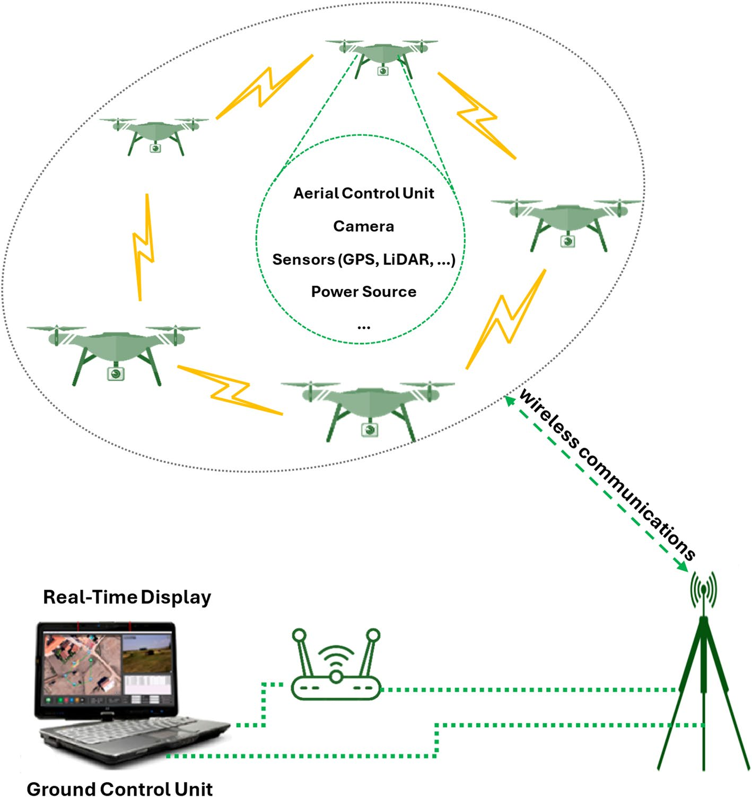
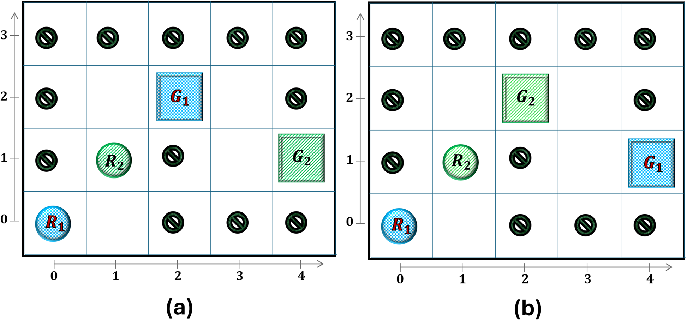
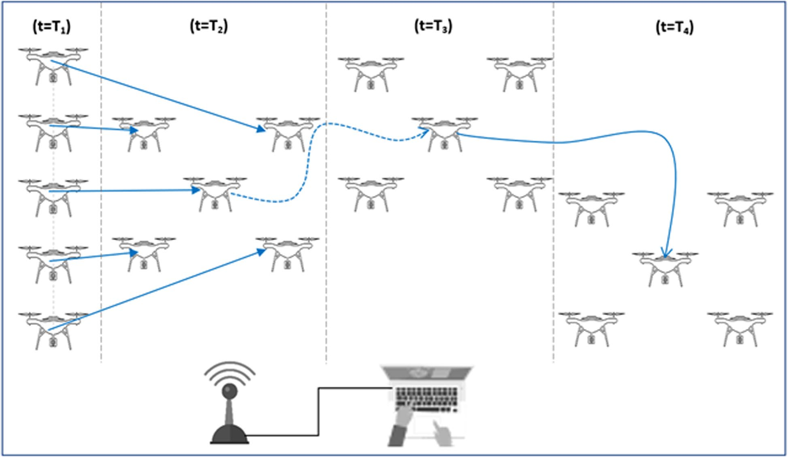
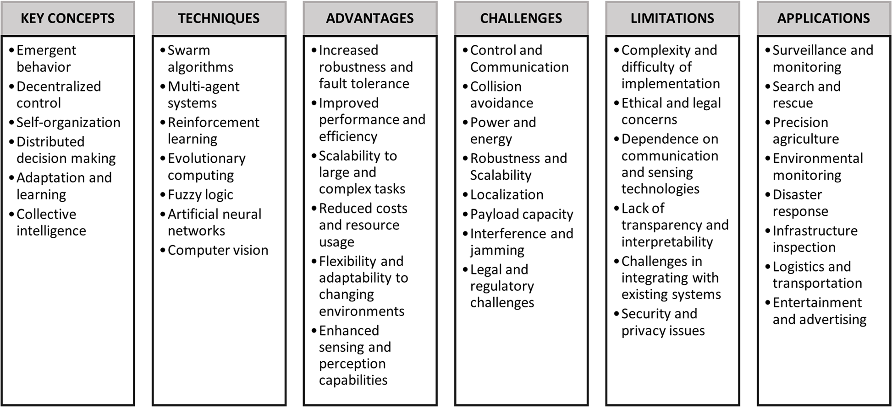
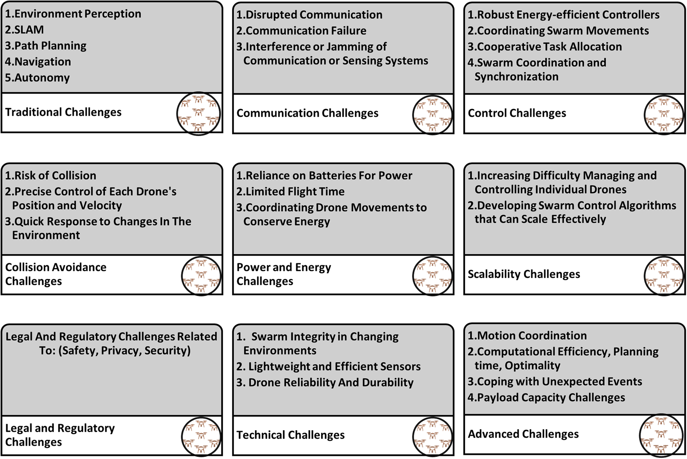

# S44147 025 00582 3

**Source Document:** `s44147-025-00582-3.pdf`  
**Total Pages:** 24  

---

## --- Page 1 ---

### Section: UAV swarms: research, challenges, and future directions

Open Access

© The Author(s) 2025. Open Access This article is licensed under a Creative Commons Attribution 4.0 International License, which permits 
use, sharing, adaptation, distribution and reproduction in any medium or format, as long as you give appropriate credit to the original 
author(s) and the source, provide a link to the Creative Commons licence, and indicate if changes were made. The images or other third 
party material in this article are included in the article’s Creative Commons licence, unless indicated otherwise in a credit line to the mate-
rial. If material is not included in the article’s Creative Commons licence and your intended use is not permitted by statutory regulation or 
exceeds the permitted use, you will need to obtain permission directly from the copyright holder. To view a copy of this licence, visit http://
creativecommons.org/licenses/by/4.0/. The Creative Commons Public Domain Dedication waiver (http://creativecommons.org/publicdo-
main/zero/1.0/) applies to the data made available in this article, unless otherwise stated in a credit line to the data.

#### REVIEWS

Alqudsi and Makaraci 
Journal of Engineering and Applied Science           (2025) 72:12  
https://doi.org/10.1186/s44147-025-00582-3

Journal of Engineering
and Applied Science

UAV swarms: research, challenges, 
and future directions

Yunes Alqudsi1,2*    and Murat Makaraci3

Abstract 
Unmanned Aerial Vehicle (UAV) swarms represent a transformative advancement 
in aerial robotics, leveraging collaborative autonomy to enhance operational capabili-
ties. This paper provides a comprehensive exploration of UAV swarm infrastructure, 
recent research advancements, and diverse applications. Key areas such as coordi-
nated path planning, task assignment, formation control, and security considerations 
are examined, highlighting how Artificial Intelligence (AI) and Machine Learning (ML) 
are integrated to improve decision-making and adaptability. Applications span civil-
ian sectors, including entertainment, infrastructure inspection, and delivery services, 
as well as military applications in surveillance, combat support, and logistics. The 
paper addresses technical challenges, regulatory constraints, and ethical considera-
tions, while outlining future directions focused on scalability, robustness, and societal 
integration. This review consolidates the evolving landscape of UAV swarms, identifying 
critical challenges and guiding future research endeavors.

Keywords:  UAV swarms, Multi-robot systems, Autonomous aerial systems, Formation 
control, Distributed coordination, Swarm intelligence

Introduction
Advancements in Swarm Robotics (SR), particularly within the field of aerial robot-
ics, have introduced transformative capabilities embodied in Unmanned Aerial Vehi-
cle (UAV) swarms. These swarms leverage aerial mobility, high-speed maneuverability, 
and expansive coverage capabilities, making them pivotal across diverse applications 
[1–3]. SR aims to develop scalable, robust systems where groups of robots collaborate 
with each other and their environment to execute complex tasks efficiently. Inspired by 
natural social behaviors, such systems surpass single-robot counterparts in multitask-
ing, scalability, cost-efficiency, robustness, and adaptability [4, 5], especially in flying 
robots requiring coordinated interaction and collaboration among multiple autonomous 
agents.

A swarm robotics system refers to a coordination method used in Multi-Robot Sys-
tems (MRS), comprising a group of autonomous and relatively simple robots with similar 
capabilities. These robots are equipped with local sensing and communication abilities, 
enabling them to interact locally among themselves and with the environment. This col-
lective interaction enhances their efficiency in performing predefined tasks compared to

*Correspondence:   
yunes.alqadasi@kocaeli.edu.tr

1 Aerospace Engineering 
Department, Faculty 
of Aeronautics and Astronautics, 
Kocaeli University, Kocaeli, Turkey
2 Aerospace Engineering 
Department, Faculty 
of Engineering, Cairo University, 
Giza, Egypt
3 Mechanical Engineering 
Department, Faculty 
of Engineering, Kocaeli 
University, Kocaeli, Turkey

## --- Page 2 ---

Page 2 of 24
Alqudsi and Makaraci Journal of Engineering and Applied Science           (2025) 72:12

individual robots [6–8]. Central to SR is the coordination of MRS, where autonomous 
aerial agents operate collectively in path planning, task allocation, and formation con-
trol. These agents, diverse in capabilities yet harmoniously interacting, contribute indi-
vidually while benefiting collectively from their shared environment.

One significant research area for UAV swarms involves optimizing path planning 
for multiple robots within swarm environments. Swarm Intelligence (SI) algorithms, 
inspired by natural behaviors, facilitate collaborative decision-making and coordina-
tion for UAV swarms, enabling effective exploration and navigation in dynamic envi-
ronments. Combinatorial optimization approaches further enhance swarm efficiency 
by maximizing collective performance through optimal task allocation and resource 
management [9, 10]. Another critical focus area is swarm formation control, aiming to 
achieve stable flight formations and minimal inter-robot distance variations. Research 
efforts in this domain aim to enhance swarm operational efficiency and enable syn-
chronized movements essential for tasks requiring precise coordination among swarm 
robots [11, 12].

Within the field of SR for UAV swarms, the existing literature covers a diverse range 
of research topics and advancements. Exploration of SR features and characteristics has 
shed light on the decentralized and self-organizing nature of swarms, which empowers 
them with robustness, adaptability, and fault tolerance. Nevertheless, implementing SR 
in flying robots presents unique challenges, including communication, control, scalabil-
ity, and resource limitations. To overcome these obstacles, ongoing research is focused 
on innovative algorithms and the integration of Artificial Intelligence (AI) techniques. 
Recent advances in AI, Deep Learning (DL), and Machine Learning (ML) play pivotal 
roles in overcoming challenges and enhancing overall SR performance [13, 14]. These 
technologies enable better swarm coordination, task allocation, and navigation, empow-
ering UAV swarms to operate with increased efficiency and adaptability. DL algorithms, 
capable of processing extensive data and learning from experience, contribute signifi-
cantly to the development of intelligent autonomous flying robots within swarms. The 
integration of AI, DL, and ML not only optimizes swarm operations but also unlocks 
new capabilities across various industries [15].

The application spectrum of SR for UAV swarms spans various domains, where decen-
tralized and self-organized behavior enhances efficiency, reliability, and adaptability. 
Collaborative efforts among robots not only improve operational safety by mutual mon-
itoring and assistance but also ensure adaptability to dynamic environmental changes 
[16–18].

This paper comprehensively explores swarm robotics (SR) in the context of flying 
robots, examining recent advancements, current challenges, and future directions. By 
delving into principles, algorithms, and techniques enabling SR, this study provides val-
uable insights into the potential and limitations of UAV swarms across diverse applica-
tions. The contributions of this paper include:

•	 An exploration of key research aspects such as coordinated path planning, task 
assignment, formation control, and communication.
•	 An analysis of security and privacy considerations.
•	 An overview of the integration of AI and ML in enhancing UAV swarm capabilities.

## --- Page 3 ---

### Section: Infrastructure and features of UAV swarms

Page 3 of 24
Alqudsi and Makaraci Journal of Engineering and Applied Science           (2025) 72:12

•	 Identification of technical challenges and potential solutions.
•	 A detailed review of the infrastructure and features of UAV swarms.
•	 An assessment of the diverse applications in civilian and military sectors.
•	 Outlining future research directions to address current gaps and challenges.

The remainder of this article explores key facets of UAV swarms, beginning with an 
examination of their infrastructure and distinctive features. This section delves into 
coordinated path planning, task assignment, formation control, communication pro-
tocols, and considerations of security and privacy. Following this, the research aspects 
of UAV swarms are explored, focusing on recent advancements and ongoing develop-
ments in AI integration and ML techniques. The discussion then shifts to the diverse 
application areas of UAV swarms, detailing their roles in civilian and military domains. 
Subsequently, the article addresses the challenges, limitations, and future directions in 
the field, encompassing technical hurdles, regulatory issues, and prospects for scalabil-
ity and societal integration. Finally, the conclusion synthesizes the findings and outlines 
potential avenues for future research in enhancing the capabilities and applications of 
UAV swarms.

Infrastructure and features of UAV swarms
This section provides an overview of the essential components and characteristics of 
UAV swarms, which enable their effective operation and coordination. We begin by 
detailing the infrastructure of UAV swarms, followed by an examination of their key fea-
tures and characteristics.

UAV swarms infrastructure
The infrastructure of UAV swarms comprises several critical components that collectively 
ensure the effective operation and coordination of the swarm as depicted and detailed in 
Fig. 1 and Table 1 respectively. Each drone or quadrotor serves as an individual unit within 
the swarm, equipped with sensors, processors, and necessary hardware to facilitate com-
munication and coordination with other drones. The control unit plays a central role in 
managing the swarm, ensuring that the drones operate within the desired parameters. This

Table 1  Infrastructure components of UAV swarms

Component
Description

Drones/Quadrotors
Individual units equipped with sensors, processors, and hardware for communication 
and coordination

Control Unit
Manages the swarm, ensuring operation within desired parameters, can include a 
ground station or cloud-based system

Communication System
Wireless network for real-time information exchange, using protocols like Wi-Fi, Blue-
tooth, or Zigbee

Sensors
Integrated sensors (e.g., cameras, LiDAR, GPS) for environmental data gathering and 
processing

Algorithms
SI algorithms for path planning, collision avoidance, formation control, and decision-
making

Power Source
Batteries or tethered power supplies critical for flight time and performance

Navigation System
GPS, inertial navigation, and visual odometry for autonomous navigation and collision 
avoidance

## --- Page 4 ---

Page 4 of 24
Alqudsi and Makaraci Journal of Engineering and Applied Science           (2025) 72:12

control can be achieved through a ground station or a cloud-based system, providing a cen-
tral interface for control, monitoring, and data reception.

A robust communication system is essential for the real-time exchange of information 
among UAVs and with the ground control station. This system typically employs wire-
less protocols such as Wi-Fi, Bluetooth, or Zigbee. Integrated sensors, including cameras, 
LiDAR, GPS, accelerometers, and gyroscopes, enable the drones to gather and process 
environmental data. Algorithms, particularly those based on SI, are crucial for autono-
mous coordination, including path planning, collision avoidance, formation control, and 
decision-making.

The power source, often batteries or a tethered supply, is critical for UAV operation, 
influencing flight time and overall performance. Finally, navigation systems, such as GPS, 
inertial navigation, and visual odometry, allow UAVs to navigate autonomously and avoid 
collisions, ensuring efficient and safe operations.

Fig. 1  Basic components of UAV swarms

*Caption/Context: Page 4 of 24 Alqudsi and Makaraci Journal of Engineering and Applied Science           (2025) 72:12 | control can be achieved through a ground station or a cloud-based system, providing a cen- tral interface for control, monitoring, and data reception.*

## --- Page 5 ---

### Section: Features and characteristics of UAV swarms

Page 5 of 24
Alqudsi and Makaraci Journal of Engineering and Applied Science           (2025) 72:12

Features and characteristics of UAV swarms
The goal of developing sophisticated robotic systems capable of performing com-
plex tasks in various environments drives the growing interest in MRS. As a subset of 
MRS, UAV swarms offer several advantages and key features, as illustrated in Fig. 2.

Table 2  Features and characteristics of UAV swarms [16–19]

Feature
Description

Cost-effectiveness
Utilizing a group of specialized robots for various tasks is more cost-effective 
than building a single versatile robot

Scalability
Maintaining effectiveness and performance even as the number of robots 
increases.

Robustness & Survivability
Maintaining functionality in adverse conditions, reconfiguring to mitigate 
impacts of robot failures.

Adaptability & Flexibility
Adjusting collective behavior to respond to environmental changes or new 
mission objectives

Parallelism
Performing tasks concurrently and independently, enhancing system perfor-
mance and efficiency

Redundancy & Fault-tolerance
Overcoming single points of failure by reconfiguring remaining robots to 
compensate for failures.

Multi-tasking
Dividing tasks into sub-tasks for simultaneous completion, leading to faster 
mission completion.

Distributability
Coordinating and distributing tasks based on individual robot capabilities, 
increasing efficiency and adaptability.

Fig. 2  Remarkable features of UAV swarms

*Caption/Context: Features and characteristics of UAV swarms The goal of developing sophisticated robotic systems capable of performing com- plex tasks in various environments drives the growing interest in MRS. As a subset of  MRS, UAV swarms offer several advantages and key features, as illustrated in Fig. 2. | Parallelism Performing tasks concurrently and independently, enhancing system perfor- mance and efficiency*

## --- Page 6 ---

### Section: Research aspects of UAV swarms

Page 6 of 24
Alqudsi and Makaraci Journal of Engineering and Applied Science           (2025) 72:12

Compared to a single robot system, a SR system can achieve a given complex task with 
a team of simple, cooperative robots, which results in lower construction and mainte-
nance costs. In a single robot system, the design must be complex and equipped with 
several control modules, leading to high design costs and maintenance requirements. 
Any failure in any part of the robot can affect the mission completion efficiency [4, 5].

Table 2 outlines the significant features and characteristics of UAV swarms. One of 
the primary advantages is cost-effectiveness. Building a single, highly versatile robot can 
be impractical due to size and payload limitations. Instead, using a group of specialized 
robots allows for cost-effective solutions without compromising on task performance 
[18].

Scalability is another key feature, allowing UAV swarms to maintain their effective-
ness even as the number of robots increases. Robustness and survivability refer to the 
swarm’s ability to function under adverse conditions and reconfigure in the event of 
robot failures. This enhances the swarm’s reliability, particularly in dangerous or unpre-
dictable environments [19].

Adaptability and flexibility enable UAV swarms to adjust their collective behavior to 
respond to changes in the environment or mission objectives. Parallelism allows mul-
tiple robots to work concurrently and independently, significantly improving system 
performance and efficiency. This parallel operation is vital for tasks requiring rapid 
completion.

Redundancy and fault-tolerance are critical for overcoming single points of failure. If 
one or more robots fail, the remaining robots can reconfigure to mitigate the impact, 
enhancing overall system reliability [17, 18]. Multi-tasking involves breaking down tasks 
into sub-tasks that can be completed simultaneously, leading to faster mission comple-
tion times. Finally, the distributability allows for the efficient coordination and distribu-
tion of tasks based on the capabilities of individual robots. This feature increases the 
swarm’s efficiency, scalability, and adaptability to changing conditions and task require-
ments [16].

Research aspects of UAV swarms
Interdisciplinary research has led to significant advances in science and engineering, 
including breakthroughs in the field of robotic systems. One of the key challenges in 
the context of multiple robots is how to make decisions about their actions in order to 
achieve the overall system objective optimally. This problem can be viewed as a generali-
zation of decision-making problems, where objective functions evaluate solutions to find 
optimal values. Combinatorial optimization problems arise when attempting to optimize 
objective functions over a combination of finite discrete objects, and they have numer-
ous applications in various fields, such as task allocation, vehicle routing, and transpor-
tation [20]. Table 3 summarizes the key research areas in UAV swarms, detailing various 
combinatorial optimization problems and scenarios involving multiple robots.

The path planning involves finding efficient routes for multiple robots to navigate 
complex environments while avoiding obstacles and collisions, ensuring UAV swarms 
operate safely and efficiently. Resource allocation addresses the distribution of essen-
tial resources like energy, time, and communication bandwidth among robots, optimiz-
ing the swarm’s overall performance. Formation control coordinates the movements of

## --- Page 7 ---

### Section: Coordinated path planning for UAV swarms

Page 7 of 24
Alqudsi and Makaraci Journal of Engineering and Applied Science           (2025) 72:12

robots to maintain specific formations, crucial for tasks requiring synchronized move-
ments and collective behavior. Network optimization focuses on enhancing communi-
cation and data exchange between robots to minimize latency and maximize efficiency, 
which is essential for real-time coordination and decision-making within the swarm 
[21]. Sensor placement determines optimal locations for sensors on robots to maximize 
coverage and accuracy of sensing tasks, improving the swarm’s ability to gather and pro-
cess environmental information. These research areas are fundamental to advancing 
UAV swarm capabilities, ensuring reliability, efficiency, and adaptability in various envi-
ronments and scenarios.

The following subsections explore the critical research areas within UAV swarms, 
focusing on the fundamental aspects that enable their effective operation and coordina-
tion. These include coordinated path planning, task assignment and role interchange-
ability, formation control, communication and networking, and security and privacy 
considerations. Each of these areas is essential for advancing the capabilities and appli-
cations of UAV swarms, ensuring their reliability, efficiency, and adaptability in various 
environments and scenarios.

Coordinated path planning for UAV swarms
Coordinating the path planning for a team of robots navigating within a shared environ-
ment, while avoiding Robot-to-Robot (R2R) collisions is oneof the crucial challenge in 
UAV swarms. Addressing this challenge requires adopting diverse approaches to plan 
coordinated and collision-free paths for multiple robots. Each approach offers distinct 
advantages and drawbacks in terms of completeness and scalability [9]. One strategy is 
to use centralized (coupled) planning algorithms [22], which deal with multiple robots 
as if they represent a single, higher-dimensional flying robot. The degrees of freedom 
(DOFs) of all agents are combined, and a single robot planning algorithm searches the 
configuration space to find feasible paths for the combination. While the coupled meth-
ods provide a complete solution, the number of required samples grows linearly with the 
number of team robots, which reduces scalability [9].

Alternatively, the decoupled planning algorithms [23, 24] deal with each robot individ-
ually by planning for each agent separately and then combining the individual solutions 
to form path plans for the combination. In the first stage, the algorithm searches for a

Table 3  Key research areas in UAV swarms [5, 8]

Research area
Description

Task Allocation
Assigning tasks to a group of robots to maximize overall performance while considering 
the capabilities and limitations of each robot.

Path Planning
Finding the most efficient routes for multiple robots to navigate a complex environment 
while avoiding obstacles and collisions.

Resource Allocation
Distributing resources such as energy, time, and communication bandwidth among 
multiple robots to optimize performance.

Formation Control
Coordinating the movements of multiple robots to maintain a specific formation, such as 
a swarm or flock.

Network Optimization Optimizing communication and data exchange between multiple robots to minimize

latency and maximize efficiency [21].

Sensor Placement
Determining the optimal locations for sensors on multiple robots to maximize coverage 
and accuracy of sensing tasks.

## --- Page 8 ---

### Section: Task assignment and role interchangeability

Page 8 of 24
Alqudsi and Makaraci Journal of Engineering and Applied Science           (2025) 72:12

collision-free path for each robot while disregarding other robots. In the second stage, 
the relative velocities of the robots are considered to avoid R2R collision while following 
the planned paths. This approach leads to searching lower-dimensional configuration 
spaces than the coupled planning methods and thus guarantees scalability. However, the 
decentralized planning approach is inherently incomplete [9], which requires further 
coordination or incorporation of other considerations to overcome the lack of complete-
ness. Overall, each approach has its advantages and drawbacks. Centralized planning 
algorithms guarantee completeness but may not be scalable for a large number of robots. 
Decoupled planning algorithms are scalable but may require additional coordination or 
considerations to ensure completeness [25, 26].

The illustrative scenario shown in Fig. 3 clarify the completeness issue associated with 
the basic decoupled planning algorithms. Consider a team of two 2D circular robots R1 
and R2 assigned to reach the two goals G1 and G2 , respectively as shown in Fig. 3a. It is 
required to find the shortest path for every robot to its assigned goal without colliding 
with other robots and workspace obstacles. It is assumed a four bidirectional connection 
for each node.

The results from the first phase of basic decoupled methods are the optimal free path 
for each robot such that, the first robot moves from (0,0) → (1,0) → (1,1) → (1,2) to its 
goal at (2,2), and the second robot moves from (1,1) → (1,2) → (2,2) → (3,2) → (3,1) to its 
goal at (4,1). For simplicity, it is assumed a constant speed for each robot, such that each 
robot either stays motionless or moves with a constant speed of a unit distance at every 
unit of time.

The second stage is to incorporate the notion of robot prioritization to avoid R2R col-
lision so that robots with a higher priority move first and so on. One feasible solution 
is shown in Table 4. It is assumed that the second robot has the higher priority to start 
moving from the initial configuration to (2,2) until it reaches its designed goal. The first 
robot, R1 will remain stationary until the second robot traverses G1 , then will follow its 
planned path.

If goals positions are switched as shown in Fig. 3b, then the decoupled planning algo-
rithm will not be able to find a collision-free paths for all robots to their designed goals. 
However, the algorithm won’t be able to guarantee that no feasible solution exists, and 
thus it lacks completeness.

Task assignment and role interchangeability
Effective multi-robot task planning and coordination are crucial for robotic systems, 
involving the efficient allocation of tasks among a team of robots and synchronizing their 
actions to achieve shared objectives. To optimize task assignment, combinatorial opti-
mization techniques are often used, framing the problem as an optimization challenge 
with an objective function representing the system’s overarching goal. Auction-based 
algorithms, where robots bid on tasks based on their unique capabilities and associated 
costs, are widely adopted for multi-robot task planning. These algorithms have proven 
effective in diverse applications, such as warehouse automation and search and rescue 
(SAR) missions [27]. Other approaches, like market-based algorithms and swarm-based

## --- Page 9 ---

Page 9 of 24
Alqudsi and Makaraci Journal of Engineering and Applied Science           (2025) 72:12

Fig. 3  A scenario illustrating the completeness issue associated with basic decoupled planning algorithms. a Two 2D circular robots, R1 and R2 , are assigned to reach goals G1 and G2 respectively,

demonstrating a feasible solution with robot prioritization to avoid collisions. b When the goal positions are switched, the decoupled planning algorithm fails to find collision-free paths,

highlighting its lack of completeness

*Caption/Context: Image page_009_fig_01.png*

## --- Page 10 ---

### Section: Formation control in UAV swarms

Page 10 of 24
Alqudsi and Makaraci Journal of Engineering and Applied Science           (2025) 72:12

algorithms, have also been proposed for multi-robot task planning and coordination 
[28].

Task interchangeability, a related yet distinct concept, involves allocating tasks based 
on individual robot capabilities and adaptability to specific tasks. This ensures that 
the right robot is selected for each task, maximizing efficiency. While task assignment 
and interchangeability focus on task allocation and adaptability, multi-robot task plan-
ning and coordination encompass a broader set of activities, including creating action 
sequences for each robot, resource allocation, and implementing mechanisms to prevent 
collisions and resolve conflicts during task execution.

Task assignment is a well-known combinatorial optimization problem with numerous 
applications in task allocation, scheduling, and vehicle routing. It involves assigning each 
task to at most one agent and each agent to at most one task in a way that minimizes the 
total assignment cost. When the number of agents equals the number of tasks ( N = M ), 
it is called a balanced assignment problem; otherwise, it is an unbalanced allocation 
problem [29].

Linear assignment, a subset of the task assignment problem, deals with problems 
where the total assignment cost equals the summation of individual agent costs. Various 
approaches have been proposed to solve the Linear Assignment Problem (LAP), each 
with its own time complexity [30]. The Hungarian algorithm (HA) is one of the most 
efficient algorithms for optimally solving LAP, with a polynomially-bounded compu-
tational complexity of O max(N, M)3 [31]. Studies, such as the one presented in [32], 
address the assignment problem for a team of robots.

In MRS, when tasks are independent of the robot assigned to them (i.e., any robot can 
complete any task), the team is considered completely interchangeable. This scenario is 
common when all robots are identical and equipped with the necessary sensors for task 
completion. For example, UAV swarms can support precision farming, monitoring mul-
tiple rows of crops for health, soil condition, and yield data, providing valuable insights 
for analysis and decision-making. In such cases, it is irrelevant which aerial robot is 
assigned to which row, offering additional flexibility in algorithm design [33]. The goal 
is not only to find the shortest, collision-free paths between robots and goals but also to 
select assignments that ensure mission objectives are achieved at optimal total cost.

Formation control in UAV swarms
Formation control in UAV swarms involves coordinating multiple flying robots to main-
tain specific formations while achieving a common goal. This field of study, part of SR, 
addresses the challenge of coordinating large groups of relatively simple robots to per-
form complex tasks. One of the primary challenges in MRS is automating the motion 
and control of the team to operate cohesively.

Table 4  Position history over time of each robot

Robot\time
t0
t1
t2
t3
t4
t5
t6

Position of the first robot
(0,0)
(0,0)
(0,0)
(1,0)
(1,1)
(1,2)
(2,2)

Position of the second robot
(1,1)
(1,2)
(2,2)
(3,2)
(3,1)
(4,1)
(4,1)

## --- Page 11 ---

### Section: Communication and networking in UAV swarms

Page 11 of 24
Alqudsi and Makaraci Journal of Engineering and Applied Science           (2025) 72:12

Formation control research focuses on developing control strategies and algorithms 
that allow a team of flying robots to fly in coordinated patterns. This has proven benefi-
cial in various applications, such as surveillance, mapping, and SAR operations. Robust 
and scalable control algorithms are essential to handle real-world uncertainties and 
disturbances, as well as to manage communication and information exchange among 
swarm robots [34, 35].

As illustrated in Fig. 4, pattern formation control is a prominent research area in mul-
tiple robotics systems. It aims to coordinate UAV swarms to meet specific state con-
straints. Instead of planning unique actions for each robot, a prescribed formation is 
maintained, and a single action drives the entire formation, significantly reducing com-
putational complexity. However, robust control approaches are necessary to maintain 
these formations.

As summarized in Table 5, several strategies have been proposed for multi-UAV for-
mation control, including virtual-structure-based methods [36], leader-follower meth-
ods [37, 38], and behavior-based methods [39]. These strategies are particularly effective 
in applications requiring coordinated movements, such as reconnaissance, mapping, and 
data collection from various sensors. Additionally, formation control can be utilized in 
advertising, entertainment, persistent monitoring and inspection, precision agriculture, 
and cooperative transportation of heavier objects.

Formation control is vital for various UAV swarm applications. Virtual-structure-
based methods guide UAVs using a virtual framework, ideal for rigid formations in sur-
veillance and mapping. Leader-follower methods, where specific UAVs lead and others 
follow, are beneficial in following precise paths, such as in SAR missions. Behavior-based 
methods, which rely on simple behavioral rules, are suited for dynamic environments 
and tasks like reconnaissance and data gathering. These strategies ensure coordinated 
motion and efficiency in UAV swarm operations.

Communication and networking in UAV swarms
Effective communication and networking are vital for the successful operation of UAV 
swarms. These systems rely on robust communication protocols to share information, 
coordinate movements, and make collective decisions in real-time. One of the primary 
challenges in this domain is ensuring reliable and efficient communication among a large 
number of UAVs, which often operate in dynamic and unpredictable environments.

UAV swarms require low-latency communication to perform synchronized actions 
and respond to environmental changes promptly. This necessitates the development of

Table 5  Summary of formation control strategies in UAV swarms

Formation control strategy
Description and applications

Virtual-Structure-Based
Use a virtual structure to guide the formation of UAVs. Effective for maintaining 
rigid formations in applications like surveillance and mapping [36]

Leader-Follower based
One or more UAVs act as leaders, and the rest follow. Useful in scenarios where 
specific paths need to be followed, such as SAR operations [37, 38]

Behavior-Based based
Each UAV follows simple behavior rules that result in the desired formation. Appli-
cable in dynamic environments and tasks like reconnaissance and data gathering 
[39]

## --- Page 12 ---

Page 12 of 24
Alqudsi and Makaraci Journal of Engineering and Applied Science           (2025) 72:12

Fig. 4  Swarm formation control

*Caption/Context: Image page_012_fig_01.jpeg*

## --- Page 13 ---

### Section: Security & privacy considerations

Page 13 of 24
Alqudsi and Makaraci Journal of Engineering and Applied Science           (2025) 72:12

advanced communication protocols that can handle high data rates and maintain stable 
connections even in the presence of interference and signal degradation [40]. Ad hoc 
networks, particularly Mobile Ad hoc Networks (MANETs), are commonly used to facil-
itate direct communication between UAVs without relying on fixed infrastructure [41]. 
However, maintaining network stability and avoiding congestion in MANETs is a signifi-
cant challenge.

Security & privacy considerations
Security and privacy are critical concerns in the deployment of UAV swarms, particu-
larly in sensitive applications such as surveillance, military operations, and infrastruc-
ture inspection. Ensuring the confidentiality, integrity, and availability of communication 
within the swarm is essential to prevent unauthorized access, data breaches, and mali-
cious attacks.

One of the primary security challenges in UAV swarms is protecting the communica-
tion links from cyber-attacks [42]. These can include jamming, spoofing, and eavesdrop-
ping, which can disrupt operations and compromise mission-critical data. Developing 
robust encryption techniques and secure communication protocols is crucial to mitigate 
these risks [40].

Privacy concerns also arise when UAV swarms are used for surveillance and data col-
lection. Ensuring that the collected data is used responsibly and protecting the privacy 
of individuals and sensitive locations is paramount. This requires implementing strict 
data governance policies and incorporating privacy-preserving techniques in the data 
processing and storage systems [43].

Towards intelligent UAV swarms
Swarm Intelligence is a branch of AI that studies the collective behavior of decentralized, 
self-organized systems inspired by natural systems such as ant colonies, bird flocks, and 
fish schools. The concept of SI was first introduced in the 1980s by researchers studying 
the behavior of ant colonies. Since then, the field has grown significantly and has found 
applications in various domains, including robotics [44, 45].

Research in SI for flying robots is currently focused on developing algorithms and 
techniques that enable UAVs to operate autonomously and collaboratively in complex 
and dynamic environments. This includes developing SI algorithms that can handle 
communication delays, sensor and actuator failures, and other challenges that arise in 
real-world applications. Additionally, there is ongoing research on developing more 
robust and scalable SI algorithms that can handle large numbers of UAVs and achieve 
higher levels of performance [46, 47].

Recent advancements
Recent advancements in SI for UAV swarms have seen significant progress, enabling 
flying robots to perform complex tasks and operate in challenging environments. One 
major area of progress is in algorithms for swarm navigation and control, which have 
allowed UAVs to fly in coordinated formations with high precision and efficiency. These 
algorithms use distributed decision-making, allowing individual robots to interact and 
coordinate with each other to achieve a common goal. Additionally, swarm sensing and

## --- Page 14 ---

### Section: Integration of AI and ML in UAV swarms

Page 14 of 24
Alqudsi and Makaraci Journal of Engineering and Applied Science           (2025) 72:12

perception algorithms have been developed, enabling UAVs to gather information about 
their environment and share it with other robots in the swarm. This collective percep-
tion allows the swarm to adapt and respond to changing environmental conditions [45].

Another area of advancement is in swarm decision-making algorithms that enable the 
swarm to make collective decisions based on the information gathered by individual 
robots. This allows the swarm to respond to changing situations quickly and efficiently. 
Swarm decision-making algorithms can also optimize the performance of the swarm 
by allocating tasks to individual robots based on their capabilities and the current state 
of the swarm [46, 47]. Furthermore, the operational efficiency and reliability of UAV 
swarms can be greatly enhanced by applying differential geometry principles, which sig-
nificantly improves their guidance, navigation, and control [48, 49].

Integration of AI and ML in UAV swarms
The integration of AI and ML techniques into UAV swarms has facilitated the develop-
ment of intelligent algorithms capable of autonomous decision-making, improved object 
recognition, obstacle detection, and optimized flight paths as demonstrated in Fig. 5. 
These advancements have led to the creation of numerous applications, including SAR 
operations, environmental monitoring, and precision agriculture [24, 45].

In SAR operations, UAV swarms equipped with intelligent algorithms can quickly 
survey large areas and relay critical information to rescue teams on the ground, thus 
improving the overall effectiveness and efficiency of rescue operations. For environmen-
tal monitoring, UAV swarms can track weather patterns, air quality, water pollution, or 
detect forest fires, identifying areas that require attention or remediation. In precision 
agriculture, UAVs with SI algorithms can collect data on crop health and soil moisture 
levels, allowing farmers to optimize crop yields and reduce water usage [50].

The integration of AI and ML into UAV swarms continues to evolve, with ongoing 
research focusing on enhancing the efficiency, adaptability, and autonomy of these sys-
tems. Future innovations are expected to further expand the capabilities of UAV swarms, 
unlocking new applications and improving their impact across various industries.

Application areas of UAV swarms
The flying advantages and distributed behavior of UAV swarms enable them to explore, 
monitor, and collect data from large areas in a collaborative and integrated man-
ner. These features, together with task allocation and cooperative behavior, make UAV 
swarms highly versatile and valuable in various civilian and military applications as dip-
icted in Fig. 6.

Civilian applications

•	 Autonomous Monitoring: UAV swarms can be programmed to collaborate in 
precision farming applications, such as pollinating crops, monitoring crop and 
soil health, and gathering yield data across vast areas [51–53]. Additionally, UAV 
swarms are increasingly being used for environmental monitoring and pollution 
detection, where they can cover large areas efficiently and provide real-time data

## --- Page 15 ---

Page 15 of 24
Alqudsi and Makaraci Journal of Engineering and Applied Science           (2025) 72:12

Fig. 5  Incorporating SI into flying robots

*Caption/Context: Image page_015_fig_01.png*

## --- Page 16 ---

Page 16 of 24
Alqudsi and Makaraci Journal of Engineering and Applied Science           (2025) 72:12

[54]. Wildlife conservation efforts also benefit from UAV swarms, as they can 
monitor animal populations and track poaching activities with minimal human 
intervention. Infrastructure inspection is another critical area, where UAV 
swarms can inspect bridges, pipelines, and power lines, identifying issues quickly 
and accurately.
•	 Delivery Services: In logistics and delivery services, UAV swarms can deliver 
packages quickly and efficiently, reducing delivery times and costs [7]. Medi-
cal supply transport is another promising application, where UAV swarms can 
deliver essential supplies to remote or disaster-affected areas, ensuring timely 
medical assistance. UAV swarms also play a crucial role in emergency response 
scenarios, where they can transport equipment and supplies to rescue teams in 
dangerous or inaccessible locations.
•	 Search and Rescue Operations: In post-disaster scenarios, UAV swarms can be 
deployed for SAR operations, where they assist rescuers in quickly reaching dan-
gerous or inaccessible areas. By providing real-time aerial imagery and data, UAV 
swarms enhance the effectiveness of rescue missions, potentially saving lives 
[55].
•	 Entertainment and Events: UAV swarms have found innovative uses in enter-
tainment and events. Drone light shows, where multiple drones fly in coordi-
nated patterns to create visual spectacles, have become popular attractions. 
Additionally, UAV swarms are used in advertising, where they can display logos 
and messages in the sky, creating unique and eye-catching promotions [7].

Fig. 6  Application areas of UAV swarms

![Page 16 of 24 Alqudsi and Makaraci Journal of Engineering and Applied Science           (2025) 72:12 | [54]. Wildlife conservation efforts also benefit from UAV swarms, as they can  monitor animal populations and track poaching activities with minimal human  intervention. Infrastructure inspection is another critical area, where UAV  swarms can inspect bridges, pipelines, and power lines, identifying issues quickly  and accurately. •	 Delivery Services: In logistics and delivery services, UAV swarms can deliver  packages quickly and efficiently, reducing delivery times and costs [7]. Medi- cal supply transport is another promising application, where UAV swarms can  deliver essential supplies to remote or disaster-affected areas, ensuring timely  medical assistance. UAV swarms also play a crucial role in emergency response  scenarios, where they can transport equipment and supplies to rescue teams in  dangerous or inaccessible locations. •	 Search and Rescue Operations: In post-disaster scenarios, UAV swarms can be  deployed for SAR operations, where they assist rescuers in quickly reaching dan- gerous or inaccessible areas. By providing real-time aerial imagery and data, UAV  swarms enhance the effectiveness of rescue missions, potentially saving lives  [55]. •	 Entertainment and Events: UAV swarms have found innovative uses in enter- tainment and events. Drone light shows, where multiple drones fly in coordi- nated patterns to create visual spectacles, have become popular attractions.  Additionally, UAV swarms are used in advertising, where they can display logos  and messages in the sky, creating unique and eye-catching promotions [7].](images/page_016_fig_01.jpeg)
*Caption/Context: Page 16 of 24 Alqudsi and Makaraci Journal of Engineering and Applied Science           (2025) 72:12 | [54]. Wildlife conservation efforts also benefit from UAV swarms, as they can  monitor animal populations and track poaching activities with minimal human  intervention. Infrastructure inspection is another critical area, where UAV  swarms can inspect bridges, pipelines, and power lines, identifying issues quickly  and accurately. •	 Delivery Services: In logistics and delivery services, UAV swarms can deliver  packages quickly and efficiently, reducing delivery times and costs [7]. Medi- cal supply transport is another promising application, where UAV swarms can  deliver essential supplies to remote or disaster-affected areas, ensuring timely  medical assistance. UAV swarms also play a crucial role in emergency response  scenarios, where they can transport equipment and supplies to rescue teams in  dangerous or inaccessible locations. •	 Search and Rescue Operations: In post-disaster scenarios, UAV swarms can be  deployed for SAR operations, where they assist rescuers in quickly reaching dan- gerous or inaccessible areas. By providing real-time aerial imagery and data, UAV  swarms enhance the effectiveness of rescue missions, potentially saving lives  [55]. •	 Entertainment and Events: UAV swarms have found innovative uses in enter- tainment and events. Drone light shows, where multiple drones fly in coordi- nated patterns to create visual spectacles, have become popular attractions.  Additionally, UAV swarms are used in advertising, where they can display logos  and messages in the sky, creating unique and eye-catching promotions [7].*

## --- Page 17 ---

### Section: Military applications

Page 17 of 24
Alqudsi and Makaraci Journal of Engineering and Applied Science           (2025) 72:12

Military applications
UAV swarms are highly effective in military surveillance and reconnaissance missions. 
They can conduct border patrols, monitoring large areas and providing real-time 
intelligence on potential threats [56, 57]. UAV swarms can also perform reconnais-
sance operations, gathering crucial data on enemy positions and movements, thus 
enhancing situational awareness.

In combat support roles, UAV swarms can assist in target identification and track-
ing, providing accurate and timely information to ground forces. They can also be 
deployed for electronic warfare, jamming enemy communications and disrupting 
their operations. UAV swarms’ ability to operate in coordinated formations makes 
them ideal for executing complex missions with high precision and efficiency [58].

In military logistics, UAV swarms can be used to transport supplies and equip-
ment to frontline troops, ensuring a steady flow of resources. Their ability to operate 
autonomously and cover large areas makes them ideal for supply chain management 
in challenging environments [58].

These diverse applications of UAV swarms highlight their potential to revolutionize 
various industries by improving efficiency, reducing costs, and enhancing safety and 
effectiveness in both civilian and military contexts.

Challenges, limitations and future directions
To successfully achieve the promising applications of using multiple robotics systems 
for complex tasks, robust solutions to various challenges are required, as shown in 
Fig.  7. These challenges can be classified into traditional and advanced categories. 
Traditional challenges include environment perception, simultaneous localization 
and mapping (SLAM), path planning, dynamically feasible trajectory generation [59], 
navigation, and autonomy. Advanced challenges encompass task allocation, motion 
coordination, and the design of algorithms that effectively consider completeness, 
computational scalability, planning time, and optimality [6]. Table 6 summarizes the 
challenges, limitations, and future directions in UAV swarms, providing a clear and 
organized overview of each aspect.

Heterogeneous swarms and ethical considerations
Exploring the use of heterogeneous swarms, consisting of robots with diverse capa-
bilities and sensors, presents opportunities for specialized and efficient task alloca-
tion. Integrating emerging technologies like blockchain and the Internet of Things 
(IoT) will facilitate secure communication and coordination among swarm robots 
[60]. Additionally, ethical implications, especially in surveillance applications, must 
be carefully examined to ensure responsible and ethical use of UAV swarms.

Energy efficiency and algorithm development
The implementation of SR in flying robots poses challenges related to energy effi-
ciency and algorithm development. Control algorithms capable of handling the com-
plexity of large swarms are essential for efficient swarm functioning [11]. Advances 
in AI, ML, and DL have significantly impacted the development of SR, enabling

## --- Page 18 ---

Page 18 of 24
Alqudsi and Makaraci Journal of Engineering and Applied Science           (2025) 72:12

Fig. 7  Challenges in implementing swarm robotics for flying robots

*Caption/Context: Image page_018_fig_01.png*

## --- Page 19 ---

### Section: Autonomous control and task allocation

Page 19 of 24
Alqudsi and Makaraci Journal of Engineering and Applied Science           (2025) 72:12

autonomous decision-making, improved object recognition, obstacle detection, and 
optimized flight paths [15]. Future research should focus on creating energy-effi-
cient algorithms that enhance the operational endurance of UAV swarms.

Autonomous control and task allocation
The rapid development of UAV technology has led to new interests in autonomous 
control for teams of flying robots over complex environments. Fully autonomous 
control involves cooperative task allocation and coordinated motion to achieve 
specific goals [61]. Furthermore, the control mechanisms of UAV swarms can be 
strengthened by utilizing robust control strategies developed for underactuated 
and highly nonlinear systems operating in uncertain and disturbed environments 
[62–64]. The coordination and navigation capabilities of UAV swarms can also be 
enhanced by incorporating guidance optimization techniques and target tracking 
approaches which will significantly expands their application areas [65, 66]. Divid-
ing tasks into smaller sub-tasks distributed among the robot team ensures mission 
requirements are met efficiently. Future research should focus on utilizing AI/ML 
based techniques to elevate swarm decision-making capabilities and thus develop 
more sophisticated algorithms for task allocation and autonomous control that 
enhance the efficiency and adaptability of UAV swarms.

Table 6  Challenges, limitations and future directions in UAV swarms

Challenge/ limitation
Description
Future directions

Heterogeneous Swarms and 
Ethical Considerations

Utilizing robots with diverse 
capabilities and addressing ethical 
implications in surveillance applica-
tions.

Integrate emerging technologies 
like blockchain and IoT, and ensure 
responsible, ethical deployment of 
UAV swarms.

Energy Efficiency and Algorithm 
Development

Addressing energy efficiency and 
developing control algorithms for 
large swarms.

Focus on creating energy-efficient 
algorithms to enhance operational 
endurance and leveraging AI, ML, 
and DL for improved capabilities.

Autonomous Control and Task 
Allocation

Cooperative task allocation and 
coordinated motion are essential 
for fully autonomous control over 
complex environments.

Integrating AI/ML based algorithms 
to enhance the efficiency and adapt-
ability of UAV swarms.

Communication and Coordina-
tion

Ensuring effective communication 
among swarm agents, especially 
as the swarm size increases expo-
nentially.

Utilizing the 6G technology to 
develop decentralized and robust 
communication protocols to main-
tain swarm autonomy and ensure 
efficient, reliable data exchange.

Robustness and Scalability
Developing stable, efficient algo-
rithms for task allocation, path plan-
ning, and motion coordination.

Enhance robustness and scalability 
of algorithms to handle dynamic and 
unpredictable environments.

Synchronization and Environ-
mental Disturbances

Achieving coordination and 
synchronization among drones 
while maintaining integrity amidst 
environmental disturbances.

Create adaptive control strategies 
that respond to dynamic environ-
mental changes and disturbances.

Security and Safety
Ensuring effective communication 
and coordination while maintain-
ing the security of the swarm.

Explore secure communication 
methods and develop algorithms 
to detect and mitigate potential 
security threats.

## --- Page 20 ---

### Section: Communication and coordination

Page 20 of 24
Alqudsi and Makaraci Journal of Engineering and Applied Science           (2025) 72:12

Communication and coordination
One significant challenge in SR is ensuring effective communication between swarm 
agents. As the number of agents increases, the required communication grows expo-
nentially [40]. Reliable communication systems among drones are crucial, especially 
in unexpected situations like equipment failure.

Future research in UAV swarm communication should focus on enhancing net-
work scalability and robustness. One promising direction is the integration of 5G, 6G 
and beyond-6G technologies, which offer high data rates, low latency, and improved 
reliability [67, 68]. Additionally, the use of decentralized communication strategies, 
such as blockchain-based networks, can enhance security and reduce the risk of sin-
gle points of failure.Furthermore, incorporating AI and ML techniques can optimize 
communication protocols and adaptively manage network resources based on real-
time data. This can lead to more efficient bandwidth utilization and improved overall 
network performance, enabling UAV swarms to operate more effectively in complex 
missions [69].

Robustness and scalability
Developing stable and computationally efficient algorithms that handle basic swarm 
behaviors like task allocation, path planning, motion coordination, and dynamically fea-
sible trajectory generation is vital [70, 71]. These algorithms should allow UAV swarms 
to collaborate, avoid collisions, and optimize performance. Future work should aim at 
enhancing the robustness and scalability of these algorithms to handle dynamic and 
unpredictable environments [35].

Synchronization and environmental disturbances
Achieving coordination and synchronization among drones while maintaining swarm 
integrity in the face of environmental disturbances is another major challenge [72, 
73]. Developing robust and energy-efficient control algorithms, designing lightweight 
and efficient sensors, and improving the reliability and durability of drones are neces-
sary. Future work should aim at creating adaptive control strategies that can respond to 
dynamic environmental changes and disturbances.

Security and safety
In addition to technical challenges, security and safety must be addressed in SR. Ensur-
ing effective communication and coordination while maintaining swarm security is cru-
cial [40]. Future research in this area should aim to enhance the security and privacy 
of UAV swarms by developing advanced threat detection and mitigation strategies. AI 
and ML can play a significant role in identifying and responding to security threats in 
real-time. Additionally, exploring the use of quantum cryptography may provide unprec-
edented levels of security for communication within UAV swarms. Moreover, interdisci-
plinary collaboration between cybersecurity experts, UAV developers, and policymakers 
is essential to create comprehensive frameworks that address both technical and ethical 
aspects of security and privacy in UAV swarm operations. This holistic approach will

## --- Page 21 ---

### Section: Conclusions

Page 21 of 24
Alqudsi and Makaraci Journal of Engineering and Applied Science           (2025) 72:12

help ensure that UAV swarms can be deployed safely and responsibly in a wide range of 
applications [61].

Conclusions
The field of swarm robotics has witnessed remarkable progress, particularly in the con-
text of flying robots. UAV swarms offer a unique and efficient approach to tackling com-
plex tasks by harnessing the collective power of multiple robots working in harmony. 
This paper has provided an insightful exploration of various aspects of swarm robot-
ics applied to flying robots, shedding light on critical features, core algorithms, and 
their real-world applications. The current state of research in swarm robotics for flying 
robots has demonstrated promising advancements with significant potential for vari-
ous industries, such as agriculture, SAR, environmental monitoring, and infrastructure 
inspection.

Challenges in communication, control, and scalability have been identified and exam-
ined to show how the decentralized algorithms and AI/ML base techniques can effec-
tively address them. These developments have contributed to the creation of more 
intelligent and autonomous UAV swarms, capable of navigating complex environments 
and performing intricate tasks with precision. Continued research is necessary to unlock 
the full potential of SR in flying robots, focusing on robust control algorithms, adap-
tive formation changes, and energy efficiency. Integrating advanced and energy-efficient 
AI and ML techniques will elevate swarm decision-making capabilities, while ethical 
considerations must guide the responsible deployment of UAV swarms. By embrac-
ing interdisciplinary collaboration and innovation, we can enhance the adaptability 
and intelligence of UAV swarms, empowering transformative advancements in diverse 
domains. This ongoing research will ensure that UAV swarms continue to evolve, 
addressing current challenges and exploring new opportunities for application and 
impact.

Abbreviations
AI	
Artificial Intelligence
DL	
Deep Learning
DOF	
Degrees of Freedom
HA	
Hungarian Algorithm
IoT	
Internet of Things
LAP	
Linear Assignment Problem
ML	
Machine Learning
MANETs	
Mobile Ad hoc Networks
MRS	
Multi-Robot Systems
R2R	
Robot-to-Robot
SAR	
Search and Rescue
SI	
Swarm Intelligence
SLAM	
Simultaneous Localization and Mapping
SR	
Swarm Robotics
UAV	
Unmanned Aerial Vehicle

Acknowledgements
The authors acknowledge the effort of Prof. Dr. Mehmet KAYA, Dean of the Faculty of Aeronautics and Astronautics at 
Kocaeli University, for his invaluable support and guidance throughout this work.

Authors’ contributions
YA and MM both contributed significantly to the conception, design, and writing of this manuscript. YA conducted 
the primary research and initial draft preparation. MM provided critical revisions and final approval of the version to be 
published. Both authors read and approved the final manuscript.

## --- Page 22 ---

### Section: References

Page 22 of 24
Alqudsi and Makaraci Journal of Engineering and Applied Science           (2025) 72:12

Funding
Not applicable.

Data availability
Not applicable.

Declarations

Competing interests
The authors declare that they have no competing interests.

Received: 17 October 2023   Accepted: 15 January 2025

References
	1.	
Sonugur G (2022) A review of quadrotor uav: Control and slam methodologies ranging from conventional to inno-
vative approaches. Robot Auton Syst 161:104342
	2.	
Alqudsi YS, Kassem AH, El-Bayoumi GM (2021) A robust hybrid control for autonomous flying robots in an uncertain 
and disturbed environment. INCAS Bull 13(2):187–204
	3.	
Mohsan SAH, Othman NQH, Li Y, Alsharif MH, Khan MA (2023) Unmanned aerial vehicles (uavs): Practical aspects, 
applications, open challenges, security issues, and future trends. Intel Serv Robotics 16(1):109–137
	4.	
Alqudsi Y (2024) Advanced control techniques for high maneuverability trajectory tracking in autonomous aerial 
robots. In: 2024 1st International Conference on Emerging Technologies for Dependable Internet of Things (ICETI), 
IEEE, Sana’a, Yemen, pp 1–8.
	5.	
Kamel MA, Yu X, Zhang Y (2020) Formation control and coordination of multiple unmanned ground vehicles in 
normal and faulty situations: A review. Annu Rev Control 49:128–144
	6.	
Abdelkader M, Güler S, Jaleel H, Shamma JS (2021) Aerial swarms: Recent applications and challenges. Curr Robot 
Rep 2:309–320
	7.	
Khelifi M, Butun I (2022) Swarm unmanned aerial vehicles (suavs): a comprehensive analysis of localization, recent 
aspects, and future trends. J Sensors 2022:1–10
	8.	
Li Q, Xiong H, Ding Y, Song J, Liu J, Chen Y (2022) A review of unmanned aerial vehicle swarm task assignment. 
International Conference on Guidance. Springer, Navigation and Control, pp 6469–6479
	9.	
Lynch KM, Park FC (2017) Modern robotics. Cambridge University Press
	10.	 Chen X, He S, Zhang Y, Tong LC, Shang P, Zhou X (2020) Yard crane and agv scheduling in automated container

terminal: A multi-robot task allocation framework. Transp Res C Emerg Technol 114:241–271
	11.	 Ashush N, Greenberg S, Manor E, Ben-Shimol Y (2023) Unsupervised drones swarm characterization using rf signals

analysis and machine learning methods. Sensors 23(3):1589
	12.	 Sun Y, Li J, Wang Z, He X, Fu Q, Zou Y (2023) Distributed formation-aggregation control algorithm for a cluster of

quadrotors. J Frankl Inst 360(3):1560–1581
	13.	 Awasthi S, Balusamy B, Porkodi V (2020) Artificial intelligence supervised swarm uavs for reconnaissance. In: Data

Science and Analytics: 5th International Conference on Recent Developments in Science, Engineering and Technol-
ogy, REDSET 2019, Gurugram, India, November 15–16, 2019, Revised Selected Papers, Part I 5, Springer, pp 375–388
	14.	 Sai S, Garg A, Jhawar K, Chamola V, Sikdar B (2023) A comprehensive survey on artificial intelligence for unmanned

aerial vehicles. IEEE Open J Veh Technol 4:713–738.
	15.	 Soori M, Arezoo B, Dastres R (2023) Artificial intelligence, machine learning and deep learning in advanced robotics,

a review. Cogn Robot 3:54–70.
	16.	 Alqudsi Y (2024) Coordinated formation control for swarm flying robots. In: 2024 1st International Conference on

Emerging Technologies for Dependable Internet of Things (ICETI), IEEE, Sana’a, Yemen, pp 1–8.
	17.	 Navarro I, Matía F (2013) An introduction to swarm robotics. ISRN Robotics 2013:1–10
	18.	 Tan Y, Zy Zheng (2013) Research advance in swarm robotics. Def Technol 9(1):18–39
	19.	 Chung SJ, Paranjape AA, Dames P, Shen S, Kumar V (2018) A survey on aerial swarm robotics. IEEE Trans Robot

34(4):837–855
	20.	 Blum C, Groß R (2015) Swarm intelligence in optimization and robotics. Springer handbook of computational intel-

ligence, Springer, Berlin, Heidelberg, pp 1291–1309
	21.	 Ma G, Wang B, Ge SS (2022) Robust optimal control of connected and automated vehicle platoons through

improved particle swarm optimization. Transp Res C Emerg Technol 135:103488
	22.	 Israr A, Ali ZA, Alkhammash EH, Jussila JJ (2022) Optimization methods applied to motion planning of unmanned

aerial vehicles: A review. Drones 6(5):126
	23.	 Han SD, Yu J (2020) Ddm: Fast near-optimal multi-robot path planning using diversified-path and optimal sub-

problem solution database heuristics. IEEE Robot Autom Lett 5(2):1350–1357
	24.	 Yanmaz E (2023) Joint or decoupled optimization: Multi-uav path planning for search and rescue. Ad Hoc Netw

138:103018
	25.	 Chen J, Zhang R, Zhao H, Li J, He J (2023) Path planning of multiple unmanned aerial vehicles covering multiple

regions based on minimum consumption ratio. Aerospace 10(2):93
	26.	 Zhao Z, Zhu B, Zhou Y, Yao P, Yu J (2022) Cooperative path planning of multiple unmanned surface vehicles for

search and coverage task. Drones 7(1):21
	27.	 Li Y, Li J, Liu C, Li J, Xin Z, Chen Z (2022) An auction-based attack-defense decision-making method for uav air com-

bat. In: 2022 IEEE International Conference on Unmanned Systems (ICUS), IEEE, pp 902–909

*Caption/Context: Funding Not applicable. | Data availability Not applicable.*

## --- Page 23 ---

Page 23 of 24
Alqudsi and Makaraci Journal of Engineering and Applied Science           (2025) 72:12

28.	 Quinton F, Grand C, Lesire C (2023) Market approaches to the multi-robot task allocation problem: a survey. J Intell

Robot Syst 107(2):29
	29.	 Dhouib S (2023) Novel optimization method for unbalanced assignment problems with multiple jobs: The dhouib-

matrix-ap2. Intell Syst Appl 17:200179
	30.	 Hashim ZK, Shiker MA (2023) A new technique to solve the assignment problems. In: AIP Conference Proceedings,

AIP Publishing, vol 2414
	31.	 Kuhn HW (1955) The hungarian method for the assignment problem. Nav Res Logist Q 2(1–2):83–97
	32.	 Yao P, Wu K, Lou Y (2022) Path planning for multiple unmanned surface vehicles using glasius bio-inspired neural

network with hungarian algorithm. IEEE Syst J 17(3):3906–3917.
	33.	 Shopov VK, Markova VD (2021) Application of hungarian algorithm for assignment problem. In: 2021 International

Conference on Information Technologies (InfoTech), IEEE, pp 1–4
	34.	 Alqudsi YS, Saleh RA, Makaraci M, Ertunç HM (2024) Enhancing aerial robots performance through robust hybrid

control and metaheuristic optimization of controller parameters. Neural Comput & Applic 36(1):413–424
	35.	 Ouyang Q, Wu Z, Cong Y, Wang Z (2023) Formation control of unmanned aerial vehicle swarms: A comprehensive

review. Asian J Control 25(1):570–593
	36.	 Cai Z, Liu Y, Zhao J, Wang Y (2022) Virtual structure and artificial potential field-based cooperative control for uav

formation. International Conference on Guidance. Springer, Navigation and Control, pp 366–375
	37.	 Zhang R, Liu Z, Cao Z (2022) Multi-uav formation control under constraints. International Conference on Guidance.

Springer, Navigation and Control, pp 3480–3494
	38.	 Li J, Liu J, Huangfu S, Cao G, Yu D (2023) Leader-follower formation of light-weight uavs with novel active distur-

bance rejection control. Appl Math Model 117:577–591
	39.	 Zhou C, Li J, Shi Y, Lin Z (2023) Research on multi-robot formation control based on matd3 algorithm. Appl Sci

13(3):1874
	40.	 Lv C, Yu R, Cao J, Gong C, Wu W, Wang X (2022) A survey on unmanned aerial vehicle swarm communication and

navigation. International Conference on Guidance. Springer, Navigation and Control, pp 2386–2393
	41.	 Alam MM, Moh S (2023) Q-learning-based routing inspired by adaptive flocking control for collaborative unmanned

aerial vehicle swarms. Veh Commun 40(100):572
	42.	 Alqudsi Y (2024) Synchronous task allocation and trajectory optimization for autonomous drone swarm. In: 2024 1st

International Conference on Emerging Technologies for Dependable Internet of Things (ICETI), IEEE, pp 1–8
	43.	 Lopez MA, Baddeley M, Lunardi WT, Pandey A, Giacalone JP (2021) Towards secure wireless mesh networks for uav

swarm connectivity: Current threats, research, and opportunities. In: 2021 17th International Conference on Distrib-
uted Computing in Sensor Systems (DCOSS), IEEE, pp 319–326
	44.	 Emambocus BAS, Jasser MB, Amphawan A (2023) A survey on the optimization of artificial neural networks using

swarm intelligence algorithms. IEEE Access 11:1280–1294
	45.	 Kouziokas GN (2023) Swarm Intelligence and Evolutionary Computation: Theory, Advances and Applications in

Machine Learning and Deep Learning. 1st Edition. Boca Raton: CRC Press. ISBN: 9781003247746. DOI: https://​doi.​
org/​10.​1201/​97810​03247​746
	46.	 Ramírez-Ochoa DD, Pérez-Domínguez LA, Martínez-Gómez EA, Luviano-Cruz D (2022) Pso, a swarm intelligence-

based evolutionary algorithm as a decision-making strategy: A review. Symmetry 14(3):455
	47.	 Sun W, Tang M, Zhang L, Huo Z, Shu L (2020) A survey of using swarm intelligence algorithms in iot. Sensors

20(5):1420
	48.	 Alqudsi Y, El-Bayoumi G (2018a) Intercept algorithm for maneuvering targets based on differential geometry and

lyapunov theory. INCAS Bull 10(1):175–192
	49.	 Alqudsi Y, El-Bayoumi G (2018b) A qualitative comparison between the proportional navigation and differential

geometry guidance algorithms. INCAS Bull 10(2):113–128
	50.	 Tang J, Duan H, Lao S (2023) Swarm intelligence algorithms for multiple unmanned aerial vehicles collaboration: A

comprehensive review. Artif Intell Rev 56(5):4295–4327
	51.	 del Cerro J, Cruz Ulloa C, Barrientos A, de León Rivas J (2021) Unmanned aerial vehicles in agriculture: A survey.

Agronomy 11(2):203
	52.	 Elmokadem T (2019) Distributed coverage control of quadrotor multi-uav systems for precision agriculture. IFAC-

PapersOnLine 52(30):251–256
	53.	 Alqudsi Y (2024) Analysis and implementation of motion planning algorithms for real-time navigation of aerial

robots in dynamic environments. In: 2024 4th International Conference on Emerging Smart Technologies and 
Applications (eSmarTA), IEEE, pp 1–10
	54.	 Tosato P, Facinelli D, Prada M, Gemma L, Rossi M, Brunelli D (2019) An autonomous swarm of drones for industrial

gas sensing applications. In: 2019 IEEE 20th International Symposium on “A World of Wireless, Mobile and Multime-
dia Networks” (WoWMoM), IEEE, pp 1–6
	55.	 Phadke A, Medrano FA (2024) Increasing operational resiliency of uav swarms: An agent-focused search and rescue

framework. Aerosp Res Commun 1:12420
	56.	 Arnold RD, Yamaguchi H, Tanaka T (2018) Search and rescue with autonomous flying robots through behavior-

based cooperative intelligence. J Int Humanitarian Action 3(1):1–18
	57.	 Tahir A, Böling J, Haghbayan MH, Toivonen HT, Plosila J (2019) Swarms of unmanned aerial vehicles–a survey. J Ind

Inf Integr 16:100106
	58.	 Lehto M, Hutchinson B (2020) Mini-drones swarms and their potential in conflict situations. In: 15th international

conference on cyber warfare and security, Peregrine Technical Solutions, Perth, Australia. 12:326–334
	59.	 Alqudsi YS, Kassem AH, El-Bayoumi GM (2021) Trajectory generation and optimization algorithm for autonomous

aerial robots. In: 2021 1st International Conference on Emerging Smart Technologies and Applications (eSmarTA), 
IEEE, pp 1–8
	60.	 Li J, Sun G, Duan L, Wu Q (2023) Multi-objective optimization for uav swarm-assisted iot with virtual antenna arrays.

IEEE Trans Mob Comput 23(5):4890–4907
	61.	 Zhang J, Jiahao X (2020) Cooperative task assignment of multi-uav system. Chin J Aeronaut 33(11):2825–2827

## --- Page 24 ---

Page 24 of 24
Alqudsi and Makaraci Journal of Engineering and Applied Science           (2025) 72:12

62.	 Alqudsi YS, Dorrah HT, Kassem AH, El-Bayoumi GM (2022) Robust compound control for wheeled inverted pendu-

lum in an uncertain and disturbed environment. Eng Sci Technol Int J 28(101):024
	63.	 Dong Q, Liu Z (2023) Formation control for unmanned aerial vehicle swarm with disturbances: A mission-driven

control scheme. Opt Control Appl Methods 44(3):1441–1462
	64.	 Zhang J, Zhang P, Yan J (2020) Distributed adaptive finite-time compensation control for uav swarm with uncertain

disturbances. IEEE Trans Circ Syst I Regular Pap 68(2):829–841
	65.	 Alqudsi Y, El-Bayoumi G (2018) Modeling of target tracking system for homing missiles and air defense systems.

INCAS Bull 10(2):129–35
	66.	 Alqudsi Y, El-Bayoumi G (2018b) Guidance optimization for tactical homing missiles and air defense systems. INCAS

Bull 10(1):193–205
	67.	 Khan MA, Kumar N, Mohsan SAH, Khan WU, Nasralla MM, Alsharif MH, Żywiołek J, Ullah I (2022) Swarm of uavs for

network management in 6g: A technical review. IEEE Trans Netw Serv Manag 20(1):741–761
	68.	 Wu W, Zhou F, Wang B, Wu Q, Dong C, Hu RQ (2022) Unmanned aerial vehicle swarm-enabled edge computing:

Potentials, promising technologies, and challenges. IEEE Wirel Commun 29(4):78–85
	69.	 Horyna J, Baca T, Walter V, Albani D, Hert D, Ferrante E, Saska M (2023) Decentralized swarms of unmanned aerial

vehicles for search and rescue operations without explicit communication. Auton Robot 47(1):77–93
	70.	 Alqudsi Y, Makaraci M, Kassem A, El-Bayoumi G (2023a) A numerically-stable trajectory generation and optimization

algorithm for autonomous quadrotor uavs. Robot Auton Syst 170:104532
	71.	 Alqudsi YS, Kassem AH, El-Bayoumi G (2023) A general real-time optimization framework for polynomial-based

trajectory planning of autonomous flying robots. Proc IME G J Aerosp Eng 237(1):29–41
	72.	 Deng H, Huang J, Liu Q, Zhao T, Zhou C, Gao J (2023) A distributed collaborative allocation method of reconnais-

sance and strike tasks for heterogeneous uavs. Drones 7(2):138
	73.	 Vera-Amaro R, Burke M, Saad W (2022) Coordinated UAVs for effective payload delivery. In: GLOBECOM 2022-2022

#### IEEE Global Communications Conference, IEEE, pp 3718–3723

Publisher’s Note
Springer Nature remains neutral with regard to jurisdictional claims in published maps and institutional affiliations.
