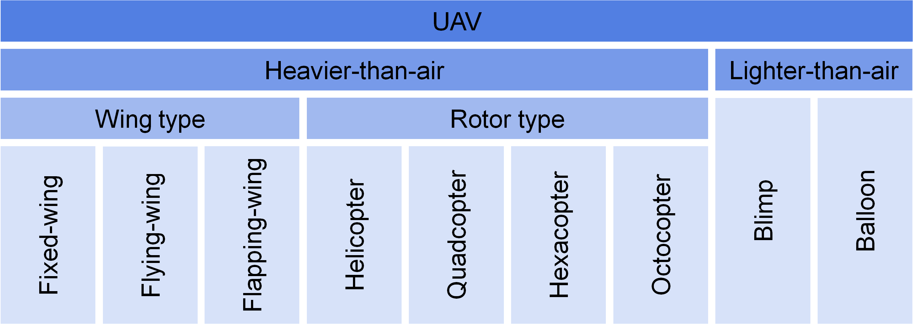

# 1711 10085V2

**Source Document:** `1711.10085v2.pdf`  
**Total Pages:** 14  

---

## --- Page 1 ---

### Section: I Introduction

1

Recent Developments in Aerial Robotics:

A Survey and Prototypes Overview

Chun Fui Liew, Danielle DeLatte, Naoya Takeishi, Takehisa Yairi

Abstract—In recent years, research and development in aerial
robotics (i.e., unmanned aerial vehicles, UAVs) has been growing
at an unprecedented speed, and there is a need to summarize
the background, latest developments, and trends of UAV research.
Along with a general overview on the definition, types, categories,
and topics of UAV, this work describes a systematic way to
identify 1,318 high-quality UAV papers from more than thirty
thousand that have been appeared in the top journals and
conferences. On top of that, we provide a bird’s-eye view of
UAV research since 2001 by summarizing various statistical
information, such as the year, type, and topic distribution of
the UAV papers. We make our survey list public and believe that
the list can not only help researchers identify, study, and compare
their work, but is also useful for understanding research trends
in the field. From our survey results, we find there are many
types of UAV, and to the best of our knowledge, no literature has
attempted to summarize all types in one place. With our survey
list, we explain the types within our survey and outline the recent
progress of each. We believe this summary can enhance readers’
understanding on the UAVs and inspire researchers to propose
new methods and new applications.

Index Terms—Unmanned aerial vehicle (UAV), unmanned
aircraft system (UAS), micro aerial vehicle (MAV), aerial robotics,
flying robots, drone, vertical takeoff and landing aircraft (VTOL).

I. INTRODUCTION
U

NMANNED aerial vehicle (UAV) research and develop-
ment has been growing rapidly over the past decade. In
academia, there are more than 60 UAV papers in IEEE/RSJ
International Conference on Intelligent Robots and Systems
(IROS) and IEEE International Conference on Robotics and
Automation (ICRA) in 2016 alone. In the commercial sector,
the annual Aerospace Forecast Report [1] released by the
United States Federal Aviation Administration (FAA) esti-
mates that more than seven million UAVs will be purchased by
2020. Another recent report [2] released by Pricewaterhouse-
Coopers (PwC)—the second largest professional services firm
in the world—estimates the global market for applications of
UAVs at over $127 billion in 2020.

Despite rapid growth, there is no survey paper that summa-
rizes the background, latest developments, and trends of the
UAV research. And, because the number of UAV papers has
grown rapidly in recent years, researchers often find it hard to

Chun Fui Liew is with the Hongo Aerospace Inc. and graduated from
the University of Tokyo, Hongo, Bunkyo-ku, Japan 113-8654 (email:
liew@ailab.t.u-tokyo.ac.jp or chun.fui.liew@gmail.com).

Naoya Takeishi, Danielle DeLatte, and Takehisa Yairi are with the De-
partment of Aeronautics and Astronautics Engineering, Graduate School
of Engineering, University of Tokyo, Hongo, Bunkyo-ku, Japan 113-
8654
(email:
takeishi@ailab.t.u-tokyo.ac.jp;
delatte@ailab.t.u-tokyo.ac.jp;
eto@ailab.t.u-tokyo.ac.jp; yairi@ailab.t.u-tokyo.ac.jp ).

cite all related papers in a short paper. To date, there is no sur-
vey that attempt to list all the UAV papers in a systematic way.
In this work, we systematically identify 1,318 UAV papers that
appear in the top robotic journals/conferences since 2001. The
identification process includes screening paper abstracts with
a program script and eliminating non-UAV papers based on
several criteria with meticulous human checks. We categorize
the selected UAV papers in several ways, e.g., with regard
to UAV types, research topics, onboard camera systems, off-
board motion capture system, countries, years, etc. In addition,
we provide a high-level view of UAV research since 2001 by
summarizing various statistical information, including year,
type, and topic distribution. We believe this survey list not
only can help researchers to identify, study, and compare their
works, but also is useful for understanding the research trends
in the field.

From our survey results, we also find that the types of
UAV are growing rapidly. There is a urgent need to have
an overview on the UAV types and categories to enhance
readers’ understanding and to avoid potential confusion. With
the UAV papers list, we outline the recent progress of several
UAVs for each UAV type that we have surveyed in this work.
These include quadcopter, hexacopter, fixed-wing, flapping-
wing, ducted-fan, blimp, cyclocopter, spincopter, Coandˇa, and
various others. To the best of our knowledge, there is no
literature that summarizes as many types of UAV in a unified
fashion. Along with the UAV figures, we also briefly describe
the novelties (either new methods or applications) of each.
We believe that the survey results could be a great source
of inspiration and continue to push the boundary of UAV
research.

The structure of this survey paper is as follows. In Section II,
we first present the definition, types, categories, and topics of
UAV research. In Section III, we review some survey works
that are related to UAV research. Then, we explain our survey
methodology in Section IV and summarizes our survey results
in Section V. In Section VI, we outline all types of UAVs
that we have surveyed in this work. Lastly, we present our
discussion and final remarks in Section VII.

#### II. UAV OVERVIEW

In this section, we define the term UAV formally and intro-
duce a few types of UAVs based on a common classification.
Then, we discuss two interesting ideas that have been proposed
by UAV researchers to categorize UAVs and summarize the
UAV topics briefly with a pie chart.

arXiv:1711.10085v2  [cs.RO]  30 Nov 2017

## --- Page 2 ---

### Section: II-A UAV Definition

2

Fig. 1: Common UAV types. See text for details.

A. UAV Definition

Commonly known as a drone, a UAV is an aircraft that
can perform flight missions autonomously without a human
pilot onboard [3], [4] or can be tele-operated by a pilot
from a ground station. The UAV’s degree of autonomy varies
but often has basic autonomy features such as “self-leveling”
using an inertial measurement unit (IMU), “position-holding”
using a global navigation satellite system (GNSS) sensor, and
“altitude-holding” using a barometer or a distance sensor.
UAVs with higher degrees of autonomy offer more func-
tions like automatic take-off and landing, path planning, and
obstacle avoidance. In general, a UAV can be viewed as
a flying robot. In the literature and UAV communities, a
UAV also has several other names like micro aerial vehicle
(MAV), unmanned aerial system (UAS), vertical take-off and
landing aircraft (VTOL), multicopter, rotorcraft, and aerial
robot. In this work, we will use the phrases “UAV” and
“drone” interchangeably.

B. UAV Types

Depending on the flying principle, UAVs can be classified
into several types.1 Figure 1 illustrates one common classifica-
tion method, where UAVs are first classified according to their
vehicle mass. For example, “heavier-than-air” UAVs normally
have substantial vehicle mass and rely on aerodynamic or
propulsive thrust to fly. On the other hand, “lighter-than-air”
UAVs like blimps and balloons normally rely on bouyancy
force (e.g., using helium gas or heat air) to fly. “Heavier-than-
air” UAVs can be further classified into “wing” or “rotor”
type. “Wing” type UAVs, including fixed-wing, flying-wing,
and flapping-wing UAVs, rely on their wings to generate
aerodynamic lift; “rotor” type UAVs, including a plethora of
multirotors, rely on multiple rotors and propellers that are
pointing upwards to generate propulsive thrust.

C. UAV Categories

Previously, we have classified UAVs into several types based
on their flying principles. In Fig. 2, Floreano and Wood [5]
and Liew [6] provide insights on how UAVs can be categorized
with two principal components.

Floreano and Wood [5] categorize UAVs with two different
principal components—flight time versus UAV mass. While
they have surveyed 28 different fixed-wing, flapping-wing,

1 Refer to Section VI for a comprehensive list of UAV types, along with
detailed descriptions and high-resolution figures for each type of UAV.

Fig. 2: Two UAV categorization methods found in the litera-
ture. Left: Flight time versus UAV mass (inspired by Floreano
and Wood [5]). Right: Degree of autonomy versus degree of
sociability (inspired by Liew [6])). See text for details.

and rotor-type UAVs, we simplify their original plot into
a conceptual chart in Fig. 2 (right). In general, flapping-
wing UAVs are usually small and have short flight time.
Blimp/balloon UAVs are lightweight and have longer flight
time. Rotor-type and fixed-wing UAVs are usually heavier.
Assuming the same UAV mass and optimal design, fixed-wing
UAVs would have longer flight time than rotor-type UAVs due
to their higher aerodynamic efficiency.

On the other hand, Liew [6] proposes to categorize UAVs
based on the degree of autonomy and degree of sociability.
Traditionally, UAVs are controlled manually by human op-
erators and have low degrees of autonomy and sociability
(remote control UAV). Gradually, along the vertical axis of
degree of autonomy, researchers have been improving the
autonomy aspects of UAVs, such as better reactive control with
more sensors and better path planning algorithms (autonomous
UAV). Essentially, autonomous UAVs are less dependent on
human operators and are able to perform some simple flight
tasks autonomously. On the other hand, along the horizontal
axis of degree of sociability, researchers have been improving
the social aspects of UAVs, such as designing UAVs that are
safe for human-robot interaction (HRI), developing a UAV
motion planning model that is more comfortable to humans,
and building an intuitive communication interface for UAVs to
understand humans (social UAV). Different from autonomous
UAVs, social UAVs often have low degree of autonomy. Most
HRI researchers solely focus on social aspects and manually
control a UAV using Wizard of Oz experiments. Liew [6]
first coins the phrase “companion UAV”, where he defines
a companion UAV as one that possesses high degrees of both
autonomy and sociability. In addition to the autonomy aspects,
such as stabilization control and motion planning, companion
UAVs must also focus on the sociability aspects such as safe
HRI and intuitive communication interface for HRI.

D. UAV Topics

Focusing on four robotic conferences and four robotic
journals, Liew [6] analyzes the topic distribution of UAVs from
2006 to 2016.2 For reference purposes, we simplify the pie

2Refer to Section IV & V for a more comprehensive survey and results.

*Caption/Context: Fig. 1: Common UAV types. See text for details. | A. UAV Definition*

![A. UAV Definition | Commonly known as a drone, a UAV is an aircraft that can perform flight missions autonomously without a human pilot onboard [3], [4] or can be tele-operated by a pilot from a ground station. The UAV’s degree of autonomy varies but often has basic autonomy features such as “self-leveling” using an inertial measurement unit (IMU), “position-holding” using a global navigation satellite system (GNSS) sensor, and “altitude-holding” using a barometer or a distance sensor. UAVs with higher degrees of autonomy offer more func- tions like automatic take-off and landing, path planning, and obstacle avoidance. In general, a UAV can be viewed as a flying robot. In the literature and UAV communities, a UAV also has several other names like micro aerial vehicle (MAV), unmanned aerial system (UAS), vertical take-off and landing aircraft (VTOL), multicopter, rotorcraft, and aerial robot. In this work, we will use the phrases “UAV” and “drone” interchangeably.](images/page_002_fig_02.png)
*Caption/Context: A. UAV Definition | Commonly known as a drone, a UAV is an aircraft that can perform flight missions autonomously without a human pilot onboard [3], [4] or can be tele-operated by a pilot from a ground station. The UAV’s degree of autonomy varies but often has basic autonomy features such as “self-leveling” using an inertial measurement unit (IMU), “position-holding” using a global navigation satellite system (GNSS) sensor, and “altitude-holding” using a barometer or a distance sensor. UAVs with higher degrees of autonomy offer more func- tions like automatic take-off and landing, path planning, and obstacle avoidance. In general, a UAV can be viewed as a flying robot. In the literature and UAV communities, a UAV also has several other names like micro aerial vehicle (MAV), unmanned aerial system (UAS), vertical take-off and landing aircraft (VTOL), multicopter, rotorcraft, and aerial robot. In this work, we will use the phrases “UAV” and “drone” interchangeably.*

![A. UAV Definition | Commonly known as a drone, a UAV is an aircraft that can perform flight missions autonomously without a human pilot onboard [3], [4] or can be tele-operated by a pilot from a ground station. The UAV’s degree of autonomy varies but often has basic autonomy features such as “self-leveling” using an inertial measurement unit (IMU), “position-holding” using a global navigation satellite system (GNSS) sensor, and “altitude-holding” using a barometer or a distance sensor. UAVs with higher degrees of autonomy offer more func- tions like automatic take-off and landing, path planning, and obstacle avoidance. In general, a UAV can be viewed as a flying robot. In the literature and UAV communities, a UAV also has several other names like micro aerial vehicle (MAV), unmanned aerial system (UAS), vertical take-off and landing aircraft (VTOL), multicopter, rotorcraft, and aerial robot. In this work, we will use the phrases “UAV” and “drone” interchangeably.](images/page_002_fig_03.png)
*Caption/Context: A. UAV Definition | Commonly known as a drone, a UAV is an aircraft that can perform flight missions autonomously without a human pilot onboard [3], [4] or can be tele-operated by a pilot from a ground station. The UAV’s degree of autonomy varies but often has basic autonomy features such as “self-leveling” using an inertial measurement unit (IMU), “position-holding” using a global navigation satellite system (GNSS) sensor, and “altitude-holding” using a barometer or a distance sensor. UAVs with higher degrees of autonomy offer more func- tions like automatic take-off and landing, path planning, and obstacle avoidance. In general, a UAV can be viewed as a flying robot. In the literature and UAV communities, a UAV also has several other names like micro aerial vehicle (MAV), unmanned aerial system (UAS), vertical take-off and landing aircraft (VTOL), multicopter, rotorcraft, and aerial robot. In this work, we will use the phrases “UAV” and “drone” interchangeably.*

## --- Page 3 ---

### Section: III Related Works on UAV Survey

3

Fig. 3: Topic distribution of UAV research in 2006–2016 (data
taken from [6]). Best viewed in color. See text for details.

chart summarized by Liew [6] in Fig. 3. From the pie chart,
we can observe that hardware and control papers contribute
to more than 50% of the pie. In recent years, researchers
start to focus on higher level tasks such as navigation and
task planning in UAVs. In addition, researchers also pay
attention to visual odometry, localization, and mapping, which
are essential for UAVs to perform task planning effectively.
More recently, researchers focus on HRI and tele-operation
with UAVs. Lately, researchers work on obstacle or collision
avoidance, which is an important topic of UAVs.

#### III. RELATED WORKS ON UAV SURVEY

In this section, we discuss several surveys in the UAV field,
including surveys on quadcopter and flapping-wing UAVs. We
also list several short papers that summarize UAV results in
a video. Lastly, we refer to several resources that aim to
summarize details of open-source flight controllers.

A. Quadcopter UAV

Focusing on a quadcopter platform, Kumar and Michael [7]
discuss topics on dynamic modeling, trajectory planning, and
state estimation in their UAV research. In addition, they out-
line several challenges and opportunities of formation flight.
Different from their work, we consider all types of UAV in
this survey paper, including quadcopter, hexacopter, multiro-
tor, fixed-wing, flapping-wing, cyclocopter, coaxial, ducted-
fan, glider, blimp, parafoil, kite, Coandˇa, and ion-propelled
aircrafts (Section VI).

B. Flapping-wing UAV

Wood et al. [8] present their progress in developing an
insect-scale UAV with flapping wings, including topics on
dynamic modeling, actuation, control, fabrication, and power.
In contrast to their work, we survey the UAV papers since
2001 and provide a general overview of the UAV research, e.g.,
the number of UAV papers over years (Section V-A), paper
distribution by UAV type (Section V-B), and paper distribution
by research topic (Section V-C), to readers who are interested
in this field.

C. Flight Video

Ollero and Kondak [9] present a video that summa-
rizes the UAV results of four European projects. Similarly,
Mellinger et al. [10] present a video that summarizes some
advanced control capabilities of their quadcopter together with
a motion capture system, such as flying through a narrow win-
dow, robust perching, and cooperative manipulation. On the
other hand, Lupashin et al. [11] present a video that introduces
their flying machine arena—an indoor testbed where they
use quadcopters and a motion capture system to demonstrate
adaptive aggressive flight, iterative learning, rhythmic flight,
and balance of an inverted pendulum during flight.

D. Flight Controller

Lim et al. [12] present a survey of the publicly available
open-source FCs such as Arducopter, Multiwii, Pixhawk,
Aeroquad, OpenPilot, and Paparazzi for UAV. In addition
to the hardware details of the FCs, they also discuss the
state estimation method and controller structure of each FC.
Interestingly, in less than five years, the community has
grown very fast and more options are available. Readers who
are interested in the latest development of open-source FCs
available in the market are recommended to view two recent
online articles [13], [14].

#### IV. OUR SURVEY METHODOLOGY

In this section, we discuss our survey methodology. We first
explain the scope of this survey and detail the UAV papers
identification process. After that, we describe our on-going
plan to update this survey and share the results online.

A. Scope of This Survey

We cover four top journals and four top conferences in the
robotics field since 2001 in this survey. The journals include
IEEE Transactions on Robotics (TRO)3, IEEE/ASME Trans-
actions on Mechatronics (TME), The International Journal of
Robotics Research (IJRR), and IAS Robotics and Autonomous
Systems (RAS); the conferences include IEEE International
Conference on Intelligent Robots and Systems (IROS), IEEE
International Conference on Robotics and Automation (ICRA),
ACM/IEEE International Conference on Human-Robot Inter-
action (HRI), and IEEE International Workshop on Robot and
Human Communication (ROMAN).

B. UAV Papers Identification

The UAV papers identification process involves three major
steps. We first use a script to automatically collect more
than thirty thousand instances of title and abstract from the
mentioned eight journal/conference web pages since 2001,
namely TRO, TME, IJRR, RAS, IROS, ICRA, ICUAS, HRI,
and ROMAN. We also manually review the hard copies of the
IROS and ICRA conferences’ table of contents from 2001 to
2004, as we find that not all UAV papers in those years are
listed on the website (IEEE Xplore).

3 Known as IEEE Transactions on Robotics and Automation prior to 2004.

![Fig. 3: Topic distribution of UAV research in 2006–2016 (data taken from [6]). Best viewed in color. See text for details. | chart summarized by Liew [6] in Fig. 3. From the pie chart, we can observe that hardware and control papers contribute to more than 50% of the pie. In recent years, researchers start to focus on higher level tasks such as navigation and task planning in UAVs. In addition, researchers also pay attention to visual odometry, localization, and mapping, which are essential for UAVs to perform task planning effectively. More recently, researchers focus on HRI and tele-operation with UAVs. Lately, researchers work on obstacle or collision avoidance, which is an important topic of UAVs.](images/page_003_fig_01.png)
*Caption/Context: Fig. 3: Topic distribution of UAV research in 2006–2016 (data taken from [6]). Best viewed in color. See text for details. | chart summarized by Liew [6] in Fig. 3. From the pie chart, we can observe that hardware and control papers contribute to more than 50% of the pie. In recent years, researchers start to focus on higher level tasks such as navigation and task planning in UAVs. In addition, researchers also pay attention to visual odometry, localization, and mapping, which are essential for UAVs to perform task planning effectively. More recently, researchers focus on HRI and tele-operation with UAVs. Lately, researchers work on obstacle or collision avoidance, which is an important topic of UAVs.*

## --- Page 4 ---

### Section: IV-C Survey Updates and Online Sharing

4

TABLE I: 35 keywords used to search drone papers system-
atically from the collected titles and abstracts.

acrobatic
bat
flight
rotor
aerial
bee
fly
rotorcraft
aero
bird
flying
soar
aeroplane
blimp
glide
soaring
air
copter
glider
micro aerial vehicle
aircraft
dragonfly
gliding
unmmaned aerial vehicle
airplane
drone
hover
unmanned aircraft system
airship
flap
hovering
vertical takeoff and landing
balloon
flapping
kite
MAV, UAV, UAS, VTOL

At the second step, we design a list of keywords (Table I) to
search drone papers systematically from the titles and abstracts
collected in the first step. Note that we search for both the full
name of each keyword (e.g., Unmanned Aerial Vehicle) and
its abbreviation (i.e., UAV) with an automatic program script.
The keywords include most of the words that describe a UAV.
For example, the word “quadcopter” or “quadrotor” could be
detected by the keyword “copter” or “rotor”. As long as one
of the keywords is detected, the paper will pass this automated
screening process.

At the third step, we perform a manual screening to reject
some non-drone papers. We read the abstract, section titles,
related works, and experiment results of all the papers from
the second step. If a paper passes all the five criteria below,
we consider it a drone paper for this survey.

1) The paper must have more than two pages; we do not
consider workshop and poster papers.
2) The paper must have at least one page of flight-related
results. These can be either simulation/experiment
results,
prototyping/fabrication
results,
or
insights/discussion/lesson
learned.
One
exception
is a survey/review paper, which normally does not
present experiment results. Papers with details/photos of
the UAV hardware are a plus. Note that the experiment
results do not necessarily need to be a successful flight,
e.g., flapping wing UAVs normally have on-the-bench
test results.
3) In topics related to computer vision or image processing,
the images must be collected from a UAV’s onboard
camera rather than a manually moving camera.
4) In topics related to computer vision or image processing,
the images must be collected by the authors themselves.
This is important, as authors who collect the dataset
themselves often provide insights about their data col-
lection and experiment results.
5) The paper which proposes a general method, e.g., path
planning, must have related works and experiment re-
sults on drones. This is important, as some authors
mention that their method can be applied to a UAV, but
provide no experiment result to verify their statement.
It is interesting to note that using the keyword “air” in the
second step increases the number of false entries (since the
keyword is used in many contexts) but helps to identify some
rare drone-related papers that have only the keyword “air” in
the title and abstract. By manually filtering the list in the third
step, we successfully identify two of these drone papers [15],
[16]. Similarly, using the keyword “bee” can help to identify a

Fig. 4: A screenshot of TagSpaces with different categories of
tags on the left hand side, list of drone papers that match the
search criterion at the middle, and info of the selected paper
in HTML format on the right hand side. Best viewed in color.

rare drone paper [17]. On the other hand, we chose not to use
the keyword of “wing” because it causes many false entries
like the case of “following”, “knowing”, etc.

C. Survey Updates and Online Sharing

The full survey results (with all raw information) is shared
and updated frequently online via Google Sheets.4 Major
updates, such as additional drone papers from the latest
conferences/journals, will be carried out once every three
months. While Google Sheets contains all the survey results,
we find that it is not possible to tag the papers, and it is also
difficult to search multiple keywords in the long paper list
effectively. To overcome these issues, we use an open-source
file tagging and organization software called TagSpaces [18].
Figure 4 shows a screenshot of TagSpaces. TagSpaces enables
readers to search papers with multiple tags or/and keywords
effectively. For example, to search all IROS papers in 2016
that are related to quadcopter, users only need to input “+IROS
+2016 +Quadcopter” into the search column. Moreover, since
original papers (PDF files) cannot be shared with readers
due to copyright issues, for each paper entry, we create an
HTML file that contains the most important information inside
(such as abstract, keywords, country, paper URL link, and
video URL link) for easier reference. To setup TagSpaces
and download all the HTML files, refer to our website at
https://sites.google.com/view/drone-survey.

#### V. SURVEY RESULTS OVERVIEW

In this section, we give an overview of the survey results,
including the year, UAV type, and topic distribution of the
UAV papers. For more results, please refer to Appendix A.

A. Yearly Distribution of UAV Papers

Figure 5 plots the numbers of UAV papers identified from
the top eight journals and conferences from 2001 to 2016.
From the figure, we can observe that the number of UAV
papers increases rapidly over the years. As mentioned in the
introduction section, the rapid increase is supported by a few

4 Tables with full survey results can be viewed on https://goo.gl/cCoCwL.

![At the second step, we design a list of keywords (Table I) to search drone papers systematically from the titles and abstracts collected in the first step. Note that we search for both the full name of each keyword (e.g., Unmanned Aerial Vehicle) and its abbreviation (i.e., UAV) with an automatic program script. The keywords include most of the words that describe a UAV. For example, the word “quadcopter” or “quadrotor” could be detected by the keyword “copter” or “rotor”. As long as one of the keywords is detected, the paper will pass this automated screening process. | Fig. 4: A screenshot of TagSpaces with different categories of tags on the left hand side, list of drone papers that match the search criterion at the middle, and info of the selected paper in HTML format on the right hand side. Best viewed in color.](images/page_004_fig_01.png)
*Caption/Context: At the second step, we design a list of keywords (Table I) to search drone papers systematically from the titles and abstracts collected in the first step. Note that we search for both the full name of each keyword (e.g., Unmanned Aerial Vehicle) and its abbreviation (i.e., UAV) with an automatic program script. The keywords include most of the words that describe a UAV. For example, the word “quadcopter” or “quadrotor” could be detected by the keyword “copter” or “rotor”. As long as one of the keywords is detected, the paper will pass this automated screening process. | Fig. 4: A screenshot of TagSpaces with different categories of tags on the left hand side, list of drone papers that match the search criterion at the middle, and info of the selected paper in HTML format on the right hand side. Best viewed in color.*

## --- Page 5 ---

### Section: V-B UAV Types Distribution

5

Fig. 5: Numbers of UAV papers (dots) identified from the top
eight journals/conferences over the years 2001–2016, with an
exponential curve fitting plot.

factors, such as easier control of the quadcopter configuration,
and lower cost of processors and sensors. While there is a
slight drop in the number of papers in 2016, with the current
strong trends in the research, commercial, government, and
hobbyist sectors, we believe that the number of drone papers
within the next five years would continue to exceed 150 papers
per year.

B. UAV Types Distribution

Figure 6 shows the UAV types distribution of surveyed
papers over different years. The most notable transition in
the bar graphs is the number of quadcopter papers, where
it increases from 7, 19, 142, to 377 over the past sixteen
years. The number of fixed-wing and flapping-wing papers
more gradually increases over the years.

The number of hexacopter papers is zero before 2008.
In 2009–2012, it increases to 7; in 2013-2016, it further
increases to 45. The number of octocopter papers has a
similar pattern. It has zero entries before 2012 but in 2013-
2016, the number sudden increases to 222. We believe that
hexacopter and octocopter are gaining more attention from
researchers, since it has several advantages over quadcopters.
First, they have redundant actuation; they are still able to
fly/land safely when one motor is malfunctioning without a
complex control algorithm. Second, they can handle higher
payloads and researchers can mount heavier hardware, such
as a robotic arms for an aerial manipulation application, or
a 3D lidar sensor for a mapping application. Third, with
small modifications, they can perform holonomic flight (move
horizontally without tilting motion), where the the UAV is able
to achieve 3D force motion without complex coupled dynamic
effect, is more robust against wind disturbance and is able to
achieve higher flight precision at the same time.

On the other hand, we notice that since 2005-2008, the num-
ber of helicopter papers starts to drop gradually from 48, 38, to
28. The possible cause for this decrease is the difficulties of he-
licopter control (when compared to quadcopter). Interestingly,
the variety of UAVs also increases substantially since 2001. In
2016, in addition to the major six types of UAV (quadcopter,
fixed-wing, helicopter, flapping-wing, hexacopter, and blimp),

UAV papers also involve topics on coaxial, octocopter, glider,
ducted fan, tricopter, bicopter, balloon, ionic flyer, cyclocopter,
spincopter, kite, Coandˇa, omnicopter, parafoil, projectile, and
missile UAV.

C. UAV Topics Distribution

Table II summarizes the top twenty-five keywords in the
surveyed UAV papers. From Table II, we note that system
modeling and control papers are the most frequent keywords.
This is not surprising, as most UAVs require system modeling
for dynamic control. It has been shown that a simple model-
free PID controller is good enough for the basic maneuvers of
a UAV [12], [19]–[23]. For aggressive maneuvers [24], [25] or
more complex dynamics with onboard manipulators [26], [27],
dynamic models are normally employed. With a precision in-
door positioning system, current state-of-the-art methods have
successfully demonstrated formation flights [28], flying in-
verted pendulum [29], pole acrobatics [30], ball juggling [31],
cooperative operation [32]–[34], and failure recovery [35].

From Table II, we can also observe that there are large
amount of hardware development papers since 2001, in-
cluding papers on quadcopters [12], [19], [20], [36], [37],
hexacopters [38]–[41], octocopters [42]–[44], coaxial heli-
copters [21], [45]–[49], a helicopter [50], a tandem heli-
copter [51], a bicopter [52], a trirotor UAV [53], fixed-
wing UAV [22], [54], flapping-wing UAV [55]–[59], cyclo-
copter [60], [61], and blimp UAVs [23], [62].

In recent years, researchers focus on higher level tasks
such as navigation and task planning in UAVs [63]–[65].
In addition, researchers also pay attention to visual odom-
etry [66], [67], localization [68]–[71], and mapping [72]–
[75] applications of UAVs. More recently, researchers work
on obstacle or collision avoidance [76]–[79], which are im-
portant topics for UAVs. Current state-of-the-art UAVs could
perform robust image-based six Degrees-of-Freedom (DoF)
localization [68], cooperate mapping [72], aggressive flight in
dense indoor environment [76], and flying through a forest
autonomously [77].

More recently, researchers also focus on HRI and tele-
operation of UAVs, including jogging UAVs [80], [81], a flying
humanoid robot [82], a hand-sized hovering ball [83], and
various human-following UAVs [84]–[86].

#### VI. UAV TYPES

In Section II-B, we discuss the UAV type distribution
within the surveyed papers. To enhance understanding and
avoid confusion, in this section, we summarize all types of
UAVs that have been proposed by researchers. Along with
figures, we briefly describe the novelty of each example UAV,
including quadcopter, hexacopter, fixed-wing, flapping-wing,
single-rotor, coaxial, ducted-fan, octocopter, glider, blimp,
ionic flyer, cyclocopter, spincopter, Coandˇa, parafoil, and kite
UAVs.

A. Quadcopters

A quadcopter (Fig. 7 (a)–(l)) [15], [36], [87]–[96] is a
UAV with four rotors. Papachristos et al. [87] first present an

![Fig. 5: Numbers of UAV papers (dots) identified from the top eight journals/conferences over the years 2001–2016, with an exponential curve fitting plot. | factors, such as easier control of the quadcopter configuration, and lower cost of processors and sensors. While there is a slight drop in the number of papers in 2016, with the current strong trends in the research, commercial, government, and hobbyist sectors, we believe that the number of drone papers within the next five years would continue to exceed 150 papers per year.](images/page_005_fig_01.png)
*Caption/Context: Fig. 5: Numbers of UAV papers (dots) identified from the top eight journals/conferences over the years 2001–2016, with an exponential curve fitting plot. | factors, such as easier control of the quadcopter configuration, and lower cost of processors and sensors. While there is a slight drop in the number of papers in 2016, with the current strong trends in the research, commercial, government, and hobbyist sectors, we believe that the number of drone papers within the next five years would continue to exceed 150 papers per year.*

## --- Page 6 ---

### Section: VI-B Hexacopters

6

#### TABLE II: Top twenty-five keywords from the identified drone papers.

System modeling
315
Trajectory generation
80
Sensor fusion
51
Teleoperation
45
Motion planning
35
Control
288
Path planning
78
Aerial manipulation
47
Localization
44
Human-robot interaction
33
Hardware development
265
Visual odometry
75
Heterogeneous robotics
47
Visual servoing
44
SLAM
32
Task planning
161
State estimation
74
Target tracking
46
Machine learning
41
System identification
32
Image processing
117
Team robotics
68
Optical flow
45
Mapping
40
Hybrid robotics
31

Fig. 6: The change of papers distribution by UAV types over the years (overview). Best viewed in color. See text for details.

Fig. 7: Prototypes of quadcopters (in alphabetical order: [15], [36], [87]–[96]) appear in the reviewed papers. Note that 8 out
of the 12 illustrated quadcopters have protective cases for safer operation and human-robot interaction. See text for details.

autonomous quadcopter (Fig. 7 (a)) with do-it-yourself (DIY)
stereo perception unit that could track a moving target and
perform collision-free navigation. With the goal of reducing
quadcopter energy consumption, Kalantari et al. [88] build a
quadcopter (Fig. 7 (b)) that uses a novel adhesive gripper to
autonomously perch and take-off on smooth vertical walls.
Kalantari and Spenko [36] build one of the first hybrid
quadcopters (Fig. 7 (c)) that is capable of both aerial and
ground locomotion. While this quadcopter can only rotate in
one direction, Okada et al. [89] present a quadcopter with a
gimbal mechanism (Fig. 7 (d)) that enables the quadcopter
to rotate freely in the 3D space. The developed quadcopter
is good for inspection applications as the gimbal-like rotating
shell helps the quadcopter fly safely in a confined environment
with many obstacles.

To the best of our knowledge, Shen et al. [90] is first to
present an autonomous quadcopter (Fig. 7 (e)) that could fly
robustly indoors and outdoors by integrating information from
a stereo camera, a 2D lidar sensor, an IMU, a magnetometer,
a pressure altimeter, and a GPS sensor. Aiming for application
in search and rescue missions, Ishiki and Kumon [91] present
a quadcopter (Fig. 7 (f)) that is equipped with a microphone
array to perform sound localization. While the hybrid quad-
copter shown in Fig. 7 (c)) [36] is designed to roll on flat

ground, Latscha et al. [15] combine a quadcopter with two
snake-like mobile robots (Fig. 7 (g)), which make the resulting
hybrid robot able to move effectively in disaster scenarios. To
increase the safety and robustness of a swarm of quadcopter,
Mulgaonkar et al. [92] design a small quadcopter with a mass
of merely twenty-five grams (Fig. 7 (h)).

Aiming for higher performance, Oosedo et al. [93] develop
an unique quadcopter (Fig. 7 (i)) that could hover stably at
various pitch angles with four tiltable propellers. Abeywar-
dena et al. [94] present a quadcopter (Fig. 7 (j)) that uses
an extended Kalman filter (EKF) to produce high-frequency
odometry by fusing information from an IMU sensor and a
monocular camera. Darivianakis et al. [95] build a quadcopter
(Fig. 7 (k)) that can physically interact with the infrastructures
that are being inspected. Driessens and Pounds [96] present
a “Y4” quadcopter (Fig. 7 (l)) that combines the simplicity
of a conventional quadcopter and the energy efficiency of a
helicopter.

B. Hexacopters

A hexacopter (Fig. 8 (a)–(f)) [97]–[102] is a UAV with
six rotors. Burri et al. [97] use a hexacopter (Fig. 8 (a)) to
perform system identification study. Specifically, they collect
information from an onboard IMU sensor, motor speeds, and

![Fig. 6: The change of papers distribution by UAV types over the years (overview). Best viewed in color. See text for details. | Fig. 7: Prototypes of quadcopters (in alphabetical order: [15], [36], [87]–[96]) appear in the reviewed papers. Note that 8 out of the 12 illustrated quadcopters have protective cases for safer operation and human-robot interaction. See text for details.](images/page_006_fig_01.jpeg)
*Caption/Context: Fig. 6: The change of papers distribution by UAV types over the years (overview). Best viewed in color. See text for details. | Fig. 7: Prototypes of quadcopters (in alphabetical order: [15], [36], [87]–[96]) appear in the reviewed papers. Note that 8 out of the 12 illustrated quadcopters have protective cases for safer operation and human-robot interaction. See text for details.*

![TABLE II: Top twenty-five keywords from the identified drone papers. | System modeling 315 Trajectory generation 80 Sensor fusion 51 Teleoperation 45 Motion planning 35 Control 288 Path planning 78 Aerial manipulation 47 Localization 44 Human-robot interaction 33 Hardware development 265 Visual odometry 75 Heterogeneous robotics 47 Visual servoing 44 SLAM 32 Task planning 161 State estimation 74 Target tracking 46 Machine learning 41 System identification 32 Image processing 117 Team robotics 68 Optical flow 45 Mapping 40 Hybrid robotics 31](images/page_006_fig_02.png)
*Caption/Context: TABLE II: Top twenty-five keywords from the identified drone papers. | System modeling 315 Trajectory generation 80 Sensor fusion 51 Teleoperation 45 Motion planning 35 Control 288 Path planning 78 Aerial manipulation 47 Localization 44 Human-robot interaction 33 Hardware development 265 Visual odometry 75 Heterogeneous robotics 47 Visual servoing 44 SLAM 32 Task planning 161 State estimation 74 Target tracking 46 Machine learning 41 System identification 32 Image processing 117 Team robotics 68 Optical flow 45 Mapping 40 Hybrid robotics 31*

## --- Page 7 ---

### Section: VI-C Fixed-wing UAVs

7

Fig. 8: Prototypes of hexacopters (in alphabetical order: [97]–[102]) appear in the reviewed papers. See text for details.

hexacopter’s pose to estimate the complex dynamic model (re-
quired for accurate positioning flight). In addition to the IMU
sensor, Zhou et al. [101] combine visual information from two
downward-facing cameras to perform visual odometry in their
hexacopter (Fig. 8 (b)). On the other hand, Yol et al. [99]
demonstrate a hexacopter (Fig. 8 (c)) that could perform
vision-based localization by using a downward-looking camera
and geo-referenced images. Navigation and obstacle avoidance
are also important topics for UAVs. Nguyen et al. [102]
demonstrate their real-time path planning and obstacle avoid-
ance algorithms with a commercial hexacopter (Fig. 8 (d)).

Similar to a conventional quadcopter, a conventional hex-
acopter is a non-holonomic aircraft, which cannot move
horizontally without changing its attitude. Ryll et al. [98]
present a hexacopter (Fig. 8 (e)) that could transform itself
from a conventional hexacopter to a holonomic hexacopter,
i.e., able to move horizontally without tilting the aircraft,
by using a servo to tilt the six rotors simultaneously. Sim-
ilarly, Park et al. [100] design a special hexacopter with six
asymmetrically aligned and bi-directional rotors, which enable
the hexacopter (Fig. 8 (f)) to perform fully-actuated flight.
While The holonomic capability of a hexacopter is not as
energy-efficient as a conventional hexacopter, it has several
merits such as robust to wind disturbance, precision flight,
and intuitive human-drone interaction.

C. Fixed-wing UAVs

A fixed-wing UAV (Fig. 9 (a)–(k)) [22], [53], [54], [60],
[103]–[109], also known as airplane, aeroplane, or simply a
plane, is one of the most common aircrafts in the aviation
history. Compared to a multi-rotor aircraft, a fixed-wing UAV
generally has higher flight safety (still able to glide for a long
time after engines break down in the air) and longer flight
time (much more energy-efficient).

Figure 9 (a)–(c) show three typical fixed-wing UAVs.
Bryson and Sukkarieh [103] demonstrate a mapping appli-
cation with their fixed-wing UAV by integrating informa-
tion from an IMU sensor, a GPS sensor, and a downward-
facing monocular camera (Fig. 9 (a)). Hemakumara and
Sukkarieh [104] focus on system identification topic and aim
to learn the complex dynamic model of their fixed-wing UAV
by using Gaussian processes (Fig. 9 (b)). Morton et al. [105]
focus on hardware development, where they detail the design
and developments of their solar-powered and fixed-wing UAV
(Fig. 9 (c)).

Compared to a multi-rotor UAV, a conventional fixed-wing
UAV is more energy efficient during cruise flight but does
not have the hovering capability, in which a fixed-wing UAV
cannot maintains its position in the air and requires more space
for take-off and landing. Bapst et al. [22] aim to combine the

merits of both types of UAVs, where they present their design,
modeling, and control of a UAV that could vertically take-off
and land (VTOL) like a multi-rotor UAV and perform cruise
flight like a fixed-wing UAV (Fig. 9 (d)). Verling et al. [106]
present another design of this type of hybrid fixed-wing UAV
based on a new modeling and controller approach, where they
focus on the smooth and autonomous transition between the
VTOL mode and cruise mode (Fig. 9 (e)).

Researchers have also explored topics on fixed-wing UAVs
with transformable shapes. Daler et al. [54] build a fixed-wing
UAV that could fly in the air and walk on the ground by
rotating its wings (Fig. 9 (f)). D’Sa et al. [107] present a UAV
that could fly in a fixed-wing configuration and perform VTOL
in a quadcopter configuration (Fig. 9 (g)).

Alexis and Tzes [108] present a hybrid UAV, where the
UAV could perform cruise flight like a fixed-wing UAV and
perform hovering flight like a bicopter (Fig. 9 (h)). Their key
design lies on the hybrid wings/propellers’ structures: in the
fixed-wing configuration, the one-blade structures are fixed at
the right positions and act as wings; in the bicopter config-
uration, the one-blade structures rotate and act as propellers.
Papachristos et al. [53] develop another type of hybrid UAV,
where the UAV could perform cruise flight like a fixed-wing
UAV and perform hovering flight like a tricopter (Fig. 9 (i)).

Several palm-sized fixed-wing UAVs have also been de-
signed by researchers. Zufferey and Floreano [109] design a
small fixed-wing UAV that has only 30 grams and capable of
navigating autonomously at an indoor environment (Fig. 9 (j)).
Despite its small size, the 30-gram fixed-wing UAV can also
avoid obstacle during flight by relying on optical flow te-
chinique. Pounds and Singh [60] present a novel and low-cost
fixed-wing UAV by integrating electronics and lift-producing
devices onto a paper aeroplane (Fig. 9 (k)).

D. Flapping-wing UAVs

A flapping-wing UAV (Fig. 10 (a)–(g)) [59], [110]–[115],
also known as ornithopter and usually in about a hand size,
is a UAV that generate lifting and forward force by flapping
its wings. Aiming for a better aerodynamic modeling, Rose
and Fearing [110] compare the flight data collected from
a wind tunnel to flight data collected from a free flight
condition by using their bird-shaped flapping-wing UAV—
H2Bird (Fig. 10 (a)). They find atht the flight data collected
from the wind tunnel is not accurate enough to predict the
flight data during free flight and further experiments are
required. Rose et al. [111] develop a coordinated launching
system for H2Bird by mounting it onto a hexapedal robot
(Fig. 10 (b)). With the hexapedal robot’s helps, H2Bird has
a more steady launching velocity. Peterson and Fearing [59]

![Fig. 8: Prototypes of hexacopters (in alphabetical order: [97]–[102]) appear in the reviewed papers. See text for details. | hexacopter’s pose to estimate the complex dynamic model (re- quired for accurate positioning flight). In addition to the IMU sensor, Zhou et al. [101] combine visual information from two downward-facing cameras to perform visual odometry in their hexacopter (Fig. 8 (b)). On the other hand, Yol et al. [99] demonstrate a hexacopter (Fig. 8 (c)) that could perform vision-based localization by using a downward-looking camera and geo-referenced images. Navigation and obstacle avoidance are also important topics for UAVs. Nguyen et al. [102] demonstrate their real-time path planning and obstacle avoid- ance algorithms with a commercial hexacopter (Fig. 8 (d)).](images/page_007_fig_01.jpeg)
*Caption/Context: Fig. 8: Prototypes of hexacopters (in alphabetical order: [97]–[102]) appear in the reviewed papers. See text for details. | hexacopter’s pose to estimate the complex dynamic model (re- quired for accurate positioning flight). In addition to the IMU sensor, Zhou et al. [101] combine visual information from two downward-facing cameras to perform visual odometry in their hexacopter (Fig. 8 (b)). On the other hand, Yol et al. [99] demonstrate a hexacopter (Fig. 8 (c)) that could perform vision-based localization by using a downward-looking camera and geo-referenced images. Navigation and obstacle avoidance are also important topics for UAVs. Nguyen et al. [102] demonstrate their real-time path planning and obstacle avoid- ance algorithms with a commercial hexacopter (Fig. 8 (d)).*

## --- Page 8 ---

### Section: VI-E Single-rotor, Coaxial, and Ducted-fan UAVs

8

Fig. 9: Prototypes of fixed-wing UAVs (in alphabetical order: [22], [53], [54], [60], [103]–[109]) appear in the reviewed papers.
See text for details.

Fig. 10: Prototypes of flapping-wing UAVs (in alphabetical order: [59], [110]–[115]) appear in the reviewed papers. See text
for details.

develop a flapping-wing UAV—BOLT that is capable of flying
and walking on the ground like a bipedal robot (Fig. 10 (c)).

Inspired by birds, Paranjape et al. [112] design a flapping-
wing UAV that is able to perch naturally on a chair or human
hand (Fig. 10 (d)). One of the unique features of their UAV
is to control the flight path and heading angles by using wing
articulation. on the other hand, Lamers et al. [113] develop a
flapping-wing UAV that has a mini monocular camera system
(Fig. 10 (e)). By combining the camera and a proximity
sensor, their UAV can achieve obstacle detection by applying
a machine learning method.

Flapping-wing UAVs with insect shapes are also common.
Ma et al. [114] fabricate an bee-shaped flapping-wing UAV
that has a mass of 380 mg by using novel methods (Fig. 10 (f)).
After detailing their design and fabrication processes, they also
demonstrate a hovering flight with the developed mini UAV.
Rosen et al. [115] develop another insect-scaled flapping-
wing UAV that is capable of flapping and gliding flights
(Fig. 10 (g)).

E. Single-rotor, Coaxial, and Ducted-fan UAVs

A single-rotor helicopter (Fig. 11 (a)–(c)) [116]–[118] is a
UAV that relies on a main rotor and a tail rotor to generate
thrust for VTOL, hovering, forward, backward, and lateral
flights. By using a lidar-based perception system, Merz and
Kendoul [119] demonstrate a helicopter that can perform
obstacle avoidance and close-range infrastructure inspection.
Backus et al. [47] focus on the aerial manipulation of an
helicopter. Specifically, they design a robotic hand for their he-
licopter to perform grasping and perching actions effectively.
Laiacker et al. [118] aim to optimize their visual servoing
system on a helicopter that is equipped with a 7 DoF industrial
manipulator.

On the other hand, a coaxial helicopter (Fig. 11 (d)–(f)) is
a UAV that uses two contra-rotating rotors mounted on the
same axis to generate thrust for VTOL, hovering, forward,

backward, and lateral flights. Moore et al. [119] implement a
lightweight omnidirectional vision sensor for their mini coax-
ial helicopter to perform visual navigation. Conventionally, a
helicopter requires additional servo motor and a mechanical
device called swashplate for horizontal position control. Paulos
and Yim [47] present a novel coaxial helicopter that requires
no servo motor and mechanical device for horizontal position
control. In order to perform horizontal movement, the rotors
are driven by a modulated signal in order to generate both
lifting and lateral forces simultaneously. Instead of avoid
obstacles like a conventional UAV, Briod et al. [46] design
a coaxial helicopter that uses force sensors around the UAV
to detect obstacle and able to perform autonomous navigation
safely without the high risks of collisions.

A ducted-fan UAV (Fig. 11 (g)) is a UAV that has similar
rotors configuration with a coaxial helicopter but the rotors are
mounted within a cylindrical duct. The duct helps to reduce
thrust losses of the propellers and the ducted fans normally
have rotational speeds. Pflimlin et al. [120] present a ducted-
fan UAV that can stabilize itself in wind gusts by using a
two-level controller for position and attitude controls.

F. Octocopter, Glider, Blimp, and Ionic Flyer UAVs

An octocopter (Fig. 12 (a)–(b)) [121], [122] is a UAV
with eight rotors. Schneider et al. [121] demonstrate an octo-
copter with a multiple fisheye-camera system that can perform
a simultaneous localization and mapping (SLAM) function
(Fig. 12 (a)). Different from a conventional octocopter, Bres-
cianini and D’Andrea [122] build a octocopter that has eight
rotors facing to eight different direction in the 3D space
(Fig. 12 (b)). This unique configuration allows the UAV
to have 6 DoF and to hover stably at any attitude. More
importantly, the octocopter is able to control its force in
the 3D space and is useful for applications such as aerial
manipulation.

![Fig. 9: Prototypes of fixed-wing UAVs (in alphabetical order: [22], [53], [54], [60], [103]–[109]) appear in the reviewed papers. See text for details.](images/page_008_fig_01.jpeg)
*Caption/Context: Fig. 9: Prototypes of fixed-wing UAVs (in alphabetical order: [22], [53], [54], [60], [103]–[109]) appear in the reviewed papers. See text for details.*

![Fig. 9: Prototypes of fixed-wing UAVs (in alphabetical order: [22], [53], [54], [60], [103]–[109]) appear in the reviewed papers. See text for details. | Fig. 10: Prototypes of flapping-wing UAVs (in alphabetical order: [59], [110]–[115]) appear in the reviewed papers. See text for details.](images/page_008_fig_02.jpeg)
*Caption/Context: Fig. 9: Prototypes of fixed-wing UAVs (in alphabetical order: [22], [53], [54], [60], [103]–[109]) appear in the reviewed papers. See text for details. | Fig. 10: Prototypes of flapping-wing UAVs (in alphabetical order: [59], [110]–[115]) appear in the reviewed papers. See text for details.*

## --- Page 9 ---

### Section: VI-G Cyclocopter, Spincopter, Coanda, Parafoil, and Kite UAVs

9

Fig. 11: Prototypes of single-rotor helicopters (Fig. (a)–(c)) [116]–[118], coaxial helicopters (Fig. (d)–(f)) [46], [47], [119],
and ducted-fan UAV (Fig. (g)) [120] appear in the reviewed papers. See text for details.

Fig. 12: Prototypes of octocopters (Fig. (a)–(b)) [121], [122], multirotor (Fig. (c)) [123], gliders (Fig. (d)–(e)) [124], [125],
blimp (Fig. (f)) [126], and Ionic Flyer (Fig. (g)) [127] appear in the reviewed papers. See text for details.

A multirotor is a UAV with more than one rotor and
has simple rotors configuration for flight control. Oung and
D’Andrea [123] design a modular multirotor system, where
each rotor aircraft has a hexagonal shape and can be assembled
into a multirotor aircraft with different configuration. With
a distributed state estimation algorithm and a parameterized
control strategy, the multirotor is able to fly in any flight-
feasible configuration both indoors and outdoors (Fig. 12 (c)).

A glider (Fig. 12 (d)–(e)) [124], [125] is a UAV that uses its
wings and aerodynamics to glide in the air. Glider normally
has a outlook like a fixed-wing UAV but does not rely on
an active propulsion system during gliding performance. For
instance, Cobano et al. [125] demonstrate multiple gliders that
can glide cooperatively in the sky (Fig. 12 (d)). To glide for
a long time in the sky without active propulsion control, the
gliders detect thermal currents and exploit their energy to soar
and continue to glide in the air. Inspired by a vampire bat,
Woodward and Sitti [124] build a different type of glider UAV,
where their UAV can jump from the ground and then uses its
wings to glide in the air (Fig. 12 (e)).

A blimp, also known as a non-rigid airship, is a lighter-
than-air UAV that relies on helium gas inside an envelope
to generate lifting force. Different from a Montgolfi`ere or
hot air balloon, a blimp keeps its envelope shape with the
internal pressure of helium gas and has actuation units for
motion control. By using a motion capture system, M¨uller and
Burgard [126] present an autonomous blimp that can navigate
in an indoor environment with an online motion planning
method (Fig. 12 (f)). Poon et al. [127] aim to design a UAV
that is noiseless and vibration-free by using ionic propulsion,
where they call their UAV Inoic Flyer (Fig. 12 (g)). Instead of
using rotors, they create a propulsion unit that has no moving
mechanic parts and relies on high electrical voltage to create
thrust by accelerating ions.

G. Cyclocopter, Spincopter, Coandˇa, Parafoil, and Kite UAVs

A cyclocopter (Fig. 13 (a)–(b)) [128], [129] is a UAV that
flies by rotating a cyclogyro wing with several wings posi-
tioned around the edge of a cylindrical structure. Generally,
the wings’ angles of attack are adjusted collectively by a

servo motor to generate required forces. Tanaka et al. [128]
built a cyclocopter that can the angles of attack using a
novel eccentric point mechanism without additional actuators
(Fig. 13 (a)). Hara et al. [129] developed a cyclocopter based
on a pantograph structure, where diameters of the wings can
be expanded or contracted (with reference to the rotational
axis) for flight control (Fig. 13 (b)).

A spincopter (Fig. 13 (c)–(d)) [61], [130] is a UAV that spins
itself during flight. Orsag et al. [61] designed a spincopter
that can spin the central wings (and the whole aircraft) using
two small motors mounted at the edge of the virtual ring of
the UAV (Fig. 13 (c)). The motors adjust their output thrust
symmetrically/asymmetrically for vertical/horizontal motion
control. By using a asymmetrical design and cascaded control
strategy, Zhang et al. [130] demonstrate a spincopter that has
three translational DoF and two rotational DoF with only one
rotor (Fig. 13 (d)).

A Coandˇa UAV is an aircraft that produces lifting force by
utilizing the Coandˇa effect. Specifically, the Coandˇa effect is
caused by the tendency of a jet of fluid to follow an adjacent
surface and to attract the surrounding fluid. Thanks to the
Bernoulli principle, in which pressure is low when speed is
high, a Coandˇa UAV can generate enough lifting force to
hover in the air when the Coandˇa effect is strong enough.
Han et al. [131] developed a Coandˇa UAV in a flying saucer
shape (Fig. 13 (e)). By attaching additional servo motors onto
the UAV for flap control, their Coandˇa UAV is able to perform
VTOL and horizontal movements in the air.

Parafoil
UAVs
(Fig.
13
(f))
[132]
and
kite
UAVs
(Fig. 13 (g)) [133] resemble the shapes and flying principles
of a parafoil or kite. For an aerial cargo delivery application,
Cacan et al. [132] improved the landing accuracy of an au-
tonomous parafoil UAV with the assistance of a ground-based
wind measurement system (Fig. 13 (f)) while Christoforou
develop a robotic kite UAV that can surf automatically in the
air (Fig. 13 (g)) [133].

#### VII. DISCUSSION AND FINAL REMARKS

While we have covered and selected more than one thousand
UAV papers in several top journals and conferences since

![Fig. 11: Prototypes of single-rotor helicopters (Fig. (a)–(c)) [116]–[118], coaxial helicopters (Fig. (d)–(f)) [46], [47], [119], and ducted-fan UAV (Fig. (g)) [120] appear in the reviewed papers. See text for details.](images/page_009_fig_01.jpeg)
*Caption/Context: Fig. 11: Prototypes of single-rotor helicopters (Fig. (a)–(c)) [116]–[118], coaxial helicopters (Fig. (d)–(f)) [46], [47], [119], and ducted-fan UAV (Fig. (g)) [120] appear in the reviewed papers. See text for details.*

![Fig. 11: Prototypes of single-rotor helicopters (Fig. (a)–(c)) [116]–[118], coaxial helicopters (Fig. (d)–(f)) [46], [47], [119], and ducted-fan UAV (Fig. (g)) [120] appear in the reviewed papers. See text for details. | Fig. 12: Prototypes of octocopters (Fig. (a)–(b)) [121], [122], multirotor (Fig. (c)) [123], gliders (Fig. (d)–(e)) [124], [125], blimp (Fig. (f)) [126], and Ionic Flyer (Fig. (g)) [127] appear in the reviewed papers. See text for details.](images/page_009_fig_02.jpeg)
*Caption/Context: Fig. 11: Prototypes of single-rotor helicopters (Fig. (a)–(c)) [116]–[118], coaxial helicopters (Fig. (d)–(f)) [46], [47], [119], and ducted-fan UAV (Fig. (g)) [120] appear in the reviewed papers. See text for details. | Fig. 12: Prototypes of octocopters (Fig. (a)–(b)) [121], [122], multirotor (Fig. (c)) [123], gliders (Fig. (d)–(e)) [124], [125], blimp (Fig. (f)) [126], and Ionic Flyer (Fig. (g)) [127] appear in the reviewed papers. See text for details.*

## --- Page 10 ---

### Section: Appendix A: Additional Survey Results

10

Fig. 13: Prototypes of cyclocopters (Fig. (a)–(b)) [128], [129], spincopters (Fig. (c)–(d)) [61], [130], Coandˇa UAV (Fig.
(e)) [131], parafoil UAV (Fig. (f)) [132], and kite UAV (Fig. (g)) [133] appear in the reviewed papers. See text for details.

2001, we focused on the robotic communities (TRO, TME,
IJRR, RAS, IROS, ICRA, HRI, ROMAN). To extend the
survey, we could expand into journals/conferences in the
aerospace and aeronautics communities, such as International
Journal of Robust and Nonlinear Control [134], Journal of
Guidance, Control, and Dynamics [135], and International
Conference on Unmanned Aircraft Systems [136]. UAVs from
the commercial sectors would also provide fertile ground. To
name a few, the DJI Phantom 4 [137] and YUNEEC Typhoon
H [138]) appear to possess advanced path planning, human
tracking, and obstacle avoidance algorithms. However, private
companies often do not provide detailed technical information
to the public.

In the Part II of this survey, we cover the trends in aerial
robotics by discussing three emerging topics—(i) holonomic
UAVs, a special type of UAV that can perform horizontal
motions while maintaining orientation; (ii) localization and
mapping with UAV; and (iii) human-drone interaction.

APPENDIX A
ADDITIONAL SURVEY RESULTS

Figure 14 and Fig. 15 show a pie chart and a map of
the country distribution of UAV papers. In descending order,
the top ten countries with the most drone papers since 2001
are United States of America, Switzerland, France, Australia,
Germany, Japan, Spain, China, Italy, and South Korea. Other
countries in the pie chart include Canada, Mexico, Venezuela,
Brazil, United Kingdom, Portugal, Netherlands, Belgium, Aus-
tria, Czech Republic, Croatia, Hungary, Slovakia, Sweden,
Finland, Denmark, Greece, Cyprus, South Africa, United Arab
Emirates, Iran, Israel, Saudi Arabia, Turkey, India, Taiwan,
Philippines, Malaysia, and Singapore.

Figure 16 shows that the number of papers that use motion
capture system increases rapidly since 2009. Motion capture
system is a system that relies on multiple high-speed cam-
eras to record the movement of reflective markers attached
on the UAV in real time. The system offers sub-millimeter
position accuracy measurement and is useful in various drone
researches, such as topics related to positioning control and
visual localization. In term of occurrence (reputation) in de-
scending order, the top widely used commercial system are
Vicon [139], OptiTrack [140], Qualisys [141], MotionAnal-
ysis [142], PTI Phoenix [143], Advanced Realtime Tracking
(ART) [144], NaturalPoint [145], and Leica [146].

#### REFERENCES

[1] Federal Aviation Administration (FAA). (2016) Aviation forecasts.

[Online]. Available: http://www.faa.gov/data research/aviation/

Fig. 14: Pie chart of the country distribution of UAV papers.
Best viewed in color. See text for details.

Fig. 15: Map of the country distribution of UAV papers. Best
viewed in color. See text for details.

Fig. 16: Number of UAV papers that use motion capture
system during the flight experiments over the years.

![Fig. 13: Prototypes of cyclocopters (Fig. (a)–(b)) [128], [129], spincopters (Fig. (c)–(d)) [61], [130], Coandˇa UAV (Fig. (e)) [131], parafoil UAV (Fig. (f)) [132], and kite UAV (Fig. (g)) [133] appear in the reviewed papers. See text for details. | 2001, we focused on the robotic communities (TRO, TME, IJRR, RAS, IROS, ICRA, HRI, ROMAN). To extend the survey, we could expand into journals/conferences in the aerospace and aeronautics communities, such as International Journal of Robust and Nonlinear Control [134], Journal of Guidance, Control, and Dynamics [135], and International Conference on Unmanned Aircraft Systems [136]. UAVs from the commercial sectors would also provide fertile ground. To name a few, the DJI Phantom 4 [137] and YUNEEC Typhoon H [138]) appear to possess advanced path planning, human tracking, and obstacle avoidance algorithms. However, private companies often do not provide detailed technical information to the public.](images/page_010_fig_01.jpeg)
*Caption/Context: Fig. 13: Prototypes of cyclocopters (Fig. (a)–(b)) [128], [129], spincopters (Fig. (c)–(d)) [61], [130], Coandˇa UAV (Fig. (e)) [131], parafoil UAV (Fig. (f)) [132], and kite UAV (Fig. (g)) [133] appear in the reviewed papers. See text for details. | 2001, we focused on the robotic communities (TRO, TME, IJRR, RAS, IROS, ICRA, HRI, ROMAN). To extend the survey, we could expand into journals/conferences in the aerospace and aeronautics communities, such as International Journal of Robust and Nonlinear Control [134], Journal of Guidance, Control, and Dynamics [135], and International Conference on Unmanned Aircraft Systems [136]. UAVs from the commercial sectors would also provide fertile ground. To name a few, the DJI Phantom 4 [137] and YUNEEC Typhoon H [138]) appear to possess advanced path planning, human tracking, and obstacle avoidance algorithms. However, private companies often do not provide detailed technical information to the public.*

![Fig. 13: Prototypes of cyclocopters (Fig. (a)–(b)) [128], [129], spincopters (Fig. (c)–(d)) [61], [130], Coandˇa UAV (Fig. (e)) [131], parafoil UAV (Fig. (f)) [132], and kite UAV (Fig. (g)) [133] appear in the reviewed papers. See text for details. | In the Part II of this survey, we cover the trends in aerial robotics by discussing three emerging topics—(i) holonomic UAVs, a special type of UAV that can perform horizontal motions while maintaining orientation; (ii) localization and mapping with UAV; and (iii) human-drone interaction.](images/page_010_fig_02.png)
*Caption/Context: Fig. 13: Prototypes of cyclocopters (Fig. (a)–(b)) [128], [129], spincopters (Fig. (c)–(d)) [61], [130], Coandˇa UAV (Fig. (e)) [131], parafoil UAV (Fig. (f)) [132], and kite UAV (Fig. (g)) [133] appear in the reviewed papers. See text for details. | In the Part II of this survey, we cover the trends in aerial robotics by discussing three emerging topics—(i) holonomic UAVs, a special type of UAV that can perform horizontal motions while maintaining orientation; (ii) localization and mapping with UAV; and (iii) human-drone interaction.*

![2001, we focused on the robotic communities (TRO, TME, IJRR, RAS, IROS, ICRA, HRI, ROMAN). To extend the survey, we could expand into journals/conferences in the aerospace and aeronautics communities, such as International Journal of Robust and Nonlinear Control [134], Journal of Guidance, Control, and Dynamics [135], and International Conference on Unmanned Aircraft Systems [136]. UAVs from the commercial sectors would also provide fertile ground. To name a few, the DJI Phantom 4 [137] and YUNEEC Typhoon H [138]) appear to possess advanced path planning, human tracking, and obstacle avoidance algorithms. However, private companies often do not provide detailed technical information to the public. | Figure 16 shows that the number of papers that use motion capture system increases rapidly since 2009. Motion capture system is a system that relies on multiple high-speed cam- eras to record the movement of reflective markers attached on the UAV in real time. The system offers sub-millimeter position accuracy measurement and is useful in various drone researches, such as topics related to positioning control and visual localization. In term of occurrence (reputation) in de- scending order, the top widely used commercial system are Vicon [139], OptiTrack [140], Qualisys [141], MotionAnal- ysis [142], PTI Phoenix [143], Advanced Realtime Tracking (ART) [144], NaturalPoint [145], and Leica [146].](images/page_010_fig_03.png)
*Caption/Context: 2001, we focused on the robotic communities (TRO, TME, IJRR, RAS, IROS, ICRA, HRI, ROMAN). To extend the survey, we could expand into journals/conferences in the aerospace and aeronautics communities, such as International Journal of Robust and Nonlinear Control [134], Journal of Guidance, Control, and Dynamics [135], and International Conference on Unmanned Aircraft Systems [136]. UAVs from the commercial sectors would also provide fertile ground. To name a few, the DJI Phantom 4 [137] and YUNEEC Typhoon H [138]) appear to possess advanced path planning, human tracking, and obstacle avoidance algorithms. However, private companies often do not provide detailed technical information to the public. | Figure 16 shows that the number of papers that use motion capture system increases rapidly since 2009. Motion capture system is a system that relies on multiple high-speed cam- eras to record the movement of reflective markers attached on the UAV in real time. The system offers sub-millimeter position accuracy measurement and is useful in various drone researches, such as topics related to positioning control and visual localization. In term of occurrence (reputation) in de- scending order, the top widely used commercial system are Vicon [139], OptiTrack [140], Qualisys [141], MotionAnal- ysis [142], PTI Phoenix [143], Advanced Realtime Tracking (ART) [144], NaturalPoint [145], and Leica [146].*

![Figure 14 and Fig. 15 show a pie chart and a map of the country distribution of UAV papers. In descending order, the top ten countries with the most drone papers since 2001 are United States of America, Switzerland, France, Australia, Germany, Japan, Spain, China, Italy, and South Korea. Other countries in the pie chart include Canada, Mexico, Venezuela, Brazil, United Kingdom, Portugal, Netherlands, Belgium, Aus- tria, Czech Republic, Croatia, Hungary, Slovakia, Sweden, Finland, Denmark, Greece, Cyprus, South Africa, United Arab Emirates, Iran, Israel, Saudi Arabia, Turkey, India, Taiwan, Philippines, Malaysia, and Singapore. | REFERENCES](images/page_010_fig_04.png)
*Caption/Context: Figure 14 and Fig. 15 show a pie chart and a map of the country distribution of UAV papers. In descending order, the top ten countries with the most drone papers since 2001 are United States of America, Switzerland, France, Australia, Germany, Japan, Spain, China, Italy, and South Korea. Other countries in the pie chart include Canada, Mexico, Venezuela, Brazil, United Kingdom, Portugal, Netherlands, Belgium, Aus- tria, Czech Republic, Croatia, Hungary, Slovakia, Sweden, Finland, Denmark, Greece, Cyprus, South Africa, United Arab Emirates, Iran, Israel, Saudi Arabia, Turkey, India, Taiwan, Philippines, Malaysia, and Singapore. | REFERENCES*

## --- Page 11 ---

11

[2] PricewaterhouseCoopers
(PwC).
(2016)
PwC
Global
report
on
the
commercial
applications
of
drone
technology.
[Online]. Available: http://preview.thenewsmarket.com/Previews/PWC/
DocumentAssets/433056.pdf
[3] Unmanned Aerial Vehicle. [Online]. Available: https://en.wikipedia.

org/wiki/Unmanned aerial vehicle
[4] Micro Aerial Vehicle. [Online]. Available: https://en.wikipedia.org/

wiki/Micro aerial vehicle
[5] D. Floreano and R. J. Wood, “Science, technology and the future of

small autonomous drones,” Nature, vol. 521, pp. 460–466, May 2015.
[6] C. F. Liew, “Towards human-robot interaction in flying robots: A

user accompanying model and a sensing interface,” Ph.D. dissertation,
Department of Aeronautics and Astronautics, The University of Tokyo,
Japan, 2016.
[7] V. Kumar and N. Michael, “Opportunities and challenges with au-

tonomous micro aerial vehicles,” The International Journal of Robotics
Research (IJRR), vol. 31, no. 11, pp. 1279–1291, September 2012.
[8] R. J. Wood, B. Finio, M. Karpelson, K. Ma, N. O. P´erez-Arancibia,

P. S. Sreetharan, H. Tanaka, and J. P. Whitney, “Progress on ‘pico’
air vehicles,” The International Journal of Robotics Research (IJRR),
vol. 31, no. 11, pp. 1292–1302, September 2012.
[9] A. Ollero and K. Kondak, “10 years in the cooperation of unmanned

aerial systems,” in Proc. IEEE/RSJ International Conference on Intel-
ligent Robots and Systems (IROS), October 2012, pp. 5450–5451.
[10] D. Mellinger, N. Michael, M. Shomin, and V. Kumar, “Recent advances

in quadrotor capabilities,” in Proc. IEEE International Conference on
Robotics and Automation (ICRA), May 2011, pp. 2964–2965.
[11] S. Lupashin, A. Sch¨ollig, M. Hehn, and R. D’Andrea, “The flying

machine arena as of 2010,” in Proc. IEEE International Conference on
Robotics and Automation (ICRA), May 2011, pp. 2970–2971.
[12] H. Lim, J. Park, D. Lee, and H. J. Kim, “Build your own quadrotor:

Open-source projects on unmanned aerial vehicles,” IEEE Robotics &
Automation Magazine, vol. 19, no. 3, pp. 33–45, September 2012.
[13] O.
Liang.
(2014)
Choose
flight
controller
for
quadcopter.
[Online].
Available:
https://oscarliang.com/
best-flight-controller-quad-hex-copter/
[14] O.
Liang.
(2015)
Complete
mini
quad
parts
list
-
FPV
quadcopter
component
choice.
[Online].
Available:
https://oscarliang.com/250-mini-quad-part-list-fpv/#fc
[15] S. Latscha, M. Kofron, A. Stroffolino, L. Davis, G. Merritt, M. Piccoli,

and M. Yim, “Design of a hybrid exploration robot for air and land
deployment (H.E.R.A.L.D) for urban search and rescue applications,”
in Proc. IEEE/RSJ International Conference on Intelligent Robots and
Systems (IROS), September 2014, pp. 1868–1873.
[16] J. Butzke, A. Dornbush, and M. Likhachev, “3-d exploration with an

air-ground robotic system,” in Proc. IEEE/RSJ International Confer-
ence on Intelligent Robots and Systems (IROS), September 2015, pp.
3241–3248.
[17] B. Das, M. S. Couceiro, and P. A. Vargas, “MRoCS: A new multi-robot

communication system based on passive action recognition,” Robotics
and Autonomous Systems (RAS), vol. 82, pp. 46–60, August 2016.
[18] TagSpaces - Your Hackable File Organizer. [Online]. Available:

https://www.tagspaces.org/
[19] S. Grzonka, G. Grisetti, and W. Burgard, “A fully autonomous indoor

quadrotor,” IEEE Transactions on Robotics (T-RO), vol. 28, no. 1, pp.
90–100, February 2012.
[20] K. Kawasaki, M. Zhao, K. Okada, and M. Inaba, “MUWA: Multi-

field universal wheel for air-land vehicle with quad variable-pitch
propellers,” in Proc. IEEE/RSJ International Conference on Intelligent
Robots and Systems (IROS), November 2013, pp. 1880–1885.
[21] S. Bouabdallah, R. Siegwart, and G. Caprari, “Design and control of an

indoor coaxial helicopter,” in Proc. IEEE/RSJ International Conference
on Intelligent Robots and Systems (IROS), October 2006, pp. 2930–
2935.
[22] R. Bapst, R. Ritz, L. Meier, and M. Pollefeys, “Design and imple-

mentation of an unmanned tail-sitter,” in Proc. IEEE/RSJ International
Conference on Intelligent Robots and Systems (IROS), September 2015,
pp. 1885–1890.
[23] M. Burri, L. Gasser, M. K¨ach, M. Krebs, S. Laube, A. Ledergerber,

D. Meier, R. Michaud, L. Mosimann, L. M¨uri, C. Ruch, A. Schaffner,
N. Vuilliomenet, J. Weichart, K. Rudin, S. Leutenegger, J. Alonso-
Mora, R. Siegwart, and P. Beardsley, “Design and control of a spherical
omnidirectional blimp,” in Proc. IEEE/RSJ International Conference
on Intelligent Robots and Systems (IROS), November 2013, pp. 1873–
1879.
[24] D. Mellinger, N. Michael, and V. Kumar, “Trajectory generation

and control for precise aggressive maneuvers with quadrotors,” The

International Journal of Robotics Research (IJRR), vol. 31, no. 5, pp.
664–674, April 2012.
[25] M. Hehn and R. D’Andrea, “A frequency domain iterative feed-

forward learning scheme for high performance periodic quadrocopter
maneuvers,” in Proc. IEEE/RSJ International Conference on Intelligent
Robots and Systems (IROS), November 2013, pp. 2445–2451.
[26] A. E. Jimenez-Cano, J. Braga, G. Heredia, and A. Ollero, “Aerial

manipulator for structure inspection by contact from the underside,”
in Proc. IEEE/RSJ International Conference on Intelligent Robots and
Systems (IROS), September 2015, pp. 1879–1884.
[27] G. Heredia, A. E. Jimenez-Cano, I. Sanchez, V. V. D. Llorente,

J. Braga, J. ´A. Acosta, and A. Ollero, “Control of a multirotor outdoor
aerial manipulator,” in Proc. IEEE/RSJ International Conference on
Intelligent Robots and Systems (IROS), September 2014, pp. 3465–
3471.
[28] M. Turpin, N. Michael, and V. Kumar, “Trajectory design and control

for aggressive formation flight with quadrotors,” Autonomous Robots,
vol. 33, no. 1, pp. 143–156, August 2012.
[29] M. Hehn and R. D’Andrea, “A flying inverted pendulum,” in Proc.

IEEE International Conference on Robotics and Automation (ICRA),
May 2011, pp. 763–770.
[30] D. Brescianini, M. Hehn, and R. D’Andrea, “Quadrocopter pole

acrobatics,” in Proc. IEEE/RSJ International Conference on Intelligent
Robots and Systems (IROS), November 2013, pp. 3472–3479.
[31] W. Dong, G. Y. Gu, Y. Ding, X. Zhu, and H. Ding, “Ball juggling

with an under-actuated flying robot,” in Proc. IEEE/RSJ International
Conference on Intelligent Robots and Systems (IROS), September 2015,
pp. 68–73.
[32] R. Ritz, M. W. Muller, M. Hehn, and R. D’Andrea, “Cooperative

quadrocopter ball throwing and catching,” in Proc. IEEE/RSJ Interna-
tional Conference on Intelligent Robots and Systems (IROS), October
2012, pp. 4972–4978.
[33] H. N. Nguyen, S. Park, and D. Lee, “Aerial tool operation system

using quadrotors as rotating thrust generators,” in Proc. IEEE/RSJ
International Conference on Intelligent Robots and Systems (IROS),
September 2015, pp. 1285–1291.
[34] R. Ritz and R. D’Andrea, “Carrying a flexible payload with multiple

flying vehicles,” in Proc. IEEE/RSJ International Conference on Intel-
ligent Robots and Systems (IROS), November 2013, pp. 3465–3471.
[35] M. Faessler, F. Fontana, C. Forster, and D. Scaramuzza, “Automatic re-

initialization and failure recovery for aggressive flight with a monocular
vision-based quadrotor,” in Proc. IEEE International Conference on
Robotics and Automation (ICRA), May 2015, pp. 1722–1729.
[36] A. Kalantari and M. Spenko, “Design and experimental validation

of HyTAQ, a hybrid terrestrial and aerial quadrotor,” in Proc. IEEE
International Conference on Robotics and Automation (ICRA), May
2013, pp. 4445–4450.
[37] S. Mizutani, Y. Okada, C. J. Salaan, T. Ishii, K. Ohno, and S. Tadokoro,

“Proposal and experimental validation of a design strategy for a UAV
with a passive rotating spherical shell,” in Proc. IEEE/RSJ International
Conference on Intelligent Robots and Systems (IROS), September 2015,
pp. 1271–1278.
[38] C. F. Liew and T. Yairi, “Designing a compact hexacopter with

gimballed lidar and powerful onboard Linux computer,” in Proc.
IEEE International Conference on Information and Automation (ICIA),
August 2015, pp. 2523–2528.
[39] ——, “Towards a compact and autonomous hexacopter for human robot

interaction,” in Proc. Annual Conference of Robotics Society of Japan
(RSJ), September 2015, pp. 1–4.
[40] T. Higuchi, D. Toratani, M. Machida, and S. Ueno, “Guidance and

control of double tetrahedron hexa-rotorcraft,” in Proc. AIAA Guidance,
Navigation, and Control Conference, August 2012, pp. 1–10.
[41] C. T. Raabe, “Failure-tolerant control and vision-based navigation for

hexacopters,” Ph.D. dissertation, Department of Aeronautics and As-
tronautics, The University of Tokyo, Japan, 2013. [Online]. Available:
http://repository.dl.itc.u-tokyo.ac.jp/dspace/handle/2261/57479
[42] S. Huh, D. H. Shim, and J. Kim, “Integrated navigation system using

camera and gimbaled laser scanner for indoor and outdoor autonomous
flight of UAVs,” in IEEE/RSJ International Conference on Intelligent
Robots and Systems (IROS), November 2013, pp. 3158–3163.
[43] S. Salazar, H. Romero, R. Lozano, and P. Castillo, “Modeling and

real-time stabilization of an aircraft having eight rotors,” Journal of
Intelligent and Robotic Systems, vol. 54, no. 1, pp. 455–470, March
2009.
[44] H. Romero, S. Salazar, and R. Lozano, “Real-time stabilization of an

eight-rotor UAV using optical flow,” IEEE Transactions on Robotics
(T-RO), vol. 25, no. 4, pp. 809–817, August 2009.

## --- Page 12 ---

12

[45] A. Klaptocz, G. Boutinard-Rouelle, A. Briod, J. C. Zufferey, and

D. Floreano, “An indoor flying platform with collision robustness and
self-recovery,” in Proc. IEEE International Conference on Robotics and
Automation (ICRA), May 2010, pp. 3349–3354.
[46] A. Briod, P. Kornatowski, A. Klaptocz, A. Garnier, M. Pagnamenta,

J.-C. Zufferey, and D. Floreano, “Contact-based navigation for an
autonomous flying robot,” in Proc. IEEE/RSJ International Conference
on Intelligent Robots and Systems (IROS), November 2013, pp. 3987–
3992.
[47] J. Paulos and M. Yim, “Flight performance of a swashplateless micro

air vehicle,” in Proc. IEEE International Conference on Robotics and
Automation (ICRA), May 2015, pp. 5284–5289.
[48] ——, “An underactuated propeller for attitude control in micro air

vehicles,” in Proc. IEEE/RSJ International Conference on Intelligent
Robots and Systems (IROS), November 2013, pp. 1374–1379.
[49] W. Wang, G. Song, K. Nonami, M. Hirata, and O. Miyazawa, “Au-

tonomous control for micro-flying robot and small wireless helicopter
x.r.b,” in Proc. IEEE/RSJ International Conference on Intelligent
Robots and Systems (IROS), October 2006, pp. 2906–2911.
[50] P. Marantos, C. P. Bechlioulis, and K. J. Kyriakopoulos, “Robust

stabilization control of unknown small-scale helicopters,” in Proc. IEEE
International Conference on Robotics and Automation (ICRA), May
2014, pp. 537–542.
[51] P. Y. Oh, M. Joyce, and J. Gallagher, “Designing an aerial robot for

hover-and-stare surveillance,” in Proc. IEEE International Conference
on Advanced Robotics (ICAR), July 2005, pp. 303–308.
[52] K. Kawasaki, Y. Motegi, M. Zhao, K. Okada, and M. Inaba, “Dual

connected bi-copter with new wall trace locomotion feasibility that can
fly at arbitrary tilt angle,” in Proc. IEEE/RSJ International Conference
on Intelligent Robots and Systems (IROS), September 2015, pp. 524–
531.
[53] C. Papachristos, K. Alexis, and A. Tzes, “Model predictive hov-

eringtranslation control of an unmanned tritiltrotor,” in Proc. IEEE
International Conference on Robotics and Automation (ICRA), May
2013, pp. 5425–5432.
[54] L. Daler, J. Lecoeur, P. B. H¨ahlen, and D. Floreano, “A flying robot with

adaptive morphology for multi-modal locomotion,” in Proc. IEEE/RSJ
International Conference on Intelligent Robots and Systems (IROS),
September 2015, pp. 1361–1366.
[55] L. Hines, D. Colmenares, and M. Sitti, “Platform design and tethered

flight of a motor-driven flapping-wing system,” in Proc. IEEE Inter-
national Conference on Robotics and Automation (ICRA), May 2015,
pp. 5838–5845.
[56] J. H. Park, E. P. Yang, C. Zhang, and S. K. Agrawal, “Kinematic design

of an asymmetric in-phase flapping mechanism for MAVs,” in Proc.
IEEE International Conference on Robotics and Automation (ICRA),
May 2012, pp. 5099–5104.
[57] Y. W. Chin, J. T. W. Goh, and G. K. Lau, “Insect-inspired tho-

racic mechanism with non-linear stiffness for flapping-wing micro air
vehicles,” in Proc. IEEE International Conference on Robotics and
Automation (ICRA), May 2014, pp. 3544–3549.
[58] M. Hamamoto, H. Etoh, and T. Miyake, “Thorax unit driven by

unidirectional USM for under 10-gram flapping MAV platform,” in
Proc. IEEE/RSJ International Conference on Intelligent Robots and
Systems (IROS), September 2015, pp. 2142–2147.
[59] K. Peterson and R. S. Fearing, “Experimental dynamics of wing

assisted running for a bipedal ornithopter,” in Proc. IEEE/RSJ Interna-
tional Conference on Intelligent Robots and Systems (IROS), September
2011, pp. 5080–5086.
[60] P. E. I. Pounds and S. P. N. Singh, “Integrated electro-aeromechanical

structures for low-cost, self-deploying environment sensors and dispos-
able UAVs,” in Proc. IEEE International Conference on Robotics and
Automation (ICRA), May 2013, pp. 4459–4466.
[61] M. Orsag, S. Bogdan, T. Haus, M. Bunic, and A. Krnjak, “Modeling,

simulation and control of a spincopter,” in Proc. IEEE International
Conference on Robotics and Automation (ICRA), May 2011, pp. 2998–
3003.
[62] Y. Yang, I. Sharf, and J. R. Forbes, “Nonlinear optimal control of

holonomic indoor airship,” in Proc. AIAA Guidance, Navigation, and
Control Conference, August 2012, pp. 1–12.
[63] I. Dryanovski, R. G. Valenti, and J. Xiao, “An open-source navigation

system for micro aerial vehicles,” Autonomous Robots, vol. 34, no. 3,
pp. 177–188, April 2013.
[64] K. Schmid, T. Tomi´c, F. Ruess, H. Hirschm¨uller, and M. Suppa, “Stereo

vision based indoor/outdoor navigation for flying robots,” in IEEE/RSJ
International Conference on Intelligent Robots and Systems (IROS),
November 2013, pp. 3955–3962.

[65] J. Engel, J. Sturm, and D. Cremers, “Camera-based navigation of a

low-cost quadrocopter,” in Proc. IEEE/RSJ International Conference
on Intelligent Robots and Systems (IROS), October 2012, pp. 2815–
2821.
[66] M. Warren, P. Corke, and B. Upcroft, “Long-range stereo visual

odometry for extended altitude flight of unmanned aerial vehicles,”
The International Journal of Robotics Research (IJRR), vol. 35, no. 4,
pp. 381–403, April 2016.
[67] M. Bloesch, S. Omari, M. Hutter, and R. Siegwart, “Robust visual iner-

tial odometry using a direct EKF-based approach,” in Proc. IEEE/RSJ
International Conference on Intelligent Robots and Systems (IROS),
October 2012, pp. 2815–2821.
[68] H. Lim, S. N. Sinha, M. F. Cohen, M. Uyttendaele, and H. J. Kim,

“Real-time monocular image-based 6-DoF localization,” The Interna-
tional Journal of Robotics Research (IJRR), vol. 34, no. 4-5, pp. 476–
492, 2015.
[69] A. Wendel, A. Irschara, and H. Bischof, “Natural landmark-based

monocular localization for MAVs,” in IEEE International Conference
on Robotics and Automation (ICRA), May 2011, pp. 5792–5799.
[70] Z. Fang and S. Scherer, “Real-time onboard 6DoF localization of an

indoor MAV in degraded visual environments using a RGB-D camera,”
in IEEE International Conference on Robotics and Automation (ICRA),
May 2015, pp. 5253–5259.
[71] R. Konomura and K. Hori, “Visual 3D self localization with 8 gram

circuit board for very compact and fully autonomous unmanned aerial
vehicles,” in Proc. IEEE International Conference on Robotics and
Automation (ICRA), May 2014, pp. 5215–5220.
[72] D. T. Cole, P. Thompson, A. H. G¨oktoˇgan, and S. Sukkarieh, “System

development and demonstration of a cooperative UAV team for map-
ping and tracking,” The International Journal of Robotics Research
(IJRR), vol. 29, no. 11, pp. 1371–1399, September 2010.
[73] D. Holz and S. Behnke, “Registration of non-uniform density 3D

laser scans for mapping with micro aerial vehicles,” Robotics and
Autonomous Systems, vol. 74, pp. 318–330, December 2015.
[74] M. Burri, H. Oleynikova, M. W. Achtelik, and R. Siegwart, “Real-time

visual-inertial mapping, re-localization and planning onboard MAVs
in unknown environments,” in IEEE/RSJ International Conference on
Intelligent Robots and Systems (IROS), September 2015, pp. 1872–
1878.
[75] G. Loianno, J. Thomas, and V. Kumar, “Cooperative localization and

mapping of MAVs using RGB-D sensors,” in IEEE International
Conference on Robotics and Automation (ICRA), May 2015, pp. 4021–
4028.
[76] A. Bry, C. Richter, A. Bachrach, and N. Roy, “Aggressive flight of

fixed-wing and quadrotor aircraft in dense indoor environments,” The
International Journal of Robotics Research (IJRR), vol. 34, no. 7, pp.
969–1002, June 2015.
[77] S. phane Ross, N. Melik-Barkhudarov, K. S. Shankar, A. Wendel,

D. Dey, J. A. Bagnell, and M. Hebert, “Learning monocular reactive
UAV control in cluttered natural environments,” in Proc. IEEE Inter-
national Conference on Robotics and Automation (ICRA), May 2013,
pp. 1765–1772.
[78] S. Roelofsen, D. Gillet, and A. Martinoli, “Reciprocal collision

avoidance for quadrotors using on-board visual detection,” in Proc.
IEEE/RSJ International Conference on Intelligent Robots and Systems
(IROS), September 2015, pp. 4810–4817.
[79] J. M¨uller and G. S. Sukhatme, “Risk-aware trajectory generation with

application to safe quadrotor landing,” in Proc. IEEE/RSJ International
Conference on Intelligent Robots and Systems (IROS), September 2014,
pp. 3642–3648.
[80] E. Graether and F. Mueller, “Joggobot: A flying robot as jogging

companion,” in Proc. CHI Extended Abstracts on Human Factors in
Computing Systems, May 2012, pp. 1063–1066.
[81] F. Mueller and M. Muirhead, “Jogging with a quadcopter,” in Proc.

ACM Conference on Human Factors in Computing Systems (CHI),
April 2015, pp. 2023–2032.
[82] M. Cooney, F. Zanlungo, S. Nishio, and H. Ishiguro, “Designing a

flying humanoid robot (FHR): Effects of flight on interactive commu-
nication,” in Proc. IEEE International Symposium on Robot and Human
Interactive Communication (RO-MAN), September 2012, pp. 364–371.
[83] K. Nitta, K. Higuchi, and J. Rekimoto, “HoverBall: Augmented sports

with a flying ball,” in Proc. Augmented Human International Confer-
ence, March 2014, pp. 13:1–13:4.
[84] J. Pestana, J. L. Sanchez-Lopez, P. Campoy, and S. Saripalli, “Vision

based GPS-denied object tracking and following for unmanned aerial
vehicles,” in Proc. IEEE International Symposium on Safety, Security,
and Rescue Robotics (SSRR), October 2013, pp. 1–6.

## --- Page 13 ---

13

[85] H. Lim and S. N. Sinha, “Monocular localization of a moving person

onboard a quadrotor MAV,” in Proc. IEEE International Conference
on Robotics and Automation (ICRA), May 2015, pp. 2182–2189.
[86] T. Naseer, J. Sturm, and D. Cremers, “FollowMe: Person following

and gesture recognition with a quadrocopter,” in Proc. IEEE/RSJ
International Conference on Intelligent Robots and Systems (IROS),
November 2013, pp. 624–630.
[87] C. Papachristos, D. Tzoumanikas, and A. Tzes, “Aerial robotic tracking

of a generalized mobile target employing visual and spatio-temporal
dynamic subject perception,” in Proc. IEEE/RSJ International Confer-
ence on Intelligent Robots and Systems (IROS), September 2015, pp.
4319–4324.
[88] A. Kalantari, K. Mahajan, D. R. III, and M. Spenko, “Autonomous

perching and take-off on vertical walls for a quadrotor micro air
vehicle,” in Proc. IEEE International Conference on Robotics and
Automation (ICRA), May 2015, pp. 4669–4674.
[89] Y. Okada, T. Ishii, K. Ohno, and S. Tadokoro, “Real-time restoration

of aerial inspection images by recognizing and removing passive
rotating shell of a uav,” in Proc. IEEE/RSJ International Conference on
Intelligent Robots and Systems (IROS), October 2016, pp. 5006–5012.
[90] S. Shen, Y. Mulgaonkar, N. Michael, and V. Kumar, “Multi-sensor

fusion for robust autonomous flight in indoor and outdoor environments
with a rotorcraft MAV,” in Proc. IEEE International Conference on
Robotics and Automation (ICRA), May 2014, pp. 4974–4981.
[91] T. Ishiki and M. Kumon, “Design model of microphone arrays for

multirotor helicopters,” in Proc. IEEE/RSJ International Conference
on Intelligent Robots and Systems (IROS), September 2015, pp. 6143–
6148.
[92] Y. Mulgaonkar, G. Cross, and V. Kumar, “Design of small, safe and

robust quadrotor swarms,” in Proc. IEEE International Conference on
Robotics and Automation (ICRA), May 2015, pp. 2208–2215.
[93] A. Oosedo, S. Abiko, S. Narasaki, A. Kuno, A. Konno, and

M. Uchiyama, “Flight control systems of a quad tilt rotor unmanned
aerial vehicle for a large attitude change,” in Proc. IEEE International
Conference on Robotics and Automation (ICRA), May 2015, pp. 2326–
2331.
[94] D.
Abeywardena,
S.
Huang,
B.
Barnes,
G.
Dissanayake,
and
S. Kodagoda, “Fast, on-board, model-aided visual-inertial odometry
system for quadrotor micro aerial vehicles,” in Proc. IEEE Interna-
tional Conference on Robotics and Automation (ICRA), May 2016, pp.
1530–1537.
[95] G. Darivianakis, K. Alexis, M. Burri, and R. Siegwart, “Hybrid predic-

tive control for aerial robotic physical interaction towards inspection
operations,” in Proc. IEEE International Conference on Robotics and
Automation (ICRA), May 2014, pp. 53–58.
[96] S. Driessens and P. E. I. Pounds, “Towards a more efficient quadrotor

configuration,” in Proc. IEEE/RSJ International Conference on Intelli-
gent Robots and Systems (IROS), November 2013, pp. 1386–1392.
[97] M. Burri, J. Nikolic, H. Oleynikova, M. W. Achtelik, and R. Siegwart,

“Maximum likelihood parameter identification for MAVs,” in Proc.
IEEE International Conference on Robotics and Automation (ICRA),
May 2016, pp. 4297–4303.
[98] M. Ryll, D. Bicego, and A. Franchi, “Modeling and control of

FAST-Hex: A fullyactuated by synchronizedtilting hexarotor,” in Proc.
IEEE/RSJ International Conference on Intelligent Robots and Systems
(IROS), October 2016, pp. 1689–1694.
[99] A. Yol, B. Delabarre, A. Dame, J. ´E. Dartois, and E. Marchand,

“Vision-based absolute localization for unmanned aerial vehicles,” in
IEEE/RSJ International Conference on Intelligent Robots and Systems
(IROS), September 2014, pp. 3429–3434.
[100] S. Park, J. Her, J. Kim, and D. Lee, “Design, modeling and control

of omni-directional aerial robot,” in Proc. IEEE/RSJ International
Conference on Intelligent Robots and Systems (IROS), October 2016,
pp. 1570–1575.
[101] G. Zhou, J. Ye, W. Ren, T. Wang, and Z. Li, “On-board inertial-assisted

visual odometer on an embedded system,” in Proc. IEEE International
Conference on Robotics and Automation (ICRA), May 2014, pp. 2602–
2608.
[102] P. D. H. Nguyen, C. T. Recchiuto, and A. Sgorbissa, “Real-time path

generation for multicopters in environments with obstacles,” in Proc.
IEEE/RSJ International Conference on Intelligent Robots and Systems
(IROS), October 2016, pp. 1582–1588.
[103] M. Bryson and S. Sukkarieh, “A comparison of feature and pose-based

mapping using vision, inertial and GPS on a UAV,” in Proc. IEEE/RSJ
International Conference on Intelligent Robots and Systems (IROS),
September 2011, pp. 4256–4262.

[104] P. Hemakumara and S. Sukkarieh, “Learning uav stability and control

derivatives using gaussian processes,” IEEE Transactions on Robotics
(T-RO), vol. 29, no. 4, pp. 813–824, August 2013.
[105] S. Morton, R. D’Sa, , and N. Papanikolopoulos, “Solar powered UAV:

Design and experiments,” in Proc. IEEE/RSJ International Conference
on Intelligent Robots and Systems (IROS), September 2015, pp. 2460–
2466.
[106] S. Verling, B. Weibel, M. Boosfeld, K. Alexis, M. Burri, and R. Sieg-

wart, “Full attitude control of a VTOL tailsitter UAV,” in Proc. IEEE
International Conference on Robotics and Automation (ICRA), May
2016, pp. 3006–3012.
[107] R. D’Sa, D. Jenson, T. Henderson, J. Kilian, B. Schulz, M. Calvert,

T. Heller, and N. Papanikolopoulos, “SUAV:Q - An improved design for
a transformable solar-powered UAV,” in Proc. IEEE/RSJ International
Conference on Intelligent Robots and Systems (IROS), October 2016,
pp. 1609–1615.
[108] K. Alexis and A. Tze, “Revisited Dos Samara unmanned aerial vehicle:

Design and control,” in Proc. IEEE International Conference on
Robotics and Automation (ICRA), May 2012, pp. 3645–3650.
[109] J.-C. Zufferey and D. Floreano, “Toward 30-gram autonomous indoor

aircraft: Vision-based obstacle avoidance and altitude control,” in Proc.
IEEE International Conference on Robotics and Automation (ICRA),
April 2005, pp. 2594–2599.
[110] C. Rose and R. S. Fearing, “Comparison of ornithopter wind tunnel

force measurements with free flight,” in Proc. IEEE International
Conference on Robotics and Automation (ICRA), May 2014, pp. 1816–
1821.
[111] C. J. Rose, P. Mahmoudieh, and R. S. Fearing, “Coordinated launching

of an ornithopter with a hexapedal robot,” in Proc. IEEE International
Conference on Robotics and Automation (ICRA), May 2015, pp. 4029–
4035.
[112] A. A. Paranjape, S.-J. Chung, and J. Kim, “Novel dihedral-based

control of flapping-wing aircraft with application to perching,” IEEE
Transactions on Robotics (T-RO), vol. 29, no. 5, pp. 1071–1084,
October 2013.
[113] K. Lamers, S. Tijmons, C. D. Wagter, and G. de Croon, “Self-

supervised monocular distance learning on a lightweight micro air
vehicle,” in Proc. IEEE/RSJ International Conference on Intelligent
Robots and Systems (IROS), October 2016, pp. 1779–1784.
[114] K. Y. Ma, P. Chirarattananon, and R. J. Wood, “Design and fabrication

of an insect-scale flying robot for control autonomy,” in Proc. IEEE/RSJ
International Conference on Intelligent Robots and Systems (IROS),
September 2015, pp. 1558–1564.
[115] M. H. Rosen, G. le Pivain, R. Sahai, N. T. Jafferis, and R. J.

Wood, “Development of a 3.2g untethered flapping-wing platform for
flight energetics and control experiments,” in Proc. IEEE International
Conference on Robotics and Automation (ICRA), May 2016, pp. 3227–
3233.
[116] T. Merz and F. Kendoul, “Beyond visual range obstacle avoidance

and infrastructure inspection by an autonomous helicopter,” in Proc.
IEEE/RSJ International Conference on Intelligent Robots and Systems
(IROS), September 2011, pp. 4953–4960.
[117] S. B. Backus, L. U. Odhner, and A. M. Dollar, “Design of hands for

aerial manipulation: Actuator number and routing for grasping and
perching,” in Proc. IEEE/RSJ International Conference on Intelligent
Robots and Systems (IROS), September 2014, pp. 34–40.
[118] M. Laiacker, F. Huber, and K. Kondak, “High accuracy visual servoing

for aerial manipulation using a 7 degrees of freedom industrial ma-
nipulator,” in Proc. IEEE/RSJ International Conference on Intelligent
Robots and Systems (IROS), October 2016, pp. 1631–1636.
[119] R. J. D. Moore, K. Dantu, G. L. Barrows, and R. Nagpal, “Autonomous

mav guidance with a lightweight omnidirectional vision sensor,” in
Proc. IEEE International Conference on Robotics and Automation
(ICRA), May 2014, pp. 3856–3861.
[120] J. M. Pflimlin, T. Hamel, P. Soueres, and R. Mahony, “A hierarchical

control strategy for the autonomous navigation of a ducted fan flying
robot,” in Proc. IEEE International Conference on Robotics and
Automation (ICRA), May 2016, pp. 2491–2496.
[121] J. Schneider, C. Eling, L. Klingbeil, H. Kuhlmann, W. F¨orstner, and

C. Stachniss, “Fast and effective online pose estimation and mapping
for UAVs,” in Proc. IEEE International Conference on Robotics and
Automation (ICRA), May 2016, pp. 4784–4791.
[122] D. Brescianini and R. D’Andrea, “Design, modeling and control

of an omni-directional aerial vehicle,” in Proc. IEEE International
Conference on Robotics and Automation (ICRA), May 2016, pp. 3261–
3266.

## --- Page 14 ---

### Section: Biographies

14

[123] R. Oung and R. D’Andrea, “The distributed flight array: Design,

implementation, and analysis of a modular vertical take-off and land-
ing vehicle,” The International Journal of Robotics Research (IJRR),
vol. 33, no. 3, pp. 375–400, March 2014.
[124] M. A. Woodward and M. Sitti, “MultiMo-Bat: A biologically inspired

integrated jumpinggliding robot,” The International Journal of Robotics
Research (IJRR), vol. 33, no. 12, p. 15111529, October 2014.
[125] J. A. Cobano, D. Alejo, S. Sukkarieh, G. Heredia, and A. Ollero,

“Thermal detection and generation of collision-free trajectories for co-
operative soaring UAVs,” in Proc. IEEE/RSJ International Conference
on Intelligent Robots and Systems (IROS), November 2013, pp. 2948–
2954.
[126] ¨J. M¨uller, N. Kohler, and W. Burgard, “Autonomous miniature blimp

navigation with online motion planning and re-planning,” in Proc.
IEEE/RSJ International Conference on Intelligent Robots and Systems
(IROS), September 2011, pp. 4941–4946.
[127] H. S. Poon, M. K. K. Lam, M. Chow, and W. J. Li, “Noiseless

and vibration-free ionic propulsion technology for indoor surveillance
blimps,” in Proc. IEEE International Conference on Robotics and
Automation (ICRA), May 2009, pp. 2891–2896.
[128] K. Tanaka, R. Suzuki, T. Emaru, Y. Higashi, and H. O. Wang, “Devel-

opment of a cyclogyro-based flying robot with variable attack angle
mechanisms,” IEEE/ASME Transactions on Mechatronics, vol. 12,
no. 5, p. 565570, October 2007.
[129] N. Hara, K. Tanaka, H. Ohtake, and H. O. Wang, “Development of a

flying robot with a pantograph-based variable wing mechanism,” IEEE
Transactions on Robotics (T-RO), vol. 25, no. 1, pp. 79–87, February
2009.
[130] W. Zhang, M. W. Mueller, and R. D’Andrea, “A controllable flying

vehicle with a single moving part,” in Proc. IEEE International
Conference on Robotics and Automation (ICRA), May 2016, pp. 3275–
3281.
[131] S. Han, H. Lee, H. Lee, J. Jeon, C. Lee, Y. B. Kim, and H. R. Choi, “A

flying saucer lifted with Coandˇa effect,” in Proc. IEEE International
Conference on Robotics and Automation (ICRA), May 2014, pp. 2561–
2561.
[132] M. R. Cacan, E. Scheuermann, M. Ward, M. Costello, and N. Slegers,

“Autonomous airdrop systems employing ground wind measurements
for improved landing accuracy,” IEEE/ASME Transactions on Mecha-
tronics, vol. 20, no. 6, p. 30603070, December 2015.
[133] E. G. Christoforou, “Angular elevation control of robotic kite systems,”

in Proc. IEEE International Conference on Robotics and Automation
(ICRA), May 2010, pp. 614–619.
[134] International Journal of Robust and Nonlinear Control. [Online]. Avail-

able: http://onlinelibrary.wiley.com/journal/10.1002/(ISSN)1099-1239
[135] AIAA
Journal
of
Guidance,
Control,
and
Dynamics.
[Online].
Available: https://arc.aiaa.org/loi/jgcd
[136] International Conference on Unmanned Aircraft Systems. [Online].

Available: http://www.icuas.com/
[137] DJI Phantom 4. [Online]. Available: http://www.dji.com/product/

phantom-4
[138] YUNEEC Typhoon H. [Online]. Available: https://www.yuneec.com/

en US/products/typhoon/h/overview.html
[139] Vicon. [Online]. Available: https://www.vicon.com/
[140] OptiTrack. [Online]. Available: http://optitrack.com/
[141] Qualisys. [Online]. Available: http://www.qualisys.com/
[142] MotionAnalysis. [Online]. Available: http://www.motionanalysis.com/
[143] PTI Phoenix. [Online]. Available: http://www.ptiphoenix.com/
[144] Advanced
Realtime
Tracking
(ART).
[Online].
Available:
http:
//www.ar-tracking.com/home/
[145] NaturalPoint. [Online]. Available: https://www.naturalpoint.com/
[146] Leica. [Online]. Available: http://hds.leica-geosystems.com/en/index.

htm

Chun Fui Liew received his B.Eng. degree from the
Nanyang Technological University, Singapore and
M.Sc. degree from the National University of Sin-
gapore. Recently, he received his M.Eng. and Ph.D.
degrees in Aeronautics and Astronautics Engineering
from the University of Tokyo, Japan. He is now
a drone researcher and developer with the Hongo
Aerospace Inc. His research interests include aerial
robotics, pattern recognition, machine learning, and
computer vision.

Danielle DeLatte is an aerospace engineer with
passions for human-robot interaction and outreach.
She is currently a Ph.D. student at the University of
Tokyo and earned her S.B. Aerospace Engineering
with Information Technology from MIT and M.Sc.
in Space Studies with Human Space Flight at the
International Space University. Prior to her Ph.D.
studies, she worked on space robotics at NASA. She
is a member of the American Institute of Aeronau-
tics and Astronautics (AIAA) and the Institute of
Electrical and Electronics Engineers (IEEE).

Naoya Takeishi received his M.Eng. degree in
Aeronautics and Astronautics Engineering from the
University of Tokyo, Japan. He is currently a Ph.D.
student at the University of Tokyo, Japan. His
research interest include machine learning, analy-
sis of nonlinear dynamical systems and intelligent
robotics. He is a member of the Japanese Society for
Artificial Intelligence (JSAI) and the Japan Society
for Aeronautical and Space Sciences (JSASS).

Takehisa Yairi received his M.Eng. and Ph.D. de-
grees from the University of Tokyo, Japan in 1996
and 1999 respectively. He is currently a full-time
Associate Professor with the Graduate School of
Engineering in the University of Tokyo. His research
interests include data mining, machine learning, mo-
bile and space robotics. He is a member of The
Japanese Society for Artificial Intelligence (JSAI)
and The Robotics Society of Japan (RSJ).

