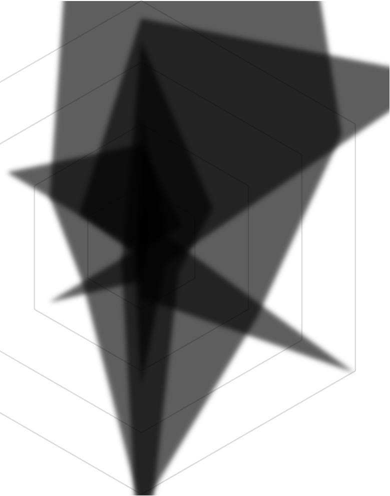
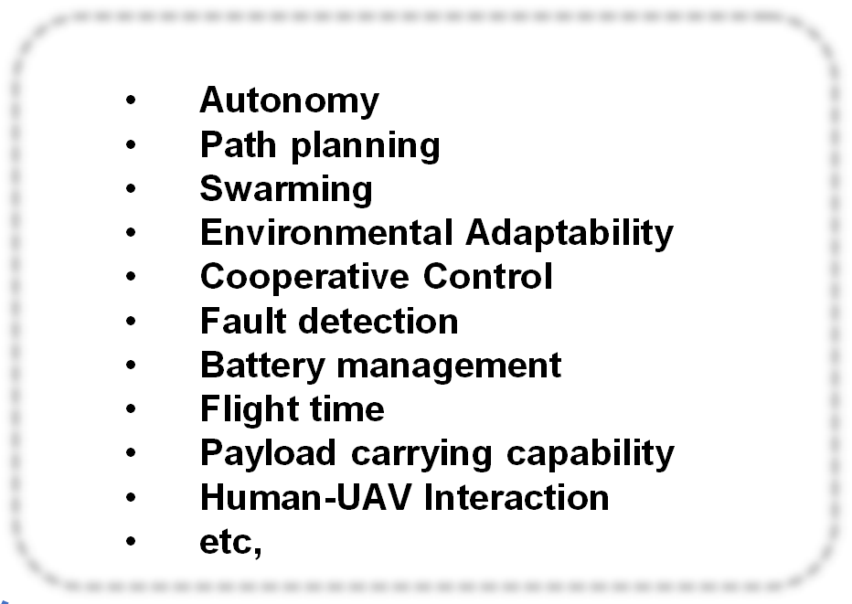
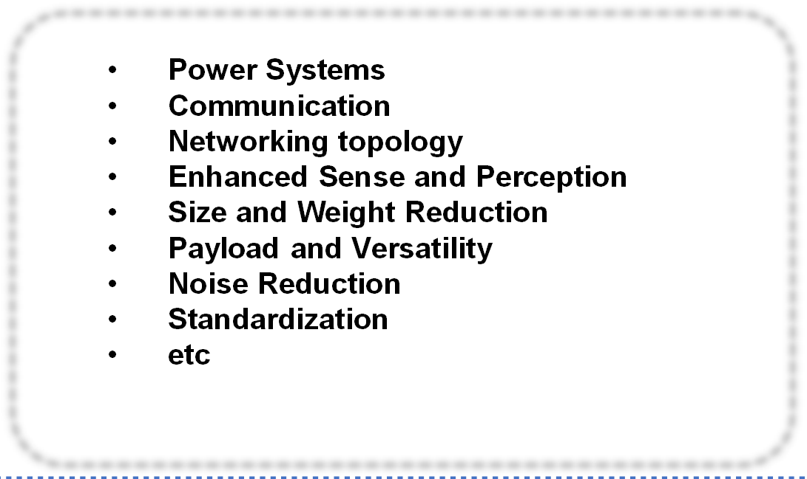
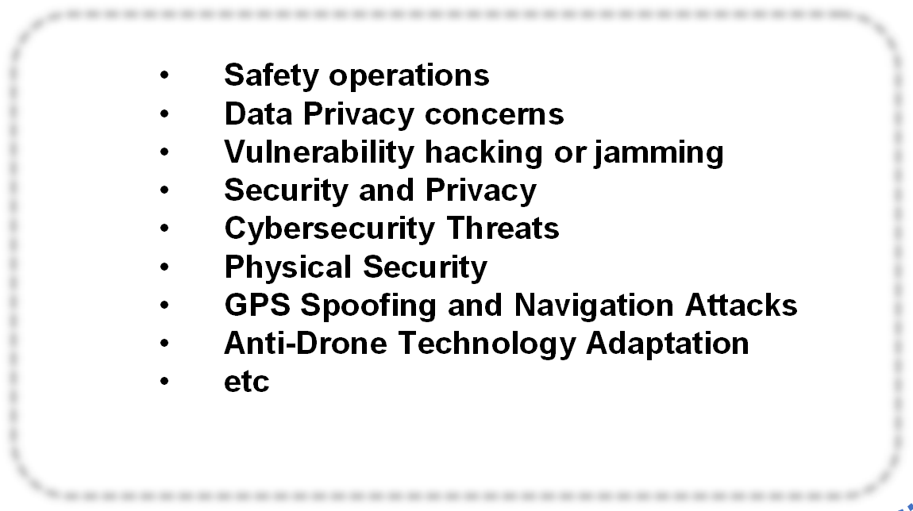

# 2307 13691V1

**Source Document:** `2307.13691v1.pdf`  
**Total Pages:** 32  

---

## --- Page 1 ---

### Section: Introduction

1

A Comprehensive Review of Recent Research

Trends on UAVs

Kaled Telli∗, Okba Kraa∗, Yassine Himeur†, Abdelmalik Ouamane‡, Mohamed Boumehraz∗, Shadi Atalla†

and Wathiq Mansoor†

∗Energy Systems Modelling (MSE) Laboratory, Mohamed Khider University, Biskra, Algeria

†College of Engineering and Information Technology, University of Dubai, Dubai, UAE

‡Laboratory of LI3C, Mohamed Khider University, Biskra, Algeria

Abstract—The growing interest in unmanned aerial vehi-
cles (UAVs) from both scientific and industrial sectors has
attracted a wave of new researchers and substantial invest-
ments in this expansive field. However, due to the wide range
of topics and subdomains within UAV research, newcomers
may find themselves overwhelmed by the numerous options
available. It is therefore crucial for those involved in UAV
research to recognize its interdisciplinary nature and its
connections with other disciplines. This paper presents a
comprehensive overview of the UAV field, highlighting recent
trends and advancements. Drawing on recent literature
reviews and surveys, the review begins by classifying UAVs
based on their flight characteristics. It then provides an
overview of current research trends in UAVs, utilizing data
from the Scopus database to quantify the number of scientific
documents associated with each research direction and their
interconnections. The paper also explores potential areas for
further development in UAVs, including communication, arti-
ficial intelligence, remote sensing, miniaturization, swarming
and cooperative control, and transformability. Additionally,
it discusses the development of aircraft control, commonly
used control techniques, and appropriate control algorithms
in UAV research. Furthermore, the paper addresses the
general hardware and software architecture of UAVs, their
applications, and the key issues associated with them. It
also provides an overview of current open-source software
and hardware projects in the UAV field. By presenting a
comprehensive view of the UAV field, this paper aims to
enhance understanding of this rapidly evolving and highly
interdisciplinary area of research.

Index Terms—UAV, Drone, Research Direction, Open-
Source Projects, Flight Control, last three years, Open
Projects, Development, Antennas, AI, ChatGPT.

#### I. INTRODUCTION

Artificial intelligence (AI) has become increasingly sig-
nificant across various sectors due to its transformative ca-
pabilities, such as robotics, manufacturing and automation,
healthcare [1], cybersecurity [2], education [3], energy and
utilities [4], [5], smart cities [6], natural language process-
ing and human-computer interaction [7], agriculture [8],
transportation and logistics [9]. Similarly, AI plays a crit-
ical role in unmanned aerial vehicles (UAVs), enhancing
their capabilities in navigation [10], object detection [11],
and mission planning [12].

The versatility and efficiency of UAVs have made them
increasingly popular for a wide range of tasks. As the
demand for UAVs continues to grow, it is crucial to
stay updated with the latest developments and research in
this field. UAVs have attracted significant attention in the
scientific community, as demonstrated by numerous review

papers [13]–[19] that explore various aspects of UAV
development and research across different applications.
Several key areas have garnered particular interest in UAV
[18], [20], [21], including the use of open-source hardware
and software in recent UAVs [22]–[24], frame designing
and optimization [25], [26], control systems [27], [28],
both conventional [29] and modern [30], [31] communi-
cation modalities (such as 5G networks), integration of
AI [32], recognition and detection algorithms, and path
planning strategies [33]. These areas play a pivotal role
in advancing UAV technology and are critical subjects of
investigation for researchers and practitioners alike.

Due to the wide range of subdomains and extensive
scope of UAV research, coupled with significant invest-
ments in this multifaceted field, several important research
questions have arisen. These include the interdisciplinary
nature of UAV research, the challenges and opportunities
presented by UAV technology, and the future directions
of UAV research [34]. The field of UAVs has experienced
rapid growth and has captured the attention of researchers
worldwide. With its diverse subdomains and expansive
nature, this field has become a vibrant and active area of
study, attracting substantial investments. As researchers in
this field, we are constantly seeking answers to pressing
research questions. We recognize the need for a compre-
hensive guide to navigating the array of options available
in UAV research [35].

The rapid growth and wide-ranging applications of
unmanned aerial vehicles (UAVs) have given rise to sev-
eral important research questions. One of these questions
pertains to the interdisciplinary nature of UAV research.
UAVs involve a convergence of various disciplines, in-
cluding aerospace engineering, computer science, robotics,
and remote sensing. Understanding the interplay between
these disciplines and identifying effective collaboration
strategies are crucial for advancing UAV technology [34].
Another important area of inquiry is the exploration
of the challenges and opportunities presented by UAV
technology. While UAVs offer numerous advantages such
as improved efficiency, cost-effectiveness, and enhanced
data collection capabilities, they also face challenges such
as regulatory frameworks, privacy concerns, and safety
issues. Investigating these challenges and finding solutions
will contribute to the responsible and effective integration
of UAVs into society [35]. As researchers in the field of
UAVs, we recognize the importance of addressing these
research questions. Our aim is to provide a comprehensive

arXiv:2307.13691v1  [cs.RO]  25 Jul 2023

## --- Page 2 ---

### Section: Popular UAV Classification in Research

2

guide that navigates the vast landscape of UAV research.
By synthesizing the latest findings and insights from var-
ious subdomains, we hope to provide a valuable resource
for researchers and practitioners in this dynamic field.
Through collaboration and knowledge sharing, we can
collectively advance UAV technology and unlock its full
potential in a wide range of applications.

In the realm of Unmanned Aerial Vehicles (UAVs)
or drones, several pressing research questions exist. Key
among these includes exploring how we can enhance UAV
autonomy by integrating machine learning and AI into
their systems for improved functionality and decision-
making [34]. The improvement of navigation and control
systems for precision manoeuvres in unpredictable envi-
ronments is a significant area of focus, as is developing
advanced "sense and avoid" systems for reliable obstacle
detection. The application of swarm intelligence in UAVs
to facilitate collaborative tasks and the implementation
of efficient algorithms is being studied [35]. Researchers
are also looking into extending UAV battery life and
investigating efficient power management strategies and
alternative energy sources. The ability to increase UAV
payload capacity without compromising efficiency or ma-
noeuvrability and how drones can be adapted for specific
payload types is under scrutiny. Equally important are
the security concerns surrounding UAV systems against
potential cyber-attacks or hijacking, and measures to pro-
tect individual privacy from misuse of surveillance-capable
UAVs. Questions abound about how UAVs can be safely
incorporated into crowded airspace, particularly in urban
environments or near airports, and what changes to air
traffic control systems are required to accommodate them.
Regulatory implications of widespread UAV use are also
on the table, focusing on how laws and regulations should
adapt to handle UAV use. Finally, the aspect of human-
UAV interaction in terms of safe and effective design
for human interaction and improving the user experience
is being delved into. Each of these research questions
presents an exciting challenge in shaping the future of
UAV technology.

In response to these needs, this paper serves as a com-
prehensive guide for new researchers venturing into the
multifaceted and expansive subdomains of UAV research.
Recognizing the vast scope of this field, the guide aims
to establish a strong foundation for novice researchers
by providing a thorough review and survey of each sub-
field. It encompasses popular UAV classifications [36],
which categorize UAVs based on their size, range, and
endurance. In addition to covering UAV classifications,
this paper provides an overview of crucial aspects such as
hardware architecture, recent research trends, open-source
initiatives, and software tools employed in UAV devel-
opment and research. The research direction for UAVs
has witnessed remarkable growth in recent years, and this
paper meticulously analyzes these trends and investigates
the interconnections among various research directions.
Critical areas addressed in the paper include communi-
cation and antennas, the internet of things (IoTs), aircraft
detection, control and autonomous flight, perception and
sensing, energy-efficient flight, human-UAV interaction,
swarm behaviour, and more [18], [20], [21]. Notably,

the paper highlights the significant impact of utilizing
UAVs in animal studies, enabling non-invasive monitor-
ing, precise data collection, and reduced disturbance to
wildlife habitats [19], [37]. By providing a comprehensive
overview and synthesizing reliable references, this paper
equips researchers with the necessary knowledge and
resources to make significant contributions to the field of
UAV research. It aims to foster exploration, innovation,
and collaboration, ultimately driving the advancement and
potential of UAV technology.

The paper explores potential open-development axes
for UAVs, including AI integration [32], environmental
monitoring [37]–[42], conservation [41], [43], miniatur-
ization [44], swarming, and cooperative control [13], [14],
[17], [21], and transformability systems [45]–[48]. Air-
craft control development is a crucial aspect of UAV
research, necessitating consideration of appropriate control
algorithms and commonly used techniques [27], [28],
providing valuable insights into UAV research controls.
The main contributions of this study are as follows:

• A comprehensive collection of relevant references
related to the drone field, serving as a reliable and
accessible source for researchers in this domain.

• Insights and predictions established through a rig-
orous scientific approach regarding the most active
and rapidly expanding research directions in the UAV
field over the past three years. The analysis is based
on growth rate per year and acceleration, supported
by robust evidence.

• Identification of potential UAV Open Development
Axes, offering valuable insights and ideas for fu-
ture research directions. A systematic address of the
Consideration for Appropriate Control Algorithm of
UAVs, providing an in-depth analysis of this critical
aspect of UAV research.

• An overview of high-level UAV development soft-
ware achieved through a systematic classification
process, serving as an accessible guide to available
options in this area of UAV research.

• A rigorous extraction of the most prominent research
directions in the UAV domain over the past three
years, employing a scientifically sound methodology
for a comprehensive understanding of the current
state-of-the-art in UAV research.

• Presentation of a numerical analysis of the interre-
lationships among UAV research directions, offering
clear insights into the current landscape of UAV
research, facilitating effective charting of future UAV
research efforts.

#### II. POPULAR UAV CLASSIFICATION IN RESEARCH

UAVs, also known as drones, can be classified based
on several factors, such as their flying principle, mission,
weight, propulsion, control, altitude range, configuration,
purpose, launch method, payload, autonomy level, size,
endurance, and range [36], [49]. Common classifications
of UAVs are as follows:

• Flying Principle: This category includes fixed-wing,
rotary-wing, hybrid, flapping-wing, and other types
of UAVs that differ in their flying mechanism.

## --- Page 3 ---

### Section: Navigating the Latest UAV Research Chalenges

3

• Mission: UAVs can be classified based on their
mission, such as reconnaissance, surveillance, attack,
transport, search and rescue, and more.

• Weight: UAVs can be classified based on their weight,
such as micro UAVs, small UAVs, tactical UAVs,
MALE (medium altitude long endurance) UAVs,
HALE (high altitude long endurance) UAVs, and
more.

• Propulsion: UAVs can be powered by electric, fuel,
solar, or other sources.

• Control: UAVs can be remotely piloted, autonomous,
semi-autonomous, or have other types of control.

• Altitude Range: UAVs can be classified based on
their altitude range, such as low-altitude UAVs, high-
altitude UAVs, and stratospheric UAVs.

• Configuration: UAVs can have different configura-
tions, such as mono-rotor, multi-rotor, tilt-rotor, tilt-
wing, and others.

• Purpose: UAVs can have different purposes, such as
military, civilian, commercial, industrial, scientific,
and more.

• Launch Method: UAVs can be launched from the
ground, air, sea, or have other types of launch meth-
ods.

• Payload: UAVs can carry various payloads, such as
sensors, cameras, communication systems, weapons,
cargo, and others.

• Autonomy Level: UAVs can have different lev-
els of autonomy, such as fully autonomous, semi-
autonomous, human-operated, and others.

• Size: UAVs can have different sizes, such as mini
UAVs, handheld UAVs, man-portable UAVs, vehicle-
mounted UAVs, and more.

• Endurance: UAVs can have different endurance lev-
els, such as short endurance UAVs, long endurance
UAVs, ultra-long endurance UAVs, and more.

• Range: UAVs can have different range levels, such
as short-range UAVs, intermediate-range UAVs, long-
range UAVs, and more.
These classifications enable us to categorize UAVs and
understand their capabilities, limitations, and potential
applications. The continuous development and evolution
of UAV technology have led to the creation of new
classifications and the blurring of traditional boundaries
between them.

#### III. NAVIGATING THE LATEST UAV RESEARCH

#### CHALENGES

The primary objective of this review paper is to assess
recent trends in UAV research over the past three years, us-
ing the Scopus database as a reliable source. The database
was queried using relevant keywords such as "drone,"
"UAV," "unmanned aerial vehicle," and "unmanned aerial
systems." The obtained results were meticulously analyzed
to identify the prominent research directions within this
field. The number of scientific publications associated with
each research direction was employed as an indicator of
its significance and influence. This comprehensive analysis
provides a comprehensive overview of the current state of
UAV research and highlights the most promising avenues

for future investigations. By gaining valuable insights into
the prevailing areas of focus within the UAV research
community, we can better comprehend the potential of
this technology and its profound impact across various
domains.

A systematic search was performed on the Scopus
database using predetermined keywords in the Title, Ab-
stract, and Keywords fields. The search yielded a total
of 47,635 references published in the UAV field between
2020 and 2023. The search was conducted on March 14,
2023. The chart below illustrates the resulting research
directions, derived using the formula: (TITLE-ABS-KEY
(uav) OR TITLE-ABS-KEY (drone) OR TITLE-ABS-
KEY (unmanned AND aerial AND vehicle) OR TITLE-
ABS-KEY (unmanned AND aerial AND systems)) AND
PUBYEAR > 2019 AND PUBYEAR < 2024.

Over the past three years, there has been a surge
in research efforts in the field of UAVs, with various
areas of study being explored. Antennas, aircraft detec-
tion, remote sensing, deep learning (DL), reinforcement
learning (RL), machine learning (ML), aircraft control, the
IoTs, trajectories, energy utilization, and energy efficiency
have emerged as the most prominent research directions
[50]. The development of the aforementioned AI tools
has revolutionized the UAV field, leading to improved
performance in areas such as object detection, trajectory
optimization, and mission planning. Moreover, research on
human-UAV interaction, swarm behaviour, environmen-
tal sensing, safety and reliability, integration with other
platforms, application-specific development, and legal and
ethical issues has also garnered significant attention in
recent years [51].

The research direction of antennas in the UAV field
has received the most attention, with 22150 documents
including journal papers, books, and conference papers,
among others. This field has strong links to other research
areas, such as aircraft detection, remote sensing, AI, IoT,
and aircraft control. Aircraft detection is the research area
that interacts the most with antennas in UAVs, with 3749
documents, followed by AI with 4231 documents, remote
sensing with 2176 documents, aircraft control with 1707
documents, and IoT with 1092 documents. In the UAV
field, AI is the second most referenced research direction
with 5789 documents, while aircraft detection is also
strong with 5604 documents. Other research areas, such
as remote sensing with 3983 documents, IoT with 1702
documents, and aircraft control with 2504 documents, have
also received notable attention. The interconnections be-
tween these research areas are depicted in Figure 2 and are
further elaborated upon in Table I. These results suggest
that there is substantial overlap between research areas in
UAV technology, which could lead to more integrated and
efficient solutions in the future. The data was collected on
March 14, 2023.

A. Communication and Antennas

The transmission and reception of signals are essential
for the operation of UAVs, making antennas a critical
component in their design. For UAV applications like com-
munication [52]–[55], antennas need to be lightweight,

## --- Page 4 ---

### Section: IoTs 

4

47%

12%

8%

8%

5%

3%

4%

4%
3% 3% 3%

Antennas (22150)

Aircraft Detection (5604)

Remote Sensing (3983)

Deep Learning (3631)

Aircraft Control (2504)

Reinforcement Learning (1618)

Internet Of Things (172)

Machine Learning (1761)

Energy Utilization (134)

Energy Efficiency (1293)

Agricultural Robots (1606)

Fig. 1: Chart of last three years research directions in UAV filed.

#### TABLE I: Charting the Course of UAV Research: Exploring Emerging Directions and Inter-Interaction.

Research Direction
Antennas
Aircraft Detection
Remote Sensing
AI
IoT
Aircraft Control
Antennas
2,215
3,749
2,176
3,38
1,092
1,707
Aircraft Detection
3,749
5,604
0,462
1,343
0,133
0,758
Remote Sensing
2,176
0,462
3,983
0,707
0,063
0
AI
4,231
2,203
0,777
5,789
0,512
0,294
IoT
1,092
0,133
0,063
0,365
1,72
0,043
Aircraft Control
1,707
1,152
0
0,311
0,043
2,504

compact, and durable enough to withstand harsh environ-
mental conditions. Recent research in UAV antennas [52]–
[59] has focused on developing advanced technologies to
enhance UAV performance. Researchers are exploring ML
and DL approaches for antenna design and optimization
[57], [60] as well as designing high-gain, wideband,
and multibeam antennas and integrating them with other
subsystems like power and control systems [55]. Table II
portrays a comparison between the various communication
technologies for FANETs.

Where: DM:Device Mobility LCY:Latency Y:YES
DCD:Device
Class
Dependent
ST:Spectrum
Type
UL:Unlicensed L:licensed NT:Network type

Miniaturization of antennas and AI is also being studied
to develop smaller and more agile UAVs with enhanced
capabilities [57]. Further, research on novel materials and
manufacturing techniques such as 3D printing [59], [81]–
[83] has great potential to produce efficient and low-cost
antennas for UAVs. Overall, the advancement of UAV
technology and the development of more efficient and

effective UAV systems for various applications depend on
continued research into UAV antennas.

Flying ad-hoc networks (FANETs) are wireless com-
munication networks composed of drones. FANETs en-
able communication and collaboration among drones in
a decentralized manner, without relying on a fixed in-
frastructure. FANETs are designed to operate in the sky,
and they offer advantages such as improved coverage,
increased mobility, and access to remote or inaccessible
areas. FANETs utilize wireless communication technolo-
gies and specialized protocols to establish and maintain
connections between drones, facilitating data and message
exchange [72]. Through reviewing extensive literature, we
have extracted the information presented in this Table
II. It provides a comprehensive comparison of different
communication technologies utilized in FANETs.

B. IoTs

The integration of UAVs with IoTs has opened up
new possibilities for data collection, analysis, and com-
munication in various fields. By combining UAVs and

## --- Page 5 ---

5

0

1

2

3

4
Antennas

Aircrafe Detection

Remote sensing

#### AI

IoT

Aircraft control

Antennas 22,150
Aircrafe Detection 5,6
Remote Sensing 3,983

AI 5,789
IoT 1,720
Aircraft control 2,504

Fig. 2: View in UAV Research Direction and their Inner-Interaction, recent three years

#### TABLE II: Comparison between the various communication technologies for FANETs [61], [62].

Technology
Standard
Data Rate
Range
WiFi [63]–[67]
802.11 [13]
Up to 2 Mbps
Up to 100m
LCY<5ms| DM:Y |
802.11a [64]
Up to 54 Mbps
Up to 120m
UL NT:WLAN
802.11b [63]
Up to 11 Mbps
Up to 140m
802.11n [65]
Up to 600 Mbps
Up to 250m
802.11g [66]
Up to 54 Mbps
Up to 140m
802.11ac [67]
Up to 866.7Mbps
Up to 120m
ZigBee [68], [69]
802.15.4
Up to 25kbps
Up to 100m
LCY<15ms|DM:Y|UL
blacktooth V5 [70]
802.15.1
Up to 2Mbps
Up to 200m
LCY<3ms|DM:Y|UL
LoRaWAN [71]
IEEE
Up to 50 kbps
Up to 15km
DCD|DM:Y|UL
802.15.4g
NT:WPAN
Sigfox [72]
-
Up to 100 bps
Up to 30km
LCY about 2s|DM:Y|UL
NB-IoT [73]
-
Up to 250 kbps
Up to 35km
LCY:1.6 to 10s|DM:Y|L
Cellular
3G [74]–[76]
HSPA+
Up to 21.1 Mbps
Wide Area
LTE / LTEM
Up to 100 Mbps
LCY:500ms NT:LPWAN
4G [72] LCY:4ms
HSPA+
Up to 100 Mbps
Wide Area
5G [31], [72], [77], [78]
mMTC
Up to 1 Gbps
Wide Area
LCY:1ms |DM:Y|L
URLLC
Up to 1 Gbps
Wide Area
B5G [79]
eMBB/Hybrid
Up to 100 Gbps
Wide Area
LCY:1ms |DM:Y|L
URLLC
Up to 100 Gbps
Wide Area
6G [79], [80]
MBRLLC
Up to 1 Tbps
Wide Area
LCY< 1ms|DM:Y|L
mURLLC
Up to 1 Tbps
Wide Area
HCS / MPS
Up to 1 Tbps
Wide Area

IoT, a network of connected devices, sensors, and UAVs
can collect, process, and share data in real-time. Recent
research [84]–[86] on IoT-enabled UAVs has focused on

developing efficient and scalable communication proto-
cols, network architectures [87], and data processing algo-
rithms to enable seamless integration and interoperability

*Caption/Context: Antennas 22,150 Aircrafe Detection 5,6 Remote Sensing 3,983 | AI 5,789 IoT 1,720 Aircraft control 2,504*

## --- Page 6 ---

### Section: Aircraft Detection 

6

between UAVs and other IoT devices like sensors and
data centres. IoT-enabled UAVs offer numerous benefits,
such as improving the efficiency and effectiveness of
various applications [88] and disaster management. For
example, UAVs equipped with sensors can collect data on
crop health, soil moisture, and temperature, which can be
analyzed in real-time to inform irrigation and fertilization
decisions. Similarly, UAVs can be used to monitor natural
disasters and assess damage, enabling a more rapid and
accurate response. Despite the immense potential of IoT-
enabled UAVs, there are significant challenges that need
to be addressed. Ensuring the security and privacy of
IoT-enabled UAVs is crucial, and developing effective
mechanisms for data processing and analysis is essential.
However, the integration of UAVs with IoT is a promising
area of research that has the potential to revolutionize
various fields and enable new applications [89].

C. Aircraft Detection

Detecting and avoiding collisions with manned aircraft
is a crucial task in the operation of UAVs, especially
in shared airspace. The ability to detect aircraft is es-
sential for ensuring the safe operation of both manned
and unmanned aircraft. Recent research in the area of
aircraft detection for UAVs has been focused on devel-
oping advanced systems that can detect and track aircraft
in real-time using a range of sensors, including radar,
LIDAR, and optical cameras. However, detecting small
aircraft such as general aviation aircraft using traditional
radar systems can be challenging. To address this issue,
researchers are exploring the use of ML algorithms, such
as DL, to improve the accuracy and reliability of aircraft
detection systems. Integrating aircraft detection systems
with UAVs’ navigation and control systems is also a
significant research direction. This integration can enable
automatic adjustment of UAVs’ flight paths in response to
the detected aircraft, ensuring the safe operation of both
manned and unmanned aircraft. The research on aircraft
detection for UAVs is crucial for enabling the widespread
adoption of UAV technology in various domains, such as
delivery, inspection, and surveillance, while ensuring safe
operation in shared airspace.

D. Control and Autonomous Flight

Autonomous flight refers to the ability of UAVs to oper-
ate without human intervention, achieved through the use
of advanced control algorithms [17], [28] and navigation
systems that allow UAVs to fly, navigate, and perform
tasks autonomously [17]. Autonomous flight is a complex
and challenging area of research in the field of UAVs,
requiring the integration of multiple technologies, such
as sensors [90], computer vision [91], and AI [92]. The
objective is to develop UAVs that can perform complex
tasks in a safe and efficient manner, such as precision
landing [91], [93], without human intervention. One of
the critical challenges in autonomous flight is developing
UAVs that can navigate and avoid obstacles in real-time
while maintaining stability and control. This requires the
development of advanced control algorithms [94] and
sensors [90] that can accurately detect and respond to

changes in the environment. Another significant challenge
in autonomous flight is ensuring the safety and reliability
of UAVs, particularly in scenarios with limited human
intervention or hazardous areas [95]. To address these
challenges, researchers are developing new approaches for
monitoring, controlling, and diagnosing UAVs, including
the integration of backup systems, failsafe mechanisms,
and real-time monitoring systems. The goal of autonomous
flight is to develop UAVs capable of performing a broad
range of tasks safely, efficiently, and reliably without
the need for human intervention. This has the potential
to revolutionize various industries, including agriculture,
logistics, military operations, search and rescue missions,
and civil engineering applications.

E. Perception and Sensing

Perception and sensing are crucial capabilities of UAVs,
allowing them to gather, process, and interpret information
from their surroundings. These capabilities are essential
for enabling UAVs to perform various tasks, such as nav-
igation, mapping, inspection, and surveillance. However,
these areas of research are complex and challenging, re-
quiring the integration of multiple technologies, including
sensors, computer vision, and AI. The ultimate aim is
to develop UAVs that can perceive and understand their
environment and make informed decisions based on that
information. One of the key components of perception
and sensing is the integration of various sensors, such
as cameras, LiDAR, and radar [96], [97]. These sensors
provide UAVs with information about the environment,
including the position and location of obstacles, terrain,
and other objects. Another crucial aspect of perception and
sensing is the development of computer vision algorithms
that can process and interpret the information collected by
the sensors. This includes identifying objects, recognizing
patterns, and tracking movement. Additionally, researchers
are exploring the integration of AI techniques, such as
ML and DL [32], to enable UAVs to learn from their
experiences and improve their perception and sensing
capabilities over time. The ultimate goal of perception
and sensing in UAVs is to develop systems that can accu-
rately perceive and understand their environment and make
informed decisions based on that information. This has
the potential to revolutionize various industries, including
agriculture [98], construction, civil applications [99], ma-
rine applications [39], mining [100], military operations,
and search and rescue missions, such as wildfire remote
sensing [101]. Furthermore, researchers are exploring the
potential of cooperative perception using multiple UAVs
to enhance their capabilities [102].

F. Energy-Efficient Flight

Energy-efficient flight is a critical area of research in
the field of UAVs, aiming to develop drones that can fly
for extended periods while consuming minimal energy.
Achieving energy efficiency is essential to enhance the
performance and capabilities of UAVs, including flight
time, payload capacity, and range. Researchers are explor-
ing several approaches [103], such as aerodynamic design
optimization [103], lightweight materials, and integration

## --- Page 7 ---

### Section: Human-UAV Interaction

7

of alternative energy sources such as solar power [104].
Reducing the weight of UAVs is one of the key challenges
in achieving energy-efficient flight. To address this, re-
searchers are exploring the use of lightweight materials
such as composites and new manufacturing techniques that
can reduce the weight of UAVs. Moreover, the optimiza-
tion of the propulsion system [105], [106] is critical in
achieving energy efficiency, including the use of more
efficient engines and the development of new propul-
sion technologies [105]. Integrating electric and hybrid
propulsion systems that offer improved energy efficiency
compared to traditional internal combustion engines is also
under research. Another area of research is the integration
of alternative energy sources, such as solar power [107],
[108]. This involves developing new lightweight solar
panels and energy storage systems capable of providing
power for extended periods. Energy-efficient flight has
the potential to significantly improve UAVs’ capabilities
and performance, enabling new applications and uses.
However, massive data transfer during communication and
surveillance can result in delays and considerable energy
usage. Thus, deep reinforcement learning (DRL) and other
AI approaches have been used in this context [109]–[111].

G. Human-UAV Interaction

Human-UAV interaction is an emerging field of research
that investigates the interaction between humans and UAVs
across various contexts, such as entertainment, education,
and research. It has the potential to revolutionize several
industries. Human-UAV interaction involves developing
new technologies and interfaces that enable intuitive and
innovative ways for humans to interact with UAVs [112].
These technologies include virtual and augmented real-
ity, gestures [113], and other forms of human-machine
interaction. One of the major challenges in human-UAV
interaction is developing UAVs that can respond to human
input in real-time while maintaining stability and control.
This requires integrating advanced control algorithms and
sensors and developing new user-friendly human-machine
interfaces. Another challenge in human-UAV interaction
is ensuring the safety and reliability of UAVs, particularly
in scenarios where there is limited human intervention.
Numerous approaches have been proposed for controlling
UAVs using natural language, hand gestures, and physical
movements. Intelligent human-UAV interaction systems
have been developed, utilizing ML and DL techniques to
recognize gestures and enable efficient control of the UAV
[113]–[116]. Furthermore, some research papers have pro-
posed novel architectures that allow users to control the
UAV using natural body movements [117], [118]. Along-
side technical approaches, several studies have examined
human factors and challenges related to the use of UAVs,
such as user interfaces, training, and workload [119].
Another active area of research in human-UAV interaction
is understanding human decision-making when controlling
UAVs, particularly in search and rescue applications [120].
This highlights the importance of developing intuitive and
efficient human-UAV interaction systems that can be used
across various domains and applications. Survey papers
have reviewed the current state-of-the-art in human-UAV

interaction, such as a scoping review identifying areas
like entertainment, transportation, and public safety, and
another survey providing an overview of various control
interfaces, gesture recognition techniques, and autonomous
operation methods [121].

Furthermore, the literature has explored the human fac-
tors and challenges associated with using UAVs, including
issues related to user interfaces, training, and workload
[119]. Understanding human decision-making when con-
trolling UAVs is an active area of research, particularly in
search and rescue applications [120]. This highlights the
importance of developing intuitive and efficient human-
UAV interaction systems that can be used in a wide range
of domains and applications.

H. Swarm behaviour

Swarm behaviour is a research area within the field
of UAVs that aims to study the collective behaviour of
groups, or "swarms," of UAVs [122], [123]. The potential
impact of swarm behaviour on various industries, such
as military operations, search and rescue missions, and
environmental monitoring, has driven the development
of algorithms and control systems that enable UAVs to
coordinate their actions and work together to achieve a
common goal. One of the challenges in swarm behaviour
is to ensure effective collaboration between UAVs while
adapting to changing conditions and environments. To
address this challenge, researchers are developing new al-
gorithms for cooperation and coordination, as well as new
approaches for task allocation and resource management
[28]. Additionally, the development of algorithms that
enable UAVs to operate autonomously and make decisions
based on their environment, including the integration of AI
techniques such as ML and DL, is an important aspect
of swarm behaviour [33]. Communication and control
architectures are essential for the successful operation of
UAV swarms [124]. A review of UAV swarm communi-
cation and control architectures [28] highlights the need
for scalable and flexible architectures to support different
swarm configurations and tasks. Similarly, a review of
UAV swarm communication architectures [124] discusses
the challenges and future directions for communication in
UAV swarms. Examples of communication and control ar-
chitectures that can be used in UAV swarms include high-
level control of UAV swarms with RSSI-based position
estimation [125] and a self-coordination algorithm (SCA)
for multi-UAV systems using fair scheduling queue [126].

Path planning is another critical aspect of swarm be-
haviour. A recent review of AI applied to path planning
in UAV swarms [33] discusses the latest developments in
this field. The importance of motion planning in swarm
behaviour is highlighted in another paper that examines
the motion planning of UAV swarms, recent challenges,
and approaches [127]. Additionally, a study on collab-
orative UAV swarms towards coordination and control
mechanisms [128] proposes a method for collaborative
motion planning of UAV swarms. Another important issue
addressed in swarm behaviour is localization in UAV
swarms, which is tackled by high-level control of UAV
swarms with RSSI-based position estimation [125]. Fi-
nally, there are various applications of swarm behaviour,

## --- Page 8 ---

### Section: AI

8

including continuous patrolling in uncertain environments
using the UAV swarm [129] and autonomous drone swarm
navigation and multi-target tracking in 3D environments
with dynamic obstacles [130]. In summary, research on
swarm behaviour for UAVs has been a rapidly growing
area of study, with numerous advances made in recent
years. The development of algorithms and control systems
for cooperation, coordination, task allocation, and resource
management has been a primary focus of research, as
has the integration of AI techniques. Communication and
control architectures, path planning, localization, and re-
siliency are also vital areas of research. The numerous ap-
plications of swarm behaviour demonstrate the significant
potential impact of this technology on various industries.

#### I. AI

The use of AI has had a significant impact on the field
of UAVs in recent years. By enabling UAVs to perform
tasks autonomously, AI has made them more efficient and
effective in a variety of applications. Some of the most
significant contributions and works related to using AI in
UAVs include object detection [131]–[135] and tracking,
path planning [33], autonomous navigation [92], [136],
swarm intelligence [33], [122], image and video analysis
[133], [135] and cybersecurity [137].

AI algorithms, such as Convolutional Neural Networks
(CNNs) and Recurrent Neural Networks (RNNs), have
been used to detect and track aircraft [133], objects [138]–
[140], and real-time objects from UAVs [11], [141], with
applications in surveillance [111], search and rescue [141],
and agriculture [8]. AI also enables UAVs to navigate
autonomously in complex environments, avoid obstacles,
and make real-time decisions based on sensor data [96],
with applications in delivery, inspection, and surveillance
[142]. Additionally, AI algorithms have been used to
coordinate the behaviour of multiple UAVs, forming a
swarm that can perform tasks collaboratively [33], [122],
with applications in search and rescue, surveillance, and
military operations.

Moreover, AI algorithms have been utilized to analyze
images and videos captured by UAVs, extracting valuable
information such as object recognition, semantic segmen-
tation, and anomaly detection. These capabilities have a
broad range of applications in fields such as agriculture,
environmental monitoring, and disaster management. Ad-
ditionally, AI has been used to detect and prevent cyber-
attacks on UAVs, ensuring their safety and security, with
applications in military operations and commercial UAVs.
Some notable works related to using AI in UAVs include
recent examples that have received attention from the
research community. These include DRL for UAV control,
vision-based autonomous landing of a fixed-wing UAV
[91], swarm intelligence for collaborative UAV mission
planning [33], [122], [143], autonomous navigation of
UAVs in indoor environments [92], and AI-based object
detection and tracking for UAV surveillance [111], [139],
[141]. These examples demonstrate the wide range of
applications for AI in UAVs, including navigation, mission
planning, object detection and tracking, and surveillance.

#### IV. UAV ACTIVE AND EXPANDING RESEARCH

#### DIRECTIONS

To conduct a comprehensive analysis, the Scopus
database has been used as the primary data source for
extracting pertinent information regarding the research
direction of UAVs over the past three years. The goal of
this analysis is to (i) identify the main open challenges,
and (ii) provide insights into the most active and rapidly
expanding research directions in the UAV field over the
last three years. To achieve this objective, a systematic
search of the Scopus database was conducted using pre-
defined keywords in the title, abstract, and keywords fields
from January 2020 to December 2022. Research directions
were delineated based on the identified publications, and
the resultant growth trajectories were plotted, taking into
account the linear relationship between the number of
publications and time (y=ax+b), where y represents the
number of publications, x represents the year, and b
represents the number of publications in the previous year.
The parameter a reflects the magnitude and rate of growth
observed from year to year.

The results of this analysis are presented in Figure
3, depicting the growth trajectories of each research
direction. Furthermore, Table III tabulates the average
growth rate for each research direction to facilitate a better
understanding of the growth dynamics in the UAV field.

Table III’s Acceleration of Growth demonstrates a high
degree of efficacy in predicting the areas of interest that
attract significant attention from researchers in the UAV
domain. These predictions offer a nuanced perspective of
the developments and trends within the field. For example,
the Antenna field has a considerable number of publica-
tions and an impressive growth rate of approximately 980
new documents per year. However, its growth ratio remains
relatively constant at 1.20. In contrast, the field of Remote
Sensing experiences a remarkable surge in interest each
year, reflected in an acceleration of growth ratio of 9.08.
Consequently, these findings provide valuable insights into
the most promising research directions within the UAV
domain.

#### V. POTENTIAL UAV’S OPEN RESEARCH DIRECTIONS

The open development axis for UAVs involves creating
a collaborative ecosystem where developers, researchers,
and users can work together to build open-source plat-
forms, tools, and standards for UAV design, development,
and operation. This approach allows for greater innovation
and flexibility in the UAV industry [20], including the
integration of AI and ML algorithms to enhance au-
tonomous flight and decision-making capabilities [144],
[145]. Further challenges and open research directions can
be elaborated on in the following points:

A. Integration of AI

AI algorithms are revolutionizing the way UAVs op-
erate. By using these algorithms, UAVs can achieve im-
proved autonomous flight and decision-making capabili-
ties, which can result in more efficient and safer operations
[144], [145]. One way AI and ML algorithms can be
used in UAVs is through the development of advanced

## --- Page 9 ---

### Section: Generative AI and ChatGPT for UAVs

9

2020
2021
2022
Antenna x 0.5
3036,5
3481,5
4016,5
Aircraft Detection
1349
1756
2243
Remote Sensing
1216
1193
1402
AI
2343
3085
4074
IoT
384
516
694
Energy-Efficient
1703
1853
2282
Control
2237
2352
2632
Swarm Behavior
73
133
182

#### 3036,5

#### 3481,5

#### 4016,5

1349
1756

#### 2243

#### 1216

1193
1402

#### 2343

#### 3085

#### 4074

384
516
694

1703
1853

#### 2282

#### 2237

#### 2352

#### 2632

73
133
182

0

500

#### 1000

#### 1500

#### 2000

#### 2500

#### 3000

#### 3500

#### 4000

#### 4500

Documents Number

Years

Fig. 3: UAV Research Direction growth trajectories last three years view.

#### TABLE III: UAV Research Direction, Acceleration of Growth.

Research Direction
Rate of Growth/Year (Number of Document/Year)
Acceleration of Growth
Antenna
980
1.20
Aircraft Detection
447
1.19
Remote Sensing
93
9.08
AI
865
1.33
IoT
155
1.34
Energy-Efficient
289
2.86
Control
197
2.43
Swarm
54
0.81

sensor systems. For example, computer vision and LIDAR
can be integrated into UAVs to provide real-time data
to the AI system [136]. This allows the UAV to make
decisions based on its environment and react to changes
dynamically. Computer vision can enable the UAV to rec-
ognize objects and people in its environment, which can be
used to improve safety and prevent collisions. Meanwhile,
LIDAR can provide detailed information about the UAV’s
surroundings, including distance, size, and speed of ob-
jects, which can be used to navigate complex environments
more effectively.

Another way AI can be used in UAVs is through the
optimization of flight paths. By using ML algorithms,
UAVs can learn from past flights and optimize their routes
to reduce energy consumption and increase efficiency. This
can be achieved by analyzing data such as wind speed,
temperature, and other environmental factors [143].

1) Generative AI and ChatGPT for UAVs: Natural
Language Processing (NLP) models like Chat Generative

Pre-trained Transformer (ChatGPT) [146], [147] are de-
signed to understand natural language input from users and
generate human-like responses. ChatGPT can be adapted
to many robotics tasks, such as high-level agent planning
[148] or code generation [149], [150]. As such, it can
serve as an intuitive language-based interface between
non-technical users and UAVs.

"Efforts to incorporate language into robotics systems
have largely focused on using language token embedding
models,multi-modal model features, and LLM features for
specific form factors or scenarios. Applications range from
visual-language navigation [151], language-based human-
robot interaction [152], and visual-language manipulation
control." [153] ChatGPT, for example, can be used via
API libraries to enable many tasks [154], such as zero-
shot task planning in drones, where it accesses functions
that control a real drone and serves as an interface between
the user and the drone [155]. This can allow non-technical
users to easily and safely operate UAVs without needing

## --- Page 10 ---

### Section:  Environmental Monitoring and Conservation

10

specialized training.

A real drone was operated using ChatGPT through
a separate API implementation, which offered a user-
friendly natural language interface between the user and
the robot, allowing the model to create intricate code
structures for drone movement such as circular and lawn-
mower inspections [156]. Using the Microsoft AirSim
[154], [155] simulator, ChatGPT has also been applied
to a simulated domain, where the possibility of a model
being used by a non-technical user to operate a drone
and carry out an industrial inspection scenario has been
investigated [156]. It can be seen from the snippet that
ChatGPT can accurately control the drone by reading user
input for geometrical clues and purpose.

B.
Environmental Monitoring and Conservation

The utilization of UAVs for environmental monitoring
and conservation presents a promising application of this
advanced technology [38]. These unmanned aerial ve-
hicles, equipped with high-resolution cameras and other
cutting-edge sensors, offer immense potential for a wide
range of purposes, including monitoring wildlife popu-
lations [40], tracking changes in ecosystems [157], and
detecting environmental hazards []. By leveraging the
capabilities of UAVs in these areas, we can greatly enhance
our capacity to collect precise and reliable data, thereby
gaining deeper insights into the overall health and well-
being of our planet [158]. Such invaluable information
empowers us to develop and implement effective conserva-
tion strategies, ensuring the preservation and safeguarding
of our environment for future generations [159]. The
use of drones in ecological and glaciological research in
regions like Antarctica is on the rise, as demonstrated
by studies [37], [42], [160]. Drones facilitate detailed
geomorphological mapping, precise vegetation monitoring
over expansive areas, and health indicator assessments.
They enhance the identification and characterization of
cryospheric features, including subsurface applications,
and revolutionize faunal studies by enabling non-invasive
counting and morphometrics of diverse animal species
[37]. UAV atmospheric surveys allow swift and versatile
data collection, including aerosol sample collection. The
design and development of platforms tailored to the harsh
Antarctic environment have been crucial for the success
of these applications. UAVs capable of collecting physical
samples from remote or inaccessible areas are available,
and further advances in autonomy and robustness will en-
hance their utility for Antarctic fieldwork [19]. UAV usage
for environmental monitoring and conservation serves both
planetary and human interests.

C. Urban Air Mobility (UAM)

UAM, an emerging field, holds immense promise for
the future of transportation [161]–[163]. UAVs have the
potential to revolutionize urban transportation by offering
a rapid, efficient, and eco-friendly alternative to traditional
ground-based systems [161]. However, realizing this po-
tential necessitates significant technological advancements
in navigation, autonomous flight, and safety systems.

Moreover, the development of tailored air traffic manage-
ment systems designed to address the unique challenges
of urban environments is crucial for ensuring the safe and
efficient operation of UAVs in densely populated areas
[164]. With ongoing growth and investment in this domain,
UAVs are poised to become a pivotal component of future
urban transportation systems.

D. Miniaturization

In the UAV industry, miniaturization is a prominent
trend that focuses on developing smaller and more com-
pact drones capable of diverse applications [165]. These
applications encompass search and rescue, delivery ser-
vices, surveillance, and more. Nonetheless, accomplish-
ing miniaturization necessitates substantial technological
advancements, including the development of compact
and efficient propulsion systems, as well as lighter and
more durable materials. Consequently, miniaturization has
emerged as a key area of research and development within
the UAV industry, unlocking new possibilities for drone
utilization across a wide range of fields.

E. Swarming and Cooperative Control

The open development axis in the UAV industry fo-
cuses on establishing a collaborative ecosystem that brings
together developers, researchers, and users to advance
algorithms and techniques for swarming and cooperative
control of multiple UAVs, enabling them to perform com-
plex tasks [28], [122]. These tasks encompass a wide range
of applications, including surveillance, search and rescue
operations, and environmental monitoring. To achieve this,
significant technological advancements are necessary, such
as the development of robust communication protocols
[28], [124], distributed sensing and control systems [128],
and adaptive decision-making capabilities. For instance,
the design of effective communication protocols facilitates
seamless information exchange and coordination among
multiple UAVs, enabling them to work together efficiently
towards common objectives. Similarly, distributed sensing
and control mechanisms empower each UAV to carry out
specific tasks within a coordinated framework, greatly
enhancing the efficiency and effectiveness of complex
missions performed by UAV swarms. Additionally, the
implementation of adaptive decision-making algorithms
equips UAVs with the ability to make rapid and accurate
decisions based on real-time data, further augmenting the
capabilities of UAV swarms in various scenarios.

F. Beyond Visual Line of Sight (BVLOS) Operations

Beyond Visual Line of Sight (BVLOS) Operations
refers to the technologies that enable UAVs to operate be-
yond the visual line of sight of their pilot [166]. Achieving
BVLOS capabilities requires the development of advanced
sense-and-avoid systems capable of detecting obstacles
and avoiding collisions [167]. Additionally, reliable com-
munication and control protocols are necessary to ensure
safe and efficient operations. To enable the widespread
adoption of BVLOS operations, regulatory frameworks
must be established to ensure compliance with safety
standards and mitigate potential risks [168].

## --- Page 11 ---

### Section: Long-Range and High-Altitude Flights

11

G. Long-Range and High-Altitude Flights

Another area of development in the UAV industry is
the advancement of long-range and high-altitude flights.
This entails equipping UAVs with the ability to fly for
extended periods and at greater altitudes. To achieve this,
there is a need for the development of more energy-
efficient propulsion systems capable of sustaining long
flights [169]. Additionally, the integration of renewable
energy sources, such as solar panels, into UAV designs
is being explored to extend their range and increase their
endurance [170], [171].

H. Flight Safety

As the use of UAVs continues to grow across different
applications, ensuring flight safety has become a crucial
concern. In response, developers are actively working on
integrating new technologies that can enhance the safety
of UAV operations. For instance, there has been an in-
creasing focus on developing collision avoidance systems
[172], [173] that can prevent mid-air collisions with other
UAVs, manned aircraft, or obstacles in the environment.
Additionally, automatic landing systems [174] can help to
reduce the risk of accidents during landing, while onboard
obstacle detection and avoidance systems [172] can enable
UAVs to detect and avoid obstacles during flight, reducing
the risk of collisions. Such technologies are critical for
ensuring the safe and responsible use of UAVs, as they
can mitigate potential risks and prevent accidents.

I. UAV Suspension Payload Capabilities

UAV suspension payload refers to the development and
optimization of suspension systems for UAVs that are
capable of carrying various types of payloads, including
heavier items such as medical supplies, food, and other
essential goods. The suspension system plays a critical
role in ensuring stable flight during missions that involve
payload dropping, as it helps to mitigate vibrations and
provide shock absorption to protect the payload and sen-
sitive equipment on board [175].

Recent advancements in drone suspension payload tech-
nology have focused on improving the performance and
efficiency of suspension systems, as well as integrating
them with other components of the drone. Some examples
of these advancements include the use of advanced ma-
terials and manufacturing techniques, the development of
active suspension systems that can adjust to changing flight
conditions in real time, and the integration of suspension
systems with propulsion, control, and payload systems to
ensure seamless operation and maximum efficiency.

Moreover, recent advances in controlling quadrotors
with suspended loads have focused on developing new
algorithms and control strategies that can handle the
additional complexity and challenges introduced by the
suspended payload [176]–[178]. Some recent studies have
proposed methods to improve the accuracy and stability
of quadrotors with suspended loads, including predictive
control strategies and the use of adaptive learning algo-
rithms [176]–[178]. These innovations in UAV suspension
payload technology will lead to more efficient and reliable

delivery and transport capabilities, further expanding the
applications of UAVs in various fields.

J. Transformability or Convertibility

Transformability or Convertibility is an emerging tech-
nology in the field of unmanned aerial vehicles that
enables them to change their shape or configuration in
flight [45]–[47], [179]. This advancement has the potential
to enhance the versatility and efficiency of UAVs by al-
lowing them to adapt to different operational environments
and missions. There are several approaches to achieving
transformability in UAVs, including:

One important area of transformability that we will ex-
plore is the utilization of morphing wings. This innovative
approach involves designing wings capable of changing
their shape during flight to enhance efficiency and manoeu-
vrability [180]. By incorporating morphing wings technol-
ogy, drones can adapt their wing configurations to varying
flight conditions, such as alterations in altitude, speed, and
wind direction. Through these adaptable wings, drones
can optimize their aerodynamic performance and overall
efficiency, thereby improving their range, endurance, and
stability [181]. There are several mechanisms employed
to achieve morphing wings, including shape memory
alloys, smart materials, and mechanical systems. These
mechanisms enable drones to adjust the wing angle, alter
the curvature of the airfoil, or even completely change
the wing shape. One notable example of morphing wings
technology is the "RoboSwift", developed by the Delft
University of Technology in the Netherlands. Resem-
bling a swift bird in nature, this small drone has the
ability to morph its wings during flight, allowing for
enhanced efficiency and reduced noise. The RoboSwift
has gained considerable recognition in the scientific com-
munity due to its innovative morphing wings technology
and its potential applications in various fields, such as
surveillance, environmental monitoring, and wildlife re-
search. Its remarkable features have been highlighted in
numerous research papers [182], [183]. Another notable
example is the "FlexFoil" developed by FlexSys Inc., an
American engineering firm. The FlexFoil incorporates a
unique "morphing trailing edge" technology, enabling the
rear edge of the wing to bend and twist in response to
changes in the airflow [184]. This design feature enhances
the drone’s aerodynamic performance and adaptability to
different flight conditions, resulting in improved efficiency.
By harnessing the power of morphing wings technology,
drones can revolutionize the field of aviation by achieving
greater agility, range, and stability. The development of
such transformative capabilities opens up new possibilities
for various industries, from surveillance and monitoring to
research and exploration.

The concept of foldable Unmanned Aerial Vehicles
(UAVs), equipped with collapsible arms or wings, presents
an intriguing area for exploration [185]. This design
feature leads to a decrease in the overall dimensions of
the drones, thereby enhancing portability and facilitating
more streamlined transportation and storage. Such fold-
able drones, including models like the Mavic Pro, DJI
Mavic Air 2, Parrot Anafi, PowerVision PowerEgg X, and

## --- Page 12 ---

### Section: Advancements in Aircraft Control: An Overview of the Development Axes

12

Robotics EVO, have gained substantial popularity due to
their adaptability and convenience [186]. The ability of
these drones to easily fold their arms or wings offers
flexibility, allowing users to transport them in compact
cases or bags. This feature not only improves portability,
but also boosts the drones’ durability and protection during
transportation. Consequently, the potential damage is min-
imized, ensuring the drones are well-protected and ready
for operation in a variety of environments and scenarios
[187].

Moving on, Reconfigurable airframes represents an-
other avenue of transformation in UAVs. With reconfig-
urable airframes, drones have the ability to change their
shape or configuration during flight to adapt to different
missions or operational environments. This versatility can
involve modifying their wing configuration, adding or
removing payloads, or adjusting their centre of gravity. By
incorporating reconfigurable airframes, drones can cater
to a wide range of mission requirements, making them
more cost-effective and capable compared to traditional
fixed-design drones. While reconfigurable airframes in
UAVs are still an evolving technology, there are a few
noteworthy examples of companies and organizations that
are actively developing such drones [188]. For instance,
roboticists from the University of Zurich and EPFL have
developed quadrotors that feature foldable designs, allow-
ing them to morph their shape in mid-air between “X”
and “O” configurations [188], [189]. These innovative de-
signs demonstrate the potential of reconfigurable airframe
drones, showcasing their adaptability and agility in various
flight scenarios.

Besides, a significant development in UAV technology
is the incorporation of variable pitch propellers [190].
These propellers are equipped with blades that can adjust
their angle or pitch during flight. Variable pitch propellers,
also known as adjustable or controllable pitch propellers,
provide a higher level of control over the drone’s flight
and performance, particularly in challenging or dynamic
conditions. By altering the pitch of the propeller blades,
the drone can finely tune its thrust and lift, enabling it
to maintain stable flight even in varying wind conditions,
altitudes, or flight modes. This capability greatly enhances
the drone’s manoeuvrability, efficiency, and overall per-
formance across a wide range of applications, including
aerial surveying, mapping, and inspection. Variable pitch
propellers are commonly found in more advanced or spe-
cialized UAVs [191], [192], such as industrial or military
drones, where precise control and optimal performance
are crucial. However, they are increasingly becoming
accessible in consumer drones as well, allowing hobbyists
and enthusiasts to leverage their benefits and enjoy greater
control and versatility in their aerial endeavours.

Lastly, a significant advancement in UAV technology
is the integration of transformable rotors [193], [194].
UAVs equipped with transformable rotors have the ability
to modify the configuration of their rotors during flight,
enabling them to adapt to various flight conditions or mis-
sion requirements. This includes the capability to change
the number or orientation of the rotors. The development
of transformable UAVs holds tremendous potential in
revolutionizing the field of unmanned aerial vehicles. It

empowers UAVs to perform a broader range of missions
with increased effectiveness and efficiency. One remark-
able example is the VA-X4, which features four rotors
that can tilt forward, transitioning from vertical takeoff and
landing (VTOL) mode to forward flight mode. This design
allows the UAV to achieve higher speeds of up to 200
mph, enabling it to cover longer distances more efficiently
[193], [194]. Another notable transformable rotor UAV
is the Voliro Hexcopter developed by the ETH Zurich
team [195], [196]. This hexacopter utilizes multiple rotors
capable of providing thrust in various directions, granting
the drone the ability to translate freely and manoeuvre in
complex environments. NASA’s Greased Lightning GL-10
[197] is yet another remarkable transformable rotor UAV.
It can seamlessly transition between a vertical takeoff and
landing (VTOL) mode and a fixed-wing mode, optimizing
efficiency during forward flight. This UAV is equipped
with ten electric motors powering ten rotors, enabling it
to achieve high speeds and exceptional manoeuvrability.
These examples demonstrate the immense potential of
transformable rotor UAVs in expanding the capabilities
and versatility of unmanned aerial systems, paving the
way for more efficient and adaptable aerial missions across
various industries.

Overall, transformable UAVs have the potential to
greatly improve the versatility and efficiency of UAVs, en-
abling them to adapt to different operational environments
and missions. By transforming their shape or configuration
in flight, these UAVs can optimize their performance for
different flight conditions and mission requirements, mak-
ing them a valuable tool for a wide range of applications.

#### VI. ADVANCEMENTS IN AIRCRAFT CONTROL: AN

#### OVERVIEW OF THE DEVELOPMENT AXES

Flight dynamics control is a critical area of aerospace
engineering that focuses on the stability and control of
an aircraft during flight [28]. The main objective of flight
dynamics control is to ensure that the aircraft remains sta-
ble, controllable, and safe across its entire flight envelope
[198]. Various approaches and algorithms are employed
in flight dynamics control to design control systems that
stabilize and govern the behaviour of aircraft through-
out different flight tasks, including path following [199],
morphing capabilities [45], [47], [48], [179], navigation
and surveillance [77], swarm flights [28], autonomous
manoeuvring [17], mapping [200], and sprayer operations
[201]. These approaches and algorithms [27], [28], along
with their architectural considerations [28], [202], utilize
mathematical models of aircraft dynamics and control
theory to generate control inputs that modify the aircraft’s
behaviour to achieve specific performance objectives [27].
The ultimate goal is to ensure safe, stable, and efficient
flight operations.

There are several ways to classify UAV control method-
ologies [94], [202], [203], based on factors such as the
type of UAV being controlled, the control objectives, and
the mathematical techniques employed. Here are some
common classifications in control theory: feedback control
vs. feedforward control, linear control vs. nonlinear control
[204], continuous-time control vs. discrete-time control,

## --- Page 13 ---

### Section: Classical Control

13

deterministic control vs. stochastic control, model-based
control vs. model-free control, robust control [205], [206],
and adaptive control [207], [208], centralized control vs.
decentralized control, optimal control vs. suboptimal con-
trol, and time-invariant control vs. time-varying control.
These classifications represent different approaches and
algorithms used in flight dynamics control. However, four
main categories are widely recognized: classical control,
modern control, intelligent control, and adaptive control,
each offering distinct methodologies and techniques to
address the complexities of flight dynamics control.

A. Classical Control

Classical control [209], [210] refers to traditional con-
trol theory based on mathematical models of linear sys-
tems. This approach is widely employed in controlling
aircraft dynamics and involves the use of proportional,
integral, and derivative (PID) control algorithms. The
advantage of classical control lies in its simplicity and
well-established theoretical foundations. However, it has
limitations in handling nonlinear systems and managing
disturbances that impact the aircraft’s performance.

B. Modern Control

Modern control [210] encompasses the use of advanced
control theory, including state-space and optimal control,
to design control systems capable of handling nonlineari-
ties and disturbances. This approach is extensively applied
in flight dynamics control, as it provides more precise
control and can manage complex systems. The advantage
of modern control is its ability to handle nonlinear sys-
tems and uncertainties [211]. However, it requires more
computational power and sophisticated algorithms, pos-
ing challenges for real-time implementation. The Linear
Quadratic Regulator (LQR) is a popular control algorithm
widely used in flight dynamics control for optimal control
of linear systems.

C. Intelligent Control

Intelligent control [212]–[214] is a branch of control
theory that employs AI techniques, such as neural net-
works, fuzzy logic, and genetic algorithms, to design
control systems. This approach finds extensive use in flight
dynamics control, as it can adapt to changing conditions
and provide a high level of robustness. The advantage of
intelligent control lies in its ability to handle complex
and nonlinear systems, along with its adaptive nature.
However, it requires significant computational resources
and can be challenging to analyse and debug. Neural
networks are widely employed in flight dynamics control,
particularly for control and fault diagnosis. They have
found applications in autopilots, flight control systems, and
engine control systems.

D. Adaptive Control

Adaptive control is a class of control algorithms that
can dynamically adjust control parameters in real-time
based on the aircraft’s behaviour and environmental con-
ditions [207]. This approach is widely employed in flight

dynamics control as it effectively handles uncertainties
and disturbances, making it suitable for variable operating
conditions. The advantage of adaptive control lies in its
ability to accommodate uncertain systems and adapt to
changing conditions. However, it requires a substantial
amount of data to learn the system’s behaviour, which
can be challenging to obtain in certain cases. The Model
Reference Adaptive Control (MRAC) is a widely used
adaptive control algorithm in flight dynamics control,
finding applications in various aircraft control systems,
including autopilots, flight directors, and flight control
systems [208].

In summary, flight dynamics control approaches and
algorithms play a critical role in ensuring the safe and
efficient operation of aircraft. The different classes of
control techniques possess their respective strengths and
weaknesses, and the choice of a particular approach de-
pends on the specific requirements of the control problem.
Researchers and practitioners continue to develop and
enhance control systems for aircraft, and new approaches
and algorithms are expected to emerge. In conclusion,
flight dynamics control is an essential field of aerospace
engineering that ensures the stability and controllability
of an aircraft during its flight. Static stability control,
dynamic stability control, and manoeuvrability control are
the three primary classifications of flight dynamics control.
Each class has its own advantages and disadvantages, and
their selection depends on the specific design requirements
of the aircraft.

E. Pushing the Boundaries of UAV Control: Exploring
Advanced Techniques

In addition to the widely used PID control, the field of
UAV control employs several advanced control techniques
that aim to enhance performance and stability [215]–[217].
These techniques are particularly suited for complex and
dynamic UAV systems. One prominent advanced control
technique in UAV control is Model Predictive Control
(MPC). MPC utilizes mathematical models of the UAV’s
dynamics to predict its future behaviour [218], [219].
Based on these predictions, control inputs are computed
to optimize a predefined performance metric, such as
energy consumption, stability, or trajectory tracking ac-
curacy. By considering the UAV’s entire future trajectory,
MPC offers improved performance compared to traditional
control techniques. Another significantly advanced control
technique is Adaptive Control. Adaptive control adjusts its
parameters in real-time to adapt to changes in the UAV’s
environment and dynamics. This enables the control sys-
tem to continuously enhance its performance over time,
even in the presence of uncertainties and disturbances
[208], [220], [221]. These advanced control techniques
contribute to the development of more robust and efficient
UAV control systems. Sliding Mode Control (SMC) is
another advanced control technique that is widely used
in UAV control. SMC is a nonlinear control technique
that provides robust performance in the presence of uncer-
tainties and disturbances. SMC works by maintaining the
UAV’s states within a desired operating region, known as
the sliding mode, which ensures stability and robustness

## --- Page 14 ---

14

[222], [223]. Finally, there are several advanced control
techniques that are based on ML as AI, such as RL and
DRL [214], [216], and neural network-based control [212],
[216]. These techniques enable UAVs to learn from their
experiences and improve their control performance over
time. In conclusion, there are several advanced control
techniques that are being used in the field of UAV control.
These techniques provide improved performance and sta-
bility compared to traditional control techniques, and they
are well-suited to the complex and dynamic requirements
of UAV systems. Cooperative control is a technique that
enables multiple UAVs to work together to achieve a com-
mon mission objective. Cooperative control is particularly
useful for UAVs that need to perform complex tasks [224],
such as surveillance or search and rescue, that require
coordination and collaboration between multiple UAVs.

SMC is a widely utilized advanced control technique
in UAV control. SMC is a nonlinear control method
that ensures robust performance even in the presence of
uncertainties and disturbances. By maintaining the UAV’s
states within a desired operating region, known as the
sliding mode, SMC guarantees stability and robustness
[222], [223]. The core concept of SMC lies in the creation
of a sliding surface, which is a manifold in the state
space. The sliding surface is carefully designed to have
attractive properties, such as finite-time convergence or
robustness against parameter variations. The control law
then acts upon the system to drive its state trajectory
towards this sliding surface and maintain it there [225].
The distinguishing feature of SMC is its discontinuous
nature (Chattering) [226]. The control law consists of
multiple control actions, or switching functions, that are
activated based on the relative position of the system state
with respect to the sliding surface. When the system’s state
is not on the sliding surface, the control law switches
between different modes or control actions to robustly
drive the state towards the sliding surface. Once the state
reaches the sliding surface, the control law switches to a
different mode to maintain the system’s trajectory on the
surface [225]–[227]. The discontinuous nature of SMC
offers robustness against uncertainties and disturbances
since the control actions adapt rapidly based on the state’s
proximity to the sliding surface. Moreover, the sliding
mode itself provides inherent robustness properties as
the system’s behaviour on the sliding surface is less
sensitive to parameter variations or external disturbances.
Mathematically, SMC relies on the theory of differential
inclusions and Lyapunov stability analysis to guarantee
the system’s convergence to the sliding surface and the
subsequent maintenance of the system’s behaviour on the
surface [227].

The general approach to designing SMC components
is to start by defining a sliding surface that represents
the desired behaviour of the system. The sliding surface
should
have
attractive
properties,
such
as
ensuring
stability, convergence, or robustness. The choice of
the sliding surface depends on the specific control
objective and system dynamics. One commonly used
sliding surface in quadrotor control is based on the
error between the desired state and the actual state
of the UAV. The sliding surface is designed to drive

the error dynamics to zero. There are various possible
sliding surfaces that can be used based on different
UAV objectives and system dynamics. Several sliding
surface design strategies have been proposed to minimize
or eliminate the reaching mode [228]. These methods
can be classified based on dimensions, linearity, time
dependence, and the nature of their moving algorithm
[228], [229]. The aforementioned conventional sliding
surface naturally yields a proportional-derivative (PD)
sliding surface. To obtain PID structures, an integral
action can also be included. Incorporating the integral
term is commonly done in conjunction with a boundary
layer SMC approach. By including the integral term, the
steady-state error resulting from the boundary layer can
be eliminated [228]. The author in [228] has conducted
extensive work in classifying the sliding surface into
different categories, including Linear Constant Sliding
Surface,
Linear
Discretely-Moving
Sliding
Surface,
Linear Continuously-Moving Sliding Surface, Constant
Nonlinear Sliding Surface, and Nonlinear Time-Varying
Sliding Surface. All these sliding surfaces are designed
to improve controller performance by minimizing or
eliminating the time required to reach the sliding phase.
The second step in SMC design is to determine the
equivalent control law and switching Law. After defining
the sliding surface, the equivalent control law is derived
to drive the system dynamics onto the sliding surface
and maintain them there. The equivalent control law is
typically obtained by analyzing the system’s dynamic
equation is designed to ensure that the system exhibits
desirable behaviour and achieves the control objectives. It
involves determining a control signal that will force the
system state to follow the sliding surface and stabilize
the system. The control law should be designed to
counteract
the
effects
of
uncertainties,
disturbances,
and non-linearities in the system. The switching law
is a crucial component that ensures the system’s states
remain on the sliding surface. It plays a key role in
rejecting disturbances, uncertainties, and other external
factors that may affect the system’s performance. by
employing a discontinuous control signal, specifically a
set-valued control signal. This signal compels the system
to "slide" along a section of its typical behaviour [230].
There exist various types of reaching laws for SMC,
including switching and non-switching reaching laws
[230]. Additionally, a new non-switching reaching law
has been introduced, demonstrating improved system
robustness without amplifying the magnitude of critical
signals in the system [230]. Non-switching reaching
laws eliminate the need for switching across the sliding
hyperplane in each subsequent step [231]. Additionally,
a new non-switching reaching law has been introduced,
demonstrating
improved
system
robustness
without
amplifying the magnitude of critical signals in the system
[230]. Non-switching reaching laws eliminate the need
for switching across the sliding hyperplane in each
subsequent step [231].

ML. These techniques, including RL, DRL [214],
[216], and neural network-based control [212], [216],

## --- Page 15 ---

15

empower UAVs to learn from their experiences and
continually
enhance
their
control
performance
over
time. UAVs have greatly benefited from the application
of ML, enabling them to efficiently perform assigned
tasks [232]. Researchers have explored the potential of
UAVs in various areas such as inspection, delivery, and
surveillance [232]. ML techniques have been employed
to provide control strategies, including adaptive control
in uncertain environments, real-time path planning, and
object recognition [232]. An interesting approach to UAV
control using ML is DRL. This method allows UAVs to
autonomously discover optimal control laws by interacting
with the system and handling complex nonlinear dynamics
[233]. Remarkably, DRL has demonstrated success in
attitude control of fixed-wing UAVs using the original
nonlinear dynamics with as little as three minutes of
flight data [233]. The integration of ML has not only
enhanced UAV capabilities but also reduced challenges,
opening doors to various sectors [234]. This combination
has yielded fast and reliable results [234]. In the realm
of UAV flight controller designs, Model-Based Control
(MBC) techniques have traditionally dominated. However,
they heavily rely on accurate mathematical models of
the real plant and face complexity issues. Artificial
Neural Networks (ANNs) offer a promising solution to
address these challenges due to their unique features
and advantages in system identification and controller
design [235]. A comprehensive survey examines the
combination of MBC and ANNs for UAV flight control,
particularly in low-level control [235]. The objective is
to establish a foundation and facilitate efficient controller
designs with performance guarantees [235]. Fuzzy logic
has been utilized to design autonomous flight control
systems for UAVs [236]. For instance, a study focused
on UAV flight dynamics and developed longitudinal and
lateral controllers based on fuzzy logic [237]. Despite
not
employing
optimization
techniques
or
dynamic
model knowledge, the fuzzy logic controller exhibited
satisfactory performance [237]. Another example involves
an ANFIS-based autonomous flight controller for UAVs,
which utilizes three fuzzy logic modules to control the
UAV’s position in three-dimensional space, including
altitude and longitude-latitude location [238]. In summary,
the field of UAV control encompasses several advanced
techniques that offer improved performance and stability
compared
to
traditional
control
approaches.
These
techniques are well-suited to meet the complex and
dynamic requirements of UAV systems.

Cooperative control is a technique that facilitates the
collaboration of multiple UAVs to accomplish a shared
mission objective. Particularly for tasks like surveillance
or search and rescue, where coordination and collaboration
among multiple UAVs are essential, cooperative control
proves to be highly beneficial [224]. The cooperative con-
trol of UAVs entails the effective coordination and collabo-
ration among multiple drones to accomplish shared goals
[239]. UAV swarms bring forth advantages in terms of
improved efficiency, flexibility, accuracy, robustness, and
reliability [239]. Nevertheless, the integration of external

communications introduces the possibility of encountering
additional faults, failures, uncertainties, and cyberattacks,
which can potentially result in the propagation of errors
[239]. For the purpose of ensuring operational safety, the
field of cooperative control has seen the development of
Fault Detection and Diagnosis (FDD) and Fault-Tolerant
Control (FTC) methods [240]. These methods are designed
to identify and tolerate faults that may occur in the
individual components of UAVs [240]. The FDD unit
is responsible for diagnosing faults, while the FTC unit
offers appropriate compensation measures [240]. Cooper-
ative UAVs find wide-ranging applications in diverse fields
such as search and rescue operations, border patrol, map-
ping tasks, surveillance missions, and military operations.
[241]. These tasks are well-suited for autonomous vehicles
due to their repetitive or dangerous nature. The utilization
of multiple UAVs substantially enhances the efficiency of
execution [241]. In the realm of cooperative control, recent
advancements encompass the introduction of a distributed
consensus algorithm for multi-agent systems (MAS). This
algorithm ensures the delivery of seamless input signals
to control channels, effectively mitigating the undesired
chattering effect associated with conventional control pro-
tocols [242]. Another innovative concept is Cooperative
Fault Detection and Diagnosis (CFDD) and Fault-Tolerant
Cooperative Control (FTCC), which mitigate the negative
impact of component and communication faults that may
arise during formation or swarm flights [240]. Within the
cooperative control architecture, drones collect sensory
data, communicate, and share information [239]. Tasks are
assigned based on mission requirements, and optimal paths
are generated [239]. Control algorithms ensure precise
trajectory tracking, while collision avoidance mechanisms
ensure safe operations [239]. Continuous feedback and
adaptation maintain accurate trajectory tracking [239]. By
incorporating these steps and advancements, cooperative
control enables drones to effectively work together, accom-
plish complex tasks, and achieve synchronized trajectory
following [239], [240], [242]. This enhances efficiency
and effectiveness in various applications, such as aerial
formations, surveillance, and coordinated mapping mis-
sions. The cooperative control architecture for UAV begin
by collect sensory data and communicate with each other
to exchange information. Tasks and roles are assigned
based on mission requirements, considering capabilities
and resource availability. Optimal paths and trajectories
are generated to accomplish assigned tasks, considering
mission objectives and environmental constraints. The
control layer translates high-level commands and planned
paths into low-level actions, ensuring stability, motion
control, and trajectory tracking. The mission management
layer oversees the overall mission, adapting plans and
allocating resources as needed based on real-time feedback
from UAVs. This integrated approach enables efficient task
allocation, precise control, and adaptive mission manage-
ment, facilitating effective cooperation among the UAVs
to accomplish complex objectives.

Fault-tolerant control (FTC) is a methodology em-
ployed to uphold acceptable performance and ensure the
safety of a system even when faults or failures occur in

## --- Page 16 ---

### Section: Considerations for Selecting an Appropriate Control Algorithm

16

its hardware or software components [243]. Such faults or
failures may arise from diverse causes, including sensor
malfunctions, actuator failures, communication losses, or
software errors. The objective of fault-tolerant control is
to detect faults or failures and mitigate their effects by
reconfiguring the control system or adapting the control
law. This can be accomplished through the utilization
of redundancy, fault detection and isolation (FDI) tech-
niques [244]–[246], and fault accommodation strategies.
Redundancy involves the presence of multiple copies of
critical hardware or software components that can assume
control in the event of a failure or fault. For instance,
a UAV may possess redundant sensors or actuators that
can be employed if the primary ones fail. FDI techniques
employ sensor data to detect and isolate faults or failures
in the UAV’s hardware or software. FDI can be achieved
using a variety of techniques, including observer-based
approaches, statistical methods, or analytical redundancy.
Fault accommodation strategies adapt the control law or
reconfigure the control system to maintain the UAV’s
stability and performance in the presence of faults or
failures. These strategies may involve switching to backup
control law, adjusting control gains, or employing adaptive
control techniques. Overall, fault-tolerant control plays a
crucial role in ensuring the safe and reliable operation
of UAVs even in the presence of faults or failures [243],
[247]. It enables UAVs to detect and mitigate the effects
of faults or failures, allowing them to continue operating
effectively and achieve their mission objectives. Recent
advancements in the field of FTC for UAVs have been
the subject of several studies. A survey article provides
a comprehensive overview of recent research on fault
diagnosis, FTC, and anomaly detection specifically tai-
lored for UAVs [248]. Additionally, a separate review
focuses on the topic of fault-tolerant cooperative control,
specifically addressing the control of multiple UAVs in
a fault-tolerant manner, this study delves into the recent
developments in Fault-Tolerant Cooperative Control and
offers a systematic analysis of FTCC methods applicable
to multi-UAV scenarios. The study initially summarizes
and analyzes formation control strategies for fault-free
flight conditions of multi-UAVs [240]. Furthermore, an
adaptive fault-tolerant control method integrated with fast
terminal sliding mode control (FTSMC) technology and
neural network is proposed for the attitude system of a
quadrotor UAV in another study [249]. The utilization
of the NN allows for the approximation of uncertain
terms within the system, thereby enhancing fault-tolerant
capabilities.

Prescribed Performance Control (PPC) is a control
methodology specifically designed to fulfil prescribed per-
formance criteria. In PPC, prescribed performance refers
to ensuring that the tracking error converges to a prede-
fined small residual set while satisfying a predetermined
convergence rate and limiting the maximum overshoot to
a sufficiently small constant, Consequently, the desired
transient performance metrics, such as overshoot and
convergence time , are successfully achieved [250]. This
passage emphasizes the significance of achieving good
transient performance in aircraft control systems, encom-

passing traditional airplanes, hypersonic flight vehicles,
and unmanned aerial vehicles (UAVs). It discusses several
studies and methodologies that employ PPC to achieve this
goal [250]. The study [251] focuses on the traditional PPC
approach to develop an integrated guidance and control
method for interceptors, ensuring excellent transient per-
formance during target interception. In the case of hyper-
sonic flight vehicles, studies [252], [253] indicate that the
normal PPC guarantees satisfactory transient performance.
However, satisfying the strict initial condition for tracking
error poses a challenge. To address this, modified versions
of PPC have been proposed [254] as non-affine models
to reduce reliance on initial error. Nevertheless, these
methods may result in large overshoot due to the initial
value selection of the performance function. To mitigate
this issue, a newly designed performance function [255] is
applied to develop a concise neural tracking controller for
hyper-sonic flight vehicles. Simulation results demonstrate
small or zero overshoot in velocity and altitude tracking.
UAVs, which hold significant potential in military and civil
applications, greatly benefit from good transient perfor-
mance to carry out tasks effectively. Numerous tracking
control methodologies utilizing PPC have been proposed.
[256] present a fuzzy-back-stepping-based tracking con-
troller with prescribed performance for a single UAV.
Additionally, PPC is applied to platoon control , leader-
follower control , Decentralized, finite-time, adaptive fault-
tolerant , synchronization control Multi-UAVs [257], and
quadrotor UAVs Backstepping-based [258], simulation re-
sults validate their superior performance in achieving both
transient and steady-state performance. In summary, this
passage underscores the application of PPC in achieving
desirable transient performance across a range of aircraft,
including airplanes, hypersonic flight vehicles, and UAVs.
The referenced studies provide evidence of the effective-
ness of PPC methodologies.

By extensively examining various literary sources, we
have derived Table IV, which outlines the pros and cons
of each controller as per the opinions of different authors.

F. Considerations for Selecting an Appropriate Control
Algorithm

Choosing the right control algorithm for a UAV is a
crucial decision that depends on various factors, including
the type of UAV, its mission objectives, environmental
conditions, and available hardware and software resources.
Several considerations should be taken into account when
selecting or developing a control algorithm. Firstly, it is es-
sential to identify the UAV’s requirements. Understanding
the UAV’s performance requirements, such as flight range,
payload capacity, and environmental conditions, is crucial
in determining the most suitable control algorithm. Next,
evaluate different control algorithms available for UAVs,
including classical PID, PID2, LQR, sliding mode con-
trol, and model reference adaptive controller. Assess the
strengths and weaknesses of each algorithm and consider
how well they align with the UAV’s requirements. Con-
sider the implementation complexity of the chosen con-
trol algorithm. Some algorithms may require significant
computational resources or specialized hardware, such as

## --- Page 17 ---

17

#### TABLE IV: Summarizing and Comparing Pros and Cons: Control Techniques in UAVs Field.

Control Technique
Advantage
Disadvantage

PID
[94],
[202],
[210],
[216], [217], [259]–
[263]

(1)Implementation is simple. (2) The reduction of steady
state error can be achieved by increasing parameter gains.
(3) It consumes minimal memory. (4) The design is user-
friendly, and it responds well.

(1) Conducting experiments can be a time-consuming pro-
cess. (2) In certain cases, aggressive gain and overshooting
may occur. (3) There is a possibility of overshoot occur-
rences when adjusting the parameters

SMC
[94],
[202],
[210],
[222],
[259]–[261],
[264], [265]

(1) It exhibits high insensitivity to variations in parameters
and disturbances. (2) It is capable of delivering significant
implementation efforts. (3) Linearization of dynamics is not
necessary for its operation. (4) It is efficient in terms of
time. (5) Filtering techniques can be employed to reduce
chattering effects.

(1) Severe chattering effects occur during switching. (2)
The process of designing such a controller is intricate. (3)
The sliding control scheme heavily depends on the sliding
surface, and an incorrect design can result in unsatisfactory
performance.

LQR
[94],
[202],
[210],
[259]–[261],
[266],
[267]

(1) Achieves robust stability while minimizing energy con-
sumption. (2) Demonstrates computational efficiency. (3)
The effectiveness of the system is enhanced by incorpo-
rating the Kalman filter

(1) Complete access to the system states is necessary,
but this is not always feasible. (2) There is no assurance
regarding the speed of response. (3) It is not suitable for
systems that demand a consistently minimal steady-state
error.

Gain Scheduling
[94],
[202],
[210],
[259]–[261],
[268],
[269]

(1) Facilitates rapid response of the controller to dynamic
changes in operating conditions. (2) The design approach
seamlessly integrates with the overall problem, even when
dealing with challenging nonlinear problems.

(1) It is not time efficient. (2) Gain scheduling heavily
relies on conducting extensive simulations. (3) There are
no guaranteed performance outcomes.

Backstepping
[94],
[202],
[210],
[259]–[261],
[270],
[271]

(1) Demonstrates robustness in the face of constant external
disturbances. (2) Handles all states within the system and
is capable of dealing with nonlinear systems.

(1) It is not efficient in terms of time. (2) It is sensitive
to variations in parameters. (3) Implementation can be
challenging.

H-Infinity
[94],
[202],
[210],
[259]–[261],
[267],
[271], [272]

(1) Capable of operating in the presence of uncertainties
within a system. (2) Complex control problems are ad-
dressed in two subsections: stability and performance. (3)
Offers robust performance.

(1) Involves intricate mathematical algorithms. (2) Imple-
mentation can be challenging. (3) It necessitates a reason-
ably accurate model of the system to be controlled.

Adaptive control
[94],
[202],
[207],
[208],
[210],
[215],
[220], [221], [259]–
[261], [273]

(1) Capable of handling systems with unpredictable param-
eter variations and disturbances. (2) Capable of handling
unmodeled dynamics. (3) Exhibits rapid responsiveness to
varying parameters.

(1) An accurate model of the system is necessary. (2) Imple-
menting the design can be time-consuming. (3) It requires
extensive design work before final implementations.

AI:
Fuzzy
Logic
and Neural Network
[94],
[202],
[210],
[212], [216], [259]–
[261], [274]–[276]

(1) The control action is heavily influenced by the provided
rules. (2) The controller can be manually prepared. (3)
Capable of withstanding unknown disturbances. (4) Offers
adaptive parameters for uncertain models. (5) The selected
control system can be trained.

(1) Stability cannot be guaranteed. (2) Continuous tuning is
necessary for critical systems. (3) It consumes a significant
amount of computational power. (4) Offline learning may
fail when uncertainties are present.

ML-based algorithms or cooperative decision and control
[224]. Select an algorithm that can be easily implemented
on the UAV’s hardware platform, considering the available
computing resources. Once a control algorithm is chosen,
optimize its performance by tuning its control parameters.
Flight testing can be conducted to collect data on the
UAV’s flight behaviour and adjust the control algorithm’s
parameters for optimal performance. Here are some key
considerations when selecting or developing a control
algorithm for a UAV [94], [202], [277]:

1) Stability and Control: The algorithm should ensure
the UAV’s stability and controllability, even under
turbulent or challenging conditions.
2) Performance: The algorithm should enable the
UAV to achieve its performance objectives, such
as speed, altitude, and manoeuvrability while mini-
mizing power consumption and optimizing mission
duration.
3) Sensitivity to Environment: The algorithm should
consider environmental factors that can affect the
UAV’s performance, such as wind, temperature, and
humidity.
4) Responsiveness: The algorithm should be capable of
responding quickly to changes in the UAV’s mission
objectives or unexpected events, such as obstacles or
other aircraft.

5) Computational
Requirements:
The
algorithm
should be computationally efficient and feasible
for the available onboard processing hardware and
software.
6) Robustness: The algorithm should be robust to un-
certainties, such as sensor noise or errors in the UAV’s
kinematic model.
7) Safety: The algorithm should ensure the UAV oper-
ates safely and avoids collisions with other objects,
people, or animals.
8) Regulatory Compliance: The algorithm should com-
ply with local regulations and guidelines for UAV
operations, such as flight altitude restrictions and
flight path limitations.
9) Human Interaction: The algorithm should enable
human operators to interact with the UAV and provide
inputs or commands, if necessary.

Overall, the technique for choosing the right control
algorithm for where UAV involves careful consideration
of where UAV’s requirements, evaluation of different
control algorithms, simulation and testing, implementation
complexity, and optimization.

## --- Page 18 ---

### Section: UAVs Fundamental Hardware/Software Architectures: Applications and Issues 

18

#### VII. UAVS FUNDAMENTAL HARDWARE/SOFTWARE

#### ARCHITECTURES: APPLICATIONS AND ISSUES

A.
The Hardware Architecture of UAVs

The hardware architecture of Unmanned Aerial Vehicles
(UAVs) encompasses several critical components, such
as the flight computer and controller, sensors, actuators,
battery, communication interfaces, payload, and structural
components. The flight computer and controller manage
the flight path and stabilization of the UAV. Sensors
provide crucial navigation, altitude, and orientation data,
while actuators control the UAV’s movement. The battery,
chosen according to the application’s requirements, powers
the UAV. Communication interfaces enable remote control
and data transmission, whereas the payload may include
cameras, sensors, and other equipment specific to the
application. Structural components, including the frame
and arms, ensure support and stability for the UAV, allow-
ing effective operation across applications. This hardware
architecture significantly influences the capabilities and
performance of UAVs across varying contexts [22], [278]–
[280]. Numerous studies have examined general hardware
architecture. Multilevel architecture for UAVs has been
proposed in the literature [22], [278]–[280]. The character-
istics of modern UAVs have been thoroughly discussed in
[278], [281]. The aspects of miniature UAVs are treated in
[282], and the required software components for real-time
control implementation for UAVs are addressed in [198].
Regardless of scale, UAVs typically include the same
components, with additions and modifications according
to the application.

1)
Flight Computer and Controller:: The flight com-
puter serves as the primary processing unit that governs
the UAV’s navigation and flight. It amalgamates data from
all the sensors and actuators to manage the UAV’s flight
trajectory and stability. For medium or large-scale UAVs,
this unit is generally more advanced and potent, given
the system’s heightened complexity. A wealth of literature
provides comprehensive reviews and surveys on flight
controllers and computers [23], [279], [283], [284]. Other
works delve into the design and implementation of a UAV
flight controller [285].

2) Sensors:: The sensor suite of a UAV typically en-
compasses a range of devices such as accelerometers,
gyroscopes, magnetometers, barometers, GPS, and cam-
eras. These sensors offer crucial information regarding the
UAV’s orientation, position, and surrounding environment.
Medium or large-scale UAVs might additionally incorpo-
rate LIDAR [286], radar, and other specialized sensors for
applications like navigation and mapping [287]. A brief
comparison of remote-sensing platforms is presented in
[288]. For agricultural applications, the sensors, and their
deployment are discussed in [289], [290], while their use
in construction and civil applications is detailed in [99].
An examination of electromagnetic interference on UAV
sensors is covered in [291], and the application of different
sensors in mining areas is discussed in [100]. Multi-sensor
data fusion using Deep Learning (DL) for security and
surveillance purposes is reviewed in [292], and remote
sensing for forest health monitoring is explored in [293].

3) Actuators:: This includes motors, servos, and elec-
tronic speed controllers (ESCs) that control the UAV’s
movement and stability. Medium or large-scale UAVs are
typically larger and more powerful to handle the increased
weight and size of the UAV. UAV Electric Propulsion
System reviewed in [105], [294]. The application of the
development of an actuator is analysed in [295]. Another
development of propulsion system plasma actuators elab-
orated in [296].

4) Battery:: This is the power source that provides
energy to the UAV’s components. A medium or large-scale
UAV typically requires a larger battery to provide enough
energy to power its components, many papers focused on
UAV supply systems and management of its energy [104].
While some [297] focused on UAV architectures of power
supply, their charging techniques are well discussed in
[298], while the wirelessly charging of UAVs is covered
in [299]. In addition, [300] presents the key technologies
of the fuel cell of UAVs. Intelligent energy management
and hybrid power supply for UAVs is reviewed in [301],
[302].

5) Communication Interfaces:: This includes radios
and other communication devices that enable the UAV to
transmit data to and receive data from ground stations,
other UAVs, or other devices. a medium or large-scale
UAV are typically more sophisticated and capable of
transmitting and receiving larger amounts of data over
longer distances. Explore UAV communication networks
issues characteristics, design issues, and applications is
reviewed in [29], where the used communication process
for UAV is discussed in [303]. A survey in networking and
communication technologies is well presented in [304]. 5G
systems and satellite communication for UAV navigation
and surveillance are presented by [77]. While [124], [305]
analysed in-depth the swarm communication architectures.
In addition, [306] describes UAV-based IoT communica-
tion networks and the applications for IoT for sustainable
smart farming are explored in [307].

6) Payload:: This is the equipment that the UAV is
carrying for its specific mission, such as cameras, sensors,
or other specialized equipment. a medium or large-scale
UAV is typically more sophisticated and specialized and
may include specialized sensors, cameras, or other equip-
ment to support its mission. Payload delivery UAV and
dropping payload’s capability are investigated respectively
in [308] and [175].

7) Structural Components:: This includes the frame,
arms, and other components that provide the UAV with its
physical structure and support the other components. The
structural components of a medium or large-scale UAV
are typically larger, stronger, and more complex to support
its size and weight. Concept and initial design of a UAV
addressed in [309]. And UAV mechanical frame stress
analysed by [310]. While [311] reviewed finite element
methods for UAV structural analysis. A UAV wing’s
structural analysis and optimization investigated by [312].
and small-scale UAV structural design and optimization
elaborated on [313], [314].

This is a general hardware architecture for a UAV.
Depending on the specific UAV and its mission, the archi-
tecture may vary, and additional components may be added

## --- Page 19 ---

### Section: The Software Architecture for UAVs

19

to meet specific requirements. In some cases, UAVs may
use internal combustion engines to generate electricity,
which can be used to power the electric motors. However,
this is relatively rare, as electric motors are typically
more efficient, reliable, and environmentally friendly than
internal combustion engines.

B. The Software Architecture for UAVs

It is a critical component that enables the UAV to
operate effectively and efficiently. The UAVs architecture
as an autonomous system typically consists of several
layers, including the firmware layer, operating system
layer, middleware layer, and application layer [315]–[319].
The firmware layer includes the code that controls the
hardware components of the UAV, such as the flight con-
troller and sensors. The operating system layer provides
the necessary interface between the firmware and higher-
level software applications. The middleware layer includes
software components that provide communication and data
exchange between different parts of the system. This layer
includes protocols and software libraries for data trans-
mission, processing, and storage. Finally, the application
layer includes the software programs that run on top of the
other layers and provide the necessary functionality for the
UAV’s intended application. This layer includes software
for flight planning, navigation, data analysis, and payload
control.

Overall, the software architecture for UAVs is a complex
and highly integrated system that must be carefully de-
signed to ensure reliable and efficient operation in different
applications. Advanced software techniques such as ML
and AI are also becoming increasingly important in UAV
software architectures to improve autonomy and decision-
making capabilities.

C. UAVs Applications and Main Issues

There are numerous and diverse, ranging from com-
mercial to military and scientific applications. The ap-
plications of UAVs have been discussed and categorized
by numerous kinds of literature [320]–[324]. Some of
the most common applications of UAVs include, Aerial
photography and videography UAVs can capture high-
quality images and video footage from the air, making
them ideal for applications such as filmmaking, real estate,
and tourism. In agriculture [325], UAVs can be used to
monitor crops, detect crop diseases, and optimize irrigation
and fertilization, leading to more efficient and sustain-
able agriculture practices. UAVs in search and rescue
applications can be equipped with specialized sensors and
cameras to aid in search and rescue operations, particularly
in remote or hard-to-reach areas. While in military and law
enforcement, UAVs used for reconnaissance, surveillance,
and target acquisition in military and law enforcement
applications. UAVs find applications in infrastructure in-
spection [321], [322], aiding in the efficient and cost-
effective inspection and monitoring of structures such as
bridges [326], pipelines, and power lines. They also con-
tribute significantly to environmental conservation efforts
by monitoring parameters such as air and water quality, as
well as wildlife populations [41], [43]. Furthermore, UAVs

serve as essential tools in scientific research, facilitating
environmental monitoring [327], atmospheric studies [37],
[37]–[42], [160], and wildlife tracking. They have notably
enhanced our understanding of cryospheric features, both
on the surface and subsurface. UAVs have also revolution-
ized faunal studies by enabling non-invasive methods for
accurate counting and morphometric analysis of various
animal species. Atmospheric surveys conducted by UAVs
offer swift and versatile data collection, including aerosol
sample collection. The design and development of spe-
cialized platforms, tailored to the challenging Antarctic
environment, have been instrumental in the successful
deployment of these applications [19]. Consumer UAVs
are designed for personal use, such as hobbyist drones,
aerial photography drones, and racing drones. Overall,
the applications of UAVs continue to expand and evolve
as new technologies and capabilities emerge, providing
significant opportunities for innovation and advancement
in a wide range of fields. Due to the increasing of UAV
applications, making use raises common concerns and
issues across industries [328]–[330]. These include privacy
concerns, regulatory compliance, technical challenges,
specialized equipment requirements, and potential safety
risks. Privacy concerns arise from capturing images and
videos without consent, while regulatory compliance and
technical challenges relate to operating UAVs in special-
ized environments. The need for specialized sensors and
software, along with potential safety risks from accidents
or crashes, are also common concerns for UAV use in
different fields.

#### VIII. KEY TRENDS: OPEN-SOURCE UAV SOFTWARE

#### AND HARDWARE PROJECTS

There are many open-source projects related to the
application of advanced control techniques in UAVs. Here
are a few examples:

A. PX4 Autopilot

Is an open-source flight control platform [331] used
for Autonomous navigation and control applications, it
supports a wide range of UAVs. The platform provides
advanced control algorithms, such as model predictive
control [218], [219], adaptive control [215], [220], and
R [216], [332], that can be used to improve the stability
and performance of UAVs. It provides a flexible and mod-
ular platform for developing autonomous flight systems,
including advanced navigation and control algorithms. The
software is compatible with a range of hardware platforms
and supports a variety of communication protocols.

B. ArduPilot

Is an open-source autopilot platform [333] used for
autonomous navigation and control applications, it sup-
ports a variety of UAVs, including fixed-wing aircraft,
multirotors, and rovers. The platform provides advanced
control algorithms, such as adaptive control and AI [221],
[273], that can be used to improve the stability and
performance of UAVs [217]. It provides a range of features
for autonomous navigation and control, including GPS

## --- Page 20 ---

### Section: TensorFlow for UAV

20

waypoint navigation, automated takeoff and landing, and
mission planning. The software is compatible with a wide
range of hardware platforms and is actively maintained by
a large community of developers.

C. TensorFlow for UAV

Is an open-source project software library [334] for ML
and AI applications. In the context of UAVs, TensorFlow
can be used for a variety of applications, such as object
detection and recognition, path planning and navigation
[335], [336], and sensor fusion. For example, TensorFlow
can be used to train deep neural networks to recognize
objects in images or videos captured by UAVs, which
can be useful for applications such as search and rescue
or surveillance. TensorFlow can also be used for path
planning and navigation, by training ML models to predict
the optimal trajectory for a UAV based on environmental
and mission constraints. Additionally, TensorFlow can be
used for sensor fusion, by integrating data from multiple
sensors on a UAV to create a more accurate and complete
picture of the environment.

D. Paparazzi UAV

This is an open-source project [337] that provides a
complete autopilot system for UAVs, including advanced
control algorithms and tools for flight planning and mis-
sion execution [338], [339]

E. Ground Control

Including
QGroundControl
[340].
Mission
Planner
[341]. APM Planner 2 [342] and UgCS [343] are an open-
source ground control stations that provides a graphical
user interface for controlling UAVs [344]–[346]. This
platforms provides advanced control algorithms, such as
adaptive control, that can be used to improve the stability
and performance of UAVs

F. AirSim

Aerial Informatics and Robotics Simulation [347], is
an open-source UAV simulator developed by Microsoft. It
provides a realistic simulation environment for testing and
developing UAV control algorithms, including advanced
physics-based modeling of the UAV and its environment
[348]–[350]. The software is designed to be flexible and
customizable, allowing users to experiment with different
control strategies and sensor configurations. The platform
provides advanced control algorithms, such as R, that can
be used to improve the stability and performance of UAVs.

G. JdeRobot UAVs

Is an open-source toolkit [351] for developing robotics
including UAVs that provides a comprehensive set of
tools and algorithms for controlling UAVs. The platform
provides advanced control algorithms, such as model pre-
dictive control and R, that can be used to improve the
stability and performance of UAVs [352], [353].

H. DroneKit and DroneKit-Python

Are open-source SDK framework [354] for building
apps that run on top of autopilot software such as ArduPi-
lot and PX4. It provides a set of high-level APIs that
allow developers to easily interact with the UAV autopilot
system, access telemetry data, and send commands to the
UAV. While DroneKit-Python [355]. is a Python library
that extends the capabilities of DroneKit and provides a
simple and easy-to-use interface for developing Python-
based UAV applications. It includes a number of high-
level APIs for controlling and monitoring UAVs, as well
as support for accessing sensor data, controlling actua-
tors, and implementing custom behaviours. advantage of
DroneKit ability to support a wide range of development
platforms, including Linux, Windows, and Mac OS X
and flexibility in supporting multiple autopilot software
platforms, including ArduPilot and PX4. This allows de-
velopers to build applications that can work with a wide
range of UAV hardware and software configurations. And
provides a range of APIs for controlling and monitoring
UAVs, including mission planning, telemetry, and vehicle
control [356]–[358].

I. MAVLink

Is an open-source lightweight communication protocol
[359] widely used in the UAVs industry to facilitate
communication between different components of a UAV
system. Is designed to be platform-independent and can be
implemented on a wide range of devices including ground
control stations [360], onboard flight controllers, and other
peripherals. MAVLink provides a flexible and extensible
messaging system that allows different components of a
UAV system to exchange information such as flight status,
sensor data, and control commands [361]. This enables the
different components of a UAV system to work together in
a coordinated and efficient manner. One of the key advan-
tages of using MAVLink is its ability to support a wide
range of hardware and software platforms. This allows
UAV developers and manufacturers to leverage existing
software and hardware components and build a system that
meets their specific needs. Another advantage of MAVLink
is its ability to support multiple communication protocols
including serial, UDP, and TCP. This flexibility makes it
possible to use MAVLink in a wide range of applications
[360]–[363] including ground control stations [360], [361],
autonomous vehicles, and remote sensing applications.

J. ROS for UAVs

The Robot Operating System (ROS) [364] is an open-
source software framework for robotics that offers devel-
opers libraries and tools to create and manage robotic
systems. In the UAV field, ROS can be utilized to produce
autonomous drones and other aerial robots. ROS finds
application in various areas in the UAV field, including
navigation with SLAM [365] and path planning algorithms
[366] to aid UAVs in navigating complex environments
and avoiding obstacles. It also facilitates object detection
[367]–[370], surveillance, and mapping. By integrating
sensors like cameras, LIDAR, and GPS, ROS enables

## --- Page 21 ---

### Section: High-Level UAV Development Software and Categorization

21

UAVs to perceive their surroundings and make intelli-
gent decisions based on sensor data. Additionally, ROS
provides a control framework with interfaces for motor
control, communication with onboard sensors [371], and
sensor data processing for decision-making. Before de-
ploying algorithms and control strategies in the real world,
ROS offers a powerful simulation environment [367] for
testing the functionality of UAVs. One of the significant
advantages of using ROS in the UAV field is the large
and active community that provides abundant resources,
including libraries, tutorials, and forums, to support devel-
opers in building and deploying UAVs using ROS. Overall,
ROS in the UAV field provides a powerful set of tools
for developing autonomous drones and other aerial robots,
enabling advanced navigation [372], perception, control,
and Swarm Controller capabilities [368], [373].

These projects are just a few examples of the many
open-source projects focused on the application of ad-
vanced control techniques in UAVs, such as Sparky2,
CC3D and Atom, ArduPilot Mega APM, FlyMaple, Erle-
Brain3. By utilizing these projects, researchers and devel-
opers gain access to cutting-edge tools and algorithms that
can be used to develop advanced UAVs.

#### IX. HIGH-LEVEL UAV DEVELOPMENT SOFTWARE

#### AND CATEGORIZATION

High-level UAV development software refers to soft-
ware that provides a user-friendly interface for developing,
testing, and deploying control and navigation algorithms
for UAVs. This type of software simplifies the process
of developing and testing control algorithms by offering
an abstract, high-level interface that does not require in-
depth knowledge of the underlying hardware and software
systems [357]. High-level UAV development software can
be categorized into five main classes, including:

A. Simulation Software

Simulation software plays a crucial role in creating
virtual environments for testing and evaluating UAVs,
eliminating the need for physical prototypes. The simu-
lation program offers accurate and plausible outcomes for
financial system design prior to its actual implementation.
Nevertheless, the simulation aspect may present certain
obstacles that can impede the achievement of desired
results if not adequately considered, such as the impact
of disturbances like wind, abrupt weather changes, unex-
pected errors in the dynamic system, or any unforeseen cir-
cumstances. Some widely used simulation software tools
in the UAV industry include gazebosim [374], AirSim
[347], Webots [375], Morse [376], jMAVSim [331], New
Paparazzi Simulator [377], HackflightSim [378], and Mat-
lab UAV Toolbox [379]. To differentiate the capabilities of
each simulation software based on their advantages and
disadvantages, presented in Table V below:

PL : Programming Language, SOS : Supported Operating System,

L : License
(default)

B. Flight Control Software

Flight control software is responsible for managing
UAV flight operations and onboard systems, including
cameras and sensors. Prominent flight control software
platforms include ArduPilot [333], PX4 [331], Paparazzi
[337], Multiwii series [385], Cleanflight [386], Betaflight
[387], INAV [388]), and OpenPilot series [389] (LibrePilot
[390], dRonin [391]).

C. Ground Control Software

Ground control software enables remote monitoring and
control of UAVs. It provides operators with telemetry data,
waypoint setting capabilities, and flight control options.
Popular ground control software platforms include Ardupi-
lot Mission Planner [341], [342], QGroundControl [340],
and UgCS [343].

D. Computer Vision Software

Computer vision software plays a vital role in process-
ing and analyzing images and videos captured by UAVs.
It is extensively used in applications like aerial mapping,
surveying, and inspection. Well-known computer vision
software tools in the UAV industry include OpenCV [392],
TensorFlow [334], and PyTorch [393].

E. Sensor Integration Software

Sensor integration software facilitates the integration of
various sensors and systems into UAV platforms. It en-
ables the seamless integration of sensors such as LiDAR,
thermal cameras, and multispectral cameras. Prominent
sensor integration software tools in the UAV industry
include ROS [364] and MAVLink [359]. These examples
represent a fraction of the UAV development software
tools commonly employed in the industry. Numerous
other specialized software tools are available for specific
applications and use cases. The open-source nature of
many of these tools has fostered the rapid advancement
of UAV technology and the flourishing of the industry.

#### X. UAVS OPEN ISSUES AND FUTURE RESEARCH

#### DIRECTIONS

A. Open Issues

The field of UAVs presents several open issues that
researchers are currently grappling with. These issues
encompass limitations in operability, including flight au-
tonomy, path planning, battery endurance, flight time,
and limited payload carrying capability [50]. Another
significant challenge lies in the integration of UAVs within
the relief chain to address the specific obstacles faced by
international humanitarian organizations (IHOs) [394].

Deploying UAV swarms in diverse environments in-
troduces various hurdles, such as decision-making, con-
trol, path planning, communication, monitoring, tracking,
targeting, collision, and obstacle avoidance [122]–[124],
[395]. Additionally, concerns surrounding safety, privacy,
security, and power in unmanned systems contribute to
the existing challenges. For example, the absence of GPS
alerts about the surrounding areas poses potential safety

## --- Page 22 ---

### Section: Future Research Directions

22

#### TABLE V: Popular Simulation Software Comparison Pros and Cons.

Simulation Software
Pros
Cons

UAV Toolbox MATLAB
[379]–[382]
————————
PL:MATLAB,Fortran,C+
+,C
SOS:Windows, Linux, MacOS
L:MasterLicenseGPCL

• The most renowned and widely utilized soft-
ware

• Supports complex simulations
• User-friendly Equipped with readily available
toolboxes and tools.

• The most prevalent software mentioned in re-
search papers.

• Occasionally
resource-intensive
and
time-
consuming.

GazeBoSim
[374], [383], [384]
————————
PL:C + +
SOS: Linux, MacOS
L:ApacheV 2.0

• Highly realistic simulation environment with
GUI

• Open-Source and Extensible
• Wide Range of Sensor Support

• Integration with ROS

• Steep Learning Curve
• Resource Intensive

• Limited Real-World Dynamics
• Occasional
Stability
Issues
(Unreasonable
robot jumps occur in collision)

AirSim
[156], [347]–[350]
————————
PL:C + +
SOS:Windows, Linux
L:MIT

• high-fidelity simulation environment offers ac-
curate physics modeling
• Multi-vehicle and Sensor Support

• Ability of integration with Popular Frame-
works

• Computationally demanding
• Occasional stability bugs (Sensor Synchro-
nization, Communication Errors)

risks, while privacy concerns arise from the collection
of personal data by UAVs. The vulnerability of UAV
signals to hacking or jamming attempts also represents
a security challenge [50]. Other challenges in UAVs can
be summarized in ensuring the security of sensitive data,
as the lack of encryption exposes UAVs to risks of data
hijacking and potential threats of data leakage [50], [396].

Moreover, the need for longer flight times to achieve
greater economic impact presents a power-related chal-
lenge [50]. Additionally, the lack of standardization in
UAV operations hinders their widespread use. Ambiguity
and the absence of significant standards and regulations
affect various aspects such as airspace regulations, weight
and size limits, privacy considerations, and safety require-
ments [50], [396]. Utilizing wireless sensors is crucial for
enabling smart traffic control systems and enhancing UAV
performance [396]. UAVs face limitations in transmission
range, processing capability, and speed. Addressing these
limitations requires research contributions to advance UAV
technology [396]. Resource allocation poses a challenge in
terms of optimizing UAV path planning and resource allo-
cation to enhance operational efficiency and performance
[396]. Speed limitations can be overcome by regulatory
bodies allowing UAVs to operate at higher altitudes [396].
Power limitations and battery life are critical challenges
that need to be addressed to improve UAV operations.
This includes addressing energy consumption, extending
battery life, and developing efficient recharging methods
[397]. Furthermore, [398] identifies several challenges and
problems, including social perception concerns, privacy
and safety concerns, and environmental concerns. How-
ever, the major challenge in the UAV field is commu-
nication, which can be addressed by advancements in
microprocessors to enable intelligent autonomous con-
trol of various systems. Drones possess distinguished
features such as dynamic node mobility and network
topology, variable network performance, flight range, au-
tonomous and remote operations, fast data delivery, and
cost-effectiveness [399]. We have classified the open issues
of UAVs into different categories as shown in Figure 4.
These categories encompass challenges related to oper-

ability, technology, regulatory aspects, safety, privacy, and
security. It’s important to note that there may be overlaps
between these classes, as certain research directions can
have implications across multiple categories. Additionally,
this classification is not exhaustive, and there could be
alternative classifications based on different perspectives
or viewpoints.

B. Future Research Directions

UAVs field is witnessing future research trends that en-
compass various areas. One prominent area is swarm UAV
systems, where multiple drones collaborate to achieve
common goals across various applications, such as mil-
itary reconnaissance and precision agriculture. Resource
allocation, obstacle avoidance, tracking, path planning, and
battery scheduling in swarm UAV systems are greatly
influenced by machine learning and deep learning algo-
rithms. These algorithms contribute to the development of
smaller, lighter, and smarter nano UAVs [144], [400].

Security and privacy are critical considerations in UAV
systems, given the potential threats and the need to safe-
guard data confidentiality. Further research is required
to explore techniques such as blockchain and physical
layer security to address these concerns effectively [401],
[402]. Additionally, trajectory and path planning tech-
niques should be improved to optimize mission paths, min-
imize energy consumption, and ensure collision avoidance.

Advancements in energy charging technologies are vital
to enhance UAV performance. This includes developing
enhanced batteries and utilizing green energy sources
like solar power to extend flight times. Novel energy-
delivering methods such as energy beam-forming and
distributed multipoint wireless power transfer (WPT) can
also enhance charging efficiency.

Optical
Wireless
Communications
(OWCs)
hold
promise for UAV communication. However, challenges
related to blockage probability, power consumption, and
weather conditions need to be addressed to ensure reliable
and efficient communication in UAV systems [400].

To enhance overall UAV performance, several recom-
mendations can be implemented. Firstly, advancing bat-

## --- Page 23 ---

### Section:  Conclusion

23

UAVs Open Issues

•
Autonomy
•
Path planning
•
Swarming
•
Environmental Adaptability
•
Cooperative Control
•
Fault detection 
•
Battery management
•
Flight time
•
Payload carrying capability
•
Human-UAV Interaction
•
etc,

•
Power Systems
•
Communication
•
Networking topology
•
Enhanced Sense and Perception
•
Size and Weight Reduction
•
Payload and Versatility
•
Noise Reduction
•
Standardization
•
etc

•
Safety operations
•
Data Privacy concerns
•
Vulnerability hacking or jamming
•
Security and Privacy
•
Cybersecurity Threats
•
Physical Security
•
GPS Spoofing and Navigation Attacks
•
Anti-Drone Technology Adaptation
•
etc

Future Research Directions

Machine Learning

•
Resource allocation
•
Obstacle avoidance
•
Tracking
•
Path planning
•
Battery scheduling
•
Development of smaller, lighter, and 
smarter nano UAVs

Security and Privacy

•
Potential threats and the need for data confidentiality
•
Exploration of techniques like blockchain and physical 
layer security
•
Robust encryption, authentication mechanisms, and 
countermeasures against cyberattacks

Path Planning

•
Mission path optimization
•
Minimization of energy consumption
•
Collision avoidance improvements

Energy Technologies

•
Advancements in batteries to increase capacity and reduce 
weight
•
Utilization of green energy sources like solar power
•
Novel energy-delivering methods like energy beam-forming and 
distributed multipoint wireless power transfer

Optical Wireless

•
Promise for UAV communication
•
Addressing challenges related to blockage 
probability, power consumption, and weather 
conditions

Swarm  Systems

•
Multiple drones working together to achieve common 
goals
•
Applications in military reconnaissance, precision 
agriculture, and more

Operability
Technological and Regulatory
Safety, Privacy, and Security

Fig. 4: UAVs Open Issues and Future Research Directions.

tery technologies to increase capacity and reduce weight,
along with the adoption of efficient charging techniques
like wireless or solar power, would significantly benefit
UAV operations. Secondly, collision avoidance systems
can be improved through the development of advanced
algorithms and sensor technologies. Artificial intelligence
and machine learning can be utilized for autonomous
decision-making in collision avoidance scenarios. Thirdly,
the security of UAV systems should be strengthened
through the implementation of robust encryption, authenti-
cation mechanisms, and effective countermeasures against
cyberattacks. Lastly, it is crucial to establish clear and
comprehensive regulations for UAV operation, including
guidelines for autonomous UAV swarms. These regula-
tions should address safety, privacy, and environmental
considerations to ensure responsible and sustainable UAV
deployment [18], [50], [400].

XI. CONCLUSION
In conclusion, this paper presents a comprehensive and
in-depth analysis of UAV development, covering vari-
ous research directions in the last three years, potential
open development axes, aircraft control development axes,
hardware and software architectures, applications, and
key trends in the field. Through the use of the Scopus
database and expert analysis, this paper sheds light on
recent UAV research trends and the intra-interactions
between different research directions. Furthermore, this
paper highlights the integration of cutting-edge technolo-
gies such as AI, communications, IoTs, aircraft detection,
control and autonomous flight, perception and sensing,
environmental monitoring and conservation, miniaturiza-
tion, swarming and cooperative control, transformability
capability as potential open development axes in UAVs. It

also discusses classical, modern, intelligent, and adaptive
control techniques, pushing the boundaries of UAV control
with advanced trends, and the importance of selecting
appropriate control algorithms. The paper also provides
insights into the fundamental hardware and software ar-
chitectures of UAVs, including flight computers and con-
trollers, sensors, actuators, batteries, communication in-
terfaces, payloads, and structural components. It discusses
diverse applications of UAVs and their main issues, as
well as key trends in open-source UAV software and
hardware projects. In conclusion, this review paper serves
as a valuable resource for researchers, developers, and
practitioners interested in staying updated with the latest
advancements in UAV development and research trends. It
provides a comprehensive overview of key aspects of UAV
development, identifies potential open development axes,
discusses aircraft control development axes, and explores
diverse applications and main issues in the field. With its
comprehensive analysis and insights, this paper makes an
indispensable contribution to the scientific literature on
UAVs, providing valuable guidance for future research and
development in this dynamic field.

#### REFERENCES

[1] Y. Himeur, S. Al-Maadeed, I. Varlamis, N. Al-Maadeed, K. Abual-

saud, and A. Mohamed, “Face mask detection in smart cities
using deep and transfer learning: lessons learned from the covid-
19 pandemic,” Systems, vol. 11, no. 2, p. 107, 2023.
[2] H. Kheddar, Y. Himeur, and A. I. Awad, “Deep transfer learning

applications in intrusion detection systems: A comprehensive
review,” arXiv preprint arXiv:2304.10550, 2023.
[3] S. Atalla, M. Daradkeh, A. Gawanmeh, H. Khalil, W. Mansoor,

S. Miniaoui, and Y. Himeur, “An intelligent recommendation
system for automating academic advising based on curriculum
analysis and performance modeling,” Mathematics, vol. 11, no. 5,
p. 1098, 2023.

*Caption/Context: UAVs Open Issues | Future Research Directions*

*Caption/Context: UAVs Open Issues | Future Research Directions*

*Caption/Context: UAVs Open Issues | Future Research Directions*

## --- Page 24 ---

24

[4] A. Copiaco, Y. Himeur, A. Amira, W. Mansoor, F. Fadli, S. Atalla,

and S. S. Sohail, “An innovative deep anomaly detection of
building energy consumption using energy time-series images,”
Engineering Applications of Artificial Intelligence, vol. 119, p.
105775, 2023.
[5] Y. Himeur, M. Elnour, F. Fadli, N. Meskin, I. Petri, Y. Rezgui,

F. Bensaali, and A. Amira, “Next-generation energy systems for
sustainable smart cities: Roles of transfer learning,” Sustainable
Cities and Society, p. 104059, 2022.
[6] M. Elnour, F. Fadli, Y. Himeur, I. Petri, Y. Rezgui, N. Meskin, and

A. M. Ahmad, “Performance and energy optimization of building
automation and management systems: Towards smart sustainable
carbon-neutral sports facilities,” Renewable and Sustainable En-
ergy Reviews, vol. 162, p. 112401, 2022.
[7] H. Kheddar, Y. Himeur, S. Al-Maadeed, A. Amira, and F. Ben-

saali, “Deep transfer learning for automatic speech recognition:
Towards better generalization,” arXiv preprint arXiv:2304.14535,
2023.
[8] S. Atalla, S. Tarapiah, A. Gawanmeh, M. Daradkeh, H. Mukhtar,

Y. Himeur, W. Mansoor, K. F. B. Hashim, and M. Daadoo,
“Iot-enabled precision agriculture: Developing an ecosystem for
optimized crop management,” Information, vol. 14, no. 4, p. 205,
2023.
[9] T. M. Al-Hasan, A. S. Shibeika, U. Attique, F. Bensaali, and

Y. Himeur, “Smart speed camera based on automatic number
plate recognition for residential compounds and institutions inside
qatar,” in 2022 5th International Conference on Signal Processing
and Information Security (ICSPIS).
IEEE, 2022, pp. 42–45.
[10] J. Khalife and Z. M. Kassas, “On the achievability of submeter-

accurate uav navigation with cellular signals exploiting loose
network synchronization,” IEEE Transactions on Aerospace and
Electronic Systems, vol. 58, no. 5, pp. 4261–4278, 2022.
[11] O. Elharrouss, S. Al-Maadeed, N. Subramanian, N. Ottakath,

N. Almaadeed, and Y. Himeur, “Panoptic segmentation: a review,”
arXiv preprint arXiv:2111.10250, 2021.
[12] W. Liu, T. Zhang, S. Huang, and K. Li, “A hybrid optimization

framework for uav reconnaissance mission planning,” Computers
& Industrial Engineering, vol. 173, p. 108653, 2022.
[13] F. Ahmed, J. Mohanta, A. Keshari, and P. S. Yadav, “Recent

advances in unmanned aerial vehicles: A review,” Arabian Journal
for Science and Engineering, vol. 47, no. 7, pp. 7963–7984, 2022.
[14] S. N. Ghazbi, Y. Aghli, M. Alimohammadi, and A. A. Akbari,

“Quadrotors unmanned aerial vehicles: A review,” International
journal on smart sensing and Intelligent Systems, vol. 9, no. 1,
pp. 309–333, 2016.
[15] M. S. Ismail, A. Ahmad, S. Ismail, and N. M. M. Yusop, “A

review on unmanned aerial vehicle (uav) threats assessments,” in
AIP Conference Proceedings, vol. 2617, no. 1.
AIP Publishing
LLC, 2022, p. 050007.
[16] G. Macrina, L. D. P. Pugliese, F. Guerriero, and G. Laporte,

“Drone-aided routing: A literature review,” Transportation Re-
search Part C: Emerging Technologies, vol. 120, p. 102762, 2020.
[17] R. Zhang, J. Zhang, and H. Yu, “Review of modeling and control

in uav autonomous maneuvering flight,” in 2018 IEEE Inter-
national Conference on Mechatronics and Automation (ICMA).
IEEE, 2018, pp. 1920–1925.
[18] H. Liang, S.-C. Lee, W. Bae, J. Kim, and S. Seo, “Towards uavs in

construction: Advancements, challenges, and future directions for
monitoring and inspection,” Drones, vol. 7, no. 3, p. 202, 2023.
[19] P. Pina and G. Vieira, “Uavs for science in antarctica,” Remote

Sensing, vol. 14, no. 7, p. 1610, 2022.
[20] B. Fan, Y. Li, R. Zhang, and Q. Fu, “Review on the technological

development and application of uav systems,” Chinese Journal of
Electronics, vol. 29, no. 2, pp. 199–207, 2020.
[21] J. Pasha, Z. Elmi, S. Purkayastha, A. M. Fathollahi-Fard, Y.-E.

Ge, Y.-Y. Lau, and M. A. Dulebenets, “The drone scheduling
problem: A systematic state-of-the-art review,” IEEE Transactions
on Intelligent Transportation Systems, 2022.
[22] J. Mészarós, “Aerial surveying uav based on open-source hardware

and software,” The International Archives of the Photogrammetry,
Remote Sensing and Spatial Information Sciences, vol. 38, pp.
155–159, 2012.
[23] E. Ebeid, M. Skriver, K. H. Terkildsen, K. Jensen, and U. P.

Schultz, “A survey of open-source uav flight controllers and flight
simulators,” Microprocessors and Microsystems, vol. 61, pp. 11–
20, 2018.
[24] L. O. Rojas-Perez and J. Martínez-Carranza, “On-board pro-

cessing for autonomous drone racing: an overview,” Integration,
vol. 80, pp. 46–59, 2021.

[25] A. Aabid, B. Parveez, N. Parveen, S. A. Khan, J. Zayan, and

O. Shabbir, “Reviews on design and development of unmanned
aerial vehicle (drone) for different applications,” J. Mech. Eng.
Res. Dev, vol. 45, no. 2, pp. 53–69, 2022.
[26] M. Galimov, R. Fedorenko, and A. Klimchik, “Uav positioning

mechanisms in landing stations: Classification and engineering
design review,” Sensors, vol. 20, no. 13, p. 3648, 2020.
[27] R. Amin, L. Aijun, and S. Shamshirband, “A review of quadrotor

uav: control methodologies and performance evaluation,” Inter-
national Journal of Automation and Control, vol. 10, no. 2, pp.
87–103, 2016.
[28] M. Campion, P. Ranganathan, and S. Faruque, “Uav swarm

communication and control architectures: a review,” Journal of
Unmanned Vehicle Systems, vol. 7, no. 2, pp. 93–106, 2018.
[29] H. Nawaz, H. M. Ali, and A. A. Laghari, “Uav communication

networks issues: a review,” Archives of Computational Methods
in Engineering, vol. 28, pp. 1349–1369, 2021.
[30] Q. T. Do, D. S. Lakew, A. T. Tran, D. T. Hua, and S. Cho, “A re-

view on recent approaches in mmwave uav-aided communication
networks and open issues,” in 2023 International Conference on
Information Networking (ICOIN).
IEEE, 2023, pp. 728–731.
[31] R. Singh, K. D. Ballal, M. S. Berger, and L. Dittmann, “Overview

of drone communication requirements in 5g,” Internet of Things:
5th The Global IoT Summit, GIoTS 2022, Dublin, Ireland, June
20–23, 2022, Revised Selected Papers, pp. 3–16, 2023.
[32] L. P. Osco, J. M. Junior, A. P. M. Ramos, L. A. de Castro Jorge,

S. N. Fatholahi, J. de Andrade Silva, E. T. Matsubara, H. Pistori,
W. N. Gonçalves, and J. Li, “A review on deep learning in
uav remote sensing,” International Journal of Applied Earth
Observation and Geoinformation, vol. 102, p. 102456, 2021.
[33] A. Puente-Castro, D. Rivero, A. Pazos, and E. Fernandez-Blanco,

“A review of artificial intelligence applied to path planning in uav
swarms,” Neural Computing and Applications, pp. 1–18, 2022.
[34] C. Chen, Z. Zheng, T. Xu, S. Guo, S. Feng, W. Yao, and Y. Lan,

“Yolo-based uav technology: A review of the research and its
applications,” Drones, vol. 7, no. 3, p. 190, 2023.
[35] N. A. Othman and I. Aydin, “Development of a novel lightweight

cnn model for classification of human actions in uav-captured
videos,” Drones, vol. 7, no. 3, p. 148, 2023.
[36] M. Hassanalian and A. Abdelkefi, “Classifications, applications,

and design challenges of drones: A review,” Progress in Aerospace
Sciences, vol. 91, pp. 99–131, 2017.
[37] K. Fudala and R. J. Bialik, “The use of drone-based aerial pho-

togrammetry in population monitoring of southern giant petrels in
asma 1, king george island, maritime antarctica,” Global Ecology
and Conservation, vol. 33, p. e01990, 2022.
[38] D. Ventura, A. Bonifazi, M. F. Gravina, G. D. Ardizzone et al.,

“Unmanned aerial systems (uass) for environmental monitoring:
A review with applications in coastal habitats,” Aerial Robots-
Aerodynamics, Control and Applications, pp. 165–184, 2017.
[39] Z. Yang, X. Yu, S. Dedman, M. Rosso, J. Zhu, J. Yang, Y. Xia,

Y. Tian, G. Zhang, and J. Wang, “Uav remote sensing applica-
tions in marine monitoring: Knowledge visualization and review,”
Science of The Total Environment, p. 155939, 2022.
[40] R. H. Kabir and K. Lee, “Wildlife monitoring using a multi-uav

system with optimal transport theory,” Applied Sciences, vol. 11,
no. 9, p. 4070, 2021.
[41] L. J. Mangewa, P. A. Ndakidemi, and L. K. Munishi, “Integrating

uav technology in an ecological monitoring system for community
wildlife management areas in tanzania,” Sustainability, vol. 11,
no. 21, p. 6116, 2019.
[42] A. Zmarz, M. Rodzewicz, M. D ˛abski, I. Karsznia, M. Korczak-

Abshire, and K. J. Chwedorzewska, “Application of uav bvlos
remote sensing data for multi-faceted analysis of antarctic ecosys-
tem,” Remote Sensing of Environment, vol. 217, pp. 375–388,
2018.
[43] C. A. F. Ezequiel, M. Cua, N. C. Libatique, G. L. Tangonan,

R. Alampay, R. T. Labuguen, C. M. Favila, J. L. E. Honrado,
V. Canos, C. Devaney et al., “Uav aerial imaging applications
for post-disaster assessment, environmental management and in-
frastructure development,” in 2014 International Conference on
Unmanned Aircraft Systems (ICUAS).
IEEE, 2014, pp. 274–283.
[44] F. Fumian, D. Di Giovanni, L. Martellucci, R. Rossi, and P. Gau-

dio, “Application of miniaturized sensors to unmanned aerial sys-
tems, a new pathway for the survey of polluted areas: Preliminary
results,” Atmosphere, vol. 11, no. 5, p. 471, 2020.
[45] K. Patnaik and W. Zhang, “Towards reconfigurable and flexi-

ble multirotors: A literature survey and discussion on potential
challenges,” International Journal of Intelligent Robotics and
Applications, vol. 5, no. 3, pp. 365–380, 2021.

## --- Page 25 ---

25

[46] D. A. Ta, I. Fantoni, and R. Lozano, “Modeling and control of a

convertible mini-uav,” IFAC Proceedings Volumes, vol. 44, no. 1,
pp. 1492–1497, 2011.
[47] M. A. da Silva Ferreira, M. F. T. Begazo, G. C. Lopes, A. F.

de Oliveira, E. L. Colombini, and A. da Silva Simões, “Drone
reconfigurable architecture (dra): A multipurpose modular archi-
tecture for unmanned aerial vehicles (uavs),” Journal of Intelligent
& Robotic Systems, vol. 99, no. 3-4, pp. 517–534, 2020.
[48] F. Schiano, P. M. Kornatowski, L. Cencetti, and D. Floreano,

“Reconfigurable drone system for transportation of parcels with
variable mass and size,” IEEE Robotics and Automation Letters,
vol. 7, no. 4, pp. 12 150–12 157, 2022.
[49] G. Singhal, B. Bansod, and L. Mathew, “Unmanned aerial vehicle

classification, applications and challenges: A review,” 2018.
[50] S. A. H. Mohsan, N. Q. H. Othman, Y. Li, M. H. Alsharif, and

M. A. Khan, “Unmanned aerial vehicles (uavs): Practical aspects,
applications, open challenges, security issues, and future trends,”
Intelligent Service Robotics, vol. 16, no. 1, pp. 109–137, 2023.
[51] M. Y. Arafat, M. M. Alam, and S. Moh, “Vision-based navigation

techniques for unmanned aerial vehicles: Review and challenges,”
Drones, vol. 7, no. 2, p. 89, 2023.
[52] R. Kapoor, A. Shukla, and V. Goyal, “Unmanned aerial vehicle

(uav) communications using multiple antennas,” in Advanced
Computational Paradigms and Hybrid Intelligent Computing:
Proceedings of ICACCP 2021.
Springer, 2022, pp. 261–272.
[53] C. Yan, L. Fu, J. Zhang, and J. Wang, “A comprehensive survey

on uav communication channel modeling,” IEEE Access, vol. 7,
pp. 107 769–107 792, 2019.
[54] Q. Song, Y. Zeng, J. Xu, and S. Jin, “A survey of prototype and

experiment for uav communications,” Science China Information
Sciences, vol. 64, pp. 1–21, 2021.
[55] J. Zhao, F. Gao, G. Ding, T. Zhang, W. Jia, and A. Nallanathan,

“Integrating communications and control for uav systems: Oppor-
tunities and challenges,” IEEE Access, vol. 6, pp. 67 519–67 527,
2018.
[56] M. Mozaffari, W. Saad, M. Bennis, and M. Debbah, “Drone-based

antenna array for service time minimization in wireless networks,”
in 2018 IEEE international conference on communications (ICC).
IEEE, 2018, pp. 1–6.
[57] M. M. Khan, S. Hossain, P. Majumder, S. Akter, and R. H.

Ashique, “A review on machine learning and deep learning for
various antenna design applications,” Heliyon, p. e09317, 2022.
[58] C. Wu and C.-F. Lai, “A survey on improving the wireless com-

munication with adaptive antenna selection by intelligent method,”
Computer Communications, vol. 181, pp. 374–403, 2022.
[59] R. Kapoor, A. Shukla, and V. Goyal, “Analysis of multiple antenna

techniques for unmanned aerial vehicle (uav) communication,” in
IOT with Smart Systems: Proceedings of ICTIS 2021, Volume 2.
Springer, 2022, pp. 347–357.
[60] N. Parvaresh, M. Kulhandjian, H. Kulhandjian, C. D’Amours,

and B. Kantarci, “A tutorial on ai-powered 3d deployment of
drone base stations: State of the art, applications and challenges,”
Vehicular Communications, p. 100474, 2022.
[61] L. Shi, N. J. H. Marcano, and R. H. Jacobsen, “A review on

communication
protocols
for
autonomous
unmanned
aerial
vehicles
for
inspection
application,”
Microprocessors
and
Microsystems, vol. 86, p. 104340, 2021. [Online]. Available: https:
//www.sciencedirect.com/science/article/pii/S014193312100497X
[62] M. Khan, I. Qureshi, and F. Khanzada, “A hybrid communication

scheme for efficient and low-cost deployment of future flying ad-
hoc network (fanet),” Drones, vol. 3, no. 1, p. 16, 2019.
[63] T. Brown, B. Argrow, C. Dixon, S. Doshi, R.-G. Thekkekunnel,

and D. Henkel, “Ad hoc uav ground network (augnet),” in AIAA
3rd" Unmanned Unlimited" Technical Conference, Workshop and
Exhibit, 2004, p. 6321.
[64] E. Yanmaz, S. Hayat, J. Scherer, and C. Bettstetter, “Experimental

performance analysis of two-hop aerial 802.11 networks,” in
2014 IEEE Wireless Communications and Networking Conference
(WCNC).
IEEE, 2014, pp. 3118–3123.
[65] M. Asadpour, D. Giustiniano, K. A. Hummel, S. Heimlicher, and

S. Egli, “Now or later? delaying data transfer in time-critical aerial
communication,” in Proceedings of the ninth ACM conference
on Emerging networking experiments and technologies, 2013, pp.
127–132.
[66] S. Morgenthaler, T. Braun, Z. Zhao, T. Staub, and M. Anwander,

“Uavnet: A mobile wireless mesh network using unmanned aerial
vehicles,” in 2012 IEEE globecom workshops.
IEEE, 2012, pp.
1603–1608.
[67] F. Lv, H. Zhu, H. Xue, Y. Zhu, S. Chang, M. Dong, and M. Li,

“An empirical study on urban ieee 802.11 p vehicle-to-vehicle

communication,” in 2016 13th Annual IEEE International Con-
ference on Sensing, Communication, and Networking (SECON).
IEEE, 2016, pp. 1–9.
[68] D. S. Pereira, M. R. De Morais, L. B. Nascimento, P. J. Alsina,

V. G. Santos, D. H. Fernandes, and M. R. Silva, “Zigbee protocol-
based communication network for multi-unmanned aerial vehicle
networks,” IEEE Access, vol. 8, pp. 57 762–57 771, 2020.
[69] V. G. SANTOS, D. H. FERNANDES, and M. R. SILVA, “Zigbee

protocol-based communication network for multi-unmanned aerial
vehicle networks.”
[70] G. A. QasMarrogy and A. J. Fadhil, “A comparative study of

different fanet 802.11 wireless protocols with different data loads,”
Polytechnic Journal, vol. 12, no. 1, pp. 61–66, 2022.
[71] W. D. Paredes, H. Kaushal, I. Vakilinia, and Z. Prodanoff, “Lora

technology in flying ad hoc networks: A survey of challenges and
open issues,” Sensors, vol. 23, no. 5, p. 2403, 2023.
[72] F. Noor, M. A. Khan, A. Al-Zahrani, I. Ullah, and K. A. Al-

Dhlan, “A review on communications perspective of flying ad-
hoc networks: key enabling wireless technologies, applications,
challenges and open research topics,” Drones, vol. 4, no. 4, p. 65,
2020.
[73] J.-M. Martinez-Caro and M.-D. Cano, “Iot system integrating

unmanned aerial vehicles and lora technology: A performance
evaluation study,” Wireless Communications and Mobile Comput-
ing, vol. 2019, pp. 1–12, 2019.
[74] L. Zhu, D. Yin, J. Yang, and L. Shen, “Research of remote

measurement and control technology of uav based on mobile
communication networks,” in 2015 ieee international conference
on information and automation.
IEEE, 2015, pp. 2517–2522.
[75] Y. Xu and G. Gui, “Optimal resource allocation for wireless pow-

ered multi-carrier backscatter communication networks,” IEEE
Wireless Communications Letters, vol. 9, no. 8, pp. 1191–1195,
2020.
[76] H. C. Nguyen, R. Amorim, J. Wigard, I. Z. Kovács, T. B.

Sørensen, and P. E. Mogensen, “How to ensure reliable connectiv-
ity for aerial vehicles over cellular networks,” Ieee Access, vol. 6,
pp. 12 304–12 317, 2018.
[77] N. Hosseini, H. Jamal, J. Haque, T. Magesacher, and D. W.

Matolak, “Uav command and control, navigation and surveillance:
A review of potential 5g and satellite systems,” in 2019 IEEE
Aerospace Conference.
IEEE, 2019, pp. 1–10.
[78] G. Colajanni, P. Daniele, L. Galluccio, C. Grasso, and G. Schem-

bra, “Service chain placement optimization in 5g fanet-based
network edge,” IEEE Communications Magazine, vol. 60, no. 11,
pp. 60–65, 2022.
[79] G. Amponis, T. Lagkas, M. Zevgara, G. Katsikas, T. Xirofotos,

I. Moscholios, and P. Sarigiannidis, “Drones in b5g/6g networks
as flying base stations,” drones, vol. 6, no. 2, p. 39, 2022.
[80] C. Grasso, R. Raftopoulos, and G. Schembra, “Tailoring fanet-

based 6g network slices in remote areas for low-latency applica-
tions,” Procedia Computer Science, vol. 203, pp. 69–78, 2022.
[81] M. T. d. Oliveira, R. K. Miranda, J. P. C. da Costa, A. L.

de Almeida, and R. T. d. Sousa, “Low cost antenna array based
drone tracking device for outdoor environments,” Wireless Com-
munications and Mobile Computing, vol. 2019, 2019.
[82] S. R. Ganti and Y. Kim, “Design of low-cost on-board auto-

tracking antenna for small uas,” in 2015 12th International Confer-
ence on Information Technology-New Generations.
IEEE, 2015,
pp. 273–279.
[83] A. F. A. Carneiro, J. P. N. Torres, A. Baptista, and M. J. M.

Martins, “Smart antenna for application in uavs,” Information,
vol. 9, no. 12, p. 328, 2018.
[84] A. Abdelmaboud, “The internet of drones: Requirements, taxon-

omy, recent advances, and challenges of research trends,” Sensors,
vol. 21, no. 17, p. 5718, 2021.
[85] N. Goyal, S. Sharma, A. K. Rana, and S. L. Tripathi, Internet of

Things: Robotic and Drone Technology.
CRC Press, 2022.
[86] A. Israr, G. E. M. Abro, M. Sadiq Ali Khan, M. Farhan, and

S. u. A. Bin Mohd Zulkifli, “Internet of things (iot)-enabled
unmanned aerial vehicles for the inspection of construction sites:
a vision and future directions,” Mathematical Problems in Engi-
neering, vol. 2021, pp. 1–15, 2021.
[87] Y. Aldeen and H. M. Abdulhadi, “Data communication for drone-

enabled internet of things,” Indonesian Journal of Electrical
Engineering and Computer Science, vol. 22, no. 2, pp. 1216–1222,
2021.
[88] Y. Sun, H. Fesenko, V. Kharchenko, L. Zhong, I. Kliushnikov,

O. Illiashenko, O. Morozova, and A. Sachenko, “Uav and iot-
based systems for the monitoring of industrial facilities using

## --- Page 26 ---

26

digital twins: Methodology, reliability models, and application,”
Sensors, vol. 22, no. 17, p. 6444, 2022.
[89] S. A. Lakshman and D. Ebenezer, “Integration of internet of

things and drones and its future applications,” Materials Today:
Proceedings, vol. 47, pp. 944–949, 2021.
[90] S. Shen, Y. Mulgaonkar, N. Michael, and V. Kumar, “Multi-

sensor fusion for robust autonomous flight in indoor and outdoor
environments with a rotorcraft mav,” in 2014 IEEE International
Conference on Robotics and Automation (ICRA).
IEEE, 2014,
pp. 4974–4981.
[91] L. Xin, Z. Tang, W. Gai, and H. Liu, “Vision-based autonomous

landing for the uav: A review,” Aerospace, vol. 9, no. 11, p. 634,
2022.
[92] S. Y. Choi and D. Cha, “Unmanned aerial vehicles using ma-

chine learning for autonomous flight; state-of-the-art,” Advanced
Robotics, vol. 33, no. 6, pp. 265–277, 2019.
[93] M. Y. B. M. Noor, M. Ismail, M. F. b Khyasudeen, A. Shariffud-

din, N. Kamel, and S. R. Azzuhri, “Autonomous precision landing
for commercial uav: A review.” FSDM, pp. 459–468, 2017.
[94] A. Zulu and S. John, “A review of control algorithms for au-

tonomous quadrotors,” arXiv preprint arXiv:1602.02622, 2016.
[95] Z. Li, W.-H. Chen, and C. Liu, “Review of uav-based autonomous

search algorithms for hazardous sources.”
[96] S. Crommelinck, R. Bennett, M. Gerke, F. Nex, M. Y. Yang, and

G. Vosselman, “Review of automatic feature extraction from high-
resolution optical sensor data for uav-based cadastral mapping,”
Remote Sensing, vol. 8, no. 8, p. 689, 2016.
[97] F. Corradi and F. Fioranelli, “Radar perception for autonomous

unmanned aerial vehicles: a survey,” System Engineering for
constrained embedded systems, pp. 14–20, 2022.
[98] Z. Sun, X. Wang, Z. Wang, L. Yang, Y. Xie, and Y. Huang,

“Uavs as remote sensing platforms in plant ecology: review of
applications and challenges,” Journal of Plant Ecology, vol. 14,
no. 6, pp. 1003–1023, 2021.
[99] S. Guan, Z. Zhu, and G. Wang, “A review on uav-based remote

sensing technologies for construction and civil applications,”
Drones, vol. 6, no. 5, p. 117, 2022.
[100] H. Ren, Y. Zhao, W. Xiao, and Z. Hu, “A review of uav mon-

itoring in mining areas: Current status and future perspectives,”
International Journal of Coal Science & Technology, vol. 6, pp.
320–333, 2019.
[101] R. Bailon-Ruiz and S. Lacroix, “Wildfire remote sensing with

uavs: A review from the autonomy point of view,” in 2020
international conference on unmanned aircraft systems (ICUAS).
IEEE, 2020, pp. 412–420.
[102] L. Merino, F. Caballero, J. Ferruz, J. Wiklund, P.-E. Forssén,

and A. Ollero, “Multi-uav cooperative perception techniques,”
Multiple heterogeneous unmanned aerial vehicles, pp. 67–110,
2007.
[103] M. Chodnicki, B. Siemiatkowska, W. Stecz, and S. St˛epie´n,

“Energy efficient uav flight control method in an environment with
obstacles and gusts of wind,” Energies, vol. 15, no. 10, p. 3730,
2022.
[104] M. N. Boukoberine, Z. Zhou, and M. Benbouzid, “A critical

review on unmanned aerial vehicles power supply and energy
management: Solutions, strategies, and prospects,” Applied En-
ergy, vol. 255, p. 113823, 2019.
[105] C. Amici, F. Ceresoli, M. Pasetti, M. Saponi, M. Tiboni, and

S. Zanoni, “Review of propulsion system design strategies for
unmanned aerial vehicles,” Applied Sciences, vol. 11, no. 11, p.
5209, 2021.
[106] O. Gur and A. Rosen, “Optimizing electric propulsion systems for

unmanned aerial vehicles,” Journal of aircraft, vol. 46, no. 4, pp.
1340–1353, 2009.
[107] N. J. P. Betancourth, J. E. P. Villamarin, J. J. V. Rios, P. D. Bravo-

Mosquera, and H. D. Cerón-Muñoz, “Design and manufacture of
a solar-powered unmanned aerial vehicle for civilian surveillance
missions,” Journal of Aerospace Technology and Management,
vol. 8, pp. 385–396, 2016.
[108] P. Rajendran and H. Smith, “Review of solar and battery power

system development for solar-powered electric unmanned aerial
vehicles,” in Advanced Materials Research, vol. 1125.
Trans
Tech Publ, 2015, pp. 641–647.
[109] I. A. Nemer, T. R. Sheltami, S. Belhaiza, and A. S. Mahmoud,

“Energy-efficient uav movement control for fair communication
coverage: A deep reinforcement learning approach,” Sensors,
vol. 22, no. 5, p. 1919, 2022.
[110] T. Xiao, W. Wei, H. Hongliang, and R. Zhang, “Energy-efficient

data collection for uav-assisted iot: Joint trajectory and resource

optimization,” Chinese Journal of Aeronautics, vol. 35, no. 9, pp.
95–105, 2022.
[111] H. T. Do, L. H. Truong, M. T. Nguyen, C.-F. Chien, H. T. Tran,

H. T. Hua, C. V. Nguyen, H. T. Nguyen, and N. T. Nguyen,
“Energy-efficient unmanned aerial vehicle (uav) surveillance uti-
lizing artificial intelligence (ai),” Wireless Communications and
Mobile Computing, vol. 2021, pp. 1–11, 2021.
[112] R. Jiao, Z. Wang, R. Chu, M. Dong, Y. Rong, and W. Chou,

“An intuitive end-to-end human-uav interaction system for field
exploration,” Frontiers in Neurorobotics, vol. 13, p. 117, 2020.
[113] M. A. Kassab, M. Ahmed, A. Maher, and B. Zhang, “Real-time

human-uav interaction: New dataset and two novel gesture-based
interacting systems,” IEEE Access, vol. 8, pp. 195 030–195 045,
2020.
[114] T. Müezzino˘glu and M. Karaköse, “An intelligent human–

unmanned aerial vehicle interaction approach in real time based on
machine learning using wearable gloves,” Sensors, vol. 21, no. 5,
p. 1766, 2021.
[115] B. Chen, C. Hua, D. Li, Y. He, and J. Han, “Intelligent human–uav

interaction system with joint cross-validation over action–gesture
recognition and scene understanding,” Applied Sciences, vol. 9,
no. 16, p. 3277, 2019.
[116] A. Maher, C. Li, H. Hu, and B. Zhang, “Realtime human-uav

interaction using deep learning,” in Biometric Recognition: 12th
Chinese Conference, CCBR 2017, Shenzhen, China, October 28-
29, 2017, Proceedings 12.
Springer, 2017, pp. 511–519.
[117] S. Rajappa, H. Bülthoff, and P. Stegagno, “Design and implemen-

tation of a novel architecture for physical human-uav interaction,”
The International Journal of Robotics Research, vol. 36, no. 5-7,
pp. 800–819, 2017.
[118] S. Rajappa et al., Towards Human-UAV Physical Interaction and

Fully Actuated Aerial Vehicles.
Logos Verlag, 2018.
[119] T. Nisser and C. Westin, “Human factors challenges in unmanned

aerial vehicles (uavs): A literature review,” School of Aviation of
the Lund University, Ljungbyhed, 2006.
[120] S. Hart, V. Steane, S. Bullock, and J. M. Noyes, “Understanding

human decision-making when controlling uavs in a search and
rescue application,” 2022.
[121] D. Tezza and M. Andujar, “The state-of-the-art of human–drone

interaction: A survey,” IEEE Access, vol. 7, pp. 167 438–167 454,
2019.
[122] Y. Zhou, B. Rao, and W. Wang, “Uav swarm intelligence: Recent

advances and future trends,” Ieee Access, vol. 8, pp. 183 856–
183 878, 2020.
[123] M. Khelifi and I. Butun, “Swarm unmanned aerial vehicles

(suavs): A comprehensive analysis of localization, recent aspects,
and future trends,” Journal of Sensors, vol. 2022, 2022.
[124] M. Campion, P. Ranganathan, and S. Faruque, “A review and

future directions of uav swarm communication architectures,”
in 2018 IEEE international conference on electro/information
technology (EIT).
IEEE, 2018, pp. 0903–0908.
[125] M. Paulsson, “High-level control of uav swarms with rssi based

position estimation,” 2017.
[126] V. K. KA, R. Priyadarshini, P. Kathik, E. Madhan, and A. Sonya,

“Self-co-ordination algorithm (sca) for multi-uav systems using
fair scheduling queue,” Sensor Review, no. ahead-of-print, 2022.
[127] M. M. Iqbal, Z. A. Ali, R. Khan, and M. Shafiq, “Motion planning

of uav swarm: Recent challenges and approaches,” Aeronautics-
New Advances, 2022.
[128] X. Zhu, Z. Liu, and J. Yang, “Model of collaborative uav swarm

toward coordination and control mechanisms study,” Procedia
Computer Science, vol. 51, pp. 493–502, 2015.
[129] Q. Peng, H. Wu, and R. Xue, “Review of dynamic task allocation

methods for uav swarms oriented to ground targets,” Complex
System Modeling and Simulation, vol. 1, no. 3, pp. 163–175, 2021.
[130] S. Qamar, S. H. Khan, M. A. Arshad, M. Qamar, and A. Khan,

“Autonomous drone swarm navigation and multi-target tracking
in 3d environments with dynamic obstacles,” arXiv preprint
arXiv:2202.06253, 2022.
[131] B. Taha and A. Shoufan, “Machine learning-based drone detec-

tion and classification: State-of-the-art in research,” IEEE access,
vol. 7, pp. 138 669–138 682, 2019.
[132] R. Bhalara, R. J. Shilu, and D. Nandi, “A review on aircraft

detection techniques and feature extraction using deep learning.”
[133] L. Zhou, H. Yan, Y. Shan, C. Zheng, Y. Liu, X. Zuo, and

B. Qiao, “Aircraft detection for remote sensing images based on
deep convolutional neural networks,” Journal of Electrical and
Computer Engineering, vol. 2021, pp. 1–16, 2021.

## --- Page 27 ---

27

[134] E. Kiyak and G. Unal, “Small aircraft detection using deep learn-

ing,” Aircraft Engineering and Aerospace Technology, vol. 93,
no. 4, pp. 671–681, 2021.
[135] A. K. Thoudoju, “Detection of aircraft, vehicles and ships in aerial

and satellite imagery using evolutionary deep learning,” 2021.
[136] M. F. Ferraz, L. B. Júnior, A. S. Komori, L. C. Rech, G. H. Schnei-

der, G. S. Berger, Á. R. Cantieri, J. Lima, and M. A. Wehrmeister,
“Artificial intelligence architecture based on planar lidar scan
data to detect energy pylon structures in a uav autonomous
detailed inspection process,” in Optimization, Learning Algorithms
and Applications: First International Conference, OL2A 2021,
Bragança, Portugal, July 19–21, 2021, Revised Selected Papers
1.
Springer, 2021, pp. 430–443.
[137] Y. Himeur, S. S. Sohail, F. Bensaali, A. Amira, and M. Alazab,

“Latest trends of security and privacy in recommender systems:
a comprehensive review and future perspectives,” Computers &
Security, vol. 118, p. 102746, 2022.
[138] W. F. Hendria, Q. T. Phan, F. Adzaka, and C. Jeong, “Combining

transformer and cnn for object detection in uav imagery,” ICT
Express, 2021.
[139] M. Radovic, O. Adarkwa, and Q. Wang, “Object recognition in

aerial images using convolutional neural networks,” Journal of
Imaging, vol. 3, no. 2, p. 21, 2017.
[140] M. Rahnemoonfar, R. Murphy, M. V. Miquel, D. Dobbs, and

A. Adams, “Flooded area detection from uav images based on
densely connected recurrent neural networks,” in IGARSS 2018-
2018 IEEE international geoscience and remote sensing sympo-
sium.
IEEE, 2018, pp. 1788–1791.
[141] M. B. Bejiga, A. Zeggada, and F. Melgani, “Convolutional neural

networks for near real-time object detection from uav imagery
in avalanche search and rescue operations,” in 2016 IEEE Inter-
national Geoscience and Remote Sensing Symposium (IGARSS).
IEEE, 2016, pp. 693–696.
[142] Y.
Himeur,
S.
Al-Maadeed,
H.
Kheddar,
N.
Al-Maadeed,
K. Abualsaud, A. Mohamed, and T. Khattab, “Video surveillance
using deep transfer learning and deep domain adaptation: Towards
better generalization,” Engineering Applications of Artificial Intel-
ligence, vol. 119, p. 105698, 2023.
[143] S. Li, Y. Jia, F. Yang, Q. Qin, H. Gao, and Y. Zhou, “Collabo-

rative decision-making method for multi-uav based on multiagent
reinforcement learning,” IEEE Access, vol. 10, pp. 91 385–91 396,
2022.
[144] S. Rezwan and W. Choi, “Artificial intelligence approaches for uav

navigation: Recent advances and future challenges,” IEEE Access,
2022.
[145] R. Yin, W. Li, Z.-q. Wang, and X.-x. Xu, “The application of

artificial intelligence technology in uav,” in 2020 5th international
conference on information science, computer technology and
transportation (ISCTT).
IEEE, 2020, pp. 238–241.
[146] Openai chatgpt. [Online]. Available: https://chat.openai.com/
[147] S. S. Sohail, D. Ø. Madsen, Y. Himeur, and M. Ashraf, “Using

chatgpt to navigate ambivalent and contradictory research findings
on artificial intelligence,” Available at SSRN 4413913, 2023.
[148] B. Zhang and H. Soh, “Large language models as zero-shot

human models for human-robot interaction,” arXiv preprint
arXiv:2303.03548, 2023.
[149] J. X. Liu, Z. Yang, I. Idrees, S. Liang, B. Schornstein, S. Tellex,

and A. Shah, “Lang2ltl: Translating natural language com-
mands to temporal robot task specification,” arXiv preprint
arXiv:2302.11649, 2023.
[150] S. S. Sohail, F. Farhat, Y. Himeur, M. Nadeem, D. Ø. Madsen,

Y. Singh, S. Atalla, and W. Mansoor, “The future of gpt: A
taxonomy of existing chatgpt research, current challenges, and
possible future directions,” Current Challenges, and Possible
Future Directions (April 8, 2023), 2023.
[151] Y. Hong, Q. Wu, Y. Qi, C. Rodriguez-Opazo, and S. Gould, “A

recurrent vision-and-language bert for navigation,” arXiv preprint
arXiv:2011.13922, 2020.
[152] A. Bucker, L. Figueredo, S. Haddadinl, A. Kapoor, S. Ma,

and R. Bonatti, “Reshaping robot trajectories using natural lan-
guage commands: A study of multi-modal data alignment using
transformers,” in 2022 IEEE/RSJ International Conference on
Intelligent Robots and Systems (IROS). IEEE, 2022, pp. 978–984.
[153] S. Vemprala, R. Bonatti, A. Bucker, and A. Kapoor, “Chatgpt for

robotics: Design principles and model abilities,” 2023, 2023.
[154] Microsoft airsim chatgpt. [Online]. Available: https://youtu.be/

NYd0QcZcS6Q
[155] Airsim-chatgpt, promptcraft code. [Online]. Available: https:

//github.com/microsoft/PromptCraft-Robotics

[156] Microsoft airsim chatgpt for industrial inspection. [Online]. Avail-

able: https://www.youtube.com/watch?v=38lA3U2J43w&feature=
youtu.be
[157] A. Tiwary, B. Rimal, Y. Himeur, and A. Amira, “Monitoring

nature-based engineering projects in mountainous region incor-
porating spatial imaging: Case study of a hydroelectric project in
nepal,” in CITIES 20.50–Creating Habitats for the 3rd Millen-
nium: Smart–Sustainable–Climate Neutral. Proceedings of REAL
CORP 2021, 26th International Conference on Urban Devel-
opment, Regional Planning and Information Society.
CORP–
Competence Center of Urban and Regional Planning, 2021, pp.
535–538.
[158] J. G. Serna, F. Vanegas, F. Gonzalez, and D. Flannery, “A review of

current approaches for uav autonomous mission planning for mars
biosignatures detection,” in 2020 IEEE Aerospace Conference.
IEEE, 2020, pp. 1–15.
[159] Y. Himeur, M. Elnour, F. Fadli, N. Meskin, I. Petri, Y. Rezgui,

F. Bensaali, and A. Amira, “Ai-big data analytics for building
automation and management systems: a survey, actual challenges
and future perspectives,” Artificial Intelligence Review, pp. 1–93,
2022.
[160] K. A. Wójcik, R. J. Bialik, M. Osi´nska, and M. Figielski,

“Investigation of sediment-rich glacial meltwater plumes using
a high-resolution multispectral sensor mounted on an unmanned
aerial vehicle,” Water, vol. 11, no. 11, p. 2405, 2019.
[161] A. Bauranov and J. Rakas, “Designing airspace for urban air

mobility: A review of concepts and approaches,” Progress in
Aerospace Sciences, vol. 125, p. 100726, 2021.
[162] L. A. Garrow, B. J. German, and C. E. Leonard, “Urban air

mobility: A comprehensive review and comparative analysis with
autonomous and electric ground transportation for informing fu-
ture research,” Transportation Research Part C: Emerging Tech-
nologies, vol. 132, p. 103377, 2021.
[163] R. Rothfeld, A. Straubinger, M. Fu, C. Al Haddad, and C. Anto-

niou, “Urban air mobility,” in Demand for Emerging Transporta-
tion Systems.
Elsevier, 2020, pp. 267–284.
[164] R. Shrestha, I. Oh, and S. Kim, “A survey on operation concept,

advancements, and challenging issues of urban air traffic manage-
ment,” Frontiers in Future Transportation, vol. 2, p. 1, 2021.
[165] D. Di Giovanni, F. Fumian, A. Chierici, M. Bianchelli, L. Martel-

lucci, G. Carminati, A. Malizia, F. d’Errico, P. Gaudio et al.,
“Design of miniaturized sensors for a mission-oriented uav
application: A new pathway for early warning,” INTERNA-
TIONAL JOURNAL OF SAFETY AND SECURITY ENGINEER-
ING, vol. 11, no. 4, pp. 435–444, 2021.
[166] S. Matalonga, S. White, J. Hartmann, and J. Riordan, “A review

of the legal, regulatory and practical aspects needed to unlock
autonomous beyond visual line of sight unmanned aircraft systems
operations,” Journal of Intelligent & Robotic Systems, vol. 106,
no. 1, p. 10, 2022.
[167] M. Skowron, W. Chmielowiec, K. Glowacka, M. Krupa, and

A. Srebro, “Sense and avoid for small unmanned aircraft systems:
Research on methods and best practices,” Proceedings of the
Institution of Mechanical Engineers, Part G: Journal of Aerospace
Engineering, vol. 233, no. 16, pp. 6044–6062, 2019.
[168] R. J. a. L. Hartley, I. L. Henderson, and C. L. Jackson, “Bvlos

unmanned aircraft operations in forest environments,” Drones,
vol. 6, no. 7, p. 167, 2022.
[169] J. Gray, “Design optimization of a boundary layer ingestion

propulsor using a coupled aeropropulsive model,” Ph.D. disser-
tation, 2018.
[170] Y. Chen, “Overview of solar uav power system,” Academic

Journal of Science and Technology, vol. 4, no. 1, pp. 80–82, 2022.
[171] S. Pal, A. Mishra, and P. Singh, “Recent trends in long endurance

solar powered uavs: A review,” 2020.
[172] M. Harun, S. Abdullah, M. Aras, and M. Bahar, “Collision avoid-

ance control for unmanned autonomous vehicles (uav): Recent
advancements and future prospects,” 2021.
[173] X. Gan, Y. Wu, P. Liu, and Q. Wang, “Dynamic collision avoid-

ance zone modeling method based on uav emergency collision
avoidance trajectory,” in 2020 IEEE International Conference on
Artificial Intelligence and Information Systems (ICAIIS).
IEEE,
2020, pp. 693–696.
[174] E. Kakaletsis, C. Symeonidis, M. Tzelepi, I. Mademlis, A. Tefas,

N. Nikolaidis, and I. Pitas, “Computer vision for autonomous uav
flight safety: an overview and a vision-based safe landing pipeline
example,” Acm Computing Surveys (Csur), vol. 54, no. 9, pp. 1–
37, 2021.
[175] G. S. Hadi, R. Varianto, B. Trilaksono, and A. Budiyono, “Au-

tonomous uav system development for payload dropping mission,”

## --- Page 28 ---

28

The Journal of Instrumentation, Automation and Systems, vol. 1,
no. 2, pp. 72–22, 2014.
[176] P. J. Cruz and R. Fierro, “Cable-suspended load lifting by a

quadrotor uav: hybrid model, trajectory generation, and control,”
Autonomous Robots, vol. 41, pp. 1629–1643, 2017.
[177] M. A. Santos, B. Rego, G. V. Raffo, and A. Ferramosca, “Sus-

pended load path tracking control strategy using a tilt-rotor uav,”
Journal of Advanced Transportation, vol. 2017, 2017.
[178] K. Mohammadi, “Passivity-based control of multiple quad-copters

with a cable-suspended payload,” Ph.D. dissertation, 2021.
[179] S. H. Derrouaoui, Y. Bouzid, M. Guiatni, and I. Dib, “A com-

prehensive review on reconfigurable drones: Classification, char-
acteristics, design and control technologies,” Unmanned Systems,
vol. 10, no. 01, pp. 3–29, 2022.
[180] A. Moosavian, F. Xi, and S. M. Hashemi, “Design and motion

control of fully variable morphing wings,” Journal of aircraft,
vol. 50, no. 4, pp. 1189–1201, 2013.
[181] E. Ajanic, M. Feroskhan, S. Mintchev, F. Noca, and D. Floreano,

“Bioinspired wing and tail morphing extends drone flight capa-
bilities,” Science Robotics, vol. 5, no. 47, p. eabc2897, 2020.
[182] H. Jiakun, H. Zhe, T. Fangbao, and C. Gang, “Review on bio-

inspired flight systems and bionic aerodynamics,” Chinese Journal
of Aeronautics, vol. 34, no. 7, pp. 170–186, 2021.
[183] L. Kilian, F. Shahid, J.-S. Zhao, and C. N. Nayeri, “Bioinspired

morphing wings: mechanical design and wind tunnel experi-
ments,” Bioinspiration & Biomimetics, vol. 17, no. 4, p. 046019,
2022.
[184] E. J. Miller, W. A. Lokos, J. Cruz, G. Crampton, C. A. Stephens,

S. Kota, G. Ervin, and P. Flick, “Approach for structurally clearing
an adaptive compliant trailing edge flap for flight,” in Society
of Flight Test Engineers International Annual Symposium, no.
DFRC-E-DAA-TN24640, 2015.
[185] T.-F. Frigioescu, M. R. Condruz, T. A. Badea, and A. Paraschiv,

“A preliminary study on the development of a new uav concept
and the associated flight method,” Drones, vol. 7, no. 3, p. 166,
2023.
[186] E. Gökbel, A. Güllü, and S. Ersoy, “Improvement of uav: design

and implementation on launchability,” Aircraft Engineering and
Aerospace Technology, vol. 95, no. 5, pp. 734–740, 2023.
[187] R. DeFrangesco and S. DeFrangesco, The Big Book of Drones.

CRC Press, 2022.
[188] D. Falanga, K. Kleber, S. Mintchev, D. Floreano, and D. Scara-

muzza, “The foldable drone: A morphing quadrotor that can
squeeze and fly,” IEEE Robotics and Automation Letters, vol. 4,
no. 2, pp. 209–216, 2018.
[189] The
foldable
drone,
laboratory
of
intelligent
systems
at
epfl,.
[Online].
Available:
https://actu.epfl.ch/news/
new-foldable-drone-flies-through-narrow-holes-in-r
[190] M. Pods˛edkowski, R. Konopi´nski, D. Obidowski, and K. Koter,

“Variable pitch propeller for uav-experimental tests,” Energies,
vol. 13, no. 20, p. 5264, 2020.
[191] A. Abhishek, A. Duhoon, M. Kothari, S. Kadukar, L. Rane, and

G. Suryavanshi, “Design, development, and closed-loop flight-
testing of a single power plant variable pitch quadrotor unmanned
air vehicle,” in Proceedings of the 73rd American Helicopter
Society Annual Forum, 2017, pp. 205–218.
[192] X. Wu, “Design and development of variable pitch quadcopter

for long endurance flight,” Ph.D. dissertation, Oklahoma State
University, 2018.
[193] Z. Liu, Y. He, L. Yang, and J. Han, “Control techniques of tilt rotor

unmanned aerial vehicle systems: A review,” Chinese Journal of
Aeronautics, vol. 30, no. 1, pp. 135–148, 2017.
[194] A. Misra, S. Jayachandran, S. Kenche, A. Katoch, A. Suresh,

E. Gundabattini, S. K. Selvaraj, A. A. Legesse et al., “A review
on vertical take-off and landing (vtol) tilt-rotor and tilt wing
unmanned aerial vehicles (uavs),” Journal of Engineering, vol.
2022, 2022.
[195] M. Kamel, S. Verling, O. Elkhatib, C. Sprecher, P. Wulkop,

Z. Taylor, R. Siegwart, and I. Gilitschenski, “The voliro omnior-
ientational hexacopter: An agile and maneuverable tiltable-rotor
aerial vehicle,” IEEE Robotics & Automation Magazine, vol. 25,
no. 4, pp. 34–44, 2018.
[196] Voliro hexcopter, eth zurich team. [Online]. Available: https:

//voliro.com
[197] Gl-10,
nasa
greased
lightning.
[Online].
Available:
https:
//ntrs.nasa.gov/citations/20180000765
[198] V. Kangunde, R. S. Jamisola, and E. K. Theophilus, “A review on

drones controlled in real-time,” International journal of dynamics
and control, pp. 1–15, 2021.

[199] B. Rubí, R. Pérez, and B. Morcego, “A survey of path following

control strategies for uavs focused on quadrotors,” Journal of
Intelligent & Robotic Systems, vol. 98, no. 2, pp. 241–265, 2020.
[200] G. Sonugur, “A review of quadrotor uav: Control and slam

methodologies ranging from conventional to innovative ap-
proaches,” Robotics and Autonomous Systems, p. 104342, 2022.
[201] A. S. Hanif, X. Han, and S.-H. Yu, “Independent control spraying

system for uav-based precise variable sprayer: A review,” Drones,
vol. 6, no. 12, p. 383, 2022.
[202] M. Idrissi, M. Salami, and F. Annaz, “A review of quadrotor

unmanned aerial vehicles: applications, architectural design and
control algorithms,” Journal of Intelligent & Robotic Systems, vol.
104, no. 2, p. 22, 2022.
[203] Y.
Á.
López,
M.
Garcia-Fernandez,
G.
Alvarez-Narciandi,
and F. L.-H. Andrés, “Unmanned aerial vehicle-based ground-
penetrating radar systems: A review,” IEEE Geoscience and
Remote Sensing Magazine, vol. 10, no. 2, pp. 66–86, 2022.
[204] G. Farid, M. Hongwei, S. M. Ali, and Q. Liwei, “A review on

linear and nonlinear control techniques for position and attitude
control of a quadrotor,” Control and Intelligent Systems, vol. 45,
no. 1, pp. 43–57, 2017.
[205] S. H. Derrouaoui, Y. Bouzid, and M. Guiatni, “Nonlinear ro-

bust control of a new reconfigurable unmanned aerial vehicle,”
Robotics, vol. 10, no. 2, p. 76, 2021.
[206] P. Priya and S. S. Kamlu, “Robust control algorithm for drones,”

in Aeronautics-New Advances.
IntechOpen, 2022.
[207] S. Cao and H. Yu, “An adaptive control framework for the

autonomous aerobatic maneuvers of fixed-wing unmanned aerial
vehicle,” Drones, vol. 6, no. 11, p. 316, 2022.
[208] V. Nguen, A. Putov, and T. Nguen, “Adaptive control of an

unmanned aerial vehicle,” in AIP Conference Proceedings, vol.
1798, no. 1.
AIP Publishing LLC, 2017, p. 020124.
[209] T. N. Dief and S. Yoshida, “Modeling and classical controller of

quad-rotor,” arXiv preprint arXiv:1707.04173, 2017.
[210] B. Dolega, G. Kopecki, D. Kordos, and T. Rogalski, “Review of

chosen control algorithms used for small uav control,” in Solid
State Phenomena, vol. 260.
Trans Tech Publ, 2017, pp. 175–
183.
[211] A. Joukhadar, M. Alchehabi, and A. Jejeh, “Advanced uavs

nonlinear control systems and applications,” in Unmanned Robotic
Systems and Applications.
IntechOpen, 2019, p. 79.
[212] M. Jafari and H. Xu, “Intelligent control for unmanned aerial

systems with system uncertainties and disturbances using artificial
neural network,” Drones, vol. 2, no. 3, p. 30, 2018.
[213] G. Vachtsevanos, L. Tang, G. Drozeski, and L. Gutierrez, “Intelli-

gent control of unmanned aerial vehicles for improved autonomy
and reliability,” IFAC Proceedings Volumes, vol. 37, no. 8, pp.
852–861, 2004.
[214] A. T. Azar, A. Koubaa, N. Ali Mohamed, H. A. Ibrahim, Z. F.

Ibrahim, M. Kazim, A. Ammar, B. Benjdira, A. M. Khamis, I. A.
Hameed et al., “Drone deep reinforcement learning: A review,”
Electronics, vol. 10, no. 9, p. 999, 2021.
[215] A. Goel, J. A. Paredes, H. Dadhaniya, S. A. U. Islam, A. M. Salim,

S. Ravela, and D. Bernstein, “Experimental implementation of an
adaptive digital autopilot,” in 2021 American Control Conference
(ACC).
IEEE, 2021, pp. 3737–3742.
[216] D. Park, H. Yu, N. Xuan-Mung, J. Lee, and S. K. Hong, “Multi-

copter pid attitude controller gain auto-tuning through reinforce-
ment learning neural networks,” in Proceedings of the 2019 2nd
International Conference on Control and Robot Technology, 2019,
pp. 80–84.
[217] B. R. Trilaksono, S. H. Nasution, E. B. Purwanto et al., “Design

and implementation of hardware-in-the-loop-simulation for uav
using pid control method,” in 2013 3rd International Conference
on Instrumentation, Communications, Information Technology and
Biomedical Engineering (ICICI-BME). IEEE, 2013, pp. 124–130.
[218] M. Bangura and R. Mahony, “Real-time model predictive control

for quadrotors,” IFAC Proceedings Volumes, vol. 47, no. 3, pp.
11 773–11 780, 2014.
[219] C. A. Amadi et al., “Design and implementation of a model pre-

dictive control on a pixhawk flight controller.” Ph.D. dissertation,
Stellenbosch: Stellenbosch University, 2018.
[220] E. A. Niit and W. J. Smit, “Integration of model reference adaptive

control (mrac) with px4 firmware for quadcopters,” in 2017 24th
International Conference on Mechatronics and Machine Vision in
Practice (M2VIP).
IEEE, 2017, pp. 1–6.
[221] A. K. Yadav and P. Gaur, “Ai-based adaptive control and design

of autopilot system for nonlinear uav,” Sadhana, vol. 39, pp. 765–
783, 2014.

## --- Page 29 ---

29

[222] E.-H. Zheng, J.-J. Xiong, and J.-L. Luo, “Second order sliding

mode control for a quadrotor uav,” ISA transactions, vol. 53, no. 4,
pp. 1350–1356, 2014.
[223] A. Benallegue, A. Mokhtari, and L. Fridman, “High-order sliding-

mode observer for a quadrotor uav,” International Journal of
Robust and Nonlinear Control: IFAC-Affiliated Journal, vol. 18,
no. 4-5, pp. 427–440, 2008.
[224] P. R. Chandler, M. Pachter, D. Swaroop, J. M. Fowler, J. K.

Howlett, S. Rasmussen, C. Schumacher, and K. Nygard, “Com-
plexity in uav cooperative control,” in Proceedings of the 2002
American Control Conference (IEEE Cat. No. CH37301), vol. 3.
IEEE, 2002, pp. 1831–1836.
[225] C. Edwards and S. Spurgeon, Sliding mode control: theory and

applications.
Crc Press, 1998.
[226] H. Lee and V. I. Utkin, “Chattering suppression methods in sliding

mode control systems,” Annual reviews in control, vol. 31, no. 2,
pp. 179–188, 2007.
[227] K. D. Young, V. I. Utkin, and U. Ozguner, “A control engineer’s

guide to sliding mode control,” IEEE transactions on control
systems technology, vol. 7, no. 3, pp. 328–342, 1999.
[228] S. Tokat, M. S. Fadali, and O. Eray, “A classification and overview

of sliding mode controller sliding surface design methods,” Recent
Advances in Sliding Modes: From Control to Intelligent Mecha-
tronics, pp. 417–439, 2015.
[229] E.-H. Zheng, J.-J. Xiong, and J.-L. Luo, “Second order sliding

mode control for a quadrotor uav,” ISA transactions, vol. 53, no. 4,
pp. 1350–1356, 2014.
[230] A. Bartoszewicz and P. Le´sniewski, “New switching and non-

switching type reaching laws for smc of discrete time systems,”
IEEE Transactions on Control Systems Technology, vol. 24, no. 2,
pp. 670–677, 2015.
[231] P. Latosi´nski and M. Herkt, “Non-switching reaching law based

dsmc strategies in the context of robustness comparison,” in
Proceedings of the 27th International Conference on Systems
Engineering, ICSEng 2020.
Springer, 2021, pp. 81–92.
[232] S. Y. Choi and D. Cha, “Unmanned aerial vehicles using ma-

chine learning for autonomous flight; state-of-the-art,” Advanced
Robotics, vol. 33, no. 6, pp. 265–277, 2019.
[233] A. I. Khan and Y. Al-Mulla, “Unmanned aerial vehicle in the

machine learning environment,” Procedia computer science, vol.
160, pp. 46–53, 2019.
[234] S. Ben Aissa and A. Ben Letaifa, “Uav communications with ma-

chine learning: challenges, applications and open issues,” Arabian
Journal for Science and Engineering, vol. 47, no. 2, pp. 1559–
1579, 2022.
[235] W. Gu, K. P. Valavanis, M. J. Rutherford, and A. Rizzo, “Uav

model-based flight control with artificial neural networks: a sur-
vey,” Journal of Intelligent & Robotic Systems, vol. 100, pp. 1469–
1491, 2020.
[236] G. M. A. Cordoba, “Autonomous intelligent fuzzy logic guidance,

and flight control system for the efigenia ej-1b mozart unmanned
aerial vehicle uav,” IFAC Proceedings Volumes, vol. 40, no. 7, pp.
31–36, 2007.
[237] C. Hajiyev, H. Ersin Soken, S. Yenal Vural, C. Hajiyev, H. E.

Soken, and S. Y. Vural, “Fuzzy logic-based controller design,”
State Estimation and Control for Low-cost Unmanned Aerial
Vehicles, pp. 201–221, 2015.
[238] S. Kurnaz, O. Cetin, and O. Kaynak, “Adaptive neuro-fuzzy

inference system based autonomous flight control of unmanned
air vehicles,” Expert systems with Applications, vol. 37, no. 2, pp.
1229–1234, 2010.
[239] A. Sargolzaei, A. Abbaspour, and C. D. Crane, “Control of

cooperative unmanned aerial vehicles: review of applications,
challenges, and algorithms,” Optimization, Learning, and Control
for Interdependent Complex Networks, pp. 229–255, 2020.
[240] Y. Ziquan, Y. Zhang, B. Jiang, F. Jun, and J. Ying, “A review

on fault-tolerant cooperative control of multiple unmanned aerial
vehicles,” Chinese Journal of Aeronautics, vol. 35, no. 1, pp. 1–18,
2022.
[241] A. Ryan, M. Zennaro, A. Howell, R. Sengupta, and J. K.

Hedrick, “An overview of emerging results in cooperative uav
control,” in 2004 43rd IEEE Conference on Decision and Control
(CDC)(IEEE Cat. No. 04CH37601), vol. 1.
IEEE, 2004, pp.
602–607.
[242] B. Kada, M. Khalid, and M. S. Shaikh, “Distributed cooperative

control of autonomous multi-agent uav systems using smooth
control,” Journal of Systems Engineering and Electronics, vol. 31,
no. 6, pp. 1297–1307, 2020.

[243] I. Sadeghzadeh and Y. Zhang, “A review on fault-tolerant control

for unmanned aerial vehicles (uavs),” Infotech@ Aerospace 2011,
p. 1472, 2011.
[244] A. Bondyra, M. Kołodziejczak, R. Kulikowski, and W. Giernacki,

“An acoustic fault detection and isolation system for multirotor
uav,” Energies, vol. 15, no. 11, p. 3955, 2022.
[245] R. Puchalski and W. Giernacki, “Uav fault detection methods,

state-of-the-art,” Drones, vol. 6, no. 11, p. 330, 2022.
[246] G. Ducard, “Actuator fault detection in uavs, in handbook of

unmanned aircraft,” Handbook of Unmanned Aerial Vehicles,
2014.
[247] G. K. Fourlas and G. C. Karras, “A survey on fault diagnosis

and fault-tolerant control methods for unmanned aerial vehicles,”
Machines, vol. 9, no. 9, p. 197, 2021.
[248] ——, “A survey on fault diagnosis and fault-tolerant control

methods for unmanned aerial vehicles,” Machines, vol. 9, no. 9,
p. 197, 2021.
[249] B. Gao, Y.-J. Liu, and L. Liu, “Adaptive neural fault-tolerant

control of a quadrotor uav via fast terminal sliding mode,”
Aerospace Science and Technology, p. 107818, 2022.
[250] X. Bu, “Prescribed performance control approaches, applications

and challenges: A comprehensive survey,” Asian Journal of Con-
trol, vol. 25, no. 1, pp. 241–261, 2023.
[251] H. Song, T. Zhang, G. Zhang, and C. Lu, “Integrated interceptor

guidance and control with prescribed performance,” International
Journal of Robust and Nonlinear Control, vol. 25, no. 16, pp.
3179–3194, 2015.
[252] H. Huang, C. Luo, and B. Han, “Prescribed performance fuzzy

back-stepping control of a flexible air-breathing hypersonic vehi-
cle subject to input constraints,” Journal of Intelligent Manufac-
turing, vol. 33, no. 3, pp. 853–866, 2022.
[253] B.-W. Chen and L.-G. Tan, “Adaptive anti-saturation tracking

control with prescribed performance for hypersonic vehicle,”
International Journal of Control, Automation and Systems, vol. 18,
no. 2, pp. 394–404, 2020.
[254] X.
Bu
and
Y.
Xiao,
“Prescribed
performance-based
low-
computational cost fuzzy control of a hypersonic vehicle using
non-affine models,” Advances in Mechanical Engineering, vol. 10,
no. 2, p. 1687814018757261, 2018.
[255] X. Bu, Y. Xiao, and K. Wang, “A prescribed performance control

approach guaranteeing small overshoot for air-breathing hyper-
sonic vehicles via neural approximation,” Aerospace Science and
Technology, vol. 71, pp. 485–498, 2017.
[256] S. Li, T. Ma, X. Luo, and Z. Yang, “Adaptive fuzzy output regula-

tion for unmanned surface vehicles with prescribed performance,”
International Journal of Control, Automation and Systems, vol. 18,
pp. 405–414, 2020.
[257] Z. Yu, Y. Zhang, Z. Liu, Y. Qu, C.-Y. Su, and B. Jiang, “Decen-

tralized finite-time adaptive fault-tolerant synchronization tracking
control for multiple uavs with prescribed performance,” Journal of
the Franklin Institute, vol. 357, no. 16, pp. 11 830–11 862, 2020.
[258] N. Koksal, H. An, and B. Fidan, “Backstepping-based adaptive

control of a quadrotor uav with guaranteed tracking performance,”
ISA transactions, vol. 105, pp. 98–110, 2020.
[259] B. Han, Y. Zhou, K. K. Deveerasetty, and C. Hu, “A review

of control algorithms for quadrotor,” in 2018 IEEE international
conference on information and automation (ICIA).
IEEE, 2018,
pp. 951–956.
[260] R. Amin, L. Aijun, and S. Shamshirband, “A review of quadrotor

uav: control methodologies and performance evaluation,” Inter-
national Journal of Automation and Control, vol. 10, no. 2, pp.
87–103, 2016.
[261] R. Roy, M. Islam, N. Sadman, M. P. Mahmud, K. D. Gupta, and

M. M. Ahsan, “A review on comparative remarks, performance
evaluation and improvement strategies of quadrotor controllers,”
Technologies, vol. 9, no. 2, p. 37, 2021.
[262] S.-E.-I. Hasseni, L. Abdou, and H.-E. Glida, “Parameters tuning of

a quadrotor pid controllers by using nature-inspired algorithms,”
Evolutionary Intelligence, vol. 14, pp. 61–73, 2021.
[263] S.-E.-I. Hasseni and L. Abdou, “Decentralized pid control by us-

ing ga optimization applied to a quadrotor,” Journal of Automation
Mobile Robotics and Intelligent Systems, vol. 12, no. 2, pp. 33–44,
2018.
[264] J. J. Castillo-Zamora, K. A. Camarillo-Gomez, G. I. Perez-Soto,

and J. Rodriguez-Resendiz, “Comparison of pd, pid and sliding-
mode position controllers for v–tail quadcopter stability,” Ieee
Access, vol. 6, pp. 38 086–38 096, 2018.
[265] X. Guo, S. Hou, P. Niu, and D. Zhao, “A review of control methods

for quadrotor uavs,” in 2022 5th International Conference on

## --- Page 30 ---

30

Electronics and Electrical Engineering Technology (EEET), 2022,
pp. 132–138.
[266] M. Okasha, J. Kralev, and M. Islam, “Design and experimental

comparison of pid, lqr and mpc stabilizing controllers for parrot
mambo mini-drone. aerospace 2022, 9, 298,” 2022.
[267] C. MASSÉ, O. GOUGEON, D.-T. NGUYEN, and D. SAUSSIÉ,

“Modeling and control of a quadcopter flying in a wind field: A
comparison between lqr and structured H ∞control techniques,”
in 2018 International Conference on Unmanned Aircraft Systems
(ICUAS), 2018, pp. 1408–1417.
[268] W. J. Rugh and J. S. Shamma, “Research on gain scheduling,”

Automatica, vol. 36, no. 10, pp. 1401–1425, 2000.
[269] Y. Bouzid, S. H. Derrouaoui, and M. Guiatni, “Pid gain scheduling

for 3d trajectory tracking of a quadrotor with rotating and extend-
able arms,” in 2021 International Conference on Recent Advances
in Mathematics and Informatics (ICRAMI). IEEE, 2021, pp. 1–4.
[270] H. E. Glida, L. Abdou, A. Chelihi, C. Sentouh, and S.-E.-I. Has-

seni, “Optimal model-free backstepping control for a quadrotor
helicopter,” Nonlinear Dynamics, vol. 100, pp. 3449–3468, 2020.
[271] L. Abdou et al., “Integral backstepping/lft-lpv h∞control for the

trajectory tracking of a quadcopter,” in 2018 7th International
Conference on Systems and Control (ICSC).
IEEE, 2018, pp.
348–353.
[272] H. Seif-El-Islam and L. Abdou, “Robust lpv control for attitude

stabilization of a quadrotor helicopter under input saturations,”
Advances in Technology Innovation, vol. 5, no. 2, p. 98, 2020.
[273] S. Baldi, D. Sun, X. Xia, G. Zhou, and D. Liu, “Ardupilot-

based adaptive autopilot: architecture and software-in-the-loop
experiments,” IEEE Transactions on Aerospace and Electronic
Systems, vol. 58, no. 5, pp. 4473–4485, 2022.
[274] A.-T. Nguyen, T. Taniguchi, L. Eciolaza, V. Campos, R. Palhares,

and M. Sugeno, “Fuzzy control systems: Past, present and future,”
IEEE Computational Intelligence Magazine, vol. 14, no. 1, pp.
56–68, 2019.
[275] M. M. Ferdaus, S. G. Anavatti, M. Pratama, and M. A. Garratt,

“Towards the use of fuzzy logic systems in rotary wing unmanned
aerial vehicle: a review,” Artificial Intelligence Review, vol. 53,
no. 1, pp. 257–290, 2020.
[276] R.-J. Wai and A. S. Prasetia, “Adaptive neural network control

and optimal path planning of uav surveillance system with energy
consumption prediction,” Ieee Access, vol. 7, pp. 126 137–126 153,
2019.
[277] P. G. Fahlstrom, T. J. Gleason, and M. H. Sadraey, Introduction

to UAV systems.
John Wiley & Sons, 2022.
[278] L. Bigazzi, M. Basso, E. Boni, G. Innocenti, and M. Pieraccini,

“A multilevel architecture for autonomous uavs,” drones, vol. 5,
no. 3, p. 55, 2021.
[279] F. Ahmed and M. Jenihhin, “A survey on uav computing plat-

forms: A hardware reliability perspective,” Sensors, vol. 22,
no. 16, p. 6286, 2022.
[280] W. Changpradith, “Application of object detection using hardware

acceleration for autonomous uav,” 2022.
[281] G. V. HrISToV, P. Z. ZAHArIEV, and I. H. BELoEV, “A review

of the characteristics of modern unmanned aerial vehicles,” Acta
technologica agriculturae, vol. 19, no. 2, pp. 33–38, 2016.
[282] J.
Colorado
Montaño,
“Towards
mav
autonomous
flight:
A
modeling
and
control
approach,”
Ph.D.
dissertation,
Industriales,
May
2010,
unpublished.
[On-
line].
Available:
http://robcib.etsii.upm.es/index.php?option=
com%5fcontent&task=view&id=129&Itemid=154
[283] B. L. Sharma, N. Khatri, and A. Sharma, “An analytical review

on fpga based autonomous flight control system for small uavs,”
in 2016 International Conference on Electrical, Electronics, and
Optimization Techniques (ICEEOT). IEEE, 2016, pp. 1369–1372.
[284] H. Chao, Y. Cao, and Y. Chen, “Autopilots for small unmanned

aerial vehicles: a survey,” International Journal of Control, Au-
tomation and Systems, vol. 8, pp. 36–44, 2010.
[285] N. Monterrosa, J. Montoya, F. Jarquín, and C. Bran, “Design,

development and implementation of a uav flight controller based
on a state machine approach using a fpga embedded system,”
in 2016 IEEE/AIAA 35th Digital Avionics Systems Conference
(DASC).
IEEE, 2016, pp. 1–8.
[286] S. S. Sohail, Y. Himeur, A. Amira, F. Fadli, W. Mansoor, S. Atalla,

and A. Copiaco, “Deep transfer learning for 3d point cloud under-
standing: A comprehensive survey,” Available at SSRN 4348272.
[287] Y. Himeur, B. Rimal, A. Tiwary, and A. Amira, “Using artificial

intelligence and data fusion for environmental monitoring: A
review and future perspectives,” Information Fusion, vol. 86-87,
pp. 44–75, 2022.

[288] L. Pádua, J. Vanko, J. Hruška, T. Adão, J. J. Sousa, E. Peres, and

R. Morais, “Uas, sensors, and data processing in agroforestry:
A review towards practical applications,” International journal of
remote sensing, vol. 38, no. 8-10, pp. 2349–2391, 2017.
[289] N. Amarasingam, S. Salgadoe, K. Powell, L. F. Gonzalez, and

S. Natarajan, “A review of uav platforms, sensors, and applications
for monitoring of sugarcane crops,” Remote Sensing Applications:
Society and Environment, p. 100712, 2022.
[290] D. Olson and J. Anderson, “Review on unmanned aerial vehicles,

remote sensors, imagery processing, and their applications in
agriculture,” Agronomy Journal, vol. 113, no. 2, pp. 971–992,
2021.
[291] S.-G. Kim, E. Lee, I.-P. Hong, and J.-G. Yook, “Review of

intentional electromagnetic interference on uav sensor modules
and experimental study,” Sensors, vol. 22, no. 6, p. 2384, 2022.
[292] S. Samaras, E. Diamantidou, D. Ataloglou, N. Sakellariou,

A. Vafeiadis, V. Magoulianitis, A. Lalas, A. Dimou, D. Zarpalas,
K. Votis et al., “Deep learning on multi sensor data for counter
uav applications—a systematic review,” Sensors, vol. 19, no. 22,
p. 4837, 2019.
[293] S. Ecke, J. Dempewolf, J. Frey, A. Schwaller, E. Endres, H.-

J. Klemmt, D. Tiede, and T. Seifert, “Uav-based forest health
monitoring: A systematic review,” Remote Sensing, vol. 14, no. 13,
p. 3205, 2022.
[294] D. Joshi, D. Deb, and S. Muyeen, “Comprehensive review on

electric propulsion system of unmanned aerial vehicles,” Frontiers
in Energy Research, p. 739, 2022.
[295] D. Teubl, T. Bitenc, and M. Hornung, “Design and development of

an actuator control and monitoring unit for small and medium size
research uavs,” Deutsche Gesellschaft für Luft-und Raumfahrt-
Lilienthal-Oberth eV, Bonn, 2021.
[296] S. Grundmann, M. Frey, and C. Tropea, “Unmanned aerial vehicle

(uav) with plasma actuators for separation control,” in 47th AIAA
Aerospace Sciences Meeting including The New Horizons Forum
and Aerospace Exposition, 2009, p. 698.
[297] M. N. Boukoberine, Z. Zhou, and M. Benbouzid, “Power supply

architectures for drones-a review,” in IECON 2019-45th Annual
Conference of the IEEE Industrial Electronics Society, vol. 1.
IEEE, 2019, pp. 5826–5831.
[298] S. A. H. Mohsan, N. Q. H. Othman, M. A. Khan, H. Amjad,

and J. ˙Zywiołek, “A comprehensive review of micro uav charging
techniques,” Micromachines, vol. 13, no. 6, p. 977, 2022.
[299] P. K. Chittoor, B. Chokkalingam, and L. Mihet-Popa, “A review

on uav wireless charging: Fundamentals, applications, charging
techniques and standards,” IEEE access, vol. 9, pp. 69 235–69 266,
2021.
[300] L. Xu, Y. Huangfu, R. Ma, R. Xie, Z. Song, D. Zhao, Y. Yang,

Y. Wang, and L. Xu, “A comprehensive review on fuel cell uav key
technologies: Propulsion system, management strategy and design
procedure,” IEEE Transactions on Transportation Electrification,
2022.
[301] C. Zhang, Y. Qiu, J. Chen, Y. Li, Z. Liu, Y. Liu, J. Zhang, and

C. S. Hwa, “A comprehensive review of electrochemical hybrid
power supply systems and intelligent energy managements for
unmanned aerial vehicles in public services,” Energy and AI, p.
100175, 2022.
[302] A. Townsend, I. N. Jiya, C. Martinson, D. Bessarabov, and

R. Gouws, “A comprehensive review of energy sources for
unmanned aerial vehicles, their shortfalls and opportunities for
improvements,” Heliyon, vol. 6, no. 11, p. e05285, 2020.
[303] G. Alsuhli, A. Fahim, and Y. Gadallah, “A survey on the role of

uavs in the communication process: A technological perspective,”
Computer Communications, 2022.
[304] A. Sharma, P. Vanjani, N. Paliwal, C. M. W. Basnayaka, D. N. K.

Jayakody, H.-C. Wang, and P. Muthuchidambaranathan, “Commu-
nication and networking technologies for uavs: A survey,” Journal
of Network and Computer Applications, vol. 168, p. 102739, 2020.
[305] X. Chen, J. Tang, and S. Lao, “Review of unmanned aerial ve-

hicle swarm communication architectures and routing protocols,”
Applied Sciences, vol. 10, no. 10, p. 3661, 2020.
[306] M. H. M. Ghazali, K. Teoh, and W. Rahiman, “A systematic

review of real-time deployments of uav-based lora communication
network,” IEEE Access, vol. 9, pp. 124 817–124 830, 2021.
[307] N. Islam, M. M. Rashid, F. Pasandideh, B. Ray, S. Moore,

and R. Kadel, “A review of applications and communication
technologies for internet of things (iot) and unmanned aerial
vehicle (uav) based sustainable smart farming,” Sustainability,
vol. 13, no. 4, p. 1821, 2021.
[308] J. Scott and C. Scott, “Drone delivery models for healthcare,”

#### 2017.

## --- Page 31 ---

31

[309] S. Brischetto and R. Torre, “Preliminary finite element analysis

and flight simulations of a modular drone built through fused
filament fabrication,” Journal of Composites Science, vol. 5,
no. 11, p. 293, 2021.
[310] A. Martinetti, M. Margaryan, and L. van Dongen, “Simulating

mechanical stress on a micro unmanned aerial vehicle (uav) body
frame for selecting maintenance actions,” Procedia manufactur-
ing, vol. 16, pp. 61–66, 2018.
[311] A. Mishra, S. Pal, G. Malhi, and P. Singh, “Structural analysis of

uav airframe by using fem techniques: A review,” International
Journal of Mechanical and Production, ISSN, pp. 2249–6890,
2020.
[312] J. F. M. A. Ferreira, “Structural analysis and optimization of a

uav wing,” 2018.
[313] G. Landolfo and A. Altman, “Aerodynamic and structural design

of a small nonplanar wing uav,” in 47th AIAA Aerospace Sciences
Meeting Including the New Horizons Forum and Aerospace Ex-
position, 2009, p. 1068.
[314] M. Kim, H. Joo, and B. Jang, “Conceptual multicopter sizing

and performance analysis via component database,” in 2017 Ninth
International Conference on Ubiquitous and Future Networks
(ICUFN).
IEEE, 2017, pp. 105–109.
[315] L. S. Souza, F. G. Rocha, and M. S. Soares, “A review on soft-

ware/systems architecture description for autonomous systems,”
Recent Advances in Computer Science and Communications (For-
merly: Recent Patents on Computer Science), vol. 16, no. 3, pp.
52–60, 2023.
[316] R. Spica, P. R. Giordano, M. Ryll, H. H. Bülthoff, and A. Franchi,

“An open-source hardware/software architecture for quadrotor
uavs,” IFAC Proceedings Volumes, vol. 46, no. 30, pp. 198–205,
2013.
[317] Á. Madridano, A. Al-Kaff, P. Flores, D. Martín, and A. de la

Escalera, “Software architecture for autonomous and coordinated
navigation of uav swarms in forest and urban firefighting,” Applied
Sciences, vol. 11, no. 3, p. 1258, 2021.
[318] T. Kekec, B. C. Ustundag, M. A. Guney, A. Yildirim, and M. Unel,

“A modular software architecture for uavs,” in IECON 2013-39th
Annual Conference of the IEEE Industrial Electronics Society.
IEEE, 2013, pp. 4037–4042.
[319] E. Pastor, J. Lopez, and P. Royo, “A hardware/software architec-

ture for uav payload and mission control,” in 2006 ieee/aiaa 25TH
Digital Avionics Systems Conference.
IEEE, 2006, pp. 1–8.
[320] ——, “A hardware/software architecture for uav payload and

mission control,” in 2006 ieee/aiaa 25TH Digital Avionics Systems
Conference.
IEEE, 2006, pp. 1–8.
[321] D. D. York, A. J. Al-Bayati, and Z. Y. Al-Shabbani, “Potential

applications of uav within the construction industry and the
challenges limiting implementation,” in Construction Research
Congress 2020: Project Management and Controls, Materials, and
Contracts.
American Society of Civil Engineers Reston, VA,
2020, pp. 31–39.
[322] N. D. Opfer and D. R. Shields, “Unmanned aerial vehicle ap-

plications and issues for construction,” in 2014 ASEE Annual
Conference & Exposition, 2014, pp. 24–1302.
[323] M. Javaid, A. Haleem, I. H. Khan, R. P. Singh, R. Suman, and

S. Mohan, “Significant features and applications of drones for
healthcare: An overview,” Journal of Industrial Integration and
Management, 2022.
[324] G. Singhal, B. Bansod, and L. Mathew, “Unmanned aerial vehicle

classification, applications and challenges: A review,” 2018.
[325] S. Ahirwar, R. Swarnkar, S. Bhukya, and G. Namwade, “Appli-

cation of drone in agriculture,” International Journal of Current
Microbiology and Applied Sciences, vol. 8, no. 01, pp. 2500–2505,
2019.
[326] Y. Li and C. Liu, “Applications of multirotor drone technologies in

construction management,” International Journal of Construction
Management, vol. 19, no. 5, pp. 401–412, 2019.
[327] S. Manfreda, M. F. McCabe, P. E. Miller, R. Lucas, V. Pa-

juelo Madrigal, G. Mallinis, E. Ben Dor, D. Helman, L. Estes,
G. Ciraolo et al., “On the use of unmanned aerial systems for
environmental monitoring,” Remote sensing, vol. 10, no. 4, p. 641,
2018.
[328] R. Majeed, N. A. Abdullah, M. F. Mushtaq, and R. Kazmi, “Drone

security: Issues and challenges,” Parameters, vol. 2, p. 5GHz,
2021.
[329] S. Mirri, C. Prandi, and P. Salomoni, “Human-drone interaction:

state of the art, open issues and challenges,” in Proceedings of
the ACM SIGCOMM 2019 Workshop on Mobile AirGround Edge
Computing, Systems, Networks, and Applications, 2019, pp. 43–
48.

[330] H. Nawaz, H. M. Ali, and A. A. Laghari, “Uav communication

networks issues: a review,” Archives of Computational Methods
in Engineering, vol. 28, pp. 1349–1369, 2021.
[331] Px4, pixhawk engineering team. [Online]. Available: https:

//github.com/PX4/jMAVSim
[332] L. He, N. Aouf, and B. Song, “Explainable deep reinforcement

learning for uav autonomous path planning,” Aerospace science
and technology, vol. 118, p. 107052, 2021.
[333] [Online]. Available: https://ardupilot.org/ardupilot
[334] Tensorflow. [Online]. Available: https://www.tensorflow.org
[335] M. T. Topalli, M. Yilmaz, and M. F. Çorapsiz, “Real time imple-

mentation of drone detection using tensorflow and mobilenetv2-
ssd,” in 2021 7th International Conference on Electrical, Elec-
tronics and Information Engineering (ICEEIE).
IEEE, 2021, pp.
436–439.
[336] Z. Jiang, Y. Liu, B. Wu, and Q. Zhu, “Monocular vision based

uav target detection and ranging system implemented on opencv
and tensor flow,” in 2019 18th International Symposium on
Distributed Computing and Applications for Business Engineering
and Science (DCABES).
IEEE, 2019, pp. 88–91.
[337] [Online]. Available: https://wiki.paparazziuav.org
[338] B. Remes, D. Hensen, F. Van Tienen, C. De Wagter, E. Van der

Horst, and G. De Croon, “Paparazzi: how to make a swarm
of parrot ar drones fly autonomously based on gps,” in Inter-
national Micro Air Vehicle Conference and Flight Competition
(IMAV2013), 2013, pp. 17–20.
[339] J. Garcia, A. Brock, N. Saporito, G. Hattenberger, X. Paris,

M. Gorraz, and Y. Jestin, “Designing human-drone interactions
with the paparazzi uav system,” in 1st International Workshop on
Human-Drone Interaction-CHI’19, 2019.
[340] [Online]. Available: http://www.qgroundcontrol.org
[341] Mission planner. [Online]. Available: http://ardupilot.org/planner
[342] Apm planner 2. [Online]. Available: https://ardupilot.org/planner2/
[343] Ugcs. [Online]. Available: https://www.ugcs.com
[344] C. Ramirez-Atencia and D. Camacho, “Extending qgroundcontrol

for automated mission planning of uavs,” Sensors, vol. 18, no. 7,
p. 2339, 2018.
[345] T. Dardoize, N. Ciochetto, J.-H. Hong, and H.-S. Shin, “Im-

plementation of ground control system for autonomous multi-
agents using qgroundcontrol,” in 2019 Workshop on Research,
Education and Development of Unmanned Aerial Systems (RED
UAS).
IEEE, 2019, pp. 24–30.
[346] G. Vachtsevanos, L. Tang, G. Drozeski, and L. Gutierrez, “From

mission planning to flight control of unmanned aerial vehicles:
Strategies and implementation tools,” Annual Reviews in Control,
vol. 29, no. 1, pp. 101–115, 2005.
[347] Airsim. [Online]. Available: https://microsoft.github.io/AirSim
[348] R. Madaan, N. Gyde, S. Vemprala, M. Brown, K. Nagami,

T. Taubner, E. Cristofalo, D. Scaramuzza, M. Schwager, and
A. Kapoor, “Airsim drone racing lab,” in Neurips 2019 competition
and demonstration track.
PMLR, 2020, pp. 177–191.
[349] D. Villota Miranda, M. Gil Martínez, and J. Rico-Azagra, “A3c

for drone autonomous driving using airsim,” in XLII Jornadas de
Automática.
Universidade da Coruña, Servizo de Publicacións,
2021, pp. 203–209.
[350] C. Ma, Y. Zhou, and Z. Li, “A new simulation environment based

on airsim, ros, and px4 for quadcopter aircrafts,” in 2020 6th
International Conference on Control, Automation and Robotics
(ICCAR).
IEEE, 2020, pp. 486–490.
[351] Jderobot. [Online]. Available: https://jderobot.github.io/projects/

drones/drones
[352] J. M. Cañas, E. Perdices, L. García-Pérez, and J. Fernández-

Conde, “A ros-based open tool for intelligent robotics education,”
Applied Sciences, vol. 10, no. 21, p. 7419, 2020.
[353] P. Arias-Perez, J. Fernández-Conde, D. Martin Gomez, J. M.

Cañas, and P. Campoy, “A middleware infrastructure for program-
ming vision-based applications in uavs,” Drones, vol. 6, no. 11,
p. 369, 2022.
[354] Dronekit. [Online]. Available: https://dronekit.io
[355] Dronekit-python.
[Online].
Available:
dronekit-python.
readthedocs.io
[356] A. M. Gaber, R. A. Rashid, N. Nasir, R. A. Rahim, M. A.

Sarijari, A. S. Abdullah, O. A. Aziz, S. Z. A. Hamid, and S. Ali,
“Development of an autonomous iot-based drone for campus
security,” ELEKTRIKA-Journal of Electrical Engineering, vol. 20,
no. 2-2, pp. 70–76, 2021.
[357] M.-T. Lee, M.-L. Chuang, S.-T. Kuo, and Y.-R. Chen, “Uav swarm

real-time rerouting by edge computing d* lite algorithm,” Applied
Sciences, vol. 12, no. 3, p. 1056, 2022.

## --- Page 32 ---

32

[358] P. Y. Ingle, Y. Kim, and Y.-G. Kim, “Dvs: A drone video synopsis

towards storing and analyzing drone surveillance data in smart
cities,” Systems, vol. 10, no. 5, p. 170, 2022.
[359] Mavlink. [Online]. Available: https://mavlink.io/
[360] P. Pratik, P. Agarwal et al., “Review on mav link for unmanned

air vehicle to ground control station communication,” Think India
Journal, vol. 22, no. 4, pp. 7093–7103, 2019.
[361] S. Badole, S. Choudhary, A. Titarmare, and P. Khergade, “Review

on ground control station design for remotely piloted aircraft
system,” in 2022 10th International Conference on Emerging
Trends in Engineering and Technology-Signal and Information
Processing (ICETET-SIP-22).
IEEE, 2022, pp. 1–6.
[362] U. R. Mogili and B. Deepak, “An intelligent drone for agriculture

applications with the aid of the mavlink protocol,” in Innovative
Product Design and Intelligent Manufacturing Systems: Select
Proceedings of ICIPDIMS 2019.
Springer, 2020, pp. 195–205.
[363] A. Koubâa, A. Allouch, M. Alajlan, Y. Javed, A. Belghith, and

M. Khalgui, “Micro air vehicle link (mavlink) in a nutshell: A
survey,” IEEE Access, vol. 7, pp. 87 658–87 680, 2019.
[364] Ros robot operating system. [Online]. Available: https://www.ros.

org
[365] B. Abbyasov, R. Lavrenov, A. Zakiev, T. Tsoy, E. Magid,

M. Svinin, and E. A. Martinez-Garcia, “Comparative analysis
of ros-based centralized methods for conducting collaborative
monocular visual slam using a pair of uavs,” in Proceedings of the
23rd International Conference on Climbing and Walking Robots
and Support Technologies for Mobile Machines, 2020, pp. 113–
120.
[366] D. Canpolat Tosun and Y. I¸sık, “A ros-based hybrid algorithm

for the uav path planning problem,” Aircraft Engineering and
Aerospace Technology, vol. 95, no. 5, pp. 784–798, 2023.
[367] R. K. Megalingam, D. V. Prithvi, N. C. S. Kumar, and V. Egu-

madiri, “Drone stability simulation using ros and gazebo,” in
Advanced Computing and Intelligent Technologies: Proceedings
of ICACIT 2021.
Springer, 2022, pp. 131–143.
[368] R. Mardiyanto, M. N. Hisak, T. Mujiono, and H. Suryoatmojo,

“Robot operating system (ros) framework for swarm drone flight
controller,” in 2022 International Seminar on Intelligent Technol-
ogy and Its Applications (ISITIA).
IEEE, 2022, pp. 297–303.
[369] N. Jain, A. K. Gupta, and P. Mathur, “Autonomous drone using

ros for surveillance and 3d mapping using satellite map,” in Pro-
ceedings of the Second International Conference on Information
Management and Machine Intelligence: ICIMMI 2020. Springer,
2021, pp. 255–266.
[370] Y. Yu, X. Wang, Z. Zhong, and Y. Zhang, “Ros-based uav control

using hand gesture recognition,” in 2017 29th Chinese Control
And Decision Conference (CCDC).
IEEE, 2017, pp. 6795–6799.
[371] T. Zhao and H. Jiang, “Landing system for ar. drone 2.0 using

onboard camera and ros,” in 2016 IEEE Chinese Guidance,
Navigation and Control Conference (CGNCC).
IEEE, 2016, pp.
1098–1102.
[372] W. Meng, Y. Hu, J. Lin, F. Lin, and R. Teo, “Ros+ unity: An

efficient high-fidelity 3d multi-uav navigation and control simu-
lator in gps-denied environments,” in IECON 2015-41st Annual
Conference of the IEEE Industrial Electronics Society.
IEEE,
2015, pp. 002 562–002 567.
[373] A. P. Lamping, J. N. Ouwerkerk, and K. Cohen, “Multi-uav

control and supervision with ros,” in 2018 aviation technology,
integration, and operations conference, 2018, p. 4245.
[374] Gazebosim, gazebo. [Online]. Available: https://gazebosim.org/

home
[375] Webots, cyberbotics. [Online]. Available: https://cyberbotics.com
[376] Morse, laas and onera lab. [Online]. Available: https://github.

com/morse-simulator/morse
[377] Paparazzi. [Online]. Available: https://github.com/paparazzi
[378] Hackflightsim.
[Online].
Available:
https://github.com/
simondlevy/HackflightSim
[379] Uav toolbox. [Online]. Available: https://www.mathworks.com/

products/uav.html
[380] N. Horri and M. Pietraszko, “A tutorial and review on flight con-

trol co-simulation using matlab/simulink and flight simulators,”
Automation, vol. 3, no. 3, pp. 486–510, 2022.
[381] N. Aliane, C. Q. G. Muñoz, and J. Sánchez-Soriano, “Web and

matlab-based platform for uav flight management and multispec-
tral image processing,” Sensors, vol. 22, no. 11, p. 4243, 2022.
[382] Z. Xing, Y. He, and C. Jian, “Design and implementation of uav

flight simulation based on matlab/simulink,” in 2015 International
Conference on Advances in Mechanical Engineering and Indus-
trial Informatics, 2015, pp. 190–193.

[383] F. Pineda-Torres and L. A. Arias-Barragán, “Prm navigation in

trading drone and gazebo simulation.”
[384] S. Ivaldi, V. Padois, and F. Nori, “Tools for dynamics simulation

of robots: a survey based on user feedback,” arXiv preprint
arXiv:1402.7050, 2014.
[385] Multiwii series. [Online]. Available: https://github.com/multiwii
[386] Cleanflight. [Online]. Available: http://cleanflight.com/
[387] Betaflight.
[Online].
Available:
https://github.com/betaflight/
betaflight/wiki/670
[388] Inav,
inav
flight.
[Online].
Available:
https://github.com/
iNavFlight/inav/wiki
[389] Openpilot, openpilot wiki. [Online]. Available: https://opwiki.

readthedocs.io/en/latest
[390] Librepilot project. [Online]. Available: http://librepilot.org
[391] dronin. [Online]. Available: http://dronin.org/
[392] Opencv. [Online]. Available: https://opencv.org
[393] Pytorch. [Online]. Available: https://pytorch.org
[394] M. Azmat and S. Kummer, “Potential applications of unmanned

ground and aerial vehicles to mitigate challenges of transport and
logistics-related critical success factors in the humanitarian supply
chain,” Asian journal of sustainability and social responsibility,
vol. 5, no. 1, pp. 1–22, 2020.
[395] M. M. Iqbal, Z. A. Ali, R. Khan, and M. Shafiq, “Motion planning

of uav swarm: Recent challenges and approaches,” Aeronautics-
New Advances, 2022.
[396] E. Vattapparamban, I. Güvenç, A. I. Yurekli, K. Akkaya, and

S. Ulua˘gaç, “Drones for smart cities: Issues in cybersecurity,
privacy, and public safety,” in 2016 international wireless com-
munications and mobile computing conference (IWCMC).
IEEE,
2016, pp. 216–221.
[397] H. Shakhatreh, A. H. Sawalmeh, A. Al-Fuqaha, Z. Dou, E. Al-

maita, I. Khalil, N. S. Othman, A. Khreishah, and M. Guizani,
“Unmanned aerial vehicles (uavs): A survey on civil applications
and key research challenges,” Ieee Access, vol. 7, pp. 48 572–
48 634, 2019.
[398] T. Kirschstein, “Energy demand of parcel delivery services with

a mixed fleet of electric vehicles,” Cleaner Engineering and
Technology, vol. 5, p. 100322, 2021.
[399] T. Gautam and R. Johari, “Drone: A systematic review of uav

technologies,” in International Conference on Computing, Com-
munications, and Cyber-Security.
Springer, 2022, pp. 147–158.
[400] N. Elmeseiry, N. Alshaer, and T. Ismail, “A detailed survey and

future directions of unmanned aerial vehicles (uavs) with potential
applications,” Aerospace, vol. 8, no. 12, p. 363, 2021.
[401] A. Heidari, N. J. Navimipour, and M. Unal, “A secure intrusion

detection platform using blockchain and radial basis function
neural networks for internet of drones,” IEEE Internet of Things
Journal, 2023.
[402] Y. Himeur, A. Sayed, A. Alsalemi, F. Bensaali, A. Amira,

I. Varlamis, M. Eirinaki, C. Sardianos, and G. Dimitrakopou-
los, “Blockchain-based recommender systems: Applications, chal-
lenges and future opportunities,” Computer Science Review,
vol. 43, p. 100439, 2022.
