# Civil Applicatons

**Source Document:** `civil applicatons.pdf`  
**Total Pages:** 58  

---

## --- Page 1 ---

### Section: I Introduction

1

Unmanned Aerial Vehicles: A Survey on Civil

Applications and Key Research Challenges

Hazim Shakhatreh, Ahmad Sawalmeh, Ala Al-Fuqaha, Zuochao Dou, Eyad Almaita, Issa Khalil, Noor Shamsiah

Othman, Abdallah Khreishah, Mohsen Guizani

#### ABSTRACT

The use of unmanned aerial vehicles (UAVs) is growing
rapidly across many civil application domains including real-
time monitoring, providing wireless coverage, remote sensing,
search and rescue, delivery of goods, security and surveillance,
precision agriculture, and civil infrastructure inspection. Smart
UAVs are the next big revolution in UAV technology promis-
ing to provide new opportunities in different applications,
especially in civil infrastructure in terms of reduced risks and
lower cost. Civil infrastructure is expected to dominate the
more that $45 Billion market value of UAV usage. In this
survey, we present UAV civil applications and their challenges.
We also discuss current research trends and provide future
insights for potential UAV uses. Furthermore, we present the
key challenges for UAV civil applications, including: charging
challenges, collision avoidance and swarming challenges, and
networking and security related challenges. Based on our
review of the recent literature, we discuss open research chal-
lenges and draw high-level insights on how these challenges
might be approached.

Index Terms—UAVs, Wireless Coverage, Real-Time Monitor-
ing, Remote Sensing, Search and Rescue, Delivery of goods, Secu-
rity and Surveillance, Precision Agriculture, Civil Infrastructure
Inspection.

#### I. INTRODUCTION

UAVs can be used in many civil applications due to their
ease of deployment, low maintenance cost, high-mobility and
ability to hover [1]. Such vehicles are being utilized for real-
time monitoring of road traffic, providing wireless coverage,
remote sensing, search and rescue operations, delivery of
goods, security and surveillance, precision agriculture, and
civil infrastructure inspection. The recent research literature
on UAVs focuses on vertical applications without considering

Hazim Shakhatreh, Zuochao Dou, and Abdallah Khreishah are with the
Department of Electrical and Computer Engineering, New Jersey Institute of
Technology. (e-mail: {hms35,zd36,abdallah}@njit.edu)

Ahmad Sawalmeh and Noor Shamsiah Othman are with the Department
of Electronics and Communication Engineering, Universiti Tenaga Nasional.
(e-mail: {PE20656@utn.edu.my,Shamsiah@uniten.edu.my})

Ala Al-Fuqaha is with the Department of Computer Science, West-
ern Michigan University, Kalamazoo, MI, 49008, USA. (e-mail: (ala.al-
fuqaha@wmich.edu)

Eyad Almaita is with the Department of Power and Mechatronics Engi-
neering, Tafila Technical University. (e-mail: (e.maita@ttu.edu.jo)

Issa Khalil is with Qatar Computing Research Institute (QCRI), HBKU,
Doha, Qatar. (e-mail: ikhalil@hbku.edu.qa)

Mohsen Guizani is with the University of Idaho, Moscow, ID, 83844, USA.
(e-mail: mguizani@uidaho.edu)

the challenges facing UAVs within specific vertical domains
and across application domains. Also, these studies do not
discuss practical ways to overcome challenges that have the
potential to contribute to multiple application domains.

The authors in [1] present the characteristics and require-
ments of UAV networks for envisioned civil applications over
the period 2000–2015 from a communications and networking
viewpoint. They survey the quality of service requirements,
network-relevant mission parameters, data requirements, and
the minimum data to be transmitted over the network for civil
applications. They also discuss general networking related re-
quirements, such as connectivity, adaptability, safety, privacy,
security, and scalability. Finally, they present experimental
results from many projects and investigate the suitability of
existing communications technologies to support reliable aerial
networks.

In [2], the authors attempt to focus on research in the areas
of routing, seamless handover and energy efficiency. First, they
distinguish between infrastructure and ad-hoc UAV networks,
application areas in which UAVs act as servers or as clients,
star or mesh UAV networks and whether the deployment is
hardened against delays and disruptions. Then, they focus on
the main issues of routing, seamless handover and energy
efficiency in UAV networks. The authors in [7] survey Flying
Ad-Hoc Networks (FANETs) which are ad-hoc networks con-
necting the UAVs. They first clarify the differences between
FANETs, Mobile Ad-hoc Networks (MANETs) and Vehicle
Ad-Hoc Networks (VANETs). Then, they introduce the main
FANET design challenges and discuss open research issues.
In [8], the authors provide an overview of UAV-aided wireless
communications by introducing the basic networking architec-
ture and main channel characteristics. They also highlight the
key design considerations as well as the new opportunities to
be explored.

The authors of [9] present an overview of legacy and emerg-
ing public safety communications technologies along with the
spectrum allocation for public safety usage across all the fre-
quency bands in the United States. They conclude that the ap-
plication of UAVs in support of public safety communications
is shrouded by privacy concerns and lack of comprehensive
policies, regulations, and governance for UAVs. In [10], the
authors survey the applications implemented using cooperative
swarms of UAVs that operate as distributed processing system.
They classify the distributed processing applications into the
following categories: 1) general purpose distributed processing
applications, 2) object detection, 3) tracking, 4) surveillance,
5) data collection, 6) path planning, 7) navigation, 8) collision

arXiv:1805.00881v1  [cs.RO]  19 Apr 2018

## --- Page 2 ---

2

Fig. 1: Overall Structure of the Survey.

TABLE I: COMPARISON OF RELATED WORK ON UAV SURVEYS IN TERMS OF APPLICATIONS
Reference
Providing wireless
Remote sensing
Real-Time
Search and
Delivery of
Surveillance
Precision
Infrastructure
coverage
monitoring
Rescue
goods
agriculture
inspection
[1]
✓
✓
✓
✓
[2]
✓
✓
[3]
✓
✓
✓
✓
✓
[4]
✓
[5]
✓
[6]
✓
This work
✓
✓
✓
✓
✓
✓
✓
✓

#### TABLE II: COMPARISON OF RELATED WORK ON UAV SURVEYS IN TERMS OF NEW TECHNOLOGY TRENDS

Reference
Collision
mmWave
Free space
Cloud
Machine
NFV
SDN
Image
avoidance
optical
computing
learning
processing
[1]
✓
✓
[2]
✓
✓
[3]
✓
✓
[4]
✓
✓
✓
[5]
✓
[6]
This work
✓
✓
✓
✓
✓
✓
✓
✓

avoidance, 9) coordination, 10) environmental monitoring.
However, this survey does not consider the challenges facing
UAVs in these applications and the potential role of new
technologies in UAV uses. The authors of [3] provide a
comprehensive survey on UAVs, highlighting their potential
use in the delivery of Internet of Things (IoT) services from
the sky. They describe their envisioned UAV-based architecture
and present the relevant key challenges and requirements.

In [4], the authors provide a comprehensive study on the
use of UAVs in wireless networks. They investigate two main
use cases of UAVs; namely, aerial base stations and cellular-
connected users. For each use case of UAVs, they present
key challenges, applications, and fundamental open problems.
Moreover, they describe mathematical tools and techniques
needed for meeting UAV challenges as well as analyzing
UAV-enabled wireless networks. The authors of [5] provide
a comprehensive survey on available Air-to-Ground channel
measurement campaigns, large and small scale fading channel
models, their limitations, and future research directions for
UAV communications scenarios. In [6], the authors provide
a survey on the measurement campaigns launched for UAV
channel modeling using low altitude platforms and discuss

various channel characterization efforts. They also review
the contemporary perspective of UAV channel modeling ap-
proaches and outline some future research challenges in this
domain.

UAVs are projected to be a prominent deliverer of civil ser-
vices in many areas including farming, transportation, surveil-
lance, and disaster management. In this paper, we review
several UAV civil applications and identify their challenges.
We also discuss the research trends for UAV uses and future
insights. The reason to undertake this survey is the lack of
a survey focusing on these issues. Tables I and II delineate
the closely related surveys on UAV civil applications and
demonstrate the novelty of our survey relative to existing
surveys. Specifically, the contributions of this survey can be
delineated as:

• Present the global UAV payload market value. The pay-
load covers all equipment which are carried by UAVs
such as cameras, sensors, radars, LIDARs, communica-
tions equipment, weaponry, and others. We also present
the market value of UAV uses.

• Provide a classification of UAVs based on UAV en-
durance, maximum altitude, weight, payload, range, fuel

![Fig. 1: Overall Structure of the Survey. | TABLE I: COMPARISON OF RELATED WORK ON UAV SURVEYS IN TERMS OF APPLICATIONS Reference Providing wireless Remote sensing Real-Time Search and Delivery of Surveillance Precision Infrastructure coverage monitoring Rescue goods agriculture inspection [1] ✓ ✓ ✓ ✓ [2] ✓ ✓ [3] ✓ ✓ ✓ ✓ ✓ [4] ✓ [5] ✓ [6] ✓ This work ✓ ✓ ✓ ✓ ✓ ✓ ✓ ✓](images/page_002_fig_01.png)
*Caption/Context: Fig. 1: Overall Structure of the Survey. | TABLE I: COMPARISON OF RELATED WORK ON UAV SURVEYS IN TERMS OF APPLICATIONS Reference Providing wireless Remote sensing Real-Time Search and Delivery of Surveillance Precision Infrastructure coverage monitoring Rescue goods agriculture inspection [1] ✓ ✓ ✓ ✓ [2] ✓ ✓ [3] ✓ ✓ ✓ ✓ ✓ [4] ✓ [5] ✓ [6] ✓ This work ✓ ✓ ✓ ✓ ✓ ✓ ✓ ✓*

## --- Page 3 ---

### Section: II MARKET OPPORTUNITY

3

type, operational complexity, coverage range and appli-
cations.

• Present UAV civil applications and challenges facing
UAVs in each application domain. We also discuss the
research trends for UAV uses and future insights. The
UAV civil applications covered in this survey include:
real-time monitoring of road traffic, providing wireless
coverage, remote sensing, search and rescue, delivery of
goods, security and surveillance, precision agriculture,
and civil infrastructure inspection.

• Discuss the key challenges of UAVs across different ap-
plication domains, such as charging challenges, collision
avoidance and swarming challenges, and networking and
security challenges.
Our survey is beneficial for future research on UAV uses, as
it comprehensively serves as a resource for UAV applications,
challenges, research trends and future insights, as shown in
Figure 1. For instance, UAVs can be utilized for providing
wireless coverage to remote areas such as Facebooks Aquila
UAV [11]. In this aplication, UAVs need to return periodically
to a charging station for recharging, due to their limited battery
capacity. To overcome this challenge, solar panels installed
on UAVs harvest the received solar energy and convert it
to electrical energy for long endurance flights [12]. We can
envisage Laser power-beaming as a future technology to
provide supplemental energy at night when solar energy is
not available or is minimal at high latitudes during winter.
This would enable such UAVs to fly day and night for weeks
or possibly months without landing [13].

The rest of the survey is organized as follows. We start
with an overview of the global UAV market value and UAV
classification in Part I of this survey (Sections II and III). In
Part II (Sections IV-XI), we present UAV civil applications
and the challenges facing UAVs in each application domain,
and we also discuss the research trends and future insights
for UAV uses. In Part III (Sections XII and XIII), we discuss
the key challenges of UAV civil applications and conclude
this study. Finally, a list of the acronyms used in the survey
is presented in Section XIV. To facilitate reading, Figure 2
provides a detailed structure of the survey.

#### PART I: MARKET OPPORTUNITY AND UAV

#### CLASSIFICATION

#### II. MARKET OPPORTUNITY

UAVs offer a great market opportunity for equipment manu-
facturers, investors and business service providers. According
to the PwC report [14], the addressable market value of
UAV uses is over $127 billion as shown in Figure 3. Civil
infrastructure is expected to dominate the addressable market
value of UAV uses, with market value of $45 billion. A report
released by the Association for Unmanned Vehicle Systems
International, expects more than 100, 000 new jobs in un-
manned aircrafts by 2025 [15]. To know how to operate a UAV
and meet job requirements, a person should attend training
programs at universities or specialized institutes. Global UAV
payload market value is expected to reach $3 billion by 2027
dominated by North America, followed by Asia-Pacific and

Europe [16]. The payload covers all equipment which are
carried by UAVs such as cameras, sensors, radars, LIDARs,
communications equipment, weaponry, and others [17]. Radars
and communications equipment segment is expected to dom-
inate the global UAV payload market with a market share of
close to 80%, followed by cameras and sensors segment with
around over 11% share and weaponry segment with almost
9% share [16] as shown in Figure 4.
Business Intelligence expects sales of UAVs to reach $12
billion in 2021, which is up by a compound annual growth rate
of 7.6% from $8.5 billion in 2016 [18]. This future growth
is expected to occur across three main sectors: 1) Consumer
UAV shipments which are projected to reach 29 million in
2021; 2) Enterprise UAV shipments which are projected to
reach 805, 000 in 2021; 3) Government UAVs for combat and
surveillance. According to Bard Center for the Study of UAVs,
U.S. Department of Defense allocated a budget of $4.457
billion for UAVs in 2017 [19].

All these statistics show the economic importance of UAVs
and their applications in the near future for equipment man-
ufacturers, investors and business service providers. Smart
UAVs will provide a unique opportunity for UAV manufac-
turers to utilize new technological trends to overcome current
challenges of UAV applications. To spread UAV services glob-
ally, a complete legal framework and institutions regulating the
commercial use of UAVs are needed [20].

III. UAV CLASSIFICATION
Unmanned vehicles can be classified into five different types
according to their operation. These five types are unmanned
ground vehicles, unmanned aerial vehicles, unmanned surface
vehicles (operating on the surface of water), unmanned under-
water vehicles, and unmanned spacecrafts. Unmanned vehicles
can be either remote guided or autonomous vehicles [21].

There has been many research studies on unmanned vehicles
that reported progress towards autonomic systems that do not
require human interactions. In line with the concept of auton-
omy with respect to humans and societies, technical systems
that claim to be autonomous must be able to make decisions
and react to events without direct interventions by humans
[22]. Therefore, some fundamental elements are common to
all autonomous vehicles. These elements include: ability of
sensing and perceiving the environment, ability of analyzing,
communicating, planning and decision making using on-board
computers, as well as acting which requires vehicle control
algorithms.

UAV features may vary depending on the application in
order for them to fit their specific task. Therefore, any classi-
fication of UAVs needs to take into consideration their various
features as they are widely used for a variety of civilian
operations [23]. The use of UAVs as an aerial base station in
communications networks, can be categorized based on their
operating platform, which can be a Low Altitude Platform
(LAP) [24]–[26] or High Altitude Platform (HAP) [27]–[29].

LAP is a quasi-stationary aerial communications platform
that operates at an altitude of less than 10 km. Three main
types of UAVs that fall under this category are vertical take-
off and landing (VTOL) vehicles, aircrafts, and balloons.

## --- Page 4 ---

4

Fig. 2: Detailed Structure of the Survey.

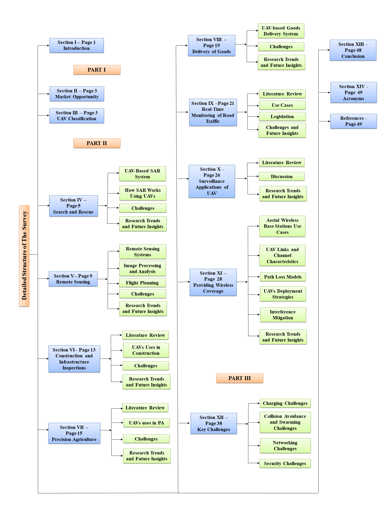
*Caption/Context: Fig. 2: Detailed Structure of the Survey.*

## --- Page 5 ---

### Section: IV Search and Rescue (SAR) 

5

Fig. 3: Predicted Value of UAV Solutions in Key Industries (Billion).

Fig. 4: Global UAV Payload Market Predictions 2027.

On the other hand, HAP operates at very high altitude above
10 km, and vehicles utilizing this platform are able to stay for
a long time in the upper layers of the stratosphere. Airships,
aircrafts, and balloons are the main types of UAVs that fall
under this category. These two categories of aerial communi-
cations platforms are shown in Figure
5. More specifically,
in each platform the main UAV types and examples of each
type are illustrated in this figure. A comparison between HAP
and LAP is presented in Table III . This table also summarizes
the main UAV types for each platform, and its performance
parameters. Specifically, these parameters are UAV endurance,
maximum altitude, weight, payload, range, deployment time,
fuel type, operational complexity, coverage range, applications
and examples for each UAV type is also shown in this table.

#### PART II: UAV APPLICATIONS

#### IV. SEARCH AND RESCUE (SAR)

In the wake of new scientific developments, speculations
shot up with regard to the future potential of UAVs in the
context of public and civil domains. UAVs are believed to be of
immense advantage in these domains, especially in support of
public safety, search and rescue operations and disaster man-
agement. In case of natural or man-made disasters like floods,
Tsunamis, or terrorist attacks, critical infrastructure including
water and power utilities, transportation, and telecommunica-
tions systems can be partially or fully affected by the disaster.
This necessitates rapid solutions to provide communications
coverage in support of rescue operations [1]. When the public
communications networks are disrupted, UAVs can provide
timely disaster warnings and assist in speeding up rescue and
recovery operations. UAVs can also carry medical supplies to
areas that are classified as inaccessible. In certain disastrous
situations like poisonous gas infiltration, wildfires, avalanches,
and search for missing persons, UAVs can be used to play a
support role and speed up SAR operations [41]. Moreover,
UAVs can quickly provide coverage of a large area without
ever risking the security or safety of the personnel involved.

A. UAV-Based SAR System

SAR operations using traditional aerial systems (e.g., air-
crafts and helicopters) are typically very costly. Moreover,
aircrafts require special training, and special permits for tak-
ing off and landing areas. However, using UAVs in SAR
operations reduces the costs, resources and human risks.
Unfortunately, every year large amounts of money and time
are wasted on SAR operations using traditional aerial systems
[41]. UAVs can contribute to reduce the resources needed in
support of more efficient SAR operations.

There are two types of SAR systems, single UAV systems,
and Multi-UAV systems. A single UAV system is illustrated in
Figure 6. In the first step, the rescue team defines the search
region, then the search operation is started by scanning the
target area using a single UAV equipped with vision or thermal
cameras. After that, real-time aerial videos/images from the
targeted area are sent to the Ground Control System (GCS).
These videos and images are analyzed by the rescue team to
direct the SAR operations optimally [42].

In Multi-UAV systems, UAVs with on-board imaging sen-
sors are used to locate the position of missing persons. The
following processes summarize the SAR operations that use
these systems. Firstly, the rescue team conduct path planning
to compute the optimal trajectory of the SAR mission. Then,
each UAV receives its assigned path from the GCS. Secondly,
the search process is started. During this process, all UAVs fol-
low their assigned trajectories to scan the targeted region. This
process utilizes object detection, video/image transmission and
collision avoidance methods. Thirdly, the detection process is
started. During this process, a UAV that detects an object hov-
ers over it, while the other UAVs act as relay nodes to facilitate
coordination between all the UAVs and communications with
the GCS. Afterword, UAVs switch to data dissemination mode
and setup a multi-hop communications link with the GCS.

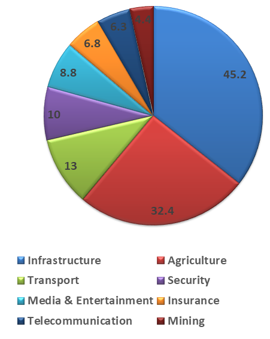
*Caption/Context: Fig. 3: Predicted Value of UAV Solutions in Key Industries (Billion). | A. UAV-Based SAR System*

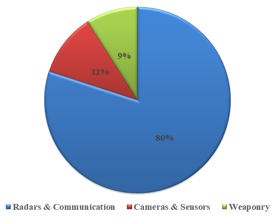
*Caption/Context: Fig. 3: Predicted Value of UAV Solutions in Key Industries (Billion). | Fig. 4: Global UAV Payload Market Predictions 2027.*

## --- Page 6 ---

### Section: IV-B How SAR Operations Utilize UAVs

6

#### UAV classification based on

communication platform

#### LAP

Balloon

Tethered Helikite

[30], [31]

#### VTOL

Quadrotor

The FALCON [32]

Aircraft

Viking aircraft

[33]–[35]

#### HAP

Aircraft

Helios
(NASA) [27]
Heliplat(Europe)

[28], [36]

Balloon

Project Loon

Balloon
(Google)

[37]

Airship

Zeppelin

NT
[27]

Fig. 5: UAV Classification.

#### TABLE III: PLATFORM CLASSIFICATION OF UAV TYPES, AND PERFORMANCE PARAMETERS

Issues
HAP
LAP

Type
Airship
Aircraft
Balloon
VTOL
Aircraft
Balloon

Endurance
long endurance
- 15-30 hours JP-fuel
Long endurance
Few hours
Few hours
From 1 day

- >7 days Solar
Up to 100 days
To few days

Max. Altitude
Up to 25 km
15-20 km
17-23 km
Up to 4 km
Up to 5 km
Up to 1.5 km

Payload (kg)
Hundreds of kg’s
Up to 1700 kg
Tens of kg’s
Few kg’s
Few kg’s
Tens of kg’s

Flight Range
Hundreds of km’s
From 1500 to
Up to
Tens of km’s
Less than 200 km
Tethered Balloon

25000 km
17 million km

Deployment time
Need Runway
Need Runway
custom-built
Easy to deploy
Easy to launched
Easy to deploy

Auto launchers
by catapult
10-30 minutes

Fuel type
Helium Balloon
JP-8 jet fuel
Helium Balloon
Batteries
Fuel injection
Helium

Solar panels
Solar panels
Solar panels
engine

Operational
Complex
Complex
Complex
Simple
Medium
Simple

complexity

Coverage area
Hundreds of km’s
Hundreds of km’s
Thousands of km’s
Tens of km’s
Hundreds of km’s
Several tens

of km’s

UAV Weight
Few hundreds
Few thousands
Tens of kg’s
Few of kg’s
Tens of kg’s
Tens of kg’s

of kg’s
of kg’s

Public safety
Considered safe
Considered safe
Need global regulations
Need safety regulations
Safe
Safe

Applications
Testing environmental
GIS Imaging
Internet Delivery
Internet Delivery
Agriculture
Aerial

effects
application
base station

Examples
HiSentinel80 [38]
Global Hawk [39]
Project Loon
LIDAR [32]
EMT Luna
Desert Star

Balloon (Google) [37]
X-2000 [40]
34cm Helikite [30]

Fig. 6: Use of Single UAV Systems in SAR Operations, Mountain Avalanche Events.

Finally, the location of the targeted object, and related videos
and images are transmitted to the GCS. Figure 7, illustrates
the use of multi-UAV systems in support of SAR operations
[43].

B. How SAR Operations Utilize UAVs

SAR operations are one of the primary use-cases of UAVs.
Their use in SAR operations attracted considerable attention
and became a topic of interest in the recent past. SAR missions
can utilize UAVs as follows:

1) Taking high resolution images and videos using on-
board cameras to survey a given target area (stricken
region). Here, UAVs are used for post disaster aerial

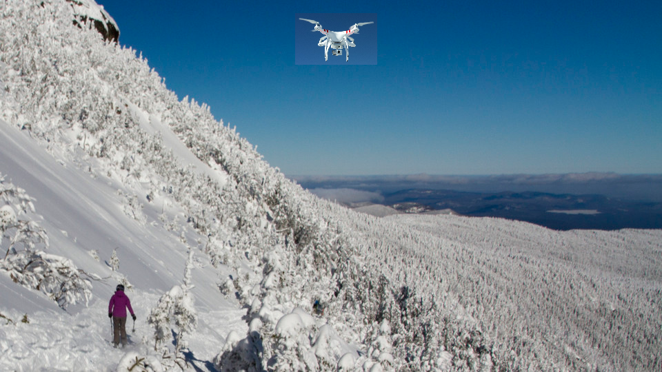
*Caption/Context: of kg’s of kg’s | Public safety Considered safe Considered safe Need global regulations Need safety regulations Safe Safe*

## --- Page 7 ---

### Section: IV-C Challenges 

7

1. Path planning
process. Rescue

team define the

targeted search
area at the GCS.

2. GCS computes the
optimal trajectory
of the SAR mission
then each UAV will

received its path.

3. Searching process:
UAVs follow their
path and start scanning

the targeted region.

4. Detection process
detecting UAV hovers

above the object.

5. Other UAVs act as
relay nodes. Create

a communication
relaying network.

6- UAVs switched to
propagating mode. Setup
multi-hop communication

link with the GCS.

7. GCS locates GPS
coordinates for the

targeted objects.

Fig. 7: Use of Multi-UAV Systems in SAR Operations, Locate GPS Coordinates for the Missing Persons.

assessment or damage evaluation. This helps to evaluate
the magnitude of the damage in the infrastructure caused
by the disaster. After assessment, rescue teams can
identify the targeted search area and commence SAR
operations accordingly [44].
2) SAR operations using UAVs can be performed au-
tonomously, accurately and without introducing addi-
tional risks [41]. In the Alcedo project [45], a proto-
type was developed using a lightweight quadrotor UAV
equipped with GPS to help in finding lost persons.
In a Capstone project [46], using UAVs in support of
SAR operations in snow avalanche scenarios is explored.
The used UAV utilizes thermal infrared imaging and
Geographic Information System (GIS) data. In such
scenarios, UAVs can be utilized to find avalanche victims
or lost persons.
3) UAV can be also used to deliver food, water and
medicines to the injured. Although the use of UAVs in
SAR operations can help to present potential dangers
to crews of the flight, UAVs still suffer from capacity
scale problems and limitations to their payloads. In [47],
a UAV with vertical takeoff and landing capabilities was
designed. Even, a high power propellant system has been
added to allow the UAV to lift heavy cargo between 10-
15 Kg, which could include medicine, food, and water.
4) UAVs can act as aerial base stations for rapid service
recovery after complete communications infrastructure
damage in disaster stricken areas. This helps in SAR
operations as illustrated in Figures 8 and 9 for outdoor
and indoor environments, respectively.

C. Challenges

1) Legislation: In the United States, the FAA does not
currently permit the use of swarms of autonomous UAVs
for commercial applications. But it is possible to adjust the
regulations to allow this type of use. Swarms of UAVs can be
used to coordinate the operations of SAR teams [48].

2) Weather: Weather conditions pose a challenge to UAVs
as they might result in deviations in their predetermined paths.
In cases of natural or man-made disasters, such as Tsunamis,

Fig. 8: Use UAV to Provide Wireless Coverage for Outdoor Users.

Fig. 9: Use UAV to Provide Wireless Coverage for Indoor Users.

Hurricanes, or terrorist attacks, weather becomes a tough and
cardinal challenge. In such scenarios, UAVs may fail in their
missions as a result of the detrimental weather conditions [49].

3) Energy Limitations: Energy consumption is one of the
most important challenges facing UAVs. Usually, UAVs are
battery powered. UAV batteries are used for UAV hovering,
wireless communications, data processing and image analysis.
In some SAR operations, UAVs need to be operated for
extended periods of time over disaster stricken regions. Due
to the power limitations of UAVs, a decision must be taken
on whether UAVs should perform data and image analysis on-
board in real-time, or data should be stored for later analysis
to reduce the consumed power [2], [50].

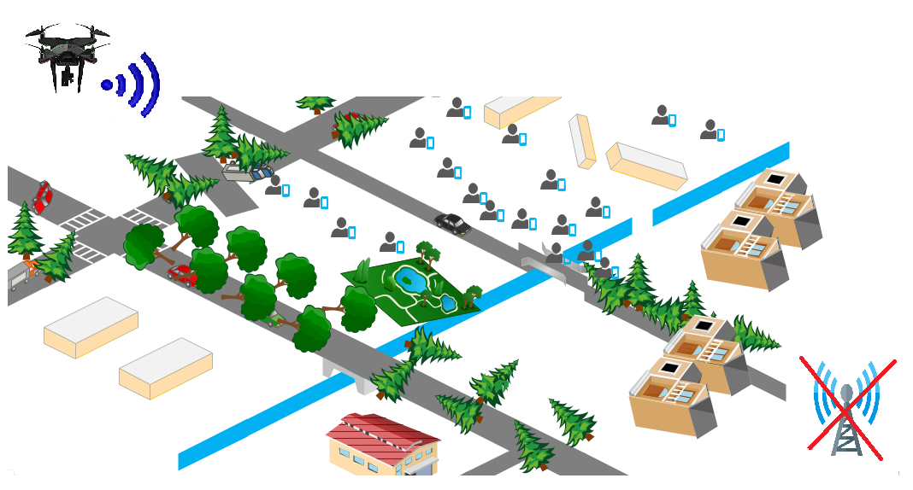
*Caption/Context: 5. Other UAVs act as relay nodes. Create | a communication relaying network.*

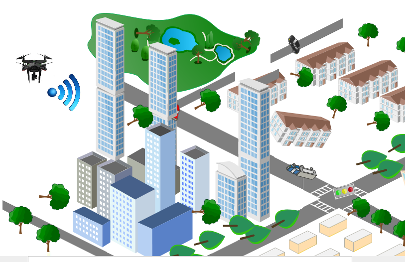
*Caption/Context: C. Challenges | Fig. 8: Use UAV to Provide Wireless Coverage for Outdoor Users.*

## --- Page 8 ---

### Section: IV-D Research Trends and Future Insights

8

Fig. 10: Block Diagram of SAR System Using UAVs with Machine Learning Technology.

D. Research Trends and Future Insights

1) Image Processing: SAR operations using UAVs can
employ image processing techniques to quickly and accurately
find targeted objects. Image processing methods can be used in
autonomous single and multi-UAV systems to locate potential
targets in support of SAR operations. Moreover, location
information can be augmented to aerial images of target
objects [51]. UAVs can be integrated with target detection
technologies including thermal and vision cameras. Thermal
cameras (e.g., IR cameras) can detect the heat profile to locate
missing persons. Two stage template based methods can be
used with such cameras [52]. Vision cameras can also help
in the detection process of objects and persons [53], [54].
Methods that utilize a combination of thermal and vision
cameras have been reported in the literature as in [52].

In SAR operations, image processing can be done either at
the GCS, post target identification, or at the UAV itself, using
on-board processors with real-time image processing capabil-
ities. In [55], the authors implemented a target identification
method using on-board processors, and the GCS. This method
utilizes image processing techniques to identify the targeted
objects and their coarse location coordinates. Using terrestrial
networks, the UAV sends the images and their GPS locations
to the GCS. Another possible approach requires the UAV to
capture and save high resolution videos for later analysis at
the GCS.

2) Machine Learning: Machine learning techniques can be
applied on images captured by UAVs to help in SAR opera-
tions [56], [57]. In [57], the authors propose machine learning
techniques applied to images captured by UAVs equipped
with vision cameras. In their study, pre-trained Convolutional
Neural Network (CNN) with trained linear Support Vector
Machine (SVM) is used to determine the exact image/video
frame at which a lost person is potentially detected. Figure 10.
illustrates a block diagram of a SAR system utilizing UAVs
in conjunction with machine learning technology [57].

SAR operations employing machine learning technology
face many challenges. UAVs are battery powered so there is
significant limitation on their on-board processing capability.
Protection against adversarial attacks on the employed ma-
chine learning techniques pose another important challenge
Reliable and real-time communications with the GCS given
QoS and energy constraints is another challenge [57].

3) Future Insights: Based on the reviewed current literature
focusing on SAR scenarios using UAVs, we believe there is a
need for more research on the following:

• Data fusion and decision fusion algorithms that integrate
the output of multiple sensors. For example, GPS can be
integrated with Forward looking infrared (FLIR) sensors
and thermal sensors to realize more accurate detection
solution [52].

• While traditional machine learning techniques have
demonstrated their success on UAVs, deep learning tech-
niques are currently off limits because of the limitations
on the on-board processing capabilities and power re-
sources on UAVs. Therefore, there is a need to design
and implement on-board, low power, and efficient deep
learning solutions in support of SAR operations using
UAVs [58].

• Design and implementation of power-efficient distributed
algorithms for the real-time processing of UAV swarm
captured videos, images, and sensing data [57].

• New lighter materials, efficient batteries and energy har-
vesting solutions can contribute to the potential use of
UAVs in long duration missions [50].

• Algorithms that support UAV autonomy and swarm co-
ordination are needed. These algorithms include: flight
route determination, path planning, collision avoidance
and swarm coordination [59], [60].

• In Multi-UAV systems, there are many coordination and
communications challenges that need to be overcome.
These challenges include QoS communications between
the swarm of UAVs over multi-hop communications links
and with the GCS [43].

• More accurate localization and mapping systems and
algorithms are required in support of SAR operations.
Nowadays, GPS is used in UAVs to locate the coordinates
UAVs and target objects but GPS is known to have
coverage and accuracy issues. Therefore, new algorithms
are needed for data fusion of the data received from
multiple sensors to achieve more precise localization and
mapping without coverage disruptions.

• The use of UAVs as aerial base stations is still nascent.
Therefore, more research is needed to study the use
of such systems to provide communications coverage
when the public communications network is disrupted or

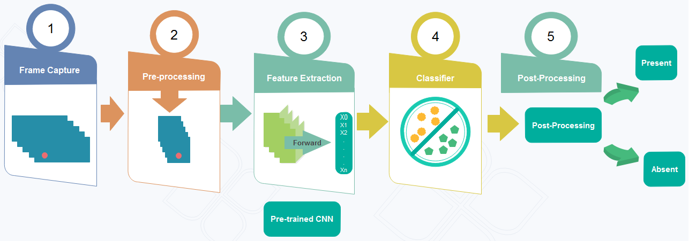
*Caption/Context: Fig. 10: Block Diagram of SAR System Using UAVs with Machine Learning Technology. | D. Research Trends and Future Insights*

## --- Page 9 ---

### Section: V Remote Sensing

9

operating above its maximum capacity [24].

#### V. REMOTE SENSING

UAVs can be used to collect data from ground sensors
and deliver the collected data to ground base stations [61].
UAVs equipped with sensors can also be used as aerial
sensor network for environmental monitoring and disaster
management [62]. Numerous datasets originating from UAVs
remote sensing have been acquired to support the research
teams, serving a broad range of applications: crop monitoring,
yield estimates, drought monitoring, water quality monitoring,
tree species, disease detection, etc [63]. In this section, we
present UAV remote sensing systems, challenges during aerial
sensing using UAVs, research trends and future insights.

A. Remote Sensing Systems

There are two primary types of remote sensing systems: ac-
tive and passive remote sensing systems [64]. In active remote
sensing system, the sensors are responsible for providing the
source of energy required to detect the objects. The sensor
transmits radiation toward the object to be investigated, then
the sensor detects and measures the radiation that is reflected
from the object. Most active remote systems used in remote
sensing applications operate in the microwave portion of the
electromagnetic spectrum and hence it makes them able to
propagate through the atmosphere under most conditions [64].
The active remote sensing systems include laser altimeter,
LiDAR, radar, ranging instrument, scatterometer and sounder.
In passive remote sensing system, the sensor detects natural
radiation that is emitted or reflected by the object as shown
in Figure 11. The majority of passive sensors operate in the
visible, infrared, thermal infrared, and microwave portions of
the electromagnetic spectrum [64]. The passive remote sens-
ing systems include accelerometer, hyperspectral radiometer,
imaging radiometer, radiometer, sounder, spectrometer and
spectroradiometer. In Figure 12, we show the classifications
of UAV aerial sensing systems. In Table IV, we make a
comparison among the UAV remote sensing systems based on
the operating frequency and applications. The common active
sensors in remote sensing are LiDAR and radar. A LiDAR
sensor directs a laser beam onto the surface of the earth and
determines the distance to the object by recording the time
between transmitted and backscattered light pulses. A radar
sensor produces a two-dimensional image of the surface by
recording the range and magnitude of the energy reflected
from all objects. The common passive sensor in remote
sensing is spectrometer. A spectrometer sensor is designed to
detect, measure, and analyze the spectral content of incident
electromagnetic radiation.

B. Image Processing and Analysis

The image processing steps for a typical UAV mission are
described in details by the authors in [65] and [66]. The
process flow is the same for most remotely sensed imagery
processing algorithms. First, the algorithm utilizes the log file
from the UAV autopilot to provide initial estimates for the

position and orientation of each image. The algorithm then
applies aerial triangulation process in which the algorithm
reestablishes the true positions and orientations of the images
from an aerial mission. During this process, the algorithm
generates a large number of automated tie points for con-
jugate points identified across multiple images. A bundle-
block adjustment then uses these automated tie points to
optimize the photo positions and orientations by generating
a high number of redundant observations, which are used to
derive an efficient solution through a rigorous least-squares
adjustment. To provide an independent check on the accuracy
of the adjustment, the algorithm includes a number of check
points. Then, the oriented images are used to create a digital
surface model, which provides a detailed representation of the
terrain surface, including the elevations of raised objects, such
as trees and buildings. The digital surface model generates
a dense point cloud by matching features across multiple
image pairs [66]. At this stage, a digital terrain model can
be generated, which is referred to as a bare-earth model. A
digital terrain model is a more useful product than a surface
model, because the high frequency noise associated with
vegetation cover is removed. After the algorithm generates a
digital terrain model, orthorectification process can then be
performed to remove the distortion in the original images.
After orthorectification process, the algorithm combines the
individual images into a mosaic, to provide a seamless image
of the mission area at the desired resolution [67]. Figure 13
summarizes the image processing steps for remotely sensed
imagery.

C. Flight Planning

Although each UAV mission is unique in nature, the same
steps and processes are normally followed. Typically, a UAV
mission starts with flight planning [65]. This step depends on
specific flight-planning algorithm and uses a background map
or satellite image as a reference to define the flight area. Extra
data is then included, for example, the desired flying altitude,
the focal length and orientation of the camera, and the desired
flight path. The flight-planning algorithm will then find an
efficient way to obtain overlapping stereo imagery covering
the area of interest. During the flight-planning process, the
algorithm can adjust various parameters until the operator is
satisfied with the flight plan. As part of the mission planning
process, the camera shutter speed settings must satisfy the
different lighting conditions. If exposure time is too short,
the imagery might be too dark to discriminate among all
key features of interest, but if it is too long, the imagery
will be blurred or will be bright. Next, the generated flight
plan is uploaded to the UAV autopilot. The autopilot uses the
instructions contained in the flight plan to find climb rates
and positional adjustments that enable the UAV to follow the
planned path as closely as possible. The autopilot reads the
adjustments from the global navigation and satellite system
and the initial measurement unit several times per second
throughout the flight. After the flight completion, the autopilot
download a log file, this file contains information about the
recorded UAV 3D placements throughout the flight, as well

## --- Page 10 ---

### Section: V-D Challenges

10

Fig. 11: Active Vs. Passive Remote Sensing.

TABLE IV: UAV AERIAL SENSING SYSTEMS
Type of remote sensing
Operating Frequency
Type of sensor
Applications
Laser altimeter
It measures the height of a UAV with respect to the mean Earths
surface to determine the topography of the underlying surface.
LiDAR
It determines the distance to the object by recording the time
between transmitted and backscattered light pulses.
Radar
It produces a two-dimensional image of the surface by recording
Active
Microwave portion of the
the range and magnitude of the energy reflected from all objects.
electromagnetic spectrum
Ranging Instrument
It determines the distance between identical microwave
instruments on a pair of platforms.
Scatterometer
It derives maps of surface wind speed and direction by measuring
backscattered radiation in the microwave spectral region.
Sounder
It measures vertical distribution of precipitation, temperature,
humidity, and cloud composition.
Accelerometer
It measures two general types of accelerometers: 1) The

translational accelerations (changes in linear motions); 2) The
angular accelerations (changes in rotation rate per unit time).
Hyperspectral radiometer
It discriminates between different targets based on their spectral

response in each of the narrow bands.
Imaging radiometer
It provides a two-dimensional array of pixels from which
an image may be produced.
Passive
Visible, infrared, thermal
Radiometer
It measures the intensity of electromagnetic radiation in some
infrared, and microwave
bands within the spectrum.
portions of the
Sounder
It measures vertical distributions of atmospheric parameters
electromagnetic spectrum
such as temperature, pressure, and composition from

multispectral information.
Spectrometer
It designs to detect, measure, and analyze the spectral content
of incident electromagnetic radiation.
Spectroradiometer
It measures the intensity of radiation in multiple wavelength

bands. It designs for remotely sensing specific geophysical
parameters.

as information about when the camera was triggered. The
information in log file is used to provide initial estimates
for image centre positions and camera orientations, which are
then used as inputs to recover the exact positions of surface
points [67].

D. Challenges

1) Hostile Natural Environment: UAVs can be utilized to
study the atmospheric composition, air quality and climate
parameters, because of their ability to access hazardous en-
vironments, such as thunderstorms, hurricanes and volcanic
plumes [68]. The researchers used UAVs for conducting en-
vironmental sampling and ocean surface temperature studies

in the Arctic [69]. The authors in [70] modify and test the
Aerosonde UAV in extreme weather conditions, at very low
temperatures (less than −20 ◦C) to ensure a safe flight in the
Arctic. The aim of the work was to modify and integrate
sensors on-board an Aerosonde UAV to improve the UAVs
capability for its mission under extreme weather conditions
such as in the Arctic. The steps to customize the UAV for the
extreme weather conditions were: 1) The avionics were iso-
lated; 2) A fuel-injection engine was used to avoid carburetor
icing; 3) A servo-system was adopted to force ice breaking
over the leading edge of the air-foil. In Barrow, Alaska, the
modified UAVs successfully demonstrated their capabilities
to collect data for 48 hours along a 30 km2 rectangular

![Fig. 11: Active Vs. Passive Remote Sensing. | TABLE IV: UAV AERIAL SENSING SYSTEMS Type of remote sensing Operating Frequency Type of sensor Applications Laser altimeter It measures the height of a UAV with respect to the mean Earths surface to determine the topography of the underlying surface. LiDAR It determines the distance to the object by recording the time between transmitted and backscattered light pulses. Radar It produces a two-dimensional image of the surface by recording Active Microwave portion of the the range and magnitude of the energy reflected from all objects. electromagnetic spectrum Ranging Instrument It determines the distance between identical microwave instruments on a pair of platforms. Scatterometer It derives maps of surface wind speed and direction by measuring backscattered radiation in the microwave spectral region. Sounder It measures vertical distribution of precipitation, temperature, humidity, and cloud composition. Accelerometer It measures two general types of accelerometers: 1) The](images/page_010_fig_01.jpeg)
*Caption/Context: Fig. 11: Active Vs. Passive Remote Sensing. | TABLE IV: UAV AERIAL SENSING SYSTEMS Type of remote sensing Operating Frequency Type of sensor Applications Laser altimeter It measures the height of a UAV with respect to the mean Earths surface to determine the topography of the underlying surface. LiDAR It determines the distance to the object by recording the time between transmitted and backscattered light pulses. Radar It produces a two-dimensional image of the surface by recording Active Microwave portion of the the range and magnitude of the energy reflected from all objects. electromagnetic spectrum Ranging Instrument It determines the distance between identical microwave instruments on a pair of platforms. Scatterometer It derives maps of surface wind speed and direction by measuring backscattered radiation in the microwave spectral region. Sounder It measures vertical distribution of precipitation, temperature, humidity, and cloud composition. Accelerometer It measures two general types of accelerometers: 1) The*

## --- Page 11 ---

### Section: V-D2 Camera Issues

11

#### UAV remote sensing systems

Active sensing systems

Laser altimeter

LiDAR

Radar

Ranging Instrument

Scatterometer

Sounder

Passive sensing systems

Accelerometer

Hyperspectral radiometer

Imaging radiometer

Radiometer

Sounder

Spectrometer

Spectroradiometer

Fig. 12: Classification of UAV Aerial Sensing Systems.

#### UAV Image processing

The algorithm utilizes the log file from the
UAV autopilot to provide initial estimates for

the position and orientation of each image.

Apply aerial triangulation process in
which the algorithm reestablishes the true

positions and orientations of the images.

A bundle-block adjustment uses automated tie points

to optimize the photo positions and orientations by
generating a high number of redundant observations.

Generate a digital surface model

and a digital terrain model.

Orthorectify the images in which

we remove the distortions.

Combine the individual images into a
mosaic to provide a seamless image of
the mission area at the desired resolution.

Fig. 13: Image Processing for a UAV Remote Sensing Image

geographical area. When a UAV collects data from a volcano
plume, a rotary wing UAV was particularly beneficial to hover
inside the plume [71]. On the other hand, a fixed wing UAV
was suitable to cover longer distances and higher altitudes to
sense different atmospheric layers [72]. In [73], the authors
presented a successful eye-penetration reconnaissance flight
by Aerosonde UAV into Typhoon Longwang (2005). The 10
hours flight was split into four flight legs. In these flight legs,
the UAV measured the wind field and provided the tangential
and radial wind profiles from the outer perimeter into the eye
of the typhoon at the 700 hPa layer. The UAV also took a
vertical sounding in the eye of the typhoon and measured the
strongest winds during the whole flight mission [69].

2) Camera Issues: The radiometric and geometric limita-
tions imposed by the current generation of lightweight digital
cameras are outstanding issues that need to be addressed.
The current UAV digital cameras are designed for the general
market and are not optimized for remote sensing applications.
The current commercial instruments tend to be too bulky to
be used with current lightweight UAVs, and for those that
do exist, there is still a question of calibration process with
conventional sensors. Spectral drawbacks include the fact that
spectral response curves from cameras are usually poorly
calibrated, which makes it difficult to convert brightness values
to radiance. However, even cameras designed specifically for
UAVs may not meet the required scientific benchmarks [67].
Another drawback is that the detectors of camera may also
become saturated when there are high contrasts, for example
when an image covers both a dark forest and a snow covered
field. Another drawback is that many cameras are prone to
vignette, where the centres of images appear brighter than the
edges. This is because rays of light in the centres of the image
have to pass through a less optical thickness of the camera
lens, and are thus low attenuated than rays at the edges of the
image. There are a number of techniques that can be taken into
account to improve the quality of image: 1) micro-four-thirds
cameras with fixed interchangeable lenses can be used instead
of having a retractable lens, which allows for much improved
calibrations and image quality; 2) a simple step that can make
a big difference in the processing stage is to remove images
that are blurred, under or overexposed, or saturated [67].

3) Illumination Issues: The shadows on a sunny day are
clear and well defined. These weather conditions can cause
critical problems for the automated image matching algorithms
used in both triangulation process and digital elevation model
generation [67]. When clouds move rapidly, shaded areas can
vary between images obtained during the same mission, there-
fore the aerial triangulation process will fail for some images,
and also will result in errors for automatically generated digital
elevation models. Furthermore, the automated color balancing
algorithms used in the creation of image mosaics may be
affected by the patterns of light and shade across images.
This can cause mosaics with poor visual quality. Another
generally observed illumination effect is the presence of image
hotspots, where a bright points appear in the image. Hotspots
occur at the antisolar point due to the effects of bidirectional
reflectance, which is dependent on the relative placement of
the image sensor and the sun [67].

## --- Page 12 ---

### Section: V-E Research Trends and Future Insights

12

E. Research Trends and Future Insights

1) Machine Learning: In remote sensing, the machine
learning process begins with data collection using UAVs. The
next step of machine learning is data cleansing, which includes
cleansing up image and/or textual-based data and making the
data manageable. This step sometimes might include reducing
the number of variables associated with a record. The third
step is selecting the right algorithm, which includes getting
acquainted with the problem we are trying to solve. There
are three famous algorithms being used in remote sensing:1)
Random forest; 2) Support vector machines; 3) Artificial neu-
ral networks. An algorithm is selected depending on the type
of problem being solved. In some scenarios, where there are
multiple features but limited records, support vector machines
might work better. If there are a lot of records but less features,
neural networks might yield a better prediction/classification
accuracy. Normally, several algorithms will be applied on a
dataset and the one that works best is selected. In order to
achieve a higher accuracy of the machine learning results,
a combination of multiple algorithms can also be employed,
which is referred to as ensemble. Similarly, multiple ensembles
will need to be applied on a dataset, in order to select the
ensemble that works the best. It is practical to choose a subset
of candidate algorithms based on the type of problem and then
use the narrowed down algorithms on a part of the dataset and
see which one performs best. The first challenge in machine
learning is that the training segment of the dataset should have
an unbiased representation of the whole dataset and should
not be too small as compared to the testing segment of the
dataset. The second challenge is overfitting which can happen
when the dataset that has been used for algorithm training
is used for evaluating the model. This will result in a very
high prediction/classification accuracy. However, if a simple
modification is performed, then the prediction/classification
accuracy takes a dip [74]. The machine learning steps utilized
by UAV remote sensing are shown in Figure 14.

2) Combining Remote Sensing and Cloud Technology: Use
of digital maps in risk management as well as improving
data visualization and decision making process has become a
standard for businesses and insurance companies. For instance,
the insurance company can utilize UAV to generate a nor-
malized difference vegetation index (NDVI) map in order to
have an overview of the hail damage in corn. The geographic
information system (GIS) technology in the cloud utilizes
the NDVI map generated from UAV images to provide an
accurate and advanced tool for assisting with crop hail damage
insurance settlements in minimal time and without conflict,
while keeping expenses low [75].

3) Free Space Optical: FSO technology over an UAV can
be utilized in armed forces, where military wireless communi-
cations demand for secure transmission of information on the
battlefield. Remote sensing UAVs can utilize this technology to
disseminate large amount of images and videos to the fighting
forces, mostly in a real time. Near Earth observing UAVs
can be utilized to provide high resolution images of surface
contours using synthetic aperture radar and light detection
and ranging. Using FSO technology, aerial sensors can also

Step 1.
Gathering data from various sources.

Step 2.
Cleansing data to have homogeneity.

Step 3.
Model Building- Selecting

the right ML algorithm.

Step 4.
Gaining insights from the results.

Step 5.
Data Visualization-Transforming

results Into visual graphs.

Fig. 14: Machine Learning in UAV Remote Sensing.

transmit the collected data to the command center via on-board
satellite communication sub-system [76].

4) Future Insights : Some of the future possible directions
for this application are:

• Camera stabilization during flight [67] is one of the issues
that needs to be addressed, in the employment of UAV
for remote sensing.

• Battery weight and charging time are critical issues that
affect the duration of UAV missions [77]. The devel-
opment and incorporation of lightweight solar powered
battery components of UAV can improve the duration of
UAV missions and hence it reduces the complexity of
flight planning.

• The temporal digital surface models produced from aerial
imagery using UAV as the platform, can become practi-
cal solution in mass balance studies for example mass
balance of any particular metal in sanitary landfills,
chloride in groundwater and sediment in a river. More
specifically, the UAV-based mass balance in a debris-
covered glacier was estimated at high accuracy, when
using high-resolution digital surface models differencing.
Thus, the employment of UAV save time and money
when compared with the traditional method of stake
drilling into the glaciers which was labor-intensive and
time consuming [78], [79].

• The tracking methods utilized on high-resolution images
can be practical to find an accurate surface velocity and
glacier dynamics estimates. In [80], the authors suggested
a differential band method for estimating velocities of
debris and non-debris parts of the glaciers. The on-
demand deployment of UAV to obtain high-resolution
images of a glacier has resulted in an efficient tracking
methods when compared with satellite imagery which
depends on the satellite overpass [79].

## --- Page 13 ---

### Section: VI Construction & Infrastructure Inspection

13

• UAV remote sensing can be as a powerful technique for
field-based phenotyping with the advantages of high effi-
ciency, low cost and suitability for complex environments.
The adoption of multi-sensors coupled with advanced
data analysis techniques for retrieving crop phenotypic
traits have attracted great attention in recent years [81].

• It is expected that with the advancement of UAVs with
larger payload, longer flight time, low-cost sensors, im-
proved image processing algorithms for Big data, and
effective UAV regulations, there is potential for wider ap-
plications of the UAV-based field crop phenotyping [81].

• UAV remote sensing for field-based crop phenotyping
provides data at high resolutions, which is needed for
accurate crop parameter estimations. The derivation of
crop phenotypic traits based on the spectral reflection
information using UAV as the platform has shown good
accuracy under certain conditions. However, it showed
a low accuracy in the research on the non-destructive
acquisition of complex traits that were indirectly related
to the spectral information [81];

• Image processing of UAV imagery faces a number of
challenges, such as variable scales, high amounts of
overlap, variable image orientations, and high amounts
of relief displacement arising from the low flying alti-
tudes relative to the variation in topographic relief [67].
Researchers need to find efficient ways to overcome these
challenges in future studies.

#### VI. CONSTRUCTION & INFRASTRUCTURE INSPECTION

As already mentioned in the market opportunity section II,
the net market value of the deployment of UAV in support of
construction and infrastructure inspection applications is about
45% of the total UAV market. So there is a growing interest
in UAV uses in large construction projects monitoring [82]
and power lines, gas pipelines and GSM towers infrastructure
inspection [83], [84]. In this section, we first present a liter-
ature review. Then, we show the uses of UAVs in support of
infrastructure inspection. Finally, we present the challenges,
research trends and future insights.

A. Literature Review

In construction and infrastructure inspection applications,
UAVs can be used for real-time monitoring construction
project sites [85]. So, the project managers can monitor the
construction site using UAVs with better visibility about the
project progress without any need to access the site [82].

Moreover, UAVs can also be utilized for high voltage
inspection of the power transmission lines. In [86]–[89], the
authors used the UAVs to perform an autonomous navigation
for the power lines inspection. The UAVs was deployed to
detect, inspect and diagnose the defects of the power line
infrastructure.

In [90], the authors designed and implemented a fully
automated UAV-based system for the real-time power line
inspection. More specifically, multiple images and data from
UAVs were processed to identify the locations of trees and
buildings near to the power lines, as well as to calculate

the distance between trees, buildings and power lines. Fur-
thermore, TIR camera was employed for bad conductivity
detection in the power lines. UAVs can also be used to monitor
the facilities and infrastructure, including gas, oil and water
pipelines. In [84], the authors proposed the deployment of
small-UAV (sUAV) equipped with a gas controller unit to
detect air and gas content. The system provided a remote
sensing to detect gas leaks in oil and gas pipelines.

Table V summarizes some of the construction and infras-
tructure inspection applications using UAVs. More specifically,
this table presents several types of UAV used in construction
and infrastructure inspection applications, as well as the type
of sensors deployed for each application and the correspond-
ing UAV specifications in terms of payload, altitude and
endurance.

B. The Deployment of UAVs for Construction & Infrastructure
Inspection Applications

In this section, we present several specific example of
the deployment of UAV for construction and infrastructure
inspection. Figure 15 illustrates the classification of these
deployments.

• Oil/gas and wind turbine inspection: In 2016, it was
reported that Pacific Gas and Electric Company (PG&E)
performed drone tests to inspect its electric and gas ser-
vices for better safety and reliability with the authoriza-
tion from Federal Aviation Administration (FAA) [95].
The inspections focused on hard-to-reach areas to detect
methane leaks across its 70,000-square-mile service area.
In the future, PG&E plans to extend the drone tests for
storm and disaster response.
Cyberhawk is one of world’s premier oil and gas com-
pany that uses UAV for inspection [96]. Furthermore, it
has completed more than 5,000 structural inspections,
including: 1) oil and gas; 2) wind turbine; and 3) live
flare. UAV inspection conducted by Cyberhawk provides
a bunch of photos, as well as conducts close visual and
thermal inspections of the inspected assets.
Industrial SkyWorks [97] uses drones for building inspec-
tions and oil/gas inspections in North America. Further-
more, a powerful machine learning algorithm, BlueVu,
has been developed to efficiently handle the captured data.
To sum up, it provides the following solutions:

– Asset inspections and data acquisition;
– Advanced data processing with 2D and 3D images;
– Detailed reports of the inspected asset (i.e., annota-

tions, inspector comments, and recommendations).

• Critical land building inspection (e.g., cell tower): AT&T
owns about 65,000 cell towers that need to be inspected,
repaired or installed. The video analytic team at AT&T
Labs has collaborated with other forces (e.g., Intel,
Qualcomm, etc.) to develop faster, better, more efficient,
and fully automated cell tower inspection using UAVs
[98]. One of the approaches is to employ deep learning
algorithm on high definition (HD) videos to detect defects
and anomalies in real time.

## --- Page 14 ---

### Section: VI-C Challenges

14

TABLE V: SUMMARY OF UAV SPECIFICATIONS, APPLICATIONS AND TECHNOLOGY USED IN CONSTRUCTION AND INFRASTRUCTURE INSPECTION

UAV Type
Applications
Payload/Altitude/Endurance
Sensor Type
References

AR.Drone French
Company Parrot.

Use UAVs to enhance the
safety on on construction
sites by providing a
real-time visual view for
these sites.

No / 50 m / 12 min.
On-board HD camera,
Wi-Fi connection.

[85]

A Multi Rotor UAV.
Use UAVs with image
processing methods for
crack detection and
assessment of surface
degradation.

100 g / LAP / 20 min.
Color imaging sensors.
[91]

MikroKopter L4-ME
Quadcopter [92].

Use UAVs for vertical
inspection for high rise
infrastructures such as
street lights, GSM towers
or high rise buildings.

Up to 500 g / Up to 247
m / 13-20 min. [92]

Laser scanner.
[93]

Quadrotor Helicopter, UAV.
Inspection of the high
voltage of power
transmission lines.

Less than 1 kg/ LAP/ Less
than 1 hour.

Color and TIR cameras,
GPS, IMU.

[87]

Fixed Wing Aircraft, UAV.
Sketchy inspection,
identifying the defects of
the power transmission
lines.

Less than 3 kg/ Up to 500
m/ Up to 50 min (50 km).

HD ultra-wide angle video
camera.

[83]

Quadrotor, UAV.
Use cooperative UAVs
platform for inspection and
diagnose of the power lines
infrastructure.

Less than 6 kg/ Up to 200
m/ Up to 25 min (10 km).

TIR cameras, GPS.
[83]

Quadrotor (VTOL), sUAV.
provide a remote sensing
to detect gas leaks in gas
pipelines.

NA/ LAP/ 30-50 min.
Gas controller unit, GPS.
[84], [94]

Oil/gas and wind
turbine inspection

Critical land building
inspection (e.g., cell tower)

Infrastructure internal
inspection (e.g., pipe)

Extreme condition

inspection

Construction & Infrastruc-
ture Inspection Using UAVs

Fig. 15: The Deployment of UAVs for Construction and Infrastructure Inspection.

Honeywell InView inspection service has been launched
to provide industrial critical structure inspections [99]. It
combines the Intel Falcon 8+ UAV system with Hon-
eywell aerospace and industrial technology solutions.
Specifically, the Honeywell InView inspection service can
achieve: 1) safety of the workers; 2) improved efficiency;
and 3) advanced data processing.

• Infrastructure internal inspection: Maverick has provided
industrial UAV inspection services for equipment, pip-
ing, tanks, and stack internals in western Canada since
1994 [100]. It provides a dedicated services for assets
internal inspection using Flyability ELIOS. Maverick also
provides post data processing that analyzes data using
measurement software and CAD modeling.

• Extreme condition inspection: Bluestream offers UAV
inspection services for onshore and offshore assets [101].
It services are particularly suitable for: 1) onshore and
offshore live flare inspections; 2) topside, splash zone and
under deck inspections; and 3) hard to access infrastruc-
ture inspection.

C. Challenges

There are several challenges in utilizing UAVs for construc-
tion and infrastructure inspection:

• Some of the challenges in using UAVs for infrastructure
inspection are the limited energy, short flight time and
limited processing capabilities [85].

• Limited payload capacities for sUAVs is a big challenge.
The on-board loads could include optical wavelength
range camera, TIR camera, color and stereo vision cam-
eras, different types of sensors such as gas detection,
GPS, etc., [94].

• There is a lack of research attention to multi-UAV co-
operation for construction and infrastructure inspection
applications. Multi-UAV cooperation could provide wider
inspection scope, higher error tolerance, and faster task
completion time.

• Another challenge is to allow autonomous UAVs that can
maneuver an indoor environment with no access to GPS
signals [102].

## --- Page 15 ---

### Section: VI-D Research Trends and Future Insights

15

D. Research Trends and Future Insights

1) Machine Learning: Machine learning has become an
increasingly important artifical intelligence approach for UAVs
to operate autonomously. Applying advanced machine learning
algorithms (e.g., deep learning algorithm) could help the UAV
system to draw better conclusions. For example, due to its
improved data processing models, deep learning algorithms
could help to obtain new findings from existing data and to
get more concise and reliable analysis results. UAV inspection
program at AT&T uses deep learning algorithms on HD videos
to detect defects and anomalies in real time [98]. Industrial
SkyWorks introduces advanced machine learning algorithms
to process 2D and 3D images [97].

More specifically, deep learning is useful for feature ex-
traction from the raw measurements provided by sensors
on-board a UAV (details about UAV sensor technology is
presented in the Precision Agriculture section). Convolutional
Neural Networks (CNNs) is one of the main deep learning
feature extractors used in the area of image recognition and
classification which has been proven very effective [58]. Figure
16 illustrates one example of how CNNs works.

Fig. 16: Illustration of How CNNs Work [58].

2) Image Processing: Construction and infrastructure in-
spection using UAVs equipped with an on-board cameras
and sensors, can be efficiently operated when employing
image processing techniques. The employment of image
processing techniques allows for monitoring and assessing
the construction projects, as well as performing inspection
of the infrastructure such as surveying construction sites,
work progress monitoring, inspection of bridges, irrigation
structures monitoring, detection of construction damage and
surfaces degradation. [91], [103].

In [91], presented an integrated data acquisition and image
processing platform mounted on UAV. It was proposed to be
used for the inspection of infrastructures and real time struc-
tural health monitoring (SHM). In the proposed framework, a
real time image and data will be sent to the GCS. Then the
images and data will be processed using image processing
unit in the GCS, to facilitate the diagnosis and inspection
process. The authors proposed to combine HSV thresholding
and hat transform for cracks detection on the concrete surfaces.
Figure 17 presents the crack detection algorithm block diagram
proposed in [91].

In [87], the authors proposed for the deployment of UAV
with a vision-based system that consists of a color camera, TIR
camera and a transmitter to send the captured images to the
GCS. Then these images will be processed in the GCS, to be

Fig. 17: Proposed Approach for Crack Detection Algorithm [91].

used in the inspection and estimation of the real temperature
of the power lines joints.

In [90], a fully automatic system to determine the distance
between power lines and the trees, buildings and any others
obstacles was proposed. The authors designed and developed
vision-based algorithms for processing the HD images that
were obtained using HD camera equipped on a UAV. The
captured video was sent to the computer in the GCS. At the
GCS, the video was converted into the consecutive images and
were further processed to calculate the distance between the
power line and the obstacles.

3) Future Insights: Based on the reviewed articles on
construction and infrastructure inspection applications using
UAVs, we suggest these future possible directions:

• More research is required to improve UAVs battery life
time to allow longer distance and to increase the UAV
flight time [85].

• For future research, it is important to propose and de-
velop an accurate, autonomous and real-time power lines
inspection approaches using UAVs, including ultrasonic
sensors, TIR or color cameras, image processing and data
analysis tools. More specifically, to propose and develop
techniques to monitor, detect and diagnose any power
lines defects automatically [104].

• More advanced data collection, sharing and processing
algorithms for multi-UAV cooperation are required, in
order to achieve faster and more efficient inspections.

• The researchers should also focus on the improvement of
the autonomy and safety for UAVs to maneuver in the
congested and indoor environment with no or weak GPS
signals [102].

#### VII. PRECISION AGRICULTURE

UAVs can be utilized in precision agriculture (PA) for
crop management and monitoring [105], [106], weed detection
[107], irrigation scheduling [108], disease detection [109],
pesticide spraying [105] and gathering data from ground
sensors (moisture, soil properties, etc.,) [110]. The deployment
of UAVs in PA is a cost-effective and time saving technology
which can help for improving crop yields, farms productivity
and profitability in farming systems. Moreover, UAVs facilitate
agricultural management, weed monitoring, and pest damage,
thereby they help to meet these challenges quickly [111].

In this section, we first present a literature review of
UAVs in PA. Then, we show the deployment of UAV in PA.
Moreover, we present the challenges, as well as research trends
future insights.

![More specifically, deep learning is useful for feature ex- traction from the raw measurements provided by sensors on-board a UAV (details about UAV sensor technology is presented in the Precision Agriculture section). Convolutional Neural Networks (CNNs) is one of the main deep learning feature extractors used in the area of image recognition and classification which has been proven very effective [58]. Figure 16 illustrates one example of how CNNs works. | Fig. 16: Illustration of How CNNs Work [58].](images/page_015_fig_01.png)
*Caption/Context: More specifically, deep learning is useful for feature ex- traction from the raw measurements provided by sensors on-board a UAV (details about UAV sensor technology is presented in the Precision Agriculture section). Convolutional Neural Networks (CNNs) is one of the main deep learning feature extractors used in the area of image recognition and classification which has been proven very effective [58]. Figure 16 illustrates one example of how CNNs works. | Fig. 16: Illustration of How CNNs Work [58].*

![More specifically, deep learning is useful for feature ex- traction from the raw measurements provided by sensors on-board a UAV (details about UAV sensor technology is presented in the Precision Agriculture section). Convolutional Neural Networks (CNNs) is one of the main deep learning feature extractors used in the area of image recognition and classification which has been proven very effective [58]. Figure 16 illustrates one example of how CNNs works. | Fig. 17: Proposed Approach for Crack Detection Algorithm [91].](images/page_015_fig_02.png)
*Caption/Context: More specifically, deep learning is useful for feature ex- traction from the raw measurements provided by sensors on-board a UAV (details about UAV sensor technology is presented in the Precision Agriculture section). Convolutional Neural Networks (CNNs) is one of the main deep learning feature extractors used in the area of image recognition and classification which has been proven very effective [58]. Figure 16 illustrates one example of how CNNs works. | Fig. 17: Proposed Approach for Crack Detection Algorithm [91].*

## --- Page 16 ---

### Section: VII-A Literature Review

16

A. Literature Review

UAVs can be efficiently used for small crop fields at low
altitudes with higher precision and low-cost compared with
traditional manned aircraft. Using UAVs for crop management
can provide precise and real time data about specific location.
Moreover, UAVs can offer a high resolution images for crop to
help in crop management such as disease detection, monitoring
agriculture, detecting the variability in crop response to irriga-
tion, weed management and reduce the amount of herbicides
[105], [106], [112]–[114]. In Table VI, a comparison between
UAVs, traditional manned aircraft and satellite based system
is presented in terms of system cost, endurance, availability,
deployment time, coverage area, weather and working condi-
tions, operational complexity, applications usage and finally
we present some examples from the literature.

TABLE VI: A COMPARISON BETWEEN UAVS, TRADITIONAL MANNED AIR-
CRAFT AND SATELLITE BASED SYSTEM FOR PA

Issues
UAVs
Manned Aircraft
Satellite System

Cost
Low
High
Very High

Endurance
Short-time
Long-time
All the times

Availability
When needed
Some times
All the times

Deployment time
Easy
Need runway
Complex

Coverage area
Small
Large
Very large

Weather and
Sensitive
Low sensitivity
Require clear sky

working conditions
for imaging

Payload
Low
Large
Large

Operational
Simple
Simple
Very complicated

complexity

Applications
Carry small
Spraying UAV
high resolution

and usage
digital, thermal
system pesti-
images for

cameras & sensors
cide spraying
specific-area

Examples
[106], [112]
[115]
[116]

Table VII summarizes some of the precision agriculture
applications using UAVs. More specifically, this table presents
several types of UAV used in precision agriculture appli-
cations, as well as the type of sensors deployed for each
application and the corresponding UAV specifications in terms
of payload, altitude and endurance.

B. The Deployment of UAV in Precision Agriculture

In [119], the authors presented the deployment of UAVs in
precision agriculture applications as summarized in Figure 18.
The deployment of UAV in precision agriculture are discussed
in the following:

• Irrigation scheduling: There are four factors that needs to
be monitored, in order to determine a need for irrigation:
1) Availability of soil water; 2) Crop water need, which
represents the amount of water needed by the various
crops to grow optimally; 3) Rainfall amount; 4) Efficiency
of the irrigation system [120]. These factors can be quan-
tified by utilizing UAVs to measure soil moisture, plant-
based temperature, and evapotranspiration. For instance,
the spatial distribution of surface soil moisture can be

estimated using high-resolution multi-spectral imagery
captured by a UAV, in combination with ground sam-
pling [121]. The crop water stress index can also be
estimated, in order to determine water stressed areas by
utilizing thermal UAV images [108].

• Plant disease detection: In the U.S., it is estimated that
crop losses caused by plant diseases result in about $33
billion in lost revenue every year [122]. UAVs can be used
for thermal remote sensing to monitor the spatial and
temporal patterns of crop diseases pre-symptomatically
during various disease development phases and hence
farmers may reduce the crop losses. For instance, aerial
thermal images can be used to detect early stage devel-
opment of soil-borne fungus [123].

• Soil texture mapping: Some soil properties, such as soil
texture, can be an indicative of soil quality which in turn
influences crop productivity. Thus, UAV thermal images
can be utilized to quantify soil texture at a regional scale
by measuring the differences in land surface temperature
under a relatively homogeneous climatic condition [124],
[125].

• Residue cover and tillage mapping: Crop residues is
essential in soil conservation by providing a protective
layer on agricultural fields that shields soil from wind
and water. Accurate assessment of crop residue is nec-
essary for proper implementation of conservation tillage
practices [126]. In [127], the authors demonstrated that
aerial thermal images can explain more than 95% of the
variability in crop residue cover amount compared to 77%
using visible and near IR images.

• Field tile mapping: Tile drainage systems remove excess
water from the fields and hence it provides ecological and
economic benefits [128]. An efficient monitoring of tile
drains can help farmers and natural resource managers to
better mitigate any adverse environmental and economic
impacts. By measuring temperature differences within
a field, thermal UAV images can provide additional
opportunities in field tile mapping [129].

• Crop maturity mapping: UAVs can be a practical tech-
nology to monitor crop maturity for determining the har-
vesting time, particularly when the entire area cannot be
harvested in the time available. For instance, UAV visual
and infrared images from barley trial areas at Lundavra,
Australia were used to map two primary growth stages
of barley and demonstrated classification accuracy of
83.5% [130].

• Crop yield mapping: Farmers require accurate, early
estimation of crop yield for a number of reasons, in-
cluding crop insurance, planning of harvest and storage
requirements, and cash flow budgeting. In [131], UAV
images were utilized to estimate yield and total biomass
of rice crop in Thailand. In [132], UAV images were also
utilized to predict corn grain yields in the early to mid-
season crop growth stages in Germany.

The authors in [133] presented several types of sensor that
were used in UAV-based precision agriculture, as summarized
in Table VIII.

## --- Page 17 ---

### Section: VII-C Challenges

17

#### TABLE VII: SUMMARY OF UAV SPECIFICATIONS, APPLICATIONS AND TECHNOLOGY USED IN PRECISION AGRICULTURE

UAV Type
Applications
Payload/Altitude/Endurance
Sensor Type
References

Yamaha Aero Robot ”R-50.
Monitoring Agriculture,
spraying UAV systems.

20 kg / LAP / 1 hour.
Azimuth and Differential
Global Positioning System
(DGPS) sensor system.

[106]

Yanmar KG-135, YH300
and AYH3.

Pesticide spraying over
crop fields.

22.7 kg / 1500m / 5 hours.
Spray system with GPS
sensor system.

[105]

RC model fixed-wing
airframe.

Imaging small sorghum
fields to assess the
attributes of a grain crop.

Less than 1kg / LAP / less
than 1 hour.

Image sensor digital
camera.

[105], [112]

Vector-P UAV.
Crop management (e.g.
winter wheat) for
site-specific agriculture, a
correlation is investigated
between leaf area index
and the green normalized
difference vegetation index
(GNDVI).

Less than 1kg
/105m-210m/1-6 hours
deepening on the payload.

Digital color-infrared
camera with a
red-light-blocking filter.

[113]

Fixed-wing UAV.
Detect the variability in
crop response to irrigation
(e.g. cotton).

Lightweight camera/ 90m /
Less than 1 hour.

Thermal camera , Thermal
Infrared (TIR) imaging
sensor.

[114]

Multi-rotor micro UAV.
Agricultural management,
disease detection for citrus
(citrus greening,
Huanglongbing (HLB)).

Less than 1kg / 100 m /
10-20 min.
Multi-band imaging sensor,
6-channel multispectral
camera.

[109]

Vario XLC helicopter.
Weed management, reduce
the amount of herbicides
using aerial images for
crop.

7 kg / LAP / 30 min.
Advanced vision sensors
for 3D and multispectral
imaging.

[107]

VIPtero UAV.
Crop management, they
used UAV to acquire high
resolution multi-spectral
images for vineyard
management.

1 Kg / 150 m / 10 min.
Tetracam ADC-lite camera,
GPS.

[111]

Fieldcopter UAV.
Water assessment. UAVs
was used for acquiring
high resolution images and
to assess vineyard water
status, which can help for
irrigation processes.

Less than 1 Kg / LAP /NA.
Multispectral and thermal
cameras on-board UAV.

[117]

Multi-rotor hexacopter
ESAFLY A2500-WH

Cultivations analysis,
processing multi spectral
data of the surveyed sites
to create tri-band
ortho-images used to
extract some Vegetation
Indices (VI).

Up to 2.5 kg Kg / LAP
/12-20 min.

Tetracam camera on-board
UAV.

[118]

C. Challenges

There are several challenges in the deployment of UAVs in
PA:

• Thermal cameras have poor resolution and they are ex-
pensive. The price ranges from $2000-$50,000 depending
on the quality and functionality, and the majority of
thermal cameras have resolution of 640 pixels by 480
pixels [119].

• Thermal aerial images can be affected by many factors,
such as the moisture in the atmosphere, shooting distance,
and other sources of emitted and reflected thermal radi-
ation. Therefore, calibration of aerial sensors is critical
to extract scientifically reliable surface temperatures of
objects [119].

• Temperature readings through aerial sensors can be af-
fected by crop growth stages. At the beginning of the

growing season, when plants are small and sparse, tem-
perature measurements can be influenced by reflectance
from the soil surface [119].

• In the event of adverse weather, such as extreme wind,
rain and storms, there is a big challenge of UAVs de-
ployment in PA applications. In these conditions, UAVs
may fail in their missions. Therefore, small UAVs cannot
operate in extreme weather conditions and even cannot
take readings during these conditions.

• One of the key challenges is the ability of lightweight
UAVs to carry a high-weight payload, which will limit
the ability of UAVs to carry an integrated system that
includes multiple sensors, high-resolution and thermal
cameras [134].

• UAVs have short battery life time, usually less than 1
hour. Therefore, the power limitations of UAVs is one of

## --- Page 18 ---

### Section: VII-D Research Trends and Future Insights

18

Irrigation scheduling
Plant disease

detection
Soil texture mapping
Residue cover and

tillage mapping
Field tile mapping
Crop maturity

mapping
Crop yield mapping

Precision Agriculture Using UAVs

Fig. 18: The Deployment of UAVs in Precision Agriculture Applications.

the challenges of using UAVs in PA. Another challenge,
when UAVs are used to cover large areas, is that it
needs to return many times to the charging station for
recharging. [105], [109], [112].

D. Research Trends and Future Insights

1) Machine Learning : The next generation of UAVs will
utilize the new technologies in precision agriculture, such as
machine learning. Hummingbird is a UAV-enabled data and
imagery analytics business for precision agriculture [135]. It
utilizes machine learning to deliver actionable insights on
crop health directly to the field. The process flow begins by
performing UAV surveys on the agricultural land at critical
decision-making points in the growing season. Then, UAV
images is uploaded to the cloud, before being processed
with machine learning techniques. Finally, the mobile app
and web based platform provides farmers with actionable
insights on crop health. The advantages of utilizing UAVs with
machine learning technology in precision agriculture are: 1)
Early detection of crop diseases; 2) Precision weed mapping;
3) Accurate yield forecasting; 4) Nutrient optimization and
planting; 5) Plant growth monitoring [135].

2) Image Processing: UAV-based systems can be used in
PA to acquire high-resolution images for farms, crops and
rangeland. It can also be utilized as an alternative to satellite
and manned aircraft imaging system. Processing of these
images is one of the most rapidly developing fields in PA
applications. The Vegetation Indices (VI) can be produced
using image processing techniques for the prediction of the
agricultural crop yield, agricultural analysis, crop and weed
management and in diseases detection. Moreover, the VIs
can be used to create vigor maps of the specific-site and
for vegetative covers evaluation using spectral measurements
[118], [136].

In [113], [118], [136], [137], most of the VIs found in the
literature have been summarized and discussed. Some of these
VIs are:

• Green Vegetation Index (GVI).

• Normalized Difference Vegetation Index (NDVI).

• Green Normalized Difference Vegetation index (GNDVI).

• Soil Adjusted Vegetation Index (SAVI).

• Perpendicular Vegetation Index (PVI).

• Enhanced Vegetation Index (EVI).
Many researchers utilized VIs that are obtained using image
processing techniques in PA. The authors in [118] presented
agricultural analysis for vineyards and tomatoes crops. A UAV

Fig. 19: Steps of Image Processing and Analysis for Identifying Rangeland VI [141].

with Tetracam multi-spectral camera was deployed to take
aerial image for crop. These images were processed using
PixelWrench2 (PW2) software which came with the camera
and it will be exported in a tri-band TIFF image. Then from
the contents of this images VIs such as NDVI [138], GNDVI
[139], SAVI [140] can be extracted.

In [141], the authors used UAVs to take aerial images for
rangeland to identify rangeland VI for different types of plant
in Southwestern Idaho. In the study, image processing and
analysis was performed in three steps as shown in Figure 19.
More specifically, the three steps were:

• Ortho-Rectification and mosaicing of UAV imagery
[141]. A semi-automated ortho-rectification approach
were developed using PreSync procedure [142].

• Clipping of the mosaic to the 50m×50m plot areas mea-
sured on the ground. In this step, image classification and
segmentation was performed using an object-based image
analysis (OBIA) program with Definiens Developer 7.0
[143], where the acquisition image was segmented into
homogeneous areas [141].

• Image classification: In this step, hierarchical classifica-
tion scheme along with a rule based masking approach
were used [141].

3) Future Insights: Based on the reviewed articles focusing
on PA using UAVs, we suggest these future possible directions:

• With relaxed flight regulations and improvement in image
processing, geo-referencing, mosaicing, and classification
algorithms, UAV can provide a great potential for soil and
crop monitoring [119], [144].

• The next generation of UAV sensors, such as 3p sen-
sor [145], can provide on-board image processing and

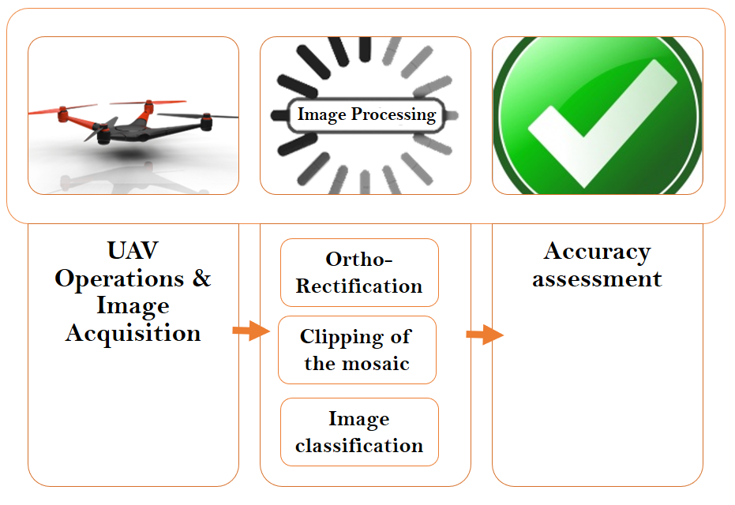
*Caption/Context: Irrigation scheduling Plant disease | detection Soil texture mapping Residue cover and*

## --- Page 19 ---

### Section: VIII Delivery of Goods

19

TABLE VIII: UAV SENSORS IN PRECISION AGRICULTURE APPLICATIONS
Type of sensor
Operating Frequency
Applications
Disadvantages
Digital camera
Visible region
Visible properties, outer defects, greenness, growth.
- Limited to visual spectral bands and properties.
Multispectral camera
Visible-infrared region
Multiple plant responses to nutrient deficiency,
- Limited to few spectral bands.
water stress, diseases among others.
Hyperspectral camera
Visible-infrared region
Plant stress, produce quality, and safety control.
- Image processing is challenging.
- High cost sensors.
Thermal camera
Thermal infrared region
Stomatal conductance, plant responses to
- Environmental conditions affect the performance.
water stress and diseases.
- Very small temperature differences are not detectable.
- High resolution cameras are heavier.
Spectrometer
Visible-near infrared region
Detecting disease, stress and crop responses.
- Background such as soil may affect the data quality.
- Possibilities of spectral mixing.
- More applicable for Ground sensor systems.
3D camera
Infrared laser region
Physical attributes such as plant height
- Lower accuracies.
and canopy density.
- Limited field applications.
LiDAR
Laser region
Accurate estimates of plant/tree height
- Sensitive to small variations in path length.
and volume.
SONAR
Sound propagation
Mapping and quantification of the canopy volumes,
- Sensitivity limited by acoustic absorption, background
digital control of application rates in sprayers or
noise, etc.
fertilizer spreader.
- Lower sampling rate than laser-based sensing.

in-field analytic capabilities, which can give farmers
instant insights in the field, without the need for cellular
connectivity and cloud connection [146].

• More precision agricultural researches are required to-
wards designing and implementing special types of cam-
eras and sensors on- board UAVs, which have the ability
of remote crop monitoring and detection of soil and other
agricultural characteristics in real time scenarios [111].

• UAVs can be used for obtaining high-resolution images
for plants to study plant diseases and traits using image
processing techniques [147].

#### VIII. DELIVERY OF GOODS

UAVs can be used to transport food, packages and other
goods
[148]–[151] as shown in Figure 20. In health-care
field, ambulance drones can deliver medicines, immunizations,
and blood samples, into and out of unreachable places. They
can rapidly transport medical instruments in the crucial few
minutes after cardiac arrests. They can also include live
video streaming services allowing paramedics to remotely
observe and instruct on-scene individuals on how to use the
medical instruments [152]. In July 2015, the Federal Aviation
Administration (FAA) approved the first delivery of medical
supplies using UAVs at Wise, Virginia [153]. With the rapid
demise of snail mail and the massive growth of e-Commerce,
postal companies have been forced to find new methods to
expand beyond their traditional mail delivery business models.
Different postal companies have undertaken various UAV trials
to test the feasibility and profitability of UAV delivery ser-
vices [154]. In this section, we present the UAV-based goods
delivery system and its challenges as shown in Figure 21.

A. UAV-Based Goods Delivery System

In UAV-based goods delivery system, a UAV is capable of
traveling between a pick up location and a delivery location.
The UAV is equipped with control processor and GPS module.
It receives a transaction packet for the delivery operation that
contains the GPS coordinates and the identifier of a package
docking device associated with the order. Upon arrival of a
UAV at the delivery location, the control processor checks if
the identifier of a package docking device matches the device
identifier in the transaction packet, performs the package

transfer operation, and sends confirmation of completion of
the operation to an originator of the order [155]. If the
identifier of a package docking device at the delivery point
does not match the device identifier in the transaction packet,
the UAV communication components transmit a request over
a short-range network such as bluetooth or Wi-Fi. The request
may contain the device identifier, or network address of
the package docking device. Under the assumption that the
package docking device has not moved outside of the range of
UAV communication, the package docking device having the
network address transmits a signal containing the address of a
new location. The package docking device may then transmit
updated GPS coordinates to the UAV. The UAV is re-routed to
the new address based on the updated GPS location [155]. In
Figure 22, we present the flowchart of UAV delivery system.

B. Challenges

1) Legislation: In the United States, the FAA regulation
blocked all attempts at commercial use of UAVs, such as
the Tacocopter company for food delivery [156]. As of 2015,
delivering of packages with UAVs in the United States is not
allowed [157]. Under current rules, companies are permitted to
operate commercial UAVs in the United States, but only under
certain conditions. Their UAVs must be flown within a pilots
line of sight and those pilots must get licenses. Commercial
operators also are restricted to fly their UAVs during daylight
hours. Their UAVs are limited in size, altitude and speed, and
UAVs are generally not allowed to fly over people or to operate
beyond visual line of sight [158].

2) Liability Insurance: Some UAVs can weigh up to 25 kg
and travel at speeds approaching 45 m/s. A number of media
reports describes severe lacerations, eye loss, and soft tissue
injuries caused by UAV accidents. In addition to the risk of
injuries or property damage from a UAV crash, ubiquitous
UAV uses also create other types of accidents, such as au-
tomobile accidents due to distraction from low-flying UAVs,
injuries caused by dropped cargo, liability for damaged goods,
or accidents resulting from a UAV’s interference with aircraft.
Liability for UAV use, however, is not limited to personal
injury or property damage claims, UAVs present an enormous
threat to individual privacy [159].

## --- Page 20 ---

### Section: VIII-B3 Theft

20

Fig. 20: Autonomous E-Commerce.

Fig. 21: UAV Delivery Applications and Challenges.

Fig. 22: UAV Delivery of Goods System.

3) Theft: The main concerns of utilizing UAVs for data
gathering and wireless delivery, are cyber liability and hacking.
UAVs that are used to gather sensitive information might
become targets for malicious software seeking to steal data.
A hacker might even usurp control of the UAV itself for the
purpose of illegal activities, such as theft of its cargo or stored
data, invasion of privacy, or smuggling. Liability for utilizing
a UAV does not fit neatly into the coverage offered by the
types of liability insurance policies that most individuals and
businesses currently possess [159].

4) Weather: Similar to light aircrafts, UAVs cannot hover
in all weather conditions. The capability to resist certain
weather conditions is determined by the specifications of the
UAV [160]. In pre-flight planning, it is clear that advanced
weather data will play an essential role in ensuring that UAVs
can fly their weather-sensitive missions safely and efficiently
to deliver commercial goods. During flight operations, weather
data affects flight direction, path elevation, operation duration
and other in-flight variables. Wind speeds in particular are
an essential component for a smooth UAV-based operations
and thus should be factored in the operation planning and
deployment phases. In post-flight analysis, by analyzing data
through advanced weather visualization dashboards, we can
improve the UAV flight operations to ensure future mission
success [161].

5) Air Traffic Control: Air traffic control is an essential
condition for coordinating large fleets of UAVs, where regula-
tors will not permit large-scale UAV delivery missions without
such systems in place [162]. Amazon designs an airspace
model for the safe integration of UAV systems as shown in
Figure 23. In this proposed model, the low-speed localized
traffic will be reserved for: 1) Terminal non-transit operations
such as surveying, videography and inspection; 2) Operations
for lesser-equipped UAVs, e.g. ones without sophisticated
sense-and-avoid technology. The high-speed transit will be
reserved for well equipped UAVs as determined by the relevant
performance standards and rules. The no fly zone will serve as
a restricted area in which UAV operators will not be allowed
to fly, except in emergencies. Finally, the predefined low
risk locations will include areas like designated academy of

![Fig. 20: Autonomous E-Commerce. | 3) Theft: The main concerns of utilizing UAVs for data gathering and wireless delivery, are cyber liability and hacking. UAVs that are used to gather sensitive information might become targets for malicious software seeking to steal data. A hacker might even usurp control of the UAV itself for the purpose of illegal activities, such as theft of its cargo or stored data, invasion of privacy, or smuggling. Liability for utilizing a UAV does not fit neatly into the coverage offered by the types of liability insurance policies that most individuals and businesses currently possess [159].](images/page_020_fig_01.png)
*Caption/Context: Fig. 20: Autonomous E-Commerce. | 3) Theft: The main concerns of utilizing UAVs for data gathering and wireless delivery, are cyber liability and hacking. UAVs that are used to gather sensitive information might become targets for malicious software seeking to steal data. A hacker might even usurp control of the UAV itself for the purpose of illegal activities, such as theft of its cargo or stored data, invasion of privacy, or smuggling. Liability for utilizing a UAV does not fit neatly into the coverage offered by the types of liability insurance policies that most individuals and businesses currently possess [159].*

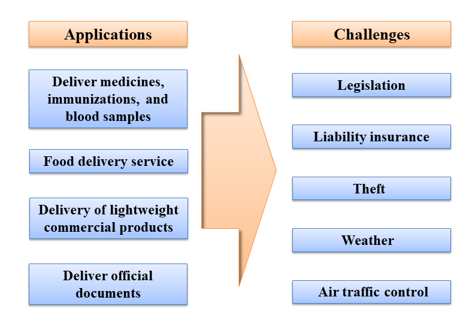
*Caption/Context: Fig. 20: Autonomous E-Commerce. | Fig. 21: UAV Delivery Applications and Challenges.*

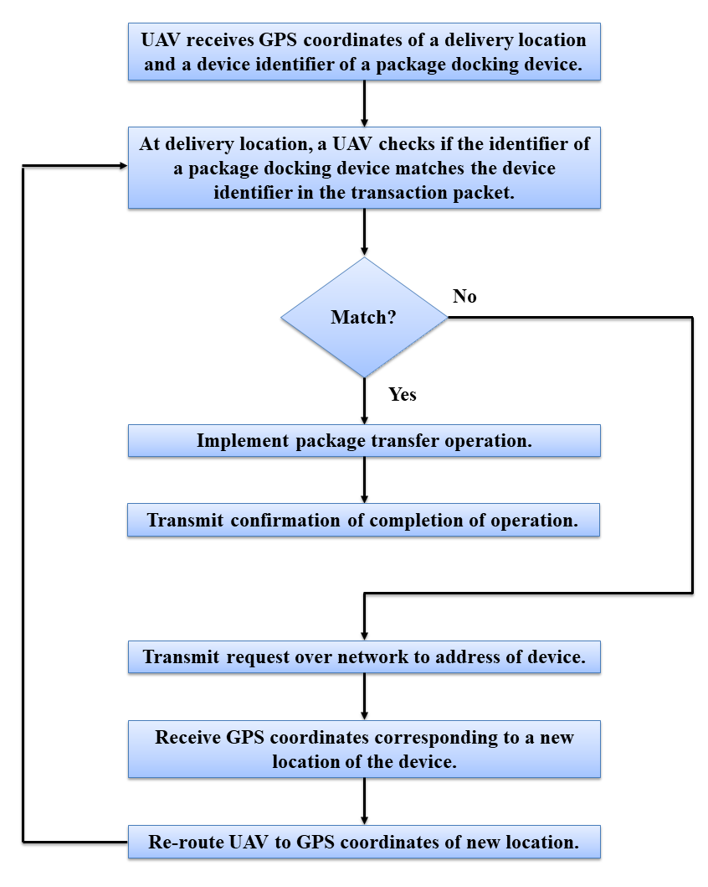
*Caption/Context: Fig. 21: UAV Delivery Applications and Challenges. | Fig. 22: UAV Delivery of Goods System.*

## --- Page 21 ---

### Section: VIII-C Research Trends and Future Insights

21

Fig. 23: Amazon Airspace Model for the Safe Integration of UAV Systems.

model aeronautics airfields, altitude and equipage restrictions
in these locations will be established in advance by aviation
authorities [163].

C. Research Trends and Future Insights

1) Machine Learning: With machine learning, UAVs can
fly autonomously without knowing the objects they may
encounter which is important for large-scale UAV delivery
missions. Qualcomms tech shows more advanced computing
that can actually understand what the UAV encountered in
mid-air and creates a flight route. They show how the UAV
processing and decision-making technology is nimble enough
to allow UAVs to operate in unpredictable settings without
using any GPS. All of the UAV computational tasks, like the
machine learning and flight control, happens on 12 grams
processor without any off-board computing [164]. Some of
challenges are : 1) We need to put a lot of effort to find
efficient methods to do unsupervised learning, where collect-
ing large amounts of unlabeled data is nowadays becoming
economically less expensive [58]; 2) Real-world problems
with high number of states can turn the problem intractable
with current techniques, severely limiting the development of
real applications. An efficient method for coping with these
types of problems remains as an unsolved challenge [58].

2) Navigation System: Researchers are developing navi-
gation systems that do not utilize GPS signals. This could
enable UAVs to fly autonomously over places where GPS
signals are unavailable or unreliable. Whether delivering goods
to remote places or handling emergency tasks in hazardous
conditions, this type of capability could significantly expand
UAVs’ usefulness [165]. Researchers from GPU maker Nvidia
are currently working on a navigation system that utilizes
visual recognition and computer learning to make sure UAVs
don’t get lost. The team believes that the system has already
managed the most stable GPS-free flight to date [166]. Some
of challenges are: 1) The design of computing devices with
low-power consumption, particularly GPUs, is a challenge and
active working field for embedded hardware developers [58];

2) While a few UAVs can already travel without a UAV oper-
ators directing their routes, this technology is still emerging.
Over the next few years, system-failure responses, adaptive
routing, and handoffs between user and UAV controllers
should be improved [167].

3) Future Insights: Some of the future possible directions
for this application are:

• The energy density of lithium-ion batteries is improving
by 5%-8% per year, and their lifetime is expected to
double by 2025. These improvements will make commer-
cial UAVs able to hover for more than an hour without
recharging, enabling UAVs to deliver more goods [167].

• Detect-and-avoid systems which help UAVs to avoid
collisions and obstacles, are still in development, with
strong solutions expected to emerge by 2025 [167].

• UAVs currently travel below the height of commer-
cial aircraft due to the collision potential. The methods
that can track UAVs and communicate with air-traffic-
control systems for typical aircraft are not expected to
be available before 2027, making high-altitude missions
impossible until that time [167].

• To make UAV delivery practical, automation research is
required to address UAVs design. UAVs design covers
creating aerial vehicles that are practical, can be used
in a wide range of conditions, and whose capability
rivals that of commercial airliners; this is a significant
undertaking that will need many experiments, ingenuity
and contributions from experts in diverse areas [168].

• More research is needed to address localization and
navigation. The localization and navigation problems may
seem like simple problems due to the many GPS systems
that already exist, but to make drone delivery practical in
different operating conditions, the integration of low cost
sensors and localization systems is required [168].

• More research is needed to address UAVs coordination.
Thousands of UAV operators in the air, utilizing the
same resources such as charging stations and operating
frequency, will need robust coordination which can be
studied by simulation [168].

![Fig. 23: Amazon Airspace Model for the Safe Integration of UAV Systems. | model aeronautics airfields, altitude and equipage restrictions in these locations will be established in advance by aviation authorities [163].](images/page_021_fig_01.png)
*Caption/Context: Fig. 23: Amazon Airspace Model for the Safe Integration of UAV Systems. | model aeronautics airfields, altitude and equipage restrictions in these locations will be established in advance by aviation authorities [163].*

## --- Page 22 ---

### Section: IX Real-Time Monitoring of Road Traffic

22

#### IX. REAL-TIME MONITORING OF ROAD TRAFFIC

Automation of the overall transportation system cannot
be automated through vehicles only [169]. In fact, other
components of the end-to-end transportation system, such as
tasks of field support teams, traffic police, road surveyors, and
rescue teams, also need to be automated. Smart and reliable
UAVs can help in the automation of these components.

UAVs have been considered as a novel traffic monitoring
technology to collect information about traffic conditions on
roads. Compared to the traditional monitoring devices such
as loop detectors, surveillance video cameras and microwave
sensors, UAVs are cost-effective, and can monitor large con-
tinuous road segments or focus on a specific road segment
[170]. Data generated by sensor technologies are somewhat
aggregated in nature and hence do not support an effective
record of individual vehicle tracks in the traffic stream. This
restricts the application of these data in individual driving be-
havior analysis as well as calibrating and validating simulation
models [171].

Moreover, disasters may damage computing, communica-
tions infrastructure or power systems. Such failures can result
in a complete lack of the ability to control and collect data
about the transportation network [172].

A. Literature Review

UAVs are getting accepted as a method to hasten the gath-
ering of geographic surveillance data [173]. As autonomous
and connected vehicles become popular, many new services
and applications of UAVs will be enabled [169].

Recognition of moving vehicles using UAVs is still a chal-
lenging problem. Moving vehicle detection methods depend
on the accuracy of image registration methods, since the
background in the UAV surveillance platform changes fre-
quently. Accurate image registration methods require extensive
computing power, which affecta the real-time capability of
these methods [174]. In [174], Qu et al. studied the problem
of moving vehicle detection using UAV cameras. In their
proposed approach, they used convolutional neural networks
to identify vehicles more accurately and in real-time. The
proposed approach consists of three steps to detect moving
vehicles: First, adjacent frames are matched. Then, frame pix-
els are classified as background or candidate targets. Finally,
a deep convolutional neural network is trained over candidate
targets to classify them into vehicles or background. They
achieved detection accuracy of around 90% when evaluating
their method using the CATEC UAV dataset.

In [175], the authors introduce a vehicle detection and
tracking system based on imagery data collected by a UAV.
This system uses consecutive frames to generate the vehicle’s
dynamic information, such as positions and velocities over
time. Four major modules have been developed in this study:
image registration, image feature extraction, vehicle shape
detecting, and vehicle tracking. Some unique features have
been introduced into this system to customize the vehicle
and traffic flow and use them together in multiple contiguous
images to increase the system’s accuracy of detecting and
tracking vehicles.

A framework is presented in [170] to support real-time and
accurate collection of traffic flow parameters, including speed,
density, and volume, in two travel directions simultaneously.
The proposed framework consists of the following four fea-
tures: (1) A framework for estimating multi-directional traffic
flow parameters from aerial videos (2) A method combining
the KanadeLucasTomasi (KLT) tracker, k-means clustering,
and connected graphs for vehicle detection and counting (3)
Identifying traffic streams and extracting traffic information
in a real-time manner (4) The system works in daytime and
nighttime settings, and is not sensitive to UAV movements
(i.e., regular movement, vibration, drifting, changes in speed,
and hovering). A challenge that this framework faces is that
their algorithm sometimes recognizes trucks, buses, and other
large/heavy vehicles as multiple passenger cars.

A real-time framework for the detection and tracking of a
specific road segment using low and mid-altitude UAV video
feeds was presented in [176]. This framework can be used
for autonomous navigation, inspection, traffic surveillance and
monitoring. For road detection, they utilize the GraphCut
algorithm abecause of its efficient and powerful segmentation
performance in 2-D color images. For road tracking, they
develop a tracking technique based on homography alignment
to adjust one image plane to another when the moving camera
takes images of a planar scene.

In [172], the authors develop a processing procedure for
fast vehicle detection, which consists of three stages; pre-
classification with a boosted classifier, blob detection, and final
classification using SVM.

In [177], the authors propose to integrate collected video
data from UAVs with traffic simulation models to enhance real-
time traffic monitoring and control. This can be performed by
transforming collected video data into useful traffic measures
to generate essential statistical profiles of traffic patterns,
including traffic parameters such as mean-speed, density,
volume, turning ratio, etc. However, a main issue with this
approach is the limitation of flying time for UAVs which could
hover to obtain data for a few hours a day.

The work in [178] addresses the security issues of road
traffic monitoring systems using UAVs. In this work, the role
of a UAV in a road traffic management system is analyzed
and various situational security issues that occur in traffic
management are mitigated. In their proposed approach, the
UAV’s intelligent systems analyze real-time traffic as well
as security issues and provide the appropriate mitigation
commands to the traffic management control center for re-
routing. Instead of image processing, the authors used sensor
networks and graph theory for representing the road network.
They also devised different situational security scenarios to
assess the road traffic management.For example, a car without
an RFID tag that enters a defense area or government building
area is considered a potential security risk.

Based on a research study by Kansas Department of
Transportation (KDOT) [179], the use of UAVs for KDOT’s
operations could lead to improved safety, efficiency, as well as
reduced costs. The study also recommends the use of UAVs in
a range of applications including bridge inspection, radio tower
inspection, surveying, road mapping, high-mast light tower

## --- Page 23 ---

### Section: IX-B Use Cases

23

inspection, stockpile measurement, and aerial photography.
However, the study indicates that UAVs are not recommended
to replace the current methods of traffic data collection in
KDOT operations which rely on different kinds of sensors
(e.g., weight, loop, piezo). However, UAVs can complement
existing data collection projects to gather data in small incre-
ments of time in certain traffic areas. Based on their survey,
battery life and flight time of UAVs may limit the samples
of traffic data. For example, current UAV technology cannot
collect 24-hour continuous data.

Yu Ming Chen et al. [180] proposed a video relay scheme
for traffic surveillance systems using UAVs. The proposed
communications scheme is straightforward to implement be-
cause of the typical availability of mobile broadband along
highways. Their results show that the proposed scheme can
transfer quality videos to the traffic management center in
real-time. They also implemented two types of data communi-
cations schemes to transmit captured videos through existing
public mobile broadband networks: (1) Video stream delivered
directly to clients. (2) Video stream delivered to clients through
a server. In their experiments, they were able to transmit video
signals with an image size of 320×280, at a rate of 112 Kbps,
and 15 frames per second.

In [181], a platform which operates autonomously and
delivers high-quality video imagery and sensor data in real-
time is utilized. In their scenario, the authors employ a 10
lbs aircraft to fly up to 6 hours with a telemetry range of 1
mile and payload capacity of 4 lbs. Their system consists of
five components: (1) a GPS signal receiver (2) a radio control
transmitter (3) a modem for flight data (4) a PC to display the
UAV on a map. (5) a real-time video down-link.

Apeltauer et al. [182] present an approach for moving
vehicle detection and tracking through the intersection of
aerial images captured by UAVs. Overall, the system follows
three steps: pre-processing, vehicle detection, and tracking. For
pre-processing, images are undistorted geo-registered against
a user-selected reference frame. For the detection step, the
boosting technique is used to improve the training phase which
employs Multi-scale Block Local Binary Patterns (MB-LBP).
Finally for tracking, the system uses a set of Bootstrap particle
filters, one per vehicle.

An improved vehicle detection method based on Faster R-
CNNs is proposed in [183]. The overall vehicle detection
method is illustrated in Figure 24. For training, the method
crops the original large-scale images into segments and aug-
ments the number of image segments with four angles (i.e.,
0, 90, 180, and 270). Then, all the training image blocks that
constitute the HRPN input are processed to produce candidate
region boxes, scores and corresponding hyper features. Finally,
the results of the HRPN are used to train a cascade of boosted
classifiers, and a final classifier is obtained. For testing, a large-
scale testing image is cropped into image blocks. Then, HRPN
takes these image blocks as input and generates potential out-
puts as well as hyper feature maps. The final classifier checks
these boxes using hyper features. Finally, all the detection
results of segments are gathered to integrate the original image.
The authors tested their method on UAV images successfully.

B. Use Cases

The major applications of UAVs in transportation include
security surveillance, traffic monitoring, inspection of road
construction projects, and survey of traffic, rivers, coastlines,
pipelines, etc. [184]. Some of the ITS applications that can be
enabled by UAVs are as follows:

• Flying Accident Report Agents: Rescue teams can use
UAVs to quickly reach accident locations. Flying accident
report agents can also be used to deliver first aid kits to
accident locations while waiting for rescue teams to arrive
[169].

• Flying Police Eyes: UAVs can be used to fly over
different road segments in order to stop vehicle for traffic
violations. The UAV can change the traffic light in front
of the vehicle to stop it or relay a message to a specific
vehicle to stop [169] [169].

• Flying Roadside Unit: A UAV can be complemented with
DSRC to enable a flying RSU. The flying RSU can fly
to a specific position to execute a specific application.
For example, consider an accident on the highway at a
specific segment that is not equipped with any RSU. Then
the traffic management center can activate a UAV to fly
to the accident location and land at the proper location
to broadcast the information and warn all approaching
vehicles about a specific incident [169].

• Behavior Recognition Method: UAVs can be used to
recognize suspicious or abnormal behavior of ground
vehicles moving along with the road traffic [185].

• Monitor Pedestrian Traffic: Sutheerakul et al. [186] used
UAVs as an alternative data collection technique to mon-
itor pedestrian traffic and evaluate demand and supply
characteristics. In fact, they classified their collected data
into four areas: the measurement of pedestrian demand,
pedestrian characteristics, traffic flow characteristics, and
walking facilities and environment.

• Flying Dynamic Traffic Signals [169].
UAVs may also be employed for a wide range of transportation
operations and planning applications such as following [187]:

• Incident response.

• Monitor freeway conditions.

• Coordination among a network of traffic signals.

• Traveler information.

• Emergency vehicle guidance.

• Measurement of typical roadway usage.

• Monitor parking lot utilization.

• Estimate Origin-Destination (OD) flows.
Figures 25, 26, and 27 illustrate different applications use-
cases of UAVs in smart cities.

C. Legislation

The Federal Aviation Administration (FAA) approves the
civil use of UAVs [188]. They can be utilized for public use
provided that the UAVs are flown at a certain altitude. For
maintaining the safety of manned aircrafts and the public, the
FAA in the United States has developed rules to regulate the
use of small UAVs [189]. For example, the FAA requires

## --- Page 24 ---

24

Fig. 24: Proposed Vehicle Detection Framework in [183].

TABLE IX: SUMMARY OF RELATED LITERATURE
Project
Goal
Hardware
Dataset
Link to dataset
Qu et al. [174]
Moving vehicle detection
UAV + Camera
CATEC UAV
-

Wang et al. [175]
Vehicle detection and
tracking
UAV + Camera
not avaiable
-

Ke et al. [170]
Extraction of traffic
flow parameters
UAV + Camera
Taken from
Beihang University
-

Zhou et al. [176]
Real-time road detection
and tracking
UAV + camera
Self-collected
https://sites.google.com/site/hailingzhouwei

Leitloff et al. [172]
Fast vehicle detection
UAV + camera
Self-collected
-

Puri et al. [177]
real-time traffic
monitoring and control
UAV + camera
Self-collected
-

Reshma et al. [178]
address the security issues
of road traffic monitoring
UAV + RFID
Proteus
simulator
-

M-Chen et al. [180]
traffic surveillance
UAV + camera
self-collected
-

Tang et al. [183]
vehicle detection
UAV + camera
Munich vehicle dataset
http://pba-freesoftware.eoc.dlr.de/
3K VehicleDetection dataset.zip
Apeltauer et al. [182]
vehicle trajectory extraction
UAV + camera
self-collected
-

Fig. 25: A UAV is Used By Police to Catch Traffic Violators [169].

small Unmanned Aircraft Systems (UAS) that weigh more
than 0.55 lbs and below 55 lbs to be registered in their system.
Regulations are broadly organized into two categories; namely,
prescriptive regulations and performance-based regulations
(PBRs). Prescriptive regulations define what must not be done
whereas PBRs indicate what must be attained. 20% of FAA
regulations are PBRs [190]. Table X describes the rules for
operating UAS in the US [188].

When violating the FAA regulations, owners of drones can
face civil and criminal penalties [189]. The FAA has also
provided a smartphone application B4UFLY5 which provides

TABLE X: RULES FOR OPERATING A UAS.
*THESE RULES ARE SUBJECT TO WAIVER.

Fly for work

Pilot Requirements
Must have Remote Pilot Airman Certifi-
cate Must be 16 years old Must pass TSA
vetting
Aircraft Requirements
Must be less than 55 lbs. Must be reg-
istered if over 0.55 lbs. (online) Must
undergo pre-flight check to ensure UAS
is in condition for safe operation
Location Requirements
Class G airspace*
Operating Rules
Must keep the aircraft in sight (visual
line-of-sight)*
Must fly under 400 feet*
Must fly during the day* Must fly at or
below 100 mph*
Must yield right of way to manned air-
craft*
Must NOT fly over people*
Must NOT fly from a moving vehicle*
Example Applications
Flying for commercial use (e.g. providing
aerial surveying or photography services).
incidental to a business (e.g. doing roof
inspections or real estate photography)
Legal or Regulatory Basis
Title 14 of the Code of Federal Regulation
(14 CFR) Part 107

![Fig. 24: Proposed Vehicle Detection Framework in [183]. | TABLE IX: SUMMARY OF RELATED LITERATURE Project Goal Hardware Dataset Link to dataset Qu et al. [174] Moving vehicle detection UAV + Camera CATEC UAV -](images/page_024_fig_01.png)
*Caption/Context: Fig. 24: Proposed Vehicle Detection Framework in [183]. | TABLE IX: SUMMARY OF RELATED LITERATURE Project Goal Hardware Dataset Link to dataset Qu et al. [174] Moving vehicle detection UAV + Camera CATEC UAV -*

![Leitloff et al. [172] Fast vehicle detection UAV + camera Self-collected - | Puri et al. [177] real-time traffic monitoring and control UAV + camera Self-collected -](images/page_024_fig_02.png)
*Caption/Context: Leitloff et al. [172] Fast vehicle detection UAV + camera Self-collected - | Puri et al. [177] real-time traffic monitoring and control UAV + camera Self-collected -*

## --- Page 25 ---

### Section: IX-D Challenges and Future Insights

25

Fig. 26: A UAV is Used as a Flying RSU That Broadcasts a Warning About Road Hazards
that have been Detected in an Area not Pre-Equipped with an RSU (Flying Roadside
Units) [169].

Fig. 27: A UAV is Used to Provide the Rescue Team an Advance Report Prior to Reaching
the Incident Scene [169].

drone users important information about the limitations that
pertain to the location they where drone is being operated.
The ”Know Before You Fly” campaign by the FAA aims
to educate the public about UAV safety and responsibilities.
For civil operations, the FAA authorization can be received
either through Section 333 Exemption (i.e., by issuing a
COA), or through a Special Airworthiness Certificate (SAC) in
which applicants describe their design, software development,
control, along with how and where they intend to fly. The
FAA also enforces their regulations along with Law Enforce-
ment Agencies (LEAs) to deter, detect, investigate, and stop
unauthorized and unsafe UAV operations [189].

Overall, the FAA regulations for small UAVs require flying
under 400 feet without obstacles in their vicinity, such that
operators maintain a line of sight with the operated UAV at
all times. It also requires UAVs not to fly within 5 miles from
an airport unless permission is received from the airport and
the control tower; thus, avoiding the endangerment of people
and aircrafts. Other FAA regulations require drones not to be
operated over public infrastructure (e.g., stadiums) as that may
pose dangers to the public.

The Federal UAS regulations final rule requires drone pilots
to keep unmanned aircrafts within visual line of sight and oper-
ations are only allowed during daylight and during half-light
if the drone is equipped with anti-collision lights. The new
regulations also initiate height and speed constraints and other
operational limits, such as prohibiting flights over unprotected
people on the ground who arent directly participating in the
UAS operation. There is a process through which users can
apply to have some of these restrictions waived, while those
users currently operating under section 333 exemptions (which
allowed commercial use to take place prior to the new rule)
are still able to operate depending on their exemptions [191].

In Section 107.51 of the FAA regulations [192], it is
mentioned that a remote pilot in command and the person
manipulating the flight controls of the small unmanned aircraft
system must consent with all of the following operating
limitations when operating a small unmanned aircraft system:

• The ground speed of a small unmanned aircraft may not
exceed 87 knots (i.e., 100 miles per hour).

• The altitude of the small unmanned aircraft cannot be
higher than 400 feet above ground level, unless the small
unmanned aircraft: (1) Is flown within a 400-foot radius
of a structure; and (2) Does not fly higher than 400 feet
above the structures immediate uppermost limit.

• The minimum flight visibility, as observed from the
location of the control station must be no less than 3
statute miles.
For critical infrastructure, a legislation has been developed
to protect such infrastructure from rogue drone operators.
UAVs should not be close to such places when these critical
infrastructure exist. The classification of critical infrastruc-
ture differs by state, but generally includes facilities such
as petroleum refineries, chemical manufacturing facilities,
pipelines, waste water treatment facilities, power generation
stations, electric utilities, chemical or rubber manufacturing
facilities, and other similar facilities [193].

D. Challenges and Future Insights

There are several challenges and needed future extensions
to facilitate the use of UAVs in support of ITS applications:

• One of the important challenges is to preserve the pri-
vacy of sensitive information (e.g., location) from other
vehicles and drones [169]. Since usually there is no
encryption on UAVs on-board chips, they can be hijacked
and subjected to man-in-middle attacks originating up to
two kilometers away [189].

• countries should devise registration mechanisms for
UAVs operated on their geographic areas. Commercial
airplanes and their navigation might be affected by UAVs.
So countries must implement rules and regulations for
their proper use [194].

• Developing precise coordination algorithms is one of the
challenges that need to be considered to enable ITS UAVs
[169].

• Wireless sensors can be utilized to smooth the operations
of UAVs. For example, surveillance and live feeds from
wireless sensors can be developed for control traffic
systems [194].

• Data fusion of information from diverse sensors, au-
tomating image data compression, and stitching of aerial
imagery are required techniques [194].

• Enabling teams of operators to control the UAV and
retrieve imagery and sensor information in real-time. To
achieve this goal, the development of network-centric
infrastructure is required [194].

• Limited energy, processing capabilities, and signal trans-
mission range [169] are also some of the main issues in
UAVs that require more development to contribute to the
maturity of the UAV technology

• UAVs have slower speeds compared to vehicles driving
on highways. However, a possible solution might entail
changing the regulations to allow UAVs to fly at higher
altitudes. Such regulations would allow UAVs to benefit
from high views to compensate the limitation in their

![Fig. 26: A UAV is Used as a Flying RSU That Broadcasts a Warning About Road Hazards that have been Detected in an Area not Pre-Equipped with an RSU (Flying Roadside Units) [169]. | • The minimum flight visibility, as observed from the location of the control station must be no less than 3 statute miles. For critical infrastructure, a legislation has been developed to protect such infrastructure from rogue drone operators. UAVs should not be close to such places when these critical infrastructure exist. The classification of critical infrastruc- ture differs by state, but generally includes facilities such as petroleum refineries, chemical manufacturing facilities, pipelines, waste water treatment facilities, power generation stations, electric utilities, chemical or rubber manufacturing facilities, and other similar facilities [193].](images/page_025_fig_01.png)
*Caption/Context: Fig. 26: A UAV is Used as a Flying RSU That Broadcasts a Warning About Road Hazards that have been Detected in an Area not Pre-Equipped with an RSU (Flying Roadside Units) [169]. | • The minimum flight visibility, as observed from the location of the control station must be no less than 3 statute miles. For critical infrastructure, a legislation has been developed to protect such infrastructure from rogue drone operators. UAVs should not be close to such places when these critical infrastructure exist. The classification of critical infrastruc- ture differs by state, but generally includes facilities such as petroleum refineries, chemical manufacturing facilities, pipelines, waste water treatment facilities, power generation stations, electric utilities, chemical or rubber manufacturing facilities, and other similar facilities [193].*

![Fig. 26: A UAV is Used as a Flying RSU That Broadcasts a Warning About Road Hazards that have been Detected in an Area not Pre-Equipped with an RSU (Flying Roadside Units) [169]. | Fig. 27: A UAV is Used to Provide the Rescue Team an Advance Report Prior to Reaching the Incident Scene [169].](images/page_025_fig_02.png)
*Caption/Context: Fig. 26: A UAV is Used as a Flying RSU That Broadcasts a Warning About Road Hazards that have been Detected in an Area not Pre-Equipped with an RSU (Flying Roadside Units) [169]. | Fig. 27: A UAV is Used to Provide the Rescue Team an Advance Report Prior to Reaching the Incident Scene [169].*

## --- Page 26 ---

### Section: X Surveillance Applications of UAVs

26

speed. Finding the optimal altitude change in support of
ITS applications is a research challenge [169].

• Battery technology that allow UAVs to achieve long op-
erational times beyond half an hour is another challenge.
Several UAVs can fly together and form a swarm, by
which they could overcome their individual limitations in
terms of energy efficiency through optimal coordination
algorithms [169]. Another alternative is for UAVs to
use recharge stations. UAVs can be recharged while on
the ground, or their depleted batteries can be replaced
to minimize interruptions to their service. To this end,
deployment of UAVs, recharge stations, and ground RSUs
jointly becomes an interesting but complicated optimiza-
tion problem [169].

• The detection of multiple vehicles at the same time
is another challenge. In [195], Zhang et al. developed
several computer-vision based algorithms and applied
them to extract the background image from a video
sequence, identify vehicles, detect and remove shadows,
and compute pixel-based vehicle lengths for classifica-
tion.

• Truly autonomous operations of UAV swarms are a big
challenge, since they need to recognize other UAVs,
humans and obstacles to avoid collisions. Therefore, the
development of swarm intelligence algorithms that fuse
data from diverse sources including location sensors,
weather sensors, accelerometers, gyoscopes, RADARs,
LIDARs, etc. are needed.

#### X. SURVEILLANCE APPLICATIONS OF UAVS

In this section, we first present a detailed literature review of
surveillance applications of UAVs. Then, based on the review,
we summarize the advantages, disadvantages and important
concerns of UAV uses in surveillance. Also, we discuss several
takeaway lessons for researchers and practitioners in the area,
which we believe will help guide the development of effective
UAV surveillance applications.

A. Literature review

The report in [196] discusses the advantages and disadvan-
tages of employing UAVs along US borders for surveillance
and introduces several important issues for the Congress. The
advantages include: (1) The usage of UAVs for border surveil-
lance improves the coverage along the remote border sections
of the U.S.; and (2) The UAVs provide a much wider coverage
than current approaches for border surveillance (e.g., border
agents on patrol, stationary surveillance equipment, etc.). On
the other hand, the disadvantages include: (1) The high acci-
dent rates of UAVs (e.g., inclement weather conditions); and
(2) The significant operating costs of a UAV, which are often
more than double compared to the costs of a manned aircraft.
The report also highlights other issues of UAVs that should
be considered by the Congress including: UAV effectiveness,
lack of information, coordination with USBP agents, safety
concerns, and implementation details. This report provides
a clear view of the advantages, disadvantages and important
concerns for the border surveillance using UAVs. However, it

lacks details/examples on each aspect discussed (i.e., only high
level summaries are included). Also, other important aspects
are missing, for example, the robustness benefits (e.g., human
error tolerance) of using the UAVs compared to manned
aircraft.

The authors in [197] present a multi-UAV coordination
system in the framework of the AWARE project (distributed
decision-making architecture suitable for multi-UAV coordi-
nation). Generally speaking, a set of tasks are generated and
allocated to perform a given mission in an efficient manner
according to planning strategies. These tasks are sub-goals that
are necessary for achieving the overall goal of the system, and
that can be achieved independent of other sub-goals. The key
issues include:

• Task allocation: determines the place (i.e., in which UAV
node) that each task should be executed to optimize
the performance and to ensure appropriate co-operation
among different UAVs.

• Operative perception: generates and maintains a consis-
tent view of all operating UAVs (e.g., number of sensors
equipped).
In addition, several types of field experiments are conducted,
including: (1) Multi-UAV cooperative area surveillance; (2)
Wireless sensor deployment; (3) Fire threat confirmation and
extinguishing; (4) Load transportation and deployment with
single and multiple UAVs; and (5) People tracking. To sum up,
this paper presents details of the proposed algorithm and shows
the results of several real filed experiments. However, it lacks
detailed analysis or formal proof of the proposed approach to
demonstrate its correctness and effectiveness.

In [198], the authors perform analysis for UAVs deploy-
ments within war-zones (i.e., Afghanistan, Iraq, and Pakistan),
border-zones and urban areas in the USA. The analysis high-
lights the benefits of UAVs in such scenarios which include:

• Safety: Drones insulates operators and allies from direct
harm and subjects targets to ’precise’ attack.

• Robustness: Drones reduce human errors (e.g., moral
ambiguity) from political, cultural, and geographical con-
texts.
Most importantly, the analysis uncovers a major limitation
in UAV surveillance practices. The usage of drones for
surveillance has difficulties in exact target identification and
control in risk societies. Potential blurred identities include:
(1) insurgent and civilian; (2) criminal and undocumented
migrant; and (3) remotely located pilot and front-line soldier.
To sum up, this paper puts more focus on safety and robustness
benefits of using UAVs in battle fields and urban areas. Also,
it presents the limitation of exact target identification and
control. However, it overlooks the coverage benefits and the
deployment/implementation limitations of using UAV systems
for surveillance.

In [199], the authors show the impact of UAV-based surveil-
lance in civil applications on privacy and civil liberties. First,
it states that current regulatory mechanisms (e.g., the US
Fourth amendment, EU legislation and judicial decisions,
and UK legislation) do not adequately address privacy and
civil liberties concerns. This is mainly because UAVs are

## --- Page 27 ---

### Section: X-B Discussion

27

complex, multi-modal surveillance systems that integrate a
range of technologies and capabilities. Second, the inadequacy
of current legislation mechanisms results in disproportionate
impacts on civil liberties for already marginalized popula-
tion. In conclusion, multi-layered regulatory mechanisms that
combine legislative protections with a bottom-up process of
privacy and ethical assessment offer the most comprehensive
way to adequately address the complexity and heterogeneity of
unmanned aircraft systems and their intended deployments. To
sum up, this paper focuses on the law enforcement of privacy
and civil liberty aspects of using UAVs for surveillance.
However, the regulation recommendation provided is high
level and lacks sufficient details and convincing analysis.

In [200], the authors introduce a cooperative perimeter
surveillance problem and offer a decentralized solution that
accounts for perimeter growth (expanding or contracting) and
insertion/deletion of team members. The cooperative perimeter
surveillance problem is defined to gather information about
the state of the perimeter and transmit that data back to a
central base station with as little delay and at the highest
rate possible. The proposed solution is presented in Algorithm
1. The proposed scheme is described comprehensively and
a simple formal proof is provided. However, there is no
related works or comparative evaluations provided to justify
the effectiveness of the proposed scheme.

Algorithm 1 Proposed Algorithm in [200].

If
There is an agreement with the neighbor: Then,
(1) Calculate shared border position ;
(2) Travel with neighbor to shared border ;
(3) Set direction to monitor own segment;

If Reached perimeter endpoint:
Then
Reverse direction.
ENDIF
ENDIF

The authors of [201] present the results of using a UAV in
two field tests, the 2009 European Land Robot Trials (ELROB-
2009) and the 2010 Response Robot Evaluation Exercises
(RREE-2010), to investigate different realistic response sce-
narios. They transplant an improved photo mapping algorithm
which is a variant of the Fourier Mellin Invariant (FMI)
transform for image representation and processing. They used
FMI with the following two modifications:

• A logarithmic representation of the spectral magnitude of
the FMI descriptor is used;

• A filter on the frequency where the shift is supposed to
appear is applied.
To sum up, this report mainly discusses two field tests with
a description of a transplanted improved photo mapping algo-
rithm. However, the proof/analysis of the improved algorithm
is missing.

In [203], the authors discuss a potential application of UAVs
in delivering IoT services. A high-level overview is presented
and a use case is introduced to demonstrate how UAVs can
be used for crowd surveillance based on face recognition.
They also study the offloading of video data processing to
an MEC (Mobile Edge Computing) node compared to the

local processing of video data on board UAVs. The results
demonstrate the efficiency of the MEC-based offloading ap-
proach in energy consumption, processing time of recognition,
and in promptly detecting suspicious persons. To sum up, this
paper successfully demonstrates the benefits of using a single
UAV system with IoT devices for crowd surveillance with
the introduced video data processing offloading technique.
However, further analysis of the coordination of multiple
UAVs is missing.

In [202], the authors present the use of small UAVs
for specific surveillance scenarios, such as assessment after
a disaster. This type of surveillance applications utilizes a
system that integrates a wide range of technologies involv-
ing: communication, control, sensing, image processing and
networking. This article is a product technical report and
the corresponding manufacturer successfully applied multiple
practical techniques in a real UAV surveillance product.

Table XI summarizes the eight papers we have reviewed
including their research focus and category.

B. Discussion

State-of-the-art Research: Table XII summarizes the ad-
vantages, disadvantages and important concerns for the UAV
surveillance applications based on our literature review. We
classify the UAV surveillance research works into six cate-
gories based on their focus and content:

• Multi-UAV cooperation: this line of research focuses on
developing new orchestration algorithms or architectures
in the presence of multiple UAVs.

• Homeland/military security concerns: this line of research
provides analysis and suggestions for the authorities with
the considerations for Homeland/military security.

• Algorithm improvement: this line of research develops
new algorithms for more efficient post-processing of the
data (e.g., videos or photos captured by the UAVs).

• New use case: this line of research integrates UAV system
into new application scenarios for potential extra benefits.

• Product introduction: this line of research describes ma-
ture techniques leveraged by a real UAV surveillance
product.

C. Research Trends and Future Insights

1) Research Trends: Based on the reviewed literature and
our analysis, we identify that the use of research trends
(e.g., machine learning algorithms, nano-sensors [204], short-
range communications technologies, etc.) could bring further
benefits in the area of UAV surveillance applications:

• There are several preferred features of UAV surveillance
applications, especially for some military or homeland
security use cases: (1) small size: this feature not only
reduces the physical attack surface of the UAV but also
achieves more secrete UAV patrolling. (2) high resolu-
tion photos: this feature helps the data post processing
algorithms to draw more accurate conclusions or obtain
more insight findings; (3) low energy consumption: this
feature allows the UAV to operate for a longer time of
period such that to achieve more complex tasks.

## --- Page 28 ---

### Section: X-C2 Future Insights

28

TABLE XI: SUMMARY OF UAV APPLICATIONS FOR SECURITY SURVEILLANCE
Surveillance
Year
Research Focus
Category
[200]
2008
UAVs cooperative perimeter surveillance
Multi-UAV cooperation
[196]
2010
UAV with border surveillance
Homeland security concerns

[197]
2011
Multi-UAV coordination for disaster management

and civil security applications
Multi-UAV cooperation

[198]
2011
Concerns of UAVs in battle filed
Military concerns

[201]
2011
UAV system filed tests with improved

photo mapping algorithm
Algorithm improvement

[199]
2012
UAV surveillance in civil applications impacts

upon privacy and other civil liberties
Privacy and civil liberties

[202]
2015
A small UAV system with related technologies
Product introduction
[203]
2017
UAV-based IoT platform for crowd surveillance
New use case

TABLE XII: SUMMARY OF ADVANTAGES, DISADVANTAGES AND IMPORTANT
CONCERNS FOR SURVEILLANCE APPLICATIONS OF UAVS

Advantages

surveillance coverage and range improvement
better safety for human operators
robustness and efficiency in surveillance

Disadvantages

high accidental rate
high operating costs
difficulties in surveillance of risk societies.

Important
Concerns

co-operation of multi-UAVs
post-processing algorithm improvements
privacy concerns
law enforcement

Therefore, to capture more accurate data in a more
efficient and secret way, advanced sensor technologies
should be considered. Such as nano-sensors (small size),
ultra-high-resolution image sensors (accurate data) [205],
and energy efficient sensors (low energy consumption)
[206].

• To develop more efficient and accurate multi-UAV co-
operation algorithms or data post-processing algorithms,
advanced machine learning algorithms (e.g., deep learn-
ing [207]) could be utilized to achieve better performance
and faster response. Specifically, multi-UAV cooperation
brings more benefits than single UAV surveillance, such
as more wider surveillance scope, higher error toler-
ance, and faster task completion time. However, multi-
UAV surveillance requires more advanced data collection,
sharing and processing algorithms. Processing of huge
amount data is time consuming and much more complex.
Applying advanced machine learning algorithms (e.g.,
deep learning algorithm) could help the UAV system to
draw better conclusions in a short period of time. For ex-
ample, due to its improved data processing models, deep
learning algorithms could help to obtain new findings
from existing data and to get more concise and reliable
analysis results.
2) Future Insights: based on our literature review and
analysis, to develop or deploy effective UAV surveillance
applications, we suggest the following:

• Select/design appropriate UAV system based on the
state/federal laws and individual budget. For example,
the design of UAVs surveillance systems should take the
privacy and security requirements enforced by the local
laws;

• Develop
efficient
customized
algorithms
(e.g.,
co-
operation algorithm of multi-UAVs, photo mapping al-
gorithms, etc.) based on system requirements. Multi-
UAVs co-operation algorithm could achieve more effi-
cient surveillance (e.g., optimum patrolling routes with
minimum power consumption). Also, advanced data post-
processing algorithms help the users to draw more accu-
rate conclusions;

• Conduct various field experiments to verify newly pro-
posed systems. Extensive field experiments in various
surveillance conditions (e.g., day time, night time, sun-
shine day, cloudy day, etc.) should be conducted to verify
the effectiveness and robustness of the UAVs systems.

#### XI. PROVIDING WIRELESS COVERAGE

UAVs can be used to provide wireless coverage during
emergency cases where each UAV serves as an aerial wireless
base station when the cellular network goes down [208]. They
can also be used to supplement the ground base station in order
to provide better coverage and higher data rates for users [209].
In this section, we present the aerial wireless base stations use
cases, UAV links and UAV channel characteristics. We also
show the path loss models for UAVs, classify them based on
environment, altitude and telecommunication link, and present
some challenges facing these path loss models. Moreover,
we present UAV deployment strategies that optimize several
objective functions of interest. Then, we discuss the challenges
facing UAV interference mitigation techniques. Finally, we
present the research trends and future insights for aerial
wireless base stations.

A. Aerial Wireless Base Stations Use Cases

The authors in [8], [210], [211] present the typical use cases
of aerial wireless base stations which are discussed in the
following:

• UAVs for ubiquitous coverage: UAVs are utilized to assist
wireless network in providing seamless wireless coverage
within the serving area. Two example scenarios are rapid
service recovery after disaster situations, and when the
cellular network service is not available or it is unable to
serve all ground users as shown in Figure 28.a.

## --- Page 29 ---

### Section: XI-B UAV Links and Channel Characteristics 

29

#### TABLE XIII: A COMPARISON BETWEEN DATA AND CONTROL LINKS OF UAVs

Type of link
Security requirement
Latency requirement
Capacity requirement
Frequency bands

Control link
High
High
Low
L-band (960-977MHz)

C-band (5030-5091MHz)

Data link
Low
Low
High
450 MHz to mmWave

Fig. 28: Typical Use Cases of UAV-Aided Wireless Communications.

• UAVs as network gateways: In remote geographic or
disaster stricken areas, UAVs can be used as gateway
nodes to provide connectivity to backbone networks,
communication infrastructure, or the Internet.

• UAVs as relay nodes: UAVs can be utilized as relay nodes
to provide wireless connectivity between two or more
distant wireless devices without reliable direct communi-
cation links as shown in Figure 28.b.

• UAVs for data collection: UAVs are utilized to gather
delay-tolerant information from a large number of dis-
tributed wireless devices. An example is wireless sensors
in precision agriculture applications as shown in Fig-
ure 28.c.

• UAVs for worldwide coverage: UAV-satellite communi-
cation is an essential component for building the in-
tegrated space-air-ground network to provide high data
rates anywhere, anytime, and towards the seamless wide
area coverage.

B. UAV Links and Channel Characteristics

1) Control Links: The control links are fundamental to
guarantee the safe operation of all UAVs. These links must
be low-latency, highly reliable, and secure two-way commu-
nications, usually with low data rate requirement for safety-

critical information exchange among UAVs, and additionally
between the UAV and ground control stations. The control
links information flow can be classified into three types: 1)
command and control from ground control stations to UAVs;
2) UAV status report from UAVs to ground; 3) sense-and-avoid
information among UAVs. Also for autonomous UAV, which
can fulfill missions depending on intelligent devices without
real-time human control, the control links are important in
case of emergency when human intervention is needed [8].
There are two frequency bands allocated for the control links,
namely the L-band (960-977MHz) and the C-band (5030-
5091MHz) [212]. For delay reasons, we always prefer the
primary control links between ground control stations to
UAVs, but the secondary control links via satellite could also
be utilized as a backup to enhance reliability and robustness.
Another key necessity for the control links is the high security.
Specifically, efficient security mechanisms should be utilized
to avoid the so-called ghost control scenario, a possibly
disastrous circumstance in which the UAVs are controlled
by unapproved operators via spoofed control or navigation
signals. Accordingly, practical authentication techniques, per-
haps supplemented by the emerging physical layer security
techniques, should be applied for control links. Compared to
data links, the control links usually have lower tolerance in
terms of security and latency requirements [8].

2) Data Links: The purpose of using data links is to
support task-related communications for the ground terminals
which include ground base stations, mobile terminals, gateway
nodes, wireless sensors, etc. The data links of UAVs need
to provide the following communication services: 1) Direct
mobile-UAV communication; 2) UAV-base station and UAV-
gateway wireless backhaul; 3) UAV-UAV wireless backhaul.
The capacity requirement of these data links depends on the
communication services, ranging from low capacity (kbps) in
UAV-sensor links to high speed (Gbps) in UAV-gateway wire-
less backhaul. The UAV data links could utilize the existing
band assigned for the particular communication services to
enhance performance, e.g., using millimeter wave band [213]
and free space optics [214] for high capacity UAV-UAV
wireless backhaul [8]. In Figure 29, we show the applications
of UAV links. In Table XIII, we make a comparison between
control and data links.

3) UAV Channel Characteristics: Both control and data
channels in UAV communication networks consist of two pri-
mary types of channels, UAV-ground and UAV-UAV channels
as shown in Figure 30. These channels have several unique
characteristics compared with the characteristics of terrestrial
communication channels. While line of sight links are ex-
pected for UAV-ground channels in most cases, they could also
be occasionally blocked by obstacles such as buildings. For
low-altitude UAVs, the UAV-ground channels may also suffer a

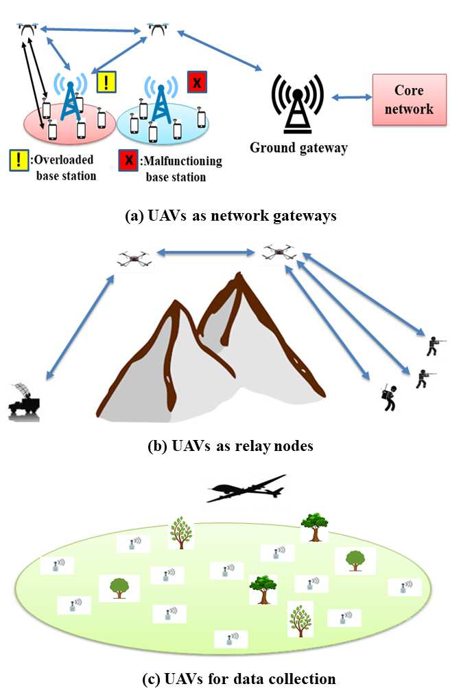
*Caption/Context: TABLE XIII: A COMPARISON BETWEEN DATA AND CONTROL LINKS OF UAVs | Type of link Security requirement Latency requirement Capacity requirement Frequency bands*

## --- Page 30 ---

### Section: XI-C Path Loss Models

30

#### UAV links

Control links

Command and

control from
GCS to UAVs

UAV status
report from
UAVs to GCS

Sense and avoid

information
among UAVs

Data links

Direct ground

mobile-UAV
communication

UAV-base station
and UAV-gateway
wireless backhaul

UAV-UAV
wireless backhaul

Fig. 29: Applications of UAV Links.

Fig. 30: Basic Networking Architecture of UAV-Aided Wireless Communications.

number of multipath components due to reflection, scattering,
and diffraction by buildings, ground surface, etc. The UAV-
UAV wireless channels are line of sight dominated and thus the
effect of multipath is minimal compared to that experienced
in UAV-ground or ground-ground channels. Due to the contin-
uous movements of UAVs with different velocities, the UAV-
to-UAV wireless channels will have high Doppler frequencies,
especially the fixed wing UAVs. On one hand, we can utilize
the dominance of the line of sight channels to achieve high-
capacity for emerging mmWave communications. On the other
hand, due to the continuous movements of UAVs with different
velocities coupled with the higher carrier frequency in the
mmWave band, the doppler shift will increase [8].

C. Path Loss Models

Path loss is an essential in the design and analysis of
wireless communication channels and represents the amount
of reduction in power density of a transmitted signal. The
characteristics of aerial wireless channels are different than
the terrestrial wireless channels due to the variations in the
propagation environments and hence the path loss models for
UAVs are also different than the traditional path loss models
for terrestrial wireless channels. We classify the UAV path loss
models based on environment, altitude and telecommunication
link as shown in Figure 31

1) Air-to-Ground Path Loss for Low Altitude Platforms:
The authors in [24] present a statistical propagation model
for predicting the path loss between a low altitude UAV and
a Ground terminal. In this model, the authors assume that
a UAV transmits data to more than 37000 ground receivers
and use the Wireless InSite ray tracing software to model
three types of rays (Direct, Reflected and Diffracted). Based
on the simulation results, they divide the receivers to three
groups. The first group corresponds to receivers that have Line-
of-Sight or near-Line-of-Sight conditions. The second group
corresponds to receivers with non Line-of-Sight condition, but
still receiving coverage via strong reflection and refraction.
The third group corresponds to receivers that have deep
fading conditions resulting from consecutive reflections and
diffractions, the third group only represents 3% of receivers.
Therefore, based on the first and second groups, the authors
present the path loss model as a function of the altitude h and
the coverage radius R as shown in Figure 32 and it is given
as follows:

L(h, R) = P(LOS) × LLOS + P(NLOS) × LNLOS
(1)

P(LOS) =
1
1 + α.exp(−β[ 180
π θ −α])
(2)

#### LLOS(dB) = 20log(4πfcd

c
) + ζLOS
(3)

#### LNLOS(dB) = 20log(4πfcd

c
) + ζNLOS
(4)

where P(LOS) is the probability of having line of sight
(LOS) connection at an elevation angle of θ, P(NLOS) is
the probability of having non LOS connection and it equals
(1- P(LOS)), LLOS and LNLOS are the average path loss
for LOS and NLOS paths. In equations (2), (3) and (4), α and
β are constant values which depend on the environment, fc
is the carrier frequency, d is the distance between the UAV
and the ground user, c is the speed of the light, ζLOS and
ζNLOS are the average additional loss which depends on the
environment.

In this path loss model, the authors assume that all users are
outdoor and the location of each user can be represented by
an outdoor 2D point. These assumptions limit the applicability
of this model when one needs to consider indoor users. The
authors of [215] describe the tradeoff in this model. At a low
altitude, the path loss between the UAV and the ground user
decreases, while the probability of line of sight links also
decreases. On the other hand, at a high altitude line of sight

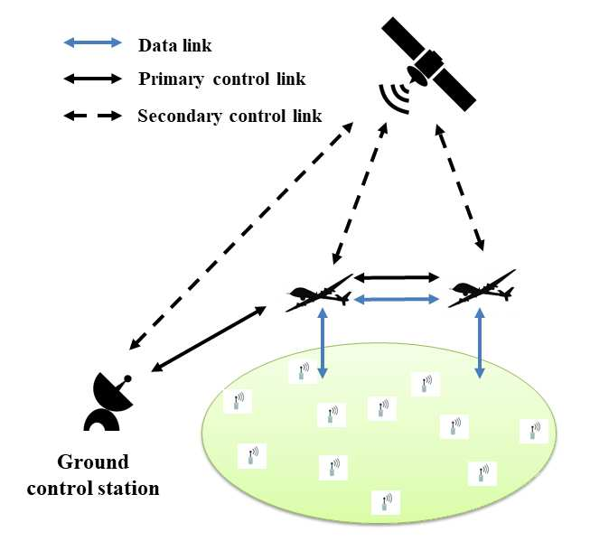
*Caption/Context: Control links | Command and*

## --- Page 31 ---

### Section: XI-C2 Outdoor-to-Indoor Path Loss Model

31

Classification of Path loss Models for UAVs

Altitude of UAV

LAP
HAP

Environment

Outdoor-ground users
Indoor users
UAV-UAV

Telecommunication link

Downlink
Uplink

Fig. 31: Classification of Path Loss Models for UAVs.

Fig. 32: Coverage Zone By a Low Altitude UAV.
Fig. 33: Providing Wireless Coverage for Indoor Users.

connections exist with a high probability, while the path loss
increases.

2) Outdoor-to-Indoor Path Loss Model: The Air-to-Ground
path loss model presented in [24] is not appropriate when
we consider wireless coverage for indoor users, because this
model assumes that all users are outdoor and located at 2D
points. In [216], the authors adopt the Outdoor-Indoor path
loss model, certified by the International Telecommunication
Union (ITU) [217] to provide wireless coverage for indoor
users using UAV as shown in Figure 33. The path loss is
given as follows:

L = LF + LB + LI = (wlog10dout + wlog10f + g1)

+(g2 + g3(1 −cosθi)2) + (g4din)
(5)

where LF is the free space path loss, LB is the building
penetration loss, and LI is the indoor loss. Also, dout is the
distance between the UAV and indoor user, θi is the incident
angle, and din is the indoor distance of the user inside the
building. In this model, we also have w = 20, g1=32.4, g2=14,
g3=15, g4=0.5 and f is the carrier frequency. The authors
of [216] describe the tradeoff in the above model when the
horizontal distance between the UAV and a user changes.
When this horizontal distance increases, the free space path
loss (i.e.,LF ) increases as dout increases, while the building
penetration loss (i.e., LB) decreases as the incident angle (i.e.,
θi) decreases.

3) Cellular-to-UAV Path Loss Model: In [218], the authors
model the statistical behavior of the path loss from a cellular
base station towards a flying UAV. They present the path
loss model based on extensive field experiments that involve
collecting both terrestrial and aerial coverage samples. They

report the value of the path loss as a function of the depression
angle and the terrestrial coverage beneath the UAV as shown
in Figure 34. The path loss is given as follows:

L(d, θ) = Lter(d) + η(θ) + Xuav(θ) = 10αlog(d)+

A(θ −θo)exp(−θ −θo

B
) + ηo + N(0, aθ + σo)

(6)

where Lter(d) is the mean terrestrial path-loss at a given
terrestrial distance d from the cellular base station, η(θ) is
the excess aerial path-loss, Xuav(θ) is a Gaussian random
variable with an angle-dependent standard deviation σuav(θ)
representing the shadowing component, θ is depression angle
between the UAV and the cellular base station, α is the path-
loss exponent. Also, A, B, θo and ηo are fitting parameters.

4) Air-to-Ground Path Loss for High Altitude Platforms:
The authors in [219] present an empirical propagation pre-
diction model for mobile communications from high altitude
platforms in built-up areas, where the frequency band is 2–6
GHz. The probability of LOS paths between the UAV and a
ground user and the additional shadowing path loss for NLOS
paths are presented as a function of the elevation angle (θ).
The path loss model is defined for four different types of built-
up area (Suburban area, Urban area, Dense urban area and
Urban high-rise area). The path loss is given as follows:

L = P(LOS) × LLOS + P(NLOS) × LNLOS
(7)

P(LOS) = a −
a −b
1 + ( θ−c
d )e
(8)

#### LLOS(dB) = 20log(dkm) + 20log(fGHz) + 92.4 + ζLOS

(9)

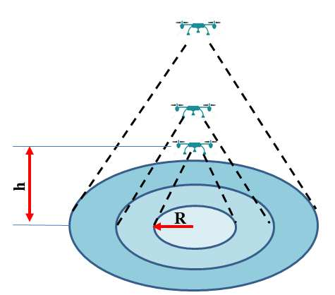
*Caption/Context: Altitude of UAV | LAP HAP*

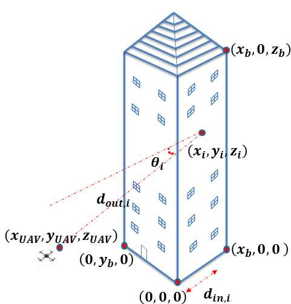
*Caption/Context: Altitude of UAV | LAP HAP*

## --- Page 32 ---

### Section: XI-C5 UAV to UAV path Loss Model

32

Fig. 34: Cellular-to-UAV Path Loss Parameters.

#### LNLOS(dB) = 20log(dkm) + 20log(fGHz) + 92.4 + Ls

+ζNLOS

(10)

In equation (7), P(LOS) is the probability of having line of
sight (LOS) connection at an evaluation angle of θ, P(NLOS)
is the probability of having non LOS connection and it equals
(1- P(LOS)), LLOS and LNLOS are the average path loss
for LOS and NLOS paths. In equation (8), a, b, c, d and e are
the empirical parameters. In equations (9) and (10), dkm is the
distance between the UAV and the ground user in km, fGHz
is the frequency in GHz, Ls is a random shadowing in dB as
a function of the elevation angle (θ), ζLOS and ζNLOS are the
average additional losses which depend on the environment.

5) UAV to UAV path Loss Model: In general, the UAV-to-
UAV wireless channels are line of sight dominated, so that the
free space path loss can be adopted for the aerial channels.
Due to the continuous movements of UAVs with different
velocities, the UAV-to-UAV wireless channels will have high
Doppler frequencies (especially the fixed wing UAVs).

In Table XIV, we make a comparison among the path loss
models based on operating frequency, altitude, environment,
type of link, type of experiments and challenges.

D. UAV Deployment Strategies

UAVs deployment problem is gaining significant importance
in UAV-based wireless communications where the perfor-
mance of the aerial wireless network depends on the de-
ployment strategy and the 3D placements of UAVs. In this
section, we classify the UAV deployment strategies based on
the objective functions as shown in Figure 35.

1) Deployment Strategies for Minimizing the Transmit
Power of UAVs: The authors in [220] propose an efficient
deployment framework for deploying the aerial base stations,
where the goal is to minimize the total required transmit power
of UAVs while satisfying the users rate requirements. They
apply the optimal transport theory to obtain the optimal cell
association and derive the optimal UAV’s locations using the
facility location framework. The authors in [215] investigate
the downlink coverage performance of a UAV, where the
objective is to find the optimal UAV altitude which leads
to the maximum ground coverage and the minimum transmit
power. The authors in [216] propose using a single UAV to
provide wireless coverage for indoor users inside a high-rise
building under disaster situations. They study the problem of

efficient UAV placement, where the objective is to minimize
the total transmit power required to cover the entire high-
rise building. In [221], the authors propose a particle swarm
optimization algorithm to find an efficient 3D placement of a
UAV that minimizes the total transmit power required to cover
the indoor users. The authors in [222] utilize UAVs to provide
wireless coverage for indoor and outdoor users in massively
crowded events, where the objective is to find the optimal
UAV placement which lead to the minimum transmit power.
In [223], the authors propose an optimal placement algorithm
for UAV that maximizes the number of covered users using
the minimum transmit power. The algorithm decouple the UAV
deployment problem in the vertical and horizontal dimensions
without any loss of optimality. The authors in [224] consider
two types of users in the network: the downlink users served by
the UAV and device-to-device users that communicate directly
with one another. In the mobile UAV scenario, using the disk
covering problem, the entire target geographical area can be
completely covered by the UAV in a shortest time with a
minimum required transmit power. They also derive the overall
outage probability for device-to-device users, and show that
the outage probability increases as the number of stop points
that the UAV needs to completely cover the area increases.

2) Deployment Strategies for Maximizing the Wireless Cov-
erage of UAVs: In [209], the authors highlight the properties
of the UAV placement problem, and formulate it as a 3D
placement problem with the objective of maximizing the
revenue of the network, which is proportional to the number
of users covered by a UAV. They formulate an equivalent
problem which can be solved efficiently to find the size of
the coverage region and the altitude of a UAV. The authors
in [225] study the optimal deployment of UAVs equipped
with directional antennas, using circle packing theory. The
3D locations of the UAVs are determined in a way that
the total coverage area is maximized. In [226], the authors
introduce network-centric and user-centric approaches, the
optimal 3D backhaul-aware placement of a UAV is found for
each approach. In the network-centric approach, the network
tries to serve as many users as possible, regardless of their
rate requirements. In the user-centric approach, the users
are determined based on the priority. The total number of
served users and sum-rates are maximized in the network-
centric and user-centric frameworks. The authors in [227]
study an efficient 3D UAV placement that maximizes the
number of covered users with different Quality-of-Service
requirements. They model the placement problem as a multiple
circles placement problem and propose an optimal placement
algorithm that utilizes an exhaustive search over a one-
dimensional parameter in a closed region. They propose a
low-complexity algorithm, maximal weighted area algorithm,
to tackle the placement problem. In [228], the authors aim to
maximize the indoor wireless coverage using UAVs equipped
with directional antennas. They present two methods to place
the UAVs; providing wireless coverage from one building side
and from two building sides. The authors in [229] utilize
UAVs-hubs to provide connectivity to small-cell base stations
with the core network. The goal is to find the best possible
association of the small cell base stations with the UAVs-

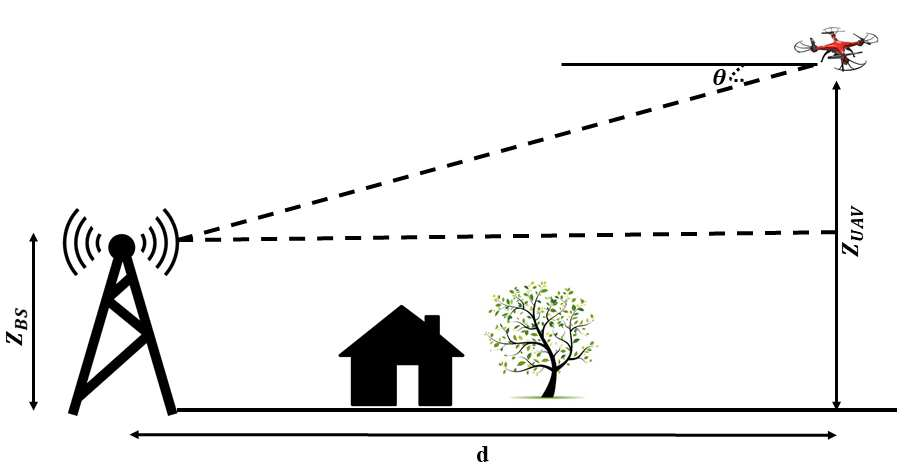
*Caption/Context: Fig. 34: Cellular-to-UAV Path Loss Parameters. | LNLOS(dB) = 20log(dkm) + 20log(fGHz) + 92.4 + Ls*

## --- Page 33 ---

### Section: XI-D3 Deployment Strategies for Minimizing the Number of UAVs Required to Perform Task

33

#### TABLE XIV: COMPARISON AMONG PATH LOSS MODELS

Path loss model
Frequency band
Altitude
Environment
Type of link
Type of experiments
Challenges

[24]
2 GHz
LAP
Outdoor-ground users
Downlink
Simulations
1) The authors didnt consider the indoor users.
2) The authors didn’t consider different 5G
frequency bands.
3) The locations of outdoor users are 2D.

[217]
2 GHz to 6 GHz
LAP
Indoor users
Downlink
Real experiments
1) The authors didnt consider the different
types of the building structures.
2) The authors didn’t consider different 5G
frequency bands.

[218]
850 MHz
LAP
Outdoor cellular
Uplink
Real experiments
1) The authors didnt investigate denser urban
base station
environments.
2) The authors didn’t consider different 5G
frequency bands such as mmWave.

[219]
2 GHz to 6 GHz
HAP
Outdoor-ground users
Downlink
Simulations
1) The authors didnt consider the indoor users
2) The authors didn’t consider different 5G
frequency bands.
3) The locations of outdoor users are 2D.

Free space
All frequency
LAP,
UAV to UAV
Uplink,
Real experiments
1) High Doppler shift.
bands
HAP
channels
downlink

hubs such that the sum-rate of the overall system is maxi-
mized depending on a number of factors including maximum
backhaul data rate of the link between the core network
and mother-UAV-hub, maximum bandwidth of each UAV-hub
available for small-cell base stations, maximum number of
links that every UAV-hub can support and minimum signal-
to-interference-plus-noise ratio. They present an efficient and
distributed solution of the designed problem, which performs
a greedy search to maximize the sum rate of the overall
network. In [230], the authors propose an efficient framework
for optimizing the performance of UAV-based wireless systems
in terms of the average number of bits transmitted to users
and UAVs’s hovering duration. They investigate two scenarios:
UAV communication under hover time constraints and UAV
communication under load constraints. In the first scenario,
given the maximum possible hover time of each UAV, the total
data service under user fairness considerations is maximized.
They utilize the framework of optimal transport theory and
prove that the cell partitioning problem is equivalent to a
convex optimization problem. Then, they propose a gradient-
based algorithm for optimally partitioning the geographical
area based on the users’s distribution, hover times, and lo-
cations of the UAVs. In the second scenario, given the load
requirement of each user at a given location, they minimize the
average hover time needed for completely serving the ground
users by exploiting the optimal transport theory.

3) Deployment Strategies for Minimizing the Number of
UAVs Required to Perform Task: The authors in [231] propose
a method to find the placements of UAVs in an area with
different user densities using the particle swarm optimization.
The goal is to find the minimum number of UAVs and their 3D
placements so that all the users are served. In [232], the authors
study the problem of minimizing the number of UAVs required
for a continuous coverage of a given area, given the recharging
requirement. They prove that this problem is NP-complete.
Due to its intractability, they study partitioning the coverage
graph into cycles that start at the charging station. Based
on this analysis, they then develop an efficient algorithm,

the cycles with limited energy algorithm, that minimizes
the number of UAVs required for a continuous coverage.
The authors in [233] study the problem of minimizing the
number of UAVs required to provide wireless coverage to
indoor users and prove that this problem is NP-complete. Due
to the intractability of the problem, they use clustering to
minimize the number of UAVs required to cover the indoor
users. They assume that each cluster will be covered by only
one UAV and apply the particle swarm optimization to find
the UAV 3D location and UAV transmit power needed to
cover each cluster. In [234], the authors study the problem
of deploying minimum number of UAVs to maintain the
connectivity of ground MANETs under the condition that
some UAVs have already been deployed in the field. They
formulate this problem as a minimum steiner tree problem
with existing mobile steiner points under edge length bound
constraints and prove that the problem is NP-Complete. They
propose an existing UAVs aware polynomial time approximate
algorithm to solve the problem that uses a maximum match
heuristic to compute new positions for existing UAVs. The
authors in [235] aim to minimize the number of UAVs required
to provide wireless coverage for a group of distributed ground
terminals, ensuring that each ground terminal is within the
communication range of at least one UAV. They propose a
polynomial-time algorithm with successive UAV placement,
where the UAVs are placed sequentially starting from the area
perimeter of the uncovered ground terminals along a spiral
path towards the center, until all ground terminals are covered.

4) Deployment Strategies to Collect Data Using UAVs: The
authors in [236] propose an efficient framework for deploying
and moving UAVs to collect data from ground Internet of
Things devices. They minimize the total transmit power of the
devices by properly clustering the devices where each cluster
being served by one UAV. The optimal trajectories of the
UAVs are determined by exploiting the framework of optimal
transport theory. In [237], the authors present a UAV enabled
data collection system, where a UAV is dispatched to collect a

## --- Page 34 ---

### Section: XI-E Interference Mitigation

34

Deployment strategies

for minimizing the
transmit power of UAVs

Deployment strategies

for maximizing the
wireless coverage of UAVs

Deployment strategies for
minimizing the number of
UAVs required to perform task

Deployment strategies to

collect data using UAVs

Classification of Deploy-
ment strategies for UAVs

Fig. 35: Classification of Deployment Strategies for UAVs.

Fig. 36: Interference Mitigation Techniques and Challenges.

given amount of data from ground terminals at fixed location.
They aim to find the optimal ground terminal transmit power
and UAV trajectory that achieve different Pareto optimal en-
ergy trade-offs between the ground terminal and the UAV. The
authors in [238] study the problem of trajectory planning for
wireless sensor network data collecting deployed in remote ar-
eas with a cooperative system of UAVs. The missions are given
by a set of ground points which define wireless sensor network
gathering zones and each UAV should pass through them to
gather the data while avoiding passing over forbidden areas
and collisions between UAVs. The proposed UAV trajectory
planners are based on Genetics Algorithm, Rapidly-exploring
Random Trees and Optimal Rapidly-exploring Random Trees.
The authors in [239] design a basic framework for aerial
data collection, which includes the following five components:
deployment of networks, nodes positioning, anchor points
searching, fast path planning for UAV, and data collection from
network. They identify the key challenges in each component
and propose efficient solutions. They propose a Fast Path
Planning with Rules algorithm based on grid division, to
increase the efficiency of path planning, while guaranteeing the
length of the path to be relatively short. In [240], the authors
jointly optimize the sensor nodes wake-up schedule and UAVs
trajectory to minimize the maximum energy consumption of
all sensor nodes, while ensuring that the required amount
of data is collected reliably from each sensor node. They
formulate a mixed-integer non-convex optimization problem
and apply the successive convex optimization technique, an

efficient iterative algorithm is proposed to find a sub-optimal
solution.

UAVs can be classified into two types: fixed wing and
rotary wing, each with its own strengths and weaknesses.
Fixed-wing UAV usually has high speed and payload, but they
need to maintain a continuous forward motion to remain aloft,
thus are not suitable for stationary uses. In contrast, rotary-
wing UAV such as quadcopter, usually has limited mobility
and payload, but they are able to move in any direction as
well as to stay stationary in the air. Thus, the choice of
UAVs critically depends on the uses [8]. In Table XV, we
make a comparison among the research papers related to UAV
deployment strategies based on the objective functions.

E. Interference Mitigation

One of the techniques to mitigate interference is the coor-
dinated multipoint technique [241]. In downlink coordinated
multipoint technique, the transmission aerial base stations co-
operate in scheduling and transmission in order to strength the
received signal and mitigate inter-cell interference [241]. On
the other hand, the physical uplink shared channel (PUSCH) is
received at aerial base stations in uplink coordinated multipoint
technique. The scheduling decision is based on the coordina-
tion among UAVs [242]. The new challenge here is that UAVs
receive interfering signals from more ground terminals in the
downlink and their uplink transmitted signals are visible to
more ground terminals due to the high probability of line of
sight links. Therefore, the coordinated multipoint techniques
must be applied across a larger set of cells to mitigate
the interference and hence the coordination complexity will
increase [243].

We can also mitigate interference by utilizing receiver tech-
niques such as interference rejection combining and network-
assisted interference cancellation and suppression. Compared
to smart phones, we can equip UAVs with more anten-
nas, which can be used to mitigate interference from more
ground base stations. With MIMO antennas, UAVs can use
beamforming to enables directional signal transmission or
reception to achieve spatial selectivity which is also an efficient
interference mitigation technique [243].

Another interference mitigation technique is to partition ra-
dio resources so that ground traffic and aerial traffic are served
with orthogonal radio resources. This simple technique may
not be efficient since the reserved radio resources for aerial
traffic may be not fully utilized. Therefore, UAV operators
need to provide more information about the trajectories and 3D

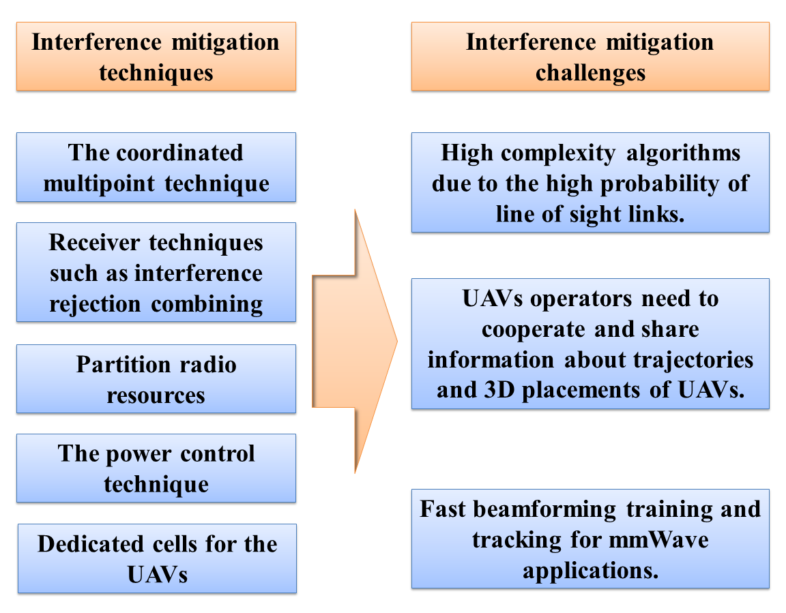
*Caption/Context: Deployment strategies | for minimizing the transmit power of UAVs*

## --- Page 35 ---

35

TABLE XV: COMPARISON AMONG RESEARCH PAPERS RELATED TO UAV DEPLOYMENT STRATEGIES BASED ON OBJECTIVE FUNCTIONS

Reference
Number of UAVs
Type of environment
Type of antenna
Operating frequency
Objective function
Deployment strategy

[220]
Multiple UAVs
Outdoor
Omni-directional
2 GHz
Minimizing the transmit power
Optimal transport theory

of UAVs

[215]
Single UAV
Outdoor
Directional
2 GHz
Minimizing the transmit power
Closed-form expression

of UAV
for the UAV placement

[216]
Single UAV
Indoor
Omni-directional
2 GHz
Minimizing the transmit power
Gradient descent

of UAV
algorithm

[221]
Single UAV
Indoor
Omni-directional
2 GHz
Minimizing the transmit power
Particle swarm

of UAV
optimization

[222]
Single UAV
Outdoor-Indoor
Omni-directional
2 GHz
Minimizing the transmit power
Particle swarm

of UAV
optimization, K-means

with ternary search

algorithms

[223]
Single UAV
Outdoor
Directional
2 GHz
Minimizing the transmit power
Optimal 3D placement

of UAV
algorithm

[224]
Single UAV
Outdoor
Directional
2 GHz
Minimizing the transmit power
Disk covering problem

of UAV

[209]
Single UAV
Outdoor
Directional
2.5 GHz
Maximizing the wireless coverage
Bisection search

of UAV
algorithm

[225]
Multiple UAVs
Outdoor
Directional
2 GHz
Maximizing the wireless coverage
Circle packing

of UAVs
theory

[226]
Single UAV
Outdoor
Directional
2 GHz
Maximizing the wireless coverage
branch and

of UAV
bound algorithm

[227]
Single UAV
Outdoor
Directional
2 GHz
Maximizing the wireless coverage
exhaustive search

of UAV
algorithm

[228]
Multiple UAVs
Indoor
Directional
2 GHz
Maximizing the wireless coverage
efficient algorithm

of UAVs

[229]
Multiple UAVs
Outdoor
Directional
2 GHz
Maximizing the wireless coverage
branch and

of UAVs
bound algorithm

[230]
Multiple UAVs
Outdoor
Directional
2 GHz
Maximizing the wireless coverage
Optimal transport

of UAVs
theory, Gradient

algorithm

[231]
Multiple UAVs
Outdoor
Directional
2 GHz
Minimizing the number
Particle swarm

of UAVs
optimization

[232]
Multiple UAVs
Outdoor
Directional
2 GHz
Minimizing the number
The cycles with limited

of UAVs
energy algorithm

[233]
Multiple UAVs
Indoor
Omni-directional
2 GHz
Minimizing the number
Particle swarm

of UAVs
optimization, K-means

algorithms

[234]
Multiple UAVs
Outdoor
Directional
2 GHz
Minimizing the number
polynomial time

of UAVs
approximate algorithm

[235]
Multiple UAVs
Outdoor
Directional
2 GHz
Minimizing the number
Spiral UAVs

of UAVs
placement algorithm

[236]
Multiple UAVs
Outdoor
Directional
2 GHz
Collecting data using
Optimal transport

UAVs
theory

[237]
Single UAV
Outdoor
Directional
2 GHz
Collecting data using
Two practical

UAV
UAV trajectories:

circular and

straight flights

[238]
Multiple UAVs
Outdoor
Directional
2 GHz
Collecting data using
Genetics

UAVs
algorithm

[239]
Multiple UAVs
Outdoor
directional
2 GHz
Collecting data using
efficient algorithm

UAVs
for path planning

[240]
Single UAV
Outdoor
Directional
2 GHz
Collecting data using
efficient iterative

UAVs
algorithm

## --- Page 36 ---

### Section: XI-F Research Trends and Future Insights

36

placements of UAVs to construct more dynamic radio resource
management [243].

A powerful interference mitigation technique is the power
control technique in which an optimized setting of power
control parameters can be applied to reduce the interference
generated by UAVs. This technique can minimize interference,
increase spectral efficiency, and benefit UAVs as well as
ground terminals [243].

Dedicated cells for the UAVs is another option to mitigate
interference, where the directional antennas are pointed to-
wards the sky instead of down-tilted. These dedicated cells
will be a practical solution especially in UAV hotspots where
frequent and dense UAV takeoffs and landings occur [243].
In Figure 36, we summarize the interference mitigation tech-
niques and challenges.

F. Research Trends and Future Insights

1) Cloud and Big Data: A cloud for UAVs contains data
storage and high-performance computing, combined with big
data analysis tools [256]. It can provide an economic and
efficient use of centralized resources for decision making and
network-wide monitoring [256]–[258]. If UAVs are utilized
by a traditional cellular network operator (CNO), the cloud is
just the data center of the CNO (similar to a private cloud),
where the CNO can choose to share its knowledge with some
other CNOs or utilize it for its own business uses. On the
other hand, if the UAVs are utilized by an infrastructure
provider, the infrastructure provider can utilize the cloud to
gather information from mobile virtual network operators and
service providers. Under such scenario, it is important to
guarantee security, privacy, and latency. To better exploit the
benefit of the cloud, we can use a programmable network
allowing dynamic updates based on big data processing, for
which network functions virtualization and software defined
networking can be research trends [256].

2) Machine Learning: Next-generation aerial base stations
are expected to learn the diverse characteristics of users behav-
ior, in order to autonomously find the optimal system settings.
These intelligent UAVs have to use sophisticated learning and
decision-making, one promising solution is to utilize machine
learning. Machine learning algorithms can be simply classi-
fied as supervised, unsupervised and reinforcement learning
as shown in Table XVI. The family of supervised learning
algorithms utilizes known models and labels to enable the esti-
mation of unknown parameters. They can be used for spectrum
sensing and white space detection in cognitive radio, massive
MIMO channel estimation and data detection, as well as for
adaptive filtering in signal processing for 5G communications.
They can also be utilized in higher-layer applications, such as
estimating the mobile users locations and behaviors, which can
help the UAV operators to enhance the quality of their services.
The family of unsupervised learning algorithms utilizes the
input data itself in a heuristic manner. They can be used for
heterogeneous base station clustering in wireless networks,
for access point association in ubiquitous WiFi networks, for
cell clustering in cooperative ultra-dense small-cell networks,
and for load-balancing in heterogeneous networks. They can

also be utilized in fault/intrusion detections and for the users
behavior-classification. The family of reinforcement learning
algorithms utilizes dynamic iterative learning and decision-
making process. They can be used for estimating the mobile
users decision making under unknown scenarios, such as
channel access under unknown channel availability conditions
in spectrum sharing, base station association under the un-
known energy status of the base stations in energy harvesting
networks, and distributed resource allocation under unknown
resource quality conditions in femto/small-cell networks [259].

3) Network Functions Virtualization: Network functions
virtualization (NFV) reduces the need of deploying specific
network devices for the integration of UAVs [256], [257]. NFV
allows a programmable network structure by virtualizing the
network functions on storage devices, servers, and switches,
which is practical for UAVs requiring seamless integration
to the existing network. Moreover, virtualization of UAVs
as shared resources among cellular virtual network operators
can decrease OPEX for each party [260]. Here, the SDN can
be useful for the complicated control and interconnection of
virtual network functions (VNFs) [256], [257].

4) Software Defined Networking: For mobile networks, a
centralized SDN controller can make a more efficient allo-
cation of radio resources, which is particularly important to
exploit UAVs [256], [257]. For instance, SDN-based load
balancing can be useful for multi-tier UAV networks, such
that the load of each aerial base station and terrestrial base
station is optimized precisely. A SDN controller can also
update routing such that part of traffic from the UAVs is carried
through the network without any network congestions [256]–
[258]. For further exploitation of the new degree of freedom
provided by the mobility of UAVs, the 3D placements of UAVs
can be adjusted to optimize paging and polling, and location
management parameters can be updated dynamically via the
unified protocols of SDN [256].

5) Millimeter-Wave: Millimeter-wave (mmWave) technol-
ogy can be utilized to provide high data rate wireless com-
munications for UAV networks [261]. The main difference
between utilizing mmWave in UAV aerial networks and uti-
lizing mmWave in terrestrial cellular networks is that a UAV
aerial base station may move around. Hence, the challenges of
mmWave in terrestrial cellular networks apply to the mmWave
UAV cellular network as well, including rapid channel varia-
tion, blockage, range and directional communications, multi-
user access, and others [261], [262]. Compared to mmWave
communications for static stations, the time constraint for
beamforming training is more critical due to UAV mobility.
For fast beamforming training and tracking in mmWave UAV
cellular networks, the hierarchical beamforming codebook is
able to create highly directional beam patterns, and achieves
excellent beam detection performance [261]. Although the
UAV wireless channels have high Doppler frequencies due to
the continuous movements of UAVs with different velocities,
the major multipath components are only affected by slow
variations due to high gain directional transmissions. In beam
division multiple access (BDMA), multiple users with different
beams may access the channel at the same time due to the
highly directional transmissions of mmWave [261]–[263]. This

## --- Page 37 ---

### Section: XI-F6 Free Space Optical

37

#### TABLE XVI: UAV MACHINE LEARNING ALGORITHMS

Category
Learning techniques
Key characteristics
Application
Regression models
- Estimate the variables relationships
- Energy learning [244]
- Linear and logistics regression
K-nearest neighbor
- Majority vote of neighbors
- Energy learning [244]
Supervised
Support vector machines
- Non-linear mapping to high dimension
- MIMO channel learning [245]
learning
- Separate hyperplane classification
Bayesian learning
- A posteriori distribution calculation
- Massive MIMO learning [246]
- Gaussians mixture, expectation max
- Cognitive spectrum learning
and hidden Markov models
[247]–[249]
Unsupervised
K-means clustering
- K partition clustering
- Heterogeneous networks [250]
- Iterative updating algorithm
learning
Independent component analysis
- Reveal hidden independent factors
- Spectrum learning in [251]

cognitive radio
Markov decision processes/A partially
- Bellman equation maximization
- Energy harvesting [252]
observable Markov decision process
- Value iteration algorithm
Reinforcement
Q-learning
- Unknown system transition model
- Femto and small cells
learning
- Q-function maximization
[253]- [254]
Multi-armed bandit
- Exploration vs. exploitation
- Device-to-device networks [255]
- Multi-armed bandit game

technique improves the capacity significantly, due to the large
bandwidth of mmWave technology and the use of BDMA in
the spatial domain. The blockage problem can be mitigated
by utilizing intelligent cruising algorithms that enable UAVs
to fly out of a blockage zone and enhance the probability of
line of sight links [261].

6) Free Space Optical: Free space optical (FSO) technol-
ogy can be used to provide wireless connectivity to remote
places by utilizing UAVs, where physical access to 3G or
4G network is either minimal or never present [76]. It can
be involved in the integration of ground and aerial networks
with the help of UAVs by providing last mile wireless cover-
age to sensitive areas (e.g., battlefields, disaster relief, etc.)
where high bandwidth and accessibility are required. For
instance, Facebook will provide wireless connectivity via FSO
links to remote areas by utilizing solar-powered high altitude
UAVs [76], [264], [265]. For areas where deployment of UAVs
is impractical or uneconomical, geostationary earth orbit and
low earth orbit satellites can be utilized to provide wireless
connectivity to the ground users using the FSO links. The
main challenge facing UAV-free space optics technology is
the high blockage probability of the vertical FSO link due
to weather conditions. The authors in [214] propose some
methods to tackle this problem. The first method is to use an
adaptive algorithm that controls the transmit power according
to weather conditions and it may also adjust other system
parameters such as incident angle of the FSO transceiver
to compensate the link degradation, e.g., under bad weather
conditions, high power vertical FSO beams should be used
while low power beams could be used under good weather
conditions. The second method is to use a system optimization
algorithm that can optimize the UAV placement, e.g., hovering
below clouds over negligible turbulence geographical area.

7) Future Insights: Some of the future possible directions
for this research are:

• The majority of literature focuses on providing the wire-
less coverage for outdoor ground users, although 90%
of the time people are indoor and 80% of the mobile
Internet access traffic also happens indoors [266]–[268].
Therefore, it is important to study the indoor wireless

coverage problems by utilizing UAVs.

• The majority of literature does not consider the limited
energy capacity of UAV as a constraint when they study
the wireless coverage of UAVs, where the energy con-
sumption during data transmission and reception is much
smaller than the energy consumption during the UAV
hovering. It only constitutes 10%-20% of the UAV energy
capacity [2].

• Some path loss models are based on simulations soft-
wares such as Air-to-Ground path loss for low altitude
platforms and Air-to-Ground path loss for high altitude
platforms, therefore it is necessary to do real experiments
to model the statistical behavior of the path loss.

• To the best of our knowledge, no studies present the path
loss models for uplink scenario and mmWave bands.

• There are challenges facing the new technologies such
as mmwave. The challenges facing UAV-mmWave tech-
nology are fast beamforming training and tracking re-
quirement, rapid channel variation, directional and range
communications, blockage and multi-user access [261].

• We need more studies about the topology of UAV wire-
less networks where this topology remains fluid during: a)
Changing the number of UAVs; b) Changing the number
of channels; c) The relative placements of the UAVs
altering [2].

• There is a need to study UAV routing protocols where
it is difficult to construct a simple implementation for
proactive or reactive schemes [2].

• There is a need for a seamless mechanism to transfer the
users during the handoff process between UAVs, when
out of service UAVs are replaced by active ones [2].

• Further research is required to determine which technol-
ogy is right for UAV applications, where the common
technologies utilized in UAV applications are the IEEE
802.11 due to wide availability in current wireless devices
and their appropriateness for small-scale UAVs [1].

• D2D communications is an efficient technique to improve
the capacity in ground communications systems [269].
An important problem for future research is the joint
optimization of the UAV path planning, coding, node

## --- Page 38 ---

### Section: XII Key Challenges

38

clustering, as well as D2D file sharing [8].

• Utilizing UAVs in public safety communications needs
further research, where topology formation, cooperation
between UAVs in a multi-UAV network, energy con-
straints, and mobility model are the challenges that are
facing UAVs in public safety communications [9].

• In UAVs-based IoT services, it is difficult to control and
manage a high number of UAVs. The reason is that
each UAV may host more than one IoT device, such as
different types of cameras and aerial sensors. Moreover,
conflict of interest between different devices likely to
happen many times, e.g., taking two videos from two
different angles from one fixed placement. For future
research, we need to propose efficient algorithms to solve
the conflict of interest among Internet of things devices
on-board [3].

• For future research, it is important to propose efficient
techniques that manage and control the power consump-
tion of Internet of things devices on-board [3].

• The security is one of the most critical issues to think
about in UAVs-based Internet of things services, methods
to avoid the aerial jammer on the communications are
needed [3].

#### PART III: KEY CHALLENGES AND CONCLUSION

#### XII. KEY CHALLENGES

A. Charging Challenges

UAV missions necessitate an effective energy management
for battery-powered UAVs. Reliable, continuous, and smart
management can help UAVs to achieve their missions and
prevent loss and damage. The UAV’s battery capacity is
a key factor for enabling persistent missions. But as the
battery capacity increases, its weight increases, which cause
the UAV to consume more energy for a given mission. The
main directions in the literature to mitigate the limitations
in UAV’s batteries are: (1) UAV battery management, (2)
Wireless charging for UAVs, (3) Solar powered UAVs, and
(4) Machine learning and communications techniques.

1) Battery Management: Battery management research in
UAVs includes planning, scheduling, and replacement of bat-
tery so UAVs can accomplish their flight missions. This has
been studied in the literature from different perspectives. Saha
et al. in [270] build a model to predict the end of battery
charge for UAVs based on particle filter algorithm. They utilize
a discharge curve for UAV Li-Po battery to tune the particle
filter. They have shown that the depletion of the battery is
not only related to the initial Start of Charge (SOC) but
also, load profile and battery health conditions can be crucial
factors. Park et al. in [271] investigate the battery assignment
and scheduling for UAVs used in delivery business. Their
objective is to minimize the deterioration in battery health.
After splitting the problem into two parts; one for battery
assignment and the other for battery scheduling. Heuristic
algorithm and integer linear programming are used to solve
the assignment and scheduling problems, respectively. The
idle time between two successive charging cycles and the
depth of the discharge are the main factors that control these

algorithms. The use of UAVs in long time and enduring
missions makes UAV battery swapping solutions necessary to
accomplish these missions. An autonomous battery swapping
system for UAVs is first introduced in [272]. The battery
swapping consists of landing platform, battery charger, battery
storage compartment, and micro-controller. Similar concept to
this autonomous battery swapping system was adopted and im-
proved by different researchers in [273]–[276]. The hot swap
term is adopted to refer to the continuous powering for the
UAV during battery swapping. Figure 37 shows an illustration
of hot swapping systems. First, the UAV is connected to an
external power supply during the swapping process. This will
prevent data loss during swapping as it usually happens in
cold swapping. Second, the drained battery is removed and
stored in multi-battery compartment and charging station to
be recharged. Third, a charged battery is installed in the UAV,
and finally, the external power supply is disconnected. Another
important aspect of the improvements presented in [273]–
[276] is the several designs for the landing platform, which
is an important part of the swapping system because it can
compensate the error in the UAV positioning on the landing
point. Table XVII shows the classification of autonomous
battery swapping systems. It can be seen from this table
that the swapping time for most of these systems is around
one minute. This is a short period comparing to the battery
charging average time, which is between 45-60 minutes.

Fig. 37: Illustration of Battery Hot Swapping System.

2) Wireless Charging For UAV: Simic et. Al in [277]
study the feasibility of recharging the UAV from power lines
while inspecting these power lines. Experimental tests show
the possibility of energy harvesting from power lines. The
authors design a circular antenna to harvest the required
energy from power lines. Wang et al. in [278] propose an
automatic charging system for the UAV. The system uses
charging stations allocated along the path of UAV mission.
Each charging station consists of wireless charging pad, solar
panel, battery, and power converter. All these components
are mounted on a pole. The UAV employs GPS module
and wireless network module to navigate to the autonomous
charging station. When the power level in the UAV’s battery

![• For future research, it is important to propose efficient techniques that manage and control the power consump- tion of Internet of things devices on-board [3]. | • The security is one of the most critical issues to think about in UAVs-based Internet of things services, methods to avoid the aerial jammer on the communications are needed [3].](images/page_038_fig_01.png)
*Caption/Context: • For future research, it is important to propose efficient techniques that manage and control the power consump- tion of Internet of things devices on-board [3]. | • The security is one of the most critical issues to think about in UAVs-based Internet of things services, methods to avoid the aerial jammer on the communications are needed [3].*

## --- Page 39 ---

### Section: XII-A3 Solar Powered UAVs

39

#### TABLE XVII: CLASSIFICATION OF AUTONOMOUS BATTERY SWAPPING SYSTEMS

Ref # /Year
UAV Type
Battery Type
Positioning System
Swapping time
Hot vs Cold Swapping

[272]/2010
Quadrotor
Li-Po
V-Shape Basket
2 min.
Cold swap

[273]/2011
Quadrotor
Li-Po
Sloped landing pad
11.83 sec.
Hot swaps

[274]/2012
Quadrotor
Li-Po
Dynamic forced positioning (Arm Actuation)
47-60 sec.
Cold swap

[276]/2015
Quadrotor
Li-Po
Sloped landing pad
60-70 sec.
Hot swaps

[275]/2015
Quadrotor
Li-Po
Rack with landing guide
60 sec.
Hot swaps

drops to a predefined level. The UAV will communicate with
the central control room, which will direct the UAV to the
closest charging station. The GPS module will help the UAV
to navigate to the assigned station. Different wireless power
transfer technologies were used in literature to implement the
automatic charging stations. In [279]–[281], the authors utilize
the magnetic resonance coupling technology to implement
an automatic drone charging station. Dunbar et al. in [282]
use RF Far field Wireless Power Transfer (WPT) to recharge
micro UAV after landing. A flexible rectenna was mounted
on the body of the UAV to receive RF signals from power
transmitter. Mostafa et al. in [283] develop a WPT charging
system based on the capacitive coupling technology. One of
the major challenges that face the deployment of autonomous
wireless charging stations is the precise landing of the UAV
on the charging pad. The imprecise landing will lead to
imperfect alignment between the power transmitter and the
power receiver, which means less efficiency and long charging
time. Table XVIII shows precise methodologies adopted in
the literature. In [278], the authors use GPS to land the UAV
on the charging pad. In [284], the authors corporate the GPS
system with camera and image processing system to detect
the charging station. The authors in [280] allow for imprecise
landing on wide frame landing pad. Then a wireless charging
transmitting coil is stationed perfectly in the bottom of the
UAV by using a stepper motor and two laser distance sensors.

#### TABLE XVIII: CLASSIFICATION OF PRECISE LANDING METHODOLOGIES

Ref # /Year
Precise Landing Methodology
[278]/2016
GPS system
[280]/2017
Landing frame with moving transmitting coil
[284]/2017
GPS system and vision-based target detection

3) Solar Powered UAVs: For long endurance and high
altitude flights, solar-powered UAVs (SUAVs) can be a great
choice. These UAVs use solar power as a primary source for
propulsion and battery as a secondary source to be used during
night and sun absence conditions. The literature in flight
endurance and persistent missions for SUAVs can be classified
into two main directions: path planning and optimization and
hybrid Models. Path planning and optimization includes: (i)
gravitational potential energy planning. This scheme optimizes
the path of the UAV over three stages, ascending and battery
charging stage during the day using solar power, descending
stage during the night using gravitational potential energy, and
level flight stage using battery [285]–[287], (ii) optimal path
planing while tracking ground object [288], [289], (iii) optimal
path planning based on UAV kinematics and its energy loss
model [290], and (iv) optimal path planning utilizing wind

and metrological data [291], [292]. On the other hand, Hybrid
models include: (i) UAVs with hybrid power sources such as
solar, battery, and fuel cells [293] and (ii) UAVs with a hybrid
propulsion system that can be transformed from fixed wing to
quadcopter UAV [294], [295].

4) Machine Learning and Communications Techniques:
Communication equipment and their status (transmit, receive,
sleep, or idle) can affect drone flight time. Utilizing the state-
of-the-art machine learning techniques can result in smarter
energy management. These technologies and their role in UAV
persistent missions are covered in the literature under the
following themes:

• Energy efficient UAV networks: This area covers maxi-
mizing energy efficiency in the network layer, data link
layer, physical layer, and cross-layer protocols in a bid
to help UAVs to perform long missions. Gupta et al. in
[296] list and compare several algorithms used in each
layer.

• Energy-based UAV fleet management: This includes mod-
ifying the mobility model of UAV fleet to incorporate
energy as decision criterion as in [297] to determine the
next move of each UAV inside a fleet.

• Machine learning: This area covers research that utilizes
machine learning techniques for path planning and op-
timization applications, taking into consideration energy
limitations. Zhang et al. in [298] use deep reinforcement
learning to determine the fastest path to a charging
station. While Choi et al. in [299] use a density-based
spatial clustering algorithm to build a two-layer obstacle
collision avoidance system.

Several challenges still exist in the area of battery recharging
and need to be appropriately addressed, including:

• Advancements in wireless charging techniques such as
magnetic resonant coupling and inductive coupling tech-
niques are popular and suitable to be used because both
of them have acceptable efficiency for small to mid-
range distances. The advancements in this technology are
expected to have a positive impact on the use of UAVs.

• Development of battery technologies will allow UAVs
to extend flight ranges. While Lithium-Ion batteries still
dominant, PEM Fuel cells can be more convenient in
UAVs because of their higher power density.

• Motion planning of UAVs is an extremely important
factor since it affects the wireless charging efficiency and
the average power delivered .

• The vast majority of the research, concerning UAV power
management, focuses on multi-rotor UAVs. Other types
of UAVs, such as fixed-wing UAVs, need more attention

## --- Page 40 ---

### Section: XII-B Collision Avoidance and Swarming Challenges

40

in future research.

• Artificial intelligence, especially deep learning, can pro-
mote more advances in the field of UAV power manage-
ment. Many research frontiers still need to be explored in
this field such as; Deep reinforcement learning in the path
planning and battery scheduling, convolutional neural net-
works in identifying charge stations and precise landing
in a charging station, and recurrent neural networks in
developing discharge models and precisely predicting the
end of the charge.

• Image processing techniques and smart sensors can also
play an important role in identifying charging stations
and facilitating precise positioning of UAVs on them.

B. Collision Avoidance and Swarming Challenges

One of the challenges facing UAVs is collision avoidance.
UAV can collide with obstacles, which can either be moving
or stationary objects in either indoor or outdoor environment.
During UAV flights, it is important to avoid accidents with
these obstacles. Therefore, the development of UAV collision
avoidance techniques has gained research interest [60], [300].
In this section, we first present the major categories of colli-
sion avoidance methods. Then, the challenges associated with
UAVs collision avoidance are presented. Moreover, we provide
research trends and some future insights.

1) Collision Avoidance Approaches: Many collision avoid-
ance approaches have been proposed in order to avoid potential
collisions by UAVs. The authors in [60] presented major
categories of collision avoidance methods. These methods can
be summarized as geometric approaches [301], path planning
approaches [59], potential field approaches [302], [303], and
vision-based approaches [304]. Several collision avoidance
techniques can be utilized for an indoor environment such
as vision based methods (using cameras and optical sensors),
on-board sensors based methods (using IR, ultrasonic, laser
scanner, etc.) and vision based combined with sensor based
methods [305]. The collision avoidance approaches are dis-
cussed in the following:

• Geometric Approach is a method that utilizes the geo-
metric analysis to avoid the collision. In [301], the geo-
metric approach was utilized to ensure that the predefined
minimum separation distance was not violated. This was
done by computing the distance between two UAVs and
the time required for the collision to occur. Moreover, it
was used for path planning to avoid UAV collisions with
obstacles. Several different approaches utilize this method
to avoid collision such as Point of Closest Approach
[301], Collision Cone Approach [302], [306], and Dubins
Paths Approach [307], [308].

• Path Planning Approach, which is also referred to as
the optimized trajectory approach [309], is a grid based
method that utilizes the path re-planning algorithm with
graph search algorithm to find a collision free trajectory
during the flight. It uses geometric techniques to find an
efficient and collision free trajectory, so it shares some
similarities with the geometric approach. This method
divides the map into a grid and represents the grid

as a weighted graph [59]. The grid with graph search
algorithm are used to find collision free trajectory towards
the desired target.

• Potential Field Approach is proposed by [303] to be used
as a collision avoidance method for ground robots. It has
also been utilized for collision avoidance among UAVs
and obstacles. This method uses the repulsive force fields
which cause the UAV to be repelled by obstacles. The
potential function is divided into attracting force field
which pulls the UAV towards the goal, and repulsive force
field which is assigned with the obstacle [302].

• Vision-based obstacle detection approaches utilize images
from small cameras mounted on UAVs to tackle collision
challenges. Advances in integrated circuits technology
have enabled the design of small and low power sensors
and cameras. Combined with advances in computer vision
methods, such camera can be used in effective obstacle
detection and collision avoidance [304]. Moreover, this
approach can be used efficiently for collision avoidance
in the indoor environment. Such cameras provide real-
time information about walls and obstacles in this envi-
ronment. Many researchers utilized this method to avoid
a collision and to provide fully autonomous UAV flights
[310]–[313]. The researchers in [311] use a monocu-
lar camera with forward facing to generate collision-
free trajectory. In this method, all computations were
performed off-board the UAV. To solve the off-board
image processing problem, the authors in [314] proposed
a collision avoidance system for UAVs with visual-based
detection. The image processing operation was performed
using two cameras and a small on-board computation
unit.

2) Challenges: There are several challenges in the area of
collision avoidance approaches and need to be appropriately
addressed, including:

• The geometric approach utilizes the information such
as location and velocity, which can be obtained us-
ing Automatic Dependent Surveillance Broadcast (ADS-
B) sensing method. Thus, it is not applicable to non-
aircraft obstacles. Furthermore, input data from ADS-B
is sensitive to noise which hinders the exact calculation
requirement of this approach. Moreover, ADS-B requires
cooperation from another aircraft, which can be an in-
truder, which is referred to as cooperative sensing.

• In non-cooperative sensing, the geometric approach re-
quires UAVs to sense and extract information about the
environment and obstacles such as position, speed and
size of the obstacles. One of the possible solutions is
to combine with a vision-based approach that uses a
passive device to detect obstacles. However, this approach
requires significant data processing and only can be used
when the objects are close enough. Therefore, hardware
limitation for on-board processing should be taken into
consideration.

• The diverse robotic control problem that allows UAV
to perform complex maneuvers without collision can be
solved using the standard control theory. However, each

## --- Page 41 ---

### Section: XII-B3 Future Insights

41

solution is limited to a specific case and not able to adapt
to changes in the environments. This limitation can be
overcome by learning from experience. This approach can
be achieved using deep learning technique. More specif-
ically, deep learning allows inferring complex behaviors
from raw observation data. However, this approach has
issues with samples efficiency. For real time application,
deep learning requires the usage of on-board GPUs. In
[58], a review of deep learning methods and applications
for UAVs were presented.

• In the context of multi-UAV systems, the collision avoid-
ance among UAVs is a very complicated task, a technique
known as formation control can be used for obstacle
avoidance. More specifically, cooperative formation con-
trol algorithms were developed as a collision-avoidance
strategy for the multiple UAVs [315], [316]. A recent
advancement in this area employs Model Predictive Con-
trollers (MPC) in order to reduce computation time for
the optimization of UAV’s trajectory.

• The limited available power and payload of UAVs are
challenging issues, which restrict on-board sensors re-
quirements such as sensor weight, size and required
power. These sensors such as IR, Ultrasonic, laser scan-
ner, LADAR and RADAR are typically heavy and large
for sUAV [317].

• The high speed of UAVs is another challenge. With speed
ranges between 35 and 70 Km/h, obstacle avoidance
approach must be executed quickly to avoid the collision
[317].

• The use of UAVs in an indoor environment is a challeng-
ing task and it needs higher requirements than outdoor
environment. It is very difficult to use GPS for avoiding
collisions in an indoor environment, usually indoor is a
GPS denied environment. Moreover, RF signals cannot be
used in this environment, RF signals could be reflected,
and degraded by the indoor obstacles and walls.

• Vision-based collision avoidance methods using cameras
suffer from heavy computational operations for image
processing. Moreover, these cameras and optical sensors
are light sensitive (need sufficient lighting to work prop-
erly), so steam and smoke could cause the collision avoid-
ance system to fail. Therefore, sensor based collision
avoidance methods can be used to tackle these problems
[318], [319].

• Some of the vision based collision avoidance approaches
use a monocular camera with forward facing to generate
collision free trajectory. In this method, all computations
are performed off-board, with 30 frames per second
which are sent in real time over Wi-Fi network to perform
image processing at a remote base station. This makes
UAV sensing and avoiding obstacles a challenging task
[311]

3) Future Insights: Based on the reviewed literature of
collision avoidance challenges, we suggest these possible
future directions:

• UAVs could be integrated with vision sensors, laser range
finder sensors, IR, and/or ultrasound sensors to avoid

collisions in all directions [318].

• UAV control algorithms can be developed for autonomous
hovering without collision, and to ensure the completion
of their mission successfully.

• Standardization rules and regulations for UAVs are highly
needed around the world to regulate their operations, to
reduce the likelihood of collision among UAVs, and to
guarantee safe hovering [320], [321].

• Under the deep learning techniques with Model Pre-
dictive Controllers (MPC), further work can be done
on developing methods to generate guiding samples for
more superior obstacle avoidance. The main concern in
the deploying deep learning models is the processing
requirement. Therefore, hardware limitation for on-board
processing should be taken into consideration.

• More studies are required to improve indoor and out-
door collision avoidance algorithms in order to compute
smoother collision free paths, and to evaluate optimized
trajectory in terms of aspects such as energy consumption
[314].

• On-board processing is required for many UAV opera-
tions, such as dynamic sense and avoid algorithms, path
re-planning algorithms and image processing. Design
on-board powerful processor devices with low power
consumption is an active area for future researches [58].

C. Networking Challenges

Fluid topology and rapid changes of links among UAVs are
the main characteristics of multi-UAV networks or FANET
[2]. A UAV in FANET is a node flying in the sky with 3D
mobility and speed between 30 to 460 km/h. This high speed
causes a rapid change in the link quality between a UAV
and other nodes, which introduces different design challenges
to the communications protocols. Therefore, FANET needs
new communication protocols to fulfill the communication
requirements of Multi-UAV systems [322].

1) FANET Challenges:

• One of the challenging issues in FANET is to provide
wireless communications for UAVs, (wireless commu-
nications between UAV-GCS, UAV-satellite, and UAV-
UAV). More specifically, coordination, cooperation, rout-
ing and communication protocols for the UAVs are chal-
lenging tasks due to the frequent connections interruption,
fluid network topology, and limited energy resources of
UAVs. Therefore, FANET requires some special hardware
and a new networking model to address these challenges
[3], [323].

• The UAV power constraints limit the computation, com-
munication, and endurance capabilities of UAVs. Energy-
aware deployment of UAVs with Low power and Lossy
Networks (LLT) approach can be efficiently used to
handle this challenge [8], [324].

• FANET is a challenging environment for resources man-
agement in view of the special characteristics of this
network. The challenge is the complexity of network
management, such as the configuration difficulties of the
hardware components of this network [325]. Software-

## --- Page 42 ---

### Section: XII-C2 UAV New Networking Trends

42

Defined Networking (SDN) and Network Function Vir-
tualization (NFV) are useful approaches to tackle this
challenge [326].

• Setting up an ad-hoc network among nodes of UAVs is a
challenging task for FANET, due to the high node mobil-
ity, large distance between nodes, fluid network topology,
link delays and high channel error rates. Therefore,
transmitted data across these channels could be lost or
delayed. Here the loss is usually caused by disconnections
and rapid changes in links among UAVs. Delay-Tolerant
Networking (DTN) architecture was introduced to be
used in FANET to address this challenge [327], [328].
2) UAV New Networking Trends:
a) Delay-Tolerant Networking (DTN): The DTN architec-
ture was designed to handle challenges facing the dynamic
environments as in FANET. [329]. In FANET, DTN approach
based on store-carry-forward model can be utilized to tackle
the long delay for packets delivery. In this model, a UAV can
store, carry and forward messages from source to destination
with long term data storage and forwarding functions in order
to compensate intermittent connectivity of links [330], [331].

DTN can be used with a set of protocols operating at
MAC, transport and application layers to provide reliable
data transport functions, such as Bundle Protocol (BP) [332],
Licklider Transmission Protocol (LTP) [333] and Consultative
Committee for Space Data Systems (CCSD) File Delivery
Protocol (CFDP) [334]. These protocols use store, carry and
forward model, so UAV node keeps a copy for each sent
packet until it receives acknowledgment from the next node
to confirm that the packet has been received successfully.

BP and LTP are protocols developed to cope with FANET
challenges and solve the performance problems for FANET.
The BP, forms a store, carry and forward overlay networks, to
handle message transmissions, receptions and re-transmissions
using a convergence layer protocol (CLP) services [332], [335]
with the underlying transport protocols such as TCP-based
[336], UDP-based [337] or LTP-based [333]. The CFDP was
designed for file transfer from source to destination based on
store, carry and forward approach for DTN paradigm. It can
be run over either reliable or unreliable service mode using
transport layer protocols (TCP or UDP) [338].

A routing strategy that combines DTN routing protocols in
the sky and the existing Ad-hoc On-demand Distance Vector
(AODV) on the ground for FANETs was proposed in [331].
In this work, they implement a DTN routing protocol on
the top of traditional and unmodified AODV. They also use
UAV to store, carry and forward the messages from source to
destination.

b) Network Function Virtualization (VFV): NFV is a new
networking architecture concept for network softwarization
and it is used to enable the networking infrastructure to be vir-
tualized. More specifically, an important change in the network
functions provisioning approach has been introduced using
NFV, by leveraging existing IT virtualization technologies,
therefore, network devices, hardware and underlying functions
can be replaced with virtual appliances. NFV can provide
programming capabilities in FANETs and reduces the network
management complexity challenge [339], [340].

The research in [256], proposed drone-cell management
framework (DMF) using UAVs act as aerial base stations with
a multi-tier drone-cell network to complement the terrestrial
cellular network based on NFV and SDN paradigms. In [341],
the authors proposed a video monitoring platform as a service
(VMPaaS) using swarm of UAVs that form a FANET in
rural areas. This platform utilizes the recent NFV and SDN
paradigms.

Due to the complexity of the interconnections and controls
in NFV, SDN can be consolidated with NFV as a useful
approach to address this challenge.

c) Software-Defined Networking (SDN): SDN is a promis-
ing network architecture, which provides a separation between
control plane and data plane. It can also provide a centralized
network programmability with global view to control network.
Benefiting from the centralized controller in SDN, the original
network switches could be replaced by uniform SDN switches
[342]. Therefore, the deployment and management of new
applications and services become much easier. Moreover, the
network management, programmability and reconfiguration
can be greatly simplified [343].

FANET can utilize SDN to address its environment’s chal-
lenges and performance issues, such as dynamic and rapid
topology changes, link intermittent between nodes; when UAV
goes out of service due to coverage problems or for battery
recharging. SDN also can help to address the complexity of
network management [2].

OpenFlow is one of the most common SDN protocols,
used to implement SDN architecture and it separates the
network control and data planes functionalities. OpenFlow
switch consists of flow Table, OpenFlow Protocol and a
Secure Channel [344]. UAVs in FANETs can carry OpenFlow
Switches. The SDN control plane could be centralized (one
centralized SDN controller), decentralized (the SDN controller
is distributed over all UAV nodes), or hybrid in which the
processing control of the forwarded packets can be performed
locally on each UAV node and control traffic also exists
between the centralized SDN controller and all other SDN
elements [2].

The controller collects network statistics from OpenFlow
switches, and it also needs to know the latest topology of
the UAVs network. Therefore, it is important to maintain
the connectivity of the SDN controller with the UAV nodes.
The centralized SDN controller has a global view of the
network. OpenFlow switches contain software flow tables and
protocols to provide a communication between network and
control planes, then the controller determines the path and tells
network elements where to forward the packets [344].

Figure 38 shows separation of control and data planes in
SDN platform with OpenFlow interface.

d) Low power and Lossy Networks (LLT): In FANETs, UAV
nodes are typically characterized by limited resources, such as
battery, memory and computational resources. LLN composed
of many embedded devices such as UAVs with limited power,
and it can be considered as a promising approach to be used
in FANET to handle power challenge in UAVs [324], [345].

The Internet Engineering Task Force (IETF) has defined
routing protocol for LLN known as routing for low-power and

## --- Page 43 ---

### Section: XII-C3 Future Insights

43

Fig. 38: Control and Data Planes in SDN Platform.

lossy network (RPL) [324], this protocol can utilize different
low power communication technologies, such as low power
WiFi, IEEE 802.15.4 [346], which is a standard for low-power
and low rate wireless communications and can be used for
UAV-UAV communications in FANET [347]. The IPv6 over
Low Power Wireless Personal Area Networks (6LoWPAN)
defines a set of protocols that can be used to integrate
nodes with IPv6 datagrams over constrained networks such
as FANET [348].

3) Future Insights: Based on the reviewed literature of the
networking challenges and new networking trends of FANET,
we suggest these future insights:

• SDN services can be developed to support FANET func-
tions, such as surveillance, safety and security services.

• Further studies are needed to study the SDN deployment
in FANET with high reliability, reachability and fast
mobility of UAV nodes [349]

• More research is needed to develope specific security
protocols for FANETs based on the SDN paradigm.

• More studies are needed to replace the conventional net-
work devices by fully decoupled SDN switching devices,
in which the control plane is completely decoupled from
data plane and the routing protocols can be executed on-
board from SDN switching devices [349].

• For NFV, more research is needed on optimal virtual
network topology, customized end-to-end protocols and
dynamic network embedding [343].

• New routing protocols need to be tailored to FANETs
to conserve energy, satisfy bandwidth requirement, and
ensure the quality of service [323].

• Most of the existing MANET routing protocols partially
fail to provide reliable communications among UAVs. So,
there is a need to design and implement new routing
protocols and networking models for FANETs [7].

• FANETs share the same wireless communications bands
with other applications such as satellite communications
and GSM networks. This leads to frequency conges-
tion problems. Therefore, there is a need to standardize
FANET communication bands to mitigate this problem
[2].

• FANETs lack security support. Each UAV in FANET is
required to exchange messages and routing information
through wireless links. Therefore, FANETs are vulnerable

to attacks. As a result, it is important to design and
implement secure FANET routing protocols.

• The design of congestion control algorithms become an
important issue for FANETs. Current research efforts
focus on modifying and improving protocols instead
of developing new transport protocols that better suite
FANETs. [350].

D. Security Challenges

Figure 39 illustrates the general architecture of UAV sys-
tems [351], which includes: (1) UAV units; (2) GCSs; (3)
satellite (if necessary); and (4) communications links. Various
components of the UAV systems provide a large attack surface
for malicious intruders which brings huge cyber security
challenges to the UAV systems. In this section, to present a
comprehensive view of the cyber security challenges of UAV
systems, we first summarize the attack vectors of general UAV
systems. Then, based on the attack vectors and the potential ca-
pabilities of attackers, we classify the cyber attacks/challenges
against UAV systems into different categories. More impor-
tantly, we present a comprehensive literature review of the
state-of-the-art countermeasures for these security challenges.
Finally, based on the reviewed literature, we summarize the
security challenges and provide high level insights on how to
approach them.

1) Attack Vectors in UAV Systems: Based on the architec-
ture illustrated in Figure 39, we identify four attack vectors:

• Communications links: various attacks could be applied
to the communications links between different entities
of UAV systems, such as eavesdropping and session
hijacking.

• UAVs themselves: direct attacks on UAVs can cause
serious damage to the system. Examples of such attacks
are signal spoofing and identity hacking.

• GCSs: attacks on GCSs are more fatal than others because
they issue commands to actual devices and collect all the
data from the UAVs they control. Such attacks normally
involve malwares, viruses and/or key loggers.

• Humans: indirect attacks on human operators can force
wrong/malicious operating commands to be issued to the
system. This type of attacks is usually enabled with social
engineering techniques.

2) Taxonomy of Cyber Security Attacks/Challenges Against
UAV Systems: Based on the attack vectors and capabilities
of attackers, as well as the work in [351], we classify the
possible attacks against UAV systems into different categories.
Figure 40 presents a graph that summarizes the proposed
attack taxonomy. This attack model defines three general cyber
security challenges for the UAV systems, namely, confidential-
ity challenges, integrity challenges, and availability challenges.

Confidentiality refers to protecting information from being
accessed by unauthorized parties. In other words, only the
people who are authorized to do so can gain access to
data. Attackers could compromise the confidentiality of UAV
systems by various approaches (e.g., malware, hijacking, social
engineering, etc.) utilizing different attack vector.

![Fig. 38: Control and Data Planes in SDN Platform. | lossy network (RPL) [324], this protocol can utilize different low power communication technologies, such as low power WiFi, IEEE 802.15.4 [346], which is a standard for low-power and low rate wireless communications and can be used for UAV-UAV communications in FANET [347]. The IPv6 over Low Power Wireless Personal Area Networks (6LoWPAN) defines a set of protocols that can be used to integrate nodes with IPv6 datagrams over constrained networks such as FANET [348].](images/page_043_fig_01.png)
*Caption/Context: Fig. 38: Control and Data Planes in SDN Platform. | lossy network (RPL) [324], this protocol can utilize different low power communication technologies, such as low power WiFi, IEEE 802.15.4 [346], which is a standard for low-power and low rate wireless communications and can be used for UAV-UAV communications in FANET [347]. The IPv6 over Low Power Wireless Personal Area Networks (6LoWPAN) defines a set of protocols that can be used to integrate nodes with IPv6 datagrams over constrained networks such as FANET [348].*

## --- Page 44 ---

### Section: XII-D3 Literature Review of the State-of-the-art Security Attacks/Challenges and Countermeasures

44

Fig. 39: General Architecture of UAV Systems. Reprinted from [351].

Integrity ensures the authenticity of information. Attackers
could modify or fabricate information of UAV systems (e.g.,
data collected, commands issued, etc.) through communica-
tions links, GCSs or compromised UAVs. For example, GPS
signal spoofing attack.

Availability ensures that the services (and the relevant data)
that UAV systems carry are running as expected and are
accessible to authorized users. Attackers could perform DoS
(Deny of Service) attacks on UAV systems by, for example,
flooding the communications links, overloading the processing
units, or depleting the batteries.

3) Literature Review of the State-of-the-art Security At-
tacks/Challenges and Countermeasures: The UAV related
cyber security research can be classified into three main
categories as shown in Figure 41, namely:

• A: Specific attack discussion: This line of research fo-
cuses on one specific type of attack (e.g., signal spoofing)
and proposes corresponding analysis or countermeasures.

• B: General security analysis: This line of research
presents the high level analysis, discussion or modeling
of various attacks that exist in current UAV systems.

• C: Security framework development: This line of research
introduces new monitoring systems, simulation test beds
or anomaly detection frameworks for the state-of-the-art
UAV applications.
Table XIX summarizes the 15 relevant papers that we have
reviewed including their attack vectors and categories. In
addition, for the papers that discuss specific attacks/challenges,
we summarize the proposed countermeasures, their limitations
and propose high level countermeasures as guidelines for
future enhancements.

• Challenge of specific attack - GPS spoofing: GPS spoof-
ing attack refers to the malicious attempt to manipulate
the GPS signals in order to achieve the benefits of the
attackers.
In [352], the authors provide an analysis of UAV hijack-
ing attack (e.g., GPS signal spoofing) with an anatomical
approach and outline a model to illustrate: (1) that such

attacks can be observed to reveal their vulnerabilities;
(2) how to exploit such attacks; (3) how to provide
countermeasures and risk mitigation; and (4) details of
the impact of such attacks. The use of anatomical inves-
tigation of a UAV hijacking aims to provide insights that
help all the practitioners of the UAV systems. The article
mainly focuses on the analysis of GPS signal spoofing
attacks. However, the proposed countermeasures (i.e.,
cryptography based signal authentication and multiple
receiver design) are not novel and are only described at
high level without sufficient details.

• Challenge of specific attack - DDoS (Distributed Deny of
Service) attack: DDoS attack is an attempt to make the
UAV systems unavailable/unreachable by overwhelming
it with traffic from multiple sources.
In [358], the authors present a platform to conduct a
DDoS attack against UAV systems and layout the general
mitigation method. Firstly, the authors present a DDoS
attack modeling and specification. Then, they analyze the
effects caused by this kind of attack. However, the pro-
posed attack scenario is too simple (i.e., UDP flooding)
and only a high level solution is said to be included in
the future work.

• Challenge of specific attack - sensor input spoofing at-
tack: In [360], the authors introduce a new attack against
UAV systems, named sensor input spoofing attack. If the
attacker knows exactly how the sensor algorithms work,
he can manipulate the victim’s environment to create a
new control channel such that the entire UAV system is
in dangerous. In addition, they provide suitable mitiga-
tion for the introduced attack. To perform the proposed
sensor input spoofing attack, the attacker must meet three
requirements: (1) environment influence requirement: the
attacker must be able to modify the physical phenomenon
that the sensor measures; (2) plausible input requirement:
the attacker must be able to generate valid input that
the sensor system can read; and (3) meaningful response
requirement: the attacker must be able to generate mean-
ingful UAV behavior corresponding to the spoofed input.
This attack model is too demanding to be practical for
many UAV applications and no convincing justifications
were provided.

• Challenge of specific attack - hijacking attacks: hijacking
attack is a type of attack in which the attacker takes
control of a communication between two parties and mas-
querades as one of them (e.g., inject extra commands).
In [364], the authors demonstrate the capabilities of the
attackers who target UAV systems to perform Man-in-the-
Middle attacks (MitM) and control command injection
attacks. They also propose corresponding countermea-
sures to help address these vulnerabilities. However, the
introduced MitM attack requires fully compromised UAV
system via reverse-engineering techniques which largely
limits the feasibility/practicability of this type of attacks.
In addition, the proposed encryption scheme lacks the
necessary details that warrant credible evaluation of ro-
bustness and security.
The article of [362] proposes an anomaly detection

![Fig. 39: General Architecture of UAV Systems. Reprinted from [351]. | Integrity ensures the authenticity of information. Attackers could modify or fabricate information of UAV systems (e.g., data collected, commands issued, etc.) through communica- tions links, GCSs or compromised UAVs. For example, GPS signal spoofing attack.](images/page_044_fig_01.png)
*Caption/Context: Fig. 39: General Architecture of UAV Systems. Reprinted from [351]. | Integrity ensures the authenticity of information. Attackers could modify or fabricate information of UAV systems (e.g., data collected, commands issued, etc.) through communica- tions links, GCSs or compromised UAVs. For example, GPS signal spoofing attack.*

## --- Page 45 ---

45

#### TABLE XIX: THE SUMMARY OF THE LITERATURE OF STATE-OF-THE-ART ATTACKS AND COUNTERMEASURES FOR UAV

Year
Attack Vector
Category
Proposed

Countermeasure
Limitations
Suggested

Countermeasures

[351]
2012
Communication Links, UAV, GCSs
C
N/A
N/A
N/A

[352]
2013
Communication Links
A: Signal integrity

(GPS spoofing)

1. Cryptography based
signal authentication;

#### 2. Multiple receiver design.

1. Lack of details;
2. Require hardware changes
(i.e., complexity and cost issue).

1. Strong authentication
(e.g., trust platform module,

Kerberos, etc.);

2. Signal distortion detection;
3. Direction-of-arrival sensing
(i.e., transmitter antenna

direction detection).

[353]
2013
Communication Links, UAV, GCSs
B-1
N/A
N/A
N/A

[354]
2014
Communication Links, UAV, GCSs
C
N/A
N/A
N/A

[355]
2015
Communication Links, UAVs
A: Routing attack

(eavesdropping, DOS, etc.)
A secure routing protocol

and its modeling process.
Lack of evaluations

or security proof.

Perform evaluations under

various attack scenarios

or provide theoretical

security proof.

[356]
2015
UAVs
B-2
N/A
N/A
N/A

[357]
2015
UAVs
B-1
N/A

[358]
2015
Communication Links, UAVs
A: DDoS
Botnet platform

(as a future work).
There is no concrete

solution provided.

1. Delivers behavior-based
anomaly detection

(e.g., packet analysis about

its type, rate, volume,

source IP, etc.);

2. Enables immediate
response to DDoS attacks;

[189]
2016
Communication Links, UAV, GCSs
C
N/A
N/A
N/A

[359]
2016
Communication Links, UAV, GCSs
B-3
N/A
N/A
N/A

[360]
2016
Communication Links, UAVs
A: Signal integrity

(sensor input spoofing)

Optical flow analysis

(RANSAC algorithm

[361])

The attack model is too

demanding (i.e., it is difficult

to perform this attack. ).

1. Strong firewall/authentication
schemes to prevent hijacking attacks;

2. Delivers behavior-based
anomaly detection.

[362]
2016
UAVs
A: UAV hijacking
Profiling of in-flight

statistics.

Temporary control instability

(e.g., short time decreasing of

amplitude) caused by

the attacker cannot be detected.

1. Decreasing the detection
interval;

2. Strong firewall/authentication
schemes to prevent hijacking attacks;

3. Packets analysis of malicious
injected commands.

[363]
2016
N/A
B-2
N/A
N/A
N/A

[364]
2016
Communication Links
A: Hijacking

(MitM attack)

1. XBee 868LP on-board
encryption;

2. Dedicated hardware
encryption;

3. Application layer
encryption.

No details provided.

1. Integrate detection and immediate
response mechanisms.

2. Strong authentication
(e.g., trust platform module, Kerberos, etc.);

[365]
2017
Communication Links
A: Authentication/key

management targeted attacks

A set of modified

authentication and key

management protocols.

Lack of evaluations

or security proof.

Perform evaluations under

various attack scenarios

or provide theoretical

security proof.

[366]
2017
Communication Links, GCS, UAV
C
N/A
N/A
N/A

## --- Page 46 ---

46

Cyber security challenges of UAV applications

Confidentiality

UAVs

Key-logger,
malware, etc.

GCSs

Hijacking,

etc.

Humans

Social
engineering

Comms. links

Eavesdrop,
Hijacking, etc.

Availability

#### DOS/DDOS

Buffer overflow,

flooding, etc.

Integrity

Fabrication Modification

Signal spoofing,

MitM, etc.

Fig. 40: Cyber Attack/Challenges Taxonomy in UAV Systems.

Security works

A: Specific attacks
B: Security framework

development

B-1: Monitoring

systems

B-2: Simulation

test beds

B-3: Anomaly
detection frameworks

C: General security

discussion

Fig. 41: Summary of the Literature of the State-of-the-Art Attacks/Challenges and
Countermeasures in UAV systems.

scheme based on flight patterns fingerprint via statistical
measurement of flight data. Firstly, a baseline flight
profile is generated. Then, simulated hijacking scenarios
are compared to the baseline profile to determine the
detection result. The proposed scheme is able to detect
all direct hijacking scenarios (i.e., assume a fully compro-
mised UAV and the flight plan has been altered to some
random places.). However, temporary control instability
(e.g., short time decreasing of amplitude) caused by the
attacker cannot be detected.

• Challenge of specific attack - Authentication/key manage-
ment targeted attacks: The authors in [365] first propose a
communication architecture to integrate LTE technology
into integrated CNPC (Control and Non-Payload Com-
munication) networks. Then, they define several security
requirements of the proposed architecture. Also, they
modify the authentication, the key agreement and the
handover key management protocols to make them suit-
able to the integrated architecture. The proposed modified
protocol is proved to outperform the LTE counterpart
protocols via a comparative analysis. In addition, it
introduces almost the same amount of communications
overhead.

• Challenge of security framework development: In [353],
the authors introduce UAVSim, a simulation testbed for
Unmanned Aerial Vehicle Networks cyber security analy-
sis. The proposed test bed can be used to perform various
experiments by adjusting different parameters of the
networks, hosts and attacks. The UAVSim consists of five
modules: (1) Attack library: generating various attacks
(i.e., jamming attacks and DoS attacks); (2) UAV network

module: forming different UAV networks; (3) UAV model
library: providing different host functions (e.g., attack
hosts or UAV hosts); (4) Graphical user interface; (5) Re-
sult analysis module; and (6) UAV Module browser. The
proposed test bed is helpful in analyzing existing attacks
against UAV systems by adjusting different parameters.
However, the proposed attack library only contains two
types of attacks for now (i.e., jamming attacks and DoS
attacks). Therefore, UAVSim must be enriched with other
types of attacks to improve its applicability and usability.
The authors in [356] present R2U2, a novel frame-
work for run-time monitoring of security threats and
system behaviors for Unmanned Aerial Systems (UAS).
Specifically, they extend previous R2U2 from only mon-
itoring of hardware components to both hardware and
software configuration monitoring to achieve security
threats diagnostic. Also, the extended version of R2U2
provides detection of attack patterns (i.e., ill-formatted
and illegal commands, dangerous commands, nonsensical
or repeated navigation commands and transients in GPS
signals) rather than component failures. In addition, the
FPGA implementation ensures independent monitoring
and achieves software re-configurable feature. The ex-
tended version of R2U2 is more advanced than the
original prototype in terms of attack pattern recognition
and secure & independent monitoring. However, the inde-
pendent monitoring system introduces a new security hole
(i.e., the monitoring system itself) without introducing
appropriate security mechanism to mitigate it.
In the work of [357], the authors present a UAV monitor-
ing system that captures flight data to perform real-time
abnormal behavior detection. If an abnormal behavior is
detected, the system will raise an alert. The proposed
monitoring system includes the following features:

– A specification language for UAV in-flight behavior

modeling;
– An algorithm to covert a given flight plan into a

behavioral flight profile;
– A decision algorithm to determine if an actual UAV

flight behavior is normal or not based on the behav-
ioral flight profile;
– A visualization system for the operator to monitor

multiple UAVs.

## --- Page 47 ---

### Section: XII-D4 Summarizing of Cyber Security Challenges for UAV Systems

47

The proposed monitoring system can detect abnormal
behaviors based on the in flight data. However, attacks
which do not alter in-flight data are not detectable (e.g.,
attacks that only collect flight data).
The authors of [359] propose and implement a cyber
security system to protect UAVs from several dangerous
attacks, such as attacks that target data integrity and
network availability. The detection of data integrity at-
tacks uses Mahalanobis distance method to recognize the
malicious UAV that forwards erroneous data to the base
station. For the availability attacks (i.e., wormhole attack
in this paper), the detection process is summarized as
follows:

– The UAV relays a packet when it becomes within

the range of the base station. The packet includes:
(1) node’s type (source, relay or destination); and (2)
its next (and previous) hops.
– The base station collects the forwarded packets from

the UAVs, verifies whether the relay node forwards
a packet or not and computes the Message Dropping
Rate (MDR).
– The base station will raise an alert if the MDR is

higher than a false MDR assigned to a normal UAV.

The proposed detection scheme for data integrity attacks
and network availability attacks is proved to achieve high
detection accuracy via simulations. The attack model
assumes that every UAV node has the detection module
and the node which is determined as malicious node
would lose the ability to invoke the detection module.
However, there is no co-operation detection algorithm
provided and only single node detection procedure is
introduced.
In the work of [363], the authors present an improved
mechanism for UAV security testing. The proposed ap-
proach uses a behavioral model, an attack model, and
a mitigation model to build a security test suite. The
proposed security testing goes as follows:

– Model system behavior: associates behavior criteria

(BC) with a behavioral model (BM) and build a
behavioral test (BT).
– Attack type definition: defines attack types (A) with

attack criteria (AC) and determine attack applicabil-
ity matrix (AM).
– Determine security test requirements: determines at

which point during the operation of a behavioral test
an attack will occur.
– Test generation: a required mitigation process is

injected.

This work provides a systematic approach to identify vul-
nerabilities in UAV systems and provides corresponding
mitigation. However, the proposed mitigation methods are
limited to state roll back or re-executing. In other words,
other prevention or detection methods (e.g., encryption or
anomaly detection) cannot be included in the proposed
scheme.

• Challenges of security analysis works: In the work of
[351], the authors perform an overall security threat anal-

ysis of a UAV system as described in Figure 39. A cyber
security threat model is proposed and analyzed to show
existing or possible attacks against UAV systems. This
model helps designers and users of UAV systems across
different aspects, including: (1) understanding threat pro-
files of different UAV systems; (2) addressing various sys-
tem vulnerabilities; (3) identifying high priority threats;
and (4) selecting appropriate mitigation techniques. In
addition, a risk evaluation mechanism (i.e., a standard risk
evaluation grid included in the ETSI threat assessment
methodology ) is used to assess the risk of different
threats in UAV systems. Even though this paper provides
a comprehensive profile of existing or potential attacks
for UAV systems, the proposed attacks are general/high
level threats that did not take into consideration hardware
and software differences among different UAV systems.
The survey paper of [189] reviews various aspects of
drones (UAVs) in future smart cities, relating to cyber se-
curity, privacy, and public safety. In addition, it also pro-
vides representative results on cyber attacks using UAVs.
The studied cyber attacks include de-authentication attack
and GPS spoofing attack. However, no countermeasures
are discussed.
The authors in [366] introduce an implementation of
an encrypted Radio Control (RC) link that can be used
with a number of popular RC transmitters. The proposed
design uses Galois Embedded Crypto library together
with openLRSng open-source radio project. The key
exchange algorithm is described below:

– TX first generates the ephemeral key Ke and , then

encrypts Ke using permanent key Kp and IVrand.
The encrypted result is mT X

1
and sent to RX.
– RX decrypts mT X

1
with Kp to obtain Ke, then
generate K

′
e and encrypts K

′
e with Ke and IV0 = 0.
The encrypted result is mRX

2
and sent to TX.
– TX decrypts mRX

2
with Ke and IV0 = 0 to verify
that RX has a copy of Ke. Then TX sends ACK
message encrypted with K

′
e and IV0 to RX as a
confirmation (denoted as mT X

3
).
– RX receives mT X

3
it to verify that TX has a copy
of K

′
e. Key exchange is then successful.
The proposed scheme achieves secure communication
link for open source UAV systems. However, the sym-
metric key is assumed to be generated in a third-party
trusted computer and hard-coded in the source code,
which degrades the security guarantees and limits the
feasibility of the scheme.

4) Summarizing of Cyber Security Challenges for UAV
Systems: Based on the reviewed literature, we summarize
four key findings of the cyber security challenges on UAV
applications:

• DoS attacks and hijacking attacks (i.e., for signal spoof-
ing) are the most prevailing threats in the UAV systems:
Various DoS attacks have been found and proved to cause
serious availability issues in UAV systems. In addition,
signal spoofing via hijacking attacks is able to severely
damage the behaviors of certain UAV systems.

## --- Page 48 ---

### Section: XIII Conclusion

48

Possible solution: (1) Strong authentication (e.g., trust
platform module, Kerberos, etc.); (2) Signal distortion
detection; and (3) Direction-of-arrival sensing (i.e., trans-
mitter antenna direction detection).

• Existing countermeasure algorithms are limited to single
UAV systems: most of the existing schemes are designed
only for single UAV systems. A few of them discuss
multiple UAV scenarios without providing any concrete
solutions.
Possible solution: develop co-operation countermeasure
algorithms for multiple UAVs. For example, modify and
adopt existing distributed security frameworks (e.g., Ker-
beros) to multiple UAVs systems; (2)

• Most of the current security analysis of UAV systems
overlook the hardware/software differences (e.g., different
hardware platform, different communication protocols,
etc.) among various UAV systems: On one hand, some
of the attacks only exist in specific hardware or soft-
ware configuration. On the other hand, most of the
proposed countermeasures are well studied solutions in
other communication systems and there could be many
deployment difficulties when applying them on different
UAV systems.
Possible solution: design unified/standard deployment in-
terface or language for the diverse UAV systems.

• Current UAV simulation test beds are still far from
mature: Existing emulators for UAV security analysis
are limited to few attack scenarios and specific hard-
ware/software configurations.
Possible solution: leveraging powerful simulation tools
(e.g., Labview) or design customized simulation environ-
ments.

#### XIII. CONCLUSION

The use of UAVs has become ubiquitous in many civil
applications. From rush hour delivery services to scanning
inaccessible areas, UAVs are proving to be critical in situa-
tions where humans are unable to reach or cannot perform
dangerous/risky tasks in a timely and efficient manner. In this
survey, we review UAV civil applications and their challenges.
We also discuss current research trends and provide future
insights for potential UAV uses.

In SAR operations, UAVs can provide timely disaster warn-
ings and assist in speeding up rescue and recovery operations.
They can also carry medical supplies to areas that are classified
as inaccessible. Moreover, they can quickly provide coverage
of a large area without ever risking the security or safety of the
personnel involved. Using UAVs in SAR operations reduces
costs and human lives.

In remote sensing, UAVs equipped with sensors can be used
as an aerial sensor network for environmental monitoring and
disaster management. They can provide numerous datasets to
support research teams, serving a broad range of applications
such as drought monitoring, water quality monitoring, tree
species, disease detection, etc. In risk management, insurance
companies can utilize UAVs to generate NDVI maps in order
to have an overview of the hail damage to crops, for instance.

Civil infrastructure is expected to dominate the addressable
market value of UAV that is forecast to reach $45 Billion in the
next few years. In construction and infrastructure inspection
applications, UAVs can be used to monitor real-time construc-
tion project sites. They can also be utilized in power line and
gas pipeline inspections. Using UAVs in civil infrastructure
applications can reduce work-injuries, high inspection costs
and time involved with conventional inspection methods.

In agriculture, UAVs can be efficiently used in irrigation
scheduling, plant disease detection, soil texture mapping,
residue cover and tillage mapping, field tile mapping, crop
maturity mapping and crop yield mapping. The next generation
of UAV sensors can provide on-board image processing and
in-field analytic capabilities, which can give farmers instant
insights in the field, without the need for cellular connectivity
and cloud connection.

With the rapid demise of snail mail and the massive growth
of e-Commerce, postal companies have been forced to find
new methods to expand beyond their traditional mail delivery
business models. Different postal companies have undertaken
various UAV trials to test the feasibility and profitability of
UAV delivery services. To make UAV delivery practical, more
research is required on UAVs design. UAVs design should
cover creating aerial vehicles that can be used in a wide range
of conditions and whose capability rivals that of commercial
airliners.

UAVs have been considered as a novel traffic monitoring
technology to collect information about real-time road traffic
conditions. Compared to the traditional monitoring devices,
UAVs are cost-effective and can monitor large continuous road
segments or focus on a specific road segment. However, UAVs
have slower speeds compared to vehicles driving on highways.
A possible solution might entail changing the regulations to
allow UAVs to fly at higher altitudes. Such regulations would
allow UAVs to benefit from high views to compensate the
limitation in their speed.

One potential benefit of UAVs is the capability to fill the
gaps in current border surveillance by improving coverage
along remote sections of borders. Multi-UAV cooperation
brings more benefits than single UAV surveillance, such as
wider surveillance scope, higher error tolerance, and faster
task completion time. However, multi-UAV surveillance re-
quires more advanced data collection, sharing, and processing
algorithms. To develop more efficient and accurate multi-UAV
cooperation algorithms, advanced machine learning algorithms
could be utilized to achieve better performance and faster
response.

The use of UAVs is rapidly growing in a wide range of
wireless networking applications. UAVs can be used to provide
wireless coverage during emergency cases where each UAV
serves as an aerial wireless base station when the cellular
network goes down. They can also be used to supplement
the ground base station in order to provide better coverage
and higher data rates. Utilizing UAVs in wireless networks
needs further research, where topology formation, cooperation
between UAVs in a multi-UAV network, energy constraints,
and mobility model are challenges facing UAVs in wireless
networks.

## --- Page 49 ---

### Section: XIV ACRONYMS

49

Throughout the survey, we discuss the new technology
trends in UAV applications such as mmWave, SDN, NFV,
cloud computing and image processing. We thoroughly iden-
tify the key challenges for UAV civil applications such
as charging challenges, collision avoidance and swarming
challenges, and networking and security related challenges.
In conclusion, a complete legal framework and institutions
regulating the civil uses of UAVs are needed to spread UAV
services globally. We hope that the key research challenges
and opportunities described in this survey will help pave the
way for researchers to improve UAV civil applications in the
future.

XIV. ACRONYMS
The acronyms and abbreviations used throughout the survey
and their definitions are listed bellow:

6LoWPAN
. . . . . . .
IPv6 over Low Power Wireless Personal Area Net-
works.
AC . . . . . . . . . . .
Attack Criteria.
AODV
. . . . . . . . .
Ad-hoc On-demand Distance Vector.
ATG
. . . . . . . . . .
Air-to-Ground.
BC . . . . . . . . . . .
Behavior Criteria.
BDMA
. . . . . . . . .
Beam Division Multiple Access.
BM . . . . . . . . . . .
Behavioral Model.
BP
. . . . . . . . . . .
Bundle Protocol.
BT
. . . . . . . . . . .
Behavioral Test.
CC . . . . . . . . . . .
Capacitive Coupling.
CCSD
. . . . . . . . .
Consultative Committee for Space Data Systems.
CFDP
. . . . . . . . .
CCSD File Delivery Protocol.
CLP
. . . . . . . . . .
Convergence Layer Protocol.
CNN
. . . . . . . . . .
Convolutional Neural Network.
CNO
. . . . . . . . . .
Cellular Network Operator.
CNPC
. . . . . . . . .
Control and Non-Payload Communication.
CoA
. . . . . . . . . .
Certificate of Authorization.
DDoS . . . . . . . . . .
Distributed Deny of Service.
DMF
. . . . . . . . . .
Drone-cell management frame-work.
DoS
. . . . . . . . . .
Deny of Service.
DTN
. . . . . . . . . .
Disruption Tolerant Networking.
EVI
. . . . . . . . . .
Enhanced Vegetation Index.
FAA
. . . . . . . . . .
Federal Aviation Administration.
FANETs
. . . . . . . .
Flying Ad-Hoc Networks.
FLIR . . . . . . . . . .
Forward Looking Infrared.
FMI
. . . . . . . . . .
Fourier Mellin Invariant.
FSO
. . . . . . . . . .
Free Space Optical.
GCS
. . . . . . . . . .
Ground Control Station.
GIS
. . . . . . . . . .
Geographic Information System.
GPS
. . . . . . . . . .
Global Position System.
GNDVI . . . . . . . . .
Green Normalized Difference Vegetation index.
GVI
. . . . . . . . . .
Green Vegetation Index.
HAP
. . . . . . . . . .
High Altitude Platform.
IETF . . . . . . . . . .
Internet Engineering Task Force.
IMU
. . . . . . . . . .
Inertial Sensor.
IoT . . . . . . . . . . .
Internet of Things.
IR
. . . . . . . . . . .
Infra Red.
ITU
. . . . . . . . . .
International Telecommunication Union.
KDOT
. . . . . . . . .
Kansas Department of Transportation.
LAP
. . . . . . . . . .
Low Altitude Platform.
LLT
. . . . . . . . . .
Low power and Lossy Networks.
LOS
. . . . . . . . . .
Line of Sight.
LRF
. . . . . . . . . .
Laser Range Finder.
LTP
. . . . . . . . . .
Licklider Transmission Protocol.
MAC . . . . . . . . . .
Medium Access Control.
MANETs
. . . . . . . .
Mobile Ad-hoc Networks.
MB-LBP
. . . . . . . .
Multi-scale Block Local Binary Patterns.
MDR . . . . . . . . . .
Message Dropping Rate.
MEC . . . . . . . . . .
Mobile Edge Computing.
MitM . . . . . . . . . .
Man-in-the-Middle attacks.
mmWave
. . . . . . . .
Millimeter-Wave.
MPC
. . . . . . . . . .
Model Predictive Controller.
MRC . . . . . . . . . .
Magnetic Resonance Coupling.
NDVI . . . . . . . . . .
Normalized difference vegetation index.
NLOS
. . . . . . . . .
Non-Line of Sight.
OBIA . . . . . . . . . .
Object-Based Image Analysis.
OD . . . . . . . . . . .
Origin-Destination.
PA
. . . . . . . . . . .
Precision Agriculture.
PBR
. . . . . . . . . .
Performance-Based Regulations.
PCA
. . . . . . . . . .
Point of closest Approach.
PG&E
. . . . . . . . .
Pacific Gas and Electric Company.
PUSCH . . . . . . . . .
Physical Uplink Shared Channel.

PVI
. . . . . . . . . .
Perpendicular Vegetation Index.
RC . . . . . . . . . . .
Radio Control.
RPL
. . . . . . . . . .
Routing for low-power and Lossy network.
RSU
. . . . . . . . . .
Roadside Unit.
SAC
. . . . . . . . . .
Special Airworthiness Certificate.
SAR
. . . . . . . . . .
Search and Rescue.
SAVI
. . . . . . . . . .
Soil Adjusted Vegetation Index.
SDN
. . . . . . . . . .
Software-Defined Networking.
SHM
. . . . . . . . . .
Structural Health Monitoring.
SOC
. . . . . . . . . .
Start of Charge.
SUAVs
. . . . . . . . .
Solar-Powered UAVs.
sUAV . . . . . . . . . .
Small Unmanned Aerial Vehicle.
SVM
. . . . . . . . . .
Support Vector Machine.
TIR
. . . . . . . . . .
Thermal Infrared.
UAS
. . . . . . . . . .
Unmanned Aircraft Systems.
UAV
. . . . . . . . . .
Unmanned Aerial Vehicle.
VANETs
. . . . . . . .
Vehicular Ad-hoc Networks.
NFV
. . . . . . . . . .
Network Function Virtualization.
VIs . . . . . . . . . . .
Vegetation Indices.
VMPaaS
. . . . . . . .
Video Monitoring Platform as a Service.
VTOL
. . . . . . . . .
Vertical Take-Off and Landing.
WPT
. . . . . . . . . .
Wireless Power Transfer.
WSN
. . . . . . . . . .
Wireless Sensor Networks.

#### REFERENCES

[1] S. Hayat, E. Yanmaz, and R. Muzaffar, “Survey on Unmanned Aerial

Vehicle Networks for Civil Applications: A Communications View-
point,” IEEE Communications Surveys & Tutorials, vol. 18, no. 4, pp.
2624–2661, 2016.
[2] L. Gupta, R. Jain, and G. Vaszkun, “Survey of important issues in UAV

communication networks,” IEEE Communications Surveys & Tutorials,
vol. 18, no. 2, pp. 1123–1152, 2016.
[3] N. H. Motlagh, T. Taleb, and O. Arouk, “Low-altitude unmanned aerial

vehicles-based internet of things services: Comprehensive survey and
future perspectives,” IEEE Internet of Things Journal, vol. 3, no. 6, pp.
899–922, 2016.
[4] M. Mozaffari, W. Saad, M. Bennis, Y.-H. Nam, and M. Debbah, “A

tutorial on UAVs for wireless networks: Applications, challenges, and
open problems,” arXiv preprint arXiv:1803.00680, 2018.
[5] W. Khawaja, I. Guvenc, D. Matolak, U.-C. Fiebig, and N. Schnecken-

berger, “A survey of Air-to-Ground Propagation Channel Modeling for
Unmanned Aerial Vehicles,” arXiv preprint arXiv:1801.01656, 2018.
[6] A. A. Khuwaja, Y. Chen, N. Zhao, M.-S. Alouini, and P. Dobbins, “A

survey of channel modeling for UAV communications,” arXiv preprint
arXiv:1801.07359, 2018.
[7] I. Bekmezci, O. K. Sahingoz, and S¸. Temel, “Flying Ad-Hoc Networks

(FANETs): A Survey,” Ad Hoc Networks, vol. 11, no. 3, pp. 1254–1270,
2013.
[8] Y. Zeng, R. Zhang, and T. J. Lim, “Wireless communications with

unmanned aerial vehicles: opportunities and challenges,” IEEE Com-
munications Magazine, vol. 54, no. 5, pp. 36–42, 2016.
[9] A. Kumbhar, F. Koohifar, I. G¨uvenc¸, and B. Mueller, “A survey on

legacy and emerging technologies for public safety communications,”
IEEE Communications Surveys & Tutorials, vol. 19, no. 1, pp. 97–124,
2017.
[10] G. Chmaj and H. Selvaraj, “Distributed processing applications for

UAV/Drones: a survey,” in Progress in Systems Engineering. Springer,
2015, pp. 449–454.
[11] M. Zuckerberg, “Connecting the world from the sky,” 2014.
[12] Y. Sun, D. W. K. Ng, D. Xu, L. Dai, and R. Schober, “Resource

allocation for solar powered UAV communication systems,” arXiv
preprint arXiv:1801.07188, 2018.
[13] N.
A.
F.
Sheet,
“Beamed
laser
power
for
UAVs,”
NASA–
2014. http://www. nasa. gov/centers/armstrong/news/FactSheets/FS-
087-DFRC. html.
[14] PwC, “Global market for commercial applications of drone technology

valued at over 127bn,” (Accessed on February 2018). [Online].
Available: https://press.pwc.com/
[15] T. Kelly, “The booming demand for commercial drone pilots,” (Ac-

cessed on February 2018). [Online]. Available: https://www.theatlantic.
com/technology/archive/2017/01/drone-pilot-school/515022/
[16] S.
D.
Intelligence,
“The
global
UAV
payload
market
2017-
2027,” (Accessed on February 2018). [Online]. Available: https:
//www.researchandmarkets.com/research/nfpsbm/the global uav
[17] grand view research, “UAV payload market analysis by equipment,”

(Accessed on February 2018). [Online]. Available: https://www.
grandviewresearch.com/industry-analysis/uav-payload-market
[18] D. Joshi, “Commercial unmanned aerial vehicle (UAV) market analysis

industry trends, companies and what you should know,” (Accessed on
February 2018). [Online]. Available: http://www.businessinsider.com/
commercial-uav-market-analysis-2017-8

## --- Page 50 ---

50

[19] D. Gettinger, Drone spending in the fiscal year 2017 defense budget.

Center for the Study of the Drone at Bard College, 2016.
[20] PwC, “Clarity from above, PwC global report on the commercial appli-

cations of drone technology,” (Accessed on February 2018). [Online].
Available: https://www.pwc.pl/pl/pdf/clarity-from-above-pwc.pdf
[21] Wikipedia, “Uncrewed-vehicle Wikipedia, the free encyclopedia,”

2018, [Accessed 22-2-2018]. [Online]. Available: https://en.wikipedia.
org/wiki/Uncrewed-vehicle
[22] Y. B. Sebbane, Smart Autonomous Aircraft: Flight Control and Plan-

ning for UAV.
CRC Press, 2015.
[23] A. Korchenko and O. Illyash, “The generalized classification of

unmanned air vehicles,” in IEEE 2nd International Conference on
Actual Problems of Unmanned Air Vehicles Developments Proceedings
(APUAVD),, 2013, pp. 28–34.
[24] A. Al-Hourani, S. Kandeepan, and A. Jamalipour, “Modeling air-to-

ground path loss for low altitude platforms in urban environments,”
in Global Communications Conference (GLOBECOM),.
IEEE, 2014,
pp. 2898–2904.
[25] A. Valcarce, T. Rasheed, K. Gomez, S. Kandeepan, L. Reynaud,

R. Hermenier, A. Munari, M. Mohorcic, M. Smolnikar, and I. Bucaille,
“Airborne base stations for emergency and temporary events,” in
International Conference on Personal Satellite Services.
Springer,
2013, pp. 13–25.
[26] L. Reynaud and T. Rasheed, “Deployable aerial communication net-

works: challenges for futuristic applications,” in Proceedings of the 9th
ACM symposium on Performance evaluation of wireless ad hoc, sensor,
and ubiquitous networks.
ACM, 2012, pp. 9–16.
[27] T. Tozer and D. Grace, “High-altitude platforms for wireless communi-

cations,” Electronics & Communication Engineering Journal, vol. 13,
no. 3, pp. 127–137, 2001.
[28] J. Thornton, D. Grace, C. Spillard, T. Konefal, and T. Tozer, “Broad-

band communications from a high-altitude platform: the european he-
linet programme,” Electronics & Communication Engineering Journal,
vol. 13, no. 3, pp. 138–144, 2001.
[29] S. Karapantazis and F. Pavlidou, “Broadband communications via

high-altitude platforms: A survey,” IEEE Communications Surveys &
Tutorials, vol. 7, no. 1, pp. 2–31, 2005.
[30] S. Chandrasekharan, K. Gomez, A. Al-Hourani, S. Kandeepan,

T. Rasheed, L. Goratti, L. Reynaud, D. Grace, I. Bucaille, T. Wirth
et al., “Designing and implementing future aerial communication
networks,” IEEE Communications Magazine, vol. 54, no. 5, pp. 26–34,
2016.
[31] I. Bucaille, S. Hethuin, T. Rasheed, A. Munari, R. Hermenier, and

S. Allsopp, “Rapidly deployable network for tactical applications:
Aerial base station with opportunistic links for unattended and tem-
porary events absolute example,” in Military Communications Confer-
ence, MILCOM.
IEEE, 2013, pp. 1116–1120.
[32] AIRBORNEDRONES, “Sentinel+ drone,” 2018, [Accessed 26-Feb-

2018]. [Online]. Available: http://www.airbornedrones.co/
[33] D. W. Matolak and R. Sun, “Initial results for air-ground channel

measurements & modeling for unmanned aircraft systems: Over-sea,”
in IEEE Aerospace Conference,, 2014, pp. 1–15.
[34] R. Sun and D. W. Matolak, “Air–ground channel characterization for

unmanned aircraft systems part ii: Hilly and mountainous settings,”
IEEE Transactions on Vehicular Technology, vol. 66, no. 3, pp. 1913–
1925, 2017.
[35] D. W. Matolak and R. Sun, “Air-ground channel characterization

for unmanned aircraft systemspart iii: The suburban and near-urban
environments,” IEEE Transactions on Vehicular Technology, 2017.
[36] D. Grace, J. Thornton, G. White, C. Spillard, D. Pearce, M. Mohor-

cic, T. Javornik, E. Falletti, J. Delgado-Penin, and E. Bertran, “The
european helinet broadband communications application–an update
on progress,” in Japanese Stratospheric Platforms Systems Workshop
(Invited Paper), 2003.
[37] S. Katikala, “Google project loon,” InSight: Rivier Academic Journal,

vol. 10, no. 2, pp. 1–6, 2014.
[38] S. Smith, M. Fortenberry, M. Lee, and R. Judy, “Hisentinel80: flight

of a high altitude airship,” in Proceedings of the 11th AIAA Aviation
Technology, Integration, and Operations (ATIO) Conference, 2011.
[39] S. G. Gupta, M. M. Ghonge, and P. Jawandhiya, “Review of unmanned

aircraft system (UAS),” International journal of advanced research in
computer engineering & technology (IJARCET), vol. 2, no. 4, pp. pp–
1646, 2013.
[40] EMT,
“Luna
x-2000
uav
system,”
2018,
[Accessed
26-2-
2018]. [Online]. Available: http://www.emt-penzberg.de/en/produkte/
drohnensystem/luna.html
[41] M. Silvagni, A. Tonoli, E. Zenerino, and M. Chiaberge, “Multipurpose

UAV for search and rescue operations in mountain avalanche events,”
Geomatics, Natural Hazards and Risk, vol. 8, no. 1, pp. 18–33, 2017.

[42] P. Doherty and P. Rudol, “A UAV search and rescue scenario with

human body detection and geolocalization,” in Australian Conference
on Artificial Intelligence, vol. 4830.
Springer, 2007, pp. 1–13.
[43] J. Scherer, S. Yahyanejad, S. Hayat, E. Yanmaz, T. Andre, A. Khan,

V. Vukadinovic, C. Bettstetter, H. Hellwagner, and B. Rinner, “An
autonomous multi-UAV system for search and rescue,” in Proceedings
of the First Workshop on Micro Aerial Vehicle Networks, Systems, and
Applications for Civilian Use.
ACM, 2015, pp. 33–38.
[44] M. A. Ruiz Estrada, “How unmanned aerial vehicles–UAVs–(or

Drones) can help in case of natural disasters response and humanitarian
relief aid?” 2017.
[45] T.
Alcedo,
“Alcedo,”
2018,
[Accessed
28-02-2018].
[Online].
Available: http://www.alcedo.ethz.ch/
[46] J. Joern, “Examining the use of unmanned aerial systems and thermal

infrared imaging for search and rescue efforts beneath snowpack,”
2015.
[47] D. Jo and Y. Kwon, “Development of rescue material transport UAV

(unmanned aerial vehicle),” World Journal of Engineering and Tech-
nology, vol. 5, no. 04, p. 720, 2017.
[48] M. L. Smith, “Regulating law enforcement’s use of drones: The need

for state legislation,” Harv. J. on Legis., vol. 52, p. 423, 2015.
[49] B. R. Jordan, “A birds-eye view of geology: The use of micro

drones/UAVs in geologic fieldwork and education,” GSA Today, vol. 25,
no. 7, pp. 50–52, 2015.
[50] B. Vergouw, H. Nagel, G. Bondt, and B. Custers, “Drone technology:

Types, payloads, applications, frequency spectrum issues and future
developments,” in The Future of Drone Use.
Springer, 2016, pp.
21–45.
[51] D. C. Macke Jr, Systems and image database resources for UAV

search and rescue applications.
Missouri University of Science and
Technology, 2013.
[52] P. Rudol and P. Doherty, “Human body detection and geolocalization

for UAV search and rescue missions using color and thermal imagery,”
in IEEE Aerospace Conference,.
IEEE, 2008, pp. 1–8.
[53] J.-J. Hernandez-Lopez, A.-L. Quintanilla-Olvera, J.-L. L´opez-Ram´ırez,

F.-J. Rangel-Butanda, M.-A. Ibarra-Manzano, and D.-L. Almanza-
Ojeda, “Detecting objects using color and depth segmentation with
kinect sensor,” Procedia Technology, vol. 3, pp. 196–204, 2012.
[54] K. Mikolajczyk, C. Schmid, and A. Zisserman, “Human detection

based on a probabilistic assembly of robust part detectors,” Computer
Vision-ECCV 2004, pp. 69–82, 2004.
[55] J. Sun, B. Li, Y. Jiang, and C.-y. Wen, “A camera-based target detection

and positioning UAV system for search and rescue (sar) purposes,”
Sensors, vol. 16, no. 11, p. 1778, 2016.
[56] A. Giusti, J. Guzzi, D. C. Cires¸an, F.-L. He, J. P. Rodr´ıguez, F. Fontana,

M. Faessler, C. Forster, J. Schmidhuber, G. Di Caro et al., “A machine
learning approach to visual perception of forest trails for mobile
robots,” IEEE Robotics and Automation Letters, vol. 1, no. 2, pp. 661–
667, 2016.
[57] M. B. Bejiga, A. Zeggada, A. Nouffidj, and F. Melgani, “A convo-

lutional neural network approach for assisting avalanche search and
rescue operations with UAV imagery,” Remote Sensing, vol. 9, no. 2,
p. 100, 2017.
[58] A. Carrio, C. Sampedro, A. Rodriguez-Ramos, and P. Campoy, “A

review of deep learning methods and applications for unmanned aerial
vehicles,” Journal of Sensors, vol. 2017, 2017.
[59] A. Alexopoulos, A. Kandil, P. Orzechowski, and E. Badreddin, “A

comparative study of collision avoidance techniques for unmanned
aerial vehicles,” in International Conference on Systems, Man, and
Cybernetics (SMC).
IEEE, 2013, pp. 1969–1974.
[60] H. Pham, S. A. Smolka, S. D. Stoller, D. Phan, and J. Yang, “A

survey on unmanned aerial vehicle collision avoidance systems,” arXiv
preprint arXiv:1508.07723, 2015.
[61] E. Tuyishimire, A. Bagula, S. Rekhis, and N. Boudriga, “Cooperative

data muling from ground sensors to base stations using UAVs,” in
Computers and Communications (ISCC), 2017 IEEE Symposium on.
IEEE, 2017, pp. 35–41.
[62] M. Quaritsch, K. Kruggl, D. Wischounig-Strucl, S. Bhattacharya,

M. Shah, and B. Rinner, “Networked UAVs as aerial sensor network
for disaster management applications,” e & i Elektrotechnik und Infor-
mationstechnik, vol. 127, no. 3, pp. 56–63, 2010.
[63] vito, “Datasets and products for a broad range of applications,” (Ac-

cessed on December 2017). [Online]. Available: https://remotesensing.
vito.be/data-products-services/using-remote-sensing-drones
[64] NASA, “Remote sensors,” (Accessed on December 2017). [Online].

Available: https://earthdata.nasa.gov/user-resources/remote-sensors
[65] C. H. Hugenholtz, K. Whitehead, O. W. Brown, T. E. Barchyn, B. J.

Moorman, A. LeClair, K. Riddell, and T. Hamilton, “Geomorphological
mapping with a small unmanned aircraft system (sUAS): Feature
detection and accuracy assessment of a photogrammetrically-derived
digital terrain model,” Geomorphology, vol. 194, pp. 16–24, 2013.

## --- Page 51 ---

51

[66] K. Whitehead, B. Moorman, and C. Hugenholtz, “Low-cost, on-

demand
aerial
photogrammetry
for
glaciological
measurement.”
Cryosphere Discussions, vol. 7, no. 3, 2013.
[67] K. Whitehead and C. H. Hugenholtz, “Remote sensing of the environ-

ment with small unmanned aircraft systems (uass), part 1: a review
of progress and challenges,” Journal of Unmanned Vehicle Systems,
vol. 2, no. 3, pp. 69–85, 2014.
[68] R. Austin, Unmanned aircraft systems: UAVS design, development and

deployment.
John Wiley & Sons, 2011, vol. 54.
[69] T. F. Villa, F. Gonzalez, B. Miljievic, Z. D. Ristovski, and L. Morawska,

“An overview of small unmanned aerial vehicles for air quality
measurements: Present applications and future prospectives,” Sensors,
vol. 16, no. 7, p. 1072, 2016.
[70] J. Curry, J. Maslanik, G. Holland, and J. Pinto, “Applications of

aerosondes in the arctic,” Bulletin of the American Meteorological
Society, vol. 85, no. 12, pp. 1855–1861, 2004.
[71] A. McGonigle, A. Aiuppa, G. Giudice, G. Tamburello, A. Hodson,

and S. Gurrieri, “Unmanned aerial vehicle measurements of volcanic
carbon dioxide fluxes,” Geophysical research letters, vol. 35, no. 6,
2008.
[72] G. Saggiani, F. Persiani, A. Ceruti, P. Tortora, E. Troiani, F. Giuletti,

S. Amici, M. Buongiorno, G. Distefano, G. Bentini et al., “A UAV
system for observing volcanoes and natural hazards,” in AGU Fall
Meeting Abstracts, 2007.
[73] P.-H. Lin and C.-S. Lee, “The eyewall-penetration reconnaissance

observation of typhoon longwang (2005) with unmanned aerial vehicle,
aerosonde,” Journal of Atmospheric and Oceanic Technology, vol. 25,
no. 1, pp. 15–25, 2008.
[74] Python Tips,
“Introduction
to
machine
learning
and
its
usage
in
remote
sensing,”
(Accessed
on
December
2017).
[Online].
Available:
https://pythontips.com/2017/11/11/
introduction-to-machine-learning-and-its-usage-in-remote-sensing/
[75] GisCloud, “Combining remote sensing and cloud technology is the

future of farming,” (Accessed on Feb. 2018). [Online]. Available:
https://www.giscloud.com/blog/agriculture-risk-management-use-case/
[76] H. Kaushal and G. Kaddoum, “Optical communication in space:

Challenges and mitigation techniques,” IEEE Communications Surveys
& Tutorials, vol. 19, no. 1, pp. 57–96, 2017.
[77] M. Madden, T. Jordan, D. Cotten, N. OHare, A. Pasqua, and

S. Bernardes, “The future of unmanned aerial systems (UAS) for
monitoring natural and cultural resources,” in Photogrammetric Week,
vol. 15, pp. 369–384.
[78] W. Immerzeel, P. Kraaijenbrink, J. Shea, A. Shrestha, F. Pellicciotti,

M. Bierkens, and S. De Jong, “High-resolution monitoring of hi-
malayan glacier dynamics using unmanned aerial vehicles,” Remote
Sensing of Environment, vol. 150, pp. 93–103, 2014.
[79] A. Bhardwaj, L. Sam, F. J. Mart´ın-Torres, R. Kumar et al., “UAVs as

remote sensing platform in glaciology: Present applications and future
prospects,” Remote Sensing of Environment, vol. 175, pp. 196–204,
2016.
[80] L. Sam, A. Bhardwaj, S. Singh, and R. Kumar, “Remote sensing flow

velocity of debris-covered glaciers using landsat 8 data,” Progress in
Physical Geography, vol. 40, no. 2, pp. 305–321, 2016.
[81] G. Yang, J. Liu, C. Zhao, Z. Li, Y. Huang, H. Yu, B. Xu, X. Yang,

D. Zhu, X. Zhang et al., “Unmanned aerial vehicle remote sensing
for field-based crop phenotyping: Current status and perspectives,”
Frontiers in plant science, vol. 8, p. 1111, 2017.
[82] P. Liu, A. Y. Chen, Y.-N. Huang, J.-Y. Han, J.-S. Lai, S.-C. Kang,

T. Wu, M. Wen, and M. Tsai, “A review of rotorcraft unmanned aerial
vehicle (UAV) developments and applications in civil engineering,”
Smart Struct. Syst, vol. 13, no. 6, pp. 1065–1094, 2014.
[83] C. Deng, S. Wang, Z. Huang, Z. Tan, and J. Liu, “Unmanned aerial

vehicles for power line inspection: A cooperative way in platforms and
communications,” J. Commun, vol. 9, no. 9, pp. 687–692, 2014.
[84] F. Mohamadi, “Vertical takeoff and landing (VTOL) small unmanned

aerial system for monitoring oil and gas pipelines,” Nov. 4 2014, uS
Patent 8,880,241.
[85] M. Gheisari, J. Irizarry, and B. N. Walker, “UAS4SAFETY: The poten-

tial of unmanned aerial systems for construction safety applications,”
in Construction Research Congress 2014: Construction in a Global
Network, 2014, pp. 1801–1810.
[86] D. Jones, “Power line inspection-a UAV concept,” in The IEE Forum

on Autonomous Systems. (Ref. No. 2005/11271).
IET, 2005, pp. 8–pp.
[87] L. F. Luque-Vega, B. Castillo-Toledo, A. Loukianov, and L. E.

Gonzalez-Jimenez, “Power line inspection via an unmanned aerial
system based on the quadrotor helicopter,” in 17th Mediterranean
Electrotechnical Conference (MELECON),. IEEE, 2014, pp. 393–397.
[88] C. Sampedro, C. Martinez, A. Chauhan, and P. Campoy, “A supervised

approach to electric tower detection and classification for power line
inspection,” in International Joint Conference on Neural Networks
(IJCNN),.
IEEE, 2014, pp. 1970–1977.

[89] Z. Li, Y. Liu, R. Walker, R. Hayward, and J. Zhang, “Towards automatic

power line detection for a UAV surveillance system using pulse coupled
neural filter and an improved hough transform,” Machine Vision and
Applications, vol. 21, no. 5, pp. 677–686, 2010.
[90] J. I. Larrauri, G. Sorrosal, and M. Gonz´alez, “Automatic system for

overhead power line inspection using an unmanned aerial vehiclerelifo
project,” in International Conference on Unmanned Aircraft Systems
(ICUAS),.
IEEE, 2013, pp. 244–252.
[91] S. Sankarasrinivasan, E. Balasubramanian, K. Karthik, U. Chan-

drasekar, and R. Gupta, “Health monitoring of civil structures with
integrated UAV and image processing system,” Procedia Computer
Science, vol. 54, pp. 508–515, 2015.
[92] MikroKopter, “Mikrokopter-l4-me quadcopter,” Feb. 2018, (Accessed

on February 2018). [Online]. Available: http://www.mikrokopter.de/
en/home
[93] I. Sa and P. Corke, “Vertical infrastructure inspection using a quad-

copter and shared autonomy control,” in Field and Service Robotics.
Springer, 2014, pp. 219–232.
[94] T. R. Bretschneider and K. Shetti, “UAV-based gas pipeline leak

detection,” in Proc. of ARCS, 2015.
[95] PG&E,
“Testing
safety
drones
to
inspect
electric
and
gas
infrastructure,”
2016,
(Accessed
February
22,
2018).
[Online].
Available: https://www.pge.com/
[96] Cyberhawk. (2008) Aerial Inspection and Survey Using UAVs.

(accessed February 25, 2018). [Online]. Available: https://www.
thecyberhawk.com
[97] INDUSTRIAL SKYWORKS, “Drone Inspections Services,” (Ac-

cessed
February
22,
2018).
[Online].
Available:
https:
//industrialskyworks.com/drone-inspections-services
[98] M. Gilbert. (2017) Drones & AI: The next phase of automation.

(Accessed February 22, 2018). [Online]. Available: http://about.att.
com/innovationblog/drones automation
[99] Honeywell. (2017) Honeywell launches UAV industrial inspection

service, teams with intel on innovative offering. (accessed February
22, 2018). [Online]. Available: https://www.honeywell.com/newsroom/
pressreleases/2017/09/
[100] M.
I.
Ltd.
(1994)
Maverick
Industrial
UAV
Inspection.
(accessed
February
25,
2018).
[Online].
Available:
http:
//www.maverickinspection.com/services/industrial-drone-inspection/
[101] Bluestream. Alongside UAV inspection services. (accessed February

25, 2018). [Online]. Available: http://www.bluestreamoffshore.com/
site/services/uav-inspection.html
[102] Q. F. Dupont, D. K. Chua, A. Tashrif, and E. L. Abbott, “Potential

applications of UAV along the construction’s value chain,” Procedia
Engineering, vol. 182, pp. 165–173, 2017.
[103] Y. Ham, K. K. Han, J. J. Lin, and M. Golparvar-Fard, “Visual mon-

itoring of civil infrastructure systems via camera-equipped unmanned
aerial vehicles (UAVs): a review of related works,” Visualization in
Engineering, vol. 4, no. 1, p. 1, 2016.
[104] A. Pagnano, M. H¨opf, and R. Teti, “A roadmap for automated power

line inspection. maintenance and repair,” Procedia CIRP, vol. 12, pp.
234–239, 2013.
[105] Y. Huang, S. J. Thomson, W. C. Hoffmann, Y. Lan, and B. K. Fritz,

“Development and prospect of unmanned aerial vehicle technologies
for agricultural production management,” International Journal of
Agricultural and Biological Engineering, vol. 6, no. 3, pp. 1–10, 2013.
[106] N. Muchiri and S. Kimathi, “A review of applications and potential

applications of UAV,” in Proceedings of Sustainable Research and
Innovation Conference, 2016, pp. 280–283.
[107] W. Kazmi, M. Bisgaard, F. J. Garcia-Ruiz, K. D. Hansen, and

A. la Cour-Harbo, “Adaptive surveying and early treatment of crops
with a team of autonomous vehicles.” in ECMR, 2011, pp. 253–258.
[108] V. Gonzalez-Dugo, P. Zarco-Tejada, E. Nicol´as, P. Nortes, J. Alarc´on,

D. Intrigliolo, and E. Fereres, “Using high resolution UAV thermal
imagery to assess the variability in the water status of five fruit tree
species within a commercial orchard,” Precision Agriculture, vol. 14,
no. 6, pp. 660–678, 2013.
[109] F. Garcia-Ruiz, S. Sankaran, J. M. Maja, W. S. Lee, J. Rasmussen,

and R. Ehsani, “Comparison of two aerial imaging platforms for
identification of huanglongbing-infected citrus trees,” Computers and
Electronics in Agriculture, vol. 91, pp. 106–115, 2013.
[110] P. Mathur, R. H. Nielsen, N. R. Prasad, and R. Prasad, “Data collection

using miniature aerial vehicles in wireless sensor networks,” IET
Wireless Sensor Systems, vol. 6, no. 1, pp. 17–25, 2016.
[111] J. Primicerio, S. F. Di Gennaro, E. Fiorillo, L. Genesio, E. Lugato,

A. Matese, and F. P. Vaccari, “A flexible unmanned aerial vehicle for
precision agriculture,” Precision Agriculture, vol. 13, no. 4, pp. 517–
523, 2012.
[112] T. Jensen, A. Apan, F. R. Young, L. C. Zeller, and K. Cleminson,

“Assessing grain crop attributes using digital imagery acquired from a
low-altitude remote controlled aircraft,” in Proceedings of the 2003

## --- Page 52 ---

52

Spatial Sciences Institute Conference: Spatial Knowledge Without
Boundaries (SSC2003).
Spatial Sciences Institute, 2003.
[113] E. R. Hunt, W. D. Hively, S. J. Fujikawa, D. S. Linden, C. S. Daughtry,

and G. W. McCarty, “Acquisition of nir-green-blue digital photographs
from unmanned aircraft for crop monitoring,” Remote Sensing, vol. 2,
no. 1, pp. 290–305, 2010.
[114] D. Sullivan, J. Fulton, J. Shaw, and G. Bland, “Evaluating the sensitivity

of an unmanned thermal infrared aerial system to detect water stress
in a cotton canopy,” Transactions of the ASABE, vol. 50, no. 6, pp.
1963–1969, 2007.
[115] N. B. Akesson and W. E. Yates, The use of aircraft in agriculture.

Food & Agriculture Org., 1974, no. 94.
[116] B. C. Reed, J. F. Brown, D. VanderZee, T. R. Loveland, J. W. Merchant,

and D. O. Ohlen, “Measuring phenological variability from satellite
imagery,” Journal of vegetation science, vol. 5, no. 5, pp. 703–714,
1994.
[117] J. Baluja, M. P. Diago, P. Balda, R. Zorer, F. Meggio, F. Morales,

and J. Tardaguila, “Assessment of vineyard water status variability by
thermal and multispectral imagery using an unmanned aerial vehicle
(UAV),” Irrigation Science, vol. 30, no. 6, pp. 511–522, 2012.
[118] S. Candiago, F. Remondino, M. De Giglio, M. Dubbini, and M. Gattelli,

“Evaluating multispectral images and vegetation indices for precision
farming applications from UAV images,” Remote Sensing, vol. 7, no. 4,
pp. 4026–4047, 2015.
[119] S. Khanal, J. Fulton, and S. Shearer, “An overview of current and po-

tential applications of thermal remote sensing in precision agriculture,”
Computers and Electronics in Agriculture, vol. 139, pp. 22–32, 2017.
[120] F. M. Rhoads and C. D. Yonts, “Irrigation scheduling for corn: why

and how,” National Corn Handbook, 2000.
[121] L. Hassan-Esfahani, A. Torres-Rua, A. Jensen, and M. McKee, “As-

sessment of surface soil moisture using high-resolution multi-spectral
imagery and artificial neural networks,” Remote Sensing, vol. 7, no. 3,
pp. 2627–2646, 2015.
[122] D. Pimentel, R. Zuniga, and D. Morrison, “Update on the environ-

mental and economic costs associated with alien-invasive species in
the united states,” Ecological economics, vol. 52, no. 3, pp. 273–288,
2005.
[123] R. Calder´on, J. A. Navas-Cort´es, C. Lucena, and P. J. Zarco-Tejada,

“High-resolution airborne hyperspectral and thermal imagery for early
detection of verticillium wilt of olive using fluorescence, temperature
and narrow-band spectral indices,” Remote Sensing of Environment,
vol. 139, pp. 231–245, 2013.
[124] W. De-Cai, G.-L. ZHANG, P. Xian-Zhang, Z. Yu-Guo, Z. Ming-Song,

and W. Gai-Fen, “Mapping soil texture of a plain area using fuzzy-
c-means clustering method based on land surface diurnal temperature
difference,” Pedosphere, vol. 22, no. 3, pp. 394–403, 2012.
[125] D.-C. Wang, G.-L. Zhang, M.-S. Zhao, X.-Z. Pan, Y.-G. Zhao, D.-C.

Li, and B. Macmillan, “Retrieval and mapping of soil texture based
on land surface diurnal temperature range data from modis,” PloS one,
vol. 10, no. 6, p. e0129977, 2015.
[126] U. D. of Interior, “Mapping crop residue and tillage intensity on

chesapeake bay farmland,” (Accessed on February 2018). [Online].
Available:
https://eros.usgs.gov/doi-remote-sensing-activities/2015/
mapping-crop-residue-and-tillage-intensity-chesapeake-bay-farmland
[127] D. Sullivan, J. Shaw, P. Mask, D. Rickman, E. Guertal, J. Luvall, and

J. Wersinger, “Evaluation of multispectral data for rapid assessment of
wheat straw residue cover,” Soil Science Society of America Journal,
vol. 68, no. 6, pp. 2007–2013, 2004.
[128] D. Hofstrand, “Economics of tile drainage,” Ag Decision Maker

Newsletter, vol. 14, no. 9, p. 3, 2015.
[129] H. Steve and E. Kevin, “Mapping tile drainage systems,” (Accessed

on February 2018). [Online]. Available: https://fyi.uwex.edu/drainage/
files/2016/01/1603-Hoffman-System-for-Mapping-Tile.pdf
[130] T. Jensen, A. Apan, and L. Zeller, “Crop maturity mapping using a

low-cost low-altitude remote sensing system,” in Proceedings of the
2009 Surveying and Spatial Sciences Institute Biennial International
Conference (SSC 2009).
Surveying and Spatial Sciences Institute,
2009, pp. 1231–1243.
[131] K. C. Swain, S. J. Thomson, and H. P. Jayasuriya, “Adoption of an

unmanned helicopter for low-altitude remote sensing to estimate yield
and total biomass of a rice crop,” Transactions of the ASABE, vol. 53,
no. 1, pp. 21–27, 2010.
[132] J. Geipel, J. Link, and W. Claupein, “Combined spectral and spatial

modeling of corn yield based on aerial images and crop surface models
acquired with an unmanned aircraft system,” Remote Sensing, vol. 6,
no. 11, pp. 10 335–10 355, 2014.
[133] S. Sankaran, L. R. Khot, C. Z. Espinoza, S. Jarolmasjed, V. R. Sathu-

valli, G. J. Vandemark, P. N. Miklas, A. H. Carter, M. O. Pumphrey,
N. R. Knowles et al., “Low-altitude, high-resolution aerial imaging
systems for row and field crop phenotyping: A review,” European
Journal of Agronomy, vol. 70, pp. 112–123, 2015.

[134] K. Anderson and K. J. Gaston, “Lightweight unmanned aerial vehi-

cles will revolutionize spatial ecology,” Frontiers in Ecology and the
Environment, vol. 11, no. 3, pp. 138–146, 2013.
[135] hummingbirdtech, “Advanced crop analytics and artificial intelligence

for farmers,” (Accessed on February 2018). [Online]. Available:
https://hummingbirdtech.com/
[136] A. Bannari, D. Morin, F. Bonn, and A. Huete, “A review of vegetation

indices,” Remote sensing reviews, vol. 13, no. 1-2, pp. 95–120, 1995.
[137] E. P. Glenn, A. R. Huete, P. L. Nagler, and S. G. Nelson, “Relationship

between remotely-sensed vegetation indices, canopy attributes and
plant physiological processes: what vegetation indices can and cannot
tell us about the landscape,” Sensors, vol. 8, no. 4, pp. 2136–2160,
2008.
[138] J. Rouse Jr, R. Haas, J. Schell, and D. Deering, “Monitoring vegetation

systems in the great plains with erts,” 1974.
[139] A. A. Gitelson, Y. J. Kaufman, and M. N. Merzlyak, “Use of a

green channel in remote sensing of global vegetation from eos-modis,”
Remote sensing of Environment, vol. 58, no. 3, pp. 289–298, 1996.
[140] A. R. Huete, “A soil-adjusted vegetation index (savi),” Remote sensing

of environment, vol. 25, no. 3, pp. 295–309, 1988.
[141] A. S. Laliberte, J. E. Herrick, A. Rango, and C. Winters, “Acquisition,

orthorectification, and object-based classification of unmanned aerial
vehicle (uav) imagery for rangeland monitoring,” Photogrammetric
Engineering & Remote Sensing, vol. 76, no. 6, pp. 661–672, 2010.
[142] A. S. Laliberte, C. Winters, and A. Rango, “A procedure for or-

thorectification of sub-decimeter resolution imagery obtained with an
unmanned aerial vehicle (UAV),” in Proc. ASPRS Annual Conf, 2008,
pp. 08–047.
[143] A. Definiens, “Definiens developer 7 user guide,” Document version,

vol. 7, no. 5.968, 2007.
[144] C. Zhang and J. M. Kovacs, “The application of small unmanned aerial

systems for precision agriculture: a review,” Precision agriculture,
vol. 13, no. 6, pp. 693–712, 2012.
[145] SLANTRANGE, “The slantrange 3p multispectral sensor,” (Accessed

on February 2018). [Online]. Available: http://www.slantrange.com/
3p-slantview-available/
[146] L.
Burwood-Taylor,
“The
next
generation
of
drone
technologies
for
agriculture,”
(Accessed
on
Febru-
ary
2018).
[Online].
Available:
https://agfundernews.com/
the-next-generation-of-drone-technologies-for-agriculture.html
[147] J. K. Patil and R. Kumar, “Advances in image processing for detection

of plant diseases,” Journal of Advanced Bioinformatics Applications
and Research, vol. 2, no. 2, pp. 135–141, 2011.
[148] G. N. Fandetti, “Method of drone delivery using aircraft,” 2015, uS

Patent App. 14/817,356.
[149] PwC, “Besides blockchain, whats missing from IoT?” (Accessed

on December 2017). [Online]. Available: http://usblogs.pwc.com/
emerging-technology/
[150] RedStagfulfillment,
“The
Future
of
Distribution,”
(Accessed
on
December 2017). [Online]. Available: https://redstagfulfillment.com/
the-future-of-distribution/
[151] RedStagFULFILLMENT, “The future of distribution Part II: Product

distribution in emerging markets,” (Accessed on December 2017).
[Online]. Available: https://redstagfulfillment.com
[152] Wikipedia, “Delivery drone,” (Accessed on December 2017). [Online].

Available: https://en.wikipedia.org/wiki/Delivery drone
[153] C. T. Howell III, F. Jones, T. Thorson, R. Grube, C. Mellanson,

L. Joyce, J. Coggin, and J. Kennedy, “The first government sanctioned
delivery of medical supplies by remotely controlled unmanned aerial
system,” 2016.
[154] UnmannedCargo,
“Drones
going
postal
a
summary
of
postal
service
delivery
drone
trials,”
(Accessed
on
De-
cember
2017).
[Online].
Available:
http://unmannedcargo.org/
drones-going-postal-summary-postal-service-delivery-drone-trials/
[155] G. Hoareau, J. J. Liebenberg, J. G. Musial, and T. R. Whitman,

“Package transport by unmanned aerial vehicles,” Aug. 15 2017, uS
Patent 9,731,821.
[156] J. Gilbert, “Tacocopter aims to deliver tacos using unmanned drone

helicopters,” The Huffington Post, 2012.
[157] mashable, “Faa clarifies that amazon drones are illegal,” (Accessed

on December 2017). [Online]. Available: http://mashable.com/2014/
06/24/faa-amazon-drones-2/
[158] recode,
“A
new
trump
policy
could
let
amazon
and
google
test more drones in u.s. cities,” (Accessed on December 2017).
[Online].
Available:
https://www.recode.net/2017/10/25/16542940/
amazon-google-drones-us-government-trump
[159] Law, “Game of drones: Liability and insurance coverage issues

coming,”
(Accessed
on
December
2017).
[Online].
Available:
https://www.law.com/ctlawtribune/almID/1202775117054
[160] K. M. Fornace, C. J. Drakeley, T. William, F. Espino, and J. Cox,

“Mapping infectious disease landscapes: unmanned aerial vehicles and

## --- Page 53 ---

53

epidemiology,” Trends in parasitology, vol. 30, no. 11, pp. 514–519,
2014.
[161] Unmanned-Aerial,
“The
importance
of
advanced
weather
data
for
commercial
drone
operations,”
(Accessed
on
December 2017). [Online]. Available: https://unmanned-aerial.com/
importance-advanced-weather-data-commercial-drone-operations
[162] BUSINESSINSIDER,
“Amazon
takes
critical
step
to-
ward
drone
delivery,”
(Accessed
on
December
2017).
[Online].
Available:
http://www.businessinsider.com/
amazon-takes-critical-step-toward-drone-delivery-2017-5
[163] A. P. Air, “Revising the airspace model for the safe integration of small

unmanned aircraft systems,” Amazon Prime Air, 2015.
[164] A.
Glaser.
Qualcomms
latest
technology
allows
drones
to
learn about their environment as they fly. (accessed February 25,
2018). [Online]. Available: https://www.recode.net/2017/1/7/14195076/
qualcomm-drones-machine-learning-flight-control-ces-2017-snapdragon
[165] B. Stark, “What drones may come: The future of unmanned flight

approaches,” (Accessed on December 2017). [Online]. Available:
https://theconversation.com/
[166] P. Ridden, “Nvidia’s autonomous drone keeps on track without

gps,” (Accessed on December 2017). [Online]. Available: https:
//newatlas.com/nvidia-camera-based-learning-navigation/50036/
[167] mckinsey, “Commercial drones are here: The future of unmanned

aerial systems,” (Accessed on December 2017). [Online]. Available:
https://www.mckinsey.com/industries/
[168] R. D’Andrea, “Guest editorial can drones deliver?” IEEE Transactions

on Automation Science and Engineering, vol. 11, no. 3, pp. 647–648,
2014.
[169] H. Menouar, I. Guvenc, K. Akkaya, A. S. Uluagac, A. Kadri, and

A. Tuncer, “UAV-enabled intelligent transportation systems for the
smart city: Applications and challenges,” IEEE Communications Mag-
azine, vol. 55, no. 3, pp. 22–28, 2017.
[170] R. Ke, Z. Li, S. Kim, J. Ash, Z. Cui, and Y. Wang, “Real-time

bidirectional traffic flow parameter estimation from aerial videos,”
IEEE Transactions on Intelligent Transportation Systems, vol. 18, no. 4,
pp. 890–901, April 2017.
[171] G. Guido, V. Gallelli, D. Rogano, and A. Vitale, “Evaluating the accu-

racy of vehicle tracking data obtained from unmanned aerial vehicles,”
International journal of transportation science and technology, vol. 5,
no. 3, pp. 136–151, 2016.
[172] J. Leitloff, D. Rosenbaum, F. Kurz, O. Meynberg, and P. Reinartz,

“An operational system for estimating road traffic information from
aerial images,” Remote Sensing, vol. 6, no. 11, p. 1131511341, Nov
2014. [Online]. Available: http://dx.doi.org/10.3390/rs61111315
[173] kaust,
“Flood
Detection
System
Employs
UAVs
Sensing
Technology,”
https://innovation.kaust.edu.sa/technologies/
flood-detection-system-employs-uavs-sensing-technology/, 2016.
[174] Y. Qu, L. Jiang, and X. Guo, “Moving vehicle detection with convo-

lutional networks in UAV videos,” in 2nd International Conference on
Control, Automation and Robotics (ICCAR), April 2016, pp. 225–229.
[175] L. Wang, F. Chen, and H. Yin, “Detecting and tracking vehicles

in traffic by unmanned aerial vehicles,” Automation in construction,
vol. 72, pp. 294–308, 2016.
[176] H. Zhou, H. Kong, L. Wei, D. Creighton, and S. Nahavandi, “Effi-

cient road detection and tracking for unmanned aerial vehicle,” IEEE
Transactions on Intelligent Transportation Systems, vol. 16, no. 1, pp.
297–309, Feb 2015.
[177] A. Puri, K. Valavanis, and M. Kontitsis, “Statistical profile genera-

tion for traffic monitoring using real-time UAV based video data,”
in Mediterranean Conference on Control & Automation, (MED’07).
IEEE, 2007, pp. 1–6.
[178] R. Reshma, T. Ramesh, and P. Sathishkumar, “Security situational

aware intelligent road traffic monitoring using UAVs,” in International
Conference on VLSI Systems, Architectures, Technology and Applica-
tions (VLSI-SATA), Jan 2016, pp. 1–6.
[179] P. A. R. Melissa McGuire, Malgorzata Rys, “A Study of How

Unmanned Aircraft Systems Can Support the Kansas Department
of Transportations Efforts to Improve Efficiency, Safety, and Cost
Reduction,” Kansas State University Transportation Center, Tech. Rep.,
08 2016.
[180] Y. M. Chen, L. Dong, and J.-S. Oh, “Real-time video relay for

UAV traffic surveillance systems through available communication
networks,” in IEEE Wireless Communications and Networking Con-
ference, (WCNC).
IEEE, 2007, pp. 2608–2612.
[181] K. Ro, J.-S. Oh, and L. Dong, “Lessons learned: Application of small

UAV for urban highway traffic monitoring,” in 45th AIAA aerospace
sciences meeting and exhibit, 2007, pp. 2007–596.
[182] J. Apeltauer, A. Babinec, D. Herman, and T. Apeltauer, “Automatic

vehicle trajectory extraction for traffic analysis from aerial video data,”
The International Archives of Photogrammetry, Remote Sensing and
Spatial Information Sciences, vol. 40, no. 3, p. 9, 2015.

[183] T. Tang, S. Zhou, Z. Deng, H. Zou, and L. Lei, “Vehicle detection in

aerial images based on region convolutional neural networks and hard
negative example mining,” Sensors, vol. 17, no. 2, p. 336, 2017.
[184] H. Zhou, H. Kong, L. Wei, D. Creighton, and S. Nahavandi, “Effi-

cient road detection and tracking for unmanned aerial vehicle,” IEEE
Transactions on Intelligent Transportation Systems, vol. 16, no. 1, pp.
297–309, Feb 2015.
[185] H. Oh, S. Kim, H.-S. Shin, A. Tsourdos, and B. A. White, “Behaviour

recognition of ground vehicle using airborne monitoring of unmanned
aerial vehicles,” International Journal of Systems Science, vol. 45,
no. 12, pp. 2499–2514, 2014.
[186] C. Sutheerakul, N. Kronprasert, M. Kaewmoracharoen, and P. Pichaya-

pan, “Application of unmanned aerial vehicles to pedestrian traffic
monitoring and management for shopping streets,” Transportation
Research Procedia, vol. 25, pp. 1717–1734, 2017.
[187] A. Puri, “A survey of unmanned aerial vehicles (UAV) for traffic

surveillance,” Department of computer science and engineering, Uni-
versity of South Florida, pp. 1–29, 2005.
[188] F. A. Administration, https://www.faa.gov/, 2016.
[189] E. Vattapparamban, ˙I. G¨uvenc¸, A. ˙I. Yurekli, K. Akkaya, and

S. Ulua˘gac¸, “Drones for smart cities: Issues in cybersecurity, privacy,
and public safety,” in International Wireless Communications and
Mobile Computing Conference (IWCMC),.
IEEE, 2016, pp. 216–221.
[190] H. Nakamura and Y. Kajikawa, “Regulation and innovation: How

should small unmanned aerial vehicles be regulated?” Technological
Forecasting and Social Change, 2017.
[191] NCLS,
http://www.ncsl.org/research/transportation/
current-unmanned-aircraft-state-law-landscape.aspx, 2016.
[192] ”FAA”, https://www.federalregister.gov, 2016.
[193] NCLS, “Taking Off State Unmanned Aircraft Systems Policies.”
[194] F. Mohammed, A. Idries, N. Mohamed, J. Al-Jaroodi, and I. Jawhar,

“UAVs for smart cities: Opportunities and challenges,” in International
Conference on Unmanned Aircraft Systems (ICUAS), May 2014, pp.
267–273.
[195] G. Zhang, R. Avery, and Y. Wang, “Video-based vehicle detection

and classification system for real-time traffic data collection using
uncalibrated video cameras,” Transportation Research Record: Journal
of the Transportation Research Board, no. 1993, pp. 138–147, 2007.
[196] C. C. Haddal and J. Gertler, “Homeland security: Unmanned aerial ve-

hicles and border surveillance.”
LIBRARY OF CONGRESS WASH-
INGTON DC CONGRESSIONAL RESEARCH SERVICE, 2010.
[197] I. Maza, F. Caballero, J. Capit´an, J. R. Mart´ınez-de Dios, and A. Ollero,

“Experimental results in multi-UAV coordination for disaster manage-
ment and civil security applications,” Journal of intelligent & robotic
systems, vol. 61, no. 1, pp. 563–585, 2011.
[198] T. Wall and T. Monahan, “Surveillance and violence from afar: The

politics of drones and liminal security-scapes,” Theoretical Criminol-
ogy, vol. 15, no. 3, pp. 239–254, 2011.
[199] R. L. Finn and D. Wright, “Unmanned aircraft systems: Surveillance,

ethics and privacy in civil applications,” Computer Law & Security
Review, vol. 28, no. 2, pp. 184–194, 2012.
[200] D. Kingston, R. W. Beard, and R. S. Holt, “Decentralized perimeter

surveillance using a team of UAVs,” IEEE Transactions on Robotics,
vol. 24, no. 6, pp. 1394–1404, 2008.
[201] A. Birk, B. Wiggerich, H. B¨ulow, M. Pfingsthorn, and S. Schwertfeger,

“Safety, security, and rescue missions with an unmanned aerial vehicle
(UAV),” Journal of Intelligent & Robotic Systems, vol. 64, no. 1, pp.
57–76, 2011.
[202] A. Wada, T. Yamashita, M. Maruyama, T. Arai, H. Adachi, and

H. Tsuji, “A surveillance system using small unmanned aerial vehicle
(UAV) related technologies,” NEC Technical Journal, vol. 8, no. 1, pp.
68–72, 2015.
[203] N. H. Motlagh, M. Bagaa, and T. Taleb, “UAV-based iot platform: A

crowd surveillance use case,” IEEE Communications Magazine, vol. 55,
no. 2, pp. 128–134, 2017.
[204] H. Chen, N. Xi, B. Song, L. Chen, J. Zhao, K. W. C. Lai, and R. Yang,

“Infrared camera using a single nano-photodetector,” IEEE Sensors
Journal, vol. 13, no. 3, pp. 949–958, 2013.
[205] C. Jiang and J. Song, “An ultrahigh-resolution digital image sensor with

pixel size of 50 nm by vertical nanorod arrays,” Advanced Materials,
vol. 27, no. 30, pp. 4454–4460, 2015.
[206] S. C. Folea and G. Mois, “A low-power wireless sensor for online

ambient monitoring,” IEEE Sensors Journal, vol. 15, no. 2, pp. 742–
749, 2015.
[207] Y. LeCun, Y. Bengio, and G. Hinton, “Deep learning,” nature, vol. 521,

no. 7553, p. 436, 2015.
[208] P. Bupe, R. Haddad, and F. Rios-Gutierrez, “Relief and emergency

communication network based on an autonomous decentralized UAV
clustering network,” in SoutheastCon 2015.
IEEE, 2015, pp. 1–8.
[209] R. I. Bor-Yaliniz, A. El-Keyi, and H. Yanikomeroglu, “Efficient 3-

d placement of an aerial base station in next generation cellular

## --- Page 54 ---

54

networks,” in International Conference on Communications (ICC),.
IEEE, 2016, pp. 1–5.
[210] I. Jawhar, N. Mohamed, J. Al-Jaroodi, D. P. Agrawal, and S. Zhang,

“Communication and networking of uav-based systems: Classification
and associated architectures,” Journal of Network and Computer Ap-
plications, 2017.
[211] J. Zhao, F. Gao, Q. Wu, S. Jin, Y. Wu, and W. Jia, “Beam tracking for

UAV mounted satcom on-the-move with massive antenna array,” arXiv
preprint arXiv:1709.07989, 2017.
[212] D. W. Matolak, “Unmanned aerial vehicles: Communications chal-

lenges and future aerial networking,” in International Conference on
Computing, Networking and Communications (ICNC).
IEEE, 2015,
pp. 567–572.
[213] T. S. Rappaport, R. W. Heath Jr, R. C. Daniels, and J. N. Murdock,

Millimeter wave wireless communications.
Pearson Education, 2014.
[214] M. Alzenad, M. Z. Shakir, H. Yanikomeroglu, and M.-S. Alouini,

“Fso-based vertical backhaul/fronthaul framework for 5g+ wireless
networks,” arXiv preprint arXiv:1607.01472, 2016.
[215] M. Mozaffari, W. Saad, M. Bennis, and M. Debbah, “Drone small

cells in the clouds: Design, deployment and performance analysis,” in
Global Communications Conference (GLOBECOM),. IEEE, 2015, pp.
1–6.
[216] H. Shakhatreh, A. Khreishah, and B. Ji, “Providing wireless coverage

to high-rise buildings using UAVs,” in International Conference on
Communications (ICC) (accepted).
IEEE, 2017.
[217] M. Series, “Guidelines for evaluation of radio interface technologies

for imt-advanced,” Report ITU, no. 2135-1, 2009.
[218] A. Al-Hourani and K. Gomez, “Modeling Cellular-to-UAV Path-Loss

for Suburban Environments,” IEEE Wireless Communications Letters,
2017.
[219] J. Holis and P. Pechac, “Elevation dependent shadowing model for

mobile communications via high altitude platforms in built-up areas,”
IEEE Transactions on Antennas and Propagation, vol. 56, no. 4, pp.
1078–1084, 2008.
[220] M. Mozaffari, W. Saad, M. Bennis, and M. Debbah, “Optimal transport

theory for power-efficient deployment of unmanned aerial vehicles,” in
International Conference on Communications (ICC),.
IEEE, 2016,
pp. 1–6.
[221] H. Shakhatreh, A. Khreishah, A. Alsarhan, I. Khalil, A. Sawalmeh,

and N. S. Othman, “Efficient 3d placement of a UAV using particle
swarm optimization,” in 8th International Conference on Information
and Communication Systems (ICICS),.
IEEE, 2017, pp. 258–263.
[222] A. Sawalmeh, N. S. Othman, H. Shakhatreh, and A. Khreishah, “Pro-

viding wireless coverage in massively crowded events using UAVs,” in
13th Malaysia International Conference on Communications (MICC).
IEEE, 2017, pp. 175–180.
[223] M. Alzenad, A. El-Keyi, F. Lagum, and H. Yanikomeroglu, “3d

placement of an unmanned aerial vehicle base station (UAV-BS) for
energy-efficient maximal coverage,” IEEE Wireless Communications
Letters, 2017.
[224] M. Mozaffari, W. Saad, M. Bennis, and M. Debbah, “Unmanned

aerial vehicle with underlaid device-to-device communications: Perfor-
mance and tradeoffs,” IEEE Transactions on Wireless Communications,
vol. 15, no. 6, pp. 3949–3963, 2016.
[225] M. Mozaffari, W. Saad, M. Bennis, and M. Debbah, “Efficient de-

ployment of multiple unmanned aerial vehicles for optimal wireless
coverage,” IEEE Communications Letters, vol. 20, no. 8, pp. 1647–
1650, 2016.
[226] E. Kalantari, M. Z. Shakir, H. Yanikomeroglu, and A. Yongacoglu,

“Backhaul-aware robust 3d drone placement in 5g+ wireless networks,”
arXiv preprint arXiv:1702.08395, 2017.
[227] M. Alzenad, A. El-Keyi, and H. Yanikomeroglu, “3d placement of

an unmanned aerial vehicle base station for maximum coverage of
users with different qos requirements,” IEEE Wireless Communications
Letters, 2017.
[228] H. Shakhatreh, A. Khreishah, N. S. Othman, and A. Sawalmeh,

“Maximizing indoor wireless coverage using uavs equipped with
directional antennas,” in 13th Malaysia International Conference on
Communications (MICC).
IEEE, 2017, pp. 175–180.
[229] S. A. W. Shah, T. Khattab, M. Z. Shakir, and M. O. Hasna, “A

distributed approach for networked flying platform association with
small cells in 5g+ networks,” arXiv preprint arXiv:1705.03304, 2017.
[230] M. Mozaffari, W. Saad, M. Bennis, and M. Debbah, “Wireless com-

munication using unmanned aerial vehicles (UAVs): Optimal transport
theory for hover time optimization,” arXiv preprint arXiv:1704.04813,
2017.
[231] E. Kalantari, H. Yanikomeroglu, and A. Yongacoglu, “On the number

and 3d placement of drone base stations in wireless cellular networks,”
in 84th Vehicular Technology Conference (VTC-Fall),.
IEEE, 2016,
pp. 1–6.

[232] H. Shakhatreh, A. Khreishah, J. Chakareski, H. B. Salameh, and

I. Khalil, “On the continuous coverage problem for a swarm of UAVs,”
in Sarnoff Symposium, 2016 IEEE 37th.
IEEE, 2016, pp. 130–135.
[233] H. Shakhatreh, A. Khreishah, and I. Khalil, “The indoor mobile

coverage problem using UAVs,” arXiv preprint arXiv:1705.09771,
2017.
[234] M. Zhu, Z. Cai, D. Zhao, J. Wang, and M. Xu, “Using multiple un-

manned aerial vehicles to maintain connectivity of MANETs,” in 23rd
International Conference on Computer Communication and Networks
(ICCCN),.
IEEE, 2014, pp. 1–7.
[235] J. Lyu, Y. Zeng, R. Zhang, and T. J. Lim, “Placement optimization of

UAV-mounted mobile base stations,” IEEE Communications Letters,
vol. 21, no. 3, pp. 604–607, 2017.
[236] M. Mozaffari, W. Saad, M. Bennis, and M. Debbah, “Mobile internet

of things: Can UAVs provide an energy-efficient mobile architecture?”
in Global Communications Conference (GLOBECOM).
IEEE, 2016,
pp. 1–6.
[237] D. Yang, Q. Wu, Y. Zeng, and R. Zhang, “Energy trade-off in

ground-to-uav communication via trajectory design,” arXiv preprint
arXiv:1709.02975, 2017.
[238] D. Alejo, J. A. Cobano, G. Heredia, J. R. Mart´ınez-de Dios, and

A. Ollero, “Efficient trajectory planning for WSN data collection with
multiple UAVs,” in Cooperative Robots and Sensor Networks 2015.
Springer, 2015, pp. 53–75.
[239] C. Wang, F. Ma, J. Yan, D. De, and S. K. Das, “Efficient aerial

data collection with UAV in large-scale wireless sensor networks,”
International Journal of Distributed Sensor Networks, vol. 11, no. 11,
p. 286080, 2015.
[240] C. Zhan, Y. Zeng, and R. Zhang, “Energy-efficient data collec-

tion in UAV enabled wireless sensor network,” arXiv preprint
arXiv:1708.00221, 2017.
[241] H.-L.
M¨a¨att¨anen,
K.
H¨am¨al¨ainen,
J.
Ven¨al¨ainen,
K.
Schober,
M. Enescu, and M. Valkama, “System-level performance of lte-
advanced
with
joint
transmission
and
dynamic
point
selection
schemes,” EURASIP Journal on Advances in Signal Processing, vol.
2012, no. 1, p. 247, 2012.
[242] M. Sawahashi, Y. Kishiyama, A. Morimoto, D. Nishikawa, and

M. Tanno, “Coordinated multipoint transmission/reception techniques
for lte-advanced [coordinated and distributed mimo],” IEEE Wireless
Communications, vol. 17, no. 3, 2010.
[243] X. Lin, V. Yajnanarayana, S. D. Muruganathan, S. Gao, H. Asplund, H.-

L. Maattanen, S. Euler, Y.-P. E. Wang et al., “The sky is not the limit:
Lte for unmanned aerial vehicles,” arXiv preprint arXiv:1707.07534,
2017.
[244] B. K. Donohoo, C. Ohlsen, S. Pasricha, Y. Xiang, and C. Anderson,

“Context-aware energy enhancements for smart mobile devices,” IEEE
Transactions on Mobile Computing, vol. 13, no. 8, pp. 1720–1732,
2014.
[245] V.-s. Feng and S. Y. Chang, “Determination of wireless networks

parameters through parallel hierarchical support vector machines,”
IEEE Transactions on Parallel and Distributed Systems, vol. 23, no. 3,
pp. 505–512, 2012.
[246] C.-K. Wen, S. Jin, K.-K. Wong, J.-C. Chen, and P. Ting, “Channel es-

timation for massive mimo using gaussian-mixture bayesian learning,”
IEEE Transactions on Wireless Communications, vol. 14, no. 3, pp.
1356–1368, 2015.
[247] K. W. Choi and E. Hossain, “Estimation of primary user parameters in

cognitive radio systems via hidden markov model,” IEEE transactions
on signal processing, vol. 61, no. 3, pp. 782–795, 2013.
[248] A. Assra, J. Yang, and B. Champagne, “An em approach for cooperative

spectrum sensing in multiantenna cr networks,” IEEE Transactions on
Vehicular Technology, vol. 65, no. 3, pp. 1229–1243, 2016.
[249] C.-K. Yu, K.-C. Chen, and S.-M. Cheng, “Cognitive radio network

tomography,” IEEE Transactions on Vehicular Technology, vol. 59,
no. 4, pp. 1980–1997, 2010.
[250] M. Xia, Y. Owada, M. Inoue, and H. Harai, “Optical and wireless

hybrid access networks: Design and optimization,” Journal of Optical
Communications and Networking, vol. 4, no. 10, pp. 749–759, 2012.
[251] H. Nguyen, G. Zheng, R. Zheng, and Z. Han, “Binary inference for pri-

mary user separation in cognitive radio networks,” IEEE Transactions
on Wireless Communications, vol. 12, no. 4, pp. 1532–1542, 2013.
[252] A. Aprem, C. R. Murthy, and N. B. Mehta, “Transmit power control

policies for energy harvesting sensors with retransmissions,” IEEE
Journal of Selected Topics in Signal Processing, vol. 7, no. 5, pp.
895–906, 2013.
[253] G. Alnwaimi, S. Vahid, and K. Moessner, “Dynamic heterogeneous

learning games for opportunistic access in lte-based macro/femtocell
deployments,”
IEEE
Transactions
on
Wireless
Communications,
vol. 14, no. 4, pp. 2294–2308, 2015.
[254] O. Onireti, A. Zoha, J. Moysen, A. Imran, L. Giupponi, M. A. Imran,

and A. Abu-Dayya, “A cell outage management framework for dense

## --- Page 55 ---

55

heterogeneous networks,” IEEE Transactions on Vehicular Technology,
vol. 65, no. 4, pp. 2097–2113, 2016.
[255] S. Maghsudi and S. Sta´nczak, “Channel selection for network-assisted

d2d communication via no-regret bandit learning with calibrated fore-
casting,” IEEE Transactions on Wireless Communications, vol. 14,
no. 3, pp. 1309–1322, 2015.
[256] I. Bor-Yaliniz and H. Yanikomeroglu, “The new frontier in ran het-

erogeneity: Multi-tier drone-cells,” IEEE Communications Magazine,
vol. 54, no. 11, pp. 48–55, 2016.
[257] A. Bradai, K. Singh, T. Ahmed, and T. Rasheed, “Cellular software

defined networking: a framework,” IEEE communications magazine,
vol. 53, no. 6, pp. 36–43, 2015.
[258] X. Zhou, Z. Zhao, R. Li, Y. Zhou, T. Chen, Z. Niu, and H. Zhang,

“Toward 5g: when explosive bursts meet soft cloud,” IEEE Network,
vol. 28, no. 6, pp. 12–17, 2014.
[259] C. Jiang, H. Zhang, Y. Ren, Z. Han, K.-C. Chen, and L. Hanzo,

“Machine learning paradigms for next-generation wireless networks,”
IEEE Wireless Communications, vol. 24, no. 2, pp. 98–105, 2017.
[260] C. Liang and F. R. Yu, “Wireless virtualization for next generation

mobile cellular networks,” IEEE wireless communications, vol. 22,
no. 1, pp. 61–69, 2015.
[261] Z. Xiao, P. Xia, and X.-G. Xia, “Enabling UAV cellular with millimeter-

wave communication: Potentials and approaches,” IEEE Communica-
tions Magazine, vol. 54, no. 5, pp. 66–73, 2016.
[262] S. Rangan, T. S. Rappaport, and E. Erkip, “Millimeter-wave cellular

wireless networks: Potentials and challenges,” Proceedings of the IEEE,
vol. 102, no. 3, pp. 366–385, 2014.
[263] C. Sun, X. Gao, S. Jin, M. Matthaiou, Z. Ding, and C. Xiao, “Beam

division multiple access transmission for massive mimo communi-
cations,” IEEE Transactions on Communications, vol. 63, no. 6, pp.
2170–2184, 2015.
[264] D. Cohen, “Facebooks connectivity lab: Drones, planes, satellites,

lasers to further internet.org mission of bringing connectivity to the
whole world,” (Accessed on December 2017). [Online]. Available:
https://http://www.adweek.com/digital/connectivity-lab/
[265] Mobileeurope,
“Facebook
targets
free
space
optical
tech
to
connect
the
unconnected,”
(Accessed
on
December
2017).
[Online].
Available:
https://www.mobileeurope.co.uk/press-wire/
facebook-targets-free-space-optical-tech-to-connect-the-unconnected
[266] Ericsson,
“Ericsson
report
optimizing
the
indoor
experience,
http://www.ericsson.com/res/docs/2013/real-performance-indoors.pdf,”
2013.
[267] Alcatel,
“In-building
wireless:
One
size
does
not
fit
all,
http://www.alcatel-lucent.com/solutions/in-building/in-building-
infographic.”
[268] Cisco,
“Cisco
service
provider
Wi-Fi:
A
platform
for
business
innovation
and
revenue
generation,
http://www.cisco.com/c/en/us/solutions/collateral/service-
provider/service-provider-wi-fi/solution overview c22 642482.html.”
[269] A. Asadi, Q. Wang, and V. Mancuso, “A survey on device-to-device

communication in cellular networks,” IEEE Communications Surveys
& Tutorials, vol. 16, no. 4, pp. 1801–1819, 2014.
[270] B. Saha, E. Koshimoto, C. C. Quach, E. F. Hogge, T. H. Strom, B. L.

Hill, S. L. Vazquez, and K. Goebel, “Battery health management system
for electric UAVs,” IEEE Aerospace Conference, pp. 1–9, 2011.
[271] S. Park, L. Zhang, and S. Chakraborty, “Battery assignment and

scheduling for drone delivery businesses,” Proceedings of the Inter-
national Symposium on Low Power Electronics and Design, 2017.
[272] K. A. Swieringa, C. B. Hanson, J. R. Richardson, J. D. White, Z. Hasan,

E. Qian, and A. Girard, “Autonomous battery swapping system for
small-scale helicopters,” Proceedings - IEEE International Conference
on Robotics and Automation, pp. 3335–3340, 2010.
[273] B. Michini, T. Toksoz, J. Redding, M. Michini, J. How, M. Vavrina, and

J. Vian, “Automated Battery Swap and Recharge to Enable Persistent
UAV Missions,” Infotech@Aerospace 2011, no. March, pp. 1–10, 2011.
[Online]. Available: http://arc.aiaa.org/doi/abs/10.2514/6.2011-1405
[274] K. A. Suzuki, P. Kemper Filho, and J. R. Morrison, “Automatic

battery replacement system for UAVs: Analysis and design,” Journal
of Intelligent and Robotic Systems: Theory and Applications, vol. 65,
no. 1-4, pp. 563–586, 2012.
[275] D. Lee, J. Zhou, and W. T. Lin, “Autonomous battery swapping sys-

tem for quadcopter,” International Conference on Unmanned Aircraft
Systems, (ICUAS), pp. 118–124, 2015.
[276] N. K. Ure, G. Chowdhary, T. Toksoz, J. P. How, M. A. Vavrina, and

J. Vian, “An automated battery management system to enable persistent
missions with multiple aerial vehicles,” IEEE/ASME Transactions on
Mechatronics, vol. 20, no. 1, pp. 275–286, 2015.
[277] M. Simic, C. Bil, and V. Vojisavljevic, “Investigation in wireless

power transmission for UAV charging,” Procedia Computer Science,
vol. 60, no. 1, pp. 1846–1855, 2015. [Online]. Available: http:
//dx.doi.org/10.1016/j.procs.2015.08.295

[278] C. Wang and Z. Ma, “Design of wireless power transfer device

for UAV,” IEEE International Conference on Mechatronics and
Automation,
pp.
2449–2454,
2016.
[Online].
Available:
http://
ieeexplore.ieee.org/document/7558950/
[279] A. B. Junaid, Y. Lee, and Y. Kim, “Design and implementation

of autonomous wireless charging station for rotary-wing UAVs,”
Aerospace Science and Technology, vol. 54, pp. 253–266, 2016.
[Online]. Available: http://dx.doi.org/10.1016/j.ast.2016.04.023
[280] C. H. Choi, H. J. Jang, S. G. Lim, H. C. Lim, S. H. Cho, and

I. Gaponov, “Automatic wireless drone charging station creating essen-
tial environment for continuous drone operation,” International Con-
ference on Control, Automation and Information Sciences, (ICCAIS),
pp. 132–136, 2017.
[281] S. Aldhaher, P. D. Mitcheson, J. M. Arteaga, G. Kkelis, and D. C.

Yates, “Light-Weight Wireless Power Transfer for Mid-Air Charging
of Drones,” 11th European Conference on Antennas and Propagation
(Eucap), pp. 336–340, 2017.
[282] S. Dunbar, F. Wenzl, C. Hack, R. Hafeza, H. Esfeer, F. Defay,

S. Prothin, D. Bajon, and Z. Popovic, “Wireless Far - Field Charging
of a Micro - UAV,” pp. 7–10, 2015.
[283] T. M. Mostafa, A. Muharam, and R. Hattori, “Wireless battery charging

system for drones via capacitive power transfer,” 2017 IEEE PELS
Workshop on Emerging Technologies: Wireless Power Transfer, WoW
2017, 2017.
[284] A. B. Junaid, A. Konoiko, Y. Zweiri, M. N. Sahinkaya, and L. Senevi-

ratne, “Autonomous wireless self-charging for multi-rotor unmanned
aerial vehicles,” Energies, vol. 10, no. 6, pp. 1–14, 2017.
[285] S. Hosseini and M. Mesbahi, “Energy-Aware Aerial Surveillance for a

Long-Endurance Solar-Powered Unmanned Aerial Vehicles,” Journal
of Guidance, Control, and Dynamics, vol. 39, no. 9, pp. 1–14, 2016.
[Online]. Available: http://dx.doi.org/10.2514/1.G001737{%}5Cnhttp:
//arc.aiaa.org/doi/abs/10.2514/1.G001737?journalCode=jgcd
[286] J.-S. Lee and K.-H. Yu, “Optimal Path Planning of Solar-Powered

UAV Using Gravitational Potential Energy,” IEEE Transactions on
Aerospace and Electronic Systems, vol. 53, no. 3, pp. 1442–1451, 2017.
[Online]. Available: http://ieeexplore.ieee.org/document/7859311/
[287] X. Z. Gao, Z. X. Hou, Z. Guo, J. X. Liu, and X. Q. Chen, “Energy

management strategy for solar-powered high-altitude long-endurance
aircraft,” Energy Conversion and Management, vol. 70, pp. 20–30,
2013. [Online]. Available: http://dx.doi.org/10.1016/j.enconman.2013.
01.007
[288] Y. Huang, H. Wang, and P. Yao, “Energy-optimal path planning for

Solar-powered UAV with tracking moving ground target,” Aerospace
Science and Technology, vol. 53, pp. 241–251, 2016. [Online].
Available: http://dx.doi.org/10.1016/j.ast.2016.03.024
[289] S. C. Spangelo and E. G. Gilbert, “Power Optimization of Solar-

Powered Aircraft with Specified Closed Ground Tracks,” Journal
of Aircraft, vol. 50, no. 1, pp. 232–238, 2013. [Online]. Available:
http://arc.aiaa.org/doi/abs/10.2514/1.C031757
[290] A. T. Klesh and P. T. Kabamba, “Energy-optimal path planning for

Solar-powered aircraft in level flight,” AIAA Guidance, Navigation, and
Control Conference,, vol. 3, no. August, pp. 2966–2982, 2007.
[291] A. Chakrabarty and J. W. Langelaan, “Energy-Based Long-Range Path

Planning for Soaring-Capable Unmanned Aerial Vehicles,” Journal of
Guidance, Control, and Dynamics, vol. 34, no. 4, pp. 1002–1015,
2011. [Online]. Available: http://arc.aiaa.org/doi/10.2514/1.52738
[292] P. Oettershagen, J. F¨orster, L. Wirth, J. Amb¨uhl, and R. Siegwart,

“Meteorology-Aware
Multi-Goal
Path
Planning
for
Large-Scale
Inspection Missions with Long-Endurance Solar-Powered Aircraft,”
2017. [Online]. Available: http://arxiv.org/abs/1711.10328
[293] B. Lee, S. Kwon, P. Park, and K. Kim, “Active power management

system for an unmanned aerial vehicle powered by solar cells, a fuel
cell, and batteries,” IEEE Transactions on Aerospace and Electronic
Systems, vol. 50, no. 4, pp. 3167–3177, 2014.
[294] R. D’Sa, D. Jenson, T. Henderson, J. Kilian, B. Schulz, M. Calvert,

T. Heller, and N. Papanikolopoulos, “SUAV:Q - An improved design
for a transformable solar-powered UAV,” IEEE International Confer-
ence on Intelligent Robots and Systems, vol. 2016-November, pp. 1609–
1615, 2016.
[295] R. D’Sa, T. Henderson, D. Jenson, M. Calvert, T. Heller, B. Schulz,

J. Kilian, and N. Papanikolopoulos, “Design and experiments for a
transformable solar-UAV,” Proceedings - IEEE International Confer-
ence on Robotics and Automation, pp. 3917–3923, 2017.
[296] L. Gupta, R. Jain, and G. Vaszkun, “Survey of Important Issues in

UAV Communication Networks,” IEEE Communications Surveys and
Tutorials, vol. 18, no. 2, pp. 1123–1152, 2016.
[297] M. A. Messous, S. M. Senouci, and H. Sedjelmaci, “Network con-

nectivity and area coverage for UAV fleet mobility model with energy
constraint,” IEEE Wireless Communications and Networking Confer-
ence, WCNC, vol. 2016-September, no. Wcnc, 2016.

## --- Page 56 ---

56

[298] B. Zhang, C. H. Liu, J. Tang, Z. Xu, J. Ma, and W. Wang, “Learning-

based
Energy-Efficient
Data
Collection
by
Unmanned
Vehicles
in Smart Cities,” IEEE Transactions on Industrial Informatics,
vol.
3203,
no.
c,
pp.
1–1,
2017.
[Online].
Available:
http:
//ieeexplore.ieee.org/document/8207610/
[299] Y. Choi, H. Jimenez, and D. N. Mavris, “Two-layer obstacle

collision
avoidance
with
machine
learning
for
more
energy-
efficient unmanned aircraft trajectories,” Robotics and Autonomous
Systems, vol. 98, pp. 158–173, 2017. [Online]. Available: http:
//dx.doi.org/10.1016/j.robot.2017.09.004
[300] A. R. Lacher, D. R. Maroney, A. D. Zeitlin et al., “Unmanned aircraft

collision avoidance–technology assessment and evaluation methods,” in
FAA EUROCONTROL ATM R&D Symposium, Barcelona, Spain, 2007.
[301] J.-W. Park, H.-D. Oh, and M.-J. Tahk, “UAV collision avoidance based

on geometric approach,” in SICE Annual Conference,.
IEEE, 2008,
pp. 2122–2126.
[302] A. Mujumdar and R. Padhi, “Nonlinear geometric and differential

geometric guidance of UAVs for reactive collision avoidance,” INDIAN
INST OF SCIENCE BANGALORE (INDIA), Tech. Rep., 2009.
[303] O. Khatib, “Real-time obstacle avoidance for manipulators and mobile

robots,” The international journal of robotics research, vol. 5, no. 1,
pp. 90–98, 1986.
[304] J. B. Saunders, Obstacle avoidance, visual automatic target tracking,

and task allocation for small unmanned air vehicles.
Brigham Young
University, 2009.
[305] C. Luo, S. I. McClean, G. Parr, L. Teacy, and R. De Nardi, “UAV

position estimation and collision avoidance using the extended kalman
filter,” IEEE Transactions on Vehicular Technology, vol. 62, no. 6, pp.
2749–2762, 2013.
[306] A. Chakravarthy and D. Ghose, “Obstacle avoidance in a dynamic en-

vironment: A collision cone approach,” IEEE Transactions on Systems,
Man, and Cybernetics-Part A: Systems and Humans, vol. 28, no. 5, pp.
562–574, 1998.
[307] L. E. Dubins, “On curves of minimal length with a constraint on

average curvature, and with prescribed initial and terminal positions
and tangents,” American Journal of mathematics, vol. 79, no. 3, pp.
497–516, 1957.
[308] M. Shanmugavel, A. Tsourdos, B. White, and R. ˙Zbikowski, “Co-

operative path planning of multiple UAVs using dubins paths with
clothoid arcs,” Control Engineering Practice, vol. 18, no. 9, pp. 1084–
1092, 2010.
[309] M. Jun and R. DAndrea, “Path planning for unmanned aerial vehicles

in uncertain and adversarial environments,” in Cooperative control:
models, applications and algorithms.
Springer, 2003, pp. 95–110.
[310] K. Schmid, T. Tomic, F. Ruess, H. Hirschm¨uller, and M. Suppa, “Stereo

vision based indoor/outdoor navigation for flying robots,” in IEEE/RSJ
International Conference on Intelligent Robots and Systems (IROS),.
IEEE, 2013, pp. 3955–3962.
[311] H. Alvarez, L. M. Paz, J. Sturm, and D. Cremers, “Collision avoidance

for quadrotors with a monocular camera,” in Experimental Robotics.
Springer, 2016, pp. 195–209.
[312] K. Schmid, P. Lutz, T. Tomi´c, E. Mair, and H. Hirschm¨uller, “Au-

tonomous vision-based micro air vehicle for indoor and outdoor
navigation,” Journal of Field Robotics, vol. 31, no. 4, pp. 537–570,
2014.
[313] Y. M. Mustafah, A. W. Azman, and F. Akbar, “Indoor UAV positioning

using stereo vision sensor,” Procedia Engineering, vol. 41, pp. 575–
579, 2012.
[314] S. Roelofsen, D. Gillet, and A. Martinoli, “Reciprocal collision avoid-

ance for quadrotors using on-board visual detection,” in IEEE/RSJ
International Conference on Intelligent Robots and Systems (IROS),.
IEEE, 2015, pp. 4810–4817.
[315] Y. Kuriki and T. Namerikawa, “Consensus-based cooperative formation

control with collision avoidance for a multi-UAV system,” in American
Control Conference, June 2014, pp. 2077–2082.
[316] Y. Kuriki and T. Namerikawa, “Formation control with collision avoid-

ance for a multi-UAV system using decentralized mpc and consensus-
based control,” in European Control Conference (ECC), July 2015, pp.
3079–3084.
[317] S. Griffiths, J. Saunders, A. Curtis, B. Barber, T. McLain, and R. Beard,

“Obstacle and terrain avoidance for miniature aerial vehicles,” in
Advances in Unmanned Aerial Vehicles.
Springer, 2007, pp. 213–
244.
[318] K. Chee and Z. Zhong, “Control, navigation and collision avoidance

for an unmanned aerial vehicle,” Sensors and Actuators A: Physical,
vol. 190, pp. 66–76, 2013.
[319] N. Gageik, T. M¨uller, and S. Montenegro, “Obstacle detection and

collision avoidance using ultrasonic distance sensors for an autonomous
quadrocopter,” University of W¨urzburg, Aerospace Information Tech-
nology (Germany) W¨urzburg September, 2012.

[320] R. Clarke and L. B. Moses, “The regulation of civilian drones’ impacts

on public safety,” Computer Law & Security Review, vol. 30, no. 3,
pp. 263–285, 2014.
[321] K. Archick, R. F. Grimmett, and S. Kan, “European union’s arms

embargo on china: Implications and options for us policy. crs report
to congress.”
LIBRARY OF CONGRESS WASHINGTON DC
CONGRESSIONAL RESEARCH SERVICE, 2005.
[322] M. H. Tareque, M. S. Hossain, and M. Atiquzzaman, “On the routing in

flying ad hoc networks,” in Federated Conference on Computer Science
and Information Systems (FedCSIS).
IEEE, 2015, pp. 1–9.
[323] O. K. Sahingoz, “Networking models in flying ad-hoc networks

(FANETs): Concepts and challenges,” Journal of Intelligent & Robotic
Systems, vol. 74, no. 1-2, p. 513, 2014.
[324] T. Winter, “RPL: IPv6 routing protocol for low-power and lossy

networks,” 2012.
[325] R. Kirichek, A. Vladyko, M. Zakharov, and A. Koucheryavy, “Model

networks for internet of things and SDN,” in 18th International
Conference on Advanced Communication Technology (CACT),. IEEE,
2016, pp. 76–79.
[326] K. J. White, E. Denney, M. D. Knudson, A. K. Mamerides, and D. P.

Pezaros, “A programmable SDN+ NFV-based architecture for uav
telemetry monitoring,” in Consumer Communications & Networking
Conference (CCNC), 2017 14th IEEE Annual, 2017, pp. 522–527.
[327] S. Burleigh, A. Hooke, L. Torgerson, K. Fall, V. Cerf, B. Durst,

K. Scott, and H. Weiss, “Delay-tolerant networking: an approach
to interplanetary internet,” IEEE Communications Magazine, vol. 41,
no. 6, pp. 128–136, 2003.
[328] J. Loo, J. L. Mauri, and J. H. Ortiz, Mobile ad hoc networks: current

status and future trends.
CRC Press, 2016.
[329] F. Warthman et al., “Delay-and disruption-tolerant networks (DTNs),”

A Tutorial. V.. 0, Interplanetary Internet Special Interest Group, 2012.
[330] K. Fall, K. L. Scott, S. C. Burleigh, L. Torgerson, A. J. Hooke,

H. S. Weiss, R. C. Durst, and V. Cerf, “Delay-tolerant networking
architecture,” 2007.
[331] M. Le, J.-S. Park, and M. Gerla, “UAV assisted disruption tolerant

routing,” in Military Communications Conference. MILCOM 2006.
IEEE, 2006, pp. 1–5.
[332] K. L. Scott and S. Burleigh, “Bundle protocol specification,” 2007.
[333] S. Burleigh, M. Ramadas, and S. Farrell, “Licklider transmission

protocol-motivation,” Tech. Rep., 2008.
[334] S. P. Protocol, “Recommendation for space data system standards,”

CCSDS 133.0-B-1. Blue Book, Tech. Rep., 2003.
[335] Z. Yang, R. Wang, Q. Yu, X. Sun, M. De Sanctis, Q. Zhang, J. Hu, and

K. Zhao, “Analytical characterization of licklider transmission protocol
(LTP) in cislunar communications,” IEEE Transactions on Aerospace
and Electronic Systems, vol. 50, no. 3, pp. 2019–2031, 2014.
[336] M. Demmer, J. Ott, and S. Perreault, “Delay-tolerant networking tcp

convergence-layer protocol,” Tech. Rep., 2014.
[337] H. Kruse and S. Ostermann, “UDP convergence layers for the DTN

bundle and LTP protocols,” IETF Draft, 2008.
[338] R. Wang, T. Taleb, A. Jamalipour, and B. Sun, “Protocols for reliable

data transport in space internet,” IEEE Communications Surveys &
Tutorials, vol. 11, no. 2, 2009.
[339] B. Han, V. Gopalakrishnan, L. Ji, and S. Lee, “Network function

virtualization: Challenges and opportunities for innovations,” IEEE
Communications Magazine, vol. 53, no. 2, pp. 90–97, 2015.
[340] R. Jain and S. Paul, “Network virtualization and software defined

networking for cloud computing: a survey,” IEEE Communications
Magazine, vol. 51, no. 11, pp. 24–31, 2013.
[341] C. Rametta and G. Schembra, “Designing a softwarized network

deployed on a fleet of drones for rural zone monitoring,” Future
Internet, vol. 9, no. 1, p. 8, 2017.
[342] D. Zhao, M. Zhu, and M. Xu, “Leveraging SDN and openflow to

mitigate interference in enterprise WLAN.” JNW, vol. 9, no. 6, pp.
1526–1533, 2014.
[343] N. Zhang, S. Zhang, P. Yang, O. Alhussein, W. Zhuang, and X. S.

Shen, “Software defined space-air-ground integrated vehicular net-
works: Challenges and solutions,” IEEE Communications Magazine,
vol. 55, no. 7, pp. 101–109, 2017.
[344] N. McKeown, T. Anderson, H. Balakrishnan, G. Parulkar, L. Peterson,

J. Rexford, S. Shenker, and J. Turner, “Openflow: enabling innovation
in campus networks,” ACM SIGCOMM Computer Communication
Review, vol. 38, no. 2, pp. 69–74, 2008.
[345] T. Rault, A. Bouabdallah, and Y. Challal, “Multi-hop wireless charg-

ing optimization in low-power networks,” in Global Communications
Conference (GLOBECOM),.
IEEE, 2013, pp. 462–467.
[346] M. C. Domingo, “An overview of the internet of things for people with

disabilities,” Journal of Network and Computer Applications, vol. 35,
no. 2, pp. 584–596, 2012.

## --- Page 57 ---

### Section: Biographies

57

[347] W. Zafar and B. M. Khan, “A reliable, delay bounded and less

complex communication protocol for multicluster FANETs,” Digital
Communications and Networks, vol. 3, no. 1, pp. 30–38, 2017.
[348] L. Atzori, A. Iera, and G. Morabito, “The internet of things: A survey,”

Computer networks, vol. 54, no. 15, pp. 2787–2805, 2010.
[349] W. Xia, Y. Wen, C. H. Foh, D. Niyato, and H. Xie, “A survey

on software-defined networking,” IEEE Communications Surveys &
Tutorials, vol. 17, no. 1, pp. 27–51, 2015.
[350] W. D. Ivancic, D. E. Stewart, D. V. Sullivan, and P. E. Finch, “An

evaluation of protocols for UAV science applications,” 2012.
[351] A. Y. Javaid, W. Sun, V. K. Devabhaktuni, and M. Alam, “Cyber

security threat analysis and modeling of an unmanned aerial vehicle
system,” in IEEE Conference on Technologies for Homeland Security
(HST),.
IEEE, 2012, pp. 585–590.
[352] S. M. Giray, “Anatomy of unmanned aerial vehicle hijacking with

signal spoofing,” in 6th International Conference on Recent Advances
in Space Technologies (RAST),.
IEEE, 2013, pp. 795–800.
[353] A. Y. Javaid, W. Sun, and M. Alam, “UAVSim: A simulation testbed for

unmanned aerial vehicle network cyber security analysis,” in Globecom
Workshops (GC Wkshps), 2013 IEEE.
IEEE, 2013, pp. 1432–1436.
[354] J. Goppert, A. Shull, N. Sathyamoorthy, W. Liu, I. Hwang, and

H. Aldridge, “Software/hardware-in-the-loop analysis of cyberattacks
on unmanned aerial systems,” Journal of Aerospace Information Sys-
tems, 2014.
[355] J.-A. Maxa, M. S. B. Mahmoud, and N. Larrieu, “Secure routing

protocol design for UAV ad hoc networks,” in IEEE/AIAA 34th Digital
Avionics Systems Conference (DASC),.
IEEE, 2015, pp. 4A5–1.
[356] J. Schumann, P. Moosbrugger, and K. Y. Rozier, “R2u2: monitoring and

diagnosis of security threats for unmanned aerial systems,” in Runtime
Verification.
Springer, 2015, pp. 233–249.
[357] Z. Birnbaum, A. Dolgikh, V. Skormin, E. O’Brien, D. Muller, and

C. Stracquodaine, “Unmanned aerial vehicle security using behavioral
profiling,” in International Conference on Unmanned Aircraft Systems
(ICUAS),.
IEEE, 2015, pp. 1310–1319.
[358] F. A. G. Muzzi, P. R. de Mello Cardoso, D. F. Pigatto, and K. R. L.

J. C. Branco, “Using botnets to provide security for safety critical
embedded systems-a case study focused on UAVs,” in Journal of
Physics: Conference Series, vol. 633, no. 1.
IOP Publishing, 2015, p.
012053.
[359] H. Sedjelmaci, S. M. Senouci, and M.-A. Messous, “How to detect

cyber-attacks in unmanned aerial vehicles network?” in Global Com-
munications Conference (GLOBECOM),.
IEEE, 2016, pp. 1–6.
[360] D. Davidson, H. Wu, R. Jellinek, V. Singh, and T. Ristenpart, “Con-

trolling UAVs with sensor input spoofing attacks.” in WOOT, 2016.
[361] M. A. Fischler and R. C. Bolles, “Random sample consensus: a

paradigm for model fitting with applications to image analysis and
automated cartography,” Communications of the ACM, vol. 24, no. 6,
pp. 381–395, 1981.
[362] J. McNeely, M. Hatfield, A. Hasan, and N. Jahan, “Detection of UAV

hijacking and malfunctions via variations in flight data statistics,” in
International Carnahan Conference on Security Technology (ICCST),.
IEEE, 2016, pp. 1–8.
[363] S. Hagerman, A. Andrews, and S. Oakes, “Security testing of an

unmanned aerial vehicle (UAV),” in Cybersecurity Symposium (CY-
BERSEC), 2016.
IEEE, 2016, pp. 26–31.
[364] N. M. Rodday, R. d. O. Schmidt, and A. Pras, “Exploring security

vulnerabilities of unmanned aerial vehicles,” in Network Operations
and Management Symposium (NOMS), 2016 IEEE/IFIP.
IEEE, 2016,
pp. 993–994.
[365] G. Wang, B.-S. Lee, and J. Y. Ahn, “Authentication and key man-

agement in an lte-based unmanned aerial system control and non-
payload communication network,” in International Conference on
Future Internet of Things and Cloud Workshops (FiCloudW),.
IEEE,
2016, pp. 355–360.
[366] M. Podhradsky, C. Coopmans, and N. Hoffer, “Improving communi-

cation security of open source UAVs: Encrypting radio control link,”
in International Conference on Unmanned Aircraft Systems (ICUAS),.
IEEE, 2017, pp. 1153–1159.

Hazim Shakhatreh is a Ph.D. student at the ECE
department of New Jersey Institute of Technology.
He received the B.S. degree and M.S. degree in
wireless communications engineering from Yarmouk
University, Jordan, in 2008 and 2012, respectively.
His research interests include wireless communi-
cations and emerging technologies with focus on
Unmanned Aerial Vehicle (UAV) networks.

Ahmad H. Sawalmeh is a PhD student at the
Engineering College of Universiti Tenaga Nasional
(UNITEN), Malaysia. He received his M.S. degree
in Computer Engineering from Jordan University of
Science and Technology in 2005. He also received
his B.S. degree from Jordan University of Science
and Technology in 2003. He worked as a lecturer
in the Computer Department at the Technical Vo-
cational Training Corporation (TVTC), Kingdom of
Saudi Arabia from 2006 2016. His research interests
include wireless communications, UAVs networks
and Flying Ad-Hoc Networks (FANETs).

Ala Al-Fuqaha (S’00-M’04-SM’09) received his
M.S. and Ph.D. degrees in Electrical and Com-
puter Engineering from the University of Missouri-
Columbia and the University of Missouri-Kansas
City, in 1999 and 2004, respectively. Currently, he
is Professor and director of NEST Research Lab
at the Computer Science Department of Western
Michigan University. His research interests include
Wireless Vehicular Networks (VANETs), coopera-
tion and spectrum access etiquettes in cognitive
radio networks, smart services in support of the
Internet of Things, management and planning of software defined networks
(SDN) and performance analysis and evaluation of high-speed computer and
telecommunications networks. In 2014, he was the recipient of the outstanding
researcher award at the college of Engineering and Applied Sciences of
Western Michigan University. He is currently serving on the editorial board
for John Wileys Security and Communication Networks Journal, John Wileys
Wireless Communications and Mobile Computing Journal, EAI Transactions
on Industrial Networks and Intelligent Systems, and International Journal of
Computing and Digital Systems. He is a senior member of the IEEE and
has served as Technical Program Committee member and reviewer of many
international conferences and journals.

Zuochao Dou received his B.S. degree in Electron-
ics in 2009 at Beijing University of Technology.
From 2009 to 2011, he studied at University of
Southern Denmark, concentrating on embedded con-
trol systems for his M.S degree. Then, he received
his second M.S. degree at University of Rochester
in 2013 majoring in communications and signal pro-
cessing. He is currently working towards his Ph.D.
degree in the area of cloud computing security and
network security with the guidance of Dr. Abdallah
Khreishah and Dr. Issa Khalil.

## --- Page 58 ---

### Section: Eyad Almaita

58

Eyad Almaita received the B.Sc. from the Al-Balqa
Applied University, Jordan in 2000, M.Sc. from Al-
Yarmouk University, Jordan in 2006, Ph.D. from
Western Michigan University, USA in 2012. He is
now serving as associate professor at Mechatronics
and power engineering dept. in Tafila Technical Uni-
versity, Jordan. His research interests include energy
efficient systems, smart systems, power quality, and
artificial intelligence.

Issa Khalil received PhD degree in Computer En-
gineering from Purdue University, USA in 2007.
Immediately thereafter he joined the College of
Information Technology (CIT) of the United Arab
Emirates University (UAEU) where he served as
an associate professor and department head of the
Information Security Department. In 2013, Khalil
joined the Cyber Security Group in the Qatar Com-
puting Research Institute (QCRI), a member of Qatar
Foundation, as a Senior Scientist, and a Principal
Scientist since 2016. Khalils research interests span
the areas of wireless and wireline network security and privacy. He is
especially interested in security data analytics, network security, and private
data sharing. His novel technique to discover malicious domains following
the guilt-by-association social principle attracts the attention of local media
and stakeholders, and received the best paper award in CODASPY 2018.
Dr. Khalil served as organizer, technical program committee member and
reviewer for many international conferences and journals. He is a senior
member of IEEE and member of ACM and delivers invited talks and keynotes
in many local and international forums. In June 2011, Khalil was granted the
CIT outstanding professor award for outstanding performance in research,
teaching, and service.

Noor Shamsiah Othman received the B.Eng. de-
gree in electronic and electrical engineering and the
M.Sc. degree in microwave and optoelectronics from
the University College London, London, U.K., in
1998 and 2000, respectively, and and the Ph.D. de-
gree in wireless communications from the University
of Southampton, U.K., in 2008. She is currently
with Universiti Tenaga Nasional, Malaysia, as Senior
Lecturer. Her research interest include audio and
speech coding, joint source/channel coding, iterative
decoding, unmanned aerial vehicle communications
and SNR estimator.

Abdallah Khreishah is an associate professor in the
Department of Electrical and Computer Engineering
at New Jersey Institute of Technology. His research
interests fall in the areas of visible-light communi-
cation, green networking, network coding, wireless
networks, and network security. Dr. Khreishah re-
ceived his BS degree in computer engineering from
Jordan University of Science and Technology in
2004, and his MS and PhD degrees in electrical
& computer engineering from Purdue University in
2006 and 2010. While pursuing his PhD studies, he
worked with NEESCOM. He is a senior member of the IEEE and the chair
of North Jersey IEEE EMBS chapter.

Mohsen Guizani (S’85, M’89, SM’99, F’09) re-
ceived his B.S. (with distinction) and M.S. degrees
in electrical engineering, and M.S. and Ph.D. degrees
in computer engineering from Syracuse University,
New York, in 1984, 1986, 1987, and 1990, respec-
tively. He is currently a professor and ECE Depart-
ment Chair at the University of Idaho. Previously,
he served as the associate vice president of Graduate
Studies and Research, Qatar University, chair of the
Computer Science Department, Western Michigan
University, and chair of the Computer Science De-
partment, University of West Florida. He also served in academic positions
at the University of Missouri-Kansas City, University of Colorado-Boulder,
Syracuse University, and Kuwait University. His research interests include
wireless communications and mobile computing, computer networks, mobile
cloud computing, security, and smart grid. He currently serves on the Editorial
Boards of several international technical journals, and is the Founder and
Editor-in-Chief of Wireless Communications and Mobile Computing (Wiley).
He is the author of nine books and more than 400 publications in refereed
journals and conferences. He has guest edited a number of special issues
in IEEE journals and magazines. He has also served as a member, Chair,
and the General Chair of a number of international conferences. He was
selected as the Best Teaching Assistant for two consecutive years at Syracuse
University. He was Chair of the IEEE Communications Society Wireless
Technical Committee and TAOS Technical Committee. He served as an IEEE
Computer Society Distinguished Speaker from 2003 to 2005.

