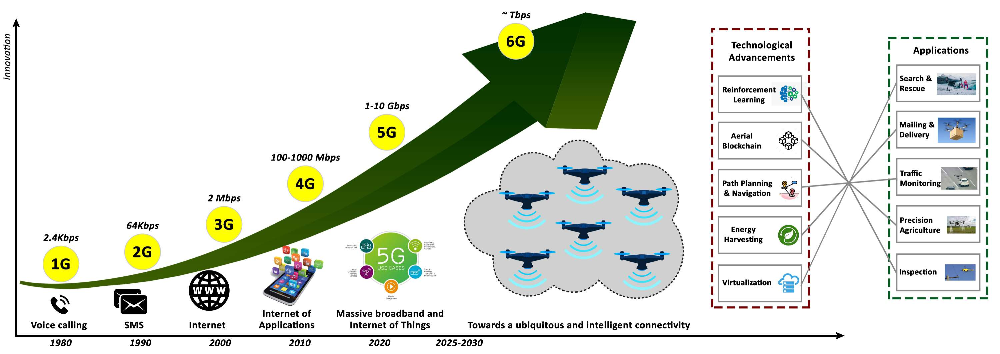
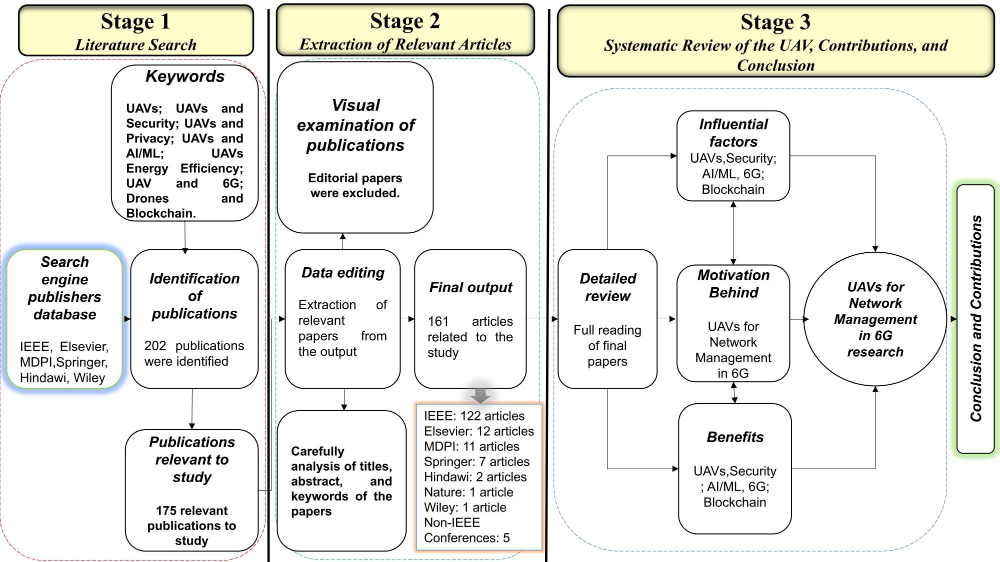
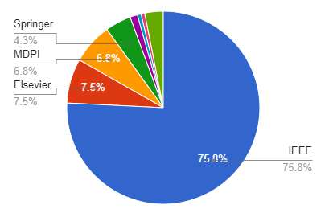
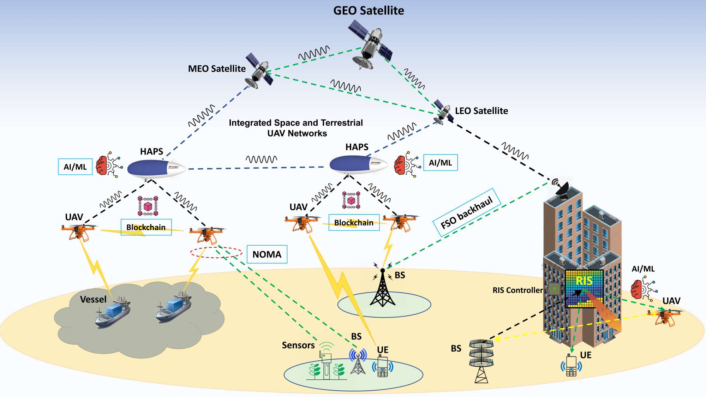
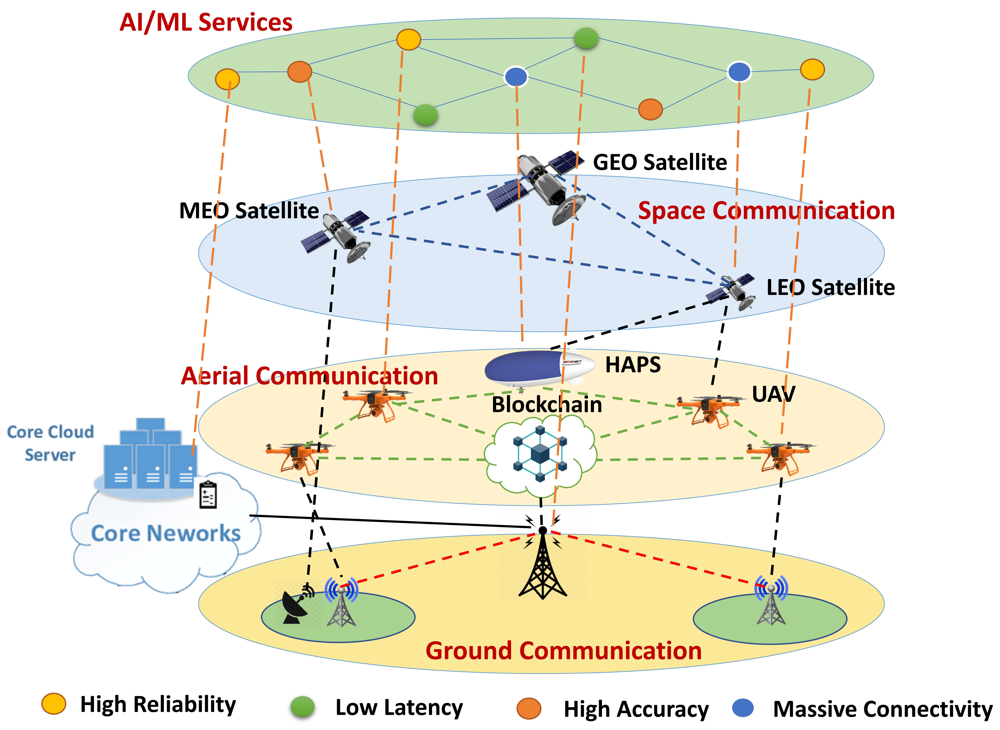
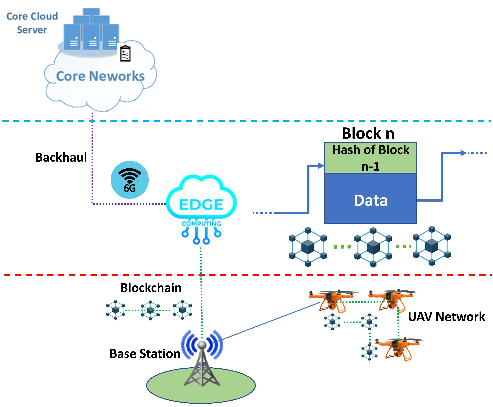

# Communicatoin 5G And 6G

**Source Document:** `communicatoin - 5G and 6G.pdf`  
**Total Pages:** 19  

---

## --- Page 1 ---

### Section: I Introduction

ACCEPTED IN IEEE TRANSACTIONS ON NETWORK AND SERVICE MANAGEMENT, VOL. XX, NO. YY, MONTH 202Z
1

Swarm of UAVs for Network Management in 6G:

A Technical Review

Muhammad Asghar Khan , Neeraj Kumar, Senior Member, IEEE, Syed Agha Hassnain Mohsan,
Wali Ullah Khan, Member, IEEE, Moustafa M. Nasralla, Senior Member, IEEE, Mohammed H. Alsharif,

Justyna ˙Zywiołek, and Insaf Ullah

Abstract—Fifth-generation (5G) cellular networks have led
to the implementation of beyond 5G (B5G) networks, which
are capable of incorporating autonomous services to swarm
of unmanned aerial vehicles (UAVs). They provide capacity
expansion strategies to address massive connectivity issues and
guarantee ultra-high throughput and low latency, especially
in extreme or emergency situations where network density,
bandwidth, and traffic patterns fluctuate. On the one hand, 6G
technology integrates AI/ML, IoT, and blockchain to establish
ultra-reliable, intelligent, secure, and ubiquitous UAV networks.
6G
networks,
on
the
other
hand,
rely
on
new
enabling
technologies such as air interface and transmission technologies,
as well as a unique network design, posing new challenges
for the swarm of UAVs.Keeping these challenges in mind, this
article focuses on the security and privacy, intelligence, and
energy-efficiency issues faced by swarms of UAVs operating in
6G mobile network. In this state-of-the-art review, we integrated
blockchain and AI/ML with UAV networks utilizing the 6G
ecosystem. The key findings are then presented, and potential
research challenges are identified. We conclude the review by
shedding light on future research in this emerging field of
research.

Index Terms—UAV; 6G Networks; Security and Privacy;
Blockchain; AI/ML; Energy Efficiency.

#### I. INTRODUCTION

While 5G mobile systems are being deployed around the
globe, researchers have started to envision 6G networks
to
integrate
the
functions
of
sensing,
communication,
computation, and control. Following in the footsteps of the 5G
wireless network, 6G wireless network is expected to provide
massive connectivity to millions of interconnected devices
with diverse quality of service (QoS) requirements, ubiquitous

MA. Khan and I. Ullah are with the Hamdard Institute of Engineering and
Technology, Islamabad 45550, Pakistan. E-mails: m.asghar@hamdard.edu.pk;
insafktk@gmail.com

N.Kumar is with Department of Computer Science and Information
Engineering, Asia University, Taiwan and School of Computer Science,
University of Petroleum and Energy Studies, Dehradun, Uttarakhand; E-mail:
neeraj.kumar.in@ieee.org

SAH Mohsan is with Optical Communication Laboratory, Ocean College,
Zhejiang University, Zheda Road 1, Zhoushan 316021, China; E-mail:
hassnainagha@zju.edu.cn

W. U. Khan is with Interdisciplinary Centre for Security, Reliability and
Trust (SnT), University of Luxembourg, 1855 Luxembourg City, Luxembourg.
E-mail: waliullah.khan@uni.lu

MM.Nasralla
is
with
Communications
and
Networks
Engineering
Department,
Prince
Sultan
University,
Riyadh,
Saudi
Arabia;E-mail:mnasralla@psu.edu.sa

MH. Alsharif is with Sejong University, Seoul 05006, South Korea. E-mail:
malsharif@sejong.ac.kr.

J. ˙Zywiołek is with Czestochowa University of Technology, Czestochowa,
Poland. E-mail: justyna.zywiolek@wz.pcz.pl

coverage, high degree of embedded artificial intelligence (AI),
efficient use of energy, and adaptive network security [1].
In addition, unmanned aerial vehicles (UAVs) can play a
significant part in the 6G ecosystem since flying devices
are expected to densely occupy aerial space, operating as
a network layer between ground and space networks. As a
result, UAVs communicate with ground and satellite stations,
forming a space-air-ground network that paves the path for
fully integrated 6G heterogeneous networks [2], [3].UAVs can
be used as a vertical component in a variety of settings, such
as aerial base stations, access points (APs), relays, or flying
mobile terminals, to improve the coverage, reliability, and
energy efficiency of 6G wireless networks. Despite the fact
that UAVs have been tested for deployment in existing cellular
networks and approved by 3GPP for seamless integration with
5G networks, their full potential can only be realised if their
communications are extended to the space network, which
can be accomplished more efficiently with the help of a 6G
network.For future UAV networks, new technical scenarios
are emerging. Traditional UAV networks are evolving into
enhanced networks, in which UAVs connect with one another
in an ad hoc manner. This new breed of UAV networks is
made up of evolving nodes capable of executing computing,
communication, and control functions, as well as developing
self-organizing and self-sustaining capabilities and assuring
connectivity.

Towards the fulfillment of this grand vision, 6G anticipates
maximum
spectral
utilization
employing
multi-band
high-spread spectrum, as well as high frequency bands
such
as
Sub-6
GHz,
millimeter-wave
(mmWave),
and
terahertz (THz) to support high data throughput transmission
links [4]–[10]. Optical wireless communications (OWC),
which is also viewed as a key enabling technology for
providing high data rates at low energy consumption. To
improve the programmability, scalability, and flexibility of a
UAV network, novel frameworks based on software defined
networking (SDN) and network function virtualization (NFV)
can be adopted. It can also make connection switching and
programmable metasurfaces easier, as well as simplifying
network
management.
In
addition,
Integrating
network
resources
with
cloud
computing
and
edge
computing
paradigms will provide low-cost, high-flexibility on-demand
computation and storage capabilities [11]–[20].

The evaluation of cellular communication in light of
technological advancements for various UAV applications
is depicted in Fig.1. Tab.I presents a list of commonly

arXiv:2210.03234v1  [cs.NI]  6 Oct 2022

## --- Page 2 ---

### Section: I-A Existing literature and their limitations

ACCEPTED IN IEEE TRANSACTIONS ON NETWORK AND SERVICE MANAGEMENT, VOL. XX, NO. YY, MONTH 202Z
2

#### TABLE I: List of key acronyms.

Label
Explanation

5G
Fifth Generation
B5G
Beyond Fifth Generation
6G
Sixth Generation
AI
Artificial Intelligence
ANN
Artificial Neural Network
AP
Access Point
BC
BlockChain
BS
Base Station
CNN
Convolutional Neural Network
DoS
Denial-of-Service
eMBB
enhanced Mobile BroadBand
FSO
Free Space Optics
GNSS
Global Navigation Satellite System
HAPS
High Altitude Platform System
GCS
Ground Control Station
GPS
Global Positioning System
IDS
Intrusion Detection System
IoT
Internet of Things
LoS
Line-of-Sight
LTE
Long-term Evolution
MBS
Macro Base Station
MEC
Mobile Edge Computing
MIMO
Multiple-Input Multiple-Output
ML
Machine Learning
mMTC
massive Machine-Type Communications
mmWave
millimeter Wave
NFV
Network Functions Virtualization
NOMA
Non-Orthogonal Multiple Access
QBC
Quantum Backscatter Communications
QoE
Quality of Experience
QoS
Quality of Service
QML
Quantum Machine Learning
PoW
Proof of Work
RAN
Radio Access Network
RF
Radio Frequency
RIS
Reconfigurable Intelligent Surface
SBS
Small Base Station
SDN
Software-defined Networking
THz
TeraHertz
UAV
Unmanned Aerial Vehicle
uHDD
ultra-High Data Density
uHSLLC
ultra-High Speed Low Latency Communications
uMUB
ubiquitous Mobile Ultrabroadband
URLLC
Ultra-Reliable Low-Latency Communications
VLC
Visible-Light Communications
XR
Extended Reality
WPT
Wireless Power Transfer

used acronyms in this review, while Tab.II offers a brief
comparison of 1G and 6G communications based on some
key performance indicators (KPIs). Tab.II demonstrates that
6G networks will provide speeds exceeding 1 Tbps and
latency of less than 1ms. Moreover, the integration of
AI/ML, blockchain, and edge computing technologies into
UAV networks using 6G networks offers several research
opportunities.With this integration, the inherent challenges
of conventional UAV systems, such as limited processing
resources, energy efficiency, privacy, and security, can be
overcome. Concerns about security and privacy are rarely
addressed in the design of UAVs. UAVs are susceptible
to a number of security vulnerabilities due to limited
and inadequate on-board computing and energy capabilities.
Consequently, 6G should emphasize security and privacy,
and the wireless research community should pay special
attention to them for UAV communication and networking

[21]. Researchers all over the world are proposing artificial
intelligence (AI)/machine learning (ML) [22]–[27], quantum
machine learning (QML) [28], blockchain [29], terahertz
(THz) communication [30]–[32], fog/edge computing [33],
visible light communication (VLC) [34]and other cutting-edge
technologies as prerequisites for the deployment of 6G
wireless networks. To better comprehend the integration
of UAV networks with enabling technologies in 6G, see
Fig.4.These technologies can help improve the performance of
the UAV network in a variety of ways, including QoS, QoE,
security, fault management, path planning, navigation, and
energy efficiency, all of which are key challenges associated
with UAVs.

A. Existing literature and their limitations

Over the past couple of years, a number of good reviews,
tutorials and surveys articles focused on UAV communication
networks over 5G/B5G have been published [3], [35]–[57].
Table III provides a brief summary of the recent and most
popular articles in this domain.

More specifically, Li et al. [35] presented a comprehensive
study
of
UAV
communication
over
5G/B5G
wireless
networks.The authors offered an overview of recent research
activity on UAV communications incorporating 5G/B5G
approaches from the viewpoints of the physical layer,
network
layer,
cooperative
communication,
computation,
and caching.The authors also investigated at certain open
research topics in the hopes of building a solid basis
for UAV applications in 5G/B5G wireless networks.Several
challenges in UAV communication over beyond 5G wireless
networks were discussed in a tutorial article presented by
Zeng et al. [36].Unique communication requirements and
channel characteristics were among the highlighted challenges.
Furthermore, key UAV network challenges such as energy
limitation, high altitude, and rapid 3D mobility have also been
investigated.

Fotouhi et al. [37] published a survey that covered the
majority of the factors that enable the smooth integration of
UAVs into cellular networks. Future networks, such as 5G,
are expected to be more equipped to deal with UAV-related
issues. Sharma et al. [39] discussed recent advances in
UAV communication and networking technologies. The paper
examines UAV communication technologies as well as the use
of centralized and decentralized techniques for both hardware
and algorithm-based software. It was anticipated that the
addition of 5G technology will provide a more stable and
reliable networks. Ullah et al. [40] investigated the latest
advancements in the integration of UAV networks into 5G and
B5G systems. Standardization of UAVs, channel modelling,
interference prevention, and collision avoidance were also
investigated by the authors. Security and privacy issues, as well
as optimal trajectory design employing deep reinforcement
learning algorithms and energy harvesting approaches in UAV
networks using 5G and B5G systems, are all thoroughly
investigated.

Mishra et al. [41] explored the complexities of integrating
UAVs
into
5G/B5G
networks,
as
well
as
important

## --- Page 3 ---

ACCEPTED IN IEEE TRANSACTIONS ON NETWORK AND SERVICE MANAGEMENT, VOL. XX, NO. YY, MONTH 202Z
3

Fig. 1: Evaluation of cellular communication with technological advancements for various applications of UAVs.

#### TABLE II: 1G to 6G – Key Performance Indicators (KPIs)

Network generation
Standards
Core Network
Frequency band
Mobility range
Theoretical data rate
Energy efficiency
Latency

1G
• MTS
PSTN
• 824-894 MHz
-
Up to 2.4 Kbps
-
> 1000 ms
•AMPS
• IMTS
• PTT

2G
• GSM
PSTN
• 850-1900 MHz
Up to 100 km/h
Up to 64 Kbps
0.01 x
500 ms
• IS-95
• CDMA
• EDGE

3G
• UMTS
Packet N/W
• 1.8-2.5 GHz
Up to 150 km/h
Up to 2 Mbps
0.1 x
100 ms
•WCDMA
•IMT2000

#### •CDMA2000

#### •TD-SCDMA

4G
Internet
• 2-8 GHz
Up to 350 km/h
Up to 1 Gbps
1 x
50 ms
• WiMAX
• LTE
• LTE-A

5G
• 5G NR
IoT
• Sub-6 GHz
Up to 500 km/h
Up to 10 Gbps
10 x
5 ms
• IPv6
• MmWave for fixed access
• OFDM

#### 6G

#### • GPS

IoE

• Sub-6 GHz
Up to 1000 km/h
Up to 1 Tbps
> 100 x
< 1 ms
• COMPASS
• Exploration of THz bands (above 300 GHz)
• GLONASS
• Non-RF (e.g., optical, VLC, etc.)
• Galileo

TABLE III: Comparison with related reviews, tutorials and surveys articles focused on UAV communication networks over
5G/B5G and 6G. (√) shows that the topic has been covered. (×) shows that the topic has not been covered. (∂) shows that
only a portion of the topic has been covered.

Year
Surveys
Technology (5G, B5G,6G)
Security
Blockchain
AI/ML
Energy Efficiency
Comparison
Challenges
Open Research Topics on 6G

2022
Ref. [58]
√
×
×
×
×
×
√
√

Ref. [59]
√
×
×
×
×
×
√
√

2021
Ref. [46]
√
√
√
×
×
√
∂
√

Ref. [47]
√
√
√
×
∂
×
√
√

Ref. [60]
√
×
×
×
∂
×
∂
√

#### 2020

Ref. [39]
√
×
×
√
×
√
√
√

Ref. [40]
√
√
×
√
×
√
√
√

Ref. [41]
√
√
×
×
×
√
√
√

Ref. [3]
∂
√
×
∂
×
√
√
√

Ref. [45]
√
∂
∂
∂
×
×
√
√

Ref. [44]
√
×
×
√
×
×
∂
√

2019
Ref. [35]
√
√
×
×
×
√
√
√

Ref. [36]
√
×
×
∂
×
×
∂
∂
Ref. [37]
√
√
×
×
×
∂
√
√

Our survey
√
√
√
√
√
√
√
√

technological developments in design prototyping and field
testing, all of which supported the use of cellular-connected
UAVs. Alzahrani et al. [3] conducted a comprehensive
evaluation
of
existing
UAV-assisted
research
in
areas
such cellular communications, IoT networks, routing, data
collecting,
and
disaster
management.
The
authors
also
provided
descriptions,
classifications,
and
comparative

evaluations of numerous UAV-assisted proposals. Zhang et al.
[44] considered an Internet of UAVs over cellular networks,
in which UAVs function as aerial users collecting different
sensory data and transmitting it over cellular links to its
transmission destinations. Noor et al. [45] presented a review
article in which they explored key enabling technologies,
applications, challenges, and open research topics for UAV

*Caption/Context: ACCEPTED IN IEEE TRANSACTIONS ON NETWORK AND SERVICE MANAGEMENT, VOL. XX, NO. YY, MONTH 202Z 3 | Fig. 1: Evaluation of cellular communication with technological advancements for various applications of UAVs.*

## --- Page 4 ---

### Section: I-B Research Methodology

ACCEPTED IN IEEE TRANSACTIONS ON NETWORK AND SERVICE MANAGEMENT, VOL. XX, NO. YY, MONTH 202Z
4

Fig. 2: The methodology of the literature review and research process.

Fig. 3: Percentage of articles from various publishers used in
this review.

networks in depth. According to the authors, the integration
of 5G and 6G technologies will make UAV networks
ultra-reliable and pervasive.

Gupta et al. [46] demonstrated a blockchain-assisted secure
UAV communication over 6G mobile networks. In the same
article, research challenges and future directions for further
improvement, as well as architecture, are also discussed. Han
et al. [47] looked at 5G communication networks and mobile
edge computing (MEC) as viable technologies for supporting
UAV-enabled ecosystems and overcoming fundamental UAV
network problems including limited computation, storage, and
coverage. They also debated the 5G and MEC alternatives,
outlining the latest advances and attempting to address some
of the critical problems. Alongside that, following the recent

popularity of UAV communication networks, they raised new
security issues. The article also looked at contributions to the
evolving drone industry that allow the use of each of the
innovations listed. Wu et al. [60] provided a comprehensive
overview of the recent research efforts on integrating UAVs
into cellular networks, with a focus on exploiting advanced
techniques such as intelligent reflecting surface, short packet
transmission, energy harvesting, joint communication and
radar sensing, and edge intelligence to meet the diverse service
requirements of the next generation of wireless systems. In
addition, the authors identified important directions for further
investigation in future work.

Bajracharya et al. [58] presented a WI UAV with a 6G new
radio running in the unlicensed band, which could be used
as a relay, base station, or data collection/dissemination point.
In this article, the authors have classed UAVs based on their
characteristics, functions, and operations. Various regulatory
and standardization efforts to integrate UAVs into the cellular
network are being investigated. Several NR-U opportunities
and design problems for WI UAVs are covered, as well as
future scopes of WI UAVs. Azari et al. [59]recently analysed
the potential prospects and use cases for THz-empowered
UAV systems employing 6G networks, as well as the unique
design limitations and trade-offs that go along with them.
The authors also discussed recent developments in UAV
deployment regulations, THz standardization, and THz-related
health problems.

B. Research Methodology

Bibliographic research has been used to collect, analyze,
and present the material obtained for review data, which
included a variety of perspectives and methodologies. In

*Caption/Context: ACCEPTED IN IEEE TRANSACTIONS ON NETWORK AND SERVICE MANAGEMENT, VOL. XX, NO. YY, MONTH 202Z 4 | Fig. 2: The methodology of the literature review and research process.*

*Caption/Context: Fig. 2: The methodology of the literature review and research process. | Fig. 3: Percentage of articles from various publishers used in this review.*

## --- Page 5 ---

### Section: I-C Contributions with Organization of the Article

ACCEPTED IN IEEE TRANSACTIONS ON NETWORK AND SERVICE MANAGEMENT, VOL. XX, NO. YY, MONTH 202Z
5

Fig. 4: Integration of UAV networks with enabling technologies.

this study, however, we employ a fundamental procedure
[61],to identify and filter the existing literature on the issue
of UAV integration into 6G networks. Fig. 2 depicts the
article screening procedure in details. In major databases,
IEEE Explore, Web of Science, ScienceDirect, and MDPI,
we used keywords, ”UAVs”, ”UAVs and security”, ”UAVs
and privacy”, ”6G,” and other similar keywords, to identify
possibly relevant publications. In the first round, 202 journal
articles, conference proceedings, and early access publications
were identified. Nonetheless, several irrelevant or unqualified
items were eliminated. We used two criteria to exclude these
items. We examined the titles, abstracts, and keywords of
each of the chosen articles in great depth to confirm that
each publication was really concerning UAVs and 6G mobile
networks. Alternatively, we analyzed the papers using Scopus,
Vosviewer, and Citavi, in that order. After removing extraneous
papers, 161 relevant journal and conference proceedings
publications were discovered.Fig.3 displays the percentage of
articles from various publishers used in this review. Evaluating
the existing literature allows for the identification of research
gaps, hence highlighting research gaps.

C. Contributions with Organization of the Article

Almost all relevant articles in the literature have focused
on 5G/B5G for UAV networks, but none of them covers all
aspects of UAV networks over 6G. As a result, now is the time
to present a detailed, up-to-date review article that addresses
all aspects of UAV networks in a single go. To the best of our
knowledge, this is the first review article covering all aspects
of UAV networks. All of the top corners where we excelled
are mentioned below:

Integration of UAVs into 6G networks (Section II): To
understand the concept of integrating swarm of UAVs into
6G, we first present the network architecture, which is shown
in Fig. 4. This comprehensive computing architecture is
predicted to be the primary enabler for the vast majority
of computationally intensive applications available on 6G
systems. After evaluating the proposed architecture, we present
a possible six-F trend in 6G mobile communications that could
prove beneficial for UAV networks.

Security Landscape (Section III): We address the security
issues that could prevent UAVs from being deployed in
various 6G applications. We elaborate upon the essential
security requirements that UAV networks must guaranteed
for their successful functioning, including confidentiality,
integrity, availability, authentication, trust, non-repudiation
and authorization. The conventional security techniques for
meeting these major security needs are discussed in depth.
Finally, the necessity of offering lightweight cryptography
approaches and the development of adaptive security tools are
investigated.

Blockchain Technology (Section IV): The review also
provides a larger perspective on how the integration of
blockchain and 6G can address the security challenges of
UAV networks.The fundamental blockchain characteristics of
immutability, decentralization, and transparency that could be
beneficial to UAV networks leveraging 6G mobile networks
are highlighted.

AI/ML Techniques (Section V): To actualize UAV networks
in 6G systems, we explain how 6G mobile networks can
successfully support swarm of UAVs through the use of
enhanced features and emerging AI and ML-based solutions.
In addition, reinforcement learning (RL) techniques that

*Caption/Context: ACCEPTED IN IEEE TRANSACTIONS ON NETWORK AND SERVICE MANAGEMENT, VOL. XX, NO. YY, MONTH 202Z 5 | Fig. 4: Integration of UAV networks with enabling technologies.*

## --- Page 6 ---

### Section: II Integration of UAVs into 6G networks

ACCEPTED IN IEEE TRANSACTIONS ON NETWORK AND SERVICE MANAGEMENT, VOL. XX, NO. YY, MONTH 202Z
6

can be used to find the optimal path to prevent collisions
during real-time path planning and navigation missions are
investigated.

Energy Efficiency (Section VI): The research explored UAV
energy efficiency, which is a major stumbling block to their
widespread adoption in a wide range of applications. As a
general rule, flight time is the key problem for small UAVs
because their onboard batteries have a finite lifespan. As
a result, completing resource-intensive applications for UAV
networks efficiently is a critical problem to be overcome.

Challenges (Section VII): We examine the significant
challenges and possible solutions to the integration of UAV
networks into the 6G system as a means of advancing research
in this area. UAV networks must overcome several challenges,
including those related to safety, limited energy, storage
and computation capability, routing, device compatibility, and
high spectrum exploitation, as well as standardization and
regulations.

Open Research Topics (Section VIII): In the context of
6G, we describe and explore open research topics for UAV
networks.These open research topics will allow future UAV
networks with 6G connectivity to reach their full potential.

#### II. INTEGRATION OF UAVS INTO 6G NETWORKS

The sixth-generation (6G) mobile network can support
a
wide
range
of
UAV
network
applications,
including
autonomous services and emerging trends.Ultra-high data
density (uHDD), ultra-high speed low latency communications
(uHSLLC), and ubiquitous mobile ultra-broadband (uMUB)
are all 6G service classifications. The uMUB enables 6G
systems to meet a wide range of performance needs in the
space-aerial-terrestrial-sea segments. The uHSLLC provides
ultrahigh data speeds and minimum latency, while the uHDD
service class offers higher data density and reliability. For
forthcoming uMUB, uHSLLC, and uHDD services, which are
mostly absent in 5G and B5G networks, end-to-end codesign
of communication, control, and computing elements will be
required. 6G technologies are listed in Tab.IV for the uMUB,
uHSLLC, mMTC, and uHDD services [9]. One or more
services can be improved by using each method. The following
is a potential six-F trend in 6G mobile communications [62],
which could be beneficial for UAV networks:

Full spectral: A hyperspectral and full spectral system
will be available for UAV networks in 6G, ranging from
microwave, mm-wave, and terahertz to LASER.

Full coverage: UAV networks will provide full coverage in
the terrestrial, aerial, space, and maritime domains using 6G
mobile communications.

Full dimension: Holographic radio and communication will
be entirely coherent.The 6G network will be exceedingly
precise for UAV networks, allowing for accurate RF operation
and
a
shift
away
from
simple
averaging
and
toward
fine-grained analysis, modulation, and manipulation in the
intensity-phase-frequency space.

Full
convergence:
The
6G
network
will
be
a
multi-functional system that will compete with 5G’s exclusive
wireless communications capability. This multi-functional

technology has the potential to introduce a surge of new
revolutionary apps and services to UAV networks. All aspects
of communication, control, sensing, computing, and imaging
will be converged.

Full photonics: In 6G, photonics-defined radio (PDR) will
be employed, together with a UTC photodetector (PD)-coupled
antenna array, photonic engine, and spectrum computation.
The adoption of full photonic processing will help UAV
networks become more energy efficient.

Full intelligence: In the 6G mobile system for UAV
networks, there will be ubiquitous and distributed computing
and intelligence from the application layer to the physical
layer.

6G could be helpful for UAV networks since it would allow
UAVs to connect directly to one another while still being able
to communicate with fixed infrastructure. Due to their limited
on-board computing, storage, and battery life, UAV networks
face several obstacles when it comes to accomplishing
complex tasks successfully. However, it is feasible to overcome
these obstacles by shifting computation- and storage-intensive
tasks from resource-constrained UAVs to remote cloud servers
exploiting the cloud computing capabilities enabled by 6G
technology. Due to the fact that UAVs can be deployed as
flying base stations (BSs) using physical layering techniques
such as mmWave and massive MIMO, cognitive radios,
and other technologies, data-intensive service needs can be
satisfied [63].

The most significant innovation in 6G will be satellite
integration, which will allow UAV networks to provide
centimeter-level precise positioning, global coverage, and
heterogeneous QoS provisioning [64]. Furthermore, combining
satellites with 6G connectivity will provide a peak data
throughput of 1 TBPS per device, as well as autonomous
mobility of 1000 km/h in a highly populated urban setting. In
the meantime, satellite operators are focused on a multi-layer
airborne component system that incorporates the high altitude
platform system (HAPS) and unmanned aerial vehicles
(UAVs) to provide cost-effective communication services in
hard-to-reach places. HAPS, which are usually located above
the stratosphere, can give better coverage and cooperate with
satellites to establish a more stable network, especially when
satellite communications are hampered by bad weather. The
proposed architecture of a 6G-enabled UAV network along
with interactions among different technologies is illustrated in
Fig.5.

Aside from the benefits of 6G for UAVs noted above, there
are some unique challenges that UAVs likely encounter in
future 6G networks [65]. Typical UAVs can move at speeds of
around 30–460 km/h while flying at various altitudes, resulting
in a 3D mobility pattern. Base stations, on the other hand, are
generally designed for ground coverage. In addition, antenna
tilt can cause link fluctuation and coverage loss for UAVs in
specific locations. As a result, the 6G network architecture
should give a consistent signal at typical UAV flight altitudes
of several hundred feet. Advanced antenna approaches like
massive MIMO and adaptive 3D beamforming can help solve
these challenges.

While
autonomously
executing
missions,
UAVs
must

## --- Page 7 ---

### Section: II-A Summary

ACCEPTED IN IEEE TRANSACTIONS ON NETWORK AND SERVICE MANAGEMENT, VOL. XX, NO. YY, MONTH 202Z
7

be positioned and navigated to avoid colliding with one
another and other objects such as buildings and trees. In
many cases, the Global Navigation Satellite System (GNSS)
delivers precise coordinates. However, for BLOS activities
in particular, depending just on GNSS for navigation is
inadequate. Using beamforming and triangularization from
many base stations, 6G can provide additional positioning
services. UAVs must be positioned and navigated to avoid
colliding with one other and other objects such as buildings
and trees while executing missions autonomously. In many
cases, GNSS delivers precise coordinates. However, for BLOS
activities in particular, depending just on GNSS for navigation
is inadequate. Using beamforming and triangularization from
many base stations, 6G can provide additional positioning
services.

TABLE IV: Characterization of emerging technologies under
different 6G services [9]

Technology
uMUB
uHSLLC
mMTC
uHDD
Unmanned aerial vehicles
√
√
√
√

Artificial intelligence
√
√
√
√

Terahertz communications
√
√

OWC
√
√
√
√

FSO backhaul/fronthaul
√
√

Blockchain
√

Massive MIMO
√
√
√

3D networking
√
√
√

Quantum communications
√
√

Mobile edge computing
√

Backscatter communications
√

Intelligent reflecting surface
√
√
√

Dynamic network slicing
√
√

A. Summary

This section examined the integration of UAV networks
into 6G. To illustrate this concept, we presented the network
architecture depicted in Fig.4 at first. Future implementations
of this integration could give the swarm of UAVs with rapid
computing services, greater mobility, and increased scalability
and availability. It will also make it easier to solve challenges
like as security and privacy, limited processing, and battery
resources, which are typically associated with UAVs.Satellite
integration, the most major innovation of 6G, will enable
UAV networks to provide centimeter-level precise positioning,
global coverage, and heterogeneous QoS provisioning. In
addition, the integration of satellites and 6G connection will
allow a peak data throughput of 1 TBPS per device, as well
as 1,000 km/h of autonomous mobility in inaccessible areas.

#### III. SECURITY LANDSCAPE

In this section, we discuss the security threats that
could prevent UAVs from being employed in various 6G
applications, as well as the security requirements for future
deployment of UAV network.

A. Security and Privacy Threats

Due to design restrictions, small UAVs are not built with
security and privacy threats in mind, leaving UAV networks

Fig. 5: Proposed Architecture for 6G-enabled UAV Network
with Interactions Among Different Technologies.

exposed to both cyber and physical attacks [66]. Intruders
who aim to compromise the UAV network’s security and
privacy have a variety of options for carrying out their
malicious intentions [66]. They could, for example, send
out a large number of reservation requests, eavesdrop in on
control messages, and/or fabricate data exchange [67]. Due to
unreliable connections and inadequate security protocols, UAV
networks linked to WiFi are known to be more vulnerable
than cellular networks (i.e., 5G, B5G, and 6G) [68]. Anybody
with a right transmitter can bind to a UAV network and embed
commands into an ongoing session, allowing them to be easily
intercepted. Another concern regarding security and privacy in
UAV networks is that if UAVs fly over a hostile environment,
they could become a luring target for physical attacks [69]. In
such cases, the intruder can deceive the captured UAVs to get
access to internal data through standard interfaces or ports.

Global positioning system (GPS) spoofing [70]–[72] is
another major security threat, which happens when an attacker
manipulates GPS signals of the UAV. In this attack, an
adversary sends false GPS signals to a planned UAV at
a marginally higher power than the real GPS signals to
trick the UAV into believing it is somewhere else. As a
consequence, the intruder will use this technique to send
the UAV to a predetermined location where it can be easily
intercepted [73]. UAV networks in 6G, on the other hand,
can be linked with new wireless technologies such as visible
light communications and quantum communications, which
could lead to new security threats. To deal with such security
threats, additional security mechanisms and countermeasures
will be required. In the next subsection, we will present a brief
overview of the security requirements and their level of impact
for UAV networks in future 6G mobile networks.

B. Security and Privacy Requirements

The widespread use of UAVs for a variety of civilian
and commercial applications, as well as the ubiquitous
wireless connectivity of future 6G networks, advanced security

*Caption/Context: ACCEPTED IN IEEE TRANSACTIONS ON NETWORK AND SERVICE MANAGEMENT, VOL. XX, NO. YY, MONTH 202Z 7 | Technology uMUB uHSLLC mMTC uHDD Unmanned aerial vehicles √ √ √ √*

## --- Page 8 ---

ACCEPTED IN IEEE TRANSACTIONS ON NETWORK AND SERVICE MANAGEMENT, VOL. XX, NO. YY, MONTH 202Z
8

measures may be required to prevent unauthorized access
to sensitive data [74]. Likewise, while establishing security
measures for UAV networks, characteristics such as high
scalability, device diversity, and high mobility must be
taken into consideration. Since 6G will include AI and
Edge-AI based UAV functionalities, it is critical to ensure that
security measures are in place to prevent against AI-related
attacks. UAVs are very vulnerable to physical attacks due
to their unmanned nature. By jamming control signals
or using physical equipment, an adversary can physically
capture UAVs and steal the crucial data they hold. Tab.V
demonstrates the level of security requirements/impact for
6G-enabled UAV applications identified by the authors in
[75]. At the same time, security protocols must be designed
with low communication and computation costs due to the
restricted on-board computing capabilities of small UAVs. To
secure UAV networks against unauthorized access to sensitive
information or other harmful attacks, the following key
security and privacy properties must be guaranteed [74]–[76]:

• Confidentiality: In cryptography, confidentiality refers to
ensuring that data is not made available or revealed to
unauthorized users. Protecting sensitive data and data
exchange between UAVs and the GCS from unauthorized
access is critical in UAV networks because it could be
a source of sensitive flight mission information leaks
such as telemetry data and control commands. Encryption
algorithms such as symmetric and asymmetric can be
used to achieve confidentiality in UAV networks.

• Integrity: Integrity refers to ensuring data consistency
and trustworthiness during the communication process.
Intruders may affect data integrity, which includes
alterations such as modification, fabrication, substitutions,
and data injections. In UAV networks, data integrity
is critical since it is a prerequisite for a successful
flight mission. Hash algorithms with advanced encryption
mechanisms can be employed to ensure data integrity.

• Availability: The term ”availability” refers to the fact that
the services must be immediately available to authorized
parties when they are needed for effective functioning.
The goal of data accessibility is to ensure that legitimate
users can get the information they need. Because the
UAV network is utilized in mission-critical domains, the
services must be available at all times without intentional
or unintentional interruptions. Redundancy and backup
may be useful for highly critical information services
to ensure availability. Furthermore, the UAV system
must be able to withstand classical denial-of-service
(DoS) attacks that compromise its availability. Intrusion
detection systems (IDS) can be used to resist such attacks.

• Authentication: Authentication is a fundamental property
that
allows
a
UAV
network
to
establish
secure
communication
between
their
main
components.
It
enables for the authentication and identification of UAVs
taking part in the flight operation. The trustworthiness
of each UAV is verified using a digital signature
mechanism, and only authenticated UAVs are then
allowed to participate in the flight mission. Authentication

also
protects
the
UAV
network
from
adversaries
who impersonate legitimate UAVs. Another option for
providing authentication in a UAV network is to use a
blind signature scheme [77].

• Trust: The term ”trust” is defined as ”confidence in an
entity’s integrity for the purpose of relying on it to
perform particular tasks.” Trust is dynamic, with different
levels of assurance depending on particular criteria (such
as identification, attestation, and non-repudiation) that
determine when and how to rely on a connection.
A UAV network connected to a 6G ecosystem will
be characterized by a growing number of stakeholders
and interconnected devices and services, not all of
which will be managed by the same entity. Establishing
trust in such an open and diversified environment is
critical for the global adoption of this technology.
Advanced cryptography schemes can be utilized to
help implementing policies for achieving trust in UAV
networks.

• Non-Repudiation: In cryptography, non-repudiation is a
property that prevents an entity from denying earlier
agreements or activities (e.g., transmitting or receiving
data).The sender of information receives confirmation
of delivery and the recipient receives verification of
the sender’s identity when this property is being used,
so neither side can subsequently challenge the data’s
processing. An entity in a UAV network will be
unable to deny that it has previously communicated a
message using this property. The UAV network must
establish protocols to assure non-repudiation, which is
accomplished through the adoption of a digital signature
mechanism.

• Authorization: Authorization is a security method for
identifying a user’s privileges or access levels to system
resources such as files, services, data, and application
features. Data in the UAV network should only be
accessible to permitted users. Unauthorized users are
not allowed to communicate in any manner with the
UAV network. Furthermore, UAV networks must specify,
which resources are accessible to authorized users. To
keep track of who has access to such resources, access
control policies must be implemented.

Appropriate
security
protocols
employing
lightweight
cryptography methods must be established to meet the
aforementioned security and privacy requirements, allowing
for efficient and secure communication between the various
components of the UAV system. The research community,
on the other hand, is still working on securing UAV
communication channels while improving network capacity.
UAV authentication can further secure the communication
channel by preventing impersonation and replay attacks
[78], [79].The design of UAV access controls schemes,
such
as
authorization
and
authentication
mechanisms,
remains a difficult research problem in the UAV networks.
Indeed, any unauthenticated UAVs should not participate
in flight missions to collect data from other UAVs in
the network.Learning-enabled cyberattacks and massive data

## --- Page 9 ---

### Section: III-C Summary

ACCEPTED IN IEEE TRANSACTIONS ON NETWORK AND SERVICE MANAGEMENT, VOL. XX, NO. YY, MONTH 202Z
9

breaches are more likely in UAV networks employing 6G than
traditional security concerns.Indeed, the possibility of using
UAVs for malicious purposes grows as more intelligence is
delegated to them in 6G networks. Adaptive security schemes
can be implemented, in which security processes adapt to
the threats landscape in real time and adjust their operation
to detect and mitigate any threats. Deep learning-based
techniques [80]–[83], such as GANs and GNNs can be
used to improve UAV operation and management by making
threat detection more robust, proactively analyzing the security
status, and so making UAV operation and management more
reliable and efficient.

TABLE
V:
Level
of
security
requirements/impact
for
6G-enabled UAV applications.

Security and Privacy Property
Requirements/Impact

Ultra Lightweight Security
Medium
Zero-touch Security
High
Domain Specific Security
Low
Energy Efficiency
High
Computation Cost
High
High Privacy
Low
Proactive Security
Medium
Security via Edge
High
Limited Resources
High
Diversity of Devices
Medium
High Mobility
High
Physical Tempering
Medium

C. Summary

In this section, we explored the security and privacy
issues that may arise as a result of the 6G requirements.
Confidentiality, integrity, availability, authentication, trust,
non-repudiation,
and
authorization
are
some
of
the
fundamental
security
considerations
that
UAV
networks
must meet to operate effectively. Complex cryptographic
operations for a UAV involved in a mission are difficult
to execute due to the UAVs’ typically limited on-board
processing capacity.The conventional approaches to security
are
incapable
of
tackling
this
challenge.
This
section
concludes with the suggestion that lightweight cryptographic
algorithms, such as HECC, and adaptive security solutions
are required.

#### IV. BLOCKCHAIN TECHNOLOGY

A blockchain is a collection of blocks connected by a
cryptographic hash function [84]. Apart from the genesis
block, the hash value of each block is the hash value of
the parent block. The blockchain, which is operated by a
mechanism called consensus, which is a set of rules for
assuring agreement between all participants as a blockchain
ledger, is accessible to every member of the network. As
a decentralized solution, blockchain technology provides a
distributed computing paradigm for secure and adaptive
protection of privacy preferences. It has the ability to prevent
security breaches and ensure the integrity of data collected by
UAVs [46].

The implementation of blockchain with 6G communication
in UAV networks will strengthen cyber security defenses.
The fundamental characteristics of blockchain in terms of
immutability, decentralization, transparency that could benefit
UAV networks employing 5G and 6G mobile networks are as
follows [85]:

• Immutability: It refers to the ability of a blockchain
ledger to stay unchanged and unmodified after being
stored on the blockchain. This is because each block
uses a hash function to link to other blocks, which
is a one-way, irreversible process. The immutability
property of blockchain technology can enable secure data
storage and exchange in UAV networks using 6G mobile
communication. Due to the rapid growth of UAVs, a
secure and reliable database to store and exchange large
data across the 6G wireless network is required. Because
blockchain technology is immutable, it is seen to be a
potential option for ensuring the security and privacy of
data in UAV networks.

• Decentralization: It is refers to the fact that the blockchain
database is not managed by a particular entity or a central
authority.Blockchain employs consensus algorithms such
as proof of work (PoW) to build a secure chain of
blocks and maintain the database’s security without the
usage of external control points. This significant element
enables the development of a database platform with high
immutability and robustness, as well as low data retrieval
latency. This property will considerably lessen the impact
of a single point of failure in UAV networks.

• Transparency: All information about transactions on
blockchain is visible to all entities in the network,
which is called as transparency. To put it another way,
a copy of the data records is replicated across the
network of participants for public validation. Due to
this feature, any entity can use its ability to check
transactions based on its functions. This property will aid
in improving node cooperation in UAV networks, hence
improving data integrity. This feature is especially useful
in 6G environments, where fairness and transparency are
critical.

The above properties of blockchain can be utilized to
improve the performance of the UAV-6G communication
network by enabling secure spectrum sharing between network
operators and UAV service providers. These features ensure
privacy by utilizing a distributed information sharing platform
and reducing the danger of hostile nodes abusing spectrum
[86]. A typical architecture for a blockchain-enabled 6G UAV
network is depicted in Fig 6. As demonstrated in Fig. 6, a
blockchain-enabled 6G UAV network can provide network
security by utilizing an edge computing platform and core
network.UAV networks can be useful in implementing MEC,
especially in emergency situations like disasters where fixed
ground infrastructure is unavailable. MEC is also viewed
as one of the key technologies in 5G [87]and expected to
contribute towards 6G, and therefore it will require significant
research to make it ultra-reliable in terms of survivability,
availability, and connectivity.In addition, core network offers

## --- Page 10 ---

### Section: IV-A Summary

ACCEPTED IN IEEE TRANSACTIONS ON NETWORK AND SERVICE MANAGEMENT, VOL. XX, NO. YY, MONTH 202Z
10

service adaptability, migration, collaboration, and evolution in
UAV communication using AI as a function operating in the
edge core network [88]. The implementation of blockchain
technology could allow participating UAVs to maintain high
levels of trust and establish a flat architecture. Distributed
entities generate transactions, which are subsequently recorded
in blocks that are added to the blockchain. UAVs also
periodically evaluate transactions in order to identify malicious
nodes, offering trust and anonymity that protects the UAV
network from malicious attacks. In addition, BC technology
can
secure
confidential
data
collected
by
UAVs
from
unauthorised access by intruders.

Despite the potential benefits of blockchain in UAV
networks, there are still a number of challenges that need
to be addressed before blockchain can be implemented in
the 6G mobile system.The majority of existing UAVs are
resource-constrained in terms of computation. Cryptography
and/or
consensus
mechanisms
are
frequently
used
in
blockchain systems, however UAVs are usually incapable
of
doing
computationally
intensive
tasks.
Lightweight
cryptographic solutions like Hyper Elliptic Curve (HEC)
cryptography could be integrated with blockchain to solve this
problem [77], [89]. A UAV network can allow a group of
UAVs to execute a variety of tasks. The blockchain consensus
of UAV networks can help to reduce the falsification of
malicious UAVs and other security issues. Creating a scalable
blockchain-based UAV network is challenging due to frequent
topology change (i.e., UAVs can join and depart at any
moment) and the scalability limitations of current blockchain
systems. As a result, more study into the scalability of
blockchain-based UAV networks is required in the future. In
UAV networks, this challenge can be handled with efficient
routing algorithms with blockchain using 6G technologies.

A. Summary

In this section, we discussed how the integration of
blockchain and 6G could handle the security concerns of UAV
networks. The core blockchain characteristics of immutability,
decentralization, and transparency are noted as potentially
advantageous
to
UAV
networks
employing
6G
mobile
networks.However, because to frequent topology changes and
the scalability constraints of current blockchain systems,
constructing a scalable blockchain-based UAV network is
challenging. As a result, more research into the scalability of
blockchain-based UAV networks is necessary. This problem
can be solved in UAV networks by combining efficient routing
algorithms with blockchain and 6G systems.

#### V. AI/ML TECHNIQUES

6G wireless networks will revolutionize the wireless
evolution from ”connected things” to ”connected intelligence”
[90]–[92]. AI will play a critical role to guarantee the
efficiency of future wireless communication networks, and it
will represent the enabling technology for several applications
[93]. UAVs are one of these vital applications, which is
expected to be a hot research area in the coming decades. AI,
DL, and ML techniques are being applied to different aspects

Fig. 6: A Blockchain-enabled 6G UAV Network.

for the UAVs, which have shown prominent improvements in
efficiency, resilience, and robustness [94].

There is a lot of literature linking AI/ML to UAV networks,
and a few of them are summarized in tab.VI. Jung et al. [95]
provided an interesting idea about a response-time to choose
between processing data on-board or transmitting it using a
MultiPath TCP (MPTCP) based on the artificial intelligence
in order to increase performance of the network. In addition,
Park et al. [96] have simulated the packet transmission
rates of a UAVs using ML to computing the success and
failure probabilities of transmission. This study recommended
support vector machine with quadratic kernel technique,
which shown that it faster and more accurate than linear
regression technique based on the results provided. While,
Khan et al. [97] proposed a new auto relay method based
on UAVs for millimeter-wave communications to enhance
the communication between ground and sky systems. In
comparison to KNN and TR algorithms, directionality is
adjusted via frequent matrix updates and real-time samples
of link quality to determine ideal positions, resulting in
improved stability and accuracy. Xiao et al. [98] proposed an
RNN assisted framework to improve communication efficiency
between a UAV and a BS due to the weather such as
wind perturbation. Prediction air-to-air path loss and channel
propagation are studied in [99], [100]. Zhang et al. [99]
air-to-air path loss is investigated by using KNN and the
Random Forest algorithms, and results are compared to
empirical results. While, Alsamhi et al. [100] are used ANN
to predict the signal strength of the UAV and estimate the
channel propagation. However, these suggestions [99], [100]
are considered not suitable for real-time application.

Wang et al. [101] proposed a novel UAV communication
paradigm in which UAVs can communicate using visible
light and the communication is highly dependent on the
ambient illumination. To optimise UAV deployment and
minimise total transmit power, a machine learning algorithm
that combines gated recurrent units (GRUs) and convolutional
neural networks (CNNs) was utilised. While, Zhang et al.

*Caption/Context: ACCEPTED IN IEEE TRANSACTIONS ON NETWORK AND SERVICE MANAGEMENT, VOL. XX, NO. YY, MONTH 202Z 10 | Fig. 6: A Blockchain-enabled 6G UAV Network.*

## --- Page 11 ---

### Section: V-A Summary

ACCEPTED IN IEEE TRANSACTIONS ON NETWORK AND SERVICE MANAGEMENT, VOL. XX, NO. YY, MONTH 202Z
11

[102] investigated the optimal deployment of aerial BSs to
offload terrestrial BSs by predicting the congestion in the
wireless network to minimizing the power consumption of the
drones. On the other hand, during the disasters cases, UAVs
are consider a good solution of the WSN; Masroor et al. [103]
are highlighted this issue and recommended that WSN with
UAV together to increase the response of the network.

Aside from the work mentioned above, there are some
tutorials and surveys oriented toward the use of machine
learning methods in wireless communication networks. In
[104], for example, offers a tutorial on artificial neural
networks (ANNs) for wireless networks. All of the papers
discussed above, however, do not expressly examine AI
techniques for UAV applications.Furthermore, we noted that
the majority of existing studies focuses on typical centralised
methodologies for RL solutions, which presents a number of
issues in terms of complexity and time management. That
is why we believe distributed RL, such as the distributed
Q-learning algorithm, is a promising method for solving
real-time UAV applications. This form of RL approach is
ideally suited for UAV networks where multi-agent choices
must be made collaboratively [105].

We conclude this section by emphasizing that, because
to the multi-dimensional nature of UAVs, adding AI/ML
into UAV networks would surely present some challenges.
As a result, one of the primary difficulties that researchers
are
continuously
researching
is
selecting
the
optimal
AI/ML methodologies. In addition, because to the intensive
computations of AI/ML approaches, the improvement in
latency between the UAV and the ground station should be
addressed; as a result, researchers should work on increasing
computational efficiency and optimizing performance to
minimize latency. To provide a comprehensive upgrading of
UAV networks, a large-scale deployment of AI/ML approaches
at multiple network levels is necessary, which involves
fundamental network changes. Furthermore, research into
issues like as position verification, route management, and
estimating the success rate of missions involving UAVs should
be pursued in order to develop efficient and reliable AI-based
UAV networks.Federated learning (FL), a potential distributed
AI paradigm for collaboratively training a shared global model
without revealing local sensing data, needs to be investigated
in UAV networks [106]–[108].

A. Summary

In this section, we have shown how AI and ML-based
solutions can enable 6G mobile networks to successfully
support
a
swarm
of
UAVs,
a
necessary
step
toward
implementing UAV networks in 6G systems. In addition,
real-time path planning and navigation tasks that involve
the avoidance of collisions are researched in order to better
understand how reinforcement learning (RL) approaches
can be employed to find the optimal path.Due to the
multidimensional nature of UAVs, we highlighted that the
adoption of AI/ML into UAV networks will probably provide
challenges. While attempting to discover the optimal AI/ML
methodologies, researchers confront a variety of obstacles.

Fig. 7: Maximum Transmission Range [111].

To decrease latency, it is vital to enhance computational
efficiency. A comprehensive upgrading of UAV networks
requires the widespread deployment of AI/ML methodologies
across several network levels. To enhance this progress,
research should be undertaken on areas such as location
verification, route management, and estimating the success
rate of UAV missions. AI-powered UAV networks that are
trustworthy and effective to perform the real-time operation.

#### VI. ENERGY EFFICIENCY

Energy efficiency is defined as the ratio of the utility effect,
whether in the form of a manufactured product or process,
or simply the effect of a device, to the energy expenditure
necessary to perform the planned activities. Improving energy
efficiency is, to put it simply, a much more efficient use of
energy to carry out the same process [50], [109], [110]. The
process of energy efficiency may concern many aspects of the
functioning of the network as well [111].

A significant advantage of UAVs is a high degree of
freedom, mobility in three dimensions [112] and a relatively
low cost of the device [113]. An example is the expansion of
the UAV network infrastructure as an access point (AP), which
leads to the implementation of a scalable surveillance network
with three-dimensional vision of the UAV [114], [115]. There
are many different requirements for these networks to operate
UAV applications well. it is important to pay attention to
dynamic changes regarding topology [116], link failure [117],
resource constraints [118], because the UAV network must be
operated in an environment resistant to such changes [119].

A network that serves many UAVs must be fast and flexible.
UAV network design and research has suffered from lack of
application and many other reasons. of greatest importance
in these studies is energy efficiency, concerning networks of
unmanned aerial vehicles where there are energy leaks through
communication. And this affects the throughput of the entire
network [120]. In the standard configuration of UAV network
settings, one UAV sends messages with the same power
level to all UAVs within transmission range. Building such
complete connections ensures high network stability. however,
this method of networking is ineffective [121]. Then the UAV
network also becomes ineffective by constantly generating
more energy consumption than is actually needed [122].

![ACCEPTED IN IEEE TRANSACTIONS ON NETWORK AND SERVICE MANAGEMENT, VOL. XX, NO. YY, MONTH 202Z 11 | Fig. 7: Maximum Transmission Range [111].](images/page_011_fig_01.jpeg)
*Caption/Context: ACCEPTED IN IEEE TRANSACTIONS ON NETWORK AND SERVICE MANAGEMENT, VOL. XX, NO. YY, MONTH 202Z 11 | Fig. 7: Maximum Transmission Range [111].*

## --- Page 12 ---

ACCEPTED IN IEEE TRANSACTIONS ON NETWORK AND SERVICE MANAGEMENT, VOL. XX, NO. YY, MONTH 202Z
12

#### TABLE VI: AI/ML in UAV Networks

Reference
Key Contribution/Metric
Technique(s)
Jung et al. [80]
Response-time between UAVs and BS
MultiPath TCP (MPTCP) based on the AI
Park et al. [81]
Packet transmission rates of UAVs
Support Vector Machine (SVM)
Khan et al. [82]
Communication link between UAVs and BS
systems

K-Nearest Neighbors (KNN)

Xiao et al. [83]
Communication efficiency between a UAV
and a BS

Recurrent Neural Network (RNN)

Zhang et al. [84]
Air-to-air path loss
KNN and the Random Forest
Alsamhi
et
al.
[85]

Estimate the channel propagation
Artificial Neural Network (ANN)

Wang et al. [86]
Optimize UAV deployment and minimize
transmit power

Gated Recurrent Units (GRUs) and Convolutional Neural Networks (CNNs)

Zhang et al. [87]
Optimal deployment of aerial BSs.
ML framework based on Gaussian Mixture Model (GMM) and Weighted
Expectation Maximization (WEM)
Masroor
et
al.
[88]

optimal deployment based on disasters cases
Integer Linear Optimization Problem (ILP)

Fig. 8: Centrally Controlled Transmission Range [111].

Fig. 7 illustrates a UAV that uses the same transmitting
power PTx to form a link with all other UAVs within its
transmission range. A graphical depiction of the network
topology, structured like an MST, is also shown in Fig. 8.
The transmit power of the ith UAV, which is handled by a
central or global controller, is referred to as PTx. The UAV
network’s root of the tree could be a gateway or a node
sink [123]. Although, because of the lower routing overhead,
this centralised solution can dramatically cut power usage.
Although power consumption per hop is lowered when all
UAVs are connected by a few routes, total network connection
becomes unstable owing to fewer routing options, which is
crucial for highly mobile network UAVs. It’s crucial to pay
attention to the amount of hops, as this can be a role in higher
energy usage [124]..

Distributed topology means that each UAV has a variable
transmission power regulation [125]. By clearly controlling
the available UAV links, it can reduce energy consumption
while maintaining the robustness of the network connection.
With this network topology control method, Seongjoon Park
et al. [111], [112] proved that a UAV network can be formed
from energy-saving network properties. The diagram of its
functioning is shown in Fig.9.

The
methodology
of
controlling
the
topology
of
energy-saving
UAV
networks
has
been
described.
The
described system acts as an intermediary between the
network and data links, so it is resistant to any other network
environment.
The
space
partitioning
method
is
highly
reducing energy consumption in end-to-end connections,
while maintaining the node degree and the number of hops

Fig. 9: Example of topology control layer with 4 partitions
[111].

in the right amount.

Wang et al. [126], as well as Noh et al. [127], paid
particular attention in their research to the energy efficiency
of UAVs as base stations, but the energy consumption of
UAV propulsion was omitted. In contrast, Hua et al. [128]
proposed to minimize the UAV’s transmit power to achieve an
energy-efficient deployment while providing wireless coverage
for terrestrial users. Zeng and other researchers prove in their
study that the energy efficiency of 5G systems assisted by
UAVs with interference recognition was maximized when
handling communication between devices [129], [130]. The
energy that consumes is the AUV drive is usually higher
than that necessary for communication, the optimization of the
drive energy consumption directly extends the operation time
of the UAV [50], [131]. This relationship shows that the energy
consumption for UAV propulsion cannot be disregarded. In
a study by Duo et al. [116], [132], the authors investigated
how to maximize the energy efficiency of a UAV based
on a UAV-powered UAV model of energy consumption was
used for safe communication. Furthermore, none of the prior
researches consider the influence of UAV band allocation on
energy efficiency. Hua et al. and other researchers looked into
the subject of maximising UAV energy efficiency by working
together to optimise user allocation, transmit power, bandwidth
allocation, and UAV trajectory [128].

In addition to energy-efficient implementation, it is also
vital to provide each user’s needed QoS delay, according to
certain prior scientific studies on networks supporting UAVs
in degraded situations [133]. It is extremely difficult and
impracticable to achieve a deterministic delay in wireless

![Zhang et al. [84] Air-to-air path loss KNN and the Random Forest Alsamhi et al. [85] | Estimate the channel propagation Artificial Neural Network (ANN)](images/page_012_fig_01.jpeg)
*Caption/Context: Zhang et al. [84] Air-to-air path loss KNN and the Random Forest Alsamhi et al. [85] | Estimate the channel propagation Artificial Neural Network (ANN)*

![Zhang et al. [84] Air-to-air path loss KNN and the Random Forest Alsamhi et al. [85] | Estimate the channel propagation Artificial Neural Network (ANN)](images/page_012_fig_02.jpeg)
*Caption/Context: Zhang et al. [84] Air-to-air path loss KNN and the Random Forest Alsamhi et al. [85] | Estimate the channel propagation Artificial Neural Network (ANN)*

## --- Page 13 ---

### Section: VI-A Summary

ACCEPTED IN IEEE TRANSACTIONS ON NETWORK AND SERVICE MANAGEMENT, VOL. XX, NO. YY, MONTH 202Z
13

networks supporting UAVs since the wireless channel has
an inherent time-varying feature [132]. To address the issue,
effective bandwidth has been widely implemented in UAV
networks to give users with statistical delay QoS. Hassan and
his colleagues further increased the system’s overall effective
capacity by optimising the 3D UAV position and resource
distribution while reducing the statistical QoS delay for each
user [133].

Despite many different studies of combining UAVs with
5G and 6G techniques, research into UAV assisted wireless
networks are still in the preliminary stage and many open
problems require further or even in-depth research [120],
[134]. Pay attention to interesting research topics for future
directions, such as energy efficiency [110], [128], [133].
Energy limitation is a bottleneck in any UAV communication
scenario.

A. Summary

This section examined the energy efficiency of UAVs, which
is a big hurdle to their widespread adoption for a variety of
applications in future 6G mobile networks. Typically, flight
duration is the most significant issue for small UAVs. However,
unlike military UAVs, the vast majority of commercial UAVs
are powered by an extremely limited capacity on-board battery.
Most commercially available off-the-shelf UAVs can only
fly for around thirty minutes. This restricts their use in
applications that need long-running operations. Therefore,
successfully executing resource-intensive applications for UAV
networks is a critical concern that must be resolved. In this
section, relevant literature on the issue of energy efficiency is
discussed. In addition to the energy-efficient implementation
of UAV networks, the provision of each user’s required QoS
delay in networks supporting UAVs in degraded environments
has also been discussed.

VII. CHALLENGES
UAV communication and networking over 6G is in its early
stages of growth. Since a UAV network will contribute to
a range of applications in the 6G mobile network, there are
several challenges that must be addressed for their deployed
successfully, which we discuss in this section. To flexibly
and securely integrate UAV networks into a 6G environment,
as well as effectively allocating physical resources in UAV
networks, these challenges require in-depth analysis.

A. Safety

The widespread use of UAVs for a variety of applications
on 6G networks could raise severe safety concerns. UAVs
that crash while completing their tasks can cause significant
harm to both public property and human life. This could be
the result of a technical failure, insufficient system service,
mid-flight collisions, or operator error [135]. Extreme weather
conditions, such as turbulence, lighting, battery capacity
limitations, and inadequate lifting capabilities, create concerns
of UAVs collapsing over public property. Furthermore, since
commercial planes share airspace in big cities, there is a
significant risk of airborne collisions resulting in massive
destruction.

B. Limited Energy, Storage and Computation Capability

Due to the minimal on-board resources such as battery,
storage, and computation of small UAVs, integrating a UAV
network with 6G may be challenging. Small UAVs rely on
these on-board facilities in the general domain. It is not
practicable to change UAV batteries in the air during a flight.
Completing the resource-intensive applications on schedule is
thus a critical problem. Moreover, the data gathered by small
UAVs may be too large for a single UAV to process and store
on-board while performing a monitoring task simultaneously
[136]. It demands a significant amount of processing and
storage capability. As a result, undertaking computationally
complex activities can cause UAVs to respond more slowly,
reducing their efficiency.

C. Routing

Routing allows UAVs to communicate and collaborate with
one another, as well as choose the optimal path for data
transmission. Routing is the most challenging issue in a UAV
network because of the unique characteristics of UAVs, such as
high mobility, 3D movement, and frequent topological changes
[137].
For
extremely
sensitive
applications,
information
interchange between the UAVs and the ground station must
be reliable, stable, and efficient. However, in order to make
applications and services more successful and active on 6G
networks, suitable routing protocols for UAV communication
must be designed and selected.

D. Device Compatibility

With
the
compatibility
of
6G
mobile
networks,
the
resource-constrained nature of UAVs will be the most
difficult challenge. For stand-alone UAVs, supporting 1
Tbps throughput, AI, XR, and integrated sensing with
communication characteristics is difficult [138]. Moreover,
developing
an
on-board
wireless
module
capable
of
transmitting
and
receiving
mm-Wave
for
UAVs
would
be a hard process. Furthermore, integrating the mentioned
technologies to improve the technical capabilities of UAVs to
be compatible with 6G may result in greater expenses.

E.
High Spectrum Exploitation

6G networks will extend even further, leveraging a larger
and higher spectrum to enable Tbps connections, with
THz and visible light communications being the most
promising options [139]. Despite advances in the literature
in terms of exceptionally high spectrum utilization for
intra-tier and inter-tier communications, effective and optimal
communications will always be a challenge and a future study
area for the scientific community. Because, to begin with,
high-bandwidth communications are susceptible to attenuation
due to changes in ambient conditions, particularly when
UAVs move in three dimensions. Second, in order to improve
transmission efficiency, super-narrow beamforming techniques
with high directional degrees and quick transformation should
be researched.

## --- Page 14 ---

### Section: VII-F Standardization and Regulations

ACCEPTED IN IEEE TRANSACTIONS ON NETWORK AND SERVICE MANAGEMENT, VOL. XX, NO. YY, MONTH 202Z
14

F. Standardization and Regulations

Terahertz spectrum allocation and usage regulations are
a challenge in 6G mobile networks since they involve
the coordination of different governments and locations
throughout the world in order to allocate a standard band
range as far as possible [140]. In addition, the standards
and rules regulating satellite communications would be a
big challenge in a 6G mobile networks. First and foremost,
all governments must consult on satellite communications
orbit and spectrum resources. Furthermore, when the UAV
network extends into a range of vertical industries with
drastically different characteristics, it will have to compete
with significantly different user behavior. It will be a difficult
challenge to shift users’ natural ways of thinking and habits
in these many vertical industries, and to adapt to new ways of
thinking and standards of conduct as quickly as feasible.

#### VIII. OPEN RESEARCH TOPICS

Building on the identified challenges in Section VII, we
now put forward and discusses the open research topics to
spur further investigation of UAVs network in 6G contexts
(summarized in Table III).

A. Blockchain-enabled UAV Softwarization

Blockchain technology can ensure the privacy and integrity
of data gathered by UAVs [141]. Similarly, by integrating
blockchain and 6G mobile connectivity, UAV networks will
be more secure against cyber-security vulnerabilities. Despite
current study into blockchain technology for UAV networks,
researchers have yet to investigate a blockchain-enabled
softwarization for UAV networks. A blockchain-enabled
softwarization for UAV networks could be used to offer
6G communication services with dynamic, adaptive, and
on-the-fly decision capabilities [142]. However, real-time
deployment of highly mobile UAVs remains a difficulty. As a
result, in order to meet privacy and security issues, real-time
deployment is essential. Another problem is a single-point
failure, where a centralised SDN controller controls all
decisions for the whole UAV network.

B. High-speed Backhaul FSO Connectivity

The
provision
of
a
super
high-speed,
cost-effective,
easy-to-deploy, and scalable backhaul link is essential in
managing the massive quantity of data for linking UAV
networks and the core network in 6G wireless networks.
Free space optics (FSO) networks are a promising option
for high-speed connectivity and to address the bottleneck
problem in the backhaul link. Weather conditions, on the
other hand, could have a significant impact on the vertical
FSO link. One possible solution to this challenge is to design
an adaptive algorithm that adjusts the transmit power and
divergence angle in response to weather conditions. In rainy
conditions, for example, high power and a small divergence
angle could be adopted [143]. Other options include using
hybrid solutions, such as using millimeter-wave (mm-wave)
spectrum in combination with FSO. Unlike FSO, fog has no

effect on mm-waves. On the other hand, mm-waves are greatly
attenuated by water molecules [144]. UAV networks may use
FSO in rainy conditions and switch to mm-waves in foggy
weather. In bad weather, the hybrid FSO/RF connection is
also a potential option for solving link degradation problems
[145].

C. Intrusion Detection Systems and Forensics Models

An intrusion detection system (IDS) is required to identify
intrusions against UAV networks during a flight mission
in real-time, as well as forensics models to analyze the
compromised UAVs in the event of an incident [74]. Because
UAV networks are a complex cyber-physical system that
will include multiple components in 6G networks, intrusion
detection and forensics methods should take into account
various information gathering sources to improve performance.
Taking into account several information sources, on the
other hand, might raise communication and computation
costs. Due to existing trade-offs between security and
efficiency, developing such solutions is challenging. As a
result, lightweight IDSs are required to monitor UAV networks
and identify threats. Furthermore, forensics investigation of
UAVs is a research topic in UAV security that has yet to be
investigated. Existing digital forensics models do not have the
necessary unification and standards to cover a larger range of
commercial UAVs.

D. 6G Protocol Designs for UAV Networks

As 6G evolves, new dynamic multiple access protocols
will be required that could dynamically vary the type of
multiple access (orthogonal or non-orthogonal, random or
scheduled) employed according on the applications’ demands
and the network state [17]. In compared to current 2D
networks, the addition of new dimension such as altitude will
significantly alter the connectivity nature. Therefore, novel
handover protocols must be designed to account for the UAVs’
3D networking characteristics in the 6G system. In addition, all
6G protocols for UAV networks must be distributed and able to
use data-sets deployed across the network edge. Furthermore,
AI-driven signaling, scheduling, and coordination protocols
are needed to replace conventional 5G protocols that rely
on pre-determined network characteristics and arbitrary frame
structures.

E. Intelligent Mobility Management

In 5G and pre-5G mobility management, node movement
was not taken into account. Fast-moving UAVs and their
supporting satellites will add to the complexity of 6G mobility
scenarios. Inter-UAV and inter-satellite connections alter when
the UAV and satellite locations change. The network topology,
handover control mechanisms, and other elements would be
affected by the high mobility [146], [147]. Intelligent mobility
management should address different types of handovers for
terminals with ongoing service connections, such as handover
between beams, handover between UAVs and satellites and
handover between UAVs and base stations. To ensure stable

## --- Page 15 ---

### Section: VIII-F Reconfigurable Intelligent Surfaces

ACCEPTED IN IEEE TRANSACTIONS ON NETWORK AND SERVICE MANAGEMENT, VOL. XX, NO. YY, MONTH 202Z
15

communication, deep reinforcement learning algorithms could
be employed to dynamically adjust handover decisions. Deep
reinforcement learning algorithms can be used to discover
the optimal path to prevent collisions during real-time path
planning and navigation.

F. Reconfigurable Intelligent Surfaces

Reconfigurable intelligent surfaces (RISs) are considered
a promising technology for the 6G wireless networks that
intelligently reflects incoming signals to improve coverage
and capacity while enabling massive connectivity [148]. RISs
have also been shown to be a low-cost, green, sustainable,
and energy-efficient option for 6G networks on a system
level perspective [149].The use of RIS carried by UAVs to
support cellular communications networks and services offers
significant promise for expanding wireless communications
and addressing the growing complexity of the wireless
channel, as well as improving channel quality in urban areas
[150]. However, RIS-assisted UAVs network research is still in
its infancy, and there are several opportunities for significant
contributions and advancements in this sector. For example,
the UAV’s on-board battery and the weight, size, and number
of RIS elements, which restrict the UAV’s flying time, could
be configured together to serve a specific mission. The RIS
elements will also regulate the channel conditions in order to
give the best signal routes for the outgoing links. UAVs’ free
mobility patterns will allow for quick and accurate alignment
of the light emitting diodes and the RIS, ensuring LoS.

G. Energy Harvesting Technologies

A typical UAV’s limited flight time is due to its insufficient
battery capacity and payload capability, which is still a major
barrier to their use in a wide range of applications in 6G
wireless networks. The use of energy harvesting technologies
to charge UAVs can overcome this problem [151], [152].
Solar-cell technology has recently improved to the point that
the energy sources are now efficient enough to consider adding
weight to a UAV. In addition, when there is no irradiation
and therefore no power can be harvested from solar panels, a
hybrid solar-RF energy harvesting system can be implemented
on UAVs for powering the day and night flight. Because
hybrid harvesting systems are more efficient than stand-alone
harvesting systems, UAV flight duration could be greatly
increased at any time of day.

H. SDN and NFV for UAV-enabled 6G Networks

UAV networks have recently integrated the concepts of SDN
and NFV to address their performance issues. SDN and NFV
can help to reduce network management complexity [153]
and the need to deploy particular network devices for UAV
integration [154]. SDN can also be used to connect different
VNFs. To enable new IoT applications, UAV networks can
be connected to the Internet utilising 6G technology by
using cloud computing, web technologies, and service-oriented
architectures [155]. For such a networked environment, UAV
resources can be virtualized with other network resources. As
a result, effective solutions for virtualizing UAV-enabled 6G
networks will need to be developed in the future.

I. Integrated Space and Terrestrial UAV Networks

To date, short-range communication technologies and
cellular systems have been widely used to link UAV networks,
and they rely heavily on terrestrial base stations. Satellites
have long been the most common communication solution
for oceanic, mountainous, and wild terrestrial locations where
conventional ground communication networks are impractical
or extremely costly to provide communication services [156],
[157].The deployment of non-terrestrial infrastructures as part
of the 6G network, known as the integrated space and
terrestrial UAV networks, is being considered as an emerging
topic with the intent of enhancing coverage rates. Meanwhile,
satellite operators are working on a multi-layer airborne
component system that includes the HAPS and UAVs to enable
cost-effective worldwide communication services. UAVs have
evolved into a critical facilitator and vertical component of
the future 6G ecosystem due to their low cost and great
performance. However, a number of scientific challenges must
be addressed, including the aerial platform’s power supply, the
antenna array’s stability, channel models, seamless handover,
admission control, interference management, and so on. 3D
channel modelling [158], advanced multi-antenna technologies
[159], spectrum-awareness, dynamic spectrum management,
and FSO [160] are some of the future research areas in this
emerging field.

J. Quantum Backscatter Communications

Quantum backscatter communications (QBC) [161], [162],
another
promising
technology,
which
will
aid
in
the
development of UAV networks and their integration with
6G, particularly in terms of QoS and security. In the QBC
paradigm, the transmitter produces entangled photon pairs
termed signal photons and idler photons. A backscatter
transmitter emits and backscatters the signal photon, while
the idler photon is retained at the receiver. The QBC
configuration improves the communication channel’s error
exponent significantly and enables secure communication
through
quantum
cryptography
[163].Traditional
security
methods such as encryption and digital signatures may not
be viable for a swarm of UAVs due to power and complexity
constraints. On the other hand, this technology is not intended
for large-scale deployment of low-power UAV networks,
which often include a diverse set of devices and is one of
the primary goals of 6G mobile networks. Multiple access
technologies (for example, NOMA and rate splitting multiple
access) have been identified as one of the promising choices
for enabling massive connection in such networks while
preserving high energy and spectrum efficiency.

#### IX. CONCLUSION

In this paper, we provided an in-depth review of UAV
communication and networking over 6G. The key barriers
to widespread commercial deployment of UAV networks
in 6G wireless systems, as well as potential solutions,
have been outlined. With the integration of 6G mobile
connectivity, UAV networks will become ultra-reliable and
ubiquitous. However, security and privacy concerns, as well

## --- Page 16 ---

### Section: References

ACCEPTED IN IEEE TRANSACTIONS ON NETWORK AND SERVICE MANAGEMENT, VOL. XX, NO. YY, MONTH 202Z
16

as limited on-board energy and processing capabilities, limit
the use of UAVs in a variety of applications. A perfect
balance of communication technologies, security schemes,
intelligence, and energy harvesting methods is required to
develop secure and efficient UAV networks with extended
flight duration and minimal communication latency. As a
result, this paper addressed the security and privacy, AI/ML,
and energy-efficiency solutions that surround UAV networks in
6G. We provides an overview of how the 6G wireless network
can be used to connect blockchain and AI/ML with UAV
networks. The findings of the review are then given, along
with possible challenges. In addition, we ended our review
by shedding new light on future research prospects in this
rapidly developing field. Despite the numerous challenges that
we will confront on the way to 6G, the future of connected
skies with UAV networks seems promising. Perhaps now is
the time for researchers to consider interplanetary networking
and communications for swarms of UAVs, as well as their
integration with 6G.

#### REFERENCES

[1] K. B. Letaief, Y. Shi, J. Lu, and J. Lu, “Edge Artificial Intelligence for

6G: Vision, Enabling Technologies, and Applications,” IEEE Journal
on Selected Areas in Communications, vol. 40, no. 1, pp. 5–36, 2021.
[2] D. Mishra, A. M. Vegni, V. Loscri, and E. Natalizio, “Drone

Networking
in
the
6G
Era:
A
Technology
Overview,”
IEEE
Communications Standards Magazine, vol. 5, no. 4, pp. 88–95, 2021.
[3] B.
Alzahrani,
O.
S.
Oubbati,
A.
Barnawi,
M.
Atiquzzaman,
and D. Alghazzawi, “UAV assistance paradigm: State-of-the-art in
applications and challenges,” Journal of Network and Computer
Applications, vol. 166, p. 102706, 2020.
[4] A. Dogra, R. K. Jha, and S. Jain, “A survey on beyond 5G network

with the advent of 6G: Architecture and emerging technologies,” IEEE
Access, vol. 9, pp. 67 512–67 547, 2020.
[5] W. Jiang, B. Han, M. A. Habibi, and H. D. Schotten, “The road

towards 6G: A comprehensive survey,” IEEE Open Journal of the
Communications Society, vol. 2, pp. 334–366, 2021.
[6] Z. Lv, “The security of Internet of drones,” Computer Communications,

vol. 148, pp. 208–214, 2019.
[7] I. F. Akyildiz, A. Kak, and S. Nie, “6G and beyond: The future

of wireless communications systems,” IEEE access, vol. 8, pp.
133 995–134 030, 2020.
[8] H. Viswanathan and P. E. Mogensen, “Communications in the 6G era,”

IEEE Access, vol. 8, pp. 57 063–57 074, 2020.
[9] M. Z. Chowdhury, M. Shahjalal, S. Ahmed, and Y. M. Jang,

“6G wireless communication systems: Applications, requirements,
technologies, challenges, and research directions,” IEEE Open Journal
of the Communications Society, vol. 1, pp. 957–975, 2020.
[10] L. Bariah, L. Mohjazi, S. Muhaidat, P. C. Sofotasios, G. K. Kurt,

H. Yanikomeroglu, and O. A. Dobre, “A prospective look: Key enabling
technologies, applications and open research topics in 6G networks,”
IEEE access, vol. 8, pp. 174 792–174 820, 2020.
[11] S. Nayak and R. Patgiri, “6g communication: Envisioning the key

issues and challenges,” arXiv preprint arXiv:2004.04024, 2020.
[12] L. U. Khan, I. Yaqoob, M. Imran, Z. Han, and C. S. Hong, “6G wireless

systems: A vision, architectural elements, and future directions,” IEEE
access, vol. 8, pp. 147 029–147 044, 2020.
[13] Z. Lv, L. Qiao, and I. You, “6G-enabled network in box for internet of

connected vehicles,” IEEE Transactions on Intelligent Transportation
Systems, vol. 22, no. 8, pp. 5275–5282, 2020.
[14] P. Yang, Y. Xiao, M. Xiao, and S. Li, “6G wireless communications:

Vision and potential techniques,” IEEE network, vol. 33, no. 4, pp.
70–75, 2019.
[15] K. David and H. Berndt, “6G vision and requirements: Is there any

need for beyond 5G?” IEEE vehicular technology magazine, vol. 13,
no. 3, pp. 72–80, 2018.
[16] T. Huang, W. Yang, J. Wu, J. Ma, X. Zhang, and D. Zhang, “A survey

on green 6G network: Architecture and technologies,” IEEE access,
vol. 7, pp. 175 758–175 768, 2019.

[17] W. Saad, M. Bennis, and M. Chen, “A vision of 6G wireless systems:

Applications, trends, technologies, and open research problems,” IEEE
network, vol. 34, no. 3, pp. 134–142, 2019.
[18] F. Tariq, M. R. Khandaker, K.-K. Wong, M. A. Imran, M. Bennis,

and M. Debbah, “A speculative study on 6G,” IEEE Wireless
Communications, vol. 27, no. 4, pp. 118–125, 2020.
[19] Y. Lu and X. Zheng, “6G: A survey on technologies, scenarios,

challenges, and the related issues,” Journal of Industrial Information
Integration, vol. 19, p. 100158, 2020.
[20] G. Gui, M. Liu, F. Tang, N. Kato, and F. Adachi, “6G: Opening new

horizons for integration of comfort, security, and intelligence,” IEEE
Wireless Communications, vol. 27, no. 5, pp. 126–132, 2020.
[21] S. Dang, O. Amin, B. Shihada, and M.-S. Alouini, “What should 6G

be?” Nature Electronics, vol. 3, no. 1, pp. 20–29, 2020.
[22] K. B. Letaief, W. Chen, Y. Shi, J. Zhang, and Y.-J. A. Zhang,

“The roadmap to 6G: AI empowered wireless networks,” IEEE
communications magazine, vol. 57, no. 8, pp. 84–90, 2019.
[23] E. C. Strinati, S. Barbarossa, J. L. Gonzalez-Jimenez, D. Ktenas,

N. Cassiau, L. Maret, and C. Dehos, “6G: The next frontier: From
holographic messaging to artificial intelligence using subterahertz and
visible light communication,” IEEE Vehicular Technology Magazine,
vol. 14, no. 3, pp. 42–50, 2019.
[24] W. Guo, “Explainable artificial intelligence for 6G: Improving trust

between human and machine,” IEEE Communications Magazine,
vol. 58, no. 6, pp. 39–45, 2020.
[25] C. Li, W. Guo, S. C. Sun, S. Al-Rubaye, and A. Tsourdos,

“Trustworthy deep learning in 6G-enabled mass autonomy: From
concept to quality-of-trust key performance indicators,” IEEE Vehicular
Technology Magazine, vol. 15, no. 4, pp. 112–121, 2020.
[26] J. Du, C. Jiang, J. Wang, Y. Ren, and M. Debbah, “Machine learning

for 6G wireless networks: Carrying forward enhanced bandwidth,
massive access, and ultrareliable/low-latency service,” IEEE Vehicular
Technology Magazine, vol. 15, no. 4, pp. 122–134, 2020.
[27] F. Tang, Y. Kawamoto, N. Kato, and J. Liu, “Future intelligent and

secure vehicular network toward 6G: Machine-learning approaches,”
Proceedings of the IEEE, vol. 108, no. 2, pp. 292–307, 2019.
[28] S.
J.
Nawaz,
S.
K.
Sharma,
S.
Wyne,
M.
N.
Patwary,
and
M. Asaduzzaman, “Quantum machine learning for 6G communication
networks: State-of-the-art and vision for the future,” IEEE access,
vol. 7, pp. 46 317–46 350, 2019.
[29] T. Hewa, G. G¨ur, A. Kalla, M. Ylianttila, A. Bracken, and M. Liyanage,

“The role of blockchain in 6G: Challenges, opportunities and research
directions,” in Proceedings of the 2nd 6G Wireless Summit (6G
SUMMIT).
IEEE, 2020, pp. 1–5.
[30] T. S. Rappaport, Y. Xing, O. Kanhere, S. Ju, A. Madanayake,

S.
Mandal,
A.
Alkhateeb,
and
G.
C.
Trichopoulos,
“Wireless
communications and applications above 100 GHz: Opportunities and
challenges for 6G and beyond,” IEEE access, vol. 7, pp. 78 729–78 757,
2019.
[31] M. Polese, J. M. Jornet, T. Melodia, and M. Zorzi, “Toward end-to-end,

full-stack 6G terahertz networks,” IEEE Communications Magazine,
vol. 58, no. 11, pp. 48–54, 2020.
[32] C.-X. Wang, J. Huang, H. Wang, X. Gao, X. You, and Y. Hao, “6G

wireless channel measurements and models: Trends and challenges,”
IEEE Vehicular Technology Magazine, vol. 15, no. 4, pp. 22–32, 2020.
[33] S. Zhang, J. Liu, H. Guo, M. Qi, and N. Kato, “Envisioning

device-to-device communications in 6G,” IEEE Network, vol. 34, no. 3,
pp. 86–91, 2020.
[34] N. Chi, Y. Zhou, Y. Wei, and F. Hu, “Visible light communication in

6G: Advances, challenges, and prospects,” IEEE Vehicular Technology
Magazine, vol. 15, no. 4, pp. 93–102, 2020.
[35] B. Li, Z. Fei, and Y. Zhang, “UAV communications for 5G and beyond:

Recent advances and future trends,” IEEE Internet of Things Journal,
vol. 6, no. 2, pp. 2241–2263, 2018.
[36] Y. Zeng, Q. Wu, and R. Zhang, “Accessing from the sky: A tutorial on

UAV communications for 5G and beyond,” Proceedings of the IEEE,
vol. 107, no. 12, pp. 2327–2375, 2019.
[37] A. Fotouhi, H. Qiang, M. Ding, M. Hassan, L. G. Giordano,

A.
Garcia-Rodriguez,
and
J.
Yuan,
“Survey
on
UAV
cellular
communications: Practical aspects, standardization advancements,
regulation, and security challenges,” IEEE Communications Surveys
& Tutorials, vol. 21, no. 4, pp. 3417–3442, 2019.
[38] M. M. Azari, G. Geraci, A. Garcia-Rodriguez, and S. Pollin,

“UAV-to-UAV
communications
in
cellular
networks,”
IEEE
Transactions on Wireless Communications, vol. 19, no. 9, pp.
6130–6144, 2020.

## --- Page 17 ---

ACCEPTED IN IEEE TRANSACTIONS ON NETWORK AND SERVICE MANAGEMENT, VOL. XX, NO. YY, MONTH 202Z
17

[39] A.
Sharma,
P.
Vanjani,
N.
Paliwal,
C.
M.
W.
Basnayaka,
D. N. K. Jayakody, H.-C. Wang, and P. Muthuchidambaranathan,
“Communication and networking technologies for UAVs: A survey,”
Journal of Network and Computer Applications, vol. 168, p. 102739,
2020.
[40] Z. Ullah, F. Al-Turjman, and L. Mostarda, “Cognition in UAV-aided

5G and beyond communications: A survey,” IEEE Transactions on
Cognitive Communications and Networking, vol. 6, no. 3, pp. 872–891,
2020.
[41] D. Mishra and E. Natalizio, “A survey on cellular-connected UAVs:

Design challenges, enabling 5G/B5G innovations, and experimental
advancements,” Computer Networks, vol. 182, p. 107451, 2020.
[42] H. Kang, J. Joung, J. Kim, J. Kang, and Y. S. Cho, “Protect your sky:

A survey of counter unmanned aerial vehicle systems,” IEEE Access,
vol. 8, pp. 168 671–168 710, 2020.
[43] O. S. Oubbati, M. Atiquzzaman, T. A. Ahanger, and A. Ibrahim,

“Softwarization of UAV networks: A survey of applications and future
trends,” IEEE Access, vol. 8, pp. 98 073–98 125, 2020.
[44] S. Zhang, H. Zhang, and L. Song, “Beyond D2D: Full dimension

UAV-to-everything communications in 6G,” IEEE Transactions on
Vehicular Technology, vol. 69, no. 6, pp. 6592–6602, 2020.
[45] F. Noor, M. A. Khan, A. Al-Zahrani, I. Ullah, and K. A. Al-Dhlan, “A

review on communications perspective of flying AD-HOC networks:
Key enabling wireless technologies, applications, challenges and open
research topics,” Drones, vol. 4, no. 4, p. 65, 2020.
[46] R. Gupta, A. Nair, S. Tanwar, and N. Kumar, “Blockchain-assisted

secure
UAV
communication
in
6G
environment:
Architecture,
opportunities, and challenges,” IET Communications, vol. 15, no. 10,
pp. 1352–1367, 2021.
[47] T. Han, I. d. L. Ribeiro, N. Magaia, J. Preto, A. H. F. N. Segundo,

A. R. L. de Macˆedo, K. Muhammad, and V. H. C. de Albuquerque,
“Emerging drone trends for blockchain-based 5G networks: Open
issues and future perspectives,” IEEE Network, vol. 35, no. 1, pp.
38–43, 2021.
[48] S. Hayat, E. Yanmaz, and R. Muzaffar, “Survey on unmanned aerial

vehicle networks for civil applications: A communications viewpoint,”
IEEE Communications Surveys & Tutorials, vol. 18, no. 4, pp.
2624–2661, 2016.
[49] M. Mozaffari, W. Saad, M. Bennis, Y.-H. Nam, and M. Debbah, “A

tutorial on UAVs for wireless networks: Applications, challenges, and
open problems,” IEEE communications surveys & tutorials, vol. 21,
no. 3, pp. 2334–2360, 2019.
[50] L. Gupta, R. Jain, and G. Vaszkun, “Survey of important issues in UAV

communication networks,” IEEE Communications Surveys & Tutorials,
vol. 18, no. 2, pp. 1123–1152, 2015.
[51] N. H. Motlagh, T. Taleb, and O. Arouk, “Low-altitude unmanned aerial

vehicles-based internet of things services: Comprehensive survey and
future perspectives,” IEEE Internet of Things Journal, vol. 3, no. 6, pp.
899–922, 2016.
[52] C. L. Krishna and R. R. Murphy, “A review on cybersecurity

vulnerabilities for unmanned aerial vehicles,” in Proceedings of the
IEEE International Symposium on Safety, Security and Rescue Robotics
(SSRR).
IEEE, 2017, pp. 194–199.
[53] J. Jiang and G. Han, “Routing protocols for unmanned aerial vehicles,”

IEEE Communications Magazine, vol. 56, no. 1, pp. 58–63, 2018.
[54] W.
Khawaja,
I.
Guvenc,
D.
W.
Matolak,
U.-C.
Fiebig,
and
N. Schneckenburger, “A survey of air-to-ground propagation channel
modeling for unmanned aerial vehicles,” IEEE Communications
Surveys & Tutorials, vol. 21, no. 3, pp. 2361–2391, 2019.
[55] A. A. Khuwaja, Y. Chen, N. Zhao, M.-S. Alouini, and P. Dobbins,

“A survey of channel modeling for UAV communications,” IEEE
Communications Surveys & Tutorials, vol. 20, no. 4, pp. 2804–2821,
2018.
[56] M. Lu, M. Bagheri, A. P. James, and T. Phung, “Wireless charging

techniques for UAVs: A review, reconceptualization, and extension,”
IEEE Access, vol. 6, pp. 29 865–29 884, 2018.
[57] X. Cao, P. Yang, M. Alzenad, X. Xi, D. Wu, and H. Yanikomeroglu,

“Airborne communication networks: A survey,” IEEE Journal on
Selected Areas in Communications, vol. 36, no. 9, pp. 1907–1926,
2018.
[58] R. Bajracharya, R. Shrestha, S. Kim, and H. Jung, “6g nr-u based

wireless infrastructure uav: Standardization, opportunities, challenges
and future scopes,” IEEE Access, pp. 1–1, 2022.
[59] M.
M.
Azari,
S.
Solanki,
S.
Chatzinotas,
and
M.
Bennis,
“Thz-empowered uavs in 6g: Opportunities, challenges, and trade-offs,”
ArXiv, vol. abs/2201.07886, 2022.

[60] Q. Wu, J. Xu, Y. Zeng, D. W. K. Ng, N. Al-Dhahir, R. Schober, and

A. L. Swindlehurst, “A comprehensive overview on 5g-and-beyond
networks with uavs: From communications to sensing and intelligence,”
IEEE Journal on Selected Areas in Communications, vol. 39, no. 10,
pp. 2912–2945, 2021.
[61] D. Tranfield, D. Denyer, and P. Smart, “Towards a methodology for

developing evidence-informed management knowledge by means of
systematic review,” British Journal of Management, vol. 14, no. 3, pp.
207–222, 2003.
[62] B. Zong, C. Fan, X. Wang, X. Duan, B. Wang, and J. Wang, “6g

technologies: Key drivers, core requirements, system architectures, and
enabling technologies,” IEEE Vehicular Technology Magazine, vol. 14,
no. 3, pp. 18–27, 2019.
[63] Z. Xiao, H. Dong, L. Bai, D. O. Wu, and X.-G. Xia, “Unmanned

aerial vehicle base station (UAV-BS) deployment with millimeter-wave
beamforming,” IEEE Internet of Things Journal, vol. 7, no. 2, pp.
1336–1349, 2019.
[64] J. Liu, Y. Shi, Z. M. Fadlullah, and N. Kato, “Space-air-ground

integrated network: A survey,” IEEE Communications Surveys &
Tutorials, vol. 20, no. 4, pp. 2714–2741, 2018.
[65] M. Mozaffari, X. Lin, and S. Hayes, “Toward 6G with Connected Sky:

UAVs and Beyond,” IEEE Communications Magazine, vol. 59, no. 12,
pp. 74–80, 2021.
[66] C. Lin, D. He, N. Kumar, K.-K. R. Choo, A. Vinel, and X. Huang,

“Security and privacy for the internet of drones: Challenges and
solutions,” IEEE Communications Magazine, vol. 56, no. 1, pp. 64–69,
2018.
[67] M. A. Khan, I. Ullah, A. Alkhalifah, S. U. Rehman, J. A. Shah,

I. I. Uddin, M. H. Alsharif, and F. Algarni, “A provable and
privacy-preserving authentication scheme for UAV-enabled intelligent
transportation systems,” IEEE Transactions on Industrial Informatics,
2021.
[68] Y. Zeng, R. Zhang, and T. J. Lim, “Wireless communications

with unmanned aerial vehicles: Opportunities and challenges,” IEEE
Communications Magazine, vol. 54, no. 5, pp. 36–42, 2016.
[69] M. Hooper, Y. Tian, R. Zhou, B. Cao, A. P. Lauf, L. Watkins, W. H.

Robinson, and W. Alexis, “Securing commercial WiFi-based UAVs
from common security attacks,” in Proceedings of the IEEE Military
Communications Conference.
IEEE, 2016, pp. 1213–1218.
[70] Y. Guo, M. Wu, K. Tang, J. Tie, and X. Li, “Covert spoofing algorithm

of UAV based on GPS/INS-integrated navigation,” IEEE Transactions
on Vehicular Technology, vol. 68, no. 7, pp. 6557–6564, 2019.
[71] A. Eldosouky, A. Ferdowsi, and W. Saad, “Drones in distress:

A game-theoretic countermeasure for protecting UAVs against gps
spoofing,” IEEE Internet of Things Journal, vol. 7, no. 4, pp.
2840–2854, 2019.
[72] S. P. Arteaga, L. A. M. Hern´andez, G. S. P´erez, A. L. S. Orozco, and

L. J. G. Villalba, “Analysis of the GPS spoofing vulnerability in the
drone 3DR solo,” IEEE Access, vol. 7, pp. 51 782–51 789, 2019.
[73] Z. Feng, N. Guan, M. Lv, W. Liu, Q. Deng, X. Liu, and W. Yi,

“Efficient drone hijacking detection using onboard motion sensors,” in
Design, Automation & Test in Europe Conference & Exhibition (DATE),
2017.
IEEE, 2017, pp. 1414–1419.
[74] Y. Mekdad, A. Aris, L. Babun, A. E. Fergougui, M. Conti,

R. Lazzeretti, and A. S. Uluagac, “A Survey on Security and Privacy
Issues of UAVs,” arXiv preprint arXiv:2109.14442, 2021.
[75] P. Porambage, G. G¨ur, D. P. M. Osorio, M. Liyanage, A. Gurtov, and

M. Ylianttila, “The roadmap to 6G security and privacy,” IEEE Open
Journal of the Communications Society, vol. 2, pp. 1094–1122, 2021.
[76] G. Choudhary, V. Sharma, T. Gupta, J. Kim, and I. You, “Internet

of drones (IoD): Threats, vulnerability, and security perspectives,” in
Proceedings of the 3rd International Symposium on Mobile Internet
Security, 2018.
[77] M. A. Khan, I. M. Qureshi, I. Ullah, S. Khan, F. Khanzada, and F. Noor,

“An efficient and provably secure certificateless blind signature scheme
for flying ad-hoc network based on multi-access edge computing,”
Electronics, vol. 9, no. 1, p. 30, 2020.
[78] S. A. Chaudhry, A. Irshad, M. A. Khan, S. A. Khan, S. Nosheen,

A. A. AlZubi, and Y. B. Zikria, “A lightweight authentication scheme
for 6g-iot enabled maritime transport system,” IEEE Transactions on
Intelligent Transportation Systems, pp. 1–10, 2021.
[79] M. A. Khan, B. A. Alzahrani, A. Barnawi, A. Al-Barakati, A. Irshad,

and S. A. Chaudhry, “A resource friendly authentication scheme for
space–air–ground–sea integrated maritime communication network,”
Ocean Engineering, vol. 250, p. 110894, 2022.

## --- Page 18 ---

ACCEPTED IN IEEE TRANSACTIONS ON NETWORK AND SERVICE MANAGEMENT, VOL. XX, NO. YY, MONTH 202Z
18

[80] A. Miglani and N. Kumar, “Deep learning models for traffic

flow prediction in autonomous vehicles: A review, solutions, and
challenges,” Vehicular Communications, vol. 20, p. 100184, 2019.
[81] N. Kumar, N. Chilamkurti, and J. H. Park, “Alca: Agent learning–based

clustering algorithm in vehicular ad hoc networks,” Personal and
Ubiquitous Computing, vol. 17, no. 8, p. 1683–1692, 2012.
[82] N. Kumar, S. Misra, and M. S. Obaidat, “Collaborative learning

automata-based routing for rescue operations in dense urban regions
using vehicular sensor networks,” IEEE Systems Journal, vol. 9, no. 3,
pp. 1081–1090, 2015.
[83] N. Kumar, R. Iqbal, S. Misra, J. J. P. C. Rodrigues, and M. S. Obaidat,

“Bayesian cooperative coalition game as a service for rfid-based secure
qos management in mobile cloud,” IEEE Transactions on Emerging
Topics in Computing, vol. 6, no. 1, pp. 58–71, 2018.
[84] R. M. Haris and S. Al-Maadeed, “Integrating blockchain technology in

5G enabled IoT: A review,” in Proceedings of the IEEE international
conference on informatics, IoT, and enabling technologies (ICIoT).
IEEE, 2020, pp. 367–371.
[85] D. C. Nguyen, P. N. Pathirana, M. Ding, and A. Seneviratne,

“Blockchain for 5G and beyond networks: A state of the art survey,”
Journal of Network and Computer Applications, vol. 166, p. 102693,
2020.
[86] M. Aloqaily, O. Bouachir, A. Boukerche, and I. Al Ridhawi, “Design

guidelines for blockchain-assisted 5G-UAV networks,” IEEE Network,
vol. 35, no. 1, pp. 64–71, 2021.
[87] Y.
Yu,
“Mobile
edge
computing
towards
5g:
Vision,
recent
progress, and open challenges,” China Communications, vol. 13, no.
Supplement2, pp. 89–99, 2016.
[88] Y. Li, J. Huang, Q. Sun, T. Sun, and S. Wang, “Cognitive service

architecture for 6g core network,” IEEE Transactions on Industrial
Informatics, vol. 17, no. 10, pp. 7193–7203, 2021.
[89] B. Bera, S. Saha, A. K. Das, N. Kumar, P. Lorenz, and M. Alazab,

“Blockchain-envisioned secure data delivery and collection scheme
for 5g-based iot-enabled internet of drones environment,” IEEE
Transactions on Vehicular Technology, vol. 69, no. 8, pp. 9097–9111,
2020.
[90] M. H. Alsharif, A. H. Kelechi, M. A. Albreem, S. A. Chaudhry, M. S.

Zia, and S. Kim, “Sixth generation (6G) wireless networks: Vision,
research activities, challenges and potential solutions,” Symmetry,
vol. 12, no. 4, p. 676, 2020.
[91] Y. Siriwardhana, P. Porambage, M. Liyanage, and M. Ylianttila, “Ai

and 6g security: Opportunities and challenges,” in 2021 Joint European
Conference on Networks and Communications 6G Summit (EuCNC/6G
Summit), 2021, pp. 616–621.
[92] C. D. Alwis, A. Kalla, Q.-V. Pham, P. Kumar, K. Dev, W.-J. Hwang,

and M. Liyanage, “Survey on 6g frontiers: Trends, applications,
requirements, technologies and future research,” IEEE Open Journal
of the Communications Society, vol. 2, pp. 836–886, 2021.
[93] M. H. Alsharif, M. S. Hossain, A. Jahid, M. A. Khan, B. J. Choi, and

S. M. Mostafa, “Milestones of Wireless Communication Networks and
Technology Prospect of Next Generation (6G),” Materials & Continua,
vol. 71, no. 3, pp. 4803–4818, 2022.
[94] A. H. Wheeb, R. Nordin, A. Samah, M. H. Alsharif, M. A. Khan et al.,

“Topology-Based Routing Protocols and Mobility Models for Flying
Ad Hoc Networks: A Contemporary Review and Future Research
Directions,” Drones, vol. 6, no. 1, p. 9, 2022.
[95] W.-S. Jung, J. Yim, Y.-B. Ko, and S. Singh, “Acods: adaptive

computation offloading for drone surveillance system,” in Proceedings
of the 16th Annual Mediterranean Ad Hoc Networking Workshop
(Med-Hoc-Net).
IEEE, 2017, pp. 1–6.
[96] J. Park, Y. Kim, and J. Seok, “Prediction of information propagation

in a drone network by using machine learning,” in Proceedings
of the International Conference on Information and Communication
Technology Convergence (ICTC).
IEEE, 2016, pp. 147–149.
[97] S. K. Khan, U. Naseem, H. Siraj, I. Razzak, and M. Imran, “The role

of unmanned aerial vehicles and mmWave in 5G: Recent advances
and
challenges,”
Transactions
on
Emerging
Telecommunications
Technologies, vol. 32, no. 7, p. e4241, 2021.
[98] K. Xiao, J. Zhao, Y. He, and S. Yu, “Trajectory prediction of UAV in

smart city using recurrent neural networks,” in Proceedings of the IEEE
International Conference on Communications (ICC).
IEEE, 2019, pp.
1–6.
[99] Y. Zhang, J. Wen, G. Yang, Z. He, and X. Luo, “Air-to-air path loss

prediction based on machine learning methods in urban environments,”
Wireless Communications and Mobile Computing, vol. 2018, 2018.

[100] S. Alsamhi, O. Ma, and M. Ansari, “Predictive estimation of the

optimal signal strength from unmanned aerial vehicle over internet of
things using ANN,” arXiv preprint arXiv:1805.07614, 2018.
[101] Y. Wang, M. Chen, Z. Yang, T. Luo, and W. Saad, “Deep learning

for optimal deployment of UAVs with visible light communications,”
IEEE transactions on wireless communications, vol. 19, no. 11, pp.
7049–7063, 2020.
[102] Q. Zhang, M. Mozaffari, W. Saad, M. Bennis, and M. Debbah,

“Machine learning for predictive on-demand deployment of UAVs
for wireless communications,” in Proceedings of the IEEE Global
Communications Conference (GLOBECOM).
IEEE, 2018, pp. 1–6.
[103] R. Masroor, M. Naeem, and W. Ejaz, “Efficient deployment of UAVs

for disaster management: a multi-criterion optimization approach,”
Computer Communications, vol. 177, pp. 185–194, 2021.
[104] M. Chen, U. Challita, W. Saad, C. Yin, and M. Debbah, “Artificial

neural networks-based machine learning for wireless networks: A
tutorial,” IEEE Communications Surveys Tutorials, vol. 21, no. 4, pp.
3039–3071, 2019.
[105] M.-A. Lahmeri, M. A. Kishk, and M.-S. Alouini, “Artificial intelligence

for uav-enabled wireless networks: A survey,” IEEE Open Journal of
the Communications Society, vol. 2, pp. 1015–1040, 2021.
[106] Y. Wang, Z. Su, N. Zhang, and A. Benslimane, “Learning in the

air: Secure federated learning for uav-assisted crowdsensing,” IEEE
Transactions on Network Science and Engineering, vol. 8, no. 2, pp.
1055–1069, 2021.
[107] B.
Khamidehi
and
E.
S.
Sousa,
“Federated
learning
for
cellular-connected uavs: Radio mapping and path planning,” in
GLOBECOM 2020 - 2020 IEEE Global Communications Conference,
2020, pp. 1–6.
[108] Y. Wang, Z. Su, T. Luan, R. Li, and K. Zhang, “Federated learning with

fair incentives and robust aggregation for uav-aided crowdsensing,”
IEEE Transactions on Network Science and Engineering, pp. 1–1,
2021.
[109] M. Boˇzani´c and S. Sinha, “6G: The Intelligent Network,” in Mobile

Communication Networks: 5G and a Vision of 6G.
Springer, 2021,
pp. 249–279.
[110] R. Kantola, “Trust networking for beyond 5G and 6G,” in Proceedings

of the 2nd 6G wireless summit (6G SUMMIT).
IEEE, 2020, pp. 1–6.
[111] S. Park, H. T. Kim, and H. Kim, “Energy-efficient topology control for

UAV networks,” Energies, vol. 12, no. 23, p. 4523, 2019.
[112] S. Park, K. Kim, H. Kim, and H. Kim, “Formation control algorithm

of multi-UAV-based network infrastructure,” Applied Sciences, vol. 8,
no. 10, p. 1740, 2018.
[113] S. Wang, T. Sun, H. Yang, X. Duan, and L. Lu, “6G network: Towards

a distributed and autonomous system,” in Proceedings of the 2nd 6G
wireless summit (6G SUMMIT).
IEEE, 2020, pp. 1–5.
[114] Q. Yu, J. Ren, H. Zhou, and W. Zhang, “A cybertwin based network

architecture for 6G,” in Proceedings of the 2nd 6G Wireless Summit
(6G SUMMIT).
IEEE, 2020, pp. 1–5.
[115] G. Budigiri, C. Baumann, J. T. M¨uhlberg, E. Truyen, and W. Joosen,

“Network policies in kubernetes: Performance evaluation and security
analysis,” in Proceedings of the Joint European Conference on
Networks and Communications & 6G Summit (EuCNC/6G Summit).
IEEE, 2021, pp. 407–412.
[116] S. Guo, C. He, and Y. Yang, “ResAll: Energy efficiency maximization

for wireless energy harvesting sensor networks,” in Proceedings
of the 12th Annual IEEE International Conference on Sensing,
Communication, and Networking (SECON).
IEEE, 2015, pp. 64–72.
[117] J. Jung, S. Yoo, W. G. La, D. R. Lee, M. Bae, and H. Kim, “Avss:

Airborne video surveillance system,” Sensors, vol. 18, no. 6, p. 1939,
2018.
[118] C. Lin, C. Guo, W. Du, J. Deng, L. Wang, and G. Wu, “Maximizing

energy efficiency of period-area coverage with UAVs for wireless
rechargeable sensor networks,” in Proceedings of the 16th Annual IEEE
International Conference on Sensing, Communication, and Networking
(SECON).
IEEE, 2019, pp. 1–9.
[119] N. H. Mahmood, H. Alves, O. A. L´opez, M. Shehab, D. P. M. Osorio,

and M. Latva-Aho, “Six key features of machine type communication
in 6G,” in Proceedings of the 2nd 6G Wireless Summit (6G SUMMIT).
IEEE, 2020, pp. 1–5.
[120] E. Fonseca, B. Galkin, M. Kelly, L. A. DaSilva, and I. Dusparic,

“Mobility for Cellular-Connected UAVs: Challenges for the network
provider,” in Proceedings of the Joint European Conference on
Networks and Communications & 6G Summit (EuCNC/6G Summit).
IEEE, 2021, pp. 136–141.

## --- Page 19 ---

ACCEPTED IN IEEE TRANSACTIONS ON NETWORK AND SERVICE MANAGEMENT, VOL. XX, NO. YY, MONTH 202Z
19

[121] I. Bekmezci, O. K. Sahingoz, and S¸. Temel, “Flying ad-hoc networks

(FANETs): A survey,” Ad Hoc Networks, vol. 11, no. 3, pp. 1254–1270,
2013.
[122] M. Alnakhli, S. Anand, and R. Chandramouli, “Joint spectrum and

energy efficiency in device to device communication enabled wireless
networks,” IEEE Transactions on Cognitive Communications and
Networking, vol. 3, no. 2, pp. 217–225, 2017.
[123] F. Zhou and M. Cheriet, “Intelligent Network Slicing Management and

Control for 6G Mobile Networks,” 6G Wireless Communications and
Mobile Networking, p. 189, 2021.
[124] V. Ziegler and S. Yrjola, “6G indicators of value and performance,” in

Proceedings of the 2nd 6G wireless summit (6G SUMMIT).
IEEE,
2020, pp. 1–5.
[125] B. Chen, M. Yang, Y. Chen, Q. Ning, and D. Xie, “A novel energy

harvesting scheme in interference networks with UAVs,” Physical
Communication, vol. 33, pp. 259–265, 2019.
[126] L. Wang, B. Hu, and S. Chen, “Energy efficient placement of a drone

base station for minimum required transmit power,” IEEE Wireless
Communications Letters, vol. 9, no. 12, pp. 2010–2014, 2018.
[127] S.-C. Noh, H.-B. Jeon, and C.-B. Chae, “Energy-efficient deployment

of multiple UAVs using ellipse clustering to establish base stations,”
IEEE Wireless Communications Letters, vol. 9, no. 8, pp. 1155–1159,
2020.
[128] M. Hua, Y. Wang, C. Li, Y. Huang, and L. Yang, “Energy-efficient

optimization
for
UAV-aided
cellular
offloading,”
IEEE
Wireless
Communications Letters, vol. 8, no. 3, pp. 769–772, 2019.
[129] Y. Zeng and R. Zhang, “Energy-efficient UAV communication

with
trajectory
optimization,”
IEEE
Transactions
on
Wireless
Communications, vol. 16, no. 6, pp. 3747–3760, 2017.
[130] Y. Zeng, J. Xu, and R. Zhang, “Energy minimization for wireless

communication with rotary-wing UAV,” IEEE Transactions on Wireless
Communications, vol. 18, no. 4, pp. 2329–2345, 2019.
[131] H. Niu, X. Zhao, L. Hou, and D. Ma, “Energy Efficiency Maximization

for UAV-Assisted Emergency Communication Networks,” Wireless
Communications and Mobile Computing, vol. 2021, 2021.
[132] B. Duo, Q. Wu, X. Yuan, and R. Zhang, “Energy efficiency

maximization for full-duplex UAV secrecy communication,” IEEE
Transactions on Vehicular Technology, vol. 69, no. 4, pp. 4590–4595,
2020.
[133] M.
Z.
Hassan,
M.
J.
Hossain,
J.
Cheng,
and
V.
C.
Leung,
“Statistical-QoS guarantee for IoT network driven by laser-powered
UAV relay and RF backscatter communications,” IEEE Transactions
on Green Communications and Networking, vol. 5, no. 1, pp. 406–425,
2020.
[134] M. Boˇzani´c and S. Sinha, Mobile Communication Networks: 5G and

a Vision of 6G.
Springer, 2021.
[135] E. K. Bone and C. C. Bolkcom, “Unmanned aerial vehicles:

Background and issues for congress,” 2003.
[136] G. Amponis, T. Lagkas, M. Zevgara, G. Katsikas, T. Xirofotos,

I. Moscholios, and P. Sarigiannidis, “Drones in b5g/6g networks as
flying base stations,” Drones, vol. 6, no. 2, 2022.
[137] A. Thibbotuwawa, G. Bocewicz, P. Nielsen, and Z. Banaszak,

“Unmanned aerial vehicle routing problems: A literature review,”
Applied Sciences, vol. 10, no. 13, 2020.
[138] S. Alraih, I. Shayea, M. Behjati, R. Nordin, N. F. Abdullah,

A. Abu-Samah, and D. Nandi, “Revolution or evolution? technical
requirements and considerations towards 6g mobile communications,”
Sensors, vol. 22, no. 3, 2022.
[139] N.-N. Dao, Q.-V. Pham, N. H. Tu, T. T. Thanh, V. N. Q. Bao, D. S.

Lakew, and S. Cho, “Survey on aerial radio access networks: Toward
a comprehensive 6g access infrastructure,” IEEE Communications
Surveys Tutorials, vol. 23, no. 2, pp. 1193–1225, 2021.
[140] G. Y. Y. Zhao and H. Xu, “6g mobile communication networks: vision

challenges and key technologies,” SCIENTIA SINICA Informationis,
vol. 49, no. 8, pp. 963–987, 2019.
[141] P. Mehta, R. Gupta, and S. Tanwar, “Blockchain envisioned uav

networks: Challenges, solutions, and comparisons,” Comput. Commun.,
vol. 151, pp. 518–538, 2020.
[142] A. Kumari, R. Gupta, S. Tanwar, and N. Kumar, “A taxonomy of

blockchain-enabled softwarization for secure uav network,” Computer
Communications, vol. 161, pp. 304–323, 2020.
[143] M. Alzenad, M. Z. Shakir, H. Yanikomeroglu, and M.-S. Alouini,

“Fso-based vertical backhaul/fronthaul framework for 5g+ wireless
networks,” IEEE Communications Magazine, vol. 56, no. 1, pp.
218–224, 2018.

[144] U. Siddique, H. Tabassum, E. Hossain, and D. I. Kim, “Wireless

backhauling of 5g small cells: challenges and solution approaches,”
IEEE Wireless Communications, vol. 22, no. 5, pp. 22–31, 2015.
[145] H. Dahrouj, A. Douik, F. Rayal, T. Y. Al-Naffouri, and M.-S. Alouini,

“Cost-effective hybrid rf/fso backhaul solution for next generation
wireless systems,” IEEE Wireless Communications, vol. 22, no. 5, pp.
98–104, 2015.
[146] S. Chen, Y.-C. Liang, S. Sun, S. Kang, W. Cheng, and M. Peng,

“Vision, requirements, and technology trend of 6g: How to tackle the
challenges of system coverage, capacity, user data-rate and movement
speed,” IEEE Wireless Communications, vol. 27, no. 2, pp. 218–228,
2020.
[147] R. Chaudhary, N. Kumar, and S. Zeadally, “Network service chaining

in fog and cloud computing for the 5g environment: Data management
and security challenges,” IEEE Communications Magazine, vol. 55,
no. 11, pp. 114–122, 2017.
[148] Y. Liu, X. Liu, X. Mu, T. Hou, J. Xu, M. Di Renzo, and

N. Al-Dhahir, “Reconfigurable intelligent surfaces: Principles and
opportunities,” IEEE Communications Surveys Tutorials, vol. 23, no. 3,
pp. 1546–1577, 2021.
[149] R. Alghamdi, R. Alhadrami, D. Alhothali, H. Almorad, A. Faisal,

S. Helal, R. Shalabi, R. Asfour, N. Hammad, A. Shams, N. Saeed,
H. Dahrouj, T. Y. Al-Naffouri, and M.-S. Alouini, “Intelligent surfaces
for 6g wireless networks: A survey of optimization and performance
analysis techniques,” IEEE Access, vol. 8, pp. 202 795–202 818, 2020.
[150] N. Abuzainab, M. Alrabeiah, A. Alkhateeb, and Y. E. Sagduyu,

“Deep learning for thz drones with flying intelligent surfaces: Beam
and handoff prediction,” in 2021 IEEE International Conference on
Communications Workshops (ICC Workshops), 2021, pp. 1–6.
[151] A. Ali and M. O. Hasna, “Energy harvesting schemes for uav

based communications,” in 2019 16th IEEE Annual Consumer
Communications Networking Conference (CCNC), 2019, pp. 1–2.
[152] A. L. Imoize, O. Adedeji, N. Tandiya, and S. Shetty, “6g enabled

smart infrastructure for sustainable society: Opportunities, challenges,
and research roadmap,” Sensors, vol. 21, no. 5, 2021.
[153] T. Li, J. Chen, and H. Fu, “Application scenarios based on SDN: An

overview,” Journal of Physics: Conference Series, vol. 1187, no. 5, p.
052067, apr 2019.
[154] L. F. Gonzalez, I. Vidal, F. Valera, V. Sanchez-Ag¨uero, B. Nogales,

and D. R. L´opez, “Nfv orchestration on intermittently available suav
platforms: challenges and hurdles,” IEEE INFOCOM 2019 - IEEE
Conference on Computer Communications Workshops (INFOCOM
WKSHPS), pp. 301–306, 2019.
[155] S. Sekander, H. Tabassum, and E. Hossain, “Multi-tier drone

architecture for 5g/b5g cellular networks: Challenges, trends, and
prospects,” IEEE Communications Magazine, vol. 56, no. 3, pp.
96–103, 2018.
[156] H. Yao, L. Wang, X. Wang, Z. Lu, and Y. Liu, “The space-terrestrial

integrated network: An overview,” IEEE Communications Magazine,
vol. 56, no. 9, pp. 178–185, 2018.
[157] M. Mozaffari, X. Lin, and S. Hayes, “Toward 6g with connected sky:

Uavs and beyond,” IEEE Communications Magazine, vol. 59, no. 12,
pp. 74–80, 2021.
[158] F. Dovis, R. Fantini, M. Mondin, and P. Savi, “Small-scale fading for

high-altitude platform (hap) propagation channels,” IEEE Journal on
Selected Areas in Communications, vol. 20, no. 3, pp. 641–647, 2002.
[159] E. T. Michailidis and A. G. Kanatas, “Three-dimensional hap-mimo

channels: Modeling and analysis of space-time correlation,” IEEE
Transactions on Vehicular Technology, vol. 59, no. 5, pp. 2232–2242,
2010.
[160] F. Fidler, M. Knapek, J. Horwath, and W. R. Leeb, “Optical

communications for high-altitude platforms,” IEEE Journal of Selected
Topics in Quantum Electronics, vol. 16, no. 5, pp. 1058–1070, 2010.
[161] R. Di Candia, R. J¨antti, R. Duan, J. Lietzen, H. Khalifa, and K. Ruttik,

“Quantum backscatter communication: A new paradigm,” in 2018
15th International Symposium on Wireless Communication Systems
(ISWCS), 2018, pp. 1–6.
[162] R. J¨antti, R. Di Candia, R. Duan, and K. Ruttik, “Multiantenna quantum

backscatter communications,” in 2017 IEEE Globecom Workshops (GC
Wkshps), 2017, pp. 1–6.
[163] V. K. Ralegankar, J. Bagul, B. Thakkar, R. Gupta, S. Tanwar,

G. Sharma, and I. E. Davidson, “Quantum cryptography-as-a-service
for secure uav communication: Applications, challenges, and case
study,” IEEE Access, 2021.
