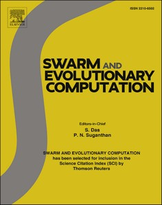

# Flight Control And Navigation

**Source Document:** `flight control and navigation.pdf`  
**Total Pages:** 24  

---

## --- Page 1 ---

### Section: From PID to swarms: A decade of advancements in drone control and path planning - A systematic review (2013–2023)

Swarm and Evolutionary Computation 89 (2024) 101626

Available online 8 June 2024
2210-6502/© 2024 Elsevier B.V. All rights are reserved, including those for text and data mining, AI training, and similar technologies.

Survey Paper

From PID to swarms: A decade of advancements in drone control and path 
planning - A systematic review (2013–2023)

Berk Cetinsaya *, Dirk Reiners , Carolina Cruz-Neira

Department of Computer Science, University of Central Florida, 4000 Central Florida Blvd, Orlando, FL, 32816, USA

#### A R T I C L E I N F O

Keywords: 
Unmanned aerial vehicle (UAV) 
Drone control 
Path planning 
Swarm intelligence 
Nature-inspired swarm algorithms

#### A B S T R A C T

This systematic literature review synthesizes and evaluates existing research on drone control and path planning, 
encompassing the principles of swarm intelligence and nature-inspired algorithms. However, it is not limited to 
these; it also explores other algorithms to provide a comprehensive overview of the state-of-the-art in this rapidly 
evolving field. The review identifies and analyzes key trends, challenges, and advancements in drone control and 
path planning. It investigates the evolution of control strategies, ranging from classical proportional-integral- 
derivative (PID) controllers to modern swarm algorithms and reinforcement learning-based techniques. Addi­
tionally, it explores path planning methodologies, including traditional optimization algorithms and heuristic- 
based approaches, and specifically, swarm algorithms within the context of drone swarms. The emphasis on 
nature-inspired intelligent computation extends to the exploration of swarm intelligence and cooperative plan­
ning as integral components of drone path planning. By synthesizing and critically analyzing the literature, this 
systematic review not only presents a comprehensive understanding of the current landscape of drone control 
and path planning, but it also acknowledges the role of various nature-inspired algorithms, including but not 
limited to swarm intelligence, and identifies avenues for future research in this evolving field.

#### 1. Introduction

While the development of Unmanned Aerial Vehicles/Unmanned 
aerial systems (UAVs/UASs) traces its origins back to the early 1900s 
[1], research in this field began to gain momentum around 2012–2013 
[2] (see Fig. 1). In recent years, the integration of UAVs into various 
industries has seen remarkable growth and transformation. As of 
October 2023, there were 863,728 drones registered in the United States 
by the federal aviation administration (FAA) [3]. This number is ex­
pected to be around 955,000 by 2027 [4]. From precision agriculture [5, 
6] and environmental monitoring [7] to surveillance and disaster 
response [8,9], these versatile aerial platforms have transformed the 
way tasks are executed. Their ability to navigate complex environments 
and execute challenging missions depends on how they are controlled, 
and how paths are planned.

The connection between drone control and path planning is like a 
fundamental building block in the world of UAS. They are so tightly 
linked that thinking about one without the other is almost impossible. 
Drones have diverse uses as mentioned above, and their success relies on 
how well control and path planning work together. In a world where

drones are increasingly vital, understanding how these two elements are 
interdependent is key, as they form the foundation for the safe and 
effective use of drones.

Drone control and path planning encompass the algorithms, strate­
gies, and methodologies that empower these autonomous or semi- 
autonomous vehicles to operate efficiently, safely, and effectively. 
Drone control focuses on the dynamic management of UAVs during 
flight, ensuring stability and responsive maneuvering. Path planning, on 
the other hand, involves the intellectual coordination of selecting 
optimal routes for drones as they traverse intricate terrains, negotiate 
obstacles, and achieve mission objectives. Effective control and path 
planning are pivotal to the success and safety of drone missions [10]. 
Whether a drone is conducting a search and rescue operation in a 
disaster-stricken area, inspecting critical infrastructure, or delivering 
packages to doorstep destinations, the quality of control and path 
planning directly influences mission outcomes. Moreover, drone control 
and path planning rely on a wide range of techniques and technologies. 
Control algorithms stabilize UAVs, enabling precise flight and respon­
siveness. Path planning algorithms analyze environmental data, employ 
obstacle detection systems, and facilitate real-time decision-making.

* Corresponding author. 
E-mail address: berk.cetinsaya@ucf.edu (B. Cetinsaya).

Contents lists available at ScienceDirect

Swarm and Evolutionary Computation

journal homepage: www.elsevier.com/locate/swevo

https://doi.org/10.1016/j.swevo.2024.101626 
Received 21 December 2023; Received in revised form 28 April 2024; Accepted 31 May 2024

*Caption/Context: Swarm and Evolutionary Computation 89 (2024) 101626 | Survey Paper*

*Caption/Context: Swarm and Evolutionary Computation 89 (2024) 101626 | Survey Paper*

## --- Page 2 ---

### Section: 1.1 Related surveys

Swarm and Evolutionary Computation 89 (2024) 101626

2

Machine learning and artificial intelligence are increasingly used to 
enhance both control and path planning [11–13], allowing drones to 
learn from experience and adapt to changing conditions.

With the increase in drone usage, drone swarms are becoming more 
popular. The coordination of multiple drones in swarms, facilitated by 
advanced control and path planning algorithms [14], revolutionizes 
aerial operations. These swarms enhance capabilities across various 
domains, such as search and rescue, environmental monitoring, and 
more. By working collaboratively, swarms cover larger areas, respond 
faster, and achieve mission objectives with unprecedented efficiency, 
making them a game-changing innovation in the world of drone tech­
nology. Furthermore, advancements in autonomous navigation systems 
empower drones to execute missions independently, diminishing the 
requirement for continuous human supervision [15]. These sophisti­
cated systems enable drones to navigate complex environments, adapt to 
dynamic conditions, and complete tasks with a heightened degree of 
autonomy, marking a significant step forward in enhancing the effi­
ciency and versatility of drone operations. In addition, ongoing refine­
ment of optimization techniques aims to reduce energy consumption 
during extended drone missions, thereby extending both flight durations 
and operational ranges [16]. By focusing on energy efficiency, these 
developments enhance the sustainability and endurance of drone oper­
ations, paving the way for longer and more resource-effective flights.

#### 1.1. Related surveys

In the literature, there are some surveys that cover different aspects 
of UAV/UAS/drone/swarm control systems and path planning algo­
rithms. For instance, [17–21] focused on control strategies and archi­
tectures, covering strategies from basic to advanced. [17] focuses on the 
novel concept of quadrotors with tilting propellers, highlighting the 
need for hybrid control schemes to achieve optimal performance. [18] 
compares linear and nonlinear control strategies, emphasizing the 
trade-offs between stability, robustness, and complexity. Additionally, 
they discuss experimental implementation setups and future directions, 
such as integrating UAVs into traffic policing systems. [19] underscores 
the prevalence of PID control in quadrotor systems and explores varia­
tions and enhancements, including adaptive capabilities and stability 
analyses. They identify opportunities for further research, particularly in 
analyzing the stability of PID-based control schemes and addressing 
challenges related to disturbances and parameter uncertainty. [20] 
provides a concise overview of quadrotor UAV control algorithms, 
focusing on linear, nonlinear, and intelligent control methods. They 
emphasize the challenges posed by the quadrotor’s underactuated

nature, including robust stability, nonholonomic constraints, parameter 
optimization, and accurate dynamic modeling. [21] offers a compre­
hensive survey of control methods tailored for multi-rotor systems, 
particularly quadrotors, aiming to reveal future capability requirements. 
They cover linear controllers like PID, LQ, and H-infinity, which were 
initially sufficient for stable flight. They then explore nonlinear control 
techniques, necessary due to the inherent nonlinear under-actuated 
nature of quadrotors, including feedback linearization, backstepping, 
and sliding mode control. Intelligent control strategies, such as model 
predictive, fuzzy logic, and neural network controllers, are also 
reviewed for their adaptability to wider uncertainty ranges.

While these recent surveys focus on control strategies and architec­
tures with a detailed exploration of basic and advanced techniques, our 
survey goes further to examine various aspects of drone control. It ex­
plores not only the traditional control strategies but also delves into 
human-robot interaction, safety and security, machine learning inte­
gration, communication frameworks, surveillance and area coverage, 
formation control, and applications in entertainment. This approach 
adds depth to the analysis of control systems, considering their broader 
application and integration in different contexts.

Moreover, [22–26] focused on path planning algorithms. [22] pro­
vides an extensive analysis of UAV path planning approaches, high­
lighting the prevalence of classical techniques, heuristic algorithms, 
meta-heuristics, and machine learning methods. The discussion un­
derscores the trade-offs between simplicity, computational efficiency, 
and optimality across static and dynamic environments. [23] presents a 
comprehensive analysis of UAV path planning research focusing on 
computational intelligence (CI) algorithms. They identify trends in 
CI-based path planning and categorize studies based on time domain 
(offline and online) and space domain (2D and 3D). [24] explores the 
emerging field of UAV swarm path planning, emphasizing the role of 
artificial intelligence techniques in enhancing coordination and effi­
ciency. [25] offers a thorough examination of 3D path planning algo­
rithms for UAVs. They categorize methods into sampling-based, 
node-based, mathematical model-based, bio-inspired, and multi-fusion 
algorithms, comparing their characteristics and applicability. [26] 
provides a thorough examination of path planning techniques for UAVs. 
They categorize the techniques into representative, cooperative, and 
non-cooperative methods, and delve into their applicability, coverage, 
and connectivity within UAV communication networks. Furthermore, 
they identify key research directions, including the need for more effi­
cient path planning, enhanced energy efficiency through green energy 
adoption, and the development of secure communication protocols to 
mitigate potential security threats.

Fig. 1. Evolution of papers published on drones per year between 2009 and 2018.

B. Cetinsaya et al.

![In the literature, there are some surveys that cover different aspects  of UAV/UAS/drone/swarm control systems and path planning algo­ rithms. For instance, [17–21] focused on control strategies and archi­ tectures, covering strategies from basic to advanced. [17] focuses on the  novel concept of quadrotors with tilting propellers, highlighting the  need for hybrid control schemes to achieve optimal performance. [18]  compares linear and nonlinear control strategies, emphasizing the  trade-offs between stability, robustness, and complexity. Additionally,  they discuss experimental implementation setups and future directions,  such as integrating UAVs into traffic policing systems. [19] underscores  the prevalence of PID control in quadrotor systems and explores varia­ tions and enhancements, including adaptive capabilities and stability  analyses. They identify opportunities for further research, particularly in  analyzing the stability of PID-based control schemes and addressing  challenges related to disturbances and parameter uncertainty. [20]  provides a concise overview of quadrotor UAV control algorithms,  focusing on linear, nonlinear, and intelligent control methods. They  emphasize the challenges posed by the quadrotor’s underactuated | Moreover, [22–26] focused on path planning algorithms. [22] pro­ vides an extensive analysis of UAV path planning approaches, high­ lighting the prevalence of classical techniques, heuristic algorithms,  meta-heuristics, and machine learning methods. The discussion un­ derscores the trade-offs between simplicity, computational efficiency,  and optimality across static and dynamic environments. [23] presents a  comprehensive analysis of UAV path planning research focusing on  computational intelligence (CI) algorithms. They identify trends in  CI-based path planning and categorize studies based on time domain  (offline and online) and space domain (2D and 3D). [24] explores the  emerging field of UAV swarm path planning, emphasizing the role of  artificial intelligence techniques in enhancing coordination and effi­ ciency. [25] offers a thorough examination of 3D path planning algo­ rithms for UAVs. They categorize methods into sampling-based,  node-based, mathematical model-based, bio-inspired, and multi-fusion  algorithms, comparing their characteristics and applicability. [26]  provides a thorough examination of path planning techniques for UAVs.  They categorize the techniques into representative, cooperative, and  non-cooperative methods, and delve into their applicability, coverage,  and connectivity within UAV communication networks. Furthermore,  they identify key research directions, including the need for more effi­ cient path planning, enhanced energy efficiency through green energy  adoption, and the development of secure communication protocols to  mitigate potential security threats.](images/page_002_fig_01.png)
*Caption/Context: In the literature, there are some surveys that cover different aspects  of UAV/UAS/drone/swarm control systems and path planning algo­ rithms. For instance, [17–21] focused on control strategies and archi­ tectures, covering strategies from basic to advanced. [17] focuses on the  novel concept of quadrotors with tilting propellers, highlighting the  need for hybrid control schemes to achieve optimal performance. [18]  compares linear and nonlinear control strategies, emphasizing the  trade-offs between stability, robustness, and complexity. Additionally,  they discuss experimental implementation setups and future directions,  such as integrating UAVs into traffic policing systems. [19] underscores  the prevalence of PID control in quadrotor systems and explores varia­ tions and enhancements, including adaptive capabilities and stability  analyses. They identify opportunities for further research, particularly in  analyzing the stability of PID-based control schemes and addressing  challenges related to disturbances and parameter uncertainty. [20]  provides a concise overview of quadrotor UAV control algorithms,  focusing on linear, nonlinear, and intelligent control methods. They  emphasize the challenges posed by the quadrotor’s underactuated | Moreover, [22–26] focused on path planning algorithms. [22] pro­ vides an extensive analysis of UAV path planning approaches, high­ lighting the prevalence of classical techniques, heuristic algorithms,  meta-heuristics, and machine learning methods. The discussion un­ derscores the trade-offs between simplicity, computational efficiency,  and optimality across static and dynamic environments. [23] presents a  comprehensive analysis of UAV path planning research focusing on  computational intelligence (CI) algorithms. They identify trends in  CI-based path planning and categorize studies based on time domain  (offline and online) and space domain (2D and 3D). [24] explores the  emerging field of UAV swarm path planning, emphasizing the role of  artificial intelligence techniques in enhancing coordination and effi­ ciency. [25] offers a thorough examination of 3D path planning algo­ rithms for UAVs. They categorize methods into sampling-based,  node-based, mathematical model-based, bio-inspired, and multi-fusion  algorithms, comparing their characteristics and applicability. [26]  provides a thorough examination of path planning techniques for UAVs.  They categorize the techniques into representative, cooperative, and  non-cooperative methods, and delve into their applicability, coverage,  and connectivity within UAV communication networks. Furthermore,  they identify key research directions, including the need for more effi­ cient path planning, enhanced energy efficiency through green energy  adoption, and the development of secure communication protocols to  mitigate potential security threats.*

## --- Page 3 ---

### Section: 2 Aims and scope

Swarm and Evolutionary Computation 89 (2024) 101626

3

The recent surveys focused on specific path planning algorithms, 
offering extensive insights into classical techniques, computational in­
telligence, and emerging fields. Our survey builds on this foundation by 
incorporating a wider range of methodologies, including genetic algo­
rithms, particle swarm optimization, artificial intelligence, ant colony 
optimization, nature-inspired techniques, and multi-agent coordination. 
Moreover, our review discusses the real-world challenges and limita­
tions, bridging the gap between theoretical path planning and practical 
applications.

In addition, our review brings a unique perspective on swarm control 
systems and swarm intelligence, an area with growing importance. 
While the existing surveys mention multi-rotor systems and control 
schemes, our paper explores advanced control strategies such as multi- 
region distributed control and consensus-based formation control, 
providing a comprehensive view of how UAV swarms can operate 
collaboratively. This detailed examination of swarm control systems 
adds a layer of insight that the existing surveys do not cover extensively.

Despite these valuable contributions, there exists a gap in the liter­
ature—a lack of a comprehensive survey that synthesizes insights from 
various domains within UAV/UAS/drone/swarm control systems and 
path planning algorithms. This gap motivates our proposal for a more 
exhaustive survey, aiming to consolidate existing knowledge and offer 
new insights. By addressing this void, our survey seeks to provide a 
holistic understanding of UAV/UAS/drone/swarm control systems and 
path planning algorithms, with a focus on control strategies, path 
planning, swarm control systems, and swarm intelligence. Through 
rigorous analysis and synthesis of existing literature, we aim to create a 
resource that not only describes the current state of the field but also 
anticipates future developments and challenges in UAV/UAS/drone/ 
swarm systems.

The rest of the paper is organized as follows. In Section 2, we outline 
our objectives and research questions. Section 3 provides an explanation 
of the systematic methodology employed to discover, synthesize, and 
critically analyze the existing body of knowledge. Section 4 presents the 
research outcome and findings of the review. We discuss the results, 
evaluate their limitations and challenges, and peer into the future of 
these transformative technologies in Section 5. Finally, Section 6 con­
cludes our paper.

#### 2. Aims and scope

This systematic literature review aims to comprehensively investi­
gate the state-of-the-art control systems and path planning techniques 
employed in UAV/UAS/drone/swarm systems, while concurrently 
examining the associated limitations and challenges. The research 
questions guiding this review are as follows:

Identification of State-of-the-Art Control Systems and Path Planning 
Techniques: This review seeks to answer the question, "What are the 
current state-of-the-art control systems and path planning techniques 
used in UAV/UAS/drone/swarm systems?" Through an exhaustive 
analysis of the literature, this objective aims to provide a comprehensive 
overview of the cutting-edge methods and technologies in the field.

Assessment of Challenges and Limitations: In addressing the question, 
"What are the key challenges and limitations in the existing UAV/UAS/ 
drone/swarm control systems and path planning?" this review will 
critically evaluate the obstacles and constraints faced by researchers and 
practitioners in the design and implementation of these systems.

Future Research Directions: Lastly, in exploring "What are the future 
research directions and potential areas for improvement in UAV/UAS/ 
drone/swarm control systems and path planning?" this review will 
provide insights into the emerging trends and opportunities for 
advancing the field, thereby guiding future research endeavors.

#### 3. Methods

In this section, we outline the systematic methodology employed to

identify, select, and analyze the relevant literature for our comprehen­
sive review of UAV/UAS/drone/swarm control systems and path plan­
ning. To ensure methodological rigor and transparency, we adhered to 
the Preferred Reporting Items for Systematic Reviews and Meta- 
Analyses (PRISMA) 2009 guidelines [27] for article screening and se­
lection. This systematic approach allowed us to systematically retrieve 
and evaluate a broad spectrum of scholarly works, providing a foun­
dation for an evidence-based synthesis of the state-of-the-art 
UAV/UAS/drone/swarm control systems and path planning tech­
niques within the defined time frame of 2013 to 2023. The following 
subsections detail our search strategy, search criteria, and the outcomes 
of the screening process, highlighting our commitment to a compre­
hensive and structured review process.

#### 3.1. Search strategy

To conduct a systematic and comprehensive review of the literature 
on UAV/UAS/drone/swarm control systems and path planning, a 
rigorous search strategy was developed. The search strategy was 
designed to identify relevant studies to address the specified research 
questions in Section 2. The primary search was performed across 
prominent academic databases, including IEEE Xplore, ACM Digital Li­
brary, and ScienceDirect, and the query used was as follows: ("UAV" OR 
"UAS" OR "drone") AND ("autonomous control algorithms" OR "swarm" 
OR "flight control" OR "mission planning" OR "path planning 
algorithms").

#### 3.2. Search criteria

We carefully selected studies for inclusion in this systematic review 
based on a set of specific criteria that ensured the relevance and quality 
of the selected literature. To be considered for inclusion, studies were 
required to meet the following criteria:

Firstly, studies were considered eligible if they directly addressed the 
subject matter of UAV/UAS/drone/swarm control systems and path 
planning. Moreover, we prioritized studies that offered substantial and 
detailed information on various aspects of the field, including methods, 
techniques, applications, challenges, and advancements. This stringent 
criterion served as the foundation for our review, ensuring that the 
selected studies were closely aligned with the central focus of our 
investigation. By adhering to this criterion, we were able to extract 
meaningful insights and information that pertained directly to this 
domain. In addition to relevance, we established a temporal boundary 
by including studies published between 2013 and 2023. This allowed us 
to capture the most recent developments, providing a comprehensive 
overview of the state-of-the-art practices.

Furthermore, our review incorporated various types of scholarly 
works, including book chapters, peer-reviewed journal articles, and 
conference papers. This broad inclusion criterion ensured that the 
selected studies had undergone rigorous peer review processes and met 
well-established academic standards, contributing to the robustness and 
credibility of our findings. On the other hand, we excluded certain types 
of publications that did not meet the academic standards mandated for 
inclusion in our review. Specifically, editorials, letters, opinions, and 
non-peer-reviewed sources were omitted from our analysis, emphasizing 
the importance of peer-reviewed scholarship to uphold the scholarly 
integrity of our work. Lastly, to maintain a consistent and comprehen­
sive assessment of the literature, studies published in the English lan­
guage were exclusively included. Proficiency in English was deemed 
essential for the effective evaluation and synthesis of the selected works.

#### 3.3. Study selection and data collection

In the process of study selection and data collection, we followed a 
structured methodology. Initially, we screened the titles and abstracts of 
the identified articles to determine whether they aligned with our

B. Cetinsaya et al.

## --- Page 4 ---

### Section: 4 Results

Swarm and Evolutionary Computation 89 (2024) 101626

4

inclusion criteria. Subsequently, we conducted a thorough examination 
of the full texts of the selected articles to further assess their relevance to 
our study. To ensure a systematic and comprehensive data-gathering 
process, we devised a standardized data extraction form. This form 
was instrumental in capturing key information from each chosen article, 
including research questions, contributions, methodology, findings, 
limitations, and potential areas for future research. This approach 
allowed us to methodically collect and organize the essential details 
from the literature under consideration.

#### 4. Results

In this section, we present the comprehensive results obtained from 
the systematic search and analysis conducted on the topic of drone 
control systems and path planning techniques. We delve into the out­
comes of our search process, summarize the key findings from the 
collected studies, and identify state-of-the-art control systems and path 
planning techniques.

#### 4.1. Search outcome

The initial search across prominent academic databases, including 
IEEE Xplore, ACM Digital Library, and ScienceDirect, resulted in a total 
of 7750 papers. Subsequently, after the screening of titles and abstracts 
following PRISMA guidelines, 770 papers were deemed potentially 
relevant for further review. Following a thorough examination of the full 
texts, study quality assessment, and removal of duplicates, 60 publica­
tions were included in the final review, contributing to the synthesis of 
the literature in this review paper (see Fig. 2).

#### 4.2. Study summaries

In this section, we provide concise summaries of the studies included 
in our systematic literature review, each contributing valuable insights 
to the broader understanding of drone control and path planning. These 
studies encompass a diverse range of topics, methodologies, and appli­
cations, collectively helping us to understand the multifaceted landscape 
of drone technology. From gaze-based control systems to adaptive multi- 
UAV path planning, each investigation offers a unique perspective, 
contributing to the collective body of knowledge in these dynamic fields. 
Furthermore, we discuss the findings, challenges, and limitations of 
these studies, and future research directions extensively in Section 5.

4.2.1. Drone control 
This section of the systematic review focuses on drone control sys­
tems, drawing insights from thirty selected articles. These articles 
collectively contribute to a nuanced understanding of the advancements 
in drone control over the past decade. The subsequent subsections 
dissect various aspects of this domain, including human-robot interac­
tion (Section 4.2.1.1), surveillance and area coverage (Section 4.2.1.2), 
attitude control systems (Section 4.2.1.3), safety and security consid­
erations (Section 4.2.1.4), formation control (Section 4.2.1.5), machine 
learning integration (Section 4.2.1.6), communication and control 
frameworks (Section 4.2.1.7), and drone control in entertainment 
(Section 4.2.1.8).

4.2.1.1. Human-Robot interaction in drone control systems. Drones can be 
controlled in various ways, with the most common and traditional 
method being the use of a remote control. However, recent research has 
explored alternative methods to enhance the effectiveness and efficiency 
of control. These methods include utilizing electroencephalogram (EEG) 
signals [28,29], eye tracking [30], speech and gestures [31], among 
others. Hansen et al. [30] explored the innovative application of 
gaze-tracking technology in controlling drones. The investigation 
encompassed the examination of four distinct control modes, each 
combining gaze-directed movement and manual (keyboard) input to 
govern different aspects of drone flight, such as speed (pitch), altitude, 
rotation (yaw), and roll (drafting). The study involved ten participants 
who engaged in a basic drone flying task. Various metrics were 
collected, including task completion time, while also assessing the user 
experience in terms of complexity, dependability, and enjoyment. 
Among the key findings, the study reported that participants achieved 
similar task completion times across all four tested control modes. 
However, one specific combination of gaze-based and manual controls 
(Rotation and speed by gaze; translation and altitude by keyboard) was 
identified as significantly more dependable than the others. They 
believed that the reason was since all subjects were experienced gamers, 
the control mode closely resembles the one commonly employed by 
gamers in three-dimensional (3D) games, where the mouse is frequently 
utilized to adjust the viewing perspective. This study offers valuable 
insights into the utilization of gaze-based control modes for UAVs. 
Furthermore, Liu et al. [32] introduced a novel approach to enhance 
human-robot collaboration in controlling UAVs for beyond visual line of 
sight (BVLOS) applications. The framework combines manual control 
through hand gestures, recognized using the Mediapipe system [33], 
with autonomous task execution capabilities. These capabilities are 
achieved through the integration of ORB-SLAM2 [34] for 3D mapping 
and Detectron2 [35] for object detection and semantic segmentation. 
The control architecture is hierarchical, with commands categorized 
into three levels based on complexity. Level 1 encompasses basic flight 
control commands, Level 2 focuses on instructional and target selection 
commands, and Level 3 manages complex flight behaviors. Experi­
mental results highlight the effectiveness and stability of this 
semi-automatic teleoperation approach, particularly in tasks requiring 
precise navigation, offering an intuitive and user-friendly alternative to 
Fig. 2. An overview of the filtering process used in this paper.

B. Cetinsaya et al.

![The initial search across prominent academic databases, including  IEEE Xplore, ACM Digital Library, and ScienceDirect, resulted in a total  of 7750 papers. Subsequently, after the screening of titles and abstracts  following PRISMA guidelines, 770 papers were deemed potentially  relevant for further review. Following a thorough examination of the full  texts, study quality assessment, and removal of duplicates, 60 publica­ tions were included in the final review, contributing to the synthesis of  the literature in this review paper (see Fig. 2). | 4.2.1. Drone control  This section of the systematic review focuses on drone control sys­ tems, drawing insights from thirty selected articles. These articles  collectively contribute to a nuanced understanding of the advancements  in drone control over the past decade. The subsequent subsections  dissect various aspects of this domain, including human-robot interac­ tion (Section 4.2.1.1), surveillance and area coverage (Section 4.2.1.2),  attitude control systems (Section 4.2.1.3), safety and security consid­ erations (Section 4.2.1.4), formation control (Section 4.2.1.5), machine  learning integration (Section 4.2.1.6), communication and control  frameworks (Section 4.2.1.7), and drone control in entertainment  (Section 4.2.1.8).](images/page_004_fig_01.png)
*Caption/Context: The initial search across prominent academic databases, including  IEEE Xplore, ACM Digital Library, and ScienceDirect, resulted in a total  of 7750 papers. Subsequently, after the screening of titles and abstracts  following PRISMA guidelines, 770 papers were deemed potentially  relevant for further review. Following a thorough examination of the full  texts, study quality assessment, and removal of duplicates, 60 publica­ tions were included in the final review, contributing to the synthesis of  the literature in this review paper (see Fig. 2). | 4.2.1. Drone control  This section of the systematic review focuses on drone control sys­ tems, drawing insights from thirty selected articles. These articles  collectively contribute to a nuanced understanding of the advancements  in drone control over the past decade. The subsequent subsections  dissect various aspects of this domain, including human-robot interac­ tion (Section 4.2.1.1), surveillance and area coverage (Section 4.2.1.2),  attitude control systems (Section 4.2.1.3), safety and security consid­ erations (Section 4.2.1.4), formation control (Section 4.2.1.5), machine  learning integration (Section 4.2.1.6), communication and control  frameworks (Section 4.2.1.7), and drone control in entertainment  (Section 4.2.1.8).*

## --- Page 5 ---

### Section: 4.2.1.2 Drone control systems in surveillance and area coverage

Swarm and Evolutionary Computation 89 (2024) 101626

5

traditional joystick-based UAV control.

4.2.1.2. Drone control systems in surveillance and area coverage. One of 
the most common application areas of drones is surveillance. Schleich 
et al. [36] explored the coordination of UAV fleets to fulfill collaborative 
missions with a focus on surveillance tasks. The study utilized a 
decentralized and localized algorithm designed for UAV mobility con­
trol, particularly in scenarios where network connectivity constraints 
are paramount, such as security-sensitive missions. This algorithm 
aimed to ensure that UAVs could maintain connectivity while operating 
autonomously. The study introduced the concept of the connected 
coverage mobility model, which relies on a tree-based overlay network 
anchored at the base station. This model not only ensures network 
connectivity but also leverages Ant Colony Optimization (ACO) [37] 
techniques to guide UAVs efficiently. Through a rigorous evaluation 
process involving extensive simulations, the researchers demonstrated 
the model’s effectiveness. In comparison to other contributions in the 
field, this study stands out for its emphasis on connectivity in autono­
mous UAV fleets. While some trade-offs were observed, the paper’s 
approach showed significantly better connectivity performance.

Rosalie et al. [38] tackled the complex challenge of area coverage 
using a swarm of UAVs within a military context. Their primary aim was 
to devise a mobility management system for a single autonomous UAV 
swarm tasked with information collection in military scenarios. This 
mission demanded addressing several crucial constraints, including the 
necessity for unpredictable UAV mobility, the capability for operator 
path prediction, mission autonomy to ensure continuous operation in 
hostile environments and fault tolerance. To achieve these goals, the 
researchers introduced the Chaotic Ant Colony Optimization to 
Coverage (CACOC) algorithm, a novel approach that blends ACO with 
chaotic dynamics. CACOC was designed to provide a deterministic yet 
unpredictable UAV mobility system, improving upon traditional random 
processes in ACO. The paper elaborates on how chaotic dynamics from 
the Rossler system [39] were incorporated into the UAV mobility model, 
utilizing tools like the logistics map and the Rossler system to generate 
chaos. Extensive experiments were conducted, accompanied by statis­
tical comparisons among different models. The results reveal that 
CACOC exhibited impressive performance in terms of coverage, initial­
ization phase, recent coverage, fairness, and network organization, with 
Model 5, combining chaos and pheromones, consistently outperforming 
other models.

The significance of UAVs in modern military technology is increasing 
due to their cost-effective advantages and the ability to integrate 
observation and combat functionalities. However, single UAVs face 
limitations in terms of endurance, coverage, and fault tolerance, 
particularly in complex mission environments. To overcome these lim­
itations, researchers have turned their attention to multi-UAV coordi­
nated missions, emphasizing mission planning as a core challenge. 
Various methods for area decomposition and assignment have been 
explored, including decomposition into cells and scan line-based dis­
tribution. In this context, Qiangwei et al. [40] addressed the problem of 
coordinated area coverage reconnaissance using multi-UAVs, taking into 
account the size of the mission area. The paper introduces two distinct 
mission modes based on the mission area’s size, offering flexibility in 
deployment strategies. Their results show the potential of multi-UAV 
systems to enhance mission performance, reliability, and adaptability 
in evolving battlefield scenarios, envisioning a future where multiple 
UAVs collaborate with diverse mission payloads, employ multi-angle 
coverage for enhanced information reliability, and autonomously plan 
and execute missions.

Li and Duan [41] presented a novel game-theoretic approach for 
cooperative search and surveillance using multiple UAVs. They divided 
the problem into three phases: coordinated motion, sensor observation, 
and information fusion. Coordinated motion is formulated as a potential 
game, employing binary log-linear learning for optimal coverage. A

consensus-based fusion algorithm constructs a probability map to guide 
subsequent motion. The modular framework allows the customization of 
utility functions and learning algorithms for diverse objectives and 
constraints. Their experiment results show the effectiveness and effi­
ciency of their proposed approach.

4.2.1.3. Attitude control systems. One notable development in the realm 
of UAVs is the exploration of intelligent attitude control systems. While 
traditional Proportional-Integral-Derivative (PID) control systems have 
been effective in stable environments, researchers have increasingly 
turned to reinforcement learning (RL) algorithms to enhance flight 
control precision and adaptability. Koch et al. [42] investigated the 
performance of RL-based controllers in the "inner loop" responsible for 
aircraft stability and control, specifically focusing on attitude control. 
Using a high-fidelity simulation environment called GymFC, an OpenAI 
environment [43], the authors trained flight controllers for quadrotor 
UAVs with RL algorithms, including deep deterministic policy gradient 
(DDPG), trust region policy optimization (TRPO), and proximal policy 
optimization (PPO). The results indicated that controllers trained with 
PPO demonstrated superior performance, surpassing traditional PID 
control in multiple performance metrics. This research contributes 
valuable insights into the potential of RL to improve UAV attitude 
control, particularly in challenging and dynamic environments, signi­
fying advancements in the field of flight control systems for UAVs.

Wang et al. [44] focused on creating a self-contained flight control 
system for small UAVs. They developed control laws for lateral and 
longitudinal flight management. Lateral control includes roll and yaw 
controllers, pivotal for trajectory tracking and overall stability. The roll 
controller minimizes errors in sideways movement, ensuring the UAV 
remains on its intended path. The yaw controller is especially significant 
during automatic takeoff and landing. Controlling altitude and airspeed 
is challenging due to their interconnected nature, especially during 
landing. To address this, the authors introduced the concept of the total 
energy control system (TECS) [45]. This approach synchronizes throttle 
and pitch angle to optimize altitude and airspeed control. Multiple flight 
tests were conducted to validate the system’s stability and depend­
ability. Trajectory control proved to be accurate within approximately 
1.5 m, while altitude errors did not exceed 0.5 m. 
Santana et al. [46] provided a comprehensive exploration of 
applying a low-cost quadrotor testbed to real outdoor flights. They 
proposed a design of a flight control system that addresses critical as­
pects such as managing out-of-sequence sensor measurements [47], 
aircraft modeling, and high-level flight controller development. To 
validate the effectiveness of this system, a series of practical flights were 
performed, specifically focusing on tasks related to positioning and 
trajectory tracking. The paper also highlights the importance of reliable 
sensor data in achieving optimal control performance and emphasizes 
the significance of fusing data from different sensors for outdoor navi­
gation. The paper presents experimental results from various flight 
scenarios, demonstrating the system’s capability to overcome distur­
bances caused by wind and positioning interference. It concludes that 
this system offers a robust and efficient control scheme, even in the face 
of significant wind gusts, making it suitable for real-time experimenta­
tion and outdoor applications.

Sato et al. [48] discussed the design of a flight controller for an un­
manned airplane developed for radiation monitoring. The system relies 
on a traditional control structure due to limited onboard computing 
power. This structure incorporates Stability/Control Augmentation 
Systems (S/CAS) to bolster stability and utilizes PID controllers for 
guidance loops responsible for regulating speed, track angle, and 
three-dimensional position. The key challenge in designing the flight 
controller is to ensure its robustness against modeling errors and 
changing operating conditions. To address this, the "multiple model 
approach" is adopted, which incorporates several linearized aircraft 
motion models to account for various flight conditions, such as

B. Cetinsaya et al.

## --- Page 6 ---

### Section: 4.2.1.4 Safety and security in drone control systems

Swarm and Evolutionary Computation 89 (2024) 101626

6

maximum and minimum weight and airspeed. The flight controller’s 
performance is evaluated through flight tests, including tests conducted 
in both calm and windy conditions.

Fujimori et al. [49] introduced an autonomous flight control system 
designed for quadrotors relying on its internal sensors for precise navi­
gation. The primary aim is to enable the quadrotor to operate autono­
mously, free from external positioning systems like GPS. The paper 
presents a systematic approach, encompassing the creation of four ve­
locity models, each associated with specific control commands. These 
models account for various factors, including motion dynamics, 
communication delays, and control command nonlinearities. The 
autonomous flight control system itself combines fundamental control 
laws for diverse flight missions, incorporating tracking control for ve­
locity profiles and positioning control for designated locations. Notably, 
the system addresses the physical characteristics of the quadrotor, such 
as control command saturation and dead zones. Furthermore, the paper 
outlines a practical method using waypoints to facilitate complex 
autonomous control. In an experiment involving a mobile robot with an 
ArUco marker [50], the system showcases its effectiveness, marking a 
promising development in autonomous flight technology.

Wang and Liu [51] presented an innovative method for enabling a 
quadrotor to accurately follow 3D spatial trajectories using a combina­
tion of saturated control and a specialized optimization algorithm called 
heterogeneous comprehensive learning particle swarm optimization 
(HCLPSO). The quadrotor model is first divided into a cascaded control 
structure with inner attitude and outer position control loops. Saturated 
control is employed to confine the thrust force, making it more 
manageable. The HCLPSO algorithm is then applied to optimize control 
parameters, reducing the complexity of manual tuning. The study fo­
cuses on adjusting three types of control parameters and demonstrates 
that the HCLPSO method is superior in achieving optimization precision 
and computational efficiency when compared to other techniques such 
as particle swarm optimization (PSO), comprehensive learning particle 
swarm optimization (CLPSO), genetic algorithm (GA), and differential 
evolution (DE), as observed in the simulation results. While the method 
shows promise in enhancing quadrotor control and optimization, it faces 
challenges in selecting the most suitable subpopulation combinations 
and addressing uncertainties and disturbances in control.

4.2.1.4. Safety and security in drone control systems. The precision and 
reliability of UAV control systems determine their ability to navigate 
complex environments and execute mission-critical tasks. At the same 
time, the increasing connectivity and complexity of UAV platforms have 
raised concerns about cybersecurity threats and safety vulnerabilities. 
These challenges have prompted researchers to develop innovative so­
lutions that not only enhance control mechanisms but also fortify UAV 
systems against cyberattacks. In this context, Yoon et al. [52] addressed 
the escalating security challenges faced by modern UAS due to their 
increasing complexity and connectivity. The VirtualDrone Framework, 
introduced in this research, serves as a pioneering solution, safeguarding 
critical system resources by leveraging virtualization techniques on a 
multicore processor. This framework ingeniously divides the UAS con­
trol environment into two distinct realms: the normal control environ­
ment, where advanced but potentially untrusted applications operate, 
and the secure control environment, which offers a minimal set of ca­
pabilities to ensure safe control and minimize the attack surface. By 
implementing a security and safety monitoring module within the secure 
control environment, the framework continuously monitors the UAS’s 
physical and logical states, swiftly detecting safety and security viola­
tions. Upon identification of such violations, the secure control envi­
ronment takes charge, limiting unreliable functionalities. The study 
showcases the framework’s robustness through comprehensive case 
studies and experimental validations, demonstrating its effectiveness in 
defending against various cyber threats. While the framework excels in 
addressing cyber threats, it does not handle physical sensor

manipulations, known as sensor attacks, emphasizing the need for 
additional control-theoretic approaches. Additionally, the study un­
derscores the negligible impact of the VirtualDrone Framework on 
power consumption, making it a promising solution for real-world 
implementation. This research contributes significantly to the under­
standing of UAS security challenges, offering a practical and resilient 
framework that bridges the gap between advanced functionalities and 
cybersecurity, thereby enhancing the safety and reliability of modern 
UAS operations.

With the widespread adoption of drones, incidents and misuse have 
increased. This has raised safety concerns. To address these challenges, 
Okutake et al. [53] introduced a collaborative safety flight control sys­
tem for multiple drones. This system relies on pattern recognition from 
drone camera images, coordinated control among multiple drones, and 
emergency procedures for uncontrollable situations. The research also 
explores various drone formation types tailored for different purposes, 
including photography and safety-focused configurations. Preliminary 
experiments demonstrated the feasibility of these safety control 
methods.

Caliskan and Hajiyev [54] introduced a system designed to ensure 
the reliability and safety of UAVs by addressing the challenges of sensor 
and actuator failures. In the event of sensor malfunctions, the system 
employs a sophisticated approach: it isolates the problematic sensor and 
implements a reconfigurable Optimum Kalman filter (OKF) that effec­
tively disregards the input from this sensor. It performs the isolation and 
identification of specific actuator faults, such as partial loss and stuck 
faults, using a two-stage Kalman filter. Subsequently, the feedback 
controller’s parameters are recalibrated through a control reconfigura­
tion process to maintain effective flight control even in the presence of 
actuator failures. To validate the effectiveness of their approach, the 
authors conducted simulations over a 100-second duration, with a 
sampling interval of 0.1 s. These simulations were performed consid­
ering scenarios where continuous measurement bias was introduced as a 
form of measurement malfunction. Additionally, the paper delves into 
the intricacies of tuning Proportional-Integral (PI) controllers, with a 
particular focus on their role in rejecting step disturbances. The goal is to 
optimize the system’s disturbance rejection capabilities while 
acknowledging the inherent trade-off that may affect reference tracking 
performance. This innovative approach presents a valuable solution for 
achieving both effective reference tracking and disturbance rejection in 
a single PI controller. The results clearly illustrate that the conventional 
OKF provides inaccurate estimates, primarily during specific intervals 
when a sensor fault occurs. In contrast, the reconfigured OKF consis­
tently produces significantly improved estimation results for various 
UAV state variables, even in the presence of sensor faults.

Wang et al. [55] explored the practical application of Model-Based 
Design (MBD) for designing flight control systems in UAVs. MBD is 
described as an organized approach that utilizes models to enhance 
communication, reduce manual work, and improve the efficiency of 
system design. A comparison between traditional and MBD methods is 
presented to illustrate the advantages of MBD, particularly in terms of 
code generation and algorithm updates. They used MATLAB/Simulink 
to categorize the models into control and UAV models. The control 
model enables flight path and attitude control, as well as 
mission-specific objectives. The results indicate that the flight control 
system effectively manages the flight path and orientation for planned 
missions. Following thorough testing and validation, including the 
conclusive Hardware-in-the-Loop (HIL) assessments, the flight control 
system is deemed prepared for actual flights.

Haitao and Yan [56] addressed the issue of parameter adjustment in 
nonlinear system controllers, primarily in the context of UAVs. The 
paper highlights the limitations of conventional PID controllers in 
handling nonlinear systems and introduces an enhanced PSO algorithm 
for fine-tuning controller parameters. It proposes a nonlinear dynamic 
inertia weight method that considers the distance between particles and 
the global optimum. They used the classic PID controller to design the

B. Cetinsaya et al.

## --- Page 7 ---

### Section: 4.2.1.5 Formation control in drone control systems

Swarm and Evolutionary Computation 89 (2024) 101626

7

pitch angle control law for nonlinear UAV models, and the PSO algo­
rithm to optimize the parameters, considering both fuel efficiency and 
tracking performance.

Chee and Zhong [57] focused on an unmanned quadrotor aerial 
vehicle equipped with advanced control systems, including a nonlinear 
complementary filter and proportional-integral rate controllers for 
precise attitude estimation and stabilization. The vehicle boasts critical 
mission capabilities, including altitude holding and collision avoidance, 
and features an autonomous navigation system for user-defined way­
points. Two collision avoidance schemes are employed. The first, a 
reactive quad-directional approach, uses strategically positioned 
infra-red sensors to swiftly respond to nearby obstacles, guiding the 
vehicle to avoid collisions. The second scheme is integrated with the 
navigation algorithm, enabling obstacle-free path generation by moving 
backward and sideward when an obstacle is detected. This maneuver 
continues until the obstacle is out of range. Control systems operate 
through two loops. The first loop manages fundamental platform oper­
ations and attitude stabilization, while the second loop governs altitude 
control, navigation, and collision avoidance using data from various 
sensors. The study’s findings are supported by practical experiments.

4.2.1.5. Formation control in drone control systems. With the increasing 
utilization of UAVs in various applications, employing multiple UAVs in 
formation control offers distinct advantages, including enhanced oper­
ational efficiency and robustness. Jia et al. [58] introduced a novel 
multi-region distributed control scheme for multi-UAV formation. The 
proposed control strategy adopts a hierarchical approach and divides 
the operational area into regions. Each region operates as a first-level 
follower that tracks a predefined trajectory, simplifying communica­
tion by limiting interactions to neighboring regions. Simultaneously, 
individual UAVs within a region function as second-level followers, 
aligning their paths with the first-level followers. Notably, this method 
allows UAVs to autonomously determine their positions, making it 
well-suited for dynamic environments. Stability is guaranteed through 
Lyapunov theory, and simulations validate the approach’s effectiveness. 
In a scenario involving fifteen UAVs across five regions, the system 
successfully achieves formation flight while maintaining safe inter-UAV 
distances. This innovative approach shows promise for complex 
multi-UAV missions, providing autonomous and safe formation control.

Lwowski et al. [59] introduced a novel formation control algorithm 
inspired by bird flocking, designed for coordinating a swarm of UAVs 
with the primary goal of ensuring camera image overlap. This algorithm 
leverages stereo cameras, global positioning systems (GPS), and inertial 
measurement units (IMUs) while circumventing the need for feature or 
pattern matching. By calculating virtual tracking points through stereo 
cameras, the primary formation control objective becomes the conver­
gence of these tracking points, ensuring consistent camera field-of-view 
overlap. The paper evaluates five distinct control algorithms, including 
direct control, PID, bang-bang control, short window model predictive 
control, and long window model predictive control, through extensive 
simulation testing to ascertain the robustness and efficacy of the pro­
posed formation controller. The study outlines the five major ap­
proaches: 
leader-follower, 
behavioral, 
consensus-based, 
virtual 
leader-based, and the less common flocking formation control algo­
rithm. The paper addresses the challenge of camera-based formation 
control using feature matching, citing drawbacks such as common 
feature loss and difficulty in complex environments. It then introduces 
the proposed stereo camera-based approach, emphasizing the achieve­
ment of camera image overlap without relying on feature matching.

Yasin et al. [60] addressed the complex challenge of coordinating a 
swarm of drones in terms of both maintaining a desired formation and 
avoiding collisions with obstacles. To tackle this, the authors proposed a 
multi-priority control strategy implemented in each drone node. This 
approach dynamically optimizes the trade-offs between collision 
avoidance and formation control, considering system constraints like

energy and response time. The algorithm is founded on three key ob­
servations: maintaining formation relative to neighboring nodes, 
detecting obstacles via local sensors, and adapting to critical collision 
situations by measuring obstacle proximity. Through comprehensive 
experimental results, the proposed approach demonstrates its ability to 
effectively maintain swarm formation while navigating around various 
obstacles. Moreover, Wu et al. [61] introduced an innovative control law 
for maintaining close formation flight based on Lyapunov theory. It 
establishes a comprehensive mathematical model, analyzes the dynamic 
characteristics of the formation, and develops a robust control strategy. 
Simulation results confirm the system’s ability to establish a stable 
triangular close formation swiftly and consistently with remarkable 
precision and resilience against external interference.

Luo et al. [62] focused on addressing the challenge of formation 
transformation UAV swarms. Formation transformation becomes 
necessary due to various factors, including environmental changes, 
modifications to mission objectives, and UAVs leaving the formation. 
The primary objective during these transformations is to ensure the 
safety of the UAVs, preventing collisions while completing the trans­
formation within a specific time frame. The authors started by empha­
sizing the importance of maintaining formation among UAVs, 
highlighting the advantages of using multiple UAVs in a formation. This 
approach allows for better coverage, more effective surveillance, and 
enhanced capabilities in various tasks, such as search missions or strike 
operations. They adopted a distributed structure control model for for­
mation keeping, designating one UAV as the Leader UAV (LU) respon­
sible for tracking a reference path, while the others function as Follower 
UAVs (FUs). Each FU tracks the nearest UAV in the formation, creating a 
structured formation constituted by sub-queues of twin UAVs. Various 
situations necessitate formation changes, including the need to navigate 
obstacles, adapt to new battlefield conditions, or respond to emergen­
cies. The central concern during these transformations is to maintain the 
safety of the UAVs and prevent collisions. To address these challenges, 
the authors employed a transformation method based on a 1–1 model to 
control the distances between UAVs during the transformation process. 
This method ensures that UAVs do not collide while transitioning from 
one formation to another. The results demonstrate the effectiveness of 
the design, suggesting that the developed control and transformation 
strategies can be successfully applied to UAV formation flight.

Zhao et al. [63] focused on a novel consensus-based formation con­
trol technique for second-order nonlinear multi-agent systems, aiming to 
minimize resource usage and enhance adaptability. They introduced an 
improved constrained adaptive chaotic pigeon-inspired optimization 
algorithm (ACPIO) for parameter tuning, simplifying controller design, 
and reducing manual workload. Additionally, a pinning control method 
combined with a hierarchical leadership model from pigeon flocks is 
introduced, enhancing adaptability while reducing computational 
complexity. The paper establishes conditions for achieving desired for­
mation patterns based on Lyapunov stability theory and matrix theory. 
Numerical simulations confirmed the effectiveness of this approach. Key 
contributions include proposing a consensus-based formation control 
method, deriving conditions for pinning control, and introducing an 
adaptable pinning control method with a leadership hierarchy. The 
method is shown to be fault-tolerant in scenarios where agents fail, 
making it a promising approach for multi-agent systems.

Wubben et al. [64] tackled the complexities associated with 
deploying and managing swarms of UAVs. They primarily focused on 
resolving two pivotal issues: swarm layout reconfiguration and handling 
lost swarm members. Furthermore, the paper introduces methods for 
addressing swarm fragmentation due to communication issues. The 
main contributions comprise an extended protocol for enhanced resil­
ience, accommodating any failing swarm element, and a reconfiguration 
scheme to enable safe mid-flight formation adjustments. This work 
distinguishes itself by concentrating on the loss of swarm elements and 
real-time reconfiguration into new formations, offering practical 
implementations, and exploring swarm split-up scenarios not

B. Cetinsaya et al.

## --- Page 8 ---

### Section: 4.2.1.6 Machine learning in drone control systems

Swarm and Evolutionary Computation 89 (2024) 101626

8

extensively addressed in prior research. The authors conducted exten­
sive experiments to validate their proposed solutions. The results 
demonstrate a notable reduction in collision risks during swarm recon­
figuration and seamless management of UAV losses, with minimal 
delays.

Chen et al. [65] focused on enhancing the design of a distributed 
leader-following formation control system for discrete multi-agent 
setups, particularly when the leader maintains a constant speed. The 
authors introduced a distributed control protocol that incorporates an 
integral term to enable followers to track the leader while preserving the 
desired formation, even when the data is obtained through periodic 
sampling. The main contributions include establishing the conditions for 
achieving leader-following formation asymptotically using the Jury 
criterion and providing explicit formulas for optimal control gains and 
convergence rates. The study’s findings are validated through numerical 
simulations, confirming the effectiveness of the proposed method. In 
contrast to prior research primarily addressing continuous systems, this 
paper addresses the specific challenges of discrete systems and their 
sampling intervals, making leader-following formation control more 
practical for real-world applications.

4.2.1.6. Machine learning in drone control systems. Achieving effective 
coordination among UAVs within a swarm can be challenging, espe­
cially in scenarios marked by unreliable communication channels and 
operational heterogeneity. Yang et al. [66] addressed this coordination 
challenge by employing generative adversarial imitation learning 
(GAIL), a machine learning technique that enables drones to coordinate 
their actions by imitating the behaviors demonstrated by their peers. 
Unlike traditional RL methods, GAIL does not rely on predefined reward 
feedback, making it particularly suitable for scenarios where reward 
feedback is challenging to specify accurately. One noteworthy aspect of 
this research is its focus on partially observable environments, where 
drones have access to incomplete observations due to communication 
constraints or limited sensing capabilities. To bridge this gap and enable 
drones to make informed decisions, the authors proposed the use of 
belief representations. These belief representations are derived from 
historical observation-action trajectories and are trained alongside 
imitation policies. By leveraging belief representations, drones can 
better understand their environment, anticipate future states, and 
optimize their imitation policies for more accurate coordination. The 
results of the evaluation demonstrate the algorithm’s superiority in 
several key aspects. Firstly, it excels in imitation accuracy, enabling 
slave UAVs to adapt their flight trajectories based on demonstrations 
from a master UAV. Secondly, it significantly reduces teamwork 
execution time, enhancing the efficiency of collaborative formations. 
Lastly, it exhibits superior energy efficiency compared to alternative 
methods, making it well-suited for scenarios with constrained energy 
resources.

4.2.1.7. Communication and control frameworks in drone control sys­
tems. Diller et al. [67] introduced ICCSwarm, a comprehensive frame­
work that significantly advances the integration of communication and 
control in UAV swarms. ICCSwarm comprises two primary phases. The 
planning phase integrates communication constraints into UAV mission 
design, emphasizing communication-aware path planning. Researchers 
focused on factors such as limited communication range and bandwidth 
limitations. Simulations demonstrated significant data collection effi­
ciency improvements with multi-hop routing protocols over single-hop 
approaches. The deployment phase validated planned missions on 
physical UAVs, providing a real-world assessment. The architecture 
featured a mission computer, autopilot, network routing, and network 
monitoring components. Autopilots managed UAV movements and data 
collection, while network routing enabled multi-hop data transmission, 
integrating communication and control. Their work emphasizes the 
critical role of considering communication constraints during mission

planning and highlights the substantial benefits associated with 
multi-hop routing protocols.

Zacarias et al. [68] introduced an innovative solution to address the 
demand for managing multiple UAVs. The paper extends the capabilities 
of the DroidPlanner application [69], designed for single UAV control, 
by modifying the communication infrastructure and user interface. The 
system employs the MAVLink protocol for communication. The archi­
tecture adopted for controlling multiple UAVs adheres to the 
model-view-controller (MVC) pattern. In this context, the model 
component represents the virtualization of physical UAVs, the view 
component serves as the user interface for interacting with these UAVs, 
and the controller manages message handling and communication with 
the UAVs. They performed experiments with two, three, and four UAVs 
being controlled at the same time. Their results show the impact of 
controlling more UAVs on the user interface and application perfor­
mance due to message overload, underscoring the need for enhanced 
communication channels.

4.2.1.8. Drone control systems in entertainment. Nowadays, UAVs have 
emerged as invaluable tools in the movie industry. These versatile aerial 
platforms have revolutionized the art of cinematography, offering 
filmmakers the ability to capture stunning aerial shots and complex 
camera movements with precision and creativity. However, there are 
several challenges associated with manual drone control. Fleureau et al. 
[70] addressed some of these challenges and introduced a global control 
architecture based on a generic API for UAVs, integrating a compound 
model for rotary-wing drones and a full-state feedback strategy. The 
authors also proposed an automatic camera path planning approach 
tailored for cinema scene capture and validated their system through a 
series of experiments. They proposed a new control architecture based 
on Linear Quadratic Gaussian [71] regulators. The controller relies on 
three key components: position, orientation, and speed. These compo­
nents can be generated manually through third-party software or auto­
matically derived from high-level specifications. They use the prose 
storyboard language (PSL) [72] to extract camera configurations. In 
addition to the controller, they computed a path and used steering be­
haviors, gradually guiding the camera toward its optimal position, and 
generating a smooth motion along the path. Although with some limi­
tations such as supporting a single drone, this research represents an 
initial step toward the development of autonomous tools for the cinema 
industry.

4.2.2. Path planning 
Thirty of the articles reviewed in this systematic review focused on 
path planning. In this section, we explore specific methodologies and 
strategies employed in path planning, including Genetic Algorithms 
(Section 4.2.2.1), particle swarm optimization (PSO) techniques (Sec­
tion 4.2.2.2), Rapidly-exploring Random Tree (RRT) approaches (Sec­
tion 4.2.2.3), the integration of artificial intelligence (AI) (Section 
4.2.2.4), ant colony optimization (ACO) methodologies (Section 
4.2.2.5), nature-inspired techniques (Section 4.2.2.6), emerging strate­
gies (Section 4.2.2.7), and considerations for target tracking (Section 
4.2.2.8).

4.2.2.1. Genetic algorithms in path planning. In the context of autono­
mous vehicle path planning, with a specific focus on UAVs operating 
within complex non-convex environments replete with no-fly zones, 
Arantes et al. [73] introduced an innovative hybrid approach. Their 
method strategically combines a multi-population genetic algorithm 
with visibility graphs to address the intricate challenge of planning 
secure flight paths, all the while considering the inherent uncertainties 
intrinsic to real-world operations. The comprehensive evaluation spans 
an extensive array of fifty diverse maps, systematically pitting this novel 
hybrid method against its exact and heuristic counterparts. The out­
comes of this rigorous assessment underscore the efficiency and

B. Cetinsaya et al.

## --- Page 9 ---

### Section: 4.2.2.2 Particle swarm optimization (PSO) based path planning techniques

Swarm and Evolutionary Computation 89 (2024) 101626

9

robustness of the hybrid genetic algorithm (HGA). Remarkably, HGA 
consistently procures solutions within an exceptionally brief time frame, 
typically well under 10 s, while adhering to a carefully conservative risk 
allocation strategy.

Bolourian and Hammad [74] introduced a 3D path planning method 
for UAVs equipped with LiDAR scanners, specifically designed for bridge 
inspection. The proposed method combines a GA and the A* algorithm 
to address the traveling salesman problem (TSP) in the context of bridge 
inspection, considering potential locations of surface defects, such as 
cracks. The primary objective is to minimize flight time while maxi­
mizing visibility. The approach identifies areas with potential damage 
based on structural analysis and assigns Importance Values (IVs) cor­
responding to the level of criticality (low, medium, high). virtual points 
of interest (VPIs) are then determined, guiding the UAV’s path for data 
collection. The key to an optimal path lies in two main steps. Firstly, a 
path length matrix is calculated using the A* algorithm, ensuring a 
collision-free route between pairs of VPIs separated by obstacles. Sec­
ondly, a GA is employed to solve the TSP, taking all VPIs into account, to 
minimize path length while maintaining acceptable visibility. Notably, 
the proposed method prioritizes perpendicular views and overlapping 
perspectives, which enhance data collection accuracy and efficiency, 
particularly for high-risk zones.

4.2.2.2. Particle swarm optimization (PSO) based path planning 
techniques. PSO [75] is a well-known swarm intelligence algorithm. 
While PSO is effective for optimizing simple problems, it can struggle 
with complex, multimodal challenges and become trapped in local op­
tima. In response to these limitations, comprehensive learning PSO 
(CLPSO) was introduced by Liang et al. [76], emphasizing a more effi­
cient learning strategy. Cao et al. [77] introduced traditional local 
search (LS) methods into CLPSO and proposed a new CLPSO with an 
adaptive LS starting strategy (CLPSOLS). To further enhance global and 
local search capabilities, Liu et al. [78] introduced a novel algorithm, the 
comprehensive learning particle swarm optimization with limited local 
search (CLPSOLLS), which combines PSO with local search (LS) 
methods, specifically the broyden-fletcher-goldfarb-shanno (BFGS) 
approach, aiming to improve local convergence. The CLPSOLLS algo­
rithm is designed to enhance the accuracy of path planning with 
significantly reduced computational costs in scenarios with limited de­
grees of freedom. Experimental results showcase CLPSOLLS’ perfor­
mance in five distinct path planning cases, compared to PSO, CLPSO, 
randomly occurring distributedly delayed PSO (RODDPSO) [79], and 
CLPSOLS. The experiments highlight the algorithm’s ability to find 
lower-cost paths, particularly in cases with challenging environments, 
demonstrating its robustness. Furthermore, CLPSOLLS successfully 
achieves the desired path in all tested cases, emphasizing its superior 
performance compared to other algorithms. Additionally, it effectively 
reduces computational time compared to CLPSOLS while improving 
search accuracy.

Furthermore, Xiao et al. [80] introduced an enhanced PSO algo­
rithm, termed Heterogeneous Adaptive Comprehensive Learning and 
Dynamic Multi-Swarm Particle Swarm Optimizer (HACLDMS-PSO). The 
HACLDMS-PSO builds upon the Heterogeneous Comprehensive 
Learning and Dynamic Multi-Swarm Particle Swarm Optimizer 
(HCLDMS-PSO)[81], which dynamically manages two subpopulations 
to adapt to changing conditions. One subpopulation focuses on explo­
ration, while the other emphasizes exploitation. This approach also in­
troduces a dynamic multi-swarm structure with evolving subgroups, 
thereby preventing the algorithm from getting trapped in local optima. 
The paper incorporates the concept of Levy flight, a stochastic search 
technique, to expand the search range, and Cauchy mutation to assist 
particles in swiftly escaping local extrema. In essence, the paper for­
mulates a refined particle swarm optimizer equipped with population 
dynamics, perturbation mechanisms, and adaptive learning probabili­
ties to enhance the optimization process. Simulation results confirm the

algorithm’s ability to discover feasible paths in various environmental 
models. Comparative assessments against alternative algorithms, such 
as DE [82], PSO, CLPSO, heterogeneous comprehensive learning particle 
swarm optimization (HCLPSO) [83], and HCLDMS-PSO, underscore the 
superior convergence speed and stability of the proposed HACLDMS 
algorithm.

Roberge et al. [84] addressed the crucial aspect of autonomous path 
planning for UAVs in complex 3D environments. They employed GAs 
and PSO algorithms to tackle the intricate problem of computing feasible 
and quasi-optimal trajectories for fixed-wing UAVs. The authors intro­
duced a comprehensive cost function that encompasses optimization 
and feasibility criteria, allowing the utilization of generic optimization 
algorithms, such as GA and PSO, to search for paths that minimize this 
cost function. The cost function was designed to consider various path 
characteristics, including distance, average altitude, avoidance of 
danger zones, and adherence to UAV performance constraints. To 
expedite the solutions, the authors employed parallel programming and 
achieved near-linear speedup. Through extensive experiments, they 
demonstrated the feasibility of real-time path planning for UAVs, 
particularly emphasizing the utility of their parallel implementation. 
Additionally, the paper provides a rigorous comparison between GA and 
PSO in the context of UAV path planning, revealing that the GA 
consistently outperforms the PSO with statistical significance in a vari­
ety of scenarios.

Huang et al. [85] introduced a novel approach for planning optimal 
trajectories of solar-powered UAVs (SUAVs) to monitor stationary tar­
gets to maximize net energy gains while adhering to constraints such as 
aircraft dynamics and synchronized arrival at the destination. The 
problem is initially formulated to address energy optimization, encom­
passing aspects like energy harvesting, consumption, sensor coverage, 
and spatial constraints. It subsequently transformed into a nonlinear 
optimization problem with constraints, which is further converted into 
an unconstrained optimization problem using a penalty function 
method. To tackle the computational complexity, the study employed 
PSO with a penalty function. The proposed method is evaluated through 
simulation and compared to traditional approaches, demonstrating its 
feasibility and effectiveness in solving the energy-optimal path planning 
problem for SUAVs.

Wang et al. [86] introduced a novel approach to 3D path planning for 
UAVs by employing a concentric spherical coordinate-based encoding 
scheme and an enhanced PSO algorithm. The study addresses the 
complexities of UAV path planning, considering fuel consumption, 
threat avoidance, and flight altitude optimization. Various constraints, 
such as minimum step size, maximum yaw and pitch angles, minimum 
and maximum flight heights, and maximum range, are taken into ac­
count during the UAV’s penetration process. To streamline the optimi­
zation process, the authors introduced an encoding method based on 
concentric spherical coordinates, offering several advantages over con­
ventional 3D coordinate encodings, such as reduced search space, 
improved handling of angle constraints, and fixed azimuth and altitude 
angles for specific mission conditions. The enhanced PSO algorithm is 
designed to optimize UAV paths efficiently and considers factors like 
matrix particle encoding, angle restrictions, and asynchronous learning 
factors. The research demonstrates the proposed method’s feasibility 
and effectiveness through MATLAB-based simulations. The results 
indicate that the improved algorithm successfully generates UAV paths 
that meet diverse constraint conditions and terrain following/threat 
avoidance (TF/TA2) requirements while making efficient use of terrain 
cover for radar evasion. A comparison between the enhanced method 
and basic PSO with 3D encoding further confirms the superiority of the 
proposed approach in terms of computational speed and planning 
effectiveness.

Xiao et al. [87] presented a novel approach to tackle the path plan­
ning problem for UAVs by harnessing the power of large-scale swarm 
optimizers. 
Diverging 
from 
previous 
research 
employing 
low-dimensional optimizers, the authors advocated for using a variation

B. Cetinsaya et al.

## --- Page 10 ---

### Section: 4.2.2.3 Rapidly-exploring random tree (RRT) based path planning techniques

Swarm and Evolutionary Computation 89 (2024) 101626

10

encoding scheme that encapsulates relative movements of UAVs along 
the three Cartesian coordinate axes, significantly simplifying the search 
space. This encoding method facilitates optimizing numerous anchor 
points while mitigating issues of repetition in the resultant paths. The 
authors integrated this innovative encoding scheme into four estab­
lished large-scale swarm optimizers: stochastic dominant learning 
swarm optimizer (SDLSO), level-based learning swarm optimizer 
(LLSO), competitive swarm optimizer (CSO), and social learning particle 
swarm optimizer (SL-PSO) and tested them across various scenarios. 
Their experiments, spanning sixteen scenes with varying levels of 
complexity, demonstrate the effectiveness of the proposed encoding 
scheme, with SDLSO emerging as the most proficient optimizer in pro­
ducing refined and smoother paths for UAVs.

Liu et al. [88] introduced an innovative 3D path planning algorithm 
for UAVs, using an adaptive sensitivity decision operator integrated with 
PSO. The proposed method addresses limitations such as local optima 
and slow convergence commonly associated with PSO. It does so by 
creating an adaptive sensitivity decision area that identifies potential 
particle locations with high probabilities while eliminating fewer 
promising candidates to enhance computational efficiency. The algo­
rithm also restricts the search space of particles within specified 
boundaries to avoid premature convergence. Furthermore, it improves 
search accuracy by considering relative particle directivity from the 
current location and redesigns the objective function to account for 
distance to the destination and UAV self-constraints. The authors dis­
cussed the problem domain, including terrain and threat modeling, 
which incorporates terrain constraint and deterministic threat 
modeling. Path representation is defined as a series of waypoints, and 
the objective function is formulated to consider the impact of threats, 
minimum path length, minimum flight altitude, distance to the desti­
nation, and constrained searching space. The proposed algorithm le­
verages adaptive sensitivity decision operators and incorporates global 
path planning techniques for UAVs, demonstrating its efficiency and 
effectiveness through experimentation. Comparative evaluations with 
other optimization algorithms, such as GA [84] and firefly algorithm 
(FA) [89], show the proposed method’s superiority in finding 
high-quality paths in various scenarios.

Wang et al. [90] presented a cutting-edge approach to UAV path 
planning known as the Particle Swarm Optimization and Enhanced 
Sparrow Search Algorithm (PESSA). PESSA is designed to optimize UAV 
routes in complex environments, combining PSO with an enhanced 
sparrow search algorithm (SSA). ESSA, in particular, undergoes signif­
icant modifications. The basic ESSA’s random positional jumps are 
replaced with a systematic, step-by-step movement process. Addition­
ally, a standard normal distribution random number is incorporated into 
the algorithm. PESSA stands out through its parallel operation of PSO 
and ESSA, selecting the best result after each iteration. To enhance 
global search capabilities and escape local optima, PESSA introduces a 
reverse search strategy. To validate the algorithm’s performance, a 
comprehensive set of experiments is conducted. The paper evaluates 
PESSA using ten benchmark functions, comparing it against twelve 
different algorithms. These functions include both unimodal and 
multimodal cases. The results are statistically significant, showing that 
PESSA consistently achieves optimal or near-optimal solutions across 
these benchmark functions. Furthermore, the paper extends the evalu­
ation to real-world scenarios by applying PESSA in 2D and 3D envi­
ronments. In the 2D case, PESSA is pitted against PSO and SSA. The 
results reveal that PESSA consistently produces smoother and more 
efficient paths, surpassing the other algorithms. In the 3D experiments, 
where the complexity is heightened, PESSA still outperforms. The paths 
generated by PESSA exhibit the desired characteristics and outperform 
those generated by PSO and SSA in both the quality and efficiency of the 
routes.

Blasi et al. [91] presented an algorithm for optimizing flight trajec­
tories of UAVs while adhering to stringent environmental constraints. 
These constraints encompass obstacles, fixed waypoints, and chosen

destinations, with the primary objective being the minimization of path 
length. The proposed path planning strategy is built upon a unique 
trajectory modeling approach combined with a PSO method. Flight 
paths, which extend from specified starting points to selected destina­
tions, are divided into segments, represented as sequences of 
binary-coded basic maneuvers. This approach allows for efficient 
handling of discrete variables by leveraging the PSO’s capabilities. 
Moreover, the inclusion of mixed-type variables provides flexibility in 
the decision-making processes and scenario definitions. The authors also 
detailed the implementation of geometric-based linear obstacle avoid­
ance models, supplemented with suitable penalty functions. These 
models ensure that every path adheres to environmental constraints, 
expediting the identification of feasible trajectories and reducing the 
need for extensive iterations and particles. Furthermore, the paper 
tentatively assesses the algorithm’s applicability to vehicles equipped 
with Vertical Take-Off and Landing (VTOL) and hovering capabilities. 
The algorithm demonstrates notable efficiency in terms of computa­
tional resources while maintaining the reliability of results.

Ou et al. [92] presented an enhanced PSO algorithm designed for 
UAV path planning, emphasizing the improvement of real-time path 
quality and the mitigation of local optima concerns. The primary focus 
of this study is to address the issue of PSO’s proclivity to converge to­
ward local optima. To achieve this, the research introduced a Chaos 
strategy into the PSO framework, aiming to prevent particle entrapment 
in local optima. Furthermore, the path quality is enhanced through the 
incorporation of the Dijkstra algorithm [93]. The study conducts 
experimental comparisons between paths generated by the traditional 
PSO algorithm and the enhanced PSO approach to validate the efficacy 
of the improvement strategy. The research additionally adopts a deter­
ministic risk model for modeling the threat environment, defining ob­
stacles as regions where UAVs may encounter mission failure. 
Additionally, the research performs real-time analysis of various path 
planning algorithms, including PSO, Rapidly-exploring Random Tree 
(RRT) [94], and bilevel programming (BLP) [95], offering insights into 
the respective advantages and disadvantages of the PSO-based path 
planning approach.

4.2.2.3. Rapidly-exploring random tree (RRT) based path planning 
techniques. Dai et al. [96] addressed the fundamental need for obstacle 
avoidance path planning in small UAVs to ensure their safe navigation. 
While sampling-based obstacle avoidance path planning algorithms 
have gained popularity, RRT* stands out due to its probability 
completeness and asymptotic optimality. However, the incorporation of 
optimization procedures in RRT* adversely affects its convergence rate. 
To mitigate this, the paper introduces an enhanced RRT* algorithm 
based on biased sampling. This approach improves convergence speed 
by concentrating sampling around the goal point and path point, thus 
expediting obstacle avoidance path planning. To evaluate the perfor­
mance of the enhanced RRT* algorithm for 2D UAV obstacle avoidance 
path planning, the paper conducts simulation experiments comparing 
RRT, traditional RRT*, and the improved RRT* algorithm. Results 
revealed that the improved RRT* algorithm outperforms the traditional 
RRT algorithm and RRT* by planning shorter obstacle avoidance paths 
in less time. According to the authors, lower thresholds reduce planning 
time but may not yield the shortest path, while higher thresholds lead to 
suboptimal planning due to overly concentrated sampling.

Hu and Xie [97] introduced an innovative approach to enhance UAV 
path planning, aiming to overcome limitations in real-time performance. 
They extended the widely utilized RRT algorithm by incorporating a 
priori information, with a specific focus on UAV dynamics constraints, 
and introducing a dedicated cost function. Through these enhance­
ments, the convergence of the path planning process is significantly 
accelerated. The paper discussed critical challenges associated with path 
planning, including the complexities introduced by considerations such 
as threats and special mission requirements. Additionally, it provides a

B. Cetinsaya et al.

## --- Page 11 ---

### Section: 4.2.2.4 Artificial intelligence in path planning

Swarm and Evolutionary Computation 89 (2024) 101626

11

comprehensive mathematical model to address these constraints and 
underlines the importance of discretizing planning spaces to optimize 
path feasibility. The simulation results offer compelling evidence of the 
algorithm’s exceptional performance, highlighting its operational effi­
ciency, rapid convergence, and robust planning capabilities.

4.2.2.4. Artificial intelligence in path planning. One of the other well- 
known swarm intelligence algorithms is ACO which is based on the 
foraging behavior of some ant species. Pehlivanoglu and Pehlivanoglu 
[98] addressed the challenge of autonomous UAV path planning for 
target coverage. However, as the number of checkpoints and constraints 
in the mission increases, it becomes increasingly difficult and 
time-consuming to find a viable solution. To tackle this issue, the au­
thors presented an approach that leverages artificial intelligence 
methods, including GA, ACO, Voronoi diagrams, and clustering tech­
niques. The primary contribution of this study is the enhancement of the 
initial population generation in GA, which plays a pivotal role in 
speeding up the convergence process. Traditionally, the initial popula­
tion is crucial in guiding the optimization algorithm towards either a 
local or global optimal solution. The authors introduced three unique 
strategies to improve this initial population: employing Voronoi 
vertices, cluster centers, and collision points as additional waypoints. 
These strategies were designed to address the critical concern of terrain 
collisions, ensuring safe UAV path planning. To evaluate the effective­
ness of their proposed methods, the authors conducted experiments in 
various three-dimensional environments, encompassing rural, urban, 
and spatial terrain models. The results from these experiments reveal 
that the problem of collisions with the terrain surface is localized. Their 
approach of using collision-based cluster centers proves to be the most 
efficient, leading to a substantial reduction of at least 70 % in the 
number of required objective function evaluations.

4.2.2.5. Ant colony optimization (ACO) based path planning techniques. 
Guan et al. [99] focused on the crucial role of path planning for UAVs, 
outlining how it enables autonomous route computation from start to 
finish while adhering to specific control points or mission-specific con­
straints like obstacle avoidance and fuel consumption. While ACO has 
garnered considerable attention for its capacity to leverage cooperative 
behavior for optimal path discovery, it exhibits sluggish convergence, 
particularly in expansive problem domains. In response, this research 
introduced a novel approach grounded in a double-ant colony paradigm. 
Specifically, a GA is integrated in the initial stages to expedite conver­
gence. The study employs the double-ant colony algorithm (DB-ACO) 
and the improved double ant colony algorithm (GA+DB-ACO) to vali­
date their effectiveness through simulations. The study’s numerical re­
sults validate the approach’s effectiveness, offering a promising solution 
for UAV path planning.

Cekmez et al. [100] presented a path planning algorithm for UAVs 
using a Multi-Colony ACO approach. The paper highlights that while 
single colony ACO can yield reasonable solutions, it is susceptible to 
premature convergence, which can lead to suboptimal solutions. To 
mitigate this, the Multi-Colony ACO approach was introduced, where 
multiple ant colonies work collaboratively to optimize path planning for 
UAVs. The proposed algorithm involves multiple colonies working on 
the same problem set, each maintaining its own pheromone table. At 
specified time intervals, colonies share their information with one 
another. The proposed approach is experimentally tested, focusing on 
solving the TSP efficiently and adapting it for UAV path planning by 
introducing obstacles represented by radars. The experimental results 
demonstrate the advantages of the Multi-Colony ACO approach over the 
classical ACO. The single colony ACO is shown to sometimes get stuck in 
suboptimal solutions due to premature convergence, while the 
multi-colony approach maintains a diverse exploration of paths and has 
a higher chance of finding better solutions.

Wan et al. [101] introduced an Accurate UAV 3-D Path Planning

Method using an Enhanced Multiobjective Swarm Intelligence Algo­
rithm (APPMS). The key elements of the APPMS approach include 
multiobjective modeling of flight distance and terrain threat, accurate 
constraint-based modeling, and a sophisticated global and local search 
strategy. To optimize UAV flight paths effectively in complex, multi­
modal objective spaces, the APPMS method employs an improved ACO 
algorithm, which enhances global and local search capabilities. The 
search mechanism maintains a uniform distribution and diversity in the 
Pareto solution set. The paper demonstrates the effectiveness of the 
APPMS approach through simulated experiments and a real-data sce­
nario. Results from three sets of simulated terrain with varying degrees 
of threat, along with a real digital elevation model (DEM) dataset for an 
emergency response task, are compared with traditional methods such 
as A* [102] and other multiobjective optimization techniques (the 
nondominated sorting GA II (NSGA-II) [103], the multiobjective 
evolutionary algorithm based on decomposition (MOEA/D) [104], and 
the nondominated sorting GA III (NSGA-III) [105]). In these experi­
ments, APPMS consistently outperforms other methods, offering 
smoother and shorter flight paths with reduced collision risk.

He and Zhao [106] conducted a comparative analysis of four distinct 
3D path planning algorithms based on geometry searches for UAVs. The 
algorithms under investigation were Dijkstra, Floyd, A*, and ACO. The 
authors uniformly implemented a grid map method across these algo­
rithms to model the working environments. This method partitions the 
terrain into uniform grids, distinguishing between ’free’ grids and 
’obstructed’ ones, providing the foundational framework for the sub­
sequent path planning. The authors introduced a novel element in this 
study, namely the ’perpendicular approach.’ This innovative approach 
facilitates the selection of key path nodes based on obstacles encoun­
tered during the path planning process, notably enhancing the efficiency 
and performance of the Dijkstra and Floyd algorithms. The authors 
offered an in-depth exploration of each of the four algorithms, articu­
lating their fundamental principles and functions. A notable contribu­
tion of this study is the integration of a ’terrain following’ technique to 
adapt 3D path plans, a concept proposed by the authors. This approach 
involves making adjustments to paths that were initially determined by 
the four algorithms to account for the nuanced variations in topography. 
The authors conducted an extensive series of simulations to assess the 
real-time path planning capabilities of the four algorithms across a range 
of conditions. These conditions include scenarios with both fixed and 
sudden threats. The authors affirmed that while all four algorithms 
demonstrate adept online real-time path planning capabilities, the 
Dijkstra algorithm stands out as the most efficient choice. It is followed 
by the Floyd, A*, and ACO when considering criteria such as runtime, 
complexity, and path length. Furthermore, the authors emphasized the 
positive impact of terrain following 3D path planning, particularly 
highlighting its enhancing effect on the A* algorithm’s performance.

4.2.2.6. Nature-Inspired path planning techniques. Zhou et al. [107] 
introduced an innovative algorithm known as the Improved Bat Algo­
rithm (IBA), which combines the principles of the bat algorithm (BA) 
[108] with those of the artificial bee colony algorithm (ABC) [109]. The 
core motivation behind IBA is to enhance the BA’s somewhat limited 
local search capabilities, ultimately enabling the generation of shorter, 
safer, and collision-free flight paths for UAVs. The IBA algorithm in­
tegrates the characteristics of BA and ABC, where BA plays a key role in 
the initial generation of path points. To bolster local search capabilities, 
the algorithm introduces a mutation factor, which is pivotal in avoiding 
local optima. ABC, on the other hand, steps in to further refine the path 
solutions generated by BA, creating an iterative process that combines 
the strengths of both algorithms. The results indicate that the IBA 
significantly outperforms the traditional BA, achieving optimal solutions 
about 50 % faster while simultaneously improving the quality of these 
solutions by approximately 14 % compared to ABC. Notably, the 
comparative analyses demonstrated that the IBA excels when pitted

B. Cetinsaya et al.

## --- Page 12 ---

### Section: 4.2.2.7 Emerging path planning strategies

Swarm and Evolutionary Computation 89 (2024) 101626

12

against traditional and enhanced swarm intelligence path planning al­
gorithms. It consistently produced flight paths that are faster, shorter, 
and safer for UAVs, highlighting the IBA’s potential for path planning 
optimization in dynamic environments.

Han et al. [110] introduced a novel path planning strategy for un­
manned autonomous helicopters (UAH) facing multiple constraints. The 
proposed approach leverages the multi-strategy evolutionary learning 
artificial bee colony (MSEL-ABC) algorithm. To enhance the traditional 
ABC algorithm, an evolutionary learning framework inspired by human 
cognitive mechanisms is established, thus infusing the bee colony with 
higher levels of autonomy and intelligence. A pivotal component of this 
method is the creation of a multi-strategy evolutionary database, which 
replaces the conventional evolutionary approach of the ABC algorithm. 
This database enables different nectar sources to employ varying 
evolutionary strategies, dynamically adapting through an integrated 
feedback mechanism. The authors addressed the problem formulation of 
UAH path planning, taking into account various constraints such as 
radar and missile threats, within a framework that integrates 
multi-strategy evolutionary learning. This framework consists of two 
key components: the Algorithm Enhancement Module, which introduces 
the MSEL-ABC algorithm based on cognitive principles, and the Flight 
Path Solution Module, which calculates the flight path considering 
mission, threat, and UAH performance constraints. The UAH environ­
ment is modeled to ensure a safe and feasible flight path, accounting for 
mission requirements and performance constraints. Path costs and 
constraints were calculated, considering factors such as threat cost, fuel 
cost, and collision cost. A series of systematic simulations were con­
ducted to validate the effectiveness of the MSEL-ABC algorithm in UAH 
path planning. Comparisons are made with other algorithms, including 
PSO, BA, wolf pack algorithm (WPA), ABC, BAS-ABC [111], and IL-ABC 
[112]. Through experiments, the MSEL-ABC algorithm demonstrates its 
capability to identify safe and feasible flight paths, especially in complex 
flight environments.

The grey wolf optimization (GWO) [113], another swarm intelligent 
optimization algorithm, constructs a hierarchical grey wolf population 
and mimics wolf hunting behaviors, with alpha, beta, delta, and omega 
wolves corresponding to different levels of solutions. In the algorithm, 
wolves update their positions based on the locations of alpha, beta, and 
delta individuals. To overcome challenges like premature convergence 
and local optima, Zhang et al. [114] presented an Improved adaptive 
grey wolf optimization algorithm (AGWO) for 3D path planning of UAVs 
in complex environments, particularly in earthquake-stricken areas. The 
primary contributions of this method are twofold. First, it introduced an 
adaptive convergence factor adjustment strategy and an adaptive weight 
factor to update individual positions, enhancing the algorithm’s 
convergence. Second, it applied the improved AGWO to UAV path 
planning, utilizing an environmental map model. The environmental 
model considers elevation data and terrain threat in its path planning. 
The digital elevation information forms a 3D map, with a minimum 
allowable flight altitude. Threats, represented mainly by mountainous 
terrain, are modeled using cone shapes. The algorithm employs a cost 
function, taking into account fuel consumption and threat costs, to 
evaluate flight trajectories. Furthermore, the paper conducted a simu­
lation experiment for UAV route planning in complex 3D terrain, 
comparing AGWO with other algorithms. AGWO demonstrates its ability 
to avoid threats and produce efficient flight paths, outperforming other 
methods in terms of both performance and computation time.

The navigation of UAVs in such environments poses substantial 
challenges due to obstacles of varying sizes and unpredictable move­
ments. Goel et al. [115] introduced an algorithm that utilizes 
Glow-worm Swarm Optimization (GSO) [116] for path planning, 
demonstrating enhanced convergence rates and accuracy when 
compared to alternative meta-heuristic optimization techniques. The 
authors outlined the cost function, designed to minimize the cost asso­
ciated with UAV movement by considering factors such as path length 
and altitude. The algorithm’s primary objective was to determine the

most cost-effective path, with each agent computing the cost of reaching 
the goal. This information guided the swarm toward the agent with the 
lowest cost. The effectiveness of the algorithm was validated through 
results, showcasing how metrics such as the number of expanded nodes, 
path cost, and time are influenced by the complexity of the environment.

Li et al. [117] addressed the challenging problem of path planning 
for multiple UAVs operating in a dynamic 3D environment, with a 
specific focus on UAV-based oilfield inspection. This challenging task 
encompasses finding optimal flight paths that account for various con­
straints and adapt to changing tasks in real time. The authors made 
notable contributions in this domain, introducing a comprehensive 
approach that offers significant advancements in terms of computational 
efficiency, precision, and stability. One key aspect of their work is the 
development of a method for generating optimal initial flight paths for 
multiple UAVs in a complex 3D environment. These initial paths lay the 
groundwork for subsequent path planning efforts, improving overall 
computational efficiency. Furthermore, the research introduced a task 
assignment approach that considers task priorities and dynamically 
changing tasks, a novel contribution to the field. This method allows for 
the determination of the optimal number of UAVs and solves task 
assignment problems when new tasks are introduced. Real-time adap­
tation to evolving mission requirements is a crucial aspect of their 
approach. Simulation experiments validate the effectiveness of the 
proposed approach, comparing it against six other swarm intelligence 
optimization algorithms. The results demonstrated that the proposed 
improved fruit fly optimization algorithm (ORPFOA) excels in various 
aspects, including fast-solving ability, high precision, and optimization 
stability.

Hu et al. [118] introduced SaCHBA_PDN, a modified Honey Badger 
Algorithm (HBA) [119] designed to enhance optimization performance 
in the context of UAV path planning. This improved algorithm combines 
innovative strategies, including the integration of the Bernoulli shift 
map during initialization, the introduction of a piecewise optimal 
decreasing neighborhood strategy (PODNS), and the application of 
horizontal crossing with strategy adaptation. These strategies addressed 
the limitations of the basic HBA algorithm and improved its efficiency in 
balancing exploration and exploitation. The authors evaluated SaCH­
BA_PDN extensively, comparing its performance to various other opti­
mization algorithms using benchmark functions. The results showcase 
SaCHBA_PDN’s exceptional ability to find optimal solutions, particularly 
excelling in unimodal and multimodal optimization problems. Further­
more, the paper applies SaCHBA_PDN to UAV path planning, assessing 
its performance in diverse scenarios, including those with circular and 
irregular obstacles, as well as 2D grid maps. The algorithm consistently 
delivers optimal paths while successfully avoiding obstacles in these 
scenarios.

4.2.2.7. Emerging path planning strategies. Mondal et al. [120] focused 
on enhancing the dynamic path planning of small-scale UAVs in the 
context of post-disaster scenarios. These scenarios demand efficient data 
collection and dissemination for tasks such as damage assessment and 
search and rescue operations. The research introduced two novel dy­
namic path planning algorithms: MIN_ROUTE and ROUTE_PRIORITY. 
These algorithms aim to optimize the coverage of shelter points within 
limited flight durations, accounting for variables like wind speed and 
wind direction. To evaluate the effectiveness of these algorithms, 
extensive simulations were conducted. The results revealed that both 
MIN_ROUTE and ROUTE_PRIORITY outperformed a baseline algorithm 
in terms of flight duration and battery consumption. In fact, these dy­
namic path planning techniques exhibited notable advantages, 
consuming approximately 20 % less time and 19 % less battery power. 
Moving beyond simulations, the research conducted field experiments 
using a micro-jet UAV prototype. The findings from these real-world 
tests demonstrated close alignment with the simulation results, indi­
cating the practical feasibility of the proposed path planning methods.

B. Cetinsaya et al.

## --- Page 13 ---

### Section: 4.2.2.8 Path planning techniques for target tracking

Swarm and Evolutionary Computation 89 (2024) 101626

13

Bhattacharya et al. [121] introduced an autonomous and onboard 
image-based agricultural land demarcation and path-planning system, 
named IDeA, employing UAVs within an advanced UAV-based aerial 
Internet of Things (IoT) framework. The primary innovation of this 
system lies in its capacity for autonomous path planning during 
stand-alone UAV operations, without prior GPS markers for waypoints. 
The UAV visually identifies untagged agricultural plots and determines 
their boundaries, subsequently generating GPS waypoints for compre­
hensive yet non-overlapping coverage. The proposed system achieves an 
area coverage efficiency of 95.39 % and pixel-to-GPS coordinate con­
version accuracy of 90.35 %. This technology bears significant potential 
in precision agriculture applications, including crop health assessment 
and pesticide/herbicide spraying. It offers broad utility for tasks 
necessitating aerial detection, demarcation, geographical tagging, and 
area coverage. The system is resilient to intermittent IoT network con­
nectivity and can withstand the loss of base station connection during 
operations, addressing issues associated with constrained IoT networks. 
It overcomes errors attributed to GPS repositioning through 
marker-based detection and enhances path planning through the con­
version of complex field boundaries to convex hulls.

Yang and Gang [122] addressed the challenge of Multi-UAV Coop­
erative Trajectory Planning (MUCTP) for navigating multiple UAVs 
safely and efficiently from their respective starting points to designated 
target points within environments of varying knowledge levels. The 
proposed approach emphasizes considering UAV constraints and syn­
ergy constraints to enhance the efficiency of collaborative path plan­
ning. It introduces a path planning algorithm founded on key path 
points, which involves defining individual population gene location 
representation, creating a 3D feasible domain, and establishing an 
objective function by integrating constraint conditions. Experimental 
results demonstrate the algorithm’s effectiveness in terms of rapid 
convergence and robust synergy in multi-UAV cooperative path plan­
ning, leading to more rational planned trajectories. The paper further 
discussed population partitioning, dynamic hybrid evolution strategies, 
modeling cooperative target assignment relationships, and methods to 
set feasible domains for path points. It formulated a comprehensive 
objective function for flight path planning, encompassing UAV trajec­
tory distance, altitude control, and constraint violation. Two sets of 
simulation experiments validate the improved algorithm’s effectiveness 
and feasibility in different scenarios. The collaborative target allocation 
algorithm proves capable of addressing multi-UAV cooperative target 
allocation problems, and the trajectory planning algorithm generates 
practical and compliant flight paths.

4.2.2.8. Path planning techniques for target tracking. When multiple 
UAVs need to attack a target simultaneously in complex combat envi­
ronments, path planning becomes an intricate challenge. To address 
this, Xiong et al. [123] developed a path planning algorithm based on a 
GA framework, ensuring that multiple UAVs arrive at the target simul­
taneously while adhering to environmental and UAV motion constraints. 
The algorithm employs a regionalization method for path initialization, 
introduces a well-considered fitness function, and incorporates an 
adaptive disturbance operator for path planning. The paths’ length 
disparities are utilized as path evaluation criteria, leading to the 
re-planning of some paths to achieve uniform path lengths for simulta­
neous UAV attacks. The experimental results, conducted in a MATLAB 
programming environment, validated the algorithm’s effectiveness. The 
parameters and constraints for these experiments are carefully defined. 
The algorithm successfully navigates the complexities of 3D environ­
ments with terrain constraints and radar threats, resulting in nearly 
equal-length paths for multiple UAVs, enabling simultaneous 
multi-directional attacks. Comparisons between the algorithm with and 
without adaptive disturbance operators revealed the latter’s superiority 
in preventing premature convergence and achieving optimal solutions, 
although with slightly slower convergence rates.

Yao et al. [124] introduced a novel 3D real-time path planning 
method for UAVs to tackle the challenges of tracking targets and 
avoiding obstacles in complex dynamic environments. The approach 
combines three key components: an enhanced Lyapunov Guidance 
Vector Field (LGVF) [125], the Interfered Fluid Dynamical System 
(IFDS) [126], and the strategy of varying receding-horizon optimization 
inspired by Model Predictive Control (MPC). To address the target 
tracking aspect in a 3D environment, the LGVF method was improved by 
incorporating flight height into the traditional Lyapunov function. The 
IFDS method, inspired by fluid dynamics, was employed for 
collision-free path planning. It imitated fluid flow phenomena and was 
particularly efficient. The suboptimal route was achieved through 
real-time adjustments based on the varying receding-horizon optimiza­
tion strategy. The proposed method takes into account UAV dynamic 
constraints and adapts the path based on predicted motions. The 
objective function incorporates sub-objective functions related to target 
tracking, obstacle avoidance, and path smoothness. The simulation re­
sults demonstrated the applicability of this hybrid method in various 
dynamic environments, emphasizing its potential for efficient target 
tracking and obstacle avoidance in real-time UAV applications.

4.3. Identification of state-of-the-art control systems and path planning 
techniques

A summary of the discussed approaches to UAV/UAS/drone/swarm 
control systems and path planning techniques is provided in Table 1 and 
Table 2 to conclude the outstanding findings of the given literature.

#### 5. Discussion

One of the aims of this review is to address the question, "What are 
the current state-of-the-art control systems and path planning tech­
niques used in UAV/UAS/drone/swarm systems?" Our comprehensive 
analysis of the existing literature showed that the current state-of-the-art 
encompasses a diverse range of control algorithms and path planning 
techniques (see Table 1 and Table 2).

The last decade has witnessed a notable surge in research focusing on 
improving human-robot interfaces for UAV control. This increased 
attention has allowed for more intuitive and efficient interaction be­
tween human operators and drones, resulting in more user-friendly and 
adaptable systems. As we move forward, it is crucial to refine these in­
terfaces even further, ensuring that they cater to a broad range of users 
and tasks. Moreover, research in surveillance and area coverage has 
emphasized the potential of UAVs in applications related to security and 
monitoring. Innovations in this domain have introduced advanced al­
gorithms and models to optimize the coverage and efficiency of UAV 
fleets. The significance of these contributions lies in enhancing the ca­
pabilities of drones to perform surveillance tasks while addressing 
challenges such as connectivity, mobility, and resource constraints.

The exploration of intelligent control systems especially using ma­
chine learning algorithms [127,128] has marked a significant 
advancement in UAV technology. Such developments have opened up 
possibilities for enhanced flight control precision and adaptability, 
particularly in challenging and dynamic environments. Moreover, with 
the growing complexity and connectivity of UAVs, addressing cyberse­
curity threats and safety vulnerabilities has become imperative. Recent 
research contributions, such as the VirtualDrone Framework [52], have 
laid the foundation for safeguarding UAV systems against cyberattacks. 
These solutions are vital for securing critical resources and ensuring the 
safety and reliability of UAV operations in the face of evolving threats.

Coordinating multiple UAVs within a formation is a challenging yet 
promising area of research. Advanced control schemes, such as the 
multi-region distributed control strategy [60] and the consensus-based 
formation control techniques [41,59,63], offer more efficient and 
adaptive ways for UAV swarms to work collaboratively. These in­
novations improve operational efficiency, robustness, and adaptability,

B. Cetinsaya et al.

## --- Page 14 ---

Swarm and Evolutionary Computation 89 (2024) 101626

14

Table 1 
Summary of the discussed approaches to UAV/UAS/drone/swarm control 
systems.

Technique/Algorithm/Method 
Reference 
Highlights

Gaze-tracking combined with

manual input

[30] 
They explored gaze-tracking 
technology combined with manual 
keyboard input for drone control. 
The study found that participants 
achieved similar task completion 
times across all four control 
modes, but one specific mode 
(Rotation and speed by gaze; 
translation and altitude by 
keyboard) was significantly more 
dependable, potentially due to its 
resemblance to control modes in 
3D games commonly used by 
experienced gamers. 
Hand gestures recognition 
[32] 
They introduced a novel approach 
for enhancing human-robot 
collaboration in UAV control for 
BVLOS applications, combining 
hand gesture control with 
autonomous task execution. They 
integrated ORB-SLAM2 and 
Detectron2 for 3D mapping, object 
detection, and semantic 
segmentation. 
Connected Coverage Mobility

Model

[36] 
They explored UAV fleet 
coordination for collaborative 
surveillance missions. They 
introduced the connected 
coverage mobility model, which 
ensures network connectivity 
through a tree-based overlay 
network and utilizes ACO 
techniques for efficient UAV 
guidance. This approach showed 
significantly improved 
connectivity performance 
compared to other contributions in 
the field. 
Chaotic Ant Colony

Optimization to Coverage 
(CACOC)

[38] 
They introduced the CACOC 
algorithm, blending ACO with 
chaotic dynamics for deterministic 
yet unpredictable UAV mobility. 
Their experiments demonstrated 
CACOC’s remarkable performance 
in terms of coverage, fairness, and 
network organization. 
Coordinated area coverage based

on the mission’s size

[40] 
They introduced two mission 
modes based on the mission area’s 
size for flexible deployment 
strategies. They demonstrated the 
potential of multi-UAV systems to 
enhance mission performance, 
reliability, and adaptability in 
evolving battlefield scenarios. 
Game-theoretic approach 
[41] 
They introduced a game-theoretic 
approach for cooperative search 
and surveillance using multiple 
UAVs. Their modular framework 
allows the customization of utility 
functions and learning algorithms 
to accommodate diverse 
objectives and constraints. 
Proximal Policy Optimization

#### (PPO)

[42] 
They investigated the performance 
of RL-based controllers. 
Controllers trained with PPO 
outperformed traditional PID 
control, showcasing the potential 
of RL for enhancing UAV attitude 
control, especially in dynamic 
environments. 
Self-contained flight control

system

[44] 
The authors developed lateral 
control laws, including roll and 
yaw controllers for trajectory

Table 1 (continued)

Technique/Algorithm/Method 
Reference 
Highlights

tracking and stability. They 
introduced the TECS to 
synchronize throttle and pitch 
angle for effective altitude and 
airspeed control. Flight tests 
confirmed accurate trajectory 
control within about 1.5 m and 
altitude errors under 0.5 m. 
Low-cost quadrotor flight

control system for outdoor 
flights

[46] 
They presented a flight control 
system addressing sensor data 
sequencing, aircraft modeling, and 
high-level control. Practical 
outdoor flights demonstrated the 
system’s effectiveness in 
positioning, trajectory tracking, 
and handling wind disturbances. 
PID Controller 
[48] 
They presented a flight controller 
for radiation monitoring, utilizing 
PID controllers and S/CAS within 
a traditional control structure. 
They adopted a "multiple model 
approach" to ensure robustness 
against modeling errors and 
changing conditions. Flight tests, 
including windy conditions, 
validated the controller’s 
performance, making it suitable 
for radiation monitoring 
applications. 
Autonomous flight control

system using internal sensors

[49] 
They introduced an autonomous 
flight control system that operates 
without external positioning 
systems, emphasizing internal 
sensor-based navigation. Practical 
waypoint-based control is 
presented, showcasing 
effectiveness in experiments with 
mobile robots. 
Heterogeneous Comprehensive

Learning Particle Swarm 
Optimization (HCLPSO)

[51] 
They introduced a novel method 
for precise 3D spatial trajectory 
followed by quadrotors, 
combining saturated control and 
HCLPSO optimization. It utilizes 
cascaded control loops and 
restricts thrust force with 
saturated control. The HCLPSO 
algorithm optimizes control 
parameters, outperforming other 
techniques in precision and 
computational efficiency. 
VirtualDrone Framework 
[52] 
They introduced the VirtualDrone 
Framework, a novel approach to 
address the growing security 
challenges of complex UAS. It 
divides the control environment 
into normal and secure realms, 
allowing advanced applications 
while ensuring safe control. While 
excelling in addressing cyber 
threats and minimizing power 
consumption, it doesn’t cover 
physical sensor manipulations. 
Collaborative safety flight

control system for multiple 
drones

[53] 
They introduced a collaborative 
safety flight control system for 
multiple drones, utilizing pattern 
recognition, coordinated control, 
and emergency procedures to 
enhance safety. The study 
explored various drone formation 
types, including those for 
photography and safety purposes. 
Preliminary experiments 
demonstrated the feasibility and 
potential of these safety control 
methods, offering a promising

(continued on next page)

B. Cetinsaya et al.

## --- Page 15 ---

Swarm and Evolutionary Computation 89 (2024) 101626

15

Table 1 (continued)

Technique/Algorithm/Method 
Reference 
Highlights

solution to mitigate drone-related 
safety challenges. 
Reconfigurable Optimum

Kalman filter (OKF) and 
Proportional-Integral (PI) 
controllers

[54] 
They addressed sensor and 
actuator failures. They employed 
reconfigurable Kalman filters for 
sensor and actuator fault isolation, 
along with a control 
reconfiguration process to 
maintain effective flight control in 
the presence of actuator failures. 
Simulations validated the system’s 
effectiveness, showcasing 
improved estimation results for 
various UAV state variables, even 
during sensor faults. 
Model-Based Design (MBD) 
[55] 
They explored the practical 
application of Model-Based Design 
(MBD). Using MATLAB/Simulink, 
control and UAV models are 
categorized to enable flight path, 
attitude control, and mission- 
specific objectives. The results 
demonstrated effective 
management of flight path and 
orientation for planned missions, 
and rigorous testing, including 
Hardware-in-the-Loop (HIL) 
assessments, confirms the flight 
control system’s readiness for real 
flights. 
Enhanced Particle Swarm

Optimization (PSO)

[56] 
They addressed the challenge of 
parameter adjustment in nonlinear 
system controllers, focusing on 
UAVs. They identified the 
limitations of conventional PID 
controllers for handling nonlinear 
systems. They introduced an 
enhanced PSO algorithm with a 
nonlinear dynamic inertia weight 
method that considers particle 
distances and global optima. 
Nonlinear complementary filter

and proportional-integral rate 
controllers

[57] 
They improved quadrotor 
capabilities, including attitude 
control, stabilization, altitude 
holding, and collision avoidance. 
They employed two collision 
avoidance schemes. The control 
systems consist of two loops for 
platform operations and obstacle- 
free navigation, with practical 
experiments confirming their 
effectiveness. 
Hierarchical approach 
[58] 
They presented a hierarchical 
control strategy, dividing 
operational areas into regions, 
simplifying communication, and 
enabling UAVs to autonomously 
determine positions. Stability was 
ensured through Lyapunov theory, 
and simulations with fifteen UAVs 
validated the approach’s 
effectiveness, making it suitable 
for complex multi-UAV missions. 
Bird flocking-like formation

control algorithm

[59] 
They introduced a novel formation 
control algorithm inspired by bird 
flocking for UAV swarm 
coordination, with a primary focus 
on ensuring camera image 
overlap. It leveraged stereo 
cameras, GPS, and IMUs, 
eliminating the need for feature 
matching. They evaluated five 
control algorithms through 
extensive simulations and 
emphasized achieving camera 
image overlap without relying on

Table 1 (continued)

Technique/Algorithm/Method 
Reference 
Highlights

feature matching, addressing 
common feature loss and 
complexity challenges. 
Multi-priority control strategy 
[60] 
They presented a dynamic control 
strategy for drones that optimizes 
collision avoidance and formation 
maintenance, considering energy 
and response time constraints. 
Experimental results 
demonstrated its effectiveness in 
navigating obstacles while 
maintaining formation. 
Control law based on Lyapunov

theory for close formation 
flight

[61] 
They introduced a robust control 
strategy for establishing and 
maintaining a stable triangular 
close formation using the 
Lyapunov theory. Simulation 
results confirmed precise and 
resilient formation control against 
external interference. 
Transformation method for UAV

swarm formation changes

[62] 
They addressed the critical 
challenge of ensuring safety 
during formation transformations 
in UAV swarms. By using a 
distributed structure control 
model, they successfully 
developed a transformation 
method that controls the distances 
between UAVs during changes, 
preventing collisions and ensuring 
safe transitions between 
formations. 
Adaptive chaotic pigeon-

inspired optimization 
algorithm (ACPIO)

[63] 
They introduced a novel formation 
control technique for multi-agent 
systems, which utilizes an 
improved adaptive optimization 
algorithm and a pinning control 
method inspired by pigeon flocks. 
The approach simplifies controller 
design and reduces manual 
workload while enhancing 
adaptability. 
Swarm layout reconfiguration 
[64] 
They introduced an extended 
protocol for enhanced resilience, 
allowing for any failing swarm 
element, and a reconfiguration 
scheme for safe mid-flight 
formation adjustments. This work 
distinguishes itself by addressing 
the loss of swarm elements and 
real-time reconfiguration into new 
formations, offering practical 
implementations, and exploring 
swarm split-up scenarios. 
Distributed leader-following

formation control

[65] 
They introduced a distributed 
control protocol that incorporates 
an integral term, allowing 
followers to track the leader while 
preserving the desired formation, 
even with periodic data sampling. 
They established conditions for 
achieving leader-following 
formation asymptotically, 
provided explicit formulas for 
optimal control gains and 
convergence rates, and validated 
their findings through numerical 
simulations. 
Generative adversarial imitation

learning (GAIL)

[66] 
They introduced GAIL, which is 
used for drones to imitate peer 
behaviors, enhancing 
coordination. They focused on 
partially observable 
environments, addressing limited 
observations. They introduced 
belief representations, enhancing

(continued on next page)

B. Cetinsaya et al.

## --- Page 16 ---

Swarm and Evolutionary Computation 89 (2024) 101626

16

opening doors for the deployment of UAV fleets in diverse mission 
scenarios. UAV swarm communication and control have evolved to 
tackle issues related to reliability, coordination, and efficiency. The 
integration of communication constraints into mission planning and the 
utilization of novel communication protocols have significantly 
improved swarm management. These advancements are essential for 
enhancing the effectiveness of large-scale UAV missions, where 
communication plays a critical role.

As mentioned earlier, path planning is a fundamental aspect of UAV 
control, influencing their operational efficiency and effectiveness in 
various applications. Over the past decade, researchers have explored a 
diverse array of path planning techniques to address the complex chal­
lenges faced by UAVs in different scenarios. These techniques aim to 
optimize routes, minimize energy consumption, and adapt to dynamic 
environments.

Genetic algorithms [73,74,98] have demonstrated their versatility in 
optimizing UAV path planning. By mimicking the principles of natural 
selection, genetic algorithms explore and evolve paths, allowing UAVs 
to adapt to changing conditions. This technique has been instrumental in 
devising efficient and adaptive routes for UAV missions. Moreover, 
particle swarm optimization (PSO), a nature-inspired optimization 
approach, has been leveraged in path planning to find optimal trajec­
tories and meet mission objectives [84,85,90]. Its balance between 
exploration and exploitation makes it a valuable tool in generating paths 
that minimize costs or satisfy specific criteria.

Research also showcases the utilization of advanced optimization 
methods like the variation of comprehensive learning particle swarm 
optimization (CLPSO) [78,80], and Improved bat algorithm (IBA) [107]. 
These techniques offer enhanced capabilities in optimizing UAV routes 
and adapting them to evolving environmental factors. Furthermore, 
some studies combine multiple path planning techniques, such as the

Table 1 (continued)

Technique/Algorithm/Method 
Reference 
Highlights

understanding and decision- 
making. Results demonstrated 
superior imitation accuracy, 
reduced teamwork execution time, 
and improved energy efficiency. 
ICCSwarm Framework 
[67] 
They introduced ICCSwarm, 
which integrates communication 
constraints into UAV mission 
design, emphasizing 
communication-aware path 
planning and multi-hop routing 
protocols. The framework 
enhances data collection efficiency 
and features mission computer, 
autopilot, network routing, and 
network monitoring components 
for real-world assessments. 
DroidPlanner Application

Extension

[68] 
They extended the DroidPlanner 
application, originally designed 
for single UAV control, to manage 
multiple UAVs through 
modifications in communication 
infrastructure and user interface. 
They employed the MAVLink 
protocol and adhered to the MVC 
pattern. 
Linear Quadratic Gaussian

(LQG) regulators

[70] 
They proposed a control 
architecture based on LQG 
regulators for position, 
orientation, and speed. They 
presented an automatic camera 
path planning method for cinema 
scene capture using the PSL. They 
validated the system’s feasibility 
in experiments, marking an initial 
step toward cinema industry 
automation.

Table 2 
Summary of the discussed approaches to UAV/UAS/drone/swarm path planning 
techniques.

Technique/Algorithm/Method 
Reference 
Highlights

Hybrid Genetic Algorithm (HGA) 
[73] 
They planned secure UAV flight 
paths in complex environments 
with no-fly zones. They employed 
a conservative risk allocation 
strategy to ensure path planning 
safety. Their approach 
consistently provides solutions in 
under 10 s, emphasizing safety 
with a brief response time. 
Genetic Algorithm (GA) and A*

Algorithm

[74] 
They integrated GA and A* 
Algorithm for 3D path planning in 
UAVs, optimized for bridge 
inspection. Their method balances 
flight time and visibility, 
especially in high-risk areas, 
enhancing data collection 
accuracy. They prioritized 
perpendicular views and 
overlapping perspectives, further 
improving data collection 
accuracy. 
Comprehensive Learning

Particle Swarm Optimization 
with Limited Local Search 
(CLPSOLLS)

[78] 
They introduced CLPSOLLS, a 
novel algorithm that combines 
PSO with BFGS Local Search to 
improve local convergence in path 
planning. CLPSOLLS enhances 
path planning accuracy with 
significantly reduced 
computational costs, particularly 
in limited degrees of freedom 
scenarios. Experimental results 
showed CLPSOLLS outperforms 
the other algorithms, finding 
lower-cost paths in challenging 
environments, and highlighting its 
robustness. 
Heterogeneous Adaptive

Comprehensive Learning and 
Dynamic Multi-Swarm Particle 
Swarm Optimizer (HACLDMS- 
PSO)

[80] 
They introduced HACLDMS-PSO, 
an enhanced PSO algorithm, 
building upon HCLDMS-PSO. The 
algorithm incorporates Levy flight 
and Cauchy mutation for 
expanded search ranges and rapid 
escape from local extrema. 
Simulation results confirmed the 
algorithm’s ability to discover 
feasible paths in various 
environmental models. 
GAs and PSO 
[84] 
They employed GAs and PSO 
algorithms to address autonomous 
path planning for fixed-wing UAVs 
in complex 3D environments. They 
introduced a comprehensive cost 
function that considers various 
path characteristics, optimizing 
for distance, average altitude, 
danger zone avoidance, and 
adherence to UAV performance 
constraints. 
PSO with Penalty Function 
[85] 
They introduced a novel approach 
for planning optimal trajectories 
of SUAVs to monitor stationary 
targets with a focus on maximizing 
net energy gains while adhering to 
various constraints. Their use of 
PSO with a penalty function 
addressed the computational 
complexity. 
Concentric Spherical

Coordinate-Based Encoding 
and Enhanced PSO

[86] 
They introduced a novel 3D path 
planning method for UAVs using 
concentric spherical coordinates 
and an enhanced PSO algorithm. 
Their approach optimized fuel 
consumption, threat avoidance,

(continued on next page)

B. Cetinsaya et al.

## --- Page 17 ---

Swarm and Evolutionary Computation 89 (2024) 101626

17

Table 2 (continued)

Technique/Algorithm/Method 
Reference 
Highlights

and flight altitude while 
considering various constraints. 
The concentric spherical encoding 
reduced the search space and 
handled angle constraints 
efficiently. 
Large-Scale Swarm Optimizers

with Variation Encoding

[87] 
They presented a novel approach 
for UAV path planning using large- 
scale swarm optimizers. Their 
variation encoding scheme 
simplified the search space, 
optimizing UAV movements along 
three Cartesian axes and reducing 
path repetition. Experiments 
across various scenarios 
highlighted the effectiveness of 
the encoding scheme. 
Adaptive Sensitivity Decision

Operator with PSO

[88] 
They introduced an innovative 3D 
path planning algorithm for UAVs 
that enhances PSO by addressing 
issues like local optima and slow 
convergence. The algorithm 
restricts the search space to 
prevent premature convergence 
and considers relative particle 
directivity and redesigned 
objective functions for improved 
search accuracy. It incorporates 
global path planning techniques, 
demonstrating its efficiency and 
effectiveness through 
experimentation. 
Particle Swarm Optimization

and Enhanced Sparrow Search 
Algorithm (PESSA)

[90] 
They introduced PESSA, a cutting- 
edge UAV path planning approach 
that combines PSO with ESSA. 
Parallel operation of PSO and 
ESSA with a reverse search 
strategy enhanced global search 
capabilities and prevented local 
optima. Extensive experiments 
showed that PESSA consistently 
achieves optimal or near-optimal 
solutions across benchmark 
functions and outperforms other 
algorithms. 
Trajectory Modeling with PSO 
[91] 
They introduced an algorithm for 
optimizing UAV flight trajectories 
while adhering to strict 
environmental constraints, 
including obstacles, waypoints, 
and destinations. The path 
planning strategy divides flight 
paths into segments, represented 
as binary-coded basic maneuvers, 
allowing efficient handling of 
discrete variables with PSO. 
Enhanced PSO Algorithm with

Chaos Strategy and Dijkstra 
Algorithm

[92] 
They introduced an enhanced PSO 
algorithm for UAV path planning, 
specifically targeting the 
improvement of real-time path 
quality and the mitigation of local 
optima concerns. The Chaos 
strategy integrated into PSO aims 
to prevent particle entrapment in 
local optima. Path quality is 
enhanced through the 
incorporation of the Dijkstra 
algorithm. 
Enhanced RRT* Algorithm with

Biased Sampling

[96] 
They introduced an enhanced 
RRT* algorithm for small UAV 
obstacle avoidance path planning, 
addressing the need for safe 
navigation. The enhanced RRT* 
algorithm, based on biased 
sampling, improved convergence

Table 2 (continued)

Technique/Algorithm/Method 
Reference 
Highlights

speed by concentrating sampling 
around the goal and path points. 
Enhanced RRT Algorithm with A

Priori Information and 
Dedicated Cost Function

[97] 
They introduced an enhanced RRT 
Algorithm. The RRT algorithm is 
extended by incorporating a priori 
information, particularly 
regarding UAV dynamics 
constraints, and introducing a 
dedicated cost function. The 
enhancements significantly 
accelerated the convergence of the 
path planning process. 
GA, ACO, Voronoi diagrams, and

clustering.

[98] 
They employed AI methods, 
including GA, ACO, Voronoi 
diagrams, and clustering 
techniques. The primary 
contribution is the enhancement 
of the initial population 
generation in GA to speed up the 
convergence process. Three 
unique strategies are introduced to 
improve the initial population, 
using Voronoi vertices, cluster 
centers, and collision points as 
additional waypoints to address 
terrain collisions. 
Double-Ant Colony Paradigm

with GA (GA+DB-ACO)

[99] 
They introduced a novel approach 
based on a double-ant colony 
paradigm, integrating GA in the 
initial stages to expedite 
convergence. DB-ACO and 
GA+DB-ACO are employed to 
validate their effectiveness 
through simulations. 
Multi-Colony ACO 
[100] 
They presented a path planning 
algorithm for UAVs using a Multi- 
Colony ACO approach, addressing 
the susceptibility of single colony 
ACO to premature convergence. 
Multiple ant colonies worked 
collaboratively to optimize UAV 
path planning, with each colony 
maintaining its own pheromone 
table and sharing information at 
specified intervals. Experimental 
results demonstrated the 
advantages of the Multi-Colony 
ACO approach over classical ACO. 
Accurate UAV 3-D Path Planning

with Enhanced Multiobjective 
Swarm Intelligence (APPMS)

[101] 
They introduced the APPMS 
method for UAV 3-D path 
planning, emphasizing 
multiobjective modeling, accurate 
constraint-based modeling, and 
advanced search strategies. The 
method employs an improved 
ACO algorithm to enhance global 
and local search capabilities, 
maintaining uniform distribution 
and diversity in the Pareto 
solution set. 
Dijkstra, Floyd, A*, and ACO 
[106] 
They conducted a comparative 
analysis of four distinct 3D path 
planning algorithms for UAVs: 
Dijkstra, Floyd, A*, and ACO. A 
grid map method is uniformly 
implemented across these 
algorithms to model working 
environments, distinguishing 
’free’ and ’obstructed’ grids. The 
’perpendicular approach’ is 
introduced, enhancing the 
efficiency and performance of 
Dijkstra and Floyd algorithms by 
selecting key path nodes based on 
encountered obstacles.

(continued on next page)

B. Cetinsaya et al.

## --- Page 18 ---

### Section: 5.1 Assessment of challenges and limitations

Swarm and Evolutionary Computation 89 (2024) 101626

18

Chaos Strategy and Dijkstra Algorithm, to achieve more robust and 
adaptable path planning [92]. This approach harnesses the strengths of 
each method to improve path quality and mission success.

Ant colony optimization (ACO) techniques have been instrumental in 
solving complex path planning problems [99,101,106]. By simulating 
the foraging behavior of ants, ACO algorithms help UAVs discover 
efficient routes, especially in scenarios with multiple objectives and 
constraints. Some path planning strategies leverage multi-agent coor­
dination principles, like the Multi-Colony ACO approach [100]. These 
methods aim to enhance coordination among multiple UAVs, making 
them collectively plan routes that optimize coverage and minimize 
duplication of efforts. Path planning inspired by swarm behaviors and 
hierarchical leadership models has shown potential in optimizing routes 
and ensuring effective communication and coordination among UAVs.

#### 5.1. Assessment of challenges and limitations

The existing UAV/UAS/drone/swarm control systems and path 
planning techniques encounter a set of significant challenges and limi­
tations. To answer the question, "What are the key challenges and lim­
itations in the existing UAV/UAS/drone/swarm and swarm control 
systems and path planning?" this review assessed the obstacles and 
constraints faced by researchers and practitioners in the design and 
implementation of these systems.

It is essential to acknowledge certain limitations that may apply to 
various systems. One common limitation is the maintenance of con­
nectivity, which can pose constraints in scenarios with a limited number 
of UAVs [36]. On the other hand, while some of the studies successfully 
maintained connectivity, it had a slight negative impact on coverage 
performance. This trade-off between connectivity and coverage is a 
crucial consideration for practitioners in the field of UAV coordination.

As system density increases, issues related to fairness and speed can 
arise due to concurrent decision-making and collaboration delays, 
potentially affecting system performance [68]. Furthermore, some in­
vestigations have shown the systems’ capacity to manage only a single 
drone, restricting their applicability to scenarios demanding the utili­
zation of multiple drones for intricate tasks. Moreover, given that UAVs 
typically rely on fuel or battery power, effective power consumption and 
management are recurrent challenges faced by researchers in this field.

Table 2 (continued)

Technique/Algorithm/Method 
Reference 
Highlights

Improved Bat Algorithm (IBA) 
[107] 
They introduced IBA. It integrates 
BA for initial path point 
generation and introduces a 
mutation factor to avoid local 
optima. ABC refines the path 
solutions generated by BA in an 
iterative process that combines the 
strengths of both algorithms. 
Multi-Strategy Evolutionary

Learning ABC (MSEL-ABC)

[110] 
They introduced a path planning 
strategy for UAH facing multiple 
constraints, leveraging the MSEL- 
ABC algorithm. The creation of a 
multi-strategy evolutionary 
database replaces the 
conventional evolutionary 
approach of the ABC algorithm. 
They addressed the problem 
formulation of UAH path 
planning, considering constraints 
such as radar and missile threats, 
within a framework that integrates 
multi-strategy evolutionary 
learning. 
Improved Adaptive Grey Wolf

Optimization Algorithm 
(AGWO)

[114] 
They presented AGWO for 3D path 
planning of UAVs in complex 
environments, with a focus on 
earthquake-stricken areas. AGWO 
introduced an adaptive 
convergence factor adjustment 
strategy and an adaptive weight 
factor to update individual 
positions, enhancing the 
algorithm’s convergence. 
Glow-worm Swarm

Optimization (GSO)

[115] 
They introduced an algorithm that 
utilizes GSO for the path planning 
of UAVs in complex environments 
with obstacles of varying sizes and 
unpredictable movements. The 
algorithm features a cost function 
designed to minimize the cost 
associated with UAV movement, 
considering factors such as path 
length and altitude. 
Improved fruit fly optimization

algorithm (ORPFOA)

[117] 
They introduced a method for 
generating optimal initial flight 
paths for multiple UAVs in a 
complex 3D environment, 
improving computational 
efficiency. A novel task 
assignment approach is presented, 
considering task priorities and 
dynamically changing tasks, 
allowing for the optimal number 
of UAVs and solving task 
assignment problems when new 
tasks are introduced. 
Dynamic path planning

algorithms: MIN_ROUTE and 
ROUTE_PRIORITY

[120] 
Two novel dynamic path planning 
algorithms, MIN_ROUTE and 
ROUTE_PRIORITY, are introduced 
to optimize shelter point coverage 
within limited flight durations, 
accounting for variables such as 
wind speed and wind direction. 
IDeA 
[121] 
They introduced IDeA, an 
autonomous and onboard image- 
based agricultural land 
demarcation and path-planning 
system for UAVs within an 
advanced UAV-based aerial IoT 
framework. They developed a 
system that autonomously plans 
paths for UAVs without the need 
for prior GPS markers for 
waypoints. 
Multi-UAV Cooperative

Trajectory Planning (MUCTP)

[122] 
They planned trajectories for 
multiple UAVs in various

Table 2 (continued)

Technique/Algorithm/Method 
Reference 
Highlights

environments. They emphasized 
UAV constraints and synergy 
constraints. They used path 
planning with key path points for 
rapid convergence. 
SaCHBA_PDN 
[118] 
They introduced an enhanced HBA 
for UAV path planning. They 
presented innovative strategies, 
including the Bernoulli shift map, 
PODNS, and horizontal crossing. 
GA-based 
[123] 
They developed a GA-based path 
planning algorithm for multiple 
UAVs to arrive simultaneously at a 
target while considering 
environmental and UAV 
constraints. They utilized 
regionalization for path 
initialization, introduced a well- 
considered fitness function, and 
incorporated an adaptive 
disturbance operator for path 
planning. 
Hybrid method 
[124] 
They introduced a hybrid method 
that combined the enhanced 
LGVF, IFDS, and a varying 
receding-horizon optimization 
strategy inspired by MPC.

B. Cetinsaya et al.

## --- Page 19 ---

### Section: 5.2 Future research directions

Swarm and Evolutionary Computation 89 (2024) 101626

19

In various machine learning and reinforcement learning (RL) studies, 
a set of key challenges and limitations confront researchers. One such 
challenge revolves around state space expansion, which is a common 
issue in scaling RL models to more complex environments [42]. Larger 
memory sizes have been shown to lead to reduced convergence and 
stability among RL algorithms, underscoring the inherent difficulties 
associated with handling increasingly expansive state spaces.

The consistency of UAV components, including Electronic Speed 
Controllers (ESCs), motors, and GPS systems, remains a recurring chal­
lenge. Inconsistent hardware quality, stemming from insufficient quality 
control in certain components, has been a notable issue in various 
studies [67]. These inconsistencies can compromise the stability and 
reliability of UAVs, potentially leading to unexpected crashes or erratic 
behavior.

Sensor limitations play a pivotal role in the development of drone 
control systems. For instance, the use of laser distance sensors is highly 
suitable for critical altitude measurement during take-off and landing. 
However, laser distance sensors inherently possess a limited scope, 
typically covering distances of no more than 100 m. Overcoming this 
limitation and ensuring comprehensive altitude monitoring during a 
UAV’s flight necessitates the integration of supplementary sensor tech­
nologies, such as barometers [44]. Additionally, the resolution of the 
camera also plays a crucial role in the systems that depend on the camera 
sensor to maintain effective tracking [53]. In innovative control systems 
such as gaze-based control, temporary loss of gaze tracking and slight 
offsets have been identified as issues that could impact control reliability 
and effectiveness [30].

While the simulations demonstrated the effectiveness of controllers 
under specific conditions with controlled dynamics, such as linear and 
non-linear environments, this review highlights a notable limitation. 
The translation of these findings to real-world scenarios, characterized 
by uncertainties, sensor noise, and non-linearities, presents a substantial 
challenge [59]. Moreover, considerable altitude errors are evident when 
altitude changes are applied, and track course errors arise due to wind 
turbulence [48].

Even though certain systems exhibit superior optimization accuracy, 
their computational efficiency might fall short when compared to 
alternative approaches. Furthermore, when dealing with multiple UAVs 
in the system, there is a notable increase in time overhead, which adds a 
layer of complexity to the operational efficiency [64].

The development of hybrid algorithms that combine the strengths of 
different methods could improve path optimization but also bring 
computational challenges. It becomes apparent that the optimization of 
the path declines as the number of critical nodes in the path increases, 
necessitating the use of path simplification methods to address the issue. 
However, the addition of the Dijkstra algorithm brings computational 
challenges, particularly when dealing with a wide range of critical nodes 
[92].

Some algorithms’ performances depend on a threshold value defined 
in the parameters of the system. This means that selecting the correct 
threshold is crucial for optimal performance. However, the algorithm 
may struggle to maintain effectiveness if the threshold is set too high, 
leading to longer planning times and suboptimal paths [96].

Several limitations are commonly observed in existing UAV path 
planning approaches. One of these limitations is the absence of distance- 
based considerations regarding obstacles in certain methods [99]. Many 
of these approaches oversimplify the problem by assuming that UAVs 
cannot traverse obstacles. While this simplification streamlines the 
planning process, it does not consider the varying levels of risk associ­
ated with the proximity of UAVs to obstacles. This limitation hampers 
the adaptability of these algorithms in dynamic and intricate environ­
ments where precise risk assessment is essential.

Another significant challenge in UAV path planning occurred in the 
field of area coverage. Handling areas with intricate or non-convex 
shapes poses difficulties for many UAV systems [121]. Furthermore, 
the reliance on markers for field detection and coverage remains a

common limitation. Researchers are actively exploring markerless so­
lutions and advanced detection techniques to enhance the versatility of 
UAV field coverage.

One of the key limitations in UAV path planning is the insufficient 
ability to navigate complex and diverse obstacles [97]. Despite notable 
advancements in path planning algorithms, they often struggle when 
confronted with intricate and heterogeneous environmental challenges. 
This limitation restricts their capacity to adapt and plan efficient routes 
in scenarios where obstacles exhibit diverse shapes, sizes, and dynamic 
behaviors. Addressing this limitation remains a fundamental challenge, 
calling for the development of more robust and adaptive path planning 
techniques.

Additionally, the scalability and performance of path planning al­
gorithms require further assessment. [100] highlighted the need for 
more extensive experiments involving a larger number of colonies. As 
the number of control points increases, challenges related to algorithm 
performance must be adequately addressed. Furthermore, some path 
planning algorithms have been predominantly tested in simulation en­
vironments, lacking real-world validation for path planning problems 
[101,114]. This limitation calls for a more comprehensive evaluation of 
these algorithms under real-world conditions.

Finally, certain path planning approaches, such as those [107,110], 
are primarily suitable for static environments. This constraint highlights 
the need for developing adaptive solutions capable of handling dynamic 
scenarios effectively.

#### 5.2. Future research directions

As we delve into "What are the future research directions and po­
tential areas for improvement in UAV/UAS/drone/swarm control sys­
tems and path planning?" this review aims to offer valuable insights into 
emerging trends and potential areas for improvement within the field. 
These insights will serve as a compass, guiding future research efforts 
and endeavors.

As we reviewed and detailed extensively the current state-of-the-art 
control algorithms and path planning techniques, and the challenges 
and limitations, we found some gaps to be filled and future research 
directions. One notable avenue for future research, inspired by [36], 
involves more flexible exploration strategies that maintain connectivity 
while accommodating scenarios with a reduced number of UAVs. 
Furthermore, understanding the trade-off between connectivity and 
coverage can inform the design and operation of UAV fleets, particularly 
in scenarios where network connectivity is vital.

There is an opportunity to investigate gaze-based drone interaction 
in combination with near-eye displays, which are favored by drone 
professionals. Additionally, exploring the use of binocular eye data for 
measuring convergence and automatically selecting among multiple 
interfaces at various distances could enhance control. Combining gaze 
control with head movements, facial expressions, and hand gestures 
could result in richer interaction possibilities and more robust filtering 
for accidental commands [30].

In the pursuit of advancing machine learning and RL, future research 
should focus on addressing the challenges presented. A critical direction 
involves optimizing state spaces to cope with complexity more effec­
tively. Furthermore, researchers should prioritize efforts to reduce 
training times and improve the overall efficiency of RL models. By 
tackling challenges related to robustness, adaptation, and designing 
more expressive reward functions, the field can expedite training pro­
cesses, yielding more reliable and efficient RL models.

UAV sensor enhancement through the addition of technologies such 
as LiDAR for depth information and improvements in computational 
speed can significantly boost the effectiveness of path planning algo­
rithms. Another promising research direction involves the online 
coupling of control and communication to enhance real-time control 
capabilities. This dynamic coupling can empower more responsive and 
adaptive UAV systems, facilitating improved decision-making in

B. Cetinsaya et al.

## --- Page 20 ---

### Section: 6 Conclusion

Swarm and Evolutionary Computation 89 (2024) 101626

20

changing environments.

Given the small size of the drones, the tracking applications 
encountered difficulties in precisely identifying and following the tar­
gets. To address this limitation in future work, it is imperative to 
consider employing cameras with higher resolutions capable of tracking 
smaller objects effectively. Furthermore, to bridge the gap between 
idealized simulations and real-world applications, it is essential to 
introduce more realistic dynamics and sensor noise into simulation 
environments.

Incorporating external sensors like laser range finders to map un­
known terrains and conducting flight tests to assess collision avoidance 
algorithms’ performance with larger obstacles are avenues for future 
research. Additionally, the development of more complex algorithms 
that combine path prediction and machine learning approaches to avoid 
collisions efficiently is one of the future trends in the field of UAV 
research. Furthermore, research into hybrid algorithms that combine 
different methods to provide high-quality paths for complex scenarios 
while maintaining computational efficiency holds promise.

The development of techniques for automatically optimizing 
threshold values based on specific environment and obstacle charac­
teristics is a prospective area of study. Additionally, efforts will focus on 
further reducing computational time without sacrificing search accu­
racies, ensuring efficient path planning. Moreover, future research and 
development endeavors should give top priority to overcoming limita­
tions by integrating risk assessment that takes into account the distance 
between UAVs and obstacles into path planning algorithms. This stra­
tegic move will facilitate the development of more comprehensive and 
dependable path planning solutions for UAV missions, ultimately 
enhancing safety and adaptability.

The concept of explainability and interpretability is gaining promi­
nence in the domain of drone control systems. As these systems become 
increasingly sophisticated, understanding and interpreting the decisions 
made by AI-driven algorithms is essential, particularly in critical ap­
plications such as surveillance, search and rescue, and autonomous 
navigation. Researchers should explore methods to make control sys­
tems more transparent, enabling operators to comprehend the reasoning 
behind UAV actions. This focus on explainability not only enhances trust 
in AI-driven UAV systems but also contributes to the ethical deployment 
of autonomous technologies.

To further enhance the capabilities of UAVs, researchers should 
concentrate on refining real-time adaptation mechanisms. Developing 
algorithms that allow UAVs to dynamically adjust their behavior in 
response to evolving environmental conditions and mission objectives is 
necessary. By focusing on real-time adaptation, researchers can ensure 
that UAVs operate with increased resilience and versatility, adapting to 
unforeseen challenges and optimizing their performance in dynamic 
scenarios.

In the context of cybersecurity, researchers should prioritize the 
development of advanced threat detection and mitigation strategies 
within UAV control systems. As UAVs become integral to critical ap­
plications, safeguarding them against cyber threats is paramount. Re­
searchers should explore innovative approaches to identify and 
neutralize potential cybersecurity vulnerabilities, ensuring the secure 
and reliable operation of UAVs in the face of evolving digital risks.

To address the energy efficiency concerns associated with UAVs, 
researchers should concentrate on optimizing control systems and path 
planning algorithms for power consumption. Exploring lightweight al­
gorithms, energy-efficient hardware designs, and sustainable power 
sources will be essential. Focusing on energy-efficient systems will not 
only extend UAV flight times but also contribute to environmentally 
friendly and sustainable UAV operations, aligning with global efforts 
towards green technology.

Considering the increasing integration of UAVs in urban environ­
ments, researchers should prioritize path planning algorithms that 
address urban challenges. Urban environments pose unique obstacles 
such as buildings, traffic, and restricted airspace. Research efforts should

focus on developing path planning strategies that navigate these chal­
lenges efficiently, ensuring safe and effective UAV operations in urban 
settings. By tailoring algorithms to urban complexities, researchers can 
unlock the full potential of UAVs in applications like delivery services 
and infrastructure inspection.

Another important aspect to consider is the role of regulations and 
legal frameworks in the development and deployment of UAV systems. 
As drone technology becomes more sophisticated and widespread, the 
need for clear and comprehensive regulations becomes increasingly 
apparent. These regulations must address issues such as airspace man­
agement, privacy concerns, and operational safety. The evolving regu­
latory landscape will play a significant role in shaping the future of UAV 
technology, potentially influencing the design and functionality of UAV 
control systems.

One of the significant limitations is the lack of standardized testing 
and validation procedures. Many studies rely on custom-built testing 
environments and scenarios, making it challenging to compare results 
across different research projects. This inconsistency can limit the 
development of universally accepted benchmarks for UAV systems. To 
address this issue, future research should focus on creating standardized 
testing frameworks that allow for consistent evaluation of UAV systems’ 
reliability, safety, and efficiency. Such frameworks could facilitate 
broader collaboration among researchers and industry experts, pro­
moting a more cohesive approach to UAV system development and 
reducing the barriers to technology adoption.

The evolution of swarming algorithms is shaping the collaborative 
dynamics of UAV fleets. While existing control schemes emphasize co­
ordination and efficiency, ongoing research delves into the integration 
of swarm intelligence principles, social behaviors, and evolutionary 
strategies. This holistic approach envisions UAV swarms that exhibit 
emergent behaviors, self-organization, and adaptability in response to 
environmental changes. The exploration of bio-inspired swarm algo­
rithms aims to emulate collective decision-making processes, potentially 
revolutionizing the capabilities of UAV fleets in dynamic and unpre­
dictable environments. Therefore, this is another future research direc­
tion that researchers should actively pursue to unlock the full potential 
of collaborative UAV missions.

Finally, the utilization of multi-UAV systems holds significant 
promise for future work. These systems involve the coordinated opera­
tion of multiple UAVs, working together to achieve complex objectives. 
Swarm intelligence, with its principles of decentralized decision-making 
and collaboration, can play a pivotal role in coordinated movements 
among UAVs, enhancing their responsiveness and adaptability in 
dynamically changing environments. The advantages are multifaceted. 
They can collectively cover larger areas, enhance redundancy for 
mission-critical tasks, and facilitate collaborative efforts for applications 
such as search and rescue, surveillance, and environmental monitoring. 
Future research should focus on the development and optimization of 
UAV swarm control and path planning algorithms that can efficiently 
coordinate and manage fleets of UAVs. These algorithms will need to 
address challenges related to communication, collision avoidance, and 
dynamic task allocation, ultimately leading to more efficient and 
adaptable UAV missions.

#### 6. Conclusion

This systematic review summarized the current state-of-the-art UAV/ 
UAS/drone/swarm control systems and path planning techniques, 
existing challenges and limitations, and possible future research di­
rections. As we reflect on the advancements in these diverse areas of 
UAV research, it is evident that the past decade has seen significant 
progress in enhancing the capabilities, safety, and adaptability of UAV 
systems. The review underscores the evolution of UAVs, not as stand­
alone entities but as integral components within swarm intelligence and 
nature-inspired algorithms. Notably, the incorporation of swarm intel­
ligence principles has contributed to flexible exploration strategies,

B. Cetinsaya et al.

## --- Page 21 ---

### Section: Funding sources

Swarm and Evolutionary Computation 89 (2024) 101626

21

maintaining connectivity, and facilitating collaborative decision- 
making—a trend likely to shape the future of UAV technology. These 
developments not only contribute to the expanding field of UAV tech­
nology but also have a profound impact on various sectors, ranging from 
security and surveillance to entertainment and beyond. Nature-inspired 
algorithms, including swarm intelligence, have played a key role in 
steering these developments, fostering adaptability and cooperative 
decision-making among UAVs. Looking forward, the trajectory of UAV 
research holds promise, with researchers and industry experts poised to 
expand the capabilities of UAV systems. Swarm intelligence, alongside 
the continued exploration of nature-inspired algorithms, will undoubt­
edly remain integral to this journey, guiding the path toward more 
intelligent, adaptive, and collaborative UAV systems. These advance­
ments not only contribute to the ongoing expansion of UAV technology 
but also affirm the pivotal role of UAVs in shaping contemporary tech­
nological landscapes.

Funding sources

This research did not receive any specific grant from funding 
agencies in the public, commercial, or not-for-profit sectors.

CRediT authorship contribution statement

Berk Cetinsaya: Writing – review & editing, Writing – original draft, 
Methodology, Investigation, Conceptualization. Dirk Reiners: Writing – 
review & editing, Supervision, Project administration, Conceptualiza­
tion. Carolina Cruz-Neira: Writing – review & editing, Supervision, 
Project administration.

Declaration of competing interest

The authors declare that they have no known competing financial 
interests or personal relationships that could have appeared to influence 
the work reported in this paper.

Data availability

No data was used for the research described in the article.

References

[1] P. M´aty´as, N. M´at´e, Brief history of UAV development, Repül´estudom´anyi

K¨ozlem´enyek 31 (1) (Apr. 2019), https://doi.org/10.32560/rk.2019.1.13. Art. 
no. 1. 
[2] N. Tsiamis, L. Efthymiou, K.P. Tsagarakis, A comparative analysis of the

legislation evolution for drone use in OECD countries, Drones 3 (4) (Dec. 2019), 
https://doi.org/10.3390/drones3040075. Art. no. 4. 
[3] “Drones by the numbers | federal aviation administration.” Accessed: Oct. 23,

2023. [Online]. Available: https://www.faa.gov/node/54496. 
[4] “FAA aerospace forecasts | federal aviation administration.” Accessed: Oct. 23,

2023. [Online]. Available: https://www.faa.gov/data_research/aviation/ 
aerospace_forecasts. 
[5] T. Elmokadem, Distributed coverage control of quadrotor multi-uav systems for

precision agriculture**this work was supported by the australian research 
council. also, this work received funding from the australian government, via 
grant AUSMURIB000001 associated with ONR MURI grant N00014-19-1-2571, 
IFAC-PapersOnLine 52 (30) (2019) 251–256, https://doi.org/10.1016/j. 
ifacol.2019.12.530. 
[6] M. Mammarella, et al., 3D map reconstruction of an orchard using an angle-aware

covering control strategy, IFAC-PapersOnLine 55 (32) (2022) 271–276, https:// 
doi.org/10.1016/j.ifacol.2022.11.151. 
[7] M. Ibrahim, J. Matschek, B. Morabito, R. Findeisen, Improved area covering in

dynamic environments by nonlinear model predictive path following control, 
IFAC-PapersOnLine 52 (15) (2019) 418–423, https://doi.org/10.1016/j. 
ifacol.2019.11.711. 
[8] A. Bandarupalli, D. Swarup, N. Weston, S. Chaterji, Persistent airborne

surveillance using semi-autonomous drone swarms. Proceedings of the 7th 
Workshop on Micro Aerial Vehicle Networks, Systems, and Applications, in 
Dronet’21, Association for Computing Machinery, New York, NY, USA, 2021, 
pp. 19–24, https://doi.org/10.1145/3469259.3470487.

[9] X. Yu, C. Li, J. Zhou, A constrained differential evolution algorithm to solve UAV

path planning in disaster scenarios, Knowl. Based Syst 204 (2020) 106209, 
https://doi.org/10.1016/j.knosys.2020.106209. 
[10] A. Montazeri, A. Can, I.H. Imran, Chapter 3 - Unmanned aerial systems:

autonomy, cognition, and control,” in Unmanned Aerial Systems, in: A. Koubaa, A. 
T. Azar (Eds.), Advances in Nonlinear Dynamics and Chaos, ANDC)., Academic 
Press, 2021, pp. 47–80, https://doi.org/10.1016/B978-0-12-820276-0.00010-8. 
[11] S. Li, X. Lin, J. Wu, A.K. Bashir, R. Nawaz, When digital twin meets deep

reinforcement learning in multi-UAV path planning. Proceedings of the 5th 
International ACM Mobicom Workshop On Drone Assisted Wireless Communications 
For 5G and Beyond, in DroneCom ’22, Association for Computing Machinery, New 
York, NY, USA, 2022, pp. 61–66, https://doi.org/10.1145/3555661.3560865. 
[12] Y. Liu, H. Wang, J. Fan, J. Wu, T. Wu, Control-oriented UAV highly feasible

trajectory planning: a deep learning method, Aerosp. Sci. Technol. 110 (2021) 
106435, https://doi.org/10.1016/j.ast.2020.106435. 
[13] C.-H. Pi, K.-C. Hu, S. Cheng, I.-C. Wu, Low-level autonomous control and tracking

of quadrotor using reinforcement learning, Control Eng. Pract 95 (2020) 104222, 
https://doi.org/10.1016/j.conengprac.2019.104222. 
[14] S. Biswas, S.G. Anavatti, M.A. Garratt, Chapter 4 - Path planning and task

assignment for multiple UAVs in dynamic environments,” in Unmanned Aerial 
Systems, in: A. Koubaa, A.T. Azar (Eds.), Advances in Nonlinear Dynamics and 
Chaos (ANDC), Academic Press, 2021, pp. 81–102, https://doi.org/10.1016/ 
B978-0-12-820276-0.00011-X. 
[15] A. Atyabi, S. MahmoudZadeh, S. Nefti-Meziani, Current advancements on

autonomous mission planning and management systems: an AUV and UAV 
perspective, Annu. Rev. Control 46 (Jan. 2018) 196–215, https://doi.org/ 
10.1016/j.arcontrol.2018.07.002. 
[16] Z. Qadir, F. Ullah, H.S. Munawar, F. Al-Turjman, Addressing disasters in smart

cities through UAVs path planning and 5G communications: a systematic review, 
Comput. Commun 168 (2021) 114–135, https://doi.org/10.1016/j. 
comcom.2021.01.003. 
[17] A. Zulu, S. John, A review of control algorithms for autonomous Quadrotors,

OJAppS 04 (14) (2014) 547–556, https://doi.org/10.4236/ojapps.2014.414053. 
[18] S.I. Abdelmaksoud, M. Mailah, A.M. Abdallah, Control strategies and novel

techniques for autonomous rotorcraft unmanned aerial vehicles: a review, IEEE 
Access 8 (2020) 195142–195169, https://doi.org/10.1109/ 
ACCESS.2020.3031326. 
[19] I. Lopez-Sanchez, J. Moreno-Valenzuela, PID control of quadrotor UAVs: a survey,

Annu Rev Control 56 (Jan. 2023) 100900, https://doi.org/10.1016/j. 
arcontrol.2023.100900. 
[20] B. Han, Y. Zhou, K.K. Deveerasetty, C. Hu, A review of control algorithms for

Quadrotor, in: 2018 IEEE International Conference on Information and 
Automation (ICIA), Aug. 2018, pp. 951–956, https://doi.org/10.1109/ 
ICInfA.2018.8812437. 
[21] J. Kim, S.A. Gadsden, S.A. Wilkerson, A Comprehensive survey of control

strategies for autonomous Quadrotors, Canadian J. Electric. Comp. Engineer. 43 
(1) (2020) 3–16, https://doi.org/10.1109/CJECE.2019.2920938. 
[22] A. Ait Saadi, A. Soukane, Y. Meraihi, A. Benmessaoud Gabis, S. Mirjalili,

A. Ramdane-Cherif, UAV path planning using optimization approaches: a survey, 
Arch Computat. Methods Eng 29 (6) (Oct. 2022) 4233–4284, https://doi.org/ 
10.1007/s11831-022-09742-7. 
[23] Y. Zhao, Z. Zheng, Y. Liu, Survey on computational-intelligence-based UAV path

planning, Knowl. Based Syst 158 (2018) 54–64, https://doi.org/10.1016/j. 
knosys.2018.05.033. 
[24] A. Puente-Castro, D. Rivero, A. Pazos, E. Fernandez-Blanco, A review of artificial

intelligence applied to path planning in UAV swarms, Neural Comput. Applic 34 
(1) (Jan. 2022) 153–170, https://doi.org/10.1007/s00521-021-06569-4. 
[25] L. Yang, J. Qi, J. Xiao, X. Yong, A literature review of UAV 3D path planning, in:

Proceeding of the 11th World Congress on Intelligent Control and Automation, 
Jun. 2014, pp. 2376–2381, https://doi.org/10.1109/WCICA.2014.7053093. 
[26] S. Aggarwal, N. Kumar, Path planning techniques for unmanned aerial vehicles: a

review, solutions, and challenges, Comput. Commun 149 (Jan. 2020) 270–299, 
https://doi.org/10.1016/j.comcom.2019.10.014. 
[27] D. Moher, A. Liberati, J. Tetzlaff, D.G. Altman, Preferred reporting items for

systematic reviews and meta-analyses: the PRISMA statement, BMJ 339 (Jul. 
2009) b2535, https://doi.org/10.1136/bmj.b2535. 
[28] B.H. Kim, M. Kim, S. Jo, Quadcopter flight control using a low-cost hybrid

interface with EEG-based classification and eye tracking, Comput. Biol. Med. 51 
(2014) 82–92, https://doi.org/10.1016/j.compbiomed.2014.04.020. 
[29] I.D. Villegas, J.R. Camargo, C.A.P. Ch, Recognition and characteristics EEG

signals for flight control of a drone, IFAC-PapersOnLine 54 (4) (2021) 50–55, 
https://doi.org/10.1016/j.ifacol.2021.10.009. 
[30] J.P. Hansen, A. Alapetite, I.S. MacKenzie, E. Møllenbach, The use of gaze to

control drones. Proceedings of the Symposium on Eye Tracking Research and 
Applications, in ETRA ’14, Association for Computing Machinery, New York, NY, 
USA, 2014, pp. 27–34, https://doi.org/10.1145/2578153.2578156. 
[31] R.A. Su´arez Fern´andez, J.L. Sanchez-Lopez, C. Sampedro, H. Bavle, M. Molina,

P. Campoy, Natural user interfaces for human-drone multi-modal interaction, in: 
2016 International Conference on Unmanned Aircraft Systems (ICUAS), Jun. 
2016, pp. 1013–1022, https://doi.org/10.1109/ICUAS.2016.7502665. 
[32] J.-S. Liu, T.-Y. Chiu, C.-T. Hsu, J.-H. Chuang, Semi-automated Quadrotor

teleoperation by hierarchical gesture control and visual perception, in: 2022 7th 
International Conference on Robotics and Automation Engineering (ICRAE), Nov. 
2022, pp. 1–6, https://doi.org/10.1109/ICRAE56463.2022.10056200. 
[33] F. Zhang et al., “MediaPipe hands: on-device real-time hand tracking.” arXiv, Jun.

17, 2020. doi: 10.48550/arXiv.2006.10214.

B. Cetinsaya et al.

## --- Page 22 ---

Swarm and Evolutionary Computation 89 (2024) 101626

22

[34] R. Mur-Artal, J.D. Tardos, ORB-SLAM2: an open-source SLAM system for

monocular, stereo and RGB-D cameras, IEEE Trans. Robot. 33 (5) (Oct. 2017) 
1255–1262, https://doi.org/10.1109/TRO.2017.2705103. 
[35] Y. Wu, A. Kirillov, F. Massa, W.-Y. Lo, and R. Girshick, “Detectron2,” 2019.

[Online]. Available: https://github.com/facebookresearch/detectron2. 
[36] J. Schleich, A. Panchapakesan, G. Danoy, P. Bouvry, UAV Fleet area coverage

with network connectivity constraint. Proceedings of the 11th ACM International 
Symposium On Mobility Management and Wireless Access, in MobiWac ’13, 
Association for Computing Machinery, New York, NY, USA, 2013, pp. 131–138, 
https://doi.org/10.1145/2508222.2508225. 
[37] M. Dorigo, M. Birattari, T. Stutzle, Ant colony optimization, IEEE Comput. Intell.

Mag. 1 (4) (Nov. 2006) 28–39, https://doi.org/10.1109/MCI.2006.329691. 
[38] M. Rosalie, G. Danoy, S. Chaumette, P. Bouvry, From random process to chaotic

behavior in swarms of UAVs. Proceedings of the 6th ACM Symposium on 
Development and Analysis of Intelligent Vehicular Networks and Applications, in 
DIVANet ’16, Association for Computing Machinery, New York, NY, USA, 2016, 
pp. 9–15, https://doi.org/10.1145/2989275.2989281. 
[39] O.E. R¨ossler, An equation for continuous chaos, Phy. Letters A 57 (5) (Jul. 1976)

397–398, https://doi.org/10.1016/0375-9601(76)90101-8. 
[40] P. Qiangwei, H. Yongjiang, L. Wenguang, Research on multi-UAVs coordinated

coverage reconnaissance strategy. Proceedings of the 2018 International Conference 
On Robotics, Control and Automation Engineering, in RCAE 2018, Association for 
Computing Machinery, New York, NY, USA, 2018, pp. 117–121, https://doi.org/ 
10.1145/3303714.3303725. 
[41] P. Li, H. Duan, A potential game approach to multiple UAV cooperative search

and surveillance, Aerosp. Sc. Technol. 68 (2017) 403–415, https://doi.org/ 
10.1016/j.ast.2017.05.031. 
[42] W. Koch, R. Mancuso, R. West, A. Bestavros, Reinforcement learning for UAV

attitude control, ACM Trans. Cyber-Phys. Syst. 3 (2) (Feb. 2019), https://doi.org/ 
10.1145/3301273. 
[43] G. Brockman et al., “OpenAI Gym,” arXiv.org. Accessed: Oct. 10, 2023. [Online].

Available: https://arxiv.org/abs/1606.01540v1. 
[44] S. Wang, Z. Zhen, F. Zheng, X. Wang, Design of autonomous flight control system

for small-scale UAV, in: Proceedings of 2014 IEEE Chinese Guidance, Navigation 
and Control Conference, Aug. 2014, pp. 1885–1888, https://doi.org/10.1109/ 
CGNCC.2014.7007468. 
[45] U.-L. Ly and C. Voth, “Total energy control system autopilot design with

constrained parameter optimization,” Jan. 1990. Accessed: Oct. 10, 2023. 
[Online]. Available: https://ntrs.nasa.gov/citations/19910045497. 
[46] L.V. Santana, A.S. Brand˜ao, M. Sarcinelli-Filho, An automatic flight control

system for the AR.Drone quadrotor in outdoor environments, in: 2015 Workshop 
on Research, Education and Development of Unmanned Aerial Systems (RED- 
UAS), Nov. 2015, pp. 401–410, https://doi.org/10.1109/RED- 
UAS.2015.7441033. 
[47] Y. Bar-Shalom, Update with out-of-sequence measurements in tracking: exact

solution, IEEE Trans. Aerosp. Elect. Syst 38 (3) (Jul. 2002) 769–777, https://doi. 
org/10.1109/TAES.2002.1039398. 
[48] M. Sato, K. Muraoka, K. Hozumi, Flight control design and demonstration of

unmanned airplane for radiation monitoring system, IFAC Proceed. Vol. 47 (3) 
(2014) 2527–2532, https://doi.org/10.3182/20140824-6-ZA-1003.01803. 
[49] A. Fujimori, Y. Ukigai, S. Santoki, S. Oh-hara, Autonomous flight control system

of quadrotor and its application to formation control with mobile robot, IFAC- 
PapersOnLine 51 (22) (2018) 343–347, https://doi.org/10.1016/j. 
ifacol.2018.11.565. 
[50] S. Garrido-Jurado, R. Mu˜noz-Salinas, F.J. Madrid-Cuevas, M.J. Marín-Jim´enez,

Automatic generation and detection of highly reliable fiducial markers under 
occlusion, Pattern Recognit 47 (6) (Jun. 2014) 2280–2292, https://doi.org/ 
10.1016/j.patcog.2014.01.005. 
[51] J.-J. Wang, G.-Y. Liu, Saturated control design of a quadrotor with heterogeneous

comprehensive learning particle swarm optimization, Swarm Evol. Comput 46 
(2019) 84–96, https://doi.org/10.1016/j.swevo.2019.02.008. 
[52] M.-K. Yoon, B. Liu, N. Hovakimyan, L. Sha, VirtualDrone: virtual sensing,

actuation, and communication for attack-resilient unmanned aerial systems. 
Proceedings of the 8th International Conference On Cyber-Physical Systems, in ICCPS 
’17, Association for Computing Machinery, New York, NY, USA, 2017, 
pp. 143–154, https://doi.org/10.1145/3055004.3055010. 
[53] T. Okutake, N. Uchida, N. Yamamoto, A collaborative safety flight control system

for multiple drones, in: 2016 10th International Conference on Innovative Mobile 
and Internet Services in Ubiquitous Computing (IMIS), Jul. 2016, pp. 371–375, 
https://doi.org/10.1109/IMIS.2016.128. 
[54] F. Caliskan, C. Hajiyev, Reconfigurable control of an UAV against sensor/actuator

failures, IFAC-PapersOnLine 48 (9) (2015) 7–12, https://doi.org/10.1016/j. 
ifacol.2015.08.051. 
[55] K. Wang, Z. Gong, Y. Hou, M. Zhang, C. Liu, R. Chen, Model based design and

procedure of flight control system for unmanned aerial vehicle, in: 2020 3rd 
International Conference on Unmanned Systems (ICUS), Nov. 2020, pp. 763–768, 
https://doi.org/10.1109/ICUS50048.2020.9274980. 
[56] Y. Haitao, L. Yan, Research on attitude control for UAV based on improved PSO

algorithm, in: 2021 6th International Conference on Robotics and Automation 
Engineering (ICRAE), Nov. 2021, pp. 46–49, https://doi.org/10.1109/ 
ICRAE53653.2021.9657828. 
[57] K.Y. Chee, Z.W. Zhong, Control, navigation and collision avoidance for an

unmanned aerial vehicle, Sens. Actuators A: Phys. 190 (2013) 66–76, https://doi. 
org/10.1016/j.sna.2012.11.017. 
[58] Z. Jia, Y. Wan, Y. Zhou, A multi-region distributed control scheme for multi-UAV

formation, in: 2018 5th IEEE International Conference on Cloud Computing and

Intelligence Systems (CCIS), Nov. 2018, pp. 11–16, https://doi.org/10.1109/ 
CCIS.2018.8691140. 
[59] J. Lwowski, A. Majumdar, P. Benavidez, J.J. Prevost, M. Jamshidi, Bird flocking

inspired formation control for unmanned aerial vehicles using stereo camera, 
IEEE Sys. J. 13 (3) (Sep. 2019) 3580–3589, https://doi.org/10.1109/ 
JSYST.2018.2884051. 
[60] J.N. Yasin, M.-H. Haghbayan, J. Heikkonen, H. Tenhunen, J. Plosila, Formation

maintenance and collision avoidance in a swarm of drones. Proceedings of the 
2019 3rd International Symposium On Computer Science and Intelligent Control, in 
ISCSIC 2019, Association for Computing Machinery, New York, NY, USA, 2020, 
https://doi.org/10.1145/3386164.3386176. 
[61] K. Wu, Z. Cai, J. Zhao, J. Zhu, Y. Wang, Lyapunov-based triangular closed

formation flight control design for multiple UAVs, in: 2017 36th Chinese Control 
Conference (CCC), Jul. 2017, pp. 8713–8717, https://doi.org/10.23919/ 
ChiCC.2017.8028740. 
[62] D. Luo, W. Xu, S. Wu, Y. Ma, UAV formation flight control and formation switch

strategy, in: 2013 8th International Conference on Computer Science & 
Education, Apr. 2013, pp. 264–269, https://doi.org/10.1109/ 
ICCSE.2013.6553922. 
[63] J. Zhao, H. Duan, L. Chen, M. Huo, Leadership hierarchy-based formation control

via adaptive chaotic pigeon-inspired optimization, IFAC-PapersOnLine 53 (2) 
(2020) 9348–9353, https://doi.org/10.1016/j.ifacol.2020.12.2391. 
[64] J. Wubben, F. Fabra, C.T. Calafate, J.-C. Cano, P. Manzoni, A novel resilient and

reconfigurable swarm management scheme, Comp.r Net. 194 (2021) 108119, 
https://doi.org/10.1016/j.comnet.2021.108119. 
[65] S. Chen, J. Dai, J.-W. Yi, L. Chai, An optimal design of the leader-following

formation control for discrete multi-agent systems, IFAC-PapersOnLine 55 (3) 
(2022) 201–206, https://doi.org/10.1016/j.ifacol.2022.05.035. 
[66] B. Yang, C. Ma, X. Xia, Drone formation control via belief-correlated imitation

learning. Proceedings of the 20th International Conference On Autonomous Agents 
and MultiAgent Systems, in AAMAS ’21, International Foundation for Autonomous 
Agents and Multiagent Systems, Richland, SC, 2021, pp. 1407–1415. 
[67] J. Diller, et al., ICCSwarm: a framework for integrated communication and

control in UAV swarms. Proceedings of the Eighth Workshop On Micro Aerial Vehicle 
Networks, Systems, and Applications, in DroNet ’22, Association for Computing 
Machinery, New York, NY, USA, 2022, pp. 1–6, https://doi.org/10.1145/ 
3539493.3539579. 
[68] I. Zacarias, C.E.T. Leite, J. Schwarzrock, E.P. de Freitas, Control platform for

multiple unmanned aerial vehicles, IFAC-PapersOnLine 49 (30) (2016) 36–41, 
https://doi.org/10.1016/j.ifacol.2016.11.119. 
[69] “Tower.” DroidPlanner, Sep. 20, 2023. Accessed: Oct. 13, 2023. [Online].

Available: https://github.com/DroidPlanner/Tower. 
[70] J. Fleureau, Q. Galvane, F.-L. Tariolle, P. Guillotel, Generic drone control

platform for autonomous capture of cinema scenes. Proceedings of the 2nd 
Workshop on Micro Aerial Vehicle Networks, Systems, and Applications for Civilian 
Use, in DroNet ’16, Association for Computing Machinery, New York, NY, USA, 
2016, pp. 35–40, https://doi.org/10.1145/2935620.2935622. 
[71] B.N. Datta, Chapter 12 - state estimation: observer and the kalman filter,” in

numerical methods for linear control systems, in: B.N. Datta (Ed.), Academic Press, 
San Diego, 2004, pp. 469–518, https://doi.org/10.1016/B978-012203590-6/ 
50016-1. 
[72] R. Ronfard, V. Gandhi, L. Boiron, and V.A. Murukutla, “The prose storyboard

language: a tool for annotating and directing movies,” arXiv.org. Accessed: Oct. 
09, 2023. [Online]. Available: https://arxiv.org/abs/1508.07593v5. 
[73] M.da S. Arantes, J.da S. Arantes, C.F.M. Toledo, B.C. Williams, A hybrid multi-

population genetic algorithm for UAV path planning. Proceedings of the Genetic 
and Evolutionary Computation Conference 2016, in GECCO ’16, Association for 
Computing Machinery, New York, NY, USA, 2016, pp. 853–860, https://doi.org/ 
10.1145/2908812.2908919. 
[74] N. Bolourian, A. Hammad, LiDAR-equipped UAV path planning considering

potential locations of defects for bridge inspection, Automat. Construct. 117 
(2020) 103250, https://doi.org/10.1016/j.autcon.2020.103250. 
[75] J. Kennedy, R. Eberhart, Particle swarm optimization, Proceed. ICNN’95 - Int.

Conf. Neural Net 4 (Nov. 1995) 1942–1948, https://doi.org/10.1109/ 
ICNN.1995.488968. 
[76] J.J. Liang, A.K. Qin, P.N. Suganthan, S. Baskar, Comprehensive learning particle

swarm optimizer for global optimization of multimodal functions, IEEE Transact. 
Evolution. Comput. 10 (3) (Jun. 2006) 281–295, https://doi.org/10.1109/ 
TEVC.2005.857610. 
[77] Y. Cao, H. Zhang, W. Li, M. Zhou, Y. Zhang, W.A. Chaovalitwongse,

Comprehensive learning particle swarm optimization algorithm with local search 
for multimodal functions, IEEE Transact. Evolution. Comput. 23 (4) (Aug. 2019) 
718–731, https://doi.org/10.1109/TEVC.2018.2885075. 
[78] J. Liu, S. Anavatti, M.G. Hussein Abbass, Comprehensive learning particle swarm

optimisation with limited local search for UAV path planning, in: 2019 IEEE 
Symposium Series on Computational Intelligence (SSCI), Dec. 2019, 
pp. 2287–2294, https://doi.org/10.1109/SSCI44817.2019.9002992. 
[79] W. Liu, Z. Wang, X. Liu, N. Zeng, D. Bell, A novel particle swarm optimization

approach for patient clustering from emergency departments, IEEE Transact. 
Evolut. Comput. 23 (4) (Aug. 2019) 632–644, https://doi.org/10.1109/ 
TEVC.2018.2878536. 
[80] J. Xiao, et al., Multi-UAV 3D path planning based on improved particle swarm

optimizer, in: 2021 International Conference on Computer, Internet of Things and 
Control Engineering (CITCE), Nov. 2021, pp. 144–149, https://doi.org/10.1109/ 
CITCE54390.2021.00035.

B. Cetinsaya et al.

## --- Page 23 ---

Swarm and Evolutionary Computation 89 (2024) 101626

23

[81] S. Wang, G. Liu, M. Gao, S. Cao, A. Guo, J. Wang, Heterogeneous comprehensive

learning and dynamic multi-swarm particle swarm optimizer with two mutation 
operators, Inf Sci (Ny) 540 (Nov. 2020) 175–201, https://doi.org/10.1016/j. 
ins.2020.06.027. 
[82] X. Chai, et al., UAV 3D path planning based on multi-population ensemble

differential evolution,” in bio-inspired computing: theories and applications, Eds.,, in: 
L. Pan, J. Liang, B. Qu (Eds.), Communications in Computer and Information 
Science, Springer, Singapore, 2020, pp. 598–610, https://doi.org/10.1007/978- 
981-15-3425-6_47. 
[83] N. Lynn, P.N. Suganthan, Heterogeneous comprehensive learning particle swarm

optimization with enhanced exploration and exploitation, Swarm Evol. Comput 
24 (Oct. 2015) 11–24, https://doi.org/10.1016/j.swevo.2015.05.002. 
[84] V. Roberge, M. Tarbouchi, G. Labonte, Comparison of parallel genetic algorithm

and particle swarm optimization for real-time UAV path planning, IEEE Transact. 
Indust. Informat. 9 (1) (Feb. 2013) 132–141, https://doi.org/10.1109/ 
TII.2012.2198665. 
[85] Y. Huang, J. Chen, G. Su, H. Wang, R. Liu, P. Du, Energy-optimal path planning

for solar-powered UAVs monitoring stationary target. Proceedings of the 4th ACM 
SIGSPATIAL International Workshop On Safety and Resilience, in Safety and 
Resilience’18, Association for Computing Machinery, New York, NY, USA, 2018, 
https://doi.org/10.1145/3284103.3284110. 
[86] Q. Wang, A. Zhang, L. Qi, Three-dimensional path planning for UAV based on

improved PSO algorithm, in: The 26th Chinese Control and Decision Conference 
(2014 CCDC), May 2014, pp. 3981–3985, https://doi.org/10.1109/ 
CCDC.2014.6852877. 
[87] T.-L. Xiao, et al., Variation encoded large-scale swarm optimizers for path

planning of unmanned aerial vehicle. Proceedings of the Genetic and Evolutionary 
Computation Conference, in GECCO ’23, Association for Computing Machinery, 
New York, NY, USA, 2023, pp. 102–110, https://doi.org/10.1145/ 
3583131.3590357. 
[88] Y. Liu, X. Zhang, X. Guan, D. Delahaye, Adaptive sensitivity decision based path

planning algorithm for unmanned aerial vehicle with improved particle swarm 
optimization, Aerospace Sci. Technol. 58 (2016) 92–102, https://doi.org/ 
10.1016/j.ast.2016.08.017. 
[89] X.-S. Yang, Firefly algorithm, stochastic test functions and design optimisation,

Int. J. Bio-Insp. Comput. 2 (2) (Jan. 2010) 78–84, https://doi.org/10.1504/ 
IJBIC.2010.032124. 
[90] Z. Wang, G. Sun, K. Zhou, L. Zhu, A parallel particle swarm optimization and

enhanced sparrow search algorithm for unmanned aerial vehicle path planning, 
Heliyon 9 (4) (2023) e14784, https://doi.org/10.1016/j.heliyon.2023.e14784. 
[91] L. Blasi, S. Barbato, E. D’Amato, A mixed probabilistic–geometric strategy for

UAV optimum flight path identification based on bit-coded basic manoeuvres, 
Aerospace Sci. Technol. 71 (2017) 1–11, https://doi.org/10.1016/j. 
ast.2017.09.007. 
[92] X. Ou, Y. Liu, Y. Zhao, PSO based UAV online path planning algorithms.

Proceedings of the 2017 International Conference On Automation, Control and Robots, 
in ICACR 2017, Association for Computing Machinery, New York, NY, USA, 2017, 
pp. 41–45, https://doi.org/10.1145/3175516.3175519. 
[93] E.W. Dijkstra, A note on two problems in connexion with graphs, Numer. Math. 1

(1) (Dec. 1959) 269–271, https://doi.org/10.1007/BF01386390. 
[94] S. LaValle, Rapidly-exploring random trees : a new tool for path planning, Ann.

Res. Rep. (1998). Accessed: Oct. 24, 2023. [Online]. Available: https://www.se 
manticscholar.org/paper/Rapidly-exploring-random-trees-%3A-a-new-tool-for 
-LaValle/d967d9550f831a8b3f5cb00f8835a4c866da60ad. 
[95] W. Liu, Z. Zheng, K.-Y. Cai, Bi-level programming based real-time path planning

for unmanned aerial vehicles, Knowl. Based Syst 44 (2013) 34–47, https://doi. 
org/10.1016/j.knosys.2013.01.011. 
[96] J. Dai, J. Ying, J. Wang, Sample-based path planning for small UAV obstacle

avoidance. Proceedings of the 2019 4th International Conference On Automation, 
Control and Robotics Engineering, in CACRE2019, Association for Computing 
Machinery, New York, NY, USA, 2019, https://doi.org/10.1145/ 
3351917.3351953. 
[97] J. Hu, K. Xie, Path planning algorithm for UAV based on smooth rapidly exploring

random tree. Proceedings of the 2022 International Conference On Human Machine 
Interaction, in ICHMI ’22, Association for Computing Machinery, New York, NY, 
USA, 2022, pp. 79–83, https://doi.org/10.1145/3560470.3560481. 
[98] Y.V. Pehlivanoglu, P. Pehlivanoglu, An enhanced genetic algorithm for path

planning of autonomous UAV in target coverage problems, Appl. Soft Comput 
112 (2021) 107796, https://doi.org/10.1016/j.asoc.2021.107796. 
[99] Y. Guan, M. Gao, Y. Bai, Double-ant colony based UAV path planning algorithm.

Proceedings of the 2019 11th International Conference On Machine Learning and 
Computing, in ICMLC ’19, Association for Computing Machinery, New York, NY, 
USA, 2019, pp. 258–262, https://doi.org/10.1145/3318299.3318376. 
[100] U. Cekmez, M. Ozsiginan, O.K. Sahingoz, Multi colony ant optimization for UAV

path planning with obstacle avoidance, in: 2016 International Conference on 
Unmanned Aircraft Systems (ICUAS), Jun. 2016, pp. 47–52, https://doi.org/ 
10.1109/ICUAS.2016.7502621. 
[101] Y. Wan, Y. Zhong, A. Ma, L. Zhang, An accurate UAV 3-D path planning method

for disaster emergency response based on an improved multiobjective swarm 
intelligence algorithm, IEEE Trans Cybern 53 (4) (Apr. 2023) 2658–2671, https:// 
doi.org/10.1109/TCYB.2022.3170580. 
[102] F. Duchoˇn, et al., Path planning with modified a star algorithm for a mobile robot,

Procedia Eng 96 (Jan. 2014) 59–69, https://doi.org/10.1016/j. 
proeng.2014.12.098. 
[103] C. Ramirez-Atencia, G. Bello-Orgaz, M.D. R-Moreno, D. Camacho, Solving

complex multi-UAV mission planning problems using multi-objective genetic

algorithms, Soft Comput 21 (17) (Sep. 2017) 4883–4900, https://doi.org/ 
10.1007/s00500-016-2376-7. 
[104] X. Zhou, X. Wang, X. Gu, Welding robot path planning problem based on discrete

MOEA/D with hybrid environment selection, Neur. Comput. Applic 33 (19) (Oct. 
2021) 12881–12903, https://doi.org/10.1007/s00521-021-05939-2. 
[105] J. Liu, W. Wang, X. Li, T. Wang*, S. Bai, Y. Wang, Solving a multi-objective

mission planning problem for UAV swarms with an improved NSGA-III 
Algorithm, Int. J. Computat. Intelligence Sys. 11 (1) (May 2018) 1067–1081, 
https://doi.org/10.2991/ijcis.11.1.81. 
[106] Z. He, L. Zhao, The comparison of four UAV path planning algorithms based on

geometry search algorithm, in: 2017 9th International Conference on Intelligent 
Human-Machine Systems and Cybernetics (IHMSC), Aug. 2017, pp. 33–36, 
https://doi.org/10.1109/IHMSC.2017.123. 
[107] X. Zhou, F. Gao, X. Fang, Z. Lan, Improved bat algorithm for UAV path planning

in three-dimensional space, IEEE Access 9 (2021) 20100–20116, https://doi.org/ 
10.1109/ACCESS.2021.3054179. 
[108] X.-S. Yang, A new metaheuristic bat-inspired algorithm,” in nature inspired

cooperative strategies for optimization (NICSO 2010), Eds., in: J.R. Gonz´alez, D. 
A. Pelta, C. Cruz, G. Terrazas, N. Krasnogor (Eds.), Studies in Computational 
Intelligence, Springer, Berlin, Heidelberg, 2010, pp. 65–74, https://doi.org/ 
10.1007/978-3-642-12538-6_6. 
[109] D. Karaboga, B. Basturk, A powerful and efficient algorithm for numerical

function optimization: artificial bee colony (ABC) algorithm, J. Glob. Optim 39 
(3) (Nov. 2007) 459–471, https://doi.org/10.1007/s10898-007-9149-x. 
[110] Z. Han, M. Chen, S. Shao, Q. Wu, Improved artificial bee colony algorithm-based

path planning of unmanned autonomous helicopter using multi-strategy 
evolutionary learning, Aerospace Sci. Technol. 122 (2022) 107374, https://doi. 
org/10.1016/j.ast.2022.107374. 
[111] L. Cheng, M. Yu, J. Yang, Y. Wang, An improved artificial bee colony algorithm

based on beetle antennae search, in: 2019 Chinese Control Conference (CCC), Jul. 
2019, pp. 2312–2316, https://doi.org/10.23919/ChiCC.2019.8866068. 
[112] W.-F. Gao, L.-L. Huang, S.-Y. Liu, C. Dai, Artificial bee colony algorithm based on

information learning, IEEE Trans. Cybern. 45 (12) (Dec. 2015) 2827–2839, 
https://doi.org/10.1109/TCYB.2014.2387067. 
[113] S. Mirjalili, S.M. Mirjalili, A. Lewis, Grey Wolf Optimizer, Adv. Engineer. Softw 69

(Mar. 2014) 46–61, https://doi.org/10.1016/j.advengsoft.2013.12.007. 
[114] W. Zhang, S. Zhang, F. Wu, Y. Wang, Path planning of UAV based on improved

adaptive grey wolf optimization algorithm, IEEE Access 9 (2021) 89400–89411, 
https://doi.org/10.1109/ACCESS.2021.3090776. 
[115] U. Goel, S. Varshney, A. Jain, S. Maheshwari, A. Shukla, Three dimensional path

planning for UAVs in dynamic environment using glow-worm swarm 
optimization, Proc. Comput. Sci 133 (2018) 230–239, https://doi.org/10.1016/j. 
procs.2018.07.028. 
[116] K.N. Krishnanand, D. Ghose, Glowworm swarm optimization for simultaneous

capture of multiple local optima of multimodal functions, Swarm Intell 3 (2) (Jun. 
2009) 87–124, https://doi.org/10.1007/s11721-008-0021-5. 
[117] K. Li, F. Ge, Y. Han, Y. Wang, W. Xu, Path planning of multiple UAVs with online

changing tasks by an ORPFOA algorithm, Eng. Appl. Artif. Intell 94 (2020) 
103807, https://doi.org/10.1016/j.engappai.2020.103807. 
[118] G. Hu, J. Zhong, G. Wei, SaCHBA_PDN: modified honey badger algorithm with

multi-strategy for UAV path planning, Exp. Syst. Appl 223 (2023) 119941, 
https://doi.org/10.1016/j.eswa.2023.119941. 
[119] F.A. Hashim, E.H. Houssein, K. Hussain, M.S. Mabrouk, W. Al-Atabany, Honey

Badger Algorithm: new metaheuristic algorithm for solving optimization 
problems, Math. Comput. Simul 192 (Feb. 2022) 84–110, https://doi.org/ 
10.1016/j.matcom.2021.08.013. 
[120] T. Mondal, J. Roy, I. Bhattacharya, S. Chakraborty, A. Saha, S. Saha, Smart

navigation and dynamic path planning of a micro-jet in a post disaster scenario. 
Proceedings of the Second ACM SIGSPATIALInternational Workshop on the Use of GIS 
in Emergency Management, in EM-GIS ’16, Association for Computing Machinery, 
New York, NY, USA, 2016, https://doi.org/10.1145/3017611.3017625. 
[121] D. Bhattacharya, S. Misra, N. Pathak, A. Mukherjee, IDeA: IOT-based autonomous

aerial demarcation and path planning for precision agriculture with UAVs, ACM 
Trans. Internet Things 1 (3) (Jun. 2020), https://doi.org/10.1145/3379930. 
[122] X. Yang, H. Gang, Coordinated Path Planning for Multi-UAVs Based on Critical

Track Points. Proceedings of the 2021 2nd International Conference On Control, 
Robotics and Intelligent System, in CCRIS ’21, Association for Computing 
Machinery, New York, NY, USA, 2021, pp. 48–53, https://doi.org/10.1145/ 
3483845.3483854. 
[123] C. Xiong, B. Xin, M. Guo, Y. Ding, H. Zhang, Multi-UAV 3D path planning in

simultaneous attack, in: 2020 IEEE 16th International Conference on Control & 
Automation (ICCA), Oct. 2020, pp. 500–505, https://doi.org/10.1109/ 
ICCA51439.2020.9264450. 
[124] P. Yao, H. Wang, Z. Su, Real-time path planning of unmanned aerial vehicle for

target tracking and obstacle avoidance in complex dynamic environment, 
Aerospace Sci. Technol. 47 (2015) 269–279, https://doi.org/10.1016/j. 
ast.2015.09.037. 
[125] D.A. Lawrence, E.W. Frew, W.J. Pisano, Lyapunov vector fields for autonomous

unmanned aircraft flight control, J. Guidance, Control, Dynamics 31 (5) (Sep. 
2008) 1220–1229, https://doi.org/10.2514/1.34896. 
[126] P. Yao, H. Wang, C. Liu, 3-D dynamic path planning for UAV based on interfered

fluid flow, in: Proceedings of 2014 IEEE Chinese Guidance, Navigation and

B. Cetinsaya et al.

## --- Page 24 ---

Swarm and Evolutionary Computation 89 (2024) 101626

24

Control Conference, Aug. 2014, pp. 997–1002, https://doi.org/10.1109/ 
CGNCC.2014.7007344. 
[127] Q. Wei, Z. Yang, H. Su, L. Wang, Monte Carlo-based reinforcement learning

control for unmanned aerial vehicle systems, Neurocomputing 507 (2022) 
282–291, https://doi.org/10.1016/j.neucom.2022.08.011.

[128] W. Zhou, Z. Liu, J. Li, X. Xu, L. Shen, Multi-target tracking for unmanned aerial

vehicle swarms using deep reinforcement learning, Neurocomputing 466 (2021) 
285–297, https://doi.org/10.1016/j.neucom.2021.09.044.

B. Cetinsaya et al.
