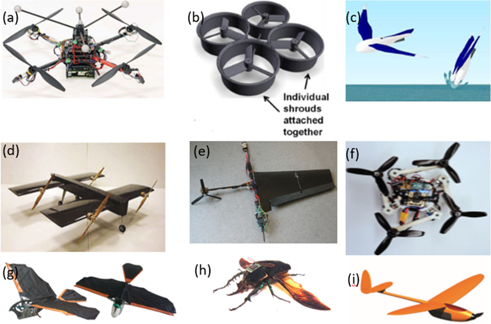
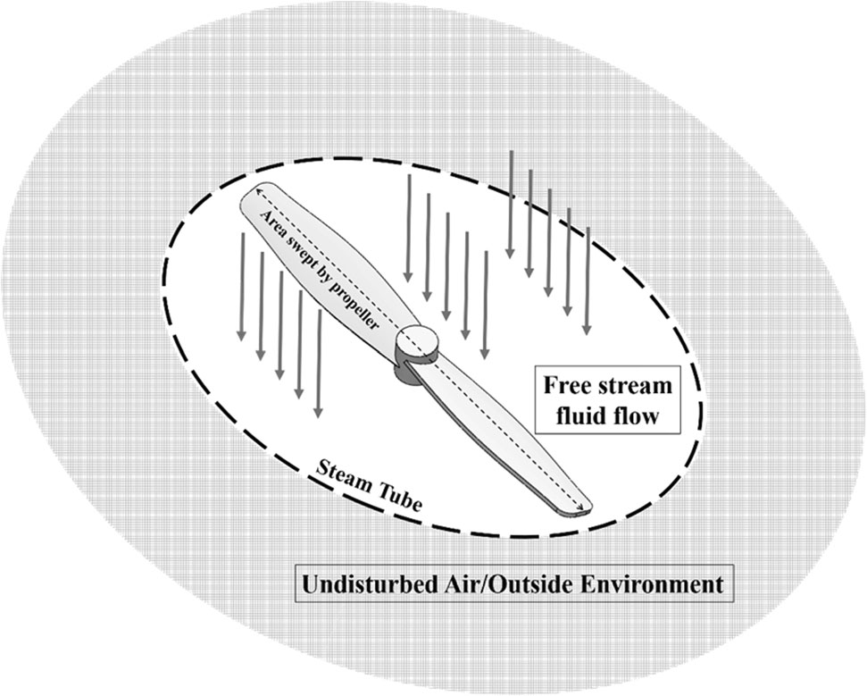
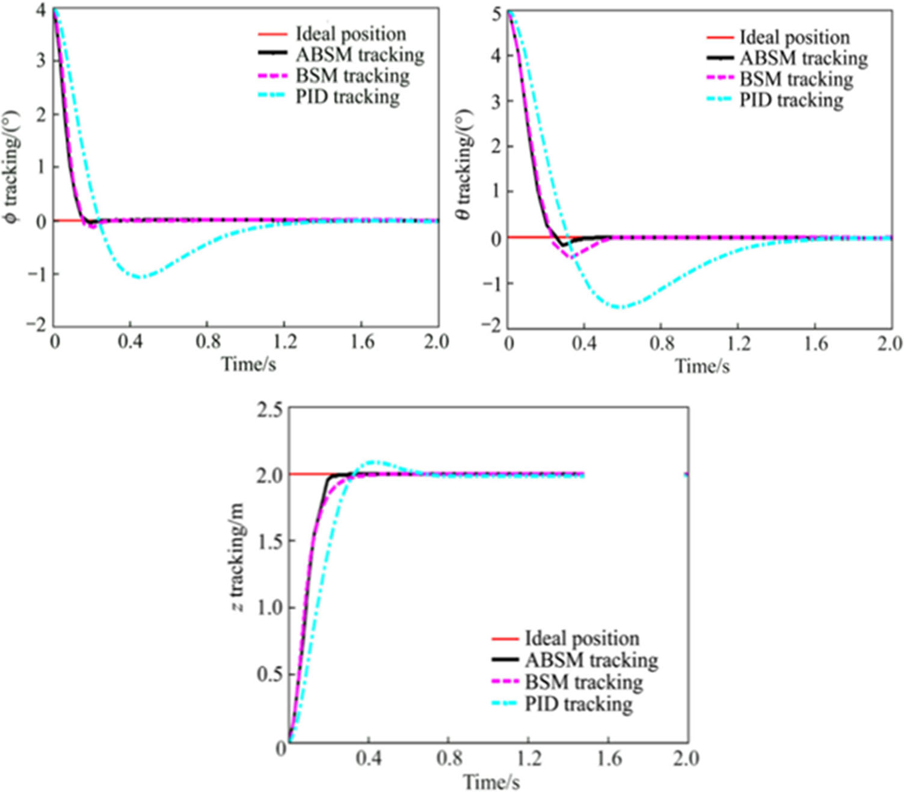
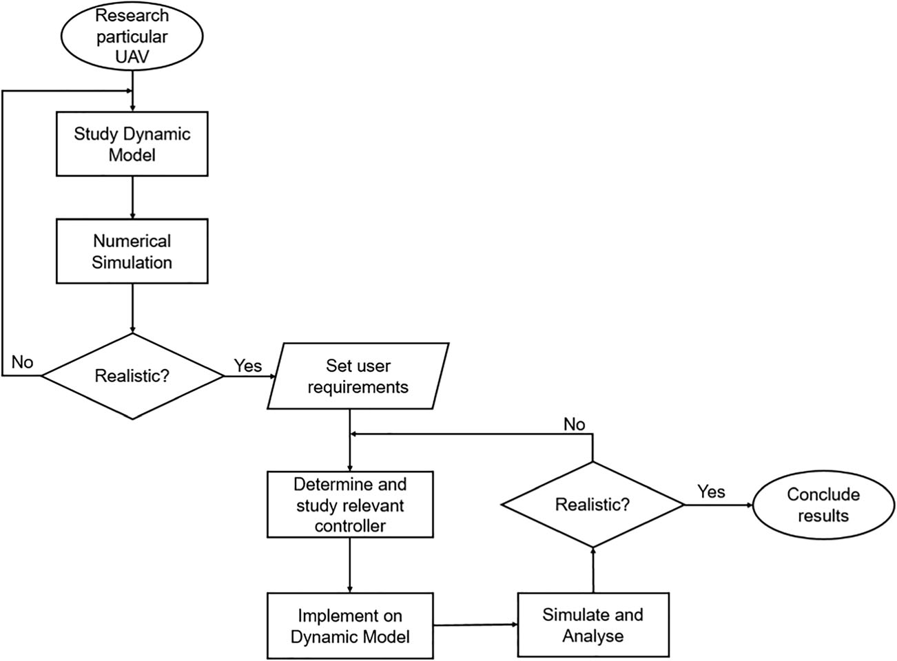

# S10846 021 01527 7

**Source Document:** `s10846-021-01527-7.pdf`  
**Total Pages:** 33  

---

## --- Page 1 ---

### Section: A Review of Quadrotor Unmanned Aerial Vehicles: Applications, Architectural Design and Control Algorithms

#### SURVEY PAPER

A Review of Quadrotor Unmanned Aerial Vehicles: Applications,
Architectural Design and Control Algorithms

Moad Idrissi1
& Mohammad Salami1 & Fawaz Annaz1

Received: 7 March 2021 /Accepted: 3 November 2021
# Crown 2022

Abstract
Over the past decade, unmanned aerial vehicles (UAVs) have received a significant attention due to their diverse capabilities for
non-combatant and military applications. The primary aim of this study is to unveil a clear categorization overview for more than
a decade worth of substantial progress in UAVs. The paper will begin with a general overview of the advancements, followed by
an up-to-date explanation of the different mechanical structures and technical elements that have been included. The paper will
then explore and examine various vertical take-off and landing (VTOL) configurations, followed by expressing the dynamics,
applicable simulation tools and control strategies for a Quadrotor. In conclusion to this review, the dynamic system presented will
always face limitations such as internal and/or external disturbances. Hence, this can be minimised by the choice of introducing
appropriate control techniques or mechanical enhancements.

Keywords UAV . Quadrotor . Review . Control Laws . Dynamic modelling

1 Introduction

The twenty-first century has seen a rapid spread of Unmanned
Aerial Vehicles (UAVs) that are telemetry monitored and con-
trolled by pilots on the ground, who can either be nearby or far
away (depending on the application). Initially, developments
were limited to large military drones, however, advances in
motors technology, drive electronics, microcontrollers and ac-
cess to GPS navigation, encouraged manufacturers to develop
smaller and cheaper drones [1].

UAVs may be classified as either being fixed or rotary
winged aircrafts. Fixed-winged (FW) aircrafts generally have
simpler structures than rotary wing (RW) crafts, hence they
require less complicated maintenance and repair processes,
allowing for a cheap, longer operational time and high-speed

flight durations. They also have natural gliding capabilities
with no power requirement, and are capable of carrying larger
payloads over longer distances while consuming less power.
However, FW crafts requires a runway or a launcher for take-
off and landing, unlike RW crafts which are capable of verti-
cally taking-off/landing (VTOL); therefore, short take off/
landing (STOL) solutions are very popular to help eradicate
this issue.

Moreover, fixed-wing crafts require continuous airflow
over their wings to generate lift, thus, they must maintain
forward motion (i.e. can’t stay stationary), which makes them
unsuitable for stationary (hovering) applications such as in-
spection. It is because of these advantages, rotary-winged
crafts have globally received the interest of researchers and
developers in the commercial, industrial, military and rescue
services sectors; and therefore they are found in applications
within the media industry, fire services, power production,
agricultural industry, express delivery services, search and
rescue tasks, inspection, surveillance, aerial photography and
many more [2].

With regard to VTOL and Horizontal take-off/landing
(HTOL) UAVs, research has been greatly undertaken to im-
prove the flight performance by modifying the mechanical
structure of these systems, some of which are extremely small
UAVs that could perhaps be the size of ‘small particles’
weighing around 0.1Kg while others could be as large as a

* Moad Idrissi
Moad.Idrissi@hotmail.co.uk

Mohammad Salami
Mohammad.Salami@bcu.ac.uk

Fawaz Annaz
Fawaz.Annaz@bcu.ac.uk

1
Faculty of Computing, Engineering and the Built Environment,
Birmingham City University, Birmingham, UK

https://doi.org/10.1007/s10846-021-01527-7

/ Published online: 22 January 2022

Journal of Intelligent & Robotic Systems (2022) 104: 22

*Caption/Context: A Review of Quadrotor Unmanned Aerial Vehicles: Applications, Architectural Design and Control Algorithms | Moad Idrissi1 & Mohammad Salami1 & Fawaz Annaz1*

## --- Page 2 ---

### Section: Enabling Technologies and Applications

conventional piloted aircraft weighing over 150Kg [1, 3]. The
vast majority of these changes and modifications has resulted
in the implementation of these drones on wider applications
worldwide. While the mechanical architecture is rapidly en-
hancing, control techniques is considered as a major topic for
researchers to carry out and achieve successful drone opera-
tions. Doing so meant that the dynamic model for the UAV
must be taken into great consideration without neglecting any
parameters as that will characterize the performance of the
control law. As for the control algorithms studied in this field,
the literature review is rich with various techniques some of
which are PID [4–7], LQR [8–11], Sliding Mode [7, 12–15]
Backstepping [16–19] and more.

Since drones are now becoming the centre of attention in
robotics and autonomous engineering, the aim of this research
is to provide the reader with an insight of various UAV
mechanical architectures such that a comparative study
will be undertaken to illustrate the advantages and draw-
backs of each design. In particular, Quadrotors have been
specifically selected due to their efficient performance and
ease of manoeuvrability, which will be studied in relation to
explaining the dynamic behaviour and system parameters
based on a realistic model [20]. Additionally, various control
techniques will be explored essentially discussing other au-
thors’ output performance of each method and their draw-
backs. Common control laws such as PID and SM will be
investigated further in terms of elaborating on the control al-
gorithms and depicting the output solutions from the literature
reviewed.

The paper is structured as follows. Section 2. will begin by
outlining the technological features of UAVs generally ex-
ploring some of the common features that these systems hold.
Section 3. expresses various UAV mechanical architectures
describing the performance of each method based on the ben-
efits and drawbacks attained from other researchers. In
Section 4, a comparative study between the performances of
various VTOL drones is carried out with a discussion of the
common Quadrotor configurations. Section 5 elaborates on
the aerodynamic effects of the Quadrotor and how they per-
form without the inclusion of a controller, while section 6
shows the widely implemented simulation tools for physical
and mathematical modelling. Section 7 provides a thorough
review of the common control laws with a discussion of the
most appropriate method according to the mission criteria.
Lastly, section 8 concludes the reviewed studies.

2 Enabling Technologies and Applications

The functionality of UAVs has always been dependant on the
technological features that are included within the electronic
system of the aircraft. The development of these features that
can be directly added to the system architecture is becoming

more advanced due to the increased demand for certain drone
characteristics. Although these features are all advantageous
in their own ways, the implementation process is only consid-
ered viable when the drone is expected to function within a
certain application. For instance, [21] and his team have fo-
cused on UAVs and ground unmanned vehicles to collabora-
tively work for search and rescue missions. The significant use
of motion planning equipment provides a real-time feedback
data to the wilderness rescue team, allowing them to accurate-
ly focus and pinpoint the target on the ground.

Another technological feature that has emerged for UAVs
has been increasingly implemented and researched. [22] took
the opportunity to review and provide a summary of some of
the current commercial, open source and research autopilot
systems. The authors mentioned that these systems can purely
guide the UAV into following a referenced trajectory without
any assistance from the human operator. With the implemen-
tation of the selected controller and careful parameter tuning,
the operator is able to achieve an improved performance de-
pending on the set application.

Other enabling technologies have greatly extended the use
of UAVs making them suitable for more applications due
to innovative research taking place globally. Hence, a mind-
map shown in Fig. 1 has been created to provide a general
insight on some of the major topics that have been studied
and considered by researchers. It can be seen that the main
features appear closer to the centre of the figure where “UAV
Technology” branches out to describe various applications
within the presented features. For example, navigating a
UAV through a set route can be described by using some of
the technologies such as auto return [23] or laser systems [24],
which are commonly used under security/military
applications.

The purpose of splitting these groups into different catego-
ries presents an insight into the common technological fea-
tures that are implemented within UAVs depending on the
mission criteria. With the case of VTOL UAV’s, the corre-
sponding tools selected are commonly dependent on the en-
vironment and the set application. For example, assuming that
a Quadrotor is used for military surveillance, technology fea-
tures such as anti-jamming, autonomous navigation, camera
sensors, auto-return etc. are all essential provided that an ideal
control system is considered.

The authors in [25], presented a methodology in which a
Quadrotor with a single monocular camera was used for local
generation of collision-free waypoints. Small images are ac-
quired while the quadrotor consistently hovered from which
computation was done for a dense depth map. By relying on
the map, there was 2D scan rendering carried out along with
generating an adequate waypoint for specific navigation. The
experiment conducted and results obtained have proved a pose
variation during hovering which was adequate for obtaining
suitable depth map [25]. The demonstration was done for

22    Page 2 of 33
J Intell Robot Syst (2022) 104: 22

## --- Page 3 ---

### Section: UAV Mechanical Architectures

validating the proposed method in a challenging environment
where navigating a Quadrotor was successfully done from
narrow passages including people, boxes, and doors [25].

Additional UAV technologies specifically equipped with
vision and intelligence methods include object detection, path
planning and object tracking [26]. With regard to these intel-
ligent features, a methodology is followed to allow the UAV
to locally generate waypoints that are collision-free which
proved clear visibility and tracking [27]. In [28], a technique
is proposed for collision avoidance systems depending on
visual detection. The system hardware consisted of a hum-
mingbird Quadrotor which was equipped with a higher red
marker along with two built-in-fish-eye cameras. The mea-
surements fusion were done from two cameras utilizing a
Gaussian-mixture probability hypothesis density filter, which
proved successful tracking [28]. The proposed collision
avoidance algorithm relied on navigation functions. These
are designed specifically for coping with cameras particularly
characterized by limiting the field of view. There is recording
conducted of the trajectory data with an external motion cap-
ture system which led towards demonstration of decent ro-
bustness against internal noise [28, 29].

Although the features presented in Fig. 1 can easily overlap
with other categories depending on the set application, clari-
fying this further is presented in Table 1 which highlights

some of the applications that are suitable for the various fea-
tures mentioned in Fig. 1. It is evident that the applications
selected for each feature somehow overlaps with other
features. Hence, a combination of these features can be-
come greatly effective when combined for certain flight
missions.

#### 3 UAV Mechanical Architectures

Despite the fact that UAVs are now mechanically designed in
many different ways, selecting an ideal UAV to operate in
certain applications can be complex. A sensible approach
would be reviewing some of the common types elaborating
on features that may meet the reader specific requirements.
Therefore, exploring the performance of readily available ar-
chitectural design is convenient during which the advantages
and disadvantages of each design can support the reader in
making a decision. The main aspect that distinguishes differ-
ent types of UAVs is dependent on the operation purposes and
the mission capabilities. As indicated on Fig. 2, UAVs can be
commonly considered as: FW Crafts, which are also known as
Horizontal Take-off and Landing (HTOL); RW crafts, which
are also known as VTOL; Hybrid Models such as Tilt-Wing,

Fig. 1 Mind map showing different features that are readily available

Page 3 of 33     22
J Intell Robot Syst (2022) 104: 22

![validating the proposed method in a challenging environment where navigating a Quadrotor was successfully done from narrow passages including people, boxes, and doors [25]. | Additional UAV technologies specifically equipped with vision and intelligence methods include object detection, path planning and object tracking [26]. With regard to these intel- ligent features, a methodology is followed to allow the UAV to locally generate waypoints that are collision-free which proved clear visibility and tracking [27]. In [28], a technique is proposed for collision avoidance systems depending on visual detection. The system hardware consisted of a hum- mingbird Quadrotor which was equipped with a higher red marker along with two built-in-fish-eye cameras. The mea- surements fusion were done from two cameras utilizing a Gaussian-mixture probability hypothesis density filter, which proved successful tracking [28]. The proposed collision avoidance algorithm relied on navigation functions. These are designed specifically for coping with cameras particularly characterized by limiting the field of view. There is recording conducted of the trajectory data with an external motion cap- ture system which led towards demonstration of decent ro- bustness against internal noise [28, 29].](images/page_003_fig_01.jpeg)
*Caption/Context: validating the proposed method in a challenging environment where navigating a Quadrotor was successfully done from narrow passages including people, boxes, and doors [25]. | Additional UAV technologies specifically equipped with vision and intelligence methods include object detection, path planning and object tracking [26]. With regard to these intel- ligent features, a methodology is followed to allow the UAV to locally generate waypoints that are collision-free which proved clear visibility and tracking [27]. In [28], a technique is proposed for collision avoidance systems depending on visual detection. The system hardware consisted of a hum- mingbird Quadrotor which was equipped with a higher red marker along with two built-in-fish-eye cameras. The mea- surements fusion were done from two cameras utilizing a Gaussian-mixture probability hypothesis density filter, which proved successful tracking [28]. The proposed collision avoidance algorithm relied on navigation functions. These are designed specifically for coping with cameras particularly characterized by limiting the field of view. There is recording conducted of the trajectory data with an external motion cap- ture system which led towards demonstration of decent ro- bustness against internal noise [28, 29].*

## --- Page 4 ---

### Section: Multi-Rotor Aircraft (VTOL) Structures

Tilt-Rotor etc. and Exclusive models that consist of unique
designs such as the Bird UAV [3].

A general comparison between the categorised UAV
modes illustrates that HTOL UAVs are capable of having
remarkable payloads compared to VTOL, the typical structure
of wings on HTOL vehicles provides the drone with the ability
to fly longer distances. As for VTOL, despite the fact that they
may be limited for longer-range missions, their design is usu-
ally more efficient in the sense of vertically taking off and
landing as well as having the ability to manoeuvre freely.
Since both approaches cater for some drawbacks, researchers
have introduced an innovative method that combines the ca-
pability of VTOL and HTOL into a single design such that the
advantages from both models are achieved. Figure 3 shows
several extended UAV architectural designs based on the four
categories presented in Fig. 2 such as tilted propellers [50,
57–59], ducted fan UAV’s [51, 60–62], tilt-wing [34, 60,
63], foldable/self-deploying Quadrotor [53, 64], flapping
wing UAV [54], controlled insect flying [55], Solar powered
Fixed wind UAV [56], aqua Micro aerial vehicle [35] and
Mono-copter [52].

Based on the common UAV designs presented in Fig. 3,
each one of these architectures are dedicated to function in a
unique manner for a specific application. However, it is fair to
mention that the designs come with limitations that will neg-
atively impact the vehicles performance in some manner.

Hence, Table 2 expresses the advantages and disadvantages
of each architectural design.

4 Multi-Rotor Aircraft (VTOL) Structures

Upon observing the pros and cons of various UAV structures
mentioned above in Table 2, it can be concluded that great
research has been undertaken to investigate and study UAVs,
such that the performance can be improved by innovatively
modifying the vehicle structures. However, VTOL systems
have seen an increase rise in research due to their ability to
orientate and hover at any altitude, giving them more advan-
tages compared to conventional HTOL systems [68]. The au-
thors in [69] have studied a novel VTOL UAV where they
mention that these vehicles are constantly researched. Their
unique design consists of numerous advantages which can
benefit many existing applications. The research group in
[70] have reviewed a number of VTOL propulsion types
where they mention that the most widespread use of commer-
cial UAVs are the VTOL configurations due to their quick
orientation and hovering capabilities. Therefore, narrowing
this review paper to analyse a common type of UAV can be
set to investigate a certain VTOL vehicle. Figure 4 illustrates
the most common types of VTOLs to be discussed in which

Table 1
Applications related to the features presented in Fig. 1

Feature
Aim
Applications
Reference

Control

System

Robust control, parameter variation, Minimum steady-state error,

quick responsivity, un-modelled dynamics, overcoming
disturbances.

Urban areas, indoor areas, outdoor environment with

external disturbances (wind, gusts etc.), actuator
failure, military.

[30–33]

Architecture
Long distance flying, Hybrid models, vertical take-off and

landing, Impressive designs (e.g. Bird UAV), Underwater
flying, Novel designs.

Urban areas, indoor areas, outdoor environments

military, security.

[3, 34,

35]

Brain/Muscle

Controlled

Haptic Feedback, quick responsivity, Future inventions.
Real-time brain control, indoor and outdoor

environments.

[36]

Drone

Jamming

Security, safety, policing, emergency.
Military, defence systems, hacking.
[37, 38]

System

Monitoring

Energy indication, position monitoring, sensory components.
Fault prevention, route tracking, live data feedback,

Actuator failure.

[39–41]

Autonomous
Trajectory tracking, autopilot, Landing, taking off, Battery

replacement, control.

Search and rescue, delivery, military, stability, Urban

areas, indoor areas.

[2,

42–45]
Navigation
Collision avoidance, swarm robots, weather avoidance, laser

navigator, control.

Live data feedback, military, route following, long

range flight, indoor flight.

[23,

46–49]

Fig. 2 Different configurations of
the common UAVs

22    Page 4 of 33
J Intell Robot Syst (2022) 104: 22

![A general comparison between the categorised UAV modes illustrates that HTOL UAVs are capable of having remarkable payloads compared to VTOL, the typical structure of wings on HTOL vehicles provides the drone with the ability to fly longer distances. As for VTOL, despite the fact that they may be limited for longer-range missions, their design is usu- ally more efficient in the sense of vertically taking off and landing as well as having the ability to manoeuvre freely. Since both approaches cater for some drawbacks, researchers have introduced an innovative method that combines the ca- pability of VTOL and HTOL into a single design such that the advantages from both models are achieved. Figure 3 shows several extended UAV architectural designs based on the four categories presented in Fig. 2 such as tilted propellers [50, 57–59], ducted fan UAV’s [51, 60–62], tilt-wing [34, 60, 63], foldable/self-deploying Quadrotor [53, 64], flapping wing UAV [54], controlled insect flying [55], Solar powered Fixed wind UAV [56], aqua Micro aerial vehicle [35] and Mono-copter [52]. | Based on the common UAV designs presented in Fig. 3, each one of these architectures are dedicated to function in a unique manner for a specific application. However, it is fair to mention that the designs come with limitations that will neg- atively impact the vehicles performance in some manner.](images/page_004_fig_01.png)
*Caption/Context: A general comparison between the categorised UAV modes illustrates that HTOL UAVs are capable of having remarkable payloads compared to VTOL, the typical structure of wings on HTOL vehicles provides the drone with the ability to fly longer distances. As for VTOL, despite the fact that they may be limited for longer-range missions, their design is usu- ally more efficient in the sense of vertically taking off and landing as well as having the ability to manoeuvre freely. Since both approaches cater for some drawbacks, researchers have introduced an innovative method that combines the ca- pability of VTOL and HTOL into a single design such that the advantages from both models are achieved. Figure 3 shows several extended UAV architectural designs based on the four categories presented in Fig. 2 such as tilted propellers [50, 57–59], ducted fan UAV’s [51, 60–62], tilt-wing [34, 60, 63], foldable/self-deploying Quadrotor [53, 64], flapping wing UAV [54], controlled insect flying [55], Solar powered Fixed wind UAV [56], aqua Micro aerial vehicle [35] and Mono-copter [52]. | Based on the common UAV designs presented in Fig. 3, each one of these architectures are dedicated to function in a unique manner for a specific application. However, it is fair to mention that the designs come with limitations that will neg- atively impact the vehicles performance in some manner.*

## --- Page 5 ---

the performance is described by the actuators implemented
and their respective positions.

VTOL UAVs are commonly developed and designed to
consist of actuators that vary between 1, 3, 4, 6 and 8 rotors.

Fig. 3 Various UAV
architectures that have been
successfully implemented, (a)
Tilting propeller [50], (b) Ducted-
Fan UAV [51], (c) AquaMAV
[35], (d) Tilt-wing [34], (e)
Mono-Copter [52], (f) Foldable &
Self deploying drone [53], (g)
Flapping wing UAV [54], (h)
Controlled Insect [55], (i) Solar
Powered UAV [56]

Table 2
Advantages and disadvantages of various types of UAVs

Category
Advantage
Disadvantage

Tilt Propeller

[65, 66]

-Increased stability.
-Carries both advantages of HTOL and VTOL.
-Complete body tilting isn’t required.
-Hence, it is more suitable for flying within wrecked buildings.

-Requires more actuators for tilting transition.
-Mathematical modelling becomes more complex.
-Consumes more energy during transition.

Ducted-Fan

[51]

-Capable of achieving superior speeds (even to fixed wing

UAVs), with VTOL capability.

-Require complex flight control algorithms, due to the non-linear

actuators aerodynamic.

AquaMAV

[35]

-Operates in various mediums (fly in air, dive into the water,

effectively move in water and retake off into the air).

-Structure has to be modified, as the wings must be folded before

diving into the water. -- -This slows the craft speed and thus,
an underwater propulsion system is required.

Tilt-Wing

[34, 67]

-Combined features of FW and RW UAV.
-Long flight duration at high speeds.
-VTOL advantages with hovering and quick orientation

capabilities.

-Increased complexity in the mechanical and control systems.
-Increased energy consumption during tilting transitions.

Mono-Copter

[52]

-Single winged, designed after falling maple seeds.
-Small structure, with the advantage of flying within confined

spaces such as corridors.

-Restricted to indoor flying.
-Dynamic stability needs improvement.

Foldable & Self

deploying
[53]

-Ideal for emergency applications that require immediate

deployment when necessary.
-Typically deployed in less than 0.3 s.

-Limited applications due to small structure (<13 cm diameter).
-Material cannot be strained in the folding procedure.
-Resilience against collisions need to be improved.
Flapping Wing

[54]

-Capable of achieving unique manoeuvrability.
-Extremely light.

-Due to the light material used, it cannot handle external

disturbances.
-Poor flying efficiencies.

Controlled Insect

[55]

-Utilises a variety of sensors that are connected to the body to

collect data from the muscles that control the airflow, which
can be applied to the flight controller in insects that weigh
nearly 3 g.

-The data collected is only limited to small insects and cannot be

applied to larger flyers.
-Mechanical development is highly complicated.

Solar Powered

Fixed Wing
[56]

-Longer endurance flights, lasting up to 8 h on a clear sunny day. -It is only compatible to fly under clear skies.

-Slow cruise speed.

Page 5 of 33     22
J Intell Robot Syst (2022) 104: 22

*Caption/Context: the performance is described by the actuators implemented and their respective positions. | VTOL UAVs are commonly developed and designed to consist of actuators that vary between 1, 3, 4, 6 and 8 rotors.*

## --- Page 6 ---

### Section: Common VTOL UAVs

Selecting a particular configuration is greatly dependant on
the mission criteria and the performance requirement. For in-
stance, assuming that the multirotor is expected to fly within
indoor confined areas, Octocopters (8 rotors) are not ideally
suitable for this particular application, as they are more suit-
able for outdoor environments or carrying larger payloads. As
the number of actuators are increased, the lift and stability is
also improved. However, the overall power consumption is
also negatively affected [75]. Traditional RW crafts are com-
monly developed with fixed pitch blades, where the orienta-
tion is controlled by varying the speed of the corresponding
rotor. The considered VTOL systems which are shown
on Fig. 4 will be explored further in the following
section.

#### 4.1 Common VTOL UAVs

Monocopters shown in Fig. 4a consists of a single actuator
and a single wing to achieve lift. Originally, this configuration
has been brought from the concept of maple seeds as they fall
down slowly in a rotational manner before reaching the
ground. Essentially, the heavy side of the maple seed is re-
placed with the role of the actuators, while the terminative
section is replaced by a wing. This configuration produces
relative lift to the vehicle as the actuator speed is increased.
Although the proposed methodology was successfully devel-
oped through practical implementations and simulations. The
vehicles operation carries numerous drawbacks such as, ease
of collision (actuator failure), weak stability and inability to
carry payloads [71].

Tricopters shown in Fig. 4b consists of three actuators that
are equally spaced by 120° from each other. They are the least
expensive configuration after the Monocopters, and are suit-
able for videography due to the wide positioning angle of the
actuators. Other advantages include longer battery life due to
their lightweight and small structure. However, they are least
stable compared to the other multi-rotors, and a probability of
an accident could easily occur in the event of an actuator

failure. Moreover, these vehicles can easily be effected by
external disturbances such as wind or gusts due to their light-
weight structure and limited actuators [72, 76, 77].

Quadrotors shown in Fig. 4c consists of four actuators,
which are generally equally spaced by 90° from each other. In
comparison to Monocopters, and Tricopters, Quadrotors en-
joy hovering with considerable stability, with greater thrust-
weight ratio. They are safe for indoor and outdoor flying,
mechanically simpler to understand and develop, and have
been successfully developed in many different sizes.
Therefore, they are more widely applied than any other type,
which explains why they are vastly being researched.
However, they are also under-actuated with less stability than
Hexacopters and increased power consumption compared to
Tricopters [68, 78].

Hexacopters shown in Fig. 4d consists of six actuators,
which are equally spaced by 60° from each other. They enjoy
an improved stability (even following a single actuator failure)
in comparison to the Quadrotors, Tricopters and
Monocopters. They also have higher lifting abilities and are
capable of carrying heavier payloads. However, they are un-
der actuated, costlier to develop, requires higher current out-
put from the batteries, and are considerably large in compar-
ison to Quadrotors [73, 79].

Octocopters shown in Fig. 4e consist of eight actuators,
which are equally spaced by 45° from each other. They enjoy
the best stability and are capable of carrying larger payloads
compared to hexacopters. Hence, they can be found more
suitable for applications that cannot be performed by the other
VTOL systems such as delivering large packages. However,
the power consumption and costs greatly influenced many
researchers to focus more on other VTOL vehicles such as
the Quadrotor or Hexacopter [74, 80].

Clearly, Quadrotors consists of the most benefits in terms
of stability, affordability, various structural sizes, ease of de-
velopment and modelling. It is with these advantages, they are
vastly researched and are globally used in many applications,
which explains the main motivation of this paper in deriving

Fig. 4 Commonly used Multi-
rotor VTOL UAVs: (a)
Monocopter [71], (b) Tricopter
[72], (c) Quadrotor [68], (d)
Hexacopter [73], (e) Octocopter
[74]

22    Page 6 of 33
J Intell Robot Syst (2022) 104: 22

![Selecting a particular configuration is greatly dependant on the mission criteria and the performance requirement. For in- stance, assuming that the multirotor is expected to fly within indoor confined areas, Octocopters (8 rotors) are not ideally suitable for this particular application, as they are more suit- able for outdoor environments or carrying larger payloads. As the number of actuators are increased, the lift and stability is also improved. However, the overall power consumption is also negatively affected [75]. Traditional RW crafts are com- monly developed with fixed pitch blades, where the orienta- tion is controlled by varying the speed of the corresponding rotor. The considered VTOL systems which are shown on Fig. 4 will be explored further in the following section. | failure. Moreover, these vehicles can easily be effected by external disturbances such as wind or gusts due to their light- weight structure and limited actuators [72, 76, 77].](images/page_006_fig_01.jpeg)
*Caption/Context: Selecting a particular configuration is greatly dependant on the mission criteria and the performance requirement. For in- stance, assuming that the multirotor is expected to fly within indoor confined areas, Octocopters (8 rotors) are not ideally suitable for this particular application, as they are more suit- able for outdoor environments or carrying larger payloads. As the number of actuators are increased, the lift and stability is also improved. However, the overall power consumption is also negatively affected [75]. Traditional RW crafts are com- monly developed with fixed pitch blades, where the orienta- tion is controlled by varying the speed of the corresponding rotor. The considered VTOL systems which are shown on Fig. 4 will be explored further in the following section. | failure. Moreover, these vehicles can easily be effected by external disturbances such as wind or gusts due to their light- weight structure and limited actuators [72, 76, 77].*

## --- Page 7 ---

### Section: Quadrotor Configurations

their dynamic models, exploring popular control techniques,
highlight common simulation tools, and discussing the
achievements attained from previous researchers.

#### 4.2 Quadrotor Configurations

Quadrotors consists of four actuators that are individually con-
trolled to produce a relative thrust. In order to achieve lift, two
of its motors have to rotate in opposite directions, otherwise,
the net moment about the centre of mass will become non zero
resulting in unwanted motions. In helicopters, the tail rotor or
tail aerofoil is required to cancel out the net moment created
about the centre, and in Quadrotors, the net moment needs to
be cancelled out by making any two pairs arranged to rotate
clockwise (CW) while the adjacent pairs rotate counter clock-
wise (CCW). Hence, it has become customary for the opposite
motors in a crossed configured Quadrotor to rotate in opposite
directions.

Two configurations generally exist within Quadrotors
which are categorised as the ‘+’ or ‘X’ sets, a comparison
between the two suggests that the overall control authority
from both configurations shows that the performance is iden-
tical [81]. Fig. 5 shows the basic motor ‘+’ configuration,
where the functionality is described as; motors 1 and 3 in
Set1, 3 rotating in the clockwise direction (ωm(1=3)_CW) and
motors 2 and 4 in Set2, 4 rotate in the counter-clockwise direc-
tion (ωm(2=4)_CCW). The figure also illustrates the various basic
flight direction a UAV can describe, depending on the indi-
vidual motor speeds and their spinning directions commands.
For example, by rotating the motors at equal and opposite
speeds in both sets (i.e. ωm(1=3)_CW = ωm(2=4)_CCW), the UAV
will hover. When the speeds of all motors are simultaneously

increased, the UAV will hover at higher altitudes and when
the speeds are simultaneously reduced, the UAV will hover at
lower altitudes, as illustrated in Fig. 5a.

Increasing the speed of a propeller in one of these sets will
cause either roll or pitch motion, depending on the selected
set. To achieve CW-pitch motion; 1) the propellers in Set1, 3
will maintain equal speeds (i.e. ωm1 = ωm3); and 2) The speed
of motor 2 is made greater than that of motor 4 in the Set2, 4
(i.e. ωm4 < ωm2), as shown in Fig. 5b. CCW-Pitch is achieved
when the motors speeds in Set1, 3 are maintained constant
while ωm2 is made smaller than ωm4 (in Set2, 4). Similarly,
CW-roll motion is achieved by maintaining equal speed
(ωm2 = ωm4) in Set2, 4, and making ωm1 < ωm3 in Set1, 3, as
shown in Fig. 5c. CCW-Roll is achieved if the motor speeds
in Set2, 4 are maintained constant while ωm1 is made greater
than ωm3 (in Set1, 3). Finally, CCW-yaw motion is achieved by
maintaining equal speeds in both sets, so that ωm2 = ωm4
in Set2, 4, and ωm1 = ωm3 in Set1, 3. Increasing the angular
speed of motors ωm1 & ωm3 > ωm2 & ωm4 will initiate the
CCW-yaw motion as shown in Fig. 5d.

Figure 6 illustrates the operation of an ‘X’ configured
Quadrotor. Technically speaking, the directional rotation of
the propellers for motors 1 and 3 in Set1, 3 and Motors 2 and
4 in Set2, 4 operates in the same way as the plus-configured
Quadrotor. However, achieving rotational and translational
movements is different as two actuators are required to in-
crease or decrease the speed so that the desired angle can be
achieved. In essence, completing a roll, pitch or yaw motion
can be attained by increasing the speed of two consistent mo-
tors. That is, for applying a CW-pitch motion: The motors
in Set1, 3 are set at different speeds (i.e. ωm1 > ωm3) while
the motors in Set2, 4 are also set at different speeds (i.e. ωm2 >

Fig. 5 Plus configured Quadrotor
motion depending on propeller
rotation

Page 7 of 33     22
J Intell Robot Syst (2022) 104: 22

![Two configurations generally exist within Quadrotors which are categorised as the ‘+’ or ‘X’ sets, a comparison between the two suggests that the overall control authority from both configurations shows that the performance is iden- tical [81]. Fig. 5 shows the basic motor ‘+’ configuration, where the functionality is described as; motors 1 and 3 in Set1, 3 rotating in the clockwise direction (ωm(1=3)_CW) and motors 2 and 4 in Set2, 4 rotate in the counter-clockwise direc- tion (ωm(2=4)_CCW). The figure also illustrates the various basic flight direction a UAV can describe, depending on the indi- vidual motor speeds and their spinning directions commands. For example, by rotating the motors at equal and opposite speeds in both sets (i.e. ωm(1=3)_CW = ωm(2=4)_CCW), the UAV will hover. When the speeds of all motors are simultaneously | Figure 6 illustrates the operation of an ‘X’ configured Quadrotor. Technically speaking, the directional rotation of the propellers for motors 1 and 3 in Set1, 3 and Motors 2 and 4 in Set2, 4 operates in the same way as the plus-configured Quadrotor. However, achieving rotational and translational movements is different as two actuators are required to in- crease or decrease the speed so that the desired angle can be achieved. In essence, completing a roll, pitch or yaw motion can be attained by increasing the speed of two consistent mo- tors. That is, for applying a CW-pitch motion: The motors in Set1, 3 are set at different speeds (i.e. ωm1 > ωm3) while the motors in Set2, 4 are also set at different speeds (i.e. ωm2 >](images/page_007_fig_01.jpeg)
*Caption/Context: Two configurations generally exist within Quadrotors which are categorised as the ‘+’ or ‘X’ sets, a comparison between the two suggests that the overall control authority from both configurations shows that the performance is iden- tical [81]. Fig. 5 shows the basic motor ‘+’ configuration, where the functionality is described as; motors 1 and 3 in Set1, 3 rotating in the clockwise direction (ωm(1=3)_CW) and motors 2 and 4 in Set2, 4 rotate in the counter-clockwise direc- tion (ωm(2=4)_CCW). The figure also illustrates the various basic flight direction a UAV can describe, depending on the indi- vidual motor speeds and their spinning directions commands. For example, by rotating the motors at equal and opposite speeds in both sets (i.e. ωm(1=3)_CW = ωm(2=4)_CCW), the UAV will hover. When the speeds of all motors are simultaneously | Figure 6 illustrates the operation of an ‘X’ configured Quadrotor. Technically speaking, the directional rotation of the propellers for motors 1 and 3 in Set1, 3 and Motors 2 and 4 in Set2, 4 operates in the same way as the plus-configured Quadrotor. However, achieving rotational and translational movements is different as two actuators are required to in- crease or decrease the speed so that the desired angle can be achieved. In essence, completing a roll, pitch or yaw motion can be attained by increasing the speed of two consistent mo- tors. That is, for applying a CW-pitch motion: The motors in Set1, 3 are set at different speeds (i.e. ωm1 > ωm3) while the motors in Set2, 4 are also set at different speeds (i.e. ωm2 >*

## --- Page 8 ---

### Section: Quadrotor Dynamics

ωm4) as shown in Fig. 6b. Similarly, to achieve a CCW-pitch
motion: The actuators in Set1, 3 are set at the opposite speeds
(i.e. ωm1 < ωm3) while the speed of the motors in Set2, 4 are
also set at opposite speeds to the CW-pitch rotation (i.e. ωm2 <
ωm4). When applying a CW-roll motion: Set1, 3 are set to be
one higher than the other (i.e. ωm1 < ωm3) while Set2, 4 has
similar configurations (i.e. ωm2 > ωm4) as shown in Fig. 6c. A
CCW-Roll angle is achieved by setting ωm1 > ωm3 in Set1, 3
while setting the speeds of Set2, 4 to ωm2 < ωm4. Finally, a
CW-Yaw rotation around the z-axis is accomplished by up-
holding an equivalent speed of Set1, 3 while reducing speed
in Set2, 4. Likewise, a CCW-Yaw motion is attained by main-
taining the speed of Set2, 4 and reducing the speed in Set1, 3 as
shown in Fig. 6d.

By presenting the functionality of both Quadrotor config-
urations, the thrust mixing algorithm for the ‘+’ and ‘X’ UAV
is described in Table 3 which explains that changing the speed
of a propeller in one of these sets will cause either a rolling or
pitching motion, depending on the selected set.

5 Quadrotor Dynamics

In this section, the mathematical model will be developed and
verified against those studied by different authors in [82–86].
It is assumed that the drone is rigid and has a symmetric
structure; thrust is produced by propellers of equal size while
the rotors are facing upward in the z-direction; and that all

Fig. 6 Cross ‘X’ configured
Quadrotor motion

Table 3 Described motion for a
Quadrotor based on the speed
commands

Plus Configuration
Cross Configuration

Command
Set1, 3
Set2, 4
Speed Status
Set1, 3
Set2, 4
Speed Status

Hover (H)
ωm1=ωm3
ωm2=ωm4
Set1, 3 = Set2, 4
ωm1=ωm3
ωm2=ωm4
Set1, 3 = Set2, 4
CW_Pitch
ωm1=ωm3
ωm4<ωm2
N/A
ωm1>ωm3
ωm2>ωm4
N/A
CW_Roll
ωm1>ωm3
ωm2=ωm4
N/A
ωm1<ωm3
ωm2>ωm4
N/A
CW_Yaw
ωm1=ωm3
ωm2=ωm4
Set1, 3 < Set2, 4
ωm1=ωm3
ωm2=ωm4
Set1, 3 < Set2, 4
CCW_Pitch
ωm1=ωm3
ωm4>ωm2
N/A
ωm1<ωm3
ωm2<ωm4
N/A

CCW_Roll
ωm1<ωm3
ωm2=ωm4
N/A
ωm1>ωm3
ωm2<ωm4
N/A
CCW_Yaw
ωm1=ωm3
ωm2=ωm4
Set1, 3> Set2, 4
ωm1=ωm3
ωm2=ωm4
Set1, 3 > Set2, 4

22    Page 8 of 33
J Intell Robot Syst (2022) 104: 22

![ωm4) as shown in Fig. 6b. Similarly, to achieve a CCW-pitch motion: The actuators in Set1, 3 are set at the opposite speeds (i.e. ωm1 < ωm3) while the speed of the motors in Set2, 4 are also set at opposite speeds to the CW-pitch rotation (i.e. ωm2 < ωm4). When applying a CW-roll motion: Set1, 3 are set to be one higher than the other (i.e. ωm1 < ωm3) while Set2, 4 has similar configurations (i.e. ωm2 > ωm4) as shown in Fig. 6c. A CCW-Roll angle is achieved by setting ωm1 > ωm3 in Set1, 3 while setting the speeds of Set2, 4 to ωm2 < ωm4. Finally, a CW-Yaw rotation around the z-axis is accomplished by up- holding an equivalent speed of Set1, 3 while reducing speed in Set2, 4. Likewise, a CCW-Yaw motion is attained by main- taining the speed of Set2, 4 and reducing the speed in Set1, 3 as shown in Fig. 6d. | By presenting the functionality of both Quadrotor config- urations, the thrust mixing algorithm for the ‘+’ and ‘X’ UAV is described in Table 3 which explains that changing the speed of a propeller in one of these sets will cause either a rolling or pitching motion, depending on the selected set.](images/page_008_fig_01.jpeg)
*Caption/Context: ωm4) as shown in Fig. 6b. Similarly, to achieve a CCW-pitch motion: The actuators in Set1, 3 are set at the opposite speeds (i.e. ωm1 < ωm3) while the speed of the motors in Set2, 4 are also set at opposite speeds to the CW-pitch rotation (i.e. ωm2 < ωm4). When applying a CW-roll motion: Set1, 3 are set to be one higher than the other (i.e. ωm1 < ωm3) while Set2, 4 has similar configurations (i.e. ωm2 > ωm4) as shown in Fig. 6c. A CCW-Roll angle is achieved by setting ωm1 > ωm3 in Set1, 3 while setting the speeds of Set2, 4 to ωm2 < ωm4. Finally, a CW-Yaw rotation around the z-axis is accomplished by up- holding an equivalent speed of Set1, 3 while reducing speed in Set2, 4. Likewise, a CCW-Yaw motion is attained by main- taining the speed of Set2, 4 and reducing the speed in Set1, 3 as shown in Fig. 6d. | By presenting the functionality of both Quadrotor config- urations, the thrust mixing algorithm for the ‘+’ and ‘X’ UAV is described in Table 3 which explains that changing the speed of a propeller in one of these sets will cause either a rolling or pitching motion, depending on the selected set.*

## --- Page 9 ---

### Section: Aerodynamics Effects of the Propeller

rotors have the same distances to the centre of mass.
Regardless of the Quadrotor configuration, the centre of mass
is assumed to be at the centre of the body inertial frame.
Mathematically, the motions are presented by the twelve states
in xT as shown in Eq. (1). {x, y, z} and { ˙x; ˙y; ˙z } denote the
position and respective speeds with reference to the inertial
fixed frame. Similarly, {ϕ, θ, ψ} and { ˙ϕ: ˙θ; ˙ψ } correspond to
the angular displacements (roll, pitch and yaw) and their rate
of change as denoted in [1, 84, 87].

xT ¼
x; ˙x; y; ˙y; z; ˙z; ϕ; ˙ϕ; θ; ˙θ; ψ; ˙ψ
n


ð1Þ

Rolling, Pitching and Yawing with respect to the fixed
inertial frame may be described through the transformation
matrix as shown in Eq. (2) where the Euler angles must be
bounded to −π=2 ≤ϕ≤π=2, −π=2 ≤θ≤π=2 and −π ≤ψ ≤π in
order to prevent singularities and excessive rotations where
greater control efforts are required [83].

#### ℝ1

0 ϕ; θ; ψ
ð
Þ ¼

cθcψ
cθsψ
−sθ
sϕsθcψ−cϕsψ
sϕsθsψ þ cϕcψ
sϕcθ
cϕsθcψ þ sϕsψ
cϕsθsψ−sϕcψ
cϕcθ

0

@

1

#### A

ð2Þ

Where s and c denote sin and cos respectively. The posi-
tions coordinates and the moments of inertia for the Quadrotor
body frame can be expressed as rbf in eq. (3) and Jbf in eq. (4)
[83].

rbf ¼ x; y; z
½

ð3Þ

J bf ¼

m y2 þ z2



mxy
mxz
mxy
m x2 þ z2



myz
mxz
myz
m x2 þ y2



0

B
@

1

C
A
ð4Þ

Jbf Contains scalar moments of inertia and the product of
inertia. An example is depicted below:

Moment of inertia about z−axis ¼ Iz ¼ m x2 þ y2



Product of inertia Ixz ¼ mxy
ð5Þ

Therefore,

J bf ¼

J x
−J xy
−J xz
−J xy
J y
−J yz
−J xz
−J yz
J z

0

@

1

A
ð6Þ

#### 5.1 Aerodynamics Effects of the Propeller

Quadrotors are made up of propellers that consist of two or
more blades and a central hub that fits directly into the motor
rod. As a result of the way they are constructed, a thrust is
produced by increasing the speed of the motor enforcing the

vehicle to lift in the relative direction. Fig. 7 shows the air
passing through the propeller which is defined as the free flow
of air within the stream tube; the highlighted region of the air
outside the area of the stream tube is undisturbed. As the
rotational velocity of air is increased, the thrust generated is
also increased as a result.

Since propellers are the sole generators of aerodynamic
loads. Choosing the size, weight and material of these com-
ponents is necessary in order to achieve an efficient flight. For
instance, applying a large propeller to an actuator will increase
the stream tube size resulting in an increased flight speed but
will also consume more power [88]. Thus, the primary task in
finding a suitable propeller in Quadrotor aerodynamic design
is to firstly find the thrust and drag coefficient of the blades
which are generally presented by the manufacturer.

As the user increases the motor voltage, a thrust is gener-
ated due to the aerodynamic loads from the propeller.
Therefore, the theoretical expression for this mechanical mo-
tion is described as [14, 88, 89]:

Ti ¼ KΩ2

i
ð7Þ

Where Ti is the thrust moment for the corresponding
brushless DC (BLDC) motor i, Ω2

i is the angular speed of
the BLDC motor i and K is a constant that represents either
the thrust factor b or the drag factor d. The K constant is
chosen according to the desired orientation of the Quadrotor.
In the form of Bernoulli’s eq. [90–93], one can come to con-
clude that the thrust and drag factor can be calculated as:

b ¼ CTρD4
ð8Þ

Where CT is the thrust coefficient, ρ is the air density and D
is the diameter of the area swept by the propeller as shown on
Fig. 7. The thrust coefficient can be derived depending on the

Fig. 7 Air flow along the stream tube as the actuator disk rotates during
flight

Page 9 of 33     22
J Intell Robot Syst (2022) 104: 22

*Caption/Context: 0 ϕ; θ; ψ ð Þ ¼ | cθcψ cθsψ −sθ sϕsθcψ−cϕsψ sϕsθsψ þ cϕcψ sϕcθ cϕsθcψ þ sϕsψ cϕsθsψ−sϕcψ cϕcθ*

## --- Page 10 ---

### Section: Dynamic Simulation

propeller geometry and the aerodynamic characteristics using
the blade element theory [3]. Therefore, transposing eq. (8)
into (7) becomes:

Ti ¼ bΩ2

i ¼ CTρD4Ω2

i
ð9Þ

Assuming that a Quadrotor is rotating about the z-axis in
hovering mode, the propeller will generate a drag momentum
acting in the opposite direction of which it is turning [6].
Hence, the drag factor that determines the power required to
spin the propeller is expressed as:

d ¼ CPρD5
ð10Þ

Where CP is the power coefficient of the propeller. Transposing
eq. (10) into eq. (7) will provide the following expression:

Ti ¼ dΩ2

i ¼ CPρD5Ω2

i
ð11Þ

By assuming that a plus configured Quadrotor is to be
studied, achieving the desired control action can be deter-
mined through the systems input signals which are described
by the addition and subtraction of the four independent actu-
ators, as shown in the following equations:

#### U 1 ¼ b Ω2

1 þ Ω2
2 þ Ω2
3 þ Ω2
4



#### U 2 ¼ b −Ω2

2 þ Ω2
4



#### U 3 ¼ b −Ω2

1 þ Ω2
3



#### U 4 ¼ d −Ω2

1 þ Ω2
2−Ω2
3 þ Ω2
4


ð12Þ

The control action is dependent on the angular velocities of
four independent rotors noted as Ω1, Ω2, Ω3 and Ω4. Ωr is the
overall residual propeller angular speed which is considered in
the gyroscopic torque as the Quadrotor rolls or pitches.

Ωr ¼ −Ω1 þ Ω2−Ω3 þ Ω4
ð13Þ

The matrix form for the theoretical control action presented
in eq. (12) is described as:

U1
U2
U3
U4

2

664

3

#### 775 ¼

b
b
b
b
0 −b
0
b
−b
0
b
0
−d
d −d
d

2

664

3

775*

#### Ω1

2

#### Ω2

2

#### Ω3

2

#### Ω4

2

2

664

3

775
ð14Þ

Where the parameters mentioned for the thrust and drag
factor can be collected from the manufacturers or propellers
datasheet. For example, a propeller that researchers may con-
sider investigating is a carbon fibre T-Style 10 × 5.5. This
was particularly chosen due to its lightweight material and
rigid structure that will give better performance at higher
speeds. The aerodynamics characteristics are obtained from
[88] and are depicted in Table 4:

Using the parameter values from Table 4, the thrust and
drag factor are calculated as:

b ¼ CTρD4 ¼ 6:317  10−4
ð15Þ

d ¼ CPρD5 ¼ 1:61  10−4
ð16Þ

The full dynamic model for the Quadrotor in translational
and rotational motions can be described through the transfor-
mation between coordinate frames as shown in Fig. 8.

The complete mathematical model for the Quadrotor is
presented through Euler’s equation of motion as:

::x ¼ 1

m cosϕsinθcosψ−sinϕsinψ
½
 U 1
ð17Þ

::y ¼ 1

m cosϕsinθsinψ þ sinϕcosψ
½
 U 1
ð18Þ

::z ¼ −g þ 1

m cosϕcosθ
½
 U1
ð19Þ

::ϕ ¼ 1

Ix

˙θ ˙ψ Iz−Iy




−J r ˙θΩ þ lU2
h
i

ð20Þ

::θ ¼ 1

Iy

˙ϕ ˙ψ Ix−Iz
ð
Þ þ J r ˙ϕΩ þ lU3
h
i

ð21Þ

::ψ ¼ 1

Iz

˙ϕ ˙θ Iy−Ix




þ U 4
h
i

ð22Þ

Where, U1 is the total thrust generated by the four rotors;
U2, U3 and U4 are the respective roll, pitch and yaw thrusts; m
denotes the mass of the Quadrotor; g denote the acceleration
due to gravity; l represent the length from the motor to the
centre of mass; Jr signifies the moment of inertia; and Ix,
Iy and Iz are the moment of inertia in the x, y and z axes for
the whole body.

#### 5.2 Dynamic Simulation

Since Quadrotors are under-actuated systems, they are strictly
limited to achieving roll, pitch, yaw and vertical movements.
For instance, achieving a translational motion along a horizon-
tal axis is essentially achieved by creating an angular motion
on the Quadrotor. So far, the dynamic behaviour of these
vehicles has been theoretically explained whereby applying
such theory in a real environment without a control law will
demonstrate a performance that is impractical.

Table 4
T-Style 10 × 5.5 propeller key parameter

Parameter Names
Symbol
Value

Radius
r
0.127 m
Thrust coefficient
CT
0.121
Power Coefficient
CP
0.0495
Air density
ρ
1.255 Kg/m3

Actuator Disk Area
A
0.05067 m2

22    Page 10 of 33
J Intell Robot Syst (2022) 104: 22

## --- Page 11 ---

In [94, 95], our previous work was set on applying the
dynamics into Simulink and analysing the performance with-
out using any control techniques. The results obtained were
used to verify the correctness of a Quadrotor helicopter model.
Figure 9 depicts the designed dynamic system on Simulink
which has been separated into five regions for ease of under-
standing. The region highlighted in orange considers the ac-
tuators as well as the propellers selected for the study, where
the output of the thrust generated is followed through to the

mixing algorithm. This is linked to the control input of the
equations of motion within the region highlighted in red. The
Quadrotor parameters such as mass, body inertia, gravitational
acceleration etc. are all stored within the system variable block
highlighted in green, where the selection of these parametric
values correspond to the equations of motion. Once the con-
trol inputs are defined by the user, the integration process
where the actual states of the vehicle can be viewed with
respect to eq. (1) as a set of response curves.

Fig. 8 Quadrotor dynamic model
representation

Fig. 9 The dynamic model implemented on Simulink

Page 11 of 33     22
J Intell Robot Syst (2022) 104: 22

![In [94, 95], our previous work was set on applying the dynamics into Simulink and analysing the performance with- out using any control techniques. The results obtained were used to verify the correctness of a Quadrotor helicopter model. Figure 9 depicts the designed dynamic system on Simulink which has been separated into five regions for ease of under- standing. The region highlighted in orange considers the ac- tuators as well as the propellers selected for the study, where the output of the thrust generated is followed through to the | mixing algorithm. This is linked to the control input of the equations of motion within the region highlighted in red. The Quadrotor parameters such as mass, body inertia, gravitational acceleration etc. are all stored within the system variable block highlighted in green, where the selection of these parametric values correspond to the equations of motion. Once the con- trol inputs are defined by the user, the integration process where the actual states of the vehicle can be viewed with respect to eq. (1) as a set of response curves.](images/page_011_fig_01.jpeg)
*Caption/Context: In [94, 95], our previous work was set on applying the dynamics into Simulink and analysing the performance with- out using any control techniques. The results obtained were used to verify the correctness of a Quadrotor helicopter model. Figure 9 depicts the designed dynamic system on Simulink which has been separated into five regions for ease of under- standing. The region highlighted in orange considers the ac- tuators as well as the propellers selected for the study, where the output of the thrust generated is followed through to the | mixing algorithm. This is linked to the control input of the equations of motion within the region highlighted in red. The Quadrotor parameters such as mass, body inertia, gravitational acceleration etc. are all stored within the system variable block highlighted in green, where the selection of these parametric values correspond to the equations of motion. Once the con- trol inputs are defined by the user, the integration process where the actual states of the vehicle can be viewed with respect to eq. (1) as a set of response curves.*

![In [94, 95], our previous work was set on applying the dynamics into Simulink and analysing the performance with- out using any control techniques. The results obtained were used to verify the correctness of a Quadrotor helicopter model. Figure 9 depicts the designed dynamic system on Simulink which has been separated into five regions for ease of under- standing. The region highlighted in orange considers the ac- tuators as well as the propellers selected for the study, where the output of the thrust generated is followed through to the | mixing algorithm. This is linked to the control input of the equations of motion within the region highlighted in red. The Quadrotor parameters such as mass, body inertia, gravitational acceleration etc. are all stored within the system variable block highlighted in green, where the selection of these parametric values correspond to the equations of motion. Once the con- trol inputs are defined by the user, the integration process where the actual states of the vehicle can be viewed with respect to eq. (1) as a set of response curves.](images/page_011_fig_02.jpeg)
*Caption/Context: In [94, 95], our previous work was set on applying the dynamics into Simulink and analysing the performance with- out using any control techniques. The results obtained were used to verify the correctness of a Quadrotor helicopter model. Figure 9 depicts the designed dynamic system on Simulink which has been separated into five regions for ease of under- standing. The region highlighted in orange considers the ac- tuators as well as the propellers selected for the study, where the output of the thrust generated is followed through to the | mixing algorithm. This is linked to the control input of the equations of motion within the region highlighted in red. The Quadrotor parameters such as mass, body inertia, gravitational acceleration etc. are all stored within the system variable block highlighted in green, where the selection of these parametric values correspond to the equations of motion. Once the con- trol inputs are defined by the user, the integration process where the actual states of the vehicle can be viewed with respect to eq. (1) as a set of response curves.*

## --- Page 12 ---

### Section: Simulation Tools

The simulation process of the block diagram shown in
Fig. 9 was purely focused on demonstrating and justifying
the performance using simple Kinematics approach. This
was calculated through the thrust generated by each actu-
ator disk which is set as the input to the equations of
motion. Figure 10 depicts the response curves attained
from the system in Fig. 9 while comparing it against the
kinematics approach. Figure 10a illustrates the vertical
displacement of the vehicle as a 10 N thrust is applied
for 1 s. Figure 10b show the lift and descent displace-
ments of the Quadrotor as a 19.8 N force is applied for
2 s. Figure 10c illustrates the change in velocity based on
the motion attained in Fig. 10b where it begins to descend
after 2 s. Finally, Fig. 10d presents a different study
where the behaviour of the UAV changes as the forces
are also varied at different intervals. Two set of results
are presented where one considers the kinematics calcu-
lation while the other considers the Simulink results
[94].

It is worth mentioning that the signals presented in Fig. 10
is considering the analysis of the UAV without using any
controllers. However, once a control law is implemented
into the system, one can achieve desired positions and
angles autonomously. The performance of the Quadrotor
moving vertically upwards using the model parameters
can vary depending on the values selected (mass, inertia,
thrust factor, drag factor etc.). Many authors have studied
various Quadrotors by changing these values as it can be
found in [33, 96–99]. To conclude, in depth research and
careful contemplation and consideration needs to be es-
tablished to help determine the performance levels of cer-
tain controllers and what impact they could have on these
flying vehicles.

6 Simulation Tools

In order to examine the performance of various UAVs, re-
searchers have monumentally relied on simulation software
to assess the vehicle in several ways. In essence, VTOL
UAVs essentially require accurate data transmission and ori-
entations control, therefore, designing and testing the physical
system under an ideal simulation software would provide re-
alistic results where any alternations can be carried out before
the final product is practically developed. However, the sim-
ulation side of things poses some serious challenges especially
with real time control. Real world disturbances such as wind
or sudden gusts can affect the system inversely as compared to
simulating the system which has less of an impact. For exam-
ple, a sudden fault in the system can affect the dynamic of the
drone differently over time whereas simulating this requires a
command from the user. In this section, a number of software
that researchers have used for simulation purposes are intro-
duced [41, 100–104]. Thus, the following reports several re-
lated software that are found feasible in analysing the dynamic
of the proposed vehicle.

Matlab/Simulink is a programming platform that is com-
monly used by scientist and engineers to mainly analyse data,
develop algorithms and create models. Due to its popularity and
high demand in industry, the built-in mathematical functions
allows users to input their own algorithm and evaluate the output
data. Although researchers have unanimously described the be-
haviour of a UAV as a set of equations using Simulink, the
continuous development of these vehicles in terms of the me-
chanical modifications requires further mathematical expres-
sions to describe the enhanced structure. According to M.
Raju, the dynamic equations of a Quadrotor are represented
based on a single rigid body which comprises of all its

Fig. 10 Quadrotor dynamic
analysis without control
considerations: (a) Applying 10 N
thrust for 1 s, (b) Applying 19.8 N
thrust for 2 s, (c) Maximum
velocity based on results attained
on 19.8 N thrust, (d) applying
15 N at different iterations

22    Page 12 of 33
J Intell Robot Syst (2022) 104: 22

![It is worth mentioning that the signals presented in Fig. 10 is considering the analysis of the UAV without using any controllers. However, once a control law is implemented into the system, one can achieve desired positions and angles autonomously. The performance of the Quadrotor moving vertically upwards using the model parameters can vary depending on the values selected (mass, inertia, thrust factor, drag factor etc.). Many authors have studied various Quadrotors by changing these values as it can be found in [33, 96–99]. To conclude, in depth research and careful contemplation and consideration needs to be es- tablished to help determine the performance levels of cer- tain controllers and what impact they could have on these flying vehicles. | Matlab/Simulink is a programming platform that is com- monly used by scientist and engineers to mainly analyse data, develop algorithms and create models. Due to its popularity and high demand in industry, the built-in mathematical functions allows users to input their own algorithm and evaluate the output data. Although researchers have unanimously described the be- haviour of a UAV as a set of equations using Simulink, the continuous development of these vehicles in terms of the me- chanical modifications requires further mathematical expres- sions to describe the enhanced structure. According to M. Raju, the dynamic equations of a Quadrotor are represented based on a single rigid body which comprises of all its](images/page_012_fig_01.jpeg)
*Caption/Context: It is worth mentioning that the signals presented in Fig. 10 is considering the analysis of the UAV without using any controllers. However, once a control law is implemented into the system, one can achieve desired positions and angles autonomously. The performance of the Quadrotor moving vertically upwards using the model parameters can vary depending on the values selected (mass, inertia, thrust factor, drag factor etc.). Many authors have studied various Quadrotors by changing these values as it can be found in [33, 96–99]. To conclude, in depth research and careful contemplation and consideration needs to be es- tablished to help determine the performance levels of cer- tain controllers and what impact they could have on these flying vehicles. | Matlab/Simulink is a programming platform that is com- monly used by scientist and engineers to mainly analyse data, develop algorithms and create models. Due to its popularity and high demand in industry, the built-in mathematical functions allows users to input their own algorithm and evaluate the output data. Although researchers have unanimously described the be- haviour of a UAV as a set of equations using Simulink, the continuous development of these vehicles in terms of the me- chanical modifications requires further mathematical expres- sions to describe the enhanced structure. According to M. Raju, the dynamic equations of a Quadrotor are represented based on a single rigid body which comprises of all its*

## --- Page 13 ---

### Section: Control Strategies

components, however the effects of multi-body interactions that
occur in real time is not considered. This is due to the fact that as
the number of bodies increase within the system, the detailed
dynamic interaction between these components becomes more
complex to express mathematically [105].

Martínez also mentions that researchers are referring back to
the helicopter theory to seek for clues on how to produce better
models that represent the UAV dynamics. Additionally, the ap-
plication of helicopter theory compared to Quadrotor theory is
not straight forward [106]. Therefore, physical modelling soft-
ware are introduced which can be utilised to predict the
vehicle performance in a more detailed manner.

GazeBo is a multi-body interaction software developed in
2002 with a concept of simulating robots in outdoor environ-
ments. The popularity of the software immensely grew over
the years due to its ease of implementation and the ability to
consider external disturbances. Since the software became
known worldwide for its great features, users began to use it
on multi robots and indoor environments testing various math-
ematical models, designing robots to meet user requirements,
and more importantly, being able to test Artificial intelligence
(AI) systems within realistic situations. Moreover, the open
source software also allows users to program their robots and
view the reaction through graphical user interfaces (GUI) plat-
form [41, 101, 107].

ARGos is another type of software that is commonly used
to simulate a flock of robots working simultaneously. Each of
these robots are characterized with a number of components
such as actuators, sensors, control module etc. that can be
studied. So far, there has been numerous simulators developed
to test and evaluate single robots only. However, ARGos has
the ability to test multiple machines working simultaneously
while providing results, but, a drawback of increased compu-
tational power and degraded performance is encountered as
the number of robots are increased [41, 102].

Msc ADAMS is an abbreviation for Automatic Dynamic
Analysis Mechanical Systems, which is a powerful software
that can build and model almost any multi-body interactive
system [108]. Initially, users are required to construct geome-
tries or import CAD designs into the software where the per-
formance can be viewed in a 3D environment. Accurate mo-
tions can be viewed once the constraints, forces and moments
are applied to the relative components without the need of
considering any mathematical expressions to the vehicle dy-
namics [109].

To differentiate the level of capabilities between each soft-
ware, the advantages and disadvantages are conveyed in
Table 5 respectively.

7 Control Strategies

Although the particular UAV (Quadrotor) presented previous-
ly may have several advantages over other UAVs with regard
to movement, motion control and price [96]. They do however
require a more vigorous adaptive control algorithm in order to
effectively stabilise these systems. According to previous
studies, many control techniques are being implemented on
robotics systems today. With regard to Quadrotors, each con-
trol algorithm has a unique method of implementation where
some are linear while others are non-linear. Non-linear con-
trollers are known to be theoretically complicated and must
require extensive study to understand the functionality but in
terms of implementation, linear controllers are far easier. Non-
linear controllers operate in a much wider operating region in
which the full dynamic system can be considered and account
for non-linear aerodynamic effects whereas linear controllers
have a restricted operation [97].

Common control laws which have received a large interest
from researchers are the Backstepping [16–18], Gain-

Table 5
Comparative study between the discussed simulation tools

Software
Advantages
Disadvantages

GazeBo

[79, 101, 107]

- Library access to high performance engines
- GUI
- Open source

- Integrated into more ground robots
- Collisions may result in unrealistic jumps from the Robot

ARGos

[100, 102]

- Able to simulate swarm UAVs
- Inserting the required components into the vehicle is possible
- Open source

- Increased Computational power
- Limited number of supported robots

Matlab/Simulink

[103, 104]

- Widely used by scientists and engineers worldwide
- Predefined functions and toolboxes.
- Ease of use

- May become time consuming when working with advanced

system
- Interpreted language

Msc ADAMS

[108, 109]

- Heavily loaded with features (e.g. electric motors, gears, chains,

bearing, cam etc.).
- Hence, it can almost model any mechanical system.
- 3D environment solutions.
-Supports co-simulation

- Lacks critical force vibration analysis.
- Increased time consumption when carrying out co-simulation

with Simulink.

Page 13 of 33     22
J Intell Robot Syst (2022) 104: 22

## --- Page 14 ---

### Section: Backstepping

scheduling [110–112], adaptive control [92, 113–115], H∞
Control [116, 117], Fuzzy Logic [118–120], Linear
Quadratic Regulators (LQR) [8–11], Proportional Integral
Derivative (PID) [5–7, 98] and Sliding mode controllers
(SMC) [7, 12, 13]. Since these are found to be the popular
control techniques for attitude stabilisation and position con-
trol, this review will focus on providing the reader with an
overview of the controller functionality as well as other re-
searchers’ comments on the performance.

On the other hand, two of these controllers will be reviewed
and studied further in terms of exploring the functionality and
understanding the performance capability of each technique.
The selection of the first controller must meet the criteria of
simple implementation and suitable control while ignoring the
aspect of robustness against external disturbances. As for the
second controller, robustness is a priority where the Quadrotor
must have great stability regardless of various disturbances.

#### 7.1 Backstepping

The basic functionality of a Backstepping technique consists
of breaking down the systems control architecture into sub-
sections. The name “Backstepping” refers to the recursive
nature of the design procedure, where initially, the physical
control input is considered within a small subsystem by which
a virtual control law is created. Following that, the design is
further constructed into a number of sub steps until a full
controllability of the system is achieved. The development
process is also based on the Lyapunov theorem that involves
the stability of solutions through ordinary differential eqs.
[121, 122].

The author in [123] has presented a Backstepping control
strategy to control the load position of two mass systems with
unknown backlash. Controlling the two mass system will con-
sist of either controlling the speed or position, in which one
mass represents the motor while the other one represents a
load (e.g. propeller aerodynamic load) that are connected to-
gether via a shaft. Assuming that all the feedback signals from
the motor, shaft and load are available. Designing the control
algorithm consists of a pre-control block as shown on Fig. 11,
where the input to this particular block considers the actual
feedback states of the system which drives the required signals
for executing the nonlinear Backstepping control law. The

authors have mentioned that the availability of all the system
states have provided asymptotic stability and that future im-
provements will focus on the consideration of designing more
steps for the controller.

The authors in [18] have also studied Backstepping com-
bined with PID for controlling the attitude of a Quadrotor
UAV. The results obtained are compared with the convention-
al PID controller, where motor dynamics are also considered
in the system. Figure 12 depicts the performance outcome of a
Backstepping based PID (BS-PID) compared with a typical
PID controller. It is evident that the BS-PID showed higher
robustness and an improved transient response. While chang-
ing the attitude, the BS-PID controller has also showed a bet-
ter performance in overshooting and settling time.

#### 7.2 Gain Scheduling

The use of gain scheduling encompasses the ability to extend
the region of stability to a Quadrotor. This is achieved by
autonomously selecting appropriate gains of the controller as
the UAV advances in flight. To express this further, the line-
arization about a certain point of a nonlinear system is only
valid around that point where only local asymptotic stability is
guaranteed. Therefore, the use of gain scheduling can improve
the linearization capability of further extension to a range of
operating points, which is achieved by enforcing the controller
parameters to vary as the system dynamically changes [110].
The authors in [111] have mentioned that if the change of
dynamics in a system can be determined, then the parameters
can be viewed and changed by monitoring operating
conditions.

In papers [110, 124], the authors followed a common de-
sign procedure for gain scheduling to control a Quadrotor. A
linear parameter varying model of the UAV was constructed
using Jacobian linearization method in which multiple equi-
librium points were set, typically known for this controller as
scheduling variables (variables whose values are monitored to
determine when and how will the controller switch). Typical
linearization control techniques are used to develop control-
lers for the linear parameter varying model of the plant.
Finally, determining how the controller switches around these
equilibrium points will be dependent on how the scheduling
variable changes. Figure 13 depicts the parameter varying

Fig. 11 Block diagram of four-
step Backstepping control
algorithm [123]

22    Page 14 of 33
J Intell Robot Syst (2022) 104: 22

![The author in [123] has presented a Backstepping control strategy to control the load position of two mass systems with unknown backlash. Controlling the two mass system will con- sist of either controlling the speed or position, in which one mass represents the motor while the other one represents a load (e.g. propeller aerodynamic load) that are connected to- gether via a shaft. Assuming that all the feedback signals from the motor, shaft and load are available. Designing the control algorithm consists of a pre-control block as shown on Fig. 11, where the input to this particular block considers the actual feedback states of the system which drives the required signals for executing the nonlinear Backstepping control law. The | In papers [110, 124], the authors followed a common de- sign procedure for gain scheduling to control a Quadrotor. A linear parameter varying model of the UAV was constructed using Jacobian linearization method in which multiple equi- librium points were set, typically known for this controller as scheduling variables (variables whose values are monitored to determine when and how will the controller switch). Typical linearization control techniques are used to develop control- lers for the linear parameter varying model of the plant. Finally, determining how the controller switches around these equilibrium points will be dependent on how the scheduling variable changes. Figure 13 depicts the parameter varying](images/page_014_fig_01.jpeg)
*Caption/Context: The author in [123] has presented a Backstepping control strategy to control the load position of two mass systems with unknown backlash. Controlling the two mass system will con- sist of either controlling the speed or position, in which one mass represents the motor while the other one represents a load (e.g. propeller aerodynamic load) that are connected to- gether via a shaft. Assuming that all the feedback signals from the motor, shaft and load are available. Designing the control algorithm consists of a pre-control block as shown on Fig. 11, where the input to this particular block considers the actual feedback states of the system which drives the required signals for executing the nonlinear Backstepping control law. The | In papers [110, 124], the authors followed a common de- sign procedure for gain scheduling to control a Quadrotor. A linear parameter varying model of the UAV was constructed using Jacobian linearization method in which multiple equi- librium points were set, typically known for this controller as scheduling variables (variables whose values are monitored to determine when and how will the controller switch). Typical linearization control techniques are used to develop control- lers for the linear parameter varying model of the plant. Finally, determining how the controller switches around these equilibrium points will be dependent on how the scheduling variable changes. Figure 13 depicts the parameter varying*

## --- Page 15 ---

### Section: Adaptive Control

model which changes from one point to the other as the sched-
uling variable is changed. Where αk (k = 0, 1, 2, 3 etc.) is the
constant reference signals, Rαk denotes the region of attrac-
tion where the controller is scheduled.

In the process of designing such a controller, the gains were
set at a fixed point to kick start the basis for the development
of a full gain scheduled controller. Using linearization tech-
niques to represent the nonlinear dynamics of a Quadrotor by
finding the equilibrium points, controllability and observabil-
ity techniques were used in combination with the gain sched-
uler to stabilize the UAV. In Fig. 14, the block diagram has
been modified to include a scheduling feature which is fed
back into the controller. This feature reads the systems output
states feeding them back to the controller in which the adjust-
ments are implemented when necessary.

Where, K represents the controller, f(x, u) represents the
dynamics of the Quadrotor and uss defines the equilibrium

points control input. The fixed gain controller shown on
Fig. 14 was studied by the authors in Matlab to track a
reference trajectory. Figure 15 depicts the resultant mo-
tion of the vehicle as it attempts to track a circular trajec-
tory while changing the yaw angle. However, the UAV
begins to deviate from the desired trajectory as the refer-
ence angle is increased by 35%.

Correcting this issue implies that an improved controller
that can switch between parameters as the UAV deviates fur-
ther away from the equilibrium point is required. Developing
the gain scheduling controller entails that all the states within
the system are available online. Switching these parameters
can be decided with a tolerance feature that changes as the
system deviates from the reference signal. To demonstrate
how the modifications made in Fig. 14 are superior to the
fixed gain controller, the authors repeated the circular trajec-
tory simulation, where the resultant output data from the
Quadrotor states seemed to remain tangential to the reference
signal at all times. Figure 16 shows the simulation results of a
Quadrotor operating under a gain scheduled controller as the
reference is followed by adjusting the yaw angle, each colour
represents the switching of the controller along the trajectory.
As the tolerance is decreased, it can be seen that the accuracy
is improved and that the switching occurs more frequently.

#### 7.3 Adaptive Control

The adaptive control method is an advanced control technique
that provides a systematic approach in automatically adjusting
the parameters of the controller in real time. While the UAV is
flying, maintaining a desired control performance is essential,
however, external disturbances may occur causing the param-
eters of the system to become unknown or change in time.
Thus, the adaptive control method can be applied such that
these uncertainties are identified [115]. The authors in [113]
have investigated a model reference adaptive control (MRAC)
which is a strategy that adjusts the controller’s parameters
such that the plant dynamics can track the reference path suc-
cessfully. While the system states are fed back to the

Fig. 13 Trajectory tracking under
gain scheduled control, each
colour represents a separate
equilibrium point design [110]

Fig. 12 BS-PID compared with conventional optimized PID while
changing the attitude of the UAV [18]

Page 15 of 33     22
J Intell Robot Syst (2022) 104: 22

![In the process of designing such a controller, the gains were set at a fixed point to kick start the basis for the development of a full gain scheduled controller. Using linearization tech- niques to represent the nonlinear dynamics of a Quadrotor by finding the equilibrium points, controllability and observabil- ity techniques were used in combination with the gain sched- uler to stabilize the UAV. In Fig. 14, the block diagram has been modified to include a scheduling feature which is fed back into the controller. This feature reads the systems output states feeding them back to the controller in which the adjust- ments are implemented when necessary. | Where, K represents the controller, f(x, u) represents the dynamics of the Quadrotor and uss defines the equilibrium](images/page_015_fig_01.jpeg)
*Caption/Context: In the process of designing such a controller, the gains were set at a fixed point to kick start the basis for the development of a full gain scheduled controller. Using linearization tech- niques to represent the nonlinear dynamics of a Quadrotor by finding the equilibrium points, controllability and observabil- ity techniques were used in combination with the gain sched- uler to stabilize the UAV. In Fig. 14, the block diagram has been modified to include a scheduling feature which is fed back into the controller. This feature reads the systems output states feeding them back to the controller in which the adjust- ments are implemented when necessary. | Where, K represents the controller, f(x, u) represents the dynamics of the Quadrotor and uss defines the equilibrium*

![model which changes from one point to the other as the sched- uling variable is changed. Where αk (k = 0, 1, 2, 3 etc.) is the constant reference signals, Rαk denotes the region of attrac- tion where the controller is scheduled. | In the process of designing such a controller, the gains were set at a fixed point to kick start the basis for the development of a full gain scheduled controller. Using linearization tech- niques to represent the nonlinear dynamics of a Quadrotor by finding the equilibrium points, controllability and observabil- ity techniques were used in combination with the gain sched- uler to stabilize the UAV. In Fig. 14, the block diagram has been modified to include a scheduling feature which is fed back into the controller. This feature reads the systems output states feeding them back to the controller in which the adjust- ments are implemented when necessary.](images/page_015_fig_02.jpeg)
*Caption/Context: model which changes from one point to the other as the sched- uling variable is changed. Where αk (k = 0, 1, 2, 3 etc.) is the constant reference signals, Rαk denotes the region of attrac- tion where the controller is scheduled. | In the process of designing such a controller, the gains were set at a fixed point to kick start the basis for the development of a full gain scheduled controller. Using linearization tech- niques to represent the nonlinear dynamics of a Quadrotor by finding the equilibrium points, controllability and observabil- ity techniques were used in combination with the gain sched- uler to stabilize the UAV. In Fig. 14, the block diagram has been modified to include a scheduling feature which is fed back into the controller. This feature reads the systems output states feeding them back to the controller in which the adjust- ments are implemented when necessary.*

## --- Page 16 ---

reference, an adjustment mechanism is used to ensure that the
feedback values are ideal so that the tracking error is mini-
mized. Thus, this technique has become popular due to its
great stability and that no information is required from the
plant model since there is a desired behaviour already in place.
Figure 17 illustrates a block diagram of an MRAC implement-
ed on a Quadrotor.

Considering the fact that the authors have only focused on
controlling the angular position, angular velocity and acceler-
ation. The test began by assuming that the controller parame-
ters are unknown whereby using an online adaptive mecha-
nism to determine the values will permit the convergence of

the plants response to the model reference. Therefore, the
adaptive controller attempts to keep the tracking error mini-
mized, this is done by adjusting the controller parameters
causing the real parameters of the plant to follow the reference
signal. Fig. , illustrates the response of a state within the plant
and the reference model, where it can be observed that the
state of the plant converges asymptotically to the reference
model. Fig. 18 (b) represents the tracking of a roll angle, while
changing the desired signal, the reference model can be seen
responsive in forcing the actual plant to follow the trajectory
which explains why researchers say that no information of the
plant model is required.

Fig. 14 Block Diagrams of the
conventional controller and the
gain scheduled control system
[110]

Fig. 15 Response curve representation of the Quadrotor as it attempts to track the reference signal under fixed gain control [110]

22    Page 16 of 33
J Intell Robot Syst (2022) 104: 22

![reference, an adjustment mechanism is used to ensure that the feedback values are ideal so that the tracking error is mini- mized. Thus, this technique has become popular due to its great stability and that no information is required from the plant model since there is a desired behaviour already in place. Figure 17 illustrates a block diagram of an MRAC implement- ed on a Quadrotor. | the plants response to the model reference. Therefore, the adaptive controller attempts to keep the tracking error mini- mized, this is done by adjusting the controller parameters causing the real parameters of the plant to follow the reference signal. Fig. , illustrates the response of a state within the plant and the reference model, where it can be observed that the state of the plant converges asymptotically to the reference model. Fig. 18 (b) represents the tracking of a roll angle, while changing the desired signal, the reference model can be seen responsive in forcing the actual plant to follow the trajectory which explains why researchers say that no information of the plant model is required.](images/page_016_fig_01.jpeg)
*Caption/Context: reference, an adjustment mechanism is used to ensure that the feedback values are ideal so that the tracking error is mini- mized. Thus, this technique has become popular due to its great stability and that no information is required from the plant model since there is a desired behaviour already in place. Figure 17 illustrates a block diagram of an MRAC implement- ed on a Quadrotor. | the plants response to the model reference. Therefore, the adaptive controller attempts to keep the tracking error mini- mized, this is done by adjusting the controller parameters causing the real parameters of the plant to follow the reference signal. Fig. , illustrates the response of a state within the plant and the reference model, where it can be observed that the state of the plant converges asymptotically to the reference model. Fig. 18 (b) represents the tracking of a roll angle, while changing the desired signal, the reference model can be seen responsive in forcing the actual plant to follow the trajectory which explains why researchers say that no information of the plant model is required.*

![reference, an adjustment mechanism is used to ensure that the feedback values are ideal so that the tracking error is mini- mized. Thus, this technique has become popular due to its great stability and that no information is required from the plant model since there is a desired behaviour already in place. Figure 17 illustrates a block diagram of an MRAC implement- ed on a Quadrotor. | Considering the fact that the authors have only focused on controlling the angular position, angular velocity and acceler- ation. The test began by assuming that the controller parame- ters are unknown whereby using an online adaptive mecha- nism to determine the values will permit the convergence of](images/page_016_fig_02.jpeg)
*Caption/Context: reference, an adjustment mechanism is used to ensure that the feedback values are ideal so that the tracking error is mini- mized. Thus, this technique has become popular due to its great stability and that no information is required from the plant model since there is a desired behaviour already in place. Figure 17 illustrates a block diagram of an MRAC implement- ed on a Quadrotor. | Considering the fact that the authors have only focused on controlling the angular position, angular velocity and acceler- ation. The test began by assuming that the controller parame- ters are unknown whereby using an online adaptive mecha- nism to determine the values will permit the convergence of*

## --- Page 17 ---

### Section: Neural Network

#### 7.4 Neural Network

An artificial neural network (NN) control system is a modern
engineering control system that became very popular due to its
abilities to deal with intractable and cumbersome systems. It is
a type of an intelligent controller that adjusts itself online as it
learns from the output of a traditional controller [125]. The
aim of designing such a control law is to enforce the system
states towards an equilibrium point by making the feedback
error move towards zero.

In [126], a neural network adaptive sliding mode system is
designed to control a quadrotor for positional and attitude
tracking. The design approach consists of developing a tradi-
tional SMC for each state to be controlled, while their

coefficients are adaptively tuned by the NN method. This
technique ensures that the system has a powerful capability
of tackling non-linearity, fault tolerance, adaptation and con-
tinuous online learning. The research group in [127] proposed
an NN robust algorithm to enforce quadrotor tracking for po-
sitional and attitude trajectory. The NN based method is
adopted to estimate and overcome unknown internal and ex-
ternal uncertainties while the vehicle is carrying out the re-
quired mission. In terms of the design approach for the NN
adaptive controller, fig. 19 illustrates a flowchart where the
NN is completely based on the tracking error of the vehicle.
Then, an estimation phase is considered to generate appropri-
ate control input to the quadrotor model while compensating
disturbances. The authors conclude that by using such an

Fig. 16 Tracking trajectory using the gain scheduled controller [110]

Fig. 17 Model reference adaptive
control (MRAC) applied on to the
Quadrotor model [113]

Page 17 of 33     22
J Intell Robot Syst (2022) 104: 22

![7.4 Neural Network | An artificial neural network (NN) control system is a modern engineering control system that became very popular due to its abilities to deal with intractable and cumbersome systems. It is a type of an intelligent controller that adjusts itself online as it learns from the output of a traditional controller [125]. The aim of designing such a control law is to enforce the system states towards an equilibrium point by making the feedback error move towards zero.](images/page_017_fig_01.png)
*Caption/Context: 7.4 Neural Network | An artificial neural network (NN) control system is a modern engineering control system that became very popular due to its abilities to deal with intractable and cumbersome systems. It is a type of an intelligent controller that adjusts itself online as it learns from the output of a traditional controller [125]. The aim of designing such a control law is to enforce the system states towards an equilibrium point by making the feedback error move towards zero.*

![An artificial neural network (NN) control system is a modern engineering control system that became very popular due to its abilities to deal with intractable and cumbersome systems. It is a type of an intelligent controller that adjusts itself online as it learns from the output of a traditional controller [125]. The aim of designing such a control law is to enforce the system states towards an equilibrium point by making the feedback error move towards zero. | In [126], a neural network adaptive sliding mode system is designed to control a quadrotor for positional and attitude tracking. The design approach consists of developing a tradi- tional SMC for each state to be controlled, while their](images/page_017_fig_02.jpeg)
*Caption/Context: An artificial neural network (NN) control system is a modern engineering control system that became very popular due to its abilities to deal with intractable and cumbersome systems. It is a type of an intelligent controller that adjusts itself online as it learns from the output of a traditional controller [125]. The aim of designing such a control law is to enforce the system states towards an equilibrium point by making the feedback error move towards zero. | In [126], a neural network adaptive sliding mode system is designed to control a quadrotor for positional and attitude tracking. The design approach consists of developing a tradi- tional SMC for each state to be controlled, while their*

## --- Page 18 ---

### Section: H∞Control

approach, the state-dependant bounds of internal and external
uncertainties has been successfully approximated and estimat-
ed to build a successful control scheme.

#### 7.5 H∞Control

H∞has a unique method of viewing the control as a mathe-
matical optimization problem. Finding the correct gain values
to stabilize the system is a vital objective for this type of
controller [116, 117]. A general control configuration is intro-
duced by Doyle [128] where the block diagram shown in
Fig. 20 provides a broad insight of how the H∞controller func-
tions. The block P is expressed as the generalized plant and
block K is the controller, in this case, the generalized plant P
contains the Quadrotor dynamic system, plus all weighing
functions. The input signal ω carries all of the inputs including
external signals such as sensor noises, uncertain disturbances
(e.g. wind) and the usual commands; the output Z carries the
system states while V carries the measured variable and U is
the control input that improves the performance of the plant P.
The main aim of this configuration is to minimize the error of
the output signal Z by using the measured variable V in K to
manipulate the control input variable U. Implementing such a
controller successfully has proved that external disturbances
were rejected and that the controller was able to successfully
deal with parametric uncertainties.

The authors in [129] have investigated the performance of
a H∞controller while the Quadrotor follows a reference tra-
jectory. While basing the H∞with a model predictive control-
ler (MPC), the vehicle was tested under external disturbances
comparing the output results against a Backstepping control-
ler. Additionally, a positional control within the Cartesian co-
ordinate system is applied at different time intervals illustrates
a promising performance from both controllers as shown on
Fig. 21. Other analysis and comparisons were also carried out
by the authors where they have concluded that the MPC-
Nonlinear H∞control generated a better input control than
the Backstepping technique.

#### 7.6 Fuzzy Logic

Fuzzy logic controllers have a powerful problem-solving
method which can now be found in many applications
[118–120]. Unlike other controllers, fuzzy logic designs are
easier to implement considering the fact that ideal

Fig. 18 (a) state response of the actual plant and the reference model (b)
comparing the actual plant and the reference model as a reference value
plant is followed [118]

Fig. 19 NN based control strategy flowchart [127]
Fig. 20 Generalised functionality of the H∞controller [128]

22    Page 18 of 33
J Intell Robot Syst (2022) 104: 22

![Fig. 18 (a) state response of the actual plant and the reference model (b) comparing the actual plant and the reference model as a reference value plant is followed [118] | 22    Page 18 of 33 J Intell Robot Syst (2022) 104: 22](images/page_018_fig_01.jpeg)
*Caption/Context: Fig. 18 (a) state response of the actual plant and the reference model (b) comparing the actual plant and the reference model as a reference value plant is followed [118] | 22    Page 18 of 33 J Intell Robot Syst (2022) 104: 22*

![Fig. 18 (a) state response of the actual plant and the reference model (b) comparing the actual plant and the reference model as a reference value plant is followed [118] | Fig. 19 NN based control strategy flowchart [127] Fig. 20 Generalised functionality of the H∞controller [128]](images/page_018_fig_02.jpeg)
*Caption/Context: Fig. 18 (a) state response of the actual plant and the reference model (b) comparing the actual plant and the reference model as a reference value plant is followed [118] | Fig. 19 NN based control strategy flowchart [127] Fig. 20 Generalised functionality of the H∞controller [128]*

![7.6 Fuzzy Logic | Fuzzy logic controllers have a powerful problem-solving method which can now be found in many applications [118–120]. Unlike other controllers, fuzzy logic designs are easier to implement considering the fact that ideal](images/page_018_fig_03.jpeg)
*Caption/Context: 7.6 Fuzzy Logic | Fuzzy logic controllers have a powerful problem-solving method which can now be found in many applications [118–120]. Unlike other controllers, fuzzy logic designs are easier to implement considering the fact that ideal*

## --- Page 19 ---

### Section: Linear Quadratic Regulator (LQR)

performance can be achieved even if the full dynamic behav-
iour of the plant is not realised. This makes it suitable for
systems that are highly complex and non-linear in nature,
where the description of the exact mathematical model is dif-
ficult to attain.

The general functionality of a fuzzy logic controller con-
sists of three main parts: Fuzzifier, Rule base and Defuzzifier.
Assuming that the ‘plant’ block in Fig. 22 represents the dy-
namic behaviour of the Quadrotor, the main aim of the fuzzy
logic region is to minimize the error as the dynamics change.
The ‘fuzzifier’ processes the plants numerical values and con-
verts them into a class of set members so that a decision is
made depending on the condition of each member. The ‘Rule
base’ consists of a control system that makes a decision con-
stituted in the form of if-then rules that determines the rela-
tionship between the input and output variables based on the
operator commands. Control rules are defined with Linguistic
terms such as NB (Negative Big), NS (Negative Small), Z
(Zero), PS (Positive Small), PB (Positive Big) which are for-
mulated to describe the set of member. The ‘Defuzzifier’
transforms the fuzzified output into a crisp output which is
fed back into the plant [130, 131].

In paper [132], the authors have analysed the performance
of the fuzzy logic controller by making the Quadrotor follow a
circular path. Doing so meant that the UAV is dependent on
two factors: the curvature of the path and the velocity of the
Quadrotor. Fuzzy logic techniques where used to set the ve-
locity and the curvature of the path to ideal values preventing
deviations from occurring. Modifying these values to the cor-
rect parameters will improve the performance of the path-
following algorithm. Two variables are then used, where vQ
represents the velocity and Ω is the maximum yaw rate of the
Quadrotor. A dimensionless variable k is proposed to obtain
the parameters of the algorithm, where it is simply selected
between high, medium or low functions where each member
consists of ideal values that the operator applies manually.

Figure 23 shows how the author measured the operation of
each configuration where in Fig. 23 a & b, the yaw rate and
velocity are set to fixed values, setting the k variable to low has
showed minimum error at the start while k = high holds more
errors. Therefore, choosing k = medium is the most appropri-
ate configuration in which the error was ideally balanced com-
pared to the other two. Fig. 23 c & d shows that the maximum
yaw rate has increased while keeping the same velocity. Note
that k = low has illustrated a better performance up to approx-
imately 1.8 m/s, but since the yaw rate increased, it seemed
that k = high is now more appropriate in stabilizing the
Quadrotor.

#### 7.7 Linear Quadratic Regulator (LQR)

Many control engineers are still using LQRs due to their abil-
ity in handling complex dynamic systems such as Quadrotors.
Despite the fact that the LQR is restricted to linear control
laws, linearizing the dynamics of a non-linear system shows
that a great performance can be achieved [14]. The LQR con-
troller holds a set of mathematical algorithms that creates an
effective controller which is able to cater for external distur-
bances [14, 133]. Achieving an optimal performance from the
controller is essentially described as the changes in the control
input depending on the system states, doing this can be done
through analysing the changes in the feedback signal that will
affect the overall function J as shown on eq. (23):

#### J ¼ ∫

∝
0 xT tð ÞQx tð Þ þ uT tð ÞRu tð Þ



dt
ð23Þ

Where x ∈ℝn and u ∈ℝm represent the changes in the
state and input vector, Q ∈ℝn ∗n is the system state matrix
and R ∈ℝm ∗m is the control input matrix. Attaining stability
by minimizing the cost function J can be achieved through the
interaction of the states and control input, where Q is a
weighting positive definite matrix (Q > 0) and R is a
weighting positive semi-definite matrix (R ≥0).

Figure 24 illustrates the difference between the system state
x and the control input u. The dynamic response of the

Fig. 21 position tracking for the x, y and z coordinates [138]

Fig. 22 Fuzzy Logic Controller block diagram [130]

Page 19 of 33     22
J Intell Robot Syst (2022) 104: 22

![performance can be achieved even if the full dynamic behav- iour of the plant is not realised. This makes it suitable for systems that are highly complex and non-linear in nature, where the description of the exact mathematical model is dif- ficult to attain. | The general functionality of a fuzzy logic controller con- sists of three main parts: Fuzzifier, Rule base and Defuzzifier. Assuming that the ‘plant’ block in Fig. 22 represents the dy- namic behaviour of the Quadrotor, the main aim of the fuzzy logic region is to minimize the error as the dynamics change. The ‘fuzzifier’ processes the plants numerical values and con- verts them into a class of set members so that a decision is made depending on the condition of each member. The ‘Rule base’ consists of a control system that makes a decision con- stituted in the form of if-then rules that determines the rela- tionship between the input and output variables based on the operator commands. Control rules are defined with Linguistic terms such as NB (Negative Big), NS (Negative Small), Z (Zero), PS (Positive Small), PB (Positive Big) which are for- mulated to describe the set of member. The ‘Defuzzifier’ transforms the fuzzified output into a crisp output which is fed back into the plant [130, 131].](images/page_019_fig_01.jpeg)
*Caption/Context: performance can be achieved even if the full dynamic behav- iour of the plant is not realised. This makes it suitable for systems that are highly complex and non-linear in nature, where the description of the exact mathematical model is dif- ficult to attain. | The general functionality of a fuzzy logic controller con- sists of three main parts: Fuzzifier, Rule base and Defuzzifier. Assuming that the ‘plant’ block in Fig. 22 represents the dy- namic behaviour of the Quadrotor, the main aim of the fuzzy logic region is to minimize the error as the dynamics change. The ‘fuzzifier’ processes the plants numerical values and con- verts them into a class of set members so that a decision is made depending on the condition of each member. The ‘Rule base’ consists of a control system that makes a decision con- stituted in the form of if-then rules that determines the rela- tionship between the input and output variables based on the operator commands. Control rules are defined with Linguistic terms such as NB (Negative Big), NS (Negative Small), Z (Zero), PS (Positive Small), PB (Positive Big) which are for- mulated to describe the set of member. The ‘Defuzzifier’ transforms the fuzzified output into a crisp output which is fed back into the plant [130, 131].*

![The general functionality of a fuzzy logic controller con- sists of three main parts: Fuzzifier, Rule base and Defuzzifier. Assuming that the ‘plant’ block in Fig. 22 represents the dy- namic behaviour of the Quadrotor, the main aim of the fuzzy logic region is to minimize the error as the dynamics change. The ‘fuzzifier’ processes the plants numerical values and con- verts them into a class of set members so that a decision is made depending on the condition of each member. The ‘Rule base’ consists of a control system that makes a decision con- stituted in the form of if-then rules that determines the rela- tionship between the input and output variables based on the operator commands. Control rules are defined with Linguistic terms such as NB (Negative Big), NS (Negative Small), Z (Zero), PS (Positive Small), PB (Positive Big) which are for- mulated to describe the set of member. The ‘Defuzzifier’ transforms the fuzzified output into a crisp output which is fed back into the plant [130, 131]. | Fig. 22 Fuzzy Logic Controller block diagram [130]](images/page_019_fig_02.jpeg)
*Caption/Context: The general functionality of a fuzzy logic controller con- sists of three main parts: Fuzzifier, Rule base and Defuzzifier. Assuming that the ‘plant’ block in Fig. 22 represents the dy- namic behaviour of the Quadrotor, the main aim of the fuzzy logic region is to minimize the error as the dynamics change. The ‘fuzzifier’ processes the plants numerical values and con- verts them into a class of set members so that a decision is made depending on the condition of each member. The ‘Rule base’ consists of a control system that makes a decision con- stituted in the form of if-then rules that determines the rela- tionship between the input and output variables based on the operator commands. Control rules are defined with Linguistic terms such as NB (Negative Big), NS (Negative Small), Z (Zero), PS (Positive Small), PB (Positive Big) which are for- mulated to describe the set of member. The ‘Defuzzifier’ transforms the fuzzified output into a crisp output which is fed back into the plant [130, 131]. | Fig. 22 Fuzzy Logic Controller block diagram [130]*

## --- Page 20 ---

### Section: PID Control

Quadrotor can reach the desired state by considerably increas-
ing the control input until the state is reached. Therefore,
choosing the parameters for this controller must be carefully
considered in order to prevent the control input from causing
the system to overshoot the reference signal.

The authors in paper [10] have expressed an optimal LQR
theory for the altitude motion with a consideration of external
disturbances. By adding the Kalman filtering techniques, the
effectiveness of the LQR against the Gaussian white noise
generated in MATLAB has slightly effected the vehicles per-
formance. However, the robustness of the filtering techniques
working with the LQR controller clearly improved the vehi-
cles performance as shown on Fig. 25.

#### 7.8 PID Control

Proportional integral derivative (PID) is a type of controller
that is most commonly used and applied in mechanical sys-
tems. Describing the functionality of this type of controller
will consist of three parameter gains Kp, Ki and Kd as present-
ed through mathematical equations by the authors in
[134–136]. The proportional term Kp,is in most cases the main
driving force where the output changes depending on the feed-
back signal. As the error gets larger over time, the proportional
control action is increased. The integral term Ki, will attempt
to drive the controller far enough until the error is eliminated.
For a given error, the speed of the integral action is set by the

Fig. 23 Two examples of the
UAV following a circular
trajectory [132]

Fig. 24 The system state
response curve vs the control
input [10]

22    Page 20 of 33
J Intell Robot Syst (2022) 104: 22

![Quadrotor can reach the desired state by considerably increas- ing the control input until the state is reached. Therefore, choosing the parameters for this controller must be carefully considered in order to prevent the control input from causing the system to overshoot the reference signal. | The authors in paper [10] have expressed an optimal LQR theory for the altitude motion with a consideration of external disturbances. By adding the Kalman filtering techniques, the effectiveness of the LQR against the Gaussian white noise generated in MATLAB has slightly effected the vehicles per- formance. However, the robustness of the filtering techniques working with the LQR controller clearly improved the vehi- cles performance as shown on Fig. 25.](images/page_020_fig_01.jpeg)
*Caption/Context: Quadrotor can reach the desired state by considerably increas- ing the control input until the state is reached. Therefore, choosing the parameters for this controller must be carefully considered in order to prevent the control input from causing the system to overshoot the reference signal. | The authors in paper [10] have expressed an optimal LQR theory for the altitude motion with a consideration of external disturbances. By adding the Kalman filtering techniques, the effectiveness of the LQR against the Gaussian white noise generated in MATLAB has slightly effected the vehicles per- formance. However, the robustness of the filtering techniques working with the LQR controller clearly improved the vehi- cles performance as shown on Fig. 25.*

![The authors in paper [10] have expressed an optimal LQR theory for the altitude motion with a consideration of external disturbances. By adding the Kalman filtering techniques, the effectiveness of the LQR against the Gaussian white noise generated in MATLAB has slightly effected the vehicles per- formance. However, the robustness of the filtering techniques working with the LQR controller clearly improved the vehi- cles performance as shown on Fig. 25. | Proportional integral derivative (PID) is a type of controller that is most commonly used and applied in mechanical sys- tems. Describing the functionality of this type of controller will consist of three parameter gains Kp, Ki and Kd as present- ed through mathematical equations by the authors in [134–136]. The proportional term Kp,is in most cases the main driving force where the output changes depending on the feed- back signal. As the error gets larger over time, the proportional control action is increased. The integral term Ki, will attempt to drive the controller far enough until the error is eliminated. For a given error, the speed of the integral action is set by the](images/page_020_fig_02.jpeg)
*Caption/Context: The authors in paper [10] have expressed an optimal LQR theory for the altitude motion with a consideration of external disturbances. By adding the Kalman filtering techniques, the effectiveness of the LQR against the Gaussian white noise generated in MATLAB has slightly effected the vehicles per- formance. However, the robustness of the filtering techniques working with the LQR controller clearly improved the vehi- cles performance as shown on Fig. 25. | Proportional integral derivative (PID) is a type of controller that is most commonly used and applied in mechanical sys- tems. Describing the functionality of this type of controller will consist of three parameter gains Kp, Ki and Kd as present- ed through mathematical equations by the authors in [134–136]. The proportional term Kp,is in most cases the main driving force where the output changes depending on the feed- back signal. As the error gets larger over time, the proportional control action is increased. The integral term Ki, will attempt to drive the controller far enough until the error is eliminated. For a given error, the speed of the integral action is set by the*

## --- Page 21 ---

### Section: Sliding Mode Control

time setting Ki, when the system states overshoots and settles
with a steady state error to the reference value. The Integral
action can eliminate this error overtime, enforcing the system
to follow the desired trajectory accurately. As for the deriva-
tive term Kd, it is highly used in motion control where a sen-
sitive system that has a large overshoot can be eliminated by
increasing the derivative action, however, choosing a large
derivative will cause the system to slowly reach the reference
point which may not be suitable for systems that require quick
responsivity. Fig. 26 illustrates a block diagram of a quadrotor
that is modelled with the inclusion of a PID controller for
positional tracking.

The authors in [5–7, 98] deployed classical control (PD and
PID) actions to analyse the behaviour of the Quadrotor. For
instance, the authors in [5] controlled the attitude of a
Quadrotor by using three independent inner loops; rolling,
pitching and yawing. Positioning the UAV along the x, y
and z-axis requires a separate controller which has been divid-
ed into two subsections; altitude control loop and lateral posi-
tion control loop. With all the inner control loops working
together, the Quadrotor was able to identify the position coor-
dinates in MATLAB when a change in the pitch, roll and
altitude is enforced. The writers concluded that although nu-
merous control methods are proposed by other researchers, the
PID controller can effectively deal with the problem of atti-
tude stabilization and position control. However, the perfor-
mance can be further improved by optimizing the PID param-
eters in which stability can be reached faster but the overshoot
generated may become larger.

The literature is also rich with PID control technique being
applied to Quadrotors within indoor environments (i.e. with-
out disturbances). However, they have a very limited robust-
ness against external perturbations such as wind or un-
modelled dynamics. Many research groups have compared
the PID against other control laws particularly focusing on

the trajectory tracking and robustness against external distur-
bances. For instance, the authors in [137] have respectively
analysed SMC and PID controllers on the Quadrotor model
using Simulink. After tuning the parameter gains for both
methods, the chattering effects for the sliding mode and the
steady state error for the PID controller were reduced. The
simulation results revealed that the SMC law was able to track
the desired values with faster response than the PID controller.
However, a common problem for SMC revealed a consistency
of chattering which may affect the vehicle dynamics if the
oscillation increases, which can be avoided by introducing a
boundary layer as mentioned in [83].

Figure 27 illustrates the difference in performance and im-
plementation of the PID and SMC. In Fig. 27 (left), a PID
controller was designed on Simulink followed by tuning the
parameters during numerous iterations. Figure 27 (right) illus-
trates a block diagram that was also designed on Simulink for
a SMC, however, the chattering effects were reduced by
adding the sigmoid function. As for the performance compar-
ison, it can be seen that both controllers have achieved ideal
response, though, PID controllers have consumed more time
to reach the reference signal (approx. 4 s) while sliding mode
reached it quicker (approx. 2.5 s). Therefore, the authors con-
cluded that sliding mode was able to track the desired values
with faster response than the PID controller.

In [135], PD, PID and LQ controls were implemented on a
Quadrotor with a target of stabilising the orientation angles.
Applying only PD control techniques to the dynamic model
has demonstrated that the performance was satisfactory.
Adding the integral term has demonstrated that the stabilisation
is faster and the response of the system is much smoother.
However, the author mentions that this type of controller will
not be able to stabilize the UAV under the presence of strong
perturbations. The LQ controller demonstrated faster response
in reaching the reference signal considering the fact that the
initial angles were also larger.

#### 7.9 Sliding Mode Control

Sliding mode is a non-linear control algorithm that is widely used
by engineers to successfully control different mechanical systems
due to its insensitivity against external perturbations. Drones are
known to accommodate noise and external disturbances in flight,
their advanced dynamics requires a very agile and robust control
system. The SMC can tackle this by keeping the drone stable in
flight using a unique method of not modelling the disturbances
but rather, developing and designing a control law that is able to
guarantee a great performance for the system [15].

To describe the functionality of a SMC, Fig. 28 illustrates
the principles of the controller, where x = (x1, x2)T, Let x1 and
x2 be the system states, when a control algorithm is designed
and tested, the initial state begins outside the manifold s where
the main task of the control input is designed in such a way to

Fig. 25 The change in altitude compares how the controller reacts with
external disturbances against the Kalman filter [10]

Page 21 of 33     22
J Intell Robot Syst (2022) 104: 22

![time setting Ki, when the system states overshoots and settles with a steady state error to the reference value. The Integral action can eliminate this error overtime, enforcing the system to follow the desired trajectory accurately. As for the deriva- tive term Kd, it is highly used in motion control where a sen- sitive system that has a large overshoot can be eliminated by increasing the derivative action, however, choosing a large derivative will cause the system to slowly reach the reference point which may not be suitable for systems that require quick responsivity. Fig. 26 illustrates a block diagram of a quadrotor that is modelled with the inclusion of a PID controller for positional tracking. | Fig. 25 The change in altitude compares how the controller reacts with external disturbances against the Kalman filter [10]](images/page_021_fig_01.jpeg)
*Caption/Context: time setting Ki, when the system states overshoots and settles with a steady state error to the reference value. The Integral action can eliminate this error overtime, enforcing the system to follow the desired trajectory accurately. As for the deriva- tive term Kd, it is highly used in motion control where a sen- sitive system that has a large overshoot can be eliminated by increasing the derivative action, however, choosing a large derivative will cause the system to slowly reach the reference point which may not be suitable for systems that require quick responsivity. Fig. 26 illustrates a block diagram of a quadrotor that is modelled with the inclusion of a PID controller for positional tracking. | Fig. 25 The change in altitude compares how the controller reacts with external disturbances against the Kalman filter [10]*

## --- Page 22 ---

### Section: Comparative Study

guide the states towards the manifold. Once this is successful-
ly reached, the state will be forced to move along the manifold
in which the occurrence of switching will continue to appear
while trying to reach the final state, which is generally referred
to as a chattering phenomenon. Being exposed to external
disturbances will result in the signal deviating from the man-
ifold. Therefore, keeping the chattering effects at minimum
will improve the flight stability [138].

The literature reviewed regarding the topic of SMC on
Quadrotors has been vastly researched by many. Defining
the functionality of classical control theory and their perfor-
mance on Quadrotors is mentioned in [7, 12, 13]. For exam-
ple, Mehmet in [12] has applied a SMC to the Quadrotor
dynamics enforcing the behaviour of the system states to-
wards the desired trajectories. The authors mentioned that
SMC are very well known for their robustness to uncer-
tainties, where the goal of the controller is to enforce the error
vector towards the sliding surface during the reaching phase.
Once the sliding surface is reached, the error vector obeys the
behaviour of staying within that region until the origin is
reached. During this process, the control system showed high
robustness and insensitivity to disturbances unless the limits
for maintaining the sliding motion is exceeded.

Simulating the theoretical work shown on Fig. 29 is
assessed by applying the desired angles for each sub con-
troller. For simplicity, the complete system was firstly
analysed by assessing the movements of the Quadrotor
in one direction while limiting the actions of the remain-
ing axes. Next, Fig. 30 illustrates the final simulation of
how the vehicle was able to clearly reach the altitude of
100 m, then starts navigating at this altitude following a
circular path, before landing at the initial point. The

author concludes that the trajectory was followed success-
fully and that the performance of the controller was very
promising in this scenario.

Due to the fact that SMC are not the only controllers
that are able to overcome disturbances, many researchers
within the control systems field have compared and com-
bined robust controllers simultaneously in order to
achieve an improved performance. For example, the au-
thors in [140] have implemented three controllers compar-
ing the; Backstepping based sliding mode (BSM) against
a typical PID and, an Adaptive Backstepping sliding
mode controller (ABSM). The system was designed to
function as having the adaptive law estimate the unknown
parameter variations and the upper bound of uncertainties,
which is then passed on to the BSM controller to achieve
attitude stabilisation. Implementation of the BSM control-
ler was adopted using the Lyapunov stability theorem. By
selecting appropriate gains for the controllers, a tracking
comparison of the three controllers was observed as
shown on Fig. 31. Although it can be observed that all
three controllers have tracked the reference path success-
fully, PID techniques has presented a performance that is
weaker than the other control types. As for the BSM and
ABSM, both have showed excellent tracking performance
where the author concluded that the proposed ABSM
method was able to achieve faster response, smaller track-
ing error and stronger robustness.

#### 7.10 Comparative Study

Although the controllers mentioned above were able to suc-
cessfully enforce the vehicle dynamics towards the reference

Fig. 26 Block diagram of the control implementation for a traditional Quadrotor [5]

22    Page 22 of 33
J Intell Robot Syst (2022) 104: 22

![guide the states towards the manifold. Once this is successful- ly reached, the state will be forced to move along the manifold in which the occurrence of switching will continue to appear while trying to reach the final state, which is generally referred to as a chattering phenomenon. Being exposed to external disturbances will result in the signal deviating from the man- ifold. Therefore, keeping the chattering effects at minimum will improve the flight stability [138]. | author concludes that the trajectory was followed success- fully and that the performance of the controller was very promising in this scenario.](images/page_022_fig_01.jpeg)
*Caption/Context: guide the states towards the manifold. Once this is successful- ly reached, the state will be forced to move along the manifold in which the occurrence of switching will continue to appear while trying to reach the final state, which is generally referred to as a chattering phenomenon. Being exposed to external disturbances will result in the signal deviating from the man- ifold. Therefore, keeping the chattering effects at minimum will improve the flight stability [138]. | author concludes that the trajectory was followed success- fully and that the performance of the controller was very promising in this scenario.*

## --- Page 23 ---

state. Each of these techniques are implemented in various
ways such that the control output reacts differently from one
another. In fact, the continuous research of these techniques is

becoming widely implemented for practical experiments
where the variations in the controller response can be
viewed. As a result, the dynamics react uniquely in terms of
responsivity and robustness based on the selected controller.
Nevertheless, the implementation approach is somewhat sim-
ilar to the flowchart shown on Fig. 32, which is aimed at
researchers who are modelling dynamics and designing a con-
trol system for their selected UAV.

With regard to the controllers mentioned in this review, we
noticed that there is a great research focused on modifying the
design to achieve an improved performance from the dynamic
model. In particular, Quadrotors have been greatly researched
for applications that are carried out in outdoor environments.
However, to reach that stage of complex behaviour analysis,
the authors are following numerous steps in order to achieve
the desired requirements from the system. For instance, con-
sidering the fact that this research is aimed at Quadrotor
UAVs, the performance of such system is prodigiously depen-
dant on the control system and the mechanical architecture.
The capability of the vehicle is assessed based on the follow-
ing steps:

Fig. 27 Altitude response
attained through PID (Left) and
Sliding mode techniques (Right)
after designing the system on
Simulink [137]

Fig. 28 Switching process in reaching the final state [138]

Page 23 of 33     22
J Intell Robot Syst (2022) 104: 22

![state. Each of these techniques are implemented in various ways such that the control output reacts differently from one another. In fact, the continuous research of these techniques is | becoming widely implemented for practical experiments where the variations in the controller response can be viewed. As a result, the dynamics react uniquely in terms of responsivity and robustness based on the selected controller. Nevertheless, the implementation approach is somewhat sim- ilar to the flowchart shown on Fig. 32, which is aimed at researchers who are modelling dynamics and designing a con- trol system for their selected UAV.](images/page_023_fig_01.jpeg)
*Caption/Context: state. Each of these techniques are implemented in various ways such that the control output reacts differently from one another. In fact, the continuous research of these techniques is | becoming widely implemented for practical experiments where the variations in the controller response can be viewed. As a result, the dynamics react uniquely in terms of responsivity and robustness based on the selected controller. Nevertheless, the implementation approach is somewhat sim- ilar to the flowchart shown on Fig. 32, which is aimed at researchers who are modelling dynamics and designing a con- trol system for their selected UAV.*

![state. Each of these techniques are implemented in various ways such that the control output reacts differently from one another. In fact, the continuous research of these techniques is | Fig. 28 Switching process in reaching the final state [138]](images/page_023_fig_02.jpeg)
*Caption/Context: state. Each of these techniques are implemented in various ways such that the control output reacts differently from one another. In fact, the continuous research of these techniques is | Fig. 28 Switching process in reaching the final state [138]*

## --- Page 24 ---

&
Application set for indoor environments.
&
Precise control is essential (minimum steady state).
&
Able to reach the desired positions (x, y and z) with quick
responsivity.
&
Strongly resistible against external perturbations (outdoor
areas).

With regard to the control techniques mentioned in this
paper, many authors have attempted to compare two control
laws while other authors have combined these techniques in
order to achieve an improved performance. For this particular
review, the main focus will be considered towards selecting a
controller that is able to successfully achieve all the steps
mentioned above, especially the aspect of overcoming exter-
nal disturbances such as wind. On the other hand, a second
controller will also be selected with a main criteria of

successive responsivity and ease of implementation.
However, the robustness and insensitivities will be considered
least important.

Based on the literature reviewed, the most popular control-
lers that are generally implemented for analysis are either sim-
ple techniques such as the PID, or more advanced robust con-
trollers that are able to overcome uncertainties such as the
SMC. These two methods are found to be implemented on
Quadrotors using various approaches where it is dependent on
meeting the operators’ requirement and the set application.
For instance, the authors in [141] have implemented a PD,
PID and SMC controllers to a Quadrotor with a main focus
of achieving successful position control, it was concluded that
the SMC is rapidly responsive in taking the Quadrotor to a
specified angle in less time than the PD and the PID
controllers.

In [142], the authors have implemented model reference
adaptive control to stabilize the Quadrotor as it lifts and de-
scends while attempting to pick object of unknown dimension
and mass. By comparing LQR and the adaptive control, both
techniques where viable in terms of ensuring stability espe-
cially the adaptive controller. However, if the dynamic system
is set to not deviate away from the equilibrium point, then the
LQR would be very effective in tracking the desired
trajectory.

A PD, PID and LQR controls were implemented on a
Quadrotor where the target was to stabilize the orientation
angles. Applying only PD control techniques to the dynamic
model has demonstrated that the performance was satisfactory

Fig. 29 Block diagram of the SMC with position tracking inputs [139]

Fig. 30 Behaviour of the UAV in the Cartesian space by following a
certain trajectory using sliding mode control [13]

22    Page 24 of 33
J Intell Robot Syst (2022) 104: 22

*Caption/Context: & Application set for indoor environments. & Precise control is essential (minimum steady state). & Able to reach the desired positions (x, y and z) with quick responsivity. & Strongly resistible against external perturbations (outdoor areas). | successive responsivity and ease of implementation. However, the robustness and insensitivities will be considered least important.*

![With regard to the control techniques mentioned in this paper, many authors have attempted to compare two control laws while other authors have combined these techniques in order to achieve an improved performance. For this particular review, the main focus will be considered towards selecting a controller that is able to successfully achieve all the steps mentioned above, especially the aspect of overcoming exter- nal disturbances such as wind. On the other hand, a second controller will also be selected with a main criteria of | Based on the literature reviewed, the most popular control- lers that are generally implemented for analysis are either sim- ple techniques such as the PID, or more advanced robust con- trollers that are able to overcome uncertainties such as the SMC. These two methods are found to be implemented on Quadrotors using various approaches where it is dependent on meeting the operators’ requirement and the set application. For instance, the authors in [141] have implemented a PD, PID and SMC controllers to a Quadrotor with a main focus of achieving successful position control, it was concluded that the SMC is rapidly responsive in taking the Quadrotor to a specified angle in less time than the PD and the PID controllers.](images/page_024_fig_02.jpeg)
*Caption/Context: With regard to the control techniques mentioned in this paper, many authors have attempted to compare two control laws while other authors have combined these techniques in order to achieve an improved performance. For this particular review, the main focus will be considered towards selecting a controller that is able to successfully achieve all the steps mentioned above, especially the aspect of overcoming exter- nal disturbances such as wind. On the other hand, a second controller will also be selected with a main criteria of | Based on the literature reviewed, the most popular control- lers that are generally implemented for analysis are either sim- ple techniques such as the PID, or more advanced robust con- trollers that are able to overcome uncertainties such as the SMC. These two methods are found to be implemented on Quadrotors using various approaches where it is dependent on meeting the operators’ requirement and the set application. For instance, the authors in [141] have implemented a PD, PID and SMC controllers to a Quadrotor with a main focus of achieving successful position control, it was concluded that the SMC is rapidly responsive in taking the Quadrotor to a specified angle in less time than the PD and the PID controllers.*

## --- Page 25 ---

### Section: Closing Remarks

provided that it’s a simple controller. Adding the integral term
has demonstrated that the dynamic system was able to present
a smoother response with less steady state error. However, the
author mentions that this type of controller will not be able to
stabilize the UAV under the presence of strong perturbations,
and that the LQR controller demonstrated faster response in
reaching the reference signal considering the fact that the ini-
tial angles were also larger [135].

The research group in [143] have proposed three non-linear
control strategies to control a Quadrotor; SMC, PID and
Backstepping. The proposed control laws have the criteria in
achieving pitching, rolling and altitude motion respectively
with an aim of achieving quick responsivity. Upon imple-
menting the systems on MATLAB/Simulink, the overall re-
sults obtained were satisfactory. However, the PID consumes
more time in stabilising the system as compared to the others.
On the other hand, SMC and Backstepping techniques were
able to present a better control of the orientation angles were
the nominal case was positively reached.

Other authors have compared the performance of the
Quadrotor using two controllers; Backstepping and SMC.
The main aim of the research was to track the desired position
in the Cartesian coordinate system while varying the parame-
ters that act as disturbances. The authors concluded that both
controllers where robust against parameter variations by up to
10%. However, the SMC was able to converge at a faster and
smoother pace than the Backstepping control [144].

A comparison of SMC, Backstepping and Adaptive con-
trollers where carried out by [145], which was dedicated to
robust tracking of a UAV in the presence of external distur-
bances and partial actuator failure. SMC and Backstepping
controllers where able to possess robustness in dealing with
uncertainties and propeller failure. Although the SMC consists
of a common drawback known as chattering, experimental
studies have indicated that this controller was able to achieve
better stability, faster tracking performance and greater robust-
ness as compared to the Backstepping controller.

Two linear techniques were proposed by the author in [146]
to control the UAV with an emphasis of external disturbances
using H∞and LQR controllers. Adding wind velocity in a par-
ticular direction was respectively analysed for each controller.
The author mentions that the LQR was able to handle the dis-
turbances successfully while following the desired trajectory. As
for the H∞, satisfactory results where attained when negligible
disturbances are considered. However, it was very sensitive once
the external wind velocities are applied, causing the dynamic
system to deviate away from the reference trajectory.

A methodological approach is carried out into selecting the
most ideal controller based on the comparisons gathered from
the literature reviewed. Although the controllers mentioned in
this literature were successfully implemented on the Quadrotor
dynamic model, we synthesise these methods into considering a
single approach that is most prominent for the steps mentioned

above. Ultimately, the main criteria is to determine a controller
that has been widely selected in the literature due to its capabil-
ity of overcoming uncertainties. Figure 33 illustrates an elimi-
nation table that demonstrates the stronger controller based on
the evidences achieved from this paper.

While the LQR was able to show a better performance
against the H∞, Adaptive and PID controllers, the SMC was
able to show faster convergence to the nominal case, faster
settling time and better robustness against external distur-
bances, in which we conclude that researchers selected SMC
due to the advanced capabilities that the system is able to
deliver. As for determining a second controller that is easy
to implement, PID controllers are generally known to be high-
ly implemented within the field of UAVs in comparison to
other control techniques [147]. The authors in [148] mentions
that PID controllers are the most applied controllers on
Quadrotors due to their reliability, ease of tuning and design.

The literature reviewed has also indicated that there is great
research taking place in combining two control techniques to
improve the vehicles responsivity and robustness. However,
the implementation of such laws consumes more energy and is
generally more complex than that of a normal controller. For
instance, Fuzzy Logic and Gain Scheduling are techniques
that are implemented on standard controllers to improve the
performance. Applying external disturbances or parameter
variations might prevent the controller from performing at its
best capability due to the fixed parameter gains applied.
Hence, adding the gain scheduling method to the standard
controller (e.g. PID) will present an improved performance
due to the fact that the parameter gains are scheduled as the
UAV is undertaking flight.

Another example is presented by the authors in [30], where
they have investigated different control methods including
sliding mode, Backstepping, PID, adaptive and fuzzy logic
explaining the functionality, advantages and disadvantages
of each law. The paper expresses that a combination of two
controllers such as Fuzzy logic based PID will provide the
system with an improved performance in terms of less over-
shooting, oscillations and settling time. Hence, some re-
searchers exploring various controllers have focused on in-
creasing the responsivity by combining two types in which
the response gained became more successful.

#### 7.11 Closing Remarks

With regard to the control laws discussed above, some of these
techniques have shown a similar performance while all au-
thors in the literature reviewed mentioned that the controllers
achieved ideal performance. However, selecting the most suit-
able controller for the desired plant may be more convenient
for the reader if the benefits and drawbacks of each technique
are presented. Table 6 expresses the advantages and disadvan-
tages of each controller based on other authors comments.

Page 25 of 33     22
J Intell Robot Syst (2022) 104: 22

## --- Page 26 ---

Fig. 31 Quadrotor tracking
performance compared between
PID, ABSM and BSM for Roll
(Left), Pitch (Middle) and altitude
(right) [140]

Fig. 32 Flow chart illustrating a
procedural development of the
system architecture

22    Page 26 of 33
J Intell Robot Syst (2022) 104: 22

*Caption/Context: Fig. 32 Flow chart illustrating a procedural development of the system architecture | 22    Page 26 of 33 J Intell Robot Syst (2022) 104: 22*

*Caption/Context: Image page_026_fig_02.jpeg*

## --- Page 27 ---

### Section: Conclusion

The comparative study of various controllers mentioned in the
above table indicates that each controller consists of its own
unique advantages. However, each control technique applied to
a system will present some limitations. For this, the literature
reviewed particularly mentions that SMC holds all of the char-
acteristics required to effectively achieve great performance from
the Quadrotor. As for the second controller, many researchers
have greatly focused on implementing PID controllers due to
their simplicity of design and effective performance.

8 Conclusion

The literature reviewed shows that there is a large number of
technological features readily available for UAVs. These fea-
tures include sensory equipment and many other components

that can be physically added to the flight system. As for the
mechanical architecture, many authors have focused on inno-
vatively developing novel drones to function in a manner
which has an increased advantage over other designs. This
may be appropriate for a specific application but may not be
applicable for others, therefore, modifying the selected control
techniques became very popular in which the performance of
these mechanical systems greatly improved. The novel devel-
opment and designs from traditional Quadrotors to Tiltrotors
or Tilt-wings is becoming the new trend where many authors
and research groups are focused towards practically imple-
menting these systems within many outdoor applications. In
fact, it is believed that any mechanical development of tradi-
tional Quadrotors is becoming a focus in the literature, espe-
cially those that are mechanically modified to structurally
change during flight.

Table 6
Benefits and Drawbacks of various control systems

Control Law
Advantage
Disadvantage

#### PID

[4–7, 14, 30,

133, 149]

-Easy Implementation.
-Increasing parameter gains may reduce the steady state error.
-Small memory consumption.
-Well responsive considering that it’s easy to design.

-Experiments can be time consuming.
-Aggressive gain and overshooting occurrence in some

cases.
-Adjusting the parameters may result in overshoot

occurrences.

#### LQR

[8–11, 14,

133]

-Robust stability with minimized energy consumption.
-Computationally efficient.
-Effectiveness is improved when adding the Kalman filter to the system.

-Requires full access to the states of the system which is not

always possible.
-No guarantee on the speed of response.
-Unsuitable for systems that require consistent minimum

steady state error.

Sliding Mode

[7, 12–15,

150]

-Highly insensitive to parameter variations and disturbances.
-Capable of providing high implementation efforts.
-Doesn’t require simplification of the dynamics in terms of linearization.
-Time efficient.
-Chattering effects can be reduced using filtering techniques.

-High switching chattering effects.
-Designing such controller is complex.
-The sliding control scheme heavily relies on the sliding

surface, incorrect design may lead to unacceptable
performance.
Backstepping

[16–19, 30]

-Present robustness against external constant disturbances.
-Deals with all the states in the system and can deal with non-linear

systems.

-Time inefficient.
-Sensitive to parameter variation.
-Difficult to implement.

Gain

Scheduling
[110–112,

124]

-Enables the controller to rapidly respond to changing operating

conditions.
-The design approach is naturally compatible with the overall problem

even with difficult nonlinear problems.

-Time inefficient.
-Gain scheduling relies on extensive simulations.
-There are no performance guaranteed.

Adaptive

control
[30, 92,

113–115,
151]

-Able to deal with systems that have unpredictable parameter variation

and disturbances.
-Able to deal with un-modelled dynamics.
-Quickly responsive against varying parameters.

-Appropriate model of the system is required.
-Implementing the design can be time consuming.
-Requires enormous design before final implementations.

H∞Control

[116, 117,

152–155]

-Able to work through uncertainties within a system.
-Complex control problems are solved under two subsections; stability

and performance.
-Provides robust performance.

-Complex mathematical algorithms.
-Difficult to implement.
-Requires a reasonably good model of the system to be

controlled.

Fuzzy Logic

[30, 118–120]

-The control action greatly depends on the rules given.
-The controller can be manually prepared.

-Stability is not guaranteed.
-Requires continuous tuning for a critical system.

Neural

Network
[125–127,

156, 157]

-Capable of resisting unknown disturbances
-Provides adaptive parameters for uncertain models
-Selected control system can be trained

-Consumes more computational power
-Offline learning may fail under the influence of

uncertainties

Page 27 of 33     22
J Intell Robot Syst (2022) 104: 22

## --- Page 28 ---

In this paper, an overview of the recent researches and
studies related to the UAV architectures and available control
laws has been presented. The classifications of these drones
were chosen based on the vast literature that is explored by
others, whereby expressing the benefits and drawbacks of the
common UAV architectures has narrowed this research into
focusing on Quadrotor drones due to their orientation abilities
and other great advantages. Understanding the functionality of
these systems were essentially described through mathemati-
cal expressions that represents the motion for the full six de-
grees of freedom. The literature reviewed shows that verifying
this concept was implemented through simulation platforms
such as Simulink/Matlab.

Control strategies that are commonly implemented on
Quadrotors have been explored where the advantages and
disadvantages of each method are presented. Although each
technique caters for some limitation, describing the perfor-
mance of each method based on other work indicates that
prominent controllers such as SMC and PID have been mon-
umentally explored. Investigating the performance of the two
controllers were mainly discussed in this review, where the
authors mentioned that both techniques were able to success-
fully present trajectory tracking and attitude stabilisation,
however, despite the fact that SMC consist of chattering ef-
fects that can negatively sway the performance of the overall
system, many authors were able to minimise this using filter-
ing techniques such as the Kalman filter.

Nevertheless, exposing SMC to Quadrotors shows that ide-
al performance with minimum steady state error can be
achieved, faster settling time and more importantly, maintain-
ing a better control between the states of the system even
under the consequences of external disturbances. The future
success of drone’s lies in ultimate stability during windy con-
ditions, the lack of great steadiness requires further

considerations as to how this emerging technology may be
improved. Therefore, it is concluded that designing an impec-
cable physical system is absurd and that there will always be a
difference in limitation. However, these can be minimised to a
certain extent depending on the selected controller and the
mechanical characteristics.

Code Availability Not Applicable.

Authors Contribution Dr. Moad Idrissi has contributed to this review
paper by carrying out a thorough study of the literature review regarding
the mentioned topics. He has also contributed in the sense of writing the
review paper and presenting a comparison between the various tech-
niques and approaches of UAVs. The first draft of the manuscript was
written by Dr. Moad Idrissi and all authors commented on previous ver-
sions of the manuscript. All authors read and approved the final
manuscript.

Dr. Fawaz Annaz has also contributed to this research by supervising
Moad in his studies to ensure that the literature review presented is up to
date, with sufficient information to authors who are new within this field.
Moreover, Dr. Fawaz’s excellence in understanding various control tech-
niques has made a great contribution in this factor with regard to provid-
ing an appropriate explanation that is easily understandable.

Dr. Mohammad Salami was also involved on the aspect of discussing
various mechanical architectures for UAVs. His expertise in mechanical
engineering has contributed towards finding suitable UAV structures that
are highly researched today.

Funding Not Applicable.

Data Availability Not Applicable.

Declarations

Ethics Approval
This is purely a review paper. The Research team in-
volved within this research confirm that no ethical approval is required.

Consent to Participate
Not Applicable.

Fig. 33 Elimination table
comparing various traditional
controllers in terms of robustness
against external disturbances (e.g.
wind) based on the literature
reviewed

22    Page 28 of 33
J Intell Robot Syst (2022) 104: 22

![In this paper, an overview of the recent researches and studies related to the UAV architectures and available control laws has been presented. The classifications of these drones were chosen based on the vast literature that is explored by others, whereby expressing the benefits and drawbacks of the common UAV architectures has narrowed this research into focusing on Quadrotor drones due to their orientation abilities and other great advantages. Understanding the functionality of these systems were essentially described through mathemati- cal expressions that represents the motion for the full six de- grees of freedom. The literature reviewed shows that verifying this concept was implemented through simulation platforms such as Simulink/Matlab. | considerations as to how this emerging technology may be improved. Therefore, it is concluded that designing an impec- cable physical system is absurd and that there will always be a difference in limitation. However, these can be minimised to a certain extent depending on the selected controller and the mechanical characteristics.](images/page_028_fig_01.jpeg)
*Caption/Context: In this paper, an overview of the recent researches and studies related to the UAV architectures and available control laws has been presented. The classifications of these drones were chosen based on the vast literature that is explored by others, whereby expressing the benefits and drawbacks of the common UAV architectures has narrowed this research into focusing on Quadrotor drones due to their orientation abilities and other great advantages. Understanding the functionality of these systems were essentially described through mathemati- cal expressions that represents the motion for the full six de- grees of freedom. The literature reviewed shows that verifying this concept was implemented through simulation platforms such as Simulink/Matlab. | considerations as to how this emerging technology may be improved. Therefore, it is concluded that designing an impec- cable physical system is absurd and that there will always be a difference in limitation. However, these can be minimised to a certain extent depending on the selected controller and the mechanical characteristics.*

## --- Page 29 ---

### Section: References

Consent for Publication
Not Applicable.

Conflict of Interest
Not Applicable.

Open Access This article is licensed under a Creative Commons
Attribution 4.0 International License, which permits use, sharing, adap-
tation, distribution and reproduction in any medium or format, as long as
you give appropriate credit to the original author(s) and the source, pro-
vide a link to the Creative Commons licence, and indicate if changes were
made. The images or other third party material in this article are included
in the article's Creative Commons licence, unless indicated otherwise in a
credit line to the material. If material is not included in the article's
Creative Commons licence and your intended use is not permitted by
statutory regulation or exceeds the permitted use, you will need to obtain
permission directly from the copyright holder. To view a copy of this
licence, visit http://creativecommons.org/licenses/by/4.0/.

References

1.
Clarke, R.: Understanding the drone epidemic. Comp Law Secur
Rev. 30(3), 230–246 (2014)
2.
dos Santos, S., Barros R., Nascimento C.L., Givigi S.N.: Design
of attitude and path tracking controllers for quad-rotor robots
using reinforcement learning. In 2012 IEEE Aerospace
Conference, pp. 1–16. IEEE, (2012). https://ieeexplore.ieee.org/
a b s t r a c t / d o c u m e n t / 6 1 8 7 3 1 4 ? c a s a _ t o k e n =
B Z b X M v G 2 F H Y A A A A A : J R H m R H - i L _
2Kqv9VjEp0wwroX7pELsA3wX_P9mUSRIDLp3pgaRArqe0_
sFfZTq-qPeYzp7_cAGj1
3.
Hassanalian, M., Abdelkefi, A.: Classifications, applications, and
design challenges of drones. A review. Prog Aerospace Sci. 91,
99–131 (2017)
4.
Asal, F. and Coşgun, M.: “Pi pd pid controllers,” Middle East
Technical University Electrical & Electronics Engineering,
(2013).
5.
Jiao, Q., Liu J., Zhang, Y. and Lian W.: “Analysis and design the
controller for quadrotors based on PID control method”, in 33rd
Youth Academic Annual Conference of Chinese Association of
Automation (YAC) IEEE, (2018, May).
6.
Salih, A., Moghavvemi, M., Mohamed, H., Gaeid, K.: Flight PID
controller design for a UAV quadrotor. Sci. Res. Essays. 5(23),
3660–3667 (2010)
7.
Bouadi, H.B., Cunha, S., Drouin, A. and Mora-Camino, F:
Adaptive sliding mode control for quadrotor attitude stabilization
and altitude tracking. In: 2011 IEEE 12th International
Symposium on Computational Intelligence and Informatics
(CINTI), pp. 449–455. IEEE, (2011). https://ieeexplore.ieee.org/
abstract/document/6108547
8.
Shulong, Z., Honglei, A., Daibing, Z. and Lincheng, S.: A new
feedback linearization LQR control for attitude of quadrotor. In:
2014 13th International Conference on Control Automation
Robotics & Vision (ICARCV), pp. 1593–1597. IEEE, (2014).
https://ieeexplore.ieee.org/abstract/document/7064553?casa_
token=6PpjWGl_E3kAAAAA:6N-sybD7C3YGz5yS_
J V a 8 2 L 2 4 w m F U Y U I Y - x G p 6 Y D E u D Q I e x X r -
CSqqaoLodN7wNxv7vfd78bssz6
9.
Khatoon, S., Gupta, D., Das, L.K.: PID & LQR control for a
quadrotor: Modeling and simulation. Int. Conf. Adv. Comput.
Commun. Inform, ICACCI. 796–780 (2014)
10.
Hajiyev, C., Vural, S.Y.: LQR Controller with Kalman Estimator
Applied to UAV Longitudinal Dynamics. Positioning. 4, 36–41
(2013)

11.
Everett, M.F.: LQR with Integral Feedback on a Parrot Minidrone.
Massachusetts Instit Technol. 4, 6, 2 (2015)
12.
Efe, M.: “Robust low altitude behavior control of a quadrotor
rotorcraft through sliding modes. In”, in Control & Automation,
MED’07. Mediterranean Conference on (pp. 1–6). IEEE., (2007).
13.
Zheng, E., Xiong, J., Luo, J.: Second order sliding mode control
for a quadrotor UAV. ISA Trans. 53(4), 1350–1356 (2014)
14.
Zulu, A., John, S.: A Review of Control Algorithms for
Autonomous Quadrotors. Open J. Appl. Sci. 04(14), 547–556
(2014)
15.
Hoffmann, G., Jang, J.S., Tomlin, C.J.: Multi-Agent X4-Flyer
Testbed Control Design: Integral Sliding Mode vs.
Reinforcement Learning. in Int. Conf. Intell. Robot. Syst. 468–
473 (2005)
16.
Madani, T. and Benallegue, A.: “Backstepping control for a
quadrotor helicopter”, In: IEEE/RSJ International Conference on
Intelligent Robots and Systems (pp. 3255–3260). IEEE., (2006).
17.
Madani, T. and Benallegue, A.: Control of a quadrotor mini-heli-
copter via full state backstepping technique. In: Proceedings of the
45th IEEE Conference on Decision and Control, pp. 1515–1520.
IEEE, (2006). https://ieeexplore.ieee.org/abstract/document/
4177802?casa_token=BeTekbOD-pwAAAAA:HuCNeT-
r s o c 7 2 y r Q g 8 n H w % 2 D %
2 D I M A T R E x z 3 R E G S J 7 i 9 X 6 D 2 u r 9 D N 3 q H _
5bPGz8FMrKwvsLYUSXnJ9rg
18.
Mian, A., Daobo, W.: Modeling and backstepping-based nonlin-
ear control strategy for a 6 DOF quadrotor helicopter. Chin. J.
Aeronaut. 21(3), 261–268 (2008)
19.
Karabacak, M., Eskikurt, H.: Design, modelling and simulation of
a new nonlinear and full adaptive backstepping speed tracking
controller for uncertain PMSM. Appl. Math. Model. 36(11),
5199–5213 (2012)
20.
Hoffmann, G., Huang, H., Waslander, S., Tomlin, C.: Precision
flight control for a multi-vehicle quadrotor helicopter testbed.
Control. Eng. Pract. 19(9), 1023–1036 (2011)
21.
Kashino, Z., Nejat, G., Benhabib, B.: Aerial Wilderness Search
and Rescue with Ground Support. J. Intell. Robot. Syst. 1–17
(2019)
22.
Chao, H., Cao, Y., Chen, Y.: Autopilots for small unmanned aerial
vehicles: A survey. Int. J. Control. Autom. Syst. 8(1), 36–44
(2010)
23.
Lu, Z., Nagata, F., Watanabe, K., Habib, M.: iOS application for
quadrotor remote control. Artificial Life Robot. 22(3), 374–379
(2017)
24.
Nugent Jr., T.a.K.J.: Laser power beaming for defense and secu-
rity applications. Intern Soc Opt Photon. 8045, 804514 (2011)
25.
Alvarez, H., Paz, L., Sturm J. and Cremers, D.: “Collision avoid-
ance for quadrotors with a monocular camera”, Experimental
Robotics, Springer, pp. 195–209, (2016).
26.
Vaddi, S.: “Efficient object detection model for real-time UAV
applications”, Doctoral dissertation, Iowa State University,
(2019).
27.
Al Hassan, L.: Knowledge Transfer for Business Continuity &
Disaster Recovery. Intern J New Technol Res. 4, 2 (2012)
28.
Roelofsen S., Gillet, D. and Martinoli, A.: “Reciprocal collision
avoidance for quadrotors using on-board visual detection,” in In
2015 IEEE/RSJ International Conference on Intelligent Robots
and Systems (IROS) (pp. 4810–4817). IEEE, (2015).
29.
Roelofsen S., Martinoli, A. and Gillet, D.: “Distributed
deconfliction algorithm for unmanned aerial vehicles with limited
range and field of view sensors,” in In 2015 American Control
Conference (ACC) (pp. 4356–4361). IEEE, (2015).
30.
Behrooz, F., Mariun, N., Marhaban, M., Mohd Radzi, M., Ramli,
A.: Review of control techniques for HVAC systems—
nonlinearity approaches based on Fuzzy cognitive maps.
Energies. 11(3), 495 (2018)

Page 29 of 33     22
J Intell Robot Syst (2022) 104: 22

## --- Page 30 ---

31.
Efe M.O.: Robust low altitude behavior control of a quadrotor
rotorcraft through sliding modes. In: 2007 Mediterranean
Conference on Control & Automation, pp. 1–6. IEEE, (2007).
https://ieeexplore.ieee.org/abstract/document/4433755
32.
Goodarzi F., Lee D. and Lee T.: Geometric nonlinear PID control
of a quadrotor UAV on SE (3). In: 2013 European control confer-
ence (ECC), pp. 3845–3850. IEEE (2013). https://ieeexplore.ieee.
org/abstract/document/6669644?casa_token=fsKhdwCMuk
UAAAAA:cyiueipMeTRMHsubeGW42YXtKbTo7DXV
BFEntITxxYvxd1_Ei-Xmpc93zd6lmWvD3LwcUFSkC_KX
33.
Reyes-Valeria, E., Enriquez-Caldera, R., Camacho-Lara, S. and
Guichard J.: “LQR control for a quadrotor using unit quaternions:
Modeling and simulation”, in In CONIELECOMP 2013, 23rd
International Conference on Electronics, Communications and
Computers, (2013).
34.
Cetinsoy, E., Dikyar, S., Hançer, C., Oner, K., Sirimoglu, E.,
Unel, M., Aksit, M.: Design and construction of a novel quad
tilt-wing UAV. Mechatronics. 22(6), 723–745 (2012)
35.
Siddall, R., Kovač, M.: Launching the AquaMAV: Bioinspired
design for aerial–aquatic robotic platforms. Bioinspir biomimet.
9(3), 031001 (2014)
36.
Menda, J., Hing, J., Ayaz, H., Shewokis, P., Izzetoglu, K., Onaral,
B., Oh, P.: Optical brain imaging to enhance UAV operator train-
ing, evaluation, and interface development. J. Intell. Robot. Syst.
61(1–4), 423–443 (2011)
37.
Mead, J., Bobda, C. and Whitaker, T.: “Defeating drone jamming
with hardware sandboxing”, in In 2016 IEEE Asian Hardware-
Oriented Security and Trust (AsianHOST) (pp. 1–6). IEEE.,
(2016).
38.
Multerer, T., Ganis, A., Prechtel, U., Miralles, E., Meusling, A.,
Mietzner, J., Vossiek, M., Loghi, M. and Ziegler, V.: “Low-cost
jamming system against small drones using a 3D MIMO radar
based tracking”, In: In 2017 European Radar Conference, (2017).
39.
Ozdemir, U., Aktas, Y., Vuruskan, A., Dereli, Y., Tarhan, A.,
Demirbag, K., Erdem, A., Kalaycioglu, G., Ozkol, I., Inalhan,
G.: Design of a commercial hybrid VTOL UAV system. J.
Intell. Robot. Syst. 74(1–2), 371–393 (2014)
40.
Fujii K., Higuchi, K. and Rekimoto, J.: “Endless flyer: A contin-
uous flying drone with automatic battery replacement”, In: In
2013 IEEE 10th International Conference on Ubiquitous
Intelligence and Computing and 2013 IEEE 10th International
Conference, (2013).
41.
Alkhoori, F., Zweiri, Y., Younes, A., Taha, T. and Seneviratne L.:
“Fault tolerance control for quad-rotor UAV using gain-
scheduling in Matlab/Gazebo”, In: In 2017 4th International
Conference on Systems and Informatics (ICSAI) (pp. 104–109),
(2017).
42.
Hanford, S., Long L. and Horn J.: “A small semi-autonomous
rotary-wing unmanned air vehicle (UAV)”, In Infotech@
Aerospace, p. 7077, (2005).
43.
Phillips B., Hrishikeshavan V., Yeo, D., Chopra, I. and Rand, O.:
Flight performance of a package delivery Quadrotor biplane. In:
7th AHS Technical Meeting on VTOL Unmanned Aircraft
Systems, Phoenix, AZ (2017). https://vtol.org/store/product/
flight-performance-of-a-package-delivery-quadrotor-biplane-
11884.cfm; https://www.researchgate.net/publication/
313556193_Flight_Performance_of_a_Package_Delivery_
Quadrotor_Biplane
44.
Goel, R., Shah, S., Gupta N. and Ananthkrishnan N.: “Modeling,
simulation and flight testing of an autonomous quadrotor”, In
Proceedings of ICEAE, pp.1–7., (2009).
45.
Xiao-Hong, W., Gui-Li, X., Yu-Peng, T., Biao, W. and Jing-
Dong, W.; “UAV’s automatic landing in all weather based on
the cooperative object and computer vision”, In: In 2012 Second
International Conference on Instrumentation, Measurement,
Computer, (2012).

46.
Bristeau, P., Callou, F., Vissiere, D., Petit, N.: The navigation and
control technology inside the ar. drone micro uav. IFAC Proc Vol.
44(1), 1477–1484 (2011)
47.
Lin, Y., Saripalli, S.: Sampling-based path planning for UAV
collision avoidance. IEEE Trans. Intell. Transp. Syst. 18(11),
3179–3192 (2017)
48.
Kushleyev, A., Mellinger, D., Powers, C., Kumar, V.: Towards a
swarm of agile micro quadrotors. Auton. Robot. 35(4), 287–300
(2013)
49.
Chang X., Yang C., Wu J, S, X. and Shi Z: “A surveillance system
for drone localization and tracking using acoustic arrays”, In: In
2018 IEEE 10th Sensor Array and Multichannel Signal Processing
Workshop (SAM) (pp. 573–577). IEEE., (2018).
50.
Ryll, M., Bülthoff, H., Giordano, P.: A novel overactuated
quadrotor unmanned aerial vehicle: Modeling, control, and exper-
imental validation. IEEE Trans. Control Syst. Technol. 23(2),
540–556 (2014)
51.
Ohanian O.: “Ducted fan aerodynamics and modeling, with appli-
cations of steady and synthetic jet flow control”, Doctoral disser-
tation, Virginia Tech, (2011).
52.
Houghton, J. and Hoburg, W.: “Fly-by-wire Control of a
Monocopter”, In Experimental Projects II Tech. Rep.
Massachusetts Institute of Technology., (2008).
53.
Falanga, D., Kleber, K., Mintchev, S., Floreano, D., Scaramuzza,
D.: The Foldable Drone: A Morphing Quadrotor That Can
Squeeze and Fly. IEEE Robot Auto Lett. 4(2), 209–216 (2019)
54.
Hassanalian, M., Abdelkefi, A., Wei, M., Ziaei-Rad, S.: A novel
methodology for wing sizing of bio-inspired flapping wing micro
air vehicles: theory and prototype. Acta Mech. 228(3), 1097–1113
(2017)
55.
Sato, H., Maharbiz, M.: Recent developments in the remote radio
control of insect flight. Front. Neurosci. 4, 199 (2010)
56.
Bronz, M., Hattenberger, G., Moschetta, J.: Development of a
long endurance mini-uav: Eternity. Intern J Micro Air Vehicl.
5(4), 261–272 (2013)
57.
Ryll, H.M., Bülthoff, H., Giordano, P.R.: Modeling and Control of
a Quadrotor UAV with Tilting Propellers. IEEE Int. Conf. Robot.
Autom. 4606–4613 (2012)
58.
Saif, A., Aliyu, A., Al Dhaifallah, M., Elshafei, M.: Decentralized
Backstepping Control of a Quadrotor with Tilted-rotor under
Wind Gusts. Int. J. Control. Autom. Syst. 16(5), 2458–2472
(2018)
59.
Odelga, M., Stegagno, P. and Bülthoff H.: “A fully actuated
quadrotor UAV with a propeller tilting mechanism: Modeling
and control”, In: In 2016 IEEE International Conference on
Advanced Intelligent Mechatronics (AIM) (pp. 306–311).
IEEE., (2016).
60.
Hrishikeshavan, V., Black J. and Chopra, I.: “Development of a
Quad Shrouded Rotor Micro Air Vehical and Performance
Evaluation in Edgewise Flow”, In: In Proceedings of the
American Helicopter Society Forum., (2012).
61.
Xu J., Tian, G. and Hu, Z.: “Attitude control of ducted fan UAV
with three auxiliary rotor”, In: In 2016 35th Chinese Control
Conference (CCC) (pp. 10938–10,943). IEEE., (2016).
62.
Aktas, Y., Ozdemir, U., Dereli, Y., Tarhan, A., Cetin A.,
Vuruskan A., Yuksek B., Cengiz H., Basdemir S., Ucar M. and
Genctav M.: “A low cost prototyping approach for design analysis
and flight testing of the turac vtol uav”, in Internation conference
of Unmanned aircraft systems ICUAS, (2014).
63.
Hancer C., Oner K., Sirimoglu E., Cetinsoy E. and Unel M.:
“Robust position control of a tilt-wing quadrotor”, In: In 49th
IEEE Conference on Decision and Control (CDC) (pp. 4908–
4913). IEEE., (2010).
64.
S. Mintchev, L. Daler, G. L’Eplattenier, L. Saint-Raymond and D.
Floreano: “Foldable and self-deployable pocket sized quadrotor”,

22    Page 30 of 33
J Intell Robot Syst (2022) 104: 22

## --- Page 31 ---

In: IEEE Int. Conf. Robot. Autom., vol. 2015–June, no. June, pp.
2190–2195, 2015.
65.
Nemati, A. and Kumar, M.: “Modeling and control of a single axis
tilting quadcopter”, In: In 2014 American Control Conference (pp.
3077–3082). IEEE., (2014).
66.
Liu, Z., He, Y., Yang, L., Han, J.: Control techniques of tilt rotor
unmanned aerial vehicle systems: A review. Chin. J. Aeronaut.
30(1), 135–148 (2017)
67.
Muraoka, K., Okada, N. and Kubo, D.: “Quad tilt wing vtol uav:
Aerodynamic characteristics and prototype flight”, In: In AIAA
Infotech@ Aerospace Conference and AIAA Unmanned...
Unlimited Conference, (2009).
68.
Ireland, M., “Investigations in multi-resolution modelling of the
quadrotor micro air vehicle (”, Doctoral dissertation, University of
Glasgow, (2014).
69.
Lyu, X., Gu, H., Wang, Y., Li, Z., Shen, S. and Zhang, F.: “Design
and implementation of a quadrotor tail-sitter vtol uav,” In: In 2017
IEEE international conference on robotics and automation (ICRA)
(pp. 3924–3930). IEEE., (2017).
70.
Jo, D., Kwon, Y.: Analysis of VTOL UAV Propellant
Technology. J Comp Commu. 5(7), 76–82 (2017)
71.
Safaee, A., Moussavi, S., Menhaj, M.: Design and Construction of
Monocopter and its Nonlinear Control Using Photo Diode Array.
U. Porto J Engin. 4(2), 34–41 (2018)
72.
Agrawal, K., Shrivastav, P.: Multi-rotors: A revolution in un-
manned aerial vehicle. Intern J Sci Re. 4(11), 1800–1804 (2015)
73.
Fogelberg J.: “Navigation and Autonomous Control of a
Hexacopter in Indoor Environments”, Doctoral Dissertation,
(2013).
74.
Er, M., Yuan, S. and Wang, N.: “Development control and navi-
gation of Octocopter”, In: In 2013 10th IEEE International
Conference on Control and Automation (ICCA) (pp. 1639–
1643). IEEE., (2013).
75.
Gjertsen, S. and Salem, D.: “Tilt rotor tricopter: control system for
the holonomic multirotor platform”, Master’s thesis, Universitetet
i Agder/University of Agder, 2013.
76.
Źrebiec, J.: Modelling of Unmanned Aerial Vehicle–Tricopter.
Automatyka/Automatics. 20(1), 7 (2016)
77.
Jannasch, I. and Sabatta, D.: “Design and construction of a self-
levelling tricopter using gain scheduling and PID controllers”, In:
In 2019 Southern African Universities Power Engineering
Conference/Robotics and Mechatronics/Pattern Recognition asso-
ciation of south africa, (2019).
78.
Honglei, A., Jie, L., Jian, W., Jianwen, W., Hongxu, M.:
Backstepping-based inverse optimal attitude control of quadrotor.
Int. J. Adv. Robot. Syst. 10(5), 223 (2013)
79.
Alaimo, A., Artale, V., Milazzo,C., Ricciardello, A. and Trefiletti,
L.: “Mathematical modeling and control of a hexacopter”, In: In
2013 International Conference on Unmanned Aircraft Systems
(ICUAS) (pp. 1043–1050). IEEE., (2013).
80.
Suprapto, B., Heryanto, M., Suprijono, H., Muliadi, J. and
Kusumoputro, B.: “Design and development of heavy-lift
hexacopter for heavy payload”, In: In 2017 International
Seminar on Application for Technology of Information and
Communication, (2017).
81.
Niemiec, R. and Gandhi, F.: “A comparison between quadrotor
flight configurations.,” dspace, (2016).
82.
Beard, R.: Quadcopter Dynamics, Simulation, and Control,
Brigham Young University (2008)
83.
Stevens, B., Lewis, F., Johnson, E.: Aircraft control and simula-
tion: Dynamics, controls design, and autonomous systems. John
Wiley & Sons (2015)
84.
Herrera M., Chamorro W., Gómez A. and Camacho O.: “Sliding
mode control: An approach to control a quadrotor,” In: In 2015
Asia-Pacific Conference on Computer Aided System Engineering
(APCASE) (pp. 314–319). IEEE., (2015).

85.
Salazar S., Gonzalez-Hernandez I., Lopez R. and R. Lozano:
“Simulation and robust trajectory-tracking for a Quadrotor
UAV”, In: In Unmanned Aircraft Systems (ICUAS), 2014
International Conference on (pp. 1167–1174). IEEE., (2014).
86.
Bouabdallah, S. and Siegwart, R.: Backstepping and sliding-mode
techniques applied to an indoor micro quadrotor. In: Proceedings
of the 2005 IEEE International Conference on Robotics and
Automation, pp. 2247–2252. IEEE, (2005). https://ieeexplore.
ieee.org/abstract/document/1570447?casa_token=VoUMX
ABKfPkAAAAA:yoVpzg3ZbI2KASxPWdJ4oWXKFr
V Q J O K d A U 9 q I w 2 z l 3 e Z W I d y n 7 p P - h C r 0 W S 8 4 p
9XWKf4gE7H9dqZ
87.
Gettinger, D. and Holland Michel, A.: Drone Sightings and Close
Encounters: an Analysis. Center for the Study of the Drone, Bard
College, Annandale-on-Hudson, NY, USA (2015). https://
dronecenter.bard.edu/projects/other-projects/drone-sightings-and-
close-encounters/
88.
Lee, K., Choi, Y., Park, J.: Backstepping Based Formation
Control of Quadrotors with the State Transformation Technique.
Appl. Sci. 7, 11 (2017)
89.
Cunha, R., Cabecinhas, D. and Silvestre, C.: Nonlinear trajectory
tracking control of a quadrotor vehicle. In: 2009 European Control
Conference (ECC), pp. 2763–2768. IEEE (2009). https://
ieeexplore.ieee.org/abstract/document/7074825?casa_token=
jOvPgog9o6AAAAAA:2WMC5MTtIzV8oUlMp16MTQz
BhZhhcFbJZk-pX09JS4-vUmmXQWnzQcccCcSkxOCUWfv
OJ24dQT_S
90.
Zhu, Y., Krstic, M. and Su, H.: “Lyapunov-based Backstepping
C o n t r o l of a C l a s s of L i n e a r S y s t e m s w i t h o u t
Overparametrization, Tuning Functions or Nonlinear Damping
*,”,” in IEEE pp. 3614–3621,, (2015).
91.
Ahmadi, Amir Ali.: Non-monotonic lyapunov functions for sta-
bility of nonlinear and switched systems: theory and computation.
PhD diss., Massachusetts Institute of Technology, (2008). https://
dspace.mit.edu/handle/1721.1/44206
92.
Dydek, Z.T., Annaswamy, A.M., Lavretsky, E.: Adaptive control
of quadrotor UAVs: A design trade study with flight evaluations.
IEEE Trans. Control Syst. Technol. 21(4), 1400–1406 (2013)
93.
Wang T., Wang L., Liang J. and Chen Y.: “Autonomous control
and trajectory tracking of quadrotor helicopter”, In: In 2012 IEEE
International Conference on Computer Science and Automation
Engineering (CSAE) (Vol. 3, pp. 251–255). IEEE., (2012).
94.
Idrissi, M., Annaz, F.: Dynamic Modelling and Analysis of a
Quadrotor Based on Selected Physical Parameters. Internl J
Mech Engin Robot Res. 9(6), (2020)
95.
Idrissi M., Annaz F. and Salami M.: “Mathematical & Physical
Modelling of a Quadrotor UAV”, In: In 2021 7th International
Conference on Control, Automation and Robotics (ICCAR) (pp.
206–212). IEEE, (2021).
96.
Mohammadi M. and Shahri A.: “Modelling and decentralized
adaptive tracking control of a quadrotor UAV”, in In 2013 First
RSI/ISM International Conference on Robotics and Mechatronics
(ICRoM) (pp. 293–300). IEEE., (2013).
97.
Partovi, A., Zong Yao Kevin, A., Lin, H., Chen, B. and Cai, G.:
“Development of a cross style quadrotor”, In: In AIAA Guidance,
Navigation, and Control Conference (p. 4780)., (2012).
98.
Erginer, B. and Altug, E.: Modeling and PD control of a quadrotor
VTOL vehicle. In: 2007 IEEE Intelligent Vehicles Symposium,
pp. 894–899. IEEE (2007). https://ieeexplore.ieee.org/abstract/
document/4290230?casa_token=NmbTaCgGGaAAAAAA:_
X6hVcDtrqYq97c-4nQhc9ARI0HJ6Lm7SOi8gADycOs
K67J5BhtgyTjWaLkQTvuu-Tldj-YVKXuO
99.
Shaik, M. and Whidborne, J.: “Robust sliding mode control of a
quadrotor”, In: In 2016 UKACC 11th International Conference on
Control (CONTROL) (pp. 1–6). IEEE., (2016).

Page 31 of 33     22
J Intell Robot Syst (2022) 104: 22

## --- Page 32 ---

100.
Ivaldi, S., Padois, V., Nori, F.: Tools for dynamics simulation of
robots: a survey based on user feedback. Cornell University
(2014)
101.
Howard, A., Koenig, N.: Gazebo robot simulation made easy.
(2022). http://gazebosim.org/
102.
Pinciroli C.: The ARGoS website. (2022). https://www.argos-sim.
info/concepts.php. [Online]. Accessed 1 January 2022.
103.
Achtelik, M. C., Stumpf, J., Gurdan, D. and Doth, K.: Design of a
flexible high performance quadcopter platform breaking the MAV
endurance record with laser power beaming. In: 2011 IEEE/RSJ
International Conference on Intelligent Robots and Systems, pp.
5166–5172. IEEE, (2011). https://ieeexplore.ieee.org/abstract/
document/6094731?casa_token=xQa3FSy48T4AAAAA:_gpo
c0KJFeyIS2HLQQb5pib9Okq2fBaOT3HIBtHdeJMR0Fp
7mYDfYLRLfmG93w-o3Jzmi_94zRum
104.
Mathworks: MATLAB and Simulink for Robotics and
Autonomous Systems. https://uk.mathworks.com/solutions/
robotics.html?s_tid=ML_mod_pers_eng, (2018). [Online].
Accessed 01 January 2022
105.
Hossain, M. and Krouglicof, N.: “Multi-body dynamics modeling
& control of quadrotor helicopter using bond graph”, In: In
Proceedings of the International Conference on Bond Graph
Modeling and Simulation (pp. 102–114), (2016).
106.
Martínez, V.: Modelling of the flight dynamics of a quadrotor
helicopter. (2007). https://www.scribd.com/doc/285929857/
Modelling-of-the-Flight-Dynamics-of-a-Quadrotor-Helicopter
107.
Ivaldi S., Padois V. and Nori F.: Tools for dynamics simulation of
robots: a survey based on user feedback. arXiv preprint arXiv:
1402.7050 (2014). https://arxiv.org/abs/1402.7050
108.
Xue, X.: Investigation into the Utility of the MSC ADAMS
Dynamic Software for Simulating Robots and Mechanisms.
Ohio University, PhD diss (2013). https://etd.ohiolink.edu/
apexprod/rws_olink/r/1501/10?clear=10&p10_accession_num=
ohiou1366108948
109.
Stefánsson, T.: “A UAV mechanism for autonomous landingand
transportation of cargo”, Master thesis, (2014).
110.
Sawyer, S., “Gain-scheduled control of a quadcopter UAV”,
Master’s thesis, University of Waterloo, (2015).
111.
Milhim, A., Zhang, Y. and Rabbath, C.: “Gain scheduling based
pid controller for fault tolerant control of quad-rotor uav”, AIAA
infotech@ aerospace, p. 3530, (2010).
112.
Qiao, J., Liu, Z. and Zhang, Y.: “Gain scheduling PID control of
the quad-rotor helicopter”, In: In 2017 IEEE International
Conference on Unmanned Systems (ICUS) (pp. 1594–1601).
IEEE., (2017).
113.
Pérez R., Galvan G., Vázquez A., Melo S. and Alabazares D.:
“Attitude Control of a Quadcopter Using Adaptive Control
Technique”, Adaptive Robust Control Systems., (2017).
114.
Schreier, M.: “Modeling and adaptive control of a quadrotor”, In:
In 2012 IEEE International Conference on Mechatronics and
Automation (pp. 383–390). IEEE., (2012).
115.
Cezayirli, A.: “Adaptive Control of Nonlinear Systems Using
Multiple Identification Models”, Doctoral dissertation, Bogaziçi
University, (2007).
116.
Jafar, A., Fasih-UR-Rehman, S., Fazal-UR-Rehman, S., Ahmed,
N. and Shehzad, M.: “A robust H∞control for unmanned aerial
vehicle against atmospheric turbulence”, In: In 2016 2nd
International Conference on Robotics and Artificial Intelligence,
(2016).
117.
Babar, M., Ali, S., Shah, M., Samar, R., Bhatti, A. and Afzal, W.:
“Robust control of uavs using h∞control paradigm”, In: In 2013
IEEE 9th International Conference on Emerging Technologies
(ICET) (pp. 1–5). IEEE., (2013).
118.
Bandara, R. and Gaspe, S.; “Fuzzy logic controller design for an
Unmanned Aerial Vehicle”, In: In 2016 IEEE International

Conference on Information and Automation for Sustainability
(ICIAfS) (pp. 1–5). IEEE., (2016).
119.
Doitsidis, L., Valavanis, K., Tsourveloudis, N. and Kontitsis, M.:
“A framework for fuzzy logic based UAV navigation and con-
trol”, In: In IEEE International Conference on Robotics and
Automation, Proceedings. ICRA’04. 2004 (Vol. 4, pp. 40, 2004.
(2004)
120.
Fedor, P. and Perduková, D.: “Use of Fuzzy Logic for Design and
Control of Nonlinear MIMO Systems. ,” Modern Fuzzy Control
Systems and Its Applications, p. 377., (2017).
121.
Härkegård O.: “Backstepping and control allocation with applica-
tions to flight control”, Doctoral dissertation, Linköpings
universitet, 2003.
122.
Lecointe, M., Ponzoni Carvalho Chanel, C and Defaÿ, F.:
“Backstepping control law application to path tracking with an
indoor quadrotor”. In: International conference proceedings,
(2015).
123.
Mola, M., Khayatian, A. and Dehghani, M.: “Backstepping posi-
tion control of two-mass systems with unknown backlash”, In: In
2013 9th Asian Control Conference (ASCC)., (2013).
124.
Rugh, W., Shamma, J.: Research on gain scheduling. Automatica.
36(10), 1401–1425 (2000)
125.
Leondes, C.: Neural network systems techniques and applications:
Advances in theory and applications. Academic Press (1998)
126.
Razmi, H., Afshinfar, S.: Neural network-based adaptive sliding
mode control design for position and attitude control of a
quadrotor UAV. Aerospace Science and Technology. Aerosp.
Sci. Technol. 91, 12–27 (2019)
127.
Jin, X., He, T., Wu, X., Wang, H., Chi, J.: Robust adaptive neural
network-based compensation control of a class of quadrotor air-
crafts. J Franklin Institute. 357(17), 12241–12,263 (2020)
128.
Doyle, J., Glover, K., Khargonekar, P., Francis, B.: State-space
solutions to standard H/sub 2/and H/sub infinity/control problems.
IEEE Trans. Autom. Control. 34(8), 831–847 (1989)
129.
Raffo, G., Ortega, M., Rubio, F.: An integral predictive/nonlinear
H∞control structure for a quadrotor helicopter. Automatica.
46(1), 29–39 (2010)
130.
Babawuro, A.: “Development of a Fuzzy Controller for Tubers
Post-harvest Storage System,” Doctoral dissertation, Kulliyyah
of Engineering, International Islamic University Malaysia, (2015).
131.
Zakariah, A., Faramarzi, M., Jamian, J., Yunus, M.: Medium size
dual-axis solar tracking system with sunlight intensity comparison
method and fuzzy logic implementation. Jurnal Teknologi. 77(17),
(2015)
132.
Garcia-Aunon, P., Peñas, M., de la Cruz García, J.: Parameter
selection based on fuzzy logic to improve UAV path-following
algorithms. J. Appl. Log. 24, 62–75 (2017)
133.
Saeed, A. S., Younes, A. B., Islam, S., Dias, J., Seneviratne, L. and
Cai, G.: “A Review on the Platform Design , Dynamic Modeling
and Control of Hybrid UAVs,” In: IEEE, (2015).
134.
Sticksel, J.: Autonomous Quadcopter Navigation. Masters
Dissertation (2014)
135.
Bouabdallah, S., Noth, A. and Siegwart, R.: “PID vs LQ control
techniques applied to an indoor micro quadrotor”, In: In 2004
IEEE/RSJ International Conference on Intelligent Robots and
Systems (IROS)(IEEE Cat. No. 04CH37566) (Vol. 3, pp. 2451–
2), (2004).
136.
Park, S., Won, D.H., Kang, M.S., Kim, T.J., Lee, H.G., Kwon,
S.J.: RIC(Robust Internal-loop Compensator) based flight control
of a quad-rotor type UAV. IEEE/RSJ Int. Conf. Intell. Robot. Syst.
IROS. 2005, 1015–1020 (2005)
137.
Cömert, C., Kasnakoğlu, C.: Comparing and developing PID and
sliding mode controllers for quadrotor. Internl J Mech Engin
Robot Res. 6(3), 194–199 (2017)

22    Page 32 of 33
J Intell Robot Syst (2022) 104: 22

## --- Page 33 ---

138.
Brandtstädter H., “Sliding mode control of electromechanical sys-
tems”, Doctoral dissertation, Technische Universität München,
(2009).
139.
Elhennawy, A.: “Dynamic modeling and robust nonlinear control
of unmanned quadrotor vehicle”, Doctoral Thesis, (2018).
140.
Jiang, X., Su, C., Xu, Y., Liu, K., Shi, H., Li, P.: An adaptive
backstepping sliding mode method for flight attitude of quadrotor
UAVs. J. Cent. South Univ. 25(3), 616–631 (2018)
141.
Castillo-Zamora, J., Camarillo-Gomez, K., Perez-Soto, G.,
Rodriguez-Resendiz, J.: Comparison of PD, PID and sliding-
mode position controllers for V–tail quadcopter stability. Ieee
Access. 6, 38086–38,096 (2018)
142.
Ghaffar, A., Richardson, T.: Model reference adaptive control and
LQR control for quadrotor with parametric uncertainties. Intern J
Mechan Mechatron Engin. 9(2), 244–250 (2015)
143.
Tripathi, V., Behera, L. and Verma, N., “Design of sliding mode
and backstepping controllers for a quadcopter”, In: In 2015 39th
National Systems Conference (NSC) (pp. 1–6). IEEE., (2015).
144.
Swarup A., “Comparison of quadrotor performance using
backstepping and sliding mode control.,” In: In Proceedings of
the 2014 Interna-tional Conference on Circuits, Systems and
Control., (2014).
145.
Wang, H., Zhang, Y., Yi, Y., Xin, J. and Liu, D.: “Nonlinear
tracking control methods applied to qball-x4 quadrotor uav against
actuator faults”, In: In 2016 Chinese Control and Decision
Conference (CCDC) (pp. 3478–3483). IEEE., (2016).
146.
Araar, O. and Aouf, N.: “Full linear control of a quadrotor UAV,
LQ vs H∞”. In: In 2014 UKACC International Conference on
Control (CONTROL) (pp. 133–138). IEEE., (2014).
147.
Connor, J., Seyedmahmoudian, M. and Horan, B.: “Using particle
swarm optimization for PID optimization for altitude control on a
quadrotor”. In: In 2017 Australasian Universities Power
Engineering Conference (AUPEC) (pp. 1–6). IEEE., (2017).
148.
Sadeghzadeh, I., Mehta, A. and Zhang, Y.: “Fault/damage tolerant
control of a quadrotor helicopter UAV using model reference
adaptive control and gain-scheduled PID”, In: In AIAA
Guidance, Navigation, and Control Conference (p. 6716)., (2011).
149.
Idrissi, M., Salami, M., Annaz, F.: Modelling, simulation and
control of a novel structure varying quadrotor. Aerosp. Sci.
Technol. 107093 (2021)
150.
Brandtstadter, H.: “Sliding mode control of electromechanical sys-
tems”, Ph.D. dissertation, TU Munchen, (2009).
151.
Lavretsky, E.: Adaptive control: introduction, overview, and ap-
plications. In: Lecture Notes from IEEE Robust and Adaptive
Control Workshop (2008). https://d1wqtxts1xzle7.cloudfront.net/
34066064/IEEE_WorkShop_Slides_Lavretsky_Adaptive_
C o n t r o l - w i t h - c o v e r - p a g e - v 2 . p d f ? E x p i r e s = 1 6 4
1083409&Signature=We9CiCaZt~8r-pawFcl-Zx8ma-1nLdd
UuSfTJ6kkSEfpVjfj0FUhJPab4vobRdQgak7C~lYV
egJ2tbNkMMHM8ep9YtWeU-WURUZLm5JB8bWXyRhVq-
2 0 R n c U e T c n I 7 H R q P Z n L I E Z P 0 e Z N 6 2 y D p s
RvEWWEpl34thlUFQFW6BiyAcccU9ZXVkbnA7
m O h F ~ b S K ~ g C t 0 C o j h 6 p w m R r d j V 9 o T P d Z q y
UcT0cHLAJ8iroVCCvqdRqj5MRih9gizXfAnV6ByR-k-4nNI4-
f B X I u S H E C Y U Q W d J Z M - y F K L s W 8 e 0 4

o k O I t 1 T e V 4 U S V Y N y j P o 8 j i ~ w H o P
wiZ4wjXOg75UWbog1CPBA__&Key-Pair-Id=APKAJL
OHF5GGSLRBV4ZA
152.
Méndez Cubillos, X. D. S. L: “Using of H-infinity control method
in attitude control system of rigid-flexible satellite”, Mathematical
Problems in Engineering, (2009).
153.
de Souza, L. and de Souza, A.: “Comparison of LQR, LQG and H-
infinity Methods to Design Controllers for a Satellite considering
Fluid-Structure Interaction”, In The 6th International Conference
on Computational Methods, (2015).
154.
Bansal, A., Sharma, V.: Design and analysis of robust H-infinity
controller. Control theory Inform. 3(2), 7–14 (2013)
155.
Méndez Cubillos, X. and de Souza, L.: “Using of H-infinity con-
trol method in attitude control system of rigid-flexible satellite,”
Mathematical Problems in Engineering, (2009).
156.
Roy, R., Islam, M., Sadman, N., Mahmud, M., Gupta, K., Ahsan,
M.: A Review on Comparative Remarks, Performance Evaluation
and Improvement Strategies of Quadrotor Controllers.
Technologies. 9(2), 37 (2021)
157.
Han, B., Zhou, Y., Deveerasetty, K. and Hu, C.: “A review of
control algorithms for quadrotor,” in In 2018 IEEE International
Conference on Information and Automation (ICIA) (pp. 951–
956). IEEE, (2018).

Publisher’s Note Springer Nature remains neutral with regard to jurisdic-
tional claims in published maps and institutional affiliations.

Dr Moad Idrissi has achieved a First class Honours degree in Electronic
Engineering in 2016. He then moved on to study an MSc in Embedded
Systems at the University of Birmingham, which was successfully com-
pleted in 2017. In May 2021, Dr Moad successfully completed his PhD
entitled “Computer Aided Design and Analysis of a Novel Quadrotor
UAV with an Interchangeable Structure”. Currently, Dr Moad’s primary
research interests are now focused on vision-based robotics using artifi-
cial intelligence and human-robot interaction.

Dr Mohammad Salami graduated from Arak Azad University, Iran, with
a BSc in Civil Engineering in 2007. He undertook a Master’s programme
(Geotechnical Engineering) and obtained his MSc in Civil Engineering in
2010. After one year in industry, working in structural design, he decided
to continue his education and started his PhD research at the University of
Bristol in 2011. His PhD was based on the seismic performance of dif-
ferent structures such as wood-frame and reinforced concrete (RC) build-
ings, considering mainshock and aftershock sequences.

Dr Fawaz Annaz had a long international career in Mechatronics
Engineering, where he has taught and conducted research in many coun-
tries including the UK, Singapore, Japan, Malaysia and Brunei. In 1996,
he received a PhD in Avionics that addressed ‘Architectures
Consolidation and Monitoring Methods in High Integrity Multi-Lane
Smart Electric Actuators’. The research addressed the development of
actuation architectures that were designed to move control surfaces sim-
ilar to that of an aileron on the Sea-Harrier.

Page 33 of 33     22
J Intell Robot Syst (2022) 104: 22
