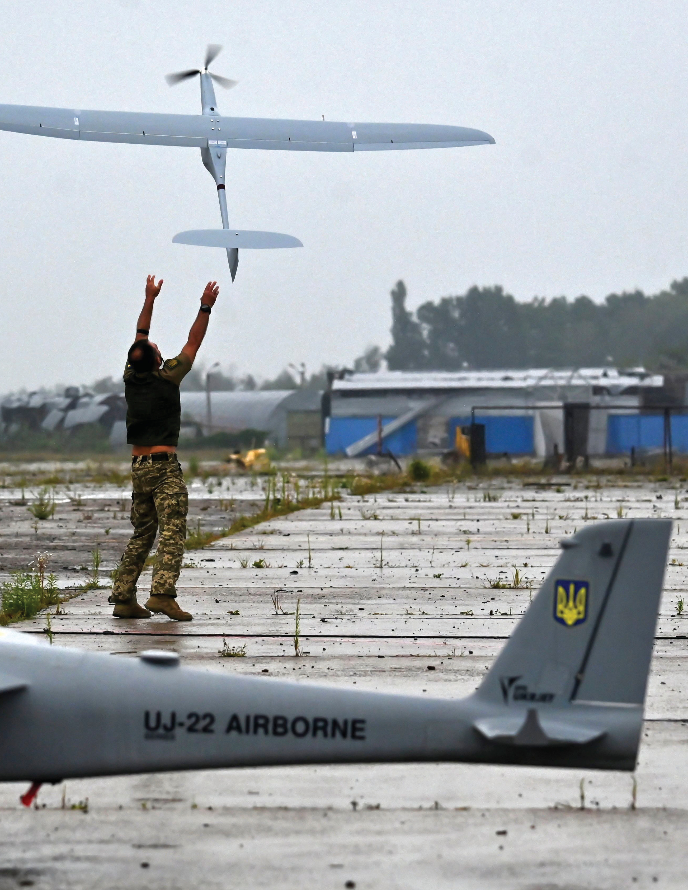
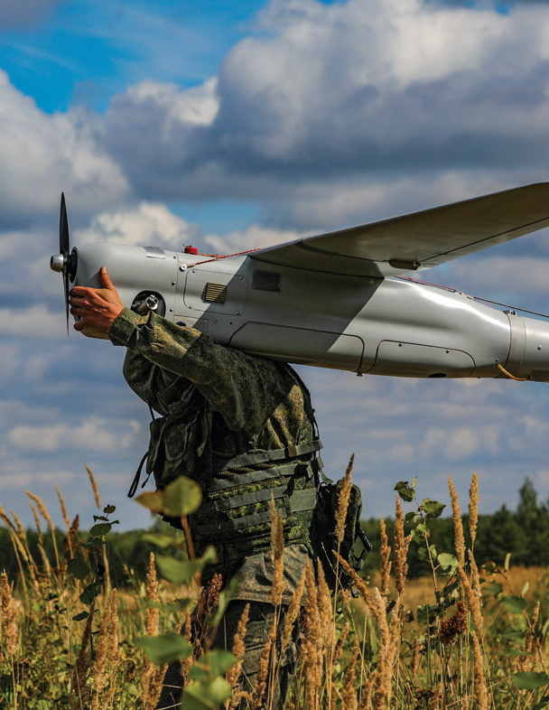
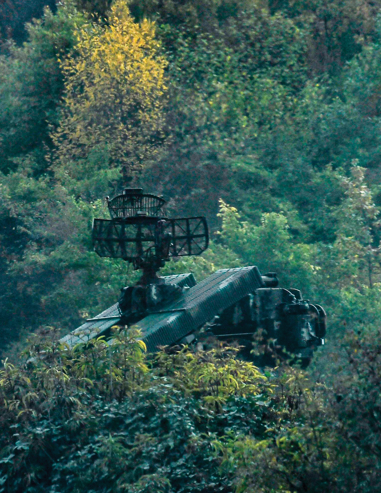
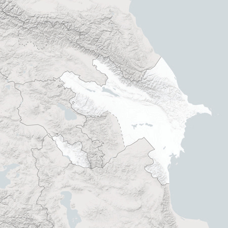
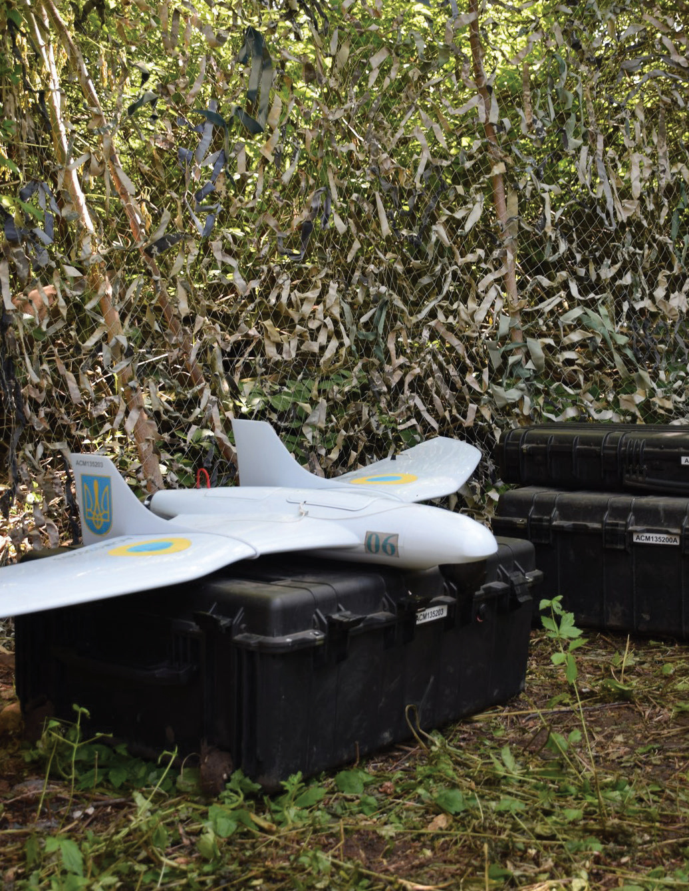
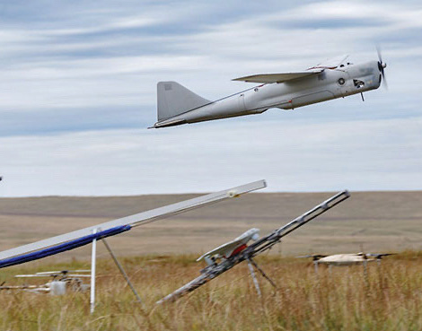
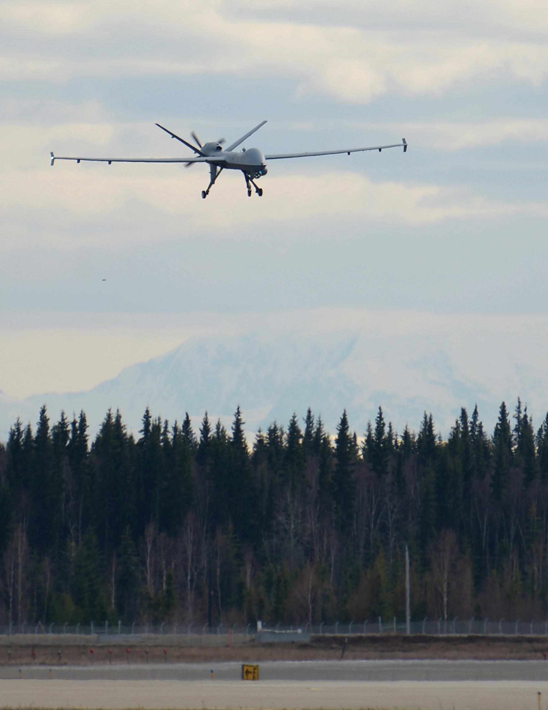
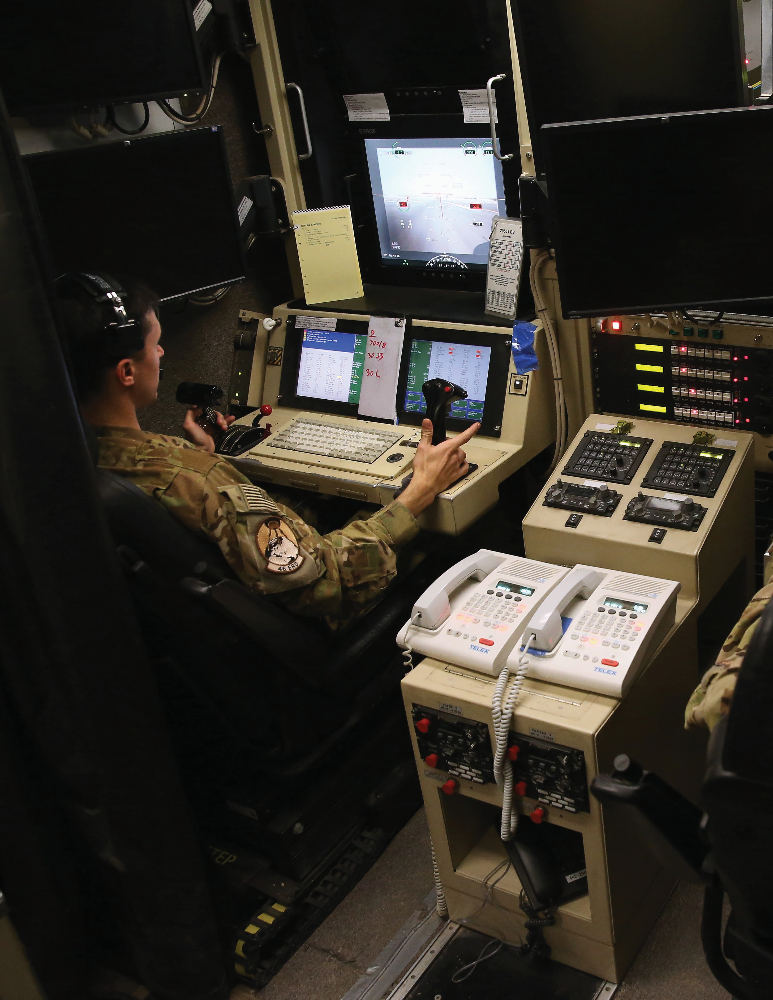

# 221110 Jones Combinedarms Uass

**Source Document:** `221110_Jones_CombinedArms_UASs.pdf`  
**Total Pages:** 67  

---

## --- Page 1 ---

480

070
06
08

40

50

#### 13.0

#### 12.0

#### 12.500

A Report of the CSIS International Security Program

NOVEMBER 2022
COMBINED ARMS WARFARE AND 
UNMANNED AIRCRAFT SYSTEMS

#### A NEW ERA OF STRATEGIC COMPETITION

Seth G. Jones  —  Jake Harrington  —  Christopher K. Reid  —  Matthew Strohmeyer

*Caption/Context: Image page_001_fig_01.png*

## --- Page 2 ---

#### NOVEMBER 2022

A Report of the CSIS International Security Project

COMBINED ARMS 
WARFARE AND UNMANNED 
AIRCRAFT SYSTEMS

#### A NEW ERA OF STRATEGIC COMPETITION

Seth G. Jones  —  Jake Harrington  —  Christopher K. Reid  —  Matthew Stohmeyer

Lanham • Boulder • New York • London

## --- Page 3 ---

#### —   II   —

combined arms warfare and unmanned aircraft systems  /  jones, harrington, reid & strohmeyer

#### ABOUT CSIS

The Center for Strategic and International Studies (CSIS) is a bipartisan, nonprofit policy 
research organization dedicated to advancing practical ideas to address the world’s greatest 
challenges.

Thomas J. Pritzker was named chairman of the CSIS Board of Trustees in 2015, succeeding 
former U.S. senator Sam Nunn (D-GA). Founded in 1962, CSIS is led by John J. Hamre, 
who has served as president and chief executive officer since 2000.

CSIS’s purpose is to define the future of national security. We are guided by a distinct set 
of values—nonpartisanship, independent thought, innovative thinking, cross-disciplinary 
scholarship, integrity and professionalism, and talent development. CSIS’s values work 
in concert toward the goal of making real-world impact.

CSIS scholars bring their policy expertise, judgment, and robust networks to their 
research, analysis, and recommendations. We organize conferences, publish, lecture, and 
make media appearances that aim to increase the knowledge, awareness, and salience 
of policy issues with relevant stakeholders and the interested public.

CSIS has impact when our research helps to inform the decisionmaking of key policymakers 
and the thinking of key influencers. We work toward a vision of a safer and more 
prosperous world.

CSIS does not take specific policy positions; accordingly, all views expressed herein 
should be understood to be solely those of the author(s).

© 2022 by the Center for Strategic and International Studies. All rights reserved.

#### ISBN: 978-1-5381-7058-8 (pb); 978-1-5381-7059-5 (eBook)

Center for Strategic & International Studies
1616 Rhode Island Avenue, NW
Washington, DC 20036
202-887-0200 | www.csis.org

Rowman & Littlefield
4501 Forbes Boulevard
Lanham, MD 20706
301-459-3366 | www.rowman.org

## --- Page 4 ---

#### —   III   —

combined arms warfare and unmanned aircraft systems  /  jones, harrington, reid & strohmeyer

#### ACKNOWLEDGMENTS

We would like to thank numerous individuals for their assistance during the research, 
writing, and revision stages of this report. Thanks, in particular, to Todd Harrison and 
Caitlin Lee for their outstanding reviews of the draft report. We asked them to be critical 
and blunt in pointing out errors in the logic and evidence of the report—and they did 
exactly that. The work is better for their candid and honest feedback. Thanks also to a 
range of individuals in the U.S. Department of Defense who were helpful in discussing 
unmanned aircraft systems (UASs), particularly their increasing role in combined arms.

At CSIS, thanks to Riley McCabe for his outstanding work collecting and analyzing data 
on UASs—particularly in Nagorno-Karabakh and Ukraine—in support of the research. 
He was also heavily involved in helping us think through the figures, photos, and other 
aspects of the report—including the research and revisions. We extend our sincere thanks 
to Janes for helping us access and exploit additional data on the use of UASs in the 
Russia-Ukraine war. Thanks also to Catrina Doxsee, Jared Thompson, and Grace Hwang 
for their assistance on research and analysis. Finally, we would like to thank CSIS’s iLab 
team for their outstanding job in editing, formatting, and publishing the document.

This report is made possible by general support to CSIS and support from General Atomics.

## --- Page 5 ---

#### —   IV   —

combined arms warfare and unmanned aircraft systems  /  jones, harrington, reid & strohmeyer

#### CONTENTS

Executive Summary 	
V

1  |  Introduction 	
1

2  |  UASs in Warfare and Competition 	
4

3  |  Nagorno-Karabakh War 	
9

4  |  Ukraine War 	
16

5  |  Northern Edge 21 	
25

6  |  The Future of UASs in Competition and Warfare 	
29

About the Authors 	
35

Appendix 1: UASs and Other Systems Used by Azerbaijan in the 2020 Nagorno-

Karabakh War 	
37

Appendix 2: UASs and Other Systems Used by Ukraine in the 2022 Russia-

Ukraine War 	
40

Appendix 3: UASs and Other Systems Used by Russia in the 2022 Russia-

Ukraine War 	
45

Endnotes 	
49

## --- Page 6 ---

#### —   V   —

combined arms warfare and unmanned aircraft systems  /  jones, harrington, reid & strohmeyer

#### EXECUTIVE SUMMARY

Unmanned aircraft systems (UASs) have played an important role in warfare over the 
past two decades, including for counterterrorism operations. But there has been a growing 
debate about their utility for competition and interstate war—including between major 
powers such as the United States and China. For some, UASs are creating a “revolution in 
military affairs,” which will fundamentally reshape military doctrine, organization, force 
structure, operations, and tactics. For others, however, the effectiveness of UASs has been 
overstated, and UASs will likely have limited utility in highly contested environments.

To better understand the utility of UASs, this report asks two questions. First, how have 
UASs been utilized in modern warfare, particularly in interstate wars? Second, what are 
the future implications for UASs in warfare and competition? To answer these questions, 
this analysis adopts a comparative case study approach. It examines two cases—the 
Nagorno-Karabakh war in 2020 and the Ukraine war in 2022—to better understand 
how UASs have been used in warfare. It also examines the Northern Edge-21 exercise in 
2021, which provides a useful examination of UASs in Indo-Pacific competition and war.

Based on the analysis, this report comes to several conclusions.

First, UASs have been increasingly integrated into combined arms warfare, a notable 
shift from their use in tracking and targeting terrorist networks over the past two 
decades. For example, Azerbaijan effectively utilized UASs as part of a combined arms 
approach—including with fixed-wing aircraft, helicopters, loitering munitions, guided 
missiles, and artillery—to reverse Armenia’s three decades of control over large swaths 
of Nagorno-Karabakh. In Ukraine, both Russia and Ukraine have used UASs as part 
of combined arms warfare to conduct offensive and defensive operations following 
Russia’s February 2022 invasion. Front lines have often been saturated by UASs, which 
have proven particularly valuable in the contested environment of Ukraine to improve 
battlefield awareness without risking loss of life. In Northern Edge 21, UASs—including 
MQ-9 Ghost Reapers—were integrated into combined arms operations in an Indo-
Pacific scenario that included long-range fires, F-35A Lightning IIs, satellites, F-15C 
Eagles, F-15E Strike Eagles, and other platforms and systems to collect intelligence 
and conduct strikes.

As illustrated in Figure S.1, UASs will likely be integrated into a broader battlefield 
network that includes fifth-generation fighters, such as F-35s and F-22s; aerial refueling 
aircraft, such as KC-135s; long-range bombers, such as B-21s; cruisers and destroyers; 
satellites; carrier strike groups; land-based expeditionary advances bases; command-
and-control centers; long-range fires; and other platforms and systems.

Second, UASs will likely have significant utility for both broad-based competition and 
warfare in the future. Security competition involving the United States, China, Russia, 
and other countries will likely be global in scope and cover significant expanses of the 
land, air, maritime, cyber, and space domains in Asia, Europe, Africa, Latin America, 
and across large bodies of water. In this context, it will be important to have platforms 
and systems capable of collecting intelligence over vast geographic areas, striking 
targets if necessary, and operating in a contested environment. In the future, UASs 
will likely play a critical role conducting several types of missions as part of combined 
arms warfare, including:

## --- Page 7 ---

#### —   VI   —

executive summary  /  jones, harrington, reid & strohmeyer

▪Domain awareness and early warning;

▪Battlefield awareness;

▪Targeting for stand-off attacks;

▪Strike;

▪Electronic warfare; and

▪Information operations.

In sum, UASs will likely play an important role in competition and warfare with such 
countries as China and Russia—a notable shift from their earlier use for counterterrorism 
operations. UASs may be particularly useful because they are capable of expeditionary 
operations with extended range and persistence. In addition, UASs are often viewed 
by governments as less escalatory than piloted aircraft. Conducting a broad array of 
missions will require a suite of UASs and loitering munitions that vary in range, payload, 
cost, and capabilities. In response to the growing use of UASs by state and non-state 
actors, there will also be a growing need to adopt counter-UAS tactics, techniques, 
procedures, and capabilities.

While the technology for UASs has evolved, the most significant change is how UASs are 
being used as part of combined arms warfare and what this suggests about the future. 
“What is past is prologue,” wrote William Shakespeare in The Tempest. The recent past in 
Nagorno-Karabakh, Ukraine, and exercises in the Indo-Pacific offer a prescient prologue 
for the growing use of UASs in combined arms operations in the future.

Figure S.1: UASs and Battle Networks

#### F-22

#### F-35

#### MQ-9

#### LEO Satellite

Surface Ships

Ground Forces

Command Center

#### F-15J

#### FORCES

United States
Partner
Adversary

#### LAYERS

Targeting
Communications
Sensor

Source: CSIS International Security Program.

## --- Page 8 ---

—   1   —

CHAPTER ONE
INTRODUCTION

*Caption/Context: Image page_008_fig_01.jpeg*

## --- Page 9 ---

—   2   —

nmanned aircraft systems (UASs) are 
playing an increased role in warfare.1 
In the decades following the September 
11, 2001, terrorist attacks, the United 
States utilized UASs across the globe to 
conduct intelligence, surveillance, and 
reconnaissance (ISR) of terrorists and their infrastructure, 
as well as to strike terrorist targets. Russia, Ukraine, Israel, 
the United Kingdom, Iraq, Iran, Turkey, Azerbaijan, and 
other countries have also developed UASs and used them 
for ISR and strike missions. However, with the shift to 
strategic competition between the United States and 
other countries, such as China and Russia, there is an 
evolution in the use of UASs. As Russian defense minister 
Sergey Shoigu argued following the 2022 Russian invasion 
of Ukraine, “UASs are being widely used by the Russian 
army to cope with a wide range of tasks. Over the past ten 
years the intensity of their flights has been up 7 times, 
and the annual flight time, 23 times.”2

But there is a significant debate about the utility of 
UASs—particularly for warfare and balance-of-power 
competition among major powers. For some, UASs are 
creating an “unmanned revolution in military affairs,” 
which will fundamentally reshape military doctrine, 
organization, force structure, operations, and tactics.3 
According to proponents, UASs have several benefits: they 
have relatively low costs and low barriers to entry, they 
improve a user’s long-range precision-strike capability, and 
they can deliver multiple mission capabilities, including 
strike, reconnaissance, and battlefield communications, 
with negligible risk to human operators.4

For others, however, UASs are of limited value, and their 
effectiveness has been overstated. As one assessment 
concluded, “Drones have not tilted the military balance 
toward the offense, they have not had an equalizing 
effect between strong and weak states, and they have 
not eliminated close combat.”5 In addition, some U.S. 
officials have argued that existing UASs are incapable 
of operating in highly contested environments and that 
modern electronic warfare and air defense systems would 
quickly destroy or ground these aircraft.6 Vulnerabilities 
associated with these systems are well documented, 
including the June 2019 Iranian shoot-down of an RQ-4 
Global Hawk over the Strait of Hormuz and Iranian-backed 
Houthi militants downing an MQ-9 Reaper over Yemen 
that same month.7

#### RESEARCH DESIGN

To better understand the utility of UASs—especially 
for balance-of-power competition—this analysis asks 
two questions. First, how have UASs been utilized in 
modern warfare, particularly in interstate wars? Second, 
what are the future implications for UASs in warfare and 
competition? While there has been extensive analysis of 
UASs to conduct counterterrorism operations, there has 
been less focus on their actual use in interstate wars.

To answer these questions, this report adopts a comparative 
case study approach. It examines two historical cases—
Nagorno-Karabakh and Ukraine—to better understand how 
UASs were utilized in warfare and how they contributed 
to the outcome. It also analyzes the Northern Edge-21 
(NE21) exercise, a 2021 exercise situated in the Indo-
Pacific. NE21 involved F-15EX Eagle IIs, F-35A Lightning 
IIs, MQ-9 Reapers, F-15C Eagles, F-15E Strike Eagles, and 
other platforms and systems in high-end combat. These 
cases were chosen because there is notable variation in 
how UASs were used (e.g., for strike, intelligence collection, 
targeting for artillery, bomb damage assessment, and 
electronic warfare), where they were used (e.g., in the 
Caucasus, Eastern Europe, and the Indo-Pacific), and how 
effective they were in achieving operational and tactical 
objectives. Since there has not been a major war in the 
Indo-Pacific involving UASs, NE21 provides an interesting 
preview of future conflict in the region. Each of the case 
studies is organized along the same lines. It begins with an 
overview of the war (and the exercise for NE21) and then 
outlines major lessons in UAS and counter-UAS activity.

Consistent with current U.S. Department of Defense usage 
and guidance, this report utilizes the term “unmanned 
aircraft systems,” or UASs, instead of other terms—such 
as unmanned aerial vehicles, uncrewed aircraft systems, 
or remotely piloted aircraft.8 The word “systems” is 
important in UASs since such platforms increasingly 
incorporate a broad suite of sensors, command-and-
control systems, and communications networks that 
are much broader than just aircraft. The report also 
examines loitering munitions.

In addition, this report examines the future implications of 
UASs for both warfare and balance-of-power competition. 
Used in this context, “warfare” involves military operations 
between adversaries, which usually involves the use—or 
threat—of violence. “Competition,” on the other hand, 
is the constant struggle between countries, including

introduction  /  jones, harrington, reid & strohmeyer
U

photo source: sergei supinsky/afp/gettyimages

## --- Page 10 ---

—   3   —

major powers, in the international system for power 
and influence.9 Security competition is a normal reality 
of balance-of-power politics.

#### ROADMAP

The rest of this report is divided into the following 
chapters. Chapter 2 provides an assessment of the role 
of UASs in competition. Chapter 3 examines UASs in the 
war in Nagorno-Karabakh. Chapter 4 analyzes Russian 
and Ukrainian use of UASs in the 2022 war in Ukraine. 
Chapter 5 explores lessons from NE21. Chapter 6 offers 
policy implications on the future role of UASs in warfare 
and competition. Finally, Appendices 1, 2, and 3 provide 
an overview of the UASs used by Azerbaijan, Ukraine, and 
Russia, respectively, as highlighted in the case studies—
including such information as type, description, range, 
endurance, country of origin, and manufacturer.

introduction  /  jones, harrington, reid & strohmeyer

## --- Page 11 ---

CHAPTER TWO
UASs IN WARFARE 
AND COMPETITION

*Caption/Context: Image page_011_fig_01.jpeg*

## --- Page 12 ---

—   5   —

hree fundamental characteristics of 
the current global security environment 
are relevant to the use of UASs. The first 
is the use of UASs in combined arms 
operations. The second is that modern 
security challenges still reflect the 
traditional “hider-finder” dynamic—the cyclical struggle 
between those who try to conceal their activities from 
those determined to detect them.1 The third is that states 
engaged in balance-of-power competition will calibrate 
their behavior in an effort to avoid a major war between 
nuclear powers.

This chapter explores the role of UASs in performing 
missions as part of combined arms operations and “hider-
finder competition,” and it will explore their effects on 
escalation and crisis dynamics. It argues that UASs have 
significant utility in military operations, attributable to 
their multimission functionality and reduced risk to human 
life. Its conclusions draw upon primary source military 
strategy and doctrine from China, Russia, and the United 
States, recent empirical research and examples, and the 
deployment of Chinese UASs around Taiwan in 2022.

Global military forces are rapidly adjusting strategy, 
policy, doctrine, and capabilities to prevail in this era of 
renewed security competition. This competition exists 
along a continuum where binary labels such as “peace” 
or “war” do not apply. Chinese military strategy reflects 
a similar assessment of the current era. As the Chinese 
Science of Military Strategy 2020 argued, “The international 
strategic situation and the pattern of strategic competition 
are undergoing historic changes. China is facing both rare 
development opportunities and severe security threats 
at the same time.”2 For its part, Russia’s 2022 invasion of 
Ukraine reflects merely the latest iteration of its decades-
long shift toward “new generation” or “nonlinear” warfare, 
where Russia “clearly [sees] the kinetic and the non-kinetic 
as interchangeable and mutually supporting.”3

The battlespace in this era of interstate security competition 
involves a mix of irregular and conventional war. States 
such as China and Russia pursue their geopolitical 
interests across the information, economic, diplomatic, 
and military domains, and they view U.S. global behavior 
through a similar lens. Russia accuses the United States 
of weaponizing “the technologies of ‘color revolutions’ 
and ‘soft power.’”4 China has described a U.S.-led West 
engaged in an era of “new strategic containment” that 
is “long-term and complex” and where the intensity of

competition will inevitably follow “a phased cycle of 
‘ease—intensify—ease.’”5

In response, military planners need to develop doctrine and 
capabilities that can deliver strategic advantages across the 
spectrum of threats, including war between major powers. 
Based on their common assessment of the operating 
environment, strategists in Washington, Beijing, and 
Moscow concur on one key priority: the enduring importance 
of information across the entire spectrum of activities. 
Specifically, military thinking is increasingly focused on 
the effective collection, analysis, and operationalization of 
information to shape or alter a competitor’s behavior. This 
is translating into various initiatives in the United States, 
such as the Joint All-Domain Command and Control (JADC2) 
concept. In China, it is reflected in Beijing’s concept of 
“informatized local wars” with the People’s Liberation Army’s 
strategy prioritizing the requirement to collect “timely, high 
fidelity information” while simultaneously degrading the 
adversary’s information capabilities.6 Whether using the U.S. 
term “information advantage” or the Chinese equivalent 
“information dominance,” the world’s two foremost major 
power rivals agree that data is critical to future war.

#### COMBINED ARMS

This focus on translating information into kinetic and non-
kinetic effects is integral to the concept of combined arms. 
Combined arms involves the combination of infantry, direct 
and indirect fire, aviation, and other joint capabilities to 
achieve political and military objectives. As Gerald Gilbert, 
a major in the British army, remarked in 1907:

We have got into the fashion of talking of cavalry 
tactics, artillery tactics, and infantry tactics. This 
distinction is nothing but a mere abstraction. 
There is but the one art, and that is the tactics 
of the combined arms. The tactics of a body of 
mounted troops composed of the three arms is 
subject to the same established principles as is 
that of a mixed force in which foot soldiers bulk 
largely. The only difference is one of mobility.7

Current U.S. military strategy emphasizes the need to 
achieve information advantage at all levels and phases of 
combined arms. Defense leaders are increasingly focused 
on efforts to translate information advantage into kinetic 
outcomes by connecting sensors to shooters. This vision 
of translating information into outcomes extends below 
the threshold of conventional war.8 Such a vision places

uass in warfare and competition  /  jones, harrington, reid & strohmeyer

photo source: mil.ru (cc by 4.0)

#### T

## --- Page 13 ---

—   6   —

intelligence, surveillance, reconnaissance (ISR) and global 
situational awareness at the center of U.S. strategy for 
security competition.

In the current environment, potential threats are widely 
dispersed, quick to manifest, and often difficult to discern from 
routine state behavior. This reflects the “sensing” challenge. 
Harder still will be efforts to make sense of disparate, 
seemingly unconnected activities that may correlate to a 
competitor’s broader pattern of hostile behavior that manifests 
across multiple regions and multiple operating domains. 
For the U.S. military and the intelligence community, the 
all-source collection requirements for strategic competition 
will be exceptionally broad and multimodal. Collectors and 
the decisionmakers they support will need to rely on a 
global network of air, sea, ground, space, and cyber sensors 
(as well as human sources) to deliver timely and accurate 
indicators and warning on a planetary scale.

In this environment, collection demands will undoubtedly 
exceed supply, and budget constraints will require 
investments in systems that are both cost effective and 
capable of performing multiple missions. In the air domain, 
these are attributes that are shared by several UAS platforms 
that already perform multiple ISR missions. These include 
maritime domain awareness, sensitive reconnaissance 
operations, long-loiter reconnaissance activities, and 
tactical ISR missions. And across these operations, a single 
platform can often perform multiple mission types. This 
may include imagery intelligence, including full motion 
video; measurements and signals intelligence; electronic 
intelligence; and signals intelligence. Simultaneously, 
UASs can collect and act as a communications hub for 
an integrated space, air, sea, or ground operation while 
also ingesting, processing, and disseminating multiple 
streams of intelligence.

This level of mission flexibility is not unique to UASs. 
Several piloted aircraft are similarly multimission capable. 
But manned aircraft carry added risk to life and must 
respect the physical and mental limitations—specifically 
in terms of flight duration—of an onboard crew.9 As such, 
UASs are postured to serve as a lower-risk and highly 
adaptable link in combined arms warfare. There is also 
evidence that some UASs, such as the MQ-1B Predator 
and MQ-9A Reaper, have significantly lower operation and 
maintenance costs per flying hour than manned aircraft.10

When competition intensifies, multimission UASs 
can adapt to support the joint force in times of crisis.

Examples include conducting electronic warfare and 
strike operations, if necessary, while also serving as a 
critical hub in a multidomain, combined arms operation. 
Used in this context, UASs are increasingly part of a 
network of collaborative platforms and systems in a 
contested battlespace—a notable change from how 
they were used to conduct unilateral counterterrorism 
operations after 9/11.

As highlighted in Figure 2.1, for example, these platforms 
and systems can include fifth-generation fighters, such 
as F-35s and F-22s; aerial refueling aircraft, such as 
KC-135s; long-range bombers, such as B-21s; cruisers 
and destroyers; satellites; carrier strike groups; land-
based expeditionary advances bases; command-and-
control centers; and long-range fires. To communicate 
across these platforms and systems, UASs need to 
pass information through layered networks, such as 
tactical targeting network technology (TTNT), Link 16, 
Multifunction Advanced Data Link (MADL), multiband 
satellite communications (SATCOM), and mesh networks.

UASs AS TOOLS OF CRISIS 
AND ESCALATION MANAGEMENT

The “competition continuum” refers to a spectrum of 
activities—such as cooperation, armed conflict, and 
competition below the level of armed conflict—that 
describes interaction between states. The concept of a 
competition continuum recognizes that a military force 
“is never solely in cooperation (or in competition below 
armed conflict or in armed conflict) but instead campaigns 
through a mixture of cooperation, competition below 
armed conflict, and armed conflict calculated to achieve 
the desired strategic objectives.”11 Competition occurs 
along a spectrum of intensity. This includes steady-state 
“hider-finder” operations intended to detect, understand, 
and confront hostile activities below the threshold of 
war. But systemic competition hews to a phased cycle 
of “ease—intensify—ease.” In times of intensifying 
competition, states use a variety of military and non-
military means to signal their interest and resolve. In the 
military domain, this signaling may include deploying 
assets to demonstrate presence and commitment. Examples 
include naval freedom of navigation operations (FONOPS) 
and airborne sensitive reconnaissance operations. It is in 
these latter operations where the employment of UASs 
can substantially expand a signaler’s options and ability 
to manage escalation in times of crisis.

uass in warfare and competition  /  jones, harrington, reid & strohmeyer

## --- Page 14 ---

—   7   —

The United States has historically defined sensitive 
reconnaissance operations as “non-wartime reconnaissance 
operations by manually or remotely operated DoD 
platforms involving significant military risk or political 
sensitivity.”12 Emerging technologies offer modern 
nation-states several mechanisms for collecting overhead 
intelligence, including space-based remote sensors that 
are increasingly ubiquitous. Aircraft, however, offer two 
advantages when the circumstances warrant.

First, they can conduct collection activities at a lower 
altitude, and therefore much closer to the target, than space 
assets. They are capable of collecting full motion video 
should requirements necessitate such collection, and many 
modern platforms are capable of long-duration, sustained 
loitering over a target of interest. Second, aircraft are 
detectable. Space reconnaissance can collect a wide range 
of critical and observable intelligence, and these systems 
can deliver this information discreetly or clandestinely 
to the collector. However, in terms of signaling, passive 
space collection leaves little-to-no tangible evidence of 
a nation’s interest or presence. Sensitive reconnaissance 
operations, on the other hand, signal awareness, interest, 
and presence—while also limiting the risk a decisionmaker 
incurs in terms of human life.

Thomas Schelling described much of international relations 
as “a competition in risk taking, characterized not so much 
by tests of force as by tests of nerve.” The risk calculations 
that nations make are clouded by “the sheer unpredictability 
of dangerous events.”13 States attempt to manage this 
uncertainty by calibrating their actions and reactions along 
graduated degrees of risk to avoid unintended escalation. 
In modern crises, there is emerging evidence that UASs, 
when utilized for sensitive reconnaissance operations, 
offer opportunities for leaders to demonstrate interest, 
presence, and resolve while avoiding a key historic driver 
of escalation: loss of human life.

Some recent empirical evidence suggests that leaders 
view the loss of a UAS qualitatively differently than the 
loss of a manned aircraft. In one 2015 example, Turkey 
shot down a Russian UAS that had entered its airspace, 
an act that did not provoke a reciprocal retaliation from 
Russia. One month later, Turkey shot down a manned 
Russian Su-24 attack aircraft, which precipitated a series 
of airstrikes against Turkish interests in Syria.14 In 2019, 
the Iranian military shot down an American RQ-4 Global 
Hawk while it was operating in international airspace 
over the Strait of Hormuz.15 According to news reports, 
U.S. president Donald Trump initially approved a series

Figure 2.1: UASs and Battle Networks

#### F-22

#### F-35

#### MQ-9

#### LEO Satellite

Surface Ships

Ground Forces

Command Center

#### F-15J

#### FORCES

United States
Partner
Adversary

#### LAYERS

Targeting
Communications
Sensor

Source: CSIS International Security Program.

uass in warfare and competition  /  jones, harrington, reid & strohmeyer

## --- Page 15 ---

—   8   —

of retaliatory air strikes against Iran but subsequently 
decided not to conduct the strikes. In the aftermath, 
the president indicated that the fact that the RQ-4 was 
a UAS influenced how the United States should respond. 
As President Trump said, “We had nobody in the drone. 
It would have made a big difference, let me tell you, it 
would have made a big, big difference” if the aircraft 
had been piloted.16 In addition, there is some evidence 
that the deployment and potential loss of UASs in times 
of crisis alleviate some of the key drivers of escalation, 
including a leader’s emotional urge for retaliation as well 
as concerns about incurring a domestic or international 
price for not pursuing a proportionate response.17

This logic was likely reflected in the way that China 
utilized UASs as part of a broader escalation of tensions 
with Taiwan and the United States during the Taiwan 
Strait Crisis in 2022. On August 3, 2022, a People’s 
Liberation Army Air Force (PLAAF) UAS flew over the 
Taipei-controlled Kinmen Islands, the first time any 
Chinese military aircraft had flown over Kinmen since 
the 1950s. The incident occurred as a wide range of PLAAF 
manned and unmanned aircraft entered Taiwan’s air 
defense identification zone. The PLA also launched live-
fire missiles over the island as part of military exercises 
following the visit of Nancy Pelosi, speaker of the U.S. 
House of Representatives, to Taipei. No other PLAAF 
aircraft other than UASs flew over Taipei-controlled 
land. One retired PLAAF equipment expert suggested 
that Beijing might not rule out flying over Taiwan itself 
in the future. “To reduce friction and misjudgment,” he 
said, “we can send unmanned vehicles [to the island].”18

This perception that losing a UAS offers leaders a wider 
range of kinetic and non-kinetic options appears to be 
shared by some U.S. military personnel as well. In his 
recent work, Erik Lin-Greenberg used a series of wargames 
to test how U.S. military personnel weighed responses 
in one scenario where an MQ-1 Predator was shot down 
compared to the loss of an MC-12 Liberty aircraft, which 
carries four crew members.19 None of the teams that lost 
the MQ-1 recommended military strikes in retaliation, 
while all of the teams that lost the MC-12 in the same 
scenario recommended a kinetic response. In the words 
of one player, “We are not going to war over a Predator.”20 
The study also suggests that the loss of a UAS extends the 
range of a leader’s credible response options beyond the 
military domain. Wargame participants did not view the 
loss of an MQ-1 as costless, but the range of acceptable 
retaliatory options they considered were non-kinetic.

uass in warfare and competition  /  jones, harrington, reid & strohmeyer

One lingering question is whether views on the qualitative 
difference between the loss of manned and unmanned 
aircraft is sustainable in the long term. If defenders 
understand that they are less likely to incur kinetic 
retaliation if they shoot down a UAS, will this lead to an 
overall increase in the volume of these platforms that 
are shot down? At some point, will states cease to view 
increasing losses of UASs as more acceptable than the 
loss of manned aircraft? At least in the near term, the 
use of UASs in times of escalating tensions and crisis 
appears to offer leaders a wide range of options. Certainly, 
a leader could credibly cite the loss of a UAS as sufficiently 
provocative to warrant a kinetic response. But a scenario 
incurring the loss of an unmanned aircraft and no human 
lives appears to introduce a range of credible response 
options beyond the military domain.

#### CONCLUSION

As this chapter highlights, UASs continue to be important 
in security competition to help states detect—and take 
actions against—their adversaries as part of combined 
arms warfare. UASs offer countries numerous options 
because of their multimission functionality and reduced 
risk to human life. In addition, UASs are often palatable 
because they are viewed as less escalatory than some 
types of manned aircraft.

To better understand the use of UASs in modern warfare—
including their application for competition with major 
powers—the next three chapters examine the 2020 
Nagorno-Karabakh war, the 2022 Ukraine war, and the 
2021 NE21 exercise.

## --- Page 16 ---

CHAPTER THREE
NAGORNO-KARABAKH

#### WAR

*Caption/Context: Image page_016_fig_01.jpeg*

## --- Page 17 ---

—   10   —

hroughout 2020, longstanding tensions 
between Azerbaijan and Armenia erupted 
over the fiercely contested region of 
Nagorno-Karabakh. After skirmishes in 
July, a major air and ground war broke out 
on September 27, 2020. During a six-week 
conflict that killed more than 6,000 combatants, Azerbaijan 
reversed Armenia’s nearly 30-year control over wide swaths 
of territory in and around Nagorno-Karabakh. Ultimately, 
Armenia lost 75 percent of the territory it had held in these 
areas since 1994.1 Since the hostilities ended in November 
2020, the conflict has emerged as a noteworthy lesson 
in how smaller states can integrate UASs into modern 
combined arms warfare. This case study evaluates how 
Azerbaijan applied its technological superiority on the 
battlefield, specifically focusing on the use of UASs at the 
tactical and operational level.

The 2020 Nagorno-Karabakh war has three key lessons for 
the role of UASs in modern warfare. The first is that UASs 
are an important—and often cost-effective—component 
of an integrated, combined arms battle network. The 
second is that UASs are being leveraged extensively to 
enable information and psychological operations. The 
third is that the proliferation of low-cost UASs allows 
modern militaries to innovate their tactics by accepting 
increased risk for systems that are considered attritable.

This chapter analyzes the role of UASs in the 2020 Nagorno-
Karabakh war across two phases of the conflict. Phase one 
occurred during the first three weeks of the war, when 
fighting concentrated on the plains and foothills surrounding 
Nagorno-Karabakh. Azerbaijan sought to reclaim substantial 
buffer territory around Nagorno-Karabakh that Armenia 
had controlled since the 1994 ceasefire. As highlighted 
in Figure 3.1, this phase of fighting was concentrated 
in the Fuzuli and Jabrail regions, which lie to the south 
of Nagorno-Karabakh along the border with Iran. These 
flat, low-lying areas lack natural cover, and—as visible in 
the dozens of videos released by Azerbaijan’s Ministry 
of Defense—Armenian forces were easily discovered by 
intelligence, surveillance, and reconnaissance (ISR) assets 
and targeted with armed UASs, loitering munitions, and 
artillery. It is also in this phase, and in these regions, where 
Azerbaijan’s air dominance was most decisive.

The second phase of the conflict was underway by late 
October, when Azerbaijani forces began more intensively 
pushing into the political boundaries of Nagorno-Karabakh. 
The Nagorno-Karabakh enclave is mountainous, with dense

forest that provides better natural cover compared to the 
outlying plains and foothills. In this phase, the war shifted 
to one of attritional ground combat, where Azerbaijani 
special forces, ground components, and Turkish-backed 
foreign mercenaries pushed into the forested, mountainous 
terrain against Armenian forces who benefited from more 
favorable defensive positions. This phase continued until 
Azerbaijani forces captured the strategic city of Shusha 
on November 8, at which point both countries agreed to 
a ceasefire on favorable Azerbaijani terms.

Both phases carry lessons for the role of UASs in modern 
combat. In the first phase, Azerbaijan quickly secured air 
superiority, which it then exploited to find and target poorly 
or insufficiently concealed Armenian armor, artillery, and 
personnel. Air power degraded Armenian defenses and 
supply lines and allowed Azerbaijani special forces and 
ground components to encircle Nagorno-Karabakh and 
threaten critical Armenian supply lines into the region.

Entering the second phase of the war, the utility of UASs 
changed as Azerbaijani forces pushed into mountains where 
Armenian defensive positions were stronger and harder 
to find from the air. Videos and imagery of combat within 
the heavily forested and mountainous areas of Nagorno-
Karabakh reveal a much different hider-finder dynamic, 
with the deeply entrenched Armenian forces benefitting 
from a defensive advantage. Moreover, the Armenians 
adapted their defensive posture toward UASs, markedly 
improving their ability to counter these systems with 
traditional air defense and electronic warfare capabilities 
as the conflict progressed, likely with Russian assistance. 
However, these gains were insufficient to alter the war’s 
trajectory after Azerbaijan’s early dominance.

The rest of this chapter is divided into two main sections. 
The first provides an overview of the Nagorno-Karabakh 
war. The second section highlights several major lessons, 
including the use of UASs as part of a connected battlefield 
and for information operations.

#### OVERVIEW OF THE WAR

Nagorno-Karabakh is a mountainous, majority ethnic 
Armenian enclave broadly recognized as a geographical 
component of Azerbaijan. Control over the region has 
been subject to fierce competition and conflict for decades, 
if not centuries. However, the current intensity of the 
conflict emerged in the wake of the dissolution of the 
Soviet Union. In the early 1990s, as the Soviet Union

nagorno-karabakh war  /  jones, harrington, reid & strohmeyer

photo source: aris messinis/afp/gettyimages

#### T

## --- Page 18 ---

—   11   —

disintegrated, the newly independent Armenian and 
Azerbaijani states fought a protracted war. After six years 
of conflict, a 1994 ceasefire agreement left Armenia in 
control of Nagorno-Karabakh, in addition to a sizeable 
portion of Azerbaijani territory surrounding the enclave.

For 15 years prior to the outbreak of war in 2020, the 
Azerbaijani military underwent a sustained period of 
investment driven by oil and gas revenues (see Figures 
3.2 and 3.3). Beginning in 2006, Baku seized upon rising 
global energy prices to increase annual military spending 
by several orders of magnitude. Between 2005 and 2015, 
Azerbaijan’s annual defense budget increased by more 
than 700 percent in real dollars. Armenia, for its part, 
doubled its own defense spending over the same period, 
but the disparity by 2015 was clear. That year, Azerbaijan 
spent $7.46 for every Armenian defense dollar. Still, by 
great power standards, these were modest investments. 
Azerbaijan’s total defense spending over 15 years totaled 
$34.1 billion, less than 5 percent of the U.S. Department 
of Defense’s 2020 budget.2

Azerbaijan and Turkey also deepened their diplomatic 
and military alliance. Turkey—under its “one nation,

two states” support for the ethnic Turkic-Azerbaijani 
state—delivered substantial military, intelligence, and 
political support to Azerbaijan before, during, and after the 
conflict. Turkish support, including the deployment of a 
variety of Turkish-backed Syrian mercenaries, contributed 
substantially to Azerbaijan’s decisive victory.

During the period of rapidly increasing defense spending, 
Azerbaijan invested heavily in Israeli UASs. At the outbreak 
of the 2020 war, Azerbaijan’s inventory included at least 
seven different categories of Israeli unarmed UASs and 
two categories of loitering munitions (see Appendix 1).3 
Azerbaijan also purchased several ballistic and guided 
missile systems from Israel during the same timeframe.4

In mid-2020, Azerbaijan also announced its plan to acquire 
its first armed UAS, Turkey’s Bayraktar TB2. Reports suggest 
that Azerbaijan purchased five of these systems, which were 
in service at the outbreak of the September war.5 While the 
TB2 emerged as perhaps the most prominent capability 
deployed during the war, available evidence suggests it is 
likely that the TB2s used in the 2020 war were owned by 
Azerbaijan but operated by Turkish airmen and crews.6 
One other Turkish system, a portable rotary-wing loitering

Figure 3.1: Map of Fighting during Phase One of the Nagorno-Karabakh War

Fuzuli

#### ARMENIA

#### IRAN

#### AZERBAIJAN

Jabrail

Primary Area of Phase One Operations

Nagorno-Karabakh Region

Source: Geodata for the Nagorno-Karabakh region is courtesy of the Europe and Central Asia Program at the International Crisis Group. See “The 
Nagorno-Karabakh Conflict: A Visual Explainer,” International Crisis Group, last updated October 11, 2022, https://www.crisisgroup.org/content/
nagorno-karabakh-conflict-visual-explainer.

nagorno-karabakh war  /  jones, harrington, reid & strohmeyer

![disintegrated, the newly independent Armenian and  Azerbaijani states fought a protracted war. After six years  of conflict, a 1994 ceasefire agreement left Armenia in  control of Nagorno-Karabakh, in addition to a sizeable  portion of Azerbaijani territory surrounding the enclave. | two states” support for the ethnic Turkic-Azerbaijani  state—delivered substantial military, intelligence, and  political support to Azerbaijan before, during, and after the  conflict. Turkish support, including the deployment of a  variety of Turkish-backed Syrian mercenaries, contributed  substantially to Azerbaijan’s decisive victory.](images/page_018_fig_01.jpeg)
*Caption/Context: disintegrated, the newly independent Armenian and  Azerbaijani states fought a protracted war. After six years  of conflict, a 1994 ceasefire agreement left Armenia in  control of Nagorno-Karabakh, in addition to a sizeable  portion of Azerbaijani territory surrounding the enclave. | two states” support for the ethnic Turkic-Azerbaijani  state—delivered substantial military, intelligence, and  political support to Azerbaijan before, during, and after the  conflict. Turkish support, including the deployment of a  variety of Turkish-backed Syrian mercenaries, contributed  substantially to Azerbaijan’s decisive victory.*

*Caption/Context: Figure 3.1: Map of Fighting during Phase One of the Nagorno-Karabakh War | Fuzuli*

## --- Page 19 ---

—   12   —

munition known as the KARGU, was used by Azerbaijani

special forces in mountain combat against Armenian forces.7

The inability of Armenian air defenses to combat Azerbaijani

UASs is well documented. Many of Armenia’s air defenses,

including the OSA, Krug, and Strela-10, were of Cold War

vintage. Armenia had acquired more advanced capabilities,

including the Russian S-300, Buk, and Tor-M2KM, but

these systems were not effective at countering small, low-

altitude threats such as Azerbaijan’s UAS fleet.8 Overall,

Armenia lacked an integrated air defense system, with 
acute deficiencies in its short-range air defense capability. 
Azerbaijan exploited these weaknesses early in the conflict—
with Baku claiming to destroy 12 OSA air defense systems 
on the first day of fighting alone—and benefited from broad 
air superiority throughout the remainder of the war.9

#### MAJOR LESSONS

Combined Arms Warfare: From the outset of the 2020 
war, it was apparent that Azerbaijan’s years of military

0

1,000

1995
2000
2005
2010
2015
2020

2,000

3,000

$4,000

Armenia

Azerbaijan

#### USD Millions

Military Expenditures (USD millions)
Global Oil Prices (USD dollars)

0

1,000

2,000

3,000

$4,000

1995
2000
2005
2010
2015
2020
0

35

70

105

$140

1995
2000
2005
2010
2015
2020

Figure 3.2: Azerbaijan and Armenian Defense Spending, 1995–2020

Note: Measured in millions of 2020 real dollars.

Source: “SIPRI Military Expenditure Database,” Stockholm International Peace Research Institute, https://www.sipri.org/databases/milex.

Figure 3.3: Azerbaijani Defense Spending and Average Price of Brent Crude, 1995–2020

Note: Measured in 2020 real dollars. Military expenditures in millions.

Source: “SIPRI Military Expenditure Database,” Stockholm International Peace Research Institute; and “Spot Prices (Crude Oil in Dollars per Barrel, 
Products in Dollar per Gallon,” U.S. Energy Information Administration, https://www.eia.gov/dnav/pet/pet_pri_spt_s1_a.htm.

nagorno-karabakh war  /  jones, harrington, reid & strohmeyer

## --- Page 20 ---

—   13   —

modernization equipped them with an effective combined 
arms capability. As one U.S. Army official noted, “What’s 
clear in that conflict is that a less funded nation can do 
combined arms warfare. You don’t need to be the United 
States or Russia. The cost of entry into combined arms 
warfare is lower than initially thought.”10

The realization of this capability was most formidable 
during the early fighting in the Fuzuli and Jabrail regions. 
One of Azerbaijan’s key operational objectives in the 
conflict was to recapture these regions to the south of 
Nagorno-Karabakh and then proceed to encircle the 
enclave’s western border. This maneuver would ultimately 
jeopardize Armenia’s access to the Lachin Corridor, which 
contains the sole highway directly connecting Armenian 
territory to Nagorno-Karabakh.

Azerbaijan’s operations in these southern regions in the 
first two weeks of the war reflected a combined arms 
approach that integrated multiple armed and unarmed 
systems, loitering munitions, guided missiles, and artillery. 
Videos and imagery of Azerbaijani operations in these 
regions show Bayraktar TB2s being utilized for both 
targeting and strike, operating in tandem with lower-
altitude, smaller UASs, such as the Israeli-manufactured 
Orbiter, as well as other ordinance delivery mechanisms.11 
The TB2 is armed with an MAM munition, which carries 
a significantly smaller payload than other missiles in 
the Azerbaijani inventory. In some circumstances, such 
as against undefended Armenian artillery batteries and 
personnel, the MAM was sufficient. Against Armenian 
T-72 tanks and other armored vehicles, however, the TB2s 
appeared to deliver targeting information to Azerbaijani 
multiple launch rocket systems and other fires—allowing 
Azerbaijan to use higher payload weapons when needed.

Benefitting from air superiority and the wide range 
of ISR systems at Azerbaijan’s disposal, battle damage 
assessments could be easily conducted in connection 
to these operations. Overall, the integration of multiple 
UAS sensors with various weapons, including missiles, 
loitering munitions, artillery, and other fires, reinforced 
that the cost of entry for advanced combined arms warfare 
is declining.

Azerbaijan leveraged its air superiority in a region with 
few natural defenses to push deep into Armenian lines. 
Based on available evidence, Azerbaijani air operations 
allowed special forces to advance upon, seize, and control 
territory. Imagery suggests Azerbaijani special forces

arrived in the city of Jabrail by the first week of October 
2020, capturing wide swaths of territory controlled by 
Armenia.12

Despite these successes, one outstanding question 
from this phase of the conflict is how effectively air 
and ground forces were integrated. Imagery and video 
released during the conflict reflects Azerbaijan’s ability 
to integrate a variety of UASs with fires. However, there 
is less available open-source insight into how these 
combined arms operations were synchronized with 
the ground forces responsible for seizing and holding 
territory. It is possible that the dominance of Azerbaijani 
combined air and fires capabilities may have masked 
shortcomings in the integration of ground forces into 
the combined arms approach. Regardless, by October 22, 
2020, Azerbaijan controlled the entire territory south of 
Nagorno-Karabakh and was likely within 10 kilometers 
of reaching the Lachin Corridor.13

While Azerbaijan dominated the plains using its 
technologically advanced combined arms approach in the 
first phase of the conflict, fighting in the mountains during 
the second phase was a more primitive affair. At the tactical 
level, the role of unmanned systems in the mountains 
was less prevalent. Azerbaijan used these systems within 
Nagorno-Karabakh largely to shell urban areas, particularly 
the enclave’s capital of Stepanakert. Stepanakert was heavily

nagorno-karabakh war  /  jones, harrington, reid & strohmeyer

A Bayraktar TB2 circles overhead during a technology 
festival in Baku, Azerbaijan.

Source: Aziz Karimov/GettyImages

*Caption/Context: —   13   — | While Azerbaijan dominated the plains using its  technologically advanced combined arms approach in the  first phase of the conflict, fighting in the mountains during  the second phase was a more primitive affair. At the tactical  level, the role of unmanned systems in the mountains  was less prevalent. Azerbaijan used these systems within  Nagorno-Karabakh largely to shell urban areas, particularly  the enclave’s capital of Stepanakert. Stepanakert was heavily*

## --- Page 21 ---

—   14   —

targeted throughout the conflict by Azerbaijani drones and 
artillery; however, the purpose and effect of these operations 
was likely intended to be more psychological than tactical. 
The primary warfighting in the mountains was close-combat, 
trench-style warfare, conducted by Azerbaijani special forces 
and ground components and augmented by Turkish-backed 
Syrian mercenaries.14 Perhaps the most notable tactical use 
of unmanned systems in this phase was the utilization 
of the Turkish KARGU loitering munition. The KARGU is 
a portable, rotary-wing tactical drone with intelligence, 
surveillance, and reconnaissance (ISR) capabilities and a 
small explosive payload.15 The extent to which the KARGU 
enabled Azerbaijani special operations forces to advance 
into Armenian territory is unclear; however, these ground 
forces were instrumental in the larger mountain and urban 
combat operations that resulted in Azerbaijan’s victory in 
the battle for the city of Shusha. It was Armenia’s loss of 
this key city, only 15 kilometers from Stepanakert, that 
ended the 44-day war.

Information Operations: The second notable lesson from 
the 2020 Nagorno-Karabakh war is the extent to which 
modern states are willing to leverage drones in support of 
information operations. During skirmishes that occurred 
in July 2020, several months before the outbreak of the 
war, Azerbaijan’s Ministry of Defense posted several videos 
of air, missile, and artillery strikes on YouTube. Beginning 
September 27, 2020, the first day of the war, Azerbaijan 
began posting multiple videos each day of raw drone footage 
of air and artillery strikes. These videos were derived from 
a variety of unmanned systems and loitering munitions, as 
well as the Spike NLOS guided missile, which is equipped 
with a full motion video camera. While these videos were 
dramatic, they were often delivered without information 
about where they took place or additional context about 
the broader strategic objectives they supported.

The primary purpose of this propaganda was likely to 
solidify domestic public support for the war and the 
ruling administration. During the war, the Azerbaijani 
government played combat footage on large monitors on 
public display in Baku.16 There was also an international 
dimension to this information effort, as Azerbaijan’s 
Ministry of Defense released English-language press 
releases documenting its claimed military successes.17 
Armenia countered with its own efforts to broadcast 
its counterattacks against Azerbaijani forces. However, 
these were often captured by land-based cameras and 
lacked much of the modern style and production value 
of Baku’s videos.18

Ultimately, the 2020 Nagorno-Karabakh war was decided on 
the battlefield, owing to Azerbaijan’s overwhelming military 
superiority. The utility of the information dimension of 
UAS propaganda, however, is likely a critical lesson for 
future prolonged conflicts of attrition. As has been evident 
in the experience of Ukraine in its war against Russia, 
the information environment is an important domain 
for building and sustaining domestic and international 
support. The 2020 Nagorno-Karabakh war was one of the 
first modern conventional wars to be tracked in near real-
time on social media, with both sides widely releasing 
documentary information from the battlefield.

Attritable Systems and Risk: The third key lesson from 
the 2020 Nagorno-Karabakh war is the role of lower-cost 
UASs in a military’s risk calculus. None of the assets in 
Azerbaijan’s drone inventory likely cost more than $20 
million per unit.19 Most cost far less, including the TB2, 
which likely costs between $2 million and $5 million 
per unit.20 Since lower-cost systems can be purchased in 
larger quantities, the broader operational impact of the 
loss of a single system is reduced. Add to this the reduced 
risk to human life that is associated with UASs and the 
risk aperture for certain activities widens even further.

Nowhere was this risk calculus more profound in the 
Nagorno-Karabakh conflict than in Azerbaijan’s use of 
the Antonov An-2. The An-2 is a single-engine biplane 
originally manufactured in 1947. In advance of the 2020 
war, Azerbaijan retrofitted several An-2 aircraft with remote 
piloting capabilities and added armaments to some. This 
allowed Azerbaijan to conduct effective suppression of 
enemy air defenses (SEAD) operations using an outdated, 
expendable airframe—similar to Vietnam-era “Wild Weasel” 
operations.21 In Nagorno-Karabakh, An-2s were deployed 
as bait against Armenian air defenses. In multiple cases, 
the Armenian air defenses engaged the An-2 and shot it 
down. By doing so, however, the Armenian air defense 
revealed their positions, allowing other Azerbaijani assets 
to find and target the now-exposed air defense systems.

This tactic reflects a potentially significant role for UASs in 
future SEAD operations. With multiple airframes integrated 
with other capabilities, such as artillery or long-range 
fires, air defense systems can be forced into a defender’s 
dilemma. That is, if an air defense system is in jeopardy of 
discovery—or simply identifies a target of opportunity—its 
use risks exposing itself to secondary strike. Conversely, 
Azerbaijan’s use of the An-2 as bait demonstrates the risk-
taking possibilities associated with cheaper, “attritable”

nagorno-karabakh war  /  jones, harrington, reid & strohmeyer

## --- Page 22 ---

—   15   —

unmanned systems. Today, commanders can absorb more 
risk in deploying these platforms into contested airspace. 
In so doing, they force a decision on the adversary to 
either engage the platform or risk being discovered and 
targeted—a disaster outcome in either scenario. Indeed, 
the proliferation of highly capable but attritable UASs 
has broad implications for the future of SEAD operations.

#### CONCLUSION

As Carl von Clausewitz noted, “An engagement in the 
mountains is in itself and in its consequences quite 
different from one on the plains.”22 Reflecting on the 
2020 Nagorno-Karabakh war, Clausewitz’s observations 
hold true in the era of network warfare and UASs. The 
first phase of the 2020 war in the plains demonstrated 
the extent to which air superiority, the application of 
multiple, interconnected unmanned systems, and poor 
battlefield tactics by the adversary can be exploited to 
overwhelming effect. Against unprotected, uncovered, and 
often concentrated Armenian forces, the first phase of 
the war was when Azerbaijan’s technological dominance 
was, quite literally, put on global display via social media. 
Although the second phase of the war in the mountains was 
short, it was by-and-large an intense infantry engagement 
of close combat. UASs were applied in this context, but 
their ability to hunt and target critical defenses within the 
forests and ravines of Nagorno-Karabakh was not decisive.

nagorno-karabakh war  /  jones, harrington, reid & strohmeyer

Armenian S-300

Azerbaijan Retrofitted An-2

Azerbaijan Harop 
Loitering Munition

During the Nagorno-Karabakh war, Azerbaijan retrofitted the An-2—a Soviet era biplane 
crop duster—with basic munitions and ISR capabilities to serve as "drone bait" for 
Armenian air defenses. Armenian forces would shoot down the unmanned An-2 to avoid 
discovery and a potential attack. In doing so, however, they revealed their position to a 
secondary Azerbaijani strike platform, in this case, a loitering munition.

Figure 3.4: Attritable Systems and Risk

Source: CSIS International Security Program.

## --- Page 23 ---

CHAPTER FOUR
UKRAINE WAR

*Caption/Context: Image page_023_fig_01.jpeg*

## --- Page 24 ---

—   17   —

his chapter examines the utilization of 
UASs by Russia and Ukraine following 
Russia’s invasion of Ukraine in February 
2022. The continuation of military 
operations in Ukraine means that the 
“fog of war”—or uncertainty of what is 
occurring during combat—remains a factor.1 Despite the 
limitations inherent in an analysis of an ongoing and 
rapidly evolving war, there are still important lessons 
that can be identified.

This case study finds that UASs have been critical as part 
of combined arms warfare. Both Russia and Ukraine have 
used UASs for several types of missions that have relevance 
to future competition: collecting battlefield intelligence 
through surveillance and reconnaissance missions; 
identifying targets for medium- and long-range artillery 
and aircraft; conducting electronic warfare; orchestrating 
strike missions against land, air, and maritime targets; 
and participating in information operations. Because of 
the effectiveness of UASs, Russia and Ukraine have also 
developed counter-UAS tactics, techniques, and procedures.

The rest of this chapter is divided into two main sections. 
The first provides a brief overview of the war in Ukraine. 
The second section analyzes the major lessons, from target 
identification to strike.

#### OVERVIEW OF THE WAR

Russia’s 2022 invasion of Ukraine began in the early hours 
of February 24, when the Russian military used UASs 
as decoys to expose Ukrainian radars and air defense 
systems.2 These actions facilitated an opening salvo of 
missile strikes, including from Kalibr cruise missiles and 
Iskander systems, on Ukrainian air defenses.3 Russia’s 
airborne forces spearheaded the invasion, and the Russian 
military conducted the initial stage of the invasion along 
several fronts:

▪Northern Front: Russian forces pushed toward Kyiv

from Belarus, led by units from the Eastern Military 
District, including the 29th, 35th, and 36th Combined 
Arms Armies.

▪Northeastern Front: Russian forces moved east

toward Kyiv from Russian territory, led by units 
from the Central Military District, including the 41st 
Combined and 2nd Guards Combined Arms Armies.

▪Eastern Front: Russian forces pushed toward Kharkiv

and out of the Donbas, led by units from the Western

Military District, including the 1st Guards Tank Army 
and 20th and 6th Combined Arms Armies.

▪Southern Front: Russian forces moved from Crimea

west toward Odesa and north and east toward 
Mariupol. They were led by units from the Southern 
Military District, including the 58th, 49th, and 8th 
Combined Arms Armies, (Russian Airborne Forces) 
VDV’s 7th Air Assault Division, and VDV’s 11th Air 
Assault Brigade.

In the northern front, a company-sized element of the 
VDV attempted an airborne seizure of Hostomel Airport, 
approximately 40 kilometers outside of Kyiv, in order 
to establish an airbridge capable of rapidly transporting 
Russian matériel to the outskirts of the Ukrainian capital. 
This assault quickly floundered as VDV forces failed to 
execute suppression of enemy air defense, allowing 
elements of Ukraine’s 4th Rapid Reaction Brigade to 
target multiple transport aircraft carrying paratroopers 
and ultimately render Hostomel Airport inoperable.4 
Meanwhile, follow-on forces advancing southward from 
Belarus were disrupted by Ukrainian defensive efforts. Even 
when Russian infantry advanced southward, these advances 
were often unsupported by artillery, and ground forces did 
not attempt a series of combined arms breakthroughs and 
exploitations, as Russian doctrine would dictate.5

The Russian military faced considerable logistics and 
command-and-control challenges, in part because of poor 
training and planning. Without access to rail transport and 
with roads clogged with Russian vehicles, Russian ground 
forces failed to move fuel, munitions, spare parts, and 
other matériel quickly and efficiently to forward-deployed 
units. Supply lines could not keep up with the long combat 
pushes, and logistics vehicles were not properly protected. 
The effectiveness of Russian long-range strike—a key aspect 
of Russian military operations—has also been severely 
impacted by logistical challenges, including an insufficient 
supply of precision-guided munitions. In addition, the 
Russian ground offensive appears to have been planned 
and executed based on poor assumptions about how the 
Ukrainian military—and the population—would respond, 
as well as how the West might react.

Seizing and holding territory has been a major political 
objective of Russian policymakers. But controlling territory 
in a foreign country with a hostile Ukrainian population 
is deeply problematic for the Russian military. In addition, 
Russian forces have failed to effectively integrate combined 
arms to seize and hold Ukrainian territory, including

ukraine war  /  jones, harrington, reid & strohmeyer

photo source: mil.gov.ua (cc by 4.0)

#### T

## --- Page 25 ---

—   18   —

coordination between land power, air power, and long-
range fires.6 The Russian invasion force has also been far 
too small to achieve its objectives and has neglected to 
block Ukraine’s western border to prevent the supply of 
foreign weapons, systems, fuel, and other aid to Ukraine.7

Russian forces along the southern axis of advance 
made operational gains during the opening phase of 
the invasion. Elements of Russia’s 42nd Motor Rifle 
Division, as well as some VDV elements, captured 
Kherson on February 25.8 Russian forces also advanced 
along the coast of the Sea of Azov, beginning a siege of 
Mariupol on February 24 and capturing Melitopol on 
March 1. Ukrainian forces waged a protracted urban 
defense in Mariupol, which was gradually weakened by 
intensive Russian artillery shelling throughout April that 
culminated in a Ukrainian retreat to the Azovstal steel 
plant, where forces held out until they were overrun by 
a Russian advance in May 2022.9

The initial Russian invasion scheme was likely designed to 
rapidly seize Kyiv and other major urban centers, thereby 
forcing the capitulation of the Zelensky government and 
clearing the way for Russian-backed regime change. Facing 
the compounding difficulties of a logistics breakdown and 
a stalled advance to Kyiv, Russian political and military 
authorities reoriented the invasion efforts around the 
eastern and southern axes of advance. By April 6, Russian 
forces had withdrawn along the northern axis of advance, 
removing forces from the outskirts of Kyiv and the city 
of Chernihiv.10

On April 19, Russian foreign minister Sergey Lavrov 
announced the “next phase” of the Russian invasion 
would focuse on the “complete liberation” of the Donetsk 
and Luhansk Oblasts in eastern Ukraine, collectively 
known as the Donbas.11 That same day, Russian missile 
and artillery forces struck hundreds of targets, primarily 
in the Donbas, as Ukrainian military officials claimed to 
repel seven different Russian thrusts against the line of 
contact.12 Russian offensive efforts along the southern 
and eastern axes were uneven. While Russian forces 
advancing along the coast of the Sea of Azov secured control 
of territory from the Russian city of Rostov-on-Don to 
Crimea, forces in the east initially made some operational 
gains against determined Ukrainian defenses. In focusing 
their campaign on eastern and southern Ukraine, Russian 
forces seized the Luhansk Oblast in July and attempted 
to push to western parts of Donetsk Oblast.

But some of these gains were wiped out following 
Ukraine’s offensive. On August 29, the Ukrainian military 
announced that it had begun offensive operations in 
southern Ukraine centered on Kherson Oblast. Ground 
engagements began shortly thereafter, with Ukrainian 
forces reportedly breaking through defensive lines led 
by the 109th Donetsk People’s Republic regiment and 
forcing their withdrawal near Kherson. Ukrainian forces 
fielded High Mobility Artillery Rocket Systems (HIMARS), 
provided by the United States, to great effect. Ukraine 
struck ammunition depots and bridges across the Dnipro 
River—as well as the Kerch Strait Bridge connecting Russia 
with Crimea—disrupting Russian logistics and resupply. 
The Ukrainian military similarly used long-range strikes 
to threaten Russian naval assets in the region, prompting 
the Russian navy to relocate Kilo-class submarines from 
Sevastopol, Crimea, to Novorossiysk, Russia.

On September 6, Ukraine’s military launched a large 
counteroffensive in the northeastern Kharkiv Oblast. 
Ukrainian forces punched holes through Russian lines, 
encircling and recapturing the town of Balakliya. The 
Ukrainian thrust then advanced farther east, blitzing 
through large swaths of Russian-held territory and triggering 
a Russian retreat. By September 10, Ukrainian forces had 
seized the nearby town of Kupiansk, which served as a vital 
railway hub supplying Russian forces in the region. That 
same day, Ukrainian forces retook Izyum, a key command 
center and staging ground for Russia’s northern front. In 
response, the Russian defense ministry announced the 
official withdrawal of troops from the collapsing frontline.

In reality, Russian troops had already begun a chaotic 
retreat, abandoning large stores of ammunition and 
combat-ready equipment. Ukraine’s army captured two 
brigades’ worth of military equipment in less than a week. 
Images and videos from liberated towns in Kharkiv Oblast 
show Ukrainian soldiers posing with abandoned Russian 
T-80 tanks, armored vehicles, counter-battery radars, and 
howitzers. Following the liberation of Izyum, Ukrainian 
forces continued to press north toward the Russia-Ukraine 
border, and east, engaging in fighting with Russian troops as 
they attempted to set a new defensive line on the eastern 
bank of the Oskil River. Ukrainian forces also regained 
territory in Donetsk and Luhansk Oblasts.13

By late 2022, as highlighted in Figure 4.1, Russia controlled 
a shrinking amount of territory in southern and eastern 
Ukraine.

ukraine war  /  jones, harrington, reid & strohmeyer

## --- Page 26 ---

—   19   —

#### MAJOR LESSONS

Both Russia and Ukraine have integrated UASs into their 
war efforts—including their “kill chains.” A kill chain 
refers to the process of gaining an understanding of the 
battlefield, identifying a possible target, determining 
the target’s location and other pertinent information, 
deliberating what action to take, and making a decision that 
creates an effect to achieve an objective (such as conducting 
a strike).14 The Russian military has long identified UASs 
as playing an important part of its “reconnaissance strike 
complex” (or разведивательно-ударный комплех), 
which is designed for the coordinated employment of 
high-precision, long-range weapons linked to real-time 
intelligence data and accurate targeting.15 Russian forces 
have used a variety of UASs and loitering munitions in 
Ukraine, including the Orlan-10 and -30, Forpost-R, 
Eleron-3, Granat‑1 and ‑2, Zastava, Takhion-4, Orion, 
and ZALA‑421. Russia has also imported UASs from Iran, 
including the Shahed-131 and Shahed-136.16

The short-range Orlan-10, launched by folding catapult, 
has been the most widely used Russian UAS in the Ukraine 
conflict and is the most numerous in Russian military 
service. Each Russian land force division and brigade

has had an organic UAS company equipped with Orlan-
10s, and Russia possessed as many as 3,000 Orlan-10s 
before the war.17 The Orlan-10 was developed for such 
missions as aerial reconnaissance, electronic warfare, 
detection of radio signals, target tracking, observation, 
and monitoring. It can accommodate photo and video 
cameras, a gyro-stabilized TV camera, and an infrared 
imager.18 Russia’s Forpost-R, which was developed by Israel 
Aerospace Industries as the Searcher Mk II, is capable of 
reconnaissance and strike and is equipped with indigenous 
software, datalinks, electro-optical sensors, an APD-85 
piston engine, signals intelligence sensor packages, and 
a reinforced fuselage for additional survivability.19 It 
includes ground control stations, antennas, and logistics 
support equipment. Russia also has used the Eleron-3, 
a small, tactical delta-wing UAS used for intelligence, 
surveillance, and reconnaissance (ISR).20 There are other 
UASs and loitering munitions in the Russian inventory, 
including the short-range, flying-wing Granat-1 and -2, 
Israeli-manufactured Bird-Eye 400 (Zastava), “mini-UAS” 
Takhion-4 for reconnaissance, and the ZALA-421 loitering 
munition for reconnaissance and surveillance.21

Ukraine has operated several types of UASs. One of the 
most frequently used has been the Bayraktar TB2, a

Figure 4.1: Russian and Ukrainian Force Disposition, September 202213

Source: See “Chapter 4: Ukraine War” endnote 13 for full citation.

ukraine war  /  jones, harrington, reid & strohmeyer

![MAJOR LESSONS | Both Russia and Ukraine have integrated UASs into their  war efforts—including their “kill chains.” A kill chain  refers to the process of gaining an understanding of the  battlefield, identifying a possible target, determining  the target’s location and other pertinent information,  deliberating what action to take, and making a decision that  creates an effect to achieve an objective (such as conducting  a strike).14 The Russian military has long identified UASs  as playing an important part of its “reconnaissance strike  complex” (or разведивательно-ударный комплех),  which is designed for the coordinated employment of  high-precision, long-range weapons linked to real-time  intelligence data and accurate targeting.15 Russian forces  have used a variety of UASs and loitering munitions in  Ukraine, including the Orlan-10 and -30, Forpost-R,  Eleron-3, Granat‑1 and ‑2, Zastava, Takhion-4, Orion,  and ZALA‑421. Russia has also imported UASs from Iran,  including the Shahed-131 and Shahed-136.16](images/page_026_fig_01.jpeg)
*Caption/Context: MAJOR LESSONS | Both Russia and Ukraine have integrated UASs into their  war efforts—including their “kill chains.” A kill chain  refers to the process of gaining an understanding of the  battlefield, identifying a possible target, determining  the target’s location and other pertinent information,  deliberating what action to take, and making a decision that  creates an effect to achieve an objective (such as conducting  a strike).14 The Russian military has long identified UASs  as playing an important part of its “reconnaissance strike  complex” (or разведивательно-ударный комплех),  which is designed for the coordinated employment of  high-precision, long-range weapons linked to real-time  intelligence data and accurate targeting.15 Russian forces  have used a variety of UASs and loitering munitions in  Ukraine, including the Orlan-10 and -30, Forpost-R,  Eleron-3, Granat‑1 and ‑2, Zastava, Takhion-4, Orion,  and ZALA‑421. Russia has also imported UASs from Iran,  including the Shahed-131 and Shahed-136.16*

## --- Page 27 ---

—   20   —

medium-altitude, long-endurance UAS.22 It can perform 
a range of ISR and attack missions—including firing 
MAM-C and MAM-L guided bombs, long-range anti-
tank missiles, Cirit laser-guided 70-mm rockets, and 
TUBITAK-SAGE laser-guided rockets. Ukraine also has 
operated small A1-SM Furia flying-wing UASs for day 
and night reconnaissance, hand-launched Leleka-100 
and Spectator-M mini-UASs for artillery spotting and 
aerial reconnaissance, the Punisher UAS produced by UA 
Dynamics and used to strike military targets, and larger 
indigenously produced PD-1s and UJ-22s.23 Ukrainian forces 
have utilized off-the-shelf commercial UASs, such as DJI 
Mavic 3 quadcopter, which has a retail price of roughly 
$3,000.24 In some cases, Ukraine has manufactured UAS 
parts with 3-D printers.25

In addition, the United States has provided several 
loitering munitions to Ukraine, such as the tube-launched 
Switchblade 300 (with an Orbital ATK high-explosive 
warhead) and the long-endurance Phoenix Ghost.26 
The Phoenix Ghost, for example, is a tactical loitering 
munition that can fit inside a backpack, hover over a 
target for approximately six hours, and strike it with an 
explosive munition. It has infrared guidance and can 
operate at night.27

UASs have been used to conduct several types of missions 
in Ukraine in 2022, including: target identification for 
artillery and aircraft; strike; battlefield ISR; electronic 
warfare; and information operations. These uses have 
significant implications for the future of competition.

Target Identification for Combined Arms: Russia and 
Ukraine have used UASs to identify targets for artillery 
and aircraft as part of combined arms operations.28 In one 
instance, Ukrainian ground forces used forward-deployed 
UASs to identify a Russian infantry unit near Bakhmut in 
Donetsk Oblast and fed the information to a command-
and-control center, which passed it to Ukrainian soldiers 
that hit the Russian unit with a 122-mm howitzer.29 
Ukrainian forces have utilized Kropyva, an intelligence 
mapping and artillery software populated by information 
from UASs and other sources.30 Forward-deployed tactical 
units have downloaded the software and continuously 
updated it on handheld tablets and computers. Ukraine 
has leveraged Starlink—a commercially owned satellite 
internet constellation that provides high-speed, low-latency 
broadband internet using advanced satellites in low earth 
orbit—for identification. As one Ukrainian military official 
noted, “We use Starlink equipment and connect the drone

team with our artillery team. If we use a drone with thermal 
vision at night, the drone must connect through Starlink 
to the artillery guy and create target acquisition.”31

UASs have also been an important part of Russia’s 
reconnaissance strike complex, and Russia has utilized 
UASs to identify targets as part of combined arms 
operations.32 As highlighted in Figure 4.2, for example, 
Eleron-3 or Orlan-10 UASs might identify potentially 
targets, such as Ukrainian infantry or main battle tanks; 
pass the information, including the type of target and 
its coordinates, to command-and-control facilities; and 
distribute it to systems that can strike the target, such 
as 2S19 Msta-S 152-mm self-propelled howitzers or 
Tornado-S 300-mm multiple launch rocket systems.33 
In cases where UAS reconnaissance identifies a target, 
Russian artillery can frequently bring accurate fire down 
on the target three to five minutes later. In cases where 
a target is identified with electronic warfare direction 
finding, acoustic reconnaissance, or counter-battery 
artillery radar, it might take Russian artillery half an 
hour for accurate artillery fire. If Russian forces are able 
to keep a UAS on a target, they can adjust fire in near 
real-time—even if the target is moving.34

Strike: Russia and Ukraine have utilized UASs for strike 
missions, including against land, air, and maritime targets. 
Ukrainian Bayraktar TB2 drones have struck numerous

ukraine war  /  jones, harrington, reid & strohmeyer

An Orlan-10 is launched via catapult as part of an exercise 
at the Kapustin Yar Russian training ground.

Source: Russian Ministry of Defence.

*Caption/Context: team with our artillery team. If we use a drone with thermal  vision at night, the drone must connect through Starlink  to the artillery guy and create target acquisition.”31 | ukraine war  /  jones, harrington, reid & strohmeyer*

## --- Page 28 ---

—   21   —

Russian targets, such as howitzers, main battle tanks, 
supply trucks, towed artillery, maritime vessels, command 
posts, logistics depots, and Buk, Tor, Strela, and ZU-23 air 
defense systems.35 Between April 26 and May 8, 2022, for 
example, Ukrainian TB2s targeted several Raptor-class 
patrol boats, a Sarna-class landing craft, and helicopters in 
and near the Black Sea.36 Russia has also conducted strikes 
with UASs, including Orlan-10s armed with freefall high-
explosive fragmentation grenades.37 Russian forces have 
also utilized Iranian Shahed-131 and Shahed-136 UASs 
to strike targets deep inside Ukrainian territory.38 These 
types of UASs posed challenges for the Ukrainian military 
because they can fly at low altitudes that make it difficult 
for air defenses to detect. In October 2022, for example, 
a Shahed-136 struck a Ukrainian military headquarters 
roughly 50 miles south of Kyiv, causing significant damage 
to the facility and surrounding infrastructure.39

Battlefield Awareness: Russia and Ukraine have utilized 
UASs for ISR missions of enemy activity to facilitate 
battlefield awareness.40 The sensors on Russian and 
Ukrainian UAS platforms have collected signals intelligence, 
videos, and other information for operational use by 
ground, air, and maritime forces. The Russian Orlan-10, 
for example, can carry photo and video cameras, a gyro-
stabilized television camera, an infrared imager, and—
especially with the Orlan-30—signals intelligence sensors 
(including direction finders).41 These capabilities have also 
allowed UASs to be useful for battle damage assessment.

In addition, both Russia and Ukraine have utilized UASs 
as decoys to provide helpful battlefield information. In the 
opening hours of the war, for example, Russia dispatched 
pulsejet-powered E95M target drones that were attacked 
by Ukrainian air defenses in an effort to expose Ukrainian 
radars and launchers to Russian suppression of enemy air 
defense strikes.42 There are some indications that Ukraine 
has used Tu-141 UASs as decoys for similar purposes.43

Electronic Warfare: Russia and Ukraine have utilized 
UASs for electronic warfare. For example, Russia has used 
RB-341V Leer-3 electronic warfare payloads mounted on 
Orlan-10 UASs to target Ukrainian cell phone networks.44 
More broadly, Russia has utilized UASs, such as the 
Orlan-10, to jam GSM 900, GSM 1800, 3G, and 4G signals 
within a radius of roughly 6 kilometers.45 In response, 
Ukraine has attempted to counter Russian electronic 
warfare, such as by using a radar-homing seeker payload 
for explosive-laden drones. Since most electronic warfare 
complexes take between 25 to 40 minutes to set up, forcing 
displacement can be an effective means of suppression that, 
in turn, can create windows of opportunity for Ukrainian 
UASs and reconnaissance teams to communicate the 
position of Russian systems in real-time and determine 
the exact coordinates of positively identified targets.46

Information Operations: Russia and Ukraine have utilized 
UASs for information operations. For example, both 
countries have used UAS footage to show successful strikes

ukraine war  /  jones, harrington, reid & strohmeyer

Orlan-10 UAV

Orlan-10 UAV C&C
Rocket ABN KNM
1B1003 Commander
Tornado-G 122mm MLRS
Command & Staff Vehicle
Target

data on enemy objects
firing tasks
command to open fire

Figure 4.2: Example of UASs and Russia’s Reconnaissance Strike Complex

Source: Jeffrey Edmonds and Samuel Bendett, Russian Military Autonomy in a Ukraine Conflict (Arlington, VA: Center for Naval Analyses, February 2022), 
7, https://www.cna.org/reports/2022/02/russian-military-autonomy-in-a-ukraine-conflict. Concepts translated from Col. D. Mishin, “Особенности 
организации боевой подготовки подразделений ракетных войск и артиллерии Сухопутных войск, входящих в состав разведывательно-
ударных и разведывательноогневых комплексов” [To understand the fundamentals: Organization of combat training of Ground Forces’ missiles and 
artillery units that are part of the reconnaissance-strike and reconnaissance-fire complexes], Russian Armed Forces, July 15, 2021, accessed January 31, 
2022, https://army.ric.mil.ru/Stati/item/334380.

## --- Page 29 ---

—   22   —

and place them—overtly or covertly—on social media 
platforms such as Twitter, Telegram, YouTube, and TikTok.47 
UAS surveillance has also provided high-quality imagery of 
ground engagements that is reminiscent of video games.

Counter-UAS Activity: In addition to these types of 
missions, Russia and Ukraine have developed counter-
UAS tactics, techniques, procedures, and capabilities over 
the course of 2022. For both sides, counter-drone efforts 
have involved trying to break the kill chain between the 
operator and the UAS.48 Russian and Ukrainian UASs have 
suffered high rates of attrition. Many have been shot 
down on the battlefield or have been subject to electronic 
jamming, as highlighted in Figure 4.4. For example, TB2s 
have been vulnerable to air defense systems, air attacks, 
and electronic warfare because they are slow, large, low-
flying, and radio-controlled.49 Russian UASs, such as the 
Orlan-10 and Forpost, have also suffered a high rate of 
attrition. Many have been shot down on the battlefield 
or subject to electronic jamming. These challenges have 
been exacerbated by the inability of Russia’s domestic 
arms industry to replace these UASs quickly.50

According to one captured Russian document, Moscow 
assessed that Ukrainian “UASs, high-precision loitering,

and artillery ammunition and communications equipment 
rely on positioning through the reception of signals 
from satellite radio navigation systems.”51 Russian 
leaders recommended that their forces continuously 
suppress access to satellite navigation through regular 
operation of the Pole-21 system and the R333Zh, both on 
maximum power using omni-directional jamming. The 
Russian guidance noted that the impact on command 
and control could be limited by linking command posts 
by ground-laid field cable. Both the Pole-21 and R330ZH 
systems were turned off prior to the initiation of Russian 
artillery strikes that might require accurate satellite-based 
positions.52 Russian units have also utilized Krasukha-S4 
electronic warfare systems to take down Ukrainian UASs.53 
Effective use of electronic warfare can cut off drone pilot 
communications, interrupt live video, or force systems 
to crash or retreat.54

To defend against electronic warfare, Russia has used the 
Shipovnik-Aero, a truck-mounted jamming system with a 
range of 15 kilometers optimized for targeting UASs. The 
system has detected UASs through their control frequency, 
analyzed and reconfirmed the information, and jammed 
the command frequency. The system has also been used 
to override the position of the UAS so that return-to-base

ukraine war  /  jones, harrington, reid & strohmeyer

Figure 4.3: Sample Locations of UAS Strikes in Ukraine

Kyiv

Mykolaiv

Kherson

Melitopol
Mariupol

Donetsk

Luhansk

Izyum

Belgorod

Kharkiv

Kupiansk

Zaporizhzhia

Ukraine
Russia

Source: CSIS analysis using data provided by Janes. Data includes information from February to June 2022.

![and place them—overtly or covertly—on social media  platforms such as Twitter, Telegram, YouTube, and TikTok.47  UAS surveillance has also provided high-quality imagery of  ground engagements that is reminiscent of video games. | and artillery ammunition and communications equipment  rely on positioning through the reception of signals  from satellite radio navigation systems.”51 Russian  leaders recommended that their forces continuously  suppress access to satellite navigation through regular  operation of the Pole-21 system and the R333Zh, both on  maximum power using omni-directional jamming. The  Russian guidance noted that the impact on command  and control could be limited by linking command posts  by ground-laid field cable. Both the Pole-21 and R330ZH  systems were turned off prior to the initiation of Russian  artillery strikes that might require accurate satellite-based  positions.52 Russian units have also utilized Krasukha-S4  electronic warfare systems to take down Ukrainian UASs.53  Effective use of electronic warfare can cut off drone pilot  communications, interrupt live video, or force systems  to crash or retreat.54](images/page_029_fig_01.jpeg)
*Caption/Context: and place them—overtly or covertly—on social media  platforms such as Twitter, Telegram, YouTube, and TikTok.47  UAS surveillance has also provided high-quality imagery of  ground engagements that is reminiscent of video games. | and artillery ammunition and communications equipment  rely on positioning through the reception of signals  from satellite radio navigation systems.”51 Russian  leaders recommended that their forces continuously  suppress access to satellite navigation through regular  operation of the Pole-21 system and the R333Zh, both on  maximum power using omni-directional jamming. The  Russian guidance noted that the impact on command  and control could be limited by linking command posts  by ground-laid field cable. Both the Pole-21 and R330ZH  systems were turned off prior to the initiation of Russian  artillery strikes that might require accurate satellite-based  positions.52 Russian units have also utilized Krasukha-S4  electronic warfare systems to take down Ukrainian UASs.53  Effective use of electronic warfare can cut off drone pilot  communications, interrupt live video, or force systems  to crash or retreat.54*

## --- Page 30 ---

—   23   —

protocols lead the UAS to land in a location designated 
by Russian forces.55 In addition, Russia has used Pantsir 
short-range air-defense systems to target Ukrainian TB2 
drones.56 Russians forces have also used early warning 
radars to identify UASs and electronic warfare systems

and jam and disrupt their communication. To target 
UASs and ground control stations, Russian forces have 
used machine guns; air defense systems, such as the Tor 
missile system; 152-mm howitzers; 300-mm multiple 
launch rocket systems; and Tochka-U systems.57 Russian

Figure 4.5: Example of UASs Lost by Platform Type

UAS TYPE
NUMBER LOST
UAS TYPE
NUMBER LOST

Military Forces of Russia
169
Military Forces of Ukraine
41

KBLA-IVT
1
Athlon-Avia A1-SM Fury
4

Enix E95M
3
DeViro Leleka-100
3

Enix Eleron
10
Spaitech Sparrow
1

Forpost-R
3
TB2
11

Kalashnikov Group KUB-BLA
1
Tupolev variants
5

Kronstadt Orion
1
Ukrjet UJ-22
1

STC Orlan variants
101
Unspecified loitering munition
1

Izhnash Takhion
2
Unspecified VTOL UAV
1

ZALA 421-16E2
3
Unknown
14

Unspecified reconaissance drone
2

Unknown
42

Source: CSIS analysis using data from open-source websites ACLED and Oryx. Data collected runs from February–May 2022.

ukraine war  /  jones, harrington, reid & strohmeyer

Russia
Ukraine

0

5

10

15

20

25

30

Feb. 26 –

Mar. 4

Mar. 5 –

Mar. 11

Mar. 12 –

Mar. 18

Mar. 19 –

Mar. 25

Mar. 26 –

Apr. 1

Apr. 2 –

Apr. 8

Apr. 9 –

Apr. 15

Apr. 16 –

Apr. 22

Apr. 23 –

Apr. 29

Apr. 30 –

May 6

May 7 –

May 13

May 14 –

May 20

May 21 –

May 26

Figure 4.4: UASs Lost in Ukraine, February–May 2022

Source: CSIS analysis using data from open-source websites ACLED and Oryx.

## --- Page 31 ---

—   24   —

ukraine war  /  jones, harrington, reid & strohmeyer

successes over time in targeting Ukrainian UASs have led 
to a lifespan of roughly seven days for a Ukrainian UAS.58

Ukraine has conducted its own counter-UAS efforts. For 
example, Ukraine has maintained organic man-portable 
air-defense teams, sometimes equipped with visually 
guided systems, such as Starstreak and Martlet, to target 
UASs.59 In response to Russian activity, many Ukrainian 
units have had to choose between having a live feed 
from their UASs and risking a high likelihood of losing 
the platform or sending UASs out on pre-set flight plans 
and analyzing their intelligence after they return. While 
this tactic has minimized Russian counter-UAS activity, 
it also has caused significant delays in using intelligence 
for operations.60 As UASs become more autonomous and 
less dependent on GPS, jammers will be less effective.61

#### CONCLUSION

As this chapter highlights, Ukraine and Russia have 
utilized UASs in combined arms operations—a notable 
evolution from the use of UASs against terrorist targets. 
UASs have been used for collecting battlefield intelligence, 
identifying targets for strikes by artillery and other 
platforms, conducting electronic warfare, executing strike 
missions, and waging information operations.

## --- Page 32 ---

CHAPTER FIVE
NORTHERN EDGE 21

*Caption/Context: Image page_032_fig_01.jpeg*

## --- Page 33 ---

—   26   —

here is a significant empirical gap in 
current assessments about the role of UASs 
in future war—especially the potential 
utility of these systems in a high-intensity 
conflict between the United States and 
China. This was the case in May 2021, when 
U.S. Indo-Pacific Command (INDOPACOM) convened the 
2021 iteration of its biannual Northern Edge exercises. 
Northern Edge 21 (NE21)—held in various locations in 
and around Alaska—included approximately 15,000 U.S. 
service members, 6 Navy vessels, and 240 aircraft.1 For 
2021, Northern Edge was designed to test the current 
capacity of U.S. forces to conduct joint operations and 
execute on the vision of the U.S. Department of Defense’s 
joint all domain command and control (JADC2) concept 
against a major competitor in the Indo-Pacific area, such 
as China.

The U.S. Department of Defense disclosed some information 
about the overarching purpose of NE21, along with a list 
of specific assets and capabilities involved in the exercise; 
however, only limited details about the specific combat 
scenarios themselves have been made publicly available. 
Individual elements of the exercise are known to have 
included large-scale air combat operations, some of which 
included the deployment of more than 100 friendly 
and adversary aircraft; a long range, non-line of sight 
simulated hypersonic strike; and a joint force seizure of 
an enemy airfield.2

The overall purpose of the Northern Edge exercises is 
to stress test emerging capabilities and concepts in a 
realistic exercise environment that simulates a conflict 
against a major power. As one commander involved in 
NE21 noted, “It is one of only a handful of exercises that 
combine great power competition-level threat complexities 
with the joint interoperability necessary to realistically 
inform our test data.”3 While not a historical case study, 
such as Nagorno-Karabakh and Ukraine, NE21 provides 
a useful preview of future conflict.

#### OVERVIEW OF THE EXERCISE

NE21 included several crewed aircraft, such as the F-35A, 
B-1 Lancer, U-2, multiple iterations of the F-15 (including 
the new F-15EX featuring an upgraded electronic warfare 
suite), several cargo aircraft, and a B-52H modernized to 
ingest targeting data from a range of all-domain sensors.4 
The primary UAS integrated into NE21 was the MQ-9 
Reaper, including the so-called “Ghost Reaper,” an Air

National Guard MQ-9 with upgraded communications 
packages and machine learning capabilities. The Ghost 
Reaper modifications, alongside additional MQ-9 
modernizations that include new sensors and anti-jamming 
capabilities, will result in a retrofitted multidomain 
operation version of the aircraft, which the U.S. Air Force 
claims will be better suited for strategic competition 
and major power threats.5 All of these air assets were 
integrated with a carrier strike group and Army ground 
components, including an M142 High Mobility Artillery 
Rocket System (HIMARS) battery.

Despite the absence of available in-depth information 
detailing the overall NE21 scenario, some judgments 
about the potential role of UASs in future joint all domain 
operations can be formulated based on the objectives of 
the exercise—specifically to test new joint all-domain 
operations capabilities and concepts—and on available 
information about the various new UAS capabilities that 
were deployed as part of the exercise. The remainder 
of this chapter evaluates the specific UAS capabilities 
deployed during NE21 and concludes with observations 
about what these systems suggest about the future role 
of UASs in joint operations against major powers.

The MQ-9 Reapers deployed during NE21 integrated at 
least four new payloads that were designed to enhance 
the platform’s utility beyond its traditional utility for 
intelligence, surveillance, and reconnaissance (ISR) and 
strike operations in uncontested airspace. The first is the 
Reaper Defense Electronic Support System (RDESS), which 
reportedly allows the MQ-9 to “collect and geo-locate 
signals of interest from standoff ranges.”6 The claimed 
significance of this platform is that it enables the MQ-9 
to conduct ISR operations and precision targeting at a 
sufficient standoff distance from the target so as to avoid 
enemy countermeasures. The RDESS capability, deployed 
alongside additional electronic countermeasures, is 
intended to augment the survivability of the existing 
MQ-9 airframe.7

The second and third new payloads were designed to 
facilitate communications and data flows consistent with 
the “sense and integrate” pillars of the JADC2 strategy.8 
This includes the Rosetta Echo Advanced Payloads 
(REAP) Pod and the Freedom Pod, both of which enable 
communications interoperability across different protocols 
and radio networks.9 These types of “Rosetta Stone” 
communications capabilities are important remedies to 
poor communications interoperability across weapons

northern edge 21  /  jones, harrington, reid & strohmeyer

photo source: u.s. air force photo by senior airman beaux hebert

#### T

## --- Page 34 ---

—   27   —

platforms. A range of software-defined capabilities and 
new payloads—including devices like the Freedom Pod 
that bridge communications between fourth and fifth 
generation fighters—are unavoidable stopgap solutions 
that the United States needs to adopt if it has any realistic 
intention of achieving the level of machine-to-machine 
integration it envisions for the future joint force.10 The 
integration of these communications capabilities into 
an MQ-9—or any other UAS or manned air asset—allows 
communications and data to flow between platforms that 
may use different tactical data links, such as Link 16, the 
F-35’s Multifunction Advanced Data Link, or the F-22’s 
Intra-Flight Data Link.

The fourth and final new payload is the MQ-9 Centerline 
Avionics Bay (CAB) pod, which is designed to integrate 
high-performance onboard computing capability for 
processing sensor data onboard the aircraft.  Bandwidth 
and computing demands in modern warfare are massive. 
Future combined arms warfare focuses on the continuous 
flow of timely, actionable information across all domains. 
Continuous modernization across tactical sensors in the 
air, space, sea, and land domains will result in these battle 
networks collecting larger and larger quantities of data. 
While the joint force would prefer to push tactical data 
to robust, large-scale, ground-based cloud computing 
clusters, high-intensity conflict will require conducting 
these activities within the battle network itself. As 
demonstrated at NE21, aircraft, including UASs, are viewed 
as suitable assets for conducting high-powered computing 
data analytics within the tactical battle network itself. 
The United States is preparing to conduct such operations 
in a communications-deprived environment. Integrating 
onboard compute capabilities into multimission tactical 
platforms such as UASs can substantially reduce bandwidth 
challenges by conducting initial data triage and purging 
extraneous “noise.”

One additional data point from NE21 that helps illuminate 
the role of UASs in future war is the exercise’s disclosures 
about the integration of the all-domain operations 
capability-experiment (ADOC-E) with a B-52 Stratofortress 
carrying a simulated hypersonic missile. According to the 
U.S. Air Force, the ADOC-E is designed to enable joint 
operations in environments where traditional command-
and-control structures are degraded or denied.11 In the 
scenario, the ADOC-E fed targeting data—integrated 
from multiple sensors, services, and platforms—to the 
B-52 from a distance of 1,000 miles, enabling the B-52 
to launch a simulated AGM-183A missile at a target 600

miles away. Even though this element of the exercise did 
not emphasize UAS, it is an important example of the 
types of all-domain operations that were being tested. 
In this case, it was the simulation of a capability that can 
ingest multimodal targeting data and feed it to a long-
range strike platform, a mission that could be tasked to 
a UAS in a different scenario.

#### MAJOR LESSONS

The available data about the MQ-9 capabilities deployed 
in support of NE21, and the exercise’s focus on enabling 
joint all domain operations, suggest three primary lessons 
for UASs in conflict with a major power.

Survivability in Contested Airspace: The first lesson is the 
importance of improving the survivability of these systems 
to conduct ISR operations in contested airspace. Based on 
NE21, efforts to field more survivable UAS platforms are not 
necessarily restricted to ongoing U.S. Air Force efforts to 
field entirely new airframes. As suggested by the utilization 
of the RDESS pod, ongoing developments in advanced 
sensors are making it possible for retrofitted platforms 
to conduct missions at increasing standoff distances, 
reducing their exposure to air defenses. Additional efforts 
to harden the ability of existing systems to withstand 
communications jamming and other electromagnetic 
attacks, again, reflect efforts to recapitalize existing 
airframes for strategic competition and great power 
conflict in the near term.

Nodes in an Integrated Battle Network: The second 
lesson is the utility of UASs as communications nodes in 
an integrated battle network. This includes the capacity 
to ingest data from air, land, sea, space, and cyberspace 
and relay this data back to decisionmakers and joint fires. 
Given the range of different assets deployed in support 
of NE21, future joint operations are building toward an 
integrated network of diverse sensors. These sensors, 
however, will not be effective if the data they generate 
cannot be ingested, fused, analyzed, and disseminated at 
machine speed, even in austere and denied environments. 
In a conventional war with a major power, all sides 
will likely leverage artificial intelligence to accelerate 
decisionmaking, seeking information and decision 
advantage over their adversary. Correspondingly, all 
sides will be under significant pressure to build sensors, 
battle networks, edge computing, and analytics to exploit 
decision windows that are getting smaller and smaller.

northern edge 21  /  jones, harrington, reid & strohmeyer

## --- Page 35 ---

—   28   —

MultiMission ISR: The third lesson is the capacity for 
UASs to conduct multimission ISR in support of joint 
operations. This includes signals intelligence, electronic 
intelligence, measurement and signature intelligence, and 
imagery intelligence collection, the latter of which includes 
full motion video and hyperspectral, multispectral, and 
synthetic aperture radar. In future combat, intelligence 
generated by these systems will be fused with collection 
from other assets—such as satellites—to contribute to an 
integrated intelligence and targeting picture.

northern edge 21  /  jones, harrington, reid & strohmeyer

## --- Page 36 ---

CHAPTER SIX
THE FUTURE OF 
UASs IN COMPETITION

#### AND WARFARE

*Caption/Context: Image page_036_fig_01.jpeg*

## --- Page 37 ---

—   30   —

s this report highlights, UASs have 
played an increasing role in interstate 
warfare and have been integrated into 
combined arms warfare. They have been 
used to collect intelligence for battlefield 
awareness, provide real-time or near 
real-time information to artillery and other systems 
for standoff attack, perform battle damage assessment, 
conduct electronic warfare, strike targets, engage in 
information operations, and execute other missions. 
These uses represent a departure from the way the United 
States has frequently utilized UASs against terrorist 
networks, which often includes unilateral operations to 
target terrorist leaders and infrastructure.

As the cases studies highlighted, Azerbaijan effectively 
utilized UASs as part of a combined arms approach—
including with fixed-wing aircraft, helicopters, loitering 
munitions, guided missiles, and artillery—to reverse a 
three decade-long stalemate in Nagorno-Karabakh. In 
Ukraine, both Russia and Ukraine have used UASs as 
part of combined arms warfare to conduct offensive 
and defensive operations—including to seize or defend 
physical territory in Ukraine—following Russia’s February 
2022 invasion. UASs have been particularly valuable in a 
contested environment to improve battlefield awareness 
without risking loss of life. In Northern Edge 21 (NE21), 
UASs—including MQ-9 Ghost Reapers—were involved in 
an integrated battle network that included long-range 
fires, F-35A Lightning IIs, satellites, F-15C Eagles, F-15E 
Strike Eagles, and other platforms and systems to collect 
intelligence and conduct strikes in an Indo-Pacific setting.

This chapter builds on the previous chapters by asking: 
what are implications for the future of warfare and strategic 
competition? It argues that future security competition 
involving the United States, China, Russia, and other 
countries will likely be global in scope and cover significant 
areas of the land, air, maritime, cyber, and space domains. 
It will be important to have platforms and systems capable 
of collecting intelligence over vast geographics areas, 
striking targets if necessary, and operating in a contested 
environment as part of combined arms warfare. UASs will be 
useful because they are capable of expeditionary operations 
with extended range and persistence. In addition, leaders 
often prefer UASs over piloted aircraft because they are 
perceived as being less escalatory.

Conducting a range of missions will require a broad 
suite of UASs and loitering missions that vary in range,

payload, and sophisticated capabilities such as advanced 
sensors. In particular, UASs will likely play an important 
role in several types of missions as part of competition 
and warfare with such countries as China and Russia, 
including:

▪Domain awareness and early warning;

▪Battlefield awareness;

▪Targeting for stand-off attacks;

▪Strike;

▪Electronic warfare; and

▪Information operations.

The rest of this chapter is divided into three sections. First, 
it examines the evolving nature of strategic competition 
and warfare. Second, it assesses the primary missions 
of UASs as part of combined arms warfare. Third, it 
provides a brief conclusion, including the challenges and 
opportunities of innovation.

UASs IN COMPETITION 
AND WARFARE

Security competition is not likely to occur only in such 
areas as the Taiwan Strait, South China Sea, or the Baltics. 
Instead, it is likely to be global for at least two reasons. 
First, great powers need access to foreign markets for raw 
materials and other goods and services that they need 
to bolster their military and economic power.1 Second, 
great powers have historically attempted to expand 
their influence, particularly at the expense of other 
powers.2 During the Cold War, for example, competition 
did not primarily occur in Europe but rather in Africa, 
Latin America, and Asia. As the political scientist Hans 
Morgenthau argued, the Cold War was fought across the 
globe “primarily in terms of competition between two 
rival political philosophies, economic systems, and ways 
of life.”3 Indeed, future competition with China and, to 
a lesser extent, Russia will likely occur across a diverse 
geographic landscape, from densely populated cities to 
littoral areas, deserts, and mountains.

China, for instance, is expanding its global reach. Beijing is 
increasing its global power projection by building military 
bases, infrastructure, and access across the globe, including 
in Cambodia, Djibouti, Pakistan, Tanzania, Equatorial 
Guinea, and the United Arab Emirates. In April 2022, 
China signed a security pact with the Solomon Islands, 
raising concern in Australia, the United States, and other

the future of uass in competition and warfare  /  jones, harrington, reid & strohmeyer

photo source: john moore/gettyimages

#### A

## --- Page 38 ---

—   31   —

countries that it would help Beijing further establish a 
military foothold in the Western Pacific.4

In addition, China’s Belt and Road Initiative is an ambitious 
global development strategy that uses infrastructure 
investments to expand China’s political, economic, and 
military power.5 But China has used economic assistance 
as part of the Belt and Road Initiative to pressure foreign 
governments to adopt favorable policies on such issues 
as Taiwan, Hong Kong, Tibet, control of islands in the 
South China Sea, and the plight of Uyghurs in western 
China. Chinese president Xi Jinping’s goal is to create a 
vast network of railways, highways, energy pipelines, 
maritime trade routes, and ports to connect China with 
the rest of Asia, Europe, the Middle East, and Africa. The 
“belts” refer to the network of land routes that connect 
China to Central Asia, the Middle East, Russia, and Europe. 
The “roads” refer—somewhat confusingly—to the maritime 
routes, including ports, that connect Chinese seaports to 
countries in the South China Sea, Indian Ocean, South 
Pacific, and Mediterranean Sea.

Russia has also expanded its global footprint. Russia has 
military bases in Ukraine, Armenia, Azerbaijan, Belarus, 
Georgia (in Abkhazia and South Ossetia), Kazakhstan, 
Kyrgyzstan, Moldova, Sudan, Syria, Tajikistan, and Vietnam. 
Instead of deploying large numbers of conventional 
Russian soldiers, however, Moscow has leveraged special 
operations forces, intelligence units, private military 
companies, and other governmental and nongovernmental 
organizations to expand its influence, build the capacity 
of partners and allies, and increase economic opportunity. 
Some Russian private military companies, such as the 
Wagner Group, are quasi-arms of the Russian government, 
and they have direct or indirect links with the Russian 
Ministry of Defense (particularly the Main Intelligence 
Directorate), the Federal Security Service, the Foreign 
Intelligence Service, and the Kremlin.6

These developments have important implications for 
UASs for competition and warfare.

First, given the decline in the U.S. military footprint in 
key parts of Africa, the Middle East, and South Asia, there 
will likely be a growing need to develop and utilize UASs 
and other air- and space-based capabilities that can collect 
and process vast amounts of information on adversary 
activities as part of balance-of-power competition. 
Countries such as China, Russia, and Iran will likely 
attempt to hide their actions in the land, maritime, air

domains; across a rich variety of terrain, from jungles and 
mountains to dense forests and sub-surface locations; 
and in areas with diverse demographics, including tightly 
packed cities. These countries may also attempt to use 
denial and deception tactics and techniques, as well as 
stealth and other technologies, to hide or mask their 
actions. These challenges will require the United States 
and its partners to overcome the tyranny of distance 
(operating over a significant area) and time (reacting 
quickly when necessary).7

Second, there will likely be a need to focus on UASs that 
can operate with extended range, higher payloads, and 
improved technology in contested environments during 
warfare. China and Russia are expanding their kill zones 
with improved ballistic, cruise, and hypersonic missiles; 
long-range fires; fifth-generation aircraft; and other systems 
and platforms. In addition, such countries as China, 
Russia, and Iran could give increasingly sophisticated 
capabilities to state and non-state actors, or they could 
forward-deploy standoff systems to foreign countries. As 
discussed in more detail in the next section, UASs will 
likely have an important role to play during warfare to 
conduct battlefield awareness, strike, electronic warfare, 
and other missions.

The United States’ main strategic competitors are also 
continuing to develop UASs. As part of its comprehensive 
military modernization program, for example, China 
is developing longer-range and more technologically 
sophisticated UASs that can operate with higher payloads 
for intelligence, surveillance, reconnaissance (ISR), strike, 
and other missions—such as the WZ-7 Xianglong (Soaring 
Dragon), Wuzhen-8 (WZ-8), Gongji-11 (GJ-11), Feihong 
95 (Flying Swan or FH-95), and Caihong-7 (CH-7).8 The 
FH-95 has electronic intelligence (ELINT), electronic 
support measures, and electronic warfare payloads to 
collaborate with other manned and unmanned platforms 
to conduct deep strikes against enemy targets.9 In August 
2022, the People’s Liberation Army deployed BZK-005E 
(Changying), TB-001, and other UASs near Taiwan and 
Japan during heightened tension between the United 
States and China following the visit by Nancy Pelosi, 
speaker of the U.S. House of Representatives, to Taiwan.10 
Chinese assessments recognize the utility of UASs and 
other unmanned systems in warfare.11 As some Chinese 
analysts have concluded, UASs can be helpful for ISR 
and targeting in a contested environment—including 
providing timely bomb damage assessment.12

the future of uass in competition and warfare  /  jones, harrington, reid & strohmeyer

## --- Page 39 ---

—   32   —

After examining Russian operations in Syria, one Chinese 
assessment concluded, “In order to be familiar with 
the battlefield situation and accurately determine the 
nature and location of the target, the Russian army 
used unmanned reconnaissance aircraft, reconnaissance 
satellites and other air and space capabilities during 
attacks against the Islamic State in Syria, which greatly 
improved the strike accuracy and the strike effect.”13 China 
has also conducted multiple experiments with swarming 
UASs in combat.14 In addition, China has introduced 
other unmanned systems, such as autonomous ground 
vehicles, into its military. In 2021, for example, the Sharp 
Claw I unmanned ground vehicle, which was produced 
by China North Industries Corporation, entered service 
with the People’s Liberation Army Ground Force.15

#### COMBINED ARMS

UASs will continue to play an important role in several 
types of missions as part of strategic competition and 
warfare with such countries as China and Russia, including 
domain awareness and early warning, battlefield awareness, 
targeting for standoff attacks, strike, electronic warfare, 
and information operations. For example, the U.S. Marine 
Corps is planning to utilize various types of UASs—such 
as MQ-9A block 5 extended-range Reapers and block 30 
ground control stations—to conduct electronic warfare, 
airborne early warning, maritime domain awareness, and 
communications and data network relay in the Indo-
Pacific to counter a growing threat from China.16 UASs, 
such as the MQ-9B short-takeoff and landing (STOL), can 
be launched off ships, such as the Wasp-class landing 
helicopter dock (LHD) amphibious assault ship.

While it is not the focus of this report, there will also be 
a growing need to adopt counter-UAS tactics, techniques, 
procedures, and capabilities in response to the proliferation 
of UASs. Examples include GPS hardening; integration 
with systems, such as Starlink; and development of 
various command-and-control options, such as multiband 
satellite communications (SATCOM), tactical targeting 
network technology (TTNT), Link 16, high frequency, and 
cloud-based artificial intelligence (such as the JAIC Smart 
Sensor). In Ukraine, counter-UAS efforts have involved 
trying to break the kill chain between the operator and 
the UAS. Russian and Ukrainian UASs have suffered high 
rates of attrition. Many have been shot down on the 
battlefield or have been subject to electronic jamming. 
For example, TB2s have been vulnerable to air defense 
systems, air attacks, and electronic warfare. Russian UASs,

such as the Orlan-10 and Forpost, have also suffered a 
high rate of attrition.

Conducting these types of missions will require a broad 
suite of UASs and loitering missions that vary in range, 
payload, and capability. The rest of this section provides 
an overview of some of the primary missions UASs can 
perform as part of combined arms operations.

Domain Awareness and Early Warning: UASs will play 
an important role in ISR in large geographic expanses 
around the world in the land, maritime, and air domains. 
UASs can be designed with range, endurance, and ISR 
capabilities that are well suited to operations in and 
around expansive areas such as the Indo-Pacific. In 
the 2022 Rim of the Pacific exercise, UASs such as the 
SeaGuardian supported maritime domain awareness 
and anti-submarine operations through intelligence 
payloads—including synthetic aperture radar, inverse 
aperture radar, electro-optical and infrared sensors, 
ELINT, communications intelligence (COMINT), and 
various other sensors.17

Of particular use will be continued developments in 
advanced sensing with multifunction processors and 
multifunction apertures, longer range and persistence, 
enhanced command and control, and improved data 
exploitation for domain awareness. UASs can collect signals 
intelligence (SIGINT), ELINT, COMINT, measurement and 
signature intelligence (MASINT), and imagery intelligence. 
For maritime domain awareness, for example, UASs can 
play an increasingly helpful role using maritime wide-area 
search radar, synthetic aperture radar, inverse aperture 
radar, ground moving target indicator technology, and 
weather collection capabilities.

UASs can also provide airborne early warning by combining 
advanced sensors with networks of UASs. They are a 
low-cost alternative to fixed-wing early warning aircraft. 
In the Arctic, for example, UASs could provide early 
warning capabilities along the northern approaches to 
monitor and, if required, engage hostile aircraft and cruise 
missiles over extended distances. As part of airborne early 
warning, UASs can exchange information from other 
platforms and systems using TTNT command and control, 
multispectral targeting system/synthetic aperture radar, 
and the Multifunction Advanced Data Link (MADL).

In addition, there are options for domain awareness missions 
using contractor-owned and -operated activities. This option 
makes access to ISR from UASs potentially affordable to

the future of uass in competition and warfare  /  jones, harrington, reid & strohmeyer

## --- Page 40 ---

—   33   —

allies and partners; provides the capability to a country 
when a foreign military sale may not be quickly approved 
by the United States; and can deliver that capability in a 
few months rather than the several years it might take 
to complete an acquisition. There is also a possibility of 
multicountry contractor-owned and -operated activities 
to reduce partner costs while generating multilateral 
cooperation where little might currently exist.

Battlefield Awareness: In war, UASs can provide ISR of 
enemy activity. As the 2022 Rim of the Pacific exercise 
highlighted, such UASs as the MQ-9B SeaGuardian and 
smaller V-Bat streamed live video and data feeds back to 
command centers on shore for battlefield awareness.18 
For long-range operations, UAS tankers may also be able 
to refuel UASs and manned systems, though effective 
teaming will require continuing technological advances.19

The three cases examined in this report—Nagorno-
Karabakh, Ukraine, and NE21—highlighted the utility of 
UASs for battlefield awareness. In Ukraine, the Russian 
Orlan-10 has carried photo and video cameras, a gyro-
stabilized television camera, an infrared imager, and—
especially with the Orlan-30 and Orlan-50—SIGINT sensors 
(including direction finders).20 These capabilities have also 
allowed UASs to be useful for battle damage assessment. 
NE21 emphasized the utility of UASs as communications 
hubs in joint operations, including the capacity to collect 
data from air, land, sea, space, and cyberspace and relay 
this data back to decisionmakers and joint fires.

Targeting for Standoff Strikes: In addition to general 
battlefield awareness, UASs can provide information 
to other ground, air, or maritime systems for strikes in 
wartime. This role allows UASs to help close the long-
range kill chain by delivering persistent effects at range 
and scale, and it makes UASs useful as collaborative 
platforms and systems in a contested battlespace. In 
the Ukrainian war, Russia and Ukraine have used UASs 
to identify targets for artillery, aircraft, and maritime 
platforms as part of combined arms operations. More 
broadly, UASs have been an important part of Russia’s 
reconnaissance strike complex.

UASs can also be used for decoys. In Nagorno-Karabakh, 
Azerbaijan used An-2s as decoys against Armenian 
air defense systems. In several instances, Armenian 
air defense systems targeted An-2s and revealed their 
positions, allowing Azerbaijan to identify and target the 
now-exposed air defense systems. In the opening hours

of the Ukraine war, Russia dispatched E95M UASs that 
were attacked by Ukrainian air defenses, similarly exposing 
Ukrainian radars and launchers to Russian suppression 
of enemy air defense strikes.

Strike: UASs will continue to be useful in conducting air-
to-ground, air-to-air, and air-to-sea strikes in contested 
and uncontested environments, requiring them to be 
larger, faster, and able to carry larger and more lethal 
payloads. To conduct strikes, UASs will need to include 
improved infrared sensors, cameras, laser designators, 
and laser illuminators. In addition to UASs, cheaper, 
more lethal, and longer-range loitering munitions will 
likely be helpful in conducting strikes.

In Nagorno-Karabakh, Azerbaijan utilized Bayraktar TB2s 
for strike operations against Armenian T-72 tanks and 
other targets. The TB2s operated with lower-altitude, 
smaller UASs, such as Orbiters. In Ukraine, both Russia 
and Ukraine have utilized UASs for strike operations 
against land, air, and maritime targets. Ukrainian TB2s 
have struck numerous Russian targets, such as howitzers, 
main battle tanks, towed artillery, maritime vessels, 
logistics depots, and air defense systems. Russia has 
also conducted strikes with UASs, including Orlan-10s.

Electronic Warfare: UASs will also play an important role 
in electronic attack against land, maritime, and air targets, 
including degrading, neutralizing, or destroying enemy 
combat capabilities and communications. In Ukraine, 
Russia and Ukraine have utilized UASs for warfare. For 
example, Russia has used the RB-341V Leer-3 electronic 
warfare payloads mounted on Orlan-10 UASs to target 
Ukrainian cell phone networks. More broadly, Russia has 
utilized UASs, such as the Orlan-10, to jam GSM 900, 
GSM 1800, 3G, and 4G signals.

Information Operations: Finally, UASs can play a helpful 
role in real-time information operations during warfare 
or as part of broader competition. For example, videos of 
strikes or other activity by U.S., allied, or partner forces 
can be downloaded, declassified, and distributed either 
overtly on government websites and digital platforms 
or provided to news outlets or digital platforms, such 
as Twitter, Instagram, Telegram, YouTube, Facebook, 
and TikTok, for distribution. The same can be done with 
videos and other information collected by UASs regarding 
Russian, Chinese, or other adversary activity.

During skirmishes in July 2020, for example, Azerbaijan’s 
Ministry of Defense posted several videos of air, missile,

the future of uass in competition and warfare  /  jones, harrington, reid & strohmeyer

## --- Page 41 ---

—   34   —

and artillery strikes on YouTube. Beginning on September 
27, the first day of the war, Azerbaijan began posting 
multiple videos each day of raw drone footage of air and 
artillery strikes. These videos were derived from a variety 
of UASs and loitering munitions, as well as the Spike NLOS 
guided missile. The primary purpose of this propaganda 
was likely to solidify domestic public support for the war 
and the ruling administration. In Ukraine, both Russia 
and Ukraine have used UAS footage to show successful 
strikes and place them—overtly or covertly—on social 
media platforms.

Despite the growing use of UASs in combined arms—
from strike to information operations—there will still be 
limitations with UASs. One example is weather, since even 
advanced systems face significant challenges operating 
in heavy rain, high winds, icy conditions, snow, and 
other types of poor weather. As one U.S. Department of 
Defense investigation concluded, “Ice and extreme wind 
limit UAS operations . . . Specifically, ice buildup on UAS 
wings reduces lift, increases drag, amplifies vibrations, 
and jeopardizes stability.”21 As noted at the beginning 
of this chapter, another challenge will likely include 
responding to the evolution of counter-UAS tactics, 
techniques, procedures, and technologies.

#### CONCLUSIONS

Military innovation is always difficult. As this report 
shows, however, there has been notable innovation in 
the use of UASs for combined arms operations. Over 
400 years ago, Machiavelli wrote: “And it should be 
considered that nothing is more difficult to handle, more 
doubtful of success, nor more dangerous to manage, than 
to put oneself at the head of introducing new orders.”22 
Machiavelli’s insight is prescient today for innovation 
in UASs—both with their technology and how they are 
used in competition and warfare.

However, innovation in the use of UASs for combined 
arms operations will require the continuous modernization 
of critical components that go on the platforms, such 
as sensors, communications, and payloads. Continuous 
modernization is essential because sensors are improving at 
the speed of electronics, with new generation capabilities 
coming out every few years. This type of modernization will 
be challenging to implement since the U.S. Department of 
Defense’s acquisition system is not set up for continuous 
modernization. Instead, it is set up for the acquisition of 
platforms that last 30 years or more.

the future of uass in competition and warfare  /  jones, harrington, reid & strohmeyer

In the future, the front lines of battlefields may be 
increasingly saturated by UASs performing a plethora of 
missions. Over the last several decades, UASs—such as 
the MQ-9 Reaper and MQ-1 Predator—were used by the 
United States and other governments to collect intelligence 
on, and conduct strikes against, terrorist networks. As 
recent wars and exercises suggest, however, they will 
play a notably different role in the future. Their primary 
utility will likely not be executing unilateral operations, 
but in conducting a range of missions—from battlefield 
awareness to strike, electronic warfare, and information 
operations—as part of combined arms operations.

## --- Page 42 ---

—   35   —

combined arms warfare and unmanned aircraft systems  /  jones, harrington, reid & strohmeyer

#### ABOUT THE AUTHORS

Seth G. Jones is senior vice president, Harold Brown Chair, director of the International 
Security Program, and director of the Transnational Threats Project at the Center for 
Strategic and International Studies (CSIS). He focuses on defense strategy, military 
operations, force posture, and irregular warfare. He leads a bipartisan team of over 50 
resident staff and an extensive network of non-resident affiliates dedicated to providing 
independent strategic insights and policy solutions that shape national security. He also 
teaches at Johns Hopkins University’s School of Advanced International Studies (SAIS) 
and the Center for Homeland Defense and Security (CHDS) at the U.S. Naval Postgraduate 
School. Prior to joining CSIS, Dr. Jones was the director of the International Security 
and Defense Policy Center at the RAND Corporation. He also served as representative 
for the commander, U.S. Special Operations Command, to the assistant secretary 
of defense for special operations. Before that, he was a plans officer and adviser to 
the commanding general, U.S. Special Operations Forces, in Afghanistan (Combined 
Forces Special Operations Component Command–Afghanistan). In 2014, Dr. Jones 
served on a congressionally mandated panel that reviewed the FBI’s implementation 
of counterterrorism recommendations contained in the 9/11 Commission Report. 
He is the author of Three Dangerous Men: Russia, China, Iran, and the Rise of Irregular 
Warfare (W.W. Norton, 2021), A Covert Action: Reagan, the CIA, and the Cold War Struggle 
in Poland (W.W. Norton, 2018), Waging Insurgent Warfare: Lessons from the Vietcong to 
the Islamic State (Oxford University Press, 2016), Hunting in the Shadows: The Pursuit 
of al Qa’ida since 9/11 (W.W. Norton, 2012), and In the Graveyard of Empires: America’s 
War in Afghanistan (W.W. Norton, 2009). Dr. Jones has published articles in a range 
of journals, such as Foreign Affairs, Foreign Policy, and International Security, as well as 
newspapers and magazines like the New York Times, Washington Post, and Wall Street 
Journal. Dr. Jones is a graduate of Bowdoin College and received his MA and PhD from 
the University of Chicago.

Jake Harrington is the intelligence fellow in the International Security Program at CSIS, 
where his research focuses on emerging technology, strategic competition, irregular 
warfare, cybersecurity, and intelligence operations. He joined CSIS in 2021 after more 
than 10 years at the Federal Bureau of Investigation (FBI). At the FBI, Mr. Harrington 
was an intelligence analyst in the Counterterrorism and Counterintelligence Divisions 
and served as a special assistant to several senior FBI officials. From 2018 to 2020, he 
advised the FBI Chief Information Officer on enterprise technology modernization, data 
analytic strategy, and cybersecurity matters. He also completed a joint duty assignment 
as legislative liaison officer at the Office of the Director of National Intelligence (ODNI). 
In this position, he managed the congressional engagement portfolio for the National 
Counterterrorism Center (NCTC), the National Counterintelligence and Security Center 
(NCSC), and other ODNI components. He holds a master’s degree in international 
relations and international economics from the Johns Hopkins University School of 
Advanced International Studies and a bachelor’s degree in political science from Davidson 
College. He is a recipient of an FBI Director’s Award, an FBI Medal of Excellence, an 
ODNI National Counterintelligence and Security Award, and an Office of the Secretary 
of Defense Medal for Exceptional Public Service.

Christopher K. Reid is an active-duty Air Force officer with over 20 years of expertise as 
a command and control operator, military operational planner, and air battle manager.

## --- Page 43 ---

—   36   —

about the authors  /  jones, harrington, reid & strohmeyer

His flying and operational experience include battle management on the E-3 Airborne 
Warning and Control System, multiple tours to the Middle East, and the defense of 
the homeland. He formed an early cadre of air defenders in Washington, D.C., after 
September 11, 2001, at the Joint Air Defense Operations Center. Col. Reid has worked 
extensively with coalition air forces, providing air and missile defense expertise to the 
Royal Jordanian Air Force and more recently as the deputy chief of the Combat Plans 
Division for U.S. Air Forces Central Command during the height of hostilities against the 
Islamic State, during which coalition airpower played a major role securing the critical 
cities of Mosul and Raqqah. Before joining CSIS as a visiting fellow, he commanded 
a squadron that served as the first geographically separated Air Operations Center, 
controlling combat airpower in the Middle East from distributed locations around the 
globe. Col. Reid has served on multiple staffs, including as chief of integrated air and 
missile defense at Air Combat Command and mission division chief in the Strategic 
Studies Group for the Air Force deputy chief of staff for operations. He holds a bachelor’s 
in chemistry with a minor in leadership from Virginia Tech. He also holds a master’s 
degree in strategic intelligence from American Military University and another in 
military operational art and science from Air University, where he wrote “Airborne 
ISR in COIN - Prescribing Priorities in Doctrine” and “Joint Efficiencies - The Future of 
Deployable Command and Control.”

Matthew Strohmeyer is a 2001 graduate of the United States Air Force Academy. His 
flying service includes experience as a mission-ready instructor and evaluator pilot 
in an F-15E operational squadron as well as in undergraduate pilot training (UPT) 
and pilot instructor training (PIT) T-38 squadrons. His command experience includes 
the flight, detachment, and squadron level. He has held the position of chief of plans 
and Commander’s Action Group director at the major command level, and deputy 
Commander’s Initiatives Group director and joint all-domain command and control 
(JADC2) development lead at a combatant command level. He mostly recently led the 
development of the first three Global Information Dominance Experiments, bringing 
together all 11 combatant commands into common collaborating data environments and 
showcasing machine-enabled deterrence and defeat options for the U.S. Department of 
Defense. He has flown over 490 combat hours in support of Operation Enduring Freedom.

## --- Page 44 ---

—   37   —

combined arms warfare and unmanned aircraft systems  /  jones, harrington, reid & strohmeyer

Appendix 1

UASs AND OTHER SYSTEMS USED BY AZERBAIJAN 
IN THE 2020 NAGORNO-KARABAKH WAR

Aerostar
Type: Fixed-wing ISR UAS
Description: A medium-altitude, long-endurance (MALE) tactical UAS; marketed for ISR, targeting, 
and electronic warfare missions.
Range: 200 km
Endurance: 12 hours
Origin: Israel
Manufacturer: Aeronautics Defense Systems

An-2
Type: Single-engine biplane
Description: Flying unmanned or as remote-controlled drone to draw out air defenses. 
Range: 845 km
Endurance: 6 hours

Origin: Russia
Manufacturer: Antonov

Bayraktar TB2
Type: Fixed-wing ISR and precision strike UAS
Description: A medium-altitude, long-endurance (MALE) tactical UAS; marketed for ISR, targeting, 
and precision strikes; payload carries four smart munitions. 
Range: 300 km
Endurance: 27 hours
Origin: Turkey
Manufacturer: Baykar

Harop
Type: Fixed-wing loitering munition
Description: A long-endurance loitering munition UAS carrying a 26 kg explosive; designed for 
suppression of air defense operations.
Range: 1000 km
Endurance: 6 hours
Origin: Israel
Manufacturer: Israel Aerospace Industries

Hermes-180/200
Type: Fixed-wing ISR UAS
Description: A tactical, close-range UAS for brigade-level ISR missions; designed for high mobility, 
forward tactical deployment, and minimum logistical footprint.
Range: 150 km
Endurance: 10 hours
Origin: Israel
Manufacturer: Elbit Systems

Hermes-450
Type: Fixed-wing, multirole UAS
Description: A tactical, long-endurance UAS primarily for ISR missions; designed for many 
configurations; an armed version is thought to exist.
Range: 200 km
Endurance: 17 hours
Origin: Israel
Manufacturer: Elbit Systems

## --- Page 45 ---

—   38   —

appendix 1  /  jones, harrington, reid & strohmeyer

Hermes-900
Type: Fixed-wing ISR UAS
Description: A medium-altitude, long-endurance (MALE) tactical UAS principally designed for ISR 
operations; designed for multipayload configurations.
Range: 2,500 km
Endurance: 36 hours
Origin: Israel
Manufacturer: Elbit Systems

Heron
Type: Fixed-wing ISR UAS
Description: A medium-altitude, long-endurance (MALE) tactical UAS principally designed for ISR 
operations; designed for multipayload configurations.
Range: >1,000 km
Endurance: >30 hours
Origin: Israel
Manufacturer: Israel Aerospace Industries

Kargu
Type: Rotary-wing ISR and precision strike UAS
Description: Designed to collect tactical ISR and carries 1.3 kg warhead for self-destruct precision 
strikes. 
Range: 10 km
Endurance: 30 min
Origin: Turkey
Manufacturer: Bluebird

Orbiter-1K
Type: Fixed-wing loitering munition
Description: Designed for loitering attack missions against soft-shell and human targets; carries >3 
kg warhead with guidance capabilities.
Range: 100 km
Endurance: 2.5 hours
Origin: Israel
Manufacturer: Aeronautics Defense Systems

Orbiter-2
Type: Fixed-wing, man-portable ISR UAS
Description: Designed for ISR use at tactical levels.
Range: 100 km
Endurance: 4 hours
Origin: Israel
Manufacturer: Aeronautics Defense Systems

Orbiter-3
Type: Fixed-wing Small Tactical ISR UAS (STUAS)
Description: Designed to operate with and support the higher tactical echelon with ISR.
Range: 150 km
Endurance: 7 hours
Origin: Israel
Manufacturer: Aeronautics Defense Systems

Searcher
Type: Fixed-wing ISR UAS
Description: UAS principally designed for ISR operations. 
Range: 350 km
Endurance: 17 hours
Origin: Israel
Manufacturer: Israel Aerospace Industries

## --- Page 46 ---

—   39   —

Skylark
Type: Fixed-wing, hand-launched ISR UAS
Description: Designed for all-weather, close-range ISR missions.
Range: 10 km
Endurance: 2 hours
Origin: Israel
Manufacturer: Elbit Systems

Skystriker
Type: Fixed-wing loitering munition
Description: A long-range loitering munition UAS carrying a 5 kg or 10 kg explosive; electric 
propulsion offers low acoustic signature.
Range: 100 km
Endurance: 2 hours
Origin: Israel
Manufacturer: Elbit Systems

Spike NLOS
Type: 5th-generation precision-guided missile system
Description: Multipurpose electro-optical/infrared missile system designed for air, land, and naval 
platforms; enables warfighters to remain outside of attack range.
Range: 32 km
Endurance: N/A
Origin: United States
Manufacturer: Rafael and Lockheed Martin

ThunderB
Type: Fixed-wing Small Tactical ISR UAS (STUAS)
Description: A small, tactical, long-range, long-endurance UAS that can conduct covert, extended-
range day and night ISTAR; can also drop capsules. 
Range: 150 km
Endurance: 24 hours
Origin: Israel
Manufacturer: Bluebird

appendix 1  /  jones, harrington, reid & strohmeyer

## --- Page 47 ---

—   40   —

combined arms warfare and unmanned aircraft systems  /  jones, harrington, reid & strohmeyer

Appendix 2

UASs AND OTHER SYSTEMS USED BY UKRAINE 
IN THE 2022 RUSSIA-UKRAINE WAR

A1-SM Furia
Type: Fixed-wing ISR and targeting UAS
Description: Multipurpose system designed to conduct day and night reconnaissance and set 
and adjust artillery fire.
Range: 50 km
Endurance: 3 hours
Origin: Ukraine
Manufacturer: Athlon Avia

Bayraktar TB2
Type: Large fixed-wing ISR and precision strike UAS
Description: A medium-altitude, long-endurance (MALE) tactical UAS used for ISR, targeting, and 
precision strikes; payload carries four smart munitions. 
Range: 300 km

Endurance: 27 hours
Origin: Turkey
Manufacturer: Baykar

EVO II
Type: Small quadcopter UAS
Description: Short-range UAS used for ISR and to deliver small munition payloads targeting 
personnel. 
Range: 13 km
Endurance: 40 minutes
Origin: China
Manufacturer: Autel Robotics

FlyEye
Type: Small, fixed-wing ISR UAS
Description: Small, hand-launched UAS used to monitor troop movements and direct artillery fire.
Range: 180 km
Endurance: 2.5 hours
Origin: Poland
Manufacturer: WB Systems

Golden Eagle
Type: Small quadcopter UAS
Description: Highly autonomous system designed to conduct ISR.
Range: 3 km
Endurance: 30 minutes
Origin: United States
Manufacturer: Teal Drones

Leleka-100
Type: Fixed-wing ISR UAS
Description: Brigade-level drone capable of aerial reconnaissance, patrol, and mapping.
Range: 45 km
Endurance: 2.5 hours
Origin: Ukraine
Manufacturer: DeViRo

## --- Page 48 ---

—   41   —

appendix 2  /  jones, harrington, reid & strohmeyer

Magylas
Type: Hybrid, fixed-wing/VTOL small ISR UAS
Description: Electric UAS designed to conduct ISR and provide targeting information.
Range: 120 km
Endurance: 2 hours
Origin: Estonia
Manufacturer: Threod Systems

Mavic series
Type: Small quadcopter ISR UAS
Description: The most popular commercial drones in the world; Mavic UASs have been used by 
both Ukrainian and Russian soldiers for tactical reconnaissance purposes.
Range: 1–8 km
Endurance: 30 minutes
Origin: China
Manufacturer: DJI

Medical 
Response 
Drone

Type: Heavy-lift quadcopter UAS
Description: Provides first responders with visual oversight of a scene and the timely delivery of 
temperature-sensitive medical supplies.
Range: Unknown
Endurance: Unknown
Origin: Canada
Manufacturer: Draganfly

Mini UAS
Type: Hand-launched, fixed-wing miniature ISR UAS
Description: Hand-launched, portable UAS system, designed to operate under harsh geographic 
and meteorological conditions.
Range: 15 km
Endurance: 80 minutes
Origin: Turkey
Manufacturer: Baykar

PD-1
Type: Hybrid fixed-wing/VTOL ISR UAS
Description: Designed for aerial observation, ISR, and photomapping.
Range: 100 km
Endurance: 7 hours
Origin: Ukraine
Manufacturer: UkrSpecSystems

PD-2
Type: Hybrid fixed-wing/VTOL ISR UAS
Description: Designed a variety of ISR missions, artillery fire spotting and correction, and general 
support missions.
Range: 200 km
Endurance: 10 hours
Origin: Ukraine
Manufacturer: UkrSpecSystems

Phoenix Ghost
Type: Small loitering munition
Description: Delivers explosive munition payload to human-selected target.
Range: Unknown
Endurance: 6 hours
Origin: United States
Manufacturer: Aevex Arospace

## --- Page 49 ---

—   42   —

Punisher
Type: Tactical airstrike drone
Description: Can be fitted with a variety of munitions to strike targets with high precision behind 
enemy lines.
Range: 45 km
Endurance: 3 hours
Origin: Ukraine
Manufacturer: UA Dynamics

Quantix
Type: Hybrid fixed-wing/VTOL small ISR UAS
Description: Capable of surveying and mapping a 400-acre area and then returning with the data 
without operator assistance.
Range: 2 km
Endurance: 45 minutes
Origin: United States
Manufacturer: AeroVironment

R18
Type: VTOL octocopter
Description: Created by specialist Ukrainian drone operators; used primarily to conduct anti-tank 
and night operations.
Range: 4 km
Endurance: 40 minutes
Origin: Ukraine
Manufacturer: Aerorozvidka

Rotor Riot FPV
Type: Small quadcopter ISR UAS
Description: Provides cheap, fast, nimble capabilities for ISR operations.
Range: Unknown
Endurance: Unknown
Origin: United States
Manufacturer: Rotor Riot

RQ-20 Puma
Type: Hand-launched ISR and targeting UAS
Description: Conducts surveillance and intelligence gathering using an electro-optical and 
infrared video camera.
Range: 20 km
Endurance: 3 hours
Origin: United States
Manufacturer: AeroVironment

Sparrow
Type: Small, flying-wing ISR UAS
Description: Multipurpose system designed to conduct reconnaissance and set and adjust artillery 
fire.
Range: 70 km
Endurance: 85 minutes
Origin: Spain
Manufacturer: Spaitech

Spartacus 
Hurricane

Type: Small quadcopter UAS
Description: Used for inspections, search and rescue, and delivery of relief items such as 
medication and water.
Range: Unknown
Endurance: Unknown
Origin: United States
Manufacturer: Aquiline Drones

appendix 2  /  jones, harrington, reid & strohmeyer

## --- Page 50 ---

—   43   —

Spectator-M1
Type: Small, fixed-wing ISR UAS
Description: Compact, man-portable capability for tactical air reconnaissance and aerial 
battlefield surveillance.
Range: 200 km
Endurance: 3 hours
Origin: Ukraine
Manufacturer: JSC Meridian

ST-35 Silent 
Thunder

Type: ISR and loitering munition UAS
Description: Precision-guided weapon system that can destroy enemy targets with minimal risk to 
nearby people and infrastructure.
Range: 30 km
Endurance: 1 hour
Origin: Ukraine
Manufacturer: Athlon Avia

Switchblade 300
Type: ISR and loitering munition UAS
Description: Small UAS with ISR and precision strike capabilities effective against soft-skinned 
vehicles and groups of personnel.
Range: 10 km
Endurance: 15 minutes
Origin: United States
Manufacturer: AeroVironment

Tupolev Tu-141
Type: Large reconnaissance UAS
Description: Originally produced in the 1970s to perform reconnaissance missions at transonic 
speeds; Ukraine may be repurposing the dated platform to draw out enemy anti-air systems.
Range: 1,000 km
Endurance: Unknown
Origin: Soviet Union
Manufacturer: Modified by the Ukrainian Armed Forces

Tupolev Tu-143
Type: Short-range tactical reconnaissance UAS
Description: Originally produced in the 1970s to perform reconnaissance missions; Ukraine may 
be repurposing the dated platform to draw out enemy anti-air systems.
Range: 200 km
Endurance: Unknown
Origin: Soviet Union
Manufacturer: Modified by the Ukrainian Armed Forces

UJ-22
Type: Fixed-wing, multipurpose UAS
Description: Primarily used for intelligence, surveillance, and artillery spotting; can carry 20 kg 
munition payload and other weapons.
Range: 800 km
Endurance: 7 hours
Origin: Ukraine
Manufacturer: UkrSpecSystems

Vector
Type: Hybrid fixed-wing/VTOL ISR UAS
Description: Fixed-wing or quadcopter swappable design that allows for a variety of ISR missions.
Range: 15 km 
Endurance: 2 hours
Origin: Germany
Manufacturer: Quantum Systems

appendix 2  /  jones, harrington, reid & strohmeyer

## --- Page 51 ---

—   44   —

Warmate
Type: Small loitering munition
Description: Designed to search, track, and attack a designated target
Range: 30 km
Endurance: 50 minutes
Origin: Poland
Manufacturer: WB Electronics

X2
Type: Small quadcopter UAS
Description: Used for situational awareness, asset inspection, and security patrol.
Range: 10 km
Endurance: 35 minutes
Origin: United States
Manufacturer: Skydio

appendix 2  /  jones, harrington, reid & strohmeyer

## --- Page 52 ---

—   45   —

combined arms warfare and unmanned aircraft systems  /  jones, harrington, reid & strohmeyer

Appendix 3

UASs AND OTHER SYSTEMS USED BY RUSSIA 
IN THE 2022 RUSSIA-UKRAINE WAR

E95
Type: Fixed-wing target UAS
Description: Target UAS used to draw fire and reveal the position of enemy anti-air systems.
Range: 50 km
Endurance: 30 minutes
Origin: Russia
Manufacturer: Eniks

Eleron-3
Type: Short-range ISR UAS
Description: Rail-launched UAS designed to perform a variety of ISR missions.
Range: 250 km 
Endurance: 100 minutes
Origin: Russia

Manufacturer: Eniks

EVO II
Type: Small quadcopter UAS
Description: Short-range UAS used for ISR and to deliver small munition payloads targeting 
personnel. 
Range: 13 km
Endurance: 40 minutes
Origin: China
Manufacturer: Autel Robotics

Forpost-R
Type: Large, fixed-wing, multipurpose UAS
Description: Russian licensed-produced version of the Israeli IAI Searcher II UAS; designed for 
long-range ISR and can carry anti-tank missiles or laser-guided bombs.
Range: 450 km
Endurance: 20 hours
Origin: Russia-Israel
Manufacturer: Israel Aerospace Industries

Granat
Type: Fixed-wing ISR UAS

Description: Used to conduct reconnaissance of terrain, observation flights, and search and rescue 
operations; can be equipped with a SIGINT payload.
Range: 70 km
Endurance: 6 hours
Origin: Russia
Manufacturer: Izhmash

KBLA-IVT
Type: Large helicopter UAS
Description: Typically used as a target UAS for training and testing; equipped with cameras and 
reconnaissance gear and may possibly be used to reveal anti-air systems.
Range: 180 km
Endurance: 6 hours
Origin: Russia
Manufacturer: Technodinamika

## --- Page 53 ---

—   46   —

appendix 3  /  jones, harrington, reid & strohmeyer

KYB Kub
Type: ISR and loitering munition UAS
Description: Used for reconnaissance or as a loitering munition when armed with a 3 kg warhead.
Range: 40 km
Endurance: 30 minutes
Origin: Russia
Manufacturer: ZALA Aero Group

Lancet-3
Type: ISR and loitering munition UAS
Description: Used for reconnaissance or as a loitering munition when armed with a 3 kg warhead; 
successor to the ZALA KYB Kub loitering munition.
Range: 40 km
Endurance: 40 minutes
Origin: Russia
Manufacturer: ZALA Aero Group

Lastochka-M
Type: Small, fixed-wing strike UAS
Description: Designed for precision strikes and can carry a variety of air-dropped ordnance.
Range: 45 km
Endurance: 2 hours
Origin: Russia
Manufacturer: Unknown

Mavic series
Type: Small quadcopter ISR UAS
Description: The most popular commercial drones in the world, Mavic UASs have been used by 
both Ukrainian and Russian soldiers for tactical reconnaissance purposes.
Range: 1–8 km
Endurance: 30 minutes
Origin: China
Manufacturer: DJI

Merlin-VR
Type: Fixed-wing ISR UAS
Description: Reconnaissance UAS with a payload of 6.5 kg and capable of flying at an altitude of 
up to 5 km.
Range: Unknown
Endurance: 10 hours
Origin: Russia
Manufacturer: Smolensk Research Institute of Modern Telecommunication Technologies

Orion
Type: Medium-altitude strike UAS
Description: Base variant can carry up to four guided bombs with a maximum payload of 200 kg 
for precision strikes.
Range: 250 km
Endurance: 24 hours
Origin: Russia
Manufacturer: Kronstadt Group

Orlan-10
Type: Multipurpose fixed-wing ISR UAS
Description: Medium-range UAS designed for a variety of ISR missions and equipped with 
electronic warfare capabilities; can be upgraded to carry high-explosive fragmentation munitions.
Range: 600 km
Endurance: 18 hours
Origin: Russia
Manufacturer: Special Technology Center

## --- Page 54 ---

—   47   —

Orlan-30
Type: Fixed-wing ISR UAS
Description: Medium-range UAS with increased payload designed for a variety of ISR and strike 
missions.
Range: 600 km
Endurance: 16 hours
Origin: Russia
Manufacturer: Special Technology Center

Shahed-131
Type: Long-distance, swarming loitering munition
Description: Delivers explosive munition payload to human-selected target.
Range: 900 km
Endurance: Unknown
Origin: Iran
Manufacturer: Iran Aircraft Manufacturing Industries Corporation

Shahed-136
Type: Long-distance, swarming loitering munition
Description: Delivers explosive munition payload to human-selected target.
Range: 1,800 km
Endurance: Unknown
Origin: Iran
Manufacturer: Iran Aircraft Manufacturing Industries Corporation

Supercam S450
Type: Fixed-wing ISR UAS
Description: Converted civilian drone used for surveillance and targeting missions.
Range: 100 km
Endurance: 7 hours
Origin: Russia
Manufacturer: Unmanned Systems Group

Takhion
Type: Small, fixed-wing ISR UAS
Description: Used to conduct reconnaissance missions in support of ground troops.
Range: 40 km
Endurance: 6 hours
Origin: Russia
Manufacturer: Izhmash

Zastava 
Type: Small, fixed-wing ISR UAS
Description: Russian licensed-produced version of the Israeli IAI Bird Eye 400 UAS; designed for 
long-range ISR and can carry anti-tank missiles or laser-guided bombs.
Range: 15 km
Endurance: 80 minutes
Origin: Russia-Israel
Manufacturer: Israel Aerospace Industries

421-16E2
Type: Small, fixed-wing ISR UAS
Description: Designed for day and night reconnaissance with the live video stream at range up to 
35 km.
Range: 50 km
Endurance: 4 hours
Origin: Russia
Manufacturer: ZALA Aero Group

appendix 3  /  jones, harrington, reid & strohmeyer

## --- Page 55 ---

—   48   —

appendix 3  /  jones, harrington, reid & strohmeyer

421-08M
Type: Small, fixed-wing ISR UAS
Description: Hand-launched, lightweight, and quiet micro UAS designed for frontline 
reconnaissance and surveillance.
Range: 30 km
Endurance: 1.5 hours
Origin: Russia
Manufacturer: ZALA Aero Group

## --- Page 56 ---

—   49   —

combined arms warfare and unmanned aircraft systems  /  jones, harrington, reid & strohmeyer

#### ENDNOTES

Chapter 01: Introduction

1	
Matthew Fuhrmann and Michael C. Horowitz, “Droning On: Explaining the Proliferation of 
Unmanned Aerial Vehicles,” International Organization 71, no. 2 (2017): 397–418, https://
www.jstor.org/stable/44651946; P.W. Singer, Wired for War: The Robotics Revolution and 
Conflict in the 21st Century (New York: Penguin, 2009); Christopher Coker, Warrior Geeks: 
How 21st Century Technology Is Changing the Way We Fight and Think about War (London: 
Hurst, 2013); Peter L. Bergen and Daniel Rothenberg, eds., Drone Wars: Transforming Conflict, 
Law, and Policy (Cambridge: Cambridge University Press, 2014); Hugh Gusterson, Drone: 
Remote Control Warfare (Cambridge: Massachusetts Institute of Technology Press, 2016); 
and Michael J. Boyle, The Drone Age: How Drone Technology Will Change War and Peace 
(Oxford: Oxford University Press, 2020).

2	
“Russian Army to Have Strategic Drones Soon—Defense Minister,” TASS, May 20, 2022, 
https://tass.com/defense/1453839.

3	
Adam N. Stulberg, “Managing the Unmanned Revolution in the U.S. Air Force,” Orbis 51, 
no. 2 (2007): 251–65, doi:10.1016/j.orbis.2007.01.005; and Stephen Bryen, “Armed Drones 
Revolutionizing the Future of War,” Asia Times, December 9, 2020, https://asiatimes.
com/2020/12/armed-drones-revolutionizing-the-future-of-war/. See also Jürgen Altmann 
and Frank Sauer, “Autonomous Weapon Systems and Strategic Stability,” Survival 59, no. 5 
(2017): 117–42, doi:10.1080/00396338.2017.1375263.

4	
Michael Mayer, “The New Killer Drones: Understanding the Strategic Implications of Next 
Generation Unmanned Combat Aerial Vehicles,” International Affairs 91, no. 4 (July 2015): 
774, doi:10.1111/1468-2346.12342; James Rogers, “What Has Been the Most Significant 
Development in the History of Weaponry?,” BBC History Magazine, October, 2020, 41; Sarah 
Kreps and Sarah Maxey, “Context Matters: The Transformative Nature of Drones on the 
Battlefield,” in Giampiero Giacomello, Francesco N. Moro, and Marco Valigi, eds., Technology 
and International Relations: The New Frontier in Global Power (Cheltenham, UK: Edward Elgar, 
2021); James Cavallaro, Stephan Sonnenberg, and Sarah Knuckey, Living Under Drones: Death, 
Injury and Trauma to Civilians from US Drone Practices in Pakistan (Stanford, CA: International 
Human Rights and Conflict Resolution Clinic, Stanford Law School, 2012), 140–41, https://
law.stanford.edu/publications/livingunder-drones-death-injury-and-trauma-to-civilians-
from-us-drone-practices-in-pakistan/; Boyle, The Drone Age; and John V. Parachini and Peter 
A. Wilson, “Drone-Era Warfare Shows the Operational Limits of Air Defense Systems,” 
RealClearDefense, July 2, 2020, https://www.realcleardefense.com/articles/2020/07/02/
drone-era_warfare_shows_the_operational_limits_of_air_defense_systems_115430.html.

5	
Antonio Calcara et al., “Why Drones Have Not Revolutionized War: The Enduring Hider-
Finder Competition in Air Warfare,” International Security 46, no. 4 (Spring 2022): 169, 
doi:10.1162/isec_a_00431.

6	
U.S. Congress, Senate, Committee on Appropriations, Navy and Air Force Weapons Systems 
Divestments, 117th Cong., 1st sess., July 21, 2021, Testimony of Air Force Lt. Gen. David 
Nahom, https://www.appropriations.senate.gov/hearings/navy-and-air-force-weapons-
systems-divestments.

7	
“Iran Shoots down U.S. Global Hawk Operating in International Airspace,” U.S. Department 
of Defense, June 20, 2019, https://www.defense.gov/News/News-Stories/Article/
Article/1882497/iran-shoots-down-us-global-hawk-operating-in-international-airspace/; 
and Ed Adamczyk, “MQ-9 Reaper Drone Shot down over Yemen on June 6, Centcom Says,” 
UPI, June 17, 2019, https://www.upi.com/Defense-News/2019/06/17/MQ-9-Reaper-drone-
shot-down-over-Yemen-on-June-6-CENTCOM-says/5261560787417/.

## --- Page 57 ---

—   50   —

8	
See, for example, “Department Guidance on Procurement and Operation of DoD Unmanned 
Aircraft Systems,” U.S. Department of Defense, September 10, 2021, https://www.defense.
gov/News/Releases/Release/Article/2770897/department-guidance-on-procurement-and-
operation-of-dod-unmanned-aircraft-syste/. Rather than use the term “aircraft,” however, 
the report uses “aerial” since  it also examines loitering munitions in the analysis.

9	
See, for example, Hans J. Morgenthau, Politics among Nations: The Struggle for Power and 
Peace, Fourth Edition (New York: Alfred A. Knopf, 1967), 168–71; and John J. Mearsheimer, 
The Tragedy of Great Power Politics (New York: W.W. Norton, 2001), 29–54.

Chapter 02: UASs In Warfare and Competition

1	
James Bruce, “Countering Denial and Deception in the Early 21st Century: An Adaptation 
Strategy When All Else Fails,” American Intelligence Journal 32, no. 2 (2015): 17–26, https://
www.jstor.org/stable/26202132; and Antonio Calcara et al., “Why Drones Have Not 
Revolutionized War: The Enduring Hider-Finder Competition in Air Warfare,” International 
Security 46, no. 4 (Spring 2022): 169, doi:10.1162/isec_a_00431.

2	
Xiao Tianliang et al., Science of Military Strategy 2020, trans. China Aerospace Studies Institute 
(Beijing: National Defense University Press, 2020), 109, https://www.airuniversity.af.edu/
Portals/10/CASI/documents/Translations/2022-01-26%202020%20Science%20of%20
Military%20Strategy.pdf.

3	
Mark Galeotti, “Hybrid, Ambiguous, and Non-Linear? How New Is Russia’s ‘New Way of 
War?’,” Small Wars & Insurgencies 27, no. 2 (2016): 282–301, doi:10.1080/09592318.2015
.1129170.

4	
Velery Gerasimov, “The Development of Military Strategy under Contemporary Conditions. 
Tasks for Military Science,” trans. Harold Orenstein and Timothy Thomas, Military Review 
Online Exclusive, September 2019, https://www.armyupress.army.mil/Journals/Military-
Review/Online-Exclusive/2019-OLE/November/Orenstein-Gerasimov/.

5	
Shou Xiaosong et al., Science of Military Strategy 2013, trans. China Aerospace Studies 
Institute (Beijing: Military Science Press, 2013), 96, https://www.airuniversity.af.edu/
CASI/Display/Article/2485204/plas-science-of-military-strategy-2013/.

6	
Edmund Burke et al., People’s Liberation Army Operational Concepts (Santa Monica, CA: 
RAND, 2020), https://www.rand.org/pubs/research_reports/RRA394-1.html.

7	
Gerald Gilbert, The Evolution of Tactics (London: Hugh Rees, 1907), 183. Also see, for 
example, Jonathan M. House, Toward Combined Arms Warfare: A Survey of 20th Century 
Tactics, Doctrine, and Organization (Fort Leavenworth, KS: Combat Studies Institute, U.S. 
Army Command and General Staff College, August 1984), https://www.armyupress.army.
mil/Portals/7/combat-studies-institute/csi-books/house.pdf.

8	
U.S. Department of Defense, Summary of the Joint All-Domain Command & Control (JADC2) 
Strategy (Washington, DC: U.S. Department of Defense, 2022), https://media.defense.
gov/2022/Mar/17/2002958406/-1/-1/1/SUMMARY-OF-THE-JOINT-ALL-DOMAIN-
COMMAND-AND-CONTROL-STRATEGY.PDF.

9	
Congressional Budget Office, Usage Patterns and Costs of Unmanned Aerial Systems (Washington, 
DC: Congressional Budget Office, 2021), https://www.cbo.gov/publication/57260.

10	
See, for example, Todd Harrison, The Air Force of the Future: A Comparison of Alternative 
Force Structures (Washington, DC: Center for Strategic and International Studies, October 
2019), 4–10, https://www.csis.org/analysis/air-force-future-comparison-alternative-force-
structures.

11	
U.S. Department of Defense, Joint Doctrine Note 1-19 Competition Continuum (Washington, 
DC: June 2019), https://www.jcs.mil/Portals/36/Documents/Doctrine/jdn_jg/jdn1_19.pdf.

endnotes  /  jones, harrington, reid & strohmeyer

## --- Page 58 ---

—   51   —

12	
U.S. Air Force, Air Combat Command Concept of Operations for Endurance Unmanned Aerial 
Vehicles, Version 2 (Washington, DC: U.S. Air Force, 1996), https://irp.fas.org/doddir/usaf/
conops_uav/index.html.

13	
Thomas Schelling, Arms and Influence (New Haven: Yale University Press, 2008), 94.

14	
Erik Lin-Greenberg, “Wargame of Drones: Remotely Piloted Aircraft and Crisis Escalation,” 
Journal of Conflict Resolution 66, no. 4–5 (2022), doi:10.1177/00220027221106960.

15	
“U.S. Air Forces Central Command Statement on the Shoot Down of a U.S. RQ-4,” U.S. 
Central Command, June 20, 2019, https://www.centcom.mil/MEDIA/STATEMENTS/
Statements-View/Article/1882519/us-air-forces-central-command-statement-on-the-
shoot-down-of-a-us-rq-4/.

16	
Roberta Rampton, Phil Stewart, and Parisa Hafezi, “Trump Says Hard to Believe Iranian 
Shooting Down of U.S. Drone Was Intentional,” Reuters, June 19, 2019, https://www.
reuters.com/article/uk-mideast-iran-usa/trump-says-hard-to-believe-iranian-shooting-
down-of-u-s-drone-was-intentional-idUKKCN1TL07U.

17	
James D. Fearon, “Domestic Political Audiences and the Escalation of International Disputes,” 
American Political Science Review 88, no. 3 (1994): 577–92, doi:10.2307/2944796; and Oded 
Löwenheim and Gadi Heimann, “Revenge in International Politics,” Security Studies 17, no. 
4 (2008): 685–724, doi:10.1080/09636410802508055.

18	
Amber Wang, “Will the PLA Send Drones over Taiwan in Wake of US House Speaker Nancy 
Pelosi’s Visit?,” South China Morning Post, August 3, 2022, https://www.scmp.com/news/
china/military/article/3187568/beijings-military-drills-expected-be-closer-taiwan-and-
more.

19	
Lin-Greenberg, “Wargame of Drones.”

20	
Ibid.

Chapter 03: Nagorno-Karabakh War

1	
Neil Hauer, “Armenia Is Still Grieving,” Foreign Policy, April 24, 2021, https://foreignpolicy.
com/2021/04/24/armenia-azerbaijan-war-nagorno-karabakh-aftermath/.

2	
“SIPRI Military Expenditure Database,” Stockholm International Peace Research Institute, 
https://www.sipri.org/databases/milex; and “Defense Budget: Opportunities Exist to Improve 
DOD’s Management of Defense Spending,” U.S. Government Accountability Office, February 
24, 2021, https://www.gao.gov/products/gao-21-415t.

3	
Shaan Shaikh and Wes Rumbaugh, “The Air and Missile War in Nagorno-Karabakh: Lessons 
for the Future of Strike and Defense,” CSIS, Critical Questions, December 8, 2020, https://
www.csis.org/analysis/air-and-missile-war-nagorno-karabakh-lessons-future-strike-and-
defense; “SIPRI Arms Transfers Database,” Stockholm International Peace Research Institute, 
https://www.sipri.org/databases/armstransfers; and “Death from Above - Azerbaijan’s Killer 
Drone Arsenal,” Oryx (blog), December 29, 2021, https://www.oryxspioenkop.com/2021/12/
death-from-above-azerbaijans-killer.html.

4	
Shaikh and Rumbaugh, “The Air and Missile War in Nagorno-Karabakh.”

5	
“SIPRI Arms Transfers Database,” Stockholm International Peace Research Institute; and 
Rob Lee (@RALee85), Twitter post, September 27, 2020, 7:35 a.m., https://twitter.com/
RALee85/status/1310181268143984644.

6	
This assessment is based on a variety of available sources, including Azerbaijan’s official 
characterization of the operational TB2 aircraft as “Turkish armed drones owned by 
Azerbaijan.” Azerbaijan announced its intentions to purchase the TB2 in June 2020, with 
these platforms being verified as operational by September 2020. Moreover, in February 2021,

endnotes  /  jones, harrington, reid & strohmeyer

## --- Page 59 ---

—   52   —

77 Azerbaijani TB2 operators graduated from a Turkish-led, four-month training course. If 
Azerbaijani operators were trained to use the TB2 in this timeframe, such training would 
have likely been significantly accelerated. Additional open-source information indicates 
that UASs were flying from Turkey into Armenian airspace in the early days of the conflict. 
See: Ragip Soylu (@ragipsoylu), Twitter post, October 5, 2020, 8:56 a.m., https://twitter.com/
ragipsoylu/status/1313100758523555842; Rob Lee (@RALee85), Twitter post, September 
27, 2020, 4:45 a.m., https://twitter.com/RALee85/status/1310183898329092098; and 
Abdulkadir Gunyol, “77 Azerbaijani soldiers successfully completed Bayraktar TB2 SİHA 
Operator training,” Andolu Ajansi, February 5, 2021, https://www.aa.com.tr/tr/turkiye/77-
azerbaycan-askeri-bayraktar-tb2-siha-operatorlugu-egitimini-basariyla-tamamladi/2135461.

7	
“Images of KARGU Kamikaze UAVs, which played a major role in the Karabakh Victory, 
have emerged,” Beyaz Gazete, January 3, 2022, http://beyazgazete.com/haber/2022/1/3/
karabag-zaferi-nde-buyuk-rol-oynayan-kargu-kamikaze-iha-larin-kullanildigi-goruntuler-
ortaya-cikti-6387071.html.

8	
Shaikh and Rumbaugh, “The Air and Missile War in Nagorno-Karabakh.”

9	
“Azerbaijan Army’s Troops Launched a Counter-Offensive Operation along the Entire 
Front,” Ministry of Defense of the Republic of Azerbaijan, September 27, 2020, https://
mod.gov.az/en/news/azerbaijan-army-s-troops-launched-a-counter-offensive-operation-
along-the-entire-front-32318.html.

10	
Jack Detsch, “The U.S. Army Goes to School on Nagorno-Karabakh Conflict,” Foreign Policy, 
March 30, 2021, https://foreignpolicy.com/2021/03/30/army-pentagon-nagorno-karabakh-
drones/.

11	
In one instance, an Orbiter UAS is seen operating in tandem with a Bayrakhtar TB2 during 
strikes on an Armenian artillery position. See “Video Recording of the Destruction of 
Enemy Artillery Pieces,” Ministry of Defense of the Republic of Azerbaijan, October 2, 
2020, https://mod.gov.az/en/news/video-recording-of-the-destruction-of-enemy-artillery-
pieces-video-32483.html. See also Rob Lee (@RALee85), Twitter post, October 22, 2020, 
1:22 p.m., https://twitter.com/RALee85/status/1319328283620769792.

12	
Ryan O’Farrell (@ryanmofarrell), Twitter post, October 7, 2020, 10:25 a.m., https://twitter.
com/ryanmofarrell/status/1313848044102840321.

13	
Ryan O’Farrell (@ryanmofarrell), Twitter post, October 22, 2020, 12:19 p.m., https://twitter.
com/ryanmofarrell/status/1319312471048552450.

14	
John Spencer and Harshana Ghooroo, “The Battle of Shusha City and the Missed Lessons of 
the 2020 Nagorno-Karabakh War,” Modern War Institute, July 14, 2021, https://mwi.usma.
edu/the-battle-of-shusha-city-and-the-missed-lessons-of-the-2020-nagorno-karabakh-
war/.

15	
“STM - KARGU - Combat Proven Rotary Wing Loitering Munition System,” STM, accessed 
July 6, 2022, https://web.archive.org/web/20221007193417/https://www.stm.com.tr/tr/
cozumlerimiz/taktik-mini-iha-sistemleri/kargu .

16	
Grigor Atanesian (@atanessi), Twitter post, October 4, 2020, 10:33 a.m., https://twitter.
com/atanessi/status/1312762766554521605.

17	
For example, during the 2020 war see: “Home – News,” Ministry of Defense of the Republic 
of Azerbaijan, accessed July 6, 2022, https://mod.gov.az/en/news-791/?&pagen=174.

18	
Rob Lee (@RALee85), Twitter post, July 14, 2020, 10:41 a.m., https://twitter.com/RALee85/
status/1283048943992143873.

19	
CSIS background research and analysis.

20	
Ibid.

endnotes  /  jones, harrington, reid & strohmeyer

## --- Page 60 ---

—   53   —

21	
Nicole Thomas et al., “What the United States Military Can Learn from the Nagorno-
Karabakh War,” Small Wars Journal, April 4, 2021, https://smallwarsjournal.com/jrnl/art/
what-united-states-military-can-learn-nagorno-karabakh-war.

22	
Carl von Clausewitz, On War, ed. and trans. Michael Howard and Peter Paret (Princeton, 
NJ: Princeton University Press, 1989), 348.

Chapter 04: Ukraine War

1	
As the Prussian general and military theorist Carl von Clausewitz warned: “War is the 
realm of uncertainty; three quarters of the factors on which action in war is based are 
wrapped in a fog of greater or lesser uncertainty.” Carl von Clausewitz, On War, ed. and 
trans. Michael Howard and Peter Paret (Princeton, NJ: Princeton University Press, 1989. 
101.

2	
Jack Watling and Nick Reynolds, Operation Z: The Death Throes of an Imperial Delusion 
(London, UK: Royal United Services Institute for Defence and Security Studies, April 
22, 2022), https://www.rusi.org/explore-our-research/publications/special-resources/
operation-z-death-throes-imperial-delusion/.

3	
Ibid.

4	
Sam Jones, John Paul Rathbone, and Demetri Sevastopulo, “‘A Serious Failure’: Scale of 
Russia’s Military Blunders Becomes Clear,” Financial Times, March 12, 2022, https://www.
ft.com/content/90421972-2f1e-4871-a4c6-0a9e9257e9b0.

5	
Watling and Reynolds, Operation Z, 3.

6	
On Russian combined arms challenges, see Robert Dalsjö, Michael Jonsson, and Johan 
Norberg, “A Brutal Examination: Russian Military Capability in Light of the Ukraine War,” 
Survival 64, no. 3 (2022): 7–28, doi:10.1080/00396338.2022.2078044; Michael Kofman and 
Rob Lee, “Not Built for Purpose: The Russian Military’s Ill-Fated Force Design,” War on the 
Rocks, June 2, 2022, https://warontherocks.com/2022/06/not-built-for-purpose-the-russian-
militarys-ill-fated-force-design/; and Rob Johnson, “Dysfunctional Warfare: The Russian 
Invasion of Ukraine,” Parameters 52, no. 2 (2022): 5–20, https://press.armywarcollege.edu/
cgi/viewcontent.cgi?article=3149&context=parameters.

7	
See, for example, Seth G. Jones, “Russia’s Ill-Fated Invasion of Ukraine: Lessons in Modern 
Warfare,” CSIS, CSIS Briefs, June 1 2022, https://www.csis.org/analysis/russias-ill-fated-
invasion-ukraine-lessons-modern-warfare.

8	
Mason Clark, George Barros, and Kateryna Stepanenko, “Russian Offensive Campaign 
Assessment, February 25,” Institute for the Study of War, February 25, 2022, 4, https://www.
understandingwar.org/backgrounder/russia-ukraine-warning-update-russian-offensive-
campaign-assessment-february-25-2022.

9	
Watling and Reynolds, Operation Z, 4–5.

10	
Karoun Demirjian and Dan Lamothe, “Pentagon: Russia Has Fully Withdrawn from Kyiv, 
Chernihiv,” Washington Post, April 6, 2022, https://www.washingtonpost.com/national-
security/2022/04/06/pentagon-russia-withdraws-kyiv-chernihiv/.

11	
Mary Ilyushina et al., “Russia Vows New Push for Eastern Ukraine,” Washington Post, April 
19, 2022, https://www.washingtonpost.com/national-security/2022/04/19/russia-push-
ukraine-east/.

12	
Thomas Gibbons-Neff, Michael Schwirtz, and Eric Schmitt, “More Cautious, Russia Embarks 
on New Phase of Ukraine War,” New York Times, April 19, 2022, https://www.nytimes.
com/2022/04/19/world/ukraine-russia-donbas-offensive.html.

13	
This figure is based on CSIS compilation and analysis of multiple sources. A team of CSIS

endnotes  /  jones, harrington, reid & strohmeyer

## --- Page 61 ---

—   54   —

researchers consulted numerous open-source mapping efforts of the war in Ukraine, including 
the work of Henry Schlottman (@HN_Schlottman) at UA War Data (www.uawardata.com) 
and Jomini of the West (@JominiW). CSIS researchers then worked to corroborate unit types, 
size, and strength using other available open-source data. Examples included: open-source 
analysts publishing verifiable information concerning specific units on digital platforms 
and the internet; publications from research institutions; publications and information 
from governments; and publications and social media posts from verified international 
journalists reporting on the conflict. The information in Figure 4.1—including unit types, 
sizes, locations, and the line of contact between Ukrainian and Russian forces—represent 
CSIS’s best estimate. All locations are approximate. The representation of the line of contact 
between Ukrainian and Russian forces is not meant to denote de facto or de jure Russian 
control over Ukrainian territory.

14	
Christian Brose, The Kill Chain: Defending America in the Future of High-Tech Warfare (New 
York: Hachette Books, 2020).

15	
Вале́рий Гера́симов [Valery Gerasimov], “Влияние современного характера вооруженной 
борьбы на направленность строительства и развития Вооруженных Сил Российской 
Федерации. Приоритетные задачи военной науки в обеспечении обороны страны” 
[The Influence of the Contemporary Nature of Armed Struggle on the Focus of the 
Construction and Development of the Armed Forces of the Russian Federation. Priority Tasks 
of Military Science in Safeguarding the Country’s Defense], Вестник Академии Военных 
Наук [Journal of the Academy of Military Sciences] 62, no. 2 (2018); Valery Gerasimov, 
“Remarks by Chief of General Staff of the Russian Federation General of the Army Valery 
Gerasimov at the Russian Defence Ministry’s Board Session,” Ministry of Defence of the 
Russian Federation, November 7, 2017; Viktor Khudoleev, “Voennaya nauka smotrit v 
budushchee” [Military Science Looks into the Future], Krasnaya Zvezda [Red Star], March 
26, 2018, http://archive. redstar.ru/index.php/component/k2/item/36626-voennaya-nauka-
smotritv-budushchee?attempt=1; А.В. Романчук [A.V. Romanchuk], П.А. Дульнев [P.A. 
Dulnev], and В.И. Орлянский [V.I. Orlyansky], “Изменения характера вооруженной 
борьбы по опыту военных конфликтов начала XXI века” [The Changing Nature of 
Warfare: Experience of Early 21st Century Armed Conflicts], Военная мысль [Military 
Thought], no. 4, 2020; and Ви́ктор Баране́ц [Victor Baranets], “Начальник Генштаба 
Вооруженных сил России генерал армии Валерий Герасимов: ‘Мы переломили 
хребет ударным силам терроризма’” [Chief of the General Staff of the Armed Forces 
of Russia Army General Valery Gerasimov: ‘We Have Broken the Ridge of the Shock Forces 
of Terrorism’], Комсомольская правда [Komsomolskaya Pravda], December 26, 2017.

16	
Jeremy Binnie, “Ukraine Conflict: Details of Iranian Attack UAV Released,” Janes, September 
29, 2022, https://www.janes.com/defence-news/news-detail/ukraine-conflict-details-of-
iranian-attack-uav-released.

17	
Miko Vranic, “Ukraine Conflict: Russia Weaponises Orlan-10 UAV,” Janes Defence Weekly, 
May 20, 2022.

18	
“STT Orlan,” Janes, June 27, 2022.

19	
“IAI Searcher,” Janes, June 7, 2022; Miko Vranic, “Ukraine Conflict: Russia Employs Forpost-R 
UCAV,” Janes, March 15, 2022, https://www.janes.com/defence-news/news-detail/ukraine-
conflict-russia-employs-forpost-r-ucav; and Sébastien Roblin, “Russia’s War in Ukraine,” 
Inside Unmanned Systems, June 30, 2022, https://insideunmannedsystems.com/russias-
war-in-ukraine/.

20	
“Eleron-3—Russian Federation—Army,” Janes, August 1, 2021.

21	
Zachary Kallenborn, “Seven (Initial) Drone Warfare Lessons from Ukraine,” Modern War 
Institute, May 12, 2022, https://mwi.usma.edu/seven-initial-drone-warfare-lessons-from-
ukraine/.

endnotes  /  jones, harrington, reid & strohmeyer

## --- Page 62 ---

—   55   —

22	
“Baykar Bayraktar Tactical UAS,” Janes, July 29, 2022.

23	
Roblin, “Russia’s War in Ukraine”; “SPE ‘Athlon Avia’ A1-S Furia,” Janes, December 4, 2018; 
“DeViRo Leleka-100,” Janes, June 22, 2022; and Andrew E. Kramer, “From the Workshop to 
the War: Creative Use of Drones Lifts Ukraine,” New York Times, August 10, 2022, https://
www.nytimes.com/2022/08/10/world/europe/ukraine-drones.html.

24	
Yaroslav Trofimov, “Ukraine’s Drone Spotters on Front Lines Wage New Kind of War,” Wall 
Street Journal, August 7, 2022, https://www.wsj.com/articles/ukraines-drone-spotters-on-
front-lines-wage-new-kind-of-war-11659870805?mod=Searchresults_pos1&page=1.

25	
Kramer, “From the Workshop to the War.”

26	
“Switchblade,” Janes, July 15, 2022.

27	
Ashley Roque and Gillian Rich, “Ukraine Conflict: Pentagon Sending New ‘Suicide’ Drone, 
Additional Artillery,” Janes Defence Weekly, April 22, 2022.

28	
Vranic, “Ukraine Conflict: Russia Weaponises Orlan-10 UAV”; Zachary Kallenborn, “Seven 
(Initial) Drone Warfare Lessons from Ukraine,” Modern War Institute, May 12, 2022, https://
mwi.usma.edu/seven-initial-drone-warfare-lessons-from-ukraine/; and Alexander Freund, 
“Ukraine Is Using Elon Musk’s Starlink for Drone Strikes,” DW, March 27, 2022, https://
www.dw.com/en/ukraine-is-using-elon-musks-starlink-for-drone-strikes/a-61270528.

29	
Yaroslav Trofimov, “As Ukraine Holds the Line in Donbas, Russian Fire Shatters Cities 
in Moscow’s Path,” Wall Street Journal, August 10, 2022, https://www.wsj.com/articles/
as-ukraine-holds-the-line-in-donbas-russian-fire-shatters-cities-in-moscows-path-
11660134297?mod=Searchresults_pos1&page=1.

30	
On Kropyva—including its use on Ukrainian computers and tablets—see Trofimov, “Ukraine’s 
Drone Spotters on Front Lines Wage New Kind of War.”

31	
Charlie Parker, “Specialist Ukrainian Drone Unit Picks Off Invading Russian Forces as 
They Sleep,” The Times (London), March 18, 2022, https://www.thetimes.co.uk/article/
specialist-drone-unit-picks-off-invading-forces-as-they-sleep-zlx3dj7bb.

32	
Samuel Bendett, “Drones Over Ukraine,” Center for Naval Analyses, April 25, 2022, https://
www.cna.org/our-media/indepth/2022/04/drones-over-ukraine; Quentin Sommerville, 
“Ukraine War: Russia Pushed Back from Kharkiv - Report from Front Line,” BBC News, May 
11, 2022, https://www.bbc.com/news/world-europe-61378196; and Jeffrey Edmonds and 
Samuel Bendett, Russian Military Autonomy in a Ukraine Conflict (Arlington, VA: Center for 
Naval Analyses, February 2022), https://www.cna.org/reports/2022/02/russian-military-
autonomy-in-a-ukraine-conflict.

33	
“2S19 Msta-S (152 mm),” Janes, May 6, 2022.

34	
Jack Watling and Nick Reynolds, Ukraine at War: Paving the Road from Survival to Victory 
(London: Royal United Services Institute, July 2022), https://rusi.org/explore-our-research/
publications/special-resources/ukraine-war-paving-road-survival-victory.

35	
Laura Kahn, “How Ukraine Is Using Drones against Russia,” Council on Foreign Relations, 
March 2, 2022, https://www.cfr.org/in-brief/how-ukraine-using-drones-against-russia; 
Roblin, “Russia’s War in Ukraine”; and Zachary Kallenborn, “Seven (Initial) Drone Warfare 
Lessons from Ukraine,” Modern War Institute, May 12, 2022, https://mwi.usma.edu/
seven-initial-drone-warfare-lessons-from-ukraine/.

36	
Kate Tringham, “Ukraine Conflict: Ukraine Reports Sinking Two Russian Patrol Ships 
During UAV Strike,” Janes, May 3, 2022, https://www.janes.com/defence-news/news-detail/
ukraine-conflict-ukraine-reports-sinking-two-russian-patrol-ships-during-uav-strike; and 
Roblin, “Russia’s War in Ukraine.”

37	
Vranic, “Ukraine Conflict: Russia Weaponises Orlan-10 UAV.”

endnotes  /  jones, harrington, reid & strohmeyer

## --- Page 63 ---

—   56   —

38	
Binnie, “Ukraine Conflict: Details of Iranian Attack UAV Released.”

39	
Matthew Luxmoore and Tarini Parti, “Biden Warns of Growing Nuclear Risk as Ukraine Slams 
Russia for Drone Use,” Wall Street Journal, October 7, 2022, https://www.wsj.com/articles/
zelensky-slams-russias-use-of-drones-to-target-civilian-infrastructure-11665139096; and 
Jared Malsin and Isabel Coles, “Russia Uses Iranian-Made Drones to Strike Military Base Deep 
Inside Ukraine,” Wall Street Journal, October 5, 2022, https://www.wsj.com/articles/russia-
uses-iranian-made-drones-to-strike-deep-inside-ukraine-11664965580?mod=article_inline.

40	
Edmonds and Bendett, Russian Military Autonomy in a Ukraine Conflict.

41	
“STT Orlan,” Janes.

42	
Roblin, “Russia’s War in Ukraine.”

43	
Ibid.

44	
Vranic, “Ukraine Conflict: Russia Weaponises Orlan-10 UAV”; and Watling and Reynolds, 
Ukraine at War.

45	
“STT Orlan,” Janes.

46	
Watling and Reynolds, Ukraine at War.

47	
Roblin, “Russia’s War in Ukraine.”

48	
Andrew Milburn, “The New Face of War: Devastating Drone Attacks in Ukraine Have 
Implications for the U.S. Military in the Middle East,” Middle East Institute, March 2022, 
https://www.mei.edu/publications/new-face-war-devastating-drone-attacks-ukraine-
have-implications-us-military-middle.

49	
Kahn, “How Ukraine Is Using Drones against Russia.”

50	
UK Defence Intelligence (@DefenceHQ), Twitter post, May 21, 2022, 10:45 p.m., https://
twitter.com/DefenceHQ/status/1527888361763000321/photo/1.

51	
Field assessment of Ukrainian capabilities and their impact on Russian forces, conducted 
in Donbas and circulation to Russian commanders on June 6, 2022, outlining defense 
electronic warfare measures. See Watling and Reynolds, Ukraine at War.

52	
Ibid.

53	
Alia Shoaib, “Ukraine’s Drones Are Becoming Increasingly Ineffective as Russia Ramps 
Up Its Electronic Warfare and Air Defenses,” Business Insider, July 3, 2022, https://www.
businessinsider.com/drones-russia-ukraine-war-electronic-warfare-2022-7.

54	
Oleksandr Stashevskyi and Frank Bajak, “In Ukraine War, a Race to Acquire Smarter, Deadlier 
Drones,” Associated Press, July 14, 2022, https://apnews.com/article/russia-ukraine-kyiv-
technology-17a364a50a9d7861c59ea423c7491458.

55	
Watling and Reynolds, Ukraine at War.

56	
Dalsjö, Jonsson, and Norberg, “A Brutal Examination: Russian Military Capability in Light of 
the Ukraine War”; and Alia Shoaib, “Ukraine’s Drones Are Becoming Increasingly Ineffective 
as Russia Ramps Up Its Electronic Warfare and Air Defenses.”

57	
Watling and Reynolds, Ukraine at War.

58	
Ibid.

59	
Ibid.

60	
Ibid.

61	
Kallenborn, “Seven (Initial) Drone Warfare Lessons from Ukraine”; and Stashevskyi and 
Bajak, “In Ukraine War, a Race to Acquire Smarter, Deadlier Drones.”

endnotes  /  jones, harrington, reid & strohmeyer

## --- Page 64 ---

—   57   —

Chapter 05: Northern Edge 21

1	
“U.S. Service Members, Ships, Aircraft Meet in Alaska for Northern Edge 21,” U.S. Navy, 
May 3, 2021, https://www.navy.mil/Press-Office/News-Stories/Article/2593888/us-service-
members-ships-aircraft-meet-in-alaska-for-northern-edge-21/.

2	
“18th AGRS, Joint Partners Replicate Adversary Tactics for Northern Edge 2021,” Pacific Air 
Forces, May 12, 2021, https://www.eielson.af.mil/News/Articles/Article/2604872/18th-
agrs-joint-partners-replicate-adversary-tactics-for-northern-edge-2021/; and Jason Welch, 
“The Joint Fight: Arctic Paratroopers and HIMARS Build Combat Power during Northern 
Edge 21,” U.S. Army, May 12, 2021, https://www.army.mil/article/246308/the_joint_fight_
arctic_paratroopers_and_himars_build_combat_power_during_northern_edge_21.

3	
Savanah Bray, “Northern Edge 21 Achieves Operational Test Advances for Airmen, 
Weapons Systems,” U.S. Air Force, May 20, 2021, https://www.af.mil/News/Article-Display/
Article/2626086/northern-edge-21-achieves-operational-test-advances-for-airmen-
weapons-systems/.

4	
Stefano D’Urso, “Northern Edge 21 Wraps Up Achieving Important Testing Goals of New 
Capabilities for The Joint Forces,” The Aviationist, May 25, 2021, https://theaviationist.
com/2021/05/25/northern-edge-21/.

5	
Air Force Life Cycle Management Center, “Reaper Mods Targeted to Provide Capability for 
Near-Peer Threats,” U.S. Air Force, April 21, 2021, https://www.af.mil/News/Article-Display/
Article/2580364/reaper-mods-targeted-to-provide-capability-for-near-peer-threats/.

6	
“MQ-9 Reaper Gets Enhanced Capabilities,” U.S. Air Force, April 21, 2021, https://www.
af.mil/News/Article-Display/Article/2597355/mq-9-reaper-gets-enhanced-capabilities/.

7	
 Valerie Insinna, “Get Ready for Another Fight over the Future of the MQ-9 Reaper,” 
Defense News, May 26, 2021, https://www.defensenews.com/air/2021/05/26/get-ready-
for-another-fight-over-the-future-of-the-mq-9-reaper/.

8	
“‘Sense and integrate’ is the ability to discover, collect, correlate, aggregate, process, and 
exploit data from all domains and sources (friendly, adversary, and neutral), and share the 
information as the basis for understanding and decision-making.” See: U.S. Department 
of Defense, Summary of the Joint All-Domain Command and Control (JADC2) Strategy 
(Washington, DC: U.S. Department of Defense, 2022), 4, https://media.defense.gov/2022/
Mar/17/2002958406/-1/-1/1/SUMMARY-OF-THE-JOINT-ALL-DOMAIN-COMMAND-AND-
CONTROL-STRATEGY.PDF.

9	
For additional information on the REAP pod see: “Ultra’s Rosetta Echo Advanced Payloads 
(REAP) Pod Steals the Show at Exercise Northern Edge 2021,” Ultra Electronics, May 25, 
2021, https://www.ultra.group/media-centre/news/ultra-s-rosetta-echo-advanced-payloads-
reap-pod-steals-the-show-at-exercise-northern-edge-2021/. For additional information 
on the Freedom Pod see: “Northrop Grumman Demonstrates Advanced Networking at 
Northern Edge 2021,” Northrop Grumman, June 4, 2021, https://news.northropgrumman.
com/news/releases/northrop-grumman-demonstrates-advanced-networking-at-northern-
edge-2021.

10	
Todd Harrison, “Battle Networks and the Future Force Part 1: A Framework for Debate,” 
CSIS, CSIS Briefs, August 5, 2021, https://www.csis.org/analysis/battle-networks-and-
future-force; and Christian Brose, The Kill Chain: Defending America in the Future of High-Tech 
Warfare (New York: Hachette Book Group, 2020).

11	
Joseph Trevithick, “B-52 Simulated A Hypersonic Weapon Strike during Massive Alaskan 
War Games,” The Drive, May 6, 2021, https://www.thedrive.com/the-war-zone/40494/b-
52-simulated-a-hypersonic-weapon-strike-during-massive-alaskan-war-games.

endnotes  /  jones, harrington, reid & strohmeyer

## --- Page 65 ---

—   58   —

Chapter 06: The Future of UASs in Competition and Warfare

1	
Hans J. Morgenthau, Politics among Nations: The Struggle for Power and Peace, Third Edition 
(New York: Knopf, 1965), 106–108.

2	
John J. Mearsheimer, Tragedy of Great Power Politics (New York: W.W. Norton, 2001), 18.

3	
Morgenthau, Politics among Nations, 77.

4	
See, for example, the comments by Richard Marles, Australian deputy prime minister 
and minister for defence, at CSIS in July 2022. “The U.S.-Australia Alliance: Aligning 
Priorities in the Indo-Pacific with Deputy Prime Minister Richard Marles,” (public event, 
CSIS, Washington, DC, July 11, 2022), https://www.csis.org/events/us-australia-alliance-
aligning-priorities-indo-pacific-deputy-prime-minister-richard-marles.

5	
See, for example, “习近平在印度尼西亚国会的演讲” [Xi Jinping’s Speech at the Indonesian 
Parliament], 新华 [Xinhua], October 3, 2013.

6	
See, for example, Seth G. Jones et al., Russia’s Corporate Soldiers: The Global Expansion of 
Russia’s Private Military Companies (Lanham, MD: Rowman & Littlefield, 2021), https://
www.csis.org/analysis/russias-corporate-soldiers-global-expansion-russias-private-military-
companies.

7	
“Army Multi-Domain Transformation: Ready to Win in Competition and Conflict,” U.S. Army, 
March 16, 2021, 5, https://api.army.mil/e2/c/downloads/2021/03/23/eeac3d01/20210319-
csa-paper-1-signed-print-version.pdf.

8	
See, for example, “China—Air Force,” Janes World Air Forces, August 9, 2022; Akhil Kadidal 
and Akshara Parakala, “China’s Electronic Warfare UAV Completes Performance Test,” Janes, 
August 2, 2022, https://www.janes.com/defence-news/news-detail/chinas-electronic-
warfare-uav-completes-performance-test; Alessandra Giovanzanti and Sean O’Connor, 
“PLAAF Deploys WZ-7 HALE UAV to Ledong Air Base,” Janes Defence Weekly, January 14, 
2022; and Michael S. Chase et al., Emerging Trends in China’s Development of Unmanned 
Systems (Santa Monica, CA: RAND, 2016), https://www.rand.org/pubs/research_reports/
RR990.html.

9	
Kadidal and Parakala, “China’s Electronic Warfare UAV Completes Performance Test.”

10	
See, for example, Oishee Majumdar, “China Deploys UAVs Near Taiwan, Japan,” Janes, 
August 5, 2022, https://www.janes.com/defence-news/news-detail/china-deploys-uavs-
near-taiwan-japan.

11	
See, for example, 尤嵩菀, 王文龙 [You Songwan and Wang Wenlong], “美俄军事智能化发
展及启示” [The Development Path and Enlightenment of the Leadership and Command 
System of the US, Russia and Other Armed Forces], 海军工程大学学报（综合版）[Journal 
of Naval University of Engineering] 17, no. 2 (2020).

12	
张 杰 [Zhang Jie], “俄军在叙战场情报侦察研究” [Research on the Intelligence Reconnaissance 
of the Russian Army in the Syrian Battlefield]. 国 防 科 技 [National Defense Science and 
Technology], No. 4, 2016; 朱长生 [Zhu Changsheng], “俄罗斯在叙利亚反恐军事行动评
析” [An Analysis of Russia’s Anti-terrorism Military Action in Syria], 俄罗斯东欧中亚研
究 [Russia, Eastern Europe and Central Asia Studies], No. 5, 2017; and 邓猛, 王成, 张志
勇 [Deng Meng, Wang Cheng, and Zhang Zhiyong], “从俄空袭叙境内IS看其兵力运用及
打击成效” [From the Russian Airstrikes on Syrian Territory, the Use of Its Forces and the 
Effectiveness of Its Strikes], 現代軍事 [ConMilit], No. 5, 2016.

13	
Meng, Cheng, and Zhiyong, “From the Russian Airstrikes on Syrian Territory, the Use of 
Its Forces and the Effectiveness of Its Strikes.”

14	
On Chinese interest in UAS swarms, see, for example, 尤嵩菀, 王文龙 [You Songwan and 
Wang Wenlong], “美俄军事智能化发展及启示” [The Development Path and Enlightenment 
of the Leadership and Command System of the U.S., Russia, and Other Armed Forces].

endnotes  /  jones, harrington, reid & strohmeyer

## --- Page 66 ---

—   59   —

15	
Juan Ju, “Norinco’s Sharp Claw I UGV in Service with Chinese Army,” Janes, April 15, 2020, 
https://www.janes.com/defence-news/news-detail/norincos-sharp-claw-i-ugv-in-service-
with-chinese-army.

16	
U.S. Marine Corps, Force Design 2030 (Washington, DC: U.S. Department of the Navy, March 
2020), https://www.hqmc.marines.mil/Portals/142/Docs/CMC38%20Force%20Design%20
2030%20Report%20Phase%20I%20and%20II.pdf?ver=2020-03-26-121328-460; and U.S. 
Marine Corps, Force Design 2030: Annual Update (Washington, DC: Department of the Navy, 
May 2022), https://www.marines.mil/Portals/1/Docs/Force_Design_2030_Annual_Update_
May_2022.pdf.

17	
Megan Eckstein, “U.S. Navy Injects First-of-Kind Unmanned Experiments into Multinational 
Exercise,” Defense News, August 8, 2022, https://www.defensenews.com/naval/2022/08/08/
us-navy-injects-first-of-kind-unmanned-experiments-into-multinational-exercise/.

18	
Ibid.

19	
See, for example, Rich Abbott, “Navy Tests New Avoidance Tech for Manned / Unmanned 
Teaming,” Defense Daily, August 9, 2022, https://www.defensedaily.com/navy-tests-new-
avoidance-tech-for-manned-unmanned-teaming/navy-usmc/.

20	
“STT Orlan,” Janes, June 27, 2022.

21	
Office of Inspector General, U.S. Department of Defense, Evaluation of Weather Support Capabilities 
for the MQ-9 Reaper (Alexandria, VA: U.S. Department of Defense, February 2020), 3, https://
media.defense.gov/2020/Feb/07/2002245516/-1/-1/1/DODIG-2020-059_REDACTED.PDF.

22	
Niccolò Machiavelli, The Prince (Chicago, IL: University of Chicago Press, 1998), 23.

endnotes  /  jones, harrington, reid & strohmeyer

## --- Page 67 ---

#### COVER PHOTO VIC/ADOBESTOCK

1616 Rhode Island Avenue NW                                 
Washington, DC 20036                                                                                 
202 887 0200 | www.csis.org

Lanham • Boulder • New York • London

4501 Forbes Boulevard 
Lanham, MD 20706 
301 459 3366 | www.rowman.com

v*:+:!:+:!

#### ISBN 978-1-5381-4048-2

Ë|xHSLFNIy140482z
