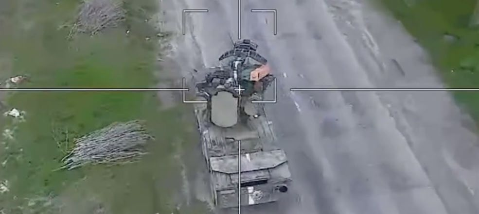
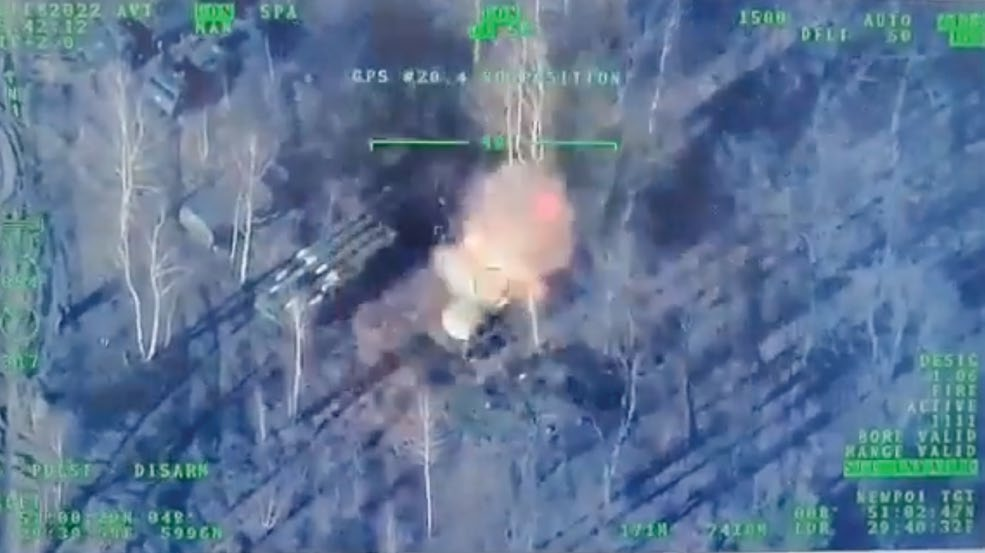

# Grenade Dropping Quadcopters Ua

**Source Document:** `Grenade-Dropping-Quadcopters-UA.pdf`  
**Total Pages:** 13  

---

## --- Page 1 ---

21
MILITARY REVIEW  July-August 2023

Bayraktars and 
Grenade-Dropping 
Quadcopters
How Ukraine and Nagorno-
Karabakh Highlight Present 
Air and Missile Defense 
Shortcomings and the Necessity 
of Unmanned Aircraft Systems

Capt. Josef “Polo” Danczuk, New York Army National Guard
The onboard camera of a Russian Lancet one-way attack unmanned aircraft targets a Ukrainian SA-8 “Gecko” air defense system in April 2023, seconds before the aircraft struck and destroyed the vehicle. (Screenshot from Funker530)The onboard camera of a Russian Lancet one-way attack unmanned aircraft targets a Ukrainian SA-8 “Gecko” air defense system in April 
2023, seconds before the aircraft struck and destroyed the vehicle. (Screenshot from Funker530)

*Caption/Context: 21 MILITARY REVIEW  July-August 2023 | Bayraktars and  Grenade-Dropping  Quadcopters How Ukraine and Nagorno- Karabakh Highlight Present  Air and Missile Defense  Shortcomings and the Necessity  of Unmanned Aircraft Systems*

## --- Page 2 ---

July-August 2023  MILITARY REVIEW
22

#### T

he increased use of unmanned aircraft systems 
(UAS) in modern war is no surprise. Modern 
drones provide outstanding aerial capabilities 
at all echelons, from a frontline infantry soldier using 
a small, commercial quadcopter to surveil enemy posi­
tions, to large UAS equipped with advanced precision 
munitions and the ability to operate beyond line of 
sight from its operator. Necessarily, armed groups seek 
to counter their adversaries’ UAS capabilities by de­
stroying, disabling, or negating them and their effects 
on the battlefield.

While we can look to almost any conflict fought in 
the last decade for important lessons on the use and 
countering of UAS, two of the most recent conflicts

provide numerous 
examples of how 
modern militar­
ies are fighting the 
UAS fight. The 2020 
Nagorno-Karabakh 
war between Armenia 
and Azerbaijan saw 
widespread use of 
UAS but also the 
weaponization of 
information about that 
use. The ongoing war 
in Ukraine reinforces

many observations from Nagorno-Karabakh, but 
it also shows how modern warriors not only would 
prefer to have, but inherently require, UAS at the low­
est echelons. Russian’s full-scale invasion of Ukraine 
reveals how small UAS (sUAS), sometimes purchased 
commercially or even donated through crowdfunding 
campaigns, can provide an offensive capability against 
a larger, technologically capable adversary.

The numerous lessons could likely fill an entire 
journal, so this article focuses on four lessons. First, we 
saw the effective use of one specific UAS platform in 
both conflicts: the Turkish-produced Bayraktar TB-2. 
The TB-2 flew into popular war songs and crowdfund­
ing campaigns as the world watched clip after clip of 
TB-2s effortlessly destroying enemy air defenses, tanks, 
command posts, and supply convoys.1 With its lethal 
effects on the battlefield, the TB-2 and similar UAS will 
undoubtedly be ubiquitous in future conflicts. Second, 
all sides of the conflicts have used UAS in information 
operations. The abilities of UAS on the battlefield have 
captured the public mind, and government information 
outlets have capitalized on that by publishing video feeds 
from their UAS or sharing statistics and footage of their 
forces destroying an enemy’s UAS.

Third, more specifically in Ukraine, military forces 
have acquired drones outside their military procure­
ment channels to equip frontline forces with sUAS to 
execute the tactical fight, often with strategic effects.

Capt. Josef “Polo” 
Danczuk, an air defense 
artillery (ADA) officer, 
is the commander of 
Headquarters and 
Headquarters Company, 
27th Infantry Brigade 
Combat Team, New York 
Army National Guard. He 
is a graduate of the Patriot 
Top Gun and ADA Fire 
Control Officer courses.

The Turkish-made Bayraktar TB-2 armed with lightweight, laser-guided bombs, shown here on 2 November 2014, carried out successful 
attacks by Azerbaijan against Armenian and Artsakh forces in 2020 and by Ukraine against Russian targets in the early stages of that conflict. 
(Photo by Bayhaluk via Wikimedia Commons)The Turkish-made Bayraktar TB-2 armed with lightweight, laser-guided bombs

![he increased use of unmanned aircraft systems  (UAS) in modern war is no surprise. Modern  drones provide outstanding aerial capabilities  at all echelons, from a frontline infantry soldier using  a small, commercial quadcopter to surveil enemy posi­ tions, to large UAS equipped with advanced precision  munitions and the ability to operate beyond line of  sight from its operator. Necessarily, armed groups seek  to counter their adversaries’ UAS capabilities by de­ stroying, disabling, or negating them and their effects  on the battlefield. | many observations from Nagorno-Karabakh, but  it also shows how modern warriors not only would  prefer to have, but inherently require, UAS at the low­ est echelons. Russian’s full-scale invasion of Ukraine  reveals how small UAS (sUAS), sometimes purchased  commercially or even donated through crowdfunding  campaigns, can provide an offensive capability against  a larger, technologically capable adversary.](images/page_002_fig_01.jpeg)
*Caption/Context: he increased use of unmanned aircraft systems  (UAS) in modern war is no surprise. Modern  drones provide outstanding aerial capabilities  at all echelons, from a frontline infantry soldier using  a small, commercial quadcopter to surveil enemy posi­ tions, to large UAS equipped with advanced precision  munitions and the ability to operate beyond line of  sight from its operator. Necessarily, armed groups seek  to counter their adversaries’ UAS capabilities by de­ stroying, disabling, or negating them and their effects  on the battlefield. | many observations from Nagorno-Karabakh, but  it also shows how modern warriors not only would  prefer to have, but inherently require, UAS at the low­ est echelons. Russian’s full-scale invasion of Ukraine  reveals how small UAS (sUAS), sometimes purchased  commercially or even donated through crowdfunding  campaigns, can provide an offensive capability against  a larger, technologically capable adversary.*

## --- Page 3 ---

23
MILITARY REVIEW  July-August 2023

#### UNMANNED AIRCRAFT SYSTEMS

While not a new tactic in war, Ukrainian and Russian 
forces alike have made widespread use of modifying 
commercial sUAS to drop munitions on enemy forces, 
providing their forces with an accurate, immediate­
ly correctable offensive weapon. Fourth, despite the 
widespread use and success of UAS, both conflicts re­
veal how present air defense systems and tactics cur­
rently fail to provide adequate counter-UAS (C-UAS) 
defense against these threats.

These lessons reveal critical shortcomings in the 
United States’ C-UAS—specifically C-sUAS—ca­
pabilities, as well as the lack of organic tactical sUAS 
capabilities, training, and fielding for use by our forces. 
Future conflicts, regardless of the adversary, will 
inevitably require U.S. forces and our allies to protect 
against enemy UAS. As the conflicts show, any viable 
C-UAS program requires widespread air defense and 
force protection capabilities at all echelons, not just 
one short-range air defense (SHORAD) battalion per 
Army division that rarely, if ever, train together. It 
will require novel C-sUAS capabilities and tactics in 
addition to traditional SHORAD and C-UAS defense. 
And, just as important as negating an adversary’s UAS

is providing the benefits of such UAS to friendly forces 
at all echelons and for all types of units.

Bayraktars in Nagorno-Karabakh 
and Ukraine

For decades, the United States and other techno­
logically advanced militaries were the only ones with 
the technical expertise and money to put unmanned 
aircraft in the sky. However, as both military-designed 
and commercial drones become cheaper, more plenti­
ful, and easier to operate, they will continue to prolif­
erate to militaries and armed groups around the world, 
bringing their deadly capabilities with them.2

Take the Azeri’s Bayraktar TB-2s. When Azerbaijan 
launched its offensive against Armenian and Artsakh 
forces in 2020, it made effective use of the TB-2s. It 
destroyed Armenian air defenses, tanks, battle posi­
tions, and much more, thereby enabling ground forces 
to maneuver effectively against Armenian forces and 
rapidly advance through the territory of Nagorno-
Karabakh.3 Armored assets in fortified battle positions 
with cover and concealment as well as air defense sys­
tems actively searching for air tracks were not safe from

Ukrainian soldiers watch drone feeds from an underground command center in Bakhmut, Donetsk region, Ukraine, 25 December 2022. 
The Ukrainian government minister in charge of technology says his country has bought some 1,400 drones, mostly for reconnaissance, and 
is now developing air-to-air combat drones that can attack the drones Russia is using against Ukrainians. (Photo by Libkos, Associated Press)
Ukrainian soldiers watch drone feeds from an underground command center in Bakhmut, Donetsk region

*Caption/Context: UNMANNED AIRCRAFT SYSTEMS | While not a new tactic in war, Ukrainian and Russian  forces alike have made widespread use of modifying  commercial sUAS to drop munitions on enemy forces,  providing their forces with an accurate, immediate­ ly correctable offensive weapon. Fourth, despite the  widespread use and success of UAS, both conflicts re­ veal how present air defense systems and tactics cur­ rently fail to provide adequate counter-UAS (C-UAS)  defense against these threats.*

## --- Page 4 ---

July-August 2023  MILITARY REVIEW
24

Azeri TB-2s.4 Yet, Azerbaijan had only just acquired 
the TB-2 a few months prior to the war. The govern­
ment announced the acquisition in June 2020 and 
were employing them on the battlefield by November 
2020.5 Similarly, Ukraine received its first TB-2s in July 
2021 and used them for its first kinetic strike in the 
Donbas region against militants of the Donetsk People’s 
Republic on 26 October, just three months later.6 
Ukraine’s acquisition and use of such an advanced UAS 
was a potential impetus, or at least a purported one, for 
Russian President Vladimir Putin’s decision to begin 
building up forces along the Ukrainian border before 
the full-scale invasion on 24 February 2022.7

Both Azerbaijan and Ukraine were able to ac­
quire, field, and employ the TB-2 in just a few 
months. While both militaries are relatively modern 
and well-equipped, they are not what the United 
States would typically consider near-peer or a 
comparable conventional adversary. This shows how 
easily modern militaries can acquire, train on, and 
effectively deploy a UAS comparable to the TB-
2’s capabilities. While such systems are surely not 
impervious to current air defenses, video feeds from 
both conflicts show a startling ability to fly directly

above enemy air defenses unthreatened, targeting 
and destroying them instead.

UAS like the TB-2, which are larger and require 
more logistical and communications support to op­
erate, are classified as Group 4 or 5 UAS.8 They often 
provide an organic kinetic strike capability in addition 
to reconnaissance, intelligence, surveillance, and target 
acquisition (RISTA). As a result of real-time informa­
tion sharing, these UAS can also perform immediate 
battle damage assessment (BDA) and provide data for 
prompt correction of artillery or other fires on a target, 
as Azerbaijan and Ukraine have done.9

The proliferation of Group 4 and 5 UAS will give 
many militaries and armed groups the abilities that 
Ukraine and Azerbaijan employed to great effect. The 
TB-2 has already seen use in various African states, 
and worldwide sales show no signs of slowing down.10 
United States and allied ground forces and their lead­
ers should expect any adversary to effectively employ 
such UAS against them. Even if a potential adver­
sary does not possess such UAS now, Ukraine and 
Azerbaijan’s rapid acquisition and deployment of the 
TB-2 demonstrate that any modern military can, and 
likely will, acquire Group 4 and 5 UAS and use them

A Ukrainian serviceman attaches a hand grenade to a drone to use in an attack against Russian targets near Bakhmut in the Donbas region 
of Ukraine on 15 March 2023. (Photo by Aris Messinis, Agence France-Presse)A Ukrainian serviceman attaches a hand grenade to a drone to use in an attack against Russian targets near Bakhmut

![Azeri TB-2s.4 Yet, Azerbaijan had only just acquired  the TB-2 a few months prior to the war. The govern­ ment announced the acquisition in June 2020 and  were employing them on the battlefield by November  2020.5 Similarly, Ukraine received its first TB-2s in July  2021 and used them for its first kinetic strike in the  Donbas region against militants of the Donetsk People’s  Republic on 26 October, just three months later.6  Ukraine’s acquisition and use of such an advanced UAS  was a potential impetus, or at least a purported one, for  Russian President Vladimir Putin’s decision to begin  building up forces along the Ukrainian border before  the full-scale invasion on 24 February 2022.7 | above enemy air defenses unthreatened, targeting  and destroying them instead.](images/page_004_fig_01.jpeg)
*Caption/Context: Azeri TB-2s.4 Yet, Azerbaijan had only just acquired  the TB-2 a few months prior to the war. The govern­ ment announced the acquisition in June 2020 and  were employing them on the battlefield by November  2020.5 Similarly, Ukraine received its first TB-2s in July  2021 and used them for its first kinetic strike in the  Donbas region against militants of the Donetsk People’s  Republic on 26 October, just three months later.6  Ukraine’s acquisition and use of such an advanced UAS  was a potential impetus, or at least a purported one, for  Russian President Vladimir Putin’s decision to begin  building up forces along the Ukrainian border before  the full-scale invasion on 24 February 2022.7 | above enemy air defenses unthreatened, targeting  and destroying them instead.*

## --- Page 5 ---

25
MILITARY REVIEW  July-August 2023

#### UNMANNED AIRCRAFT SYSTEMS

to great effect, often sidestepping current air defense 
platforms. Such UAS may even soon become a C-UAS 
weapon in its own right.11

#### UAS in the Information Fight

As critical as the TB-2 and other UAS were to 
the parties of both conflicts on the battlefield, they 
were also a major factor in the information wars. 
Government media outlets shared drone feed footage 
of their UAS striking or surveilling enemy forces. In 
the face of such public fascination with the purport­
ed successful employment of UAS, the opposite side 
would often attempt to discredit such reports, usually 
by sharing footage or reports of shooting down UAS. 
Both conflicts clearly show how important UAS have 
become in the information domain, as the public 
perceives successful UAS use as crucial to battlefield 
success.

In Nagorno-Karabakh, Azerbaijan published 
numerous clips of its TB-2 feeds and its Israeli-made 
Harpy drones, which are one-way loitering attack 
UAS that fly into their targets to destroy them.12 These 
clips showed the destruction of Armenian vehicles, 
artillery, troop positions, and more. Azeri government

outlets shared these clips on social media sites like 
Twitter directly on the official ministry of defense 
page for the world to access and view. Third-party sites 
like Funker530, a combat footage website, and other 
social media users and platforms reshared these clips, 
increasing worldwide viewership.13 Fascination with 
the Azeri’s use of UAS presented an image that the 
Azeri military was highly successful and effective on 
the battlefield. The government’s goal was clearly to 
paint a picture of battlefield success to ensure domes­
tic support and international awe at the military’s 
effectiveness.

The Armenian government sought to counter this 
information, especially as the forces of their military 
and that of their ally, Artsakh, lost territory during 
the conflict. As domestic turbulence grew in light of 
Armenia’s losses, the government published its own 
footage showing an air defense intercept and destruc­
tion of an Azeri UAS, a modified AN-2 Colt. Armenia 
shared this footage on its Twitter page as well, likely 
hoping for high viewability just as Azerbaijan was 
able to garner with its drone footage.14 Government 
accounts also tweeted photos purporting to show 
debris from Azeri TB-2s after being shot down.

A video feed from a Ukrainian TB-2 shows it guiding a missile onto a Russian Buk M-3 air defense system outside Kyiv on 28 February 2022. 
The missile struck and destroyed the Buk system. (Screenshot courtesy of the Ministry of Defence of Ukraine via Twitter)
A video feed from a Ukrainian TB-2 shows it guiding a missile onto a Russian Buk M-3 air defense system outside Kyiv

*Caption/Context: UNMANNED AIRCRAFT SYSTEMS | to great effect, often sidestepping current air defense  platforms. Such UAS may even soon become a C-UAS  weapon in its own right.11*

## --- Page 6 ---

July-August 2023  MILITARY REVIEW
26

While Azerbaijan’s injection of UAS footage dwarfed 
Armenia’s C-UAS information operations, it was still 
an interesting development. That Armenia felt the 
need to respond to the effects of Azerbaijan’s drone 
information operations illustrates how important and 
effective they can be. The 2020 Nagorno-Karabakh 
conflict ushered in a new technique of state-sponsored

UAS-related information operations that Russia and 
Ukraine have exploited.

Ukraine’s government outlets also quickly pub­
lished TB-2 recordings on official government chan­
nels such as the messaging application Telegram. They 
included strikes on the Russian backed-up convoy 
outside Kyiv, thwarting Russia’s attempt to topple the 
capital.15 These clips have also featured in Ukraine’s 
recent counteroffensives such as showing the de­
struction of air defenses and boats on the strategically 
and symbolically important key terrain of Zmiinyi 
(Snake) Island, which forced Russia to withdraw 
on 30 June 2022.16 Just like in Nagorno-Karabakh, 
third-party sites republished these clips, increasing 
viewership and global fascination. The TB-2 became 
so famous that Ukrainian fighters wrote songs and 
shared videos of them dancing along.17

And just as Armenia sought to counter this infor­
mation effect, Russia shared stories of shooting down 
TB-2s. They even went so far as to stage a fake air 
defense kill of a TB-2, all to appear to be successfully 
countering Ukraine’s UAS employment.18 Ukrainian 
government sites have also touted their own C-UAS 
capabilities, sharing videos of shooting down Russian 
UAS, posing with downed UAS, and sharing destroyed 
UAS counts in their daily briefings.19 While all sides 
oftentimes inflate such counts and reports in a con­
flict, the fact that they are so central and oft-reported 
reveals how important the conflict parties view them in 
their information operations.

In future conflicts, the United States should expect 
that the success of UAS and C-UAS employment, 
whether real or purported, will be an increasingly 
important aspect of information operations. Successful 
UAS employment is therefore significant not only 
for the effects they bring to the tactical battlefield but 
also on mobile devices and social media platforms.

The public is increasingly fascinated with unmanned 
operations in conflict and associate UAS/C-UAS 
success with success in the overall war effort. This will 
apply to information consumers domestically, in allied 
nations, in a potential adversary’s nation, and world­
wide.20 Finally, as unmanned ground and naval vehicles 
become increasingly capable and autonomous, there is 
little reason not to expect those platforms to impact the 
information domain as armed groups and state militar­
ies begin employing them in combat.

Group 1–3 sUAS in Ukraine

While the Nagorno-Karabakh conflict lasted six 
weeks, the full-scale Russian invasion of Ukraine 
has continued for a year and a half. Further, the war 
in Ukraine has resulted in mass mobilization with­
in Ukraine, resulting in hastily organized units such 
as the Territorial Defense Force and the Ukrainian 
International Legion for foreign volunteers.21 As the 
war continued, both the newly organized units and 
firmly established units began employing smaller, 
cheaper, Group 1–3 sUAS extensively.

Ukrainian forces (and, to a lesser extent, at least 
in Western media, Russian forces) have purchased or 
received donations of commercial drones for their use. 
While not as large, capable, or long-range as standard 
military designed UAS, these drones can still provide 
an essential RISTA and BDA capability. Frontline per­
sonnel, such as at the platoon or squad level, can em­
ploy their own UAS rather than relying on UAS held as

In future conflicts, the United States should expect that 
the success of UAS [unmanned aircraft systems] and 
C-UAS [counter UAS] employment, whether real or 
purported, will be an increasingly important aspect of 
information operations.

## --- Page 7 ---

27
MILITARY REVIEW  July-August 2023

#### UNMANNED AIRCRAFT SYSTEMS

intelligence assets at the battalion-or-above level. This 
permits them and their leaders to see the battlefield 
in real time, make immediate adjustments, and better 
avoid ambushes or prepared enemy positions.22

Video footage from Ukraine also shows that 
Ukrainian forces modified such Group 1–3 sUAS to 
carry and drop munitions—often antitank rounds,

grenades, or mortar rounds—onto enemy positions, 
vehicles, and personnel.23 This is far from the first time 
we have seen commercial drones fitted to carry and 
drop such munitions; in Syria, militant groups like 
the Islamic State pioneered this technique as early 
as 2015.24 However, Ukrainian forces appear to use 
them in large numbers and outside of formal military 
acquisition and development channels. Their effective­
ness can be seen plainly in the published video footage. 
Furthermore, Ukraine has acquired purpose-built 
munitions-dropping sUAS. A Taiwanese-based pro­
ducer, DronesVision, sent eight hundred purpose-built 
munitions-dropping UAS to Ukraine via Poland. The 
Revolver 860 system can carry eight 60 mm mortars to 
drop directly onto targets below.25

Whether purely commercial sUAS conducting 
surveillance, jerry-rigged commercial drones carrying 
whatever munitions available, or purpose-built muni­
tions-dropping sUAS, the United States must expect 
to face an ever-increasing quantity and variety of 
Group 1–3 sUAS on today’s battlefield, no matter the 
adversary.26 Ukraine’s rapid acquisition, proliferation, 
and employment of commercial sUAS shows that any 
potential adversary can exploit current technology 
similarly. Taiwan’s Revolver 860 UAS is an example 
of one of the first, but certainly not the last, of a small 
munitions carrying UAS.

These Group 1–3 sUAS have such a low radar 
cross-section that they can avoid detection by most 
modern U.S. Army air and missile defense (AMD)

radars and are usually too small to counter with 
current U.S. Army SHORAD systems like the FIM-
92 Stinger missile, whether fired in a Man-Portable 
Air Defense System (MANPADS) configuration or 
from the legacy Avenger or new Maneuver-SHORAD 
(M-SHORAD) platforms. While the United States has 
developed and acquired a litany of C-sUAS systems

(e.g., Fixed Site-Low, Slow, Small Unmanned Aerial 
Vehicle Integrated Defeat System [FS-LIDS]; Mobile 
Low, Vehicle Integrated Defense System [M-LIDS]; 
and Mobile Air Defense Integrated System [MADIS]), 
they are not currently fielded to trained personnel 
across the force, especially our maneuver forces, in 
sufficient numbers to counter this exponentially grow­
ing threat. There is also an immediate need for highly 
mobile C-sUAS systems to accompany friendly forces 
that must remain agile to avoid detection and target­
ing by those same sUAS and other enemy collection 
techniques. If Ukraine and Russia are rushing “drone 
busters” to their forces, why aren’t we?

Providing Friendly sUAS 
Capabilities in the Tactical Fight

The lessons of Ukraine and Nagorno-Karabakh are 
not limited to C-UAS. They also reveal the necessity 
of all tactical units having a sUAS RISTA capability. 
In Ukraine, sUAS have become so essential to the 
battlefield that Ukrainian forces have sent sUAS on 
sUAS-recovery missions behind enemy lines—a drone 
rescuing a drone.27 Maneuver platoons can employ 
sUAS to surveil an objective before occupying, con­
ducting movement, or attacking. RISTA/BDA sUAS 
are clearly essential for correcting indirect fire of all 
types, whether used by forward observers or any front­
line soldier.

sUAS benefits should not be limited to maneu­
ver units only, however. The ability for real-time,

sUAS [small UAS] have such a low radar cross-section 
that they can avoid detection by most modern U.S. 
Army air and missile defense radars and are usually 
too small to counter with current U.S. Army SHORAD 
[short-range air defense] systems.

## --- Page 8 ---

July-August 2023  MILITARY REVIEW
28

A Ukrainian soldier controls a drone as its camera shows Russian troop positions during heavy fighting at the front line in Severodonetsk, 
Luhansk region, Ukraine, 8 June 2022. (Photo by Oleksandr Ratushniak, Associated Press)
A Ukrainian soldier controls a drone as its camera shows Russian troop positions during heavy fighting at the front line in Severodonetsk, Luhansk region, Ukraine

on-demand aerial reconnaissance or surveillance 
is essential for all units. For example, a battery—
whether air defense or field artillery—conducting a 
Reconnaissance, Selection, and Occupation of Position 
performs a ground reconnaissance of a potential 
new site and the routes there.28 A sUAS would allow 
them to add a real-time air reconnaissance capability, 
protecting the ground element until they have sur­
veilled the site and route. Any unit—logistics, medical, 
engineer, etc.—conducting a road march or occupying 
a new position can use a Group 1–3 sUAS to conduct 
an air reconnaissance of the route ahead of them, doing 
so even as they move. A sUAS RISTA capability at 
echelons lower than brigade combat teams will also re­
duce the number of priority intelligence requirements 
submitted to higher headquarters, thereby freeing up 
brigade-and-above intelligence assets.

Equipping units with Group 1–3 sUAS—ideally 
government-developed but, if necessary, commercial 
off-the-shelf as Ukraine has done—will also benefit the 
defense of fixed sites from ground attack. This includes 
command posts at all echelons, forward arming and re­
fueling points, tactical assembly areas, communications

relay sites, and many more. sUAS can monitor the site 
perimeter, entry control points, and routes in and out 
of the area with a live feed direct to the element tasked 
with site security or the local command post.

Of course, the internal proliferation of sUAS would 
necessitate training in discretion; if I fly a small quad­
copter over the brigade command post twenty-four 
hours a day, it will be quite easy for an enemy force to 
determine where we are and target us, both visually 
and based on electromagnetic emissions. But the ben­
efits of having the capability of a sUAS for monitoring 
relatively fixed sites and conducting reconnaissance of 
new sites and routes, employed with proper discretion, 
far outweigh the risks, especially since the adversary is 
very likely to be using comparable sUAS to try to find 
our positions anyway. If Ukraine and Russia are rush­
ing Group 1–3 sUAS to their forces, why aren’t we?

Current AMD and C-sUAS 
Shortcomings

Both Nagorno-Karabakh and Ukraine show the 
inability of current AMD systems to defend friendly 
forces against new UAS like the Bayraktar TB-2 and

![on-demand aerial reconnaissance or surveillance  is essential for all units. For example, a battery— whether air defense or field artillery—conducting a  Reconnaissance, Selection, and Occupation of Position  performs a ground reconnaissance of a potential  new site and the routes there.28 A sUAS would allow  them to add a real-time air reconnaissance capability,  protecting the ground element until they have sur­ veilled the site and route. Any unit—logistics, medical,  engineer, etc.—conducting a road march or occupying  a new position can use a Group 1–3 sUAS to conduct  an air reconnaissance of the route ahead of them, doing  so even as they move. A sUAS RISTA capability at  echelons lower than brigade combat teams will also re­ duce the number of priority intelligence requirements  submitted to higher headquarters, thereby freeing up  brigade-and-above intelligence assets. | relay sites, and many more. sUAS can monitor the site  perimeter, entry control points, and routes in and out  of the area with a live feed direct to the element tasked  with site security or the local command post.](images/page_008_fig_01.jpeg)
*Caption/Context: on-demand aerial reconnaissance or surveillance  is essential for all units. For example, a battery— whether air defense or field artillery—conducting a  Reconnaissance, Selection, and Occupation of Position  performs a ground reconnaissance of a potential  new site and the routes there.28 A sUAS would allow  them to add a real-time air reconnaissance capability,  protecting the ground element until they have sur­ veilled the site and route. Any unit—logistics, medical,  engineer, etc.—conducting a road march or occupying  a new position can use a Group 1–3 sUAS to conduct  an air reconnaissance of the route ahead of them, doing  so even as they move. A sUAS RISTA capability at  echelons lower than brigade combat teams will also re­ duce the number of priority intelligence requirements  submitted to higher headquarters, thereby freeing up  brigade-and-above intelligence assets. | relay sites, and many more. sUAS can monitor the site  perimeter, entry control points, and routes in and out  of the area with a live feed direct to the element tasked  with site security or the local command post.*

## --- Page 9 ---

29
MILITARY REVIEW  July-August 2023

#### UNMANNED AIRCRAFT SYSTEMS

Group 1–3 commercial sUAS adapted for military 
use. A number of videos released by both Azerbaijan 
and Ukraine during their respective conflicts show 
the TB-2 striking Soviet-era AMD platforms, still 
in use by a number of countries—including NATO 
countries—like the SA-8 “Gecko” or the Buk M-1/2 
(SA-17 “Grizzly”), and others.29 Russia also recently 
shared video of a Lancet one-way attack UAS striking 
and destroying an American-made Avenger system.30 
Ukraine and Russia’s use of commercial Group 1–3 
sUAS demonstrates the requirement for a vast expan­
sion in C-sUAS coverage, and combatants there have 
scrambled to rapidly equip their forces with C-sUAS 
weapons.31 Even if current AMD platforms could ade­
quately intercept such sUAS (which they cannot), their 
high quantity, cheapness, ease of use, and proliferation 
among tactical-level units means modern militaries 
need a C-sUAS capability interspersed throughout 
their forces. From a warfighting function perspective, 
this is both a fires and a protection issue.32

What does this mean for air defense and protection 
against sUAS? First, there is little doubt that modern 
militaries will require more air defense. As Group 4 
and 5 UAS like the TB-2 increase in quantity and capa­
bility, militaries will need more C-UAS AMD systems 
to deny those systems airspace and, ideally, intercept 
and destroy them. AMD and the fires warfighting 
function, including incorporating nonlethal fires via 
electronic warfare capabilities, are best suited to count­
er Group 4 and 5 UAS. Indeed, Russia has reportedly 
vastly improved its ability to counter Ukraine’s TB-2s, 
incorporating electronic warfare capabilities alongside 
traditional air defense systems to relegate the TB-2s 
to reconnaissance duties safely away from potential 
intercept.33

Second, there is also an urgent need for a robust 
C-sUAS capability that can detect, identify, respond to 
(including engagement), and report the enemy sUAS, 
with the aim of negating the effects of the enemy’s 
sUAS.34 The current radars and weapon systems that 
most militaries, including the United States, rely upon 
were designed and maintained with a counter-aircraft 
mission, adept at detecting and destroying fighters, 
bombers, and helicopters, not small, slow UAS. While 
the United States and other modern militaries possess 
capable C-sUAS systems such as M-LIDS and various 
“drone buster” guns, these systems must be available

organically—not as a just-before-deployment attach­
ment or fielding—for maneuver and support units 
alike. Just as all units can receive and deploy with 
antiarmor systems like the AT-4, or formerly deployed 
to Iraq and Afghanistan with counter-improvised 
explosive device systems, all units require a short-range 
C-sUAS capability to at least defend against Group 
1–3.35 Most importantly, they need this capability now. 
The next fight, whoever it is against, will see wide­
spread use of sUAS by our adversary.

Third, units must train with UAS, including Group 
1–3, in mind. Tactics thought to be left to the history 
books—air guards, react-to-air attack, using small arms 
to fire at aircraft—need to return and adapt to the 
C-UAS fight.36 Even if units cannot train with an air 
defense unit directly, trainers can provide their oppos­
ing forces with sUAS to conduct RISTA operations 
against the training audience. They can even rig them 
to drop foam Nerf footballs or tennis balls to mimic 
current battlefield tactics. And while these changes 
will come at a financial cost, they cannot exist solely 
at combat training centers.37 Adversary UAS need to 
be incorporated into regular field training exercises, 
combined live-fire exercises, command post exercises, 
convoy training, small-unit training, and more.

The question quickly arises: How best to address 
these shortcomings? There are a variety of options 
available to policymakers and planners. The Army’s 
current approach to counter armored threats provides 
a possible framework with multiple options. Ground 
forces could field C-sUAS weapons systems directly to 
lower-echelon units, just as we currently do with AT-4s 
and did for counter-improvised explosive devices in 
Iraq and Afghanistan. After Russia’s illegal annex­
ation of Crimea and support for separatists in eastern 
Ukraine in 2014, the Army began the Additional Skill 
Identifier A5 program, training infantry soldiers on the 
Stinger platform. One option is to expand this program 
or make such training standard, just like AT-4s, or sup­
plement the current Additional Skill Identifier A5 pro­
gram with additional C-UAS training and equipment.

There is also an option to add a separate SHORAD/
C-sUAS element to units organically. This would 
prevent haggling over command and support relation­
ships and reduce demand for AMD/C-sUAS resources 
when, as is the current doctrine, U.S. SHORAD bat­
talions are “potentially” distributed to Army divisions,

## --- Page 10 ---

July-August 2023  MILITARY REVIEW
30

not organically a part of the maneuver units.38 An 
element organic to maneuver units could be a new type 
of SHORAD battery, minimally reliant on integration 
with other air defense sensors and shooters, in each 
brigade combat team, perhaps within the brigade engi­
neer battalion. This battery might consist of a platoon 
of sensors, a C-sUAS platoon with electronic warfare 
weapons systems to counter Group 1–3, and a typi­
cal SHORAD platoon with weapons like the Stinger 
missile in MANPADS configuration to counter aircraft 
and Group 4 and 5 UAS.

Or, again looking to the example of antiarmor 
capabilities within maneuver units, every maneuver 
battalion could include a platoon within the bat­
talion headquarters and headquarters company or 
weapons company dedicated to C-UAS, perhaps with 
two squads for C-sUAS and one squad of tradition­
al SHORAD. After many decades of risk-averse air 
defense, the increased risk of decentralized air defense 
shooters is necessary in this emerging world of UAS. 
The Army could look to how Air Force tactical air 
control parties, embedded in Army maneuver forces, 
receive a tactical air picture as inspiration for how to 
integrate the necessary SHORAD/C-UAS capabilities 
in maneuver forces into the joint AMD fight. Whether 
this hypothetical C-UAS element resides organically at 
the battalion, brigade, or division level, with or without 
a C-UAS weapons system fielded directly to frontline 
personnel, or a mix of all of these, the key takeaway is 
that maneuver units need C-UAS organically and in 
adequate numbers to defend their battlespace indepen­
dent of external support. Better minds can determine 
the precise form of the solution—the immediate need, 
however, is all too apparent.

Whatever the solutions, a few principles are evident, 
principles that the Joint Counter-Small Unmanned 
Aircraft Systems Office may consider in their strate­
gies, particularly when updating the Department of 
Defense C-sUAS strategy that has not been updated 
since January 2021 despite the stream of lessons from

Nagorno-Karabakh and Ukraine.39 As mentioned, we 
need more air defense force protection assets, better 
equipped for C-UAS and specifically C-sUAS, dis­
persed to the lowest level, organic to maneuver and 
nonmaneuver units alike, and with more integrated 
and accountable training. The large-scale drone fight 
is already here; our ground forces need the equipment, 
knowledge, and training to counter and survive it.

Conclusion

The wars of Nagorno-Karabakh and Ukraine 
show us the present and the future of UAS warfare. 
Whether it is the employment of Group 4 and 5 UAS 
like the TB-2 Bayraktar or ingeniously adapting and 
rigging commercial off-the-shelf sUAS for RISTA and 
offensive capabilities, the wars show that any potential 
adversary, and the United States itself, can and should 
rapidly acquire and employ such UAS. These drones 
have reshaped the battlefield, reshaped the information 
fight, and obviated or revealed gaps in older air defense 
systems. It has ushered in new urgency to a latent 
shortcoming in the U.S. Army and Department of 
Defense-wide—its C-UAS capability.40

Just as the United States and allied ground forces 
should seek to distribute the benefits of small RISTA 
UAS to all units at low-level echelons, they must also 
rapidly add, improve, and integrate C-UAS force pro­
tection capabilities with all units down to the tacti­
cal-unit level. Failure to do so before the next conflict, 
whomever it may be against, will lead to public embar­
rassment in the information domain, tactical losses of 
materiel and personnel, and lost opportunities in the 
offense. Domination of the skies will not just depend on 
advanced fifth-generation aircraft—it will require the 
Group 1–3 quadcopters and C-sUAS weapons we are 
seeing proven on the battlefield every day in Nagorno-
Karabakh and Ukraine.

Special thanks to Capt. Nathan “Coastal” Jackson for 
his insightful thoughts and observations.

Notes

1. Mark Krutov, “‘Show What You Can Do!’ Lithu­
anian Citizens Raise $6 Million to Buy an Attack Drone 
for Ukraine,” Radio Free Europe/Radio Liberty, 1 June 
2022, accessed 10 May 2023, https://www.rferl.org/a/

ukraine-lithuaian-bayraktar-crowdfunding/31878797.html; 
Сухопутні війська України [Land force of Ukraine], “Кара за 
українських дітей; грузинів, сирийців, чеченців; та кримських 
татар – Bayraktar” [Punishment for Ukrainian children; Georgians,

## --- Page 11 ---

31
MILITARY REVIEW  July-August 2023

#### UNMANNED AIRCRAFT SYSTEMS

Syrians, Chechens; and Crimean Tatars – Bayraktar], Instagram 
video, 28 February 2022, accessed 27 April 2023, https://www.
instagram.com/tv/CaiTrp_DMX5/?igshid=YmMyMTA2M2Y=.

2. Michael C. Horowitz, Sarah E. Kreps, and Matthew Fuhrmann, 
“Separating Fact from Fiction in the Debate over Drone Prolifera­
tion,” International Security 41, no. 2 (Fall 2016): 11–12, accessed 27 
April 2023, https://www.jstor.org/stable/24916748; Andrea Gilli, 
Drone Warfare: An Evolution in Military Affairs, NDC Policy Brief No. 
17 (Rome: NATO Defense College, October 2022), 1.
3. Edward J. Erickson, “How Do We Explain Victory? The 
Karabakh Campaign of 2020,” in The Nagorno-Karabakh Conflict: 
Historical and Political Perspectives, ed. M. Hakan Yavuz and Mi­
chael M. Gunter (New York: Routledge, 2023), 236–41; Gilli, Drone 
Warfare, 3.

4. For a thorough analysis of unmanned aircraft system (UAS) 
in Nagorno-Karabakh and important predictions for the war in 
Ukraine, see John Antal, 7 Seconds to Die: A Military Analysis of 
the Second Nagorno-Karabakh War and the Future of Warfighting 
(Philadelphia: Casemate, 2022).

5. Burak Ege Bekdil, “Azerbaijan to Buy Armed Drones 
from Turkey,” Defense News, 25 June 2020, accessed 27 April 
2023, https://www.defensenews.com/unmanned/2020/06/25/
azerbaijan-to-buy-armed-drones-from-turkey/.

6. For Ukraine’s acquisition of the TB-2, see “Ukrainian Military 
Gets First Turkish Bayraktar UAV Complex,” Ukrinform, 15 July 
2021, accessed 27 April 2023, https://www.ukrinform.net/rubric-
defense/3281272-ukrainian-military-gets-first-turkish-bayraktar-
uav-complex.html; Tayfun Ozberk, “Turkey Delivers First Armed 
Drone to Ukrainian Navy, Much to Russia’s Ire,” Defense News, 
26 July 2021, accessed 27 April 2023, https://www.defensenews.
com/unmanned/2021/07/26/turkey-delivers-first-armed-drone-
to-ukraine-much-to-russias-ire/. On Ukraine’s first use of the TB-2, 
see Генеральний штаб ЗСУ [General Staff of the Armed Forces 
of Ukraine], “From 14:25 to 15:15, a battery of howitzers D-30 of 
the Russian terrorist forces fired on the positions of the joint forces 
in the area of ​the settlement of Hranitne,” Facebook video, 26 
October 2021, accessed 27 April 2023, https://www.facebook.com/
watch/?v=467614907881638; “Ukraine Uses Turkish Drone against 
Russia-Backed Separatists for First Time,” Radio Free Europe/Radio 
Liberty, 27 October 2021, accessed 27 April 2023, https://www.
rferl.org/a/ukraine-turkish-drone-separatists/31532268.html.

7. Andrew E. Kramer, “How a Dispute over Groceries Led 
to Artillery Strikes in Ukraine,” New York Times (website), 15 
November 2021, accessed 27 April 2023, https://www.nytimes.
com/2021/11/15/world/europe/ukraine-russia-war-putin.html. The 
article notes that, in the lead-up to the full-scale invasion to come 
on 24 February 2022, “Mr. Putin has twice in the past week pointed 
to the drone attack [the first Ukrainian TB-2 strike] as a Ukrainian 
escalation, justifying a potential Russian response.” Regarding the 
build-up of troops that would later launch the full-scale invasion: 
“Asked on Saturday about accusations from Washington that Russia 
was massing troops on the Ukraine border, Mr. Putin responded by 
criticizing the United States for supporting the drone strike.”

8. Army Techniques Publication (ATP) 3-01.81, Counter-Un­
manned Aircraft Systems Techniques (Washington, DC: U.S. Govern­
ment Publishing Office [GPO], April 2016), para. 1-9–1-10, fig. 1-1.

9. Ibid., para. 1-9.
10. Stijn Mitzer, “Drone Warfare Turns Hot over Ethiopia’s 
Oromia Region,” Oryx, 17 January 2022, accessed 27 April 2023, 
https://www.oryxspioenkop.com/2022/01/drone-warfare-turns-hot-
over-ethiopias.html. It’s difficult to count how many nations operate,

or have signed contracts to purchase, the TB-2, given how often the 
list grows. The number at the time of publication is at least nineteen. 
Stijn Mitzer and Joost Oliemans, “An International Export Success: 
Global Demand for Bayraktar Drones Reaches All Time High,” Oryx, 
2 September 2022, accessed 27 April 2023, https://www.oryxspi­
oenkop.com/2021/09/an-international-export-success-global.html; 
Tony Osborne, “Poland Takes Delivery of Bayraktar TB2 Drones,” 
Aviation Week, 1 November 2022, accessed 27 April 2023, https://
aviationweek.com/defense-space/aircraft-propulsion/poland-takes-
delivery-bayraktar-tb2-drones; “Turkey’s Baykar to Deliver Drones 
to Kuwait in $370 Million Deal,” Reuters, 18 January 2023, accessed 
27 April 2023, https://www.reuters.com/world/middle-east/turkeys-
baykar-deliver-drones-kuwait-370-million-deal-2023-01-18/. Selçuk 
Baykar, Baykar’s chairman of the board and chief technology officer, 
has declared: “The whole world is a customer.” Nailia Bagirova, 
“Exclusive: After Ukraine, ‘Whole World’ Is a Customer for Turkish 
Drone, Maker Says,” Reuters, 30 May 2022, accessed 27 April 2023, 
https://www.reuters.com/business/aerospace-defense/exclusive-
after-ukraine-whole-world-is-customer-turkish-drone-maker-
says-2022-05-30/.

11. “Turkish Drone Company Baykar to Develop Air-to-Air 
Missiles to Counter Kamikaze Drone Attacks in Ukraine,” Kyiv 
Independent (website), 30 October 2022, accessed 27 April 2023, 
https://kyivindependent.com/news-feed/turkish-drone-company-
baykar-to-develop-air-to-air-missiles-to-counter-kamikaze-drone-
attacks-in-ukraine.

12. A note on citations to clips of drone footage. First, many 
of the clips depict war footage, at times graphically, so viewer dis­
cretion is advised. Second, the citations in this article are merely to 
provide a reference to one or two examples of each development 
discussed in this piece. Anyone can simply search on the internet for 
“Ukraine grenade-dropping drone,” or any similar search, and find 
hundreds of related videos, which further substantiates the points 
made in this article. As one of many examples, see an Azeri Ministry 
of Defense tweet with TB-2 feed footage: Azerbaijan Ministry of 
Defense (@wwwmodgovaz), “#Azerbaijan Army destroyed #OPs of 
armed forces of #Armenia located in Azerbaijan territory,” Twitter, 
9 October 2020, 12:40 a.m., accessed 27 April 2023, https://twitter.
com/wwwmodgovaz/status/1314440465920528385.

13. “Azerbaijani Kamikaze Drones Are Crushing Armenian 
Military Targets,” Funker530, 2 December 2020, accessed 27 
April 2023, https://funker530.com/video/azerbaijani-kamika­
ze-drones-armenian/. This is collecting and reposting a series of 
videos originally released by Azerbaijan government outlets.

14. Ministry of Defense of Armenia (@ArmeniaMODTeam), 
“Destruction of an #Azerbaijan’i drone,” Twitter, 1 October 2020, 
12:08 p.m., accessed 27 April 2023, https://mobile.twitter.com/
ArmeniaMODTeam/status/1311699432132546564; “Karabakh Air 
Defense Shoots Down Another Turkey-Made Bayraktar Drone of 
Azerbaijan,” News.am, 8 November 2020, accessed 27 April 2023, 
https://news.am/eng/news/612134.html.

15. Defense of Ukraine (@DefenceU), “Знищення з БПЛА 
‘Bayraktar TB2’ російського ЗРК ‘Бук’ біля с. Іванків Київської 
області. Все буде Україна!” [Destruction of the Russian “Buk” air 
defense system from the “Bayraktar TB2” UAV near the village 
of Ivankiv, Kyiv region. Everything will be Ukraine!], Twitter, 28 
February 2022, 10:47 a.m., accessed 27 April 2023, https://twitter.
com/DefenceU/status/1498324064527691777.

16. Defense of Ukraine (@DefenceU), “Ukrainian Bayraktar 
TB2 destroyed another Russian ship. This time the landing craft 
of the ‘Serna’ project. The traditional parade of the Russian Black

## --- Page 12 ---

July-August 2023  MILITARY REVIEW
32

Sea fleet on May 9 this year will be held near Snake Island - at the 
bottom of the sea.” Twitter, 7 May 2022, 7:15 a.m., accessed 27 
April 2023, https://twitter.com/DefenceU/status/15228979947015
49573?s=20&t=uFJUQ_7q7RF2DgnwSTmp_A; Antonia Colibășa­
nu et al., The Strategic Importance of Snake Island (Washington, 
DC: Center for European Policy Analysis, 27 September 2022), 
accessed 27 April 2023, https://cepa.org/comprehensive-reports/
the-strategic-importance-of-snake-island/.

17. Сухопутні війська України, “Кара за українських дітей.”
18. David Axe, “The Russians Got Caught Faking a TB-2 Drone 
Shoot-Down,” Forbes (website), 28 April 2022, accessed 27 
April 2023, https://www.forbes.com/sites/davidaxe/2022/04/28/
the-russians-got-caught-faking-a-tb-2-drone-shoot-down/.

19. As an example, for a purported Ukrainian shootdown of 
a Russian Orlan-10 UAS with an American-made FIM-92 Stinger 
missile, see 93-тя ОМБр Холодний Яр [93rd Mechanized 
Brigade], “Західна зброя в дії!” [Western weapons in action!], 
Facebook video, 28 July 2022, accessed 27 April 2023, https://
www.facebook.com/93OMBr/videos/1396244900896667. To­
day, the IAEA Mission Arrived at Zaporizhzhia NPP. Address by the 
President, 1.09.2022, YouTube, posted by “Office of the President 
of Ukraine,” 1 September 2022, 7:45, accessed 27 April 2023, 
https://www.youtube.com/watch?v=Fx3YvrAmCkU. Ukraine’s 
touting of their counter-unmanned aircraft system (C-UAS) 
achievements have made their way into President Volodymyr 
Zelensky’s daily evening addresses. On 1 September 2022, 
he claimed that Ukrainian forces had eclipsed eight hundred 
downed Russian UAS.

20. Theodore W. Kleisner and Trevor T. Garmey, “Tactical 
TikTok for Great Power Competition: Applying the Lessons of 
Ukraine’s IO Campaign to Future Large-Scale Conventional Oper­
ations,” Military Review 102, no. 4 ( July-August 2022): 23–43; Field 
Manual 3-13, Information Operations (Washington, DC: U.S. GPO, 
6 December 2016).
21. Maksym Butchenko, “Ukraine’s Territorial Defence on a War 
Footing,” International Centre for Defence and Security, 13 April 
2022, accessed 27 April 2023, https://icds.ee/en/ukraines-territori­
al-defence-on-a-war-footing/; Isaac Tang, “The Latest in a Long Line: 
Ukraine’s International Legion and a History of Foreign Fighters,” 
Harvard International Review (website), 2 September 2022, 
accessed 27 April 2023, https://hir.harvard.edu/the-latest-in-a-long-
line-ukraines-international-legion-and-a-history-of-foreign-fighters/.

22. 93-тя ОМБр Холодний Яр [93rd Mechanized Brigade], 
“Нічого особливого, просто точна робота холодноярських 
артилеристів по позиціях росіян” [Nothing special, just the 
precise work of the Holodoyarsk artillerymen on the positions 
of the Russians], Facebook video, 18 October 2022, accessed 
27 April 2023, https://www.facebook.com/93OMBr/vid­
eos/639599104225843; Sam Skove, “Near the Front, Ukraine’s 
Drone Pilots Wage a Modern War on a Shoestring Budget,” Radio 
Free Europe/Radio Liberty, 31 October 2022, accessed 27 April 
2023, https://www.rferl.org/a/ukraine-drone-pilots-modern-war-
shoestring-budget/32108994.html.

23. “Lessons from Use of Drones in the Ukraine War,” DroneSh­
ield, 13 July 2022, accessed 27 April 2023, https://www.droneshield.
com/blog-posts/lessons-from-drones-in-ukraine-war; “Ukrainians 
Are Bombing Russians with Custom Drones,” Vice News, 17 June 
2022, accessed 27 April 2023, https://video.vice.com/en_uk/video/
ukrainians-are-bombing-russians-with-custom-drones/6267c399f­
85e1243221cd521?fbclid=IwAR3mY1U5MjrhYxTox­
GjUXzGTPVdA8vOlI53tqxNczoi98aliWlY5okl2xm8&latest=1.

24. Nick Waters, “Death from Above: The Drone Bombs of 
the Caliphate,” Bellingcat, 10 February 2017, accessed 27 April 
2023, https://www.bellingcat.com/news/mena/2017/02/10/
death-drone-bombs-caliphate/; Reuben Dass, “Militants and 
Drones: A Trend That Is Here to Stay,” Royal United Services 
Institute, 6 September 2022, accessed 27 April 2023, https://
rusi.org/explore-our-research/publications/commentary/
militants-and-drones-trend-here-stay.

25. “Revolver 860,” DronesVision, accessed 27 April 2023, 
https://dronesvision.com/mortar-revolver-bomber-drone/; Ashish 
Dangwal, “Ukranie Gets 800 Taiwan-Made ‘Carpet Bomber’ 
Revolver 860 Combat Drones to Thwart Russian Aggression,” 
EurAsian Times, 29 August 2022, accessed 27 April 2023, https://
eurasiantimes.com/ukraine-gets-800-taiwan-revolver-860-drones/; 
Keoni Everington, “Taiwan’s Revolver 860 Combat Drones Being 
Used by Ukrainians on Battlefield,” Taiwan News, 18 August 2022, 
accessed 27 April 2023, https://www.taiwannews.com.tw/en/
news/4630475.

26. Andrew E. Kramer, “Homemade, Cheap and Lethal, 
Attack Drones Are Vital to Ukraine,” New York Times (website), 
8 May 2023, accessed 10 May 2023, https://www.nytimes.
com/2023/05/08/world/europe/ukraine-russia-attack-drones.
html. Ukraine and Russia alike have made substantial use of one-
way attack small UAS (sUAS) as well, including the U.S.-supplied 
Switchblades to Ukraine and the Russian Lancet. Numerous videos 
of such one-way attack sUAS are available online, as well as com­
mercial off-the-shelf sUAS modified for one-way attack use.

27. “Ukrainian Drone Recovers Another Crashed Drone,” 
Funker530, 30 December 2022, accessed 27 April 2023, https://funk­
er530.com/video/ukrainian-drone-recovers-another-crashed-drone/.

28. ATP 3-01.87, Patriot Battery Techniques (Washington, DC: 
U.S. GPO, August 2018), para. D-23–D-24.

29. In Ukraine: “Russian BUK-M2 Air Defense System Obliter­
ated by Bayraktar TB2 Drone,” Funker530, March 2022, accessed 
27 April 2023, https://funker530.com/video/russian-buk-m2-
air-defense-system-obliterated-by-bayraktar-tb2-drone/. In 
Nagorno-Karabakh: Azerbaijan Ministry of Defense (@ww­
wmodgovaz), “#Enemy’s combat ready anti-#aircraft #missile 
systems were destroyed,” Twitter, 10 October 2020, 10:07 a.m., 
accessed 27 April 2023, https://twitter.com/wwwmodgovaz/
status/1314945583870816257.

30. “Российский дрон «Ланцет» уничтожил в зоне 
спецоперации американский ЗРК Avenger” [Russian 
drone “Lancet” destroyed the American Avenger air de­
fense system in the special operation zone], RT, 7 May 
2023, accessed 10 May 2023, https://russian.rt.com/ussr/
news/1145579-lancet-zrk-avenger; “Lancet Kamikaze Drone 
Hits Ukrainian AN/TWQ-1 Avenger,” Funker530, 7 May 
2023, accessed 10 May 2023, https://funker530.com/video/
lancet-kamikaze-drone-hits-ukrainian-antwq-1-avenger/.

31. “Ukraine’s Anti-Drone Rifle Takes Aim at Russian UAVs,” 
Radio Free Europe/Radio Liberty, 23 June 2022, accessed 27 
April 2023, https://www.rferl.org/a/ukraine-anti-drone-gun-russia-
war/31912255.html.

32. Glenn A. Henke, “Once More Unto the Breach: Air Defense 
Artillery Support to Maneuver Forces in Large-Scale Combat 
Operations,” Military Review 103, no. 2 (March-April 2023): 74–75 
(discussing the role of ADA in both the fires and protection warf­
ighting functions).

33. Alia Shoaib, “Bayraktar TB2 Drones Were Hailed as 
Ukraine’s Savior and the Future of Warfare. A Year Later,

## --- Page 13 ---

33
MILITARY REVIEW  July-August 2023

#### UNMANNED AIRCRAFT SYSTEMS

They’ve Practically Disappeared,” Insider, 28 May 2023, ac­
cessed 31 May 2023, https://www.businessinsider.com/
turkeys-bayraktar-tb2-drones-ineffective-ukraine-war-2023-5.

34. ATP 3-01.81, Counter-Unmanned Aircraft Systems Tech­
niques, para. 1-11.

35.  Kyle Rempfer, “Drones Are Biggest Tactical Concern 
Since the Rise of IEDs in Iraq, CENTCOM Boss Says,” Army Times 
(website), 8 February 2021, accessed 27 April 2023, https://www.
armytimes.com/news/your-army/2021/02/08/drones-are-biggest-
tactical-concern-since-ieds-rose-in-iraq-four-star-says/. Indeed, 
Marine Corps Gen. Kenneth McKenzie Jr., then U.S. Central Com­
mand commander, acknowledged in early 2021 that the emerging 
sUAS threat was analogous to IEDs in Iraq.

36. Ibid.; Andrew E. Kramer, “‘We Heard It, We Saw It, Then 
We Opened Fire,’” New York Times (website), 23 October 2022, 
accessed 27 April 2023, https://www.nytimes.com/2022/10/23/
world/europe/ukraine-russia-drones-iran.html; Henke, “Once 
More Unto the Breach,” 74; ATP 3-01.81, Counter-Unmanned 
Aircraft Systems Techniques, Appendix A. Appendix A includes 
training requirements for counter-sUAS, including small arms 
engagement like Ukrainian forces described in the New York Times 
article, and have occurred in a number of other situations world­
wide. Appendix A’s training requirements need to be harmonized

with C-UAS (Groups 4 and 5) air and missile defense training and 
traditional counter-air training. These training models need to be 
established as requirements, not just recommendations, for units’ 
evaluations and included in mission essential task lists alongside 
traditional force protection measures.

37. ATP 3-01.81, Counter-Unmanned Aircraft Systems Tech­
niques, fig. A-1.

38. ATP 3-91, Division Operations (Washington, DC: U.S. GPO, 
October 2014), para. 1-11, 1-44, 1-52.

39. U.S. Department of Defense, Counter-Small Unmanned 
Aircraft Systems Strategy (Washington, DC: U.S. Department 
of Defense, 7 January 2021), accessed 27 April 2023, https://
media.defense.gov/2021/Jan/07/2002561080/-1/-1/1/DEPART­
MENT-OF-DEFENSE-COUNTER-SMALL-UNMANNED-AIR­
CRAFT-SYSTEMS-STRATEGY.PDF.

40.  John R. Hoehn and Kelley M. Sayler, Department of De­
fense Counter-Unmanned Aircraft Systems (Washington, DC: U.S. 
Congressional Research Service, 17 April 2023), accessed 27 April 
2023, https://crsreports.congress.gov/product/pdf/IF/IF11426. 
Congress has taken an interest in this issue as well, and an updated 
April 2023 Congressional Research Service “In Focus” publica­
tion lists some of the shortcomings and slow development of a 
response across all branches of the military.

![33 MILITARY REVIEW  July-August 2023 | 36. Ibid.; Andrew E. Kramer, “‘We Heard It, We Saw It, Then  We Opened Fire,’” New York Times (website), 23 October 2022,  accessed 27 April 2023, https://www.nytimes.com/2022/10/23/ world/europe/ukraine-russia-drones-iran.html; Henke, “Once  More Unto the Breach,” 74; ATP 3-01.81, Counter-Unmanned  Aircraft Systems Techniques, Appendix A. Appendix A includes  training requirements for counter-sUAS, including small arms  engagement like Ukrainian forces described in the New York Times  article, and have occurred in a number of other situations world­ wide. Appendix A’s training requirements need to be harmonized](images/page_013_fig_01.jpeg)
*Caption/Context: 33 MILITARY REVIEW  July-August 2023 | 36. Ibid.; Andrew E. Kramer, “‘We Heard It, We Saw It, Then  We Opened Fire,’” New York Times (website), 23 October 2022,  accessed 27 April 2023, https://www.nytimes.com/2022/10/23/ world/europe/ukraine-russia-drones-iran.html; Henke, “Once  More Unto the Breach,” 74; ATP 3-01.81, Counter-Unmanned  Aircraft Systems Techniques, Appendix A. Appendix A includes  training requirements for counter-sUAS, including small arms  engagement like Ukrainian forces described in the New York Times  article, and have occurred in a number of other situations world­ wide. Appendix A’s training requirements need to be harmonized*
