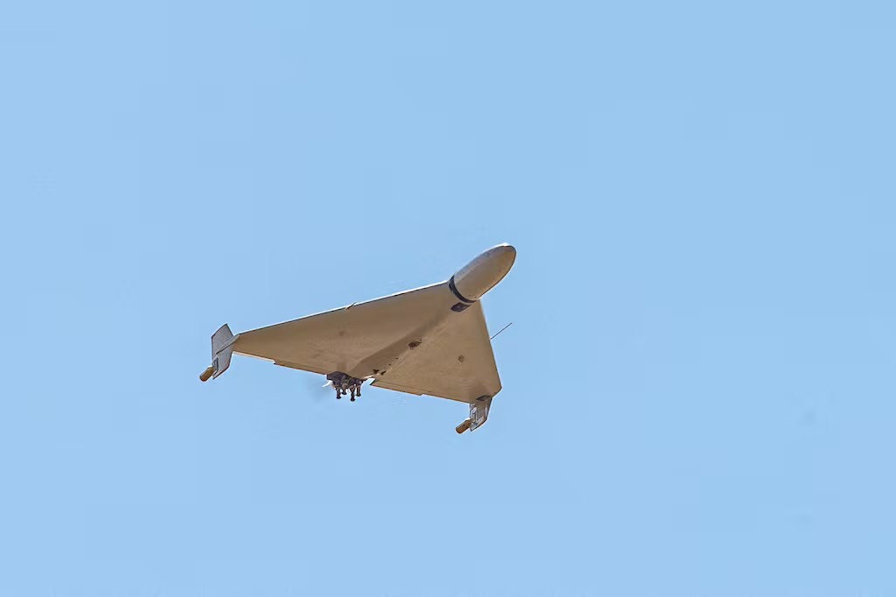
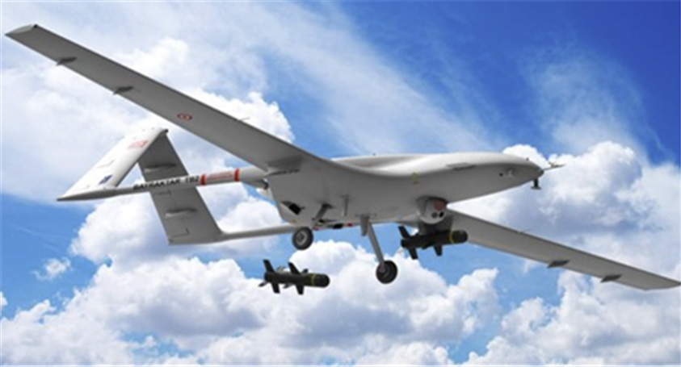
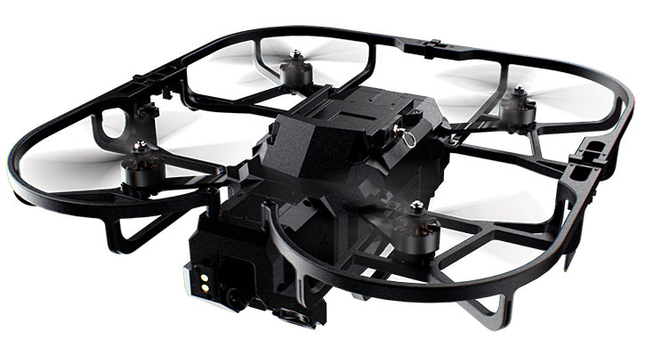
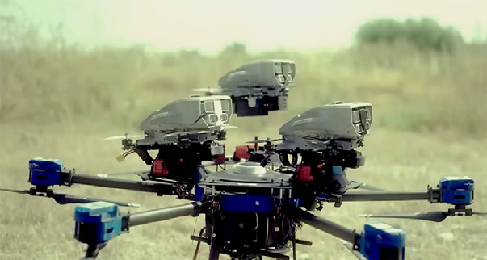
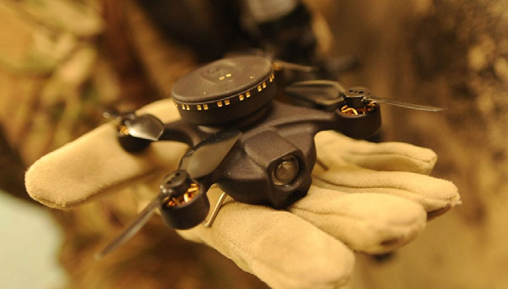

# N0620210303

**Source Document:** `N0620210303.pdf`  
**Total Pages:** 9  

---

## --- Page 1 ---

Received | 19 February, 2025

Revised
| 7 August, 2025

Accepted | 14 August, 2025

#### OPEN ACCESS

This is an Open-Access article distributed under 
the terms of the Creative Commons Attribution 
Non-Commercial License (http://creativecommons. 
org/licenses/by-nc/4.0) which permits unrestricted 
noncommercial use, distribution, and reproduction 
in anymedium, provided the original work is 
properly cited.

ⓒ Society of Disaster Information All rights reserved.

#### ABSTRACT

Purpose: This study aims to analyze the military applications of Unmanned Aerial Systems (UAS) in 
recent armed conflicts. It seeks to demonstrate how UAS have evolved into a strategic core asset in 
modern warfare. Method: A literature-based analysis was conducted focusing on the wars in Ukraine
–Russia, Armenia–Azerbaijan, and Israel–Hamas. The study compared and examined drone 
deployment methods and technical characteristics across different phases of military operations. 
Result: UAS were found to perform diverse tasks reconnaissance, strike, resupply, and electronic 
warfare in an integrated manner, thereby enhancing combat effectiveness. Notably, autonomous flight 
capabilities and low-cost platforms contributed to operational agility and sustainability. Conclusion: 
Unmanned aerial systems are no longer auxiliary tools, but strategic assets reshaping the very concept 
of military operations. Future military strategies must be redesigned with UAS as central elements of 
force structure.

Keywords: Unmanned Aerial Systems, Modern Warfare, ISR-Strike Integration, Loitering Munition,

Electronic Warfare, AI-enabled Battlefield Management

요 약

연구목적: 본 연구는 최근 분쟁에서 무인항공기(UAS)의 군사적 활용 양상을 분석하는 것을 목적으로 
한다. 이를 통해 UAS가 현대전에서 전략적 핵심 전력으로 진화하고 있음을 밝히고자 한다. 연구방법:

우크라이나‑러시아, 아르메니아‑아제르바이잔, 이스라엘‑하마스 전쟁 사례를 중심으로 문헌 분석을

실시하였다. 작전 단계별 드론 활용 방식과 기술적 특징을 비교·검토하였다. 연구결과: UAS는 정찰, 타
격, 보급, 전자전 등 다양한 임무를 유기적으로 수행하며 전투 효율을 높이고 있었다. 특히 자율비행과

저비용 플랫폼은 작전의 기민성과 지속성을 강화하는 데 기여하였다. 결론: 무인항공기는 더 이상 보조

적 장비가 아니라, 작전 개념 전반을 바꾸는 전략적 자산이다. 향후 군사 전략 수립 시 중심 전력으로서
의 재설계가 필요하다.

#### 핵심용어: 무인항공기, 현대전, 정찰 및 타격 연계, 자폭 드론, 전자전, AI 기반 전장 관리

#### KOSDI

ISSN : 1976-2208(Print)
ISSN : 2671-5287(On-line)
www.sodi.or.kr

Journal of the Society of Disaster Information

Vol. 21, No. 3, pp. 515-523, September 2025 
https://doi.org/10.15683/kosdi.2025.9.30.515

Original Article

현대 분쟁에서 무인항공기의 군사적 활용 전략: 사례 기반 분석

Strategic Military Applications of Unmanned Aerial Systems in Modern 
Warfare: A Case-Based Analysis

차순형1*ㆍ김경태2ㆍ서주희3

Soonhyeong Cha1*, Kyeongtae Kim2, Juhui Seo3

1Researcher, Protective Engineering, Seoul National University of Science and Technology, Seoul, Republic of Korea

2Researcher, Protective Engineering, Seoul National University of Science and Technology, Seoul, Republic of Korea

3Researcher, Protective Engineering, Seoul National University of Science and Technology, Seoul, Republic of Korea

*Corresponding author: Soonhyeong Cha, soonhyeong2@naver.com

## --- Page 2 ---

516
KOSDI

Journal of the Society of Disaster Information | Vol. 21, No. 3, September 2025

서 론

최근 무력 분쟁에서 무인항공기(Unmanned Aerial System, 이하 UAS)의 역할은 보조적 전력에서 핵심 전력으로 빠르게

전환되고 있다. 초기에는 정찰과 감시 임무에 제한적으로 활용되던 무인기는, 이제 자폭 공격, 전자전, 보급 및 병력 보호 임

무까지 수행하며 현대전의 전술 구조를 근본적으로 변화시키고 있다. 특히 다양한 전장 환경에서 무인기의 실질적 운용 결과

가 축적되면서, 단순 기술적 가능성을 넘어 전력 구성의 중심 요소로 자리매김하고 있다.

#### 본 연구에서는 이러한 흐름을 반영하여, 먼저 UAS의 개념과 주요 운용 특징, 군사적 분류 체계를 고찰한다. 이어 우크라이

나-러시아 전쟁, 아르메니아-아제르바이잔 전쟁, 이스라엘-하마스 전쟁 등 주요 분쟁 사례를 중심으로 실제 운용 양상을 분

석한다. 각 사례는 정찰·타격·보급·전자전이라는 연속적인 작전 흐름 속에서 드론이 수행한 구체적 역할을 중심으로 서술되

며, 무인기의 전술적 활용이 어떻게 전략적 성과로 이어졌는지를 중심으로 검토된다.

나아가 사례 간 비교를 통해 무인기의 운용 방식이 단일 임무 수행을 넘어, 다양한 플랫폼과 결합하여 다층적 전쟁 구조를

형성해가는 과정을 살펴보고자 한다.특히 정보 수집부터 목표 식별, 타격, 그리고 사후 효과 분석에 이르기까지, 하나의 연속

된 작전 과정 속에서 무인항공기가 어떤 역할을 맡고 있으며, 그 기능이 어떻게 유기적으로 연결되어 작동하는지를 중심으로

살펴본다. 이를 통해 무인기가 단순한 기술 장비를 넘어, 전장의 운영 방식과 군사 교리 자체를 변화시키는 중요한 전환점으

로 작용하고 있음을 보여주는 것이 본 연구의 목적이다.

본 론

무인항공기의 개념

무인항공기의 정의와 특징

무인항공기(Unmanned Aerial System, 이하 UAS)는 사람 없이 원격으로 조종되거나 자율 비행이 가능한 항공 체계를 의

미한다. 일반적으로 ‘항공기’는 ｢항공안전법｣제2조 제6호에 따라 '사람이나 물건을 운반할 수 있는 장치로서 공기의 반작용

#### 에 의해 비행할 수 있는 기기'로 정의되며, UAS는 이에 해당하되 사람이 탑승하지 않는다는 점에서 유인항공기와 법적·운용

상 차이를 가진다. 국내에서는 ｢드론법｣ 및 ｢항공안전법｣ 시행규칙에 따라 일부 무인 비행 장치를 제한적으로 항공기 범주

에 포함하고 있으며, 일정 규모 이상의 드론에 대해서는 등록 및 운항 규제가 적용된다.

#### 무인항공기(UAS)는 조종사가 직접 탑승하지 않고, 원격 제어 또는 자율 비행으로 임무를 수행하는 항공 체계로 정의된다.

정찰, 감시, 타격, 통신 중계, 수송 등 다양한 군사적 임무에 폭넓게 활용되며, 특히 위험 지역에 투입이 가능하다는 점에서 유

인항공기 대비 전략적 장점이 크다. 주요 특징으로는 우선, 인명 피해를 줄일 수 있는 비접촉 운용이 가능하다는 점이 있으며,

고정밀 센서와 통신 장비를 통해 실시간 정보 수집과 표적 타격이 가능하다. 또한 상대적으로 제작과 유지비가 낮아, 국가뿐

아니라 비국가 행위자들도 쉽게 접근할 수 있는 저비용 고효율 무기체계로 주목받고 있다.

#### 최근에는 모듈형 장비 통합, AI 기반 자율 비행 시스템의 적용 등을 통해 정찰·공격·전자전·수송 기능을 한 플랫폼에 융합

#### 한 다목적 운용체계로 진화하고 있다. 이와 같은 UAS의 복합 운용 능력은 작전 환경의 유연성, 지휘 체계의 효율성, 전술적

기민성을 동시에 향상시키는 요인으로 작용하고 있다.

## --- Page 3 ---

KOSDI
517

Soonhyeong Cha et al. | Strategic Military Applications of Unmanned Aerial Systems in Modern Warfare: A Case-Based Analysis

#### 군사적 UAS의 분류

#### 군사 분야에서 운용되는 무인항공기(UAS)는 통상적으로 운용 목적, 기술 사양, 체공 고도 및 작전 범위 등을 기준으로 다

양한 방식으로 분류된다. NATO는 UAS를 체급 기준으로 Class I~III로, 미국 국방부(DoD)는 작전 반경과 중량 기준으로

Group 1~5 체계로 분류한다. 또한 STANAG 4586과 같은 연합군 운용 프로토콜은 무인체계 간 상호 운용성을 위한 통신 표

준 체계를 제공한다.

본 논문에서는 실전 활용 사례를 바탕으로 임무 성격에 따른 분류 체계를 중심으로 다음과 같이 정리하였다:

#### (1) 정찰 및 감시용 UAS: 적의 병력·장비 배치, 지형 정보 등을 수집하여 전장 상황 파악을 지원하며, EO/IR 센서, 레이더,

통신감청 장비 등을 탑재한다.

(2) 공격용 UAS: 고가치 표적(HVT: High-Value Target) 타격, 근접항공지원(CAS), 폭탄·미사일 운용 등 직접 전투 임

무를 수행한다.

(3) 전자전 UAS: 적 통신망 및 레이더 체계를 교란하거나 무력화하는 임무를 수행하며, 재밍(jamming), 스푸핑

(spoofing) 등의 전자 공격 능력을 갖춘다.

(4) 복합 다기능형(Multi-role) UAS: 정찰, 타격, 통신 중계, 전자전 등 복수의 임무를 하나의 플랫폼에서 통합 수행할 수

있도록 설계된 무인기로, Bayraktar TB2, MQ-1C Gray Eagle, Hermes 900 등이 대표적이다. 이들은 주로 NATO

Class III 또는 DoD Group 4~5로 분류되며, 장기 체공과 AI 기반 자율 임무 수행 기능을 갖추고 있어 유무인 복합 작

#### 전(MUM-T)에도 적합하다.

#### 현대 분쟁에서의 무인항공기(UAS) 활용 사례

우크라이나-러시아 전쟁 사례

#### 러시아의 전면 침공 이후 우크라이나 전장은 세 유형의 경량 무인항공기(UAS)가 전투 흐름을 좌우했다. 첫째, FPV 드론

은 원래 레이싱용 기체를 군용으로 개조해, 조종자가 1인칭 영상을 실시간으로 받아 보며 최대 12 km 떨어진 이동 표적까지

정밀 타격할 수 있는 소형 무기 플랫폼으로 진화했다. 둘째, 자폭형 드론 가운데 대표적인 Shahed-136은 Fig. 1에 보이듯 약

2,000 km의 항속 거리와 2만 달러 안팎의 단가 덕분에 고가 유도탄보다 월등한 비용-효과성을 확보한 채 목표물에 돌진해 스

Fig. 1. Shahed-136(Borsari, 2024)

*Caption/Context: KOSDI 517 | 러시아의 전면 침공 이후 우크라이나 전장은 세 유형의 경량 무인항공기(UAS)가 전투 흐름을 좌우했다. 첫째, FPV 드론*

## --- Page 4 ---

518
KOSDI

Journal of the Society of Disaster Information | Vol. 21, No. 3, September 2025

스로 폭발한다. 셋째, 체공형 드론은 목표 지역 상공을 순항하다가 기회를 포착해 급강하 자폭을 감행하도록 설계되었으며,

미국의 Switchblade 300/600과 러시아의 Lancet 계열이 대표적이다.

우크라이나군은 이들 드론을 통해 전장 감시 정보의 86 % 이상을 확보했고, 바흐무트 상공에는 상시로 약 50대의 드론이

체공했다. 또한 ‘드론 군(Army of Drones)’ 이니셔티브를 통해 자원봉사·기업·워크숍이 결합 된 수평적 생산 네트워크를 구

축함으로써 2023년 8월 기준 전선 투입 드론의 90 %를 자체 공급했다. 반면 러시아는 중앙집중식 방산 체계를 통해 국산화

를 가속하며 뒤늦게 추격 중이다. 결과적으로 양측은 모두 저가·소모성 드론을 대량 투입해 전술 기민성과 화력 정밀도를 끌

어올렸지만, 드론 한 기체가 평균 여섯 번도 채 비행하지 못하고 소모되는 ‘드론을 탄약처럼 쓰는’ 소모전 양상을 고착시켰다

(Kunertova, 2023).

아르메니아-아제르바이잔 전쟁 사례

2020년 제2차 나고르노-카라바흐 전쟁에서 아제르바이잔은 무인항공기를 적극적으로 활용하여 전황을 유리하게 전개한

대표적 사례를 보여주었다. 아제르바이잔군은 터키제 Bayraktar TB2 공격형 드론과 이스라엘제 Harop 등 다양한 무인기

Fig. 2를 병행 투입하였으며, 이들은 각각 특화된 임무를 통해 정찰, 식별, 타격의 전 과정을 유기적으로 수행하였다(Choi,

#### 2024).

Bayraktar TB2
Harop

Fig. 2. Attack drones operated by Azerbaijan(Seo et al., 2022)

Bayraktar TB2는 개전초 아제르바이잔군이 전쟁의 주도권을 잡는데 가장 크게 기여한 드론으로 나고르노 카라바흐 지역

에 투입되어 24일 동안 Table 1과 같이 아르메니아군에 약 10억 달러 이상의 피해를 줬다.

Table 1. Azerbaijani attack drones' key achievements (Seo et al., 2022)

전략시설
전차
장갑차
포/자주포
다련장로켓

21개소
138
49대
167대
90대

레이더시스템
전자시스템
지프/트럭
지대공미사일시스템

16대
2대
386대
31대

하롭은 이스라엘 IAI사가 개발한 드론으로 주요 제원은 길이 2,5m, 날개폭 3m, 작전반경 1,000km, 체공시간 6시간이다.

하롭은 발사대에서 이륙하여 상공에서 비행을 하다가 목표에 자폭하는 공격 드론으로 아제르바이잔군은 2011년에 하롭을

*Caption/Context: 2020년 제2차 나고르노-카라바흐 전쟁에서 아제르바이잔은 무인항공기를 적극적으로 활용하여 전황을 유리하게 전개한 | 대표적 사례를 보여주었다. 아제르바이잔군은 터키제 Bayraktar TB2 공격형 드론과 이스라엘제 Harop 등 다양한 무인기*

## --- Page 5 ---

KOSDI
519

Soonhyeong Cha et al. | Strategic Military Applications of Unmanned Aerial Systems in Modern Warfare: A Case-Based Analysis

도입하였다. 아제르바이잔은 이러한 무인기 운용을 통해 제공권을 장악하고, 아르메니아의 방공·기갑 전력을 우회 및 제거

함으로써 전장 주도권을 확보하였다. 또한, 소셜미디어 등 다양한 채널을 통해 드론 작전 영상을 실시간으로 공개하며 심리

전과 정보전 측면에서도 무인기를 전략적으로 활용하였다(Seo et al., 2022).

이스라엘-하마스 전쟁 사례

하마스는 소형 쿼드콥터 드론을 대량 투입해 이스라엘 국경 감시 카메라와 포탑을 기습 공격하는 ‘드론 스워밍’ 전술을 구

사했다. 아이언 돔 방어망으로 모든 드론을 요격할 수는 없었고, 이 과정에서 다수의 드론이 목표물에 돌진하며 초기 기습 효

과를 거두었다. 이에 이스라엘군은 가자지구 작전 시 FireFly 체공형 드론을 활용하여 하마스 병력 분포를 실시간 모니터링

하고, 정밀타격 명령을 신속히 하달했다. FireFly는 무장 상태에서 약 15분간 임무 수행이 가능하며, 표적을 발견하면 상공에

서 70 km/h 속도로 급강하 공격을 감행한다.

후속 작전에서는 개인 휴대 체공형 드론을 비롯해, Fig. 3의 MagicFly, Lanius, Xtender 같은 실내 감시·공격용 드론을 동

원해 도시·터널 내부를 탐색했다(Jeong, 2025).

MagicFly
Lanius
Xtender

Fig. 3. Israeli indoor surveillance and attack drones (Eshel, 2024)

#### 이들 소형 드론은 GPS가 차단된 환경에서도 자율비행이 가능하며, 건물 내부 정찰 후 즉시 핀포인트 자폭 또는 동시다발

공격으로 부수적 피해를 최소화했다.

#### 현대 분쟁 사례 기반 무인항공기(UAS) 운용 전략 비교 분석

#### 분쟁별 UAS 운용 양상 비교

#### ISR 드론은 Intelligence, Surveillance, Reconnaissance Drone(정보·감시·정찰 드론)의 약칭으로, 정보 수집·실시간 감

#### 시·전장 정찰을 목적으로 운용되는 UAS를 의미한다. 우크라이나 전장에서는 2022년 이후 FPV 소형 쿼드콥터가 빠르게 보

급되며, 기존 DJI Mavic 등 초기 상용 ISR 드론(2014년 전선에서 ‘비교적 고가’로 운용된 약 2,000 달러 급 기종) 중심 구조

에서 저비용·다기능 FPV 플랫폼을 ‘보편적 기본 플랫폼(universal platform)’으로 전환하는 추세가 확립되었다. FPV 플랫

폼(Multi-role FPV Platform)은 First-Person View(1인칭 시점) 드론 기술을 기반으로 하여, 단일 플랫폼에서 여러 전술·작

#### 전 임무를 수행할 수 있도록 설계된 소형 무인기 체계를 의미한다. 이러한 FPV는 장착 모듈(카메라, 폭발물/투하 장치, 릴레

#### 이 모듈, AI 인식 모듈)을 교체함으로써 정찰·폭격·중계·표적 인식 역할을 단일 프레임에서 수행하도록 발전하였다. AI 모듈

#### (카메라+칩) 부착으로 자율 항법과 자동 표적 인식(ATR)이 구현되어 ‘센서→결정→타격’ 고리를 단축하고, 운영자는 ‘전 처

*Caption/Context: 하고, 정밀타격 명령을 신속히 하달했다. FireFly는 무장 상태에서 약 15분간 임무 수행이 가능하며, 표적을 발견하면 상공에 | 서 70 km/h 속도로 급강하 공격을 감행한다.*

*Caption/Context: 하고, 정밀타격 명령을 신속히 하달했다. FireFly는 무장 상태에서 약 15분간 임무 수행이 가능하며, 표적을 발견하면 상공에 | 서 70 km/h 속도로 급강하 공격을 감행한다.*

*Caption/Context: 하고, 정밀타격 명령을 신속히 하달했다. FireFly는 무장 상태에서 약 15분간 임무 수행이 가능하며, 표적을 발견하면 상공에 | 서 70 km/h 속도로 급강하 공격을 감행한다.*

## --- Page 6 ---

520
KOSDI

Journal of the Society of Disaster Information | Vol. 21, No. 3, September 2025

#### 리된 정보’를 수신하는 구조로 전환되고 있다. 또한 ‘모선 고정익 드론 + 다수 FPV 분리 투입’ 방식과 심층 공격용 장거리 드

론의 병행 운용은 계층화된 무인체계 포트폴리오를 형성하며, 해상 ·지상 무인체계와 함께 다영역 통합 운용으로 확장되고

있다(Allen, 2025).

#### 2020년 44일간의 나고르노‑카라바흐 전쟁은 UCAV(터키·이스라엘제) + 전자전 + 간접 화력(체공형 자폭탄) +

#### SEAD/DEAD의 결합을 통해 제한된 지리·공역 조건에서 공중 통제의 재확인이 결정적 승패 요인으로 기능함을 보여주었

#### 다. 아제르바이잔은 UCAV 투자로 아르메니아 방공·기갑 전력을 지속 압박하여 균형 붕괴→속도 있는 결정’을 구현했고, 이

#### 는 ‘혁명’이라기보다 기존 공력 원리의 최적 환경 적용이라는 분석이 제시된다. 핵심은 플랫폼 자체보다 다기능 UCAV, 전

자전 및 간접 화력의 동시 조율이었으며, 이러한 다층 결합이 Air Littoral 장악을 통해 지상 기동과 심리·정보 효과까지 확장

되었다(Whelan, 2023) .

#### 이스라엘‑하마스 전쟁에서는 이스라엘 국방군(IDF)은 2021년부터 위성·UAS 영상과 통신·오픈소스 데이터를 AI로 처리

해 고가치 표적 리스트를 사전에 생성하는 Habsora와 전쟁 발발 후 수천 건의 하마스 전투원 표적을 매일 자동 추출하며 표적

은행을 대폭 확장한 Lavender를 순차 도입하며 AI 기반 표적 생성·추천 체계를 구축했다. 이와 동시에 Iron Dome 방공 시스

#### 템은 저고도 레이더·EO/IR·RF 센서로 위협을 탐지·분류하고, AI가 자동으로 우선순위를 매겨 표적 대응 명령을 즉시 실행

함으로써 ‘감지→판단→타격’ 사이클을 크게 단축했다. 특히 AI가 OODA 순환의 Observe(관측)–Orient(판단) 단계를 자

동화함으로써, 전술 의사결정 사이클이 ‘분 단위’에서 ‘초 단위’로 압축되어 동시다발 표적 처리가 가능해졌다. 이러한 자동

화·속도 지향 전술은 전술적 즉응성을 극대화한 반면, 민간인 피해 증가와 책임 소재 불명확 문제를 심화시키며 국제인도법

#### 위반 논쟁을 촉발했다. 결과적으로 AI-기반 센서-결정-타격 루프의 통합적 단축은 전장 반응 속도를 대폭 향상시켰지만, 동

시에 AI 무기 체계 운용에 대한 명확한 승인·검증 절차와 윤리·법제적 틀의 재정비를 시급한 과제로 제기했다(Düz, 2025).

기술적·작전적 진화 요소

#### 1) AI 기반 결정 루프 압축

#### 우크라이나 전장에서 FPV·개조형 소형 드론과 중형 MALE/UCAV 지속 감시 자산이 결합하고 온보드/전술급 전처리

(ATR) 및 AI 표적 추천·우선순위 산출 모듈이 적용되면서 센서‑결정‑타격 주기가 OODA 루프의 Observe–Orient 구간을

단축하는 형태로 “분 단위→초 단위”로 압축되는 작전 템포 가속이 관찰된다.

이 과정에서 인간 개입은 ‘승인·규범적 검토’로 재위치되고 동시에 자동화 심화가 표적 식별 오류·책임 추적 공백을 확대

한다는 윤리·법적 재검토 요구가 제기된다.

2) 저비용 모듈·다층 아키텍처 확립

#### COTS 기반 FPV 프레임, 범용 비행 컨트롤러, 교체형 페이로드, 3D 프린팅 부품, 상업 통신 링크 결합은 단가를 수백~천

달러대로 유지하며 손실 전제 짧은 학습‑개량 사이클을 구조화하여 고가 전통 플랫폼에 대한 비용 곡선 역전을 가능케 한다.

#### 나고르노‑카라바흐에서 입증된 “UCAV(지속 ISR·정밀타격) – 체공형 자폭탄 – 소형 정찰 드론” 역할 분할 모델이 우크

#### 라이나에서 ‘심층(장거리 자폭·해상/지상 무인체계) – 중간(MALE/UCAV 지속 감시) – 근접(FPV·소형 체공탄)’ 다층 임

무 분해로 확장되며 재할당 탄력성과 전력 구성 모듈화를 심화시켰다.

## --- Page 7 ---

KOSDI
521

Soonhyeong Cha et al. | Strategic Military Applications of Unmanned Aerial Systems in Modern Warfare: A Case-Based Analysis

3) MUM‑T·표준화·Air Littoral 네트워크화

유인 헬기·고정익 플랫폼은 위험 외곽에서 다중센서 허브·지휘 노드로 기능하고 무인 플랫폼은 종말·고위험·반복 임무를

#### 분담하는 MUM‑T 구조가 확산되며 상호운용 표준 적용이 ‘플러그형 재편’과 동적 “자산 풀” 교리 전환을 촉진한다.

동시에 Air Littoral 공역은 드론·자폭형 무기·FPV 시스템이 집중 투사되는 공중 전술 격전지로 인식된다. David Deptula

등이 2020년대 들어 이 개념을 정립하였으며, 우크라이나 전장에서 소형 드론 전술 운용이 이를 실증적으로 강화시켰다.

#### NATO 및 미 국방부도 지표면~500 m 이하 공간을 ‘전술 드론의 격전장’으로 규정하고 이 개념을 채택 중이다. 저층 공역에

서는 FPV·체공형 자폭 플랫폼·실내·지하 특화 초소형 드론이 수십~수백 기체 규모로 투입되어, 좁은 공역(예: 1 km2당 50여

기체)에서 시간당 10회 이상의 순환 비행을 수행하는 수준의 ‘고밀도 활동’을 보인다(우크라이나 동부 전선 사례). 이러한 작

#### 전 밀도는 방어망 포화를 유발하고 표적 탐지 및 대응 시간을 단축 시켜 전술 ISR과 상부 타격의 연계 효율을 극대화한다.

아울러 이 저층 공역 점유는 적군의 사기 저하, 의사결정 지연, 정보 교란 등 구체적인 심리전 효과를 낳는다. 예컨대, 반복

적 저고도 침투가 방어 자산의 피로를 가중시키고, 실시간 목표 정보의 신뢰도를 떨어뜨리며, 최종적으로 지휘 계층의 결단

을 지연시키는 것으로 보고되었다.

#### 4) 방어(C‑UAS)·확산·거버넌스 적응

#### 다층 C‑UAS 방어(저고도 레이더·EO/IR·RF·음향 탐지 → AI 위협 스코어링 식별 → 소프트킬·하드킬 통합)가 전개되지

만 저가 다수·경로 다변화·파상 투발이 비용·채널 포화 격차를 남겨 완전 상쇄를 지연시킨다.

#### COTS(Commercial Off-The-Shelf; 민간 시판 장비)는 본래 군수 전용이 아닌 일반 상업 시장에서 판매되는 하드웨어·소프

트웨어를 뜻하며, 대량 생산으로 비용이 저렴하고 구매 절차가 간소화되어 비국가 행위자도 손쉽게 확보할 수 있다. 이러한

#### COTS의 접근성은 AI 자동화와 결합해 ‘정찰–심리전–소규모 정밀 타격’에 이르는 미니 체인의 구축을 용이하게 만든다.

한편, 데이터 위변조나 펌웨어 무단 수정 방지를 위해 추적 가능한 펌웨어 서명과 감사 로그 기반의 책임성·투명성 규범 정

비가 전략적 필수 과제로 부상하고 있다.

전략적 시사점

1) 결심(Decision)·지휘 통제(C2) 교리 정립

온보드/전술급 전처리와 AI 표적 추천 체계가 OODA(Observe – Orient – Decide – Act)의 初段(Observe – Orient 단

계)을 부분 자동화하면서 ‘Human on/over the loop’의 행위·승인 임계를 교범에 명시하고 책임 경로를 제도화하는 교리 재

정비가 필수화된다.

#### 결정 루프 단축은 전술 수준의 “분→초” 응답을 작전·전략 억지 요소로 승격시키므로, C2는 센서–데이터 파이프라인–

우선순위 엔진–실시간 배분으로 구성된 소프트웨어 중심 지휘 체계로 재설계되어야 한다.

2) 비용·획득 및 산업 기반 전략

#### 저비용 소모형(FPV·소형 체공탄)과 중형 지속 자산(MALE/UCAV) 혼합 포트폴리오는 ‘소수 고가 플랫폼 = 전투력’ 패

러다임을 약화 시키고 다품종·단주기 조달 + 모듈 수준 업그레이드 체계를 획득 정책 표준으로 부상시킨다.

#### 역할 분할의 교리화는 플랫폼 단위 수명주기 관리에서 센서·페이로드·AI 모델(소프트웨어) 단위 라이프사이클 관리로 초

## --- Page 8 ---

522
KOSDI

Journal of the Society of Disaster Information | Vol. 21, No. 3, September 2025

점을 이동시키며, 이에 따라 인증·갱신 절차를 ‘기체 재인증’이 아니라 ‘모델/모듈 신속 검증·배포’ 형태로 경량화할 제도 개

선이 요구된다.

3) 전력 구조 및 편성 재설계

#### 다층 임무 분해(심층–중간–근접)와 모듈형 COTS 드론의 대량 보급은 전통적 플랫폼 중심 ORBAT을 동적으로 재할당

가능한 자산 풀 개념으로 전환하도록 요구하며, 전력 설계의 기준을 ‘기체 유형’이 아니라 ‘재편성 속도·네트워크 결속도·데

이터 흐름 지연’으로 재정의한다.

#### 나고르노‑카라바흐에서 검증된 UCAV–체공형 자폭탄–정찰 분업 구조는 후속 분쟁에서 표준화된 임무 패키지로 모방

되며, 연합·결합 작전에서 사전 조립된 다층 패키지 편성 교리화를 가속 시킨다.

#### 4) 방어(C‑UAS)·확산·거버넌스 대응

저가 다수·다 경로·파상 투발이 비용 곡선을 공격 측에 유리하게 유지하는 한, 방어 전략은 고가 요격체 중심에서 저단가

하드킬(레이저·소형 요격 드론·Kinetic Micro‑Interceptor) + 지능형 위협 우선순위 엔진 결합으로 전환해야 한다.

#### AI 기반 표적 생성·교전 자동화는 설명 가능성·감사 로그·모델 변경 기록을 포함한 감사 가능성 규범 및 인간 감독 최소 기

준의 법제화를 촉발하며, 비국가 행위자의 ‘정찰–심리전–소규모 정밀 타격’ 미니 체인 확산은 하드웨어 수출통제에서 데

이터·펌웨어 추적·원격 업데이트 통제를 포함한 다층 확산 억제 프레임으로 정책 범위를 확장할 필요성을 부각한다.

결 론

#### 최근의 주요 분쟁에서 확인된 바와 같이, 무인항공기(UAS)는 이제 단순한 정찰 수단이나 고비용 전력의 보완재가 아닌,

전장의 흐름을 주도하는 핵심 전력으로 자리 잡고 있다. 본 연구는 우크라이나‑러시아, 아르메니아‑아제르바이잔, 이스라엘‑

#### 하마스 전쟁을 사례로 하여, 각기 다른 지형과 전략 환경 속에서 UAS가 수행한 작전적 역할을 살펴보았다. 각 사례에서 드론

은 정찰과 타격을 넘어 보급, 전자전, 정보전, 심리전 등 작전 전반에 걸쳐 유기적으로 투입되었으며, 이는 기존의 군사작전

개념과 교리를 재편하고 있음을 보여준다.

특히, 단일 플랫폼이 다중 임무를 수행하거나, 다양한 드론들이 층위별로 분산 배치되어 유기적으로 결합하는 운용 방식

#### 은 과거의 ‘전통적 전력 위계’를 대체할 수 있는 새로운 구조로 평가된다. 기술적으로는 AI 기반 표적 식별, 온보드 전처리,

저비용 모듈화 같은 요소들이 결합 되면서, 센서–결정–타격의 루프가 빠르고 정밀하게 작동하게 되었고, 이는 전술적 기민

성을 크게 향상시켰다. 나아가 이런 구조는 단순한 무기체계의 진화를 넘어서, 인간의 개입 방식, 결심 체계, 윤리적 책임의

위치까지 재정의하도록 요구하고 있다.

무인항공기의 전략적 가치는 단순히 새로운 기술의 도입에 그치지 않는다. 그것은 작전 계획의 방식, 전력 운용의 구조, 그

리고 전쟁 수행의 전반적인 패러다임을 변화시키고 있다는 점에서 근본적인 전환을 의미한다. 본 연구에서 분석한 각 분쟁

#### 사례들은 이러한 변화를 다양한 방식으로 드러내고 있으며, UAS가 더 이상 보조적 수단이 아니라 작전 주도권을 결정짓는

#### 핵심 요소로 작동하고 있음을 확인할 수 있었다. 이러한 흐름은 향후 무력 분쟁에서 UAS의 역할이 더욱 복합적이고 결정적

#### 인 방향으로 진화할 것임을 강하게 시사한다. 따라서 향후 군사 전략과 작전 개념을 수립함에 있어, UAS는 단순한 전력의 일

## --- Page 9 ---

KOSDI
523

Soonhyeong Cha et al. | Strategic Military Applications of Unmanned Aerial Systems in Modern Warfare: A Case-Based Analysis

부가 아니라 전쟁 전체를 설계하는 중심축으로 기획되어야 하며, 이는 향후 안보 환경 변화에 대응하는 데 있어 중요한 출발

점이 될 것이다.

References

[1] Allen, G.C. (2025). The Russia-Ukraine Drone War: Innovation on the Frontlines and Beyond. Debate, CSIS, pp.1-5.

[2] Borsari, F. (2024). “Russia’s Shahed-type drones are losing their bite in Ukraine.” Defense News, Aug 27, 2024.

[3] Choi, Y.I. (2024). Verification of the Three Core Effects of the Drone Revolution. Master Thesis, Graduate School,

Wonkwang University.

[4] Düz, S., Koçakoğlu, M.S. (2025). Deadly Algorithms: Destructive Role of Artificial Intelligence in Gaza War. SETA

Report, pp.20, 29-32.

[5] Eshel, T. (2024). “Israel’s indoor surveillance and attack drones.” Defence Update, Jun 19, 2024.

[6] Jeong, G.S. (2025). Development Strategies for Firepower Operations in Unmanned and Manned Hybrid Combat

Systems. Master Thesis, Department of Defense Power Studies, Graduate School of Defense Science, Hansung 
University.

[7] Kunertova, D. (2023). “Drones have boots: Learning from Russia’s war in Ukraine.” Contemporary Security Policy,

Vol. 44, No. 4, pp. 576-591.

[8] Seo, K., Cho, S.K., Kim, J. (2022). “Development of drone combat system focusing on the Azerbaijan-Armenia war.”

Journal of The Korean Institute of Defense Technology Vol. 4, No. 3, pp. 1-7.

[9] Whelan, C. (2023). “The 2020 Nagorno Karabakh war: Unmanned combat aerial vehicles in modern warfare. Air and

Space Power Review, Vol. 25, No. 2, pp. 48-70.
